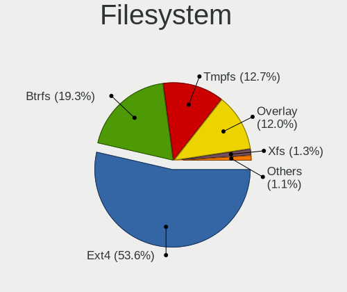
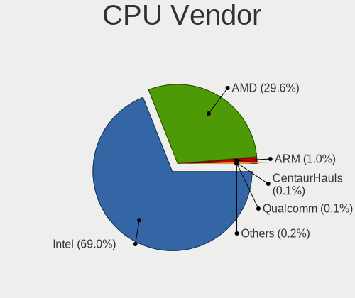
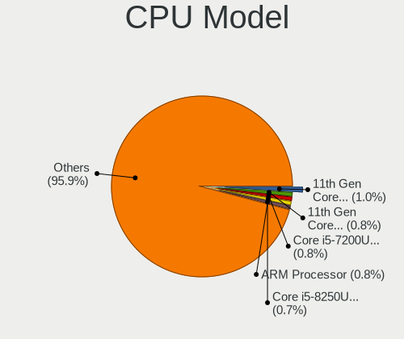
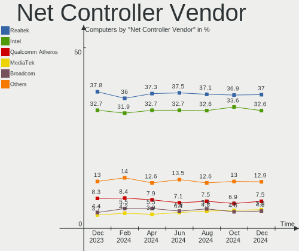

Linux Hardware Trends
---------------------

A project to identify most popular hardware characteristics and track their change
over time based on data collected by Linux users at https://Linux-Hardware.org.

Anyone can contribute to the study by uploading probes of their computers by
the [hw-probe](https://github.com/linuxhw/hw-probe) tool:

    sudo hw-probe -all -upload

This is a report for all computer types. See also reports for [desktops](/Desktop/README.md) and [notebooks](/Notebook/README.md).

Full-feature report is available here: https://linux-hardware.org/?view=trends

Distribution-specific reports: [Ubuntu](/Dist/Ubuntu), [ROSA](/Dist/ROSA), [Mint](/Dist/Mint), [Fedora](/Dist/Fedora), [BlackPanther](/Dist/BlackPanther), [Arch](/Dist/Arch), [Manjaro](/Dist/Manjaro), [Debian](/Dist/Debian), [Endless](/Dist/Endless), [Zorin](/Dist/Zorin), [Clear Linux](/Dist/Clear_Linux).

Period: Mar, 2020.

Contents
--------

- [ OS                       ](#os)
- [ OS Family                ](#os-family)
- [ Kernel                   ](#kernel)
- [ Kernel Family            ](#kernel-family)
- [ Kernel Major Ver.        ](#kernel-major-ver)
- [ Arch                     ](#arch)
- [ DE                       ](#de)
- [ Display Server           ](#display-server)
- [ OS Lang                  ](#os-lang)
- [ Boot Mode                ](#boot-mode)
- [ Filesystem               ](#filesystem)
- [ Dual Boot with Linux     ](#dual-boot-with-linux)
- [ Dual Boot (Win)          ](#dual-boot-win)
- [ Country                  ](#country)
- [ City                     ](#city)
- [ Vendor                   ](#vendor)
- [ Model                    ](#model)
- [ Model Family             ](#model-family)
- [ MFG Year                 ](#mfg-year)
- [ Form Factor              ](#form-factor)
- [ Secure Boot              ](#secure-boot)
- [ Coreboot                 ](#coreboot)
- [ RAM Size                 ](#ram-size)
- [ RAM Used                 ](#ram-used)
- [ Drive Vendor             ](#drive-vendor)
- [ Drive Model              ](#drive-model)
- [ Drive Kind               ](#drive-kind)
- [ Drive Connector          ](#drive-connector)
- [ Drive Size               ](#drive-size)
- [ Space Total              ](#space-total)
- [ Space Used               ](#space-used)
- [ Malfunc. Drives          ](#malfunc-drives)
- [ Malfunc. Drive Vendor    ](#malfunc-drive-vendor)
- [ Malfunc. Drive Kind      ](#malfunc-drive-kind)
- [ Failed Drives            ](#failed-drives)
- [ Failed Drive Vendor      ](#failed-drive-vendor)
- [ Drive Status             ](#drive-status)
- [ Storage Vendor           ](#storage-vendor)
- [ Storage Model            ](#storage-model)
- [ Storage Kind             ](#storage-kind)
- [ CPU Vendor               ](#cpu-vendor)
- [ CPU Model                ](#cpu-model)
- [ CPU Model Family         ](#cpu-model-family)
- [ CPU Cores                ](#cpu-cores)
- [ CPU Sockets              ](#cpu-sockets)
- [ CPU Threads              ](#cpu-threads)
- [ CPU Op-Modes             ](#cpu-op-modes)
- [ CPU Microarch            ](#cpu-microarch)
- [ CPU Microcode            ](#cpu-microcode)
- [ GPU Vendor               ](#gpu-vendor)
- [ GPU Model                ](#gpu-model)
- [ GPU Combo                ](#gpu-combo)
- [ GPU Driver               ](#gpu-driver)
- [ GPU Memory               ](#gpu-memory)
- [ Monitor Vendor           ](#monitor-vendor)
- [ Monitor Model            ](#monitor-model)
- [ Monitor Resolution       ](#monitor-resolution)
- [ Monitor Diagonal         ](#monitor-diagonal)
- [ Monitor Width            ](#monitor-width)
- [ Aspect Ratio             ](#aspect-ratio)
- [ Monitor Area             ](#monitor-area)
- [ Pixel Density            ](#pixel-density)
- [ Multiple Monitors        ](#multiple-monitors)
- [ Net Controller Vendor    ](#net-controller-vendor)
- [ Net Controller Model     ](#net-controller-model)
- [ Net Controller Kind      ](#net-controller-kind)
- [ Used Controller          ](#used-controller)
- [ NICs                     ](#nics)
- [ Unsupported Devices      ](#unsupported-devices)
- [ Unsupported Device Types ](#unsupported-device-types)

OS
--

Installed operating systems

| Name              | Computers | Percent |
|-------------------|-----------|---------|
| Ubuntu 18.04      | 1062      | 28.77%  |
| Ubuntu 19.10      | 524       | 14.2%   |
| ROSA R11          | 306       | 8.29%   |
| BlackPanther 18.1 | 224       | 6.07%   |
| Mint 19.3         | 200       | 5.42%   |
| Fedora 31         | 155       | 4.2%    |
| Endless 3.7.8     | 150       | 4.06%   |
| Zorin 15          | 113       | 3.06%   |
| Ubuntu 16.04      | 71        | 1.92%   |
| Arch              | 71        | 1.92%   |
| Ubuntu 20.04      | 56        | 1.52%   |
| Manjaro 19.0.2    | 56        | 1.52%   |
| Manjaro           | 55        | 1.49%   |
| Debian 10         | 45        | 1.22%   |
| KDE neon 18.04    | 41        | 1.11%   |
| Ubuntu 19.04      | 36        | 0.98%   |
| Endless 3.7.7     | 29        | 0.79%   |
| Kali 2020.1       | 24        | 0.65%   |
| BlackPanther 16.2 | 24        | 0.65%   |
| Arch Rolling      | 19        | 0.51%   |
| Elementary 5.1.2  | 18        | 0.49%   |
| ROSA R10          | 16        | 0.43%   |
| Debian Testing    | 14        | 0.38%   |
| MX 20             | 13        | 0.35%   |
| Debian            | 13        | 0.35%   |
| Fedora 30         | 12        | 0.33%   |
| Peppermint 10     | 11        | 0.3%    |
| Zorin 12          | 10        | 0.27%   |
| ROSA R8.1         | 10        | 0.27%   |
| Pop!_OS 19.10     | 10        | 0.27%   |
| Mint 19.2         | 10        | 0.27%   |
| Mint 19.1         | 10        | 0.27%   |
| Manjaro 19.0.1    | 10        | 0.27%   |
| Fedora 32         | 10        | 0.27%   |
| Solus 4.1         | 9         | 0.24%   |
| Clear Linux 32480 | 8         | 0.22%   |
| Mint 4            | 7         | 0.19%   |
| Mint 19           | 7         | 0.19%   |
| Mint 18.3         | 7         | 0.19%   |
| Gentoo 2.6        | 7         | 0.19%   |
| Gentoo            | 7         | 0.19%   |
| Ubuntu            | 6         | 0.16%   |
| Mageia 7          | 6         | 0.16%   |
| Clear Linux 32600 | 6         | 0.16%   |
| Ubuntu 18.10      | 5         | 0.14%   |
| Reborn OS         | 5         | 0.14%   |
| MX 19             | 5         | 0.14%   |
| Debian Unstable   | 5         | 0.14%   |
| CentOS 8          | 5         | 0.14%   |
| CentOS 7          | 5         | 0.14%   |
| RED X4            | 4         | 0.11%   |
| Parrot 4.8        | 4         | 0.11%   |
| openSUSE 15.1     | 4         | 0.11%   |
| Endless 3.7.6     | 4         | 0.11%   |
| Endless 3.3.20    | 4         | 0.11%   |
| Deepin 15.11      | 4         | 0.11%   |
| Clear Linux 32700 | 4         | 0.11%   |
| Clear Linux 32690 | 4         | 0.11%   |
| Sparky 5.10       | 3         | 0.08%   |
| RHEL 8.0          | 3         | 0.08%   |

OS Family
---------

OS without a version

| Name         | Computers | Percent |
|--------------|-----------|---------|
| Ubuntu       | 1764      | 47.79%  |
| ROSA         | 336       | 9.1%    |
| BlackPanther | 248       | 6.72%   |
| Mint         | 246       | 6.66%   |
| Endless      | 205       | 5.55%   |
| Fedora       | 182       | 4.93%   |
| Zorin        | 123       | 3.33%   |
| Manjaro      | 123       | 3.33%   |
| Arch         | 90        | 2.44%   |
| Debian       | 81        | 2.19%   |
| Clear Linux  | 42        | 1.14%   |
| KDE neon     | 41        | 1.11%   |
| Kali         | 26        | 0.7%    |
| openSUSE     | 19        | 0.51%   |
| Elementary   | 19        | 0.51%   |
| MX           | 18        | 0.49%   |
| Gentoo       | 17        | 0.46%   |
| Peppermint   | 13        | 0.35%   |
| CentOS       | 12        | 0.33%   |
| Pop!_OS      | 10        | 0.27%   |
| Solus        | 9         | 0.24%   |
| Deepin       | 7         | 0.19%   |
| Mageia       | 6         | 0.16%   |
| RHEL         | 5         | 0.14%   |
| Reborn OS    | 5         | 0.14%   |
| ClearOS      | 5         | 0.14%   |
| Parrot       | 4         | 0.11%   |
| Sparky       | 3         | 0.08%   |
| RED          | 3         | 0.08%   |
| ArcoLinux    | 3         | 0.08%   |
| Android      | 3         | 0.08%   |
| Void         | 2         | 0.05%   |
| Slackware    | 2         | 0.05%   |
| QTS          | 2         | 0.05%   |
| Manjaro-ARM  | 2         | 0.05%   |
| ArchLabs     | 2         | 0.05%   |
| ALT Linux    | 2         | 0.05%   |
| Rockstor     | 1         | 0.03%   |
| KaOS         | 1         | 0.03%   |
| Generic      | 1         | 0.03%   |
| Ctlos        | 1         | 0.03%   |
| Chrome OS    | 1         | 0.03%   |
| BuildRoot    | 1         | 0.03%   |
| BigLinux     | 1         | 0.03%   |
| Artix        | 1         | 0.03%   |
| Arch32       | 1         | 0.03%   |
| Antix        | 1         | 0.03%   |
| antergos     | 1         | 0.03%   |

Kernel
------

Version of the Linux kernel

| Version                          | Computers | Percent |
|----------------------------------|-----------|---------|
| 5.3.0-40-generic                 | 654       | 17.72%  |
| 5.3.0-42-generic                 | 614       | 16.64%  |
| 5.3.0-28-generic                 | 283       | 7.67%   |
| 4.18.16-desktop-1bP              | 177       | 4.8%    |
| 4.15.0-91-generic                | 166       | 4.5%    |
| 4.15.0-88-generic                | 147       | 3.98%   |
| 4.15.0-desktop-68.5rosa-x86_64   | 121       | 3.28%   |
| 4.15.0-desktop-45.1rosa-x86_64   | 78        | 2.11%   |
| 5.3.0-18-generic                 | 49        | 1.33%   |
| 5.1.15-desktop-1bP               | 46        | 1.25%   |
| 5.5.8-200.fc31.x86_64            | 41        | 1.11%   |
| 4.19.0-8-amd64                   | 37        | 1%      |
| 5.3.0-45-generic                 | 36        | 0.98%   |
| 5.0.0-32-generic                 | 34        | 0.92%   |
| 5.5.7-200.fc31.x86_64            | 28        | 0.76%   |
| 4.15.0-desktop-45.1rosa-i586     | 28        | 0.76%   |
| 4.9.155-nrj-desktop-1rosa-x86_64 | 27        | 0.73%   |
| 5.4.0-4-amd64                    | 25        | 0.68%   |
| 5.4.0-18-generic                 | 25        | 0.68%   |
| 5.5.10-200.fc31.x86_64           | 24        | 0.65%   |
| 5.0.0-38-generic                 | 23        | 0.62%   |
| 5.0.0-23-generic                 | 23        | 0.62%   |
| 4.9.20-desktop-pae-1bP           | 22        | 0.6%    |
| 5.4.23-1-MANJARO                 | 21        | 0.57%   |
| 5.4.0-14-generic                 | 20        | 0.54%   |
| 4.15.0-desktop-68.5rosa-i586     | 20        | 0.54%   |
| 4.19.0-6-amd64                   | 18        | 0.49%   |
| 5.5.8-arch1-1                    | 17        | 0.46%   |
| 5.5.6-201.fc31.x86_64            | 16        | 0.43%   |
| 5.3.0-43-generic                 | 16        | 0.43%   |
| 5.5.8-1-MANJARO                  | 15        | 0.41%   |
| 5.5.11-200.fc31.x86_64           | 15        | 0.41%   |
| 5.4.0-kali4-amd64                | 15        | 0.41%   |
| 5.5.9-arch1-2                    | 13        | 0.35%   |
| 5.3.0-42-lowlatency              | 13        | 0.35%   |
| 5.3.0-40-lowlatency              | 13        | 0.35%   |
| 5.0.0-37-generic                 | 13        | 0.35%   |
| 5.5.6-914.native                 | 12        | 0.33%   |
| 5.4.24-1-MANJARO                 | 12        | 0.33%   |
| 5.4.22-1-MANJARO                 | 12        | 0.33%   |
| 5.5.10-arch1-1                   | 11        | 0.3%    |
| 4.9.60-nrj-desktop-1rosa-x86_64  | 11        | 0.3%    |
| 5.5.11-arch1-1                   | 10        | 0.27%   |
| 5.5.7-1-MANJARO                  | 9         | 0.24%   |
| 4.4.0-176-generic                | 9         | 0.24%   |
| 5.5.7-arch1-1                    | 8         | 0.22%   |
| 5.5.13-1-MANJARO                 | 8         | 0.22%   |
| 5.4.27-1-MANJARO                 | 8         | 0.22%   |
| 5.3.0-7629-generic               | 8         | 0.22%   |
| 4.15.0-88-lowlatency             | 8         | 0.22%   |
| 4.15.0-76-generic                | 8         | 0.22%   |
| 4.15.0-20-generic                | 8         | 0.22%   |
| 5.6.0-2-MANJARO                  | 7         | 0.19%   |
| 5.5.9-918.native                 | 7         | 0.19%   |
| 5.5.7-150.current                | 7         | 0.19%   |
| 5.5.5-200.fc31.x86_64            | 7         | 0.19%   |
| 5.3.7-301.fc31.x86_64            | 7         | 0.19%   |
| 4.9.155-nrj-desktop-1rosa-i586   | 7         | 0.19%   |
| 4.4.0-174-generic                | 7         | 0.19%   |
| 4.18.0-147.5.1.el8_1.x86_64      | 7         | 0.19%   |

Kernel Family
-------------

Linux kernel without a distro release

| Version  | Computers | Percent |
|----------|-----------|---------|
| 5.3.0    | 1728      | 46.82%  |
| 4.15.0   | 675       | 18.29%  |
| 4.18.16  | 177       | 4.8%    |
| 5.0.0    | 118       | 3.2%    |
| 5.4.0    | 112       | 3.03%   |
| 5.5.8    | 93        | 2.52%   |
| 5.5.7    | 64        | 1.73%   |
| 4.19.0   | 62        | 1.68%   |
| 5.5.6    | 48        | 1.3%    |
| 5.1.15   | 47        | 1.27%   |
| 5.5.10   | 46        | 1.25%   |
| 5.5.9    | 39        | 1.06%   |
| 5.5.11   | 38        | 1.03%   |
| 4.9.155  | 34        | 0.92%   |
| 4.18.0   | 33        | 0.89%   |
| 5.6.0    | 32        | 0.87%   |
| 5.5.13   | 26        | 0.7%    |
| 5.4.23   | 26        | 0.7%    |
| 4.9.20   | 24        | 0.65%   |
| 4.4.0    | 24        | 0.65%   |
| 5.4.24   | 20        | 0.54%   |
| 4.9.60   | 14        | 0.38%   |
| 5.4.27   | 12        | 0.33%   |
| 5.4.22   | 12        | 0.33%   |
| 3.10.0   | 11        | 0.3%    |
| 5.5.5    | 9         | 0.24%   |
| 4.9.0    | 8         | 0.22%   |
| 4.13.0   | 8         | 0.22%   |
| 4.12.14  | 8         | 0.22%   |
| 5.3.7    | 7         | 0.19%   |
| 5.5.0    | 6         | 0.16%   |
| 5.4.18   | 6         | 0.16%   |
| 5.3.18   | 6         | 0.16%   |
| 4.19.97  | 6         | 0.16%   |
| 5.5.4    | 5         | 0.14%   |
| 5.4.28   | 5         | 0.14%   |
| 5.4.26   | 4         | 0.11%   |
| 5.4.25   | 4         | 0.11%   |
| 5.4.15   | 4         | 0.11%   |
| 4.9.124  | 4         | 0.11%   |
| 4.19.108 | 4         | 0.11%   |
| 4.10.0   | 4         | 0.11%   |
| 5.4.10   | 3         | 0.08%   |
| 5.2.0    | 3         | 0.08%   |
| 5.1.0    | 3         | 0.08%   |
| 4.9.9    | 3         | 0.08%   |
| 4.19.112 | 3         | 0.08%   |
| 4.1.38   | 3         | 0.08%   |
| 5.5.2    | 2         | 0.05%   |
| 5.4.8    | 2         | 0.05%   |
| 5.4.6    | 2         | 0.05%   |
| 5.4.17   | 2         | 0.05%   |
| 5.4.13   | 2         | 0.05%   |
| 5.0.21   | 2         | 0.05%   |
| 4.9.140  | 2         | 0.05%   |
| 4.19.109 | 2         | 0.05%   |
| 4.19.107 | 2         | 0.05%   |
| 4.19.106 | 2         | 0.05%   |
| 4.19.104 | 2         | 0.05%   |
| 4.16.0   | 2         | 0.05%   |

Kernel Major Ver.
-----------------

Linux kernel major version

| Version | Computers | Percent |
|---------|-----------|---------|
| 5.3     | 1745      | 47.28%  |
| 4.15    | 675       | 18.29%  |
| 5.5     | 377       | 10.21%  |
| 5.4     | 222       | 6.01%   |
| 4.18    | 211       | 5.72%   |
| 5.0     | 122       | 3.31%   |
| 4.9     | 92        | 2.49%   |
| 4.19    | 90        | 2.44%   |
| 5.1     | 50        | 1.35%   |
| 5.6     | 32        | 0.87%   |
| 4.4     | 25        | 0.68%   |
| 3.10    | 11        | 0.3%    |
| 4.13    | 8         | 0.22%   |
| 4.12    | 8         | 0.22%   |
| 5.2     | 5         | 0.14%   |
| 4.10    | 4         | 0.11%   |
| 4.1     | 4         | 0.11%   |
| 4.16    | 3         | 0.08%   |
| 4.20    | 2         | 0.05%   |
| 4.14    | 2         | 0.05%   |
| 4.7     | 1         | 0.03%   |
| 3.4     | 1         | 0.03%   |
| 3.18    | 1         | 0.03%   |

Arch
----

OS architecture (x86_64, i586, etc.)

| Name    | Computers | Percent |
|---------|-----------|---------|
| x86_64  | 3427      | 92.85%  |
| i686    | 247       | 6.69%   |
| aarch64 | 11        | 0.3%    |
| armv7l  | 6         | 0.16%   |

DE
--

Desktop Environment

| Name            | Computers | Percent |
|-----------------|-----------|---------|
| GNOME           | 1853      | 50.2%   |
| KDE5            | 435       | 11.79%  |
| XFCE            | 309       | 8.37%   |
| KDE4            | 205       | 5.55%   |
| Unknown         | 183       | 4.96%   |
| X-Cinnamon      | 168       | 4.55%   |
| KDE             | 154       | 4.17%   |
| MATE            | 88        | 2.38%   |
| Unity           | 63        | 1.71%   |
| Cinnamon        | 60        | 1.63%   |
| Budgie          | 41        | 1.11%   |
| LXQt            | 39        | 1.06%   |
| LXDE            | 31        | 0.84%   |
| Pantheon        | 19        | 0.51%   |
| GNOME Flashback | 15        | 0.41%   |
| Deepin          | 13        | 0.35%   |
| i3              | 5         | 0.14%   |
| GNOME Classic   | 4         | 0.11%   |
| ubuntustudio    | 1         | 0.03%   |
| Lubuntu         | 1         | 0.03%   |
| i3-with-shmlog  | 1         | 0.03%   |
| GNUstep         | 1         | 0.03%   |
| Enlightenment   | 1         | 0.03%   |
| Awesome         | 1         | 0.03%   |

Display Server
--------------

X11 or Wayland

| Name    | Computers | Percent |
|---------|-----------|---------|
| X11     | 3371      | 91.33%  |
| Wayland | 204       | 5.53%   |
| Unknown | 88        | 2.38%   |
| Tty     | 27        | 0.73%   |
| Web     | 1         | 0.03%   |

OS Lang
-------

Language

| Lang       | Computers | Percent |
|------------|-----------|---------|
| en_US      | 1018      | 27.58%  |
| Unknown    | 457       | 12.38%  |
| ru_RU      | 315       | 8.53%   |
| de_DE      | 240       | 6.5%    |
| pt_BR      | 165       | 4.47%   |
| en_GB      | 160       | 4.33%   |
| it_IT      | 157       | 4.25%   |
| en_US.utf8 | 127       | 3.44%   |
| fr_FR      | 107       | 2.9%    |
| es_ES      | 84        | 2.28%   |
| en_CA      | 71        | 1.92%   |
| en_AU      | 62        | 1.68%   |
| pl_PL      | 59        | 1.6%    |
| C          | 58        | 1.57%   |
| en_IN      | 51        | 1.38%   |
| nl_NL      | 37        | 1%      |
| es_AR      | 30        | 0.81%   |
| cs_CZ      | 30        | 0.81%   |
| es_MX      | 25        | 0.68%   |
| pt_PT      | 22        | 0.6%    |
| sv_SE      | 20        | 0.54%   |
| ru_UA      | 20        | 0.54%   |
| hu_HU      | 20        | 0.54%   |
| uk_UA      | 15        | 0.41%   |
| tr_TR      | 15        | 0.41%   |
| fi_FI      | 14        | 0.38%   |
| de_CH      | 14        | 0.38%   |
| el_GR      | 12        | 0.33%   |
| de_AT      | 12        | 0.33%   |
| pt_BR.utf8 | 11        | 0.3%    |
| es_CO      | 11        | 0.3%    |
| en_ZA      | 11        | 0.3%    |
| zh_CN      | 10        | 0.27%   |
| ro_RO      | 10        | 0.27%   |
| nl_BE      | 10        | 0.27%   |
| en_NZ      | 10        | 0.27%   |
| bg_BG      | 9         | 0.24%   |
| ja_JP      | 8         | 0.22%   |
| en_PH      | 8         | 0.22%   |
| en_IE      | 8         | 0.22%   |
| en_GB.utf8 | 8         | 0.22%   |
| ca_ES      | 8         | 0.22%   |
| sk_SK      | 7         | 0.19%   |
| ko_KR      | 7         | 0.19%   |
| es_CL      | 7         | 0.19%   |
| zh_TW      | 6         | 0.16%   |
| es_PE      | 6         | 0.16%   |
| de_DE.utf8 | 6         | 0.16%   |
| es_VE      | 5         | 0.14%   |
| en_IL      | 5         | 0.14%   |
| da_DK      | 5         | 0.14%   |
| C          | 5         | 0.14%   |
| lv_LV      | 4         | 0.11%   |
| lt_LT      | 4         | 0.11%   |
| hr_HR      | 4         | 0.11%   |
| fr_CH      | 4         | 0.11%   |
| fr_CA      | 4         | 0.11%   |
| es_ES.utf8 | 4         | 0.11%   |
| en_SG      | 4         | 0.11%   |
| sl_SI      | 3         | 0.08%   |

Boot Mode
---------

EFI or BIOS

| Mode | Computers | Percent |
|------|-----------|---------|
| BIOS | 2172      | 58.85%  |
| EFI  | 1519      | 41.15%  |

Filesystem
----------

Type of filesystem

| Type     | Computers | Percent |
|----------|-----------|---------|
| Ext4     | 3371      | 91.33%  |
| Overlay  | 111       | 3.01%   |
| Btrfs    | 92        | 2.49%   |
| Xfs      | 54        | 1.46%   |
| Tmpfs    | 20        | 0.54%   |
| Zfs      | 11        | 0.3%    |
| Ext3     | 10        | 0.27%   |
| F2fs     | 9         | 0.24%   |
| Ext2     | 6         | 0.16%   |
| Unknown  | 4         | 0.11%   |
| Aufs     | 2         | 0.05%   |
| Reiserfs | 1         | 0.03%   |

Dual Boot with Linux
--------------------

Hosting more than one Linux

| Dual boot | Computers | Percent |
|-----------|-----------|---------|
| No        | 3239      | 87.75%  |
| Yes       | 452       | 12.25%  |

Dual Boot (Win)
---------------

Hosting Linux and Windows

| Dual boot | Computers | Percent |
|-----------|-----------|---------|
| No        | 2538      | 68.76%  |
| Yes       | 1153      | 31.24%  |

Country
-------

Geographic location (country)

| Country            | Computers | Percent |
|--------------------|-----------|---------|
| USA                | 556       | 15.06%  |
| Russia             | 413       | 11.19%  |
| Germany            | 324       | 8.78%   |
| Hungary            | 208       | 5.64%   |
| Brazil             | 206       | 5.58%   |
| Italy              | 190       | 5.15%   |
| UK                 | 159       | 4.31%   |
| France             | 122       | 3.31%   |
| Canada             | 108       | 2.93%   |
| Spain              | 101       | 2.74%   |
| Poland             | 89        | 2.41%   |
| Ukraine            | 81        | 2.19%   |
| Australia          | 77        | 2.09%   |
| India              | 72        | 1.95%   |
| Netherlands        | 60        | 1.63%   |
| Belgium            | 49        | 1.33%   |
| Romania            | 46        | 1.25%   |
| Mexico             | 44        | 1.19%   |
| Sweden             | 42        | 1.14%   |
| Czech Republic     | 42        | 1.14%   |
| Portugal           | 36        | 0.98%   |
| Argentina          | 36        | 0.98%   |
| Switzerland        | 32        | 0.87%   |
| Finland            | 31        | 0.84%   |
| Turkey             | 29        | 0.79%   |
| Bulgaria           | 28        | 0.76%   |
| Greece             | 25        | 0.68%   |
| Austria            | 25        | 0.68%   |
| Colombia           | 20        | 0.54%   |
| Denmark            | 19        | 0.51%   |
| Norway             | 18        | 0.49%   |
| Iran               | 18        | 0.49%   |
| Indonesia          | 18        | 0.49%   |
| Slovakia           | 17        | 0.46%   |
| Serbia             | 14        | 0.38%   |
| Israel             | 14        | 0.38%   |
| China              | 14        | 0.38%   |
| South Africa       | 13        | 0.35%   |
| Philippines        | 13        | 0.35%   |
| New Zealand        | 13        | 0.35%   |
| Belarus            | 13        | 0.35%   |
| Ireland            | 12        | 0.33%   |
| Taiwan             | 11        | 0.3%    |
| Korea, Republic of | 11        | 0.3%    |
| Kazakhstan         | 11        | 0.3%    |
| Lithuania          | 9         | 0.24%   |
| Japan              | 9         | 0.24%   |
| Chile              | 9         | 0.24%   |
| Singapore          | 8         | 0.22%   |
| Puerto Rico        | 8         | 0.22%   |
| Peru               | 8         | 0.22%   |
| Latvia             | 8         | 0.22%   |
| Croatia            | 8         | 0.22%   |
| Vietnam            | 7         | 0.19%   |
| Estonia            | 7         | 0.19%   |
| Venezuela          | 6         | 0.16%   |
| Tunisia            | 6         | 0.16%   |
| Slovenia           | 6         | 0.16%   |
| Egypt              | 6         | 0.16%   |
| Dominican Republic | 6         | 0.16%   |

City
----

Geographic location (city)

| City              | Computers | Percent |
|-------------------|-----------|---------|
| Moscow            | 81        | 2.19%   |
| Budapest          | 57        | 1.54%   |
| St Petersburg     | 33        | 0.89%   |
| São Paulo        | 26        | 0.7%    |
| Berlin            | 25        | 0.68%   |
| Warsaw            | 23        | 0.62%   |
| Novosibirsk       | 19        | 0.51%   |
| Kyiv              | 19        | 0.51%   |
| Ekaterinburg      | 19        | 0.51%   |
| Brisbane          | 19        | 0.51%   |
| Athens            | 19        | 0.51%   |
| Vienna            | 18        | 0.49%   |
| Rome              | 18        | 0.49%   |
| Prague            | 18        | 0.49%   |
| Krasnodar         | 18        | 0.49%   |
| Bucharest         | 17        | 0.46%   |
| Sofia             | 15        | 0.41%   |
| Paris             | 15        | 0.41%   |
| Montreal          | 15        | 0.41%   |
| Milan             | 15        | 0.41%   |
| Barcelona         | 15        | 0.41%   |
| Munich            | 13        | 0.35%   |
| Istanbul          | 13        | 0.35%   |
| Zurich            | 12        | 0.33%   |
| Toronto           | 12        | 0.33%   |
| Mexico City       | 12        | 0.33%   |
| Lisbon            | 12        | 0.33%   |
| Tehran            | 11        | 0.3%    |
| Sydney            | 11        | 0.3%    |
| Seattle           | 11        | 0.3%    |
| Samara            | 10        | 0.27%   |
| Rio de Janeiro    | 10        | 0.27%   |
| Madrid            | 10        | 0.27%   |
| Leipzig           | 10        | 0.27%   |
| Kharkiv           | 10        | 0.27%   |
| Helsinki          | 10        | 0.27%   |
| Dublin            | 9         | 0.24%   |
| Chicago           | 9         | 0.24%   |
| Belgrade          | 9         | 0.24%   |
| Stuttgart         | 8         | 0.22%   |
| Nizhniy Novgorod  | 8         | 0.22%   |
| New Delhi         | 8         | 0.22%   |
| Miskolc           | 8         | 0.22%   |
| Hornsby           | 8         | 0.22%   |
| Frankfurt am Main | 8         | 0.22%   |
| Curitiba          | 8         | 0.22%   |
| Brussels          | 8         | 0.22%   |
| Stockholm         | 7         | 0.19%   |
| Riga              | 7         | 0.19%   |
| Pécs             | 7         | 0.19%   |
| Perth             | 7         | 0.19%   |
| Odesa             | 7         | 0.19%   |
| Nuremberg         | 7         | 0.19%   |
| Melbourne         | 7         | 0.19%   |
| Lviv              | 7         | 0.19%   |
| Jakarta           | 7         | 0.19%   |
| Houston           | 7         | 0.19%   |
| Győr             | 7         | 0.19%   |
| Campinas          | 7         | 0.19%   |
| Brasília         | 7         | 0.19%   |

Vendor
------

Motherboard manufacturer

| Name                    | Computers | Percent |
|-------------------------|-----------|---------|
| ASUSTek Computer        | 651       | 17.64%  |
| Hewlett-Packard         | 564       | 15.28%  |
| Dell                    | 458       | 12.41%  |
| Lenovo                  | 432       | 11.7%   |
| Gigabyte Technology     | 268       | 7.26%   |
| Acer                    | 259       | 7.02%   |
| MSI                     | 186       | 5.04%   |
| ASRock                  | 147       | 3.98%   |
| Toshiba                 | 71        | 1.92%   |
| Apple                   | 56        | 1.52%   |
| Samsung Electronics     | 55        | 1.49%   |
| Intel                   | 53        | 1.44%   |
| Unknown                 | 49        | 1.33%   |
| Fujitsu                 | 35        | 0.95%   |
| Sony                    | 31        | 0.84%   |
| Packard Bell            | 28        | 0.76%   |
| Notebook                | 19        | 0.51%   |
| ECS                     | 17        | 0.46%   |
| Fujitsu Siemens         | 15        | 0.41%   |
| Foxconn                 | 15        | 0.41%   |
| Positivo                | 14        | 0.38%   |
| Medion                  | 14        | 0.38%   |
| Biostar                 | 13        | 0.35%   |
| Pegatron                | 11        | 0.3%    |
| HUAWEI                  | 11        | 0.3%    |
| Raspberry Pi Foundation | 9         | 0.24%   |
| Clevo                   | 9         | 0.24%   |
| Alienware               | 9         | 0.24%   |
| Gateway                 | 8         | 0.22%   |
| Microsoft               | 7         | 0.19%   |
| Supermicro              | 6         | 0.16%   |
| Google                  | 6         | 0.16%   |
| LG Electronics          | 5         | 0.14%   |
| AMI                     | 5         | 0.14%   |
| AAEON                   | 5         | 0.14%   |
| ZOTAC                   | 4         | 0.11%   |
| Timi                    | 4         | 0.11%   |
| Teclast                 | 4         | 0.11%   |
| Shuttle                 | 4         | 0.11%   |
| PC Specialist           | 4         | 0.11%   |
| ABIT                    | 4         | 0.11%   |
| Linx                    | 3         | 0.08%   |
| IBM                     | 3         | 0.08%   |
| eMachines               | 3         | 0.08%   |
| Chuwi                   | 3         | 0.08%   |
| VIT                     | 2         | 0.05%   |
| System76                | 2         | 0.05%   |
| SLIMBOOK                | 2         | 0.05%   |
| PCWare                  | 2         | 0.05%   |
| OEM                     | 2         | 0.05%   |
| Nvidia                  | 2         | 0.05%   |
| NEC Computers           | 2         | 0.05%   |
| Multilaser Industrial   | 2         | 0.05%   |
| Megaware                | 2         | 0.05%   |
| Huanan                  | 2         | 0.05%   |
| Hometech                | 2         | 0.05%   |
| HCL Infosystems Limited | 2         | 0.05%   |
| Zoostorm                | 1         | 0.03%   |
| Xunlong                 | 1         | 0.03%   |
| XFX                     | 1         | 0.03%   |

Model
-----

Motherboard model

| Name                                            | Computers | Percent |
|-------------------------------------------------|-----------|---------|
| Unknown                                         | 65        | 1.76%   |
| ASUS All Series                                 | 33        | 0.89%   |
| HP Pavilion dv6                                 | 14        | 0.38%   |
| HP Notebook                                     | 14        | 0.38%   |
| Gigabyte G31M-ES2L                              | 12        | 0.33%   |
| HP Pavilion g6                                  | 10        | 0.27%   |
| HP Laptop 15-da0xxx                             | 10        | 0.27%   |
| HP EliteBook 840 G6                             | 10        | 0.27%   |
| HP Pavilion dv7                                 | 9         | 0.24%   |
| Dell G3 3590                                    | 9         | 0.24%   |
| MSI MS-7C02                                     | 8         | 0.22%   |
| Gigabyte B450M DS3H                             | 8         | 0.22%   |
| Dell Latitude E6410                             | 8         | 0.22%   |
| ASUS M5A97 R2.0                                 | 8         | 0.22%   |
| ASUS M5A78L-M/USB3                              | 8         | 0.22%   |
| Toshiba Satellite C660                          | 7         | 0.19%   |
| HP Pavilion Notebook                            | 7         | 0.19%   |
| HP Laptop 15-bw0xx                              | 7         | 0.19%   |
| HP 15                                           | 7         | 0.19%   |
| Gigabyte 970A-DS3P                              | 7         | 0.19%   |
| Dell Precision WorkStation T3500                | 7         | 0.19%   |
| Dell Latitude E6430                             | 7         | 0.19%   |
| Dell Latitude E6420                             | 7         | 0.19%   |
| MSI MS-7B79                                     | 6         | 0.16%   |
| MSI MS-7A38                                     | 6         | 0.16%   |
| HP Compaq Presario CQ60                         | 6         | 0.16%   |
| HP 2000                                         | 6         | 0.16%   |
| Gigabyte B450 I AORUS PRO WIFI                  | 6         | 0.16%   |
| Dell OptiPlex 7010                              | 6         | 0.16%   |
| Dell OptiPlex 3020                              | 6         | 0.16%   |
| Dell Inspiron 5570                              | 6         | 0.16%   |
| ASUS M5A78L-M PLUS/USB3                         | 6         | 0.16%   |
| RPi Raspberry Pi 4 Model B Rev 1.1              | 5         | 0.14%   |
| MSI MS-7A74                                     | 5         | 0.14%   |
| MSI MS-7693                                     | 5         | 0.14%   |
| MSI MS-7309                                     | 5         | 0.14%   |
| Lenovo IdeaPad 330-15IKB 81DE                   | 5         | 0.14%   |
| Lenovo B570e HuronRiver Platform                | 5         | 0.14%   |
| HP Pavilion 15                                  | 5         | 0.14%   |
| HP Laptop 15-db0xxx                             | 5         | 0.14%   |
| HP Laptop 15-bs1xx                              | 5         | 0.14%   |
| HP Laptop 15-bs0xx                              | 5         | 0.14%   |
| HP Compaq Elite 8300 SFF                        | 5         | 0.14%   |
| HP 250 G1                                       | 5         | 0.14%   |
| Dell XPS L502X                                  | 5         | 0.14%   |
| Dell XPS 13 9380                                | 5         | 0.14%   |
| Dell OptiPlex 9020                              | 5         | 0.14%   |
| Dell OptiPlex 790                               | 5         | 0.14%   |
| Dell OptiPlex 745                               | 5         | 0.14%   |
| Dell OptiPlex 390                               | 5         | 0.14%   |
| Dell Latitude E7440                             | 5         | 0.14%   |
| Dell Latitude E6230                             | 5         | 0.14%   |
| Dell Inspiron 3521                              | 5         | 0.14%   |
| Dell Inspiron 15-3567                           | 5         | 0.14%   |
| ASRock N68C-S UCC                               | 5         | 0.14%   |
| Apple MacBookPro8,1                             | 5         | 0.14%   |
| AAEON MF-001                                    | 5         | 0.14%   |
| Samsung Electronics 350V5C/351V5C/3540VC/3440VC | 4         | 0.11%   |
| MSI MS-7C37                                     | 4         | 0.11%   |
| MSI MS-7B86                                     | 4         | 0.11%   |

Model Family
------------

Motherboard model prefix

| Name                    | Computers | Percent |
|-------------------------|-----------|---------|
| Acer Aspire             | 183       | 4.96%   |
| Lenovo ThinkPad         | 175       | 4.74%   |
| Dell Inspiron           | 140       | 3.79%   |
| HP Pavilion             | 116       | 3.14%   |
| Dell Latitude           | 110       | 2.98%   |
| Lenovo IdeaPad          | 91        | 2.47%   |
| HP Compaq               | 70        | 1.9%    |
| HP EliteBook            | 67        | 1.82%   |
| Unknown                 | 65        | 1.76%   |
| Dell OptiPlex           | 63        | 1.71%   |
| Toshiba Satellite       | 62        | 1.68%   |
| HP Laptop               | 54        | 1.46%   |
| HP ProBook              | 52        | 1.41%   |
| ASUS VivoBook           | 47        | 1.27%   |
| ASUS PRIME              | 44        | 1.19%   |
| Dell XPS                | 43        | 1.16%   |
| Dell Precision          | 39        | 1.06%   |
| ASUS All                | 33        | 0.89%   |
| ASUS ROG                | 31        | 0.84%   |
| Lenovo ThinkCentre      | 27        | 0.73%   |
| Lenovo Yoga             | 24        | 0.65%   |
| HP ENVY                 | 24        | 0.65%   |
| Dell Vostro             | 24        | 0.65%   |
| ASUS TUF                | 22        | 0.6%    |
| ASUS M5A78L-M           | 18        | 0.49%   |
| Fujitsu ESPRIMO         | 17        | 0.46%   |
| Packard Bell EasyNote   | 16        | 0.43%   |
| Fujitsu LIFEBOOK        | 16        | 0.43%   |
| Acer TravelMate         | 15        | 0.41%   |
| HP Notebook             | 14        | 0.38%   |
| HP 250                  | 14        | 0.38%   |
| Acer Extensa            | 14        | 0.38%   |
| Gigabyte B450           | 13        | 0.35%   |
| ASUS ZenBook            | 13        | 0.35%   |
| Gigabyte G31M-ES2L      | 12        | 0.33%   |
| ASUS M5A97              | 12        | 0.33%   |
| Acer Swift              | 12        | 0.33%   |
| Dell G3                 | 11        | 0.3%    |
| ASUS P8H61-M            | 11        | 0.3%    |
| ASRock X570             | 11        | 0.3%    |
| HP ZBook                | 10        | 0.27%   |
| Gigabyte X570           | 10        | 0.27%   |
| RPi Raspberry           | 9         | 0.24%   |
| HP Stream               | 9         | 0.24%   |
| HP Presario             | 9         | 0.24%   |
| Gigabyte B450M          | 9         | 0.24%   |
| Dell Studio             | 9         | 0.24%   |
| Dell PowerEdge          | 9         | 0.24%   |
| Acer Nitro              | 9         | 0.24%   |
| MSI MS-7C02             | 8         | 0.22%   |
| HP ProLiant             | 8         | 0.22%   |
| HP OMEN                 | 8         | 0.22%   |
| Fujitsu Siemens ESPRIMO | 8         | 0.22%   |
| Microsoft Surface       | 7         | 0.19%   |
| Lenovo ThinkBook        | 7         | 0.19%   |
| HP Spectre              | 7         | 0.19%   |
| HP 255                  | 7         | 0.19%   |
| HP 15                   | 7         | 0.19%   |
| Gigabyte 970A-DS3P      | 7         | 0.19%   |
| ASUS SABERTOOTH         | 7         | 0.19%   |

MFG Year
--------

Motherboard manufacture year

| Year    | Computers | Percent |
|---------|-----------|---------|
| 2019    | 799       | 21.65%  |
| 2018    | 402       | 10.89%  |
| 2011    | 275       | 7.45%   |
| 2012    | 265       | 7.18%   |
| 2013    | 259       | 7.02%   |
| 2010    | 247       | 6.69%   |
| 2014    | 230       | 6.23%   |
| 2015    | 207       | 5.61%   |
| 2009    | 200       | 5.42%   |
| 2017    | 194       | 5.26%   |
| 2016    | 184       | 4.99%   |
| 2008    | 165       | 4.47%   |
| 2007    | 98        | 2.66%   |
| 2020    | 59        | 1.6%    |
| 2006    | 45        | 1.22%   |
| 2005    | 31        | 0.84%   |
| Unknown | 21        | 0.57%   |
| 2004    | 7         | 0.19%   |
| 2003    | 2         | 0.05%   |
| 2001    | 1         | 0.03%   |

Form Factor
-----------

Physical design of the computer

| Name           | Computers | Percent |
|----------------|-----------|---------|
| Notebook       | 2058      | 55.76%  |
| Desktop        | 1417      | 38.39%  |
| Convertible    | 64        | 1.73%   |
| Mini pc        | 40        | 1.08%   |
| All in one     | 39        | 1.06%   |
| Tablet         | 32        | 0.87%   |
| Server         | 21        | 0.57%   |
| System on chip | 14        | 0.38%   |
| Other          | 3         | 0.08%   |
| Phone          | 3         | 0.08%   |

Secure Boot
-----------

Enabled or disabled

| State    | Computers | Percent |
|----------|-----------|---------|
| Disabled | 3438      | 93.15%  |
| Enabled  | 253       | 6.85%   |

Coreboot
--------

Have coreboot on board

| Used | Computers | Percent |
|------|-----------|---------|
| No   | 3683      | 99.78%  |
| Yes  | 8         | 0.22%   |

RAM Size
--------

Total RAM memory

| Size in GB      | Computers | Percent |
|-----------------|-----------|---------|
| 3.01-4.0        | 984       | 26.66%  |
| 4.01-8.0        | 779       | 21.11%  |
| 16.01-24.0      | 621       | 16.82%  |
| 8.01-16.0       | 608       | 16.47%  |
| 1.01-2.0        | 289       | 7.83%   |
| 32.01-64.0      | 186       | 5.04%   |
| 2.01-3.0        | 97        | 2.63%   |
| 0.01-1.0        | 49        | 1.33%   |
| 24.01-32.0      | 41        | 1.11%   |
| 64.01-256.0     | 35        | 0.95%   |
| More than 256.0 | 2         | 0.05%   |

RAM Used
--------

Used RAM memory

| Used GB    | Computers | Percent |
|------------|-----------|---------|
| 1.01-2.0   | 1548      | 41.94%  |
| 2.01-3.0   | 855       | 23.16%  |
| 0.01-1.0   | 536       | 14.52%  |
| 3.01-4.0   | 338       | 9.16%   |
| 4.01-8.0   | 319       | 8.64%   |
| 8.01-16.0  | 77        | 2.09%   |
| 16.01-24.0 | 13        | 0.35%   |
| 32.01-64.0 | 2         | 0.05%   |
| 24.01-32.0 | 2         | 0.05%   |
| Unknown    | 1         | 0.03%   |

Drive Vendor
------------

Hard drive vendors

| Vendor              | Computers | Drives | Percent |
|---------------------|-----------|--------|---------|
| Seagate             | 934       | 1065   | 19.89%  |
| WDC                 | 853       | 994    | 18.16%  |
| Samsung Electronics | 598       | 657    | 12.73%  |
| Toshiba             | 385       | 398    | 8.2%    |
| Kingston            | 228       | 240    | 4.86%   |
| Hitachi             | 228       | 240    | 4.86%   |
| Unknown             | 190       | 219    | 4.05%   |
| SanDisk             | 166       | 176    | 3.53%   |
| Crucial             | 144       | 161    | 3.07%   |
| HGST                | 135       | 139    | 2.87%   |
| Intel               | 81        | 84     | 1.72%   |
| A-DATA Technology   | 68        | 72     | 1.45%   |
| Maxtor              | 41        | 43     | 0.87%   |
| SK Hynix            | 40        | 40     | 0.85%   |
| HL-DT-ST            | 39        | 11     | 0.83%   |
| SPCC                | 35        | 35     | 0.75%   |
| Micron Technology   | 34        | 34     | 0.72%   |
| Transcend           | 31        | 32     | 0.66%   |
| Fujitsu             | 31        | 31     | 0.66%   |
| OCZ                 | 29        | 29     | 0.62%   |
| China               | 27        | 27     | 0.57%   |
| LITEON              | 22        | 22     | 0.47%   |
| Patriot             | 21        | 22     | 0.45%   |
| Generic             | 20        | 20     | 0.43%   |
| Apple               | 19        | 21     | 0.4%    |
| PLEXTOR             | 17        | 18     | 0.36%   |
| PNY                 | 15        | 17     | 0.32%   |
| LITEONIT            | 12        | 12     | 0.26%   |
| Intenso             | 12        | 12     | 0.26%   |
| GOODRAM             | 12        | 12     | 0.26%   |
| Corsair             | 12        | 13     | 0.26%   |
| Hewlett-Packard     | 11        | 11     | 0.23%   |
| Team                | 9         | 10     | 0.19%   |
| KingDian            | 9         | 9      | 0.19%   |
| KingSpec            | 8         | 9      | 0.17%   |
| Gigabyte Technology | 8         | 8      | 0.17%   |
| Apacer              | 7         | 7      | 0.15%   |
| Zheino              | 6         | 6      | 0.13%   |
| JMicron             | 6         | 6      | 0.13%   |
| FORESEE             | 6         | 6      | 0.13%   |
| Phison              | 5         | 5      | 0.11%   |
| HUAWEI              | 5         | 5      | 0.11%   |
| ASMT                | 5         | 7      | 0.11%   |
| AMD                 | 5         | 5      | 0.11%   |
| Teclast             | 4         | 4      | 0.09%   |
| TCSUNBOW            | 4         | 4      | 0.09%   |
| SABRENT             | 4         | 4      | 0.09%   |
| Integral            | 4         | 4      | 0.09%   |
| Dogfish             | 4         | 4      | 0.09%   |
| XPG                 | 3         | 3      | 0.06%   |
| USB                 | 3         | 3      | 0.06%   |
| Netac               | 3         | 3      | 0.06%   |
| Mushkin             | 3         | 3      | 0.06%   |
| Lexar               | 3         | 3      | 0.06%   |
| LaCie               | 3         | 3      | 0.06%   |
| KingFast            | 3         | 3      | 0.06%   |
| Emtec               | 3         | 3      | 0.06%   |
| Vi550               | 2         | 2      | 0.04%   |
| Smartbuy            | 2         | 2      | 0.04%   |
| Silicon Motion      | 2         | 2      | 0.04%   |

Drive Model
-----------

Hard drive models

| Model                        | Computers | Percent |
|------------------------------|-----------|---------|
| ST1000LM035-1RK172 1TB       | 67        | 1.32%   |
| MMC Card  32GB               | 63        | 1.24%   |
| MQ01ABF050 500GB             | 48        | 0.94%   |
| ST500DM002-1BD142 500GB      | 45        | 0.88%   |
| SA400S37240G 240GB SSD       | 45        | 0.88%   |
| ST1000LM024 HN-M101MBB 1TB   | 44        | 0.86%   |
| SSD 850 EVO 250GB            | 43        | 0.84%   |
| SA400S37120G 120GB SSD       | 40        | 0.79%   |
| DT01ACA100 1TB               | 40        | 0.79%   |
| ST500LT012-1DG142 500GB      | 38        | 0.75%   |
| MMC Card  64GB               | 38        | 0.75%   |
| WD10EZEX-08WN4A0 1TB         | 36        | 0.71%   |
| MQ01ABD100 1TB               | 34        | 0.67%   |
| HTS721010A9E630 1TB          | 34        | 0.67%   |
| MQ04ABF100 1TB               | 33        | 0.65%   |
| SSD 860 EVO 500GB            | 30        | 0.59%   |
| SSD 850 EVO 500GB            | 30        | 0.59%   |
| DVDRAM GUE1N 3GB             | 30        | 0.59%   |
| SV300S37A120G 120GB SSD      | 29        | 0.57%   |
| ST9500325AS 500GB            | 29        | 0.57%   |
| SSD 860 EVO 250GB            | 28        | 0.55%   |
| ST1000DM003-1CH162 1TB       | 27        | 0.53%   |
| ST1000DM010-2EP102 1TB       | 25        | 0.49%   |
| SSD 860 EVO 1TB              | 24        | 0.47%   |
| HTS541010A9E680 1TB          | 23        | 0.45%   |
| CT500MX500SSD1 500GB         | 23        | 0.45%   |
| ST3500418AS 500GB            | 21        | 0.41%   |
| MMC Card  16GB               | 21        | 0.41%   |
| HTS545050A7E380 500GB        | 21        | 0.41%   |
| ST31000528AS 1TB             | 20        | 0.39%   |
| SD/MMC/MS PRO 16GB           | 19        | 0.37%   |
| HTS545050A7E680 500GB        | 19        | 0.37%   |
| ST2000DM001-1ER164 2TB       | 17        | 0.33%   |
| WDS240G2G0A-00JH30 240GB SSD | 16        | 0.31%   |
| WDS120G2G0A-00JH30 120GB SSD | 16        | 0.31%   |
| SSD 840 EVO 250GB            | 16        | 0.31%   |
| Expansion 1TB                | 16        | 0.31%   |
| CT240BX500SSD1 240GB         | 16        | 0.31%   |
| WD10SPZX-21Z10T0 1TB         | 15        | 0.29%   |
| ST3160815AS 160GB            | 15        | 0.29%   |
| ST2000DM008-2FR102 2TB       | 15        | 0.29%   |
| SDSSDA240G 240GB             | 15        | 0.29%   |
| SA400S37480G 480GB SSD       | 15        | 0.29%   |
| WDS500G2B0A-00SM50 500GB SSD | 14        | 0.28%   |
| WD5000LPVX-22V0TT0 500GB     | 14        | 0.28%   |
| WD10JPVX-22JC3T0 1TB         | 14        | 0.28%   |
| SV300S37A240G 240GB SSD      | 14        | 0.28%   |
| ST500LM012 HN-M500MBB 500GB  | 14        | 0.28%   |
| ST2000LM007-1R8174 2TB       | 14        | 0.28%   |
| ST2000DM006-2DM164 2TB       | 14        | 0.28%   |
| ST1000LX015-1U7172 1TB       | 14        | 0.28%   |
| SSD 850 PRO 256GB            | 14        | 0.28%   |
| HTS545032B9A300 320GB        | 14        | 0.28%   |
| DT01ACA050 500GB             | 14        | 0.28%   |
| WD20EZRZ-00Z5HB0 2TB         | 13        | 0.26%   |
| WD20EFRX-68EUZN0 2TB         | 13        | 0.26%   |
| ST500LT012-9WS142 500GB      | 13        | 0.26%   |
| ST1000LM014-1EJ164 1TB       | 13        | 0.26%   |
| ST1000DM003-1ER162 1TB       | 13        | 0.26%   |
| SDSSDA120G 120GB             | 13        | 0.26%   |

Drive Kind
----------

HDD or SSD

| Kind    | Computers | Drives | Percent |
|---------|-----------|--------|---------|
| HDD     | 2321      | 2910   | 54.46%  |
| SSD     | 1447      | 1686   | 33.95%  |
| MMC     | 178       | 210    | 4.18%   |
| NVMe    | 171       | 189    | 4.01%   |
| Unknown | 145       | 125    | 3.4%    |

Drive Connector
---------------

SATA, SAS, NVMe, etc.

| Type | Computers | Drives | Percent |
|------|-----------|--------|---------|
| SATA | 3188      | 4532   | 85.68%  |
| SAS  | 184       | 189    | 4.94%   |
| MMC  | 178       | 210    | 4.78%   |
| NVMe | 171       | 189    | 4.6%    |

Drive Size
----------

Size of hard drive

| Size in TB | Computers | Drives | Percent |
|------------|-----------|--------|---------|
| 0.01-0.5   | 2671      | 3331   | 63.19%  |
| 0.51-1.0   | 1159      | 1321   | 27.42%  |
| 1.01-2.0   | 252       | 286    | 5.96%   |
| 3.01-4.0   | 65        | 79     | 1.54%   |
| 2.01-3.0   | 53        | 67     | 1.25%   |
| 4.01-10.0  | 25        | 33     | 0.59%   |
| 10.01-20.0 | 1         | 2      | 0.02%   |
| Unknown    | 1         | 1      | 0.02%   |

Space Total
-----------

Amount of disk space available on the file system

| Size in GB     | Computers | Percent |
|----------------|-----------|---------|
| 101-250        | 1044      | 28.29%  |
| 251-500        | 860       | 23.3%   |
| 501-1000       | 531       | 14.39%  |
| 51-100         | 349       | 9.46%   |
| 21-50          | 256       | 6.94%   |
| 1001-2000      | 222       | 6.01%   |
| 1-20           | 158       | 4.28%   |
| More than 3000 | 107       | 2.9%    |
| Unknown        | 83        | 2.25%   |
| 2001-3000      | 81        | 2.19%   |

Space Used
----------

Amount of used disk space

| Used GB        | Computers | Percent |
|----------------|-----------|---------|
| 1-20           | 1696      | 45.95%  |
| 21-50          | 618       | 16.74%  |
| 101-250        | 405       | 10.97%  |
| 51-100         | 356       | 9.65%   |
| 251-500        | 218       | 5.91%   |
| 501-1000       | 160       | 4.33%   |
| 1001-2000      | 94        | 2.55%   |
| Unknown        | 83        | 2.25%   |
| More than 3000 | 40        | 1.08%   |
| 2001-3000      | 21        | 0.57%   |

Malfunc. Drives
---------------

Drive models with a malfunction

| Model                    | Computers | Drives | Percent |
|--------------------------|-----------|--------|---------|
| ST500DM002-1BD142 500GB  | 11        | 11     | 3.04%   |
| ST9500325AS 500GB        | 6         | 6      | 1.66%   |
| ST9320325AS 320GB        | 5         | 5      | 1.38%   |
| ST320LT020-9YG142 320GB  | 5         | 5      | 1.38%   |
| ST500LT012-1DG142 500GB  | 4         | 4      | 1.1%    |
| ST3500418AS 500GB        | 4         | 4      | 1.1%    |
| HTS545050A7E380 500GB    | 4         | 4      | 1.1%    |
| WD10EZEX-75WN4A0 1TB     | 3         | 3      | 0.83%   |
| WD10EADS-00M2B0 1TB      | 3         | 3      | 0.83%   |
| ST3250310AS 250GB        | 3         | 3      | 0.83%   |
| ST1000LM014-1EJ164 1TB   | 3         | 3      | 0.83%   |
| MQ01ABD100 1TB           | 3         | 3      | 0.83%   |
| MQ01ABD050 500GB         | 3         | 3      | 0.83%   |
| HTS721010A9E630 1TB      | 3         | 3      | 0.83%   |
| HTS545050B9A300 500GB    | 3         | 3      | 0.83%   |
| HTS545050A7E680 500GB    | 3         | 3      | 0.83%   |
| HTS545032A7E380 320GB    | 3         | 3      | 0.83%   |
| HTS541010A9E680 1TB      | 3         | 3      | 0.83%   |
| HDT721010SLA360 1TB      | 3         | 3      | 0.83%   |
| HDS721010CLA332 1TB      | 3         | 3      | 0.83%   |
| CT525MX300SSD1 528GB     | 3         | 3      | 0.83%   |
| WD3200BPVT-22ZEST0 320GB | 2         | 2      | 0.55%   |
| WD3200AAKS-00L9A0 320GB  | 2         | 2      | 0.55%   |
| WD3200AAJS-00L7A0 320GB  | 2         | 2      | 0.55%   |
| WD1600BEVT-22A23T0 160GB | 2         | 2      | 0.55%   |
| WD10EZEX-00RKKA0 1TB     | 2         | 2      | 0.55%   |
| WD10EZEX-00BN5A0 1TB     | 2         | 2      | 0.55%   |
| ST9500420AS 500GB        | 2         | 2      | 0.55%   |
| ST500LT012-9WS142 500GB  | 2         | 2      | 0.55%   |
| ST380817AS 80GB          | 2         | 2      | 0.55%   |
| ST380811AS 80GB          | 2         | 2      | 0.55%   |
| ST340016A 40GB           | 2         | 2      | 0.55%   |
| ST3160815AS 160GB        | 2         | 2      | 0.55%   |
| ST3160318AS 160GB        | 2         | 2      | 0.55%   |
| ST3160023AS 160GB        | 2         | 2      | 0.55%   |
| ST1000LM035-1RK172 1TB   | 2         | 2      | 0.55%   |
| ST1000DM003-1ER162 1TB   | 2         | 2      | 0.55%   |
| SP0812C 80GB             | 2         | 2      | 0.55%   |
| MK3265GSX 320GB          | 2         | 2      | 0.55%   |
| MK1237GSX 120GB          | 2         | 2      | 0.55%   |
| HTS725050A9A364 500GB    | 2         | 2      | 0.55%   |
| HTS547575A9E384 752GB    | 2         | 2      | 0.55%   |
| HTS545025B9A300 250GB    | 2         | 2      | 0.55%   |
| HTS543232A7A384 320GB    | 2         | 2      | 0.55%   |
| HDP725050GLA360 500GB    | 2         | 2      | 0.55%   |
| HD502IJ 500GB            | 2         | 2      | 0.55%   |
| HD322GJ 320GB            | 2         | 2      | 0.55%   |
| HD080HJ 80GB             | 2         | 2      | 0.55%   |
| WD7500BPVX-22JC3T0 752GB | 1         | 1      | 0.28%   |
| WD6400BPVT-75HXZT1 640GB | 1         | 1      | 0.28%   |
| WD6400BEVT-22A0RT0 640GB | 1         | 1      | 0.28%   |
| WD6400AAVS-00G9B1 640GB  | 1         | 1      | 0.28%   |
| WD6400AAKS-22A7B2 640GB  | 1         | 1      | 0.28%   |
| WD5000LPLX-21ZNTT0 500GB | 1         | 1      | 0.28%   |
| WD5000LPCX-24C6HT0 500GB | 1         | 1      | 0.28%   |
| WD5000LPCX-21VHAT0 500GB | 1         | 1      | 0.28%   |
| WD5000BPVT-60HXZT3 500GB | 1         | 1      | 0.28%   |
| WD5000BEVT-22A0RT0 500GB | 1         | 1      | 0.28%   |
| WD5000AVDS-63U7B1 500GB  | 1         | 1      | 0.28%   |
| WD5000AAKX-60U6AA0 500GB | 1         | 1      | 0.28%   |

Malfunc. Drive Vendor
---------------------

Vendors of faulty drives

| Vendor              | Computers | Drives | Percent |
|---------------------|-----------|--------|---------|
| Seagate             | 100       | 110    | 28.74%  |
| WDC                 | 69        | 74     | 19.83%  |
| Hitachi             | 42        | 44     | 12.07%  |
| Samsung Electronics | 30        | 30     | 8.62%   |
| Toshiba             | 28        | 28     | 8.05%   |
| HGST                | 19        | 19     | 5.46%   |
| Crucial             | 11        | 12     | 3.16%   |
| Kingston            | 8         | 8      | 2.3%    |
| Maxtor              | 7         | 7      | 2.01%   |
| SanDisk             | 6         | 6      | 1.72%   |
| OCZ                 | 4         | 4      | 1.15%   |
| Intel               | 4         | 4      | 1.15%   |
| A-DATA Technology   | 4         | 4      | 1.15%   |
| Micron Technology   | 3         | 3      | 0.86%   |
| Unknown             | 1         | 1      | 0.29%   |
| Team                | 1         | 1      | 0.29%   |
| SPCC                | 1         | 1      | 0.29%   |
| SK Hynix            | 1         | 1      | 0.29%   |
| Silicon Motion      | 1         | 1      | 0.29%   |
| PLEXTOR             | 1         | 1      | 0.29%   |
| OCZ-VERTEX3         | 1         | 1      | 0.29%   |
| IBM/Hitachi         | 1         | 1      | 0.29%   |
| HYPERDISK           | 1         | 1      | 0.29%   |
| Fujitsu             | 1         | 1      | 0.29%   |
| Corsair             | 1         | 1      | 0.29%   |
| China               | 1         | 1      | 0.29%   |
| AMD                 | 1         | 1      | 0.29%   |

Malfunc. Drive Kind
-------------------

Kinds of faulty drives

| Kind | Computers | Drives | Percent |
|------|-----------|--------|---------|
| HDD  | 278       | 310    | 83.48%  |
| SSD  | 49        | 49     | 14.71%  |
| NVMe | 6         | 7      | 1.8%    |

Failed Drives
-------------

Failed drive models

| Model                   | Computers | Drives | Percent |
|-------------------------|-----------|--------|---------|
| WD1600AAJS-65WAA0 160GB | 1         | 1      | 12.5%   |
| ST9500420AS 500GB       | 1         | 1      | 12.5%   |
| ST500DM002-1BD142 500GB | 1         | 1      | 12.5%   |
| ST380815AS 80GB         | 1         | 1      | 12.5%   |
| ST3160815AS 160GB       | 1         | 1      | 12.5%   |
| MZVLB1T0HALR-00000 1TB  | 1         | 2      | 12.5%   |
| HD321HJ 320GB           | 1         | 1      | 12.5%   |
| GB1000EAFJL 1TB         | 1         | 1      | 12.5%   |

Failed Drive Vendor
-------------------

Failed drive vendors

| Vendor              | Computers | Drives | Percent |
|---------------------|-----------|--------|---------|
| Seagate             | 4         | 4      | 50%     |
| Samsung Electronics | 2         | 3      | 25%     |
| WDC                 | 1         | 1      | 12.5%   |
| Hewlett-Packard     | 1         | 1      | 12.5%   |

Drive Status
------------

Number of failed and malfunc. drives

| Status   | Computers | Drives | Percent |
|----------|-----------|--------|---------|
| Detected | 2426      | 3513   | 66.74%  |
| Works    | 871       | 1232   | 23.96%  |
| Malfunc  | 330       | 366    | 9.08%   |
| Failed   | 8         | 9      | 0.22%   |

Storage Vendor
--------------

Storage controller vendors

| Vendor                           | Computers | Percent |
|----------------------------------|-----------|---------|
| Intel                            | 2629      | 62.34%  |
| AMD                              | 647       | 15.34%  |
| Samsung Electronics              | 216       | 5.12%   |
| Nvidia                           | 123       | 2.92%   |
| JMicron Technology               | 83        | 1.97%   |
| Sandisk                          | 76        | 1.8%    |
| ASMedia Technology               | 60        | 1.42%   |
| Marvell Technology Group         | 57        | 1.35%   |
| Toshiba America Info Systems     | 55        | 1.3%    |
| Phison Electronics               | 35        | 0.83%   |
| SK Hynix                         | 33        | 0.78%   |
| Silicon Motion                   | 27        | 0.64%   |
| VIA Technologies                 | 26        | 0.62%   |
| Kingston Technology Company      | 19        | 0.45%   |
| Silicon Integrated Systems [SiS] | 18        | 0.43%   |
| Micron/Crucial Technology        | 13        | 0.31%   |
| ADATA Technology                 | 13        | 0.31%   |
| Lite-On Technology               | 11        | 0.26%   |
| LSI Logic / Symbios Logic        | 10        | 0.24%   |
| Realtek Semiconductor            | 8         | 0.19%   |
| KIOXIA                           | 8         | 0.19%   |
| Silicon Image                    | 7         | 0.17%   |
| Hewlett-Packard                  | 6         | 0.14%   |
| Broadcom / LSI                   | 6         | 0.14%   |
| Adaptec                          | 5         | 0.12%   |
| Union Memory (Shenzhen)          | 4         | 0.09%   |
| Micron Technology                | 4         | 0.09%   |
| Integrated Technology Express    | 4         | 0.09%   |
| Apple                            | 4         | 0.09%   |
| Lite-On IT Corp. / Plextor       | 3         | 0.07%   |
| HighPoint Technologies           | 3         | 0.07%   |
| ULi Electronics                  | 1         | 0.02%   |
| Seagate Technology               | 1         | 0.02%   |
| OCZ Technology Group             | 1         | 0.02%   |
| Lenovo                           | 1         | 0.02%   |

Storage Model
-------------

Storage controller models

| Model                                                                             | Computers | Percent |
|-----------------------------------------------------------------------------------|-----------|---------|
| FCH SATA Controller [AHCI mode]                                                   | 404       | 7.94%   |
| Sunrise Point-LP SATA Controller [AHCI mode]                                      | 217       | 4.27%   |
| 7 Series Chipset Family 6-port SATA Controller [AHCI mode]                        | 173       | 3.4%    |
| 8 Series/C220 Series Chipset Family 6-port SATA Controller 1 [AHCI mode]          | 153       | 3.01%   |
| 82801 Mobile SATA Controller [RAID mode]                                          | 152       | 2.99%   |
| NVMe SSD Controller SM981/PM981/PM983                                             | 148       | 2.91%   |
| 6 Series/C200 Series Chipset Family 6 port Mobile SATA AHCI Controller            | 142       | 2.79%   |
| NM10/ICH7 Family SATA Controller [IDE mode]                                       | 124       | 2.44%   |
| SB7x0/SB8x0/SB9x0 IDE Controller                                                  | 115       | 2.26%   |
| Non-Volatile memory controller                                                    | 114       | 2.24%   |
| SB7x0/SB8x0/SB9x0 SATA Controller [AHCI mode]                                     | 112       | 2.2%    |
| 82801G (ICH7 Family) IDE Controller                                               | 104       | 2.05%   |
| 82801IBM/IEM (ICH9M/ICH9M-E) 4 port SATA Controller [AHCI mode]                   | 94        | 1.85%   |
| 8 Series SATA Controller 1 [AHCI mode]                                            | 92        | 1.81%   |
| 5 Series/3400 Series Chipset 4 port SATA AHCI Controller                          | 88        | 1.73%   |
| Q170/Q150/B150/H170/H110/Z170/CM236 Chipset SATA Controller [AHCI Mode]           | 85        | 1.67%   |
| SB7x0/SB8x0/SB9x0 SATA Controller [IDE mode]                                      | 83        | 1.63%   |
| 400 Series Chipset SATA Controller                                                | 81        | 1.59%   |
| Wildcat Point-LP SATA Controller [AHCI Mode]                                      | 70        | 1.38%   |
| 7 Series/C210 Series Chipset Family 6-port SATA Controller [AHCI mode]            | 69        | 1.36%   |
| 6 Series/C200 Series Chipset Family 6 port Desktop SATA AHCI Controller           | 69        | 1.36%   |
| Cannon Lake Mobile PCH SATA AHCI Controller                                       | 68        | 1.34%   |
| 82801HM/HEM (ICH8M/ICH8M-E) IDE Controller                                        | 67        | 1.32%   |
| 5 Series/3400 Series Chipset 6 port SATA AHCI Controller                          | 62        | 1.22%   |
| SATA Controller [RAID mode]                                                       | 58        | 1.14%   |
| 200 Series PCH SATA controller [AHCI mode]                                        | 58        | 1.14%   |
| MCP61 SATA Controller                                                             | 55        | 1.08%   |
| ASM1062 Serial ATA Controller                                                     | 55        | 1.08%   |
| 82801HM/HEM (ICH8M/ICH8M-E) SATA Controller [AHCI mode]                           | 52        | 1.02%   |
| 6 Series/C200 Series Chipset Family Desktop SATA Controller (IDE mode, ports 4-5) | 51        | 1%      |
| 6 Series/C200 Series Chipset Family Desktop SATA Controller (IDE mode, ports 0-3) | 51        | 1%      |
| HM170/QM170 Chipset SATA Controller [AHCI Mode]                                   | 50        | 0.98%   |
| Cannon Lake PCH SATA AHCI Controller                                              | 50        | 0.98%   |
| JMB363 SATA/IDE Controller                                                        | 49        | 0.96%   |
| Atom Processor E3800 Series SATA AHCI Controller                                  | 49        | 0.96%   |
| MCP61 IDE                                                                         | 48        | 0.94%   |
| SATA controller                                                                   | 45        | 0.88%   |
| Cannon Point-LP SATA Controller [AHCI Mode]                                       | 44        | 0.87%   |
| 82801JI (ICH10 Family) 4 port SATA IDE Controller #1                              | 38        | 0.75%   |
| Toshiba America Info Non-Volatile memory controller                               | 35        | 0.69%   |
| NVMe SSD Controller SM961/PM961                                                   | 35        | 0.69%   |
| Atom/Celeron/Pentium Processor x5-E8000/J3xxx/N3xxx Series SATA Controller        | 35        | 0.69%   |
| SSD 660P Series                                                                   | 34        | 0.67%   |
| 82801JI (ICH10 Family) 2 port SATA IDE Controller #2                              | 34        | 0.67%   |
| 82801JI (ICH10 Family) SATA AHCI Controller                                       | 31        | 0.61%   |
| 82801GBM/GHM (ICH7-M Family) SATA Controller [IDE mode]                           | 31        | 0.61%   |
| Celeron N3350/Pentium N4200/Atom E3900 Series SATA AHCI Controller                | 30        | 0.59%   |
| 300 Series Chipset SATA Controller                                                | 29        | 0.57%   |
| FCH IDE Controller                                                                | 28        | 0.55%   |
| WD Black 2018/PC SN720 NVMe SSD                                                   | 27        | 0.53%   |
| 5 Series/3400 Series Chipset 4 port SATA IDE Controller                           | 26        | 0.51%   |
| JMB368 IDE controller                                                             | 25        | 0.49%   |
| E12 NVMe Controller                                                               | 23        | 0.45%   |
| 82801I (ICH9 Family) 2 port SATA Controller [IDE mode]                            | 23        | 0.45%   |
| 5 Series/3400 Series Chipset 2 port SATA IDE Controller                           | 23        | 0.45%   |
| WD Black 2018/PC SN520 NVMe SSD                                                   | 22        | 0.43%   |
| Comet Lake SATA AHCI Controller                                                   | 21        | 0.41%   |
| 82801HM/HEM (ICH8M/ICH8M-E) SATA Controller [IDE mode]                            | 21        | 0.41%   |
| 9 Series Chipset Family SATA Controller [AHCI Mode]                               | 20        | 0.39%   |
| BC501 NVMe Solid State Drive 512GB                                                | 19        | 0.37%   |

Storage Kind
------------

Kind of storage controller (IDE, SATA, NVMe, SAS, ...)

| Kind | Computers | Percent |
|------|-----------|---------|
| SATA | 2628      | 60.66%  |
| IDE  | 863       | 19.92%  |
| NVMe | 570       | 13.16%  |
| RAID | 256       | 5.91%   |
| SCSI | 8         | 0.18%   |
| SAS  | 7         | 0.16%   |

CPU Vendor
----------

Processor vendors

| Vendor       | Computers | Percent |
|--------------|-----------|---------|
| Intel        | 2896      | 78.46%  |
| AMD          | 774       | 20.97%  |
| ARM          | 14        | 0.38%   |
| CentaurHauls | 4         | 0.11%   |
| QUALCOMM     | 2         | 0.05%   |
| unknown (4e) | 1         | 0.03%   |

CPU Model
---------

Processor models

| Model                                         | Computers | Percent |
|-----------------------------------------------|-----------|---------|
| Intel Core i5-8250U CPU @ 1.60GHz             | 54        | 1.46%   |
| Intel Core i7-8565U CPU @ 1.80GHz             | 48        | 1.3%    |
| Intel Core i5-7200U CPU @ 2.50GHz             | 45        | 1.22%   |
| Intel Core i5-8265U CPU @ 1.60GHz             | 44        | 1.19%   |
| Intel Core i7-8550U CPU @ 1.80GHz             | 42        | 1.14%   |
| Intel Atom x5-Z8350 CPU @ 1.44GHz             | 37        | 1%      |
| Intel Core i7-9750H CPU @ 2.60GHz             | 35        | 0.95%   |
| Intel Core i7-8750H CPU @ 2.20GHz             | 33        | 0.89%   |
| Intel Core i7-7500U CPU @ 2.70GHz             | 31        | 0.84%   |
| Intel Core i7-7700HQ CPU @ 2.80GHz            | 27        | 0.73%   |
| Intel Core i5-3210M CPU @ 2.50GHz             | 27        | 0.73%   |
| Intel Celeron N4000 CPU @ 1.10GHz             | 26        | 0.7%    |
| Intel Core i7-10510U CPU @ 1.80GHz            | 24        | 0.65%   |
| Intel Core i5-5200U CPU @ 2.20GHz             | 23        | 0.62%   |
| AMD Ryzen 7 2700X Eight-Core Processor        | 23        | 0.62%   |
| Intel Core 2 Duo CPU E8400 @ 3.00GHz          | 22        | 0.6%    |
| Intel Core i5-2410M CPU @ 2.30GHz             | 21        | 0.57%   |
| Intel Celeron CPU N2840 @ 2.16GHz             | 21        | 0.57%   |
| Intel Core i5-4210U CPU @ 1.70GHz             | 20        | 0.54%   |
| AMD Ryzen 5 3500U with Radeon Vega Mobile Gfx | 20        | 0.54%   |
| Intel Core i3-3220 CPU @ 3.30GHz              | 19        | 0.51%   |
| Intel Core i7-6700HQ CPU @ 2.60GHz            | 18        | 0.49%   |
| Intel Core i5-3470 CPU @ 3.20GHz              | 18        | 0.49%   |
| Intel Core i7-6700K CPU @ 4.00GHz             | 17        | 0.46%   |
| Intel Core i7-3770 CPU @ 3.40GHz              | 17        | 0.46%   |
| Intel Core i7-2670QM CPU @ 2.20GHz            | 17        | 0.46%   |
| Intel Core i5-2400 CPU @ 3.10GHz              | 17        | 0.46%   |
| Intel Celeron CPU N3060 @ 1.60GHz             | 17        | 0.46%   |
| Intel Core i7-6500U CPU @ 2.50GHz             | 16        | 0.43%   |
| Intel Core i5-2520M CPU @ 2.50GHz             | 16        | 0.43%   |
| AMD FX-6300 Six-Core Processor                | 16        | 0.43%   |
| Intel Core i3-6006U CPU @ 2.00GHz             | 15        | 0.41%   |
| Intel Core i3 CPU M 330 @ 2.13GHz             | 15        | 0.41%   |
| AMD Ryzen 5 1600 Six-Core Processor           | 15        | 0.41%   |
| Intel Core i5-8400 CPU @ 2.80GHz              | 14        | 0.38%   |
| Intel Core i5-2430M CPU @ 2.40GHz             | 14        | 0.38%   |
| Intel Core i5-10210U CPU @ 1.60GHz            | 14        | 0.38%   |
| Intel Core i5 CPU M 520 @ 2.40GHz             | 14        | 0.38%   |
| Intel Core 2 Duo CPU T6600 @ 2.20GHz          | 14        | 0.38%   |
| AMD Ryzen 5 2600 Six-Core Processor           | 14        | 0.38%   |
| Intel Pentium 4 CPU 3.00GHz                   | 13        | 0.35%   |
| Intel Core i7-4790K CPU @ 4.00GHz             | 13        | 0.35%   |
| Intel Core i5-4570 CPU @ 3.20GHz              | 13        | 0.35%   |
| Intel Core i5-4300U CPU @ 1.90GHz             | 13        | 0.35%   |
| Intel Core i5-4200U CPU @ 1.60GHz             | 13        | 0.35%   |
| Intel Core i5-3320M CPU @ 2.60GHz             | 13        | 0.35%   |
| Intel Core i3-3120M CPU @ 2.50GHz             | 13        | 0.35%   |
| Intel Core i3-3110M CPU @ 2.40GHz             | 13        | 0.35%   |
| Intel Atom x5-Z8300 CPU @ 1.44GHz             | 13        | 0.35%   |
| AMD Ryzen 5 3600 6-Core Processor             | 13        | 0.35%   |
| AMD Ryzen 5 2500U with Radeon Vega Mobile Gfx | 13        | 0.35%   |
| AMD FX-8350 Eight-Core Processor              | 13        | 0.35%   |
| Intel Core i7-8700K CPU @ 3.70GHz             | 12        | 0.33%   |
| Intel Core i5-6200U CPU @ 2.30GHz             | 12        | 0.33%   |
| Intel Core i5 CPU M 430 @ 2.27GHz             | 12        | 0.33%   |
| Intel Core i5 CPU 650 @ 3.20GHz               | 12        | 0.33%   |
| Intel Core i3-2310M CPU @ 2.10GHz             | 12        | 0.33%   |
| Intel Core 2 Duo CPU E7500 @ 2.93GHz          | 12        | 0.33%   |
| Intel Celeron CPU N3350 @ 1.10GHz             | 12        | 0.33%   |
| AMD Ryzen 7 2700 Eight-Core Processor         | 12        | 0.33%   |

CPU Model Family
----------------

Processor model prefix

| Model                   | Computers | Percent |
|-------------------------|-----------|---------|
| Intel Core i5           | 777       | 21.05%  |
| Intel Core i7           | 710       | 19.24%  |
| Intel Core i3           | 307       | 8.32%   |
| Intel Celeron           | 229       | 6.2%    |
| Intel Core 2 Duo        | 216       | 5.85%   |
| Intel Pentium           | 130       | 3.52%   |
| AMD Ryzen 5             | 120       | 3.25%   |
| Intel Atom              | 108       | 2.93%   |
| Intel Xeon              | 85        | 2.3%    |
| AMD Ryzen 7             | 80        | 2.17%   |
| Intel Pentium Dual-Core | 77        | 2.09%   |
| AMD FX                  | 72        | 1.95%   |
| Intel Core 2 Quad       | 47        | 1.27%   |
| AMD Athlon 64 X2        | 41        | 1.11%   |
| Intel Core 2            | 39        | 1.06%   |
| AMD A6                  | 37        | 1%      |
| AMD A4                  | 35        | 0.95%   |
| AMD A10                 | 34        | 0.92%   |
| Intel Pentium 4         | 31        | 0.84%   |
| AMD A8                  | 31        | 0.84%   |
| AMD Ryzen 3             | 29        | 0.79%   |
| Intel Genuine           | 28        | 0.76%   |
| AMD Phenom II X4        | 28        | 0.76%   |
| Intel Pentium Dual      | 27        | 0.73%   |
| AMD Athlon II X2        | 27        | 0.73%   |
| Other                   | 26        | 0.7%    |
| AMD E                   | 26        | 0.7%    |
| AMD E1                  | 19        | 0.51%   |
| Intel Core i9           | 14        | 0.38%   |
| AMD Sempron             | 13        | 0.35%   |
| AMD Athlon II X4        | 13        | 0.35%   |
| Intel Pentium M         | 11        | 0.3%    |
| Intel Celeron M         | 11        | 0.3%    |
| AMD Phenom II X2        | 11        | 0.3%    |
| AMD Phenom              | 11        | 0.3%    |
| AMD E2                  | 11        | 0.3%    |
| AMD Turion 64 X2 Mobile | 10        | 0.27%   |
| AMD Ryzen 9             | 10        | 0.27%   |
| AMD Athlon 64           | 10        | 0.27%   |
| Intel Pentium Silver    | 9         | 0.24%   |
| Intel Pentium D         | 9         | 0.24%   |
| AMD Phenom II X6        | 8         | 0.22%   |
| AMD Athlon X4           | 8         | 0.22%   |
| AMD Athlon              | 8         | 0.22%   |
| AMD Athlon II X3        | 7         | 0.19%   |
| Intel Pentium Gold      | 6         | 0.16%   |
| AMD Ryzen Threadripper  | 6         | 0.16%   |
| Intel Celeron Dual-Core | 5         | 0.14%   |
| AMD Turion 64 Mobile    | 5         | 0.14%   |
| AMD Athlon X2           | 5         | 0.14%   |
| Intel Core m3           | 4         | 0.11%   |
| AMD Phenom II           | 4         | 0.11%   |
| AMD Mobile Sempron      | 4         | 0.11%   |
| AMD C-60                | 4         | 0.11%   |
| Intel Core Duo          | 3         | 0.08%   |
| Intel Core 2 Solo       | 3         | 0.08%   |
| CentaurHauls VIA C7     | 3         | 0.08%   |
| AMD A12                 | 3         | 0.08%   |
| Intel Core m5           | 2         | 0.05%   |
| Intel Core M            | 2         | 0.05%   |

CPU Cores
---------

Number of processor cores

| Number  | Computers | Percent |
|---------|-----------|---------|
| 2       | 1828      | 49.53%  |
| 4       | 1258      | 34.08%  |
| 6       | 238       | 6.45%   |
| 1       | 189       | 5.12%   |
| 8       | 101       | 2.74%   |
| 3       | 43        | 1.16%   |
| 12      | 18        | 0.49%   |
| 16      | 7         | 0.19%   |
| 24      | 2         | 0.05%   |
| 18      | 2         | 0.05%   |
| 10      | 2         | 0.05%   |
| 32      | 1         | 0.03%   |
| 5       | 1         | 0.03%   |
| Unknown | 1         | 0.03%   |

CPU Sockets
-----------

Number of sockets

| Number  | Computers | Percent |
|---------|-----------|---------|
| 1       | 3661      | 99.19%  |
| 2       | 29        | 0.79%   |
| Unknown | 1         | 0.03%   |

CPU Threads
-----------

Threads per core (Hyper-Threading)

| Number  | Computers | Percent |
|---------|-----------|---------|
| 2       | 2096      | 56.79%  |
| 1       | 1594      | 43.19%  |
| Unknown | 1         | 0.03%   |

CPU Op-Modes
------------

CPU Operation Modes (32-bit, 64-bit)

| Op mode        | Computers | Percent |
|----------------|-----------|---------|
| 32-bit, 64-bit | 3587      | 97.18%  |
| 32-bit         | 86        | 2.33%   |
| Unknown        | 18        | 0.49%   |

CPU Microarch
-------------

Microarchitecture

| Name            | Computers | Percent |
|-----------------|-----------|---------|
| Skylake         | 742       | 20.1%   |
| Core            | 434       | 11.76%  |
| Haswell         | 299       | 8.1%    |
| IvyBridge       | 282       | 7.64%   |
| SandyBridge     | 280       | 7.59%   |
| Westmere        | 181       | 4.9%    |
| Silvermont      | 167       | 4.52%   |
| Zen+            | 128       | 3.47%   |
| K10             | 125       | 3.39%   |
| KabyLake        | 119       | 3.22%   |
| Piledriver      | 97        | 2.63%   |
| K8 Hammer       | 81        | 2.19%   |
| Zen             | 80        | 2.17%   |
| Broadwell       | 77        | 2.09%   |
| Nehalem         | 53        | 1.44%   |
| Excavator       | 51        | 1.38%   |
| Goldmont plus   | 50        | 1.35%   |
| NetBurst        | 49        | 1.33%   |
| Bobcat          | 47        | 1.27%   |
| Zen 2           | 44        | 1.19%   |
| Bonnell         | 44        | 1.19%   |
| P6              | 43        | 1.16%   |
| Penryn          | 30        | 0.81%   |
| Goldmont        | 30        | 0.81%   |
| Unknown         | 29        | 0.79%   |
| Steamroller     | 27        | 0.73%   |
| K10 Llano       | 22        | 0.6%    |
| Bulldozer       | 19        | 0.51%   |
| Puma            | 18        | 0.49%   |
| Jaguar          | 18        | 0.49%   |
| K8 & K10 hybrid | 11        | 0.3%    |
| Icelake         | 11        | 0.3%    |
| K6              | 2         | 0.05%   |
| CometLake       | 1         | 0.03%   |

CPU Microcode
-------------

Microcode number

| Number     | Computers | Percent |
|------------|-----------|---------|
| Unknown    | 446       | 12.08%  |
| 0x206a7    | 257       | 6.96%   |
| 0x306a9    | 243       | 6.58%   |
| 0x1067a    | 226       | 6.12%   |
| 0x306c3    | 161       | 4.36%   |
| 0x906ea    | 129       | 3.49%   |
| 0x806ea    | 105       | 2.84%   |
| 0x806ec    | 103       | 2.79%   |
| 0x806e9    | 100       | 2.71%   |
| 0x20655    | 92        | 2.49%   |
| 0x40651    | 89        | 2.41%   |
| 0x506e3    | 84        | 2.28%   |
| 0x906e9    | 81        | 2.19%   |
| 0x306d4    | 69        | 1.87%   |
| 0x6fd      | 65        | 1.76%   |
| 0x010000c8 | 65        | 1.76%   |
| 0x406c4    | 63        | 1.71%   |
| 0x406e3    | 62        | 1.68%   |
| 0x30678    | 53        | 1.44%   |
| 0x20652    | 53        | 1.44%   |
| 0x06000852 | 46        | 1.25%   |
| 0x0800820d | 45        | 1.22%   |
| 0x06001119 | 44        | 1.19%   |
| 0x706a1    | 43        | 1.16%   |
| 0x10676    | 42        | 1.14%   |
| 0x08108102 | 42        | 1.14%   |
| 0x806eb    | 40        | 1.08%   |
| 0x6fb      | 39        | 1.06%   |
| 0x05000119 | 33        | 0.89%   |
| 0x106e5    | 32        | 0.87%   |
| 0x08701013 | 31        | 0.84%   |
| 0x406c3    | 27        | 0.73%   |
| 0x06006705 | 27        | 0.73%   |
| 0x506c9    | 25        | 0.68%   |
| 0x0810100b | 25        | 0.68%   |
| 0x6f6      | 24        | 0.65%   |
| 0x906ed    | 23        | 0.62%   |
| 0x206c2    | 22        | 0.6%    |
| 0x03000027 | 22        | 0.6%    |
| 0x06003106 | 21        | 0.57%   |
| 0x010000db | 20        | 0.54%   |
| 0x106c2    | 18        | 0.49%   |
| 0x6d8      | 16        | 0.43%   |
| 0x08108109 | 16        | 0.43%   |
| 0x0700010f | 16        | 0.43%   |
| 0x0600063e | 16        | 0.43%   |
| 0x6f2      | 15        | 0.41%   |
| 0x106ca    | 15        | 0.41%   |
| 0x08001138 | 15        | 0.41%   |
| 0x6e8      | 14        | 0.38%   |
| 0x08001137 | 14        | 0.38%   |
| 0x106a5    | 13        | 0.35%   |
| 0x10661    | 13        | 0.35%   |
| 0x05000029 | 13        | 0.35%   |
| 0x706e5    | 12        | 0.33%   |
| 0x906eb    | 11        | 0.3%    |
| 0x306f2    | 11        | 0.3%    |
| 0x30661    | 11        | 0.3%    |
| 0x6ec      | 10        | 0.27%   |
| 0x30673    | 10        | 0.27%   |

GPU Vendor
----------

Vendors of graphics cards

| Vendor                           | Computers | Percent |
|----------------------------------|-----------|---------|
| Intel                            | 2140      | 49.61%  |
| Nvidia                           | 1223      | 28.35%  |
| AMD                              | 913       | 21.16%  |
| Silicon Integrated Systems [SiS] | 13        | 0.3%    |
| VIA Technologies                 | 10        | 0.23%   |
| Matrox Electronics Systems       | 10        | 0.23%   |
| ASPEED Technology                | 4         | 0.09%   |
| ATI Technologies                 | 1         | 0.02%   |

GPU Model
---------

Graphics card models

| Model                                                                              | Computers | Percent |
|------------------------------------------------------------------------------------|-----------|---------|
| 2nd Generation Core Processor Family Integrated Graphics Controller                | 215       | 4.8%    |
| 3rd Gen Core processor Graphics Controller                                         | 163       | 3.64%   |
| UHD Graphics 620 (Whiskey Lake)                                                    | 121       | 2.7%    |
| UHD Graphics 620                                                                   | 113       | 2.53%   |
| HD Graphics 620                                                                    | 102       | 2.28%   |
| Haswell-ULT Integrated Graphics Controller                                         | 101       | 2.26%   |
| Core Processor Integrated Graphics Controller                                      | 98        | 2.19%   |
| Atom/Celeron/Pentium Processor x5-E8000/J3xxx/N3xxx Integrated Graphics Controller | 98        | 2.19%   |
| UHD Graphics 630 (Mobile)                                                          | 91        | 2.03%   |
| Mobile 4 Series Chipset Integrated Graphics Controller                             | 85        | 1.9%    |
| Ellesmere [Radeon RX 470/480/570/570X/580/580X/590]                                | 71        | 1.59%   |
| Atom Processor Z36xxx/Z37xxx Series Graphics & Display                             | 68        | 1.52%   |
| Xeon E3-1200 v2/3rd Gen Core processor Graphics Controller                         | 64        | 1.43%   |
| Skylake GT2 [HD Graphics 520]                                                      | 61        | 1.36%   |
| HD Graphics 5500                                                                   | 61        | 1.36%   |
| Xeon E3-1200 v3/4th Gen Core Processor Integrated Graphics Controller              | 59        | 1.32%   |
| Picasso                                                                            | 57        | 1.27%   |
| HD Graphics 630                                                                    | 55        | 1.23%   |
| 4th Gen Core Processor Integrated Graphics Controller                              | 54        | 1.21%   |
| UHD Graphics 605                                                                   | 50        | 1.12%   |
| HD Graphics 530                                                                    | 46        | 1.03%   |
| UHD Graphics                                                                       | 44        | 0.98%   |
| Mobile GM965/GL960 Integrated Graphics Controller (secondary)                      | 44        | 0.98%   |
| Mobile GM965/GL960 Integrated Graphics Controller (primary)                        | 44        | 0.98%   |
| 4 Series Chipset Integrated Graphics Controller                                    | 41        | 0.92%   |
| Raven Ridge [Radeon Vega Series / Radeon Vega Mobile Series]                       | 38        | 0.85%   |
| Mobile 945GM/GMS/GME, 943/940GML Express Integrated Graphics Controller            | 35        | 0.78%   |
| GF117M [GeForce 610M/710M/810M/820M / GT 620M/625M/630M/720M]                      | 35        | 0.78%   |
| Stoney [Radeon R2/R3/R4/R5 Graphics]                                               | 31        | 0.69%   |
| GK208B [GeForce GT 710]                                                            | 30        | 0.67%   |
| GP107M [GeForce GTX 1050 Mobile]                                                   | 28        | 0.63%   |
| GP107 [GeForce GTX 1050 Ti]                                                        | 26        | 0.58%   |
| Topaz XT [Radeon R7 M260/M265 / M340/M360 / M440/M445 / 530/535 / 620/625 Mobile]  | 25        | 0.56%   |
| Sun XT [Radeon HD 8670A/8670M/8690M / R5 M330 / M430 / Radeon 520 Mobile]          | 25        | 0.56%   |
| GT218 [GeForce 210]                                                                | 25        | 0.56%   |
| GP108M [GeForce MX150]                                                             | 25        | 0.56%   |
| TU117M [GeForce GTX 1650 Mobile / Max-Q]                                           | 24        | 0.54%   |
| GP106 [GeForce GTX 1060 6GB]                                                       | 24        | 0.54%   |
| HD Graphics 500                                                                    | 22        | 0.49%   |
| GP107M [GeForce GTX 1050 Ti Mobile]                                                | 22        | 0.49%   |
| Caicos [Radeon HD 6450/7450/8450 / R5 230 OEM]                                     | 22        | 0.49%   |
| Mobile 945GM/GMS, 943/940GML Express Integrated Graphics Controller                | 21        | 0.47%   |
| Baffin [Radeon RX 460/560D / Pro 450/455/460/555/555X/560/560X]                    | 21        | 0.47%   |
| Wrestler [Radeon HD 6310]                                                          | 20        | 0.45%   |
| 82G33/G31 Express Integrated Graphics Controller                                   | 20        | 0.45%   |
| UHD Graphics 630 (Desktop)                                                         | 19        | 0.42%   |
| Navi 10 [Radeon RX 5600 OEM/5600 XT / 5700/5700 XT]                                | 19        | 0.42%   |
| Wani [Radeon R5/R6/R7 Graphics]                                                    | 18        | 0.4%    |
| Cedar [Radeon HD 5000/6000/7350/8350 Series]                                       | 18        | 0.4%    |
| Thames [Radeon HD 7500M/7600M Series]                                              | 17        | 0.38%   |
| GM107 [GeForce GTX 750 Ti]                                                         | 17        | 0.38%   |
| 82945G/GZ Integrated Graphics Controller                                           | 17        | 0.38%   |
| Seymour [Radeon HD 6400M/7400M Series]                                             | 16        | 0.36%   |
| RS780L [Radeon 3000]                                                               | 16        | 0.36%   |
| Park [Mobility Radeon HD 5430/5450/5470]                                           | 16        | 0.36%   |
| GP108 [GeForce GT 1030]                                                            | 16        | 0.36%   |
| GP106 [GeForce GTX 1060 3GB]                                                       | 16        | 0.36%   |
| GF108M [GeForce GT 540M]                                                           | 16        | 0.36%   |
| Mobile 945GSE Express Integrated Graphics Controller                               | 15        | 0.34%   |
| GP107 [GeForce GTX 1050]                                                           | 15        | 0.34%   |

GPU Combo
---------

Combinations of graphics cards

| Name                      | Computers | Percent |
|---------------------------|-----------|---------|
| 1 x Intel                 | 1526      | 41.34%  |
| 1 x Nvidia                | 742       | 20.1%   |
| 1 x AMD                   | 694       | 18.8%   |
| Intel + Nvidia            | 446       | 12.08%  |
| Intel + AMD               | 126       | 3.41%   |
| 2 x AMD                   | 69        | 1.87%   |
| Other                     | 21        | 0.57%   |
| AMD + Nvidia              | 18        | 0.49%   |
| 1 x SiS                   | 12        | 0.33%   |
| 2 x Nvidia                | 11        | 0.3%    |
| 1 x VIA                   | 10        | 0.27%   |
| 1 x Matrox                | 9         | 0.24%   |
| 1 x ASPEED                | 3         | 0.08%   |
| 3 x AMD                   | 1         | 0.03%   |
| Nvidia + Matrox           | 1         | 0.03%   |
| AMD + SiS                 | 1         | 0.03%   |
| AMD + Nvidia + 1 x ASPEED | 1         | 0.03%   |

GPU Driver
----------

Free vs proprietary

| Driver      | Computers | Percent |
|-------------|-----------|---------|
| Free        | 3021      | 81.85%  |
| Proprietary | 540       | 14.63%  |
| Unknown     | 130       | 3.52%   |

GPU Memory
----------

Total video memory

| Size in GB | Computers | Percent |
|------------|-----------|---------|
| Unknown    | 1631      | 44.19%  |
| 1.01-2.0   | 635       | 17.2%   |
| 0.01-0.5   | 573       | 15.52%  |
| 0.51-1.0   | 381       | 10.32%  |
| 3.01-4.0   | 258       | 6.99%   |
| 7.01-8.0   | 112       | 3.03%   |
| 5.01-6.0   | 60        | 1.63%   |
| 2.01-3.0   | 31        | 0.84%   |
| 8.01-16.0  | 10        | 0.27%   |

Monitor Vendor
--------------

Monitor vendors

| Vendor                  | Computers | Percent |
|-------------------------|-----------|---------|
| Samsung Electronics     | 540       | 14.15%  |
| AU Optronics            | 507       | 13.29%  |
| LG Display              | 351       | 9.2%    |
| Chimei Innolux          | 306       | 8.02%   |
| BOE                     | 263       | 6.89%   |
| Dell                    | 206       | 5.4%    |
| Goldstar                | 203       | 5.32%   |
| Acer                    | 133       | 3.49%   |
| Hewlett-Packard         | 116       | 3.04%   |
| BenQ                    | 100       | 2.62%   |
| Ancor Communications    | 89        | 2.33%   |
| Philips                 | 83        | 2.18%   |
| AOC                     | 74        | 1.94%   |
| Lenovo                  | 71        | 1.86%   |
| Chi Mei Optoelectronics | 70        | 1.83%   |
| Apple                   | 56        | 1.47%   |
| ViewSonic               | 51        | 1.34%   |
| Sharp                   | 48        | 1.26%   |
| LG Philips              | 37        | 0.97%   |
| LG Electronics          | 35        | 0.92%   |
| Sony                    | 29        | 0.76%   |
| Iiyama                  | 26        | 0.68%   |
| Unknown                 | 25        | 0.66%   |
| InfoVision              | 25        | 0.66%   |
| HannStar                | 25        | 0.66%   |
| PANDA                   | 23        | 0.6%    |
| Panasonic               | 18        | 0.47%   |
| ASUSTek Computer        | 13        | 0.34%   |
| Toshiba                 | 12        | 0.31%   |
| Fujitsu Siemens         | 12        | 0.31%   |
| Eizo                    | 12        | 0.31%   |
| Vestel Elektronik       | 10        | 0.26%   |
| NEC Computers           | 9         | 0.24%   |
| CPT                     | 9         | 0.24%   |
| Medion                  | 8         | 0.21%   |
| Vizio                   | 7         | 0.18%   |
| Quanta Display          | 7         | 0.18%   |
| Insignia                | 7         | 0.18%   |
| Idek Iiyama             | 6         | 0.16%   |
| VIZ                     | 5         | 0.13%   |
| Seiko/Epson             | 5         | 0.13%   |
| Sceptre Tech            | 5         | 0.13%   |
| RTK                     | 5         | 0.13%   |
| Plain Tree Systems      | 5         | 0.13%   |
| MStar                   | 5         | 0.13%   |
| KTC                     | 5         | 0.13%   |
| InnoLux Display         | 5         | 0.13%   |
| IBM                     | 5         | 0.13%   |
| Hitachi                 | 5         | 0.13%   |
| Nvidia                  | 4         | 0.1%    |
| LGD                     | 4         | 0.1%    |
| AUS                     | 4         | 0.1%    |
| ___                     | 3         | 0.08%   |
| Sanyo                   | 3         | 0.08%   |
| Packard Bell            | 3         | 0.08%   |
| HPN                     | 3         | 0.08%   |
| HKC                     | 3         | 0.08%   |
| HannStar Display        | 3         | 0.08%   |
| Gateway                 | 3         | 0.08%   |
| DENON                   | 3         | 0.08%   |

Monitor Model
-------------

Monitor models

| Model                                                | Computers | Percent |
|------------------------------------------------------|-----------|---------|
| LCD Monitor AUO38ED 1920x1080 340x190mm 15.3-inch    | 31        | 0.79%   |
| LCD Monitor AUO22EC 1366x768 344x193mm 15.5-inch     | 24        | 0.61%   |
| LCD Monitor SEC5441 1366x768 344x194mm 15.5-inch     | 19        | 0.49%   |
| LCD Monitor CMN15DB 1366x768 344x193mm 15.5-inch     | 18        | 0.46%   |
| LCD Monitor AUO21ED 1920x1080 344x194mm 15.5-inch    | 18        | 0.46%   |
| LCD Monitor LGD02DC 1366x768 344x194mm 15.5-inch     | 16        | 0.41%   |
| LCD Monitor AUO71EC 1366x768 340x190mm 15.3-inch     | 16        | 0.41%   |
| LCD Monitor CMN14D4 1920x1080 309x173mm 13.9-inch    | 15        | 0.38%   |
| LCD Monitor CMN15D5 1920x1080 340x190mm 15.3-inch    | 14        | 0.36%   |
| LCD Monitor BOE06A5 1366x768 344x194mm 15.5-inch     | 14        | 0.36%   |
| LCD Monitor BOE06A4 1366x768 344x194mm 15.5-inch     | 14        | 0.36%   |
| LCD Monitor AUO26EC 1366x768 344x193mm 15.5-inch     | 14        | 0.36%   |
| LCD Monitor AUO61ED 1920x1080 340x190mm 15.3-inch    | 12        | 0.31%   |
| LCD Monitor LGD0395 1366x768 344x194mm 15.5-inch     | 10        | 0.26%   |
| LCD Monitor CMN15E8 1920x1080 344x193mm 15.5-inch    | 10        | 0.26%   |
| LCD Monitor CMN15DC 1366x768 344x193mm 15.5-inch     | 10        | 0.26%   |
| LCD Monitor BOE0687 1920x1080 344x193mm 15.5-inch    | 10        | 0.26%   |
| 50UHD_LCD_TV VES3700 3840x2160 1872x1053mm 84.6-inch | 10        | 0.26%   |
| LG ULTRAWIDE GSM59F1 1920x1080 580x240mm 24.7-inch   | 9         | 0.23%   |
| LCD Monitor LGD046F 1920x1080 344x194mm 15.5-inch    | 9         | 0.23%   |
| LCD Monitor LGD0384 1366x768 344x194mm 15.5-inch     | 9         | 0.23%   |
| LCD Monitor CMO15A7 1366x768 350x190mm 15.7-inch     | 9         | 0.23%   |
| LCD Monitor CMN15F5 1920x1080 344x193mm 15.5-inch    | 9         | 0.23%   |
| LCD Monitor LGD033A 1366x768 340x190mm 15.3-inch     | 8         | 0.2%    |
| LCD Monitor LEN40B0 1366x768 344x194mm 15.5-inch     | 8         | 0.2%    |
| LCD Monitor CMN14C3 1366x768 309x173mm 13.9-inch     | 8         | 0.2%    |
| LCD Monitor AUO21EC 1366x768 340x190mm 15.3-inch     | 8         | 0.2%    |
| C24F390 SAM0D2C 1920x1080 520x290mm 23.4-inch        | 8         | 0.2%    |
| LCD Monitor SEC3245 1366x768 344x194mm 15.5-inch     | 7         | 0.18%   |
| LCD Monitor SEC304C 1920x1080 353x198mm 15.9-inch    | 7         | 0.18%   |
| LCD Monitor NCP002D 1920x1080 344x194mm 15.5-inch    | 7         | 0.18%   |
| LCD Monitor CMO15A3 1366x768 344x193mm 15.5-inch     | 7         | 0.18%   |
| LCD Monitor CMN15AB 1366x768 350x190mm 15.7-inch     | 7         | 0.18%   |
| LCD Monitor CMN14C9 1920x1080 309x173mm 13.9-inch    | 7         | 0.18%   |
| LCD Monitor BOE0672 1366x768 344x194mm 15.5-inch     | 7         | 0.18%   |
| LCD Monitor AUO23EC 1366x768 344x193mm 15.5-inch     | 7         | 0.18%   |
| LCD Monitor AUO219D 1920x1080 381x214mm 17.2-inch    | 7         | 0.18%   |
| LCD Monitor AUO193C 1366x768 309x173mm 13.9-inch     | 7         | 0.18%   |
| LCD Monitor AUO139E 1600x900 382x214mm 17.2-inch     | 7         | 0.18%   |
| LCD Monitor AUO106C 1366x768 277x156mm 12.5-inch     | 7         | 0.18%   |
| VVX13F009G00 MEI96A2 1920x1080 290x170mm 13.2-inch   | 6         | 0.15%   |
| Ultra HD GSM5B09 3840x2160 600x340mm 27.2-inch       | 6         | 0.15%   |
| SyncMaster SAM01F9 1280x1024 376x301mm 19.0-inch     | 6         | 0.15%   |
| LP156WH2-TLAA LGD0230 1366x768 344x194mm 15.5-inch   | 6         | 0.15%   |
| LCD Monitor SEC324A 1366x768 344x194mm 15.5-inch     | 6         | 0.15%   |
| LCD Monitor SDC4C48 1920x1080 409x230mm 18.5-inch    | 6         | 0.15%   |
| LCD Monitor CMN1735 1920x1080 382x215mm 17.3-inch    | 6         | 0.15%   |
| LCD Monitor CMN15BF 1366x768 344x193mm 15.5-inch     | 6         | 0.15%   |
| LCD Monitor CMN15B6 1366x768 340x190mm 15.3-inch     | 6         | 0.15%   |
| LCD Monitor BOE0868 1920x1080 309x174mm 14.0-inch    | 6         | 0.15%   |
| LCD Monitor BOE0819 1920x1080 344x194mm 15.5-inch    | 6         | 0.15%   |
| LCD Monitor BOE069C 1920x1080 344x193mm 15.5-inch    | 6         | 0.15%   |
| LCD Monitor BOE0696 1366x768 309x173mm 13.9-inch     | 6         | 0.15%   |
| LCD Monitor AUO46EC 1366x768 344x193mm 15.5-inch     | 6         | 0.15%   |
| LCD Monitor AUO403D 1920x1080 309x173mm 13.9-inch    | 6         | 0.15%   |
| LCD Monitor AUO18D4 1280x800 216x135mm 10.0-inch     | 6         | 0.15%   |
| LCD Monitor AUO133D 1920x1080 309x173mm 13.9-inch    | 6         | 0.15%   |
| LCD Monitor AUO123D 1920x1080 309x173mm 13.9-inch    | 6         | 0.15%   |
| LCD Monitor 1920x1080                                | 6         | 0.15%   |
| ASUS VS247 ACI249A 1920x1080 521x293mm 23.5-inch     | 6         | 0.15%   |

Monitor Resolution
------------------

Monitor screen resolution

| Resolution         | Computers | Percent |
|--------------------|-----------|---------|
| 1920x1080 (FHD)    | 1441      | 38.96%  |
| 1366x768 (WXGA)    | 902       | 24.38%  |
| 1280x1024 (SXGA)   | 195       | 5.27%   |
| 1600x900 (HD+)     | 174       | 4.7%    |
| 1280x800 (WXGA)    | 149       | 4.03%   |
| 1680x1050 (WSXGA+) | 135       | 3.65%   |
| 3840x2160 (4K)     | 124       | 3.35%   |
| 1440x900 (WXGA+)   | 107       | 2.89%   |
| 2560x1440 (QHD)    | 85        | 2.3%    |
| Unknown            | 64        | 1.73%   |
| 1920x1200 (WUXGA)  | 57        | 1.54%   |
| 1360x768           | 37        | 1%      |
| 1024x768 (XGA)     | 30        | 0.81%   |
| 1024x600           | 24        | 0.65%   |
| 2560x1080          | 15        | 0.41%   |
| 3840x1080          | 13        | 0.35%   |
| 3440x1440          | 12        | 0.32%   |
| 3200x1800 (QHD+)   | 11        | 0.3%    |
| 1280x720 (HD)      | 10        | 0.27%   |
| 3000x2000          | 8         | 0.22%   |
| 2160x1440          | 7         | 0.19%   |
| 1920x540           | 7         | 0.19%   |
| 5760x2160          | 6         | 0.16%   |
| 2880x1800          | 6         | 0.16%   |
| 1600x1200          | 6         | 0.16%   |
| 2560x1600          | 5         | 0.14%   |
| 1400x1050          | 5         | 0.14%   |
| 6400x2160          | 4         | 0.11%   |
| 3600x1080          | 4         | 0.11%   |
| 2048x1152          | 4         | 0.11%   |
| 7680x2160          | 3         | 0.08%   |
| 3840x1200          | 3         | 0.08%   |
| 2560x1024          | 3         | 0.08%   |
| 1080x2160          | 3         | 0.08%   |
| 3840x1600          | 2         | 0.05%   |
| 3200x1080          | 2         | 0.05%   |
| 2736x1824          | 2         | 0.05%   |
| 2048x1536          | 2         | 0.05%   |
| 1360x765           | 2         | 0.05%   |
| 1280x960           | 2         | 0.05%   |
| 1152x864           | 2         | 0.05%   |
| 7696x2160          | 1         | 0.03%   |
| 7680x1440          | 1         | 0.03%   |
| 6400x1440          | 1         | 0.03%   |
| 5760x1080          | 1         | 0.03%   |
| 5520x2160          | 1         | 0.03%   |
| 5120x1440          | 1         | 0.03%   |
| 4640x1050          | 1         | 0.03%   |
| 4480x1440          | 1         | 0.03%   |
| 3840x2400          | 1         | 0.03%   |
| 3840x1024          | 1         | 0.03%   |
| 3360x1050          | 1         | 0.03%   |
| 3286x1080          | 1         | 0.03%   |
| 3280x1200          | 1         | 0.03%   |
| 3200x1200          | 1         | 0.03%   |
| 2960x1050          | 1         | 0.03%   |
| 2880x1920          | 1         | 0.03%   |
| 2880x1200          | 1         | 0.03%   |
| 2800x900           | 1         | 0.03%   |
| 2732x768           | 1         | 0.03%   |

Monitor Diagonal
----------------

Diagonal size in inches

| Inches  | Computers | Percent |
|---------|-----------|---------|
| 15      | 1061      | 27.96%  |
| 13      | 354       | 9.33%   |
| 23      | 280       | 7.38%   |
| Unknown | 265       | 6.98%   |
| 14      | 258       | 6.8%    |
| 17      | 250       | 6.59%   |
| 21      | 202       | 5.32%   |
| 27      | 181       | 4.77%   |
| 24      | 152       | 4.01%   |
| 19      | 149       | 3.93%   |
| 18      | 107       | 2.82%   |
| 22      | 82        | 2.16%   |
| 12      | 77        | 2.03%   |
| 20      | 72        | 1.9%    |
| 11      | 49        | 1.29%   |
| 31      | 39        | 1.03%   |
| 10      | 34        | 0.9%    |
| 40      | 21        | 0.55%   |
| 84      | 16        | 0.42%   |
| 25      | 14        | 0.37%   |
| 32      | 13        | 0.34%   |
| 26      | 12        | 0.32%   |
| 34      | 11        | 0.29%   |
| 72      | 10        | 0.26%   |
| 57      | 10        | 0.26%   |
| 28      | 9         | 0.24%   |
| 52      | 8         | 0.21%   |
| 37      | 8         | 0.21%   |
| 43      | 5         | 0.13%   |
| 39      | 5         | 0.13%   |
| 29      | 5         | 0.13%   |
| 16      | 5         | 0.13%   |
| 42      | 4         | 0.11%   |
| 8       | 4         | 0.11%   |
| 65      | 3         | 0.08%   |
| 54      | 3         | 0.08%   |
| 44      | 3         | 0.08%   |
| 33      | 3         | 0.08%   |
| 47      | 2         | 0.05%   |
| 41      | 2         | 0.05%   |
| 64      | 1         | 0.03%   |
| 55      | 1         | 0.03%   |
| 50      | 1         | 0.03%   |
| 49      | 1         | 0.03%   |
| 48      | 1         | 0.03%   |
| 36      | 1         | 0.03%   |
| 35      | 1         | 0.03%   |

Monitor Width
-------------

Physical width

| Width in mm | Computers | Percent |
|-------------|-----------|---------|
| 301-350     | 1578      | 42.07%  |
| 501-600     | 588       | 15.68%  |
| 401-500     | 497       | 13.25%  |
| 201-300     | 324       | 8.64%   |
| 351-400     | 290       | 7.73%   |
| Unknown     | 265       | 7.06%   |
| 601-700     | 70        | 1.87%   |
| 801-900     | 35        | 0.93%   |
| 1001-1500   | 31        | 0.83%   |
| 701-800     | 29        | 0.77%   |
| 1501-2000   | 26        | 0.69%   |
| 901-1000    | 14        | 0.37%   |
| 101-200     | 4         | 0.11%   |

Aspect Ratio
------------

Proportional relationship between the width and the height

| Ratio   | Computers | Percent |
|---------|-----------|---------|
| 16/9    | 2557      | 72.72%  |
| 16/10   | 426       | 12.12%  |
| Unknown | 235       | 6.68%   |
| 5/4     | 185       | 5.26%   |
| 4/3     | 52        | 1.48%   |
| 3/2     | 29        | 0.82%   |
| 21/9    | 22        | 0.63%   |
| 32/9    | 5         | 0.14%   |
| 0.50    | 3         | 0.09%   |
| 6/5     | 1         | 0.03%   |
| 1.00    | 1         | 0.03%   |

Monitor Area
------------

Area in inch²

| Area in inch² | Computers | Percent |
|----------------|-----------|---------|
| 101-110        | 1038      | 27.5%   |
| 201-250        | 499       | 13.22%  |
| 81-90          | 464       | 12.29%  |
| 151-200        | 412       | 10.92%  |
| Unknown        | 265       | 7.02%   |
| 301-350        | 185       | 4.9%    |
| 71-80          | 150       | 3.97%   |
| 121-130        | 149       | 3.95%   |
| 141-150        | 141       | 3.74%   |
| 251-300        | 84        | 2.23%   |
| 351-500        | 73        | 1.93%   |
| 61-70          | 68        | 1.8%    |
| More than 1000 | 55        | 1.46%   |
| 501-1000       | 50        | 1.32%   |
| 51-60          | 49        | 1.3%    |
| 41-50          | 34        | 0.9%    |
| 91-100         | 26        | 0.69%   |
| 131-140        | 19        | 0.5%    |
| 111-120        | 9         | 0.24%   |
| 1-40           | 4         | 0.11%   |

Pixel Density
-------------

Pixels per inch

| Density       | Computers | Percent |
|---------------|-----------|---------|
| 101-120       | 1186      | 32.12%  |
| 51-100        | 1163      | 31.5%   |
| 121-160       | 800       | 21.67%  |
| Unknown       | 265       | 7.18%   |
| 161-240       | 154       | 4.17%   |
| More than 240 | 67        | 1.81%   |
| 1-50          | 57        | 1.54%   |

Multiple Monitors
-----------------

Total monitors connected

| Total | Computers | Percent |
|-------|-----------|---------|
| 1     | 3095      | 83.85%  |
| 2     | 442       | 11.98%  |
| 0     | 119       | 3.22%   |
| 3     | 30        | 0.81%   |
| 4     | 4         | 0.11%   |
| 5     | 1         | 0.03%   |

Net Controller Vendor
---------------------

Controller vendors

| Vendor                                            | Computers | Percent |
|---------------------------------------------------|-----------|---------|
| Intel                                             | 498       | 52.75%  |
| Realtek Semiconductor                             | 110       | 11.65%  |
| Nvidia                                            | 68        | 7.2%    |
| Huawei Technologies                               | 31        | 3.28%   |
| Samsung Electronics                               | 20        | 2.12%   |
| ASIX Electronics                                  | 17        | 1.8%    |
| VIA Technologies                                  | 16        | 1.69%   |
| Broadcom Inc. and subsidiaries                    | 16        | 1.69%   |
| MediaTek                                          | 14        | 1.48%   |
| Dell                                              | 12        | 1.27%   |
| Android                                           | 12        | 1.27%   |
| Sierra Wireless                                   | 10        | 1.06%   |
| Hewlett-Packard                                   | 10        | 1.06%   |
| DisplayLink                                       | 9         | 0.95%   |
| Lenovo                                            | 8         | 0.85%   |
| Ericsson Business Mobile Networks                 | 8         | 0.85%   |
| D-Link                                            | 6         | 0.64%   |
| Silicon Integrated Systems [SiS]                  | 5         | 0.53%   |
| Edimax Technology                                 | 5         | 0.53%   |
| Broadcom Limited                                  | 5         | 0.53%   |
| Arduino SA                                        | 5         | 0.53%   |
| ZTE WCDMA Technologies MSM                        | 4         | 0.42%   |
| NetGear                                           | 4         | 0.42%   |
| FIBOCOM                                           | 4         | 0.42%   |
| Microchip Technology                              | 3         | 0.32%   |
| AMD                                               | 3         | 0.32%   |
| Wacom                                             | 2         | 0.21%   |
| TP-Link                                           | 2         | 0.21%   |
| Sony Ericsson Mobile Communications AB            | 2         | 0.21%   |
| Qualcomm                                          | 2         | 0.21%   |
| OnePlus                                           | 2         | 0.21%   |
| Novatel Wireless                                  | 2         | 0.21%   |
| Mellanox Technologies                             | 2         | 0.21%   |
| HTC (High Tech Computer)                          | 2         | 0.21%   |
| Google                                            | 2         | 0.21%   |
| Apple                                             | 2         | 0.21%   |
| Westell                                           | 1         | 0.11%   |
| Trendchip Technologies                            | 1         | 0.11%   |
| T & A Mobile Phones                               | 1         | 0.11%   |
| STMicroelectronics                                | 1         | 0.11%   |
| Spreadtrum Communications                         | 1         | 0.11%   |
| SparkFun                                          | 1         | 0.11%   |
| Sigma Designs                                     | 1         | 0.11%   |
| PLX Technology                                    | 1         | 0.11%   |
| Nokia Mobile Phones                               | 1         | 0.11%   |
| Microsoft                                         | 1         | 0.11%   |
| Macronix [MXIC]                                   | 1         | 0.11%   |
| LG Electronics                                    | 1         | 0.11%   |
| Kyocera                                           | 1         | 0.11%   |
| Kontron (Industrial Computer Source / ICS Advent) | 1         | 0.11%   |
| Intellon                                          | 1         | 0.11%   |
| Input Club                                        | 1         | 0.11%   |
| Hisense                                           | 1         | 0.11%   |
| Davicom Semiconductor                             | 1         | 0.11%   |
| BUFFALO                                           | 1         | 0.11%   |
| Broadcom                                          | 1         | 0.11%   |
| ASUSTek Computer                                  | 1         | 0.11%   |

Net Controller Model
--------------------

Controller models

| Model                                                              | Computers | Percent |
|--------------------------------------------------------------------|-----------|---------|
| 82579LM Gigabit Network Connection (Lewisville)                    | 113       | 10.72%  |
| I211 Gigabit Network Connection                                    | 78        | 7.4%    |
| Wi-Fi 6 AX200                                                      | 61        | 5.79%   |
| MCP61 Ethernet                                                     | 50        | 4.74%   |
| Centrino Advanced-N 6205 [Taylor Peak]                             | 46        | 4.36%   |
| RTL8723DE Wireless Network Adapter                                 | 41        | 3.89%   |
| RTL8153 Gigabit Ethernet Adapter                                   | 36        | 3.42%   |
| 82577LM Gigabit Network Connection                                 | 33        | 3.13%   |
| 82579V Gigabit Network Connection                                  | 32        | 3.04%   |
| Centrino Advanced-N 6200                                           | 25        | 2.37%   |
| Centrino Ultimate-N 6300                                           | 24        | 2.28%   |
| Wireless 8265 / 8275                                               | 22        | 2.09%   |
| 82567LM-3 Gigabit Network Connection                               | 20        | 1.9%    |
| BCM4401-B0 100Base-TX                                              | 17        | 1.61%   |
| 82567LM Gigabit Network Connection                                 | 17        | 1.61%   |
| VT6102/VT6103 [Rhine-II]                                           | 15        | 1.42%   |
| DLI-TL20                                                           | 14        | 1.33%   |
| Centrino Advanced-N 6235                                           | 14        | 1.33%   |
| SDM636-MTP _SN:5F93851E                                            | 12        | 1.14%   |
| I210 Gigabit Network Connection                                    | 12        | 1.14%   |
| GT-I9070 (network tethering, USB debugging enabled)                | 11        | 1.04%   |
| 82574L Gigabit Network Connection                                  | 11        | 1.04%   |
| 82566MM Gigabit Network Connection                                 | 11        | 1.04%   |
| GT-I9500 [Galaxy S4] / GT-I9250 [Galaxy Nexus] (network tethering) | 9         | 0.85%   |
| RTL8187 Wireless LAN Adapter                                       | 8         | 0.76%   |
| E398 LTE/UMTS/GSM Modem/Networkcard                                | 8         | 0.76%   |
| AX88179 Gigabit Ethernet                                           | 8         | 0.76%   |
| 82801FB/FBM/FR/FW/FRW (ICH6 Family) AC'97 Modem Controller         | 8         | 0.76%   |
| 82578DM Gigabit Network Connection                                 | 8         | 0.76%   |
| 82567V-2 Gigabit Network Connection                                | 8         | 0.76%   |
| RTL8152 Fast Ethernet Adapter                                      | 7         | 0.66%   |
| 82566DM-2 Gigabit Network Connection                               | 7         | 0.66%   |
| RTL8723BU 802.11n WLAN Adapter                                     | 6         | 0.57%   |
| MCP55 Ethernet                                                     | 6         | 0.57%   |
| DW5811e Snapdragon X7 LTE                                          | 6         | 0.57%   |
| CPH1717                                                            | 6         | 0.57%   |
| CK804 Ethernet Controller                                          | 6         | 0.57%   |
| AX88772                                                            | 6         | 0.57%   |
| AC'97 Modem Controller                                             | 6         | 0.57%   |
| Wireless-AC 9462                                                   | 5         | 0.47%   |
| RTL8111/8168/8411 PCI Express Gigabit Ethernet Controller          | 5         | 0.47%   |
| Power Ice Evo                                                      | 5         | 0.47%   |
| MCP51 Ethernet Controller                                          | 5         | 0.47%   |
| 82578DC Gigabit Network Connection                                 | 5         | 0.47%   |
| 82577LC Gigabit Network Connection                                 | 5         | 0.47%   |
| PRO/100 VE Network Connection                                      | 4         | 0.38%   |
| L830-EB-00                                                         | 4         | 0.38%   |
| F5521gw                                                            | 4         | 0.38%   |
| F3607gw v2 Mobile Broadband Module                                 | 4         | 0.38%   |
| E353/E3131 34GB                                                    | 4         | 0.38%   |
| Centrino Advanced-N 6230 [Rainbow Peak]                            | 4         | 0.38%   |
| 82575EB Gigabit Network Connection                                 | 4         | 0.38%   |
| 82562V-2 10/100 Network Connection                                 | 4         | 0.38%   |
| USB-C Dock Ethernet                                                | 3         | 0.28%   |
| USB 3.0 5K Graphic Docking                                         | 3         | 0.28%   |
| Uno R3 (CDC ACM)                                                   | 3         | 0.28%   |
| un2430 Mobile Broadband Module                                     | 3         | 0.28%   |
| RTL8822CE 802.11ac PCIe Wireless Network Adapter                   | 3         | 0.28%   |
| Network controller                                                 | 3         | 0.28%   |
| MT65xx Android Phone                                               | 3         | 0.28%   |

Net Controller Kind
-------------------

Ethernet, WiFi or modem

| Kind     | Computers | Percent |
|----------|-----------|---------|
| Ethernet | 658       | 64.38%  |
| WiFi     | 297       | 29.06%  |
| Modem    | 59        | 5.77%   |
| Unknown  | 8         | 0.78%   |

Used Controller
---------------

Currently used network controller

| Kind     | Computers | Percent |
|----------|-----------|---------|
| Ethernet | 351       | 64.88%  |
| WiFi     | 190       | 35.12%  |

NICs
----

Total network controllers on board

| Total | Computers | Percent |
|-------|-----------|---------|
| 2     | 2115      | 57.3%   |
| 1     | 1420      | 38.47%  |
| 0     | 77        | 2.09%   |
| 3     | 60        | 1.63%   |
| 4     | 8         | 0.22%   |
| 5     | 7         | 0.19%   |
| 6     | 3         | 0.08%   |
| 18    | 1         | 0.03%   |

Unsupported Devices
-------------------

Total unsupported devices on board

| Total | Computers | Percent |
|-------|-----------|---------|
| 0     | 2632      | 71.31%  |
| 1     | 878       | 23.79%  |
| 2     | 152       | 4.12%   |
| 3     | 24        | 0.65%   |
| 4     | 5         | 0.14%   |

Unsupported Device Types
------------------------

Types of unsupported devices

| Type                     | Computers | Percent |
|--------------------------|-----------|---------|
| Fingerprint reader       | 386       | 31%     |
| Graphics card            | 260       | 20.88%  |
| Chipcard                 | 135       | 10.84%  |
| Net/wireless             | 128       | 10.28%  |
| Multimedia controller    | 53        | 4.26%   |
| Bluetooth                | 50        | 4.02%   |
| Network                  | 43        | 3.45%   |
| Communication controller | 41        | 3.29%   |
| Storage                  | 27        | 2.17%   |
| Camera                   | 23        | 1.85%   |
| Unassigned class         | 22        | 1.77%   |
| Sound                    | 16        | 1.29%   |
| Modem                    | 14        | 1.12%   |
| Net/ethernet             | 12        | 0.96%   |
| Card reader              | 10        | 0.8%    |
| Flash memory             | 7         | 0.56%   |
| Storage/raid             | 6         | 0.48%   |
| Dvb card                 | 5         | 0.4%    |
| Storage/nvme             | 2         | 0.16%   |
| Storage/ide              | 2         | 0.16%   |
| Tv card                  | 1         | 0.08%   |
| Storage/ata              | 1         | 0.08%   |
| Firewire controller      | 1         | 0.08%   |

