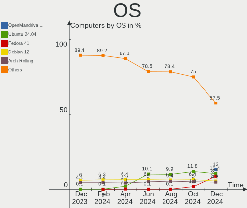
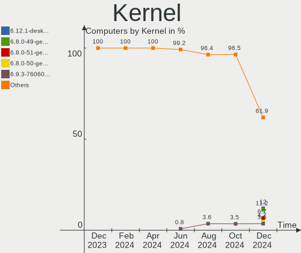
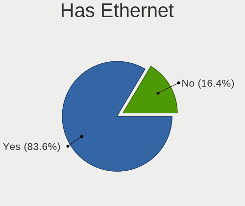
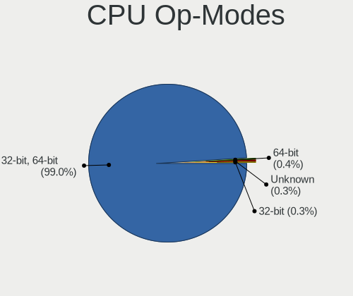
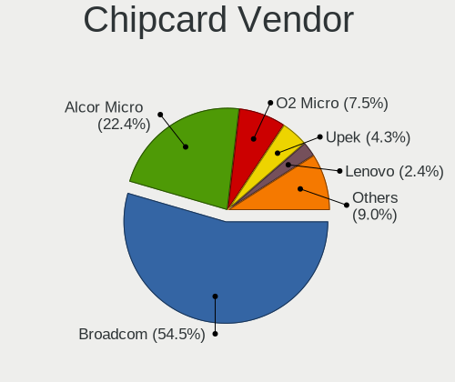

Linux Hardware Trends
---------------------

A project to identify most popular hardware characteristics and track their change
over time based on data collected by Linux users at https://Linux-Hardware.org.

Anyone can contribute to the study by uploading probes of their computers by
the [hw-probe](https://github.com/linuxhw/hw-probe) tool:

    sudo -E hw-probe -all -upload

This is a report for all computer types. See also reports for [desktops](/Desktop/README.md) and [notebooks](/Notebook/README.md).

Full-feature report is available here: https://linux-hardware.org/?view=trends

Distribution-specific reports: [Ubuntu](/Dist/Ubuntu), [ROSA](/Dist/ROSA), [Mint](/Dist/Mint), [Pop!_OS](/Dist/Pop!_OS), [Fedora](/Dist/Fedora), [BlackPanther](/Dist/BlackPanther), [Arch](/Dist/Arch), [Manjaro](/Dist/Manjaro), [Debian](/Dist/Debian), [Endless](/Dist/Endless), [Zorin](/Dist/Zorin), [Gentoo](/Dist/Gentoo), [Clear Linux](/Dist/Clear_Linux), [openSUSE](/Dist/openSUSE), [KDE neon](/Dist/KDE_neon).

Period: Oct, 2020.

Contents
--------

- [ OS                       ](#os)
- [ OS Family                ](#os-family)
- [ Kernel                   ](#kernel)
- [ Kernel Family            ](#kernel-family)
- [ Kernel Major Ver.        ](#kernel-major-ver)
- [ Arch                     ](#arch)
- [ DE                       ](#de)
- [ Display Server           ](#display-server)
- [ Display Manager          ](#display-manager)
- [ OS Lang                  ](#os-lang)
- [ Boot Mode                ](#boot-mode)
- [ Filesystem               ](#filesystem)
- [ Part. scheme             ](#part-scheme)
- [ Dual Boot with Linux/BSD ](#dual-boot-with-linux/bsd)
- [ Dual Boot (Win)          ](#dual-boot-win)
- [ Country                  ](#country)
- [ City                     ](#city)
- [ Vendor                   ](#vendor)
- [ Model                    ](#model)
- [ Model Family             ](#model-family)
- [ MFG Year                 ](#mfg-year)
- [ Form Factor              ](#form-factor)
- [ Secure Boot              ](#secure-boot)
- [ Coreboot                 ](#coreboot)
- [ RAM Size                 ](#ram-size)
- [ RAM Used                 ](#ram-used)
- [ Has CD-ROM               ](#has-cd-rom)
- [ Total Drives             ](#total-drives)
- [ Has Ethernet             ](#has-ethernet)
- [ Drive Vendor             ](#drive-vendor)
- [ HDD Vendor               ](#hdd-vendor)
- [ SSD Vendor               ](#ssd-vendor)
- [ Drive Model              ](#drive-model)
- [ Drive Kind               ](#drive-kind)
- [ Drive Connector          ](#drive-connector)
- [ Drive Size               ](#drive-size)
- [ Space Total              ](#space-total)
- [ Space Used               ](#space-used)
- [ Malfunc. Drives          ](#malfunc-drives)
- [ Malfunc. Drive Vendor    ](#malfunc-drive-vendor)
- [ Malfunc. HDD Vendor      ](#malfunc-hdd-vendor)
- [ Malfunc. Drive Kind      ](#malfunc-drive-kind)
- [ Failed Drives            ](#failed-drives)
- [ Failed Drive Vendor      ](#failed-drive-vendor)
- [ Drive Status             ](#drive-status)
- [ Storage Vendor           ](#storage-vendor)
- [ Storage Model            ](#storage-model)
- [ Storage Kind             ](#storage-kind)
- [ CPU Vendor               ](#cpu-vendor)
- [ CPU Model                ](#cpu-model)
- [ CPU Model Family         ](#cpu-model-family)
- [ CPU Cores                ](#cpu-cores)
- [ CPU Sockets              ](#cpu-sockets)
- [ CPU Threads              ](#cpu-threads)
- [ CPU Op-Modes             ](#cpu-op-modes)
- [ CPU Microcode            ](#cpu-microcode)
- [ CPU Microarch            ](#cpu-microarch)
- [ GPU Vendor               ](#gpu-vendor)
- [ GPU Model                ](#gpu-model)
- [ GPU Combo                ](#gpu-combo)
- [ GPU Driver               ](#gpu-driver)
- [ GPU Memory               ](#gpu-memory)
- [ Monitor Vendor           ](#monitor-vendor)
- [ Monitor Model            ](#monitor-model)
- [ Monitor Resolution       ](#monitor-resolution)
- [ Monitor Diagonal         ](#monitor-diagonal)
- [ Monitor Width            ](#monitor-width)
- [ Aspect Ratio             ](#aspect-ratio)
- [ Monitor Area             ](#monitor-area)
- [ Pixel Density            ](#pixel-density)
- [ Multiple Monitors        ](#multiple-monitors)
- [ Net Controller Vendor    ](#net-controller-vendor)
- [ Net Controller Model     ](#net-controller-model)
- [ Wireless Vendor          ](#wireless-vendor)
- [ Wireless Model           ](#wireless-model)
- [ Ethernet Vendor          ](#ethernet-vendor)
- [ Ethernet Model           ](#ethernet-model)
- [ Net Controller Kind      ](#net-controller-kind)
- [ Used Controller          ](#used-controller)
- [ NICs                     ](#nics)
- [ Memory Vendor            ](#memory-vendor)
- [ Memory Model             ](#memory-model)
- [ Memory Kind              ](#memory-kind)
- [ Memory Form Factor       ](#memory-form-factor)
- [ Memory Size              ](#memory-size)
- [ Memory Speed             ](#memory-speed)
- [ Sound Vendor             ](#sound-vendor)
- [ Sound Model              ](#sound-model)
- [ Camera Vendor            ](#camera-vendor)
- [ Camera Model             ](#camera-model)
- [ Fingerprint Vendor       ](#fingerprint-vendor)
- [ Fingerprint Model        ](#fingerprint-model)
- [ Chipcard Vendor          ](#chipcard-vendor)
- [ Chipcard Model           ](#chipcard-model)
- [ Printer Vendor           ](#printer-vendor)
- [ Printer Model            ](#printer-model)
- [ Scanner Vendor           ](#scanner-vendor)
- [ Scanner Model            ](#scanner-model)
- [ Bluetooth Vendor         ](#bluetooth-vendor)
- [ Bluetooth Model          ](#bluetooth-model)
- [ Unsupported Devices      ](#unsupported-devices)
- [ Unsupported Device Types ](#unsupported-device-types)

OS
--

Installed operating systems

| Name                | Computers | Percent |
|---------------------|-----------|---------|
| Ubuntu 20.04        | 1832      | 34.98%  |
| Ubuntu 18.04        | 317       | 6.05%   |
| Mint 20             | 247       | 4.72%   |
| Fedora 32           | 219       | 4.18%   |
| Pop!_OS 20.04       | 211       | 4.03%   |
| BlackPanther 18.1   | 208       | 3.97%   |
| Ubuntu 20.10        | 189       | 3.61%   |
| ROSA R11.1          | 138       | 2.64%   |
| Arch                | 127       | 2.43%   |
| Manjaro             | 126       | 2.41%   |
| Fedora 33           | 113       | 2.16%   |
| KDE neon 20.04      | 108       | 2.06%   |
| Arch Rolling        | 98        | 1.87%   |
| Debian 10           | 92        | 1.76%   |
| Endless 3.8.7       | 87        | 1.66%   |
| ROSA R11            | 73        | 1.39%   |
| Pop!_OS 20.10       | 70        | 1.34%   |
| Manjaro 20.1.1      | 69        | 1.32%   |
| Zorin 15            | 65        | 1.24%   |
| Mint 19.3           | 57        | 1.09%   |
| Manjaro 20.1.2      | 57        | 1.09%   |
| Debian Testing      | 42        | 0.8%    |
| ArcoLinux Rolling   | 39        | 0.74%   |
| Ubuntu 16.04        | 38        | 0.73%   |
| Gentoo              | 30        | 0.57%   |
| Endless 3.8.6       | 28        | 0.53%   |
| Ubuntu 19.10        | 27        | 0.52%   |
| Kali 2020.3         | 26        | 0.5%    |
| Gentoo 2.7          | 21        | 0.4%    |
| LMDE 4              | 20        | 0.38%   |
| openSUSE 15.2       | 18        | 0.34%   |
| Elementary 5.1.7    | 17        | 0.32%   |
| Debian              | 16        | 0.31%   |
| Manjaro 20.1        | 15        | 0.29%   |
| BlackPanther 16.2   | 14        | 0.27%   |
| ROSA R8.1           | 13        | 0.25%   |
| CentOS 8            | 13        | 0.25%   |
| Parrot 4.10         | 11        | 0.21%   |
| Deepin 20           | 10        | 0.19%   |
| Fedora 31           | 9         | 0.17%   |
| EndeavourOS         | 9         | 0.17%   |
| Debian Unstable     | 9         | 0.17%   |
| ROSA R10            | 8         | 0.15%   |
| RHEL 8.2            | 8         | 0.15%   |
| Reborn OS           | 7         | 0.13%   |
| Mint 19             | 7         | 0.13%   |
| Manjaro 20.2        | 7         | 0.13%   |
| Endless 3.7.8       | 7         | 0.13%   |
| Android             | 7         | 0.13%   |
| RED X4              | 6         | 0.11%   |
| Raspbian 10         | 6         | 0.11%   |
| EndeavourOS Rolling | 6         | 0.11%   |
| Peppermint 10       | 5         | 0.1%    |
| openSUSE Leap-15.2  | 5         | 0.1%    |
| Mint 19.1           | 5         | 0.1%    |
| CentOS 7            | 5         | 0.1%    |
| Artix               | 5         | 0.1%    |
| Zorin 12            | 4         | 0.08%   |
| Void Rolling        | 4         | 0.08%   |
| Ubuntu 19.04        | 4         | 0.08%   |

OS Family
---------

OS without a version

| Name         | Computers | Percent |
|--------------|-----------|---------|
| Ubuntu       | 2413      | 46.08%  |
| Fedora       | 347       | 6.63%   |
| Mint         | 324       | 6.19%   |
| Pop!_OS      | 281       | 5.37%   |
| Manjaro      | 277       | 5.29%   |
| ROSA         | 239       | 4.56%   |
| Arch         | 226       | 4.32%   |
| BlackPanther | 223       | 4.26%   |
| Debian       | 164       | 3.13%   |
| Endless      | 141       | 2.69%   |
| KDE neon     | 108       | 2.06%   |
| Zorin        | 69        | 1.32%   |
| openSUSE     | 52        | 0.99%   |
| Gentoo       | 51        | 0.97%   |
| ArcoLinux    | 45        | 0.86%   |
| Kali         | 29        | 0.55%   |
| CentOS       | 21        | 0.4%    |
| LMDE         | 20        | 0.38%   |
| Clear Linux  | 20        | 0.38%   |
| Elementary   | 18        | 0.34%   |
| EndeavourOS  | 15        | 0.29%   |
| Parrot       | 11        | 0.21%   |
| Deepin       | 10        | 0.19%   |
| RHEL         | 9         | 0.17%   |
| Artix        | 9         | 0.17%   |
| MX           | 8         | 0.15%   |
| Reborn OS    | 7         | 0.13%   |
| Android      | 7         | 0.13%   |
| RED          | 6         | 0.11%   |
| Raspbian     | 6         | 0.11%   |
| Mageia       | 6         | 0.11%   |
| Devuan       | 6         | 0.11%   |
| Void         | 5         | 0.1%    |
| Peppermint   | 5         | 0.1%    |
| Sparky       | 4         | 0.08%   |
| GNOME OS     | 4         | 0.08%   |
| Garuda       | 4         | 0.08%   |
| WindowsFX    | 3         | 0.06%   |
| Solus        | 3         | 0.06%   |
| SkiffOS      | 3         | 0.06%   |
| PureOS       | 3         | 0.06%   |
| NixOS        | 3         | 0.06%   |
| Calculate    | 3         | 0.06%   |
| ALT Linux    | 3         | 0.06%   |
| SLED         | 2         | 0.04%   |
| Slackware    | 2         | 0.04%   |
| OpenMandriva | 2         | 0.04%   |
| Kaisen       | 2         | 0.04%   |
| Chrome OS    | 2         | 0.04%   |
| Alpine       | 2         | 0.04%   |
| Siduction    | 1         | 0.02%   |
| Puppy        | 1         | 0.02%   |
| Pragma       | 1         | 0.02%   |
| Parabola     | 1         | 0.02%   |
| Makulu       | 1         | 0.02%   |
| Lunar        | 1         | 0.02%   |
| Kurisu       | 1         | 0.02%   |
| Guix         | 1         | 0.02%   |
| Generic      | 1         | 0.02%   |
| Funtoo       | 1         | 0.02%   |

Kernel
------

Version of the Linux kernel

| Version                          | Computers | Percent |
|----------------------------------|-----------|---------|
| 5.4.0-48-generic                 | 1002      | 19.13%  |
| 5.4.0-52-generic                 | 703       | 13.42%  |
| 5.4.0-51-generic                 | 324       | 6.19%   |
| 5.4.0-42-generic                 | 231       | 4.41%   |
| 4.18.16-desktop-1bP              | 207       | 3.95%   |
| 5.4.0-7642-generic               | 181       | 3.46%   |
| 5.8.11-1-MANJARO                 | 115       | 2.2%    |
| 5.8.0-25-generic                 | 85        | 1.62%   |
| 5.8.0-7625-generic               | 80        | 1.53%   |
| 4.15.0-118-generic               | 71        | 1.36%   |
| 5.9.1-arch1-1                    | 67        | 1.28%   |
| 5.4.0-49-generic                 | 66        | 1.26%   |
| 5.8.14-arch1-1                   | 64        | 1.22%   |
| 4.15.0-desktop-94.1rosa-x86_64   | 64        | 1.22%   |
| 5.8.16-300.fc33.x86_64           | 62        | 1.18%   |
| 4.15.0-desktop-45.1rosa-x86_64   | 56        | 1.07%   |
| 5.8.15-201.fc32.x86_64           | 45        | 0.86%   |
| 5.8.16-2-MANJARO                 | 43        | 0.82%   |
| 5.8.12-200.fc32.x86_64           | 43        | 0.82%   |
| 5.8.13-200.fc32.x86_64           | 42        | 0.8%    |
| 4.19.0-11-amd64                  | 42        | 0.8%    |
| 5.8.0-26-generic                 | 41        | 0.78%   |
| 5.4.0-26-generic                 | 41        | 0.78%   |
| 5.9.1-1-MANJARO                  | 38        | 0.73%   |
| 4.15.0-122-generic               | 37        | 0.71%   |
| 5.8.0-2-amd64                    | 32        | 0.61%   |
| 5.4.0-47-generic                 | 30        | 0.57%   |
| 5.8.13-arch1-1                   | 28        | 0.53%   |
| 5.8.12-arch1-1                   | 25        | 0.48%   |
| 5.8.16-200.fc32.x86_64           | 24        | 0.46%   |
| 5.8.14-200.fc32.x86_64           | 23        | 0.44%   |
| 5.4.40-generic-1rosa-x86_64      | 23        | 0.44%   |
| 4.19.0-12-amd64                  | 23        | 0.44%   |
| 5.8.0-23-generic                 | 22        | 0.42%   |
| 5.8.15-301.fc33.x86_64           | 21        | 0.4%    |
| 4.15.0-121-generic               | 19        | 0.36%   |
| 5.3.0-64-generic                 | 18        | 0.34%   |
| 5.9.1-zen2-1-zen                 | 17        | 0.32%   |
| 5.8.0-1006-raspi                 | 17        | 0.32%   |
| 5.4.0-48-lowlatency              | 17        | 0.32%   |
| 5.8.14-300.fc33.x86_64           | 16        | 0.31%   |
| 4.18.0-193.19.1.el8_2.x86_64     | 15        | 0.29%   |
| 5.8.14-zen1-1-zen                | 14        | 0.27%   |
| 5.8.11-200.fc32.x86_64           | 14        | 0.27%   |
| 5.8.6-1-MANJARO                  | 13        | 0.25%   |
| 5.3.0-28-generic                 | 13        | 0.25%   |
| 4.9.155-nrj-desktop-1rosa-x86_64 | 13        | 0.25%   |
| 5.8.0-20-generic                 | 12        | 0.23%   |
| 5.8.0-0.bpo.2-amd64              | 12        | 0.23%   |
| 5.4.72-1-lts                     | 12        | 0.23%   |
| 4.9.20-desktop-pae-1bP           | 12        | 0.23%   |
| 5.9.0-1-amd64                    | 11        | 0.21%   |
| 5.9.0-050900-generic             | 11        | 0.21%   |
| 5.8.14-1-default                 | 11        | 0.21%   |
| 5.8.0-kali2-amd64                | 11        | 0.21%   |
| 5.8.0-3-amd64                    | 11        | 0.21%   |
| 5.4.32-generic-2rosa-x86_64      | 11        | 0.21%   |
| 5.4.0-52-lowlatency              | 11        | 0.21%   |
| 4.19.0-10-amd64                  | 11        | 0.21%   |
| 4.15.0-desktop-45.1rosa-i586     | 11        | 0.21%   |

Kernel Family
-------------

Linux kernel without a distro release

| Version | Computers | Percent |
|---------|-----------|---------|
| 5.4.0   | 2674      | 51.06%  |
| 5.8.0   | 374       | 7.14%   |
| 4.15.0  | 342       | 6.53%   |
| 4.18.16 | 207       | 3.95%   |
| 5.8.14  | 160       | 3.06%   |
| 5.9.1   | 159       | 3.04%   |
| 5.8.16  | 147       | 2.81%   |
| 5.8.11  | 131       | 2.5%    |
| 5.8.13  | 112       | 2.14%   |
| 5.8.12  | 104       | 1.99%   |
| 4.19.0  | 87        | 1.66%   |
| 5.8.15  | 74        | 1.41%   |
| 5.3.0   | 66        | 1.26%   |
| 5.9.0   | 61        | 1.16%   |
| 5.4.72  | 29        | 0.55%   |
| 5.4.40  | 28        | 0.53%   |
| 4.18.0  | 23        | 0.44%   |
| 5.6.0   | 21        | 0.4%    |
| 5.3.18  | 21        | 0.4%    |
| 5.7.0   | 18        | 0.34%   |
| 4.9.155 | 18        | 0.34%   |
| 5.0.0   | 16        | 0.31%   |
| 4.9.20  | 16        | 0.31%   |
| 5.8.6   | 15        | 0.29%   |
| 5.8.10  | 14        | 0.27%   |
| 5.7.19  | 14        | 0.27%   |
| 5.4.70  | 14        | 0.27%   |
| 5.4.32  | 13        | 0.25%   |
| 5.8.7   | 10        | 0.19%   |
| 5.4.66  | 10        | 0.19%   |
| 4.4.0   | 10        | 0.19%   |
| 5.6.6   | 9         | 0.17%   |
| 5.4.67  | 9         | 0.17%   |
| 5.4.60  | 9         | 0.17%   |
| 5.4.50  | 9         | 0.17%   |
| 5.9.2   | 8         | 0.15%   |
| 5.8.9   | 8         | 0.15%   |
| 5.6.19  | 8         | 0.15%   |
| 5.4.68  | 7         | 0.13%   |
| 4.9.60  | 7         | 0.13%   |
| 3.10.0  | 7         | 0.13%   |
| 5.4.64  | 6         | 0.11%   |
| 4.1.38  | 6         | 0.11%   |
| 5.7.14  | 5         | 0.1%    |
| 5.5.0   | 5         | 0.1%    |
| 5.4.65  | 5         | 0.1%    |
| 4.9.140 | 5         | 0.1%    |
| 4.13.0  | 5         | 0.1%    |
| 5.8.1   | 4         | 0.08%   |
| 4.9.0   | 4         | 0.08%   |
| 5.8.8   | 3         | 0.06%   |
| 5.7.1   | 3         | 0.06%   |
| 5.6.15  | 3         | 0.06%   |
| 5.4.28  | 3         | 0.06%   |
| 5.10.0  | 3         | 0.06%   |
| 4.12.14 | 3         | 0.06%   |
| 5.8.5   | 2         | 0.04%   |
| 5.8.4   | 2         | 0.04%   |
| 5.8.2   | 2         | 0.04%   |
| 5.8     | 2         | 0.04%   |

Kernel Major Ver.
-----------------

Linux kernel major version

| Version | Computers | Percent |
|---------|-----------|---------|
| 5.4     | 2837      | 54.17%  |
| 5.8     | 1163      | 22.21%  |
| 4.15    | 342       | 6.53%   |
| 4.18    | 231       | 4.41%   |
| 5.9     | 228       | 4.35%   |
| 4.19    | 103       | 1.97%   |
| 5.3     | 91        | 1.74%   |
| 4.9     | 56        | 1.07%   |
| 5.7     | 50        | 0.95%   |
| 5.6     | 50        | 0.95%   |
| 5.0     | 17        | 0.32%   |
| 4.4     | 14        | 0.27%   |
| 3.10    | 9         | 0.17%   |
| 5.5     | 8         | 0.15%   |
| 4.1     | 6         | 0.11%   |
| 4.13    | 5         | 0.1%    |
| 5.10    | 3         | 0.06%   |
| 5.1     | 3         | 0.06%   |
| 4.7     | 3         | 0.06%   |
| 4.12    | 3         | 0.06%   |
| 3.18    | 3         | 0.06%   |
| 5       | 2         | 0.04%   |
| 4.14    | 2         | 0.04%   |
| Unknown | 2         | 0.04%   |
| 4.20    | 1         | 0.02%   |
| 4.17    | 1         | 0.02%   |
| 4.16    | 1         | 0.02%   |
| 4.10    | 1         | 0.02%   |
| 3.4     | 1         | 0.02%   |
| 3.14    | 1         | 0.02%   |

Arch
----

OS architecture (x86_64, i586, etc.)

| Name    | Computers | Percent |
|---------|-----------|---------|
| x86_64  | 5021      | 95.88%  |
| i686    | 149       | 2.85%   |
| aarch64 | 45        | 0.86%   |
| armv7l  | 18        | 0.34%   |
| armv8l  | 3         | 0.06%   |
| armv6l  | 1         | 0.02%   |

DE
--

Desktop Environment

| Name             | Computers | Percent |
|------------------|-----------|---------|
| GNOME            | 2751      | 52.53%  |
| KDE5             | 568       | 10.85%  |
| XFCE             | 395       | 7.54%   |
| KDE              | 333       | 6.36%   |
| Unknown          | 241       | 4.6%    |
| X-Cinnamon       | 183       | 3.49%   |
| MATE             | 170       | 3.25%   |
| KDE4             | 161       | 3.07%   |
| Cinnamon         | 154       | 2.94%   |
| LXQt             | 61        | 1.16%   |
| Unity            | 55        | 1.05%   |
| Budgie           | 37        | 0.71%   |
| Deepin           | 24        | 0.46%   |
| GNOME Flashback  | 23        | 0.44%   |
| LXDE             | 21        | 0.4%    |
| i3               | 20        | 0.38%   |
| Pantheon         | 17        | 0.32%   |
| GNOME Classic    | 5         | 0.1%    |
| openbox          | 3         | 0.06%   |
| lightdm-xsession | 3         | 0.06%   |
| awesome          | 3         | 0.06%   |
| ICEWM            | 2         | 0.04%   |
| Xsession         | 1         | 0.02%   |
| Herbstluftwm     | 1         | 0.02%   |
| GNUstep          | 1         | 0.02%   |
| fluxbox          | 1         | 0.02%   |
| enlightenment    | 1         | 0.02%   |
| DWM              | 1         | 0.02%   |
| bspwm            | 1         | 0.02%   |

Display Server
--------------

X11 or Wayland

| Name        | Computers | Percent |
|-------------|-----------|---------|
| X11         | 4664      | 89.06%  |
| Wayland     | 350       | 6.68%   |
| Tty         | 112       | 2.14%   |
| Unknown     | 108       | 2.06%   |
| Unspecified | 2         | 0.04%   |
| Web         | 1         | 0.02%   |

Display Manager
---------------

SDDM, LightDM, etc.

| Name    | Computers | Percent |
|---------|-----------|---------|
| Unknown | 3320      | 63.4%   |
| GDM     | 625       | 11.93%  |
| SDDM    | 578       | 11.04%  |
| TDM     | 415       | 7.92%   |
| KDM     | 159       | 3.04%   |
| LightDM | 113       | 2.16%   |
| XDM     | 6         | 0.11%   |
| SLiM    | 6         | 0.11%   |
| LXDM    | 5         | 0.1%    |
| GDM3    | 5         | 0.1%    |
| Ly      | 4         | 0.08%   |
| GREETD  | 1         | 0.02%   |

OS Lang
-------

Language

| Lang       | Computers | Percent |
|------------|-----------|---------|
| en_US      | 1766      | 33.72%  |
| de_DE      | 406       | 7.75%   |
| Unknown    | 384       | 7.33%   |
| pt_BR      | 307       | 5.86%   |
| en_GB      | 289       | 5.52%   |
| ru_RU      | 284       | 5.42%   |
| fr_FR      | 164       | 3.13%   |
| it_IT      | 122       | 2.33%   |
| es_ES      | 121       | 2.31%   |
| en_US.utf8 | 106       | 2.02%   |
| en_CA      | 102       | 1.95%   |
| pl_PL      | 83        | 1.58%   |
| en_AU      | 80        | 1.53%   |
| en_IN      | 76        | 1.45%   |
| C          | 69        | 1.32%   |
| nl_NL      | 47        | 0.9%    |
| cs_CZ      | 45        | 0.86%   |
| pt_BR.utf8 | 44        | 0.84%   |
| hu_HU      | 42        | 0.8%    |
| es_AR      | 38        | 0.73%   |
| es_MX      | 32        | 0.61%   |
| fi_FI      | 31        | 0.59%   |
| de_CH      | 27        | 0.52%   |
| pt_PT      | 21        | 0.4%    |
| ja_JP      | 21        | 0.4%    |
| en_GB.utf8 | 21        | 0.4%    |
| de_AT      | 21        | 0.4%    |
| ru_UA      | 20        | 0.38%   |
| uk_UA      | 19        | 0.36%   |
| C          | 19        | 0.36%   |
| sv_SE      | 18        | 0.34%   |
| ro_RO      | 18        | 0.34%   |
| en_IE      | 18        | 0.34%   |
| tr_TR      | 17        | 0.32%   |
| fr_CA      | 17        | 0.32%   |
| ru_RU.utf8 | 16        | 0.31%   |
| es_CO      | 16        | 0.31%   |
| de_DE.utf8 | 16        | 0.31%   |
| da_DK      | 14        | 0.27%   |
| nl_BE      | 13        | 0.25%   |
| en_PH      | 12        | 0.23%   |
| en_ZA      | 11        | 0.21%   |
| en_NZ      | 11        | 0.21%   |
| el_GR      | 11        | 0.21%   |
| zh_CN      | 10        | 0.19%   |
| en_IL      | 10        | 0.19%   |
| sk_SK      | 9         | 0.17%   |
| fr_BE      | 9         | 0.17%   |
| nb_NO      | 8         | 0.15%   |
| es_CL      | 8         | 0.15%   |
| ko_KR      | 7         | 0.13%   |
| fr_FR.utf8 | 7         | 0.13%   |
| zh_TW      | 6         | 0.11%   |
| en_IN      | 6         | 0.11%   |
| bg_BG      | 6         | 0.11%   |
| sl_SI      | 5         | 0.1%    |
| en_CA.utf8 | 5         | 0.1%    |
| ca_ES      | 5         | 0.1%    |
| pt_PT.utf8 | 4         | 0.08%   |
| POSIX      | 4         | 0.08%   |

Boot Mode
---------

EFI or BIOS

| Mode | Computers | Percent |
|------|-----------|---------|
| BIOS | 2855      | 54.52%  |
| EFI  | 2382      | 45.48%  |

Filesystem
----------

Type of filesystem

| Type     | Computers | Percent |
|----------|-----------|---------|
| Ext4     | 4491      | 85.76%  |
| Btrfs    | 281       | 5.37%   |
| Overlay  | 278       | 5.31%   |
| Xfs      | 90        | 1.72%   |
| Zfs      | 44        | 0.84%   |
| Ext3     | 12        | 0.23%   |
| Ext2     | 10        | 0.19%   |
| Unknown  | 9         | 0.17%   |
| F2fs     | 6         | 0.11%   |
| Tmpfs    | 5         | 0.1%    |
| Aufs     | 5         | 0.1%    |
| Reiserfs | 3         | 0.06%   |
| Jfs      | 2         | 0.04%   |
| Rootfs   | 1         | 0.02%   |

Part. scheme
------------

Scheme of partitioning

| Type    | Computers | Percent |
|---------|-----------|---------|
| Unknown | 3219      | 61.47%  |
| GPT     | 1311      | 25.03%  |
| MBR     | 707       | 13.5%   |

Dual Boot with Linux/BSD
------------------------

Hosting more than one Linux/BSD

| Dual boot | Computers | Percent |
|-----------|-----------|---------|
| No        | 4561      | 87.09%  |
| Yes       | 676       | 12.91%  |

Dual Boot (Win)
---------------

Hosting Linux and Windows

| Dual boot | Computers | Percent |
|-----------|-----------|---------|
| No        | 3620      | 69.12%  |
| Yes       | 1617      | 30.88%  |

Country
-------

Geographic location (country)

| Country            | Computers | Percent |
|--------------------|-----------|---------|
| USA                | 846       | 16.15%  |
| Germany            | 533       | 10.18%  |
| Brazil             | 411       | 7.85%   |
| Russia             | 409       | 7.81%   |
| UK                 | 223       | 4.26%   |
| Hungary            | 202       | 3.86%   |
| France             | 196       | 3.74%   |
| Canada             | 167       | 3.19%   |
| Italy              | 165       | 3.15%   |
| Spain              | 140       | 2.67%   |
| India              | 127       | 2.43%   |
| Poland             | 119       | 2.27%   |
| Netherlands        | 116       | 2.22%   |
| Ukraine            | 103       | 1.97%   |
| Australia          | 92        | 1.76%   |
| Switzerland        | 72        | 1.37%   |
| Finland            | 62        | 1.18%   |
| Czech Republic     | 62        | 1.18%   |
| Argentina          | 62        | 1.18%   |
| Austria            | 54        | 1.03%   |
| Sweden             | 53        | 1.01%   |
| Romania            | 52        | 0.99%   |
| Mexico             | 49        | 0.94%   |
| Belgium            | 46        | 0.88%   |
| Portugal           | 44        | 0.84%   |
| Japan              | 39        | 0.74%   |
| Turkey             | 37        | 0.71%   |
| Greece             | 36        | 0.69%   |
| Denmark            | 34        | 0.65%   |
| Bulgaria           | 29        | 0.55%   |
| Norway             | 26        | 0.5%    |
| Israel             | 26        | 0.5%    |
| Ireland            | 25        | 0.48%   |
| Belarus            | 23        | 0.44%   |
| Philippines        | 22        | 0.42%   |
| Colombia           | 22        | 0.42%   |
| Indonesia          | 21        | 0.4%    |
| Slovakia           | 20        | 0.38%   |
| Serbia             | 20        | 0.38%   |
| New Zealand        | 20        | 0.38%   |
| South Africa       | 17        | 0.32%   |
| Egypt              | 17        | 0.32%   |
| Chile              | 17        | 0.32%   |
| Bangladesh         | 17        | 0.32%   |
| Iran               | 15        | 0.29%   |
| China              | 15        | 0.29%   |
| Vietnam            | 13        | 0.25%   |
| Taiwan             | 12        | 0.23%   |
| Slovenia           | 12        | 0.23%   |
| Korea, Republic of | 12        | 0.23%   |
| Croatia            | 12        | 0.23%   |
| Malaysia           | 11        | 0.21%   |
| Kazakhstan         | 11        | 0.21%   |
| Pakistan           | 10        | 0.19%   |
| Thailand           | 9         | 0.17%   |
| Lithuania          | 9         | 0.17%   |
| Kenya              | 9         | 0.17%   |
| Algeria            | 9         | 0.17%   |
| Latvia             | 8         | 0.15%   |
| Iceland            | 8         | 0.15%   |

City
----

Geographic location (city)

| City              | Computers | Percent |
|-------------------|-----------|---------|
| Moscow            | 75        | 1.43%   |
| Budapest          | 74        | 1.41%   |
| São Paulo        | 70        | 1.34%   |
| St Petersburg     | 43        | 0.82%   |
| Berlin            | 37        | 0.71%   |
| Paris             | 35        | 0.67%   |
| Kyiv              | 33        | 0.63%   |
| Prague            | 31        | 0.59%   |
| Vienna            | 30        | 0.57%   |
| Madrid            | 27        | 0.52%   |
| Rio de Janeiro    | 25        | 0.48%   |
| Warsaw            | 24        | 0.46%   |
| Stuttgart         | 24        | 0.46%   |
| Helsinki          | 22        | 0.42%   |
| Rome              | 21        | 0.4%    |
| Munich            | 21        | 0.4%    |
| Bucharest         | 20        | 0.38%   |
| Athens            | 20        | 0.38%   |
| Zurich            | 19        | 0.36%   |
| Sofia             | 19        | 0.36%   |
| Istanbul          | 17        | 0.32%   |
| Buenos Aires      | 17        | 0.32%   |
| Barcelona         | 16        | 0.31%   |
| Toronto           | 15        | 0.29%   |
| Novosibirsk       | 15        | 0.29%   |
| Lisbon            | 15        | 0.29%   |
| Bengaluru         | 15        | 0.29%   |
| Amsterdam         | 15        | 0.29%   |
| Milan             | 14        | 0.27%   |
| Kharkiv           | 14        | 0.27%   |
| Chicago           | 14        | 0.27%   |
| Chennai           | 14        | 0.27%   |
| Tel Aviv          | 13        | 0.25%   |
| Sydney            | 13        | 0.25%   |
| Hamburg           | 13        | 0.25%   |
| Frankfurt am Main | 13        | 0.25%   |
| Dublin            | 13        | 0.25%   |
| Brasília         | 13        | 0.25%   |
| Seattle           | 12        | 0.23%   |
| Melbourne         | 12        | 0.23%   |
| Krakow            | 12        | 0.23%   |
| Nuremberg         | 11        | 0.21%   |
| Montreal          | 11        | 0.21%   |
| Minsk             | 11        | 0.21%   |
| London            | 11        | 0.21%   |
| Kazan’          | 11        | 0.21%   |
| Goiânia          | 11        | 0.21%   |
| Dallas            | 11        | 0.21%   |
| Auckland          | 11        | 0.21%   |
| Tehran            | 10        | 0.19%   |
| Phoenix           | 10        | 0.19%   |
| Mexico City       | 10        | 0.19%   |
| Leipzig           | 10        | 0.19%   |
| Karlsruhe         | 10        | 0.19%   |
| Espoo             | 10        | 0.19%   |
| Ekaterinburg      | 10        | 0.19%   |
| Düsseldorf       | 10        | 0.19%   |
| Dhaka             | 10        | 0.19%   |
| Denver            | 10        | 0.19%   |
| Curitiba          | 10        | 0.19%   |

Vendor
------

Motherboard manufacturer

| Name                    | Computers | Percent |
|-------------------------|-----------|---------|
| ASUSTek Computer        | 880       | 16.8%   |
| Lenovo                  | 741       | 14.15%  |
| Hewlett-Packard         | 703       | 13.42%  |
| Dell                    | 673       | 12.85%  |
| Gigabyte Technology     | 379       | 7.24%   |
| Acer                    | 328       | 6.26%   |
| MSI                     | 285       | 5.44%   |
| ASRock                  | 236       | 4.51%   |
| Apple                   | 98        | 1.87%   |
| Toshiba                 | 94        | 1.79%   |
| Intel                   | 91        | 1.74%   |
| Unknown                 | 66        | 1.26%   |
| Samsung Electronics     | 56        | 1.07%   |
| Sony                    | 42        | 0.8%    |
| Fujitsu                 | 35        | 0.67%   |
| HUAWEI                  | 31        | 0.59%   |
| Raspberry Pi Foundation | 28        | 0.53%   |
| Positivo                | 27        | 0.52%   |
| Foxconn                 | 26        | 0.5%    |
| Pegatron                | 24        | 0.46%   |
| Medion                  | 23        | 0.44%   |
| Packard Bell            | 21        | 0.4%    |
| Fujitsu Siemens         | 20        | 0.38%   |
| Supermicro              | 16        | 0.31%   |
| Biostar                 | 16        | 0.31%   |
| System76                | 15        | 0.29%   |
| Notebook                | 14        | 0.27%   |
| ECS                     | 13        | 0.25%   |
| Alienware               | 12        | 0.23%   |
| TUXEDO                  | 11        | 0.21%   |
| Microsoft               | 10        | 0.19%   |
| eMachines               | 8         | 0.15%   |
| AMI                     | 8         | 0.15%   |
| Timi                    | 7         | 0.13%   |
| Panasonic               | 7         | 0.13%   |
| LG Electronics          | 7         | 0.13%   |
| Gateway                 | 7         | 0.13%   |
| ZOTAC                   | 6         | 0.11%   |
| Itautec                 | 6         | 0.11%   |
| Google                  | 6         | 0.11%   |
| Clevo                   | 6         | 0.11%   |
| BANGHO                  | 6         | 0.11%   |
| PC Specialist           | 5         | 0.1%    |
| Hardkernel              | 5         | 0.1%    |
| Shuttle                 | 4         | 0.08%   |
| Semp Toshiba            | 4         | 0.08%   |
| Razer                   | 4         | 0.08%   |
| Pine Microsystems       | 4         | 0.08%   |
| Nvidia                  | 4         | 0.08%   |
| Huanan                  | 4         | 0.08%   |
| AMD                     | 4         | 0.08%   |
| Quanta                  | 3         | 0.06%   |
| Hampoo                  | 3         | 0.06%   |
| Chuwi                   | 3         | 0.06%   |
| Avell High Performance  | 3         | 0.06%   |
| ASRockRack              | 3         | 0.06%   |
| Xplore                  | 2         | 0.04%   |
| Teclast                 | 2         | 0.04%   |
| Schenker                | 2         | 0.04%   |
| NEC Computers           | 2         | 0.04%   |

Model
-----

Motherboard model

| Name                               | Computers | Percent |
|------------------------------------|-----------|---------|
| Unknown                            | 82        | 1.57%   |
| ASUS All Series                    | 58        | 1.11%   |
| HP Notebook                        | 24        | 0.46%   |
| HP Pavilion dv6                    | 17        | 0.32%   |
| Acer Nitro AN515-43                | 17        | 0.32%   |
| ASUS TUF GAMING X570-PLUS          | 16        | 0.31%   |
| Gigabyte B450M DS3H                | 14        | 0.27%   |
| Gigabyte 970A-DS3P                 | 14        | 0.27%   |
| Dell OptiPlex 7010                 | 13        | 0.25%   |
| ASRock B450M Pro4                  | 12        | 0.23%   |
| Dell OptiPlex 755                  | 11        | 0.21%   |
| HUAWEI NBLK-WAX9X                  | 10        | 0.19%   |
| HP Compaq 6005 Pro SFF PC          | 10        | 0.19%   |
| Dell XPS 13 9360                   | 10        | 0.19%   |
| ASUS ROG STRIX B450-F GAMING       | 10        | 0.19%   |
| ASUS M5A78L-M/USB3                 | 10        | 0.19%   |
| MSI MS-7C37                        | 9         | 0.17%   |
| Lenovo Legion Y530-15ICH 81FV      | 9         | 0.17%   |
| Dell XPS 15 7590                   | 9         | 0.17%   |
| Dell Latitude 7490                 | 9         | 0.17%   |
| Dell Inspiron 5570                 | 9         | 0.17%   |
| RPi Raspberry Pi 4 Model B Rev 1.4 | 8         | 0.15%   |
| MSI MS-7C02                        | 8         | 0.15%   |
| MSI MS-7B86                        | 8         | 0.15%   |
| MSI MS-7A38                        | 8         | 0.15%   |
| HP Pavilion Notebook               | 8         | 0.15%   |
| HP Pavilion g6                     | 8         | 0.15%   |
| HP Pavilion dv7                    | 8         | 0.15%   |
| Dell OptiPlex 9020                 | 8         | 0.15%   |
| Dell Inspiron N5110                | 8         | 0.15%   |
| Dell Inspiron 15-3567              | 8         | 0.15%   |
| ASUS PRIME X470-PRO                | 8         | 0.15%   |
| ASUS PRIME A320M-K                 | 8         | 0.15%   |
| RPi Raspberry Pi 4 Model B Rev 1.2 | 7         | 0.13%   |
| RPi Raspberry Pi 4 Model B Rev 1.1 | 7         | 0.13%   |
| Positivo Mobile                    | 7         | 0.13%   |
| Lenovo IdeaPad Flex 5 14ARE05 81X2 | 7         | 0.13%   |
| Lenovo IdeaPad 330-15IKB 81DE      | 7         | 0.13%   |
| HP Pavilion dm4                    | 7         | 0.13%   |
| HP Pavilion 15                     | 7         | 0.13%   |
| HP Compaq Elite 8300 SFF           | 7         | 0.13%   |
| HP 255 G7 Notebook PC              | 7         | 0.13%   |
| HP 15                              | 7         | 0.13%   |
| Gigabyte X570 AORUS ELITE          | 7         | 0.13%   |
| Dell XPS 15 9560                   | 7         | 0.13%   |
| Dell XPS 13 7390                   | 7         | 0.13%   |
| Dell OptiPlex 790                  | 7         | 0.13%   |
| Dell Latitude E7440                | 7         | 0.13%   |
| Dell Latitude E6530                | 7         | 0.13%   |
| Dell Latitude E6410                | 7         | 0.13%   |
| Dell Latitude E6400                | 7         | 0.13%   |
| Dell Latitude 5480                 | 7         | 0.13%   |
| Dell G3 3590                       | 7         | 0.13%   |
| ASUS M5A78L-M PLUS/USB3            | 7         | 0.13%   |
| ASRock FM2A75M Pro4+               | 7         | 0.13%   |
| Acer Nitro AN517-51                | 7         | 0.13%   |
| HP ProBook 450 G7                  | 6         | 0.11%   |
| HP Pavilion g7                     | 6         | 0.11%   |
| HP G62                             | 6         | 0.11%   |
| HP EliteBook 8470p                 | 6         | 0.11%   |

Model Family
------------

Motherboard model prefix

| Name                  | Computers | Percent |
|-----------------------|-----------|---------|
| Lenovo ThinkPad       | 328       | 6.26%   |
| Acer Aspire           | 215       | 4.11%   |
| Dell Inspiron         | 173       | 3.3%    |
| Lenovo IdeaPad        | 163       | 3.11%   |
| Dell Latitude         | 157       | 3%      |
| HP Pavilion           | 137       | 2.62%   |
| HP Compaq             | 109       | 2.08%   |
| Dell OptiPlex         | 106       | 2.02%   |
| ASUS PRIME            | 88        | 1.68%   |
| Toshiba Satellite     | 85        | 1.62%   |
| Dell XPS              | 85        | 1.62%   |
| Unknown               | 82        | 1.57%   |
| HP ProBook            | 81        | 1.55%   |
| HP EliteBook          | 75        | 1.43%   |
| ASUS VivoBook         | 62        | 1.18%   |
| ASUS ROG              | 58        | 1.11%   |
| ASUS All              | 58        | 1.11%   |
| ASUS TUF              | 52        | 0.99%   |
| HP Laptop             | 51        | 0.97%   |
| Dell Precision        | 47        | 0.9%    |
| Dell Vostro           | 43        | 0.82%   |
| Lenovo ThinkCentre    | 42        | 0.8%    |
| Acer Nitro            | 40        | 0.76%   |
| Lenovo Legion         | 33        | 0.63%   |
| HP ENVY               | 30        | 0.57%   |
| RPi Raspberry         | 28        | 0.53%   |
| Gigabyte X570         | 28        | 0.53%   |
| ASUS M5A78L-M         | 25        | 0.48%   |
| HP Notebook           | 24        | 0.46%   |
| Lenovo Yoga           | 22        | 0.42%   |
| HP ZBook              | 20        | 0.38%   |
| Gigabyte B450M        | 18        | 0.34%   |
| Dell PowerEdge        | 18        | 0.34%   |
| ASRock B450M          | 18        | 0.34%   |
| Gigabyte 970A-DS3P    | 16        | 0.31%   |
| Fujitsu LIFEBOOK      | 16        | 0.31%   |
| HP 255                | 15        | 0.29%   |
| ASUS M5A97            | 15        | 0.29%   |
| Acer Swift            | 15        | 0.29%   |
| Dell G3               | 14        | 0.27%   |
| ASRock X570           | 14        | 0.27%   |
| Packard Bell EasyNote | 13        | 0.25%   |
| ASRock B450           | 13        | 0.25%   |
| HP EliteDesk          | 12        | 0.23%   |
| Gigabyte B450         | 12        | 0.23%   |
| HP OMEN               | 11        | 0.21%   |
| HP 250                | 11        | 0.21%   |
| Fujitsu ESPRIMO       | 11        | 0.21%   |
| ASUS ZenBook          | 11        | 0.21%   |
| ASUS P8H61-M          | 11        | 0.21%   |
| ASRock 970            | 11        | 0.21%   |
| Acer Extensa          | 11        | 0.21%   |
| Microsoft Surface     | 10        | 0.19%   |
| HUAWEI NBLK-WAX9X     | 10        | 0.19%   |
| HP ProDesk            | 10        | 0.19%   |
| Dell Studio           | 10        | 0.19%   |
| ASUS Strix            | 10        | 0.19%   |
| MSI MS-7C37           | 9         | 0.17%   |
| Lenovo IdeaCentre     | 9         | 0.17%   |
| HP Spectre            | 9         | 0.17%   |

MFG Year
--------

Motherboard manufacture year

| Year    | Computers | Percent |
|---------|-----------|---------|
| 2020    | 956       | 18.25%  |
| 2019    | 867       | 16.56%  |
| 2018    | 525       | 10.02%  |
| 2013    | 328       | 6.26%   |
| 2012    | 323       | 6.17%   |
| 2011    | 313       | 5.98%   |
| 2014    | 311       | 5.94%   |
| 2010    | 282       | 5.38%   |
| 2015    | 257       | 4.91%   |
| 2017    | 239       | 4.56%   |
| 2009    | 228       | 4.35%   |
| 2016    | 227       | 4.33%   |
| 2008    | 147       | 2.81%   |
| 2007    | 106       | 2.02%   |
| Unknown | 70        | 1.34%   |
| 2006    | 39        | 0.74%   |
| 2005    | 16        | 0.31%   |
| 2004    | 3         | 0.06%   |

Form Factor
-----------

Physical design of the computer

| Name           | Computers | Percent |
|----------------|-----------|---------|
| Notebook       | 2758      | 52.66%  |
| Desktop        | 2128      | 40.63%  |
| Convertible    | 102       | 1.95%   |
| All in one     | 63        | 1.2%    |
| System on chip | 54        | 1.03%   |
| Mini pc        | 49        | 0.94%   |
| Server         | 41        | 0.78%   |
| Tablet         | 34        | 0.65%   |
| Phone          | 7         | 0.13%   |
| Stick pc       | 1         | 0.02%   |

Secure Boot
-----------

Enabled or disabled

| State    | Computers | Percent |
|----------|-----------|---------|
| Disabled | 4889      | 93.35%  |
| Enabled  | 348       | 6.65%   |

Coreboot
--------

Have coreboot on board

| Used | Computers | Percent |
|------|-----------|---------|
| No   | 5224      | 99.75%  |
| Yes  | 13        | 0.25%   |

RAM Size
--------

Total RAM memory

| Size in GB      | Computers | Percent |
|-----------------|-----------|---------|
| 4.01-8.0        | 1135      | 21.67%  |
| 3.01-4.0        | 1112      | 21.23%  |
| 16.01-24.0      | 1072      | 20.47%  |
| 8.01-16.0       | 932       | 17.8%   |
| 32.01-64.0      | 418       | 7.98%   |
| 1.01-2.0        | 242       | 4.62%   |
| 64.01-256.0     | 128       | 2.44%   |
| 2.01-3.0        | 74        | 1.41%   |
| 24.01-32.0      | 72        | 1.37%   |
| 0.01-1.0        | 48        | 0.92%   |
| More than 256.0 | 4         | 0.08%   |

RAM Used
--------

Used RAM memory

| Used GB     | Computers | Percent |
|-------------|-----------|---------|
| 1.01-2.0    | 1867      | 35.65%  |
| 2.01-3.0    | 1116      | 21.31%  |
| 4.01-8.0    | 710       | 13.56%  |
| 3.01-4.0    | 636       | 12.14%  |
| 0.01-1.0    | 626       | 11.95%  |
| 8.01-16.0   | 229       | 4.37%   |
| 16.01-24.0  | 35        | 0.67%   |
| 24.01-32.0  | 9         | 0.17%   |
| 32.01-64.0  | 6         | 0.11%   |
| Unknown     | 2         | 0.04%   |
| 64.01-256.0 | 1         | 0.02%   |

Has CD-ROM
----------

Has CD-ROM on board

| Presented | Computers | Percent |
|-----------|-----------|---------|
| No        | 2945      | 56.23%  |
| Yes       | 2292      | 43.77%  |

Total Drives
------------

Number of drives on board

| Drives | Computers | Percent |
|--------|-----------|---------|
| 1      | 2997      | 57.23%  |
| 2      | 1407      | 26.87%  |
| 3      | 409       | 7.81%   |
| 4      | 213       | 4.07%   |
| 5      | 99        | 1.89%   |
| 0      | 46        | 0.88%   |
| 6      | 31        | 0.59%   |
| 7      | 15        | 0.29%   |
| 9      | 8         | 0.15%   |
| 8      | 6         | 0.11%   |
| 10     | 3         | 0.06%   |
| 36     | 1         | 0.02%   |
| 20     | 1         | 0.02%   |
| 15     | 1         | 0.02%   |

Has Ethernet
------------

Has Ethernet on board

| Presented | Computers | Percent |
|-----------|-----------|---------|
| Yes       | 4659      | 88.96%  |
| No        | 578       | 11.04%  |

Drive Vendor
------------

Hard drive vendors

| Vendor                    | Computers | Drives | Percent |
|---------------------------|-----------|--------|---------|
| WDC                       | 1336      | 1673   | 17.53%  |
| Seagate                   | 1256      | 1541   | 16.48%  |
| Samsung Electronics       | 1173      | 1424   | 15.39%  |
| Toshiba                   | 529       | 565    | 6.94%   |
| Kingston                  | 432       | 464    | 5.67%   |
| Sandisk                   | 349       | 368    | 4.58%   |
| Unknown                   | 311       | 345    | 4.08%   |
| Hitachi                   | 276       | 286    | 3.62%   |
| Crucial                   | 223       | 239    | 2.93%   |
| Intel                     | 196       | 214    | 2.57%   |
| SK Hynix                  | 160       | 164    | 2.1%    |
| HGST                      | 155       | 166    | 2.03%   |
| A-DATA Technology         | 131       | 137    | 1.72%   |
| Phison                    | 78        | 89     | 1.02%   |
| Micron Technology         | 75        | 75     | 0.98%   |
| China                     | 57        | 57     | 0.75%   |
| Fujitsu                   | 49        | 50     | 0.64%   |
| PNY                       | 44        | 46     | 0.58%   |
| MAXTOR                    | 39        | 40     | 0.51%   |
| Apple                     | 38        | 41     | 0.5%    |
| SPCC                      | 37        | 41     | 0.49%   |
| OCZ                       | 37        | 39     | 0.49%   |
| LITEON                    | 35        | 35     | 0.46%   |
| Patriot                   | 33        | 33     | 0.43%   |
| Corsair                   | 30        | 33     | 0.39%   |
| Silicon Motion            | 27        | 28     | 0.35%   |
| GOODRAM                   | 24        | 24     | 0.31%   |
| Transcend                 | 22        | 22     | 0.29%   |
| Micron/Crucial Technology | 21        | 22     | 0.28%   |
| KingSpec                  | 21        | 23     | 0.28%   |
| LITEONIT                  | 20        | 20     | 0.26%   |
| Hewlett-Packard           | 20        | 20     | 0.26%   |
| JMicron                   | 19        | 23     | 0.25%   |
| Intenso                   | 19        | 19     | 0.25%   |
| ASMT                      | 17        | 23     | 0.22%   |
| Team                      | 15        | 17     | 0.2%    |
| Realtek Semiconductor     | 15        | 16     | 0.2%    |
| PLEXTOR                   | 15        | 15     | 0.2%    |
| Lenovo                    | 12        | 12     | 0.16%   |
| KingDian                  | 11        | 11     | 0.14%   |
| XPG                       | 9         | 10     | 0.12%   |
| Lexar                     | 9         | 9      | 0.12%   |
| Apacer                    | 9         | 9      | 0.12%   |
| Union Memory              | 8         | 8      | 0.1%    |
| Mushkin                   | 8         | 8      | 0.1%    |
| KIOXIA                    | 8         | 8      | 0.1%    |
| Lite-On                   | 7         | 7      | 0.09%   |
| KingFast                  | 7         | 7      | 0.09%   |
| Gigabyte Technology       | 7         | 7      | 0.09%   |
| Zheino                    | 6         | 8      | 0.08%   |
| TO Exter                  | 5         | 5      | 0.07%   |
| Smartbuy                  | 5         | 5      | 0.07%   |
| SABRENT                   | 5         | 5      | 0.07%   |
| LaCie                     | 5         | 6      | 0.07%   |
| Kingmax                   | 5         | 5      | 0.07%   |
| USB3.0                    | 4         | 5      | 0.05%   |
| Leven                     | 4         | 4      | 0.05%   |
| LDLC                      | 4         | 4      | 0.05%   |
| FOXLINE                   | 4         | 4      | 0.05%   |
| ExcelStor                 | 4         | 4      | 0.05%   |

HDD Vendor
----------

Hard disk drive vendors

| Vendor              | Computers | Drives | Percent |
|---------------------|-----------|--------|---------|
| Seagate             | 1237      | 1506   | 34.72%  |
| WDC                 | 1163      | 1447   | 32.64%  |
| Toshiba             | 399       | 426    | 11.2%   |
| Hitachi             | 276       | 286    | 7.75%   |
| Samsung Electronics | 184       | 199    | 5.16%   |
| HGST                | 155       | 166    | 4.35%   |
| Fujitsu             | 49        | 50     | 1.38%   |
| Maxtor              | 38        | 39     | 1.07%   |
| Apple               | 13        | 14     | 0.36%   |
| Intenso             | 7         | 7      | 0.2%    |
| ASMT                | 6         | 9      | 0.17%   |
| TO Exter            | 5         | 5      | 0.14%   |
| Hewlett-Packard     | 5         | 5      | 0.14%   |
| ExcelStor           | 4         | 4      | 0.11%   |
| IET                 | 3         | 4      | 0.08%   |
| LaCie               | 2         | 3      | 0.06%   |
| JMicron             | 2         | 2      | 0.06%   |
| Inateck             | 2         | 2      | 0.06%   |
| IBM/Hitachi         | 2         | 2      | 0.06%   |
| ASMT109x            | 2         | 3      | 0.06%   |
| WD MediaMax         | 1         | 1      | 0.03%   |
| USB3.0              | 1         | 1      | 0.03%   |
| Sabrent             | 1         | 1      | 0.03%   |
| OEM                 | 1         | 1      | 0.03%   |
| Maxone              | 1         | 1      | 0.03%   |
| MARSHAL             | 1         | 1      | 0.03%   |
| KESU                | 1         | 1      | 0.03%   |
| HGST HUS            | 1         | 1      | 0.03%   |
| HGST HTS            | 1         | 1      | 0.03%   |

SSD Vendor
----------

Solid state drive vendors

| Vendor              | Computers | Drives | Percent |
|---------------------|-----------|--------|---------|
| Samsung Electronics | 622       | 708    | 24.86%  |
| Kingston            | 390       | 417    | 15.59%  |
| SanDisk             | 236       | 248    | 9.43%   |
| Crucial             | 212       | 225    | 8.47%   |
| WDC                 | 140       | 144    | 5.6%    |
| A-DATA Technology   | 109       | 113    | 4.36%   |
| Intel               | 77        | 82     | 3.08%   |
| China               | 57        | 57     | 2.28%   |
| Micron Technology   | 51        | 51     | 2.04%   |
| SK Hynix            | 46        | 46     | 1.84%   |
| Toshiba             | 43        | 44     | 1.72%   |
| PNY                 | 43        | 44     | 1.72%   |
| OCZ                 | 37        | 39     | 1.48%   |
| SPCC                | 34        | 37     | 1.36%   |
| LITEON              | 32        | 32     | 1.28%   |
| Patriot             | 31        | 31     | 1.24%   |
| GOODRAM             | 24        | 24     | 0.96%   |
| Apple               | 24        | 24     | 0.96%   |
| Transcend           | 22        | 22     | 0.88%   |
| LITEONIT            | 20        | 20     | 0.8%    |
| KingSpec            | 20        | 22     | 0.8%    |
| Corsair             | 20        | 21     | 0.8%    |
| PLEXTOR             | 14        | 14     | 0.56%   |
| Team                | 13        | 13     | 0.52%   |
| KingDian            | 11        | 11     | 0.44%   |
| Hewlett-Packard     | 9         | 9      | 0.36%   |
| Apacer              | 9         | 9      | 0.36%   |
| Mushkin             | 8         | 8      | 0.32%   |
| Lexar               | 8         | 8      | 0.32%   |
| JMicron             | 8         | 8      | 0.32%   |
| ASMT                | 8         | 8      | 0.32%   |
| Intenso             | 7         | 7      | 0.28%   |
| Gigabyte Technology | 7         | 7      | 0.28%   |
| Smartbuy            | 5         | 5      | 0.2%    |
| Seagate             | 5         | 7      | 0.2%    |
| Kingmax             | 5         | 5      | 0.2%    |
| Zheino              | 4         | 5      | 0.16%   |
| FOXLINE             | 4         | 4      | 0.16%   |
| DOGFISH             | 4         | 4      | 0.16%   |
| BHT                 | 4         | 4      | 0.16%   |
| Unknown             | 3         | 3      | 0.12%   |
| SABRENT             | 3         | 3      | 0.12%   |
| Leven               | 3         | 3      | 0.12%   |
| LDLC                | 3         | 3      | 0.12%   |
| External            | 3         | 3      | 0.12%   |
| V-GeN               | 2         | 2      | 0.08%   |
| SUNEAST             | 2         | 2      | 0.08%   |
| Netac               | 2         | 2      | 0.08%   |
| KingFast            | 2         | 2      | 0.08%   |
| Integral            | 2         | 2      | 0.08%   |
| INNOVATION IT       | 2         | 2      | 0.08%   |
| Hoodisk             | 2         | 2      | 0.08%   |
| FORESEE             | 2         | 2      | 0.08%   |
| DREVO               | 2         | 2      | 0.08%   |
| Dell                | 2         | 2      | 0.08%   |
| XrayDisk            | 1         | 1      | 0.04%   |
| Wicgtyp             | 1         | 1      | 0.04%   |
| Verbatim            | 1         | 1      | 0.04%   |
| Vaseky              | 1         | 1      | 0.04%   |
| UNIC2               | 1         | 1      | 0.04%   |

Drive Model
-----------

Hard drive models

| Model                        | Computers | Percent |
|------------------------------|-----------|---------|
| NVMe SSD Drive 512GB         | 221       | 2.63%   |
| NVMe SSD Drive 256GB         | 162       | 1.93%   |
| NVMe SSD Drive 1TB           | 90        | 1.07%   |
| NVMe SSD Drive 500GB         | 89        | 1.06%   |
| ST1000LM035-1RK172 1TB       | 88        | 1.05%   |
| SSD 860 EVO 500GB            | 88        | 1.05%   |
| SA400S37240G 240GB SSD       | 84        | 1%      |
| ST1000DM010-2EP102 1TB       | 63        | 0.75%   |
| SSD 850 EVO 250GB            | 62        | 0.74%   |
| MMC Card  32GB               | 61        | 0.73%   |
| NVMe SSD Drive 1024GB        | 60        | 0.72%   |
| ST500DM002-1BD142 500GB      | 59        | 0.7%    |
| SA400S37120G 120GB SSD       | 59        | 0.7%    |
| SSD 850 EVO 500GB            | 54        | 0.64%   |
| SA400S37480G 480GB SSD       | 52        | 0.62%   |
| SV300S37A120G 120GB SSD      | 51        | 0.61%   |
| ST1000LM024 HN-M101MBB 1TB   | 47        | 0.56%   |
| ST500LT012-1DG142 500GB      | 46        | 0.55%   |
| DT01ACA100 1TB               | 46        | 0.55%   |
| WD10SPZX-21Z10T0 1TB         | 45        | 0.54%   |
| MQ01ABF050 500GB             | 44        | 0.52%   |
| ST2000DM008-2FR102 2TB       | 43        | 0.51%   |
| SSD 860 EVO 250GB            | 41        | 0.49%   |
| MQ01ABD100 1TB               | 41        | 0.49%   |
| WD10EZEX-08WN4A0 1TB         | 40        | 0.48%   |
| SSD 860 EVO 1TB              | 40        | 0.48%   |
| HTS721010A9E630 1TB          | 38        | 0.45%   |
| MQ04ABF100 1TB               | 37        | 0.44%   |
| Expansion 4TB                | 37        | 0.44%   |
| SSD 840 EVO 250GB            | 36        | 0.43%   |
| NVMe SSD Drive 250GB         | 36        | 0.43%   |
| MMC Card  64GB               | 36        | 0.43%   |
| ST3500418AS 500GB            | 34        | 0.41%   |
| SSD 860 QVO 1TB              | 34        | 0.41%   |
| CT240BX500SSD1 240GB         | 34        | 0.41%   |
| ST1000DM003-1CH162 1TB       | 33        | 0.39%   |
| ST9500325AS 500GB            | 28        | 0.33%   |
| ST31000528AS 1TB             | 28        | 0.33%   |
| NVMe SSD Drive 128GB         | 28        | 0.33%   |
| ST1000LM048-2E7172 1TB       | 25        | 0.3%    |
| CT1000MX500SSD1 1TB          | 25        | 0.3%    |
| ST1000DM003-1ER162 1TB       | 24        | 0.29%   |
| SSD PLUS 240GB               | 24        | 0.29%   |
| HTS541010A9E680 1TB          | 24        | 0.29%   |
| WDS240G2G0A-00JH30 240GB SSD | 23        | 0.27%   |
| WD20EZRZ-00Z5HB0 2TB         | 23        | 0.27%   |
| SD/MMC/MS PRO 32GB           | 23        | 0.27%   |
| HTS545050A7E680 500GB        | 23        | 0.27%   |
| HTS725050A7E630 500GB        | 22        | 0.26%   |
| HDWD110 1TB                  | 22        | 0.26%   |
| ST1000DM003-1SB102 1TB       | 21        | 0.25%   |
| NVMe SSD Drive 2TB           | 21        | 0.25%   |
| SV300S37A240G 240GB SSD      | 20        | 0.24%   |
| ST1000LM049-2GH172 1TB       | 20        | 0.24%   |
| Expansion Desk 3TB           | 20        | 0.24%   |
| CT500MX500SSD1 500GB         | 20        | 0.24%   |
| WD10SPZX-24Z10 1TB           | 19        | 0.23%   |
| ST2000DM006-2DM164 2TB       | 19        | 0.23%   |
| MMC Card  16GB               | 19        | 0.23%   |
| SSD 970 EVO 500GB            | 18        | 0.21%   |

Drive Kind
----------

HDD or SSD

| Kind    | Computers | Drives | Percent |
|---------|-----------|--------|---------|
| HDD     | 3055      | 4188   | 44.16%  |
| SSD     | 2227      | 2669   | 32.19%  |
| NVMe    | 1246      | 1432   | 18.01%  |
| MMC     | 250       | 284    | 3.61%   |
| Unknown | 140       | 184    | 2.02%   |

Drive Connector
---------------

SATA, SAS, NVMe, etc.

| Type | Computers | Drives | Percent |
|------|-----------|--------|---------|
| SATA | 4320      | 6684   | 70.99%  |
| NVMe | 1246      | 1432   | 20.48%  |
| SAS  | 269       | 357    | 4.42%   |
| MMC  | 250       | 284    | 4.11%   |

Drive Size
----------

Size of hard drive

| Size in TB | Computers | Drives | Percent |
|------------|-----------|--------|---------|
| 0.01-0.5   | 3227      | 4054   | 58.72%  |
| 0.51-1.0   | 1561      | 1842   | 28.4%   |
| 1.01-2.0   | 393       | 487    | 7.15%   |
| 3.01-4.0   | 124       | 162    | 2.26%   |
| 2.01-3.0   | 110       | 160    | 2%      |
| 4.01-10.0  | 70        | 139    | 1.27%   |
| 10.01-20.0 | 11        | 13     | 0.2%    |

Space Total
-----------

Amount of disk space available on the file system

| Size in GB     | Computers | Percent |
|----------------|-----------|---------|
| 101-250        | 1392      | 26.58%  |
| 251-500        | 1234      | 23.56%  |
| 501-1000       | 800       | 15.28%  |
| 1001-2000      | 391       | 7.47%   |
| 51-100         | 322       | 6.15%   |
| Unknown        | 275       | 5.25%   |
| More than 3000 | 274       | 5.23%   |
| 21-50          | 207       | 3.95%   |
| 1-20           | 192       | 3.67%   |
| 2001-3000      | 150       | 2.86%   |

Space Used
----------

Amount of used disk space

| Used GB        | Computers | Percent |
|----------------|-----------|---------|
| 1-20           | 1755      | 33.51%  |
| 21-50          | 872       | 16.65%  |
| 101-250        | 710       | 13.56%  |
| 51-100         | 591       | 11.29%  |
| 251-500        | 379       | 7.24%   |
| 501-1000       | 305       | 5.82%   |
| Unknown        | 275       | 5.25%   |
| 1001-2000      | 173       | 3.3%    |
| More than 3000 | 105       | 2%      |
| 2001-3000      | 71        | 1.36%   |
| 0              | 1         | 0.02%   |

Malfunc. Drives
---------------

Drive models with a malfunction

| Model                        | Computers | Drives | Percent |
|------------------------------|-----------|--------|---------|
| ST500DM002-1BD142 500GB      | 12        | 12     | 2.3%    |
| ST9500325AS 500GB            | 8         | 8      | 1.53%   |
| ST1000LM024 HN-M101MBB 1TB   | 8         | 8      | 1.53%   |
| SU630 240GB SSD              | 6         | 6      | 1.15%   |
| ST9250315AS 250GB            | 6         | 6      | 1.15%   |
| ST500LT012-9WS142 500GB      | 6         | 6      | 1.15%   |
| HTS725050A7E630 500GB        | 6         | 6      | 1.15%   |
| HTS541010A9E680 1TB          | 6         | 6      | 1.15%   |
| ST3500418AS 500GB            | 5         | 6      | 0.96%   |
| WD5000AAKX-003CA0 500GB      | 4         | 4      | 0.77%   |
| ST9320325AS 320GB            | 4         | 4      | 0.77%   |
| ST500LT012-1DG142 500GB      | 4         | 4      | 0.77%   |
| HTS721010A9E630 1TB          | 4         | 4      | 0.77%   |
| WD5000AAKX-083CA1 500GB      | 3         | 3      | 0.57%   |
| WD3200BPVT-22ZEST0 320GB     | 3         | 3      | 0.57%   |
| WD20EARX-00PASB0 2TB         | 3         | 3      | 0.57%   |
| WD20EARS-00MVWB0 2TB         | 3         | 3      | 0.57%   |
| WD15EARS-00MVWB0 1TB         | 3         | 3      | 0.57%   |
| WD10JPCX-24UE4T0 1TB         | 3         | 3      | 0.57%   |
| SV300S37A120G 120GB SSD      | 3         | 3      | 0.57%   |
| ST3320613AS 320GB            | 3         | 3      | 0.57%   |
| ST3250318AS 250GB            | 3         | 3      | 0.57%   |
| ST3250310AS 250GB            | 3         | 3      | 0.57%   |
| ST31000528AS 1TB             | 3         | 3      | 0.57%   |
| ST1000LM035-1RK172 1TB       | 3         | 3      | 0.57%   |
| ST1000DM003-1CH162 1TB       | 3         | 3      | 0.57%   |
| SSD 970 EVO 500GB            | 3         | 3      | 0.57%   |
| SA400S37120G 120GB SSD       | 3         | 3      | 0.57%   |
| MQ01ABD100 1TB               | 3         | 3      | 0.57%   |
| HTS723232A7A364 320GB        | 3         | 3      | 0.57%   |
| HTS547575A9E384 752GB        | 3         | 3      | 0.57%   |
| HTS547550A9E384 500GB        | 3         | 3      | 0.57%   |
| HTS545050A7E380 500GB        | 3         | 3      | 0.57%   |
| HFS128G39TND-N210A 128GB SSD | 3         | 3      | 0.57%   |
| HD501LJ 500GB                | 3         | 3      | 0.57%   |
| WD5000LPVX-22V0TT0 500GB     | 2         | 2      | 0.38%   |
| WD5000BPVT-24HXZT3 500GB     | 2         | 2      | 0.38%   |
| WD5000AAKX-75U6AA0 500GB     | 2         | 2      | 0.38%   |
| WD5000AAKX-00ERMA0 500GB     | 2         | 2      | 0.38%   |
| WD5000AAKX-001CA0 500GB      | 2         | 2      | 0.38%   |
| WD30EZRX-00DC0B0 3TB         | 2         | 4      | 0.38%   |
| WD2500BEVT-00A23T0 250GB     | 2         | 2      | 0.38%   |
| WD2500BEKT-75PVMT0 250GB     | 2         | 2      | 0.38%   |
| WD1601ABYS-18C0A0 160GB      | 2         | 3      | 0.38%   |
| WD1600AAJS-75M0A0 160GB      | 2         | 2      | 0.38%   |
| WD10JPVX-75JC3T0 1TB         | 2         | 2      | 0.38%   |
| SU800 256GB SSD              | 2         | 2      | 0.38%   |
| STM3250310AS 250GB           | 2         | 2      | 0.38%   |
| ST9500420AS 500GB            | 2         | 2      | 0.38%   |
| ST9320423AS 320GB            | 2         | 2      | 0.38%   |
| ST9320328CS 320GB            | 2         | 2      | 0.38%   |
| ST500LM021-1KJ152 500GB      | 2         | 2      | 0.38%   |
| ST4000DM000-1F2168 4TB       | 2         | 2      | 0.38%   |
| ST3500412AS 500GB            | 2         | 2      | 0.38%   |
| ST3250410AS 250GB            | 2         | 2      | 0.38%   |
| ST320LT007-9ZV142 320GB      | 2         | 2      | 0.38%   |
| ST3160812AS 160GB            | 2         | 2      | 0.38%   |
| ST2000DL003-9VT166 2TB       | 2         | 2      | 0.38%   |
| ST1000LX015-1U7172 1TB       | 2         | 2      | 0.38%   |
| ST1000LM049-2GH172 1TB       | 2         | 2      | 0.38%   |

Malfunc. Drive Vendor
---------------------

Vendors of faulty drives

| Vendor              | Computers | Drives | Percent |
|---------------------|-----------|--------|---------|
| Seagate             | 136       | 152    | 26.88%  |
| WDC                 | 122       | 131    | 24.11%  |
| Hitachi             | 50        | 50     | 9.88%   |
| Samsung Electronics | 33        | 34     | 6.52%   |
| Toshiba             | 30        | 32     | 5.93%   |
| HGST                | 22        | 22     | 4.35%   |
| Kingston            | 14        | 15     | 2.77%   |
| A-DATA Technology   | 14        | 14     | 2.77%   |
| Fujitsu             | 13        | 13     | 2.57%   |
| Intel               | 11        | 11     | 2.17%   |
| Crucial             | 9         | 9      | 1.78%   |
| MAXTOR              | 8         | 9      | 1.58%   |
| SK Hynix            | 7         | 7      | 1.38%   |
| Corsair             | 5         | 6      | 0.99%   |
| SanDisk             | 4         | 4      | 0.79%   |
| SPCC                | 2         | 2      | 0.4%    |
| PNY                 | 2         | 2      | 0.4%    |
| OCZ                 | 2         | 2      | 0.4%    |
| Micron Technology   | 2         | 2      | 0.4%    |
| LITEON              | 2         | 2      | 0.4%    |
| KingSpec            | 2         | 2      | 0.4%    |
| Hewlett-Packard     | 2         | 2      | 0.4%    |
| Zheino              | 1         | 2      | 0.2%    |
| Team                | 1         | 1      | 0.2%    |
| PLEXTOR             | 1         | 1      | 0.2%    |
| Patriot             | 1         | 1      | 0.2%    |
| MARSHAL             | 1         | 1      | 0.2%    |
| LITEONIT            | 1         | 1      | 0.2%    |
| LDLC                | 1         | 1      | 0.2%    |
| Kingmax             | 1         | 1      | 0.2%    |
| KingDian            | 1         | 1      | 0.2%    |
| IBM/Hitachi         | 1         | 1      | 0.2%    |
| HS-SSD-E100         | 1         | 1      | 0.2%    |
| ExcelStor           | 1         | 1      | 0.2%    |
| Drevo               | 1         | 1      | 0.2%    |
| AEGO                | 1         | 1      | 0.2%    |

Malfunc. HDD Vendor
-------------------

Vendors of faulty HDD drives

| Vendor              | Computers | Drives | Percent |
|---------------------|-----------|--------|---------|
| Seagate             | 135       | 149    | 33.33%  |
| WDC                 | 121       | 130    | 29.88%  |
| Hitachi             | 50        | 50     | 12.35%  |
| Toshiba             | 29        | 31     | 7.16%   |
| Samsung Electronics | 24        | 24     | 5.93%   |
| HGST                | 22        | 22     | 5.43%   |
| Fujitsu             | 13        | 13     | 3.21%   |
| Maxtor              | 8         | 9      | 1.98%   |
| MARSHAL             | 1         | 1      | 0.25%   |
| IBM/Hitachi         | 1         | 1      | 0.25%   |
| ExcelStor           | 1         | 1      | 0.25%   |

Malfunc. Drive Kind
-------------------

Kinds of faulty drives

| Kind | Computers | Drives | Percent |
|------|-----------|--------|---------|
| HDD  | 382       | 431    | 78.93%  |
| SSD  | 88        | 93     | 18.18%  |
| NVMe | 14        | 14     | 2.89%   |

Failed Drives
-------------

Failed drive models

| Model                    | Computers | Drives | Percent |
|--------------------------|-----------|--------|---------|
| WD3200BEKT-60PVMT0 320GB | 1         | 1      | 12.5%   |
| WD1600BEVT-80A23T0 160GB | 1         | 1      | 12.5%   |
| VERTEX460A 480GB SSD     | 1         | 1      | 12.5%   |
| ST32000641AS 2TB         | 1         | 1      | 12.5%   |
| ST31000524AS 1TB         | 1         | 1      | 12.5%   |
| HTS545050A7E380 500GB    | 1         | 1      | 12.5%   |
| HM160HI 160GB            | 1         | 1      | 12.5%   |
| HD252HJ 250GB            | 1         | 1      | 12.5%   |

Failed Drive Vendor
-------------------

Failed drive vendors

| Vendor              | Computers | Drives | Percent |
|---------------------|-----------|--------|---------|
| WDC                 | 2         | 2      | 25%     |
| Seagate             | 2         | 2      | 25%     |
| Samsung Electronics | 2         | 2      | 25%     |
| OCZ                 | 1         | 1      | 12.5%   |
| HGST                | 1         | 1      | 12.5%   |

Drive Status
------------

Number of failed and malfunc. drives

| Status   | Computers | Drives | Percent |
|----------|-----------|--------|---------|
| Detected | 3369      | 5475   | 60.48%  |
| Works    | 1720      | 2736   | 30.88%  |
| Malfunc  | 473       | 538    | 8.49%   |
| Failed   | 8         | 8      | 0.14%   |

Storage Vendor
--------------

Storage controller vendors

| Vendor                           | Computers | Percent |
|----------------------------------|-----------|---------|
| Intel                            | 3529      | 55.35%  |
| AMD                              | 1132      | 17.75%  |
| Samsung Electronics              | 469       | 7.36%   |
| Sandisk                          | 180       | 2.82%   |
| Nvidia                           | 123       | 1.93%   |
| ASMedia Technology               | 115       | 1.8%    |
| SK Hynix                         | 110       | 1.73%   |
| Phison Electronics               | 94        | 1.47%   |
| JMicron Technology               | 85        | 1.33%   |
| Toshiba America Info Systems     | 82        | 1.29%   |
| Marvell Technology Group         | 80        | 1.25%   |
| Kingston Technology Company      | 45        | 0.71%   |
| ADATA Technology                 | 41        | 0.64%   |
| Silicon Motion                   | 39        | 0.61%   |
| Micron/Crucial Technology        | 34        | 0.53%   |
| Realtek Semiconductor            | 24        | 0.38%   |
| Micron Technology                | 24        | 0.38%   |
| KIOXIA                           | 23        | 0.36%   |
| VIA Technologies                 | 20        | 0.31%   |
| Silicon Integrated Systems [SiS] | 19        | 0.3%    |
| LSI Logic / Symbios Logic        | 15        | 0.24%   |
| Lenovo                           | 12        | 0.19%   |
| Broadcom / LSI                   | 12        | 0.19%   |
| Lite-On Technology               | 11        | 0.17%   |
| Union Memory (Shenzhen)          | 10        | 0.16%   |
| Silicon Image                    | 8         | 0.13%   |
| Seagate Technology               | 7         | 0.11%   |
| Adaptec                          | 6         | 0.09%   |
| Integrated Technology Express    | 5         | 0.08%   |
| Hewlett-Packard                  | 5         | 0.08%   |
| Apple                            | 4         | 0.06%   |
| Solid State Storage Technology   | 2         | 0.03%   |
| Dell                             | 2         | 0.03%   |
| ULi Electronics                  | 1         | 0.02%   |
| Shenzhen Longsys Electronics     | 1         | 0.02%   |
| Promise Technology               | 1         | 0.02%   |
| PMC-Sierra                       | 1         | 0.02%   |
| OCZ Technology Group             | 1         | 0.02%   |
| Lite-On IT Corp. / Plextor       | 1         | 0.02%   |
| HighPoint Technologies           | 1         | 0.02%   |
| Areca Technology                 | 1         | 0.02%   |
| 3ware                            | 1         | 0.02%   |

Storage Model
-------------

Storage controller models

| Model                                                                             | Computers | Percent |
|-----------------------------------------------------------------------------------|-----------|---------|
| FCH SATA Controller [AHCI mode]                                                   | 785       | 10.34%  |
| NVMe SSD Controller SM981/PM981/PM983                                             | 317       | 4.17%   |
| Sunrise Point-LP SATA Controller [AHCI mode]                                      | 300       | 3.95%   |
| 8 Series/C220 Series Chipset Family 6-port SATA Controller 1 [AHCI mode]          | 238       | 3.13%   |
| Non-Volatile memory controller                                                    | 237       | 3.12%   |
| 7 Series Chipset Family 6-port SATA Controller [AHCI mode]                        | 225       | 2.96%   |
| 82801 Mobile SATA Controller [RAID mode]                                          | 212       | 2.79%   |
| 6 Series/C200 Series Chipset Family 6 port Mobile SATA AHCI Controller            | 198       | 2.61%   |
| SB7x0/SB8x0/SB9x0 SATA Controller [AHCI mode]                                     | 159       | 2.09%   |
| 400 Series Chipset SATA Controller                                                | 159       | 2.09%   |
| SB7x0/SB8x0/SB9x0 IDE Controller                                                  | 158       | 2.08%   |
| NM10/ICH7 Family SATA Controller [IDE mode]                                       | 126       | 1.66%   |
| 6 Series/C200 Series Chipset Family 6 port Desktop SATA AHCI Controller           | 126       | 1.66%   |
| 82801G (ICH7 Family) IDE Controller                                               | 120       | 1.58%   |
| Q170/Q150/B150/H170/H110/Z170/CM236 Chipset SATA Controller [AHCI Mode]           | 113       | 1.49%   |
| Cannon Lake Mobile PCH SATA AHCI Controller                                       | 109       | 1.44%   |
| ASM1062 Serial ATA Controller                                                     | 108       | 1.42%   |
| 82801IBM/IEM (ICH9M/ICH9M-E) 4 port SATA Controller [AHCI mode]                   | 106       | 1.4%    |
| 8 Series SATA Controller 1 [AHCI mode]                                            | 106       | 1.4%    |
| 7 Series/C210 Series Chipset Family 6-port SATA Controller [AHCI mode]            | 105       | 1.38%   |
| SB7x0/SB8x0/SB9x0 SATA Controller [IDE mode]                                      | 104       | 1.37%   |
| 200 Series PCH SATA controller [AHCI mode]                                        | 96        | 1.26%   |
| Wildcat Point-LP SATA Controller [AHCI Mode]                                      | 94        | 1.24%   |
| SATA Controller [RAID mode]                                                       | 86        | 1.13%   |
| SATA controller                                                                   | 77        | 1.01%   |
| NVMe SSD Controller SM961/PM961                                                   | 76        | 1%      |
| 82801HM/HEM (ICH8M/ICH8M-E) IDE Controller                                        | 76        | 1%      |
| 5 Series/3400 Series Chipset 4 port SATA AHCI Controller                          | 76        | 1%      |
| 5 Series/3400 Series Chipset 6 port SATA AHCI Controller                          | 75        | 0.99%   |
| Cannon Lake PCH SATA AHCI Controller                                              | 73        | 0.96%   |
| HM170/QM170 Chipset SATA Controller [AHCI Mode]                                   | 70        | 0.92%   |
| Cannon Point-LP SATA Controller [AHCI Mode]                                       | 64        | 0.84%   |
| 82801HM/HEM (ICH8M/ICH8M-E) SATA Controller [AHCI mode]                           | 62        | 0.82%   |
| SSD 660P Series                                                                   | 58        | 0.76%   |
| E12 NVMe Controller                                                               | 57        | 0.75%   |
| WD Black 2019/PC SN750 NVMe SSD                                                   | 55        | 0.72%   |
| 6 Series/C200 Series Chipset Family Desktop SATA Controller (IDE mode, ports 4-5) | 53        | 0.7%    |
| 6 Series/C200 Series Chipset Family Desktop SATA Controller (IDE mode, ports 0-3) | 53        | 0.7%    |
| Atom Processor E3800 Series SATA AHCI Controller                                  | 52        | 0.68%   |
| Comet Lake SATA AHCI Controller                                                   | 50        | 0.66%   |
| MCP61 SATA Controller                                                             | 49        | 0.65%   |
| JMB363 SATA/IDE Controller                                                        | 49        | 0.65%   |
| Electronics Non-Volatile memory controller                                        | 47        | 0.62%   |
| BC501 NVMe Solid State Drive 512GB                                                | 47        | 0.62%   |
| 400 Series Chipset Family SATA AHCI Controller                                    | 47        | 0.62%   |
| Atom/Celeron/Pentium Processor x5-E8000/J3xxx/N3xxx Series SATA Controller        | 46        | 0.61%   |
| Toshiba America Info Non-Volatile memory controller                               | 45        | 0.59%   |
| MCP61 IDE                                                                         | 44        | 0.58%   |
| 300 Series Chipset SATA Controller                                                | 41        | 0.54%   |
| WD Black 2018 / PC SN520 NVMe SSD                                                 | 40        | 0.53%   |
| FCH SATA Controller D                                                             | 39        | 0.51%   |
| Celeron N3350/Pentium N4200/Atom E3900 Series SATA AHCI Controller                | 36        | 0.47%   |
| 82801JI (ICH10 Family) 4 port SATA IDE Controller #1                              | 36        | 0.47%   |
| FCH IDE Controller                                                                | 34        | 0.45%   |
| 82801JI (ICH10 Family) SATA AHCI Controller                                       | 34        | 0.45%   |
| 82801I (ICH9 Family) 2 port SATA Controller [IDE mode]                            | 34        | 0.45%   |
| 82801JI (ICH10 Family) 2 port SATA IDE Controller #2                              | 33        | 0.43%   |
| 82801GBM/GHM (ICH7-M Family) SATA Controller [IDE mode]                           | 32        | 0.42%   |
| 5 Series/3400 Series Chipset 4 port SATA IDE Controller                           | 31        | 0.41%   |
| 4 Series Chipset PT IDER Controller                                               | 31        | 0.41%   |

Storage Kind
------------

Kind of storage controller (IDE, SATA, NVMe, SAS, ...)

| Kind | Computers | Percent |
|------|-----------|---------|
| SATA | 3922      | 60.3%   |
| NVMe | 1253      | 19.27%  |
| IDE  | 953       | 14.65%  |
| RAID | 349       | 5.37%   |
| SAS  | 17        | 0.26%   |
| SCSI | 10        | 0.15%   |

CPU Vendor
----------

Processor vendors

| Vendor       | Computers | Percent |
|--------------|-----------|---------|
| Intel        | 3872      | 73.94%  |
| AMD          | 1297      | 24.77%  |
| ARM          | 64        | 1.22%   |
| QUALCOMM     | 2         | 0.04%   |
| CentaurHauls | 1         | 0.02%   |
| Unknown      | 1         | 0.02%   |

CPU Model
---------

Processor models

| Model                                         | Computers | Percent |
|-----------------------------------------------|-----------|---------|
| Intel Core i7-8550U CPU @ 1.80GHz             | 75        | 1.43%   |
| Intel Core i5-8250U CPU @ 1.60GHz             | 73        | 1.39%   |
| AMD Ryzen 5 3600 6-Core Processor             | 60        | 1.15%   |
| Intel Core i7-9750H CPU @ 2.60GHz             | 55        | 1.05%   |
| Intel Core i7-8565U CPU @ 1.80GHz             | 53        | 1.01%   |
| Intel Core i5-7200U CPU @ 2.50GHz             | 53        | 1.01%   |
| Intel Core i5-8265U CPU @ 1.60GHz             | 50        | 0.95%   |
| AMD Ryzen 5 3500U with Radeon Vega Mobile Gfx | 48        | 0.92%   |
| Intel Core i7-10510U CPU @ 1.80GHz            | 46        | 0.88%   |
| Intel Core i7-8750H CPU @ 2.20GHz             | 44        | 0.84%   |
| AMD Ryzen 7 3700X 8-Core Processor            | 44        | 0.84%   |
| ARM Processor                                 | 42        | 0.8%    |
| Intel Core i7-7700HQ CPU @ 2.80GHz            | 39        | 0.74%   |
| Intel Core i5-6200U CPU @ 2.30GHz             | 37        | 0.71%   |
| Intel Core i5-2520M CPU @ 2.50GHz             | 37        | 0.71%   |
| Intel Core 2 Duo CPU E8400 @ 3.00GHz          | 37        | 0.71%   |
| Intel Core i7-3770 CPU @ 3.40GHz              | 36        | 0.69%   |
| Intel Core i5-5200U CPU @ 2.20GHz             | 34        | 0.65%   |
| Intel Core i5-10210U CPU @ 1.60GHz            | 34        | 0.65%   |
| Intel Core i5-2450M CPU @ 2.50GHz             | 33        | 0.63%   |
| AMD Ryzen 5 2600 Six-Core Processor           | 33        | 0.63%   |
| Intel Core i7-7500U CPU @ 2.70GHz             | 32        | 0.61%   |
| AMD FX-6300 Six-Core Processor                | 31        | 0.59%   |
| Intel Core i5-3320M CPU @ 2.60GHz             | 30        | 0.57%   |
| Intel Core i5-1035G1 CPU @ 1.00GHz            | 30        | 0.57%   |
| AMD FX-8350 Eight-Core Processor              | 28        | 0.53%   |
| Intel Core i5-2400 CPU @ 3.10GHz              | 27        | 0.52%   |
| AMD Ryzen 9 3900X 12-Core Processor           | 27        | 0.52%   |
| Intel Core i5-3470 CPU @ 3.20GHz              | 26        | 0.5%    |
| AMD Ryzen 5 4500U with Radeon Graphics        | 26        | 0.5%    |
| AMD Ryzen 5 1600 Six-Core Processor           | 26        | 0.5%    |
| Intel Core i7-1065G7 CPU @ 1.30GHz            | 25        | 0.48%   |
| Intel Core i5-3210M CPU @ 2.50GHz             | 25        | 0.48%   |
| Intel Core i5-2410M CPU @ 2.30GHz             | 25        | 0.48%   |
| Intel Core i3-5005U CPU @ 2.00GHz             | 25        | 0.48%   |
| Intel Core 2 Duo CPU E7500 @ 2.93GHz          | 25        | 0.48%   |
| AMD Ryzen 7 4800H with Radeon Graphics        | 25        | 0.48%   |
| Intel Core i7-2600 CPU @ 3.40GHz              | 22        | 0.42%   |
| Intel Core 2 Duo CPU P8600 @ 2.40GHz          | 22        | 0.42%   |
| AMD Ryzen 7 2700X Eight-Core Processor        | 22        | 0.42%   |
| AMD Ryzen 5 3400G with Radeon Vega Graphics   | 22        | 0.42%   |
| Intel Core i5-8300H CPU @ 2.30GHz             | 21        | 0.4%    |
| Intel Core i7-8650U CPU @ 1.90GHz             | 20        | 0.38%   |
| Intel Core i7-6700HQ CPU @ 2.60GHz            | 20        | 0.38%   |
| Intel Core i7-6500U CPU @ 2.50GHz             | 20        | 0.38%   |
| Intel Core i3-2100 CPU @ 3.10GHz              | 20        | 0.38%   |
| AMD Ryzen 3 3200U with Radeon Vega Mobile Gfx | 20        | 0.38%   |
| Intel Core i7-4790K CPU @ 4.00GHz             | 19        | 0.36%   |
| Intel Core i3-3110M CPU @ 2.40GHz             | 19        | 0.36%   |
| Intel Celeron CPU N3060 @ 1.60GHz             | 19        | 0.36%   |
| Intel Core i7-2670QM CPU @ 2.20GHz            | 18        | 0.34%   |
| Intel Core i5-6300U CPU @ 2.40GHz             | 18        | 0.34%   |
| Intel Core i3-6006U CPU @ 2.00GHz             | 18        | 0.34%   |
| Intel Celeron N4000 CPU @ 1.10GHz             | 18        | 0.34%   |
| AMD Ryzen 7 4700U with Radeon Graphics        | 18        | 0.34%   |
| Intel Core i7-8700K CPU @ 3.70GHz             | 17        | 0.32%   |
| Intel Core i5-3230M CPU @ 2.60GHz             | 17        | 0.32%   |
| Intel Core i5-2430M CPU @ 2.40GHz             | 17        | 0.32%   |
| Intel Atom x5-Z8350 CPU @ 1.44GHz             | 17        | 0.32%   |
| Intel Core i7-6700K CPU @ 4.00GHz             | 16        | 0.31%   |

CPU Model Family
----------------

Processor model prefix

| Model                   | Computers | Percent |
|-------------------------|-----------|---------|
| Intel Core i5           | 1147      | 21.9%   |
| Intel Core i7           | 1117      | 21.33%  |
| Intel Core i3           | 435       | 8.31%   |
| AMD Ryzen 5             | 306       | 5.84%   |
| Intel Core 2 Duo        | 284       | 5.42%   |
| Intel Celeron           | 211       | 4.03%   |
| AMD Ryzen 7             | 191       | 3.65%   |
| Intel Pentium           | 149       | 2.85%   |
| Intel Xeon              | 125       | 2.39%   |
| AMD FX                  | 111       | 2.12%   |
| Intel Atom              | 86        | 1.64%   |
| Intel Pentium Dual-Core | 73        | 1.39%   |
| AMD Ryzen 3             | 68        | 1.3%    |
| Other                   | 65        | 1.24%   |
| AMD A6                  | 53        | 1.01%   |
| AMD A8                  | 48        | 0.92%   |
| Intel Core 2 Quad       | 46        | 0.88%   |
| AMD Phenom II X4        | 42        | 0.8%    |
| AMD Athlon II X2        | 42        | 0.8%    |
| AMD Athlon 64 X2        | 42        | 0.8%    |
| AMD Ryzen 9             | 41        | 0.78%   |
| AMD A10                 | 40        | 0.76%   |
| Intel Core 2            | 39        | 0.74%   |
| AMD A4                  | 39        | 0.74%   |
| Intel Pentium Dual      | 36        | 0.69%   |
| AMD Ryzen 7 PRO         | 25        | 0.48%   |
| AMD E                   | 23        | 0.44%   |
| Intel Genuine           | 22        | 0.42%   |
| Intel Core i9           | 22        | 0.42%   |
| AMD E1                  | 22        | 0.42%   |
| AMD Ryzen Threadripper  | 21        | 0.4%    |
| AMD Athlon II X4        | 18        | 0.34%   |
| AMD E2                  | 17        | 0.32%   |
| AMD Phenom II X6        | 16        | 0.31%   |
| AMD Athlon              | 16        | 0.31%   |
| Intel Pentium 4         | 14        | 0.27%   |
| Intel Pentium D         | 13        | 0.25%   |
| Intel Pentium Silver    | 10        | 0.19%   |
| AMD Sempron             | 10        | 0.19%   |
| AMD Athlon 64           | 10        | 0.19%   |
| AMD Phenom              | 9         | 0.17%   |
| ARM BCM                 | 8         | 0.15%   |
| Intel Celeron M         | 7         | 0.13%   |
| AMD Turion 64 X2 Mobile | 7         | 0.13%   |
| Intel Pentium M         | 6         | 0.11%   |
| AMD Phenom II X2        | 6         | 0.11%   |
| AMD Athlon X4           | 6         | 0.11%   |
| Intel Pentium Gold      | 5         | 0.1%    |
| AMD C-50                | 5         | 0.1%    |
| AMD A12                 | 5         | 0.1%    |
| Intel Core m3           | 4         | 0.08%   |
| Intel Core Duo          | 4         | 0.08%   |
| ARM Allwinner           | 4         | 0.08%   |
| ARM AArch64             | 4         | 0.08%   |
| AMD Athlon X2           | 4         | 0.08%   |
| AMD Athlon II           | 4         | 0.08%   |
| Intel Xeon Gold         | 3         | 0.06%   |
| Intel Celeron Dual-Core | 3         | 0.06%   |
| AMD Ryzen 5 PRO         | 3         | 0.06%   |
| AMD Phenom II           | 3         | 0.06%   |

CPU Cores
---------

Number of processor cores

| Number  | Computers | Percent |
|---------|-----------|---------|
| 2       | 2266      | 43.27%  |
| 4       | 1922      | 36.7%   |
| 6       | 471       | 8.99%   |
| 8       | 273       | 5.21%   |
| 1       | 146       | 2.79%   |
| 12      | 52        | 0.99%   |
| 3       | 52        | 0.99%   |
| 16      | 19        | 0.36%   |
| 10      | 12        | 0.23%   |
| 24      | 8         | 0.15%   |
| 32      | 5         | 0.1%    |
| 36      | 3         | 0.06%   |
| 64      | 2         | 0.04%   |
| 20      | 2         | 0.04%   |
| 18      | 2         | 0.04%   |
| 48      | 1         | 0.02%   |
| Unknown | 1         | 0.02%   |

CPU Sockets
-----------

Number of sockets

| Number  | Computers | Percent |
|---------|-----------|---------|
| 1       | 5186      | 99.03%  |
| 2       | 47        | 0.9%    |
| 4       | 2         | 0.04%   |
| 3       | 1         | 0.02%   |
| Unknown | 1         | 0.02%   |

CPU Threads
-----------

Threads per core (Hyper-Threading)

| Number  | Computers | Percent |
|---------|-----------|---------|
| 2       | 3259      | 62.23%  |
| 1       | 1977      | 37.75%  |
| Unknown | 1         | 0.02%   |

CPU Op-Modes
------------

CPU Operation Modes (32-bit, 64-bit)

| Op mode        | Computers | Percent |
|----------------|-----------|---------|
| 32-bit, 64-bit | 5141      | 98.17%  |
| Unknown        | 56        | 1.07%   |
| 32-bit         | 39        | 0.74%   |
| 64-bit         | 1         | 0.02%   |

CPU Microcode
-------------

Microcode number

| Number     | Computers | Percent |
|------------|-----------|---------|
| Unknown    | 908       | 17.34%  |
| 0x206a7    | 337       | 6.43%   |
| 0x306a9    | 322       | 6.15%   |
| 0x306c3    | 240       | 4.58%   |
| 0x1067a    | 215       | 4.11%   |
| 0x906ea    | 195       | 3.72%   |
| 0x806ea    | 152       | 2.9%    |
| 0x806ec    | 151       | 2.88%   |
| 0x806e9    | 114       | 2.18%   |
| 0x506e3    | 110       | 2.1%    |
| 0x906e9    | 108       | 2.06%   |
| 0x406e3    | 103       | 1.97%   |
| 0x40651    | 101       | 1.93%   |
| 0x08701021 | 97        | 1.85%   |
| 0x20655    | 86        | 1.64%   |
| 0x306d4    | 84        | 1.6%    |
| 0x6fd      | 82        | 1.57%   |
| 0x010000c8 | 81        | 1.55%   |
| 0x08108109 | 78        | 1.49%   |
| 0x06000852 | 74        | 1.41%   |
| 0x0800820d | 73        | 1.39%   |
| 0x10676    | 71        | 1.36%   |
| 0x08108102 | 60        | 1.15%   |
| 0x30678    | 53        | 1.01%   |
| 0x06001119 | 53        | 1.01%   |
| 0x706e5    | 52        | 0.99%   |
| 0x20652    | 49        | 0.94%   |
| 0x08701013 | 44        | 0.84%   |
| 0x406c4    | 42        | 0.8%    |
| 0x806eb    | 41        | 0.78%   |
| 0x6fb      | 38        | 0.73%   |
| 0x106e5    | 37        | 0.71%   |
| 0x906ed    | 35        | 0.67%   |
| 0x6f6      | 35        | 0.67%   |
| 0x08600104 | 35        | 0.67%   |
| 0x706a1    | 34        | 0.65%   |
| 0xa0652    | 33        | 0.63%   |
| 0x506c9    | 32        | 0.61%   |
| 0x06006705 | 32        | 0.61%   |
| 0x0700010f | 29        | 0.55%   |
| 0x406c3    | 27        | 0.52%   |
| 0x08600103 | 25        | 0.48%   |
| 0x08001138 | 25        | 0.48%   |
| 0x0810100b | 23        | 0.44%   |
| 0x05000119 | 23        | 0.44%   |
| 0x07030105 | 22        | 0.42%   |
| 0x206c2    | 21        | 0.4%    |
| 0x106ca    | 21        | 0.4%    |
| 0x08600102 | 21        | 0.4%    |
| 0xa0655    | 18        | 0.34%   |
| 0x08001137 | 18        | 0.34%   |
| 0x010000db | 18        | 0.34%   |
| 0x306f2    | 16        | 0.31%   |
| 0x06003106 | 16        | 0.31%   |
| 0x0600063e | 15        | 0.29%   |
| 0x906eb    | 14        | 0.27%   |
| 0x206d7    | 14        | 0.27%   |
| 0x08101016 | 14        | 0.27%   |
| 0x03000027 | 13        | 0.25%   |
| 0x010000dc | 13        | 0.25%   |

CPU Microarch
-------------

Microarchitecture

| Name            | Computers | Percent |
|-----------------|-----------|---------|
| KabyLake        | 986       | 18.83%  |
| Haswell         | 436       | 8.33%   |
| SandyBridge     | 420       | 8.02%   |
| IvyBridge       | 392       | 7.49%   |
| Penryn          | 335       | 6.4%    |
| Zen 2           | 296       | 5.65%   |
| Skylake         | 268       | 5.12%   |
| Zen+            | 249       | 4.75%   |
| Core            | 203       | 3.88%   |
| Westmere        | 181       | 3.46%   |
| K10             | 161       | 3.07%   |
| Piledriver      | 160       | 3.06%   |
| Silvermont      | 153       | 2.92%   |
| Zen             | 121       | 2.31%   |
| Broadwell       | 109       | 2.08%   |
| CometLake       | 80        | 1.53%   |
| K8 Hammer       | 71        | 1.36%   |
| Unknown         | 68        | 1.3%    |
| Nehalem         | 64        | 1.22%   |
| IceLake         | 63        | 1.2%    |
| Excavator       | 63        | 1.2%    |
| Goldmont plus   | 47        | 0.9%    |
| Puma            | 40        | 0.76%   |
| Bonnell         | 40        | 0.76%   |
| Bobcat          | 38        | 0.73%   |
| Goldmont        | 37        | 0.71%   |
| NetBurst        | 32        | 0.61%   |
| Jaguar          | 32        | 0.61%   |
| P6              | 25        | 0.48%   |
| Steamroller     | 22        | 0.42%   |
| Bulldozer       | 17        | 0.32%   |
| K10 Llano       | 16        | 0.31%   |
| K8 & K10 hybrid | 10        | 0.19%   |
| TigerLake       | 1         | 0.02%   |
| K6              | 1         | 0.02%   |

GPU Vendor
----------

Vendors of graphics cards

| Vendor                           | Computers | Percent |
|----------------------------------|-----------|---------|
| Intel                            | 2889      | 47.42%  |
| Nvidia                           | 1714      | 28.14%  |
| AMD                              | 1437      | 23.59%  |
| Matrox Electronics Systems       | 18        | 0.3%    |
| Silicon Integrated Systems [SiS] | 13        | 0.21%   |
| ASPEED Technology                | 11        | 0.18%   |
| VIA Technologies                 | 6         | 0.1%    |
| ATI Technologies                 | 4         | 0.07%   |

GPU Model
---------

Graphics card models

| Model                                                                              | Computers | Percent |
|------------------------------------------------------------------------------------|-----------|---------|
| 2nd Generation Core Processor Family Integrated Graphics Controller                | 309       | 4.92%   |
| 3rd Gen Core processor Graphics Controller                                         | 215       | 3.42%   |
| UHD Graphics 620                                                                   | 185       | 2.94%   |
| UHD Graphics                                                                       | 149       | 2.37%   |
| Picasso                                                                            | 145       | 2.31%   |
| UHD Graphics 630 (Mobile)                                                          | 141       | 2.24%   |
| UHD Graphics 620 (Whiskey Lake)                                                    | 130       | 2.07%   |
| Ellesmere [Radeon RX 470/480/570/570X/580/580X/590]                                | 130       | 2.07%   |
| HD Graphics 620                                                                    | 120       | 1.91%   |
| Haswell-ULT Integrated Graphics Controller                                         | 116       | 1.85%   |
| Core Processor Integrated Graphics Controller                                      | 109       | 1.73%   |
| Skylake GT2 [HD Graphics 520]                                                      | 107       | 1.7%    |
| Renoir                                                                             | 106       | 1.69%   |
| HD Graphics 5500                                                                   | 94        | 1.5%    |
| Mobile 4 Series Chipset Integrated Graphics Controller                             | 93        | 1.48%   |
| Xeon E3-1200 v3/4th Gen Core Processor Integrated Graphics Controller              | 86        | 1.37%   |
| Xeon E3-1200 v2/3rd Gen Core processor Graphics Controller                         | 86        | 1.37%   |
| HD Graphics 630                                                                    | 84        | 1.34%   |
| Atom/Celeron/Pentium Processor x5-E8000/J3xxx/N3xxx Integrated Graphics Controller | 81        | 1.29%   |
| 4th Gen Core Processor Integrated Graphics Controller                              | 80        | 1.27%   |
| Atom Processor Z36xxx/Z37xxx Series Graphics & Display                             | 71        | 1.13%   |
| HD Graphics 530                                                                    | 67        | 1.07%   |
| 4 Series Chipset Integrated Graphics Controller                                    | 65        | 1.03%   |
| GK208B [GeForce GT 710]                                                            | 64        | 1.02%   |
| TU117M [GeForce GTX 1650 Mobile / Max-Q]                                           | 61        | 0.97%   |
| GP107 [GeForce GTX 1050 Ti]                                                        | 60        | 0.95%   |
| Navi 10 [Radeon RX 5600 OEM/5600 XT / 5700/5700 XT]                                | 54        | 0.86%   |
| GP106 [GeForce GTX 1060 6GB]                                                       | 52        | 0.83%   |
| UHD Graphics 605                                                                   | 47        | 0.75%   |
| Mobile GM965/GL960 Integrated Graphics Controller (secondary)                      | 46        | 0.73%   |
| Mobile GM965/GL960 Integrated Graphics Controller (primary)                        | 46        | 0.73%   |
| GP107M [GeForce GTX 1050 Mobile]                                                   | 45        | 0.72%   |
| Raven Ridge [Radeon Vega Series / Radeon Vega Mobile Series]                       | 44        | 0.7%    |
| Stoney [Radeon R2/R3/R4/R5 Graphics]                                               | 41        | 0.65%   |
| GT218 [GeForce 210]                                                                | 39        | 0.62%   |
| Mobile 945GM/GMS/GME, 943/940GML Express Integrated Graphics Controller            | 36        | 0.57%   |
| GP107M [GeForce GTX 1050 Ti Mobile]                                                | 36        | 0.57%   |
| Topaz XT [Radeon R7 M260/M265 / M340/M360 / M440/M445 / 530/535 / 620/625 Mobile]  | 35        | 0.56%   |
| Iris Plus Graphics G1 (Ice Lake)                                                   | 35        | 0.56%   |
| GP108M [GeForce MX150]                                                             | 34        | 0.54%   |
| Sun XT [Radeon HD 8670A/8670M/8690M / R5 M330 / M430 / Radeon 520 Mobile]          | 30        | 0.48%   |
| GP108 [GeForce GT 1030]                                                            | 30        | 0.48%   |
| GP104 [GeForce GTX 1080]                                                           | 29        | 0.46%   |
| Mobile 945GM/GMS, 943/940GML Express Integrated Graphics Controller                | 28        | 0.45%   |
| Baffin [Radeon RX 460/560D / Pro 450/455/460/555/555X/560/560X]                    | 28        | 0.45%   |
| TU116 [GeForce GTX 1660 SUPER]                                                     | 27        | 0.43%   |
| GF117M [GeForce 610M/710M/810M/820M / GT 620M/625M/630M/720M]                      | 27        | 0.43%   |
| RS780L [Radeon 3000]                                                               | 26        | 0.41%   |
| HD Graphics 500                                                                    | 26        | 0.41%   |
| 4th Generation Core Processor Family Integrated Graphics Controller                | 26        | 0.41%   |
| Mullins [Radeon R4/R5 Graphics]                                                    | 25        | 0.4%    |
| Iris Plus Graphics G7                                                              | 25        | 0.4%    |
| GM204 [GeForce GTX 970]                                                            | 25        | 0.4%    |
| GM108M [GeForce 940MX]                                                             | 25        | 0.4%    |
| Caicos [Radeon HD 6450/7450/8450 / R5 230 OEM]                                     | 25        | 0.4%    |
| 82G33/G31 Express Integrated Graphics Controller                                   | 25        | 0.4%    |
| UHD Graphics 630 (Desktop)                                                         | 24        | 0.38%   |
| TU116M [GeForce GTX 1660 Ti Mobile]                                                | 24        | 0.38%   |
| Seymour [Radeon HD 6400M/7400M Series]                                             | 24        | 0.38%   |
| GM107 [GeForce GTX 750 Ti]                                                         | 24        | 0.38%   |

GPU Combo
---------

Combinations of graphics cards

| Name                     | Computers | Percent |
|--------------------------|-----------|---------|
| 1 x Intel                | 2049      | 39.13%  |
| 1 x AMD                  | 1114      | 21.27%  |
| 1 x Nvidia               | 1007      | 19.23%  |
| Intel + Nvidia           | 608       | 11.61%  |
| Intel + AMD              | 171       | 3.27%   |
| 2 x AMD                  | 85        | 1.62%   |
| Other                    | 68        | 1.3%    |
| AMD + Nvidia             | 63        | 1.2%    |
| 2 x Nvidia               | 20        | 0.38%   |
| 1 x SiS                  | 13        | 0.25%   |
| 1 x Matrox               | 13        | 0.25%   |
| 1 x ASPEED               | 9         | 0.17%   |
| 1 x VIA                  | 6         | 0.11%   |
| Nvidia + Matrox          | 4         | 0.08%   |
| Nvidia + ASPEED          | 2         | 0.04%   |
| 2 x AMD + 1 x Nvidia     | 1         | 0.02%   |
| Intel + 2 x Nvidia       | 1         | 0.02%   |
| Intel + AMD + 1 x Nvidia | 1         | 0.02%   |
| AMD + 2 x Nvidia         | 1         | 0.02%   |
| AMD + Matrox             | 1         | 0.02%   |

GPU Driver
----------

Free vs proprietary

| Driver      | Computers | Percent |
|-------------|-----------|---------|
| Free        | 4005      | 76.48%  |
| Proprietary | 1016      | 19.4%   |
| Unknown     | 216       | 4.12%   |

GPU Memory
----------

Total video memory

| Size in GB | Computers | Percent |
|------------|-----------|---------|
| Unknown    | 2633      | 50.28%  |
| 1.01-2.0   | 684       | 13.06%  |
| 0.01-0.5   | 613       | 11.71%  |
| 0.51-1.0   | 459       | 8.76%   |
| 3.01-4.0   | 394       | 7.52%   |
| 7.01-8.0   | 244       | 4.66%   |
| 5.01-6.0   | 143       | 2.73%   |
| 2.01-3.0   | 36        | 0.69%   |
| 8.01-16.0  | 25        | 0.48%   |
| 16.01-24.0 | 4         | 0.08%   |
| 4.01-5.0   | 2         | 0.04%   |

Monitor Vendor
--------------

Monitor vendors

| Vendor                  | Computers | Percent |
|-------------------------|-----------|---------|
| Samsung Electronics     | 752       | 13.44%  |
| AU Optronics            | 667       | 11.92%  |
| LG Display              | 522       | 9.33%   |
| Chimei Innolux          | 424       | 7.58%   |
| BOE                     | 386       | 6.9%    |
| Dell                    | 354       | 6.32%   |
| Goldstar                | 322       | 5.75%   |
| Acer                    | 216       | 3.86%   |
| Hewlett-Packard         | 178       | 3.18%   |
| BenQ                    | 168       | 3%      |
| Ancor Communications    | 142       | 2.54%   |
| Philips                 | 124       | 2.22%   |
| AOC                     | 123       | 2.2%    |
| Lenovo                  | 93        | 1.66%   |
| Sharp                   | 87        | 1.55%   |
| Apple                   | 86        | 1.54%   |
| Chi Mei Optoelectronics | 84        | 1.5%    |
| ViewSonic               | 60        | 1.07%   |
| Iiyama                  | 60        | 1.07%   |
| Unknown                 | 59        | 1.05%   |
| LG Electronics          | 57        | 1.02%   |
| PANDA                   | 39        | 0.7%    |
| LG Philips              | 36        | 0.64%   |
| Sony                    | 30        | 0.54%   |
| ASUSTek Computer        | 29        | 0.52%   |
| InfoVision              | 26        | 0.46%   |
| Panasonic               | 24        | 0.43%   |
| Fujitsu Siemens         | 24        | 0.43%   |
| NEC Computers           | 20        | 0.36%   |
| HannStar                | 19        | 0.34%   |
| Vizio                   | 18        | 0.32%   |
| Toshiba                 | 17        | 0.3%    |
| Medion                  | 16        | 0.29%   |
| Eizo                    | 13        | 0.23%   |
| Sceptre Tech            | 11        | 0.2%    |
| HPN                     | 11        | 0.2%    |
| Lenovo Group Limited    | 10        | 0.18%   |
| CPT                     | 10        | 0.18%   |
| MStar                   | 8         | 0.14%   |
| Hitachi                 | 8         | 0.14%   |
| Idek Iiyama             | 7         | 0.13%   |
| ___                     | 6         | 0.11%   |
| Insignia                | 6         | 0.11%   |
| FUS                     | 6         | 0.11%   |
| Belinea                 | 6         | 0.11%   |
| AUS                     | 6         | 0.11%   |
| Vestel Elektronik       | 5         | 0.09%   |
| Tech Concepts           | 5         | 0.09%   |
| Seiko/Epson             | 5         | 0.09%   |
| Quanta Display          | 5         | 0.09%   |
| Packard Bell            | 5         | 0.09%   |
| InnoLux Display         | 5         | 0.09%   |
| Gateway                 | 5         | 0.09%   |
| RTK                     | 4         | 0.07%   |
| Plain Tree Systems      | 4         | 0.07%   |
| Nvidia                  | 4         | 0.07%   |
| MiTAC                   | 4         | 0.07%   |
| LGD                     | 4         | 0.07%   |
| AGO                     | 4         | 0.07%   |
| Viotek                  | 3         | 0.05%   |

Monitor Model
-------------

Monitor models

| Model                                              | Computers | Percent |
|----------------------------------------------------|-----------|---------|
| LCD Monitor AUO38ED 1920x1080 340x190mm 15.3-inch  | 44        | 0.76%   |
| LCD Monitor AUO21ED 1920x1080 344x194mm 15.5-inch  | 34        | 0.59%   |
| FULL HD GSM5B55 1920x1080 480x270mm 21.7-inch      | 30        | 0.52%   |
| LCD Monitor CMN15DB 1366x768 344x193mm 15.5-inch   | 28        | 0.49%   |
| LCD Monitor SEC5441 1366x768 344x194mm 15.5-inch   | 26        | 0.45%   |
| LCD Monitor CMN14D4 1920x1080 309x173mm 13.9-inch  | 25        | 0.43%   |
| LCD Monitor LGD02DC 1366x768 344x194mm 15.5-inch   | 24        | 0.42%   |
| LCD Monitor AUO61ED 1920x1080 340x190mm 15.3-inch  | 24        | 0.42%   |
| LCD Monitor AUO22EC 1366x768 344x193mm 15.5-inch   | 20        | 0.35%   |
| LCD Monitor CMN15F5 1920x1080 344x193mm 15.5-inch  | 17        | 0.29%   |
| LCD Monitor CMN15D5 1920x1080 340x190mm 15.3-inch  | 17        | 0.29%   |
| LCD Monitor CMN15DC 1366x768 344x193mm 15.5-inch   | 16        | 0.28%   |
| LCD Monitor BOE0818 1920x1080 344x194mm 15.5-inch  | 16        | 0.28%   |
| LG ULTRAWIDE GSM59F1 1920x1080 580x240mm 24.7-inch | 15        | 0.26%   |
| LCD Monitor AUO70EC 1366x768 340x190mm 15.3-inch   | 15        | 0.26%   |
| LCD Monitor AUO403D 1920x1080 309x173mm 13.9-inch  | 15        | 0.26%   |
| LCD Monitor LGD033A 1366x768 340x190mm 15.3-inch   | 14        | 0.24%   |
| LCD Monitor CMN15CA 1366x768 340x190mm 15.3-inch   | 14        | 0.24%   |
| LCD Monitor CMN14C9 1920x1080 309x173mm 13.9-inch  | 14        | 0.24%   |
| LCD Monitor AUO23ED 1920x1080 344x193mm 15.5-inch  | 13        | 0.23%   |
| LCD Monitor 1920x1080                              | 13        | 0.23%   |
| LCD Monitor CMO15A7 1366x768 350x190mm 15.7-inch   | 12        | 0.21%   |
| LCD Monitor BOE06A5 1366x768 344x194mm 15.5-inch   | 12        | 0.21%   |
| LCD Monitor AUO26EC 1366x768 344x193mm 15.5-inch   | 12        | 0.21%   |
| C27F390 SAM0D32 1920x1080 600x340mm 27.2-inch      | 12        | 0.21%   |
| 1708FP DEL4023 1280x1024 338x270mm 17.0-inch       | 12        | 0.21%   |
| S24F350 SAM0D20 1920x1080 521x293mm 23.5-inch      | 11        | 0.19%   |
| LCD Monitor LGD05E5 1920x1080 344x194mm 15.5-inch  | 11        | 0.19%   |
| LCD Monitor LGD02E9 1366x768 309x174mm 14.0-inch   | 11        | 0.19%   |
| LCD Monitor BOE06A4 1366x768 344x194mm 15.5-inch   | 11        | 0.19%   |
| LCD Monitor AUO45EC 1366x768 340x190mm 15.3-inch   | 11        | 0.19%   |
| LCD Monitor AUO2E3C 1366x768 309x173mm 13.9-inch   | 11        | 0.19%   |
| LCD Monitor AUO21EC 1366x768 340x190mm 15.3-inch   | 11        | 0.19%   |
| LCD Monitor AUO106C 1366x768 277x156mm 12.5-inch   | 11        | 0.19%   |
| IPS FULLHD GSM5AB8 1920x1080 480x270mm 21.7-inch   | 11        | 0.19%   |
| LCD Monitor AUO10EC 1366x768 340x190mm 15.3-inch   | 10        | 0.17%   |
| U2412M DELA07A 1920x1200 518x324mm 24.1-inch       | 9         | 0.16%   |
| LCD Monitor LGD053F 1920x1080 344x194mm 15.5-inch  | 9         | 0.16%   |
| LCD Monitor LGD0456 1366x768 344x194mm 15.5-inch   | 9         | 0.16%   |
| LCD Monitor LGD0395 1366x768 344x194mm 15.5-inch   | 9         | 0.16%   |
| LCD Monitor CMO15A3 1366x768 344x193mm 15.5-inch   | 9         | 0.16%   |
| LCD Monitor CMN15E8 1920x1080 344x193mm 15.5-inch  | 9         | 0.16%   |
| LCD Monitor CMN15AB 1366x768 350x190mm 15.7-inch   | 9         | 0.16%   |
| LCD Monitor BOE0852 1920x1080 344x194mm 15.5-inch  | 9         | 0.16%   |
| LCD Monitor BOE0672 1366x768 344x194mm 15.5-inch   | 9         | 0.16%   |
| LCD Monitor AUO81EC 1366x768 344x193mm 15.5-inch   | 9         | 0.16%   |
| LCD Monitor AUO71EC 1366x768 340x190mm 15.3-inch   | 9         | 0.16%   |
| Ultra HD GSM5B09 3840x2160 600x340mm 27.2-inch     | 8         | 0.14%   |
| LCD Monitor LGD046F 1920x1080 344x194mm 15.5-inch  | 8         | 0.14%   |
| LCD Monitor LGD02E3 1366x768 344x194mm 15.5-inch   | 8         | 0.14%   |
| LCD Monitor LGD02D8 1366x768 277x156mm 12.5-inch   | 8         | 0.14%   |
| LCD Monitor LEN40B0 1366x768 344x194mm 15.5-inch   | 8         | 0.14%   |
| LCD Monitor CMO15A1 1366x768 344x193mm 15.5-inch   | 8         | 0.14%   |
| LCD Monitor CMN15E7 1920x1080 344x193mm 15.5-inch  | 8         | 0.14%   |
| LCD Monitor CMN15E6 1366x768 344x193mm 15.5-inch   | 8         | 0.14%   |
| LCD Monitor CMN14D6 1366x768 309x173mm 13.9-inch   | 8         | 0.14%   |
| LCD Monitor CMN14D5 1920x1080 309x173mm 13.9-inch  | 8         | 0.14%   |
| LCD Monitor CMN14C3 1366x768 309x173mm 13.9-inch   | 8         | 0.14%   |
| LCD Monitor BOE0675 1366x768 344x194mm 15.5-inch   | 8         | 0.14%   |
| LCD Monitor AUO46EC 1366x768 344x193mm 15.5-inch   | 8         | 0.14%   |

Monitor Resolution
------------------

Monitor screen resolution

| Resolution         | Computers | Percent |
|--------------------|-----------|---------|
| 1920x1080 (FHD)    | 2322      | 42.97%  |
| 1366x768 (WXGA)    | 1107      | 20.48%  |
| 1600x900 (HD+)     | 247       | 4.57%   |
| 3840x2160 (4K)     | 243       | 4.5%    |
| 1280x1024 (SXGA)   | 243       | 4.5%    |
| 2560x1440 (QHD)    | 187       | 3.46%   |
| 1680x1050 (WSXGA+) | 167       | 3.09%   |
| 1280x800 (WXGA)    | 151       | 2.79%   |
| 1440x900 (WXGA+)   | 132       | 2.44%   |
| 1920x1200 (WUXGA)  | 101       | 1.87%   |
| Unknown            | 98        | 1.81%   |
| 1360x768           | 56        | 1.04%   |
| 2560x1080          | 48        | 0.89%   |
| 3440x1440          | 29        | 0.54%   |
| 3840x1080          | 28        | 0.52%   |
| 1024x768 (XGA)     | 23        | 0.43%   |
| 1024x600           | 19        | 0.35%   |
| 1920x540           | 15        | 0.28%   |
| 2560x1600          | 14        | 0.26%   |
| 1600x1200          | 14        | 0.26%   |
| 1280x720 (HD)      | 14        | 0.26%   |
| 3200x1800 (QHD+)   | 10        | 0.19%   |
| 2880x1800          | 10        | 0.19%   |
| 2160x1440          | 10        | 0.19%   |
| 4480x1440          | 8         | 0.15%   |
| 2048x1152          | 7         | 0.13%   |
| 3840x1200          | 6         | 0.11%   |
| 3840x2400          | 5         | 0.09%   |
| 3600x1080          | 5         | 0.09%   |
| 3200x1080          | 5         | 0.09%   |
| 7680x2160          | 4         | 0.07%   |
| 5760x2160          | 4         | 0.07%   |
| 4480x1080          | 4         | 0.07%   |
| 3000x2000          | 4         | 0.07%   |
| 1920x1280          | 4         | 0.07%   |
| 1680x945           | 4         | 0.07%   |
| 2560x1700          | 3         | 0.06%   |
| 1400x1050          | 3         | 0.06%   |
| 7040x1440          | 2         | 0.04%   |
| 6400x2160          | 2         | 0.04%   |
| 5760x1080          | 2         | 0.04%   |
| 4000x1440          | 2         | 0.04%   |
| 2736x1824          | 2         | 0.04%   |
| 2256x1504          | 2         | 0.04%   |
| 1800x1200          | 2         | 0.04%   |
| 1280x960           | 2         | 0.04%   |
| 9360x2160          | 1         | 0.02%   |
| 8960x2160          | 1         | 0.02%   |
| 800x800            | 1         | 0.02%   |
| 7680x1440          | 1         | 0.02%   |
| 7680x1080          | 1         | 0.02%   |
| 6400x1440          | 1         | 0.02%   |
| 5760x1200          | 1         | 0.02%   |
| 5520x1080          | 1         | 0.02%   |
| 5360x1440          | 1         | 0.02%   |
| 5120x1440          | 1         | 0.02%   |
| 5040x1050          | 1         | 0.02%   |
| 3926x1440          | 1         | 0.02%   |
| 3840x1600          | 1         | 0.02%   |
| 3840x1440          | 1         | 0.02%   |

Monitor Diagonal
----------------

Diagonal size in inches

| Inches  | Computers | Percent |
|---------|-----------|---------|
| 15      | 1491      | 26.86%  |
| 13      | 458       | 8.25%   |
| Unknown | 417       | 7.51%   |
| 14      | 367       | 6.61%   |
| 17      | 366       | 6.59%   |
| 24      | 346       | 6.23%   |
| 23      | 346       | 6.23%   |
| 27      | 344       | 6.2%    |
| 21      | 331       | 5.96%   |
| 19      | 178       | 3.21%   |
| 18      | 124       | 2.23%   |
| 31      | 103       | 1.86%   |
| 22      | 99        | 1.78%   |
| 12      | 93        | 1.68%   |
| 20      | 84        | 1.51%   |
| 34      | 58        | 1.04%   |
| 11      | 36        | 0.65%   |
| 84      | 34        | 0.61%   |
| 10      | 31        | 0.56%   |
| 72      | 28        | 0.5%    |
| 25      | 27        | 0.49%   |
| 54      | 23        | 0.41%   |
| 32      | 21        | 0.38%   |
| 40      | 19        | 0.34%   |
| 52      | 14        | 0.25%   |
| 26      | 13        | 0.23%   |
| 42      | 8         | 0.14%   |
| 28      | 8         | 0.14%   |
| 16      | 8         | 0.14%   |
| 48      | 7         | 0.13%   |
| 46      | 7         | 0.13%   |
| 43      | 7         | 0.13%   |
| 74      | 5         | 0.09%   |
| 29      | 5         | 0.09%   |
| 65      | 4         | 0.07%   |
| 47      | 4         | 0.07%   |
| 36      | 4         | 0.07%   |
| 33      | 4         | 0.07%   |
| 30      | 4         | 0.07%   |
| 50      | 3         | 0.05%   |
| 49      | 3         | 0.05%   |
| 37      | 3         | 0.05%   |
| 60      | 2         | 0.04%   |
| 55      | 2         | 0.04%   |
| 39      | 2         | 0.04%   |
| 8       | 2         | 0.04%   |
| 7       | 2         | 0.04%   |
| 142     | 1         | 0.02%   |
| 64      | 1         | 0.02%   |
| 58      | 1         | 0.02%   |
| 44      | 1         | 0.02%   |
| 38      | 1         | 0.02%   |
| 3       | 1         | 0.02%   |

Monitor Width
-------------

Physical width

| Width in mm    | Computers | Percent |
|----------------|-----------|---------|
| 301-350        | 2181      | 39.9%   |
| 501-600        | 964       | 17.64%  |
| 401-500        | 706       | 12.92%  |
| Unknown        | 417       | 7.63%   |
| 351-400        | 406       | 7.43%   |
| 201-300        | 365       | 6.68%   |
| 601-700        | 156       | 2.85%   |
| 701-800        | 86        | 1.57%   |
| 1001-1500      | 74        | 1.35%   |
| 1501-2000      | 67        | 1.23%   |
| 801-900        | 25        | 0.46%   |
| 901-1000       | 13        | 0.24%   |
| 101-200        | 3         | 0.05%   |
| 1-100          | 2         | 0.04%   |
| More than 2000 | 1         | 0.02%   |

Aspect Ratio
------------

Proportional relationship between the width and the height

| Ratio   | Computers | Percent |
|---------|-----------|---------|
| 16/9    | 3754      | 73.78%  |
| 16/10   | 542       | 10.65%  |
| Unknown | 372       | 7.31%   |
| 5/4     | 226       | 4.44%   |
| 21/9    | 61        | 1.2%    |
| 3/2     | 57        | 1.12%   |
| 4/3     | 52        | 1.02%   |
| 6/5     | 8         | 0.16%   |
| 32/9    | 7         | 0.14%   |
| 3.20    | 3         | 0.06%   |
| 1.96    | 2         | 0.04%   |
| 1.00    | 2         | 0.04%   |
| 0.62    | 1         | 0.02%   |
| 0.56    | 1         | 0.02%   |

Monitor Area
------------

Area in inch²

| Area in inch² | Computers | Percent |
|----------------|-----------|---------|
| 101-110        | 1475      | 26.8%   |
| 201-250        | 864       | 15.7%   |
| 81-90          | 649       | 11.79%  |
| Unknown        | 417       | 7.58%   |
| 151-200        | 395       | 7.18%   |
| 301-350        | 353       | 6.41%   |
| 141-150        | 215       | 3.91%   |
| 121-130        | 205       | 3.72%   |
| 351-500        | 193       | 3.51%   |
| 71-80          | 179       | 3.25%   |
| 251-300        | 146       | 2.65%   |
| More than 1000 | 124       | 2.25%   |
| 61-70          | 83        | 1.51%   |
| 501-1000       | 62        | 1.13%   |
| 131-140        | 44        | 0.8%    |
| 51-60          | 37        | 0.67%   |
| 41-50          | 30        | 0.55%   |
| 111-120        | 14        | 0.25%   |
| 91-100         | 14        | 0.25%   |
| 1-40           | 5         | 0.09%   |

Pixel Density
-------------

Pixels per inch

| Density       | Computers | Percent |
|---------------|-----------|---------|
| 51-100        | 1775      | 32.96%  |
| 101-120       | 1489      | 27.65%  |
| 121-160       | 1273      | 23.64%  |
| Unknown       | 417       | 7.74%   |
| 161-240       | 209       | 3.88%   |
| 1-50          | 136       | 2.53%   |
| More than 240 | 86        | 1.6%    |

Multiple Monitors
-----------------

Total monitors connected

| Total | Computers | Percent |
|-------|-----------|---------|
| 1     | 4192      | 80.05%  |
| 2     | 754       | 14.4%   |
| 0     | 198       | 3.78%   |
| 3     | 88        | 1.68%   |
| 4     | 5         | 0.1%    |

Net Controller Vendor
---------------------

Controller vendors

| Vendor                            | Computers | Percent |
|-----------------------------------|-----------|---------|
| Realtek Semiconductor             | 2865      | 36.63%  |
| Intel                             | 2342      | 29.95%  |
| Qualcomm Atheros                  | 1033      | 13.21%  |
| Broadcom Inc. and subsidiaries    | 420       | 5.37%   |
| Ralink Technology                 | 107       | 1.37%   |
| Nvidia                            | 99        | 1.27%   |
| Marvell Technology Group          | 99        | 1.27%   |
| Broadcom Limited                  | 98        | 1.25%   |
| Ralink                            | 88        | 1.13%   |
| TP-Link                           | 83        | 1.06%   |
| Broadcom                          | 31        | 0.4%    |
| Huawei Technologies               | 30        | 0.38%   |
| Samsung Electronics               | 29        | 0.37%   |
| Qualcomm Atheros Communications   | 29        | 0.37%   |
| Dell                              | 27        | 0.35%   |
| Sierra Wireless                   | 24        | 0.31%   |
| D-Link                            | 23        | 0.29%   |
| ASIX Electronics                  | 23        | 0.29%   |
| NetGear                           | 22        | 0.28%   |
| Microsoft                         | 19        | 0.24%   |
| Silicon Integrated Systems [SiS]  | 18        | 0.23%   |
| Lenovo                            | 18        | 0.23%   |
| MEDIATEK                          | 17        | 0.22%   |
| Ericsson Business Mobile Networks | 17        | 0.22%   |
| JMicron Technology                | 16        | 0.2%    |
| ASUSTek Computer                  | 16        | 0.2%    |
| Xiaomi                            | 14        | 0.18%   |
| Aquantia                          | 14        | 0.18%   |
| VIA Technologies                  | 13        | 0.17%   |
| Hewlett-Packard                   | 13        | 0.17%   |
| Belkin Components                 | 11        | 0.14%   |
| Motorola PCS                      | 10        | 0.13%   |
| D-Link System                     | 10        | 0.13%   |
| Microchip Technology              | 9         | 0.12%   |
| DisplayLink                       | 9         | 0.12%   |
| Fibocom                           | 8         | 0.1%    |
| Edimax Technology                 | 8         | 0.1%    |
| AVM                               | 6         | 0.08%   |
| U-Blox                            | 5         | 0.06%   |
| Qualcomm                          | 5         | 0.06%   |
| Linksys                           | 5         | 0.06%   |
| Xilinx                            | 4         | 0.05%   |
| Sitecom Europe                    | 4         | 0.05%   |
| IMC Networks                      | 4         | 0.05%   |
| 3Com                              | 4         | 0.05%   |
| Texas Instruments                 | 3         | 0.04%   |
| Motorola                          | 3         | 0.04%   |
| Arduino SA                        | 3         | 0.04%   |
| ZyXEL Communications              | 2         | 0.03%   |
| ZyDAS                             | 2         | 0.03%   |
| ZTE WCDMA Technologies MSM        | 2         | 0.03%   |
| ULi Electronics                   | 2         | 0.03%   |
| Realtek                           | 2         | 0.03%   |
| OPPO Electronics                  | 2         | 0.03%   |
| NetXen Incorporated               | 2         | 0.03%   |
| Mellanox Technologies             | 2         | 0.03%   |
| InterBiometrics                   | 2         | 0.03%   |
| ICS Advent                        | 2         | 0.03%   |
| Google                            | 2         | 0.03%   |
| Foxconn / Hon Hai                 | 2         | 0.03%   |

Net Controller Model
--------------------

Controller models

| Model                                                           | Computers | Percent |
|-----------------------------------------------------------------|-----------|---------|
| RTL8111/8168/8411 PCI Express Gigabit Ethernet Controller       | 2055      | 22.54%  |
| RTL810xE PCI Express Fast Ethernet controller                   | 412       | 4.52%   |
| Wi-Fi 6 AX200                                                   | 236       | 2.59%   |
| 82579LM Gigabit Network Connection (Lewisville)                 | 214       | 2.35%   |
| QCA9377 802.11ac Wireless Network Adapter                       | 192       | 2.11%   |
| Wireless 8265 / 8275                                            | 167       | 1.83%   |
| I211 Gigabit Network Connection                                 | 162       | 1.78%   |
| QCA9565 / AR9565 Wireless Network Adapter                       | 127       | 1.39%   |
| AR9285 Wireless Network Adapter (PCI-Express)                   | 114       | 1.25%   |
| Wireless 7260                                                   | 108       | 1.18%   |
| AR9485 Wireless Network Adapter                                 | 107       | 1.17%   |
| QCA6174 802.11ac Wireless Network Adapter                       | 105       | 1.15%   |
| Wireless 7265                                                   | 99        | 1.09%   |
| Wireless-AC 9560 [Jefferson Peak]                               | 95        | 1.04%   |
| Centrino Advanced-N 6205 [Taylor Peak]                          | 91        | 1%      |
| RTL8153 Gigabit Ethernet Adapter                                | 88        | 0.97%   |
| RTL8821CE 802.11ac PCIe Wireless Network Adapter                | 87        | 0.95%   |
| Cannon Point-LP CNVi [Wireless-AC]                              | 82        | 0.9%    |
| Ethernet Connection (2) I219-V                                  | 81        | 0.89%   |
| Wireless 3165                                                   | 78        | 0.86%   |
| RTL8822CE 802.11ac PCIe Wireless Network Adapter                | 76        | 0.83%   |
| RTL8723BE PCIe Wireless Network Adapter                         | 69        | 0.76%   |
| Wireless 8260                                                   | 67        | 0.73%   |
| Dual Band Wireless-AC 3168NGW [Stone Peak]                      | 67        | 0.73%   |
| BCM4313 802.11bgn Wireless Network Adapter                      | 67        | 0.73%   |
| Comet Lake PCH-LP CNVi WiFi                                     | 63        | 0.69%   |
| Wireless-AC 9260                                                | 61        | 0.67%   |
| Ethernet Connection I217-LM                                     | 59        | 0.65%   |
| AR8151 v2.0 Gigabit Ethernet                                    | 57        | 0.63%   |
| RTL8822BE 802.11a/b/g/n/ac WiFi adapter                         | 55        | 0.6%    |
| 82579V Gigabit Network Connection                               | 49        | 0.54%   |
| 802.11ac NIC                                                    | 48        | 0.53%   |
| Wireless 3160                                                   | 46        | 0.5%    |
| MT7601U Wireless Adapter                                        | 46        | 0.5%    |
| Ethernet Connection (7) I219-V                                  | 46        | 0.5%    |
| Killer Wi-Fi 6 AX1650i 160MHz Wireless Network Adapter (201NGW) | 44        | 0.48%   |
| Dual Band Wireless-AC 3165 Plus Bluetooth                       | 44        | 0.48%   |
| MCP61 Ethernet                                                  | 43        | 0.47%   |
| Ethernet Connection (4) I219-V                                  | 42        | 0.46%   |
| PRO/Wireless 3945ABG [Golan] Network Connection                 | 40        | 0.44%   |
| Ethernet Connection (4) I219-LM                                 | 40        | 0.44%   |
| AR242x / AR542x Wireless Network Adapter (PCI-Express)          | 39        | 0.43%   |
| RTL8188EUS 802.11n Wireless Network Adapter                     | 37        | 0.41%   |
| AR9462 Wireless Network Adapter                                 | 37        | 0.41%   |
| 82577LM Gigabit Network Connection                              | 37        | 0.41%   |
| RTL8125 2.5GbE Controller                                       | 36        | 0.39%   |
| RTL-8100/8101L/8139 PCI Fast Ethernet Adapter                   | 36        | 0.39%   |
| Ethernet Connection I218-LM                                     | 36        | 0.39%   |
| RTL8188CE 802.11b/g/n WiFi Adapter                              | 35        | 0.38%   |
| BCM43142 802.11b/g/n                                            | 35        | 0.38%   |
| NetLink BCM57780 Gigabit Ethernet PCIe                          | 34        | 0.37%   |
| Centrino Ultimate-N 6300                                        | 34        | 0.37%   |
| Comet Lake PCH CNVi WiFi                                        | 33        | 0.36%   |
| QCA8171 Gigabit Ethernet                                        | 32        | 0.35%   |
| Killer E220x Gigabit Ethernet Controller                        | 32        | 0.35%   |
| BCM4312 802.11b/g LP-PHY                                        | 32        | 0.35%   |
| 82567LM-3 Gigabit Network Connection                            | 32        | 0.35%   |
| NetXtreme BCM5761 Gigabit Ethernet PCIe                         | 30        | 0.33%   |
| Ethernet Connection I217-V                                      | 30        | 0.33%   |
| Centrino Wireless-N 2230                                        | 30        | 0.33%   |

Wireless Vendor
---------------

Wireless vendors

| Vendor                                | Computers | Percent |
|---------------------------------------|-----------|---------|
| Intel                                 | 1713      | 42.89%  |
| Qualcomm Atheros                      | 819       | 20.51%  |
| Realtek Semiconductor                 | 642       | 16.07%  |
| Broadcom Inc. and subsidiaries        | 270       | 6.76%   |
| Ralink Technology                     | 107       | 2.68%   |
| Ralink                                | 88        | 2.2%    |
| TP-Link                               | 74        | 1.85%   |
| Broadcom Limited                      | 46        | 1.15%   |
| Qualcomm Atheros Communications       | 29        | 0.73%   |
| Sierra Wireless                       | 24        | 0.6%    |
| NetGear                               | 22        | 0.55%   |
| D-Link                                | 22        | 0.55%   |
| Microsoft                             | 16        | 0.4%    |
| ASUSTek Computer                      | 16        | 0.4%    |
| Dell                                  | 11        | 0.28%   |
| Belkin Components                     | 11        | 0.28%   |
| MEDIATEK                              | 10        | 0.25%   |
| D-Link System                         | 9         | 0.23%   |
| Fibocom                               | 8         | 0.2%    |
| Edimax Technology                     | 8         | 0.2%    |
| Broadcom                              | 8         | 0.2%    |
| AVM                                   | 6         | 0.15%   |
| Marvell Technology Group              | 5         | 0.13%   |
| Linksys                               | 5         | 0.13%   |
| Sitecom Europe                        | 4         | 0.1%    |
| IMC Networks                          | 4         | 0.1%    |
| Hewlett-Packard                       | 4         | 0.1%    |
| ZyXEL Communications                  | 2         | 0.05%   |
| ZyDAS                                 | 2         | 0.05%   |
| Realtek                               | 2         | 0.05%   |
| Xiaomi                                | 1         | 0.03%   |
| Wilocity                              | 1         | 0.03%   |
| Toshiba                               | 1         | 0.03%   |
| Philips (or NXP)                      | 1         | 0.03%   |
| Panasonic (Matsushita)                | 1         | 0.03%   |
| Accton Technology                     | 1         | 0.03%   |
| 802.11g Adapter [Linksys WUSB54GC v3] | 1         | 0.03%   |

Wireless Model
--------------

Wireless models

| Model                                                           | Computers | Percent |
|-----------------------------------------------------------------|-----------|---------|
| Wi-Fi 6 AX200                                                   | 236       | 5.88%   |
| QCA9377 802.11ac Wireless Network Adapter                       | 192       | 4.78%   |
| Wireless 8265 / 8275                                            | 167       | 4.16%   |
| QCA9565 / AR9565 Wireless Network Adapter                       | 127       | 3.16%   |
| AR9285 Wireless Network Adapter (PCI-Express)                   | 114       | 2.84%   |
| Wireless 7260                                                   | 108       | 2.69%   |
| AR9485 Wireless Network Adapter                                 | 107       | 2.67%   |
| QCA6174 802.11ac Wireless Network Adapter                       | 105       | 2.62%   |
| Wireless 7265                                                   | 99        | 2.47%   |
| Wireless-AC 9560 [Jefferson Peak]                               | 95        | 2.37%   |
| Centrino Advanced-N 6205 [Taylor Peak]                          | 91        | 2.27%   |
| RTL8821CE 802.11ac PCIe Wireless Network Adapter                | 87        | 2.17%   |
| Cannon Point-LP CNVi [Wireless-AC]                              | 82        | 2.04%   |
| Wireless 3165                                                   | 78        | 1.94%   |
| RTL8822CE 802.11ac PCIe Wireless Network Adapter                | 76        | 1.89%   |
| RTL8723BE PCIe Wireless Network Adapter                         | 69        | 1.72%   |
| Wireless 8260                                                   | 67        | 1.67%   |
| Dual Band Wireless-AC 3168NGW [Stone Peak]                      | 67        | 1.67%   |
| BCM4313 802.11bgn Wireless Network Adapter                      | 67        | 1.67%   |
| Comet Lake PCH-LP CNVi WiFi                                     | 63        | 1.57%   |
| Wireless-AC 9260                                                | 61        | 1.52%   |
| RTL8822BE 802.11a/b/g/n/ac WiFi adapter                         | 55        | 1.37%   |
| 802.11ac NIC                                                    | 48        | 1.2%    |
| Wireless 3160                                                   | 46        | 1.15%   |
| MT7601U Wireless Adapter                                        | 46        | 1.15%   |
| Killer Wi-Fi 6 AX1650i 160MHz Wireless Network Adapter (201NGW) | 44        | 1.1%    |
| Dual Band Wireless-AC 3165 Plus Bluetooth                       | 44        | 1.1%    |
| PRO/Wireless 3945ABG [Golan] Network Connection                 | 40        | 1%      |
| AR242x / AR542x Wireless Network Adapter (PCI-Express)          | 39        | 0.97%   |
| RTL8188EUS 802.11n Wireless Network Adapter                     | 37        | 0.92%   |
| AR9462 Wireless Network Adapter                                 | 37        | 0.92%   |
| RTL8188CE 802.11b/g/n WiFi Adapter                              | 35        | 0.87%   |
| BCM43142 802.11b/g/n                                            | 35        | 0.87%   |
| Centrino Ultimate-N 6300                                        | 34        | 0.85%   |
| Comet Lake PCH CNVi WiFi                                        | 33        | 0.82%   |
| BCM4312 802.11b/g LP-PHY                                        | 32        | 0.8%    |
| Centrino Wireless-N 2230                                        | 30        | 0.75%   |
| WiFi Link 5100                                                  | 29        | 0.72%   |
| RT3290 Wireless 802.11n 1T/1R PCIe                              | 29        | 0.72%   |
| Centrino Wireless-N 1030 [Rainbow Peak]                         | 29        | 0.72%   |
| BCM4360 802.11ac Wireless Network Adapter                       | 29        | 0.72%   |
| RTL8188EE Wireless Network Adapter                              | 28        | 0.7%    |
| AR928X Wireless Network Adapter (PCI-Express)                   | 28        | 0.7%    |
| RTL8821AE 802.11ac PCIe Wireless Network Adapter                | 27        | 0.67%   |
| AR9271 802.11n                                                  | 26        | 0.65%   |
| RT5370 Wireless Adapter                                         | 24        | 0.6%    |
| Centrino Advanced-N 6200                                        | 23        | 0.57%   |
| 802.11ac WLAN Adapter                                           | 23        | 0.57%   |
| PRO/Wireless 4965 AG or AGN [Kedron] Network Connection         | 22        | 0.55%   |
| Centrino Wireless-N 1000 [Condor Peak]                          | 21        | 0.52%   |
| Centrino Advanced-N 6235                                        | 21        | 0.52%   |
| RT3090 Wireless 802.11n 1T/1R PCIe                              | 20        | 0.5%    |
| PRO/Wireless 5100 AGN [Shiloh] Network Connection               | 20        | 0.5%    |
| AR93xx Wireless Network Adapter                                 | 20        | 0.5%    |
| RTL8723DE Wireless Network Adapter                              | 19        | 0.47%   |
| BCM4331 802.11a/b/g/n                                           | 19        | 0.47%   |
| BCM4322 802.11a/b/g/n Wireless LAN Controller                   | 19        | 0.47%   |
| AR9287 Wireless Network Adapter (PCI-Express)                   | 19        | 0.47%   |
| RT2870/RT3070 Wireless Adapter                                  | 17        | 0.42%   |
| TL-WN823N v2/v3 [Realtek RTL8192EU]                             | 16        | 0.4%    |

Ethernet Vendor
---------------

Ethernet vendors

| Vendor                           | Computers | Percent |
|----------------------------------|-----------|---------|
| Realtek Semiconductor            | 2622      | 53.4%   |
| Intel                            | 1254      | 25.54%  |
| Qualcomm Atheros                 | 314       | 6.4%    |
| Broadcom Inc. and subsidiaries   | 198       | 4.03%   |
| Nvidia                           | 99        | 2.02%   |
| Marvell Technology Group         | 94        | 1.91%   |
| Broadcom Limited                 | 52        | 1.06%   |
| Samsung Electronics              | 29        | 0.59%   |
| Broadcom                         | 23        | 0.47%   |
| ASIX Electronics                 | 23        | 0.47%   |
| Huawei Technologies              | 21        | 0.43%   |
| Silicon Integrated Systems [SiS] | 18        | 0.37%   |
| Lenovo                           | 17        | 0.35%   |
| JMicron Technology               | 16        | 0.33%   |
| Aquantia                         | 14        | 0.29%   |
| Xiaomi                           | 13        | 0.26%   |
| VIA Technologies                 | 13        | 0.26%   |
| TP-Link                          | 9         | 0.18%   |
| Motorola PCS                     | 9         | 0.18%   |
| DisplayLink                      | 9         | 0.18%   |
| Microchip Technology             | 7         | 0.14%   |
| MediaTek                         | 6         | 0.12%   |
| Qualcomm                         | 5         | 0.1%    |
| Hewlett-Packard                  | 5         | 0.1%    |
| 3Com                             | 4         | 0.08%   |
| Microsoft                        | 3         | 0.06%   |
| ZTE WCDMA Technologies MSM       | 2         | 0.04%   |
| ULi Electronics                  | 2         | 0.04%   |
| OPPO Electronics                 | 2         | 0.04%   |
| NetXen Incorporated              | 2         | 0.04%   |
| Mellanox Technologies            | 2         | 0.04%   |
| ICS Advent                       | 2         | 0.04%   |
| Google                           | 2         | 0.04%   |
| Davicom Semiconductor            | 2         | 0.04%   |
| Attansic Technology              | 2         | 0.04%   |
| Apple                            | 2         | 0.04%   |
| Spreadtrum Communications        | 1         | 0.02%   |
| QNAP System                      | 1         | 0.02%   |
| OnePlus Technology (Shenzhen)    | 1         | 0.02%   |
| National Semiconductor           | 1         | 0.02%   |
| LG Electronics                   | 1         | 0.02%   |
| IBM                              | 1         | 0.02%   |
| HTC (High Tech Computer)         | 1         | 0.02%   |
| Hangzhou Silan Microelectronics  | 1         | 0.02%   |
| Foxconn / Hon Hai                | 1         | 0.02%   |
| D-Link System                    | 1         | 0.02%   |
| D-Link                           | 1         | 0.02%   |
| ADMtek                           | 1         | 0.02%   |
| Accton Technology                | 1         | 0.02%   |

Ethernet Model
--------------

Ethernet models

| Model                                                     | Computers | Percent |
|-----------------------------------------------------------|-----------|---------|
| RTL8111/8168/8411 PCI Express Gigabit Ethernet Controller | 2055      | 41.06%  |
| RTL810xE PCI Express Fast Ethernet controller             | 412       | 8.23%   |
| 82579LM Gigabit Network Connection (Lewisville)           | 214       | 4.28%   |
| I211 Gigabit Network Connection                           | 162       | 3.24%   |
| RTL8153 Gigabit Ethernet Adapter                          | 88        | 1.76%   |
| Ethernet Connection (2) I219-V                            | 81        | 1.62%   |
| Ethernet Connection I217-LM                               | 59        | 1.18%   |
| AR8151 v2.0 Gigabit Ethernet                              | 57        | 1.14%   |
| 82579V Gigabit Network Connection                         | 49        | 0.98%   |
| Ethernet Connection (7) I219-V                            | 46        | 0.92%   |
| MCP61 Ethernet                                            | 43        | 0.86%   |
| Ethernet Connection (4) I219-V                            | 42        | 0.84%   |
| Ethernet Connection (4) I219-LM                           | 40        | 0.8%    |
| 82577LM Gigabit Network Connection                        | 37        | 0.74%   |
| RTL-8100/8101L/8139 PCI Fast Ethernet Adapter             | 36        | 0.72%   |
| Ethernet Connection I218-LM                               | 36        | 0.72%   |
| RTL8125 2.5GbE Controller                                 | 35        | 0.7%    |
| NetLink BCM57780 Gigabit Ethernet PCIe                    | 34        | 0.68%   |
| QCA8171 Gigabit Ethernet                                  | 32        | 0.64%   |
| Killer E220x Gigabit Ethernet Controller                  | 32        | 0.64%   |
| 82567LM-3 Gigabit Network Connection                      | 32        | 0.64%   |
| NetXtreme BCM5761 Gigabit Ethernet PCIe                   | 30        | 0.6%    |
| Ethernet Connection I217-V                                | 30        | 0.6%    |
| Ethernet Connection (2) I219-LM                           | 29        | 0.58%   |
| Ethernet Connection (7) I219-LM                           | 28        | 0.56%   |
| I210 Gigabit Network Connection                           | 27        | 0.54%   |
| Killer E2500 Gigabit Ethernet Controller                  | 26        | 0.52%   |
| Ethernet Connection I219-LM                               | 26        | 0.52%   |
| AR8161 Gigabit Ethernet                                   | 25        | 0.5%    |
| Ethernet Connection (6) I219-V                            | 24        | 0.48%   |
| 82567LM Gigabit Network Connection                        | 24        | 0.48%   |
| NetLink BCM57785 Gigabit Ethernet PCIe                    | 23        | 0.46%   |
| Ethernet Connection (3) I218-LM                           | 23        | 0.46%   |
| Galaxy series, misc. (tethering mode)                     | 22        | 0.44%   |
| AR8131 Gigabit Ethernet                                   | 22        | 0.44%   |
| AR8121/AR8113/AR8114 Gigabit or Fast Ethernet             | 22        | 0.44%   |
| Killer E2400 Gigabit Ethernet Controller                  | 21        | 0.42%   |
| AR8152 v2.0 Fast Ethernet                                 | 21        | 0.42%   |
| 82574L Gigabit Network Connection                         | 20        | 0.4%    |
| 82566DM-2 Gigabit Network Connection                      | 20        | 0.4%    |
| MCP79 Ethernet                                            | 19        | 0.38%   |
| Ethernet Connection (2) I218-V                            | 19        | 0.38%   |
| AX88179 Gigabit Ethernet                                  | 19        | 0.38%   |
| RTL8169 PCI Gigabit Ethernet Controller                   | 17        | 0.34%   |
| 88E8056 PCI-E Gigabit Ethernet Controller                 | 17        | 0.34%   |
| NetXtreme BCM57765 Gigabit Ethernet PCIe                  | 16        | 0.32%   |
| NetLink BCM5787M Gigabit Ethernet PCI Express             | 16        | 0.32%   |
| 88E8040 PCI-E Fast Ethernet Controller                    | 16        | 0.32%   |
| QCA8172 Fast Ethernet                                     | 15        | 0.3%    |
| AR8162 Fast Ethernet                                      | 15        | 0.3%    |
| NetXtreme BCM5764M Gigabit Ethernet PCIe                  | 14        | 0.28%   |
| NetLink BCM5784M Gigabit Ethernet PCIe                    | 14        | 0.28%   |
| Ethernet Connection I219-V                                | 14        | 0.28%   |
| 191 Gigabit Ethernet Adapter                              | 14        | 0.28%   |
| Ethernet Connection (5) I219-LM                           | 13        | 0.26%   |
| 88E8055 PCI-E Gigabit Ethernet Controller                 | 13        | 0.26%   |
| VNS-L21                                                   | 12        | 0.24%   |
| NetXtreme BCM57766 Gigabit Ethernet PCIe                  | 12        | 0.24%   |
| NetXtreme BCM5754 Gigabit Ethernet PCI Express            | 12        | 0.24%   |
| 82566MM Gigabit Network Connection                        | 12        | 0.24%   |

Net Controller Kind
-------------------

Ethernet, WiFi or modem

| Kind     | Computers | Percent |
|----------|-----------|---------|
| Ethernet | 4654      | 54.45%  |
| WiFi     | 3795      | 44.4%   |
| Modem    | 84        | 0.98%   |
| Unknown  | 14        | 0.16%   |

Used Controller
---------------

Currently used network controller

| Kind     | Computers | Percent |
|----------|-----------|---------|
| WiFi     | 3197      | 50.06%  |
| Ethernet | 3183      | 49.84%  |
| Unknown  | 4         | 0.06%   |
| Modem    | 2         | 0.03%   |

NICs
----

Total network controllers on board

| Total | Computers | Percent |
|-------|-----------|---------|
| 2     | 2905      | 55.47%  |
| 1     | 2069      | 39.51%  |
| 0     | 121       | 2.31%   |
| 3     | 112       | 2.14%   |
| 4     | 20        | 0.38%   |
| 6     | 4         | 0.08%   |
| 5     | 3         | 0.06%   |
| 8     | 2         | 0.04%   |
| 17    | 1         | 0.02%   |

Memory Vendor
-------------

Memory module vendors

| Vendor                       | Computers | Percent |
|------------------------------|-----------|---------|
| Samsung Electronics          | 589       | 21.19%  |
| SK Hynix                     | 451       | 16.23%  |
| Kingston                     | 379       | 13.64%  |
| Unknown                      | 366       | 13.17%  |
| Micron Technology            | 235       | 8.46%   |
| Corsair                      | 159       | 5.72%   |
| Crucial                      | 134       | 4.82%   |
| G.Skill                      | 102       | 3.67%   |
| A-DATA Technology            | 54        | 1.94%   |
| Ramaxel Technology           | 45        | 1.62%   |
| Elpida                       | 40        | 1.44%   |
| Nanya Technology             | 34        | 1.22%   |
| Patriot                      | 19        | 0.68%   |
| Transcend                    | 18        | 0.65%   |
| Team                         | 17        | 0.61%   |
| Smart                        | 14        | 0.5%    |
| GOODRAM                      | 13        | 0.47%   |
| Apacer                       | 9         | 0.32%   |
| Teikon                       | 8         | 0.29%   |
| Unknown (ABCD)               | 7         | 0.25%   |
| Avant                        | 5         | 0.18%   |
| AMD                          | 5         | 0.18%   |
| 48spaces                     | 5         | 0.18%   |
| SMART Brazil                 | 4         | 0.14%   |
| PNY                          | 4         | 0.14%   |
| Golden Empire                | 4         | 0.14%   |
| Foxline                      | 4         | 0.14%   |
| Silicon Power                | 3         | 0.11%   |
| Kingmax                      | 3         | 0.11%   |
| Qimonda                      | 2         | 0.07%   |
| Magnum Tech                  | 2         | 0.07%   |
| High Bridge                  | 2         | 0.07%   |
| Hewlett-Packard              | 2         | 0.07%   |
| GeIL                         | 2         | 0.07%   |
| CSX                          | 2         | 0.07%   |
| AXIOM                        | 2         | 0.07%   |
| ASint Technology             | 2         | 0.07%   |
| V-Color                      | 1         | 0.04%   |
| Unknown (E)                  | 1         | 0.04%   |
| Unknown (7FE0)               | 1         | 0.04%   |
| Unknown (7F7F7F8300000000)   | 1         | 0.04%   |
| Unknown (7F7F7F7F3B000000)   | 1         | 0.04%   |
| Unknown (0xAD44594E45540000) | 1         | 0.04%   |
| Unknown (0x29E)              | 1         | 0.04%   |
| Unknown (09C8)               | 1         | 0.04%   |
| Unifosa                      | 1         | 0.04%   |
| TwinMOS                      | 1         | 0.04%   |
| TakeMS                       | 1         | 0.04%   |
| Sesame                       | 1         | 0.04%   |
| Saikano                      | 1         | 0.04%   |
| S                            | 1         | 0.04%   |
| Qumo                         | 1         | 0.04%   |
| Positivo                     | 1         | 0.04%   |
| Netlist                      | 1         | 0.04%   |
| Multilaser                   | 1         | 0.04%   |
| MLLSE                        | 1         | 0.04%   |
| Mircon                       | 1         | 0.04%   |
| Micron/Elpida                | 1         | 0.04%   |
| Kllisre                      | 1         | 0.04%   |
| Klevv                        | 1         | 0.04%   |

Memory Model
------------

Memory module models

| Model                                                      | Computers | Percent |
|------------------------------------------------------------|-----------|---------|
| RAM HMA81GS6AFR8N-UH 8GB SODIMM DDR4 2667MT/s              | 34        | 1.14%   |
| RAM M471B5173DB0-YK0 4096MB SODIMM DDR3 1600MT/s           | 30        | 1.01%   |
| RAM M471A5244CB0-CTD 4096MB SODIMM DDR4 2667MT/s           | 30        | 1.01%   |
| RAM M471B5173QH0-YK0 4096MB SODIMM DDR3 1600MT/s           | 25        | 0.84%   |
| RAM M471A5244CB0-CRC 4GB SODIMM DDR4 2667MT/s              | 23        | 0.77%   |
| RAM M471A1K43CB1-CRC 8GB SODIMM DDR4 2667MT/s              | 21        | 0.7%    |
| RAM M471B5273DH0-CH9 4GB SODIMM DDR3 1334MT/s              | 20        | 0.67%   |
| RAM M471A1K43CB1-CTD 8GB SODIMM DDR4 2667MT/s              | 19        | 0.64%   |
| RAM HMT451S6BFR8A-PB 4GB SODIMM DDR3 1600MT/s              | 19        | 0.64%   |
| RAM M471A1K43DB1-CWE 8GB SODIMM DDR4 3200MT/s              | 18        | 0.6%    |
| RAM M471B5273CH0-CH9 4096MB SODIMM DDR3 1334MT/s           | 17        | 0.57%   |
| RAM M471A1K43DB1-CTD 8GB SODIMM DDR4 2667MT/s              | 15        | 0.5%    |
| RAM HMT351S6CFR8C-PB 4GB SODIMM DDR3 1600MT/s              | 15        | 0.5%    |
| RAM Module 4096MB DIMM DDR3 1333MT/s                       | 14        | 0.47%   |
| RAM Module 2048MB DIMM DDR2 667MT/s                        | 14        | 0.47%   |
| RAM Module 16384MB SODIMM DDR4 2667MT/s                    | 14        | 0.47%   |
| RAM HMA851S6AFR6N-UH 4096MB SODIMM DDR4 2667MT/s           | 14        | 0.47%   |
| RAM CMK16GX4M2B3200C16 8192MB DIMM DDR4 3266MT/s           | 14        | 0.47%   |
| RAM Module 8192MB SODIMM DDR4 2133MT/s                     | 13        | 0.44%   |
| RAM Module 8192MB SODIMM DDR3 1600MT/s                     | 13        | 0.44%   |
| RAM Module 4096MB DIMM 1333MT/s                            | 13        | 0.44%   |
| RAM Module 2048MB DIMM DDR2 800MT/s                        | 13        | 0.44%   |
| RAM Module 2048MB DIMM 800MT/s                             | 13        | 0.44%   |
| RAM Module 8192MB DIMM DDR3 1600MT/s                       | 12        | 0.4%    |
| RAM Module 4096MB DIMM DDR3 1600MT/s                       | 12        | 0.4%    |
| RAM Module 2048MB SODIMM DDR2 667MT/s                      | 12        | 0.4%    |
| RAM Module 2048MB DIMM DDR3 1333MT/s                       | 12        | 0.4%    |
| RAM Module 2048MB DIMM 1333MT/s                            | 12        | 0.4%    |
| RAM M471B5773DH0-CH9 2048MB SODIMM DDR3 1600MT/s           | 12        | 0.4%    |
| RAM M471B5273DH0-CK0 4GB SODIMM DDR3 1600MT/s              | 12        | 0.4%    |
| RAM M471B1G73QH0-YK0 8GB SODIMM DDR3 1600MT/s              | 12        | 0.4%    |
| RAM M471B1G73DB0-YK0 8192MB SODIMM DDR3 1600MT/s           | 12        | 0.4%    |
| RAM M471A2K43CB1-CRC 16384MB SODIMM DDR4 2667MT/s          | 12        | 0.4%    |
| RAM 8ATF1G64HZ-3G2J1 8192MB SODIMM DDR4 3200MT/s           | 12        | 0.4%    |
| RAM 4ATF51264HZ-2G6E1 4GB SODIMM DDR4 2667MT/s             | 12        | 0.4%    |
| RAM Module 2048MB SODIMM DDR3 1600MT/s                     | 11        | 0.37%   |
| RAM M471B5173EB0-YK0 4GB SODIMM DDR3 1600MT/s              | 11        | 0.37%   |
| RAM KHX2666C16/8G 8192MB DIMM DDR4 2800MT/s                | 11        | 0.37%   |
| RAM HMA81GS6JJR8N-VK 8192MB SODIMM DDR4 2667MT/s           | 11        | 0.37%   |
| RAM CMK16GX4M2B3000C15 8GB DIMM DDR4 3466MT/s              | 11        | 0.37%   |
| RAM M471A2K43CB1-CTD 16384MB SODIMM DDR4 2667MT/s          | 10        | 0.34%   |
| RAM KHX1600C10D3/8G 8192MB DIMM 1867MT/s                   | 10        | 0.34%   |
| RAM HMA82GS6JJR8N-VK 16384MB SODIMM DDR4 2667MT/s          | 10        | 0.34%   |
| RAM HMA81GS6CJR8N-VK 8GB SODIMM DDR4 2667MT/s              | 10        | 0.34%   |
| RAM H9CCNNNCLGALAR-NVD 8192MB Row Of Chips LPDDR3 2133MT/s | 10        | 0.34%   |
| RAM Module 2048MB DIMM SDRAM                               | 9         | 0.3%    |
| RAM KHX1866C10D3/8G 8GB DIMM DDR3 1904MT/s                 | 9         | 0.3%    |
| RAM KHX1600C10D3/4G 4096MB DIMM DDR3 1866MT/s              | 9         | 0.3%    |
| RAM HMT41GS6BFR8A-PB 8192MB SODIMM DDR3 1600MT/s           | 9         | 0.3%    |
| RAM 99U5584-005.A00LF 4GB DIMM DDR3 1600MT/s               | 9         | 0.3%    |
| RAM Module 8192MB SODIMM DDR4 2667MT/s                     | 8         | 0.27%   |
| RAM Module 16384MB SODIMM DDR4 3200MT/s                    | 8         | 0.27%   |
| RAM M471A4G43MB1-CTD 32GB SODIMM DDR4 2667MT/s             | 8         | 0.27%   |
| RAM M471A1K43BB1-CRC 8GB SODIMM DDR4 2667MT/s              | 8         | 0.27%   |
| RAM KHX2666C15S4/16G 16384MB SODIMM DDR4 2667MT/s          | 8         | 0.27%   |
| RAM HMT451S6AFR8A-PB 4GB SODIMM DDR3 1600MT/s              | 8         | 0.27%   |
| RAM F4-3200C16-8GVKB 8192MB DIMM DDR4 3200MT/s             | 8         | 0.27%   |
| RAM 8ATF1G64HZ-2G6E1 8GB SODIMM DDR4 2667MT/s              | 8         | 0.27%   |
| SODIMM 2048MB SODIMM DDR2 667MT/s                          | 7         | 0.23%   |
| RAM RMSA3260ME78HAF-2666 8GB SODIMM DDR4 2667MT/s          | 7         | 0.23%   |

Memory Kind
-----------

Memory module kinds

| Kind    | Computers | Percent |
|---------|-----------|---------|
| DDR4    | 1037      | 42.89%  |
| DDR3    | 906       | 37.47%  |
| DDR2    | 184       | 7.61%   |
| Unknown | 95        | 3.93%   |
| LPDDR3  | 70        | 2.89%   |
| SDRAM   | 61        | 2.52%   |
| LPDDR4  | 36        | 1.49%   |
| DDR     | 24        | 0.99%   |
| DRAM    | 5         | 0.21%   |

Memory Form Factor
------------------

Physical design of the memory module

| Name         | Computers | Percent |
|--------------|-----------|---------|
| SODIMM       | 1331      | 55.53%  |
| DIMM         | 943       | 39.34%  |
| Row Of Chips | 103       | 4.3%    |
| Chip         | 10        | 0.42%   |
| FB-DIMM      | 5         | 0.21%   |
| Unknown      | 3         | 0.13%   |
| RIMM         | 2         | 0.08%   |

Memory Size
-----------

Memory module size

| Size  | Computers | Percent |
|-------|-----------|---------|
| 8192  | 869       | 32.98%  |
| 4096  | 808       | 30.66%  |
| 2048  | 434       | 16.47%  |
| 16384 | 337       | 12.79%  |
| 1024  | 126       | 4.78%   |
| 32768 | 43        | 1.63%   |
| 512   | 14        | 0.53%   |
| 256   | 4         | 0.15%   |

Memory Speed
------------

Memory module speed

| Speed   | Computers | Percent |
|---------|-----------|---------|
| 1600    | 575       | 21.98%  |
| 2667    | 443       | 16.93%  |
| 1333    | 231       | 8.83%   |
| 3200    | 211       | 8.07%   |
| 2400    | 205       | 7.84%   |
| 2133    | 165       | 6.31%   |
| 667     | 110       | 4.2%    |
| 800     | 98        | 3.75%   |
| 1334    | 91        | 3.48%   |
| Unknown | 70        | 2.68%   |
| 1867    | 49        | 1.87%   |
| 1066    | 37        | 1.41%   |
| 1067    | 35        | 1.34%   |
| 3600    | 31        | 1.19%   |
| 3000    | 23        | 0.88%   |
| 1866    | 23        | 0.88%   |
| 2666    | 21        | 0.8%    |
| 2800    | 18        | 0.69%   |
| 2933    | 15        | 0.57%   |
| 4199    | 14        | 0.54%   |
| 3266    | 14        | 0.54%   |
| 533     | 12        | 0.46%   |
| 400     | 12        | 0.46%   |
| 3466    | 11        | 0.42%   |
| 4267    | 9         | 0.34%   |
| 2048    | 9         | 0.34%   |
| 3400    | 8         | 0.31%   |
| 3333    | 8         | 0.31%   |
| 975     | 8         | 0.31%   |
| 1800    | 7         | 0.27%   |
| 333     | 7         | 0.27%   |
| 3066    | 6         | 0.23%   |
| 3733    | 4         | 0.15%   |
| 49926   | 3         | 0.11%   |
| 1639    | 3         | 0.11%   |
| 266     | 3         | 0.11%   |
| 4266    | 2         | 0.08%   |
| 4000    | 2         | 0.08%   |
| 3100    | 2         | 0.08%   |
| 3007    | 2         | 0.08%   |
| 2134    | 2         | 0.08%   |
| 65535   | 1         | 0.04%   |
| 4200    | 1         | 0.04%   |
| 3867    | 1         | 0.04%   |
| 3800    | 1         | 0.04%   |
| 3666    | 1         | 0.04%   |
| 3533    | 1         | 0.04%   |
| 3500    | 1         | 0.04%   |
| 2733    | 1         | 0.04%   |
| 2465    | 1         | 0.04%   |
| 2200    | 1         | 0.04%   |
| 2020    | 1         | 0.04%   |
| 2000    | 1         | 0.04%   |
| 1776    | 1         | 0.04%   |
| 1648    | 1         | 0.04%   |
| 1328    | 1         | 0.04%   |
| 1200    | 1         | 0.04%   |
| 133     | 1         | 0.04%   |

Sound Vendor
------------

Sound card vendors

| Vendor                                          | Computers | Percent |
|-------------------------------------------------|-----------|---------|
| Intel                                           | 3687      | 51.92%  |
| AMD                                             | 1542      | 21.72%  |
| Nvidia                                          | 1219      | 17.17%  |
| C-Media Electronics                             | 115       | 1.62%   |
| Creative Labs                                   | 53        | 0.75%   |
| Logitech                                        | 42        | 0.59%   |
| Realtek Semiconductor                           | 24        | 0.34%   |
| Creative Technology                             | 24        | 0.34%   |
| JMTek                                           | 22        | 0.31%   |
| Texas Instruments                               | 20        | 0.28%   |
| Lenovo                                          | 20        | 0.28%   |
| VIA Technologies                                | 19        | 0.27%   |
| Silicon Integrated Systems [SiS]                | 19        | 0.27%   |
| Kingston Technology                             | 19        | 0.27%   |
| GN Netcom                                       | 19        | 0.27%   |
| Plantronics                                     | 17        | 0.24%   |
| Corsair                                         | 15        | 0.21%   |
| Generalplus Technology                          | 14        | 0.2%    |
| Focusrite-Novation                              | 12        | 0.17%   |
| SteelSeries ApS                                 | 9         | 0.13%   |
| ASUSTek Computer                                | 9         | 0.13%   |
| Sennheiser Communications                       | 8         | 0.11%   |
| Razer USA                                       | 8         | 0.11%   |
| GYROCOM C&C                                     | 8         | 0.11%   |
| Tenx Technology                                 | 6         | 0.08%   |
| Sony                                            | 6         | 0.08%   |
| RODE Microphones                                | 6         | 0.08%   |
| M-Audio                                         | 6         | 0.08%   |
| Hewlett-Packard                                 | 6         | 0.08%   |
| Yamaha                                          | 5         | 0.07%   |
| Samson Technologies                             | 5         | 0.07%   |
| Giga-Byte Technology                            | 4         | 0.06%   |
| EGO SYStems                                     | 4         | 0.06%   |
| Blue Microphones                                | 4         | 0.06%   |
| BEHRINGER International                         | 4         | 0.06%   |
| AKAI Professional M.I.                          | 4         | 0.06%   |
| Turtle Beach                                    | 3         | 0.04%   |
| No brand                                        | 3         | 0.04%   |
| Native Instruments                              | 3         | 0.04%   |
| Microsoft                                       | 3         | 0.04%   |
| ATI Technologies                                | 3         | 0.04%   |
| Asahi Kasei Microsystems                        | 3         | 0.04%   |
| ULi Electronics                                 | 2         | 0.03%   |
| Textech International                           | 2         | 0.03%   |
| Syntek                                          | 2         | 0.03%   |
| PreSonus Audio Electronics                      | 2         | 0.03%   |
| Magic Control Technology                        | 2         | 0.03%   |
| Licensed by Sony Computer Entertainment America | 2         | 0.03%   |
| FiiO                                            | 2         | 0.03%   |
| ESS Technology                                  | 2         | 0.03%   |
| DigiTech                                        | 2         | 0.03%   |
| Dell                                            | 2         | 0.03%   |
| Conexant Systems                                | 2         | 0.03%   |
| Cambridge Audio                                 | 2         | 0.03%   |
| BlackWeb                                        | 2         | 0.03%   |
| Astro Gaming                                    | 2         | 0.03%   |
| Apple                                           | 2         | 0.03%   |
| Yealink Network Technology                      | 1         | 0.01%   |
| XMOS                                            | 1         | 0.01%   |
| www.hirestech.com 2013 Rev 1.3                  | 1         | 0.01%   |

Sound Model
-----------

Sound card models

| Model                                                                                       | Computers | Percent |
|---------------------------------------------------------------------------------------------|-----------|---------|
| Sunrise Point-LP HD Audio                                                                   | 448       | 5.34%   |
| 6 Series/C200 Series Chipset Family High Definition Audio Controller                        | 393       | 4.69%   |
| 7 Series/C216 Chipset Family High Definition Audio Controller                               | 378       | 4.51%   |
| Family 17h (Models 10h-1fh) HD Audio Controller                                             | 315       | 3.76%   |
| SBx00 Azalia (Intel HDA)                                                                    | 276       | 3.29%   |
| 8 Series/C220 Series Chipset High Definition Audio Controller                               | 266       | 3.17%   |
| Cannon Lake PCH cAVS                                                                        | 241       | 2.87%   |
| NM10/ICH7 Family High Definition Audio Controller                                           | 197       | 2.35%   |
| 5 Series/3400 Series Chipset High Definition Audio                                          | 192       | 2.29%   |
| FCH Azalia Controller                                                                       | 190       | 2.27%   |
| Starship/Matisse HD Audio Controller                                                        | 184       | 2.19%   |
| Raven/Raven2/Fenghuang HDMI/DP Audio Controller                                             | 181       | 2.16%   |
| Xeon E3-1200 v3/4th Gen Core Processor HD Audio Controller                                  | 180       | 2.15%   |
| 82801I (ICH9 Family) HD Audio Controller                                                    | 172       | 2.05%   |
| Family 17h (Models 00h-0fh) HD Audio Controller                                             | 161       | 1.92%   |
| Cannon Point-LP High Definition Audio Controller                                            | 141       | 1.68%   |
| 100 Series/C230 Series Chipset Family HD Audio Controller                                   | 141       | 1.68%   |
| Ellesmere HDMI Audio [Radeon RX 470/480 / 570/580/590]                                      | 130       | 1.55%   |
| GP107GL High Definition Audio Controller                                                    | 125       | 1.49%   |
| Haswell-ULT HD Audio Controller                                                             | 119       | 1.42%   |
| 8 Series HD Audio Controller                                                                | 118       | 1.41%   |
| High Definition Audio Controller                                                            | 113       | 1.35%   |
| 200 Series PCH HD Audio                                                                     | 108       | 1.29%   |
| Comet Lake PCH-LP cAVS                                                                      | 104       | 1.24%   |
| Broadwell-U Audio Controller                                                                | 104       | 1.24%   |
| Wildcat Point-LP High Definition Audio Controller                                           | 99        | 1.18%   |
| Renoir Radeon High Definition Audio Controller                                              | 94        | 1.12%   |
| GK208 HDMI/DP Audio Controller                                                              | 93        | 1.11%   |
| Kabini HDMI/DP Audio                                                                        | 91        | 1.09%   |
| 82801H (ICH8 Family) HD Audio Controller                                                    | 91        | 1.09%   |
| TU116 High Definition Audio Controller                                                      | 83        | 0.99%   |
| GP106 High Definition Audio Controller                                                      | 80        | 0.95%   |
| TU107 GeForce GTX 1650 High Definition Audio Controller                                     | 68        | 0.81%   |
| Navi 10 HDMI Audio                                                                          | 68        | 0.81%   |
| TU106 High Definition Audio Controller                                                      | 65        | 0.78%   |
| GP104 High Definition Audio Controller                                                      | 65        | 0.78%   |
| CM238 HD Audio Controller                                                                   | 65        | 0.78%   |
| 82801JI (ICH10 Family) HD Audio Controller                                                  | 63        | 0.75%   |
| Smart Sound Technology Audio Controller                                                     | 62        | 0.74%   |
| Oland/Hainan/Cape Verde/Pitcairn HDMI Audio [Radeon HD 7000 Series]                         | 62        | 0.74%   |
| GF108 High Definition Audio Controller                                                      | 60        | 0.72%   |
| Family 15h (Models 60h-6fh) Audio Controller                                                | 60        | 0.72%   |
| Atom Processor Z36xxx/Z37xxx Series High Definition Audio Controller                        | 55        | 0.66%   |
| Baffin HDMI/DP Audio [Radeon RX 550 640SP / RX 560/560X]                                    | 54        | 0.64%   |
| Comet Lake PCH cAVS                                                                         | 52        | 0.62%   |
| Atom/Celeron/Pentium Processor x5-E8000/J3xxx/N3xxx Series High Definition Audio Controller | 52        | 0.62%   |
| Trinity HDMI Audio Controller                                                               | 51        | 0.61%   |
| GF119 HDMI Audio Controller                                                                 | 47        | 0.56%   |
| Celeron/Pentium Silver Processor High Definition Audio                                      | 47        | 0.56%   |
| MCP61 High Definition Audio                                                                 | 46        | 0.55%   |
| TU104 HD Audio Controller                                                                   | 45        | 0.54%   |
| Cedar HDMI Audio [Radeon HD 5400/6300/7300 Series]                                          | 44        | 0.52%   |
| Caicos HDMI Audio [Radeon HD 6450 / 7450/8450/8490 OEM / R5 230/235/235X OEM]               | 43        | 0.51%   |
| USB Audio                                                                                   | 42        | 0.5%    |
| GK107 HDMI Audio Controller                                                                 | 42        | 0.5%    |
| GM204 High Definition Audio Controller                                                      | 39        | 0.47%   |
| GM107 High Definition Audio Controller [GeForce 940MX]                                      | 39        | 0.47%   |
| RV710/730 HDMI Audio [Radeon HD 4000 series]                                                | 38        | 0.45%   |
| Celeron N3350/Pentium N4200/Atom E3900 Series Audio Cluster                                 | 37        | 0.44%   |
| 82801JD/DO (ICH10 Family) HD Audio Controller                                               | 36        | 0.43%   |

Camera Vendor
-------------

Camera device vendors

| Vendor                                 | Computers | Percent |
|----------------------------------------|-----------|---------|
| Chicony Electronics                    | 696       | 23.36%  |
| IMC Networks                           | 261       | 8.76%   |
| Realtek Semiconductor                  | 242       | 8.12%   |
| Microdia                               | 234       | 7.85%   |
| Acer                                   | 219       | 7.35%   |
| Logitech                               | 172       | 5.77%   |
| Sunplus Innovation Technology          | 154       | 5.17%   |
| Quanta                                 | 119       | 3.99%   |
| Cheng Uei Precision Industry (Foxlink) | 116       | 3.89%   |
| Suyin                                  | 100       | 3.36%   |
| Apple                                  | 83        | 2.79%   |
| Lite-On Technology                     | 82        | 2.75%   |
| Syntek                                 | 71        | 2.38%   |
| Silicon Motion                         | 48        | 1.61%   |
| Microsoft                              | 41        | 1.38%   |
| Alcor Micro                            | 36        | 1.21%   |
| Ricoh                                  | 34        | 1.14%   |
| Samsung Electronics                    | 32        | 1.07%   |
| Z-Star Microelectronics                | 30        | 1.01%   |
| Lenovo                                 | 19        | 0.64%   |
| Importek                               | 17        | 0.57%   |
| ALi                                    | 12        | 0.4%    |
| GEMBIRD                                | 9         | 0.3%    |
| Huawei Technologies                    | 8         | 0.27%   |
| Creative Technology                    | 8         | 0.27%   |
| Primax Electronics                     | 7         | 0.23%   |
| Cubeternet                             | 7         | 0.23%   |
| Aveo Technology                        | 7         | 0.23%   |
| Arkmicro Technologies                  | 7         | 0.23%   |
| OmniVision Technologies                | 6         | 0.2%    |
| KYE Systems (Mouse Systems)            | 6         | 0.2%    |
| Jieli Technology                       | 6         | 0.2%    |
| Intel                                  | 6         | 0.2%    |
| Genesys Logic                          | 6         | 0.2%    |
| Trust                                  | 5         | 0.17%   |
| Generalplus Technology                 | 5         | 0.17%   |
| DigiTech                               | 5         | 0.17%   |
| Tobii Technology AB                    | 4         | 0.13%   |
| Sunplus Technology                     | 4         | 0.13%   |
| MacroSilicon                           | 4         | 0.13%   |
| Luxvisions Innotech Limited            | 4         | 0.13%   |
| Linux Foundation                       | 4         | 0.13%   |
| LG Electronics                         | 4         | 0.13%   |
| Hewlett-Packard                        | 4         | 0.13%   |
| DJKCVA1G4DRJFS                         | 4         | 0.13%   |
| Razer USA                              | 3         | 0.1%    |
| Philips (or NXP)                       | 3         | 0.1%    |
| ARC International                      | 3         | 0.1%    |
| Unknown                                | 2         | 0.07%   |
| Pixart Imaging                         | 2         | 0.07%   |
| Alpha Imaging Technology               | 2         | 0.07%   |
| Y Media                                | 1         | 0.03%   |
| WCM_USB                                | 1         | 0.03%   |
| Valve Software                         | 1         | 0.03%   |
| TerraTec Electronic                    | 1         | 0.03%   |
| Technologies                           | 1         | 0.03%   |
| Sonix Technology                       | 1         | 0.03%   |
| Softkinetic                            | 1         | 0.03%   |
| SJ-180517-N                            | 1         | 0.03%   |
| MACROSIL                               | 1         | 0.03%   |

Camera Model
------------

Camera device models

| Model                               | Computers | Percent |
|-------------------------------------|-----------|---------|
| Integrated Camera                   | 315       | 10.49%  |
| Integrated_Webcam_HD                | 235       | 7.83%   |
| HD WebCam                           | 133       | 4.43%   |
| USB2.0 VGA UVC WebCam               | 94        | 3.13%   |
| Lenovo EasyCamera                   | 94        | 3.13%   |
| USB2.0 HD UVC WebCam                | 89        | 2.96%   |
| EasyCamera                          | 81        | 2.7%    |
| HP HD Camera                        | 70        | 2.33%   |
| HP Truevision HD                    | 69        | 2.3%    |
| HP Webcam                           | 61        | 2.03%   |
| Integrated Webcam                   | 55        | 1.83%   |
| HD User Facing                      | 53        | 1.77%   |
| HP Truevision HD camera             | 52        | 1.73%   |
| USB2.0 Camera                       | 51        | 1.7%    |
| HP Wide Vision HD Camera            | 44        | 1.47%   |
| USB 2.0 Camera                      | 43        | 1.43%   |
| VGA Webcam                          | 41        | 1.37%   |
| TOSHIBA Web Camera - HD             | 39        | 1.3%    |
| Webcam C270                         | 34        | 1.13%   |
| Galaxy series, misc. (MTP mode)     | 32        | 1.07%   |
| Built-in iSight                     | 32        | 1.07%   |
| USB Camera                          | 31        | 1.03%   |
| HD Pro Webcam C920                  | 30        | 1%      |
| Webcam                              | 27        | 0.9%    |
| Laptop_Integrated_Webcam_HD         | 27        | 0.9%    |
| SunplusIT Integrated Camera         | 25        | 0.83%   |
| HP HD Webcam                        | 25        | 0.83%   |
| BisonCam, NB Pro                    | 25        | 0.83%   |
| Integrated Camera (1280x720@30)     | 24        | 0.8%    |
| iPhone 5/5C/5S/6/SE                 | 23        | 0.77%   |
| Integrated Webcam HD                | 22        | 0.73%   |
| LifeCam HD-3000                     | 21        | 0.7%    |
| HP HD Webcam [Fixed]                | 19        | 0.63%   |
| HD Webcam C525                      | 17        | 0.57%   |
| Webcam Vitade AF                    | 16        | 0.53%   |
| HP Wide Vision HD Integrated Webcam | 16        | 0.53%   |
| HD Camera                           | 16        | 0.53%   |
| Webcam C310                         | 15        | 0.5%    |
| ov9734_azurewave_camera             | 14        | 0.47%   |
| HP Webcam-101                       | 13        | 0.43%   |
| HP TrueVision HD Integrated Webcam  | 13        | 0.43%   |
| FaceTime HD Camera (Built-in)       | 13        | 0.43%   |
| USB 2.0 PC Camera                   | 12        | 0.4%    |
| Lenovo Integrated Webcam            | 12        | 0.4%    |
| FaceTime HD Camera                  | 12        | 0.4%    |
| Asus Webcam                         | 12        | 0.4%    |
| Lenovo Integrated Camera (0.3MP)    | 11        | 0.37%   |
| 1.3M HD WebCam                      | 11        | 0.37%   |
| USB2.0 PC CAMERA                    | 10        | 0.33%   |
| Laptop_Integrated_Webcam_FHD        | 10        | 0.33%   |
| Integrated Webcam [R5U877]          | 10        | 0.33%   |
| Integrated IR Camera                | 10        | 0.33%   |
| Integrated HP HD Webcam             | 10        | 0.33%   |
| Camera                              | 10        | 0.33%   |
| Acer/HP Integrated Webcam [CN0314]  | 10        | 0.33%   |
| UVC Camera                          | 9         | 0.3%    |
| Sony Visual Communication Camera    | 9         | 0.3%    |
| HP Integrated Webcam                | 9         | 0.3%    |
| Gateway Webcam                      | 9         | 0.3%    |
| FJ Camera                           | 9         | 0.3%    |

Fingerprint Vendor
------------------

Fingerprint sensor vendors

| Vendor                     | Computers | Percent |
|----------------------------|-----------|---------|
| Validity Sensors           | 206       | 35.33%  |
| Synaptics                  | 169       | 28.99%  |
| Shenzhen Goodix Technology | 68        | 11.66%  |
| AuthenTec                  | 46        | 7.89%   |
| Upek                       | 41        | 7.03%   |
| LighTuning Technology      | 25        | 4.29%   |
| Elan Microelectronics      | 18        | 3.09%   |
| STMicroelectronics         | 6         | 1.03%   |
| Futronic Technology        | 2         | 0.34%   |
| Samsung Electronics        | 1         | 0.17%   |
| Focal-systems.Corp         | 1         | 0.17%   |

Fingerprint Model
-----------------

Fingerprint sensor models

| Model                                                     | Computers | Percent |
|-----------------------------------------------------------|-----------|---------|
| VFS495 Fingerprint Reader                                 | 50        | 8.58%   |
| Unknown                                                   | 49        | 8.4%    |
| Fingerprint Reader                                        | 40        | 6.86%   |
| Biometric Touchchip/Touchstrip Fingerprint Sensor         | 38        | 6.52%   |
| Prometheus MIS Touch Fingerprint Reader                   | 37        | 6.35%   |
| Goodix Fingerprint Device                                 | 36        | 6.17%   |
| Synaptics VFS7552 Touch Fingerprint Sensor with PurePrint | 35        | 6%      |
| Metallica MIS Touch Fingerprint Reader                    | 35        | 6%      |
| Synaptics WBDI                                            | 28        | 4.8%    |
| VFS 5011 fingerprint sensor                               | 23        | 3.95%   |
| Fingerprint scanner                                       | 19        | 3.26%   |
| ELAN:Fingerprint                                          | 18        | 3.09%   |
| VFS5011 Fingerprint Reader                                | 17        | 2.92%   |
| AES2501 Fingerprint Sensor                                | 17        | 2.92%   |
| EgisTec Touch Fingerprint Sensor                          | 15        | 2.57%   |
| VFS7500 Touch Fingerprint Sensor                          | 12        | 2.06%   |
| VFS471 Fingerprint Reader                                 | 12        | 2.06%   |
| VFS491                                                    | 11        | 1.89%   |
| VFS451 Fingerprint Reader                                 | 9         | 1.54%   |
| Swipe Fingerprint Sensor                                  | 9         | 1.54%   |
| Metallica MOH Touch Fingerprint Reader                    | 9         | 1.54%   |
| AES2810                                                   | 9         | 1.54%   |
| ES603 Swipe Fingerprint Sensor                            | 7         | 1.2%    |
| AES1600                                                   | 7         | 1.2%    |
| WBDI Device                                               | 5         | 0.86%   |
| Fingerprint Sensor                                        | 5         | 0.86%   |
| AES2550 Fingerprint Sensor                                | 4         | 0.69%   |
| AES1660 Fingerprint Sensor                                | 4         | 0.69%   |
| VFS7552 Touch Fingerprint Sensor                          | 3         | 0.51%   |
| VFS301 Fingerprint Reader                                 | 3         | 0.51%   |
| VFS Fingerprint sensor                                    | 3         | 0.51%   |
| TCS5B Fingerprint sensor                                  | 2         | 0.34%   |
| Synaptics WBDI Fingerprint Reader - USB 052               | 2         | 0.34%   |
| Synaptics VFS7552 Touch Fingerprint Sensor                | 2         | 0.34%   |
| FS81 Fingerprint Scanner Module                           | 2         | 0.34%   |
| VFS300 Fingerprint Reader                                 | 1         | 0.17%   |
| VFS101 Fingerprint Reader                                 | 1         | 0.17%   |
| TCS1C EIM/STM32 Fingerprint sensor                        | 1         | 0.17%   |
| FT9201Fingerprint.                                        | 1         | 0.17%   |
| Fingerprint Device                                        | 1         | 0.17%   |
| AES3500 TruePrint Sensor                                  | 1         | 0.17%   |

Chipcard Vendor
---------------

Chipcard module vendors

| Vendor                     | Computers | Percent |
|----------------------------|-----------|---------|
| Broadcom                   | 94        | 39.83%  |
| Alcor Micro                | 79        | 33.47%  |
| O2 Micro                   | 15        | 6.36%   |
| Upek                       | 12        | 5.08%   |
| Lenovo                     | 12        | 5.08%   |
| Gemalto (was Gemplus)      | 6         | 2.54%   |
| Yubico.com                 | 3         | 1.27%   |
| SCM Microsystems           | 3         | 1.27%   |
| OmniKey                    | 2         | 0.85%   |
| Clay Logic                 | 2         | 0.85%   |
| Advanced Card Systems      | 2         | 0.85%   |
| SpringCard                 | 1         | 0.42%   |
| Realtek Semiconductor      | 1         | 0.42%   |
| Chicony Electronics        | 1         | 0.42%   |
| BIT4ID                     | 1         | 0.42%   |
| Athena Smartcard Solutions | 1         | 0.42%   |
| Aladdin Knowledge Systems  | 1         | 0.42%   |

Chipcard Model
--------------

Chipcard module models

| Model                                                               | Computers | Percent |
|---------------------------------------------------------------------|-----------|---------|
| AU9540 Smartcard Reader                                             | 75        | 31.78%  |
| BCM5880 Secure Applications Processor                               | 31        | 13.14%  |
| BCM5880 Secure Applications Processor with fingerprint swipe sensor | 21        | 8.9%    |
| 5880                                                                | 21        | 8.9%    |
| 58200                                                               | 20        | 8.47%   |
| TouchChip Fingerprint Coprocessor (WBF advanced mode)               | 12        | 5.08%   |
| Integrated Smart Card Reader                                        | 12        | 5.08%   |
| OZ776 CCID Smartcard Reader                                         | 10        | 4.24%   |
| Oz776 SmartCard Reader                                              | 5         | 2.12%   |
| Watchdata W 1981                                                    | 4         | 1.69%   |
| GemPC Twin SmartCard Reader                                         | 4         | 1.69%   |
| Yubikey NEO(-N) OTP+CCID                                            | 3         | 1.27%   |
| Nitrokey Pro                                                        | 2         | 0.85%   |
| Compact Smart Card Reader Writer                                    | 2         | 0.85%   |
| ACR39U                                                              | 2         | 0.85%   |
| Two                                                                 | 1         | 0.42%   |
| Token JC                                                            | 1         | 0.42%   |
| Smart Card Reader USB                                               | 1         | 0.42%   |
| Smart Card Reader Interface                                         | 1         | 0.42%   |
| SCR3500 C Contact Reader                                            | 1         | 0.42%   |
| SCR331-LC1 / SCR3310 SmartCard Reader                               | 1         | 0.42%   |
| SCR331 SmartCard Reader                                             | 1         | 0.42%   |
| miniLector EVO                                                      | 1         | 0.42%   |
| HP Skylab USB Smartcard Keyboard                                    | 1         | 0.42%   |
| CardMan 3021 / 3121                                                 | 1         | 0.42%   |
| BCM5880 Secure Applications Processor with fingerprint touch sensor | 1         | 0.42%   |
| ASEDrive CCID                                                       | 1         | 0.42%   |

Printer Vendor
--------------

Printer device vendors

| Vendor              | Computers | Percent |
|---------------------|-----------|---------|
| Hewlett-Packard     | 69        | 39.66%  |
| Canon               | 30        | 17.24%  |
| Brother Industries  | 24        | 13.79%  |
| Samsung Electronics | 22        | 12.64%  |
| Seiko Epson         | 16        | 9.2%    |
| QinHeng Electronics | 3         | 1.72%   |
| Xerox               | 2         | 1.15%   |
| Prolific Technology | 2         | 1.15%   |
| Oki Data            | 2         | 1.15%   |
| Kyocera             | 2         | 1.15%   |
| Fuji Xerox          | 1         | 0.57%   |
| Datamax-O'Neil      | 1         | 0.57%   |

Printer Model
-------------

Printer device models

| Model                           | Computers | Percent |
|---------------------------------|-----------|---------|
| DeskJet 2620 All-in-One Printer | 7         | 3.98%   |
| Printer                         | 6         | 3.41%   |
| PIXMA MG2500 Series             | 3         | 1.7%    |
| M267x 287x Series               | 3         | 1.7%    |
| M2020 Series                    | 3         | 1.7%    |
| LaserJet 1020                   | 3         | 1.7%    |
| L395 Series                     | 3         | 1.7%    |
| ET-2710 Series                  | 3         | 1.7%    |
| ENVY 4520 series                | 3         | 1.7%    |
| Deskjet 2540 series             | 3         | 1.7%    |
| CH340S                          | 3         | 1.7%    |
| USB Device                      | 2         | 1.14%   |
| SCX-4200 series                 | 2         | 1.14%   |
| SCX-4100 Scanner                | 2         | 1.14%   |
| PL2305 Parallel Port            | 2         | 1.14%   |
| PIXMA MG5600 Series             | 2         | 1.14%   |
| ML-216x Series Laser Printer    | 2         | 1.14%   |
| MFC-J480DW                      | 2         | 1.14%   |
| MF230 Series UFRII LT           | 2         | 1.14%   |
| LaserJet Professional P 1102w   | 2         | 1.14%   |
| LaserJet P2015 series           | 2         | 1.14%   |
| LaserJet P1102                  | 2         | 1.14%   |
| LaserJet 1320                   | 2         | 1.14%   |
| LaserJet 1018                   | 2         | 1.14%   |
| LaserJet 1000                   | 2         | 1.14%   |
| L365 Series                     | 2         | 1.14%   |
| HL-L2320D series                | 2         | 1.14%   |
| ENVY 5000 series                | 2         | 1.14%   |
| Deskjet F4400 series            | 2         | 1.14%   |
| DeskJet F2100 Printer series    | 2         | 1.14%   |
| DeskJet 3630 series             | 2         | 1.14%   |
| DeskJet 2130 series             | 2         | 1.14%   |
| Deskjet 2050 J510               | 2         | 1.14%   |
| Composite Device                | 2         | 1.14%   |
| C48x Series                     | 2         | 1.14%   |
| XP-243 245 247 Series           | 1         | 0.57%   |
| XP-2100 Series                  | 1         | 0.57%   |
| TS5100 series                   | 1         | 0.57%   |
| TS3100 series                   | 1         | 0.57%   |
| TASKalfa 2201                   | 1         | 0.57%   |
| Smart Tank 500 series           | 1         | 0.57%   |
| SCX-4623 Series                 | 1         | 0.57%   |
| SCX-4300 Series                 | 1         | 0.57%   |
| PSC 1500 series                 | 1         | 0.57%   |
| Printing Support                | 1         | 0.57%   |
| PIXMA MX490 Series              | 1         | 0.57%   |
| PIXMA MX340                     | 1         | 0.57%   |
| PIXMA MP240                     | 1         | 0.57%   |
| PIXMA MG5500 Series             | 1         | 0.57%   |
| PIXMA MG3000 series             | 1         | 0.57%   |
| PIXMA iP5300 Printer            | 1         | 0.57%   |
| PIXMA iP4600 Printer            | 1         | 0.57%   |
| Phaser 6500DN                   | 1         | 0.57%   |
| Phaser 3020                     | 1         | 0.57%   |
| OfficeJet Pro 9020 series       | 1         | 0.57%   |
| OfficeJet Pro 7730 series       | 1         | 0.57%   |
| Officejet J4500 series          | 1         | 0.57%   |
| OfficeJet 5200 series           | 1         | 0.57%   |
| Officejet 4630 series           | 1         | 0.57%   |
| Officejet 2620 series           | 1         | 0.57%   |

Scanner Vendor
--------------

Scanner device vendors

| Vendor          | Computers | Percent |
|-----------------|-----------|---------|
| Canon           | 30        | 68.18%  |
| Seiko Epson     | 8         | 18.18%  |
| Hewlett-Packard | 3         | 6.82%   |
| Mustek Systems  | 2         | 4.55%   |
| AGFA-Gevaert NV | 1         | 2.27%   |

Scanner Model
-------------

Scanner device models

| Model                                        | Computers | Percent |
|----------------------------------------------|-----------|---------|
| CanoScan LiDE 210                            | 6         | 13.64%  |
| CanoScan LiDE 110                            | 5         | 11.36%  |
| GT-X770 [Perfection V500]                    | 4         | 9.09%   |
| CanoScan LiDE 120                            | 4         | 9.09%   |
| CanoScan LIDE 25                             | 3         | 6.82%   |
| CanoScan N670U/N676U/LiDE 20                 | 2         | 4.55%   |
| CanoScan LiDE 90                             | 2         | 4.55%   |
| CanoScan LiDE 220                            | 2         | 4.55%   |
| CanoScan LiDE 100                            | 2         | 4.55%   |
| SNAPSCAN e22                                 | 1         | 2.27%   |
| SnapScan 1212U (?)                           | 1         | 2.27%   |
| Scanner                                      | 1         | 2.27%   |
| Scanjet 300                                  | 1         | 2.27%   |
| ScanExpress 1200 UB                          | 1         | 2.27%   |
| PSC 1200                                     | 1         | 2.27%   |
| HP4470C                                      | 1         | 2.27%   |
| GT-F520/GT-F570 [Perfection 3590 PHOTO]      | 1         | 2.27%   |
| GT-F500/GT-F550 [Perfection 2480/2580 PHOTO] | 1         | 2.27%   |
| GT-9300UF [Perfection 2400 PHOTO]            | 1         | 2.27%   |
| CanoScan N1240U/LiDE 30                      | 1         | 2.27%   |
| CanoScan LiDE 50/LiDE 35/LiDE 40             | 1         | 2.27%   |
| CanoScan LiDE 200                            | 1         | 2.27%   |
| CanoScan FB630U                              | 1         | 2.27%   |

Bluetooth Vendor
----------------

Controller vendors

| Vendor                          | Computers | Percent |
|---------------------------------|-----------|---------|
| Intel                           | 1284      | 45.4%   |
| Qualcomm Atheros Communications | 295       | 10.43%  |
| Realtek Semiconductor           | 244       | 8.63%   |
| Cambridge Silicon Radio         | 185       | 6.54%   |
| Lite-On Technology              | 134       | 4.74%   |
| Broadcom                        | 132       | 4.67%   |
| IMC Networks                    | 105       | 3.71%   |
| Apple                           | 90        | 3.18%   |
| Foxconn / Hon Hai               | 67        | 2.37%   |
| ASUSTek Computer                | 52        | 1.84%   |
| Dell                            | 48        | 1.7%    |
| Hewlett-Packard                 | 41        | 1.45%   |
| Ralink                          | 29        | 1.03%   |
| Realtek                         | 24        | 0.85%   |
| Toshiba                         | 21        | 0.74%   |
| Foxconn International           | 13        | 0.46%   |
| Alps Electric                   | 12        | 0.42%   |
| Belkin Components               | 7         | 0.25%   |
| Integrated System Solution      | 6         | 0.21%   |
| Askey Computer                  | 6         | 0.21%   |
| Marvell Semiconductor           | 5         | 0.18%   |
| Ralink Technology               | 4         | 0.14%   |
| Edimax Technology               | 4         | 0.14%   |
| Qcom                            | 3         | 0.11%   |
| Chicony Electronics             | 3         | 0.11%   |
| MediaTek                        | 2         | 0.07%   |
| Fujitsu                         | 2         | 0.07%   |
| Dynex                           | 2         | 0.07%   |
| Conwise Technology              | 2         | 0.07%   |
| Unknown                         | 1         | 0.04%   |
| Roper                           | 1         | 0.04%   |
| Primax Electronics              | 1         | 0.04%   |
| Logitech                        | 1         | 0.04%   |
| HTC (High Tech Computer)        | 1         | 0.04%   |
| D-Link                          | 1         | 0.04%   |

Bluetooth Model
---------------

Controller models

| Model                                                             | Computers | Percent |
|-------------------------------------------------------------------|-----------|---------|
| Bluetooth wireless interface                                      | 541       | 19.14%  |
| Bluetooth Device                                                  | 303       | 10.72%  |
| AX200 Bluetooth                                                   | 225       | 7.96%   |
| Bluetooth 9460/9560 Jefferson Peak (JfP)                          | 203       | 7.18%   |
| Bluetooth Radio                                                   | 194       | 6.86%   |
| Bluetooth Dongle (HCI mode)                                       | 185       | 6.55%   |
| Qualcomm Atheros Bluetooth Device                                 | 166       | 5.87%   |
| Realtek Bluetooth 4.2 Adapter                                     | 81        | 2.87%   |
| Wireless-AC 3168 Bluetooth                                        | 65        | 2.3%    |
| Qualcomm Atheros QCA9377 Bluetooth                                | 56        | 1.98%   |
| Centrino Bluetooth Wireless Transceiver                           | 52        | 1.84%   |
| AR3012 Bluetooth 4.0                                              | 45        | 1.59%   |
| Bluetooth USB Host Controller                                     | 44        | 1.56%   |
| AR3011 Bluetooth                                                  | 40        | 1.42%   |
| Centrino Advanced-N 6230 Bluetooth adapter                        | 33        | 1.17%   |
| Bluetooth Host Controller                                         | 32        | 1.13%   |
| RT3290 Bluetooth                                                  | 29        | 1.03%   |
| QCA61x4 Bluetooth 4.0                                             | 28        | 0.99%   |
| BCM2045B (BDC-2.1)                                                | 28        | 0.99%   |
| Atheros AR3012 Bluetooth                                          | 24        | 0.85%   |
| Bluetooth 2.0 Interface [Broadcom BCM2045]                        | 21        | 0.74%   |
| RTL8822BE Bluetooth 4.2 Adapter                                   | 20        | 0.71%   |
| RTL8821A Bluetooth                                                | 18        | 0.64%   |
| Built-in Bluetooth 2.0+EDR HCI                                    | 18        | 0.64%   |
| Broadcom 2070 Bluetooth Combo                                     | 18        | 0.64%   |
| BCM20702A0                                                        | 18        | 0.64%   |
| Bluetooth HCI                                                     | 16        | 0.57%   |
| BCM20702A0 Bluetooth 4.0                                          | 16        | 0.57%   |
| DW375 Bluetooth Module                                            | 14        | 0.5%    |
| RTL8723B Bluetooth                                                | 13        | 0.46%   |
| Broadcom BCM20702A0 Bluetooth                                     | 13        | 0.46%   |
| BCM43142A0 Bluetooth module                                       | 13        | 0.46%   |
| BCM20702A0 Bluetooth Module                                       | 13        | 0.46%   |
| BCM20702 Bluetooth 4.0 [ThinkPad]                                 | 13        | 0.46%   |
| Bluetooth                                                         | 9         | 0.32%   |
| Wireless 370 Bluetooth Mini-card                                  | 8         | 0.28%   |
| HP Portable SoftSailing                                           | 8         | 0.28%   |
| BCM2046 Bluetooth Device                                          | 8         | 0.28%   |
| BCM2045 Bluetooth                                                 | 8         | 0.28%   |
| BCM2070 Bluetooth Device                                          | 7         | 0.25%   |
| Broadcom Bluetooth 2.1 Device                                     | 6         | 0.21%   |
| BCM43142A0                                                        | 6         | 0.21%   |
| BCM2070 Bluetooth 2.1 + EDR                                       | 6         | 0.21%   |
| BCM2045B (BDC-2.1) [Bluetooth Controller]                         | 6         | 0.21%   |
| Qualcomm Bluetooth 4.1                                            | 5         | 0.18%   |
| Qualcomm Atheros Bluetooth                                        | 5         | 0.18%   |
| Integrated Bluetooth HCI                                          | 5         | 0.18%   |
| HP Portable Bumble Bee                                            | 5         | 0.18%   |
| Foxconn T77H114 BCM2070 [Single-Chip Bluetooth 2.1 + EDR Adapter] | 5         | 0.18%   |
| BT-270 Bluetooth Adapter                                          | 5         | 0.18%   |
| BCM43142A0 Bluetooth 4.0                                          | 5         | 0.18%   |
| Atheros AR3012 Bluetooth 4.0 Adapter                              | 5         | 0.18%   |
| Acer Bluetooth module                                             | 5         | 0.18%   |
| Wireless 365 Bluetooth                                            | 4         | 0.14%   |
| Wireless 355 Bluetooth                                            | 4         | 0.14%   |
| KY-BT100 Bluetooth Adapter                                        | 4         | 0.14%   |
| F8T065BF Mini Bluetooth 4.0 Adapter                               | 4         | 0.14%   |
| EW-7611ULB 802.11b/g/n and Bluetooth 4.0 Adapter                  | 4         | 0.14%   |
| BT                                                                | 4         | 0.14%   |
| Bluetooth and Wireless LAN Composite                              | 4         | 0.14%   |

Unsupported Devices
-------------------

Total unsupported devices on board

| Total | Computers | Percent |
|-------|-----------|---------|
| 0     | 3814      | 72.83%  |
| 1     | 1152      | 22%     |
| 2     | 229       | 4.37%   |
| 3     | 29        | 0.55%   |
| 4     | 7         | 0.13%   |
| 6     | 2         | 0.04%   |
| 5     | 2         | 0.04%   |
| 8     | 1         | 0.02%   |
| 7     | 1         | 0.02%   |

Unsupported Device Types
------------------------

Types of unsupported devices

| Type                     | Computers | Percent |
|--------------------------|-----------|---------|
| Fingerprint reader       | 580       | 33.78%  |
| Graphics card            | 329       | 19.16%  |
| Net/wireless             | 207       | 12.06%  |
| Chipcard                 | 204       | 11.88%  |
| Multimedia controller    | 76        | 4.43%   |
| Communication controller | 72        | 4.19%   |
| Bluetooth                | 49        | 2.85%   |
| Storage                  | 33        | 1.92%   |
| Unassigned class         | 31        | 1.81%   |
| Camera                   | 31        | 1.81%   |
| Card reader              | 19        | 1.11%   |
| Sound                    | 18        | 1.05%   |
| Network                  | 14        | 0.82%   |
| Net/ethernet             | 13        | 0.76%   |
| Modem                    | 9         | 0.52%   |
| Storage/ide              | 6         | 0.35%   |
| Firewire controller      | 6         | 0.35%   |
| Storage/raid             | 4         | 0.23%   |
| Flash memory             | 4         | 0.23%   |
| Storage/nvme             | 3         | 0.17%   |
| Storage/ata              | 3         | 0.17%   |
| Dvb card                 | 3         | 0.17%   |
| Tv card                  | 2         | 0.12%   |
| Video                    | 1         | 0.06%   |

