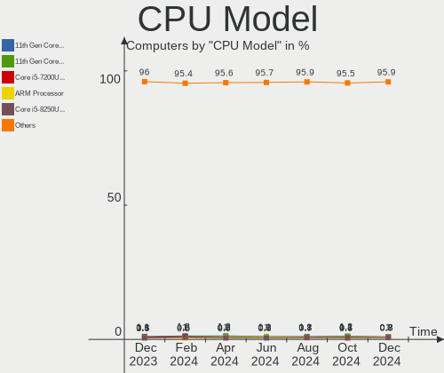
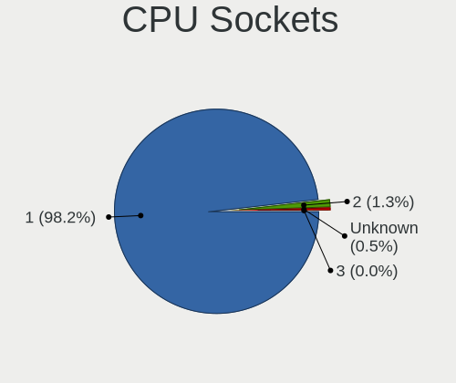
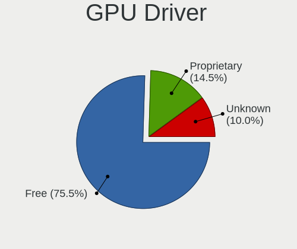
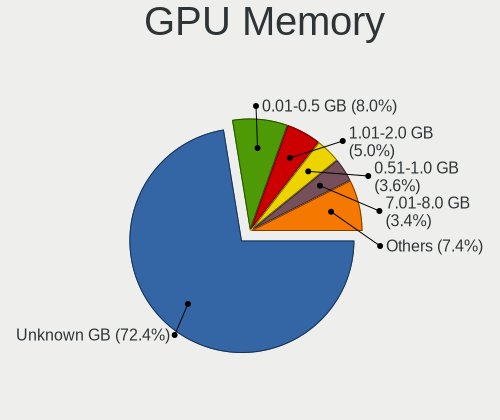
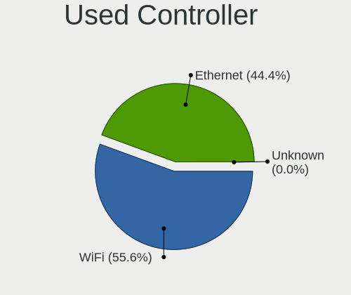
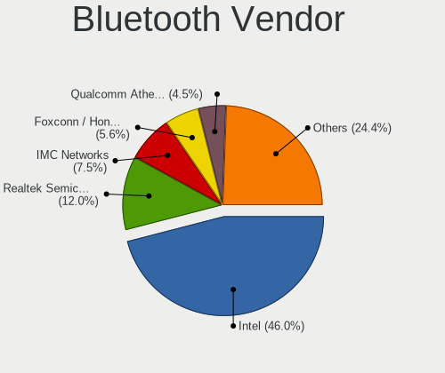

Linux Hardware Trends
---------------------

A project to identify most popular hardware characteristics and track their change
over time based on data collected by Linux users at https://Linux-Hardware.org.

Anyone can contribute to this report by the [hw-probe](https://github.com/linuxhw/hw-probe) tool:

    sudo -E hw-probe -all -upload

This is a report for all computer types. See also reports for [desktops](/Desktop/README.md) and [notebooks](/Notebook/README.md).

Full-feature report is available here: https://linux-hardware.org/?view=trends

Distribution-specific reports: [Ubuntu](/Dist/Ubuntu), [Debian](/Dist/Debian), [Linux Mint](/Dist/Linux_Mint), [Pop!_OS](/Dist/Pop!_OS), [Fedora](/Dist/Fedora), [OpenMandriva](/Dist/OpenMandriva), [Manjaro](/Dist/Manjaro), [Zorin](/Dist/Zorin), [Arch](/Dist/Arch), [KDE neon](/Dist/KDE_neon), [ROSA](/Dist/ROSA), [Xubuntu](/Dist/Xubuntu), [Kubuntu](/Dist/Kubuntu), [ArcoLinux](/Dist/ArcoLinux), [CentOS](/Dist/CentOS), [BlackPanther](/Dist/BlackPanther), [openSUSE](/Dist/openSUSE), [Clear Linux](/Dist/Clear_Linux), [Endless](/Dist/Endless), [Gentoo](/Dist/Gentoo).

Period: Sep, 2021.

Contents
--------

* [ System ](#system)
  - [ OS                       ](#os)
  - [ OS Family                ](#os-family)
  - [ Kernel                   ](#kernel)
  - [ Kernel Family            ](#kernel-family)
  - [ Kernel Major Ver.        ](#kernel-major-ver)
  - [ Arch                     ](#arch)
  - [ DE                       ](#de)
  - [ Display Server           ](#display-server)
  - [ Display Manager          ](#display-manager)
  - [ OS Lang                  ](#os-lang)
  - [ Boot Mode                ](#boot-mode)
  - [ Filesystem               ](#filesystem)
  - [ Part. scheme             ](#part-scheme)
  - [ Dual Boot with Linux/BSD ](#dual-boot-with-linuxbsd)
  - [ Dual Boot (Win)          ](#dual-boot-win)

* [ Board ](#board)
  - [ Vendor                   ](#vendor)
  - [ Model                    ](#model)
  - [ Model Family             ](#model-family)
  - [ MFG Year                 ](#mfg-year)
  - [ Form Factor              ](#form-factor)
  - [ Secure Boot              ](#secure-boot)
  - [ Coreboot                 ](#coreboot)
  - [ RAM Size                 ](#ram-size)
  - [ RAM Used                 ](#ram-used)
  - [ Total Drives             ](#total-drives)
  - [ Has CD-ROM               ](#has-cd-rom)
  - [ Has Ethernet             ](#has-ethernet)
  - [ Has WiFi                 ](#has-wifi)
  - [ Has Bluetooth            ](#has-bluetooth)

* [ Location ](#location)
  - [ Country                  ](#country)
  - [ City                     ](#city)

* [ Drives ](#drives)
  - [ Drive Vendor             ](#drive-vendor)
  - [ Drive Model              ](#drive-model)
  - [ HDD Vendor               ](#hdd-vendor)
  - [ SSD Vendor               ](#ssd-vendor)
  - [ Drive Kind               ](#drive-kind)
  - [ Drive Connector          ](#drive-connector)
  - [ Drive Size               ](#drive-size)
  - [ Space Total              ](#space-total)
  - [ Space Used               ](#space-used)
  - [ Malfunc. Drives          ](#malfunc-drives)
  - [ Malfunc. Drive Vendor    ](#malfunc-drive-vendor)
  - [ Malfunc. HDD Vendor      ](#malfunc-hdd-vendor)
  - [ Malfunc. Drive Kind      ](#malfunc-drive-kind)
  - [ Failed Drives            ](#failed-drives)
  - [ Failed Drive Vendor      ](#failed-drive-vendor)
  - [ Drive Status             ](#drive-status)

* [ Storage controller ](#storage-controller)
  - [ Storage Vendor           ](#storage-vendor)
  - [ Storage Model            ](#storage-model)
  - [ Storage Kind             ](#storage-kind)

* [ Processor ](#processor)
  - [ CPU Vendor               ](#cpu-vendor)
  - [ CPU Model                ](#cpu-model)
  - [ CPU Model Family         ](#cpu-model-family)
  - [ CPU Cores                ](#cpu-cores)
  - [ CPU Sockets              ](#cpu-sockets)
  - [ CPU Threads              ](#cpu-threads)
  - [ CPU Op-Modes             ](#cpu-op-modes)
  - [ CPU Microcode            ](#cpu-microcode)
  - [ CPU Microarch            ](#cpu-microarch)

* [ Graphics ](#graphics)
  - [ GPU Vendor               ](#gpu-vendor)
  - [ GPU Model                ](#gpu-model)
  - [ GPU Combo                ](#gpu-combo)
  - [ GPU Driver               ](#gpu-driver)
  - [ GPU Memory               ](#gpu-memory)

* [ Monitor ](#monitor)
  - [ Monitor Vendor           ](#monitor-vendor)
  - [ Monitor Model            ](#monitor-model)
  - [ Monitor Resolution       ](#monitor-resolution)
  - [ Monitor Diagonal         ](#monitor-diagonal)
  - [ Monitor Width            ](#monitor-width)
  - [ Aspect Ratio             ](#aspect-ratio)
  - [ Monitor Area             ](#monitor-area)
  - [ Pixel Density            ](#pixel-density)
  - [ Multiple Monitors        ](#multiple-monitors)

* [ Network ](#network)
  - [ Net Controller Vendor    ](#net-controller-vendor)
  - [ Net Controller Model     ](#net-controller-model)
  - [ Wireless Vendor          ](#wireless-vendor)
  - [ Wireless Model           ](#wireless-model)
  - [ Ethernet Vendor          ](#ethernet-vendor)
  - [ Ethernet Model           ](#ethernet-model)
  - [ Net Controller Kind      ](#net-controller-kind)
  - [ Used Controller          ](#used-controller)
  - [ NICs                     ](#nics)
  - [ IPv6                     ](#ipv6)

* [ Bluetooth ](#bluetooth)
  - [ Bluetooth Vendor         ](#bluetooth-vendor)
  - [ Bluetooth Model          ](#bluetooth-model)

* [ Sound ](#sound)
  - [ Sound Vendor             ](#sound-vendor)
  - [ Sound Model              ](#sound-model)

* [ Memory ](#memory)
  - [ Memory Vendor            ](#memory-vendor)
  - [ Memory Model             ](#memory-model)
  - [ Memory Kind              ](#memory-kind)
  - [ Memory Form Factor       ](#memory-form-factor)
  - [ Memory Size              ](#memory-size)
  - [ Memory Speed             ](#memory-speed)

* [ Printers & scanners ](#printers--scanners)
  - [ Printer Vendor           ](#printer-vendor)
  - [ Printer Model            ](#printer-model)
  - [ Scanner Vendor           ](#scanner-vendor)
  - [ Scanner Model            ](#scanner-model)

* [ Camera ](#camera)
  - [ Camera Vendor            ](#camera-vendor)
  - [ Camera Model             ](#camera-model)

* [ Security ](#security)
  - [ Fingerprint Vendor       ](#fingerprint-vendor)
  - [ Fingerprint Model        ](#fingerprint-model)
  - [ Chipcard Vendor          ](#chipcard-vendor)
  - [ Chipcard Model           ](#chipcard-model)

* [ Unsupported ](#unsupported)
  - [ Unsupported Devices      ](#unsupported-devices)
  - [ Unsupported Device Types ](#unsupported-device-types)

System
------

OS
--

Installed operating systems

| Name                | Computers | Percent |
|---------------------|-----------|---------|
| Ubuntu 20.04        | 820       | 17.35%  |
| Debian 11           | 374       | 7.92%   |
| Mint 20.2           | 341       | 7.22%   |
| Ubuntu 21.04        | 316       | 6.69%   |
| Pop!_OS 21.04       | 300       | 6.35%   |
| Fedora 34           | 226       | 4.78%   |
| OpenMandriva 4.2    | 215       | 4.55%   |
| Zorin 16            | 207       | 4.38%   |
| Arch                | 97        | 2.05%   |
| KDE neon 20.04      | 92        | 1.95%   |
| ArcoLinux Rolling   | 89        | 1.88%   |
| ROSA R11.1          | 87        | 1.84%   |
| Ubuntu 18.04        | 80        | 1.69%   |
| Manjaro             | 76        | 1.61%   |
| Xubuntu 20.04       | 60        | 1.27%   |
| BlackPanther 18.1   | 58        | 1.23%   |
| Arch Rolling        | 57        | 1.21%   |
| Elementary 6        | 49        | 1.04%   |
| Linux Mint 19.3     | 44        | 0.93%   |
| Gentoo 2.7          | 44        | 0.93%   |
| Mint 20.1           | 43        | 0.91%   |
| Zorin 15            | 41        | 0.87%   |
| Kubuntu 20.04       | 40        | 0.85%   |
| Endless 3.9.5       | 40        | 0.85%   |
| Manjaro 21.1.2      | 39        | 0.83%   |
| Pop!_OS 20.04       | 38        | 0.8%    |
| Ubuntu 21.10        | 33        | 0.7%    |
| Linux Mint 20       | 30        | 0.63%   |
| Kubuntu 21.04       | 30        | 0.63%   |
| Debian 10           | 30        | 0.63%   |
| Manjaro 21.1.3      | 28        | 0.59%   |
| Kali 2021.3         | 26        | 0.55%   |
| EndeavourOS Rolling | 25        | 0.53%   |
| OpenMandriva 4.50   | 23        | 0.49%   |
| LMDE 4              | 23        | 0.49%   |
| Xubuntu 18.04       | 22        | 0.47%   |
| Ubuntu 20.10        | 21        | 0.44%   |
| CentOS 8            | 18        | 0.38%   |
| Manjaro 21.1.1      | 17        | 0.36%   |
| Fedora 35           | 17        | 0.36%   |
| Ubuntu MATE 20.04   | 16        | 0.34%   |
| Ubuntu 16.04        | 16        | 0.34%   |
| Debian Testing      | 16        | 0.34%   |
| Lubuntu 20.04       | 15        | 0.32%   |
| LinuxFX 11          | 15        | 0.32%   |
| ROSA R12            | 14        | 0.3%    |
| Manjaro 21.1.4      | 13        | 0.28%   |
| Xubuntu 21.04       | 12        | 0.25%   |
| ROSA R11            | 11        | 0.23%   |
| Garuda Soaring      | 10        | 0.21%   |
| Fedora 33           | 10        | 0.21%   |
| Raspbian 10         | 9         | 0.19%   |
| Pop!_OS 20.10       | 9         | 0.19%   |
| openSUSE Leap-15.3  | 9         | 0.19%   |
| Parrot 4.11         | 8         | 0.17%   |
| RHEL 8              | 7         | 0.15%   |
| Peppermint 10       | 7         | 0.15%   |
| Ubuntu MATE 21.04   | 6         | 0.13%   |
| Ubuntu Budgie 21.04 | 6         | 0.13%   |
| Kali 2021.2         | 6         | 0.13%   |

OS Family
---------

OS without a version

| Name          | Computers | Percent |
|---------------|-----------|---------|
| Ubuntu        | 1300      | 27.51%  |
| Mint          | 468       | 9.9%    |
| Debian        | 430       | 9.1%    |
| Pop!_OS       | 347       | 7.34%   |
| Fedora        | 261       | 5.52%   |
| Zorin         | 249       | 5.27%   |
| OpenMandriva  | 238       | 5.04%   |
| Manjaro       | 175       | 3.7%    |
| Arch          | 154       | 3.26%   |
| ROSA          | 115       | 2.43%   |
| Xubuntu       | 99        | 2.1%    |
| KDE neon      | 92        | 1.95%   |
| ArcoLinux     | 91        | 1.93%   |
| Kubuntu       | 83        | 1.76%   |
| BlackPanther  | 59        | 1.25%   |
| Elementary    | 55        | 1.16%   |
| Endless       | 50        | 1.06%   |
| openSUSE      | 46        | 0.97%   |
| Gentoo        | 46        | 0.97%   |
| Kali          | 32        | 0.68%   |
| EndeavourOS   | 30        | 0.63%   |
| Lubuntu       | 28        | 0.59%   |
| Ubuntu MATE   | 27        | 0.57%   |
| CentOS        | 25        | 0.53%   |
| LMDE          | 23        | 0.49%   |
| LinuxFX       | 18        | 0.38%   |
| Clear Linux   | 16        | 0.34%   |
| Garuda        | 12        | 0.25%   |
| Void          | 9         | 0.19%   |
| Raspbian      | 9         | 0.19%   |
| Parrot        | 9         | 0.19%   |
| RHEL          | 8         | 0.17%   |
| ALT Linux     | 8         | 0.17%   |
| Ubuntu Budgie | 7         | 0.15%   |
| Peppermint    | 7         | 0.15%   |
| MX            | 7         | 0.15%   |
| Alpine        | 6         | 0.13%   |
| Slackware     | 5         | 0.11%   |
| GNOME OS      | 5         | 0.11%   |
| Makulu        | 4         | 0.08%   |
| Mageia        | 4         | 0.08%   |
| Devuan        | 4         | 0.08%   |
| Deepin        | 4         | 0.08%   |
| ClearOS       | 4         | 0.08%   |
| Artix         | 4         | 0.08%   |
| Solus         | 3         | 0.06%   |
| Siduction     | 3         | 0.06%   |
| Rocky         | 3         | 0.06%   |
| Red OS        | 3         | 0.06%   |
| RED           | 3         | 0.06%   |
| Kaisen        | 3         | 0.06%   |
| XCP-ng        | 2         | 0.04%   |
| Reborn OS     | 2         | 0.04%   |
| Q4OS          | 2         | 0.04%   |
| PureOS        | 2         | 0.04%   |
| Pardus        | 2         | 0.04%   |
| Oracle Linux  | 2         | 0.04%   |
| Android       | 2         | 0.04%   |
| XF            | 1         | 0.02%   |
| Virtuozzo     | 1         | 0.02%   |

Kernel
------

Version of the Linux kernel

| Version                             | Computers | Percent |
|-------------------------------------|-----------|---------|
| 5.11.0-34-generic                   | 601       | 12.72%  |
| 5.11.0-27-generic                   | 361       | 7.64%   |
| 5.10.0-8-amd64                      | 274       | 5.8%    |
| 5.11.0-36-generic                   | 246       | 5.21%   |
| 5.4.0-84-generic                    | 230       | 4.87%   |
| 5.10.14-desktop-1omv4002            | 206       | 4.36%   |
| 5.4.0-81-generic                    | 187       | 3.96%   |
| 5.11.0-7633-generic                 | 164       | 3.47%   |
| 5.13.0-7614-generic                 | 129       | 2.73%   |
| 5.11.0-37-generic                   | 91        | 1.93%   |
| 5.11.0-31-generic                   | 87        | 1.84%   |
| 5.10.0-7-amd64                      | 84        | 1.78%   |
| 5.4.0-86-generic                    | 77        | 1.63%   |
| 5.13.13-arch1-1                     | 65        | 1.38%   |
| 5.13.16-200.fc34.x86_64             | 46        | 0.97%   |
| 5.13.14-200.fc34.x86_64             | 45        | 0.95%   |
| 5.8.0-14-generic                    | 40        | 0.85%   |
| 5.4.0-88-generic                    | 39        | 0.83%   |
| 5.11.0-7620-generic                 | 39        | 0.83%   |
| 5.4.0-74-generic                    | 35        | 0.74%   |
| 4.18.16-desktop-1bP                 | 32        | 0.68%   |
| 5.14.6-arch1-1                      | 31        | 0.66%   |
| 5.4.83-generic-2rosa-x86_64         | 30        | 0.63%   |
| 5.13.13-1-MANJARO                   | 30        | 0.63%   |
| 5.13.19-200.fc34.x86_64             | 29        | 0.61%   |
| 5.13.13-200.fc34.x86_64             | 29        | 0.61%   |
| 4.19.0-17-amd64                     | 29        | 0.61%   |
| 5.13.0-16-generic                   | 28        | 0.59%   |
| 5.10.0-kali9-amd64                  | 28        | 0.59%   |
| 5.8.0-63-generic                    | 27        | 0.57%   |
| 5.6.14-desktop-2bP                  | 26        | 0.55%   |
| 5.13.12-200.fc34.x86_64             | 26        | 0.55%   |
| 5.14.2-arch1-2                      | 24        | 0.51%   |
| 5.14.7-arch1-1                      | 21        | 0.44%   |
| 5.13.15-200.fc34.x86_64             | 20        | 0.42%   |
| 4.15.0-desktop-122.124.1rosa-x86_64 | 20        | 0.42%   |
| 5.14.0-0-MANJARO                    | 19        | 0.4%    |
| 5.12.4-desktop-1omv4050             | 19        | 0.4%    |
| 5.13.12-1-MANJARO                   | 18        | 0.38%   |
| 5.11.0-16-generic                   | 18        | 0.38%   |
| 5.4.32-generic-2rosa-x86_64         | 17        | 0.36%   |
| 5.11.12-300.fc34.x86_64             | 17        | 0.36%   |
| 5.10.0-8-arm64                      | 17        | 0.36%   |
| 5.4.0-80-generic                    | 16        | 0.34%   |
| 5.13.15-1-MANJARO                   | 16        | 0.34%   |
| 5.11.0-35-generic                   | 16        | 0.34%   |
| 5.8.0-43-generic                    | 15        | 0.32%   |
| 5.14.2-1-MANJARO                    | 15        | 0.32%   |
| 5.10.61-gentoo                      | 15        | 0.32%   |
| 5.13.0-14-generic                   | 14        | 0.3%    |
| 5.10.61-1-MANJARO                   | 14        | 0.3%    |
| 5.4.0-42-generic                    | 13        | 0.28%   |
| 5.14.5-arch1-1                      | 13        | 0.28%   |
| 5.14.3-arch1-1                      | 13        | 0.28%   |
| 5.10.60-1-MANJARO                   | 13        | 0.28%   |
| 5.14.8-arch1-1                      | 11        | 0.23%   |
| 5.11.0-25-generic                   | 11        | 0.23%   |
| 4.15.0-156-generic                  | 11        | 0.23%   |
| 4.15.0-142-generic                  | 11        | 0.23%   |
| 5.4.32-generic-2rosa-i586           | 10        | 0.21%   |

Kernel Family
-------------

Linux kernel without a distro release

| Version | Computers | Percent |
|---------|-----------|---------|
| 5.11.0  | 1684      | 35.64%  |
| 5.4.0   | 678       | 14.35%  |
| 5.10.0  | 453       | 9.59%   |
| 5.10.14 | 206       | 4.36%   |
| 5.13.0  | 179       | 3.79%   |
| 5.13.13 | 160       | 3.39%   |
| 5.8.0   | 120       | 2.54%   |
| 4.15.0  | 91        | 1.93%   |
| 5.13.12 | 58        | 1.23%   |
| 5.14.2  | 57        | 1.21%   |
| 5.14.6  | 53        | 1.12%   |
| 5.14.0  | 51        | 1.08%   |
| 5.13.15 | 51        | 1.08%   |
| 5.13.16 | 49        | 1.04%   |
| 5.13.14 | 48        | 1.02%   |
| 5.10.61 | 47        | 0.99%   |
| 4.19.0  | 45        | 0.95%   |
| 5.13.19 | 43        | 0.91%   |
| 5.14.7  | 41        | 0.87%   |
| 5.4.83  | 32        | 0.68%   |
| 4.18.16 | 32        | 0.68%   |
| 4.18.0  | 31        | 0.66%   |
| 5.4.32  | 27        | 0.57%   |
| 5.6.14  | 26        | 0.55%   |
| 5.11.12 | 26        | 0.55%   |
| 5.14.5  | 25        | 0.53%   |
| 5.10.60 | 25        | 0.53%   |
| 5.14.8  | 24        | 0.51%   |
| 5.14.3  | 24        | 0.51%   |
| 5.14.1  | 20        | 0.42%   |
| 5.12.4  | 19        | 0.4%    |
| 5.0.0   | 17        | 0.36%   |
| 5.10.63 | 14        | 0.3%    |
| 5.3.18  | 13        | 0.28%   |
| 3.10.0  | 12        | 0.25%   |
| 5.3.0   | 11        | 0.23%   |
| 5.10.62 | 11        | 0.23%   |
| 5.10.52 | 11        | 0.23%   |
| 5.10.68 | 10        | 0.21%   |
| 5.10.56 | 10        | 0.21%   |
| 5.11.22 | 9         | 0.19%   |
| 5.13.9  | 7         | 0.15%   |
| 5.13.8  | 7         | 0.15%   |
| 5.12.19 | 7         | 0.15%   |
| 4.4.0   | 7         | 0.15%   |
| 4.9.0   | 6         | 0.13%   |
| 5.15.0  | 5         | 0.11%   |
| 5.13.10 | 5         | 0.11%   |
| 5.10.69 | 5         | 0.11%   |
| 5.10.64 | 5         | 0.11%   |
| 5.9.16  | 4         | 0.08%   |
| 5.14.4  | 4         | 0.08%   |
| 5.10.65 | 4         | 0.08%   |
| 4.9.155 | 4         | 0.08%   |
| 5.9.0   | 3         | 0.06%   |
| 5.4.144 | 3         | 0.06%   |
| 5.13.4  | 3         | 0.06%   |
| 5.12.7  | 3         | 0.06%   |
| 5.12.18 | 3         | 0.06%   |
| 5.12.0  | 3         | 0.06%   |

Kernel Major Ver.
-----------------

Linux kernel major version

| Version | Computers | Percent |
|---------|-----------|---------|
| 5.11    | 1727      | 36.55%  |
| 5.10    | 821       | 17.38%  |
| 5.4     | 750       | 15.87%  |
| 5.13    | 618       | 13.08%  |
| 5.14    | 299       | 6.33%   |
| 5.8     | 123       | 2.6%    |
| 4.15    | 91        | 1.93%   |
| 4.18    | 63        | 1.33%   |
| 4.19    | 48        | 1.02%   |
| 5.12    | 44        | 0.93%   |
| 5.6     | 30        | 0.63%   |
| 5.3     | 24        | 0.51%   |
| 5.0     | 17        | 0.36%   |
| 3.10    | 15        | 0.32%   |
| 4.9     | 14        | 0.3%    |
| 5.9     | 7         | 0.15%   |
| 4.4     | 7         | 0.15%   |
| 5.15    | 5         | 0.11%   |
| 5.7     | 4         | 0.08%   |
| 5.5     | 4         | 0.08%   |
| 4.16    | 3         | 0.06%   |
| 4.13    | 3         | 0.06%   |
| 4.14    | 2         | 0.04%   |
| 4.1     | 2         | 0.04%   |
| 5.2     | 1         | 0.02%   |
| 5       | 1         | 0.02%   |
| 4.17    | 1         | 0.02%   |
| 2.6     | 1         | 0.02%   |

Arch
----

OS architecture (x86_64, i586, etc.)

| Name    | Computers | Percent |
|---------|-----------|---------|
| x86_64  | 4569      | 96.7%   |
| i686    | 94        | 1.99%   |
| aarch64 | 50        | 1.06%   |
| armv7l  | 9         | 0.19%   |
| ppc64   | 1         | 0.02%   |
| armv8l  | 1         | 0.02%   |
| armv6l  | 1         | 0.02%   |

DE
--

Desktop Environment

| Name              | Computers | Percent |
|-------------------|-----------|---------|
| GNOME             | 2231      | 47.22%  |
| KDE5              | 672       | 14.22%  |
| Unknown           | 416       | 8.8%    |
| XFCE              | 363       | 7.68%   |
| X-Cinnamon        | 361       | 7.64%   |
| KDE               | 151       | 3.2%    |
| MATE              | 132       | 2.79%   |
| KDE4              | 65        | 1.38%   |
| Pantheon          | 52        | 1.1%    |
| Cinnamon          | 50        | 1.06%   |
| LXQt              | 40        | 0.85%   |
| i3                | 37        | 0.78%   |
| LXDE              | 22        | 0.47%   |
| Unity             | 18        | 0.38%   |
| GNOME Flashback   | 16        | 0.34%   |
| awesome           | 15        | 0.32%   |
| Budgie            | 14        | 0.3%    |
| Deepin            | 12        | 0.25%   |
| GNOME Classic     | 10        | 0.21%   |
| xmonad            | 9         | 0.19%   |
| Openbox           | 6         | 0.13%   |
| sway              | 5         | 0.11%   |
| bspwm             | 5         | 0.11%   |
| qtile             | 4         | 0.08%   |
| lightdm-xsession  | 3         | 0.06%   |
| DWM               | 3         | 0.06%   |
| trinity           | 2         | 0.04%   |
| i3-with-shmlog    | 2         | 0.04%   |
| GNUstep           | 2         | 0.04%   |
| Yaru:ubuntu:GNOME | 1         | 0.02%   |
| Peppermint        | 1         | 0.02%   |
| NsCDE             | 1         | 0.02%   |
| leftwm            | 1         | 0.02%   |
| fvwm2             | 1         | 0.02%   |
| fvwm              | 1         | 0.02%   |
| Enlightenment     | 1         | 0.02%   |

Display Server
--------------

X11 or Wayland

| Name        | Computers | Percent |
|-------------|-----------|---------|
| X11         | 3697      | 78.24%  |
| Wayland     | 633       | 13.4%   |
| Unknown     | 273       | 5.78%   |
| Tty         | 120       | 2.54%   |
| Web         | 1         | 0.02%   |
| Unspecified | 1         | 0.02%   |

Display Manager
---------------

SDDM, LightDM, etc.

| Name    | Computers | Percent |
|---------|-----------|---------|
| Unknown | 2440      | 51.64%  |
| GDM     | 751       | 15.89%  |
| SDDM    | 684       | 14.48%  |
| LightDM | 540       | 11.43%  |
| GDM3    | 220       | 4.66%   |
| KDM     | 63        | 1.33%   |
| LXDM    | 11        | 0.23%   |
| XDM     | 8         | 0.17%   |
| SLiM    | 3         | 0.06%   |
| TDM     | 2         | 0.04%   |
| MDM     | 1         | 0.02%   |
| Ly      | 1         | 0.02%   |
| GREETD  | 1         | 0.02%   |

OS Lang
-------

Language

| Lang    | Computers | Percent |
|---------|-----------|---------|
| en_US   | 1895      | 40.11%  |
| de_DE   | 374       | 7.92%   |
| ru_RU   | 318       | 6.73%   |
| en_GB   | 250       | 5.29%   |
| fr_FR   | 233       | 4.93%   |
| pt_BR   | 222       | 4.7%    |
| Unknown | 187       | 3.96%   |
| es_ES   | 107       | 2.26%   |
| en_AU   | 95        | 2.01%   |
| it_IT   | 87        | 1.84%   |
| en_CA   | 86        | 1.82%   |
| en_IN   | 85        | 1.8%    |
| pl_PL   | 79        | 1.67%   |
| C       | 76        | 1.61%   |
| hu_HU   | 48        | 1.02%   |
| cs_CZ   | 46        | 0.97%   |
| es_MX   | 39        | 0.83%   |
| zh_CN   | 31        | 0.66%   |
| nl_NL   | 30        | 0.63%   |
| pt_PT   | 26        | 0.55%   |
| en_ZA   | 24        | 0.51%   |
| es_AR   | 21        | 0.44%   |
| de_AT   | 20        | 0.42%   |
| ru_UA   | 18        | 0.38%   |
| fr_CA   | 17        | 0.36%   |
| sv_SE   | 15        | 0.32%   |
| fr_BE   | 15        | 0.32%   |
| fi_FI   | 15        | 0.32%   |
| es_CO   | 15        | 0.32%   |
| es_CL   | 15        | 0.32%   |
| de_CH   | 15        | 0.32%   |
| tr_TR   | 13        | 0.28%   |
| nl_BE   | 13        | 0.28%   |
| nb_NO   | 13        | 0.28%   |
| en_NZ   | 13        | 0.28%   |
| ja_JP   | 11        | 0.23%   |
| ro_RO   | 10        | 0.21%   |
| en_IE   | 10        | 0.21%   |
| uk_UA   | 9         | 0.19%   |
| en_IL   | 9         | 0.19%   |
| hr_HR   | 8         | 0.17%   |
| es_CR   | 7         | 0.15%   |
| el_GR   | 6         | 0.13%   |
| sk_SK   | 5         | 0.11%   |
| ko_KR   | 5         | 0.11%   |
| en_PH   | 5         | 0.11%   |
| en_DK   | 5         | 0.11%   |
| da_DK   | 5         | 0.11%   |
| POSIX   | 4         | 0.08%   |
| ca_ES   | 4         | 0.08%   |
| zh_TW   | 3         | 0.06%   |
| fr_CH   | 3         | 0.06%   |
| es_PE   | 3         | 0.06%   |
| es_BO   | 3         | 0.06%   |
| en_SG   | 3         | 0.06%   |
| en_NG   | 3         | 0.06%   |
| bg_BG   | 3         | 0.06%   |
| unm_US  | 2         | 0.04%   |
| szl_PL  | 2         | 0.04%   |
| sr_RS   | 2         | 0.04%   |

Boot Mode
---------

EFI or BIOS

| Mode | Computers | Percent |
|------|-----------|---------|
| BIOS | 2441      | 51.66%  |
| EFI  | 2284      | 48.34%  |

Filesystem
----------

Type of filesystem

| Type     | Computers | Percent |
|----------|-----------|---------|
| Ext4     | 3670      | 77.67%  |
| Overlay  | 497       | 10.52%  |
| Btrfs    | 392       | 8.3%    |
| Xfs      | 90        | 1.9%    |
| Zfs      | 31        | 0.66%   |
| Ext3     | 15        | 0.32%   |
| F2fs     | 9         | 0.19%   |
| Ext2     | 9         | 0.19%   |
| Reiserfs | 3         | 0.06%   |
| Unknown  | 3         | 0.06%   |
| Tmpfs    | 2         | 0.04%   |
| Aufs     | 2         | 0.04%   |
| SquXshfs | 1         | 0.02%   |
| ExX4     | 1         | 0.02%   |

Part. scheme
------------

Scheme of partitioning

| Type    | Computers | Percent |
|---------|-----------|---------|
| Unknown | 2421      | 51.24%  |
| GPT     | 1612      | 34.12%  |
| MBR     | 692       | 14.65%  |

Dual Boot with Linux/BSD
------------------------

Hosting more than one Linux/BSD

| Dual boot | Computers | Percent |
|-----------|-----------|---------|
| No        | 4141      | 87.64%  |
| Yes       | 584       | 12.36%  |

Dual Boot (Win)
---------------

Hosting Linux and Windows

| Dual boot | Computers | Percent |
|-----------|-----------|---------|
| No        | 3367      | 71.26%  |
| Yes       | 1358      | 28.74%  |

Board
-----

Vendor
------

Motherboard manufacturer

| Name                             | Computers | Percent |
|----------------------------------|-----------|---------|
| ASUSTek Computer                 | 799       | 16.91%  |
| Lenovo                           | 698       | 14.77%  |
| Hewlett-Packard                  | 610       | 12.91%  |
| Dell                             | 590       | 12.49%  |
| Acer                             | 318       | 6.73%   |
| Gigabyte Technology              | 303       | 6.41%   |
| MSI                              | 222       | 4.7%    |
| ASRock                           | 168       | 3.56%   |
| Apple                            | 123       | 2.6%    |
| Intel                            | 86        | 1.82%   |
| Toshiba                          | 77        | 1.63%   |
| Unknown                          | 75        | 1.59%   |
| Samsung Electronics              | 50        | 1.06%   |
| Sony                             | 36        | 0.76%   |
| Fujitsu                          | 32        | 0.68%   |
| ECS                              | 27        | 0.57%   |
| Google                           | 23        | 0.49%   |
| Medion                           | 22        | 0.47%   |
| Positivo                         | 20        | 0.42%   |
| Foxconn                          | 20        | 0.42%   |
| Raspberry Pi Foundation          | 19        | 0.4%    |
| Pegatron                         | 19        | 0.4%    |
| HUAWEI                           | 18        | 0.38%   |
| Notebook                         | 16        | 0.34%   |
| Fujitsu Siemens                  | 16        | 0.34%   |
| Biostar                          | 16        | 0.34%   |
| Timi                             | 15        | 0.32%   |
| Microsoft                        | 15        | 0.32%   |
| TUXEDO                           | 13        | 0.28%   |
| Packard Bell                     | 13        | 0.28%   |
| Supermicro                       | 12        | 0.25%   |
| Gateway                          | 10        | 0.21%   |
| Alienware                        | 10        | 0.21%   |
| System76                         | 9         | 0.19%   |
| Huanan                           | 9         | 0.19%   |
| eMachines                        | 8         | 0.17%   |
| Chuwi                            | 8         | 0.17%   |
| LG Electronics                   | 7         | 0.15%   |
| Razer                            | 6         | 0.13%   |
| Clevo                            | 6         | 0.13%   |
| AMI                              | 6         | 0.13%   |
| Shuttle                          | 5         | 0.11%   |
| PC Specialist                    | 5         | 0.11%   |
| Panasonic                        | 5         | 0.11%   |
| Framework                        | 5         | 0.11%   |
| ZOTAC                            | 4         | 0.08%   |
| IBM                              | 4         | 0.08%   |
| HONOR                            | 4         | 0.08%   |
| Dynabook                         | 4         | 0.08%   |
| Teclast                          | 3         | 0.06%   |
| Schenker                         | 3         | 0.06%   |
| PCWare                           | 3         | 0.06%   |
| Metabox                          | 3         | 0.06%   |
| Linx                             | 3         | 0.06%   |
| HC                               | 3         | 0.06%   |
| GPD                              | 3         | 0.06%   |
| FUJITSU CLIENT COMPUTING LIMITED | 3         | 0.06%   |
| EVGA                             | 3         | 0.06%   |
| Eluktronics                      | 3         | 0.06%   |
| Wortmann AG                      | 2         | 0.04%   |

Model
-----

Motherboard model

| Name                                      | Computers | Percent |
|-------------------------------------------|-----------|---------|
| Unknown                                   | 81        | 1.71%   |
| ASUS All Series                           | 58        | 1.23%   |
| Lenovo ThinkPad L13 Yoga Gen 2 20VK0019US | 55        | 1.16%   |
| HP Notebook                               | 16        | 0.34%   |
| HP Pavilion dv6                           | 14        | 0.3%    |
| ASUS UX31E                                | 14        | 0.3%    |
| ECS H61H2-M13                             | 13        | 0.28%   |
| Dell OptiPlex 9020                        | 12        | 0.25%   |
| Dell Latitude E6430                       | 12        | 0.25%   |
| ASUS PRIME A320M-K                        | 12        | 0.25%   |
| Dell XPS 15 9500                          | 10        | 0.21%   |
| Dell OptiPlex 7010                        | 10        | 0.21%   |
| ASUS TUF GAMING X570-PLUS                 | 10        | 0.21%   |
| HP Pavilion g6                            | 9         | 0.19%   |
| HP 15                                     | 9         | 0.19%   |
| Gigabyte B450M DS3H                       | 9         | 0.19%   |
| Apple MacBookPro8,1                       | 9         | 0.19%   |
| RPi Raspberry Pi 4 Model B Rev 1.2        | 8         | 0.17%   |
| MSI MS-7817                               | 8         | 0.17%   |
| HP Pavilion dv7                           | 8         | 0.17%   |
| HP Pavilion 15                            | 8         | 0.17%   |
| Google Enguarde                           | 8         | 0.17%   |
| Dell XPS 15 9570                          | 8         | 0.17%   |
| Acer Nitro AN515-54                       | 8         | 0.17%   |
| Acer Aspire V3-571G                       | 8         | 0.17%   |
| Acer Aspire A315-23                       | 8         | 0.17%   |
| MSI MS-7C37                               | 7         | 0.15%   |
| MSI MS-7A34                               | 7         | 0.15%   |
| HP Pavilion Notebook                      | 7         | 0.15%   |
| HP EliteBook 820 G1                       | 7         | 0.15%   |
| Gigabyte H61M-S1                          | 7         | 0.15%   |
| Dell XPS 15 9560                          | 7         | 0.15%   |
| Dell XPS 15 7590                          | 7         | 0.15%   |
| Dell OptiPlex 3010                        | 7         | 0.15%   |
| Dell Latitude E7450                       | 7         | 0.15%   |
| Dell Latitude E6410                       | 7         | 0.15%   |
| ASUS ROG STRIX B550-F GAMING              | 7         | 0.15%   |
| ASUS P8H67-M                              | 7         | 0.15%   |
| ASUS P8H61-M LX3 PLUS R2.0                | 7         | 0.15%   |
| Apple MacBookAir7,2                       | 7         | 0.15%   |
| RPi Raspberry Pi 3 Model B Rev 1.2        | 6         | 0.13%   |
| Positivo MOBILE                           | 6         | 0.13%   |
| Lenovo IdeaPad Flex 5 14ARE05 81X2        | 6         | 0.13%   |
| HP Compaq Pro 6300 SFF                    | 6         | 0.13%   |
| Gigabyte X570 AORUS ELITE                 | 6         | 0.13%   |
| Gigabyte A320M-S2H                        | 6         | 0.13%   |
| Dell XPS 15 9510                          | 6         | 0.13%   |
| Dell XPS 13 7390                          | 6         | 0.13%   |
| Dell Latitude E6420                       | 6         | 0.13%   |
| Dell Latitude 5480                        | 6         | 0.13%   |
| ASUS Z170-A                               | 6         | 0.13%   |
| ASRock B450M Steel Legend                 | 6         | 0.13%   |
| Apple MacBookAir7,1                       | 6         | 0.13%   |
| MSI MS-7C91                               | 5         | 0.11%   |
| Lenovo ThinkPad T400 2768WGB              | 5         | 0.11%   |
| HP Pavilion x360 Convertible 14-dh1xxx    | 5         | 0.11%   |
| HP Pavilion Laptop 15-eg0xxx              | 5         | 0.11%   |
| HP Laptop 15s-fq2xxx                      | 5         | 0.11%   |
| HP Laptop 15s-eq2xxx                      | 5         | 0.11%   |
| HP Laptop 15-bs0xx                        | 5         | 0.11%   |

Model Family
------------

Motherboard model prefix

| Name                  | Computers | Percent |
|-----------------------|-----------|---------|
| Lenovo ThinkPad       | 350       | 7.41%   |
| Acer Aspire           | 208       | 4.4%    |
| Dell Latitude         | 163       | 3.45%   |
| Dell Inspiron         | 145       | 3.07%   |
| Lenovo IdeaPad        | 143       | 3.03%   |
| HP Pavilion           | 121       | 2.56%   |
| Dell XPS              | 92        | 1.95%   |
| Dell OptiPlex         | 85        | 1.8%    |
| Unknown               | 81        | 1.71%   |
| HP EliteBook          | 78        | 1.65%   |
| ASUS PRIME            | 77        | 1.63%   |
| ASUS ROG              | 70        | 1.48%   |
| Toshiba Satellite     | 61        | 1.29%   |
| HP Compaq             | 60        | 1.27%   |
| ASUS All              | 58        | 1.23%   |
| HP ProBook            | 52        | 1.1%    |
| ASUS VivoBook         | 51        | 1.08%   |
| HP Laptop             | 48        | 1.02%   |
| Dell Precision        | 45        | 0.95%   |
| ASUS TUF              | 45        | 0.95%   |
| Lenovo ThinkCentre    | 35        | 0.74%   |
| HP ENVY               | 30        | 0.63%   |
| Lenovo Yoga           | 29        | 0.61%   |
| Dell Vostro           | 28        | 0.59%   |
| Acer Swift            | 26        | 0.55%   |
| Acer Nitro            | 25        | 0.53%   |
| Gigabyte X570         | 21        | 0.44%   |
| ASUS P8H61-M          | 20        | 0.42%   |
| RPi Raspberry         | 19        | 0.4%    |
| HP EliteDesk          | 18        | 0.38%   |
| Gigabyte B450M        | 17        | 0.36%   |
| ASUS ZenBook          | 17        | 0.36%   |
| Acer TravelMate       | 17        | 0.36%   |
| HP ZBook              | 16        | 0.34%   |
| HP Notebook           | 16        | 0.34%   |
| HP 250                | 16        | 0.34%   |
| Fujitsu LIFEBOOK      | 16        | 0.34%   |
| ASUS ASUS             | 16        | 0.34%   |
| Microsoft Surface     | 15        | 0.32%   |
| Lenovo Legion         | 15        | 0.32%   |
| Fujitsu ESPRIMO       | 15        | 0.32%   |
| ASUS UX31E            | 14        | 0.3%    |
| ECS H61H2-M13         | 13        | 0.28%   |
| Dell PowerEdge        | 13        | 0.28%   |
| Apple MacBookAir7     | 13        | 0.28%   |
| Packard Bell EasyNote | 12        | 0.25%   |
| HP OMEN               | 12        | 0.25%   |
| ASUS Maximus          | 12        | 0.25%   |
| Lenovo ThinkBook      | 11        | 0.23%   |
| Lenovo IdeaCentre     | 11        | 0.23%   |
| HP ProDesk            | 11        | 0.23%   |
| ASUS M5A78L-M         | 11        | 0.23%   |
| Apple MacBookPro8     | 11        | 0.23%   |
| Gigabyte B450         | 10        | 0.21%   |
| HP 15                 | 9         | 0.19%   |
| ASUS P8H67-M          | 9         | 0.19%   |
| ASRock B450M          | 9         | 0.19%   |
| MSI MS-7817           | 8         | 0.17%   |
| MSI Modern            | 8         | 0.17%   |
| Google Enguarde       | 8         | 0.17%   |

MFG Year
--------

Motherboard manufacture year

| Year    | Computers | Percent |
|---------|-----------|---------|
| 2021    | 911       | 19.28%  |
| 2020    | 658       | 13.93%  |
| 2019    | 466       | 9.86%   |
| 2018    | 397       | 8.4%    |
| 2012    | 310       | 6.56%   |
| 2011    | 269       | 5.69%   |
| 2014    | 247       | 5.23%   |
| 2013    | 245       | 5.19%   |
| 2015    | 214       | 4.53%   |
| 2016    | 194       | 4.11%   |
| 2010    | 193       | 4.08%   |
| 2009    | 162       | 3.43%   |
| 2017    | 150       | 3.17%   |
| 2008    | 135       | 2.86%   |
| Unknown | 65        | 1.38%   |
| 2007    | 59        | 1.25%   |
| 2006    | 27        | 0.57%   |
| 2005    | 18        | 0.38%   |
| 2004    | 3         | 0.06%   |
| 2000    | 1         | 0.02%   |
| 1970    | 1         | 0.02%   |

Form Factor
-----------

Physical design of the computer

| Name           | Computers | Percent |
|----------------|-----------|---------|
| Notebook       | 2553      | 54.03%  |
| Desktop        | 1729      | 36.59%  |
| Convertible    | 179       | 3.79%   |
| Mini pc        | 59        | 1.25%   |
| All in one     | 59        | 1.25%   |
| System on chip | 58        | 1.23%   |
| Tablet         | 44        | 0.93%   |
| Server         | 41        | 0.87%   |
| Phone          | 2         | 0.04%   |
| Other          | 1         | 0.02%   |

Secure Boot
-----------

Enabled or disabled

| State    | Computers | Percent |
|----------|-----------|---------|
| Disabled | 4379      | 92.68%  |
| Enabled  | 346       | 7.32%   |

Coreboot
--------

Have coreboot on board

| Used | Computers | Percent |
|------|-----------|---------|
| No   | 4697      | 99.41%  |
| Yes  | 28        | 0.59%   |

RAM Size
--------

Total RAM memory

| Size in GB      | Computers | Percent |
|-----------------|-----------|---------|
| 4.01-8.0        | 1132      | 23.96%  |
| 16.01-24.0      | 990       | 20.95%  |
| 3.01-4.0        | 907       | 19.2%   |
| 8.01-16.0       | 846       | 17.9%   |
| 32.01-64.0      | 397       | 8.4%    |
| 1.01-2.0        | 172       | 3.64%   |
| 64.01-256.0     | 114       | 2.41%   |
| 2.01-3.0        | 64        | 1.35%   |
| 24.01-32.0      | 56        | 1.19%   |
| 0.51-1.0        | 34        | 0.72%   |
| More than 256.0 | 10        | 0.21%   |
| 0.01-0.5        | 2         | 0.04%   |
| Unknown         | 1         | 0.02%   |

RAM Used
--------

Used RAM memory

| Used GB     | Computers | Percent |
|-------------|-----------|---------|
| 1.01-2.0    | 1750      | 37.04%  |
| 2.01-3.0    | 1128      | 23.87%  |
| 4.01-8.0    | 615       | 13.02%  |
| 3.01-4.0    | 518       | 10.96%  |
| 0.51-1.0    | 397       | 8.4%    |
| 8.01-16.0   | 166       | 3.51%   |
| 0.01-0.5    | 103       | 2.18%   |
| 16.01-24.0  | 33        | 0.7%    |
| 24.01-32.0  | 5         | 0.11%   |
| Unknown     | 5         | 0.11%   |
| 32.01-64.0  | 3         | 0.06%   |
| 64.01-256.0 | 2         | 0.04%   |

Total Drives
------------

Number of drives on board

| Drives | Computers | Percent |
|--------|-----------|---------|
| 1      | 2956      | 62.56%  |
| 2      | 1102      | 23.32%  |
| 3      | 311       | 6.58%   |
| 4      | 196       | 4.15%   |
| 5      | 65        | 1.38%   |
| 0      | 31        | 0.66%   |
| 6      | 29        | 0.61%   |
| 7      | 14        | 0.3%    |
| 8      | 9         | 0.19%   |
| 10     | 3         | 0.06%   |
| 11     | 2         | 0.04%   |
| 9      | 2         | 0.04%   |
| 25     | 1         | 0.02%   |
| 19     | 1         | 0.02%   |
| 16     | 1         | 0.02%   |
| 13     | 1         | 0.02%   |
| 12     | 1         | 0.02%   |

Has CD-ROM
----------

Has CD-ROM on board

| Presented | Computers | Percent |
|-----------|-----------|---------|
| No        | 2920      | 61.8%   |
| Yes       | 1805      | 38.2%   |

Has Ethernet
------------

Has Ethernet on board

| Presented | Computers | Percent |
|-----------|-----------|---------|
| Yes       | 4045      | 85.61%  |
| No        | 680       | 14.39%  |

Has WiFi
--------

Has WiFi module

| Presented | Computers | Percent |
|-----------|-----------|---------|
| Yes       | 3535      | 74.81%  |
| No        | 1190      | 25.19%  |

Has Bluetooth
-------------

Has Bluetooth module

| Presented | Computers | Percent |
|-----------|-----------|---------|
| Yes       | 2808      | 59.43%  |
| No        | 1917      | 40.57%  |

Location
--------

Country
-------

Geographic location (country)

| Country      | Computers | Percent |
|--------------|-----------|---------|
| USA          | 889       | 18.81%  |
| Germany      | 466       | 9.86%   |
| Russia       | 357       | 7.56%   |
| Brazil       | 282       | 5.97%   |
| France       | 269       | 5.69%   |
| UK           | 196       | 4.15%   |
| Canada       | 141       | 2.98%   |
| India        | 130       | 2.75%   |
| Italy        | 122       | 2.58%   |
| Spain        | 119       | 2.52%   |
| Hungary      | 113       | 2.39%   |
| Poland       | 110       | 2.33%   |
| Australia    | 106       | 2.24%   |
| Netherlands  | 77        | 1.63%   |
| Switzerland  | 65        | 1.38%   |
| Ukraine      | 64        | 1.35%   |
| Czechia      | 64        | 1.35%   |
| Mexico       | 59        | 1.25%   |
| Belgium      | 55        | 1.16%   |
| Portugal     | 54        | 1.14%   |
| Austria      | 54        | 1.14%   |
| Sweden       | 51        | 1.08%   |
| Romania      | 49        | 1.04%   |
| Argentina    | 43        | 0.91%   |
| China        | 40        | 0.85%   |
| South Africa | 36        | 0.76%   |
| Norway       | 34        | 0.72%   |
| Turkey       | 33        | 0.7%    |
| Indonesia    | 32        | 0.68%   |
| Finland      | 28        | 0.59%   |
| Japan        | 27        | 0.57%   |
| Chile        | 23        | 0.49%   |
| Colombia     | 22        | 0.47%   |
| Belarus      | 22        | 0.47%   |
| Greece       | 21        | 0.44%   |
| Bulgaria     | 21        | 0.44%   |
| New Zealand  | 20        | 0.42%   |
| Israel       | 20        | 0.42%   |
| Iran         | 20        | 0.42%   |
| Malaysia     | 17        | 0.36%   |
| Denmark      | 17        | 0.36%   |
| Slovakia     | 16        | 0.34%   |
| Serbia       | 15        | 0.32%   |
| Philippines  | 14        | 0.3%    |
| Ireland      | 14        | 0.3%    |
| Croatia      | 14        | 0.3%    |
| Pakistan     | 13        | 0.28%   |
| Thailand     | 12        | 0.25%   |
| Taiwan       | 10        | 0.21%   |
| South Korea  | 10        | 0.21%   |
| Estonia      | 10        | 0.21%   |
| Algeria      | 10        | 0.21%   |
| Vietnam      | 9         | 0.19%   |
| Luxembourg   | 9         | 0.19%   |
| Latvia       | 9         | 0.19%   |
| Singapore    | 8         | 0.17%   |
| Costa Rica   | 8         | 0.17%   |
| Peru         | 7         | 0.15%   |
| Morocco      | 7         | 0.15%   |
| Lithuania    | 7         | 0.15%   |

City
----

Geographic location (city)

| City           | Computers | Percent |
|----------------|-----------|---------|
| Portland       | 89        | 1.88%   |
| Voronezh       | 87        | 1.84%   |
| Moscow         | 65        | 1.38%   |
| Paris          | 42        | 0.89%   |
| Sydney         | 37        | 0.78%   |
| S??o Paulo     | 35        | 0.74%   |
| Prague         | 33        | 0.7%    |
| Budapest       | 31        | 0.66%   |
| St Petersburg  | 30        | 0.63%   |
| Warsaw         | 29        | 0.61%   |
| Zurich         | 28        | 0.59%   |
| Vienna         | 28        | 0.59%   |
| Berlin         | 23        | 0.49%   |
| Munich         | 22        | 0.47%   |
| M??laga        | 20        | 0.42%   |
| London         | 19        | 0.4%    |
| Kyiv           | 19        | 0.4%    |
| Dallas         | 19        | 0.4%    |
| Amsterdam      | 19        | 0.4%    |
| Montreal       | 18        | 0.38%   |
| Tehran         | 17        | 0.36%   |
| Rio de Janeiro | 17        | 0.36%   |
| Milan          | 17        | 0.36%   |
| Toronto        | 16        | 0.34%   |
| Helsinki       | 16        | 0.34%   |
| Rome           | 15        | 0.32%   |
| Melbourne      | 15        | 0.32%   |
| Madrid         | 15        | 0.32%   |
| Sofia          | 14        | 0.3%    |
| Minsk          | 14        | 0.3%    |
| Fortaleza      | 14        | 0.3%    |
| Tatab??nya     | 13        | 0.28%   |
| Los Angeles    | 13        | 0.28%   |
| Hamburg        | 13        | 0.28%   |
| Brisbane       | 13        | 0.28%   |
| Oslo           | 12        | 0.25%   |
| Lisbon         | 12        | 0.25%   |
| Bengaluru      | 12        | 0.25%   |
| Barcelona      | 12        | 0.25%   |
| Auckland       | 12        | 0.25%   |
| Krakow         | 11        | 0.23%   |
| Johannesburg   | 11        | 0.23%   |
| Chicago        | 11        | 0.23%   |
| Belgrade       | 11        | 0.23%   |
| Austin         | 11        | 0.23%   |
| Athens         | 11        | 0.23%   |
| Yekaterinburg  | 10        | 0.21%   |
| Stockholm      | 10        | 0.21%   |
| Santiago       | 10        | 0.21%   |
| Rennes         | 10        | 0.21%   |
| Nuremberg      | 10        | 0.21%   |
| Novosibirsk    | 10        | 0.21%   |
| Miami          | 10        | 0.21%   |
| Leipzig        | 10        | 0.21%   |
| Jakarta        | 10        | 0.21%   |
| Curitiba       | 10        | 0.21%   |
| Buenos Aires   | 10        | 0.21%   |
| Bucharest      | 10        | 0.21%   |
| Tel Aviv       | 9         | 0.19%   |
| Seattle        | 9         | 0.19%   |

Drives
------

Drive Vendor
------------

Hard drive vendors

| Vendor                    | Computers | Drives | Percent |
|---------------------------|-----------|--------|---------|
| Samsung Electronics       | 1051      | 1285   | 15.86%  |
| WDC                       | 1043      | 1314   | 15.74%  |
| Seagate                   | 952       | 1115   | 14.37%  |
| Toshiba                   | 456       | 485    | 6.88%   |
| Kingston                  | 372       | 397    | 5.61%   |
| Unknown                   | 309       | 362    | 4.66%   |
| SanDisk                   | 296       | 311    | 4.47%   |
| Crucial                   | 227       | 256    | 3.43%   |
| Hitachi                   | 226       | 245    | 3.41%   |
| SK Hynix                  | 197       | 207    | 2.97%   |
| Intel                     | 173       | 189    | 2.61%   |
| HGST                      | 131       | 171    | 1.98%   |
| Micron Technology         | 101       | 108    | 1.52%   |
| A-DATA Technology         | 93        | 96     | 1.4%    |
| Phison                    | 66        | 73     | 1%      |
| Apple                     | 63        | 70     | 0.95%   |
| China                     | 49        | 52     | 0.74%   |
| KIOXIA                    | 42        | 45     | 0.63%   |
| PNY                       | 39        | 41     | 0.59%   |
| SPCC                      | 33        | 34     | 0.5%    |
| Silicon Motion            | 31        | 33     | 0.47%   |
| MAXTOR                    | 31        | 34     | 0.47%   |
| Fujitsu                   | 31        | 35     | 0.47%   |
| JMicron                   | 27        | 30     | 0.41%   |
| LITEON                    | 25        | 25     | 0.38%   |
| Intenso                   | 25        | 27     | 0.38%   |
| GOODRAM                   | 25        | 27     | 0.38%   |
| Corsair                   | 22        | 24     | 0.33%   |
| Micron/Crucial Technology | 21        | 22     | 0.32%   |
| Patriot                   | 20        | 20     | 0.3%    |
| Team                      | 18        | 18     | 0.27%   |
| OCZ                       | 18        | 18     | 0.27%   |
| Transcend                 | 17        | 17     | 0.26%   |
| Hewlett-Packard           | 17        | 21     | 0.26%   |
| LITEONIT                  | 15        | 16     | 0.23%   |
| XPG                       | 13        | 14     | 0.2%    |
| Union Memory              | 13        | 13     | 0.2%    |
| KingSpec                  | 13        | 14     | 0.2%    |
| Realtek Semiconductor     | 12        | 12     | 0.18%   |
| ASMT                      | 12        | 14     | 0.18%   |
| Netac                     | 11        | 11     | 0.17%   |
| PLEXTOR                   | 10        | 10     | 0.15%   |
| Gigabyte Technology       | 10        | 11     | 0.15%   |
| Union Memory (Shenzhen)   | 9         | 10     | 0.14%   |
| SABRENT                   | 9         | 10     | 0.14%   |
| Lite-On                   | 9         | 9      | 0.14%   |
| Lexar                     | 9         | 9      | 0.14%   |
| Apacer                    | 9         | 10     | 0.14%   |
| Unknown                   | 8         | 8      | 0.12%   |
| TO Exter                  | 7         | 8      | 0.11%   |
| Solid State Storage       | 7         | 7      | 0.11%   |
| Mushkin                   | 6         | 6      | 0.09%   |
| Lenovo                    | 6         | 7      | 0.09%   |
| Biostar                   | 6         | 6      | 0.09%   |
| Zheino                    | 5         | 5      | 0.08%   |
| Mass                      | 5         | 4      | 0.08%   |
| WD MediaMax               | 4         | 4      | 0.06%   |
| Vaseky                    | 4         | 4      | 0.06%   |
| KIOXIA-EXCERIA            | 4         | 4      | 0.06%   |
| HGST HTS                  | 4         | 4      | 0.06%   |

Drive Model
-----------

Hard drive models

| Model                               | Computers | Percent |
|-------------------------------------|-----------|---------|
| Kingston SA400S37240G 240GB SSD     | 74        | 1.02%   |
| Seagate ST1000LM035-1RK172 1TB      | 68        | 0.93%   |
| Samsung MZVLB512HBJQ-000L7 512GB    | 63        | 0.86%   |
| Samsung SSD 860 EVO 500GB           | 56        | 0.77%   |
| Samsung SSD 850 EVO 250GB           | 56        | 0.77%   |
| Samsung SSD 850 EVO 500GB           | 51        | 0.7%    |
| Unknown MMC Card  32GB              | 48        | 0.66%   |
| Kingston SA400S37120G 120GB SSD     | 48        | 0.66%   |
| Toshiba MQ01ABD100 1TB              | 47        | 0.65%   |
| Seagate ST1000DM010-2EP102 1TB      | 47        | 0.65%   |
| Samsung NVMe SSD Drive 512GB        | 46        | 0.63%   |
| Kingston SA400S37480G 480GB SSD     | 46        | 0.63%   |
| Unknown MMC Card  64GB              | 45        | 0.62%   |
| Toshiba DT01ACA100 1TB              | 45        | 0.62%   |
| HGST HTS721010A9E630 1TB            | 42        | 0.58%   |
| Seagate ST500DM002-1BD142 500GB     | 41        | 0.56%   |
| Seagate ST1000LM024 HN-M101MBB 1TB  | 39        | 0.54%   |
| Samsung NVMe SSD Drive 500GB        | 36        | 0.49%   |
| Samsung NVMe SSD Drive 256GB        | 36        | 0.49%   |
| Crucial CT500MX500SSD1 500GB        | 34        | 0.47%   |
| WDC WD10EZEX-08WN4A0 1TB            | 33        | 0.45%   |
| Toshiba MQ01ABF050 500GB            | 33        | 0.45%   |
| Samsung NVMe SSD Drive 1TB          | 33        | 0.45%   |
| Samsung SSD 860 EVO 250GB           | 32        | 0.44%   |
| Unknown SD/MMC/MS PRO 128GB         | 31        | 0.43%   |
| Toshiba MQ04ABF100 1TB              | 30        | 0.41%   |
| Seagate ST2000DM008-2FR102 2TB      | 29        | 0.4%    |
| Sandisk NVMe SSD Drive 512GB        | 29        | 0.4%    |
| WDC WDS500G2B0A-00SM50 500GB SSD    | 28        | 0.38%   |
| SK Hynix NVMe SSD Drive 512GB       | 28        | 0.38%   |
| Seagate ST500LT012-1DG142 500GB     | 28        | 0.38%   |
| Seagate Expansion 1TB               | 28        | 0.38%   |
| Samsung SSD 860 EVO 1TB             | 28        | 0.38%   |
| Seagate ST3500418AS 500GB           | 27        | 0.37%   |
| Kingston SV300S37A120G 120GB SSD    | 27        | 0.37%   |
| Samsung SSD 970 EVO Plus 1TB        | 26        | 0.36%   |
| Crucial CT240BX500SSD1 240GB        | 26        | 0.36%   |
| Samsung SSD 970 EVO Plus 500GB      | 25        | 0.34%   |
| Seagate ST9500325AS 500GB           | 24        | 0.33%   |
| Intel NVMe SSD Drive 512GB          | 24        | 0.33%   |
| Crucial CT480BX500SSD1 480GB        | 24        | 0.33%   |
| Crucial CT1000MX500SSD1 1TB         | 24        | 0.33%   |
| WDC WD5000AAKX-60U6AA0 500GB        | 23        | 0.32%   |
| Seagate ST2000DM001-1ER164 2TB      | 23        | 0.32%   |
| WDC WDS240G2G0A-00JH30 240GB SSD    | 20        | 0.27%   |
| Seagate ST1000DM003-1ER162 1TB      | 20        | 0.27%   |
| Seagate ST1000DM003-1CH162 1TB      | 20        | 0.27%   |
| Unknown MMC Card  128GB             | 19        | 0.26%   |
| Toshiba DT01ACA050 500GB            | 19        | 0.26%   |
| Seagate ST500LM012 HN-M500MBB 500GB | 19        | 0.26%   |
| Samsung NVMe SSD Drive 1024GB       | 19        | 0.26%   |
| Toshiba HDWD110 1TB                 | 18        | 0.25%   |
| Sandisk NVMe SSD Drive 256GB        | 18        | 0.25%   |
| WDC WD10SPZX-21Z10T0 1TB            | 17        | 0.23%   |
| WDC WD10JPVX-22JC3T0 1TB            | 17        | 0.23%   |
| Toshiba NVMe SSD Drive 512GB        | 17        | 0.23%   |
| Samsung SSD 860 QVO 1TB             | 17        | 0.23%   |
| Toshiba KBG30ZMS128G 128GB NVMe SSD | 16        | 0.22%   |
| Toshiba DT01ACA200 2TB              | 16        | 0.22%   |
| Seagate ST2000DM001-1CH164 2TB      | 16        | 0.22%   |

HDD Vendor
----------

Hard disk drive vendors

| Vendor              | Computers | Drives | Percent |
|---------------------|-----------|--------|---------|
| Seagate             | 932       | 1088   | 34.75%  |
| WDC                 | 799       | 1007   | 29.79%  |
| Toshiba             | 333       | 353    | 12.42%  |
| Hitachi             | 226       | 245    | 8.43%   |
| HGST                | 131       | 171    | 4.88%   |
| Samsung Electronics | 113       | 125    | 4.21%   |
| Unknown             | 34        | 51     | 1.27%   |
| Fujitsu             | 31        | 35     | 1.16%   |
| MAXTOR              | 26        | 29     | 0.97%   |
| Apple               | 19        | 19     | 0.71%   |
| TO Exter            | 7         | 8      | 0.26%   |
| Hewlett-Packard     | 5         | 8      | 0.19%   |
| WD MediaMax         | 3         | 3      | 0.11%   |
| MSFT                | 2         | 12     | 0.07%   |
| Intenso             | 2         | 2      | 0.07%   |
| IBM/Hitachi         | 2         | 2      | 0.07%   |
| HGST HTS            | 2         | 2      | 0.07%   |
| Dell                | 2         | 4      | 0.07%   |
| ASMT109x            | 2         | 2      | 0.07%   |
| ASMT                | 2         | 4      | 0.07%   |
| USB3.0              | 1         | 1      | 0.04%   |
| SILICONMOTION       | 1         | 1      | 0.04%   |
| MaxDigital          | 1         | 1      | 0.04%   |
| Magnetic Data       | 1         | 1      | 0.04%   |
| KESU                | 1         | 1      | 0.04%   |
| IBM                 | 1         | 2      | 0.04%   |
| ExcelStor           | 1         | 2      | 0.04%   |
| ASMT106x            | 1         | 1      | 0.04%   |
| Asmedia             | 1         | 1      | 0.04%   |

SSD Vendor
----------

Solid state drive vendors

| Vendor              | Computers | Drives | Percent |
|---------------------|-----------|--------|---------|
| Samsung Electronics | 504       | 573    | 23.29%  |
| Kingston            | 295       | 312    | 13.63%  |
| Crucial             | 206       | 233    | 9.52%   |
| SanDisk             | 202       | 211    | 9.33%   |
| WDC                 | 153       | 163    | 7.07%   |
| A-DATA Technology   | 67        | 68     | 3.1%    |
| Intel               | 61        | 63     | 2.82%   |
| SK Hynix            | 49        | 51     | 2.26%   |
| Micron Technology   | 49        | 53     | 2.26%   |
| China               | 49        | 52     | 2.26%   |
| Toshiba             | 42        | 42     | 1.94%   |
| PNY                 | 35        | 37     | 1.62%   |
| SPCC                | 30        | 31     | 1.39%   |
| Apple               | 25        | 25     | 1.16%   |
| GOODRAM             | 24        | 25     | 1.11%   |
| LITEON              | 21        | 21     | 0.97%   |
| Patriot             | 19        | 19     | 0.88%   |
| Intenso             | 19        | 21     | 0.88%   |
| OCZ                 | 18        | 18     | 0.83%   |
| Team                | 17        | 17     | 0.79%   |
| Transcend           | 16        | 16     | 0.74%   |
| Unknown             | 15        | 15     | 0.69%   |
| LITEONIT            | 15        | 16     | 0.69%   |
| Corsair             | 14        | 14     | 0.65%   |
| KingSpec            | 13        | 14     | 0.6%    |
| PLEXTOR             | 10        | 10     | 0.46%   |
| Netac               | 10        | 10     | 0.46%   |
| ASMT                | 10        | 10     | 0.46%   |
| Seagate             | 9         | 10     | 0.42%   |
| Lexar               | 9         | 9      | 0.42%   |
| Hewlett-Packard     | 9         | 10     | 0.42%   |
| Apacer              | 9         | 10     | 0.42%   |
| SABRENT             | 8         | 9      | 0.37%   |
| Gigabyte Technology | 8         | 8      | 0.37%   |
| Mushkin             | 6         | 6      | 0.28%   |
| MAXTOR              | 5         | 5      | 0.23%   |
| FORESEE             | 4         | 4      | 0.18%   |
| Biostar             | 4         | 4      | 0.18%   |
| Zheino              | 3         | 3      | 0.14%   |
| Verbatim            | 3         | 3      | 0.14%   |
| Vaseky              | 3         | 3      | 0.14%   |
| OWC                 | 3         | 3      | 0.14%   |
| LDLC                | 3         | 3      | 0.14%   |
| KIOXIA-EXCERIA      | 3         | 3      | 0.14%   |
| KingDian            | 3         | 3      | 0.14%   |
| JMicron             | 3         | 4      | 0.14%   |
| BIWIN               | 3         | 3      | 0.14%   |
| Unknown             | 3         | 3      | 0.14%   |
| XrayDisk            | 2         | 2      | 0.09%   |
| W800S               | 2         | 2      | 0.09%   |
| TYPEC 1T            | 2         | 2      | 0.09%   |
| Smartbuy            | 2         | 2      | 0.09%   |
| Palit               | 2         | 2      | 0.09%   |
| Leven               | 2         | 2      | 0.09%   |
| HS-SSD-C100         | 2         | 2      | 0.09%   |
| FOXLINE             | 2         | 2      | 0.09%   |
| DOGFISH             | 2         | 3      | 0.09%   |
| Colorful            | 2         | 2      | 0.09%   |
| BRAVEEAGLE          | 2         | 2      | 0.09%   |
| BHT                 | 2         | 2      | 0.09%   |

Drive Kind
----------

HDD or SSD

| Kind    | Computers | Drives | Percent |
|---------|-----------|--------|---------|
| HDD     | 2299      | 3181   | 38.02%  |
| SSD     | 1924      | 2324   | 31.82%  |
| NVMe    | 1482      | 1727   | 24.51%  |
| MMC     | 242       | 277    | 4%      |
| Unknown | 100       | 115    | 1.65%   |

Drive Connector
---------------

SATA, SAS, NVMe, etc.

| Type | Computers | Drives | Percent |
|------|-----------|--------|---------|
| SATA | 3489      | 5302   | 63.9%   |
| NVMe | 1471      | 1710   | 26.94%  |
| SAS  | 258       | 335    | 4.73%   |
| MMC  | 242       | 277    | 4.43%   |

Drive Size
----------

Size of hard drive

| Size in TB  | Computers | Drives | Percent |
|-------------|-----------|--------|---------|
| 0.01-0.5    | 2593      | 3215   | 59.05%  |
| 0.51-1.0    | 1278      | 1519   | 29.1%   |
| 1.01-2.0    | 310       | 381    | 7.06%   |
| 3.01-4.0    | 96        | 155    | 2.19%   |
| 2.01-3.0    | 50        | 70     | 1.14%   |
| 4.01-10.0   | 49        | 109    | 1.12%   |
| 10.01-20.0  | 14        | 52     | 0.32%   |
| 50.01-100.0 | 1         | 4      | 0.02%   |

Space Total
-----------

Amount of disk space available on the file system

| Size in GB     | Computers | Percent |
|----------------|-----------|---------|
| 101-250        | 1211      | 25.63%  |
| 251-500        | 1106      | 23.41%  |
| 501-1000       | 659       | 13.95%  |
| 1001-2000      | 351       | 7.43%   |
| 51-100         | 312       | 6.6%    |
| 1-20           | 299       | 6.33%   |
| Unknown        | 263       | 5.57%   |
| More than 3000 | 212       | 4.49%   |
| 21-50          | 176       | 3.72%   |
| 2001-3000      | 136       | 2.88%   |

Space Used
----------

Amount of used disk space

| Used GB        | Computers | Percent |
|----------------|-----------|---------|
| 1-20           | 1794      | 37.97%  |
| 21-50          | 789       | 16.7%   |
| 101-250        | 560       | 11.85%  |
| 51-100         | 467       | 9.88%   |
| 251-500        | 316       | 6.69%   |
| Unknown        | 263       | 5.57%   |
| 501-1000       | 261       | 5.52%   |
| 1001-2000      | 135       | 2.86%   |
| More than 3000 | 80        | 1.69%   |
| 2001-3000      | 58        | 1.23%   |
| 0              | 2         | 0.04%   |

Malfunc. Drives
---------------

Drive models with a malfunction

| Model                                 | Computers | Drives | Percent |
|---------------------------------------|-----------|--------|---------|
| SanDisk SSD U100 256GB                | 14        | 14     | 2.82%   |
| WDC WD5000AAKX-60U6AA0 500GB          | 12        | 12     | 2.42%   |
| Seagate ST1000LM024 HN-M101MBB 1TB    | 9         | 9      | 1.81%   |
| Seagate ST1000LM035-1RK172 1TB        | 7         | 7      | 1.41%   |
| Seagate ST500LT012-1DG142 500GB       | 6         | 6      | 1.21%   |
| Seagate ST500DM002-1BD142 500GB       | 6         | 6      | 1.21%   |
| Seagate ST3500418AS 500GB             | 6         | 6      | 1.21%   |
| HGST HTS545050A7E680 500GB            | 6         | 6      | 1.21%   |
| Toshiba MQ01ABD100 1TB                | 5         | 5      | 1.01%   |
| Seagate ST9500325AS 500GB             | 5         | 5      | 1.01%   |
| Hitachi HDS721050DLE630 500GB         | 5         | 5      | 1.01%   |
| HGST HTS721010A9E630 1TB              | 5         | 5      | 1.01%   |
| Toshiba DT01ACA100 1TB                | 4         | 4      | 0.81%   |
| Seagate ST500LT012-9WS142 500GB       | 4         | 4      | 0.81%   |
| Seagate ST3250310AS 250GB             | 4         | 4      | 0.81%   |
| Kingston SV300S37A120G 120GB SSD      | 4         | 4      | 0.81%   |
| HGST HTS541010A9E680 1TB              | 4         | 4      | 0.81%   |
| WDC WD5000AAKX-001CA0 500GB           | 3         | 3      | 0.6%    |
| WDC WD10JPVX-22JC3T0 1TB              | 3         | 3      | 0.6%    |
| Toshiba MK7575GSX 752GB               | 3         | 3      | 0.6%    |
| Seagate ST500LM012 HN-M500MBB 500GB   | 3         | 3      | 0.6%    |
| Seagate ST31000528AS 1TB              | 3         | 3      | 0.6%    |
| Seagate ST1000LX015-1U7172 1TB        | 3         | 3      | 0.6%    |
| Seagate ST1000DM003-9YN162 1TB        | 3         | 3      | 0.6%    |
| Samsung Electronics SSD 960 EVO 250GB | 3         | 3      | 0.6%    |
| Samsung Electronics HM160HI 160GB     | 3         | 3      | 0.6%    |
| Samsung Electronics HD103UJ 1TB       | 3         | 4      | 0.6%    |
| Hitachi HTS547550A9E384 500GB         | 3         | 3      | 0.6%    |
| Hitachi HTS545032B9A300 320GB         | 3         | 3      | 0.6%    |
| Hitachi HTS542516K9SA00 160GB         | 3         | 3      | 0.6%    |
| Hitachi HDS721050CLA362 500GB         | 3         | 3      | 0.6%    |
| Fujitsu MHZ2320BH G2 320GB            | 3         | 3      | 0.6%    |
| A-DATA Technology SU630 240GB SSD     | 3         | 3      | 0.6%    |
| WDC WDS120G2G0A-00JH30 120GB SSD      | 2         | 2      | 0.4%    |
| WDC WD5000LPCX-24C6HT0 500GB          | 2         | 2      | 0.4%    |
| WDC WD5000AAKX-003CA0 500GB           | 2         | 2      | 0.4%    |
| WDC WD20EARS-00MVWB0 2TB              | 2         | 2      | 0.4%    |
| WDC WD10JPCX-24UE4T0 1TB              | 2         | 2      | 0.4%    |
| WDC WD10EZEX-08M2NA0 1TB              | 2         | 2      | 0.4%    |
| WDC WD1002FAEX-00Z3A0 1TB             | 2         | 3      | 0.4%    |
| WDC WD1001FALS-403AA0 1TB             | 2         | 2      | 0.4%    |
| Toshiba MQ01ABF050 500GB              | 2         | 2      | 0.4%    |
| Toshiba MQ01ABD075 752GB              | 2         | 2      | 0.4%    |
| Toshiba MK3276GSX 320GB               | 2         | 2      | 0.4%    |
| Toshiba DT01ACA050 500GB              | 2         | 2      | 0.4%    |
| Toshiba DT01ABA100V 1TB               | 2         | 2      | 0.4%    |
| Seagate ST9750420AS 752GB             | 2         | 2      | 0.4%    |
| Seagate ST9500420AS 500GB             | 2         | 2      | 0.4%    |
| Seagate ST9250315AS 250GB             | 2         | 2      | 0.4%    |
| Seagate ST500LM021-1KJ152 500GB       | 2         | 2      | 0.4%    |
| Seagate ST500LM000-1EJ162 500GB       | 2         | 2      | 0.4%    |
| Seagate ST4000DM004-2CV104 4TB        | 2         | 2      | 0.4%    |
| Seagate ST3500414CS 500GB             | 2         | 2      | 0.4%    |
| Seagate ST3500320AS 500GB             | 2         | 2      | 0.4%    |
| Seagate ST320LT020-9YG142 320GB       | 2         | 2      | 0.4%    |
| Seagate ST3160815AS 160GB             | 2         | 2      | 0.4%    |
| Seagate ST3160812AS 160GB             | 2         | 2      | 0.4%    |
| Seagate ST31000524AS 1TB              | 2         | 2      | 0.4%    |
| Seagate ST2000DM001-1ER164 2TB        | 2         | 2      | 0.4%    |
| Seagate ST2000DL003-9VT166 2TB        | 2         | 3      | 0.4%    |

Malfunc. Drive Vendor
---------------------

Vendors of faulty drives

| Vendor              | Computers | Drives | Percent |
|---------------------|-----------|--------|---------|
| Seagate             | 138       | 147    | 28.57%  |
| WDC                 | 94        | 108    | 19.46%  |
| Hitachi             | 46        | 47     | 9.52%   |
| Toshiba             | 38        | 38     | 7.87%   |
| Samsung Electronics | 33        | 37     | 6.83%   |
| SanDisk             | 23        | 23     | 4.76%   |
| HGST                | 18        | 18     | 3.73%   |
| Kingston            | 16        | 16     | 3.31%   |
| Intel               | 11        | 11     | 2.28%   |
| SK Hynix            | 8         | 9      | 1.66%   |
| MAXTOR              | 8         | 9      | 1.66%   |
| Micron Technology   | 7         | 9      | 1.45%   |
| A-DATA Technology   | 7         | 7      | 1.45%   |
| Fujitsu             | 6         | 6      | 1.24%   |
| Crucial             | 6         | 6      | 1.24%   |
| LITEON              | 3         | 3      | 0.62%   |
| Corsair             | 3         | 3      | 0.62%   |
| Netac               | 2         | 2      | 0.41%   |
| KingSpec            | 2         | 2      | 0.41%   |
| WD MediaMax         | 1         | 1      | 0.21%   |
| Transcend           | 1         | 1      | 0.21%   |
| SSSTC               | 1         | 1      | 0.21%   |
| S3+                 | 1         | 1      | 0.21%   |
| OCZ                 | 1         | 1      | 0.21%   |
| LITEONIT            | 1         | 1      | 0.21%   |
| Kingmax             | 1         | 1      | 0.21%   |
| Intenso             | 1         | 1      | 0.21%   |
| IBM/Hitachi         | 1         | 1      | 0.21%   |
| IBM                 | 1         | 1      | 0.21%   |
| Hewlett-Packard     | 1         | 1      | 0.21%   |
| FORESEE             | 1         | 1      | 0.21%   |
| Apple               | 1         | 1      | 0.21%   |
| AMD                 | 1         | 1      | 0.21%   |

Malfunc. HDD Vendor
-------------------

Vendors of faulty HDD drives

| Vendor              | Computers | Drives | Percent |
|---------------------|-----------|--------|---------|
| Seagate             | 138       | 147    | 36.8%   |
| WDC                 | 92        | 105    | 24.53%  |
| Hitachi             | 46        | 47     | 12.27%  |
| Toshiba             | 36        | 36     | 9.6%    |
| Samsung Electronics | 26        | 30     | 6.93%   |
| HGST                | 18        | 18     | 4.8%    |
| MAXTOR              | 8         | 9      | 2.13%   |
| Fujitsu             | 6         | 6      | 1.6%    |
| WD MediaMax         | 1         | 1      | 0.27%   |
| IBM/Hitachi         | 1         | 1      | 0.27%   |
| IBM                 | 1         | 1      | 0.27%   |
| Hewlett-Packard     | 1         | 1      | 0.27%   |
| Apple               | 1         | 1      | 0.27%   |

Malfunc. Drive Kind
-------------------

Kinds of faulty drives

| Kind | Computers | Drives | Percent |
|------|-----------|--------|---------|
| HDD  | 353       | 403    | 76.41%  |
| SSD  | 94        | 96     | 20.35%  |
| NVMe | 15        | 16     | 3.25%   |

Failed Drives
-------------

Failed drive models

| Model                                            | Computers | Drives | Percent |
|--------------------------------------------------|-----------|--------|---------|
| WDC WD5000LPVX-80V0TT0 500GB                     | 1         | 1      | 14.29%  |
| WDC WD5000BEVT-22ZAT0 500GB                      | 1         | 1      | 14.29%  |
| Toshiba MK6475GSX 640GB                          | 1         | 1      | 14.29%  |
| Seagate ST3250318AS 250GB                        | 1         | 1      | 14.29%  |
| Samsung Electronics MZ7LN256HCHP-00000 256GB SSD | 1         | 1      | 14.29%  |
| Kingston SV300S37A120G 120GB SSD                 | 1         | 1      | 14.29%  |
| HGST HTS541010A9E680 1TB                         | 1         | 1      | 14.29%  |

Failed Drive Vendor
-------------------

Failed drive vendors

| Vendor              | Computers | Drives | Percent |
|---------------------|-----------|--------|---------|
| WDC                 | 2         | 2      | 28.57%  |
| Toshiba             | 1         | 1      | 14.29%  |
| Seagate             | 1         | 1      | 14.29%  |
| Samsung Electronics | 1         | 1      | 14.29%  |
| Kingston            | 1         | 1      | 14.29%  |
| HGST                | 1         | 1      | 14.29%  |

Drive Status
------------

Number of failed and malfunc. drives

| Status   | Computers | Drives | Percent |
|----------|-----------|--------|---------|
| Detected | 2639      | 4144   | 52.41%  |
| Works    | 1941      | 2958   | 38.55%  |
| Malfunc  | 448       | 515    | 8.9%    |
| Failed   | 7         | 7      | 0.14%   |

Storage controller
------------------

Storage Vendor
--------------

Storage controller vendors

| Vendor                           | Computers | Percent |
|----------------------------------|-----------|---------|
| Intel                            | 3108      | 53.27%  |
| AMD                              | 899       | 15.41%  |
| Samsung Electronics              | 544       | 9.32%   |
| Sandisk                          | 219       | 3.75%   |
| SK Hynix                         | 146       | 2.5%    |
| Phison Electronics               | 82        | 1.41%   |
| Kingston Technology Company      | 80        | 1.37%   |
| Toshiba America Info Systems     | 79        | 1.35%   |
| Nvidia                           | 76        | 1.3%    |
| Marvell Technology Group         | 63        | 1.08%   |
| ASMedia Technology               | 62        | 1.06%   |
| Micron Technology                | 52        | 0.89%   |
| JMicron Technology               | 52        | 0.89%   |
| KIOXIA                           | 49        | 0.84%   |
| Micron/Crucial Technology        | 42        | 0.72%   |
| Silicon Motion                   | 37        | 0.63%   |
| ADATA Technology                 | 36        | 0.62%   |
| VIA Technologies                 | 31        | 0.53%   |
| Union Memory (Shenzhen)          | 21        | 0.36%   |
| LSI Logic / Symbios Logic        | 19        | 0.33%   |
| Apple                            | 19        | 0.33%   |
| Realtek Semiconductor            | 17        | 0.29%   |
| Silicon Integrated Systems [SiS] | 14        | 0.24%   |
| Broadcom / LSI                   | 14        | 0.24%   |
| Solid State Storage Technology   | 13        | 0.22%   |
| Lite-On Technology               | 12        | 0.21%   |
| Silicon Image                    | 7         | 0.12%   |
| Adaptec                          | 6         | 0.1%    |
| Seagate Technology               | 5         | 0.09%   |
| Lenovo                           | 4         | 0.07%   |
| Hewlett-Packard                  | 4         | 0.07%   |
| Yangtze Memory Technologies      | 3         | 0.05%   |
| Shenzhen Longsys Electronics     | 3         | 0.05%   |
| Integrated Technology Express    | 3         | 0.05%   |
| Unknown                          | 2         | 0.03%   |
| Lite-On IT Corp. / Plextor       | 2         | 0.03%   |
| Biwin Storage Technology         | 2         | 0.03%   |
| Western Digital                  | 1         | 0.02%   |
| ULi Electronics                  | 1         | 0.02%   |
| Toshiba                          | 1         | 0.02%   |
| IBM                              | 1         | 0.02%   |
| Beijing Starblaze Technology     | 1         | 0.02%   |
| Areca Technology                 | 1         | 0.02%   |
| 3ware                            | 1         | 0.02%   |

Storage Model
-------------

Storage controller models

| Model                                                                                   | Computers | Percent |
|-----------------------------------------------------------------------------------------|-----------|---------|
| AMD FCH SATA Controller [AHCI mode]                                                     | 611       | 9.06%   |
| Samsung NVMe SSD Controller SM981/PM981/PM983                                           | 312       | 4.63%   |
| Intel Sunrise Point-LP SATA Controller [AHCI mode]                                      | 237       | 3.51%   |
| Intel 8 Series/C220 Series Chipset Family 6-port SATA Controller 1 [AHCI mode]          | 193       | 2.86%   |
| Intel 7 Series Chipset Family 6-port SATA Controller [AHCI mode]                        | 186       | 2.76%   |
| Intel 82801 Mobile SATA Controller [RAID mode]                                          | 174       | 2.58%   |
| Intel 6 Series/C200 Series Chipset Family 6 port Mobile SATA AHCI Controller            | 158       | 2.34%   |
| Intel Q170/Q150/B150/H170/H110/Z170/CM236 Chipset SATA Controller [AHCI Mode]           | 125       | 1.85%   |
| AMD 400 Series Chipset SATA Controller                                                  | 111       | 1.65%   |
| Intel 6 Series/C200 Series Chipset Family 6 port Desktop SATA AHCI Controller           | 107       | 1.59%   |
| AMD SB7x0/SB8x0/SB9x0 IDE Controller                                                    | 106       | 1.57%   |
| AMD SB7x0/SB8x0/SB9x0 SATA Controller [AHCI mode]                                       | 102       | 1.51%   |
| Samsung NVMe SSD Controller 980                                                         | 96        | 1.42%   |
| Intel 8 Series SATA Controller 1 [AHCI mode]                                            | 92        | 1.36%   |
| Intel Volume Management Device NVMe RAID Controller                                     | 90        | 1.33%   |
| Intel NM10/ICH7 Family SATA Controller [IDE mode]                                       | 89        | 1.32%   |
| Intel 82801IBM/IEM (ICH9M/ICH9M-E) 4 port SATA Controller [AHCI mode]                   | 88        | 1.3%    |
| Intel 7 Series/C210 Series Chipset Family 6-port SATA Controller [AHCI mode]            | 86        | 1.28%   |
| Intel SATA Controller [RAID mode]                                                       | 83        | 1.23%   |
| Intel Cannon Lake Mobile PCH SATA AHCI Controller                                       | 82        | 1.22%   |
| Intel 82801G (ICH7 Family) IDE Controller                                               | 82        | 1.22%   |
| Intel Wildcat Point-LP SATA Controller [AHCI Mode]                                      | 71        | 1.05%   |
| Intel 6 Series/C200 Series Chipset Family Desktop SATA Controller (IDE mode, ports 4-5) | 71        | 1.05%   |
| Intel 6 Series/C200 Series Chipset Family Desktop SATA Controller (IDE mode, ports 0-3) | 71        | 1.05%   |
| Intel HM170/QM170 Chipset SATA Controller [AHCI Mode]                                   | 67        | 0.99%   |
| Sandisk WD Blue SN550 NVMe SSD                                                          | 65        | 0.96%   |
| Intel Celeron/Pentium Silver Processor SATA Controller                                  | 65        | 0.96%   |
| AMD SB7x0/SB8x0/SB9x0 SATA Controller [IDE mode]                                        | 65        | 0.96%   |
| Sandisk WD Black SN750 / PC SN730 NVMe SSD                                              | 64        | 0.95%   |
| Intel Comet Lake SATA AHCI Controller                                                   | 64        | 0.95%   |
| Intel 82801HM/HEM (ICH8M/ICH8M-E) IDE Controller                                        | 62        | 0.92%   |
| Intel 5 Series/3400 Series Chipset 4 port SATA AHCI Controller                          | 62        | 0.92%   |
| Intel SSD 660P Series                                                                   | 61        | 0.9%    |
| Intel 200 Series PCH SATA controller [AHCI mode]                                        | 61        | 0.9%    |
| Intel Cannon Lake PCH SATA AHCI Controller                                              | 57        | 0.85%   |
| AMD Starship/Matisse Chipset SATA Controller [AHCI mode]                                | 54        | 0.8%    |
| Samsung NVMe SSD Controller PM9A1/PM9A3/980PRO                                          | 53        | 0.79%   |
| ASMedia ASM1062 Serial ATA Controller                                                   | 53        | 0.79%   |
| Micron Non-Volatile memory controller                                                   | 52        | 0.77%   |
| Intel 82801HM/HEM (ICH8M/ICH8M-E) SATA Controller [AHCI mode]                           | 52        | 0.77%   |
| Intel Atom Processor E3800 Series SATA AHCI Controller                                  | 51        | 0.76%   |
| Samsung NVMe SSD Controller SM961/PM961/SM963                                           | 50        | 0.74%   |
| Phison E12 NVMe Controller                                                              | 48        | 0.71%   |
| KIOXIA Non-Volatile memory controller                                                   | 46        | 0.68%   |
| Intel 400 Series Chipset Family SATA AHCI Controller                                    | 44        | 0.65%   |
| Intel 5 Series/3400 Series Chipset 6 port SATA AHCI Controller                          | 42        | 0.62%   |
| SK Hynix Gold P31 SSD                                                                   | 38        | 0.56%   |
| Intel Celeron N3350/Pentium N4200/Atom E3900 Series SATA AHCI Controller                | 38        | 0.56%   |
| Intel Cannon Point-LP SATA Controller [AHCI Mode]                                       | 38        | 0.56%   |
| Toshiba America Info Systems XG6 NVMe SSD Controller                                    | 36        | 0.53%   |
| SK Hynix BC511                                                                          | 36        | 0.53%   |
| Nvidia MCP61 SATA Controller                                                            | 33        | 0.49%   |
| Intel Tiger Lake-LP SATA Controller [AHCI mode]                                         | 33        | 0.49%   |
| AMD FCH SATA Controller D                                                               | 33        | 0.49%   |
| Intel 5 Series/3400 Series Chipset 4 port SATA IDE Controller                           | 32        | 0.47%   |
| SK Hynix BC501 NVMe Solid State Drive                                                   | 31        | 0.46%   |
| Kingston Company Company Non-Volatile memory controller                                 | 31        | 0.46%   |
| Sandisk Non-Volatile memory controller                                                  | 30        | 0.44%   |
| Intel Atom/Celeron/Pentium Processor x5-E8000/J3xxx/N3xxx Series SATA Controller        | 30        | 0.44%   |
| AMD 300 Series Chipset SATA Controller                                                  | 30        | 0.44%   |

Storage Kind
------------

Kind of storage controller (IDE, SATA, NVMe, SAS, ...)

| Kind | Computers | Percent |
|------|-----------|---------|
| SATA | 3270      | 55.3%   |
| NVMe | 1471      | 24.88%  |
| IDE  | 737       | 12.46%  |
| RAID | 406       | 6.87%   |
| SCSI | 16        | 0.27%   |
| SAS  | 13        | 0.22%   |

Processor
---------

CPU Vendor
----------

Processor vendors

| Vendor            | Computers | Percent |
|-------------------|-----------|---------|
| Intel             | 3579      | 75.75%  |
| AMD               | 1084      | 22.94%  |
| ARM               | 61        | 1.29%   |
| CHRP IBM,8233-E8B | 1         | 0.02%   |

CPU Model
---------

Processor models

| Model                                         | Computers | Percent |
|-----------------------------------------------|-----------|---------|
| Intel 11th Gen Core i7-1165G7 @ 2.80GHz       | 130       | 2.75%   |
| Intel 11th Gen Core i5-1135G7 @ 2.40GHz       | 53        | 1.12%   |
| ARM Processor                                 | 50        | 1.06%   |
| Intel Core i5-8250U CPU @ 1.60GHz             | 47        | 0.99%   |
| Intel Core i5-7200U CPU @ 2.50GHz             | 44        | 0.93%   |
| Intel Core i5-10210U CPU @ 1.60GHz            | 43        | 0.91%   |
| AMD Ryzen 5 3600 6-Core Processor             | 43        | 0.91%   |
| Intel Core i7-7700HQ CPU @ 2.80GHz            | 42        | 0.89%   |
| AMD Ryzen 5 3500U with Radeon Vega Mobile Gfx | 42        | 0.89%   |
| Intel Core i7-8565U CPU @ 1.80GHz             | 41        | 0.87%   |
| Intel Core i7-8550U CPU @ 1.80GHz             | 37        | 0.78%   |
| Intel Core i7-9750H CPU @ 2.60GHz             | 35        | 0.74%   |
| Intel Core i7-10510U CPU @ 1.80GHz            | 32        | 0.68%   |
| Intel Core i5-3210M CPU @ 2.50GHz             | 32        | 0.68%   |
| Intel Core i7-8750H CPU @ 2.20GHz             | 31        | 0.66%   |
| Intel Core i5-6200U CPU @ 2.30GHz             | 31        | 0.66%   |
| Intel Atom x5-Z8350 CPU @ 1.44GHz             | 28        | 0.59%   |
| AMD Ryzen 7 3700X 8-Core Processor            | 28        | 0.59%   |
| Intel Core i5-2400 CPU @ 3.10GHz              | 27        | 0.57%   |
| Intel Core i5-8265U CPU @ 1.60GHz             | 26        | 0.55%   |
| Intel Core i7-10750H CPU @ 2.60GHz            | 25        | 0.53%   |
| AMD Ryzen 5 4500U with Radeon Graphics        | 25        | 0.53%   |
| Intel Core i5-2520M CPU @ 2.50GHz             | 24        | 0.51%   |
| AMD Ryzen 5 5600X 6-Core Processor            | 24        | 0.51%   |
| Intel Core i5-4570 CPU @ 3.20GHz              | 23        | 0.49%   |
| Intel Core i5-3470 CPU @ 3.20GHz              | 23        | 0.49%   |
| Intel Core i7-7500U CPU @ 2.70GHz             | 22        | 0.47%   |
| Intel Core i5-6300U CPU @ 2.40GHz             | 22        | 0.47%   |
| Intel Core 2 Duo CPU E8400 @ 3.00GHz          | 22        | 0.47%   |
| AMD Ryzen 7 PRO 4750U with Radeon Graphics    | 22        | 0.47%   |
| AMD Ryzen 7 4700U with Radeon Graphics        | 22        | 0.47%   |
| Intel Core i5-1035G1 CPU @ 1.00GHz            | 21        | 0.44%   |
| Intel Celeron CPU N2840 @ 2.16GHz             | 21        | 0.44%   |
| Intel Core i7-6600U CPU @ 2.60GHz             | 20        | 0.42%   |
| Intel 11th Gen Core i7-1185G7 @ 3.00GHz       | 20        | 0.42%   |
| AMD Ryzen 9 3900X 12-Core Processor           | 20        | 0.42%   |
| Intel Core i5-9300H CPU @ 2.40GHz             | 19        | 0.4%    |
| Intel Core i5-5200U CPU @ 2.20GHz             | 19        | 0.4%    |
| AMD FX-8350 Eight-Core Processor              | 19        | 0.4%    |
| Intel Core i5-6500 CPU @ 3.20GHz              | 18        | 0.38%   |
| Intel Core i5-5300U CPU @ 2.30GHz             | 18        | 0.38%   |
| Intel Core i5-3230M CPU @ 2.60GHz             | 18        | 0.38%   |
| Intel Core i3-5005U CPU @ 2.00GHz             | 18        | 0.38%   |
| Intel Core i7-6700K CPU @ 4.00GHz             | 17        | 0.36%   |
| Intel Core i7-2600 CPU @ 3.40GHz              | 17        | 0.36%   |
| Intel Core i5-3320M CPU @ 2.60GHz             | 17        | 0.36%   |
| Intel 11th Gen Core i7-11800H @ 2.30GHz       | 17        | 0.36%   |
| AMD Ryzen 7 5800H with Radeon Graphics        | 17        | 0.36%   |
| AMD Ryzen 7 4800H with Radeon Graphics        | 17        | 0.36%   |
| Intel Pentium CPU G630 @ 2.70GHz              | 16        | 0.34%   |
| Intel Core i7-6500U CPU @ 2.50GHz             | 16        | 0.34%   |
| Intel Core i7-1065G7 CPU @ 1.30GHz            | 16        | 0.34%   |
| Intel Core i3-2310M CPU @ 2.10GHz             | 16        | 0.34%   |
| Intel Celeron CPU N3060 @ 1.60GHz             | 16        | 0.34%   |
| Intel Pentium CPU G3420 @ 3.20GHz             | 15        | 0.32%   |
| Intel Core i7-3770 CPU @ 3.40GHz              | 15        | 0.32%   |
| Intel Core i7-2630QM CPU @ 2.00GHz            | 15        | 0.32%   |
| Intel Core i5-4210U CPU @ 1.70GHz             | 15        | 0.32%   |
| Intel Core i5 CPU M 520 @ 2.40GHz             | 15        | 0.32%   |
| Intel Core 2 Duo CPU P8600 @ 2.40GHz          | 15        | 0.32%   |

CPU Model Family
----------------

Processor model prefix

| Model                   | Computers | Percent |
|-------------------------|-----------|---------|
| Intel Core i5           | 1012      | 21.42%  |
| Intel Core i7           | 884       | 18.71%  |
| Intel Core i3           | 380       | 8.04%   |
| Other                   | 329       | 6.96%   |
| AMD Ryzen 5             | 279       | 5.9%    |
| Intel Celeron           | 228       | 4.83%   |
| Intel Core 2 Duo        | 225       | 4.76%   |
| AMD Ryzen 7             | 180       | 3.81%   |
| Intel Pentium           | 129       | 2.73%   |
| Intel Xeon              | 103       | 2.18%   |
| Intel Atom              | 75        | 1.59%   |
| AMD FX                  | 65        | 1.38%   |
| AMD Ryzen 9             | 61        | 1.29%   |
| Intel Pentium Dual-Core | 51        | 1.08%   |
| AMD A8                  | 51        | 1.08%   |
| AMD Ryzen 3             | 46        | 0.97%   |
| Intel Core 2 Quad       | 44        | 0.93%   |
| AMD A6                  | 37        | 0.78%   |
| AMD A10                 | 35        | 0.74%   |
| AMD A4                  | 34        | 0.72%   |
| Intel Pentium Dual      | 33        | 0.7%    |
| AMD Ryzen 7 PRO         | 30        | 0.63%   |
| Intel Core i9           | 29        | 0.61%   |
| AMD Phenom II X4        | 28        | 0.59%   |
| AMD Athlon II X2        | 24        | 0.51%   |
| Intel Core 2            | 22        | 0.47%   |
| Intel Pentium Silver    | 19        | 0.4%    |
| AMD E                   | 19        | 0.4%    |
| AMD Athlon              | 17        | 0.36%   |
| Intel Pentium 4         | 16        | 0.34%   |
| AMD E1                  | 16        | 0.34%   |
| AMD Athlon 64 X2        | 16        | 0.34%   |
| AMD Ryzen 5 PRO         | 14        | 0.3%    |
| Intel Genuine           | 13        | 0.28%   |
| AMD Sempron             | 11        | 0.23%   |
| AMD Ryzen Threadripper  | 10        | 0.21%   |
| ARM BCM                 | 9         | 0.19%   |
| AMD Athlon II X4        | 9         | 0.19%   |
| Intel Pentium M         | 8         | 0.17%   |
| Intel Core m3           | 8         | 0.17%   |
| AMD Phenom II X6        | 7         | 0.15%   |
| AMD E2                  | 7         | 0.15%   |
| Intel Pentium D         | 6         | 0.13%   |
| Intel Celeron M         | 6         | 0.13%   |
| AMD Athlon Dual Core    | 6         | 0.13%   |
| Intel Core m5           | 5         | 0.11%   |
| AMD Phenom              | 5         | 0.11%   |
| AMD C-60                | 5         | 0.11%   |
| Intel Celeron Dual-Core | 4         | 0.08%   |
| AMD Phenom II X2        | 4         | 0.08%   |
| AMD Opteron             | 4         | 0.08%   |
| AMD EPYC                | 4         | 0.08%   |
| AMD C-70                | 4         | 0.08%   |
| AMD A12                 | 4         | 0.08%   |
| Intel Xeon Gold         | 3         | 0.06%   |
| AMD Turion II Dual-Core | 3         | 0.06%   |
| AMD Turion 64 X2 Mobile | 3         | 0.06%   |
| AMD Athlon X4           | 3         | 0.06%   |
| AMD Athlon II X3        | 3         | 0.06%   |
| AMD Athlon II Dual-Core | 3         | 0.06%   |

CPU Cores
---------

Number of processor cores

| Number  | Computers | Percent |
|---------|-----------|---------|
| 2       | 1869      | 39.56%  |
| 4       | 1836      | 38.86%  |
| 6       | 441       | 9.33%   |
| 8       | 329       | 6.96%   |
| 1       | 113       | 2.39%   |
| 12      | 48        | 1.02%   |
| 16      | 29        | 0.61%   |
| 3       | 27        | 0.57%   |
| 10      | 8         | 0.17%   |
| 24      | 7         | 0.15%   |
| 32      | 3         | 0.06%   |
| Unknown | 3         | 0.06%   |
| 128     | 2         | 0.04%   |
| 96      | 2         | 0.04%   |
| 28      | 2         | 0.04%   |
| 64      | 1         | 0.02%   |
| 48      | 1         | 0.02%   |
| 40      | 1         | 0.02%   |
| 26      | 1         | 0.02%   |
| 18      | 1         | 0.02%   |
| 14      | 1         | 0.02%   |

CPU Sockets
-----------

Number of sockets

| Number  | Computers | Percent |
|---------|-----------|---------|
| 1       | 4675      | 98.94%  |
| 2       | 47        | 0.99%   |
| Unknown | 3         | 0.06%   |

CPU Threads
-----------

Threads per core (Hyper-Threading)

| Number  | Computers | Percent |
|---------|-----------|---------|
| 2       | 3078      | 65.14%  |
| 1       | 1643      | 34.77%  |
| Unknown | 3         | 0.06%   |
| 4       | 1         | 0.02%   |

CPU Op-Modes
------------

CPU Operation Modes (32-bit, 64-bit)

| Op mode        | Computers | Percent |
|----------------|-----------|---------|
| 32-bit, 64-bit | 4655      | 98.52%  |
| Unknown        | 38        | 0.8%    |
| 32-bit         | 32        | 0.68%   |

CPU Microcode
-------------

Microcode number

| Number     | Computers | Percent |
|------------|-----------|---------|
| Unknown    | 1072      | 22.69%  |
| 0x206a7    | 302       | 6.39%   |
| 0x306a9    | 244       | 5.16%   |
| 0x806c1    | 201       | 4.25%   |
| 0x306c3    | 191       | 4.04%   |
| 0x1067a    | 162       | 3.43%   |
| 0x806ec    | 123       | 2.6%    |
| 0x906ea    | 110       | 2.33%   |
| 0x406e3    | 97        | 2.05%   |
| 0x506e3    | 93        | 1.97%   |
| 0x906e9    | 89        | 1.88%   |
| 0x806ea    | 89        | 1.88%   |
| 0x806e9    | 81        | 1.71%   |
| 0x306d4    | 80        | 1.69%   |
| 0x40651    | 75        | 1.59%   |
| 0x08701021 | 68        | 1.44%   |
| 0x6fd      | 60        | 1.27%   |
| 0x30678    | 54        | 1.14%   |
| 0x20655    | 54        | 1.14%   |
| 0xa0652    | 52        | 1.1%    |
| 0x0a50000c | 51        | 1.08%   |
| 0x08108109 | 49        | 1.04%   |
| 0x706e5    | 46        | 0.97%   |
| 0x08600106 | 46        | 0.97%   |
| 0x10676    | 42        | 0.89%   |
| 0x406c4    | 40        | 0.85%   |
| 0x010000c8 | 38        | 0.8%    |
| 0x706a1    | 37        | 0.78%   |
| 0x6fb      | 37        | 0.78%   |
| 0x06001119 | 37        | 0.78%   |
| 0x20652    | 36        | 0.76%   |
| 0x906ed    | 34        | 0.72%   |
| 0x506c9    | 34        | 0.72%   |
| 0x08108102 | 34        | 0.72%   |
| 0x0800820d | 34        | 0.72%   |
| 0x08600104 | 31        | 0.66%   |
| 0x06000852 | 30        | 0.63%   |
| 0xa0655    | 25        | 0.53%   |
| 0x806eb    | 23        | 0.49%   |
| 0x706a8    | 23        | 0.49%   |
| 0x05000119 | 23        | 0.49%   |
| 0x806d1    | 21        | 0.44%   |
| 0x08608103 | 20        | 0.42%   |
| 0xa0653    | 19        | 0.4%    |
| 0x106e5    | 19        | 0.4%    |
| 0x03000027 | 19        | 0.4%    |
| 0x0a201016 | 18        | 0.38%   |
| 0x206d7    | 17        | 0.36%   |
| 0x0a201009 | 17        | 0.36%   |
| 0x0810100b | 17        | 0.36%   |
| 0x07030105 | 17        | 0.36%   |
| 0x08600103 | 16        | 0.34%   |
| 0x06006705 | 16        | 0.34%   |
| 0x406c3    | 15        | 0.32%   |
| 0x306f2    | 15        | 0.32%   |
| 0x106ca    | 15        | 0.32%   |
| 0x106a5    | 15        | 0.32%   |
| 0x6f6      | 14        | 0.3%    |
| 0x206c2    | 14        | 0.3%    |
| 0x08101016 | 14        | 0.3%    |

CPU Microarch
-------------

Microarchitecture

| Name            | Computers | Percent |
|-----------------|-----------|---------|
| KabyLake        | 745       | 15.77%  |
| SandyBridge     | 385       | 8.15%   |
| Haswell         | 365       | 7.72%   |
| IvyBridge       | 333       | 7.05%   |
| Penryn          | 266       | 5.63%   |
| Skylake         | 263       | 5.57%   |
| Zen 2           | 249       | 5.27%   |
| TigerLake       | 230       | 4.87%   |
| Zen+            | 148       | 3.13%   |
| Silvermont      | 147       | 3.11%   |
| Core            | 147       | 3.11%   |
| Westmere        | 135       | 2.86%   |
| CometLake       | 131       | 2.77%   |
| Zen 3           | 120       | 2.54%   |
| Unknown         | 109       | 2.31%   |
| Broadwell       | 105       | 2.22%   |
| Piledriver      | 104       | 2.2%    |
| K10             | 98        | 2.07%   |
| Zen             | 85        | 1.8%    |
| IceLake         | 79        | 1.67%   |
| Goldmont plus   | 66        | 1.4%    |
| Nehalem         | 46        | 0.97%   |
| Goldmont        | 42        | 0.89%   |
| K8 Hammer       | 41        | 0.87%   |
| Excavator       | 41        | 0.87%   |
| Bobcat          | 41        | 0.87%   |
| Puma            | 33        | 0.7%    |
| Bonnell         | 28        | 0.59%   |
| K10 Llano       | 27        | 0.57%   |
| NetBurst        | 26        | 0.55%   |
| Jaguar          | 24        | 0.51%   |
| Steamroller     | 23        | 0.49%   |
| P6              | 20        | 0.42%   |
| Bulldozer       | 14        | 0.3%    |
| K8 & K10 hybrid | 5         | 0.11%   |
| Sapphire Rapids | 2         | 0.04%   |
| Tremont         | 1         | 0.02%   |
| CannonLake      | 1         | 0.02%   |

Graphics
--------

GPU Vendor
----------

Vendors of graphics cards

| Vendor                           | Computers | Percent |
|----------------------------------|-----------|---------|
| Intel                            | 2720      | 49.62%  |
| Nvidia                           | 1538      | 28.06%  |
| AMD                              | 1176      | 21.45%  |
| Matrox Electronics Systems       | 19        | 0.35%   |
| ASPEED Technology                | 15        | 0.27%   |
| Silicon Integrated Systems [SiS] | 7         | 0.13%   |
| VIA Technologies                 | 4         | 0.07%   |
| ATI Technologies                 | 2         | 0.04%   |
| Conexant Systems                 | 1         | 0.02%   |

GPU Model
---------

Graphics card models

| Model                                                                                    | Computers | Percent |
|------------------------------------------------------------------------------------------|-----------|---------|
| Intel 2nd Generation Core Processor Family Integrated Graphics Controller                | 272       | 4.84%   |
| Intel TigerLake-LP GT2 [Iris Xe Graphics]                                                | 213       | 3.79%   |
| Intel 3rd Gen Core processor Graphics Controller                                         | 187       | 3.33%   |
| AMD Renoir                                                                               | 118       | 2.1%    |
| Intel UHD Graphics 620                                                                   | 112       | 1.99%   |
| Intel Skylake GT2 [HD Graphics 520]                                                      | 107       | 1.9%    |
| Intel CoffeeLake-H GT2 [UHD Graphics 630]                                                | 107       | 1.9%    |
| AMD Picasso                                                                              | 98        | 1.74%   |
| Intel Haswell-ULT Integrated Graphics Controller                                         | 97        | 1.72%   |
| Intel CometLake-U GT2 [UHD Graphics]                                                     | 95        | 1.69%   |
| Intel HD Graphics 620                                                                    | 87        | 1.55%   |
| Intel WhiskeyLake-U GT2 [UHD Graphics 620]                                               | 86        | 1.53%   |
| Intel Xeon E3-1200 v3/4th Gen Core Processor Integrated Graphics Controller              | 83        | 1.48%   |
| Intel HD Graphics 630                                                                    | 80        | 1.42%   |
| Intel HD Graphics 5500                                                                   | 76        | 1.35%   |
| Intel Core Processor Integrated Graphics Controller                                      | 76        | 1.35%   |
| Intel Atom/Celeron/Pentium Processor x5-E8000/J3xxx/N3xxx Integrated Graphics Controller | 76        | 1.35%   |
| Intel HD Graphics 530                                                                    | 75        | 1.33%   |
| Intel Xeon E3-1200 v2/3rd Gen Core processor Graphics Controller                         | 72        | 1.28%   |
| Intel Atom Processor Z36xxx/Z37xxx Series Graphics & Display                             | 69        | 1.23%   |
| AMD Cezanne                                                                              | 68        | 1.21%   |
| Intel Mobile 4 Series Chipset Integrated Graphics Controller                             | 67        | 1.19%   |
| AMD Ellesmere [Radeon RX 470/480/570/570X/580/580X/590]                                  | 62        | 1.1%    |
| Intel CometLake-H GT2 [UHD Graphics]                                                     | 60        | 1.07%   |
| Intel 4th Gen Core Processor Integrated Graphics Controller                              | 60        | 1.07%   |
| Nvidia GK208B [GeForce GT 710]                                                           | 56        | 1%      |
| Intel GeminiLake [UHD Graphics 600]                                                      | 49        | 0.87%   |
| Nvidia GP107M [GeForce GTX 1050 Mobile]                                                  | 47        | 0.84%   |
| Intel CometLake-S GT2 [UHD Graphics 630]                                                 | 44        | 0.78%   |
| AMD Raven Ridge [Radeon Vega Series / Radeon Vega Mobile Series]                         | 44        | 0.78%   |
| Intel Mobile GM965/GL960 Integrated Graphics Controller (secondary)                      | 43        | 0.76%   |
| Intel Mobile GM965/GL960 Integrated Graphics Controller (primary)                        | 43        | 0.76%   |
| Intel 4 Series Chipset Integrated Graphics Controller                                    | 40        | 0.71%   |
| Nvidia TU117M [GeForce GTX 1650 Mobile / Max-Q]                                          | 38        | 0.68%   |
| Nvidia GP107 [GeForce GTX 1050 Ti]                                                       | 37        | 0.66%   |
| Intel Iris Plus Graphics G1 (Ice Lake)                                                   | 36        | 0.64%   |
| Nvidia GP107M [GeForce GTX 1050 Ti Mobile]                                               | 30        | 0.53%   |
| Intel HD Graphics 500                                                                    | 29        | 0.52%   |
| AMD Lucienne                                                                             | 29        | 0.52%   |
| Nvidia GT218 [GeForce 210]                                                               | 27        | 0.48%   |
| Intel 4th Generation Core Processor Family Integrated Graphics Controller                | 26        | 0.46%   |
| Nvidia GK208B [GeForce GT 730]                                                           | 25        | 0.44%   |
| Nvidia GF108 [GeForce GT 630]                                                            | 25        | 0.44%   |
| Intel TigerLake-H GT1 [UHD Graphics]                                                     | 25        | 0.44%   |
| Nvidia GP108 [GeForce GT 1030]                                                           | 24        | 0.43%   |
| AMD Mullins [Radeon R4/R5 Graphics]                                                      | 24        | 0.43%   |
| Nvidia GP106 [GeForce GTX 1060 6GB]                                                      | 23        | 0.41%   |
| AMD Sun XT [Radeon HD 8670A/8670M/8690M / R5 M330 / M430 / Radeon 520 Mobile]            | 23        | 0.41%   |
| Nvidia TU117M [GeForce GTX 1650 Ti Mobile]                                               | 22        | 0.39%   |
| Nvidia TU117M                                                                            | 22        | 0.39%   |
| AMD Lexa PRO [Radeon 540/540X/550/550X / RX 540X/550/550X]                               | 22        | 0.39%   |
| AMD Cedar [Radeon HD 5000/6000/7350/8350 Series]                                         | 22        | 0.39%   |
| Nvidia GF117M [GeForce 610M/710M/810M/820M / GT 620M/625M/630M/720M]                     | 21        | 0.37%   |
| Nvidia GP108M [GeForce MX250]                                                            | 20        | 0.36%   |
| Nvidia GP104 [GeForce GTX 1080]                                                          | 20        | 0.36%   |
| Intel CoffeeLake-S GT2 [UHD Graphics 630]                                                | 20        | 0.36%   |
| AMD Stoney [Radeon R2/R3/R4/R5 Graphics]                                                 | 20        | 0.36%   |
| AMD Navi 10 [Radeon RX 5600 OEM/5600 XT / 5700/5700 XT]                                  | 20        | 0.36%   |
| Nvidia GM206 [GeForce GTX 960]                                                           | 19        | 0.34%   |
| Nvidia GA106M [GeForce RTX 3060 Mobile / Max-Q]                                          | 19        | 0.34%   |

GPU Combo
---------

Combinations of graphics cards

| Name                           | Computers | Percent |
|--------------------------------|-----------|---------|
| 1 x Intel                      | 1980      | 41.9%   |
| 1 x AMD                        | 925       | 19.58%  |
| 1 x Nvidia                     | 872       | 18.46%  |
| Intel + Nvidia                 | 572       | 12.11%  |
| Intel + AMD                    | 107       | 2.26%   |
| AMD + Nvidia                   | 73        | 1.54%   |
| Other                          | 66        | 1.4%    |
| 2 x AMD                        | 65        | 1.38%   |
| 1 x Matrox                     | 17        | 0.36%   |
| 1 x ASPEED                     | 15        | 0.32%   |
| 2 x Nvidia                     | 14        | 0.3%    |
| 1 x SiS                        | 7         | 0.15%   |
| 1 x VIA                        | 4         | 0.08%   |
| 2 x Intel                      | 3         | 0.06%   |
| Nvidia + Matrox                | 2         | 0.04%   |
| 5 x Nvidia                     | 1         | 0.02%   |
| 2 x AMD + 1 x Conexant Systems | 1         | 0.02%   |
| Intel + AMD + 2 x Nvidia       | 1         | 0.02%   |

GPU Driver
----------

Free vs proprietary

| Driver      | Computers | Percent |
|-------------|-----------|---------|
| Free        | 3605      | 76.3%   |
| Proprietary | 802       | 16.97%  |
| Unknown     | 318       | 6.73%   |

GPU Memory
----------

Total video memory

| Size in GB | Computers | Percent |
|------------|-----------|---------|
| Unknown    | 2840      | 60.11%  |
| 1.01-2.0   | 496       | 10.5%   |
| 0.01-0.5   | 493       | 10.43%  |
| 0.51-1.0   | 310       | 6.56%   |
| 3.01-4.0   | 280       | 5.93%   |
| 7.01-8.0   | 138       | 2.92%   |
| 5.01-6.0   | 92        | 1.95%   |
| 8.01-16.0  | 42        | 0.89%   |
| 2.01-3.0   | 25        | 0.53%   |
| 16.01-24.0 | 7         | 0.15%   |
| 4.01-5.0   | 1         | 0.02%   |
| 24.01-32.0 | 1         | 0.02%   |

Monitor
-------

Monitor Vendor
--------------

Monitor vendors

| Vendor                  | Computers | Percent |
|-------------------------|-----------|---------|
| AU Optronics            | 640       | 13.17%  |
| Samsung Electronics     | 571       | 11.75%  |
| LG Display              | 455       | 9.36%   |
| Chimei Innolux          | 404       | 8.31%   |
| BOE                     | 368       | 7.57%   |
| Dell                    | 262       | 5.39%   |
| Goldstar                | 255       | 5.25%   |
| Hewlett-Packard         | 165       | 3.39%   |
| Acer                    | 163       | 3.35%   |
| AOC                     | 118       | 2.43%   |
| Sharp                   | 110       | 2.26%   |
| BenQ                    | 103       | 2.12%   |
| Apple                   | 100       | 2.06%   |
| Philips                 | 96        | 1.97%   |
| Lenovo                  | 95        | 1.95%   |
| Ancor Communications    | 83        | 1.71%   |
| Chi Mei Optoelectronics | 81        | 1.67%   |
| PANDA                   | 69        | 1.42%   |
| Iiyama                  | 53        | 1.09%   |
| ViewSonic               | 39        | 0.8%    |
| InfoVision              | 34        | 0.7%    |
| LG Electronics          | 32        | 0.66%   |
| Sony                    | 28        | 0.58%   |
| ASUSTek Computer        | 27        | 0.56%   |
| CPT                     | 26        | 0.53%   |
| Unknown                 | 25        | 0.51%   |
| Panasonic               | 24        | 0.49%   |
| Fujitsu Siemens         | 20        | 0.41%   |
| Eizo                    | 20        | 0.41%   |
| Toshiba                 | 18        | 0.37%   |
| LG Philips              | 17        | 0.35%   |
| HannStar                | 16        | 0.33%   |
| CSO                     | 16        | 0.33%   |
| Vizio                   | 12        | 0.25%   |
| Vestel Elektronik       | 12        | 0.25%   |
| NEC Computers           | 12        | 0.25%   |
| Sceptre Tech            | 11        | 0.23%   |
| Medion                  | 10        | 0.21%   |
| MStar                   | 9         | 0.19%   |
| MSI                     | 9         | 0.19%   |
| Insignia                | 8         | 0.16%   |
| InnoLux Display         | 8         | 0.16%   |
| Packard Bell            | 7         | 0.14%   |
| Unknown                 | 7         | 0.14%   |
| TMX                     | 6         | 0.12%   |
| Denver                  | 6         | 0.12%   |
| ONN                     | 5         | 0.1%    |
| OEM                     | 5         | 0.1%    |
| SKY                     | 4         | 0.08%   |
| MiTAC                   | 4         | 0.08%   |
| Microstep               | 4         | 0.08%   |
| Lenovo Group Limited    | 4         | 0.08%   |
| KDC                     | 4         | 0.08%   |
| JDI                     | 4         | 0.08%   |
| eMachines               | 4         | 0.08%   |
| CHR                     | 4         | 0.08%   |
| AUS                     | 4         | 0.08%   |
| RTK                     | 3         | 0.06%   |
| LED                     | 3         | 0.06%   |
| IPS                     | 3         | 0.06%   |

Monitor Model
-------------

Monitor models

| Model                                                                    | Computers | Percent |
|--------------------------------------------------------------------------|-----------|---------|
| AU Optronics LCD Monitor AUO592D 1920x1080 293x165mm 13.2-inch           | 55        | 1.1%    |
| AU Optronics LCD Monitor AUO38ED 1920x1080 340x190mm 15.3-inch           | 34        | 0.68%   |
| Chimei Innolux LCD Monitor CMN14D4 1920x1080 309x173mm 13.9-inch         | 26        | 0.52%   |
| Chimei Innolux LCD Monitor CMN15F5 1920x1080 344x193mm 15.5-inch         | 23        | 0.46%   |
| Chimei Innolux LCD Monitor CMN15DB 1366x768 344x193mm 15.5-inch          | 22        | 0.44%   |
| AU Optronics LCD Monitor AUO21ED 1920x1080 344x194mm 15.5-inch           | 22        | 0.44%   |
| LG Display LCD Monitor LGD02DC 1366x768 344x194mm 15.5-inch              | 19        | 0.38%   |
| Goldstar FULL HD GSM5B55 1920x1080 480x270mm 21.7-inch                   | 18        | 0.36%   |
| AU Optronics LCD Monitor AUO403D 1920x1080 309x173mm 13.9-inch           | 17        | 0.34%   |
| PANDA LCD Monitor NCP004D 1920x1080 344x194mm 15.5-inch                  | 16        | 0.32%   |
| Goldstar LG ULTRAWIDE GSM59F1 1920x1080 580x240mm 24.7-inch              | 16        | 0.32%   |
| AU Optronics LCD Monitor AUO61ED 1920x1080 340x190mm 15.3-inch           | 16        | 0.32%   |
| Chimei Innolux LCD Monitor CMN15E7 1920x1080 344x193mm 15.5-inch         | 15        | 0.3%    |
| Samsung Electronics LCD Monitor SEC5441 1366x768 344x194mm 15.5-inch     | 14        | 0.28%   |
| CPT LCD Monitor COR17DB 1600x900 293x164mm 13.2-inch                     | 14        | 0.28%   |
| AU Optronics LCD Monitor AUO22EC 1366x768 344x193mm 15.5-inch            | 14        | 0.28%   |
| Vestel Elektronik 50UHD_LCD_TV VES3700 3840x2160 1872x1053mm 84.6-inch   | 12        | 0.24%   |
| Chimei Innolux LCD Monitor CMN15E8 1920x1080 344x193mm 15.5-inch         | 12        | 0.24%   |
| AU Optronics LCD Monitor AUO26EC 1366x768 344x193mm 15.5-inch            | 12        | 0.24%   |
| Goldstar IPS FULLHD GSM5AB8 1920x1080 480x270mm 21.7-inch                | 11        | 0.22%   |
| Chimei Innolux LCD Monitor CMN1735 1920x1080 382x215mm 17.3-inch         | 11        | 0.22%   |
| Chi Mei Optoelectronics LCD Monitor CMO15A7 1366x768 350x190mm 15.7-inch | 11        | 0.22%   |
| BOE LCD Monitor BOE0812 1920x1080 344x194mm 15.5-inch                    | 11        | 0.22%   |
| Samsung Electronics C27F390 SAM0D32 1920x1080 600x340mm 27.2-inch        | 10        | 0.2%    |
| Panasonic VVX13F009G00 MEI96A2 1920x1080 290x170mm 13.2-inch             | 10        | 0.2%    |
| LG Display LCD Monitor LGD033A 1366x768 340x190mm 15.3-inch              | 10        | 0.2%    |
| Lenovo LCD Monitor LEN40BA 1920x1080 344x194mm 15.5-inch                 | 10        | 0.2%    |
| BOE LCD Monitor BOE06A4 1366x768 344x194mm 15.5-inch                     | 10        | 0.2%    |
| Sharp LCD Monitor SHP14D1 1920x1200 336x210mm 15.6-inch                  | 9         | 0.18%   |
| Samsung Electronics C24F390 SAM0D2C 1920x1080 520x290mm 23.4-inch        | 9         | 0.18%   |
| LG Display LCD Monitor LGD065A 1920x1080 344x194mm 15.5-inch             | 9         | 0.18%   |
| Chimei Innolux LCD Monitor CMN15D5 1920x1080 340x190mm 15.3-inch         | 9         | 0.18%   |
| Chimei Innolux LCD Monitor CMN15CA 1366x768 340x190mm 15.3-inch          | 9         | 0.18%   |
| Chimei Innolux LCD Monitor CMN1521 1920x1080 344x193mm 15.5-inch         | 9         | 0.18%   |
| Chimei Innolux LCD Monitor CMN14C3 1366x768 309x173mm 13.9-inch          | 9         | 0.18%   |
| AU Optronics LCD Monitor AUO71EC 1366x768 340x190mm 15.3-inch            | 9         | 0.18%   |
| AU Optronics LCD Monitor AUO183C 1366x768 309x173mm 13.9-inch            | 9         | 0.18%   |
| PANDA LCD Monitor NCP0035 1920x1080 309x174mm 14.0-inch                  | 8         | 0.16%   |
| MStar TV_MONITOR MST0030 1440x900 1150x650mm 52.0-inch                   | 8         | 0.16%   |
| LG Display LCD Monitor LGD0456 1366x768 344x194mm 15.5-inch              | 8         | 0.16%   |
| Goldstar HDR WFHD GSM7714 2560x1080 798x334mm 34.1-inch                  | 8         | 0.16%   |
| Goldstar HDR 4K GSM7706 3840x2160 600x340mm 27.2-inch                    | 8         | 0.16%   |
| Chimei Innolux LCD Monitor CMN15E6 1366x768 344x193mm 15.5-inch          | 8         | 0.16%   |
| Chimei Innolux LCD Monitor CMN14D5 1920x1080 309x173mm 13.9-inch         | 8         | 0.16%   |
| Chi Mei Optoelectronics LCD Monitor CMO15A2 1366x768 344x193mm 15.5-inch | 8         | 0.16%   |
| Chi Mei Optoelectronics LCD Monitor CMO1592 1366x768 344x193mm 15.5-inch | 8         | 0.16%   |
| BOE LCD Monitor BOE0687 1920x1080 344x193mm 15.5-inch                    | 8         | 0.16%   |
| AU Optronics LCD Monitor AUO23EC 1366x768 344x193mm 15.5-inch            | 8         | 0.16%   |
| AU Optronics LCD Monitor AUO20EC 1366x768 344x193mm 15.5-inch            | 8         | 0.16%   |
| AU Optronics LCD Monitor AUO106C 1366x768 277x156mm 12.5-inch            | 8         | 0.16%   |
| Apple LCD Monitor APP9CC5 1280x800 286x179mm 13.3-inch                   | 8         | 0.16%   |
| Sharp LCD Monitor SHP14BA 1920x1080 344x194mm 15.5-inch                  | 7         | 0.14%   |
| Samsung Electronics LCD Monitor SEC544B 1600x900 382x214mm 17.2-inch     | 7         | 0.14%   |
| LG Display LCD Monitor LGD038E 1366x768 340x190mm 15.3-inch              | 7         | 0.14%   |
| Goldstar Ultra HD GSM5B09 3840x2160 600x340mm 27.2-inch                  | 7         | 0.14%   |
| BOE LCD Monitor BOE095F 2256x1504 285x190mm 13.5-inch                    | 7         | 0.14%   |
| BOE LCD Monitor BOE0672 1366x768 344x194mm 15.5-inch                     | 7         | 0.14%   |
| BOE LCD Monitor BOE0609 1366x768 256x144mm 11.6-inch                     | 7         | 0.14%   |
| AU Optronics LCD Monitor AUO5B2D 1920x1080 293x162mm 13.2-inch           | 7         | 0.14%   |
| AU Optronics LCD Monitor AUO21EC 1366x768 340x190mm 15.3-inch            | 7         | 0.14%   |

Monitor Resolution
------------------

Monitor screen resolution

| Resolution         | Computers | Percent |
|--------------------|-----------|---------|
| 1920x1080 (FHD)    | 2133      | 45.55%  |
| 1366x768 (WXGA)    | 897       | 19.15%  |
| 3840x2160 (4K)     | 265       | 5.66%   |
| 1600x900 (HD+)     | 193       | 4.12%   |
| 2560x1440 (QHD)    | 166       | 3.54%   |
| 1280x1024 (SXGA)   | 146       | 3.12%   |
| 1680x1050 (WSXGA+) | 113       | 2.41%   |
| 1280x800 (WXGA)    | 113       | 2.41%   |
| 1440x900 (WXGA+)   | 104       | 2.22%   |
| 1920x1200 (WUXGA)  | 99        | 2.11%   |
| Unknown            | 63        | 1.35%   |
| 2560x1080          | 50        | 1.07%   |
| 1360x768           | 35        | 0.75%   |
| 3440x1440          | 32        | 0.68%   |
| 1920x540           | 26        | 0.56%   |
| 2560x1600          | 23        | 0.49%   |
| 3840x1080          | 19        | 0.41%   |
| 1024x768 (XGA)     | 17        | 0.36%   |
| 1024x600           | 15        | 0.32%   |
| 3840x2400          | 13        | 0.28%   |
| 2880x1800          | 12        | 0.26%   |
| 3200x1800 (QHD+)   | 10        | 0.21%   |
| 2160x1440          | 10        | 0.21%   |
| 2736x1824          | 8         | 0.17%   |
| 3072x1920          | 7         | 0.15%   |
| 3000x2000          | 7         | 0.15%   |
| 2256x1504          | 7         | 0.15%   |
| 1600x1200          | 7         | 0.15%   |
| 2288x1287          | 6         | 0.13%   |
| 1280x720 (HD)      | 6         | 0.13%   |
| 5760x1080          | 5         | 0.11%   |
| 5120x1440          | 5         | 0.11%   |
| 4480x1440          | 5         | 0.11%   |
| 3200x2000          | 5         | 0.11%   |
| 1920x1280          | 4         | 0.09%   |
| 1680x945           | 4         | 0.09%   |
| 5760x2160          | 3         | 0.06%   |
| 3840x1200          | 3         | 0.06%   |
| 3600x1080          | 3         | 0.06%   |
| 7680x2160          | 2         | 0.04%   |
| 6400x2160          | 2         | 0.04%   |
| 4480x1080          | 2         | 0.04%   |
| 3456x2160          | 2         | 0.04%   |
| 3240x2160          | 2         | 0.04%   |
| 3200x1080          | 2         | 0.04%   |
| 2048x1152          | 2         | 0.04%   |
| 8960x2160          | 1         | 0.02%   |
| 800x1280           | 1         | 0.02%   |
| 7920x1440          | 1         | 0.02%   |
| 7360x2160          | 1         | 0.02%   |
| 7040x1440          | 1         | 0.02%   |
| 5760x1200          | 1         | 0.02%   |
| 5120x1080          | 1         | 0.02%   |
| 4224x1080          | 1         | 0.02%   |
| 4160x1440          | 1         | 0.02%   |
| 4160x1080          | 1         | 0.02%   |
| 3840x1440          | 1         | 0.02%   |
| 3520x1080          | 1         | 0.02%   |
| 3360x1080          | 1         | 0.02%   |
| 3286x1080          | 1         | 0.02%   |

Monitor Diagonal
----------------

Diagonal size in inches

| Inches  | Computers | Percent |
|---------|-----------|---------|
| 15      | 1272      | 26.38%  |
| 13      | 528       | 10.95%  |
| 14      | 378       | 7.84%   |
| 27      | 305       | 6.33%   |
| 24      | 289       | 5.99%   |
| 23      | 283       | 5.87%   |
| 17      | 273       | 5.66%   |
| 21      | 266       | 5.52%   |
| Unknown | 216       | 4.48%   |
| 19      | 136       | 2.82%   |
| 18      | 112       | 2.32%   |
| 31      | 90        | 1.87%   |
| 12      | 87        | 1.8%    |
| 22      | 76        | 1.58%   |
| 11      | 75        | 1.56%   |
| 34      | 72        | 1.49%   |
| 20      | 67        | 1.39%   |
| 72      | 35        | 0.73%   |
| 84      | 33        | 0.68%   |
| 40      | 24        | 0.5%    |
| 32      | 21        | 0.44%   |
| 16      | 21        | 0.44%   |
| 10      | 20        | 0.41%   |
| 54      | 16        | 0.33%   |
| 25      | 15        | 0.31%   |
| 52      | 12        | 0.25%   |
| 48      | 12        | 0.25%   |
| 26      | 11        | 0.23%   |
| 28      | 9         | 0.19%   |
| 33      | 6         | 0.12%   |
| 29      | 6         | 0.12%   |
| 55      | 5         | 0.1%    |
| 35      | 5         | 0.1%    |
| 142     | 4         | 0.08%   |
| 46      | 4         | 0.08%   |
| 41      | 4         | 0.08%   |
| 74      | 3         | 0.06%   |
| 49      | 3         | 0.06%   |
| 43      | 3         | 0.06%   |
| 42      | 3         | 0.06%   |
| 39      | 3         | 0.06%   |
| 37      | 3         | 0.06%   |
| 75      | 2         | 0.04%   |
| 65      | 2         | 0.04%   |
| 47      | 2         | 0.04%   |
| 38      | 2         | 0.04%   |
| 8       | 2         | 0.04%   |
| 86      | 1         | 0.02%   |
| 69      | 1         | 0.02%   |
| 57      | 1         | 0.02%   |
| 44      | 1         | 0.02%   |
| 36      | 1         | 0.02%   |
| 5       | 1         | 0.02%   |

Monitor Width
-------------

Physical width

| Width in mm    | Computers | Percent |
|----------------|-----------|---------|
| 301-350        | 1914      | 40.18%  |
| 501-600        | 820       | 17.21%  |
| 401-500        | 561       | 11.78%  |
| 201-300        | 492       | 10.33%  |
| 351-400        | 330       | 6.93%   |
| Unknown        | 216       | 4.53%   |
| 601-700        | 145       | 3.04%   |
| 701-800        | 99        | 2.08%   |
| 1501-2000      | 75        | 1.57%   |
| 1001-1500      | 57        | 1.2%    |
| 801-900        | 37        | 0.78%   |
| 901-1000       | 11        | 0.23%   |
| More than 2000 | 4         | 0.08%   |
| 101-200        | 2         | 0.04%   |
| 1-100          | 1         | 0.02%   |

Aspect Ratio
------------

Proportional relationship between the width and the height

| Ratio   | Computers | Percent |
|---------|-----------|---------|
| 16/9    | 3388      | 76.9%   |
| 16/10   | 487       | 11.05%  |
| Unknown | 192       | 4.36%   |
| 5/4     | 143       | 3.25%   |
| 21/9    | 80        | 1.82%   |
| 3/2     | 51        | 1.16%   |
| 4/3     | 32        | 0.73%   |
| 32/9    | 11        | 0.25%   |
| 6/5     | 9         | 0.2%    |
| 1.00    | 5         | 0.11%   |
| 1.96    | 2         | 0.05%   |
| 0.62    | 2         | 0.05%   |
| 3.73    | 1         | 0.02%   |
| 2.65    | 1         | 0.02%   |
| 11/10   | 1         | 0.02%   |
| 0.46    | 1         | 0.02%   |

Monitor Area
------------

Area in inch

| Area in inch | Computers | Percent |
|----------------|-----------|---------|
| 101-110        | 1264      | 26.31%  |
| 201-250        | 736       | 15.32%  |
| 81-90          | 648       | 13.49%  |
| 301-350        | 312       | 6.49%   |
| 151-200        | 301       | 6.27%   |
| 71-80          | 262       | 5.45%   |
| Unknown        | 216       | 4.5%    |
| 351-500        | 201       | 4.18%   |
| 121-130        | 184       | 3.83%   |
| 141-150        | 153       | 3.18%   |
| More than 1000 | 120       | 2.5%    |
| 251-300        | 108       | 2.25%   |
| 61-70          | 76        | 1.58%   |
| 51-60          | 76        | 1.58%   |
| 501-1000       | 61        | 1.27%   |
| 131-140        | 31        | 0.65%   |
| 111-120        | 20        | 0.42%   |
| 41-50          | 19        | 0.4%    |
| 91-100         | 13        | 0.27%   |
| 1-40           | 3         | 0.06%   |

Pixel Density
-------------

Pixels per inch

| Density       | Computers | Percent |
|---------------|-----------|---------|
| 51-100        | 1452      | 30.95%  |
| 121-160       | 1290      | 27.5%   |
| 101-120       | 1188      | 25.33%  |
| 161-240       | 316       | 6.74%   |
| Unknown       | 216       | 4.6%    |
| More than 240 | 115       | 2.45%   |
| 1-50          | 114       | 2.43%   |

Multiple Monitors
-----------------

Total monitors connected

| Total | Computers | Percent |
|-------|-----------|---------|
| 1     | 3712      | 78.56%  |
| 2     | 626       | 13.25%  |
| 0     | 310       | 6.56%   |
| 3     | 71        | 1.5%    |
| 4     | 6         | 0.13%   |

Network
-------

Net Controller Vendor
---------------------

Controller vendors

| Vendor                            | Computers | Percent |
|-----------------------------------|-----------|---------|
| Realtek Semiconductor             | 2485      | 35.22%  |
| Intel                             | 2295      | 32.53%  |
| Qualcomm Atheros                  | 824       | 11.68%  |
| Broadcom                          | 379       | 5.37%   |
| Broadcom Limited                  | 108       | 1.53%   |
| Marvell Technology Group          | 86        | 1.22%   |
| Ralink Technology                 | 85        | 1.2%    |
| Ralink                            | 73        | 1.03%   |
| TP-Link                           | 67        | 0.95%   |
| Nvidia                            | 61        | 0.86%   |
| MediaTek                          | 44        | 0.62%   |
| Samsung Electronics               | 40        | 0.57%   |
| Sierra Wireless                   | 25        | 0.35%   |
| Xiaomi                            | 24        | 0.34%   |
| Huawei Technologies               | 23        | 0.33%   |
| Microsoft                         | 22        | 0.31%   |
| Lenovo                            | 22        | 0.31%   |
| Qualcomm Atheros Communications   | 20        | 0.28%   |
| ASIX Electronics                  | 20        | 0.28%   |
| Dell                              | 18        | 0.26%   |
| D-Link System                     | 17        | 0.24%   |
| D-Link                            | 17        | 0.24%   |
| NetGear                           | 16        | 0.23%   |
| Ericsson Business Mobile Networks | 15        | 0.21%   |
| ASUSTek Computer                  | 15        | 0.21%   |
| DisplayLink                       | 14        | 0.2%    |
| Hewlett-Packard                   | 12        | 0.17%   |
| Silicon Integrated Systems [SiS]  | 11        | 0.16%   |
| JMicron Technology                | 11        | 0.16%   |
| Aquantia                          | 11        | 0.16%   |
| VIA Technologies                  | 10        | 0.14%   |
| Motorola PCS                      | 10        | 0.14%   |
| Linksys                           | 10        | 0.14%   |
| Standard Microsystems             | 9         | 0.13%   |
| Qualcomm                          | 9         | 0.13%   |
| Belkin Components                 | 8         | 0.11%   |
| OPPO                              | 7         | 0.1%    |
| Apple                             | 7         | 0.1%    |
| Mellanox Technologies             | 6         | 0.09%   |
| Google                            | 6         | 0.09%   |
| IMC Networks                      | 5         | 0.07%   |
| Edimax Technology                 | 5         | 0.07%   |
| Arduino SA                        | 5         | 0.07%   |
| T & A Mobile Phones               | 4         | 0.06%   |
| STMicroelectronics                | 4         | 0.06%   |
| LG Electronics                    | 4         | 0.06%   |
| ICS Advent                        | 4         | 0.06%   |
| Fibocom                           | 4         | 0.06%   |
| AMD                               | 4         | 0.06%   |
| ZyDAS                             | 3         | 0.04%   |
| ZTE WCDMA Technologies MSM        | 3         | 0.04%   |
| IBM                               | 3         | 0.04%   |
| AVM                               | 3         | 0.04%   |
| Attansic Technology               | 3         | 0.04%   |
| ADMtek                            | 3         | 0.04%   |
| U-Blox                            | 2         | 0.03%   |
| Sitecom Europe                    | 2         | 0.03%   |
| Quectel Wireless Solutions        | 2         | 0.03%   |
| Padix (Rockfire)                  | 2         | 0.03%   |
| OnePlus Technology (Shenzhen)     | 2         | 0.03%   |

Net Controller Model
--------------------

Controller models

| Model                                                             | Computers | Percent |
|-------------------------------------------------------------------|-----------|---------|
| Realtek RTL8111/8168/8411 PCI Express Gigabit Ethernet Controller | 1741      | 21.12%  |
| Realtek RTL810xE PCI Express Fast Ethernet controller             | 305       | 3.7%    |
| Intel Wi-Fi 6 AX200                                               | 259       | 3.14%   |
| Intel Wi-Fi 6 AX201                                               | 194       | 2.35%   |
| Intel 82579LM Gigabit Network Connection (Lewisville)             | 161       | 1.95%   |
| Intel Wireless 8265 / 8275                                        | 124       | 1.5%    |
| Qualcomm Atheros QCA9377 802.11ac Wireless Network Adapter        | 122       | 1.48%   |
| Realtek RTL8153 Gigabit Ethernet Adapter                          | 119       | 1.44%   |
| Intel I211 Gigabit Network Connection                             | 110       | 1.33%   |
| Qualcomm Atheros AR9485 Wireless Network Adapter                  | 106       | 1.29%   |
| Intel Wireless 7265                                               | 105       | 1.27%   |
| Realtek RTL8821CE 802.11ac PCIe Wireless Network Adapter          | 100       | 1.21%   |
| Intel Wireless 7260                                               | 99        | 1.2%    |
| Qualcomm Atheros QCA9565 / AR9565 Wireless Network Adapter        | 98        | 1.19%   |
| Intel Wireless 8260                                               | 91        | 1.1%    |
| Qualcomm Atheros AR9285 Wireless Network Adapter (PCI-Express)    | 85        | 1.03%   |
| Qualcomm Atheros QCA6174 802.11ac Wireless Network Adapter        | 82        | 0.99%   |
| Intel Comet Lake PCH-LP CNVi WiFi                                 | 78        | 0.95%   |
| Realtek RTL8822CE 802.11ac PCIe Wireless Network Adapter          | 76        | 0.92%   |
| Intel Wireless 3165                                               | 76        | 0.92%   |
| Intel Ethernet Connection (2) I219-V                              | 71        | 0.86%   |
| Intel Cannon Lake PCH CNVi WiFi                                   | 69        | 0.84%   |
| Intel Ethernet Connection (13) I219-V                             | 65        | 0.79%   |
| Intel Dual Band Wireless-AC 3168NGW [Stone Peak]                  | 63        | 0.76%   |
| Realtek RTL8125 2.5GbE Controller                                 | 59        | 0.72%   |
| Intel Ethernet Connection I217-LM                                 | 59        | 0.72%   |
| Intel Comet Lake PCH CNVi WiFi                                    | 58        | 0.7%    |
| Intel Centrino Advanced-N 6205 [Taylor Peak]                      | 54        | 0.66%   |
| Intel Cannon Point-LP CNVi [Wireless-AC]                          | 53        | 0.64%   |
| Qualcomm Atheros AR8151 v2.0 Gigabit Ethernet                     | 47        | 0.57%   |
| Broadcom BCM4313 802.11bgn Wireless Network Adapter               | 47        | 0.57%   |
| Intel 82579V Gigabit Network Connection                           | 42        | 0.51%   |
| Realtek RTL8723BE PCIe Wireless Network Adapter                   | 41        | 0.5%    |
| Ralink MT7601U Wireless Adapter                                   | 40        | 0.49%   |
| Intel Ethernet Connection (2) I219-LM                             | 39        | 0.47%   |
| Intel Wireless 3160                                               | 38        | 0.46%   |
| Samsung Galaxy series, misc. (tethering mode)                     | 37        | 0.45%   |
| Intel Wireless-AC 9260                                            | 35        | 0.42%   |
| Intel Ice Lake-LP PCH CNVi WiFi                                   | 35        | 0.42%   |
| Intel Ethernet Connection (7) I219-V                              | 34        | 0.41%   |
| Broadcom BCM43142 802.11b/g/n                                     | 34        | 0.41%   |
| Realtek 802.11ac NIC                                              | 32        | 0.39%   |
| Intel Wi-Fi 6 AX210/AX211/AX411 160MHz                            | 31        | 0.38%   |
| Intel Ethernet Connection I219-LM                                 | 31        | 0.38%   |
| Intel Ethernet Connection (4) I219-V                              | 31        | 0.38%   |
| Realtek RTL8852AE 802.11ax PCIe Wireless Network Adapter          | 29        | 0.35%   |
| Realtek RTL8188CE 802.11b/g/n WiFi Adapter                        | 29        | 0.35%   |
| Nvidia MCP61 Ethernet                                             | 29        | 0.35%   |
| Intel Ethernet Connection (3) I218-LM                             | 29        | 0.35%   |
| Intel Dual Band Wireless-AC 3165 Plus Bluetooth                   | 29        | 0.35%   |
| Broadcom NetLink BCM57785 Gigabit Ethernet PCIe                   | 29        | 0.35%   |
| Realtek RTL8188EUS 802.11n Wireless Network Adapter               | 28        | 0.34%   |
| Realtek RTL-8100/8101L/8139 PCI Fast Ethernet Adapter             | 28        | 0.34%   |
| Qualcomm Atheros AR9462 Wireless Network Adapter                  | 28        | 0.34%   |
| Intel WiFi Link 5100                                              | 28        | 0.34%   |
| Intel 82577LM Gigabit Network Connection                          | 28        | 0.34%   |
| Realtek RTL8822BE 802.11a/b/g/n/ac WiFi adapter                   | 27        | 0.33%   |
| Qualcomm Atheros Killer E220x Gigabit Ethernet Controller         | 27        | 0.33%   |
| Qualcomm Atheros AR9287 Wireless Network Adapter (PCI-Express)    | 27        | 0.33%   |
| MEDIATEK Network controller                                       | 27        | 0.33%   |

Wireless Vendor
---------------

Wireless vendors

| Vendor                                | Computers | Percent |
|---------------------------------------|-----------|---------|
| Intel                                 | 1770      | 47.66%  |
| Qualcomm Atheros                      | 639       | 17.21%  |
| Realtek Semiconductor                 | 548       | 14.75%  |
| Broadcom                              | 233       | 6.27%   |
| Ralink Technology                     | 85        | 2.29%   |
| Ralink                                | 73        | 1.97%   |
| Broadcom Limited                      | 69        | 1.86%   |
| TP-Link                               | 63        | 1.7%    |
| MEDIATEK                              | 34        | 0.92%   |
| Sierra Wireless                       | 25        | 0.67%   |
| Qualcomm Atheros Communications       | 20        | 0.54%   |
| Microsoft                             | 17        | 0.46%   |
| D-Link                                | 17        | 0.46%   |
| NetGear                               | 15        | 0.4%    |
| ASUSTek Computer                      | 15        | 0.4%    |
| Dell                                  | 11        | 0.3%    |
| Marvell Technology Group              | 10        | 0.27%   |
| D-Link System                         | 9         | 0.24%   |
| Linksys                               | 8         | 0.22%   |
| Belkin Components                     | 8         | 0.22%   |
| IMC Networks                          | 5         | 0.13%   |
| Edimax Technology                     | 5         | 0.13%   |
| Fibocom                               | 4         | 0.11%   |
| ZyDAS                                 | 3         | 0.08%   |
| Qualcomm                              | 3         | 0.08%   |
| Hewlett-Packard                       | 3         | 0.08%   |
| AVM                                   | 3         | 0.08%   |
| Sitecom Europe                        | 2         | 0.05%   |
| Quectel Wireless Solutions            | 2         | 0.05%   |
| Mercucys                              | 2         | 0.05%   |
| Gemtek                                | 2         | 0.05%   |
| ZyXEL Communications                  | 1         | 0.03%   |
| Xiaomi                                | 1         | 0.03%   |
| Wilocity                              | 1         | 0.03%   |
| TRENDnet                              | 1         | 0.03%   |
| Texas Instruments                     | 1         | 0.03%   |
| Tenda                                 | 1         | 0.03%   |
| Sharp                                 | 1         | 0.03%   |
| Realtek                               | 1         | 0.03%   |
| Pegatron                              | 1         | 0.03%   |
| Micro Star International              | 1         | 0.03%   |
| Cisco Aironet Wireless Communications | 1         | 0.03%   |

Wireless Model
--------------

Wireless models

| Model                                                                   | Computers | Percent |
|-------------------------------------------------------------------------|-----------|---------|
| Intel Wi-Fi 6 AX200                                                     | 259       | 6.93%   |
| Intel Wi-Fi 6 AX201                                                     | 194       | 5.19%   |
| Intel Wireless 8265 / 8275                                              | 124       | 3.32%   |
| Qualcomm Atheros QCA9377 802.11ac Wireless Network Adapter              | 122       | 3.27%   |
| Qualcomm Atheros AR9485 Wireless Network Adapter                        | 106       | 2.84%   |
| Intel Wireless 7265                                                     | 105       | 2.81%   |
| Realtek RTL8821CE 802.11ac PCIe Wireless Network Adapter                | 100       | 2.68%   |
| Intel Wireless 7260                                                     | 99        | 2.65%   |
| Qualcomm Atheros QCA9565 / AR9565 Wireless Network Adapter              | 98        | 2.62%   |
| Intel Wireless 8260                                                     | 91        | 2.44%   |
| Qualcomm Atheros AR9285 Wireless Network Adapter (PCI-Express)          | 85        | 2.28%   |
| Qualcomm Atheros QCA6174 802.11ac Wireless Network Adapter              | 82        | 2.2%    |
| Intel Comet Lake PCH-LP CNVi WiFi                                       | 78        | 2.09%   |
| Realtek RTL8822CE 802.11ac PCIe Wireless Network Adapter                | 76        | 2.03%   |
| Intel Wireless 3165                                                     | 76        | 2.03%   |
| Intel Cannon Lake PCH CNVi WiFi                                         | 69        | 1.85%   |
| Intel Dual Band Wireless-AC 3168NGW [Stone Peak]                        | 63        | 1.69%   |
| Intel Centrino Advanced-N 6205 [Taylor Peak]                            | 54        | 1.45%   |
| Intel Cannon Point-LP CNVi [Wireless-AC]                                | 53        | 1.42%   |
| Intel Comet Lake PCH CNVi WiFi                                          | 52        | 1.39%   |
| Broadcom BCM4313 802.11bgn Wireless Network Adapter                     | 47        | 1.26%   |
| Realtek RTL8723BE PCIe Wireless Network Adapter                         | 41        | 1.1%    |
| Ralink MT7601U Wireless Adapter                                         | 40        | 1.07%   |
| Intel Wireless 3160                                                     | 38        | 1.02%   |
| Intel Wireless-AC 9260                                                  | 35        | 0.94%   |
| Intel Ice Lake-LP PCH CNVi WiFi                                         | 35        | 0.94%   |
| Broadcom BCM43142 802.11b/g/n                                           | 34        | 0.91%   |
| Realtek 802.11ac NIC                                                    | 32        | 0.86%   |
| Intel Wi-Fi 6 AX210/AX211/AX411 160MHz                                  | 31        | 0.83%   |
| Realtek RTL8852AE 802.11ax PCIe Wireless Network Adapter                | 29        | 0.78%   |
| Realtek RTL8188CE 802.11b/g/n WiFi Adapter                              | 29        | 0.78%   |
| Intel Dual Band Wireless-AC 3165 Plus Bluetooth                         | 29        | 0.78%   |
| Realtek RTL8188EUS 802.11n Wireless Network Adapter                     | 28        | 0.75%   |
| Qualcomm Atheros AR9462 Wireless Network Adapter                        | 28        | 0.75%   |
| Intel WiFi Link 5100                                                    | 28        | 0.75%   |
| Realtek RTL8822BE 802.11a/b/g/n/ac WiFi adapter                         | 27        | 0.72%   |
| Qualcomm Atheros AR9287 Wireless Network Adapter (PCI-Express)          | 27        | 0.72%   |
| MEDIATEK Network controller                                             | 26        | 0.7%    |
| Qualcomm Atheros AR928X Wireless Network Adapter (PCI-Express)          | 25        | 0.67%   |
| Qualcomm Atheros AR242x / AR542x Wireless Network Adapter (PCI-Express) | 25        | 0.67%   |
| Broadcom BCM4331 802.11a/b/g/n                                          | 25        | 0.67%   |
| Intel PRO/Wireless 3945ABG [Golan] Network Connection                   | 24        | 0.64%   |
| Intel Centrino Ultimate-N 6300                                          | 23        | 0.62%   |
| Realtek RTL88x2bu [AC1200 Techkey]                                      | 22        | 0.59%   |
| Intel Centrino Wireless-N 2230                                          | 22        | 0.59%   |
| Ralink RT3290 Wireless 802.11n 1T/1R PCIe                               | 21        | 0.56%   |
| Intel Tiger Lake PCH CNVi WiFi                                          | 21        | 0.56%   |
| Intel PRO/Wireless 4965 AG or AGN [Kedron] Network Connection           | 20        | 0.54%   |
| Intel Centrino Advanced-N 6200                                          | 20        | 0.54%   |
| Broadcom Limited BCM4360 802.11ac Wireless Network Adapter              | 20        | 0.54%   |
| Realtek RTL8188EE Wireless Network Adapter                              | 19        | 0.51%   |
| Ralink RT2870/RT3070 Wireless Adapter                                   | 19        | 0.51%   |
| Qualcomm Atheros AR9271 802.11n                                         | 17        | 0.46%   |
| Qualcomm Atheros AR93xx Wireless Network Adapter                        | 17        | 0.46%   |
| Intel Centrino Wireless-N 1000 [Condor Peak]                            | 17        | 0.46%   |
| Intel Centrino Advanced-N 6235                                          | 17        | 0.46%   |
| Intel PRO/Wireless 5100 AGN [Shiloh] Network Connection                 | 15        | 0.4%    |
| Realtek RTL8821AE 802.11ac PCIe Wireless Network Adapter                | 14        | 0.37%   |
| Ralink RT3090 Wireless 802.11n 1T/1R PCIe                               | 14        | 0.37%   |
| Intel Gemini Lake PCH CNVi WiFi                                         | 14        | 0.37%   |

Ethernet Vendor
---------------

Ethernet vendors

| Vendor                            | Computers | Percent |
|-----------------------------------|-----------|---------|
| Realtek Semiconductor             | 2266      | 52.44%  |
| Intel                             | 1139      | 26.36%  |
| Qualcomm Atheros                  | 250       | 5.79%   |
| Broadcom                          | 198       | 4.58%   |
| Marvell Technology Group          | 76        | 1.76%   |
| Nvidia                            | 61        | 1.41%   |
| Broadcom Limited                  | 42        | 0.97%   |
| Samsung Electronics               | 40        | 0.93%   |
| Xiaomi                            | 23        | 0.53%   |
| Lenovo                            | 20        | 0.46%   |
| ASIX Electronics                  | 20        | 0.46%   |
| Huawei Technologies               | 16        | 0.37%   |
| DisplayLink                       | 14        | 0.32%   |
| Silicon Integrated Systems [SiS]  | 11        | 0.25%   |
| JMicron Technology                | 11        | 0.25%   |
| Aquantia                          | 11        | 0.25%   |
| VIA Technologies                  | 10        | 0.23%   |
| Standard Microsystems             | 9         | 0.21%   |
| MediaTek                          | 9         | 0.21%   |
| D-Link System                     | 8         | 0.19%   |
| OPPO                              | 7         | 0.16%   |
| Apple                             | 7         | 0.16%   |
| Qualcomm                          | 6         | 0.14%   |
| Motorola PCS                      | 6         | 0.14%   |
| Google                            | 5         | 0.12%   |
| TP-Link                           | 4         | 0.09%   |
| ICS Advent                        | 4         | 0.09%   |
| ZTE WCDMA Technologies MSM        | 3         | 0.07%   |
| Microsoft                         | 3         | 0.07%   |
| Mellanox Technologies             | 3         | 0.07%   |
| LG Electronics                    | 3         | 0.07%   |
| IBM                               | 3         | 0.07%   |
| Hewlett-Packard                   | 3         | 0.07%   |
| Attansic Technology               | 3         | 0.07%   |
| ADMtek                            | 3         | 0.07%   |
| T & A Mobile Phones               | 2         | 0.05%   |
| OnePlus Technology (Shenzhen)     | 2         | 0.05%   |
| Linksys                           | 2         | 0.05%   |
| HMD Global                        | 2         | 0.05%   |
| Accton Technology                 | 2         | 0.05%   |
| 3Com                              | 2         | 0.05%   |
| Vimtron Electronics               | 1         | 0.02%   |
| Tehuti Networks                   | 1         | 0.02%   |
| Sundance Technology Inc / IC Plus | 1         | 0.02%   |
| Solarflare Communications         | 1         | 0.02%   |
| NetGear                           | 1         | 0.02%   |
| Lab126                            | 1         | 0.02%   |
| Hangzhou Silan Microelectronics   | 1         | 0.02%   |
| Emulex                            | 1         | 0.02%   |
| Davicom Semiconductor             | 1         | 0.02%   |
| Cypress Semiconductor             | 1         | 0.02%   |
| American Megatrends               | 1         | 0.02%   |
| Allwinner Technology              | 1         | 0.02%   |

Ethernet Model
--------------

Ethernet models

| Model                                                             | Computers | Percent |
|-------------------------------------------------------------------|-----------|---------|
| Realtek RTL8111/8168/8411 PCI Express Gigabit Ethernet Controller | 1741      | 39.43%  |
| Realtek RTL810xE PCI Express Fast Ethernet controller             | 305       | 6.91%   |
| Intel 82579LM Gigabit Network Connection (Lewisville)             | 161       | 3.65%   |
| Realtek RTL8153 Gigabit Ethernet Adapter                          | 119       | 2.7%    |
| Intel I211 Gigabit Network Connection                             | 110       | 2.49%   |
| Intel Ethernet Connection (2) I219-V                              | 71        | 1.61%   |
| Intel Ethernet Connection (13) I219-V                             | 65        | 1.47%   |
| Realtek RTL8125 2.5GbE Controller                                 | 59        | 1.34%   |
| Intel Ethernet Connection I217-LM                                 | 59        | 1.34%   |
| Qualcomm Atheros AR8151 v2.0 Gigabit Ethernet                     | 47        | 1.06%   |
| Intel 82579V Gigabit Network Connection                           | 42        | 0.95%   |
| Intel Ethernet Connection (2) I219-LM                             | 39        | 0.88%   |
| Samsung Galaxy series, misc. (tethering mode)                     | 37        | 0.84%   |
| Intel Ethernet Connection (7) I219-V                              | 34        | 0.77%   |
| Intel Ethernet Connection I219-LM                                 | 31        | 0.7%    |
| Intel Ethernet Connection (4) I219-V                              | 31        | 0.7%    |
| Nvidia MCP61 Ethernet                                             | 29        | 0.66%   |
| Intel Ethernet Connection (3) I218-LM                             | 29        | 0.66%   |
| Broadcom NetLink BCM57785 Gigabit Ethernet PCIe                   | 29        | 0.66%   |
| Realtek RTL-8100/8101L/8139 PCI Fast Ethernet Adapter             | 28        | 0.63%   |
| Intel 82577LM Gigabit Network Connection                          | 28        | 0.63%   |
| Qualcomm Atheros Killer E220x Gigabit Ethernet Controller         | 27        | 0.61%   |
| Broadcom NetXtreme BCM57765 Gigabit Ethernet PCIe                 | 27        | 0.61%   |
| Intel Ethernet Connection I218-LM                                 | 26        | 0.59%   |
| Intel Ethernet Connection (4) I219-LM                             | 26        | 0.59%   |
| Intel Ethernet Controller I225-V                                  | 25        | 0.57%   |
| Intel 82567LM Gigabit Network Connection                          | 25        | 0.57%   |
| Intel I210 Gigabit Network Connection                             | 23        | 0.52%   |
| Intel 82574L Gigabit Network Connection                           | 23        | 0.52%   |
| Qualcomm Atheros Killer E2500 Gigabit Ethernet Controller         | 22        | 0.5%    |
| Qualcomm Atheros AR8121/AR8113/AR8114 Gigabit or Fast Ethernet    | 22        | 0.5%    |
| Qualcomm Atheros AR8161 Gigabit Ethernet                          | 21        | 0.48%   |
| Qualcomm Atheros AR8131 Gigabit Ethernet                          | 21        | 0.48%   |
| Intel 82567LM-3 Gigabit Network Connection                        | 21        | 0.48%   |
| Intel Ethernet Connection (7) I219-LM                             | 20        | 0.45%   |
| Xiaomi Mi/Redmi series (RNDIS)                                    | 19        | 0.43%   |
| Qualcomm Atheros AR8152 v2.0 Fast Ethernet                        | 19        | 0.43%   |
| Broadcom NetXtreme BCM57766 Gigabit Ethernet PCIe                 | 18        | 0.41%   |
| Broadcom NetLink BCM57780 Gigabit Ethernet PCIe                   | 18        | 0.41%   |
| Qualcomm Atheros QCA8171 Gigabit Ethernet                         | 17        | 0.39%   |
| Intel Ethernet Connection (2) I218-V                              | 17        | 0.39%   |
| Intel Ethernet Connection (10) I219-V                             | 17        | 0.39%   |
| Marvell Group 88E8056 PCI-E Gigabit Ethernet Controller           | 16        | 0.36%   |
| Intel Ethernet Connection I217-V                                  | 16        | 0.36%   |
| Intel Ethernet Connection (5) I219-LM                             | 16        | 0.36%   |
| Realtek RTL8169 PCI Gigabit Ethernet Controller                   | 15        | 0.34%   |
| Qualcomm Atheros AR8162 Fast Ethernet                             | 15        | 0.34%   |
| ASIX AX88179 Gigabit Ethernet                                     | 15        | 0.34%   |
| Nvidia MCP79 Ethernet                                             | 14        | 0.32%   |
| Marvell Group 88E8040 PCI-E Fast Ethernet Controller              | 14        | 0.32%   |
| Intel Ethernet Connection I219-V                                  | 14        | 0.32%   |
| Marvell Group 88E8058 PCI-E Gigabit Ethernet Controller           | 13        | 0.29%   |
| Intel Ethernet Connection (6) I219-V                              | 13        | 0.29%   |
| Intel 82566DM-2 Gigabit Network Connection                        | 13        | 0.29%   |
| Broadcom NetXtreme BCM5764M Gigabit Ethernet PCIe                 | 13        | 0.29%   |
| Intel I350 Gigabit Network Connection                             | 12        | 0.27%   |
| Broadcom NetXtreme BCM5761 Gigabit Ethernet PCIe                  | 12        | 0.27%   |
| Silicon Integrated Systems [SiS] 191 Gigabit Ethernet Adapter     | 10        | 0.23%   |
| Realtek Killer E2600 Gigabit Ethernet Controller                  | 10        | 0.23%   |
| Intel Ethernet Connection (6) I219-LM                             | 10        | 0.23%   |

Net Controller Kind
-------------------

Ethernet, WiFi or modem

| Kind     | Computers | Percent |
|----------|-----------|---------|
| Ethernet | 4038      | 52.67%  |
| WiFi     | 3535      | 46.11%  |
| Modem    | 75        | 0.98%   |
| Unknown  | 18        | 0.23%   |

Used Controller
---------------

Currently used network controller

| Kind     | Computers | Percent |
|----------|-----------|---------|
| WiFi     | 2985      | 50.46%  |
| Ethernet | 2924      | 49.43%  |
| Unknown  | 4         | 0.07%   |
| Modem    | 3         | 0.05%   |

NICs
----

Total network controllers on board

| Total | Computers | Percent |
|-------|-----------|---------|
| 2     | 2563      | 54.24%  |
| 1     | 1933      | 40.91%  |
| 0     | 113       | 2.39%   |
| 3     | 88        | 1.86%   |
| 4     | 14        | 0.3%    |
| 5     | 6         | 0.13%   |
| 6     | 5         | 0.11%   |
| 10    | 2         | 0.04%   |
| 8     | 1         | 0.02%   |

IPv6
----

IPv6 vs IPv4

| Used | Computers | Percent |
|------|-----------|---------|
| No   | 3515      | 74.39%  |
| Yes  | 1210      | 25.61%  |

Bluetooth
---------

Bluetooth Vendor
----------------

Controller vendors

| Vendor                          | Computers | Percent |
|---------------------------------|-----------|---------|
| Intel                           | 1460      | 51.5%   |
| Realtek Semiconductor           | 247       | 8.71%   |
| Qualcomm Atheros Communications | 232       | 8.18%   |
| Cambridge Silicon Radio         | 159       | 5.61%   |
| Broadcom                        | 129       | 4.55%   |
| IMC Networks                    | 119       | 4.2%    |
| Apple                           | 112       | 3.95%   |
| Lite-On Technology              | 97        | 3.42%   |
| Foxconn / Hon Hai               | 63        | 2.22%   |
| ASUSTek Computer                | 40        | 1.41%   |
| Dell                            | 35        | 1.23%   |
| Hewlett-Packard                 | 29        | 1.02%   |
| Toshiba                         | 25        | 0.88%   |
| Ralink                          | 21        | 0.74%   |
| Realtek                         | 12        | 0.42%   |
| Foxconn International           | 9         | 0.32%   |
| Marvell Semiconductor           | 8         | 0.28%   |
| Belkin Components               | 6         | 0.21%   |
| Ralink Technology               | 3         | 0.11%   |
| Integrated System Solution      | 3         | 0.11%   |
| Chicony Electronics             | 3         | 0.11%   |
| Askey Computer                  | 3         | 0.11%   |
| Alps Electric                   | 3         | 0.11%   |
| Unknown                         | 2         | 0.07%   |
| Qcom                            | 2         | 0.07%   |
| Micro Star International        | 2         | 0.07%   |
| HTC (High Tech Computer)        | 2         | 0.07%   |
| USI                             | 1         | 0.04%   |
| Taiyo Yuden                     | 1         | 0.04%   |
| Syntek                          | 1         | 0.04%   |
| Motorola PCS                    | 1         | 0.04%   |
| MediaTek                        | 1         | 0.04%   |
| Logitech                        | 1         | 0.04%   |
| Kensington                      | 1         | 0.04%   |
| Edimax Technology               | 1         | 0.04%   |
| Conwise Technology              | 1         | 0.04%   |

Bluetooth Model
---------------

Controller models

| Model                                                                               | Computers | Percent |
|-------------------------------------------------------------------------------------|-----------|---------|
| Intel AX201 Bluetooth                                                               | 328       | 11.57%  |
| Intel Bluetooth wireless interface                                                  | 320       | 11.29%  |
| Intel Bluetooth Device                                                              | 294       | 10.37%  |
| Intel AX200 Bluetooth                                                               | 249       | 8.78%   |
| Realtek Bluetooth Radio                                                             | 196       | 6.91%   |
| Intel Bluetooth 9460/9560 Jefferson Peak (JfP)                                      | 185       | 6.53%   |
| Cambridge Silicon Radio Bluetooth Dongle (HCI mode)                                 | 159       | 5.61%   |
| Qualcomm Atheros  Bluetooth Device                                                  | 103       | 3.63%   |
| Realtek  Bluetooth 4.2 Adapter                                                      | 47        | 1.66%   |
| Apple Bluetooth Host Controller                                                     | 44        | 1.55%   |
| IMC Networks Bluetooth Radio                                                        | 41        | 1.45%   |
| Apple Bluetooth USB Host Controller                                                 | 41        | 1.45%   |
| Qualcomm Atheros QCA61x4 Bluetooth 4.0                                              | 38        | 1.34%   |
| Lite-On Qualcomm Atheros QCA9377 Bluetooth                                          | 38        | 1.34%   |
| Intel Centrino Bluetooth Wireless Transceiver                                       | 36        | 1.27%   |
| IMC Networks Bluetooth Device                                                       | 36        | 1.27%   |
| Qualcomm Atheros AR3011 Bluetooth                                                   | 34        | 1.2%    |
| Qualcomm Atheros AR3012 Bluetooth 4.0                                               | 30        | 1.06%   |
| Intel AX210 Bluetooth                                                               | 28        | 0.99%   |
| Foxconn / Hon Hai Bluetooth Device                                                  | 27        | 0.95%   |
| Ralink RT3290 Bluetooth                                                             | 21        | 0.74%   |
| Lite-On Bluetooth Device                                                            | 20        | 0.71%   |
| Intel Centrino Advanced-N 6230 Bluetooth adapter                                    | 20        | 0.71%   |
| IMC Networks Wireless_Device                                                        | 19        | 0.67%   |
| Lite-On Atheros AR3012 Bluetooth                                                    | 18        | 0.63%   |
| HP Broadcom 2070 Bluetooth Combo                                                    | 17        | 0.6%    |
| Apple Bluetooth HCI                                                                 | 15        | 0.53%   |
| Dell BCM20702A0                                                                     | 14        | 0.49%   |
| Broadcom BCM20702A0 Bluetooth 4.0                                                   | 14        | 0.49%   |
| Broadcom BCM2045B (BDC-2.1)                                                         | 14        | 0.49%   |
| ASUS Broadcom BCM20702A0 Bluetooth                                                  | 14        | 0.49%   |
| Qualcomm Atheros Bluetooth USB Host Controller                                      | 13        | 0.46%   |
| Broadcom BCM20702 Bluetooth 4.0 [ThinkPad]                                          | 13        | 0.46%   |
| Realtek Bluetooth Radio                                                             | 12        | 0.42%   |
| Broadcom BCM43142A0 Bluetooth 4.0                                                   | 12        | 0.42%   |
| Broadcom BCM2045 Bluetooth                                                          | 12        | 0.42%   |
| Qualcomm Atheros AR9462 Bluetooth                                                   | 11        | 0.39%   |
| Apple Built-in Bluetooth 2.0+EDR HCI                                                | 11        | 0.39%   |
| HP Bluetooth 2.0 Interface [Broadcom BCM2045]                                       | 10        | 0.35%   |
| Foxconn / Hon Hai Foxconn T77H114 BCM2070 [Single-Chip Bluetooth 2.1 + EDR Adapter] | 10        | 0.35%   |
| Dell DW375 Bluetooth Module                                                         | 10        | 0.35%   |
| IMC Networks Atheros AR3012 Bluetooth 4.0 Adapter                                   | 9         | 0.32%   |
| Foxconn International BCM43142A0 Bluetooth module                                   | 9         | 0.32%   |
| Broadcom BCM20702A0                                                                 | 9         | 0.32%   |
| Broadcom BCM2070 Bluetooth 2.1 + EDR                                                | 8         | 0.28%   |
| Toshiba Bluetooth Device                                                            | 7         | 0.25%   |
| Marvell Bluetooth and Wireless LAN Composite                                        | 7         | 0.25%   |
| Lite-On Wireless_Device                                                             | 7         | 0.25%   |
| Foxconn / Hon Hai BCM20702A0                                                        | 7         | 0.25%   |
| Broadcom HP Portable SoftSailing                                                    | 7         | 0.25%   |
| Broadcom BCM2045B (BDC-2) [Bluetooth Controller]                                    | 7         | 0.25%   |
| Toshiba RT Bluetooth Radio                                                          | 5         | 0.18%   |
| Lite-On Bluetooth Radio                                                             | 5         | 0.18%   |
| IMC Networks Bluetooth USB Host Controller                                          | 5         | 0.18%   |
| Foxconn / Hon Hai Bluetooth USB Host Controller                                     | 5         | 0.18%   |
| Foxconn / Hon Hai Acer Bluetooth module                                             | 5         | 0.18%   |
| Broadcom BCM2045B (BDC-2.1) [Bluetooth Controller]                                  | 5         | 0.18%   |
| ASUS Qualcomm Bluetooth 4.1                                                         | 5         | 0.18%   |
| ASUS BT-253 Bluetooth Adapter                                                       | 5         | 0.18%   |
| Toshiba Integrated Bluetooth HCI                                                    | 4         | 0.14%   |

Sound
-----

Sound Vendor
------------

Sound card vendors

| Vendor                                          | Computers | Percent |
|-------------------------------------------------|-----------|---------|
| Intel                                           | 3408      | 53.71%  |
| AMD                                             | 1268      | 19.98%  |
| Nvidia                                          | 1095      | 17.26%  |
| C-Media Electronics                             | 92        | 1.45%   |
| Logitech                                        | 44        | 0.69%   |
| Creative Labs                                   | 34        | 0.54%   |
| JMTek                                           | 22        | 0.35%   |
| Realtek Semiconductor                           | 21        | 0.33%   |
| GN Netcom                                       | 19        | 0.3%    |
| Plantronics                                     | 17        | 0.27%   |
| Texas Instruments                               | 16        | 0.25%   |
| Creative Technology                             | 16        | 0.25%   |
| SteelSeries ApS                                 | 15        | 0.24%   |
| Lenovo                                          | 15        | 0.24%   |
| Kingston Technology                             | 15        | 0.24%   |
| Corsair                                         | 15        | 0.24%   |
| Silicon Integrated Systems [SiS]                | 14        | 0.22%   |
| Razer USA                                       | 13        | 0.2%    |
| Generalplus Technology                          | 13        | 0.2%    |
| VIA Technologies                                | 12        | 0.19%   |
| Focusrite-Novation                              | 11        | 0.17%   |
| ASUSTek Computer                                | 10        | 0.16%   |
| Sennheiser Communications                       | 9         | 0.14%   |
| Apple                                           | 9         | 0.14%   |
| RODE Microphones                                | 8         | 0.13%   |
| Samson Technologies                             | 6         | 0.09%   |
| Astro Gaming                                    | 5         | 0.08%   |
| Tenx Technology                                 | 4         | 0.06%   |
| Hewlett-Packard                                 | 4         | 0.06%   |
| Blue Microphones                                | 4         | 0.06%   |
| ZOOM                                            | 3         | 0.05%   |
| Valve Software                                  | 3         | 0.05%   |
| Unknown                                         | 3         | 0.05%   |
| TerraTec Electronic                             | 3         | 0.05%   |
| Samsung Electronics                             | 3         | 0.05%   |
| PreSonus Audio Electronics                      | 3         | 0.05%   |
| Microsoft                                       | 3         | 0.05%   |
| M-Audio                                         | 3         | 0.05%   |
| FiiO Electronics Technology                     | 3         | 0.05%   |
| Dell                                            | 3         | 0.05%   |
| Cambridge Silicon Radio                         | 3         | 0.05%   |
| XMOS                                            | 2         | 0.03%   |
| USB MICROPHONE                                  | 2         | 0.03%   |
| Thesycon Systemsoftware & Consulting            | 2         | 0.03%   |
| Sony                                            | 2         | 0.03%   |
| Oculus VR                                       | 2         | 0.03%   |
| Licensed by Sony Computer Entertainment America | 2         | 0.03%   |
| JOUNIVO                                         | 2         | 0.03%   |
| Giga-Byte Technology                            | 2         | 0.03%   |
| DCMT Technology                                 | 2         | 0.03%   |
| Cooler Master                                   | 2         | 0.03%   |
| CMX Systems                                     | 2         | 0.03%   |
| BEHRINGER International                         | 2         | 0.03%   |
| Yamaha                                          | 1         | 0.02%   |
| Xilinx                                          | 1         | 0.02%   |
| www.hirestech.com 2010 REV 1.4                  | 1         | 0.02%   |
| WOER                                            | 1         | 0.02%   |
| ULi Electronics                                 | 1         | 0.02%   |
| UCQ01000                                        | 1         | 0.02%   |
| Trust                                           | 1         | 0.02%   |

Sound Model
-----------

Sound card models

| Model                                                                                             | Computers | Percent |
|---------------------------------------------------------------------------------------------------|-----------|---------|
| AMD Family 17h (Models 10h-1fh) HD Audio Controller                                               | 370       | 4.97%   |
| Intel 6 Series/C200 Series Chipset Family High Definition Audio Controller                        | 364       | 4.89%   |
| Intel Sunrise Point-LP HD Audio                                                                   | 343       | 4.61%   |
| Intel 7 Series/C216 Chipset Family High Definition Audio Controller                               | 319       | 4.28%   |
| Intel Tiger Lake-LP Smart Sound Technology Audio Controller                                       | 230       | 3.09%   |
| Intel 8 Series/C220 Series Chipset High Definition Audio Controller                               | 210       | 2.82%   |
| AMD Renoir Radeon High Definition Audio Controller                                                | 186       | 2.5%    |
| Intel Cannon Lake PCH cAVS                                                                        | 177       | 2.38%   |
| AMD FCH Azalia Controller                                                                         | 175       | 2.35%   |
| AMD Starship/Matisse HD Audio Controller                                                          | 171       | 2.3%    |
| AMD SBx00 Azalia (Intel HDA)                                                                      | 168       | 2.26%   |
| Intel Xeon E3-1200 v3/4th Gen Core Processor HD Audio Controller                                  | 149       | 2%      |
| Intel 100 Series/C230 Series Chipset Family HD Audio Controller                                   | 147       | 1.97%   |
| Intel 82801I (ICH9 Family) HD Audio Controller                                                    | 141       | 1.89%   |
| Intel 5 Series/3400 Series Chipset High Definition Audio                                          | 138       | 1.85%   |
| AMD Raven/Raven2/Fenghuang HDMI/DP Audio Controller                                               | 136       | 1.83%   |
| Intel NM10/ICH7 Family High Definition Audio Controller                                           | 125       | 1.68%   |
| Intel Comet Lake PCH-LP cAVS                                                                      | 104       | 1.4%    |
| Intel Haswell-ULT HD Audio Controller                                                             | 99        | 1.33%   |
| Intel 8 Series HD Audio Controller                                                                | 99        | 1.33%   |
| Nvidia GK208 HDMI/DP Audio Controller                                                             | 98        | 1.32%   |
| Intel Broadwell-U Audio Controller                                                                | 97        | 1.3%    |
| Intel Wildcat Point-LP High Definition Audio Controller                                           | 93        | 1.25%   |
| Nvidia GF108 High Definition Audio Controller                                                     | 92        | 1.24%   |
| Intel Comet Lake PCH cAVS                                                                         | 91        | 1.22%   |
| Nvidia GP107GL High Definition Audio Controller                                                   | 90        | 1.21%   |
| Intel Cannon Point-LP High Definition Audio Controller                                            | 90        | 1.21%   |
| AMD Family 17h (Models 00h-0fh) HD Audio Controller                                               | 79        | 1.06%   |
| Nvidia TU107 GeForce GTX 1650 High Definition Audio Controller                                    | 73        | 0.98%   |
| Intel 82801H (ICH8 Family) HD Audio Controller                                                    | 73        | 0.98%   |
| AMD Kabini HDMI/DP Audio                                                                          | 71        | 0.95%   |
| Intel CM238 HD Audio Controller                                                                   | 67        | 0.9%    |
| Intel Celeron/Pentium Silver Processor High Definition Audio                                      | 66        | 0.89%   |
| Intel 200 Series PCH HD Audio                                                                     | 66        | 0.89%   |
| Intel Atom Processor Z36xxx/Z37xxx Series High Definition Audio Controller                        | 63        | 0.85%   |
| AMD Ellesmere HDMI Audio [Radeon RX 470/480 / 570/580/590]                                        | 63        | 0.85%   |
| Intel 82801JI (ICH10 Family) HD Audio Controller                                                  | 58        | 0.78%   |
| Nvidia GP104 High Definition Audio Controller                                                     | 56        | 0.75%   |
| Intel Ice Lake-LP Smart Sound Technology Audio Controller                                         | 54        | 0.73%   |
| Nvidia TU106 High Definition Audio Controller                                                     | 51        | 0.68%   |
| AMD Oland/Hainan/Cape Verde/Pitcairn HDMI Audio [Radeon HD 7000 Series]                           | 51        | 0.68%   |
| Nvidia GP106 High Definition Audio Controller                                                     | 50        | 0.67%   |
| Nvidia GK107 HDMI Audio Controller                                                                | 50        | 0.67%   |
| Nvidia High Definition Audio Controller                                                           | 49        | 0.66%   |
| Nvidia TU116 High Definition Audio Controller                                                     | 47        | 0.63%   |
| AMD Baffin HDMI/DP Audio [Radeon RX 550 640SP / RX 560/560X]                                      | 45        | 0.6%    |
| Intel Celeron N3350/Pentium N4200/Atom E3900 Series Audio Cluster                                 | 41        | 0.55%   |
| Nvidia GF119 HDMI Audio Controller                                                                | 40        | 0.54%   |
| Intel Atom/Celeron/Pentium Processor x5-E8000/J3xxx/N3xxx Series High Definition Audio Controller | 40        | 0.54%   |
| AMD Family 15h (Models 60h-6fh) Audio Controller                                                  | 39        | 0.52%   |
| Nvidia GM107 High Definition Audio Controller [GeForce 940MX]                                     | 38        | 0.51%   |
| AMD Trinity HDMI Audio Controller                                                                 | 38        | 0.51%   |
| Intel Tiger Lake-H HD Audio Controller                                                            | 37        | 0.5%    |
| Nvidia Audio device                                                                               | 36        | 0.48%   |
| AMD Wrestler HDMI Audio                                                                           | 35        | 0.47%   |
| AMD Navi 10 HDMI Audio                                                                            | 34        | 0.46%   |
| AMD RV710/730 HDMI Audio [Radeon HD 4000 series]                                                  | 32        | 0.43%   |
| Nvidia MCP61 High Definition Audio                                                                | 31        | 0.42%   |
| Nvidia GM204 High Definition Audio Controller                                                     | 31        | 0.42%   |
| AMD Cedar HDMI Audio [Radeon HD 5400/6300/7300 Series]                                            | 31        | 0.42%   |

Memory
------

Memory Vendor
-------------

Memory module vendors

| Vendor                       | Computers | Percent |
|------------------------------|-----------|---------|
| Samsung Electronics          | 675       | 22.07%  |
| SK Hynix                     | 530       | 17.33%  |
| Kingston                     | 333       | 10.89%  |
| Unknown                      | 318       | 10.4%   |
| Micron Technology            | 308       | 10.07%  |
| Crucial                      | 188       | 6.15%   |
| Corsair                      | 132       | 4.32%   |
| G.Skill                      | 98        | 3.2%    |
| Elpida                       | 55        | 1.8%    |
| A-DATA Technology            | 52        | 1.7%    |
| Ramaxel Technology           | 50        | 1.64%   |
| Patriot                      | 43        | 1.41%   |
| Nanya Technology             | 42        | 1.37%   |
| Smart                        | 27        | 0.88%   |
| Unknown (ABCD)               | 22        | 0.72%   |
| Team                         | 22        | 0.72%   |
| Transcend                    | 12        | 0.39%   |
| AMD                          | 11        | 0.36%   |
| Kingmax                      | 9         | 0.29%   |
| Unknown                      | 9         | 0.29%   |
| GOODRAM                      | 8         | 0.26%   |
| Unifosa                      | 6         | 0.2%    |
| Teikon                       | 6         | 0.2%    |
| ASint Technology             | 6         | 0.2%    |
| PNY                          | 5         | 0.16%   |
| Silicon Power                | 4         | 0.13%   |
| Avant                        | 4         | 0.13%   |
| Apacer                       | 4         | 0.13%   |
| 48spaces                     | 4         | 0.13%   |
| SHARETRONIC                  | 3         | 0.1%    |
| Qumo                         | 3         | 0.1%    |
| Qimonda                      | 3         | 0.1%    |
| Neo Forza                    | 3         | 0.1%    |
| Kllisre                      | 3         | 0.1%    |
| Goldkey                      | 3         | 0.1%    |
| GEIL                         | 3         | 0.1%    |
| CSX                          | 3         | 0.1%    |
| V-Color                      | 2         | 0.07%   |
| Unknown (09D5)               | 2         | 0.07%   |
| TwinMOS                      | 2         | 0.07%   |
| SMART Brazil                 | 2         | 0.07%   |
| Hikvision                    | 2         | 0.07%   |
| High Bridge                  | 2         | 0.07%   |
| Foxline                      | 2         | 0.07%   |
| AXIOM                        | 2         | 0.07%   |
| Wilk Elektronik              | 1         | 0.03%   |
| Wilk                         | 1         | 0.03%   |
| Unknown (8AAE)               | 1         | 0.03%   |
| Unknown (7F7F7F0B000000)     | 1         | 0.03%   |
| Unknown (0xF705)             | 1         | 0.03%   |
| Unknown (0x7F7F7F8A00000000) | 1         | 0.03%   |
| Unknown (08AE)               | 1         | 0.03%   |
| Unknown (009C162D0000)       | 1         | 0.03%   |
| Unknown (000000000FE02)      | 1         | 0.03%   |
| Unknown (0000000002C80)      | 1         | 0.03%   |
| Toshiba                      | 1         | 0.03%   |
| TIMETEC                      | 1         | 0.03%   |
| Tigo                         | 1         | 0.03%   |
| Thermaltake                  | 1         | 0.03%   |
| TakeMS                       | 1         | 0.03%   |

Memory Model
------------

Memory module models

| Model                                                            | Computers | Percent |
|------------------------------------------------------------------|-----------|---------|
| Samsung RAM M471A1G44AB0-CWE 8GB SODIMM DDR4 3200MT/s            | 81        | 2.46%   |
| Samsung RAM M471A5244CB0-CTD 4096MB SODIMM DDR4 3266MT/s         | 32        | 0.97%   |
| SK Hynix RAM HMA81GS6AFR8N-UH 8192MB SODIMM DDR4 2667MT/s        | 25        | 0.76%   |
| Samsung RAM M471A1K43DB1-CWE 8192MB SODIMM DDR4 3200MT/s         | 23        | 0.7%    |
| Samsung RAM M471B5173QH0-YK0 4GB SODIMM DDR3 1600MT/s            | 19        | 0.58%   |
| Micron RAM 4ATF51264HZ-3G2J1 4GB SODIMM DDR4 3200MT/s            | 19        | 0.58%   |
| SK Hynix RAM HMT451S6BFR8A-PB 4GB SODIMM DDR3 1600MT/s           | 18        | 0.55%   |
| Unknown (ABCD) RAM 123456789012345678 3GB SODIMM LPDDR4 2400MT/s | 17        | 0.52%   |
| Samsung RAM M471B5173EB0-YK0 4GB SODIMM DDR3 1600MT/s            | 17        | 0.52%   |
| Samsung RAM M471B5173DB0-YK0 4GB SODIMM DDR3 1600MT/s            | 17        | 0.52%   |
| Samsung RAM M471A1K43CB1-CTD 8192MB SODIMM DDR4 2667MT/s         | 17        | 0.52%   |
| SK Hynix RAM HMA81GS6CJR8N-VK 8192MB SODIMM DDR4 2667MT/s        | 16        | 0.49%   |
| Kingston RAM 99U5584-010.A00LF 4GB DIMM DDR3 1600MT/s            | 16        | 0.49%   |
| SK Hynix RAM HMT351S6CFR8C-PB 4096MB SODIMM DDR3 1600MT/s        | 15        | 0.46%   |
| Samsung RAM M471B5273DH0-CH9 4096MB SODIMM DDR3 1334MT/s         | 15        | 0.46%   |
| Samsung RAM M471B5273CH0-CH9 4096MB SODIMM DDR3 1334MT/s         | 15        | 0.46%   |
| Samsung RAM M471A1K43CB1-CRC 8192MB SODIMM DDR4 2667MT/s         | 15        | 0.46%   |
| Samsung RAM M471A1G44AB0-CWE 8GB Row Of Chips DDR4 3200MT/s      | 15        | 0.46%   |
| Micron RAM 8ATF1G64HZ-3G2J1 8GB SODIMM DDR4 3200MT/s             | 15        | 0.46%   |
| SK Hynix RAM HMT41GS6BFR8A-PB 8GB SODIMM DDR3 1600MT/s           | 14        | 0.42%   |
| SK Hynix RAM HMA81GS6DJR8N-XN 8GB SODIMM DDR4 3200MT/s           | 14        | 0.42%   |
| Samsung RAM M471A5244CB0-CRC 4096MB SODIMM DDR4 2667MT/s         | 14        | 0.42%   |
| Micron RAM 4ATF1G64HZ-3G2E1 8GB SODIMM DDR4 3200MT/s             | 14        | 0.42%   |
| Elpida RAM Module 2GB SODIMM DDR3 1333MT/s                       | 14        | 0.42%   |
| SK Hynix RAM HMAA1GS6CJR6N-XN 8GB SODIMM DDR4 3200MT/s           | 13        | 0.39%   |
| SK Hynix RAM HMA81GS6JJR8N-VK 8192MB SODIMM DDR4 2667MT/s        | 13        | 0.39%   |
| Samsung RAM M471B1G73DB0-YK0 8192MB SODIMM DDR3 1600MT/s         | 13        | 0.39%   |
| Samsung RAM M471A1K43DB1-CTD 8192MB SODIMM DDR4 2667MT/s         | 13        | 0.39%   |
| SK Hynix RAM HMA851S6AFR6N-UH 4GB SODIMM DDR4 2667MT/s           | 12        | 0.36%   |
| SK Hynix RAM H9CCNNNCLGALAR-NVD 8GB Row Of Chips LPDDR3 2133MT/s | 12        | 0.36%   |
| Micron RAM 4ATF51264HZ-2G6E1 4096MB SODIMM DDR4 2667MT/s         | 12        | 0.36%   |
| Micron RAM 4ATF1G64HZ-3G2E2 8GB SODIMM DDR4 3200MT/s             | 12        | 0.36%   |
| Samsung RAM M471B5674QH0-YK0 2048MB SODIMM DDR3 1600MT/s         | 10        | 0.3%    |
| Samsung RAM M471B1G73QH0-YK0 8GB SODIMM DDR3 2667MT/s            | 10        | 0.3%    |
| Samsung RAM M471A5244CB0-CWE 4096MB SODIMM DDR4 3200MT/s         | 10        | 0.3%    |
| Samsung RAM M471A4G43AB1-CWE 32GB SODIMM DDR4 3200MT/s           | 10        | 0.3%    |
| Samsung RAM M471A2K43CB1-CRC 16GB SODIMM DDR4 2667MT/s           | 10        | 0.3%    |
| Patriot RAM PSD32G13332 2048MB DIMM DDR3 1333MT/s                | 10        | 0.3%    |
| Kingston RAM KHX1600C9D3/4GX 4096MB DIMM DDR3 2400MT/s           | 10        | 0.3%    |
| Corsair RAM CMK16GX4M2B3200C16 8192MB DIMM DDR4 3600MT/s         | 10        | 0.3%    |
| Samsung RAM M471A2K43DB1-CWE 16384MB SODIMM DDR4 3200MT/s        | 9         | 0.27%   |
| Samsung RAM M471A2G44AM0-CWE 16GB SODIMM DDR4 3200MT/s           | 9         | 0.27%   |
| Samsung RAM M471A1K43BB1-CRC 8GB SODIMM DDR4 2667MT/s            | 9         | 0.27%   |
| Micron RAM 8ATF1G64HZ-2G6E1 8192MB SODIMM DDR4 2667MT/s          | 9         | 0.27%   |
| Micron RAM 4ATF51264HZ-3G2J1 4GB Row Of Chips DDR4 3200MT/s      | 9         | 0.27%   |
| Kingston RAM 99U5428-018.A00LF 8GB SODIMM DDR3 1600MT/s          | 9         | 0.27%   |
| Kingston RAM 9905474-012.A00LF 2048MB DIMM DDR3 1333MT/s         | 9         | 0.27%   |
| Crucial RAM CT102464BF160B.M16 8192MB SODIMM DDR3 1600MT/s       | 9         | 0.27%   |
| Unknown                                                          | 9         | 0.27%   |
| Unknown RAM Module 2GB SODIMM DDR2                               | 8         | 0.24%   |
| Unknown RAM Module 2GB DIMM DDR2 800MT/s                         | 8         | 0.24%   |
| SK Hynix RAM HMT451U6AFR8C-PB 4096MB DIMM DDR3 1600MT/s          | 8         | 0.24%   |
| SK Hynix RAM HMT451S6AFR8A-PB 4096MB SODIMM DDR3 1600MT/s        | 8         | 0.24%   |
| Patriot RAM PSD34G160081 4GB DIMM DDR3 1600MT/s                  | 8         | 0.24%   |
| Corsair RAM CMK16GX4M2B3000C15 8192MB DIMM DDR4 3466MT/s         | 8         | 0.24%   |
| Unknown RAM Module 2GB DIMM 1333MT/s                             | 7         | 0.21%   |
| Unknown RAM Module 2048MB DIMM DDR2 800MT/s                      | 7         | 0.21%   |
| Unknown RAM Module 2048MB DIMM 800MT/s                           | 7         | 0.21%   |
| SK Hynix RAM HMT451S6BFR8A-PB 4096MB SODIMM DDR3 1600MT/s        | 7         | 0.21%   |
| SK Hynix RAM HMA82GS6DJR8N-XN 16GB SODIMM DDR4 3200MT/s          | 7         | 0.21%   |

Memory Kind
-----------

Memory module kinds

| Kind    | Computers | Percent |
|---------|-----------|---------|
| DDR4    | 1231      | 46.72%  |
| DDR3    | 892       | 33.85%  |
| DDR2    | 144       | 5.46%   |
| LPDDR4  | 107       | 4.06%   |
| Unknown | 95        | 3.61%   |
| LPDDR3  | 71        | 2.69%   |
| SDRAM   | 70        | 2.66%   |
| DDR     | 18        | 0.68%   |
| DRAM    | 7         | 0.27%   |

Memory Form Factor
------------------

Physical design of the memory module

| Name         | Computers | Percent |
|--------------|-----------|---------|
| SODIMM       | 1507      | 57.52%  |
| DIMM         | 903       | 34.47%  |
| Row Of Chips | 182       | 6.95%   |
| Chip         | 12        | 0.46%   |
| Unknown      | 10        | 0.38%   |
| FB-DIMM      | 5         | 0.19%   |
| RIMM         | 1         | 0.04%   |

Memory Size
-----------

Memory module size

| Size  | Computers | Percent |
|-------|-----------|---------|
| 8192  | 1026      | 35.76%  |
| 4096  | 843       | 29.38%  |
| 2048  | 465       | 16.21%  |
| 16384 | 314       | 10.94%  |
| 1024  | 118       | 4.11%   |
| 32768 | 79        | 2.75%   |
| 512   | 15        | 0.52%   |
| 65536 | 5         | 0.17%   |
| 1536  | 1         | 0.03%   |
| 256   | 1         | 0.03%   |
| 32    | 1         | 0.03%   |
| 16    | 1         | 0.03%   |

Memory Speed
------------

Memory module speed

| Speed   | Computers | Percent |
|---------|-----------|---------|
| 1600    | 575       | 20.25%  |
| 3200    | 487       | 17.15%  |
| 2667    | 400       | 14.08%  |
| 2400    | 232       | 8.17%   |
| 1333    | 221       | 7.78%   |
| 2133    | 134       | 4.72%   |
| 1334    | 81        | 2.85%   |
| 667     | 81        | 2.85%   |
| 800     | 76        | 2.68%   |
| Unknown | 63        | 2.22%   |
| 4267    | 53        | 1.87%   |
| 1867    | 46        | 1.62%   |
| 3600    | 45        | 1.58%   |
| 1067    | 43        | 1.51%   |
| 3266    | 36        | 1.27%   |
| 1066    | 27        | 0.95%   |
| 3000    | 26        | 0.92%   |
| 1866    | 22        | 0.77%   |
| 2933    | 20        | 0.7%    |
| 2048    | 16        | 0.56%   |
| 3733    | 15        | 0.53%   |
| 2666    | 15        | 0.53%   |
| 533     | 12        | 0.42%   |
| 400     | 10        | 0.35%   |
| 4199    | 9         | 0.32%   |
| 4266    | 8         | 0.28%   |
| 3466    | 8         | 0.28%   |
| 975     | 8         | 0.28%   |
| 2800    | 7         | 0.25%   |
| 1800    | 7         | 0.25%   |
| 3400    | 4         | 0.14%   |
| 1639    | 4         | 0.14%   |
| 49926   | 3         | 0.11%   |
| 4800    | 3         | 0.11%   |
| 3334    | 3         | 0.11%   |
| 3100    | 3         | 0.11%   |
| 2000    | 3         | 0.11%   |
| 66      | 3         | 0.11%   |
| 3866    | 2         | 0.07%   |
| 3666    | 2         | 0.07%   |
| 3533    | 2         | 0.07%   |
| 2465    | 2         | 0.07%   |
| 1400    | 2         | 0.07%   |
| 333     | 2         | 0.07%   |
| 3500    | 1         | 0.04%   |
| 3467    | 1         | 0.04%   |
| 3333    | 1         | 0.04%   |
| 3007    | 1         | 0.04%   |
| 2934    | 1         | 0.04%   |
| 2733    | 1         | 0.04%   |
| 2600    | 1         | 0.04%   |
| 2448    | 1         | 0.04%   |
| 2267    | 1         | 0.04%   |
| 2200    | 1         | 0.04%   |
| 2134    | 1         | 0.04%   |
| 2132    | 1         | 0.04%   |
| 1777    | 1         | 0.04%   |
| 1776    | 1         | 0.04%   |
| 1332    | 1         | 0.04%   |
| 1258    | 1         | 0.04%   |

Printers & scanners
-------------------

Printer Vendor
--------------

Printer device vendors

| Vendor                | Computers | Percent |
|-----------------------|-----------|---------|
| Hewlett-Packard       | 43        | 33.08%  |
| Brother Industries    | 28        | 21.54%  |
| Canon                 | 20        | 15.38%  |
| Seiko Epson           | 12        | 9.23%   |
| Samsung Electronics   | 10        | 7.69%   |
| QinHeng Electronics   | 4         | 3.08%   |
| Xerox                 | 3         | 2.31%   |
| Lexmark International | 3         | 2.31%   |
| Kyocera               | 2         | 1.54%   |
| Zebra                 | 1         | 0.77%   |
| Seiko Instruments     | 1         | 0.77%   |
| Ricoh                 | 1         | 0.77%   |
| Prolific Technology   | 1         | 0.77%   |
| Pantum                | 1         | 0.77%   |

Printer Model
-------------

Printer device models

| Model                                      | Computers | Percent |
|--------------------------------------------|-----------|---------|
| QinHeng CH340S                             | 4         | 3.05%   |
| HP DeskJet 2600 series                     | 4         | 3.05%   |
| HP Deskjet 1050 J410                       | 4         | 3.05%   |
| Samsung M283x Series                       | 3         | 2.29%   |
| Brother Printer                            | 3         | 2.29%   |
| Xerox WorkCentre 3119 Series               | 2         | 1.53%   |
| Seiko Epson Printer                        | 2         | 1.53%   |
| Seiko Epson L395 Series                    | 2         | 1.53%   |
| Seiko Epson L120 Series                    | 2         | 1.53%   |
| Samsung M2070 Series                       | 2         | 1.53%   |
| Lexmark International InkJet Color Printer | 2         | 1.53%   |
| Kyocera FS-1030D printer                   | 2         | 1.53%   |
| HP LaserJet M14-M17                        | 2         | 1.53%   |
| HP LaserJet 3050                           | 2         | 1.53%   |
| HP ENVY 4520 series                        | 2         | 1.53%   |
| HP DeskJet 2700 series                     | 2         | 1.53%   |
| Canon LiDE 400                             | 2         | 1.53%   |
| Brother HL-L2300D series                   | 2         | 1.53%   |
| Brother HL-1110 series                     | 2         | 1.53%   |
| Zebra ZP 450 Printer                       | 1         | 0.76%   |
| Xerox Phaser 3010                          | 1         | 0.76%   |
| Seiko Instruments SLP-450 Driver           | 1         | 0.76%   |
| Seiko Epson WF-2510 Series                 | 1         | 0.76%   |
| Seiko Epson PX-045A Series                 | 1         | 0.76%   |
| Seiko Epson L355 Series                    | 1         | 0.76%   |
| Seiko Epson L3150 Series                   | 1         | 0.76%   |
| Seiko Epson ET-2720 Series                 | 1         | 0.76%   |
| Seiko Epson AL-M310DN                      | 1         | 0.76%   |
| Samsung SCX-472x Series                    | 1         | 0.76%   |
| Samsung SCX-4200 series                    | 1         | 0.76%   |
| Samsung SCX-3400 Series                    | 1         | 0.76%   |
| Samsung ML-216x Series Laser Printer       | 1         | 0.76%   |
| Samsung Composite Device                   | 1         | 0.76%   |
| Ricoh SP 311DNw                            | 1         | 0.76%   |
| Prolific PL2305 Parallel Port              | 1         | 0.76%   |
| Pantum P2500W series                       | 1         | 0.76%   |
| Lexmark International Lexmark CS410dn      | 1         | 0.76%   |
| HP Officejet Pro 8100                      | 1         | 0.76%   |
| HP OfficeJet Pro 7740 series               | 1         | 0.76%   |
| HP OfficeJet Pro 69                        | 1         | 0.76%   |
| HP OfficeJet 5200 series                   | 1         | 0.76%   |
| HP Officejet 4500 G510n-z                  | 1         | 0.76%   |
| HP Officejet 4500 G510g-m                  | 1         | 0.76%   |
| HP LaserJet Professional P 1102w           | 1         | 0.76%   |
| HP LaserJet P1505n                         | 1         | 0.76%   |
| HP LaserJet P1006                          | 1         | 0.76%   |
| HP LaserJet P1005                          | 1         | 0.76%   |
| HP LaserJet 400 M401n                      | 1         | 0.76%   |
| HP LaserJet 200 colorMFP M276nw            | 1         | 0.76%   |
| HP LaserJet 1022                           | 1         | 0.76%   |
| HP LaserJet 1020                           | 1         | 0.76%   |
| HP LaserJet 1018                           | 1         | 0.76%   |
| HP LaserJet 1010                           | 1         | 0.76%   |
| HP Laser 107a                              | 1         | 0.76%   |
| HP ENVY 5540 series                        | 1         | 0.76%   |
| HP Deskjet F4500 series                    | 1         | 0.76%   |
| HP DeskJet F4200 series                    | 1         | 0.76%   |
| HP DeskJet F4100 Printer series            | 1         | 0.76%   |
| HP DeskJet 990c                            | 1         | 0.76%   |
| HP DeskJet 840c                            | 1         | 0.76%   |

Scanner Vendor
--------------

Scanner device vendors

| Vendor             | Computers | Percent |
|--------------------|-----------|---------|
| Canon              | 17        | 68%     |
| Seiko Epson        | 6         | 24%     |
| Ultima Electronics | 1         | 4%      |
| Hewlett-Packard    | 1         | 4%      |

Scanner Model
-------------

Scanner device models

| Model                                                         | Computers | Percent |
|---------------------------------------------------------------|-----------|---------|
| Canon CanoScan N1240U/LiDE 30                                 | 4         | 15.38%  |
| Canon CanoScan LiDE 210                                       | 3         | 11.54%  |
| Seiko Epson GT-8300UF [Perfection 1660 PHOTO]                 | 2         | 7.69%   |
| Canon CanoScan LIDE 25                                        | 2         | 7.69%   |
| Canon CanoScan LiDE 110                                       | 2         | 7.69%   |
| Ultima Artec Ultima 2000                                      | 1         | 3.85%   |
| Seiko Epson GT-F670 [Perfection V200 Photo]                   | 1         | 3.85%   |
| Seiko Epson GT-F500/GT-F550 [Perfection 2480/2580 PHOTO]      | 1         | 3.85%   |
| Seiko Epson GT-8700/GT-8700F [Perfection 1640SU/1640SU PHOTO] | 1         | 3.85%   |
| Seiko Epson GT-8400UF [Perfection 1670/1670 PHOTO]            | 1         | 3.85%   |
| HP ScanJet G4050                                              | 1         | 3.85%   |
| Canon CanoScan LiDE 220                                       | 1         | 3.85%   |
| Canon CanoScan LiDE 200                                       | 1         | 3.85%   |
| Canon CanoScan LiDE 120                                       | 1         | 3.85%   |
| Canon CanoScan LiDE 100                                       | 1         | 3.85%   |
| Canon CanoScan 8800F                                          | 1         | 3.85%   |
| Canon CanoScan 4400F                                          | 1         | 3.85%   |
| Canon CanoScan 1220U                                          | 1         | 3.85%   |

Camera
------

Camera Vendor
-------------

Camera device vendors

| Vendor                                 | Computers | Percent |
|----------------------------------------|-----------|---------|
| Chicony Electronics                    | 617       | 21.66%  |
| Acer                                   | 260       | 9.13%   |
| IMC Networks                           | 259       | 9.09%   |
| Microdia                               | 250       | 8.78%   |
| Realtek Semiconductor                  | 222       | 7.79%   |
| Logitech                               | 148       | 5.19%   |
| Sunplus Innovation Technology          | 136       | 4.77%   |
| Quanta                                 | 135       | 4.74%   |
| Cheng Uei Precision Industry (Foxlink) | 118       | 4.14%   |
| Suyin                                  | 98        | 3.44%   |
| Apple                                  | 90        | 3.16%   |
| Lite-On Technology                     | 70        | 2.46%   |
| Syntek                                 | 67        | 2.35%   |
| Silicon Motion                         | 32        | 1.12%   |
| Samsung Electronics                    | 30        | 1.05%   |
| Alcor Micro                            | 26        | 0.91%   |
| Ricoh                                  | 25        | 0.88%   |
| Microsoft                              | 24        | 0.84%   |
| Luxvisions Innotech Limited            | 20        | 0.7%    |
| Z-Star Microelectronics                | 15        | 0.53%   |
| Lenovo                                 | 14        | 0.49%   |
| Sonix Technology                       | 12        | 0.42%   |
| Generalplus Technology                 | 12        | 0.42%   |
| Primax Electronics                     | 11        | 0.39%   |
| Importek                               | 11        | 0.39%   |
| Unknown                                | 8         | 0.28%   |
| Genesys Logic                          | 7         | 0.25%   |
| ARC International                      | 7         | 0.25%   |
| SunplusIT                              | 6         | 0.21%   |
| ALi                                    | 6         | 0.21%   |
| Sunplus Technology                     | 5         | 0.18%   |
| LG Electronics                         | 5         | 0.18%   |
| KYE Systems (Mouse Systems)            | 5         | 0.18%   |
| Intel                                  | 5         | 0.18%   |
| Hewlett-Packard                        | 5         | 0.18%   |
| GEMBIRD                                | 5         | 0.18%   |
| OmniVision Technologies                | 4         | 0.14%   |
| MacroSilicon                           | 4         | 0.14%   |
| Jieli Technology                       | 4         | 0.14%   |
| DigiTech                               | 4         | 0.14%   |
| Creative Technology                    | 4         | 0.14%   |
| Aveo Technology                        | 4         | 0.14%   |
| SHENZHEN Fullhan                       | 3         | 0.11%   |
| Razer USA                              | 3         | 0.11%   |
| Guillemot                              | 3         | 0.11%   |
| DJKCVA1BIDQ8CL                         | 3         | 0.11%   |
| DJKANA1BIEMDD7                         | 3         | 0.11%   |
| Cubeternet                             | 3         | 0.11%   |
| Arkmicro Technologies                  | 3         | 0.11%   |
| A4Tech                                 | 3         | 0.11%   |
| YGTek                                  | 2         | 0.07%   |
| Valve Software                         | 2         | 0.07%   |
| Trust                                  | 2         | 0.07%   |
| PrehKeyTec                             | 2         | 0.07%   |
| Mimaki Engineering                     | 2         | 0.07%   |
| HY_JUNmeng                             | 2         | 0.07%   |
| Huawei Technologies                    | 2         | 0.07%   |
| DJEDDA19IE563E                         | 2         | 0.07%   |
| Y Media                                | 1         | 0.04%   |
| Xiongmai                               | 1         | 0.04%   |

Camera Model
------------

Camera device models

| Model                                                           | Computers | Percent |
|-----------------------------------------------------------------|-----------|---------|
| Chicony Integrated Camera                                       | 139       | 4.82%   |
| Acer Integrated Camera                                          | 128       | 4.44%   |
| Microdia Integrated_Webcam_HD                                   | 106       | 3.67%   |
| Realtek Integrated_Webcam_HD                                    | 93        | 3.22%   |
| IMC Networks Integrated Camera                                  | 77        | 2.67%   |
| Chicony HD Webcam                                               | 61        | 2.11%   |
| IMC Networks USB2.0 HD UVC WebCam                               | 59        | 2.04%   |
| Sunplus Integrated_Webcam_HD                                    | 50        | 1.73%   |
| Syntek Integrated Camera                                        | 45        | 1.56%   |
| Quanta HD User Facing                                           | 45        | 1.56%   |
| Logitech Webcam C270                                            | 45        | 1.56%   |
| IMC Networks USB2.0 VGA UVC WebCam                              | 43        | 1.49%   |
| Chicony Integrated 5M Camera                                    | 30        | 1.04%   |
| Samsung Galaxy A5 (MTP)                                         | 28        | 0.97%   |
| Acer Integrated 5M Camera                                       | 26        | 0.9%    |
| Logitech HD Pro Webcam C920                                     | 25        | 0.87%   |
| Lite-On Integrated Camera                                       | 25        | 0.87%   |
| Chicony USB2.0 Camera                                           | 25        | 0.87%   |
| Apple FaceTime HD Camera (Built-in)                             | 23        | 0.8%    |
| Apple Built-in iSight                                           | 23        | 0.8%    |
| Chicony TOSHIBA Web Camera - HD                                 | 22        | 0.76%   |
| Chicony Lenovo EasyCamera                                       | 22        | 0.76%   |
| Sunplus HD WebCam                                               | 21        | 0.73%   |
| Acer Lenovo EasyCamera                                          | 21        | 0.73%   |
| Acer BisonCam, NB Pro                                           | 20        | 0.69%   |
| Realtek USB Camera                                              | 19        | 0.66%   |
| Microdia Webcam Vitade AF                                       | 19        | 0.66%   |
| Microdia Laptop_Integrated_Webcam_HD                            | 19        | 0.66%   |
| Chicony HP HD Camera                                            | 19        | 0.66%   |
| Chicony HD User Facing                                          | 19        | 0.66%   |
| Apple iPhone5/5C/5S/6                                           | 19        | 0.66%   |
| Apple FaceTime HD Camera                                        | 19        | 0.66%   |
| Quanta VGA WebCam                                               | 18        | 0.62%   |
| Microdia Integrated Webcam                                      | 18        | 0.62%   |
| Acer HD Webcam                                                  | 18        | 0.62%   |
| Acer EasyCamera                                                 | 18        | 0.62%   |
| Chicony USB2.0 VGA UVC WebCam                                   | 17        | 0.59%   |
| Chicony HP TrueVision HD                                        | 17        | 0.59%   |
| Cheng Uei Precision Industry (Foxlink) HP Truevision HD         | 17        | 0.59%   |
| Realtek Integrated Webcam                                       | 16        | 0.55%   |
| Quanta HP TrueVision HD Camera                                  | 16        | 0.55%   |
| Microdia USB 2.0 Camera                                         | 16        | 0.55%   |
| Realtek HD WebCam                                               | 15        | 0.52%   |
| Chicony VGA Webcam                                              | 15        | 0.52%   |
| Cheng Uei Precision Industry (Foxlink) HP Wide Vision HD Camera | 15        | 0.52%   |
| Suyin HP Truevision HD                                          | 14        | 0.49%   |
| Chicony USB2.0 HD UVC WebCam                                    | 14        | 0.49%   |
| Chicony HP Wide Vision HD Camera                                | 14        | 0.49%   |
| Chicony EasyCamera                                              | 14        | 0.49%   |
| Cheng Uei Precision Industry (Foxlink) HP TrueVision HD Camera  | 13        | 0.45%   |
| Alcor Micro USB 2.0 Camera                                      | 13        | 0.45%   |
| Realtek USB2.0 HD UVC WebCam                                    | 12        | 0.42%   |
| Chicony HP TrueVision HD Camera                                 | 12        | 0.42%   |
| Suyin Acer/HP Integrated Webcam [CN0314]                        | 11        | 0.38%   |
| Realtek Lenovo EasyCamera                                       | 11        | 0.38%   |
| Logitech C922 Pro Stream Webcam                                 | 11        | 0.38%   |
| Lite-On HP HD Camera                                            | 11        | 0.38%   |
| Chicony USB 2.0 Camera                                          | 11        | 0.38%   |
| Chicony FJ Camera                                               | 11        | 0.38%   |
| Cheng Uei Precision Industry (Foxlink) HP Webcam                | 11        | 0.38%   |

Security
--------

Fingerprint Vendor
------------------

Fingerprint sensor vendors

| Vendor                     | Computers | Percent |
|----------------------------|-----------|---------|
| Synaptics                  | 207       | 36.51%  |
| Validity Sensors           | 183       | 32.28%  |
| Shenzhen Goodix Technology | 79        | 13.93%  |
| Upek                       | 26        | 4.59%   |
| AuthenTec                  | 23        | 4.06%   |
| LighTuning Technology      | 19        | 3.35%   |
| Elan Microelectronics      | 16        | 2.82%   |
| STMicroelectronics         | 9         | 1.59%   |
| Samsung Electronics        | 4         | 0.71%   |
| Focal-systems.Corp         | 1         | 0.18%   |

Fingerprint Model
-----------------

Fingerprint sensor models

| Model                                                                      | Computers | Percent |
|----------------------------------------------------------------------------|-----------|---------|
| Synaptics Prometheus MIS Touch Fingerprint Reader                          | 110       | 19.4%   |
| Unknown                                                                    | 39        | 6.88%   |
| Validity Sensors VFS495 Fingerprint Reader                                 | 35        | 6.17%   |
| Shenzhen Goodix  FingerPrint Device                                        | 35        | 6.17%   |
| Upek Biometric Touchchip/Touchstrip Fingerprint Sensor                     | 25        | 4.41%   |
| Shenzhen Goodix Fingerprint Reader                                         | 25        | 4.41%   |
| Validity Sensors VFS5011 Fingerprint Reader                                | 21        | 3.7%    |
| Shenzhen Goodix FingerPrint                                                | 19        | 3.35%   |
| Validity Sensors VFS7500 Touch Fingerprint Sensor                          | 18        | 3.17%   |
| Synaptics Metallica MIS Touch Fingerprint Reader                           | 18        | 3.17%   |
| Validity Sensors Synaptics WBDI                                            | 16        | 2.82%   |
| Elan ELAN:Fingerprint                                                      | 16        | 2.82%   |
| Validity Sensors VFS 5011 fingerprint sensor                               | 15        | 2.65%   |
| Validity Sensors Fingerprint scanner                                       | 14        | 2.47%   |
| LighTuning EgisTec Touch Fingerprint Sensor                                | 14        | 2.47%   |
| Validity Sensors Synaptics VFS7552 Touch Fingerprint Sensor with PurePrint | 11        | 1.94%   |
| Synaptics  FS7604 Touch Fingerprint Sensor with PurePrint                  | 11        | 1.94%   |
| Synaptics  WBDI                                                            | 10        | 1.76%   |
| Validity Sensors VFS491                                                    | 9         | 1.59%   |
| Validity Sensors VFS471 Fingerprint Reader                                 | 9         | 1.59%   |
| Validity Sensors VFS451 Fingerprint Reader                                 | 9         | 1.59%   |
| STMicroelectronics Fingerprint Reader                                      | 9         | 1.59%   |
| Synaptics  VFS7552 Touch Fingerprint Sensor with PurePrint                 | 8         | 1.41%   |
| Validity Sensors Swipe Fingerprint Sensor                                  | 7         | 1.23%   |
| Synaptics Metallica MOH Touch Fingerprint Reader                           | 7         | 1.23%   |
| AuthenTec AES2810                                                          | 7         | 1.23%   |
| Validity Sensors VFS7552 Touch Fingerprint Sensor                          | 6         | 1.06%   |
| AuthenTec AES2501 Fingerprint Sensor                                       | 6         | 1.06%   |
| Validity Sensors VFS101 Fingerprint Reader                                 | 5         | 0.88%   |
| Validity Sensors VFS Fingerprint sensor                                    | 4         | 0.71%   |
| Synaptics WBDI Device                                                      | 4         | 0.71%   |
| Samsung Fingerprint Sensor Device - 730B                                   | 4         | 0.71%   |
| AuthenTec Fingerprint Sensor                                               | 4         | 0.71%   |
| AuthenTec AES1600                                                          | 4         | 0.71%   |
| LighTuning ES603 Swipe Fingerprint Sensor                                  | 3         | 0.53%   |
| Validity Sensors VFS301 Fingerprint Reader                                 | 2         | 0.35%   |
| Validity Sensors Synaptics VFS7552 Touch Fingerprint Sensor                | 2         | 0.35%   |
| LighTuning Fingerprint Reader                                              | 2         | 0.35%   |
| Upek TCS5B Fingerprint sensor                                              | 1         | 0.18%   |
| Focal-systems.Corp FT9201Fingerprint.                                      | 1         | 0.18%   |
| AuthenTec AES2550 Fingerprint Sensor                                       | 1         | 0.18%   |
| AuthenTec AES1660 Fingerprint Sensor                                       | 1         | 0.18%   |

Chipcard Vendor
---------------

Chipcard module vendors

| Vendor                    | Computers | Percent |
|---------------------------|-----------|---------|
| Broadcom                  | 99        | 44%     |
| Alcor Micro               | 67        | 29.78%  |
| Lenovo                    | 16        | 7.11%   |
| O2 Micro                  | 14        | 6.22%   |
| Upek                      | 11        | 4.89%   |
| SCM Microsystems          | 4         | 1.78%   |
| Gemalto (was Gemplus)     | 4         | 1.78%   |
| Giesecke & Devrient       | 2         | 0.89%   |
| Purism, SPC               | 1         | 0.44%   |
| OmniKey                   | 1         | 0.44%   |
| In Focus Systems          | 1         | 0.44%   |
| Hewlett-Packard           | 1         | 0.44%   |
| Chicony Electronics       | 1         | 0.44%   |
| Cherry                    | 1         | 0.44%   |
| Aladdin Knowledge Systems | 1         | 0.44%   |
| Advanced Card Systems     | 1         | 0.44%   |

Chipcard Model
--------------

Chipcard module models

| Model                                                                        | Computers | Percent |
|------------------------------------------------------------------------------|-----------|---------|
| Alcor Micro AU9540 Smartcard Reader                                          | 67        | 29.78%  |
| Broadcom BCM5880 Secure Applications Processor                               | 34        | 15.11%  |
| Broadcom BCM5880 Secure Applications Processor with fingerprint swipe sensor | 24        | 10.67%  |
| Broadcom 58200                                                               | 21        | 9.33%   |
| Broadcom 5880                                                                | 19        | 8.44%   |
| Lenovo Integrated Smart Card Reader                                          | 16        | 7.11%   |
| O2 Micro OZ776 CCID Smartcard Reader                                         | 12        | 5.33%   |
| Upek TouchChip Fingerprint Coprocessor (WBF advanced mode)                   | 11        | 4.89%   |
| SCM Microsystems SCR331-LC1 / SCR3310 SmartCard Reader                       | 3         | 1.33%   |
| Gemalto (was Gemplus) GemPC Twin SmartCard Reader                            | 3         | 1.33%   |
| O2 Micro Oz776 SmartCard Reader                                              | 2         | 0.89%   |
| SCM Microsystems SCR3311 Smart Card Reader                                   | 1         | 0.44%   |
| Purism, SPC Librem Key                                                       | 1         | 0.44%   |
| OmniKey CardMan 3021 / 3121                                                  | 1         | 0.44%   |
| In Focus Systems EMV Smartcard Reader                                        | 1         | 0.44%   |
| Hewlett-Packard SC Keyboard - Apollo (Liteon)                                | 1         | 0.44%   |
| Giesecke & Devrient StarSign CUT S                                           | 1         | 0.44%   |
| Giesecke & Devrient StarSign CUT                                             | 1         | 0.44%   |
| Gemalto (was Gemplus) Prox SU USB PC Link Reader                             | 1         | 0.44%   |
| Chicony Electronics HP Skylab USB Smartcard Keyboard                         | 1         | 0.44%   |
| Cherry SmartTerminal XX44                                                    | 1         | 0.44%   |
| Broadcom BCM5880 Secure Applications Processor with fingerprint touch sensor | 1         | 0.44%   |
| Aladdin Knowledge Systems Token JC                                           | 1         | 0.44%   |
| Advanced Card Systems ACR39U                                                 | 1         | 0.44%   |

Unsupported
-----------

Unsupported Devices
-------------------

Total unsupported devices on board

| Total | Computers | Percent |
|-------|-----------|---------|
| 0     | 3216      | 68.06%  |
| 1     | 1219      | 25.8%   |
| 2     | 219       | 4.63%   |
| 3     | 49        | 1.04%   |
| 5     | 10        | 0.21%   |
| 4     | 8         | 0.17%   |
| 6     | 3         | 0.06%   |
| 9     | 1         | 0.02%   |

Unsupported Device Types
------------------------

Types of unsupported devices

| Type                     | Computers | Percent |
|--------------------------|-----------|---------|
| Fingerprint reader       | 560       | 30.29%  |
| Graphics card            | 425       | 22.99%  |
| Net/wireless             | 203       | 10.98%  |
| Chipcard                 | 195       | 10.55%  |
| Multimedia controller    | 122       | 6.6%    |
| Communication controller | 73        | 3.95%   |
| Bluetooth                | 44        | 2.38%   |
| Unassigned class         | 39        | 2.11%   |
| Camera                   | 37        | 2%      |
| Sound                    | 33        | 1.78%   |
| Storage                  | 28        | 1.51%   |
| Net/ethernet             | 20        | 1.08%   |
| Card reader              | 20        | 1.08%   |
| Modem                    | 12        | 0.65%   |
| Network                  | 11        | 0.59%   |
| Dvb card                 | 7         | 0.38%   |
| Storage/raid             | 5         | 0.27%   |
| Storage/ide              | 5         | 0.27%   |
| Firewire controller      | 3         | 0.16%   |
| Tv card                  | 2         | 0.11%   |
| Storage/ata              | 2         | 0.11%   |
| Video                    | 1         | 0.05%   |
| Storage/nvme             | 1         | 0.05%   |
| Flash memory             | 1         | 0.05%   |

