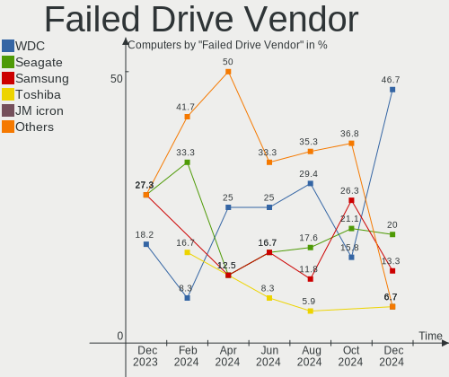
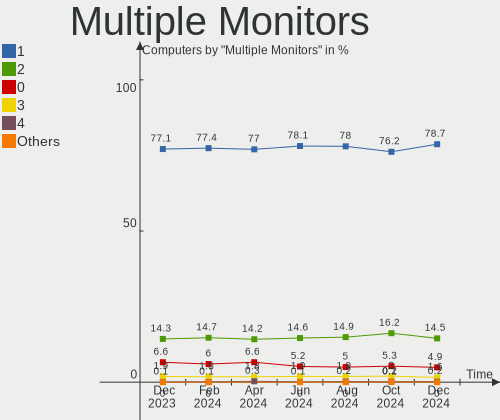

Linux Hardware Trends
---------------------

A project to identify most popular hardware characteristics and track their change
over time based on data collected by Linux users at https://Linux-Hardware.org.

Anyone can contribute to the study by uploading probes of their computers by
the [hw-probe](https://github.com/linuxhw/hw-probe) tool:

    sudo -E hw-probe -all -upload

This is a report for all computer types. See also reports for [desktops](/Desktop/README.md) and [notebooks](/Notebook/README.md).

Full-feature report is available here: https://linux-hardware.org/?view=trends

Distribution-specific reports: [Ubuntu](/Dist/Ubuntu), [ROSA](/Dist/ROSA), [Mint](/Dist/Mint), [Pop!_OS](/Dist/Pop!_OS), [Fedora](/Dist/Fedora), [BlackPanther](/Dist/BlackPanther), [Arch](/Dist/Arch), [Manjaro](/Dist/Manjaro), [Debian](/Dist/Debian), [Endless](/Dist/Endless), [Zorin](/Dist/Zorin), [Gentoo](/Dist/Gentoo), [Clear Linux](/Dist/Clear_Linux), [openSUSE](/Dist/openSUSE), [KDE neon](/Dist/KDE_neon), [Xubuntu](/Dist/Xubuntu), [Kubuntu](/Dist/Kubuntu), [ArcoLinux](/Dist/ArcoLinux), [OpenMandriva](/Dist/OpenMandriva).

Period: May, 2021.

Contents
--------

- [ OS                       ](#os)
- [ OS Family                ](#os-family)
- [ Kernel                   ](#kernel)
- [ Kernel Family            ](#kernel-family)
- [ Kernel Major Ver.        ](#kernel-major-ver)
- [ Arch                     ](#arch)
- [ DE                       ](#de)
- [ Display Server           ](#display-server)
- [ Display Manager          ](#display-manager)
- [ OS Lang                  ](#os-lang)
- [ Boot Mode                ](#boot-mode)
- [ Filesystem               ](#filesystem)
- [ Part. scheme             ](#part-scheme)
- [ Dual Boot with Linux/BSD ](#dual-boot-with-linux/bsd)
- [ Dual Boot (Win)          ](#dual-boot-win)
- [ Country                  ](#country)
- [ City                     ](#city)
- [ Vendor                   ](#vendor)
- [ Model                    ](#model)
- [ Model Family             ](#model-family)
- [ MFG Year                 ](#mfg-year)
- [ Form Factor              ](#form-factor)
- [ Secure Boot              ](#secure-boot)
- [ Coreboot                 ](#coreboot)
- [ RAM Size                 ](#ram-size)
- [ RAM Used                 ](#ram-used)
- [ Has CD-ROM               ](#has-cd-rom)
- [ Total Drives             ](#total-drives)
- [ Has Ethernet             ](#has-ethernet)
- [ Has WiFi                 ](#has-wifi)
- [ Has Bluetooth            ](#has-bluetooth)
- [ Drive Vendor             ](#drive-vendor)
- [ Drive Model              ](#drive-model)
- [ HDD Vendor               ](#hdd-vendor)
- [ SSD Vendor               ](#ssd-vendor)
- [ Drive Kind               ](#drive-kind)
- [ Drive Connector          ](#drive-connector)
- [ Drive Size               ](#drive-size)
- [ Space Total              ](#space-total)
- [ Space Used               ](#space-used)
- [ Malfunc. Drives          ](#malfunc-drives)
- [ Malfunc. Drive Vendor    ](#malfunc-drive-vendor)
- [ Malfunc. HDD Vendor      ](#malfunc-hdd-vendor)
- [ Malfunc. Drive Kind      ](#malfunc-drive-kind)
- [ Failed Drives            ](#failed-drives)
- [ Failed Drive Vendor      ](#failed-drive-vendor)
- [ Drive Status             ](#drive-status)
- [ Storage Vendor           ](#storage-vendor)
- [ Storage Model            ](#storage-model)
- [ Storage Kind             ](#storage-kind)
- [ CPU Vendor               ](#cpu-vendor)
- [ CPU Model                ](#cpu-model)
- [ CPU Model Family         ](#cpu-model-family)
- [ CPU Cores                ](#cpu-cores)
- [ CPU Sockets              ](#cpu-sockets)
- [ CPU Threads              ](#cpu-threads)
- [ CPU Op-Modes             ](#cpu-op-modes)
- [ CPU Microcode            ](#cpu-microcode)
- [ CPU Microarch            ](#cpu-microarch)
- [ GPU Vendor               ](#gpu-vendor)
- [ GPU Model                ](#gpu-model)
- [ GPU Combo                ](#gpu-combo)
- [ GPU Driver               ](#gpu-driver)
- [ GPU Memory               ](#gpu-memory)
- [ Monitor Vendor           ](#monitor-vendor)
- [ Monitor Model            ](#monitor-model)
- [ Monitor Resolution       ](#monitor-resolution)
- [ Monitor Diagonal         ](#monitor-diagonal)
- [ Monitor Width            ](#monitor-width)
- [ Aspect Ratio             ](#aspect-ratio)
- [ Monitor Area             ](#monitor-area)
- [ Pixel Density            ](#pixel-density)
- [ Multiple Monitors        ](#multiple-monitors)
- [ Net Controller Vendor    ](#net-controller-vendor)
- [ Net Controller Model     ](#net-controller-model)
- [ Wireless Vendor          ](#wireless-vendor)
- [ Wireless Model           ](#wireless-model)
- [ Ethernet Vendor          ](#ethernet-vendor)
- [ Ethernet Model           ](#ethernet-model)
- [ Net Controller Kind      ](#net-controller-kind)
- [ Used Controller          ](#used-controller)
- [ NICs                     ](#nics)
- [ IPv6                     ](#ipv6)
- [ Memory Vendor            ](#memory-vendor)
- [ Memory Model             ](#memory-model)
- [ Memory Kind              ](#memory-kind)
- [ Memory Form Factor       ](#memory-form-factor)
- [ Memory Size              ](#memory-size)
- [ Memory Speed             ](#memory-speed)
- [ Sound Vendor             ](#sound-vendor)
- [ Sound Model              ](#sound-model)
- [ Camera Vendor            ](#camera-vendor)
- [ Camera Model             ](#camera-model)
- [ Fingerprint Vendor       ](#fingerprint-vendor)
- [ Fingerprint Model        ](#fingerprint-model)
- [ Chipcard Vendor          ](#chipcard-vendor)
- [ Chipcard Model           ](#chipcard-model)
- [ Printer Vendor           ](#printer-vendor)
- [ Printer Model            ](#printer-model)
- [ Scanner Vendor           ](#scanner-vendor)
- [ Scanner Model            ](#scanner-model)
- [ Bluetooth Vendor         ](#bluetooth-vendor)
- [ Bluetooth Model          ](#bluetooth-model)
- [ Unsupported Devices      ](#unsupported-devices)
- [ Unsupported Device Types ](#unsupported-device-types)

OS
--

Installed operating systems

| Name                | Computers | Percent |
|---------------------|-----------|---------|
| Ubuntu 20.04        | 889       | 18.09%  |
| Mint 20.1           | 388       | 7.9%    |
| OpenMandriva 4.2    | 379       | 7.71%   |
| Fedora 34           | 297       | 6.04%   |
| Ubuntu 21.04        | 236       | 4.8%    |
| Pop!_OS 20.10       | 190       | 3.87%   |
| OpenMandriva 4.50   | 153       | 3.11%   |
| BlackPanther 18.1   | 150       | 3.05%   |
| Ubuntu 20.10        | 146       | 2.97%   |
| KDE neon 20.04      | 140       | 2.85%   |
| ROSA R11.1          | 127       | 2.58%   |
| Ubuntu 18.04        | 114       | 2.32%   |
| Manjaro             | 94        | 1.91%   |
| Arch                | 90        | 1.83%   |
| Xubuntu 20.04       | 70        | 1.42%   |
| Debian 10           | 69        | 1.4%    |
| Zorin 15            | 60        | 1.22%   |
| Manjaro 21.0.5      | 59        | 1.2%    |
| Kubuntu 20.04       | 59        | 1.2%    |
| Arch Rolling        | 56        | 1.14%   |
| Fedora 33           | 54        | 1.1%    |
| Endless 3.9.4       | 54        | 1.1%    |
| Pop!_OS 20.04       | 51        | 1.04%   |
| Manjaro 21.0.4      | 50        | 1.02%   |
| Mint 20             | 43        | 0.88%   |
| Mint 19.3           | 38        | 0.77%   |
| ArcoLinux Rolling   | 34        | 0.69%   |
| Debian              | 32        | 0.65%   |
| Debian 11           | 30        | 0.61%   |
| Gentoo              | 29        | 0.59%   |
| LMDE 4              | 23        | 0.47%   |
| Kubuntu 21.04       | 23        | 0.47%   |
| Kali 2021.1         | 22        | 0.45%   |
| Manjaro 21.0.3      | 20        | 0.41%   |
| Ubuntu MATE 20.04   | 19        | 0.39%   |
| Gentoo 2.7          | 19        | 0.39%   |
| Ubuntu 16.04        | 18        | 0.37%   |
| Lubuntu 20.04       | 18        | 0.37%   |
| Zorin 16            | 17        | 0.35%   |
| openSUSE Leap-15.2  | 17        | 0.35%   |
| Xubuntu 18.04       | 16        | 0.33%   |
| EndeavourOS Rolling | 15        | 0.31%   |
| Debian Testing      | 14        | 0.28%   |
| CentOS 8            | 14        | 0.28%   |
| Xubuntu 21.04       | 11        | 0.22%   |
| ROSA R11            | 11        | 0.22%   |
| Parrot 4.11         | 11        | 0.22%   |
| ROSA R12            | 10        | 0.2%    |
| Elementary 5.1.7    | 10        | 0.2%    |
| Xubuntu 20.10       | 9         | 0.18%   |
| Ubuntu MATE 21.04   | 9         | 0.18%   |
| Lubuntu 21.04       | 9         | 0.18%   |
| Kubuntu 20.10       | 9         | 0.18%   |
| Garuda Soaring      | 9         | 0.18%   |
| CentOS 7            | 9         | 0.18%   |
| Mint 19.1           | 8         | 0.16%   |
| Manjaro-ARM         | 8         | 0.16%   |
| Kali 2021.2         | 8         | 0.16%   |
| EndeavourOS         | 8         | 0.16%   |
| Ubuntu Budgie 20.04 | 7         | 0.14%   |

OS Family
---------

OS without a version

| Name          | Computers | Percent |
|---------------|-----------|---------|
| Ubuntu        | 1417      | 28.84%  |
| OpenMandriva  | 534       | 10.87%  |
| Mint          | 489       | 9.95%   |
| Fedora        | 364       | 7.41%   |
| Pop!_OS       | 243       | 4.95%   |
| Manjaro       | 226       | 4.6%    |
| ROSA          | 154       | 3.13%   |
| Debian        | 154       | 3.13%   |
| BlackPanther  | 154       | 3.13%   |
| Arch          | 146       | 2.97%   |
| KDE neon      | 140       | 2.85%   |
| Xubuntu       | 111       | 2.26%   |
| Kubuntu       | 97        | 1.97%   |
| Zorin         | 78        | 1.59%   |
| Endless       | 69        | 1.4%    |
| openSUSE      | 58        | 1.18%   |
| Gentoo        | 48        | 0.98%   |
| Ubuntu MATE   | 39        | 0.79%   |
| Lubuntu       | 38        | 0.77%   |
| ArcoLinux     | 38        | 0.77%   |
| Kali          | 31        | 0.63%   |
| CentOS        | 26        | 0.53%   |
| Clear Linux   | 24        | 0.49%   |
| LMDE          | 23        | 0.47%   |
| EndeavourOS   | 23        | 0.47%   |
| Ubuntu Budgie | 16        | 0.33%   |
| Elementary    | 14        | 0.28%   |
| RHEL          | 13        | 0.26%   |
| Garuda        | 12        | 0.24%   |
| Parrot        | 11        | 0.22%   |
| MX            | 10        | 0.2%    |
| ALT Linux     | 10        | 0.2%    |
| Manjaro-ARM   | 9         | 0.18%   |
| Solus         | 7         | 0.14%   |
| Artix         | 7         | 0.14%   |
| Slackware     | 6         | 0.12%   |
| Void          | 5         | 0.1%    |
| Reborn OS     | 5         | 0.1%    |
| Raspbian      | 5         | 0.1%    |
| ClearOS       | 5         | 0.1%    |
| RELS          | 4         | 0.08%   |
| Peppermint    | 4         | 0.08%   |
| Deepin        | 4         | 0.08%   |
| Siduction     | 3         | 0.06%   |
| NixOS         | 3         | 0.06%   |
| Mageia        | 3         | 0.06%   |
| GalliumOS     | 3         | 0.06%   |
| Sparky        | 2         | 0.04%   |
| Rocky         | 2         | 0.04%   |
| RED           | 2         | 0.04%   |
| Oracle Linux  | 2         | 0.04%   |
| GNOME OS      | 2         | 0.04%   |
| Archcraft     | 2         | 0.04%   |
| Android       | 2         | 0.04%   |
| Xero          | 1         | 0.02%   |
| WindowsFX     | 1         | 0.02%   |
| Serbian       | 1         | 0.02%   |
| Salient OS    | 1         | 0.02%   |
| Redcore       | 1         | 0.02%   |
| Q4OS          | 1         | 0.02%   |

Kernel
------

Version of the Linux kernel

| Version                             | Computers | Percent |
|-------------------------------------|-----------|---------|
| 5.4.0-73-generic                    | 470       | 9.56%   |
| 5.8.0-53-generic                    | 459       | 9.34%   |
| 5.10.14-desktop-1omv4002            | 358       | 7.29%   |
| 5.8.0-50-generic                    | 357       | 7.26%   |
| 5.4.0-72-generic                    | 312       | 6.35%   |
| 5.11.0-7614-generic                 | 191       | 3.89%   |
| 5.12.4-desktop-1omv4050             | 149       | 3.03%   |
| 5.11.0-17-generic                   | 144       | 2.93%   |
| 5.6.14-desktop-2bP                  | 116       | 2.36%   |
| 5.11.0-16-generic                   | 103       | 2.1%    |
| 5.8.0-14-generic                    | 63        | 1.28%   |
| 5.8.0-43-generic                    | 55        | 1.12%   |
| 4.19.0-16-amd64                     | 53        | 1.08%   |
| 5.11.17-300.fc34.x86_64             | 52        | 1.06%   |
| 5.10.34-1-MANJARO                   | 45        | 0.92%   |
| 5.4.32-generic-2rosa-x86_64         | 44        | 0.9%    |
| 5.10.36-2-MANJARO                   | 44        | 0.9%    |
| 5.4.0-58-generic                    | 42        | 0.85%   |
| 5.11.18-300.fc34.x86_64             | 40        | 0.81%   |
| 5.10.0-6-amd64                      | 37        | 0.75%   |
| 5.11.20-300.fc34.x86_64             | 36        | 0.73%   |
| 4.15.0-142-generic                  | 35        | 0.71%   |
| 5.4.83-generic-2rosa-x86_64         | 34        | 0.69%   |
| 4.18.16-desktop-1bP                 | 34        | 0.69%   |
| 5.11.16-300.fc34.x86_64             | 33        | 0.67%   |
| 5.8.0-54-generic                    | 32        | 0.65%   |
| 5.11.16-arch1-1                     | 31        | 0.63%   |
| 5.11.0-7612-generic                 | 29        | 0.59%   |
| 5.12.6-300.fc34.x86_64              | 27        | 0.55%   |
| 5.12.2-1-MANJARO                    | 27        | 0.55%   |
| 5.10.0-2-amd64                      | 27        | 0.55%   |
| 5.12.7-300.fc34.x86_64              | 26        | 0.53%   |
| 5.10.32-1-MANJARO                   | 26        | 0.53%   |
| 4.15.0-143-generic                  | 24        | 0.49%   |
| 5.4.0-42-generic                    | 23        | 0.47%   |
| 5.12.4-arch1-2                      | 22        | 0.45%   |
| 5.10.0-kali7-amd64                  | 22        | 0.45%   |
| 5.11.19-300.fc34.x86_64             | 21        | 0.43%   |
| 5.12.3-arch1-1                      | 20        | 0.41%   |
| 5.11.12-desktop-1omv4002            | 20        | 0.41%   |
| 5.11.12-300.fc34.x86_64             | 19        | 0.39%   |
| 4.15.0-desktop-122.124.1rosa-x86_64 | 19        | 0.39%   |
| 5.8.0-52-generic                    | 16        | 0.33%   |
| 5.4.0-26-generic                    | 15        | 0.31%   |
| 5.12.1-arch1-1                      | 15        | 0.31%   |
| 5.12.1-2-MANJARO                    | 15        | 0.31%   |
| 5.11.21-300.fc34.x86_64             | 15        | 0.31%   |
| 5.4.0-70-generic                    | 14        | 0.28%   |
| 5.10.27-gentoo                      | 14        | 0.28%   |
| 5.9.16-1-MANJARO                    | 13        | 0.26%   |
| 5.11.16-zen1-1-zen                  | 13        | 0.26%   |
| 5.11.0-18-generic                   | 13        | 0.26%   |
| 5.8.0-7642-generic                  | 12        | 0.24%   |
| 5.8.0-48-generic                    | 12        | 0.24%   |
| 5.8.0-51-generic                    | 11        | 0.22%   |
| 5.4.83-generic-2rosa-i586           | 11        | 0.22%   |
| 5.4.32-generic-2rosa-i586           | 11        | 0.22%   |
| 5.12.6-arch1-1                      | 11        | 0.22%   |
| 5.12.5-300.fc34.x86_64              | 11        | 0.22%   |
| 5.8.0-50-lowlatency                 | 10        | 0.2%    |

Kernel Family
-------------

Linux kernel without a distro release

| Version | Computers | Percent |
|---------|-----------|---------|
| 5.8.0   | 1075      | 21.88%  |
| 5.4.0   | 966       | 19.66%  |
| 5.11.0  | 509       | 10.36%  |
| 5.10.14 | 359       | 7.31%   |
| 5.12.4  | 202       | 4.11%   |
| 5.10.0  | 132       | 2.69%   |
| 4.15.0  | 120       | 2.44%   |
| 5.6.14  | 116       | 2.36%   |
| 5.11.16 | 98        | 1.99%   |
| 4.19.0  | 75        | 1.53%   |
| 5.11.17 | 67        | 1.36%   |
| 5.11.18 | 63        | 1.28%   |
| 5.12.6  | 57        | 1.16%   |
| 5.4.32  | 55        | 1.12%   |
| 5.10.34 | 55        | 1.12%   |
| 5.12.2  | 54        | 1.1%    |
| 5.10.36 | 51        | 1.04%   |
| 5.12.5  | 47        | 0.96%   |
| 5.12.1  | 47        | 0.96%   |
| 5.11.20 | 46        | 0.94%   |
| 5.4.83  | 45        | 0.92%   |
| 5.12.7  | 45        | 0.92%   |
| 5.11.12 | 41        | 0.83%   |
| 5.12.0  | 36        | 0.73%   |
| 5.11.19 | 36        | 0.73%   |
| 5.12.3  | 34        | 0.69%   |
| 4.18.16 | 34        | 0.69%   |
| 5.11.21 | 30        | 0.61%   |
| 4.18.0  | 30        | 0.61%   |
| 5.10.32 | 29        | 0.59%   |
| 5.3.18  | 19        | 0.39%   |
| 5.10.27 | 19        | 0.39%   |
| 5.9.16  | 16        | 0.33%   |
| 3.10.0  | 16        | 0.33%   |
| 5.10.35 | 14        | 0.28%   |
| 5.10.33 | 14        | 0.28%   |
| 5.12.8  | 13        | 0.26%   |
| 5.13.0  | 12        | 0.24%   |
| 5.11.15 | 12        | 0.24%   |
| 5.3.0   | 10        | 0.2%    |
| 5.0.0   | 10        | 0.2%    |
| 4.4.0   | 8         | 0.16%   |
| 5.10.37 | 7         | 0.14%   |
| 5.10.17 | 7         | 0.14%   |
| 5.6.0   | 6         | 0.12%   |
| 5.4.118 | 6         | 0.12%   |
| 5.4.116 | 6         | 0.12%   |
| 5.7.0   | 5         | 0.1%    |
| 5.4.114 | 5         | 0.1%    |
| 5.11.14 | 5         | 0.1%    |
| 5.11.10 | 5         | 0.1%    |
| 5.10.31 | 5         | 0.1%    |
| 5.10.19 | 5         | 0.1%    |
| 4.9.20  | 5         | 0.1%    |
| 4.16.18 | 5         | 0.1%    |
| 5.9.0   | 4         | 0.08%   |
| 5.10.28 | 4         | 0.08%   |
| 4.9.155 | 4         | 0.08%   |
| 5.7.1   | 3         | 0.06%   |
| 5.4.106 | 3         | 0.06%   |

Kernel Major Ver.
-----------------

Linux kernel major version

| Version | Computers | Percent |
|---------|-----------|---------|
| 5.4     | 1105      | 22.49%  |
| 5.8     | 1079      | 21.96%  |
| 5.11    | 929       | 18.91%  |
| 5.10    | 728       | 14.81%  |
| 5.12    | 535       | 10.89%  |
| 5.6     | 123       | 2.5%    |
| 4.15    | 120       | 2.44%   |
| 4.19    | 76        | 1.55%   |
| 4.18    | 64        | 1.3%    |
| 5.3     | 31        | 0.63%   |
| 5.9     | 28        | 0.57%   |
| 3.10    | 17        | 0.35%   |
| 4.9     | 16        | 0.33%   |
| 5.13    | 12        | 0.24%   |
| 5.0     | 11        | 0.22%   |
| 4.4     | 10        | 0.2%    |
| 5.7     | 8         | 0.16%   |
| 4.16    | 6         | 0.12%   |
| 5.5     | 4         | 0.08%   |
| 4.10    | 3         | 0.06%   |
| 4.14    | 2         | 0.04%   |
| 5.1     | 1         | 0.02%   |
| 5       | 1         | 0.02%   |
| 4.12    | 1         | 0.02%   |
| 4.11    | 1         | 0.02%   |
| 4.1     | 1         | 0.02%   |
| 3.2     | 1         | 0.02%   |
| 3.13    | 1         | 0.02%   |

Arch
----

OS architecture (x86_64, i586, etc.)

| Name    | Computers | Percent |
|---------|-----------|---------|
| x86_64  | 4738      | 96.42%  |
| i686    | 116       | 2.36%   |
| aarch64 | 50        | 1.02%   |
| armv7l  | 5         | 0.1%    |
| armv6l  | 3         | 0.06%   |
| armv8l  | 2         | 0.04%   |

DE
--

Desktop Environment

| Name              | Computers | Percent |
|-------------------|-----------|---------|
| GNOME             | 2086      | 42.45%  |
| KDE5              | 983       | 20%     |
| X-Cinnamon        | 396       | 8.06%   |
| XFCE              | 370       | 7.53%   |
| KDE               | 301       | 6.13%   |
| Unknown           | 293       | 5.96%   |
| MATE              | 125       | 2.54%   |
| KDE4              | 89        | 1.81%   |
| LXQt              | 45        | 0.92%   |
| Cinnamon          | 40        | 0.81%   |
| Unity             | 32        | 0.65%   |
| i3                | 24        | 0.49%   |
| Budgie            | 23        | 0.47%   |
| LXDE              | 21        | 0.43%   |
| Deepin            | 17        | 0.35%   |
| Pantheon          | 14        | 0.28%   |
| GNOME Flashback   | 14        | 0.28%   |
| Openbox           | 8         | 0.16%   |
| GNOME Classic     | 6         | 0.12%   |
| awesome           | 5         | 0.1%    |
| sway              | 3         | 0.06%   |
| bspwm             | 3         | 0.06%   |
| xmonad            | 2         | 0.04%   |
| qtile             | 2         | 0.04%   |
| lightdm-xsession  | 2         | 0.04%   |
| Enlightenment     | 2         | 0.04%   |
| Yaru:ubuntu:GNOME | 1         | 0.02%   |
| Xsession          | 1         | 0.02%   |
| trinity           | 1         | 0.02%   |
| GNUstep           | 1         | 0.02%   |
| fvwm2             | 1         | 0.02%   |
| fvwm              | 1         | 0.02%   |
| dwm               | 1         | 0.02%   |
| default           | 1         | 0.02%   |

Display Server
--------------

X11 or Wayland

| Name        | Computers | Percent |
|-------------|-----------|---------|
| X11         | 4117      | 83.78%  |
| Wayland     | 547       | 11.13%  |
| Unknown     | 155       | 3.15%   |
| Tty         | 94        | 1.91%   |
| Unspecified | 1         | 0.02%   |

Display Manager
---------------

SDDM, LightDM, etc.

| Name    | Computers | Percent |
|---------|-----------|---------|
| Unknown | 2776      | 56.49%  |
| SDDM    | 1024      | 20.84%  |
| GDM     | 583       | 11.86%  |
| TDM     | 326       | 6.63%   |
| LightDM | 94        | 1.91%   |
| KDM     | 89        | 1.81%   |
| XDM     | 15        | 0.31%   |
| SLiM    | 3         | 0.06%   |
| LXDM    | 2         | 0.04%   |
| NODM    | 1         | 0.02%   |
| GDM3    | 1         | 0.02%   |

OS Lang
-------

Language

| Lang    | Computers | Percent |
|---------|-----------|---------|
| en_US   | 1938      | 39.44%  |
| de_DE   | 386       | 7.86%   |
| ru_RU   | 313       | 6.37%   |
| en_GB   | 265       | 5.39%   |
| pt_BR   | 260       | 5.29%   |
| fr_FR   | 248       | 5.05%   |
| Unknown | 220       | 4.48%   |
| it_IT   | 124       | 2.52%   |
| es_ES   | 97        | 1.97%   |
| en_CA   | 92        | 1.87%   |
| pl_PL   | 84        | 1.71%   |
| en_AU   | 82        | 1.67%   |
| en_IN   | 78        | 1.59%   |
| C       | 64        | 1.3%    |
| nl_NL   | 43        | 0.88%   |
| es_AR   | 37        | 0.75%   |
| es_MX   | 34        | 0.69%   |
| hu_HU   | 32        | 0.65%   |
| cs_CZ   | 32        | 0.65%   |
| en_ZA   | 28        | 0.57%   |
| es_CL   | 26        | 0.53%   |
| de_AT   | 26        | 0.53%   |
| tr_TR   | 24        | 0.49%   |
| de_CH   | 24        | 0.49%   |
| zh_CN   | 20        | 0.41%   |
| pt_PT   | 18        | 0.37%   |
| sv_SE   | 15        | 0.31%   |
| ro_RO   | 15        | 0.31%   |
| fr_CA   | 15        | 0.31%   |
| ja_JP   | 14        | 0.28%   |
| en_IE   | 14        | 0.28%   |
| sk_SK   | 12        | 0.24%   |
| nl_BE   | 12        | 0.24%   |
| es_UY   | 12        | 0.24%   |
| en_NZ   | 11        | 0.22%   |
| da_DK   | 11        | 0.22%   |
| uk_UA   | 10        | 0.2%    |
| fr_BE   | 10        | 0.2%    |
| fi_FI   | 9         | 0.18%   |
| es_CO   | 9         | 0.18%   |
| ru_UA   | 8         | 0.16%   |
| ko_KR   | 8         | 0.16%   |
| ca_ES   | 8         | 0.16%   |
| zh_TW   | 7         | 0.14%   |
| en_IL   | 7         | 0.14%   |
| bg_BG   | 7         | 0.14%   |
| POSIX   | 6         | 0.12%   |
| nb_NO   | 6         | 0.12%   |
| fr_CH   | 6         | 0.12%   |
| en_PH   | 6         | 0.12%   |
| id_ID   | 5         | 0.1%    |
| es_VE   | 5         | 0.1%    |
| es_EC   | 5         | 0.1%    |
| es_CR   | 5         | 0.1%    |
| en_HK   | 5         | 0.1%    |
| en_DK   | 5         | 0.1%    |
| el_GR   | 5         | 0.1%    |
| es_PE   | 4         | 0.08%   |
| en_SG   | 4         | 0.08%   |
| sr_RS   | 3         | 0.06%   |

Boot Mode
---------

EFI or BIOS

| Mode | Computers | Percent |
|------|-----------|---------|
| BIOS | 2624      | 53.4%   |
| EFI  | 2290      | 46.6%   |

Filesystem
----------

Type of filesystem

| Type                | Computers | Percent |
|---------------------|-----------|---------|
| Ext4                | 3640      | 74.07%  |
| Overlay             | 672       | 13.68%  |
| Btrfs               | 425       | 8.65%   |
| Xfs                 | 89        | 1.81%   |
| Zfs                 | 37        | 0.75%   |
| F2fs                | 16        | 0.33%   |
| Ext3                | 9         | 0.18%   |
| Ext2                | 8         | 0.16%   |
| Unknown             | 6         | 0.12%   |
| Tmpfs               | 3         | 0.06%   |
| Aufs                | 3         | 0.06%   |
| Rootfs              | 2         | 0.04%   |
| Reiserfs            | 2         | 0.04%   |
| Jfs                 | 1         | 0.02%   |
| Fuse.fuse-overlayfs | 1         | 0.02%   |

Part. scheme
------------

Scheme of partitioning

| Type    | Computers | Percent |
|---------|-----------|---------|
| Unknown | 2655      | 54.03%  |
| GPT     | 1547      | 31.48%  |
| MBR     | 712       | 14.49%  |

Dual Boot with Linux/BSD
------------------------

Hosting more than one Linux/BSD

| Dual boot | Computers | Percent |
|-----------|-----------|---------|
| No        | 4037      | 82.15%  |
| Yes       | 877       | 17.85%  |

Dual Boot (Win)
---------------

Hosting Linux and Windows

| Dual boot | Computers | Percent |
|-----------|-----------|---------|
| No        | 3412      | 69.43%  |
| Yes       | 1502      | 30.57%  |

Country
-------

Geographic location (country)

| Country                | Computers | Percent |
|------------------------|-----------|---------|
| USA                    | 792       | 16.12%  |
| Germany                | 525       | 10.68%  |
| Russia                 | 349       | 7.1%    |
| Brazil                 | 329       | 6.7%    |
| France                 | 257       | 5.23%   |
| UK                     | 199       | 4.05%   |
| Italy                  | 172       | 3.5%    |
| Hungary                | 156       | 3.17%   |
| Canada                 | 148       | 3.01%   |
| Spain                  | 131       | 2.67%   |
| Poland                 | 127       | 2.58%   |
| India                  | 120       | 2.44%   |
| Netherlands            | 108       | 2.2%    |
| Australia              | 100       | 2.04%   |
| Ukraine                | 72        | 1.47%   |
| Switzerland            | 71        | 1.44%   |
| Argentina              | 56        | 1.14%   |
| Sweden                 | 54        | 1.1%    |
| Mexico                 | 53        | 1.08%   |
| Czechia                | 53        | 1.08%   |
| Turkey                 | 52        | 1.06%   |
| Austria                | 48        | 0.98%   |
| Belgium                | 47        | 0.96%   |
| China                  | 44        | 0.9%    |
| South Africa           | 43        | 0.88%   |
| Romania                | 42        | 0.85%   |
| Chile                  | 38        | 0.77%   |
| Greece                 | 35        | 0.71%   |
| Finland                | 34        | 0.69%   |
| Slovakia               | 33        | 0.67%   |
| Portugal               | 31        | 0.63%   |
| Japan                  | 27        | 0.55%   |
| Bulgaria               | 27        | 0.55%   |
| Denmark                | 23        | 0.47%   |
| Indonesia              | 22        | 0.45%   |
| Norway                 | 21        | 0.43%   |
| Israel                 | 20        | 0.41%   |
| Serbia                 | 19        | 0.39%   |
| Colombia               | 19        | 0.39%   |
| Ireland                | 18        | 0.37%   |
| Uruguay                | 17        | 0.35%   |
| Belarus                | 16        | 0.33%   |
| South Korea            | 14        | 0.28%   |
| New Zealand            | 14        | 0.28%   |
| Costa Rica             | 13        | 0.26%   |
| Vietnam                | 12        | 0.24%   |
| Thailand               | 12        | 0.24%   |
| Taiwan                 | 12        | 0.24%   |
| Philippines            | 12        | 0.24%   |
| Malaysia               | 12        | 0.24%   |
| Iran                   | 12        | 0.24%   |
| Hong Kong              | 12        | 0.24%   |
| Peru                   | 11        | 0.22%   |
| Bangladesh             | 11        | 0.22%   |
| Venezuela              | 9         | 0.18%   |
| Singapore              | 9         | 0.18%   |
| Estonia                | 9         | 0.18%   |
| Lithuania              | 8         | 0.16%   |
| Bosnia and Herzegovina | 8         | 0.16%   |
| Algeria                | 8         | 0.16%   |

City
----

Geographic location (city)

| City              | Computers | Percent |
|-------------------|-----------|---------|
| Moscow            | 71        | 1.44%   |
| Budapest          | 54        | 1.1%    |
| São Paulo        | 38        | 0.77%   |
| Berlin            | 36        | 0.73%   |
| St Petersburg     | 35        | 0.71%   |
| Voronezh          | 31        | 0.63%   |
| Paris             | 29        | 0.59%   |
| Warsaw            | 28        | 0.57%   |
| London            | 27        | 0.55%   |
| Sydney            | 25        | 0.51%   |
| Rome              | 23        | 0.47%   |
| Rio de Janeiro    | 23        | 0.47%   |
| Madrid            | 23        | 0.47%   |
| Istanbul          | 23        | 0.47%   |
| Hamburg           | 23        | 0.47%   |
| Vienna            | 22        | 0.45%   |
| Prague            | 22        | 0.45%   |
| Kyiv              | 21        | 0.43%   |
| Toronto           | 19        | 0.39%   |
| Milan             | 19        | 0.39%   |
| Frankfurt am Main | 19        | 0.39%   |
| Munich            | 18        | 0.37%   |
| Buenos Aires      | 18        | 0.37%   |
| Santiago          | 16        | 0.33%   |
| Montreal          | 16        | 0.33%   |
| Mexico City       | 16        | 0.33%   |
| Cologne           | 16        | 0.33%   |
| Zurich            | 15        | 0.31%   |
| Helsinki          | 15        | 0.31%   |
| Melbourne         | 14        | 0.28%   |
| Chicago           | 14        | 0.28%   |
| Sofia             | 13        | 0.26%   |
| Novosibirsk       | 13        | 0.26%   |
| Johannesburg      | 13        | 0.26%   |
| Brisbane          | 13        | 0.26%   |
| Athens            | 13        | 0.26%   |
| Amsterdam         | 13        | 0.26%   |
| Portland          | 12        | 0.24%   |
| Dublin            | 12        | 0.24%   |
| Denver            | 12        | 0.24%   |
| Bucharest         | 12        | 0.24%   |
| Barcelona         | 12        | 0.24%   |
| Pune              | 11        | 0.22%   |
| Perth             | 11        | 0.22%   |
| New York          | 11        | 0.22%   |
| Hyderabad         | 11        | 0.22%   |
| Essen             | 11        | 0.22%   |
| Belgrade          | 11        | 0.22%   |
| Montevideo        | 10        | 0.2%    |
| Los Angeles       | 10        | 0.2%    |
| Dallas            | 10        | 0.2%    |
| Chennai           | 10        | 0.2%    |
| Cape Town         | 10        | 0.2%    |
| Stuttgart         | 9         | 0.18%   |
| Srednyaya Akhtuba | 9         | 0.18%   |
| Rostov-on-Don     | 9         | 0.18%   |
| Poznan            | 9         | 0.18%   |
| Miami             | 9         | 0.18%   |
| Leipzig           | 9         | 0.18%   |
| Houston           | 9         | 0.18%   |

Vendor
------

Motherboard manufacturer

| Name                    | Computers | Percent |
|-------------------------|-----------|---------|
| ASUSTek Computer        | 831       | 16.91%  |
| Hewlett-Packard         | 713       | 14.51%  |
| Lenovo                  | 632       | 12.86%  |
| Dell                    | 597       | 12.15%  |
| Gigabyte Technology     | 356       | 7.24%   |
| MSI                     | 283       | 5.76%   |
| Acer                    | 268       | 5.45%   |
| ASRock                  | 209       | 4.25%   |
| Intel                   | 91        | 1.85%   |
| Apple                   | 88        | 1.79%   |
| Toshiba                 | 85        | 1.73%   |
| Unknown                 | 66        | 1.34%   |
| Samsung Electronics     | 65        | 1.32%   |
| Sony                    | 38        | 0.77%   |
| Fujitsu                 | 36        | 0.73%   |
| Medion                  | 34        | 0.69%   |
| Raspberry Pi Foundation | 26        | 0.53%   |
| HUAWEI                  | 24        | 0.49%   |
| Notebook                | 22        | 0.45%   |
| ECS                     | 21        | 0.43%   |
| Biostar                 | 21        | 0.43%   |
| Pegatron                | 20        | 0.41%   |
| Foxconn                 | 17        | 0.35%   |
| Packard Bell            | 15        | 0.31%   |
| Fujitsu Siemens         | 15        | 0.31%   |
| Alienware               | 14        | 0.28%   |
| Positivo                | 13        | 0.26%   |
| TUXEDO                  | 12        | 0.24%   |
| Supermicro              | 12        | 0.24%   |
| Microsoft               | 11        | 0.22%   |
| Huanan                  | 11        | 0.22%   |
| System76                | 10        | 0.2%    |
| Shuttle                 | 9         | 0.18%   |
| Google                  | 9         | 0.18%   |
| eMachines               | 9         | 0.18%   |
| LG Electronics          | 8         | 0.16%   |
| Pine Microsystems       | 7         | 0.14%   |
| AMI                     | 7         | 0.14%   |
| Panasonic               | 6         | 0.12%   |
| ZOTAC                   | 5         | 0.1%    |
| Razer                   | 5         | 0.1%    |
| PCWare                  | 5         | 0.1%    |
| IBM                     | 5         | 0.1%    |
| Gateway                 | 5         | 0.1%    |
| Timi                    | 4         | 0.08%   |
| Chuwi                   | 4         | 0.08%   |
| AZW                     | 4         | 0.08%   |
| Teclast                 | 3         | 0.06%   |
| Standard                | 3         | 0.06%   |
| Schenker                | 3         | 0.06%   |
| RuggedPC                | 3         | 0.06%   |
| Purism                  | 3         | 0.06%   |
| Positivo Bahia - VAIO   | 3         | 0.06%   |
| PC Specialist           | 3         | 0.06%   |
| Nvidia                  | 3         | 0.06%   |
| NEC Computers           | 3         | 0.06%   |
| Itautec                 | 3         | 0.06%   |
| Dynabook                | 3         | 0.06%   |
| Digibras                | 3         | 0.06%   |
| Wortmann AG             | 2         | 0.04%   |

Model
-----

Motherboard model

| Name                                  | Computers | Percent |
|---------------------------------------|-----------|---------|
| Unknown                               | 84        | 1.71%   |
| ASUS All Series                       | 47        | 0.96%   |
| HP Notebook                           | 16        | 0.33%   |
| MSI MS-7C02                           | 15        | 0.31%   |
| MSI MS-7B86                           | 15        | 0.31%   |
| ASUS TUF GAMING X570-PLUS             | 15        | 0.31%   |
| Gigabyte B450M DS3H                   | 14        | 0.28%   |
| ASUS PRIME A320M-K                    | 13        | 0.26%   |
| HP Pavilion dv6                       | 12        | 0.24%   |
| MSI MS-7C37                           | 11        | 0.22%   |
| HP Pavilion dv7                       | 11        | 0.22%   |
| Dell XPS 13 9310                      | 11        | 0.22%   |
| HP Pavilion g7                        | 10        | 0.2%    |
| HP Pavilion g6                        | 10        | 0.2%    |
| Dell OptiPlex 9020                    | 10        | 0.2%    |
| Apple MacBookPro8,1                   | 10        | 0.2%    |
| HP Pavilion Notebook                  | 9         | 0.18%   |
| Gigabyte A320M-S2H                    | 9         | 0.18%   |
| Dell OptiPlex 3010                    | 9         | 0.18%   |
| Acer Aspire A315-23                   | 9         | 0.18%   |
| Gigabyte B450 AORUS M                 | 8         | 0.16%   |
| Dell XPS 15 9500                      | 8         | 0.16%   |
| Dell Latitude D630                    | 8         | 0.16%   |
| ASUS M5A99FX PRO R2.0                 | 8         | 0.16%   |
| ASRock B450M Pro4                     | 8         | 0.16%   |
| Acer Nitro AN517-51                   | 8         | 0.16%   |
| Lenovo IdeaPad Flex 5 14ARE05 81X2    | 7         | 0.14%   |
| Intel H61                             | 7         | 0.14%   |
| HP Pavilion 15                        | 7         | 0.14%   |
| HP Laptop 15-bs0xx                    | 7         | 0.14%   |
| HP 250 G7 Notebook PC                 | 7         | 0.14%   |
| Dell OptiPlex 790                     | 7         | 0.14%   |
| Dell Latitude E6410                   | 7         | 0.14%   |
| Dell Latitude E6400                   | 7         | 0.14%   |
| ASUS M5A97 R2.0                       | 7         | 0.14%   |
| ASRock H61M-VG4                       | 7         | 0.14%   |
| RPi Raspberry Pi 4 Model B Rev 1.4    | 6         | 0.12%   |
| RPi Raspberry Pi 4 Model B            | 6         | 0.12%   |
| MSI MS-7A38                           | 6         | 0.12%   |
| MSI MS-7817                           | 6         | 0.12%   |
| MSI MS-7721                           | 6         | 0.12%   |
| Lenovo V145-15AST 81MT                | 6         | 0.12%   |
| Lenovo IdeaPad 320-15IKB 80XL         | 6         | 0.12%   |
| Lenovo G50-45 80E3                    | 6         | 0.12%   |
| HP 15                                 | 6         | 0.12%   |
| Gigabyte B75M-D3H                     | 6         | 0.12%   |
| Dell XPS 15 7590                      | 6         | 0.12%   |
| Dell OptiPlex 990                     | 6         | 0.12%   |
| Dell OptiPlex 780                     | 6         | 0.12%   |
| Dell Latitude E6430                   | 6         | 0.12%   |
| Dell Inspiron 1545                    | 6         | 0.12%   |
| ASUS ROG Zephyrus G14 GA401IV_GA401IV | 6         | 0.12%   |
| ASUS PRIME X570-P                     | 6         | 0.12%   |
| ASUS M5A78L-M/USB3                    | 6         | 0.12%   |
| Samsung 340XAA/350XAA/550XAA          | 5         | 0.1%    |
| RPi Raspberry Pi 4 Model B Rev 1.1    | 5         | 0.1%    |
| MSI MS-7C91                           | 5         | 0.1%    |
| MSI MS-7B98                           | 5         | 0.1%    |
| MSI MS-7B89                           | 5         | 0.1%    |
| MSI MS-7A39                           | 5         | 0.1%    |

Model Family
------------

Motherboard model prefix

| Name                   | Computers | Percent |
|------------------------|-----------|---------|
| Lenovo ThinkPad        | 267       | 5.43%   |
| Acer Aspire            | 168       | 3.42%   |
| Dell Inspiron          | 164       | 3.34%   |
| Dell Latitude          | 145       | 2.95%   |
| Lenovo IdeaPad         | 137       | 2.79%   |
| HP Pavilion            | 123       | 2.5%    |
| ASUS PRIME             | 93        | 1.89%   |
| Dell OptiPlex          | 85        | 1.73%   |
| Unknown                | 84        | 1.71%   |
| HP EliteBook           | 83        | 1.69%   |
| ASUS ROG               | 81        | 1.65%   |
| HP Compaq              | 78        | 1.59%   |
| Toshiba Satellite      | 77        | 1.57%   |
| Dell XPS               | 75        | 1.53%   |
| HP ProBook             | 71        | 1.44%   |
| HP Laptop              | 69        | 1.4%    |
| ASUS TUF               | 56        | 1.14%   |
| Dell Precision         | 52        | 1.06%   |
| ASUS All               | 47        | 0.96%   |
| Lenovo ThinkCentre     | 43        | 0.88%   |
| ASUS VivoBook          | 42        | 0.85%   |
| Dell Vostro            | 36        | 0.73%   |
| HP ENVY                | 30        | 0.61%   |
| Lenovo Yoga            | 29        | 0.59%   |
| RPi Raspberry          | 26        | 0.53%   |
| HP EliteDesk           | 26        | 0.53%   |
| Gigabyte B450M         | 26        | 0.53%   |
| Acer Nitro             | 22        | 0.45%   |
| ASUS M5A78L-M          | 19        | 0.39%   |
| Acer Swift             | 19        | 0.39%   |
| Gigabyte B450          | 18        | 0.37%   |
| HP ProDesk             | 17        | 0.35%   |
| ASRock B450M           | 17        | 0.35%   |
| HP Notebook            | 16        | 0.33%   |
| MSI MS-7C02            | 15        | 0.31%   |
| MSI MS-7B86            | 15        | 0.31%   |
| Lenovo Legion          | 15        | 0.31%   |
| ASUS M5A97             | 15        | 0.31%   |
| Fujitsu LIFEBOOK       | 14        | 0.28%   |
| HP 250                 | 13        | 0.26%   |
| Gigabyte X570          | 13        | 0.26%   |
| Fujitsu ESPRIMO        | 13        | 0.26%   |
| Lenovo IdeaCentre      | 12        | 0.24%   |
| HP ZBook               | 12        | 0.24%   |
| ASUS P8Z77-V           | 12        | 0.24%   |
| Apple MacBookPro8      | 12        | 0.24%   |
| MSI MS-7C37            | 11        | 0.22%   |
| Microsoft Surface      | 11        | 0.22%   |
| Gigabyte GA-78LMT-USB3 | 11        | 0.22%   |
| Gigabyte A320M-S2H     | 11        | 0.22%   |
| Acer TravelMate        | 11        | 0.22%   |
| HP Spectre             | 10        | 0.2%    |
| HP OMEN                | 10        | 0.2%    |
| HP 15                  | 10        | 0.2%    |
| Apple MacBookPro11     | 10        | 0.2%    |
| HP Stream              | 9         | 0.18%   |
| ASUS Maximus           | 9         | 0.18%   |
| Acer Veriton           | 9         | 0.18%   |
| Packard Bell EasyNote  | 8         | 0.16%   |
| Lenovo ThinkBook       | 8         | 0.16%   |

MFG Year
--------

Motherboard manufacture year

| Year    | Computers | Percent |
|---------|-----------|---------|
| 2020    | 925       | 18.82%  |
| 2019    | 639       | 13%     |
| 2018    | 416       | 8.47%   |
| 2021    | 414       | 8.42%   |
| 2013    | 308       | 6.27%   |
| 2012    | 302       | 6.15%   |
| 2014    | 288       | 5.86%   |
| 2011    | 285       | 5.8%    |
| 2015    | 250       | 5.09%   |
| 2010    | 214       | 4.35%   |
| 2016    | 196       | 3.99%   |
| 2017    | 188       | 3.83%   |
| 2009    | 186       | 3.79%   |
| 2008    | 129       | 2.63%   |
| 2007    | 73        | 1.49%   |
| Unknown | 55        | 1.12%   |
| 2006    | 26        | 0.53%   |
| 2005    | 12        | 0.24%   |
| 2004    | 5         | 0.1%    |
| 2003    | 3         | 0.06%   |

Form Factor
-----------

Physical design of the computer

| Name           | Computers | Percent |
|----------------|-----------|---------|
| Notebook       | 2515      | 51.18%  |
| Desktop        | 2040      | 41.51%  |
| Convertible    | 110       | 2.24%   |
| Mini pc        | 63        | 1.28%   |
| All in one     | 60        | 1.22%   |
| System on chip | 51        | 1.04%   |
| Server         | 35        | 0.71%   |
| Tablet         | 33        | 0.67%   |
| Phone          | 6         | 0.12%   |
| Stick pc       | 1         | 0.02%   |

Secure Boot
-----------

Enabled or disabled

| State    | Computers | Percent |
|----------|-----------|---------|
| Disabled | 4598      | 93.57%  |
| Enabled  | 316       | 6.43%   |

Coreboot
--------

Have coreboot on board

| Used | Computers | Percent |
|------|-----------|---------|
| No   | 4898      | 99.67%  |
| Yes  | 16        | 0.33%   |

RAM Size
--------

Total RAM memory

| Size in GB      | Computers | Percent |
|-----------------|-----------|---------|
| 4.01-8.0        | 1134      | 23.08%  |
| 3.01-4.0        | 991       | 20.17%  |
| 16.01-24.0      | 936       | 19.05%  |
| 8.01-16.0       | 878       | 17.87%  |
| 32.01-64.0      | 440       | 8.95%   |
| 1.01-2.0        | 209       | 4.25%   |
| 64.01-256.0     | 128       | 2.6%    |
| 2.01-3.0        | 91        | 1.85%   |
| 24.01-32.0      | 74        | 1.51%   |
| 0.51-1.0        | 22        | 0.45%   |
| 0.01-0.5        | 7         | 0.14%   |
| More than 256.0 | 4         | 0.08%   |

RAM Used
--------

Used RAM memory

| Used GB     | Computers | Percent |
|-------------|-----------|---------|
| 1.01-2.0    | 1911      | 38.89%  |
| 2.01-3.0    | 1105      | 22.49%  |
| 4.01-8.0    | 615       | 12.52%  |
| 3.01-4.0    | 536       | 10.91%  |
| 0.51-1.0    | 418       | 8.51%   |
| 8.01-16.0   | 173       | 3.52%   |
| 0.01-0.5    | 107       | 2.18%   |
| 16.01-24.0  | 26        | 0.53%   |
| 24.01-32.0  | 10        | 0.2%    |
| 32.01-64.0  | 8         | 0.16%   |
| 64.01-256.0 | 3         | 0.06%   |
| Unknown     | 2         | 0.04%   |

Has CD-ROM
----------

Has CD-ROM on board

| Presented | Computers | Percent |
|-----------|-----------|---------|
| No        | 2863      | 58.26%  |
| Yes       | 2051      | 41.74%  |

Total Drives
------------

Number of drives on board

| Drives | Computers | Percent |
|--------|-----------|---------|
| 1      | 2836      | 57.71%  |
| 2      | 1236      | 25.15%  |
| 3      | 402       | 8.18%   |
| 4      | 201       | 4.09%   |
| 5      | 95        | 1.93%   |
| 6      | 52        | 1.06%   |
| 0      | 44        | 0.9%    |
| 7      | 22        | 0.45%   |
| 8      | 11        | 0.22%   |
| 9      | 6         | 0.12%   |
| 12     | 3         | 0.06%   |
| 11     | 2         | 0.04%   |
| 21     | 1         | 0.02%   |
| 14     | 1         | 0.02%   |
| 13     | 1         | 0.02%   |
| 10     | 1         | 0.02%   |

Has Ethernet
------------

Has Ethernet on board

| Presented | Computers | Percent |
|-----------|-----------|---------|
| Yes       | 4313      | 87.77%  |
| No        | 601       | 12.23%  |

Has WiFi
--------

Has WiFi module

| Presented | Computers | Percent |
|-----------|-----------|---------|
| Yes       | 3545      | 72.14%  |
| No        | 1369      | 27.86%  |

Has Bluetooth
-------------

Has Bluetooth module

| Presented | Computers | Percent |
|-----------|-----------|---------|
| Yes       | 2699      | 54.92%  |
| No        | 2215      | 45.08%  |

Drive Vendor
------------

Hard drive vendors

| Vendor                    | Computers | Drives | Percent |
|---------------------------|-----------|--------|---------|
| WDC                       | 1228      | 1550   | 16.92%  |
| Seagate                   | 1160      | 1435   | 15.98%  |
| Samsung Electronics       | 1067      | 1333   | 14.7%   |
| Toshiba                   | 518       | 553    | 7.14%   |
| Kingston                  | 400       | 423    | 5.51%   |
| SanDisk                   | 332       | 347    | 4.57%   |
| Unknown                   | 311       | 352    | 4.28%   |
| Hitachi                   | 265       | 288    | 3.65%   |
| Crucial                   | 241       | 258    | 3.32%   |
| Intel                     | 203       | 221    | 2.8%    |
| SK Hynix                  | 140       | 149    | 1.93%   |
| HGST                      | 136       | 159    | 1.87%   |
| A-DATA Technology         | 113       | 120    | 1.56%   |
| China                     | 67        | 70     | 0.92%   |
| Micron Technology         | 65        | 68     | 0.9%    |
| Phison                    | 63        | 73     | 0.87%   |
| SPCC                      | 43        | 44     | 0.59%   |
| Apple                     | 42        | 46     | 0.58%   |
| Silicon Motion            | 40        | 44     | 0.55%   |
| OCZ                       | 39        | 42     | 0.54%   |
| Intenso                   | 34        | 35     | 0.47%   |
| Fujitsu                   | 34        | 34     | 0.47%   |
| PNY                       | 33        | 36     | 0.45%   |
| KIOXIA                    | 30        | 32     | 0.41%   |
| Patriot                   | 29        | 31     | 0.4%    |
| Corsair                   | 28        | 30     | 0.39%   |
| Maxtor                    | 27        | 27     | 0.37%   |
| Micron/Crucial Technology | 24        | 25     | 0.33%   |
| Apacer                    | 24        | 24     | 0.33%   |
| Transcend                 | 23        | 23     | 0.32%   |
| XPG                       | 21        | 24     | 0.29%   |
| LITEONIT                  | 21        | 21     | 0.29%   |
| LITEON                    | 21        | 21     | 0.29%   |
| GOODRAM                   | 21        | 22     | 0.29%   |
| ASMT                      | 18        | 26     | 0.25%   |
| Union Memory              | 17        | 17     | 0.23%   |
| Gigabyte Technology       | 16        | 17     | 0.22%   |
| KingSpec                  | 15        | 16     | 0.21%   |
| Team                      | 14        | 16     | 0.19%   |
| SABRENT                   | 14        | 14     | 0.19%   |
| Realtek Semiconductor     | 11        | 11     | 0.15%   |
| JMicron                   | 11        | 11     | 0.15%   |
| Lexar                     | 10        | 10     | 0.14%   |
| PLEXTOR                   | 9         | 10     | 0.12%   |
| Mushkin                   | 9         | 10     | 0.12%   |
| Hewlett-Packard           | 9         | 11     | 0.12%   |
| EMTEC                     | 9         | 9      | 0.12%   |
| KingDian                  | 8         | 9      | 0.11%   |
| FORESEE                   | 8         | 8      | 0.11%   |
| Lite-On                   | 7         | 7      | 0.1%    |
| External                  | 7         | 8      | 0.1%    |
| WD MediaMax               | 6         | 7      | 0.08%   |
| Vaseky                    | 6         | 6      | 0.08%   |
| TCSUNBOW                  | 6         | 6      | 0.08%   |
| Phison Electronics        | 6         | 7      | 0.08%   |
| Lenovo                    | 6         | 6      | 0.08%   |
| Verbatim                  | 5         | 5      | 0.07%   |
| TO Exter                  | 5         | 5      | 0.07%   |
| Solid State Storage       | 5         | 5      | 0.07%   |
| Netac                     | 5         | 5      | 0.07%   |

Drive Model
-----------

Hard drive models

| Model                               | Computers | Percent |
|-------------------------------------|-----------|---------|
| Seagate ST1000LM035-1RK172 1TB      | 77        | 0.96%   |
| Samsung SSD 860 EVO 500GB           | 71        | 0.89%   |
| Kingston SA400S37240G 240GB SSD     | 71        | 0.89%   |
| Seagate ST1000LM024 HN-M101MBB 1TB  | 65        | 0.81%   |
| Samsung NVMe SSD Drive 512GB        | 63        | 0.79%   |
| Seagate ST500DM002-1BD142 500GB     | 62        | 0.77%   |
| Unknown MMC Card  32GB              | 61        | 0.76%   |
| Kingston SA400S37120G 120GB SSD     | 57        | 0.71%   |
| Seagate ST2000DM008-2FR102 2TB      | 50        | 0.62%   |
| Toshiba MQ01ABD100 1TB              | 49        | 0.61%   |
| Kingston SA400S37480G 480GB SSD     | 48        | 0.6%    |
| Samsung NVMe SSD Drive 1TB          | 47        | 0.59%   |
| Unknown SD/MMC/MS PRO 8GB           | 45        | 0.56%   |
| Toshiba DT01ACA100 1TB              | 45        | 0.56%   |
| Seagate ST1000DM010-2EP102 1TB      | 43        | 0.54%   |
| Samsung SSD 850 EVO 250GB           | 43        | 0.54%   |
| Kingston SV300S37A120G 120GB SSD    | 41        | 0.51%   |
| Samsung SSD 860 EVO 1TB             | 39        | 0.49%   |
| Samsung NVMe SSD Drive 500GB        | 39        | 0.49%   |
| Unknown MMC Card  64GB              | 37        | 0.46%   |
| Intel NVMe SSD Drive 512GB          | 36        | 0.45%   |
| HGST HTS721010A9E630 1TB            | 36        | 0.45%   |
| Crucial CT500MX500SSD1 500GB        | 36        | 0.45%   |
| Seagate ST9500325AS 500GB           | 35        | 0.44%   |
| Samsung SSD 850 EVO 500GB           | 35        | 0.44%   |
| Samsung NVMe SSD Drive 256GB        | 35        | 0.44%   |
| Crucial CT240BX500SSD1 240GB        | 35        | 0.44%   |
| Toshiba MQ01ABF050 500GB            | 34        | 0.42%   |
| WDC WD10EZEX-08WN4A0 1TB            | 31        | 0.39%   |
| SK Hynix NVMe SSD Drive 512GB       | 30        | 0.37%   |
| Seagate ST1000DM003-1CH162 1TB      | 30        | 0.37%   |
| Samsung SSD 860 EVO 250GB           | 30        | 0.37%   |
| WDC WDS240G2G0A-00JH30 240GB SSD    | 29        | 0.36%   |
| Seagate ST500LT012-1DG142 500GB     | 29        | 0.36%   |
| Crucial CT1000MX500SSD1 1TB         | 29        | 0.36%   |
| Toshiba MQ04ABF100 1TB              | 27        | 0.34%   |
| Sandisk NVMe SSD Drive 512GB        | 27        | 0.34%   |
| WDC WDS500G2B0A-00SM50 500GB SSD    | 26        | 0.32%   |
| Seagate ST2000DM001-1ER164 2TB      | 26        | 0.32%   |
| Seagate ST1000DM003-1ER162 1TB      | 25        | 0.31%   |
| Samsung NVMe SSD Drive 250GB        | 25        | 0.31%   |
| WDC WD10JPVX-22JC3T0 1TB            | 24        | 0.3%    |
| Unknown MMC Card  128GB             | 24        | 0.3%    |
| Seagate ST500LM012 HN-M500MBB 500GB | 24        | 0.3%    |
| Sandisk NVMe SSD Drive 500GB        | 24        | 0.3%    |
| Samsung SSD 840 EVO 250GB           | 24        | 0.3%    |
| WDC WD10SPZX-21Z10T0 1TB            | 22        | 0.27%   |
| Seagate Expansion 2TB               | 22        | 0.27%   |
| HGST HTS545050A7E680 500GB          | 22        | 0.27%   |
| Seagate ST31000524AS 1TB            | 21        | 0.26%   |
| Samsung NVMe SSD Drive 1024GB       | 21        | 0.26%   |
| Seagate ST4000DM004-2CV104 4TB      | 20        | 0.25%   |
| Samsung SSD 970 EVO Plus 500GB      | 20        | 0.25%   |
| Toshiba HDWD110 1TB                 | 19        | 0.24%   |
| SanDisk SSD PLUS 240GB              | 19        | 0.24%   |
| Samsung SSD 970 EVO 1TB             | 19        | 0.24%   |
| Crucial CT480BX500SSD1 480GB        | 19        | 0.24%   |
| WDC WD20EZRZ-00Z5HB0 2TB            | 18        | 0.22%   |
| Seagate ST500LT012-9WS142 500GB     | 18        | 0.22%   |
| Seagate ST3500418AS 500GB           | 18        | 0.22%   |

HDD Vendor
----------

Hard disk drive vendors

| Vendor              | Computers | Drives | Percent |
|---------------------|-----------|--------|---------|
| Seagate             | 1138      | 1394   | 35.87%  |
| WDC                 | 1001      | 1255   | 31.55%  |
| Toshiba             | 390       | 415    | 12.29%  |
| Hitachi             | 265       | 288    | 8.35%   |
| Samsung Electronics | 137       | 154    | 4.32%   |
| HGST                | 136       | 159    | 4.29%   |
| Fujitsu             | 33        | 33     | 1.04%   |
| Maxtor              | 23        | 23     | 0.72%   |
| Apple               | 11        | 11     | 0.35%   |
| ASMT                | 10        | 18     | 0.32%   |
| Intenso             | 8         | 9      | 0.25%   |
| WD MediaMax         | 4         | 5      | 0.13%   |
| USB                 | 3         | 3      | 0.09%   |
| Unknown             | 2         | 2      | 0.06%   |
| HPE                 | 2         | 3      | 0.06%   |
| USB3.0              | 1         | 1      | 0.03%   |
| Synology            | 1         | 4      | 0.03%   |
| QUANTUM             | 1         | 1      | 0.03%   |
| QNAP                | 1         | 1      | 0.03%   |
| NeoTech             | 1         | 1      | 0.03%   |
| Maxone              | 1         | 1      | 0.03%   |
| Magnetic Data       | 1         | 1      | 0.03%   |
| LaCie               | 1         | 1      | 0.03%   |
| JMicron             | 1         | 1      | 0.03%   |
| HGST HTS            | 1         | 1      | 0.03%   |

SSD Vendor
----------

Solid state drive vendors

| Vendor              | Computers | Drives | Percent |
|---------------------|-----------|--------|---------|
| Samsung Electronics | 567       | 672    | 23.13%  |
| Kingston            | 330       | 348    | 13.46%  |
| SanDisk             | 226       | 237    | 9.22%   |
| Crucial             | 218       | 232    | 8.89%   |
| WDC                 | 165       | 171    | 6.73%   |
| A-DATA Technology   | 94        | 97     | 3.84%   |
| Intel               | 75        | 79     | 3.06%   |
| China               | 67        | 70     | 2.73%   |
| Toshiba             | 56        | 57     | 2.28%   |
| SK Hynix            | 43        | 43     | 1.75%   |
| OCZ                 | 39        | 42     | 1.59%   |
| SPCC                | 36        | 37     | 1.47%   |
| PNY                 | 31        | 34     | 1.26%   |
| Micron Technology   | 29        | 31     | 1.18%   |
| Patriot             | 28        | 30     | 1.14%   |
| Apple               | 24        | 24     | 0.98%   |
| Transcend           | 23        | 23     | 0.94%   |
| Intenso             | 23        | 23     | 0.94%   |
| Apacer              | 22        | 22     | 0.9%    |
| LITEONIT            | 21        | 21     | 0.86%   |
| GOODRAM             | 21        | 22     | 0.86%   |
| LITEON              | 20        | 20     | 0.82%   |
| CORSAIR             | 17        | 17     | 0.69%   |
| KingSpec            | 14        | 15     | 0.57%   |
| SABRENT             | 13        | 13     | 0.53%   |
| Unknown             | 12        | 13     | 0.49%   |
| Team                | 12        | 14     | 0.49%   |
| Gigabyte Technology | 12        | 13     | 0.49%   |
| Seagate             | 11        | 11     | 0.45%   |
| Lexar               | 10        | 10     | 0.41%   |
| PLEXTOR             | 8         | 9      | 0.33%   |
| KingDian            | 8         | 9      | 0.33%   |
| JMicron             | 8         | 8      | 0.33%   |
| Mushkin             | 7         | 7      | 0.29%   |
| Hewlett-Packard     | 7         | 7      | 0.29%   |
| FORESEE             | 7         | 7      | 0.29%   |
| ASMT                | 7         | 7      | 0.29%   |
| TCSUNBOW            | 6         | 6      | 0.24%   |
| EMTEC               | 6         | 6      | 0.24%   |
| Verbatim            | 5         | 5      | 0.2%    |
| Union Memory        | 5         | 5      | 0.2%    |
| TO Exter            | 5         | 5      | 0.2%    |
| Vaseky              | 4         | 4      | 0.16%   |
| Netac               | 4         | 4      | 0.16%   |
| Maxtor              | 4         | 4      | 0.16%   |
| USB30               | 3         | 4      | 0.12%   |
| Teclast             | 3         | 3      | 0.12%   |
| T-FORCE             | 3         | 3      | 0.12%   |
| Smartbuy            | 3         | 3      | 0.12%   |
| Leven               | 3         | 3      | 0.12%   |
| LDLC                | 3         | 3      | 0.12%   |
| KIOXIA-EXCERIA      | 3         | 3      | 0.12%   |
| DREVO               | 3         | 3      | 0.12%   |
| AMD                 | 3         | 7      | 0.12%   |
| Zheino              | 2         | 2      | 0.08%   |
| XrayDisk            | 2         | 2      | 0.08%   |
| TSA                 | 2         | 2      | 0.08%   |
| TrekStor            | 2         | 2      | 0.08%   |
| SMART               | 2         | 2      | 0.08%   |
| OWC                 | 2         | 2      | 0.08%   |

Drive Kind
----------

HDD or SSD

| Kind    | Computers | Drives | Percent |
|---------|-----------|--------|---------|
| HDD     | 2701      | 3785   | 41.36%  |
| SSD     | 2159      | 2641   | 33.06%  |
| NVMe    | 1283      | 1547   | 19.64%  |
| MMC     | 243       | 278    | 3.72%   |
| Unknown | 145       | 171    | 2.22%   |

Drive Connector
---------------

SATA, SAS, NVMe, etc.

| Type | Computers | Drives | Percent |
|------|-----------|--------|---------|
| SATA | 3932      | 6251   | 68.68%  |
| NVMe | 1281      | 1539   | 22.38%  |
| SAS  | 269       | 354    | 4.7%    |
| MMC  | 243       | 278    | 4.24%   |

Drive Size
----------

Size of hard drive

| Size in TB | Computers | Drives | Percent |
|------------|-----------|--------|---------|
| 0.01-0.5   | 2927      | 3759   | 57.78%  |
| 0.51-1.0   | 1400      | 1644   | 27.64%  |
| 1.01-2.0   | 430       | 528    | 8.49%   |
| 3.01-4.0   | 127       | 195    | 2.51%   |
| 4.01-10.0  | 89        | 143    | 1.76%   |
| 2.01-3.0   | 74        | 101    | 1.46%   |
| 10.01-20.0 | 18        | 55     | 0.36%   |
| 20.01-50.0 | 1         | 1      | 0.02%   |

Space Total
-----------

Amount of disk space available on the file system

| Size in GB     | Computers | Percent |
|----------------|-----------|---------|
| 101-250        | 1158      | 23.57%  |
| 251-500        | 1028      | 20.92%  |
| 501-1000       | 669       | 13.61%  |
| 1-20           | 467       | 9.5%    |
| 1001-2000      | 338       | 6.88%   |
| Unknown        | 320       | 6.51%   |
| 51-100         | 307       | 6.25%   |
| More than 3000 | 264       | 5.37%   |
| 21-50          | 215       | 4.38%   |
| 2001-3000      | 148       | 3.01%   |

Space Used
----------

Amount of used disk space

| Used GB        | Computers | Percent |
|----------------|-----------|---------|
| 1-20           | 1870      | 38.05%  |
| 21-50          | 769       | 15.65%  |
| 101-250        | 586       | 11.93%  |
| 51-100         | 501       | 10.2%   |
| 251-500        | 340       | 6.92%   |
| Unknown        | 320       | 6.51%   |
| 501-1000       | 225       | 4.58%   |
| 1001-2000      | 155       | 3.15%   |
| More than 3000 | 97        | 1.97%   |
| 2001-3000      | 50        | 1.02%   |
| 0              | 1         | 0.02%   |

Malfunc. Drives
---------------

Drive models with a malfunction

| Model                                 | Computers | Drives | Percent |
|---------------------------------------|-----------|--------|---------|
| Seagate ST500DM002-1BD142 500GB       | 15        | 16     | 2.63%   |
| Seagate ST1000LM024 HN-M101MBB 1TB    | 12        | 12     | 2.11%   |
| Seagate ST500LT012-9WS142 500GB       | 11        | 11     | 1.93%   |
| Seagate ST9500325AS 500GB             | 10        | 10     | 1.75%   |
| Kingston SV300S37A120G 120GB SSD      | 8         | 8      | 1.4%    |
| Seagate ST500LM021-1KJ152 500GB       | 6         | 6      | 1.05%   |
| Seagate ST3500418AS 500GB             | 6         | 6      | 1.05%   |
| Hitachi HDS721050CLA362 500GB         | 6         | 6      | 1.05%   |
| Seagate ST500LT012-1DG142 500GB       | 5         | 5      | 0.88%   |
| Seagate ST31000524AS 1TB              | 5         | 5      | 0.88%   |
| HGST HTS721010A9E630 1TB              | 5         | 5      | 0.88%   |
| HGST HTS545050A7E680 500GB            | 5         | 5      | 0.88%   |
| HGST HTS541010A9E680 1TB              | 5         | 5      | 0.88%   |
| WDC WDS240G2G0A-00JH30 240GB SSD      | 4         | 4      | 0.7%    |
| WDC WD5000AAKX-22ERMA0 500GB          | 4         | 5      | 0.7%    |
| Toshiba MQ01ABF050 500GB              | 4         | 4      | 0.7%    |
| Toshiba MQ01ABD100 1TB                | 4         | 4      | 0.7%    |
| Kingston SA400S37120G 120GB SSD       | 4         | 4      | 0.7%    |
| Hitachi HTS547575A9E384 752GB         | 4         | 4      | 0.7%    |
| Hitachi HTS545050A7E380 500GB         | 4         | 4      | 0.7%    |
| HGST HTS725050A7E630 500GB            | 4         | 4      | 0.7%    |
| WDC WDS120G2G0A-00JH30 120GB SSD      | 3         | 3      | 0.53%   |
| WDC WD5000AAKX-001CA0 500GB           | 3         | 3      | 0.53%   |
| WDC WD40EFRX-68WT0N0 4TB              | 3         | 12     | 0.53%   |
| WDC WD20EARX-00PASB0 2TB              | 3         | 3      | 0.53%   |
| WDC WD10EZEX-00BN5A0 1TB              | 3         | 4      | 0.53%   |
| WDC WD10EARS-00Y5B1 1TB               | 3         | 3      | 0.53%   |
| WDC WD10EALS-00Z8A0 1TB               | 3         | 3      | 0.53%   |
| Seagate ST9320325AS 320GB             | 3         | 3      | 0.53%   |
| Seagate ST9250410AS 250GB             | 3         | 3      | 0.53%   |
| Seagate ST500LM012 HN-M500MBB 500GB   | 3         | 3      | 0.53%   |
| Seagate ST1000LM035-1RK172 1TB        | 3         | 3      | 0.53%   |
| Seagate ST1000DM003-1CH162 1TB        | 3         | 3      | 0.53%   |
| OCZ VERTEX3 120GB SSD                 | 3         | 3      | 0.53%   |
| Hitachi HTS547550A9E384 500GB         | 3         | 3      | 0.53%   |
| Hitachi HTS545032B9A300 320GB         | 3         | 3      | 0.53%   |
| Hitachi HDS722020ALA330 2TB           | 3         | 4      | 0.53%   |
| HGST HTS545032A7E380 320GB            | 3         | 3      | 0.53%   |
| WDC WD6400AAKS-65A7B0 640GB           | 2         | 2      | 0.35%   |
| WDC WD5003ABYZ-011FA0 500GB           | 2         | 2      | 0.35%   |
| WDC WD5000AAKX-00ERMA0 500GB          | 2         | 2      | 0.35%   |
| WDC WD3200BEVT-22A23T0 320GB          | 2         | 2      | 0.35%   |
| WDC WD3200AVVS-63L2B0 320GB           | 2         | 2      | 0.35%   |
| WDC WD3200AAKX-001CA0 320GB           | 2         | 2      | 0.35%   |
| WDC WD20PURZ-85GU6Y0 2TB              | 2         | 2      | 0.35%   |
| WDC WD15EARS-00Z5B1 1TB               | 2         | 2      | 0.35%   |
| WDC WD10JPVX-22JC3T0 1TB              | 2         | 2      | 0.35%   |
| WDC WD10EZEX-08WN4A0 1TB              | 2         | 2      | 0.35%   |
| WDC WD10EFRX-68FYTN0 1TB              | 2         | 2      | 0.35%   |
| WD MediaMax WL1500GSA6454G 1TB        | 2         | 2      | 0.35%   |
| Toshiba MQ01ABD050 500GB              | 2         | 2      | 0.35%   |
| Toshiba MK6475GSX 640GB               | 2         | 2      | 0.35%   |
| Toshiba MK5055GSX 500GB               | 2         | 2      | 0.35%   |
| SK Hynix HFS256G39TND-N210A 256GB SSD | 2         | 2      | 0.35%   |
| Seagate ST9250315AS 250GB             | 2         | 2      | 0.35%   |
| Seagate ST9160821AS 160GB             | 2         | 2      | 0.35%   |
| Seagate ST3320418AS 320GB             | 2         | 2      | 0.35%   |
| Seagate ST3320413AS 320GB             | 2         | 2      | 0.35%   |
| Seagate ST3250310AS 250GB             | 2         | 2      | 0.35%   |
| Seagate ST320LT020-9YG142 320GB       | 2         | 2      | 0.35%   |

Malfunc. Drive Vendor
---------------------

Vendors of faulty drives

| Vendor              | Computers | Drives | Percent |
|---------------------|-----------|--------|---------|
| Seagate             | 152       | 160    | 27.24%  |
| WDC                 | 130       | 148    | 23.3%   |
| Hitachi             | 67        | 71     | 12.01%  |
| Toshiba             | 38        | 39     | 6.81%   |
| Samsung Electronics | 31        | 32     | 5.56%   |
| HGST                | 25        | 25     | 4.48%   |
| Kingston            | 20        | 20     | 3.58%   |
| Intel               | 12        | 14     | 2.15%   |
| SanDisk             | 11        | 11     | 1.97%   |
| SK Hynix            | 8         | 8      | 1.43%   |
| MAXTOR              | 7         | 7      | 1.25%   |
| OCZ                 | 6         | 6      | 1.08%   |
| Fujitsu             | 5         | 5      | 0.9%    |
| A-DATA Technology   | 5         | 5      | 0.9%    |
| Micron Technology   | 4         | 4      | 0.72%   |
| Crucial             | 4         | 4      | 0.72%   |
| China               | 4         | 4      | 0.72%   |
| LITEONIT            | 3         | 3      | 0.54%   |
| WD MediaMax         | 2         | 2      | 0.36%   |
| SPCC                | 2         | 2      | 0.36%   |
| PLEXTOR             | 2         | 2      | 0.36%   |
| LITEON              | 2         | 2      | 0.36%   |
| LDLC                | 2         | 2      | 0.36%   |
| Vaseky              | 1         | 1      | 0.18%   |
| Unknown             | 1         | 1      | 0.18%   |
| SSSTC               | 1         | 1      | 0.18%   |
| Patriot             | 1         | 1      | 0.18%   |
| OCZ-VERTEX3         | 1         | 1      | 0.18%   |
| Mushkin             | 1         | 1      | 0.18%   |
| Leven               | 1         | 1      | 0.18%   |
| Indilinx            | 1         | 1      | 0.18%   |
| Hewlett-Packard     | 1         | 1      | 0.18%   |
| GOODRAM             | 1         | 1      | 0.18%   |
| DRVEO               | 1         | 1      | 0.18%   |
| DEPO                | 1         | 1      | 0.18%   |
| Corsair             | 1         | 1      | 0.18%   |
| BAITITON            | 1         | 1      | 0.18%   |
| Apple               | 1         | 1      | 0.18%   |
| Apacer              | 1         | 1      | 0.18%   |

Malfunc. HDD Vendor
-------------------

Vendors of faulty HDD drives

| Vendor              | Computers | Drives | Percent |
|---------------------|-----------|--------|---------|
| Seagate             | 152       | 160    | 34.47%  |
| WDC                 | 123       | 141    | 27.89%  |
| Hitachi             | 67        | 71     | 15.19%  |
| Toshiba             | 37        | 38     | 8.39%   |
| HGST                | 25        | 25     | 5.67%   |
| Samsung Electronics | 22        | 23     | 4.99%   |
| MAXTOR              | 7         | 7      | 1.59%   |
| Fujitsu             | 5         | 5      | 1.13%   |
| WD MediaMax         | 2         | 2      | 0.45%   |
| Apple               | 1         | 1      | 0.23%   |

Malfunc. Drive Kind
-------------------

Kinds of faulty drives

| Kind | Computers | Drives | Percent |
|------|-----------|--------|---------|
| HDD  | 416       | 473    | 78.2%   |
| SSD  | 106       | 109    | 19.92%  |
| NVMe | 10        | 10     | 1.88%   |

Failed Drives
-------------

Failed drive models

| Model                             | Computers | Drives | Percent |
|-----------------------------------|-----------|--------|---------|
| WDC WD800JD-00LSA0 80GB           | 1         | 1      | 6.25%   |
| WDC WD7500BPVT-22HXZT1 752GB      | 1         | 1      | 6.25%   |
| WDC WD10JPVT-75A1YT0 1TB          | 1         | 1      | 6.25%   |
| Toshiba MQ02ABF050H 500GB         | 1         | 1      | 6.25%   |
| Toshiba MK2555GSX 250GB           | 1         | 1      | 6.25%   |
| Seagate ST9250315AS 250GB         | 1         | 1      | 6.25%   |
| Seagate ST500LT012-1DG142 500GB   | 1         | 1      | 6.25%   |
| Seagate ST3500418AS 500GB         | 1         | 1      | 6.25%   |
| Seagate ST31500341AS 1TB          | 1         | 1      | 6.25%   |
| Samsung Electronics HD502HJ 500GB | 1         | 1      | 6.25%   |
| Samsung Electronics HD501LJ 500GB | 1         | 1      | 6.25%   |
| Samsung Electronics HD322GJ 320GB | 1         | 1      | 6.25%   |
| Samsung Electronics HD204UI 2TB   | 1         | 1      | 6.25%   |
| Hitachi HTS721010G9SA00 100GB     | 1         | 1      | 6.25%   |
| Hitachi HTS547550A9E384 500GB     | 1         | 1      | 6.25%   |
| Apple SSD TS064C 64GB             | 1         | 1      | 6.25%   |

Failed Drive Vendor
-------------------

Failed drive vendors

| Vendor              | Computers | Drives | Percent |
|---------------------|-----------|--------|---------|
| Seagate             | 4         | 4      | 25%     |
| Samsung Electronics | 4         | 4      | 25%     |
| WDC                 | 3         | 3      | 18.75%  |
| Toshiba             | 2         | 2      | 12.5%   |
| Hitachi             | 2         | 2      | 12.5%   |
| Apple               | 1         | 1      | 6.25%   |

Drive Status
------------

Number of failed and malfunc. drives

| Status   | Computers | Drives | Percent |
|----------|-----------|--------|---------|
| Detected | 2842      | 4745   | 53.63%  |
| Works    | 1922      | 3069   | 36.27%  |
| Malfunc  | 519       | 592    | 9.79%   |
| Failed   | 16        | 16     | 0.3%    |

Storage Vendor
--------------

Storage controller vendors

| Vendor                           | Computers | Percent |
|----------------------------------|-----------|---------|
| Intel                            | 3313      | 54.68%  |
| AMD                              | 1033      | 17.05%  |
| Samsung Electronics              | 467       | 7.71%   |
| Sandisk                          | 203       | 3.35%   |
| ASMedia Technology               | 98        | 1.62%   |
| Phison Electronics               | 96        | 1.58%   |
| SK Hynix                         | 94        | 1.55%   |
| Nvidia                           | 88        | 1.45%   |
| Marvell Technology Group         | 76        | 1.25%   |
| Kingston Technology Company      | 74        | 1.22%   |
| Toshiba America Info Systems     | 72        | 1.19%   |
| JMicron Technology               | 63        | 1.04%   |
| Silicon Motion                   | 48        | 0.79%   |
| Micron/Crucial Technology        | 46        | 0.76%   |
| ADATA Technology                 | 39        | 0.64%   |
| Micron Technology                | 37        | 0.61%   |
| KIOXIA                           | 36        | 0.59%   |
| VIA Technologies                 | 22        | 0.36%   |
| LSI Logic / Symbios Logic        | 17        | 0.28%   |
| Realtek Semiconductor            | 16        | 0.26%   |
| Broadcom / LSI                   | 16        | 0.26%   |
| Union Memory (Shenzhen)          | 15        | 0.25%   |
| Silicon Integrated Systems [SiS] | 13        | 0.21%   |
| Silicon Image                    | 12        | 0.2%    |
| Seagate Technology               | 9         | 0.15%   |
| Lite-On Technology               | 9         | 0.15%   |
| Solid State Storage Technology   | 8         | 0.13%   |
| Apple                            | 6         | 0.1%    |
| Adaptec                          | 6         | 0.1%    |
| Shenzhen Longsys Electronics     | 4         | 0.07%   |
| Lenovo                           | 4         | 0.07%   |
| ULi Electronics                  | 3         | 0.05%   |
| Hewlett-Packard                  | 3         | 0.05%   |
| Promise Technology               | 2         | 0.03%   |
| Lite-On IT Corp. / Plextor       | 2         | 0.03%   |
| Yangtze Memory Technologies      | 1         | 0.02%   |
| Unknown                          | 1         | 0.02%   |
| OCZ Technology Group             | 1         | 0.02%   |
| Integrated Technology Express    | 1         | 0.02%   |
| HighPoint Technologies           | 1         | 0.02%   |
| Hefei DATANG Storage Technology  | 1         | 0.02%   |
| Areca Technology                 | 1         | 0.02%   |
| Advanced System Products         | 1         | 0.02%   |
| 3ware                            | 1         | 0.02%   |

Storage Model
-------------

Storage controller models

| Model                                                                                   | Computers | Percent |
|-----------------------------------------------------------------------------------------|-----------|---------|
| AMD FCH SATA Controller [AHCI mode]                                                     | 713       | 9.99%   |
| Samsung NVMe SSD Controller SM981/PM981/PM983                                           | 282       | 3.95%   |
| Intel Sunrise Point-LP SATA Controller [AHCI mode]                                      | 252       | 3.53%   |
| Intel 8 Series/C220 Series Chipset Family 6-port SATA Controller 1 [AHCI mode]          | 234       | 3.28%   |
| Intel 7 Series Chipset Family 6-port SATA Controller [AHCI mode]                        | 204       | 2.86%   |
| Intel 82801 Mobile SATA Controller [RAID mode]                                          | 199       | 2.79%   |
| AMD 400 Series Chipset SATA Controller                                                  | 190       | 2.66%   |
| Intel 6 Series/C200 Series Chipset Family 6 port Mobile SATA AHCI Controller            | 153       | 2.14%   |
| Intel 6 Series/C200 Series Chipset Family 6 port Desktop SATA AHCI Controller           | 134       | 1.88%   |
| Intel Q170/Q150/B150/H170/H110/Z170/CM236 Chipset SATA Controller [AHCI Mode]           | 125       | 1.75%   |
| AMD SB7x0/SB8x0/SB9x0 SATA Controller [AHCI mode]                                       | 119       | 1.67%   |
| AMD SB7x0/SB8x0/SB9x0 IDE Controller                                                    | 116       | 1.62%   |
| Intel NM10/ICH7 Family SATA Controller [IDE mode]                                       | 105       | 1.47%   |
| Intel 82801IBM/IEM (ICH9M/ICH9M-E) 4 port SATA Controller [AHCI mode]                   | 105       | 1.47%   |
| Intel 8 Series SATA Controller 1 [AHCI mode]                                            | 103       | 1.44%   |
| Intel 82801G (ICH7 Family) IDE Controller                                               | 99        | 1.39%   |
| ASMedia ASM1062 Serial ATA Controller                                                   | 95        | 1.33%   |
| Intel 200 Series PCH SATA controller [AHCI mode]                                        | 85        | 1.19%   |
| Intel Cannon Lake Mobile PCH SATA AHCI Controller                                       | 84        | 1.18%   |
| Intel Wildcat Point-LP SATA Controller [AHCI Mode]                                      | 82        | 1.15%   |
| AMD SB7x0/SB8x0/SB9x0 SATA Controller [IDE mode]                                        | 81        | 1.13%   |
| Intel Cannon Lake PCH SATA AHCI Controller                                              | 79        | 1.11%   |
| Intel 7 Series/C210 Series Chipset Family 6-port SATA Controller [AHCI mode]            | 79        | 1.11%   |
| Intel SATA Controller [RAID mode]                                                       | 78        | 1.09%   |
| Intel 5 Series/3400 Series Chipset 4 port SATA AHCI Controller                          | 78        | 1.09%   |
| Intel Comet Lake SATA AHCI Controller                                                   | 75        | 1.05%   |
| Sandisk WD Black SN750 / PC SN730 NVMe SSD                                              | 65        | 0.91%   |
| Intel SSD 660P Series                                                                   | 65        | 0.91%   |
| Intel Celeron/Pentium Silver Processor SATA Controller                                  | 65        | 0.91%   |
| Intel 82801HM/HEM (ICH8M/ICH8M-E) IDE Controller                                        | 65        | 0.91%   |
| Intel 5 Series/3400 Series Chipset 6 port SATA AHCI Controller                          | 65        | 0.91%   |
| Samsung NVMe SSD Controller SM961/PM961/SM963                                           | 64        | 0.9%    |
| Samsung NVMe Controller                                                                 | 62        | 0.87%   |
| Sandisk WD Blue SN550 NVMe SSD                                                          | 58        | 0.81%   |
| AMD FCH SATA Controller D                                                               | 56        | 0.78%   |
| AMD Starship/Matisse Chipset SATA Controller [AHCI mode]                                | 55        | 0.77%   |
| Phison E12 NVMe Controller                                                              | 54        | 0.76%   |
| Intel Atom Processor E3800 Series SATA AHCI Controller                                  | 54        | 0.76%   |
| Intel 6 Series/C200 Series Chipset Family Desktop SATA Controller (IDE mode, ports 4-5) | 54        | 0.76%   |
| Intel 6 Series/C200 Series Chipset Family Desktop SATA Controller (IDE mode, ports 0-3) | 54        | 0.76%   |
| Intel 82801HM/HEM (ICH8M/ICH8M-E) SATA Controller [AHCI mode]                           | 53        | 0.74%   |
| Intel 400 Series Chipset Family SATA AHCI Controller                                    | 51        | 0.71%   |
| Intel Volume Management Device NVMe RAID Controller                                     | 48        | 0.67%   |
| Intel HM170/QM170 Chipset SATA Controller [AHCI Mode]                                   | 43        | 0.6%    |
| JMicron JMB363 SATA/IDE Controller                                                      | 42        | 0.59%   |
| Intel Cannon Point-LP SATA Controller [AHCI Mode]                                       | 41        | 0.57%   |
| Intel Atom/Celeron/Pentium Processor x5-E8000/J3xxx/N3xxx Series SATA Controller        | 41        | 0.57%   |
| Kingston Company A2000 NVMe SSD                                                         | 39        | 0.55%   |
| Silicon Motion SM2263EN/SM2263XT SSD Controller                                         | 38        | 0.53%   |
| Intel Celeron N3350/Pentium N4200/Atom E3900 Series SATA AHCI Controller                | 38        | 0.53%   |
| Micron Non-Volatile memory controller                                                   | 37        | 0.52%   |
| Toshiba America Info Systems XG6 NVMe SSD Controller                                    | 36        | 0.5%    |
| Intel 9 Series Chipset Family SATA Controller [AHCI Mode]                               | 36        | 0.5%    |
| Samsung NVMe SSD Controller PM9A1/PM9A3/980PRO                                          | 35        | 0.49%   |
| KIOXIA Non-Volatile memory controller                                                   | 35        | 0.49%   |
| SK Hynix BC511                                                                          | 34        | 0.48%   |
| AMD 300 Series Chipset SATA Controller                                                  | 34        | 0.48%   |
| Nvidia MCP61 SATA Controller                                                            | 32        | 0.45%   |
| Intel NM10/ICH7 Family SATA Controller [AHCI mode]                                      | 32        | 0.45%   |
| Nvidia MCP61 IDE                                                                        | 29        | 0.41%   |

Storage Kind
------------

Kind of storage controller (IDE, SATA, NVMe, SAS, ...)

| Kind | Computers | Percent |
|------|-----------|---------|
| SATA | 3655      | 59.68%  |
| NVMe | 1287      | 21.02%  |
| IDE  | 766       | 12.51%  |
| RAID | 375       | 6.12%   |
| SAS  | 29        | 0.47%   |
| SCSI | 12        | 0.2%    |

CPU Vendor
----------

Processor vendors

| Vendor       | Computers | Percent |
|--------------|-----------|---------|
| Intel        | 3649      | 74.26%  |
| AMD          | 1203      | 24.48%  |
| ARM          | 58        | 1.18%   |
| CentaurHauls | 2         | 0.04%   |
| Unknown      | 2         | 0.04%   |

CPU Model
---------

Processor models

| Model                                         | Computers | Percent |
|-----------------------------------------------|-----------|---------|
| AMD Ryzen 7 3700X 8-Core Processor            | 54        | 1.1%    |
| AMD Ryzen 5 3600 6-Core Processor             | 54        | 1.1%    |
| Intel Core i5-8250U CPU @ 1.60GHz             | 51        | 1.04%   |
| ARM Processor                                 | 50        | 1.02%   |
| Intel Core i5-7200U CPU @ 2.50GHz             | 48        | 0.98%   |
| Intel Core i7-8550U CPU @ 1.80GHz             | 42        | 0.85%   |
| Intel Core i5-10210U CPU @ 1.60GHz            | 40        | 0.81%   |
| AMD Ryzen 5 3500U with Radeon Vega Mobile Gfx | 40        | 0.81%   |
| Intel Core i7-10750H CPU @ 2.60GHz            | 38        | 0.77%   |
| Intel 11th Gen Core i7-1165G7 @ 2.80GHz       | 37        | 0.75%   |
| Intel Core i7-10510U CPU @ 1.80GHz            | 36        | 0.73%   |
| Intel Core i7-9750H CPU @ 2.60GHz             | 35        | 0.71%   |
| Intel Core i7-8565U CPU @ 1.80GHz             | 32        | 0.65%   |
| Intel Core i5-6200U CPU @ 2.30GHz             | 32        | 0.65%   |
| Intel Core i5-8265U CPU @ 1.60GHz             | 31        | 0.63%   |
| Intel Core i5-3320M CPU @ 2.60GHz             | 31        | 0.63%   |
| Intel Core i5-2520M CPU @ 2.50GHz             | 31        | 0.63%   |
| Intel Core i5-5200U CPU @ 2.20GHz             | 29        | 0.59%   |
| Intel Core i5-1035G1 CPU @ 1.00GHz            | 29        | 0.59%   |
| Intel Core i5-3210M CPU @ 2.50GHz             | 28        | 0.57%   |
| Intel 11th Gen Core i5-1135G7 @ 2.40GHz       | 28        | 0.57%   |
| AMD Ryzen 5 4500U with Radeon Graphics        | 27        | 0.55%   |
| AMD Ryzen 5 2600 Six-Core Processor           | 27        | 0.55%   |
| Intel Core i7-8750H CPU @ 2.20GHz             | 26        | 0.53%   |
| Intel Core i5-2400 CPU @ 3.10GHz              | 26        | 0.53%   |
| Intel Atom x5-Z8350 CPU @ 1.44GHz             | 26        | 0.53%   |
| Intel Core i5-3230M CPU @ 2.60GHz             | 25        | 0.51%   |
| AMD FX-8350 Eight-Core Processor              | 25        | 0.51%   |
| Intel Core i5-3470 CPU @ 3.20GHz              | 24        | 0.49%   |
| AMD Ryzen 7 4700U with Radeon Graphics        | 24        | 0.49%   |
| AMD Ryzen 5 1600 Six-Core Processor           | 24        | 0.49%   |
| Intel Core i7-6700HQ CPU @ 2.60GHz            | 23        | 0.47%   |
| Intel Core i5-4210U CPU @ 1.70GHz             | 23        | 0.47%   |
| Intel Core 2 Duo CPU P8600 @ 2.40GHz          | 22        | 0.45%   |
| AMD Ryzen 9 3900X 12-Core Processor           | 22        | 0.45%   |
| AMD Ryzen 3 2200G with Radeon Vega Graphics   | 22        | 0.45%   |
| Intel Core i7-7700HQ CPU @ 2.80GHz            | 21        | 0.43%   |
| Intel Core i5-6300U CPU @ 2.40GHz             | 21        | 0.43%   |
| AMD Ryzen 7 4800H with Radeon Graphics        | 21        | 0.43%   |
| Intel Core i7-2600 CPU @ 3.40GHz              | 20        | 0.41%   |
| Intel Core i5-9300H CPU @ 2.40GHz             | 20        | 0.41%   |
| Intel Core i5-4590 CPU @ 3.30GHz              | 20        | 0.41%   |
| Intel Core 2 Duo CPU E8400 @ 3.00GHz          | 20        | 0.41%   |
| Intel Core i7-7500U CPU @ 2.70GHz             | 19        | 0.39%   |
| Intel Core i7-4790 CPU @ 3.60GHz              | 19        | 0.39%   |
| Intel Core i7-1065G7 CPU @ 1.30GHz            | 19        | 0.39%   |
| Intel Core i5-6500 CPU @ 3.20GHz              | 19        | 0.39%   |
| Intel Core i3-2120 CPU @ 3.30GHz              | 19        | 0.39%   |
| AMD Ryzen 5 3400G with Radeon Vega Graphics   | 19        | 0.39%   |
| AMD Ryzen 3 3200G with Radeon Vega Graphics   | 19        | 0.39%   |
| AMD FX-6300 Six-Core Processor                | 19        | 0.39%   |
| Intel Core i7-2670QM CPU @ 2.20GHz            | 18        | 0.37%   |
| Intel Core i5-2500K CPU @ 3.30GHz             | 18        | 0.37%   |
| Intel Celeron N4000 CPU @ 1.10GHz             | 18        | 0.37%   |
| Intel Core i7-4770 CPU @ 3.40GHz              | 17        | 0.35%   |
| Intel Core i7-3610QM CPU @ 2.30GHz            | 17        | 0.35%   |
| Intel Core i5-2410M CPU @ 2.30GHz             | 17        | 0.35%   |
| Intel Core i3-7020U CPU @ 2.30GHz             | 17        | 0.35%   |
| Intel Core i7-6700K CPU @ 4.00GHz             | 16        | 0.33%   |
| Intel Core i7-6500U CPU @ 2.50GHz             | 16        | 0.33%   |

CPU Model Family
----------------

Processor model prefix

| Model                   | Computers | Percent |
|-------------------------|-----------|---------|
| Intel Core i5           | 1094      | 22.26%  |
| Intel Core i7           | 908       | 18.48%  |
| Intel Core i3           | 403       | 8.2%    |
| AMD Ryzen 5             | 292       | 5.94%   |
| Intel Celeron           | 240       | 4.88%   |
| Intel Core 2 Duo        | 211       | 4.29%   |
| AMD Ryzen 7             | 188       | 3.83%   |
| Other                   | 168       | 3.42%   |
| Intel Pentium           | 141       | 2.87%   |
| Intel Xeon              | 125       | 2.54%   |
| Intel Atom              | 98        | 1.99%   |
| AMD FX                  | 92        | 1.87%   |
| AMD Ryzen 3             | 71        | 1.44%   |
| Intel Pentium Dual-Core | 62        | 1.26%   |
| AMD A8                  | 58        | 1.18%   |
| Intel Core i9           | 53        | 1.08%   |
| AMD Ryzen 9             | 53        | 1.08%   |
| Intel Core 2 Quad       | 50        | 1.02%   |
| AMD A6                  | 49        | 1%      |
| Intel Pentium Dual      | 38        | 0.77%   |
| AMD A4                  | 38        | 0.77%   |
| AMD A10                 | 35        | 0.71%   |
| Intel Core 2            | 33        | 0.67%   |
| AMD Phenom II X4        | 28        | 0.57%   |
| AMD Athlon 64 X2        | 27        | 0.55%   |
| AMD Athlon II X2        | 26        | 0.53%   |
| AMD Ryzen 7 PRO         | 19        | 0.39%   |
| AMD Athlon              | 18        | 0.37%   |
| Intel Pentium 4         | 16        | 0.33%   |
| AMD E2                  | 16        | 0.33%   |
| Intel Pentium Silver    | 15        | 0.31%   |
| Intel Genuine           | 15        | 0.31%   |
| AMD Ryzen 5 PRO         | 15        | 0.31%   |
| AMD E1                  | 14        | 0.28%   |
| AMD E                   | 14        | 0.28%   |
| AMD Sempron             | 11        | 0.22%   |
| AMD Ryzen Threadripper  | 11        | 0.22%   |
| AMD Phenom II X6        | 11        | 0.22%   |
| AMD Athlon II X4        | 10        | 0.2%    |
| Intel Pentium Gold      | 8         | 0.16%   |
| Intel Pentium D         | 8         | 0.16%   |
| Intel Core m3           | 8         | 0.16%   |
| AMD A12                 | 8         | 0.16%   |
| AMD Phenom              | 7         | 0.14%   |
| ARM BCM                 | 6         | 0.12%   |
| AMD Athlon X4           | 6         | 0.12%   |
| AMD Athlon Dual Core    | 6         | 0.12%   |
| Intel Pentium M         | 5         | 0.1%    |
| AMD Athlon 64           | 5         | 0.1%    |
| Intel Celeron Dual-Core | 4         | 0.08%   |
| AMD Opteron             | 4         | 0.08%   |
| AMD Mobile Sempron      | 4         | 0.08%   |
| AMD GX                  | 4         | 0.08%   |
| AMD Athlon X2           | 4         | 0.08%   |
| Intel Xeon Silver       | 3         | 0.06%   |
| Intel Core Duo          | 3         | 0.06%   |
| AMD Turion 64 X2 Mobile | 3         | 0.06%   |
| AMD Ryzen 3 PRO         | 3         | 0.06%   |
| AMD C-70                | 3         | 0.06%   |
| AMD C-50                | 3         | 0.06%   |

CPU Cores
---------

Number of processor cores

| Number  | Computers | Percent |
|---------|-----------|---------|
| 2       | 2007      | 40.84%  |
| 4       | 1848      | 37.61%  |
| 6       | 481       | 9.79%   |
| 8       | 300       | 6.11%   |
| 1       | 138       | 2.81%   |
| 12      | 43        | 0.88%   |
| 3       | 30        | 0.61%   |
| 16      | 25        | 0.51%   |
| 10      | 23        | 0.47%   |
| 32      | 7         | 0.14%   |
| 24      | 7         | 0.14%   |
| Unknown | 2         | 0.04%   |
| 36      | 1         | 0.02%   |
| 14      | 1         | 0.02%   |
| 5       | 1         | 0.02%   |

CPU Sockets
-----------

Number of sockets

| Number  | Computers | Percent |
|---------|-----------|---------|
| 1       | 4869      | 99.08%  |
| 2       | 42        | 0.85%   |
| 4       | 2         | 0.04%   |
| Unknown | 1         | 0.02%   |

CPU Threads
-----------

Threads per core (Hyper-Threading)

| Number  | Computers | Percent |
|---------|-----------|---------|
| 2       | 3101      | 63.11%  |
| 1       | 1811      | 36.85%  |
| Unknown | 2         | 0.04%   |

CPU Op-Modes
------------

CPU Operation Modes (32-bit, 64-bit)

| Op mode        | Computers | Percent |
|----------------|-----------|---------|
| 32-bit, 64-bit | 4831      | 98.31%  |
| 32-bit         | 41        | 0.83%   |
| Unknown        | 35        | 0.71%   |
| 64-bit         | 7         | 0.14%   |

CPU Microcode
-------------

Microcode number

| Number     | Computers | Percent |
|------------|-----------|---------|
| Unknown    | 1076      | 21.9%   |
| 0x206a7    | 288       | 5.86%   |
| 0x306a9    | 278       | 5.66%   |
| 0x306c3    | 251       | 5.11%   |
| 0x1067a    | 173       | 3.52%   |
| 0x906ea    | 126       | 2.56%   |
| 0x806ec    | 116       | 2.36%   |
| 0x506e3    | 107       | 2.18%   |
| 0x806ea    | 102       | 2.08%   |
| 0x806e9    | 95        | 1.93%   |
| 0x08701021 | 94        | 1.91%   |
| 0x40651    | 88        | 1.79%   |
| 0x20655    | 81        | 1.65%   |
| 0x08108109 | 80        | 1.63%   |
| 0x806c1    | 78        | 1.59%   |
| 0x306d4    | 74        | 1.51%   |
| 0x906e9    | 71        | 1.44%   |
| 0x406e3    | 69        | 1.4%    |
| 0x6fd      | 66        | 1.34%   |
| 0x08600106 | 55        | 1.12%   |
| 0x0800820d | 55        | 1.12%   |
| 0x30678    | 54        | 1.1%    |
| 0x10676    | 54        | 1.1%    |
| 0xa0652    | 52        | 1.06%   |
| 0x906ed    | 50        | 1.02%   |
| 0x406c4    | 49        | 1%      |
| 0x706e5    | 48        | 0.98%   |
| 0x06000852 | 47        | 0.96%   |
| 0x010000c8 | 44        | 0.9%    |
| 0x06001119 | 42        | 0.85%   |
| 0x706a1    | 36        | 0.73%   |
| 0x20652    | 34        | 0.69%   |
| 0x106e5    | 32        | 0.65%   |
| 0x6fb      | 31        | 0.63%   |
| 0x806eb    | 30        | 0.61%   |
| 0x08701013 | 30        | 0.61%   |
| 0xa0655    | 29        | 0.59%   |
| 0x506c9    | 29        | 0.59%   |
| 0x08600104 | 28        | 0.57%   |
| 0x0a201009 | 27        | 0.55%   |
| 0x08108102 | 27        | 0.55%   |
| 0x06006705 | 27        | 0.55%   |
| 0x06003106 | 24        | 0.49%   |
| 0x206d7    | 23        | 0.47%   |
| 0x6f6      | 22        | 0.45%   |
| 0x08001138 | 22        | 0.45%   |
| 0x406c3    | 21        | 0.43%   |
| 0x206c2    | 21        | 0.43%   |
| 0x07030105 | 21        | 0.43%   |
| 0xa0653    | 20        | 0.41%   |
| 0x05000119 | 20        | 0.41%   |
| 0x906eb    | 19        | 0.39%   |
| 0x706a8    | 19        | 0.39%   |
| 0x08101016 | 19        | 0.39%   |
| 0x0810100b | 19        | 0.39%   |
| 0x106ca    | 18        | 0.37%   |
| 0x306f2    | 16        | 0.33%   |
| 0x08600103 | 16        | 0.33%   |
| 0x0600063e | 14        | 0.28%   |
| 0x0600611a | 13        | 0.26%   |

CPU Microarch
-------------

Microarchitecture

| Name            | Computers | Percent |
|-----------------|-----------|---------|
| KabyLake        | 783       | 15.93%  |
| Haswell         | 442       | 8.99%   |
| SandyBridge     | 389       | 7.92%   |
| IvyBridge       | 360       | 7.33%   |
| Zen 2           | 299       | 6.08%   |
| Penryn          | 275       | 5.6%    |
| Skylake         | 258       | 5.25%   |
| Zen+            | 207       | 4.21%   |
| Silvermont      | 169       | 3.44%   |
| Westmere        | 166       | 3.38%   |
| Core            | 163       | 3.32%   |
| Piledriver      | 136       | 2.77%   |
| CometLake       | 134       | 2.73%   |
| Zen             | 110       | 2.24%   |
| K10             | 106       | 2.16%   |
| Broadwell       | 97        | 1.97%   |
| TigerLake       | 91        | 1.85%   |
| Unknown         | 75        | 1.53%   |
| Goldmont plus   | 70        | 1.42%   |
| Excavator       | 69        | 1.4%    |
| IceLake         | 64        | 1.3%    |
| K8 Hammer       | 58        | 1.18%   |
| Nehalem         | 56        | 1.14%   |
| Zen 3           | 46        | 0.94%   |
| Bonnell         | 41        | 0.83%   |
| Goldmont        | 38        | 0.77%   |
| Bobcat          | 34        | 0.69%   |
| Steamroller     | 29        | 0.59%   |
| Puma            | 29        | 0.59%   |
| NetBurst        | 28        | 0.57%   |
| Jaguar          | 27        | 0.55%   |
| K10 Llano       | 20        | 0.41%   |
| Bulldozer       | 19        | 0.39%   |
| P6              | 18        | 0.37%   |
| K8 & K10 hybrid | 7         | 0.14%   |
| K6              | 1         | 0.02%   |

GPU Vendor
----------

Vendors of graphics cards

| Vendor                           | Computers | Percent |
|----------------------------------|-----------|---------|
| Intel                            | 2774      | 48.93%  |
| Nvidia                           | 1543      | 27.22%  |
| AMD                              | 1297      | 22.88%  |
| Matrox Electronics Systems       | 23        | 0.41%   |
| ASPEED Technology                | 13        | 0.23%   |
| Silicon Integrated Systems [SiS] | 9         | 0.16%   |
| VIA Technologies                 | 8         | 0.14%   |
| Silicon Motion                   | 1         | 0.02%   |
| ATI Technologies                 | 1         | 0.02%   |

GPU Model
---------

Graphics card models

| Model                                                                                    | Computers | Percent |
|------------------------------------------------------------------------------------------|-----------|---------|
| Intel 2nd Generation Core Processor Family Integrated Graphics Controller                | 275       | 4.72%   |
| Intel 3rd Gen Core processor Graphics Controller                                         | 202       | 3.46%   |
| AMD Picasso                                                                              | 127       | 2.18%   |
| AMD Renoir                                                                               | 124       | 2.13%   |
| Intel UHD Graphics 620                                                                   | 118       | 2.02%   |
| Intel CoffeeLake-H GT2 [UHD Graphics 630]                                                | 116       | 1.99%   |
| AMD Ellesmere [Radeon RX 470/480/570/570X/580/580X/590]                                  | 114       | 1.96%   |
| Intel Haswell-ULT Integrated Graphics Controller                                         | 112       | 1.92%   |
| Intel Xeon E3-1200 v3/4th Gen Core Processor Integrated Graphics Controller              | 102       | 1.75%   |
| Intel HD Graphics 620                                                                    | 102       | 1.75%   |
| Intel Core Processor Integrated Graphics Controller                                      | 100       | 1.72%   |
| Intel Skylake GT2 [HD Graphics 520]                                                      | 94        | 1.61%   |
| Intel Mobile 4 Series Chipset Integrated Graphics Controller                             | 93        | 1.6%    |
| Intel Atom/Celeron/Pentium Processor x5-E8000/J3xxx/N3xxx Integrated Graphics Controller | 91        | 1.56%   |
| Intel CometLake-U GT2 [UHD Graphics]                                                     | 88        | 1.51%   |
| Intel TigerLake-LP GT2 [Iris Xe Graphics]                                                | 85        | 1.46%   |
| Intel WhiskeyLake-U GT2 [UHD Graphics 620]                                               | 80        | 1.37%   |
| Intel HD Graphics 530                                                                    | 80        | 1.37%   |
| Intel Xeon E3-1200 v2/3rd Gen Core processor Graphics Controller                         | 79        | 1.36%   |
| Intel Atom Processor Z36xxx/Z37xxx Series Graphics & Display                             | 78        | 1.34%   |
| Intel 4th Gen Core Processor Integrated Graphics Controller                              | 78        | 1.34%   |
| Intel HD Graphics 5500                                                                   | 77        | 1.32%   |
| Nvidia GK208B [GeForce GT 710]                                                           | 76        | 1.3%    |
| Intel CometLake-S GT2 [UHD Graphics 630]                                                 | 66        | 1.13%   |
| Intel CometLake-H GT2 [UHD Graphics]                                                     | 65        | 1.11%   |
| Intel GeminiLake [UHD Graphics 600]                                                      | 57        | 0.98%   |
| AMD Raven Ridge [Radeon Vega Series / Radeon Vega Mobile Series]                         | 52        | 0.89%   |
| Intel HD Graphics 630                                                                    | 49        | 0.84%   |
| Nvidia GP107 [GeForce GTX 1050 Ti]                                                       | 46        | 0.79%   |
| Intel Mobile GM965/GL960 Integrated Graphics Controller (secondary)                      | 44        | 0.75%   |
| Intel Mobile GM965/GL960 Integrated Graphics Controller (primary)                        | 44        | 0.75%   |
| Nvidia GP106 [GeForce GTX 1060 6GB]                                                      | 42        | 0.72%   |
| Intel Iris Plus Graphics G1 (Ice Lake)                                                   | 41        | 0.7%    |
| Nvidia TU117M [GeForce GTX 1650 Mobile / Max-Q]                                          | 40        | 0.69%   |
| Nvidia GT218 [GeForce 210]                                                               | 38        | 0.65%   |
| AMD Stoney [Radeon R2/R3/R4/R5 Graphics]                                                 | 38        | 0.65%   |
| Intel 4 Series Chipset Integrated Graphics Controller                                    | 37        | 0.63%   |
| Intel HD Graphics 500                                                                    | 33        | 0.57%   |
| AMD Navi 10 [Radeon RX 5600 OEM/5600 XT / 5700/5700 XT]                                  | 31        | 0.53%   |
| AMD Topaz XT [Radeon R7 M260/M265 / M340/M360 / M440/M445 / 530/535 / 620/625 Mobile]    | 30        | 0.51%   |
| Nvidia GF117M [GeForce 610M/710M/810M/820M / GT 620M/625M/630M/720M]                     | 29        | 0.5%    |
| Intel CoffeeLake-S GT2 [UHD Graphics 630]                                                | 29        | 0.5%    |
| Intel 4th Generation Core Processor Family Integrated Graphics Controller                | 29        | 0.5%    |
| Nvidia GM206 [GeForce GTX 960]                                                           | 28        | 0.48%   |
| Nvidia TU117M [GeForce GTX 1650 Ti Mobile]                                               | 27        | 0.46%   |
| Nvidia GP108 [GeForce GT 1030]                                                           | 27        | 0.46%   |
| Intel Mobile 945GM/GMS/GME, 943/940GML Express Integrated Graphics Controller            | 27        | 0.46%   |
| Intel 82G33/G31 Express Integrated Graphics Controller                                   | 27        | 0.46%   |
| AMD Cedar [Radeon HD 5000/6000/7350/8350 Series]                                         | 27        | 0.46%   |
| AMD Wani [Radeon R5/R6/R7 Graphics]                                                      | 25        | 0.43%   |
| AMD Lexa PRO [Radeon 540/540X/550/550X / RX 540X/550/550X]                               | 25        | 0.43%   |
| Nvidia GP108M [GeForce MX150]                                                            | 24        | 0.41%   |
| Nvidia GP107M [GeForce GTX 1050 Mobile]                                                  | 24        | 0.41%   |
| Nvidia GK208B [GeForce GT 730]                                                           | 23        | 0.39%   |
| AMD Seymour [Radeon HD 6400M/7400M Series]                                               | 23        | 0.39%   |
| AMD Navi 14 [Radeon RX 5500/5500M / Pro 5500M]                                           | 22        | 0.38%   |
| Nvidia GM204 [GeForce GTX 970]                                                           | 21        | 0.36%   |
| Nvidia GM107 [GeForce GTX 750 Ti]                                                        | 21        | 0.36%   |
| Intel Iris Plus Graphics G7                                                              | 20        | 0.34%   |
| Nvidia TU117 [GeForce GTX 1650]                                                          | 19        | 0.33%   |

GPU Combo
---------

Combinations of graphics cards

| Name                 | Computers | Percent |
|----------------------|-----------|---------|
| 1 x Intel            | 2026      | 41.23%  |
| 1 x AMD              | 1042      | 21.2%   |
| 1 x Nvidia           | 907       | 18.46%  |
| Intel + Nvidia       | 559       | 11.38%  |
| Intel + AMD          | 124       | 2.52%   |
| 2 x AMD              | 71        | 1.44%   |
| Other                | 62        | 1.26%   |
| AMD + Nvidia         | 53        | 1.08%   |
| 1 x Matrox           | 21        | 0.43%   |
| 2 x Nvidia           | 12        | 0.24%   |
| 1 x ASPEED           | 11        | 0.22%   |
| 1 x SiS              | 9         | 0.18%   |
| 1 x VIA              | 8         | 0.16%   |
| Intel + 2 x Nvidia   | 3         | 0.06%   |
| Nvidia + ASPEED      | 2         | 0.04%   |
| AMD + Matrox         | 2         | 0.04%   |
| 2 x AMD + 1 x Nvidia | 1         | 0.02%   |
| 1 x Silicon Motion   | 1         | 0.02%   |

GPU Driver
----------

Free vs proprietary

| Driver      | Computers | Percent |
|-------------|-----------|---------|
| Free        | 3913      | 79.63%  |
| Proprietary | 763       | 15.53%  |
| Unknown     | 238       | 4.84%   |

GPU Memory
----------

Total video memory

| Size in GB | Computers | Percent |
|------------|-----------|---------|
| Unknown    | 2785      | 56.67%  |
| 1.01-2.0   | 560       | 11.4%   |
| 0.01-0.5   | 510       | 10.38%  |
| 0.51-1.0   | 367       | 7.47%   |
| 3.01-4.0   | 309       | 6.29%   |
| 7.01-8.0   | 192       | 3.91%   |
| 5.01-6.0   | 111       | 2.26%   |
| 8.01-16.0  | 41        | 0.83%   |
| 2.01-3.0   | 37        | 0.75%   |
| 4.01-5.0   | 1         | 0.02%   |
| 16.01-24.0 | 1         | 0.02%   |

Monitor Vendor
--------------

Monitor vendors

| Vendor                  | Computers | Percent |
|-------------------------|-----------|---------|
| Samsung Electronics     | 706       | 13.78%  |
| AU Optronics            | 567       | 11.07%  |
| LG Display              | 439       | 8.57%   |
| Chimei Innolux          | 411       | 8.02%   |
| BOE                     | 341       | 6.66%   |
| Dell                    | 321       | 6.27%   |
| Goldstar                | 288       | 5.62%   |
| Acer                    | 228       | 4.45%   |
| Hewlett-Packard         | 185       | 3.61%   |
| Ancor Communications    | 131       | 2.56%   |
| Philips                 | 122       | 2.38%   |
| BenQ                    | 114       | 2.23%   |
| AOC                     | 111       | 2.17%   |
| Sharp                   | 105       | 2.05%   |
| Lenovo                  | 101       | 1.97%   |
| Apple                   | 83        | 1.62%   |
| Chi Mei Optoelectronics | 74        | 1.44%   |
| ViewSonic               | 56        | 1.09%   |
| Sony                    | 50        | 0.98%   |
| PANDA                   | 50        | 0.98%   |
| Iiyama                  | 50        | 0.98%   |
| Unknown                 | 40        | 0.78%   |
| ASUSTek Computer        | 34        | 0.66%   |
| LG Philips              | 31        | 0.61%   |
| InfoVision              | 29        | 0.57%   |
| LG Electronics          | 20        | 0.39%   |
| NEC Computers           | 19        | 0.37%   |
| Panasonic               | 18        | 0.35%   |
| Eizo                    | 17        | 0.33%   |
| Fujitsu Siemens         | 16        | 0.31%   |
| HannStar                | 15        | 0.29%   |
| MSI                     | 12        | 0.23%   |
| Medion                  | 12        | 0.23%   |
| CPT                     | 12        | 0.23%   |
| Vizio                   | 11        | 0.21%   |
| Toshiba                 | 10        | 0.2%    |
| Idek Iiyama             | 9         | 0.18%   |
| Sceptre Tech            | 8         | 0.16%   |
| ___                     | 7         | 0.14%   |
| Vestel Elektronik       | 7         | 0.14%   |
| OEM                     | 7         | 0.14%   |
| InnoLux Display         | 7         | 0.14%   |
| CSO                     | 7         | 0.14%   |
| AUS                     | 7         | 0.14%   |
| ONN                     | 6         | 0.12%   |
| Insignia                | 6         | 0.12%   |
| Belinea                 | 6         | 0.12%   |
| LGD                     | 5         | 0.1%    |
| Lenovo Group Limited    | 5         | 0.1%    |
| JDI                     | 5         | 0.1%    |
| Hitachi                 | 5         | 0.1%    |
| Gigabyte Technology     | 5         | 0.1%    |
| Denver                  | 5         | 0.1%    |
| SKY                     | 4         | 0.08%   |
| Seiko/Epson             | 4         | 0.08%   |
| RTK                     | 4         | 0.08%   |
| MStar                   | 4         | 0.08%   |
| Hyundai ImageQuest      | 4         | 0.08%   |
| Gateway                 | 4         | 0.08%   |
| Viotek                  | 3         | 0.06%   |

Monitor Model
-------------

Monitor models

| Model                                                                    | Computers | Percent |
|--------------------------------------------------------------------------|-----------|---------|
| Chimei Innolux LCD Monitor CMN15DB 1366x768 344x193mm 15.5-inch          | 31        | 0.59%   |
| Samsung Electronics LCD Monitor SEC5441 1366x768 344x194mm 15.5-inch     | 25        | 0.48%   |
| Chimei Innolux LCD Monitor CMN14D4 1920x1080 309x173mm 13.9-inch         | 24        | 0.46%   |
| AU Optronics LCD Monitor AUO38ED 1920x1080 340x190mm 15.3-inch           | 24        | 0.46%   |
| Goldstar LG ULTRAWIDE GSM59F1 1920x1080 580x240mm 24.7-inch              | 21        | 0.4%    |
| AU Optronics LCD Monitor AUO21ED 1920x1080 344x194mm 15.5-inch           | 19        | 0.36%   |
| LG Display LCD Monitor LGD02DC 1366x768 344x194mm 15.5-inch              | 18        | 0.34%   |
| AU Optronics LCD Monitor AUO71EC 1366x768 340x190mm 15.3-inch            | 18        | 0.34%   |
| Chimei Innolux LCD Monitor CMN15F5 1920x1080 344x193mm 15.5-inch         | 17        | 0.32%   |
| AU Optronics LCD Monitor AUO22EC 1366x768 344x193mm 15.5-inch            | 17        | 0.32%   |
| Goldstar FULL HD GSM5B55 1920x1080 480x270mm 21.7-inch                   | 16        | 0.3%    |
| AU Optronics LCD Monitor AUO61ED 1920x1080 340x190mm 15.3-inch           | 14        | 0.27%   |
| AU Optronics LCD Monitor AUO106C 1366x768 277x156mm 12.5-inch            | 14        | 0.27%   |
| Chimei Innolux LCD Monitor CMN15DC 1366x768 344x193mm 15.5-inch          | 13        | 0.25%   |
| Chi Mei Optoelectronics LCD Monitor CMO15A7 1366x768 350x190mm 15.7-inch | 13        | 0.25%   |
| AU Optronics LCD Monitor AUO403D 1920x1080 309x173mm 13.9-inch           | 13        | 0.25%   |
| Dell U2412M DELA07A 1920x1200 518x324mm 24.1-inch                        | 12        | 0.23%   |
| LG Display LCD Monitor LGD05E5 1920x1080 344x194mm 15.5-inch             | 11        | 0.21%   |
| Goldstar IPS FULLHD GSM5AB8 1920x1080 480x270mm 21.7-inch                | 11        | 0.21%   |
| Chimei Innolux LCD Monitor CMN15D5 1920x1080 340x190mm 15.3-inch         | 11        | 0.21%   |
| Chi Mei Optoelectronics LCD Monitor CMO15A3 1366x768 344x193mm 15.5-inch | 11        | 0.21%   |
| Samsung Electronics C24F390 SAM0D2C 1920x1080 520x290mm 23.4-inch        | 10        | 0.19%   |
| Chimei Innolux LCD Monitor CMN15E7 1920x1080 344x193mm 15.5-inch         | 10        | 0.19%   |
| Chimei Innolux LCD Monitor CMN15E6 1366x768 344x193mm 15.5-inch          | 10        | 0.19%   |
| BOE LCD Monitor BOE06A4 1366x768 344x194mm 15.5-inch                     | 10        | 0.19%   |
| BenQ GW2480 BNQ78E7 1920x1080 527x296mm 23.8-inch                        | 10        | 0.19%   |
| Goldstar HDR 4K GSM7707 3840x2160 600x340mm 27.2-inch                    | 9         | 0.17%   |
| Dell P2317H DEL40F4 1920x1080 509x286mm 23.0-inch                        | 9         | 0.17%   |
| BOE LCD Monitor BOE0812 1920x1080 344x194mm 15.5-inch                    | 9         | 0.17%   |
| AU Optronics LCD Monitor AUO183C 1366x768 309x173mm 13.9-inch            | 9         | 0.17%   |
| Apple LCD Monitor APP9CC5 1280x800 286x179mm 13.3-inch                   | 9         | 0.17%   |
| PANDA LCD Monitor NCP0050 1920x1080 309x174mm 14.0-inch                  | 8         | 0.15%   |
| Panasonic TV MEIA296 1920x1080 1280x720mm 57.8-inch                      | 8         | 0.15%   |
| Dell U2412M DELA07B 1920x1200 518x324mm 24.1-inch                        | 8         | 0.15%   |
| Dell U2312HM DEL4072 1920x1080 510x290mm 23.1-inch                       | 8         | 0.15%   |
| Chimei Innolux LCD Monitor CMN15C4 1920x1080 344x193mm 15.5-inch         | 8         | 0.15%   |
| Chimei Innolux LCD Monitor CMN15AB 1366x768 350x190mm 15.7-inch          | 8         | 0.15%   |
| Chimei Innolux LCD Monitor CMN1406 1920x1080 309x173mm 13.9-inch         | 8         | 0.15%   |
| BOE LCD Monitor BOE07F6 1920x1080 309x174mm 14.0-inch                    | 8         | 0.15%   |
| BOE LCD Monitor BOE06A5 1366x768 344x194mm 15.5-inch                     | 8         | 0.15%   |
| AU Optronics LCD Monitor AUO70EC 1366x768 340x190mm 15.3-inch            | 8         | 0.15%   |
| AU Optronics LCD Monitor AUO23EC 1366x768 344x193mm 15.5-inch            | 8         | 0.15%   |
| AU Optronics LCD Monitor AUO21EC 1366x768 340x190mm 15.3-inch            | 8         | 0.15%   |
| AU Optronics LCD Monitor AUO139E 1600x900 382x214mm 17.2-inch            | 8         | 0.15%   |
| Ancor Communications ASUS VS247 ACI249A 1920x1080 521x293mm 23.5-inch    | 8         | 0.15%   |
| Vestel Elektronik 50UHD_LCD_TV VES3700 3840x2160 1872x1053mm 84.6-inch   | 7         | 0.13%   |
| Samsung Electronics S24F350 SAM0D20 1920x1080 521x293mm 23.5-inch        | 7         | 0.13%   |
| Samsung Electronics S22F350 SAM0D1A 1920x1080 480x270mm 21.7-inch        | 7         | 0.13%   |
| Philips PHL 243V7 PHLC155 1920x1080 530x300mm 24.0-inch                  | 7         | 0.13%   |
| PANDA LCD Monitor NCP004D 1920x1080 344x194mm 15.5-inch                  | 7         | 0.13%   |
| LG Display LCD Monitor LGD046F 1920x1080 344x194mm 15.5-inch             | 7         | 0.13%   |
| LG Display LCD Monitor LGD033A 1366x768 340x190mm 15.3-inch              | 7         | 0.13%   |
| LG Display LCD Monitor LGD02D8 1366x768 277x156mm 12.5-inch              | 7         | 0.13%   |
| LG Display LCD Monitor LGD027A 1600x900 380x210mm 17.1-inch              | 7         | 0.13%   |
| Goldstar Ultra HD GSM5B08 3840x2160 600x340mm 27.2-inch                  | 7         | 0.13%   |
| Goldstar HD GSM5ACB 1366x768 410x230mm 18.5-inch                         | 7         | 0.13%   |
| Chimei Innolux LCD Monitor CMN1735 1920x1080 382x215mm 17.3-inch         | 7         | 0.13%   |
| Chimei Innolux LCD Monitor CMN15E8 1920x1080 344x193mm 15.5-inch         | 7         | 0.13%   |
| Chimei Innolux LCD Monitor CMN15BF 1366x768 344x193mm 15.5-inch          | 7         | 0.13%   |
| Chimei Innolux LCD Monitor CMN14C9 1920x1080 309x173mm 13.9-inch         | 7         | 0.13%   |

Monitor Resolution
------------------

Monitor screen resolution

| Resolution         | Computers | Percent |
|--------------------|-----------|---------|
| 1920x1080 (FHD)    | 2118      | 42.95%  |
| 1366x768 (WXGA)    | 1003      | 20.34%  |
| 1600x900 (HD+)     | 253       | 5.13%   |
| 3840x2160 (4K)     | 252       | 5.11%   |
| 2560x1440 (QHD)    | 170       | 3.45%   |
| 1280x1024 (SXGA)   | 168       | 3.41%   |
| 1440x900 (WXGA+)   | 140       | 2.84%   |
| 1680x1050 (WSXGA+) | 130       | 2.64%   |
| 1280x800 (WXGA)    | 122       | 2.47%   |
| 1920x1200 (WUXGA)  | 110       | 2.23%   |
| 2560x1080          | 55        | 1.12%   |
| Unknown            | 53        | 1.07%   |
| 3440x1440          | 39        | 0.79%   |
| 1360x768           | 37        | 0.75%   |
| 2560x1600          | 25        | 0.51%   |
| 1024x600           | 25        | 0.51%   |
| 3840x1080          | 24        | 0.49%   |
| 1920x540           | 21        | 0.43%   |
| 1024x768 (XGA)     | 18        | 0.37%   |
| 1600x1200          | 16        | 0.32%   |
| 3840x2400          | 15        | 0.3%    |
| 2880x1800          | 14        | 0.28%   |
| 3200x1800 (QHD+)   | 11        | 0.22%   |
| 2160x1440          | 10        | 0.2%    |
| 1280x720 (HD)      | 10        | 0.2%    |
| 3000x2000          | 9         | 0.18%   |
| 2288x1287          | 6         | 0.12%   |
| 1280x960           | 6         | 0.12%   |
| 4480x1440          | 5         | 0.1%    |
| 1400x1050          | 5         | 0.1%    |
| 2736x1824          | 4         | 0.08%   |
| 1920x1280          | 4         | 0.08%   |
| 1680x945           | 4         | 0.08%   |
| 3840x1200          | 3         | 0.06%   |
| 3200x1080          | 3         | 0.06%   |
| 7680x2160          | 2         | 0.04%   |
| 3840x1600          | 2         | 0.04%   |
| 3600x1080          | 2         | 0.04%   |
| 3360x1050          | 2         | 0.04%   |
| 2880x1920          | 2         | 0.04%   |
| 2160x1350          | 2         | 0.04%   |
| 7680x1440          | 1         | 0.02%   |
| 640x480            | 1         | 0.02%   |
| 6400x2160          | 1         | 0.02%   |
| 6400x1440          | 1         | 0.02%   |
| 5760x2160          | 1         | 0.02%   |
| 5760x1200          | 1         | 0.02%   |
| 5360x1440          | 1         | 0.02%   |
| 5120x1440          | 1         | 0.02%   |
| 4480x1441          | 1         | 0.02%   |
| 4240x1440          | 1         | 0.02%   |
| 4096x2160          | 1         | 0.02%   |
| 3840x1100          | 1         | 0.02%   |
| 3520x1080          | 1         | 0.02%   |
| 3360x1200          | 1         | 0.02%   |
| 3360x1080          | 1         | 0.02%   |
| 3300x2200          | 1         | 0.02%   |
| 3286x1080          | 1         | 0.02%   |
| 3280x1080          | 1         | 0.02%   |
| 3200x1204          | 1         | 0.02%   |

Monitor Diagonal
----------------

Diagonal size in inches

| Inches  | Computers | Percent |
|---------|-----------|---------|
| 15      | 1270      | 24.85%  |
| 13      | 425       | 8.32%   |
| 23      | 371       | 7.26%   |
| 24      | 362       | 7.08%   |
| 14      | 349       | 6.83%   |
| 27      | 324       | 6.34%   |
| 21      | 313       | 6.12%   |
| 17      | 308       | 6.03%   |
| Unknown | 238       | 4.66%   |
| 19      | 185       | 3.62%   |
| 18      | 146       | 2.86%   |
| 22      | 91        | 1.78%   |
| 12      | 86        | 1.68%   |
| 31      | 81        | 1.58%   |
| 34      | 76        | 1.49%   |
| 20      | 74        | 1.45%   |
| 11      | 67        | 1.31%   |
| 32      | 34        | 0.67%   |
| 72      | 30        | 0.59%   |
| 84      | 29        | 0.57%   |
| 10      | 28        | 0.55%   |
| 54      | 21        | 0.41%   |
| 40      | 21        | 0.41%   |
| 25      | 21        | 0.41%   |
| 28      | 14        | 0.27%   |
| 48      | 13        | 0.25%   |
| 26      | 13        | 0.25%   |
| 16      | 13        | 0.25%   |
| 46      | 10        | 0.2%    |
| 42      | 9         | 0.18%   |
| 8       | 9         | 0.18%   |
| 65      | 7         | 0.14%   |
| 49      | 7         | 0.14%   |
| 43      | 7         | 0.14%   |
| 55      | 6         | 0.12%   |
| 52      | 5         | 0.1%    |
| 37      | 5         | 0.1%    |
| 29      | 5         | 0.1%    |
| 47      | 4         | 0.08%   |
| 41      | 4         | 0.08%   |
| 39      | 4         | 0.08%   |
| 36      | 4         | 0.08%   |
| 35      | 3         | 0.06%   |
| 33      | 3         | 0.06%   |
| 30      | 3         | 0.06%   |
| 142     | 2         | 0.04%   |
| 64      | 2         | 0.04%   |
| 50      | 2         | 0.04%   |
| 9       | 2         | 0.04%   |
| 80      | 1         | 0.02%   |
| 59      | 1         | 0.02%   |
| 57      | 1         | 0.02%   |
| 44      | 1         | 0.02%   |
| 5       | 1         | 0.02%   |

Monitor Width
-------------

Physical width

| Width in mm    | Computers | Percent |
|----------------|-----------|---------|
| 301-350        | 1855      | 36.8%   |
| 501-600        | 993       | 19.7%   |
| 401-500        | 704       | 13.97%  |
| 201-300        | 402       | 7.97%   |
| 351-400        | 382       | 7.58%   |
| Unknown        | 238       | 4.72%   |
| 601-700        | 144       | 2.86%   |
| 701-800        | 116       | 2.3%    |
| 1001-1500      | 78        | 1.55%   |
| 1501-2000      | 60        | 1.19%   |
| 801-900        | 33        | 0.65%   |
| 901-1000       | 22        | 0.44%   |
| 101-200        | 11        | 0.22%   |
| More than 2000 | 2         | 0.04%   |
| 1-100          | 1         | 0.02%   |

Aspect Ratio
------------

Proportional relationship between the width and the height

| Ratio   | Computers | Percent |
|---------|-----------|---------|
| 16/9    | 3567      | 76.04%  |
| 16/10   | 537       | 11.45%  |
| Unknown | 206       | 4.39%   |
| 5/4     | 166       | 3.54%   |
| 21/9    | 89        | 1.9%    |
| 4/3     | 48        | 1.02%   |
| 3/2     | 47        | 1%      |
| 32/9    | 14        | 0.3%    |
| 6/5     | 7         | 0.15%   |
| 0.62    | 4         | 0.09%   |
| 1.00    | 2         | 0.04%   |
| 3.40    | 1         | 0.02%   |
| 1.96    | 1         | 0.02%   |
| 0.75    | 1         | 0.02%   |
| 0.46    | 1         | 0.02%   |

Monitor Area
------------

Area in inch²

| Area in inch² | Computers | Percent |
|----------------|-----------|---------|
| 101-110        | 1270      | 25.07%  |
| 201-250        | 897       | 17.71%  |
| 81-90          | 587       | 11.59%  |
| 151-200        | 372       | 7.34%   |
| 301-350        | 332       | 6.55%   |
| Unknown        | 238       | 4.7%    |
| 351-500        | 206       | 4.07%   |
| 121-130        | 201       | 3.97%   |
| 141-150        | 192       | 3.79%   |
| 71-80          | 186       | 3.67%   |
| 251-300        | 148       | 2.92%   |
| More than 1000 | 116       | 2.29%   |
| 501-1000       | 82        | 1.62%   |
| 61-70          | 77        | 1.52%   |
| 51-60          | 68        | 1.34%   |
| 131-140        | 35        | 0.69%   |
| 41-50          | 29        | 0.57%   |
| 91-100         | 14        | 0.28%   |
| 1-40           | 11        | 0.22%   |
| 111-120        | 5         | 0.1%    |

Pixel Density
-------------

Pixels per inch

| Density       | Computers | Percent |
|---------------|-----------|---------|
| 51-100        | 1754      | 35.45%  |
| 101-120       | 1371      | 27.71%  |
| 121-160       | 1147      | 23.18%  |
| Unknown       | 238       | 4.81%   |
| 161-240       | 210       | 4.24%   |
| 1-50          | 120       | 2.43%   |
| More than 240 | 108       | 2.18%   |

Multiple Monitors
-----------------

Total monitors connected

| Total | Computers | Percent |
|-------|-----------|---------|
| 1     | 3928      | 79.93%  |
| 2     | 694       | 14.12%  |
| 0     | 232       | 4.72%   |
| 3     | 56        | 1.14%   |
| 6     | 2         | 0.04%   |
| 4     | 2         | 0.04%   |

Net Controller Vendor
---------------------

Controller vendors

| Vendor                                 | Computers | Percent |
|----------------------------------------|-----------|---------|
| Realtek Semiconductor                  | 2794      | 38.32%  |
| Intel                                  | 2213      | 30.35%  |
| Qualcomm Atheros                       | 892       | 12.23%  |
| Broadcom                               | 371       | 5.09%   |
| Marvell Technology Group               | 100       | 1.37%   |
| Broadcom Limited                       | 95        | 1.3%    |
| Ralink Technology                      | 88        | 1.21%   |
| Ralink                                 | 86        | 1.18%   |
| Nvidia                                 | 66        | 0.91%   |
| TP-Link                                | 63        | 0.86%   |
| Qualcomm Atheros Communications        | 31        | 0.43%   |
| Samsung Electronics                    | 26        | 0.36%   |
| Ericsson Business Mobile Networks      | 25        | 0.34%   |
| D-Link                                 | 24        | 0.33%   |
| D-Link System                          | 22        | 0.3%    |
| Sierra Wireless                        | 19        | 0.26%   |
| Microsoft                              | 19        | 0.26%   |
| Huawei Technologies                    | 18        | 0.25%   |
| Xiaomi                                 | 17        | 0.23%   |
| Edimax Technology                      | 15        | 0.21%   |
| NetGear                                | 14        | 0.19%   |
| MediaTek                               | 14        | 0.19%   |
| Dell                                   | 14        | 0.19%   |
| ASUSTek Computer                       | 14        | 0.19%   |
| ASIX Electronics                       | 14        | 0.19%   |
| JMicron Technology                     | 13        | 0.18%   |
| Hewlett-Packard                        | 13        | 0.18%   |
| Qualcomm                               | 12        | 0.16%   |
| Lenovo                                 | 11        | 0.15%   |
| DisplayLink                            | 11        | 0.15%   |
| Aquantia                               | 11        | 0.15%   |
| Silicon Integrated Systems [SiS]       | 10        | 0.14%   |
| VIA Technologies                       | 9         | 0.12%   |
| Linksys                                | 9         | 0.12%   |
| IMC Networks                           | 9         | 0.12%   |
| Motorola PCS                           | 8         | 0.11%   |
| AVM                                    | 7         | 0.1%    |
| Apple                                  | 7         | 0.1%    |
| Mellanox Technologies                  | 5         | 0.07%   |
| ICS Advent                             | 5         | 0.07%   |
| U-Blox                                 | 4         | 0.05%   |
| LG Electronics                         | 4         | 0.05%   |
| Arduino SA                             | 4         | 0.05%   |
| OPPO Electronics                       | 3         | 0.04%   |
| Motorola                               | 3         | 0.04%   |
| IBM                                    | 3         | 0.04%   |
| Google                                 | 3         | 0.04%   |
| Fibocom                                | 3         | 0.04%   |
| Belkin Components                      | 3         | 0.04%   |
| Attansic Technology                    | 3         | 0.04%   |
| AMD                                    | 3         | 0.04%   |
| Wilocity                               | 2         | 0.03%   |
| Wacom                                  | 2         | 0.03%   |
| T & A Mobile Phones                    | 2         | 0.03%   |
| Standard Microsystems                  | 2         | 0.03%   |
| Sony Ericsson Mobile Communications AB | 2         | 0.03%   |
| Sitecom Europe                         | 2         | 0.03%   |
| QLogic                                 | 2         | 0.03%   |
| Micro Star International               | 2         | 0.03%   |
| Mercucys                               | 2         | 0.03%   |

Net Controller Model
--------------------

Controller models

| Model                                                                   | Computers | Percent |
|-------------------------------------------------------------------------|-----------|---------|
| Realtek RTL8111/8168/8411 PCI Express Gigabit Ethernet Controller       | 1993      | 23.47%  |
| Realtek RTL810xE PCI Express Fast Ethernet controller                   | 370       | 4.36%   |
| Intel Wi-Fi 6 AX200                                                     | 278       | 3.27%   |
| Intel 82579LM Gigabit Network Connection (Lewisville)                   | 189       | 2.23%   |
| Qualcomm Atheros QCA9377 802.11ac Wireless Network Adapter              | 152       | 1.79%   |
| Qualcomm Atheros AR9485 Wireless Network Adapter                        | 114       | 1.34%   |
| Intel Wireless 8265 / 8275                                              | 111       | 1.31%   |
| Qualcomm Atheros QCA9565 / AR9565 Wireless Network Adapter              | 108       | 1.27%   |
| Intel I211 Gigabit Network Connection                                   | 107       | 1.26%   |
| Realtek RTL8821CE 802.11ac PCIe Wireless Network Adapter                | 106       | 1.25%   |
| Realtek RTL8153 Gigabit Ethernet Adapter                                | 104       | 1.22%   |
| Qualcomm Atheros AR9285 Wireless Network Adapter (PCI-Express)          | 102       | 1.2%    |
| Intel Wireless 7260                                                     | 102       | 1.2%    |
| Intel Ethernet Connection (2) I219-V                                    | 94        | 1.11%   |
| Intel Wireless 7265                                                     | 81        | 0.95%   |
| Intel Comet Lake PCH CNVi WiFi                                          | 76        | 0.89%   |
| Intel Wi-Fi 6 AX201                                                     | 74        | 0.87%   |
| Intel Centrino Advanced-N 6205 [Taylor Peak]                            | 74        | 0.87%   |
| Qualcomm Atheros QCA6174 802.11ac Wireless Network Adapter              | 72        | 0.85%   |
| Intel Cannon Lake PCH CNVi WiFi                                         | 72        | 0.85%   |
| Intel Ethernet Connection I217-LM                                       | 71        | 0.84%   |
| Intel Wireless 3165                                                     | 70        | 0.82%   |
| Intel Wireless 8260                                                     | 69        | 0.81%   |
| Intel Dual Band Wireless-AC 3168NGW [Stone Peak]                        | 69        | 0.81%   |
| Broadcom BCM4313 802.11bgn Wireless Network Adapter                     | 63        | 0.74%   |
| Realtek RTL8125 2.5GbE Controller                                       | 62        | 0.73%   |
| Realtek RTL8822CE 802.11ac PCIe Wireless Network Adapter                | 60        | 0.71%   |
| Realtek RTL8723BE PCIe Wireless Network Adapter                         | 58        | 0.68%   |
| Intel Comet Lake PCH-LP CNVi WiFi                                       | 58        | 0.68%   |
| Intel Cannon Point-LP CNVi [Wireless-AC]                                | 50        | 0.59%   |
| Realtek RTL8188EUS 802.11n Wireless Network Adapter                     | 49        | 0.58%   |
| Intel Wireless-AC 9260                                                  | 49        | 0.58%   |
| Realtek RTL8822BE 802.11a/b/g/n/ac WiFi adapter                         | 47        | 0.55%   |
| Intel Wireless 3160                                                     | 44        | 0.52%   |
| Qualcomm Atheros AR8151 v2.0 Gigabit Ethernet                           | 42        | 0.49%   |
| Intel 82579V Gigabit Network Connection                                 | 40        | 0.47%   |
| Intel Ethernet Connection (7) I219-V                                    | 39        | 0.46%   |
| Intel 82577LM Gigabit Network Connection                                | 39        | 0.46%   |
| Intel PRO/Wireless 3945ABG [Golan] Network Connection                   | 37        | 0.44%   |
| Realtek RTL8188CE 802.11b/g/n WiFi Adapter                              | 36        | 0.42%   |
| Ralink MT7601U Wireless Adapter                                         | 36        | 0.42%   |
| Intel Ice Lake-LP PCH CNVi WiFi                                         | 35        | 0.41%   |
| Intel Ethernet Connection (2) I219-LM                                   | 34        | 0.4%    |
| Broadcom BCM43142 802.11b/g/n                                           | 34        | 0.4%    |
| Intel Centrino Advanced-N 6200                                          | 32        | 0.38%   |
| Realtek RTL88x2bu [AC1200 Techkey]                                      | 30        | 0.35%   |
| Qualcomm Atheros AR242x / AR542x Wireless Network Adapter (PCI-Express) | 30        | 0.35%   |
| Intel Dual Band Wireless-AC 3165 Plus Bluetooth                         | 30        | 0.35%   |
| Realtek RTL8188EE Wireless Network Adapter                              | 29        | 0.34%   |
| Realtek RTL-8100/8101L/8139 PCI Fast Ethernet Adapter                   | 29        | 0.34%   |
| Ralink RT3290 Wireless 802.11n 1T/1R PCIe                               | 29        | 0.34%   |
| Nvidia MCP61 Ethernet                                                   | 29        | 0.34%   |
| Qualcomm Atheros AR8161 Gigabit Ethernet                                | 28        | 0.33%   |
| Intel Centrino Wireless-N 2230                                          | 28        | 0.33%   |
| Realtek 802.11ac NIC                                                    | 27        | 0.32%   |
| Intel Ethernet Connection I218-LM                                       | 27        | 0.32%   |
| Intel Ethernet Connection I219-LM                                       | 26        | 0.31%   |
| Intel Centrino Ultimate-N 6300                                          | 26        | 0.31%   |
| Qualcomm Atheros AR9271 802.11n                                         | 25        | 0.29%   |
| Qualcomm Atheros AR9462 Wireless Network Adapter                        | 25        | 0.29%   |

Wireless Vendor
---------------

Wireless vendors

| Vendor                                | Computers | Percent |
|---------------------------------------|-----------|---------|
| Intel                                 | 1650      | 44.21%  |
| Qualcomm Atheros                      | 695       | 18.62%  |
| Realtek Semiconductor                 | 626       | 16.77%  |
| Broadcom                              | 262       | 7.02%   |
| Ralink Technology                     | 88        | 2.36%   |
| Ralink                                | 86        | 2.3%    |
| TP-Link                               | 56        | 1.5%    |
| Broadcom Limited                      | 50        | 1.34%   |
| Qualcomm Atheros Communications       | 31        | 0.83%   |
| Sierra Wireless                       | 19        | 0.51%   |
| D-Link                                | 19        | 0.51%   |
| Microsoft                             | 18        | 0.48%   |
| Edimax Technology                     | 15        | 0.4%    |
| ASUSTek Computer                      | 14        | 0.38%   |
| D-Link System                         | 13        | 0.35%   |
| NetGear                               | 12        | 0.32%   |
| Qualcomm                              | 9         | 0.24%   |
| Marvell Technology Group              | 9         | 0.24%   |
| IMC Networks                          | 9         | 0.24%   |
| Linksys                               | 8         | 0.21%   |
| Dell                                  | 8         | 0.21%   |
| AVM                                   | 7         | 0.19%   |
| Hewlett-Packard                       | 3         | 0.08%   |
| Fibocom                               | 3         | 0.08%   |
| Wilocity                              | 2         | 0.05%   |
| Wacom                                 | 2         | 0.05%   |
| Sitecom Europe                        | 2         | 0.05%   |
| Micro Star International              | 2         | 0.05%   |
| Mercucys                              | 2         | 0.05%   |
| MediaTek                              | 2         | 0.05%   |
| Belkin Components                     | 2         | 0.05%   |
| ZyXEL Communications                  | 1         | 0.03%   |
| ZyDAS                                 | 1         | 0.03%   |
| TRENDnet                              | 1         | 0.03%   |
| Intersil                              | 1         | 0.03%   |
| Fujitsu Siemens Computers             | 1         | 0.03%   |
| BUFFALO                               | 1         | 0.03%   |
| Accton Technology                     | 1         | 0.03%   |
| 802.11g Adapter [Linksys WUSB54GC v3] | 1         | 0.03%   |

Wireless Model
--------------

Wireless models

| Model                                                                   | Computers | Percent |
|-------------------------------------------------------------------------|-----------|---------|
| Intel Wi-Fi 6 AX200                                                     | 278       | 7.4%    |
| Qualcomm Atheros QCA9377 802.11ac Wireless Network Adapter              | 152       | 4.05%   |
| Qualcomm Atheros AR9485 Wireless Network Adapter                        | 114       | 3.04%   |
| Intel Wireless 8265 / 8275                                              | 111       | 2.96%   |
| Qualcomm Atheros QCA9565 / AR9565 Wireless Network Adapter              | 108       | 2.88%   |
| Realtek RTL8821CE 802.11ac PCIe Wireless Network Adapter                | 106       | 2.82%   |
| Qualcomm Atheros AR9285 Wireless Network Adapter (PCI-Express)          | 102       | 2.72%   |
| Intel Wireless 7260                                                     | 102       | 2.72%   |
| Intel Wireless 7265                                                     | 81        | 2.16%   |
| Intel Comet Lake PCH CNVi WiFi                                          | 76        | 2.02%   |
| Intel Wi-Fi 6 AX201                                                     | 74        | 1.97%   |
| Intel Centrino Advanced-N 6205 [Taylor Peak]                            | 74        | 1.97%   |
| Qualcomm Atheros QCA6174 802.11ac Wireless Network Adapter              | 72        | 1.92%   |
| Intel Cannon Lake PCH CNVi WiFi                                         | 72        | 1.92%   |
| Intel Wireless 3165                                                     | 70        | 1.86%   |
| Intel Wireless 8260                                                     | 69        | 1.84%   |
| Intel Dual Band Wireless-AC 3168NGW [Stone Peak]                        | 69        | 1.84%   |
| Broadcom BCM4313 802.11bgn Wireless Network Adapter                     | 63        | 1.68%   |
| Realtek RTL8822CE 802.11ac PCIe Wireless Network Adapter                | 60        | 1.6%    |
| Realtek RTL8723BE PCIe Wireless Network Adapter                         | 58        | 1.54%   |
| Intel Comet Lake PCH-LP CNVi WiFi                                       | 58        | 1.54%   |
| Intel Cannon Point-LP CNVi [Wireless-AC]                                | 50        | 1.33%   |
| Realtek RTL8188EUS 802.11n Wireless Network Adapter                     | 49        | 1.3%    |
| Intel Wireless-AC 9260                                                  | 49        | 1.3%    |
| Realtek RTL8822BE 802.11a/b/g/n/ac WiFi adapter                         | 47        | 1.25%   |
| Intel Wireless 3160                                                     | 44        | 1.17%   |
| Intel PRO/Wireless 3945ABG [Golan] Network Connection                   | 37        | 0.99%   |
| Realtek RTL8188CE 802.11b/g/n WiFi Adapter                              | 36        | 0.96%   |
| Ralink MT7601U Wireless Adapter                                         | 36        | 0.96%   |
| Intel Ice Lake-LP PCH CNVi WiFi                                         | 35        | 0.93%   |
| Broadcom BCM43142 802.11b/g/n                                           | 34        | 0.91%   |
| Intel Centrino Advanced-N 6200                                          | 32        | 0.85%   |
| Realtek RTL88x2bu [AC1200 Techkey]                                      | 30        | 0.8%    |
| Qualcomm Atheros AR242x / AR542x Wireless Network Adapter (PCI-Express) | 30        | 0.8%    |
| Intel Dual Band Wireless-AC 3165 Plus Bluetooth                         | 30        | 0.8%    |
| Realtek RTL8188EE Wireless Network Adapter                              | 29        | 0.77%   |
| Ralink RT3290 Wireless 802.11n 1T/1R PCIe                               | 29        | 0.77%   |
| Intel Centrino Wireless-N 2230                                          | 28        | 0.75%   |
| Realtek 802.11ac NIC                                                    | 27        | 0.72%   |
| Intel Centrino Ultimate-N 6300                                          | 26        | 0.69%   |
| Qualcomm Atheros AR9271 802.11n                                         | 25        | 0.67%   |
| Qualcomm Atheros AR9462 Wireless Network Adapter                        | 25        | 0.67%   |
| Qualcomm Atheros AR9287 Wireless Network Adapter (PCI-Express)          | 25        | 0.67%   |
| Realtek RTL8821AE 802.11ac PCIe Wireless Network Adapter                | 24        | 0.64%   |
| Qualcomm Atheros AR928X Wireless Network Adapter (PCI-Express)          | 24        | 0.64%   |
| Intel Centrino Advanced-N 6235                                          | 24        | 0.64%   |
| Intel WiFi Link 5100                                                    | 23        | 0.61%   |
| Broadcom BCM4312 802.11b/g LP-PHY                                       | 22        | 0.59%   |
| Broadcom BCM4331 802.11a/b/g/n                                          | 21        | 0.56%   |
| Ralink RT3090 Wireless 802.11n 1T/1R PCIe                               | 20        | 0.53%   |
| Realtek RTL8723DE Wireless Network Adapter                              | 18        | 0.48%   |
| Ralink RT5370 Wireless Adapter                                          | 18        | 0.48%   |
| Qualcomm Atheros AR93xx Wireless Network Adapter                        | 18        | 0.48%   |
| Broadcom BCM4360 802.11ac Wireless Network Adapter                      | 18        | 0.48%   |
| Intel Gemini Lake PCH CNVi WiFi                                         | 17        | 0.45%   |
| Intel Centrino Wireless-N 1000 [Condor Peak]                            | 17        | 0.45%   |
| Broadcom BCM4322 802.11a/b/g/n Wireless LAN Controller                  | 17        | 0.45%   |
| Intel PRO/Wireless 4965 AG or AGN [Kedron] Network Connection           | 16        | 0.43%   |
| Ralink RT2870/RT3070 Wireless Adapter                                   | 15        | 0.4%    |
| Intel PRO/Wireless 5100 AGN [Shiloh] Network Connection                 | 15        | 0.4%    |

Ethernet Vendor
---------------

Ethernet vendors

| Vendor                                 | Computers | Percent |
|----------------------------------------|-----------|---------|
| Realtek Semiconductor                  | 2578      | 56.62%  |
| Intel                                  | 1126      | 24.73%  |
| Qualcomm Atheros                       | 267       | 5.86%   |
| Broadcom                               | 154       | 3.38%   |
| Marvell Technology Group               | 91        | 2%      |
| Nvidia                                 | 66        | 1.45%   |
| Broadcom Limited                       | 45        | 0.99%   |
| Samsung Electronics                    | 26        | 0.57%   |
| Xiaomi                                 | 17        | 0.37%   |
| ASIX Electronics                       | 14        | 0.31%   |
| JMicron Technology                     | 13        | 0.29%   |
| Lenovo                                 | 11        | 0.24%   |
| DisplayLink                            | 11        | 0.24%   |
| Aquantia                               | 11        | 0.24%   |
| Silicon Integrated Systems [SiS]       | 10        | 0.22%   |
| Huawei Technologies                    | 9         | 0.2%    |
| D-Link System                          | 9         | 0.2%    |
| VIA Technologies                       | 8         | 0.18%   |
| Apple                                  | 7         | 0.15%   |
| TP-Link                                | 6         | 0.13%   |
| MediaTek                               | 6         | 0.13%   |
| Motorola PCS                           | 5         | 0.11%   |
| ICS Advent                             | 5         | 0.11%   |
| D-Link                                 | 5         | 0.11%   |
| Qualcomm                               | 3         | 0.07%   |
| OPPO Electronics                       | 3         | 0.07%   |
| Mellanox Technologies                  | 3         | 0.07%   |
| LG Electronics                         | 3         | 0.07%   |
| IBM                                    | 3         | 0.07%   |
| Google                                 | 3         | 0.07%   |
| Attansic Technology                    | 3         | 0.07%   |
| Standard Microsystems                  | 2         | 0.04%   |
| Sony Ericsson Mobile Communications AB | 2         | 0.04%   |
| QLogic                                 | 2         | 0.04%   |
| NetGear                                | 2         | 0.04%   |
| HTC (High Tech Computer)               | 2         | 0.04%   |
| Hewlett-Packard                        | 2         | 0.04%   |
| Cypress Semiconductor                  | 2         | 0.04%   |
| 3Com                                   | 2         | 0.04%   |
| ZTE WCDMA Technologies MSM             | 1         | 0.02%   |
| Vimtron Electronics                    | 1         | 0.02%   |
| ULi Electronics                        | 1         | 0.02%   |
| T & A Mobile Phones                    | 1         | 0.02%   |
| Spreadtrum Communications              | 1         | 0.02%   |
| Solarflare Communications              | 1         | 0.02%   |
| Research In Motion                     | 1         | 0.02%   |
| Microsoft                              | 1         | 0.02%   |
| Linksys                                | 1         | 0.02%   |
| HMD Global                             | 1         | 0.02%   |
| Foxconn / Hon Hai                      | 1         | 0.02%   |
| Emulex                                 | 1         | 0.02%   |
| Davicom Semiconductor                  | 1         | 0.02%   |
| Belkin Components                      | 1         | 0.02%   |
| Android                                | 1         | 0.02%   |
| AMD                                    | 1         | 0.02%   |

Ethernet Model
--------------

Ethernet models

| Model                                                             | Computers | Percent |
|-------------------------------------------------------------------|-----------|---------|
| Realtek RTL8111/8168/8411 PCI Express Gigabit Ethernet Controller | 1993      | 42.96%  |
| Realtek RTL810xE PCI Express Fast Ethernet controller             | 370       | 7.98%   |
| Intel 82579LM Gigabit Network Connection (Lewisville)             | 189       | 4.07%   |
| Intel I211 Gigabit Network Connection                             | 107       | 2.31%   |
| Realtek RTL8153 Gigabit Ethernet Adapter                          | 104       | 2.24%   |
| Intel Ethernet Connection (2) I219-V                              | 94        | 2.03%   |
| Intel Ethernet Connection I217-LM                                 | 71        | 1.53%   |
| Realtek RTL8125 2.5GbE Controller                                 | 62        | 1.34%   |
| Qualcomm Atheros AR8151 v2.0 Gigabit Ethernet                     | 42        | 0.91%   |
| Intel 82579V Gigabit Network Connection                           | 40        | 0.86%   |
| Intel Ethernet Connection (7) I219-V                              | 39        | 0.84%   |
| Intel 82577LM Gigabit Network Connection                          | 39        | 0.84%   |
| Intel Ethernet Connection (2) I219-LM                             | 34        | 0.73%   |
| Realtek RTL-8100/8101L/8139 PCI Fast Ethernet Adapter             | 29        | 0.63%   |
| Nvidia MCP61 Ethernet                                             | 29        | 0.63%   |
| Qualcomm Atheros AR8161 Gigabit Ethernet                          | 28        | 0.6%    |
| Intel Ethernet Connection I218-LM                                 | 27        | 0.58%   |
| Intel Ethernet Connection I219-LM                                 | 26        | 0.56%   |
| Intel 82574L Gigabit Network Connection                           | 25        | 0.54%   |
| Qualcomm Atheros Killer E2400 Gigabit Ethernet Controller         | 24        | 0.52%   |
| Qualcomm Atheros Killer E220x Gigabit Ethernet Controller         | 24        | 0.52%   |
| Intel Ethernet Controller I225-V                                  | 24        | 0.52%   |
| Intel Ethernet Connection (7) I219-LM                             | 24        | 0.52%   |
| Intel Ethernet Connection (6) I219-V                              | 24        | 0.52%   |
| Intel Ethernet Connection (4) I219-V                              | 24        | 0.52%   |
| Intel Ethernet Connection (2) I218-V                              | 24        | 0.52%   |
| Qualcomm Atheros QCA8171 Gigabit Ethernet                         | 23        | 0.5%    |
| Marvell Group 88E8040 PCI-E Fast Ethernet Controller              | 23        | 0.5%    |
| Intel I210 Gigabit Network Connection                             | 23        | 0.5%    |
| Intel Ethernet Connection (3) I218-LM                             | 22        | 0.47%   |
| Intel 82567LM-3 Gigabit Network Connection                        | 22        | 0.47%   |
| Intel 82567LM Gigabit Network Connection                          | 22        | 0.47%   |
| Intel Ethernet Connection I217-V                                  | 21        | 0.45%   |
| Intel Ethernet Connection (4) I219-LM                             | 21        | 0.45%   |
| Broadcom NetXtreme BCM57765 Gigabit Ethernet PCIe                 | 21        | 0.45%   |
| Qualcomm Atheros AR8121/AR8113/AR8114 Gigabit or Fast Ethernet    | 20        | 0.43%   |
| Intel Ethernet Connection (10) I219-V                             | 20        | 0.43%   |
| Samsung Galaxy series, misc. (tethering mode)                     | 18        | 0.39%   |
| Qualcomm Atheros AR8152 v2.0 Fast Ethernet                        | 18        | 0.39%   |
| Qualcomm Atheros Killer E2500 Gigabit Ethernet Controller         | 17        | 0.37%   |
| Qualcomm Atheros AR8131 Gigabit Ethernet                          | 17        | 0.37%   |
| Marvell Group 88E8056 PCI-E Gigabit Ethernet Controller           | 15        | 0.32%   |
| Xiaomi Mi/Redmi series (RNDIS)                                    | 14        | 0.3%    |
| Realtek RTL8169 PCI Gigabit Ethernet Controller                   | 14        | 0.3%    |
| Realtek RTL8152 Fast Ethernet Adapter                             | 14        | 0.3%    |
| Qualcomm Atheros QCA8172 Fast Ethernet                            | 13        | 0.28%   |
| Intel 82566DM-2 Gigabit Network Connection                        | 13        | 0.28%   |
| Broadcom NetLink BCM57780 Gigabit Ethernet PCIe                   | 13        | 0.28%   |
| Nvidia MCP79 Ethernet                                             | 12        | 0.26%   |
| Marvell Group 88E8055 PCI-E Gigabit Ethernet Controller           | 12        | 0.26%   |
| Intel Ethernet Connection I219-V                                  | 12        | 0.26%   |
| Intel Ethernet Connection (11) I219-LM                            | 12        | 0.26%   |
| Broadcom NetXtreme BCM5764M Gigabit Ethernet PCIe                 | 12        | 0.26%   |
| Qualcomm Atheros AR8162 Fast Ethernet                             | 11        | 0.24%   |
| JMicron JMC250 PCI Express Gigabit Ethernet Controller            | 11        | 0.24%   |
| Broadcom NetXtreme BCM5761 Gigabit Ethernet PCIe                  | 11        | 0.24%   |
| Broadcom NetLink BCM57785 Gigabit Ethernet PCIe                   | 11        | 0.24%   |
| Intel I350 Gigabit Network Connection                             | 10        | 0.22%   |
| Intel Ethernet Connection (11) I219-V                             | 9         | 0.19%   |
| Broadcom NetLink BCM5906M Fast Ethernet PCI Express               | 9         | 0.19%   |

Net Controller Kind
-------------------

Ethernet, WiFi or modem

| Kind     | Computers | Percent |
|----------|-----------|---------|
| Ethernet | 4313      | 54.25%  |
| WiFi     | 3541      | 44.54%  |
| Modem    | 78        | 0.98%   |
| Unknown  | 18        | 0.23%   |

Used Controller
---------------

Currently used network controller

| Kind     | Computers | Percent |
|----------|-----------|---------|
| Ethernet | 3036      | 51.34%  |
| WiFi     | 2867      | 48.49%  |
| Modem    | 9         | 0.15%   |
| Unknown  | 1         | 0.02%   |

NICs
----

Total network controllers on board

| Total | Computers | Percent |
|-------|-----------|---------|
| 2     | 2648      | 53.89%  |
| 1     | 2012      | 40.94%  |
| 0     | 130       | 2.65%   |
| 3     | 98        | 1.99%   |
| 4     | 16        | 0.33%   |
| 5     | 5         | 0.1%    |
| 6     | 2         | 0.04%   |
| 21    | 1         | 0.02%   |
| 20    | 1         | 0.02%   |
| 8     | 1         | 0.02%   |

IPv6
----

IPv6 vs IPv4

| Used | Computers | Percent |
|------|-----------|---------|
| No   | 3568      | 72.61%  |
| Yes  | 1346      | 27.39%  |

Memory Vendor
-------------

Memory module vendors

| Vendor              | Computers | Percent |
|---------------------|-----------|---------|
| Samsung Electronics | 623       | 20.62%  |
| SK Hynix            | 469       | 15.52%  |
| Unknown             | 392       | 12.98%  |
| Kingston            | 392       | 12.98%  |
| Micron Technology   | 256       | 8.47%   |
| Corsair             | 170       | 5.63%   |
| Crucial             | 145       | 4.8%    |
| G.Skill             | 107       | 3.54%   |
| A-DATA Technology   | 69        | 2.28%   |
| Elpida              | 59        | 1.95%   |
| Ramaxel Technology  | 56        | 1.85%   |
| Nanya Technology    | 39        | 1.29%   |
| Team                | 29        | 0.96%   |
| Patriot             | 27        | 0.89%   |
| Smart               | 19        | 0.63%   |
| Unknown (ABCD)      | 18        | 0.6%    |
| GOODRAM             | 14        | 0.46%   |
| AMD                 | 13        | 0.43%   |
| Apacer              | 9         | 0.3%    |
| Teikon              | 8         | 0.26%   |
| Transcend           | 7         | 0.23%   |
| Kingmax             | 5         | 0.17%   |
| Goldkey             | 5         | 0.17%   |
| Unifosa             | 4         | 0.13%   |
| Silicon Power       | 4         | 0.13%   |
| PNY                 | 4         | 0.13%   |
| CSX                 | 4         | 0.13%   |
| Toshiba             | 3         | 0.1%    |
| SMART Brazil        | 3         | 0.1%    |
| Sesame              | 3         | 0.1%    |
| Qimonda             | 3         | 0.1%    |
| Avant               | 3         | 0.1%    |
| Unknown (8A02)      | 2         | 0.07%   |
| Thermaltake         | 2         | 0.07%   |
| Ramos Technology    | 2         | 0.07%   |
| OCZ                 | 2         | 0.07%   |
| Multilaser          | 2         | 0.07%   |
| HPE                 | 2         | 0.07%   |
| High Bridge         | 2         | 0.07%   |
| H                   | 2         | 0.07%   |
| GeIL                | 2         | 0.07%   |
| Carry               | 2         | 0.07%   |
| ASint Technology    | 2         | 0.07%   |
| Wilk Elektronik     | 1         | 0.03%   |
| Vaseky              | 1         | 0.03%   |
| V-Color             | 1         | 0.03%   |
| Unknown (F785)      | 1         | 0.03%   |
| Unknown (AB)        | 1         | 0.03%   |
| Unknown (898F)      | 1         | 0.03%   |
| Unknown (7FDA)      | 1         | 0.03%   |
| Unknown (0x0702)    | 1         | 0.03%   |
| Unknown (09D5)      | 1         | 0.03%   |
| Unknown (0000FFFF)  | 1         | 0.03%   |
| Undefi              | 1         | 0.03%   |
| TIMETEC             | 1         | 0.03%   |
| TECMAR              | 1         | 0.03%   |
| TakeMS              | 1         | 0.03%   |
| SGS/Thomson         | 1         | 0.03%   |
| SanMax              | 1         | 0.03%   |
| SanDisk             | 1         | 0.03%   |

Memory Model
------------

Memory module models

| Model                                                            | Computers | Percent |
|------------------------------------------------------------------|-----------|---------|
| Samsung RAM M471B5273DH0-CH9 4GB SODIMM DDR3 1334MT/s            | 27        | 0.82%   |
| Samsung RAM M471A5244CB0-CTD 4GB SODIMM DDR4 2667MT/s            | 26        | 0.79%   |
| SK Hynix RAM HMT351S6CFR8C-PB 4GB SODIMM DDR3 1600MT/s           | 24        | 0.73%   |
| Samsung RAM M471B5173QH0-YK0 4GB SODIMM DDR3 1600MT/s            | 21        | 0.64%   |
| Samsung RAM M471B5173DB0-YK0 4096MB SODIMM DDR3 1600MT/s         | 21        | 0.64%   |
| SK Hynix RAM HMA81GS6AFR8N-UH 8GB SODIMM DDR4 2667MT/s           | 19        | 0.58%   |
| Samsung RAM M471B5273CH0-CH9 4GB SODIMM DDR3 1334MT/s            | 19        | 0.58%   |
| Corsair RAM CMK16GX4M2B3200C16 8GB DIMM DDR4 3600MT/s            | 16        | 0.49%   |
| SK Hynix RAM HMT451S6BFR8A-PB 4GB SODIMM DDR3 1600MT/s           | 15        | 0.46%   |
| SK Hynix RAM HMA81GS6CJR8N-VK 8GB SODIMM DDR4 2667MT/s           | 15        | 0.46%   |
| Samsung RAM M471A1K43CB1-CRC 8192MB SODIMM DDR4 2667MT/s         | 15        | 0.46%   |
| Unknown (ABCD) RAM 123456789012345678 4GB SODIMM LPDDR4 2400MT/s | 14        | 0.43%   |
| Samsung RAM M471A5244CB0-CRC 4GB SODIMM DDR4 2667MT/s            | 14        | 0.43%   |
| Samsung RAM M471A2K43DB1-CWE 16384MB SODIMM DDR4 3200MT/s        | 14        | 0.43%   |
| Unknown RAM Module 4GB DIMM 1333MT/s                             | 13        | 0.4%    |
| Samsung RAM M471B5273DH0-CK0 4GB SODIMM DDR3 1600MT/s            | 13        | 0.4%    |
| Samsung RAM M471A1K43DB1-CTD 8192MB SODIMM DDR4 2667MT/s         | 13        | 0.4%    |
| Samsung RAM M471A1K43CB1-CTD 8192MB SODIMM DDR4 2667MT/s         | 13        | 0.4%    |
| SK Hynix RAM HMA41GS6AFR8N-TF 8GB SODIMM DDR4 2133MT/s           | 12        | 0.36%   |
| Samsung RAM M471A1K43DB1-CWE 8192MB SODIMM DDR4 3200MT/s         | 12        | 0.36%   |
| Micron RAM 4ATF51264HZ-2G3B1 4096MB SODIMM DDR4 2400MT/s         | 12        | 0.36%   |
| Corsair RAM CMK16GX4M2B3000C15 8GB DIMM DDR4 3466MT/s            | 12        | 0.36%   |
| SK Hynix RAM HMA851S6AFR6N-UH 4GB SODIMM DDR4 2667MT/s           | 11        | 0.33%   |
| SK Hynix RAM HMA82GS6JJR8N-VK 16GB SODIMM DDR4 2667MT/s          | 11        | 0.33%   |
| Samsung RAM M471A1K43BB1-CRC 8GB SODIMM DDR4 2667MT/s            | 11        | 0.33%   |
| Micron RAM 8ATF1G64HZ-3G2J1 8192MB SODIMM DDR4 3200MT/s          | 11        | 0.33%   |
| Micron RAM 4ATF51264HZ-2G6E1 4096MB SODIMM DDR4 2667MT/s         | 11        | 0.33%   |
| Elpida RAM EBJ41UF8BCS0-DJ-F 4096MB SODIMM DDR3 1334MT/s         | 11        | 0.33%   |
| Unknown RAM Module 2048MB DIMM SDRAM                             | 10        | 0.3%    |
| Samsung RAM M471B5673FH0-CH9 2GB SODIMM DDR3 1334MT/s            | 10        | 0.3%    |
| Samsung RAM M471B1G73QH0-YK0 8GB SODIMM DDR3 1600MT/s            | 10        | 0.3%    |
| Samsung RAM M471A1G44AB0-CWE 8192MB SODIMM DDR4 3200MT/s         | 10        | 0.3%    |
| Micron RAM 4ATF51264HZ-3G2J1 4096MB SODIMM DDR4 3200MT/s         | 10        | 0.3%    |
| Team RAM TEAMGROUP-UD4-3200 8GB DIMM DDR4 3200MT/s               | 9         | 0.27%   |
| Samsung RAM M471B5773CHS-CH9 2GB SODIMM DDR3 4199MT/s            | 9         | 0.27%   |
| Samsung RAM M471B5173EB0-YK0 4096MB SODIMM DDR3 1600MT/s         | 9         | 0.27%   |
| Samsung RAM M471B1G73DB0-YK0 8192MB SODIMM DDR3 1600MT/s         | 9         | 0.27%   |
| Samsung RAM M471A5244BB0-CRC 4096MB SODIMM DDR4 2400MT/s         | 9         | 0.27%   |
| Samsung RAM M471A2K43DB1-CTD 16GB SODIMM DDR4 2667MT/s           | 9         | 0.27%   |
| Kingston RAM KHX1600C10D3/8G 8GB DIMM DDR3 1867MT/s              | 9         | 0.27%   |
| Unknown RAM Module 2GB DIMM SDRAM                                | 8         | 0.24%   |
| Unknown RAM Module 2GB DIMM DDR2 800MT/s                         | 8         | 0.24%   |
| Unknown RAM Module 2048MB DIMM DDR2 800MT/s                      | 8         | 0.24%   |
| SK Hynix RAM HMT41GS6BFR8A-PB 8GB SODIMM DDR3 1600MT/s           | 8         | 0.24%   |
| SK Hynix RAM HMT351S6EFR8C-PB 4096MB SODIMM DDR3 1600MT/s        | 8         | 0.24%   |
| SK Hynix RAM HMA81GS6JJR8N-VK 8192MB SODIMM DDR4 2667MT/s        | 8         | 0.24%   |
| Samsung RAM M471B5273EB0-CK0 4GB SODIMM DDR3 4199MT/s            | 8         | 0.24%   |
| Kingston RAM KHX3200C16D4/8GX 8GB DIMM DDR4 3533MT/s             | 8         | 0.24%   |
| Kingston RAM KHX1866C10D3/8G 8GB DIMM DDR3 2133MT/s              | 8         | 0.24%   |
| Unknown RAM Module 4GB DIMM 1600MT/s                             | 7         | 0.21%   |
| Unknown RAM Module 2048MB DIMM 1333MT/s                          | 7         | 0.21%   |
| Unknown RAM Module 1024MB DIMM SDRAM                             | 7         | 0.21%   |
| SK Hynix RAM HMT351S6EFR8A-PB 4GB SODIMM DDR3 1600MT/s           | 7         | 0.21%   |
| SK Hynix RAM HMT325S6BFR8C-H9 2048MB SODIMM DDR3 1600MT/s        | 7         | 0.21%   |
| SK Hynix RAM HMA851S6CJR6N-VK 4GB Row Of Chips DDR4 2667MT/s     | 7         | 0.21%   |
| Samsung RAM M471B5673FH0-CF8 2GB SODIMM DDR3 1067MT/s            | 7         | 0.21%   |
| Samsung RAM M471B5673EH1-CF8 2048MB SODIMM 4199MT/s              | 7         | 0.21%   |
| Samsung RAM M471A5244CB0-CWE 4GB SODIMM DDR4 3200MT/s            | 7         | 0.21%   |
| Samsung RAM M471A4G43MB1-CTD 32GB SODIMM DDR4 2667MT/s           | 7         | 0.21%   |
| Samsung RAM M471A2K43CB1-CRC 16GB SODIMM DDR4 2667MT/s           | 7         | 0.21%   |

Memory Kind
-----------

Memory module kinds

| Kind    | Computers | Percent |
|---------|-----------|---------|
| DDR4    | 1110      | 42.27%  |
| DDR3    | 995       | 37.89%  |
| DDR2    | 155       | 5.9%    |
| Unknown | 108       | 4.11%   |
| LPDDR4  | 87        | 3.31%   |
| SDRAM   | 85        | 3.24%   |
| LPDDR3  | 56        | 2.13%   |
| DDR     | 24        | 0.91%   |
| DRAM    | 5         | 0.19%   |
| EEPROM  | 1         | 0.04%   |

Memory Form Factor
------------------

Physical design of the memory module

| Name         | Computers | Percent |
|--------------|-----------|---------|
| SODIMM       | 1368      | 52.74%  |
| DIMM         | 1070      | 41.25%  |
| Row Of Chips | 128       | 4.93%   |
| Chip         | 20        | 0.77%   |
| RIMM         | 4         | 0.15%   |
| Unknown      | 3         | 0.12%   |
| FB-DIMM      | 1         | 0.04%   |

Memory Size
-----------

Memory module size

| Size  | Computers | Percent |
|-------|-----------|---------|
| 4096  | 966       | 33.55%  |
| 8192  | 879       | 30.53%  |
| 2048  | 491       | 17.05%  |
| 16384 | 313       | 10.87%  |
| 1024  | 131       | 4.55%   |
| 32768 | 75        | 2.61%   |
| 512   | 17        | 0.59%   |
| 256   | 3         | 0.1%    |
| 3072  | 1         | 0.03%   |
| 1536  | 1         | 0.03%   |
| 128   | 1         | 0.03%   |
| 1     | 1         | 0.03%   |

Memory Speed
------------

Memory module speed

| Speed   | Computers | Percent |
|---------|-----------|---------|
| 1600    | 623       | 21.79%  |
| 2667    | 385       | 13.47%  |
| 3200    | 295       | 10.32%  |
| 1333    | 256       | 8.95%   |
| 2400    | 235       | 8.22%   |
| 2133    | 158       | 5.53%   |
| 1334    | 111       | 3.88%   |
| 800     | 86        | 3.01%   |
| Unknown | 84        | 2.94%   |
| 667     | 75        | 2.62%   |
| 3600    | 67        | 2.34%   |
| 1867    | 61        | 2.13%   |
| 1067    | 53        | 1.85%   |
| 4267    | 39        | 1.36%   |
| 1066    | 36        | 1.26%   |
| 2666    | 28        | 0.98%   |
| 2933    | 26        | 0.91%   |
| 4199    | 25        | 0.87%   |
| 3000    | 24        | 0.84%   |
| 533     | 21        | 0.73%   |
| 1866    | 17        | 0.59%   |
| 400     | 15        | 0.52%   |
| 3466    | 13        | 0.45%   |
| 3733    | 12        | 0.42%   |
| 2048    | 12        | 0.42%   |
| 975     | 12        | 0.42%   |
| 2800    | 10        | 0.35%   |
| 3533    | 9         | 0.31%   |
| 3400    | 8         | 0.28%   |
| 333     | 7         | 0.24%   |
| 1800    | 6         | 0.21%   |
| 3800    | 5         | 0.17%   |
| 2000    | 5         | 0.17%   |
| 3500    | 3         | 0.1%    |
| 3151    | 3         | 0.1%    |
| 1639    | 3         | 0.1%    |
| 1400    | 3         | 0.1%    |
| 49926   | 2         | 0.07%   |
| 3334    | 2         | 0.07%   |
| 3007    | 2         | 0.07%   |
| 2200    | 2         | 0.07%   |
| 2134    | 2         | 0.07%   |
| 200     | 2         | 0.07%   |
| 65535   | 1         | 0.03%   |
| 52217   | 1         | 0.03%   |
| 4400    | 1         | 0.03%   |
| 4333    | 1         | 0.03%   |
| 4266    | 1         | 0.03%   |
| 4133    | 1         | 0.03%   |
| 4000    | 1         | 0.03%   |
| 3333    | 1         | 0.03%   |
| 3100    | 1         | 0.03%   |
| 3066    | 1         | 0.03%   |
| 2934    | 1         | 0.03%   |
| 2465    | 1         | 0.03%   |
| 2448    | 1         | 0.03%   |
| 1200    | 1         | 0.03%   |
| 266     | 1         | 0.03%   |
| 33      | 1         | 0.03%   |

Sound Vendor
------------

Sound card vendors

| Vendor                                          | Computers | Percent |
|-------------------------------------------------|-----------|---------|
| Intel                                           | 3477      | 52.33%  |
| AMD                                             | 1423      | 21.41%  |
| Nvidia                                          | 1156      | 17.4%   |
| C-Media Electronics                             | 105       | 1.58%   |
| Logitech                                        | 42        | 0.63%   |
| Creative Labs                                   | 42        | 0.63%   |
| Plantronics                                     | 20        | 0.3%    |
| Generalplus Technology                          | 20        | 0.3%    |
| Realtek Semiconductor                           | 18        | 0.27%   |
| JMTek                                           | 18        | 0.27%   |
| Texas Instruments                               | 16        | 0.24%   |
| VIA Technologies                                | 15        | 0.23%   |
| Kingston Technology                             | 15        | 0.23%   |
| GN Netcom                                       | 14        | 0.21%   |
| Creative Technology                             | 14        | 0.21%   |
| Silicon Integrated Systems [SiS]                | 13        | 0.2%    |
| SteelSeries ApS                                 | 11        | 0.17%   |
| Razer USA                                       | 11        | 0.17%   |
| Focusrite-Novation                              | 11        | 0.17%   |
| Sennheiser Communications                       | 10        | 0.15%   |
| Blue Microphones                                | 10        | 0.15%   |
| Lenovo                                          | 9         | 0.14%   |
| ASUSTek Computer                                | 9         | 0.14%   |
| Samson Technologies                             | 8         | 0.12%   |
| Giga-Byte Technology                            | 7         | 0.11%   |
| RODE Microphones                                | 6         | 0.09%   |
| Microsoft                                       | 6         | 0.09%   |
| Tenx Technology                                 | 5         | 0.08%   |
| Dell                                            | 5         | 0.08%   |
| Corsair                                         | 5         | 0.08%   |
| XMOS                                            | 4         | 0.06%   |
| Thesycon Systemsoftware & Consulting            | 4         | 0.06%   |
| Syntek                                          | 4         | 0.06%   |
| SAVITECH                                        | 4         | 0.06%   |
| Hewlett-Packard                                 | 4         | 0.06%   |
| Ensoniq                                         | 4         | 0.06%   |
| BEHRINGER International                         | 4         | 0.06%   |
| Apple                                           | 4         | 0.06%   |
| Yamaha                                          | 3         | 0.05%   |
| ULi Electronics                                 | 3         | 0.05%   |
| TerraTec Electronic                             | 3         | 0.05%   |
| Sony                                            | 3         | 0.05%   |
| Numark                                          | 3         | 0.05%   |
| M-Audio                                         | 3         | 0.05%   |
| FiiO Electronics Technology                     | 3         | 0.05%   |
| Valve Software                                  | 2         | 0.03%   |
| Trust                                           | 2         | 0.03%   |
| ROCCAT                                          | 2         | 0.03%   |
| Licensed by Sony Computer Entertainment America | 2         | 0.03%   |
| GYROCOM C&C                                     | 2         | 0.03%   |
| Guillemot                                       | 2         | 0.03%   |
| Conexant Systems                                | 2         | 0.03%   |
| Bose                                            | 2         | 0.03%   |
| Astro Gaming                                    | 2         | 0.03%   |
| Asahi Kasei Microsystems                        | 2         | 0.03%   |
| AKAI Professional M.I.                          | 2         | 0.03%   |
| Yealink Network Technology                      | 1         | 0.02%   |
| Unknown                                         | 1         | 0.02%   |
| Turtle Beach                                    | 1         | 0.02%   |
| Toshiba                                         | 1         | 0.02%   |

Sound Model
-----------

Sound card models

| Model                                                                                             | Computers | Percent |
|---------------------------------------------------------------------------------------------------|-----------|---------|
| Intel 6 Series/C200 Series Chipset Family High Definition Audio Controller                        | 370       | 4.71%   |
| Intel Sunrise Point-LP HD Audio                                                                   | 358       | 4.56%   |
| Intel 7 Series/C216 Chipset Family High Definition Audio Controller                               | 339       | 4.31%   |
| AMD Family 17h (Models 10h-1fh) HD Audio Controller                                               | 334       | 4.25%   |
| Intel 8 Series/C220 Series Chipset High Definition Audio Controller                               | 253       | 3.22%   |
| Intel Cannon Lake PCH cAVS                                                                        | 206       | 2.62%   |
| AMD Starship/Matisse HD Audio Controller                                                          | 204       | 2.6%    |
| AMD SBx00 Azalia (Intel HDA)                                                                      | 200       | 2.54%   |
| Intel Xeon E3-1200 v3/4th Gen Core Processor HD Audio Controller                                  | 191       | 2.43%   |
| AMD FCH Azalia Controller                                                                         | 181       | 2.3%    |
| Intel 5 Series/3400 Series Chipset High Definition Audio                                          | 179       | 2.28%   |
| AMD Raven/Raven2/Fenghuang HDMI/DP Audio Controller                                               | 168       | 2.14%   |
| Intel NM10/ICH7 Family High Definition Audio Controller                                           | 165       | 2.1%    |
| Intel 82801I (ICH9 Family) HD Audio Controller                                                    | 152       | 1.93%   |
| Intel 100 Series/C230 Series Chipset Family HD Audio Controller                                   | 151       | 1.92%   |
| AMD Renoir Radeon High Definition Audio Controller                                                | 124       | 1.58%   |
| AMD Family 17h (Models 00h-0fh) HD Audio Controller                                               | 120       | 1.53%   |
| Nvidia GK208 HDMI/DP Audio Controller                                                             | 116       | 1.48%   |
| Intel 8 Series HD Audio Controller                                                                | 115       | 1.46%   |
| Intel Haswell-ULT HD Audio Controller                                                             | 114       | 1.45%   |
| AMD Ellesmere HDMI Audio [Radeon RX 470/480 / 570/580/590]                                        | 114       | 1.45%   |
| Intel Comet Lake PCH cAVS                                                                         | 100       | 1.27%   |
| Nvidia GP107GL High Definition Audio Controller                                                   | 99        | 1.26%   |
| Intel 200 Series PCH HD Audio                                                                     | 92        | 1.17%   |
| Intel Tiger Lake-LP Smart Sound Technology Audio Controller                                       | 91        | 1.16%   |
| Intel Comet Lake PCH-LP cAVS                                                                      | 91        | 1.16%   |
| Intel Cannon Point-LP High Definition Audio Controller                                            | 91        | 1.16%   |
| Intel Broadwell-U Audio Controller                                                                | 90        | 1.15%   |
| Intel Wildcat Point-LP High Definition Audio Controller                                           | 88        | 1.12%   |
| Intel 82801H (ICH8 Family) HD Audio Controller                                                    | 87        | 1.11%   |
| Nvidia GF108 High Definition Audio Controller                                                     | 86        | 1.09%   |
| Nvidia TU107 GeForce GTX 1650 High Definition Audio Controller                                    | 79        | 1.01%   |
| AMD Kabini HDMI/DP Audio                                                                          | 78        | 0.99%   |
| Nvidia GP106 High Definition Audio Controller                                                     | 72        | 0.92%   |
| Intel Celeron/Pentium Silver Processor High Definition Audio                                      | 68        | 0.87%   |
| AMD Family 15h (Models 60h-6fh) Audio Controller                                                  | 68        | 0.87%   |
| Nvidia TU116 High Definition Audio Controller                                                     | 66        | 0.84%   |
| Nvidia TU106 High Definition Audio Controller                                                     | 64        | 0.81%   |
| Nvidia High Definition Audio Controller                                                           | 64        | 0.81%   |
| Intel Atom Processor Z36xxx/Z37xxx Series High Definition Audio Controller                        | 64        | 0.81%   |
| Intel Ice Lake-LP Smart Sound Technology Audio Controller                                         | 61        | 0.78%   |
| AMD Baffin HDMI/DP Audio [Radeon RX 550 640SP / RX 560/560X]                                      | 56        | 0.71%   |
| AMD Navi 10 HDMI Audio                                                                            | 54        | 0.69%   |
| Nvidia GP104 High Definition Audio Controller                                                     | 51        | 0.65%   |
| Intel Atom/Celeron/Pentium Processor x5-E8000/J3xxx/N3xxx Series High Definition Audio Controller | 51        | 0.65%   |
| AMD Oland/Hainan/Cape Verde/Pitcairn HDMI Audio [Radeon HD 7000 Series]                           | 51        | 0.65%   |
| AMD Trinity HDMI Audio Controller                                                                 | 46        | 0.59%   |
| Intel 82801JI (ICH10 Family) HD Audio Controller                                                  | 45        | 0.57%   |
| AMD Cedar HDMI Audio [Radeon HD 5400/6300/7300 Series]                                            | 45        | 0.57%   |
| Nvidia GK107 HDMI Audio Controller                                                                | 42        | 0.53%   |
| Nvidia GM107 High Definition Audio Controller [GeForce 940MX]                                     | 39        | 0.5%    |
| Intel 9 Series Chipset Family HD Audio Controller                                                 | 39        | 0.5%    |
| Intel Celeron N3350/Pentium N4200/Atom E3900 Series Audio Cluster                                 | 38        | 0.48%   |
| AMD High Definition Audio Controller                                                              | 38        | 0.48%   |
| Nvidia GM206 High Definition Audio Controller                                                     | 33        | 0.42%   |
| Nvidia GF119 HDMI Audio Controller                                                                | 33        | 0.42%   |
| Intel CM238 HD Audio Controller                                                                   | 33        | 0.42%   |
| AMD RV710/730 HDMI Audio [Radeon HD 4000 series]                                                  | 33        | 0.42%   |
| AMD Caicos HDMI Audio [Radeon HD 6450 / 7450/8450/8490 OEM / R5 230/235/235X OEM]                 | 31        | 0.39%   |
| Nvidia MCP61 High Definition Audio                                                                | 30        | 0.38%   |

Camera Vendor
-------------

Camera device vendors

| Vendor                                 | Computers | Percent |
|----------------------------------------|-----------|---------|
| Chicony Electronics                    | 636       | 22.99%  |
| Microdia                               | 236       | 8.53%   |
| IMC Networks                           | 232       | 8.38%   |
| Realtek Semiconductor                  | 226       | 8.17%   |
| Acer                                   | 197       | 7.12%   |
| Logitech                               | 160       | 5.78%   |
| Sunplus Innovation Technology          | 135       | 4.88%   |
| Quanta                                 | 121       | 4.37%   |
| Cheng Uei Precision Industry (Foxlink) | 111       | 4.01%   |
| Suyin                                  | 77        | 2.78%   |
| Apple                                  | 74        | 2.67%   |
| Syntek                                 | 70        | 2.53%   |
| Lite-On Technology                     | 57        | 2.06%   |
| Silicon Motion                         | 46        | 1.66%   |
| Microsoft                              | 33        | 1.19%   |
| Alcor Micro                            | 32        | 1.16%   |
| Ricoh                                  | 26        | 0.94%   |
| Z-Star Microelectronics                | 23        | 0.83%   |
| Luxvisions Innotech Limited            | 22        | 0.8%    |
| Samsung Electronics                    | 19        | 0.69%   |
| Lenovo                                 | 18        | 0.65%   |
| ALi                                    | 14        | 0.51%   |
| MACROSILICON                           | 13        | 0.47%   |
| GEMBIRD                                | 12        | 0.43%   |
| Generalplus Technology                 | 11        | 0.4%    |
| Importek                               | 9         | 0.33%   |
| DigiTech                               | 9         | 0.33%   |
| Cubeternet                             | 9         | 0.33%   |
| Creative Technology                    | 9         | 0.33%   |
| Jieli Technology                       | 8         | 0.29%   |
| Unknown                                | 7         | 0.25%   |
| KYE Systems (Mouse Systems)            | 7         | 0.25%   |
| ARC International                      | 7         | 0.25%   |
| OmniVision Technologies                | 6         | 0.22%   |
| Primax Electronics                     | 5         | 0.18%   |
| PC-LM1E                                | 5         | 0.18%   |
| Huawei Technologies                    | 5         | 0.18%   |
| Trust                                  | 4         | 0.14%   |
| Pixart Imaging                         | 4         | 0.14%   |
| Hewlett-Packard                        | 4         | 0.14%   |
| AVerMedia Technologies                 | 4         | 0.14%   |
| Sunplus Technology                     | 3         | 0.11%   |
| Razer USA                              | 3         | 0.11%   |
| LG Electronics                         | 3         | 0.11%   |
| Intel                                  | 3         | 0.11%   |
| eMPIA Technology                       | 3         | 0.11%   |
| Arkmicro Technologies                  | 3         | 0.11%   |
| Alpha Imaging Technology               | 3         | 0.11%   |
| Xiongmai                               | 2         | 0.07%   |
| Sonix Technology                       | 2         | 0.07%   |
| SiGma Micro                            | 2         | 0.07%   |
| Philips (or NXP)                       | 2         | 0.07%   |
| Nebraska Furniture Mart                | 2         | 0.07%   |
| Guillemot                              | 2         | 0.07%   |
| Genesys Logic                          | 2         | 0.07%   |
| Denron                                 | 2         | 0.07%   |
| Aveo Technology                        | 2         | 0.07%   |
| 8SSC20F27114V1SR0AM1M3P                | 2         | 0.07%   |
| Valve Software                         | 1         | 0.04%   |
| USB3.0 HD Audio Capture                | 1         | 0.04%   |

Camera Model
------------

Camera device models

| Model                                                          | Computers | Percent |
|----------------------------------------------------------------|-----------|---------|
| Microdia Integrated_Webcam_HD                                  | 89        | 3.19%   |
| Chicony Integrated Camera                                      | 88        | 3.16%   |
| Realtek Integrated_Webcam_HD                                   | 87        | 3.12%   |
| Chicony HD WebCam                                              | 70        | 2.51%   |
| IMC Networks Integrated Camera                                 | 66        | 2.37%   |
| Acer Integrated Camera                                         | 65        | 2.33%   |
| IMC Networks USB2.0 HD UVC WebCam                              | 45        | 1.62%   |
| Logitech Webcam C270                                           | 40        | 1.44%   |
| Syntek Integrated Camera                                       | 38        | 1.36%   |
| Sunplus Integrated_Webcam_HD                                   | 32        | 1.15%   |
| IMC Networks USB2.0 VGA UVC WebCam                             | 31        | 1.11%   |
| Quanta VGA WebCam                                              | 26        | 0.93%   |
| Quanta HD User Facing                                          | 26        | 0.93%   |
| Logitech HD Pro Webcam C920                                    | 25        | 0.9%    |
| Chicony HP Truevision HD                                       | 25        | 0.9%    |
| Chicony USB2.0 Camera                                          | 23        | 0.83%   |
| Acer Lenovo EasyCamera                                         | 23        | 0.83%   |
| Microdia Integrated Webcam                                     | 20        | 0.72%   |
| Chicony USB2.0 VGA UVC WebCam                                  | 20        | 0.72%   |
| Lite-On Integrated Camera                                      | 19        | 0.68%   |
| Chicony USB 2.0 Camera                                         | 19        | 0.68%   |
| Chicony HD User Facing                                         | 19        | 0.68%   |
| Chicony EasyCamera                                             | 19        | 0.68%   |
| Samsung Galaxy A5 (MTP)                                        | 18        | 0.65%   |
| Realtek Integrated Webcam                                      | 18        | 0.65%   |
| Microdia Webcam Vitade AF                                      | 18        | 0.65%   |
| Chicony TOSHIBA Web Camera - HD                                | 18        | 0.65%   |
| Chicony HP Wide Vision HD Camera                               | 18        | 0.65%   |
| Apple iPhone 5/5C/5S/6/SE                                      | 18        | 0.65%   |
| Apple FaceTime HD Camera                                       | 18        | 0.65%   |
| Apple Built-in iSight                                          | 18        | 0.65%   |
| Acer BisonCam, NB Pro                                          | 18        | 0.65%   |
| Acer EasyCamera                                                | 17        | 0.61%   |
| Realtek USB Camera                                             | 16        | 0.57%   |
| Logitech Webcam C310                                           | 16        | 0.57%   |
| Chicony HP Webcam                                              | 16        | 0.57%   |
| Chicony HP TrueVision HD Camera                                | 16        | 0.57%   |
| Chicony HP HD Webcam                                           | 16        | 0.57%   |
| Cheng Uei Precision Industry (Foxlink) Webcam                  | 16        | 0.57%   |
| Quanta HP TrueVision HD Camera                                 | 15        | 0.54%   |
| Chicony USB2.0 HD UVC WebCam                                   | 15        | 0.54%   |
| Chicony HP HD Camera                                           | 15        | 0.54%   |
| Acer SunplusIT Integrated Camera                               | 15        | 0.54%   |
| Microdia Laptop_Integrated_Webcam_HD                           | 14        | 0.5%    |
| Lite-On HP HD Camera                                           | 14        | 0.5%    |
| IMC Networks EasyCamera                                        | 14        | 0.5%    |
| Alcor Micro USB 2.0 WebCamera                                  | 14        | 0.5%    |
| Syntek Lenovo EasyCamera                                       | 13        | 0.47%   |
| Microsoft LifeCam HD-3000                                      | 13        | 0.47%   |
| Chicony FJ Camera                                              | 13        | 0.47%   |
| Cheng Uei Precision Industry (Foxlink) HP TrueVision HD Camera | 13        | 0.47%   |
| Acer BisonCam,NB Pro                                           | 13        | 0.47%   |
| Realtek USB2.0 VGA UVC WebCam                                  | 12        | 0.43%   |
| Realtek Lenovo EasyCamera                                      | 12        | 0.43%   |
| Quanta HP HD Camera                                            | 12        | 0.43%   |
| MACROSILICON USB Video                                         | 12        | 0.43%   |
| Chicony VGA WebCam                                             | 12        | 0.43%   |
| Syntek EasyCamera                                              | 11        | 0.39%   |
| Sunplus ASUS USB2.0 Webcam                                     | 11        | 0.39%   |
| Quanta HP Webcam                                               | 11        | 0.39%   |

Fingerprint Vendor
------------------

Fingerprint sensor vendors

| Vendor                     | Computers | Percent |
|----------------------------|-----------|---------|
| Validity Sensors           | 169       | 34.21%  |
| Synaptics                  | 135       | 27.33%  |
| Shenzhen Goodix Technology | 72        | 14.57%  |
| Upek                       | 39        | 7.89%   |
| AuthenTec                  | 33        | 6.68%   |
| LighTuning Technology      | 15        | 3.04%   |
| STMicroelectronics         | 14        | 2.83%   |
| Elan Microelectronics      | 14        | 2.83%   |
| Samsung Electronics        | 1         | 0.2%    |
| HOLTEK                     | 1         | 0.2%    |
| Focal-systems.Corp         | 1         | 0.2%    |

Fingerprint Model
-----------------

Fingerprint sensor models

| Model                                                                      | Computers | Percent |
|----------------------------------------------------------------------------|-----------|---------|
| Unknown                                                                    | 41        | 8.3%    |
| Validity Sensors VFS495 Fingerprint Reader                                 | 40        | 8.1%    |
| Synaptics Prometheus MIS Touch Fingerprint Reader                          | 39        | 7.89%   |
| Upek Biometric Touchchip/Touchstrip Fingerprint Sensor                     | 35        | 7.09%   |
| Shenzhen Goodix  Fingerprint Device                                        | 27        | 5.47%   |
| Shenzhen Goodix Fingerprint Reader                                         | 23        | 4.66%   |
| Shenzhen Goodix FingerPrint                                                | 22        | 4.45%   |
| Validity Sensors VFS5011 Fingerprint Reader                                | 19        | 3.85%   |
| Validity Sensors VFS 5011 fingerprint sensor                               | 17        | 3.44%   |
| Validity Sensors Fingerprint scanner                                       | 14        | 2.83%   |
| Synaptics Metallica MIS Touch Fingerprint Reader                           | 14        | 2.83%   |
| STMicroelectronics Fingerprint Reader                                      | 14        | 2.83%   |
| Elan ELAN:Fingerprint                                                      | 14        | 2.83%   |
| Validity Sensors VFS471 Fingerprint Reader                                 | 13        | 2.63%   |
| Validity Sensors VFS451 Fingerprint Reader                                 | 13        | 2.63%   |
| Synaptics  FS7604 Touch Fingerprint Sensor with PurePrint                  | 13        | 2.63%   |
| Validity Sensors VFS7500 Touch Fingerprint Sensor                          | 11        | 2.23%   |
| Synaptics  WBDI                                                            | 11        | 2.23%   |
| AuthenTec AES2810                                                          | 11        | 2.23%   |
| AuthenTec AES2501 Fingerprint Sensor                                       | 10        | 2.02%   |
| Validity Sensors VFS491                                                    | 8         | 1.62%   |
| Validity Sensors Synaptics VFS7552 Touch Fingerprint Sensor with PurePrint | 8         | 1.62%   |
| Synaptics  VFS7552 Touch Fingerprint Sensor with PurePrint                 | 8         | 1.62%   |
| Validity Sensors Synaptics WBDI                                            | 7         | 1.42%   |
| Validity Sensors Swipe Fingerprint Sensor                                  | 7         | 1.42%   |
| LighTuning EgisTec Touch Fingerprint Sensor                                | 7         | 1.42%   |
| AuthenTec Fingerprint Sensor                                               | 7         | 1.42%   |
| Validity Sensors VFS101 Fingerprint Reader                                 | 5         | 1.01%   |
| Synaptics Metallica MOH Touch Fingerprint Reader                           | 5         | 1.01%   |
| Upek TCS5B Fingerprint sensor                                              | 4         | 0.81%   |
| Synaptics WBDI Device                                                      | 4         | 0.81%   |
| LighTuning Fingerprint Reader                                              | 4         | 0.81%   |
| LighTuning ES603 Swipe Fingerprint Sensor                                  | 4         | 0.81%   |
| Validity Sensors VFS7552 Touch Fingerprint Sensor                          | 3         | 0.61%   |
| Validity Sensors VFS300 Fingerprint Reader                                 | 2         | 0.4%    |
| Validity Sensors Synaptics VFS7552 Touch Fingerprint Sensor                | 2         | 0.4%    |
| AuthenTec AES2550 Fingerprint Sensor                                       | 2         | 0.4%    |
| AuthenTec AES1660 Fingerprint Sensor                                       | 2         | 0.4%    |
| Samsung Fingerprint Device                                                 | 1         | 0.2%    |
| HOLTEK FocalTech Fingerprint Device                                        | 1         | 0.2%    |
| Focal-systems.Corp FT9201Fingerprint.                                      | 1         | 0.2%    |
| AuthenTec AES1600                                                          | 1         | 0.2%    |

Chipcard Vendor
---------------

Chipcard module vendors

| Vendor              | Computers | Percent |
|---------------------|-----------|---------|
| Broadcom            | 103       | 48.13%  |
| Alcor Micro         | 50        | 23.36%  |
| O2 Micro            | 18        | 8.41%   |
| Upek                | 15        | 7.01%   |
| Lenovo              | 12        | 5.61%   |
| Cherry              | 3         | 1.4%    |
| Giesecke & Devrient | 2         | 0.93%   |
| Chicony Electronics | 2         | 0.93%   |
| Yubico.com          | 1         | 0.47%   |
| Watchdata           | 1         | 0.47%   |
| SCM Microsystems    | 1         | 0.47%   |
| OmniKey             | 1         | 0.47%   |
| NXP Semiconductors  | 1         | 0.47%   |
| Clay Logic          | 1         | 0.47%   |
| C3PO                | 1         | 0.47%   |
| ARDS                | 1         | 0.47%   |
| Aktiv               | 1         | 0.47%   |

Chipcard Model
--------------

Chipcard module models

| Model                                                                        | Computers | Percent |
|------------------------------------------------------------------------------|-----------|---------|
| Alcor Micro AU9540 Smartcard Reader                                          | 48        | 22.43%  |
| Broadcom BCM5880 Secure Applications Processor                               | 40        | 18.69%  |
| Broadcom 58200                                                               | 29        | 13.55%  |
| Broadcom 5880                                                                | 19        | 8.88%   |
| O2 Micro OZ776 CCID Smartcard Reader                                         | 17        | 7.94%   |
| Upek TouchChip Fingerprint Coprocessor (WBF advanced mode)                   | 15        | 7.01%   |
| Broadcom BCM5880 Secure Applications Processor with fingerprint swipe sensor | 15        | 7.01%   |
| Lenovo Integrated Smart Card Reader                                          | 12        | 5.61%   |
| Cherry SmartCard Reader Keyboard KC 1000 SC                                  | 3         | 1.4%    |
| Giesecke & Devrient StarSign CUT                                             | 2         | 0.93%   |
| Chicony Electronics HP Skylab USB Smartcard Keyboard                         | 2         | 0.93%   |
| Alcor Micro Watchdata W 1981                                                 | 2         | 0.93%   |
| Yubico.com Yubikey NEO(-N) OTP+CCID                                          | 1         | 0.47%   |
| Watchdata USB Key                                                            | 1         | 0.47%   |
| SCM Microsystems CLOUD 2900 R Smart Card Reader                              | 1         | 0.47%   |
| OmniKey CardMan 3121                                                         | 1         | 0.47%   |
| O2 Micro Oz776 SmartCard Reader                                              | 1         | 0.47%   |
| NXP Semiconductors PR533                                                     | 1         | 0.47%   |
| Clay Logic Nitrokey Start                                                    | 1         | 0.47%   |
| C3PO USB SMART CARD READER                                                   | 1         | 0.47%   |
| ARDS JaCarta                                                                 | 1         | 0.47%   |
| Aktiv Rutoken lite                                                           | 1         | 0.47%   |

Printer Vendor
--------------

Printer device vendors

| Vendor              | Computers | Percent |
|---------------------|-----------|---------|
| Hewlett-Packard     | 70        | 43.75%  |
| Brother Industries  | 28        | 17.5%   |
| Canon               | 21        | 13.13%  |
| Samsung Electronics | 15        | 9.38%   |
| Seiko Epson         | 12        | 7.5%    |
| Prolific Technology | 3         | 1.88%   |
| Kyocera             | 3         | 1.88%   |
| Xerox               | 2         | 1.25%   |
| Dymo-CoStar         | 2         | 1.25%   |
| Ricoh               | 1         | 0.63%   |
| Pantum              | 1         | 0.63%   |
| Dell                | 1         | 0.63%   |
| Apple               | 1         | 0.63%   |

Printer Model
-------------

Printer device models

| Model                                                 | Computers | Percent |
|-------------------------------------------------------|-----------|---------|
| HP LaserJet 1020                                      | 5         | 3.07%   |
| HP LaserJet M14-M17                                   | 4         | 2.45%   |
| Samsung M2070 Series                                  | 3         | 1.84%   |
| Prolific PL2305 Parallel Port                         | 3         | 1.84%   |
| HP LaserJet P1005                                     | 3         | 1.84%   |
| HP ENVY 4520 series                                   | 3         | 1.84%   |
| Seiko Epson L395 Series                               | 2         | 1.23%   |
| Seiko Epson L3150 Series                              | 2         | 1.23%   |
| Seiko Epson L1300 Series                              | 2         | 1.23%   |
| Samsung ML-216x Series Laser Printer                  | 2         | 1.23%   |
| Samsung C48x Series Color Laser Multifunction Printer | 2         | 1.23%   |
| HP OfficeJet 6950                                     | 2         | 1.23%   |
| HP LaserJet P1102                                     | 2         | 1.23%   |
| HP LaserJet P1006                                     | 2         | 1.23%   |
| HP ENVY Photo 6200 series                             | 2         | 1.23%   |
| HP DeskJet F4100 Printer series                       | 2         | 1.23%   |
| HP Deskjet F2280 series                               | 2         | 1.23%   |
| HP DeskJet 3630 series                                | 2         | 1.23%   |
| HP Deskjet 3520 series                                | 2         | 1.23%   |
| HP DeskJet 2620 All-in-One Printer                    | 2         | 1.23%   |
| HP DeskJet 2130 series                                | 2         | 1.23%   |
| Canon PIXMA MG5500 Series                             | 2         | 1.23%   |
| Canon PIXMA MG2500 Series                             | 2         | 1.23%   |
| Brother HL-2030 Laser Printer                         | 2         | 1.23%   |
| Brother DCP-1610W                                     | 2         | 1.23%   |
| Xerox Phaser 6180N                                    | 1         | 0.61%   |
| Xerox Phaser 3140 and 3155                            | 1         | 0.61%   |
| Seiko Epson XP-243 245 247 Series                     | 1         | 0.61%   |
| Seiko Epson XP-230 Series                             | 1         | 0.61%   |
| Seiko Epson XP-202 203 206 Series                     | 1         | 0.61%   |
| Seiko Epson Printer                                   | 1         | 0.61%   |
| Seiko Epson L300 Series                               | 1         | 0.61%   |
| Seiko Epson L120 Series                               | 1         | 0.61%   |
| Seiko Epson AL-M310DN                                 | 1         | 0.61%   |
| Samsung SCX-472x Series                               | 1         | 0.61%   |
| Samsung SCX-4600 Series                               | 1         | 0.61%   |
| Samsung SCX-3400 Series                               | 1         | 0.61%   |
| Samsung ML-2250 Series                                | 1         | 0.61%   |
| Samsung ML-1740 Printer                               | 1         | 0.61%   |
| Samsung ML-1660 Series                                | 1         | 0.61%   |
| Samsung CLX-3180 Series                               | 1         | 0.61%   |
| Samsung CLP-310 Color Laser Printer                   | 1         | 0.61%   |
| Ricoh SP 212SUw                                       | 1         | 0.61%   |
| Pantum M6500W series                                  | 1         | 0.61%   |
| Kyocera FS-1100                                       | 1         | 0.61%   |
| Kyocera FS-1020D Printer                              | 1         | 0.61%   |
| Kyocera ECOSYS P5021cdn                               | 1         | 0.61%   |
| HP PSC-1315/PSC-1317                                  | 1         | 0.61%   |
| HP Officejet Pro 8100                                 | 1         | 0.61%   |
| HP OfficeJet Pro 6960                                 | 1         | 0.61%   |
| HP OfficeJet Pro 69                                   | 1         | 0.61%   |
| HP Officejet 6600                                     | 1         | 0.61%   |
| HP OfficeJet 4650 series                              | 1         | 0.61%   |
| HP Officejet 4630 series                              | 1         | 0.61%   |
| HP Officejet 4620 series                              | 1         | 0.61%   |
| HP OfficeJet 3830 series                              | 1         | 0.61%   |
| HP Officejet 2620 series                              | 1         | 0.61%   |
| HP LaserJet P2035                                     | 1         | 0.61%   |
| HP LaserJet P2015 series                              | 1         | 0.61%   |
| HP LaserJet CP 1025                                   | 1         | 0.61%   |

Scanner Vendor
--------------

Scanner device vendors

| Vendor          | Computers | Percent |
|-----------------|-----------|---------|
| Canon           | 33        | 71.74%  |
| Seiko Epson     | 8         | 17.39%  |
| Mustek Systems  | 2         | 4.35%   |
| Hewlett-Packard | 2         | 4.35%   |
| AGFA-Gevaert NV | 1         | 2.17%   |

Scanner Model
-------------

Scanner device models

| Model                                                       | Computers | Percent |
|-------------------------------------------------------------|-----------|---------|
| Canon CanoScan LIDE 25                                      | 5         | 10.87%  |
| Canon CanoScan LiDE 210                                     | 4         | 8.7%    |
| Canon CanoScan LiDE 110                                     | 4         | 8.7%    |
| Canon CanoScan LiDE 50/LiDE 35/LiDE 40                      | 3         | 6.52%   |
| Canon CanoScan LiDE 220                                     | 3         | 6.52%   |
| Canon CanoScan LiDE 120                                     | 3         | 6.52%   |
| Canon CanoScan N670U/N676U/LiDE 20                          | 2         | 4.35%   |
| Seiko Epson GT-X820 [Perfection V600 Photo]                 | 1         | 2.17%   |
| Seiko Epson GT-X770 [Perfection V500]                       | 1         | 2.17%   |
| Seiko Epson GT-F730 [GT-S630/Perfection V33/V330 Photo]     | 1         | 2.17%   |
| Seiko Epson GT-F720 [GT-S620/Perfection V30/V300 Photo]     | 1         | 2.17%   |
| Seiko Epson GT-F600 [Perfection 4180]                       | 1         | 2.17%   |
| Seiko Epson GT-9300UF [Perfection 2400 PHOTO]               | 1         | 2.17%   |
| Seiko Epson GT-8200U/GT-8200UF [Perfection 1650/1650 PHOTO] | 1         | 2.17%   |
| Seiko Epson GT-7700U [Perfection 1240U]                     | 1         | 2.17%   |
| Mustek Systems ScanExpress 1200 CU Plus                     | 1         | 2.17%   |
| Mustek Systems BearPaw 2400 CU Plus                         | 1         | 2.17%   |
| HP ScanJet 82x0C                                            | 1         | 2.17%   |
| HP ScanJet 4500C/5550C                                      | 1         | 2.17%   |
| Canon CanoScan N1240U/LiDE 30                               | 1         | 2.17%   |
| Canon CanoScan LiDE 90                                      | 1         | 2.17%   |
| Canon CanoScan LiDE 700F                                    | 1         | 2.17%   |
| Canon CanoScan LiDE 60                                      | 1         | 2.17%   |
| Canon CanoScan LiDE 100                                     | 1         | 2.17%   |
| Canon CanoScan 9950F                                        | 1         | 2.17%   |
| Canon CanoScan 5600F                                        | 1         | 2.17%   |
| Canon CanoScan 4400F                                        | 1         | 2.17%   |
| Canon CanoScan                                              | 1         | 2.17%   |
| AGFA-Gevaert NV SnapScan Touch                              | 1         | 2.17%   |

Bluetooth Vendor
----------------

Controller vendors

| Vendor                          | Computers | Percent |
|---------------------------------|-----------|---------|
| Intel                           | 1290      | 47.51%  |
| Realtek Semiconductor           | 267       | 9.83%   |
| Qualcomm Atheros Communications | 235       | 8.66%   |
| Cambridge Silicon Radio         | 183       | 6.74%   |
| Broadcom                        | 148       | 5.45%   |
| Lite-On Technology              | 111       | 4.09%   |
| IMC Networks                    | 89        | 3.28%   |
| Apple                           | 84        | 3.09%   |
| Foxconn / Hon Hai               | 52        | 1.92%   |
| ASUSTek Computer                | 50        | 1.84%   |
| Dell                            | 48        | 1.77%   |
| Ralink                          | 29        | 1.07%   |
| Hewlett-Packard                 | 29        | 1.07%   |
| Toshiba                         | 24        | 0.88%   |
| Realtek                         | 16        | 0.59%   |
| Marvell Semiconductor           | 10        | 0.37%   |
| Foxconn International           | 10        | 0.37%   |
| Ralink Technology               | 9         | 0.33%   |
| Alps Electric                   | 8         | 0.29%   |
| Integrated System Solution      | 3         | 0.11%   |
| Qcom                            | 2         | 0.07%   |
| Logitech                        | 2         | 0.07%   |
| Dynex                           | 2         | 0.07%   |
| Chicony Electronics             | 2         | 0.07%   |
| Belkin Components               | 2         | 0.07%   |
| Askey Computer                  | 2         | 0.07%   |
| Unknown                         | 1         | 0.04%   |
| Taiyo Yuden                     | 1         | 0.04%   |
| Primax Electronics              | 1         | 0.04%   |
| Micro Star International        | 1         | 0.04%   |
| HTC (High Tech Computer)        | 1         | 0.04%   |
| Fujitsu                         | 1         | 0.04%   |
| Edimax Technology               | 1         | 0.04%   |
| Conwise Technology              | 1         | 0.04%   |

Bluetooth Model
---------------

Controller models

| Model                                                                               | Computers | Percent |
|-------------------------------------------------------------------------------------|-----------|---------|
| Intel Bluetooth Device                                                              | 400       | 14.73%  |
| Intel Bluetooth wireless interface                                                  | 293       | 10.79%  |
| Intel AX200 Bluetooth                                                               | 262       | 9.65%   |
| Realtek Bluetooth Radio                                                             | 208       | 7.66%   |
| Cambridge Silicon Radio Bluetooth Dongle (HCI mode)                                 | 183       | 6.74%   |
| Intel Bluetooth 9460/9560 Jefferson Peak (JfP)                                      | 176       | 6.48%   |
| Qualcomm Atheros  Bluetooth Device                                                  | 132       | 4.86%   |
| Intel Wireless-AC 3168 Bluetooth                                                    | 67        | 2.47%   |
| Lite-On Qualcomm Atheros QCA9377 Bluetooth                                          | 57        | 2.1%    |
| Intel Wireless-AC 9260 Bluetooth Adapter                                            | 48        | 1.77%   |
| Intel Centrino Bluetooth Wireless Transceiver                                       | 44        | 1.62%   |
| Qualcomm Atheros AR3012 Bluetooth 4.0                                               | 39        | 1.44%   |
| Apple Bluetooth Host Controller                                                     | 38        | 1.4%    |
| IMC Networks Bluetooth Radio                                                        | 33        | 1.22%   |
| Qualcomm Atheros AR3011 Bluetooth                                                   | 32        | 1.18%   |
| Ralink RT3290 Bluetooth                                                             | 29        | 1.07%   |
| IMC Networks Bluetooth Device                                                       | 26        | 0.96%   |
| Lite-On Bluetooth Device                                                            | 25        | 0.92%   |
| Apple Bluetooth USB Host Controller                                                 | 25        | 0.92%   |
| Broadcom BCM2045B (BDC-2.1)                                                         | 24        | 0.88%   |
| ASUS Broadcom BCM20702A0 Bluetooth                                                  | 24        | 0.88%   |
| Foxconn / Hon Hai Bluetooth Device                                                  | 22        | 0.81%   |
| Realtek RTL8821A Bluetooth                                                          | 18        | 0.66%   |
| Realtek  Bluetooth 4.2 Adapter                                                      | 18        | 0.66%   |
| Qualcomm Atheros AR9462 Bluetooth                                                   | 18        | 0.66%   |
| Broadcom BCM20702A0 Bluetooth 4.0                                                   | 18        | 0.66%   |
| Broadcom BCM20702 Bluetooth 4.0 [ThinkPad]                                          | 18        | 0.66%   |
| Realtek Bluetooth Radio                                                             | 16        | 0.59%   |
| HP Broadcom 2070 Bluetooth Combo                                                    | 16        | 0.59%   |
| Lite-On Atheros AR3012 Bluetooth                                                    | 15        | 0.55%   |
| Dell DW375 Bluetooth Module                                                         | 15        | 0.55%   |
| HP Bluetooth 2.0 Interface [Broadcom BCM2045]                                       | 13        | 0.48%   |
| Dell BCM20702A0                                                                     | 13        | 0.48%   |
| Apple Built-in Bluetooth 2.0+EDR HCI                                                | 11        | 0.41%   |
| Toshiba Bluetooth Device                                                            | 10        | 0.37%   |
| Realtek RTL8822BE Bluetooth 4.2 Adapter                                             | 10        | 0.37%   |
| Realtek RTL8723B Bluetooth                                                          | 10        | 0.37%   |
| Qualcomm Atheros Bluetooth USB Host Controller                                      | 10        | 0.37%   |
| IMC Networks Atheros AR3012 Bluetooth 4.0 Adapter                                   | 10        | 0.37%   |
| Foxconn International BCM43142A0 Bluetooth module                                   | 10        | 0.37%   |
| Broadcom BCM2070 Bluetooth 2.1 + EDR                                                | 10        | 0.37%   |
| Foxconn / Hon Hai Bluetooth USB Host Controller                                     | 9         | 0.33%   |
| Broadcom BCM2045 Bluetooth                                                          | 9         | 0.33%   |
| Apple Bluetooth HCI                                                                 | 9         | 0.33%   |
| Broadcom BCM43142A0 Bluetooth Device                                                | 8         | 0.29%   |
| Ralink Motorola BC4 Bluetooth 3.0+HS Adapter                                        | 7         | 0.26%   |
| Lite-On Atheros Bluetooth                                                           | 7         | 0.26%   |
| Foxconn / Hon Hai BCM20702A0                                                        | 7         | 0.26%   |
| Broadcom HP Portable Bumble Bee                                                     | 7         | 0.26%   |
| ASUS Qualcomm Bluetooth 4.1                                                         | 7         | 0.26%   |
| ASUS Bluetooth Radio                                                                | 7         | 0.26%   |
| Marvell Bluetooth and Wireless LAN Composite                                        | 6         | 0.22%   |
| IMC Networks BCM20702A0                                                             | 6         | 0.22%   |
| Broadcom BCM43142A0 Bluetooth 4.0                                                   | 6         | 0.22%   |
| Toshiba Integrated Bluetooth HCI                                                    | 5         | 0.18%   |
| IMC Networks Wireless_Device                                                        | 5         | 0.18%   |
| Foxconn / Hon Hai Foxconn T77H114 BCM2070 [Single-Chip Bluetooth 2.1 + EDR Adapter] | 5         | 0.18%   |
| Broadcom HP Portable SoftSailing                                                    | 5         | 0.18%   |
| Broadcom BCM2045B (BDC-2.1) [Bluetooth Controller]                                  | 5         | 0.18%   |
| Broadcom BCM2045B (BDC-2) [Bluetooth Controller]                                    | 5         | 0.18%   |

Unsupported Devices
-------------------

Total unsupported devices on board

| Total | Computers | Percent |
|-------|-----------|---------|
| 0     | 3594      | 73.14%  |
| 1     | 1084      | 22.06%  |
| 2     | 200       | 4.07%   |
| 3     | 22        | 0.45%   |
| 4     | 9         | 0.18%   |
| 5     | 5         | 0.1%    |

Unsupported Device Types
------------------------

Types of unsupported devices

| Type                     | Computers | Percent |
|--------------------------|-----------|---------|
| Fingerprint reader       | 491       | 31.62%  |
| Graphics card            | 318       | 20.48%  |
| Net/wireless             | 203       | 13.07%  |
| Chipcard                 | 183       | 11.78%  |
| Multimedia controller    | 89        | 5.73%   |
| Communication controller | 52        | 3.35%   |
| Bluetooth                | 47        | 3.03%   |
| Unassigned class         | 39        | 2.51%   |
| Storage                  | 27        | 1.74%   |
| Sound                    | 24        | 1.55%   |
| Camera                   | 21        | 1.35%   |
| Net/ethernet             | 13        | 0.84%   |
| Card reader              | 11        | 0.71%   |
| Network                  | 8         | 0.52%   |
| Modem                    | 8         | 0.52%   |
| Storage/raid             | 6         | 0.39%   |
| Dvb card                 | 5         | 0.32%   |
| Flash memory             | 3         | 0.19%   |
| Firewire controller      | 2         | 0.13%   |
| Unclassified device      | 1         | 0.06%   |
| Storage/nvme             | 1         | 0.06%   |
| Storage/ide              | 1         | 0.06%   |

