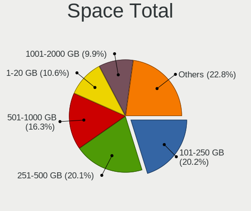
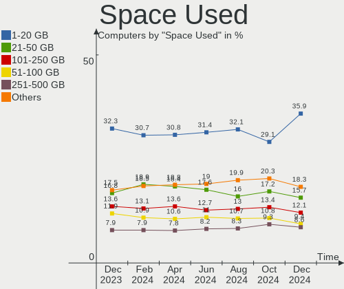
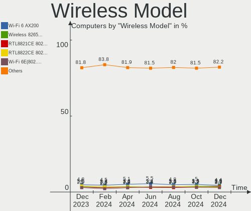
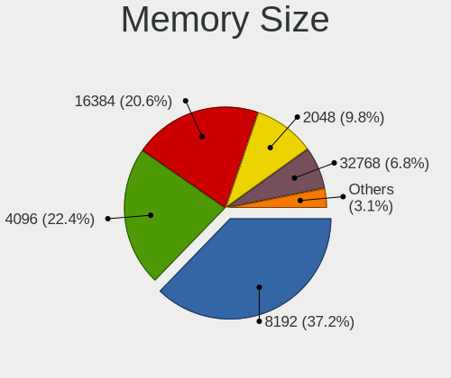
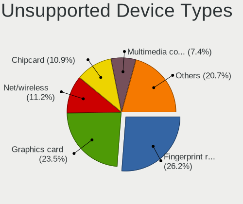

Linux - Hardware Trends
-----------------------

A project to identify most popular hardware characteristics and track their change
over time based on data collected by Linux users at https://Linux-Hardware.org.

Anyone can contribute to this report by the [hw-probe](https://github.com/linuxhw/hw-probe) tool:

    sudo -E hw-probe -all -upload

This is a report for all computer types. See also reports for [desktops](/Desktop/README.md) and [notebooks](/Notebook/README.md).

Distribution-specific reports: [Arch](/Dist/Arch), [ArcoLinux](/Dist/ArcoLinux), [BlackPanther](/Dist/BlackPanther), [CentOS](/Dist/CentOS), [Clear Linux](/Dist/Clear_Linux), [Debian](/Dist/Debian), [Elementary](/Dist/Elementary), [EndeavourOS](/Dist/EndeavourOS), [Endless](/Dist/Endless), [Fedora](/Dist/Fedora), [Gentoo](/Dist/Gentoo), [Kali](/Dist/Kali), [KDE neon](/Dist/KDE_neon), [Kubuntu](/Dist/Kubuntu), [Linux Mint](/Dist/Linux_Mint), [Manjaro](/Dist/Manjaro), [OpenMandriva](/Dist/OpenMandriva), [openSUSE](/Dist/openSUSE), [Pop!_OS](/Dist/Pop!_OS), [ROSA](/Dist/ROSA), [SteamOS](/Dist/SteamOS), [Ubuntu MATE](/Dist/Ubuntu_MATE), [Ubuntu](/Dist/Ubuntu), [Xubuntu](/Dist/Xubuntu), [Zorin](/Dist/Zorin).

This report is for one last month. Overall report since the beginning of time: [TestCoverage](https://github.com/linuxhw/TestCoverage)

Period: Nov, 2022.

Contents
--------

* [ System ](#system)
  - [ OS                       ](#os)
  - [ OS Family                ](#os-family)
  - [ Kernel                   ](#kernel)
  - [ Kernel Family            ](#kernel-family)
  - [ Kernel Major Ver.        ](#kernel-major-ver)
  - [ Arch                     ](#arch)
  - [ DE                       ](#de)
  - [ Display Server           ](#display-server)
  - [ Display Manager          ](#display-manager)
  - [ OS Lang                  ](#os-lang)
  - [ Boot Mode                ](#boot-mode)
  - [ Filesystem               ](#filesystem)
  - [ Part. scheme             ](#part-scheme)
  - [ Dual Boot with Linux/BSD ](#dual-boot-with-linuxbsd)
  - [ Dual Boot (Win)          ](#dual-boot-win)

* [ Board ](#board)
  - [ Vendor                   ](#vendor)
  - [ Model                    ](#model)
  - [ Model Family             ](#model-family)
  - [ MFG Year                 ](#mfg-year)
  - [ Form Factor              ](#form-factor)
  - [ Secure Boot              ](#secure-boot)
  - [ Coreboot                 ](#coreboot)
  - [ RAM Size                 ](#ram-size)
  - [ RAM Used                 ](#ram-used)
  - [ Total Drives             ](#total-drives)
  - [ Has CD-ROM               ](#has-cd-rom)
  - [ Has Ethernet             ](#has-ethernet)
  - [ Has WiFi                 ](#has-wifi)
  - [ Has Bluetooth            ](#has-bluetooth)

* [ Location ](#location)
  - [ Country                  ](#country)
  - [ City                     ](#city)

* [ Drives ](#drives)
  - [ Drive Vendor             ](#drive-vendor)
  - [ Drive Model              ](#drive-model)
  - [ HDD Vendor               ](#hdd-vendor)
  - [ SSD Vendor               ](#ssd-vendor)
  - [ Drive Kind               ](#drive-kind)
  - [ Drive Connector          ](#drive-connector)
  - [ Drive Size               ](#drive-size)
  - [ Space Total              ](#space-total)
  - [ Space Used               ](#space-used)
  - [ Malfunc. Drives          ](#malfunc-drives)
  - [ Malfunc. Drive Vendor    ](#malfunc-drive-vendor)
  - [ Malfunc. HDD Vendor      ](#malfunc-hdd-vendor)
  - [ Malfunc. Drive Kind      ](#malfunc-drive-kind)
  - [ Failed Drives            ](#failed-drives)
  - [ Failed Drive Vendor      ](#failed-drive-vendor)
  - [ Drive Status             ](#drive-status)

* [ Storage controller ](#storage-controller)
  - [ Storage Vendor           ](#storage-vendor)
  - [ Storage Model            ](#storage-model)
  - [ Storage Kind             ](#storage-kind)

* [ Processor ](#processor)
  - [ CPU Vendor               ](#cpu-vendor)
  - [ CPU Model                ](#cpu-model)
  - [ CPU Model Family         ](#cpu-model-family)
  - [ CPU Cores                ](#cpu-cores)
  - [ CPU Sockets              ](#cpu-sockets)
  - [ CPU Threads              ](#cpu-threads)
  - [ CPU Op-Modes             ](#cpu-op-modes)
  - [ CPU Microcode            ](#cpu-microcode)
  - [ CPU Microarch            ](#cpu-microarch)

* [ Graphics ](#graphics)
  - [ GPU Vendor               ](#gpu-vendor)
  - [ GPU Model                ](#gpu-model)
  - [ GPU Combo                ](#gpu-combo)
  - [ GPU Driver               ](#gpu-driver)
  - [ GPU Memory               ](#gpu-memory)

* [ Monitor ](#monitor)
  - [ Monitor Vendor           ](#monitor-vendor)
  - [ Monitor Model            ](#monitor-model)
  - [ Monitor Resolution       ](#monitor-resolution)
  - [ Monitor Diagonal         ](#monitor-diagonal)
  - [ Monitor Width            ](#monitor-width)
  - [ Aspect Ratio             ](#aspect-ratio)
  - [ Monitor Area             ](#monitor-area)
  - [ Pixel Density            ](#pixel-density)
  - [ Multiple Monitors        ](#multiple-monitors)

* [ Network ](#network)
  - [ Net Controller Vendor    ](#net-controller-vendor)
  - [ Net Controller Model     ](#net-controller-model)
  - [ Wireless Vendor          ](#wireless-vendor)
  - [ Wireless Model           ](#wireless-model)
  - [ Ethernet Vendor          ](#ethernet-vendor)
  - [ Ethernet Model           ](#ethernet-model)
  - [ Net Controller Kind      ](#net-controller-kind)
  - [ Used Controller          ](#used-controller)
  - [ NICs                     ](#nics)
  - [ IPv6                     ](#ipv6)

* [ Bluetooth ](#bluetooth)
  - [ Bluetooth Vendor         ](#bluetooth-vendor)
  - [ Bluetooth Model          ](#bluetooth-model)

* [ Sound ](#sound)
  - [ Sound Vendor             ](#sound-vendor)
  - [ Sound Model              ](#sound-model)

* [ Memory ](#memory)
  - [ Memory Vendor            ](#memory-vendor)
  - [ Memory Model             ](#memory-model)
  - [ Memory Kind              ](#memory-kind)
  - [ Memory Form Factor       ](#memory-form-factor)
  - [ Memory Size              ](#memory-size)
  - [ Memory Speed             ](#memory-speed)

* [ Printers & scanners ](#printers--scanners)
  - [ Printer Vendor           ](#printer-vendor)
  - [ Printer Model            ](#printer-model)
  - [ Scanner Vendor           ](#scanner-vendor)
  - [ Scanner Model            ](#scanner-model)

* [ Camera ](#camera)
  - [ Camera Vendor            ](#camera-vendor)
  - [ Camera Model             ](#camera-model)

* [ Security ](#security)
  - [ Fingerprint Vendor       ](#fingerprint-vendor)
  - [ Fingerprint Model        ](#fingerprint-model)
  - [ Chipcard Vendor          ](#chipcard-vendor)
  - [ Chipcard Model           ](#chipcard-model)

* [ Unsupported ](#unsupported)
  - [ Unsupported Devices      ](#unsupported-devices)
  - [ Unsupported Device Types ](#unsupported-device-types)

System
------

OS
--

Installed operating systems

| Name                         | Computers | Percent |
|------------------------------|-----------|---------|
| Ubuntu 22.04                 | 815       | 15.54%  |
| Debian 11                    | 294       | 5.61%   |
| Linux Mint 21                | 269       | 5.13%   |
| Fedora 37                    | 249       | 4.75%   |
| Ubuntu 22.10                 | 234       | 4.46%   |
| ROSA 12.3                    | 232       | 4.42%   |
| Pop!_OS 22.04                | 217       | 4.14%   |
| OpenMandriva 4.3             | 210       | 4.01%   |
| Arch Rolling                 | 192       | 3.66%   |
| Fedora 36                    | 191       | 3.64%   |
| Ubuntu 20.04                 | 190       | 3.62%   |
| Zorin 16                     | 154       | 2.94%   |
| Linux Mint 20.3              | 115       | 2.19%   |
| KDE neon 22.04               | 98        | 1.87%   |
| Kubuntu 22.04                | 85        | 1.62%   |
| OpenMandriva 4.50            | 77        | 1.47%   |
| Manjaro 22.0.0               | 67        | 1.28%   |
| Manjaro                      | 67        | 1.28%   |
| Ubuntu 18.04                 | 65        | 1.24%   |
| openSUSE Tumbleweed-XXXXXXXX | 59        | 1.13%   |
| ArcoLinux Rolling            | 56        | 1.07%   |
| Debian                       | 55        | 1.05%   |
| Kubuntu 22.10                | 51        | 0.97%   |
| Ubuntu 16.04                 | 49        | 0.93%   |
| Elementary 6.1               | 46        | 0.88%   |
| Xubuntu 22.04                | 45        | 0.86%   |
| ROSA 12.2                    | 45        | 0.86%   |
| Nobara 36                    | 43        | 0.82%   |
| EndeavourOS Rolling          | 42        | 0.8%    |
| SteamOS 3.3.2                | 37        | 0.71%   |
| Kali 2022.3                  | 36        | 0.69%   |
| LMDE 5                       | 28        | 0.53%   |
| Lubuntu 22.04                | 25        | 0.48%   |
| Gentoo 2.9                   | 24        | 0.46%   |
| SteamOS 3.4                  | 23        | 0.44%   |
| Gentoo 2.8                   | 23        | 0.44%   |
| Xubuntu 20.04                | 22        | 0.42%   |
| MX 21                        | 21        | 0.4%    |
| Ubuntu MATE 22.04            | 20        | 0.38%   |
| Kali 2022.4                  | 20        | 0.38%   |

OS Family
---------

OS without a version

| Name          | Computers | Percent |
|---------------|-----------|---------|
| Ubuntu        | 1373      | 26.19%  |
| Fedora        | 461       | 8.79%   |
| Linux Mint    | 431       | 8.22%   |
| Debian        | 371       | 7.08%   |
| OpenMandriva  | 314       | 5.99%   |
| ROSA          | 300       | 5.72%   |
| Pop!_OS       | 222       | 4.23%   |
| Arch          | 192       | 3.66%   |
| Kubuntu       | 164       | 3.13%   |
| Zorin         | 160       | 3.05%   |
| Manjaro       | 138       | 2.63%   |
| KDE neon      | 103       | 1.96%   |
| Xubuntu       | 82        | 1.56%   |
| SteamOS       | 69        | 1.32%   |
| openSUSE      | 69        | 1.32%   |
| ArcoLinux     | 62        | 1.18%   |
| Kali          | 56        | 1.07%   |
| Gentoo        | 50        | 0.95%   |
| Elementary    | 49        | 0.93%   |
| Lubuntu       | 45        | 0.86%   |
| Nobara        | 43        | 0.82%   |
| EndeavourOS   | 42        | 0.8%    |
| Ubuntu MATE   | 40        | 0.76%   |
| LMDE          | 29        | 0.55%   |
| ALT Linux     | 25        | 0.48%   |
| MX            | 23        | 0.44%   |
| Endless       | 22        | 0.42%   |
| Red OS        | 21        | 0.4%    |
| BlackPanther  | 20        | 0.38%   |
| CentOS        | 18        | 0.34%   |
| Garuda Linux  | 17        | 0.32%   |
| Clear Linux   | 17        | 0.32%   |
| Ubuntu Unity  | 16        | 0.31%   |
| Ubuntu Budgie | 14        | 0.27%   |
| Parrot        | 11        | 0.21%   |
| Rocky Linux   | 9         | 0.17%   |
| NixOS         | 9         | 0.17%   |
| RHEL          | 8         | 0.15%   |
| Raspbian      | 8         | 0.15%   |
| Xero          | 7         | 0.13%   |

Kernel
------

Version of the Linux kernel

| Version                             | Computers | Percent |
|-------------------------------------|-----------|---------|
| 5.15.0-52-generic                   | 811       | 15.47%  |
| 5.15.0-53-generic                   | 655       | 12.49%  |
| 5.19.0-23-generic                   | 246       | 4.69%   |
| 5.16.7-desktop-1omv4003             | 200       | 3.81%   |
| 5.10.0-19-amd64                     | 168       | 3.2%    |
| 6.0.6-76060006-generic              | 121       | 2.31%   |
| 5.4.0-131-generic                   | 115       | 2.19%   |
| 6.0.5-200.fc36.x86_64               | 97        | 1.85%   |
| 5.15.75-generic-1rosa2021.1-x86_64  | 81        | 1.54%   |
| 6.0.8-300.fc37.x86_64               | 80        | 1.53%   |
| 5.4.0-132-generic                   | 69        | 1.32%   |
| 6.0.9-300.fc37.x86_64               | 68        | 1.3%    |
| 5.15.0-43-generic                   | 57        | 1.09%   |
| 5.15.77-generic-1rosa2021.1-x86_64  | 56        | 1.07%   |
| 4.15.0-142-generic                  | 55        | 1.05%   |
| 5.19.12-desktop-2omv4090            | 50        | 0.95%   |
| 6.0.9-arch1-1                       | 49        | 0.93%   |
| 5.13.0-valve21.3-1-neptune          | 49        | 0.93%   |
| 6.0.8-arch1-1                       | 48        | 0.92%   |
| 5.10.150-generic-1rosa2021.1-x86_64 | 48        | 0.92%   |
| 5.10.0-18-amd64                     | 45        | 0.86%   |
| 6.0.7-arch1-1                       | 43        | 0.82%   |
| 5.15.0-41-generic                   | 39        | 0.74%   |
| 6.0.3-76060003-generic              | 38        | 0.72%   |
| 5.10.0-7-amd64                      | 37        | 0.71%   |
| 6.0.2-76060002-generic              | 35        | 0.67%   |
| 6.0.6-arch1-1                       | 34        | 0.65%   |
| 5.15.78-1-MANJARO                   | 34        | 0.65%   |
| 5.10.74-generic-2rosa2021.1-x86_64  | 34        | 0.65%   |
| 6.0.7-301.fc37.x86_64               | 31        | 0.59%   |
| 5.19.16-301.fc37.x86_64             | 30        | 0.57%   |
| 5.19.0-21-generic                   | 29        | 0.55%   |
| 6.0.8-1-default                     | 26        | 0.5%    |
| 6.0.7-200.fc36.x86_64               | 26        | 0.5%    |
| 5.19.0-kali2-amd64                  | 26        | 0.5%    |
| 6.0.0-4-amd64                       | 24        | 0.46%   |
| 5.19.5-desktop-1omv4090             | 24        | 0.46%   |
| 6.0.8-zen1-1-zen                    | 23        | 0.44%   |
| 6.0.10-arch2-1                      | 23        | 0.44%   |
| 6.0.0-2-amd64                       | 21        | 0.4%    |

Kernel Family
-------------

Linux kernel without a distro release

| Version  | Computers | Percent |
|----------|-----------|---------|
| 5.15.0   | 1676      | 31.97%  |
| 5.19.0   | 360       | 6.87%   |
| 5.10.0   | 291       | 5.55%   |
| 5.4.0    | 257       | 4.9%    |
| 6.0.8    | 247       | 4.71%   |
| 6.0.6    | 223       | 4.25%   |
| 5.16.7   | 200       | 3.81%   |
| 6.0.9    | 195       | 3.72%   |
| 6.0.7    | 173       | 3.3%    |
| 6.0.5    | 119       | 2.27%   |
| 5.15.75  | 110       | 2.1%    |
| 6.0.0    | 104       | 1.98%   |
| 4.15.0   | 103       | 1.96%   |
| 5.13.0   | 88        | 1.68%   |
| 6.0.2    | 70        | 1.34%   |
| 5.15.77  | 69        | 1.32%   |
| 5.19.16  | 52        | 0.99%   |
| 5.19.12  | 51        | 0.97%   |
| 5.10.150 | 51        | 0.97%   |
| 6.0.3    | 47        | 0.9%    |
| 6.0.10   | 45        | 0.86%   |
| 5.15.78  | 43        | 0.82%   |
| 5.14.0   | 39        | 0.74%   |
| 5.15.76  | 37        | 0.71%   |
| 5.11.0   | 36        | 0.69%   |
| 5.10.74  | 35        | 0.67%   |
| 6.1.0    | 32        | 0.61%   |
| 5.19.5   | 26        | 0.5%    |
| 5.17.5   | 24        | 0.46%   |
| 5.15.74  | 22        | 0.42%   |
| 5.18.0   | 21        | 0.4%    |
| 5.17.0   | 19        | 0.36%   |
| 5.16.13  | 18        | 0.34%   |
| 5.17.11  | 15        | 0.29%   |
| 5.19.17  | 14        | 0.27%   |
| 5.15.79  | 14        | 0.27%   |
| 4.18.0   | 13        | 0.25%   |
| 3.10.0   | 12        | 0.23%   |
| 4.18.16  | 11        | 0.21%   |
| 5.8.0    | 10        | 0.19%   |

Kernel Major Ver.
-----------------

Linux kernel major version

| Version | Computers | Percent |
|---------|-----------|---------|
| 5.15    | 2027      | 38.66%  |
| 6.0     | 1225      | 23.36%  |
| 5.19    | 524       | 9.99%   |
| 5.10    | 426       | 8.13%   |
| 5.4     | 270       | 5.15%   |
| 5.16    | 227       | 4.33%   |
| 4.15    | 105       | 2%      |
| 5.13    | 88        | 1.68%   |
| 5.17    | 64        | 1.22%   |
| 5.18    | 55        | 1.05%   |
| 5.14    | 49        | 0.93%   |
| 5.11    | 40        | 0.76%   |
| 6.1     | 32        | 0.61%   |
| 4.18    | 24        | 0.46%   |
| 4.19    | 15        | 0.29%   |
| 3.10    | 12        | 0.23%   |
| 5.8     | 10        | 0.19%   |
| 5.6     | 10        | 0.19%   |
| 4.9     | 9         | 0.17%   |
| 4.4     | 6         | 0.11%   |
| 5.3     | 4         | 0.08%   |
| 4.1     | 4         | 0.08%   |
| 5.9     | 3         | 0.06%   |
| 5.7     | 2         | 0.04%   |
| 5.5     | 2         | 0.04%   |
| 5.0     | 2         | 0.04%   |
| 4.13    | 2         | 0.04%   |
| 6.0.5   | 1         | 0.02%   |
| 4.17    | 1         | 0.02%   |
| 4.12    | 1         | 0.02%   |
| 3.4     | 1         | 0.02%   |
| 3.13    | 1         | 0.02%   |
| 2.6.32  | 1         | 0.02%   |

Arch
----

OS architecture (x86_64, i586, etc.)

| Name     | Computers | Percent |
|----------|-----------|---------|
| x86_64   | 5136      | 97.96%  |
| i686     | 62        | 1.18%   |
| aarch64  | 21        | 0.4%    |
| armv7l   | 12        | 0.23%   |
| ppc64    | 4         | 0.08%   |
| armv6l   | 3         | 0.06%   |
| sh4a     | 1         | 0.02%   |
| riscv64  | 1         | 0.02%   |
| ppc      | 1         | 0.02%   |
| armv8l   | 1         | 0.02%   |
| armv5tel | 1         | 0.02%   |

DE
--

Desktop Environment

| Name              | Computers | Percent |
|-------------------|-----------|---------|
| GNOME             | 2317      | 44.19%  |
| KDE5              | 1286      | 24.53%  |
| X-Cinnamon        | 384       | 7.32%   |
| XFCE              | 359       | 6.85%   |
| Unknown           | 329       | 6.28%   |
| MATE              | 157       | 2.99%   |
| LXQt              | 78        | 1.49%   |
| Pantheon          | 49        | 0.93%   |
| Cinnamon          | 41        | 0.78%   |
| i3                | 38        | 0.72%   |
| LXDE              | 23        | 0.44%   |
| Budgie            | 21        | 0.4%    |
| sway              | 19        | 0.36%   |
| Unity             | 17        | 0.32%   |
| GNOME Flashback   | 17        | 0.32%   |
| KDE               | 16        | 0.31%   |
| KDE4              | 13        | 0.25%   |
| GNOME Classic     | 11        | 0.21%   |
| Deepin            | 9         | 0.17%   |
| awesome           | 9         | 0.17%   |
| trinity           | 7         | 0.13%   |
| lightdm-xsession  | 7         | 0.13%   |
| openbox           | 6         | 0.11%   |
| Hyprland          | 4         | 0.08%   |
| LeftWM            | 3         | 0.06%   |
| icewm             | 3         | 0.06%   |
| Enlightenment     | 3         | 0.06%   |
| chadwm            | 2         | 0.04%   |
| bspwm             | 2         | 0.04%   |
| Yaru:ubuntu:GNOME | 1         | 0.02%   |
| xmonad            | 1         | 0.02%   |
| ubuntu=GNOME      | 1         | 0.02%   |
| ubuntu            | 1         | 0.02%   |
| qtile             | 1         | 0.02%   |
| Phosh:GNOME       | 1         | 0.02%   |
| none+bspwm        | 1         | 0.02%   |
| none+awesome      | 1         | 0.02%   |
| i3-with-shmlog    | 1         | 0.02%   |
| fluxbox           | 1         | 0.02%   |
| e16-session       | 1         | 0.02%   |

Display Server
--------------

X11 or Wayland

| Name    | Computers | Percent |
|---------|-----------|---------|
| X11     | 3401      | 64.87%  |
| Wayland | 1530      | 29.18%  |
| Unknown | 180       | 3.43%   |
| Tty     | 130       | 2.48%   |
| Web     | 2         | 0.04%   |

Display Manager
---------------

SDDM, LightDM, etc.

| Name    | Computers | Percent |
|---------|-----------|---------|
| Unknown | 1701      | 32.44%  |
| GDM3    | 1199      | 22.87%  |
| SDDM    | 1021      | 19.47%  |
| LightDM | 740       | 14.11%  |
| GDM     | 537       | 10.24%  |
| KDM     | 12        | 0.23%   |
| XDM     | 9         | 0.17%   |
| GREETD  | 9         | 0.17%   |
| TDM     | 5         | 0.1%    |
| LXDM    | 5         | 0.1%    |
| Ly      | 4         | 0.08%   |
| EMPTTY  | 1         | 0.02%   |

OS Lang
-------

Language

| Lang    | Computers | Percent |
|---------|-----------|---------|
| en_US   | 2181      | 41.6%   |
| ru_RU   | 500       | 9.54%   |
| de_DE   | 391       | 7.46%   |
| en_GB   | 259       | 4.94%   |
| it_IT   | 245       | 4.67%   |
| fr_FR   | 231       | 4.41%   |
| Unknown | 180       | 3.43%   |
| pt_BR   | 159       | 3.03%   |
| es_ES   | 107       | 2.04%   |
| pl_PL   | 80        | 1.53%   |
| en_CA   | 79        | 1.51%   |
| en_AU   | 79        | 1.51%   |
| C       | 70        | 1.34%   |
| en_IN   | 68        | 1.3%    |
| nl_NL   | 43        | 0.82%   |
| zh_CN   | 30        | 0.57%   |
| es_AR   | 30        | 0.57%   |
| cs_CZ   | 28        | 0.53%   |
| hu_HU   | 27        | 0.51%   |
| tr_TR   | 26        | 0.5%    |
| es_MX   | 25        | 0.48%   |
| ja_JP   | 18        | 0.34%   |
| en_AG   | 18        | 0.34%   |
| pt_PT   | 17        | 0.32%   |
| en_ZA   | 15        | 0.29%   |
| fr_CA   | 14        | 0.27%   |
| sv_SE   | 13        | 0.25%   |
| de_CH   | 13        | 0.25%   |
| de_AT   | 13        | 0.25%   |
| fi_FI   | 12        | 0.23%   |
| es_VE   | 12        | 0.23%   |
| en_NZ   | 12        | 0.23%   |
| ko_KR   | 11        | 0.21%   |
| es_CL   | 11        | 0.21%   |
| nl_BE   | 10        | 0.19%   |
| fr_BE   | 10        | 0.19%   |
| en_PH   | 10        | 0.19%   |
| el_GR   | 10        | 0.19%   |
| bg_BG   | 9         | 0.17%   |
| POSIX   | 8         | 0.15%   |

Boot Mode
---------

EFI or BIOS

| Mode | Computers | Percent |
|------|-----------|---------|
| EFI  | 2754      | 52.53%  |
| BIOS | 2489      | 47.47%  |

Filesystem
----------

Type of filesystem

| Type          | Computers | Percent |
|---------------|-----------|---------|
| Ext4          | 3896      | 74.31%  |
| Btrfs         | 742       | 14.15%  |
| Overlay       | 422       | 8.05%   |
| Xfs           | 82        | 1.56%   |
| Zfs           | 66        | 1.26%   |
| F2fs          | 12        | 0.23%   |
| Ext2          | 7         | 0.13%   |
| Ext3          | 4         | 0.08%   |
| Unknown       | 3         | 0.06%   |
| Tmpfs         | 2         | 0.04%   |
| Reiserfs      | 2         | 0.04%   |
| Jfs           | 2         | 0.04%   |
| XXXXXXX       | 1         | 0.02%   |
| Rootfs        | 1         | 0.02%   |
| Fuse.snapfuse | 1         | 0.02%   |

Part. scheme
------------

Scheme of partitioning

| Type    | Computers | Percent |
|---------|-----------|---------|
| GPT     | 3079      | 58.73%  |
| Unknown | 1423      | 27.14%  |
| MBR     | 741       | 14.13%  |

Dual Boot with Linux/BSD
------------------------

Hosting more than one Linux/BSD

| Dual boot | Computers | Percent |
|-----------|-----------|---------|
| No        | 4396      | 83.85%  |
| Yes       | 847       | 16.15%  |

Dual Boot (Win)
---------------

Hosting Linux and Windows

| Dual boot | Computers | Percent |
|-----------|-----------|---------|
| No        | 3678      | 70.15%  |
| Yes       | 1565      | 29.85%  |

Board
-----

Vendor
------

Motherboard manufacturer

| Name                    | Computers | Percent |
|-------------------------|-----------|---------|
| ASUSTek Computer        | 878       | 16.75%  |
| Lenovo                  | 752       | 14.34%  |
| Hewlett-Packard         | 701       | 13.37%  |
| Dell                    | 588       | 11.21%  |
| Gigabyte Technology     | 355       | 6.77%   |
| MSI                     | 329       | 6.28%   |
| Acer                    | 270       | 5.15%   |
| ASRock                  | 153       | 2.92%   |
| Apple                   | 138       | 2.63%   |
| Intel                   | 94        | 1.79%   |
| Samsung Electronics     | 69        | 1.32%   |
| Unknown                 | 63        | 1.2%    |
| HUAWEI                  | 61        | 1.16%   |
| Toshiba                 | 60        | 1.14%   |
| Valve                   | 54        | 1.03%   |
| Fujitsu                 | 43        | 0.82%   |
| Sony                    | 35        | 0.67%   |
| Google                  | 32        | 0.61%   |
| Foxconn                 | 20        | 0.38%   |
| Microsoft               | 19        | 0.36%   |
| Raspberry Pi Foundation | 18        | 0.34%   |
| Pegatron                | 18        | 0.34%   |
| Medion                  | 18        | 0.34%   |
| ECS                     | 18        | 0.34%   |
| Alienware               | 17        | 0.32%   |
| Timi                    | 16        | 0.31%   |
| Chuwi                   | 15        | 0.29%   |
| TUXEDO                  | 14        | 0.27%   |
| Notebook                | 14        | 0.27%   |
| Packard Bell            | 13        | 0.25%   |
| Biostar                 | 12        | 0.23%   |
| AZW                     | 10        | 0.19%   |
| Gateway                 | 9         | 0.17%   |
| System76                | 8         | 0.15%   |
| Supermicro              | 8         | 0.15%   |
| Razer                   | 8         | 0.15%   |
| GPU Company             | 8         | 0.15%   |
| GPD                     | 8         | 0.15%   |
| BESSTAR Tech            | 8         | 0.15%   |
| Huanan                  | 7         | 0.13%   |

Model
-----

Motherboard model

| Name                            | Computers | Percent |
|---------------------------------|-----------|---------|
| Unknown                         | 77        | 1.47%   |
| Valve Jupiter                   | 54        | 1.03%   |
| ASUS All Series                 | 46        | 0.88%   |
| ASUS ROG STRIX X299-E GAMING    | 38        | 0.72%   |
| HP Notebook                     | 23        | 0.44%   |
| ASUS TUF Gaming X570-PLUS       | 14        | 0.27%   |
| ECS H61H2-M13                   | 12        | 0.23%   |
| Dell OptiPlex 7010              | 11        | 0.21%   |
| ASUS PRIME A320M-K              | 11        | 0.21%   |
| Apple MacBookPro9,2             | 11        | 0.21%   |
| MSI MS-7C37                     | 10        | 0.19%   |
| HP Compaq Elite 8300 SFF        | 10        | 0.19%   |
| ASUS PRIME TRX40-PRO            | 10        | 0.19%   |
| HP Pavilion g6                  | 9         | 0.17%   |
| Gigabyte B450 AORUS ELITE       | 9         | 0.17%   |
| Dell Inspiron 15-3567           | 9         | 0.17%   |
| ASUS ROG STRIX B550-F GAMING    | 9         | 0.17%   |
| MSI MS-7C02                     | 8         | 0.15%   |
| Lenovo ThinkPad E475 20H40006US | 8         | 0.15%   |
| Lenovo ThinkBook 15 G2 ITL 20VE | 8         | 0.15%   |
| HUAWEI NBLK-WAX9X               | 8         | 0.15%   |
| HUAWEI CREM-WXX9                | 8         | 0.15%   |
| HP Pavilion 15                  | 8         | 0.15%   |
| Gigabyte B450M DS3H             | 8         | 0.15%   |
| Gigabyte A320M-S2H              | 8         | 0.15%   |
| Dell OptiPlex 990               | 8         | 0.15%   |
| ASUS TUF X299 MARK 2            | 8         | 0.15%   |
| Apple MacBookPro8,1             | 8         | 0.15%   |
| MSI MS-7C56                     | 7         | 0.13%   |
| MSI MS-7758                     | 7         | 0.13%   |
| HUAWEI KLVL-WXX9                | 7         | 0.13%   |
| HUAWEI BOD-WXX9                 | 7         | 0.13%   |
| HP Pavilion g7                  | 7         | 0.13%   |
| Gigabyte GA-78LMT-USB3          | 7         | 0.13%   |
| Dell OptiPlex 3020              | 7         | 0.13%   |
| Dell Latitude E6540             | 7         | 0.13%   |
| ASRock B450M Steel Legend       | 7         | 0.13%   |
| ASRock B450M Pro4               | 7         | 0.13%   |
| Apple MacBookAir6,2             | 7         | 0.13%   |
| MSI MS-7C95                     | 6         | 0.11%   |

Model Family
------------

Motherboard model prefix

| Name               | Computers | Percent |
|--------------------|-----------|---------|
| Lenovo ThinkPad    | 325       | 6.2%    |
| Acer Aspire        | 168       | 3.2%    |
| Dell Latitude      | 149       | 2.84%   |
| Dell Inspiron      | 143       | 2.73%   |
| Lenovo IdeaPad     | 141       | 2.69%   |
| ASUS ROG           | 127       | 2.42%   |
| HP Pavilion        | 123       | 2.35%   |
| ASUS PRIME         | 118       | 2.25%   |
| HP EliteBook       | 105       | 2%      |
| Dell OptiPlex      | 90        | 1.72%   |
| Unknown            | 77        | 1.47%   |
| ASUS VivoBook      | 74        | 1.41%   |
| Dell XPS           | 64        | 1.22%   |
| HP Laptop          | 62        | 1.18%   |
| Dell Precision     | 55        | 1.05%   |
| Valve Jupiter      | 54        | 1.03%   |
| HP ProBook         | 53        | 1.01%   |
| HP Compaq          | 52        | 0.99%   |
| ASUS TUF           | 49        | 0.93%   |
| Toshiba Satellite  | 47        | 0.9%    |
| Lenovo ThinkCentre | 46        | 0.88%   |
| ASUS All           | 46        | 0.88%   |
| Lenovo Legion      | 39        | 0.74%   |
| HP ENVY            | 35        | 0.67%   |
| Lenovo Yoga        | 34        | 0.65%   |
| Lenovo ThinkBook   | 32        | 0.61%   |
| ASUS ZenBook       | 31        | 0.59%   |
| ASUS ASUS          | 31        | 0.59%   |
| Acer Nitro         | 30        | 0.57%   |
| Dell Vostro        | 26        | 0.5%    |
| HP EliteDesk       | 25        | 0.48%   |
| HP Notebook        | 23        | 0.44%   |
| HP ZBook           | 22        | 0.42%   |
| HP ProDesk         | 21        | 0.4%    |
| Gigabyte B450      | 20        | 0.38%   |
| Microsoft Surface  | 19        | 0.36%   |
| HP OMEN            | 19        | 0.36%   |
| RPi Raspberry      | 18        | 0.34%   |
| Acer Swift         | 18        | 0.34%   |
| Gigabyte X570      | 17        | 0.32%   |

MFG Year
--------

Motherboard manufacture year

| Year    | Computers | Percent |
|---------|-----------|---------|
| 2021    | 639       | 12.19%  |
| 2020    | 545       | 10.39%  |
| 2019    | 488       | 9.31%   |
| 2022    | 442       | 8.43%   |
| 2018    | 395       | 7.53%   |
| 2012    | 351       | 6.69%   |
| 2017    | 344       | 6.56%   |
| 2011    | 315       | 6.01%   |
| 2013    | 312       | 5.95%   |
| 2015    | 265       | 5.05%   |
| 2014    | 259       | 4.94%   |
| 2016    | 237       | 4.52%   |
| 2010    | 206       | 3.93%   |
| 2009    | 140       | 2.67%   |
| 2008    | 136       | 2.59%   |
| 2007    | 85        | 1.62%   |
| Unknown | 41        | 0.78%   |
| 2006    | 27        | 0.51%   |
| 2005    | 12        | 0.23%   |
| 2004    | 4         | 0.08%   |

Form Factor
-----------

Physical design of the computer

| Name           | Computers | Percent |
|----------------|-----------|---------|
| Notebook       | 2879      | 54.91%  |
| Desktop        | 1943      | 37.06%  |
| Convertible    | 142       | 2.71%   |
| Mini pc        | 92        | 1.75%   |
| All in one     | 69        | 1.32%   |
| Server         | 43        | 0.82%   |
| Tablet         | 40        | 0.76%   |
| System on chip | 29        | 0.55%   |
| Other          | 3         | 0.06%   |
| Phone          | 2         | 0.04%   |
| Firewall       | 1         | 0.02%   |

Secure Boot
-----------

Enabled or disabled

| State    | Computers | Percent |
|----------|-----------|---------|
| Disabled | 4831      | 92.14%  |
| Enabled  | 412       | 7.86%   |

Coreboot
--------

Have coreboot on board

| Used | Computers | Percent |
|------|-----------|---------|
| No   | 5204      | 99.26%  |
| Yes  | 39        | 0.74%   |

RAM Size
--------

Total RAM memory

| Size in GB      | Computers | Percent |
|-----------------|-----------|---------|
| 4.01-8.0        | 1266      | 24.15%  |
| 16.01-24.0      | 1078      | 20.56%  |
| 8.01-16.0       | 946       | 18.04%  |
| 3.01-4.0        | 799       | 15.24%  |
| 32.01-64.0      | 601       | 11.46%  |
| 64.01-256.0     | 219       | 4.18%   |
| 1.01-2.0        | 126       | 2.4%    |
| 24.01-32.0      | 95        | 1.81%   |
| 2.01-3.0        | 48        | 0.92%   |
| More than 256.0 | 26        | 0.5%    |
| 0.51-1.0        | 24        | 0.46%   |
| 0.01-0.5        | 8         | 0.15%   |
| Unknown         | 7         | 0.13%   |

RAM Used
--------

Used RAM memory

| Used GB         | Computers | Percent |
|-----------------|-----------|---------|
| 1.01-2.0        | 1561      | 29.77%  |
| 2.01-3.0        | 1307      | 24.93%  |
| 4.01-8.0        | 883       | 16.84%  |
| 3.01-4.0        | 724       | 13.81%  |
| 0.51-1.0        | 304       | 5.8%    |
| 8.01-16.0       | 286       | 5.45%   |
| 0.01-0.5        | 70        | 1.34%   |
| 32.01-64.0      | 43        | 0.82%   |
| 16.01-24.0      | 35        | 0.67%   |
| 24.01-32.0      | 10        | 0.19%   |
| Unknown         | 10        | 0.19%   |
| 64.01-256.0     | 9         | 0.17%   |
| More than 256.0 | 1         | 0.02%   |

Total Drives
------------

Number of drives on board

| Drives | Computers | Percent |
|--------|-----------|---------|
| 1      | 3071      | 58.57%  |
| 2      | 1322      | 25.21%  |
| 3      | 425       | 8.11%   |
| 4      | 205       | 3.91%   |
| 5      | 93        | 1.77%   |
| 6      | 44        | 0.84%   |
| 0      | 32        | 0.61%   |
| 7      | 23        | 0.44%   |
| 8      | 8         | 0.15%   |
| 10     | 6         | 0.11%   |
| 12     | 4         | 0.08%   |
| 11     | 3         | 0.06%   |
| 9      | 3         | 0.06%   |
| 32     | 1         | 0.02%   |
| 16     | 1         | 0.02%   |
| 15     | 1         | 0.02%   |
| 14     | 1         | 0.02%   |

Has CD-ROM
----------

Has CD-ROM on board

| Presented | Computers | Percent |
|-----------|-----------|---------|
| No        | 3617      | 68.99%  |
| Yes       | 1626      | 31.01%  |

Has Ethernet
------------

Has Ethernet on board

| Presented | Computers | Percent |
|-----------|-----------|---------|
| Yes       | 4371      | 83.37%  |
| No        | 872       | 16.63%  |

Has WiFi
--------

Has WiFi module

| Presented | Computers | Percent |
|-----------|-----------|---------|
| Yes       | 4013      | 76.54%  |
| No        | 1230      | 23.46%  |

Has Bluetooth
-------------

Has Bluetooth module

| Presented | Computers | Percent |
|-----------|-----------|---------|
| Yes       | 3304      | 63.02%  |
| No        | 1939      | 36.98%  |

Location
--------

Country
-------

Geographic location (country)

| Country      | Computers | Percent |
|--------------|-----------|---------|
| USA          | 878       | 16.75%  |
| Russia       | 565       | 10.78%  |
| Germany      | 520       | 9.92%   |
| Italy        | 348       | 6.64%   |
| France       | 269       | 5.13%   |
| Brazil       | 231       | 4.41%   |
| UK           | 195       | 3.72%   |
| Poland       | 140       | 2.67%   |
| Spain        | 132       | 2.52%   |
| Canada       | 130       | 2.48%   |
| Netherlands  | 116       | 2.21%   |
| India        | 110       | 2.1%    |
| Australia    | 97        | 1.85%   |
| Unknown      | 67        | 1.28%   |
| China        | 61        | 1.16%   |
| Hungary      | 60        | 1.14%   |
| Turkey       | 59        | 1.13%   |
| Mexico       | 58        | 1.11%   |
| Sweden       | 53        | 1.01%   |
| Czechia      | 51        | 0.97%   |
| Greece       | 50        | 0.95%   |
| Belgium      | 50        | 0.95%   |
| Switzerland  | 49        | 0.93%   |
| Romania      | 48        | 0.92%   |
| Indonesia    | 47        | 0.9%    |
| Finland      | 45        | 0.86%   |
| Argentina    | 44        | 0.84%   |
| Portugal     | 41        | 0.78%   |
| Austria      | 40        | 0.76%   |
| Japan        | 30        | 0.57%   |
| Denmark      | 29        | 0.55%   |
| Bulgaria     | 28        | 0.53%   |
| Chile        | 24        | 0.46%   |
| South Africa | 21        | 0.4%    |
| Serbia       | 19        | 0.36%   |
| Norway       | 19        | 0.36%   |
| Kazakhstan   | 19        | 0.36%   |
| South Korea  | 18        | 0.34%   |
| Taiwan       | 17        | 0.32%   |
| Philippines  | 17        | 0.32%   |

City
----

Geographic location (city)

| City              | Computers | Percent |
|-------------------|-----------|---------|
| Moscow            | 119       | 2.27%   |
| Unknown           | 68        | 1.3%    |
| St Petersburg     | 61        | 1.16%   |
| Berlin            | 50        | 0.95%   |
| Milan             | 48        | 0.92%   |
| Voronezh          | 45        | 0.86%   |
| Rome              | 43        | 0.82%   |
| Paris             | 34        | 0.65%   |
| Sao Paulo         | 30        | 0.57%   |
| Warsaw            | 29        | 0.55%   |
| Amsterdam         | 28        | 0.53%   |
| Bangor            | 25        | 0.48%   |
| Rio de Janeiro    | 23        | 0.44%   |
| Melbourne         | 23        | 0.44%   |
| Budapest          | 23        | 0.44%   |
| Madrid            | 22        | 0.42%   |
| Helsinki          | 21        | 0.4%    |
| Athens            | 21        | 0.4%    |
| Istanbul          | 20        | 0.38%   |
| Frankfurt am Main | 20        | 0.38%   |
| Munich            | 19        | 0.36%   |
| Bucharest         | 19        | 0.36%   |
| Sydney            | 18        | 0.34%   |
| Vienna            | 17        | 0.32%   |
| Prague            | 17        | 0.32%   |
| Novosibirsk       | 17        | 0.32%   |
| Brisbane          | 17        | 0.32%   |
| Bengaluru         | 17        | 0.32%   |
| London            | 16        | 0.31%   |
| Krasnodar         | 16        | 0.31%   |
| Jakarta           | 16        | 0.31%   |
| Auckland          | 15        | 0.29%   |
| Zurich            | 14        | 0.27%   |
| Perm              | 14        | 0.27%   |
| Naples            | 14        | 0.27%   |
| Montreal          | 14        | 0.27%   |
| Belgrade          | 14        | 0.27%   |
| Sofia             | 13        | 0.25%   |
| Lisbon            | 13        | 0.25%   |
| Hamburg           | 13        | 0.25%   |

Drives
------

Drive Vendor
------------

Hard drive vendors

| Vendor                      | Computers | Drives | Percent |
|-----------------------------|-----------|--------|---------|
| Samsung Electronics         | 1277      | 1536   | 16.37%  |
| WDC                         | 1014      | 1274   | 13%     |
| Seagate                     | 993       | 1271   | 12.73%  |
| Sandisk                     | 474       | 506    | 6.08%   |
| Kingston                    | 434       | 471    | 5.56%   |
| Toshiba                     | 408       | 448    | 5.23%   |
| Unknown                     | 315       | 346    | 4.04%   |
| Crucial                     | 275       | 303    | 3.53%   |
| SK hynix                    | 217       | 220    | 2.78%   |
| Hitachi                     | 208       | 224    | 2.67%   |
| Intel                       | 195       | 221    | 2.5%    |
| Micron Technology           | 143       | 148    | 1.83%   |
| HGST                        | 111       | 125    | 1.42%   |
| Phison Electronics          | 102       | 116    | 1.31%   |
| China                       | 101       | 111    | 1.29%   |
| A-DATA Technology           | 90        | 97     | 1.15%   |
| KIOXIA                      | 77        | 79     | 0.99%   |
| Apple                       | 77        | 93     | 0.99%   |
| Unknown                     | 63        | 65     | 0.81%   |
| SPCC                        | 62        | 68     | 0.79%   |
| Kingston Technology Company | 62        | 63     | 0.79%   |
| Silicon Motion              | 58        | 60     | 0.74%   |
| PNY                         | 43        | 44     | 0.55%   |
| Patriot                     | 41        | 42     | 0.53%   |
| Phison                      | 39        | 40     | 0.5%    |
| Micron/Crucial Technology   | 38        | 39     | 0.49%   |
| Intenso                     | 38        | 41     | 0.49%   |
| Transcend                   | 32        | 32     | 0.41%   |
| GOODRAM                     | 30        | 32     | 0.38%   |
| ADATA Technology            | 29        | 31     | 0.37%   |
| Netac                       | 27        | 28     | 0.35%   |
| LITEON                      | 25        | 25     | 0.32%   |
| JMicron Technology          | 25        | 25     | 0.32%   |
| KingSpec                    | 24        | 24     | 0.31%   |
| OCZ                         | 22        | 25     | 0.28%   |
| Maxtor                      | 22        | 24     | 0.28%   |
| Corsair                     | 22        | 25     | 0.28%   |
| Apacer                      | 21        | 22     | 0.27%   |
| Hewlett-Packard             | 20        | 35     | 0.26%   |
| LITEONIT                    | 19        | 19     | 0.24%   |

Drive Model
-----------

Hard drive models

| Model                                                | Computers | Percent |
|------------------------------------------------------|-----------|---------|
| Samsung NVMe SSD Controller SM981/PM981/PM983 1TB    | 175       | 2.05%   |
| Kingston SA400S37240G 240GB SSD                      | 110       | 1.29%   |
| Samsung SSD 860 EVO 500GB                            | 83        | 0.97%   |
| Samsung NVMe SSD Controller PM9A1/PM9A3/980PRO 250GB | 71        | 0.83%   |
| Kingston SA400S37480G 480GB SSD                      | 64        | 0.75%   |
| Unknown                                              | 63        | 0.74%   |
| Seagate ST6000NM0115-1YZ110 6TB                      | 55        | 0.64%   |
| Seagate ST500DM002-1BD142 500GB                      | 53        | 0.62%   |
| Seagate ST1000DM010-2EP102 1TB                       | 52        | 0.61%   |
| Seagate ST1000LM035-1RK172 1TB                       | 51        | 0.6%    |
| Unknown MMC Card  64GB                               | 48        | 0.56%   |
| Sandisk WD Blue SN550 NVMe SSD 1TB                   | 48        | 0.56%   |
| Samsung SSD 850 EVO 500GB                            | 45        | 0.53%   |
| Crucial CT1000MX500SSD1 1TB                          | 45        | 0.53%   |
| Sandisk WD Black SN750 / PC SN730 NVMe SSD 1024GB    | 44        | 0.52%   |
| Kingston SA400S37120G 120GB SSD                      | 43        | 0.5%    |
| Toshiba DT01ACA100 1TB                               | 42        | 0.49%   |
| Seagate ST2000DM008-2FR102 2TB                       | 42        | 0.49%   |
| WDC WD10EZEX-08WN4A0 1TB                             | 41        | 0.48%   |
| Toshiba MQ01ABD100 1TB                               | 41        | 0.48%   |
| Unknown MMC Card  32GB                               | 40        | 0.47%   |
| Crucial CT500MX500SSD1 500GB                         | 40        | 0.47%   |
| Phison E12 NVMe Controller 2TB                       | 39        | 0.46%   |
| Samsung NVMe SSD Controller SM961/PM961/SM963 250GB  | 38        | 0.45%   |
| Samsung SSD 860 EVO 250GB                            | 37        | 0.43%   |
| Samsung SSD 860 EVO 1TB                              | 37        | 0.43%   |
| Phison PS5013 E13 NVMe Controller 256GB              | 35        | 0.41%   |
| Samsung SSD 850 EVO 250GB                            | 34        | 0.4%    |
| Toshiba MQ01ABF050 500GB                             | 32        | 0.38%   |
| Samsung SSD 980 1TB                                  | 32        | 0.38%   |
| Seagate ST1000LM024 HN-M101MBB 1TB                   | 31        | 0.36%   |
| HGST HTS721010A9E630 1TB                             | 31        | 0.36%   |
| Crucial CT240BX500SSD1 240GB                         | 29        | 0.34%   |
| WDC WDS500G2B0A-00SM50 500GB SSD                     | 28        | 0.33%   |
| Unknown MMC Card  128GB                              | 28        | 0.33%   |
| Samsung SSD 970 EVO Plus 1TB                         | 27        | 0.32%   |
| Samsung SSD 980 500GB                                | 26        | 0.3%    |
| Kingston Company OM3PDP3 NVMe SSD 256GB              | 26        | 0.3%    |
| Samsung SSD 870 QVO 1TB                              | 25        | 0.29%   |
| Crucial CT1000BX500SSD1 1TB                          | 25        | 0.29%   |

HDD Vendor
----------

Hard disk drive vendors

| Vendor              | Computers | Drives | Percent |
|---------------------|-----------|--------|---------|
| Seagate             | 963       | 1228   | 36.7%   |
| WDC                 | 793       | 1000   | 30.22%  |
| Toshiba             | 311       | 338    | 11.85%  |
| Hitachi             | 208       | 224    | 7.93%   |
| HGST                | 111       | 125    | 4.23%   |
| Samsung Electronics | 109       | 125    | 4.15%   |
| Apple               | 25        | 25     | 0.95%   |
| Unknown             | 24        | 25     | 0.91%   |
| Maxtor              | 19        | 21     | 0.72%   |
| Fujitsu             | 15        | 15     | 0.57%   |
| ASMT                | 9         | 13     | 0.34%   |
| Hewlett-Packard     | 6         | 20     | 0.23%   |
| Intenso             | 5         | 5      | 0.19%   |
| ASMedia             | 4         | 4      | 0.15%   |
| USB                 | 3         | 3      | 0.11%   |
| USB3.0              | 2         | 3      | 0.08%   |
| SAGE                | 2         | 2      | 0.08%   |
| WD MediaMax         | 1         | 1      | 0.04%   |
| StoreJet            | 1         | 1      | 0.04%   |
| MARVELL             | 1         | 1      | 0.04%   |
| LaCie               | 1         | 1      | 0.04%   |
| KESU                | 1         | 1      | 0.04%   |
| IBM/Hitachi         | 1         | 1      | 0.04%   |
| HPE                 | 1         | 2      | 0.04%   |
| HGST HTS            | 1         | 1      | 0.04%   |
| FNK TECH            | 1         | 1      | 0.04%   |
| External            | 1         | 1      | 0.04%   |
| ExcelStor           | 1         | 1      | 0.04%   |
| Dyconn H            | 1         | 1      | 0.04%   |
| Advantech           | 1         | 1      | 0.04%   |
| ACASIS              | 1         | 1      | 0.04%   |
| Unknown             | 1         | 1      | 0.04%   |

SSD Vendor
----------

Solid state drive vendors

| Vendor              | Computers | Drives | Percent |
|---------------------|-----------|--------|---------|
| Samsung Electronics | 570       | 655    | 22.12%  |
| Kingston            | 357       | 383    | 13.85%  |
| Crucial             | 254       | 276    | 9.86%   |
| SanDisk             | 224       | 238    | 8.69%   |
| WDC                 | 143       | 149    | 5.55%   |
| China               | 97        | 107    | 3.76%   |
| A-DATA Technology   | 66        | 72     | 2.56%   |
| Intel               | 59        | 62     | 2.29%   |
| SPCC                | 56        | 62     | 2.17%   |
| Apple               | 43        | 43     | 1.67%   |
| PNY                 | 41        | 42     | 1.59%   |
| Patriot             | 39        | 40     | 1.51%   |
| Toshiba             | 32        | 36     | 1.24%   |
| SK hynix            | 31        | 32     | 1.2%    |
| Micron Technology   | 29        | 32     | 1.13%   |
| GOODRAM             | 29        | 31     | 1.13%   |
| Intenso             | 26        | 28     | 1.01%   |
| Transcend           | 24        | 24     | 0.93%   |
| Netac               | 24        | 25     | 0.93%   |
| OCZ                 | 22        | 25     | 0.85%   |
| LITEON              | 22        | 22     | 0.85%   |
| KingSpec            | 22        | 22     | 0.85%   |
| Unknown             | 21        | 21     | 0.81%   |
| LITEONIT            | 19        | 19     | 0.74%   |
| Apacer              | 18        | 19     | 0.7%    |
| Team                | 15        | 15     | 0.58%   |
| Gigabyte Technology | 14        | 14     | 0.54%   |
| Lexar               | 13        | 14     | 0.5%    |
| Hewlett-Packard     | 13        | 14     | 0.5%    |
| Corsair             | 12        | 14     | 0.47%   |
| JMicron Technology  | 11        | 11     | 0.43%   |
| Seagate             | 9         | 10     | 0.35%   |
| KingDian            | 7         | 7      | 0.27%   |
| Vaseky              | 6         | 6      | 0.23%   |
| Plextor             | 6         | 6      | 0.23%   |
| FORESEE             | 6         | 6      | 0.23%   |
| Mushkin             | 5         | 6      | 0.19%   |
| KIOXIA-EXCERIA      | 5         | 5      | 0.19%   |
| HS-SSD-C100         | 5         | 5      | 0.19%   |
| AMD                 | 5         | 5      | 0.19%   |

Drive Kind
----------

HDD or SSD

| Kind    | Computers | Drives | Percent |
|---------|-----------|--------|---------|
| SSD     | 2261      | 2789   | 32.13%  |
| HDD     | 2208      | 3192   | 31.38%  |
| NVMe    | 2111      | 2467   | 30%     |
| MMC     | 316       | 347    | 4.49%   |
| Unknown | 140       | 153    | 1.99%   |

Drive Connector
---------------

SATA, SAS, NVMe, etc.

| Type | Computers | Drives | Percent |
|------|-----------|--------|---------|
| SATA | 3547      | 5783   | 56.59%  |
| NVMe | 2100      | 2443   | 33.5%   |
| MMC  | 316       | 347    | 5.04%   |
| SAS  | 305       | 375    | 4.87%   |

Drive Size
----------

Size of hard drive

| Size in TB | Computers | Drives | Percent |
|------------|-----------|--------|---------|
| 0.01-0.5   | 2614      | 3377   | 56.3%   |
| 0.51-1.0   | 1294      | 1580   | 27.87%  |
| 1.01-2.0   | 349       | 449    | 7.52%   |
| 4.01-10.0  | 153       | 257    | 3.3%    |
| 3.01-4.0   | 107       | 141    | 2.3%    |
| 2.01-3.0   | 79        | 109    | 1.7%    |
| 10.01-20.0 | 47        | 68     | 1.01%   |

Space Total
-----------

Amount of disk space available on the file system

| Size in GB     | Computers | Percent |
|----------------|-----------|---------|
| 101-250        | 1284      | 24.49%  |
| 251-500        | 1080      | 20.6%   |
| 501-1000       | 803       | 15.32%  |
| 1001-2000      | 437       | 8.33%   |
| 1-20           | 417       | 7.95%   |
| More than 3000 | 311       | 5.93%   |
| 51-100         | 310       | 5.91%   |
| Unknown        | 280       | 5.34%   |
| 2001-3000      | 172       | 3.28%   |
| 21-50          | 149       | 2.84%   |

Space Used
----------

Amount of used disk space

| Used GB        | Computers | Percent |
|----------------|-----------|---------|
| 1-20           | 1757      | 33.51%  |
| 21-50          | 854       | 16.29%  |
| 101-250        | 663       | 12.65%  |
| 51-100         | 586       | 11.18%  |
| 251-500        | 442       | 8.43%   |
| 501-1000       | 316       | 6.03%   |
| Unknown        | 280       | 5.34%   |
| 1001-2000      | 167       | 3.19%   |
| More than 3000 | 122       | 2.33%   |
| 2001-3000      | 55        | 1.05%   |
| 0              | 1         | 0.02%   |

Malfunc. Drives
---------------

Drive models with a malfunction

| Model                                                         | Computers | Drives | Percent |
|---------------------------------------------------------------|-----------|--------|---------|
| Seagate ST500LT012-9WS142 500GB                               | 10        | 10     | 1.67%   |
| Seagate ST500DM002-1BD142 500GB                               | 10        | 13     | 1.67%   |
| Seagate ST1000LM024 HN-M101MBB 1TB                            | 7         | 7      | 1.17%   |
| Toshiba MQ01ABD075 752GB                                      | 6         | 6      | 1%      |
| Seagate ST3500418AS 500GB                                     | 6         | 6      | 1%      |
| Hitachi HTS547575A9E384 752GB                                 | 6         | 6      | 1%      |
| Seagate ST9500325AS 500GB                                     | 5         | 5      | 0.83%   |
| Seagate ST9320325AS 320GB                                     | 5         | 5      | 0.83%   |
| Seagate ST3320418AS 320GB                                     | 5         | 5      | 0.83%   |
| Hitachi HDS721050DLE630 500GB                                 | 5         | 5      | 0.83%   |
| Toshiba MQ01ABD100 1TB                                        | 4         | 4      | 0.67%   |
| SK hynix BC711 HFM512GD3JX013N 512GB                          | 4         | 4      | 0.67%   |
| Seagate ST2000DM008-2FR102 2TB                                | 4         | 4      | 0.67%   |
| Seagate ST1000DM010-2EP102 1TB                                | 4         | 4      | 0.67%   |
| Samsung Electronics HD322HJ 320GB                             | 4         | 4      | 0.67%   |
| HGST HTS721010A9E630 1TB                                      | 4         | 4      | 0.67%   |
| HGST HTS545050A7E680 500GB                                    | 4         | 4      | 0.67%   |
| HGST HTS541010A9E680 1TB                                      | 4         | 4      | 0.67%   |
| WDC WDS240G2G0A-00JH30 240GB SSD                              | 3         | 3      | 0.5%    |
| WDC WD5000AAKS-00V1A0 500GB                                   | 3         | 4      | 0.5%    |
| WDC WD20EFRX-68AX9N0 2TB                                      | 3         | 4      | 0.5%    |
| WDC WD20EARX-00PASB0 2TB                                      | 3         | 3      | 0.5%    |
| WDC WD10JPVX-60JC3T0 1TB                                      | 3         | 3      | 0.5%    |
| WDC WD10EZEX-22MFCA0 1TB                                      | 3         | 3      | 0.5%    |
| Toshiba MK3275GSX 320GB                                       | 3         | 3      | 0.5%    |
| SK hynix PC711 HFS512GDE9X073N 512GB                          | 3         | 3      | 0.5%    |
| Seagate ST9160412AS 160GB                                     | 3         | 3      | 0.5%    |
| Seagate ST500LT012-1DG142 500GB                               | 3         | 3      | 0.5%    |
| Seagate ST320LT012-9WS14C 320GB                               | 3         | 3      | 0.5%    |
| Seagate ST320LT007-9ZV142 320GB                               | 3         | 3      | 0.5%    |
| Seagate ST32000641AS 2TB                                      | 3         | 7      | 0.5%    |
| Seagate ST2000DX001-1CM164 2TB                                | 3         | 3      | 0.5%    |
| Seagate ST2000DM006-2DM164 2TB                                | 3         | 3      | 0.5%    |
| Seagate ST2000DM001-1CH164 2TB                                | 3         | 3      | 0.5%    |
| Seagate ST1000LM035-1RK172 1TB                                | 3         | 3      | 0.5%    |
| Seagate ST1000LM014-1EJ164 1TB                                | 3         | 3      | 0.5%    |
| SanDisk SSD PLUS 240GB                                        | 3         | 3      | 0.5%    |
| Samsung Electronics SP2504C 250GB                             | 3         | 3      | 0.5%    |
| Samsung Electronics NVMe SSD Controller SM981/PM981/PM983 1TB | 3         | 3      | 0.5%    |
| Samsung Electronics HD502HJ 500GB                             | 3         | 3      | 0.5%    |

Malfunc. Drive Vendor
---------------------

Vendors of faulty drives

| Vendor                | Computers | Drives | Percent |
|-----------------------|-----------|--------|---------|
| Seagate               | 154       | 176    | 26.46%  |
| WDC                   | 126       | 144    | 21.65%  |
| Hitachi               | 56        | 57     | 9.62%   |
| Samsung Electronics   | 46        | 53     | 7.9%    |
| Toshiba               | 40        | 40     | 6.87%   |
| Intel                 | 23        | 23     | 3.95%   |
| HGST                  | 19        | 20     | 3.26%   |
| Kingston              | 17        | 17     | 2.92%   |
| SanDisk               | 14        | 14     | 2.41%   |
| SK hynix              | 10        | 10     | 1.72%   |
| Maxtor                | 7         | 7      | 1.2%    |
| Crucial               | 7         | 7      | 1.2%    |
| Apple                 | 4         | 4      | 0.69%   |
| A-DATA Technology     | 4         | 5      | 0.69%   |
| SPCC                  | 3         | 3      | 0.52%   |
| Micron Technology     | 3         | 3      | 0.52%   |
| LITEONIT              | 3         | 3      | 0.52%   |
| Fujitsu               | 3         | 3      | 0.52%   |
| China                 | 3         | 3      | 0.52%   |
| Unknown               | 3         | 3      | 0.52%   |
| Realtek Semiconductor | 2         | 3      | 0.34%   |
| PNY                   | 2         | 2      | 0.34%   |
| OCZ                   | 2         | 2      | 0.34%   |
| LITEON                | 2         | 2      | 0.34%   |
| Kingmax               | 2         | 2      | 0.34%   |
| Intenso               | 2         | 2      | 0.34%   |
| GLOWAY                | 2         | 2      | 0.34%   |
| Corsair               | 2         | 2      | 0.34%   |
| XrayDisk              | 1         | 1      | 0.17%   |
| XPG                   | 1         | 1      | 0.17%   |
| WD MediaMax           | 1         | 1      | 0.17%   |
| WALRAM                | 1         | 1      | 0.17%   |
| VISIPRO               | 1         | 1      | 0.17%   |
| Transcend             | 1         | 1      | 0.17%   |
| tecmiyo               | 1         | 1      | 0.17%   |
| Team                  | 1         | 1      | 0.17%   |
| Super Talent          | 1         | 1      | 0.17%   |
| SATAFIRM              | 1         | 1      | 0.17%   |
| Plextor               | 1         | 1      | 0.17%   |
| Patriot               | 1         | 1      | 0.17%   |

Malfunc. HDD Vendor
-------------------

Vendors of faulty HDD drives

| Vendor              | Computers | Drives | Percent |
|---------------------|-----------|--------|---------|
| Seagate             | 154       | 176    | 35.9%   |
| WDC                 | 119       | 136    | 27.74%  |
| Hitachi             | 56        | 57     | 13.05%  |
| Toshiba             | 40        | 40     | 9.32%   |
| Samsung Electronics | 26        | 30     | 6.06%   |
| HGST                | 19        | 20     | 4.43%   |
| Maxtor              | 7         | 7      | 1.63%   |
| Fujitsu             | 3         | 3      | 0.7%    |
| Apple               | 2         | 2      | 0.47%   |
| WD MediaMax         | 1         | 1      | 0.23%   |
| ASMT                | 1         | 4      | 0.23%   |
| Unknown             | 1         | 1      | 0.23%   |

Malfunc. Drive Kind
-------------------

Kinds of faulty drives

| Kind | Computers | Drives | Percent |
|------|-----------|--------|---------|
| HDD  | 408       | 477    | 72.99%  |
| SSD  | 116       | 123    | 20.75%  |
| NVMe | 35        | 36     | 6.26%   |

Failed Drives
-------------

Failed drive models

| Model                                                           | Computers | Drives | Percent |
|-----------------------------------------------------------------|-----------|--------|---------|
| WDC WD5000BEVT-35ZAT0 500GB                                     | 1         | 1      | 6.67%   |
| WDC WD5000BEVT-22A0RT0 500GB                                    | 1         | 1      | 6.67%   |
| WDC WD3200BEKT-60KA9T0 320GB                                    | 1         | 1      | 6.67%   |
| Toshiba MQ01ABD100 1TB                                          | 1         | 1      | 6.67%   |
| Toshiba MK8025GAL 80GB                                          | 1         | 1      | 6.67%   |
| Seagate ST500DM002-1BD142 500GB                                 | 1         | 1      | 6.67%   |
| Seagate ST3250318AS 250GB                                       | 1         | 1      | 6.67%   |
| Samsung Electronics SSD 960 EVO 250GB                           | 1         | 1      | 6.67%   |
| Samsung Electronics NVMe SSD Controller SM961/PM961/SM963 250GB | 1         | 1      | 6.67%   |
| Samsung Electronics MZMPC032HBCD-000H1 32GB SSD                 | 1         | 1      | 6.67%   |
| Samsung Electronics HD253GJ 250GB                               | 1         | 1      | 6.67%   |
| Hitachi HTS545050A7E380 500GB                                   | 1         | 1      | 6.67%   |
| Hitachi HDS721050DLE630 500GB                                   | 1         | 1      | 6.67%   |
| HGST HTS721010A9E630 1TB                                        | 1         | 1      | 6.67%   |
| Hewlett-Packard SSD S700 500GB                                  | 1         | 2      | 6.67%   |

Failed Drive Vendor
-------------------

Failed drive vendors

| Vendor              | Computers | Drives | Percent |
|---------------------|-----------|--------|---------|
| Samsung Electronics | 4         | 4      | 26.67%  |
| WDC                 | 3         | 3      | 20%     |
| Toshiba             | 2         | 2      | 13.33%  |
| Seagate             | 2         | 2      | 13.33%  |
| Hitachi             | 2         | 2      | 13.33%  |
| HGST                | 1         | 1      | 6.67%   |
| Hewlett-Packard     | 1         | 2      | 6.67%   |

Drive Status
------------

Number of failed and malfunc. drives

| Status   | Computers | Drives | Percent |
|----------|-----------|--------|---------|
| Detected | 2644      | 4281   | 46.57%  |
| Works    | 2475      | 4015   | 43.6%   |
| Malfunc  | 543       | 636    | 9.56%   |
| Failed   | 15        | 16     | 0.26%   |

Storage controller
------------------

Storage Vendor
--------------

Storage controller vendors

| Vendor                           | Computers | Percent |
|----------------------------------|-----------|---------|
| Intel                            | 3259      | 47.91%  |
| AMD                              | 1030      | 15.14%  |
| Samsung Electronics              | 720       | 10.58%  |
| SanDisk                          | 355       | 5.22%   |
| SK hynix                         | 180       | 2.65%   |
| Phison Electronics               | 159       | 2.34%   |
| Kingston Technology Company      | 145       | 2.13%   |
| Micron Technology                | 115       | 1.69%   |
| ASMedia Technology               | 101       | 1.48%   |
| KIOXIA                           | 78        | 1.15%   |
| Toshiba America Info Systems     | 75        | 1.1%    |
| Silicon Motion                   | 74        | 1.09%   |
| Nvidia                           | 62        | 0.91%   |
| Micron/Crucial Technology        | 62        | 0.91%   |
| ADATA Technology                 | 56        | 0.82%   |
| Marvell Technology Group         | 54        | 0.79%   |
| JMicron Technology               | 44        | 0.65%   |
| Solid State Storage Technology   | 26        | 0.38%   |
| Union Memory (Shenzhen)          | 23        | 0.34%   |
| Broadcom / LSI                   | 22        | 0.32%   |
| LSI Logic / Symbios Logic        | 19        | 0.28%   |
| Realtek Semiconductor            | 18        | 0.26%   |
| Seagate Technology               | 12        | 0.18%   |
| Apple                            | 12        | 0.18%   |
| VIA Technologies                 | 11        | 0.16%   |
| MAXIO Technology (Hangzhou)      | 10        | 0.15%   |
| O2 Micro                         | 9         | 0.13%   |
| Lite-On Technology               | 9         | 0.13%   |
| Silicon Integrated Systems [SiS] | 8         | 0.12%   |
| INNOGRIT                         | 6         | 0.09%   |
| Adaptec                          | 6         | 0.09%   |
| Hewlett-Packard                  | 5         | 0.07%   |
| Biwin Storage Technology         | 5         | 0.07%   |
| Shenzhen Longsys Electronics     | 4         | 0.06%   |
| Zhaoxin                          | 3         | 0.04%   |
| Yangtze Memory Technologies      | 3         | 0.04%   |
| Transcend                        | 3         | 0.04%   |
| Silicon Image                    | 3         | 0.04%   |
| Netac Technology                 | 3         | 0.04%   |
| IBM                              | 3         | 0.04%   |

Storage Model
-------------

Storage controller models

| Model                                                                          | Computers | Percent |
|--------------------------------------------------------------------------------|-----------|---------|
| AMD FCH SATA Controller [AHCI mode]                                            | 675       | 8.81%   |
| Samsung NVMe SSD Controller SM981/PM981/PM983                                  | 309       | 4.03%   |
| Intel 8 Series/C220 Series Chipset Family 6-port SATA Controller 1 [AHCI mode] | 214       | 2.79%   |
| Intel 7 Series Chipset Family 6-port SATA Controller [AHCI mode]               | 194       | 2.53%   |
| Intel Volume Management Device NVMe RAID Controller                            | 192       | 2.51%   |
| Intel Sunrise Point-LP SATA Controller [AHCI mode]                             | 189       | 2.47%   |
| Samsung NVMe SSD Controller 980                                                | 179       | 2.34%   |
| Intel 82801 Mobile SATA Controller [RAID mode]                                 | 168       | 2.19%   |
| Intel 6 Series/C200 Series Chipset Family 6 port Mobile SATA AHCI Controller   | 143       | 1.87%   |
| AMD 400 Series Chipset SATA Controller                                         | 142       | 1.85%   |
| Intel 200 Series PCH SATA controller [AHCI mode]                               | 139       | 1.81%   |
| Samsung NVMe SSD Controller PM9A1/PM9A3/980PRO                                 | 133       | 1.74%   |
| Intel Q170/Q150/B150/H170/H110/Z170/CM236 Chipset SATA Controller [AHCI Mode]  | 122       | 1.59%   |
| Micron Non-Volatile memory controller                                          | 113       | 1.48%   |
| AMD 500 Series Chipset SATA Controller                                         | 109       | 1.42%   |
| Intel Celeron/Pentium Silver Processor SATA Controller                         | 99        | 1.29%   |
| Intel 8 Series SATA Controller 1 [AHCI mode]                                   | 99        | 1.29%   |
| Intel 6 Series/C200 Series Chipset Family 6 port Desktop SATA AHCI Controller  | 99        | 1.29%   |
| AMD SB7x0/SB8x0/SB9x0 IDE Controller                                           | 95        | 1.24%   |
| ASMedia ASM1062 Serial ATA Controller                                          | 94        | 1.23%   |
| SanDisk Non-Volatile memory controller                                         | 93        | 1.21%   |
| AMD SB7x0/SB8x0/SB9x0 SATA Controller [AHCI mode]                              | 91        | 1.19%   |
| SK hynix Gold P31/PC711 NVMe Solid State Drive                                 | 89        | 1.16%   |
| Intel 7 Series/C210 Series Chipset Family 6-port SATA Controller [AHCI mode]   | 85        | 1.11%   |
| SanDisk WD Blue SN550 NVMe SSD                                                 | 84        | 1.1%    |
| Intel 500 Series Chipset Family SATA AHCI Controller                           | 84        | 1.1%    |
| Intel Wildcat Point-LP SATA Controller [AHCI Mode]                             | 80        | 1.04%   |
| SanDisk WD Black SN750 / PC SN730 NVMe SSD                                     | 75        | 0.98%   |
| Intel Tiger Lake-LP SATA Controller                                            | 73        | 0.95%   |
| Intel Cannon Lake PCH SATA AHCI Controller                                     | 70        | 0.91%   |
| Intel SATA Controller [RAID mode]                                              | 68        | 0.89%   |
| Intel Cannon Lake Mobile PCH SATA AHCI Controller                              | 68        | 0.89%   |
| Samsung NVMe SSD Controller SM961/PM961/SM963                                  | 66        | 0.86%   |
| Intel 5 Series/3400 Series Chipset 4 port SATA AHCI Controller                 | 64        | 0.84%   |
| Intel NM10/ICH7 Family SATA Controller [IDE mode]                              | 63        | 0.82%   |
| Intel 5 Series/3400 Series Chipset 6 port SATA AHCI Controller                 | 62        | 0.81%   |
| AMD SB7x0/SB8x0/SB9x0 SATA Controller [IDE mode]                               | 62        | 0.81%   |
| KIOXIA NVMe SSD Controller BG4                                                 | 61        | 0.8%    |
| Phison E12 NVMe Controller                                                     | 60        | 0.78%   |
| Intel Non-Volatile memory controller                                           | 57        | 0.74%   |

Storage Kind
------------

Kind of storage controller (IDE, SATA, NVMe, SAS, ...)

| Kind | Computers | Percent |
|------|-----------|---------|
| SATA | 3647      | 53.39%  |
| NVMe | 2100      | 30.74%  |
| IDE  | 556       | 8.14%   |
| RAID | 504       | 7.38%   |
| SAS  | 15        | 0.22%   |
| SCSI | 9         | 0.13%   |

Processor
---------

CPU Vendor
----------

Processor vendors

| Vendor                | Computers | Percent |
|-----------------------|-----------|---------|
| Intel                 | 3808      | 72.63%  |
| AMD                   | 1386      | 26.44%  |
| ARM                   | 30        | 0.57%   |
| Unknown               | 5         | 0.1%    |
| CentaurHauls          | 4         | 0.08%   |
| CHRP IBM,8233-E8B     | 3         | 0.06%   |
| Phytium               | 2         | 0.04%   |
| sifive,u74-mc         | 1         | 0.02%   |
| Qualcomm              | 1         | 0.02%   |
| PowerBook5,6          | 1         | 0.02%   |
| Marvell Semiconductor | 1         | 0.02%   |
| CHRP IBM,9131-52A     | 1         | 0.02%   |

CPU Model
---------

Processor models

| Model                                         | Computers | Percent |
|-----------------------------------------------|-----------|---------|
| Intel 11th Gen Core i7-1165G7 @ 2.80GHz       | 84        | 1.6%    |
| Intel 11th Gen Core i5-1135G7 @ 2.40GHz       | 71        | 1.35%   |
| AMD Custom APU 0405                           | 54        | 1.03%   |
| Intel Core i7-7800X CPU @ 3.50GHz             | 48        | 0.92%   |
| Intel Core i7-8550U CPU @ 1.80GHz             | 42        | 0.8%    |
| AMD Ryzen 5 5500U with Radeon Graphics        | 42        | 0.8%    |
| Intel Core i7-8565U CPU @ 1.80GHz             | 40        | 0.76%   |
| AMD Ryzen 7 5700U with Radeon Graphics        | 40        | 0.76%   |
| Intel Celeron N4020 CPU @ 1.10GHz             | 39        | 0.74%   |
| Intel Core i5-8250U CPU @ 1.60GHz             | 37        | 0.71%   |
| AMD Ryzen 5 3500U with Radeon Vega Mobile Gfx | 36        | 0.69%   |
| Intel 11th Gen Core i7-11800H @ 2.30GHz       | 35        | 0.67%   |
| AMD Ryzen 7 5800H with Radeon Graphics        | 35        | 0.67%   |
| AMD Ryzen 5 5600G with Radeon Graphics        | 35        | 0.67%   |
| Intel Core i5-7200U CPU @ 2.50GHz             | 32        | 0.61%   |
| Intel Core i7-9750H CPU @ 2.60GHz             | 31        | 0.59%   |
| Intel Core i5-6300U CPU @ 2.40GHz             | 31        | 0.59%   |
| Intel Core i5-3210M CPU @ 2.50GHz             | 31        | 0.59%   |
| AMD Ryzen 7 4800H with Radeon Graphics        | 31        | 0.59%   |
| Intel Core i7-8750H CPU @ 2.20GHz             | 30        | 0.57%   |
| AMD Ryzen 7 3700X 8-Core Processor            | 30        | 0.57%   |
| Intel 12th Gen Core i7-12700H                 | 29        | 0.55%   |
| Intel 11th Gen Core i3-1115G4 @ 3.00GHz       | 29        | 0.55%   |
| AMD Ryzen 5 5600X 6-Core Processor            | 29        | 0.55%   |
| Intel Core i7-7700HQ CPU @ 2.80GHz            | 28        | 0.53%   |
| Intel Core i5-2520M CPU @ 2.50GHz             | 27        | 0.51%   |
| Intel Core i7-10750H CPU @ 2.60GHz            | 26        | 0.5%    |
| Intel Core i5-1035G1 CPU @ 1.00GHz            | 26        | 0.5%    |
| Intel Core i5-10210U CPU @ 1.60GHz            | 26        | 0.5%    |
| Intel Core i5-8265U CPU @ 1.60GHz             | 25        | 0.48%   |
| Intel Core i5-5200U CPU @ 2.20GHz             | 25        | 0.48%   |
| AMD Ryzen 5 3600 6-Core Processor             | 25        | 0.48%   |
| Intel Core i5-3470 CPU @ 3.20GHz              | 24        | 0.46%   |
| Intel Core i7-10510U CPU @ 1.80GHz            | 23        | 0.44%   |
| AMD Ryzen 9 5900X 12-Core Processor           | 23        | 0.44%   |
| Intel Core i7-6700HQ CPU @ 2.60GHz            | 22        | 0.42%   |
| Intel Celeron J4125 CPU @ 2.00GHz             | 22        | 0.42%   |
| Intel 12th Gen Core i7-1260P                  | 21        | 0.4%    |
| AMD Ryzen 9 5950X 16-Core Processor           | 21        | 0.4%    |
| AMD Ryzen 5 2600 Six-Core Processor           | 21        | 0.4%    |

CPU Model Family
----------------

Processor model prefix

| Model                   | Computers | Percent |
|-------------------------|-----------|---------|
| Intel Core i5           | 1040      | 19.84%  |
| Intel Core i7           | 894       | 17.05%  |
| Other                   | 630       | 12.02%  |
| AMD Ryzen 5             | 362       | 6.9%    |
| Intel Core i3           | 358       | 6.83%   |
| AMD Ryzen 7             | 296       | 5.65%   |
| Intel Celeron           | 270       | 5.15%   |
| Intel Core 2 Duo        | 158       | 3.01%   |
| Intel Pentium           | 137       | 2.61%   |
| Intel Xeon              | 134       | 2.56%   |
| AMD Ryzen 9             | 111       | 2.12%   |
| AMD FX                  | 74        | 1.41%   |
| Intel Atom              | 72        | 1.37%   |
| AMD Ryzen 3             | 64        | 1.22%   |
| AMD A6                  | 40        | 0.76%   |
| AMD A8                  | 37        | 0.71%   |
| Intel Pentium Dual-Core | 35        | 0.67%   |
| AMD Ryzen 7 PRO         | 33        | 0.63%   |
| Intel Core 2 Quad       | 31        | 0.59%   |
| Intel Core i9           | 30        | 0.57%   |
| AMD A10                 | 27        | 0.51%   |
| Intel Pentium Dual      | 24        | 0.46%   |
| AMD A4                  | 24        | 0.46%   |
| AMD Ryzen Threadripper  | 23        | 0.44%   |
| Intel Pentium Silver    | 20        | 0.38%   |
| Intel Core 2            | 19        | 0.36%   |
| AMD Athlon II X2        | 19        | 0.36%   |
| AMD Ryzen 5 PRO         | 18        | 0.34%   |
| AMD E1                  | 18        | 0.34%   |
| AMD Phenom II X4        | 16        | 0.31%   |
| AMD Athlon              | 15        | 0.29%   |
| AMD E2                  | 14        | 0.27%   |
| AMD Phenom II X6        | 12        | 0.23%   |
| AMD E                   | 12        | 0.23%   |
| Intel Genuine           | 11        | 0.21%   |
| AMD Athlon II X4        | 11        | 0.21%   |
| Intel Pentium Gold      | 10        | 0.19%   |
| AMD Athlon 64 X2        | 10        | 0.19%   |
| Intel Core m3           | 9         | 0.17%   |
| ARM BCM                 | 9         | 0.17%   |

CPU Cores
---------

Number of processor cores

| Number  | Computers | Percent |
|---------|-----------|---------|
| 4       | 1859      | 35.46%  |
| 2       | 1775      | 33.85%  |
| 6       | 641       | 12.23%  |
| 8       | 498       | 9.5%    |
| 12      | 137       | 2.61%   |
| 1       | 94        | 1.79%   |
| 16      | 62        | 1.18%   |
| 10      | 52        | 0.99%   |
| 14      | 51        | 0.97%   |
| 3       | 30        | 0.57%   |
| 24      | 18        | 0.34%   |
| Unknown | 7         | 0.13%   |
| 32      | 6         | 0.11%   |
| 20      | 4         | 0.08%   |
| 64      | 3         | 0.06%   |
| 128     | 1         | 0.02%   |
| 48      | 1         | 0.02%   |
| 44      | 1         | 0.02%   |
| 40      | 1         | 0.02%   |
| 18      | 1         | 0.02%   |
| 5       | 1         | 0.02%   |

CPU Sockets
-----------

Number of sockets

| Number  | Computers | Percent |
|---------|-----------|---------|
| 1       | 5183      | 98.86%  |
| 2       | 48        | 0.92%   |
| Unknown | 7         | 0.13%   |
| 3       | 3         | 0.06%   |
| 4       | 2         | 0.04%   |

CPU Threads
-----------

Threads per core (Hyper-Threading)

| Number  | Computers | Percent |
|---------|-----------|---------|
| 2       | 3642      | 69.46%  |
| 1       | 1590      | 30.33%  |
| Unknown | 7         | 0.13%   |
| 4       | 4         | 0.08%   |

CPU Op-Modes
------------

CPU Operation Modes (32-bit, 64-bit)

| Op mode        | Computers | Percent |
|----------------|-----------|---------|
| 32-bit, 64-bit | 5190      | 98.99%  |
| 32-bit         | 27        | 0.51%   |
| Unknown        | 21        | 0.4%    |
| 64-bit         | 5         | 0.1%    |

CPU Microcode
-------------

Microcode number

| Number     | Computers | Percent |
|------------|-----------|---------|
| Unknown    | 1529      | 29.16%  |
| 0x206a7    | 229       | 4.37%   |
| 0x306a9    | 225       | 4.29%   |
| 0x306c3    | 188       | 3.59%   |
| 0x806c1    | 168       | 3.2%    |
| 0x906ea    | 113       | 2.16%   |
| 0x1067a    | 105       | 2%      |
| 0x806ec    | 98        | 1.87%   |
| 0x506e3    | 96        | 1.83%   |
| 0x0a50000c | 92        | 1.75%   |
| 0x906a3    | 88        | 1.68%   |
| 0x806ea    | 88        | 1.68%   |
| 0x806e9    | 76        | 1.45%   |
| 0x906e9    | 75        | 1.43%   |
| 0x40651    | 72        | 1.37%   |
| 0x08701021 | 69        | 1.32%   |
| 0x08108109 | 68        | 1.3%    |
| 0x306d4    | 67        | 1.28%   |
| 0x406e3    | 66        | 1.26%   |
| 0x706a8    | 59        | 1.13%   |
| 0x50654    | 58        | 1.11%   |
| 0x08608103 | 53        | 1.01%   |
| 0x20655    | 51        | 0.97%   |
| 0xa0652    | 49        | 0.93%   |
| 0x30678    | 47        | 0.9%    |
| 0x08600106 | 47        | 0.9%    |
| 0x806d1    | 41        | 0.78%   |
| 0x706e5    | 41        | 0.78%   |
| 0x6fd      | 41        | 0.78%   |
| 0x10676    | 39        | 0.74%   |
| 0x406c4    | 36        | 0.69%   |
| 0xa0653    | 34        | 0.65%   |
| 0x0800820d | 33        | 0.63%   |
| 0x906ed    | 32        | 0.61%   |
| 0x0a50000d | 32        | 0.61%   |
| 0x0a201016 | 32        | 0.61%   |
| 0x506c9    | 30        | 0.57%   |
| 0x20652    | 30        | 0.57%   |
| 0x90672    | 29        | 0.55%   |
| 0x6fb      | 27        | 0.51%   |

CPU Microarch
-------------

Microarchitecture

| Name             | Computers | Percent |
|------------------|-----------|---------|
| KabyLake         | 726       | 13.85%  |
| Haswell          | 408       | 7.78%   |
| Unknown          | 351       | 6.69%   |
| IvyBridge        | 338       | 6.45%   |
| SandyBridge      | 330       | 6.29%   |
| Skylake          | 307       | 5.86%   |
| Zen 3            | 285       | 5.44%   |
| Zen 2            | 251       | 4.79%   |
| TigerLake        | 235       | 4.48%   |
| Penryn           | 190       | 3.62%   |
| Zen+             | 166       | 3.17%   |
| Silvermont       | 148       | 2.82%   |
| CometLake        | 142       | 2.71%   |
| Alderlake Hybrid | 142       | 2.71%   |
| Westmere         | 140       | 2.67%   |
| Core             | 117       | 2.23%   |
| Icelake          | 112       | 2.14%   |
| Broadwell        | 112       | 2.14%   |
| Goldmont plus    | 110       | 2.1%    |
| Piledriver       | 95        | 1.81%   |
| K10              | 84        | 1.6%    |
| Zen              | 82        | 1.56%   |
| Excavator        | 60        | 1.14%   |
| Nehalem          | 45        | 0.86%   |
| Puma             | 42        | 0.8%    |
| Goldmont         | 39        | 0.74%   |
| K8 Hammer        | 25        | 0.48%   |
| Bonnell          | 25        | 0.48%   |
| Bobcat           | 23        | 0.44%   |
| K10 Llano        | 20        | 0.38%   |
| Tremont          | 18        | 0.34%   |
| Steamroller      | 16        | 0.31%   |
| P6               | 16        | 0.31%   |
| Jaguar           | 14        | 0.27%   |
| Bulldozer        | 13        | 0.25%   |
| NetBurst         | 10        | 0.19%   |
| K8 & K10 hybrid  | 6         | 0.11%   |

Graphics
--------

GPU Vendor
----------

Vendors of graphics cards

| Vendor                           | Computers | Percent |
|----------------------------------|-----------|---------|
| Intel                            | 2889      | 46.93%  |
| Nvidia                           | 1725      | 28.02%  |
| AMD                              | 1489      | 24.19%  |
| Matrox Electronics Systems       | 31        | 0.5%    |
| ASPEED Technology                | 9         | 0.15%   |
| Silicon Integrated Systems [SiS] | 5         | 0.08%   |
| Zhaoxin                          | 3         | 0.05%   |
| VIA Technologies                 | 2         | 0.03%   |
| Silicon Motion                   | 1         | 0.02%   |
| Phytium Technology               | 1         | 0.02%   |
| ATI Technologies                 | 1         | 0.02%   |

GPU Model
---------

Graphics card models

| Model                                                                                    | Computers | Percent |
|------------------------------------------------------------------------------------------|-----------|---------|
| Intel 2nd Generation Core Processor Family Integrated Graphics Controller                | 244       | 3.87%   |
| Intel TigerLake-LP GT2 [Iris Xe Graphics]                                                | 197       | 3.12%   |
| Intel 3rd Gen Core processor Graphics Controller                                         | 172       | 2.73%   |
| AMD Cezanne [Radeon Vega Series / Radeon Vega Mobile Series]                             | 139       | 2.2%    |
| AMD Picasso/Raven 2 [Radeon Vega Series / Radeon Vega Mobile Series]                     | 117       | 1.86%   |
| Intel UHD Graphics 620                                                                   | 110       | 1.74%   |
| Intel Haswell-ULT Integrated Graphics Controller                                         | 108       | 1.71%   |
| AMD Renoir                                                                               | 108       | 1.71%   |
| Intel Alder Lake-P Integrated Graphics Controller                                        | 100       | 1.59%   |
| Intel GeminiLake [UHD Graphics 600]                                                      | 98        | 1.55%   |
| Intel CoffeeLake-H GT2 [UHD Graphics 630]                                                | 91        | 1.44%   |
| AMD Ellesmere [Radeon RX 470/480/570/570X/580/580X/590]                                  | 91        | 1.44%   |
| Intel Skylake GT2 [HD Graphics 520]                                                      | 90        | 1.43%   |
| AMD Lucienne                                                                             | 89        | 1.41%   |
| Intel WhiskeyLake-U GT2 [UHD Graphics 620]                                               | 85        | 1.35%   |
| Intel HD Graphics 620                                                                    | 85        | 1.35%   |
| Nvidia GK208B [GeForce GT 710]                                                           | 84        | 1.33%   |
| Intel Xeon E3-1200 v3/4th Gen Core Processor Integrated Graphics Controller              | 84        | 1.33%   |
| Intel Core Processor Integrated Graphics Controller                                      | 82        | 1.3%    |
| Intel HD Graphics 530                                                                    | 79        | 1.25%   |
| Intel HD Graphics 5500                                                                   | 78        | 1.24%   |
| Intel 4th Gen Core Processor Integrated Graphics Controller                              | 77        | 1.22%   |
| Intel CometLake-U GT2 [UHD Graphics]                                                     | 75        | 1.19%   |
| Intel Atom/Celeron/Pentium Processor x5-E8000/J3xxx/N3xxx Integrated Graphics Controller | 74        | 1.17%   |
| Intel Atom Processor Z36xxx/Z37xxx Series Graphics & Display                             | 73        | 1.16%   |
| Intel HD Graphics 630                                                                    | 65        | 1.03%   |
| Intel Xeon E3-1200 v2/3rd Gen Core processor Graphics Controller                         | 57        | 0.9%    |
| AMD VanGogh [AMD Custom GPU 0405]                                                        | 54        | 0.86%   |
| Intel CometLake-H GT2 [UHD Graphics]                                                     | 51        | 0.81%   |
| Intel TigerLake-H GT1 [UHD Graphics]                                                     | 50        | 0.79%   |
| Nvidia GP107 [GeForce GTX 1050 Ti]                                                       | 44        | 0.7%    |
| AMD Raven Ridge [Radeon Vega Series / Radeon Vega Mobile Series]                         | 44        | 0.7%    |
| Intel CoffeeLake-S GT2 [UHD Graphics 630]                                                | 43        | 0.68%   |
| Nvidia GA106M [GeForce RTX 3060 Mobile / Max-Q]                                          | 42        | 0.67%   |
| AMD Rembrandt [Radeon 680M]                                                              | 42        | 0.67%   |
| AMD Navi 23 [Radeon RX 6600/6600 XT/6600M]                                               | 42        | 0.67%   |
| Nvidia TU117M [GeForce GTX 1650 Mobile / Max-Q]                                          | 40        | 0.63%   |
| Intel Iris Plus Graphics G1 (Ice Lake)                                                   | 40        | 0.63%   |
| AMD Caicos [Radeon HD 6450/7450/8450 / R5 230 OEM]                                       | 38        | 0.6%    |
| Intel Tiger Lake-LP GT2 [UHD Graphics G4]                                                | 37        | 0.59%   |

GPU Combo
---------

Combinations of graphics cards

| Name                    | Computers | Percent |
|-------------------------|-----------|---------|
| 1 x Intel               | 2065      | 39.39%  |
| 1 x AMD                 | 1172      | 22.35%  |
| 1 x Nvidia              | 922       | 17.59%  |
| Intel + Nvidia          | 638       | 12.17%  |
| AMD + Nvidia            | 132       | 2.52%   |
| Intel + AMD             | 107       | 2.04%   |
| 2 x AMD                 | 74        | 1.41%   |
| Other                   | 47        | 0.9%    |
| 1 x Matrox              | 27        | 0.51%   |
| 2 x Nvidia              | 16        | 0.31%   |
| 2 x Intel               | 12        | 0.23%   |
| 1 x SiS                 | 5         | 0.1%    |
| 1 x ASPEED              | 5         | 0.1%    |
| 1 x Zhaoxin             | 3         | 0.06%   |
| Nvidia + Matrox         | 3         | 0.06%   |
| Nvidia + ASPEED         | 3         | 0.06%   |
| Intel + 2 x Nvidia      | 3         | 0.06%   |
| 1 x VIA                 | 2         | 0.04%   |
| 3 x Nvidia              | 1         | 0.02%   |
| 3 x AMD                 | 1         | 0.02%   |
| 2 x Nvidia + 1 x ASPEED | 1         | 0.02%   |
| 1 x Silicon Motion      | 1         | 0.02%   |
| 1 x Phytium Technology  | 1         | 0.02%   |
| Intel + 2 x AMD         | 1         | 0.02%   |
| AMD + Matrox            | 1         | 0.02%   |

GPU Driver
----------

Free vs proprietary

| Driver      | Computers | Percent |
|-------------|-----------|---------|
| Free        | 4126      | 78.7%   |
| Proprietary | 872       | 16.63%  |
| Unknown     | 245       | 4.67%   |

GPU Memory
----------

Total video memory

| Size in GB     | Computers | Percent |
|----------------|-----------|---------|
| Unknown        | 3309      | 63.11%  |
| 0.01-0.5       | 477       | 9.1%    |
| 1.01-2.0       | 450       | 8.58%   |
| 0.51-1.0       | 354       | 6.75%   |
| 3.01-4.0       | 262       | 5%      |
| 7.01-8.0       | 187       | 3.57%   |
| 5.01-6.0       | 91        | 1.74%   |
| 8.01-16.0      | 63        | 1.2%    |
| 2.01-3.0       | 30        | 0.57%   |
| 16.01-24.0     | 16        | 0.31%   |
| 4.01-5.0       | 2         | 0.04%   |
| More than 64.0 | 1         | 0.02%   |
| 32.01-64.0     | 1         | 0.02%   |

Monitor
-------

Monitor Vendor
--------------

Monitor vendors

| Vendor                  | Computers | Percent |
|-------------------------|-----------|---------|
| AU Optronics            | 657       | 11.8%   |
| Samsung Electronics     | 637       | 11.44%  |
| BOE                     | 549       | 9.86%   |
| Chimei Innolux          | 465       | 8.35%   |
| LG Display              | 424       | 7.62%   |
| Dell                    | 310       | 5.57%   |
| Goldstar                | 300       | 5.39%   |
| Acer                    | 198       | 3.56%   |
| Hewlett-Packard         | 180       | 3.23%   |
| Apple                   | 125       | 2.25%   |
| BenQ                    | 123       | 2.21%   |
| Philips                 | 122       | 2.19%   |
| AOC                     | 120       | 2.16%   |
| Ancor Communications    | 111       | 1.99%   |
| Sharp                   | 95        | 1.71%   |
| Lenovo                  | 76        | 1.37%   |
| Chi Mei Optoelectronics | 66        | 1.19%   |
| ASUSTek Computer        | 63        | 1.13%   |
| Iiyama                  | 60        | 1.08%   |
| ViewSonic               | 59        | 1.06%   |
| PANDA                   | 57        | 1.02%   |
| InfoVision              | 55        | 0.99%   |
| Analogix                | 39        | 0.7%    |
| CSO                     | 34        | 0.61%   |
| Sony                    | 33        | 0.59%   |
| MSI                     | 30        | 0.54%   |
| Sceptre Tech            | 24        | 0.43%   |
| LG Electronics          | 24        | 0.43%   |
| Eizo                    | 24        | 0.43%   |
| Panasonic               | 23        | 0.41%   |
| Toshiba                 | 20        | 0.36%   |
| Unknown                 | 18        | 0.32%   |
| LG Philips              | 18        | 0.32%   |
| Fujitsu Siemens         | 18        | 0.32%   |
| Valve                   | 17        | 0.31%   |
| Mi                      | 16        | 0.29%   |
| HannStar                | 16        | 0.29%   |
| NEC Computers           | 15        | 0.27%   |
| Vizio                   | 12        | 0.22%   |
| Hitachi                 | 12        | 0.22%   |

Monitor Model
-------------

Monitor models

| Model                                                                | Computers | Percent |
|----------------------------------------------------------------------|-----------|---------|
| Analogix ANX7530 U ANX7539 800x1280                                  | 39        | 0.68%   |
| Chimei Innolux LCD Monitor CMN15F5 1920x1080 344x193mm 15.5-inch     | 28        | 0.49%   |
| AU Optronics LCD Monitor AUO403D 1920x1080 309x173mm 13.9-inch       | 26        | 0.46%   |
| Chimei Innolux LCD Monitor CMN14D4 1920x1080 309x173mm 13.9-inch     | 24        | 0.42%   |
| AU Optronics LCD Monitor AUO21ED 1920x1080 344x193mm 15.5-inch       | 22        | 0.39%   |
| Goldstar FULL HD GSM5B55 1920x1080 480x270mm 21.7-inch               | 19        | 0.33%   |
| Samsung Electronics LCD Monitor SEC5441 1366x768 344x194mm 15.5-inch | 17        | 0.3%    |
| Samsung Electronics C24F390 SAM0D2C 1920x1080 520x290mm 23.4-inch    | 17        | 0.3%    |
| Goldstar LG ULTRAWIDE GSM59F1 2560x1080 670x280mm 28.6-inch          | 17        | 0.3%    |
| Valve ANX7530 U VLV3001 800x1280 100x150mm 7.1-inch                  | 16        | 0.28%   |
| Chimei Innolux LCD Monitor CMN15E7 1920x1080 344x193mm 15.5-inch     | 15        | 0.26%   |
| BOE LCD Monitor BOE0872 1920x1080 344x194mm 15.5-inch                | 15        | 0.26%   |
| AU Optronics LCD Monitor AUO61ED 1920x1080 344x193mm 15.5-inch       | 15        | 0.26%   |
| AOC 24V2W1G5 AOC2402 1920x1080 527x296mm 23.8-inch                   | 15        | 0.26%   |
| LG Display LCD Monitor LGD02DC 1366x768 344x194mm 15.5-inch          | 14        | 0.25%   |
| Chimei Innolux LCD Monitor CMN15E6 1366x768 344x193mm 15.5-inch      | 14        | 0.25%   |
| Chimei Innolux LCD Monitor CMN15DB 1366x768 344x193mm 15.5-inch      | 14        | 0.25%   |
| Chimei Innolux LCD Monitor CMN1521 1920x1080 344x193mm 15.5-inch     | 14        | 0.25%   |
| AU Optronics LCD Monitor AUO38ED 1920x1080 344x193mm 15.5-inch       | 14        | 0.25%   |
| Samsung Electronics S24F350 SAM0D20 1920x1080 521x293mm 23.5-inch    | 13        | 0.23%   |
| LG Display LCD Monitor LGD046F 1920x1080 345x194mm 15.6-inch         | 13        | 0.23%   |
| AU Optronics LCD Monitor AUO26EC 1366x768 344x193mm 15.5-inch        | 13        | 0.23%   |
| PANDA LCD Monitor NCP004D 1920x1080 344x194mm 15.5-inch              | 12        | 0.21%   |
| AU Optronics LCD Monitor AUOE48D 1920x1080 344x194mm 15.5-inch       | 12        | 0.21%   |
| AU Optronics LCD Monitor AUO21EC 1366x768 344x193mm 15.5-inch        | 12        | 0.21%   |
| Philips PHL 243V7 PHLC155 1920x1080 527x296mm 23.8-inch              | 11        | 0.19%   |
| Panasonic LCD Monitor MEI96A2 2560x1440 309x173mm 13.9-inch          | 11        | 0.19%   |
| Hewlett-Packard 24f HPN3545 1920x1080 527x296mm 23.8-inch            | 11        | 0.19%   |
| Goldstar HDR WFHD GSM7714 2560x1080 798x334mm 34.1-inch              | 11        | 0.19%   |
| Goldstar HDR 4K GSM7707 3840x2160 600x340mm 27.2-inch                | 11        | 0.19%   |
| Chimei Innolux LCD Monitor CMN15CA 1366x768 344x193mm 15.5-inch      | 11        | 0.19%   |
| Chimei Innolux LCD Monitor CMN14C9 1920x1080 309x173mm 13.9-inch     | 11        | 0.19%   |
| Chimei Innolux LCD Monitor CMN1490 1366x768 309x173mm 13.9-inch      | 11        | 0.19%   |
| BOE LCD Monitor BOE08E2 1920x1080 344x194mm 15.5-inch                | 11        | 0.19%   |
| AU Optronics LCD Monitor AUO22EC 1366x768 344x193mm 15.5-inch        | 11        | 0.19%   |
| Apple Color LCD APP9CC7 1280x800 286x179mm 13.3-inch                 | 11        | 0.19%   |
| LG Display LCD Monitor LGD039F 1366x768 345x194mm 15.6-inch          | 10        | 0.18%   |
| BOE LCD Monitor BOE0893 2160x1440 296x197mm 14.0-inch                | 10        | 0.18%   |
| Unknown                                                              | 10        | 0.18%   |
| Samsung Electronics C27F390 SAM0D32 1920x1080 598x336mm 27.0-inch    | 9         | 0.16%   |

Monitor Resolution
------------------

Monitor screen resolution

| Resolution         | Computers | Percent |
|--------------------|-----------|---------|
| 1920x1080 (FHD)    | 2398      | 44.93%  |
| 1366x768 (WXGA)    | 878       | 16.45%  |
| 3840x2160 (4K)     | 333       | 6.24%   |
| 2560x1440 (QHD)    | 284       | 5.32%   |
| 1600x900 (HD+)     | 210       | 3.93%   |
| 1280x1024 (SXGA)   | 160       | 3%      |
| 1920x1200 (WUXGA)  | 151       | 2.83%   |
| 1440x900 (WXGA+)   | 112       | 2.1%    |
| 1680x1050 (WSXGA+) | 99        | 1.85%   |
| 1280x800 (WXGA)    | 90        | 1.69%   |
| 3440x1440          | 79        | 1.48%   |
| 2560x1600          | 63        | 1.18%   |
| 2560x1080          | 57        | 1.07%   |
| 800x1280           | 54        | 1.01%   |
| 1360x768           | 44        | 0.82%   |
| 2880x1800          | 39        | 0.73%   |
| Unknown            | 34        | 0.64%   |
| 3840x1080          | 21        | 0.39%   |
| 1920x540           | 20        | 0.37%   |
| 3840x2400          | 19        | 0.36%   |
| 2160x1440          | 18        | 0.34%   |
| 1024x768 (XGA)     | 16        | 0.3%    |
| 2520x1680          | 10        | 0.19%   |
| 1024x600           | 10        | 0.19%   |
| 1600x1200          | 9         | 0.17%   |
| 3840x1600          | 8         | 0.15%   |
| 3000x2000          | 8         | 0.15%   |
| 2736x1824          | 8         | 0.15%   |
| 1920x1280          | 8         | 0.15%   |
| 1280x720 (HD)      | 8         | 0.15%   |
| 3200x1800 (QHD+)   | 7         | 0.13%   |
| 2288x1287          | 6         | 0.11%   |
| 2240x1400          | 6         | 0.11%   |
| 2256x1504          | 5         | 0.09%   |
| 1400x1050          | 5         | 0.09%   |
| 3200x2000          | 3         | 0.06%   |
| 3072x1920          | 3         | 0.06%   |
| 2880x1620          | 3         | 0.06%   |
| 2160x1350          | 3         | 0.06%   |
| 7280x2160          | 2         | 0.04%   |

Monitor Diagonal
----------------

Diagonal size in inches

| Inches  | Computers | Percent |
|---------|-----------|---------|
| 15      | 1368      | 24.6%   |
| 13      | 517       | 9.3%    |
| 27      | 460       | 8.27%   |
| 14      | 436       | 7.84%   |
| 24      | 386       | 6.94%   |
| 23      | 372       | 6.69%   |
| 17      | 324       | 5.83%   |
| 21      | 271       | 4.87%   |
| Unknown | 202       | 3.63%   |
| 19      | 142       | 2.55%   |
| 31      | 120       | 2.16%   |
| 34      | 116       | 2.09%   |
| 18      | 95        | 1.71%   |
| 16      | 94        | 1.69%   |
| 12      | 81        | 1.46%   |
| 11      | 80        | 1.44%   |
| 22      | 73        | 1.31%   |
| 20      | 67        | 1.21%   |
| 84      | 43        | 0.77%   |
| 32      | 34        | 0.61%   |
| 72      | 31        | 0.56%   |
| 40      | 22        | 0.4%    |
| 26      | 22        | 0.4%    |
| 25      | 20        | 0.36%   |
| 10      | 20        | 0.36%   |
| 54      | 18        | 0.32%   |
| 48      | 17        | 0.31%   |
| 7       | 16        | 0.29%   |
| 37      | 11        | 0.2%    |
| 43      | 7         | 0.13%   |
| 42      | 7         | 0.13%   |
| 36      | 7         | 0.13%   |
| 35      | 7         | 0.13%   |
| 33      | 7         | 0.13%   |
| 29      | 6         | 0.11%   |
| 28      | 6         | 0.11%   |
| 52      | 5         | 0.09%   |
| 49      | 5         | 0.09%   |
| 142     | 4         | 0.07%   |
| 75      | 4         | 0.07%   |

Monitor Width
-------------

Physical width

| Width in mm    | Computers | Percent |
|----------------|-----------|---------|
| 301-350        | 2128      | 38.95%  |
| 501-600        | 1125      | 20.59%  |
| 401-500        | 573       | 10.49%  |
| 201-300        | 481       | 8.8%    |
| 351-400        | 379       | 6.94%   |
| Unknown        | 202       | 3.7%    |
| 601-700        | 182       | 3.33%   |
| 701-800        | 159       | 2.91%   |
| 1501-2000      | 82        | 1.5%    |
| 1001-1500      | 67        | 1.23%   |
| 801-900        | 46        | 0.84%   |
| 901-1000       | 18        | 0.33%   |
| 1-100          | 16        | 0.29%   |
| More than 2000 | 5         | 0.09%   |

Aspect Ratio
------------

Proportional relationship between the width and the height

| Ratio   | Computers | Percent |
|---------|-----------|---------|
| 16/9    | 3824      | 76.1%   |
| 16/10   | 593       | 11.8%   |
| 5/4     | 145       | 2.89%   |
| 21/9    | 136       | 2.71%   |
| Unknown | 115       | 2.29%   |
| 3/2     | 73        | 1.45%   |
| 4/3     | 43        | 0.86%   |
| 0.62    | 39        | 0.78%   |
| 32/9    | 18        | 0.36%   |
| 0.67    | 16        | 0.32%   |
| 6/5     | 13        | 0.26%   |
| 1.00    | 5         | 0.1%    |
| 3.73    | 2         | 0.04%   |
| 3.40    | 1         | 0.02%   |
| 2.65    | 1         | 0.02%   |
| 0.89    | 1         | 0.02%   |

Monitor Area
------------

Area in inch

| Area in inch | Computers | Percent |
|----------------|-----------|---------|
| 101-110        | 1371      | 24.82%  |
| 201-250        | 904       | 16.36%  |
| 81-90          | 718       | 13%     |
| 301-350        | 479       | 8.67%   |
| 351-500        | 293       | 5.3%    |
| 151-200        | 285       | 5.16%   |
| 71-80          | 233       | 4.22%   |
| 121-130        | 215       | 3.89%   |
| Unknown        | 202       | 3.66%   |
| 141-150        | 156       | 2.82%   |
| More than 1000 | 135       | 2.44%   |
| 251-300        | 132       | 2.39%   |
| 51-60          | 82        | 1.48%   |
| 111-120        | 80        | 1.45%   |
| 501-1000       | 76        | 1.38%   |
| 61-70          | 70        | 1.27%   |
| 131-140        | 43        | 0.78%   |
| 41-50          | 19        | 0.34%   |
| 1-40           | 16        | 0.29%   |
| 91-100         | 15        | 0.27%   |

Pixel Density
-------------

Pixels per inch

| Density       | Computers | Percent |
|---------------|-----------|---------|
| 51-100        | 1728      | 32.23%  |
| 121-160       | 1460      | 27.23%  |
| 101-120       | 1304      | 24.32%  |
| 161-240       | 427       | 7.96%   |
| Unknown       | 202       | 3.77%   |
| More than 240 | 134       | 2.5%    |
| 1-50          | 107       | 2%      |

Multiple Monitors
-----------------

Total monitors connected

| Total | Computers | Percent |
|-------|-----------|---------|
| 1     | 4054      | 77.32%  |
| 2     | 753       | 14.36%  |
| 0     | 326       | 6.22%   |
| 3     | 97        | 1.85%   |
| 4     | 9         | 0.17%   |
| 6     | 2         | 0.04%   |
| 5     | 2         | 0.04%   |

Network
-------

Net Controller Vendor
---------------------

Controller vendors

| Vendor                            | Computers | Percent |
|-----------------------------------|-----------|---------|
| Realtek Semiconductor             | 2905      | 37.47%  |
| Intel                             | 2565      | 33.09%  |
| Qualcomm Atheros                  | 759       | 9.79%   |
| Broadcom                          | 391       | 5.04%   |
| MediaTek                          | 152       | 1.96%   |
| Broadcom Limited                  | 91        | 1.17%   |
| TP-Link                           | 87        | 1.12%   |
| Ralink Technology                 | 73        | 0.94%   |
| Marvell Technology Group          | 69        | 0.89%   |
| ASIX Electronics                  | 63        | 0.81%   |
| Ralink                            | 53        | 0.68%   |
| Nvidia                            | 47        | 0.61%   |
| Samsung Electronics               | 31        | 0.4%    |
| NetGear                           | 24        | 0.31%   |
| Qualcomm Atheros Communications   | 22        | 0.28%   |
| Huawei Technologies               | 22        | 0.28%   |
| DisplayLink                       | 22        | 0.28%   |
| D-Link                            | 22        | 0.28%   |
| Dell                              | 18        | 0.23%   |
| Xiaomi                            | 17        | 0.22%   |
| Qualcomm                          | 17        | 0.22%   |
| Lenovo                            | 17        | 0.22%   |
| Hewlett-Packard                   | 17        | 0.22%   |
| Sierra Wireless                   | 16        | 0.21%   |
| Microsoft                         | 16        | 0.21%   |
| Aquantia                          | 14        | 0.18%   |
| ASUSTek Computer                  | 13        | 0.17%   |
| Linksys                           | 11        | 0.14%   |
| IBM                               | 11        | 0.14%   |
| Ericsson Business Mobile Networks | 10        | 0.13%   |
| OPPO Electronics                  | 9         | 0.12%   |
| Microchip Technology              | 9         | 0.12%   |
| D-Link System                     | 8         | 0.1%    |
| JMicron Technology                | 7         | 0.09%   |
| Apple                             | 7         | 0.09%   |
| U-Blox                            | 6         | 0.08%   |
| Silicon Integrated Systems [SiS]  | 6         | 0.08%   |
| Google                            | 6         | 0.08%   |
| Edimax Technology                 | 6         | 0.08%   |
| AVM                               | 6         | 0.08%   |

Net Controller Model
--------------------

Controller models

| Model                                                             | Computers | Percent |
|-------------------------------------------------------------------|-----------|---------|
| Realtek RTL8111/8168/8411 PCI Express Gigabit Ethernet Controller | 1863      | 20.46%  |
| Realtek RTL810xE PCI Express Fast Ethernet controller             | 285       | 3.13%   |
| Intel Wi-Fi 6 AX200                                               | 265       | 2.91%   |
| Intel Wi-Fi 6 AX201                                               | 180       | 1.98%   |
| Intel 82579LM Gigabit Network Connection (Lewisville)             | 166       | 1.82%   |
| Realtek RTL8822CE 802.11ac PCIe Wireless Network Adapter          | 162       | 1.78%   |
| Realtek RTL8153 Gigabit Ethernet Adapter                          | 160       | 1.76%   |
| Realtek RTL8125 2.5GbE Controller                                 | 141       | 1.55%   |
| Intel Wireless 8265 / 8275                                        | 138       | 1.52%   |
| Realtek RTL8821CE 802.11ac PCIe Wireless Network Adapter          | 132       | 1.45%   |
| Qualcomm Atheros QCA9377 802.11ac Wireless Network Adapter        | 132       | 1.45%   |
| Intel Ethernet Connection (2) I219-V                              | 121       | 1.33%   |
| Intel I211 Gigabit Network Connection                             | 119       | 1.31%   |
| Intel Alder Lake-P PCH CNVi WiFi                                  | 117       | 1.28%   |
| Intel Wireless 7265                                               | 105       | 1.15%   |
| Qualcomm Atheros QCA9565 / AR9565 Wireless Network Adapter        | 98        | 1.08%   |
| Intel Wireless 7260                                               | 91        | 1%      |
| Qualcomm Atheros AR9485 Wireless Network Adapter                  | 88        | 0.97%   |
| Intel Ethernet Controller I225-V                                  | 87        | 0.96%   |
| MediaTek MT7921 802.11ax PCI Express Wireless Network Adapter     | 86        | 0.94%   |
| Qualcomm Atheros QCA6174 802.11ac Wireless Network Adapter        | 84        | 0.92%   |
| Intel Wireless 8260                                               | 83        | 0.91%   |
| Intel Wi-Fi 6 AX210/AX211/AX411 160MHz                            | 80        | 0.88%   |
| Qualcomm Atheros AR9285 Wireless Network Adapter (PCI-Express)    | 74        | 0.81%   |
| Intel Ethernet Connection I217-LM                                 | 72        | 0.79%   |
| Intel Cannon Lake PCH CNVi WiFi                                   | 68        | 0.75%   |
| Intel Comet Lake PCH-LP CNVi WiFi                                 | 66        | 0.72%   |
| Realtek RTL8822BE 802.11a/b/g/n/ac WiFi adapter                   | 62        | 0.68%   |
| Intel Comet Lake PCH CNVi WiFi                                    | 61        | 0.67%   |
| ASIX AX88179 Gigabit Ethernet                                     | 58        | 0.64%   |
| Intel Wireless-AC 9260                                            | 57        | 0.63%   |
| Intel Dual Band Wireless-AC 3168NGW [Stone Peak]                  | 57        | 0.63%   |
| Intel Wireless 3165                                               | 53        | 0.58%   |
| Intel Cannon Point-LP CNVi [Wireless-AC]                          | 50        | 0.55%   |
| Broadcom BCM4313 802.11bgn Wireless Network Adapter               | 49        | 0.54%   |
| Realtek RTL8852AE 802.11ax PCIe Wireless Network Adapter          | 48        | 0.53%   |
| Realtek 802.11ac NIC                                              | 48        | 0.53%   |
| Intel Centrino Advanced-N 6205 [Taylor Peak]                      | 48        | 0.53%   |
| Intel Ethernet Connection (4) I219-LM                             | 45        | 0.49%   |
| Intel Tiger Lake PCH CNVi WiFi                                    | 43        | 0.47%   |

Wireless Vendor
---------------

Wireless vendors

| Vendor                          | Computers | Percent |
|---------------------------------|-----------|---------|
| Intel                           | 1930      | 45.78%  |
| Realtek Semiconductor           | 806       | 19.12%  |
| Qualcomm Atheros                | 598       | 14.18%  |
| Broadcom                        | 258       | 6.12%   |
| MediaTek                        | 148       | 3.51%   |
| TP-Link                         | 77        | 1.83%   |
| Ralink Technology               | 73        | 1.73%   |
| Broadcom Limited                | 61        | 1.45%   |
| Ralink                          | 53        | 1.26%   |
| NetGear                         | 24        | 0.57%   |
| Qualcomm Atheros Communications | 22        | 0.52%   |
| D-Link                          | 18        | 0.43%   |
| Sierra Wireless                 | 16        | 0.38%   |
| Microsoft                       | 16        | 0.38%   |
| Dell                            | 13        | 0.31%   |
| ASUSTek Computer                | 13        | 0.31%   |
| Marvell Technology Group        | 11        | 0.26%   |
| Hewlett-Packard                 | 11        | 0.26%   |
| Qualcomm                        | 10        | 0.24%   |
| Linksys                         | 9         | 0.21%   |
| Edimax Technology               | 6         | 0.14%   |
| AVM                             | 6         | 0.14%   |
| D-Link System                   | 5         | 0.12%   |
| IMC Networks                    | 4         | 0.09%   |
| Belkin Components               | 4         | 0.09%   |
| Fibocom                         | 3         | 0.07%   |
| ZyDAS                           | 2         | 0.05%   |
| Sitecom Europe                  | 2         | 0.05%   |
| Quectel Wireless Solutions      | 2         | 0.05%   |
| Micro Star International        | 2         | 0.05%   |
| Mercucys                        | 2         | 0.05%   |
| Xiaomi                          | 1         | 0.02%   |
| Wilocity                        | 1         | 0.02%   |
| Wacom                           | 1         | 0.02%   |
| PLANEX                          | 1         | 0.02%   |
| Philips (or NXP)                | 1         | 0.02%   |
| Ovislink                        | 1         | 0.02%   |
| LG Electronics                  | 1         | 0.02%   |
| Gemtek                          | 1         | 0.02%   |
| Askey Computer                  | 1         | 0.02%   |

Wireless Model
--------------

Wireless models

| Model                                                          | Computers | Percent |
|----------------------------------------------------------------|-----------|---------|
| Intel Wi-Fi 6 AX200                                            | 265       | 6.25%   |
| Intel Wi-Fi 6 AX201                                            | 180       | 4.25%   |
| Realtek RTL8822CE 802.11ac PCIe Wireless Network Adapter       | 162       | 3.82%   |
| Intel Wireless 8265 / 8275                                     | 138       | 3.26%   |
| Realtek RTL8821CE 802.11ac PCIe Wireless Network Adapter       | 132       | 3.11%   |
| Qualcomm Atheros QCA9377 802.11ac Wireless Network Adapter     | 132       | 3.11%   |
| Intel Alder Lake-P PCH CNVi WiFi                               | 117       | 2.76%   |
| Intel Wireless 7265                                            | 105       | 2.48%   |
| Qualcomm Atheros QCA9565 / AR9565 Wireless Network Adapter     | 98        | 2.31%   |
| Intel Wireless 7260                                            | 91        | 2.15%   |
| Qualcomm Atheros AR9485 Wireless Network Adapter               | 88        | 2.08%   |
| MediaTek MT7921 802.11ax PCI Express Wireless Network Adapter  | 86        | 2.03%   |
| Qualcomm Atheros QCA6174 802.11ac Wireless Network Adapter     | 84        | 1.98%   |
| Intel Wireless 8260                                            | 83        | 1.96%   |
| Intel Wi-Fi 6 AX210/AX211/AX411 160MHz                         | 80        | 1.89%   |
| Qualcomm Atheros AR9285 Wireless Network Adapter (PCI-Express) | 74        | 1.75%   |
| Intel Cannon Lake PCH CNVi WiFi                                | 68        | 1.6%    |
| Intel Comet Lake PCH-LP CNVi WiFi                              | 66        | 1.56%   |
| Realtek RTL8822BE 802.11a/b/g/n/ac WiFi adapter                | 62        | 1.46%   |
| Intel Comet Lake PCH CNVi WiFi                                 | 61        | 1.44%   |
| Intel Wireless-AC 9260                                         | 57        | 1.34%   |
| Intel Dual Band Wireless-AC 3168NGW [Stone Peak]               | 57        | 1.34%   |
| Intel Wireless 3165                                            | 53        | 1.25%   |
| Intel Cannon Point-LP CNVi [Wireless-AC]                       | 50        | 1.18%   |
| Broadcom BCM4313 802.11bgn Wireless Network Adapter            | 49        | 1.16%   |
| Realtek RTL8852AE 802.11ax PCIe Wireless Network Adapter       | 48        | 1.13%   |
| Realtek 802.11ac NIC                                           | 48        | 1.13%   |
| Intel Centrino Advanced-N 6205 [Taylor Peak]                   | 48        | 1.13%   |
| Intel Tiger Lake PCH CNVi WiFi                                 | 43        | 1.01%   |
| Realtek RTL8723BE PCIe Wireless Network Adapter                | 42        | 0.99%   |
| Broadcom BCM43142 802.11b/g/n                                  | 36        | 0.85%   |
| Realtek RTL8188EE Wireless Network Adapter                     | 33        | 0.78%   |
| Intel Centrino Ultimate-N 6300                                 | 32        | 0.76%   |
| Intel Ice Lake-LP PCH CNVi WiFi                                | 31        | 0.73%   |
| Intel Dual Band Wireless-AC 3165 Plus Bluetooth                | 30        | 0.71%   |
| Realtek RTL88x2bu [AC1200 Techkey]                             | 28        | 0.66%   |
| Realtek RTL8188CE 802.11b/g/n WiFi Adapter                     | 28        | 0.66%   |
| Intel Wireless 3160                                            | 28        | 0.66%   |
| Intel Gemini Lake PCH CNVi WiFi                                | 28        | 0.66%   |
| Realtek RTL8188EUS 802.11n Wireless Network Adapter            | 27        | 0.64%   |

Ethernet Vendor
---------------

Ethernet vendors

| Vendor                            | Computers | Percent |
|-----------------------------------|-----------|---------|
| Realtek Semiconductor             | 2511      | 53.77%  |
| Intel                             | 1292      | 27.67%  |
| Qualcomm Atheros                  | 235       | 5.03%   |
| Broadcom                          | 190       | 4.07%   |
| ASIX Electronics                  | 63        | 1.35%   |
| Marvell Technology Group          | 58        | 1.24%   |
| Nvidia                            | 47        | 1.01%   |
| Samsung Electronics               | 31        | 0.66%   |
| Broadcom Limited                  | 31        | 0.66%   |
| DisplayLink                       | 22        | 0.47%   |
| Huawei Technologies               | 19        | 0.41%   |
| Xiaomi                            | 16        | 0.34%   |
| Lenovo                            | 15        | 0.32%   |
| Aquantia                          | 14        | 0.3%    |
| IBM                               | 11        | 0.24%   |
| TP-Link                           | 10        | 0.21%   |
| OPPO Electronics                  | 9         | 0.19%   |
| Microchip Technology              | 7         | 0.15%   |
| JMicron Technology                | 7         | 0.15%   |
| Apple                             | 7         | 0.15%   |
| Silicon Integrated Systems [SiS]  | 6         | 0.13%   |
| Qualcomm                          | 6         | 0.13%   |
| Google                            | 5         | 0.11%   |
| D-Link                            | 5         | 0.11%   |
| VIA Technologies                  | 4         | 0.09%   |
| OnePlus Technology (Shenzhen)     | 4         | 0.09%   |
| Motorola PCS                      | 4         | 0.09%   |
| Mellanox Technologies             | 4         | 0.09%   |
| MediaTek                          | 4         | 0.09%   |
| D-Link System                     | 3         | 0.06%   |
| 3Com                              | 3         | 0.06%   |
| Tehuti Networks                   | 2         | 0.04%   |
| Sundance Technology Inc / IC Plus | 2         | 0.04%   |
| Spreadtrum Communications         | 2         | 0.04%   |
| MosChip Semiconductor             | 2         | 0.04%   |
| Linksys                           | 2         | 0.04%   |
| LG Electronics                    | 2         | 0.04%   |
| Insyde Software                   | 2         | 0.04%   |
| ICS Advent                        | 2         | 0.04%   |
| Attansic Technology               | 2         | 0.04%   |

Ethernet Model
--------------

Ethernet models

| Model                                                             | Computers | Percent |
|-------------------------------------------------------------------|-----------|---------|
| Realtek RTL8111/8168/8411 PCI Express Gigabit Ethernet Controller | 1863      | 38.89%  |
| Realtek RTL810xE PCI Express Fast Ethernet controller             | 285       | 5.95%   |
| Intel 82579LM Gigabit Network Connection (Lewisville)             | 166       | 3.46%   |
| Realtek RTL8153 Gigabit Ethernet Adapter                          | 160       | 3.34%   |
| Realtek RTL8125 2.5GbE Controller                                 | 141       | 2.94%   |
| Intel Ethernet Connection (2) I219-V                              | 121       | 2.53%   |
| Intel I211 Gigabit Network Connection                             | 119       | 2.48%   |
| Intel Ethernet Controller I225-V                                  | 87        | 1.82%   |
| Intel Ethernet Connection I217-LM                                 | 72        | 1.5%    |
| ASIX AX88179 Gigabit Ethernet                                     | 58        | 1.21%   |
| Intel Ethernet Connection (4) I219-LM                             | 45        | 0.94%   |
| Intel Ethernet Connection (2) I219-LM                             | 43        | 0.9%    |
| Qualcomm Atheros AR8151 v2.0 Gigabit Ethernet                     | 42        | 0.88%   |
| Intel Ethernet Connection I219-LM                                 | 41        | 0.86%   |
| Intel Ethernet Connection (7) I219-V                              | 39        | 0.81%   |
| Intel 82579V Gigabit Network Connection                           | 35        | 0.73%   |
| Intel Ethernet Connection (3) I218-LM                             | 34        | 0.71%   |
| Intel Ethernet Connection I218-LM                                 | 32        | 0.67%   |
| Intel Ethernet Connection (4) I219-V                              | 30        | 0.63%   |
| Intel Ethernet Connection (7) I219-LM                             | 29        | 0.61%   |
| Realtek RTL-8100/8101L/8139 PCI Fast Ethernet Adapter             | 27        | 0.56%   |
| Intel Ethernet Connection (13) I219-V                             | 27        | 0.56%   |
| Realtek RTL8152 Fast Ethernet Adapter                             | 26        | 0.54%   |
| Broadcom NetXtreme BCM57765 Gigabit Ethernet PCIe                 | 26        | 0.54%   |
| Qualcomm Atheros Killer E2400 Gigabit Ethernet Controller         | 24        | 0.5%    |
| Intel Ethernet Connection (2) I218-V                              | 24        | 0.5%    |
| Broadcom NetXtreme BCM57766 Gigabit Ethernet PCIe                 | 24        | 0.5%    |
| Realtek Killer E2600 Gigabit Ethernet Controller                  | 23        | 0.48%   |
| Samsung Galaxy series, misc. (tethering mode)                     | 22        | 0.46%   |
| Qualcomm Atheros QCA8171 Gigabit Ethernet                         | 21        | 0.44%   |
| Qualcomm Atheros Killer E220x Gigabit Ethernet Controller         | 20        | 0.42%   |
| Qualcomm Atheros AR8161 Gigabit Ethernet                          | 20        | 0.42%   |
| Intel I210 Gigabit Network Connection                             | 19        | 0.4%    |
| Intel Ethernet Connection I217-V                                  | 19        | 0.4%    |
| Intel Ethernet Connection (10) I219-V                             | 19        | 0.4%    |
| Broadcom NetLink BCM57780 Gigabit Ethernet PCIe                   | 19        | 0.4%    |
| Qualcomm Atheros AR8131 Gigabit Ethernet                          | 18        | 0.38%   |
| Qualcomm Atheros AR8121/AR8113/AR8114 Gigabit or Fast Ethernet    | 17        | 0.35%   |
| Nvidia MCP61 Ethernet                                             | 17        | 0.35%   |
| Intel Ethernet Connection (14) I219-V                             | 17        | 0.35%   |

Net Controller Kind
-------------------

Ethernet, WiFi or modem

| Kind     | Computers | Percent |
|----------|-----------|---------|
| Ethernet | 4362      | 51.63%  |
| WiFi     | 4010      | 47.46%  |
| Modem    | 63        | 0.75%   |
| Unknown  | 14        | 0.17%   |

Used Controller
---------------

Currently used network controller

| Kind     | Computers | Percent |
|----------|-----------|---------|
| WiFi     | 3029      | 56.15%  |
| Ethernet | 2362      | 43.79%  |
| Unknown  | 3         | 0.06%   |

NICs
----

Total network controllers on board

| Total | Computers | Percent |
|-------|-----------|---------|
| 2     | 2706      | 51.61%  |
| 1     | 2253      | 42.97%  |
| 3     | 125       | 2.38%   |
| 0     | 120       | 2.29%   |
| 4     | 19        | 0.36%   |
| 5     | 12        | 0.23%   |
| 6     | 3         | 0.06%   |
| 10    | 2         | 0.04%   |
| 12    | 1         | 0.02%   |
| 8     | 1         | 0.02%   |
| 7     | 1         | 0.02%   |

IPv6
----

IPv6 vs IPv4

| Used | Computers | Percent |
|------|-----------|---------|
| No   | 3858      | 73.58%  |
| Yes  | 1385      | 26.42%  |

Bluetooth
---------

Bluetooth Vendor
----------------

Controller vendors

| Vendor                          | Computers | Percent |
|---------------------------------|-----------|---------|
| Intel                           | 1624      | 48.68%  |
| Realtek Semiconductor           | 351       | 10.52%  |
| Qualcomm Atheros Communications | 243       | 7.28%   |
| IMC Networks                    | 196       | 5.88%   |
| Cambridge Silicon Radio         | 175       | 5.25%   |
| Broadcom                        | 126       | 3.78%   |
| Apple                           | 124       | 3.72%   |
| Foxconn / Hon Hai               | 109       | 3.27%   |
| Lite-On Technology              | 96        | 2.88%   |
| ASUSTek Computer                | 56        | 1.68%   |
| Realtek                         | 39        | 1.17%   |
| Dell                            | 31        | 0.93%   |
| Hewlett-Packard                 | 28        | 0.84%   |
| MediaTek                        | 23        | 0.69%   |
| Toshiba                         | 22        | 0.66%   |
| Ralink                          | 20        | 0.6%    |
| TP-Link                         | 15        | 0.45%   |
| Marvell Semiconductor           | 10        | 0.3%    |
| Foxconn International           | 9         | 0.27%   |
| Alps Electric                   | 9         | 0.27%   |
| Edimax Technology               | 6         | 0.18%   |
| USI                             | 5         | 0.15%   |
| Belkin Components               | 3         | 0.09%   |
| Ralink Technology               | 2         | 0.06%   |
| Opticis                         | 2         | 0.06%   |
| Micro Star International        | 2         | 0.06%   |
| SINO WEALTH                     | 1         | 0.03%   |
| Qcom                            | 1         | 0.03%   |
| Motorola PCS                    | 1         | 0.03%   |
| Logitech                        | 1         | 0.03%   |
| Integrated System Solution      | 1         | 0.03%   |
| HTC (High Tech Computer)        | 1         | 0.03%   |
| Fujitsu                         | 1         | 0.03%   |
| Conwise Technology              | 1         | 0.03%   |
| BUFFALO                         | 1         | 0.03%   |
| Unknown                         | 1         | 0.03%   |

Bluetooth Model
---------------

Controller models

| Model                                               | Computers | Percent |
|-----------------------------------------------------|-----------|---------|
| Intel Bluetooth wireless interface                  | 477       | 14.29%  |
| Intel AX201 Bluetooth                               | 366       | 10.96%  |
| Realtek Bluetooth Radio                             | 258       | 7.73%   |
| Intel AX200 Bluetooth                               | 243       | 7.28%   |
| Intel Bluetooth 9460/9560 Jefferson Peak (JfP)      | 201       | 6.02%   |
| Cambridge Silicon Radio Bluetooth Dongle (HCI mode) | 175       | 5.24%   |
| Qualcomm Atheros  Bluetooth Device                  | 113       | 3.38%   |
| IMC Networks Bluetooth Radio                        | 93        | 2.79%   |
| Intel Bluetooth Device                              | 91        | 2.73%   |
| Intel AX210 Bluetooth                               | 78        | 2.34%   |
| Realtek  Bluetooth 4.2 Adapter                      | 68        | 2.04%   |
| Intel Wireless-AC 3168 Bluetooth                    | 57        | 1.71%   |
| Intel Wireless-AC 9260 Bluetooth Adapter            | 55        | 1.65%   |
| Foxconn / Hon Hai Wireless_Device                   | 55        | 1.65%   |
| Apple Bluetooth USB Host Controller                 | 48        | 1.44%   |
| IMC Networks Wireless_Device                        | 46        | 1.38%   |
| Apple Bluetooth Host Controller                     | 45        | 1.35%   |
| Qualcomm Atheros AR3012 Bluetooth 4.0               | 40        | 1.2%    |
| Intel Centrino Bluetooth Wireless Transceiver       | 40        | 1.2%    |
| Realtek Bluetooth Radio                             | 39        | 1.17%   |
| Qualcomm Atheros QCA61x4 Bluetooth 4.0              | 39        | 1.17%   |
| Lite-On Qualcomm Atheros QCA9377 Bluetooth          | 34        | 1.02%   |
| IMC Networks Bluetooth Device                       | 32        | 0.96%   |
| Qualcomm Atheros AR3011 Bluetooth                   | 24        | 0.72%   |
| MediaTek Wireless_Device                            | 23        | 0.69%   |
| Lite-On Bluetooth Device                            | 22        | 0.66%   |
| Foxconn / Hon Hai Bluetooth Device                  | 22        | 0.66%   |
| Ralink RT3290 Bluetooth                             | 20        | 0.6%    |
| Apple Built-in Bluetooth 2.0+EDR HCI                | 20        | 0.6%    |
| Intel Centrino Advanced-N 6230 Bluetooth adapter    | 18        | 0.54%   |
| Broadcom BCM20702A0 Bluetooth 4.0                   | 18        | 0.54%   |
| Lite-On Wireless_Device                             | 17        | 0.51%   |
| HP Broadcom 2070 Bluetooth Combo                    | 17        | 0.51%   |
| ASUS ASUS USB-BT500                                 | 16        | 0.48%   |
| TP-Link UB500 Adapter                               | 15        | 0.45%   |
| Lite-On Atheros AR3012 Bluetooth                    | 15        | 0.45%   |
| Dell DW375 Bluetooth Module                         | 14        | 0.42%   |
| Qualcomm Atheros AR9462 Bluetooth                   | 13        | 0.39%   |
| IMC Networks Atheros AR3012 Bluetooth 4.0 Adapter   | 12        | 0.36%   |
| Broadcom HP Portable SoftSailing                    | 11        | 0.33%   |

Sound
-----

Sound Vendor
------------

Sound card vendors

| Vendor                                       | Computers | Percent |
|----------------------------------------------|-----------|---------|
| Intel                                        | 3634      | 49.73%  |
| AMD                                          | 1627      | 22.26%  |
| Nvidia                                       | 1307      | 17.88%  |
| C-Media Electronics                          | 93        | 1.27%   |
| Logitech                                     | 49        | 0.67%   |
| Creative Labs                                | 39        | 0.53%   |
| ASUSTek Computer                             | 38        | 0.52%   |
| Realtek Semiconductor                        | 34        | 0.47%   |
| Kingston Technology                          | 24        | 0.33%   |
| JMTek                                        | 24        | 0.33%   |
| GN Netcom                                    | 21        | 0.29%   |
| Razer USA                                    | 19        | 0.26%   |
| Texas Instruments                            | 16        | 0.22%   |
| Creative Technology                          | 16        | 0.22%   |
| Micro Star International                     | 15        | 0.21%   |
| Lenovo                                       | 15        | 0.21%   |
| Generalplus Technology                       | 14        | 0.19%   |
| Focusrite-Novation                           | 14        | 0.19%   |
| SteelSeries ApS                              | 13        | 0.18%   |
| Plantronics                                  | 13        | 0.18%   |
| Apple                                        | 12        | 0.16%   |
| Samson Technologies                          | 11        | 0.15%   |
| Corsair                                      | 11        | 0.15%   |
| Blue Microphones                             | 9         | 0.12%   |
| Silicon Integrated Systems [SiS]             | 8         | 0.11%   |
| RODE Microphones                             | 8         | 0.11%   |
| Sony                                         | 7         | 0.1%    |
| Sennheiser Communications                    | 7         | 0.1%    |
| VIA Technologies                             | 6         | 0.08%   |
| Tenx Technology                              | 6         | 0.08%   |
| GYROCOM C&C                                  | 6         | 0.08%   |
| BEHRINGER International                      | 6         | 0.08%   |
| M-Audio                                      | 5         | 0.07%   |
| Hewlett-Packard                              | 5         | 0.07%   |
| Giga-Byte Technology                         | 5         | 0.07%   |
| FiiO Electronics Technology                  | 5         | 0.07%   |
| DSEA A/S                                     | 5         | 0.07%   |
| Zoran Co. Personal Media Division (Nogatech) | 4         | 0.05%   |
| Thesycon Systemsoftware & Consulting         | 4         | 0.05%   |
| SAVITECH                                     | 4         | 0.05%   |

Sound Model
-----------

Sound card models

| Model                                                                      | Computers | Percent |
|----------------------------------------------------------------------------|-----------|---------|
| AMD Family 17h/19h HD Audio Controller                                     | 574       | 6.6%    |
| AMD Renoir Radeon High Definition Audio Controller                         | 338       | 3.89%   |
| Intel 7 Series/C216 Chipset Family High Definition Audio Controller        | 330       | 3.8%    |
| Intel Sunrise Point-LP HD Audio                                            | 320       | 3.68%   |
| Intel 6 Series/C200 Series Chipset Family High Definition Audio Controller | 303       | 3.49%   |
| AMD Starship/Matisse HD Audio Controller                                   | 252       | 2.9%    |
| Intel 8 Series/C220 Series Chipset High Definition Audio Controller        | 242       | 2.78%   |
| Intel Tiger Lake-LP Smart Sound Technology Audio Controller                | 235       | 2.7%    |
| Intel Cannon Lake PCH cAVS                                                 | 175       | 2.01%   |
| Intel Xeon E3-1200 v3/4th Gen Core Processor HD Audio Controller           | 174       | 2%      |
| AMD SBx00 Azalia (Intel HDA)                                               | 160       | 1.84%   |
| AMD Raven/Raven2/Fenghuang HDMI/DP Audio Controller                        | 157       | 1.81%   |
| Intel 5 Series/3400 Series Chipset High Definition Audio                   | 150       | 1.73%   |
| Intel 200 Series PCH HD Audio                                              | 147       | 1.69%   |
| Intel 100 Series/C230 Series Chipset Family HD Audio Controller            | 142       | 1.63%   |
| Intel Alder Lake PCH-P High Definition Audio Controller                    | 134       | 1.54%   |
| AMD FCH Azalia Controller                                                  | 134       | 1.54%   |
| Nvidia GK208 HDMI/DP Audio Controller                                      | 131       | 1.51%   |
| Intel 8 Series HD Audio Controller                                         | 112       | 1.29%   |
| Intel Haswell-ULT HD Audio Controller                                      | 111       | 1.28%   |
| Intel Celeron/Pentium Silver Processor High Definition Audio               | 110       | 1.27%   |
| Intel 82801I (ICH9 Family) HD Audio Controller                             | 104       | 1.2%    |
| AMD Rembrandt Radeon High Definition Audio Controller                      | 103       | 1.18%   |
| Intel Broadwell-U Audio Controller                                         | 100       | 1.15%   |
| Intel NM10/ICH7 Family High Definition Audio Controller                    | 99        | 1.14%   |
| Nvidia GP107GL High Definition Audio Controller                            | 97        | 1.12%   |
| Intel Cannon Point-LP High Definition Audio Controller                     | 96        | 1.1%    |
| Intel Wildcat Point-LP High Definition Audio Controller                    | 95        | 1.09%   |
| AMD Navi 21/23 HDMI/DP Audio Controller                                    | 92        | 1.06%   |
| AMD Ellesmere HDMI Audio [Radeon RX 470/480 / 570/580/590]                 | 91        | 1.05%   |
| Nvidia TU107 GeForce GTX 1650 High Definition Audio Controller             | 85        | 0.98%   |
| Nvidia GF108 High Definition Audio Controller                              | 83        | 0.95%   |
| Intel Tiger Lake-H HD Audio Controller                                     | 83        | 0.95%   |
| Intel Comet Lake PCH-LP cAVS                                               | 82        | 0.94%   |
| Intel Comet Lake PCH cAVS                                                  | 82        | 0.94%   |
| Nvidia TU106 High Definition Audio Controller                              | 79        | 0.91%   |
| AMD Kabini HDMI/DP Audio                                                   | 76        | 0.87%   |
| AMD Family 17h (Models 00h-0fh) HD Audio Controller                        | 76        | 0.87%   |
| Nvidia GA104 High Definition Audio Controller                              | 73        | 0.84%   |
| Nvidia GA106 High Definition Audio Controller                              | 72        | 0.83%   |

Memory
------

Memory Vendor
-------------

Memory module vendors

| Vendor                       | Computers | Percent |
|------------------------------|-----------|---------|
| Samsung Electronics          | 796       | 22.1%   |
| SK hynix                     | 567       | 15.75%  |
| Kingston                     | 443       | 12.3%   |
| Micron Technology            | 349       | 9.69%   |
| Unknown                      | 296       | 8.22%   |
| Corsair                      | 199       | 5.53%   |
| Crucial                      | 194       | 5.39%   |
| G.Skill                      | 95        | 2.64%   |
| Unknown                      | 67        | 1.86%   |
| A-DATA Technology            | 65        | 1.81%   |
| Elpida                       | 59        | 1.64%   |
| Unknown (ABCD)               | 57        | 1.58%   |
| Ramaxel Technology           | 56        | 1.56%   |
| Patriot                      | 44        | 1.22%   |
| Nanya Technology             | 34        | 0.94%   |
| Team                         | 30        | 0.83%   |
| AMD                          | 27        | 0.75%   |
| Transcend                    | 20        | 0.56%   |
| GOODRAM                      | 13        | 0.36%   |
| Smart                        | 12        | 0.33%   |
| Apacer                       | 9         | 0.25%   |
| Timetec                      | 8         | 0.22%   |
| ASint Technology             | 8         | 0.22%   |
| Qimonda                      | 7         | 0.19%   |
| PNY                          | 7         | 0.19%   |
| ChangXin Memory              | 6         | 0.17%   |
| Avant                        | 6         | 0.17%   |
| Smart Brazil                 | 5         | 0.14%   |
| Neo Forza                    | 5         | 0.14%   |
| Goldkey                      | 5         | 0.14%   |
| Foxline                      | 5         | 0.14%   |
| Unifosa                      | 4         | 0.11%   |
| Silicon Power                | 4         | 0.11%   |
| Patriot Memory (PDP Systems) | 4         | 0.11%   |
| Kingmax                      | 4         | 0.11%   |
| Hikvision                    | 4         | 0.11%   |
| Qumo                         | 3         | 0.08%   |
| Kllisre                      | 3         | 0.08%   |
| Hewlett-Packard              | 3         | 0.08%   |
| CSX                          | 3         | 0.08%   |

Memory Model
------------

Memory module models

| Model                                                            | Computers | Percent |
|------------------------------------------------------------------|-----------|---------|
| Unknown                                                          | 67        | 1.76%   |
| Samsung RAM M471A1G44AB0-CWE 8GB SODIMM DDR4 3200MT/s            | 40        | 1.05%   |
| Corsair RAM Module 16GB DIMM DDR4 2133MT/s                       | 40        | 1.05%   |
| Unknown (ABCD) RAM 123456789012345678 2GB SODIMM LPDDR4 2400MT/s | 39        | 1.02%   |
| SK hynix RAM HMAA1GS6CJR6N-XN 8GB SODIMM DDR4 3200MT/s           | 31        | 0.81%   |
| Samsung RAM M471A5244CB0-CTD 4GB SODIMM DDR4 3266MT/s            | 29        | 0.76%   |
| Samsung RAM M471A1K43DB1-CWE 8192MB SODIMM DDR4 3200MT/s         | 25        | 0.66%   |
| SK hynix RAM HMA81GS6AFR8N-UH 8GB SODIMM DDR4 2667MT/s           | 24        | 0.63%   |
| Samsung RAM M471B5173QH0-YK0 4GB SODIMM DDR3 1600MT/s            | 24        | 0.63%   |
| Samsung RAM M471B5173EB0-YK0 4GB SODIMM DDR3 1600MT/s            | 24        | 0.63%   |
| Samsung RAM M471B5173DB0-YK0 4096MB SODIMM DDR3 1600MT/s         | 24        | 0.63%   |
| Samsung RAM M471A5244CB0-CWE 4096MB SODIMM DDR4 3200MT/s         | 23        | 0.6%    |
| Samsung RAM M471A1K43EB1-CWE 8GB SODIMM DDR4 3200MT/s            | 20        | 0.52%   |
| Samsung RAM M471B5273CH0-CH9 4GB SODIMM DDR3 1334MT/s            | 19        | 0.5%    |
| Unknown (ABCD) RAM 123456789012345678 4GB DIMM DDR4 2400MT/s     | 18        | 0.47%   |
| SK hynix RAM HMT451S6BFR8A-PB 4GB SODIMM DDR3 1600MT/s           | 18        | 0.47%   |
| Samsung RAM M471B1G73DB0-YK0 8GB SODIMM DDR3 1600MT/s            | 17        | 0.45%   |
| SK hynix RAM HMA81GS6DJR8N-XN 8GB SODIMM DDR4 3200MT/s           | 16        | 0.42%   |
| Micron RAM 4ATF1G64HZ-3G2E1 8GB Row Of Chips DDR4 3200MT/s       | 16        | 0.42%   |
| Samsung RAM M471B5273DH0-CH9 4GB SODIMM DDR3 1334MT/s            | 15        | 0.39%   |
| Samsung RAM M471A1K43CB1-CTD 8GB SODIMM DDR4 2667MT/s            | 15        | 0.39%   |
| Samsung RAM M471A1G44BB0-CWE 8GB SODIMM DDR4 3200MT/s            | 15        | 0.39%   |
| Samsung RAM M471A1G44AB0-CWE 8GB Row Of Chips DDR4 3200MT/s      | 15        | 0.39%   |
| Unknown RAM Module 16GB DIMM DDR4 2133MT/s                       | 14        | 0.37%   |
| Samsung RAM M471A5244CB0-CTD 4GB Row Of Chips DDR4 2667MT/s      | 14        | 0.37%   |
| Samsung RAM M471A5244CB0-CRC 4GB SODIMM DDR4 2667MT/s            | 13        | 0.34%   |
| Micron RAM 8ATF1G64HZ-3G2J1 8GB SODIMM DDR4 3200MT/s             | 13        | 0.34%   |
| Micron RAM 4ATF51264HZ-3G2J1 4GB SODIMM DDR4 3200MT/s            | 13        | 0.34%   |
| Kingston RAM KHX2666C16/8G 8GB DIMM DDR4 3466MT/s                | 13        | 0.34%   |
| Corsair RAM CMK16GX4M2B3200C16 8GB DIMM DDR4 3600MT/s            | 13        | 0.34%   |
| Unknown RAM Module 2GB SODIMM DDR2 667MT/s                       | 12        | 0.31%   |
| SK hynix RAM HMT41GS6BFR8A-PB 8GB SODIMM DDR3 1600MT/s           | 12        | 0.31%   |
| Samsung RAM M471A5244CB0-CWE 4GB Row Of Chips DDR4 3200MT/s      | 12        | 0.31%   |
| Samsung RAM M471A2K43DB1-CWE 16GB SODIMM DDR4 3200MT/s           | 12        | 0.31%   |
| Samsung RAM M471A1K43CB1-CRC 8GB SODIMM DDR4 2667MT/s            | 12        | 0.31%   |
| Micron RAM 4ATF1G64HZ-3G2E1 8GB SODIMM DDR4 3200MT/s             | 12        | 0.31%   |
| Kingston RAM KHX3200C16D4/32GX 32GB DIMM DDR4 3200MT/s           | 12        | 0.31%   |
| Unknown RAM Module 2GB DIMM DDR2 800MT/s                         | 11        | 0.29%   |
| SK hynix RAM HMT451S6AFR8A-PB 4GB SODIMM DDR3 1600MT/s           | 11        | 0.29%   |
| SK hynix RAM HMT351S6CFR8C-PB 4GB SODIMM DDR3 1600MT/s           | 11        | 0.29%   |

Memory Kind
-----------

Memory module kinds

| Kind    | Computers | Percent |
|---------|-----------|---------|
| DDR4    | 1534      | 49.37%  |
| DDR3    | 928       | 29.87%  |
| LPDDR4  | 172       | 5.54%   |
| DDR2    | 128       | 4.12%   |
| Unknown | 77        | 2.48%   |
| LPDDR3  | 75        | 2.41%   |
| SDRAM   | 72        | 2.32%   |
| DDR5    | 56        | 1.8%    |
| LPDDR5  | 38        | 1.22%   |
| DDR     | 22        | 0.71%   |
| DRAM    | 5         | 0.16%   |

Memory Form Factor
------------------

Physical design of the memory module

| Name         | Computers | Percent |
|--------------|-----------|---------|
| SODIMM       | 1710      | 54.95%  |
| DIMM         | 1098      | 35.28%  |
| Row Of Chips | 267       | 8.58%   |
| Unknown      | 16        | 0.51%   |
| Chip         | 12        | 0.39%   |
| FB-DIMM      | 6         | 0.19%   |
| RIMM         | 3         | 0.1%    |

Memory Size
-----------

Memory module size

| Size  | Computers | Percent |
|-------|-----------|---------|
| 8192  | 1223      | 36.53%  |
| 4096  | 912       | 27.24%  |
| 16384 | 561       | 16.76%  |
| 2048  | 408       | 12.19%  |
| 32768 | 138       | 4.12%   |
| 1024  | 85        | 2.54%   |
| 512   | 13        | 0.39%   |
| 65536 | 5         | 0.15%   |
| 256   | 3         | 0.09%   |

Memory Speed
------------

Memory module speed

| Speed   | Computers | Percent |
|---------|-----------|---------|
| 3200    | 649       | 19.38%  |
| 1600    | 593       | 17.71%  |
| 2667    | 410       | 12.24%  |
| 2400    | 245       | 7.32%   |
| 1333    | 205       | 6.12%   |
| 2133    | 200       | 5.97%   |
| 1334    | 101       | 3.02%   |
| 3600    | 78        | 2.33%   |
| 800     | 77        | 2.3%    |
| 667     | 68        | 2.03%   |
| 1867    | 61        | 1.82%   |
| 4267    | 58        | 1.73%   |
| Unknown | 55        | 1.64%   |
| 4800    | 51        | 1.52%   |
| 6400    | 41        | 1.22%   |
| 1067    | 37        | 1.1%    |
| 1066    | 37        | 1.1%    |
| 3466    | 30        | 0.9%    |
| 3266    | 29        | 0.87%   |
| 2933    | 24        | 0.72%   |
| 3733    | 23        | 0.69%   |
| 2666    | 23        | 0.69%   |
| 4266    | 21        | 0.63%   |
| 3000    | 21        | 0.63%   |
| 1866    | 21        | 0.63%   |
| 3400    | 17        | 0.51%   |
| 2048    | 16        | 0.48%   |
| 533     | 15        | 0.45%   |
| 4199    | 14        | 0.42%   |
| 8400    | 11        | 0.33%   |
| 1800    | 10        | 0.3%    |
| 3333    | 8         | 0.24%   |
| 400     | 8         | 0.24%   |
| 2800    | 7         | 0.21%   |
| 5200    | 6         | 0.18%   |
| 3800    | 5         | 0.15%   |
| 3866    | 4         | 0.12%   |
| 3500    | 4         | 0.12%   |
| 3100    | 4         | 0.12%   |
| 975     | 4         | 0.12%   |

Printers & scanners
-------------------

Printer Vendor
--------------

Printer device vendors

| Vendor                 | Computers | Percent |
|------------------------|-----------|---------|
| Hewlett-Packard        | 38        | 29.92%  |
| Brother Industries     | 27        | 21.26%  |
| Canon                  | 15        | 11.81%  |
| Samsung Electronics    | 14        | 11.02%  |
| Seiko Epson            | 10        | 7.87%   |
| Pantum                 | 6         | 4.72%   |
| Prolific Technology    | 4         | 3.15%   |
| Lexmark International  | 3         | 2.36%   |
| Xerox                  | 2         | 1.57%   |
| Apple                  | 2         | 1.57%   |
| Ricoh                  | 1         | 0.79%   |
| Panasonic (Matsushita) | 1         | 0.79%   |
| MIIIW                  | 1         | 0.79%   |
| Kyocera                | 1         | 0.79%   |
| Gprinter               | 1         | 0.79%   |
| Unknown                | 1         | 0.79%   |

Printer Model
-------------

Printer device models

| Model                                 | Computers | Percent |
|---------------------------------------|-----------|---------|
| Prolific PL2305 Parallel Port         | 4         | 3.1%    |
| Samsung M2070 Series                  | 3         | 2.33%   |
| HP DeskJet 2700 series                | 3         | 2.33%   |
| HP Deskjet 2050 J510                  | 3         | 2.33%   |
| Seiko Epson L3150 Series              | 2         | 1.55%   |
| Seiko Epson ET-2600 Series            | 2         | 1.55%   |
| Samsung M267x 287x Series             | 2         | 1.55%   |
| Samsung C48x Series                   | 2         | 1.55%   |
| HP OfficeJet 3830 series              | 2         | 1.55%   |
| HP Laserjet P1505                     | 2         | 1.55%   |
| HP LaserJet P1005                     | 2         | 1.55%   |
| HP LaserJet M14-M17                   | 2         | 1.55%   |
| HP Laser 107a                         | 2         | 1.55%   |
| HP ENVY 5000 series                   | 2         | 1.55%   |
| HP DeskJet 3630 series                | 2         | 1.55%   |
| HP DeskJet 2620 All-in-One Printer    | 2         | 1.55%   |
| HP DeskJet 2130 series                | 2         | 1.55%   |
| Canon TR4500 series                   | 2         | 1.55%   |
| Brother Printer                       | 2         | 1.55%   |
| Brother MFC-J6530DW                   | 2         | 1.55%   |
| Brother HL-L2320D series              | 2         | 1.55%   |
| Brother DCP-7055W                     | 2         | 1.55%   |
| Brother DCP-7040                      | 2         | 1.55%   |
| Apple Gamesir-G3s 2.15                | 2         | 1.55%   |
| Xerox Phaser 3140 and 3155            | 1         | 0.78%   |
| Xerox B215                            | 1         | 0.78%   |
| Seiko Epson XP-200 Series             | 1         | 0.78%   |
| Seiko Epson WF-3520 Series            | 1         | 0.78%   |
| Seiko Epson WF-2840 Series            | 1         | 0.78%   |
| Seiko Epson WF-2510 Series            | 1         | 0.78%   |
| Seiko Epson USB2.0 Printer (Hi-speed) | 1         | 0.78%   |
| Seiko Epson Printer                   | 1         | 0.78%   |
| Samsung SCX-472x Series               | 1         | 0.78%   |
| Samsung ML-216x Series Laser Printer  | 1         | 0.78%   |
| Samsung ML-1640 Series Laser Printer  | 1         | 0.78%   |
| Samsung ML-1610 Mono Laser Printer    | 1         | 0.78%   |
| Samsung Laser Printer                 | 1         | 0.78%   |
| Samsung CLP-310 Color Laser Printer   | 1         | 0.78%   |
| Samsung C1860 Series                  | 1         | 0.78%   |
| Ricoh AficioSG2100N                   | 1         | 0.78%   |

Scanner Vendor
--------------

Scanner device vendors

| Vendor                      | Computers | Percent |
|-----------------------------|-----------|---------|
| Canon                       | 11        | 52.38%  |
| Seiko Epson                 | 7         | 33.33%  |
| Acer Peripherals (now BenQ) | 2         | 9.52%   |
| Hewlett-Packard             | 1         | 4.76%   |

Scanner Model
-------------

Scanner device models

| Model                                                    | Computers | Percent |
|----------------------------------------------------------|-----------|---------|
| Canon CanoScan LiDE 110                                  | 3         | 14.29%  |
| Seiko Epson GT-7700U [Perfection 1240U]                  | 2         | 9.52%   |
| Canon CanoScan LiDE 210                                  | 2         | 9.52%   |
| Acer Peripherals (now BenQ) S2W 3300U/4300U              | 2         | 9.52%   |
| Seiko Epson GT-X820 [Perfection V600 Photo]              | 1         | 4.76%   |
| Seiko Epson GT-F500/GT-F550 [Perfection 2480/2580 PHOTO] | 1         | 4.76%   |
| Seiko Epson GT-9800F [Perfection 3200]                   | 1         | 4.76%   |
| Seiko Epson ES-H300 [GT-2500]                            | 1         | 4.76%   |
| Seiko Epson ES-D200 [GT-S50]                             | 1         | 4.76%   |
| HP ScanJet Pro 2000 s2                                   | 1         | 4.76%   |
| Canon CanoScan N650U/N656U                               | 1         | 4.76%   |
| Canon CanoScan LiDE 90                                   | 1         | 4.76%   |
| Canon CanoScan LiDE 70                                   | 1         | 4.76%   |
| Canon CanoScan LiDE 60                                   | 1         | 4.76%   |
| Canon CanoScan LiDE 220                                  | 1         | 4.76%   |
| Canon CanoScan LiDE 200                                  | 1         | 4.76%   |

Camera
------

Camera Vendor
-------------

Camera device vendors

| Vendor                                 | Computers | Percent |
|----------------------------------------|-----------|---------|
| Chicony Electronics                    | 668       | 21.64%  |
| IMC Networks                           | 299       | 9.69%   |
| Microdia                               | 274       | 8.88%   |
| Acer                                   | 251       | 8.13%   |
| Realtek Semiconductor                  | 196       | 6.35%   |
| Logitech                               | 160       | 5.18%   |
| Quanta                                 | 156       | 5.05%   |
| Sunplus Innovation Technology          | 150       | 4.86%   |
| Cheng Uei Precision Industry (Foxlink) | 117       | 3.79%   |
| Apple                                  | 106       | 3.43%   |
| Suyin                                  | 74        | 2.4%    |
| Syntek                                 | 70        | 2.27%   |
| Luxvisions Innotech Limited            | 64        | 2.07%   |
| Lite-On Technology                     | 56        | 1.81%   |
| Silicon Motion                         | 43        | 1.39%   |
| Alcor Micro                            | 33        | 1.07%   |
| Samsung Electronics                    | 31        | 1%      |
| Z-Star Microelectronics                | 28        | 0.91%   |
| Sonix Technology                       | 28        | 0.91%   |
| Microsoft                              | 26        | 0.84%   |
| Ricoh                                  | 24        | 0.78%   |
| USB Camera                             | 13        | 0.42%   |
| SunplusIT                              | 12        | 0.39%   |
| ALi                                    | 12        | 0.39%   |
| Lenovo                                 | 11        | 0.36%   |
| Y Media                                | 10        | 0.32%   |
| Primax Electronics                     | 9         | 0.29%   |
| Generalplus Technology                 | 9         | 0.29%   |
| Cubeternet                             | 9         | 0.29%   |
| DJKANA19IDX53W                         | 8         | 0.26%   |
| KYE Systems (Mouse Systems)            | 7         | 0.23%   |
| Unknown                                | 6         | 0.19%   |
| Trust                                  | 6         | 0.19%   |
| Tripath Technology                     | 5         | 0.16%   |
| LG Electronics                         | 4         | 0.13%   |
| Importek                               | 4         | 0.13%   |
| Hewlett-Packard                        | 4         | 0.13%   |
| GEMBIRD                                | 4         | 0.13%   |
| Creative Technology                    | 4         | 0.13%   |
| ARC International                      | 4         | 0.13%   |

Camera Model
------------

Camera device models

| Model                                               | Computers | Percent |
|-----------------------------------------------------|-----------|---------|
| Chicony Integrated Camera                           | 156       | 5%      |
| Microdia Integrated_Webcam_HD                       | 110       | 3.53%   |
| IMC Networks USB2.0 HD UVC WebCam                   | 87        | 2.79%   |
| Acer Integrated Camera                              | 86        | 2.76%   |
| IMC Networks Integrated Camera                      | 82        | 2.63%   |
| Realtek Integrated_Webcam_HD                        | 73        | 2.34%   |
| Chicony HD WebCam                                   | 56        | 1.8%    |
| Sunplus Integrated_Webcam_HD                        | 48        | 1.54%   |
| Syntek Integrated Camera                            | 43        | 1.38%   |
| Logitech Webcam C270                                | 40        | 1.28%   |
| Realtek USB Camera                                  | 33        | 1.06%   |
| Samsung Galaxy series, misc. (MTP mode)             | 31        | 0.99%   |
| Chicony HD User Facing                              | 31        | 0.99%   |
| Apple FaceTime HD Camera (Built-in)                 | 30        | 0.96%   |
| Logitech HD Pro Webcam C920                         | 29        | 0.93%   |
| IMC Networks USB2.0 VGA UVC WebCam                  | 29        | 0.93%   |
| Chicony VGA WebCam                                  | 28        | 0.9%    |
| Chicony HP HD Camera                                | 28        | 0.9%    |
| Acer Lenovo EasyCamera                              | 27        | 0.87%   |
| Apple iPhone 5/5C/5S/6/SE                           | 26        | 0.83%   |
| Apple Built-in iSight                               | 26        | 0.83%   |
| Chicony HP Truevision HD camera                     | 24        | 0.77%   |
| Chicony HP Truevision HD                            | 24        | 0.77%   |
| Acer HD Webcam                                      | 24        | 0.77%   |
| Lite-On Integrated Camera                           | 22        | 0.71%   |
| Quanta HP TrueVision HD Camera                      | 21        | 0.67%   |
| Microdia Webcam Vitade AF                           | 21        | 0.67%   |
| Sonix USB2.0 HD UVC WebCam                          | 20        | 0.64%   |
| Quanta HD User Facing                               | 20        | 0.64%   |
| IMC Networks HD Camera                              | 20        | 0.64%   |
| Acer BisonCam,NB Pro                                | 20        | 0.64%   |
| Sunplus HD WebCam                                   | 19        | 0.61%   |
| Quanta HP Wide Vision HD Camera                     | 19        | 0.61%   |
| Apple FaceTime HD Camera                            | 19        | 0.61%   |
| Quanta HP HD Camera                                 | 18        | 0.58%   |
| Microdia Integrated Webcam                          | 17        | 0.55%   |
| Luxvisions Innotech Limited HP TrueVision HD Camera | 16        | 0.51%   |
| Chicony USB2.0 HD UVC WebCam                        | 16        | 0.51%   |
| Chicony USB 2.0 Camera                              | 16        | 0.51%   |
| Microdia USB 2.0 Camera                             | 15        | 0.48%   |

Security
--------

Fingerprint Vendor
------------------

Fingerprint sensor vendors

| Vendor                             | Computers | Percent |
|------------------------------------|-----------|---------|
| Synaptics                          | 180       | 30.05%  |
| Validity Sensors                   | 173       | 28.88%  |
| Shenzhen Goodix Technology         | 128       | 21.37%  |
| Elan Microelectronics              | 43        | 7.18%   |
| AuthenTec                          | 23        | 3.84%   |
| Upek                               | 18        | 3.01%   |
| LighTuning Technology              | 15        | 2.5%    |
| Realtek USB2.0 Finger Print Bridge | 7         | 1.17%   |
| Focal-systems.Corp                 | 5         | 0.83%   |
| STMicroelectronics                 | 3         | 0.5%    |
| Samsung Electronics                | 3         | 0.5%    |
| GDMicroelectronics                 | 1         | 0.17%   |

Fingerprint Model
-----------------

Fingerprint sensor models

| Model                                                                      | Computers | Percent |
|----------------------------------------------------------------------------|-----------|---------|
| Shenzhen Goodix  Fingerprint Device                                        | 88        | 14.69%  |
| Synaptics Prometheus MIS Touch Fingerprint Reader                          | 65        | 10.85%  |
| Unknown                                                                    | 54        | 9.02%   |
| Validity Sensors VFS495 Fingerprint Reader                                 | 41        | 6.84%   |
| Shenzhen Goodix Fingerprint Reader                                         | 28        | 4.67%   |
| Elan ELAN:ARM-M4                                                           | 28        | 4.67%   |
| Validity Sensors VFS 5011 fingerprint sensor                               | 24        | 4.01%   |
| Synaptics Metallica MIS Touch Fingerprint Reader                           | 23        | 3.84%   |
| Validity Sensors VFS5011 Fingerprint Reader                                | 21        | 3.51%   |
| Upek Biometric Touchchip/Touchstrip Fingerprint Sensor                     | 17        | 2.84%   |
| Validity Sensors Synaptics WBDI                                            | 14        | 2.34%   |
| Elan ELAN:Fingerprint                                                      | 14        | 2.34%   |
| Validity Sensors VFS471 Fingerprint Reader                                 | 13        | 2.17%   |
| Synaptics  WBDI                                                            | 13        | 2.17%   |
| Validity Sensors Synaptics VFS7552 Touch Fingerprint Sensor with PurePrint | 12        | 2%      |
| Shenzhen Goodix FingerPrint                                                | 12        | 2%      |
| Validity Sensors Fingerprint scanner                                       | 11        | 1.84%   |
| Synaptics  VFS7552 Touch Fingerprint Sensor with PurePrint                 | 10        | 1.67%   |
| Validity Sensors VFS7500 Touch Fingerprint Sensor                          | 9         | 1.5%    |
| Synaptics  FS7604 Touch Fingerprint Sensor with PurePrint                  | 9         | 1.5%    |
| LighTuning EgisTec Touch Fingerprint Sensor                                | 9         | 1.5%    |
| AuthenTec Fingerprint Sensor                                               | 9         | 1.5%    |
| Validity Sensors Swipe Fingerprint Sensor                                  | 8         | 1.34%   |
| Validity Sensors VFS491                                                    | 7         | 1.17%   |
| Realtek USB2.0 Finger Print Bridge FocalTech Fingerprint Device            | 7         | 1.17%   |
| AuthenTec AES2810                                                          | 7         | 1.17%   |
| Validity Sensors VFS451 Fingerprint Reader                                 | 6         | 1%      |
| Focal-systems.Corp FT9201Fingerprint.                                      | 5         | 0.83%   |
| Synaptics Metallica MOH Touch Fingerprint Reader                           | 4         | 0.67%   |
| LighTuning ES603 Swipe Fingerprint Sensor                                  | 4         | 0.67%   |
| AuthenTec AES2501 Fingerprint Sensor                                       | 4         | 0.67%   |
| Validity Sensors VFS7552 Touch Fingerprint Sensor                          | 3         | 0.5%    |
| STMicroelectronics Fingerprint Reader                                      | 3         | 0.5%    |
| AuthenTec AES1600                                                          | 3         | 0.5%    |
| Synaptics WBDI Device                                                      | 2         | 0.33%   |
| Samsung Fingerprint Sensor Device - 730B                                   | 2         | 0.33%   |
| Validity Sensors VFS301 Fingerprint Reader                                 | 1         | 0.17%   |
| Validity Sensors VFS300 Fingerprint Reader                                 | 1         | 0.17%   |
| Validity Sensors VFS Fingerprint sensor                                    | 1         | 0.17%   |
| Validity Sensors Synaptics VFS7552 Touch Fingerprint Sensor                | 1         | 0.17%   |

Chipcard Vendor
---------------

Chipcard module vendors

| Vendor                | Computers | Percent |
|-----------------------|-----------|---------|
| Broadcom              | 88        | 40.55%  |
| Alcor Micro           | 83        | 38.25%  |
| Lenovo                | 11        | 5.07%   |
| O2 Micro              | 10        | 4.61%   |
| Upek                  | 6         | 2.76%   |
| SCM Microsystems      | 4         | 1.84%   |
| Gemalto (was Gemplus) | 4         | 1.84%   |
| Realtek Semiconductor | 3         | 1.38%   |
| Clay Logic            | 2         | 0.92%   |
| Aktiv                 | 2         | 0.92%   |
| Advanced Card Systems | 2         | 0.92%   |
| Yubico.com            | 1         | 0.46%   |
| OmniKey               | 1         | 0.46%   |

Chipcard Model
--------------

Chipcard module models

| Model                                                                        | Computers | Percent |
|------------------------------------------------------------------------------|-----------|---------|
| Alcor Micro AU9540 Smartcard Reader                                          | 83        | 38.25%  |
| Broadcom BCM5880 Secure Applications Processor                               | 28        | 12.9%   |
| Broadcom 5880                                                                | 24        | 11.06%  |
| Broadcom 58200                                                               | 20        | 9.22%   |
| Broadcom BCM5880 Secure Applications Processor with fingerprint swipe sensor | 15        | 6.91%   |
| Lenovo Integrated Smart Card Reader                                          | 11        | 5.07%   |
| O2 Micro OZ776 CCID Smartcard Reader                                         | 9         | 4.15%   |
| Upek TouchChip Fingerprint Coprocessor (WBF advanced mode)                   | 6         | 2.76%   |
| SCM Microsystems SCR331-LC1 / SCR3310 SmartCard Reader                       | 3         | 1.38%   |
| Realtek Semiconductor Smart Card Reader Interface                            | 3         | 1.38%   |
| Gemalto (was Gemplus) GemPC Twin SmartCard Reader                            | 2         | 0.92%   |
| Clay Logic Nitrokey Pro                                                      | 2         | 0.92%   |
| Aktiv Rutoken lite                                                           | 2         | 0.92%   |
| Yubico.com Yubikey NEO(-N) OTP+CCID                                          | 1         | 0.46%   |
| SCM Microsystems SCR331 SmartCard Reader                                     | 1         | 0.46%   |
| OmniKey CardMan 1021                                                         | 1         | 0.46%   |
| O2 Micro Oz776 SmartCard Reader                                              | 1         | 0.46%   |
| Gemalto (was Gemplus) GemPC Key SmartCard Reader                             | 1         | 0.46%   |
| Gemalto (was Gemplus) Compact Smart Card Reader Writer                       | 1         | 0.46%   |
| Broadcom BCM5880 Secure Applications Processor with fingerprint touch sensor | 1         | 0.46%   |
| Advanced Card Systems ACR39U                                                 | 1         | 0.46%   |
| Advanced Card Systems ACR38 SmartCard Reader                                 | 1         | 0.46%   |

Unsupported
-----------

Unsupported Devices
-------------------

Total unsupported devices on board

| Total | Computers | Percent |
|-------|-----------|---------|
| 0     | 3645      | 69.52%  |
| 1     | 1275      | 24.32%  |
| 2     | 257       | 4.9%    |
| 3     | 33        | 0.63%   |
| 4     | 20        | 0.38%   |
| 5     | 7         | 0.13%   |
| 7     | 3         | 0.06%   |
| 6     | 2         | 0.04%   |
| 8     | 1         | 0.02%   |

Unsupported Device Types
------------------------

Types of unsupported devices

| Type                     | Computers | Percent |
|--------------------------|-----------|---------|
| Fingerprint reader       | 586       | 29.69%  |
| Graphics card            | 451       | 22.85%  |
| Net/wireless             | 226       | 11.45%  |
| Chipcard                 | 176       | 8.92%   |
| Multimedia controller    | 121       | 6.13%   |
| Communication controller | 92        | 4.66%   |
| Camera                   | 68        | 3.44%   |
| Bluetooth                | 58        | 2.94%   |
| Unassigned class         | 45        | 2.28%   |
| Sound                    | 40        | 2.03%   |
| Net/ethernet             | 38        | 1.93%   |
| Storage                  | 19        | 0.96%   |
| Network                  | 14        | 0.71%   |
| Card reader              | 12        | 0.61%   |
| Modem                    | 8         | 0.41%   |
| Storage/ide              | 5         | 0.25%   |
| Dvb card                 | 4         | 0.2%    |
| Storage/raid             | 3         | 0.15%   |
| Storage/ata              | 2         | 0.1%    |
| Firewire controller      | 2         | 0.1%    |
| Wireless                 | 1         | 0.05%   |
| Tv card                  | 1         | 0.05%   |
| Storage/nvme             | 1         | 0.05%   |
| Flash memory             | 1         | 0.05%   |

