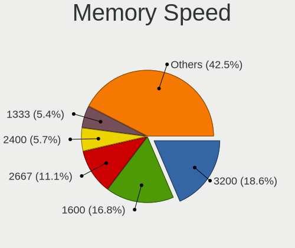
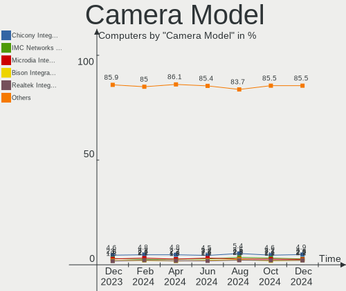

Linux - Hardware Trends
-----------------------

A project to identify most popular hardware characteristics and track their change
over time based on data collected by Linux users at https://Linux-Hardware.org.

Anyone can contribute to this report by the [hw-probe](https://github.com/linuxhw/hw-probe) tool:

    sudo -E hw-probe -all -upload

This is a report for all computer types. See also reports for [desktops](/Desktop/README.md) and [notebooks](/Notebook/README.md).

Distribution-specific reports: [Arch](/Dist/Arch), [ArcoLinux](/Dist/ArcoLinux), [BlackPanther](/Dist/BlackPanther), [CentOS](/Dist/CentOS), [Clear Linux](/Dist/Clear_Linux), [Debian](/Dist/Debian), [Elementary](/Dist/Elementary), [EndeavourOS](/Dist/EndeavourOS), [Endless](/Dist/Endless), [Fedora](/Dist/Fedora), [Gentoo](/Dist/Gentoo), [Kali](/Dist/Kali), [KDE neon](/Dist/KDE_neon), [Kubuntu](/Dist/Kubuntu), [Linux Mint](/Dist/Linux_Mint), [Manjaro](/Dist/Manjaro), [OpenMandriva](/Dist/OpenMandriva), [openSUSE](/Dist/openSUSE), [Pop!_OS](/Dist/Pop!_OS), [ROSA](/Dist/ROSA), [SteamOS](/Dist/SteamOS), [Ubuntu MATE](/Dist/Ubuntu_MATE), [Ubuntu](/Dist/Ubuntu), [Xubuntu](/Dist/Xubuntu), [Zorin](/Dist/Zorin).

This report is for one last month. Overall report since the beginning of time: [TestCoverage](https://github.com/linuxhw/TestCoverage)

Period: Sep, 2022.

Contents
--------

* [ System ](#system)
  - [ OS                       ](#os)
  - [ OS Family                ](#os-family)
  - [ Kernel                   ](#kernel)
  - [ Kernel Family            ](#kernel-family)
  - [ Kernel Major Ver.        ](#kernel-major-ver)
  - [ Arch                     ](#arch)
  - [ DE                       ](#de)
  - [ Display Server           ](#display-server)
  - [ Display Manager          ](#display-manager)
  - [ OS Lang                  ](#os-lang)
  - [ Boot Mode                ](#boot-mode)
  - [ Filesystem               ](#filesystem)
  - [ Part. scheme             ](#part-scheme)
  - [ Dual Boot with Linux/BSD ](#dual-boot-with-linuxbsd)
  - [ Dual Boot (Win)          ](#dual-boot-win)

* [ Board ](#board)
  - [ Vendor                   ](#vendor)
  - [ Model                    ](#model)
  - [ Model Family             ](#model-family)
  - [ MFG Year                 ](#mfg-year)
  - [ Form Factor              ](#form-factor)
  - [ Secure Boot              ](#secure-boot)
  - [ Coreboot                 ](#coreboot)
  - [ RAM Size                 ](#ram-size)
  - [ RAM Used                 ](#ram-used)
  - [ Total Drives             ](#total-drives)
  - [ Has CD-ROM               ](#has-cd-rom)
  - [ Has Ethernet             ](#has-ethernet)
  - [ Has WiFi                 ](#has-wifi)
  - [ Has Bluetooth            ](#has-bluetooth)

* [ Location ](#location)
  - [ Country                  ](#country)
  - [ City                     ](#city)

* [ Drives ](#drives)
  - [ Drive Vendor             ](#drive-vendor)
  - [ Drive Model              ](#drive-model)
  - [ HDD Vendor               ](#hdd-vendor)
  - [ SSD Vendor               ](#ssd-vendor)
  - [ Drive Kind               ](#drive-kind)
  - [ Drive Connector          ](#drive-connector)
  - [ Drive Size               ](#drive-size)
  - [ Space Total              ](#space-total)
  - [ Space Used               ](#space-used)
  - [ Malfunc. Drives          ](#malfunc-drives)
  - [ Malfunc. Drive Vendor    ](#malfunc-drive-vendor)
  - [ Malfunc. HDD Vendor      ](#malfunc-hdd-vendor)
  - [ Malfunc. Drive Kind      ](#malfunc-drive-kind)
  - [ Failed Drives            ](#failed-drives)
  - [ Failed Drive Vendor      ](#failed-drive-vendor)
  - [ Drive Status             ](#drive-status)

* [ Storage controller ](#storage-controller)
  - [ Storage Vendor           ](#storage-vendor)
  - [ Storage Model            ](#storage-model)
  - [ Storage Kind             ](#storage-kind)

* [ Processor ](#processor)
  - [ CPU Vendor               ](#cpu-vendor)
  - [ CPU Model                ](#cpu-model)
  - [ CPU Model Family         ](#cpu-model-family)
  - [ CPU Cores                ](#cpu-cores)
  - [ CPU Sockets              ](#cpu-sockets)
  - [ CPU Threads              ](#cpu-threads)
  - [ CPU Op-Modes             ](#cpu-op-modes)
  - [ CPU Microcode            ](#cpu-microcode)
  - [ CPU Microarch            ](#cpu-microarch)

* [ Graphics ](#graphics)
  - [ GPU Vendor               ](#gpu-vendor)
  - [ GPU Model                ](#gpu-model)
  - [ GPU Combo                ](#gpu-combo)
  - [ GPU Driver               ](#gpu-driver)
  - [ GPU Memory               ](#gpu-memory)

* [ Monitor ](#monitor)
  - [ Monitor Vendor           ](#monitor-vendor)
  - [ Monitor Model            ](#monitor-model)
  - [ Monitor Resolution       ](#monitor-resolution)
  - [ Monitor Diagonal         ](#monitor-diagonal)
  - [ Monitor Width            ](#monitor-width)
  - [ Aspect Ratio             ](#aspect-ratio)
  - [ Monitor Area             ](#monitor-area)
  - [ Pixel Density            ](#pixel-density)
  - [ Multiple Monitors        ](#multiple-monitors)

* [ Network ](#network)
  - [ Net Controller Vendor    ](#net-controller-vendor)
  - [ Net Controller Model     ](#net-controller-model)
  - [ Wireless Vendor          ](#wireless-vendor)
  - [ Wireless Model           ](#wireless-model)
  - [ Ethernet Vendor          ](#ethernet-vendor)
  - [ Ethernet Model           ](#ethernet-model)
  - [ Net Controller Kind      ](#net-controller-kind)
  - [ Used Controller          ](#used-controller)
  - [ NICs                     ](#nics)
  - [ IPv6                     ](#ipv6)

* [ Bluetooth ](#bluetooth)
  - [ Bluetooth Vendor         ](#bluetooth-vendor)
  - [ Bluetooth Model          ](#bluetooth-model)

* [ Sound ](#sound)
  - [ Sound Vendor             ](#sound-vendor)
  - [ Sound Model              ](#sound-model)

* [ Memory ](#memory)
  - [ Memory Vendor            ](#memory-vendor)
  - [ Memory Model             ](#memory-model)
  - [ Memory Kind              ](#memory-kind)
  - [ Memory Form Factor       ](#memory-form-factor)
  - [ Memory Size              ](#memory-size)
  - [ Memory Speed             ](#memory-speed)

* [ Printers & scanners ](#printers--scanners)
  - [ Printer Vendor           ](#printer-vendor)
  - [ Printer Model            ](#printer-model)
  - [ Scanner Vendor           ](#scanner-vendor)
  - [ Scanner Model            ](#scanner-model)

* [ Camera ](#camera)
  - [ Camera Vendor            ](#camera-vendor)
  - [ Camera Model             ](#camera-model)

* [ Security ](#security)
  - [ Fingerprint Vendor       ](#fingerprint-vendor)
  - [ Fingerprint Model        ](#fingerprint-model)
  - [ Chipcard Vendor          ](#chipcard-vendor)
  - [ Chipcard Model           ](#chipcard-model)

* [ Unsupported ](#unsupported)
  - [ Unsupported Devices      ](#unsupported-devices)
  - [ Unsupported Device Types ](#unsupported-device-types)

System
------

OS
--

Installed operating systems

| Name                         | Computers | Percent |
|------------------------------|-----------|---------|
| Ubuntu 22.04                 | 880       | 17.44%  |
| Fedora 36                    | 381       | 7.55%   |
| Debian 11                    | 369       | 7.31%   |
| OpenMandriva 4.3             | 283       | 5.61%   |
| Linux Mint 21                | 268       | 5.31%   |
| Pop!_OS 22.04                | 240       | 4.76%   |
| ROSA 12.2                    | 215       | 4.26%   |
| Ubuntu 20.04                 | 214       | 4.24%   |
| Arch                         | 136       | 2.7%    |
| Zorin 16                     | 135       | 2.68%   |
| Linux Mint 20.3              | 135       | 2.68%   |
| KDE neon 20.04               | 90        | 1.78%   |
| Arch Rolling                 | 79        | 1.57%   |
| Kubuntu 22.04                | 74        | 1.47%   |
| OpenMandriva 4.50            | 67        | 1.33%   |
| Manjaro                      | 64        | 1.27%   |
| SteamOS 3.3.1                | 63        | 1.25%   |
| Manjaro 22.0.0               | 56        | 1.11%   |
| Fedora 37                    | 56        | 1.11%   |
| Xubuntu 22.04                | 49        | 0.97%   |
| Xubuntu 20.04                | 49        | 0.97%   |
| Nobara 36                    | 49        | 0.97%   |
| Kali 2022.3                  | 48        | 0.95%   |
| Elementary 6.1               | 46        | 0.91%   |
| EndeavourOS Rolling          | 40        | 0.79%   |
| openSUSE Tumbleweed-XXXXXXXX | 38        | 0.75%   |
| ArcoLinux Rolling            | 37        | 0.73%   |
| Gentoo 2.8                   | 34        | 0.67%   |
| LMDE 5                       | 29        | 0.57%   |
| BlackPanther 18.1            | 29        | 0.57%   |
| Ubuntu 18.04                 | 28        | 0.55%   |
| OpenMandriva 4.90            | 26        | 0.52%   |
| Ubuntu MATE 22.04            | 25        | 0.5%    |
| ROSA R11.1                   | 25        | 0.5%    |
| Debian Testing               | 24        | 0.48%   |
| Manjaro 21.3.7               | 21        | 0.42%   |
| Lubuntu 22.04                | 21        | 0.42%   |
| OpenMandriva 4.2             | 20        | 0.4%    |
| MX 21                        | 18        | 0.36%   |
| EndeavourOS                  | 18        | 0.36%   |

OS Family
---------

OS without a version

| Name             | Computers | Percent |
|------------------|-----------|---------|
| Ubuntu           | 1147      | 22.73%  |
| Fedora           | 460       | 9.12%   |
| Linux Mint       | 450       | 8.92%   |
| Debian           | 423       | 8.38%   |
| OpenMandriva     | 396       | 7.85%   |
| ROSA             | 253       | 5.01%   |
| Pop!_OS          | 247       | 4.89%   |
| Arch             | 215       | 4.26%   |
| Zorin            | 147       | 2.91%   |
| Manjaro          | 145       | 2.87%   |
| Xubuntu          | 105       | 2.08%   |
| KDE neon         | 102       | 2.02%   |
| Kubuntu          | 98        | 1.94%   |
| SteamOS          | 90        | 1.78%   |
| EndeavourOS      | 58        | 1.15%   |
| openSUSE         | 51        | 1.01%   |
| Kali             | 51        | 1.01%   |
| Nobara           | 49        | 0.97%   |
| Elementary       | 46        | 0.91%   |
| ArcoLinux        | 37        | 0.73%   |
| Gentoo           | 36        | 0.71%   |
| Ubuntu MATE      | 33        | 0.65%   |
| Endless          | 32        | 0.63%   |
| LMDE             | 31        | 0.61%   |
| BlackPanther     | 29        | 0.57%   |
| Lubuntu          | 28        | 0.55%   |
| Garuda Linux     | 21        | 0.42%   |
| MX               | 20        | 0.4%    |
| Clear Linux      | 20        | 0.4%    |
| Red OS           | 16        | 0.32%   |
| Ubuntu Unity     | 12        | 0.24%   |
| Ubuntu Budgie    | 12        | 0.24%   |
| NixOS            | 12        | 0.24%   |
| Parrot           | 11        | 0.22%   |
| Raspbian         | 10        | 0.2%    |
| ALT Linux        | 10        | 0.2%    |
| Ubuntu Studio    | 8         | 0.16%   |
| CentOS           | 7         | 0.14%   |
| Rocky Linux      | 6         | 0.12%   |
| org.kde.Platform | 6         | 0.12%   |

Kernel
------

Version of the Linux kernel

| Version                                        | Computers | Percent |
|------------------------------------------------|-----------|---------|
| 5.15.0-47-generic                              | 712       | 14.11%  |
| 5.15.0-48-generic                              | 494       | 9.79%   |
| 5.15.0-46-generic                              | 342       | 6.78%   |
| 5.16.7-desktop-1omv4003                        | 275       | 5.45%   |
| 5.19.0-76051900-generic                        | 224       | 4.44%   |
| 5.4.0-125-generic                              | 143       | 2.83%   |
| 5.10.0-18-amd64                                | 111       | 2.2%    |
| 5.10.74-generic-2rosa2021.1-x86_64             | 100       | 1.98%   |
| 5.19.9-200.fc36.x86_64                         | 83        | 1.64%   |
| 5.10.0-17-amd64                                | 81        | 1.61%   |
| 5.10.0-7-amd64                                 | 79        | 1.57%   |
| 5.4.0-126-generic                              | 72        | 1.43%   |
| 5.10.118-generic-2rosa2021.1-x86_64            | 72        | 1.43%   |
| 5.19.8-200.fc36.x86_64                         | 66        | 1.31%   |
| 5.19.6-200.fc36.x86_64                         | 66        | 1.31%   |
| 5.13.0-valve21.1-1-neptune-02211-gc54cda5a36f3 | 66        | 1.31%   |
| 5.19.5-desktop-1omv4090                        | 64        | 1.27%   |
| 5.15.0-43-generic                              | 63        | 1.25%   |
| 5.10.0-16-amd64                                | 50        | 0.99%   |
| 5.15.65-1-MANJARO                              | 41        | 0.81%   |
| 5.19.7-arch1-1                                 | 40        | 0.79%   |
| 5.19.4-200.fc36.x86_64                         | 37        | 0.73%   |
| 5.19.11-200.fc36.x86_64                        | 36        | 0.71%   |
| 5.19.0-1-amd64                                 | 34        | 0.67%   |
| 5.15.0-41-generic                              | 34        | 0.67%   |
| 5.19.9-arch1-1                                 | 31        | 0.61%   |
| 5.19.11-arch1-1                                | 30        | 0.59%   |
| 5.17.5-300.fc36.x86_64                         | 30        | 0.59%   |
| 5.19.6-arch1-1                                 | 28        | 0.55%   |
| 5.15.60-1-MANJARO                              | 28        | 0.55%   |
| 5.11.0-35-generic                              | 27        | 0.54%   |
| 5.18.0-kali7-amd64                             | 24        | 0.48%   |
| 5.19.7-1-MANJARO                               | 23        | 0.46%   |
| 5.19.10-arch1-1                                | 23        | 0.46%   |
| 4.18.16-desktop-1bP                            | 22        | 0.44%   |
| 5.19.10-200.fc36.x86_64                        | 20        | 0.4%    |
| 5.18.0-kali5-amd64                             | 19        | 0.38%   |
| 5.10.14-desktop-1omv4002                       | 18        | 0.36%   |
| 5.4.0-124-generic                              | 17        | 0.34%   |
| 5.19.9-201.fsync.fc36.x86_64                   | 17        | 0.34%   |

Kernel Family
-------------

Linux kernel without a distro release

| Version  | Computers | Percent |
|----------|-----------|---------|
| 5.15.0   | 1712      | 33.93%  |
| 5.10.0   | 358       | 7.09%   |
| 5.19.0   | 297       | 5.89%   |
| 5.4.0    | 288       | 5.71%   |
| 5.16.7   | 275       | 5.45%   |
| 5.19.9   | 171       | 3.39%   |
| 5.19.8   | 133       | 2.64%   |
| 5.19.6   | 129       | 2.56%   |
| 5.13.0   | 127       | 2.52%   |
| 5.19.7   | 125       | 2.48%   |
| 5.10.74  | 105       | 2.08%   |
| 5.19.5   | 97        | 1.92%   |
| 5.18.0   | 96        | 1.9%    |
| 5.19.11  | 94        | 1.86%   |
| 5.19.10  | 78        | 1.55%   |
| 5.10.118 | 73        | 1.45%   |
| 5.19.4   | 56        | 1.11%   |
| 5.15.65  | 49        | 0.97%   |
| 5.11.0   | 43        | 0.85%   |
| 6.0.0    | 37        | 0.73%   |
| 5.17.5   | 33        | 0.65%   |
| 5.14.0   | 33        | 0.65%   |
| 5.15.60  | 30        | 0.59%   |
| 5.19.2   | 27        | 0.54%   |
| 4.15.0   | 25        | 0.5%    |
| 5.18.19  | 22        | 0.44%   |
| 4.18.16  | 22        | 0.44%   |
| 5.17.0   | 21        | 0.42%   |
| 5.19.1   | 19        | 0.38%   |
| 5.8.0    | 18        | 0.36%   |
| 5.10.14  | 18        | 0.36%   |
| 5.18.12  | 17        | 0.34%   |
| 5.16.13  | 17        | 0.34%   |
| 5.15.67  | 17        | 0.34%   |
| 5.17.11  | 16        | 0.32%   |
| 5.15.61  | 14        | 0.28%   |
| 5.15.59  | 14        | 0.28%   |
| 5.18.18  | 13        | 0.26%   |
| 5.18.10  | 13        | 0.26%   |
| 5.4.83   | 12        | 0.24%   |

Kernel Major Ver.
-----------------

Linux kernel major version

| Version | Computers | Percent |
|---------|-----------|---------|
| 5.15    | 1960      | 38.84%  |
| 5.19    | 1239      | 24.55%  |
| 5.10    | 574       | 11.38%  |
| 5.4     | 315       | 6.24%   |
| 5.16    | 305       | 6.04%   |
| 5.18    | 193       | 3.82%   |
| 5.13    | 130       | 2.58%   |
| 5.17    | 78        | 1.55%   |
| 5.14    | 46        | 0.91%   |
| 5.11    | 46        | 0.91%   |
| 6.0     | 37        | 0.73%   |
| 4.18    | 29        | 0.57%   |
| 4.15    | 25        | 0.5%    |
| 5.8     | 19        | 0.38%   |
| 4.19    | 14        | 0.28%   |
| 5.6     | 7         | 0.14%   |
| 4.9     | 6         | 0.12%   |
| 5.5     | 4         | 0.08%   |
| 5.3     | 4         | 0.08%   |
| 4.4     | 3         | 0.06%   |
| 3.10    | 3         | 0.06%   |
| 4.14    | 2         | 0.04%   |
| 5.9     | 1         | 0.02%   |
| 5.0     | 1         | 0.02%   |
| 4.16    | 1         | 0.02%   |
| 4       | 1         | 0.02%   |
| 3.13    | 1         | 0.02%   |
| 3.0     | 1         | 0.02%   |
| 2.6     | 1         | 0.02%   |

Arch
----

OS architecture (x86_64, i586, etc.)

| Name    | Computers | Percent |
|---------|-----------|---------|
| x86_64  | 4934      | 97.78%  |
| aarch64 | 48        | 0.95%   |
| i686    | 43        | 0.85%   |
| armv7l  | 13        | 0.26%   |
| armv6l  | 4         | 0.08%   |
| s390x   | 1         | 0.02%   |
| riscv64 | 1         | 0.02%   |
| ppc64le | 1         | 0.02%   |
| mips    | 1         | 0.02%   |

DE
--

Desktop Environment

| Name             | Computers | Percent |
|------------------|-----------|---------|
| GNOME            | 2261      | 44.81%  |
| KDE5             | 1241      | 24.59%  |
| X-Cinnamon       | 372       | 7.37%   |
| XFCE             | 363       | 7.19%   |
| Unknown          | 322       | 6.38%   |
| MATE             | 134       | 2.66%   |
| LXQt             | 69        | 1.37%   |
| Cinnamon         | 54        | 1.07%   |
| Pantheon         | 49        | 0.97%   |
| i3               | 34        | 0.67%   |
| Budgie           | 19        | 0.38%   |
| KDE4             | 18        | 0.36%   |
| LXDE             | 16        | 0.32%   |
| GNOME Flashback  | 15        | 0.3%    |
| Unity            | 11        | 0.22%   |
| sway             | 10        | 0.2%    |
| openbox          | 6         | 0.12%   |
| Deepin           | 6         | 0.12%   |
| lightdm-xsession | 5         | 0.1%    |
| KDE              | 5         | 0.1%    |
| qtile            | 4         | 0.08%   |
| GNOME Classic    | 4         | 0.08%   |
| awesome          | 4         | 0.08%   |
| UKUI             | 3         | 0.06%   |
| trinity          | 3         | 0.06%   |
| Hyprland         | 3         | 0.06%   |
| xmonad           | 2         | 0.04%   |
| herbstluftwm     | 2         | 0.04%   |
| Enlightenment    | 2         | 0.04%   |
| bspwm            | 2         | 0.04%   |
| Phosh:GNOME      | 1         | 0.02%   |
| LeftWM           | 1         | 0.02%   |
| KDE:old          | 1         | 0.02%   |
| jwm              | 1         | 0.02%   |
| fluxbox          | 1         | 0.02%   |
| dwm              | 1         | 0.02%   |
| Cutefish         | 1         | 0.02%   |

Display Server
--------------

X11 or Wayland

| Name    | Computers | Percent |
|---------|-----------|---------|
| X11     | 3301      | 65.42%  |
| Wayland | 1420      | 28.14%  |
| Unknown | 188       | 3.73%   |
| Tty     | 137       | 2.72%   |

Display Manager
---------------

SDDM, LightDM, etc.

| Name    | Computers | Percent |
|---------|-----------|---------|
| Unknown | 1775      | 35.18%  |
| GDM3    | 1050      | 20.81%  |
| SDDM    | 929       | 18.41%  |
| LightDM | 702       | 13.91%  |
| GDM     | 543       | 10.76%  |
| KDM     | 18        | 0.36%   |
| XDM     | 9         | 0.18%   |
| LXDM    | 8         | 0.16%   |
| Ly      | 5         | 0.1%    |
| SLiM    | 3         | 0.06%   |
| XINIT   | 1         | 0.02%   |
| GREETD  | 1         | 0.02%   |
| FLY-DM  | 1         | 0.02%   |
| CDM     | 1         | 0.02%   |

OS Lang
-------

Language

| Lang    | Computers | Percent |
|---------|-----------|---------|
| en_US   | 2137      | 42.35%  |
| ru_RU   | 518       | 10.27%  |
| de_DE   | 380       | 7.53%   |
| en_GB   | 241       | 4.78%   |
| it_IT   | 215       | 4.26%   |
| pt_BR   | 200       | 3.96%   |
| fr_FR   | 197       | 3.9%    |
| es_ES   | 127       | 2.52%   |
| Unknown | 123       | 2.44%   |
| en_CA   | 102       | 2.02%   |
| C       | 79        | 1.57%   |
| en_AU   | 74        | 1.47%   |
| pl_PL   | 67        | 1.33%   |
| en_IN   | 53        | 1.05%   |
| es_MX   | 40        | 0.79%   |
| zh_CN   | 28        | 0.55%   |
| nl_NL   | 28        | 0.55%   |
| es_AR   | 27        | 0.54%   |
| en_AG   | 19        | 0.38%   |
| de_AT   | 19        | 0.38%   |
| tr_TR   | 17        | 0.34%   |
| cs_CZ   | 17        | 0.34%   |
| hu_HU   | 16        | 0.32%   |
| es_CL   | 16        | 0.32%   |
| en_NZ   | 16        | 0.32%   |
| fr_BE   | 14        | 0.28%   |
| pt_PT   | 12        | 0.24%   |
| en_SG   | 11        | 0.22%   |
| es_VE   | 10        | 0.2%    |
| en_DK   | 10        | 0.2%    |
| de_CH   | 10        | 0.2%    |
| sv_SE   | 9         | 0.18%   |
| nl_BE   | 9         | 0.18%   |
| nb_NO   | 9         | 0.18%   |
| fi_FI   | 9         | 0.18%   |
| en_PH   | 9         | 0.18%   |
| en_IE   | 9         | 0.18%   |
| ca_ES   | 9         | 0.18%   |
| ja_JP   | 8         | 0.16%   |
| fr_CA   | 8         | 0.16%   |

Boot Mode
---------

EFI or BIOS

| Mode | Computers | Percent |
|------|-----------|---------|
| EFI  | 2618      | 51.88%  |
| BIOS | 2428      | 48.12%  |

Filesystem
----------

Type of filesystem

| Type     | Computers | Percent |
|----------|-----------|---------|
| Ext4     | 3624      | 71.82%  |
| Btrfs    | 741       | 14.68%  |
| Overlay  | 530       | 10.5%   |
| Xfs      | 70        | 1.39%   |
| Zfs      | 47        | 0.93%   |
| F2fs     | 8         | 0.16%   |
| Ext3     | 8         | 0.16%   |
| Ext2     | 7         | 0.14%   |
| Tmpfs    | 4         | 0.08%   |
| Unknown  | 2         | 0.04%   |
| XXXXXXX  | 1         | 0.02%   |
| XXXXX    | 1         | 0.02%   |
| Reiserfs | 1         | 0.02%   |
| Jfs      | 1         | 0.02%   |
| Aufs     | 1         | 0.02%   |

Part. scheme
------------

Scheme of partitioning

| Type    | Computers | Percent |
|---------|-----------|---------|
| Unknown | 2326      | 46.1%   |
| GPT     | 2156      | 42.73%  |
| MBR     | 564       | 11.18%  |

Dual Boot with Linux/BSD
------------------------

Hosting more than one Linux/BSD

| Dual boot | Computers | Percent |
|-----------|-----------|---------|
| No        | 4301      | 85.24%  |
| Yes       | 745       | 14.76%  |

Dual Boot (Win)
---------------

Hosting Linux and Windows

| Dual boot | Computers | Percent |
|-----------|-----------|---------|
| No        | 3545      | 70.25%  |
| Yes       | 1501      | 29.75%  |

Board
-----

Vendor
------

Motherboard manufacturer

| Name                    | Computers | Percent |
|-------------------------|-----------|---------|
| ASUSTek Computer        | 831       | 16.47%  |
| Lenovo                  | 717       | 14.21%  |
| Dell                    | 664       | 13.16%  |
| Hewlett-Packard         | 637       | 12.62%  |
| Gigabyte Technology     | 358       | 7.09%   |
| MSI                     | 258       | 5.11%   |
| Acer                    | 235       | 4.66%   |
| ASRock                  | 180       | 3.57%   |
| Apple                   | 105       | 2.08%   |
| Valve                   | 80        | 1.59%   |
| Intel                   | 70        | 1.39%   |
| Toshiba                 | 69        | 1.37%   |
| HUAWEI                  | 57        | 1.13%   |
| Samsung Electronics     | 56        | 1.11%   |
| Unknown                 | 47        | 0.93%   |
| Google                  | 40        | 0.79%   |
| Raspberry Pi Foundation | 37        | 0.73%   |
| Aquarius                | 36        | 0.71%   |
| ECS                     | 28        | 0.55%   |
| Medion                  | 24        | 0.48%   |
| Fujitsu                 | 23        | 0.46%   |
| Timi                    | 21        | 0.42%   |
| Chuwi                   | 20        | 0.4%    |
| Sony                    | 19        | 0.38%   |
| Biostar                 | 18        | 0.36%   |
| AZW                     | 17        | 0.34%   |
| System76                | 16        | 0.32%   |
| Positivo                | 15        | 0.3%    |
| Notebook                | 15        | 0.3%    |
| Microsoft               | 15        | 0.3%    |
| Foxconn                 | 15        | 0.3%    |
| BESSTAR Tech            | 15        | 0.3%    |
| Alienware               | 13        | 0.26%   |
| TUXEDO                  | 12        | 0.24%   |
| Supermicro              | 11        | 0.22%   |
| Pegatron                | 11        | 0.22%   |
| Packard Bell            | 11        | 0.22%   |
| Gateway                 | 11        | 0.22%   |
| Huanan                  | 10        | 0.2%    |
| AMI                     | 9         | 0.18%   |

Model
-----

Motherboard model

| Name                                      | Computers | Percent |
|-------------------------------------------|-----------|---------|
| Valve Jupiter                             | 80        | 1.59%   |
| Unknown                                   | 64        | 1.27%   |
| ASUS All Series                           | 48        | 0.95%   |
| Aquarius NS585                            | 30        | 0.59%   |
| MSI MS-7C37                               | 19        | 0.38%   |
| Dell Latitude 3120                        | 19        | 0.38%   |
| Dell Latitude 3190 2-in-1                 | 17        | 0.34%   |
| ASRock H470M-HVS                          | 17        | 0.34%   |
| Google Enguarde                           | 15        | 0.3%    |
| Gigabyte H410M S2H                        | 15        | 0.3%    |
| ECS G31T-M9                               | 14        | 0.28%   |
| MSI MS-7C91                               | 12        | 0.24%   |
| HP Notebook                               | 11        | 0.22%   |
| ASUS TUF Gaming X570-PLUS                 | 11        | 0.22%   |
| ASUS PRIME A320M-K                        | 11        | 0.22%   |
| RPi Raspberry Pi                          | 10        | 0.2%    |
| HP Pavilion g6                            | 10        | 0.2%    |
| Dell Latitude 3310                        | 10        | 0.2%    |
| MSI MS-7B86                               | 9         | 0.18%   |
| Gigabyte B450M DS3H                       | 9         | 0.18%   |
| MSI MS-7C56                               | 8         | 0.16%   |
| MSI MS-7721                               | 8         | 0.16%   |
| HUAWEI KLVL-WXXW                          | 8         | 0.16%   |
| Dell OptiPlex 7010                        | 8         | 0.16%   |
| Dell Latitude E6540                       | 8         | 0.16%   |
| Dell Latitude E6520                       | 8         | 0.16%   |
| ASUS ROG STRIX B550-F GAMING              | 8         | 0.16%   |
| ASUS ROG CROSSHAIR VIII HERO              | 8         | 0.16%   |
| MSI MS-7B79                               | 7         | 0.14%   |
| MSI MS-7A38                               | 7         | 0.14%   |
| MSI MS-7817                               | 7         | 0.14%   |
| Lenovo ThinkPad L13 Yoga Gen 2 20VK0019US | 7         | 0.14%   |
| HP Laptop 15-da0xxx                       | 7         | 0.14%   |
| HP EliteBook 840 G3                       | 7         | 0.14%   |
| Gigabyte A320M-S2H                        | 7         | 0.14%   |
| Gigabyte 970A-DS3P                        | 7         | 0.14%   |
| Dell OptiPlex 755                         | 7         | 0.14%   |
| Dell Latitude E6420                       | 7         | 0.14%   |
| Dell Latitude E6330                       | 7         | 0.14%   |
| Apple MacBookPro9,2                       | 7         | 0.14%   |

Model Family
------------

Motherboard model prefix

| Name               | Computers | Percent |
|--------------------|-----------|---------|
| Lenovo ThinkPad    | 305       | 6.04%   |
| Dell Latitude      | 218       | 4.32%   |
| Acer Aspire        | 155       | 3.07%   |
| Dell Inspiron      | 144       | 2.85%   |
| Lenovo IdeaPad     | 139       | 2.75%   |
| ASUS ROG           | 119       | 2.36%   |
| ASUS PRIME         | 104       | 2.06%   |
| HP Pavilion        | 100       | 1.98%   |
| Dell OptiPlex      | 83        | 1.64%   |
| Valve Jupiter      | 80        | 1.59%   |
| HP EliteBook       | 76        | 1.51%   |
| Dell XPS           | 73        | 1.45%   |
| Dell Precision     | 73        | 1.45%   |
| ASUS VivoBook      | 69        | 1.37%   |
| HP Laptop          | 65        | 1.29%   |
| ASUS TUF           | 65        | 1.29%   |
| Unknown            | 64        | 1.27%   |
| HP Compaq          | 63        | 1.25%   |
| HP ProBook         | 62        | 1.23%   |
| Toshiba Satellite  | 58        | 1.15%   |
| HP ENVY            | 49        | 0.97%   |
| ASUS All           | 48        | 0.95%   |
| Lenovo ThinkCentre | 40        | 0.79%   |
| RPi Raspberry      | 37        | 0.73%   |
| Lenovo ThinkBook   | 37        | 0.73%   |
| Lenovo Legion      | 33        | 0.65%   |
| Dell Vostro        | 31        | 0.61%   |
| Aquarius NS585     | 30        | 0.59%   |
| Lenovo Yoga        | 27        | 0.54%   |
| ASUS Zenbook       | 25        | 0.5%    |
| HP EliteDesk       | 23        | 0.46%   |
| ASUS ASUS          | 22        | 0.44%   |
| MSI MS-7C37        | 19        | 0.38%   |
| Acer Nitro         | 18        | 0.36%   |
| Gigabyte H410M     | 17        | 0.34%   |
| ASRock H470M-HVS   | 17        | 0.34%   |
| Acer Swift         | 17        | 0.34%   |
| Gigabyte X570      | 16        | 0.32%   |
| Gigabyte B450      | 16        | 0.32%   |
| Microsoft Surface  | 15        | 0.3%    |

MFG Year
--------

Motherboard manufacture year

| Year    | Computers | Percent |
|---------|-----------|---------|
| 2021    | 628       | 12.45%  |
| 2020    | 568       | 11.26%  |
| 2019    | 481       | 9.53%   |
| 2018    | 411       | 8.15%   |
| 2022    | 385       | 7.63%   |
| 2012    | 327       | 6.48%   |
| 2013    | 318       | 6.3%    |
| 2011    | 297       | 5.89%   |
| 2017    | 268       | 5.31%   |
| 2014    | 266       | 5.27%   |
| 2015    | 230       | 4.56%   |
| 2016    | 209       | 4.14%   |
| 2010    | 200       | 3.96%   |
| 2009    | 139       | 2.75%   |
| 2008    | 128       | 2.54%   |
| 2007    | 83        | 1.64%   |
| Unknown | 65        | 1.29%   |
| 2006    | 29        | 0.57%   |
| 2005    | 10        | 0.2%    |
| 2004    | 3         | 0.06%   |
| 2003    | 1         | 0.02%   |

Form Factor
-----------

Physical design of the computer

| Name           | Computers | Percent |
|----------------|-----------|---------|
| Notebook       | 2775      | 54.99%  |
| Desktop        | 1833      | 36.33%  |
| Convertible    | 176       | 3.49%   |
| Mini pc        | 78        | 1.55%   |
| System on chip | 54        | 1.07%   |
| All in one     | 50        | 0.99%   |
| Tablet         | 41        | 0.81%   |
| Server         | 35        | 0.69%   |
| Other          | 3         | 0.06%   |
| Phone          | 1         | 0.02%   |

Secure Boot
-----------

Enabled or disabled

| State    | Computers | Percent |
|----------|-----------|---------|
| Disabled | 4718      | 93.5%   |
| Enabled  | 328       | 6.5%    |

Coreboot
--------

Have coreboot on board

| Used | Computers | Percent |
|------|-----------|---------|
| No   | 4988      | 98.85%  |
| Yes  | 58        | 1.15%   |

RAM Size
--------

Total RAM memory

| Size in GB      | Computers | Percent |
|-----------------|-----------|---------|
| 4.01-8.0        | 1219      | 24.16%  |
| 16.01-24.0      | 1055      | 20.91%  |
| 8.01-16.0       | 914       | 18.11%  |
| 3.01-4.0        | 799       | 15.83%  |
| 32.01-64.0      | 586       | 11.61%  |
| 1.01-2.0        | 159       | 3.15%   |
| 64.01-256.0     | 134       | 2.66%   |
| 24.01-32.0      | 88        | 1.74%   |
| 2.01-3.0        | 46        | 0.91%   |
| 0.51-1.0        | 26        | 0.52%   |
| More than 256.0 | 11        | 0.22%   |
| 0.01-0.5        | 9         | 0.18%   |

RAM Used
--------

Used RAM memory

| Used GB     | Computers | Percent |
|-------------|-----------|---------|
| 1.01-2.0    | 1593      | 31.57%  |
| 2.01-3.0    | 1174      | 23.27%  |
| 4.01-8.0    | 819       | 16.23%  |
| 3.01-4.0    | 710       | 14.07%  |
| 0.51-1.0    | 373       | 7.39%   |
| 8.01-16.0   | 254       | 5.03%   |
| 0.01-0.5    | 66        | 1.31%   |
| 16.01-24.0  | 29        | 0.57%   |
| 24.01-32.0  | 15        | 0.3%    |
| 64.01-256.0 | 5         | 0.1%    |
| 32.01-64.0  | 4         | 0.08%   |
| Unknown     | 3         | 0.06%   |
| 0           | 1         | 0.02%   |

Total Drives
------------

Number of drives on board

| Drives | Computers | Percent |
|--------|-----------|---------|
| 1      | 2994      | 59.33%  |
| 2      | 1282      | 25.41%  |
| 3      | 379       | 7.51%   |
| 4      | 193       | 3.82%   |
| 5      | 83        | 1.64%   |
| 6      | 38        | 0.75%   |
| 0      | 36        | 0.71%   |
| 7      | 17        | 0.34%   |
| 8      | 7         | 0.14%   |
| 9      | 5         | 0.1%    |
| 10     | 4         | 0.08%   |
| 11     | 3         | 0.06%   |
| 46     | 1         | 0.02%   |
| 17     | 1         | 0.02%   |
| 14     | 1         | 0.02%   |
| 13     | 1         | 0.02%   |
| 12     | 1         | 0.02%   |

Has CD-ROM
----------

Has CD-ROM on board

| Presented | Computers | Percent |
|-----------|-----------|---------|
| No        | 3441      | 68.19%  |
| Yes       | 1605      | 31.81%  |

Has Ethernet
------------

Has Ethernet on board

| Presented | Computers | Percent |
|-----------|-----------|---------|
| Yes       | 4159      | 82.42%  |
| No        | 887       | 17.58%  |

Has WiFi
--------

Has WiFi module

| Presented | Computers | Percent |
|-----------|-----------|---------|
| Yes       | 3895      | 77.19%  |
| No        | 1151      | 22.81%  |

Has Bluetooth
-------------

Has Bluetooth module

| Presented | Computers | Percent |
|-----------|-----------|---------|
| Yes       | 3183      | 63.08%  |
| No        | 1863      | 36.92%  |

Location
--------

Country
-------

Geographic location (country)

| Country     | Computers | Percent |
|-------------|-----------|---------|
| USA         | 922       | 18.27%  |
| Russia      | 578       | 11.45%  |
| Germany     | 498       | 9.87%   |
| Italy       | 328       | 6.5%    |
| Brazil      | 263       | 5.21%   |
| France      | 228       | 4.52%   |
| UK          | 183       | 3.63%   |
| Spain       | 162       | 3.21%   |
| Canada      | 147       | 2.91%   |
| Netherlands | 129       | 2.56%   |
| Poland      | 112       | 2.22%   |
| India       | 88        | 1.74%   |
| Australia   | 84        | 1.66%   |
| Mexico      | 68        | 1.35%   |
| Austria     | 56        | 1.11%   |
| Hungary     | 54        | 1.07%   |
| Belgium     | 54        | 1.07%   |
| Czechia     | 44        | 0.87%   |
| China       | 44        | 0.87%   |
| Argentina   | 44        | 0.87%   |
| Sweden      | 40        | 0.79%   |
| Portugal    | 40        | 0.79%   |
| Indonesia   | 39        | 0.77%   |
| Switzerland | 38        | 0.75%   |
| Turkey      | 34        | 0.67%   |
| Romania     | 34        | 0.67%   |
| Finland     | 33        | 0.65%   |
| Norway      | 31        | 0.61%   |
| Japan       | 31        | 0.61%   |
| Chile       | 28        | 0.55%   |
| Ukraine     | 24        | 0.48%   |
| Serbia      | 24        | 0.48%   |
| Greece      | 24        | 0.48%   |
| Denmark     | 22        | 0.44%   |
| Colombia    | 22        | 0.44%   |
| Hong Kong   | 21        | 0.42%   |
| New Zealand | 20        | 0.4%    |
| Egypt       | 20        | 0.4%    |
| Slovakia    | 19        | 0.38%   |
| Singapore   | 17        | 0.34%   |

City
----

Geographic location (city)

| City              | Computers | Percent |
|-------------------|-----------|---------|
| Moscow            | 116       | 2.3%    |
| Voronezh          | 108       | 2.14%   |
| Schagen           | 47        | 0.93%   |
| St Petersburg     | 45        | 0.89%   |
| Paris             | 43        | 0.85%   |
| Milan             | 43        | 0.85%   |
| Bangor            | 37        | 0.73%   |
| Berlin            | 35        | 0.69%   |
| Rome              | 31        | 0.61%   |
| Sao Paulo         | 30        | 0.59%   |
| Vienna            | 29        | 0.57%   |
| Hamburg           | 28        | 0.55%   |
| Warsaw            | 26        | 0.52%   |
| Madrid            | 25        | 0.5%    |
| Munich            | 24        | 0.48%   |
| Melbourne         | 24        | 0.48%   |
| Seville           | 23        | 0.46%   |
| Amsterdam         | 23        | 0.46%   |
| Rio de Janeiro    | 22        | 0.44%   |
| Prague            | 21        | 0.42%   |
| Frankfurt am Main | 21        | 0.42%   |
| Montreal          | 20        | 0.4%    |
| Los Angeles       | 20        | 0.4%    |
| Helsinki          | 20        | 0.4%    |
| Budapest          | 20        | 0.4%    |
| Belgrade          | 19        | 0.38%   |
| Unknown           | 19        | 0.38%   |
| Singapore         | 17        | 0.34%   |
| Lisbon            | 17        | 0.34%   |
| Brisbane          | 17        | 0.34%   |
| Barcelona         | 17        | 0.34%   |
| Nizhniy Novgorod  | 16        | 0.32%   |
| Krasnodar         | 16        | 0.32%   |
| Mexico City       | 15        | 0.3%    |
| Istanbul          | 15        | 0.3%    |
| Yekaterinburg     | 14        | 0.28%   |
| Toronto           | 14        | 0.28%   |
| Seattle           | 14        | 0.28%   |
| Denver            | 14        | 0.28%   |
| Chicago           | 14        | 0.28%   |

Drives
------

Drive Vendor
------------

Hard drive vendors

| Vendor                      | Computers | Drives | Percent |
|-----------------------------|-----------|--------|---------|
| Samsung Electronics         | 1150      | 1475   | 15.56%  |
| WDC                         | 1034      | 1252   | 13.99%  |
| Seagate                     | 880       | 1155   | 11.91%  |
| Toshiba                     | 456       | 482    | 6.17%   |
| Kingston                    | 443       | 470    | 6%      |
| Sandisk                     | 404       | 439    | 5.47%   |
| Unknown                     | 323       | 373    | 4.37%   |
| Crucial                     | 263       | 292    | 3.56%   |
| SK hynix                    | 228       | 233    | 3.09%   |
| Hitachi                     | 178       | 191    | 2.41%   |
| Intel                       | 159       | 182    | 2.15%   |
| Micron Technology           | 144       | 147    | 1.95%   |
| A-DATA Technology           | 143       | 149    | 1.94%   |
| HGST                        | 116       | 126    | 1.57%   |
| KIOXIA                      | 77        | 81     | 1.04%   |
| China                       | 71        | 76     | 0.96%   |
| Phison                      | 65        | 74     | 0.88%   |
| Phison Electronics          | 60        | 64     | 0.81%   |
| Unknown                     | 55        | 56     | 0.74%   |
| Netac                       | 54        | 54     | 0.73%   |
| Apple                       | 52        | 60     | 0.7%    |
| PNY                         | 51        | 51     | 0.69%   |
| Silicon Motion              | 47        | 47     | 0.64%   |
| SPCC                        | 42        | 46     | 0.57%   |
| Patriot                     | 36        | 37     | 0.49%   |
| Micron/Crucial Technology   | 36        | 40     | 0.49%   |
| LITEON                      | 35        | 35     | 0.47%   |
| Intenso                     | 35        | 37     | 0.47%   |
| Transcend                   | 30        | 30     | 0.41%   |
| Kingston Technology Company | 30        | 30     | 0.41%   |
| Team                        | 21        | 25     | 0.28%   |
| Maxtor                      | 20        | 22     | 0.27%   |
| JMicron Technology          | 20        | 20     | 0.27%   |
| KingSpec                    | 18        | 18     | 0.24%   |
| GOODRAM                     | 18        | 18     | 0.24%   |
| Corsair                     | 18        | 20     | 0.24%   |
| Realtek Semiconductor       | 17        | 17     | 0.23%   |
| Gigabyte Technology         | 17        | 17     | 0.23%   |
| Apacer                      | 17        | 18     | 0.23%   |
| ADATA Technology            | 17        | 18     | 0.23%   |

Drive Model
-----------

Hard drive models

| Model                                                 | Computers | Percent |
|-------------------------------------------------------|-----------|---------|
| Samsung NVMe SSD Controller SM981/PM981/PM983 256GB   | 98        | 1.21%   |
| Kingston SA400S37240G 240GB SSD                       | 98        | 1.21%   |
| Samsung SSD 860 EVO 500GB                             | 62        | 0.76%   |
| Unknown                                               | 55        | 0.68%   |
| Seagate ST500DM002-1BD142 500GB                       | 51        | 0.63%   |
| Samsung SSD 860 EVO 1TB                               | 48        | 0.59%   |
| Kingston SA400S37480G 480GB SSD                       | 46        | 0.57%   |
| Samsung SSD 850 EVO 250GB                             | 45        | 0.55%   |
| Seagate ST1000LM024 HN-M101MBB 1TB                    | 44        | 0.54%   |
| Seagate ST2000DM008-2FR102 2TB                        | 42        | 0.52%   |
| Seagate ST1000DM010-2EP102 1TB                        | 42        | 0.52%   |
| Toshiba MQ01ABD100 1TB                                | 41        | 0.5%    |
| Toshiba HDWD110 1TB                                   | 41        | 0.5%    |
| Unknown MMC Card  32GB                                | 40        | 0.49%   |
| Seagate ST1000LM035-1RK172 1TB                        | 40        | 0.49%   |
| Samsung NVMe SSD Controller PM9A1/PM9A3/980PRO 1024GB | 40        | 0.49%   |
| Unknown MMC Card  64GB                                | 39        | 0.48%   |
| Samsung NVMe SSD Drive 512GB                          | 35        | 0.43%   |
| Kingston SA400S37120G 120GB SSD                       | 35        | 0.43%   |
| Crucial CT240BX500SSD1 240GB                          | 35        | 0.43%   |
| Samsung SSD 850 EVO 500GB                             | 34        | 0.42%   |
| WDC WDS500G2B0A-00SM50 500GB SSD                      | 33        | 0.41%   |
| Crucial CT500MX500SSD1 500GB                          | 33        | 0.41%   |
| Samsung SSD 860 EVO 250GB                             | 32        | 0.39%   |
| SanDisk NVMe SSD Drive 1TB                            | 31        | 0.38%   |
| Samsung NVMe SSD Drive 1TB                            | 31        | 0.38%   |
| A-DATA SU800 512GB SSD                                | 31        | 0.38%   |
| Sandisk WD Black SN750 / PC SN730 NVMe SSD 1024GB     | 30        | 0.37%   |
| Crucial CT1000MX500SSD1 1TB                           | 30        | 0.37%   |
| Toshiba MQ04ABF100 1TB                                | 29        | 0.36%   |
| Toshiba DT01ACA100 1TB                                | 29        | 0.36%   |
| Seagate ST500LT012-1DG142 500GB                       | 29        | 0.36%   |
| Toshiba MQ01ABF050 500GB                              | 28        | 0.34%   |
| Crucial CT480BX500SSD1 480GB                          | 28        | 0.34%   |
| Unknown SD/MMC/MS PRO 2GB                             | 26        | 0.32%   |
| Phison PS5013 E13 NVMe Controller 512GB               | 26        | 0.32%   |
| Seagate ST1000DM003-1ER162 1TB                        | 25        | 0.31%   |
| Sandisk WD Blue SN550 NVMe SSD 1024GB                 | 25        | 0.31%   |
| Samsung SSD 980 PRO 1TB                               | 25        | 0.31%   |
| Samsung SSD 970 EVO Plus 1TB                          | 25        | 0.31%   |

HDD Vendor
----------

Hard disk drive vendors

| Vendor              | Computers | Drives | Percent |
|---------------------|-----------|--------|---------|
| Seagate             | 855       | 1122   | 33.96%  |
| WDC                 | 792       | 950    | 31.45%  |
| Toshiba             | 363       | 386    | 14.42%  |
| Hitachi             | 178       | 191    | 7.07%   |
| HGST                | 116       | 126    | 4.61%   |
| Samsung Electronics | 92        | 108    | 3.65%   |
| Unknown             | 29        | 29     | 1.15%   |
| Maxtor              | 17        | 19     | 0.68%   |
| Apple               | 17        | 17     | 0.68%   |
| Fujitsu             | 16        | 16     | 0.64%   |
| ASMedia             | 6         | 6      | 0.24%   |
| ASMT                | 5         | 6      | 0.2%    |
| WD MediaMax         | 2         | 2      | 0.08%   |
| USB3.0              | 2         | 2      | 0.08%   |
| SAGE                | 2         | 2      | 0.08%   |
| RSH-319             | 2         | 2      | 0.08%   |
| LaCie               | 2         | 2      | 0.08%   |
| JMicron Technology  | 2         | 2      | 0.08%   |
| HPE                 | 2         | 2      | 0.08%   |
| HGST HTS            | 2         | 2      | 0.08%   |
| ExcelStor           | 2         | 2      | 0.08%   |
| Unknown             | 2         | 3      | 0.08%   |
| USB                 | 1         | 1      | 0.04%   |
| SATAFIRM            | 1         | 1      | 0.04%   |
| MARVELL             | 1         | 1      | 0.04%   |
| KESU                | 1         | 1      | 0.04%   |
| Intenso             | 1         | 1      | 0.04%   |
| Inateck             | 1         | 1      | 0.04%   |
| IBM/Hitachi         | 1         | 1      | 0.04%   |
| Hewlett-Packard     | 1         | 2      | 0.04%   |
| Hajaan              | 1         | 1      | 0.04%   |
| Generic-            | 1         | 1      | 0.04%   |
| External            | 1         | 1      | 0.04%   |
| ASMT109x            | 1         | 1      | 0.04%   |

SSD Vendor
----------

Solid state drive vendors

| Vendor              | Computers | Drives | Percent |
|---------------------|-----------|--------|---------|
| Samsung Electronics | 499       | 593    | 20.86%  |
| Kingston            | 312       | 328    | 13.04%  |
| Crucial             | 237       | 260    | 9.91%   |
| SanDisk             | 191       | 199    | 7.98%   |
| WDC                 | 160       | 166    | 6.69%   |
| A-DATA Technology   | 113       | 117    | 4.72%   |
| China               | 71        | 76     | 2.97%   |
| PNY                 | 47        | 47     | 1.96%   |
| Netac               | 46        | 46     | 1.92%   |
| Intel               | 46        | 52     | 1.92%   |
| SK hynix            | 44        | 45     | 1.84%   |
| SPCC                | 38        | 41     | 1.59%   |
| Patriot             | 35        | 36     | 1.46%   |
| Micron Technology   | 34        | 34     | 1.42%   |
| Toshiba             | 33        | 35     | 1.38%   |
| LITEON              | 33        | 33     | 1.38%   |
| Transcend           | 28        | 28     | 1.17%   |
| Intenso             | 27        | 28     | 1.13%   |
| Apple               | 19        | 19     | 0.79%   |
| KingSpec            | 18        | 18     | 0.75%   |
| Team                | 17        | 20     | 0.71%   |
| GOODRAM             | 17        | 17     | 0.71%   |
| OCZ                 | 16        | 18     | 0.67%   |
| Corsair             | 16        | 18     | 0.67%   |
| Apacer              | 15        | 16     | 0.63%   |
| Unknown             | 15        | 15     | 0.63%   |
| LITEONIT            | 13        | 13     | 0.54%   |
| Lexar               | 13        | 14     | 0.54%   |
| Gigabyte Technology | 12        | 12     | 0.5%    |
| Plextor             | 9         | 9      | 0.38%   |
| Hewlett-Packard     | 7         | 7      | 0.29%   |
| AMD                 | 7         | 7      | 0.29%   |
| Emtec               | 6         | 6      | 0.25%   |
| Dogfish             | 6         | 8      | 0.25%   |
| TO Exter            | 5         | 5      | 0.21%   |
| Seagate             | 5         | 5      | 0.21%   |
| NGFF                | 5         | 5      | 0.21%   |
| KingFast            | 5         | 5      | 0.21%   |
| Verbatim            | 4         | 4      | 0.17%   |
| Teclast             | 4         | 4      | 0.17%   |

Drive Kind
----------

HDD or SSD

| Kind    | Computers | Drives | Percent |
|---------|-----------|--------|---------|
| HDD     | 2137      | 3010   | 31.81%  |
| SSD     | 2111      | 2576   | 31.43%  |
| NVMe    | 2017      | 2409   | 30.03%  |
| MMC     | 322       | 362    | 4.79%   |
| Unknown | 130       | 151    | 1.94%   |

Drive Connector
---------------

SATA, SAS, NVMe, etc.

| Type | Computers | Drives | Percent |
|------|-----------|--------|---------|
| SATA | 3419      | 5408   | 56.63%  |
| NVMe | 2003      | 2375   | 33.18%  |
| MMC  | 322       | 362    | 5.33%   |
| SAS  | 293       | 363    | 4.85%   |

Drive Size
----------

Size of hard drive

| Size in TB | Computers | Drives | Percent |
|------------|-----------|--------|---------|
| 0.01-0.5   | 2518      | 3215   | 56.99%  |
| 0.51-1.0   | 1250      | 1465   | 28.29%  |
| 1.01-2.0   | 333       | 430    | 7.54%   |
| 3.01-4.0   | 133       | 174    | 3.01%   |
| 4.01-10.0  | 86        | 166    | 1.95%   |
| 2.01-3.0   | 77        | 99     | 1.74%   |
| 10.01-20.0 | 21        | 37     | 0.48%   |

Space Total
-----------

Amount of disk space available on the file system

| Size in GB     | Computers | Percent |
|----------------|-----------|---------|
| 101-250        | 1266      | 25.09%  |
| 251-500        | 1095      | 21.7%   |
| 501-1000       | 736       | 14.59%  |
| 1-20           | 451       | 8.94%   |
| 1001-2000      | 401       | 7.95%   |
| More than 3000 | 279       | 5.53%   |
| Unknown        | 273       | 5.41%   |
| 51-100         | 248       | 4.91%   |
| 21-50          | 159       | 3.15%   |
| 2001-3000      | 138       | 2.73%   |

Space Used
----------

Amount of used disk space

| Used GB        | Computers | Percent |
|----------------|-----------|---------|
| 1-20           | 1759      | 34.86%  |
| 21-50          | 795       | 15.76%  |
| 101-250        | 648       | 12.84%  |
| 51-100         | 561       | 11.12%  |
| 251-500        | 396       | 7.85%   |
| 501-1000       | 296       | 5.87%   |
| Unknown        | 273       | 5.41%   |
| 1001-2000      | 152       | 3.01%   |
| More than 3000 | 109       | 2.16%   |
| 2001-3000      | 54        | 1.07%   |
| 0              | 3         | 0.06%   |

Malfunc. Drives
---------------

Drive models with a malfunction

| Model                              | Computers | Drives | Percent |
|------------------------------------|-----------|--------|---------|
| Seagate ST500DM002-1BD142 500GB    | 14        | 14     | 2.49%   |
| Seagate ST3500418AS 500GB          | 9         | 10     | 1.6%    |
| HGST HTS545050A7E680 500GB         | 9         | 9      | 1.6%    |
| Seagate ST9500325AS 500GB          | 8         | 8      | 1.42%   |
| Seagate ST500LT012-9WS142 500GB    | 6         | 6      | 1.07%   |
| Hitachi HTS723232A7A364 320GB      | 6         | 6      | 1.07%   |
| Toshiba MQ01ABF050 500GB           | 5         | 5      | 0.89%   |
| Seagate ST500LT012-1DG142 500GB    | 5         | 5      | 0.89%   |
| Seagate ST320LT007-9ZV142 320GB    | 5         | 5      | 0.89%   |
| Seagate ST1000LM035-1RK172 1TB     | 5         | 5      | 0.89%   |
| Seagate ST1000LM024 HN-M101MBB 1TB | 5         | 5      | 0.89%   |
| Hitachi HDS721050CLA362 500GB      | 5         | 5      | 0.89%   |
| WDC WD5000AAKX-00ERMA0 500GB       | 4         | 4      | 0.71%   |
| Toshiba MQ01ABD100 1TB             | 4         | 4      | 0.71%   |
| Toshiba MQ01ABD075 752GB           | 4         | 4      | 0.71%   |
| Toshiba MQ01ABD050 500GB           | 4         | 4      | 0.71%   |
| Toshiba DT01ACA050 500GB           | 4         | 4      | 0.71%   |
| Seagate ST9500420AS 500GB          | 4         | 4      | 0.71%   |
| Seagate ST3250310AS 250GB          | 4         | 4      | 0.71%   |
| Hitachi HTS545050B9A300 500GB      | 4         | 4      | 0.71%   |
| HGST HTS541010A9E680 1TB           | 4         | 4      | 0.71%   |
| WDC WDS240G2G0A-00JH30 240GB SSD   | 3         | 4      | 0.53%   |
| WDC WD15EARS-00MVWB0 1TB           | 3         | 3      | 0.53%   |
| Seagate ST2000DM008-2FR102 2TB     | 3         | 3      | 0.53%   |
| Seagate ST2000DM001-1CH164 2TB     | 3         | 3      | 0.53%   |
| Seagate ST1000DM010-2EP102 1TB     | 3         | 3      | 0.53%   |
| Samsung Electronics SP2504C 250GB  | 3         | 3      | 0.53%   |
| Samsung Electronics HM321HI 320GB  | 3         | 3      | 0.53%   |
| Samsung Electronics HD103UJ 1TB    | 3         | 3      | 0.53%   |
| Hitachi HTS547550A9E384 500GB      | 3         | 3      | 0.53%   |
| HGST HTS725050A7E630 500GB         | 3         | 4      | 0.53%   |
| HGST HTS721010A9E630 1TB           | 3         | 3      | 0.53%   |
| WDC WD5000LPVX-22V0TT0 500GB       | 2         | 2      | 0.36%   |
| WDC WD5000AAKX-003CA0 500GB        | 2         | 2      | 0.36%   |
| WDC WD5000AADS-00S9B0 500GB        | 2         | 2      | 0.36%   |
| WDC WD4001FAEX-00MJRA0 4TB         | 2         | 2      | 0.36%   |
| WDC WD3200BEVT-22ZCT0 320GB        | 2         | 2      | 0.36%   |
| WDC WD3200AAJS-00L7A0 320GB        | 2         | 2      | 0.36%   |
| WDC WD2500AAJS-00L7A0 250GB        | 2         | 2      | 0.36%   |
| WDC WD10JPVX-22JC3T0 1TB           | 2         | 2      | 0.36%   |

Malfunc. Drive Vendor
---------------------

Vendors of faulty drives

| Vendor              | Computers | Drives | Percent |
|---------------------|-----------|--------|---------|
| Seagate             | 139       | 157    | 25.69%  |
| WDC                 | 113       | 125    | 20.89%  |
| Hitachi             | 63        | 64     | 11.65%  |
| Toshiba             | 46        | 46     | 8.5%    |
| Samsung Electronics | 38        | 42     | 7.02%   |
| HGST                | 26        | 27     | 4.81%   |
| SK hynix            | 17        | 17     | 3.14%   |
| Crucial             | 11        | 13     | 2.03%   |
| Kingston            | 10        | 11     | 1.85%   |
| Intel               | 10        | 10     | 1.85%   |
| SanDisk             | 9         | 9      | 1.66%   |
| A-DATA Technology   | 8         | 8      | 1.48%   |
| Micron Technology   | 6         | 6      | 1.11%   |
| LITEON              | 4         | 4      | 0.74%   |
| Maxtor              | 3         | 4      | 0.55%   |
| China               | 3         | 3      | 0.55%   |
| Transcend           | 2         | 2      | 0.37%   |
| Innodisk            | 2         | 2      | 0.37%   |
| Apple               | 2         | 2      | 0.37%   |
| YS                  | 1         | 1      | 0.18%   |
| WD MediaMax         | 1         | 1      | 0.18%   |
| VISIPRO             | 1         | 1      | 0.18%   |
| tecmiyo             | 1         | 1      | 0.18%   |
| SSSTC               | 1         | 1      | 0.18%   |
| SABRENT             | 1         | 1      | 0.18%   |
| Reeioon             | 1         | 1      | 0.18%   |
| PNY                 | 1         | 1      | 0.18%   |
| Plextor             | 1         | 1      | 0.18%   |
| OWC                 | 1         | 1      | 0.18%   |
| OCZ-VERTEX3         | 1         | 1      | 0.18%   |
| Neo                 | 1         | 1      | 0.18%   |
| LITEONIT            | 1         | 1      | 0.18%   |
| Lenovo              | 1         | 1      | 0.18%   |
| KingSpec            | 1         | 1      | 0.18%   |
| JD                  | 1         | 1      | 0.18%   |
| Intenso             | 1         | 1      | 0.18%   |
| Inateck             | 1         | 1      | 0.18%   |
| HPE                 | 1         | 1      | 0.18%   |
| HGST HTS            | 1         | 1      | 0.18%   |
| GLOWAY              | 1         | 1      | 0.18%   |

Malfunc. HDD Vendor
-------------------

Vendors of faulty HDD drives

| Vendor              | Computers | Drives | Percent |
|---------------------|-----------|--------|---------|
| Seagate             | 139       | 157    | 33.9%   |
| WDC                 | 106       | 117    | 25.85%  |
| Hitachi             | 63        | 64     | 15.37%  |
| Toshiba             | 44        | 44     | 10.73%  |
| HGST                | 26        | 27     | 6.34%   |
| Samsung Electronics | 21        | 23     | 5.12%   |
| Maxtor              | 3         | 4      | 0.73%   |
| Apple               | 2         | 2      | 0.49%   |
| WD MediaMax         | 1         | 1      | 0.24%   |
| Inateck             | 1         | 1      | 0.24%   |
| HPE                 | 1         | 1      | 0.24%   |
| HGST HTS            | 1         | 1      | 0.24%   |
| Fujitsu             | 1         | 1      | 0.24%   |
| ASMedia             | 1         | 1      | 0.24%   |

Malfunc. Drive Kind
-------------------

Kinds of faulty drives

| Kind | Computers | Drives | Percent |
|------|-----------|--------|---------|
| HDD  | 383       | 444    | 74.51%  |
| SSD  | 113       | 119    | 21.98%  |
| NVMe | 18        | 18     | 3.5%    |

Failed Drives
-------------

Failed drive models

| Model                             | Computers | Drives | Percent |
|-----------------------------------|-----------|--------|---------|
| WDC WD800BB-22JHA0 80GB           | 1         | 1      | 14.29%  |
| WDC WD5000BEVT-22ZAT0 500GB       | 1         | 1      | 14.29%  |
| WDC WD5000BEVT-22A0RT0 500GB      | 1         | 1      | 14.29%  |
| WDC WD1600YS-23SHB0 160GB         | 1         | 1      | 14.29%  |
| Seagate ST1000LM035-1RK172 1TB    | 1         | 1      | 14.29%  |
| Samsung Electronics HM160HI 160GB | 1         | 1      | 14.29%  |
| Hitachi HTS545050A7E380 500GB     | 1         | 1      | 14.29%  |

Failed Drive Vendor
-------------------

Failed drive vendors

| Vendor              | Computers | Drives | Percent |
|---------------------|-----------|--------|---------|
| WDC                 | 4         | 4      | 57.14%  |
| Seagate             | 1         | 1      | 14.29%  |
| Samsung Electronics | 1         | 1      | 14.29%  |
| Hitachi             | 1         | 1      | 14.29%  |

Drive Status
------------

Number of failed and malfunc. drives

| Status   | Computers | Drives | Percent |
|----------|-----------|--------|---------|
| Detected | 2645      | 4331   | 48.41%  |
| Works    | 2315      | 3589   | 42.37%  |
| Malfunc  | 497       | 581    | 9.1%    |
| Failed   | 7         | 7      | 0.13%   |

Storage controller
------------------

Storage Vendor
--------------

Storage controller vendors

| Vendor                           | Computers | Percent |
|----------------------------------|-----------|---------|
| Intel                            | 3101      | 47.96%  |
| AMD                              | 968       | 14.97%  |
| Samsung Electronics              | 672       | 10.39%  |
| SanDisk                          | 331       | 5.12%   |
| SK hynix                         | 179       | 2.77%   |
| Kingston Technology Company      | 166       | 2.57%   |
| Phison Electronics               | 140       | 2.17%   |
| Micron Technology                | 109       | 1.69%   |
| ASMedia Technology               | 92        | 1.42%   |
| Nvidia                           | 79        | 1.22%   |
| KIOXIA                           | 77        | 1.19%   |
| Toshiba America Info Systems     | 65        | 1.01%   |
| Micron/Crucial Technology        | 65        | 1.01%   |
| Silicon Motion                   | 60        | 0.93%   |
| Marvell Technology Group         | 56        | 0.87%   |
| JMicron Technology               | 52        | 0.8%    |
| ADATA Technology                 | 48        | 0.74%   |
| Solid State Storage Technology   | 26        | 0.4%    |
| Realtek Semiconductor            | 26        | 0.4%    |
| LSI Logic / Symbios Logic        | 19        | 0.29%   |
| Union Memory (Shenzhen)          | 15        | 0.23%   |
| Broadcom / LSI                   | 15        | 0.23%   |
| Apple                            | 14        | 0.22%   |
| Seagate Technology               | 12        | 0.19%   |
| VIA Technologies                 | 11        | 0.17%   |
| Silicon Image                    | 8         | 0.12%   |
| Shenzhen Longsys Electronics     | 8         | 0.12%   |
| Lite-On Technology               | 8         | 0.12%   |
| O2 Micro                         | 6         | 0.09%   |
| Yangtze Memory Technologies      | 5         | 0.08%   |
| Unknown                          | 5         | 0.08%   |
| Silicon Integrated Systems [SiS] | 4         | 0.06%   |
| MAXIO Technology (Hangzhou)      | 4         | 0.06%   |
| Adaptec                          | 3         | 0.05%   |
| Netac Technology                 | 2         | 0.03%   |
| Lenovo                           | 2         | 0.03%   |
| Hewlett-Packard                  | 2         | 0.03%   |
| Biwin Storage Technology         | 2         | 0.03%   |
| Unknown                          | 2         | 0.03%   |
| Zhaoxin                          | 1         | 0.02%   |

Storage Model
-------------

Storage controller models

| Model                                                                          | Computers | Percent |
|--------------------------------------------------------------------------------|-----------|---------|
| AMD FCH SATA Controller [AHCI mode]                                            | 674       | 9.19%   |
| Samsung NVMe SSD Controller SM981/PM981/PM983                                  | 310       | 4.23%   |
| Intel Sunrise Point-LP SATA Controller [AHCI mode]                             | 221       | 3.01%   |
| Intel 7 Series Chipset Family 6-port SATA Controller [AHCI mode]               | 202       | 2.76%   |
| Intel 8 Series/C220 Series Chipset Family 6-port SATA Controller 1 [AHCI mode] | 193       | 2.63%   |
| Intel Volume Management Device NVMe RAID Controller                            | 177       | 2.41%   |
| Samsung NVMe SSD Controller 980                                                | 162       | 2.21%   |
| Intel 82801 Mobile SATA Controller [RAID mode]                                 | 153       | 2.09%   |
| AMD 400 Series Chipset SATA Controller                                         | 137       | 1.87%   |
| Samsung NVMe SSD Controller PM9A1/PM9A3/980PRO                                 | 136       | 1.86%   |
| Intel 6 Series/C200 Series Chipset Family 6 port Mobile SATA AHCI Controller   | 125       | 1.71%   |
| Micron Non-Volatile memory controller                                          | 109       | 1.49%   |
| Intel 6 Series/C200 Series Chipset Family 6 port Desktop SATA AHCI Controller  | 105       | 1.43%   |
| Intel Celeron/Pentium Silver Processor SATA Controller                         | 104       | 1.42%   |
| Intel Q170/Q150/B150/H170/H110/Z170/CM236 Chipset SATA Controller [AHCI Mode]  | 98        | 1.34%   |
| AMD 500 Series Chipset SATA Controller                                         | 96        | 1.31%   |
| SK hynix Gold P31 SSD                                                          | 92        | 1.25%   |
| ASMedia ASM1062 Serial ATA Controller                                          | 90        | 1.23%   |
| Intel Cannon Lake PCH SATA AHCI Controller                                     | 89        | 1.21%   |
| Intel 8 Series SATA Controller 1 [AHCI mode]                                   | 88        | 1.2%    |
| Intel Comet Lake SATA AHCI Controller                                          | 86        | 1.17%   |
| AMD SB7x0/SB8x0/SB9x0 SATA Controller [AHCI mode]                              | 86        | 1.17%   |
| Intel Wildcat Point-LP SATA Controller [AHCI Mode]                             | 85        | 1.16%   |
| SanDisk WD Blue SN550 NVMe SSD                                                 | 84        | 1.15%   |
| Intel 500 Series Chipset Family SATA AHCI Controller                           | 83        | 1.13%   |
| AMD SB7x0/SB8x0/SB9x0 IDE Controller                                           | 80        | 1.09%   |
| Intel NM10/ICH7 Family SATA Controller [IDE mode]                              | 75        | 1.02%   |
| Intel 7 Series/C210 Series Chipset Family 6-port SATA Controller [AHCI mode]   | 74        | 1.01%   |
| Intel 200 Series PCH SATA controller [AHCI mode]                               | 73        | 1%      |
| Intel Cannon Lake Mobile PCH SATA AHCI Controller                              | 68        | 0.93%   |
| SanDisk WD Black SN750 / PC SN730 NVMe SSD                                     | 67        | 0.91%   |
| SanDisk Non-Volatile memory controller                                         | 67        | 0.91%   |
| Intel 82801IBM/IEM (ICH9M/ICH9M-E) 4 port SATA Controller [AHCI mode]          | 67        | 0.91%   |
| Phison PS5013 E13 NVMe Controller                                              | 65        | 0.89%   |
| Intel SATA Controller [RAID mode]                                              | 65        | 0.89%   |
| Intel 82801G (ICH7 Family) IDE Controller                                      | 65        | 0.89%   |
| Intel Tiger Lake-LP SATA Controller                                            | 61        | 0.83%   |
| KIOXIA NVMe SSD Controller BG4                                                 | 60        | 0.82%   |
| Kingston Company Company Non-Volatile memory controller                        | 57        | 0.78%   |
| Samsung NVMe SSD Controller SM961/PM961/SM963                                  | 56        | 0.76%   |

Storage Kind
------------

Kind of storage controller (IDE, SATA, NVMe, SAS, ...)

| Kind | Computers | Percent |
|------|-----------|---------|
| SATA | 3467      | 53.33%  |
| NVMe | 2003      | 30.81%  |
| IDE  | 546       | 8.4%    |
| RAID | 447       | 6.88%   |
| SAS  | 33        | 0.51%   |
| SCSI | 5         | 0.08%   |

Processor
---------

CPU Vendor
----------

Processor vendors

| Vendor           | Computers | Percent |
|------------------|-----------|---------|
| Intel            | 3625      | 71.84%  |
| AMD              | 1350      | 26.75%  |
| ARM              | 53        | 1.05%   |
| Phytium          | 5         | 0.1%    |
| Unknown          | 4         | 0.08%   |
| Qualcomm         | 2         | 0.04%   |
| CentaurHauls     | 2         | 0.04%   |
| sifive,u74-mc    | 1         | 0.02%   |
| PowerNV FP5466G2 | 1         | 0.02%   |
| MIPS             | 1         | 0.02%   |
| IBM/S390         | 1         | 0.02%   |
| HISILICON        | 1         | 0.02%   |

CPU Model
---------

Processor models

| Model                                         | Computers | Percent |
|-----------------------------------------------|-----------|---------|
| Intel 11th Gen Core i5-1135G7 @ 2.40GHz       | 84        | 1.66%   |
| AMD Custom APU 0405                           | 80        | 1.59%   |
| Intel 11th Gen Core i7-1165G7 @ 2.80GHz       | 68        | 1.35%   |
| Intel Core i5-10210U CPU @ 1.60GHz            | 47        | 0.93%   |
| AMD Ryzen 5 3600 6-Core Processor             | 45        | 0.89%   |
| Intel Core i5-8250U CPU @ 1.60GHz             | 43        | 0.85%   |
| AMD Ryzen 5 5500U with Radeon Graphics        | 42        | 0.83%   |
| AMD Ryzen 7 5800H with Radeon Graphics        | 40        | 0.79%   |
| AMD Ryzen 5 3500U with Radeon Vega Mobile Gfx | 40        | 0.79%   |
| Intel Core i5-7200U CPU @ 2.50GHz             | 36        | 0.71%   |
| Intel Core i3-9100 CPU @ 3.60GHz              | 36        | 0.71%   |
| ARM Processor                                 | 36        | 0.71%   |
| Intel Celeron N4020 CPU @ 1.10GHz             | 35        | 0.69%   |
| AMD Ryzen 7 5700U with Radeon Graphics        | 34        | 0.67%   |
| AMD Ryzen 7 3700X 8-Core Processor            | 34        | 0.67%   |
| Intel Core i7-8550U CPU @ 1.80GHz             | 33        | 0.65%   |
| Intel Core i5-8265U CPU @ 1.60GHz             | 32        | 0.63%   |
| AMD Ryzen 9 5900X 12-Core Processor           | 31        | 0.61%   |
| Intel Core i7-8750H CPU @ 2.20GHz             | 30        | 0.59%   |
| Intel Core i7-7700HQ CPU @ 2.80GHz            | 30        | 0.59%   |
| Intel Core i7-9750H CPU @ 2.60GHz             | 29        | 0.57%   |
| Intel Core i5-3210M CPU @ 2.50GHz             | 29        | 0.57%   |
| AMD Ryzen 5 5600X 6-Core Processor            | 29        | 0.57%   |
| Intel Celeron CPU N2840 @ 2.16GHz             | 28        | 0.55%   |
| Intel Core i7-8565U CPU @ 1.80GHz             | 27        | 0.54%   |
| Intel Core i5-5200U CPU @ 2.20GHz             | 27        | 0.54%   |
| Intel 12th Gen Core i7-12700H                 | 27        | 0.54%   |
| Intel Core i7-10510U CPU @ 1.80GHz            | 26        | 0.52%   |
| Intel Core i5-6200U CPU @ 2.30GHz             | 26        | 0.52%   |
| Intel Core i5-3320M CPU @ 2.60GHz             | 26        | 0.52%   |
| Intel Core i7-10700 CPU @ 2.90GHz             | 25        | 0.5%    |
| Intel Core i5-2520M CPU @ 2.50GHz             | 25        | 0.5%    |
| Intel Core i5-1035G1 CPU @ 1.00GHz            | 24        | 0.48%   |
| Intel Celeron CPU N3060 @ 1.60GHz             | 24        | 0.48%   |
| Intel 11th Gen Core i7-11800H @ 2.30GHz       | 24        | 0.48%   |
| AMD Ryzen 5 5600G with Radeon Graphics        | 24        | 0.48%   |
| Intel Core i5-6300U CPU @ 2.40GHz             | 23        | 0.46%   |
| Intel Core 2 Duo CPU E8400 @ 3.00GHz          | 23        | 0.46%   |
| AMD Ryzen 9 5900HX with Radeon Graphics       | 23        | 0.46%   |
| Intel Pentium Silver N6000 @ 1.10GHz          | 22        | 0.44%   |

CPU Model Family
----------------

Processor model prefix

| Model                   | Computers | Percent |
|-------------------------|-----------|---------|
| Intel Core i5           | 963       | 19.08%  |
| Intel Core i7           | 753       | 14.92%  |
| Other                   | 618       | 12.25%  |
| Intel Core i3           | 416       | 8.24%   |
| AMD Ryzen 5             | 375       | 7.43%   |
| Intel Celeron           | 299       | 5.93%   |
| AMD Ryzen 7             | 273       | 5.41%   |
| Intel Core 2 Duo        | 166       | 3.29%   |
| Intel Xeon              | 134       | 2.66%   |
| Intel Pentium           | 111       | 2.2%    |
| AMD Ryzen 9             | 101       | 2%      |
| AMD FX                  | 60        | 1.19%   |
| Intel Atom              | 54        | 1.07%   |
| Intel Pentium Silver    | 51        | 1.01%   |
| Intel Pentium Dual-Core | 49        | 0.97%   |
| AMD Ryzen 3             | 47        | 0.93%   |
| AMD A6                  | 40        | 0.79%   |
| AMD A10                 | 38        | 0.75%   |
| Intel Core i9           | 36        | 0.71%   |
| AMD Ryzen 7 PRO         | 32        | 0.63%   |
| AMD A8                  | 30        | 0.59%   |
| Intel Core 2 Quad       | 28        | 0.55%   |
| Intel Pentium Dual      | 19        | 0.38%   |
| AMD Ryzen 5 PRO         | 19        | 0.38%   |
| AMD Athlon II X2        | 19        | 0.38%   |
| AMD A4                  | 19        | 0.38%   |
| Intel Core 2            | 17        | 0.34%   |
| AMD E1                  | 17        | 0.34%   |
| AMD Athlon              | 17        | 0.34%   |
| Intel Pentium Gold      | 16        | 0.32%   |
| AMD Ryzen Threadripper  | 16        | 0.32%   |
| AMD Athlon 64 X2        | 16        | 0.32%   |
| AMD Athlon II X4        | 14        | 0.28%   |
| AMD Phenom II X4        | 12        | 0.24%   |
| ARM BCM                 | 11        | 0.22%   |
| AMD E2                  | 11        | 0.22%   |
| Intel Genuine           | 10        | 0.2%    |
| AMD Phenom II X6        | 9         | 0.18%   |
| AMD E                   | 8         | 0.16%   |
| Intel Pentium 4         | 7         | 0.14%   |

CPU Cores
---------

Number of processor cores

| Number  | Computers | Percent |
|---------|-----------|---------|
| 4       | 1836      | 36.39%  |
| 2       | 1774      | 35.16%  |
| 6       | 551       | 10.92%  |
| 8       | 498       | 9.87%   |
| 12      | 120       | 2.38%   |
| 1       | 82        | 1.63%   |
| 10      | 45        | 0.89%   |
| 14      | 43        | 0.85%   |
| 16      | 40        | 0.79%   |
| 3       | 20        | 0.4%    |
| Unknown | 15        | 0.3%    |
| 32      | 7         | 0.14%   |
| 20      | 5         | 0.1%    |
| 24      | 4         | 0.08%   |
| 64      | 2         | 0.04%   |
| 18      | 2         | 0.04%   |
| 48      | 1         | 0.02%   |
| 44      | 1         | 0.02%   |

CPU Sockets
-----------

Number of sockets

| Number  | Computers | Percent |
|---------|-----------|---------|
| 1       | 4984      | 98.77%  |
| 2       | 46        | 0.91%   |
| Unknown | 15        | 0.3%    |
| 4       | 1         | 0.02%   |

CPU Threads
-----------

Threads per core (Hyper-Threading)

| Number  | Computers | Percent |
|---------|-----------|---------|
| 2       | 3437      | 68.11%  |
| 1       | 1592      | 31.55%  |
| Unknown | 15        | 0.3%    |
| 8       | 1         | 0.02%   |
| 4       | 1         | 0.02%   |

CPU Op-Modes
------------

CPU Operation Modes (32-bit, 64-bit)

| Op mode        | Computers | Percent |
|----------------|-----------|---------|
| 32-bit, 64-bit | 4981      | 98.71%  |
| Unknown        | 38        | 0.75%   |
| 32-bit         | 19        | 0.38%   |
| 64-bit         | 8         | 0.16%   |

CPU Microcode
-------------

Microcode number

| Number     | Computers | Percent |
|------------|-----------|---------|
| Unknown    | 1446      | 28.66%  |
| 0x206a7    | 226       | 4.48%   |
| 0x306a9    | 223       | 4.42%   |
| 0x306c3    | 185       | 3.67%   |
| 0x806c1    | 156       | 3.09%   |
| 0x1067a    | 131       | 2.6%    |
| 0x906ea    | 110       | 2.18%   |
| 0x806ec    | 110       | 2.18%   |
| 0x0a50000c | 94        | 1.86%   |
| 0x806ea    | 92        | 1.82%   |
| 0x08701021 | 88        | 1.74%   |
| 0x506e3    | 79        | 1.57%   |
| 0x406e3    | 79        | 1.57%   |
| 0x40651    | 66        | 1.31%   |
| 0x306d4    | 65        | 1.29%   |
| 0x906a3    | 64        | 1.27%   |
| 0x806e9    | 64        | 1.27%   |
| 0x706a8    | 64        | 1.27%   |
| 0x08108109 | 63        | 1.25%   |
| 0x906e9    | 60        | 1.19%   |
| 0x08600106 | 57        | 1.13%   |
| 0x30678    | 56        | 1.11%   |
| 0x20655    | 51        | 1.01%   |
| 0x906eb    | 47        | 0.93%   |
| 0xa0653    | 46        | 0.91%   |
| 0x0a201016 | 44        | 0.87%   |
| 0x806d1    | 43        | 0.85%   |
| 0x08608103 | 43        | 0.85%   |
| 0xa0652    | 41        | 0.81%   |
| 0x406c4    | 40        | 0.79%   |
| 0x0800820d | 40        | 0.79%   |
| 0x706e5    | 39        | 0.77%   |
| 0xa0655    | 34        | 0.67%   |
| 0x906c0    | 33        | 0.65%   |
| 0x6fd      | 31        | 0.61%   |
| 0xa0671    | 28        | 0.55%   |
| 0x10676    | 28        | 0.55%   |
| 0x06001119 | 28        | 0.55%   |
| 0x506c9    | 27        | 0.54%   |
| 0x010000c8 | 27        | 0.54%   |

CPU Microarch
-------------

Microarchitecture

| Name             | Computers | Percent |
|------------------|-----------|---------|
| KabyLake         | 720       | 14.27%  |
| Haswell          | 388       | 7.69%   |
| Unknown          | 349       | 6.92%   |
| SandyBridge      | 330       | 6.54%   |
| IvyBridge        | 322       | 6.38%   |
| Zen 3            | 266       | 5.27%   |
| Zen 2            | 258       | 5.11%   |
| Skylake          | 229       | 4.54%   |
| TigerLake        | 224       | 4.44%   |
| Penryn           | 219       | 4.34%   |
| Zen+             | 170       | 3.37%   |
| CometLake        | 154       | 3.05%   |
| Silvermont       | 150       | 2.97%   |
| IceLake          | 118       | 2.34%   |
| Broadwell        | 115       | 2.28%   |
| Westmere         | 113       | 2.24%   |
| Goldmont plus    | 109       | 2.16%   |
| Alderlake Hybrid | 97        | 1.92%   |
| Piledriver       | 95        | 1.88%   |
| Core             | 93        | 1.84%   |
| K10              | 84        | 1.66%   |
| Zen              | 82        | 1.63%   |
| Excavator        | 55        | 1.09%   |
| Goldmont         | 42        | 0.83%   |
| Nehalem          | 40        | 0.79%   |
| Puma             | 32        | 0.63%   |
| Tremont          | 31        | 0.61%   |
| K8 Hammer        | 31        | 0.61%   |
| Bonnell          | 23        | 0.46%   |
| Steamroller      | 19        | 0.38%   |
| Jaguar           | 19        | 0.38%   |
| NetBurst         | 16        | 0.32%   |
| Bobcat           | 16        | 0.32%   |
| K10 Llano        | 13        | 0.26%   |
| P6               | 10        | 0.2%    |
| Bulldozer        | 9         | 0.18%   |
| K8 & K10 hybrid  | 5         | 0.1%    |

Graphics
--------

GPU Vendor
----------

Vendors of graphics cards

| Vendor                           | Computers | Percent |
|----------------------------------|-----------|---------|
| Intel                            | 2839      | 48.66%  |
| Nvidia                           | 1545      | 26.48%  |
| AMD                              | 1398      | 23.96%  |
| Matrox Electronics Systems       | 26        | 0.45%   |
| ASPEED Technology                | 18        | 0.31%   |
| Silicon Integrated Systems [SiS] | 3         | 0.05%   |
| VIA Technologies                 | 2         | 0.03%   |
| ATI Technologies                 | 2         | 0.03%   |
| Zhaoxin                          | 1         | 0.02%   |

GPU Model
---------

Graphics card models

| Model                                                                                    | Computers | Percent |
|------------------------------------------------------------------------------------------|-----------|---------|
| Intel 2nd Generation Core Processor Family Integrated Graphics Controller                | 242       | 4.06%   |
| Intel TigerLake-LP GT2 [Iris Xe Graphics]                                                | 204       | 3.42%   |
| Intel 3rd Gen Core processor Graphics Controller                                         | 176       | 2.95%   |
| AMD Cezanne                                                                              | 133       | 2.23%   |
| AMD Picasso/Raven 2 [Radeon Vega Series / Radeon Vega Mobile Series]                     | 114       | 1.91%   |
| AMD Renoir                                                                               | 112       | 1.88%   |
| Intel UHD Graphics 620                                                                   | 110       | 1.84%   |
| Intel Haswell-ULT Integrated Graphics Controller                                         | 93        | 1.56%   |
| Intel Skylake GT2 [HD Graphics 520]                                                      | 91        | 1.53%   |
| Intel Xeon E3-1200 v3/4th Gen Core Processor Integrated Graphics Controller              | 90        | 1.51%   |
| AMD Ellesmere [Radeon RX 470/480/570/570X/580/580X/590]                                  | 90        | 1.51%   |
| Intel CometLake-U GT2 [UHD Graphics]                                                     | 87        | 1.46%   |
| Intel HD Graphics 620                                                                    | 86        | 1.44%   |
| Intel HD Graphics 5500                                                                   | 86        | 1.44%   |
| Intel CoffeeLake-H GT2 [UHD Graphics 630]                                                | 84        | 1.41%   |
| AMD Lucienne                                                                             | 82        | 1.37%   |
| Intel Alder Lake-P Integrated Graphics Controller                                        | 81        | 1.36%   |
| Intel GeminiLake [UHD Graphics 600]                                                      | 80        | 1.34%   |
| Intel Atom Processor Z36xxx/Z37xxx Series Graphics & Display                             | 80        | 1.34%   |
| AMD VanGogh [AMD Custom GPU 0405]                                                        | 80        | 1.34%   |
| Intel WhiskeyLake-U GT2 [UHD Graphics 620]                                               | 77        | 1.29%   |
| Intel CoffeeLake-S GT2 [UHD Graphics 630]                                                | 76        | 1.27%   |
| Intel 4th Gen Core Processor Integrated Graphics Controller                              | 74        | 1.24%   |
| Intel Atom/Celeron/Pentium Processor x5-E8000/J3xxx/N3xxx Integrated Graphics Controller | 69        | 1.16%   |
| Intel Core Processor Integrated Graphics Controller                                      | 65        | 1.09%   |
| Intel Mobile 4 Series Chipset Integrated Graphics Controller                             | 61        | 1.02%   |
| Intel HD Graphics 530                                                                    | 61        | 1.02%   |
| Intel HD Graphics 630                                                                    | 57        | 0.96%   |
| Intel TigerLake-H GT1 [UHD Graphics]                                                     | 51        | 0.85%   |
| Intel CometLake-H GT2 [UHD Graphics]                                                     | 51        | 0.85%   |
| Intel Xeon E3-1200 v2/3rd Gen Core processor Graphics Controller                         | 45        | 0.75%   |
| Intel CometLake-S GT2 [UHD Graphics 630]                                                 | 43        | 0.72%   |
| Intel 4 Series Chipset Integrated Graphics Controller                                    | 43        | 0.72%   |
| Nvidia GA106M [GeForce RTX 3060 Mobile / Max-Q]                                          | 41        | 0.69%   |
| Nvidia GP107 [GeForce GTX 1050 Ti]                                                       | 40        | 0.67%   |
| Nvidia GK208B [GeForce GT 710]                                                           | 39        | 0.65%   |
| Nvidia TU117M [GeForce GTX 1650 Mobile / Max-Q]                                          | 36        | 0.6%    |
| Intel Iris Plus Graphics G1 (Ice Lake)                                                   | 36        | 0.6%    |
| Intel JasperLake [UHD Graphics]                                                          | 34        | 0.57%   |
| Intel HD Graphics 500                                                                    | 34        | 0.57%   |

GPU Combo
---------

Combinations of graphics cards

| Name                    | Computers | Percent |
|-------------------------|-----------|---------|
| 1 x Intel               | 2097      | 41.56%  |
| 1 x AMD                 | 1090      | 21.6%   |
| 1 x Nvidia              | 848       | 16.81%  |
| Intel + Nvidia          | 564       | 11.18%  |
| Intel + AMD             | 112       | 2.22%   |
| AMD + Nvidia            | 104       | 2.06%   |
| 2 x AMD                 | 84        | 1.66%   |
| Other                   | 68        | 1.35%   |
| 1 x Matrox              | 18        | 0.36%   |
| 2 x Nvidia              | 16        | 0.32%   |
| 2 x Intel               | 12        | 0.24%   |
| 1 x ASPEED              | 9         | 0.18%   |
| Nvidia + ASPEED         | 6         | 0.12%   |
| Nvidia + Matrox         | 4         | 0.08%   |
| AMD + Matrox            | 4         | 0.08%   |
| 1 x SiS                 | 3         | 0.06%   |
| 1 x VIA                 | 2         | 0.04%   |
| AMD + ASPEED            | 2         | 0.04%   |
| 3 x AMD                 | 1         | 0.02%   |
| 2 x Nvidia + 1 x ASPEED | 1         | 0.02%   |
| 1 x Zhaoxin             | 1         | 0.02%   |

GPU Driver
----------

Free vs proprietary

| Driver      | Computers | Percent |
|-------------|-----------|---------|
| Free        | 3947      | 78.22%  |
| Proprietary | 829       | 16.43%  |
| Unknown     | 270       | 5.35%   |

GPU Memory
----------

Total video memory

| Size in GB | Computers | Percent |
|------------|-----------|---------|
| Unknown    | 3246      | 64.33%  |
| 0.01-0.5   | 444       | 8.8%    |
| 1.01-2.0   | 428       | 8.48%   |
| 0.51-1.0   | 288       | 5.71%   |
| 3.01-4.0   | 255       | 5.05%   |
| 7.01-8.0   | 183       | 3.63%   |
| 5.01-6.0   | 82        | 1.63%   |
| 8.01-16.0  | 76        | 1.51%   |
| 2.01-3.0   | 32        | 0.63%   |
| 16.01-24.0 | 10        | 0.2%    |
| 4.01-5.0   | 2         | 0.04%   |

Monitor
-------

Monitor Vendor
--------------

Monitor vendors

| Vendor                  | Computers | Percent |
|-------------------------|-----------|---------|
| AU Optronics            | 636       | 11.83%  |
| Samsung Electronics     | 622       | 11.57%  |
| BOE                     | 544       | 10.12%  |
| Chimei Innolux          | 435       | 8.09%   |
| LG Display              | 434       | 8.07%   |
| Goldstar                | 324       | 6.03%   |
| Dell                    | 265       | 4.93%   |
| AOC                     | 177       | 3.29%   |
| Hewlett-Packard         | 176       | 3.27%   |
| Acer                    | 153       | 2.85%   |
| Philips                 | 124       | 2.31%   |
| BenQ                    | 116       | 2.16%   |
| Sharp                   | 108       | 2.01%   |
| Lenovo                  | 95        | 1.77%   |
| Ancor Communications    | 86        | 1.6%    |
| Apple                   | 85        | 1.58%   |
| Chi Mei Optoelectronics | 62        | 1.15%   |
| ANX                     | 58        | 1.08%   |
| ViewSonic               | 50        | 0.93%   |
| PANDA                   | 49        | 0.91%   |
| InfoVision              | 49        | 0.91%   |
| ASUSTek Computer        | 45        | 0.84%   |
| Iiyama                  | 42        | 0.78%   |
| CSO                     | 35        | 0.65%   |
| Sony                    | 29        | 0.54%   |
| Vizio                   | 25        | 0.47%   |
| LG Electronics          | 22        | 0.41%   |
| MSI                     | 21        | 0.39%   |
| Eizo                    | 20        | 0.37%   |
| LG Philips              | 19        | 0.35%   |
| NEC Computers           | 18        | 0.33%   |
| Toshiba                 | 17        | 0.32%   |
| Fujitsu Siemens         | 16        | 0.3%    |
| Analogix                | 16        | 0.3%    |
| TMX                     | 14        | 0.26%   |
| HannStar                | 14        | 0.26%   |
| Vestel Elektronik       | 12        | 0.22%   |
| Panasonic               | 12        | 0.22%   |
| Medion                  | 12        | 0.22%   |
| Gigabyte Technology     | 12        | 0.22%   |

Monitor Model
-------------

Monitor models

| Model                                                                    | Computers | Percent |
|--------------------------------------------------------------------------|-----------|---------|
| ANX ANX7530 U ANX7539 800x1280                                           | 58        | 1.05%   |
| Goldstar FULL HD GSM5B55 1920x1080 480x270mm 21.7-inch                   | 31        | 0.56%   |
| Chimei Innolux LCD Monitor CMN15F5 1920x1080 344x193mm 15.5-inch         | 28        | 0.51%   |
| Chimei Innolux LCD Monitor CMN14D4 1920x1080 309x173mm 13.9-inch         | 26        | 0.47%   |
| AU Optronics LCD Monitor AUO21ED 1920x1080 344x193mm 15.5-inch           | 23        | 0.42%   |
| AOC 24B2W1G5 AOC2402 1920x1080 527x296mm 23.8-inch                       | 23        | 0.42%   |
| Samsung Electronics LCD Monitor SEC5441 1366x768 353x198mm 15.9-inch     | 20        | 0.36%   |
| Chimei Innolux LCD Monitor CMN15DB 1366x768 344x193mm 15.5-inch          | 19        | 0.34%   |
| AU Optronics LCD Monitor AUO403D 1920x1080 309x174mm 14.0-inch           | 17        | 0.31%   |
| Samsung Electronics S24F350 SAM0D20 1920x1080 521x293mm 23.5-inch        | 16        | 0.29%   |
| AU Optronics LCD Monitor AUO38ED 1920x1080 344x193mm 15.5-inch           | 16        | 0.29%   |
| AU Optronics LCD Monitor AUO22EC 1366x768 344x193mm 15.5-inch            | 16        | 0.29%   |
| Analogix ANX7530 U ANX7539 800x1280                                      | 16        | 0.29%   |
| AU Optronics LCD Monitor AUO235C 1366x768 256x144mm 11.6-inch            | 15        | 0.27%   |
| Goldstar ULTRAWIDE GSM59F1 2560x1080 673x284mm 28.8-inch                 | 14        | 0.25%   |
| Chimei Innolux LCD Monitor CMN14D5 1920x1080 309x173mm 13.9-inch         | 14        | 0.25%   |
| BOE LCD Monitor BOE0893 2160x1440 296x197mm 14.0-inch                    | 14        | 0.25%   |
| AU Optronics LCD Monitor AUO61ED 1920x1080 344x194mm 15.5-inch           | 14        | 0.25%   |
| LG Display LCD Monitor LGD033A 1366x768 344x194mm 15.5-inch              | 13        | 0.24%   |
| LG Display LCD Monitor LGD02DC 1366x768 344x194mm 15.5-inch              | 13        | 0.24%   |
| Chimei Innolux LCD Monitor CMN15E7 1920x1080 344x193mm 15.5-inch         | 13        | 0.24%   |
| BOE LCD Monitor BOE0609 1366x768 256x144mm 11.6-inch                     | 13        | 0.24%   |
| Vestel Elektronik 24W_LCD_TV VES3700 1920x1080 706x398mm 31.9-inch       | 12        | 0.22%   |
| Chi Mei Optoelectronics LCD Monitor CMO15A7 1366x768 344x193mm 15.5-inch | 12        | 0.22%   |
| BOE LCD Monitor BOE093D 1366x768 256x144mm 11.6-inch                     | 12        | 0.22%   |
| Samsung Electronics C24F390 SAM0D2C 1920x1080 521x293mm 23.5-inch        | 11        | 0.2%    |
| Philips PHL 243V7 PHLC155 1920x1080 527x296mm 23.8-inch                  | 11        | 0.2%    |
| Goldstar IPS FULLHD GSM5AB8 1920x1080 480x270mm 21.7-inch                | 11        | 0.2%    |
| Dell U2412M DELA07B 1920x1200 518x324mm 24.1-inch                        | 11        | 0.2%    |
| Dell U2412M DELA07A 1920x1200 518x324mm 24.1-inch                        | 11        | 0.2%    |
| AU Optronics LCD Monitor AUO26EC 1366x768 344x193mm 15.5-inch            | 11        | 0.2%    |
| LG Display LCD Monitor LGD046F 1920x1080 345x194mm 15.6-inch             | 10        | 0.18%   |
| Lenovo LCD Monitor LEN40BA 1920x1080 344x194mm 15.5-inch                 | 10        | 0.18%   |
| AU Optronics LCD Monitor AUO46EC 1366x768 344x193mm 15.5-inch            | 10        | 0.18%   |
| Samsung Electronics S24D330 SAM0D92 1920x1080 531x299mm 24.0-inch        | 9         | 0.16%   |
| PANDA LCD Monitor NCP004D 1920x1080 344x194mm 15.5-inch                  | 9         | 0.16%   |
| LG Display LCD Monitor LGD05E5 1920x1080 344x194mm 15.5-inch             | 9         | 0.16%   |
| LG Display LCD Monitor LGD039F 1366x768 345x194mm 15.6-inch              | 9         | 0.16%   |
| Goldstar LG ULTRAWIDE GSM76F9 2560x1080 800x340mm 34.2-inch              | 9         | 0.16%   |
| Goldstar LG HDR 4K GSM7706 3840x2160 600x340mm 27.2-inch                 | 9         | 0.16%   |

Monitor Resolution
------------------

Monitor screen resolution

| Resolution         | Computers | Percent |
|--------------------|-----------|---------|
| 1920x1080 (FHD)    | 2282      | 44.25%  |
| 1366x768 (WXGA)    | 952       | 18.46%  |
| 3840x2160 (4K)     | 339       | 6.57%   |
| 2560x1440 (QHD)    | 225       | 4.36%   |
| 1600x900 (HD+)     | 174       | 3.37%   |
| 1920x1200 (WUXGA)  | 134       | 2.6%    |
| 1280x1024 (SXGA)   | 134       | 2.6%    |
| 1680x1050 (WSXGA+) | 119       | 2.31%   |
| 1440x900 (WXGA+)   | 114       | 2.21%   |
| 800x1280           | 80        | 1.55%   |
| 1280x800 (WXGA)    | 80        | 1.55%   |
| 2560x1600          | 60        | 1.16%   |
| 2560x1080          | 58        | 1.12%   |
| 3440x1440          | 50        | 0.97%   |
| Unknown            | 41        | 0.8%    |
| 1360x768           | 36        | 0.7%    |
| 2880x1800          | 31        | 0.6%    |
| 2160x1440          | 29        | 0.56%   |
| 3840x2400          | 25        | 0.48%   |
| 3840x1080          | 22        | 0.43%   |
| 1920x540           | 20        | 0.39%   |
| 1024x768 (XGA)     | 13        | 0.25%   |
| 1600x1200          | 10        | 0.19%   |
| 1024x600           | 10        | 0.19%   |
| 1280x720 (HD)      | 9         | 0.17%   |
| 3072x1920          | 8         | 0.16%   |
| 3200x2000          | 7         | 0.14%   |
| 3000x2000          | 7         | 0.14%   |
| 2256x1504          | 7         | 0.14%   |
| 1920x1280          | 7         | 0.14%   |
| 3200x1800 (QHD+)   | 6         | 0.12%   |
| 2736x1824          | 6         | 0.12%   |
| 2288x1287          | 5         | 0.1%    |
| 3840x1600          | 4         | 0.08%   |
| 3456x2160          | 3         | 0.06%   |
| 2520x1680          | 3         | 0.06%   |
| 1280x960           | 3         | 0.06%   |
| 5760x1080          | 2         | 0.04%   |
| 3840x1200          | 2         | 0.04%   |
| 3600x1080          | 2         | 0.04%   |

Monitor Diagonal
----------------

Diagonal size in inches

| Inches  | Computers | Percent |
|---------|-----------|---------|
| 15      | 1336      | 24.9%   |
| 13      | 502       | 9.36%   |
| 14      | 430       | 8.01%   |
| 24      | 401       | 7.47%   |
| 27      | 393       | 7.33%   |
| 23      | 348       | 6.49%   |
| 21      | 282       | 5.26%   |
| 17      | 247       | 4.6%    |
| Unknown | 238       | 4.44%   |
| 19      | 143       | 2.67%   |
| 11      | 121       | 2.26%   |
| 31      | 119       | 2.22%   |
| 18      | 103       | 1.92%   |
| 12      | 91        | 1.7%    |
| 34      | 86        | 1.6%    |
| 22      | 73        | 1.36%   |
| 20      | 69        | 1.29%   |
| 16      | 62        | 1.16%   |
| 84      | 36        | 0.67%   |
| 32      | 31        | 0.58%   |
| 54      | 20        | 0.37%   |
| 72      | 17        | 0.32%   |
| 28      | 17        | 0.32%   |
| 26      | 17        | 0.32%   |
| 25      | 17        | 0.32%   |
| 10      | 13        | 0.24%   |
| 40      | 12        | 0.22%   |
| 29      | 12        | 0.22%   |
| 48      | 10        | 0.19%   |
| 37      | 9         | 0.17%   |
| 33      | 9         | 0.17%   |
| 65      | 8         | 0.15%   |
| 49      | 8         | 0.15%   |
| 7       | 8         | 0.15%   |
| 52      | 7         | 0.13%   |
| 60      | 6         | 0.11%   |
| 46      | 6         | 0.11%   |
| 43      | 6         | 0.11%   |
| 39      | 5         | 0.09%   |
| 50      | 4         | 0.07%   |

Monitor Width
-------------

Physical width

| Width in mm    | Computers | Percent |
|----------------|-----------|---------|
| 301-350        | 2056      | 38.87%  |
| 501-600        | 1057      | 19.98%  |
| 401-500        | 586       | 11.08%  |
| 201-300        | 502       | 9.49%   |
| 351-400        | 322       | 6.09%   |
| Unknown        | 238       | 4.5%    |
| 601-700        | 201       | 3.8%    |
| 701-800        | 129       | 2.44%   |
| 1001-1500      | 81        | 1.53%   |
| 1501-2000      | 60        | 1.13%   |
| 801-900        | 32        | 0.6%    |
| 901-1000       | 12        | 0.23%   |
| 1-100          | 8         | 0.15%   |
| More than 2000 | 3         | 0.06%   |
| 101-200        | 3         | 0.06%   |

Aspect Ratio
------------

Proportional relationship between the width and the height

| Ratio   | Computers | Percent |
|---------|-----------|---------|
| 16/9    | 3692      | 75.86%  |
| 16/10   | 592       | 12.16%  |
| Unknown | 132       | 2.71%   |
| 5/4     | 121       | 2.49%   |
| 21/9    | 103       | 2.12%   |
| 0.62    | 73        | 1.5%    |
| 3/2     | 69        | 1.42%   |
| 4/3     | 39        | 0.8%    |
| 6/5     | 13        | 0.27%   |
| 32/9    | 11        | 0.23%   |
| 0.67    | 8         | 0.16%   |
| 1.00    | 4         | 0.08%   |
| 2.65    | 3         | 0.06%   |
| 1.96    | 2         | 0.04%   |
| 3.73    | 1         | 0.02%   |
| 3.20    | 1         | 0.02%   |
| 2.00    | 1         | 0.02%   |
| 1.98    | 1         | 0.02%   |
| 0.80    | 1         | 0.02%   |

Monitor Area
------------

Area in inch

| Area in inch | Computers | Percent |
|----------------|-----------|---------|
| 101-110        | 1333      | 25.1%   |
| 201-250        | 859       | 16.18%  |
| 81-90          | 702       | 13.22%  |
| 301-350        | 403       | 7.59%   |
| 151-200        | 308       | 5.8%    |
| 351-500        | 266       | 5.01%   |
| Unknown        | 238       | 4.48%   |
| 71-80          | 234       | 4.41%   |
| 121-130        | 168       | 3.16%   |
| 251-300        | 161       | 3.03%   |
| 141-150        | 132       | 2.49%   |
| More than 1000 | 124       | 2.34%   |
| 51-60          | 121       | 2.28%   |
| 61-70          | 78        | 1.47%   |
| 501-1000       | 62        | 1.17%   |
| 111-120        | 57        | 1.07%   |
| 131-140        | 27        | 0.51%   |
| 41-50          | 13        | 0.24%   |
| 91-100         | 13        | 0.24%   |
| 1-40           | 11        | 0.21%   |

Pixel Density
-------------

Pixels per inch

| Density       | Computers | Percent |
|---------------|-----------|---------|
| 51-100        | 1693      | 32.53%  |
| 121-160       | 1472      | 28.28%  |
| 101-120       | 1192      | 22.9%   |
| 161-240       | 380       | 7.3%    |
| Unknown       | 238       | 4.57%   |
| More than 240 | 126       | 2.42%   |
| 1-50          | 104       | 2%      |

Multiple Monitors
-----------------

Total monitors connected

| Total | Computers | Percent |
|-------|-----------|---------|
| 1     | 3920      | 77.69%  |
| 2     | 755       | 14.96%  |
| 0     | 281       | 5.57%   |
| 3     | 83        | 1.64%   |
| 4     | 6         | 0.12%   |
| 6     | 1         | 0.02%   |

Network
-------

Net Controller Vendor
---------------------

Controller vendors

| Vendor                            | Computers | Percent |
|-----------------------------------|-----------|---------|
| Realtek Semiconductor             | 2822      | 37.88%  |
| Intel                             | 2438      | 32.72%  |
| Qualcomm Atheros                  | 724       | 9.72%   |
| Broadcom                          | 347       | 4.66%   |
| MediaTek                          | 129       | 1.73%   |
| TP-Link                           | 101       | 1.36%   |
| Broadcom Limited                  | 96        | 1.29%   |
| Ralink Technology                 | 87        | 1.17%   |
| Nvidia                            | 68        | 0.91%   |
| Marvell Technology Group          | 55        | 0.74%   |
| Ralink                            | 49        | 0.66%   |
| ASIX Electronics                  | 47        | 0.63%   |
| Samsung Electronics               | 39        | 0.52%   |
| Qualcomm                          | 25        | 0.34%   |
| Microsoft                         | 23        | 0.31%   |
| Dell                              | 20        | 0.27%   |
| NetGear                           | 19        | 0.26%   |
| Huawei Technologies               | 19        | 0.26%   |
| Xiaomi                            | 18        | 0.24%   |
| Qualcomm Atheros Communications   | 18        | 0.24%   |
| DisplayLink                       | 17        | 0.23%   |
| Sierra Wireless                   | 15        | 0.2%    |
| Lenovo                            | 15        | 0.2%    |
| Microchip Technology              | 14        | 0.19%   |
| D-Link System                     | 14        | 0.19%   |
| Hewlett-Packard                   | 13        | 0.17%   |
| D-Link                            | 13        | 0.17%   |
| Edimax Technology                 | 12        | 0.16%   |
| ASUSTek Computer                  | 12        | 0.16%   |
| Aquantia                          | 12        | 0.16%   |
| VIA Technologies                  | 10        | 0.13%   |
| Apple                             | 10        | 0.13%   |
| Ericsson Business Mobile Networks | 9         | 0.12%   |
| OPPO Electronics                  | 8         | 0.11%   |
| U-Blox                            | 7         | 0.09%   |
| JMicron Technology                | 6         | 0.08%   |
| InterBiometrics                   | 6         | 0.08%   |
| IMC Networks                      | 6         | 0.08%   |
| OnePlus Technology (Shenzhen)     | 5         | 0.07%   |
| Motorola PCS                      | 5         | 0.07%   |

Net Controller Model
--------------------

Controller models

| Model                                                             | Computers | Percent |
|-------------------------------------------------------------------|-----------|---------|
| Realtek RTL8111/8168/8411 PCI Express Gigabit Ethernet Controller | 1818      | 20.88%  |
| Realtek RTL810xE PCI Express Fast Ethernet controller             | 288       | 3.31%   |
| Intel Wi-Fi 6 AX200                                               | 276       | 3.17%   |
| Realtek RTL8822CE 802.11ac PCIe Wireless Network Adapter          | 182       | 2.09%   |
| Intel 82579LM Gigabit Network Connection (Lewisville)             | 171       | 1.96%   |
| Intel Wi-Fi 6 AX201                                               | 167       | 1.92%   |
| Realtek RTL8153 Gigabit Ethernet Adapter                          | 162       | 1.86%   |
| Intel Wireless 8265 / 8275                                        | 158       | 1.81%   |
| Realtek RTL8125 2.5GbE Controller                                 | 140       | 1.61%   |
| Intel Wireless 7265                                               | 123       | 1.41%   |
| Intel I211 Gigabit Network Connection                             | 119       | 1.37%   |
| Realtek RTL8821CE 802.11ac PCIe Wireless Network Adapter          | 118       | 1.36%   |
| Qualcomm Atheros QCA9377 802.11ac Wireless Network Adapter        | 111       | 1.27%   |
| Qualcomm Atheros QCA9565 / AR9565 Wireless Network Adapter        | 108       | 1.24%   |
| Qualcomm Atheros AR9485 Wireless Network Adapter                  | 104       | 1.19%   |
| Intel Alder Lake-P PCH CNVi WiFi                                  | 98        | 1.13%   |
| Intel Cannon Lake PCH CNVi WiFi                                   | 87        | 1%      |
| Intel Wireless 7260                                               | 84        | 0.96%   |
| Intel Wireless 8260                                               | 82        | 0.94%   |
| Qualcomm Atheros AR9285 Wireless Network Adapter (PCI-Express)    | 77        | 0.88%   |
| Intel Ethernet Controller I225-V                                  | 73        | 0.84%   |
| Intel Ethernet Connection I217-LM                                 | 73        | 0.84%   |
| Realtek 802.11ac NIC                                              | 71        | 0.82%   |
| Intel Wi-Fi 6 AX210/AX211/AX411 160MHz                            | 71        | 0.82%   |
| Intel Comet Lake PCH-LP CNVi WiFi                                 | 68        | 0.78%   |
| Qualcomm Atheros QCA6174 802.11ac Wireless Network Adapter        | 65        | 0.75%   |
| MediaTek MT7921 802.11ax PCI Express Wireless Network Adapter     | 65        | 0.75%   |
| Intel Centrino Advanced-N 6205 [Taylor Peak]                      | 62        | 0.71%   |
| Intel Ethernet Connection (2) I219-V                              | 53        | 0.61%   |
| Intel Dual Band Wireless-AC 3168NGW [Stone Peak]                  | 53        | 0.61%   |
| Intel Wireless 3165                                               | 50        | 0.57%   |
| Intel Comet Lake PCH CNVi WiFi                                    | 50        | 0.57%   |
| Realtek RTL8852AE 802.11ax PCIe Wireless Network Adapter          | 49        | 0.56%   |
| Intel Tiger Lake PCH CNVi WiFi                                    | 49        | 0.56%   |
| Intel Wireless-AC 9260                                            | 47        | 0.54%   |
| Intel Cannon Point-LP CNVi [Wireless-AC]                          | 45        | 0.52%   |
| Realtek RTL8723BE PCIe Wireless Network Adapter                   | 43        | 0.49%   |
| Broadcom BCM4313 802.11bgn Wireless Network Adapter               | 43        | 0.49%   |
| ASIX AX88179 Gigabit Ethernet                                     | 42        | 0.48%   |
| Broadcom BCM43142 802.11b/g/n                                     | 41        | 0.47%   |

Wireless Vendor
---------------

Wireless vendors

| Vendor                            | Computers | Percent |
|-----------------------------------|-----------|---------|
| Intel                             | 1890      | 46.36%  |
| Realtek Semiconductor             | 772       | 18.94%  |
| Qualcomm Atheros                  | 570       | 13.98%  |
| Broadcom                          | 246       | 6.03%   |
| MediaTek                          | 123       | 3.02%   |
| Ralink Technology                 | 87        | 2.13%   |
| TP-Link                           | 83        | 2.04%   |
| Broadcom Limited                  | 64        | 1.57%   |
| Ralink                            | 49        | 1.2%    |
| Microsoft                         | 22        | 0.54%   |
| Qualcomm Atheros Communications   | 18        | 0.44%   |
| NetGear                           | 17        | 0.42%   |
| Sierra Wireless                   | 15        | 0.37%   |
| Qualcomm                          | 13        | 0.32%   |
| D-Link                            | 13        | 0.32%   |
| Edimax Technology                 | 12        | 0.29%   |
| D-Link System                     | 12        | 0.29%   |
| ASUSTek Computer                  | 12        | 0.29%   |
| Dell                              | 9         | 0.22%   |
| Marvell Technology Group          | 8         | 0.2%    |
| IMC Networks                      | 6         | 0.15%   |
| Linksys                           | 5         | 0.12%   |
| Hewlett-Packard                   | 5         | 0.12%   |
| Belkin Components                 | 5         | 0.12%   |
| Fibocom                           | 3         | 0.07%   |
| Sitecom Europe                    | 2         | 0.05%   |
| AVM                               | 2         | 0.05%   |
| ZyXEL Communications              | 1         | 0.02%   |
| ZyDAS                             | 1         | 0.02%   |
| Wilocity                          | 1         | 0.02%   |
| Wacom                             | 1         | 0.02%   |
| TRENDnet                          | 1         | 0.02%   |
| Tenda                             | 1         | 0.02%   |
| Quectel Wireless Solutions        | 1         | 0.02%   |
| Micro Star International          | 1         | 0.02%   |
| Mercucys                          | 1         | 0.02%   |
| Guillemot                         | 1         | 0.02%   |
| Gemtek                            | 1         | 0.02%   |
| Ericsson Business Mobile Networks | 1         | 0.02%   |
| BUFFALO                           | 1         | 0.02%   |

Wireless Model
--------------

Wireless models

| Model                                                          | Computers | Percent |
|----------------------------------------------------------------|-----------|---------|
| Intel Wi-Fi 6 AX200                                            | 276       | 6.73%   |
| Realtek RTL8822CE 802.11ac PCIe Wireless Network Adapter       | 182       | 4.44%   |
| Intel Wi-Fi 6 AX201                                            | 167       | 4.07%   |
| Intel Wireless 8265 / 8275                                     | 158       | 3.85%   |
| Intel Wireless 7265                                            | 123       | 3%      |
| Realtek RTL8821CE 802.11ac PCIe Wireless Network Adapter       | 118       | 2.88%   |
| Qualcomm Atheros QCA9377 802.11ac Wireless Network Adapter     | 111       | 2.71%   |
| Qualcomm Atheros QCA9565 / AR9565 Wireless Network Adapter     | 108       | 2.63%   |
| Qualcomm Atheros AR9485 Wireless Network Adapter               | 104       | 2.54%   |
| Intel Alder Lake-P PCH CNVi WiFi                               | 98        | 2.39%   |
| Intel Cannon Lake PCH CNVi WiFi                                | 87        | 2.12%   |
| Intel Wireless 7260                                            | 84        | 2.05%   |
| Intel Wireless 8260                                            | 82        | 2%      |
| Qualcomm Atheros AR9285 Wireless Network Adapter (PCI-Express) | 77        | 1.88%   |
| Realtek 802.11ac NIC                                           | 71        | 1.73%   |
| Intel Wi-Fi 6 AX210/AX211/AX411 160MHz                         | 71        | 1.73%   |
| Intel Comet Lake PCH-LP CNVi WiFi                              | 68        | 1.66%   |
| Qualcomm Atheros QCA6174 802.11ac Wireless Network Adapter     | 65        | 1.58%   |
| MediaTek MT7921 802.11ax PCI Express Wireless Network Adapter  | 65        | 1.58%   |
| Intel Centrino Advanced-N 6205 [Taylor Peak]                   | 62        | 1.51%   |
| Intel Dual Band Wireless-AC 3168NGW [Stone Peak]               | 53        | 1.29%   |
| Intel Wireless 3165                                            | 50        | 1.22%   |
| Intel Comet Lake PCH CNVi WiFi                                 | 50        | 1.22%   |
| Realtek RTL8852AE 802.11ax PCIe Wireless Network Adapter       | 49        | 1.19%   |
| Intel Tiger Lake PCH CNVi WiFi                                 | 49        | 1.19%   |
| Intel Wireless-AC 9260                                         | 47        | 1.15%   |
| Intel Cannon Point-LP CNVi [Wireless-AC]                       | 45        | 1.1%    |
| Realtek RTL8723BE PCIe Wireless Network Adapter                | 43        | 1.05%   |
| Broadcom BCM4313 802.11bgn Wireless Network Adapter            | 43        | 1.05%   |
| Broadcom BCM43142 802.11b/g/n                                  | 41        | 1%      |
| Ralink MT7601U Wireless Adapter                                | 40        | 0.98%   |
| Intel Wireless 3160                                            | 39        | 0.95%   |
| Realtek RTL8822BE 802.11a/b/g/n/ac WiFi adapter                | 33        | 0.8%    |
| Realtek RTL8188EUS 802.11n Wireless Network Adapter            | 33        | 0.8%    |
| Qualcomm Atheros AR9462 Wireless Network Adapter               | 31        | 0.76%   |
| Intel Wi-Fi 6 AX201 160MHz                                     | 31        | 0.76%   |
| Intel Ice Lake-LP PCH CNVi WiFi                                | 28        | 0.68%   |
| MediaTek MT7921K (RZ608) Wi-Fi 6E 80MHz                        | 27        | 0.66%   |
| Intel Centrino Ultimate-N 6300                                 | 27        | 0.66%   |
| Intel Dual Band Wireless-AC 3165 Plus Bluetooth                | 26        | 0.63%   |

Ethernet Vendor
---------------

Ethernet vendors

| Vendor                                 | Computers | Percent |
|----------------------------------------|-----------|---------|
| Realtek Semiconductor                  | 2427      | 54.98%  |
| Intel                                  | 1171      | 26.53%  |
| Qualcomm Atheros                       | 217       | 4.92%   |
| Broadcom                               | 154       | 3.49%   |
| Nvidia                                 | 67        | 1.52%   |
| Marvell Technology Group               | 47        | 1.06%   |
| ASIX Electronics                       | 47        | 1.06%   |
| Samsung Electronics                    | 39        | 0.88%   |
| Broadcom Limited                       | 34        | 0.77%   |
| Xiaomi                                 | 18        | 0.41%   |
| TP-Link                                | 18        | 0.41%   |
| DisplayLink                            | 17        | 0.39%   |
| Lenovo                                 | 15        | 0.34%   |
| Huawei Technologies                    | 13        | 0.29%   |
| Qualcomm                               | 12        | 0.27%   |
| Aquantia                               | 12        | 0.27%   |
| VIA Technologies                       | 10        | 0.23%   |
| Microchip Technology                   | 10        | 0.23%   |
| Apple                                  | 10        | 0.23%   |
| OPPO Electronics                       | 8         | 0.18%   |
| JMicron Technology                     | 6         | 0.14%   |
| OnePlus Technology (Shenzhen)          | 5         | 0.11%   |
| Google                                 | 5         | 0.11%   |
| Silicon Integrated Systems [SiS]       | 4         | 0.09%   |
| Motorola PCS                           | 4         | 0.09%   |
| Mellanox Technologies                  | 4         | 0.09%   |
| NetXen Incorporated                    | 3         | 0.07%   |
| MediaTek                               | 3         | 0.07%   |
| ICS Advent                             | 3         | 0.07%   |
| Hewlett-Packard                        | 3         | 0.07%   |
| Cypress Semiconductor                  | 3         | 0.07%   |
| American Megatrends                    | 3         | 0.07%   |
| Standard Microsystems                  | 2         | 0.05%   |
| NetGear                                | 2         | 0.05%   |
| IBM                                    | 2         | 0.05%   |
| D-Link System                          | 2         | 0.05%   |
| Attansic Technology                    | 2         | 0.05%   |
| ZTE WCDMA Technologies MSM             | 1         | 0.02%   |
| Spreadtrum Communications              | 1         | 0.02%   |
| Sony Ericsson Mobile Communications AB | 1         | 0.02%   |

Ethernet Model
--------------

Ethernet models

| Model                                                             | Computers | Percent |
|-------------------------------------------------------------------|-----------|---------|
| Realtek RTL8111/8168/8411 PCI Express Gigabit Ethernet Controller | 1818      | 40.27%  |
| Realtek RTL810xE PCI Express Fast Ethernet controller             | 288       | 6.38%   |
| Intel 82579LM Gigabit Network Connection (Lewisville)             | 171       | 3.79%   |
| Realtek RTL8153 Gigabit Ethernet Adapter                          | 162       | 3.59%   |
| Realtek RTL8125 2.5GbE Controller                                 | 140       | 3.1%    |
| Intel I211 Gigabit Network Connection                             | 119       | 2.64%   |
| Intel Ethernet Controller I225-V                                  | 73        | 1.62%   |
| Intel Ethernet Connection I217-LM                                 | 73        | 1.62%   |
| Intel Ethernet Connection (2) I219-V                              | 53        | 1.17%   |
| ASIX AX88179 Gigabit Ethernet                                     | 42        | 0.93%   |
| Intel 82579V Gigabit Network Connection                           | 40        | 0.89%   |
| Intel Ethernet Connection (4) I219-LM                             | 38        | 0.84%   |
| Intel Ethernet Connection I219-LM                                 | 36        | 0.8%    |
| Qualcomm Atheros AR8151 v2.0 Gigabit Ethernet                     | 34        | 0.75%   |
| Intel Ethernet Connection (7) I219-V                              | 34        | 0.75%   |
| Intel Ethernet Connection (2) I219-LM                             | 34        | 0.75%   |
| Intel I210 Gigabit Network Connection                             | 33        | 0.73%   |
| Samsung Galaxy series, misc. (tethering mode)                     | 28        | 0.62%   |
| Intel Ethernet Connection (2) I218-V                              | 26        | 0.58%   |
| Qualcomm Atheros AR8161 Gigabit Ethernet                          | 24        | 0.53%   |
| Intel Ethernet Connection (3) I218-LM                             | 24        | 0.53%   |
| Intel 82574L Gigabit Network Connection                           | 24        | 0.53%   |
| Intel Ethernet Connection I217-V                                  | 22        | 0.49%   |
| Intel Ethernet Connection (13) I219-V                             | 22        | 0.49%   |
| Qualcomm Atheros AR8162 Fast Ethernet                             | 21        | 0.47%   |
| Intel Ethernet Connection I218-LM                                 | 21        | 0.47%   |
| Intel Ethernet Connection (10) I219-V                             | 21        | 0.47%   |
| Intel 82567LM-3 Gigabit Network Connection                        | 21        | 0.47%   |
| Intel 82567LM Gigabit Network Connection                          | 21        | 0.47%   |
| Broadcom NetXtreme BCM57765 Gigabit Ethernet PCIe                 | 21        | 0.47%   |
| Nvidia MCP61 Ethernet                                             | 20        | 0.44%   |
| Intel 82577LM Gigabit Network Connection                          | 20        | 0.44%   |
| Broadcom NetLink BCM57785 Gigabit Ethernet PCIe                   | 19        | 0.42%   |
| Nvidia MCP79 Ethernet                                             | 18        | 0.4%    |
| Intel Ethernet Connection (7) I219-LM                             | 18        | 0.4%    |
| Intel Ethernet Connection (4) I219-V                              | 18        | 0.4%    |
| Broadcom NetXtreme BCM57766 Gigabit Ethernet PCIe                 | 18        | 0.4%    |
| Qualcomm Atheros QCA8171 Gigabit Ethernet                         | 17        | 0.38%   |
| Intel Ethernet Connection (6) I219-V                              | 16        | 0.35%   |
| Intel Ethernet Connection (14) I219-V                             | 16        | 0.35%   |

Net Controller Kind
-------------------

Ethernet, WiFi or modem

| Kind     | Computers | Percent |
|----------|-----------|---------|
| Ethernet | 4141      | 50.99%  |
| WiFi     | 3892      | 47.93%  |
| Modem    | 71        | 0.87%   |
| Unknown  | 17        | 0.21%   |

Used Controller
---------------

Currently used network controller

| Kind     | Computers | Percent |
|----------|-----------|---------|
| WiFi     | 2952      | 57.51%  |
| Ethernet | 2177      | 42.41%  |
| Unknown  | 3         | 0.06%   |
| Modem    | 1         | 0.02%   |

NICs
----

Total network controllers on board

| Total | Computers | Percent |
|-------|-----------|---------|
| 2     | 2577      | 51.07%  |
| 1     | 2212      | 43.84%  |
| 0     | 124       | 2.46%   |
| 3     | 104       | 2.06%   |
| 4     | 20        | 0.4%    |
| 6     | 4         | 0.08%   |
| 5     | 2         | 0.04%   |
| 12    | 1         | 0.02%   |
| 8     | 1         | 0.02%   |
| 7     | 1         | 0.02%   |

IPv6
----

IPv6 vs IPv4

| Used | Computers | Percent |
|------|-----------|---------|
| No   | 3724      | 73.8%   |
| Yes  | 1322      | 26.2%   |

Bluetooth
---------

Bluetooth Vendor
----------------

Controller vendors

| Vendor                          | Computers | Percent |
|---------------------------------|-----------|---------|
| Intel                           | 1635      | 50.79%  |
| Realtek Semiconductor           | 331       | 10.28%  |
| IMC Networks                    | 216       | 6.71%   |
| Qualcomm Atheros Communications | 211       | 6.55%   |
| Cambridge Silicon Radio         | 158       | 4.91%   |
| Broadcom                        | 129       | 4.01%   |
| Lite-On Technology              | 105       | 3.26%   |
| Apple                           | 92        | 2.86%   |
| Foxconn / Hon Hai               | 85        | 2.64%   |
| ASUSTek Computer                | 40        | 1.24%   |
| MediaTek                        | 31        | 0.96%   |
| Dell                            | 31        | 0.96%   |
| Realtek                         | 29        | 0.9%    |
| Toshiba                         | 24        | 0.75%   |
| Hewlett-Packard                 | 21        | 0.65%   |
| Ralink                          | 14        | 0.43%   |
| Foxconn International           | 10        | 0.31%   |
| Marvell Semiconductor           | 9         | 0.28%   |
| TP-Link                         | 7         | 0.22%   |
| Edimax Technology               | 6         | 0.19%   |
| Ralink Technology               | 5         | 0.16%   |
| Integrated System Solution      | 5         | 0.16%   |
| USI                             | 3         | 0.09%   |
| Opticis                         | 3         | 0.09%   |
| Alps Electric                   | 3         | 0.09%   |
| Belkin Components               | 2         | 0.06%   |
| Askey Computer                  | 2         | 0.06%   |
| Taiyo Yuden                     | 1         | 0.03%   |
| SINO WEALTH                     | 1         | 0.03%   |
| Micro Star International        | 1         | 0.03%   |
| Logitech                        | 1         | 0.03%   |
| HTC (High Tech Computer)        | 1         | 0.03%   |
| Fujitsu                         | 1         | 0.03%   |
| D-Link System                   | 1         | 0.03%   |
| D-Link                          | 1         | 0.03%   |
| Cypress Semiconductor           | 1         | 0.03%   |
| Chicony Electronics             | 1         | 0.03%   |
| AboCom Systems                  | 1         | 0.03%   |
| Unknown                         | 1         | 0.03%   |

Bluetooth Model
---------------

Controller models

| Model                                               | Computers | Percent |
|-----------------------------------------------------|-----------|---------|
| Intel Bluetooth wireless interface                  | 527       | 16.37%  |
| Intel AX201 Bluetooth                               | 347       | 10.78%  |
| Intel AX200 Bluetooth                               | 267       | 8.29%   |
| Realtek Bluetooth Radio                             | 241       | 7.48%   |
| Intel Bluetooth 9460/9560 Jefferson Peak (JfP)      | 206       | 6.4%    |
| Cambridge Silicon Radio Bluetooth Dongle (HCI mode) | 158       | 4.91%   |
| Qualcomm Atheros  Bluetooth Device                  | 93        | 2.89%   |
| Intel Bluetooth Device                              | 80        | 2.48%   |
| IMC Networks 802.11ac WLAN Adapter                  | 80        | 2.48%   |
| Realtek  Bluetooth 4.2 Adapter                      | 71        | 2.2%    |
| Intel AX210 Bluetooth                               | 68        | 2.11%   |
| Intel Wireless-AC 3168 Bluetooth                    | 51        | 1.58%   |
| IMC Networks Bluetooth Radio                        | 47        | 1.46%   |
| Intel Wireless-AC 9260 Bluetooth Adapter            | 46        | 1.43%   |
| Foxconn / Hon Hai Wireless_Device                   | 37        | 1.15%   |
| IMC Networks Wireless_Device                        | 36        | 1.12%   |
| Apple Bluetooth USB Host Controller                 | 35        | 1.09%   |
| Apple Bluetooth Host Controller                     | 35        | 1.09%   |
| Lite-On Bluetooth Device                            | 34        | 1.06%   |
| Intel Centrino Bluetooth Wireless Transceiver       | 34        | 1.06%   |
| IMC Networks Bluetooth Device                       | 34        | 1.06%   |
| Qualcomm Atheros QCA61x4 Bluetooth 4.0              | 31        | 0.96%   |
| Realtek Bluetooth Radio                             | 29        | 0.9%    |
| Qualcomm Atheros AR3012 Bluetooth 4.0               | 29        | 0.9%    |
| Qualcomm Atheros AR3011 Bluetooth                   | 29        | 0.9%    |
| MediaTek Wireless_Device                            | 28        | 0.87%   |
| Lite-On Qualcomm Atheros QCA9377 Bluetooth          | 28        | 0.87%   |
| Broadcom BCM20702A0 Bluetooth 4.0                   | 22        | 0.68%   |
| Foxconn / Hon Hai Bluetooth Device                  | 20        | 0.62%   |
| Broadcom BCM20702 Bluetooth 4.0 [ThinkPad]          | 18        | 0.56%   |
| Qualcomm Atheros AR9462 Bluetooth                   | 16        | 0.5%    |
| Lite-On Atheros AR3012 Bluetooth                    | 16        | 0.5%    |
| ASUS Broadcom BCM20702A0 Bluetooth                  | 15        | 0.47%   |
| Ralink RT3290 Bluetooth                             | 14        | 0.43%   |
| HP Broadcom 2070 Bluetooth Combo                    | 13        | 0.4%    |
| Broadcom BCM2045B (BDC-2.1)                         | 12        | 0.37%   |
| Realtek RTL8723B Bluetooth                          | 11        | 0.34%   |
| Dell DW375 Bluetooth Module                         | 11        | 0.34%   |
| Apple Built-in Bluetooth 2.0+EDR HCI                | 11        | 0.34%   |
| Lite-On Wireless_Device                             | 10        | 0.31%   |

Sound
-----

Sound Vendor
------------

Sound card vendors

| Vendor                                       | Computers | Percent |
|----------------------------------------------|-----------|---------|
| Intel                                        | 3486      | 50.48%  |
| AMD                                          | 1528      | 22.13%  |
| Nvidia                                       | 1155      | 16.72%  |
| C-Media Electronics                          | 116       | 1.68%   |
| Logitech                                     | 61        | 0.88%   |
| Creative Labs                                | 42        | 0.61%   |
| Texas Instruments                            | 36        | 0.52%   |
| Realtek Semiconductor                        | 32        | 0.46%   |
| Kingston Technology                          | 25        | 0.36%   |
| JMTek                                        | 25        | 0.36%   |
| Razer USA                                    | 21        | 0.3%    |
| ASUSTek Computer                             | 21        | 0.3%    |
| Lenovo                                       | 20        | 0.29%   |
| Creative Technology                          | 20        | 0.29%   |
| GN Netcom                                    | 18        | 0.26%   |
| Corsair                                      | 17        | 0.25%   |
| Generalplus Technology                       | 15        | 0.22%   |
| Plantronics                                  | 14        | 0.2%    |
| Hewlett-Packard                              | 12        | 0.17%   |
| Apple                                        | 12        | 0.17%   |
| VIA Technologies                             | 11        | 0.16%   |
| SteelSeries ApS                              | 11        | 0.16%   |
| Focusrite-Novation                           | 11        | 0.16%   |
| Sony                                         | 8         | 0.12%   |
| XMOS                                         | 6         | 0.09%   |
| Samson Technologies                          | 6         | 0.09%   |
| Giga-Byte Technology                         | 6         | 0.09%   |
| DSEA A/S                                     | 6         | 0.09%   |
| Dell                                         | 6         | 0.09%   |
| Blue Microphones                             | 6         | 0.09%   |
| BEHRINGER International                      | 6         | 0.09%   |
| RODE Microphones                             | 5         | 0.07%   |
| Silicon Integrated Systems [SiS]             | 4         | 0.06%   |
| SAVITECH                                     | 4         | 0.06%   |
| Medeli Electronics                           | 4         | 0.06%   |
| M-Audio                                      | 4         | 0.06%   |
| BR25                                         | 4         | 0.06%   |
| Zoran Co. Personal Media Division (Nogatech) | 3         | 0.04%   |
| ZOOM                                         | 3         | 0.04%   |
| Yamaha                                       | 3         | 0.04%   |

Sound Model
-----------

Sound card models

| Model                                                                      | Computers | Percent |
|----------------------------------------------------------------------------|-----------|---------|
| AMD Family 17h/19h HD Audio Controller                                     | 529       | 6.47%   |
| AMD Renoir Radeon High Definition Audio Controller                         | 323       | 3.95%   |
| Intel Sunrise Point-LP HD Audio                                            | 319       | 3.9%    |
| Intel 7 Series/C216 Chipset Family High Definition Audio Controller        | 319       | 3.9%    |
| Intel 6 Series/C200 Series Chipset Family High Definition Audio Controller | 296       | 3.62%   |
| AMD Starship/Matisse HD Audio Controller                                   | 229       | 2.8%    |
| Intel Tiger Lake-LP Smart Sound Technology Audio Controller                | 224       | 2.74%   |
| Intel 8 Series/C220 Series Chipset High Definition Audio Controller        | 220       | 2.69%   |
| Intel Cannon Lake PCH cAVS                                                 | 188       | 2.3%    |
| Intel Xeon E3-1200 v3/4th Gen Core Processor HD Audio Controller           | 173       | 2.12%   |
| AMD Raven/Raven2/Fenghuang HDMI/DP Audio Controller                        | 138       | 1.69%   |
| AMD FCH Azalia Controller                                                  | 130       | 1.59%   |
| AMD SBx00 Azalia (Intel HDA)                                               | 126       | 1.54%   |
| Intel 100 Series/C230 Series Chipset Family HD Audio Controller            | 117       | 1.43%   |
| Intel 5 Series/3400 Series Chipset High Definition Audio                   | 113       | 1.38%   |
| Intel 82801I (ICH9 Family) HD Audio Controller                             | 112       | 1.37%   |
| Intel Celeron/Pentium Silver Processor High Definition Audio               | 109       | 1.33%   |
| Intel Alder Lake PCH-P High Definition Audio Controller                    | 108       | 1.32%   |
| AMD Rembrandt Radeon High Definition Audio Controller                      | 107       | 1.31%   |
| Intel NM10/ICH7 Family High Definition Audio Controller                    | 106       | 1.3%    |
| Intel Broadwell-U Audio Controller                                         | 102       | 1.25%   |
| Intel Wildcat Point-LP High Definition Audio Controller                    | 97        | 1.19%   |
| Intel Comet Lake PCH-LP cAVS                                               | 96        | 1.17%   |
| Intel Cannon Point-LP High Definition Audio Controller                     | 95        | 1.16%   |
| AMD Family 17h (Models 00h-0fh) HD Audio Controller                        | 95        | 1.16%   |
| Intel Haswell-ULT HD Audio Controller                                      | 93        | 1.14%   |
| Intel 8 Series HD Audio Controller                                         | 93        | 1.14%   |
| Intel Comet Lake PCH cAVS                                                  | 92        | 1.12%   |
| AMD Ellesmere HDMI Audio [Radeon RX 470/480 / 570/580/590]                 | 90        | 1.1%    |
| Intel Tiger Lake-H HD Audio Controller                                     | 89        | 1.09%   |
| AMD Navi 21/23 HDMI/DP Audio Controller                                    | 89        | 1.09%   |
| Nvidia GP107GL High Definition Audio Controller                            | 84        | 1.03%   |
| Nvidia TU107 GeForce GTX 1650 High Definition Audio Controller             | 81        | 0.99%   |
| Intel 200 Series PCH HD Audio                                              | 81        | 0.99%   |
| Nvidia GK208 HDMI/DP Audio Controller                                      | 76        | 0.93%   |
| Intel Atom Processor Z36xxx/Z37xxx Series High Definition Audio Controller | 74        | 0.9%    |
| Nvidia GF108 High Definition Audio Controller                              | 70        | 0.86%   |
| Nvidia TU106 High Definition Audio Controller                              | 68        | 0.83%   |
| AMD Kabini HDMI/DP Audio                                                   | 68        | 0.83%   |
| Nvidia GA104 High Definition Audio Controller                              | 65        | 0.79%   |

Memory
------

Memory Vendor
-------------

Memory module vendors

| Vendor              | Computers | Percent |
|---------------------|-----------|---------|
| Samsung Electronics | 776       | 23.01%  |
| SK hynix            | 600       | 17.79%  |
| Kingston            | 344       | 10.2%   |
| Micron Technology   | 310       | 9.19%   |
| Unknown             | 266       | 7.89%   |
| Crucial             | 247       | 7.33%   |
| Corsair             | 166       | 4.92%   |
| G.Skill             | 93        | 2.76%   |
| A-DATA Technology   | 73        | 2.16%   |
| Unknown             | 53        | 1.57%   |
| Ramaxel Technology  | 46        | 1.36%   |
| Unknown (ABCD)      | 39        | 1.16%   |
| Team                | 38        | 1.13%   |
| Elpida              | 38        | 1.13%   |
| Patriot             | 29        | 0.86%   |
| Nanya Technology    | 27        | 0.8%    |
| Smart               | 21        | 0.62%   |
| AMD                 | 20        | 0.59%   |
| Hikvision           | 18        | 0.53%   |
| GOODRAM             | 11        | 0.33%   |
| Transcend           | 10        | 0.3%    |
| PNY                 | 9         | 0.27%   |
| Foxline             | 9         | 0.27%   |
| Apacer              | 8         | 0.24%   |
| Goldkey             | 7         | 0.21%   |
| Timetec             | 5         | 0.15%   |
| Avant               | 5         | 0.15%   |
| Atermiter           | 5         | 0.15%   |
| ASint Technology    | 5         | 0.15%   |
| Kllisre             | 4         | 0.12%   |
| Teikon              | 3         | 0.09%   |
| Kingmax             | 3         | 0.09%   |
| Innodisk            | 3         | 0.09%   |
| High Bridge         | 3         | 0.09%   |
| CSX                 | 3         | 0.09%   |
| Wilk Elektronik     | 2         | 0.06%   |
| Wilk                | 2         | 0.06%   |
| V-GeN               | 2         | 0.06%   |
| Unknown (8A02)      | 2         | 0.06%   |
| Toshiba             | 2         | 0.06%   |

Memory Model
------------

Memory module models

| Model                                                            | Computers | Percent |
|------------------------------------------------------------------|-----------|---------|
| Unknown                                                          | 53        | 1.48%   |
| Samsung RAM M471A1G44AB0-CWE 8GB SODIMM DDR4 3200MT/s            | 39        | 1.09%   |
| Crucial RAM CT8G4SFRA266.C8FD1 8GB SODIMM DDR4 2667MT/s          | 30        | 0.84%   |
| SK hynix RAM HMAA1GS6CJR6N-XN 8GB SODIMM DDR4 3200MT/s           | 27        | 0.76%   |
| Samsung RAM M471A5244CB0-CTD 4GB SODIMM DDR4 3266MT/s            | 27        | 0.76%   |
| Samsung RAM M471A1K43DB1-CWE 8192MB SODIMM DDR4 3200MT/s         | 27        | 0.76%   |
| Unknown (ABCD) RAM 123456789012345678 1GB SODIMM LPDDR4 2400MT/s | 26        | 0.73%   |
| Samsung RAM M471A5244CB0-CWE 4GB SODIMM DDR4 3200MT/s            | 25        | 0.7%    |
| Samsung RAM M471A1K43EB1-CWE 8GB SODIMM DDR4 3200MT/s            | 25        | 0.7%    |
| Samsung RAM M471A1G44AB0-CWE 8GB Row Of Chips DDR4 3200MT/s      | 23        | 0.64%   |
| SK hynix RAM HMA81GS6AFR8N-UH 8192MB SODIMM DDR4 2667MT/s        | 22        | 0.62%   |
| Samsung RAM M471A1K43CB1-CRC 8GB SODIMM DDR4 2667MT/s            | 21        | 0.59%   |
| Samsung RAM M471B5273DH0-CH9 4GB SODIMM DDR3 1334MT/s            | 19        | 0.53%   |
| Samsung RAM M471B5173QH0-YK0 4GB SODIMM DDR3 1600MT/s            | 19        | 0.53%   |
| Samsung RAM M471B5173DB0-YK0 4GB SODIMM DDR3 1600MT/s            | 19        | 0.53%   |
| Unknown RAM Module 2GB DIMM SDRAM                                | 18        | 0.5%    |
| SK hynix RAM HMT451S6BFR8A-PB 4096MB SODIMM DDR3 1600MT/s        | 18        | 0.5%    |
| SK hynix RAM HMT351S6CFR8C-PB 4GB SODIMM DDR3 1600MT/s           | 18        | 0.5%    |
| SK hynix RAM HMA851S6CJR6N-VK 4GB SODIMM DDR4 2667MT/s           | 18        | 0.5%    |
| SK hynix RAM HMA81GS6DJR8N-XN 8GB SODIMM DDR4 3200MT/s           | 18        | 0.5%    |
| Hikvision RAM HKED4161DAA1D0MA1 16GB DIMM DDR4 2667MT/s          | 17        | 0.48%   |
| SK hynix RAM HMA851S6AFR6N-UH 4GB SODIMM DDR4 2667MT/s           | 15        | 0.42%   |
| SK hynix RAM HMA82GU6JJR8N-VK 16GB DIMM DDR4 2667MT/s            | 15        | 0.42%   |
| SK hynix RAM HCNNNBKMMLXR-NEE 4GB Row Of Chips LPDDR4 4267MT/s   | 15        | 0.42%   |
| Samsung RAM M471B5674QH0-YK0 2048MB SODIMM DDR3 1600MT/s         | 15        | 0.42%   |
| Samsung RAM M471B1G73DB0-YK0 8GB SODIMM DDR3 1600MT/s            | 15        | 0.42%   |
| Unknown RAM Module 2GB SODIMM DDR2 667MT/s                       | 14        | 0.39%   |
| Unknown (ABCD) RAM 123456789012345678 2048MB DIMM DDR3 2133MT/s  | 13        | 0.36%   |
| Samsung RAM UBE3D4AA-MGCR 2GB Row Of Chips LPDDR4 4267MT/s       | 12        | 0.34%   |
| Samsung RAM M471B5173EB0-YK0 4GB SODIMM DDR3 1600MT/s            | 12        | 0.34%   |
| Samsung RAM M471B1G73QH0-YK0 8192MB SODIMM DDR3 1600MT/s         | 12        | 0.34%   |
| Samsung RAM M471A5244CB0-CRC 4GB SODIMM DDR4 2667MT/s            | 12        | 0.34%   |
| Samsung RAM M471A1G44BB0-CWE 8GB SODIMM DDR4 3200MT/s            | 12        | 0.34%   |
| Micron RAM 8ATF1G64HZ-3G2J1 8GB SODIMM DDR4 3200MT/s             | 12        | 0.34%   |
| Micron RAM 4ATF1G64HZ-3G2E1 8GB Row Of Chips DDR4 3200MT/s       | 12        | 0.34%   |
| SK hynix RAM HMT451S6AFR8A-PB 4GB SODIMM DDR3 1600MT/s           | 11        | 0.31%   |
| SK hynix RAM HMT41GS6BFR8A-PB 8GB SODIMM DDR3 1600MT/s           | 11        | 0.31%   |
| SK hynix RAM HMAA1GS6CJR6N-XN 8GB Row Of Chips DDR4 3200MT/s     | 11        | 0.31%   |
| SK hynix RAM HMA851S6DJR6N-XN 4GB SODIMM DDR4 3200MT/s           | 11        | 0.31%   |
| Samsung RAM M471A2K43DB1-CWE 16GB SODIMM DDR4 3200MT/s           | 11        | 0.31%   |

Memory Kind
-----------

Memory module kinds

| Kind    | Computers | Percent |
|---------|-----------|---------|
| DDR4    | 1475      | 50.72%  |
| DDR3    | 862       | 29.64%  |
| LPDDR4  | 155       | 5.33%   |
| DDR2    | 100       | 3.44%   |
| Unknown | 83        | 2.85%   |
| SDRAM   | 73        | 2.51%   |
| LPDDR3  | 69        | 2.37%   |
| LPDDR5  | 39        | 1.34%   |
| DDR5    | 27        | 0.93%   |
| DDR     | 17        | 0.58%   |
| DRAM    | 8         | 0.28%   |

Memory Form Factor
------------------

Physical design of the memory module

| Name         | Computers | Percent |
|--------------|-----------|---------|
| SODIMM       | 1612      | 55.4%   |
| DIMM         | 1002      | 34.43%  |
| Row Of Chips | 264       | 9.07%   |
| Chip         | 16        | 0.55%   |
| Unknown      | 13        | 0.45%   |
| RIMM         | 2         | 0.07%   |
| FB-DIMM      | 1         | 0.03%   |

Memory Size
-----------

Memory module size

| Size  | Computers | Percent |
|-------|-----------|---------|
| 8192  | 1150      | 36.82%  |
| 4096  | 915       | 29.3%   |
| 16384 | 481       | 15.4%   |
| 2048  | 379       | 12.14%  |
| 32768 | 101       | 3.23%   |
| 1024  | 82        | 2.63%   |
| 512   | 8         | 0.26%   |
| 65536 | 3         | 0.1%    |
| 256   | 2         | 0.06%   |
| 3072  | 1         | 0.03%   |
| 1536  | 1         | 0.03%   |

Memory Speed
------------

Memory module speed

| Speed   | Computers | Percent |
|---------|-----------|---------|
| 3200    | 612       | 19.4%   |
| 1600    | 589       | 18.67%  |
| 2667    | 452       | 14.33%  |
| 2400    | 247       | 7.83%   |
| 1333    | 206       | 6.53%   |
| 2133    | 128       | 4.06%   |
| 1334    | 81        | 2.57%   |
| 3600    | 74        | 2.35%   |
| 667     | 73        | 2.31%   |
| 4267    | 72        | 2.28%   |
| Unknown | 59        | 1.87%   |
| 1867    | 53        | 1.68%   |
| 800     | 53        | 1.68%   |
| 6400    | 37        | 1.17%   |
| 3266    | 32        | 1.01%   |
| 1067    | 32        | 1.01%   |
| 4800    | 31        | 0.98%   |
| 2666    | 27        | 0.86%   |
| 2933    | 24        | 0.76%   |
| 1066    | 24        | 0.76%   |
| 3000    | 21        | 0.67%   |
| 1866    | 20        | 0.63%   |
| 4266    | 18        | 0.57%   |
| 3400    | 18        | 0.57%   |
| 3466    | 16        | 0.51%   |
| 4199    | 12        | 0.38%   |
| 1800    | 12        | 0.38%   |
| 533     | 12        | 0.38%   |
| 3733    | 10        | 0.32%   |
| 8400    | 8         | 0.25%   |
| 2048    | 7         | 0.22%   |
| 400     | 7         | 0.22%   |
| 333     | 7         | 0.22%   |
| 3333    | 6         | 0.19%   |
| 3800    | 5         | 0.16%   |
| 3500    | 5         | 0.16%   |
| 3334    | 4         | 0.13%   |
| 3100    | 4         | 0.13%   |
| 2866    | 4         | 0.13%   |
| 2733    | 4         | 0.13%   |

Printers & scanners
-------------------

Printer Vendor
--------------

Printer device vendors

| Vendor                 | Computers | Percent |
|------------------------|-----------|---------|
| Hewlett-Packard        | 36        | 31.86%  |
| Canon                  | 21        | 18.58%  |
| Brother Industries     | 18        | 15.93%  |
| Seiko Epson            | 15        | 13.27%  |
| Samsung Electronics    | 9         | 7.96%   |
| QinHeng Electronics    | 4         | 3.54%   |
| Xerox                  | 2         | 1.77%   |
| Dymo-CoStar            | 2         | 1.77%   |
| Pantum                 | 1         | 0.88%   |
| Panasonic (Matsushita) | 1         | 0.88%   |
| NXP Semiconductors     | 1         | 0.88%   |
| Lexmark International  | 1         | 0.88%   |
| GCC                    | 1         | 0.88%   |
| Datamax-O'Neil         | 1         | 0.88%   |

Printer Model
-------------

Printer device models

| Model                                 | Computers | Percent |
|---------------------------------------|-----------|---------|
| QinHeng CH340S                        | 4         | 3.48%   |
| HP LaserJet M14-M17                   | 3         | 2.61%   |
| HP DeskJet 2300 series                | 3         | 2.61%   |
| Seiko Epson L3250 Series              | 2         | 1.74%   |
| Seiko Epson L3110 Series              | 2         | 1.74%   |
| Seiko Epson ET-2710 Series            | 2         | 1.74%   |
| Samsung M2020 Series                  | 2         | 1.74%   |
| HP OfficeJet 3830 series              | 2         | 1.74%   |
| HP LaserJet Professional P1102w       | 2         | 1.74%   |
| HP LaserJet 1020                      | 2         | 1.74%   |
| Canon PIXMA MP240                     | 2         | 1.74%   |
| Canon LiDE 400                        | 2         | 1.74%   |
| Canon LBP2900                         | 2         | 1.74%   |
| Xerox WorkCentre 3119 Series          | 1         | 0.87%   |
| Xerox Phaser 3250                     | 1         | 0.87%   |
| Seiko Epson XP-7100 Series            | 1         | 0.87%   |
| Seiko Epson XP-4100 Series            | 1         | 0.87%   |
| Seiko Epson XP-3150 Series            | 1         | 0.87%   |
| Seiko Epson WF-7310 Series            | 1         | 0.87%   |
| Seiko Epson L3160 Series              | 1         | 0.87%   |
| Seiko Epson L222 Series               | 1         | 0.87%   |
| Seiko Epson L132 Series               | 1         | 0.87%   |
| Seiko Epson L120 Series               | 1         | 0.87%   |
| Seiko Epson ET-2850 Series            | 1         | 0.87%   |
| Seiko Epson AL-M300                   | 1         | 0.87%   |
| Samsung SCX-4200 series               | 1         | 0.87%   |
| Samsung ML-216x Series Laser Printer  | 1         | 0.87%   |
| Samsung ML-191x/ML-252x Laser Printer | 1         | 0.87%   |
| Samsung ML-1510 Laser Printer         | 1         | 0.87%   |
| Samsung M332x 382x 402x Series        | 1         | 0.87%   |
| Samsung M2070 Series                  | 1         | 0.87%   |
| Samsung C43x Series                   | 1         | 0.87%   |
| Pantum P2510 series                   | 1         | 0.87%   |
| Panasonic (Matsushita) KX-MB1500RU    | 1         | 0.87%   |
| NXP Semiconductors Printer-80         | 1         | 0.87%   |
| Lexmark International MS710           | 1         | 0.87%   |
| HP Smart Tank 7000 series             | 1         | 0.87%   |
| HP Smart Install                      | 1         | 0.87%   |
| HP OfficeJet Pro 8020 series          | 1         | 0.87%   |
| HP OfficeJet Pro 7740 series          | 1         | 0.87%   |

Scanner Vendor
--------------

Scanner device vendors

| Vendor                      | Computers | Percent |
|-----------------------------|-----------|---------|
| Canon                       | 21        | 70%     |
| Hewlett-Packard             | 4         | 13.33%  |
| Seiko Epson                 | 2         | 6.67%   |
| Acer Peripherals (now BenQ) | 2         | 6.67%   |
| Mustek Systems              | 1         | 3.33%   |

Scanner Model
-------------

Scanner device models

| Model                                               | Computers | Percent |
|-----------------------------------------------------|-----------|---------|
| Canon CanoScan LiDE 100                             | 4         | 13.33%  |
| Canon CanoScan N670U/N676U/LiDE 20                  | 3         | 10%     |
| Canon CanoScan LIDE 25                              | 3         | 10%     |
| Canon CanoScan LiDE 200                             | 2         | 6.67%   |
| Canon CanoScan LiDE 120                             | 2         | 6.67%   |
| Canon CanoScan LiDE 110                             | 2         | 6.67%   |
| Seiko Epson GT-F650 [GT-S600/Perfection V10/V100]   | 1         | 3.33%   |
| Seiko Epson GT-F520/GT-F570 [Perfection 3590 PHOTO] | 1         | 3.33%   |
| Mustek Systems ScanExpress 1200 UB                  | 1         | 3.33%   |
| HP ScanJet 2400c                                    | 1         | 3.33%   |
| HP ScanJet 2200c                                    | 1         | 3.33%   |
| HP PSC 1200                                         | 1         | 3.33%   |
| HP OfficeJet 6110                                   | 1         | 3.33%   |
| Canon CanoScan N650U/N656U                          | 1         | 3.33%   |
| Canon CanoScan LiDE 90                              | 1         | 3.33%   |
| Canon CanoScan LiDE 50/LiDE 35/LiDE 40              | 1         | 3.33%   |
| Canon CanoScan LiDE 220                             | 1         | 3.33%   |
| Canon CanoScan 3200F                                | 1         | 3.33%   |
| Acer Peripherals (now BenQ) S2W 3300U/4300U         | 1         | 3.33%   |
| Acer Peripherals (now BenQ) Benq 5000               | 1         | 3.33%   |

Camera
------

Camera Vendor
-------------

Camera device vendors

| Vendor                                 | Computers | Percent |
|----------------------------------------|-----------|---------|
| Chicony Electronics                    | 619       | 19.87%  |
| Microdia                               | 295       | 9.47%   |
| IMC Networks                           | 291       | 9.34%   |
| Realtek Semiconductor                  | 248       | 7.96%   |
| Acer                                   | 243       | 7.8%    |
| Logitech                               | 195       | 6.26%   |
| Sunplus Innovation Technology          | 187       | 6%      |
| Quanta                                 | 172       | 5.52%   |
| Cheng Uei Precision Industry (Foxlink) | 100       | 3.21%   |
| Apple                                  | 82        | 2.63%   |
| Suyin                                  | 72        | 2.31%   |
| Luxvisions Innotech Limited            | 66        | 2.12%   |
| Syntek                                 | 61        | 1.96%   |
| Lite-On Technology                     | 56        | 1.8%    |
| Microsoft                              | 36        | 1.16%   |
| Samsung Electronics                    | 33        | 1.06%   |
| Silicon Motion                         | 31        | 0.99%   |
| Alcor Micro                            | 28        | 0.9%    |
| Sonix Technology                       | 18        | 0.58%   |
| Generalplus Technology                 | 18        | 0.58%   |
| Lenovo                                 | 14        | 0.45%   |
| SunplusIT                              | 13        | 0.42%   |
| Ricoh                                  | 13        | 0.42%   |
| KYE Systems (Mouse Systems)            | 12        | 0.39%   |
| icSpring                               | 12        | 0.39%   |
| Z-Star Microelectronics                | 11        | 0.35%   |
| Unknown                                | 9         | 0.29%   |
| Importek                               | 9         | 0.29%   |
| ALi                                    | 9         | 0.29%   |
| Primax Electronics                     | 8         | 0.26%   |
| DigiTech                               | 8         | 0.26%   |
| Y Media                                | 7         | 0.22%   |
| ARC International                      | 7         | 0.22%   |
| GEMBIRD                                | 6         | 0.19%   |
| AVerMedia Technologies                 | 6         | 0.19%   |
| 2M UVC CAMERA                          | 6         | 0.19%   |
| Unknown                                | 6         | 0.19%   |
| MacroSilicon                           | 5         | 0.16%   |
| Jieli Technology                       | 5         | 0.16%   |
| Cubeternet                             | 5         | 0.16%   |

Camera Model
------------

Camera device models

| Model                                               | Computers | Percent |
|-----------------------------------------------------|-----------|---------|
| Chicony Integrated Camera                           | 155       | 4.9%    |
| Microdia Integrated_Webcam_HD                       | 141       | 4.45%   |
| IMC Networks USB2.0 HD UVC WebCam                   | 90        | 2.84%   |
| Acer Integrated Camera                              | 81        | 2.56%   |
| Realtek Integrated_Webcam_HD                        | 79        | 2.5%    |
| IMC Networks Integrated Camera                      | 65        | 2.05%   |
| Chicony HD WebCam                                   | 60        | 1.9%    |
| Sunplus Integrated_Webcam_HD                        | 52        | 1.64%   |
| Logitech Webcam C270                                | 39        | 1.23%   |
| IMC Networks USB2.0 VGA UVC WebCam                  | 39        | 1.23%   |
| Syntek Integrated Camera                            | 36        | 1.14%   |
| Logitech HD Pro Webcam C920                         | 35        | 1.11%   |
| Acer BisonCam, NB Pro                               | 35        | 1.11%   |
| Samsung Galaxy A5 (MTP)                             | 33        | 1.04%   |
| Chicony HP HD Camera                                | 31        | 0.98%   |
| Realtek Integrated_Webcam_5M                        | 29        | 0.92%   |
| Microdia Integrated Webcam                          | 28        | 0.88%   |
| Chicony USB2.0 HD UVC WebCam                        | 28        | 0.88%   |
| Realtek USB Camera                                  | 25        | 0.79%   |
| Chicony USB2.0 Camera                               | 25        | 0.79%   |
| Chicony HP Wide Vision HD Camera                    | 25        | 0.79%   |
| Apple iPhone5/5C/5S/6                               | 24        | 0.76%   |
| Quanta HP TrueVision HD Camera                      | 22        | 0.7%    |
| Luxvisions Innotech Limited HP TrueVision HD Camera | 22        | 0.7%    |
| Apple FaceTime HD Camera (Built-in)                 | 22        | 0.7%    |
| Acer HD Webcam                                      | 21        | 0.66%   |
| Microdia Webcam Vitade AF                           | 20        | 0.63%   |
| Acer Lenovo EasyCamera                              | 20        | 0.63%   |
| Quanta HP Wide Vision HD Camera                     | 19        | 0.6%    |
| Chicony HP TrueVision HD Camera                     | 19        | 0.6%    |
| Apple Built-in iSight                               | 18        | 0.57%   |
| Quanta HD User Facing                               | 17        | 0.54%   |
| Quanta Chromebook HD Camera                         | 17        | 0.54%   |
| Chicony USB 2.0 Camera                              | 17        | 0.54%   |
| Chicony HD User Facing                              | 17        | 0.54%   |
| Sunplus HD WebCam                                   | 16        | 0.51%   |
| Quanta USB2.0 HD UVC WebCam                         | 16        | 0.51%   |
| IMC Networks HD Camera                              | 16        | 0.51%   |
| Generalplus GENERAL WEBCAM                          | 16        | 0.51%   |
| Microdia Integrated_Webcam_FHD                      | 15        | 0.47%   |

Security
--------

Fingerprint Vendor
------------------

Fingerprint sensor vendors

| Vendor                             | Computers | Percent |
|------------------------------------|-----------|---------|
| Synaptics                          | 160       | 30.42%  |
| Validity Sensors                   | 153       | 29.09%  |
| Shenzhen Goodix Technology         | 99        | 18.82%  |
| Elan Microelectronics              | 34        | 6.46%   |
| AuthenTec                          | 24        | 4.56%   |
| LighTuning Technology              | 23        | 4.37%   |
| Upek                               | 20        | 3.8%    |
| STMicroelectronics                 | 5         | 0.95%   |
| Samsung Electronics                | 3         | 0.57%   |
| Realtek USB2.0 Finger Print Bridge | 1         | 0.19%   |
| HOLTEK                             | 1         | 0.19%   |
| Focal-systems.Corp                 | 1         | 0.19%   |
| DigitalPersona                     | 1         | 0.19%   |
| Dell                               | 1         | 0.19%   |

Fingerprint Model
-----------------

Fingerprint sensor models

| Model                                                                      | Computers | Percent |
|----------------------------------------------------------------------------|-----------|---------|
| Shenzhen Goodix  Fingerprint Device                                        | 67        | 12.74%  |
| Unknown                                                                    | 58        | 11.03%  |
| Synaptics Prometheus MIS Touch Fingerprint Reader                          | 48        | 9.13%   |
| Validity Sensors VFS495 Fingerprint Reader                                 | 35        | 6.65%   |
| Validity Sensors VFS5011 Fingerprint Reader                                | 23        | 4.37%   |
| Synaptics Metallica MIS Touch Fingerprint Reader                           | 23        | 4.37%   |
| Shenzhen Goodix Fingerprint Reader                                         | 20        | 3.8%    |
| Upek Biometric Touchchip/Touchstrip Fingerprint Sensor                     | 19        | 3.61%   |
| Validity Sensors VFS 5011 fingerprint sensor                               | 18        | 3.42%   |
| Elan ELAN:Fingerprint                                                      | 18        | 3.42%   |
| Validity Sensors VFS471 Fingerprint Reader                                 | 15        | 2.85%   |
| Elan ELAN:ARM-M4                                                           | 15        | 2.85%   |
| Validity Sensors Synaptics WBDI                                            | 12        | 2.28%   |
| Shenzhen Goodix FingerPrint                                                | 12        | 2.28%   |
| Validity Sensors Synaptics VFS7552 Touch Fingerprint Sensor with PurePrint | 11        | 2.09%   |
| Synaptics  VFS7552 Touch Fingerprint Sensor with PurePrint                 | 11        | 2.09%   |
| LighTuning EgisTec Touch Fingerprint Sensor                                | 11        | 2.09%   |
| Validity Sensors VFS491                                                    | 10        | 1.9%    |
| AuthenTec AES2501 Fingerprint Sensor                                       | 8         | 1.52%   |
| LighTuning ES603 Swipe Fingerprint Sensor                                  | 7         | 1.33%   |
| Validity Sensors VFS451 Fingerprint Reader                                 | 6         | 1.14%   |
| Synaptics  FS7604 Touch Fingerprint Sensor with PurePrint                  | 6         | 1.14%   |
| Synaptics Metallica MOH Touch Fingerprint Reader                           | 6         | 1.14%   |
| Validity Sensors VFS7500 Touch Fingerprint Sensor                          | 5         | 0.95%   |
| Validity Sensors VFS Fingerprint sensor                                    | 5         | 0.95%   |
| Synaptics  WBDI                                                            | 5         | 0.95%   |
| STMicroelectronics Fingerprint Reader                                      | 5         | 0.95%   |
| AuthenTec AES2810                                                          | 5         | 0.95%   |
| Validity Sensors Synaptics VFS7552 Touch Fingerprint Sensor                | 4         | 0.76%   |
| Validity Sensors Swipe Fingerprint Sensor                                  | 4         | 0.76%   |
| Validity Sensors Fingerprint scanner                                       | 4         | 0.76%   |
| AuthenTec AES1600                                                          | 4         | 0.76%   |
| LighTuning Fingerprint Reader                                              | 3         | 0.57%   |
| AuthenTec Fingerprint Sensor                                               | 3         | 0.57%   |
| Synaptics WBDI Device                                                      | 2         | 0.38%   |
| Samsung Fingerprint Sensor Device - 730B                                   | 2         | 0.38%   |
| LighTuning Fingerprint Sensor                                              | 2         | 0.38%   |
| AuthenTec AES2550 Fingerprint Sensor                                       | 2         | 0.38%   |
| AuthenTec AES1660 Fingerprint Sensor                                       | 2         | 0.38%   |
| Validity Sensors VFS300 Fingerprint Reader                                 | 1         | 0.19%   |

Chipcard Vendor
---------------

Chipcard module vendors

| Vendor                     | Computers | Percent |
|----------------------------|-----------|---------|
| Broadcom                   | 116       | 46.96%  |
| Alcor Micro                | 69        | 27.94%  |
| Lenovo                     | 12        | 4.86%   |
| Upek                       | 10        | 4.05%   |
| O2 Micro                   | 8         | 3.24%   |
| Gemalto (was Gemplus)      | 5         | 2.02%   |
| Clay Logic                 | 5         | 2.02%   |
| Advanced Card Systems      | 4         | 1.62%   |
| SCM Microsystems           | 3         | 1.21%   |
| Yubico.com                 | 2         | 0.81%   |
| Realtek Semiconductor      | 2         | 0.81%   |
| Watchdata                  | 1         | 0.4%    |
| Precise Biometrics         | 1         | 0.4%    |
| OmniKey                    | 1         | 0.4%    |
| NXP Semiconductors         | 1         | 0.4%    |
| In Focus Systems           | 1         | 0.4%    |
| Fujitsu Siemens Computers  | 1         | 0.4%    |
| Chicony Electronics        | 1         | 0.4%    |
| C3PO                       | 1         | 0.4%    |
| Athena Smartcard Solutions | 1         | 0.4%    |
| Aladdin Knowledge Systems  | 1         | 0.4%    |
| Aktiv                      | 1         | 0.4%    |

Chipcard Model
--------------

Chipcard module models

| Model                                                                        | Computers | Percent |
|------------------------------------------------------------------------------|-----------|---------|
| Alcor Micro AU9540 Smartcard Reader                                          | 66        | 26.61%  |
| Broadcom BCM5880 Secure Applications Processor                               | 37        | 14.92%  |
| Broadcom 58200                                                               | 35        | 14.11%  |
| Broadcom 5880                                                                | 24        | 9.68%   |
| Broadcom BCM5880 Secure Applications Processor with fingerprint swipe sensor | 19        | 7.66%   |
| Lenovo Integrated Smart Card Reader                                          | 12        | 4.84%   |
| Upek TouchChip Fingerprint Coprocessor (WBF advanced mode)                   | 10        | 4.03%   |
| O2 Micro OZ776 CCID Smartcard Reader                                         | 8         | 3.23%   |
| Gemalto (was Gemplus) Compact Smart Card Reader Writer                       | 4         | 1.61%   |
| Clay Logic Nitrokey Pro                                                      | 4         | 1.61%   |
| Yubico.com Yubikey 4/5 U2F+CCID                                              | 2         | 0.81%   |
| Realtek Semiconductor Smart Card Reader Interface                            | 2         | 0.81%   |
| Alcor Micro Watchdata W 1981                                                 | 2         | 0.81%   |
| Watchdata USB Key                                                            | 1         | 0.4%    |
| SCM Microsystems SCR3500 C Contact Reader                                    | 1         | 0.4%    |
| SCM Microsystems SCR331-LC1 / SCR3310 SmartCard Reader                       | 1         | 0.4%    |
| SCM Microsystems Elektra331-USB SmartCard Reader                             | 1         | 0.4%    |
| SCM Microsystems CLOUD 2700 F Smart Card Reader                              | 1         | 0.4%    |
| Precise Biometrics 200 MC FingerPrint and SmartCard Reader                   | 1         | 0.4%    |
| OmniKey CardMan 4321                                                         | 1         | 0.4%    |
| NXP Semiconductors PR533                                                     | 1         | 0.4%    |
| In Focus Systems EMV Smartcard Reader                                        | 1         | 0.4%    |
| Gemalto (was Gemplus) GemPC Twin SmartCard Reader                            | 1         | 0.4%    |
| Fujitsu Siemens Computers SmartCard Reader 2A                                | 1         | 0.4%    |
| Clay Logic CanoKey Pigeon                                                    | 1         | 0.4%    |
| Chicony Electronics HP Skylab USB Smartcard Keyboard                         | 1         | 0.4%    |
| C3PO LTC31v2                                                                 | 1         | 0.4%    |
| Broadcom BCM5880 Secure Applications Processor with fingerprint touch sensor | 1         | 0.4%    |
| Athena Smartcard Solutions ASEDrive CCID                                     | 1         | 0.4%    |
| Alcor Micro EMV Smartcard Reader                                             | 1         | 0.4%    |
| Aladdin Knowledge Systems Token JC                                           | 1         | 0.4%    |
| Aktiv Rutoken lite                                                           | 1         | 0.4%    |
| Advanced Card Systems ACR39U                                                 | 1         | 0.4%    |
| Advanced Card Systems ACR1281 1S Dual Reader                                 | 1         | 0.4%    |
| Advanced Card Systems ACR1252 Dual Reader                                    | 1         | 0.4%    |
| Advanced Card Systems ACR122U                                                | 1         | 0.4%    |

Unsupported
-----------

Unsupported Devices
-------------------

Total unsupported devices on board

| Total | Computers | Percent |
|-------|-----------|---------|
| 0     | 3502      | 69.4%   |
| 1     | 1244      | 24.65%  |
| 2     | 247       | 4.89%   |
| 3     | 36        | 0.71%   |
| 5     | 8         | 0.16%   |
| 4     | 5         | 0.1%    |
| 7     | 2         | 0.04%   |
| 8     | 1         | 0.02%   |
| 6     | 1         | 0.02%   |

Unsupported Device Types
------------------------

Types of unsupported devices

| Type                     | Computers | Percent |
|--------------------------|-----------|---------|
| Fingerprint reader       | 519       | 27.69%  |
| Graphics card            | 440       | 23.48%  |
| Net/wireless             | 204       | 10.89%  |
| Chipcard                 | 200       | 10.67%  |
| Multimedia controller    | 148       | 7.9%    |
| Camera                   | 76        | 4.06%   |
| Communication controller | 64        | 3.42%   |
| Bluetooth                | 46        | 2.45%   |
| Sound                    | 37        | 1.97%   |
| Unassigned class         | 34        | 1.81%   |
| Storage                  | 23        | 1.23%   |
| Net/ethernet             | 19        | 1.01%   |
| Card reader              | 19        | 1.01%   |
| Network                  | 14        | 0.75%   |
| Modem                    | 7         | 0.37%   |
| Firewire controller      | 7         | 0.37%   |
| Storage/raid             | 6         | 0.32%   |
| Dvb card                 | 4         | 0.21%   |
| Storage/ide              | 2         | 0.11%   |
| Flash memory             | 2         | 0.11%   |
| Wireless                 | 1         | 0.05%   |
| Unclassified device      | 1         | 0.05%   |
| Tv card                  | 1         | 0.05%   |

