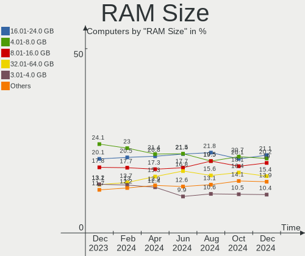
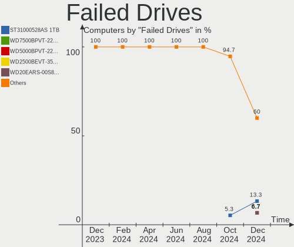
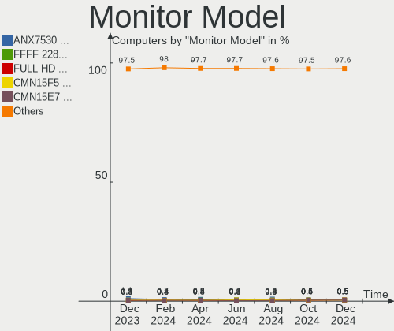
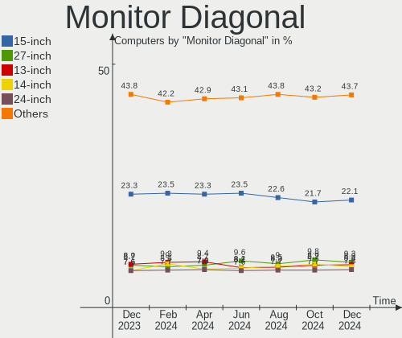

Linux - Hardware Trends
-----------------------

A project to identify most popular hardware characteristics and track their change
over time based on data collected by Linux users at https://Linux-Hardware.org.

Anyone can contribute to this report by the [hw-probe](https://github.com/linuxhw/hw-probe) tool:

    sudo -E hw-probe -all -upload

This is a report for all computer types. See also reports for [desktops](/Desktop/README.md) and [notebooks](/Notebook/README.md).

Distribution-specific reports: [Arch](/Dist/Arch), [ArcoLinux](/Dist/ArcoLinux), [BlackPanther](/Dist/BlackPanther), [CentOS](/Dist/CentOS), [Clear Linux](/Dist/Clear_Linux), [Debian](/Dist/Debian), [Elementary](/Dist/Elementary), [EndeavourOS](/Dist/EndeavourOS), [Endless](/Dist/Endless), [Fedora](/Dist/Fedora), [Gentoo](/Dist/Gentoo), [Kali](/Dist/Kali), [KDE neon](/Dist/KDE_neon), [Kubuntu](/Dist/Kubuntu), [Linux Mint](/Dist/Linux_Mint), [Manjaro](/Dist/Manjaro), [OpenMandriva](/Dist/OpenMandriva), [openSUSE](/Dist/openSUSE), [Pop!_OS](/Dist/Pop!_OS), [ROSA](/Dist/ROSA), [SteamOS](/Dist/SteamOS), [Ubuntu MATE](/Dist/Ubuntu_MATE), [Ubuntu](/Dist/Ubuntu), [Xubuntu](/Dist/Xubuntu), [Zorin](/Dist/Zorin).

This report is for one last month. Overall report since the beginning of time: [TestCoverage](https://github.com/linuxhw/TestCoverage)

Period: Oct, 2022.

Contents
--------

* [ System ](#system)
  - [ OS                       ](#os)
  - [ OS Family                ](#os-family)
  - [ Kernel                   ](#kernel)
  - [ Kernel Family            ](#kernel-family)
  - [ Kernel Major Ver.        ](#kernel-major-ver)
  - [ Arch                     ](#arch)
  - [ DE                       ](#de)
  - [ Display Server           ](#display-server)
  - [ Display Manager          ](#display-manager)
  - [ OS Lang                  ](#os-lang)
  - [ Boot Mode                ](#boot-mode)
  - [ Filesystem               ](#filesystem)
  - [ Part. scheme             ](#part-scheme)
  - [ Dual Boot with Linux/BSD ](#dual-boot-with-linuxbsd)
  - [ Dual Boot (Win)          ](#dual-boot-win)

* [ Board ](#board)
  - [ Vendor                   ](#vendor)
  - [ Model                    ](#model)
  - [ Model Family             ](#model-family)
  - [ MFG Year                 ](#mfg-year)
  - [ Form Factor              ](#form-factor)
  - [ Secure Boot              ](#secure-boot)
  - [ Coreboot                 ](#coreboot)
  - [ RAM Size                 ](#ram-size)
  - [ RAM Used                 ](#ram-used)
  - [ Total Drives             ](#total-drives)
  - [ Has CD-ROM               ](#has-cd-rom)
  - [ Has Ethernet             ](#has-ethernet)
  - [ Has WiFi                 ](#has-wifi)
  - [ Has Bluetooth            ](#has-bluetooth)

* [ Location ](#location)
  - [ Country                  ](#country)
  - [ City                     ](#city)

* [ Drives ](#drives)
  - [ Drive Vendor             ](#drive-vendor)
  - [ Drive Model              ](#drive-model)
  - [ HDD Vendor               ](#hdd-vendor)
  - [ SSD Vendor               ](#ssd-vendor)
  - [ Drive Kind               ](#drive-kind)
  - [ Drive Connector          ](#drive-connector)
  - [ Drive Size               ](#drive-size)
  - [ Space Total              ](#space-total)
  - [ Space Used               ](#space-used)
  - [ Malfunc. Drives          ](#malfunc-drives)
  - [ Malfunc. Drive Vendor    ](#malfunc-drive-vendor)
  - [ Malfunc. HDD Vendor      ](#malfunc-hdd-vendor)
  - [ Malfunc. Drive Kind      ](#malfunc-drive-kind)
  - [ Failed Drives            ](#failed-drives)
  - [ Failed Drive Vendor      ](#failed-drive-vendor)
  - [ Drive Status             ](#drive-status)

* [ Storage controller ](#storage-controller)
  - [ Storage Vendor           ](#storage-vendor)
  - [ Storage Model            ](#storage-model)
  - [ Storage Kind             ](#storage-kind)

* [ Processor ](#processor)
  - [ CPU Vendor               ](#cpu-vendor)
  - [ CPU Model                ](#cpu-model)
  - [ CPU Model Family         ](#cpu-model-family)
  - [ CPU Cores                ](#cpu-cores)
  - [ CPU Sockets              ](#cpu-sockets)
  - [ CPU Threads              ](#cpu-threads)
  - [ CPU Op-Modes             ](#cpu-op-modes)
  - [ CPU Microcode            ](#cpu-microcode)
  - [ CPU Microarch            ](#cpu-microarch)

* [ Graphics ](#graphics)
  - [ GPU Vendor               ](#gpu-vendor)
  - [ GPU Model                ](#gpu-model)
  - [ GPU Combo                ](#gpu-combo)
  - [ GPU Driver               ](#gpu-driver)
  - [ GPU Memory               ](#gpu-memory)

* [ Monitor ](#monitor)
  - [ Monitor Vendor           ](#monitor-vendor)
  - [ Monitor Model            ](#monitor-model)
  - [ Monitor Resolution       ](#monitor-resolution)
  - [ Monitor Diagonal         ](#monitor-diagonal)
  - [ Monitor Width            ](#monitor-width)
  - [ Aspect Ratio             ](#aspect-ratio)
  - [ Monitor Area             ](#monitor-area)
  - [ Pixel Density            ](#pixel-density)
  - [ Multiple Monitors        ](#multiple-monitors)

* [ Network ](#network)
  - [ Net Controller Vendor    ](#net-controller-vendor)
  - [ Net Controller Model     ](#net-controller-model)
  - [ Wireless Vendor          ](#wireless-vendor)
  - [ Wireless Model           ](#wireless-model)
  - [ Ethernet Vendor          ](#ethernet-vendor)
  - [ Ethernet Model           ](#ethernet-model)
  - [ Net Controller Kind      ](#net-controller-kind)
  - [ Used Controller          ](#used-controller)
  - [ NICs                     ](#nics)
  - [ IPv6                     ](#ipv6)

* [ Bluetooth ](#bluetooth)
  - [ Bluetooth Vendor         ](#bluetooth-vendor)
  - [ Bluetooth Model          ](#bluetooth-model)

* [ Sound ](#sound)
  - [ Sound Vendor             ](#sound-vendor)
  - [ Sound Model              ](#sound-model)

* [ Memory ](#memory)
  - [ Memory Vendor            ](#memory-vendor)
  - [ Memory Model             ](#memory-model)
  - [ Memory Kind              ](#memory-kind)
  - [ Memory Form Factor       ](#memory-form-factor)
  - [ Memory Size              ](#memory-size)
  - [ Memory Speed             ](#memory-speed)

* [ Printers & scanners ](#printers--scanners)
  - [ Printer Vendor           ](#printer-vendor)
  - [ Printer Model            ](#printer-model)
  - [ Scanner Vendor           ](#scanner-vendor)
  - [ Scanner Model            ](#scanner-model)

* [ Camera ](#camera)
  - [ Camera Vendor            ](#camera-vendor)
  - [ Camera Model             ](#camera-model)

* [ Security ](#security)
  - [ Fingerprint Vendor       ](#fingerprint-vendor)
  - [ Fingerprint Model        ](#fingerprint-model)
  - [ Chipcard Vendor          ](#chipcard-vendor)
  - [ Chipcard Model           ](#chipcard-model)

* [ Unsupported ](#unsupported)
  - [ Unsupported Devices      ](#unsupported-devices)
  - [ Unsupported Device Types ](#unsupported-device-types)

System
------

OS
--

Installed operating systems

| Name                         | Computers | Percent |
|------------------------------|-----------|---------|
| Ubuntu 22.04                 | 918       | 17.17%  |
| Fedora 36                    | 310       | 5.8%    |
| Debian 11                    | 302       | 5.65%   |
| Linux Mint 21                | 281       | 5.26%   |
| Pop!_OS 22.04                | 253       | 4.73%   |
| ROSA 12.2                    | 240       | 4.49%   |
| Arch Rolling                 | 232       | 4.34%   |
| OpenMandriva 4.3             | 228       | 4.26%   |
| Ubuntu 20.04                 | 198       | 3.7%    |
| Zorin 16                     | 153       | 2.86%   |
| Linux Mint 20.3              | 135       | 2.52%   |
| Ubuntu 22.10                 | 115       | 2.15%   |
| Kubuntu 22.04                | 101       | 1.89%   |
| OpenMandriva 4.50            | 89        | 1.66%   |
| Manjaro                      | 88        | 1.65%   |
| KDE neon 20.04               | 86        | 1.61%   |
| Manjaro 22.0.0               | 83        | 1.55%   |
| Fedora 37                    | 76        | 1.42%   |
| ArcoLinux Rolling            | 75        | 1.4%    |
| Kali 2022.3                  | 70        | 1.31%   |
| Nobara 36                    | 63        | 1.18%   |
| EndeavourOS Rolling          | 53        | 0.99%   |
| SteamOS 3.3.2                | 52        | 0.97%   |
| Gentoo 2.8                   | 48        | 0.9%    |
| Xubuntu 22.04                | 47        | 0.88%   |
| openSUSE Tumbleweed-XXXXXXXX | 43        | 0.8%    |
| KDE neon 22.04               | 43        | 0.8%    |
| Ubuntu 18.04                 | 40        | 0.75%   |
| Elementary 6.1               | 32        | 0.6%    |
| Debian Testing               | 30        | 0.56%   |
| Xubuntu 20.04                | 29        | 0.54%   |
| LMDE 5                       | 26        | 0.49%   |
| ROSA R11.1                   | 25        | 0.47%   |
| Ubuntu MATE 22.04            | 23        | 0.43%   |
| MX 21                        | 23        | 0.43%   |
| Kubuntu 20.04                | 23        | 0.43%   |
| Red OS 7.3.1                 | 22        | 0.41%   |
| Parrot 5.1                   | 21        | 0.39%   |
| BlackPanther 18.1            | 20        | 0.37%   |
| Linux Mint 20.2              | 19        | 0.36%   |

OS Family
---------

OS without a version

| Name          | Computers | Percent |
|---------------|-----------|---------|
| Ubuntu        | 1283      | 23.99%  |
| Linux Mint    | 474       | 8.86%   |
| Fedora        | 399       | 7.46%   |
| Debian        | 361       | 6.75%   |
| OpenMandriva  | 352       | 6.58%   |
| ROSA          | 277       | 5.18%   |
| Pop!_OS       | 256       | 4.79%   |
| Arch          | 232       | 4.34%   |
| Manjaro       | 175       | 3.27%   |
| Zorin         | 164       | 3.07%   |
| Kubuntu       | 150       | 2.81%   |
| KDE neon      | 129       | 2.41%   |
| SteamOS       | 93        | 1.74%   |
| Xubuntu       | 90        | 1.68%   |
| ArcoLinux     | 79        | 1.48%   |
| Kali          | 72        | 1.35%   |
| Nobara        | 63        | 1.18%   |
| Gentoo        | 60        | 1.12%   |
| openSUSE      | 58        | 1.08%   |
| EndeavourOS   | 53        | 0.99%   |
| Ubuntu MATE   | 34        | 0.64%   |
| Elementary    | 33        | 0.62%   |
| Lubuntu       | 29        | 0.54%   |
| Red OS        | 28        | 0.52%   |
| Endless       | 28        | 0.52%   |
| LMDE          | 27        | 0.5%    |
| MX            | 26        | 0.49%   |
| Parrot        | 24        | 0.45%   |
| Ubuntu Unity  | 22        | 0.41%   |
| ALT Linux     | 22        | 0.41%   |
| BlackPanther  | 21        | 0.39%   |
| Garuda Linux  | 19        | 0.36%   |
| Ubuntu Budgie | 18        | 0.34%   |
| Clear Linux   | 18        | 0.34%   |
| Raspbian      | 12        | 0.22%   |
| NixOS         | 11        | 0.21%   |
| CentOS        | 11        | 0.21%   |
| Xero          | 9         | 0.17%   |
| Rocky Linux   | 8         | 0.15%   |
| TUXEDO OS     | 7         | 0.13%   |

Kernel
------

Version of the Linux kernel

| Version                             | Computers | Percent |
|-------------------------------------|-----------|---------|
| 5.15.0-52-generic                   | 616       | 11.52%  |
| 5.15.0-48-generic                   | 553       | 10.34%  |
| 5.15.0-50-generic                   | 459       | 8.58%   |
| 5.16.7-desktop-1omv4003             | 216       | 4.04%   |
| 5.10.0-18-amd64                     | 149       | 2.79%   |
| 5.19.0-76051900-generic             | 144       | 2.69%   |
| 5.10.74-generic-2rosa2021.1-x86_64  | 102       | 1.91%   |
| 6.0.2-arch1-1                       | 88        | 1.65%   |
| 5.19.16-200.fc36.x86_64             | 85        | 1.59%   |
| 5.10.118-generic-2rosa2021.1-x86_64 | 81        | 1.51%   |
| 5.19.0-23-generic                   | 73        | 1.37%   |
| 5.10.0-19-amd64                     | 73        | 1.37%   |
| 5.4.0-131-generic                   | 69        | 1.29%   |
| 5.4.0-126-generic                   | 68        | 1.27%   |
| 5.19.13-arch1-1                     | 55        | 1.03%   |
| 5.15.0-43-generic                   | 53        | 0.99%   |
| 5.19.5-desktop-1omv4090             | 51        | 0.95%   |
| 5.13.0-valve21.3-1-neptune          | 51        | 0.95%   |
| 6.0.2-76060002-generic              | 49        | 0.92%   |
| 5.4.0-128-generic                   | 48        | 0.9%    |
| 5.19.15-201.fc36.x86_64             | 46        | 0.86%   |
| 5.15.0-41-generic                   | 44        | 0.82%   |
| 5.19.14-200.fc36.x86_64             | 41        | 0.77%   |
| 6.0.2-zen1-1-zen                    | 39        | 0.73%   |
| 5.19.16-76051916-generic            | 39        | 0.73%   |
| 5.19.0-2-amd64                      | 39        | 0.73%   |
| 5.19.13-200.fc36.x86_64             | 37        | 0.69%   |
| 5.19.12-200.fc36.x86_64             | 37        | 0.69%   |
| 5.15.74-3-MANJARO                   | 36        | 0.67%   |
| 5.19.0-21-generic                   | 34        | 0.64%   |
| 5.19.12-arch1-1                     | 32        | 0.6%    |
| 5.15.0-46-generic                   | 32        | 0.6%    |
| 5.19.0-kali2-amd64                  | 26        | 0.49%   |
| 5.18.0-kali7-amd64                  | 25        | 0.47%   |
| 5.19.12-desktop-2omv4090            | 24        | 0.45%   |
| 5.15.65-1-MANJARO                   | 24        | 0.45%   |
| 5.15.0-47-generic                   | 24        | 0.45%   |
| 5.11.0-35-generic                   | 24        | 0.45%   |
| 6.0.2-2-MANJARO                     | 23        | 0.43%   |
| 5.15.74-1-lts                       | 23        | 0.43%   |

Kernel Family
-------------

Linux kernel without a distro release

| Version  | Computers | Percent |
|----------|-----------|---------|
| 5.15.0   | 1857      | 34.73%  |
| 5.19.0   | 363       | 6.79%   |
| 5.10.0   | 295       | 5.52%   |
| 5.4.0    | 248       | 4.64%   |
| 6.0.2    | 235       | 4.39%   |
| 5.16.7   | 216       | 4.04%   |
| 5.19.16  | 167       | 3.12%   |
| 5.19.13  | 140       | 2.62%   |
| 5.19.12  | 135       | 2.52%   |
| 5.13.0   | 130       | 2.43%   |
| 5.10.74  | 105       | 1.96%   |
| 6.0.0    | 94        | 1.76%   |
| 5.10.118 | 84        | 1.57%   |
| 5.19.14  | 83        | 1.55%   |
| 5.18.0   | 83        | 1.55%   |
| 5.15.74  | 82        | 1.53%   |
| 5.19.15  | 65        | 1.22%   |
| 6.0.1    | 57        | 1.07%   |
| 5.19.5   | 52        | 0.97%   |
| 6.0.5    | 51        | 0.95%   |
| 5.11.0   | 43        | 0.8%    |
| 4.15.0   | 40        | 0.75%   |
| 5.15.72  | 36        | 0.67%   |
| 5.19.11  | 34        | 0.64%   |
| 5.14.0   | 34        | 0.64%   |
| 6.0.3    | 28        | 0.52%   |
| 5.17.5   | 25        | 0.47%   |
| 5.15.71  | 25        | 0.47%   |
| 5.15.65  | 25        | 0.47%   |
| 5.19.7   | 24        | 0.45%   |
| 5.10.14  | 18        | 0.34%   |
| 5.18.12  | 17        | 0.32%   |
| 5.17.0   | 17        | 0.32%   |
| 5.16.13  | 16        | 0.3%    |
| 5.17.11  | 15        | 0.28%   |
| 5.14.21  | 15        | 0.28%   |
| 5.15.61  | 14        | 0.26%   |
| 5.15.35  | 14        | 0.26%   |
| 6.1.0    | 13        | 0.24%   |
| 5.15.10  | 13        | 0.24%   |

Kernel Major Ver.
-----------------

Linux kernel major version

| Version | Computers | Percent |
|---------|-----------|---------|
| 5.15    | 2160      | 40.4%   |
| 5.19    | 1100      | 20.57%  |
| 5.10    | 536       | 10.02%  |
| 6.0     | 472       | 8.83%   |
| 5.4     | 274       | 5.12%   |
| 5.16    | 247       | 4.62%   |
| 5.18    | 132       | 2.47%   |
| 5.13    | 131       | 2.45%   |
| 5.17    | 68        | 1.27%   |
| 5.14    | 51        | 0.95%   |
| 5.11    | 43        | 0.8%    |
| 4.15    | 40        | 0.75%   |
| 4.18    | 18        | 0.34%   |
| 6.1     | 13        | 0.24%   |
| 3.10    | 11        | 0.21%   |
| 5.6     | 9         | 0.17%   |
| 4.19    | 9         | 0.17%   |
| 4.9     | 6         | 0.11%   |
| 4.4     | 6         | 0.11%   |
| 5.8     | 4         | 0.07%   |
| 5.3     | 4         | 0.07%   |
| 5.0     | 3         | 0.06%   |
| 6       | 1         | 0.02%   |
| 5.9     | 1         | 0.02%   |
| 5.7     | 1         | 0.02%   |
| 5.5     | 1         | 0.02%   |
| 4.1     | 1         | 0.02%   |
| 3.4     | 1         | 0.02%   |
| 2.6.32  | 1         | 0.02%   |
| 2.6.16  | 1         | 0.02%   |
| 2.6     | 1         | 0.02%   |
| Unknown | 1         | 0.02%   |

Arch
----

OS architecture (x86_64, i586, etc.)

| Name    | Computers | Percent |
|---------|-----------|---------|
| x86_64  | 5235      | 97.91%  |
| i686    | 60        | 1.12%   |
| aarch64 | 34        | 0.64%   |
| armv7l  | 13        | 0.24%   |
| armv6l  | 2         | 0.04%   |
| ppc64   | 1         | 0.02%   |
| ppc     | 1         | 0.02%   |
| i586    | 1         | 0.02%   |

DE
--

Desktop Environment

| Name             | Computers | Percent |
|------------------|-----------|---------|
| GNOME            | 2386      | 44.62%  |
| KDE5             | 1353      | 25.3%   |
| X-Cinnamon       | 414       | 7.74%   |
| XFCE             | 372       | 6.96%   |
| Unknown          | 253       | 4.73%   |
| MATE             | 174       | 3.25%   |
| LXQt             | 68        | 1.27%   |
| Cinnamon         | 50        | 0.94%   |
| Pantheon         | 33        | 0.62%   |
| i3               | 33        | 0.62%   |
| LXDE             | 24        | 0.45%   |
| Budgie           | 24        | 0.45%   |
| GNOME Flashback  | 23        | 0.43%   |
| Unity            | 22        | 0.41%   |
| KDE4             | 17        | 0.32%   |
| awesome          | 14        | 0.26%   |
| openbox          | 10        | 0.19%   |
| sway             | 8         | 0.15%   |
| qtile            | 8         | 0.15%   |
| Hyprland         | 8         | 0.15%   |
| Deepin           | 7         | 0.13%   |
| bspwm            | 7         | 0.13%   |
| trinity          | 6         | 0.11%   |
| lightdm-xsession | 5         | 0.09%   |
| KDE              | 4         | 0.07%   |
| GNOME Classic    | 4         | 0.07%   |
| UKUI             | 3         | 0.06%   |
| Enlightenment    | 3         | 0.06%   |
| dwm              | 3         | 0.06%   |
| xmonad           | 2         | 0.04%   |
| LeftWM           | 2         | 0.04%   |
| none+xmonad      | 1         | 0.02%   |
| none+i3          | 1         | 0.02%   |
| Lubuntu          | 1         | 0.02%   |
| instantwm        | 1         | 0.02%   |
| ICEWM            | 1         | 0.02%   |
| i3-with-shmlog   | 1         | 0.02%   |
| fluxbox          | 1         | 0.02%   |

Display Server
--------------

X11 or Wayland

| Name    | Computers | Percent |
|---------|-----------|---------|
| X11     | 3584      | 67.03%  |
| Wayland | 1483      | 27.74%  |
| Tty     | 144       | 2.69%   |
| Unknown | 133       | 2.49%   |
| Web     | 3         | 0.06%   |

Display Manager
---------------

SDDM, LightDM, etc.

| Name    | Computers | Percent |
|---------|-----------|---------|
| Unknown | 1740      | 32.54%  |
| GDM3    | 1209      | 22.61%  |
| SDDM    | 1005      | 18.8%   |
| LightDM | 784       | 14.66%  |
| GDM     | 566       | 10.59%  |
| KDM     | 17        | 0.32%   |
| XDM     | 6         | 0.11%   |
| LXDM    | 6         | 0.11%   |
| Ly      | 5         | 0.09%   |
| SLiM    | 4         | 0.07%   |
| TDM     | 1         | 0.02%   |
| NODM    | 1         | 0.02%   |
| MDM     | 1         | 0.02%   |
| GREETD  | 1         | 0.02%   |
| EMPTTY  | 1         | 0.02%   |

OS Lang
-------

Language

| Lang    | Computers | Percent |
|---------|-----------|---------|
| en_US   | 2213      | 41.39%  |
| ru_RU   | 446       | 8.34%   |
| de_DE   | 361       | 6.75%   |
| it_IT   | 360       | 6.73%   |
| en_GB   | 256       | 4.79%   |
| fr_FR   | 244       | 4.56%   |
| pt_BR   | 172       | 3.22%   |
| es_ES   | 123       | 2.3%    |
| Unknown | 120       | 2.24%   |
| pl_PL   | 87        | 1.63%   |
| C       | 82        | 1.53%   |
| en_CA   | 80        | 1.5%    |
| en_AU   | 80        | 1.5%    |
| en_IN   | 64        | 1.2%    |
| es_MX   | 44        | 0.82%   |
| nl_NL   | 37        | 0.69%   |
| es_AR   | 30        | 0.56%   |
| zh_CN   | 28        | 0.52%   |
| hu_HU   | 27        | 0.5%    |
| de_AT   | 25        | 0.47%   |
| tr_TR   | 22        | 0.41%   |
| en_ZA   | 22        | 0.41%   |
| cs_CZ   | 22        | 0.41%   |
| pt_PT   | 20        | 0.37%   |
| en_PH   | 18        | 0.34%   |
| en_AG   | 18        | 0.34%   |
| es_CO   | 17        | 0.32%   |
| es_CL   | 16        | 0.3%    |
| nl_BE   | 14        | 0.26%   |
| en_NZ   | 14        | 0.26%   |
| en_IE   | 14        | 0.26%   |
| sv_SE   | 13        | 0.24%   |
| fi_FI   | 13        | 0.24%   |
| fr_CA   | 12        | 0.22%   |
| fr_BE   | 12        | 0.22%   |
| el_GR   | 12        | 0.22%   |
| C.UTF8  | 12        | 0.22%   |
| POSIX   | 11        | 0.21%   |
| de_CH   | 11        | 0.21%   |
| nb_NO   | 10        | 0.19%   |

Boot Mode
---------

EFI or BIOS

| Mode | Computers | Percent |
|------|-----------|---------|
| EFI  | 2726      | 50.98%  |
| BIOS | 2621      | 49.02%  |

Filesystem
----------

Type of filesystem

| Type          | Computers | Percent |
|---------------|-----------|---------|
| Ext4          | 3959      | 74.04%  |
| Btrfs         | 779       | 14.57%  |
| Overlay       | 449       | 8.4%    |
| Xfs           | 78        | 1.46%   |
| Zfs           | 39        | 0.73%   |
| F2fs          | 14        | 0.26%   |
| Ext2          | 7         | 0.13%   |
| Ext3          | 6         | 0.11%   |
| Tmpfs         | 5         | 0.09%   |
| XXXXXXX       | 3         | 0.06%   |
| Aufs          | 2         | 0.04%   |
| Unknown       | 2         | 0.04%   |
| XXXX          | 1         | 0.02%   |
| XXX4          | 1         | 0.02%   |
| Rootfs        | 1         | 0.02%   |
| Fuse.snapfuse | 1         | 0.02%   |

Part. scheme
------------

Scheme of partitioning

| Type    | Computers | Percent |
|---------|-----------|---------|
| GPT     | 3007      | 56.24%  |
| Unknown | 1569      | 29.34%  |
| MBR     | 771       | 14.42%  |

Dual Boot with Linux/BSD
------------------------

Hosting more than one Linux/BSD

| Dual boot | Computers | Percent |
|-----------|-----------|---------|
| No        | 4564      | 85.36%  |
| Yes       | 783       | 14.64%  |

Dual Boot (Win)
---------------

Hosting Linux and Windows

| Dual boot | Computers | Percent |
|-----------|-----------|---------|
| No        | 3763      | 70.38%  |
| Yes       | 1584      | 29.62%  |

Board
-----

Vendor
------

Motherboard manufacturer

| Name                    | Computers | Percent |
|-------------------------|-----------|---------|
| ASUSTek Computer        | 885       | 16.55%  |
| Lenovo                  | 776       | 14.51%  |
| Hewlett-Packard         | 720       | 13.47%  |
| Dell                    | 638       | 11.93%  |
| Gigabyte Technology     | 359       | 6.71%   |
| MSI                     | 339       | 6.34%   |
| Acer                    | 272       | 5.09%   |
| ASRock                  | 168       | 3.14%   |
| Apple                   | 120       | 2.24%   |
| Valve                   | 79        | 1.48%   |
| Toshiba                 | 69        | 1.29%   |
| Intel                   | 69        | 1.29%   |
| HUAWEI                  | 59        | 1.1%    |
| Samsung Electronics     | 53        | 0.99%   |
| Unknown                 | 48        | 0.9%    |
| Fujitsu                 | 46        | 0.86%   |
| Sony                    | 36        | 0.67%   |
| Raspberry Pi Foundation | 31        | 0.58%   |
| Google                  | 25        | 0.47%   |
| Microsoft               | 20        | 0.37%   |
| Medion                  | 19        | 0.36%   |
| Notebook                | 18        | 0.34%   |
| Biostar                 | 18        | 0.34%   |
| Alienware               | 18        | 0.34%   |
| Pegatron                | 17        | 0.32%   |
| System76                | 15        | 0.28%   |
| Supermicro              | 15        | 0.28%   |
| Packard Bell            | 15        | 0.28%   |
| AZW                     | 14        | 0.26%   |
| Timi                    | 12        | 0.22%   |
| LG Electronics          | 12        | 0.22%   |
| Chuwi                   | 12        | 0.22%   |
| Positivo                | 11        | 0.21%   |
| ECS                     | 10        | 0.19%   |
| TUXEDO                  | 9         | 0.17%   |
| Foxconn                 | 9         | 0.17%   |
| GPU Company             | 7         | 0.13%   |
| Framework               | 7         | 0.13%   |
| eMachines               | 7         | 0.13%   |
| AMI                     | 7         | 0.13%   |

Model
-----

Motherboard model

| Name                               | Computers | Percent |
|------------------------------------|-----------|---------|
| Valve Jupiter                      | 79        | 1.48%   |
| Unknown                            | 61        | 1.14%   |
| ASUS All Series                    | 40        | 0.75%   |
| Dell OptiPlex 7010                 | 16        | 0.3%    |
| Lenovo ThinkPad E475 20H40006US    | 14        | 0.26%   |
| Gigabyte B450M DS3H                | 14        | 0.26%   |
| Apple MacBookAir7,2                | 13        | 0.24%   |
| MSI MS-7B86                        | 12        | 0.22%   |
| HP Pavilion g6                     | 12        | 0.22%   |
| MSI MS-7C37                        | 11        | 0.21%   |
| HP Pavilion dv7                    | 11        | 0.21%   |
| Gigabyte B450 AORUS ELITE          | 11        | 0.21%   |
| Apple iMac12,1                     | 11        | 0.21%   |
| MSI MS-7C56                        | 10        | 0.19%   |
| MSI MS-7817                        | 10        | 0.19%   |
| Lenovo IdeaPad 3 15ADA05 81W1      | 10        | 0.19%   |
| HP Pavilion Notebook               | 10        | 0.19%   |
| RPi Raspberry Pi 4 Model B Rev 1.4 | 9         | 0.17%   |
| Dell OptiPlex 790                  | 9         | 0.17%   |
| ASUS TUF Gaming X570-PLUS          | 9         | 0.17%   |
| ASUS TUF Gaming B550M-PLUS         | 9         | 0.17%   |
| ASUS ROG STRIX B450-F GAMING       | 9         | 0.17%   |
| Acer Aspire E5-575G                | 9         | 0.17%   |
| Supermicro Super Server            | 8         | 0.15%   |
| MSI MS-7C52                        | 8         | 0.15%   |
| MSI MS-7C02                        | 8         | 0.15%   |
| MSI MS-7B79                        | 8         | 0.15%   |
| HP Pavilion dv6                    | 8         | 0.15%   |
| HP Laptop 15s-eq2xxx               | 8         | 0.15%   |
| HP 255 G8 Notebook PC              | 8         | 0.15%   |
| Gigabyte A320M-S2H                 | 8         | 0.15%   |
| ASUS ROG STRIX B550-F GAMING       | 8         | 0.15%   |
| ASUS PRIME X570-PRO                | 8         | 0.15%   |
| ASRock B450M Pro4                  | 8         | 0.15%   |
| Lenovo ThinkBook 15 G2 ITL 20VE    | 7         | 0.13%   |
| HP Notebook                        | 7         | 0.13%   |
| HP EliteBook 8470p                 | 7         | 0.13%   |
| Gigabyte X570 AORUS ELITE          | 7         | 0.13%   |
| Gigabyte 970A-DS3P                 | 7         | 0.13%   |
| Dell OptiPlex 9020                 | 7         | 0.13%   |

Model Family
------------

Motherboard model prefix

| Name               | Computers | Percent |
|--------------------|-----------|---------|
| Lenovo ThinkPad    | 334       | 6.25%   |
| Acer Aspire        | 183       | 3.42%   |
| Dell Latitude      | 165       | 3.09%   |
| Lenovo IdeaPad     | 156       | 2.92%   |
| Dell Inspiron      | 147       | 2.75%   |
| HP Pavilion        | 131       | 2.45%   |
| ASUS PRIME         | 122       | 2.28%   |
| ASUS ROG           | 110       | 2.06%   |
| Dell OptiPlex      | 100       | 1.87%   |
| ASUS VivoBook      | 86        | 1.61%   |
| HP EliteBook       | 85        | 1.59%   |
| HP Laptop          | 84        | 1.57%   |
| Valve Jupiter      | 79        | 1.48%   |
| Dell Precision     | 74        | 1.38%   |
| Dell XPS           | 72        | 1.35%   |
| ASUS TUF           | 71        | 1.33%   |
| HP Compaq          | 67        | 1.25%   |
| Unknown            | 61        | 1.14%   |
| Toshiba Satellite  | 57        | 1.07%   |
| HP ProBook         | 57        | 1.07%   |
| HP ENVY            | 53        | 0.99%   |
| Lenovo ThinkCentre | 49        | 0.92%   |
| Dell Vostro        | 43        | 0.8%    |
| ASUS All           | 40        | 0.75%   |
| Lenovo Yoga        | 35        | 0.65%   |
| Lenovo Legion      | 35        | 0.65%   |
| RPi Raspberry      | 31        | 0.58%   |
| ASUS ASUS          | 30        | 0.56%   |
| ASUS ZenBook       | 29        | 0.54%   |
| Lenovo ThinkBook   | 24        | 0.45%   |
| HP ZBook           | 22        | 0.41%   |
| Gigabyte B450M     | 22        | 0.41%   |
| Gigabyte B450      | 22        | 0.41%   |
| Microsoft Surface  | 20        | 0.37%   |
| HP ProDesk         | 20        | 0.37%   |
| Fujitsu LIFEBOOK   | 19        | 0.36%   |
| Acer Nitro         | 19        | 0.36%   |
| Gigabyte X570      | 18        | 0.34%   |
| Fujitsu ESPRIMO    | 18        | 0.34%   |
| Apple iMac12       | 17        | 0.32%   |

MFG Year
--------

Motherboard manufacture year

| Year    | Computers | Percent |
|---------|-----------|---------|
| 2021    | 640       | 11.97%  |
| 2020    | 622       | 11.63%  |
| 2019    | 482       | 9.01%   |
| 2018    | 446       | 8.34%   |
| 2022    | 399       | 7.46%   |
| 2012    | 377       | 7.05%   |
| 2013    | 328       | 6.13%   |
| 2011    | 324       | 6.06%   |
| 2017    | 289       | 5.4%    |
| 2014    | 274       | 5.12%   |
| 2016    | 252       | 4.71%   |
| 2015    | 232       | 4.34%   |
| 2010    | 215       | 4.02%   |
| 2009    | 168       | 3.14%   |
| 2008    | 141       | 2.64%   |
| 2007    | 74        | 1.38%   |
| Unknown | 46        | 0.86%   |
| 2006    | 28        | 0.52%   |
| 2005    | 6         | 0.11%   |
| 2004    | 2         | 0.04%   |
| 2003    | 1         | 0.02%   |
| 2000    | 1         | 0.02%   |

Form Factor
-----------

Physical design of the computer

| Name           | Computers | Percent |
|----------------|-----------|---------|
| Notebook       | 2947      | 55.12%  |
| Desktop        | 1944      | 36.36%  |
| Convertible    | 146       | 2.73%   |
| Mini pc        | 90        | 1.68%   |
| All in one     | 73        | 1.37%   |
| Tablet         | 53        | 0.99%   |
| Server         | 49        | 0.92%   |
| System on chip | 41        | 0.77%   |
| Other          | 2         | 0.04%   |
| Phone          | 1         | 0.02%   |
| Firewall       | 1         | 0.02%   |

Secure Boot
-----------

Enabled or disabled

| State    | Computers | Percent |
|----------|-----------|---------|
| Disabled | 4979      | 93.12%  |
| Enabled  | 368       | 6.88%   |

Coreboot
--------

Have coreboot on board

| Used | Computers | Percent |
|------|-----------|---------|
| No   | 5306      | 99.23%  |
| Yes  | 41        | 0.77%   |

RAM Size
--------

Total RAM memory

| Size in GB      | Computers | Percent |
|-----------------|-----------|---------|
| 4.01-8.0        | 1269      | 23.73%  |
| 16.01-24.0      | 1174      | 21.96%  |
| 8.01-16.0       | 990       | 18.52%  |
| 3.01-4.0        | 786       | 14.7%   |
| 32.01-64.0      | 613       | 11.46%  |
| 64.01-256.0     | 169       | 3.16%   |
| 1.01-2.0        | 145       | 2.71%   |
| 24.01-32.0      | 108       | 2.02%   |
| 2.01-3.0        | 53        | 0.99%   |
| 0.51-1.0        | 22        | 0.41%   |
| More than 256.0 | 10        | 0.19%   |
| 0.01-0.5        | 6         | 0.11%   |
| 0               | 1         | 0.02%   |
| Unknown         | 1         | 0.02%   |

RAM Used
--------

Used RAM memory

| Used GB         | Computers | Percent |
|-----------------|-----------|---------|
| 1.01-2.0        | 1595      | 29.83%  |
| 2.01-3.0        | 1361      | 25.45%  |
| 4.01-8.0        | 939       | 17.56%  |
| 3.01-4.0        | 752       | 14.06%  |
| 0.51-1.0        | 328       | 6.13%   |
| 8.01-16.0       | 261       | 4.88%   |
| 0.01-0.5        | 53        | 0.99%   |
| 16.01-24.0      | 33        | 0.62%   |
| 24.01-32.0      | 11        | 0.21%   |
| 32.01-64.0      | 6         | 0.11%   |
| Unknown         | 5         | 0.09%   |
| 64.01-256.0     | 2         | 0.04%   |
| More than 256.0 | 1         | 0.02%   |

Total Drives
------------

Number of drives on board

| Drives | Computers | Percent |
|--------|-----------|---------|
| 1      | 3138      | 58.69%  |
| 2      | 1324      | 24.76%  |
| 3      | 456       | 8.53%   |
| 4      | 186       | 3.48%   |
| 5      | 104       | 1.95%   |
| 6      | 57        | 1.07%   |
| 0      | 27        | 0.5%    |
| 7      | 24        | 0.45%   |
| 8      | 9         | 0.17%   |
| 9      | 7         | 0.13%   |
| 11     | 4         | 0.07%   |
| 10     | 3         | 0.06%   |
| 17     | 2         | 0.04%   |
| 51     | 1         | 0.02%   |
| 27     | 1         | 0.02%   |
| 19     | 1         | 0.02%   |
| 15     | 1         | 0.02%   |
| 14     | 1         | 0.02%   |
| 12     | 1         | 0.02%   |

Has CD-ROM
----------

Has CD-ROM on board

| Presented | Computers | Percent |
|-----------|-----------|---------|
| No        | 3619      | 67.68%  |
| Yes       | 1728      | 32.32%  |

Has Ethernet
------------

Has Ethernet on board

| Presented | Computers | Percent |
|-----------|-----------|---------|
| Yes       | 4443      | 83.09%  |
| No        | 904       | 16.91%  |

Has WiFi
--------

Has WiFi module

| Presented | Computers | Percent |
|-----------|-----------|---------|
| Yes       | 4094      | 76.57%  |
| No        | 1253      | 23.43%  |

Has Bluetooth
-------------

Has Bluetooth module

| Presented | Computers | Percent |
|-----------|-----------|---------|
| Yes       | 3377      | 63.16%  |
| No        | 1970      | 36.84%  |

Location
--------

Country
-------

Geographic location (country)

| Country      | Computers | Percent |
|--------------|-----------|---------|
| USA          | 932       | 17.43%  |
| Italy        | 522       | 9.76%   |
| Russia       | 511       | 9.56%   |
| Germany      | 501       | 9.37%   |
| France       | 306       | 5.72%   |
| Brazil       | 246       | 4.6%    |
| UK           | 172       | 3.22%   |
| Spain        | 152       | 2.84%   |
| Poland       | 140       | 2.62%   |
| Canada       | 128       | 2.39%   |
| India        | 107       | 2%      |
| Netherlands  | 99        | 1.85%   |
| Australia    | 94        | 1.76%   |
| Mexico       | 71        | 1.33%   |
| Hungary      | 69        | 1.29%   |
| Belgium      | 61        | 1.14%   |
| Austria      | 56        | 1.05%   |
| Turkey       | 54        | 1.01%   |
| Argentina    | 53        | 0.99%   |
| Switzerland  | 48        | 0.9%    |
| Sweden       | 48        | 0.9%    |
| China        | 44        | 0.82%   |
| Czechia      | 42        | 0.79%   |
| Portugal     | 39        | 0.73%   |
| Norway       | 34        | 0.64%   |
| Indonesia    | 31        | 0.58%   |
| Greece       | 31        | 0.58%   |
| Finland      | 31        | 0.58%   |
| Romania      | 29        | 0.54%   |
| Chile        | 28        | 0.52%   |
| South Africa | 27        | 0.5%    |
| Japan        | 26        | 0.49%   |
| Ukraine      | 25        | 0.47%   |
| Philippines  | 24        | 0.45%   |
| Colombia     | 22        | 0.41%   |
| Ireland      | 21        | 0.39%   |
| Bulgaria     | 21        | 0.39%   |
| Serbia       | 17        | 0.32%   |
| Egypt        | 17        | 0.32%   |
| South Korea  | 16        | 0.3%    |

City
----

Geographic location (city)

| City              | Computers | Percent |
|-------------------|-----------|---------|
| Moscow            | 119       | 2.23%   |
| Milan             | 95        | 1.78%   |
| Berlin            | 44        | 0.82%   |
| St Petersburg     | 41        | 0.77%   |
| Sao Paulo         | 37        | 0.69%   |
| Rome              | 34        | 0.64%   |
| Bangor            | 32        | 0.6%    |
| Vienna            | 31        | 0.58%   |
| Budapest          | 31        | 0.58%   |
| Paris             | 30        | 0.56%   |
| Madrid            | 30        | 0.56%   |
| Warsaw            | 28        | 0.52%   |
| Voronezh          | 24        | 0.45%   |
| Sydney            | 24        | 0.45%   |
| Turin             | 23        | 0.43%   |
| Munich            | 23        | 0.43%   |
| Istanbul          | 21        | 0.39%   |
| Athens            | 21        | 0.39%   |
| Prague            | 20        | 0.37%   |
| Frankfurt am Main | 20        | 0.37%   |
| Seattle           | 19        | 0.36%   |
| Dallas            | 19        | 0.36%   |
| Rio de Janeiro    | 18        | 0.34%   |
| Mexico City       | 18        | 0.34%   |
| Los Angeles       | 18        | 0.34%   |
| Yekaterinburg     | 17        | 0.32%   |
| Brisbane          | 17        | 0.32%   |
| Amsterdam         | 17        | 0.32%   |
| Bengaluru         | 16        | 0.3%    |
| Barcelona         | 16        | 0.3%    |
| Zurich            | 15        | 0.28%   |
| Melbourne         | 15        | 0.28%   |
| Hamburg           | 15        | 0.28%   |
| Buenos Aires      | 15        | 0.28%   |
| New York          | 14        | 0.26%   |
| Krasnodar         | 14        | 0.26%   |
| Lima              | 13        | 0.24%   |
| Krakow            | 13        | 0.24%   |
| Helsinki          | 13        | 0.24%   |
| Bogotá           | 13        | 0.24%   |

Drives
------

Drive Vendor
------------

Hard drive vendors

| Vendor                      | Computers | Drives | Percent |
|-----------------------------|-----------|--------|---------|
| Samsung Electronics         | 1296      | 1579   | 16.13%  |
| WDC                         | 1072      | 1328   | 13.34%  |
| Seagate                     | 1031      | 1272   | 12.83%  |
| Sandisk                     | 466       | 496    | 5.8%    |
| Kingston                    | 449       | 481    | 5.59%   |
| Toshiba                     | 444       | 531    | 5.53%   |
| Unknown                     | 370       | 420    | 4.61%   |
| Crucial                     | 338       | 369    | 4.21%   |
| Hitachi                     | 220       | 241    | 2.74%   |
| SK hynix                    | 209       | 215    | 2.6%    |
| Intel                       | 188       | 214    | 2.34%   |
| Micron Technology           | 158       | 160    | 1.97%   |
| HGST                        | 120       | 154    | 1.49%   |
| A-DATA Technology           | 116       | 124    | 1.44%   |
| Phison Electronics          | 101       | 113    | 1.26%   |
| China                       | 84        | 89     | 1.05%   |
| KIOXIA                      | 80        | 80     | 1%      |
| PNY                         | 61        | 64     | 0.76%   |
| Micron/Crucial Technology   | 60        | 62     | 0.75%   |
| Kingston Technology Company | 59        | 59     | 0.73%   |
| Apple                       | 59        | 62     | 0.73%   |
| Intenso                     | 52        | 53     | 0.65%   |
| Silicon Motion              | 49        | 51     | 0.61%   |
| SPCC                        | 45        | 47     | 0.56%   |
| Unknown                     | 45        | 47     | 0.56%   |
| Phison                      | 35        | 38     | 0.44%   |
| Patriot                     | 32        | 32     | 0.4%    |
| Transcend                   | 29        | 31     | 0.36%   |
| ADATA Technology            | 28        | 29     | 0.35%   |
| GOODRAM                     | 27        | 28     | 0.34%   |
| Netac                       | 26        | 26     | 0.32%   |
| LITEON                      | 26        | 26     | 0.32%   |
| OCZ                         | 24        | 26     | 0.3%    |
| JMicron Technology          | 24        | 33     | 0.3%    |
| Fujitsu                     | 24        | 26     | 0.3%    |
| Team                        | 22        | 24     | 0.27%   |
| Corsair                     | 20        | 25     | 0.25%   |
| Maxtor                      | 19        | 20     | 0.24%   |
| Apacer                      | 19        | 19     | 0.24%   |
| KingSpec                    | 18        | 19     | 0.22%   |

Drive Model
-----------

Hard drive models

| Model                                                 | Computers | Percent |
|-------------------------------------------------------|-----------|---------|
| Samsung NVMe SSD Controller SM981/PM981/PM983 500GB   | 168       | 1.92%   |
| Kingston SA400S37240G 240GB SSD                       | 97        | 1.11%   |
| Samsung NVMe SSD Controller PM9A1/PM9A3/980PRO 250GB  | 76        | 0.87%   |
| Samsung SSD 860 EVO 500GB                             | 63        | 0.72%   |
| Kingston SA400S37480G 480GB SSD                       | 59        | 0.67%   |
| Crucial CT500MX500SSD1 500GB                          | 59        | 0.67%   |
| Unknown MMC Card  32GB                                | 58        | 0.66%   |
| Seagate ST1000LM035-1RK172 1TB                        | 58        | 0.66%   |
| Sandisk WD Blue SN550 NVMe SSD 1TB                    | 57        | 0.65%   |
| Seagate ST1000DM010-2EP102 1TB                        | 53        | 0.61%   |
| Unknown MMC Card  64GB                                | 51        | 0.58%   |
| Samsung SSD 850 EVO 250GB                             | 51        | 0.58%   |
| Seagate ST2000DM008-2FR102 2TB                        | 48        | 0.55%   |
| Sandisk WD Black SN750 / PC SN730 NVMe SSD 1TB        | 46        | 0.53%   |
| Samsung SSD 860 EVO 1TB                               | 45        | 0.51%   |
| Unknown                                               | 45        | 0.51%   |
| Kingston SV300S37A120G 120GB SSD                      | 44        | 0.5%    |
| Crucial CT1000MX500SSD1 1TB                           | 42        | 0.48%   |
| Unknown SD/MMC/MS PRO 1TB                             | 41        | 0.47%   |
| Samsung SSD 980 1TB                                   | 41        | 0.47%   |
| Samsung SSD 850 EVO 500GB                             | 41        | 0.47%   |
| Crucial CT240BX500SSD1 240GB                          | 41        | 0.47%   |
| WDC WD10EZEX-08WN4A0 1TB                              | 40        | 0.46%   |
| Phison PS5013 E13 NVMe Controller 256GB               | 40        | 0.46%   |
| Seagate ST500DM002-1BD142 500GB                       | 39        | 0.45%   |
| Samsung NVMe SSD Controller SM961/PM961/SM963 250GB   | 38        | 0.43%   |
| Phison E12 NVMe Controller 2TB                        | 38        | 0.43%   |
| Toshiba MQ01ABF050 500GB                              | 37        | 0.42%   |
| Toshiba MQ04ABF100 1TB                                | 36        | 0.41%   |
| Seagate ST1000LM024 HN-M101MBB 1TB                    | 36        | 0.41%   |
| Samsung SSD 860 EVO 250GB                             | 36        | 0.41%   |
| Kingston SA400S37120G 120GB SSD                       | 36        | 0.41%   |
| Toshiba DT01ACA100 1TB                                | 32        | 0.37%   |
| Kingston Company OM3PDP3 NVMe SSD 512GB               | 31        | 0.35%   |
| Intel SSD 660P Series 1024GB                          | 31        | 0.35%   |
| HGST HTS721010A9E630 1TB                              | 31        | 0.35%   |
| Unknown MMC Card  128GB                               | 30        | 0.34%   |
| Seagate ST500LT012-1DG142 500GB                       | 30        | 0.34%   |
| Silicon Motion SM2263EN/SM2263XT SSD Controller 256GB | 29        | 0.33%   |
| WDC WDS240G2G0A-00JH30 240GB SSD                      | 28        | 0.32%   |

HDD Vendor
----------

Hard disk drive vendors

| Vendor              | Computers | Drives | Percent |
|---------------------|-----------|--------|---------|
| Seagate             | 1013      | 1246   | 36.58%  |
| WDC                 | 832       | 1025   | 30.05%  |
| Toshiba             | 322       | 402    | 11.63%  |
| Hitachi             | 220       | 241    | 7.95%   |
| HGST                | 120       | 154    | 4.33%   |
| Samsung Electronics | 105       | 120    | 3.79%   |
| Unknown             | 45        | 49     | 1.63%   |
| Fujitsu             | 23        | 25     | 0.83%   |
| Maxtor              | 18        | 19     | 0.65%   |
| Apple               | 11        | 11     | 0.4%    |
| SABRENT             | 10        | 13     | 0.36%   |
| Intenso             | 6         | 6      | 0.22%   |
| ASMT                | 5         | 8      | 0.18%   |
| USB3.0              | 4         | 5      | 0.14%   |
| HGST HTS            | 4         | 4      | 0.14%   |
| SAGE                | 3         | 3      | 0.11%   |
| Hewlett-Packard     | 3         | 11     | 0.11%   |
| LIO-ORG             | 2         | 2      | 0.07%   |
| IBM/Hitachi         | 2         | 2      | 0.07%   |
| HPE                 | 2         | 8      | 0.07%   |
| USB                 | 1         | 1      | 0.04%   |
| Synology            | 1         | 1      | 0.04%   |
| RSH-319             | 1         | 1      | 0.04%   |
| QUANTUM             | 1         | 1      | 0.04%   |
| QNAP                | 1         | 1      | 0.04%   |
| Pear 2TB            | 1         | 1      | 0.04%   |
| NETAPP              | 1         | 2      | 0.04%   |
| Maxone              | 1         | 1      | 0.04%   |
| MaxDigital          | 1         | 1      | 0.04%   |
| Magnetic Data       | 1         | 1      | 0.04%   |
| Lenovo              | 1         | 8      | 0.04%   |
| JMicron Technology  | 1         | 6      | 0.04%   |
| Initio              | 1         | 1      | 0.04%   |
| Inateck             | 1         | 1      | 0.04%   |
| ICY BOX             | 1         | 1      | 0.04%   |
| IBM-ESXS            | 1         | 2      | 0.04%   |
| Fantom              | 1         | 1      | 0.04%   |
| China               | 1         | 1      | 0.04%   |
| Unknown             | 1         | 1      | 0.04%   |

SSD Vendor
----------

Solid state drive vendors

| Vendor              | Computers | Drives | Percent |
|---------------------|-----------|--------|---------|
| Samsung Electronics | 588       | 683    | 22.21%  |
| Kingston            | 357       | 381    | 13.49%  |
| Crucial             | 309       | 336    | 11.67%  |
| SanDisk             | 218       | 228    | 8.24%   |
| WDC                 | 158       | 179    | 5.97%   |
| A-DATA Technology   | 85        | 89     | 3.21%   |
| China               | 83        | 88     | 3.14%   |
| PNY                 | 58        | 61     | 2.19%   |
| Intel               | 52        | 59     | 1.96%   |
| SK hynix            | 40        | 42     | 1.51%   |
| Micron Technology   | 40        | 42     | 1.51%   |
| SPCC                | 39        | 41     | 1.47%   |
| Toshiba             | 38        | 39     | 1.44%   |
| Apple               | 35        | 35     | 1.32%   |
| Intenso             | 33        | 34     | 1.25%   |
| Patriot             | 30        | 30     | 1.13%   |
| GOODRAM             | 26        | 27     | 0.98%   |
| OCZ                 | 24        | 26     | 0.91%   |
| Netac               | 24        | 24     | 0.91%   |
| Transcend           | 23        | 23     | 0.87%   |
| LITEON              | 23        | 23     | 0.87%   |
| Team                | 21        | 23     | 0.79%   |
| KingSpec            | 18        | 19     | 0.68%   |
| Apacer              | 18        | 18     | 0.68%   |
| Unknown             | 17        | 17     | 0.64%   |
| LITEONIT            | 16        | 16     | 0.6%    |
| Lexar               | 14        | 15     | 0.53%   |
| Gigabyte Technology | 13        | 13     | 0.49%   |
| Corsair             | 12        | 15     | 0.45%   |
| Plextor             | 11        | 11     | 0.42%   |
| AMD                 | 11        | 11     | 0.42%   |
| Unknown             | 9         | 9      | 0.34%   |
| ASMT                | 9         | 9      | 0.34%   |
| Hewlett-Packard     | 8         | 8      | 0.3%    |
| Emtec               | 7         | 7      | 0.26%   |
| Verbatim            | 6         | 6      | 0.23%   |
| KingDian            | 6         | 7      | 0.23%   |
| HS-SSD-C100         | 6         | 6      | 0.23%   |
| Seagate             | 5         | 5      | 0.19%   |
| OWC                 | 5         | 5      | 0.19%   |

Drive Kind
----------

HDD or SSD

| Kind    | Computers | Drives | Percent |
|---------|-----------|--------|---------|
| SSD     | 2302      | 2863   | 32.03%  |
| HDD     | 2300      | 3387   | 32%     |
| NVMe    | 2142      | 2494   | 29.8%   |
| MMC     | 331       | 370    | 4.6%    |
| Unknown | 113       | 127    | 1.57%   |

Drive Connector
---------------

SATA, SAS, NVMe, etc.

| Type | Computers | Drives | Percent |
|------|-----------|--------|---------|
| SATA | 3679      | 5984   | 56.92%  |
| NVMe | 2126      | 2470   | 32.89%  |
| MMC  | 331       | 370    | 5.12%   |
| SAS  | 327       | 417    | 5.06%   |

Drive Size
----------

Size of hard drive

| Size in TB | Computers | Drives | Percent |
|------------|-----------|--------|---------|
| 0.01-0.5   | 2692      | 3452   | 55.33%  |
| 0.51-1.0   | 1423      | 1710   | 29.25%  |
| 1.01-2.0   | 410       | 511    | 8.43%   |
| 3.01-4.0   | 140       | 232    | 2.88%   |
| 4.01-10.0  | 93        | 167    | 1.91%   |
| 2.01-3.0   | 83        | 122    | 1.71%   |
| 10.01-20.0 | 23        | 54     | 0.47%   |
| 20.01-50.0 | 1         | 2      | 0.02%   |

Space Total
-----------

Amount of disk space available on the file system

| Size in GB     | Computers | Percent |
|----------------|-----------|---------|
| 101-250        | 1287      | 24.07%  |
| 251-500        | 1201      | 22.46%  |
| 501-1000       | 840       | 15.71%  |
| 1001-2000      | 433       | 8.1%    |
| 1-20           | 416       | 7.78%   |
| More than 3000 | 314       | 5.87%   |
| 51-100         | 299       | 5.59%   |
| 2001-3000      | 193       | 3.61%   |
| Unknown        | 183       | 3.42%   |
| 21-50          | 181       | 3.39%   |

Space Used
----------

Amount of used disk space

| Used GB        | Computers | Percent |
|----------------|-----------|---------|
| 1-20           | 1804      | 33.74%  |
| 21-50          | 888       | 16.61%  |
| 101-250        | 746       | 13.95%  |
| 51-100         | 625       | 11.69%  |
| 251-500        | 444       | 8.3%    |
| 501-1000       | 305       | 5.7%    |
| Unknown        | 183       | 3.42%   |
| 1001-2000      | 168       | 3.14%   |
| More than 3000 | 109       | 2.04%   |
| 2001-3000      | 72        | 1.35%   |
| 0              | 3         | 0.06%   |

Malfunc. Drives
---------------

Drive models with a malfunction

| Model                                | Computers | Drives | Percent |
|--------------------------------------|-----------|--------|---------|
| Seagate ST1000LM035-1RK172 1TB       | 9         | 9      | 1.57%   |
| Toshiba MQ01ABF050 500GB             | 7         | 7      | 1.22%   |
| Seagate ST500LT012-1DG142 500GB      | 7         | 7      | 1.22%   |
| Seagate ST500DM002-1BD142 500GB      | 7         | 7      | 1.22%   |
| Seagate ST2000DM001-1CH164 2TB       | 7         | 7      | 1.22%   |
| WDC WDS240G2G0A-00JH30 240GB SSD     | 6         | 6      | 1.05%   |
| HGST HTS721010A9E630 1TB             | 6         | 6      | 1.05%   |
| WDC WD5000AAKX-60U6AA0 500GB         | 5         | 5      | 0.87%   |
| Seagate ST9500325AS 500GB            | 5         | 5      | 0.87%   |
| Seagate ST31000528AS 1TB             | 5         | 5      | 0.87%   |
| Seagate ST1000LM024 HN-M101MBB 1TB   | 5         | 5      | 0.87%   |
| Kingston SV300S37A120G 120GB SSD     | 5         | 5      | 0.87%   |
| HGST HTS545050A7E680 500GB           | 5         | 5      | 0.87%   |
| SK hynix BC711 HFM512GD3JX013N 512GB | 4         | 4      | 0.7%    |
| Seagate ST9500420AS 500GB            | 4         | 4      | 0.7%    |
| Seagate ST3320620AS 320GB            | 4         | 5      | 0.7%    |
| Seagate ST1000LM048-2E7172 1TB       | 4         | 4      | 0.7%    |
| Seagate ST1000DM010-2EP102 1TB       | 4         | 4      | 0.7%    |
| Seagate ST1000DM003-9YN162 1TB       | 4         | 4      | 0.7%    |
| Seagate ST1000DM003-1CH162 1TB       | 4         | 4      | 0.7%    |
| Kingston SA400S37240G 240GB SSD      | 4         | 4      | 0.7%    |
| Crucial CT525MX300SSD1 528GB         | 4         | 4      | 0.7%    |
| WDC WD40EFRX-68WT0N0 4TB             | 3         | 3      | 0.52%   |
| WDC WD3200AAJS-00L7A0 320GB          | 3         | 3      | 0.52%   |
| WDC WD20EFRX-68EUZN0 2TB             | 3         | 4      | 0.52%   |
| Toshiba MK5065GSXN 500GB             | 3         | 3      | 0.52%   |
| Toshiba DT01ACA100 1TB               | 3         | 3      | 0.52%   |
| Seagate ST9320423AS 320GB            | 3         | 3      | 0.52%   |
| Seagate ST500LT012-9WS142 500GB      | 3         | 3      | 0.52%   |
| Seagate ST500LM012 HN-M500MBB 500GB  | 3         | 3      | 0.52%   |
| Seagate ST3250310AS 250GB            | 3         | 3      | 0.52%   |
| Seagate ST31500341AS 1TB             | 3         | 3      | 0.52%   |
| Seagate ST3000DM001-1ER166 3TB       | 3         | 4      | 0.52%   |
| Seagate ST1000LM049-2GH172 1TB       | 3         | 3      | 0.52%   |
| Seagate ST1000LM014-1EJ164 1TB       | 3         | 3      | 0.52%   |
| SanDisk SSD U100 256GB               | 3         | 3      | 0.52%   |
| Samsung Electronics SSD 870 EVO 1TB  | 3         | 3      | 0.52%   |
| Samsung Electronics HM321HI 320GB    | 3         | 3      | 0.52%   |
| Samsung Electronics HD103UJ 1TB      | 3         | 3      | 0.52%   |
| Intel SSD 600P Series 256GB          | 3         | 3      | 0.52%   |

Malfunc. Drive Vendor
---------------------

Vendors of faulty drives

| Vendor              | Computers | Drives | Percent |
|---------------------|-----------|--------|---------|
| Seagate             | 163       | 172    | 29.11%  |
| WDC                 | 118       | 127    | 21.07%  |
| Hitachi             | 58        | 59     | 10.36%  |
| Samsung Electronics | 39        | 41     | 6.96%   |
| Toshiba             | 34        | 35     | 6.07%   |
| HGST                | 18        | 18     | 3.21%   |
| Kingston            | 16        | 17     | 2.86%   |
| SanDisk             | 14        | 14     | 2.5%    |
| Intel               | 13        | 15     | 2.32%   |
| Crucial             | 12        | 12     | 2.14%   |
| Maxtor              | 11        | 12     | 1.96%   |
| SK hynix            | 9         | 9      | 1.61%   |
| Corsair             | 6         | 6      | 1.07%   |
| A-DATA Technology   | 5         | 5      | 0.89%   |
| China               | 4         | 5      | 0.71%   |
| SPCC                | 3         | 3      | 0.54%   |
| Netac               | 3         | 3      | 0.54%   |
| Micron Technology   | 3         | 3      | 0.54%   |
| LITEON              | 3         | 3      | 0.54%   |
| KingSpec            | 3         | 3      | 0.54%   |
| tecmiyo             | 2         | 2      | 0.36%   |
| PNY                 | 2         | 2      | 0.36%   |
| OCZ-VERTEX3         | 2         | 2      | 0.36%   |
| Neo                 | 2         | 2      | 0.36%   |
| BAITITON            | 2         | 2      | 0.36%   |
| walram              | 1         | 1      | 0.18%   |
| USB3.0              | 1         | 1      | 0.18%   |
| Teclast             | 1         | 1      | 0.18%   |
| Ramsta              | 1         | 1      | 0.18%   |
| OCZ                 | 1         | 1      | 0.18%   |
| Magnetic Data       | 1         | 1      | 0.18%   |
| LITEONIT            | 1         | 1      | 0.18%   |
| JMicron Technology  | 1         | 1      | 0.18%   |
| Intenso             | 1         | 1      | 0.18%   |
| Initio              | 1         | 1      | 0.18%   |
| Hewlett-Packard     | 1         | 1      | 0.18%   |
| Fujitsu             | 1         | 1      | 0.18%   |
| Drevo               | 1         | 1      | 0.18%   |
| ASMT                | 1         | 1      | 0.18%   |
| Unknown             | 1         | 1      | 0.18%   |

Malfunc. HDD Vendor
-------------------

Vendors of faulty HDD drives

| Vendor              | Computers | Drives | Percent |
|---------------------|-----------|--------|---------|
| Seagate             | 163       | 172    | 39.76%  |
| WDC                 | 106       | 114    | 25.85%  |
| Hitachi             | 58        | 59     | 14.15%  |
| Toshiba             | 32        | 33     | 7.8%    |
| HGST                | 18        | 18     | 4.39%   |
| Samsung Electronics | 17        | 18     | 4.15%   |
| Maxtor              | 11        | 12     | 2.68%   |
| USB3.0              | 1         | 1      | 0.24%   |
| Magnetic Data       | 1         | 1      | 0.24%   |
| Initio              | 1         | 1      | 0.24%   |
| Hewlett-Packard     | 1         | 1      | 0.24%   |
| Fujitsu             | 1         | 1      | 0.24%   |

Malfunc. Drive Kind
-------------------

Kinds of faulty drives

| Kind    | Computers | Drives | Percent |
|---------|-----------|--------|---------|
| HDD     | 381       | 431    | 71.75%  |
| SSD     | 129       | 134    | 24.29%  |
| NVMe    | 20        | 21     | 3.77%   |
| Unknown | 1         | 1      | 0.19%   |

Failed Drives
-------------

Failed drive models

| Model                             | Computers | Drives | Percent |
|-----------------------------------|-----------|--------|---------|
| WDC WD5000BEVT-22A0RT0 500GB      | 1         | 1      | 8.33%   |
| WDC WD1200BEVS-22UST0 120GB       | 1         | 1      | 8.33%   |
| Seagate ST9500420AS 500GB         | 1         | 1      | 8.33%   |
| Seagate ST500DM002-1BD142 500GB   | 1         | 1      | 8.33%   |
| Seagate ST3500630A 500GB          | 1         | 1      | 8.33%   |
| Seagate ST3500410AS 500GB         | 1         | 1      | 8.33%   |
| Seagate ST31500341AS 1TB          | 1         | 1      | 8.33%   |
| Seagate ST2000LX001-1RG174 2TB    | 1         | 1      | 8.33%   |
| Samsung Electronics SSD 980 500GB | 1         | 1      | 8.33%   |
| Hitachi HDS721050CLA362 500GB     | 1         | 1      | 8.33%   |
| HGST HUH728080ALN600 8TB          | 1         | 1      | 8.33%   |
| Hewlett-Packard EF0450FARMV 450GB | 1         | 4      | 8.33%   |

Failed Drive Vendor
-------------------

Failed drive vendors

| Vendor              | Computers | Drives | Percent |
|---------------------|-----------|--------|---------|
| Seagate             | 5         | 6      | 45.45%  |
| WDC                 | 2         | 2      | 18.18%  |
| Samsung Electronics | 1         | 1      | 9.09%   |
| Hitachi             | 1         | 1      | 9.09%   |
| HGST                | 1         | 1      | 9.09%   |
| Hewlett-Packard     | 1         | 4      | 9.09%   |

Drive Status
------------

Number of failed and malfunc. drives

| Status   | Computers | Drives | Percent |
|----------|-----------|--------|---------|
| Detected | 2782      | 4606   | 47.97%  |
| Works    | 2494      | 4033   | 43%     |
| Malfunc  | 513       | 587    | 8.84%   |
| Failed   | 11        | 15     | 0.19%   |

Storage controller
------------------

Storage Vendor
--------------

Storage controller vendors

| Vendor                           | Computers | Percent |
|----------------------------------|-----------|---------|
| Intel                            | 3291      | 47.13%  |
| AMD                              | 1104      | 15.81%  |
| Samsung Electronics              | 719       | 10.3%   |
| SanDisk                          | 357       | 5.11%   |
| SK hynix                         | 165       | 2.36%   |
| Phison Electronics               | 160       | 2.29%   |
| Kingston Technology Company      | 156       | 2.23%   |
| Micron Technology                | 120       | 1.72%   |
| ASMedia Technology               | 101       | 1.45%   |
| Toshiba America Info Systems     | 90        | 1.29%   |
| Micron/Crucial Technology        | 89        | 1.27%   |
| KIOXIA                           | 81        | 1.16%   |
| Marvell Technology Group         | 72        | 1.03%   |
| Nvidia                           | 69        | 0.99%   |
| ADATA Technology                 | 65        | 0.93%   |
| JMicron Technology               | 62        | 0.89%   |
| Silicon Motion                   | 60        | 0.86%   |
| LSI Logic / Symbios Logic        | 24        | 0.34%   |
| Union Memory (Shenzhen)          | 22        | 0.32%   |
| Solid State Storage Technology   | 20        | 0.29%   |
| Realtek Semiconductor            | 20        | 0.29%   |
| Broadcom / LSI                   | 15        | 0.21%   |
| VIA Technologies                 | 13        | 0.19%   |
| Apple                            | 11        | 0.16%   |
| Silicon Image                    | 10        | 0.14%   |
| Seagate Technology               | 8         | 0.11%   |
| MAXIO Technology (Hangzhou)      | 7         | 0.1%    |
| Lite-On Technology               | 7         | 0.1%    |
| Adaptec                          | 7         | 0.1%    |
| Unknown                          | 6         | 0.09%   |
| Silicon Integrated Systems [SiS] | 5         | 0.07%   |
| Shenzhen Longsys Electronics     | 5         | 0.07%   |
| O2 Micro                         | 5         | 0.07%   |
| Hewlett-Packard                  | 5         | 0.07%   |
| Biwin Storage Technology         | 5         | 0.07%   |
| Yangtze Memory Technologies      | 4         | 0.06%   |
| Unknown                          | 3         | 0.04%   |
| Transcend                        | 3         | 0.04%   |
| Lenovo                           | 3         | 0.04%   |
| Zhaoxin                          | 2         | 0.03%   |

Storage Model
-------------

Storage controller models

| Model                                                                          | Computers | Percent |
|--------------------------------------------------------------------------------|-----------|---------|
| AMD FCH SATA Controller [AHCI mode]                                            | 723       | 9.16%   |
| Samsung NVMe SSD Controller SM981/PM981/PM983                                  | 309       | 3.91%   |
| Intel Sunrise Point-LP SATA Controller [AHCI mode]                             | 229       | 2.9%    |
| Intel 8 Series/C220 Series Chipset Family 6-port SATA Controller 1 [AHCI mode] | 220       | 2.79%   |
| Samsung NVMe SSD Controller 980                                                | 202       | 2.56%   |
| Intel Volume Management Device NVMe RAID Controller                            | 198       | 2.51%   |
| Intel 7 Series Chipset Family 6-port SATA Controller [AHCI mode]               | 194       | 2.46%   |
| Intel 82801 Mobile SATA Controller [RAID mode]                                 | 188       | 2.38%   |
| AMD 400 Series Chipset SATA Controller                                         | 176       | 2.23%   |
| Samsung NVMe SSD Controller PM9A1/PM9A3/980PRO                                 | 134       | 1.7%    |
| Intel 6 Series/C200 Series Chipset Family 6 port Desktop SATA AHCI Controller  | 122       | 1.55%   |
| Micron Non-Volatile memory controller                                          | 119       | 1.51%   |
| Intel 8 Series SATA Controller 1 [AHCI mode]                                   | 116       | 1.47%   |
| Intel 6 Series/C200 Series Chipset Family 6 port Mobile SATA AHCI Controller   | 114       | 1.44%   |
| AMD 500 Series Chipset SATA Controller                                         | 113       | 1.43%   |
| Intel Q170/Q150/B150/H170/H110/Z170/CM236 Chipset SATA Controller [AHCI Mode]  | 111       | 1.41%   |
| Intel Celeron/Pentium Silver Processor SATA Controller                         | 104       | 1.32%   |
| SanDisk WD Blue SN550 NVMe SSD                                                 | 95        | 1.2%    |
| Intel 200 Series PCH SATA controller [AHCI mode]                               | 94        | 1.19%   |
| AMD SB7x0/SB8x0/SB9x0 IDE Controller                                           | 94        | 1.19%   |
| AMD SB7x0/SB8x0/SB9x0 SATA Controller [AHCI mode]                              | 93        | 1.18%   |
| Intel 7 Series/C210 Series Chipset Family 6-port SATA Controller [AHCI mode]   | 90        | 1.14%   |
| ASMedia ASM1062 Serial ATA Controller                                          | 89        | 1.13%   |
| SK hynix Gold P31 SSD                                                          | 82        | 1.04%   |
| SanDisk Non-Volatile memory controller                                         | 80        | 1.01%   |
| Intel Comet Lake SATA AHCI Controller                                          | 80        | 1.01%   |
| Intel 82801IBM/IEM (ICH9M/ICH9M-E) 4 port SATA Controller [AHCI mode]          | 78        | 0.99%   |
| Intel 500 Series Chipset Family SATA AHCI Controller                           | 78        | 0.99%   |
| SanDisk WD Black SN750 / PC SN730 NVMe SSD                                     | 75        | 0.95%   |
| Intel Tiger Lake-LP SATA Controller                                            | 74        | 0.94%   |
| KIOXIA NVMe SSD Controller BG4                                                 | 72        | 0.91%   |
| Intel Cannon Lake Mobile PCH SATA AHCI Controller                              | 71        | 0.9%    |
| Intel SATA Controller [RAID mode]                                              | 69        | 0.87%   |
| Intel Cannon Lake PCH SATA AHCI Controller                                     | 67        | 0.85%   |
| Intel 5 Series/3400 Series Chipset 4 port SATA AHCI Controller                 | 66        | 0.84%   |
| Intel SSD 660P Series                                                          | 64        | 0.81%   |
| AMD SB7x0/SB8x0/SB9x0 SATA Controller [IDE mode]                               | 64        | 0.81%   |
| Phison E12 NVMe Controller                                                     | 63        | 0.8%    |
| Intel NM10/ICH7 Family SATA Controller [IDE mode]                              | 63        | 0.8%    |
| Samsung NVMe SSD Controller SM961/PM961/SM963                                  | 61        | 0.77%   |

Storage Kind
------------

Kind of storage controller (IDE, SATA, NVMe, SAS, ...)

| Kind | Computers | Percent |
|------|-----------|---------|
| SATA | 3756      | 53.61%  |
| NVMe | 2131      | 30.42%  |
| IDE  | 547       | 7.81%   |
| RAID | 531       | 7.58%   |
| SAS  | 29        | 0.41%   |
| SCSI | 12        | 0.17%   |

Processor
---------

CPU Vendor
----------

Processor vendors

| Vendor                | Computers | Percent |
|-----------------------|-----------|---------|
| Intel                 | 3815      | 71.35%  |
| AMD                   | 1476      | 27.6%   |
| ARM                   | 42        | 0.79%   |
| CentaurHauls          | 5         | 0.09%   |
| Phytium               | 4         | 0.07%   |
| Qualcomm              | 2         | 0.04%   |
| Marvell Semiconductor | 1         | 0.02%   |
| FSP-1                 | 1         | 0.02%   |
| CHRP IBM,8233-E8B     | 1         | 0.02%   |

CPU Model
---------

Processor models

| Model                                         | Computers | Percent |
|-----------------------------------------------|-----------|---------|
| Intel 11th Gen Core i7-1165G7 @ 2.80GHz       | 88        | 1.65%   |
| Intel 11th Gen Core i5-1135G7 @ 2.40GHz       | 85        | 1.59%   |
| AMD Custom APU 0405                           | 79        | 1.48%   |
| Intel Core i7-8550U CPU @ 1.80GHz             | 52        | 0.97%   |
| AMD Ryzen 5 3600 6-Core Processor             | 44        | 0.82%   |
| Intel Celeron N4020 CPU @ 1.10GHz             | 42        | 0.79%   |
| Intel Core i5-7200U CPU @ 2.50GHz             | 41        | 0.77%   |
| AMD Ryzen 7 5700U with Radeon Graphics        | 40        | 0.75%   |
| Intel Core i7-8565U CPU @ 1.80GHz             | 38        | 0.71%   |
| AMD Ryzen 5 5600X 6-Core Processor            | 38        | 0.71%   |
| AMD Ryzen 5 3500U with Radeon Vega Mobile Gfx | 38        | 0.71%   |
| Intel Core i5-8250U CPU @ 1.60GHz             | 36        | 0.67%   |
| Intel Core i5-10210U CPU @ 1.60GHz            | 35        | 0.65%   |
| AMD Ryzen 5 5500U with Radeon Graphics        | 35        | 0.65%   |
| Intel Core i5-8265U CPU @ 1.60GHz             | 32        | 0.6%    |
| Intel Core i5-6200U CPU @ 2.30GHz             | 32        | 0.6%    |
| Intel 11th Gen Core i7-11800H @ 2.30GHz       | 32        | 0.6%    |
| Intel Core i5-3470 CPU @ 3.20GHz              | 31        | 0.58%   |
| AMD Ryzen 7 3700X 8-Core Processor            | 31        | 0.58%   |
| Intel 12th Gen Core i7-12700H                 | 30        | 0.56%   |
| Intel Core i7-9750H CPU @ 2.60GHz             | 29        | 0.54%   |
| Intel Core i7-7700HQ CPU @ 2.80GHz            | 28        | 0.52%   |
| Intel Core i7-7500U CPU @ 2.70GHz             | 28        | 0.52%   |
| Intel Core i7-3770 CPU @ 3.40GHz              | 28        | 0.52%   |
| ARM Processor                                 | 28        | 0.52%   |
| AMD Ryzen 7 5800H with Radeon Graphics        | 28        | 0.52%   |
| Intel Core i7-10510U CPU @ 1.80GHz            | 27        | 0.5%    |
| AMD Ryzen 7 4800H with Radeon Graphics        | 27        | 0.5%    |
| Intel Core i7-10750H CPU @ 2.60GHz            | 26        | 0.49%   |
| Intel Core i5-3210M CPU @ 2.50GHz             | 25        | 0.47%   |
| Intel 12th Gen Core i7-1260P                  | 25        | 0.47%   |
| Intel 11th Gen Core i7-1185G7 @ 3.00GHz       | 25        | 0.47%   |
| Intel 11th Gen Core i3-1115G4 @ 3.00GHz       | 25        | 0.47%   |
| Intel Core i5-2520M CPU @ 2.50GHz             | 24        | 0.45%   |
| Intel Core i5-2400 CPU @ 3.10GHz              | 24        | 0.45%   |
| AMD Ryzen 7 5800X 8-Core Processor            | 24        | 0.45%   |
| AMD Ryzen 7 4700U with Radeon Graphics        | 24        | 0.45%   |
| AMD Ryzen 5 5600G with Radeon Graphics        | 24        | 0.45%   |
| Intel Core i5-6300U CPU @ 2.40GHz             | 23        | 0.43%   |
| Intel Core i5-5200U CPU @ 2.20GHz             | 23        | 0.43%   |

CPU Model Family
----------------

Processor model prefix

| Model                   | Computers | Percent |
|-------------------------|-----------|---------|
| Intel Core i5           | 1056      | 19.75%  |
| Intel Core i7           | 895       | 16.74%  |
| Other                   | 666       | 12.46%  |
| AMD Ryzen 5             | 387       | 7.24%   |
| Intel Core i3           | 377       | 7.05%   |
| AMD Ryzen 7             | 310       | 5.8%    |
| Intel Celeron           | 254       | 4.75%   |
| Intel Core 2 Duo        | 159       | 2.97%   |
| Intel Xeon              | 144       | 2.69%   |
| AMD Ryzen 9             | 108       | 2.02%   |
| Intel Pentium           | 103       | 1.93%   |
| Intel Atom              | 78        | 1.46%   |
| AMD FX                  | 77        | 1.44%   |
| AMD Ryzen 3             | 68        | 1.27%   |
| Intel Pentium Dual-Core | 47        | 0.88%   |
| AMD A8                  | 43        | 0.8%    |
| Intel Core 2 Quad       | 39        | 0.73%   |
| Intel Core i9           | 38        | 0.71%   |
| AMD A10                 | 36        | 0.67%   |
| AMD A4                  | 31        | 0.58%   |
| AMD Ryzen 7 PRO         | 28        | 0.52%   |
| AMD A6                  | 27        | 0.5%    |
| Intel Pentium Silver    | 26        | 0.49%   |
| AMD Phenom II X4        | 25        | 0.47%   |
| AMD Ryzen 5 PRO         | 20        | 0.37%   |
| Intel Pentium Dual      | 18        | 0.34%   |
| Intel Genuine           | 18        | 0.34%   |
| AMD Athlon 64 X2        | 17        | 0.32%   |
| AMD Athlon              | 17        | 0.32%   |
| AMD E1                  | 16        | 0.3%    |
| AMD E                   | 14        | 0.26%   |
| ARM BCM                 | 13        | 0.24%   |
| AMD Ryzen Threadripper  | 13        | 0.24%   |
| AMD Phenom II X6        | 12        | 0.22%   |
| Intel Core 2            | 11        | 0.21%   |
| AMD E2                  | 11        | 0.21%   |
| AMD Turion 64 X2 Mobile | 10        | 0.19%   |
| AMD Athlon II X2        | 9         | 0.17%   |
| Intel Xeon Silver       | 8         | 0.15%   |
| AMD GX                  | 8         | 0.15%   |

CPU Cores
---------

Number of processor cores

| Number  | Computers | Percent |
|---------|-----------|---------|
| 4       | 2001      | 37.42%  |
| 2       | 1798      | 33.63%  |
| 6       | 592       | 11.07%  |
| 8       | 521       | 9.74%   |
| 12      | 111       | 2.08%   |
| 1       | 104       | 1.95%   |
| 16      | 57        | 1.07%   |
| 14      | 49        | 0.92%   |
| 10      | 41        | 0.77%   |
| 3       | 34        | 0.64%   |
| Unknown | 14        | 0.26%   |
| 20      | 7         | 0.13%   |
| 32      | 6         | 0.11%   |
| 24      | 5         | 0.09%   |
| 18      | 2         | 0.04%   |
| 104     | 1         | 0.02%   |
| 64      | 1         | 0.02%   |
| 56      | 1         | 0.02%   |
| 36      | 1         | 0.02%   |
| 5       | 1         | 0.02%   |

CPU Sockets
-----------

Number of sockets

| Number  | Computers | Percent |
|---------|-----------|---------|
| 1       | 5290      | 98.93%  |
| 2       | 42        | 0.79%   |
| Unknown | 14        | 0.26%   |
| 3       | 1         | 0.02%   |

CPU Threads
-----------

Threads per core (Hyper-Threading)

| Number  | Computers | Percent |
|---------|-----------|---------|
| 2       | 3751      | 70.15%  |
| 1       | 1580      | 29.55%  |
| Unknown | 14        | 0.26%   |
| 4       | 2         | 0.04%   |

CPU Op-Modes
------------

CPU Operation Modes (32-bit, 64-bit)

| Op mode        | Computers | Percent |
|----------------|-----------|---------|
| 32-bit, 64-bit | 5294      | 99.01%  |
| 32-bit         | 24        | 0.45%   |
| Unknown        | 24        | 0.45%   |
| 64-bit         | 5         | 0.09%   |

CPU Microcode
-------------

Microcode number

| Number     | Computers | Percent |
|------------|-----------|---------|
| Unknown    | 1568      | 29.32%  |
| 0x306a9    | 245       | 4.58%   |
| 0x206a7    | 211       | 3.95%   |
| 0x806c1    | 193       | 3.61%   |
| 0x306c3    | 184       | 3.44%   |
| 0x1067a    | 122       | 2.28%   |
| 0x906ea    | 115       | 2.15%   |
| 0x806ec    | 114       | 2.13%   |
| 0x0a50000c | 102       | 1.91%   |
| 0x506e3    | 91        | 1.7%    |
| 0x40651    | 90        | 1.68%   |
| 0x806e9    | 88        | 1.65%   |
| 0x806ea    | 85        | 1.59%   |
| 0x08701021 | 76        | 1.42%   |
| 0x906e9    | 75        | 1.4%    |
| 0x08108109 | 75        | 1.4%    |
| 0x906a3    | 70        | 1.31%   |
| 0x406e3    | 69        | 1.29%   |
| 0x20655    | 63        | 1.18%   |
| 0x08608103 | 63        | 1.18%   |
| 0x08600106 | 60        | 1.12%   |
| 0x306d4    | 58        | 1.08%   |
| 0x706a8    | 49        | 0.92%   |
| 0x706e5    | 47        | 0.88%   |
| 0x0800820d | 47        | 0.88%   |
| 0xa0652    | 46        | 0.86%   |
| 0x806d1    | 44        | 0.82%   |
| 0xa0653    | 41        | 0.77%   |
| 0x30678    | 40        | 0.75%   |
| 0x706a1    | 36        | 0.67%   |
| 0x406c4    | 34        | 0.64%   |
| 0x6fd      | 32        | 0.6%    |
| 0x0a201016 | 32        | 0.6%    |
| 0x010000c8 | 32        | 0.6%    |
| 0x906ed    | 31        | 0.58%   |
| 0x106e5    | 28        | 0.52%   |
| 0xa0655    | 27        | 0.5%    |
| 0x0600611a | 27        | 0.5%    |
| 0x806eb    | 25        | 0.47%   |
| 0x506c9    | 24        | 0.45%   |

CPU Microarch
-------------

Microarchitecture

| Name             | Computers | Percent |
|------------------|-----------|---------|
| KabyLake         | 754       | 14.1%   |
| Haswell          | 436       | 8.15%   |
| Unknown          | 365       | 6.83%   |
| IvyBridge        | 362       | 6.77%   |
| SandyBridge      | 313       | 5.85%   |
| Zen 3            | 282       | 5.27%   |
| Zen 2            | 263       | 4.92%   |
| Skylake          | 262       | 4.9%    |
| TigerLake        | 257       | 4.81%   |
| Penryn           | 218       | 4.08%   |
| Zen+             | 203       | 3.8%    |
| CometLake        | 150       | 2.81%   |
| Westmere         | 142       | 2.66%   |
| Silvermont       | 126       | 2.36%   |
| Icelake          | 120       | 2.24%   |
| Goldmont plus    | 114       | 2.13%   |
| Alderlake Hybrid | 109       | 2.04%   |
| Piledriver       | 103       | 1.93%   |
| Broadwell        | 93        | 1.74%   |
| Core             | 91        | 1.7%    |
| Zen              | 90        | 1.68%   |
| K10              | 83        | 1.55%   |
| Excavator        | 75        | 1.4%    |
| Nehalem          | 53        | 0.99%   |
| K8 Hammer        | 36        | 0.67%   |
| Goldmont         | 33        | 0.62%   |
| Bonnell          | 30        | 0.56%   |
| Steamroller      | 27        | 0.5%    |
| Puma             | 27        | 0.5%    |
| Bobcat           | 26        | 0.49%   |
| Jaguar           | 25        | 0.47%   |
| Tremont          | 20        | 0.37%   |
| K10 Llano        | 15        | 0.28%   |
| P6               | 14        | 0.26%   |
| NetBurst         | 14        | 0.26%   |
| Bulldozer        | 13        | 0.24%   |
| K8 & K10 hybrid  | 2         | 0.04%   |
| Sapphire Rapids  | 1         | 0.02%   |

Graphics
--------

GPU Vendor
----------

Vendors of graphics cards

| Vendor                           | Computers | Percent |
|----------------------------------|-----------|---------|
| Intel                            | 2919      | 46.49%  |
| Nvidia                           | 1748      | 27.84%  |
| AMD                              | 1550      | 24.69%  |
| ASPEED Technology                | 25        | 0.4%    |
| Matrox Electronics Systems       | 21        | 0.33%   |
| Zhaoxin                          | 4         | 0.06%   |
| Silicon Integrated Systems [SiS] | 3         | 0.05%   |
| VIA Technologies                 | 2         | 0.03%   |
| ATI Technologies                 | 2         | 0.03%   |
| S3 Graphics                      | 1         | 0.02%   |
| Phytium Technology               | 1         | 0.02%   |
| Moore Threads Technology         | 1         | 0.02%   |
| Huawei Technologies              | 1         | 0.02%   |
| Cirrus Logic                     | 1         | 0.02%   |

GPU Model
---------

Graphics card models

| Model                                                                                    | Computers | Percent |
|------------------------------------------------------------------------------------------|-----------|---------|
| Intel TigerLake-LP GT2 [Iris Xe Graphics]                                                | 224       | 3.49%   |
| Intel 2nd Generation Core Processor Family Integrated Graphics Controller                | 219       | 3.42%   |
| Intel 3rd Gen Core processor Graphics Controller                                         | 186       | 2.9%    |
| AMD Picasso/Raven 2 [Radeon Vega Series / Radeon Vega Mobile Series]                     | 134       | 2.09%   |
| Intel Haswell-ULT Integrated Graphics Controller                                         | 130       | 2.03%   |
| AMD Cezanne                                                                              | 127       | 1.98%   |
| AMD Renoir                                                                               | 119       | 1.86%   |
| Intel UHD Graphics 620                                                                   | 115       | 1.79%   |
| Intel HD Graphics 620                                                                    | 104       | 1.62%   |
| Intel Xeon E3-1200 v3/4th Gen Core Processor Integrated Graphics Controller              | 96        | 1.5%    |
| Intel Skylake GT2 [HD Graphics 520]                                                      | 95        | 1.48%   |
| Intel GeminiLake [UHD Graphics 600]                                                      | 93        | 1.45%   |
| Intel CoffeeLake-H GT2 [UHD Graphics 630]                                                | 90        | 1.4%    |
| Intel Core Processor Integrated Graphics Controller                                      | 89        | 1.39%   |
| Intel Alder Lake-P Integrated Graphics Controller                                        | 88        | 1.37%   |
| Intel WhiskeyLake-U GT2 [UHD Graphics 620]                                               | 86        | 1.34%   |
| Intel CometLake-U GT2 [UHD Graphics]                                                     | 84        | 1.31%   |
| AMD Lucienne                                                                             | 83        | 1.29%   |
| AMD VanGogh [AMD Custom GPU 0405]                                                        | 79        | 1.23%   |
| Intel 4th Gen Core Processor Integrated Graphics Controller                              | 78        | 1.22%   |
| Intel HD Graphics 530                                                                    | 74        | 1.15%   |
| AMD Ellesmere [Radeon RX 470/480/570/570X/580/580X/590]                                  | 73        | 1.14%   |
| Intel HD Graphics 630                                                                    | 70        | 1.09%   |
| Intel HD Graphics 5500                                                                   | 64        | 1%      |
| Intel Mobile 4 Series Chipset Integrated Graphics Controller                             | 63        | 0.98%   |
| Intel Atom/Celeron/Pentium Processor x5-E8000/J3xxx/N3xxx Integrated Graphics Controller | 63        | 0.98%   |
| Intel Atom Processor Z36xxx/Z37xxx Series Graphics & Display                             | 62        | 0.97%   |
| Intel TigerLake-H GT1 [UHD Graphics]                                                     | 60        | 0.94%   |
| Nvidia GP107 [GeForce GTX 1050 Ti]                                                       | 58        | 0.9%    |
| Intel Xeon E3-1200 v2/3rd Gen Core processor Graphics Controller                         | 56        | 0.87%   |
| Nvidia GA106M [GeForce RTX 3060 Mobile / Max-Q]                                          | 54        | 0.84%   |
| Intel CometLake-H GT2 [UHD Graphics]                                                     | 53        | 0.83%   |
| Nvidia GK208B [GeForce GT 710]                                                           | 43        | 0.67%   |
| Nvidia GP106 [GeForce GTX 1060 6GB]                                                      | 39        | 0.61%   |
| Nvidia GA107M [GeForce RTX 3050 Mobile]                                                  | 38        | 0.59%   |
| AMD Raven Ridge [Radeon Vega Series / Radeon Vega Mobile Series]                         | 38        | 0.59%   |
| Intel CometLake-S GT2 [UHD Graphics 630]                                                 | 37        | 0.58%   |
| AMD Wani [Radeon R5/R6/R7 Graphics]                                                      | 37        | 0.58%   |
| Intel Iris Plus Graphics G1 (Ice Lake)                                                   | 36        | 0.56%   |
| Intel CoffeeLake-S GT2 [UHD Graphics 630]                                                | 36        | 0.56%   |

GPU Combo
---------

Combinations of graphics cards

| Name                         | Computers | Percent |
|------------------------------|-----------|---------|
| 1 x Intel                    | 2040      | 38.15%  |
| 1 x AMD                      | 1250      | 23.38%  |
| 1 x Nvidia                   | 953       | 17.82%  |
| Intel + Nvidia               | 666       | 12.46%  |
| Intel + AMD                  | 111       | 2.08%   |
| AMD + Nvidia                 | 107       | 2%      |
| 2 x AMD                      | 77        | 1.44%   |
| Other                        | 53        | 0.99%   |
| 1 x ASPEED                   | 20        | 0.37%   |
| 2 x Intel                    | 19        | 0.36%   |
| 1 x Matrox                   | 19        | 0.36%   |
| 2 x Nvidia                   | 10        | 0.19%   |
| 1 x Zhaoxin                  | 4         | 0.07%   |
| Nvidia + ASPEED              | 4         | 0.07%   |
| 1 x SiS                      | 3         | 0.06%   |
| 1 x VIA                      | 2         | 0.04%   |
| Nvidia + Matrox              | 2         | 0.04%   |
| 3 x AMD                      | 1         | 0.02%   |
| 1 x S3 Graphics              | 1         | 0.02%   |
| 1 x Phytium Technology       | 1         | 0.02%   |
| 1 x Moore Threads Technology | 1         | 0.02%   |
| 1 x Huawei Technologies      | 1         | 0.02%   |
| 1 x Cirrus Logic             | 1         | 0.02%   |
| AMD + ASPEED                 | 1         | 0.02%   |

GPU Driver
----------

Free vs proprietary

| Driver      | Computers | Percent |
|-------------|-----------|---------|
| Free        | 4204      | 78.62%  |
| Proprietary | 912       | 17.06%  |
| Unknown     | 231       | 4.32%   |

GPU Memory
----------

Total video memory

| Size in GB | Computers | Percent |
|------------|-----------|---------|
| Unknown    | 3351      | 62.67%  |
| 0.01-0.5   | 516       | 9.65%   |
| 1.01-2.0   | 487       | 9.11%   |
| 0.51-1.0   | 325       | 6.08%   |
| 3.01-4.0   | 260       | 4.86%   |
| 7.01-8.0   | 201       | 3.76%   |
| 5.01-6.0   | 102       | 1.91%   |
| 8.01-16.0  | 69        | 1.29%   |
| 2.01-3.0   | 28        | 0.52%   |
| 16.01-24.0 | 6         | 0.11%   |
| 4.01-5.0   | 2         | 0.04%   |

Monitor
-------

Monitor Vendor
--------------

Monitor vendors

| Vendor                  | Computers | Percent |
|-------------------------|-----------|---------|
| Samsung Electronics     | 711       | 12.13%  |
| AU Optronics            | 659       | 11.24%  |
| BOE                     | 573       | 9.78%   |
| Chimei Innolux          | 476       | 8.12%   |
| LG Display              | 450       | 7.68%   |
| Goldstar                | 348       | 5.94%   |
| Dell                    | 311       | 5.31%   |
| Acer                    | 207       | 3.53%   |
| Hewlett-Packard         | 195       | 3.33%   |
| BenQ                    | 139       | 2.37%   |
| Philips                 | 134       | 2.29%   |
| Ancor Communications    | 123       | 2.1%    |
| AOC                     | 116       | 1.98%   |
| Lenovo                  | 103       | 1.76%   |
| Apple                   | 99        | 1.69%   |
| Sharp                   | 96        | 1.64%   |
| PANDA                   | 75        | 1.28%   |
| Analogix                | 69        | 1.18%   |
| ViewSonic               | 64        | 1.09%   |
| Chi Mei Optoelectronics | 63        | 1.07%   |
| ASUSTek Computer        | 61        | 1.04%   |
| Iiyama                  | 51        | 0.87%   |
| InfoVision              | 40        | 0.68%   |
| Sony                    | 38        | 0.65%   |
| MSI                     | 35        | 0.6%    |
| NEC Computers           | 25        | 0.43%   |
| CSO                     | 24        | 0.41%   |
| HannStar                | 23        | 0.39%   |
| LG Philips              | 22        | 0.38%   |
| Eizo                    | 22        | 0.38%   |
| Vizio                   | 20        | 0.34%   |
| Unknown                 | 20        | 0.34%   |
| Panasonic               | 20        | 0.34%   |
| Gigabyte Technology     | 20        | 0.34%   |
| LG Electronics          | 16        | 0.27%   |
| RTK                     | 15        | 0.26%   |
| Medion                  | 14        | 0.24%   |
| Toshiba                 | 13        | 0.22%   |
| Fujitsu Siemens         | 13        | 0.22%   |
| Vestel Elektronik       | 10        | 0.17%   |

Monitor Model
-------------

Monitor models

| Model                                                                     | Computers | Percent |
|---------------------------------------------------------------------------|-----------|---------|
| Analogix ANX7530 U ANX7539 800x1280                                       | 69        | 1.15%   |
| Chimei Innolux LCD Monitor CMN14D4 1920x1080 309x173mm 13.9-inch          | 28        | 0.47%   |
| Samsung Electronics LCD Monitor SEC5441 1366x768 344x194mm 15.5-inch      | 27        | 0.45%   |
| Chimei Innolux LCD Monitor CMN15F5 1920x1080 344x193mm 15.5-inch          | 27        | 0.45%   |
| AU Optronics LCD Monitor AUO21ED 1920x1080 344x193mm 15.5-inch            | 24        | 0.4%    |
| Samsung Electronics C27F390 SAM0D32 1920x1080 598x336mm 27.0-inch         | 19        | 0.32%   |
| LG Display LCD Monitor LGD02DC 1366x768 344x194mm 15.5-inch               | 19        | 0.32%   |
| Goldstar FULL HD GSM5B55 1920x1080 480x270mm 21.7-inch                    | 19        | 0.32%   |
| PANDA LCD Monitor NCP004D 1920x1080 344x194mm 15.5-inch                   | 18        | 0.3%    |
| Chimei Innolux LCD Monitor CMN15DB 1366x768 344x193mm 15.5-inch           | 18        | 0.3%    |
| AU Optronics LCD Monitor AUO38ED 1920x1080 344x193mm 15.5-inch            | 17        | 0.28%   |
| BOE LCD Monitor BOE06B3 1366x768 309x173mm 13.9-inch                      | 16        | 0.27%   |
| AU Optronics LCD Monitor AUO61ED 1920x1080 344x194mm 15.5-inch            | 16        | 0.27%   |
| Goldstar ULTRAWIDE GSM59F1 2560x1080 798x334mm 34.1-inch                  | 15        | 0.25%   |
| Goldstar LG HDR 4K GSM7707 3840x2160 600x340mm 27.2-inch                  | 15        | 0.25%   |
| AU Optronics LCD Monitor AUO70EC 1366x768 344x193mm 15.5-inch             | 15        | 0.25%   |
| Goldstar IPS FULLHD GSM5AB8 1920x1080 480x270mm 21.7-inch                 | 14        | 0.23%   |
| Samsung Electronics S24F350 SAM0D20 1920x1080 521x293mm 23.5-inch         | 13        | 0.22%   |
| Chimei Innolux LCD Monitor CMN15E6 1366x768 344x193mm 15.5-inch           | 13        | 0.22%   |
| Chi Mei Optoelectronics LCD Monitor CMO1720 1920x1080 382x215mm 17.3-inch | 13        | 0.22%   |
| BOE LCD Monitor BOE0872 1920x1080 344x194mm 15.5-inch                     | 13        | 0.22%   |
| AU Optronics LCD Monitor AUO22EC 1366x768 344x193mm 15.5-inch             | 13        | 0.22%   |
| Samsung Electronics C24F390 SAM0D2C 1920x1080 520x290mm 23.4-inch         | 12        | 0.2%    |
| LG Display LCD Monitor LGD033A 1366x768 344x194mm 15.5-inch               | 12        | 0.2%    |
| Chimei Innolux LCD Monitor CMN15E7 1920x1080 344x193mm 15.5-inch          | 12        | 0.2%    |
| Chimei Innolux LCD Monitor CMN1521 1920x1080 344x193mm 15.5-inch          | 12        | 0.2%    |
| Chimei Innolux LCD Monitor CMN151E 1920x1080 344x193mm 15.5-inch          | 12        | 0.2%    |
| Chimei Innolux LCD Monitor CMN14D5 1920x1080 309x173mm 13.9-inch          | 12        | 0.2%    |
| BOE LCD Monitor BOE0700 1920x1080 344x194mm 15.5-inch                     | 12        | 0.2%    |
| AU Optronics LCD Monitor AUO403D 1920x1080 309x173mm 13.9-inch            | 12        | 0.2%    |
| AU Optronics LCD Monitor AUO26EC 1366x768 344x193mm 15.5-inch             | 12        | 0.2%    |
| AOC 24V2W1G5 AOC2402 1920x1080 527x296mm 23.8-inch                        | 12        | 0.2%    |
| Philips PHL 243V7 PHLC155 1920x1080 530x300mm 24.0-inch                   | 11        | 0.18%   |
| PANDA LCD Monitor NCP0040 1920x1080 344x194mm 15.5-inch                   | 11        | 0.18%   |
| BOE LCD Monitor BOE0877 1920x1080 309x173mm 13.9-inch                     | 11        | 0.18%   |
| AU Optronics LCD Monitor AUO45EC 1366x768 344x193mm 15.5-inch             | 11        | 0.18%   |
| AU Optronics LCD Monitor AUO2E3C 1366x768 309x173mm 13.9-inch             | 11        | 0.18%   |
| AU Optronics LCD Monitor AUO10EC 1366x768 344x193mm 15.5-inch             | 11        | 0.18%   |
| Apple iMac APPA00C 1920x1080 475x267mm 21.5-inch                          | 11        | 0.18%   |
| Vestel Elektronik 50UHD_LCD_TV VES3700 3840x2160 1872x1053mm 84.6-inch    | 10        | 0.17%   |

Monitor Resolution
------------------

Monitor screen resolution

| Resolution         | Computers | Percent |
|--------------------|-----------|---------|
| 1920x1080 (FHD)    | 2611      | 46.99%  |
| 1366x768 (WXGA)    | 916       | 16.49%  |
| 3840x2160 (4K)     | 343       | 6.17%   |
| 2560x1440 (QHD)    | 263       | 4.73%   |
| 1600x900 (HD+)     | 195       | 3.51%   |
| 1280x1024 (SXGA)   | 158       | 2.84%   |
| 1920x1200 (WUXGA)  | 151       | 2.72%   |
| 1440x900 (WXGA+)   | 112       | 2.02%   |
| 1680x1050 (WSXGA+) | 111       | 2%      |
| 1280x800 (WXGA)    | 89        | 1.6%    |
| 800x1280           | 79        | 1.42%   |
| 3440x1440          | 64        | 1.15%   |
| 2560x1080          | 62        | 1.12%   |
| 2560x1600          | 55        | 0.99%   |
| 1360x768           | 39        | 0.7%    |
| Unknown            | 33        | 0.59%   |
| 2880x1800          | 32        | 0.58%   |
| 3840x1080          | 26        | 0.47%   |
| 3840x2400          | 19        | 0.34%   |
| 2160x1440          | 18        | 0.32%   |
| 1024x600           | 18        | 0.32%   |
| 1920x540           | 15        | 0.27%   |
| 1600x1200          | 15        | 0.27%   |
| 1024x768 (XGA)     | 13        | 0.23%   |
| 3200x1800 (QHD+)   | 10        | 0.18%   |
| 2256x1504          | 10        | 0.18%   |
| 1280x720 (HD)      | 9         | 0.16%   |
| 2288x1287          | 8         | 0.14%   |
| 3072x1920          | 7         | 0.13%   |
| 2736x1824          | 6         | 0.11%   |
| 2240x1400          | 5         | 0.09%   |
| 2048x1152          | 5         | 0.09%   |
| 3840x1600          | 4         | 0.07%   |
| 3456x2160          | 4         | 0.07%   |
| 3000x2000          | 4         | 0.07%   |
| 1920x1280          | 4         | 0.07%   |
| 1400x1050          | 4         | 0.07%   |
| 5760x1080          | 3         | 0.05%   |
| 5120x1440          | 3         | 0.05%   |
| 4480x1440          | 3         | 0.05%   |

Monitor Diagonal
----------------

Diagonal size in inches

| Inches  | Computers | Percent |
|---------|-----------|---------|
| 15      | 1482      | 25.42%  |
| 13      | 521       | 8.94%   |
| 27      | 469       | 8.04%   |
| 14      | 440       | 7.55%   |
| 24      | 426       | 7.31%   |
| 23      | 406       | 6.96%   |
| 21      | 329       | 5.64%   |
| 17      | 311       | 5.33%   |
| Unknown | 225       | 3.86%   |
| 31      | 155       | 2.66%   |
| 19      | 142       | 2.44%   |
| 34      | 106       | 1.82%   |
| 18      | 96        | 1.65%   |
| 22      | 82        | 1.41%   |
| 12      | 75        | 1.29%   |
| 20      | 73        | 1.25%   |
| 16      | 72        | 1.23%   |
| 11      | 65        | 1.11%   |
| 84      | 33        | 0.57%   |
| 32      | 27        | 0.46%   |
| 10      | 27        | 0.46%   |
| 72      | 24        | 0.41%   |
| 25      | 20        | 0.34%   |
| 54      | 17        | 0.29%   |
| 46      | 15        | 0.26%   |
| 26      | 15        | 0.26%   |
| 40      | 14        | 0.24%   |
| 42      | 13        | 0.22%   |
| 48      | 12        | 0.21%   |
| 29      | 11        | 0.19%   |
| 52      | 10        | 0.17%   |
| 7       | 10        | 0.17%   |
| 65      | 9         | 0.15%   |
| 33      | 9         | 0.15%   |
| 28      | 9         | 0.15%   |
| 35      | 8         | 0.14%   |
| 37      | 7         | 0.12%   |
| 142     | 6         | 0.1%    |
| 43      | 6         | 0.1%    |
| 36      | 6         | 0.1%    |

Monitor Width
-------------

Physical width

| Width in mm    | Computers | Percent |
|----------------|-----------|---------|
| 301-350        | 2255      | 39.4%   |
| 501-600        | 1192      | 20.83%  |
| 401-500        | 629       | 10.99%  |
| 201-300        | 433       | 7.57%   |
| 351-400        | 379       | 6.62%   |
| 601-700        | 233       | 4.07%   |
| Unknown        | 225       | 3.93%   |
| 701-800        | 145       | 2.53%   |
| 1001-1500      | 82        | 1.43%   |
| 1501-2000      | 69        | 1.21%   |
| 801-900        | 38        | 0.66%   |
| 901-1000       | 22        | 0.38%   |
| 1-100          | 9         | 0.16%   |
| More than 2000 | 6         | 0.1%    |
| 101-200        | 6         | 0.1%    |

Aspect Ratio
------------

Proportional relationship between the width and the height

| Ratio   | Computers | Percent |
|---------|-----------|---------|
| 16/9    | 4046      | 77.02%  |
| 16/10   | 607       | 11.56%  |
| 5/4     | 150       | 2.86%   |
| 21/9    | 125       | 2.38%   |
| Unknown | 111       | 2.11%   |
| 0.62    | 70        | 1.33%   |
| 3/2     | 54        | 1.03%   |
| 4/3     | 41        | 0.78%   |
| 32/9    | 15        | 0.29%   |
| 0.67    | 9         | 0.17%   |
| 6/5     | 8         | 0.15%   |
| 1.00    | 6         | 0.11%   |
| 3.40    | 2         | 0.04%   |
| 2.65    | 2         | 0.04%   |
| 1.96    | 2         | 0.04%   |
| 3.73    | 1         | 0.02%   |
| 3.20    | 1         | 0.02%   |
| 2.12    | 1         | 0.02%   |
| 0.58    | 1         | 0.02%   |
| 0.31    | 1         | 0.02%   |

Monitor Area
------------

Area in inch²

| Area in inch² | Computers | Percent |
|----------------|-----------|---------|
| 101-110        | 1482      | 25.69%  |
| 201-250        | 972       | 16.85%  |
| 81-90          | 746       | 12.93%  |
| 301-350        | 483       | 8.37%   |
| 151-200        | 322       | 5.58%   |
| 351-500        | 311       | 5.39%   |
| Unknown        | 225       | 3.9%    |
| 71-80          | 217       | 3.76%   |
| 121-130        | 212       | 3.68%   |
| 251-300        | 158       | 2.74%   |
| 141-150        | 146       | 2.53%   |
| More than 1000 | 125       | 2.17%   |
| 501-1000       | 89        | 1.54%   |
| 51-60          | 70        | 1.21%   |
| 61-70          | 65        | 1.13%   |
| 111-120        | 60        | 1.04%   |
| 131-140        | 31        | 0.54%   |
| 41-50          | 24        | 0.42%   |
| 1-40           | 15        | 0.26%   |
| 91-100         | 15        | 0.26%   |

Pixel Density
-------------

Pixels per inch

| Density       | Computers | Percent |
|---------------|-----------|---------|
| 51-100        | 1838      | 32.69%  |
| 121-160       | 1578      | 28.07%  |
| 101-120       | 1355      | 24.1%   |
| 161-240       | 388       | 6.9%    |
| Unknown       | 225       | 4%      |
| 1-50          | 126       | 2.24%   |
| More than 240 | 112       | 1.99%   |

Multiple Monitors
-----------------

Total monitors connected

| Total | Computers | Percent |
|-------|-----------|---------|
| 1     | 4104      | 76.75%  |
| 2     | 876       | 16.38%  |
| 0     | 272       | 5.09%   |
| 3     | 87        | 1.63%   |
| 4     | 8         | 0.15%   |

Network
-------

Net Controller Vendor
---------------------

Controller vendors

| Vendor                            | Computers | Percent |
|-----------------------------------|-----------|---------|
| Realtek Semiconductor             | 2984      | 37.45%  |
| Intel                             | 2599      | 32.61%  |
| Qualcomm Atheros                  | 794       | 9.96%   |
| Broadcom                          | 381       | 4.78%   |
| MediaTek                          | 161       | 2.02%   |
| Broadcom Limited                  | 97        | 1.22%   |
| Ralink Technology                 | 93        | 1.17%   |
| TP-Link                           | 90        | 1.13%   |
| ASIX Electronics                  | 73        | 0.92%   |
| Marvell Technology Group          | 69        | 0.87%   |
| Ralink                            | 66        | 0.83%   |
| Nvidia                            | 58        | 0.73%   |
| Samsung Electronics               | 46        | 0.58%   |
| DisplayLink                       | 29        | 0.36%   |
| Microsoft                         | 25        | 0.31%   |
| Huawei Technologies               | 25        | 0.31%   |
| Dell                              | 22        | 0.28%   |
| NetGear                           | 20        | 0.25%   |
| Sierra Wireless                   | 19        | 0.24%   |
| Qualcomm                          | 19        | 0.24%   |
| Aquantia                          | 19        | 0.24%   |
| Qualcomm Atheros Communications   | 18        | 0.23%   |
| Lenovo                            | 18        | 0.23%   |
| D-Link System                     | 16        | 0.2%    |
| D-Link                            | 16        | 0.2%    |
| ASUSTek Computer                  | 14        | 0.18%   |
| Xiaomi                            | 13        | 0.16%   |
| Mellanox Technologies             | 10        | 0.13%   |
| Ericsson Business Mobile Networks | 10        | 0.13%   |
| OPPO Electronics                  | 9         | 0.11%   |
| Microchip Technology              | 8         | 0.1%    |
| JMicron Technology                | 8         | 0.1%    |
| Linksys                           | 7         | 0.09%   |
| ICS Advent                        | 7         | 0.09%   |
| Google                            | 7         | 0.09%   |
| Fibocom                           | 7         | 0.09%   |
| Apple                             | 7         | 0.09%   |
| VIA Technologies                  | 6         | 0.08%   |
| Hewlett-Packard                   | 6         | 0.08%   |
| Edimax Technology                 | 5         | 0.06%   |

Net Controller Model
--------------------

Controller models

| Model                                                             | Computers | Percent |
|-------------------------------------------------------------------|-----------|---------|
| Realtek RTL8111/8168/8411 PCI Express Gigabit Ethernet Controller | 1966      | 21.21%  |
| Intel Wi-Fi 6 AX200                                               | 281       | 3.03%   |
| Realtek RTL810xE PCI Express Fast Ethernet controller             | 246       | 2.65%   |
| Realtek RTL8822CE 802.11ac PCIe Wireless Network Adapter          | 192       | 2.07%   |
| Intel Wi-Fi 6 AX201                                               | 187       | 2.02%   |
| Intel 82579LM Gigabit Network Connection (Lewisville)             | 177       | 1.91%   |
| Realtek RTL8153 Gigabit Ethernet Adapter                          | 174       | 1.88%   |
| Realtek RTL8125 2.5GbE Controller                                 | 156       | 1.68%   |
| Qualcomm Atheros QCA9377 802.11ac Wireless Network Adapter        | 141       | 1.52%   |
| Intel Wireless 8265 / 8275                                        | 140       | 1.51%   |
| Realtek RTL8821CE 802.11ac PCIe Wireless Network Adapter          | 137       | 1.48%   |
| Intel I211 Gigabit Network Connection                             | 119       | 1.28%   |
| Intel Alder Lake-P PCH CNVi WiFi                                  | 101       | 1.09%   |
| Intel Wireless 7265                                               | 100       | 1.08%   |
| Qualcomm Atheros AR9485 Wireless Network Adapter                  | 97        | 1.05%   |
| Intel Wireless 7260                                               | 97        | 1.05%   |
| Qualcomm Atheros QCA9565 / AR9565 Wireless Network Adapter        | 95        | 1.03%   |
| Intel Wi-Fi 6 AX210/AX211/AX411 160MHz                            | 89        | 0.96%   |
| Qualcomm Atheros AR9285 Wireless Network Adapter (PCI-Express)    | 85        | 0.92%   |
| Intel Ethernet Controller I225-V                                  | 85        | 0.92%   |
| MediaTek MT7921 802.11ax PCI Express Wireless Network Adapter     | 84        | 0.91%   |
| Intel Comet Lake PCH-LP CNVi WiFi                                 | 82        | 0.88%   |
| Intel Wireless 8260                                               | 80        | 0.86%   |
| Intel Cannon Lake PCH CNVi WiFi                                   | 73        | 0.79%   |
| Qualcomm Atheros QCA6174 802.11ac Wireless Network Adapter        | 72        | 0.78%   |
| Intel Ethernet Connection (2) I219-V                              | 71        | 0.77%   |
| Intel Ethernet Connection I217-LM                                 | 70        | 0.76%   |
| Intel Wireless 3165                                               | 66        | 0.71%   |
| ASIX AX88179 Gigabit Ethernet                                     | 65        | 0.7%    |
| Intel Comet Lake PCH CNVi WiFi                                    | 58        | 0.63%   |
| Intel Dual Band Wireless-AC 3168NGW [Stone Peak]                  | 56        | 0.6%    |
| Intel Cannon Point-LP CNVi [Wireless-AC]                          | 52        | 0.56%   |
| Intel Wireless-AC 9260                                            | 51        | 0.55%   |
| Intel Centrino Advanced-N 6205 [Taylor Peak]                      | 49        | 0.53%   |
| Realtek RTL8723BE PCIe Wireless Network Adapter                   | 46        | 0.5%    |
| Realtek RTL8188CE 802.11b/g/n WiFi Adapter                        | 46        | 0.5%    |
| Broadcom BCM4313 802.11bgn Wireless Network Adapter               | 43        | 0.46%   |
| Intel Tiger Lake PCH CNVi WiFi                                    | 42        | 0.45%   |
| Intel Ethernet Connection (4) I219-LM                             | 42        | 0.45%   |
| Realtek RTL8188EUS 802.11n Wireless Network Adapter               | 41        | 0.44%   |

Wireless Vendor
---------------

Wireless vendors

| Vendor                          | Computers | Percent |
|---------------------------------|-----------|---------|
| Intel                           | 1945      | 45.21%  |
| Realtek Semiconductor           | 807       | 18.76%  |
| Qualcomm Atheros                | 654       | 15.2%   |
| Broadcom                        | 241       | 5.6%    |
| MediaTek                        | 153       | 3.56%   |
| Ralink Technology               | 93        | 2.16%   |
| TP-Link                         | 79        | 1.84%   |
| Broadcom Limited                | 67        | 1.56%   |
| Ralink                          | 66        | 1.53%   |
| Microsoft                       | 21        | 0.49%   |
| NetGear                         | 20        | 0.46%   |
| Sierra Wireless                 | 19        | 0.44%   |
| Qualcomm Atheros Communications | 18        | 0.42%   |
| Dell                            | 16        | 0.37%   |
| Qualcomm                        | 13        | 0.3%    |
| ASUSTek Computer                | 13        | 0.3%    |
| Marvell Technology Group        | 12        | 0.28%   |
| D-Link                          | 12        | 0.28%   |
| D-Link System                   | 11        | 0.26%   |
| Linksys                         | 7         | 0.16%   |
| Fibocom                         | 7         | 0.16%   |
| Edimax Technology               | 5         | 0.12%   |
| Sitecom Europe                  | 3         | 0.07%   |
| IMC Networks                    | 3         | 0.07%   |
| Belkin Components               | 2         | 0.05%   |
| AVM                             | 2         | 0.05%   |
| ZyXEL Communications            | 1         | 0.02%   |
| ZyDAS                           | 1         | 0.02%   |
| Wilocity                        | 1         | 0.02%   |
| Wacom                           | 1         | 0.02%   |
| TRENDnet                        | 1         | 0.02%   |
| Qcom                            | 1         | 0.02%   |
| PLANEX                          | 1         | 0.02%   |
| Philips (or NXP)                | 1         | 0.02%   |
| Micro Star International        | 1         | 0.02%   |
| Mercucys                        | 1         | 0.02%   |
| Hewlett-Packard                 | 1         | 0.02%   |
| Gemtek                          | 1         | 0.02%   |
| BUFFALO                         | 1         | 0.02%   |

Wireless Model
--------------

Wireless models

| Model                                                          | Computers | Percent |
|----------------------------------------------------------------|-----------|---------|
| Intel Wi-Fi 6 AX200                                            | 281       | 6.49%   |
| Realtek RTL8822CE 802.11ac PCIe Wireless Network Adapter       | 192       | 4.44%   |
| Intel Wi-Fi 6 AX201                                            | 187       | 4.32%   |
| Qualcomm Atheros QCA9377 802.11ac Wireless Network Adapter     | 141       | 3.26%   |
| Intel Wireless 8265 / 8275                                     | 140       | 3.23%   |
| Realtek RTL8821CE 802.11ac PCIe Wireless Network Adapter       | 137       | 3.17%   |
| Intel Alder Lake-P PCH CNVi WiFi                               | 101       | 2.33%   |
| Intel Wireless 7265                                            | 100       | 2.31%   |
| Qualcomm Atheros AR9485 Wireless Network Adapter               | 97        | 2.24%   |
| Intel Wireless 7260                                            | 97        | 2.24%   |
| Qualcomm Atheros QCA9565 / AR9565 Wireless Network Adapter     | 95        | 2.2%    |
| Intel Wi-Fi 6 AX210/AX211/AX411 160MHz                         | 89        | 2.06%   |
| Qualcomm Atheros AR9285 Wireless Network Adapter (PCI-Express) | 85        | 1.96%   |
| MediaTek MT7921 802.11ax PCI Express Wireless Network Adapter  | 84        | 1.94%   |
| Intel Comet Lake PCH-LP CNVi WiFi                              | 82        | 1.89%   |
| Intel Wireless 8260                                            | 80        | 1.85%   |
| Intel Cannon Lake PCH CNVi WiFi                                | 73        | 1.69%   |
| Qualcomm Atheros QCA6174 802.11ac Wireless Network Adapter     | 72        | 1.66%   |
| Intel Wireless 3165                                            | 66        | 1.52%   |
| Intel Comet Lake PCH CNVi WiFi                                 | 58        | 1.34%   |
| Intel Dual Band Wireless-AC 3168NGW [Stone Peak]               | 56        | 1.29%   |
| Intel Cannon Point-LP CNVi [Wireless-AC]                       | 52        | 1.2%    |
| Intel Wireless-AC 9260                                         | 51        | 1.18%   |
| Intel Centrino Advanced-N 6205 [Taylor Peak]                   | 49        | 1.13%   |
| Realtek RTL8723BE PCIe Wireless Network Adapter                | 46        | 1.06%   |
| Realtek RTL8188CE 802.11b/g/n WiFi Adapter                     | 46        | 1.06%   |
| Broadcom BCM4313 802.11bgn Wireless Network Adapter            | 43        | 0.99%   |
| Intel Tiger Lake PCH CNVi WiFi                                 | 42        | 0.97%   |
| Realtek RTL8188EUS 802.11n Wireless Network Adapter            | 41        | 0.95%   |
| Broadcom BCM43142 802.11b/g/n                                  | 40        | 0.92%   |
| Intel Ice Lake-LP PCH CNVi WiFi                                | 39        | 0.9%    |
| Realtek RTL8852AE 802.11ax PCIe Wireless Network Adapter       | 36        | 0.83%   |
| Realtek RTL8822BE 802.11a/b/g/n/ac WiFi adapter                | 36        | 0.83%   |
| Realtek RTL88x2bu [AC1200 Techkey]                             | 35        | 0.81%   |
| Realtek 802.11ac NIC                                           | 35        | 0.81%   |
| Intel Wireless 3160                                            | 35        | 0.81%   |
| Ralink MT7601U Wireless Adapter                                | 33        | 0.76%   |
| Qualcomm Atheros AR93xx Wireless Network Adapter               | 31        | 0.72%   |
| Intel Centrino Ultimate-N 6300                                 | 30        | 0.69%   |
| Qualcomm Atheros AR9462 Wireless Network Adapter               | 29        | 0.67%   |

Ethernet Vendor
---------------

Ethernet vendors

| Vendor                           | Computers | Percent |
|----------------------------------|-----------|---------|
| Realtek Semiconductor            | 2589      | 54.62%  |
| Intel                            | 1266      | 26.71%  |
| Qualcomm Atheros                 | 216       | 4.56%   |
| Broadcom                         | 179       | 3.78%   |
| ASIX Electronics                 | 73        | 1.54%   |
| Nvidia                           | 58        | 1.22%   |
| Marvell Technology Group         | 57        | 1.2%    |
| Samsung Electronics              | 45        | 0.95%   |
| Broadcom Limited                 | 31        | 0.65%   |
| DisplayLink                      | 29        | 0.61%   |
| Huawei Technologies              | 19        | 0.4%    |
| Aquantia                         | 19        | 0.4%    |
| Lenovo                           | 18        | 0.38%   |
| Xiaomi                           | 13        | 0.27%   |
| TP-Link                          | 12        | 0.25%   |
| Mellanox Technologies            | 10        | 0.21%   |
| OPPO Electronics                 | 9         | 0.19%   |
| MediaTek                         | 8         | 0.17%   |
| JMicron Technology               | 8         | 0.17%   |
| ICS Advent                       | 7         | 0.15%   |
| Google                           | 7         | 0.15%   |
| VIA Technologies                 | 6         | 0.13%   |
| Qualcomm                         | 6         | 0.13%   |
| Microchip Technology             | 6         | 0.13%   |
| Apple                            | 6         | 0.13%   |
| D-Link System                    | 5         | 0.11%   |
| IBM                              | 4         | 0.08%   |
| D-Link                           | 4         | 0.08%   |
| ZTE WCDMA Technologies MSM       | 3         | 0.06%   |
| Silicon Integrated Systems [SiS] | 3         | 0.06%   |
| OnePlus                          | 3         | 0.06%   |
| Attansic Technology              | 3         | 0.06%   |
| Motorola PCS                     | 2         | 0.04%   |
| Microsoft                        | 2         | 0.04%   |
| Hewlett-Packard                  | 2         | 0.04%   |
| Cypress Semiconductor            | 2         | 0.04%   |
| vivo                             | 1         | 0.02%   |
| Vimtron Electronics              | 1         | 0.02%   |
| Tehuti Networks                  | 1         | 0.02%   |
| Standard Microsystems            | 1         | 0.02%   |

Ethernet Model
--------------

Ethernet models

| Model                                                             | Computers | Percent |
|-------------------------------------------------------------------|-----------|---------|
| Realtek RTL8111/8168/8411 PCI Express Gigabit Ethernet Controller | 1966      | 40.4%   |
| Realtek RTL810xE PCI Express Fast Ethernet controller             | 246       | 5.06%   |
| Intel 82579LM Gigabit Network Connection (Lewisville)             | 177       | 3.64%   |
| Realtek RTL8153 Gigabit Ethernet Adapter                          | 174       | 3.58%   |
| Realtek RTL8125 2.5GbE Controller                                 | 156       | 3.21%   |
| Intel I211 Gigabit Network Connection                             | 119       | 2.45%   |
| Intel Ethernet Controller I225-V                                  | 85        | 1.75%   |
| Intel Ethernet Connection (2) I219-V                              | 71        | 1.46%   |
| Intel Ethernet Connection I217-LM                                 | 70        | 1.44%   |
| ASIX AX88179 Gigabit Ethernet                                     | 65        | 1.34%   |
| Intel Ethernet Connection (4) I219-LM                             | 42        | 0.86%   |
| Intel Ethernet Connection (7) I219-V                              | 40        | 0.82%   |
| Qualcomm Atheros AR8151 v2.0 Gigabit Ethernet                     | 38        | 0.78%   |
| Intel Ethernet Connection I217-V                                  | 38        | 0.78%   |
| Intel 82579V Gigabit Network Connection                           | 37        | 0.76%   |
| Intel Ethernet Connection I218-LM                                 | 35        | 0.72%   |
| Samsung Galaxy series, misc. (tethering mode)                     | 33        | 0.68%   |
| Intel 82577LM Gigabit Network Connection                          | 33        | 0.68%   |
| Broadcom NetXtreme BCM57765 Gigabit Ethernet PCIe                 | 32        | 0.66%   |
| Intel Ethernet Connection (2) I219-LM                             | 31        | 0.64%   |
| Realtek RTL8152 Fast Ethernet Adapter                             | 30        | 0.62%   |
| Intel Ethernet Connection I219-LM                                 | 29        | 0.6%    |
| Intel I210 Gigabit Network Connection                             | 26        | 0.53%   |
| Intel 82567LM-3 Gigabit Network Connection                        | 26        | 0.53%   |
| Intel Ethernet Connection (4) I219-V                              | 25        | 0.51%   |
| Realtek RTL-8100/8101L/8139 PCI Fast Ethernet Adapter             | 24        | 0.49%   |
| Intel Ethernet Connection (6) I219-V                              | 24        | 0.49%   |
| Intel Ethernet Connection (3) I218-LM                             | 22        | 0.45%   |
| Intel Ethernet Connection (2) I218-V                              | 22        | 0.45%   |
| Qualcomm Atheros AR8161 Gigabit Ethernet                          | 21        | 0.43%   |
| Intel Ethernet Connection (7) I219-LM                             | 21        | 0.43%   |
| Intel Ethernet Connection (13) I219-V                             | 21        | 0.43%   |
| Intel 82574L Gigabit Network Connection                           | 21        | 0.43%   |
| Nvidia MCP79 Ethernet                                             | 20        | 0.41%   |
| Qualcomm Atheros Killer E220x Gigabit Ethernet Controller         | 19        | 0.39%   |
| Intel Ethernet Connection (5) I219-LM                             | 19        | 0.39%   |
| Intel Ethernet Connection (14) I219-V                             | 19        | 0.39%   |
| Realtek Killer E2600 Gigabit Ethernet Controller                  | 18        | 0.37%   |
| Qualcomm Atheros QCA8171 Gigabit Ethernet                         | 18        | 0.37%   |
| Nvidia MCP61 Ethernet                                             | 18        | 0.37%   |

Net Controller Kind
-------------------

Ethernet, WiFi or modem

| Kind     | Computers | Percent |
|----------|-----------|---------|
| Ethernet | 4436      | 51.58%  |
| WiFi     | 4093      | 47.59%  |
| Modem    | 62        | 0.72%   |
| Unknown  | 9         | 0.1%    |

Used Controller
---------------

Currently used network controller

| Kind     | Computers | Percent |
|----------|-----------|---------|
| WiFi     | 3111      | 57.2%   |
| Ethernet | 2327      | 42.78%  |
| Unknown  | 1         | 0.02%   |

NICs
----

Total network controllers on board

| Total | Computers | Percent |
|-------|-----------|---------|
| 2     | 2741      | 51.26%  |
| 1     | 2299      | 43%     |
| 0     | 140       | 2.62%   |
| 3     | 121       | 2.26%   |
| 4     | 35        | 0.65%   |
| 5     | 5         | 0.09%   |
| 7     | 4         | 0.07%   |
| 6     | 2         | 0.04%   |

IPv6
----

IPv6 vs IPv4

| Used | Computers | Percent |
|------|-----------|---------|
| No   | 3887      | 72.69%  |
| Yes  | 1460      | 27.31%  |

Bluetooth
---------

Bluetooth Vendor
----------------

Controller vendors

| Vendor                          | Computers | Percent |
|---------------------------------|-----------|---------|
| Intel                           | 1652      | 48.33%  |
| Realtek Semiconductor           | 363       | 10.62%  |
| Qualcomm Atheros Communications | 221       | 6.47%   |
| IMC Networks                    | 219       | 6.41%   |
| Cambridge Silicon Radio         | 208       | 6.09%   |
| Broadcom                        | 142       | 4.15%   |
| Foxconn / Hon Hai               | 113       | 3.31%   |
| Apple                           | 104       | 3.04%   |
| Lite-On Technology              | 99        | 2.9%    |
| ASUSTek Computer                | 53        | 1.55%   |
| Dell                            | 41        | 1.2%    |
| Realtek                         | 32        | 0.94%   |
| MediaTek                        | 28        | 0.82%   |
| Ralink                          | 21        | 0.61%   |
| Hewlett-Packard                 | 21        | 0.61%   |
| Toshiba                         | 17        | 0.5%    |
| TP-Link                         | 16        | 0.47%   |
| Marvell Semiconductor           | 9         | 0.26%   |
| Foxconn International           | 8         | 0.23%   |
| USI                             | 5         | 0.15%   |
| Ralink Technology               | 4         | 0.12%   |
| Integrated System Solution      | 4         | 0.12%   |
| Alps Electric                   | 4         | 0.12%   |
| Unknown                         | 3         | 0.09%   |
| Opticis                         | 3         | 0.09%   |
| Edimax Technology               | 3         | 0.09%   |
| Dynex                           | 3         | 0.09%   |
| Belkin Components               | 3         | 0.09%   |
| Askey Computer                  | 3         | 0.09%   |
| Taiyo Yuden                     | 2         | 0.06%   |
| SINO WEALTH                     | 2         | 0.06%   |
| Micro Star International        | 2         | 0.06%   |
| HTC (High Tech Computer)        | 2         | 0.06%   |
| Sitecom Europe                  | 1         | 0.03%   |
| Microsoft                       | 1         | 0.03%   |
| Logitech                        | 1         | 0.03%   |
| Fujitsu                         | 1         | 0.03%   |
| D-Link System                   | 1         | 0.03%   |
| Chicony Electronics             | 1         | 0.03%   |
| Actiontec Electronics           | 1         | 0.03%   |

Bluetooth Model
---------------

Controller models

| Model                                               | Computers | Percent |
|-----------------------------------------------------|-----------|---------|
| Intel Bluetooth wireless interface                  | 496       | 14.51%  |
| Intel AX201 Bluetooth                               | 338       | 9.89%   |
| Intel AX200 Bluetooth                               | 265       | 7.75%   |
| Realtek Bluetooth Radio                             | 254       | 7.43%   |
| Intel Bluetooth 9460/9560 Jefferson Peak (JfP)      | 230       | 6.73%   |
| Cambridge Silicon Radio Bluetooth Dongle (HCI mode) | 208       | 6.08%   |
| IMC Networks Bluetooth Radio                        | 126       | 3.69%   |
| Qualcomm Atheros  Bluetooth Device                  | 102       | 2.98%   |
| Intel AX210 Bluetooth                               | 88        | 2.57%   |
| Intel Bluetooth Device                              | 79        | 2.31%   |
| Realtek  Bluetooth 4.2 Adapter                      | 72        | 2.11%   |
| Intel Wireless-AC 3168 Bluetooth                    | 54        | 1.58%   |
| Foxconn / Hon Hai Wireless_Device                   | 51        | 1.49%   |
| Intel Wireless-AC 9260 Bluetooth Adapter            | 49        | 1.43%   |
| IMC Networks Wireless_Device                        | 45        | 1.32%   |
| Intel Centrino Bluetooth Wireless Transceiver       | 44        | 1.29%   |
| Apple Bluetooth USB Host Controller                 | 39        | 1.14%   |
| IMC Networks Bluetooth Device                       | 36        | 1.05%   |
| Apple Bluetooth Host Controller                     | 36        | 1.05%   |
| Lite-On Qualcomm Atheros QCA9377 Bluetooth          | 35        | 1.02%   |
| Qualcomm Atheros QCA61x4 Bluetooth 4.0              | 33        | 0.97%   |
| Realtek Bluetooth Radio                             | 32        | 0.94%   |
| Qualcomm Atheros AR3012 Bluetooth 4.0               | 30        | 0.88%   |
| Qualcomm Atheros AR3011 Bluetooth                   | 28        | 0.82%   |
| MediaTek Wireless_Device                            | 28        | 0.82%   |
| Apple Built-in Bluetooth 2.0+EDR HCI                | 24        | 0.7%    |
| Lite-On Bluetooth Device                            | 23        | 0.67%   |
| Broadcom BCM2045B (BDC-2.1)                         | 22        | 0.64%   |
| Ralink RT3290 Bluetooth                             | 21        | 0.61%   |
| Foxconn / Hon Hai Bluetooth Device                  | 21        | 0.61%   |
| Broadcom BCM20702A0 Bluetooth 4.0                   | 17        | 0.5%    |
| TP-Link TPuLink UB500 Adapter                       | 16        | 0.47%   |
| Qualcomm Atheros AR9462 Bluetooth                   | 15        | 0.44%   |
| ASUS Broadcom BCM20702A0 Bluetooth                  | 14        | 0.41%   |
| Realtek RTL8821A Bluetooth                          | 13        | 0.38%   |
| Dell DW375 Bluetooth Module                         | 13        | 0.38%   |
| Dell BCM20702A0 Bluetooth Module                    | 13        | 0.38%   |
| Realtek RTL8723B Bluetooth                          | 12        | 0.35%   |
| Lite-On Wireless_Device                             | 12        | 0.35%   |
| Lite-On Atheros AR3012 Bluetooth                    | 12        | 0.35%   |

Sound
-----

Sound Vendor
------------

Sound card vendors

| Vendor                           | Computers | Percent |
|----------------------------------|-----------|---------|
| Intel                            | 3646      | 48.78%  |
| AMD                              | 1717      | 22.97%  |
| Nvidia                           | 1310      | 17.53%  |
| C-Media Electronics              | 123       | 1.65%   |
| Logitech                         | 57        | 0.76%   |
| Kingston Technology              | 40        | 0.54%   |
| Creative Labs                    | 33        | 0.44%   |
| JMTek                            | 32        | 0.43%   |
| Texas Instruments                | 28        | 0.37%   |
| Realtek Semiconductor            | 26        | 0.35%   |
| Razer USA                        | 25        | 0.33%   |
| Creative Technology              | 25        | 0.33%   |
| Generalplus Technology           | 23        | 0.31%   |
| Focusrite-Novation               | 22        | 0.29%   |
| ASUSTek Computer                 | 21        | 0.28%   |
| Lenovo                           | 20        | 0.27%   |
| GN Netcom                        | 19        | 0.25%   |
| Corsair                          | 18        | 0.24%   |
| Plantronics                      | 11        | 0.15%   |
| Tenx Technology                  | 10        | 0.13%   |
| Samson Technologies              | 10        | 0.13%   |
| Apple                            | 10        | 0.13%   |
| VIA Technologies                 | 9         | 0.12%   |
| SteelSeries ApS                  | 9         | 0.12%   |
| RODE Microphones                 | 9         | 0.12%   |
| Micro Star International         | 8         | 0.11%   |
| Hewlett-Packard                  | 8         | 0.11%   |
| Dell                             | 8         | 0.11%   |
| Blue Microphones                 | 8         | 0.11%   |
| Sony                             | 7         | 0.09%   |
| BEHRINGER International          | 6         | 0.08%   |
| Silicon Integrated Systems [SiS] | 5         | 0.07%   |
| Sennheiser Communications        | 5         | 0.07%   |
| Huawei Technologies              | 5         | 0.07%   |
| Giga-Byte Technology             | 5         | 0.07%   |
| DSEA A/S                         | 5         | 0.07%   |
| Cambridge Silicon Radio          | 5         | 0.07%   |
| Zhaoxin                          | 4         | 0.05%   |
| Yamaha                           | 4         | 0.05%   |
| XMOS                             | 4         | 0.05%   |

Sound Model
-----------

Sound card models

| Model                                                                      | Computers | Percent |
|----------------------------------------------------------------------------|-----------|---------|
| AMD Family 17h/19h HD Audio Controller                                     | 569       | 6.4%    |
| Intel Sunrise Point-LP HD Audio                                            | 347       | 3.9%    |
| Intel 7 Series/C216 Chipset Family High Definition Audio Controller        | 345       | 3.88%   |
| AMD Renoir Radeon High Definition Audio Controller                         | 340       | 3.82%   |
| Intel 6 Series/C200 Series Chipset Family High Definition Audio Controller | 292       | 3.28%   |
| Intel Tiger Lake-LP Smart Sound Technology Audio Controller                | 255       | 2.87%   |
| AMD Starship/Matisse HD Audio Controller                                   | 251       | 2.82%   |
| Intel 8 Series/C220 Series Chipset High Definition Audio Controller        | 244       | 2.74%   |
| Intel Xeon E3-1200 v3/4th Gen Core Processor HD Audio Controller           | 177       | 1.99%   |
| Intel Cannon Lake PCH cAVS                                                 | 177       | 1.99%   |
| AMD Raven/Raven2/Fenghuang HDMI/DP Audio Controller                        | 168       | 1.89%   |
| Intel 5 Series/3400 Series Chipset High Definition Audio                   | 158       | 1.78%   |
| AMD SBx00 Azalia (Intel HDA)                                               | 158       | 1.78%   |
| AMD FCH Azalia Controller                                                  | 143       | 1.61%   |
| Intel 100 Series/C230 Series Chipset Family HD Audio Controller            | 133       | 1.5%    |
| Intel Haswell-ULT HD Audio Controller                                      | 131       | 1.47%   |
| Intel 8 Series HD Audio Controller                                         | 131       | 1.47%   |
| Nvidia GP107GL High Definition Audio Controller                            | 120       | 1.35%   |
| AMD Rembrandt Radeon High Definition Audio Controller                      | 116       | 1.3%    |
| Intel Celeron/Pentium Silver Processor High Definition Audio               | 114       | 1.28%   |
| Intel Alder Lake PCH-P High Definition Audio Controller                    | 114       | 1.28%   |
| Intel 82801I (ICH9 Family) HD Audio Controller                             | 112       | 1.26%   |
| AMD Navi 21/23 HDMI/DP Audio Controller                                    | 112       | 1.26%   |
| AMD Family 17h (Models 00h-0fh) HD Audio Controller                        | 110       | 1.24%   |
| Intel 200 Series PCH HD Audio                                              | 101       | 1.14%   |
| Intel NM10/ICH7 Family High Definition Audio Controller                    | 100       | 1.12%   |
| Intel Cannon Point-LP High Definition Audio Controller                     | 99        | 1.11%   |
| Intel Tiger Lake-H HD Audio Controller                                     | 94        | 1.06%   |
| Intel Comet Lake PCH-LP cAVS                                               | 91        | 1.02%   |
| Intel Comet Lake PCH cAVS                                                  | 91        | 1.02%   |
| AMD Kabini HDMI/DP Audio                                                   | 86        | 0.97%   |
| Intel Broadwell-U Audio Controller                                         | 84        | 0.94%   |
| Nvidia GA106 High Definition Audio Controller                              | 83        | 0.93%   |
| Nvidia TU106 High Definition Audio Controller                              | 81        | 0.91%   |
| Nvidia GA104 High Definition Audio Controller                              | 81        | 0.91%   |
| Nvidia GF108 High Definition Audio Controller                              | 80        | 0.9%    |
| Intel Wildcat Point-LP High Definition Audio Controller                    | 79        | 0.89%   |
| Nvidia GK208 HDMI/DP Audio Controller                                      | 78        | 0.88%   |
| AMD Ellesmere HDMI Audio [Radeon RX 470/480 / 570/580/590]                 | 74        | 0.83%   |
| AMD Family 15h (Models 60h-6fh) Audio Controller                           | 71        | 0.8%    |

Memory
------

Memory Vendor
-------------

Memory module vendors

| Vendor              | Computers | Percent |
|---------------------|-----------|---------|
| Samsung Electronics | 826       | 22.57%  |
| SK hynix            | 605       | 16.53%  |
| Kingston            | 389       | 10.63%  |
| Micron Technology   | 351       | 9.59%   |
| Unknown             | 326       | 8.91%   |
| Crucial             | 235       | 6.42%   |
| Corsair             | 195       | 5.33%   |
| G.Skill             | 109       | 2.98%   |
| A-DATA Technology   | 75        | 2.05%   |
| Ramaxel Technology  | 66        | 1.8%    |
| Elpida              | 55        | 1.5%    |
| Unknown (ABCD)      | 46        | 1.26%   |
| Nanya Technology    | 46        | 1.26%   |
| Unknown             | 44        | 1.2%    |
| AMD                 | 32        | 0.87%   |
| Patriot             | 31        | 0.85%   |
| Team                | 27        | 0.74%   |
| Smart               | 21        | 0.57%   |
| Transcend           | 18        | 0.49%   |
| GOODRAM             | 17        | 0.46%   |
| Apacer              | 9         | 0.25%   |
| Timetec             | 8         | 0.22%   |
| Qumo                | 6         | 0.16%   |
| PNY                 | 5         | 0.14%   |
| Goldkey             | 5         | 0.14%   |
| GeIL                | 5         | 0.14%   |
| Avant               | 5         | 0.14%   |
| ASint Technology    | 5         | 0.14%   |
| Qimonda             | 4         | 0.11%   |
| Kingmax             | 4         | 0.11%   |
| Wilk                | 3         | 0.08%   |
| Unifosa             | 3         | 0.08%   |
| Teikon              | 3         | 0.08%   |
| Smart Brazil        | 3         | 0.08%   |
| Shenzhen WODPOSIT   | 3         | 0.08%   |
| Hewlett-Packard     | 3         | 0.08%   |
| Foxline             | 3         | 0.08%   |
| CSX                 | 3         | 0.08%   |
| ChangXin Memory     | 3         | 0.08%   |
| Unknown (0x0080)    | 2         | 0.05%   |

Memory Model
------------

Memory module models

| Model                                                            | Computers | Percent |
|------------------------------------------------------------------|-----------|---------|
| Unknown                                                          | 44        | 1.13%   |
| Samsung RAM M471A1G44AB0-CWE 8GB SODIMM DDR4 3200MT/s            | 38        | 0.98%   |
| Unknown (ABCD) RAM 123456789012345678 2GB SODIMM LPDDR4 2400MT/s | 36        | 0.93%   |
| SK hynix RAM HMA81GS6AFR8N-UH 8GB SODIMM DDR4 2667MT/s           | 36        | 0.93%   |
| Samsung RAM M471A5244CB0-CTD 4GB SODIMM DDR4 3266MT/s            | 31        | 0.8%    |
| Samsung RAM M471B5173DB0-YK0 4GB SODIMM DDR3 1600MT/s            | 27        | 0.7%    |
| Samsung RAM M471A1K43DB1-CWE 8GB SODIMM DDR4 3200MT/s            | 25        | 0.64%   |
| Samsung RAM M471A5244CB0-CWE 4GB SODIMM DDR4 3200MT/s            | 23        | 0.59%   |
| Corsair RAM CMK16GX4M2B3200C16 8192MB DIMM DDR4 3600MT/s         | 23        | 0.59%   |
| SK hynix RAM HMA81GS6DJR8N-XN 8GB SODIMM DDR4 3200MT/s           | 22        | 0.57%   |
| Samsung RAM M471A1G44AB0-CWE 8GB Row Of Chips DDR4 3200MT/s      | 21        | 0.54%   |
| Micron RAM 4ATF1G64HZ-3G2E1 8GB SODIMM DDR4 3200MT/s             | 21        | 0.54%   |
| SK hynix RAM HMT451S6BFR8A-PB 4GB SODIMM DDR3 1600MT/s           | 20        | 0.52%   |
| Samsung RAM M471A1K43EB1-CWE 8GB SODIMM DDR4 3200MT/s            | 20        | 0.52%   |
| Samsung RAM M471A1K43CB1-CTD 8GB SODIMM DDR4 2667MT/s            | 20        | 0.52%   |
| SK hynix RAM HMAA1GS6CJR6N-XN 8GB SODIMM DDR4 3200MT/s           | 19        | 0.49%   |
| Samsung RAM M471A1K43CB1-CRC 8GB SODIMM DDR4 2667MT/s            | 19        | 0.49%   |
| Samsung RAM M471B1G73DB0-YK0 8GB SODIMM DDR3 1600MT/s            | 17        | 0.44%   |
| Samsung RAM M471A5244CB0-CWE 4GB Row Of Chips DDR4 3200MT/s      | 17        | 0.44%   |
| Samsung RAM M471A2K43DB1-CWE 16GB SODIMM DDR4 3200MT/s           | 17        | 0.44%   |
| SK hynix RAM HMT351S6CFR8C-PB 4GB SODIMM DDR3 1600MT/s           | 16        | 0.41%   |
| Samsung RAM M471B5173EB0-YK0 4GB SODIMM DDR3 1600MT/s            | 16        | 0.41%   |
| Samsung RAM M471A5244CB0-CRC 4GB SODIMM DDR4 2667MT/s            | 16        | 0.41%   |
| Samsung RAM M471B5173QH0-YK0 4GB SODIMM DDR3 1600MT/s            | 15        | 0.39%   |
| SK hynix RAM HMT41GS6BFR8A-PB 8GB SODIMM DDR3 1600MT/s           | 14        | 0.36%   |
| SK hynix RAM HMAA1GS6CJR6N-XN 8192MB SODIMM DDR4 3200MT/s        | 14        | 0.36%   |
| Samsung RAM M471A1K43DB1-CTD 8GB SODIMM DDR4 2667MT/s            | 14        | 0.36%   |
| Samsung RAM M471A1G44BB0-CWE 8GB SODIMM DDR4 3200MT/s            | 14        | 0.36%   |
| SK hynix RAM HMA81GS6JJR8N-VK 8GB SODIMM DDR4 2667MT/s           | 13        | 0.34%   |
| Samsung RAM M471B5773CHS-CH9 2GB SODIMM DDR3 4199MT/s            | 13        | 0.34%   |
| Samsung RAM M471A1K43BB1-CRC 8GB SODIMM DDR4 2667MT/s            | 13        | 0.34%   |
| Corsair RAM CMK16GX4M2B3000C15 8GB DIMM DDR4 3200MT/s            | 13        | 0.34%   |
| Unknown RAM Module 2GB SODIMM DDR2 667MT/s                       | 12        | 0.31%   |
| Unknown RAM Module 2GB DIMM 1333MT/s                             | 12        | 0.31%   |
| SK hynix RAM HMT41GS6AFR8A-PB 8GB SODIMM DDR3 1600MT/s           | 12        | 0.31%   |
| SK hynix RAM HMA81GS6CJR8N-VK 8GB SODIMM DDR4 2667MT/s           | 12        | 0.31%   |
| Samsung RAM M471B5273CH0-CH9 4GB SODIMM DDR3 1334MT/s            | 12        | 0.31%   |
| Samsung RAM M471B1G73QH0-YK0 8GB SODIMM DDR3 1600MT/s            | 12        | 0.31%   |
| Unknown RAM Module 4GB DIMM 1333MT/s                             | 11        | 0.28%   |
| Samsung RAM M471B5273DH0-CH9 4GB SODIMM DDR3 1334MT/s            | 11        | 0.28%   |

Memory Kind
-----------

Memory module kinds

| Kind    | Computers | Percent |
|---------|-----------|---------|
| DDR4    | 1591      | 50.62%  |
| DDR3    | 937       | 29.81%  |
| LPDDR4  | 155       | 4.93%   |
| DDR2    | 126       | 4.01%   |
| Unknown | 92        | 2.93%   |
| SDRAM   | 84        | 2.67%   |
| LPDDR3  | 57        | 1.81%   |
| DDR5    | 50        | 1.59%   |
| LPDDR5  | 33        | 1.05%   |
| DDR     | 16        | 0.51%   |
| DRAM    | 2         | 0.06%   |

Memory Form Factor
------------------

Physical design of the memory module

| Name         | Computers | Percent |
|--------------|-----------|---------|
| SODIMM       | 1742      | 55.57%  |
| DIMM         | 1098      | 35.02%  |
| Row Of Chips | 262       | 8.36%   |
| Chip         | 19        | 0.61%   |
| Unknown      | 10        | 0.32%   |
| RIMM         | 3         | 0.1%    |
| FB-DIMM      | 1         | 0.03%   |

Memory Size
-----------

Memory module size

| Size  | Computers | Percent |
|-------|-----------|---------|
| 8192  | 1323      | 39.1%   |
| 4096  | 948       | 28.01%  |
| 16384 | 488       | 14.42%  |
| 2048  | 374       | 11.05%  |
| 1024  | 121       | 3.58%   |
| 32768 | 109       | 3.22%   |
| 512   | 10        | 0.3%    |
| 65536 | 7         | 0.21%   |
| 3072  | 1         | 0.03%   |
| 1536  | 1         | 0.03%   |
| 256   | 1         | 0.03%   |
| 16    | 1         | 0.03%   |

Memory Speed
------------

Memory module speed

| Speed   | Computers | Percent |
|---------|-----------|---------|
| 3200    | 625       | 18.43%  |
| 1600    | 622       | 18.34%  |
| 2667    | 466       | 13.74%  |
| 2400    | 280       | 8.25%   |
| 1333    | 201       | 5.93%   |
| 2133    | 150       | 4.42%   |
| 3600    | 98        | 2.89%   |
| 1334    | 84        | 2.48%   |
| 800     | 71        | 2.09%   |
| 4267    | 69        | 2.03%   |
| 667     | 67        | 1.98%   |
| Unknown | 56        | 1.65%   |
| 4800    | 49        | 1.44%   |
| 1867    | 40        | 1.18%   |
| 1067    | 40        | 1.18%   |
| 6400    | 36        | 1.06%   |
| 3266    | 34        | 1%      |
| 1066    | 34        | 1%      |
| 2666    | 30        | 0.88%   |
| 3400    | 28        | 0.83%   |
| 2933    | 26        | 0.77%   |
| 4199    | 22        | 0.65%   |
| 3000    | 22        | 0.65%   |
| 3733    | 19        | 0.56%   |
| 1866    | 19        | 0.56%   |
| 3466    | 16        | 0.47%   |
| 533     | 16        | 0.47%   |
| 2048    | 14        | 0.41%   |
| 4266    | 12        | 0.35%   |
| 400     | 12        | 0.35%   |
| 3800    | 11        | 0.32%   |
| 1800    | 11        | 0.32%   |
| 975     | 10        | 0.29%   |
| 8400    | 9         | 0.27%   |
| 3866    | 8         | 0.24%   |
| 2800    | 7         | 0.21%   |
| 4000    | 6         | 0.18%   |
| 3666    | 6         | 0.18%   |
| 333     | 6         | 0.18%   |
| 5200    | 4         | 0.12%   |

Printers & scanners
-------------------

Printer Vendor
--------------

Printer device vendors

| Vendor                 | Computers | Percent |
|------------------------|-----------|---------|
| Hewlett-Packard        | 41        | 30.83%  |
| Brother Industries     | 29        | 21.8%   |
| Canon                  | 27        | 20.3%   |
| Seiko Epson            | 11        | 8.27%   |
| Samsung Electronics    | 8         | 6.02%   |
| Dymo-CoStar            | 4         | 3.01%   |
| Zebra                  | 2         | 1.5%    |
| Prolific Technology    | 2         | 1.5%    |
| Pantum                 | 2         | 1.5%    |
| Lexmark International  | 2         | 1.5%    |
| Xerox                  | 1         | 0.75%   |
| Star Micronics         | 1         | 0.75%   |
| Ricoh                  | 1         | 0.75%   |
| Panasonic (Matsushita) | 1         | 0.75%   |
| ICS Advent             | 1         | 0.75%   |

Printer Model
-------------

Printer device models

| Model                                                      | Computers | Percent |
|------------------------------------------------------------|-----------|---------|
| Brother HL-2130 series                                     | 4         | 3.01%   |
| HP DeskJet 4100 series                                     | 3         | 2.26%   |
| Canon MF3010                                               | 3         | 2.26%   |
| Canon LBP2900                                              | 3         | 2.26%   |
| Prolific PL2305 Parallel Port                              | 2         | 1.5%    |
| HP LaserJet P1005                                          | 2         | 1.5%    |
| Dymo-CoStar LabelWriter 450                                | 2         | 1.5%    |
| Canon PIXMA MP230                                          | 2         | 1.5%    |
| Brother HL-L2350DW series                                  | 2         | 1.5%    |
| Brother HL-2230 series                                     | 2         | 1.5%    |
| Zebra ZTC LP2844-Z-200dpi                                  | 1         | 0.75%   |
| Zebra TLP2844                                              | 1         | 0.75%   |
| Xerox WorkCentre 6015B                                     | 1         | 0.75%   |
| Star Micronics TSP100ECO/TSP100II                          | 1         | 0.75%   |
| Seiko Epson XP-7100 Series                                 | 1         | 0.75%   |
| Seiko Epson XP-4100 Series                                 | 1         | 0.75%   |
| Seiko Epson WF-2510 Series                                 | 1         | 0.75%   |
| Seiko Epson TM-T20                                         | 1         | 0.75%   |
| Seiko Epson Printer                                        | 1         | 0.75%   |
| Seiko Epson ME Office 600F/Stylus Office BX300F/TX300F     | 1         | 0.75%   |
| Seiko Epson L355 Series                                    | 1         | 0.75%   |
| Seiko Epson L312 Series                                    | 1         | 0.75%   |
| Seiko Epson L3110 Series                                   | 1         | 0.75%   |
| Seiko Epson L120 Series                                    | 1         | 0.75%   |
| Seiko Epson ET-4750 [WorkForce ET-4750 EcoTank All-in-One] | 1         | 0.75%   |
| Samsung Xerox Phaser 3116                                  | 1         | 0.75%   |
| Samsung SCX-3200 Series                                    | 1         | 0.75%   |
| Samsung ML-1740 Printer                                    | 1         | 0.75%   |
| Samsung M283x Series                                       | 1         | 0.75%   |
| Samsung M2070 Series                                       | 1         | 0.75%   |
| Samsung M2020 Series                                       | 1         | 0.75%   |
| Samsung CLP-325 Color Laser Printer                        | 1         | 0.75%   |
| Samsung C3060 Series                                       | 1         | 0.75%   |
| Ricoh SP 112SU                                             | 1         | 0.75%   |
| Pantum M6500W-series                                       | 1         | 0.75%   |
| Pantum M6500-series                                        | 1         | 0.75%   |
| Panasonic (Matsushita) KX-MB1520G                          | 1         | 0.75%   |
| Lexmark International MS431dn                              | 1         | 0.75%   |
| Lexmark International CS417dn                              | 1         | 0.75%   |
| ICS Advent Parallel Adapter                                | 1         | 0.75%   |

Scanner Vendor
--------------

Scanner device vendors

| Vendor          | Computers | Percent |
|-----------------|-----------|---------|
| Canon           | 15        | 75%     |
| Seiko Epson     | 2         | 10%     |
| Hewlett-Packard | 2         | 10%     |
| Mustek Systems  | 1         | 5%      |

Scanner Model
-------------

Scanner device models

| Model                                       | Computers | Percent |
|---------------------------------------------|-----------|---------|
| Canon CanoScan LiDE 120                     | 5         | 25%     |
| Canon CanoScan LIDE 25                      | 3         | 15%     |
| Canon CanoScan LiDE 110                     | 3         | 15%     |
| Canon CanoScan LiDE 220                     | 2         | 10%     |
| Seiko Epson GT-X820 [Perfection V600 Photo] | 1         | 5%      |
| Seiko Epson GT-F700 [Perfection V350]       | 1         | 5%      |
| Mustek Systems ScanExpress A3 USB 1200 PRO  | 1         | 5%      |
| HP ScanJet 4850C/4890C                      | 1         | 5%      |
| HP ScanJet 4500C/5550C                      | 1         | 5%      |
| Canon CanoScan N1240U/LiDE 30               | 1         | 5%      |
| Canon CanoScan LiDE 200                     | 1         | 5%      |

Camera
------

Camera Vendor
-------------

Camera device vendors

| Vendor                                 | Computers | Percent |
|----------------------------------------|-----------|---------|
| Chicony Electronics                    | 653       | 20.54%  |
| IMC Networks                           | 341       | 10.73%  |
| Microdia                               | 272       | 8.56%   |
| Acer                                   | 262       | 8.24%   |
| Realtek Semiconductor                  | 213       | 6.7%    |
| Logitech                               | 189       | 5.95%   |
| Quanta                                 | 176       | 5.54%   |
| Sunplus Innovation Technology          | 143       | 4.5%    |
| Cheng Uei Precision Industry (Foxlink) | 102       | 3.21%   |
| Apple                                  | 97        | 3.05%   |
| Suyin                                  | 93        | 2.93%   |
| Syntek                                 | 73        | 2.3%    |
| Luxvisions Innotech Limited            | 61        | 1.92%   |
| Lite-On Technology                     | 60        | 1.89%   |
| Alcor Micro                            | 36        | 1.13%   |
| Microsoft                              | 35        | 1.1%    |
| Silicon Motion                         | 30        | 0.94%   |
| Lenovo                                 | 26        | 0.82%   |
| Z-Star Microelectronics                | 24        | 0.75%   |
| Ricoh                                  | 22        | 0.69%   |
| Sonix Technology                       | 17        | 0.53%   |
| Samsung Electronics                    | 16        | 0.5%    |
| SunplusIT                              | 13        | 0.41%   |
| Generalplus Technology                 | 13        | 0.41%   |
| Importek                               | 12        | 0.38%   |
| icSpring                               | 12        | 0.38%   |
| Primax Electronics                     | 11        | 0.35%   |
| GEMBIRD                                | 11        | 0.35%   |
| Unknown                                | 10        | 0.31%   |
| KYE Systems (Mouse Systems)            | 9         | 0.28%   |
| Razer USA                              | 8         | 0.25%   |
| ALi                                    | 8         | 0.25%   |
| Cubeternet                             | 7         | 0.22%   |
| MacroSilicon                           | 6         | 0.19%   |
| Creative Technology                    | 6         | 0.19%   |
| AVerMedia Technologies                 | 6         | 0.19%   |
| Y Media                                | 5         | 0.16%   |
| LG Electronics                         | 5         | 0.16%   |
| Hewlett-Packard                        | 5         | 0.16%   |
| ARC International                      | 5         | 0.16%   |

Camera Model
------------

Camera device models

| Model                                               | Computers | Percent |
|-----------------------------------------------------|-----------|---------|
| Chicony integrated camera                           | 165       | 5.15%   |
| Microdia Integrated_Webcam_HD                       | 105       | 3.28%   |
| IMC Networks USB2.0 HD UVC WebCam                   | 97        | 3.03%   |
| IMC Networks Integrated Camera                      | 84        | 2.62%   |
| Acer Integrated Camera                              | 79        | 2.47%   |
| Realtek Integrated_Webcam_HD                        | 77        | 2.4%    |
| Chicony HD Webcam                                   | 58        | 1.81%   |
| Syntek Integrated Camera                            | 50        | 1.56%   |
| Logitech Webcam C270                                | 49        | 1.53%   |
| IMC Networks USB2.0 VGA UVC WebCam                  | 47        | 1.47%   |
| Sunplus Integrated_Webcam_HD                        | 42        | 1.31%   |
| Apple FaceTime HD Camera (Built-in)                 | 33        | 1.03%   |
| Quanta HD User Facing                               | 32        | 1%      |
| Chicony HP HD Camera                                | 32        | 1%      |
| Acer HD Webcam                                      | 31        | 0.97%   |
| Apple iPhone 5/5C/5S/6/SE                           | 29        | 0.91%   |
| Luxvisions Innotech Limited HP TrueVision HD Camera | 28        | 0.87%   |
| Chicony USB2.0 Camera                               | 25        | 0.78%   |
| Microdia Integrated Webcam                          | 24        | 0.75%   |
| Logitech HD Pro Webcam C920                         | 24        | 0.75%   |
| Chicony HP Truevision HD camera                     | 24        | 0.75%   |
| Quanta HP TrueVision HD Camera                      | 23        | 0.72%   |
| Chicony HP Wide Vision HD Camera                    | 23        | 0.72%   |
| Microdia Webcam Vitade AF                           | 21        | 0.66%   |
| Apple Built-in iSight                               | 21        | 0.66%   |
| Chicony EasyCamera                                  | 20        | 0.62%   |
| Acer Lenovo EasyCamera                              | 20        | 0.62%   |
| Acer BisonCam, NB Pro                               | 20        | 0.62%   |
| Quanta HP Wide Vision HD Camera                     | 19        | 0.59%   |
| Logitech C922 Pro Stream Webcam                     | 19        | 0.59%   |
| IMC Networks HD Camera                              | 19        | 0.59%   |
| Quanta HP HD Camera                                 | 18        | 0.56%   |
| Chicony USB2.0 VGA UVC WebCam                       | 18        | 0.56%   |
| Chicony USB2.0 HD UVC WebCam                        | 18        | 0.56%   |
| Chicony Integrated Camera (1280x720@30)             | 18        | 0.56%   |
| Lite-On Integrated Camera                           | 17        | 0.53%   |
| Chicony VGA WebCam                                  | 17        | 0.53%   |
| Chicony USB 2.0 Camera                              | 17        | 0.53%   |
| Chicony HD User Facing                              | 17        | 0.53%   |
| Samsung Galaxy series, misc. (MTP mode)             | 16        | 0.5%    |

Security
--------

Fingerprint Vendor
------------------

Fingerprint sensor vendors

| Vendor                             | Computers | Percent |
|------------------------------------|-----------|---------|
| Validity Sensors                   | 163       | 28.4%   |
| Synaptics                          | 157       | 27.35%  |
| Shenzhen Goodix Technology         | 120       | 20.91%  |
| Elan Microelectronics              | 50        | 8.71%   |
| Upek                               | 30        | 5.23%   |
| AuthenTec                          | 25        | 4.36%   |
| LighTuning Technology              | 20        | 3.48%   |
| STMicroelectronics                 | 3         | 0.52%   |
| Focal-systems.Corp                 | 2         | 0.35%   |
| Samsung Electronics                | 1         | 0.17%   |
| Realtek USB2.0 Finger Print Bridge | 1         | 0.17%   |
| Microsoft                          | 1         | 0.17%   |
| DigitalPersona                     | 1         | 0.17%   |

Fingerprint Model
-----------------

Fingerprint sensor models

| Model                                                                      | Computers | Percent |
|----------------------------------------------------------------------------|-----------|---------|
| Shenzhen Goodix  FingerPrint Device                                        | 79        | 13.76%  |
| Synaptics Prometheus MIS Touch Fingerprint Reader                          | 50        | 8.71%   |
| Unknown                                                                    | 49        | 8.54%   |
| Validity Sensors VFS495 Fingerprint Reader                                 | 35        | 6.1%    |
| Elan ELAN:ARM-M4                                                           | 30        | 5.23%   |
| Upek Biometric Touchchip/Touchstrip Fingerprint Sensor                     | 27        | 4.7%    |
| Shenzhen Goodix Fingerprint Reader                                         | 27        | 4.7%    |
| Synaptics Metallica MIS Touch Fingerprint Reader                           | 20        | 3.48%   |
| Validity Sensors VFS 5011 fingerprint sensor                               | 19        | 3.31%   |
| Validity Sensors VFS5011 Fingerprint Reader                                | 17        | 2.96%   |
| Elan ELAN:Fingerprint                                                      | 17        | 2.96%   |
| Validity Sensors Synaptics WBDI                                            | 16        | 2.79%   |
| Shenzhen Goodix FingerPrint                                                | 14        | 2.44%   |
| Synaptics  VFS7552 Touch Fingerprint Sensor with PurePrint                 | 13        | 2.26%   |
| Validity Sensors VFS491                                                    | 12        | 2.09%   |
| Synaptics  FS7604 Touch Fingerprint Sensor with PurePrint                  | 12        | 2.09%   |
| Validity Sensors VFS7500 Touch Fingerprint Sensor                          | 11        | 1.92%   |
| Validity Sensors Swipe Fingerprint Sensor                                  | 11        | 1.92%   |
| Validity Sensors Fingerprint scanner                                       | 9         | 1.57%   |
| AuthenTec AES2810                                                          | 9         | 1.57%   |
| Validity Sensors VFS471 Fingerprint Reader                                 | 8         | 1.39%   |
| Synaptics  WBDI                                                            | 7         | 1.22%   |
| Validity Sensors VFS301 Fingerprint Reader                                 | 6         | 1.05%   |
| LighTuning EgisTec Touch Fingerprint Sensor                                | 6         | 1.05%   |
| Validity Sensors VFS451 Fingerprint Reader                                 | 5         | 0.87%   |
| Validity Sensors VFS Fingerprint sensor                                    | 5         | 0.87%   |
| Validity Sensors Synaptics VFS7552 Touch Fingerprint Sensor                | 5         | 0.87%   |
| Synaptics Metallica MOH Touch Fingerprint Reader                           | 5         | 0.87%   |
| LighTuning Fingerprint Reader                                              | 5         | 0.87%   |
| LighTuning EgisTec_ES603                                                   | 5         | 0.87%   |
| AuthenTec AES2501 Fingerprint Sensor                                       | 5         | 0.87%   |
| Validity Sensors Synaptics VFS7552 Touch Fingerprint Sensor with PurePrint | 4         | 0.7%    |
| LighTuning Fingerprint Sensor                                              | 4         | 0.7%    |
| AuthenTec Fingerprint Sensor                                               | 4         | 0.7%    |
| Upek TCS5B Fingerprint sensor                                              | 3         | 0.52%   |
| STMicroelectronics Fingerprint Reader                                      | 3         | 0.52%   |
| Elan fingerprint sensor [FeinTech FPS00200]                                | 3         | 0.52%   |
| AuthenTec AES1660 Fingerprint Sensor                                       | 3         | 0.52%   |
| AuthenTec AES1600                                                          | 3         | 0.52%   |
| Focal-systems.Corp FT9201Fingerprint.                                      | 2         | 0.35%   |

Chipcard Vendor
---------------

Chipcard module vendors

| Vendor                    | Computers | Percent |
|---------------------------|-----------|---------|
| Broadcom                  | 117       | 47.18%  |
| Alcor Micro               | 76        | 30.65%  |
| Upek                      | 10        | 4.03%   |
| Lenovo                    | 9         | 3.63%   |
| O2 Micro                  | 7         | 2.82%   |
| Gemalto (was Gemplus)     | 7         | 2.82%   |
| Advanced Card Systems     | 5         | 2.02%   |
| SCM Microsystems          | 3         | 1.21%   |
| Reiner SCT Kartensysteme  | 3         | 1.21%   |
| OmniKey                   | 2         | 0.81%   |
| Clay Logic                | 2         | 0.81%   |
| Aladdin Knowledge Systems | 2         | 0.81%   |
| Realtek Semiconductor     | 1         | 0.4%    |
| Chicony Electronics       | 1         | 0.4%    |
| C3PO                      | 1         | 0.4%    |
| BIT4ID                    | 1         | 0.4%    |
| Aktiv                     | 1         | 0.4%    |

Chipcard Model
--------------

Chipcard module models

| Model                                                                        | Computers | Percent |
|------------------------------------------------------------------------------|-----------|---------|
| Alcor Micro AU9540 Smartcard Reader                                          | 76        | 30.65%  |
| Broadcom BCM5880 Secure Applications Processor                               | 38        | 15.32%  |
| Broadcom 58200                                                               | 33        | 13.31%  |
| Broadcom 5880                                                                | 25        | 10.08%  |
| Broadcom BCM5880 Secure Applications Processor with fingerprint swipe sensor | 20        | 8.06%   |
| Upek TouchChip Fingerprint Coprocessor (WBF advanced mode)                   | 10        | 4.03%   |
| Lenovo Integrated Smart Card Reader                                          | 8         | 3.23%   |
| O2 Micro OZ776 CCID Smartcard Reader                                         | 7         | 2.82%   |
| Gemalto (was Gemplus) GemPC Twin SmartCard Reader                            | 4         | 1.61%   |
| Reiner SCT Kartensysteme cyberJack RFID basis contactless smartcard reader   | 3         | 1.21%   |
| SCM Microsystems SCR331-LC1 / SCR3310 SmartCard Reader                       | 2         | 0.81%   |
| Gemalto (was Gemplus) Compact Smart Card Reader Writer                       | 2         | 0.81%   |
| Clay Logic Nitrokey Pro                                                      | 2         | 0.81%   |
| Aladdin Knowledge Systems Token JC                                           | 2         | 0.81%   |
| SCM Microsystems SCR335 SmartCard Reader                                     | 1         | 0.4%    |
| Realtek Semiconductor Smart Card Reader Interface                            | 1         | 0.4%    |
| OmniKey CardMan 1021                                                         | 1         | 0.4%    |
| OmniKey 5422 Smartcard Reader                                                | 1         | 0.4%    |
| Lenovo Smartcard Keyboard                                                    | 1         | 0.4%    |
| Gemalto (was Gemplus) GemPC Key SmartCard Reader                             | 1         | 0.4%    |
| Chicony Electronics HP Skylab USB Smartcard Keyboard                         | 1         | 0.4%    |
| C3PO LTC31v2                                                                 | 1         | 0.4%    |
| Broadcom BCM5880 Secure Applications Processor with fingerprint touch sensor | 1         | 0.4%    |
| BIT4ID miniLector EVO                                                        | 1         | 0.4%    |
| Aktiv Rutoken lite                                                           | 1         | 0.4%    |
| Advanced Card Systems ACR39U                                                 | 1         | 0.4%    |
| Advanced Card Systems ACR38 SmartCard Reader                                 | 1         | 0.4%    |
| Advanced Card Systems ACR1281 1S Dual Reader                                 | 1         | 0.4%    |
| Advanced Card Systems ACR1252 Dual Reader                                    | 1         | 0.4%    |
| Advanced Card Systems ACR122U                                                | 1         | 0.4%    |

Unsupported
-----------

Unsupported Devices
-------------------

Total unsupported devices on board

| Total | Computers | Percent |
|-------|-----------|---------|
| 0     | 3773      | 70.56%  |
| 1     | 1257      | 23.51%  |
| 2     | 249       | 4.66%   |
| 3     | 39        | 0.73%   |
| 4     | 16        | 0.3%    |
| 5     | 9         | 0.17%   |
| 7     | 2         | 0.04%   |
| 6     | 2         | 0.04%   |

Unsupported Device Types
------------------------

Types of unsupported devices

| Type                     | Computers | Percent |
|--------------------------|-----------|---------|
| Fingerprint reader       | 562       | 28.97%  |
| Graphics card            | 412       | 21.24%  |
| Net/wireless             | 215       | 11.08%  |
| Chipcard                 | 210       | 10.82%  |
| Multimedia controller    | 125       | 6.44%   |
| Camera                   | 83        | 4.28%   |
| Communication controller | 81        | 4.18%   |
| Bluetooth                | 54        | 2.78%   |
| Unassigned class         | 45        | 2.32%   |
| Sound                    | 41        | 2.11%   |
| Net/ethernet             | 24        | 1.24%   |
| Storage                  | 18        | 0.93%   |
| Network                  | 15        | 0.77%   |
| Modem                    | 11        | 0.57%   |
| Card reader              | 11        | 0.57%   |
| Storage/raid             | 9         | 0.46%   |
| Storage/ide              | 6         | 0.31%   |
| Firewire controller      | 6         | 0.31%   |
| Dvb card                 | 4         | 0.21%   |
| Storage/nvme             | 3         | 0.15%   |
| Flash memory             | 2         | 0.1%    |
| Wireless                 | 1         | 0.05%   |
| Unclassified device      | 1         | 0.05%   |
| Storage/ata              | 1         | 0.05%   |

