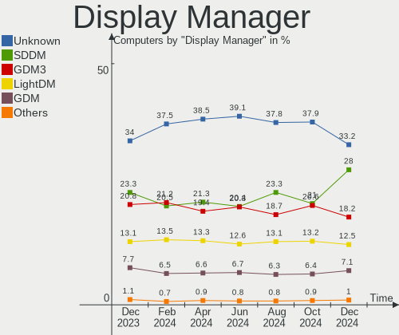
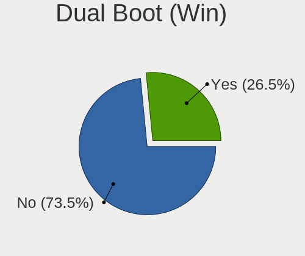
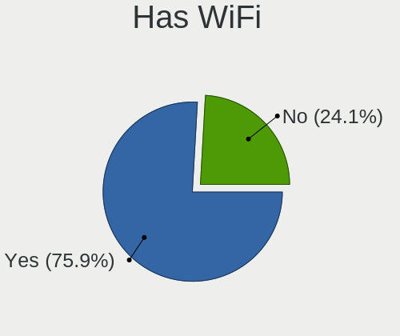
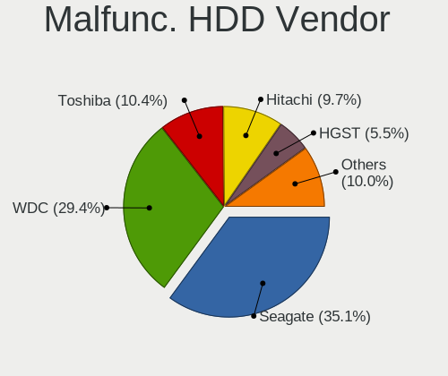
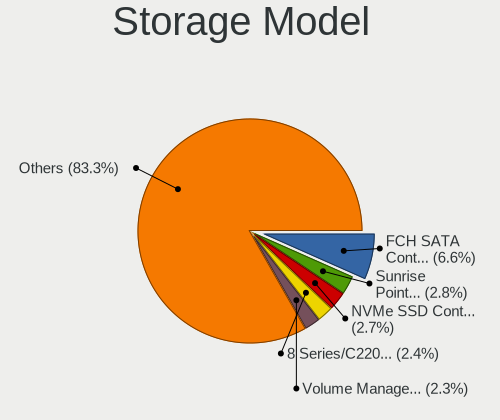
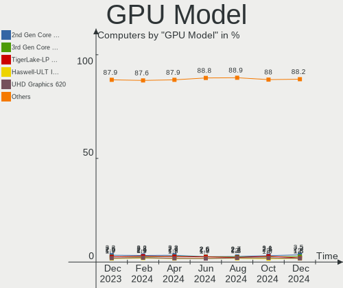
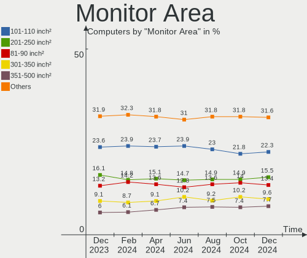
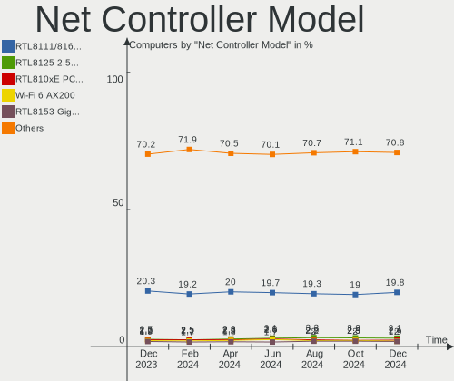

Linux Hardware Trends
---------------------

A project to identify most popular hardware characteristics and track their change
over time based on data collected by Linux users at https://Linux-Hardware.org.

Anyone can contribute to this report by the [hw-probe](https://github.com/linuxhw/hw-probe) tool:

    sudo -E hw-probe -all -upload

This is a report for all computer types. See also reports for [desktops](/Desktop/README.md) and [notebooks](/Notebook/README.md).

Full-feature report is available here: https://linux-hardware.org/?view=trends

Distribution-specific reports: [Ubuntu](/Dist/Ubuntu), [Debian](/Dist/Debian), [Linux Mint](/Dist/Linux_Mint), [Pop!_OS](/Dist/Pop!_OS), [Fedora](/Dist/Fedora), [OpenMandriva](/Dist/OpenMandriva), [Manjaro](/Dist/Manjaro), [Zorin](/Dist/Zorin), [Arch](/Dist/Arch), [KDE neon](/Dist/KDE_neon), [ROSA](/Dist/ROSA), [Xubuntu](/Dist/Xubuntu), [Kubuntu](/Dist/Kubuntu), [ArcoLinux](/Dist/ArcoLinux), [CentOS](/Dist/CentOS), [BlackPanther](/Dist/BlackPanther), [openSUSE](/Dist/openSUSE), [Clear Linux](/Dist/Clear_Linux), [Endless](/Dist/Endless), [Gentoo](/Dist/Gentoo), [Elementary](/Dist/Elementary).

Period: Dec, 2021.

Contents
--------

* [ System ](#system)
  - [ OS                       ](#os)
  - [ OS Family                ](#os-family)
  - [ Kernel                   ](#kernel)
  - [ Kernel Family            ](#kernel-family)
  - [ Kernel Major Ver.        ](#kernel-major-ver)
  - [ Arch                     ](#arch)
  - [ DE                       ](#de)
  - [ Display Server           ](#display-server)
  - [ Display Manager          ](#display-manager)
  - [ OS Lang                  ](#os-lang)
  - [ Boot Mode                ](#boot-mode)
  - [ Filesystem               ](#filesystem)
  - [ Part. scheme             ](#part-scheme)
  - [ Dual Boot with Linux/BSD ](#dual-boot-with-linuxbsd)
  - [ Dual Boot (Win)          ](#dual-boot-win)

* [ Board ](#board)
  - [ Vendor                   ](#vendor)
  - [ Model                    ](#model)
  - [ Model Family             ](#model-family)
  - [ MFG Year                 ](#mfg-year)
  - [ Form Factor              ](#form-factor)
  - [ Secure Boot              ](#secure-boot)
  - [ Coreboot                 ](#coreboot)
  - [ RAM Size                 ](#ram-size)
  - [ RAM Used                 ](#ram-used)
  - [ Total Drives             ](#total-drives)
  - [ Has CD-ROM               ](#has-cd-rom)
  - [ Has Ethernet             ](#has-ethernet)
  - [ Has WiFi                 ](#has-wifi)
  - [ Has Bluetooth            ](#has-bluetooth)

* [ Location ](#location)
  - [ Country                  ](#country)
  - [ City                     ](#city)

* [ Drives ](#drives)
  - [ Drive Vendor             ](#drive-vendor)
  - [ Drive Model              ](#drive-model)
  - [ HDD Vendor               ](#hdd-vendor)
  - [ SSD Vendor               ](#ssd-vendor)
  - [ Drive Kind               ](#drive-kind)
  - [ Drive Connector          ](#drive-connector)
  - [ Drive Size               ](#drive-size)
  - [ Space Total              ](#space-total)
  - [ Space Used               ](#space-used)
  - [ Malfunc. Drives          ](#malfunc-drives)
  - [ Malfunc. Drive Vendor    ](#malfunc-drive-vendor)
  - [ Malfunc. HDD Vendor      ](#malfunc-hdd-vendor)
  - [ Malfunc. Drive Kind      ](#malfunc-drive-kind)
  - [ Failed Drives            ](#failed-drives)
  - [ Failed Drive Vendor      ](#failed-drive-vendor)
  - [ Drive Status             ](#drive-status)

* [ Storage controller ](#storage-controller)
  - [ Storage Vendor           ](#storage-vendor)
  - [ Storage Model            ](#storage-model)
  - [ Storage Kind             ](#storage-kind)

* [ Processor ](#processor)
  - [ CPU Vendor               ](#cpu-vendor)
  - [ CPU Model                ](#cpu-model)
  - [ CPU Model Family         ](#cpu-model-family)
  - [ CPU Cores                ](#cpu-cores)
  - [ CPU Sockets              ](#cpu-sockets)
  - [ CPU Threads              ](#cpu-threads)
  - [ CPU Op-Modes             ](#cpu-op-modes)
  - [ CPU Microcode            ](#cpu-microcode)
  - [ CPU Microarch            ](#cpu-microarch)

* [ Graphics ](#graphics)
  - [ GPU Vendor               ](#gpu-vendor)
  - [ GPU Model                ](#gpu-model)
  - [ GPU Combo                ](#gpu-combo)
  - [ GPU Driver               ](#gpu-driver)
  - [ GPU Memory               ](#gpu-memory)

* [ Monitor ](#monitor)
  - [ Monitor Vendor           ](#monitor-vendor)
  - [ Monitor Model            ](#monitor-model)
  - [ Monitor Resolution       ](#monitor-resolution)
  - [ Monitor Diagonal         ](#monitor-diagonal)
  - [ Monitor Width            ](#monitor-width)
  - [ Aspect Ratio             ](#aspect-ratio)
  - [ Monitor Area             ](#monitor-area)
  - [ Pixel Density            ](#pixel-density)
  - [ Multiple Monitors        ](#multiple-monitors)

* [ Network ](#network)
  - [ Net Controller Vendor    ](#net-controller-vendor)
  - [ Net Controller Model     ](#net-controller-model)
  - [ Wireless Vendor          ](#wireless-vendor)
  - [ Wireless Model           ](#wireless-model)
  - [ Ethernet Vendor          ](#ethernet-vendor)
  - [ Ethernet Model           ](#ethernet-model)
  - [ Net Controller Kind      ](#net-controller-kind)
  - [ Used Controller          ](#used-controller)
  - [ NICs                     ](#nics)
  - [ IPv6                     ](#ipv6)

* [ Bluetooth ](#bluetooth)
  - [ Bluetooth Vendor         ](#bluetooth-vendor)
  - [ Bluetooth Model          ](#bluetooth-model)

* [ Sound ](#sound)
  - [ Sound Vendor             ](#sound-vendor)
  - [ Sound Model              ](#sound-model)

* [ Memory ](#memory)
  - [ Memory Vendor            ](#memory-vendor)
  - [ Memory Model             ](#memory-model)
  - [ Memory Kind              ](#memory-kind)
  - [ Memory Form Factor       ](#memory-form-factor)
  - [ Memory Size              ](#memory-size)
  - [ Memory Speed             ](#memory-speed)

* [ Printers & scanners ](#printers--scanners)
  - [ Printer Vendor           ](#printer-vendor)
  - [ Printer Model            ](#printer-model)
  - [ Scanner Vendor           ](#scanner-vendor)
  - [ Scanner Model            ](#scanner-model)

* [ Camera ](#camera)
  - [ Camera Vendor            ](#camera-vendor)
  - [ Camera Model             ](#camera-model)

* [ Security ](#security)
  - [ Fingerprint Vendor       ](#fingerprint-vendor)
  - [ Fingerprint Model        ](#fingerprint-model)
  - [ Chipcard Vendor          ](#chipcard-vendor)
  - [ Chipcard Model           ](#chipcard-model)

* [ Unsupported ](#unsupported)
  - [ Unsupported Devices      ](#unsupported-devices)
  - [ Unsupported Device Types ](#unsupported-device-types)

System
------

OS
--

Installed operating systems

| Name                | Computers | Percent |
|---------------------|-----------|---------|
| Ubuntu 20.04        | 894       | 17.75%  |
| Linux Mint 20.2     | 452       | 8.98%   |
| Ubuntu 21.10        | 326       | 6.47%   |
| Debian 11           | 298       | 5.92%   |
| Fedora 35           | 246       | 4.88%   |
| Zorin 16            | 209       | 4.15%   |
| OpenMandriva 4.2    | 198       | 3.93%   |
| Pop!_OS 21.10       | 161       | 3.2%    |
| ArcoLinux Rolling   | 161       | 3.2%    |
| Pop!_OS 21.04       | 137       | 2.72%   |
| KDE neon 20.04      | 108       | 2.14%   |
| ROSA 12.1           | 78        | 1.55%   |
| Arch                | 72        | 1.43%   |
| Arch Rolling        | 70        | 1.39%   |
| Manjaro             | 69        | 1.37%   |
| Xubuntu 20.04       | 68        | 1.35%   |
| Manjaro 21.2.0      | 67        | 1.33%   |
| Ubuntu 18.04        | 62        | 1.23%   |
| BlackPanther 18.1   | 61        | 1.21%   |
| Ubuntu 21.04        | 56        | 1.11%   |
| ROSA R11.1          | 50        | 0.99%   |
| Kali 2021.4         | 46        | 0.91%   |
| Kubuntu 21.10       | 45        | 0.89%   |
| Elementary 6        | 44        | 0.87%   |
| Elementary 6.1      | 43        | 0.85%   |
| Pop!_OS 20.04       | 37        | 0.73%   |
| Kubuntu 20.04       | 37        | 0.73%   |
| OpenMandriva 4.50   | 35        | 0.69%   |
| EndeavourOS Rolling | 35        | 0.69%   |
| Fedora 34           | 31        | 0.62%   |
| Manjaro 21.2rc      | 28        | 0.56%   |
| Linux Mint 19.3     | 28        | 0.56%   |
| Gentoo 2.7          | 25        | 0.5%    |
| Linux Mint 20.1     | 23        | 0.46%   |
| LinuxFX 11          | 22        | 0.44%   |
| Debian Testing      | 22        | 0.44%   |
| Endless 4.0.0       | 19        | 0.38%   |
| Zorin 15            | 18        | 0.36%   |
| Xubuntu 21.10       | 18        | 0.36%   |
| Endless 4.0.2       | 18        | 0.36%   |
| Ubuntu MATE 20.04   | 14        | 0.28%   |
| Ubuntu Budgie 21.10 | 14        | 0.28%   |
| Linux Mint 20.3     | 14        | 0.28%   |
| Gentoo 2.8          | 14        | 0.28%   |
| Debian Unstable     | 14        | 0.28%   |
| Endless 3.9.6       | 13        | 0.26%   |
| Debian 10           | 13        | 0.26%   |
| ROSA 12             | 12        | 0.24%   |
| Lubuntu 20.04       | 12        | 0.24%   |
| Linux Mint 20       | 12        | 0.24%   |
| Ubuntu Budgie 20.04 | 11        | 0.22%   |
| Raspbian 11         | 11        | 0.22%   |
| openSUSE Leap-15.3  | 11        | 0.22%   |
| CentOS 8            | 11        | 0.22%   |
| Xubuntu 18.04       | 10        | 0.2%    |
| LMDE 4              | 10        | 0.2%    |
| Gentoo 2.6          | 10        | 0.2%    |
| EndeavourOS         | 10        | 0.2%    |
| Ubuntu 22.04        | 9         | 0.18%   |
| MX 21               | 9         | 0.18%   |

OS Family
---------

OS without a version

| Name             | Computers | Percent |
|------------------|-----------|---------|
| Ubuntu           | 1360      | 27%     |
| Linux Mint       | 543       | 10.78%  |
| Debian           | 354       | 7.03%   |
| Pop!_OS          | 339       | 6.73%   |
| Fedora           | 288       | 5.72%   |
| OpenMandriva     | 233       | 4.63%   |
| Zorin            | 227       | 4.51%   |
| Manjaro          | 176       | 3.49%   |
| ArcoLinux        | 165       | 3.28%   |
| ROSA             | 143       | 2.84%   |
| Arch             | 143       | 2.84%   |
| KDE neon         | 109       | 2.16%   |
| Xubuntu          | 103       | 2.04%   |
| Kubuntu          | 99        | 1.97%   |
| Elementary       | 91        | 1.81%   |
| Endless          | 68        | 1.35%   |
| BlackPanther     | 62        | 1.23%   |
| openSUSE         | 57        | 1.13%   |
| Kali             | 50        | 0.99%   |
| Gentoo           | 50        | 0.99%   |
| EndeavourOS      | 45        | 0.89%   |
| Lubuntu          | 33        | 0.66%   |
| Ubuntu Budgie    | 27        | 0.54%   |
| Ubuntu MATE      | 25        | 0.5%    |
| LinuxFX          | 23        | 0.46%   |
| CentOS           | 22        | 0.44%   |
| Garuda           | 16        | 0.32%   |
| Raspbian         | 13        | 0.26%   |
| Clear Linux      | 12        | 0.24%   |
| MX               | 11        | 0.22%   |
| ALT Linux        | 11        | 0.22%   |
| LMDE             | 10        | 0.2%    |
| Xero             | 8         | 0.16%   |
| RHEL             | 8         | 0.16%   |
| Manjaro-ARM      | 8         | 0.16%   |
| Deepin           | 8         | 0.16%   |
| Peppermint       | 6         | 0.12%   |
| Mageia           | 5         | 0.1%    |
| Solus            | 4         | 0.08%   |
| Q4OS             | 4         | 0.08%   |
| NixOS            | 4         | 0.08%   |
| Makulu           | 4         | 0.08%   |
| Linux Lite       | 4         | 0.08%   |
| ClearOS          | 4         | 0.08%   |
| Reborn OS        | 3         | 0.06%   |
| Parrot           | 3         | 0.06%   |
| Org.kde.platform | 3         | 0.06%   |
| Oracle Linux     | 3         | 0.06%   |
| Devuan           | 3         | 0.06%   |
| antiX            | 3         | 0.06%   |
| Slackware        | 2         | 0.04%   |
| Red OS           | 2         | 0.04%   |
| PureOS           | 2         | 0.04%   |
| Pear OS          | 2         | 0.04%   |
| Kaisen           | 2         | 0.04%   |
| Drauger OS       | 2         | 0.04%   |
| BunsenLabs       | 2         | 0.04%   |
| BlackArch        | 2         | 0.04%   |
| Artix            | 2         | 0.04%   |
| Android          | 2         | 0.04%   |

Kernel
------

Version of the Linux kernel

| Version                            | Computers | Percent |
|------------------------------------|-----------|---------|
| 5.11.0-41-generic                  | 580       | 11.51%  |
| 5.4.0-91-generic                   | 551       | 10.94%  |
| 5.11.0-43-generic                  | 491       | 9.75%   |
| 5.13.0-22-generic                  | 343       | 6.81%   |
| 5.10.14-desktop-1omv4002           | 189       | 3.75%   |
| 5.15.5-76051505-generic            | 187       | 3.71%   |
| 5.10.0-9-amd64                     | 95        | 1.89%   |
| 5.15.7-arch1-1                     | 93        | 1.85%   |
| 5.10.0-8-amd64                     | 80        | 1.59%   |
| 5.10.74-generic-2rosa2021.1-x86_64 | 79        | 1.57%   |
| 5.15.8-76051508-generic            | 78        | 1.55%   |
| 5.15.6-200.fc35.x86_64             | 77        | 1.53%   |
| 5.11.0-40-generic                  | 71        | 1.41%   |
| 5.11.0-27-generic                  | 51        | 1.01%   |
| 5.6.14-desktop-2bP                 | 47        | 0.93%   |
| 5.15.10-arch1-1                    | 47        | 0.93%   |
| 5.10.0-10-amd64                    | 47        | 0.93%   |
| 5.13.0-19-generic                  | 43        | 0.85%   |
| 5.13.0-7620-generic                | 42        | 0.83%   |
| 5.15.0-2-amd64                     | 40        | 0.79%   |
| 5.11.0-35-generic                  | 40        | 0.79%   |
| 5.10.0-7-amd64                     | 38        | 0.75%   |
| 5.13.19-2-MANJARO                  | 37        | 0.73%   |
| 5.4.0-74-generic                   | 36        | 0.71%   |
| 5.14.0-kali4-amd64                 | 35        | 0.69%   |
| 5.4.0-90-generic                   | 32        | 0.64%   |
| 5.15.7-1-MANJARO                   | 32        | 0.64%   |
| 5.15.6-arch2-1                     | 30        | 0.6%    |
| 5.15.8-200.fc35.x86_64             | 29        | 0.58%   |
| 5.15.11-arch2-1                    | 28        | 0.56%   |
| 5.15.11-200.fc35.x86_64            | 28        | 0.56%   |
| 5.13.0-23-generic                  | 28        | 0.56%   |
| 5.15.6-2-MANJARO                   | 24        | 0.48%   |
| 5.15.10-200.fc35.x86_64            | 23        | 0.46%   |
| 5.14.10-300.fc35.x86_64            | 23        | 0.46%   |
| 5.15.5-200.fc35.x86_64             | 22        | 0.44%   |
| 5.11.0-42-generic                  | 22        | 0.44%   |
| 4.15.0-163-generic                 | 22        | 0.44%   |
| 5.11.0-38-generic                  | 21        | 0.42%   |
| 5.15.7-zen1-1-zen                  | 20        | 0.4%    |
| 5.14.7-desktop-1omv4050            | 20        | 0.4%    |
| 5.11.0-44-generic                  | 20        | 0.4%    |
| 5.10.84-1-MANJARO                  | 19        | 0.38%   |
| 5.10.84-1-lts                      | 19        | 0.38%   |
| 5.8.0-14-generic                   | 18        | 0.36%   |
| 5.4.83-generic-2rosa-x86_64        | 18        | 0.36%   |
| 5.13.0-1011-raspi                  | 18        | 0.36%   |
| 5.15.7-200.fc35.x86_64             | 17        | 0.34%   |
| 5.15.8-arch1-1                     | 16        | 0.32%   |
| 5.13.0-21-generic                  | 16        | 0.32%   |
| 5.14.0-0.bpo.2-amd64               | 15        | 0.3%    |
| 5.15.6-zen2-1-zen                  | 14        | 0.28%   |
| 5.13.0-22-lowlatency               | 14        | 0.28%   |
| 4.18.16-desktop-1bP                | 14        | 0.28%   |
| 4.19.0-18-amd64                    | 13        | 0.26%   |
| 5.15.8-1-default                   | 12        | 0.24%   |
| 5.15.2-2-MANJARO                   | 12        | 0.24%   |
| 5.10.88-2-lts                      | 12        | 0.24%   |
| 5.10.0-1052-oem                    | 11        | 0.22%   |
| 4.18.0-348.2.1.el8_5.x86_64        | 11        | 0.22%   |

Kernel Family
-------------

Linux kernel without a distro release

| Version | Computers | Percent |
|---------|-----------|---------|
| 5.11.0  | 1342      | 26.64%  |
| 5.4.0   | 712       | 14.14%  |
| 5.13.0  | 525       | 10.42%  |
| 5.10.0  | 288       | 5.72%   |
| 5.15.5  | 254       | 5.04%   |
| 5.15.7  | 194       | 3.85%   |
| 5.15.6  | 192       | 3.81%   |
| 5.10.14 | 189       | 3.75%   |
| 5.15.8  | 153       | 3.04%   |
| 5.15.10 | 106       | 2.1%    |
| 5.15.11 | 82        | 1.63%   |
| 5.10.74 | 79        | 1.57%   |
| 5.14.0  | 69        | 1.37%   |
| 5.15.0  | 66        | 1.31%   |
| 4.15.0  | 64        | 1.27%   |
| 5.6.14  | 47        | 0.93%   |
| 5.13.19 | 47        | 0.93%   |
| 5.8.0   | 44        | 0.87%   |
| 5.10.84 | 39        | 0.77%   |
| 5.4.83  | 24        | 0.48%   |
| 5.14.10 | 24        | 0.48%   |
| 4.19.0  | 24        | 0.48%   |
| 5.14.7  | 21        | 0.42%   |
| 5.15.2  | 20        | 0.4%    |
| 4.18.0  | 20        | 0.4%    |
| 5.10.88 | 17        | 0.34%   |
| 5.10.76 | 17        | 0.34%   |
| 5.15.4  | 16        | 0.32%   |
| 5.3.18  | 15        | 0.3%    |
| 5.16.0  | 15        | 0.3%    |
| 5.14.14 | 15        | 0.3%    |
| 3.10.0  | 15        | 0.3%    |
| 5.10.83 | 14        | 0.28%   |
| 4.18.16 | 14        | 0.28%   |
| 5.14.18 | 13        | 0.26%   |
| 5.10.63 | 13        | 0.26%   |
| 5.15.12 | 12        | 0.24%   |
| 5.10.79 | 12        | 0.24%   |
| 5.11.12 | 11        | 0.22%   |
| 5.10.71 | 10        | 0.2%    |
| 5.4.32  | 9         | 0.18%   |
| 5.14.21 | 9         | 0.18%   |
| 5.12.4  | 8         | 0.16%   |
| 5.14.16 | 6         | 0.12%   |
| 5.13.13 | 6         | 0.12%   |
| 5.10.87 | 6         | 0.12%   |
| 5.10.60 | 6         | 0.12%   |
| 5.15.1  | 5         | 0.1%    |
| 5.10.82 | 5         | 0.1%    |
| 5.0.0   | 5         | 0.1%    |
| 5.9.16  | 4         | 0.08%   |
| 5.8.18  | 4         | 0.08%   |
| 5.3.0   | 4         | 0.08%   |
| 5.14.17 | 4         | 0.08%   |
| 5.11.22 | 4         | 0.08%   |
| 5.10.81 | 4         | 0.08%   |
| 4.9.155 | 4         | 0.08%   |
| 4.9.0   | 4         | 0.08%   |
| 5.15.9  | 3         | 0.06%   |
| 5.15.3  | 3         | 0.06%   |

Kernel Major Ver.
-----------------

Linux kernel major version

| Version | Computers | Percent |
|---------|-----------|---------|
| 5.11    | 1360      | 27%     |
| 5.15    | 1106      | 21.96%  |
| 5.4     | 756       | 15.01%  |
| 5.10    | 729       | 14.47%  |
| 5.13    | 582       | 11.55%  |
| 5.14    | 173       | 3.43%   |
| 4.15    | 64        | 1.27%   |
| 5.6     | 52        | 1.03%   |
| 5.8     | 49        | 0.97%   |
| 4.18    | 34        | 0.68%   |
| 4.19    | 28        | 0.56%   |
| 5.3     | 19        | 0.38%   |
| 5.16    | 15        | 0.3%    |
| 4.9     | 15        | 0.3%    |
| 3.10    | 15        | 0.3%    |
| 5.12    | 10        | 0.2%    |
| 5.9     | 5         | 0.1%    |
| 5.0     | 5         | 0.1%    |
| 4.4     | 5         | 0.1%    |
| 5.5     | 4         | 0.08%   |
| 4.16    | 2         | 0.04%   |
| 2.6     | 2         | 0.04%   |
| 6.0     | 1         | 0.02%   |
| 5.7     | 1         | 0.02%   |
| 5.2     | 1         | 0.02%   |
| 5.1     | 1         | 0.02%   |
| 4.14    | 1         | 0.02%   |
| 3.4     | 1         | 0.02%   |
| Unknown | 1         | 0.02%   |

Arch
----

OS architecture (x86_64, i586, etc.)

| Name    | Computers | Percent |
|---------|-----------|---------|
| x86_64  | 4893      | 97.14%  |
| i686    | 76        | 1.51%   |
| aarch64 | 52        | 1.03%   |
| armv7l  | 14        | 0.28%   |
| e2k     | 1         | 0.02%   |
| armv6l  | 1         | 0.02%   |

DE
--

Desktop Environment

| Name              | Computers | Percent |
|-------------------|-----------|---------|
| GNOME             | 2330      | 46.26%  |
| KDE5              | 1000      | 19.85%  |
| X-Cinnamon        | 439       | 8.72%   |
| XFCE              | 393       | 7.8%    |
| Unknown           | 287       | 5.7%    |
| MATE              | 126       | 2.5%    |
| Pantheon          | 93        | 1.85%   |
| Cinnamon          | 55        | 1.09%   |
| LXQt              | 42        | 0.83%   |
| LXDE              | 38        | 0.75%   |
| Budgie            | 38        | 0.75%   |
| KDE4              | 32        | 0.64%   |
| i3                | 30        | 0.6%    |
| Unity             | 21        | 0.42%   |
| Deepin            | 13        | 0.26%   |
| KDE               | 12        | 0.24%   |
| awesome           | 11        | 0.22%   |
| LeftWM            | 9         | 0.18%   |
| xmonad            | 8         | 0.16%   |
| qtile             | 8         | 0.16%   |
| Openbox           | 7         | 0.14%   |
| GNOME Flashback   | 7         | 0.14%   |
| GNOME Classic     | 6         | 0.12%   |
| bspwm             | 5         | 0.1%    |
| lightdm-xsession  | 4         | 0.08%   |
| icewm             | 4         | 0.08%   |
| DWM               | 4         | 0.08%   |
| trinity           | 3         | 0.06%   |
| sway              | 2         | 0.04%   |
| i3-with-shmlog    | 2         | 0.04%   |
| Enlightenment     | 2         | 0.04%   |
| Yaru:ubuntu:GNOME | 1         | 0.02%   |
| xinitrc           | 1         | 0.02%   |
| wmaker-common     | 1         | 0.02%   |
| UKUI              | 1         | 0.02%   |
| dusk              | 1         | 0.02%   |
| Cutefish          | 1         | 0.02%   |

Display Server
--------------

X11 or Wayland

| Name        | Computers | Percent |
|-------------|-----------|---------|
| X11         | 4025      | 79.91%  |
| Wayland     | 711       | 14.12%  |
| Unknown     | 182       | 3.61%   |
| Tty         | 116       | 2.3%    |
| Web         | 2         | 0.04%   |
| Unspecified | 1         | 0.02%   |

Display Manager
---------------

SDDM, LightDM, etc.

| Name    | Computers | Percent |
|---------|-----------|---------|
| Unknown | 1689      | 33.53%  |
| GDM3    | 919       | 18.24%  |
| SDDM    | 848       | 16.84%  |
| GDM     | 768       | 15.25%  |
| LightDM | 755       | 14.99%  |
| KDM     | 31        | 0.62%   |
| XDM     | 10        | 0.2%    |
| SLiM    | 7         | 0.14%   |
| Ly      | 4         | 0.08%   |
| LXDM    | 3         | 0.06%   |
| TDM     | 1         | 0.02%   |
| NODM    | 1         | 0.02%   |
| MDM     | 1         | 0.02%   |

OS Lang
-------

Language

| Lang        | Computers | Percent |
|-------------|-----------|---------|
| en_US       | 1991      | 39.53%  |
| de_DE       | 490       | 9.73%   |
| ru_RU       | 327       | 6.49%   |
| en_GB       | 262       | 5.2%    |
| fr_FR       | 246       | 4.88%   |
| pt_BR       | 212       | 4.21%   |
| Unknown     | 185       | 3.67%   |
| pl_PL       | 114       | 2.26%   |
| es_ES       | 105       | 2.08%   |
| it_IT       | 101       | 2.01%   |
| en_CA       | 95        | 1.89%   |
| en_AU       | 93        | 1.85%   |
| en_IN       | 91        | 1.81%   |
| C           | 71        | 1.41%   |
| nl_NL       | 44        | 0.87%   |
| hu_HU       | 40        | 0.79%   |
| cs_CZ       | 34        | 0.68%   |
| ru_UA       | 33        | 0.66%   |
| zh_CN       | 31        | 0.62%   |
| es_MX       | 31        | 0.62%   |
| es_AR       | 30        | 0.6%    |
| de_CH       | 30        | 0.6%    |
| de_AT       | 26        | 0.52%   |
| sv_SE       | 23        | 0.46%   |
| en_ZA       | 21        | 0.42%   |
| pt_PT       | 19        | 0.38%   |
| fr_BE       | 17        | 0.34%   |
| en_NZ       | 17        | 0.34%   |
| nl_BE       | 13        | 0.26%   |
| tr_TR       | 12        | 0.24%   |
| el_GR       | 12        | 0.24%   |
| da_DK       | 12        | 0.24%   |
| zh_TW       | 11        | 0.22%   |
| sk_SK       | 11        | 0.22%   |
| uk_UA       | 10        | 0.2%    |
| en_IE       | 10        | 0.2%    |
| ro_RO       | 9         | 0.18%   |
| nb_NO       | 9         | 0.18%   |
| ja_JP       | 9         | 0.18%   |
| fr_CA       | 9         | 0.18%   |
| fr_CH       | 8         | 0.16%   |
| fi_FI       | 8         | 0.16%   |
| es_CL       | 8         | 0.16%   |
| en_SG       | 8         | 0.16%   |
| hr_HR       | 7         | 0.14%   |
| sl_SI       | 6         | 0.12%   |
| POSIX       | 6         | 0.12%   |
| ko_KR       | 6         | 0.12%   |
| es_PE       | 5         | 0.1%    |
| es_VE       | 4         | 0.08%   |
| es_CO       | 4         | 0.08%   |
| en_HK       | 4         | 0.08%   |
| C.UTF8      | 4         | 0.08%   |
| bg_BG       | 4         | 0.08%   |
| en_DK       | 3         | 0.06%   |
| en_DE       | 3         | 0.06%   |
| ru_RU.UTF_8 | 2         | 0.04%   |
| id_ID       | 2         | 0.04%   |
| es_UY       | 2         | 0.04%   |
| es_US       | 2         | 0.04%   |

Boot Mode
---------

EFI or BIOS

| Mode | Computers | Percent |
|------|-----------|---------|
| BIOS | 2530      | 50.23%  |
| EFI  | 2507      | 49.77%  |

Filesystem
----------

Type of filesystem

| Type     | Computers | Percent |
|----------|-----------|---------|
| Ext4     | 3985      | 79.11%  |
| Overlay  | 456       | 9.05%   |
| Btrfs    | 452       | 8.97%   |
| Xfs      | 63        | 1.25%   |
| Zfs      | 30        | 0.6%    |
| F2fs     | 12        | 0.24%   |
| Ext2     | 12        | 0.24%   |
| Ext3     | 8         | 0.16%   |
| Unknown  | 6         | 0.12%   |
| Tmpfs    | 5         | 0.1%    |
| Reiserfs | 2         | 0.04%   |
| XXXXX    | 1         | 0.02%   |
| XXXX     | 1         | 0.02%   |
| Xtrfs    | 1         | 0.02%   |
| Rootfs   | 1         | 0.02%   |
| Jfs      | 1         | 0.02%   |
| Aufs     | 1         | 0.02%   |

Part. scheme
------------

Scheme of partitioning

| Type    | Computers | Percent |
|---------|-----------|---------|
| Unknown | 2628      | 52.17%  |
| GPT     | 1789      | 35.52%  |
| MBR     | 620       | 12.31%  |

Dual Boot with Linux/BSD
------------------------

Hosting more than one Linux/BSD

| Dual boot | Computers | Percent |
|-----------|-----------|---------|
| No        | 4382      | 87%     |
| Yes       | 655       | 13%     |

Dual Boot (Win)
---------------

Hosting Linux and Windows

| Dual boot | Computers | Percent |
|-----------|-----------|---------|
| No        | 3532      | 70.12%  |
| Yes       | 1505      | 29.88%  |

Board
-----

Vendor
------

Motherboard manufacturer

| Name                    | Computers | Percent |
|-------------------------|-----------|---------|
| ASUSTek Computer        | 787       | 15.62%  |
| Lenovo                  | 727       | 14.43%  |
| Hewlett-Packard         | 656       | 13.02%  |
| Dell                    | 645       | 12.81%  |
| Gigabyte Technology     | 350       | 6.95%   |
| Acer                    | 304       | 6.04%   |
| MSI                     | 272       | 5.4%    |
| ASRock                  | 181       | 3.59%   |
| Apple                   | 115       | 2.28%   |
| Intel                   | 91        | 1.81%   |
| Toshiba                 | 80        | 1.59%   |
| Samsung Electronics     | 61        | 1.21%   |
| Sony                    | 55        | 1.09%   |
| Raspberry Pi Foundation | 50        | 0.99%   |
| Unknown                 | 47        | 0.93%   |
| HUAWEI                  | 39        | 0.77%   |
| Fujitsu                 | 39        | 0.77%   |
| Medion                  | 27        | 0.54%   |
| Google                  | 26        | 0.52%   |
| Pegatron                | 24        | 0.48%   |
| Microsoft               | 22        | 0.44%   |
| Packard Bell            | 20        | 0.4%    |
| Biostar                 | 20        | 0.4%    |
| Foxconn                 | 19        | 0.38%   |
| Chuwi                   | 17        | 0.34%   |
| Positivo                | 16        | 0.32%   |
| System76                | 15        | 0.3%    |
| Fujitsu Siemens         | 13        | 0.26%   |
| ECS                     | 13        | 0.26%   |
| TUXEDO                  | 12        | 0.24%   |
| Supermicro              | 12        | 0.24%   |
| Huanan                  | 12        | 0.24%   |
| Timi                    | 10        | 0.2%    |
| Notebook                | 10        | 0.2%    |
| LG Electronics          | 9         | 0.18%   |
| Alienware               | 9         | 0.18%   |
| Schenker                | 8         | 0.16%   |
| Razer                   | 8         | 0.16%   |
| Gateway                 | 8         | 0.16%   |
| Framework               | 7         | 0.14%   |
| eMachines               | 7         | 0.14%   |
| Avell High Performance  | 7         | 0.14%   |
| AMI                     | 7         | 0.14%   |
| ZOTAC                   | 6         | 0.12%   |
| Quanta                  | 5         | 0.1%    |
| OEM                     | 5         | 0.1%    |
| Teclast                 | 4         | 0.08%   |
| Shuttle                 | 4         | 0.08%   |
| HONOR                   | 4         | 0.08%   |
| GPU Company             | 4         | 0.08%   |
| EVGA                    | 4         | 0.08%   |
| Clevo                   | 4         | 0.08%   |
| AZW                     | 4         | 0.08%   |
| ASRockRack              | 4         | 0.08%   |
| Wortmann AG             | 3         | 0.06%   |
| TYAN Computer           | 3         | 0.06%   |
| Nvidia                  | 3         | 0.06%   |
| Mediacom                | 3         | 0.06%   |
| BESSTAR Tech            | 3         | 0.06%   |
| AVITA                   | 3         | 0.06%   |

Model
-----

Motherboard model

| Name                                      | Computers | Percent |
|-------------------------------------------|-----------|---------|
| Unknown                                   | 62        | 1.23%   |
| Lenovo ThinkPad L13 Yoga Gen 2 20VK0019US | 51        | 1.01%   |
| RPi Raspberry Pi                          | 49        | 0.97%   |
| ASUS All Series                           | 46        | 0.91%   |
| Lenovo ThinkPad E475 20H40006US           | 19        | 0.38%   |
| HP Notebook                               | 17        | 0.34%   |
| Dell OptiPlex 7010                        | 14        | 0.28%   |
| ASUS PRIME A320M-K                        | 11        | 0.22%   |
| MSI MS-7B79                               | 10        | 0.2%    |
| HP Pavilion Gaming Laptop 15-ec1xxx       | 10        | 0.2%    |
| HP Pavilion g6                            | 10        | 0.2%    |
| HP Pavilion dv7                           | 10        | 0.2%    |
| Dell OptiPlex 790                         | 10        | 0.2%    |
| Dell Latitude E6430                       | 10        | 0.2%    |
| Acer Nitro AN515-44                       | 10        | 0.2%    |
| HP Pavilion dv6                           | 9         | 0.18%   |
| Dell Latitude E6400                       | 9         | 0.18%   |
| MSI MS-7C02                               | 8         | 0.16%   |
| MSI MS-7B86                               | 8         | 0.16%   |
| HP Laptop 15-db1xxx                       | 8         | 0.16%   |
| HP EliteBook 8460p                        | 8         | 0.16%   |
| Dell XPS 15 9500                          | 8         | 0.16%   |
| ASUS TUF GAMING X570-PLUS                 | 8         | 0.16%   |
| ASUS ROG STRIX B550-F GAMING              | 8         | 0.16%   |
| ASUS PRIME B450M-A                        | 8         | 0.16%   |
| Acer Aspire A315-34                       | 8         | 0.16%   |
| MSI MS-7C91                               | 7         | 0.14%   |
| MSI MS-7C37                               | 7         | 0.14%   |
| MSI MS-7817                               | 7         | 0.14%   |
| HP Pavilion 15                            | 7         | 0.14%   |
| Gigabyte 970A-DS3P                        | 7         | 0.14%   |
| Framework Laptop                          | 7         | 0.14%   |
| Dell OptiPlex 3020                        | 7         | 0.14%   |
| Dell Latitude E6410                       | 7         | 0.14%   |
| Dell Latitude 7490                        | 7         | 0.14%   |
| ASUS VivoBook 15_ASUS Laptop X540UAR      | 7         | 0.14%   |
| Apple MacBookPro8,1                       | 7         | 0.14%   |
| Intel NUC10i7FNH                          | 6         | 0.12%   |
| HP Laptop 15s-eq2xxx                      | 6         | 0.12%   |
| HP Laptop 15s-eq1xxx                      | 6         | 0.12%   |
| HP 15                                     | 6         | 0.12%   |
| Gigabyte B450M DS3H                       | 6         | 0.12%   |
| Dell XPS 17 9710                          | 6         | 0.12%   |
| Dell XPS 17 9700                          | 6         | 0.12%   |
| Dell XPS 13 9310                          | 6         | 0.12%   |
| Dell XPS 13 7390                          | 6         | 0.12%   |
| Dell OptiPlex 9010                        | 6         | 0.12%   |
| ASUS UX31E                                | 6         | 0.12%   |
| ASUS TUF GAMING B550M-PLUS                | 6         | 0.12%   |
| ASUS ROG STRIX X570-E GAMING              | 6         | 0.12%   |
| ASUS P8Z77-V LX                           | 6         | 0.12%   |
| ASUS M5A78L-M/USB3                        | 6         | 0.12%   |
| ASRock H470M-HVS                          | 6         | 0.12%   |
| ASRock B450M Pro4                         | 6         | 0.12%   |
| Apple MacBookPro9,2                       | 6         | 0.12%   |
| Apple iMac10,1                            | 6         | 0.12%   |
| Acer Swift SF114-34                       | 6         | 0.12%   |
| Acer Aspire A515-56                       | 6         | 0.12%   |
| Supermicro Super Server                   | 5         | 0.1%    |
| Microsoft Surface Pro 4                   | 5         | 0.1%    |

Model Family
------------

Motherboard model prefix

| Name                  | Computers | Percent |
|-----------------------|-----------|---------|
| Lenovo ThinkPad       | 339       | 6.73%   |
| Acer Aspire           | 208       | 4.13%   |
| Dell Inspiron         | 174       | 3.45%   |
| Dell Latitude         | 158       | 3.14%   |
| Lenovo IdeaPad        | 133       | 2.64%   |
| HP Pavilion           | 117       | 2.32%   |
| ASUS ROG              | 98        | 1.95%   |
| Dell OptiPlex         | 97        | 1.93%   |
| HP EliteBook          | 88        | 1.75%   |
| ASUS PRIME            | 81        | 1.61%   |
| Dell XPS              | 75        | 1.49%   |
| HP Laptop             | 67        | 1.33%   |
| Toshiba Satellite     | 64        | 1.27%   |
| ASUS VivoBook         | 62        | 1.23%   |
| Unknown               | 62        | 1.23%   |
| Dell Precision        | 60        | 1.19%   |
| HP ProBook            | 56        | 1.11%   |
| ASUS TUF              | 54        | 1.07%   |
| HP Compaq             | 52        | 1.03%   |
| RPi Raspberry         | 50        | 0.99%   |
| ASUS All              | 46        | 0.91%   |
| Lenovo ThinkCentre    | 40        | 0.79%   |
| Dell Vostro           | 37        | 0.73%   |
| HP ENVY               | 36        | 0.71%   |
| Lenovo Yoga           | 31        | 0.62%   |
| Acer Swift            | 30        | 0.6%    |
| Lenovo Legion         | 26        | 0.52%   |
| ASUS ZenBook          | 26        | 0.52%   |
| HP ZBook              | 23        | 0.46%   |
| Gigabyte X570         | 23        | 0.46%   |
| Acer Nitro            | 23        | 0.46%   |
| Microsoft Surface     | 22        | 0.44%   |
| ASUS ASUS             | 21        | 0.42%   |
| Fujitsu LIFEBOOK      | 20        | 0.4%    |
| Lenovo ThinkBook      | 18        | 0.36%   |
| HP ProDesk            | 17        | 0.34%   |
| HP Notebook           | 17        | 0.34%   |
| HP OMEN               | 15        | 0.3%    |
| Gigabyte B450         | 15        | 0.3%    |
| Packard Bell EasyNote | 14        | 0.28%   |
| Gigabyte B450M        | 14        | 0.28%   |
| ASUS M5A78L-M         | 14        | 0.28%   |
| HP 250                | 13        | 0.26%   |
| Gigabyte B550         | 13        | 0.26%   |
| Dell PowerEdge        | 13        | 0.26%   |
| ASRock B450M          | 13        | 0.26%   |
| HP EliteDesk          | 12        | 0.24%   |
| HP Spectre            | 11        | 0.22%   |
| HP 15                 | 11        | 0.22%   |
| ASUS SABERTOOTH       | 11        | 0.22%   |
| MSI MS-7B79           | 10        | 0.2%    |
| Gigabyte Z390         | 10        | 0.2%    |
| Fujitsu ESPRIMO       | 10        | 0.2%    |
| ASUS P8H61-M          | 10        | 0.2%    |
| Lenovo IdeaPadFlex    | 9         | 0.18%   |
| Lenovo IdeaCentre     | 9         | 0.18%   |
| Gigabyte 970A-DS3P    | 9         | 0.18%   |
| ASUS P8Z77-V          | 9         | 0.18%   |
| Apple MacBookPro8     | 9         | 0.18%   |
| Razer Blade           | 8         | 0.16%   |

MFG Year
--------

Motherboard manufacture year

| Year    | Computers | Percent |
|---------|-----------|---------|
| 2021    | 1263      | 25.07%  |
| 2020    | 557       | 11.06%  |
| 2019    | 520       | 10.32%  |
| 2018    | 361       | 7.17%   |
| 2013    | 285       | 5.66%   |
| 2011    | 274       | 5.44%   |
| 2012    | 273       | 5.42%   |
| 2014    | 241       | 4.78%   |
| 2015    | 231       | 4.59%   |
| 2010    | 215       | 4.27%   |
| 2016    | 207       | 4.11%   |
| 2009    | 157       | 3.12%   |
| 2017    | 142       | 2.82%   |
| 2008    | 121       | 2.4%    |
| 2007    | 73        | 1.45%   |
| Unknown | 66        | 1.31%   |
| 2006    | 35        | 0.69%   |
| 2005    | 10        | 0.2%    |
| 2004    | 4         | 0.08%   |
| 2003    | 1         | 0.02%   |
| 1906    | 1         | 0.02%   |

Form Factor
-----------

Physical design of the computer

| Name           | Computers | Percent |
|----------------|-----------|---------|
| Notebook       | 2689      | 53.38%  |
| Desktop        | 1882      | 37.36%  |
| Convertible    | 178       | 3.53%   |
| Mini pc        | 69        | 1.37%   |
| System on chip | 65        | 1.29%   |
| All in one     | 65        | 1.29%   |
| Tablet         | 43        | 0.85%   |
| Server         | 42        | 0.83%   |
| Other          | 2         | 0.04%   |
| Phone          | 2         | 0.04%   |

Secure Boot
-----------

Enabled or disabled

| State    | Computers | Percent |
|----------|-----------|---------|
| Disabled | 4633      | 91.98%  |
| Enabled  | 404       | 8.02%   |

Coreboot
--------

Have coreboot on board

| Used | Computers | Percent |
|------|-----------|---------|
| No   | 5001      | 99.29%  |
| Yes  | 36        | 0.71%   |

RAM Size
--------

Total RAM memory

| Size in GB      | Computers | Percent |
|-----------------|-----------|---------|
| 4.01-8.0        | 1199      | 23.8%   |
| 16.01-24.0      | 1032      | 20.49%  |
| 3.01-4.0        | 965       | 19.16%  |
| 8.01-16.0       | 860       | 17.07%  |
| 32.01-64.0      | 505       | 10.03%  |
| 1.01-2.0        | 165       | 3.28%   |
| 64.01-256.0     | 141       | 2.8%    |
| 2.01-3.0        | 73        | 1.45%   |
| 24.01-32.0      | 60        | 1.19%   |
| 0.51-1.0        | 27        | 0.54%   |
| More than 256.0 | 6         | 0.12%   |
| 0.01-0.5        | 4         | 0.08%   |

RAM Used
--------

Used RAM memory

| Used GB         | Computers | Percent |
|-----------------|-----------|---------|
| 1.01-2.0        | 1888      | 37.48%  |
| 2.01-3.0        | 1222      | 24.26%  |
| 4.01-8.0        | 671       | 13.32%  |
| 3.01-4.0        | 599       | 11.89%  |
| 0.51-1.0        | 352       | 6.99%   |
| 8.01-16.0       | 179       | 3.55%   |
| 0.01-0.5        | 84        | 1.67%   |
| 16.01-24.0      | 27        | 0.54%   |
| 24.01-32.0      | 7         | 0.14%   |
| 32.01-64.0      | 4         | 0.08%   |
| Unknown         | 2         | 0.04%   |
| More than 256.0 | 1         | 0.02%   |
| 64.01-256.0     | 1         | 0.02%   |

Total Drives
------------

Number of drives on board

| Drives | Computers | Percent |
|--------|-----------|---------|
| 1      | 3044      | 60.43%  |
| 2      | 1230      | 24.42%  |
| 3      | 357       | 7.09%   |
| 4      | 191       | 3.79%   |
| 5      | 99        | 1.97%   |
| 6      | 46        | 0.91%   |
| 0      | 32        | 0.64%   |
| 7      | 14        | 0.28%   |
| 9      | 7         | 0.14%   |
| 8      | 7         | 0.14%   |
| 11     | 2         | 0.04%   |
| 10     | 2         | 0.04%   |
| 97     | 1         | 0.02%   |
| 93     | 1         | 0.02%   |
| 37     | 1         | 0.02%   |
| 21     | 1         | 0.02%   |
| 17     | 1         | 0.02%   |
| 14     | 1         | 0.02%   |

Has CD-ROM
----------

Has CD-ROM on board

| Presented | Computers | Percent |
|-----------|-----------|---------|
| No        | 3194      | 63.41%  |
| Yes       | 1843      | 36.59%  |

Has Ethernet
------------

Has Ethernet on board

| Presented | Computers | Percent |
|-----------|-----------|---------|
| Yes       | 4274      | 84.85%  |
| No        | 763       | 15.15%  |

Has WiFi
--------

Has WiFi module

| Presented | Computers | Percent |
|-----------|-----------|---------|
| Yes       | 3797      | 75.38%  |
| No        | 1240      | 24.62%  |

Has Bluetooth
-------------

Has Bluetooth module

| Presented | Computers | Percent |
|-----------|-----------|---------|
| Yes       | 2996      | 59.48%  |
| No        | 2041      | 40.52%  |

Location
--------

Country
-------

Geographic location (country)

| Country      | Computers | Percent |
|--------------|-----------|---------|
| USA          | 955       | 18.96%  |
| Germany      | 573       | 11.38%  |
| Russia       | 347       | 6.89%   |
| Brazil       | 286       | 5.68%   |
| France       | 283       | 5.62%   |
| UK           | 202       | 4.01%   |
| Poland       | 157       | 3.12%   |
| Italy        | 136       | 2.7%    |
| Canada       | 136       | 2.7%    |
| India        | 134       | 2.66%   |
| Spain        | 116       | 2.3%    |
| Australia    | 105       | 2.08%   |
| Hungary      | 104       | 2.06%   |
| Netherlands  | 91        | 1.81%   |
| Ukraine      | 90        | 1.79%   |
| Switzerland  | 72        | 1.43%   |
| Mexico       | 62        | 1.23%   |
| Belgium      | 61        | 1.21%   |
| Austria      | 56        | 1.11%   |
| Sweden       | 55        | 1.09%   |
| Czechia      | 50        | 0.99%   |
| Argentina    | 48        | 0.95%   |
| Romania      | 45        | 0.89%   |
| Greece       | 40        | 0.79%   |
| China        | 39        | 0.77%   |
| Portugal     | 38        | 0.75%   |
| Turkey       | 37        | 0.73%   |
| Denmark      | 32        | 0.64%   |
| South Africa | 31        | 0.62%   |
| Norway       | 29        | 0.58%   |
| Bulgaria     | 29        | 0.58%   |
| Finland      | 28        | 0.56%   |
| Japan        | 23        | 0.46%   |
| Croatia      | 22        | 0.44%   |
| Belarus      | 22        | 0.44%   |
| Serbia       | 21        | 0.42%   |
| Indonesia    | 21        | 0.42%   |
| Slovakia     | 19        | 0.38%   |
| Iran         | 18        | 0.36%   |
| Saudi Arabia | 17        | 0.34%   |
| New Zealand  | 17        | 0.34%   |
| Taiwan       | 15        | 0.3%    |
| Ireland      | 15        | 0.3%    |
| Israel       | 14        | 0.28%   |
| Bangladesh   | 14        | 0.28%   |
| Singapore    | 13        | 0.26%   |
| Malaysia     | 13        | 0.26%   |
| Colombia     | 12        | 0.24%   |
| South Korea  | 11        | 0.22%   |
| Slovenia     | 11        | 0.22%   |
| Hong Kong    | 11        | 0.22%   |
| Chile        | 11        | 0.22%   |
| Vietnam      | 10        | 0.2%    |
| Morocco      | 10        | 0.2%    |
| Moldova      | 10        | 0.2%    |
| Algeria      | 10        | 0.2%    |
| Thailand     | 9         | 0.18%   |
| Pakistan     | 9         | 0.18%   |
| Latvia       | 8         | 0.16%   |
| Kenya        | 8         | 0.16%   |

City
----

Geographic location (city)

| City              | Computers | Percent |
|-------------------|-----------|---------|
| Moscow            | 73        | 1.45%   |
| Bangor            | 69        | 1.37%   |
| Berlin            | 58        | 1.15%   |
| Warsaw            | 48        | 0.95%   |
| Sydney            | 46        | 0.91%   |
| S??o Paulo        | 45        | 0.89%   |
| Voronezh          | 39        | 0.77%   |
| Paris             | 38        | 0.75%   |
| St Petersburg     | 33        | 0.66%   |
| Vienna            | 27        | 0.54%   |
| Budapest          | 27        | 0.54%   |
| Hamburg           | 24        | 0.48%   |
| Barcelona         | 24        | 0.48%   |
| Prague            | 23        | 0.46%   |
| Athens            | 23        | 0.46%   |
| Madrid            | 22        | 0.44%   |
| Kyiv              | 22        | 0.44%   |
| Milan             | 21        | 0.42%   |
| Montreal          | 18        | 0.36%   |
| Melbourne         | 18        | 0.36%   |
| Istanbul          | 18        | 0.36%   |
| Rome              | 17        | 0.34%   |
| Zurich            | 16        | 0.32%   |
| Munich            | 16        | 0.32%   |
| Cape Town         | 16        | 0.32%   |
| Zagreb            | 15        | 0.3%    |
| Dallas            | 15        | 0.3%    |
| Bucharest         | 15        | 0.3%    |
| Sofia             | 14        | 0.28%   |
| Mumbai            | 14        | 0.28%   |
| Minsk             | 14        | 0.28%   |
| Frankfurt am Main | 14        | 0.28%   |
| Singapore         | 13        | 0.26%   |
| Nuremberg         | 13        | 0.26%   |
| Mexico City       | 13        | 0.26%   |
| London            | 13        | 0.26%   |
| Krakow            | 13        | 0.26%   |
| Belgrade          | 13        | 0.26%   |
| Toronto           | 12        | 0.24%   |
| Stuttgart         | 12        | 0.24%   |
| Denver            | 12        | 0.24%   |
| Cologne           | 12        | 0.24%   |
| Buenos Aires      | 12        | 0.24%   |
| Amsterdam         | 12        | 0.24%   |
| Seattle           | 11        | 0.22%   |
| Oslo              | 11        | 0.22%   |
| Miami             | 11        | 0.22%   |
| Edmonton          | 11        | 0.22%   |
| Cleveland         | 11        | 0.22%   |
| Chennai           | 11        | 0.22%   |
| Brisbane          | 11        | 0.22%   |
| Bengaluru         | 11        | 0.22%   |
| Tehran            | 10        | 0.2%    |
| Rio de Janeiro    | 10        | 0.2%    |
| Pune              | 10        | 0.2%    |
| New Delhi         | 10        | 0.2%    |
| Dnipro            | 10        | 0.2%    |
| Dhaka             | 10        | 0.2%    |
| Curitiba          | 10        | 0.2%    |
| Yekaterinburg     | 9         | 0.18%   |

Drives
------

Drive Vendor
------------

Hard drive vendors

| Vendor                         | Computers | Drives | Percent |
|--------------------------------|-----------|--------|---------|
| Samsung Electronics            | 1190      | 1495   | 16.38%  |
| WDC                            | 1167      | 1410   | 16.07%  |
| Seagate                        | 1038      | 1412   | 14.29%  |
| Toshiba                        | 458       | 486    | 6.31%   |
| Kingston                       | 429       | 451    | 5.91%   |
| Sandisk                        | 346       | 367    | 4.76%   |
| Unknown                        | 292       | 359    | 4.02%   |
| Crucial                        | 234       | 255    | 3.22%   |
| Hitachi                        | 222       | 239    | 3.06%   |
| SK Hynix                       | 178       | 184    | 2.45%   |
| Intel                          | 168       | 188    | 2.31%   |
| A-DATA Technology              | 131       | 140    | 1.8%    |
| HGST                           | 115       | 204    | 1.58%   |
| Micron Technology              | 108       | 116    | 1.49%   |
| Phison                         | 75        | 92     | 1.03%   |
| KIOXIA                         | 68        | 68     | 0.94%   |
| China                          | 57        | 63     | 0.78%   |
| Apple                          | 46        | 52     | 0.63%   |
| Transcend                      | 40        | 40     | 0.55%   |
| Patriot                        | 37        | 38     | 0.51%   |
| PNY                            | 36        | 39     | 0.5%    |
| Silicon Motion                 | 35        | 36     | 0.48%   |
| SPCC                           | 34        | 35     | 0.47%   |
| Netac                          | 34        | 34     | 0.47%   |
| OCZ                            | 33        | 34     | 0.45%   |
| LITEON                         | 33        | 33     | 0.45%   |
| MAXTOR                         | 30        | 32     | 0.41%   |
| Intenso                        | 28        | 30     | 0.39%   |
| GOODRAM                        | 27        | 31     | 0.37%   |
| Unknown                        | 27        | 27     | 0.37%   |
| Fujitsu                        | 26        | 26     | 0.36%   |
| XPG                            | 25        | 27     | 0.34%   |
| Apacer                         | 25        | 25     | 0.34%   |
| Corsair                        | 23        | 26     | 0.32%   |
| JMicron                        | 21        | 21     | 0.29%   |
| Gigabyte Technology            | 19        | 19     | 0.26%   |
| Micron/Crucial Technology      | 18        | 18     | 0.25%   |
| KingSpec                       | 17        | 17     | 0.23%   |
| Hewlett-Packard                | 17        | 19     | 0.23%   |
| Team                           | 13        | 13     | 0.18%   |
| ADATA Technology               | 13        | 13     | 0.18%   |
| ASMT                           | 12        | 16     | 0.17%   |
| SSSTC                          | 10        | 10     | 0.14%   |
| SABRENT                        | 10        | 10     | 0.14%   |
| PLEXTOR                        | 10        | 10     | 0.14%   |
| Mushkin                        | 10        | 10     | 0.14%   |
| LITEONIT                       | 10        | 10     | 0.14%   |
| UMIS                           | 9         | 9      | 0.12%   |
| Lexar                          | 9         | 9      | 0.12%   |
| Solid State Storage Technology | 7         | 7      | 0.1%    |
| Realtek Semiconductor          | 7         | 7      | 0.1%    |
| Phison Electronics             | 6         | 6      | 0.08%   |
| KIOXIA-EXCERIA                 | 6         | 6      | 0.08%   |
| KingFast                       | 6         | 7      | 0.08%   |
| FORESEE                        | 6         | 6      | 0.08%   |
| Vaseky                         | 5         | 5      | 0.07%   |
| TO Exter                       | 5         | 5      | 0.07%   |
| Teclast                        | 5         | 5      | 0.07%   |
| Leven                          | 4         | 4      | 0.06%   |
| Lenovo                         | 4         | 4      | 0.06%   |

Drive Model
-----------

Hard drive models

| Model                              | Computers | Percent |
|------------------------------------|-----------|---------|
| Kingston SA400S37240G 240GB SSD    | 81        | 1.01%   |
| Samsung SSD 850 EVO 250GB          | 66        | 0.82%   |
| Samsung NVMe SSD Drive 1TB         | 61        | 0.76%   |
| Samsung SSD 860 EVO 500GB          | 59        | 0.74%   |
| Unknown MMC Card  32GB             | 57        | 0.71%   |
| Samsung MZVLB512HBJQ-000L7 512GB   | 57        | 0.71%   |
| Kingston SA400S37120G 120GB SSD    | 55        | 0.69%   |
| Seagate ST2000DM008-2FR102 2TB     | 54        | 0.67%   |
| Seagate ST1000DM010-2EP102 1TB     | 54        | 0.67%   |
| Seagate ST1000LM035-1RK172 1TB     | 53        | 0.66%   |
| Samsung SSD 860 EVO 1TB            | 53        | 0.66%   |
| Unknown MMC Card  64GB             | 48        | 0.6%    |
| Samsung NVMe SSD Drive 500GB       | 48        | 0.6%    |
| Toshiba MQ01ABD100 1TB             | 47        | 0.59%   |
| Samsung NVMe SSD Drive 512GB       | 47        | 0.59%   |
| Seagate ST500DM002-1BD142 500GB    | 44        | 0.55%   |
| Kingston SA400S37480G 480GB SSD    | 44        | 0.55%   |
| Toshiba MQ04ABF100 1TB             | 38        | 0.47%   |
| Sandisk NVMe SSD Drive 512GB       | 38        | 0.47%   |
| Crucial CT500MX500SSD1 500GB       | 38        | 0.47%   |
| Seagate ST500LT012-1DG142 500GB    | 36        | 0.45%   |
| Seagate ST1000LM024 HN-M101MBB 1TB | 35        | 0.44%   |
| Samsung SSD 850 EVO 500GB          | 35        | 0.44%   |
| Crucial CT240BX500SSD1 240GB       | 34        | 0.42%   |
| Toshiba DT01ACA100 1TB             | 33        | 0.41%   |
| Samsung NVMe SSD Drive 256GB       | 33        | 0.41%   |
| Seagate ST9500325AS 500GB          | 32        | 0.4%    |
| Samsung SSD 860 EVO 250GB          | 32        | 0.4%    |
| Seagate ST1000DM003-1ER162 1TB     | 31        | 0.39%   |
| Kingston SV300S37A120G 120GB SSD   | 31        | 0.39%   |
| Toshiba MQ01ABF050 500GB           | 29        | 0.36%   |
| Crucial CT1000MX500SSD1 1TB        | 29        | 0.36%   |
| Unknown MMC Card  128GB            | 28        | 0.35%   |
| Seagate ST1000DM003-1CH162 1TB     | 28        | 0.35%   |
| Intel NVMe SSD Drive 512GB         | 28        | 0.35%   |
| Unknown SD/MMC/MS PRO 7GB          | 27        | 0.34%   |
| SK Hynix NVMe SSD Drive 512GB      | 27        | 0.34%   |
| Sandisk NVMe SSD Drive 256GB       | 27        | 0.34%   |
| Sandisk NVMe SSD Drive 1TB         | 27        | 0.34%   |
| Samsung SSD 970 EVO Plus 1TB       | 27        | 0.34%   |
| Samsung NVMe SSD Drive 250GB       | 27        | 0.34%   |
| HGST HTS721010A9E630 1TB           | 27        | 0.34%   |
| Unknown                            | 27        | 0.34%   |
| WDC WD10SPZX-21Z10T0 1TB           | 26        | 0.32%   |
| Samsung SSD 970 EVO Plus 500GB     | 26        | 0.32%   |
| Samsung SSD 870 EVO 1TB            | 26        | 0.32%   |
| WDC WD10EZEX-08WN4A0 1TB           | 25        | 0.31%   |
| Toshiba HDWD110 1TB                | 25        | 0.31%   |
| WDC WDS500G2B0A-00SM50 500GB SSD   | 24        | 0.3%    |
| Seagate ST3500418AS 500GB          | 23        | 0.29%   |
| Seagate Expansion 1TB              | 23        | 0.29%   |
| Sandisk NVMe SSD Drive 500GB       | 22        | 0.27%   |
| SanDisk SSD PLUS 240GB             | 21        | 0.26%   |
| Samsung SSD 840 EVO 250GB          | 21        | 0.26%   |
| WDC WDS240G2G0A-00JH30 240GB SSD   | 20        | 0.25%   |
| Toshiba DT01ACA050 500GB           | 20        | 0.25%   |
| SK Hynix NVMe SSD Drive 256GB      | 20        | 0.25%   |
| Seagate ST4000DM004-2CV104 4TB     | 20        | 0.25%   |
| Seagate ST3500413AS 500GB          | 19        | 0.24%   |
| Samsung SSD 870 QVO 1TB            | 19        | 0.24%   |

HDD Vendor
----------

Hard disk drive vendors

| Vendor              | Computers | Drives | Percent |
|---------------------|-----------|--------|---------|
| Seagate             | 1005      | 1356   | 35.4%   |
| WDC                 | 876       | 1070   | 30.86%  |
| Toshiba             | 360       | 381    | 12.68%  |
| Hitachi             | 222       | 239    | 7.82%   |
| Samsung Electronics | 122       | 141    | 4.3%    |
| HGST                | 115       | 158    | 4.05%   |
| Unknown             | 29        | 47     | 1.02%   |
| Fujitsu             | 26        | 26     | 0.92%   |
| MAXTOR              | 25        | 27     | 0.88%   |
| Apple               | 12        | 12     | 0.42%   |
| SABRENT             | 10        | 10     | 0.35%   |
| TO Exter            | 5         | 5      | 0.18%   |
| Hewlett-Packard     | 4         | 5      | 0.14%   |
| USB3.0              | 2         | 2      | 0.07%   |
| RSH-319             | 2         | 2      | 0.07%   |
| Maxone              | 2         | 2      | 0.07%   |
| LaCie               | 2         | 3      | 0.07%   |
| ASMT                | 2         | 3      | 0.07%   |
| Unknown             | 2         | 2      | 0.07%   |
| WD MediaMax         | 1         | 1      | 0.04%   |
| USB                 | 1         | 1      | 0.04%   |
| SATAFIRM            | 1         | 1      | 0.04%   |
| QUANTUM             | 1         | 1      | 0.04%   |
| Magnetic Data       | 1         | 1      | 0.04%   |
| LIO-ORG             | 1         | 1      | 0.04%   |
| KESU                | 1         | 1      | 0.04%   |
| JMicron             | 1         | 1      | 0.04%   |
| Intenso             | 1         | 1      | 0.04%   |
| IBM-ESXS            | 1         | 3      | 0.04%   |
| HGST HTS            | 1         | 1      | 0.04%   |
| Fantom              | 1         | 1      | 0.04%   |
| External            | 1         | 1      | 0.04%   |
| Ext Hard            | 1         | 1      | 0.04%   |
| ASMT109x            | 1         | 1      | 0.04%   |
| asmedia             | 1         | 2      | 0.04%   |

SSD Vendor
----------

Solid state drive vendors

| Vendor              | Computers | Drives | Percent |
|---------------------|-----------|--------|---------|
| Samsung Electronics | 572       | 666    | 23.48%  |
| Kingston            | 337       | 353    | 13.83%  |
| Crucial             | 215       | 235    | 8.83%   |
| SanDisk             | 212       | 222    | 8.7%    |
| WDC                 | 155       | 159    | 6.36%   |
| A-DATA Technology   | 97        | 102    | 3.98%   |
| China               | 57        | 63     | 2.34%   |
| Intel               | 55        | 63     | 2.26%   |
| Micron Technology   | 54        | 57     | 2.22%   |
| Toshiba             | 38        | 38     | 1.56%   |
| Transcend           | 36        | 36     | 1.48%   |
| Patriot             | 36        | 37     | 1.48%   |
| PNY                 | 34        | 37     | 1.4%    |
| Netac               | 34        | 34     | 1.4%    |
| OCZ                 | 33        | 34     | 1.35%   |
| SK Hynix            | 32        | 32     | 1.31%   |
| LITEON              | 30        | 30     | 1.23%   |
| SPCC                | 29        | 30     | 1.19%   |
| GOODRAM             | 26        | 26     | 1.07%   |
| Apple               | 24        | 24     | 0.99%   |
| Apacer              | 24        | 24     | 0.99%   |
| Intenso             | 22        | 24     | 0.9%    |
| KingSpec            | 16        | 16     | 0.66%   |
| Gigabyte Technology | 15        | 15     | 0.62%   |
| Team                | 13        | 13     | 0.53%   |
| Hewlett-Packard     | 13        | 14     | 0.53%   |
| Seagate             | 11        | 11     | 0.45%   |
| Corsair             | 11        | 13     | 0.45%   |
| LITEONIT            | 10        | 10     | 0.41%   |
| JMicron             | 10        | 10     | 0.41%   |
| PLEXTOR             | 8         | 8      | 0.33%   |
| Lexar               | 8         | 8      | 0.33%   |
| ASMT                | 8         | 11     | 0.33%   |
| Unknown             | 8         | 8      | 0.33%   |
| Mushkin             | 7         | 7      | 0.29%   |
| Unknown             | 6         | 6      | 0.25%   |
| KIOXIA-EXCERIA      | 6         | 6      | 0.25%   |
| Teclast             | 5         | 5      | 0.21%   |
| MAXTOR              | 5         | 5      | 0.21%   |
| FORESEE             | 5         | 5      | 0.21%   |
| Vaseky              | 4         | 4      | 0.16%   |
| KingDian            | 4         | 4      | 0.16%   |
| FOXLINE             | 4         | 4      | 0.16%   |
| DOGFISH             | 4         | 4      | 0.16%   |
| Xinhaike            | 3         | 3      | 0.12%   |
| Verbatim            | 3         | 3      | 0.12%   |
| Leven               | 3         | 3      | 0.12%   |
| KingFast            | 3         | 4      | 0.12%   |
| Integral            | 3         | 3      | 0.12%   |
| Union Memory        | 2         | 2      | 0.08%   |
| TCSUNBOW            | 2         | 2      | 0.08%   |
| Smartbuy            | 2         | 2      | 0.08%   |
| PHISON              | 2         | 2      | 0.08%   |
| OWC                 | 2         | 2      | 0.08%   |
| NGFF                | 2         | 2      | 0.08%   |
| Microtech           | 2         | 2      | 0.08%   |
| KLEVV               | 2         | 2      | 0.08%   |
| Indilinx            | 2         | 2      | 0.08%   |
| HS-SSD-C100         | 2         | 2      | 0.08%   |
| EMTEC               | 2         | 2      | 0.08%   |

Drive Kind
----------

HDD or SSD

| Kind    | Computers | Drives | Percent |
|---------|-----------|--------|---------|
| HDD     | 2412      | 3510   | 36.66%  |
| SSD     | 2132      | 2618   | 32.4%   |
| NVMe    | 1667      | 1959   | 25.33%  |
| MMC     | 263       | 302    | 4%      |
| Unknown | 106       | 169    | 1.61%   |

Drive Connector
---------------

SATA, SAS, NVMe, etc.

| Type | Computers | Drives | Percent |
|------|-----------|--------|---------|
| SATA | 3721      | 5851   | 62.95%  |
| NVMe | 1665      | 1955   | 28.17%  |
| MMC  | 263       | 302    | 4.45%   |
| SAS  | 262       | 450    | 4.43%   |

Drive Size
----------

Size of hard drive

| Size in TB | Computers | Drives | Percent |
|------------|-----------|--------|---------|
| 0.01-0.5   | 2818      | 3529   | 59.2%   |
| 0.51-1.0   | 1289      | 1562   | 27.08%  |
| 1.01-2.0   | 362       | 441    | 7.61%   |
| 3.01-4.0   | 127       | 228    | 2.67%   |
| 2.01-3.0   | 82        | 119    | 1.72%   |
| 4.01-10.0  | 66        | 188    | 1.39%   |
| 10.01-20.0 | 16        | 61     | 0.34%   |

Space Total
-----------

Amount of disk space available on the file system

| Size in GB     | Computers | Percent |
|----------------|-----------|---------|
| 101-250        | 1337      | 26.54%  |
| 251-500        | 1109      | 22.02%  |
| 501-1000       | 745       | 14.79%  |
| 1001-2000      | 393       | 7.8%    |
| 51-100         | 313       | 6.21%   |
| 1-20           | 296       | 5.88%   |
| More than 3000 | 266       | 5.28%   |
| Unknown        | 248       | 4.92%   |
| 21-50          | 193       | 3.83%   |
| 2001-3000      | 137       | 2.72%   |

Space Used
----------

Amount of used disk space

| Used GB        | Computers | Percent |
|----------------|-----------|---------|
| 1-20           | 1812      | 35.97%  |
| 21-50          | 921       | 18.28%  |
| 101-250        | 584       | 11.59%  |
| 51-100         | 560       | 11.12%  |
| 251-500        | 356       | 7.07%   |
| 501-1000       | 253       | 5.02%   |
| Unknown        | 248       | 4.92%   |
| 1001-2000      | 144       | 2.86%   |
| More than 3000 | 98        | 1.95%   |
| 2001-3000      | 57        | 1.13%   |
| 0              | 4         | 0.08%   |

Malfunc. Drives
---------------

Drive models with a malfunction

| Model                                 | Computers | Drives | Percent |
|---------------------------------------|-----------|--------|---------|
| Seagate ST1000LM035-1RK172 1TB        | 9         | 9      | 1.72%   |
| Seagate ST9320325AS 320GB             | 7         | 7      | 1.34%   |
| Seagate ST31000528AS 1TB              | 7         | 7      | 1.34%   |
| Seagate ST9500325AS 500GB             | 6         | 7      | 1.15%   |
| Seagate ST500DM002-1BD142 500GB       | 6         | 7      | 1.15%   |
| SanDisk SSD U100 256GB                | 6         | 6      | 1.15%   |
| Seagate ST500LT012-1DG142 500GB       | 5         | 5      | 0.96%   |
| Seagate ST31000524AS 1TB              | 5         | 5      | 0.96%   |
| WDC WD5000AAKX-001CA0 500GB           | 4         | 4      | 0.76%   |
| WDC WD10EARS-00Y5B1 1TB               | 4         | 4      | 0.76%   |
| Toshiba MQ01ABD100 1TB                | 4         | 4      | 0.76%   |
| Seagate ST1000LM024 HN-M101MBB 1TB    | 4         | 4      | 0.76%   |
| HGST HTS545050A7E380 500GB            | 4         | 4      | 0.76%   |
| WDC WD10EZEX-60ZF5A0 1TB              | 3         | 3      | 0.57%   |
| WDC WD10EZEX-00BN5A0 1TB              | 3         | 3      | 0.57%   |
| WDC WD1002FAEX-00Z3A0 1TB             | 3         | 3      | 0.57%   |
| Toshiba DT01ACA100 1TB                | 3         | 3      | 0.57%   |
| Seagate ST9250315AS 250GB             | 3         | 3      | 0.57%   |
| Seagate ST320LT020-9YG142 320GB       | 3         | 3      | 0.57%   |
| Seagate ST31500341AS 1TB              | 3         | 4      | 0.57%   |
| Seagate ST2000DM008-2FR102 2TB        | 3         | 5      | 0.57%   |
| Seagate ST1000DM010-2EP102 1TB        | 3         | 3      | 0.57%   |
| SanDisk SD9SN8W-128G-1006 128GB SSD   | 3         | 3      | 0.57%   |
| Samsung Electronics SSD 870 EVO 500GB | 3         | 3      | 0.57%   |
| Samsung Electronics SSD 870 EVO 1TB   | 3         | 3      | 0.57%   |
| Samsung Electronics HD103SJ 1TB       | 3         | 3      | 0.57%   |
| Hitachi HTS547575A9E384 752GB         | 3         | 3      | 0.57%   |
| Hitachi HTS547550A9E384 500GB         | 3         | 3      | 0.57%   |
| Hitachi HTS543232A7A384 320GB         | 3         | 3      | 0.57%   |
| Hitachi HDP725050GLA360 500GB         | 3         | 3      | 0.57%   |
| HGST HTS725050A7E630 500GB            | 3         | 3      | 0.57%   |
| HGST HTS545050A7E680 500GB            | 3         | 3      | 0.57%   |
| WDC WD5000LPVX-00V0TT0 500GB          | 2         | 2      | 0.38%   |
| WDC WD5000AAKX-60U6AA0 500GB          | 2         | 2      | 0.38%   |
| WDC WD5000AAKX-00ERMA0 500GB          | 2         | 2      | 0.38%   |
| WDC WD5000AADS-00S9B0 500GB           | 2         | 2      | 0.38%   |
| WDC WD3200AAJS-00L7A0 320GB           | 2         | 2      | 0.38%   |
| WDC WD2500BEVT-60ZCT1 250GB           | 2         | 2      | 0.38%   |
| WDC WD2500AAKX-753CA1 250GB           | 2         | 2      | 0.38%   |
| WDC WD2500AAKX-603CA0 250GB           | 2         | 2      | 0.38%   |
| WDC WD20EARX-00PASB0 2TB              | 2         | 2      | 0.38%   |
| WDC WD20EARS-00MVWB0 2TB              | 2         | 2      | 0.38%   |
| WDC WD10SPZX-60Z10T0 1TB              | 2         | 2      | 0.38%   |
| WDC WD10JPVX-60JC3T0 1TB              | 2         | 2      | 0.38%   |
| WDC WD10EZEX-08WN4A0 1TB              | 2         | 2      | 0.38%   |
| WDC WD10EADS-65M2B0 1TB               | 2         | 2      | 0.38%   |
| Toshiba MQ01ABD050 500GB              | 2         | 2      | 0.38%   |
| Toshiba DT01ACA050 500GB              | 2         | 3      | 0.38%   |
| Seagate ST500LT012-9WS142 500GB       | 2         | 2      | 0.38%   |
| Seagate ST500LM021-1KJ152 500GB       | 2         | 2      | 0.38%   |
| Seagate ST500LM012 HN-M500MBB 500GB   | 2         | 2      | 0.38%   |
| Seagate ST500LM000-SSHD-8GB           | 2         | 2      | 0.38%   |
| Seagate ST4000DM000-1F2168 4TB        | 2         | 2      | 0.38%   |
| Seagate ST380815AS 80GB               | 2         | 2      | 0.38%   |
| Seagate ST380811AS 80GB               | 2         | 2      | 0.38%   |
| Seagate ST3500418AS 500GB             | 2         | 2      | 0.38%   |
| Seagate ST3500320AS 500GB             | 2         | 2      | 0.38%   |
| Seagate ST3500312CS 500GB             | 2         | 2      | 0.38%   |
| Seagate ST3250318AS 250GB             | 2         | 2      | 0.38%   |
| Seagate ST3250310AS 250GB             | 2         | 2      | 0.38%   |

Malfunc. Drive Vendor
---------------------

Vendors of faulty drives

| Vendor              | Computers | Drives | Percent |
|---------------------|-----------|--------|---------|
| Seagate             | 132       | 156    | 25.88%  |
| WDC                 | 118       | 124    | 23.14%  |
| Samsung Electronics | 51        | 59     | 10%     |
| Hitachi             | 50        | 51     | 9.8%    |
| Toshiba             | 29        | 30     | 5.69%   |
| SanDisk             | 23        | 23     | 4.51%   |
| HGST                | 16        | 16     | 3.14%   |
| Kingston            | 14        | 14     | 2.75%   |
| Intel               | 11        | 11     | 2.16%   |
| MAXTOR              | 10        | 10     | 1.96%   |
| A-DATA Technology   | 8         | 8      | 1.57%   |
| Micron Technology   | 7         | 7      | 1.37%   |
| Crucial             | 6         | 6      | 1.18%   |
| SK Hynix            | 5         | 5      | 0.98%   |
| LITEON              | 3         | 3      | 0.59%   |
| Hewlett-Packard     | 3         | 3      | 0.59%   |
| SPCC                | 2         | 2      | 0.39%   |
| OCZ                 | 2         | 2      | 0.39%   |
| Intenso             | 2         | 2      | 0.39%   |
| Fujitsu             | 2         | 2      | 0.39%   |
| ASMT                | 2         | 4      | 0.39%   |
| Apple               | 2         | 2      | 0.39%   |
| 2.5"                | 2         | 2      | 0.39%   |
| Transcend           | 1         | 1      | 0.2%    |
| PLEXTOR             | 1         | 1      | 0.2%    |
| Phison              | 1         | 1      | 0.2%    |
| LITEONIT            | 1         | 1      | 0.2%    |
| JMicron             | 1         | 1      | 0.2%    |
| GOODRAM             | 1         | 1      | 0.2%    |
| Corsair             | 1         | 1      | 0.2%    |
| China               | 1         | 1      | 0.2%    |
| ATP                 | 1         | 1      | 0.2%    |
| Unknown             | 1         | 1      | 0.2%    |

Malfunc. HDD Vendor
-------------------

Vendors of faulty HDD drives

| Vendor              | Computers | Drives | Percent |
|---------------------|-----------|--------|---------|
| Seagate             | 132       | 156    | 33.85%  |
| WDC                 | 115       | 121    | 29.49%  |
| Hitachi             | 50        | 51     | 12.82%  |
| Samsung Electronics | 32        | 36     | 8.21%   |
| Toshiba             | 27        | 28     | 6.92%   |
| HGST                | 16        | 16     | 4.1%    |
| MAXTOR              | 10        | 10     | 2.56%   |
| Hewlett-Packard     | 2         | 2      | 0.51%   |
| Fujitsu             | 2         | 2      | 0.51%   |
| Apple               | 2         | 2      | 0.51%   |
| ASMT                | 1         | 2      | 0.26%   |
| Unknown             | 1         | 1      | 0.26%   |

Malfunc. Drive Kind
-------------------

Kinds of faulty drives

| Kind    | Computers | Drives | Percent |
|---------|-----------|--------|---------|
| HDD     | 362       | 427    | 75.1%   |
| SSD     | 104       | 109    | 21.58%  |
| NVMe    | 15        | 15     | 3.11%   |
| Unknown | 1         | 1      | 0.21%   |

Failed Drives
-------------

Failed drive models

| Model                         | Computers | Drives | Percent |
|-------------------------------|-----------|--------|---------|
| WDC WD5000BPVT-24HXZT3 500GB  | 1         | 1      | 20%     |
| WDC WD2500BEVS-22UST0 250GB   | 1         | 1      | 20%     |
| Seagate ST9320423AS 320GB     | 1         | 1      | 20%     |
| Hitachi HUA722010CLA330 1TB   | 1         | 1      | 20%     |
| Hitachi HTS547575A9E384 752GB | 1         | 1      | 20%     |

Failed Drive Vendor
-------------------

Failed drive vendors

| Vendor  | Computers | Drives | Percent |
|---------|-----------|--------|---------|
| WDC     | 2         | 2      | 40%     |
| Hitachi | 2         | 2      | 40%     |
| Seagate | 1         | 1      | 20%     |

Drive Status
------------

Number of failed and malfunc. drives

| Status   | Computers | Drives | Percent |
|----------|-----------|--------|---------|
| Detected | 2859      | 4714   | 53.05%  |
| Works    | 2050      | 3287   | 38.04%  |
| Malfunc  | 475       | 552    | 8.81%   |
| Failed   | 5         | 5      | 0.09%   |

Storage controller
------------------

Storage Vendor
--------------

Storage controller vendors

| Vendor                           | Computers | Percent |
|----------------------------------|-----------|---------|
| Intel                            | 3235      | 51.29%  |
| AMD                              | 1012      | 16.05%  |
| Samsung Electronics              | 614       | 9.74%   |
| Sandisk                          | 298       | 4.72%   |
| SK Hynix                         | 148       | 2.35%   |
| Phison Electronics               | 104       | 1.65%   |
| Kingston Technology Company      | 97        | 1.54%   |
| ASMedia Technology               | 90        | 1.43%   |
| Nvidia                           | 82        | 1.3%    |
| Toshiba America Info Systems     | 75        | 1.19%   |
| Marvell Technology Group         | 66        | 1.05%   |
| Micron Technology                | 61        | 0.97%   |
| KIOXIA                           | 61        | 0.97%   |
| JMicron Technology               | 57        | 0.9%    |
| ADATA Technology                 | 57        | 0.9%    |
| Silicon Motion                   | 52        | 0.82%   |
| Micron/Crucial Technology        | 33        | 0.52%   |
| Realtek Semiconductor            | 18        | 0.29%   |
| VIA Technologies                 | 16        | 0.25%   |
| Solid State Storage Technology   | 16        | 0.25%   |
| Seagate Technology               | 16        | 0.25%   |
| LSI Logic / Symbios Logic        | 15        | 0.24%   |
| Broadcom / LSI                   | 15        | 0.24%   |
| Union Memory (Shenzhen)          | 12        | 0.19%   |
| Lite-On Technology               | 8         | 0.13%   |
| Apple                            | 8         | 0.13%   |
| Hewlett-Packard                  | 7         | 0.11%   |
| Silicon Integrated Systems [SiS] | 6         | 0.1%    |
| Silicon Image                    | 4         | 0.06%   |
| Yangtze Memory Technologies      | 3         | 0.05%   |
| Lenovo                           | 3         | 0.05%   |
| Adaptec                          | 3         | 0.05%   |
| Unknown                          | 2         | 0.03%   |
| Shenzhen Longsys Electronics     | 2         | 0.03%   |
| Promise Technology               | 2         | 0.03%   |
| Innodisk                         | 2         | 0.03%   |
| MCST                             | 1         | 0.02%   |
| MAXIO Technology (Hangzhou)      | 1         | 0.02%   |
| Lite-On IT Corp. / Plextor       | 1         | 0.02%   |
| Integrated Technology Express    | 1         | 0.02%   |
| HighPoint Technologies           | 1         | 0.02%   |
| Dell                             | 1         | 0.02%   |
| Unknown                          | 1         | 0.02%   |

Storage Model
-------------

Storage controller models

| Model                                                                                   | Computers | Percent |
|-----------------------------------------------------------------------------------------|-----------|---------|
| AMD FCH SATA Controller [AHCI mode]                                                     | 678       | 9.31%   |
| Samsung NVMe SSD Controller SM981/PM981/PM983                                           | 348       | 4.78%   |
| Intel Sunrise Point-LP SATA Controller [AHCI mode]                                      | 226       | 3.1%    |
| Intel 8 Series/C220 Series Chipset Family 6-port SATA Controller 1 [AHCI mode]          | 208       | 2.86%   |
| Intel 7 Series Chipset Family 6-port SATA Controller [AHCI mode]                        | 203       | 2.79%   |
| Intel 82801 Mobile SATA Controller [RAID mode]                                          | 169       | 2.32%   |
| AMD 400 Series Chipset SATA Controller                                                  | 159       | 2.18%   |
| Intel 6 Series/C200 Series Chipset Family 6 port Mobile SATA AHCI Controller            | 157       | 2.16%   |
| Intel Volume Management Device NVMe RAID Controller                                     | 135       | 1.85%   |
| Samsung NVMe SSD Controller 980                                                         | 128       | 1.76%   |
| Intel Q170/Q150/B150/H170/H110/Z170/CM236 Chipset SATA Controller [AHCI Mode]           | 113       | 1.55%   |
| AMD SB7x0/SB8x0/SB9x0 SATA Controller [AHCI mode]                                       | 109       | 1.5%    |
| Intel 6 Series/C200 Series Chipset Family 6 port Desktop SATA AHCI Controller           | 108       | 1.48%   |
| Intel NM10/ICH7 Family SATA Controller [IDE mode]                                       | 101       | 1.39%   |
| AMD SB7x0/SB8x0/SB9x0 IDE Controller                                                    | 98        | 1.35%   |
| Sandisk WD Blue SN550 NVMe SSD                                                          | 97        | 1.33%   |
| Intel 8 Series SATA Controller 1 [AHCI mode]                                            | 97        | 1.33%   |
| Intel 82801IBM/IEM (ICH9M/ICH9M-E) 4 port SATA Controller [AHCI mode]                   | 96        | 1.32%   |
| Intel 82801G (ICH7 Family) IDE Controller                                               | 89        | 1.22%   |
| AMD Starship/Matisse Chipset SATA Controller [AHCI mode]                                | 84        | 1.15%   |
| ASMedia ASM1062 Serial ATA Controller                                                   | 82        | 1.13%   |
| Intel Celeron/Pentium Silver Processor SATA Controller                                  | 80        | 1.1%    |
| Intel Wildcat Point-LP SATA Controller [AHCI Mode]                                      | 79        | 1.09%   |
| Intel Comet Lake SATA AHCI Controller                                                   | 76        | 1.04%   |
| Intel 7 Series/C210 Series Chipset Family 6-port SATA Controller [AHCI mode]            | 75        | 1.03%   |
| Intel 200 Series PCH SATA controller [AHCI mode]                                        | 75        | 1.03%   |
| Sandisk WD Black SN750 / PC SN730 NVMe SSD                                              | 73        | 1%      |
| Intel 5 Series/3400 Series Chipset 6 port SATA AHCI Controller                          | 73        | 1%      |
| AMD SB7x0/SB8x0/SB9x0 SATA Controller [IDE mode]                                        | 72        | 0.99%   |
| Intel 5 Series/3400 Series Chipset 4 port SATA AHCI Controller                          | 70        | 0.96%   |
| Samsung NVMe SSD Controller SM961/PM961/SM963                                           | 69        | 0.95%   |
| Intel SATA Controller [RAID mode]                                                       | 68        | 0.93%   |
| Intel Cannon Lake PCH SATA AHCI Controller                                              | 68        | 0.93%   |
| Intel 82801HM/HEM (ICH8M/ICH8M-E) IDE Controller                                        | 68        | 0.93%   |
| Intel SSD 660P Series                                                                   | 66        | 0.91%   |
| Micron Non-Volatile memory controller                                                   | 60        | 0.82%   |
| Intel Tiger Lake-LP SATA Controller [AHCI mode]                                         | 60        | 0.82%   |
| Intel 82801HM/HEM (ICH8M/ICH8M-E) SATA Controller [AHCI mode]                           | 60        | 0.82%   |
| SK Hynix Gold P31 SSD                                                                   | 59        | 0.81%   |
| Samsung NVMe SSD Controller PM9A1/PM9A3/980PRO                                          | 59        | 0.81%   |
| KIOXIA Non-Volatile memory controller                                                   | 59        | 0.81%   |
| Phison E12 NVMe Controller                                                              | 57        | 0.78%   |
| Intel Cannon Lake Mobile PCH SATA AHCI Controller                                       | 54        | 0.74%   |
| Intel 500 Series Chipset Family SATA AHCI Controller                                    | 53        | 0.73%   |
| Intel Cannon Point-LP SATA Controller [AHCI Mode]                                       | 51        | 0.7%    |
| Sandisk Non-Volatile memory controller                                                  | 49        | 0.67%   |
| Intel 6 Series/C200 Series Chipset Family Desktop SATA Controller (IDE mode, ports 0-3) | 49        | 0.67%   |
| Intel 6 Series/C200 Series Chipset Family Desktop SATA Controller (IDE mode, ports 4-5) | 48        | 0.66%   |
| Intel Atom Processor E3800 Series SATA AHCI Controller                                  | 43        | 0.59%   |
| Intel 400 Series Chipset Family SATA AHCI Controller                                    | 42        | 0.58%   |
| Intel HM170/QM170 Chipset SATA Controller [AHCI Mode]                                   | 40        | 0.55%   |
| Intel 9 Series Chipset Family SATA Controller [AHCI Mode]                               | 38        | 0.52%   |
| Intel Celeron N3350/Pentium N4200/Atom E3900 Series SATA AHCI Controller                | 36        | 0.49%   |
| Intel Atom/Celeron/Pentium Processor x5-E8000/J3xxx/N3xxx Series SATA Controller        | 36        | 0.49%   |
| ADATA XPG SX8200 Pro PCIe Gen3x4 M.2 2280 Solid State Drive                             | 36        | 0.49%   |
| Toshiba America Info Systems XG6 NVMe SSD Controller                                    | 33        | 0.45%   |
| Silicon Motion SM2263EN/SM2263XT SSD Controller                                         | 33        | 0.45%   |
| SK Hynix BC511                                                                          | 31        | 0.43%   |
| Sandisk WD Blue SN500 / PC SN520 NVMe SSD                                               | 31        | 0.43%   |
| Nvidia MCP61 SATA Controller                                                            | 31        | 0.43%   |

Storage Kind
------------

Kind of storage controller (IDE, SATA, NVMe, SAS, ...)

| Kind | Computers | Percent |
|------|-----------|---------|
| SATA | 3562      | 55.77%  |
| NVMe | 1673      | 26.19%  |
| IDE  | 699       | 10.94%  |
| RAID | 424       | 6.64%   |
| SAS  | 20        | 0.31%   |
| SCSI | 9         | 0.14%   |

Processor
---------

CPU Vendor
----------

Processor vendors

| Vendor       | Computers | Percent |
|--------------|-----------|---------|
| Intel        | 3712      | 73.69%  |
| AMD          | 1256      | 24.94%  |
| ARM          | 64        | 1.27%   |
| Unknown      | 2         | 0.04%   |
| QUALCOMM     | 1         | 0.02%   |
| E8C/EATX     | 1         | 0.02%   |
| CentaurHauls | 1         | 0.02%   |

CPU Model
---------

Processor models

| Model                                         | Computers | Percent |
|-----------------------------------------------|-----------|---------|
| Intel 11th Gen Core i7-1165G7 @ 2.80GHz       | 141       | 2.8%    |
| Intel 11th Gen Core i5-1135G7 @ 2.40GHz       | 70        | 1.39%   |
| AMD Ryzen 5 3500U with Radeon Vega Mobile Gfx | 51        | 1.01%   |
| Intel Core i5-8250U CPU @ 1.60GHz             | 50        | 0.99%   |
| ARM Processor                                 | 48        | 0.95%   |
| Intel Core i7-8550U CPU @ 1.80GHz             | 45        | 0.89%   |
| AMD Ryzen 5 5500U with Radeon Graphics        | 40        | 0.79%   |
| Intel Core i7-10510U CPU @ 1.80GHz            | 39        | 0.77%   |
| Intel Core i5-7200U CPU @ 2.50GHz             | 38        | 0.75%   |
| AMD Ryzen 7 3700X 8-Core Processor            | 38        | 0.75%   |
| AMD Ryzen 5 3600 6-Core Processor             | 38        | 0.75%   |
| Intel Core i7-8565U CPU @ 1.80GHz             | 36        | 0.71%   |
| Intel Core i5-6200U CPU @ 2.30GHz             | 35        | 0.69%   |
| Intel Core i5-3210M CPU @ 2.50GHz             | 34        | 0.68%   |
| AMD Ryzen 7 4800H with Radeon Graphics        | 32        | 0.64%   |
| AMD Ryzen 5 4600H with Radeon Graphics        | 31        | 0.62%   |
| Intel Core i7-10750H CPU @ 2.60GHz            | 29        | 0.58%   |
| Intel Core i5-10210U CPU @ 1.60GHz            | 28        | 0.56%   |
| AMD Ryzen 7 5700U with Radeon Graphics        | 28        | 0.56%   |
| Intel Core i5-3470 CPU @ 3.20GHz              | 27        | 0.54%   |
| Intel Core i5-8265U CPU @ 1.60GHz             | 26        | 0.52%   |
| Intel Core i5-2520M CPU @ 2.50GHz             | 26        | 0.52%   |
| Intel Core i5 CPU M 520 @ 2.40GHz             | 26        | 0.52%   |
| Intel 11th Gen Core i7-11800H @ 2.30GHz       | 26        | 0.52%   |
| Intel Core i5-5200U CPU @ 2.20GHz             | 25        | 0.5%    |
| AMD Ryzen 7 5800H with Radeon Graphics        | 24        | 0.48%   |
| AMD Ryzen 5 2600 Six-Core Processor           | 24        | 0.48%   |
| Intel Core i7-9750H CPU @ 2.60GHz             | 23        | 0.46%   |
| Intel Core i5-6300U CPU @ 2.40GHz             | 23        | 0.46%   |
| Intel Celeron CPU N2840 @ 2.16GHz             | 23        | 0.46%   |
| AMD Ryzen 5 5600X 6-Core Processor            | 23        | 0.46%   |
| Intel Core i7-1065G7 CPU @ 1.30GHz            | 22        | 0.44%   |
| Intel Core 2 Duo CPU E8400 @ 3.00GHz          | 22        | 0.44%   |
| Intel Core i5-3320M CPU @ 2.60GHz             | 21        | 0.42%   |
| Intel Core i3-3220 CPU @ 3.30GHz              | 21        | 0.42%   |
| Intel Core i7-7700HQ CPU @ 2.80GHz            | 20        | 0.4%    |
| Intel Core i5-4210U CPU @ 1.70GHz             | 20        | 0.4%    |
| Intel Core i5-2450M CPU @ 2.50GHz             | 20        | 0.4%    |
| Intel Atom x5-Z8350 CPU @ 1.44GHz             | 20        | 0.4%    |
| Intel 11th Gen Core i7-1185G7 @ 3.00GHz       | 20        | 0.4%    |
| AMD Ryzen 9 3900X 12-Core Processor           | 20        | 0.4%    |
| AMD Ryzen 5 4500U with Radeon Graphics        | 20        | 0.4%    |
| Intel Core i7-7500U CPU @ 2.70GHz             | 19        | 0.38%   |
| Intel Core i5-2400 CPU @ 3.10GHz              | 19        | 0.38%   |
| AMD Ryzen 9 5900X 12-Core Processor           | 19        | 0.38%   |
| AMD PRO A6-9500B R5, 6 COMPUTE CORES 2C+4G    | 19        | 0.38%   |
| Intel Core i7-8750H CPU @ 2.20GHz             | 18        | 0.36%   |
| Intel Core i7-6700HQ CPU @ 2.60GHz            | 18        | 0.36%   |
| Intel Core i3-6006U CPU @ 2.00GHz             | 18        | 0.36%   |
| AMD Ryzen 7 4700U with Radeon Graphics        | 18        | 0.36%   |
| AMD FX-8350 Eight-Core Processor              | 18        | 0.36%   |
| Intel Core i7-3770 CPU @ 3.40GHz              | 17        | 0.34%   |
| Intel Core i5-5300U CPU @ 2.30GHz             | 17        | 0.34%   |
| Intel Core i5-3230M CPU @ 2.60GHz             | 17        | 0.34%   |
| Intel Core i5-1035G1 CPU @ 1.00GHz            | 17        | 0.34%   |
| Intel Core i3-4130 CPU @ 3.40GHz              | 17        | 0.34%   |
| Intel Core i3 CPU M 380 @ 2.53GHz             | 17        | 0.34%   |
| Intel Celeron N4020 CPU @ 1.10GHz             | 17        | 0.34%   |
| Intel Celeron N4000 CPU @ 1.10GHz             | 17        | 0.34%   |
| AMD Ryzen 7 5800X 8-Core Processor            | 17        | 0.34%   |

CPU Model Family
----------------

Processor model prefix

| Model                   | Computers | Percent |
|-------------------------|-----------|---------|
| Intel Core i5           | 1048      | 20.81%  |
| Intel Core i7           | 823       | 16.34%  |
| Other                   | 455       | 9.03%   |
| Intel Core i3           | 413       | 8.2%    |
| AMD Ryzen 5             | 343       | 6.81%   |
| AMD Ryzen 7             | 252       | 5%      |
| Intel Celeron           | 236       | 4.69%   |
| Intel Core 2 Duo        | 233       | 4.63%   |
| Intel Xeon              | 127       | 2.52%   |
| Intel Pentium           | 123       | 2.44%   |
| AMD Ryzen 9             | 85        | 1.69%   |
| AMD FX                  | 73        | 1.45%   |
| Intel Atom              | 66        | 1.31%   |
| AMD Ryzen 3             | 53        | 1.05%   |
| Intel Pentium Dual-Core | 47        | 0.93%   |
| AMD A6                  | 46        | 0.91%   |
| AMD A8                  | 39        | 0.77%   |
| Intel Core 2 Quad       | 37        | 0.73%   |
| Intel Pentium Dual      | 36        | 0.71%   |
| Intel Core 2            | 32        | 0.64%   |
| AMD Athlon II X2        | 30        | 0.6%    |
| Intel Core i9           | 28        | 0.56%   |
| AMD Phenom II X4        | 24        | 0.48%   |
| Intel Pentium Silver    | 22        | 0.44%   |
| AMD E1                  | 19        | 0.38%   |
| AMD A4                  | 19        | 0.38%   |
| AMD E2                  | 18        | 0.36%   |
| AMD E                   | 18        | 0.36%   |
| AMD Athlon 64 X2        | 18        | 0.36%   |
| AMD Athlon              | 18        | 0.36%   |
| AMD Ryzen 7 PRO         | 17        | 0.34%   |
| Intel Genuine           | 16        | 0.32%   |
| AMD Ryzen Threadripper  | 16        | 0.32%   |
| Intel Pentium 4         | 14        | 0.28%   |
| AMD A10                 | 14        | 0.28%   |
| ARM BCM                 | 13        | 0.26%   |
| AMD Ryzen 5 PRO         | 13        | 0.26%   |
| AMD Athlon II X4        | 12        | 0.24%   |
| Intel Core m3           | 8         | 0.16%   |
| AMD Turion 64 X2 Mobile | 8         | 0.16%   |
| AMD Athlon II X3        | 8         | 0.16%   |
| Intel Pentium Gold      | 7         | 0.14%   |
| Intel Pentium D         | 7         | 0.14%   |
| AMD Phenom II X6        | 6         | 0.12%   |
| Intel Pentium M         | 5         | 0.1%    |
| Intel Core M            | 5         | 0.1%    |
| AMD C-60                | 5         | 0.1%    |
| AMD Athlon II           | 5         | 0.1%    |
| Intel Celeron M         | 4         | 0.08%   |
| AMD Sempron             | 4         | 0.08%   |
| AMD EPYC                | 4         | 0.08%   |
| AMD C-50                | 4         | 0.08%   |
| AMD Athlon 64           | 4         | 0.08%   |
| Intel Celeron Dual-Core | 3         | 0.06%   |
| AMD Phenom II X2        | 3         | 0.06%   |
| AMD Phenom              | 3         | 0.06%   |
| AMD Athlon X2           | 3         | 0.06%   |
| AMD Athlon II Dual-Core | 3         | 0.06%   |
| Intel Xeon Silver       | 2         | 0.04%   |
| Intel Core m7           | 2         | 0.04%   |

CPU Cores
---------

Number of processor cores

| Number  | Computers | Percent |
|---------|-----------|---------|
| 2       | 1958      | 38.87%  |
| 4       | 1865      | 37.03%  |
| 6       | 489       | 9.71%   |
| 8       | 430       | 8.54%   |
| 1       | 116       | 2.3%    |
| 12      | 67        | 1.33%   |
| 16      | 40        | 0.79%   |
| 3       | 31        | 0.62%   |
| 10      | 12        | 0.24%   |
| Unknown | 9         | 0.18%   |
| 32      | 6         | 0.12%   |
| 24      | 6         | 0.12%   |
| 64      | 2         | 0.04%   |
| 14      | 2         | 0.04%   |
| 56      | 1         | 0.02%   |
| 20      | 1         | 0.02%   |
| 18      | 1         | 0.02%   |
| 5       | 1         | 0.02%   |

CPU Sockets
-----------

Number of sockets

| Number  | Computers | Percent |
|---------|-----------|---------|
| 1       | 4971      | 98.69%  |
| 2       | 57        | 1.13%   |
| Unknown | 7         | 0.14%   |
| 4       | 1         | 0.02%   |
| 3       | 1         | 0.02%   |

CPU Threads
-----------

Threads per core (Hyper-Threading)

| Number  | Computers | Percent |
|---------|-----------|---------|
| 2       | 3315      | 65.81%  |
| 1       | 1713      | 34.01%  |
| Unknown | 9         | 0.18%   |

CPU Op-Modes
------------

CPU Operation Modes (32-bit, 64-bit)

| Op mode        | Computers | Percent |
|----------------|-----------|---------|
| 32-bit, 64-bit | 4960      | 98.47%  |
| Unknown        | 42        | 0.83%   |
| 32-bit         | 27        | 0.54%   |
| 64-bit         | 8         | 0.16%   |

CPU Microcode
-------------

Microcode number

| Number     | Computers | Percent |
|------------|-----------|---------|
| Unknown    | 1145      | 22.73%  |
| 0x206a7    | 265       | 5.26%   |
| 0x306a9    | 251       | 4.98%   |
| 0x806c1    | 234       | 4.65%   |
| 0x306c3    | 204       | 4.05%   |
| 0x1067a    | 179       | 3.55%   |
| 0x806ec    | 108       | 2.14%   |
| 0x806ea    | 103       | 2.04%   |
| 0x406e3    | 94        | 1.87%   |
| 0x20655    | 92        | 1.83%   |
| 0x806e9    | 90        | 1.79%   |
| 0x906ea    | 84        | 1.67%   |
| 0x506e3    | 83        | 1.65%   |
| 0x08701021 | 78        | 1.55%   |
| 0x40651    | 75        | 1.49%   |
| 0x306d4    | 72        | 1.43%   |
| 0x906e9    | 67        | 1.33%   |
| 0x08108109 | 66        | 1.31%   |
| 0x6fd      | 62        | 1.23%   |
| 0x0a50000c | 61        | 1.21%   |
| 0xa0652    | 58        | 1.15%   |
| 0x08600106 | 54        | 1.07%   |
| 0x30678    | 48        | 0.95%   |
| 0x08608103 | 48        | 0.95%   |
| 0x10676    | 47        | 0.93%   |
| 0x0800820d | 47        | 0.93%   |
| 0x706e5    | 46        | 0.91%   |
| 0x010000c8 | 42        | 0.83%   |
| 0x06000852 | 40        | 0.79%   |
| 0x706a8    | 39        | 0.77%   |
| 0x20652    | 39        | 0.77%   |
| 0x406c4    | 38        | 0.75%   |
| 0x706a1    | 35        | 0.69%   |
| 0x0a201016 | 34        | 0.68%   |
| 0x08108102 | 32        | 0.64%   |
| 0x806d1    | 31        | 0.62%   |
| 0x906ed    | 30        | 0.6%    |
| 0x6fb      | 27        | 0.54%   |
| 0x506c9    | 27        | 0.54%   |
| 0xa0655    | 26        | 0.52%   |
| 0x806eb    | 26        | 0.52%   |
| 0x406c3    | 26        | 0.52%   |
| 0x0600611a | 26        | 0.52%   |
| 0xa0671    | 25        | 0.5%    |
| 0x08600104 | 24        | 0.48%   |
| 0xa0653    | 23        | 0.46%   |
| 0x08701013 | 23        | 0.46%   |
| 0x08600103 | 22        | 0.44%   |
| 0x06001119 | 22        | 0.44%   |
| 0x906eb    | 21        | 0.42%   |
| 0x05000119 | 20        | 0.4%    |
| 0x6f6      | 18        | 0.36%   |
| 0x106a5    | 18        | 0.36%   |
| 0x07030105 | 18        | 0.36%   |
| 0x06006705 | 18        | 0.36%   |
| 0x03000027 | 18        | 0.36%   |
| 0x0a201009 | 17        | 0.34%   |
| 0x206d7    | 16        | 0.32%   |
| 0x106e5    | 16        | 0.32%   |
| 0x08101016 | 16        | 0.32%   |

CPU Microarch
-------------

Microarchitecture

| Name             | Computers | Percent |
|------------------|-----------|---------|
| KabyLake         | 691       | 13.72%  |
| Haswell          | 400       | 7.94%   |
| SandyBridge      | 365       | 7.25%   |
| IvyBridge        | 351       | 6.97%   |
| TigerLake        | 282       | 5.6%    |
| Zen 2            | 276       | 5.48%   |
| Penryn           | 267       | 5.3%    |
| Skylake          | 244       | 4.84%   |
| Zen+             | 194       | 3.85%   |
| Westmere         | 181       | 3.59%   |
| Unknown          | 179       | 3.55%   |
| Zen 3            | 159       | 3.16%   |
| Core             | 159       | 3.16%   |
| CometLake        | 145       | 2.88%   |
| Silvermont       | 134       | 2.66%   |
| Broadwell        | 106       | 2.1%    |
| K10              | 102       | 2.03%   |
| Zen              | 100       | 1.99%   |
| Icelake          | 100       | 1.99%   |
| Piledriver       | 86        | 1.71%   |
| Goldmont plus    | 85        | 1.69%   |
| Excavator        | 71        | 1.41%   |
| Bobcat           | 47        | 0.93%   |
| Nehalem          | 44        | 0.87%   |
| Goldmont         | 38        | 0.75%   |
| K8 Hammer        | 37        | 0.73%   |
| Puma             | 33        | 0.66%   |
| NetBurst         | 26        | 0.52%   |
| Bonnell          | 26        | 0.52%   |
| Jaguar           | 24        | 0.48%   |
| K10 Llano        | 22        | 0.44%   |
| Steamroller      | 14        | 0.28%   |
| P6               | 13        | 0.26%   |
| Bulldozer        | 13        | 0.26%   |
| Tremont          | 9         | 0.18%   |
| Alderlake Hybrid | 7         | 0.14%   |
| K8 & K10 hybrid  | 6         | 0.12%   |
| K6               | 1         | 0.02%   |

Graphics
--------

GPU Vendor
----------

Vendors of graphics cards

| Vendor                                       | Computers | Percent |
|----------------------------------------------|-----------|---------|
| Intel                                        | 2852      | 49%     |
| Nvidia                                       | 1569      | 26.95%  |
| AMD                                          | 1351      | 23.21%  |
| Matrox Electronics Systems                   | 20        | 0.34%   |
| ASPEED Technology                            | 18        | 0.31%   |
| Silicon Integrated Systems [SiS]             | 3         | 0.05%   |
| ATI Technologies                             | 3         | 0.05%   |
| VIA Technologies                             | 2         | 0.03%   |
| XGI Technology (eXtreme Graphics Innovation) | 1         | 0.02%   |
| Silicon Motion                               | 1         | 0.02%   |
| S3 Graphics                                  | 1         | 0.02%   |

GPU Model
---------

Graphics card models

| Model                                                                                    | Computers | Percent |
|------------------------------------------------------------------------------------------|-----------|---------|
| Intel TigerLake-LP GT2 [Iris Xe Graphics]                                                | 254       | 4.26%   |
| Intel 2nd Generation Core Processor Family Integrated Graphics Controller                | 254       | 4.26%   |
| Intel 3rd Gen Core processor Graphics Controller                                         | 182       | 3.05%   |
| AMD Renoir                                                                               | 133       | 2.23%   |
| AMD Picasso/Raven 2 [Radeon Vega Series / Radeon Vega Mobile Series]                     | 123       | 2.06%   |
| Intel UHD Graphics 620                                                                   | 119       | 1.99%   |
| Intel Core Processor Integrated Graphics Controller                                      | 113       | 1.89%   |
| Intel Haswell-ULT Integrated Graphics Controller                                         | 107       | 1.79%   |
| Intel Skylake GT2 [HD Graphics 520]                                                      | 100       | 1.68%   |
| Intel Xeon E3-1200 v3/4th Gen Core Processor Integrated Graphics Controller              | 99        | 1.66%   |
| Intel CometLake-U GT2 [UHD Graphics]                                                     | 88        | 1.47%   |
| Intel HD Graphics 620                                                                    | 85        | 1.42%   |
| AMD Cezanne                                                                              | 83        | 1.39%   |
| Intel Mobile 4 Series Chipset Integrated Graphics Controller                             | 81        | 1.36%   |
| Intel WhiskeyLake-U GT2 [UHD Graphics 620]                                               | 78        | 1.31%   |
| Intel Atom/Celeron/Pentium Processor x5-E8000/J3xxx/N3xxx Integrated Graphics Controller | 76        | 1.27%   |
| AMD Ellesmere [Radeon RX 470/480/570/570X/580/580X/590]                                  | 76        | 1.27%   |
| Intel HD Graphics 530                                                                    | 75        | 1.26%   |
| Intel HD Graphics 5500                                                                   | 72        | 1.21%   |
| AMD Lucienne                                                                             | 71        | 1.19%   |
| Nvidia GK208B [GeForce GT 710]                                                           | 69        | 1.16%   |
| Intel GeminiLake [UHD Graphics 600]                                                      | 69        | 1.16%   |
| Intel CometLake-H GT2 [UHD Graphics]                                                     | 67        | 1.12%   |
| Intel Xeon E3-1200 v2/3rd Gen Core processor Graphics Controller                         | 64        | 1.07%   |
| Intel CoffeeLake-H GT2 [UHD Graphics 630]                                                | 64        | 1.07%   |
| Intel HD Graphics 630                                                                    | 58        | 0.97%   |
| Intel Atom Processor Z36xxx/Z37xxx Series Graphics & Display                             | 57        | 0.96%   |
| Intel 4th Gen Core Processor Integrated Graphics Controller                              | 52        | 0.87%   |
| Intel CoffeeLake-S GT2 [UHD Graphics 630]                                                | 47        | 0.79%   |
| Nvidia GP107 [GeForce GTX 1050 Ti]                                                       | 40        | 0.67%   |
| Intel TigerLake-H GT1 [UHD Graphics]                                                     | 40        | 0.67%   |
| Intel Mobile GM965/GL960 Integrated Graphics Controller (secondary)                      | 38        | 0.64%   |
| Intel Mobile GM965/GL960 Integrated Graphics Controller (primary)                        | 38        | 0.64%   |
| AMD Raven Ridge [Radeon Vega Series / Radeon Vega Mobile Series]                         | 38        | 0.64%   |
| Nvidia GA106M [GeForce RTX 3060 Mobile / Max-Q]                                          | 37        | 0.62%   |
| Intel 4 Series Chipset Integrated Graphics Controller                                    | 37        | 0.62%   |
| Intel 4th Generation Core Processor Family Integrated Graphics Controller                | 33        | 0.55%   |
| AMD Stoney [Radeon R2/R3/R4/R5 Graphics]                                                 | 33        | 0.55%   |
| Nvidia GP108 [GeForce GT 1030]                                                           | 31        | 0.52%   |
| AMD Wani [Radeon R5/R6/R7 Graphics]                                                      | 31        | 0.52%   |
| AMD Cedar [Radeon HD 5000/6000/7350/8350 Series]                                         | 31        | 0.52%   |
| Intel Iris Plus Graphics G1 (Ice Lake)                                                   | 30        | 0.5%    |
| Intel CometLake-S GT2 [UHD Graphics 630]                                                 | 30        | 0.5%    |
| Nvidia GP108M [GeForce MX150]                                                            | 29        | 0.49%   |
| Intel HD Graphics 500                                                                    | 29        | 0.49%   |
| AMD Topaz XT [Radeon R7 M260/M265 / M340/M360 / M440/M445 / 530/535 / 620/625 Mobile]    | 28        | 0.47%   |
| Nvidia TU117 [GeForce GTX 1650]                                                          | 27        | 0.45%   |
| Nvidia GP106 [GeForce GTX 1060 6GB]                                                      | 27        | 0.45%   |
| AMD Navi 10 [Radeon RX 5600 OEM/5600 XT / 5700/5700 XT]                                  | 27        | 0.45%   |
| Nvidia GF117M [GeForce 610M/710M/810M/820M / GT 620M/625M/630M/720M]                     | 26        | 0.44%   |
| Nvidia GP107M [GeForce GTX 1050 Mobile]                                                  | 25        | 0.42%   |
| Intel Tiger Lake UHD Graphics                                                            | 25        | 0.42%   |
| AMD Mullins [Radeon R4/R5 Graphics]                                                      | 25        | 0.42%   |
| Nvidia TU117M [GeForce GTX 1650 Ti Mobile]                                               | 24        | 0.4%    |
| Nvidia GM204 [GeForce GTX 970]                                                           | 24        | 0.4%    |
| Nvidia TU117M                                                                            | 23        | 0.39%   |
| Nvidia GT218 [GeForce 210]                                                               | 23        | 0.39%   |
| Intel Iris Plus Graphics G7                                                              | 23        | 0.39%   |
| Intel 82G33/G31 Express Integrated Graphics Controller                                   | 23        | 0.39%   |
| Nvidia TU117M [GeForce GTX 1650 Mobile / Max-Q]                                          | 22        | 0.37%   |

GPU Combo
---------

Combinations of graphics cards

| Name               | Computers | Percent |
|--------------------|-----------|---------|
| 1 x Intel          | 2114      | 41.97%  |
| 1 x AMD            | 1040      | 20.65%  |
| 1 x Nvidia         | 896       | 17.79%  |
| Intel + Nvidia     | 546       | 10.84%  |
| Intel + AMD        | 131       | 2.6%    |
| AMD + Nvidia       | 103       | 2.04%   |
| Other              | 73        | 1.45%   |
| 2 x AMD            | 71        | 1.41%   |
| 1 x Matrox         | 20        | 0.4%    |
| 1 x ASPEED         | 13        | 0.26%   |
| 2 x Nvidia         | 12        | 0.24%   |
| 1 x SiS            | 3         | 0.06%   |
| Nvidia + ASPEED    | 3         | 0.06%   |
| 2 x Intel          | 2         | 0.04%   |
| 1 x VIA            | 2         | 0.04%   |
| AMD + ASPEED       | 2         | 0.04%   |
| 4 x Nvidia         | 1         | 0.02%   |
| 1 x XGI            | 1         | 0.02%   |
| 1 x Silicon Motion | 1         | 0.02%   |
| 1 x S3 Graphics    | 1         | 0.02%   |
| Intel + 2 x Nvidia | 1         | 0.02%   |
| AMD + 2 x Nvidia   | 1         | 0.02%   |

GPU Driver
----------

Free vs proprietary

| Driver      | Computers | Percent |
|-------------|-----------|---------|
| Free        | 3933      | 78.08%  |
| Proprietary | 826       | 16.4%   |
| Unknown     | 278       | 5.52%   |

GPU Memory
----------

Total video memory

| Size in GB | Computers | Percent |
|------------|-----------|---------|
| Unknown    | 3042      | 60.39%  |
| 0.01-0.5   | 558       | 11.08%  |
| 1.01-2.0   | 479       | 9.51%   |
| 0.51-1.0   | 344       | 6.83%   |
| 3.01-4.0   | 242       | 4.8%    |
| 7.01-8.0   | 179       | 3.55%   |
| 5.01-6.0   | 107       | 2.12%   |
| 8.01-16.0  | 48        | 0.95%   |
| 2.01-3.0   | 31        | 0.62%   |
| 16.01-24.0 | 5         | 0.1%    |
| 32.01-64.0 | 1         | 0.02%   |
| 4.01-5.0   | 1         | 0.02%   |

Monitor
-------

Monitor Vendor
--------------

Monitor vendors

| Vendor                  | Computers | Percent |
|-------------------------|-----------|---------|
| AU Optronics            | 682       | 12.84%  |
| Samsung Electronics     | 670       | 12.61%  |
| BOE                     | 466       | 8.77%   |
| LG Display              | 438       | 8.24%   |
| Chimei Innolux          | 428       | 8.06%   |
| Dell                    | 324       | 6.1%    |
| Goldstar                | 259       | 4.87%   |
| Hewlett-Packard         | 182       | 3.43%   |
| Acer                    | 170       | 3.2%    |
| BenQ                    | 120       | 2.26%   |
| AOC                     | 120       | 2.26%   |
| Ancor Communications    | 111       | 2.09%   |
| Philips                 | 106       | 2%      |
| Sharp                   | 105       | 1.98%   |
| Lenovo                  | 105       | 1.98%   |
| Apple                   | 95        | 1.79%   |
| Chi Mei Optoelectronics | 69        | 1.3%    |
| ViewSonic               | 63        | 1.19%   |
| PANDA                   | 63        | 1.19%   |
| Iiyama                  | 53        | 1%      |
| Sony                    | 46        | 0.87%   |
| ASUSTek Computer        | 42        | 0.79%   |
| InfoVision              | 41        | 0.77%   |
| LG Philips              | 27        | 0.51%   |
| NEC Computers           | 22        | 0.41%   |
| LG Electronics          | 21        | 0.4%    |
| Eizo                    | 20        | 0.38%   |
| Unknown                 | 18        | 0.34%   |
| Fujitsu Siemens         | 18        | 0.34%   |
| CSO                     | 18        | 0.34%   |
| Panasonic               | 15        | 0.28%   |
| Medion                  | 15        | 0.28%   |
| HannStar                | 15        | 0.28%   |
| Vizio                   | 14        | 0.26%   |
| MSI                     | 14        | 0.26%   |
| Toshiba                 | 13        | 0.24%   |
| CPT                     | 13        | 0.24%   |
| Unknown                 | 11        | 0.21%   |
| Sceptre Tech            | 10        | 0.19%   |
| Gigabyte Technology     | 10        | 0.19%   |
| HPN                     | 8         | 0.15%   |
| Denver                  | 8         | 0.15%   |
| TMX                     | 7         | 0.13%   |
| MStar                   | 7         | 0.13%   |
| LGD                     | 7         | 0.13%   |
| InnoLux Display         | 7         | 0.13%   |
| Unknown (XXX)           | 6         | 0.11%   |
| Packard Bell            | 6         | 0.11%   |
| IBM                     | 6         | 0.11%   |
| Belinea                 | 6         | 0.11%   |
| Vestel Elektronik       | 5         | 0.09%   |
| KTC                     | 5         | 0.09%   |
| Hitachi                 | 5         | 0.09%   |
| DENON                   | 5         | 0.09%   |
| Xiaomi                  | 4         | 0.08%   |
| Mi                      | 4         | 0.08%   |
| ITE                     | 4         | 0.08%   |
| Compal                  | 4         | 0.08%   |
| CHD                     | 4         | 0.08%   |
| ___                     | 3         | 0.06%   |

Monitor Model
-------------

Monitor models

| Model                                                                    | Computers | Percent |
|--------------------------------------------------------------------------|-----------|---------|
| AU Optronics LCD Monitor AUO592D 1920x1080 293x165mm 13.2-inch           | 51        | 0.93%   |
| Chimei Innolux LCD Monitor CMN14D4 1920x1080 309x173mm 13.9-inch         | 31        | 0.57%   |
| AU Optronics LCD Monitor AUO21ED 1920x1080 344x194mm 15.5-inch           | 29        | 0.53%   |
| Goldstar FULL HD GSM5B55 1920x1080 480x270mm 21.7-inch                   | 25        | 0.46%   |
| LG Display LCD Monitor LGD02DC 1366x768 344x194mm 15.5-inch              | 24        | 0.44%   |
| Samsung Electronics LCD Monitor SEC5441 1366x768 344x194mm 15.5-inch     | 21        | 0.38%   |
| AU Optronics LCD Monitor AUO38ED 1920x1080 340x190mm 15.3-inch           | 21        | 0.38%   |
| Samsung Electronics C27F390 SAM0D32 1920x1080 600x340mm 27.2-inch        | 20        | 0.37%   |
| Chimei Innolux LCD Monitor CMN15DB 1366x768 344x193mm 15.5-inch          | 20        | 0.37%   |
| BOE LCD Monitor BOE06B3 1366x768 309x173mm 13.9-inch                     | 20        | 0.37%   |
| AU Optronics LCD Monitor AUO22EC 1366x768 344x193mm 15.5-inch            | 20        | 0.37%   |
| Chimei Innolux LCD Monitor CMN15E7 1920x1080 344x193mm 15.5-inch         | 19        | 0.35%   |
| Chi Mei Optoelectronics LCD Monitor CMO15A7 1366x768 350x190mm 15.7-inch | 16        | 0.29%   |
| AU Optronics LCD Monitor AUO403D 1920x1080 309x173mm 13.9-inch           | 16        | 0.29%   |
| PANDA LCD Monitor NCP004D 1920x1080 344x194mm 15.5-inch                  | 15        | 0.27%   |
| Goldstar LG ULTRAWIDE GSM59F1 1920x1080 580x240mm 24.7-inch              | 15        | 0.27%   |
| Chimei Innolux LCD Monitor CMN15F5 1920x1080 344x193mm 15.5-inch         | 15        | 0.27%   |
| Chimei Innolux LCD Monitor CMN1521 1920x1080 344x193mm 15.5-inch         | 15        | 0.27%   |
| Samsung Electronics C24F390 SAM0D2C 1920x1080 520x290mm 23.4-inch        | 14        | 0.26%   |
| BOE LCD Monitor BOE0687 1920x1080 344x193mm 15.5-inch                    | 14        | 0.26%   |
| Chimei Innolux LCD Monitor CMN14D5 1920x1080 309x173mm 13.9-inch         | 13        | 0.24%   |
| AU Optronics LCD Monitor AUO45EC 1366x768 340x190mm 15.3-inch            | 13        | 0.24%   |
| AU Optronics LCD Monitor AUO81EC 1366x768 344x193mm 15.5-inch            | 12        | 0.22%   |
| AU Optronics LCD Monitor AUO61ED 1920x1080 340x190mm 15.3-inch           | 12        | 0.22%   |
| AU Optronics LCD Monitor AUO26EC 1366x768 344x193mm 15.5-inch            | 12        | 0.22%   |
| LG Display LCD Monitor LGD033A 1366x768 340x190mm 15.3-inch              | 11        | 0.2%    |
| Goldstar HDR 4K GSM7707 3840x2160 600x340mm 27.2-inch                    | 11        | 0.2%    |
| AU Optronics LCD Monitor AUO71EC 1366x768 340x190mm 15.3-inch            | 11        | 0.2%    |
| Unknown                                                                  | 11        | 0.2%    |
| Philips PHL 243V7 PHLC155 1920x1080 530x300mm 24.0-inch                  | 10        | 0.18%   |
| LG Display LCD Monitor LGD046F 1920x1080 344x194mm 15.5-inch             | 10        | 0.18%   |
| Goldstar IPS FULLHD GSM5AB8 1920x1080 480x270mm 21.7-inch                | 10        | 0.18%   |
| Apple LCD Monitor APP9CC5 1280x800 286x179mm 13.3-inch                   | 10        | 0.18%   |
| Goldstar Ultra HD GSM5B09 3840x2160 600x340mm 27.2-inch                  | 9         | 0.16%   |
| Chimei Innolux LCD Monitor CMN15C4 1920x1080 344x193mm 15.5-inch         | 9         | 0.16%   |
| BOE LCD Monitor BOE0812 1920x1080 344x194mm 15.5-inch                    | 9         | 0.16%   |
| AU Optronics LCD Monitor AUOAF90 1920x1080 344x193mm 15.5-inch           | 9         | 0.16%   |
| AU Optronics LCD Monitor AUO21EC 1366x768 340x190mm 15.3-inch            | 9         | 0.16%   |
| AU Optronics LCD Monitor AUO20EC 1366x768 344x193mm 15.5-inch            | 9         | 0.16%   |
| AOC 27G2G4 AOC2702 1920x1080 598x336mm 27.0-inch                         | 9         | 0.16%   |
| Samsung Electronics S24F350 SAM0D20 1920x1080 521x293mm 23.5-inch        | 8         | 0.15%   |
| Samsung Electronics LCD Monitor SEC544B 1600x900 382x214mm 17.2-inch     | 8         | 0.15%   |
| Samsung Electronics LCD Monitor SEC5442 1440x900 367x230mm 17.1-inch     | 8         | 0.15%   |
| Lenovo LCD Monitor LEN40BA 1920x1080 344x194mm 15.5-inch                 | 8         | 0.15%   |
| Dell P2419H DELD0DA 1920x1080 527x296mm 23.8-inch                        | 8         | 0.15%   |
| Chimei Innolux LCD Monitor CMN1735 1920x1080 382x215mm 17.3-inch         | 8         | 0.15%   |
| Chimei Innolux LCD Monitor CMN15E8 1920x1080 344x193mm 15.5-inch         | 8         | 0.15%   |
| Chimei Innolux LCD Monitor CMN15E6 1366x768 344x193mm 15.5-inch          | 8         | 0.15%   |
| BOE LCD Monitor BOE08D7 1920x1080 309x174mm 14.0-inch                    | 8         | 0.15%   |
| BOE LCD Monitor BOE0877 1920x1080 309x173mm 13.9-inch                    | 8         | 0.15%   |
| BOE LCD Monitor BOE0757 1366x768 344x194mm 15.5-inch                     | 8         | 0.15%   |
| BOE LCD Monitor BOE06A5 1366x768 344x194mm 15.5-inch                     | 8         | 0.15%   |
| BOE LCD Monitor BOE06A4 1366x768 344x194mm 15.5-inch                     | 8         | 0.15%   |
| BOE LCD Monitor BOE0675 1366x768 344x194mm 15.5-inch                     | 8         | 0.15%   |
| AOC 24V2W1G5 AOC2402 1920x1080 527x296mm 23.8-inch                       | 8         | 0.15%   |
| Sharp LCD Monitor SHP14D1 1920x1200 336x210mm 15.6-inch                  | 7         | 0.13%   |
| PANDA LCD Monitor NCP0046 1920x1080 344x194mm 15.5-inch                  | 7         | 0.13%   |
| LG Display LCD Monitor LGD0555 2736x1824 260x173mm 12.3-inch             | 7         | 0.13%   |
| LG Display LCD Monitor LGD02E9 1366x768 309x174mm 14.0-inch              | 7         | 0.13%   |
| Lenovo LCD Monitor LEN4036 1440x900 304x190mm 14.1-inch                  | 7         | 0.13%   |

Monitor Resolution
------------------

Monitor screen resolution

| Resolution         | Computers | Percent |
|--------------------|-----------|---------|
| 1920x1080 (FHD)    | 2256      | 43.98%  |
| 1366x768 (WXGA)    | 958       | 18.67%  |
| 3840x2160 (4K)     | 303       | 5.91%   |
| 2560x1440 (QHD)    | 227       | 4.42%   |
| 1600x900 (HD+)     | 219       | 4.27%   |
| 1280x1024 (SXGA)   | 195       | 3.8%    |
| 1680x1050 (WSXGA+) | 135       | 2.63%   |
| 1440x900 (WXGA+)   | 132       | 2.57%   |
| 1280x800 (WXGA)    | 116       | 2.26%   |
| 1920x1200 (WUXGA)  | 104       | 2.03%   |
| Unknown            | 54        | 1.05%   |
| 3440x1440          | 48        | 0.94%   |
| 2560x1080          | 45        | 0.88%   |
| 1360x768           | 41        | 0.8%    |
| 2560x1600          | 37        | 0.72%   |
| 3840x1080          | 31        | 0.6%    |
| 3840x2400          | 22        | 0.43%   |
| 2160x1440          | 17        | 0.33%   |
| 1024x768 (XGA)     | 16        | 0.31%   |
| 1024x600           | 16        | 0.31%   |
| 2880x1800          | 15        | 0.29%   |
| 1920x540           | 15        | 0.29%   |
| 2736x1824          | 12        | 0.23%   |
| 1600x1200          | 9         | 0.18%   |
| 2256x1504          | 8         | 0.16%   |
| 1280x720 (HD)      | 7         | 0.14%   |
| 3840x1600          | 5         | 0.1%    |
| 1680x945           | 5         | 0.1%    |
| 7680x2160          | 4         | 0.08%   |
| 3200x1800 (QHD+)   | 4         | 0.08%   |
| 2048x1152          | 4         | 0.08%   |
| 1280x960           | 4         | 0.08%   |
| 6400x2160          | 3         | 0.06%   |
| 4480x1440          | 3         | 0.06%   |
| 2304x1440          | 3         | 0.06%   |
| 2288x1287          | 3         | 0.06%   |
| 2240x1400          | 3         | 0.06%   |
| 6400x1440          | 2         | 0.04%   |
| 3840x1100          | 2         | 0.04%   |
| 3200x2000          | 2         | 0.04%   |
| 3200x1080          | 2         | 0.04%   |
| 3000x2000          | 2         | 0.04%   |
| 2880x1920          | 2         | 0.04%   |
| 2520x1680          | 2         | 0.04%   |
| 2160x1350          | 2         | 0.04%   |
| 1920x515           | 2         | 0.04%   |
| 1920x1280          | 2         | 0.04%   |
| 1400x1050          | 2         | 0.04%   |
| 1152x864           | 2         | 0.04%   |
| 8960x2160          | 1         | 0.02%   |
| 640x480            | 1         | 0.02%   |
| 6400x1080          | 1         | 0.02%   |
| 5760x2160          | 1         | 0.02%   |
| 5760x1080          | 1         | 0.02%   |
| 5280x1200          | 1         | 0.02%   |
| 5120x2160          | 1         | 0.02%   |
| 5120x1080          | 1         | 0.02%   |
| 5040x1050          | 1         | 0.02%   |
| 4800x900           | 1         | 0.02%   |
| 3840x1440          | 1         | 0.02%   |

Monitor Diagonal
----------------

Diagonal size in inches

| Inches  | Computers | Percent |
|---------|-----------|---------|
| 15      | 1334      | 25.15%  |
| 13      | 539       | 10.16%  |
| 14      | 412       | 7.77%   |
| 27      | 410       | 7.73%   |
| 24      | 341       | 6.43%   |
| 17      | 327       | 6.17%   |
| 21      | 296       | 5.58%   |
| 23      | 289       | 5.45%   |
| Unknown | 221       | 4.17%   |
| 19      | 159       | 3%      |
| 18      | 110       | 2.07%   |
| 31      | 108       | 2.04%   |
| 22      | 95        | 1.79%   |
| 12      | 89        | 1.68%   |
| 34      | 83        | 1.56%   |
| 20      | 74        | 1.4%    |
| 11      | 68        | 1.28%   |
| 16      | 41        | 0.77%   |
| 72      | 31        | 0.58%   |
| 84      | 27        | 0.51%   |
| 32      | 27        | 0.51%   |
| 10      | 26        | 0.49%   |
| 54      | 25        | 0.47%   |
| 40      | 19        | 0.36%   |
| 25      | 18        | 0.34%   |
| 26      | 16        | 0.3%    |
| 48      | 10        | 0.19%   |
| 28      | 10        | 0.19%   |
| 49      | 9         | 0.17%   |
| 65      | 8         | 0.15%   |
| 52      | 8         | 0.15%   |
| 55      | 7         | 0.13%   |
| 37      | 7         | 0.13%   |
| 43      | 6         | 0.11%   |
| 39      | 6         | 0.11%   |
| 42      | 5         | 0.09%   |
| 29      | 5         | 0.09%   |
| 47      | 4         | 0.08%   |
| 36      | 4         | 0.08%   |
| 33      | 4         | 0.08%   |
| 74      | 3         | 0.06%   |
| 60      | 3         | 0.06%   |
| 46      | 3         | 0.06%   |
| 8       | 3         | 0.06%   |
| 142     | 2         | 0.04%   |
| 69      | 2         | 0.04%   |
| 64      | 2         | 0.04%   |
| 35      | 2         | 0.04%   |
| 95      | 1         | 0.02%   |
| 75      | 1         | 0.02%   |
| 63      | 1         | 0.02%   |
| 50      | 1         | 0.02%   |
| 41      | 1         | 0.02%   |
| 38      | 1         | 0.02%   |

Monitor Width
-------------

Physical width

| Width in mm    | Computers | Percent |
|----------------|-----------|---------|
| 301-350        | 2050      | 39.23%  |
| 501-600        | 970       | 18.56%  |
| 401-500        | 623       | 11.92%  |
| 201-300        | 482       | 9.22%   |
| 351-400        | 392       | 7.5%    |
| Unknown        | 221       | 4.23%   |
| 601-700        | 171       | 3.27%   |
| 701-800        | 118       | 2.26%   |
| 1001-1500      | 81        | 1.55%   |
| 1501-2000      | 65        | 1.24%   |
| 801-900        | 35        | 0.67%   |
| 901-1000       | 12        | 0.23%   |
| 101-200        | 3         | 0.06%   |
| More than 2000 | 2         | 0.04%   |

Aspect Ratio
------------

Proportional relationship between the width and the height

| Ratio   | Computers | Percent |
|---------|-----------|---------|
| 16/9    | 3675      | 75.84%  |
| 16/10   | 569       | 11.74%  |
| Unknown | 191       | 3.94%   |
| 5/4     | 180       | 3.71%   |
| 21/9    | 95        | 1.96%   |
| 3/2     | 61        | 1.26%   |
| 4/3     | 43        | 0.89%   |
| 32/9    | 14        | 0.29%   |
| 6/5     | 10        | 0.21%   |
| 1.00    | 3         | 0.06%   |
| 3.73    | 2         | 0.04%   |
| 3.40    | 2         | 0.04%   |
| 0.62    | 1         | 0.02%   |

Monitor Area
------------

Area in inch

| Area in inch | Computers | Percent |
|----------------|-----------|---------|
| 101-110        | 1339      | 25.42%  |
| 201-250        | 817       | 15.51%  |
| 81-90          | 701       | 13.31%  |
| 301-350        | 423       | 8.03%   |
| 151-200        | 332       | 6.3%    |
| 71-80          | 251       | 4.77%   |
| 351-500        | 230       | 4.37%   |
| Unknown        | 221       | 4.2%    |
| 121-130        | 195       | 3.7%    |
| 141-150        | 170       | 3.23%   |
| More than 1000 | 129       | 2.45%   |
| 251-300        | 125       | 2.37%   |
| 61-70          | 78        | 1.48%   |
| 51-60          | 72        | 1.37%   |
| 501-1000       | 68        | 1.29%   |
| 131-140        | 47        | 0.89%   |
| 111-120        | 27        | 0.51%   |
| 41-50          | 24        | 0.46%   |
| 91-100         | 15        | 0.28%   |
| 1-40           | 3         | 0.06%   |

Pixel Density
-------------

Pixels per inch

| Density       | Computers | Percent |
|---------------|-----------|---------|
| 51-100        | 1638      | 31.84%  |
| 101-120       | 1364      | 26.51%  |
| 121-160       | 1352      | 26.28%  |
| 161-240       | 337       | 6.55%   |
| Unknown       | 221       | 4.3%    |
| 1-50          | 124       | 2.41%   |
| More than 240 | 109       | 2.12%   |

Multiple Monitors
-----------------

Total monitors connected

| Total | Computers | Percent |
|-------|-----------|---------|
| 1     | 3992      | 79.25%  |
| 2     | 703       | 13.96%  |
| 0     | 255       | 5.06%   |
| 3     | 81        | 1.61%   |
| 4     | 6         | 0.12%   |

Network
-------

Net Controller Vendor
---------------------

Controller vendors

| Vendor                            | Computers | Percent |
|-----------------------------------|-----------|---------|
| Realtek Semiconductor             | 2693      | 36.54%  |
| Intel                             | 2375      | 32.23%  |
| Qualcomm Atheros                  | 806       | 10.94%  |
| Broadcom                          | 397       | 5.39%   |
| Ralink Technology                 | 101       | 1.37%   |
| Marvell Technology Group          | 100       | 1.36%   |
| Broadcom Limited                  | 96        | 1.3%    |
| TP-Link                           | 78        | 1.06%   |
| Ralink                            | 74        | 1%      |
| MEDIATEK                          | 67        | 0.91%   |
| Nvidia                            | 63        | 0.85%   |
| Samsung Electronics               | 29        | 0.39%   |
| ASIX Electronics                  | 29        | 0.39%   |
| Microsoft                         | 26        | 0.35%   |
| Xiaomi                            | 24        | 0.33%   |
| Dell                              | 24        | 0.33%   |
| Huawei Technologies               | 23        | 0.31%   |
| Qualcomm Atheros Communications   | 22        | 0.3%    |
| D-Link                            | 19        | 0.26%   |
| NetGear                           | 18        | 0.24%   |
| Hewlett-Packard                   | 17        | 0.23%   |
| Sierra Wireless                   | 16        | 0.22%   |
| Lenovo                            | 16        | 0.22%   |
| DisplayLink                       | 16        | 0.22%   |
| Qualcomm                          | 15        | 0.2%    |
| Aquantia                          | 14        | 0.19%   |
| Ericsson Business Mobile Networks | 13        | 0.18%   |
| ASUSTek Computer                  | 13        | 0.18%   |
| D-Link System                     | 12        | 0.16%   |
| JMicron Technology                | 11        | 0.15%   |
| VIA Technologies                  | 10        | 0.14%   |
| Linksys                           | 8         | 0.11%   |
| Edimax Technology                 | 8         | 0.11%   |
| Belkin Components                 | 8         | 0.11%   |
| IMC Networks                      | 6         | 0.08%   |
| AVM                               | 6         | 0.08%   |
| Silicon Integrated Systems [SiS]  | 5         | 0.07%   |
| Microchip Technology              | 5         | 0.07%   |
| Mellanox Technologies             | 5         | 0.07%   |
| FIBOCOM                           | 5         | 0.07%   |
| ZTE WCDMA Technologies MSM        | 4         | 0.05%   |
| U-Blox                            | 4         | 0.05%   |
| Google                            | 4         | 0.05%   |
| Spreadtrum Communications         | 3         | 0.04%   |
| OPPO Electronics                  | 3         | 0.04%   |
| OnePlus                           | 3         | 0.04%   |
| Motorola PCS                      | 3         | 0.04%   |
| IBM                               | 3         | 0.04%   |
| HMD Global                        | 3         | 0.04%   |
| ZyXEL Communications              | 2         | 0.03%   |
| Wilocity                          | 2         | 0.03%   |
| Toshiba                           | 2         | 0.03%   |
| Standard Microsystems             | 2         | 0.03%   |
| Sitecom Europe                    | 2         | 0.03%   |
| Sagem                             | 2         | 0.03%   |
| QLogic                            | 2         | 0.03%   |
| LG Electronics                    | 2         | 0.03%   |
| InterBiometrics                   | 2         | 0.03%   |
| Emulex                            | 2         | 0.03%   |
| Dresden Elektronik                | 2         | 0.03%   |

Net Controller Model
--------------------

Controller models

| Model                                                                   | Computers | Percent |
|-------------------------------------------------------------------------|-----------|---------|
| Realtek RTL8111/8168/8411 PCI Express Gigabit Ethernet Controller       | 1823      | 20.91%  |
| Realtek RTL810xE PCI Express Fast Ethernet controller                   | 334       | 3.83%   |
| Intel Wi-Fi 6 AX200                                                     | 248       | 2.85%   |
| Intel Wi-Fi 6 AX201                                                     | 228       | 2.62%   |
| Intel 82579LM Gigabit Network Connection (Lewisville)                   | 191       | 2.19%   |
| Qualcomm Atheros QCA9377 802.11ac Wireless Network Adapter              | 140       | 1.61%   |
| Intel Wireless 8265 / 8275                                              | 128       | 1.47%   |
| Intel I211 Gigabit Network Connection                                   | 127       | 1.46%   |
| Realtek RTL8821CE 802.11ac PCIe Wireless Network Adapter                | 125       | 1.43%   |
| Realtek RTL8153 Gigabit Ethernet Adapter                                | 125       | 1.43%   |
| Realtek RTL8822CE 802.11ac PCIe Wireless Network Adapter                | 102       | 1.17%   |
| Realtek RTL8125 2.5GbE Controller                                       | 101       | 1.16%   |
| Qualcomm Atheros AR9285 Wireless Network Adapter (PCI-Express)          | 98        | 1.12%   |
| Qualcomm Atheros QCA9565 / AR9565 Wireless Network Adapter              | 95        | 1.09%   |
| Qualcomm Atheros AR9485 Wireless Network Adapter                        | 95        | 1.09%   |
| Intel Wireless 7265                                                     | 95        | 1.09%   |
| Intel Wireless 7260                                                     | 91        | 1.04%   |
| Intel Comet Lake PCH-LP CNVi WiFi                                       | 86        | 0.99%   |
| Qualcomm Atheros QCA6174 802.11ac Wireless Network Adapter              | 76        | 0.87%   |
| Intel Centrino Advanced-N 6205 [Taylor Peak]                            | 71        | 0.81%   |
| Intel Wireless 3165                                                     | 68        | 0.78%   |
| Intel Ethernet Connection (13) I219-V                                   | 67        | 0.77%   |
| Intel Ethernet Connection I217-LM                                       | 66        | 0.76%   |
| Intel Ethernet Connection (2) I219-V                                    | 65        | 0.75%   |
| Intel Comet Lake PCH CNVi WiFi                                          | 65        | 0.75%   |
| Intel Wireless 8260                                                     | 63        | 0.72%   |
| Intel Dual Band Wireless-AC 3168NGW [Stone Peak]                        | 57        | 0.65%   |
| Intel Cannon Point-LP CNVi [Wireless-AC]                                | 57        | 0.65%   |
| Intel Ethernet Controller I225-V                                        | 55        | 0.63%   |
| Realtek RTL8723BE PCIe Wireless Network Adapter                         | 54        | 0.62%   |
| Intel Cannon Lake PCH CNVi WiFi                                         | 54        | 0.62%   |
| Broadcom BCM43142 802.11b/g/n                                           | 53        | 0.61%   |
| Broadcom BCM4313 802.11bgn Wireless Network Adapter                     | 53        | 0.61%   |
| MEDIATEK Network controller                                             | 49        | 0.56%   |
| Intel Wi-Fi 6 AX210/AX211/AX411 160MHz                                  | 49        | 0.56%   |
| Intel 82577LM Gigabit Network Connection                                | 49        | 0.56%   |
| Intel Wireless-AC 9260                                                  | 48        | 0.55%   |
| Realtek RTL8852AE 802.11ax PCIe Wireless Network Adapter                | 45        | 0.52%   |
| Qualcomm Atheros AR8151 v2.0 Gigabit Ethernet                           | 41        | 0.47%   |
| Intel Centrino Advanced-N 6200                                          | 39        | 0.45%   |
| Ralink MT7601U Wireless Adapter                                         | 38        | 0.44%   |
| Intel Ethernet Connection (7) I219-V                                    | 38        | 0.44%   |
| Realtek RTL8822BE 802.11a/b/g/n/ac WiFi adapter                         | 37        | 0.42%   |
| Intel 82579V Gigabit Network Connection                                 | 37        | 0.42%   |
| Intel Ethernet Connection (2) I219-LM                                   | 36        | 0.41%   |
| Intel Tiger Lake PCH CNVi WiFi                                          | 35        | 0.4%    |
| Realtek RTL8188EUS 802.11n Wireless Network Adapter                     | 34        | 0.39%   |
| Realtek 802.11ac NIC                                                    | 33        | 0.38%   |
| Realtek RTL8188CE 802.11b/g/n WiFi Adapter                              | 32        | 0.37%   |
| Intel PRO/Wireless 3945ABG [Golan] Network Connection                   | 32        | 0.37%   |
| Intel Ice Lake-LP PCH CNVi WiFi                                         | 32        | 0.37%   |
| Intel Ethernet Connection (6) I219-V                                    | 32        | 0.37%   |
| Intel Ethernet Connection (4) I219-LM                                   | 32        | 0.37%   |
| Intel Wireless 3160                                                     | 31        | 0.36%   |
| Intel Dual Band Wireless-AC 3165 Plus Bluetooth                         | 31        | 0.36%   |
| Intel Centrino Ultimate-N 6300                                          | 31        | 0.36%   |
| Qualcomm Atheros AR928X Wireless Network Adapter (PCI-Express)          | 29        | 0.33%   |
| Qualcomm Atheros AR242x / AR542x Wireless Network Adapter (PCI-Express) | 29        | 0.33%   |
| Realtek RTL-8100/8101L/8139 PCI Fast Ethernet Adapter                   | 28        | 0.32%   |
| Qualcomm Atheros AR9287 Wireless Network Adapter (PCI-Express)          | 28        | 0.32%   |

Wireless Vendor
---------------

Wireless vendors

| Vendor                                | Computers | Percent |
|---------------------------------------|-----------|---------|
| Intel                                 | 1814      | 45.43%  |
| Realtek Semiconductor                 | 689       | 17.26%  |
| Qualcomm Atheros                      | 646       | 16.18%  |
| Broadcom                              | 267       | 6.69%   |
| Ralink Technology                     | 101       | 2.53%   |
| Ralink                                | 74        | 1.85%   |
| TP-Link                               | 71        | 1.78%   |
| MediaTek                              | 59        | 1.48%   |
| Broadcom Limited                      | 58        | 1.45%   |
| Qualcomm Atheros Communications       | 22        | 0.55%   |
| Microsoft                             | 22        | 0.55%   |
| NetGear                               | 18        | 0.45%   |
| D-Link                                | 17        | 0.43%   |
| Marvell Technology Group              | 15        | 0.38%   |
| Dell                                  | 13        | 0.33%   |
| Sierra Wireless                       | 12        | 0.3%    |
| ASUSTek Computer                      | 12        | 0.3%    |
| D-Link System                         | 10        | 0.25%   |
| Edimax Technology                     | 8         | 0.2%    |
| Belkin Components                     | 8         | 0.2%    |
| Qualcomm                              | 7         | 0.18%   |
| Linksys                               | 7         | 0.18%   |
| Hewlett-Packard                       | 7         | 0.18%   |
| IMC Networks                          | 6         | 0.15%   |
| AVM                                   | 6         | 0.15%   |
| FIBOCOM                               | 5         | 0.13%   |
| ZyXEL Communications                  | 2         | 0.05%   |
| Wilocity                              | 2         | 0.05%   |
| Sitecom Europe                        | 2         | 0.05%   |
| Sagem                                 | 2         | 0.05%   |
| VIA Technologies                      | 1         | 0.03%   |
| Texas Instruments                     | 1         | 0.03%   |
| Qcom                                  | 1         | 0.03%   |
| Mercucys                              | 1         | 0.03%   |
| Fujitsu Siemens Computers             | 1         | 0.03%   |
| Fiberline                             | 1         | 0.03%   |
| Elecom                                | 1         | 0.03%   |
| BUFFALO                               | 1         | 0.03%   |
| Askey Computer                        | 1         | 0.03%   |
| Accton Technology                     | 1         | 0.03%   |
| 802.11g Adapter [Linksys WUSB54GC v3] | 1         | 0.03%   |

Wireless Model
--------------

Wireless models

| Model                                                                   | Computers | Percent |
|-------------------------------------------------------------------------|-----------|---------|
| Intel Wi-Fi 6 AX200                                                     | 248       | 6.17%   |
| Intel Wi-Fi 6 AX201                                                     | 228       | 5.67%   |
| Qualcomm Atheros QCA9377 802.11ac Wireless Network Adapter              | 140       | 3.48%   |
| Intel Wireless 8265 / 8275                                              | 128       | 3.18%   |
| Realtek RTL8821CE 802.11ac PCIe Wireless Network Adapter                | 125       | 3.11%   |
| Realtek RTL8822CE 802.11ac PCIe Wireless Network Adapter                | 102       | 2.54%   |
| Qualcomm Atheros AR9285 Wireless Network Adapter (PCI-Express)          | 98        | 2.44%   |
| Qualcomm Atheros QCA9565 / AR9565 Wireless Network Adapter              | 95        | 2.36%   |
| Qualcomm Atheros AR9485 Wireless Network Adapter                        | 95        | 2.36%   |
| Intel Wireless 7265                                                     | 95        | 2.36%   |
| Intel Wireless 7260                                                     | 91        | 2.26%   |
| Intel Comet Lake PCH-LP CNVi WiFi                                       | 86        | 2.14%   |
| Qualcomm Atheros QCA6174 802.11ac Wireless Network Adapter              | 76        | 1.89%   |
| Intel Centrino Advanced-N 6205 [Taylor Peak]                            | 71        | 1.77%   |
| Intel Wireless 3165                                                     | 68        | 1.69%   |
| Intel Comet Lake PCH CNVi WiFi                                          | 65        | 1.62%   |
| Intel Wireless 8260                                                     | 63        | 1.57%   |
| Intel Dual Band Wireless-AC 3168NGW [Stone Peak]                        | 57        | 1.42%   |
| Intel Cannon Point-LP CNVi [Wireless-AC]                                | 57        | 1.42%   |
| Realtek RTL8723BE PCIe Wireless Network Adapter                         | 54        | 1.34%   |
| Intel Cannon Lake PCH CNVi WiFi                                         | 54        | 1.34%   |
| Broadcom BCM43142 802.11b/g/n                                           | 53        | 1.32%   |
| Broadcom BCM4313 802.11bgn Wireless Network Adapter                     | 53        | 1.32%   |
| MEDIATEK Network controller                                             | 49        | 1.22%   |
| Intel Wireless-AC 9260                                                  | 48        | 1.19%   |
| Intel Wi-Fi 6 AX210/AX211/AX411 160MHz                                  | 48        | 1.19%   |
| Realtek RTL8852AE 802.11ax PCIe Wireless Network Adapter                | 45        | 1.12%   |
| Intel Centrino Advanced-N 6200                                          | 39        | 0.97%   |
| Ralink MT7601U Wireless Adapter                                         | 38        | 0.95%   |
| Realtek RTL8822BE 802.11a/b/g/n/ac WiFi adapter                         | 37        | 0.92%   |
| Intel Tiger Lake PCH CNVi WiFi                                          | 35        | 0.87%   |
| Realtek RTL8188EUS 802.11n Wireless Network Adapter                     | 34        | 0.85%   |
| Realtek 802.11ac NIC                                                    | 33        | 0.82%   |
| Realtek RTL8188CE 802.11b/g/n WiFi Adapter                              | 32        | 0.8%    |
| Intel PRO/Wireless 3945ABG [Golan] Network Connection                   | 32        | 0.8%    |
| Intel Ice Lake-LP PCH CNVi WiFi                                         | 32        | 0.8%    |
| Intel Wireless 3160                                                     | 31        | 0.77%   |
| Intel Dual Band Wireless-AC 3165 Plus Bluetooth                         | 31        | 0.77%   |
| Intel Centrino Ultimate-N 6300                                          | 31        | 0.77%   |
| Qualcomm Atheros AR928X Wireless Network Adapter (PCI-Express)          | 29        | 0.72%   |
| Qualcomm Atheros AR242x / AR542x Wireless Network Adapter (PCI-Express) | 29        | 0.72%   |
| Qualcomm Atheros AR9287 Wireless Network Adapter (PCI-Express)          | 28        | 0.7%    |
| Realtek RTL88x2bu [AC1200 Techkey]                                      | 24        | 0.6%    |
| Ralink RT5370 Wireless Adapter                                          | 23        | 0.57%   |
| Intel WiFi Link 5100                                                    | 23        | 0.57%   |
| Ralink RT3290 Wireless 802.11n 1T/1R PCIe                               | 20        | 0.5%    |
| Broadcom BCM4331 802.11a/b/g/n                                          | 20        | 0.5%    |
| Realtek RTL8188EE Wireless Network Adapter                              | 19        | 0.47%   |
| Ralink RT3090 Wireless 802.11n 1T/1R PCIe                               | 19        | 0.47%   |
| Intel Centrino Wireless-N 2230                                          | 19        | 0.47%   |
| Realtek RTL8821AE 802.11ac PCIe Wireless Network Adapter                | 18        | 0.45%   |
| Intel Centrino Advanced-N 6235                                          | 18        | 0.45%   |
| Broadcom BCM4322 802.11a/b/g/n Wireless LAN Controller                  | 18        | 0.45%   |
| Ralink RT2870/RT3070 Wireless Adapter                                   | 17        | 0.42%   |
| Broadcom Limited BCM4360 802.11ac Wireless Network Adapter              | 17        | 0.42%   |
| Qualcomm Atheros AR9271 802.11n                                         | 16        | 0.4%    |
| Qualcomm Atheros AR9462 Wireless Network Adapter                        | 16        | 0.4%    |
| Intel Centrino Wireless-N 1000 [Condor Peak]                            | 16        | 0.4%    |
| Broadcom BCM43228 802.11a/b/g/n                                         | 16        | 0.4%    |
| Realtek RTL8188CUS 802.11n WLAN Adapter                                 | 15        | 0.37%   |

Ethernet Vendor
---------------

Ethernet vendors

| Vendor                                 | Computers | Percent |
|----------------------------------------|-----------|---------|
| Realtek Semiconductor                  | 2420      | 53.48%  |
| Intel                                  | 1245      | 27.51%  |
| Qualcomm Atheros                       | 232       | 5.13%   |
| Broadcom                               | 182       | 4.02%   |
| Marvell Technology Group               | 85        | 1.88%   |
| Nvidia                                 | 63        | 1.39%   |
| Broadcom Limited                       | 40        | 0.88%   |
| ASIX Electronics                       | 29        | 0.64%   |
| Samsung Electronics                    | 28        | 0.62%   |
| Xiaomi                                 | 24        | 0.53%   |
| Huawei Technologies                    | 18        | 0.4%    |
| Lenovo                                 | 16        | 0.35%   |
| DisplayLink                            | 16        | 0.35%   |
| Aquantia                               | 14        | 0.31%   |
| JMicron Technology                     | 11        | 0.24%   |
| VIA Technologies                       | 9         | 0.2%    |
| Qualcomm                               | 8         | 0.18%   |
| TP-Link                                | 7         | 0.15%   |
| MediaTek                               | 7         | 0.15%   |
| Silicon Integrated Systems [SiS]       | 5         | 0.11%   |
| Sierra Wireless                        | 4         | 0.09%   |
| ZTE WCDMA Technologies MSM             | 3         | 0.07%   |
| Spreadtrum Communications              | 3         | 0.07%   |
| OPPO Electronics                       | 3         | 0.07%   |
| OnePlus                                | 3         | 0.07%   |
| Microsoft                              | 3         | 0.07%   |
| Microchip Technology                   | 3         | 0.07%   |
| Mellanox Technologies                  | 3         | 0.07%   |
| IBM                                    | 3         | 0.07%   |
| HMD Global                             | 3         | 0.07%   |
| Standard Microsystems                  | 2         | 0.04%   |
| QLogic                                 | 2         | 0.04%   |
| Motorola PCS                           | 2         | 0.04%   |
| LG Electronics                         | 2         | 0.04%   |
| Hewlett-Packard                        | 2         | 0.04%   |
| Google                                 | 2         | 0.04%   |
| Emulex                                 | 2         | 0.04%   |
| D-Link System                          | 2         | 0.04%   |
| D-Link                                 | 2         | 0.04%   |
| Attansic Technology                    | 2         | 0.04%   |
| 3Com                                   | 2         | 0.04%   |
| Sundance Technology Inc / IC Plus      | 1         | 0.02%   |
| Sony Ericsson Mobile Communications AB | 1         | 0.02%   |
| Research In Motion                     | 1         | 0.02%   |
| Pioneer DJ                             | 1         | 0.02%   |
| Novatel Wireless                       | 1         | 0.02%   |
| NetXen Incorporated                    | 1         | 0.02%   |
| MCST                                   | 1         | 0.02%   |
| Linksys                                | 1         | 0.02%   |
| Hangzhou Silan Microelectronics        | 1         | 0.02%   |
| Gemtek                                 | 1         | 0.02%   |
| GCT Semiconductor                      | 1         | 0.02%   |
| Foxconn / Hon Hai                      | 1         | 0.02%   |
| ASUSTek Computer                       | 1         | 0.02%   |

Ethernet Model
--------------

Ethernet models

| Model                                                             | Computers | Percent |
|-------------------------------------------------------------------|-----------|---------|
| Realtek RTL8111/8168/8411 PCI Express Gigabit Ethernet Controller | 1823      | 39.48%  |
| Realtek RTL810xE PCI Express Fast Ethernet controller             | 334       | 7.23%   |
| Intel 82579LM Gigabit Network Connection (Lewisville)             | 191       | 4.14%   |
| Intel I211 Gigabit Network Connection                             | 127       | 2.75%   |
| Realtek RTL8153 Gigabit Ethernet Adapter                          | 125       | 2.71%   |
| Realtek RTL8125 2.5GbE Controller                                 | 101       | 2.19%   |
| Intel Ethernet Connection (13) I219-V                             | 67        | 1.45%   |
| Intel Ethernet Connection I217-LM                                 | 66        | 1.43%   |
| Intel Ethernet Connection (2) I219-V                              | 65        | 1.41%   |
| Intel Ethernet Controller I225-V                                  | 55        | 1.19%   |
| Intel 82577LM Gigabit Network Connection                          | 49        | 1.06%   |
| Qualcomm Atheros AR8151 v2.0 Gigabit Ethernet                     | 41        | 0.89%   |
| Intel Ethernet Connection (7) I219-V                              | 38        | 0.82%   |
| Intel 82579V Gigabit Network Connection                           | 37        | 0.8%    |
| Intel Ethernet Connection (2) I219-LM                             | 36        | 0.78%   |
| Intel Ethernet Connection (6) I219-V                              | 32        | 0.69%   |
| Intel Ethernet Connection (4) I219-LM                             | 32        | 0.69%   |
| Realtek RTL-8100/8101L/8139 PCI Fast Ethernet Adapter             | 28        | 0.61%   |
| Intel Ethernet Connection I217-V                                  | 28        | 0.61%   |
| Qualcomm Atheros AR8161 Gigabit Ethernet                          | 27        | 0.58%   |
| Nvidia MCP61 Ethernet                                             | 27        | 0.58%   |
| Intel 82574L Gigabit Network Connection                           | 27        | 0.58%   |
| Intel I210 Gigabit Network Connection                             | 26        | 0.56%   |
| Intel Ethernet Connection I218-LM                                 | 25        | 0.54%   |
| Intel Ethernet Connection (3) I218-LM                             | 25        | 0.54%   |
| Intel Ethernet Connection (4) I219-V                              | 24        | 0.52%   |
| Intel Ethernet Connection (2) I218-V                              | 24        | 0.52%   |
| Intel 82567LM Gigabit Network Connection                          | 23        | 0.5%    |
| ASIX AX88179 Gigabit Ethernet                                     | 23        | 0.5%    |
| Intel Ethernet Connection I219-LM                                 | 22        | 0.48%   |
| Broadcom NetXtreme BCM57765 Gigabit Ethernet PCIe                 | 21        | 0.45%   |
| Samsung Galaxy series, misc. (tethering mode)                     | 20        | 0.43%   |
| Realtek Killer E2600 Gigabit Ethernet Controller                  | 19        | 0.41%   |
| Qualcomm Atheros Killer E220x Gigabit Ethernet Controller         | 19        | 0.41%   |
| Marvell Group 88E8040 PCI-E Fast Ethernet Controller              | 19        | 0.41%   |
| Intel Ethernet Connection (10) I219-V                             | 18        | 0.39%   |
| Broadcom NetLink BCM57785 Gigabit Ethernet PCIe                   | 18        | 0.39%   |
| Broadcom NetLink BCM57780 Gigabit Ethernet PCIe                   | 18        | 0.39%   |
| Xiaomi Mi/Redmi series (RNDIS)                                    | 17        | 0.37%   |
| Qualcomm Atheros QCA8171 Gigabit Ethernet                         | 17        | 0.37%   |
| Qualcomm Atheros AR8152 v2.0 Fast Ethernet                        | 17        | 0.37%   |
| Qualcomm Atheros AR8131 Gigabit Ethernet                          | 17        | 0.37%   |
| Qualcomm Atheros AR8121/AR8113/AR8114 Gigabit or Fast Ethernet    | 15        | 0.32%   |
| Marvell Group 88E8056 PCI-E Gigabit Ethernet Controller           | 15        | 0.32%   |
| Intel Ethernet Connection I219-V                                  | 15        | 0.32%   |
| Marvell Group 88E8058 PCI-E Gigabit Ethernet Controller           | 14        | 0.3%    |
| Intel Ethernet Connection (7) I219-LM                             | 14        | 0.3%    |
| Broadcom NetXtreme BCM5764M Gigabit Ethernet PCIe                 | 14        | 0.3%    |
| Qualcomm Atheros Killer E2500 Gigabit Ethernet Controller         | 12        | 0.26%   |
| Qualcomm Atheros Killer E2400 Gigabit Ethernet Controller         | 12        | 0.26%   |
| Qualcomm Atheros AR8162 Fast Ethernet                             | 12        | 0.26%   |
| Qualcomm Atheros AR8152 v1.1 Fast Ethernet                        | 12        | 0.26%   |
| Nvidia MCP79 Ethernet                                             | 12        | 0.26%   |
| Intel 82567LM-3 Gigabit Network Connection                        | 12        | 0.26%   |
| JMicron JMC250 PCI Express Gigabit Ethernet Controller            | 11        | 0.24%   |
| Qualcomm Atheros QCA8172 Fast Ethernet                            | 10        | 0.22%   |
| Intel Ethernet Connection (10) I219-LM                            | 10        | 0.22%   |
| Intel 82566DM-2 Gigabit Network Connection                        | 10        | 0.22%   |
| Huawei E353/E3131                                                 | 10        | 0.22%   |
| Broadcom NetXtreme BCM57786 Gigabit Ethernet PCIe                 | 10        | 0.22%   |

Net Controller Kind
-------------------

Ethernet, WiFi or modem

| Kind     | Computers | Percent |
|----------|-----------|---------|
| Ethernet | 4267      | 52.42%  |
| WiFi     | 3794      | 46.61%  |
| Modem    | 67        | 0.82%   |
| Unknown  | 12        | 0.15%   |

Used Controller
---------------

Currently used network controller

| Kind     | Computers | Percent |
|----------|-----------|---------|
| Ethernet | 3520      | 51.36%  |
| WiFi     | 3322      | 48.48%  |
| Unknown  | 7         | 0.1%    |
| Modem    | 4         | 0.06%   |

NICs
----

Total network controllers on board

| Total | Computers | Percent |
|-------|-----------|---------|
| 2     | 2643      | 52.47%  |
| 1     | 2115      | 41.99%  |
| 0     | 130       | 2.58%   |
| 3     | 109       | 2.16%   |
| 4     | 28        | 0.56%   |
| 6     | 4         | 0.08%   |
| 5     | 4         | 0.08%   |
| 8     | 2         | 0.04%   |
| 13    | 1         | 0.02%   |
| 12    | 1         | 0.02%   |

IPv6
----

IPv6 vs IPv4

| Used | Computers | Percent |
|------|-----------|---------|
| No   | 3681      | 73.08%  |
| Yes  | 1356      | 26.92%  |

Bluetooth
---------

Bluetooth Vendor
----------------

Controller vendors

| Vendor                          | Computers | Percent |
|---------------------------------|-----------|---------|
| Intel                           | 1458      | 48.12%  |
| Realtek Semiconductor           | 337       | 11.12%  |
| Qualcomm Atheros Communications | 236       | 7.79%   |
| Broadcom                        | 165       | 5.45%   |
| Cambridge Silicon Radio         | 161       | 5.31%   |
| Lite-On Technology              | 110       | 3.63%   |
| IMC Networks                    | 109       | 3.6%    |
| Apple                           | 106       | 3.5%    |
| Foxconn / Hon Hai               | 73        | 2.41%   |
| ASUSTek Computer                | 54        | 1.78%   |
| Dell                            | 52        | 1.72%   |
| Hewlett-Packard                 | 28        | 0.92%   |
| Realtek                         | 22        | 0.73%   |
| Ralink                          | 20        | 0.66%   |
| Toshiba                         | 19        | 0.63%   |
| Marvell Semiconductor           | 15        | 0.5%    |
| Foxconn International           | 7         | 0.23%   |
| Alps Electric                   | 7         | 0.23%   |
| Edimax Technology               | 6         | 0.2%    |
| Dynex                           | 6         | 0.2%    |
| Ralink Technology               | 5         | 0.17%   |
| MediaTek                        | 5         | 0.17%   |
| HTC (High Tech Computer)        | 5         | 0.17%   |
| Askey Computer                  | 5         | 0.17%   |
| TP-Link                         | 2         | 0.07%   |
| Sitecom Europe                  | 2         | 0.07%   |
| SINO WEALTH                     | 2         | 0.07%   |
| Integrated System Solution      | 2         | 0.07%   |
| Conwise Technology              | 2         | 0.07%   |
| Chicony Electronics             | 2         | 0.07%   |
| Belkin Components               | 2         | 0.07%   |
| Unknown                         | 1         | 0.03%   |
| Taiyo Yuden                     | 1         | 0.03%   |
| Qcom                            | 1         | 0.03%   |
| Fujitsu Siemens Computers       | 1         | 0.03%   |
| AVM                             | 1         | 0.03%   |

Bluetooth Model
---------------

Controller models

| Model                                                                               | Computers | Percent |
|-------------------------------------------------------------------------------------|-----------|---------|
| Intel Bluetooth Device                                                              | 782       | 25.8%   |
| Intel Bluetooth wireless interface                                                  | 294       | 9.7%    |
| Realtek Bluetooth Radio                                                             | 242       | 7.98%   |
| Intel AX200 Bluetooth                                                               | 229       | 7.56%   |
| Cambridge Silicon Radio Bluetooth Dongle (HCI mode)                                 | 161       | 5.31%   |
| Qualcomm Atheros  Bluetooth Device                                                  | 144       | 4.75%   |
| Realtek  Bluetooth 4.2 Adapter                                                      | 70        | 2.31%   |
| Intel Wireless-AC 3168 Bluetooth                                                    | 57        | 1.88%   |
| IMC Networks Bluetooth Radio                                                        | 47        | 1.55%   |
| Intel Wireless-AC 9260 Bluetooth Adapter                                            | 44        | 1.45%   |
| Lite-On Qualcomm Atheros QCA9377 Bluetooth                                          | 41        | 1.35%   |
| Apple Bluetooth USB Host Controller                                                 | 38        | 1.25%   |
| Broadcom BCM20702A0 Bluetooth 4.0                                                   | 35        | 1.15%   |
| Qualcomm Atheros AR3012 Bluetooth 4.0                                               | 33        | 1.09%   |
| Intel Centrino Bluetooth Wireless Transceiver                                       | 33        | 1.09%   |
| Apple Bluetooth Host Controller                                                     | 31        | 1.02%   |
| Qualcomm Atheros AR3011 Bluetooth                                                   | 29        | 0.96%   |
| IMC Networks Bluetooth Device                                                       | 28        | 0.92%   |
| Broadcom BCM2045B (BDC-2.1)                                                         | 24        | 0.79%   |
| Lite-On Bluetooth Device                                                            | 23        | 0.76%   |
| Dell DW375 Bluetooth Module                                                         | 23        | 0.76%   |
| Realtek Bluetooth Radio                                                             | 22        | 0.73%   |
| Ralink RT3290 Bluetooth                                                             | 20        | 0.66%   |
| Intel Centrino Advanced-N 6230 Bluetooth adapter                                    | 20        | 0.66%   |
| IMC Networks Wireless_Device                                                        | 19        | 0.63%   |
| Apple Built-in Bluetooth 2.0+EDR HCI                                                | 19        | 0.63%   |
| HP Broadcom 2070 Bluetooth Combo                                                    | 17        | 0.56%   |
| Lite-On Atheros AR3012 Bluetooth                                                    | 16        | 0.53%   |
| Foxconn / Hon Hai Bluetooth Device                                                  | 16        | 0.53%   |
| Broadcom BCM20702 Bluetooth 4.0 [ThinkPad]                                          | 16        | 0.53%   |
| Apple Bluetooth HCI                                                                 | 16        | 0.53%   |
| Qualcomm Atheros AR9462 Bluetooth                                                   | 15        | 0.49%   |
| Lite-On Wireless_Device                                                             | 15        | 0.49%   |
| ASUS Broadcom BCM20702A0 Bluetooth                                                  | 15        | 0.49%   |
| Realtek RTL8723B Bluetooth                                                          | 14        | 0.46%   |
| Marvell Bluetooth and Wireless LAN Composite                                        | 13        | 0.43%   |
| Broadcom HP Portable SoftSailing                                                    | 13        | 0.43%   |
| Broadcom BCM43142 Bluetooth 4.0                                                     | 13        | 0.43%   |
| Foxconn / Hon Hai Wireless_Device                                                   | 11        | 0.36%   |
| Foxconn / Hon Hai Bluetooth USB Host Controller                                     | 11        | 0.36%   |
| Dell BCM20702A0 Bluetooth Module                                                    | 11        | 0.36%   |
| Realtek RTL8822BE Bluetooth 4.2 Adapter                                             | 10        | 0.33%   |
| HP Bluetooth 2.0 Interface [Broadcom BCM2045]                                       | 9         | 0.3%    |
| Broadcom BCM2045 Bluetooth                                                          | 9         | 0.3%    |
| ASUS ASUS USB-BT500                                                                 | 9         | 0.3%    |
| Lite-On Bluetooth Radio                                                             | 8         | 0.26%   |
| Foxconn / Hon Hai Foxconn T77H114 BCM2070 [Single-Chip Bluetooth 2.1 + EDR Adapter] | 8         | 0.26%   |
| Qualcomm Atheros Bluetooth                                                          | 7         | 0.23%   |
| Foxconn International BCM43142A0 Bluetooth module                                   | 7         | 0.23%   |
| Foxconn / Hon Hai BCM20702A0                                                        | 7         | 0.23%   |
| Dell Wireless 370 Bluetooth Mini-card                                               | 7         | 0.23%   |
| Broadcom BCM43142A0 Bluetooth Device                                                | 7         | 0.23%   |
| Qualcomm Atheros Bluetooth USB Host Controller                                      | 6         | 0.2%    |
| Foxconn / Hon Hai BCM43142A0                                                        | 6         | 0.2%    |
| Dynex Bluetooth 4.0 Adapter [Broadcom, 1.12, BCM20702A0]                            | 6         | 0.2%    |
| ASUS BCM20702A0                                                                     | 6         | 0.2%    |
| IMC Networks Bluetooth                                                              | 5         | 0.16%   |
| IMC Networks Atheros AR3012 Bluetooth 4.0 Adapter                                   | 5         | 0.16%   |
| HTC (High Tech Computer) Vive Hub Bluetooth 4.1 (Broadcom BCM920703)                | 5         | 0.16%   |
| Foxconn / Hon Hai Broadcom BCM20702 Bluetooth                                       | 5         | 0.16%   |

Sound
-----

Sound Vendor
------------

Sound card vendors

| Vendor                                          | Computers | Percent |
|-------------------------------------------------|-----------|---------|
| Intel                                           | 3552      | 52.01%  |
| AMD                                             | 1459      | 21.36%  |
| Nvidia                                          | 1175      | 17.21%  |
| C-Media Electronics                             | 97        | 1.42%   |
| Logitech                                        | 49        | 0.72%   |
| Creative Labs                                   | 46        | 0.67%   |
| GN Netcom                                       | 29        | 0.42%   |
| Texas Instruments                               | 27        | 0.4%    |
| Realtek Semiconductor                           | 26        | 0.38%   |
| Kingston Technology                             | 26        | 0.38%   |
| VIA Technologies                                | 20        | 0.29%   |
| Generalplus Technology                          | 19        | 0.28%   |
| Lenovo                                          | 18        | 0.26%   |
| JMTek                                           | 18        | 0.26%   |
| SteelSeries ApS                                 | 15        | 0.22%   |
| Focusrite-Novation                              | 15        | 0.22%   |
| Plantronics                                     | 14        | 0.21%   |
| Corsair                                         | 13        | 0.19%   |
| Creative Technology                             | 12        | 0.18%   |
| Sennheiser Communications                       | 10        | 0.15%   |
| Razer USA                                       | 10        | 0.15%   |
| ASUSTek Computer                                | 9         | 0.13%   |
| Sony                                            | 7         | 0.1%    |
| SAVITECH                                        | 7         | 0.1%    |
| Cambridge Silicon Radio                         | 7         | 0.1%    |
| Blue Microphones                                | 7         | 0.1%    |
| Silicon Integrated Systems [SiS]                | 6         | 0.09%   |
| RODE Microphones                                | 6         | 0.09%   |
| Giga-Byte Technology                            | 6         | 0.09%   |
| Tenx Technology                                 | 5         | 0.07%   |
| PreSonus Audio Electronics                      | 5         | 0.07%   |
| Microsoft                                       | 5         | 0.07%   |
| Hewlett-Packard                                 | 5         | 0.07%   |
| Google                                          | 5         | 0.07%   |
| Samson Technologies                             | 4         | 0.06%   |
| Dell                                            | 4         | 0.06%   |
| XMOS                                            | 3         | 0.04%   |
| Thesycon Systemsoftware & Consulting            | 3         | 0.04%   |
| No brand                                        | 3         | 0.04%   |
| M-Audio                                         | 3         | 0.04%   |
| Conexant Systems                                | 3         | 0.04%   |
| BEHRINGER International                         | 3         | 0.04%   |
| Audio-Technica                                  | 3         | 0.04%   |
| ATI Technologies                                | 3         | 0.04%   |
| Arturia                                         | 3         | 0.04%   |
| Yamaha                                          | 2         | 0.03%   |
| Unknown                                         | 2         | 0.03%   |
| TerraTec Electronic                             | 2         | 0.03%   |
| TEAC                                            | 2         | 0.03%   |
| Micro Star International                        | 2         | 0.03%   |
| Licensed by Sony Computer Entertainment America | 2         | 0.03%   |
| HECATE G2 GAMING HEADSET                        | 2         | 0.03%   |
| GYROCOM C&C                                     | 2         | 0.03%   |
| ESS Technology                                  | 2         | 0.03%   |
| DCMT Technology                                 | 2         | 0.03%   |
| Audient                                         | 2         | 0.03%   |
| Apple                                           | 2         | 0.03%   |
| Zoran Co. Personal Media Division (Nogatech)    | 1         | 0.01%   |
| ZOOM                                            | 1         | 0.01%   |
| Valve Software                                  | 1         | 0.01%   |

Sound Model
-----------

Sound card models

| Model                                                                                             | Computers | Percent |
|---------------------------------------------------------------------------------------------------|-----------|---------|
| AMD Family 17h (Models 10h-1fh) HD Audio Controller                                               | 455       | 5.65%   |
| Intel Sunrise Point-LP HD Audio                                                                   | 340       | 4.22%   |
| Intel 6 Series/C200 Series Chipset Family High Definition Audio Controller                        | 337       | 4.18%   |
| Intel 7 Series/C216 Chipset Family High Definition Audio Controller                               | 331       | 4.11%   |
| Intel Tiger Lake-LP Smart Sound Technology Audio Controller                                       | 282       | 3.5%    |
| AMD Renoir Radeon High Definition Audio Controller                                                | 236       | 2.93%   |
| Intel 8 Series/C220 Series Chipset High Definition Audio Controller                               | 231       | 2.87%   |
| AMD Starship/Matisse HD Audio Controller                                                          | 201       | 2.5%    |
| Intel 5 Series/3400 Series Chipset High Definition Audio                                          | 181       | 2.25%   |
| AMD SBx00 Azalia (Intel HDA)                                                                      | 180       | 2.23%   |
| Intel Xeon E3-1200 v3/4th Gen Core Processor HD Audio Controller                                  | 163       | 2.02%   |
| AMD Raven/Raven2/Fenghuang HDMI/DP Audio Controller                                               | 157       | 1.95%   |
| Intel 82801I (ICH9 Family) HD Audio Controller                                                    | 153       | 1.9%    |
| Intel Cannon Lake PCH cAVS                                                                        | 145       | 1.8%    |
| AMD FCH Azalia Controller                                                                         | 140       | 1.74%   |
| Intel NM10/ICH7 Family High Definition Audio Controller                                           | 139       | 1.73%   |
| Intel 100 Series/C230 Series Chipset Family HD Audio Controller                                   | 137       | 1.7%    |
| Intel 8 Series HD Audio Controller                                                                | 112       | 1.39%   |
| Intel Haswell-ULT HD Audio Controller                                                             | 110       | 1.37%   |
| AMD Family 17h (Models 00h-0fh) HD Audio Controller                                               | 109       | 1.35%   |
| Intel Comet Lake PCH-LP cAVS                                                                      | 101       | 1.25%   |
| Intel Comet Lake PCH cAVS                                                                         | 96        | 1.19%   |
| Nvidia GK208 HDMI/DP Audio Controller                                                             | 95        | 1.18%   |
| Intel Cannon Point-LP High Definition Audio Controller                                            | 93        | 1.15%   |
| Intel Broadwell-U Audio Controller                                                                | 92        | 1.14%   |
| Intel Wildcat Point-LP High Definition Audio Controller                                           | 88        | 1.09%   |
| Intel 82801H (ICH8 Family) HD Audio Controller                                                    | 88        | 1.09%   |
| Nvidia TU107 GeForce GTX 1650 High Definition Audio Controller                                    | 85        | 1.06%   |
| Nvidia GF108 High Definition Audio Controller                                                     | 85        | 1.06%   |
| Intel Celeron/Pentium Silver Processor High Definition Audio                                      | 85        | 1.06%   |
| AMD Kabini HDMI/DP Audio                                                                          | 85        | 1.06%   |
| AMD Ellesmere HDMI Audio [Radeon RX 470/480 / 570/580/590]                                        | 77        | 0.96%   |
| Intel 200 Series PCH HD Audio                                                                     | 75        | 0.93%   |
| Nvidia GP107GL High Definition Audio Controller                                                   | 74        | 0.92%   |
| Nvidia TU106 High Definition Audio Controller                                                     | 72        | 0.89%   |
| AMD Family 15h (Models 60h-6fh) Audio Controller                                                  | 68        | 0.84%   |
| Intel Tiger Lake-H HD Audio Controller                                                            | 67        | 0.83%   |
| AMD Oland/Hainan/Cape Verde/Pitcairn HDMI Audio [Radeon HD 7000 Series]                           | 65        | 0.81%   |
| Nvidia Audio device                                                                               | 61        | 0.76%   |
| Nvidia TU116 High Definition Audio Controller                                                     | 60        | 0.74%   |
| Intel Ice Lake-LP Smart Sound Technology Audio Controller                                         | 55        | 0.68%   |
| Intel Atom Processor Z36xxx/Z37xxx Series High Definition Audio Controller                        | 55        | 0.68%   |
| Nvidia GP106 High Definition Audio Controller                                                     | 54        | 0.67%   |
| Nvidia High Definition Audio Controller                                                           | 52        | 0.65%   |
| Nvidia GP104 High Definition Audio Controller                                                     | 52        | 0.65%   |
| Intel 82801JI (ICH10 Family) HD Audio Controller                                                  | 51        | 0.63%   |
| Nvidia GM107 High Definition Audio Controller [GeForce 940MX]                                     | 43        | 0.53%   |
| Nvidia GK107 HDMI Audio Controller                                                                | 43        | 0.53%   |
| Intel Atom/Celeron/Pentium Processor x5-E8000/J3xxx/N3xxx Series High Definition Audio Controller | 43        | 0.53%   |
| AMD Navi 10 HDMI Audio                                                                            | 42        | 0.52%   |
| AMD Cedar HDMI Audio [Radeon HD 5400/6300/7300 Series]                                            | 42        | 0.52%   |
| Intel 9 Series Chipset Family HD Audio Controller                                                 | 38        | 0.47%   |
| AMD Navi 21 HDMI Audio [Radeon RX 6800/6800 XT / 6900 XT]                                         | 38        | 0.47%   |
| Intel Celeron N3350/Pentium N4200/Atom E3900 Series Audio Cluster                                 | 37        | 0.46%   |
| Nvidia GM204 High Definition Audio Controller                                                     | 36        | 0.45%   |
| Intel CM238 HD Audio Controller                                                                   | 36        | 0.45%   |
| AMD Baffin HDMI/DP Audio [Radeon RX 550 640SP / RX 560/560X]                                      | 36        | 0.45%   |
| Nvidia GA104 High Definition Audio Controller                                                     | 35        | 0.43%   |
| AMD High Definition Audio Controller                                                              | 33        | 0.41%   |
| AMD RV710/730 HDMI Audio [Radeon HD 4000 series]                                                  | 32        | 0.4%    |

Memory
------

Memory Vendor
-------------

Memory module vendors

| Vendor                       | Computers | Percent |
|------------------------------|-----------|---------|
| Samsung Electronics          | 696       | 23.05%  |
| SK Hynix                     | 476       | 15.77%  |
| Kingston                     | 349       | 11.56%  |
| Unknown                      | 301       | 9.97%   |
| Micron Technology            | 267       | 8.84%   |
| Crucial                      | 170       | 5.63%   |
| Corsair                      | 153       | 5.07%   |
| G.Skill                      | 125       | 4.14%   |
| A-DATA Technology            | 65        | 2.15%   |
| Ramaxel Technology           | 45        | 1.49%   |
| Nanya Technology             | 38        | 1.26%   |
| Unknown (ABCD)               | 34        | 1.13%   |
| Elpida                       | 30        | 0.99%   |
| Patriot                      | 28        | 0.93%   |
| Unknown                      | 19        | 0.63%   |
| Transcend                    | 18        | 0.6%    |
| Team                         | 18        | 0.6%    |
| Smart                        | 17        | 0.56%   |
| GOODRAM                      | 17        | 0.56%   |
| AMD                          | 17        | 0.56%   |
| Apacer                       | 9         | 0.3%    |
| Hikvision                    | 7         | 0.23%   |
| GeIL                         | 6         | 0.2%    |
| 48spaces                     | 6         | 0.2%    |
| Kingmax                      | 5         | 0.17%   |
| Goldkey                      | 5         | 0.17%   |
| ASint Technology             | 5         | 0.17%   |
| Smart Brazil                 | 4         | 0.13%   |
| Silicon Power                | 4         | 0.13%   |
| SHARETRONIC                  | 4         | 0.13%   |
| Neo Forza                    | 4         | 0.13%   |
| Teikon                       | 3         | 0.1%    |
| Sesame                       | 3         | 0.1%    |
| Qimonda                      | 3         | 0.1%    |
| AXIOM                        | 3         | 0.1%    |
| Atermiter                    | 3         | 0.1%    |
| Wilk Elektronik              | 2         | 0.07%   |
| Uroad                        | 2         | 0.07%   |
| TIMETEC                      | 2         | 0.07%   |
| Smart Modular                | 2         | 0.07%   |
| pqi                          | 2         | 0.07%   |
| PNY                          | 2         | 0.07%   |
| NOT SUPPORT                  | 2         | 0.07%   |
| Kllisre                      | 2         | 0.07%   |
| High Bridge                  | 2         | 0.07%   |
| Foxline                      | 2         | 0.07%   |
| ChangXin Memory              | 2         | 0.07%   |
| Avant                        | 2         | 0.07%   |
| A-DA                         | 2         | 0.07%   |
| Wilk                         | 1         | 0.03%   |
| Unknown (768A)               | 1         | 0.03%   |
| Unknown (0x873E)             | 1         | 0.03%   |
| Unknown (0x0C97)             | 1         | 0.03%   |
| Unknown (0x08A4FFFFFFFFFFFF) | 1         | 0.03%   |
| Unknown (0x02BA)             | 1         | 0.03%   |
| UMAX                         | 1         | 0.03%   |
| Toshiba                      | 1         | 0.03%   |
| TOP MEDIA                    | 1         | 0.03%   |
| TakeMS                       | 1         | 0.03%   |
| Super Talent                 | 1         | 0.03%   |

Memory Model
------------

Memory module models

| Model                                                            | Computers | Percent |
|------------------------------------------------------------------|-----------|---------|
| Samsung RAM M471A1G44AB0-CWE 8GB SODIMM DDR4 3200MT/s            | 89        | 2.74%   |
| Samsung RAM M471A5244CB0-CTD 4GB SODIMM DDR4 3266MT/s            | 31        | 0.95%   |
| Samsung RAM M471A1K43DB1-CWE 8192MB SODIMM DDR4 3200MT/s         | 24        | 0.74%   |
| Unknown (ABCD) RAM 123456789012345678 2GB SODIMM LPDDR4 2400MT/s | 23        | 0.71%   |
| Unknown                                                          | 19        | 0.58%   |
| SK Hynix RAM HMA81GS6AFR8N-UH 8GB SODIMM DDR4 2667MT/s           | 18        | 0.55%   |
| Samsung RAM M471B5173EB0-YK0 4GB SODIMM DDR3 1600MT/s            | 18        | 0.55%   |
| Micron RAM 4ATF1G64HZ-3G2E1 8GB SODIMM DDR4 3200MT/s             | 18        | 0.55%   |
| Samsung RAM M471A1G44AB0-CWE 8GB Row Of Chips DDR4 3200MT/s      | 17        | 0.52%   |
| Unknown RAM Module 2GB DIMM SDRAM                                | 16        | 0.49%   |
| SK Hynix RAM HMA81GS6DJR8N-XN 8192MB SODIMM DDR4 3200MT/s        | 16        | 0.49%   |
| Samsung RAM M471A5244CB0-CWE 4GB SODIMM DDR4 3200MT/s            | 16        | 0.49%   |
| Samsung RAM M471A1K43CB1-CTD 8192MB SODIMM DDR4 2667MT/s         | 16        | 0.49%   |
| SK Hynix RAM HMT451S6BFR8A-PB 4GB SODIMM DDR3 1600MT/s           | 15        | 0.46%   |
| SK Hynix RAM HMT351S6CFR8C-PB 4GB SODIMM DDR3 1600MT/s           | 15        | 0.46%   |
| Samsung RAM M471B5273DH0-CH9 4096MB SODIMM DDR3 1334MT/s         | 15        | 0.46%   |
| Samsung RAM M471B5173DB0-YK0 4096MB SODIMM DDR3 1600MT/s         | 15        | 0.46%   |
| Samsung RAM M471A1K43EB1-CWE 8GB SODIMM DDR4 3200MT/s            | 15        | 0.46%   |
| Micron RAM 4ATF1G64HZ-3G2E1 8GB Row Of Chips DDR4 3200MT/s       | 14        | 0.43%   |
| SK Hynix RAM HMT41GS6BFR8A-PB 8192MB SODIMM DDR3 1600MT/s        | 13        | 0.4%    |
| SK Hynix RAM HMAA2GS6CJR8N-XN 16384MB SODIMM DDR4 3200MT/s       | 13        | 0.4%    |
| Samsung RAM M471B5173QH0-YK0 4GB SODIMM DDR3 1600MT/s            | 13        | 0.4%    |
| Samsung RAM M471B1G73DB0-YK0 8192MB SODIMM DDR3 1600MT/s         | 13        | 0.4%    |
| Samsung RAM M471A5244CB0-CRC 4096MB SODIMM DDR4 2667MT/s         | 13        | 0.4%    |
| Corsair RAM CMK16GX4M2B3200C16 8GB DIMM DDR4 3600MT/s            | 13        | 0.4%    |
| Micron RAM 4ATF1G64HZ-3G2E2 8192MB SODIMM DDR4 3200MT/s          | 12        | 0.37%   |
| Unknown (ABCD) RAM 123456789012345678 4GB DIMM DDR4 2400MT/s     | 11        | 0.34%   |
| Samsung RAM UBE3D4AA-MGCR 2GB Row Of Chips LPDDR4 4267MT/s       | 11        | 0.34%   |
| Samsung RAM M471A2K43DB1-CWE 16384MB SODIMM DDR4 3200MT/s        | 11        | 0.34%   |
| Samsung RAM M471A1K43DB1-CTD 8GB SODIMM DDR4 2667MT/s            | 11        | 0.34%   |
| Micron RAM 8ATF1G64HZ-3G2J1 8GB SODIMM DDR4 3200MT/s             | 11        | 0.34%   |
| Kingston RAM KHX2666C16/8G 8GB DIMM DDR4 3200MT/s                | 11        | 0.34%   |
| G.Skill RAM F4-3200C16-16GVK 16GB DIMM DDR4 3600MT/s             | 11        | 0.34%   |
| SK Hynix RAM HMAA1GS6CJR6N-XN 8192MB SODIMM DDR4 3200MT/s        | 10        | 0.31%   |
| SK Hynix RAM HMA851S6CJR6N-VK 4096MB SODIMM DDR4 2667MT/s        | 10        | 0.31%   |
| Samsung RAM M471B5273DH0-CK0 4096MB SODIMM DDR3 1600MT/s         | 10        | 0.31%   |
| Samsung RAM M471B1G73QH0-YK0 8192MB SODIMM DDR3 2667MT/s         | 10        | 0.31%   |
| Samsung RAM M471A5143SB1-CRC 4GB SODIMM DDR4 2400MT/s            | 10        | 0.31%   |
| Kingston RAM KHX2666C15S4/16G 16384MB SODIMM DDR4 2667MT/s       | 10        | 0.31%   |
| Kingston RAM KHX1866C10D3/8G 8GB DIMM DDR3 1867MT/s              | 10        | 0.31%   |
| Unknown RAM Module 4GB SODIMM DDR3                               | 9         | 0.28%   |
| Unknown RAM Module 4096MB DIMM 1333MT/s                          | 9         | 0.28%   |
| SK Hynix RAM HMT451S6AFR8A-PB 4GB SODIMM DDR3 1600MT/s           | 9         | 0.28%   |
| SK Hynix RAM HMA851S6DJR6N-XN 4096MB SODIMM DDR4 3200MT/s        | 9         | 0.28%   |
| Samsung RAM M471A5244BB0-CRC 4GB SODIMM DDR4 2667MT/s            | 9         | 0.28%   |
| Samsung RAM M471A2G43AB2-CWE 16GB SODIMM DDR4 3200MT/s           | 9         | 0.28%   |
| Samsung RAM M471A1K43CB1-CRC 8192MB SODIMM DDR4 2667MT/s         | 9         | 0.28%   |
| Micron RAM 4ATF51264HZ-2G6E1 4GB SODIMM DDR4 2667MT/s            | 9         | 0.28%   |
| Corsair RAM CMK16GX4M2B3000C15 8GB DIMM DDR4 3466MT/s            | 9         | 0.28%   |
| Unknown RAM Module 2048MB DIMM 1333MT/s                          | 8         | 0.25%   |
| SK Hynix RAM HMT351S6EFR8A-PB 4GB SODIMM DDR3 1600MT/s           | 8         | 0.25%   |
| SK Hynix RAM HMA41GS6AFR8N-TF 8GB SODIMM DDR4 2667MT/s           | 8         | 0.25%   |
| Samsung RAM M471B5273CH0-CH9 4GB SODIMM DDR3 1334MT/s            | 8         | 0.25%   |
| Micron RAM 8ATF1G64HZ-2G6E1 8GB SODIMM DDR4 2667MT/s             | 8         | 0.25%   |
| Micron RAM 53E1G32D2NP-046 2GB Row Of Chips LPDDR4 4267MT/s      | 8         | 0.25%   |
| Micron RAM 4ATF51264HZ-3G2J1 4096MB SODIMM DDR4 3200MT/s         | 8         | 0.25%   |
| Micron RAM 16KTF51264HZ-1G6M1 4096MB SODIMM DDR3 1600MT/s        | 8         | 0.25%   |
| Kingston RAM KHX3200C16D4/16GX 16GB DIMM DDR4 3600MT/s           | 8         | 0.25%   |
| Elpida RAM Module 2GB SODIMM DDR3 1333MT/s                       | 8         | 0.25%   |
| Unknown RAM Module 4GB DIMM 1333MT/s                             | 7         | 0.22%   |

Memory Kind
-----------

Memory module kinds

| Kind    | Computers | Percent |
|---------|-----------|---------|
| DDR4    | 1319      | 50.29%  |
| DDR3    | 818       | 31.19%  |
| LPDDR4  | 129       | 4.92%   |
| DDR2    | 128       | 4.88%   |
| Unknown | 87        | 3.32%   |
| SDRAM   | 78        | 2.97%   |
| LPDDR3  | 45        | 1.72%   |
| DDR     | 14        | 0.53%   |
| DRAM    | 5         | 0.19%   |

Memory Form Factor
------------------

Physical design of the memory module

| Name         | Computers | Percent |
|--------------|-----------|---------|
| SODIMM       | 1469      | 56.2%   |
| DIMM         | 938       | 35.88%  |
| Row Of Chips | 193       | 7.38%   |
| Chip         | 6         | 0.23%   |
| Unknown      | 5         | 0.19%   |
| FB-DIMM      | 2         | 0.08%   |
| RIMM         | 1         | 0.04%   |

Memory Size
-----------

Memory module size

| Size   | Computers | Percent |
|--------|-----------|---------|
| 8192   | 1029      | 36.16%  |
| 4096   | 817       | 28.71%  |
| 2048   | 426       | 14.97%  |
| 16384  | 389       | 13.67%  |
| 1024   | 92        | 3.23%   |
| 32768  | 70        | 2.46%   |
| 512    | 13        | 0.46%   |
| 256    | 4         | 0.14%   |
| 65536  | 2         | 0.07%   |
| 129408 | 1         | 0.04%   |
| 128    | 1         | 0.04%   |
| 64     | 1         | 0.04%   |
| 16     | 1         | 0.04%   |

Memory Speed
------------

Memory module speed

| Speed   | Computers | Percent |
|---------|-----------|---------|
| 1600    | 546       | 19.16%  |
| 3200    | 535       | 18.77%  |
| 2667    | 405       | 14.21%  |
| 2400    | 215       | 7.54%   |
| 1333    | 198       | 6.95%   |
| 2133    | 114       | 4%      |
| 3600    | 82        | 2.88%   |
| 4267    | 76        | 2.67%   |
| 667     | 75        | 2.63%   |
| 1334    | 73        | 2.56%   |
| Unknown | 72        | 2.53%   |
| 800     | 68        | 2.39%   |
| 1867    | 44        | 1.54%   |
| 3266    | 33        | 1.16%   |
| 2666    | 29        | 1.02%   |
| 1067    | 29        | 1.02%   |
| 4199    | 19        | 0.67%   |
| 3733    | 18        | 0.63%   |
| 2933    | 18        | 0.63%   |
| 1066    | 18        | 0.63%   |
| 3000    | 15        | 0.53%   |
| 1866    | 13        | 0.46%   |
| 2048    | 12        | 0.42%   |
| 400     | 12        | 0.42%   |
| 3466    | 11        | 0.39%   |
| 1800    | 11        | 0.39%   |
| 533     | 11        | 0.39%   |
| 975     | 10        | 0.35%   |
| 333     | 8         | 0.28%   |
| 4266    | 7         | 0.25%   |
| 3866    | 7         | 0.25%   |
| 3533    | 7         | 0.25%   |
| 3400    | 6         | 0.21%   |
| 2800    | 5         | 0.18%   |
| 3800    | 3         | 0.11%   |
| 3066    | 3         | 0.11%   |
| 266     | 3         | 0.11%   |
| 4800    | 2         | 0.07%   |
| 4333    | 2         | 0.07%   |
| 3100    | 2         | 0.07%   |
| 3067    | 2         | 0.07%   |
| 2934    | 2         | 0.07%   |
| 2733    | 2         | 0.07%   |
| 2200    | 2         | 0.07%   |
| 1639    | 2         | 0.07%   |
| 1400    | 2         | 0.07%   |
| 52217   | 1         | 0.04%   |
| 49926   | 1         | 0.04%   |
| 43889   | 1         | 0.04%   |
| 33859   | 1         | 0.04%   |
| 20306   | 1         | 0.04%   |
| 4133    | 1         | 0.04%   |
| 4000    | 1         | 0.04%   |
| 3666    | 1         | 0.04%   |
| 3500    | 1         | 0.04%   |
| 3333    | 1         | 0.04%   |
| 3007    | 1         | 0.04%   |
| 2473    | 1         | 0.04%   |
| 2465    | 1         | 0.04%   |
| 2448    | 1         | 0.04%   |

Printers & scanners
-------------------

Printer Vendor
--------------

Printer device vendors

| Vendor                             | Computers | Percent |
|------------------------------------|-----------|---------|
| Hewlett-Packard                    | 35        | 27.34%  |
| Brother Industries                 | 23        | 17.97%  |
| Canon                              | 19        | 14.84%  |
| Samsung Electronics                | 15        | 11.72%  |
| Seiko Epson                        | 13        | 10.16%  |
| Zebra                              | 4         | 3.13%   |
| Prolific Technology                | 3         | 2.34%   |
| QinHeng Electronics                | 2         | 1.56%   |
| Pantum                             | 2         | 1.56%   |
| Kyocera                            | 2         | 1.56%   |
| Xerox                              | 1         | 0.78%   |
| Ricoh                              | 1         | 0.78%   |
| Omnidirectional Control Technology | 1         | 0.78%   |
| Oki Data                           | 1         | 0.78%   |
| NXP Semiconductors                 | 1         | 0.78%   |
| Lexmark International              | 1         | 0.78%   |
| Konica Minolta                     | 1         | 0.78%   |
| Fuji Xerox                         | 1         | 0.78%   |
| Dymo-CoStar                        | 1         | 0.78%   |
| Dell                               | 1         | 0.78%   |

Printer Model
-------------

Printer device models

| Model                                                      | Computers | Percent |
|------------------------------------------------------------|-----------|---------|
| HP OfficeJet 5200 series                                   | 4         | 3.13%   |
| Prolific PL2305 Parallel Port                              | 3         | 2.34%   |
| Brother HL-1110 series                                     | 3         | 2.34%   |
| Zebra ZTC ZP 500 (ZPL)                                     | 2         | 1.56%   |
| Seiko Epson L3150 Series                                   | 2         | 1.56%   |
| Seiko Epson ET-4750 [WorkForce ET-4750 EcoTank All-in-One] | 2         | 1.56%   |
| Samsung SCX-4200 series                                    | 2         | 1.56%   |
| Samsung M2020 Series                                       | 2         | 1.56%   |
| Samsung C48x Series Color Laser Multifunction Printer      | 2         | 1.56%   |
| QinHeng CH340S                                             | 2         | 1.56%   |
| HP OfficeJet 4650 series                                   | 2         | 1.56%   |
| HP LaserJet M14-M17                                        | 2         | 1.56%   |
| HP ENVY 5540 series                                        | 2         | 1.56%   |
| HP DeskJet Plus 4100 series                                | 2         | 1.56%   |
| HP DeskJet 2700 series                                     | 2         | 1.56%   |
| HP DeskJet 2130 series                                     | 2         | 1.56%   |
| Canon TR4500 series                                        | 2         | 1.56%   |
| Canon iP7200 series                                        | 2         | 1.56%   |
| Canon G4010 series                                         | 2         | 1.56%   |
| Brother Printer                                            | 2         | 1.56%   |
| Brother MFC-L2710DW series                                 | 2         | 1.56%   |
| Brother HL-L2340D series                                   | 2         | 1.56%   |
| Brother HL-5370DW series                                   | 2         | 1.56%   |
| Zebra ZTC LP2844-Z-200dpi                                  | 1         | 0.78%   |
| Zebra ZP 450 Printer                                       | 1         | 0.78%   |
| Xerox Phaser 6500DN                                        | 1         | 0.78%   |
| Seiko Epson XP-255 257 Series                              | 1         | 0.78%   |
| Seiko Epson WF-2530 Series                                 | 1         | 0.78%   |
| Seiko Epson WF-2010 Series                                 | 1         | 0.78%   |
| Seiko Epson Printer                                        | 1         | 0.78%   |
| Seiko Epson ME 320/330 Series [Stylus SX125]               | 1         | 0.78%   |
| Seiko Epson L375 Series                                    | 1         | 0.78%   |
| Seiko Epson L132 Series                                    | 1         | 0.78%   |
| Seiko Epson ET-4700 Series                                 | 1         | 0.78%   |
| Seiko Epson AL-M310DN                                      | 1         | 0.78%   |
| Samsung SCX-3400 Series                                    | 1         | 0.78%   |
| Samsung SCX-3200 Series                                    | 1         | 0.78%   |
| Samsung ML-216x Series Laser Printer                       | 1         | 0.78%   |
| Samsung ML-2010P Mono Laser Printer                        | 1         | 0.78%   |
| Samsung ML-1640 Series Laser Printer                       | 1         | 0.78%   |
| Samsung ML-1520 Laser Printer                              | 1         | 0.78%   |
| Samsung M332x 382x 402x Series                             | 1         | 0.78%   |
| Samsung CLX-3170 Series                                    | 1         | 0.78%   |
| Samsung CLP-680 Series                                     | 1         | 0.78%   |
| Ricoh SP 111SU                                             | 1         | 0.78%   |
| Pantum P2200 series                                        | 1         | 0.78%   |
| Pantum BM5100FDW series                                    | 1         | 0.78%   |
| Omnidirectional Control USB-Parallel Bridge                | 1         | 0.78%   |
| Oki Data USB Device                                        | 1         | 0.78%   |
| NXP Semiconductors Printer-80                              | 1         | 0.78%   |
| Lexmark International MS610de                              | 1         | 0.78%   |
| Kyocera Mita FS-820                                        | 1         | 0.78%   |
| Kyocera ECOSYS M5521cdw                                    | 1         | 0.78%   |
| Konica Minolta Printer                                     | 1         | 0.78%   |
| HP Printing Support                                        | 1         | 0.78%   |
| HP OfficeJet Pro 9010 series                               | 1         | 0.78%   |
| HP OfficeJet Pro 69                                        | 1         | 0.78%   |
| HP Officejet 4500 G510n-z                                  | 1         | 0.78%   |
| HP LaserJet P2035                                          | 1         | 0.78%   |
| HP LaserJet M203-M206                                      | 1         | 0.78%   |

Scanner Vendor
--------------

Scanner device vendors

| Vendor                      | Computers | Percent |
|-----------------------------|-----------|---------|
| Canon                       | 22        | 64.71%  |
| Seiko Epson                 | 6         | 17.65%  |
| Hewlett-Packard             | 4         | 11.76%  |
| AGFA-Gevaert NV             | 1         | 2.94%   |
| Acer Peripherals (now BenQ) | 1         | 2.94%   |

Scanner Model
-------------

Scanner device models

| Model                                                   | Computers | Percent |
|---------------------------------------------------------|-----------|---------|
| Canon CanoScan LiDE 110                                 | 5         | 14.71%  |
| Canon CanoScan LIDE 25                                  | 4         | 11.76%  |
| Seiko Epson GT-F730 [GT-S630/Perfection V33/V330 Photo] | 2         | 5.88%   |
| Canon CanoScan LiDE 210                                 | 2         | 5.88%   |
| Canon CanoScan 9000F Mark II                            | 2         | 5.88%   |
| Seiko Epson Scanner                                     | 1         | 2.94%   |
| Seiko Epson GT-X770 [Perfection V500]                   | 1         | 2.94%   |
| Seiko Epson GT-F720 [GT-S620/Perfection V30/V300 Photo] | 1         | 2.94%   |
| Seiko Epson GT-8400UF [Perfection 1670/1670 PHOTO]      | 1         | 2.94%   |
| HP ScanJet G3010                                        | 1         | 2.94%   |
| HP ScanJet 4070 PhotoSmart                              | 1         | 2.94%   |
| HP ScanJet 2200c                                        | 1         | 2.94%   |
| HP PSC 1200                                             | 1         | 2.94%   |
| Canon CanoScan N670U/N676U/LiDE 20                      | 1         | 2.94%   |
| Canon CanoScan N1240U/LiDE 30                           | 1         | 2.94%   |
| Canon CanoScan LiDE 90                                  | 1         | 2.94%   |
| Canon CanoScan LiDE 60                                  | 1         | 2.94%   |
| Canon CanoScan LiDE 500F                                | 1         | 2.94%   |
| Canon CanoScan LiDE 50/LiDE 35/LiDE 40                  | 1         | 2.94%   |
| Canon CanoScan LiDE 220                                 | 1         | 2.94%   |
| Canon CanoScan LiDE 120                                 | 1         | 2.94%   |
| Canon CanoScan LiDE 100                                 | 1         | 2.94%   |
| AGFA-Gevaert NV SnapScan 1212U                          | 1         | 2.94%   |
| Acer Peripherals (now BenQ) S2W 3300U/4300U             | 1         | 2.94%   |

Camera
------

Camera Vendor
-------------

Camera device vendors

| Vendor                                 | Computers | Percent |
|----------------------------------------|-----------|---------|
| Chicony Electronics                    | 699       | 22.76%  |
| IMC Networks                           | 283       | 9.22%   |
| Microdia                               | 273       | 8.89%   |
| Acer                                   | 260       | 8.47%   |
| Realtek Semiconductor                  | 198       | 6.45%   |
| Logitech                               | 183       | 5.96%   |
| Quanta                                 | 158       | 5.14%   |
| Sunplus Innovation Technology          | 137       | 4.46%   |
| Cheng Uei Precision Industry (Foxlink) | 106       | 3.45%   |
| Suyin                                  | 99        | 3.22%   |
| Apple                                  | 80        | 2.61%   |
| Lite-On Technology                     | 67        | 2.18%   |
| Syntek                                 | 66        | 2.15%   |
| Silicon Motion                         | 38        | 1.24%   |
| Alcor Micro                            | 38        | 1.24%   |
| Ricoh                                  | 34        | 1.11%   |
| Luxvisions Innotech Limited            | 32        | 1.04%   |
| Samsung Electronics                    | 30        | 0.98%   |
| Microsoft                              | 28        | 0.91%   |
| Lenovo                                 | 19        | 0.62%   |
| Generalplus Technology                 | 17        | 0.55%   |
| Z-Star Microelectronics                | 16        | 0.52%   |
| DLEQNA1G4FA2WJ                         | 14        | 0.46%   |
| Primax Electronics                     | 11        | 0.36%   |
| KYE Systems (Mouse Systems)            | 9         | 0.29%   |
| GEMBIRD                                | 9         | 0.29%   |
| USB Camera                             | 8         | 0.26%   |
| Genesys Logic                          | 8         | 0.26%   |
| Cubeternet                             | 8         | 0.26%   |
| ARC International                      | 8         | 0.26%   |
| ALi                                    | 8         | 0.26%   |
| Unknown                                | 7         | 0.23%   |
| Importek                               | 7         | 0.23%   |
| DigiTech                               | 7         | 0.23%   |
| Creative Technology                    | 7         | 0.23%   |
| Sonix Technology                       | 6         | 0.2%    |
| MACROSILICON                           | 6         | 0.2%    |
| Jieli Technology                       | 5         | 0.16%   |
| Trust                                  | 4         | 0.13%   |
| Hewlett-Packard                        | 4         | 0.13%   |
| YGTek                                  | 3         | 0.1%    |
| Xiongmai                               | 3         | 0.1%    |
| OmniVision Technologies                | 3         | 0.1%    |
| Mimaki Engineering                     | 3         | 0.1%    |
| LG Electronics                         | 3         | 0.1%    |
| HD WEBCAM                              | 3         | 0.1%    |
| DJJHNA29IE9J88                         | 3         | 0.1%    |
| Aveo Technology                        | 3         | 0.1%    |
| Xiaomi                                 | 2         | 0.07%   |
| SunplusIT                              | 2         | 0.07%   |
| Sunplus Technology                     | 2         | 0.07%   |
| Sony                                   | 2         | 0.07%   |
| SJ-180517-N                            | 2         | 0.07%   |
| Razer USA                              | 2         | 0.07%   |
| Pixart Imaging                         | 2         | 0.07%   |
| Intel                                  | 2         | 0.07%   |
| Foxconn / Hon Hai                      | 2         | 0.07%   |
| AVerMedia Technologies                 | 2         | 0.07%   |
| Arkmicro Technologies                  | 2         | 0.07%   |
| Alpha Imaging Technology               | 2         | 0.07%   |

Camera Model
------------

Camera device models

| Model                                               | Computers | Percent |
|-----------------------------------------------------|-----------|---------|
| Chicony Integrated Camera                           | 181       | 5.87%   |
| Microdia Integrated_Webcam_HD                       | 113       | 3.66%   |
| Acer Integrated Camera                              | 86        | 2.79%   |
| IMC Networks Integrated Camera                      | 80        | 2.59%   |
| IMC Networks USB2.0 HD UVC WebCam                   | 74        | 2.4%    |
| Realtek Integrated_Webcam_HD                        | 70        | 2.27%   |
| Chicony HD WebCam                                   | 58        | 1.88%   |
| Quanta HD User Facing                               | 42        | 1.36%   |
| Sunplus Integrated_Webcam_HD                        | 41        | 1.33%   |
| Syntek Integrated Camera                            | 40        | 1.3%    |
| Logitech Webcam C270                                | 40        | 1.3%    |
| IMC Networks USB2.0 VGA UVC WebCam                  | 40        | 1.3%    |
| Acer Integrated 5M Camera                           | 40        | 1.3%    |
| Logitech HD Pro Webcam C920                         | 33        | 1.07%   |
| Samsung Galaxy A5 (MTP)                             | 30        | 0.97%   |
| Apple Built-in iSight                               | 27        | 0.88%   |
| Acer HD Webcam                                      | 26        | 0.84%   |
| Chicony HD User Facing                              | 25        | 0.81%   |
| Quanta HP TrueVision HD Camera                      | 24        | 0.78%   |
| Microdia Integrated Webcam                          | 23        | 0.75%   |
| Chicony VGA WebCam                                  | 23        | 0.75%   |
| Microdia USB 2.0 Camera                             | 22        | 0.71%   |
| Chicony EasyCamera                                  | 22        | 0.71%   |
| Quanta VGA WebCam                                   | 20        | 0.65%   |
| Microdia Webcam Vitade AF                           | 20        | 0.65%   |
| Lite-On Integrated Camera                           | 20        | 0.65%   |
| Chicony USB2.0 VGA UVC WebCam                       | 20        | 0.65%   |
| Chicony USB2.0 Camera                               | 20        | 0.65%   |
| Chicony HP HD Camera                                | 19        | 0.62%   |
| IMC Networks HD Camera                              | 18        | 0.58%   |
| Apple iPhone 5/5C/5S/6/SE                           | 18        | 0.58%   |
| Lite-On HP HD Camera                                | 17        | 0.55%   |
| Chicony TOSHIBA Web Camera - HD                     | 16        | 0.52%   |
| Chicony HP Wide Vision HD Camera                    | 16        | 0.52%   |
| Chicony HP Webcam                                   | 16        | 0.52%   |
| Apple FaceTime HD Camera                            | 16        | 0.52%   |
| Acer Lenovo EasyCamera                              | 16        | 0.52%   |
| Suyin Acer/HP Integrated Webcam [CN0314]            | 15        | 0.49%   |
| Logitech C922 Pro Stream Webcam                     | 15        | 0.49%   |
| Apple FaceTime HD Camera (Built-in)                 | 15        | 0.49%   |
| Acer SunplusIT Integrated Camera                    | 15        | 0.49%   |
| Realtek USB Camera                                  | 14        | 0.45%   |
| Realtek Integrated Webcam HD                        | 14        | 0.45%   |
| Quanta HP Wide Vision HD Camera                     | 14        | 0.45%   |
| DLEQNA1G4FA2WJ HP TrueVision HD Camera              | 14        | 0.45%   |
| Chicony USB2.0 HD UVC WebCam                        | 14        | 0.45%   |
| Chicony Lenovo EasyCamera                           | 14        | 0.45%   |
| Chicony HP TrueVision HD                            | 14        | 0.45%   |
| Chicony HP HD Webcam [Fixed]                        | 14        | 0.45%   |
| Acer BisonCam, NB Pro                               | 14        | 0.45%   |
| Syntek Lenovo EasyCamera                            | 13        | 0.42%   |
| Sunplus HD WebCam                                   | 13        | 0.42%   |
| Realtek Integrated Webcam                           | 13        | 0.42%   |
| Microdia Sonix USB 2.0 Camera                       | 13        | 0.42%   |
| Chicony HP TrueVision HD Camera                     | 13        | 0.42%   |
| Cheng Uei Precision Industry (Foxlink) HP Webcam    | 13        | 0.42%   |
| Quanta HP Webcam                                    | 12        | 0.39%   |
| Luxvisions Innotech Limited HP TrueVision HD Camera | 12        | 0.39%   |
| Chicony FJ Camera                                   | 12        | 0.39%   |
| Chicony CNF9055 Toshiba Webcam                      | 12        | 0.39%   |

Security
--------

Fingerprint Vendor
------------------

Fingerprint sensor vendors

| Vendor                     | Computers | Percent |
|----------------------------|-----------|---------|
| Synaptics                  | 184       | 31.78%  |
| Validity Sensors           | 169       | 29.19%  |
| Shenzhen Goodix Technology | 109       | 18.83%  |
| AuthenTec                  | 37        | 6.39%   |
| Upek                       | 28        | 4.84%   |
| LighTuning Technology      | 20        | 3.45%   |
| Elan Microelectronics      | 17        | 2.94%   |
| STMicroelectronics         | 9         | 1.55%   |
| Samsung Electronics        | 3         | 0.52%   |
| Focal-systems.Corp         | 2         | 0.35%   |
| DigitalPersona             | 1         | 0.17%   |

Fingerprint Model
-----------------

Fingerprint sensor models

| Model                                                                      | Computers | Percent |
|----------------------------------------------------------------------------|-----------|---------|
| Synaptics Prometheus MIS Touch Fingerprint Reader                          | 90        | 15.54%  |
| Shenzhen Goodix  FingerPrint Device                                        | 59        | 10.19%  |
| Unknown                                                                    | 48        | 8.29%   |
| Validity Sensors VFS495 Fingerprint Reader                                 | 35        | 6.04%   |
| Shenzhen Goodix Fingerprint Reader                                         | 28        | 4.84%   |
| Upek Biometric Touchchip/Touchstrip Fingerprint Sensor                     | 24        | 4.15%   |
| Validity Sensors VFS5011 Fingerprint Reader                                | 23        | 3.97%   |
| Shenzhen Goodix FingerPrint                                                | 22        | 3.8%    |
| Validity Sensors VFS491                                                    | 17        | 2.94%   |
| Validity Sensors VFS 5011 fingerprint sensor                               | 16        | 2.76%   |
| Elan ELAN:Fingerprint                                                      | 16        | 2.76%   |
| Validity Sensors Synaptics WBDI                                            | 15        | 2.59%   |
| LighTuning EgisTec Touch Fingerprint Sensor                                | 14        | 2.42%   |
| Validity Sensors VFS471 Fingerprint Reader                                 | 12        | 2.07%   |
| AuthenTec AES2810                                                          | 12        | 2.07%   |
| Validity Sensors VFS451 Fingerprint Reader                                 | 11        | 1.9%    |
| Validity Sensors Synaptics VFS7552 Touch Fingerprint Sensor with PurePrint | 11        | 1.9%    |
| Synaptics  VFS7552 Touch Fingerprint Sensor with PurePrint                 | 11        | 1.9%    |
| Validity Sensors Fingerprint scanner                                       | 10        | 1.73%   |
| Synaptics  FS7604 Touch Fingerprint Sensor with PurePrint                  | 9         | 1.55%   |
| STMicroelectronics Fingerprint Reader                                      | 9         | 1.55%   |
| AuthenTec Fingerprint Sensor                                               | 9         | 1.55%   |
| Synaptics Metallica MOH Touch Fingerprint Reader                           | 8         | 1.38%   |
| Synaptics Metallica MIS Touch Fingerprint Reader                           | 8         | 1.38%   |
| Synaptics  WBDI                                                            | 7         | 1.21%   |
| AuthenTec AES1600                                                          | 7         | 1.21%   |
| LighTuning ES603 Swipe Fingerprint Sensor                                  | 5         | 0.86%   |
| AuthenTec AES2501 Fingerprint Sensor                                       | 5         | 0.86%   |
| Validity Sensors VFS7500 Touch Fingerprint Sensor                          | 4         | 0.69%   |
| Validity Sensors Swipe Fingerprint Sensor                                  | 4         | 0.69%   |
| Upek TCS5B Fingerprint sensor                                              | 4         | 0.69%   |
| Validity Sensors VFS301 Fingerprint Reader                                 | 3         | 0.52%   |
| Validity Sensors VFS101 Fingerprint Reader                                 | 3         | 0.52%   |
| Synaptics WBDI Device                                                      | 3         | 0.52%   |
| Validity Sensors VFS7552 Touch Fingerprint Sensor                          | 2         | 0.35%   |
| Validity Sensors VFS Fingerprint sensor                                    | 2         | 0.35%   |
| Samsung Fingerprint Sensor Device - 730B                                   | 2         | 0.35%   |
| Focal-systems.Corp FT9201Fingerprint.                                      | 2         | 0.35%   |
| AuthenTec AES2550 Fingerprint Sensor                                       | 2         | 0.35%   |
| AuthenTec AES1660 Fingerprint Sensor                                       | 2         | 0.35%   |
| Validity Sensors Synaptics VFS7552 Touch Fingerprint Sensor                | 1         | 0.17%   |
| Samsung Fingerprint Device                                                 | 1         | 0.17%   |
| LighTuning Fingerprint Reader                                              | 1         | 0.17%   |
| Elan fingerprint sensor [FeinTech FPS00200]                                | 1         | 0.17%   |
| DigitalPersona Fingerprint Reader                                          | 1         | 0.17%   |

Chipcard Vendor
---------------

Chipcard module vendors

| Vendor                    | Computers | Percent |
|---------------------------|-----------|---------|
| Broadcom                  | 100       | 43.86%  |
| Alcor Micro               | 49        | 21.49%  |
| O2 Micro                  | 22        | 9.65%   |
| Lenovo                    | 16        | 7.02%   |
| Upek                      | 15        | 6.58%   |
| SCM Microsystems          | 6         | 2.63%   |
| Gemalto (was Gemplus)     | 4         | 1.75%   |
| Advanced Card Systems     | 3         | 1.32%   |
| Realtek Semiconductor     | 2         | 0.88%   |
| OmniKey                   | 2         | 0.88%   |
| Aladdin Knowledge Systems | 2         | 0.88%   |
| Reiner SCT Kartensysteme  | 1         | 0.44%   |
| NXP Semiconductors        | 1         | 0.44%   |
| Microchip Technology      | 1         | 0.44%   |
| Hewlett-Packard           | 1         | 0.44%   |
| Giesecke & Devrient       | 1         | 0.44%   |
| Fujitsu Siemens Computers | 1         | 0.44%   |
| BIT4ID                    | 1         | 0.44%   |

Chipcard Model
--------------

Chipcard module models

| Model                                                                        | Computers | Percent |
|------------------------------------------------------------------------------|-----------|---------|
| Alcor Micro AU9540 Smartcard Reader                                          | 49        | 21.49%  |
| Broadcom BCM5880 Secure Applications Processor                               | 40        | 17.54%  |
| Broadcom BCM5880 Secure Applications Processor with fingerprint swipe sensor | 23        | 10.09%  |
| Broadcom 5880                                                                | 20        | 8.77%   |
| O2 Micro OZ776 CCID Smartcard Reader                                         | 19        | 8.33%   |
| Broadcom 58200                                                               | 17        | 7.46%   |
| Lenovo Integrated Smart Card Reader                                          | 16        | 7.02%   |
| Upek TouchChip Fingerprint Coprocessor (WBF advanced mode)                   | 15        | 6.58%   |
| Gemalto (was Gemplus) GemPC Twin SmartCard Reader                            | 4         | 1.75%   |
| SCM Microsystems SCR335 SmartCard Reader                                     | 3         | 1.32%   |
| O2 Micro Oz776 SmartCard Reader                                              | 3         | 1.32%   |
| SCM Microsystems SCR3500 A Contact Reader                                    | 2         | 0.88%   |
| Realtek Semiconductor Smart Card Reader Interface                            | 2         | 0.88%   |
| Aladdin Knowledge Systems Token JC                                           | 2         | 0.88%   |
| Advanced Card Systems ACR38 SmartCard Reader                                 | 2         | 0.88%   |
| SCM Microsystems SCR3340 - ExpressCard54 Smart Card Reader                   | 1         | 0.44%   |
| Reiner SCT Kartensysteme cyberJack RFID basis contactless smartcard reader   | 1         | 0.44%   |
| OmniKey CardMan 3021 / 3121                                                  | 1         | 0.44%   |
| OmniKey CardMan 1021                                                         | 1         | 0.44%   |
| NXP Semiconductors PR533                                                     | 1         | 0.44%   |
| Microchip Technology SMSC USX101x Reader                                     | 1         | 0.44%   |
| Hewlett-Packard SC Keyboard - Apollo (Liteon)                                | 1         | 0.44%   |
| Giesecke & Devrient StarSign CUT                                             | 1         | 0.44%   |
| Fujitsu Siemens Computers SmartCard Reader 2A                                | 1         | 0.44%   |
| BIT4ID miniLector EVO                                                        | 1         | 0.44%   |
| Advanced Card Systems ACR122U                                                | 1         | 0.44%   |

Unsupported
-----------

Unsupported Devices
-------------------

Total unsupported devices on board

| Total | Computers | Percent |
|-------|-----------|---------|
| 0     | 3519      | 69.86%  |
| 1     | 1226      | 24.34%  |
| 2     | 230       | 4.57%   |
| 3     | 33        | 0.66%   |
| 4     | 19        | 0.38%   |
| 5     | 6         | 0.12%   |
| 6     | 3         | 0.06%   |
| 7     | 1         | 0.02%   |

Unsupported Device Types
------------------------

Types of unsupported devices

| Type                     | Computers | Percent |
|--------------------------|-----------|---------|
| Fingerprint reader       | 569       | 30.77%  |
| Graphics card            | 397       | 21.47%  |
| Net/wireless             | 226       | 12.22%  |
| Chipcard                 | 199       | 10.76%  |
| Multimedia controller    | 126       | 6.81%   |
| Communication controller | 82        | 4.43%   |
| Bluetooth                | 51        | 2.76%   |
| Camera                   | 46        | 2.49%   |
| Unassigned class         | 32        | 1.73%   |
| Storage                  | 31        | 1.68%   |
| Sound                    | 24        | 1.3%    |
| Net/ethernet             | 19        | 1.03%   |
| Card reader              | 13        | 0.7%    |
| Network                  | 8         | 0.43%   |
| Modem                    | 6         | 0.32%   |
| Dvb card                 | 5         | 0.27%   |
| Firewire controller      | 4         | 0.22%   |
| Flash memory             | 3         | 0.16%   |
| Tv card                  | 2         | 0.11%   |
| Storage/raid             | 2         | 0.11%   |
| Storage/nvme             | 2         | 0.11%   |
| Wireless                 | 1         | 0.05%   |
| Storage/ide              | 1         | 0.05%   |

