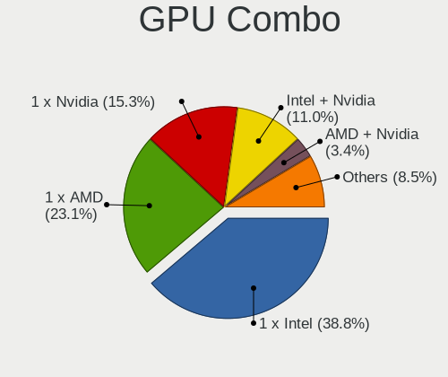
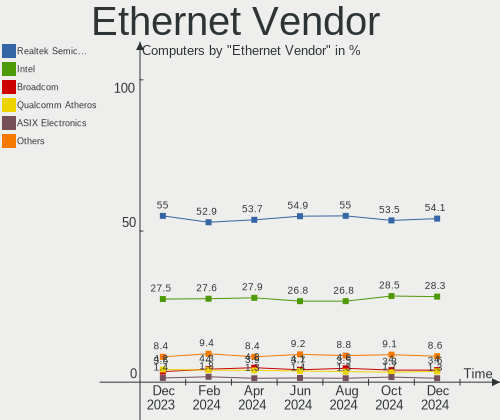
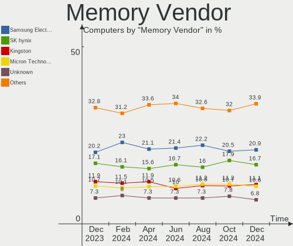
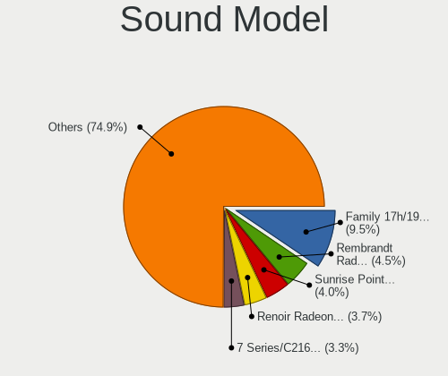

Linux Hardware Trends
---------------------

A project to identify most popular hardware characteristics and track their change
over time based on data collected by Linux users at https://Linux-Hardware.org.

Anyone can contribute to the study by uploading probes of their computers by
the [hw-probe](https://github.com/linuxhw/hw-probe) tool:

    sudo -E hw-probe -all -upload

This is a report for all computer types. See also reports for [desktops](/Desktop/README.md) and [notebooks](/Notebook/README.md).

Full-feature report is available here: https://linux-hardware.org/?view=trends

Distribution-specific reports: [Ubuntu](/Dist/Ubuntu), [ROSA](/Dist/ROSA), [Mint](/Dist/Mint), [Pop!_OS](/Dist/Pop!_OS), [Fedora](/Dist/Fedora), [BlackPanther](/Dist/BlackPanther), [Arch](/Dist/Arch), [Manjaro](/Dist/Manjaro), [Debian](/Dist/Debian), [Endless](/Dist/Endless), [Zorin](/Dist/Zorin), [Gentoo](/Dist/Gentoo), [Clear Linux](/Dist/Clear_Linux), [openSUSE](/Dist/openSUSE), [KDE neon](/Dist/KDE_neon), [Xubuntu](/Dist/Xubuntu), [Kubuntu](/Dist/Kubuntu), [ArcoLinux](/Dist/ArcoLinux), [OpenMandriva](/Dist/OpenMandriva).

Period: Jun, 2021.

Contents
--------

- [ OS                       ](#os)
- [ OS Family                ](#os-family)
- [ Kernel                   ](#kernel)
- [ Kernel Family            ](#kernel-family)
- [ Kernel Major Ver.        ](#kernel-major-ver)
- [ Arch                     ](#arch)
- [ DE                       ](#de)
- [ Display Server           ](#display-server)
- [ Display Manager          ](#display-manager)
- [ OS Lang                  ](#os-lang)
- [ Boot Mode                ](#boot-mode)
- [ Filesystem               ](#filesystem)
- [ Part. scheme             ](#part-scheme)
- [ Dual Boot with Linux/BSD ](#dual-boot-with-linux/bsd)
- [ Dual Boot (Win)          ](#dual-boot-win)
- [ Country                  ](#country)
- [ City                     ](#city)
- [ Vendor                   ](#vendor)
- [ Model                    ](#model)
- [ Model Family             ](#model-family)
- [ MFG Year                 ](#mfg-year)
- [ Form Factor              ](#form-factor)
- [ Secure Boot              ](#secure-boot)
- [ Coreboot                 ](#coreboot)
- [ RAM Size                 ](#ram-size)
- [ RAM Used                 ](#ram-used)
- [ Has CD-ROM               ](#has-cd-rom)
- [ Total Drives             ](#total-drives)
- [ Has Ethernet             ](#has-ethernet)
- [ Has WiFi                 ](#has-wifi)
- [ Has Bluetooth            ](#has-bluetooth)
- [ Drive Vendor             ](#drive-vendor)
- [ Drive Model              ](#drive-model)
- [ HDD Vendor               ](#hdd-vendor)
- [ SSD Vendor               ](#ssd-vendor)
- [ Drive Kind               ](#drive-kind)
- [ Drive Connector          ](#drive-connector)
- [ Drive Size               ](#drive-size)
- [ Space Total              ](#space-total)
- [ Space Used               ](#space-used)
- [ Malfunc. Drives          ](#malfunc-drives)
- [ Malfunc. Drive Vendor    ](#malfunc-drive-vendor)
- [ Malfunc. HDD Vendor      ](#malfunc-hdd-vendor)
- [ Malfunc. Drive Kind      ](#malfunc-drive-kind)
- [ Failed Drives            ](#failed-drives)
- [ Failed Drive Vendor      ](#failed-drive-vendor)
- [ Drive Status             ](#drive-status)
- [ Storage Vendor           ](#storage-vendor)
- [ Storage Model            ](#storage-model)
- [ Storage Kind             ](#storage-kind)
- [ CPU Vendor               ](#cpu-vendor)
- [ CPU Model                ](#cpu-model)
- [ CPU Model Family         ](#cpu-model-family)
- [ CPU Cores                ](#cpu-cores)
- [ CPU Sockets              ](#cpu-sockets)
- [ CPU Threads              ](#cpu-threads)
- [ CPU Op-Modes             ](#cpu-op-modes)
- [ CPU Microcode            ](#cpu-microcode)
- [ CPU Microarch            ](#cpu-microarch)
- [ GPU Vendor               ](#gpu-vendor)
- [ GPU Model                ](#gpu-model)
- [ GPU Combo                ](#gpu-combo)
- [ GPU Driver               ](#gpu-driver)
- [ GPU Memory               ](#gpu-memory)
- [ Monitor Vendor           ](#monitor-vendor)
- [ Monitor Model            ](#monitor-model)
- [ Monitor Resolution       ](#monitor-resolution)
- [ Monitor Diagonal         ](#monitor-diagonal)
- [ Monitor Width            ](#monitor-width)
- [ Aspect Ratio             ](#aspect-ratio)
- [ Monitor Area             ](#monitor-area)
- [ Pixel Density            ](#pixel-density)
- [ Multiple Monitors        ](#multiple-monitors)
- [ Net Controller Vendor    ](#net-controller-vendor)
- [ Net Controller Model     ](#net-controller-model)
- [ Wireless Vendor          ](#wireless-vendor)
- [ Wireless Model           ](#wireless-model)
- [ Ethernet Vendor          ](#ethernet-vendor)
- [ Ethernet Model           ](#ethernet-model)
- [ Net Controller Kind      ](#net-controller-kind)
- [ Used Controller          ](#used-controller)
- [ NICs                     ](#nics)
- [ IPv6                     ](#ipv6)
- [ Memory Vendor            ](#memory-vendor)
- [ Memory Model             ](#memory-model)
- [ Memory Kind              ](#memory-kind)
- [ Memory Form Factor       ](#memory-form-factor)
- [ Memory Size              ](#memory-size)
- [ Memory Speed             ](#memory-speed)
- [ Sound Vendor             ](#sound-vendor)
- [ Sound Model              ](#sound-model)
- [ Camera Vendor            ](#camera-vendor)
- [ Camera Model             ](#camera-model)
- [ Fingerprint Vendor       ](#fingerprint-vendor)
- [ Fingerprint Model        ](#fingerprint-model)
- [ Chipcard Vendor          ](#chipcard-vendor)
- [ Chipcard Model           ](#chipcard-model)
- [ Printer Vendor           ](#printer-vendor)
- [ Printer Model            ](#printer-model)
- [ Scanner Vendor           ](#scanner-vendor)
- [ Scanner Model            ](#scanner-model)
- [ Bluetooth Vendor         ](#bluetooth-vendor)
- [ Bluetooth Model          ](#bluetooth-model)
- [ Unsupported Devices      ](#unsupported-devices)
- [ Unsupported Device Types ](#unsupported-device-types)

OS
--

Installed operating systems

| Name                | Computers | Percent |
|---------------------|-----------|---------|
| Ubuntu 20.04        | 739       | 18.21%  |
| Mint 20.1           | 318       | 7.84%   |
| Ubuntu 21.04        | 264       | 6.51%   |
| OpenMandriva 4.2    | 262       | 6.46%   |
| Fedora 34           | 238       | 5.86%   |
| Pop!_OS 20.10       | 180       | 4.44%   |
| BlackPanther 18.1   | 127       | 3.13%   |
| Ubuntu 18.04        | 110       | 2.71%   |
| ROSA R11.1          | 102       | 2.51%   |
| KDE neon 20.04      | 93        | 2.29%   |
| Debian 10           | 84        | 2.07%   |
| Xubuntu 20.04       | 76        | 1.87%   |
| Arch                | 74        | 1.82%   |
| Manjaro             | 71        | 1.75%   |
| Endless 3.9.4       | 64        | 1.58%   |
| Ubuntu 20.10        | 62        | 1.53%   |
| Debian 11           | 62        | 1.53%   |
| ArcoLinux Rolling   | 60        | 1.48%   |
| OpenMandriva 4.50   | 55        | 1.36%   |
| Arch Rolling        | 55        | 1.36%   |
| Kubuntu 20.04       | 49        | 1.21%   |
| Mint 19.3           | 47        | 1.16%   |
| Manjaro 21.0.7      | 47        | 1.16%   |
| Zorin 15            | 40        | 0.99%   |
| Pop!_OS 20.04       | 33        | 0.81%   |
| Mint 20             | 31        | 0.76%   |
| Pop!_OS 21.04       | 26        | 0.64%   |
| Fedora 33           | 26        | 0.64%   |
| Debian              | 26        | 0.64%   |
| Kubuntu 21.04       | 24        | 0.59%   |
| Kali 2021.2         | 24        | 0.59%   |
| Gentoo              | 22        | 0.54%   |
| Ubuntu MATE 20.04   | 21        | 0.52%   |
| Manjaro 21.0.5      | 21        | 0.52%   |
| LMDE 4              | 20        | 0.49%   |
| Manjaro 21.0.6      | 17        | 0.42%   |
| Zorin 16            | 16        | 0.39%   |
| Ubuntu 16.04        | 14        | 0.34%   |
| ROSA R11            | 14        | 0.34%   |
| Gentoo 2.7          | 14        | 0.34%   |
| Xubuntu 18.04       | 13        | 0.32%   |
| Lubuntu 20.04       | 12        | 0.3%    |
| RHEL 8.4            | 11        | 0.27%   |
| Xubuntu 21.04       | 9         | 0.22%   |
| openSUSE Leap-15.3  | 9         | 0.22%   |
| Fedora 32           | 9         | 0.22%   |
| Elementary 5.1.7    | 9         | 0.22%   |
| Mint 19.2           | 8         | 0.2%    |
| ROSA R12            | 7         | 0.17%   |
| Peppermint 10       | 7         | 0.17%   |
| Mint 20.2           | 7         | 0.17%   |
| Garuda              | 7         | 0.17%   |
| EndeavourOS Rolling | 7         | 0.17%   |
| ArcoLinux           | 7         | 0.17%   |
| Ubuntu MATE 21.04   | 6         | 0.15%   |
| Ubuntu Budgie 21.04 | 6         | 0.15%   |
| Ubuntu Budgie 20.04 | 6         | 0.15%   |
| Solus 4.2           | 6         | 0.15%   |
| Parrot 4.11         | 6         | 0.15%   |
| Garuda Soaring      | 6         | 0.15%   |

OS Family
---------

OS without a version

| Name          | Computers | Percent |
|---------------|-----------|---------|
| Ubuntu        | 1206      | 29.72%  |
| Mint          | 417       | 10.28%  |
| OpenMandriva  | 317       | 7.81%   |
| Fedora        | 277       | 6.83%   |
| Pop!_OS       | 239       | 5.89%   |
| Debian        | 186       | 4.58%   |
| Manjaro       | 159       | 3.92%   |
| ROSA          | 129       | 3.18%   |
| Arch          | 129       | 3.18%   |
| BlackPanther  | 127       | 3.13%   |
| Xubuntu       | 99        | 2.44%   |
| KDE neon      | 93        | 2.29%   |
| Kubuntu       | 82        | 2.02%   |
| Endless       | 77        | 1.9%    |
| ArcoLinux     | 67        | 1.65%   |
| Zorin         | 57        | 1.4%    |
| openSUSE      | 45        | 1.11%   |
| Gentoo        | 38        | 0.94%   |
| Ubuntu MATE   | 36        | 0.89%   |
| Kali          | 29        | 0.71%   |
| Lubuntu       | 22        | 0.54%   |
| LMDE          | 20        | 0.49%   |
| Clear Linux   | 19        | 0.47%   |
| RHEL          | 14        | 0.34%   |
| Garuda        | 13        | 0.32%   |
| Ubuntu Budgie | 12        | 0.3%    |
| Elementary    | 12        | 0.3%    |
| EndeavourOS   | 8         | 0.2%    |
| Deepin        | 8         | 0.2%    |
| CentOS        | 8         | 0.2%    |
| Artix         | 8         | 0.2%    |
| Peppermint    | 7         | 0.17%   |
| Parrot        | 7         | 0.17%   |
| ALT Linux     | 7         | 0.17%   |
| Solus         | 6         | 0.15%   |
| Raspbian      | 5         | 0.12%   |
| Alpine        | 5         | 0.12%   |
| MX            | 4         | 0.1%    |
| Void          | 3         | 0.07%   |
| Slackware     | 3         | 0.07%   |
| Siduction     | 3         | 0.07%   |
| Rocky         | 3         | 0.07%   |
| RED           | 3         | 0.07%   |
| NixOS         | 3         | 0.07%   |
| Devuan        | 3         | 0.07%   |
| Android       | 3         | 0.07%   |
| Redcore       | 2         | 0.05%   |
| Red OS        | 2         | 0.05%   |
| PureOS        | 2         | 0.05%   |
| Manjaro-ARM   | 2         | 0.05%   |
| Makulu        | 2         | 0.05%   |
| GalliumOS     | 2         | 0.05%   |
| ClearOS       | 2         | 0.05%   |
| BigLinux      | 2         | 0.05%   |
| Archcraft     | 2         | 0.05%   |
| AlmaLinux     | 2         | 0.05%   |
| WindowsFX     | 1         | 0.02%   |
| Sonar         | 1         | 0.02%   |
| SLES          | 1         | 0.02%   |
| Scientific    | 1         | 0.02%   |

Kernel
------

Version of the Linux kernel

| Version                             | Computers | Percent |
|-------------------------------------|-----------|---------|
| 5.4.0-74-generic                    | 444       | 10.94%  |
| 5.8.0-55-generic                    | 418       | 10.3%   |
| 5.10.14-desktop-1omv4002            | 245       | 6.04%   |
| 5.11.0-7614-generic                 | 212       | 5.22%   |
| 5.11.0-18-generic                   | 173       | 4.26%   |
| 5.8.0-53-generic                    | 133       | 3.28%   |
| 5.8.0-59-generic                    | 127       | 3.13%   |
| 5.4.0-73-generic                    | 99        | 2.44%   |
| 5.6.14-desktop-2bP                  | 97        | 2.39%   |
| 5.4.0-77-generic                    | 85        | 2.09%   |
| 5.8.0-14-generic                    | 66        | 1.63%   |
| 5.12.8-300.fc34.x86_64              | 59        | 1.45%   |
| 5.11.0-22-generic                   | 55        | 1.36%   |
| 5.8.0-43-generic                    | 52        | 1.28%   |
| 5.12.4-desktop-1omv4050             | 51        | 1.26%   |
| 5.10.42-1-MANJARO                   | 49        | 1.21%   |
| 5.12.9-300.fc34.x86_64              | 46        | 1.13%   |
| 5.4.83-generic-2rosa-x86_64         | 38        | 0.94%   |
| 5.12.11-300.fc34.x86_64             | 37        | 0.91%   |
| 5.10.0-7-amd64                      | 37        | 0.91%   |
| 5.12.9-arch1-1                      | 33        | 0.81%   |
| 4.19.0-16-amd64                     | 32        | 0.79%   |
| 5.4.0-58-generic                    | 31        | 0.76%   |
| 4.18.16-desktop-1bP                 | 30        | 0.74%   |
| 5.12.12-300.fc34.x86_64             | 26        | 0.64%   |
| 5.12.10-300.fc34.x86_64             | 26        | 0.64%   |
| 5.10.0-2-amd64                      | 26        | 0.64%   |
| 5.4.32-generic-2rosa-x86_64         | 25        | 0.62%   |
| 5.12.10-arch1-1                     | 24        | 0.59%   |
| 5.12.13-arch1-2                     | 22        | 0.54%   |
| 5.12.9-1-MANJARO                    | 21        | 0.52%   |
| 5.12.8-arch1-1                      | 21        | 0.52%   |
| 5.10.36-2-MANJARO                   | 20        | 0.49%   |
| 5.4.0-72-generic                    | 17        | 0.42%   |
| 5.4.0-42-generic                    | 17        | 0.42%   |
| 5.12.12-arch1-1                     | 17        | 0.42%   |
| 5.11.12-desktop-1omv4002            | 17        | 0.42%   |
| 5.11.0-17-generic                   | 17        | 0.42%   |
| 5.11.0-16-generic                   | 17        | 0.42%   |
| 5.10.0-kali8-amd64                  | 15        | 0.37%   |
| 4.15.0-desktop-122.124.1rosa-x86_64 | 15        | 0.37%   |
| 5.12.8-200.fc33.x86_64              | 14        | 0.34%   |
| 5.10.0-6-amd64                      | 14        | 0.34%   |
| 4.15.0-144-generic                  | 14        | 0.34%   |
| 5.11.12-300.fc34.x86_64             | 13        | 0.32%   |
| 5.11.0-7620-generic                 | 13        | 0.32%   |
| 5.10.41-1-MANJARO                   | 13        | 0.32%   |
| 5.8.0-50-generic                    | 12        | 0.3%    |
| 5.4.0-26-generic                    | 12        | 0.3%    |
| 5.13.0-1-MANJARO                    | 12        | 0.3%    |
| 4.19.0-17-amd64                     | 12        | 0.3%    |
| 5.8.0-56-generic                    | 11        | 0.27%   |
| 5.12.9-zen1-1-zen                   | 11        | 0.27%   |
| 5.12.9-1-default                    | 11        | 0.27%   |
| 5.12.7-300.fc34.x86_64              | 11        | 0.27%   |
| 5.12.2-1-MANJARO                    | 11        | 0.27%   |
| 4.15.0-desktop-45.1rosa-x86_64      | 11        | 0.27%   |
| 5.11.0-20-generic                   | 10        | 0.25%   |
| 5.8.0-57-generic                    | 8         | 0.2%    |
| 5.8.0-54-generic                    | 8         | 0.2%    |

Kernel Family
-------------

Linux kernel without a distro release

| Version | Computers | Percent |
|---------|-----------|---------|
| 5.8.0   | 882       | 21.73%  |
| 5.4.0   | 762       | 18.78%  |
| 5.11.0  | 542       | 13.36%  |
| 5.10.14 | 245       | 6.04%   |
| 5.12.9  | 141       | 3.47%   |
| 5.10.0  | 141       | 3.47%   |
| 5.12.8  | 130       | 3.2%    |
| 5.6.14  | 97        | 2.39%   |
| 4.15.0  | 89        | 2.19%   |
| 5.12.10 | 82        | 2.02%   |
| 5.12.12 | 73        | 1.8%    |
| 4.19.0  | 69        | 1.7%    |
| 5.12.4  | 62        | 1.53%   |
| 5.10.42 | 60        | 1.48%   |
| 5.12.11 | 54        | 1.33%   |
| 5.12.13 | 48        | 1.18%   |
| 5.4.83  | 46        | 1.13%   |
| 5.4.32  | 31        | 0.76%   |
| 5.11.12 | 31        | 0.76%   |
| 4.18.16 | 30        | 0.74%   |
| 5.13.0  | 26        | 0.64%   |
| 4.18.0  | 25        | 0.62%   |
| 5.12.7  | 22        | 0.54%   |
| 5.10.36 | 21        | 0.52%   |
| 5.10.41 | 18        | 0.44%   |
| 5.3.0   | 15        | 0.37%   |
| 5.12.2  | 14        | 0.34%   |
| 5.0.0   | 14        | 0.34%   |
| 5.3.18  | 13        | 0.32%   |
| 5.10.27 | 13        | 0.32%   |
| 5.11.22 | 11        | 0.27%   |
| 5.10.29 | 9         | 0.22%   |
| 4.15.18 | 9         | 0.22%   |
| 5.9.16  | 8         | 0.2%    |
| 5.10.43 | 7         | 0.17%   |
| 3.10.0  | 7         | 0.17%   |
| 5.12.6  | 6         | 0.15%   |
| 5.10.45 | 6         | 0.15%   |
| 5.10.17 | 6         | 0.15%   |
| 5.6.0   | 5         | 0.12%   |
| 5.4.114 | 5         | 0.12%   |
| 5.12.5  | 5         | 0.12%   |
| 5.11.16 | 5         | 0.12%   |
| 5.10.46 | 5         | 0.12%   |
| 5.10.44 | 5         | 0.12%   |
| 4.9.155 | 5         | 0.12%   |
| 5.9.0   | 4         | 0.1%    |
| 5.4.65  | 4         | 0.1%    |
| 5.4.119 | 4         | 0.1%    |
| 5.4.118 | 4         | 0.1%    |
| 5.12.1  | 4         | 0.1%    |
| 5.12.0  | 4         | 0.1%    |
| 5.11.17 | 4         | 0.1%    |
| 5.11.11 | 4         | 0.1%    |
| 5.10.39 | 4         | 0.1%    |
| 5.10.33 | 4         | 0.1%    |
| 4.13.0  | 4         | 0.1%    |
| 5.4.106 | 3         | 0.07%   |
| 5.11.20 | 3         | 0.07%   |
| 5.10.35 | 3         | 0.07%   |

Kernel Major Ver.
-----------------

Linux kernel major version

| Version | Computers | Percent |
|---------|-----------|---------|
| 5.8     | 886       | 21.83%  |
| 5.4     | 884       | 21.78%  |
| 5.12    | 647       | 15.94%  |
| 5.11    | 613       | 15.11%  |
| 5.10    | 562       | 13.85%  |
| 5.6     | 102       | 2.51%   |
| 4.15    | 98        | 2.41%   |
| 4.19    | 72        | 1.77%   |
| 4.18    | 55        | 1.36%   |
| 5.3     | 29        | 0.71%   |
| 5.13    | 26        | 0.64%   |
| 5.9     | 17        | 0.42%   |
| 5.0     | 16        | 0.39%   |
| 4.9     | 12        | 0.3%    |
| 3.10    | 10        | 0.25%   |
| 4.13    | 5         | 0.12%   |
| 5.7     | 4         | 0.1%    |
| 4.4     | 4         | 0.1%    |
| 4.16    | 4         | 0.1%    |
| 4.14    | 3         | 0.07%   |
| 5.5     | 2         | 0.05%   |
| Unknown | 2         | 0.05%   |
| 5.2     | 1         | 0.02%   |
| 5.1     | 1         | 0.02%   |
| 5       | 1         | 0.02%   |
| 4.8     | 1         | 0.02%   |
| 4.10    | 1         | 0.02%   |

Arch
----

OS architecture (x86_64, i586, etc.)

| Name    | Computers | Percent |
|---------|-----------|---------|
| x86_64  | 3917      | 96.53%  |
| i686    | 90        | 2.22%   |
| aarch64 | 42        | 1.03%   |
| armv7l  | 3         | 0.07%   |
| armv8l  | 2         | 0.05%   |
| mips64  | 1         | 0.02%   |
| i586    | 1         | 0.02%   |
| armv6l  | 1         | 0.02%   |
| Unknown | 1         | 0.02%   |

DE
--

Desktop Environment

| Name             | Computers | Percent |
|------------------|-----------|---------|
| GNOME            | 1811      | 44.63%  |
| KDE5             | 660       | 16.26%  |
| X-Cinnamon       | 328       | 8.08%   |
| XFCE             | 283       | 6.97%   |
| Unknown          | 273       | 6.73%   |
| KDE              | 234       | 5.77%   |
| MATE             | 126       | 3.1%    |
| KDE4             | 75        | 1.85%   |
| Cinnamon         | 48        | 1.18%   |
| LXQt             | 42        | 1.03%   |
| i3               | 27        | 0.67%   |
| Unity            | 24        | 0.59%   |
| Budgie           | 21        | 0.52%   |
| Deepin           | 16        | 0.39%   |
| LXDE             | 14        | 0.34%   |
| Pantheon         | 12        | 0.3%    |
| GNOME Flashback  | 9         | 0.22%   |
| bspwm            | 9         | 0.22%   |
| awesome          | 8         | 0.2%    |
| dwm              | 7         | 0.17%   |
| sway             | 5         | 0.12%   |
| qtile            | 5         | 0.12%   |
| xmonad           | 4         | 0.1%    |
| i3-with-shmlog   | 3         | 0.07%   |
| GNOME Classic    | 3         | 0.07%   |
| openbox          | 2         | 0.05%   |
| Enlightenment    | 2         | 0.05%   |
| XSession         | 1         | 0.02%   |
| trinity          | 1         | 0.02%   |
| sway:Unity       | 1         | 0.02%   |
| Lubuntu          | 1         | 0.02%   |
| lightdm-xsession | 1         | 0.02%   |
| ICEWM            | 1         | 0.02%   |
| herbstluftwm     | 1         | 0.02%   |

Display Server
--------------

X11 or Wayland

| Name        | Computers | Percent |
|-------------|-----------|---------|
| X11         | 3375      | 83.17%  |
| Wayland     | 441       | 10.87%  |
| Unknown     | 154       | 3.79%   |
| Tty         | 87        | 2.14%   |
| Unspecified | 1         | 0.02%   |

Display Manager
---------------

SDDM, LightDM, etc.

| Name    | Computers | Percent |
|---------|-----------|---------|
| Unknown | 2363      | 58.23%  |
| SDDM    | 735       | 18.11%  |
| GDM     | 466       | 11.48%  |
| TDM     | 319       | 7.86%   |
| KDM     | 75        | 1.85%   |
| LightDM | 72        | 1.77%   |
| XDM     | 13        | 0.32%   |
| GDM3    | 5         | 0.12%   |
| LXDM    | 4         | 0.1%    |
| SLiM    | 3         | 0.07%   |
| Ly      | 3         | 0.07%   |

OS Lang
-------

Language

| Lang    | Computers | Percent |
|---------|-----------|---------|
| en_US   | 1650      | 40.66%  |
| de_DE   | 300       | 7.39%   |
| ru_RU   | 254       | 6.26%   |
| pt_BR   | 230       | 5.67%   |
| en_GB   | 211       | 5.2%    |
| fr_FR   | 193       | 4.76%   |
| Unknown | 192       | 4.73%   |
| en_IN   | 86        | 2.12%   |
| it_IT   | 83        | 2.05%   |
| pl_PL   | 71        | 1.75%   |
| en_CA   | 71        | 1.75%   |
| es_ES   | 65        | 1.6%    |
| en_AU   | 64        | 1.58%   |
| C       | 61        | 1.5%    |
| zh_CN   | 29        | 0.71%   |
| nl_NL   | 29        | 0.71%   |
| pt_PT   | 24        | 0.59%   |
| hu_HU   | 24        | 0.59%   |
| es_AR   | 24        | 0.59%   |
| es_MX   | 21        | 0.52%   |
| sv_SE   | 18        | 0.44%   |
| fr_BE   | 18        | 0.44%   |
| tr_TR   | 17        | 0.42%   |
| cs_CZ   | 17        | 0.42%   |
| ru_UA   | 16        | 0.39%   |
| en_ZA   | 16        | 0.39%   |
| de_CH   | 14        | 0.34%   |
| nl_BE   | 13        | 0.32%   |
| ja_JP   | 13        | 0.32%   |
| es_CL   | 13        | 0.32%   |
| en_IE   | 13        | 0.32%   |
| de_AT   | 13        | 0.32%   |
| en_NZ   | 12        | 0.3%    |
| zh_TW   | 10        | 0.25%   |
| es_CO   | 10        | 0.25%   |
| en_IL   | 9         | 0.22%   |
| es_VE   | 8         | 0.2%    |
| sk_SK   | 7         | 0.17%   |
| ro_RO   | 7         | 0.17%   |
| da_DK   | 7         | 0.17%   |
| en_PH   | 6         | 0.15%   |
| en_DK   | 6         | 0.15%   |
| el_GR   | 6         | 0.15%   |
| POSIX   | 5         | 0.12%   |
| nb_NO   | 5         | 0.12%   |
| fr_CH   | 5         | 0.12%   |
| fr_CA   | 5         | 0.12%   |
| uk_UA   | 4         | 0.1%    |
| ko_KR   | 4         | 0.1%    |
| fi_FI   | 4         | 0.1%    |
| en_HK   | 4         | 0.1%    |
| bg_BG   | 4         | 0.1%    |
| sl_SI   | 3         | 0.07%   |
| es_UY   | 3         | 0.07%   |
| es_EC   | 3         | 0.07%   |
| es_DO   | 3         | 0.07%   |
| en_SG   | 3         | 0.07%   |
| ca_ES   | 3         | 0.07%   |
| C.UTF8  | 3         | 0.07%   |
| sr_RS   | 2         | 0.05%   |

Boot Mode
---------

EFI or BIOS

| Mode | Computers | Percent |
|------|-----------|---------|
| BIOS | 2178      | 53.67%  |
| EFI  | 1880      | 46.33%  |

Filesystem
----------

Type of filesystem

| Type    | Computers | Percent |
|---------|-----------|---------|
| Ext4    | 3097      | 76.32%  |
| Overlay | 470       | 11.58%  |
| Btrfs   | 339       | 8.35%   |
| Xfs     | 66        | 1.63%   |
| Zfs     | 48        | 1.18%   |
| F2fs    | 11        | 0.27%   |
| Unknown | 9         | 0.22%   |
| Ext2    | 6         | 0.15%   |
| Ext3    | 5         | 0.12%   |
| Tmpfs   | 4         | 0.1%    |
| Aufs    | 2         | 0.05%   |
| XXXfs   | 1         | 0.02%   |

Part. scheme
------------

Scheme of partitioning

| Type    | Computers | Percent |
|---------|-----------|---------|
| Unknown | 2220      | 54.71%  |
| GPT     | 1257      | 30.98%  |
| MBR     | 581       | 14.32%  |

Dual Boot with Linux/BSD
------------------------

Hosting more than one Linux/BSD

| Dual boot | Computers | Percent |
|-----------|-----------|---------|
| No        | 3427      | 84.45%  |
| Yes       | 631       | 15.55%  |

Dual Boot (Win)
---------------

Hosting Linux and Windows

| Dual boot | Computers | Percent |
|-----------|-----------|---------|
| No        | 2816      | 69.39%  |
| Yes       | 1242      | 30.61%  |

Country
-------

Geographic location (country)

| Country      | Computers | Percent |
|--------------|-----------|---------|
| USA          | 692       | 17.05%  |
| Germany      | 384       | 9.46%   |
| Russia       | 314       | 7.74%   |
| Brazil       | 297       | 7.32%   |
| France       | 224       | 5.52%   |
| UK           | 175       | 4.31%   |
| Italy        | 123       | 3.03%   |
| India        | 121       | 2.98%   |
| Hungary      | 118       | 2.91%   |
| Canada       | 112       | 2.76%   |
| Poland       | 107       | 2.64%   |
| Spain        | 86        | 2.12%   |
| Australia    | 80        | 1.97%   |
| Netherlands  | 78        | 1.92%   |
| Ukraine      | 61        | 1.5%    |
| Belgium      | 60        | 1.48%   |
| Switzerland  | 48        | 1.18%   |
| Sweden       | 48        | 1.18%   |
| Argentina    | 45        | 1.11%   |
| China        | 44        | 1.08%   |
| Romania      | 40        | 0.99%   |
| Mexico       | 39        | 0.96%   |
| Austria      | 36        | 0.89%   |
| Turkey       | 35        | 0.86%   |
| Portugal     | 35        | 0.86%   |
| Czechia      | 30        | 0.74%   |
| Finland      | 26        | 0.64%   |
| Japan        | 25        | 0.62%   |
| Chile        | 25        | 0.62%   |
| Greece       | 23        | 0.57%   |
| Taiwan       | 22        | 0.54%   |
| South Africa | 21        | 0.52%   |
| Norway       | 21        | 0.52%   |
| New Zealand  | 20        | 0.49%   |
| Slovakia     | 18        | 0.44%   |
| Iran         | 18        | 0.44%   |
| Bulgaria     | 18        | 0.44%   |
| Belarus      | 18        | 0.44%   |
| Indonesia    | 17        | 0.42%   |
| Colombia     | 16        | 0.39%   |
| Serbia       | 15        | 0.37%   |
| Vietnam      | 14        | 0.34%   |
| Ireland      | 14        | 0.34%   |
| Denmark      | 14        | 0.34%   |
| Israel       | 13        | 0.32%   |
| Croatia      | 13        | 0.32%   |
| Venezuela    | 12        | 0.3%    |
| Malaysia     | 12        | 0.3%    |
| Philippines  | 10        | 0.25%   |
| Hong Kong    | 10        | 0.25%   |
| Sri Lanka    | 8         | 0.2%    |
| South Korea  | 8         | 0.2%    |
| Bangladesh   | 8         | 0.2%    |
| Slovenia     | 7         | 0.17%   |
| Saudi Arabia | 7         | 0.17%   |
| Moldova      | 7         | 0.17%   |
| Lithuania    | 7         | 0.17%   |
| Estonia      | 7         | 0.17%   |
| Thailand     | 6         | 0.15%   |
| Peru         | 6         | 0.15%   |

City
----

Geographic location (city)

| City              | Computers | Percent |
|-------------------|-----------|---------|
| Moscow            | 63        | 1.55%   |
| St Petersburg     | 53        | 1.31%   |
| São Paulo        | 39        | 0.96%   |
| Berlin            | 37        | 0.91%   |
| Budapest          | 32        | 0.79%   |
| Warsaw            | 28        | 0.69%   |
| Paris             | 28        | 0.69%   |
| Voronezh          | 26        | 0.64%   |
| London            | 25        | 0.62%   |
| Sydney            | 24        | 0.59%   |
| Vienna            | 23        | 0.57%   |
| Rio de Janeiro    | 22        | 0.54%   |
| Kyiv              | 20        | 0.49%   |
| Zurich            | 17        | 0.42%   |
| Munich            | 15        | 0.37%   |
| Istanbul          | 15        | 0.37%   |
| Hamburg           | 15        | 0.37%   |
| Tehran            | 14        | 0.34%   |
| Santiago          | 14        | 0.34%   |
| Athens            | 14        | 0.34%   |
| Amsterdam         | 14        | 0.34%   |
| Sofia             | 13        | 0.32%   |
| Melbourne         | 13        | 0.32%   |
| Madrid            | 13        | 0.32%   |
| Bucharest         | 13        | 0.32%   |
| Prague            | 12        | 0.3%    |
| Montreal          | 12        | 0.3%    |
| Frankfurt am Main | 12        | 0.3%    |
| Buenos Aires      | 12        | 0.3%    |
| Toronto           | 11        | 0.27%   |
| Mumbai            | 11        | 0.27%   |
| Milan             | 11        | 0.27%   |
| Lisbon            | 11        | 0.27%   |
| Bengaluru         | 11        | 0.27%   |
| Belgrade          | 11        | 0.27%   |
| Pune              | 10        | 0.25%   |
| Novosibirsk       | 10        | 0.25%   |
| Los Angeles       | 10        | 0.25%   |
| Johannesburg      | 10        | 0.25%   |
| Curitiba          | 10        | 0.25%   |
| Brisbane          | 10        | 0.25%   |
| Yekaterinburg     | 9         | 0.22%   |
| Stockholm         | 9         | 0.22%   |
| Rockville         | 9         | 0.22%   |
| Perm              | 9         | 0.22%   |
| Minneapolis       | 9         | 0.22%   |
| Mexico City       | 9         | 0.22%   |
| Krakow            | 9         | 0.22%   |
| Hyderabad         | 9         | 0.22%   |
| Helsinki          | 9         | 0.22%   |
| Essen             | 9         | 0.22%   |
| Delhi             | 9         | 0.22%   |
| Chennai           | 9         | 0.22%   |
| Brooklyn          | 9         | 0.22%   |
| Belo Horizonte    | 9         | 0.22%   |
| Beijing           | 9         | 0.22%   |
| Wroclaw           | 8         | 0.2%    |
| Rome              | 8         | 0.2%    |
| Portland          | 8         | 0.2%    |
| Oslo              | 8         | 0.2%    |

Vendor
------

Motherboard manufacturer

| Name                    | Computers | Percent |
|-------------------------|-----------|---------|
| ASUSTek Computer        | 659       | 16.24%  |
| Hewlett-Packard         | 565       | 13.92%  |
| Lenovo                  | 545       | 13.43%  |
| Dell                    | 522       | 12.86%  |
| Gigabyte Technology     | 296       | 7.29%   |
| Acer                    | 246       | 6.06%   |
| MSI                     | 208       | 5.13%   |
| ASRock                  | 171       | 4.21%   |
| Apple                   | 76        | 1.87%   |
| Intel                   | 61        | 1.5%    |
| Toshiba                 | 59        | 1.45%   |
| Samsung Electronics     | 57        | 1.4%    |
| Unknown                 | 56        | 1.38%   |
| Sony                    | 41        | 1.01%   |
| Fujitsu                 | 30        | 0.74%   |
| Medion                  | 26        | 0.64%   |
| HUAWEI                  | 24        | 0.59%   |
| Pegatron                | 23        | 0.57%   |
| Supermicro              | 21        | 0.52%   |
| Biostar                 | 18        | 0.44%   |
| Positivo                | 17        | 0.42%   |
| Raspberry Pi Foundation | 15        | 0.37%   |
| Packard Bell            | 15        | 0.37%   |
| ECS                     | 15        | 0.37%   |
| Fujitsu Siemens         | 14        | 0.34%   |
| Timi                    | 12        | 0.3%    |
| System76                | 12        | 0.3%    |
| Gateway                 | 12        | 0.3%    |
| Foxconn                 | 12        | 0.3%    |
| Alienware               | 11        | 0.27%   |
| LG Electronics          | 9         | 0.22%   |
| Razer                   | 8         | 0.2%    |
| Notebook                | 8         | 0.2%    |
| Google                  | 8         | 0.2%    |
| eMachines               | 7         | 0.17%   |
| IBM                     | 6         | 0.15%   |
| Schenker                | 5         | 0.12%   |
| Pine Microsystems       | 5         | 0.12%   |
| PCWare                  | 5         | 0.12%   |
| Microsoft               | 5         | 0.12%   |
| Huanan                  | 5         | 0.12%   |
| Panasonic               | 4         | 0.1%    |
| ASRockRack              | 4         | 0.1%    |
| Philco                  | 3         | 0.07%   |
| PC Specialist           | 3         | 0.07%   |
| OEM                     | 3         | 0.07%   |
| Itautec                 | 3         | 0.07%   |
| Clevo                   | 3         | 0.07%   |
| Chuwi                   | 3         | 0.07%   |
| AMD                     | 3         | 0.07%   |
| ZTSYSTEMS               | 2         | 0.05%   |
| VIT                     | 2         | 0.05%   |
| Teclast                 | 2         | 0.05%   |
| SLIMBOOK                | 2         | 0.05%   |
| Shuttle                 | 2         | 0.05%   |
| Semp Toshiba            | 2         | 0.05%   |
| Purism                  | 2         | 0.05%   |
| Positivo Bahia - VAIO   | 2         | 0.05%   |
| Nvidia                  | 2         | 0.05%   |
| Multilaser              | 2         | 0.05%   |

Model
-----

Motherboard model

| Name                               | Computers | Percent |
|------------------------------------|-----------|---------|
| Unknown                            | 69        | 1.7%    |
| ASUS All Series                    | 43        | 1.06%   |
| HP Notebook                        | 15        | 0.37%   |
| ASUS PRIME A320M-K                 | 12        | 0.3%    |
| Acer Nitro AN515-54                | 12        | 0.3%    |
| MSI MS-7C37                        | 11        | 0.27%   |
| ASUS TUF GAMING X570-PLUS          | 11        | 0.27%   |
| HP Pavilion dv6                    | 10        | 0.25%   |
| HP Pavilion Notebook               | 9         | 0.22%   |
| ASUS ROG STRIX X570-E GAMING       | 9         | 0.22%   |
| ASRock B450M Pro4                  | 9         | 0.22%   |
| HP Pavilion dv7                    | 8         | 0.2%    |
| Supermicro Super Server            | 7         | 0.17%   |
| HUAWEI NBLK-WAX9X                  | 7         | 0.17%   |
| HP Pavilion g6                     | 7         | 0.17%   |
| HP EliteBook 840 G3                | 7         | 0.17%   |
| Gigabyte X570 I AORUS PRO WIFI     | 7         | 0.17%   |
| Dell OptiPlex 7010                 | 7         | 0.17%   |
| Dell Latitude E6510                | 7         | 0.17%   |
| Dell Latitude E6430                | 7         | 0.17%   |
| Dell Latitude E6420                | 7         | 0.17%   |
| Dell Latitude E6400                | 7         | 0.17%   |
| Dell Inspiron 15-3567              | 7         | 0.17%   |
| ASRock B450 Pro4                   | 7         | 0.17%   |
| Acer Nitro AN517-51                | 7         | 0.17%   |
| MSI MS-7B89                        | 6         | 0.15%   |
| MSI MS-7B86                        | 6         | 0.15%   |
| Lenovo IdeaPad Flex 5 14ARE05 81X2 | 6         | 0.15%   |
| HP Pavilion 15                     | 6         | 0.15%   |
| HP Compaq Pro 6300 SFF             | 6         | 0.15%   |
| Gigabyte B450M DS3H                | 6         | 0.15%   |
| Dell XPS 15 9500                   | 6         | 0.15%   |
| Dell XPS 13 9370                   | 6         | 0.15%   |
| Dell Precision T3600               | 6         | 0.15%   |
| Dell OptiPlex 990                  | 6         | 0.15%   |
| Dell Latitude E7440                | 6         | 0.15%   |
| ASUS ROG STRIX B550-F GAMING       | 6         | 0.15%   |
| MSI MS-7C84                        | 5         | 0.12%   |
| MSI MS-7C02                        | 5         | 0.12%   |
| MSI MS-7817                        | 5         | 0.12%   |
| MSI MS-7816                        | 5         | 0.12%   |
| MSI MS-7693                        | 5         | 0.12%   |
| HUAWEI HLYL-WXX9                   | 5         | 0.12%   |
| HP Pavilion g7                     | 5         | 0.12%   |
| HP EliteDesk 800 G1 SFF            | 5         | 0.12%   |
| HP EliteBook 820 G1                | 5         | 0.12%   |
| HP 2000                            | 5         | 0.12%   |
| Gigabyte A320M-S2H                 | 5         | 0.12%   |
| Dell XPS 13 7390                   | 5         | 0.12%   |
| Dell OptiPlex 9020                 | 5         | 0.12%   |
| Dell OptiPlex 390                  | 5         | 0.12%   |
| Dell Latitude E7470                | 5         | 0.12%   |
| Dell Inspiron 3505                 | 5         | 0.12%   |
| ASUS ROG STRIX B450-F GAMING       | 5         | 0.12%   |
| ASUS M5A97 R2.0                    | 5         | 0.12%   |
| ASUS M5A78L-M/USB3                 | 5         | 0.12%   |
| ASRock X300M-STX                   | 5         | 0.12%   |
| Acer Aspire ES1-512                | 5         | 0.12%   |
| System76 Oryx Pro                  | 4         | 0.1%    |
| RPi Raspberry Pi 4 Model B Rev 1.2 | 4         | 0.1%    |

Model Family
------------

Motherboard model prefix

| Name                  | Computers | Percent |
|-----------------------|-----------|---------|
| Lenovo ThinkPad       | 247       | 6.09%   |
| Acer Aspire           | 151       | 3.72%   |
| Dell Latitude         | 142       | 3.5%    |
| Dell Inspiron         | 138       | 3.4%    |
| Lenovo IdeaPad        | 115       | 2.83%   |
| HP Pavilion           | 104       | 2.56%   |
| ASUS PRIME            | 88        | 2.17%   |
| ASUS ROG              | 72        | 1.77%   |
| HP EliteBook          | 70        | 1.72%   |
| Unknown               | 69        | 1.7%    |
| Dell OptiPlex         | 63        | 1.55%   |
| HP Compaq             | 60        | 1.48%   |
| HP ProBook            | 58        | 1.43%   |
| HP Laptop             | 57        | 1.4%    |
| Dell Precision        | 55        | 1.36%   |
| Dell XPS              | 54        | 1.33%   |
| ASUS VivoBook         | 51        | 1.26%   |
| Toshiba Satellite     | 47        | 1.16%   |
| ASUS All              | 43        | 1.06%   |
| ASUS TUF              | 42        | 1.03%   |
| Lenovo Yoga           | 37        | 0.91%   |
| Dell Vostro           | 35        | 0.86%   |
| Lenovo ThinkCentre    | 31        | 0.76%   |
| Acer Nitro            | 30        | 0.74%   |
| Lenovo Legion         | 24        | 0.59%   |
| HP ENVY               | 22        | 0.54%   |
| Gigabyte X570         | 22        | 0.54%   |
| HP EliteDesk          | 18        | 0.44%   |
| Acer Swift            | 17        | 0.42%   |
| Fujitsu LIFEBOOK      | 16        | 0.39%   |
| RPi Raspberry         | 15        | 0.37%   |
| HP ZBook              | 15        | 0.37%   |
| HP Notebook           | 15        | 0.37%   |
| ASUS M5A78L-M         | 14        | 0.34%   |
| ASRock B450M          | 14        | 0.34%   |
| MSI MS-7C37           | 11        | 0.27%   |
| HP OMEN               | 11        | 0.27%   |
| Dell PowerEdge        | 11        | 0.27%   |
| ASUS ZenBook          | 11        | 0.27%   |
| Acer Extensa          | 11        | 0.27%   |
| Packard Bell EasyNote | 10        | 0.25%   |
| Lenovo IdeaCentre     | 10        | 0.25%   |
| ASRock B450           | 10        | 0.25%   |
| Lenovo ThinkBook      | 9         | 0.22%   |
| HP ProLiant           | 9         | 0.22%   |
| HP ProDesk            | 9         | 0.22%   |
| Gigabyte B450M        | 9         | 0.22%   |
| ASUS M5A97            | 9         | 0.22%   |
| ASUS ASUS             | 9         | 0.22%   |
| Acer TravelMate       | 9         | 0.22%   |
| Razer Blade           | 8         | 0.2%    |
| HP 250                | 8         | 0.2%    |
| Gigabyte B450         | 8         | 0.2%    |
| Fujitsu ESPRIMO       | 8         | 0.2%    |
| ASUS P8Z77-V          | 8         | 0.2%    |
| ASUS P8B75-M          | 8         | 0.2%    |
| Supermicro Super      | 7         | 0.17%   |
| HUAWEI NBLK-WAX9X     | 7         | 0.17%   |
| HP 255                | 7         | 0.17%   |
| Gigabyte A320M-S2H    | 7         | 0.17%   |

MFG Year
--------

Motherboard manufacture year

| Year    | Computers | Percent |
|---------|-----------|---------|
| 2020    | 720       | 17.74%  |
| 2019    | 484       | 11.93%  |
| 2021    | 481       | 11.85%  |
| 2018    | 339       | 8.35%   |
| 2013    | 225       | 5.54%   |
| 2012    | 225       | 5.54%   |
| 2014    | 221       | 5.45%   |
| 2011    | 216       | 5.32%   |
| 2015    | 192       | 4.73%   |
| 2010    | 189       | 4.66%   |
| 2016    | 174       | 4.29%   |
| 2017    | 167       | 4.12%   |
| 2009    | 158       | 3.89%   |
| 2008    | 112       | 2.76%   |
| 2007    | 59        | 1.45%   |
| Unknown | 45        | 1.11%   |
| 2006    | 35        | 0.86%   |
| 2005    | 9         | 0.22%   |
| 2003    | 4         | 0.1%    |
| 2004    | 3         | 0.07%   |

Form Factor
-----------

Physical design of the computer

| Name           | Computers | Percent |
|----------------|-----------|---------|
| Notebook       | 2154      | 53.08%  |
| Desktop        | 1618      | 39.87%  |
| Convertible    | 100       | 2.46%   |
| Server         | 47        | 1.16%   |
| All in one     | 46        | 1.13%   |
| System on chip | 38        | 0.94%   |
| Mini pc        | 29        | 0.71%   |
| Tablet         | 19        | 0.47%   |
| Phone          | 6         | 0.15%   |
| Firewall       | 1         | 0.02%   |

Secure Boot
-----------

Enabled or disabled

| State    | Computers | Percent |
|----------|-----------|---------|
| Disabled | 3764      | 92.76%  |
| Enabled  | 294       | 7.24%   |

Coreboot
--------

Have coreboot on board

| Used | Computers | Percent |
|------|-----------|---------|
| No   | 4042      | 99.61%  |
| Yes  | 16        | 0.39%   |

RAM Size
--------

Total RAM memory

| Size in GB      | Computers | Percent |
|-----------------|-----------|---------|
| 4.01-8.0        | 950       | 23.41%  |
| 3.01-4.0        | 792       | 19.52%  |
| 16.01-24.0      | 749       | 18.46%  |
| 8.01-16.0       | 723       | 17.82%  |
| 32.01-64.0      | 394       | 9.71%   |
| 1.01-2.0        | 157       | 3.87%   |
| 64.01-256.0     | 126       | 3.1%    |
| 24.01-32.0      | 66        | 1.63%   |
| 2.01-3.0        | 55        | 1.36%   |
| 0.51-1.0        | 35        | 0.86%   |
| More than 256.0 | 6         | 0.15%   |
| 0.01-0.5        | 4         | 0.1%    |
| Unknown         | 1         | 0.02%   |

RAM Used
--------

Used RAM memory

| Used GB     | Computers | Percent |
|-------------|-----------|---------|
| 1.01-2.0    | 1496      | 36.87%  |
| 2.01-3.0    | 934       | 23.02%  |
| 4.01-8.0    | 519       | 12.79%  |
| 3.01-4.0    | 469       | 11.56%  |
| 0.51-1.0    | 318       | 7.84%   |
| 8.01-16.0   | 152       | 3.75%   |
| 0.01-0.5    | 108       | 2.66%   |
| 16.01-24.0  | 32        | 0.79%   |
| 32.01-64.0  | 11        | 0.27%   |
| 24.01-32.0  | 11        | 0.27%   |
| Unknown     | 4         | 0.1%    |
| 64.01-256.0 | 3         | 0.07%   |
| 0           | 1         | 0.02%   |

Has CD-ROM
----------

Has CD-ROM on board

| Presented | Computers | Percent |
|-----------|-----------|---------|
| No        | 2417      | 59.56%  |
| Yes       | 1641      | 40.44%  |

Total Drives
------------

Number of drives on board

| Drives | Computers | Percent |
|--------|-----------|---------|
| 1      | 2375      | 58.53%  |
| 2      | 990       | 24.4%   |
| 3      | 341       | 8.4%    |
| 4      | 152       | 3.75%   |
| 5      | 77        | 1.9%    |
| 0      | 46        | 1.13%   |
| 6      | 35        | 0.86%   |
| 7      | 15        | 0.37%   |
| 8      | 14        | 0.34%   |
| 9      | 5         | 0.12%   |
| 14     | 3         | 0.07%   |
| 13     | 2         | 0.05%   |
| 11     | 2         | 0.05%   |
| 17     | 1         | 0.02%   |

Has Ethernet
------------

Has Ethernet on board

| Presented | Computers | Percent |
|-----------|-----------|---------|
| Yes       | 3556      | 87.63%  |
| No        | 502       | 12.37%  |

Has WiFi
--------

Has WiFi module

| Presented | Computers | Percent |
|-----------|-----------|---------|
| Yes       | 2928      | 72.15%  |
| No        | 1130      | 27.85%  |

Has Bluetooth
-------------

Has Bluetooth module

| Presented | Computers | Percent |
|-----------|-----------|---------|
| Yes       | 2318      | 57.12%  |
| No        | 1740      | 42.88%  |

Drive Vendor
------------

Hard drive vendors

| Vendor                    | Computers | Drives | Percent |
|---------------------------|-----------|--------|---------|
| WDC                       | 921       | 1165   | 15.64%  |
| Seagate                   | 910       | 1145   | 15.45%  |
| Samsung Electronics       | 906       | 1134   | 15.38%  |
| Toshiba                   | 435       | 471    | 7.39%   |
| Kingston                  | 319       | 338    | 5.42%   |
| SanDisk                   | 291       | 315    | 4.94%   |
| Unknown                   | 245       | 277    | 4.16%   |
| Crucial                   | 231       | 251    | 3.92%   |
| Intel                     | 175       | 205    | 2.97%   |
| Hitachi                   | 174       | 189    | 2.95%   |
| SK Hynix                  | 142       | 150    | 2.41%   |
| HGST                      | 106       | 115    | 1.8%    |
| A-DATA Technology         | 86        | 92     | 1.46%   |
| Micron Technology         | 78        | 82     | 1.32%   |
| Phison                    | 55        | 64     | 0.93%   |
| China                     | 53        | 55     | 0.9%    |
| SPCC                      | 35        | 36     | 0.59%   |
| PNY                       | 32        | 34     | 0.54%   |
| KIOXIA                    | 31        | 32     | 0.53%   |
| Maxtor                    | 30        | 30     | 0.51%   |
| Apple                     | 29        | 32     | 0.49%   |
| Fujitsu                   | 28        | 28     | 0.48%   |
| LITEON                    | 26        | 27     | 0.44%   |
| Silicon Motion            | 25        | 27     | 0.42%   |
| Patriot                   | 23        | 24     | 0.39%   |
| XPG                       | 21        | 21     | 0.36%   |
| Micron/Crucial Technology | 20        | 21     | 0.34%   |
| Intenso                   | 20        | 21     | 0.34%   |
| Hewlett-Packard           | 20        | 21     | 0.34%   |
| Transcend                 | 19        | 19     | 0.32%   |
| OCZ                       | 17        | 17     | 0.29%   |
| Corsair                   | 17        | 20     | 0.29%   |
| Union Memory              | 15        | 15     | 0.25%   |
| KingSpec                  | 15        | 15     | 0.25%   |
| JMicron                   | 14        | 15     | 0.24%   |
| Realtek Semiconductor     | 13        | 14     | 0.22%   |
| Gigabyte Technology       | 13        | 14     | 0.22%   |
| GOODRAM                   | 12        | 13     | 0.2%    |
| Apacer                    | 12        | 13     | 0.2%    |
| LITEONIT                  | 11        | 12     | 0.19%   |
| ASMT                      | 11        | 12     | 0.19%   |
| SABRENT                   | 10        | 10     | 0.17%   |
| Union Memory (Shenzhen)   | 9         | 9      | 0.15%   |
| Mushkin                   | 9         | 16     | 0.15%   |
| Netac                     | 8         | 8      | 0.14%   |
| EMTEC                     | 7         | 7      | 0.12%   |
| Team                      | 6         | 6      | 0.1%    |
| Lite-On                   | 6         | 6      | 0.1%    |
| KingDian                  | 6         | 6      | 0.1%    |
| External                  | 6         | 7      | 0.1%    |
| Solid State Storage       | 5         | 5      | 0.08%   |
| PLEXTOR                   | 5         | 6      | 0.08%   |
| Lexar                     | 5         | 5      | 0.08%   |
| Lenovo                    | 5         | 5      | 0.08%   |
| KIOXIA-EXCERIA            | 5         | 5      | 0.08%   |
| Verbatim                  | 4         | 4      | 0.07%   |
| HS-SSD-C100               | 4         | 4      | 0.07%   |
| FORESEE                   | 4         | 4      | 0.07%   |
| Dogfish                   | 4         | 4      | 0.07%   |
| BHT                       | 4         | 4      | 0.07%   |

Drive Model
-----------

Hard drive models

| Model                              | Computers | Percent |
|------------------------------------|-----------|---------|
| Kingston SA400S37240G 240GB SSD    | 69        | 1.06%   |
| Samsung SSD 850 EVO 250GB          | 54        | 0.83%   |
| Seagate ST1000LM035-1RK172 1TB     | 52        | 0.8%    |
| Samsung NVMe SSD Drive 512GB       | 51        | 0.79%   |
| Samsung SSD 860 EVO 500GB          | 48        | 0.74%   |
| Unknown MMC Card  32GB             | 45        | 0.69%   |
| Seagate ST500DM002-1BD142 500GB    | 44        | 0.68%   |
| Crucial CT240BX500SSD1 240GB       | 44        | 0.68%   |
| Samsung SSD 860 EVO 1TB            | 43        | 0.66%   |
| Toshiba DT01ACA100 1TB             | 39        | 0.6%    |
| Seagate ST1000LM024 HN-M101MBB 1TB | 38        | 0.59%   |
| Samsung NVMe SSD Drive 500GB       | 36        | 0.56%   |
| Crucial CT500MX500SSD1 500GB       | 36        | 0.56%   |
| Seagate ST2000DM008-2FR102 2TB     | 35        | 0.54%   |
| Intel NVMe SSD Drive 512GB         | 35        | 0.54%   |
| Toshiba MQ01ABD100 1TB             | 34        | 0.52%   |
| Seagate ST1000DM010-2EP102 1TB     | 34        | 0.52%   |
| Kingston SV300S37A120G 120GB SSD   | 34        | 0.52%   |
| Samsung NVMe SSD Drive 1TB         | 33        | 0.51%   |
| Unknown SD/MMC/MS PRO 128GB        | 31        | 0.48%   |
| Samsung SSD 860 EVO 250GB          | 31        | 0.48%   |
| Kingston SA400S37480G 480GB SSD    | 31        | 0.48%   |
| Kingston SA400S37120G 120GB SSD    | 30        | 0.46%   |
| Sandisk NVMe SSD Drive 512GB       | 29        | 0.45%   |
| Samsung SSD 850 EVO 500GB          | 27        | 0.42%   |
| Unknown MMC Card  64GB             | 26        | 0.4%    |
| Samsung NVMe SSD Drive 256GB       | 26        | 0.4%    |
| HGST HTS721010A9E630 1TB           | 25        | 0.39%   |
| WDC WD10EZEX-08WN4A0 1TB           | 24        | 0.37%   |
| Toshiba MQ04ABF100 1TB             | 24        | 0.37%   |
| Toshiba DT01ACA050 500GB           | 24        | 0.37%   |
| SK Hynix NVMe SSD Drive 512GB      | 23        | 0.35%   |
| Seagate ST500LT012-1DG142 500GB    | 23        | 0.35%   |
| Seagate ST4000DM004-2CV104 4TB     | 23        | 0.35%   |
| Toshiba MQ01ABF050 500GB           | 22        | 0.34%   |
| Samsung SSD 970 EVO Plus 500GB     | 21        | 0.32%   |
| Samsung SSD 970 EVO Plus 1TB       | 21        | 0.32%   |
| Crucial CT1000MX500SSD1 1TB        | 21        | 0.32%   |
| Seagate ST1000LM049-2GH172 1TB     | 20        | 0.31%   |
| Unknown MMC Card  16GB             | 19        | 0.29%   |
| Unknown MMC Card  128GB            | 19        | 0.29%   |
| Sandisk NVMe SSD Drive 500GB       | 19        | 0.29%   |
| WDC WDS240G2G0A-00JH30 240GB SSD   | 18        | 0.28%   |
| Toshiba HDWD110 1TB                | 18        | 0.28%   |
| Seagate ST1000LM048-2E7172 1TB     | 18        | 0.28%   |
| Seagate Expansion Desk 2TB         | 18        | 0.28%   |
| Sandisk NVMe SSD Drive 256GB       | 18        | 0.28%   |
| WDC WDS500G2B0A-00SM50 500GB SSD   | 17        | 0.26%   |
| SK Hynix NVMe SSD Drive 256GB      | 17        | 0.26%   |
| Seagate ST3500418AS 500GB          | 17        | 0.26%   |
| Seagate ST1000DM003-1SB102 1TB     | 17        | 0.26%   |
| SanDisk SSD PLUS 240GB             | 17        | 0.26%   |
| Samsung NVMe SSD Drive 250GB       | 17        | 0.26%   |
| Toshiba HDWD120 2TB                | 16        | 0.25%   |
| Toshiba DT01ACA200 2TB             | 16        | 0.25%   |
| Seagate ST2000DM001-1CH164 2TB     | 16        | 0.25%   |
| Seagate ST1000DM003-1ER162 1TB     | 16        | 0.25%   |
| Sandisk NVMe SSD Drive 1TB         | 16        | 0.25%   |
| Samsung SSD 840 EVO 120GB          | 16        | 0.25%   |
| WDC WD20EZRZ-00Z5HB0 2TB           | 15        | 0.23%   |

HDD Vendor
----------

Hard disk drive vendors

| Vendor              | Computers | Drives | Percent |
|---------------------|-----------|--------|---------|
| Seagate             | 885       | 1095   | 36.06%  |
| WDC                 | 747       | 941    | 30.44%  |
| Toshiba             | 337       | 364    | 13.73%  |
| Hitachi             | 174       | 189    | 7.09%   |
| Samsung Electronics | 109       | 127    | 4.44%   |
| HGST                | 106       | 115    | 4.32%   |
| Fujitsu             | 28        | 28     | 1.14%   |
| Maxtor              | 26        | 26     | 1.06%   |
| Apple               | 8         | 8      | 0.33%   |
| Intenso             | 6         | 6      | 0.24%   |
| Hewlett-Packard     | 4         | 4      | 0.16%   |
| ASMT                | 4         | 4      | 0.16%   |
| HGST HTS            | 3         | 3      | 0.12%   |
| WD MediaMax         | 2         | 3      | 0.08%   |
| Synology            | 2         | 5      | 0.08%   |
| LaCie               | 2         | 3      | 0.08%   |
| USB                 | 1         | 1      | 0.04%   |
| QUANTUM             | 1         | 1      | 0.04%   |
| PHD 3.0             | 1         | 1      | 0.04%   |
| MDT                 | 1         | 1      | 0.04%   |
| Lenovo              | 1         | 1      | 0.04%   |
| IBM/Hitachi         | 1         | 1      | 0.04%   |
| Fantom              | 1         | 1      | 0.04%   |
| Emphase             | 1         | 1      | 0.04%   |
| DELLBOSS            | 1         | 1      | 0.04%   |
| ASMT109x            | 1         | 1      | 0.04%   |
| asmedia             | 1         | 1      | 0.04%   |

SSD Vendor
----------

Solid state drive vendors

| Vendor              | Computers | Drives | Percent |
|---------------------|-----------|--------|---------|
| Samsung Electronics | 489       | 573    | 24.96%  |
| Kingston            | 261       | 276    | 13.32%  |
| Crucial             | 210       | 227    | 10.72%  |
| SanDisk             | 182       | 193    | 9.29%   |
| WDC                 | 119       | 124    | 6.07%   |
| A-DATA Technology   | 69        | 75     | 3.52%   |
| Intel               | 60        | 63     | 3.06%   |
| China               | 52        | 54     | 2.65%   |
| Micron Technology   | 36        | 38     | 1.84%   |
| Toshiba             | 32        | 33     | 1.63%   |
| SK Hynix            | 31        | 34     | 1.58%   |
| SPCC                | 30        | 30     | 1.53%   |
| PNY                 | 30        | 30     | 1.53%   |
| LITEON              | 26        | 27     | 1.33%   |
| Patriot             | 22        | 22     | 1.12%   |
| OCZ                 | 17        | 17     | 0.87%   |
| Apple               | 17        | 17     | 0.87%   |
| Transcend           | 15        | 15     | 0.77%   |
| Hewlett-Packard     | 13        | 14     | 0.66%   |
| Unknown             | 12        | 12     | 0.61%   |
| Seagate             | 12        | 15     | 0.61%   |
| KingSpec            | 12        | 12     | 0.61%   |
| GOODRAM             | 12        | 13     | 0.61%   |
| LITEONIT            | 11        | 12     | 0.56%   |
| Apacer              | 11        | 12     | 0.56%   |
| SABRENT             | 10        | 10     | 0.51%   |
| Intenso             | 10        | 11     | 0.51%   |
| Mushkin             | 9         | 16     | 0.46%   |
| Corsair             | 8         | 10     | 0.41%   |
| Team                | 6         | 6      | 0.31%   |
| Netac               | 6         | 6      | 0.31%   |
| Gigabyte Technology | 6         | 6      | 0.31%   |
| EMTEC               | 6         | 6      | 0.31%   |
| PLEXTOR             | 5         | 6      | 0.26%   |
| Lexar               | 5         | 5      | 0.26%   |
| ASMT                | 5         | 5      | 0.26%   |
| Verbatim            | 4         | 4      | 0.2%    |
| Maxtor              | 4         | 4      | 0.2%    |
| KIOXIA-EXCERIA      | 4         | 4      | 0.2%    |
| KingDian            | 4         | 4      | 0.2%    |
| Dogfish             | 4         | 4      | 0.2%    |
| BHT                 | 4         | 4      | 0.2%    |
| Leven               | 3         | 3      | 0.15%   |
| Hoodisk             | 3         | 3      | 0.15%   |
| FORESEE             | 3         | 3      | 0.15%   |
| AMD                 | 3         | 4      | 0.15%   |
| TO Exter            | 2         | 2      | 0.1%    |
| Teclast             | 2         | 2      | 0.1%    |
| TCSUNBOW            | 2         | 2      | 0.1%    |
| ShanDianZhe         | 2         | 2      | 0.1%    |
| OWC                 | 2         | 4      | 0.1%    |
| Indilinx            | 2         | 2      | 0.1%    |
| HS-SSD-C100         | 2         | 2      | 0.1%    |
| FOXLINE             | 2         | 2      | 0.1%    |
| EDGE                | 2         | 2      | 0.1%    |
| ASMedia             | 2         | 2      | 0.1%    |
| Argon               | 2         | 2      | 0.1%    |
| Zozt                | 1         | 3      | 0.05%   |
| Zheino              | 1         | 1      | 0.05%   |
| W800S               | 1         | 1      | 0.05%   |

Drive Kind
----------

HDD or SSD

| Kind    | Computers | Drives | Percent |
|---------|-----------|--------|---------|
| HDD     | 2110      | 2932   | 39.42%  |
| SSD     | 1737      | 2133   | 32.45%  |
| NVMe    | 1193      | 1443   | 22.29%  |
| MMC     | 199       | 225    | 3.72%   |
| Unknown | 114       | 134    | 2.13%   |

Drive Connector
---------------

SATA, SAS, NVMe, etc.

| Type | Computers | Drives | Percent |
|------|-----------|--------|---------|
| SATA | 3143      | 4937   | 66.28%  |
| NVMe | 1184      | 1429   | 24.97%  |
| SAS  | 216       | 276    | 4.56%   |
| MMC  | 199       | 225    | 4.2%    |

Drive Size
----------

Size of hard drive

| Size in TB | Computers | Drives | Percent |
|------------|-----------|--------|---------|
| 0.01-0.5   | 2295      | 2878   | 57.12%  |
| 0.51-1.0   | 1121      | 1351   | 27.9%   |
| 1.01-2.0   | 350       | 439    | 8.71%   |
| 3.01-4.0   | 104       | 151    | 2.59%   |
| 2.01-3.0   | 77        | 98     | 1.92%   |
| 4.01-10.0  | 58        | 100    | 1.44%   |
| 10.01-20.0 | 13        | 48     | 0.32%   |

Space Total
-----------

Amount of disk space available on the file system

| Size in GB     | Computers | Percent |
|----------------|-----------|---------|
| 101-250        | 1032      | 25.43%  |
| 251-500        | 878       | 21.64%  |
| 501-1000       | 583       | 14.37%  |
| 1-20           | 323       | 7.96%   |
| 1001-2000      | 291       | 7.17%   |
| Unknown        | 273       | 6.73%   |
| 51-100         | 222       | 5.47%   |
| More than 3000 | 196       | 4.83%   |
| 21-50          | 144       | 3.55%   |
| 2001-3000      | 116       | 2.86%   |

Space Used
----------

Amount of used disk space

| Used GB        | Computers | Percent |
|----------------|-----------|---------|
| 1-20           | 1469      | 36.2%   |
| 21-50          | 598       | 14.74%  |
| 101-250        | 546       | 13.45%  |
| 51-100         | 443       | 10.92%  |
| 251-500        | 307       | 7.57%   |
| Unknown        | 273       | 6.73%   |
| 501-1000       | 194       | 4.78%   |
| 1001-2000      | 115       | 2.83%   |
| More than 3000 | 67        | 1.65%   |
| 2001-3000      | 46        | 1.13%   |

Malfunc. Drives
---------------

Drive models with a malfunction

| Model                                 | Computers | Drives | Percent |
|---------------------------------------|-----------|--------|---------|
| Seagate ST500DM002-1BD142 500GB       | 12        | 13     | 2.84%   |
| Seagate ST1000LM035-1RK172 1TB        | 7         | 7      | 1.65%   |
| Seagate ST9500325AS 500GB             | 6         | 6      | 1.42%   |
| Seagate ST1000LM024 HN-M101MBB 1TB    | 6         | 6      | 1.42%   |
| Seagate ST3250410AS 250GB             | 5         | 5      | 1.18%   |
| Toshiba MQ01ABF050 500GB              | 4         | 4      | 0.95%   |
| Toshiba DT01ACA100 1TB                | 4         | 4      | 0.95%   |
| Seagate ST500LT012-1DG142 500GB       | 4         | 4      | 0.95%   |
| Seagate ST3500418AS 500GB             | 4         | 4      | 0.95%   |
| Seagate ST31000524AS 1TB              | 4         | 4      | 0.95%   |
| Hitachi HTS547564A9E384 640GB         | 4         | 4      | 0.95%   |
| Hitachi HTS545050A7E380 500GB         | 4         | 4      | 0.95%   |
| HGST HTS541010A9E680 1TB              | 4         | 4      | 0.95%   |
| WDC WD5000BEVT-75A0RT0 500GB          | 3         | 3      | 0.71%   |
| Toshiba MQ01ABD100 1TB                | 3         | 3      | 0.71%   |
| Seagate ST9500420AS 500GB             | 3         | 4      | 0.71%   |
| Seagate ST9250315AS 250GB             | 3         | 3      | 0.71%   |
| Seagate ST500LM012 HN-M500MBB 500GB   | 3         | 3      | 0.71%   |
| Seagate ST320LT007-9ZV142 320GB       | 3         | 3      | 0.71%   |
| SanDisk SSD PLUS 480GB                | 3         | 3      | 0.71%   |
| Hitachi HTS545050B9A300 500GB         | 3         | 3      | 0.71%   |
| HGST HTS545050A7E380 500GB            | 3         | 3      | 0.71%   |
| WDC WD5000LPVX-80V0TT0 500GB          | 2         | 2      | 0.47%   |
| WDC WD5000AVDS-63U7B1 500GB           | 2         | 2      | 0.47%   |
| WDC WD5000AAKX-07U6AA0 500GB          | 2         | 2      | 0.47%   |
| WDC WD5000AADS-00S9B0 500GB           | 2         | 2      | 0.47%   |
| WDC WD3200AAJS-00L7A0 320GB           | 2         | 2      | 0.47%   |
| WDC WD10JPVX-22JC3T0 1TB              | 2         | 2      | 0.47%   |
| WDC WD10EARX-00N0YB0 1TB              | 2         | 2      | 0.47%   |
| WDC WD10EARS-00Y5B1 1TB               | 2         | 2      | 0.47%   |
| WDC WD10EARS-00MVWB0 1TB              | 2         | 2      | 0.47%   |
| Toshiba MQ01ABD050 500GB              | 2         | 2      | 0.47%   |
| Toshiba MK7559GSXP 752GB              | 2         | 2      | 0.47%   |
| Toshiba MK5075GSX 500GB               | 2         | 2      | 0.47%   |
| Toshiba MK2555GSX 250GB               | 2         | 2      | 0.47%   |
| Toshiba DT01ACA200 2TB                | 2         | 2      | 0.47%   |
| Toshiba DT01ACA050 500GB              | 2         | 2      | 0.47%   |
| SK Hynix HFS256G39TND-N210A 256GB SSD | 2         | 2      | 0.47%   |
| Seagate ST9320325AS 320GB             | 2         | 2      | 0.47%   |
| Seagate ST500LT012-9WS142 500GB       | 2         | 2      | 0.47%   |
| Seagate ST500LM021-1KJ152 500GB       | 2         | 2      | 0.47%   |
| Seagate ST320LT012-9WS14C 320GB       | 2         | 2      | 0.47%   |
| Seagate ST3160815AS 160GB             | 2         | 2      | 0.47%   |
| Seagate ST2000LX001-1RG174 2TB        | 2         | 2      | 0.47%   |
| Seagate ST2000DM001-1CH164 2TB        | 2         | 2      | 0.47%   |
| Seagate ST2000DL003-9VT166 2TB        | 2         | 2      | 0.47%   |
| Seagate ST1000LM048-2E7172 1TB        | 2         | 2      | 0.47%   |
| Seagate ST1000LM014-SSHD-8GB          | 2         | 2      | 0.47%   |
| Seagate ST1000DM003-9YN162 1TB        | 2         | 2      | 0.47%   |
| SanDisk SD9SN8W-256G-1006 256GB SSD   | 2         | 2      | 0.47%   |
| Samsung Electronics HD502HJ 500GB     | 2         | 2      | 0.47%   |
| Samsung Electronics HD501LJ 500GB     | 2         | 3      | 0.47%   |
| Samsung Electronics HD322HJ 320GB     | 2         | 2      | 0.47%   |
| Samsung Electronics HD250HJ 250GB     | 2         | 2      | 0.47%   |
| Samsung Electronics HD103UJ 1TB       | 2         | 3      | 0.47%   |
| Maxtor 6L160M0 164GB                  | 2         | 2      | 0.47%   |
| Kingston SV300S37A120G 120GB SSD      | 2         | 2      | 0.47%   |
| Intel SSDSC2KW120H6 120GB             | 2         | 3      | 0.47%   |
| Hitachi HTS725032A9A364 320GB         | 2         | 2      | 0.47%   |
| Hitachi HTS725025A9A364 250GB         | 2         | 2      | 0.47%   |

Malfunc. Drive Vendor
---------------------

Vendors of faulty drives

| Vendor              | Computers | Drives | Percent |
|---------------------|-----------|--------|---------|
| Seagate             | 113       | 119    | 27.56%  |
| WDC                 | 91        | 104    | 22.2%   |
| Hitachi             | 44        | 48     | 10.73%  |
| Toshiba             | 38        | 39     | 9.27%   |
| Samsung Electronics | 28        | 32     | 6.83%   |
| Intel               | 16        | 18     | 3.9%    |
| HGST                | 14        | 14     | 3.41%   |
| SanDisk             | 11        | 12     | 2.68%   |
| Maxtor              | 8         | 8      | 1.95%   |
| SK Hynix            | 7         | 7      | 1.71%   |
| A-DATA Technology   | 7         | 7      | 1.71%   |
| Fujitsu             | 6         | 6      | 1.46%   |
| OCZ                 | 4         | 4      | 0.98%   |
| Kingston            | 4         | 5      | 0.98%   |
| Crucial             | 4         | 4      | 0.98%   |
| Micron Technology   | 3         | 3      | 0.73%   |
| LITEONIT            | 3         | 4      | 0.73%   |
| SPCC                | 1         | 1      | 0.24%   |
| QIANGHE             | 1         | 1      | 0.24%   |
| oyunkey             | 1         | 1      | 0.24%   |
| LITEON              | 1         | 1      | 0.24%   |
| LDLC                | 1         | 1      | 0.24%   |
| Kingmax             | 1         | 1      | 0.24%   |
| Intenso             | 1         | 1      | 0.24%   |
| FASPEED             | 1         | 1      | 0.24%   |
| AMD                 | 1         | 2      | 0.24%   |

Malfunc. HDD Vendor
-------------------

Vendors of faulty HDD drives

| Vendor              | Computers | Drives | Percent |
|---------------------|-----------|--------|---------|
| Seagate             | 113       | 119    | 33.53%  |
| WDC                 | 90        | 103    | 26.71%  |
| Hitachi             | 44        | 48     | 13.06%  |
| Toshiba             | 37        | 38     | 10.98%  |
| Samsung Electronics | 25        | 29     | 7.42%   |
| HGST                | 14        | 14     | 4.15%   |
| Maxtor              | 8         | 8      | 2.37%   |
| Fujitsu             | 6         | 6      | 1.78%   |

Malfunc. Drive Kind
-------------------

Kinds of faulty drives

| Kind | Computers | Drives | Percent |
|------|-----------|--------|---------|
| HDD  | 313       | 365    | 81.3%   |
| SSD  | 66        | 72     | 17.14%  |
| NVMe | 6         | 7      | 1.56%   |

Failed Drives
-------------

Failed drive models

| Model                                        | Computers | Drives | Percent |
|----------------------------------------------|-----------|--------|---------|
| WDC WD800JD-75MSA3 80GB                      | 1         | 1      | 8.33%   |
| WDC WD10SPZX-21Z10T0 1TB                     | 1         | 1      | 8.33%   |
| WDC PC SN520 SDAPMUW-512G-1001 512GB         | 1         | 1      | 8.33%   |
| Toshiba MQ01ABF050 500GB                     | 1         | 1      | 8.33%   |
| Toshiba MK3275GSX 320GB                      | 1         | 1      | 8.33%   |
| Seagate ST500DM002-1BC142 500GB              | 1         | 1      | 8.33%   |
| Seagate ST3500418ASQ 500GB                   | 1         | 1      | 8.33%   |
| Samsung Electronics MZVLW128HEGR-000L2 128GB | 1         | 1      | 8.33%   |
| Mushkin MKNSSDCR120GB-7                      | 1         | 1      | 8.33%   |
| Hitachi HDS721010DLE630 1TB                  | 1         | 2      | 8.33%   |
| Crucial CT1000P1SSD8 1TB                     | 1         | 1      | 8.33%   |
| Apple SSD TS064C 64GB                        | 1         | 1      | 8.33%   |

Failed Drive Vendor
-------------------

Failed drive vendors

| Vendor              | Computers | Drives | Percent |
|---------------------|-----------|--------|---------|
| WDC                 | 3         | 3      | 25%     |
| Toshiba             | 2         | 2      | 16.67%  |
| Seagate             | 2         | 2      | 16.67%  |
| Samsung Electronics | 1         | 1      | 8.33%   |
| Mushkin             | 1         | 1      | 8.33%   |
| Hitachi             | 1         | 2      | 8.33%   |
| Crucial             | 1         | 1      | 8.33%   |
| Apple               | 1         | 1      | 8.33%   |

Drive Status
------------

Number of failed and malfunc. drives

| Status   | Computers | Drives | Percent |
|----------|-----------|--------|---------|
| Detected | 2378      | 3899   | 55.03%  |
| Works    | 1552      | 2511   | 35.92%  |
| Malfunc  | 379       | 444    | 8.77%   |
| Failed   | 12        | 13     | 0.28%   |

Storage Vendor
--------------

Storage controller vendors

| Vendor                           | Computers | Percent |
|----------------------------------|-----------|---------|
| Intel                            | 2728      | 53.82%  |
| AMD                              | 834       | 16.45%  |
| Samsung Electronics              | 392       | 7.73%   |
| Sandisk                          | 201       | 3.97%   |
| SK Hynix                         | 107       | 2.11%   |
| ASMedia Technology               | 81        | 1.6%    |
| Phison Electronics               | 77        | 1.52%   |
| Nvidia                           | 73        | 1.44%   |
| Toshiba America Info Systems     | 63        | 1.24%   |
| Kingston Technology Company      | 60        | 1.18%   |
| Marvell Technology Group         | 50        | 0.99%   |
| JMicron Technology               | 47        | 0.93%   |
| Micron Technology                | 44        | 0.87%   |
| Micron/Crucial Technology        | 41        | 0.81%   |
| KIOXIA                           | 38        | 0.75%   |
| ADATA Technology                 | 36        | 0.71%   |
| Silicon Motion                   | 34        | 0.67%   |
| Union Memory (Shenzhen)          | 22        | 0.43%   |
| Realtek Semiconductor            | 18        | 0.36%   |
| VIA Technologies                 | 16        | 0.32%   |
| Broadcom / LSI                   | 15        | 0.3%    |
| LSI Logic / Symbios Logic        | 14        | 0.28%   |
| Silicon Image                    | 10        | 0.2%    |
| Solid State Storage Technology   | 9         | 0.18%   |
| Silicon Integrated Systems [SiS] | 9         | 0.18%   |
| Hewlett-Packard                  | 8         | 0.16%   |
| Seagate Technology               | 7         | 0.14%   |
| Lite-On Technology               | 6         | 0.12%   |
| Apple                            | 5         | 0.1%    |
| Lenovo                           | 4         | 0.08%   |
| Adaptec                          | 4         | 0.08%   |
| Shenzhen Longsys Electronics     | 2         | 0.04%   |
| Integrated Technology Express    | 2         | 0.04%   |
| Huawei Technologies              | 2         | 0.04%   |
| Zhaoxin                          | 1         | 0.02%   |
| Yangtze Memory Technologies      | 1         | 0.02%   |
| Western Digital                  | 1         | 0.02%   |
| Unknown                          | 1         | 0.02%   |
| ULi Electronics                  | 1         | 0.02%   |
| Loongson Technology              | 1         | 0.02%   |
| Lite-On IT Corp. / Plextor       | 1         | 0.02%   |
| Hefei DATANG Storage Technology  | 1         | 0.02%   |
| Biwin Storage Technology         | 1         | 0.02%   |
| Advanced System Products         | 1         | 0.02%   |

Storage Model
-------------

Storage controller models

| Model                                                                                   | Computers | Percent |
|-----------------------------------------------------------------------------------------|-----------|---------|
| AMD FCH SATA Controller [AHCI mode]                                                     | 575       | 9.63%   |
| Samsung NVMe SSD Controller SM981/PM981/PM983                                           | 239       | 4%      |
| Intel Sunrise Point-LP SATA Controller [AHCI mode]                                      | 216       | 3.62%   |
| Intel 82801 Mobile SATA Controller [RAID mode]                                          | 180       | 3.02%   |
| Intel 8 Series/C220 Series Chipset Family 6-port SATA Controller 1 [AHCI mode]          | 178       | 2.98%   |
| Intel 7 Series Chipset Family 6-port SATA Controller [AHCI mode]                        | 163       | 2.73%   |
| Intel 6 Series/C200 Series Chipset Family 6 port Mobile SATA AHCI Controller            | 129       | 2.16%   |
| AMD 400 Series Chipset SATA Controller                                                  | 123       | 2.06%   |
| Intel 8 Series SATA Controller 1 [AHCI mode]                                            | 110       | 1.84%   |
| AMD SB7x0/SB8x0/SB9x0 IDE Controller                                                    | 102       | 1.71%   |
| Intel Q170/Q150/B150/H170/H110/Z170/CM236 Chipset SATA Controller [AHCI Mode]           | 99        | 1.66%   |
| Intel NM10/ICH7 Family SATA Controller [IDE mode]                                       | 95        | 1.59%   |
| AMD SB7x0/SB8x0/SB9x0 SATA Controller [AHCI mode]                                       | 95        | 1.59%   |
| Intel 82801G (ICH7 Family) IDE Controller                                               | 84        | 1.41%   |
| Intel 6 Series/C200 Series Chipset Family 6 port Desktop SATA AHCI Controller           | 84        | 1.41%   |
| Intel 200 Series PCH SATA controller [AHCI mode]                                        | 84        | 1.41%   |
| Intel 82801IBM/IEM (ICH9M/ICH9M-E) 4 port SATA Controller [AHCI mode]                   | 83        | 1.39%   |
| ASMedia ASM1062 Serial ATA Controller                                                   | 79        | 1.32%   |
| Intel Cannon Lake Mobile PCH SATA AHCI Controller                                       | 71        | 1.19%   |
| AMD SB7x0/SB8x0/SB9x0 SATA Controller [IDE mode]                                        | 67        | 1.12%   |
| Intel Wildcat Point-LP SATA Controller [AHCI Mode]                                      | 66        | 1.11%   |
| Intel SATA Controller [RAID mode]                                                       | 66        | 1.11%   |
| Intel Cannon Lake PCH SATA AHCI Controller                                              | 61        | 1.02%   |
| Sandisk WD Black SN750 / PC SN730 NVMe SSD                                              | 60        | 1.01%   |
| Samsung NVMe Controller                                                                 | 57        | 0.96%   |
| Intel 7 Series/C210 Series Chipset Family 6-port SATA Controller [AHCI mode]            | 57        | 0.96%   |
| Intel 5 Series/3400 Series Chipset 4 port SATA AHCI Controller                          | 56        | 0.94%   |
| Intel Comet Lake SATA AHCI Controller                                                   | 55        | 0.92%   |
| Samsung NVMe SSD Controller SM961/PM961/SM963                                           | 52        | 0.87%   |
| Intel Volume Management Device NVMe RAID Controller                                     | 51        | 0.85%   |
| Sandisk WD Blue SN550 NVMe SSD                                                          | 49        | 0.82%   |
| Intel 5 Series/3400 Series Chipset 6 port SATA AHCI Controller                          | 49        | 0.82%   |
| AMD Starship/Matisse Chipset SATA Controller [AHCI mode]                                | 49        | 0.82%   |
| Intel SSD 660P Series                                                                   | 48        | 0.8%    |
| Intel 82801HM/HEM (ICH8M/ICH8M-E) IDE Controller                                        | 48        | 0.8%    |
| Intel Celeron/Pentium Silver Processor SATA Controller                                  | 45        | 0.75%   |
| Intel 82801HM/HEM (ICH8M/ICH8M-E) SATA Controller [AHCI mode]                           | 45        | 0.75%   |
| Micron Non-Volatile memory controller                                                   | 44        | 0.74%   |
| Intel 400 Series Chipset Family SATA AHCI Controller                                    | 41        | 0.69%   |
| Intel Cannon Point-LP SATA Controller [AHCI Mode]                                       | 39        | 0.65%   |
| AMD FCH SATA Controller D                                                               | 39        | 0.65%   |
| Phison E12 NVMe Controller                                                              | 38        | 0.64%   |
| KIOXIA Non-Volatile memory controller                                                   | 38        | 0.64%   |
| Intel 9 Series Chipset Family SATA Controller [AHCI Mode]                               | 38        | 0.64%   |
| Intel HM170/QM170 Chipset SATA Controller [AHCI Mode]                                   | 33        | 0.55%   |
| Intel 6 Series/C200 Series Chipset Family Desktop SATA Controller (IDE mode, ports 4-5) | 33        | 0.55%   |
| Intel 6 Series/C200 Series Chipset Family Desktop SATA Controller (IDE mode, ports 0-3) | 33        | 0.55%   |
| AMD 300 Series Chipset SATA Controller                                                  | 33        | 0.55%   |
| SK Hynix BC511                                                                          | 31        | 0.52%   |
| Intel C600/X79 series chipset 6-Port SATA AHCI Controller                               | 31        | 0.52%   |
| Intel Atom Processor E3800 Series SATA AHCI Controller                                  | 31        | 0.52%   |
| Samsung NVMe SSD Controller PM9A1/PM9A3/980PRO                                          | 29        | 0.49%   |
| ADATA XPG SX8200 Pro PCIe Gen3x4 M.2 2280 Solid State Drive                             | 29        | 0.49%   |
| Sandisk WD Black 2018/SN750 / PC SN720 NVMe SSD                                         | 28        | 0.47%   |
| Kingston Company A2000 NVMe SSD                                                         | 28        | 0.47%   |
| Toshiba America Info Systems XG6 NVMe SSD Controller                                    | 27        | 0.45%   |
| Sandisk WD Blue SN500 / PC SN520 NVMe SSD                                               | 27        | 0.45%   |
| SK Hynix Non-Volatile memory controller                                                 | 26        | 0.44%   |
| SK Hynix BC501 NVMe Solid State Drive                                                   | 26        | 0.44%   |
| Nvidia MCP61 SATA Controller                                                            | 26        | 0.44%   |

Storage Kind
------------

Kind of storage controller (IDE, SATA, NVMe, SAS, ...)

| Kind | Computers | Percent |
|------|-----------|---------|
| SATA | 2969      | 57.28%  |
| NVMe | 1186      | 22.88%  |
| IDE  | 648       | 12.5%   |
| RAID | 343       | 6.62%   |
| SAS  | 26        | 0.5%    |
| SCSI | 11        | 0.21%   |

CPU Vendor
----------

Processor vendors

| Vendor       | Computers | Percent |
|--------------|-----------|---------|
| Intel        | 3013      | 74.25%  |
| AMD          | 995       | 24.52%  |
| ARM          | 44        | 1.08%   |
| Unknown      | 4         | 0.1%    |
| QUALCOMM     | 1         | 0.02%   |
| CentaurHauls | 1         | 0.02%   |

CPU Model
---------

Processor models

| Model                                         | Computers | Percent |
|-----------------------------------------------|-----------|---------|
| Intel Core i5-8250U CPU @ 1.60GHz             | 57        | 1.4%    |
| Intel 11th Gen Core i7-1165G7 @ 2.80GHz       | 44        | 1.08%   |
| Intel Core i7-9750H CPU @ 2.60GHz             | 40        | 0.99%   |
| AMD Ryzen 7 3700X 8-Core Processor            | 39        | 0.96%   |
| Intel Core i5-7200U CPU @ 2.50GHz             | 38        | 0.94%   |
| AMD Ryzen 5 3500U with Radeon Vega Mobile Gfx | 38        | 0.94%   |
| Intel Core i5-8265U CPU @ 1.60GHz             | 36        | 0.89%   |
| Intel Core i7-10510U CPU @ 1.80GHz            | 35        | 0.86%   |
| ARM Processor                                 | 35        | 0.86%   |
| AMD Ryzen 5 3600 6-Core Processor             | 34        | 0.84%   |
| Intel Core i7-8550U CPU @ 1.80GHz             | 32        | 0.79%   |
| Intel Core i5-10210U CPU @ 1.60GHz            | 31        | 0.76%   |
| Intel Core i7-8750H CPU @ 2.20GHz             | 29        | 0.71%   |
| Intel 11th Gen Core i5-1135G7 @ 2.40GHz       | 28        | 0.69%   |
| Intel Core i7-8565U CPU @ 1.80GHz             | 26        | 0.64%   |
| Intel Core i5-5200U CPU @ 2.20GHz             | 25        | 0.62%   |
| Intel Core 2 Duo CPU E8400 @ 3.00GHz          | 25        | 0.62%   |
| AMD Ryzen 7 4800H with Radeon Graphics        | 25        | 0.62%   |
| Intel Core i5-6200U CPU @ 2.30GHz             | 24        | 0.59%   |
| AMD Ryzen 7 2700X Eight-Core Processor        | 24        | 0.59%   |
| AMD Ryzen 9 3900X 12-Core Processor           | 23        | 0.57%   |
| AMD Ryzen 7 4700U with Radeon Graphics        | 23        | 0.57%   |
| Intel Core i7-10750H CPU @ 2.60GHz            | 22        | 0.54%   |
| Intel Core i5-2520M CPU @ 2.50GHz             | 22        | 0.54%   |
| Intel Core i7-7700HQ CPU @ 2.80GHz            | 21        | 0.52%   |
| AMD Ryzen 5 4500U with Radeon Graphics        | 21        | 0.52%   |
| AMD Ryzen 5 1600 Six-Core Processor           | 21        | 0.52%   |
| Intel Core i5-9300H CPU @ 2.40GHz             | 20        | 0.49%   |
| Intel Core i5-4210U CPU @ 1.70GHz             | 20        | 0.49%   |
| Intel Core i5-3320M CPU @ 2.60GHz             | 20        | 0.49%   |
| Intel Core i5-2410M CPU @ 2.30GHz             | 20        | 0.49%   |
| Intel Core i7-6500U CPU @ 2.50GHz             | 19        | 0.47%   |
| Intel Core i5-6300U CPU @ 2.40GHz             | 18        | 0.44%   |
| Intel Core i5-4200U CPU @ 1.60GHz             | 18        | 0.44%   |
| Intel Core i5-2400 CPU @ 3.10GHz              | 18        | 0.44%   |
| Intel Core i3-3220 CPU @ 3.30GHz              | 18        | 0.44%   |
| Intel Celeron CPU N2840 @ 2.16GHz             | 18        | 0.44%   |
| Intel Core i7-1065G7 CPU @ 1.30GHz            | 17        | 0.42%   |
| Intel Core i5-4460 CPU @ 3.20GHz              | 17        | 0.42%   |
| Intel Core i3-6006U CPU @ 2.00GHz             | 17        | 0.42%   |
| AMD Ryzen 5 3400G with Radeon Vega Graphics   | 17        | 0.42%   |
| Intel Core i7-7700K CPU @ 4.20GHz             | 16        | 0.39%   |
| Intel Core i7-6700K CPU @ 4.00GHz             | 16        | 0.39%   |
| Intel Core i7-3770 CPU @ 3.40GHz              | 16        | 0.39%   |
| Intel Core i5-4300U CPU @ 1.90GHz             | 16        | 0.39%   |
| Intel Core i5 CPU M 520 @ 2.40GHz             | 16        | 0.39%   |
| Intel Core i3-2120 CPU @ 3.30GHz              | 16        | 0.39%   |
| Intel Celeron N4000 CPU @ 1.10GHz             | 16        | 0.39%   |
| Intel Core i7-7500U CPU @ 2.70GHz             | 15        | 0.37%   |
| Intel Core i7-4790K CPU @ 4.00GHz             | 15        | 0.37%   |
| Intel Core i7-4790 CPU @ 3.60GHz              | 15        | 0.37%   |
| Intel Core i7-4600U CPU @ 2.10GHz             | 15        | 0.37%   |
| Intel Core i5-3470 CPU @ 3.20GHz              | 15        | 0.37%   |
| Intel Core i5-3210M CPU @ 2.50GHz             | 15        | 0.37%   |
| Intel Core i5-2450M CPU @ 2.50GHz             | 15        | 0.37%   |
| Intel Celeron CPU N3350 @ 1.10GHz             | 15        | 0.37%   |
| AMD Ryzen 5 2500U with Radeon Vega Mobile Gfx | 15        | 0.37%   |
| AMD Ryzen 3 3200G with Radeon Vega Graphics   | 15        | 0.37%   |
| Intel Core i5-7400 CPU @ 3.00GHz              | 14        | 0.34%   |
| Intel Core i5-3230M CPU @ 2.60GHz             | 14        | 0.34%   |

CPU Model Family
----------------

Processor model prefix

| Model                   | Computers | Percent |
|-------------------------|-----------|---------|
| Intel Core i5           | 911       | 22.45%  |
| Intel Core i7           | 733       | 18.06%  |
| Intel Core i3           | 318       | 7.84%   |
| AMD Ryzen 5             | 232       | 5.72%   |
| Intel Core 2 Duo        | 192       | 4.73%   |
| AMD Ryzen 7             | 191       | 4.71%   |
| Intel Celeron           | 175       | 4.31%   |
| Other                   | 164       | 4.04%   |
| Intel Xeon              | 128       | 3.15%   |
| Intel Pentium           | 113       | 2.78%   |
| Intel Pentium Dual-Core | 62        | 1.53%   |
| AMD Ryzen 9             | 61        | 1.5%    |
| Intel Atom              | 60        | 1.48%   |
| AMD Ryzen 3             | 57        | 1.4%    |
| AMD FX                  | 57        | 1.4%    |
| Intel Core i9           | 40        | 0.99%   |
| Intel Core 2 Quad       | 33        | 0.81%   |
| Intel Core 2            | 33        | 0.81%   |
| AMD Athlon II X2        | 32        | 0.79%   |
| AMD A8                  | 31        | 0.76%   |
| AMD A6                  | 31        | 0.76%   |
| AMD A4                  | 26        | 0.64%   |
| AMD Phenom II X4        | 24        | 0.59%   |
| AMD Athlon 64 X2        | 22        | 0.54%   |
| Intel Pentium Dual      | 20        | 0.49%   |
| AMD Ryzen 7 PRO         | 20        | 0.49%   |
| AMD A10                 | 20        | 0.49%   |
| Intel Genuine           | 18        | 0.44%   |
| AMD E2                  | 17        | 0.42%   |
| AMD E                   | 16        | 0.39%   |
| Intel Pentium Silver    | 14        | 0.34%   |
| AMD Athlon              | 14        | 0.34%   |
| AMD E1                  | 12        | 0.3%    |
| Intel Pentium 4         | 11        | 0.27%   |
| AMD Phenom II X6        | 10        | 0.25%   |
| AMD Athlon II X4        | 10        | 0.25%   |
| AMD Ryzen 5 PRO         | 9         | 0.22%   |
| AMD Phenom              | 9         | 0.22%   |
| Intel Pentium Gold      | 8         | 0.2%    |
| AMD Ryzen Threadripper  | 8         | 0.2%    |
| Intel Pentium M         | 6         | 0.15%   |
| Intel Celeron M         | 6         | 0.15%   |
| AMD Turion 64 X2 Mobile | 6         | 0.15%   |
| AMD A12                 | 6         | 0.15%   |
| Intel Xeon Silver       | 5         | 0.12%   |
| ARM BCM                 | 5         | 0.12%   |
| AMD Sempron             | 5         | 0.12%   |
| AMD Ryzen 3 PRO         | 5         | 0.12%   |
| AMD Athlon X4           | 5         | 0.12%   |
| AMD Athlon X2           | 5         | 0.12%   |
| Intel Pentium D         | 4         | 0.1%    |
| AMD C-60                | 4         | 0.1%    |
| Intel Xeon Gold         | 3         | 0.07%   |
| Intel Core m3           | 3         | 0.07%   |
| Intel Core 2 Extreme    | 3         | 0.07%   |
| ARM AArch64             | 3         | 0.07%   |
| AMD Phenom II X2        | 3         | 0.07%   |
| AMD Mobile Sempron      | 3         | 0.07%   |
| AMD Athlon II X3        | 3         | 0.07%   |
| Intel Core M            | 2         | 0.05%   |

CPU Cores
---------

Number of processor cores

| Number  | Computers | Percent |
|---------|-----------|---------|
| 2       | 1666      | 41.05%  |
| 4       | 1432      | 35.29%  |
| 6       | 385       | 9.49%   |
| 8       | 316       | 7.79%   |
| 1       | 111       | 2.74%   |
| 12      | 48        | 1.18%   |
| 3       | 32        | 0.79%   |
| 16      | 24        | 0.59%   |
| 10      | 15        | 0.37%   |
| 24      | 9         | 0.22%   |
| 20      | 6         | 0.15%   |
| 28      | 3         | 0.07%   |
| 64      | 2         | 0.05%   |
| 32      | 2         | 0.05%   |
| Unknown | 2         | 0.05%   |
| 96      | 1         | 0.02%   |
| 52      | 1         | 0.02%   |
| 44      | 1         | 0.02%   |
| 40      | 1         | 0.02%   |
| 5       | 1         | 0.02%   |

CPU Sockets
-----------

Number of sockets

| Number  | Computers | Percent |
|---------|-----------|---------|
| 1       | 3995      | 98.45%  |
| 2       | 57        | 1.4%    |
| 4       | 3         | 0.07%   |
| Unknown | 2         | 0.05%   |
| 3       | 1         | 0.02%   |

CPU Threads
-----------

Threads per core (Hyper-Threading)

| Number  | Computers | Percent |
|---------|-----------|---------|
| 2       | 2599      | 64.05%  |
| 1       | 1457      | 35.9%   |
| Unknown | 2         | 0.05%   |

CPU Op-Modes
------------

CPU Operation Modes (32-bit, 64-bit)

| Op mode        | Computers | Percent |
|----------------|-----------|---------|
| 32-bit, 64-bit | 3983      | 98.15%  |
| 32-bit         | 38        | 0.94%   |
| Unknown        | 31        | 0.76%   |
| 64-bit         | 6         | 0.15%   |

CPU Microcode
-------------

Microcode number

| Number     | Computers | Percent |
|------------|-----------|---------|
| Unknown    | 886       | 21.83%  |
| 0x206a7    | 222       | 5.47%   |
| 0x306a9    | 207       | 5.1%    |
| 0x306c3    | 181       | 4.46%   |
| 0x1067a    | 154       | 3.79%   |
| 0x906ea    | 110       | 2.71%   |
| 0x806ec    | 102       | 2.51%   |
| 0x806ea    | 93        | 2.29%   |
| 0x40651    | 92        | 2.27%   |
| 0x406e3    | 79        | 1.95%   |
| 0x506e3    | 76        | 1.87%   |
| 0x806c1    | 74        | 1.82%   |
| 0x906e9    | 72        | 1.77%   |
| 0x20655    | 71        | 1.75%   |
| 0x806e9    | 66        | 1.63%   |
| 0x08701021 | 65        | 1.6%    |
| 0x08108109 | 59        | 1.45%   |
| 0x306d4    | 58        | 1.43%   |
| 0x6fd      | 49        | 1.21%   |
| 0x08600106 | 48        | 1.18%   |
| 0xa0652    | 45        | 1.11%   |
| 0x906ed    | 45        | 1.11%   |
| 0x0800820d | 45        | 1.11%   |
| 0x10676    | 43        | 1.06%   |
| 0x010000c8 | 42        | 1.03%   |
| 0x706e5    | 38        | 0.94%   |
| 0x20652    | 36        | 0.89%   |
| 0x08600104 | 36        | 0.89%   |
| 0x06001119 | 36        | 0.89%   |
| 0x30678    | 32        | 0.79%   |
| 0x706a1    | 31        | 0.76%   |
| 0x6fb      | 30        | 0.74%   |
| 0x0a201009 | 29        | 0.71%   |
| 0x08108102 | 28        | 0.69%   |
| 0x06000852 | 27        | 0.67%   |
| 0xa0655    | 26        | 0.64%   |
| 0x406c4    | 26        | 0.64%   |
| 0x6f6      | 23        | 0.57%   |
| 0x506c9    | 23        | 0.57%   |
| 0x08701013 | 23        | 0.57%   |
| 0x806eb    | 22        | 0.54%   |
| 0x206d7    | 22        | 0.54%   |
| 0xa0653    | 17        | 0.42%   |
| 0x106e5    | 17        | 0.42%   |
| 0x06006705 | 17        | 0.42%   |
| 0x406c3    | 16        | 0.39%   |
| 0x106ca    | 16        | 0.39%   |
| 0x08600103 | 15        | 0.37%   |
| 0x08101016 | 15        | 0.37%   |
| 0x05000119 | 15        | 0.37%   |
| 0x306e4    | 13        | 0.32%   |
| 0x0810100b | 13        | 0.32%   |
| 0x07030105 | 13        | 0.32%   |
| 0x0700010f | 13        | 0.32%   |
| 0x906eb    | 12        | 0.3%    |
| 0x706a8    | 12        | 0.3%    |
| 0x306f2    | 12        | 0.3%    |
| 0x08001138 | 12        | 0.3%    |
| 0x0600611a | 12        | 0.3%    |
| 0xa0671    | 10        | 0.25%   |

CPU Microarch
-------------

Microarchitecture

| Name            | Computers | Percent |
|-----------------|-----------|---------|
| KabyLake        | 678       | 16.71%  |
| Haswell         | 366       | 9.02%   |
| SandyBridge     | 316       | 7.79%   |
| IvyBridge       | 268       | 6.6%    |
| Zen 2           | 247       | 6.09%   |
| Penryn          | 242       | 5.96%   |
| Skylake         | 227       | 5.59%   |
| Zen+            | 186       | 4.58%   |
| Core            | 144       | 3.55%   |
| Westmere        | 136       | 3.35%   |
| CometLake       | 120       | 2.96%   |
| Silvermont      | 102       | 2.51%   |
| K10             | 102       | 2.51%   |
| Piledriver      | 91        | 2.24%   |
| Zen             | 90        | 2.22%   |
| TigerLake       | 88        | 2.17%   |
| Broadwell       | 88        | 2.17%   |
| Unknown         | 71        | 1.75%   |
| Zen 3           | 64        | 1.58%   |
| IceLake         | 53        | 1.31%   |
| Excavator       | 51        | 1.26%   |
| Goldmont plus   | 49        | 1.21%   |
| K8 Hammer       | 40        | 0.99%   |
| Bonnell         | 31        | 0.76%   |
| Nehalem         | 30        | 0.74%   |
| Goldmont        | 27        | 0.67%   |
| Bobcat          | 26        | 0.64%   |
| Puma            | 21        | 0.52%   |
| P6              | 19        | 0.47%   |
| NetBurst        | 19        | 0.47%   |
| Jaguar          | 19        | 0.47%   |
| K10 Llano       | 14        | 0.34%   |
| Bulldozer       | 13        | 0.32%   |
| Steamroller     | 12        | 0.3%    |
| K8 & K10 hybrid | 8         | 0.2%    |

GPU Vendor
----------

Vendors of graphics cards

| Vendor                                       | Computers | Percent |
|----------------------------------------------|-----------|---------|
| Intel                                        | 2249      | 47.39%  |
| Nvidia                                       | 1359      | 28.63%  |
| AMD                                          | 1075      | 22.65%  |
| ASPEED Technology                            | 22        | 0.46%   |
| Matrox Electronics Systems                   | 21        | 0.44%   |
| Silicon Integrated Systems [SiS]             | 7         | 0.15%   |
| ATI Technologies                             | 4         | 0.08%   |
| VIA Technologies                             | 3         | 0.06%   |
| Zhaoxin                                      | 1         | 0.02%   |
| XGI Technology (eXtreme Graphics Innovation) | 1         | 0.02%   |
| Trident Microsystems                         | 1         | 0.02%   |
| Neomagic                                     | 1         | 0.02%   |
| Loongson Technology                          | 1         | 0.02%   |
| Huawei Technologies                          | 1         | 0.02%   |

GPU Model
---------

Graphics card models

| Model                                                                                    | Computers | Percent |
|------------------------------------------------------------------------------------------|-----------|---------|
| Intel 2nd Generation Core Processor Family Integrated Graphics Controller                | 222       | 4.55%   |
| Intel 3rd Gen Core processor Graphics Controller                                         | 145       | 2.97%   |
| AMD Renoir                                                                               | 118       | 2.42%   |
| AMD Picasso                                                                              | 116       | 2.38%   |
| Intel Haswell-ULT Integrated Graphics Controller                                         | 114       | 2.34%   |
| Intel UHD Graphics 620                                                                   | 105       | 2.15%   |
| Intel CoffeeLake-H GT2 [UHD Graphics 630]                                                | 102       | 2.09%   |
| AMD Ellesmere [Radeon RX 470/480/570/570X/580/580X/590]                                  | 98        | 2.01%   |
| Intel Skylake GT2 [HD Graphics 520]                                                      | 95        | 1.95%   |
| Intel Xeon E3-1200 v3/4th Gen Core Processor Integrated Graphics Controller              | 85        | 1.74%   |
| Intel Core Processor Integrated Graphics Controller                                      | 85        | 1.74%   |
| Intel TigerLake-LP GT2 [Iris Xe Graphics]                                                | 84        | 1.72%   |
| Intel WhiskeyLake-U GT2 [UHD Graphics 620]                                               | 77        | 1.58%   |
| Intel CometLake-U GT2 [UHD Graphics]                                                     | 76        | 1.56%   |
| Intel HD Graphics 620                                                                    | 74        | 1.52%   |
| Intel Mobile 4 Series Chipset Integrated Graphics Controller                             | 67        | 1.37%   |
| Intel HD Graphics 5500                                                                   | 65        | 1.33%   |
| Intel HD Graphics 630                                                                    | 60        | 1.23%   |
| Intel CometLake-S GT2 [UHD Graphics 630]                                                 | 60        | 1.23%   |
| Nvidia GK208B [GeForce GT 710]                                                           | 56        | 1.15%   |
| Intel Atom/Celeron/Pentium Processor x5-E8000/J3xxx/N3xxx Integrated Graphics Controller | 54        | 1.11%   |
| Intel Xeon E3-1200 v2/3rd Gen Core processor Graphics Controller                         | 52        | 1.07%   |
| Intel 4th Gen Core Processor Integrated Graphics Controller                              | 52        | 1.07%   |
| Intel CometLake-H GT2 [UHD Graphics]                                                     | 51        | 1.05%   |
| Intel HD Graphics 530                                                                    | 50        | 1.03%   |
| Intel Atom Processor Z36xxx/Z37xxx Series Graphics & Display                             | 48        | 0.98%   |
| Nvidia TU117M [GeForce GTX 1650 Mobile / Max-Q]                                          | 46        | 0.94%   |
| AMD Raven Ridge [Radeon Vega Series / Radeon Vega Mobile Series]                         | 40        | 0.82%   |
| Intel 4 Series Chipset Integrated Graphics Controller                                    | 39        | 0.8%    |
| Intel GeminiLake [UHD Graphics 600]                                                      | 36        | 0.74%   |
| Nvidia GP107 [GeForce GTX 1050 Ti]                                                       | 32        | 0.66%   |
| Nvidia GP106 [GeForce GTX 1060 6GB]                                                      | 32        | 0.66%   |
| Nvidia GP107M [GeForce GTX 1050 Mobile]                                                  | 31        | 0.64%   |
| Intel Mobile GM965/GL960 Integrated Graphics Controller (secondary)                      | 29        | 0.59%   |
| Intel Mobile GM965/GL960 Integrated Graphics Controller (primary)                        | 29        | 0.59%   |
| AMD Navi 10 [Radeon RX 5600 OEM/5600 XT / 5700/5700 XT]                                  | 28        | 0.57%   |
| AMD Stoney [Radeon R2/R3/R4/R5 Graphics]                                                 | 27        | 0.55%   |
| Nvidia GT218 [GeForce 210]                                                               | 25        | 0.51%   |
| Intel Iris Plus Graphics G1 (Ice Lake)                                                   | 25        | 0.51%   |
| Intel HD Graphics 500                                                                    | 25        | 0.51%   |
| Intel CoffeeLake-S GT2 [UHD Graphics 630]                                                | 25        | 0.51%   |
| Intel Mobile 945GM/GMS/GME, 943/940GML Express Integrated Graphics Controller            | 23        | 0.47%   |
| Nvidia GM206 [GeForce GTX 960]                                                           | 22        | 0.45%   |
| Nvidia GK208B [GeForce GT 730]                                                           | 22        | 0.45%   |
| ASPEED Technology ASPEED Graphics Family                                                 | 22        | 0.45%   |
| Nvidia GP108M [GeForce MX150]                                                            | 21        | 0.43%   |
| Nvidia GF117M [GeForce 610M/710M/810M/820M / GT 620M/625M/630M/720M]                     | 21        | 0.43%   |
| AMD Topaz XT [Radeon R7 M260/M265 / M340/M360 / M440/M445 / 530/535 / 620/625 Mobile]    | 21        | 0.43%   |
| AMD Lexa PRO [Radeon 540/540X/550/550X / RX 540X/550/550X]                               | 20        | 0.41%   |
| Nvidia GP104 [GeForce GTX 1070]                                                          | 19        | 0.39%   |
| Intel Iris Plus Graphics G7                                                              | 19        | 0.39%   |
| AMD Sun XT [Radeon HD 8670A/8670M/8690M / R5 M330 / M430 / Radeon 520 Mobile]            | 19        | 0.39%   |
| AMD Seymour [Radeon HD 6400M/7400M Series]                                               | 19        | 0.39%   |
| Nvidia TU116M [GeForce GTX 1660 Ti Mobile]                                               | 18        | 0.37%   |
| Nvidia GM108M [GeForce 940MX]                                                            | 18        | 0.37%   |
| Nvidia GM107 [GeForce GTX 750 Ti]                                                        | 18        | 0.37%   |
| AMD Wani [Radeon R5/R6/R7 Graphics]                                                      | 18        | 0.37%   |
| AMD Cezanne                                                                              | 18        | 0.37%   |
| Nvidia TU117M [GeForce GTX 1650 Ti Mobile]                                               | 17        | 0.35%   |
| Nvidia TU117 [GeForce GTX 1650]                                                          | 17        | 0.35%   |

GPU Combo
---------

Combinations of graphics cards

| Name                              | Computers | Percent |
|-----------------------------------|-----------|---------|
| 1 x Intel                         | 1587      | 39.11%  |
| 1 x AMD                           | 854       | 21.04%  |
| 1 x Nvidia                        | 771       | 19%     |
| Intel + Nvidia                    | 504       | 12.42%  |
| Intel + AMD                       | 105       | 2.59%   |
| AMD + Nvidia                      | 58        | 1.43%   |
| 2 x AMD                           | 55        | 1.36%   |
| Other                             | 50        | 1.23%   |
| 1 x Matrox                        | 19        | 0.47%   |
| 1 x ASPEED                        | 18        | 0.44%   |
| 2 x Nvidia                        | 13        | 0.32%   |
| 1 x SiS                           | 7         | 0.17%   |
| 1 x VIA                           | 3         | 0.07%   |
| Nvidia + ASPEED                   | 3         | 0.07%   |
| 2 x Nvidia + 1 x ASPEED           | 1         | 0.02%   |
| 2 x AMD + 2 x Nvidia + 1 x Matrox | 1         | 0.02%   |
| 1 x Zhaoxin                       | 1         | 0.02%   |
| 1 x XGI                           | 1         | 0.02%   |
| 1 x Trident Microsystems          | 1         | 0.02%   |
| Nvidia + Matrox                   | 1         | 0.02%   |
| 1 x Neomagic                      | 1         | 0.02%   |
| 1 x Loongson Technology           | 1         | 0.02%   |
| Intel + 2 x AMD                   | 1         | 0.02%   |
| Intel + AMD + 1 x Nvidia          | 1         | 0.02%   |
| 1 x Huawei Technologies           | 1         | 0.02%   |

GPU Driver
----------

Free vs proprietary

| Driver      | Computers | Percent |
|-------------|-----------|---------|
| Free        | 3131      | 77.16%  |
| Proprietary | 729       | 17.96%  |
| Unknown     | 198       | 4.88%   |

GPU Memory
----------

Total video memory

| Size in GB | Computers | Percent |
|------------|-----------|---------|
| Unknown    | 2299      | 56.65%  |
| 1.01-2.0   | 456       | 11.24%  |
| 0.01-0.5   | 432       | 10.65%  |
| 0.51-1.0   | 316       | 7.79%   |
| 3.01-4.0   | 235       | 5.79%   |
| 7.01-8.0   | 158       | 3.89%   |
| 5.01-6.0   | 100       | 2.46%   |
| 2.01-3.0   | 26        | 0.64%   |
| 8.01-16.0  | 26        | 0.64%   |
| 16.01-24.0 | 8         | 0.2%    |
| 4.01-5.0   | 1         | 0.02%   |
| 0          | 1         | 0.02%   |

Monitor Vendor
--------------

Monitor vendors

| Vendor                  | Computers | Percent |
|-------------------------|-----------|---------|
| Samsung Electronics     | 537       | 12.52%  |
| AU Optronics            | 460       | 10.72%  |
| LG Display              | 432       | 10.07%  |
| Chimei Innolux          | 341       | 7.95%   |
| BOE                     | 330       | 7.69%   |
| Dell                    | 278       | 6.48%   |
| Goldstar                | 258       | 6.01%   |
| Acer                    | 157       | 3.66%   |
| Hewlett-Packard         | 156       | 3.64%   |
| BenQ                    | 107       | 2.49%   |
| AOC                     | 95        | 2.21%   |
| Lenovo                  | 90        | 2.1%    |
| Philips                 | 86        | 2%      |
| Ancor Communications    | 85        | 1.98%   |
| Sharp                   | 70        | 1.63%   |
| Apple                   | 63        | 1.47%   |
| Chi Mei Optoelectronics | 61        | 1.42%   |
| Iiyama                  | 50        | 1.17%   |
| ViewSonic               | 38        | 0.89%   |
| ASUSTek Computer        | 35        | 0.82%   |
| PANDA                   | 30        | 0.7%    |
| Unknown                 | 29        | 0.68%   |
| Sony                    | 29        | 0.68%   |
| LG Philips              | 28        | 0.65%   |
| LG Electronics          | 25        | 0.58%   |
| Vizio                   | 21        | 0.49%   |
| InfoVision              | 19        | 0.44%   |
| NEC Computers           | 18        | 0.42%   |
| Sceptre Tech            | 16        | 0.37%   |
| HannStar                | 12        | 0.28%   |
| Eizo                    | 12        | 0.28%   |
| CPT                     | 12        | 0.28%   |
| Vestel Elektronik       | 11        | 0.26%   |
| Panasonic               | 11        | 0.26%   |
| Fujitsu Siemens         | 11        | 0.26%   |
| Toshiba                 | 10        | 0.23%   |
| Medion                  | 9         | 0.21%   |
| CSO                     | 9         | 0.21%   |
| KTC                     | 7         | 0.16%   |
| AUS                     | 7         | 0.16%   |
| ___                     | 6         | 0.14%   |
| Quanta Display          | 6         | 0.14%   |
| MStar                   | 6         | 0.14%   |
| Seiko/Epson             | 5         | 0.12%   |
| RTK                     | 5         | 0.12%   |
| Lenovo Group Limited    | 5         | 0.12%   |
| Insignia                | 5         | 0.12%   |
| Hitachi                 | 5         | 0.12%   |
| CHR                     | 5         | 0.12%   |
| Belinea                 | 5         | 0.12%   |
| Westinghouse            | 4         | 0.09%   |
| TMX                     | 4         | 0.09%   |
| SKY                     | 4         | 0.09%   |
| SAC                     | 4         | 0.09%   |
| Packard Bell            | 4         | 0.09%   |
| ONN                     | 4         | 0.09%   |
| InnoLux Display         | 4         | 0.09%   |
| Idek Iiyama             | 4         | 0.09%   |
| Hyundai ImageQuest      | 4         | 0.09%   |
| HKC                     | 4         | 0.09%   |

Monitor Model
-------------

Monitor models

| Model                                                                    | Computers | Percent |
|--------------------------------------------------------------------------|-----------|---------|
| Chimei Innolux LCD Monitor CMN14D4 1920x1080 309x173mm 13.9-inch         | 30        | 0.68%   |
| Samsung Electronics LCD Monitor SEC5441 1366x768 344x194mm 15.5-inch     | 19        | 0.43%   |
| AU Optronics LCD Monitor AUO21ED 1920x1080 344x194mm 15.5-inch           | 19        | 0.43%   |
| Goldstar LG ULTRAWIDE GSM59F1 1920x1080 580x240mm 24.7-inch              | 15        | 0.34%   |
| Chimei Innolux LCD Monitor CMN15F5 1920x1080 344x193mm 15.5-inch         | 15        | 0.34%   |
| AU Optronics LCD Monitor AUO38ED 1920x1080 340x190mm 15.3-inch           | 15        | 0.34%   |
| Goldstar IPS FULLHD GSM5AB8 1920x1080 480x270mm 21.7-inch                | 14        | 0.32%   |
| Chimei Innolux LCD Monitor CMN15DB 1366x768 344x193mm 15.5-inch          | 13        | 0.29%   |
| LG Display LCD Monitor LGD065A 1920x1080 344x194mm 15.5-inch             | 12        | 0.27%   |
| LG Display LCD Monitor LGD02DC 1366x768 344x194mm 15.5-inch              | 12        | 0.27%   |
| Chimei Innolux LCD Monitor CMN15E6 1366x768 344x193mm 15.5-inch          | 12        | 0.27%   |
| Vestel Elektronik 50UHD_LCD_TV VES3700 3840x2160 1872x1053mm 84.6-inch   | 11        | 0.25%   |
| LG Display LCD Monitor LGD05E5 1920x1080 344x194mm 15.5-inch             | 11        | 0.25%   |
| Goldstar FULL HD GSM5B55 1920x1080 480x270mm 21.7-inch                   | 11        | 0.25%   |
| AU Optronics LCD Monitor AUO22EC 1366x768 344x193mm 15.5-inch            | 11        | 0.25%   |
| Lenovo LCD Monitor LEN40BA 1920x1080 344x194mm 15.5-inch                 | 10        | 0.23%   |
| Chi Mei Optoelectronics LCD Monitor CMO15A7 1366x768 350x190mm 15.7-inch | 10        | 0.23%   |
| AU Optronics LCD Monitor AUO403D 1920x1080 309x173mm 13.9-inch           | 10        | 0.23%   |
| AU Optronics LCD Monitor AUO106C 1366x768 277x156mm 12.5-inch            | 10        | 0.23%   |
| LG Display LCD Monitor LGD0456 1366x768 344x194mm 15.5-inch              | 9         | 0.2%    |
| Dell U2412M DELA07B 1920x1200 518x324mm 24.1-inch                        | 9         | 0.2%    |
| Dell U2412M DELA07A 1920x1200 518x324mm 24.1-inch                        | 9         | 0.2%    |
| AU Optronics LCD Monitor AUO61ED 1920x1080 340x190mm 15.3-inch           | 9         | 0.2%    |
| Samsung Electronics LCD Monitor SEC544B 1600x900 382x214mm 17.2-inch     | 8         | 0.18%   |
| LG Display LCD Monitor LGD046F 1920x1080 344x194mm 15.5-inch             | 8         | 0.18%   |
| Chimei Innolux LCD Monitor CMN14D6 1366x768 309x173mm 13.9-inch          | 8         | 0.18%   |
| Chimei Innolux LCD Monitor CMN14C9 1920x1080 309x173mm 13.9-inch         | 8         | 0.18%   |
| Chimei Innolux LCD Monitor CMN1490 1366x768 309x173mm 13.9-inch          | 8         | 0.18%   |
| Chimei Innolux LCD Monitor CMN1482 1600x900 309x174mm 14.0-inch          | 8         | 0.18%   |
| BOE LCD Monitor BOE06BA 1920x1080 344x193mm 15.5-inch                    | 8         | 0.18%   |
| BOE LCD Monitor BOE06A4 1366x768 344x194mm 15.5-inch                     | 8         | 0.18%   |
| BenQ GW2480 BNQ78E7 1920x1080 527x296mm 23.8-inch                        | 8         | 0.18%   |
| AU Optronics LCD Monitor AUO46EC 1366x768 344x193mm 15.5-inch            | 8         | 0.18%   |
| AU Optronics LCD Monitor AUO45EC 1366x768 340x190mm 15.3-inch            | 8         | 0.18%   |
| AU Optronics LCD Monitor AUO26EC 1366x768 344x193mm 15.5-inch            | 8         | 0.18%   |
| Samsung Electronics S24F350 SAM0D20 1920x1080 521x293mm 23.5-inch        | 7         | 0.16%   |
| Samsung Electronics Color LCD SDCA029 2160x1440 252x168mm 11.9-inch      | 7         | 0.16%   |
| Samsung Electronics C27F390 SAM0D32 1920x1080 600x340mm 27.2-inch        | 7         | 0.16%   |
| Panasonic TV MEIA296 1920x1080 1280x720mm 57.8-inch                      | 7         | 0.16%   |
| LG Display LCD Monitor LGD0384 1366x768 344x194mm 15.5-inch              | 7         | 0.16%   |
| Chimei Innolux LCD Monitor CMN15E7 1920x1080 344x193mm 15.5-inch         | 7         | 0.16%   |
| Chimei Innolux LCD Monitor CMN1521 1920x1080 344x193mm 15.5-inch         | 7         | 0.16%   |
| BOE LCD Monitor BOE0697 1366x768 309x173mm 13.9-inch                     | 7         | 0.16%   |
| AU Optronics LCD Monitor AUO71EC 1366x768 340x190mm 15.3-inch            | 7         | 0.16%   |
| AU Optronics LCD Monitor AUO139E 1600x900 382x214mm 17.2-inch            | 7         | 0.16%   |
| AOC 27G2G4 AOC2702 1920x1080 598x336mm 27.0-inch                         | 7         | 0.16%   |
| Sharp LCD Monitor SHP14D0 3840x2400 336x210mm 15.6-inch                  | 6         | 0.14%   |
| Samsung Electronics U28E590 SAM0C4D 3840x2160 607x345mm 27.5-inch        | 6         | 0.14%   |
| Samsung Electronics LCD Monitor SEC3358 1280x800 331x207mm 15.4-inch     | 6         | 0.14%   |
| LG Display LCD Monitor LGD02D8 1366x768 277x156mm 12.5-inch              | 6         | 0.14%   |
| Goldstar IPS FULLHD GSM5AB6 1920x1080 480x270mm 21.7-inch                | 6         | 0.14%   |
| Chimei Innolux LCD Monitor CMN1735 1920x1080 382x215mm 17.3-inch         | 6         | 0.14%   |
| Chimei Innolux LCD Monitor CMN15C6 1366x768 340x190mm 15.3-inch          | 6         | 0.14%   |
| Chimei Innolux LCD Monitor CMN15BF 1366x768 344x193mm 15.5-inch          | 6         | 0.14%   |
| Chimei Innolux LCD Monitor CMN1132 1366x768 260x140mm 11.6-inch          | 6         | 0.14%   |
| Chi Mei Optoelectronics LCD Monitor CMO15A3 1366x768 344x193mm 15.5-inch | 6         | 0.14%   |
| BOE LCD Monitor BOE076F 1366x768 344x194mm 15.5-inch                     | 6         | 0.14%   |
| BOE LCD Monitor BOE06A5 1366x768 344x194mm 15.5-inch                     | 6         | 0.14%   |
| BOE LCD Monitor BOE0687 1920x1080 344x193mm 15.5-inch                    | 6         | 0.14%   |
| BOE LCD Monitor BOE0672 1366x768 344x194mm 15.5-inch                     | 6         | 0.14%   |

Monitor Resolution
------------------

Monitor screen resolution

| Resolution         | Computers | Percent |
|--------------------|-----------|---------|
| 1920x1080 (FHD)    | 1804      | 43.79%  |
| 1366x768 (WXGA)    | 814       | 19.76%  |
| 3840x2160 (4K)     | 236       | 5.73%   |
| 1600x900 (HD+)     | 199       | 4.83%   |
| 2560x1440 (QHD)    | 148       | 3.59%   |
| 1280x1024 (SXGA)   | 146       | 3.54%   |
| 1440x900 (WXGA+)   | 119       | 2.89%   |
| 1680x1050 (WSXGA+) | 112       | 2.72%   |
| 1280x800 (WXGA)    | 104       | 2.52%   |
| 1920x1200 (WUXGA)  | 75        | 1.82%   |
| Unknown            | 43        | 1.04%   |
| 2560x1080          | 42        | 1.02%   |
| 3440x1440          | 31        | 0.75%   |
| 1360x768           | 30        | 0.73%   |
| 1024x768 (XGA)     | 23        | 0.56%   |
| 1024x600           | 22        | 0.53%   |
| 2560x1600          | 19        | 0.46%   |
| 3840x1080          | 18        | 0.44%   |
| 1600x1200          | 14        | 0.34%   |
| 3840x2400          | 11        | 0.27%   |
| 1280x720 (HD)      | 9         | 0.22%   |
| 2880x1800          | 8         | 0.19%   |
| 2160x1440          | 7         | 0.17%   |
| 1920x540           | 7         | 0.17%   |
| 3200x1800 (QHD+)   | 6         | 0.15%   |
| 1400x1050          | 5         | 0.12%   |
| 3840x1600          | 4         | 0.1%    |
| 3000x2000          | 4         | 0.1%    |
| 1152x864           | 4         | 0.1%    |
| 5120x1440          | 3         | 0.07%   |
| 3840x1200          | 3         | 0.07%   |
| 3840x1100          | 3         | 0.07%   |
| 2288x1287          | 3         | 0.07%   |
| 2048x1152          | 3         | 0.07%   |
| 1680x945           | 3         | 0.07%   |
| 5760x1080          | 2         | 0.05%   |
| 5120x1080          | 2         | 0.05%   |
| 3520x1080          | 2         | 0.05%   |
| 2160x1350          | 2         | 0.05%   |
| 7680x2160          | 1         | 0.02%   |
| 7280x2160          | 1         | 0.02%   |
| 7120x1080          | 1         | 0.02%   |
| 640x480            | 1         | 0.02%   |
| 6400x2160          | 1         | 0.02%   |
| 5760x2160          | 1         | 0.02%   |
| 5760x1200          | 1         | 0.02%   |
| 5440x1080          | 1         | 0.02%   |
| 4640x1080          | 1         | 0.02%   |
| 4480x1080          | 1         | 0.02%   |
| 3640x1920          | 1         | 0.02%   |
| 3600x1200          | 1         | 0.02%   |
| 3456x2160          | 1         | 0.02%   |
| 3360x1080          | 1         | 0.02%   |
| 3286x1080          | 1         | 0.02%   |
| 3240x2160          | 1         | 0.02%   |
| 3200x900           | 1         | 0.02%   |
| 3072x1920          | 1         | 0.02%   |
| 2880x1920          | 1         | 0.02%   |
| 2880x1620          | 1         | 0.02%   |
| 2736x1824          | 1         | 0.02%   |

Monitor Diagonal
----------------

Diagonal size in inches

| Inches  | Computers | Percent |
|---------|-----------|---------|
| 15      | 1090      | 25.5%   |
| 13      | 379       | 8.87%   |
| 14      | 312       | 7.3%    |
| 27      | 292       | 6.83%   |
| 24      | 291       | 6.81%   |
| 23      | 288       | 6.74%   |
| 17      | 265       | 6.2%    |
| 21      | 243       | 5.69%   |
| Unknown | 214       | 5.01%   |
| 19      | 118       | 2.76%   |
| 18      | 94        | 2.2%    |
| 31      | 88        | 2.06%   |
| 20      | 82        | 1.92%   |
| 12      | 72        | 1.68%   |
| 22      | 71        | 1.66%   |
| 34      | 62        | 1.45%   |
| 11      | 54        | 1.26%   |
| 84      | 38        | 0.89%   |
| 10      | 26        | 0.61%   |
| 40      | 25        | 0.58%   |
| 32      | 19        | 0.44%   |
| 16      | 18        | 0.42%   |
| 72      | 16        | 0.37%   |
| 25      | 15        | 0.35%   |
| 26      | 12        | 0.28%   |
| 42      | 8         | 0.19%   |
| 54      | 7         | 0.16%   |
| 48      | 7         | 0.16%   |
| 52      | 6         | 0.14%   |
| 39      | 5         | 0.12%   |
| 37      | 5         | 0.12%   |
| 33      | 5         | 0.12%   |
| 29      | 5         | 0.12%   |
| 28      | 5         | 0.12%   |
| 49      | 4         | 0.09%   |
| 8       | 4         | 0.09%   |
| 74      | 3         | 0.07%   |
| 43      | 3         | 0.07%   |
| 142     | 2         | 0.05%   |
| 65      | 2         | 0.05%   |
| 50      | 2         | 0.05%   |
| 46      | 2         | 0.05%   |
| 41      | 2         | 0.05%   |
| 36      | 2         | 0.05%   |
| 35      | 2         | 0.05%   |
| 64      | 1         | 0.02%   |
| 61      | 1         | 0.02%   |
| 57      | 1         | 0.02%   |
| 55      | 1         | 0.02%   |
| 47      | 1         | 0.02%   |
| 44      | 1         | 0.02%   |
| 30      | 1         | 0.02%   |
| 7       | 1         | 0.02%   |
| 5       | 1         | 0.02%   |

Monitor Width
-------------

Physical width

| Width in mm    | Computers | Percent |
|----------------|-----------|---------|
| 301-350        | 1642      | 39.08%  |
| 501-600        | 812       | 19.32%  |
| 401-500        | 533       | 12.68%  |
| 201-300        | 330       | 7.85%   |
| 351-400        | 301       | 7.16%   |
| Unknown        | 214       | 5.09%   |
| 601-700        | 132       | 3.14%   |
| 701-800        | 87        | 2.07%   |
| 1501-2000      | 57        | 1.36%   |
| 801-900        | 37        | 0.88%   |
| 1001-1500      | 35        | 0.83%   |
| 901-1000       | 14        | 0.33%   |
| 101-200        | 5         | 0.12%   |
| More than 2000 | 2         | 0.05%   |
| 1-100          | 1         | 0.02%   |

Aspect Ratio
------------

Proportional relationship between the width and the height

| Ratio   | Computers | Percent |
|---------|-----------|---------|
| 16/9    | 2963      | 76.33%  |
| 16/10   | 429       | 11.05%  |
| Unknown | 181       | 4.66%   |
| 5/4     | 123       | 3.17%   |
| 21/9    | 69        | 1.78%   |
| 4/3     | 56        | 1.44%   |
| 3/2     | 35        | 0.9%    |
| 6/5     | 11        | 0.28%   |
| 32/9    | 5         | 0.13%   |
| 3.40    | 3         | 0.08%   |
| 1.00    | 3         | 0.08%   |
| 3.73    | 1         | 0.03%   |
| 3.20    | 1         | 0.03%   |
| 1.96    | 1         | 0.03%   |
| 0.46    | 1         | 0.03%   |

Monitor Area
------------

Area in inch²

| Area in inch² | Computers | Percent |
|----------------|-----------|---------|
| 101-110        | 1086      | 25.59%  |
| 201-250        | 720       | 16.97%  |
| 81-90          | 531       | 12.51%  |
| 301-350        | 297       | 7%      |
| 151-200        | 283       | 6.67%   |
| Unknown        | 214       | 5.04%   |
| 351-500        | 179       | 4.22%   |
| 121-130        | 168       | 3.96%   |
| 71-80          | 149       | 3.51%   |
| 141-150        | 133       | 3.13%   |
| 251-300        | 116       | 2.73%   |
| More than 1000 | 88        | 2.07%   |
| 61-70          | 67        | 1.58%   |
| 501-1000       | 59        | 1.39%   |
| 51-60          | 58        | 1.37%   |
| 131-140        | 36        | 0.85%   |
| 41-50          | 25        | 0.59%   |
| 111-120        | 16        | 0.38%   |
| 91-100         | 13        | 0.31%   |
| 1-40           | 6         | 0.14%   |

Pixel Density
-------------

Pixels per inch

| Density       | Computers | Percent |
|---------------|-----------|---------|
| 51-100        | 1406      | 33.98%  |
| 101-120       | 1109      | 26.8%   |
| 121-160       | 1047      | 25.3%   |
| Unknown       | 214       | 5.17%   |
| 161-240       | 198       | 4.78%   |
| More than 240 | 83        | 2.01%   |
| 1-50          | 81        | 1.96%   |

Multiple Monitors
-----------------

Total monitors connected

| Total | Computers | Percent |
|-------|-----------|---------|
| 1     | 3179      | 78.34%  |
| 2     | 604       | 14.88%  |
| 0     | 206       | 5.08%   |
| 3     | 64        | 1.58%   |
| 4     | 5         | 0.12%   |

Net Controller Vendor
---------------------

Controller vendors

| Vendor                            | Computers | Percent |
|-----------------------------------|-----------|---------|
| Realtek Semiconductor             | 2231      | 36.99%  |
| Intel                             | 1915      | 31.75%  |
| Qualcomm Atheros                  | 723       | 11.99%  |
| Broadcom                          | 293       | 4.86%   |
| Broadcom Limited                  | 81        | 1.34%   |
| Marvell Technology Group          | 78        | 1.29%   |
| Ralink Technology                 | 73        | 1.21%   |
| Ralink                            | 72        | 1.19%   |
| Nvidia                            | 60        | 0.99%   |
| TP-Link                           | 55        | 0.91%   |
| Samsung Electronics               | 26        | 0.43%   |
| NetGear                           | 21        | 0.35%   |
| D-Link System                     | 20        | 0.33%   |
| Microsoft                         | 19        | 0.32%   |
| Xiaomi                            | 18        | 0.3%    |
| Qualcomm Atheros Communications   | 18        | 0.3%    |
| MEDIATEK                          | 18        | 0.3%    |
| Huawei Technologies               | 18        | 0.3%    |
| Dell                              | 17        | 0.28%   |
| D-Link                            | 17        | 0.28%   |
| Sierra Wireless                   | 16        | 0.27%   |
| Lenovo                            | 16        | 0.27%   |
| ASIX Electronics                  | 16        | 0.27%   |
| ASUSTek Computer                  | 14        | 0.23%   |
| DisplayLink                       | 11        | 0.18%   |
| Aquantia                          | 11        | 0.18%   |
| JMicron Technology                | 10        | 0.17%   |
| Ericsson Business Mobile Networks | 10        | 0.17%   |
| Linksys                           | 9         | 0.15%   |
| Hewlett-Packard                   | 8         | 0.13%   |
| Google                            | 8         | 0.13%   |
| Edimax Technology                 | 8         | 0.13%   |
| VIA Technologies                  | 7         | 0.12%   |
| Silicon Integrated Systems [SiS]  | 7         | 0.12%   |
| ZTE WCDMA Technologies MSM        | 6         | 0.1%    |
| Microchip Technology              | 6         | 0.1%    |
| Apple                             | 5         | 0.08%   |
| SEGGER                            | 4         | 0.07%   |
| Qualcomm                          | 4         | 0.07%   |
| Sundance Technology Inc / IC Plus | 3         | 0.05%   |
| Motorola PCS                      | 3         | 0.05%   |
| Mellanox Technologies             | 3         | 0.05%   |
| IMC Networks                      | 3         | 0.05%   |
| Belkin Components                 | 3         | 0.05%   |
| Attansic Technology               | 3         | 0.05%   |
| AMD                               | 3         | 0.05%   |
| Accton Technology                 | 3         | 0.05%   |
| Vimtron Electronics               | 2         | 0.03%   |
| U-Blox                            | 2         | 0.03%   |
| T & A Mobile Phones               | 2         | 0.03%   |
| STMicroelectronics                | 2         | 0.03%   |
| OPPO Electronics                  | 2         | 0.03%   |
| Micro Star International          | 2         | 0.03%   |
| LSI                               | 2         | 0.03%   |
| ICS Advent                        | 2         | 0.03%   |
| Gemtek                            | 2         | 0.03%   |
| Emulex                            | 2         | 0.03%   |
| BUFFALO                           | 2         | 0.03%   |
| AVM                               | 2         | 0.03%   |
| Arduino SA                        | 2         | 0.03%   |

Net Controller Model
--------------------

Controller models

| Model                                                                   | Computers | Percent |
|-------------------------------------------------------------------------|-----------|---------|
| Realtek RTL8111/8168/8411 PCI Express Gigabit Ethernet Controller       | 1578      | 22.34%  |
| Realtek RTL810xE PCI Express Fast Ethernet controller                   | 265       | 3.75%   |
| Intel Wi-Fi 6 AX200                                                     | 231       | 3.27%   |
| Intel 82579LM Gigabit Network Connection (Lewisville)                   | 170       | 2.41%   |
| Qualcomm Atheros QCA9377 802.11ac Wireless Network Adapter              | 128       | 1.81%   |
| Intel I211 Gigabit Network Connection                                   | 109       | 1.54%   |
| Realtek RTL8821CE 802.11ac PCIe Wireless Network Adapter                | 87        | 1.23%   |
| Qualcomm Atheros AR9485 Wireless Network Adapter                        | 86        | 1.22%   |
| Qualcomm Atheros QCA9565 / AR9565 Wireless Network Adapter              | 85        | 1.2%    |
| Realtek RTL8153 Gigabit Ethernet Adapter                                | 83        | 1.17%   |
| Qualcomm Atheros AR9285 Wireless Network Adapter (PCI-Express)          | 82        | 1.16%   |
| Intel Ethernet Connection (2) I219-V                                    | 82        | 1.16%   |
| Intel Wireless 8265 / 8275                                              | 79        | 1.12%   |
| Intel Wireless 7260                                                     | 78        | 1.1%    |
| Intel Wireless 7265                                                     | 75        | 1.06%   |
| Qualcomm Atheros QCA6174 802.11ac Wireless Network Adapter              | 74        | 1.05%   |
| Intel Wi-Fi 6 AX201                                                     | 73        | 1.03%   |
| Realtek RTL8822CE 802.11ac PCIe Wireless Network Adapter                | 69        | 0.98%   |
| Intel Comet Lake PCH-LP CNVi WiFi                                       | 67        | 0.95%   |
| Intel Centrino Advanced-N 6205 [Taylor Peak]                            | 67        | 0.95%   |
| Intel Cannon Lake PCH CNVi WiFi                                         | 67        | 0.95%   |
| Intel Wireless 8260                                                     | 66        | 0.93%   |
| Intel Comet Lake PCH CNVi WiFi                                          | 63        | 0.89%   |
| Realtek RTL8125 2.5GbE Controller                                       | 59        | 0.84%   |
| Intel Ethernet Connection I217-LM                                       | 56        | 0.79%   |
| Intel Dual Band Wireless-AC 3168NGW [Stone Peak]                        | 56        | 0.79%   |
| Intel Wireless-AC 9260                                                  | 55        | 0.78%   |
| Intel Wireless 3165                                                     | 46        | 0.65%   |
| Broadcom BCM4313 802.11bgn Wireless Network Adapter                     | 46        | 0.65%   |
| Intel Cannon Point-LP CNVi [Wireless-AC]                                | 44        | 0.62%   |
| Intel Ethernet Connection I218-LM                                       | 40        | 0.57%   |
| Realtek RTL8822BE 802.11a/b/g/n/ac WiFi adapter                         | 39        | 0.55%   |
| Realtek RTL8723BE PCIe Wireless Network Adapter                         | 38        | 0.54%   |
| Realtek RTL-8100/8101L/8139 PCI Fast Ethernet Adapter                   | 38        | 0.54%   |
| Intel Ethernet Connection (7) I219-V                                    | 35        | 0.5%    |
| Ralink MT7601U Wireless Adapter                                         | 34        | 0.48%   |
| Intel I210 Gigabit Network Connection                                   | 34        | 0.48%   |
| Intel Wireless 3160                                                     | 33        | 0.47%   |
| Intel 82577LM Gigabit Network Connection                                | 33        | 0.47%   |
| Realtek RTL8188EUS 802.11n Wireless Network Adapter                     | 32        | 0.45%   |
| Qualcomm Atheros Killer E220x Gigabit Ethernet Controller               | 30        | 0.42%   |
| Intel Ethernet Connection (2) I219-LM                                   | 30        | 0.42%   |
| Qualcomm Atheros AR928X Wireless Network Adapter (PCI-Express)          | 28        | 0.4%    |
| Qualcomm Atheros AR8151 v2.0 Gigabit Ethernet                           | 28        | 0.4%    |
| Intel Ice Lake-LP PCH CNVi WiFi                                         | 28        | 0.4%    |
| Intel Ethernet Connection I219-LM                                       | 28        | 0.4%    |
| Intel 82579V Gigabit Network Connection                                 | 28        | 0.4%    |
| Qualcomm Atheros AR9462 Wireless Network Adapter                        | 27        | 0.38%   |
| Intel PRO/Wireless 3945ABG [Golan] Network Connection                   | 27        | 0.38%   |
| Intel Centrino Ultimate-N 6300                                          | 26        | 0.37%   |
| Intel Centrino Advanced-N 6200                                          | 26        | 0.37%   |
| Broadcom BCM43142 802.11b/g/n                                           | 26        | 0.37%   |
| Nvidia MCP61 Ethernet                                                   | 24        | 0.34%   |
| Qualcomm Atheros AR8161 Gigabit Ethernet                                | 23        | 0.33%   |
| Intel Centrino Advanced-N 6235                                          | 23        | 0.33%   |
| Qualcomm Atheros AR242x / AR542x Wireless Network Adapter (PCI-Express) | 22        | 0.31%   |
| Intel Ethernet Controller I225-V                                        | 22        | 0.31%   |
| Intel Ethernet Connection (2) I218-V                                    | 22        | 0.31%   |
| Intel Dual Band Wireless-AC 3165 Plus Bluetooth                         | 22        | 0.31%   |
| Intel 82567LM-3 Gigabit Network Connection                              | 22        | 0.31%   |

Wireless Vendor
---------------

Wireless vendors

| Vendor                                | Computers | Percent |
|---------------------------------------|-----------|---------|
| Intel                                 | 1399      | 45.35%  |
| Qualcomm Atheros                      | 588       | 19.06%  |
| Realtek Semiconductor                 | 486       | 15.75%  |
| Broadcom                              | 198       | 6.42%   |
| Ralink Technology                     | 73        | 2.37%   |
| Ralink                                | 72        | 2.33%   |
| TP-Link                               | 48        | 1.56%   |
| Broadcom Limited                      | 42        | 1.36%   |
| NetGear                               | 20        | 0.65%   |
| Microsoft                             | 19        | 0.62%   |
| Qualcomm Atheros Communications       | 18        | 0.58%   |
| Sierra Wireless                       | 16        | 0.52%   |
| D-Link System                         | 16        | 0.52%   |
| D-Link                                | 16        | 0.52%   |
| ASUSTek Computer                      | 14        | 0.45%   |
| Dell                                  | 10        | 0.32%   |
| MEDIATEK                              | 9         | 0.29%   |
| Edimax Technology                     | 8         | 0.26%   |
| Linksys                               | 7         | 0.23%   |
| Marvell Technology Group              | 4         | 0.13%   |
| IMC Networks                          | 3         | 0.1%    |
| Belkin Components                     | 3         | 0.1%    |
| Micro Star International              | 2         | 0.06%   |
| Hewlett-Packard                       | 2         | 0.06%   |
| BUFFALO                               | 2         | 0.06%   |
| AVM                                   | 2         | 0.06%   |
| ZyDAS                                 | 1         | 0.03%   |
| Sitecom Europe                        | 1         | 0.03%   |
| Mercucys                              | 1         | 0.03%   |
| Gemtek                                | 1         | 0.03%   |
| Fibocom                               | 1         | 0.03%   |
| Ericsson Business Mobile Networks     | 1         | 0.03%   |
| Accton Technology                     | 1         | 0.03%   |
| 802.11g Adapter [Linksys WUSB54GC v3] | 1         | 0.03%   |

Wireless Model
--------------

Wireless models

| Model                                                                   | Computers | Percent |
|-------------------------------------------------------------------------|-----------|---------|
| Intel Wi-Fi 6 AX200                                                     | 231       | 7.46%   |
| Qualcomm Atheros QCA9377 802.11ac Wireless Network Adapter              | 128       | 4.13%   |
| Realtek RTL8821CE 802.11ac PCIe Wireless Network Adapter                | 87        | 2.81%   |
| Qualcomm Atheros AR9485 Wireless Network Adapter                        | 86        | 2.78%   |
| Qualcomm Atheros QCA9565 / AR9565 Wireless Network Adapter              | 85        | 2.75%   |
| Qualcomm Atheros AR9285 Wireless Network Adapter (PCI-Express)          | 82        | 2.65%   |
| Intel Wireless 8265 / 8275                                              | 79        | 2.55%   |
| Intel Wireless 7260                                                     | 78        | 2.52%   |
| Intel Wireless 7265                                                     | 75        | 2.42%   |
| Qualcomm Atheros QCA6174 802.11ac Wireless Network Adapter              | 74        | 2.39%   |
| Intel Wi-Fi 6 AX201                                                     | 73        | 2.36%   |
| Realtek RTL8822CE 802.11ac PCIe Wireless Network Adapter                | 69        | 2.23%   |
| Intel Comet Lake PCH-LP CNVi WiFi                                       | 67        | 2.16%   |
| Intel Centrino Advanced-N 6205 [Taylor Peak]                            | 67        | 2.16%   |
| Intel Cannon Lake PCH CNVi WiFi                                         | 67        | 2.16%   |
| Intel Wireless 8260                                                     | 66        | 2.13%   |
| Intel Comet Lake PCH CNVi WiFi                                          | 63        | 2.03%   |
| Intel Dual Band Wireless-AC 3168NGW [Stone Peak]                        | 56        | 1.81%   |
| Intel Wireless-AC 9260                                                  | 55        | 1.78%   |
| Intel Wireless 3165                                                     | 46        | 1.49%   |
| Broadcom BCM4313 802.11bgn Wireless Network Adapter                     | 46        | 1.49%   |
| Intel Cannon Point-LP CNVi [Wireless-AC]                                | 44        | 1.42%   |
| Realtek RTL8822BE 802.11a/b/g/n/ac WiFi adapter                         | 39        | 1.26%   |
| Realtek RTL8723BE PCIe Wireless Network Adapter                         | 38        | 1.23%   |
| Ralink MT7601U Wireless Adapter                                         | 34        | 1.1%    |
| Intel Wireless 3160                                                     | 33        | 1.07%   |
| Realtek RTL8188EUS 802.11n Wireless Network Adapter                     | 32        | 1.03%   |
| Qualcomm Atheros AR928X Wireless Network Adapter (PCI-Express)          | 28        | 0.9%    |
| Intel Ice Lake-LP PCH CNVi WiFi                                         | 28        | 0.9%    |
| Qualcomm Atheros AR9462 Wireless Network Adapter                        | 27        | 0.87%   |
| Intel PRO/Wireless 3945ABG [Golan] Network Connection                   | 27        | 0.87%   |
| Intel Centrino Ultimate-N 6300                                          | 26        | 0.84%   |
| Intel Centrino Advanced-N 6200                                          | 26        | 0.84%   |
| Broadcom BCM43142 802.11b/g/n                                           | 26        | 0.84%   |
| Intel Centrino Advanced-N 6235                                          | 23        | 0.74%   |
| Qualcomm Atheros AR242x / AR542x Wireless Network Adapter (PCI-Express) | 22        | 0.71%   |
| Intel Dual Band Wireless-AC 3165 Plus Bluetooth                         | 22        | 0.71%   |
| Realtek 802.11ac NIC                                                    | 21        | 0.68%   |
| Qualcomm Atheros AR9287 Wireless Network Adapter (PCI-Express)          | 20        | 0.65%   |
| Realtek RTL8723DE Wireless Network Adapter                              | 19        | 0.61%   |
| Realtek RTL8188CE 802.11b/g/n WiFi Adapter                              | 19        | 0.61%   |
| Intel WiFi Link 5100                                                    | 19        | 0.61%   |
| Ralink RT3290 Wireless 802.11n 1T/1R PCIe                               | 18        | 0.58%   |
| Broadcom BCM4312 802.11b/g LP-PHY                                       | 18        | 0.58%   |
| Ralink RT3090 Wireless 802.11n 1T/1R PCIe                               | 17        | 0.55%   |
| Qualcomm Atheros AR9271 802.11n                                         | 17        | 0.55%   |
| Qualcomm Atheros AR93xx Wireless Network Adapter                        | 16        | 0.52%   |
| Intel Centrino Wireless-N 2230                                          | 16        | 0.52%   |
| Intel Wi-Fi 6 AX210/AX211/AX411 160MHz                                  | 15        | 0.48%   |
| Intel Centrino Wireless-N 1030 [Rainbow Peak]                           | 14        | 0.45%   |
| Realtek RTL88x2bu [AC1200 Techkey]                                      | 13        | 0.42%   |
| Realtek RTL8188EE Wireless Network Adapter                              | 13        | 0.42%   |
| Ralink RT5370 Wireless Adapter                                          | 13        | 0.42%   |
| Microsoft Xbox 360 Wireless Adapter                                     | 13        | 0.42%   |
| Broadcom BCM43602 802.11ac Wireless LAN SoC                             | 13        | 0.42%   |
| Broadcom BCM4322 802.11a/b/g/n Wireless LAN Controller                  | 13        | 0.42%   |
| Realtek RTL8821AE 802.11ac PCIe Wireless Network Adapter                | 12        | 0.39%   |
| Broadcom BCM4331 802.11a/b/g/n                                          | 12        | 0.39%   |
| Broadcom BCM43228 802.11a/b/g/n                                         | 12        | 0.39%   |
| TP-Link TL-WN722N v2                                                    | 11        | 0.36%   |

Ethernet Vendor
---------------

Ethernet vendors

| Vendor                            | Computers | Percent |
|-----------------------------------|-----------|---------|
| Realtek Semiconductor             | 2032      | 53.64%  |
| Intel                             | 1031      | 27.22%  |
| Qualcomm Atheros                  | 199       | 5.25%   |
| Broadcom                          | 138       | 3.64%   |
| Marvell Technology Group          | 74        | 1.95%   |
| Nvidia                            | 60        | 1.58%   |
| Broadcom Limited                  | 42        | 1.11%   |
| Samsung Electronics               | 24        | 0.63%   |
| Xiaomi                            | 18        | 0.48%   |
| Lenovo                            | 16        | 0.42%   |
| ASIX Electronics                  | 16        | 0.42%   |
| Huawei Technologies               | 12        | 0.32%   |
| DisplayLink                       | 11        | 0.29%   |
| Aquantia                          | 11        | 0.29%   |
| JMicron Technology                | 10        | 0.26%   |
| TP-Link                           | 7         | 0.18%   |
| MediaTek                          | 7         | 0.18%   |
| VIA Technologies                  | 6         | 0.16%   |
| Silicon Integrated Systems [SiS]  | 6         | 0.16%   |
| Google                            | 6         | 0.16%   |
| Microchip Technology              | 5         | 0.13%   |
| Qualcomm                          | 4         | 0.11%   |
| D-Link System                     | 4         | 0.11%   |
| Apple                             | 4         | 0.11%   |
| ZTE WCDMA Technologies MSM        | 3         | 0.08%   |
| Sundance Technology Inc / IC Plus | 3         | 0.08%   |
| Motorola PCS                      | 3         | 0.08%   |
| Hewlett-Packard                   | 3         | 0.08%   |
| Attansic Technology               | 3         | 0.08%   |
| Vimtron Electronics               | 2         | 0.05%   |
| OPPO Electronics                  | 2         | 0.05%   |
| Linksys                           | 2         | 0.05%   |
| ICS Advent                        | 2         | 0.05%   |
| Emulex                            | 2         | 0.05%   |
| Accton Technology                 | 2         | 0.05%   |
| 3Com                              | 2         | 0.05%   |
| vivo                              | 1         | 0.03%   |
| T & A Mobile Phones               | 1         | 0.03%   |
| Spreadtrum Communications         | 1         | 0.03%   |
| QLogic                            | 1         | 0.03%   |
| NetXen Incorporated               | 1         | 0.03%   |
| NetGear                           | 1         | 0.03%   |
| National Semiconductor            | 1         | 0.03%   |
| Mellanox Technologies             | 1         | 0.03%   |
| Loongson Technology               | 1         | 0.03%   |
| IBM                               | 1         | 0.03%   |
| HTC (High Tech Computer)          | 1         | 0.03%   |
| HMD Global                        | 1         | 0.03%   |
| Gemtek                            | 1         | 0.03%   |
| D-Link                            | 1         | 0.03%   |
| Cypress Semiconductor             | 1         | 0.03%   |
| American Megatrends               | 1         | 0.03%   |

Ethernet Model
--------------

Ethernet models

| Model                                                             | Computers | Percent |
|-------------------------------------------------------------------|-----------|---------|
| Realtek RTL8111/8168/8411 PCI Express Gigabit Ethernet Controller | 1578      | 40.63%  |
| Realtek RTL810xE PCI Express Fast Ethernet controller             | 265       | 6.82%   |
| Intel 82579LM Gigabit Network Connection (Lewisville)             | 170       | 4.38%   |
| Intel I211 Gigabit Network Connection                             | 109       | 2.81%   |
| Realtek RTL8153 Gigabit Ethernet Adapter                          | 83        | 2.14%   |
| Intel Ethernet Connection (2) I219-V                              | 82        | 2.11%   |
| Realtek RTL8125 2.5GbE Controller                                 | 59        | 1.52%   |
| Intel Ethernet Connection I217-LM                                 | 56        | 1.44%   |
| Intel Ethernet Connection I218-LM                                 | 40        | 1.03%   |
| Realtek RTL-8100/8101L/8139 PCI Fast Ethernet Adapter             | 38        | 0.98%   |
| Intel Ethernet Connection (7) I219-V                              | 35        | 0.9%    |
| Intel I210 Gigabit Network Connection                             | 34        | 0.88%   |
| Intel 82577LM Gigabit Network Connection                          | 33        | 0.85%   |
| Qualcomm Atheros Killer E220x Gigabit Ethernet Controller         | 30        | 0.77%   |
| Intel Ethernet Connection (2) I219-LM                             | 30        | 0.77%   |
| Qualcomm Atheros AR8151 v2.0 Gigabit Ethernet                     | 28        | 0.72%   |
| Intel Ethernet Connection I219-LM                                 | 28        | 0.72%   |
| Intel 82579V Gigabit Network Connection                           | 27        | 0.7%    |
| Nvidia MCP61 Ethernet                                             | 24        | 0.62%   |
| Qualcomm Atheros AR8161 Gigabit Ethernet                          | 23        | 0.59%   |
| Intel Ethernet Controller I225-V                                  | 22        | 0.57%   |
| Intel Ethernet Connection (2) I218-V                              | 22        | 0.57%   |
| Intel 82567LM-3 Gigabit Network Connection                        | 22        | 0.57%   |
| Intel Ethernet Connection I217-V                                  | 21        | 0.54%   |
| Intel Ethernet Connection (7) I219-LM                             | 21        | 0.54%   |
| Intel 82567LM Gigabit Network Connection                          | 20        | 0.51%   |
| Intel Ethernet Connection (4) I219-V                              | 19        | 0.49%   |
| Intel Ethernet Connection (6) I219-V                              | 18        | 0.46%   |
| Intel Ethernet Connection (4) I219-LM                             | 18        | 0.46%   |
| Intel Ethernet Connection (3) I218-LM                             | 18        | 0.46%   |
| Xiaomi Mi/Redmi series (RNDIS)                                    | 17        | 0.44%   |
| Marvell Group 88E8040 PCI-E Fast Ethernet Controller              | 17        | 0.44%   |
| Intel Ethernet Connection (10) I219-V                             | 17        | 0.44%   |
| Broadcom NetXtreme BCM57765 Gigabit Ethernet PCIe                 | 17        | 0.44%   |
| Qualcomm Atheros Killer E2400 Gigabit Ethernet Controller         | 16        | 0.41%   |
| Qualcomm Atheros AR8152 v2.0 Fast Ethernet                        | 16        | 0.41%   |
| Broadcom NetLink BCM57785 Gigabit Ethernet PCIe                   | 16        | 0.41%   |
| Samsung Galaxy series, misc. (tethering mode)                     | 15        | 0.39%   |
| Nvidia MCP79 Ethernet                                             | 15        | 0.39%   |
| Intel 82574L Gigabit Network Connection                           | 15        | 0.39%   |
| Qualcomm Atheros AR8131 Gigabit Ethernet                          | 14        | 0.36%   |
| Qualcomm Atheros Killer E2500 Gigabit Ethernet Controller         | 13        | 0.33%   |
| Marvell Group 88E8055 PCI-E Gigabit Ethernet Controller           | 13        | 0.33%   |
| Intel Ethernet Connection I219-V                                  | 13        | 0.33%   |
| Broadcom NetXtreme BCM5764M Gigabit Ethernet PCIe                 | 12        | 0.31%   |
| Broadcom NetLink BCM57780 Gigabit Ethernet PCIe                   | 12        | 0.31%   |
| ASIX AX88179 Gigabit Ethernet                                     | 12        | 0.31%   |
| Realtek RTL8152 Fast Ethernet Adapter                             | 11        | 0.28%   |
| Qualcomm Atheros AR8132 Fast Ethernet                             | 11        | 0.28%   |
| Qualcomm Atheros AR8121/AR8113/AR8114 Gigabit or Fast Ethernet    | 11        | 0.28%   |
| Realtek RTL8169 PCI Gigabit Ethernet Controller                   | 10        | 0.26%   |
| Intel I350 Gigabit Network Connection                             | 10        | 0.26%   |
| Intel Ethernet Connection (11) I219-LM                            | 10        | 0.26%   |
| Samsung GT-I9070 (network tethering, USB debugging enabled)       | 9         | 0.23%   |
| Marvell Group 88E8057 PCI-E Gigabit Ethernet Controller           | 9         | 0.23%   |
| JMicron JMC250 PCI Express Gigabit Ethernet Controller            | 9         | 0.23%   |
| Intel Ethernet Connection (12) I219-V                             | 9         | 0.23%   |
| Intel 82566MM Gigabit Network Connection                          | 9         | 0.23%   |
| Broadcom NetXtreme BCM5761 Gigabit Ethernet PCIe                  | 9         | 0.23%   |
| Intel Ethernet Connection (10) I219-LM                            | 8         | 0.21%   |

Net Controller Kind
-------------------

Ethernet, WiFi or modem

| Kind     | Computers | Percent |
|----------|-----------|---------|
| Ethernet | 3551      | 54.12%  |
| WiFi     | 2925      | 44.58%  |
| Modem    | 66        | 1.01%   |
| Unknown  | 19        | 0.29%   |

Used Controller
---------------

Currently used network controller

| Kind     | Computers | Percent |
|----------|-----------|---------|
| Ethernet | 2465      | 50.09%  |
| WiFi     | 2453      | 49.85%  |
| Unknown  | 2         | 0.04%   |
| Modem    | 1         | 0.02%   |

NICs
----

Total network controllers on board

| Total | Computers | Percent |
|-------|-----------|---------|
| 2     | 2182      | 53.77%  |
| 1     | 1651      | 40.69%  |
| 0     | 96        | 2.37%   |
| 3     | 95        | 2.34%   |
| 4     | 23        | 0.57%   |
| 6     | 4         | 0.1%    |
| 5     | 3         | 0.07%   |
| 8     | 2         | 0.05%   |
| 22    | 1         | 0.02%   |
| 9     | 1         | 0.02%   |

IPv6
----

IPv6 vs IPv4

| Used | Computers | Percent |
|------|-----------|---------|
| No   | 2979      | 73.41%  |
| Yes  | 1079      | 26.59%  |

Memory Vendor
-------------

Memory module vendors

| Vendor              | Computers | Percent |
|---------------------|-----------|---------|
| Samsung Electronics | 500       | 20.07%  |
| SK Hynix            | 439       | 17.62%  |
| Kingston            | 306       | 12.28%  |
| Unknown             | 305       | 12.24%  |
| Micron Technology   | 208       | 8.35%   |
| Corsair             | 132       | 5.3%    |
| Crucial             | 129       | 5.18%   |
| G.Skill             | 85        | 3.41%   |
| A-DATA Technology   | 59        | 2.37%   |
| Ramaxel Technology  | 46        | 1.85%   |
| Elpida              | 39        | 1.57%   |
| Nanya Technology    | 30        | 1.2%    |
| Smart               | 24        | 0.96%   |
| Patriot             | 22        | 0.88%   |
| Team                | 19        | 0.76%   |
| Unknown (ABCD)      | 16        | 0.64%   |
| GOODRAM             | 15        | 0.6%    |
| Transcend           | 14        | 0.56%   |
| Apacer              | 9         | 0.36%   |
| AMD                 | 7         | 0.28%   |
| Silicon Power       | 5         | 0.2%    |
| Qimonda             | 4         | 0.16%   |
| Goldkey             | 4         | 0.16%   |
| Avant               | 4         | 0.16%   |
| ASint Technology    | 4         | 0.16%   |
| 48spaces            | 4         | 0.16%   |
| Kingmax             | 3         | 0.12%   |
| Unknown (0x8551)    | 2         | 0.08%   |
| Unifosa             | 2         | 0.08%   |
| Toshiba             | 2         | 0.08%   |
| TIMETEC             | 2         | 0.08%   |
| TakeMS              | 2         | 0.08%   |
| Smart Brazil        | 2         | 0.08%   |
| Neo Forza           | 2         | 0.08%   |
| Innodisk            | 2         | 0.08%   |
| H                   | 2         | 0.08%   |
| GeIL                | 2         | 0.08%   |
| Foxline             | 2         | 0.08%   |
| Exceleram           | 2         | 0.08%   |
| CSX                 | 2         | 0.08%   |
| V-GeN               | 1         | 0.04%   |
| Unknown (F785)      | 1         | 0.04%   |
| Unknown (F301)      | 1         | 0.04%   |
| Unknown (89D0)      | 1         | 0.04%   |
| Unknown (0x0416)    | 1         | 0.04%   |
| Unknown (0x0205)    | 1         | 0.04%   |
| Unknown (08C8)      | 1         | 0.04%   |
| Unigen              | 1         | 0.04%   |
| Undefined-000B      | 1         | 0.04%   |
| Teikon              | 1         | 0.04%   |
| SHARETRONIC         | 1         | 0.04%   |
| Sesame              | 1         | 0.04%   |
| Qumo                | 1         | 0.04%   |
| Puskill             | 1         | 0.04%   |
| PNY                 | 1         | 0.04%   |
| Mushkin             | 1         | 0.04%   |
| Mircon              | 1         | 0.04%   |
| Macronix            | 1         | 0.04%   |
| M                   | 1         | 0.04%   |
| Lexar               | 1         | 0.04%   |

Memory Model
------------

Memory module models

| Model                                                               | Computers | Percent |
|---------------------------------------------------------------------|-----------|---------|
| Samsung RAM M471A5244CB0-CTD 4096MB SODIMM DDR4 2667MT/s            | 27        | 1%      |
| SK Hynix RAM HMT451S6BFR8A-PB 4GB SODIMM DDR3 1600MT/s              | 25        | 0.92%   |
| Samsung RAM M471B5273DH0-CH9 4096MB SODIMM DDR3 1334MT/s            | 20        | 0.74%   |
| Samsung RAM M471B5173QH0-YK0 4096MB SODIMM DDR3 1600MT/s            | 18        | 0.67%   |
| Samsung RAM M471B5173DB0-YK0 4096MB SODIMM DDR3 1600MT/s            | 15        | 0.55%   |
| Samsung RAM M471A5244CB0-CRC 4096MB SODIMM DDR4 2667MT/s            | 15        | 0.55%   |
| Samsung RAM M471A1K43DB1-CTD 8GB SODIMM DDR4 2667MT/s               | 15        | 0.55%   |
| Samsung RAM M471A1G44AB0-CWE 8GB SODIMM DDR4 3200MT/s               | 14        | 0.52%   |
| SK Hynix RAM HMA81GS6AFR8N-UH 8GB SODIMM DDR4 2667MT/s              | 13        | 0.48%   |
| Samsung RAM M471A1K43DB1-CWE 8GB SODIMM DDR4 3200MT/s               | 13        | 0.48%   |
| SK Hynix RAM HMA81GS6DJR8N-XN 8GB SODIMM DDR4 3200MT/s              | 12        | 0.44%   |
| Unknown (ABCD) RAM 123456789012345678 1536MB SODIMM LPDDR4 2400MT/s | 11        | 0.41%   |
| SK Hynix RAM HMT451S6AFR8A-PB 4096MB SODIMM DDR3 1600MT/s           | 11        | 0.41%   |
| Samsung RAM M471B1G73QH0-YK0 8GB SODIMM DDR3 1600MT/s               | 11        | 0.41%   |
| Samsung RAM M471A1K43CB1-CRC 8192MB SODIMM DDR4 2667MT/s            | 11        | 0.41%   |
| Samsung RAM M471A1G44AB0-CWE 8192MB Row Of Chips DDR4 3200MT/s      | 11        | 0.41%   |
| Unknown RAM Module 2048MB DIMM 800MT/s                              | 10        | 0.37%   |
| SK Hynix RAM HMT41GS6BFR8A-PB 8192MB SODIMM DDR3 1600MT/s           | 10        | 0.37%   |
| SK Hynix RAM HMA82GS6AFR8N-UH 16384MB SODIMM DDR4 2667MT/s          | 10        | 0.37%   |
| SK Hynix RAM HMA81GS6JJR8N-VK 8192MB SODIMM DDR4 2667MT/s           | 10        | 0.37%   |
| G.Skill RAM F4-3200C16-16GVK 16384MB DIMM DDR4 3600MT/s             | 10        | 0.37%   |
| Unknown RAM Module 2GB DIMM 800MT/s                                 | 9         | 0.33%   |
| Unknown RAM Module 2048MB DIMM SDRAM                                | 9         | 0.33%   |
| SK Hynix RAM HMT351S6CFR8C-PB 4GB SODIMM DDR3 1600MT/s              | 9         | 0.33%   |
| SK Hynix RAM HMA41GS6AFR8N-TF 8192MB SODIMM DDR4 2133MT/s           | 9         | 0.33%   |
| Samsung RAM M471B5273CH0-CH9 4GB SODIMM DDR3 1334MT/s               | 9         | 0.33%   |
| Samsung RAM M471B1G73EB0-YK0 8192MB SODIMM DDR3 1600MT/s            | 9         | 0.33%   |
| Samsung RAM M471A2K43DB1-CWE 16GB SODIMM DDR4 3200MT/s              | 9         | 0.33%   |
| Samsung RAM M471A1K43CB1-CTD 8GB SODIMM DDR4 2667MT/s               | 9         | 0.33%   |
| Micron RAM 4ATF51264HZ-2G6E1 4GB SODIMM DDR4 2667MT/s               | 9         | 0.33%   |
| Corsair RAM CMK16GX4M2B3200C16 8GB DIMM DDR4 3600MT/s               | 9         | 0.33%   |
| SK Hynix RAM HMA851S6CJR6N-VK 4GB SODIMM DDR4 2667MT/s              | 8         | 0.3%    |
| SK Hynix RAM HMA851S6AFR6N-UH 4096MB SODIMM DDR4 2667MT/s           | 8         | 0.3%    |
| SK Hynix RAM HMA81GS6CJR8N-VK 8192MB SODIMM DDR4 2667MT/s           | 8         | 0.3%    |
| SK Hynix RAM H9CCNNNCLGALAR-NVD 8GB Row Of Chips LPDDR3 2133MT/s    | 8         | 0.3%    |
| Samsung RAM M471B5173EB0-YK0 4096MB SODIMM DDR3 1600MT/s            | 8         | 0.3%    |
| Samsung RAM M471A5244CB0-CWE 4GB SODIMM DDR4 3200MT/s               | 8         | 0.3%    |
| Samsung RAM M471A2K43DB1-CTD 16GB SODIMM DDR4 2667MT/s              | 8         | 0.3%    |
| Samsung RAM M471A1K43BB1-CRC 8192MB SODIMM DDR4 2667MT/s            | 8         | 0.3%    |
| ELPIDA RAM EBJ21UE8BDS0-DJ-F 2048MB SODIMM DDR3 1334MT/s            | 8         | 0.3%    |
| Unknown RAM Module 2048MB SODIMM DDR2 667MT/s                       | 7         | 0.26%   |
| Unknown RAM Module 2048MB DIMM DDR2 800MT/s                         | 7         | 0.26%   |
| Unknown RAM Module 2048MB DIMM 1333MT/s                             | 7         | 0.26%   |
| SK Hynix RAM HMT351S6CFR8C-PB 4096MB SODIMM DDR3 1600MT/s           | 7         | 0.26%   |
| SK Hynix RAM HMA82GS6JJR8N-VK 16384MB SODIMM DDR4 2667MT/s          | 7         | 0.26%   |
| SK Hynix RAM HMA82GS6DJR8N-XN 16GB SODIMM DDR4 3200MT/s             | 7         | 0.26%   |
| Samsung RAM M471A5244CB0-CTD 4096MB Row Of Chips DDR4 2667MT/s      | 7         | 0.26%   |
| Samsung RAM M471A2K43CB1-CRC 16GB SODIMM DDR4 2667MT/s              | 7         | 0.26%   |
| Samsung RAM M471A2G44AM0-CWE 16GB SODIMM DDR4 3200MT/s              | 7         | 0.26%   |
| Micron RAM 8ATF1G64HZ-2G6E1 8GB SODIMM DDR4 2667MT/s                | 7         | 0.26%   |
| Micron RAM 4ATF51264HZ-3G2J1 4GB SODIMM DDR4 3200MT/s               | 7         | 0.26%   |
| Micron RAM 4ATF51264HZ-2G3B1 4GB SODIMM DDR4 2400MT/s               | 7         | 0.26%   |
| Kingston RAM KHX3200C16D4/8GX 8192MB DIMM DDR4 3533MT/s             | 7         | 0.26%   |
| Unknown RAM Module 8GB SODIMM DDR3 1600MT/s                         | 6         | 0.22%   |
| Unknown RAM Module 4GB DIMM 1333MT/s                                | 6         | 0.22%   |
| Unknown RAM Module 4096MB SODIMM DDR3                               | 6         | 0.22%   |
| Unknown RAM Module 4096MB DIMM 1333MT/s                             | 6         | 0.22%   |
| SK Hynix RAM Module 8GB SODIMM DDR4 2133MT/s                        | 6         | 0.22%   |
| SK Hynix RAM HMT41GS6BFR8A-PB 8GB SODIMM DDR3 1600MT/s              | 6         | 0.22%   |
| SK Hynix RAM HMT351U6CFR8C-PB 4096MB DIMM DDR3 1800MT/s             | 6         | 0.22%   |

Memory Kind
-----------

Memory module kinds

| Kind    | Computers | Percent |
|---------|-----------|---------|
| DDR4    | 979       | 45.37%  |
| DDR3    | 778       | 36.05%  |
| DDR2    | 126       | 5.84%   |
| Unknown | 86        | 3.99%   |
| SDRAM   | 67        | 3.1%    |
| LPDDR4  | 57        | 2.64%   |
| LPDDR3  | 38        | 1.76%   |
| DDR     | 21        | 0.97%   |
| DRAM    | 6         | 0.28%   |

Memory Form Factor
------------------

Physical design of the memory module

| Name         | Computers | Percent |
|--------------|-----------|---------|
| SODIMM       | 1154      | 53.9%   |
| DIMM         | 854       | 39.89%  |
| Row Of Chips | 116       | 5.42%   |
| Chip         | 7         | 0.33%   |
| FB-DIMM      | 5         | 0.23%   |
| RIMM         | 3         | 0.14%   |
| Unknown      | 2         | 0.09%   |

Memory Size
-----------

Memory module size

| Size  | Computers | Percent |
|-------|-----------|---------|
| 8192  | 761       | 32.33%  |
| 4096  | 726       | 30.84%  |
| 2048  | 379       | 16.1%   |
| 16384 | 306       | 13%     |
| 1024  | 103       | 4.38%   |
| 32768 | 62        | 2.63%   |
| 512   | 7         | 0.3%    |
| 256   | 5         | 0.21%   |
| 65536 | 4         | 0.17%   |
| 128   | 1         | 0.04%   |

Memory Speed
------------

Memory module speed

| Speed   | Computers | Percent |
|---------|-----------|---------|
| 1600    | 500       | 21.45%  |
| 2667    | 356       | 15.27%  |
| 3200    | 287       | 12.31%  |
| 1333    | 178       | 7.64%   |
| 2400    | 163       | 6.99%   |
| 2133    | 137       | 5.88%   |
| 1334    | 90        | 3.86%   |
| 667     | 79        | 3.39%   |
| 800     | 72        | 3.09%   |
| Unknown | 66        | 2.83%   |
| 3600    | 52        | 2.23%   |
| 1066    | 30        | 1.29%   |
| 1867    | 28        | 1.2%    |
| 1067    | 26        | 1.12%   |
| 2666    | 25        | 1.07%   |
| 4267    | 23        | 0.99%   |
| 3000    | 23        | 0.99%   |
| 4199    | 17        | 0.73%   |
| 2933    | 16        | 0.69%   |
| 1866    | 13        | 0.56%   |
| 3733    | 12        | 0.51%   |
| 1800    | 12        | 0.51%   |
| 533     | 10        | 0.43%   |
| 400     | 9         | 0.39%   |
| 3400    | 8         | 0.34%   |
| 3533    | 7         | 0.3%    |
| 2800    | 7         | 0.3%    |
| 2048    | 7         | 0.3%    |
| 3466    | 6         | 0.26%   |
| 2000    | 6         | 0.26%   |
| 975     | 6         | 0.26%   |
| 49926   | 4         | 0.17%   |
| 4266    | 4         | 0.17%   |
| 3333    | 4         | 0.17%   |
| 3151    | 4         | 0.17%   |
| 1639    | 4         | 0.17%   |
| 1400    | 4         | 0.17%   |
| 3100    | 3         | 0.13%   |
| 333     | 3         | 0.13%   |
| 266     | 3         | 0.13%   |
| 3666    | 2         | 0.09%   |
| 3020    | 2         | 0.09%   |
| 2733    | 2         | 0.09%   |
| 2465    | 2         | 0.09%   |
| 2200    | 2         | 0.09%   |
| 2134    | 2         | 0.09%   |
| 57535   | 1         | 0.04%   |
| 4133    | 1         | 0.04%   |
| 4000    | 1         | 0.04%   |
| 3800    | 1         | 0.04%   |
| 3500    | 1         | 0.04%   |
| 3334    | 1         | 0.04%   |
| 3266    | 1         | 0.04%   |
| 3066    | 1         | 0.04%   |
| 3007    | 1         | 0.04%   |
| 2473    | 1         | 0.04%   |
| 2448    | 1         | 0.04%   |
| 2132    | 1         | 0.04%   |
| 1776    | 1         | 0.04%   |
| 1200    | 1         | 0.04%   |

Sound Vendor
------------

Sound card vendors

| Vendor                               | Computers | Percent |
|--------------------------------------|-----------|---------|
| Intel                                | 2875      | 51.65%  |
| AMD                                  | 1178      | 21.16%  |
| Nvidia                               | 1002      | 18%     |
| C-Media Electronics                  | 84        | 1.51%   |
| Logitech                             | 42        | 0.75%   |
| Creative Labs                        | 38        | 0.68%   |
| JMTek                                | 20        | 0.36%   |
| Texas Instruments                    | 18        | 0.32%   |
| Realtek Semiconductor                | 18        | 0.32%   |
| Razer USA                            | 17        | 0.31%   |
| Lenovo                               | 14        | 0.25%   |
| Creative Technology                  | 14        | 0.25%   |
| Kingston Technology                  | 12        | 0.22%   |
| Generalplus Technology               | 12        | 0.22%   |
| SteelSeries ApS                      | 11        | 0.2%    |
| GN Netcom                            | 11        | 0.2%    |
| Corsair                              | 11        | 0.2%    |
| Plantronics                          | 10        | 0.18%   |
| Silicon Integrated Systems [SiS]     | 9         | 0.16%   |
| Dell                                 | 9         | 0.16%   |
| Samson Technologies                  | 7         | 0.13%   |
| Focusrite-Novation                   | 7         | 0.13%   |
| RODE Microphones                     | 6         | 0.11%   |
| Blue Microphones                     | 6         | 0.11%   |
| VIA Technologies                     | 5         | 0.09%   |
| Tenx Technology                      | 5         | 0.09%   |
| Sony                                 | 5         | 0.09%   |
| Sennheiser Communications            | 5         | 0.09%   |
| Ensoniq                              | 5         | 0.09%   |
| ASUSTek Computer                     | 5         | 0.09%   |
| Apple                                | 5         | 0.09%   |
| Schiit Audio                         | 4         | 0.07%   |
| SAVITECH                             | 4         | 0.07%   |
| M-Audio                              | 4         | 0.07%   |
| Medeli Electronics                   | 3         | 0.05%   |
| Hewlett-Packard                      | 3         | 0.05%   |
| FiiO Electronics Technology          | 3         | 0.05%   |
| ATI Technologies                     | 3         | 0.05%   |
| ZOOM                                 | 2         | 0.04%   |
| Unknown                              | 2         | 0.04%   |
| Turtle Beach                         | 2         | 0.04%   |
| Thesycon Systemsoftware & Consulting | 2         | 0.04%   |
| Shure                                | 2         | 0.04%   |
| No brand                             | 2         | 0.04%   |
| Microsoft                            | 2         | 0.04%   |
| Micro Star International             | 2         | 0.04%   |
| GYROCOM C&C                          | 2         | 0.04%   |
| ESS Technology                       | 2         | 0.04%   |
| Elitegroup Computer Systems (ECS)    | 2         | 0.04%   |
| Elan Microelectronics                | 2         | 0.04%   |
| EGO SYStems                          | 2         | 0.04%   |
| Asahi Kasei Microsystems             | 2         | 0.04%   |
| AlfaPlus Semiconductor               | 2         | 0.04%   |
| Zhaoxin                              | 1         | 0.02%   |
| Yealink Network Technology           | 1         | 0.02%   |
| Yamaha                               | 1         | 0.02%   |
| XMOS                                 | 1         | 0.02%   |
| Xilinx                               | 1         | 0.02%   |
| www.hirestech.com 2010 REV 1.4       | 1         | 0.02%   |
| WinChipHead                          | 1         | 0.02%   |

Sound Model
-----------

Sound card models

| Model                                                                                             | Computers | Percent |
|---------------------------------------------------------------------------------------------------|-----------|---------|
| AMD Family 17h (Models 10h-1fh) HD Audio Controller                                               | 312       | 4.75%   |
| Intel Sunrise Point-LP HD Audio                                                                   | 301       | 4.58%   |
| Intel 7 Series/C216 Chipset Family High Definition Audio Controller                               | 273       | 4.16%   |
| Intel 6 Series/C200 Series Chipset Family High Definition Audio Controller                        | 267       | 4.07%   |
| Intel 8 Series/C220 Series Chipset High Definition Audio Controller                               | 185       | 2.82%   |
| Intel Cannon Lake PCH cAVS                                                                        | 177       | 2.7%    |
| AMD SBx00 Azalia (Intel HDA)                                                                      | 171       | 2.6%    |
| AMD Starship/Matisse HD Audio Controller                                                          | 164       | 2.5%    |
| AMD Raven/Raven2/Fenghuang HDMI/DP Audio Controller                                               | 149       | 2.27%   |
| Intel Xeon E3-1200 v3/4th Gen Core Processor HD Audio Controller                                  | 144       | 2.19%   |
| Intel NM10/ICH7 Family High Definition Audio Controller                                           | 142       | 2.16%   |
| Intel 5 Series/3400 Series Chipset High Definition Audio                                          | 140       | 2.13%   |
| AMD Renoir Radeon High Definition Audio Controller                                                | 127       | 1.93%   |
| Intel 82801I (ICH9 Family) HD Audio Controller                                                    | 126       | 1.92%   |
| Intel 8 Series HD Audio Controller                                                                | 118       | 1.8%    |
| Intel Haswell-ULT HD Audio Controller                                                             | 116       | 1.77%   |
| AMD FCH Azalia Controller                                                                         | 115       | 1.75%   |
| Intel 100 Series/C230 Series Chipset Family HD Audio Controller                                   | 111       | 1.69%   |
| AMD Family 17h (Models 00h-0fh) HD Audio Controller                                               | 100       | 1.52%   |
| AMD Ellesmere HDMI Audio [Radeon RX 470/480 / 570/580/590]                                        | 98        | 1.49%   |
| Nvidia GK208 HDMI/DP Audio Controller                                                             | 95        | 1.45%   |
| Intel 200 Series PCH HD Audio                                                                     | 95        | 1.45%   |
| Intel Tiger Lake-LP Smart Sound Technology Audio Controller                                       | 88        | 1.34%   |
| Nvidia GP107GL High Definition Audio Controller                                                   | 87        | 1.33%   |
| Intel Comet Lake PCH-LP cAVS                                                                      | 87        | 1.33%   |
| Intel Cannon Point-LP High Definition Audio Controller                                            | 80        | 1.22%   |
| Nvidia TU107 GeForce GTX 1650 High Definition Audio Controller                                    | 79        | 1.2%    |
| Intel Broadwell-U Audio Controller                                                                | 77        | 1.17%   |
| Intel Wildcat Point-LP High Definition Audio Controller                                           | 76        | 1.16%   |
| Intel Comet Lake PCH cAVS                                                                         | 76        | 1.16%   |
| Intel 82801H (ICH8 Family) HD Audio Controller                                                    | 66        | 1.01%   |
| Nvidia GP106 High Definition Audio Controller                                                     | 60        | 0.91%   |
| Nvidia TU116 High Definition Audio Controller                                                     | 56        | 0.85%   |
| AMD Kabini HDMI/DP Audio                                                                          | 55        | 0.84%   |
| Nvidia GF108 High Definition Audio Controller                                                     | 53        | 0.81%   |
| Nvidia TU106 High Definition Audio Controller                                                     | 52        | 0.79%   |
| Nvidia GM107 High Definition Audio Controller [GeForce 940MX]                                     | 51        | 0.78%   |
| AMD Family 15h (Models 60h-6fh) Audio Controller                                                  | 50        | 0.76%   |
| Intel Celeron/Pentium Silver Processor High Definition Audio                                      | 49        | 0.75%   |
| AMD Oland/Hainan/Cape Verde/Pitcairn HDMI Audio [Radeon HD 7000 Series]                           | 48        | 0.73%   |
| Nvidia High Definition Audio Controller                                                           | 46        | 0.7%    |
| Intel Ice Lake-LP Smart Sound Technology Audio Controller                                         | 44        | 0.67%   |
| Nvidia GP104 High Definition Audio Controller                                                     | 41        | 0.62%   |
| Intel 9 Series Chipset Family HD Audio Controller                                                 | 41        | 0.62%   |
| Nvidia GK107 HDMI Audio Controller                                                                | 40        | 0.61%   |
| Intel Atom Processor Z36xxx/Z37xxx Series High Definition Audio Controller                        | 40        | 0.61%   |
| AMD Baffin HDMI/DP Audio [Radeon RX 550 640SP / RX 560/560X]                                      | 40        | 0.61%   |
| Intel CM238 HD Audio Controller                                                                   | 39        | 0.59%   |
| AMD Cedar HDMI Audio [Radeon HD 5400/6300/7300 Series]                                            | 36        | 0.55%   |
| Intel 82801JI (ICH10 Family) HD Audio Controller                                                  | 33        | 0.5%    |
| AMD Navi 10 HDMI Audio                                                                            | 33        | 0.5%    |
| Nvidia TU104 HD Audio Controller                                                                  | 32        | 0.49%   |
| Nvidia GF119 HDMI Audio Controller                                                                | 32        | 0.49%   |
| Intel Atom/Celeron/Pentium Processor x5-E8000/J3xxx/N3xxx Series High Definition Audio Controller | 32        | 0.49%   |
| AMD Caicos HDMI Audio [Radeon HD 6450 / 7450/8450/8490 OEM / R5 230/235/235X OEM]                 | 32        | 0.49%   |
| Intel C600/X79 series chipset High Definition Audio Controller                                    | 29        | 0.44%   |
| Nvidia GM204 High Definition Audio Controller                                                     | 28        | 0.43%   |
| AMD Trinity HDMI Audio Controller                                                                 | 28        | 0.43%   |
| Intel Celeron N3350/Pentium N4200/Atom E3900 Series Audio Cluster                                 | 27        | 0.41%   |
| AMD High Definition Audio Controller                                                              | 27        | 0.41%   |

Camera Vendor
-------------

Camera device vendors

| Vendor                                 | Computers | Percent |
|----------------------------------------|-----------|---------|
| Chicony Electronics                    | 502       | 21.36%  |
| IMC Networks                           | 231       | 9.83%   |
| Realtek Semiconductor                  | 192       | 8.17%   |
| Microdia                               | 186       | 7.91%   |
| Acer                                   | 156       | 6.64%   |
| Logitech                               | 145       | 6.17%   |
| Sunplus Innovation Technology          | 116       | 4.94%   |
| Quanta                                 | 106       | 4.51%   |
| Cheng Uei Precision Industry (Foxlink) | 101       | 4.3%    |
| Apple                                  | 74        | 3.15%   |
| Syntek                                 | 65        | 2.77%   |
| Suyin                                  | 64        | 2.72%   |
| Lite-On Technology                     | 54        | 2.3%    |
| Silicon Motion                         | 48        | 2.04%   |
| Ricoh                                  | 33        | 1.4%    |
| Alcor Micro                            | 32        | 1.36%   |
| Microsoft                              | 23        | 0.98%   |
| Z-Star Microelectronics                | 15        | 0.64%   |
| Lenovo                                 | 15        | 0.64%   |
| Creative Technology                    | 13        | 0.55%   |
| Samsung Electronics                    | 12        | 0.51%   |
| ARC International                      | 10        | 0.43%   |
| Luxvisions Innotech Limited            | 9         | 0.38%   |
| Importek                               | 9         | 0.38%   |
| Generalplus Technology                 | 9         | 0.38%   |
| GEMBIRD                                | 9         | 0.38%   |
| ALi                                    | 8         | 0.34%   |
| DJKCVA1BIDP2RA                         | 7         | 0.3%    |
| Hewlett-Packard                        | 6         | 0.26%   |
| Sonix Technology                       | 5         | 0.21%   |
| Primax Electronics                     | 5         | 0.21%   |
| MACROSILICON                           | 5         | 0.21%   |
| Intel                                  | 5         | 0.21%   |
| Huawei Technologies                    | 5         | 0.21%   |
| Unknown                                | 4         | 0.17%   |
| KYE Systems (Mouse Systems)            | 4         | 0.17%   |
| Jieli Technology                       | 4         | 0.17%   |
| Genesys Logic                          | 4         | 0.17%   |
| WaveRider Communications               | 3         | 0.13%   |
| Trust                                  | 3         | 0.13%   |
| Razer USA                              | 3         | 0.13%   |
| OmniVision Technologies                | 3         | 0.13%   |
| LG Electronics                         | 3         | 0.13%   |
| DigiTech                               | 3         | 0.13%   |
| AVerMedia Technologies                 | 3         | 0.13%   |
| Xiongmai                               | 2         | 0.09%   |
| Tobii Technology AB                    | 2         | 0.09%   |
| Technologies                           | 2         | 0.09%   |
| Pixart Imaging                         | 2         | 0.09%   |
| Magic Control Technology               | 2         | 0.09%   |
| HD WEBCAM                              | 2         | 0.09%   |
| Denron                                 | 2         | 0.09%   |
| Aveo Technology                        | 2         | 0.09%   |
| A4Tech                                 | 2         | 0.09%   |
| YGTek                                  | 1         | 0.04%   |
| Y Media                                | 1         | 0.04%   |
| Valve Software                         | 1         | 0.04%   |
| Teslong Camera                         | 1         | 0.04%   |
| Sunplus Technology                     | 1         | 0.04%   |
| Sunplus IT                             | 1         | 0.04%   |

Camera Model
------------

Camera device models

| Model                                                                      | Computers | Percent |
|----------------------------------------------------------------------------|-----------|---------|
| Chicony Integrated Camera                                                  | 95        | 4.02%   |
| Realtek Integrated_Webcam_HD                                               | 91        | 3.85%   |
| Microdia Integrated_Webcam_HD                                              | 71        | 3.01%   |
| IMC Networks Integrated Camera                                             | 70        | 2.96%   |
| Chicony HD WebCam                                                          | 56        | 2.37%   |
| Acer Integrated Camera                                                     | 53        | 2.24%   |
| IMC Networks USB2.0 HD UVC WebCam                                          | 47        | 1.99%   |
| Syntek Integrated Camera                                                   | 41        | 1.74%   |
| Sunplus Integrated_Webcam_HD                                               | 35        | 1.48%   |
| Logitech Webcam C270                                                       | 34        | 1.44%   |
| IMC Networks USB2.0 VGA UVC WebCam                                         | 29        | 1.23%   |
| Quanta HD User Facing                                                      | 26        | 1.1%    |
| Chicony HP HD Camera                                                       | 26        | 1.1%    |
| Logitech HD Pro Webcam C920                                                | 25        | 1.06%   |
| Apple Built-in iSight                                                      | 23        | 0.97%   |
| Microdia Integrated Webcam                                                 | 22        | 0.93%   |
| Lite-On Integrated Camera                                                  | 21        | 0.89%   |
| Chicony HD User Facing                                                     | 18        | 0.76%   |
| Alcor Micro USB 2.0 Camera                                                 | 18        | 0.76%   |
| Chicony Integrated Camera (1280x720@30)                                    | 17        | 0.72%   |
| Apple iPhone 5/5C/5S/6/SE                                                  | 17        | 0.72%   |
| Acer Lenovo EasyCamera                                                     | 17        | 0.72%   |
| Chicony HP Wide Vision HD Camera                                           | 16        | 0.68%   |
| Apple FaceTime HD Camera (Built-in)                                        | 16        | 0.68%   |
| Quanta HP TrueVision HD Camera                                             | 15        | 0.64%   |
| Chicony USB2.0 VGA UVC WebCam                                              | 15        | 0.64%   |
| Acer EasyCamera                                                            | 15        | 0.64%   |
| Acer BisonCam, NB Pro                                                      | 15        | 0.64%   |
| IMC Networks ov9734_azurewave_camera                                       | 14        | 0.59%   |
| Cheng Uei Precision Industry (Foxlink) HP TrueVision HD                    | 14        | 0.59%   |
| Sunplus HD Webcam                                                          | 13        | 0.55%   |
| Quanta VGA WebCam                                                          | 13        | 0.55%   |
| Lite-On HP HD Camera                                                       | 13        | 0.55%   |
| Chicony USB2.0 HD UVC WebCam                                               | 13        | 0.55%   |
| Chicony USB2.0 Camera                                                      | 13        | 0.55%   |
| Chicony HP Truevision HD                                                   | 13        | 0.55%   |
| Chicony EasyCamera                                                         | 13        | 0.55%   |
| Samsung Galaxy A5 (MTP)                                                    | 12        | 0.51%   |
| Realtek USB Camera                                                         | 12        | 0.51%   |
| Quanta HP HD Camera                                                        | 12        | 0.51%   |
| Quanta HD Webcam                                                           | 12        | 0.51%   |
| Chicony USB 2.0 Camera                                                     | 12        | 0.51%   |
| Chicony HP TrueVision HD Camera                                            | 12        | 0.51%   |
| Cheng Uei Precision Industry (Foxlink) Webcam                              | 12        | 0.51%   |
| Cheng Uei Precision Industry (Foxlink) HP Webcam                           | 12        | 0.51%   |
| Acer BisonCam,NB Pro                                                       | 12        | 0.51%   |
| Syntek EasyCamera                                                          | 11        | 0.47%   |
| Suyin Acer/HP Integrated Webcam [CN0314]                                   | 11        | 0.47%   |
| Realtek USB2.0 HD UVC WebCam                                               | 11        | 0.47%   |
| Microsoft LifeCam HD-3000                                                  | 11        | 0.47%   |
| Microdia Laptop_Integrated_Webcam_HD                                       | 11        | 0.47%   |
| Chicony VGA WebCam                                                         | 11        | 0.47%   |
| Chicony Lenovo EasyCamera                                                  | 11        | 0.47%   |
| Chicony Integrated HP HD Webcam                                            | 11        | 0.47%   |
| Chicony FJ Camera                                                          | 11        | 0.47%   |
| Cheng Uei Precision Industry (Foxlink) HP Wide Vision HD Integrated Webcam | 11        | 0.47%   |
| Suyin HP Truevision HD                                                     | 10        | 0.42%   |
| Realtek Integrated Webcam                                                  | 10        | 0.42%   |
| Realtek HD WebCam                                                          | 10        | 0.42%   |
| Microdia Webcam Vitade AF                                                  | 10        | 0.42%   |

Fingerprint Vendor
------------------

Fingerprint sensor vendors

| Vendor                     | Computers | Percent |
|----------------------------|-----------|---------|
| Validity Sensors           | 144       | 32.51%  |
| Synaptics                  | 114       | 25.73%  |
| Shenzhen Goodix Technology | 69        | 15.58%  |
| AuthenTec                  | 34        | 7.67%   |
| Upek                       | 24        | 5.42%   |
| LighTuning Technology      | 24        | 5.42%   |
| Elan Microelectronics      | 21        | 4.74%   |
| STMicroelectronics         | 9         | 2.03%   |
| DigitalPersona             | 2         | 0.45%   |
| Suprema                    | 1         | 0.23%   |
| Focal-systems.Corp         | 1         | 0.23%   |

Fingerprint Model
-----------------

Fingerprint sensor models

| Model                                                                      | Computers | Percent |
|----------------------------------------------------------------------------|-----------|---------|
| Synaptics Prometheus MIS Touch Fingerprint Reader                          | 39        | 8.8%    |
| Validity Sensors VFS495 Fingerprint Reader                                 | 35        | 7.9%    |
| Shenzhen Goodix  Fingerprint Device                                        | 27        | 6.09%   |
| Shenzhen Goodix Fingerprint Reader                                         | 27        | 6.09%   |
| Unknown                                                                    | 25        | 5.64%   |
| Upek Biometric Touchchip/Touchstrip Fingerprint Sensor                     | 23        | 5.19%   |
| Elan ELAN:Fingerprint                                                      | 20        | 4.51%   |
| Validity Sensors VFS 5011 fingerprint sensor                               | 16        | 3.61%   |
| Shenzhen Goodix FingerPrint                                                | 15        | 3.39%   |
| LighTuning EgisTec Touch Fingerprint Sensor                                | 15        | 3.39%   |
| Validity Sensors VFS471 Fingerprint Reader                                 | 14        | 3.16%   |
| Synaptics Metallica MIS Touch Fingerprint Reader                           | 14        | 3.16%   |
| Synaptics  WBDI                                                            | 13        | 2.93%   |
| Validity Sensors VFS491                                                    | 11        | 2.48%   |
| AuthenTec AES2501 Fingerprint Sensor                                       | 11        | 2.48%   |
| Validity Sensors Synaptics WBDI                                            | 10        | 2.26%   |
| Validity Sensors Fingerprint scanner                                       | 10        | 2.26%   |
| Validity Sensors VFS5011 Fingerprint Reader                                | 9         | 2.03%   |
| Validity Sensors Synaptics VFS7552 Touch Fingerprint Sensor with PurePrint | 9         | 2.03%   |
| STMicroelectronics Fingerprint Reader                                      | 9         | 2.03%   |
| Validity Sensors VFS451 Fingerprint Reader                                 | 8         | 1.81%   |
| Synaptics  VFS7552 Touch Fingerprint Sensor with PurePrint                 | 8         | 1.81%   |
| AuthenTec AES2810                                                          | 8         | 1.81%   |
| Synaptics  FS7604 Touch Fingerprint Sensor with PurePrint                  | 7         | 1.58%   |
| LighTuning ES603 Swipe Fingerprint Sensor                                  | 7         | 1.58%   |
| Validity Sensors VFS7500 Touch Fingerprint Sensor                          | 5         | 1.13%   |
| Validity Sensors Swipe Fingerprint Sensor                                  | 5         | 1.13%   |
| Synaptics Metallica MOH Touch Fingerprint Reader                           | 5         | 1.13%   |
| AuthenTec Fingerprint Sensor                                               | 4         | 0.9%    |
| AuthenTec AES2550 Fingerprint Sensor                                       | 4         | 0.9%    |
| AuthenTec AES1660 Fingerprint Sensor                                       | 4         | 0.9%    |
| Validity Sensors VFS301 Fingerprint Reader                                 | 3         | 0.68%   |
| Validity Sensors VFS101 Fingerprint Reader                                 | 3         | 0.68%   |
| Synaptics WBDI Device                                                      | 3         | 0.68%   |
| AuthenTec AES1600                                                          | 3         | 0.68%   |
| Validity Sensors VFS7552 Touch Fingerprint Sensor                          | 2         | 0.45%   |
| Validity Sensors VFS Fingerprint sensor                                    | 2         | 0.45%   |
| LighTuning Fingerprint Reader                                              | 2         | 0.45%   |
| DigitalPersona Fingerprint Reader                                          | 2         | 0.45%   |
| Validity Sensors VFS300 Fingerprint Reader                                 | 1         | 0.23%   |
| Validity Sensors Synaptics VFS7552 Touch Fingerprint Sensor                | 1         | 0.23%   |
| Upek TCS5B Fingerprint sensor                                              | 1         | 0.23%   |
| Suprema SUP-SFR400(A) BioMini Fingerprint Reader                           | 1         | 0.23%   |
| Focal-systems.Corp FT9201Fingerprint.                                      | 1         | 0.23%   |
| Elan fingerprint sensor [FeinTech FPS00200]                                | 1         | 0.23%   |

Chipcard Vendor
---------------

Chipcard module vendors

| Vendor                | Computers | Percent |
|-----------------------|-----------|---------|
| Broadcom              | 88        | 49.44%  |
| Alcor Micro           | 44        | 24.72%  |
| Lenovo                | 12        | 6.74%   |
| O2 Micro              | 10        | 5.62%   |
| Upek                  | 7         | 3.93%   |
| Gemalto (was Gemplus) | 4         | 2.25%   |
| Yubico.com            | 2         | 1.12%   |
| SCM Microsystems      | 2         | 1.12%   |
| Realtek Semiconductor | 1         | 0.56%   |
| Purism, SPC           | 1         | 0.56%   |
| Giesecke & Devrient   | 1         | 0.56%   |
| Clay Logic            | 1         | 0.56%   |
| Chicony Electronics   | 1         | 0.56%   |
| Cherry                | 1         | 0.56%   |
| BIT4ID                | 1         | 0.56%   |
| Aktiv                 | 1         | 0.56%   |
| Advanced Card Systems | 1         | 0.56%   |

Chipcard Model
--------------

Chipcard module models

| Model                                                                        | Computers | Percent |
|------------------------------------------------------------------------------|-----------|---------|
| Alcor Micro AU9540 Smartcard Reader                                          | 44        | 24.72%  |
| Broadcom BCM5880 Secure Applications Processor                               | 34        | 19.1%   |
| Broadcom BCM5880 Secure Applications Processor with fingerprint swipe sensor | 21        | 11.8%   |
| Broadcom 5880                                                                | 17        | 9.55%   |
| Broadcom 58200                                                               | 14        | 7.87%   |
| Lenovo Integrated Smart Card Reader                                          | 12        | 6.74%   |
| O2 Micro OZ776 CCID Smartcard Reader                                         | 9         | 5.06%   |
| Upek TouchChip Fingerprint Coprocessor (WBF advanced mode)                   | 7         | 3.93%   |
| Gemalto (was Gemplus) GemPC Twin SmartCard Reader                            | 2         | 1.12%   |
| Broadcom BCM5880 Secure Applications Processor with fingerprint touch sensor | 2         | 1.12%   |
| Yubico.com Yubikey NEO(-N) OTP+CCID                                          | 1         | 0.56%   |
| Yubico.com Yubikey 4/5 U2F+CCID                                              | 1         | 0.56%   |
| SCM Microsystems SCR35xx Smart Card Reader                                   | 1         | 0.56%   |
| SCM Microsystems SCR3340 - ExpressCard54 Smart Card Reader                   | 1         | 0.56%   |
| Realtek Semiconductor Smart Card Reader Interface                            | 1         | 0.56%   |
| Purism, SPC Librem Key                                                       | 1         | 0.56%   |
| O2 Micro Oz776 SmartCard Reader                                              | 1         | 0.56%   |
| Giesecke & Devrient StarSign CUT                                             | 1         | 0.56%   |
| Gemalto (was Gemplus) GemPC Key SmartCard Reader                             | 1         | 0.56%   |
| Gemalto (was Gemplus) Compact Smart Card Reader Writer                       | 1         | 0.56%   |
| Clay Logic Nitrokey Pro                                                      | 1         | 0.56%   |
| Chicony Electronics HP Skylab USB Smartcard Keyboard                         | 1         | 0.56%   |
| Cherry SmartCard Reader Keyboard KC 1000 SC                                  | 1         | 0.56%   |
| BIT4ID miniLector EVO                                                        | 1         | 0.56%   |
| Aktiv KAZTOKEN                                                               | 1         | 0.56%   |
| Advanced Card Systems ACR38 SmartCard Reader                                 | 1         | 0.56%   |

Printer Vendor
--------------

Printer device vendors

| Vendor                | Computers | Percent |
|-----------------------|-----------|---------|
| Hewlett-Packard       | 49        | 43.75%  |
| Brother Industries    | 20        | 17.86%  |
| Samsung Electronics   | 13        | 11.61%  |
| Canon                 | 11        | 9.82%   |
| Seiko Epson           | 8         | 7.14%   |
| Prolific Technology   | 2         | 1.79%   |
| Kyocera               | 2         | 1.79%   |
| WinChipHead           | 1         | 0.89%   |
| STMicroelectronics    | 1         | 0.89%   |
| Pantum                | 1         | 0.89%   |
| Oki Data              | 1         | 0.89%   |
| Lexmark International | 1         | 0.89%   |
| Datamax-O'Neil        | 1         | 0.89%   |
| Bixolon               | 1         | 0.89%   |

Printer Model
-------------

Printer device models

| Model                                                     | Computers | Percent |
|-----------------------------------------------------------|-----------|---------|
| Seiko Epson L3150 Series                                  | 3         | 2.65%   |
| Samsung M2020 Series                                      | 3         | 2.65%   |
| HP LaserJet P1005                                         | 3         | 2.65%   |
| HP LaserJet 1018                                          | 3         | 2.65%   |
| HP DeskJet 2700 series                                    | 3         | 2.65%   |
| Samsung SCX-3400 Series                                   | 2         | 1.77%   |
| Prolific PL2305 Parallel Port                             | 2         | 1.77%   |
| HP LaserJet Professional P1102w                           | 2         | 1.77%   |
| HP LaserJet Professional P 1102w                          | 2         | 1.77%   |
| HP LaserJet M14-M17                                       | 2         | 1.77%   |
| HP ENVY 5000 series                                       | 2         | 1.77%   |
| HP Deskjet F2280 series                                   | 2         | 1.77%   |
| Canon LiDE 400                                            | 2         | 1.77%   |
| Brother MFC-L2710DW series                                | 2         | 1.77%   |
| Brother MFC-J450DW                                        | 2         | 1.77%   |
| Brother HL-L2350DW series                                 | 2         | 1.77%   |
| WinChipHead CH34x printer adapter cable                   | 1         | 0.88%   |
| STMicroelectronics LED badge -- mini LED display -- 11x44 | 1         | 0.88%   |
| Seiko Epson L210 Series                                   | 1         | 0.88%   |
| Seiko Epson ET-4700 Series                                | 1         | 0.88%   |
| Seiko Epson ET-3750 Series                                | 1         | 0.88%   |
| Seiko Epson ET-2720 Series                                | 1         | 0.88%   |
| Seiko Epson AL-M310DN                                     | 1         | 0.88%   |
| Samsung Xerox Phaser 3117 Laser Printer                   | 1         | 0.88%   |
| Samsung SCX-472x Series                                   | 1         | 0.88%   |
| Samsung SCX-4650 4x21S Series                             | 1         | 0.88%   |
| Samsung ML-1865W Series                                   | 1         | 0.88%   |
| Samsung ML-1660 Series                                    | 1         | 0.88%   |
| Samsung M301x Series                                      | 1         | 0.88%   |
| Samsung M288x Series                                      | 1         | 0.88%   |
| Samsung C48x Series Color Laser Multifunction Printer     | 1         | 0.88%   |
| Pantum P2500W series                                      | 1         | 0.88%   |
| Oki Data USB Device                                       | 1         | 0.88%   |
| Lexmark International InkJet Color Printer                | 1         | 0.88%   |
| Kyocera FS-3920DN                                         | 1         | 0.88%   |
| Kyocera FS-1030D printer                                  | 1         | 0.88%   |
| HP PSC-1315/PSC-1317                                      | 1         | 0.88%   |
| HP OfficeJet Pro 8030 series                              | 1         | 0.88%   |
| HP OfficeJet Pro 8020 series                              | 1         | 0.88%   |
| HP OfficeJet Pro 69                                       | 1         | 0.88%   |
| HP Officejet 6600                                         | 1         | 0.88%   |
| HP Officejet 4500 G510a-f                                 | 1         | 0.88%   |
| HP LaserJet Pro M404-M405                                 | 1         | 0.88%   |
| HP LaserJet Pro M118-M119                                 | 1         | 0.88%   |
| HP LaserJet M101-M106                                     | 1         | 0.88%   |
| HP LaserJet 400 M401a                                     | 1         | 0.88%   |
| HP LaserJet 1200                                          | 1         | 0.88%   |
| HP LaserJet 1020                                          | 1         | 0.88%   |
| HP LaserJet 1012                                          | 1         | 0.88%   |
| HP LaserJet 1010                                          | 1         | 0.88%   |
| HP Laser 107a                                             | 1         | 0.88%   |
| HP Ink Tank 110 series                                    | 1         | 0.88%   |
| HP EWS UPD                                                | 1         | 0.88%   |
| HP ENVY Photo 6200 series                                 | 1         | 0.88%   |
| HP ENVY 4500 series                                       | 1         | 0.88%   |
| HP Deskjet F4500 series                                   | 1         | 0.88%   |
| HP DeskJet F4100 Printer series                           | 1         | 0.88%   |
| HP DeskJet 970c/970cse                                    | 1         | 0.88%   |
| HP DeskJet 930c                                           | 1         | 0.88%   |
| HP DeskJet 5550                                           | 1         | 0.88%   |

Scanner Vendor
--------------

Scanner device vendors

| Vendor             | Computers | Percent |
|--------------------|-----------|---------|
| Canon              | 14        | 73.68%  |
| Seiko Epson        | 2         | 10.53%  |
| UMAX               | 1         | 5.26%   |
| Ultima Electronics | 1         | 5.26%   |
| Mustek Systems     | 1         | 5.26%   |

Scanner Model
-------------

Scanner device models

| Model                                                                                 | Computers | Percent |
|---------------------------------------------------------------------------------------|-----------|---------|
| Canon CanoScan LiDE 210                                                               | 3         | 15.79%  |
| Canon CanoScan N670U/N676U/LiDE 20                                                    | 2         | 10.53%  |
| Canon CanoScan N1240U/LiDE 30                                                         | 2         | 10.53%  |
| Canon CanoScan LiDE 110                                                               | 2         | 10.53%  |
| UMAX Astra 4400/4450                                                                  | 1         | 5.26%   |
| Ultima Artec Ultima 2000 (GT6801 based)/Lifetec LT9385/ScanMagic 1200 UB Plus Scanner | 1         | 5.26%   |
| Seiko Epson GT-9300UF [Perfection 2400 PHOTO]                                         | 1         | 5.26%   |
| Seiko Epson GT-8300UF [Perfection 1660 PHOTO]                                         | 1         | 5.26%   |
| Mustek Systems BearPaw 2448 CU Pro                                                    | 1         | 5.26%   |
| Canon CanoScan LiDE 600F                                                              | 1         | 5.26%   |
| Canon CanoScan LiDE 220                                                               | 1         | 5.26%   |
| Canon CanoScan LiDE 120                                                               | 1         | 5.26%   |
| Canon CanoScan 4400F                                                                  | 1         | 5.26%   |
| Canon CanoScan                                                                        | 1         | 5.26%   |

Bluetooth Vendor
----------------

Controller vendors

| Vendor                          | Computers | Percent |
|---------------------------------|-----------|---------|
| Intel                           | 1111      | 47.56%  |
| Realtek Semiconductor           | 228       | 9.76%   |
| Qualcomm Atheros Communications | 206       | 8.82%   |
| Cambridge Silicon Radio         | 158       | 6.76%   |
| Broadcom                        | 125       | 5.35%   |
| Lite-On Technology              | 95        | 4.07%   |
| IMC Networks                    | 84        | 3.6%    |
| Apple                           | 69        | 2.95%   |
| Foxconn / Hon Hai               | 48        | 2.05%   |
| Dell                            | 47        | 2.01%   |
| ASUSTek Computer                | 42        | 1.8%    |
| Hewlett-Packard                 | 25        | 1.07%   |
| Realtek                         | 22        | 0.94%   |
| Ralink                          | 18        | 0.77%   |
| Toshiba                         | 17        | 0.73%   |
| Alps Electric                   | 11        | 0.47%   |
| Ralink Technology               | 7         | 0.3%    |
| Marvell Semiconductor           | 4         | 0.17%   |
| Foxconn International           | 4         | 0.17%   |
| Askey Computer                  | 4         | 0.17%   |
| Integrated System Solution      | 3         | 0.13%   |
| Qcom                            | 2         | 0.09%   |
| Dynex                           | 2         | 0.09%   |
| Taiyo Yuden                     | 1         | 0.04%   |
| Micro Star International        | 1         | 0.04%   |
| Logitech                        | 1         | 0.04%   |
| Belkin Components               | 1         | 0.04%   |

Bluetooth Model
---------------

Controller models

| Model                                                                               | Computers | Percent |
|-------------------------------------------------------------------------------------|-----------|---------|
| Intel Bluetooth wireless interface                                                  | 371       | 15.88%  |
| Intel AX200 Bluetooth                                                               | 222       | 9.5%    |
| Intel Bluetooth Device                                                              | 200       | 8.56%   |
| Realtek Bluetooth Radio                                                             | 175       | 7.49%   |
| Intel Bluetooth 9460/9560 Jefferson Peak (JfP)                                      | 159       | 6.8%    |
| Cambridge Silicon Radio Bluetooth Dongle (HCI mode)                                 | 158       | 6.76%   |
| Qualcomm Atheros  Bluetooth Device                                                  | 107       | 4.58%   |
| Intel Wireless-AC 3168 Bluetooth                                                    | 53        | 2.27%   |
| Intel Wireless-AC 9260 Bluetooth Adapter                                            | 52        | 2.23%   |
| Realtek  Bluetooth 4.2 Adapter                                                      | 35        | 1.5%    |
| Intel Centrino Bluetooth Wireless Transceiver                                       | 34        | 1.45%   |
| IMC Networks Bluetooth Radio                                                        | 33        | 1.41%   |
| Lite-On Qualcomm Atheros QCA9377 Bluetooth                                          | 32        | 1.37%   |
| Lite-On Bluetooth Device                                                            | 31        | 1.33%   |
| Qualcomm Atheros AR3012 Bluetooth 4.0                                               | 29        | 1.24%   |
| Apple Bluetooth Host Controller                                                     | 29        | 1.24%   |
| Qualcomm Atheros AR3011 Bluetooth                                                   | 27        | 1.16%   |
| IMC Networks Bluetooth Device                                                       | 27        | 1.16%   |
| Foxconn / Hon Hai Bluetooth Device                                                  | 23        | 0.98%   |
| Realtek Bluetooth Radio                                                             | 22        | 0.94%   |
| Dell DW375 Bluetooth Module                                                         | 22        | 0.94%   |
| Intel Centrino Advanced-N 6230 Bluetooth adapter                                    | 21        | 0.9%    |
| Broadcom BCM20702A0 Bluetooth 4.0                                                   | 21        | 0.9%    |
| Qualcomm Atheros QCA61x4 Bluetooth 4.0                                              | 20        | 0.86%   |
| Apple Bluetooth USB Host Controller                                                 | 19        | 0.81%   |
| Ralink RT3290 Bluetooth                                                             | 18        | 0.77%   |
| Lite-On Atheros AR3012 Bluetooth                                                    | 18        | 0.77%   |
| ASUS Broadcom BCM20702A0 Bluetooth                                                  | 18        | 0.77%   |
| HP Bluetooth 2.0 Interface [Broadcom BCM2045]                                       | 17        | 0.73%   |
| Broadcom BCM2045B (BDC-2.1)                                                         | 16        | 0.68%   |
| Qualcomm Atheros AR9462 Bluetooth                                                   | 13        | 0.56%   |
| Apple Built-in Bluetooth 2.0+EDR HCI                                                | 13        | 0.56%   |
| Dell BCM20702A0 Bluetooth Module                                                    | 11        | 0.47%   |
| Realtek RTL8822BE Bluetooth 4.2 Adapter                                             | 10        | 0.43%   |
| Broadcom HP Portable SoftSailing                                                    | 10        | 0.43%   |
| Broadcom BCM20702 Bluetooth 4.0 [ThinkPad]                                          | 10        | 0.43%   |
| Foxconn / Hon Hai Foxconn T77H114 BCM2070 [Single-Chip Bluetooth 2.1 + EDR Adapter] | 9         | 0.39%   |
| Broadcom BCM43142A0 Bluetooth 4.0                                                   | 9         | 0.39%   |
| IMC Networks Wireless_Device                                                        | 8         | 0.34%   |
| HP Broadcom 2070 Bluetooth Combo                                                    | 8         | 0.34%   |
| Realtek RTL8723B Bluetooth                                                          | 7         | 0.3%    |
| Ralink Motorola BC4 Bluetooth 3.0+HS Adapter                                        | 7         | 0.3%    |
| Qualcomm Atheros Bluetooth USB Host Controller                                      | 7         | 0.3%    |
| Broadcom BCM20702A0                                                                 | 7         | 0.3%    |
| Broadcom BCM2045B (BDC-2) [Bluetooth Controller]                                    | 6         | 0.26%   |
| ASUS Bluetooth Radio                                                                | 6         | 0.26%   |
| Apple Bluetooth HCI                                                                 | 6         | 0.26%   |
| Alps Electric BCM2046 Bluetooth Device                                              | 6         | 0.26%   |
| IMC Networks Atheros AR3012 Bluetooth 4.0 Adapter                                   | 5         | 0.21%   |
| Foxconn / Hon Hai Bluetooth USB Host Controller                                     | 5         | 0.21%   |
| Dell Wireless 365 Bluetooth                                                         | 5         | 0.21%   |
| Broadcom BCM2070 Bluetooth Device                                                   | 5         | 0.21%   |
| Broadcom BCM2070 Bluetooth 2.1 + EDR                                                | 5         | 0.21%   |
| Broadcom BCM2045 Bluetooth                                                          | 5         | 0.21%   |
| ASUS Qualcomm Bluetooth 4.1                                                         | 5         | 0.21%   |
| Toshiba RT Bluetooth Radio                                                          | 4         | 0.17%   |
| IMC Networks Bluetooth USB Host Controller                                          | 4         | 0.17%   |
| Foxconn International BCM43142A0 Bluetooth module                                   | 4         | 0.17%   |
| Broadcom Bluetooth 3.0 Dongle                                                       | 4         | 0.17%   |
| Broadcom Bluetooth                                                                  | 4         | 0.17%   |

Unsupported Devices
-------------------

Total unsupported devices on board

| Total | Computers | Percent |
|-------|-----------|---------|
| 0     | 2931      | 72.23%  |
| 1     | 890       | 21.93%  |
| 2     | 198       | 4.88%   |
| 3     | 25        | 0.62%   |
| 4     | 6         | 0.15%   |
| 7     | 4         | 0.1%    |
| 5     | 2         | 0.05%   |
| 8     | 1         | 0.02%   |
| 6     | 1         | 0.02%   |

Unsupported Device Types
------------------------

Types of unsupported devices

| Type                     | Computers | Percent |
|--------------------------|-----------|---------|
| Fingerprint reader       | 436       | 31.57%  |
| Graphics card            | 287       | 20.78%  |
| Net/wireless             | 157       | 11.37%  |
| Chipcard                 | 151       | 10.93%  |
| Multimedia controller    | 82        | 5.94%   |
| Communication controller | 59        | 4.27%   |
| Unassigned class         | 36        | 2.61%   |
| Bluetooth                | 35        | 2.53%   |
| Storage                  | 29        | 2.1%    |
| Camera                   | 21        | 1.52%   |
| Sound                    | 20        | 1.45%   |
| Net/ethernet             | 13        | 0.94%   |
| Card reader              | 13        | 0.94%   |
| Network                  | 11        | 0.8%    |
| Modem                    | 10        | 0.72%   |
| Storage/ide              | 6         | 0.43%   |
| Dvb card                 | 5         | 0.36%   |
| Storage/raid             | 3         | 0.22%   |
| Tv card                  | 2         | 0.14%   |
| Flash memory             | 2         | 0.14%   |
| Storage/nvme             | 1         | 0.07%   |
| Storage/ata              | 1         | 0.07%   |
| Firewire controller      | 1         | 0.07%   |

