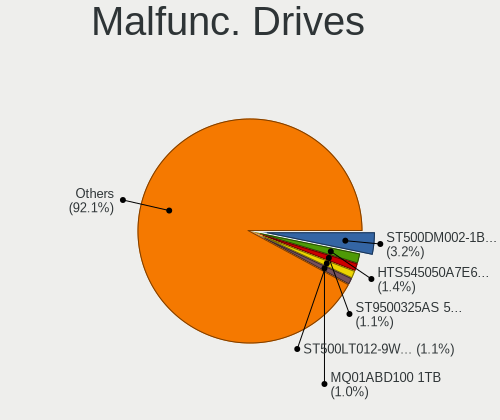

Linux - Hardware Trends
-----------------------

A project to identify most popular hardware characteristics and track their change
over time based on data collected by Linux users at https://Linux-Hardware.org.

Anyone can contribute to this report by the [hw-probe](https://github.com/linuxhw/hw-probe) tool:

    sudo -E hw-probe -all -upload

This is a report for all computer types. See also reports for [desktops](/Desktop/README.md) and [notebooks](/Notebook/README.md).

Distribution-specific reports: [Arch](/Dist/Arch), [ArcoLinux](/Dist/ArcoLinux), [BlackPanther](/Dist/BlackPanther), [CentOS](/Dist/CentOS), [Clear Linux](/Dist/Clear_Linux), [Debian](/Dist/Debian), [Elementary](/Dist/Elementary), [EndeavourOS](/Dist/EndeavourOS), [Endless](/Dist/Endless), [Fedora](/Dist/Fedora), [Garuda Linux](/Dist/Garuda_Linux), [Gentoo](/Dist/Gentoo), [Kali](/Dist/Kali), [KDE neon](/Dist/KDE_neon), [Kubuntu](/Dist/Kubuntu), [Linux Mint](/Dist/Linux_Mint), [Manjaro](/Dist/Manjaro), [OpenMandriva](/Dist/OpenMandriva), [openSUSE](/Dist/openSUSE), [Pop!_OS](/Dist/Pop!_OS), [Red OS](/Dist/Red_OS), [ROSA](/Dist/ROSA), [SteamOS](/Dist/SteamOS), [Ubuntu MATE](/Dist/Ubuntu_MATE), [Ubuntu](/Dist/Ubuntu), [Xubuntu](/Dist/Xubuntu), [Zorin](/Dist/Zorin).

This report is for one last month. Overall report since the beginning of time: [TestDays](https://github.com/linuxhw/TestDays)

Period: Jul, 2023.

Contents
--------

* [ System ](#system)
  - [ OS                       ](#os)
  - [ OS Family                ](#os-family)
  - [ Kernel                   ](#kernel)
  - [ Kernel Family            ](#kernel-family)
  - [ Kernel Major Ver.        ](#kernel-major-ver)
  - [ Arch                     ](#arch)
  - [ DE                       ](#de)
  - [ Display Server           ](#display-server)
  - [ Display Manager          ](#display-manager)
  - [ OS Lang                  ](#os-lang)
  - [ Boot Mode                ](#boot-mode)
  - [ Filesystem               ](#filesystem)
  - [ Part. scheme             ](#part-scheme)
  - [ Dual Boot with Linux/BSD ](#dual-boot-with-linuxbsd)
  - [ Dual Boot (Win)          ](#dual-boot-win)

* [ Board ](#board)
  - [ Vendor                   ](#vendor)
  - [ Model                    ](#model)
  - [ Model Family             ](#model-family)
  - [ MFG Year                 ](#mfg-year)
  - [ Form Factor              ](#form-factor)
  - [ Secure Boot              ](#secure-boot)
  - [ Coreboot                 ](#coreboot)
  - [ RAM Size                 ](#ram-size)
  - [ RAM Used                 ](#ram-used)
  - [ Total Drives             ](#total-drives)
  - [ Has CD-ROM               ](#has-cd-rom)
  - [ Has Ethernet             ](#has-ethernet)
  - [ Has WiFi                 ](#has-wifi)
  - [ Has Bluetooth            ](#has-bluetooth)

* [ Location ](#location)
  - [ Country                  ](#country)
  - [ City                     ](#city)

* [ Drives ](#drives)
  - [ Drive Vendor             ](#drive-vendor)
  - [ Drive Model              ](#drive-model)
  - [ HDD Vendor               ](#hdd-vendor)
  - [ SSD Vendor               ](#ssd-vendor)
  - [ Drive Kind               ](#drive-kind)
  - [ Drive Connector          ](#drive-connector)
  - [ Drive Size               ](#drive-size)
  - [ Space Total              ](#space-total)
  - [ Space Used               ](#space-used)
  - [ Malfunc. Drives          ](#malfunc-drives)
  - [ Malfunc. Drive Vendor    ](#malfunc-drive-vendor)
  - [ Malfunc. HDD Vendor      ](#malfunc-hdd-vendor)
  - [ Malfunc. Drive Kind      ](#malfunc-drive-kind)
  - [ Failed Drives            ](#failed-drives)
  - [ Failed Drive Vendor      ](#failed-drive-vendor)
  - [ Drive Status             ](#drive-status)

* [ Storage controller ](#storage-controller)
  - [ Storage Vendor           ](#storage-vendor)
  - [ Storage Model            ](#storage-model)
  - [ Storage Kind             ](#storage-kind)

* [ Processor ](#processor)
  - [ CPU Vendor               ](#cpu-vendor)
  - [ CPU Model                ](#cpu-model)
  - [ CPU Model Family         ](#cpu-model-family)
  - [ CPU Cores                ](#cpu-cores)
  - [ CPU Sockets              ](#cpu-sockets)
  - [ CPU Threads              ](#cpu-threads)
  - [ CPU Op-Modes             ](#cpu-op-modes)
  - [ CPU Microcode            ](#cpu-microcode)
  - [ CPU Microarch            ](#cpu-microarch)

* [ Graphics ](#graphics)
  - [ GPU Vendor               ](#gpu-vendor)
  - [ GPU Model                ](#gpu-model)
  - [ GPU Combo                ](#gpu-combo)
  - [ GPU Driver               ](#gpu-driver)
  - [ GPU Memory               ](#gpu-memory)

* [ Monitor ](#monitor)
  - [ Monitor Vendor           ](#monitor-vendor)
  - [ Monitor Model            ](#monitor-model)
  - [ Monitor Resolution       ](#monitor-resolution)
  - [ Monitor Diagonal         ](#monitor-diagonal)
  - [ Monitor Width            ](#monitor-width)
  - [ Aspect Ratio             ](#aspect-ratio)
  - [ Monitor Area             ](#monitor-area)
  - [ Pixel Density            ](#pixel-density)
  - [ Multiple Monitors        ](#multiple-monitors)

* [ Network ](#network)
  - [ Net Controller Vendor    ](#net-controller-vendor)
  - [ Net Controller Model     ](#net-controller-model)
  - [ Wireless Vendor          ](#wireless-vendor)
  - [ Wireless Model           ](#wireless-model)
  - [ Ethernet Vendor          ](#ethernet-vendor)
  - [ Ethernet Model           ](#ethernet-model)
  - [ Net Controller Kind      ](#net-controller-kind)
  - [ Used Controller          ](#used-controller)
  - [ NICs                     ](#nics)
  - [ IPv6                     ](#ipv6)

* [ Bluetooth ](#bluetooth)
  - [ Bluetooth Vendor         ](#bluetooth-vendor)
  - [ Bluetooth Model          ](#bluetooth-model)

* [ Sound ](#sound)
  - [ Sound Vendor             ](#sound-vendor)
  - [ Sound Model              ](#sound-model)

* [ Memory ](#memory)
  - [ Memory Vendor            ](#memory-vendor)
  - [ Memory Model             ](#memory-model)
  - [ Memory Kind              ](#memory-kind)
  - [ Memory Form Factor       ](#memory-form-factor)
  - [ Memory Size              ](#memory-size)
  - [ Memory Speed             ](#memory-speed)

* [ Printers & scanners ](#printers--scanners)
  - [ Printer Vendor           ](#printer-vendor)
  - [ Printer Model            ](#printer-model)
  - [ Scanner Vendor           ](#scanner-vendor)
  - [ Scanner Model            ](#scanner-model)

* [ Camera ](#camera)
  - [ Camera Vendor            ](#camera-vendor)
  - [ Camera Model             ](#camera-model)

* [ Security ](#security)
  - [ Fingerprint Vendor       ](#fingerprint-vendor)
  - [ Fingerprint Model        ](#fingerprint-model)
  - [ Chipcard Vendor          ](#chipcard-vendor)
  - [ Chipcard Model           ](#chipcard-model)

* [ Unsupported ](#unsupported)
  - [ Unsupported Devices      ](#unsupported-devices)
  - [ Unsupported Device Types ](#unsupported-device-types)

System
------

OS
--

Installed operating systems

| Name                         | Computers | Percent |
|------------------------------|-----------|---------|
| Ubuntu 22.04                 | 647       | 12.37%  |
| Fedora 38                    | 450       | 8.6%    |
| Debian 12                    | 307       | 5.87%   |
| Linux Mint 21.1              | 274       | 5.24%   |
| Ubuntu 23.04                 | 255       | 4.88%   |
| Arch Rolling                 | 223       | 4.26%   |
| Pop!_OS 22.04                | 197       | 3.77%   |
| OpenMandriva 23.03           | 162       | 3.1%    |
| Linux Mint 21.2              | 162       | 3.1%    |
| ROSA 12.4                    | 156       | 2.98%   |
| Zorin 16                     | 148       | 2.83%   |
| ArcoLinux Rolling            | 132       | 2.52%   |
| Debian 11                    | 115       | 2.2%    |
| Ubuntu 20.04                 | 107       | 2.05%   |
| OpenMandriva 23.07           | 100       | 1.91%   |
| Manjaro                      | 78        | 1.49%   |
| openSUSE Tumbleweed-XXXXXXXX | 70        | 1.34%   |
| Kali 2023.2                  | 65        | 1.24%   |
| EndeavourOS Rolling          | 63        | 1.2%    |
| KDE neon 22.04               | 57        | 1.09%   |
| Kubuntu 22.04                | 56        | 1.07%   |
| Kubuntu 23.04                | 55        | 1.05%   |
| Gentoo 2.13                  | 51        | 0.98%   |
| Debian                       | 50        | 0.96%   |
| BlackPanther 18.1            | 49        | 0.94%   |
| Xero Rolling                 | 46        | 0.88%   |
| Nobara 38                    | 46        | 0.88%   |
| Linux Mint 20.3              | 45        | 0.86%   |
| Ubuntu 22.10                 | 44        | 0.84%   |
| SteamOS 3.4.8                | 44        | 0.84%   |
| Manjaro 23.0.0               | 40        | 0.76%   |
| openSUSE Leap-15.5           | 39        | 0.75%   |
| Xubuntu 22.04                | 38        | 0.73%   |
| OpenMandriva 4.3             | 36        | 0.69%   |
| Elementary 7                 | 31        | 0.59%   |
| OpenMandriva 23.06           | 29        | 0.55%   |
| Fedora 37                    | 26        | 0.5%    |
| Ubuntu 18.04                 | 21        | 0.4%    |
| Lubuntu 22.04                | 21        | 0.4%    |
| MX 21                        | 20        | 0.38%   |

OS Family
---------

OS without a version

| Name          | Computers | Percent |
|---------------|-----------|---------|
| Ubuntu        | 1084      | 20.73%  |
| Linux Mint    | 524       | 10.02%  |
| Fedora        | 485       | 9.27%   |
| Debian        | 475       | 9.08%   |
| OpenMandriva  | 371       | 7.09%   |
| Arch          | 224       | 4.28%   |
| Pop!_OS       | 200       | 3.82%   |
| ROSA          | 178       | 3.4%    |
| Zorin         | 159       | 3.04%   |
| ArcoLinux     | 136       | 2.6%    |
| openSUSE      | 120       | 2.29%   |
| Manjaro       | 120       | 2.29%   |
| Kubuntu       | 120       | 2.29%   |
| Xubuntu       | 77        | 1.47%   |
| Kali          | 68        | 1.3%    |
| EndeavourOS   | 63        | 1.2%    |
| SteamOS       | 59        | 1.13%   |
| Gentoo        | 58        | 1.11%   |
| KDE neon      | 57        | 1.09%   |
| BlackPanther  | 57        | 1.09%   |
| Nobara        | 54        | 1.03%   |
| Xero          | 46        | 0.88%   |
| Lubuntu       | 36        | 0.69%   |
| Elementary    | 36        | 0.69%   |
| Ubuntu MATE   | 32        | 0.61%   |
| MX            | 31        | 0.59%   |
| Garuda Linux  | 24        | 0.46%   |
| Parrot        | 19        | 0.36%   |
| LMDE          | 19        | 0.36%   |
| NixOS         | 18        | 0.34%   |
| Endless       | 15        | 0.29%   |
| ChimeraOS     | 13        | 0.25%   |
| blendOS       | 13        | 0.25%   |
| ALT Linux     | 13        | 0.25%   |
| TUXEDO OS     | 12        | 0.23%   |
| Ubuntu Budgie | 10        | 0.19%   |
| CentOS        | 10        | 0.19%   |
| Raspbian      | 9         | 0.17%   |
| Red OS        | 8         | 0.15%   |
| PostmarketOS  | 8         | 0.15%   |

Kernel
------

Version of the Linux kernel

| Version                           | Computers | Percent |
|-----------------------------------|-----------|---------|
| 5.19.0-46-generic                 | 557       | 10.65%  |
| 5.15.0-76-generic                 | 510       | 9.75%   |
| 6.2.6-76060206-generic            | 182       | 3.48%   |
| 6.2.6-desktop-1omv2390            | 167       | 3.19%   |
| 6.1.0-10-amd64                    | 160       | 3.06%   |
| 5.15.0-78-generic                 | 133       | 2.54%   |
| 6.2.0-25-generic                  | 126       | 2.41%   |
| 6.3.5-desktop-3omv2390            | 117       | 2.24%   |
| 6.3.12-200.fc38.x86_64            | 112       | 2.14%   |
| 6.2.0-24-generic                  | 110       | 2.1%    |
| 5.19.0-50-generic                 | 99        | 1.89%   |
| 6.3.8-200.fc38.x86_64             | 97        | 1.85%   |
| 6.3.11-200.fc38.x86_64            | 85        | 1.63%   |
| 5.10.0-23-amd64                   | 85        | 1.63%   |
| 6.1.0-9-amd64                     | 82        | 1.57%   |
| 6.1.38-generic-1rosa2021.1-x86_64 | 63        | 1.2%    |
| 6.1.20-generic-2rosa2021.1-x86_64 | 63        | 1.2%    |
| 5.4.0-153-generic                 | 49        | 0.94%   |
| 6.4.3-arch1-2                     | 48        | 0.92%   |
| 6.4.4-200.fc38.x86_64             | 47        | 0.9%    |
| 6.2.0-26-generic                  | 46        | 0.88%   |
| 5.13.0-valve36-1-neptune          | 46        | 0.88%   |
| 6.4.2-arch1-1                     | 43        | 0.82%   |
| 6.1.0-4-amd64                     | 42        | 0.8%    |
| 5.19.0-32-generic                 | 42        | 0.8%    |
| 6.3.9-arch1-1                     | 41        | 0.78%   |
| 6.4.6-200.fc38.x86_64             | 38        | 0.73%   |
| 6.4.3-arch1-1                     | 38        | 0.73%   |
| 6.2.9-300.fc38.x86_64             | 38        | 0.73%   |
| 6.4.1-arch2-1                     | 34        | 0.65%   |
| 5.6.14-desktop-2bP                | 33        | 0.63%   |
| 6.1.0-kali9-amd64                 | 32        | 0.61%   |
| 6.3.9-1-default                   | 31        | 0.59%   |
| 5.15.0-56-generic                 | 31        | 0.59%   |
| 6.4.4-arch1-1                     | 30        | 0.57%   |
| 6.3.0-1-amd64                     | 29        | 0.55%   |
| 5.15.0-75-generic                 | 27        | 0.52%   |
| 5.14.21-150500.53-default         | 27        | 0.52%   |
| 6.2.0-20-generic                  | 26        | 0.5%    |
| 6.3.12-204.fsync.fc38.x86_64      | 25        | 0.48%   |

Kernel Family
-------------

Linux kernel without a distro release

| Version | Computers | Percent |
|---------|-----------|---------|
| 5.15.0  | 817       | 15.62%  |
| 5.19.0  | 769       | 14.7%   |
| 6.1.0   | 381       | 7.28%   |
| 6.2.6   | 352       | 6.73%   |
| 6.2.0   | 348       | 6.65%   |
| 6.4.3   | 173       | 3.31%   |
| 6.3.12  | 165       | 3.15%   |
| 6.3.8   | 131       | 2.5%    |
| 6.3.5   | 126       | 2.41%   |
| 6.1.38  | 124       | 2.37%   |
| 5.10.0  | 121       | 2.31%   |
| 6.4.4   | 119       | 2.28%   |
| 5.4.0   | 119       | 2.28%   |
| 6.4.2   | 112       | 2.14%   |
| 6.3.9   | 110       | 2.1%    |
| 6.4.6   | 91        | 1.74%   |
| 6.3.11  | 90        | 1.72%   |
| 6.4.1   | 84        | 1.61%   |
| 6.3.0   | 71        | 1.36%   |
| 6.1.20  | 67        | 1.28%   |
| 5.13.0  | 57        | 1.09%   |
| 6.4.0   | 54        | 1.03%   |
| 5.14.21 | 41        | 0.78%   |
| 6.2.9   | 40        | 0.76%   |
| 6.1.31  | 39        | 0.75%   |
| 5.6.14  | 33        | 0.63%   |
| 6.4.7   | 26        | 0.5%    |
| 6.3.10  | 25        | 0.48%   |
| 6.1.39  | 24        | 0.46%   |
| 5.16.7  | 22        | 0.42%   |
| 6.1.1   | 20        | 0.38%   |
| 6.2.16  | 17        | 0.33%   |
| 6.4.5   | 16        | 0.31%   |
| 5.14.0  | 16        | 0.31%   |
| 6.1.21  | 15        | 0.29%   |
| 6.1.41  | 14        | 0.27%   |
| 5.16.13 | 14        | 0.27%   |
| 4.15.0  | 14        | 0.27%   |
| 6.2.15  | 13        | 0.25%   |
| 5.11.0  | 13        | 0.25%   |

Kernel Major Ver.
-----------------

Linux kernel major version

| Version | Computers | Percent |
|---------|-----------|---------|
| 5.15    | 882       | 16.86%  |
| 6.2     | 792       | 15.14%  |
| 5.19    | 772       | 14.76%  |
| 6.3     | 755       | 14.44%  |
| 6.1     | 731       | 13.98%  |
| 6.4     | 675       | 12.91%  |
| 5.10    | 166       | 3.17%   |
| 5.4     | 127       | 2.43%   |
| 5.13    | 59        | 1.13%   |
| 5.14    | 57        | 1.09%   |
| 5.16    | 40        | 0.76%   |
| 5.6     | 33        | 0.63%   |
| 6.0     | 29        | 0.55%   |
| 4.18    | 20        | 0.38%   |
| 5.11    | 15        | 0.29%   |
| 4.15    | 14        | 0.27%   |
| 6.5     | 10        | 0.19%   |
| 5.17    | 10        | 0.19%   |
| 3.10    | 9         | 0.17%   |
| 4.9     | 7         | 0.13%   |
| 5.18    | 6         | 0.11%   |
| 4.19    | 6         | 0.11%   |
| 5.8     | 3         | 0.06%   |
| 4.4     | 3         | 0.06%   |
| 4.14    | 3         | 0.06%   |
| 6.3.3   | 1         | 0.02%   |
| 6       | 1         | 0.02%   |
| 5.9     | 1         | 0.02%   |
| 5.1     | 1         | 0.02%   |
| 3.1     | 1         | 0.02%   |
| 2.6     | 1         | 0.02%   |

Arch
----

OS architecture (x86_64, i586, etc.)

| Name        | Computers | Percent |
|-------------|-----------|---------|
| x86_64      | 5122      | 97.93%  |
| aarch64     | 51        | 0.98%   |
| i686        | 40        | 0.76%   |
| armv7l      | 11        | 0.21%   |
| armv6l      | 4         | 0.08%   |
| riscv64     | 1         | 0.02%   |
| loongarch64 | 1         | 0.02%   |

DE
--

Desktop Environment

| Name             | Computers | Percent |
|------------------|-----------|---------|
| GNOME            | 2188      | 41.84%  |
| KDE5             | 1343      | 25.68%  |
| X-Cinnamon       | 460       | 8.8%    |
| XFCE             | 447       | 8.55%   |
| Unknown          | 264       | 5.05%   |
| MATE             | 154       | 2.94%   |
| LXQt             | 74        | 1.41%   |
| Cinnamon         | 57        | 1.09%   |
| Pantheon         | 38        | 0.73%   |
| i3               | 26        | 0.5%    |
| LXDE             | 22        | 0.42%   |
| Hyprland         | 22        | 0.42%   |
| Budgie           | 20        | 0.38%   |
| GNOME Classic    | 14        | 0.27%   |
| sway             | 13        | 0.25%   |
| Deepin           | 12        | 0.23%   |
| lightdm-xsession | 8         | 0.15%   |
| KDE4             | 7         | 0.13%   |
| KDE              | 7         | 0.13%   |
| Unity            | 5         | 0.1%    |
| openbox          | 5         | 0.1%    |
| GNOME Flashback  | 5         | 0.1%    |
| DWM              | 4         | 0.08%   |
| Trinity          | 3         | 0.06%   |
| Enlightenment    | 3         | 0.06%   |
| chadwm           | 3         | 0.06%   |
| BunsenLabs       | 3         | 0.06%   |
| bspwm            | 3         | 0.06%   |
| awesome          | 3         | 0.06%   |
| qtile            | 2         | 0.04%   |
| LeftWM           | 2         | 0.04%   |
| GNOME-Classic    | 2         | 0.04%   |
| X-Generic        | 1         | 0.02%   |
| UKUI             | 1         | 0.02%   |
| river            | 1         | 0.02%   |
| Phosh:GNOME      | 1         | 0.02%   |
| none+awesome     | 1         | 0.02%   |
| Lubuntu          | 1         | 0.02%   |
| Jwm              | 1         | 0.02%   |
| gamescope        | 1         | 0.02%   |

Display Server
--------------

X11 or Wayland

| Name        | Computers | Percent |
|-------------|-----------|---------|
| X11         | 3281      | 62.73%  |
| Wayland     | 1647      | 31.49%  |
| Unknown     | 168       | 3.21%   |
| Tty         | 133       | 2.54%   |
| Unspecified | 1         | 0.02%   |

Display Manager
---------------

SDDM, LightDM, etc.

| Name    | Computers | Percent |
|---------|-----------|---------|
| Unknown | 1882      | 35.98%  |
| SDDM    | 1098      | 20.99%  |
| GDM3    | 1049      | 20.06%  |
| LightDM | 778       | 14.88%  |
| GDM     | 383       | 7.32%   |
| LXDM    | 9         | 0.17%   |
| LY-DM   | 5         | 0.1%    |
| GREETD  | 5         | 0.1%    |
| Ly      | 4         | 0.08%   |
| KDM     | 4         | 0.08%   |
| XDM     | 3         | 0.06%   |
| SLiM    | 3         | 0.06%   |
| FLY-DM  | 3         | 0.06%   |
| TDM     | 2         | 0.04%   |
| WDM     | 1         | 0.02%   |
| NODM    | 1         | 0.02%   |

OS Lang
-------

Language

| Lang    | Computers | Percent |
|---------|-----------|---------|
| en_US   | 2241      | 42.85%  |
| de_DE   | 409       | 7.82%   |
| ru_RU   | 390       | 7.46%   |
| en_GB   | 311       | 5.95%   |
| pt_BR   | 242       | 4.63%   |
| fr_FR   | 196       | 3.75%   |
| it_IT   | 130       | 2.49%   |
| es_ES   | 122       | 2.33%   |
| Unknown | 115       | 2.2%    |
| C       | 104       | 1.99%   |
| pl_PL   | 96        | 1.84%   |
| en_CA   | 93        | 1.78%   |
| en_IN   | 74        | 1.41%   |
| en_AU   | 73        | 1.4%    |
| es_MX   | 56        | 1.07%   |
| zh_CN   | 38        | 0.73%   |
| nl_NL   | 34        | 0.65%   |
| cs_CZ   | 32        | 0.61%   |
| hu_HU   | 29        | 0.55%   |
| es_AR   | 24        | 0.46%   |
| sv_SE   | 20        | 0.38%   |
| en_ZA   | 18        | 0.34%   |
| de_AT   | 18        | 0.34%   |
| en_IE   | 17        | 0.33%   |
| ja_JP   | 16        | 0.31%   |
| es_CL   | 16        | 0.31%   |
| de_CH   | 15        | 0.29%   |
| fi_FI   | 14        | 0.27%   |
| es_CO   | 14        | 0.27%   |
| da_DK   | 14        | 0.27%   |
| pt_PT   | 13        | 0.25%   |
| en_NZ   | 13        | 0.25%   |
| tr_TR   | 12        | 0.23%   |
| nb_NO   | 12        | 0.23%   |
| fr_CA   | 12        | 0.23%   |
| es_VE   | 12        | 0.23%   |
| en_PH   | 11        | 0.21%   |
| nl_BE   | 10        | 0.19%   |
| fr_BE   | 9         | 0.17%   |
| C.UTF8  | 9         | 0.17%   |

Boot Mode
---------

EFI or BIOS

| Mode | Computers | Percent |
|------|-----------|---------|
| EFI  | 2813      | 53.79%  |
| BIOS | 2417      | 46.21%  |

Filesystem
----------

Type of filesystem

| Type     | Computers | Percent |
|----------|-----------|---------|
| Ext4     | 3028      | 57.9%   |
| Btrfs    | 963       | 18.41%  |
| Tmpfs    | 728       | 13.92%  |
| Overlay  | 346       | 6.62%   |
| Xfs      | 103       | 1.97%   |
| Zfs      | 35        | 0.67%   |
| F2fs     | 15        | 0.29%   |
| Unknown  | 3         | 0.06%   |
| Jfs      | 2         | 0.04%   |
| Ext2     | 2         | 0.04%   |
| XXXXXXX  | 1         | 0.02%   |
| XXXX     | 1         | 0.02%   |
| Reiserfs | 1         | 0.02%   |
| Ext3     | 1         | 0.02%   |
| Aufs     | 1         | 0.02%   |

Part. scheme
------------

Scheme of partitioning

| Type    | Computers | Percent |
|---------|-----------|---------|
| GPT     | 2953      | 56.46%  |
| Unknown | 1664      | 31.82%  |
| MBR     | 613       | 11.72%  |

Dual Boot with Linux/BSD
------------------------

Hosting more than one Linux/BSD

| Dual boot | Computers | Percent |
|-----------|-----------|---------|
| No        | 4479      | 85.64%  |
| Yes       | 751       | 14.36%  |

Dual Boot (Win)
---------------

Hosting Linux and Windows

| Dual boot | Computers | Percent |
|-----------|-----------|---------|
| No        | 3844      | 73.5%   |
| Yes       | 1386      | 26.5%   |

Board
-----

Vendor
------

Motherboard manufacturer

| Name                                 | Computers | Percent |
|--------------------------------------|-----------|---------|
| ASUSTek Computer                     | 781       | 14.93%  |
| Lenovo                               | 734       | 14.03%  |
| Hewlett-Packard                      | 695       | 13.29%  |
| Dell                                 | 598       | 11.43%  |
| Gigabyte Technology                  | 356       | 6.81%   |
| MSI                                  | 342       | 6.54%   |
| Acer                                 | 264       | 5.05%   |
| ASRock                               | 191       | 3.65%   |
| Apple                                | 178       | 3.4%    |
| Unknown                              | 87        | 1.66%   |
| Intel                                | 81        | 1.55%   |
| Fujitsu                              | 53        | 1.01%   |
| Valve                                | 52        | 0.99%   |
| Toshiba                              | 47        | 0.9%    |
| Samsung Electronics                  | 46        | 0.88%   |
| HUAWEI                               | 45        | 0.86%   |
| Google                               | 45        | 0.86%   |
| Sony                                 | 26        | 0.5%    |
| AZW                                  | 26        | 0.5%    |
| Microsoft                            | 24        | 0.46%   |
| Medion                               | 23        | 0.44%   |
| Supermicro                           | 22        | 0.42%   |
| Raspberry Pi Foundation              | 21        | 0.4%    |
| Positivo                             | 20        | 0.38%   |
| Biostar                              | 19        | 0.36%   |
| Alienware                            | 19        | 0.36%   |
| TUXEDO                               | 18        | 0.34%   |
| Notebook                             | 18        | 0.34%   |
| Timi                                 | 17        | 0.33%   |
| Chuwi                                | 16        | 0.31%   |
| Pegatron                             | 14        | 0.27%   |
| ECS                                  | 12        | 0.23%   |
| Foxconn                              | 11        | 0.21%   |
| Shenzhen Meigao Electronic Equipment | 10        | 0.19%   |
| Gateway                              | 10        | 0.19%   |
| Packard Bell                         | 9         | 0.17%   |
| Huanan                               | 9         | 0.17%   |
| Fujitsu Siemens                      | 9         | 0.17%   |
| Teclast                              | 8         | 0.15%   |
| System76                             | 8         | 0.15%   |

Model
-----

Motherboard model

| Name                                      | Computers | Percent |
|-------------------------------------------|-----------|---------|
| Unknown                                   | 101       | 1.93%   |
| Valve Jupiter                             | 52        | 0.99%   |
| ASUS All Series                           | 40        | 0.76%   |
| ASRock H470M-HVS                          | 20        | 0.38%   |
| HP Notebook                               | 15        | 0.29%   |
| Apple MacBookPro9,2                       | 14        | 0.27%   |
| Apple MacBookPro8,1                       | 14        | 0.27%   |
| Dell OptiPlex 7010                        | 12        | 0.23%   |
| AZW SER                                   | 12        | 0.23%   |
| Dell OptiPlex 9020                        | 11        | 0.21%   |
| ASUS PRIME A320M-K                        | 11        | 0.21%   |
| MSI MS-7C91                               | 9         | 0.17%   |
| MSI MS-7C56                               | 9         | 0.17%   |
| Gigabyte H81M-S2V                         | 9         | 0.17%   |
| ASRock B450M Pro4                         | 9         | 0.17%   |
| MSI MS-7C37                               | 8         | 0.15%   |
| MSI MS-7C02                               | 8         | 0.15%   |
| Lenovo IdeaPad 3 15ADA05 81W1             | 8         | 0.15%   |
| HP EliteBook 840 G5                       | 8         | 0.15%   |
| Gigabyte A320M-S2H V2                     | 8         | 0.15%   |
| Dell XPS 15 7590                          | 8         | 0.15%   |
| ASUS TUF Gaming X570-PLUS                 | 8         | 0.15%   |
| ASUS ROG STRIX B550-F GAMING              | 8         | 0.15%   |
| ASUS PRIME X570-P                         | 8         | 0.15%   |
| ASUS PRIME X370-PRO                       | 8         | 0.15%   |
| Apple MacBookPro11,1                      | 8         | 0.15%   |
| MSI MS-7D75                               | 7         | 0.13%   |
| MSI MS-7D25                               | 7         | 0.13%   |
| MSI MS-7C52                               | 7         | 0.13%   |
| HP Pavilion 17                            | 7         | 0.13%   |
| HP Pavilion 15                            | 7         | 0.13%   |
| Dell OptiPlex 3020                        | 7         | 0.13%   |
| Apple MacBookPro12,1                      | 7         | 0.13%   |
| Supermicro Super Server                   | 6         | 0.11%   |
| MSI MS-7817                               | 6         | 0.11%   |
| Lenovo ThinkPad L13 Yoga Gen 2 20VK0019US | 6         | 0.11%   |
| Lenovo G50-70 20351                       | 6         | 0.11%   |
| HP Pavilion Laptop 15-eh1xxx              | 6         | 0.11%   |
| HP Pavilion dv6                           | 6         | 0.11%   |
| HP Laptop 17-cp0xxx                       | 6         | 0.11%   |

Model Family
------------

Motherboard model prefix

| Name               | Computers | Percent |
|--------------------|-----------|---------|
| Lenovo ThinkPad    | 317       | 6.06%   |
| Dell Latitude      | 164       | 3.14%   |
| Acer Aspire        | 160       | 3.06%   |
| Dell Inspiron      | 151       | 2.89%   |
| Lenovo IdeaPad     | 145       | 2.77%   |
| ASUS ROG           | 131       | 2.5%    |
| HP Pavilion        | 116       | 2.22%   |
| ASUS PRIME         | 115       | 2.2%    |
| Dell OptiPlex      | 104       | 1.99%   |
| Unknown            | 101       | 1.93%   |
| ASUS VivoBook      | 92        | 1.76%   |
| HP EliteBook       | 85        | 1.63%   |
| HP Laptop          | 73        | 1.4%    |
| ASUS TUF           | 58        | 1.11%   |
| HP ProBook         | 57        | 1.09%   |
| HP Compaq          | 57        | 1.09%   |
| Lenovo ThinkCentre | 56        | 1.07%   |
| Dell XPS           | 56        | 1.07%   |
| Valve Jupiter      | 52        | 0.99%   |
| Dell Precision     | 48        | 0.92%   |
| HP ENVY            | 42        | 0.8%    |
| Lenovo Yoga        | 41        | 0.78%   |
| ASUS All           | 40        | 0.76%   |
| Lenovo Legion      | 35        | 0.67%   |
| Toshiba Satellite  | 34        | 0.65%   |
| Fujitsu LIFEBOOK   | 29        | 0.55%   |
| ASUS ZenBook       | 29        | 0.55%   |
| Acer Nitro         | 29        | 0.55%   |
| ASUS ASUS          | 27        | 0.52%   |
| Dell Vostro        | 25        | 0.48%   |
| Microsoft Surface  | 24        | 0.46%   |
| HP EliteDesk       | 24        | 0.46%   |
| RPi Raspberry      | 21        | 0.4%    |
| HP ZBook           | 20        | 0.38%   |
| ASRock H470M-HVS   | 20        | 0.38%   |
| Acer Swift         | 20        | 0.38%   |
| HP ProDesk         | 18        | 0.34%   |
| Apple MacBookPro8  | 18        | 0.34%   |
| Apple MacBookPro11 | 18        | 0.34%   |
| Lenovo ThinkBook   | 17        | 0.33%   |

MFG Year
--------

Motherboard manufacture year

| Year    | Computers | Percent |
|---------|-----------|---------|
| 2021    | 604       | 11.55%  |
| 2022    | 580       | 11.09%  |
| 2020    | 491       | 9.39%   |
| 2018    | 445       | 8.51%   |
| 2019    | 377       | 7.21%   |
| 2012    | 324       | 6.2%    |
| 2017    | 303       | 5.79%   |
| 2013    | 303       | 5.79%   |
| 2011    | 273       | 5.22%   |
| 2014    | 242       | 4.63%   |
| 2015    | 229       | 4.38%   |
| 2016    | 228       | 4.36%   |
| 2023    | 211       | 4.03%   |
| 2010    | 199       | 3.8%    |
| 2009    | 142       | 2.72%   |
| 2008    | 122       | 2.33%   |
| 2007    | 65        | 1.24%   |
| Unknown | 58        | 1.11%   |
| 2006    | 19        | 0.36%   |
| 2005    | 9         | 0.17%   |
| 2004    | 3         | 0.06%   |
| 2002    | 2         | 0.04%   |
| 2003    | 1         | 0.02%   |

Form Factor
-----------

Physical design of the computer

| Name           | Computers | Percent |
|----------------|-----------|---------|
| Notebook       | 2762      | 52.81%  |
| Desktop        | 1959      | 37.46%  |
| Convertible    | 163       | 3.12%   |
| Mini pc        | 97        | 1.85%   |
| All in one     | 77        | 1.47%   |
| Tablet         | 63        | 1.2%    |
| Server         | 52        | 0.99%   |
| System on chip | 51        | 0.98%   |
| Other          | 4         | 0.08%   |
| Phone          | 1         | 0.02%   |
| Stick pc       | 1         | 0.02%   |

Secure Boot
-----------

Enabled or disabled

| State    | Computers | Percent |
|----------|-----------|---------|
| Disabled | 4882      | 93.35%  |
| Enabled  | 348       | 6.65%   |

Coreboot
--------

Have coreboot on board

| Used | Computers | Percent |
|------|-----------|---------|
| No   | 5186      | 99.16%  |
| Yes  | 44        | 0.84%   |

RAM Size
--------

Total RAM memory

| Size in GB      | Computers | Percent |
|-----------------|-----------|---------|
| 4.01-8.0        | 1232      | 23.56%  |
| 16.01-24.0      | 1076      | 20.57%  |
| 8.01-16.0       | 923       | 17.65%  |
| 3.01-4.0        | 717       | 13.71%  |
| 32.01-64.0      | 687       | 13.14%  |
| 64.01-256.0     | 250       | 4.78%   |
| 24.01-32.0      | 141       | 2.7%    |
| 1.01-2.0        | 106       | 2.03%   |
| 2.01-3.0        | 52        | 0.99%   |
| More than 256.0 | 21        | 0.4%    |
| 0.51-1.0        | 18        | 0.34%   |
| 0.01-0.5        | 7         | 0.13%   |

RAM Used
--------

Used RAM memory

| Used GB         | Computers | Percent |
|-----------------|-----------|---------|
| 1.01-2.0        | 1437      | 27.48%  |
| 2.01-3.0        | 1302      | 24.89%  |
| 4.01-8.0        | 1012      | 19.35%  |
| 3.01-4.0        | 781       | 14.93%  |
| 8.01-16.0       | 289       | 5.53%   |
| 0.51-1.0        | 255       | 4.88%   |
| 0.01-0.5        | 74        | 1.41%   |
| 16.01-24.0      | 45        | 0.86%   |
| 24.01-32.0      | 17        | 0.33%   |
| 32.01-64.0      | 12        | 0.23%   |
| 64.01-256.0     | 3         | 0.06%   |
| Unknown         | 2         | 0.04%   |
| More than 256.0 | 1         | 0.02%   |

Total Drives
------------

Number of drives on board

| Drives | Computers | Percent |
|--------|-----------|---------|
| 1      | 3003      | 57.42%  |
| 2      | 1350      | 25.81%  |
| 3      | 411       | 7.86%   |
| 4      | 214       | 4.09%   |
| 5      | 112       | 2.14%   |
| 6      | 53        | 1.01%   |
| 0      | 37        | 0.71%   |
| 7      | 25        | 0.48%   |
| 8      | 6         | 0.11%   |
| 10     | 5         | 0.1%    |
| 9      | 4         | 0.08%   |
| 11     | 3         | 0.06%   |
| 12     | 2         | 0.04%   |
| 27     | 1         | 0.02%   |
| 26     | 1         | 0.02%   |
| 19     | 1         | 0.02%   |
| 14     | 1         | 0.02%   |
| 13     | 1         | 0.02%   |

Has CD-ROM
----------

Has CD-ROM on board

| Presented | Computers | Percent |
|-----------|-----------|---------|
| No        | 3675      | 70.27%  |
| Yes       | 1555      | 29.73%  |

Has Ethernet
------------

Has Ethernet on board

| Presented | Computers | Percent |
|-----------|-----------|---------|
| Yes       | 4342      | 83.02%  |
| No        | 888       | 16.98%  |

Has WiFi
--------

Has WiFi module

| Presented | Computers | Percent |
|-----------|-----------|---------|
| Yes       | 3993      | 76.35%  |
| No        | 1237      | 23.65%  |

Has Bluetooth
-------------

Has Bluetooth module

| Presented | Computers | Percent |
|-----------|-----------|---------|
| Yes       | 3366      | 64.36%  |
| No        | 1864      | 35.64%  |

Location
--------

Country
-------

Geographic location (country)

| Country      | Computers | Percent |
|--------------|-----------|---------|
| USA          | 1004      | 19.2%   |
| Germany      | 542       | 10.36%  |
| Russia       | 444       | 8.49%   |
| Brazil       | 335       | 6.41%   |
| UK           | 241       | 4.61%   |
| France       | 225       | 4.3%    |
| Italy        | 188       | 3.59%   |
| Canada       | 151       | 2.89%   |
| Poland       | 135       | 2.58%   |
| Spain        | 126       | 2.41%   |
| India        | 114       | 2.18%   |
| Netherlands  | 110       | 2.1%    |
| Australia    | 100       | 1.91%   |
| Hungary      | 93        | 1.78%   |
| Mexico       | 90        | 1.72%   |
| Sweden       | 68        | 1.3%    |
| Turkey       | 61        | 1.17%   |
| Czechia      | 54        | 1.03%   |
| Belgium      | 51        | 0.98%   |
| Switzerland  | 48        | 0.92%   |
| Argentina    | 48        | 0.92%   |
| China        | 47        | 0.9%    |
| Austria      | 46        | 0.88%   |
| Norway       | 41        | 0.78%   |
| Finland      | 37        | 0.71%   |
| Japan        | 36        | 0.69%   |
| Indonesia    | 36        | 0.69%   |
| Greece       | 32        | 0.61%   |
| South Africa | 30        | 0.57%   |
| Romania      | 29        | 0.55%   |
| Chile        | 29        | 0.55%   |
| Denmark      | 27        | 0.52%   |
| Colombia     | 27        | 0.52%   |
| Portugal     | 25        | 0.48%   |
| Malaysia     | 24        | 0.46%   |
| Ireland      | 22        | 0.42%   |
| Bulgaria     | 22        | 0.42%   |
| New Zealand  | 20        | 0.38%   |
| Hong Kong    | 20        | 0.38%   |
| Philippines  | 19        | 0.36%   |

City
----

Geographic location (city)

| City           | Computers | Percent |
|----------------|-----------|---------|
| Moscow         | 105       | 2.01%   |
| Voronezh       | 58        | 1.11%   |
| Berlin         | 53        | 1.01%   |
| St Petersburg  | 46        | 0.88%   |
| Warsaw         | 42        | 0.8%    |
| Sydney         | 37        | 0.71%   |
| Paris          | 32        | 0.61%   |
| Sao Paulo      | 31        | 0.59%   |
| Budapest       | 28        | 0.54%   |
| Vienna         | 27        | 0.52%   |
| Madrid         | 26        | 0.5%    |
| Melbourne      | 25        | 0.48%   |
| Prague         | 23        | 0.44%   |
| Istanbul       | 23        | 0.44%   |
| Los Angeles    | 22        | 0.42%   |
| Rio de Janeiro | 21        | 0.4%    |
| Hamburg        | 20        | 0.38%   |
| Munich         | 19        | 0.36%   |
| Helsinki       | 19        | 0.36%   |
| Athens         | 19        | 0.36%   |
| Milan          | 18        | 0.34%   |
| Mexico City    | 17        | 0.33%   |
| Delhi          | 17        | 0.33%   |
| Ankara         | 17        | 0.33%   |
| Singapore      | 16        | 0.31%   |
| Seattle        | 16        | 0.31%   |
| Montreal       | 16        | 0.31%   |
| Brasília      | 16        | 0.31%   |
| Dublin         | 15        | 0.29%   |
| Amsterdam      | 15        | 0.29%   |
| Central        | 14        | 0.27%   |
| Atlanta        | 14        | 0.27%   |
| Vancouver      | 13        | 0.25%   |
| Toronto        | 13        | 0.25%   |
| Stockholm      | 13        | 0.25%   |
| Samara         | 13        | 0.25%   |
| London         | 13        | 0.25%   |
| Lisbon         | 13        | 0.25%   |
| Krasnodar      | 13        | 0.25%   |
| Cologne        | 13        | 0.25%   |

Drives
------

Drive Vendor
------------

Hard drive vendors

| Vendor                      | Computers | Drives | Percent |
|-----------------------------|-----------|--------|---------|
| Samsung Electronics         | 1302      | 1639   | 16.62%  |
| WDC                         | 922       | 1252   | 11.77%  |
| Seagate                     | 878       | 1089   | 11.21%  |
| SanDisk                     | 509       | 549    | 6.5%    |
| Kingston                    | 436       | 470    | 5.57%   |
| Toshiba                     | 401       | 446    | 5.12%   |
| Unknown                     | 290       | 328    | 3.7%    |
| Crucial                     | 280       | 304    | 3.58%   |
| SK hynix                    | 219       | 223    | 2.8%    |
| Intel                       | 219       | 267    | 2.8%    |
| Micron Technology           | 181       | 182    | 2.31%   |
| Hitachi                     | 162       | 195    | 2.07%   |
| China                       | 109       | 114    | 1.39%   |
| HGST                        | 108       | 118    | 1.38%   |
| A-DATA Technology           | 107       | 114    | 1.37%   |
| Micron/Crucial Technology   | 95        | 99     | 1.21%   |
| Phison Electronics          | 93        | 100    | 1.19%   |
| Apple                       | 87        | 100    | 1.11%   |
| Silicon Motion              | 79        | 82     | 1.01%   |
| Kingston Technology Company | 79        | 85     | 1.01%   |
| KIOXIA                      | 76        | 78     | 0.97%   |
| Unknown                     | 69        | 73     | 0.88%   |
| SPCC                        | 55        | 59     | 0.7%    |
| PNY                         | 51        | 56     | 0.65%   |
| Netac                       | 47        | 48     | 0.6%    |
| Intenso                     | 41        | 45     | 0.52%   |
| Patriot                     | 35        | 36     | 0.45%   |
| JMicron Technology          | 30        | 31     | 0.38%   |
| ADATA Technology            | 30        | 30     | 0.38%   |
| Transcend                   | 29        | 29     | 0.37%   |
| MAXIO Technology (Hangzhou) | 28        | 29     | 0.36%   |
| Team                        | 26        | 27     | 0.33%   |
| Realtek Semiconductor       | 26        | 27     | 0.33%   |
| GOODRAM                     | 25        | 27     | 0.32%   |
| Maxtor                      | 24        | 25     | 0.31%   |
| OCZ                         | 23        | 26     | 0.29%   |
| Phison                      | 22        | 24     | 0.28%   |
| LITEON                      | 20        | 21     | 0.26%   |
| Fujitsu                     | 20        | 24     | 0.26%   |
| Gigabyte Technology         | 19        | 20     | 0.24%   |

Drive Model
-----------

Hard drive models

| Model                                                 | Computers | Percent |
|-------------------------------------------------------|-----------|---------|
| Samsung NVMe SSD Controller SM981/PM981/PM983 500GB   | 199       | 2.31%   |
| Samsung NVMe SSD Controller PM9A1/PM9A3/980PRO 1TB    | 123       | 1.43%   |
| Kingston SA400S37240G 240GB SSD                       | 91        | 1.06%   |
| Kingston SA400S37480G 480GB SSD                       | 73        | 0.85%   |
| Micron/Crucial P2 NVMe PCIe SSD 1TB                   | 69        | 0.8%    |
| Unknown                                               | 69        | 0.8%    |
| Seagate ST1000DM010-2EP102 1TB                        | 52        | 0.6%    |
| Seagate ST1000LM035-1RK172 1TB                        | 48        | 0.56%   |
| Samsung SSD 850 EVO 500GB                             | 48        | 0.56%   |
| Samsung SSD 980 1TB                                   | 47        | 0.55%   |
| Silicon Motion SM2263EN/SM2263XT SSD Controller 500GB | 46        | 0.54%   |
| Sandisk WD Blue SN550 NVMe SSD 250GB                  | 45        | 0.52%   |
| Unknown MMC Card  64GB                                | 44        | 0.51%   |
| Samsung SSD 860 EVO 500GB                             | 44        | 0.51%   |
| Unknown MMC Card  32GB                                | 41        | 0.48%   |
| Unknown MMC Card  128GB                               | 41        | 0.48%   |
| Toshiba MQ01ABD100 1TB                                | 40        | 0.47%   |
| Samsung NVMe SSD Controller SM961/PM961/SM963 256GB   | 40        | 0.47%   |
| Crucial CT1000MX500SSD1 1TB                           | 40        | 0.47%   |
| Seagate ST1000LM024 HN-M101MBB 1TB                    | 39        | 0.45%   |
| Sandisk WD Black SN750 / PC SN730 NVMe SSD 1024GB     | 39        | 0.45%   |
| Toshiba HDWD110 1TB                                   | 38        | 0.44%   |
| Seagate ST500DM002-1BD142 500GB                       | 38        | 0.44%   |
| Samsung SSD 860 EVO 1TB                               | 37        | 0.43%   |
| Intel SSD 660P Series 1024GB                          | 37        | 0.43%   |
| Samsung SSD 870 EVO 500GB                             | 35        | 0.41%   |
| Samsung SSD 850 EVO 250GB                             | 35        | 0.41%   |
| Crucial CT240BX500SSD1 240GB                          | 34        | 0.4%    |
| Seagate ST2000DM008-2FR102 2TB                        | 33        | 0.38%   |
| Seagate ST1000DM003-1ER162 1TB                        | 33        | 0.38%   |
| Phison E12 NVMe Controller 2TB                        | 33        | 0.38%   |
| Kingston SA400S37120G 120GB SSD                       | 33        | 0.38%   |
| Toshiba DT01ACA100 1TB                                | 30        | 0.35%   |
| Phison PS5013 E13 NVMe Controller 256GB               | 30        | 0.35%   |
| Crucial CT500MX500SSD1 500GB                          | 30        | 0.35%   |
| WDC WD10EZEX-08WN4A0 1TB                              | 28        | 0.33%   |
| Samsung SSD 870 QVO 1TB                               | 28        | 0.33%   |
| Toshiba MQ04ABF100 1TB                                | 27        | 0.31%   |
| HGST HTS721010A9E630 1TB                              | 27        | 0.31%   |
| Samsung SSD 870 EVO 1TB                               | 26        | 0.3%    |

HDD Vendor
----------

Hard disk drive vendors

| Vendor              | Computers | Drives | Percent |
|---------------------|-----------|--------|---------|
| Seagate             | 857       | 1054   | 35.4%   |
| WDC                 | 703       | 983    | 29.04%  |
| Toshiba             | 307       | 344    | 12.68%  |
| Hitachi             | 162       | 195    | 6.69%   |
| Samsung Electronics | 109       | 123    | 4.5%    |
| HGST                | 108       | 118    | 4.46%   |
| Apple               | 25        | 26     | 1.03%   |
| Unknown             | 24        | 25     | 0.99%   |
| Maxtor              | 23        | 24     | 0.95%   |
| JMicron Technology  | 20        | 20     | 0.83%   |
| Fujitsu             | 20        | 24     | 0.83%   |
| ASMT                | 13        | 17     | 0.54%   |
| Hewlett-Packard     | 7         | 13     | 0.29%   |
| Intenso             | 4         | 4      | 0.17%   |
| External            | 4         | 5      | 0.17%   |
| MaxDigital          | 3         | 3      | 0.12%   |
| LaCie               | 3         | 3      | 0.12%   |
| Unknown             | 3         | 3      | 0.12%   |
| SSK                 | 2         | 2      | 0.08%   |
| QNAP                | 2         | 5      | 0.08%   |
| PHD 3.0             | 2         | 2      | 0.08%   |
| Initio              | 2         | 2      | 0.08%   |
| Inateck             | 2         | 2      | 0.08%   |
| WALRAM              | 1         | 1      | 0.04%   |
| USB3.0              | 1         | 1      | 0.04%   |
| Teleplan            | 1         | 1      | 0.04%   |
| SYMTEC              | 1         | 1      | 0.04%   |
| StoreJet            | 1         | 1      | 0.04%   |
| SABRENT             | 1         | 1      | 0.04%   |
| QUANTUM             | 1         | 1      | 0.04%   |
| MDT                 | 1         | 1      | 0.04%   |
| IBM/Hitachi         | 1         | 1      | 0.04%   |
| IBM                 | 1         | 1      | 0.04%   |
| IB                  | 1         | 2      | 0.04%   |
| HPE                 | 1         | 1      | 0.04%   |
| H/W                 | 1         | 3      | 0.04%   |
| China               | 1         | 1      | 0.04%   |
| ASMedia             | 1         | 1      | 0.04%   |
| ACASIS              | 1         | 1      | 0.04%   |

SSD Vendor
----------

Solid state drive vendors

| Vendor              | Computers | Drives | Percent |
|---------------------|-----------|--------|---------|
| Samsung Electronics | 569       | 669    | 21.99%  |
| Kingston            | 330       | 353    | 12.75%  |
| Crucial             | 245       | 264    | 9.47%   |
| SanDisk             | 200       | 210    | 7.73%   |
| WDC                 | 176       | 187    | 6.8%    |
| China               | 106       | 111    | 4.1%    |
| A-DATA Technology   | 82        | 87     | 3.17%   |
| Intel               | 60        | 77     | 2.32%   |
| SPCC                | 48        | 52     | 1.85%   |
| PNY                 | 48        | 53     | 1.85%   |
| Micron Technology   | 46        | 46     | 1.78%   |
| Apple               | 46        | 46     | 1.78%   |
| Netac               | 39        | 40     | 1.51%   |
| Toshiba             | 32        | 33     | 1.24%   |
| SK hynix            | 32        | 32     | 1.24%   |
| Intenso             | 32        | 35     | 1.24%   |
| Transcend           | 29        | 29     | 1.12%   |
| Patriot             | 29        | 30     | 1.12%   |
| Team                | 25        | 25     | 0.97%   |
| GOODRAM             | 24        | 26     | 0.93%   |
| OCZ                 | 23        | 26     | 0.89%   |
| Unknown             | 22        | 22     | 0.85%   |
| LITEON              | 19        | 20     | 0.73%   |
| LITEONIT            | 16        | 16     | 0.62%   |
| Gigabyte Technology | 15        | 16     | 0.58%   |
| KingSpec            | 14        | 18     | 0.54%   |
| Plextor             | 12        | 12     | 0.46%   |
| Apacer              | 12        | 12     | 0.46%   |
| Verbatim            | 11        | 12     | 0.43%   |
| Hewlett-Packard     | 11        | 16     | 0.43%   |
| Teclast             | 8         | 8      | 0.31%   |
| Lexar               | 7         | 7      | 0.27%   |
| Corsair             | 7         | 7      | 0.27%   |
| AMD                 | 7         | 7      | 0.27%   |
| Phison              | 6         | 6      | 0.23%   |
| Mushkin             | 6         | 6      | 0.23%   |
| XrayDisk            | 5         | 5      | 0.19%   |
| Seagate             | 5         | 5      | 0.19%   |
| Leven               | 5         | 5      | 0.19%   |
| Fanxiang            | 5         | 5      | 0.19%   |

Drive Kind
----------

HDD or SSD

| Kind    | Computers | Drives | Percent |
|---------|-----------|--------|---------|
| NVMe    | 2319      | 2808   | 33.02%  |
| SSD     | 2265      | 2821   | 32.25%  |
| HDD     | 2022      | 3016   | 28.79%  |
| MMC     | 295       | 327    | 4.2%    |
| Unknown | 122       | 141    | 1.74%   |

Drive Connector
---------------

SATA, SAS, NVMe, etc.

| Type | Computers | Drives | Percent |
|------|-----------|--------|---------|
| SATA | 3461      | 5559   | 54.16%  |
| NVMe | 2305      | 2781   | 36.07%  |
| SAS  | 329       | 446    | 5.15%   |
| MMC  | 295       | 327    | 4.62%   |

Drive Size
----------

Size of hard drive

| Size in TB | Computers | Drives | Percent |
|------------|-----------|--------|---------|
| 0.01-0.5   | 2449      | 3115   | 53.9%   |
| 0.51-1.0   | 1352      | 1621   | 29.75%  |
| 1.01-2.0   | 379       | 509    | 8.34%   |
| 3.01-4.0   | 153       | 240    | 3.37%   |
| 4.01-10.0  | 114       | 210    | 2.51%   |
| 2.01-3.0   | 71        | 108    | 1.56%   |
| 10.01-20.0 | 24        | 32     | 0.53%   |
| 20.01-50.0 | 1         | 1      | 0.02%   |
| 0          | 1         | 1      | 0.02%   |

Space Total
-----------

Amount of disk space available on the file system

| Size in GB     | Computers | Percent |
|----------------|-----------|---------|
| 101-250        | 1235      | 23.61%  |
| 251-500        | 1083      | 20.71%  |
| 501-1000       | 834       | 15.95%  |
| 1001-2000      | 523       | 10%     |
| More than 3000 | 408       | 7.8%    |
| 1-20           | 315       | 6.02%   |
| 51-100         | 261       | 4.99%   |
| Unknown        | 225       | 4.3%    |
| 2001-3000      | 189       | 3.61%   |
| 21-50          | 156       | 2.98%   |
| 0              | 1         | 0.02%   |

Space Used
----------

Amount of used disk space

| Used GB        | Computers | Percent |
|----------------|-----------|---------|
| 1-20           | 1607      | 30.73%  |
| 21-50          | 947       | 18.11%  |
| 101-250        | 736       | 14.07%  |
| 51-100         | 583       | 11.15%  |
| 251-500        | 416       | 7.95%   |
| 501-1000       | 305       | 5.83%   |
| Unknown        | 225       | 4.3%    |
| 1001-2000      | 199       | 3.8%    |
| More than 3000 | 136       | 2.6%    |
| 2001-3000      | 75        | 1.43%   |
| 0              | 1         | 0.02%   |

Malfunc. Drives
---------------

Drive models with a malfunction

| Model                                 | Computers | Drives | Percent |
|---------------------------------------|-----------|--------|---------|
| Toshiba MQ01ABD100 1TB                | 8         | 8      | 1.47%   |
| Seagate ST500DM002-1BD142 500GB       | 8         | 8      | 1.47%   |
| Seagate ST1000LM035-1RK172 1TB        | 7         | 7      | 1.29%   |
| Seagate ST1000LM024 HN-M101MBB 1TB    | 7         | 8      | 1.29%   |
| HGST HTS725050A7E630 500GB            | 7         | 7      | 1.29%   |
| Seagate ST3500418AS 500GB             | 6         | 6      | 1.1%    |
| Seagate ST9500325AS 500GB             | 5         | 5      | 0.92%   |
| Seagate ST1000DM003-1SB102 1TB        | 5         | 5      | 0.92%   |
| HGST HTS545050A7E380 500GB            | 5         | 5      | 0.92%   |
| WDC WDS240G2G0A-00JH30 240GB SSD      | 4         | 4      | 0.74%   |
| WDC WD30EFRX-68EUZN0 3TB              | 4         | 4      | 0.74%   |
| Seagate ST500LT012-9WS142 500GB       | 4         | 4      | 0.74%   |
| Seagate ST500LM012 HN-M500MBB 500GB   | 4         | 4      | 0.74%   |
| Seagate ST1000DM010-2EP102 1TB        | 4         | 4      | 0.74%   |
| HGST HTS541010A9E680 1TB              | 4         | 4      | 0.74%   |
| WDC WD20EARS-00MVWB0 2TB              | 3         | 3      | 0.55%   |
| WDC WD10EARS-00Y5B1 1TB               | 3         | 3      | 0.55%   |
| Toshiba DT01ACA100 1TB                | 3         | 4      | 0.55%   |
| Toshiba DT01ACA050 500GB              | 3         | 3      | 0.55%   |
| Samsung Electronics SSD 870 EVO 500GB | 3         | 3      | 0.55%   |
| Samsung Electronics HM321HI 320GB     | 3         | 3      | 0.55%   |
| Samsung Electronics HD501LJ 500GB     | 3         | 4      | 0.55%   |
| Samsung Electronics HD322HJ 320GB     | 3         | 3      | 0.55%   |
| Kingston SV300S37A120G 120GB SSD      | 3         | 3      | 0.55%   |
| HGST HTS721010A9E630 1TB              | 3         | 3      | 0.55%   |
| Crucial CT240M500SSD1 240GB           | 3         | 3      | 0.55%   |
| Unknown                               | 3         | 3      | 0.55%   |
| WDC WDS480G2G0A-00JH30 480GB SSD      | 2         | 2      | 0.37%   |
| WDC WD5000LPVX-22V0TT0 500GB          | 2         | 2      | 0.37%   |
| WDC WD5000AAKX-22ERMA0 500GB          | 2         | 2      | 0.37%   |
| WDC WD5000AAKX-08U6AA0 500GB          | 2         | 2      | 0.37%   |
| WDC WD5000AAKX-00ERMA0 500GB          | 2         | 3      | 0.37%   |
| WDC WD20EFRX-68EUZN0 2TB              | 2         | 3      | 0.37%   |
| WDC WD20EARS-00J2GB0 2TB              | 2         | 2      | 0.37%   |
| WDC WD10SPZX-60Z10T0 1TB              | 2         | 2      | 0.37%   |
| WDC WD10EZEX-08WN4A0 1TB              | 2         | 2      | 0.37%   |
| WDC WD1003FZEX-00K3CA0 1TB            | 2         | 2      | 0.37%   |
| Toshiba MQ01ABF050 500GB              | 2         | 2      | 0.37%   |
| Toshiba MK7559GSXP 752GB              | 2         | 2      | 0.37%   |
| Toshiba MK3265GSXN 320GB              | 2         | 2      | 0.37%   |

Malfunc. Drive Vendor
---------------------

Vendors of faulty drives

| Vendor                | Computers | Drives | Percent |
|-----------------------|-----------|--------|---------|
| WDC                   | 119       | 147    | 22.5%   |
| Seagate               | 106       | 113    | 20.04%  |
| Samsung Electronics   | 60        | 68     | 11.34%  |
| Toshiba               | 45        | 47     | 8.51%   |
| Hitachi               | 31        | 31     | 5.86%   |
| HGST                  | 25        | 25     | 4.73%   |
| Intel                 | 17        | 17     | 3.21%   |
| SanDisk               | 15        | 15     | 2.84%   |
| Kingston              | 15        | 16     | 2.84%   |
| Crucial               | 15        | 15     | 2.84%   |
| SK hynix              | 8         | 8      | 1.51%   |
| Maxtor                | 7         | 7      | 1.32%   |
| Micron Technology     | 5         | 5      | 0.95%   |
| China                 | 5         | 5      | 0.95%   |
| A-DATA Technology     | 5         | 5      | 0.95%   |
| OCZ                   | 4         | 4      | 0.76%   |
| Fujitsu               | 4         | 4      | 0.76%   |
| Transcend             | 3         | 3      | 0.57%   |
| LITEONIT              | 3         | 3      | 0.57%   |
| LITEON                | 3         | 3      | 0.57%   |
| Unknown               | 3         | 3      | 0.57%   |
| SSSTC                 | 2         | 2      | 0.38%   |
| SPCC                  | 2         | 2      | 0.38%   |
| Realtek Semiconductor | 2         | 2      | 0.38%   |
| KingSpec              | 2         | 2      | 0.38%   |
| Hewlett-Packard       | 2         | 3      | 0.38%   |
| Corsair               | 2         | 2      | 0.38%   |
| Apple                 | 2         | 3      | 0.38%   |
| YS                    | 1         | 1      | 0.19%   |
| TO Exter              | 1         | 1      | 0.19%   |
| tecmiyo               | 1         | 1      | 0.19%   |
| Team                  | 1         | 1      | 0.19%   |
| Supersonic            | 1         | 1      | 0.19%   |
| PNY                   | 1         | 1      | 0.19%   |
| Plextor               | 1         | 1      | 0.19%   |
| Netac                 | 1         | 1      | 0.19%   |
| MDT                   | 1         | 1      | 0.19%   |
| Intenso               | 1         | 1      | 0.19%   |
| Initio                | 1         | 1      | 0.19%   |
| IBM/Hitachi           | 1         | 1      | 0.19%   |

Malfunc. HDD Vendor
-------------------

Vendors of faulty HDD drives

| Vendor              | Computers | Drives | Percent |
|---------------------|-----------|--------|---------|
| WDC                 | 110       | 138    | 30.05%  |
| Seagate             | 106       | 113    | 28.96%  |
| Toshiba             | 44        | 46     | 12.02%  |
| Samsung Electronics | 31        | 33     | 8.47%   |
| Hitachi             | 31        | 31     | 8.47%   |
| HGST                | 25        | 25     | 6.83%   |
| Maxtor              | 7         | 7      | 1.91%   |
| Fujitsu             | 4         | 4      | 1.09%   |
| Hewlett-Packard     | 2         | 3      | 0.55%   |
| Apple               | 2         | 3      | 0.55%   |
| MDT                 | 1         | 1      | 0.27%   |
| Initio              | 1         | 1      | 0.27%   |
| IBM/Hitachi         | 1         | 1      | 0.27%   |
| IBM                 | 1         | 1      | 0.27%   |

Malfunc. Drive Kind
-------------------

Kinds of faulty drives

| Kind | Computers | Drives | Percent |
|------|-----------|--------|---------|
| HDD  | 337       | 407    | 67.67%  |
| SSD  | 132       | 139    | 26.51%  |
| NVMe | 29        | 32     | 5.82%   |

Failed Drives
-------------

Failed drive models

| Model                              | Computers | Drives | Percent |
|------------------------------------|-----------|--------|---------|
| Seagate ST31000528AS 1TB           | 1         | 1      | 14.29%  |
| Seagate ST1000LM024 HN-M101MBB 1TB | 1         | 1      | 14.29%  |
| Samsung Electronics HM641JI 640GB  | 1         | 1      | 14.29%  |
| Samsung Electronics HM250HI 250GB  | 1         | 1      | 14.29%  |
| Samsung Electronics HD502HJ 500GB  | 1         | 1      | 14.29%  |
| Samsung Electronics HD103UJ 1TB    | 1         | 1      | 14.29%  |
| Apple HDD HTS541010A9E662 1TB      | 1         | 1      | 14.29%  |

Failed Drive Vendor
-------------------

Failed drive vendors

| Vendor              | Computers | Drives | Percent |
|---------------------|-----------|--------|---------|
| Samsung Electronics | 4         | 4      | 57.14%  |
| Seagate             | 2         | 2      | 28.57%  |
| Apple               | 1         | 1      | 14.29%  |

Drive Status
------------

Number of failed and malfunc. drives

| Status   | Computers | Drives | Percent |
|----------|-----------|--------|---------|
| Detected | 2740      | 4534   | 48.33%  |
| Works    | 2446      | 3994   | 43.15%  |
| Malfunc  | 476       | 578    | 8.4%    |
| Failed   | 7         | 7      | 0.12%   |

Storage controller
------------------

Storage Vendor
--------------

Storage controller vendors

| Vendor                                  | Computers | Percent |
|-----------------------------------------|-----------|---------|
| Intel                                   | 3191      | 45.36%  |
| AMD                                     | 1067      | 15.17%  |
| Samsung Electronics                     | 768       | 10.92%  |
| SanDisk                                 | 382       | 5.43%   |
| Kingston Technology Company             | 188       | 2.67%   |
| SK hynix                                | 181       | 2.57%   |
| Micron Technology                       | 137       | 1.95%   |
| Phison Electronics                      | 132       | 1.88%   |
| Micron/Crucial Technology               | 131       | 1.86%   |
| ASMedia Technology                      | 119       | 1.69%   |
| Silicon Motion                          | 88        | 1.25%   |
| KIOXIA                                  | 77        | 1.09%   |
| Toshiba America Info Systems            | 66        | 0.94%   |
| ADATA Technology                        | 56        | 0.8%    |
| Nvidia                                  | 53        | 0.75%   |
| JMicron Technology                      | 50        | 0.71%   |
| Marvell Technology Group                | 46        | 0.65%   |
| MAXIO Technology (Hangzhou)             | 38        | 0.54%   |
| Realtek Semiconductor                   | 36        | 0.51%   |
| Broadcom / LSI                          | 25        | 0.36%   |
| Shenzhen Longsys Electronics            | 19        | 0.27%   |
| LSI Logic / Symbios Logic               | 17        | 0.24%   |
| Apple                                   | 17        | 0.24%   |
| Solid State Storage Technology          | 14        | 0.2%    |
| Seagate Technology                      | 13        | 0.18%   |
| Yangtze Memory Technologies             | 12        | 0.17%   |
| Union Memory (Shenzhen)                 | 12        | 0.17%   |
| VIA Technologies                        | 11        | 0.16%   |
| O2 Micro                                | 11        | 0.16%   |
| Silicon Image                           | 10        | 0.14%   |
| INNOGRIT                                | 9         | 0.13%   |
| Lenovo                                  | 8         | 0.11%   |
| Netac Technology                        | 7         | 0.1%    |
| Hewlett-Packard                         | 7         | 0.1%    |
| Silicon Integrated Systems [SiS]        | 6         | 0.09%   |
| Biwin Storage Technology                | 4         | 0.06%   |
| Adaptec                                 | 4         | 0.06%   |
| HighPoint Technologies                  | 3         | 0.04%   |
| Shenzhen Unionmemory Information System | 2         | 0.03%   |
| Lite-On Technology                      | 2         | 0.03%   |

Storage Model
-------------

Storage controller models

| Model                                                                          | Computers | Percent |
|--------------------------------------------------------------------------------|-----------|---------|
| AMD FCH SATA Controller [AHCI mode]                                            | 742       | 9.41%   |
| Samsung NVMe SSD Controller SM981/PM981/PM983                                  | 295       | 3.74%   |
| Intel Sunrise Point-LP SATA Controller [AHCI mode]                             | 247       | 3.13%   |
| Intel 8 Series/C220 Series Chipset Family 6-port SATA Controller 1 [AHCI mode] | 206       | 2.61%   |
| Intel 7 Series Chipset Family 6-port SATA Controller [AHCI mode]               | 188       | 2.38%   |
| Samsung NVMe SSD Controller PM9A1/PM9A3/980PRO                                 | 178       | 2.26%   |
| Intel Volume Management Device NVMe RAID Controller                            | 176       | 2.23%   |
| Samsung NVMe SSD Controller 980                                                | 169       | 2.14%   |
| AMD 400 Series Chipset SATA Controller                                         | 147       | 1.86%   |
| Intel 82801 Mobile SATA Controller [RAID mode]                                 | 140       | 1.78%   |
| Intel 6 Series/C200 Series Chipset Family 6 port Mobile SATA AHCI Controller   | 131       | 1.66%   |
| Intel Q170/Q150/B150/H170/H110/Z170/CM236 Chipset SATA Controller [AHCI Mode]  | 118       | 1.5%    |
| AMD 500 Series Chipset SATA Controller                                         | 116       | 1.47%   |
| Intel Comet Lake SATA AHCI Controller                                          | 103       | 1.31%   |
| ASMedia ASM1062 Serial ATA Controller                                          | 101       | 1.28%   |
| Intel 6 Series/C200 Series Chipset Family 6 port Desktop SATA AHCI Controller  | 95        | 1.2%    |
| Intel 200 Series PCH SATA controller [AHCI mode]                               | 93        | 1.18%   |
| Micron/Crucial P2 [Nick P2] / P3 / P3 Plus NVMe PCIe SSD (DRAM-less)           | 92        | 1.17%   |
| SK hynix Gold P31/BC711/PC711 NVMe Solid State Drive                           | 87        | 1.1%    |
| Intel Tiger Lake-LP SATA Controller                                            | 86        | 1.09%   |
| Intel 8 Series SATA Controller 1 [AHCI mode]                                   | 85        | 1.08%   |
| Intel Celeron/Pentium Silver Processor SATA Controller                         | 83        | 1.05%   |
| Intel SATA Controller [RAID mode]                                              | 80        | 1.01%   |
| AMD SB7x0/SB8x0/SB9x0 IDE Controller                                           | 79        | 1%      |
| Intel 7 Series/C210 Series Chipset Family 6-port SATA Controller [AHCI mode]   | 75        | 0.95%   |
| Intel 82801IBM/IEM (ICH9M/ICH9M-E) 4 port SATA Controller [AHCI mode]          | 74        | 0.94%   |
| SanDisk WD Blue SN550 NVMe SSD                                                 | 73        | 0.93%   |
| Intel Wildcat Point-LP SATA Controller [AHCI Mode]                             | 71        | 0.9%    |
| Silicon Motion SM2263EN/SM2263XT (DRAM-less) NVMe SSD Controllers              | 66        | 0.84%   |
| AMD SB7x0/SB8x0/SB9x0 SATA Controller [AHCI mode]                              | 66        | 0.84%   |
| Intel Cannon Lake Mobile PCH SATA AHCI Controller                              | 65        | 0.82%   |
| Intel 5 Series/3400 Series Chipset 6 port SATA AHCI Controller                 | 62        | 0.79%   |
| Intel NM10/ICH7 Family SATA Controller [IDE mode]                              | 61        | 0.77%   |
| Intel Cannon Lake PCH SATA AHCI Controller                                     | 61        | 0.77%   |
| Intel 5 Series/3400 Series Chipset 4 port SATA AHCI Controller                 | 59        | 0.75%   |
| SanDisk WD Black SN750 / PC SN730 NVMe SSD                                     | 55        | 0.7%    |
| Samsung NVMe SSD Controller SM961/PM961/SM963                                  | 55        | 0.7%    |
| Intel Alder Lake-S PCH SATA Controller [AHCI Mode]                             | 52        | 0.66%   |
| AMD SB7x0/SB8x0/SB9x0 SATA Controller [IDE mode]                               | 52        | 0.66%   |
| Kingston Company Company Non-Volatile memory controller                        | 49        | 0.62%   |

Storage Kind
------------

Kind of storage controller (IDE, SATA, NVMe, SAS, ...)

| Kind | Computers | Percent |
|------|-----------|---------|
| SATA | 3674      | 52.75%  |
| NVMe | 2306      | 33.11%  |
| RAID | 483       | 6.93%   |
| IDE  | 461       | 6.62%   |
| SAS  | 29        | 0.42%   |
| SCSI | 12        | 0.17%   |

Processor
---------

CPU Vendor
----------

Processor vendors

| Vendor        | Computers | Percent |
|---------------|-----------|---------|
| Intel         | 3680      | 70.36%  |
| AMD           | 1481      | 28.32%  |
| ARM           | 58        | 1.11%   |
| Qualcomm      | 4         | 0.08%   |
| Unknown       | 3         | 0.06%   |
| sifive,u74-mc | 1         | 0.02%   |
| Phytium       | 1         | 0.02%   |
| Loongson      | 1         | 0.02%   |
| CentaurHauls  | 1         | 0.02%   |

CPU Model
---------

Processor models

| Model                                         | Computers | Percent |
|-----------------------------------------------|-----------|---------|
| Intel 11th Gen Core i5-1135G7 @ 2.40GHz       | 67        | 1.28%   |
| Intel 11th Gen Core i7-1165G7 @ 2.80GHz       | 62        | 1.19%   |
| AMD Custom APU 0405                           | 52        | 0.99%   |
| AMD Ryzen 5 5500U with Radeon Graphics        | 47        | 0.9%    |
| Intel Core i5-7200U CPU @ 2.50GHz             | 41        | 0.78%   |
| Intel Core i5-6300U CPU @ 2.40GHz             | 41        | 0.78%   |
| ARM Processor                                 | 39        | 0.75%   |
| Intel Core i5-8250U CPU @ 1.60GHz             | 37        | 0.71%   |
| AMD Ryzen 7 5800H with Radeon Graphics        | 37        | 0.71%   |
| Intel Core i7-8550U CPU @ 1.80GHz             | 36        | 0.69%   |
| AMD Ryzen 7 5700U with Radeon Graphics        | 36        | 0.69%   |
| Intel Core i7-9750H CPU @ 2.60GHz             | 35        | 0.67%   |
| AMD Ryzen 5 3600 6-Core Processor             | 34        | 0.65%   |
| AMD Ryzen 5 5600G with Radeon Graphics        | 33        | 0.63%   |
| Intel Core i5-10210U CPU @ 1.60GHz            | 31        | 0.59%   |
| Intel 12th Gen Core i7-12700H                 | 30        | 0.57%   |
| Intel Core i5-8265U CPU @ 1.60GHz             | 29        | 0.55%   |
| Intel 11th Gen Core i3-1115G4 @ 3.00GHz       | 29        | 0.55%   |
| Intel Core i7-8565U CPU @ 1.80GHz             | 28        | 0.54%   |
| Intel Core i5-3210M CPU @ 2.50GHz             | 28        | 0.54%   |
| Intel Celeron N4020 CPU @ 1.10GHz             | 28        | 0.54%   |
| Intel Core i7-8750H CPU @ 2.20GHz             | 26        | 0.5%    |
| Intel Core i7-10510U CPU @ 1.80GHz            | 26        | 0.5%    |
| Intel Core i5-6200U CPU @ 2.30GHz             | 26        | 0.5%    |
| Intel 11th Gen Core i7-11800H @ 2.30GHz       | 26        | 0.5%    |
| AMD Ryzen 5 5600X 6-Core Processor            | 26        | 0.5%    |
| AMD Ryzen 7 5800X 8-Core Processor            | 25        | 0.48%   |
| AMD Ryzen 5 5600H with Radeon Graphics        | 25        | 0.48%   |
| AMD Ryzen 5 3500U with Radeon Vega Mobile Gfx | 25        | 0.48%   |
| Intel Core i7-3770 CPU @ 3.40GHz              | 24        | 0.46%   |
| AMD Ryzen 9 5900X 12-Core Processor           | 24        | 0.46%   |
| AMD Ryzen 9 3900X 12-Core Processor           | 24        | 0.46%   |
| AMD Ryzen 7 3700X 8-Core Processor            | 24        | 0.46%   |
| Intel Core i5-6500 CPU @ 3.20GHz              | 23        | 0.44%   |
| Intel Core i5-3470 CPU @ 3.20GHz              | 23        | 0.44%   |
| Intel Core i7-10700 CPU @ 2.90GHz             | 22        | 0.42%   |
| AMD Ryzen 7 5700G with Radeon Graphics        | 22        | 0.42%   |
| Intel Core i5-7300U CPU @ 2.60GHz             | 21        | 0.4%    |
| Intel Core i5-5200U CPU @ 2.20GHz             | 21        | 0.4%    |
| Intel 12th Gen Core i7-1260P                  | 21        | 0.4%    |

CPU Model Family
----------------

Processor model prefix

| Model                   | Computers | Percent |
|-------------------------|-----------|---------|
| Intel Core i5           | 996       | 19.04%  |
| Intel Core i7           | 813       | 15.54%  |
| Other                   | 715       | 13.67%  |
| AMD Ryzen 5             | 383       | 7.32%   |
| Intel Core i3           | 379       | 7.25%   |
| AMD Ryzen 7             | 374       | 7.15%   |
| Intel Celeron           | 239       | 4.57%   |
| Intel Core 2 Duo        | 168       | 3.21%   |
| AMD Ryzen 9             | 168       | 3.21%   |
| Intel Xeon              | 152       | 2.91%   |
| Intel Pentium           | 85        | 1.63%   |
| AMD Ryzen 3             | 78        | 1.49%   |
| Intel Atom              | 59        | 1.13%   |
| AMD FX                  | 51        | 0.98%   |
| Intel Core i9           | 34        | 0.65%   |
| Intel Pentium Dual-Core | 32        | 0.61%   |
| AMD A6                  | 32        | 0.61%   |
| Intel Core 2 Quad       | 31        | 0.59%   |
| AMD Athlon              | 27        | 0.52%   |
| AMD A4                  | 27        | 0.52%   |
| AMD A10                 | 27        | 0.52%   |
| AMD Ryzen 5 PRO         | 25        | 0.48%   |
| AMD Ryzen 7 PRO         | 24        | 0.46%   |
| AMD A8                  | 24        | 0.46%   |
| AMD Phenom II X4        | 21        | 0.4%    |
| Intel Pentium Silver    | 18        | 0.34%   |
| Intel Pentium Dual      | 16        | 0.31%   |
| Intel Core 2            | 12        | 0.23%   |
| AMD E                   | 12        | 0.23%   |
| AMD Athlon II X2        | 12        | 0.23%   |
| AMD Ryzen Threadripper  | 11        | 0.21%   |
| AMD E1                  | 11        | 0.21%   |
| AMD Athlon 64 X2        | 11        | 0.21%   |
| ARM BCM                 | 10        | 0.19%   |
| Intel Xeon Silver       | 9         | 0.17%   |
| Intel Pentium Gold      | 9         | 0.17%   |
| Intel Genuine           | 9         | 0.17%   |
| AMD Athlon II           | 9         | 0.17%   |
| AMD E2                  | 8         | 0.15%   |
| AMD Phenom II X6        | 7         | 0.13%   |

CPU Cores
---------

Number of processor cores

| Number  | Computers | Percent |
|---------|-----------|---------|
| 4       | 1733      | 33.14%  |
| 2       | 1729      | 33.06%  |
| 6       | 599       | 11.45%  |
| 8       | 581       | 11.11%  |
| 12      | 165       | 3.15%   |
| 16      | 89        | 1.7%    |
| 1       | 88        | 1.68%   |
| 10      | 83        | 1.59%   |
| 14      | 78        | 1.49%   |
| 24      | 25        | 0.48%   |
| 3       | 18        | 0.34%   |
| Unknown | 13        | 0.25%   |
| 32      | 9         | 0.17%   |
| 28      | 7         | 0.13%   |
| 18      | 4         | 0.08%   |
| 64      | 2         | 0.04%   |
| 40      | 2         | 0.04%   |
| 20      | 2         | 0.04%   |
| 96      | 1         | 0.02%   |
| 48      | 1         | 0.02%   |
| 36      | 1         | 0.02%   |

CPU Sockets
-----------

Number of sockets

| Number  | Computers | Percent |
|---------|-----------|---------|
| 1       | 5152      | 98.51%  |
| 2       | 57        | 1.09%   |
| Unknown | 13        | 0.25%   |
| 4       | 5         | 0.1%    |
| 3       | 3         | 0.06%   |

CPU Threads
-----------

Threads per core (Hyper-Threading)

| Number  | Computers | Percent |
|---------|-----------|---------|
| 2       | 3754      | 71.78%  |
| 1       | 1459      | 27.9%   |
| Unknown | 13        | 0.25%   |
| 8       | 3         | 0.06%   |
| 4       | 1         | 0.02%   |

CPU Op-Modes
------------

CPU Operation Modes (32-bit, 64-bit)

| Op mode        | Computers | Percent |
|----------------|-----------|---------|
| 32-bit, 64-bit | 5181      | 99.06%  |
| Unknown        | 26        | 0.5%    |
| 32-bit         | 14        | 0.27%   |
| 64-bit         | 9         | 0.17%   |

CPU Microcode
-------------

Microcode number

| Number     | Computers | Percent |
|------------|-----------|---------|
| Unknown    | 2670      | 51.05%  |
| 0x306a9    | 131       | 2.5%    |
| 0x206a7    | 124       | 2.37%   |
| 0x306c3    | 116       | 2.22%   |
| 0x1067a    | 87        | 1.66%   |
| 0x0a50000d | 85        | 1.63%   |
| 0x0a50000c | 79        | 1.51%   |
| 0x08108109 | 77        | 1.47%   |
| 0x0a601203 | 72        | 1.38%   |
| 0x806c1    | 66        | 1.26%   |
| 0x08608103 | 55        | 1.05%   |
| 0x08701021 | 50        | 0.96%   |
| 0x406e3    | 49        | 0.94%   |
| 0x806ea    | 48        | 0.92%   |
| 0x906ea    | 47        | 0.9%    |
| 0x806ec    | 47        | 0.9%    |
| 0x506e3    | 46        | 0.88%   |
| 0x20655    | 43        | 0.82%   |
| 0x0a404102 | 40        | 0.76%   |
| 0x806e9    | 38        | 0.73%   |
| 0x306d4    | 38        | 0.73%   |
| 0x906e9    | 37        | 0.71%   |
| 0x08600106 | 35        | 0.67%   |
| 0x0a20120a | 34        | 0.65%   |
| 0xa0655    | 32        | 0.61%   |
| 0x40651    | 32        | 0.61%   |
| 0x0800820d | 29        | 0.55%   |
| 0x906a3    | 28        | 0.54%   |
| 0x406c4    | 28        | 0.54%   |
| 0x706e5    | 26        | 0.5%    |
| 0x706a8    | 25        | 0.48%   |
| 0x10676    | 25        | 0.48%   |
| 0x6fd      | 24        | 0.46%   |
| 0x010000c8 | 23        | 0.44%   |
| 0x30678    | 22        | 0.42%   |
| 0x06006705 | 22        | 0.42%   |
| 0x08701030 | 21        | 0.4%    |
| 0xa0653    | 19        | 0.36%   |
| 0x08101016 | 19        | 0.36%   |
| 0x906a4    | 18        | 0.34%   |

CPU Microarch
-------------

Microarchitecture

| Name             | Computers | Percent |
|------------------|-----------|---------|
| KabyLake         | 707       | 13.52%  |
| Unknown          | 536       | 10.25%  |
| Haswell          | 403       | 7.71%   |
| Zen 3            | 346       | 6.62%   |
| IvyBridge        | 330       | 6.31%   |
| Skylake          | 287       | 5.49%   |
| SandyBridge      | 274       | 5.24%   |
| Zen 2            | 215       | 4.11%   |
| TigerLake        | 210       | 4.02%   |
| Penryn           | 198       | 3.79%   |
| Alderlake Hybrid | 188       | 3.59%   |
| Zen+             | 172       | 3.29%   |
| CometLake        | 138       | 2.64%   |
| Westmere         | 136       | 2.6%    |
| Broadwell        | 116       | 2.22%   |
| Icelake          | 103       | 1.97%   |
| Silvermont       | 102       | 1.95%   |
| Goldmont plus    | 98        | 1.87%   |
| Core             | 97        | 1.85%   |
| Zen              | 91        | 1.74%   |
| Piledriver       | 74        | 1.41%   |
| K10              | 63        | 1.2%    |
| Excavator        | 61        | 1.17%   |
| Nehalem          | 50        | 0.96%   |
| Goldmont         | 30        | 0.57%   |
| Tremont          | 29        | 0.55%   |
| K8 Hammer        | 26        | 0.5%    |
| Bonnell          | 22        | 0.42%   |
| Steamroller      | 21        | 0.4%    |
| Bobcat           | 20        | 0.38%   |
| Puma             | 18        | 0.34%   |
| Jaguar           | 15        | 0.29%   |
| K10 Llano        | 14        | 0.27%   |
| NetBurst         | 9         | 0.17%   |
| Bulldozer        | 9         | 0.17%   |
| P6               | 8         | 0.15%   |
| Gracemont        | 8         | 0.15%   |
| K8 & K10 hybrid  | 5         | 0.1%    |
| K6               | 1         | 0.02%   |

Graphics
--------

GPU Vendor
----------

Vendors of graphics cards

| Vendor                                       | Computers | Percent |
|----------------------------------------------|-----------|---------|
| Intel                                        | 2848      | 46.82%  |
| AMD                                          | 1597      | 26.25%  |
| Nvidia                                       | 1573      | 25.86%  |
| Matrox Electronics Systems                   | 28        | 0.46%   |
| ASPEED Technology                            | 27        | 0.44%   |
| Silicon Integrated Systems [SiS]             | 4         | 0.07%   |
| VIA Technologies                             | 2         | 0.03%   |
| Zhaoxin                                      | 1         | 0.02%   |
| XGI Technology (eXtreme Graphics Innovation) | 1         | 0.02%   |
| NVidia / SGS Thomson (Joint Venture)         | 1         | 0.02%   |
| Loongson Technology                          | 1         | 0.02%   |

GPU Model
---------

Graphics card models

| Model                                                                                    | Computers | Percent |
|------------------------------------------------------------------------------------------|-----------|---------|
| Intel 2nd Generation Core Processor Family Integrated Graphics Controller                | 203       | 3.25%   |
| Intel 3rd Gen Core processor Graphics Controller                                         | 177       | 2.83%   |
| Intel TigerLake-LP GT2 [Iris Xe Graphics]                                                | 173       | 2.77%   |
| AMD Cezanne [Radeon Vega Series / Radeon Vega Mobile Series]                             | 155       | 2.48%   |
| AMD Picasso/Raven 2 [Radeon Vega Series / Radeon Vega Mobile Series]                     | 125       | 2%      |
| Intel Skylake GT2 [HD Graphics 520]                                                      | 120       | 1.92%   |
| Intel UHD Graphics 620                                                                   | 113       | 1.81%   |
| Intel HD Graphics 620                                                                    | 108       | 1.73%   |
| Intel Haswell-ULT Integrated Graphics Controller                                         | 106       | 1.69%   |
| AMD Ellesmere [Radeon RX 470/480/570/570X/580/580X/590]                                  | 97        | 1.55%   |
| AMD Lucienne                                                                             | 94        | 1.5%    |
| Intel Xeon E3-1200 v3/4th Gen Core Processor Integrated Graphics Controller              | 92        | 1.47%   |
| Intel Alder Lake-P Integrated Graphics Controller                                        | 89        | 1.42%   |
| Intel CoffeeLake-H GT2 [UHD Graphics 630]                                                | 88        | 1.41%   |
| Intel HD Graphics 530                                                                    | 86        | 1.38%   |
| Intel GeminiLake [UHD Graphics 600]                                                      | 83        | 1.33%   |
| AMD Renoir                                                                               | 83        | 1.33%   |
| AMD Raphael                                                                              | 81        | 1.3%    |
| Intel Core Processor Integrated Graphics Controller                                      | 76        | 1.22%   |
| Intel WhiskeyLake-U GT2 [UHD Graphics 620]                                               | 74        | 1.18%   |
| Intel HD Graphics 630                                                                    | 73        | 1.17%   |
| Intel CometLake-U GT2 [UHD Graphics]                                                     | 70        | 1.12%   |
| AMD Rembrandt [Radeon 680M]                                                              | 69        | 1.1%    |
| Intel HD Graphics 5500                                                                   | 66        | 1.06%   |
| Intel Mobile 4 Series Chipset Integrated Graphics Controller                             | 58        | 0.93%   |
| Intel Xeon E3-1200 v2/3rd Gen Core processor Graphics Controller                         | 52        | 0.83%   |
| Intel 4th Gen Core Processor Integrated Graphics Controller                              | 52        | 0.83%   |
| AMD VanGogh [AMD Custom GPU 0405]                                                        | 52        | 0.83%   |
| AMD Barcelo                                                                              | 52        | 0.83%   |
| Intel Atom/Celeron/Pentium Processor x5-E8000/J3xxx/N3xxx Integrated Graphics Controller | 51        | 0.82%   |
| Intel Atom Processor Z36xxx/Z37xxx Series Graphics & Display                             | 50        | 0.8%    |
| AMD Raven Ridge [Radeon Vega Series / Radeon Vega Mobile Series]                         | 50        | 0.8%    |
| Intel TigerLake-H GT1 [UHD Graphics]                                                     | 45        | 0.72%   |
| Intel CoffeeLake-S GT2 [UHD Graphics 630]                                                | 44        | 0.7%    |
| Nvidia TU117M [GeForce GTX 1650 Mobile / Max-Q]                                          | 42        | 0.67%   |
| Intel CometLake-H GT2 [UHD Graphics]                                                     | 42        | 0.67%   |
| Nvidia GP107 [GeForce GTX 1050 Ti]                                                       | 41        | 0.66%   |
| AMD Navi 23 [Radeon RX 6600/6600 XT/6600M]                                               | 41        | 0.66%   |
| Nvidia GA106M [GeForce RTX 3060 Mobile / Max-Q]                                          | 40        | 0.64%   |
| Intel Raptor Lake-P [Iris Xe Graphics]                                                   | 39        | 0.62%   |

GPU Combo
---------

Combinations of graphics cards

| Name                                     | Computers | Percent |
|------------------------------------------|-----------|---------|
| 1 x Intel                                | 2056      | 39.31%  |
| 1 x AMD                                  | 1215      | 23.23%  |
| 1 x Nvidia                               | 800       | 15.3%   |
| Intel + Nvidia                           | 583       | 11.15%  |
| AMD + Nvidia                             | 156       | 2.98%   |
| 2 x AMD                                  | 112       | 2.14%   |
| Intel + AMD                              | 102       | 1.95%   |
| Other                                    | 78        | 1.49%   |
| 2 x Intel                                | 44        | 0.84%   |
| 1 x Matrox                               | 24        | 0.46%   |
| 1 x ASPEED                               | 17        | 0.33%   |
| 2 x Nvidia                               | 15        | 0.29%   |
| Nvidia + ASPEED                          | 6         | 0.11%   |
| 1 x SiS                                  | 4         | 0.08%   |
| Nvidia + Matrox                          | 4         | 0.08%   |
| AMD + ASPEED                             | 4         | 0.08%   |
| 1 x VIA                                  | 2         | 0.04%   |
| 1 x Zhaoxin                              | 1         | 0.02%   |
| 1 x XGI                                  | 1         | 0.02%   |
| 1 x NVidia / SGS Thomson (Joint Venture) | 1         | 0.02%   |
| 1 x Loongson Technology                  | 1         | 0.02%   |
| Intel + 2 x AMD                          | 1         | 0.02%   |
| Intel + AMD + 3 x Nvidia                 | 1         | 0.02%   |
| Intel + AMD + 1 x Nvidia                 | 1         | 0.02%   |
| AMD + 2 x Nvidia                         | 1         | 0.02%   |

GPU Driver
----------

Free vs proprietary

| Driver      | Computers | Percent |
|-------------|-----------|---------|
| Free        | 4122      | 78.81%  |
| Proprietary | 857       | 16.39%  |
| Unknown     | 251       | 4.8%    |

GPU Memory
----------

Total video memory

| Size in GB | Computers | Percent |
|------------|-----------|---------|
| Unknown    | 3399      | 64.99%  |
| 0.01-0.5   | 483       | 9.24%   |
| 1.01-2.0   | 391       | 7.48%   |
| 0.51-1.0   | 260       | 4.97%   |
| 7.01-8.0   | 229       | 4.38%   |
| 3.01-4.0   | 224       | 4.28%   |
| 8.01-16.0  | 102       | 1.95%   |
| 5.01-6.0   | 88        | 1.68%   |
| 2.01-3.0   | 25        | 0.48%   |
| 16.01-24.0 | 24        | 0.46%   |
| 4.01-5.0   | 2         | 0.04%   |
| 6.01-7.0   | 1         | 0.02%   |
| 32.01-64.0 | 1         | 0.02%   |
| 0          | 1         | 0.02%   |

Monitor
-------

Monitor Vendor
--------------

Monitor vendors

| Vendor                  | Computers | Percent |
|-------------------------|-----------|---------|
| Samsung Electronics     | 670       | 11.95%  |
| AU Optronics            | 607       | 10.82%  |
| BOE                     | 550       | 9.81%   |
| Chimei Innolux          | 467       | 8.33%   |
| LG Display              | 411       | 7.33%   |
| Dell                    | 322       | 5.74%   |
| Goldstar                | 318       | 5.67%   |
| Hewlett-Packard         | 192       | 3.42%   |
| Acer                    | 184       | 3.28%   |
| Apple                   | 155       | 2.76%   |
| AOC                     | 137       | 2.44%   |
| BenQ                    | 129       | 2.3%    |
| Philips                 | 110       | 1.96%   |
| Lenovo                  | 98        | 1.75%   |
| Ancor Communications    | 93        | 1.66%   |
| Sharp                   | 74        | 1.32%   |
| Iiyama                  | 72        | 1.28%   |
| ASUSTek Computer        | 69        | 1.23%   |
| Chi Mei Optoelectronics | 55        | 0.98%   |
| Valve                   | 52        | 0.93%   |
| ViewSonic               | 50        | 0.89%   |
| PANDA                   | 49        | 0.87%   |
| InfoVision              | 45        | 0.8%    |
| Sony                    | 44        | 0.78%   |
| CSO                     | 34        | 0.61%   |
| MSI                     | 25        | 0.45%   |
| Gigabyte Technology     | 25        | 0.45%   |
| Unknown                 | 24        | 0.43%   |
| TMX                     | 24        | 0.43%   |
| Sceptre Tech            | 22        | 0.39%   |
| HannStar                | 20        | 0.36%   |
| LG Electronics          | 18        | 0.32%   |
| Eizo                    | 16        | 0.29%   |
| LG Philips              | 15        | 0.27%   |
| Fujitsu Siemens         | 15        | 0.27%   |
| Panasonic               | 14        | 0.25%   |
| Unknown                 | 14        | 0.25%   |
| Packard Bell            | 13        | 0.23%   |
| Vizio                   | 11        | 0.2%    |
| RTK                     | 11        | 0.2%    |

Monitor Model
-------------

Monitor models

| Model                                                                 | Computers | Percent |
|-----------------------------------------------------------------------|-----------|---------|
| Valve ANX7530 U VLV3001 800x1280 100x150mm 7.1-inch                   | 50        | 0.87%   |
| Chimei Innolux LCD Monitor CMN1521 1920x1080 344x193mm 15.5-inch      | 29        | 0.5%    |
| Chimei Innolux LCD Monitor CMN14D4 1920x1080 309x173mm 13.9-inch      | 29        | 0.5%    |
| AU Optronics LCD Monitor AUO61ED 1920x1080 344x193mm 15.5-inch        | 21        | 0.37%   |
| Goldstar FULL HD GSM5B55 1920x1080 480x270mm 21.7-inch                | 19        | 0.33%   |
| Chimei Innolux LCD Monitor CMN15E7 1920x1080 344x193mm 15.5-inch      | 19        | 0.33%   |
| Samsung Electronics C27F390 SAM0D32 1920x1080 598x336mm 27.0-inch     | 18        | 0.31%   |
| Samsung Electronics LCD Monitor SEC5441 1366x768 344x194mm 15.5-inch  | 17        | 0.3%    |
| BOE LCD Monitor BOE0872 1920x1080 344x194mm 15.5-inch                 | 17        | 0.3%    |
| Goldstar ULTRAWIDE GSM59F1 2560x1080 673x284mm 28.8-inch              | 16        | 0.28%   |
| Chimei Innolux LCD Monitor CMN15F5 1920x1080 344x193mm 15.5-inch      | 16        | 0.28%   |
| AU Optronics LCD Monitor AUOAF90 1920x1080 344x193mm 15.5-inch        | 15        | 0.26%   |
| AU Optronics LCD Monitor AUO21EC 1366x768 344x193mm 15.5-inch         | 15        | 0.26%   |
| Samsung Electronics C24F390 SAM0D2C 1920x1080 521x293mm 23.5-inch     | 14        | 0.24%   |
| AU Optronics LCD Monitor AUO21ED 1920x1080 344x194mm 15.5-inch        | 14        | 0.24%   |
| Unknown                                                               | 14        | 0.24%   |
| Samsung Electronics LCD Monitor SDC4171 2880x1800 302x189mm 14.0-inch | 13        | 0.23%   |
| LG Display LCD Monitor LGD0555 2736x1824 260x173mm 12.3-inch          | 13        | 0.23%   |
| Chimei Innolux LCD Monitor CMN14C3 1366x768 309x173mm 13.9-inch       | 13        | 0.23%   |
| AOC Q27G2SG4 AOC2702 2560x1440 597x336mm 27.0-inch                    | 13        | 0.23%   |
| LG Display LCD Monitor LGD02DC 1366x768 344x194mm 15.5-inch           | 12        | 0.21%   |
| Goldstar LG IPS FULLHD GSM5AB8 1920x1080 480x270mm 21.7-inch          | 12        | 0.21%   |
| Chimei Innolux LCD Monitor CMN15E6 1366x768 344x193mm 15.5-inch       | 12        | 0.21%   |
| BOE LCD Monitor BOE0812 1920x1080 344x194mm 15.5-inch                 | 12        | 0.21%   |
| AU Optronics LCD Monitor AUO38ED 1920x1080 344x193mm 15.5-inch        | 12        | 0.21%   |
| AU Optronics LCD Monitor AUO106C 1366x768 277x156mm 12.5-inch         | 12        | 0.21%   |
| Goldstar HDR 4K GSM7706 3840x2160 600x340mm 27.2-inch                 | 11        | 0.19%   |
| Chimei Innolux LCD Monitor CMN15DB 1366x768 344x193mm 15.5-inch       | 11        | 0.19%   |
| AU Optronics LCD Monitor AUO26EC 1366x768 344x193mm 15.5-inch         | 11        | 0.19%   |
| Samsung Electronics S24F350 SAM0D20 1920x1080 521x293mm 23.5-inch     | 10        | 0.17%   |
| Goldstar ULTRAWIDE GSM76F9 2560x1080 531x298mm 24.0-inch              | 10        | 0.17%   |
| Chimei Innolux LCD Monitor CMN14D6 1366x768 309x173mm 13.9-inch       | 10        | 0.17%   |
| BOE LCD Monitor BOE0700 1920x1080 344x194mm 15.5-inch                 | 10        | 0.17%   |
| Apple Color LCD APP9CC7 1280x800 286x179mm 13.3-inch                  | 10        | 0.17%   |
| Unknown LCD Monitor FFFF 2288x1287 2550x2550mm 142.0-inch             | 9         | 0.16%   |
| PKB LCD Monitor Viseo223DX 1920x1080                                  | 9         | 0.16%   |
| Packard Bell Viseo223DX PKB0385 1920x1080 477x268mm 21.5-inch         | 9         | 0.16%   |
| LG Display LCD Monitor LGD046F 1920x1080 344x194mm 15.5-inch          | 9         | 0.16%   |
| Dell U2412M DELA07A 1920x1200 518x324mm 24.1-inch                     | 9         | 0.16%   |
| Chimei Innolux LCD Monitor CMN15E8 1920x1080 344x193mm 15.5-inch      | 9         | 0.16%   |

Monitor Resolution
------------------

Monitor screen resolution

| Resolution         | Computers | Percent |
|--------------------|-----------|---------|
| 1920x1080 (FHD)    | 2389      | 44.65%  |
| 1366x768 (WXGA)    | 821       | 15.35%  |
| 3840x2160 (4K)     | 375       | 7.01%   |
| 2560x1440 (QHD)    | 320       | 5.98%   |
| 1600x900 (HD+)     | 191       | 3.57%   |
| 1920x1200 (WUXGA)  | 161       | 3.01%   |
| 1280x1024 (SXGA)   | 119       | 2.22%   |
| 1440x900 (WXGA+)   | 115       | 2.15%   |
| 2560x1600          | 102       | 1.91%   |
| 1280x800 (WXGA)    | 102       | 1.91%   |
| 1680x1050 (WSXGA+) | 90        | 1.68%   |
| 3440x1440          | 74        | 1.38%   |
| 2880x1800          | 59        | 1.1%    |
| 2560x1080          | 57        | 1.07%   |
| 800x1280           | 51        | 0.95%   |
| Unknown            | 34        | 0.64%   |
| 1360x768           | 33        | 0.62%   |
| 1920x540           | 20        | 0.37%   |
| 3840x1080          | 17        | 0.32%   |
| 2736x1824          | 17        | 0.32%   |
| 2160x1440          | 17        | 0.32%   |
| 1024x768 (XGA)     | 16        | 0.3%    |
| 3840x2400          | 14        | 0.26%   |
| 3200x2000          | 11        | 0.21%   |
| 1600x1200          | 11        | 0.21%   |
| 1024x600           | 11        | 0.21%   |
| 2288x1287          | 10        | 0.19%   |
| 3200x1800 (QHD+)   | 8         | 0.15%   |
| 3072x1920          | 8         | 0.15%   |
| 1280x720 (HD)      | 8         | 0.15%   |
| 3840x1600          | 7         | 0.13%   |
| 3456x2160          | 7         | 0.13%   |
| 2240x1400          | 6         | 0.11%   |
| 1920x1280          | 6         | 0.11%   |
| 4480x1440          | 5         | 0.09%   |
| 3000x2000          | 4         | 0.07%   |
| 2880x1920          | 4         | 0.07%   |
| 2880x1620          | 4         | 0.07%   |
| 1680x945           | 4         | 0.07%   |
| 7680x2160          | 3         | 0.06%   |

Monitor Diagonal
----------------

Diagonal size in inches

| Inches  | Computers | Percent |
|---------|-----------|---------|
| 15      | 1321      | 23.59%  |
| 27      | 488       | 8.71%   |
| 13      | 471       | 8.41%   |
| 14      | 450       | 8.03%   |
| 24      | 418       | 7.46%   |
| 23      | 335       | 5.98%   |
| 21      | 323       | 5.77%   |
| 17      | 306       | 5.46%   |
| Unknown | 168       | 3%      |
| 31      | 163       | 2.91%   |
| 19      | 132       | 2.36%   |
| 16      | 119       | 2.12%   |
| 34      | 110       | 1.96%   |
| 12      | 101       | 1.8%    |
| 18      | 86        | 1.54%   |
| 20      | 78        | 1.39%   |
| 11      | 68        | 1.21%   |
| 22      | 56        | 1%      |
| 7       | 51        | 0.91%   |
| 84      | 34        | 0.61%   |
| 72      | 30        | 0.54%   |
| 40      | 30        | 0.54%   |
| 32      | 26        | 0.46%   |
| 54      | 23        | 0.41%   |
| 26      | 20        | 0.36%   |
| 28      | 19        | 0.34%   |
| 29      | 14        | 0.25%   |
| 10      | 14        | 0.25%   |
| 52      | 13        | 0.23%   |
| 25      | 12        | 0.21%   |
| 142     | 9         | 0.16%   |
| 47      | 9         | 0.16%   |
| 46      | 9         | 0.16%   |
| 35      | 9         | 0.16%   |
| 65      | 8         | 0.14%   |
| 43      | 8         | 0.14%   |
| 33      | 8         | 0.14%   |
| 49      | 7         | 0.12%   |
| 39      | 7         | 0.12%   |
| 37      | 7         | 0.12%   |

Monitor Width
-------------

Physical width

| Width in mm    | Computers | Percent |
|----------------|-----------|---------|
| 301-350        | 2096      | 38.1%   |
| 501-600        | 1133      | 20.6%   |
| 401-500        | 607       | 11.03%  |
| 201-300        | 436       | 7.93%   |
| 351-400        | 377       | 6.85%   |
| 601-700        | 248       | 4.51%   |
| Unknown        | 168       | 3.05%   |
| 701-800        | 148       | 2.69%   |
| 1001-1500      | 83        | 1.51%   |
| 1501-2000      | 71        | 1.29%   |
| 801-900        | 58        | 1.05%   |
| 1-100          | 51        | 0.93%   |
| 901-1000       | 13        | 0.24%   |
| More than 2000 | 9         | 0.16%   |
| 101-200        | 3         | 0.05%   |

Aspect Ratio
------------

Proportional relationship between the width and the height

| Ratio   | Computers | Percent |
|---------|-----------|---------|
| 16/9    | 3798      | 75.1%   |
| 16/10   | 688       | 13.6%   |
| 21/9    | 132       | 2.61%   |
| Unknown | 121       | 2.39%   |
| 5/4     | 115       | 2.27%   |
| 3/2     | 62        | 1.23%   |
| 0.67    | 50        | 0.99%   |
| 4/3     | 46        | 0.91%   |
| 32/9    | 18        | 0.36%   |
| 1.00    | 11        | 0.22%   |
| 6/5     | 4         | 0.08%   |
| 0.45    | 3         | 0.06%   |
| 3.73    | 2         | 0.04%   |
| 3.40    | 2         | 0.04%   |
| 0.58    | 2         | 0.04%   |
| 3.20    | 1         | 0.02%   |
| 2.12    | 1         | 0.02%   |
| 0.62    | 1         | 0.02%   |

Monitor Area
------------

Area in inch²

| Area in inch² | Computers | Percent |
|----------------|-----------|---------|
| 101-110        | 1327      | 23.89%  |
| 201-250        | 874       | 15.73%  |
| 81-90          | 728       | 13.11%  |
| 301-350        | 503       | 9.05%   |
| 351-500        | 341       | 6.14%   |
| 151-200        | 313       | 5.63%   |
| 121-130        | 232       | 4.18%   |
| 71-80          | 200       | 3.6%    |
| Unknown        | 168       | 3.02%   |
| 251-300        | 155       | 2.79%   |
| More than 1000 | 140       | 2.52%   |
| 141-150        | 120       | 2.16%   |
| 111-120        | 105       | 1.89%   |
| 501-1000       | 88        | 1.58%   |
| 61-70          | 82        | 1.48%   |
| 51-60          | 69        | 1.24%   |
| 1-40           | 54        | 0.97%   |
| 131-140        | 25        | 0.45%   |
| 91-100         | 17        | 0.31%   |
| 41-50          | 14        | 0.25%   |

Pixel Density
-------------

Pixels per inch

| Density       | Computers | Percent |
|---------------|-----------|---------|
| 51-100        | 1650      | 30.59%  |
| 121-160       | 1486      | 27.55%  |
| 101-120       | 1331      | 24.68%  |
| 161-240       | 489       | 9.07%   |
| Unknown       | 168       | 3.11%   |
| More than 240 | 137       | 2.54%   |
| 1-50          | 133       | 2.47%   |

Multiple Monitors
-----------------

Total monitors connected

| Total | Computers | Percent |
|-------|-----------|---------|
| 1     | 4045      | 77.34%  |
| 2     | 796       | 15.22%  |
| 0     | 289       | 5.53%   |
| 3     | 89        | 1.7%    |
| 4     | 11        | 0.21%   |

Network
-------

Net Controller Vendor
---------------------

Controller vendors

| Vendor                            | Computers | Percent |
|-----------------------------------|-----------|---------|
| Realtek Semiconductor             | 2825      | 36.47%  |
| Intel                             | 2551      | 32.93%  |
| Qualcomm Atheros                  | 651       | 8.4%    |
| Broadcom                          | 415       | 5.36%   |
| MediaTek                          | 283       | 3.65%   |
| Broadcom Limited                  | 89        | 1.15%   |
| TP-Link                           | 86        | 1.11%   |
| Ralink Technology                 | 78        | 1.01%   |
| ASIX Electronics                  | 71        | 0.92%   |
| Marvell Technology Group          | 66        | 0.85%   |
| Ralink                            | 58        | 0.75%   |
| Samsung Electronics               | 41        | 0.53%   |
| Nvidia                            | 41        | 0.53%   |
| Qualcomm                          | 31        | 0.4%    |
| Xiaomi                            | 28        | 0.36%   |
| Sierra Wireless                   | 28        | 0.36%   |
| NetGear                           | 24        | 0.31%   |
| Aquantia                          | 24        | 0.31%   |
| DisplayLink                       | 19        | 0.25%   |
| Dell                              | 19        | 0.25%   |
| Microsoft                         | 18        | 0.23%   |
| Mellanox Technologies             | 18        | 0.23%   |
| ASUSTek Computer                  | 15        | 0.19%   |
| Qualcomm Atheros Communications   | 14        | 0.18%   |
| Lenovo                            | 14        | 0.18%   |
| OPPO Electronics                  | 13        | 0.17%   |
| Huawei Technologies               | 13        | 0.17%   |
| D-Link                            | 13        | 0.17%   |
| Ericsson Business Mobile Networks | 9         | 0.12%   |
| D-Link System                     | 9         | 0.12%   |
| Linksys                           | 7         | 0.09%   |
| Google                            | 7         | 0.09%   |
| Apple                             | 7         | 0.09%   |
| ZTE WCDMA Technologies MSM        | 6         | 0.08%   |
| STMicroelectronics                | 6         | 0.08%   |
| Silicon Integrated Systems [SiS]  | 6         | 0.08%   |
| Motorola PCS                      | 6         | 0.08%   |
| JMicron Technology                | 6         | 0.08%   |
| Fibocom                           | 6         | 0.08%   |
| American Megatrends               | 6         | 0.08%   |

Net Controller Model
--------------------

Controller models

| Model                                                             | Computers | Percent |
|-------------------------------------------------------------------|-----------|---------|
| Realtek RTL8111/8168/8411 PCI Express Gigabit Ethernet Controller | 1825      | 20.01%  |
| Realtek RTL810xE PCI Express Fast Ethernet controller             | 232       | 2.54%   |
| Intel Wi-Fi 6 AX200                                               | 222       | 2.43%   |
| Realtek RTL8125 2.5GbE Controller                                 | 208       | 2.28%   |
| Realtek RTL8153 Gigabit Ethernet Adapter                          | 162       | 1.78%   |
| Intel Wireless 8265 / 8275                                        | 154       | 1.69%   |
| Intel 82579LM Gigabit Network Connection (Lewisville)             | 153       | 1.68%   |
| Realtek RTL8822CE 802.11ac PCIe Wireless Network Adapter          | 152       | 1.67%   |
| Intel Wi-Fi 6 AX201                                               | 148       | 1.62%   |
| Realtek RTL8821CE 802.11ac PCIe Wireless Network Adapter          | 143       | 1.57%   |
| Intel I211 Gigabit Network Connection                             | 130       | 1.43%   |
| Intel Alder Lake-P PCH CNVi WiFi                                  | 119       | 1.3%    |
| Intel Ethernet Controller I225-V                                  | 111       | 1.22%   |
| Qualcomm Atheros QCA9377 802.11ac Wireless Network Adapter        | 107       | 1.17%   |
| MediaTek MT7922 802.11ax PCI Express Wireless Network Adapter     | 106       | 1.16%   |
| Intel Wi-Fi 6 AX210/AX211/AX411 160MHz                            | 100       | 1.1%    |
| MediaTek MT7921 802.11ax PCI Express Wireless Network Adapter     | 96        | 1.05%   |
| Intel Wireless 7265                                               | 96        | 1.05%   |
| Intel Wireless 8260                                               | 88        | 0.97%   |
| Intel Ethernet Connection I217-LM                                 | 77        | 0.84%   |
| Qualcomm Atheros AR9485 Wireless Network Adapter                  | 76        | 0.83%   |
| Intel Wireless 7260                                               | 76        | 0.83%   |
| Qualcomm Atheros QCA9565 / AR9565 Wireless Network Adapter        | 73        | 0.8%    |
| Intel Ethernet Connection (2) I219-V                              | 73        | 0.8%    |
| Qualcomm Atheros QCA6174 802.11ac Wireless Network Adapter        | 69        | 0.76%   |
| Intel Wireless 3165                                               | 66        | 0.72%   |
| Intel Comet Lake PCH-LP CNVi WiFi                                 | 64        | 0.7%    |
| Intel Centrino Advanced-N 6205 [Taylor Peak]                      | 62        | 0.68%   |
| ASIX AX88179 Gigabit Ethernet                                     | 62        | 0.68%   |
| Qualcomm Atheros AR9285 Wireless Network Adapter (PCI-Express)    | 61        | 0.67%   |
| Intel Cannon Lake PCH CNVi WiFi                                   | 60        | 0.66%   |
| Intel Ethernet Connection (4) I219-LM                             | 59        | 0.65%   |
| Intel Dual Band Wireless-AC 3168NGW [Stone Peak]                  | 59        | 0.65%   |
| MediaTek MT7921K (RZ608) Wi-Fi 6E 80MHz                           | 58        | 0.64%   |
| Intel Ethernet Connection I219-LM                                 | 52        | 0.57%   |
| Intel Comet Lake PCH CNVi WiFi                                    | 52        | 0.57%   |
| Realtek RTL8852BE PCIe 802.11ax Wireless Network Controller       | 51        | 0.56%   |
| Intel Wireless-AC 9260                                            | 51        | 0.56%   |
| Intel Tiger Lake PCH CNVi WiFi                                    | 48        | 0.53%   |
| Realtek 802.11ac NIC                                              | 47        | 0.52%   |

Wireless Vendor
---------------

Wireless vendors

| Vendor                            | Computers | Percent |
|-----------------------------------|-----------|---------|
| Intel                             | 1907      | 45.35%  |
| Realtek Semiconductor             | 744       | 17.69%  |
| Qualcomm Atheros                  | 506       | 12.03%  |
| Broadcom                          | 284       | 6.75%   |
| MediaTek                          | 278       | 6.61%   |
| TP-Link                           | 78        | 1.85%   |
| Ralink Technology                 | 78        | 1.85%   |
| Broadcom Limited                  | 67        | 1.59%   |
| Ralink                            | 58        | 1.38%   |
| Sierra Wireless                   | 28        | 0.67%   |
| NetGear                           | 23        | 0.55%   |
| Qualcomm                          | 18        | 0.43%   |
| Marvell Technology Group          | 17        | 0.4%    |
| Microsoft                         | 15        | 0.36%   |
| Qualcomm Atheros Communications   | 14        | 0.33%   |
| ASUSTek Computer                  | 13        | 0.31%   |
| D-Link                            | 12        | 0.29%   |
| Dell                              | 11        | 0.26%   |
| Linksys                           | 7         | 0.17%   |
| Fibocom                           | 6         | 0.14%   |
| D-Link System                     | 5         | 0.12%   |
| AVM                               | 5         | 0.12%   |
| Edimax Technology                 | 4         | 0.1%    |
| Belkin Components                 | 3         | 0.07%   |
| Xiaomi                            | 2         | 0.05%   |
| TRENDnet                          | 2         | 0.05%   |
| Qualcomm Technologies             | 2         | 0.05%   |
| Micro Star International          | 2         | 0.05%   |
| IMC Networks                      | 2         | 0.05%   |
| Ericsson Business Mobile Networks | 2         | 0.05%   |
| BUFFALO                           | 2         | 0.05%   |
| ZyDAS                             | 1         | 0.02%   |
| Wilocity                          | 1         | 0.02%   |
| Samsung Electronics               | 1         | 0.02%   |
| Philips (or NXP)                  | 1         | 0.02%   |
| Panasonic (Matsushita)            | 1         | 0.02%   |
| Mercucys                          | 1         | 0.02%   |
| LG Electronics                    | 1         | 0.02%   |
| Guillemot                         | 1         | 0.02%   |
| Elecom                            | 1         | 0.02%   |

Wireless Model
--------------

Wireless models

| Model                                                          | Computers | Percent |
|----------------------------------------------------------------|-----------|---------|
| Intel Wi-Fi 6 AX200                                            | 222       | 5.25%   |
| Intel Wireless 8265 / 8275                                     | 154       | 3.64%   |
| Realtek RTL8822CE 802.11ac PCIe Wireless Network Adapter       | 152       | 3.59%   |
| Intel Wi-Fi 6 AX201                                            | 148       | 3.5%    |
| Realtek RTL8821CE 802.11ac PCIe Wireless Network Adapter       | 143       | 3.38%   |
| Intel Alder Lake-P PCH CNVi WiFi                               | 119       | 2.81%   |
| Qualcomm Atheros QCA9377 802.11ac Wireless Network Adapter     | 107       | 2.53%   |
| MediaTek MT7922 802.11ax PCI Express Wireless Network Adapter  | 106       | 2.51%   |
| Intel Wi-Fi 6 AX210/AX211/AX411 160MHz                         | 100       | 2.36%   |
| MediaTek MT7921 802.11ax PCI Express Wireless Network Adapter  | 96        | 2.27%   |
| Intel Wireless 7265                                            | 96        | 2.27%   |
| Intel Wireless 8260                                            | 88        | 2.08%   |
| Qualcomm Atheros AR9485 Wireless Network Adapter               | 76        | 1.8%    |
| Intel Wireless 7260                                            | 76        | 1.8%    |
| Qualcomm Atheros QCA9565 / AR9565 Wireless Network Adapter     | 73        | 1.73%   |
| Qualcomm Atheros QCA6174 802.11ac Wireless Network Adapter     | 69        | 1.63%   |
| Intel Wireless 3165                                            | 66        | 1.56%   |
| Intel Comet Lake PCH-LP CNVi WiFi                              | 64        | 1.51%   |
| Intel Centrino Advanced-N 6205 [Taylor Peak]                   | 62        | 1.47%   |
| Qualcomm Atheros AR9285 Wireless Network Adapter (PCI-Express) | 61        | 1.44%   |
| Intel Cannon Lake PCH CNVi WiFi                                | 60        | 1.42%   |
| Intel Dual Band Wireless-AC 3168NGW [Stone Peak]               | 59        | 1.39%   |
| MediaTek MT7921K (RZ608) Wi-Fi 6E 80MHz                        | 58        | 1.37%   |
| Intel Comet Lake PCH CNVi WiFi                                 | 52        | 1.23%   |
| Realtek RTL8852BE PCIe 802.11ax Wireless Network Controller    | 51        | 1.21%   |
| Intel Wireless-AC 9260                                         | 51        | 1.21%   |
| Intel Tiger Lake PCH CNVi WiFi                                 | 48        | 1.13%   |
| Realtek 802.11ac NIC                                           | 47        | 1.11%   |
| Intel Cannon Point-LP CNVi [Wireless-AC]                       | 45        | 1.06%   |
| Broadcom BCM43142 802.11b/g/n                                  | 41        | 0.97%   |
| Broadcom BCM4331 802.11a/b/g/n                                 | 38        | 0.9%    |
| Realtek RTL8852AE 802.11ax PCIe Wireless Network Adapter       | 36        | 0.85%   |
| Qualcomm Atheros AR9462 Wireless Network Adapter               | 36        | 0.85%   |
| Intel Raptor Lake PCH CNVi WiFi                                | 36        | 0.85%   |
| Realtek RTL8723BE PCIe Wireless Network Adapter                | 35        | 0.83%   |
| Ralink MT7601U Wireless Adapter                                | 35        | 0.83%   |
| Broadcom BCM4313 802.11bgn Wireless Network Adapter            | 34        | 0.8%    |
| Realtek RTL88x2bu [AC1200 Techkey]                             | 33        | 0.78%   |
| Intel Gemini Lake PCH CNVi WiFi                                | 31        | 0.73%   |
| Realtek RTL8822BE 802.11a/b/g/n/ac WiFi adapter                | 30        | 0.71%   |

Ethernet Vendor
---------------

Ethernet vendors

| Vendor                           | Computers | Percent |
|----------------------------------|-----------|---------|
| Realtek Semiconductor            | 2478      | 53.01%  |
| Intel                            | 1327      | 28.39%  |
| Qualcomm Atheros                 | 210       | 4.49%   |
| Broadcom                         | 205       | 4.39%   |
| ASIX Electronics                 | 71        | 1.52%   |
| Marvell Technology Group         | 49        | 1.05%   |
| Nvidia                           | 41        | 0.88%   |
| Samsung Electronics              | 30        | 0.64%   |
| Xiaomi                           | 26        | 0.56%   |
| Broadcom Limited                 | 24        | 0.51%   |
| Aquantia                         | 24        | 0.51%   |
| DisplayLink                      | 19        | 0.41%   |
| Mellanox Technologies            | 14        | 0.3%    |
| Lenovo                           | 14        | 0.3%    |
| Qualcomm                         | 13        | 0.28%   |
| OPPO Electronics                 | 13        | 0.28%   |
| TP-Link                          | 8         | 0.17%   |
| Huawei Technologies              | 8         | 0.17%   |
| Apple                            | 7         | 0.15%   |
| ZTE WCDMA Technologies MSM       | 6         | 0.13%   |
| Silicon Integrated Systems [SiS] | 6         | 0.13%   |
| JMicron Technology               | 6         | 0.13%   |
| Google                           | 6         | 0.13%   |
| American Megatrends              | 6         | 0.13%   |
| Motorola PCS                     | 5         | 0.11%   |
| MediaTek                         | 5         | 0.11%   |
| ICS Advent                       | 5         | 0.11%   |
| 3Com                             | 5         | 0.11%   |
| VIA Technologies                 | 4         | 0.09%   |
| Microchip Technology             | 4         | 0.09%   |
| Hewlett-Packard                  | 4         | 0.09%   |
| D-Link System                    | 4         | 0.09%   |
| NetXen Incorporated              | 3         | 0.06%   |
| Microsoft                        | 3         | 0.06%   |
| Dell                             | 2         | 0.04%   |
| Attansic Technology              | 2         | 0.04%   |
| ASUSTek Computer                 | 2         | 0.04%   |
| Xilinx                           | 1         | 0.02%   |
| Toshiba                          | 1         | 0.02%   |
| Tenda                            | 1         | 0.02%   |

Ethernet Model
--------------

Ethernet models

| Model                                                             | Computers | Percent |
|-------------------------------------------------------------------|-----------|---------|
| Realtek RTL8111/8168/8411 PCI Express Gigabit Ethernet Controller | 1825      | 38.08%  |
| Realtek RTL810xE PCI Express Fast Ethernet controller             | 232       | 4.84%   |
| Realtek RTL8125 2.5GbE Controller                                 | 208       | 4.34%   |
| Realtek RTL8153 Gigabit Ethernet Adapter                          | 162       | 3.38%   |
| Intel 82579LM Gigabit Network Connection (Lewisville)             | 153       | 3.19%   |
| Intel I211 Gigabit Network Connection                             | 130       | 2.71%   |
| Intel Ethernet Controller I225-V                                  | 111       | 2.32%   |
| Intel Ethernet Connection I217-LM                                 | 77        | 1.61%   |
| Intel Ethernet Connection (2) I219-V                              | 73        | 1.52%   |
| ASIX AX88179 Gigabit Ethernet                                     | 62        | 1.29%   |
| Intel Ethernet Connection (4) I219-LM                             | 59        | 1.23%   |
| Intel Ethernet Connection I219-LM                                 | 52        | 1.08%   |
| Broadcom NetXtreme BCM57765 Gigabit Ethernet PCIe                 | 42        | 0.88%   |
| Qualcomm Atheros AR8151 v2.0 Gigabit Ethernet                     | 40        | 0.83%   |
| Intel Ethernet Connection (2) I219-LM                             | 39        | 0.81%   |
| Intel Ethernet Connection (7) I219-V                              | 34        | 0.71%   |
| Intel 82579V Gigabit Network Connection                           | 33        | 0.69%   |
| Qualcomm Atheros Killer E220x Gigabit Ethernet Controller         | 31        | 0.65%   |
| Samsung Galaxy series, misc. (tethering mode)                     | 30        | 0.63%   |
| Intel Ethernet Connection (4) I219-V                              | 30        | 0.63%   |
| Realtek Killer E2600 Gigabit Ethernet Controller                  | 29        | 0.61%   |
| Intel I210 Gigabit Network Connection                             | 29        | 0.61%   |
| Intel Ethernet Connection (6) I219-V                              | 27        | 0.56%   |
| Intel Ethernet Connection I217-V                                  | 25        | 0.52%   |
| Intel 82577LM Gigabit Network Connection                          | 25        | 0.52%   |
| Intel Ethernet Connection I218-LM                                 | 23        | 0.48%   |
| Intel Ethernet Connection (5) I219-LM                             | 23        | 0.48%   |
| Intel 82567LM-3 Gigabit Network Connection                        | 23        | 0.48%   |
| Broadcom NetXtreme BCM5764M Gigabit Ethernet PCIe                 | 23        | 0.48%   |
| Intel 82574L Gigabit Network Connection                           | 22        | 0.46%   |
| Intel Ethernet Connection (7) I219-LM                             | 21        | 0.44%   |
| Intel Ethernet Connection (2) I218-V                              | 21        | 0.44%   |
| Intel Ethernet Connection (13) I219-V                             | 21        | 0.44%   |
| Intel 82567LM Gigabit Network Connection                          | 21        | 0.44%   |
| Xiaomi Mi/Redmi series (RNDIS)                                    | 20        | 0.42%   |
| Qualcomm Atheros AR8131 Gigabit Ethernet                          | 20        | 0.42%   |
| Realtek RTL8152 Fast Ethernet Adapter                             | 19        | 0.4%    |
| Realtek RTL-8100/8101L/8139 PCI Fast Ethernet Adapter             | 19        | 0.4%    |
| Nvidia MCP79 Ethernet                                             | 19        | 0.4%    |
| Intel Ethernet Connection I219-V                                  | 19        | 0.4%    |

Net Controller Kind
-------------------

Ethernet, WiFi or modem

| Kind     | Computers | Percent |
|----------|-----------|---------|
| Ethernet | 4334      | 51.5%   |
| WiFi     | 3988      | 47.39%  |
| Modem    | 73        | 0.87%   |
| Unknown  | 20        | 0.24%   |

Used Controller
---------------

Currently used network controller

| Kind     | Computers | Percent |
|----------|-----------|---------|
| WiFi     | 2971      | 55.82%  |
| Ethernet | 2349      | 44.14%  |
| Modem    | 1         | 0.02%   |
| Unknown  | 1         | 0.02%   |

NICs
----

Total network controllers on board

| Total | Computers | Percent |
|-------|-----------|---------|
| 2     | 2718      | 51.97%  |
| 1     | 2204      | 42.14%  |
| 3     | 137       | 2.62%   |
| 0     | 112       | 2.14%   |
| 4     | 38        | 0.73%   |
| 5     | 9         | 0.17%   |
| 6     | 5         | 0.1%    |
| 9     | 2         | 0.04%   |
| 8     | 2         | 0.04%   |
| 132   | 1         | 0.02%   |
| 12    | 1         | 0.02%   |
| 10    | 1         | 0.02%   |

IPv6
----

IPv6 vs IPv4

| Used | Computers | Percent |
|------|-----------|---------|
| No   | 3592      | 68.68%  |
| Yes  | 1638      | 31.32%  |

Bluetooth
---------

Bluetooth Vendor
----------------

Controller vendors

| Vendor                          | Computers | Percent |
|---------------------------------|-----------|---------|
| Intel                           | 1621      | 47.55%  |
| Realtek Semiconductor           | 378       | 11.09%  |
| Qualcomm Atheros Communications | 204       | 5.98%   |
| IMC Networks                    | 191       | 5.6%    |
| Cambridge Silicon Radio         | 160       | 4.69%   |
| Apple                           | 157       | 4.61%   |
| Foxconn / Hon Hai               | 152       | 4.46%   |
| Broadcom                        | 113       | 3.31%   |
| Lite-On Technology              | 89        | 2.61%   |
| MediaTek                        | 87        | 2.55%   |
| ASUSTek Computer                | 45        | 1.32%   |
| Hewlett-Packard                 | 31        | 0.91%   |
| Realtek                         | 27        | 0.79%   |
| TP-Link                         | 24        | 0.7%    |
| Dell                            | 21        | 0.62%   |
| Ralink                          | 19        | 0.56%   |
| Marvell Semiconductor           | 15        | 0.44%   |
| Toshiba                         | 13        | 0.38%   |
| USI                             | 8         | 0.23%   |
| Foxconn International           | 7         | 0.21%   |
| Micro Star International        | 4         | 0.12%   |
| Dynex                           | 4         | 0.12%   |
| Actions                         | 4         | 0.12%   |
| Taiyo Yuden                     | 3         | 0.09%   |
| Opticis                         | 3         | 0.09%   |
| Integrated System Solution      | 3         | 0.09%   |
| Edimax Technology               | 3         | 0.09%   |
| Belkin Components               | 3         | 0.09%   |
| Askey Computer                  | 3         | 0.09%   |
| Alps Electric                   | 3         | 0.09%   |
| Ralink Technology               | 2         | 0.06%   |
| Primax Electronics              | 2         | 0.06%   |
| Fujitsu                         | 2         | 0.06%   |
| Chicony Electronics             | 2         | 0.06%   |
| Unknown                         | 2         | 0.06%   |
| Smart Modular Technologies      | 1         | 0.03%   |
| Qcom                            | 1         | 0.03%   |
| HTC (High Tech Computer)        | 1         | 0.03%   |
| Creative Technology             | 1         | 0.03%   |

Bluetooth Model
---------------

Controller models

| Model                                               | Computers | Percent |
|-----------------------------------------------------|-----------|---------|
| Intel Bluetooth wireless interface                  | 477       | 13.99%  |
| Intel AX201 Bluetooth                               | 317       | 9.3%    |
| Realtek Bluetooth Radio                             | 282       | 8.27%   |
| Intel Bluetooth 9460/9560 Jefferson Peak (JfP)      | 212       | 6.22%   |
| Intel AX200 Bluetooth                               | 212       | 6.22%   |
| Cambridge Silicon Radio Bluetooth Dongle (HCI mode) | 160       | 4.69%   |
| Intel Bluetooth Device                              | 155       | 4.55%   |
| Qualcomm Atheros  Bluetooth Device                  | 103       | 3.02%   |
| Intel AX210 Bluetooth                               | 96        | 2.82%   |
| IMC Networks Bluetooth Radio                        | 96        | 2.82%   |
| MediaTek Wireless_Device                            | 87        | 2.55%   |
| Apple Bluetooth Host Controller                     | 62        | 1.82%   |
| Realtek  Bluetooth 4.2 Adapter                      | 61        | 1.79%   |
| Foxconn / Hon Hai Wireless_Device                   | 61        | 1.79%   |
| Intel Wireless-AC 3168 Bluetooth                    | 58        | 1.7%    |
| Apple Bluetooth USB Host Controller                 | 57        | 1.67%   |
| IMC Networks Wireless_Device                        | 54        | 1.58%   |
| Intel Wireless-AC 9260 Bluetooth Adapter            | 48        | 1.41%   |
| Foxconn / Hon Hai MediaTek Bluetooth Adapter        | 34        | 1%      |
| Intel Centrino Bluetooth Wireless Transceiver       | 30        | 0.88%   |
| Foxconn / Hon Hai Bluetooth Device                  | 30        | 0.88%   |
| Qualcomm Atheros AR3012 Bluetooth 4.0               | 27        | 0.79%   |
| Apple Built-in Bluetooth 2.0+EDR HCI                | 27        | 0.79%   |
| Qualcomm Atheros QCA61x4 Bluetooth 4.0              | 26        | 0.76%   |
| Lite-On Qualcomm Atheros QCA9377 Bluetooth          | 26        | 0.76%   |
| IMC Networks Bluetooth Device                       | 25        | 0.73%   |
| TP-Link UB500 Adapter                               | 24        | 0.7%    |
| Realtek 802.11ac WLAN Adapter                       | 23        | 0.67%   |
| Qualcomm Atheros AR3011 Bluetooth                   | 22        | 0.65%   |
| Lite-On Wireless_Device                             | 22        | 0.65%   |
| Ralink RT3290 Bluetooth                             | 19        | 0.56%   |
| Lite-On Bluetooth Device                            | 19        | 0.56%   |
| Intel Centrino Advanced-N 6230 Bluetooth adapter    | 17        | 0.5%    |
| Broadcom BCM2045B (BDC-2.1)                         | 16        | 0.47%   |
| HP Broadcom 2070 Bluetooth Combo                    | 15        | 0.44%   |
| Broadcom BCM20702A0 Bluetooth 4.0                   | 15        | 0.44%   |
| Qualcomm Atheros AR9462 Bluetooth                   | 14        | 0.41%   |
| HP Bluetooth 2.0 Interface [Broadcom BCM2045]       | 13        | 0.38%   |
| Broadcom BCM20702 Bluetooth 4.0 [ThinkPad]          | 13        | 0.38%   |
| ASUS ASUS USB-BT500                                 | 13        | 0.38%   |

Sound
-----

Sound Vendor
------------

Sound card vendors

| Vendor                                       | Computers | Percent |
|----------------------------------------------|-----------|---------|
| Intel                                        | 3520      | 48.15%  |
| AMD                                          | 1702      | 23.28%  |
| Nvidia                                       | 1240      | 16.96%  |
| C-Media Electronics                          | 121       | 1.66%   |
| Logitech                                     | 54        | 0.74%   |
| Texas Instruments                            | 36        | 0.49%   |
| ASUSTek Computer                             | 36        | 0.49%   |
| JMTek                                        | 33        | 0.45%   |
| Kingston Technology                          | 31        | 0.42%   |
| Micro Star International                     | 29        | 0.4%    |
| Generalplus Technology                       | 28        | 0.38%   |
| Razer USA                                    | 25        | 0.34%   |
| GN Netcom                                    | 24        | 0.33%   |
| Creative Labs                                | 22        | 0.3%    |
| Realtek Semiconductor                        | 21        | 0.29%   |
| Lenovo                                       | 21        | 0.29%   |
| Creative Technology                          | 18        | 0.25%   |
| SteelSeries ApS                              | 17        | 0.23%   |
| Focusrite-Novation                           | 16        | 0.22%   |
| Plantronics                                  | 15        | 0.21%   |
| Corsair                                      | 14        | 0.19%   |
| Apple                                        | 13        | 0.18%   |
| VIA Technologies                             | 11        | 0.15%   |
| Hewlett-Packard                              | 11        | 0.15%   |
| Zoran Co. Personal Media Division (Nogatech) | 10        | 0.14%   |
| Sony                                         | 10        | 0.14%   |
| RODE Microphones                             | 8         | 0.11%   |
| Jieli Technology                             | 8         | 0.11%   |
| Dell                                         | 8         | 0.11%   |
| BEHRINGER International                      | 8         | 0.11%   |
| KTMicro                                      | 7         | 0.1%    |
| Silicon Integrated Systems [SiS]             | 6         | 0.08%   |
| Yamaha                                       | 5         | 0.07%   |
| Native Instruments                           | 5         | 0.07%   |
| Microsoft                                    | 5         | 0.07%   |
| Medeli Electronics                           | 5         | 0.07%   |
| DSEA A/S                                     | 5         | 0.07%   |
| Thesycon Systemsoftware & Consulting         | 4         | 0.05%   |
| Tenx Technology                              | 4         | 0.05%   |
| Schiit Audio                                 | 4         | 0.05%   |

Sound Model
-----------

Sound card models

| Model                                                                      | Computers | Percent |
|----------------------------------------------------------------------------|-----------|---------|
| AMD Family 17h/19h HD Audio Controller                                     | 751       | 8.51%   |
| AMD Renoir Radeon High Definition Audio Controller                         | 376       | 4.26%   |
| Intel Sunrise Point-LP HD Audio                                            | 374       | 4.24%   |
| Intel 7 Series/C216 Chipset Family High Definition Audio Controller        | 301       | 3.41%   |
| Intel 6 Series/C200 Series Chipset Family High Definition Audio Controller | 267       | 3.03%   |
| Intel 8 Series/C220 Series Chipset High Definition Audio Controller        | 244       | 2.77%   |
| AMD Starship/Matisse HD Audio Controller                                   | 221       | 2.5%    |
| Intel Tiger Lake-LP Smart Sound Technology Audio Controller                | 210       | 2.38%   |
| AMD Rembrandt Radeon High Definition Audio Controller                      | 203       | 2.3%    |
| AMD Raven/Raven2/Fenghuang HDMI/DP Audio Controller                        | 170       | 1.93%   |
| Intel Xeon E3-1200 v3/4th Gen Core Processor HD Audio Controller           | 166       | 1.88%   |
| Intel Cannon Lake PCH cAVS                                                 | 160       | 1.81%   |
| Intel 5 Series/3400 Series Chipset High Definition Audio                   | 143       | 1.62%   |
| Intel Alder Lake PCH-P High Definition Audio Controller                    | 139       | 1.58%   |
| Intel 100 Series/C230 Series Chipset Family HD Audio Controller            | 135       | 1.53%   |
| AMD Navi 21/23 HDMI/DP Audio Controller                                    | 129       | 1.46%   |
| AMD SBx00 Azalia (Intel HDA)                                               | 117       | 1.33%   |
| AMD FCH Azalia Controller                                                  | 113       | 1.28%   |
| AMD Ellesmere HDMI Audio [Radeon RX 470/480 / 570/580/590]                 | 110       | 1.25%   |
| Intel Haswell-ULT HD Audio Controller                                      | 106       | 1.2%    |
| Intel 82801I (ICH9 Family) HD Audio Controller                             | 106       | 1.2%    |
| Intel 8 Series HD Audio Controller                                         | 106       | 1.2%    |
| Intel 200 Series PCH HD Audio                                              | 102       | 1.16%   |
| Nvidia Audio device                                                        | 101       | 1.14%   |
| Intel Celeron/Pentium Silver Processor High Definition Audio               | 96        | 1.09%   |
| Intel Comet Lake PCH cAVS                                                  | 94        | 1.07%   |
| Intel Broadwell-U Audio Controller                                         | 92        | 1.04%   |
| Intel Wildcat Point-LP High Definition Audio Controller                    | 90        | 1.02%   |
| Intel Cannon Point-LP High Definition Audio Controller                     | 86        | 0.97%   |
| Nvidia GP107GL High Definition Audio Controller                            | 85        | 0.96%   |
| Intel NM10/ICH7 Family High Definition Audio Controller                    | 82        | 0.93%   |
| Nvidia GA104 High Definition Audio Controller                              | 81        | 0.92%   |
| Nvidia TU107 GeForce GTX 1650 High Definition Audio Controller             | 77        | 0.87%   |
| Intel Tiger Lake-H HD Audio Controller                                     | 76        | 0.86%   |
| Intel Comet Lake PCH-LP cAVS                                               | 76        | 0.86%   |
| Nvidia TU106 High Definition Audio Controller                              | 75        | 0.85%   |
| Nvidia GA106 High Definition Audio Controller                              | 75        | 0.85%   |
| AMD Family 17h (Models 00h-0fh) HD Audio Controller                        | 74        | 0.84%   |
| Nvidia GF108 High Definition Audio Controller                              | 71        | 0.8%    |
| Nvidia GK208 HDMI/DP Audio Controller                                      | 63        | 0.71%   |

Memory
------

Memory Vendor
-------------

Memory module vendors

| Vendor                       | Computers | Percent |
|------------------------------|-----------|---------|
| Samsung Electronics          | 752       | 21.94%  |
| SK hynix                     | 566       | 16.51%  |
| Kingston                     | 383       | 11.17%  |
| Micron Technology            | 369       | 10.76%  |
| Unknown                      | 240       | 7%      |
| Crucial                      | 218       | 6.36%   |
| Corsair                      | 181       | 5.28%   |
| G.Skill                      | 128       | 3.73%   |
| A-DATA Technology            | 65        | 1.9%    |
| Unknown                      | 57        | 1.66%   |
| Ramaxel Technology           | 53        | 1.55%   |
| Elpida                       | 48        | 1.4%    |
| Unknown (ABCD)               | 37        | 1.08%   |
| Team                         | 30        | 0.88%   |
| Patriot                      | 30        | 0.88%   |
| Nanya Technology             | 29        | 0.85%   |
| Smart                        | 23        | 0.67%   |
| Hikvision                    | 18        | 0.53%   |
| AMD                          | 16        | 0.47%   |
| GOODRAM                      | 13        | 0.38%   |
| Timetec                      | 8         | 0.23%   |
| PNY                          | 8         | 0.23%   |
| Kingmax                      | 8         | 0.23%   |
| Avant                        | 8         | 0.23%   |
| Apacer                       | 8         | 0.23%   |
| Transcend                    | 6         | 0.18%   |
| Patriot Memory (PDP Systems) | 5         | 0.15%   |
| Teikon                       | 4         | 0.12%   |
| Smart Brazil                 | 4         | 0.12%   |
| ff                           | 4         | 0.12%   |
| 4ea5                         | 4         | 0.12%   |
| Wodposit                     | 3         | 0.09%   |
| Toshiba                      | 3         | 0.09%   |
| Qumo                         | 3         | 0.09%   |
| Mushkin                      | 3         | 0.09%   |
| Hewlett-Packard              | 3         | 0.09%   |
| GeIL                         | 3         | 0.09%   |
| Unknown (AB)                 | 2         | 0.06%   |
| Unknown (8AF1)               | 2         | 0.06%   |
| Unknown (0x5846)             | 2         | 0.06%   |

Memory Model
------------

Memory module models

| Model                                                             | Computers | Percent |
|-------------------------------------------------------------------|-----------|---------|
| Unknown                                                           | 57        | 1.56%   |
| Samsung RAM M471A1K43EB1-CWE 8GB SODIMM DDR4 3200MT/s             | 33        | 0.9%    |
| Samsung RAM M471A1G44AB0-CWE 8GB SODIMM DDR4 3200MT/s             | 32        | 0.88%   |
| Samsung RAM M471A5244CB0-CTD 4GB SODIMM DDR4 3266MT/s             | 28        | 0.77%   |
| Unknown (ABCD) RAM 123456789012345678 2GB SODIMM LPDDR4 2400MT/s  | 24        | 0.66%   |
| Samsung RAM M471A5244CB0-CWE 4GB SODIMM DDR4 3200MT/s             | 24        | 0.66%   |
| Samsung RAM M471A1G44BB0-CWE 8GB SODIMM DDR4 3200MT/s             | 23        | 0.63%   |
| SK hynix RAM HMA81GS6AFR8N-UH 8GB SODIMM DDR4 2667MT/s            | 22        | 0.6%    |
| SK hynix RAM HMT451S6BFR8A-PB 4GB SODIMM DDR3 1600MT/s            | 21        | 0.58%   |
| SK hynix RAM HMT351S6CFR8C-PB 4GB SODIMM DDR3 1600MT/s            | 21        | 0.58%   |
| SK hynix RAM HMAA1GS6CJR6N-XN 8GB SODIMM DDR4 3200MT/s            | 18        | 0.49%   |
| Samsung RAM M471B5273DH0-CH9 4GB SODIMM DDR3 1334MT/s             | 18        | 0.49%   |
| Samsung RAM M471B5173QH0-YK0 4096MB SODIMM DDR3 1600MT/s          | 18        | 0.49%   |
| Hikvision RAM HKED4161DAA1D0MA1 16GB DIMM DDR4 2667MT/s           | 18        | 0.49%   |
| SK hynix RAM HMA81GS6DJR8N-XN 8GB SODIMM DDR4 3200MT/s            | 17        | 0.47%   |
| Samsung RAM M471B5173DB0-YK0 4GB SODIMM DDR3 1600MT/s             | 17        | 0.47%   |
| SK hynix RAM HMT41GS6BFR8A-PB 8GB SODIMM DDR3 1600MT/s            | 15        | 0.41%   |
| Samsung RAM M471A1K43DB1-CWE 8192MB SODIMM DDR4 3200MT/s          | 15        | 0.41%   |
| Micron RAM 8ATF1G64HZ-3G2R1 8GB SODIMM DDR4 3200MT/s              | 15        | 0.41%   |
| SK hynix RAM HMA851S6DJR6N-XN 4GB SODIMM DDR4 3200MT/s            | 14        | 0.38%   |
| SK hynix RAM HMA851S6CJR6N-VK 4GB SODIMM DDR4 2667MT/s            | 14        | 0.38%   |
| Samsung RAM M471A1K43CB1-CTD 8GB SODIMM DDR4 2667MT/s             | 14        | 0.38%   |
| Samsung RAM M471A1G44AB0-CWE 8GB Row Of Chips DDR4 3200MT/s       | 14        | 0.38%   |
| Micron RAM 4ATF51264HZ-2G6E1 4GB SODIMM DDR4 2667MT/s             | 14        | 0.38%   |
| Corsair RAM CMK16GX4M2B3200C16 8GB DIMM DDR4 3600MT/s             | 14        | 0.38%   |
| Unknown (ABCD) RAM 123456789012345678 1536MB DIMM LPDDR4 2400MT/s | 13        | 0.36%   |
| Samsung RAM M471A5244CB0-CRC 4GB SODIMM DDR4 2667MT/s             | 13        | 0.36%   |
| Micron RAM 4ATF51264HZ-3G2J1 4GB SODIMM DDR4 3200MT/s             | 13        | 0.36%   |
| Elpida RAM EBJ41UF8BCS0-DJ-F 4GB SODIMM DDR3 1334MT/s             | 13        | 0.36%   |
| Samsung RAM M471B5173EB0-YK0 4GB SODIMM DDR3 1600MT/s             | 12        | 0.33%   |
| Samsung RAM M471B1G73EB0-YK0 8GB SODIMM DDR3 1600MT/s             | 11        | 0.3%    |
| Samsung RAM M471B1G73DB0-YK0 8GB SODIMM DDR3 1600MT/s             | 11        | 0.3%    |
| Samsung RAM M471A1K43DB1-CTD 8GB SODIMM DDR4 2667MT/s             | 11        | 0.3%    |
| Samsung RAM M471A1K43CB1-CRC 8GB SODIMM DDR4 2667MT/s             | 11        | 0.3%    |
| Micron RAM 4ATF1G64HZ-3G2F1 8GB SODIMM DDR4 3200MT/s              | 11        | 0.3%    |
| Micron RAM 4ATF1G64HZ-3G2E1 8GB SODIMM DDR4 3200MT/s              | 11        | 0.3%    |
| Kingston RAM KHX1600C9D3/4GX 4GB DIMM DDR3 1600MT/s               | 11        | 0.3%    |
| Corsair RAM CMK16GX4M2B3000C15 8GB DIMM DDR4 3533MT/s             | 11        | 0.3%    |
| Unknown RAM Module 2GB SODIMM DDR2 667MT/s                        | 10        | 0.27%   |
| SK hynix RAM HMA81GS6JJR8N-VK 8GB SODIMM DDR4 2667MT/s            | 10        | 0.27%   |

Memory Kind
-----------

Memory module kinds

| Kind         | Computers | Percent |
|--------------|-----------|---------|
| DDR4         | 1470      | 49.38%  |
| DDR3         | 825       | 27.71%  |
| DDR5         | 144       | 4.84%   |
| LPDDR4       | 137       | 4.6%    |
| DDR2         | 110       | 3.69%   |
| SDRAM        | 74        | 2.49%   |
| LPDDR5       | 73        | 2.45%   |
| Unknown      | 70        | 2.35%   |
| LPDDR3       | 56        | 1.88%   |
| DDR          | 13        | 0.44%   |
| DRAM         | 4         | 0.13%   |
| DDR2 FB-DIMM | 1         | 0.03%   |

Memory Form Factor
------------------

Physical design of the memory module

| Name         | Computers | Percent |
|--------------|-----------|---------|
| SODIMM       | 1654      | 55.3%   |
| DIMM         | 1054      | 35.24%  |
| Row Of Chips | 248       | 8.29%   |
| Unknown      | 15        | 0.5%    |
| Chip         | 14        | 0.47%   |
| RIMM         | 3         | 0.1%    |
| FB-DIMM      | 3         | 0.1%    |

Memory Size
-----------

Memory module size

| Size  | Computers | Percent |
|-------|-----------|---------|
| 8192  | 1214      | 37.55%  |
| 4096  | 829       | 25.64%  |
| 16384 | 551       | 17.04%  |
| 2048  | 351       | 10.86%  |
| 32768 | 173       | 5.35%   |
| 1024  | 93        | 2.88%   |
| 512   | 12        | 0.37%   |
| 65536 | 5         | 0.15%   |
| 49152 | 2         | 0.06%   |
| 12288 | 2         | 0.06%   |
| 256   | 1         | 0.03%   |

Memory Speed
------------

Memory module speed

| Speed   | Computers | Percent |
|---------|-----------|---------|
| 3200    | 604       | 18.72%  |
| 1600    | 511       | 15.84%  |
| 2667    | 412       | 12.77%  |
| 2400    | 254       | 7.87%   |
| 1333    | 190       | 5.89%   |
| 2133    | 136       | 4.21%   |
| 4800    | 94        | 2.91%   |
| 6400    | 87        | 2.7%    |
| 3600    | 84        | 2.6%    |
| 1334    | 80        | 2.48%   |
| 800     | 61        | 1.89%   |
| 667     | 59        | 1.83%   |
| Unknown | 58        | 1.8%    |
| 4267    | 48        | 1.49%   |
| 1867    | 43        | 1.33%   |
| 3266    | 41        | 1.27%   |
| 1067    | 35        | 1.08%   |
| 3733    | 32        | 0.99%   |
| 1866    | 30        | 0.93%   |
| 1066    | 25        | 0.77%   |
| 2933    | 21        | 0.65%   |
| 2048    | 21        | 0.65%   |
| 2666    | 19        | 0.59%   |
| 3000    | 18        | 0.56%   |
| 3400    | 17        | 0.53%   |
| 5600    | 16        | 0.5%    |
| 1800    | 16        | 0.5%    |
| 4199    | 15        | 0.46%   |
| 3800    | 15        | 0.46%   |
| 4266    | 12        | 0.37%   |
| 3533    | 12        | 0.37%   |
| 2800    | 12        | 0.37%   |
| 533     | 12        | 0.37%   |
| 5200    | 11        | 0.34%   |
| 975     | 9         | 0.28%   |
| 6000    | 7         | 0.22%   |
| 3866    | 7         | 0.22%   |
| 3666    | 7         | 0.22%   |
| 8400    | 6         | 0.19%   |
| 3534    | 6         | 0.19%   |

Printers & scanners
-------------------

Printer Vendor
--------------

Printer device vendors

| Vendor                | Computers | Percent |
|-----------------------|-----------|---------|
| Hewlett-Packard       | 33        | 32.35%  |
| Canon                 | 22        | 21.57%  |
| Brother Industries    | 16        | 15.69%  |
| Samsung Electronics   | 12        | 11.76%  |
| Seiko Epson           | 9         | 8.82%   |
| Prolific Technology   | 2         | 1.96%   |
| Zebra                 | 1         | 0.98%   |
| Xerox                 | 1         | 0.98%   |
| Ricoh                 | 1         | 0.98%   |
| Philips (or NXP)      | 1         | 0.98%   |
| Lexmark International | 1         | 0.98%   |
| Kyocera               | 1         | 0.98%   |
| Dymo-CoStar           | 1         | 0.98%   |
| Dell                  | 1         | 0.98%   |

Printer Model
-------------

Printer device models

| Model                                  | Computers | Percent |
|----------------------------------------|-----------|---------|
| Samsung M2070 Series                   | 5         | 4.85%   |
| HP DeskJet 3700 series                 | 4         | 3.88%   |
| Canon PIXMA MG3600 Series              | 3         | 2.91%   |
| Samsung M2020 Series                   | 2         | 1.94%   |
| Prolific PL2305 Parallel Port          | 2         | 1.94%   |
| HP LaserJet P1102                      | 2         | 1.94%   |
| HP LaserJet M203-M206                  | 2         | 1.94%   |
| HP DeskJet 4100 series                 | 2         | 1.94%   |
| HP DeskJet 3630 series                 | 2         | 1.94%   |
| HP DeskJet 2130 series                 | 2         | 1.94%   |
| Canon TS700 series                     | 2         | 1.94%   |
| Zebra ZTC GX430t                       | 1         | 0.97%   |
| Xerox Phaser 3260                      | 1         | 0.97%   |
| Seiko Epson XP-4200 Series             | 1         | 0.97%   |
| Seiko Epson WF-4830 Series             | 1         | 0.97%   |
| Seiko Epson WF-2840 Series             | 1         | 0.97%   |
| Seiko Epson Stylus NX230/SX235W Series | 1         | 0.97%   |
| Seiko Epson L805 Series                | 1         | 0.97%   |
| Seiko Epson L365 Series                | 1         | 0.97%   |
| Seiko Epson L3250 Series               | 1         | 0.97%   |
| Seiko Epson ET-8550 Series             | 1         | 0.97%   |
| Seiko Epson ET-2820 Series             | 1         | 0.97%   |
| Samsung SCX-3200 Series                | 1         | 0.97%   |
| Samsung ML-371x Series                 | 1         | 0.97%   |
| Samsung ML-216x Series Laser Printer   | 1         | 0.97%   |
| Samsung ML-1630W Series                | 1         | 0.97%   |
| Samsung C460 Series                    | 1         | 0.97%   |
| Ricoh SP 112SU                         | 1         | 0.97%   |
| Philips (or NXP) USB Printer           | 1         | 0.97%   |
| Lexmark International MC3326adwe       | 1         | 0.97%   |
| Kyocera FS-1300D                       | 1         | 0.97%   |
| HP PSC 1400                            | 1         | 0.97%   |
| HP OfficeJet Pro 8020 series           | 1         | 0.97%   |
| HP OfficeJet 6200                      | 1         | 0.97%   |
| HP Officejet 4500 G510n-z              | 1         | 0.97%   |
| HP Officejet 4500 G510a-f              | 1         | 0.97%   |
| HP LaserJet Pro M201dw                 | 1         | 0.97%   |
| HP LaserJet P3010 Series               | 1         | 0.97%   |
| HP LaserJet P2015 series               | 1         | 0.97%   |
| HP LaserJet P1005                      | 1         | 0.97%   |

Scanner Vendor
--------------

Scanner device vendors

| Vendor                      | Computers | Percent |
|-----------------------------|-----------|---------|
| Canon                       | 15        | 57.69%  |
| Seiko Epson                 | 4         | 15.38%  |
| Hewlett-Packard             | 3         | 11.54%  |
| Salix Technology            | 1         | 3.85%   |
| Plustek                     | 1         | 3.85%   |
| Mustek Systems              | 1         | 3.85%   |
| KYE Systems (Mouse Systems) | 1         | 3.85%   |

Scanner Model
-------------

Scanner device models

| Model                                                    | Computers | Percent |
|----------------------------------------------------------|-----------|---------|
| Canon CanoScan LiDE 50/LiDE 35/LiDE 40                   | 2         | 7.69%   |
| Canon CanoScan LiDE 210                                  | 2         | 7.69%   |
| Canon CanoScan LiDE 110                                  | 2         | 7.69%   |
| Seiko Epson GT-F500/GT-F550 [Perfection 2480/2580 PHOTO] | 1         | 3.85%   |
| Seiko Epson GT-9400UF [Perfection 3170]                  | 1         | 3.85%   |
| Seiko Epson GT-8300UF [Perfection 1660 PHOTO]            | 1         | 3.85%   |
| Seiko Epson GT-7200U [Perfection 1250/1250 PHOTO]        | 1         | 3.85%   |
| Salix USB Scanner.                                       | 1         | 3.85%   |
| Plustek 600dpi USB Scanner                               | 1         | 3.85%   |
| Mustek Systems ScanExpress 1200 UB                       | 1         | 3.85%   |
| KYE Systems (Mouse Systems) ColorPage-SF600              | 1         | 3.85%   |
| HP ScanJet 82x0C                                         | 1         | 3.85%   |
| HP ScanJet 2400c                                         | 1         | 3.85%   |
| HP ScanJet 2200c                                         | 1         | 3.85%   |
| Canon CanoScan N670U/N676U/LiDE 20                       | 1         | 3.85%   |
| Canon CanoScan N1240U/LiDE 30                            | 1         | 3.85%   |
| Canon CanoScan LiDE 90                                   | 1         | 3.85%   |
| Canon CanoScan LiDE 220                                  | 1         | 3.85%   |
| Canon CanoScan LiDE 200                                  | 1         | 3.85%   |
| Canon CanoScan LiDE 120                                  | 1         | 3.85%   |
| Canon CanoScan LiDE 100                                  | 1         | 3.85%   |
| Canon CanoScan 8800F                                     | 1         | 3.85%   |
| Canon CanoScan 3000/3000F/3000ex                         | 1         | 3.85%   |

Camera
------

Camera Vendor
-------------

Camera device vendors

| Vendor                                 | Computers | Percent |
|----------------------------------------|-----------|---------|
| Chicony Electronics                    | 624       | 20.66%  |
| IMC Networks                           | 288       | 9.54%   |
| Microdia                               | 268       | 8.87%   |
| Quanta                                 | 196       | 6.49%   |
| Realtek Semiconductor                  | 180       | 5.96%   |
| Logitech                               | 154       | 5.1%    |
| Sunplus Innovation Technology          | 151       | 5%      |
| Apple                                  | 135       | 4.47%   |
| Bison Electronics                      | 123       | 4.07%   |
| Acer                                   | 105       | 3.48%   |
| Cheng Uei Precision Industry (Foxlink) | 98        | 3.25%   |
| Luxvisions Innotech Limited            | 95        | 3.15%   |
| Syntek                                 | 70        | 2.32%   |
| Suyin                                  | 57        | 1.89%   |
| Lite-On Technology                     | 48        | 1.59%   |
| Sonix Technology                       | 42        | 1.39%   |
| Silicon Motion                         | 38        | 1.26%   |
| Microsoft                              | 31        | 1.03%   |
| Alcor Micro                            | 31        | 1.03%   |
| Samsung Electronics                    | 23        | 0.76%   |
| SunplusIT                              | 16        | 0.53%   |
| Ricoh                                  | 14        | 0.46%   |
| Lenovo                                 | 14        | 0.46%   |
| Z-Star Microelectronics                | 13        | 0.43%   |
| Primax Electronics                     | 11        | 0.36%   |
| Importek                               | 8         | 0.26%   |
| Y Media                                | 7         | 0.23%   |
| icSpring                               | 7         | 0.23%   |
| MacroSilicon                           | 6         | 0.2%    |
| Generalplus Technology                 | 6         | 0.2%    |
| Creative Technology                    | 6         | 0.2%    |
| Razer USA                              | 5         | 0.17%   |
| LG Electronics                         | 5         | 0.17%   |
| KYE Systems (Mouse Systems)            | 5         | 0.17%   |
| Jieli Technology                       | 5         | 0.17%   |
| Hewlett-Packard                        | 5         | 0.17%   |
| Google                                 | 5         | 0.17%   |
| GEMBIRD                                | 5         | 0.17%   |
| DigiTech                               | 5         | 0.17%   |
| ARC International                      | 5         | 0.17%   |

Camera Model
------------

Camera device models

| Model                                               | Computers | Percent |
|-----------------------------------------------------|-----------|---------|
| Chicony Integrated Camera                           | 147       | 4.82%   |
| Microdia Integrated_Webcam_HD                       | 99        | 3.24%   |
| IMC Networks USB2.0 HD UVC WebCam                   | 96        | 3.15%   |
| IMC Networks Integrated Camera                      | 85        | 2.79%   |
| Realtek Integrated_Webcam_HD                        | 58        | 1.9%    |
| Syntek Integrated Camera                            | 50        | 1.64%   |
| Chicony HD WebCam                                   | 44        | 1.44%   |
| Sunplus Integrated_Webcam_HD                        | 41        | 1.34%   |
| Quanta HD User Facing                               | 39        | 1.28%   |
| Acer Integrated Camera                              | 37        | 1.21%   |
| Apple Built-in iSight                               | 36        | 1.18%   |
| Logitech Webcam C270                                | 35        | 1.15%   |
| Chicony HP HD Camera                                | 33        | 1.08%   |
| Apple FaceTime HD Camera                            | 32        | 1.05%   |
| Bison Integrated Camera                             | 31        | 1.02%   |
| Apple iPhone 5/5C/5S/6/SE/7/8/X                     | 31        | 1.02%   |
| Luxvisions Innotech Limited HP TrueVision HD Camera | 29        | 0.95%   |
| Chicony HP TrueVision HD Camera                     | 29        | 0.95%   |
| Microdia USB 2.0 Camera                             | 28        | 0.92%   |
| Apple FaceTime HD Camera (Built-in)                 | 27        | 0.88%   |
| IMC Networks USB2.0 VGA UVC WebCam                  | 26        | 0.85%   |
| Quanta HP TrueVision HD Camera                      | 24        | 0.79%   |
| Samsung Galaxy series, misc. (MTP mode)             | 23        | 0.75%   |
| Chicony HP Truevision HD                            | 22        | 0.72%   |
| Chicony HD User Facing                              | 22        | 0.72%   |
| Acer BisonCam,NB Pro                                | 22        | 0.72%   |
| Sonix USB2.0 HD UVC WebCam                          | 21        | 0.69%   |
| Microdia Integrated Webcam                          | 21        | 0.69%   |
| Lite-On Integrated Camera                           | 21        | 0.69%   |
| Sunplus HD WebCam                                   | 20        | 0.66%   |
| Quanta HP HD Camera                                 | 20        | 0.66%   |
| Logitech HD Pro Webcam C920                         | 20        | 0.66%   |
| Chicony USB2.0 Camera                               | 20        | 0.66%   |
| Chicony FJ Camera                                   | 20        | 0.66%   |
| Sonix USB2.0 FHD UVC WebCam                         | 19        | 0.62%   |
| Alcor Micro USB 2.0 Camera                          | 18        | 0.59%   |
| Acer HD Webcam                                      | 18        | 0.59%   |
| Luxvisions Innotech Limited Integrated Camera       | 17        | 0.56%   |
| Logitech C922 Pro Stream Webcam                     | 17        | 0.56%   |
| Chicony Integrated Camera (1280x720@30)             | 17        | 0.56%   |

Security
--------

Fingerprint Vendor
------------------

Fingerprint sensor vendors

| Vendor                             | Computers | Percent |
|------------------------------------|-----------|---------|
| Synaptics                          | 160       | 30.36%  |
| Validity Sensors                   | 159       | 30.17%  |
| Shenzhen Goodix Technology         | 87        | 16.51%  |
| Elan Microelectronics              | 32        | 6.07%   |
| AuthenTec                          | 31        | 5.88%   |
| Upek                               | 18        | 3.42%   |
| Realtek USB2.0 Finger Print Bridge | 11        | 2.09%   |
| LighTuning Technology              | 11        | 2.09%   |
| Focal-systems.Corp                 | 8         | 1.52%   |
| STMicroelectronics                 | 4         | 0.76%   |
| DigitalPersona                     | 2         | 0.38%   |
| Samsung Electronics                | 1         | 0.19%   |
| Microsoft                          | 1         | 0.19%   |
| Gingytech                          | 1         | 0.19%   |
| GDMicroelectronics                 | 1         | 0.19%   |

Fingerprint Model
-----------------

Fingerprint sensor models

| Model                                                                      | Computers | Percent |
|----------------------------------------------------------------------------|-----------|---------|
| Shenzhen Goodix  FingerPrint Device                                        | 55        | 10.44%  |
| Synaptics Prometheus MIS Touch Fingerprint Reader                          | 44        | 8.35%   |
| Validity Sensors VFS495 Fingerprint Reader                                 | 39        | 7.4%    |
| Shenzhen Goodix Fingerprint Reader                                         | 29        | 5.5%    |
| Synaptics Metallica MIS Touch Fingerprint Reader                           | 27        | 5.12%   |
| Validity Sensors Synaptics WBDI                                            | 21        | 3.98%   |
| Elan ELAN:ARM-M4                                                           | 21        | 3.98%   |
| Validity Sensors VFS 5011 fingerprint sensor                               | 16        | 3.04%   |
| Upek Biometric Touchchip/Touchstrip Fingerprint Sensor                     | 16        | 3.04%   |
| Synaptics FS7604 Touch Fingerprint Sensor with PurePrint                   | 16        | 3.04%   |
| Synaptics WBDI                                                             | 13        | 2.47%   |
| Validity Sensors Synaptics VFS7552 Touch Fingerprint Sensor with PurePrint | 12        | 2.28%   |
| Synaptics UWP WBDI Device                                                  | 12        | 2.28%   |
| Realtek USB2.0 Finger Print Bridge FocalTech Fingerprint Device            | 11        | 2.09%   |
| Elan ELAN:Fingerprint                                                      | 11        | 2.09%   |
| AuthenTec AES2810                                                          | 11        | 2.09%   |
| Validity Sensors VFS5011 Fingerprint Reader                                | 10        | 1.9%    |
| Validity Sensors Swipe Fingerprint Sensor                                  | 10        | 1.9%    |
| Validity Sensors Fingerprint scanner                                       | 10        | 1.9%    |
| Synaptics UWP WBDI                                                         | 10        | 1.9%    |
| AuthenTec AES2501 Fingerprint Sensor                                       | 9         | 1.71%   |
| Validity Sensors VFS491                                                    | 8         | 1.52%   |
| Synaptics Metallica MOH Touch Fingerprint Reader                           | 8         | 1.52%   |
| Synaptics Fingerprint reader [HP G6]                                       | 8         | 1.52%   |
| Focal-systems.Corp FT9201Fingerprint.                                      | 8         | 1.52%   |
| Validity Sensors VFS451 Fingerprint Reader                                 | 7         | 1.33%   |
| LighTuning EgisTec Touch Fingerprint Sensor                                | 7         | 1.33%   |
| Validity Sensors VFS7500 Touch Fingerprint Sensor                          | 6         | 1.14%   |
| Validity Sensors VFS471 Fingerprint Reader                                 | 6         | 1.14%   |
| Synaptics  WBDI                                                            | 6         | 1.14%   |
| Validity Sensors VFS301 Fingerprint Reader                                 | 4         | 0.76%   |
| Synaptics  FS7604 Touch Fingerprint Sensor with PurePrint                  | 4         | 0.76%   |
| STMicroelectronics Fingerprint Reader                                      | 4         | 0.76%   |
| AuthenTec AES1660 Fingerprint Sensor                                       | 4         | 0.76%   |
| Unknown                                                                    | 4         | 0.76%   |
| Validity Sensors VFS Fingerprint sensor                                    | 3         | 0.57%   |
| Validity Sensors Synaptics VFS7552 Touch Fingerprint Sensor                | 3         | 0.57%   |
| Synaptics WBDI Fingerprint Reader USB 086                                  | 3         | 0.57%   |
| Shenzhen Goodix FingerPrint                                                | 3         | 0.57%   |
| AuthenTec AES1600                                                          | 3         | 0.57%   |

Chipcard Vendor
---------------

Chipcard module vendors

| Vendor                | Computers | Percent |
|-----------------------|-----------|---------|
| Broadcom              | 102       | 50.75%  |
| Alcor Micro           | 48        | 23.88%  |
| Upek                  | 13        | 6.47%   |
| Lenovo                | 11        | 5.47%   |
| O2 Micro              | 8         | 3.98%   |
| SCM Microsystems      | 6         | 2.99%   |
| Yubico.com            | 3         | 1.49%   |
| Realtek Semiconductor | 3         | 1.49%   |
| OmniKey               | 2         | 1%      |
| Gemalto (was Gemplus) | 2         | 1%      |
| Jing-Mold Enterprise  | 1         | 0.5%    |
| Cherry                | 1         | 0.5%    |
| Aladdin R.D.          | 1         | 0.5%    |

Chipcard Model
--------------

Chipcard module models

| Model                                                                        | Computers | Percent |
|------------------------------------------------------------------------------|-----------|---------|
| Alcor Micro AU9540 Smartcard Reader                                          | 48        | 23.88%  |
| Broadcom 5880                                                                | 31        | 15.42%  |
| Broadcom 58200                                                               | 31        | 15.42%  |
| Broadcom BCM5880 Secure Applications Processor                               | 30        | 14.93%  |
| Upek TouchChip Fingerprint Coprocessor (WBF advanced mode)                   | 13        | 6.47%   |
| Lenovo Integrated Smart Card Reader                                          | 11        | 5.47%   |
| Broadcom BCM5880 Secure Applications Processor with fingerprint swipe sensor | 10        | 4.98%   |
| O2 Micro OZ776 CCID Smartcard Reader                                         | 6         | 2.99%   |
| SCM Microsystems SCR331-LC1 / SCR3310 SmartCard Reader                       | 4         | 1.99%   |
| Yubico.com Yubikey 4/5 U2F+CCID                                              | 3         | 1.49%   |
| Realtek Semiconductor Smart Card Reader Interface                            | 3         | 1.49%   |
| O2 Micro Oz776 SmartCard Reader                                              | 2         | 1%      |
| SCM Microsystems SCR3340 - ExpressCard54 Smart Card Reader                   | 1         | 0.5%    |
| SCM Microsystems Identiv SmartOS Reader                                      | 1         | 0.5%    |
| OmniKey CardMan Smart@Link                                                   | 1         | 0.5%    |
| OmniKey CardMan 3121 (HID Technologies)                                      | 1         | 0.5%    |
| Jing-Mold Enterprise HP USB Business Slim Smartcard CCID Keyboard            | 1         | 0.5%    |
| Gemalto (was Gemplus) GemPC Twin SmartCard Reader                            | 1         | 0.5%    |
| Gemalto (was Gemplus) Compact Smart Card Reader Writer                       | 1         | 0.5%    |
| Cherry SmartCard Reader Keyboard KC 1000 SC                                  | 1         | 0.5%    |
| Aladdin R.D. JaCarta                                                         | 1         | 0.5%    |

Unsupported
-----------

Unsupported Devices
-------------------

Total unsupported devices on board

| Total | Computers | Percent |
|-------|-----------|---------|
| 0     | 3638      | 69.56%  |
| 1     | 1291      | 24.68%  |
| 2     | 240       | 4.59%   |
| 3     | 40        | 0.76%   |
| 4     | 14        | 0.27%   |
| 5     | 4         | 0.08%   |
| 8     | 1         | 0.02%   |
| 7     | 1         | 0.02%   |
| 6     | 1         | 0.02%   |

Unsupported Device Types
------------------------

Types of unsupported devices

| Type                     | Computers | Percent |
|--------------------------|-----------|---------|
| Fingerprint reader       | 519       | 27.32%  |
| Graphics card            | 453       | 23.84%  |
| Net/wireless             | 194       | 10.21%  |
| Chipcard                 | 176       | 9.26%   |
| Multimedia controller    | 168       | 8.84%   |
| Communication controller | 83        | 4.37%   |
| Camera                   | 63        | 3.32%   |
| Unassigned class         | 60        | 3.16%   |
| Bluetooth                | 48        | 2.53%   |
| Sound                    | 40        | 2.11%   |
| Storage                  | 28        | 1.47%   |
| Net/ethernet             | 18        | 0.95%   |
| Network                  | 13        | 0.68%   |
| Card reader              | 9         | 0.47%   |
| Storage/raid             | 6         | 0.32%   |
| Storage/ide              | 5         | 0.26%   |
| Modem                    | 5         | 0.26%   |
| Dvb card                 | 4         | 0.21%   |
| Firewire controller      | 3         | 0.16%   |
| Flash memory             | 2         | 0.11%   |
| Tv card                  | 1         | 0.05%   |
| Storage/nvme             | 1         | 0.05%   |
| Storage/ata              | 1         | 0.05%   |

