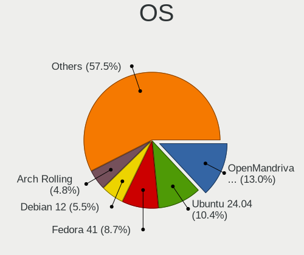
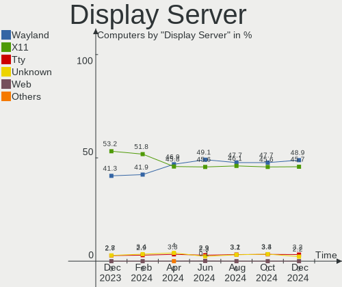
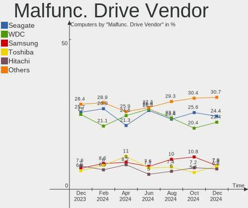
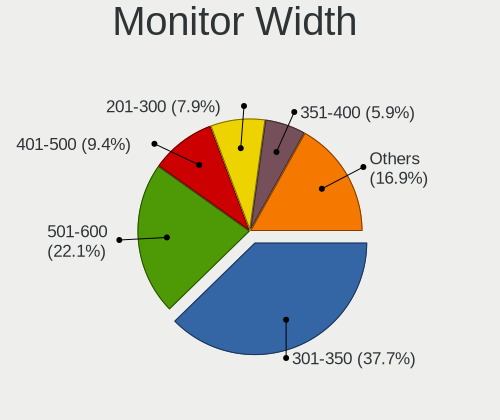
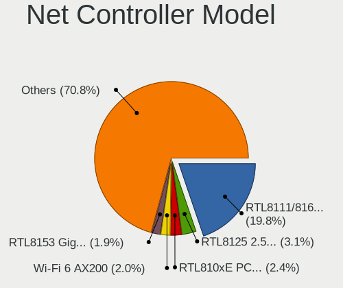

Linux Hardware Trends
---------------------

A project to identify most popular hardware characteristics and track their change
over time based on data collected by Linux users at https://Linux-Hardware.org.

Anyone can contribute to the study by uploading probes of their computers by
the [hw-probe](https://github.com/linuxhw/hw-probe) tool:

    sudo hw-probe -all -upload

This is a report for all computer types. See also reports for [desktops](/Desktop/README.md) and [notebooks](/Notebook/README.md).

Full-feature report is available here: https://linux-hardware.org/?view=trends

Distribution-specific reports: [Ubuntu](/Dist/Ubuntu), [ROSA](/Dist/ROSA), [Mint](/Dist/Mint), [Fedora](/Dist/Fedora), [BlackPanther](/Dist/BlackPanther), [Arch](/Dist/Arch), [Manjaro](/Dist/Manjaro), [Debian](/Dist/Debian), [Endless](/Dist/Endless).

Period: Jan, 2020.

Contents
--------

- [ OS                       ](#os)
- [ OS Family                ](#os-family)
- [ Kernel                   ](#kernel)
- [ Kernel Family            ](#kernel-family)
- [ Kernel Major Ver.        ](#kernel-major-ver)
- [ Arch                     ](#arch)
- [ DE                       ](#de)
- [ Display Server           ](#display-server)
- [ OS Lang                  ](#os-lang)
- [ Boot Mode                ](#boot-mode)
- [ Filesystem               ](#filesystem)
- [ Dual Boot with Linux     ](#dual-boot-with-linux)
- [ Dual Boot (Win)          ](#dual-boot-win)
- [ Country                  ](#country)
- [ City                     ](#city)
- [ Vendor                   ](#vendor)
- [ Model                    ](#model)
- [ Model Family             ](#model-family)
- [ MFG Year                 ](#mfg-year)
- [ Form Factor              ](#form-factor)
- [ Secure Boot              ](#secure-boot)
- [ Coreboot                 ](#coreboot)
- [ RAM Size                 ](#ram-size)
- [ RAM Used                 ](#ram-used)
- [ Drive Vendor             ](#drive-vendor)
- [ Drive Model              ](#drive-model)
- [ Drive Kind               ](#drive-kind)
- [ Drive Connector          ](#drive-connector)
- [ Drive Size               ](#drive-size)
- [ Space Total              ](#space-total)
- [ Space Used               ](#space-used)
- [ Malfunc. Drives          ](#malfunc-drives)
- [ Malfunc. Drive Vendor    ](#malfunc-drive-vendor)
- [ Malfunc. Drive Kind      ](#malfunc-drive-kind)
- [ Failed Drives            ](#failed-drives)
- [ Failed Drive Vendor      ](#failed-drive-vendor)
- [ Drive Status             ](#drive-status)
- [ CPU Vendor               ](#cpu-vendor)
- [ CPU Model                ](#cpu-model)
- [ CPU Model Family         ](#cpu-model-family)
- [ CPU Cores                ](#cpu-cores)
- [ CPU Sockets              ](#cpu-sockets)
- [ CPU Threads              ](#cpu-threads)
- [ CPU Op-Modes             ](#cpu-op-modes)
- [ CPU Microarch            ](#cpu-microarch)
- [ CPU Microcode            ](#cpu-microcode)
- [ GPU Vendor               ](#gpu-vendor)
- [ GPU Model                ](#gpu-model)
- [ GPU Combo                ](#gpu-combo)
- [ GPU Driver               ](#gpu-driver)
- [ GPU Memory               ](#gpu-memory)
- [ Monitor Vendor           ](#monitor-vendor)
- [ Monitor Model            ](#monitor-model)
- [ Monitor Resolution       ](#monitor-resolution)
- [ Monitor Diagonal         ](#monitor-diagonal)
- [ Monitor Width            ](#monitor-width)
- [ Aspect Ratio             ](#aspect-ratio)
- [ Monitor Area             ](#monitor-area)
- [ Pixel Density            ](#pixel-density)
- [ Multiple Monitors        ](#multiple-monitors)
- [ Net Controller Vendor    ](#net-controller-vendor)
- [ Net Controller Model     ](#net-controller-model)
- [ Net Controller Kind      ](#net-controller-kind)
- [ Used Controller          ](#used-controller)
- [ NICs                     ](#nics)
- [ Unsupported Devices      ](#unsupported-devices)
- [ Unsupported Device Types ](#unsupported-device-types)

OS
--

Installed operating systems

| Name                   | Computers | Percent |
|------------------------|-----------|---------|
| Ubuntu 18.04           | 721       | 23.69%  |
| Ubuntu 19.10           | 383       | 12.59%  |
| ROSA R11               | 328       | 10.78%  |
| BlackPanther 18.1      | 232       | 7.62%   |
| Mint 19.3              | 202       | 6.64%   |
| Fedora 31              | 171       | 5.62%   |
| BlackPanther 16.2      | 88        | 2.89%   |
| Arch                   | 77        | 2.53%   |
| Manjaro 18.1.5         | 68        | 2.23%   |
| Arch Rolling           | 51        | 1.68%   |
| Zorin 15               | 48        | 1.58%   |
| Debian 10              | 42        | 1.38%   |
| Endless 3.7.6          | 41        | 1.35%   |
| Ubuntu 19.04           | 39        | 1.28%   |
| KDE neon 18.04         | 38        | 1.25%   |
| Manjaro                | 33        | 1.08%   |
| Ubuntu 16.04           | 30        | 0.99%   |
| ROSA R10               | 20        | 0.66%   |
| Elementary 5.1         | 20        | 0.66%   |
| ROSA R8.1              | 19        | 0.62%   |
| Ubuntu 20.04           | 18        | 0.59%   |
| Mint 19.2              | 17        | 0.56%   |
| Mint 19.1              | 16        | 0.53%   |
| Debian                 | 16        | 0.53%   |
| MX 19                  | 14        | 0.46%   |
| Gentoo                 | 14        | 0.46%   |
| Endless 3.7.5          | 14        | 0.46%   |
| Debian Unstable        | 13        | 0.43%   |
| Mint 19                | 10        | 0.33%   |
| Fedora 30              | 10        | 0.33%   |
| CentOS 8               | 10        | 0.33%   |
| Fedora 32              | 9         | 0.3%    |
| Ubuntu 18.10           | 8         | 0.26%   |
| Peppermint 10          | 8         | 0.26%   |
| Mint 18.3              | 8         | 0.26%   |
| Zorin 12               | 7         | 0.23%   |
| RHEL 8.1               | 7         | 0.23%   |
| Kali 2019.4            | 7         | 0.23%   |
| Debian Testing         | 7         | 0.23%   |
| Endless 3.3.19-nexthw1 | 6         | 0.2%    |
| Debian 9               | 6         | 0.2%    |
| ClearOS 7              | 6         | 0.2%    |
| Chrome OS              | 6         | 0.2%    |
| CentOS 7               | 6         | 0.2%    |
| Kali 2020.1            | 5         | 0.16%   |
| Deepin 15.11           | 5         | 0.16%   |
| Ubuntu 17.10           | 4         | 0.13%   |
| RED X4                 | 4         | 0.13%   |
| Reborn OS              | 4         | 0.13%   |
| Endless 3.3.20-nexthw1 | 4         | 0.13%   |
| Void Rolling           | 3         | 0.1%    |
| Parrot 4.7             | 3         | 0.1%    |
| Gentoo 2.6             | 3         | 0.1%    |
| Fedora 29              | 3         | 0.1%    |
| EndeavourOS Rolling    | 3         | 0.1%    |
| ClearOS 7.7.2          | 3         | 0.1%    |
| Clear Linux 32160      | 3         | 0.1%    |
| Ubuntu Core 16         | 2         | 0.07%   |
| ROSA R9                | 2         | 0.07%   |
| RED OS 7.2             | 2         | 0.07%   |

OS Family
---------

OS without a version

| Name         | Computers | Percent |
|--------------|-----------|---------|
| Ubuntu       | 1205      | 39.6%   |
| ROSA         | 373       | 12.26%  |
| BlackPanther | 320       | 10.52%  |
| Mint         | 254       | 8.35%   |
| Fedora       | 195       | 6.41%   |
| Arch         | 128       | 4.21%   |
| Manjaro      | 105       | 3.45%   |
| Debian       | 86        | 2.83%   |
| Endless      | 81        | 2.66%   |
| Zorin        | 55        | 1.81%   |
| KDE neon     | 38        | 1.25%   |
| Elementary   | 22        | 0.72%   |
| openSUSE     | 20        | 0.66%   |
| Clear Linux  | 20        | 0.66%   |
| Gentoo       | 18        | 0.59%   |
| CentOS       | 18        | 0.59%   |
| MX           | 15        | 0.49%   |
| Kali         | 12        | 0.39%   |
| ClearOS      | 9         | 0.3%    |
| RHEL         | 8         | 0.26%   |
| Peppermint   | 8         | 0.26%   |
| Deepin       | 6         | 0.2%    |
| Chrome OS    | 6         | 0.2%    |
| Void         | 4         | 0.13%   |
| Reborn OS    | 4         | 0.13%   |
| Parrot       | 4         | 0.13%   |
| Arcolinux    | 4         | 0.13%   |
| Pop!_OS      | 3         | 0.1%    |
| EndeavourOS  | 3         | 0.1%    |
| RED OS       | 2         | 0.07%   |
| Arch ARM     | 2         | 0.07%   |
| Sparky       | 1         | 0.03%   |
| Solus        | 1         | 0.03%   |
| Slackware    | 1         | 0.03%   |
| Raspbian     | 1         | 0.03%   |
| Oracle Linux | 1         | 0.03%   |
| Manjaro-arm  | 1         | 0.03%   |
| Mageia       | 1         | 0.03%   |
| HamoniKR     | 1         | 0.03%   |
| Generic      | 1         | 0.03%   |
| Funtoo       | 1         | 0.03%   |
| Duzeru       | 1         | 0.03%   |
| ArchLabs     | 1         | 0.03%   |
| Antix        | 1         | 0.03%   |
| Android      | 1         | 0.03%   |
| Alpine       | 1         | 0.03%   |

Kernel
------

Version of the Linux kernel

| Version                          | Computers | Percent |
|----------------------------------|-----------|---------|
| 5.3.0-26-generic                 | 424       | 13.93%  |
| 5.0.0-37-generic                 | 368       | 12.09%  |
| 4.18.16-desktop-1bP              | 205       | 6.74%   |
| 4.15.0-74-generic                | 161       | 5.29%   |
| 4.15.0-desktop-68.5rosa-x86_64   | 121       | 3.98%   |
| 4.15.0-desktop-45.1rosa-x86_64   | 104       | 3.42%   |
| 5.3.0-24-generic                 | 92        | 3.02%   |
| 4.9.20-desktop-pae-1bP           | 83        | 2.73%   |
| 4.15.0-72-generic                | 80        | 2.63%   |
| 5.3.0-28-generic                 | 57        | 1.87%   |
| 5.3.0-23-generic                 | 57        | 1.87%   |
| 5.4.8-200.fc31.x86_64            | 41        | 1.35%   |
| 5.0.0-23-generic                 | 41        | 1.35%   |
| 5.3.0-29-generic                 | 40        | 1.31%   |
| 5.4.6-2-MANJARO                  | 32        | 1.05%   |
| 5.3.16-300.fc31.x86_64           | 32        | 1.05%   |
| 5.3.0-18-generic                 | 32        | 1.05%   |
| 4.15.0-desktop-45.1rosa-i586     | 30        | 0.99%   |
| 4.19.0-6-amd64                   | 29        | 0.95%   |
| 4.9.155-nrj-desktop-1rosa-x86_64 | 27        | 0.89%   |
| 5.1.15-desktop-1bP               | 26        | 0.85%   |
| 5.0.0-32-generic                 | 26        | 0.85%   |
| 5.4.13-arch1-1                   | 25        | 0.82%   |
| 5.4.12-200.fc31.x86_64           | 23        | 0.76%   |
| 5.4.13-3-MANJARO                 | 22        | 0.72%   |
| 4.15.0-76-generic                | 21        | 0.69%   |
| 4.15.0-desktop-68.5rosa-i586     | 20        | 0.66%   |
| 5.4.14-arch1-1                   | 19        | 0.62%   |
| 5.0.0-38-generic                 | 19        | 0.62%   |
| 5.4.10-200.fc31.x86_64           | 18        | 0.59%   |
| 5.4.7-200.fc31.x86_64            | 17        | 0.56%   |
| 5.4.13-201.fc31.x86_64           | 17        | 0.56%   |
| 4.9.60-nrj-desktop-1rosa-x86_64  | 15        | 0.49%   |
| 5.4.8-arch1-1                    | 13        | 0.43%   |
| 5.4.15-arch1-1                   | 11        | 0.36%   |
| 5.3.7-301.fc31.x86_64            | 11        | 0.36%   |
| 5.3.0-7625-generic               | 11        | 0.36%   |
| 4.18.0-147.3.1.el8_1.x86_64      | 11        | 0.36%   |
| 4.15.0-54-generic                | 11        | 0.36%   |
| 5.4.7-arch1-1                    | 10        | 0.33%   |
| 4.15.0-29-generic                | 10        | 0.33%   |
| 4.15.0-15-generic                | 10        | 0.33%   |
| 3.10.0-1062.9.1.el7.x86_64       | 10        | 0.33%   |
| 5.4.14-2-MANJARO                 | 9         | 0.3%    |
| 5.4.0-2-amd64                    | 9         | 0.3%    |
| 4.9.155-nrj-desktop-1rosa-i586   | 9         | 0.3%    |
| 4.15.0-74-lowlatency             | 9         | 0.3%    |
| 5.4.10-arch1-1                   | 8         | 0.26%   |
| 4.15.0-66-generic                | 8         | 0.26%   |
| 4.15.0-30deepin-generic          | 8         | 0.26%   |
| 5.4.12-arch1-1                   | 7         | 0.23%   |
| 5.4.12-1-MANJARO                 | 7         | 0.23%   |
| 5.4.0-3-amd64                    | 7         | 0.23%   |
| 5.3.0-27-generic                 | 7         | 0.23%   |
| 5.3.0-26-lowlatency              | 7         | 0.23%   |
| 5.4.11-arch1-1                   | 6         | 0.2%    |
| 4.9.60-nrj-desktop-1rosa-i586    | 6         | 0.2%    |
| 4.9.0-11-amd64                   | 6         | 0.2%    |
| 4.4.0-171-generic                | 6         | 0.2%    |
| 4.18.0-25-generic                | 6         | 0.2%    |

Kernel Family
-------------

Linux kernel without a distro release

| Version  | Computers | Percent |
|----------|-----------|---------|
| 5.3.0    | 760       | 24.98%  |
| 4.15.0   | 656       | 21.56%  |
| 5.0.0    | 478       | 15.71%  |
| 4.18.16  | 205       | 6.74%   |
| 5.4.13   | 87        | 2.86%   |
| 4.9.20   | 87        | 2.86%   |
| 5.4.8    | 60        | 1.97%   |
| 5.4.0    | 59        | 1.94%   |
| 5.4.12   | 55        | 1.81%   |
| 5.4.6    | 44        | 1.45%   |
| 5.4.10   | 38        | 1.25%   |
| 5.4.14   | 37        | 1.22%   |
| 4.18.0   | 37        | 1.22%   |
| 4.9.155  | 36        | 1.18%   |
| 4.19.0   | 35        | 1.15%   |
| 5.4.7    | 33        | 1.08%   |
| 5.3.16   | 32        | 1.05%   |
| 5.5.0    | 27        | 0.89%   |
| 5.1.15   | 27        | 0.89%   |
| 4.9.60   | 21        | 0.69%   |
| 5.4.15   | 17        | 0.56%   |
| 3.10.0   | 15        | 0.49%   |
| 5.3.7    | 12        | 0.39%   |
| 4.9.0    | 10        | 0.33%   |
| 4.4.0    | 10        | 0.33%   |
| 5.4.11   | 9         | 0.3%    |
| 5.3.18   | 7         | 0.23%   |
| 4.19.97  | 7         | 0.23%   |
| 4.13.0   | 7         | 0.23%   |
| 4.19.91  | 6         | 0.2%    |
| 4.1.38   | 6         | 0.2%    |
| 5.3.13   | 5         | 0.16%   |
| 5.3.12   | 5         | 0.16%   |
| 5.2.21   | 5         | 0.16%   |
| 5.2.0    | 5         | 0.16%   |
| 5.3.11   | 4         | 0.13%   |
| 4.19.98  | 4         | 0.13%   |
| 4.19.88  | 4         | 0.13%   |
| 4.19.65  | 4         | 0.13%   |
| 5.4.2    | 3         | 0.1%    |
| 5.3.9    | 3         | 0.1%    |
| 5.3.6    | 3         | 0.1%    |
| 4.9.140  | 3         | 0.1%    |
| 4.19.92  | 3         | 0.1%    |
| 4.19.86  | 3         | 0.1%    |
| 4.14.14  | 3         | 0.1%    |
| 4.12.14  | 3         | 0.1%    |
| 5.4.5    | 2         | 0.07%   |
| 5.4.1    | 2         | 0.07%   |
| 5.3.15   | 2         | 0.07%   |
| 5.3.14   | 2         | 0.07%   |
| 5.1.16   | 2         | 0.07%   |
| 5.1.0    | 2         | 0.07%   |
| 4.9.9    | 2         | 0.07%   |
| 4.19.99  | 2         | 0.07%   |
| 4.19.96  | 2         | 0.07%   |
| 4.19.93  | 2         | 0.07%   |
| 4.16.0   | 2         | 0.07%   |
| 4.14.160 | 2         | 0.07%   |
| 4.10.0   | 2         | 0.07%   |

Kernel Major Ver.
-----------------

Linux kernel major version

| Version | Computers | Percent |
|---------|-----------|---------|
| 5.3     | 836       | 27.47%  |
| 4.15    | 657       | 21.59%  |
| 5.0     | 482       | 15.84%  |
| 5.4     | 447       | 14.69%  |
| 4.18    | 243       | 7.99%   |
| 4.9     | 161       | 5.29%   |
| 4.19    | 80        | 2.63%   |
| 5.1     | 33        | 1.08%   |
| 5.5     | 27        | 0.89%   |
| 3.10    | 16        | 0.53%   |
| 5.2     | 14        | 0.46%   |
| 4.4     | 11        | 0.36%   |
| 4.14    | 7         | 0.23%   |
| 4.13    | 7         | 0.23%   |
| 4.1     | 6         | 0.2%    |
| 4.16    | 3         | 0.1%    |
| 4.12    | 3         | 0.1%    |
| 4.10    | 3         | 0.1%    |
| 3.16    | 2         | 0.07%   |
| 4.5     | 1         | 0.03%   |
| 4.3     | 1         | 0.03%   |
| 4.20    | 1         | 0.03%   |
| 4.17    | 1         | 0.03%   |
| 4.11    | 1         | 0.03%   |

Arch
----

OS architecture (x86_64, i586, etc.)

| Name    | Computers | Percent |
|---------|-----------|---------|
| x86_64  | 2766      | 90.9%   |
| i686    | 266       | 8.74%   |
| aarch64 | 6         | 0.2%    |
| armv7l  | 3         | 0.1%    |
| ppc64le | 1         | 0.03%   |
| i586    | 1         | 0.03%   |

DE
--

Desktop Environment

| Name                      | Computers | Percent |
|---------------------------|-----------|---------|
| GNOME                     | 1109      | 36.44%  |
| KDE5                      | 732       | 24.06%  |
| Unknown                   | 419       | 13.77%  |
| XFCE                      | 241       | 7.92%   |
| X-Cinnamon                | 156       | 5.13%   |
| KDE                       | 113       | 3.71%   |
| MATE                      | 74        | 2.43%   |
| Cinnamon                  | 58        | 1.91%   |
| Unity                     | 30        | 0.99%   |
| Pantheon                  | 20        | 0.66%   |
| LXQt                      | 19        | 0.62%   |
| Budgie                    | 15        | 0.49%   |
| LXDE                      | 14        | 0.46%   |
| GNOME Flashback           | 13        | 0.43%   |
| Deepin                    | 12        | 0.39%   |
| i3                        | 5         | 0.16%   |
| GNOME-Classic:GNOME       | 4         | 0.13%   |
| xubuntu                   | 2         | 0.07%   |
| Enlightenment             | 2         | 0.07%   |
| Trinity                   | 1         | 0.03%   |
| openbox                   | 1         | 0.03%   |
| Lumina                    | 1         | 0.03%   |
| communitheme:ubuntu:GNOME | 1         | 0.03%   |
| awesome                   | 1         | 0.03%   |

Display Server
--------------

X11 or Wayland

| Name    | Computers | Percent |
|---------|-----------|---------|
| Unknown | 1517      | 49.85%  |
| X11     | 1418      | 46.6%   |
| Wayland | 98        | 3.22%   |
| Tty     | 10        | 0.33%   |

OS Lang
-------

Language

| Lang       | Computers | Percent |
|------------|-----------|---------|
| Unknown    | 1003      | 32.96%  |
| en_US      | 750       | 24.65%  |
| de_DE      | 181       | 5.95%   |
| en_GB      | 116       | 3.81%   |
| pt_BR      | 105       | 3.45%   |
| ru_RU      | 96        | 3.15%   |
| it_IT      | 74        | 2.43%   |
| fr_FR      | 56        | 1.84%   |
| es_ES      | 56        | 1.84%   |
| en_CA      | 49        | 1.61%   |
| C          | 41        | 1.35%   |
| pl_PL      | 38        | 1.25%   |
| en_US.utf8 | 33        | 1.08%   |
| nl_NL      | 30        | 0.99%   |
| en_AU      | 29        | 0.95%   |
| en_IN      | 27        | 0.89%   |
| hu_HU      | 20        | 0.66%   |
| cs_CZ      | 20        | 0.66%   |
| pt_PT      | 17        | 0.56%   |
| gl_ES      | 17        | 0.56%   |
| de_AT      | 17        | 0.56%   |
| es_MX      | 14        | 0.46%   |
| pt_BR.utf8 | 13        | 0.43%   |
| sk_SK      | 11        | 0.36%   |
| ro_RO      | 11        | 0.36%   |
| en_ZA      | 11        | 0.36%   |
| ru_UA      | 9         | 0.3%    |
| de_CH      | 9         | 0.3%    |
| uk_UA      | 7         | 0.23%   |
| sv_SE      | 7         | 0.23%   |
| ja_JP      | 7         | 0.23%   |
| es_AR      | 7         | 0.23%   |
| en_NZ      | 7         | 0.23%   |
| en_GB.utf8 | 7         | 0.23%   |
| da_DK      | 7         | 0.23%   |
| fr_CA      | 6         | 0.2%    |
| fi_FI      | 6         | 0.2%    |
| es_CO      | 6         | 0.2%    |
| es_CL      | 6         | 0.2%    |
| en_IN      | 6         | 0.2%    |
| ca_ES      | 6         | 0.2%    |
| zh_CN      | 5         | 0.16%   |
| tr_TR      | 5         | 0.16%   |
| el_GR      | 5         | 0.16%   |
| zh_TW      | 4         | 0.13%   |
| en_PH      | 4         | 0.13%   |
| en_IL      | 4         | 0.13%   |
| de_DE.utf8 | 4         | 0.13%   |
| lt_LT      | 3         | 0.1%    |
| hr_HR      | 3         | 0.1%    |
| fr_BE      | 3         | 0.1%    |
| es_VE      | 3         | 0.1%    |
| es_PE      | 3         | 0.1%    |
| es_CR      | 3         | 0.1%    |
| en_SG      | 3         | 0.1%    |
| C          | 3         | 0.1%    |
| bg_BG      | 3         | 0.1%    |
| zh_HK      | 2         | 0.07%   |
| sv_FI      | 2         | 0.07%   |
| nl_BE      | 2         | 0.07%   |

Boot Mode
---------

EFI or BIOS

| Mode | Computers | Percent |
|------|-----------|---------|
| BIOS | 1778      | 58.43%  |
| EFI  | 1265      | 41.57%  |

Filesystem
----------

Type of filesystem

| Type    | Computers | Percent |
|---------|-----------|---------|
| Ext4    | 2740      | 90.04%  |
| Overlay | 89        | 2.92%   |
| Btrfs   | 83        | 2.73%   |
| Xfs     | 61        | 2%      |
| Ext3    | 37        | 1.22%   |
| Zfs     | 9         | 0.3%    |
| Unknown | 9         | 0.3%    |
| F2fs    | 6         | 0.2%    |
| Ext2    | 5         | 0.16%   |
| Tmpfs   | 2         | 0.07%   |
| Jfs     | 1         | 0.03%   |
| Aufs    | 1         | 0.03%   |

Dual Boot with Linux
--------------------

Hosting more than one Linux

| Dual boot | Computers | Percent |
|-----------|-----------|---------|
| No        | 2657      | 87.32%  |
| Yes       | 386       | 12.68%  |

Dual Boot (Win)
---------------

Hosting Linux and Windows

| Dual boot | Computers | Percent |
|-----------|-----------|---------|
| No        | 2032      | 66.78%  |
| Yes       | 1011      | 33.22%  |

Country
-------

Geographic location (country)

| Country        | Computers | Percent |
|----------------|-----------|---------|
| USA            | 417       | 13.7%   |
| Russia         | 409       | 13.44%  |
| Germany        | 288       | 9.46%   |
| Hungary        | 277       | 9.1%    |
| Brazil         | 154       | 5.06%   |
| UK             | 109       | 3.58%   |
| Italy          | 107       | 3.52%   |
| Spain          | 96        | 3.15%   |
| Canada         | 89        | 2.92%   |
| France         | 85        | 2.79%   |
| Netherlands    | 77        | 2.53%   |
| Poland         | 70        | 2.3%    |
| Ukraine        | 62        | 2.04%   |
| Romania        | 49        | 1.61%   |
| India          | 48        | 1.58%   |
| Australia      | 47        | 1.54%   |
| Austria        | 40        | 1.31%   |
| Czech Republic | 36        | 1.18%   |
| Switzerland    | 33        | 1.08%   |
| Sweden         | 25        | 0.82%   |
| Finland        | 25        | 0.82%   |
| Portugal       | 22        | 0.72%   |
| Mexico         | 22        | 0.72%   |
| Serbia         | 21        | 0.69%   |
| Belarus        | 21        | 0.69%   |
| Indonesia      | 20        | 0.66%   |
| Turkey         | 19        | 0.62%   |
| Slovakia       | 18        | 0.59%   |
| South Africa   | 17        | 0.56%   |
| Denmark        | 16        | 0.53%   |
| Belgium        | 16        | 0.53%   |
| New Zealand    | 14        | 0.46%   |
| Argentina      | 13        | 0.43%   |
| Lithuania      | 12        | 0.39%   |
| Japan          | 12        | 0.39%   |
| Greece         | 12        | 0.39%   |
| China          | 12        | 0.39%   |
| Bulgaria       | 12        | 0.39%   |
| Taiwan         | 11        | 0.36%   |
| Israel         | 10        | 0.33%   |
| Colombia       | 10        | 0.33%   |
| Philippines    | 9         | 0.3%    |
| Croatia        | 9         | 0.3%    |
| Norway         | 8         | 0.26%   |
| Iran           | 8         | 0.26%   |
| Slovenia       | 7         | 0.23%   |
| Kazakhstan     | 7         | 0.23%   |
| Chile          | 7         | 0.23%   |
| Latvia         | 6         | 0.2%    |
| Egypt          | 6         | 0.2%    |
| Vietnam        | 5         | 0.16%   |
| Thailand       | 5         | 0.16%   |
| Saudi Arabia   | 5         | 0.16%   |
| Pakistan       | 5         | 0.16%   |
| Hong Kong      | 5         | 0.16%   |
| Singapore      | 4         | 0.13%   |
| Costa Rica     | 4         | 0.13%   |
| Bangladesh     | 4         | 0.13%   |
| Venezuela      | 3         | 0.1%    |
| South Korea    | 3         | 0.1%    |

City
----

Geographic location (city)

| City              | Computers | Percent |
|-------------------|-----------|---------|
| Budapest          | 71        | 2.33%   |
| Moscow            | 62        | 2.04%   |
| St Petersburg     | 41        | 1.35%   |
| Berlin            | 28        | 0.92%   |
| Ourense           | 23        | 0.76%   |
| Vienna            | 22        | 0.72%   |
| Yekaterinburg     | 18        | 0.59%   |
| Novosibirsk       | 18        | 0.59%   |
| Kyiv              | 16        | 0.53%   |
| Eger              | 16        | 0.53%   |
| Warsaw            | 15        | 0.49%   |
| Amsterdam         | 15        | 0.49%   |
| Munich            | 14        | 0.46%   |
| Toronto           | 13        | 0.43%   |
| São Paulo        | 13        | 0.43%   |
| Rome              | 13        | 0.43%   |
| Prague            | 13        | 0.43%   |
| Rostov-on-Don     | 12        | 0.39%   |
| Minsk             | 12        | 0.39%   |
| Bucharest         | 12        | 0.39%   |
| Zurich            | 11        | 0.36%   |
| Montreal          | 11        | 0.36%   |
| Milan             | 11        | 0.36%   |
| Chicago           | 10        | 0.33%   |
| Stockholm         | 9         | 0.3%    |
| Paris             | 9         | 0.3%    |
| Miskolc           | 9         | 0.3%    |
| Madrid            | 9         | 0.3%    |
| Kazan’          | 9         | 0.3%    |
| Dallas            | 9         | 0.3%    |
| London            | 8         | 0.26%   |
| Krasnodar         | 8         | 0.26%   |
| Frankfurt am Main | 8         | 0.26%   |
| Belgrade          | 8         | 0.26%   |
| Barcelona         | 8         | 0.26%   |
| Wahroonga         | 7         | 0.23%   |
| Szeged            | 7         | 0.23%   |
| Rio de Janeiro    | 7         | 0.23%   |
| Portland          | 7         | 0.23%   |
| New York          | 7         | 0.23%   |
| Lisbon            | 7         | 0.23%   |
| Krasnoyarsk       | 7         | 0.23%   |
| Khabarovsk        | 7         | 0.23%   |
| Johannesburg      | 7         | 0.23%   |
| Jakarta           | 7         | 0.23%   |
| Helsinki          | 7         | 0.23%   |
| Hamburg           | 7         | 0.23%   |
| Győr             | 7         | 0.23%   |
| Curitiba          | 7         | 0.23%   |
| Cologne           | 7         | 0.23%   |
| Bratislava        | 7         | 0.23%   |
| Athens            | 7         | 0.23%   |
| Vilnius           | 6         | 0.2%    |
| Turin             | 6         | 0.2%    |
| Tula              | 6         | 0.2%    |
| The Hague         | 6         | 0.2%    |
| Taipei            | 6         | 0.2%    |
| Székesfehérvár | 6         | 0.2%    |
| Riga              | 6         | 0.2%    |
| Ottawa            | 6         | 0.2%    |

Vendor
------

Motherboard manufacturer

| Name                    | Computers | Percent |
|-------------------------|-----------|---------|
| ASUSTek Computer        | 521       | 17.12%  |
| Lenovo                  | 429       | 14.1%   |
| Hewlett-Packard         | 404       | 13.28%  |
| Dell                    | 376       | 12.36%  |
| Gigabyte Technology     | 233       | 7.66%   |
| Acer                    | 196       | 6.44%   |
| MSI                     | 165       | 5.42%   |
| ASRock                  | 131       | 4.3%    |
| Toshiba                 | 63        | 2.07%   |
| Intel                   | 56        | 1.84%   |
| Samsung Electronics     | 38        | 1.25%   |
| Sony                    | 26        | 0.85%   |
| Medion                  | 26        | 0.85%   |
| Apple                   | 26        | 0.85%   |
| Packard Bell            | 22        | 0.72%   |
| Unknown                 | 20        | 0.66%   |
| Positivo                | 19        | 0.62%   |
| Fujitsu                 | 18        | 0.59%   |
| Fujitsu Siemens         | 17        | 0.56%   |
| Foxconn                 | 16        | 0.53%   |
| Notebook                | 14        | 0.46%   |
| ECS                     | 14        | 0.46%   |
| Supermicro              | 13        | 0.43%   |
| eMachines               | 13        | 0.43%   |
| Biostar                 | 11        | 0.36%   |
| Pegatron                | 10        | 0.33%   |
| Gateway                 | 9         | 0.3%    |
| HUAWEI                  | 8         | 0.26%   |
| AMI                     | 8         | 0.26%   |
| Microsoft               | 7         | 0.23%   |
| ZOTAC                   | 6         | 0.2%    |
| WinFast                 | 5         | 0.16%   |
| LG Electronics          | 5         | 0.16%   |
| Panasonic               | 4         | 0.13%   |
| Google                  | 4         | 0.13%   |
| Alienware               | 4         | 0.13%   |
| TUXEDO                  | 3         | 0.1%    |
| Timi                    | 3         | 0.1%    |
| Semp Toshiba            | 3         | 0.1%    |
| Razer                   | 3         | 0.1%    |
| PC Specialist           | 3         | 0.1%    |
| HARDKERNEL              | 3         | 0.1%    |
| Dixonsxp                | 3         | 0.1%    |
| XFX                     | 2         | 0.07%   |
| Wistron                 | 2         | 0.07%   |
| TrekStor                | 2         | 0.07%   |
| Raspberry Pi Foundation | 2         | 0.07%   |
| Radxa                   | 2         | 0.07%   |
| Nvidia                  | 2         | 0.07%   |
| Itautec                 | 2         | 0.07%   |
| IBM                     | 2         | 0.07%   |
| Huanan                  | 2         | 0.07%   |
| Digma                   | 2         | 0.07%   |
| DEXP                    | 2         | 0.07%   |
| Compaq                  | 2         | 0.07%   |
| Clevo                   | 2         | 0.07%   |
| Chuwi                   | 2         | 0.07%   |
| CCE                     | 2         | 0.07%   |
| AAEON                   | 2         | 0.07%   |
| XMG                     | 1         | 0.03%   |

Model
-----

Motherboard model

| Name                              | Computers | Percent |
|-----------------------------------|-----------|---------|
| All Series                        | 38        | 1.25%   |
| Unknown                           | 30        | 0.99%   |
| ThinkCentre E73 10DR0033SP        | 22        | 0.72%   |
| Pavilion dv6                      | 17        | 0.56%   |
| OptiPlex 7010                     | 11        | 0.36%   |
| Notebook                          | 11        | 0.36%   |
| Latitude E6410                    | 11        | 0.36%   |
| Pavilion g6                       | 10        | 0.33%   |
| M5A78L-M/USB3                     | 10        | 0.33%   |
| Laptop 15-db0xxx                  | 10        | 0.33%   |
| OptiPlex 3020                     | 9         | 0.3%    |
| XPS 15 9570                       | 8         | 0.26%   |
| Pavilion dv7                      | 8         | 0.26%   |
| IdeaPad 100-15IBD 80QQ            | 8         | 0.26%   |
| XPS 15 9560                       | 7         | 0.23%   |
| XPS 13 9380                       | 7         | 0.23%   |
| MS-7C02                           | 7         | 0.23%   |
| MS-7693                           | 7         | 0.23%   |
| Laptop 15-da0xxx                  | 7         | 0.23%   |
| H61M-S1                           | 7         | 0.23%   |
| 250 G1                            | 7         | 0.23%   |
| X541NA                            | 6         | 0.2%    |
| PRIME B350-PLUS                   | 6         | 0.2%    |
| OptiPlex 780                      | 6         | 0.2%    |
| OptiPlex 760                      | 6         | 0.2%    |
| OptiPlex 755                      | 6         | 0.2%    |
| MS-7A38                           | 6         | 0.2%    |
| 970A-DS3P                         | 6         | 0.2%    |
| XPS 13 9360                       | 5         | 0.16%   |
| WRT-WX9                           | 5         | 0.16%   |
| PRIME X470-PRO                    | 5         | 0.16%   |
| PRIME H310M-R R2.0                | 5         | 0.16%   |
| Pavilion Notebook                 | 5         | 0.16%   |
| Latitude E7450                    | 5         | 0.16%   |
| Latitude E6430                    | 5         | 0.16%   |
| Latitude E5470                    | 5         | 0.16%   |
| Laptop 15-bw0xx                   | 5         | 0.16%   |
| K50IJ                             | 5         | 0.16%   |
| Inspiron 5567                     | 5         | 0.16%   |
| G41M-VS3                          | 5         | 0.16%   |
| G31M-ES2L                         | 5         | 0.16%   |
| EliteBook 840 G6                  | 5         | 0.16%   |
| XPS 8700                          | 4         | 0.13%   |
| X399 Taichi                       | 4         | 0.13%   |
| VivoBook 15_ASUS Laptop X540UAR   | 4         | 0.13%   |
| ThinkPad X1 Carbon 7th 20QDCTO1WW | 4         | 0.13%   |
| ROG STRIX B450-F GAMING           | 4         | 0.13%   |
| Q232A                             | 4         | 0.13%   |
| PRIME Z270-A                      | 4         | 0.13%   |
| P7P55D                            | 4         | 0.13%   |
| OptiPlex 790                      | 4         | 0.13%   |
| Nitro AN515-52                    | 4         | 0.13%   |
| MS-7C37                           | 4         | 0.13%   |
| MS-7A34                           | 4         | 0.13%   |
| MS-7816                           | 4         | 0.13%   |
| Mobile                            | 4         | 0.13%   |
| Latitude E6420                    | 4         | 0.13%   |
| Laptop 17-ca0xxx                  | 4         | 0.13%   |
| Inspiron 5558                     | 4         | 0.13%   |
| Inspiron 15-3567                  | 4         | 0.13%   |

Model Family
------------

Motherboard model prefix

| Name                    | Computers | Percent |
|-------------------------|-----------|---------|
| Lenovo ThinkPad         | 173       | 5.69%   |
| Acer Aspire             | 142       | 4.67%   |
| Dell Inspiron           | 106       | 3.48%   |
| Lenovo IdeaPad          | 96        | 3.15%   |
| Dell Latitude           | 78        | 2.56%   |
| HP Pavilion             | 74        | 2.43%   |
| Dell OptiPlex           | 65        | 2.14%   |
| HP EliteBook            | 55        | 1.81%   |
| Toshiba Satellite       | 52        | 1.71%   |
| Dell XPS                | 52        | 1.71%   |
| HP Compaq               | 48        | 1.58%   |
| HP Laptop               | 46        | 1.51%   |
| Lenovo ThinkCentre      | 45        | 1.48%   |
| ASUS PRIME              | 44        | 1.45%   |
| ASUS All                | 38        | 1.25%   |
| ASUS VivoBook           | 35        | 1.15%   |
| Unknown                 | 32        | 1.05%   |
| HP ProBook              | 31        | 1.02%   |
| Dell Vostro             | 28        | 0.92%   |
| ASUS ROG                | 23        | 0.76%   |
| Dell Precision          | 21        | 0.69%   |
| HP 250                  | 20        | 0.66%   |
| ASUS M5A78L-M           | 19        | 0.62%   |
| Lenovo Yoga             | 17        | 0.56%   |
| HP ENVY                 | 16        | 0.53%   |
| Packard Bell EasyNote   | 14        | 0.46%   |
| ASUS M5A97              | 14        | 0.46%   |
| ASUS TUF                | 13        | 0.43%   |
| HP Notebook             | 11        | 0.36%   |
| HP ZBook                | 10        | 0.33%   |
| Acer TravelMate         | 10        | 0.33%   |
| Acer Nitro              | 10        | 0.33%   |
| ASUS P5KPL-AM           | 9         | 0.3%    |
| Fujitsu Siemens ESPRIMO | 8         | 0.26%   |
| Fujitsu LIFEBOOK        | 8         | 0.26%   |
| MSI MS-7C02             | 7         | 0.23%   |
| MSI MS-7693             | 7         | 0.23%   |
| Microsoft Surface       | 7         | 0.23%   |
| HP ProDesk              | 7         | 0.23%   |
| HP EliteDesk            | 7         | 0.23%   |
| Gigabyte X570           | 7         | 0.23%   |
| Gigabyte H61M-S1        | 7         | 0.23%   |
| Dell PowerEdge          | 7         | 0.23%   |
| MSI MS-7A38             | 6         | 0.2%    |
| HP Spectre              | 6         | 0.2%    |
| Gigabyte Z390           | 6         | 0.2%    |
| Gigabyte GA-78LMT-USB3  | 6         | 0.2%    |
| Gigabyte 970A-DS3P      | 6         | 0.2%    |
| ASUS X541NA             | 6         | 0.2%    |
| ASUS P8H61-M            | 6         | 0.2%    |
| Acer Swift              | 6         | 0.2%    |
| Acer Predator           | 6         | 0.2%    |
| Acer Extensa            | 6         | 0.2%    |
| Toshiba PORTEGE         | 5         | 0.16%   |
| Lenovo G570             | 5         | 0.16%   |
| HUAWEI WRT-WX9          | 5         | 0.16%   |
| HP 255                  | 5         | 0.16%   |
| Gigabyte G31M-ES2L      | 5         | 0.16%   |
| Gigabyte A320M-S2H      | 5         | 0.16%   |
| Fujitsu Siemens AMILO   | 5         | 0.16%   |

MFG Year
--------

Motherboard manufacture year

| Year    | Computers | Percent |
|---------|-----------|---------|
| 2019    | 656       | 21.56%  |
| 2018    | 365       | 11.99%  |
| 2011    | 232       | 7.62%   |
| 2013    | 230       | 7.56%   |
| 2014    | 225       | 7.39%   |
| 2012    | 202       | 6.64%   |
| 2015    | 183       | 6.01%   |
| 2010    | 174       | 5.72%   |
| 2009    | 171       | 5.62%   |
| 2017    | 168       | 5.52%   |
| 2016    | 163       | 5.36%   |
| 2008    | 123       | 4.04%   |
| 2007    | 71        | 2.33%   |
| 2006    | 33        | 1.08%   |
| 2005    | 26        | 0.85%   |
| Unknown | 12        | 0.39%   |
| 2020    | 3         | 0.1%    |
| 2004    | 3         | 0.1%    |
| 2003    | 2         | 0.07%   |
| 2001    | 1         | 0.03%   |

Form Factor
-----------

Physical design of the computer

| Name           | Computers | Percent |
|----------------|-----------|---------|
| Notebook       | 1639      | 53.86%  |
| Desktop        | 1265      | 41.57%  |
| Convertible    | 33        | 1.08%   |
| Mini pc        | 31        | 1.02%   |
| All in one     | 28        | 0.92%   |
| Tablet         | 20        | 0.66%   |
| Server         | 19        | 0.62%   |
| System on chip | 8         | 0.26%   |

Secure Boot
-----------

Enabled or disabled

| State    | Computers | Percent |
|----------|-----------|---------|
| Disabled | 1956      | 64.28%  |
| Unknown  | 905       | 29.74%  |
| Enabled  | 182       | 5.98%   |

Coreboot
--------

Have coreboot on board

| Used | Computers | Percent |
|------|-----------|---------|
| No   | 3038      | 99.84%  |
| Yes  | 5         | 0.16%   |

RAM Size
--------

Total RAM memory

| Size in GB      | Computers | Percent |
|-----------------|-----------|---------|
| 3.01-4.0        | 766       | 25.17%  |
| 4.01-8.0        | 602       | 19.78%  |
| 16.01-24.0      | 551       | 18.11%  |
| 8.01-16.0       | 531       | 17.45%  |
| 1.01-2.0        | 222       | 7.3%    |
| 32.01-64.0      | 170       | 5.59%   |
| 2.01-3.0        | 86        | 2.83%   |
| 64.01-256.0     | 43        | 1.41%   |
| 24.01-32.0      | 35        | 1.15%   |
| 0.01-1.0        | 31        | 1.02%   |
| Unknown         | 4         | 0.13%   |
| More than 256.0 | 2         | 0.07%   |

RAM Used
--------

Used RAM memory

| Used GB     | Computers | Percent |
|-------------|-----------|---------|
| 1.01-2.0    | 1162      | 38.19%  |
| 2.01-3.0    | 652       | 21.43%  |
| 0.01-1.0    | 558       | 18.34%  |
| 3.01-4.0    | 279       | 9.17%   |
| 4.01-8.0    | 273       | 8.97%   |
| 8.01-16.0   | 89        | 2.92%   |
| 16.01-24.0  | 13        | 0.43%   |
| Unknown     | 5         | 0.16%   |
| 32.01-64.0  | 4         | 0.13%   |
| 24.01-32.0  | 4         | 0.13%   |
| 64.01-256.0 | 3         | 0.1%    |
| 0           | 1         | 0.03%   |

Drive Vendor
------------

Hard drive vendors

| Vendor              | Computers | Drives | Percent |
|---------------------|-----------|--------|---------|
| Seagate             | 794       | 908    | 19.27%  |
| WDC                 | 780       | 916    | 18.93%  |
| Samsung Electronics | 504       | 587    | 12.23%  |
| Toshiba             | 314       | 327    | 7.62%   |
| Kingston            | 238       | 254    | 5.78%   |
| Hitachi             | 203       | 214    | 4.93%   |
| SanDisk             | 163       | 169    | 3.96%   |
| Crucial             | 129       | 133    | 3.13%   |
| HGST                | 128       | 133    | 3.11%   |
| Unknown             | 123       | 143    | 2.98%   |
| Intel               | 100       | 109    | 2.43%   |
| A-DATA Technology   | 71        | 74     | 1.72%   |
| SK Hynix            | 49        | 49     | 1.19%   |
| Maxtor              | 34        | 36     | 0.83%   |
| Micron Technology   | 33        | 33     | 0.8%    |
| China               | 27        | 27     | 0.66%   |
| Transcend           | 25        | 25     | 0.61%   |
| Fujitsu             | 24        | 24     | 0.58%   |
| Intenso             | 20        | 20     | 0.49%   |
| Generic             | 20        | 20     | 0.49%   |
| PLEXTOR             | 19        | 21     | 0.46%   |
| OCZ                 | 19        | 19     | 0.46%   |
| Corsair             | 18        | 19     | 0.44%   |
| SPCC                | 16        | 16     | 0.39%   |
| LITEON              | 16        | 16     | 0.39%   |
| Apple               | 16        | 17     | 0.39%   |
| Patriot             | 14        | 15     | 0.34%   |
| KingSpec            | 12        | 12     | 0.29%   |
| HL-DT-ST            | 12        | 2      | 0.29%   |
| PNY                 | 11        | 13     | 0.27%   |
| LITEONIT            | 11        | 12     | 0.27%   |
| GOODRAM             | 10        | 10     | 0.24%   |
| KingDian            | 9         | 9      | 0.22%   |
| Hewlett-Packard     | 9         | 9      | 0.22%   |
| Apacer              | 9         | 9      | 0.22%   |
| Team                | 8         | 8      | 0.19%   |
| ASMT                | 6         | 6      | 0.15%   |
| Phison              | 5         | 5      | 0.12%   |
| Mushkin             | 5         | 5      | 0.12%   |
| JMicron             | 5         | 5      | 0.12%   |
| Gigabyte Technology | 5         | 5      | 0.12%   |
| Smartbuy            | 4         | 4      | 0.1%    |
| KINGMAX             | 4         | 4      | 0.1%    |
| Netac               | 3         | 3      | 0.07%   |
| Lexar               | 3         | 3      | 0.07%   |
| Lenovo              | 3         | 3      | 0.07%   |
| LDLC                | 3         | 3      | 0.07%   |
| BIWIN               | 3         | 3      | 0.07%   |
| AS25                | 3         | 3      | 0.07%   |
| AMD                 | 3         | 3      | 0.07%   |
| USB3.0              | 2         | 2      | 0.05%   |
| TCSUNBOW            | 2         | 2      | 0.05%   |
| SABRENT             | 2         | 2      | 0.05%   |
| OWC                 | 2         | 2      | 0.05%   |
| MARVELL             | 2         | 2      | 0.05%   |
| LaCie               | 2         | 2      | 0.05%   |
| Inateck             | 2         | 2      | 0.05%   |
| HUAWEI              | 2         | 2      | 0.05%   |
| FORESEE             | 2         | 2      | 0.05%   |
| DREVO               | 2         | 2      | 0.05%   |

Drive Model
-----------

Hard drive models

| Model                        | Computers | Percent |
|------------------------------|-----------|---------|
| ST500DM002-1BD142 500GB      | 67        | 1.48%   |
| MMC Card  31GB               | 53        | 1.17%   |
| SA400S37240G 240GB SSD       | 50        | 1.1%    |
| ST1000LM035-1RK172 1TB       | 45        | 0.99%   |
| SA400S37120G 120GB SSD       | 36        | 0.79%   |
| SSD 860 EVO 500GB            | 34        | 0.75%   |
| SSD 850 EVO 500GB            | 31        | 0.68%   |
| SSD 860 EVO 250GB            | 29        | 0.64%   |
| SSD 850 EVO 250GB            | 29        | 0.64%   |
| DT01ACA100 1TB               | 29        | 0.64%   |
| SSD 860 EVO 1TB              | 28        | 0.62%   |
| ST1000LM024 HN-M101MBB 1TB   | 27        | 0.6%    |
| SV300S37A120G 120GB SSD      | 26        | 0.57%   |
| MQ01ABF050 500GB             | 26        | 0.57%   |
| MQ01ABD100 1TB               | 26        | 0.57%   |
| WD10EZEX-08WN4A0 1TB         | 25        | 0.55%   |
| ST500LT012-1DG142 500GB      | 25        | 0.55%   |
| HTS721010A9E630 1TB          | 24        | 0.53%   |
| ST9500325AS 500GB            | 23        | 0.51%   |
| ST1000DM010-2EP102 1TB       | 22        | 0.49%   |
| HTS541010A9E680 1TB          | 22        | 0.49%   |
| ST3500418AS 500GB            | 21        | 0.46%   |
| HTS545050A7E680 500GB        | 21        | 0.46%   |
| WD5000AAKX-08U6AA0 500GB     | 19        | 0.42%   |
| ST1000DM003-1CH162 1TB       | 19        | 0.42%   |
| SD/MMC/MS PRO 31GB           | 19        | 0.42%   |
| MQ04ABF100 1TB               | 19        | 0.42%   |
| ST2000DM001-1CH164 2TB       | 16        | 0.35%   |
| Expansion 1TB                | 16        | 0.35%   |
| DT01ACA200 2TB               | 16        | 0.35%   |
| WDS240G2G0A-00JH30 240GB SSD | 15        | 0.33%   |
| WD10EZEX-00BN5A0 1TB         | 15        | 0.33%   |
| HTS545050A7E380 500GB        | 15        | 0.33%   |
| SSD 120GB                    | 14        | 0.31%   |
| SA400S37480G 480GB SSD       | 14        | 0.31%   |
| HTS725050A7E630 500GB        | 14        | 0.31%   |
| WD10SPZX-21Z10T0 1TB         | 13        | 0.29%   |
| SV300S37A240G 240GB SSD      | 13        | 0.29%   |
| ST500LM012 HN-M500MBB 500GB  | 13        | 0.29%   |
| ST380815AS 80GB              | 13        | 0.29%   |
| ST1000DM003-1ER162 1TB       | 13        | 0.29%   |
| SSD 840 EVO 250GB            | 13        | 0.29%   |
| SDSSDA120G 120GB             | 13        | 0.29%   |
| DT01ACA050 500GB             | 13        | 0.29%   |
| CT500MX500SSD1 500GB         | 13        | 0.29%   |
| DVDRAM GUC0N 1GB             | 12        | 0.26%   |
| CT120BX500SSD1 120GB         | 12        | 0.26%   |
| WD5000LPVX-22V0TT0 500GB     | 11        | 0.24%   |
| SUV400S37120G 120GB SSD      | 11        | 0.24%   |
| ST9320325AS 320GB            | 11        | 0.24%   |
| ST31000528AS 1TB             | 11        | 0.24%   |
| CT250MX500SSD1 250GB         | 11        | 0.24%   |
| CT1000MX500SSD1 1TB          | 11        | 0.24%   |
| WD5000AAKX-001CA0 500GB      | 10        | 0.22%   |
| WD30EFRX-68EUZN0 3TB         | 10        | 0.22%   |
| WD20EFRX-68EUZN0 2TB         | 10        | 0.22%   |
| ST500LT012-9WS142 500GB      | 10        | 0.22%   |
| ST4000DM004-2CV104 4TB       | 10        | 0.22%   |
| ST3250310AS 250GB            | 10        | 0.22%   |
| ST3160815AS 160GB            | 10        | 0.22%   |

Drive Kind
----------

HDD or SSD

| Kind    | Computers | Drives | Percent |
|---------|-----------|--------|---------|
| HDD     | 1963      | 2574   | 53.58%  |
| SSD     | 1258      | 1494   | 34.33%  |
| NVMe    | 218       | 234    | 5.95%   |
| MMC     | 127       | 150    | 3.47%   |
| Unknown | 98        | 91     | 2.67%   |

Drive Connector
---------------

SATA, SAS, NVMe, etc.

| Type | Computers | Drives | Percent |
|------|-----------|--------|---------|
| SATA | 2679      | 4019   | 84.7%   |
| NVMe | 218       | 234    | 6.89%   |
| SAS  | 139       | 140    | 4.39%   |
| MMC  | 127       | 150    | 4.02%   |

Drive Size
----------

Size of hard drive

| Size in TB | Computers | Drives | Percent |
|------------|-----------|--------|---------|
| 0.01-0.5   | 2276      | 2956   | 62.44%  |
| 0.51-1.0   | 978       | 1135   | 26.83%  |
| 1.01-2.0   | 235       | 275    | 6.45%   |
| 2.01-3.0   | 65        | 76     | 1.78%   |
| 3.01-4.0   | 56        | 62     | 1.54%   |
| 4.01-10.0  | 29        | 33     | 0.8%    |
| 10.01-20.0 | 3         | 3      | 0.08%   |
| Unknown    | 2         | 2      | 0.05%   |
| 0          | 1         | 1      | 0.03%   |

Space Total
-----------

Amount of disk space available on the file system

| Size in GB     | Computers | Percent |
|----------------|-----------|---------|
| 101-250        | 903       | 29.67%  |
| 251-500        | 683       | 22.44%  |
| 501-1000       | 408       | 13.41%  |
| 51-100         | 258       | 8.48%   |
| 1001-2000      | 191       | 6.28%   |
| 21-50          | 168       | 5.52%   |
| More than 3000 | 135       | 4.44%   |
| 1-20           | 132       | 4.34%   |
| 2001-3000      | 86        | 2.83%   |
| Unknown        | 79        | 2.6%    |

Space Used
----------

Amount of used disk space

| Used GB        | Computers | Percent |
|----------------|-----------|---------|
| 1-20           | 1298      | 42.66%  |
| 21-50          | 486       | 15.97%  |
| 101-250        | 356       | 11.7%   |
| 51-100         | 279       | 9.17%   |
| 251-500        | 211       | 6.93%   |
| 501-1000       | 153       | 5.03%   |
| 1001-2000      | 89        | 2.92%   |
| Unknown        | 79        | 2.6%    |
| More than 3000 | 61        | 2%      |
| 2001-3000      | 31        | 1.02%   |

Malfunc. Drives
---------------

Drive models with a malfunction

| Model                          | Computers | Drives | Percent |
|--------------------------------|-----------|--------|---------|
| ST9500325AS 500GB              | 8         | 8      | 2.17%   |
| ST500DM002-1BD142 500GB        | 8         | 8      | 2.17%   |
| HTS545050A7E680 500GB          | 8         | 8      | 2.17%   |
| HTS545032A7E380 320GB          | 5         | 5      | 1.36%   |
| WD5000AAKX-001CA0 500GB        | 4         | 4      | 1.08%   |
| ST1000DM003-9YN162 1TB         | 4         | 4      | 1.08%   |
| HTS541010A9E680 1TB            | 4         | 4      | 1.08%   |
| WD10EZEX-00RKKA0 1TB           | 3         | 3      | 0.81%   |
| ST9320325AS 320GB              | 3         | 3      | 0.81%   |
| ST500LT012-1DG142 500GB        | 3         | 3      | 0.81%   |
| ST320LT020-9YG142 320GB        | 3         | 3      | 0.81%   |
| ST31000528AS 1TB               | 3         | 3      | 0.81%   |
| ST1000LM035-1RK172 1TB         | 3         | 3      | 0.81%   |
| MK1237GSX 120GB                | 3         | 3      | 0.81%   |
| HTS545050A7E380 500GB          | 3         | 3      | 0.81%   |
| WD6400AAKS-22A7B0 640GB        | 2         | 2      | 0.54%   |
| WD5000AADS-00S9B0 500GB        | 2         | 2      | 0.54%   |
| WD30EFRX-68EUZN0 3TB           | 2         | 2      | 0.54%   |
| WD2500BEKT-60PVMT0 250GB       | 2         | 2      | 0.54%   |
| WD10EARS-00Y5B1 1TB            | 2         | 2      | 0.54%   |
| STM3500418AS 500GB             | 2         | 2      | 0.54%   |
| ST9500423AS 500GB              | 2         | 2      | 0.54%   |
| ST9500420AS 500GB              | 2         | 2      | 0.54%   |
| ST9320328CS 320GB              | 2         | 2      | 0.54%   |
| ST9250315AS 250GB              | 2         | 2      | 0.54%   |
| ST3500418AS 500GB              | 2         | 2      | 0.54%   |
| ST3250318AS 250GB              | 2         | 2      | 0.54%   |
| ST3250310AS 250GB              | 2         | 2      | 0.54%   |
| ST320LT012-9WS14C 320GB        | 2         | 2      | 0.54%   |
| ST31500341AS 1TB               | 2         | 2      | 0.54%   |
| ST1000DM003-1CH162 1TB         | 2         | 2      | 0.54%   |
| SP1614C 160GB                  | 2         | 2      | 0.54%   |
| MQ01ABF050 500GB               | 2         | 2      | 0.54%   |
| MK2565GSX 250GB                | 2         | 2      | 0.54%   |
| MHY2120BH 120GB                | 2         | 2      | 0.54%   |
| HTS725050A9A364 500GB          | 2         | 2      | 0.54%   |
| HTS725050A7E630 500GB          | 2         | 2      | 0.54%   |
| HTS723232A7A364 320GB          | 2         | 2      | 0.54%   |
| HTS721010A9E630 1TB            | 2         | 2      | 0.54%   |
| HTS547550A9E384 500GB          | 2         | 2      | 0.54%   |
| HTS542512K9SA00 120GB          | 2         | 2      | 0.54%   |
| HM160HI 160GB                  | 2         | 2      | 0.54%   |
| HDT722525DLA380 250GB          | 2         | 2      | 0.54%   |
| HDS721050CLA660 500GB          | 2         | 2      | 0.54%   |
| HDS721032CLA362 320GB          | 2         | 2      | 0.54%   |
| HDP725050GLA360 500GB          | 2         | 2      | 0.54%   |
| HDP725025GLA380 250GB          | 2         | 2      | 0.54%   |
| HD501LJ 500GB                  | 2         | 2      | 0.54%   |
| HD103UJ 1TB                    | 2         | 2      | 0.54%   |
| CT1000P1SSD8 1TB               | 2         | 2      | 0.54%   |
| BC501 HFM256GDJTNG-8310A 256GB | 2         | 2      | 0.54%   |
| 6Y080M0 80GB                   | 2         | 2      | 0.54%   |
| WD800JD-75MSA3 80GB            | 1         | 1      | 0.27%   |
| WD800JD-00HKA0 80GB            | 1         | 1      | 0.27%   |
| WD800JB-00JJC0 80GB            | 1         | 1      | 0.27%   |
| WD800JB-00JJA0 80GB            | 1         | 1      | 0.27%   |
| WD7500BPVT-26HXZT3 752GB       | 1         | 1      | 0.27%   |
| WD7500BPVT-24HXZT1 752GB       | 1         | 1      | 0.27%   |
| WD6400BEVT-22A0RT0 640GB       | 1         | 1      | 0.27%   |
| WD6400AAKS-75A7B2 640GB        | 1         | 1      | 0.27%   |

Malfunc. Drive Vendor
---------------------

Vendors of faulty drives

| Vendor              | Computers | Drives | Percent |
|---------------------|-----------|--------|---------|
| Seagate             | 97        | 104    | 27.64%  |
| WDC                 | 84        | 91     | 23.93%  |
| Hitachi             | 48        | 51     | 13.68%  |
| Toshiba             | 25        | 25     | 7.12%   |
| Samsung Electronics | 25        | 26     | 7.12%   |
| HGST                | 24        | 24     | 6.84%   |
| MAXTOR              | 7         | 7      | 1.99%   |
| Crucial             | 7         | 7      | 1.99%   |
| Intel               | 6         | 6      | 1.71%   |
| SK Hynix            | 4         | 4      | 1.14%   |
| Kingston            | 4         | 4      | 1.14%   |
| Corsair             | 4         | 4      | 1.14%   |
| Fujitsu             | 3         | 3      | 0.85%   |
| SanDisk             | 2         | 2      | 0.57%   |
| SPCC                | 1         | 1      | 0.28%   |
| OCZ                 | 1         | 1      | 0.28%   |
| LITEONIT            | 1         | 2      | 0.28%   |
| KingSpec            | 1         | 1      | 0.28%   |
| KINGMAX             | 1         | 1      | 0.28%   |
| KingDian            | 1         | 1      | 0.28%   |
| Intenso             | 1         | 1      | 0.28%   |
| Hewlett-Packard     | 1         | 1      | 0.28%   |
| EK60HYXTFY176       | 1         | 1      | 0.28%   |
| Apple               | 1         | 1      | 0.28%   |
| A-DATA Technology   | 1         | 1      | 0.28%   |

Malfunc. Drive Kind
-------------------

Kinds of faulty drives

| Kind | Computers | Drives | Percent |
|------|-----------|--------|---------|
| HDD  | 291       | 327    | 87.39%  |
| SSD  | 36        | 37     | 10.81%  |
| NVMe | 6         | 6      | 1.8%    |

Failed Drives
-------------

Failed drive models

| Model                    | Computers | Drives | Percent |
|--------------------------|-----------|--------|---------|
| WD1600BEVT-22ZCT0 160GB  | 2         | 2      | 20%     |
| WD3200BEVT-80A0RT0 320GB | 1         | 1      | 10%     |
| WD15EARS-00MVWB0 1TB     | 1         | 1      | 10%     |
| ST3320418AS 320GB        | 1         | 1      | 10%     |
| ST31000524AS 1TB         | 1         | 1      | 10%     |
| MQ01ABD050 500GB         | 1         | 1      | 10%     |
| MK5065GSX 500GB          | 1         | 1      | 10%     |
| HTS721010A9E630 1TB      | 1         | 1      | 10%     |
| HD252HJ 250GB            | 1         | 1      | 10%     |

Failed Drive Vendor
-------------------

Failed drive vendors

| Vendor              | Computers | Drives | Percent |
|---------------------|-----------|--------|---------|
| WDC                 | 4         | 4      | 40%     |
| Toshiba             | 2         | 2      | 20%     |
| Seagate             | 2         | 2      | 20%     |
| Samsung Electronics | 1         | 1      | 10%     |
| HGST                | 1         | 1      | 10%     |

Drive Status
------------

Number of failed and malfunc. drives

| Status   | Computers | Drives | Percent |
|----------|-----------|--------|---------|
| Detected | 1730      | 2589   | 55.77%  |
| Works    | 1032      | 1574   | 33.27%  |
| Malfunc  | 330       | 370    | 10.64%  |
| Failed   | 10        | 10     | 0.32%   |

CPU Vendor
----------

Processor vendors

| Vendor                   | Computers | Percent |
|--------------------------|-----------|---------|
| Intel                    | 2399      | 78.84%  |
| AMD                      | 631       | 20.74%  |
| ARM                      | 9         | 0.3%    |
| CentaurHauls             | 2         | 0.07%   |
| PowerNV C1P9S01 REV 1.01 | 1         | 0.03%   |
| Unknown                  | 1         | 0.03%   |

CPU Model
---------

Processor models

| Model                                         | Computers | Percent |
|-----------------------------------------------|-----------|---------|
| Intel Core i7-8565U CPU @ 1.80GHz             | 51        | 1.68%   |
| Intel Core i5-8250U CPU @ 1.60GHz             | 39        | 1.28%   |
| Intel Core i7-8550U CPU @ 1.80GHz             | 31        | 1.02%   |
| Intel Core i5-7200U CPU @ 2.50GHz             | 30        | 0.99%   |
| Intel Core i7-7700HQ CPU @ 2.80GHz            | 28        | 0.92%   |
| Intel Core 2 Duo CPU E8400 @ 3.00GHz          | 28        | 0.92%   |
| Intel Atom x5-Z8350 CPU @ 1.44GHz             | 28        | 0.92%   |
| Intel Core i7-8750H CPU @ 2.20GHz             | 27        | 0.89%   |
| Intel Core i5-8265U CPU @ 1.60GHz             | 27        | 0.89%   |
| Intel Core i7-7500U CPU @ 2.70GHz             | 25        | 0.82%   |
| Intel Core i3-5005U CPU @ 2.00GHz             | 25        | 0.82%   |
| Intel Core i7-9750H CPU @ 2.60GHz             | 24        | 0.79%   |
| Intel Core i3-4150 CPU @ 3.50GHz              | 24        | 0.79%   |
| Intel Core i5-6200U CPU @ 2.30GHz             | 21        | 0.69%   |
| Intel Core i5-6300U CPU @ 2.40GHz             | 20        | 0.66%   |
| Intel Core i5-2520M CPU @ 2.50GHz             | 19        | 0.62%   |
| Intel Celeron N4000 CPU @ 1.10GHz             | 19        | 0.62%   |
| AMD FX-8350 Eight-Core Processor              | 18        | 0.59%   |
| Intel Core i5-4460 CPU @ 3.20GHz              | 17        | 0.56%   |
| Intel Core i5-3470 CPU @ 3.20GHz              | 17        | 0.56%   |
| Intel Core i5-8300H CPU @ 2.30GHz             | 16        | 0.53%   |
| Intel Core i5-2450M CPU @ 2.50GHz             | 15        | 0.49%   |
| Intel Core i3 CPU M 370 @ 2.40GHz             | 15        | 0.49%   |
| Intel Celeron CPU N3350 @ 1.10GHz             | 15        | 0.49%   |
| AMD Ryzen 7 3700X 8-Core Processor            | 15        | 0.49%   |
| Intel Core i7-3770 CPU @ 3.40GHz              | 14        | 0.46%   |
| Intel Core i5-3230M CPU @ 2.60GHz             | 14        | 0.46%   |
| Intel Core i3-3220 CPU @ 3.30GHz              | 14        | 0.46%   |
| Intel Core i7-2670QM CPU @ 2.20GHz            | 13        | 0.43%   |
| Intel Core i5-5300U CPU @ 2.30GHz             | 13        | 0.43%   |
| Intel Core i5 CPU M 520 @ 2.40GHz             | 13        | 0.43%   |
| Intel Core i3-7100U CPU @ 2.40GHz             | 13        | 0.43%   |
| Intel Core i3-6006U CPU @ 2.00GHz             | 13        | 0.43%   |
| Intel Core 2 Duo CPU E7500 @ 2.93GHz          | 13        | 0.43%   |
| AMD Ryzen 5 3500U with Radeon Vega Mobile Gfx | 13        | 0.43%   |
| AMD FX-6300 Six-Core Processor                | 13        | 0.43%   |
| Intel Core i7-2630QM CPU @ 2.00GHz            | 12        | 0.39%   |
| Intel Core i5-4210U CPU @ 1.70GHz             | 12        | 0.39%   |
| Intel Core i5-3320M CPU @ 2.60GHz             | 12        | 0.39%   |
| Intel Core i3-4160 CPU @ 3.60GHz              | 12        | 0.39%   |
| AMD Ryzen 7 2700X Eight-Core Processor        | 12        | 0.39%   |
| AMD Ryzen 5 2600 Six-Core Processor           | 12        | 0.39%   |
| AMD Ryzen 5 2400G with Radeon Vega Graphics   | 12        | 0.39%   |
| Intel Core i7-6500U CPU @ 2.50GHz             | 11        | 0.36%   |
| Intel Core i7-4770K CPU @ 3.50GHz             | 11        | 0.36%   |
| Intel Core i5-4200U CPU @ 1.60GHz             | 11        | 0.36%   |
| Intel Core i5-3210M CPU @ 2.50GHz             | 11        | 0.36%   |
| Intel Core i5-2410M CPU @ 2.30GHz             | 11        | 0.36%   |
| Intel Core i3-2350M CPU @ 2.30GHz             | 11        | 0.36%   |
| AMD Ryzen 5 3600 6-Core Processor             | 11        | 0.36%   |
| Intel Core i7-6700HQ CPU @ 2.60GHz            | 10        | 0.33%   |
| Intel Core i7-4770 CPU @ 3.40GHz              | 10        | 0.33%   |
| Intel Core i3-7020U CPU @ 2.30GHz             | 10        | 0.33%   |
| Intel Core i3 CPU M 350 @ 2.27GHz             | 10        | 0.33%   |
| Intel Core 2 Quad CPU Q6600 @ 2.40GHz         | 10        | 0.33%   |
| AMD Ryzen 7 1700 Eight-Core Processor         | 10        | 0.33%   |
| AMD FX-4300 Quad-Core Processor               | 10        | 0.33%   |
| Intel Pentium Dual-Core CPU E5400 @ 2.70GHz   | 9         | 0.3%    |
| Intel Pentium CPU N3700 @ 1.60GHz             | 9         | 0.3%    |
| Intel Core i7-4710HQ CPU @ 2.50GHz            | 9         | 0.3%    |

CPU Model Family
----------------

Processor model prefix

| Model                   | Computers | Percent |
|-------------------------|-----------|---------|
| Intel Core i5           | 602       | 19.78%  |
| Intel Core i7           | 591       | 19.42%  |
| Intel Core i3           | 303       | 9.96%   |
| Intel Core 2 Duo        | 183       | 6.01%   |
| Intel Celeron           | 166       | 5.46%   |
| Intel Pentium           | 139       | 4.57%   |
| AMD Ryzen 5             | 93        | 3.06%   |
| Intel Atom              | 86        | 2.83%   |
| AMD FX                  | 75        | 2.46%   |
| Intel Xeon              | 64        | 2.1%    |
| AMD Ryzen 7             | 62        | 2.04%   |
| Intel Pentium Dual-Core | 60        | 1.97%   |
| AMD A8                  | 42        | 1.38%   |
| Intel Core 2 Quad       | 35        | 1.15%   |
| AMD A10                 | 34        | 1.12%   |
| AMD Ryzen 3             | 31        | 1.02%   |
| Intel Pentium Dual      | 27        | 0.89%   |
| Intel Core 2            | 27        | 0.89%   |
| AMD Athlon 64 X2        | 26        | 0.85%   |
| AMD A6                  | 26        | 0.85%   |
| AMD A4                  | 23        | 0.76%   |
| Intel Genuine           | 21        | 0.69%   |
| AMD Phenom II X4        | 20        | 0.66%   |
| Intel Pentium 4         | 19        | 0.62%   |
| Intel Core i9           | 19        | 0.62%   |
| AMD E                   | 19        | 0.62%   |
| Other                   | 16        | 0.53%   |
| AMD Athlon II X2        | 14        | 0.46%   |
| AMD E2                  | 12        | 0.39%   |
| AMD Sempron             | 11        | 0.36%   |
| AMD Athlon II X4        | 11        | 0.36%   |
| Intel Pentium D         | 10        | 0.33%   |
| AMD E1                  | 9         | 0.3%    |
| Intel Pentium Gold      | 8         | 0.26%   |
| AMD Ryzen Threadripper  | 8         | 0.26%   |
| AMD Phenom II X2        | 8         | 0.26%   |
| AMD Athlon X4           | 8         | 0.26%   |
| AMD Athlon              | 8         | 0.26%   |
| Intel Pentium Silver    | 7         | 0.23%   |
| Intel Celeron M         | 7         | 0.23%   |
| AMD Ryzen 9             | 7         | 0.23%   |
| AMD Phenom              | 7         | 0.23%   |
| AMD Athlon 64           | 7         | 0.23%   |
| AMD A12                 | 7         | 0.23%   |
| Intel Pentium M         | 6         | 0.2%    |
| Intel Celeron Dual-Core | 6         | 0.2%    |
| AMD Turion 64 X2 Mobile | 6         | 0.2%    |
| AMD Ryzen 5 PRO         | 5         | 0.16%   |
| AMD Phenom II X6        | 4         | 0.13%   |
| Intel Core m3           | 3         | 0.1%    |
| AMD Opteron             | 3         | 0.1%    |
| AMD C-50                | 3         | 0.1%    |
| AMD Athlon II X3        | 3         | 0.1%    |
| AMD Athlon II Dual-Core | 3         | 0.1%    |
| AMD Athlon II           | 3         | 0.1%    |
| AMD Athlon Dual Core    | 3         | 0.1%    |
| Intel Xeon Silver       | 2         | 0.07%   |
| Intel Core m7           | 2         | 0.07%   |
| CentaurHauls VIA C7     | 2         | 0.07%   |
| ARM BCM                 | 2         | 0.07%   |

CPU Cores
---------

Number of processor cores

| Number  | Computers | Percent |
|---------|-----------|---------|
| 2       | 1543      | 50.71%  |
| 4       | 1039      | 34.14%  |
| 6       | 171       | 5.62%   |
| 1       | 137       | 4.5%    |
| 8       | 86        | 2.83%   |
| 3       | 32        | 1.05%   |
| 12      | 15        | 0.49%   |
| 16      | 13        | 0.43%   |
| 32      | 3         | 0.1%    |
| 48      | 1         | 0.03%   |
| 24      | 1         | 0.03%   |
| 10      | 1         | 0.03%   |
| Unknown | 1         | 0.03%   |

CPU Sockets
-----------

Number of sockets

| Number  | Computers | Percent |
|---------|-----------|---------|
| 1       | 3017      | 99.15%  |
| 2       | 24        | 0.79%   |
| 4       | 1         | 0.03%   |
| Unknown | 1         | 0.03%   |

CPU Threads
-----------

Threads per core (Hyper-Threading)

| Number  | Computers | Percent |
|---------|-----------|---------|
| 2       | 1777      | 58.4%   |
| 1       | 1264      | 41.54%  |
| 4       | 1         | 0.03%   |
| Unknown | 1         | 0.03%   |

CPU Op-Modes
------------

CPU Operation Modes (32-bit, 64-bit)

| Op mode        | Computers | Percent |
|----------------|-----------|---------|
| 32-bit, 64-bit | 2965      | 97.44%  |
| 32-bit         | 56        | 1.84%   |
| Unknown        | 22        | 0.72%   |

CPU Microarch
-------------

Microarchitecture

| Name            | Computers | Percent |
|-----------------|-----------|---------|
| Skylake         | 582       | 19.13%  |
| Core            | 366       | 12.03%  |
| Haswell         | 298       | 9.79%   |
| SandyBridge     | 277       | 9.1%    |
| IvyBridge       | 217       | 7.13%   |
| Westmere        | 131       | 4.3%    |
| Silvermont      | 119       | 3.91%   |
| Piledriver      | 102       | 3.35%   |
| KabyLake        | 100       | 3.29%   |
| Zen             | 91        | 2.99%   |
| K10             | 86        | 2.83%   |
| Zen+            | 81        | 2.66%   |
| Broadwell       | 72        | 2.37%   |
| K8 Hammer       | 54        | 1.77%   |
| Bonnell         | 48        | 1.58%   |
| Excavator       | 46        | 1.51%   |
| Zen 2           | 40        | 1.31%   |
| Nehalem         | 36        | 1.18%   |
| NetBurst        | 34        | 1.12%   |
| Goldmont plus   | 33        | 1.08%   |
| Bobcat          | 32        | 1.05%   |
| Goldmont        | 27        | 0.89%   |
| Unknown         | 25        | 0.82%   |
| Puma            | 24        | 0.79%   |
| P6              | 23        | 0.76%   |
| Penryn          | 20        | 0.66%   |
| Steamroller     | 19        | 0.62%   |
| K10 Llano       | 19        | 0.62%   |
| Bulldozer       | 15        | 0.49%   |
| Jaguar          | 13        | 0.43%   |
| Icelake         | 6         | 0.2%    |
| K8 & K10 hybrid | 4         | 0.13%   |
| CometLake       | 3         | 0.1%    |

CPU Microcode
-------------

Microcode number

| Number     | Computers | Percent |
|------------|-----------|---------|
| Unknown    | 362       | 11.9%   |
| 0x206a7    | 239       | 7.85%   |
| 0x306a9    | 195       | 6.41%   |
| 0x306c3    | 191       | 6.28%   |
| 0x1067a    | 177       | 5.82%   |
| 0x906ea    | 98        | 3.22%   |
| 0x806ea    | 91        | 2.99%   |
| 0x20655    | 78        | 2.56%   |
| 0x806e9    | 77        | 2.53%   |
| 0x906e9    | 72        | 2.37%   |
| 0x40651    | 67        | 2.2%    |
| 0x406e3    | 65        | 2.14%   |
| 0x806ec    | 64        | 2.1%    |
| 0x6fd      | 60        | 1.97%   |
| 0x306d4    | 58        | 1.91%   |
| 0x506e3    | 56        | 1.84%   |
| 0x06000852 | 52        | 1.71%   |
| 0x10676    | 41        | 1.35%   |
| 0x406c4    | 39        | 1.28%   |
| 0x06001119 | 39        | 1.28%   |
| 0x010000c8 | 39        | 1.28%   |
| 0x08701013 | 35        | 1.15%   |
| 0x6fb      | 32        | 1.05%   |
| 0x30678    | 32        | 1.05%   |
| 0x20652    | 32        | 1.05%   |
| 0x08108102 | 31        | 1.02%   |
| 0x106e5    | 29        | 0.95%   |
| 0x806eb    | 27        | 0.89%   |
| 0x706a1    | 26        | 0.85%   |
| 0x106ca    | 26        | 0.85%   |
| 0x0800820d | 26        | 0.85%   |
| 0x0810100b | 22        | 0.72%   |
| 0x406c3    | 21        | 0.69%   |
| 0x07030105 | 20        | 0.66%   |
| 0x506c9    | 19        | 0.62%   |
| 0x06003106 | 19        | 0.62%   |
| 0x906ed    | 18        | 0.59%   |
| 0x6f6      | 18        | 0.59%   |
| 0x206d7    | 18        | 0.59%   |
| 0x05000119 | 18        | 0.59%   |
| 0x08001138 | 17        | 0.56%   |
| 0x03000027 | 17        | 0.56%   |
| 0x08001137 | 15        | 0.49%   |
| 0x0600611a | 14        | 0.46%   |
| 0x06006705 | 13        | 0.43%   |
| 0x106c2    | 12        | 0.39%   |
| 0x0700010f | 12        | 0.39%   |
| 0x10661    | 11        | 0.36%   |
| 0x0800820b | 11        | 0.36%   |
| 0x0600063e | 11        | 0.36%   |
| 0x906eb    | 10        | 0.33%   |
| 0x6f2      | 10        | 0.33%   |
| 0x206c2    | 10        | 0.33%   |
| 0x906ec    | 9         | 0.3%    |
| 0x6d8      | 9         | 0.3%    |
| 0x30673    | 9         | 0.3%    |
| 0x010000db | 9         | 0.3%    |
| 0xf49      | 8         | 0.26%   |
| 0x706e5    | 8         | 0.26%   |
| 0x6e8      | 8         | 0.26%   |

GPU Vendor
----------

Vendors of graphics cards

| Vendor                           | Computers | Percent |
|----------------------------------|-----------|---------|
| Intel                            | 1745      | 49.48%  |
| Nvidia                           | 930       | 26.37%  |
| AMD                              | 812       | 23.02%  |
| Matrox Electronics Systems       | 19        | 0.54%   |
| Silicon Integrated Systems [SiS] | 7         | 0.2%    |
| VIA Technologies                 | 6         | 0.17%   |
| ASPEED Technology                | 6         | 0.17%   |
| Silicon Motion                   | 1         | 0.03%   |
| Neomagic                         | 1         | 0.03%   |

GPU Model
---------

Graphics card models

| Model                                                                              | Computers | Percent |
|------------------------------------------------------------------------------------|-----------|---------|
| 2nd Generation Core Processor Family Integrated Graphics Controller                | 194       | 5.29%   |
| 3rd Gen Core processor Graphics Controller                                         | 125       | 3.41%   |
| UHD Graphics 620 (Whiskey Lake)                                                    | 92        | 2.51%   |
| UHD Graphics 620                                                                   | 83        | 2.26%   |
| HD Graphics 620                                                                    | 81        | 2.21%   |
| UHD Graphics 630 (Mobile)                                                          | 79        | 2.15%   |
| Core Processor Integrated Graphics Controller                                      | 78        | 2.13%   |
| Haswell-ULT Integrated Graphics Controller                                         | 76        | 2.07%   |
| Ellesmere [Radeon RX 470/480/570/570X/580/580X/590]                                | 72        | 1.96%   |
| Atom/Celeron/Pentium Processor x5-E8000/J3xxx/N3xxx Integrated Graphics Controller | 70        | 1.91%   |
| Skylake GT2 [HD Graphics 520]                                                      | 67        | 1.83%   |
| Mobile 4 Series Chipset Integrated Graphics Controller                             | 67        | 1.83%   |
| HD Graphics 5500                                                                   | 63        | 1.72%   |
| Xeon E3-1200 v3/4th Gen Core Processor Integrated Graphics Controller              | 52        | 1.42%   |
| 4th Gen Core Processor Integrated Graphics Controller                              | 49        | 1.34%   |
| Atom Processor Z36xxx/Z37xxx Series Graphics & Display                             | 47        | 1.28%   |
| HD Graphics 630                                                                    | 45        | 1.23%   |
| Raven Ridge [Radeon Vega Series / Radeon Vega Mobile Series]                       | 43        | 1.17%   |
| Xeon E3-1200 v2/3rd Gen Core processor Graphics Controller                         | 40        | 1.09%   |
| Picasso                                                                            | 39        | 1.06%   |
| 4th Generation Core Processor Family Integrated Graphics Controller                | 39        | 1.06%   |
| HD Graphics 530                                                                    | 37        | 1.01%   |
| 4 Series Chipset Integrated Graphics Controller                                    | 35        | 0.95%   |
| Mobile GM965/GL960 Integrated Graphics Controller (secondary)                      | 34        | 0.93%   |
| Mobile GM965/GL960 Integrated Graphics Controller (primary)                        | 34        | 0.93%   |
| UHD Graphics 605                                                                   | 33        | 0.9%    |
| GP107M [GeForce GTX 1050 Mobile]                                                   | 33        | 0.9%    |
| GP107 [GeForce GTX 1050 Ti]                                                        | 30        | 0.82%   |
| Mobile 945GM/GMS/GME, 943/940GML Express Integrated Graphics Controller            | 24        | 0.65%   |
| Atom Processor D4xx/D5xx/N4xx/N5xx Integrated Graphics Controller                  | 24        | 0.65%   |
| Stoney [Radeon R2/R3/R4/R5 Graphics]                                               | 22        | 0.6%    |
| Seymour [Radeon HD 6400M/7400M Series]                                             | 22        | 0.6%    |
| HD Graphics 500                                                                    | 22        | 0.6%    |
| GT218 [GeForce 210]                                                                | 22        | 0.6%    |
| Wani [Radeon R5/R6/R7 Graphics]                                                    | 21        | 0.57%   |
| Topaz XT [Radeon R7 M260/M265 / M340/M360 / M440/M445 / 530/535 / 620/625 Mobile]  | 21        | 0.57%   |
| Caicos [Radeon HD 6450/7450/8450 / R5 230 OEM]                                     | 21        | 0.57%   |
| GP107M [GeForce GTX 1050 Ti Mobile]                                                | 20        | 0.55%   |
| GK208B [GeForce GT 710]                                                            | 20        | 0.55%   |
| GF117M [GeForce 610M/710M/810M/820M / GT 620M/625M/630M/720M]                      | 20        | 0.55%   |
| 82G33/G31 Express Integrated Graphics Controller                                   | 20        | 0.55%   |
| TU117M [GeForce GTX 1650 Mobile / Max-Q]                                           | 18        | 0.49%   |
| Sun XT [Radeon HD 8670A/8670M/8690M / R5 M330 / M430 / Radeon 520 Mobile]          | 18        | 0.49%   |
| GP108M [GeForce MX150]                                                             | 18        | 0.49%   |
| GP108 [GeForce GT 1030]                                                            | 18        | 0.49%   |
| GP106 [GeForce GTX 1060 6GB]                                                       | 18        | 0.49%   |
| Cedar [Radeon HD 5000/6000/7350/8350 Series]                                       | 18        | 0.49%   |
| Mullins [Radeon R4/R5 Graphics]                                                    | 17        | 0.46%   |
| GP107 [GeForce GTX 1050]                                                           | 17        | 0.46%   |
| UHD Graphics                                                                       | 16        | 0.44%   |
| Mobile 945GM/GMS, 943/940GML Express Integrated Graphics Controller                | 16        | 0.44%   |
| GP104 [GeForce GTX 1070]                                                           | 16        | 0.44%   |
| GM108M [GeForce 940MX]                                                             | 15        | 0.41%   |
| UHD Graphics 630 (Desktop)                                                         | 14        | 0.38%   |
| RS780L [Radeon 3000]                                                               | 14        | 0.38%   |
| Navi 10 [Radeon RX 5600 OEM/5600 XT / 5700/5700 XT]                                | 14        | 0.38%   |
| Oland PRO [Radeon R7 240/340]                                                      | 13        | 0.35%   |
| GM204 [GeForce GTX 970]                                                            | 13        | 0.35%   |
| Baffin [Radeon RX 460/560D / Pro 450/455/460/555/555X/560/560X]                    | 13        | 0.35%   |
| Wrestler [Radeon HD 6310]                                                          | 12        | 0.33%   |

GPU Combo
---------

Combinations of graphics cards

| Name                     | Computers | Percent |
|--------------------------|-----------|---------|
| 1 x Intel                | 1271      | 41.77%  |
| 1 x AMD                  | 628       | 20.64%  |
| 1 x Nvidia               | 556       | 18.27%  |
| Intel + Nvidia           | 347       | 11.4%   |
| Intel + AMD              | 103       | 3.38%   |
| 2 x AMD                  | 64        | 2.1%    |
| 1 x Matrox               | 16        | 0.53%   |
| AMD + Nvidia             | 12        | 0.39%   |
| Other                    | 11        | 0.36%   |
| 2 x Nvidia               | 8         | 0.26%   |
| 1 x SiS                  | 7         | 0.23%   |
| 1 x VIA                  | 6         | 0.2%    |
| 1 x ASPEED               | 4         | 0.13%   |
| Nvidia + Matrox          | 2         | 0.07%   |
| 3 x AMD                  | 1         | 0.03%   |
| 2 x Nvidia + 1 x ASPEED  | 1         | 0.03%   |
| 1 x Silicon Motion       | 1         | 0.03%   |
| 1 x Neomagic             | 1         | 0.03%   |
| 1 x Intel + 3 x Nvidia   | 1         | 0.03%   |
| Intel + AMD + 1 x Nvidia | 1         | 0.03%   |
| AMD + Matrox             | 1         | 0.03%   |
| AMD + ASPEED             | 1         | 0.03%   |

GPU Driver
----------

Free vs proprietary

| Driver      | Computers | Percent |
|-------------|-----------|---------|
| Free        | 2513      | 82.58%  |
| Proprietary | 418       | 13.74%  |
| Unknown     | 112       | 3.68%   |

GPU Memory
----------

Total video memory

| Size in GB | Computers | Percent |
|------------|-----------|---------|
| Unknown    | 1302      | 42.79%  |
| 1.01-2.0   | 546       | 17.94%  |
| 0.01-0.5   | 455       | 14.95%  |
| 0.51-1.0   | 316       | 10.38%  |
| 3.01-4.0   | 239       | 7.85%   |
| 7.01-8.0   | 105       | 3.45%   |
| 5.01-6.0   | 39        | 1.28%   |
| 2.01-3.0   | 23        | 0.76%   |
| 8.01-16.0  | 18        | 0.59%   |

Monitor Vendor
--------------

Monitor vendors

| Vendor                  | Computers | Percent |
|-------------------------|-----------|---------|
| Samsung Electronics     | 472       | 14.92%  |
| AU Optronics            | 392       | 12.39%  |
| LG Display              | 291       | 9.2%    |
| Chimei Innolux          | 218       | 6.89%   |
| Dell                    | 202       | 6.39%   |
| BOE                     | 202       | 6.39%   |
| Goldstar                | 173       | 5.47%   |
| Acer                    | 129       | 4.08%   |
| Hewlett-Packard         | 96        | 3.04%   |
| Chi Mei Optoelectronics | 80        | 2.53%   |
| BenQ                    | 80        | 2.53%   |
| Ancor Communications    | 73        | 2.31%   |
| Philips                 | 70        | 2.21%   |
| Lenovo                  | 61        | 1.93%   |
| AOC                     | 61        | 1.93%   |
| Sharp                   | 48        | 1.52%   |
| ViewSonic               | 38        | 1.2%    |
| Apple                   | 27        | 0.85%   |
| LG Electronics          | 25        | 0.79%   |
| Sony                    | 23        | 0.73%   |
| Iiyama                  | 23        | 0.73%   |
| Unknown                 | 21        | 0.66%   |
| LG Philips              | 21        | 0.66%   |
| HannStar                | 18        | 0.57%   |
| Fujitsu Siemens         | 16        | 0.51%   |
| Eizo                    | 16        | 0.51%   |
| PANDA                   | 15        | 0.47%   |
| InfoVision              | 15        | 0.47%   |
| Panasonic               | 11        | 0.35%   |
| Vizio                   | 10        | 0.32%   |
| Medion                  | 10        | 0.32%   |
| HKC                     | 10        | 0.32%   |
| ASUSTek Computer        | 10        | 0.32%   |
| RTK                     | 9         | 0.28%   |
| NEC Computers           | 9         | 0.28%   |
| Toshiba                 | 7         | 0.22%   |
| Sceptre Tech            | 7         | 0.22%   |
| InnoLux Display         | 7         | 0.22%   |
| CPT                     | 7         | 0.22%   |
| Quanta Display          | 6         | 0.19%   |
| MStar                   | 6         | 0.19%   |
| LGD                     | 6         | 0.19%   |
| Insignia                | 4         | 0.13%   |
| Sanyo                   | 3         | 0.09%   |
| Plain Tree Systems      | 3         | 0.09%   |
| Packard Bell            | 3         | 0.09%   |
| Lenovo Group Limited    | 3         | 0.09%   |
| ITE                     | 3         | 0.09%   |
| HannStar Display        | 3         | 0.09%   |
| GDH                     | 3         | 0.09%   |
| FUS                     | 3         | 0.09%   |
| Envision Peripherals    | 3         | 0.09%   |
| CVT                     | 3         | 0.09%   |
| Belinea                 | 3         | 0.09%   |
| Arnos Instruments       | 3         | 0.09%   |
| ___                     | 2         | 0.06%   |
| Vestel                  | 2         | 0.06%   |
| TCL                     | 2         | 0.06%   |
| Seiko/Epson             | 2         | 0.06%   |
| ONKYO                   | 2         | 0.06%   |

Monitor Model
-------------

Monitor models

| Model                                                       | Computers | Percent |
|-------------------------------------------------------------|-----------|---------|
| LCD Monitor AUO38ED 1920x1080 340x190mm 15.3-inch           | 32        | 0.99%   |
| LCD Monitor SEC5441 1366x768 344x194mm 15.5-inch            | 19        | 0.59%   |
| LCD Monitor CMN15DB 1366x768 344x193mm 15.5-inch            | 19        | 0.59%   |
| LCD Monitor AUO22EC 1366x768 344x193mm 15.5-inch            | 19        | 0.59%   |
| LCD Monitor BOE06A5 1366x768 344x194mm 15.5-inch            | 17        | 0.53%   |
| LCD Monitor LGD02DC 1366x768 344x194mm 15.5-inch            | 14        | 0.43%   |
| LCD Monitor AUO61ED 1920x1080 340x190mm 15.3-inch           | 14        | 0.43%   |
| LCD Monitor CMO15A7 1366x768 350x190mm 15.7-inch            | 13        | 0.4%    |
| LCD Monitor AUO21ED 1920x1080 344x194mm 15.5-inch           | 13        | 0.4%    |
| LCD Monitor AUO26EC 1366x768 344x193mm 15.5-inch            | 11        | 0.34%   |
| 2270W AOC2270 1920x1080 477x268mm 21.5-inch                 | 11        | 0.34%   |
| LCD Monitor CMN15E8 1920x1080 344x193mm 15.5-inch           | 10        | 0.31%   |
| LG ULTRAWIDE GSM59F1 1920x1080 580x240mm 24.7-inch          | 9         | 0.28%   |
| LCD Monitor LGD0456 1366x768 344x194mm 15.5-inch            | 9         | 0.28%   |
| LCD Monitor LGD033A 1366x768 340x190mm 15.3-inch            | 9         | 0.28%   |
| LCD Monitor CMO15A2 1366x768 344x193mm 15.5-inch            | 9         | 0.28%   |
| LCD Monitor AUO71EC 1366x768 340x190mm 15.3-inch            | 9         | 0.28%   |
| U2412M DELA07B 1920x1200 518x324mm 24.1-inch                | 8         | 0.25%   |
| LCD Monitor SEC3245 1366x768 344x194mm 15.5-inch            | 8         | 0.25%   |
| LCD Monitor CMN15D5 1920x1080 340x190mm 15.3-inch           | 8         | 0.25%   |
| LCD Monitor CMN14D4 1920x1080 309x173mm 13.9-inch           | 8         | 0.25%   |
| FULL HD GSM5B55 1920x1080 480x270mm 21.7-inch               | 8         | 0.25%   |
| Checksum: 0x8a (valid) HKC1850 1360x768 304x228mm 15.0-inch | 8         | 0.25%   |
| U2412M DELA07A 1920x1200 518x324mm 24.1-inch                | 7         | 0.22%   |
| S19B150 SAM08A2 1366x768 410x230mm 18.5-inch                | 7         | 0.22%   |
| LCD Monitor LGD0395 1366x768 344x194mm 15.5-inch            | 7         | 0.22%   |
| LCD Monitor CMN15C6 1366x768 340x190mm 15.3-inch            | 7         | 0.22%   |
| LCD Monitor BOE06A4 1366x768 344x194mm 15.5-inch            | 7         | 0.22%   |
| LCD Monitor AUO46EC 1366x768 344x193mm 15.5-inch            | 7         | 0.22%   |
| LCD Monitor AUO20EC 1366x768 344x193mm 15.5-inch            | 7         | 0.22%   |
| LCD Monitor AUO133D 1920x1080 309x173mm 13.9-inch           | 7         | 0.22%   |
| LCD Monitor AUO106C 1366x768 277x156mm 12.5-inch            | 7         | 0.22%   |
| IPS FULLHD GSM5AB8 1920x1080 480x270mm 21.7-inch            | 7         | 0.22%   |
| LP156WH2-TLAA LGD0230 1366x768 344x194mm 15.5-inch          | 6         | 0.19%   |
| LCD Monitor SEC4251 1366x768 344x194mm 15.5-inch            | 6         | 0.19%   |
| LCD Monitor SEC3152 1366x768 344x194mm 15.5-inch            | 6         | 0.19%   |
| LCD Monitor SAMSUNG 1920x1080                               | 6         | 0.19%   |
| LCD Monitor HSD03E9 1024x600 220x129mm 10.0-inch            | 6         | 0.19%   |
| LCD Monitor CMO15A3 1366x768 344x193mm 15.5-inch            | 6         | 0.19%   |
| LCD Monitor CMN15F5 1920x1080 344x193mm 15.5-inch           | 6         | 0.19%   |
| LCD Monitor CMN15CA 1366x768 340x190mm 15.3-inch            | 6         | 0.19%   |
| LCD Monitor CMN15C4 1920x1080 344x193mm 15.5-inch           | 6         | 0.19%   |
| LCD Monitor AUO2E3C 1366x768 309x173mm 13.9-inch            | 6         | 0.19%   |
| LCD Monitor AUO23EC 1366x768 344x193mm 15.5-inch            | 6         | 0.19%   |
| LCD Monitor AUO10EC 1366x768 340x190mm 15.3-inch            | 6         | 0.19%   |
| LCD Monitor 1920x1080                                       | 6         | 0.19%   |
| W1943 GSM4BAD 1024x768 410x230mm 18.5-inch                  | 5         | 0.15%   |
| TV_MONITOR MST0030 1440x900 1150x650mm 52.0-inch            | 5         | 0.15%   |
| SyncMaster SAM03D0 1440x900 410x257mm 19.1-inch             | 5         | 0.15%   |
| SE2717H/HX DELD0A1 1920x1080 600x340mm 27.2-inch            | 5         | 0.15%   |
| PHL 243V7 PHLC155 1920x1080 530x300mm 24.0-inch             | 5         | 0.15%   |
| P130ZDZ-EF1 CMN8201 2160x1440 275x183mm 13.0-inch           | 5         | 0.15%   |
| LCD Monitor SHP148D 3840x2160 344x194mm 15.5-inch           | 5         | 0.15%   |
| LCD Monitor SHP1476 3840x2160 346x194mm 15.6-inch           | 5         | 0.15%   |
| LCD Monitor NCP0036 1920x1080 344x194mm 15.5-inch           | 5         | 0.15%   |
| LCD Monitor LGD0521 1920x1080 309x174mm 14.0-inch           | 5         | 0.15%   |
| LCD Monitor LGD046F 1920x1080 344x194mm 15.5-inch           | 5         | 0.15%   |
| LCD Monitor LGD039F 1366x768 345x194mm 15.6-inch            | 5         | 0.15%   |
| LCD Monitor LGD02E3 1366x768 344x194mm 15.5-inch            | 5         | 0.15%   |
| LCD Monitor CMN15AB 1366x768 350x190mm 15.7-inch            | 5         | 0.15%   |

Monitor Resolution
------------------

Monitor screen resolution

| Resolution         | Computers | Percent |
|--------------------|-----------|---------|
| 1920x1080 (FHD)    | 1169      | 38.12%  |
| 1366x768 (WXGA)    | 751       | 24.49%  |
| 1280x1024 (SXGA)   | 172       | 5.61%   |
| 1600x900 (HD+)     | 147       | 4.79%   |
| 1680x1050 (WSXGA+) | 107       | 3.49%   |
| 3840x2160 (4K)     | 99        | 3.23%   |
| 1440x900 (WXGA+)   | 98        | 3.2%    |
| 1280x800 (WXGA)    | 94        | 3.06%   |
| 2560x1440 (QHD)    | 79        | 2.58%   |
| 1920x1200 (WUXGA)  | 67        | 2.18%   |
| 1360x768           | 50        | 1.63%   |
| Unknown            | 39        | 1.27%   |
| 1024x600           | 37        | 1.21%   |
| 1024x768 (XGA)     | 31        | 1.01%   |
| 2560x1080          | 17        | 0.55%   |
| 1920x540           | 12        | 0.39%   |
| 3840x1080          | 11        | 0.36%   |
| 1600x1200          | 8         | 0.26%   |
| 1280x720 (HD)      | 8         | 0.26%   |
| 3440x1440          | 7         | 0.23%   |
| 3200x1800 (QHD+)   | 7         | 0.23%   |
| 2160x1440          | 7         | 0.23%   |
| 2560x1600          | 6         | 0.2%    |
| 3000x2000          | 4         | 0.13%   |
| 2048x1152          | 4         | 0.13%   |
| 5120x1440          | 3         | 0.1%    |
| 2880x1800          | 3         | 0.1%    |
| 3840x1200          | 2         | 0.07%   |
| 2736x1824          | 2         | 0.07%   |
| 1400x1050          | 2         | 0.07%   |
| 1280x960           | 2         | 0.07%   |
| 7680x2160          | 1         | 0.03%   |
| 5888x1600          | 1         | 0.03%   |
| 5760x2160          | 1         | 0.03%   |
| 5760x1080          | 1         | 0.03%   |
| 4006x1080          | 1         | 0.03%   |
| 3840x1600          | 1         | 0.03%   |
| 3600x1200          | 1         | 0.03%   |
| 3525x1080          | 1         | 0.03%   |
| 3520x1200          | 1         | 0.03%   |
| 3286x1080          | 1         | 0.03%   |
| 3280x1080          | 1         | 0.03%   |
| 3120x1050          | 1         | 0.03%   |
| 2944x1080          | 1         | 0.03%   |
| 2880x1920          | 1         | 0.03%   |
| 2800x900           | 1         | 0.03%   |
| 2704x1050          | 1         | 0.03%   |
| 2496x1664          | 1         | 0.03%   |
| 2304x1440          | 1         | 0.03%   |
| 1800x1440          | 1         | 0.03%   |
| 1680x945           | 1         | 0.03%   |
| 1280x768           | 1         | 0.03%   |
| 1080x2160          | 1         | 0.03%   |

Monitor Diagonal
----------------

Diagonal size in inches

| Inches  | Computers | Percent |
|---------|-----------|---------|
| 15      | 902       | 28.67%  |
| 13      | 259       | 8.23%   |
| 21      | 219       | 6.96%   |
| 23      | 205       | 6.52%   |
| 17      | 205       | 6.52%   |
| 14      | 202       | 6.42%   |
| Unknown | 184       | 5.85%   |
| 27      | 151       | 4.8%    |
| 24      | 139       | 4.42%   |
| 19      | 138       | 4.39%   |
| 18      | 98        | 3.12%   |
| 22      | 68        | 2.16%   |
| 20      | 60        | 1.91%   |
| 12      | 56        | 1.78%   |
| 10      | 41        | 1.3%    |
| 31      | 39        | 1.24%   |
| 11      | 32        | 1.02%   |
| 32      | 20        | 0.64%   |
| 40      | 16        | 0.51%   |
| 34      | 13        | 0.41%   |
| 72      | 12        | 0.38%   |
| 25      | 12        | 0.38%   |
| 28      | 11        | 0.35%   |
| 54      | 8         | 0.25%   |
| 46      | 8         | 0.25%   |
| 26      | 6         | 0.19%   |
| 39      | 5         | 0.16%   |
| 42      | 4         | 0.13%   |
| 29      | 4         | 0.13%   |
| 8       | 4         | 0.13%   |
| 65      | 3         | 0.1%    |
| 48      | 3         | 0.1%    |
| 37      | 3         | 0.1%    |
| 33      | 3         | 0.1%    |
| 16      | 3         | 0.1%    |
| 43      | 2         | 0.06%   |
| 41      | 2         | 0.06%   |
| 60      | 1         | 0.03%   |
| 55      | 1         | 0.03%   |
| 50      | 1         | 0.03%   |
| 49      | 1         | 0.03%   |
| 36      | 1         | 0.03%   |
| 35      | 1         | 0.03%   |

Monitor Width
-------------

Physical width

| Width in mm | Computers | Percent |
|-------------|-----------|---------|
| 301-350     | 1316      | 42.37%  |
| 401-500     | 489       | 15.74%  |
| 501-600     | 478       | 15.39%  |
| 201-300     | 244       | 7.86%   |
| 351-400     | 215       | 6.92%   |
| Unknown     | 184       | 5.92%   |
| 601-700     | 68        | 2.19%   |
| 701-800     | 36        | 1.16%   |
| 801-900     | 26        | 0.84%   |
| 1001-1500   | 26        | 0.84%   |
| 1501-2000   | 12        | 0.39%   |
| 901-1000    | 8         | 0.26%   |
| 101-200     | 4         | 0.13%   |

Aspect Ratio
------------

Proportional relationship between the width and the height

| Ratio   | Computers | Percent |
|---------|-----------|---------|
| 16/9    | 2140      | 73.06%  |
| 16/10   | 358       | 12.22%  |
| Unknown | 163       | 5.57%   |
| 5/4     | 155       | 5.29%   |
| 4/3     | 56        | 1.91%   |
| 3/2     | 22        | 0.75%   |
| 21/9    | 22        | 0.75%   |
| 32/9    | 9         | 0.31%   |
| 6/5     | 3         | 0.1%    |
| 0.50    | 1         | 0.03%   |

Monitor Area
------------

Area in inch²

| Area in inch² | Computers | Percent |
|----------------|-----------|---------|
| 101-110        | 883       | 28.21%  |
| 201-250        | 397       | 12.68%  |
| 151-200        | 374       | 11.95%  |
| 81-90          | 353       | 11.28%  |
| Unknown        | 184       | 5.88%   |
| 141-150        | 154       | 4.92%   |
| 301-350        | 151       | 4.82%   |
| 121-130        | 109       | 3.48%   |
| 71-80          | 108       | 3.45%   |
| 251-300        | 96        | 3.07%   |
| 351-500        | 79        | 2.52%   |
| 61-70          | 50        | 1.6%    |
| 501-1000       | 47        | 1.5%    |
| 41-50          | 41        | 1.31%   |
| 51-60          | 32        | 1.02%   |
| More than 1000 | 26        | 0.83%   |
| 91-100         | 22        | 0.7%    |
| 131-140        | 14        | 0.45%   |
| 111-120        | 6         | 0.19%   |
| 1-40           | 4         | 0.13%   |

Pixel Density
-------------

Pixels per inch

| Density       | Computers | Percent |
|---------------|-----------|---------|
| 101-120       | 1050      | 34.2%   |
| 51-100        | 991       | 32.28%  |
| 121-160       | 627       | 20.42%  |
| Unknown       | 186       | 6.06%   |
| 161-240       | 107       | 3.49%   |
| More than 240 | 63        | 2.05%   |
| 1-50          | 46        | 1.5%    |

Multiple Monitors
-----------------

Total monitors connected

| Total | Computers | Percent |
|-------|-----------|---------|
| 1     | 2530      | 83.14%  |
| 2     | 380       | 12.49%  |
| 0     | 98        | 3.22%   |
| 3     | 32        | 1.05%   |
| 4     | 2         | 0.07%   |
| 5     | 1         | 0.03%   |

Net Controller Vendor
---------------------

Controller vendors

| Vendor                                            | Computers | Percent |
|---------------------------------------------------|-----------|---------|
| Intel                                             | 463       | 60.44%  |
| Realtek Semiconductor                             | 69        | 9.01%   |
| Nvidia                                            | 43        | 5.61%   |
| Samsung Electronics                               | 18        | 2.35%   |
| Huawei Technologies                               | 18        | 2.35%   |
| ASIX Electronics                                  | 18        | 2.35%   |
| Ericsson Business Mobile Networks                 | 13        | 1.7%    |
| Lenovo                                            | 10        | 1.31%   |
| Hewlett-Packard                                   | 10        | 1.31%   |
| Broadcom Inc. and subsidiaries                    | 9         | 1.17%   |
| VIA Technologies                                  | 8         | 1.04%   |
| MediaTek                                          | 8         | 1.04%   |
| Broadcom Limited                                  | 8         | 1.04%   |
| DisplayLink                                       | 6         | 0.78%   |
| Android                                           | 6         | 0.78%   |
| Sierra Wireless                                   | 4         | 0.52%   |
| FIBOCOM                                           | 4         | 0.52%   |
| ZTE WCDMA Technologies MSM                        | 3         | 0.39%   |
| Qualcomm                                          | 3         | 0.39%   |
| NetGear                                           | 3         | 0.39%   |
| Dell                                              | 3         | 0.39%   |
| D-Link                                            | 3         | 0.39%   |
| Toshiba                                           | 2         | 0.26%   |
| Linksys                                           | 2         | 0.26%   |
| Edimax Technology                                 | 2         | 0.26%   |
| Arduino SA                                        | 2         | 0.26%   |
| Apple                                             | 2         | 0.26%   |
| Westell                                           | 1         | 0.13%   |
| Vimtron Electronics                               | 1         | 0.13%   |
| TP-Link                                           | 1         | 0.13%   |
| T & A Mobile Phones                               | 1         | 0.13%   |
| Spreadtrum Communications                         | 1         | 0.13%   |
| Sony Ericsson Mobile Communications AB            | 1         | 0.13%   |
| Silicon Integrated Systems [SiS]                  | 1         | 0.13%   |
| Sigma Designs                                     | 1         | 0.13%   |
| Prusa Research (prusa3d.com)                      | 1         | 0.13%   |
| OnePlus                                           | 1         | 0.13%   |
| Novatek Microelectronics                          | 1         | 0.13%   |
| Motorola PCS                                      | 1         | 0.13%   |
| Microsoft                                         | 1         | 0.13%   |
| Mellanox Technologies                             | 1         | 0.13%   |
| LG Electronics                                    | 1         | 0.13%   |
| Kontron (Industrial Computer Source / ICS Advent) | 1         | 0.13%   |
| Intersil                                          | 1         | 0.13%   |
| Google                                            | 1         | 0.13%   |
| Gemtek                                            | 1         | 0.13%   |
| GCT Semiconductor                                 | 1         | 0.13%   |
| Exar                                              | 1         | 0.13%   |
| Emulex                                            | 1         | 0.13%   |
| D-Link System                                     | 1         | 0.13%   |
| Cypress Semiconductor                             | 1         | 0.13%   |
| AMD                                               | 1         | 0.13%   |
| 3Com                                              | 1         | 0.13%   |

Net Controller Model
--------------------

Controller models

| Model                                                              | Computers | Percent |
|--------------------------------------------------------------------|-----------|---------|
| 82579LM Gigabit Network Connection (Lewisville)                    | 119       | 13.81%  |
| I211 Gigabit Network Connection                                    | 69        | 8%      |
| Centrino Advanced-N 6205 [Taylor Peak]                             | 47        | 5.45%   |
| Wi-Fi 6 AX200                                                      | 46        | 5.34%   |
| 82579V Gigabit Network Connection                                  | 33        | 3.83%   |
| RTL8723DE Wireless Network Adapter                                 | 28        | 3.25%   |
| MCP61 Ethernet                                                     | 27        | 3.13%   |
| Wireless 8265 / 8275                                               | 26        | 3.02%   |
| RTL8153 Gigabit Ethernet Adapter                                   | 24        | 2.78%   |
| Centrino Advanced-N 6200                                           | 23        | 2.67%   |
| 82577LM Gigabit Network Connection                                 | 22        | 2.55%   |
| 82574L Gigabit Network Connection                                  | 21        | 2.44%   |
| 82567LM-3 Gigabit Network Connection                               | 21        | 2.44%   |
| Centrino Ultimate-N 6300                                           | 19        | 2.2%    |
| 82566DM-2 Gigabit Network Connection                               | 17        | 1.97%   |
| 82567LM Gigabit Network Connection                                 | 15        | 1.74%   |
| BCM4401-B0 100Base-TX                                              | 14        | 1.62%   |
| AX88179 Gigabit Ethernet                                           | 12        | 1.39%   |
| GT-I9500 [Galaxy S4] / GT-I9250 [Galaxy Nexus] (network tethering) | 11        | 1.28%   |
| DLI-TL20                                                           | 8         | 0.93%   |
| Centrino Advanced-N 6235                                           | 8         | 0.93%   |
| 82566MM Gigabit Network Connection                                 | 8         | 0.93%   |
| 82577LC Gigabit Network Connection                                 | 7         | 0.81%   |
| RTL8723BU 802.11n WLAN Adapter                                     | 6         | 0.7%    |
| Power Ice Evo                                                      | 6         | 0.7%    |
| MCP51 Ethernet Controller                                          | 6         | 0.7%    |
| I210 Gigabit Network Connection                                    | 6         | 0.7%    |
| 82578DM Gigabit Network Connection                                 | 6         | 0.7%    |
| VT6102/VT6103 [Rhine-II]                                           | 5         | 0.58%   |
| E398 LTE/UMTS/GSM Modem/Networkcard                                | 5         | 0.58%   |
| CK804 Ethernet Controller                                          | 5         | 0.58%   |
| 82801FB/FBM/FR/FW/FRW (ICH6 Family) AC'97 Modem Controller         | 5         | 0.58%   |
| 82566DM Gigabit Network Connection                                 | 5         | 0.58%   |
| ThinkPad TBT 3 Dock                                                | 4         | 0.46%   |
| SDM636-MTP _SN:5F93851E                                            | 4         | 0.46%   |
| RTL8187 Wireless LAN Adapter                                       | 4         | 0.46%   |
| N5321 gw                                                           | 4         | 0.46%   |
| L830-EB-00                                                         | 4         | 0.46%   |
| GT-I9070 (network tethering, USB debugging enabled)                | 4         | 0.46%   |
| F5521gw                                                            | 4         | 0.46%   |
| AX88772B                                                           | 4         | 0.46%   |
| Android                                                            | 4         | 0.46%   |
| 82578DC Gigabit Network Connection                                 | 4         | 0.46%   |
| RTL8152 Fast Ethernet Adapter                                      | 3         | 0.35%   |
| RTL8111/8168/8411 PCI Express Gigabit Ethernet Controller          | 3         | 0.35%   |
| NM10/ICH7 Family LAN Controller                                    | 3         | 0.35%   |
| MCP55 Ethernet                                                     | 3         | 0.35%   |
| I350 Gigabit Network Connection                                    | 3         | 0.35%   |
| H5321 gw Mobile Broadband Driver                                   | 3         | 0.35%   |
| F3507g Mobile Broadband Module                                     | 3         | 0.35%   |
| DW5811e Snapdragon X7 LTE                                          | 3         | 0.35%   |
| DEXP Ixion X LTE 4.5"                                              | 3         | 0.35%   |
| AC'97 Modem Controller                                             | 3         | 0.35%   |
| VT6105/VT6106S [Rhine-III]                                         | 2         | 0.23%   |
| USB3.0 Dual Video Dock                                             | 2         | 0.23%   |
| USB 3.0 5K Graphic Docking                                         | 2         | 0.23%   |
| ThinkPad TBT3 LAN                                                  | 2         | 0.23%   |
| PRO/100 VE Network Connection                                      | 2         | 0.23%   |
| Network controller                                                 | 2         | 0.23%   |
| lt4120 Snapdragon X5 LTE                                           | 2         | 0.23%   |

Net Controller Kind
-------------------

Ethernet, WiFi or modem

| Kind     | Computers | Percent |
|----------|-----------|---------|
| Ethernet | 557       | 66.31%  |
| WiFi     | 240       | 28.57%  |
| Modem    | 39        | 4.64%   |
| Unknown  | 4         | 0.48%   |

Used Controller
---------------

Currently used network controller

| Kind     | Computers | Percent |
|----------|-----------|---------|
| Ethernet | 304       | 65.1%   |
| WiFi     | 163       | 34.9%   |

NICs
----

Total network controllers on board

| Total | Computers | Percent |
|-------|-----------|---------|
| 2     | 1703      | 55.96%  |
| 1     | 1226      | 40.29%  |
| 3     | 55        | 1.81%   |
| 0     | 45        | 1.48%   |
| 4     | 10        | 0.33%   |
| 6     | 2         | 0.07%   |
| 5     | 2         | 0.07%   |

Unsupported Devices
-------------------

Total unsupported devices on board

| Total | Computers | Percent |
|-------|-----------|---------|
| 0     | 2245      | 73.78%  |
| 1     | 662       | 21.75%  |
| 2     | 106       | 3.48%   |
| 3     | 17        | 0.56%   |
| 4     | 8         | 0.26%   |
| 6     | 2         | 0.07%   |
| 5     | 2         | 0.07%   |
| 7     | 1         | 0.03%   |

Unsupported Device Types
------------------------

Types of unsupported devices

| Type                     | Computers | Percent |
|--------------------------|-----------|---------|
| Fingerprint reader       | 311       | 32.84%  |
| Graphics card            | 223       | 23.55%  |
| Chipcard                 | 106       | 11.19%  |
| Net/wireless             | 86        | 9.08%   |
| Communication controller | 35        | 3.7%    |
| Multimedia controller    | 34        | 3.59%   |
| Network                  | 29        | 3.06%   |
| Bluetooth                | 27        | 2.85%   |
| Camera                   | 21        | 2.22%   |
| Storage                  | 20        | 2.11%   |
| Sound                    | 14        | 1.48%   |
| Unassigned class         | 13        | 1.37%   |
| Card reader              | 9         | 0.95%   |
| Flash memory             | 8         | 0.84%   |
| Modem                    | 7         | 0.74%   |
| Dvb card                 | 2         | 0.21%   |
| Video                    | 1         | 0.11%   |
| Unclassified device      | 1         | 0.11%   |

