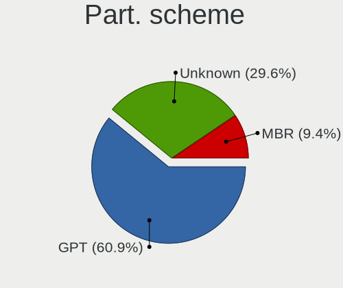
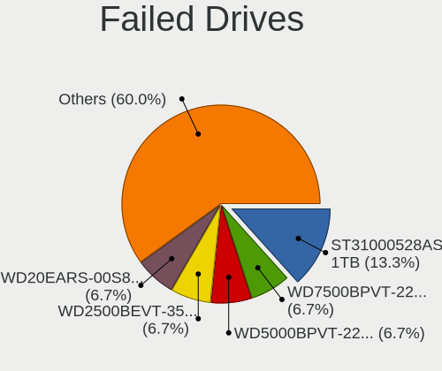
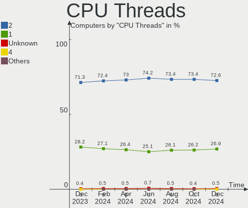
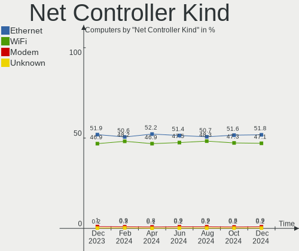
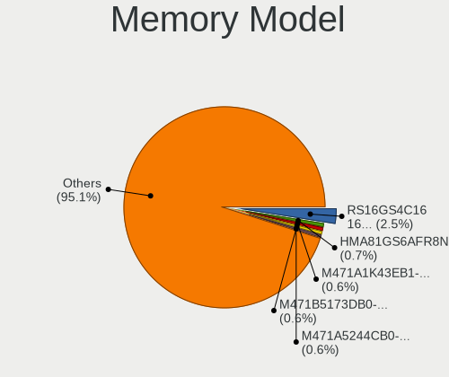

Linux - Hardware Trends
-----------------------

A project to identify most popular hardware characteristics and track their change
over time based on data collected by Linux users at https://Linux-Hardware.org.

Anyone can contribute to this report by the [hw-probe](https://github.com/linuxhw/hw-probe) tool:

    sudo -E hw-probe -all -upload

This is a report for all computer types. See also reports for [desktops](/Desktop/README.md) and [notebooks](/Notebook/README.md).

Distribution-specific reports: [Arch](/Dist/Arch), [ArcoLinux](/Dist/ArcoLinux), [BlackPanther](/Dist/BlackPanther), [CentOS](/Dist/CentOS), [Clear Linux](/Dist/Clear_Linux), [Debian](/Dist/Debian), [Elementary](/Dist/Elementary), [EndeavourOS](/Dist/EndeavourOS), [Endless](/Dist/Endless), [Fedora](/Dist/Fedora), [Garuda Linux](/Dist/Garuda_Linux), [Gentoo](/Dist/Gentoo), [Kali](/Dist/Kali), [KDE neon](/Dist/KDE_neon), [Kubuntu](/Dist/Kubuntu), [Linux Mint](/Dist/Linux_Mint), [Manjaro](/Dist/Manjaro), [OpenMandriva](/Dist/OpenMandriva), [openSUSE](/Dist/openSUSE), [Pop!_OS](/Dist/Pop!_OS), [Red OS](/Dist/Red_OS), [ROSA](/Dist/ROSA), [SteamOS](/Dist/SteamOS), [Ubuntu MATE](/Dist/Ubuntu_MATE), [Ubuntu](/Dist/Ubuntu), [Xubuntu](/Dist/Xubuntu), [Zorin](/Dist/Zorin).

This report is for one last month. Overall report since the beginning of time: [TestDays](https://github.com/linuxhw/TestDays)

Period: Sep, 2023.

Contents
--------

* [ System ](#system)
  - [ OS                       ](#os)
  - [ OS Family                ](#os-family)
  - [ Kernel                   ](#kernel)
  - [ Kernel Family            ](#kernel-family)
  - [ Kernel Major Ver.        ](#kernel-major-ver)
  - [ Arch                     ](#arch)
  - [ DE                       ](#de)
  - [ Display Server           ](#display-server)
  - [ Display Manager          ](#display-manager)
  - [ OS Lang                  ](#os-lang)
  - [ Boot Mode                ](#boot-mode)
  - [ Filesystem               ](#filesystem)
  - [ Part. scheme             ](#part-scheme)
  - [ Dual Boot with Linux/BSD ](#dual-boot-with-linuxbsd)
  - [ Dual Boot (Win)          ](#dual-boot-win)

* [ Board ](#board)
  - [ Vendor                   ](#vendor)
  - [ Model                    ](#model)
  - [ Model Family             ](#model-family)
  - [ MFG Year                 ](#mfg-year)
  - [ Form Factor              ](#form-factor)
  - [ Secure Boot              ](#secure-boot)
  - [ Coreboot                 ](#coreboot)
  - [ RAM Size                 ](#ram-size)
  - [ RAM Used                 ](#ram-used)
  - [ Total Drives             ](#total-drives)
  - [ Has CD-ROM               ](#has-cd-rom)
  - [ Has Ethernet             ](#has-ethernet)
  - [ Has WiFi                 ](#has-wifi)
  - [ Has Bluetooth            ](#has-bluetooth)

* [ Location ](#location)
  - [ Country                  ](#country)
  - [ City                     ](#city)

* [ Drives ](#drives)
  - [ Drive Vendor             ](#drive-vendor)
  - [ Drive Model              ](#drive-model)
  - [ HDD Vendor               ](#hdd-vendor)
  - [ SSD Vendor               ](#ssd-vendor)
  - [ Drive Kind               ](#drive-kind)
  - [ Drive Connector          ](#drive-connector)
  - [ Drive Size               ](#drive-size)
  - [ Space Total              ](#space-total)
  - [ Space Used               ](#space-used)
  - [ Malfunc. Drives          ](#malfunc-drives)
  - [ Malfunc. Drive Vendor    ](#malfunc-drive-vendor)
  - [ Malfunc. HDD Vendor      ](#malfunc-hdd-vendor)
  - [ Malfunc. Drive Kind      ](#malfunc-drive-kind)
  - [ Failed Drives            ](#failed-drives)
  - [ Failed Drive Vendor      ](#failed-drive-vendor)
  - [ Drive Status             ](#drive-status)

* [ Storage controller ](#storage-controller)
  - [ Storage Vendor           ](#storage-vendor)
  - [ Storage Model            ](#storage-model)
  - [ Storage Kind             ](#storage-kind)

* [ Processor ](#processor)
  - [ CPU Vendor               ](#cpu-vendor)
  - [ CPU Model                ](#cpu-model)
  - [ CPU Model Family         ](#cpu-model-family)
  - [ CPU Cores                ](#cpu-cores)
  - [ CPU Sockets              ](#cpu-sockets)
  - [ CPU Threads              ](#cpu-threads)
  - [ CPU Op-Modes             ](#cpu-op-modes)
  - [ CPU Microcode            ](#cpu-microcode)
  - [ CPU Microarch            ](#cpu-microarch)

* [ Graphics ](#graphics)
  - [ GPU Vendor               ](#gpu-vendor)
  - [ GPU Model                ](#gpu-model)
  - [ GPU Combo                ](#gpu-combo)
  - [ GPU Driver               ](#gpu-driver)
  - [ GPU Memory               ](#gpu-memory)

* [ Monitor ](#monitor)
  - [ Monitor Vendor           ](#monitor-vendor)
  - [ Monitor Model            ](#monitor-model)
  - [ Monitor Resolution       ](#monitor-resolution)
  - [ Monitor Diagonal         ](#monitor-diagonal)
  - [ Monitor Width            ](#monitor-width)
  - [ Aspect Ratio             ](#aspect-ratio)
  - [ Monitor Area             ](#monitor-area)
  - [ Pixel Density            ](#pixel-density)
  - [ Multiple Monitors        ](#multiple-monitors)

* [ Network ](#network)
  - [ Net Controller Vendor    ](#net-controller-vendor)
  - [ Net Controller Model     ](#net-controller-model)
  - [ Wireless Vendor          ](#wireless-vendor)
  - [ Wireless Model           ](#wireless-model)
  - [ Ethernet Vendor          ](#ethernet-vendor)
  - [ Ethernet Model           ](#ethernet-model)
  - [ Net Controller Kind      ](#net-controller-kind)
  - [ Used Controller          ](#used-controller)
  - [ NICs                     ](#nics)
  - [ IPv6                     ](#ipv6)

* [ Bluetooth ](#bluetooth)
  - [ Bluetooth Vendor         ](#bluetooth-vendor)
  - [ Bluetooth Model          ](#bluetooth-model)

* [ Sound ](#sound)
  - [ Sound Vendor             ](#sound-vendor)
  - [ Sound Model              ](#sound-model)

* [ Memory ](#memory)
  - [ Memory Vendor            ](#memory-vendor)
  - [ Memory Model             ](#memory-model)
  - [ Memory Kind              ](#memory-kind)
  - [ Memory Form Factor       ](#memory-form-factor)
  - [ Memory Size              ](#memory-size)
  - [ Memory Speed             ](#memory-speed)

* [ Printers & scanners ](#printers--scanners)
  - [ Printer Vendor           ](#printer-vendor)
  - [ Printer Model            ](#printer-model)
  - [ Scanner Vendor           ](#scanner-vendor)
  - [ Scanner Model            ](#scanner-model)

* [ Camera ](#camera)
  - [ Camera Vendor            ](#camera-vendor)
  - [ Camera Model             ](#camera-model)

* [ Security ](#security)
  - [ Fingerprint Vendor       ](#fingerprint-vendor)
  - [ Fingerprint Model        ](#fingerprint-model)
  - [ Chipcard Vendor          ](#chipcard-vendor)
  - [ Chipcard Model           ](#chipcard-model)

* [ Unsupported ](#unsupported)
  - [ Unsupported Devices      ](#unsupported-devices)
  - [ Unsupported Device Types ](#unsupported-device-types)

System
------

OS
--

Installed operating systems

| Name                         | Computers | Percent |
|------------------------------|-----------|---------|
| Ubuntu 22.04                 | 799       | 14.02%  |
| Fedora 38                    | 496       | 8.71%   |
| OpenMandriva 23.08           | 408       | 7.16%   |
| Linux Mint 21.2              | 342       | 6%      |
| Debian 12                    | 320       | 5.62%   |
| Ubuntu 23.04                 | 237       | 4.16%   |
| Arch Rolling                 | 211       | 3.7%    |
| OpenMandriva 23.09           | 185       | 3.25%   |
| ROSA 12.4                    | 168       | 2.95%   |
| Pop!_OS 22.04                | 164       | 2.88%   |
| Zorin 16                     | 156       | 2.74%   |
| ArcoLinux Rolling            | 126       | 2.21%   |
| BlackPanther 18.1            | 108       | 1.9%    |
| Ubuntu 20.04                 | 97        | 1.7%    |
| KDE neon 22.04               | 76        | 1.33%   |
| Kali 2023.3                  | 75        | 1.32%   |
| Manjaro                      | 72        | 1.26%   |
| EndeavourOS Rolling          | 68        | 1.19%   |
| Debian 11                    | 64        | 1.12%   |
| openSUSE Tumbleweed-XXXXXXXX | 63        | 1.11%   |
| Xero Rolling                 | 62        | 1.09%   |
| Kubuntu 22.04                | 62        | 1.09%   |
| Linux Mint 21.1              | 56        | 0.98%   |
| SteamOS 3.4.10               | 50        | 0.88%   |
| Kubuntu 23.04                | 48        | 0.84%   |
| OpenMandriva 4.3             | 46        | 0.81%   |
| OpenMandriva 23.03           | 40        | 0.7%    |
| Gentoo 2.14                  | 40        | 0.7%    |
| Linux Mint 20.3              | 38        | 0.67%   |
| Xubuntu 22.04                | 37        | 0.65%   |
| Debian                       | 31        | 0.54%   |
| openSUSE Leap-15.5           | 29        | 0.51%   |
| MX 23                        | 27        | 0.47%   |
| LMDE 5                       | 27        | 0.47%   |
| Manjaro 23.0.0               | 26        | 0.46%   |
| Nobara 38                    | 25        | 0.44%   |
| Ubuntu MATE 22.04            | 24        | 0.42%   |
| Fedora 39                    | 22        | 0.39%   |
| OpenMandriva 23.01           | 21        | 0.37%   |
| Manjaro 23.0.2               | 18        | 0.32%   |

OS Family
---------

OS without a version

| Name          | Computers | Percent |
|---------------|-----------|---------|
| Ubuntu        | 1181      | 20.73%  |
| OpenMandriva  | 736       | 12.92%  |
| Fedora        | 545       | 9.57%   |
| Linux Mint    | 474       | 8.32%   |
| Debian        | 420       | 7.37%   |
| Arch          | 212       | 3.72%   |
| ROSA          | 201       | 3.53%   |
| Pop!_OS       | 166       | 2.91%   |
| Zorin         | 156       | 2.74%   |
| Manjaro       | 136       | 2.39%   |
| ArcoLinux     | 131       | 2.3%    |
| Kubuntu       | 118       | 2.07%   |
| BlackPanther  | 116       | 2.04%   |
| openSUSE      | 99        | 1.74%   |
| KDE neon      | 78        | 1.37%   |
| Kali          | 76        | 1.33%   |
| SteamOS       | 73        | 1.28%   |
| EndeavourOS   | 68        | 1.19%   |
| Xubuntu       | 63        | 1.11%   |
| Xero          | 62        | 1.09%   |
| Gentoo        | 40        | 0.7%    |
| LMDE          | 38        | 0.67%   |
| Ubuntu MATE   | 34        | 0.6%    |
| MX            | 32        | 0.56%   |
| Nobara        | 29        | 0.51%   |
| Elementary    | 26        | 0.46%   |
| Lubuntu       | 22        | 0.39%   |
| Garuda Linux  | 21        | 0.37%   |
| NixOS         | 20        | 0.35%   |
| ALT Linux     | 20        | 0.35%   |
| Endless       | 19        | 0.33%   |
| TUXEDO OS     | 17        | 0.3%    |
| Raspbian      | 15        | 0.26%   |
| blendOS       | 15        | 0.26%   |
| Parrot        | 14        | 0.25%   |
| Red OS        | 12        | 0.21%   |
| ChimeraOS     | 12        | 0.21%   |
| Clear Linux   | 11        | 0.19%   |
| Ubuntu Unity  | 10        | 0.18%   |
| Ubuntu Budgie | 10        | 0.18%   |

Kernel
------

Version of the Linux kernel

| Version                           | Computers | Percent |
|-----------------------------------|-----------|---------|
| 6.2.0-32-generic                  | 489       | 8.58%   |
| 6.4.11-desktop-1omv2390           | 359       | 6.3%    |
| 6.2.0-33-generic                  | 355       | 6.23%   |
| 5.15.0-83-generic                 | 260       | 4.56%   |
| 5.15.0-84-generic                 | 187       | 3.28%   |
| 6.4.15-200.fc38.x86_64            | 177       | 3.11%   |
| 6.4.12-arch1-1                    | 142       | 2.49%   |
| 6.2.0-31-generic                  | 139       | 2.44%   |
| 6.4.6-76060406-generic            | 138       | 2.42%   |
| 6.1.0-12-amd64                    | 129       | 2.26%   |
| 5.15.0-82-generic                 | 121       | 2.12%   |
| 6.1.0-11-amd64                    | 114       | 2%      |
| 6.4.14-200.fc38.x86_64            | 78        | 1.37%   |
| 6.4.13-200.fc38.x86_64            | 73        | 1.28%   |
| 6.5.0-desktop-1omv2390            | 69        | 1.21%   |
| 6.1.46-generic-2rosa2021.1-x86_64 | 69        | 1.21%   |
| 6.5.3-arch1-1                     | 68        | 1.19%   |
| 6.2.9-300.fc38.x86_64             | 62        | 1.09%   |
| 6.2.0-26-generic                  | 58        | 1.02%   |
| 6.5.3-desktop-1omv2390            | 56        | 0.98%   |
| 5.10.0-25-amd64                   | 55        | 0.97%   |
| 5.13.0-valve37-1-neptune          | 51        | 0.9%    |
| 6.4.8-desktop-2omv2390            | 50        | 0.88%   |
| 6.1.0-10-amd64                    | 50        | 0.88%   |
| 5.15.0-76-generic                 | 47        | 0.82%   |
| 6.1.20-generic-2rosa2021.1-x86_64 | 46        | 0.81%   |
| 5.6.14-desktop-2bP                | 46        | 0.81%   |
| 6.5.4-arch2-1                     | 42        | 0.74%   |
| 6.4.0-kali3-amd64                 | 38        | 0.67%   |
| 6.2.6-desktop-1omv2390            | 38        | 0.67%   |
| 6.4.12-zen1-1-zen                 | 36        | 0.63%   |
| 6.4.12-200.fc38.x86_64            | 35        | 0.61%   |
| 5.15.0-69-generic                 | 35        | 0.61%   |
| 6.5.5-200.fc38.x86_64             | 33        | 0.58%   |
| 6.5.1-desktop-1omv2390            | 31        | 0.54%   |
| 6.1.38-generic-1rosa2021.1-x86_64 | 31        | 0.54%   |
| 5.15.85-desktop-1bP               | 31        | 0.54%   |
| 6.5.2-arch1-1                     | 30        | 0.53%   |
| 5.15.0-79-generic                 | 29        | 0.51%   |
| 5.16.7-desktop-1omv4003           | 28        | 0.49%   |

Kernel Family
-------------

Linux kernel without a distro release

| Version | Computers | Percent |
|---------|-----------|---------|
| 6.2.0   | 1123      | 19.71%  |
| 5.15.0  | 788       | 13.83%  |
| 6.4.11  | 397       | 6.97%   |
| 6.1.0   | 357       | 6.27%   |
| 6.4.12  | 246       | 4.32%   |
| 6.5.3   | 224       | 3.93%   |
| 6.4.15  | 189       | 3.32%   |
| 6.5.0   | 157       | 2.76%   |
| 6.4.6   | 144       | 2.53%   |
| 6.5.5   | 99        | 1.74%   |
| 5.4.0   | 92        | 1.61%   |
| 6.5.2   | 91        | 1.6%    |
| 6.1.46  | 87        | 1.53%   |
| 6.4.14  | 86        | 1.51%   |
| 6.4.13  | 82        | 1.44%   |
| 6.5.1   | 80        | 1.4%    |
| 5.10.0  | 80        | 1.4%    |
| 6.5.4   | 79        | 1.39%   |
| 6.4.0   | 74        | 1.3%    |
| 6.2.9   | 64        | 1.12%   |
| 5.19.0  | 61        | 1.07%   |
| 5.13.0  | 60        | 1.05%   |
| 6.2.6   | 59        | 1.04%   |
| 6.4.8   | 56        | 0.98%   |
| 6.1.20  | 48        | 0.84%   |
| 5.6.14  | 47        | 0.82%   |
| 6.1.38  | 39        | 0.68%   |
| 6.1.51  | 32        | 0.56%   |
| 5.15.85 | 31        | 0.54%   |
| 5.14.21 | 31        | 0.54%   |
| 6.1.53  | 29        | 0.51%   |
| 5.16.7  | 28        | 0.49%   |
| 6.3.9   | 27        | 0.47%   |
| 4.18.16 | 27        | 0.47%   |
| 6.4.10  | 26        | 0.46%   |
| 6.1.1   | 26        | 0.46%   |
| 4.15.0  | 26        | 0.46%   |
| 5.14.0  | 22        | 0.39%   |
| 6.2.16  | 21        | 0.37%   |
| 6.1.49  | 20        | 0.35%   |

Kernel Major Ver.
-----------------

Linux kernel major version

| Version | Computers | Percent |
|---------|-----------|---------|
| 6.4     | 1329      | 23.33%  |
| 6.2     | 1289      | 22.63%  |
| 5.15    | 869       | 15.25%  |
| 6.5     | 730       | 12.81%  |
| 6.1     | 729       | 12.8%   |
| 5.10    | 137       | 2.4%    |
| 5.4     | 103       | 1.81%   |
| 6.3     | 91        | 1.6%    |
| 5.19    | 66        | 1.16%   |
| 5.13    | 61        | 1.07%   |
| 5.14    | 53        | 0.93%   |
| 5.6     | 49        | 0.86%   |
| 5.16    | 47        | 0.82%   |
| 4.18    | 35        | 0.61%   |
| 4.15    | 26        | 0.46%   |
| 6.0     | 19        | 0.33%   |
| 6.6     | 13        | 0.23%   |
| 5.11    | 12        | 0.21%   |
| 5.17    | 8         | 0.14%   |
| 3.10    | 8         | 0.14%   |
| 4.19    | 5         | 0.09%   |
| 5.8     | 4         | 0.07%   |
| 5.18    | 3         | 0.05%   |
| 3.18    | 3         | 0.05%   |
| 4.4     | 2         | 0.04%   |
| 4.14    | 2         | 0.04%   |
| 5.0     | 1         | 0.02%   |
| 4       | 1         | 0.02%   |
| 3.16    | 1         | 0.02%   |
| Unknown | 1         | 0.02%   |

Arch
----

OS architecture (x86_64, i586, etc.)

| Name        | Computers | Percent |
|-------------|-----------|---------|
| x86_64      | 5610      | 98.47%  |
| aarch64     | 36        | 0.63%   |
| i686        | 34        | 0.6%    |
| armv7l      | 11        | 0.19%   |
| riscv64     | 2         | 0.04%   |
| armv6l      | 2         | 0.04%   |
| ppc         | 1         | 0.02%   |
| loongarch64 | 1         | 0.02%   |

DE
--

Desktop Environment

| Name              | Computers | Percent |
|-------------------|-----------|---------|
| GNOME             | 2286      | 40.13%  |
| KDE5              | 1714      | 30.09%  |
| X-Cinnamon        | 435       | 7.64%   |
| XFCE              | 394       | 6.92%   |
| Unknown           | 304       | 5.34%   |
| MATE              | 138       | 2.42%   |
| LXQt              | 118       | 2.07%   |
| i3                | 43        | 0.75%   |
| Cinnamon          | 41        | 0.72%   |
| Budgie            | 33        | 0.58%   |
| Pantheon          | 27        | 0.47%   |
| Hyprland          | 25        | 0.44%   |
| LXDE              | 21        | 0.37%   |
| KDE               | 14        | 0.25%   |
| Unity             | 13        | 0.23%   |
| GNOME Classic     | 11        | 0.19%   |
| GNOME Flashback   | 10        | 0.18%   |
| sway              | 9         | 0.16%   |
| KDE4              | 8         | 0.14%   |
| Enlightenment     | 6         | 0.11%   |
| awesome           | 5         | 0.09%   |
| Openbox           | 4         | 0.07%   |
| lightdm-xsession  | 4         | 0.07%   |
| Unicorn:XFCE      | 3         | 0.05%   |
| UKUI              | 3         | 0.05%   |
| icewm             | 3         | 0.05%   |
| Endless:GNOME     | 3         | 0.05%   |
| chadwm            | 3         | 0.05%   |
| bspwm             | 3         | 0.05%   |
| qtile             | 2         | 0.04%   |
| DWM               | 2         | 0.04%   |
| Deepin            | 2         | 0.04%   |
| Yaru:ubuntu:GNOME | 1         | 0.02%   |
| xmonad            | 1         | 0.02%   |
| XFCE:GNOME:       | 1         | 0.02%   |
| Trinity           | 1         | 0.02%   |
| Phosh:GNOME       | 1         | 0.02%   |
| onyx:GNOME        | 1         | 0.02%   |
| KDE6              | 1         | 0.02%   |
| Jwm               | 1         | 0.02%   |

Display Server
--------------

X11 or Wayland

| Name        | Computers | Percent |
|-------------|-----------|---------|
| X11         | 3039      | 53.34%  |
| Wayland     | 2312      | 40.58%  |
| Unknown     | 180       | 3.16%   |
| Tty         | 164       | 2.88%   |
| Web         | 1         | 0.02%   |
| Unspecified | 1         | 0.02%   |

Display Manager
---------------

SDDM, LightDM, etc.

| Name    | Computers | Percent |
|---------|-----------|---------|
| Unknown | 1878      | 32.96%  |
| SDDM    | 1500      | 26.33%  |
| GDM3    | 1158      | 20.33%  |
| LightDM | 713       | 12.52%  |
| GDM     | 403       | 7.07%   |
| SLiM    | 11        | 0.19%   |
| GREETD  | 9         | 0.16%   |
| LXDM    | 8         | 0.14%   |
| KDM     | 7         | 0.12%   |
| LY-DM   | 3         | 0.05%   |
| SLIMSKI | 2         | 0.04%   |
| Ly      | 2         | 0.04%   |
| FLY-DM  | 2         | 0.04%   |
| TDM     | 1         | 0.02%   |

OS Lang
-------

Language

| Lang    | Computers | Percent |
|---------|-----------|---------|
| en_US   | 2386      | 41.88%  |
| ru_RU   | 454       | 7.97%   |
| de_DE   | 443       | 7.78%   |
| en_GB   | 283       | 4.97%   |
| fr_FR   | 257       | 4.51%   |
| pt_BR   | 224       | 3.93%   |
| Unknown | 204       | 3.58%   |
| C       | 165       | 2.9%    |
| it_IT   | 157       | 2.76%   |
| es_ES   | 118       | 2.07%   |
| en_CA   | 100       | 1.76%   |
| en_AU   | 88        | 1.54%   |
| pl_PL   | 81        | 1.42%   |
| en_IN   | 72        | 1.26%   |
| es_MX   | 58        | 1.02%   |
| nl_NL   | 39        | 0.68%   |
| tr_TR   | 37        | 0.65%   |
| es_AR   | 34        | 0.6%    |
| hu_HU   | 33        | 0.58%   |
| zh_CN   | 29        | 0.51%   |
| es_CO   | 25        | 0.44%   |
| sv_SE   | 22        | 0.39%   |
| de_AT   | 21        | 0.37%   |
| es_CL   | 20        | 0.35%   |
| cs_CZ   | 19        | 0.33%   |
| pt_PT   | 17        | 0.3%    |
| en_NZ   | 17        | 0.3%    |
| ja_JP   | 14        | 0.25%   |
| de_CH   | 14        | 0.25%   |
| nl_BE   | 13        | 0.23%   |
| en_ZA   | 13        | 0.23%   |
| fr_CA   | 12        | 0.21%   |
| sk_SK   | 11        | 0.19%   |
| fi_FI   | 11        | 0.19%   |
| en_PH   | 11        | 0.19%   |
| en_IE   | 11        | 0.19%   |
| fr_BE   | 10        | 0.18%   |
| es_PE   | 10        | 0.18%   |
| POSIX   | 8         | 0.14%   |
| nb_NO   | 7         | 0.12%   |

Boot Mode
---------

EFI or BIOS

| Mode | Computers | Percent |
|------|-----------|---------|
| EFI  | 3150      | 55.29%  |
| BIOS | 2547      | 44.71%  |

Filesystem
----------

Type of filesystem

| Type                | Computers | Percent |
|---------------------|-----------|---------|
| Ext4                | 3262      | 57.26%  |
| Btrfs               | 998       | 17.52%  |
| Tmpfs               | 768       | 13.48%  |
| Overlay             | 499       | 8.76%   |
| Xfs                 | 85        | 1.49%   |
| Zfs                 | 45        | 0.79%   |
| F2fs                | 21        | 0.37%   |
| Ext3                | 3         | 0.05%   |
| Ext2                | 3         | 0.05%   |
| Reiserfs            | 2         | 0.04%   |
| Aufs                | 2         | 0.04%   |
| Unknown             | 2         | 0.04%   |
| XXXXX               | 1         | 0.02%   |
| XXX4                | 1         | 0.02%   |
| Rootfs              | 1         | 0.02%   |
| Ntfs                | 1         | 0.02%   |
| Nilfs2              | 1         | 0.02%   |
| Jfs                 | 1         | 0.02%   |
| Fuse.fuse-overlayfs | 1         | 0.02%   |

Part. scheme
------------

Scheme of partitioning

| Type    | Computers | Percent |
|---------|-----------|---------|
| GPT     | 3376      | 59.26%  |
| Unknown | 1657      | 29.09%  |
| MBR     | 664       | 11.66%  |

Dual Boot with Linux/BSD
------------------------

Hosting more than one Linux/BSD

| Dual boot | Computers | Percent |
|-----------|-----------|---------|
| No        | 4756      | 83.48%  |
| Yes       | 941       | 16.52%  |

Dual Boot (Win)
---------------

Hosting Linux and Windows

| Dual boot | Computers | Percent |
|-----------|-----------|---------|
| No        | 4088      | 71.76%  |
| Yes       | 1609      | 28.24%  |

Board
-----

Vendor
------

Motherboard manufacturer

| Name                                 | Computers | Percent |
|--------------------------------------|-----------|---------|
| ASUSTek Computer                     | 927       | 16.27%  |
| Lenovo                               | 829       | 14.55%  |
| Hewlett-Packard                      | 743       | 13.04%  |
| Dell                                 | 663       | 11.64%  |
| Gigabyte Technology                  | 348       | 6.11%   |
| MSI                                  | 319       | 5.6%    |
| Acer                                 | 288       | 5.06%   |
| ASRock                               | 193       | 3.39%   |
| Apple                                | 177       | 3.11%   |
| Intel                                | 107       | 1.88%   |
| Valve                                | 68        | 1.19%   |
| Unknown                              | 62        | 1.09%   |
| Toshiba                              | 59        | 1.04%   |
| HUAWEI                               | 58        | 1.02%   |
| Samsung Electronics                  | 56        | 0.98%   |
| Fujitsu                              | 51        | 0.9%    |
| Google                               | 44        | 0.77%   |
| AZW                                  | 31        | 0.54%   |
| Supermicro                           | 29        | 0.51%   |
| Sony                                 | 28        | 0.49%   |
| Raspberry Pi Foundation              | 27        | 0.47%   |
| Microsoft                            | 26        | 0.46%   |
| Medion                               | 24        | 0.42%   |
| Pegatron                             | 23        | 0.4%    |
| Timi                                 | 21        | 0.37%   |
| Biostar                              | 21        | 0.37%   |
| Foxconn                              | 20        | 0.35%   |
| Notebook                             | 18        | 0.32%   |
| Chuwi                                | 16        | 0.28%   |
| Alienware                            | 15        | 0.26%   |
| System76                             | 13        | 0.23%   |
| Shenzhen Meigao Electronic Equipment | 13        | 0.23%   |
| Positivo                             | 12        | 0.21%   |
| Packard Bell                         | 12        | 0.21%   |
| TUXEDO                               | 11        | 0.19%   |
| Clevo                                | 11        | 0.19%   |
| Fujitsu Siemens                      | 10        | 0.18%   |
| Framework                            | 10        | 0.18%   |
| ETegro Technologies                  | 10        | 0.18%   |
| ECS                                  | 10        | 0.18%   |

Model
-----

Motherboard model

| Name                                      | Computers | Percent |
|-------------------------------------------|-----------|---------|
| Unknown                                   | 72        | 1.26%   |
| Valve Jupiter                             | 68        | 1.19%   |
| ASUS All Series                           | 35        | 0.61%   |
| Dell OptiPlex 7010                        | 21        | 0.37%   |
| HP Notebook                               | 16        | 0.28%   |
| Google Enguarde                           | 15        | 0.26%   |
| Dell OptiPlex 9020                        | 14        | 0.25%   |
| Apple MacBookPro9,2                       | 13        | 0.23%   |
| Apple MacBookPro8,1                       | 11        | 0.19%   |
| MSI MS-7C91                               | 10        | 0.18%   |
| Intel H61                                 | 10        | 0.18%   |
| ETegro Hyperion RS125 G4                  | 10        | 0.18%   |
| MSI MS-7C95                               | 9         | 0.16%   |
| Lenovo ThinkPad L13 Yoga Gen 2 20VK0019US | 9         | 0.16%   |
| HP Pavilion dv6                           | 9         | 0.16%   |
| AZW SER                                   | 9         | 0.16%   |
| Apple MacBookPro11,1                      | 9         | 0.16%   |
| Apple MacBookAir7,2                       | 9         | 0.16%   |
| MSI MS-7C56                               | 8         | 0.14%   |
| MSI MS-7C37                               | 8         | 0.14%   |
| HUAWEI BOM-WXX9                           | 8         | 0.14%   |
| HP Pavilion g6                            | 8         | 0.14%   |
| HP Laptop 15s-eq2xxx                      | 8         | 0.14%   |
| HP Compaq Elite 8300 SFF                  | 8         | 0.14%   |
| AZW MINI S                                | 8         | 0.14%   |
| AZW GTR                                   | 8         | 0.14%   |
| Apple iMac12,1                            | 8         | 0.14%   |
| MSI MS-7C94                               | 7         | 0.12%   |
| MSI MS-7C02                               | 7         | 0.12%   |
| Lenovo IdeaPad 3 15ALC6 82KU              | 7         | 0.12%   |
| HP Pavilion Notebook                      | 7         | 0.12%   |
| Gigabyte B450M DS3H                       | 7         | 0.12%   |
| Dell OptiPlex 790                         | 7         | 0.12%   |
| Dell OptiPlex 3020                        | 7         | 0.12%   |
| Dell Latitude 5420                        | 7         | 0.12%   |
| ASUS TUF Gaming X570-PLUS                 | 7         | 0.12%   |
| ASUS TUF Gaming B550M-PLUS                | 7         | 0.12%   |
| ASUS PRIME X370-PRO                       | 7         | 0.12%   |
| ASUS PRIME A320M-K                        | 7         | 0.12%   |
| Apple MacBookPro11,2                      | 7         | 0.12%   |

Model Family
------------

Motherboard model prefix

| Name               | Computers | Percent |
|--------------------|-----------|---------|
| Lenovo ThinkPad    | 355       | 6.23%   |
| Acer Aspire        | 181       | 3.18%   |
| Dell Latitude      | 179       | 3.14%   |
| Lenovo IdeaPad     | 175       | 3.07%   |
| Dell Inspiron      | 139       | 2.44%   |
| ASUS ROG           | 130       | 2.28%   |
| ASUS PRIME         | 116       | 2.04%   |
| HP EliteBook       | 111       | 1.95%   |
| Dell OptiPlex      | 104       | 1.83%   |
| HP Pavilion        | 102       | 1.79%   |
| ASUS VivoBook      | 102       | 1.79%   |
| HP Laptop          | 86        | 1.51%   |
| Dell Precision     | 75        | 1.32%   |
| Unknown            | 72        | 1.26%   |
| Valve Jupiter      | 68        | 1.19%   |
| Dell XPS           | 68        | 1.19%   |
| ASUS TUF           | 65        | 1.14%   |
| HP ProBook         | 62        | 1.09%   |
| Lenovo ThinkCentre | 61        | 1.07%   |
| HP Compaq          | 61        | 1.07%   |
| Toshiba Satellite  | 44        | 0.77%   |
| ASUS ASUS          | 43        | 0.75%   |
| HP ENVY            | 42        | 0.74%   |
| Lenovo Legion      | 40        | 0.7%    |
| Dell Vostro        | 40        | 0.7%    |
| ASUS ZenBook       | 38        | 0.67%   |
| Lenovo Yoga        | 35        | 0.61%   |
| ASUS All           | 35        | 0.61%   |
| Acer Nitro         | 35        | 0.61%   |
| HP EliteDesk       | 30        | 0.53%   |
| RPi Raspberry      | 27        | 0.47%   |
| Microsoft Surface  | 26        | 0.46%   |
| Dell PowerEdge     | 24        | 0.42%   |
| Lenovo IdeaPadFlex | 23        | 0.4%    |
| HP 250             | 22        | 0.39%   |
| Gigabyte X570      | 22        | 0.39%   |
| Fujitsu ESPRIMO    | 22        | 0.39%   |
| HP OMEN            | 21        | 0.37%   |
| Apple MacBookPro11 | 21        | 0.37%   |
| Acer Swift         | 19        | 0.33%   |

MFG Year
--------

Motherboard manufacture year

| Year    | Computers | Percent |
|---------|-----------|---------|
| 2022    | 598       | 10.5%   |
| 2021    | 577       | 10.13%  |
| 2020    | 538       | 9.44%   |
| 2018    | 464       | 8.14%   |
| 2019    | 412       | 7.23%   |
| 2012    | 366       | 6.42%   |
| 2013    | 337       | 5.92%   |
| 2023    | 327       | 5.74%   |
| 2011    | 325       | 5.7%    |
| 2017    | 321       | 5.63%   |
| 2014    | 282       | 4.95%   |
| 2015    | 244       | 4.28%   |
| 2016    | 242       | 4.25%   |
| 2010    | 204       | 3.58%   |
| 2009    | 168       | 2.95%   |
| 2008    | 142       | 2.49%   |
| 2007    | 69        | 1.21%   |
| Unknown | 51        | 0.9%    |
| 2006    | 24        | 0.42%   |
| 2005    | 5         | 0.09%   |
| 2002    | 1         | 0.02%   |

Form Factor
-----------

Physical design of the computer

| Name           | Computers | Percent |
|----------------|-----------|---------|
| Notebook       | 3042      | 53.4%   |
| Desktop        | 2110      | 37.04%  |
| Convertible    | 165       | 2.9%    |
| Mini pc        | 114       | 2%      |
| Server         | 84        | 1.47%   |
| All in one     | 79        | 1.39%   |
| Tablet         | 56        | 0.98%   |
| System on chip | 45        | 0.79%   |
| Phone          | 1         | 0.02%   |
| Stick pc       | 1         | 0.02%   |

Secure Boot
-----------

Enabled or disabled

| State    | Computers | Percent |
|----------|-----------|---------|
| Disabled | 5312      | 93.24%  |
| Enabled  | 385       | 6.76%   |

Coreboot
--------

Have coreboot on board

| Used | Computers | Percent |
|------|-----------|---------|
| No   | 5642      | 99.03%  |
| Yes  | 55        | 0.97%   |

RAM Size
--------

Total RAM memory

| Size in GB      | Computers | Percent |
|-----------------|-----------|---------|
| 4.01-8.0        | 1348      | 23.66%  |
| 16.01-24.0      | 1175      | 20.62%  |
| 8.01-16.0       | 1059      | 18.59%  |
| 3.01-4.0        | 760       | 13.34%  |
| 32.01-64.0      | 695       | 12.2%   |
| 64.01-256.0     | 287       | 5.04%   |
| 24.01-32.0      | 165       | 2.9%    |
| 1.01-2.0        | 113       | 1.98%   |
| 2.01-3.0        | 57        | 1%      |
| More than 256.0 | 17        | 0.3%    |
| 0.51-1.0        | 17        | 0.3%    |
| 0.01-0.5        | 4         | 0.07%   |

RAM Used
--------

Used RAM memory

| Used GB         | Computers | Percent |
|-----------------|-----------|---------|
| 1.01-2.0        | 1646      | 28.89%  |
| 2.01-3.0        | 1482      | 26.01%  |
| 4.01-8.0        | 1018      | 17.87%  |
| 3.01-4.0        | 813       | 14.27%  |
| 8.01-16.0       | 306       | 5.37%   |
| 0.51-1.0        | 273       | 4.79%   |
| 0.01-0.5        | 63        | 1.11%   |
| 16.01-24.0      | 56        | 0.98%   |
| 24.01-32.0      | 15        | 0.26%   |
| 32.01-64.0      | 11        | 0.19%   |
| 64.01-256.0     | 11        | 0.19%   |
| More than 256.0 | 3         | 0.05%   |

Total Drives
------------

Number of drives on board

| Drives | Computers | Percent |
|--------|-----------|---------|
| 1      | 3359      | 58.96%  |
| 2      | 1443      | 25.33%  |
| 3      | 448       | 7.86%   |
| 4      | 190       | 3.34%   |
| 5      | 108       | 1.9%    |
| 6      | 50        | 0.88%   |
| 0      | 37        | 0.65%   |
| 7      | 18        | 0.32%   |
| 9      | 10        | 0.18%   |
| 8      | 9         | 0.16%   |
| 11     | 8         | 0.14%   |
| 10     | 6         | 0.11%   |
| 17     | 4         | 0.07%   |
| 14     | 2         | 0.04%   |
| 36     | 1         | 0.02%   |
| 23     | 1         | 0.02%   |
| 19     | 1         | 0.02%   |
| 16     | 1         | 0.02%   |
| 12     | 1         | 0.02%   |

Has CD-ROM
----------

Has CD-ROM on board

| Presented | Computers | Percent |
|-----------|-----------|---------|
| No        | 3987      | 69.98%  |
| Yes       | 1710      | 30.02%  |

Has Ethernet
------------

Has Ethernet on board

| Presented | Computers | Percent |
|-----------|-----------|---------|
| Yes       | 4735      | 83.11%  |
| No        | 962       | 16.89%  |

Has WiFi
--------

Has WiFi module

| Presented | Computers | Percent |
|-----------|-----------|---------|
| Yes       | 4356      | 76.46%  |
| No        | 1341      | 23.54%  |

Has Bluetooth
-------------

Has Bluetooth module

| Presented | Computers | Percent |
|-----------|-----------|---------|
| Yes       | 3699      | 64.93%  |
| No        | 1998      | 35.07%  |

Location
--------

Country
-------

Geographic location (country)

| Country     | Computers | Percent |
|-------------|-----------|---------|
| USA         | 964       | 16.92%  |
| Germany     | 577       | 10.13%  |
| Russia      | 555       | 9.74%   |
| Brazil      | 305       | 5.35%   |
| France      | 277       | 4.86%   |
| Italy       | 221       | 3.88%   |
| UK          | 210       | 3.69%   |
| Canada      | 180       | 3.16%   |
| Spain       | 170       | 2.98%   |
| Hungary     | 153       | 2.69%   |
| Poland      | 132       | 2.32%   |
| India       | 123       | 2.16%   |
| Australia   | 106       | 1.86%   |
| Netherlands | 99        | 1.74%   |
| Turkey      | 89        | 1.56%   |
| Mexico      | 89        | 1.56%   |
| Austria     | 64        | 1.12%   |
| Sweden      | 58        | 1.02%   |
| Belgium     | 56        | 0.98%   |
| Argentina   | 55        | 0.97%   |
| Switzerland | 49        | 0.86%   |
| Indonesia   | 47        | 0.82%   |
| China       | 44        | 0.77%   |
| Czechia     | 42        | 0.74%   |
| Colombia    | 42        | 0.74%   |
| Portugal    | 41        | 0.72%   |
| Romania     | 39        | 0.68%   |
| Japan       | 38        | 0.67%   |
| Finland     | 38        | 0.67%   |
| Norway      | 35        | 0.61%   |
| Greece      | 35        | 0.61%   |
| Thailand    | 33        | 0.58%   |
| Bulgaria    | 33        | 0.58%   |
| Slovakia    | 31        | 0.54%   |
| Chile       | 29        | 0.51%   |
| Belarus     | 28        | 0.49%   |
| Ukraine     | 27        | 0.47%   |
| Denmark     | 25        | 0.44%   |
| Serbia      | 23        | 0.4%    |
| Philippines | 23        | 0.4%    |

City
----

Geographic location (city)

| City              | Computers | Percent |
|-------------------|-----------|---------|
| Moscow            | 157       | 2.76%   |
| St Petersburg     | 54        | 0.95%   |
| Budapest          | 54        | 0.95%   |
| Berlin            | 51        | 0.9%    |
| Vienna            | 37        | 0.65%   |
| Sao Paulo         | 36        | 0.63%   |
| Sydney            | 35        | 0.61%   |
| Bangor            | 32        | 0.56%   |
| Paris             | 31        | 0.54%   |
| Warsaw            | 29        | 0.51%   |
| Milan             | 28        | 0.49%   |
| Hamburg           | 28        | 0.49%   |
| Madrid            | 27        | 0.47%   |
| Melbourne         | 25        | 0.44%   |
| Istanbul          | 25        | 0.44%   |
| Munich            | 22        | 0.39%   |
| Bengaluru         | 22        | 0.39%   |
| Barcelona         | 22        | 0.39%   |
| Voronezh          | 21        | 0.37%   |
| Helsinki          | 21        | 0.37%   |
| Amsterdam         | 20        | 0.35%   |
| Los Angeles       | 19        | 0.33%   |
| Minsk             | 18        | 0.32%   |
| Frankfurt am Main | 18        | 0.32%   |
| Seattle           | 17        | 0.3%    |
| Rome              | 17        | 0.3%    |
| Rio de Janeiro    | 17        | 0.3%    |
| Montreal          | 17        | 0.3%    |
| Brisbane          | 16        | 0.28%   |
| Mexico City       | 15        | 0.26%   |
| Sofia             | 14        | 0.25%   |
| Singapore         | 14        | 0.25%   |
| Santiago          | 14        | 0.25%   |
| Perth             | 14        | 0.25%   |
| Bangkok           | 14        | 0.25%   |
| Athens            | 14        | 0.25%   |
| Tehran            | 13        | 0.23%   |
| Stuttgart         | 13        | 0.23%   |
| New York          | 13        | 0.23%   |
| Milano            | 13        | 0.23%   |

Drives
------

Drive Vendor
------------

Hard drive vendors

| Vendor                      | Computers | Drives | Percent |
|-----------------------------|-----------|--------|---------|
| Samsung Electronics         | 1301      | 1590   | 15.54%  |
| WDC                         | 994       | 1242   | 11.87%  |
| Seagate                     | 885       | 1091   | 10.57%  |
| SanDisk                     | 531       | 584    | 6.34%   |
| Toshiba                     | 464       | 538    | 5.54%   |
| Kingston                    | 445       | 480    | 5.32%   |
| Unknown                     | 339       | 381    | 4.05%   |
| Crucial                     | 332       | 373    | 3.97%   |
| SK hynix                    | 259       | 325    | 3.09%   |
| Intel                       | 212       | 231    | 2.53%   |
| Micron Technology           | 197       | 215    | 2.35%   |
| Hitachi                     | 180       | 197    | 2.15%   |
| China                       | 113       | 117    | 1.35%   |
| A-DATA Technology           | 112       | 119    | 1.34%   |
| HGST                        | 108       | 135    | 1.29%   |
| KIOXIA                      | 106       | 106    | 1.27%   |
| Kingston Technology Company | 105       | 109    | 1.25%   |
| Phison Electronics          | 101       | 113    | 1.21%   |
| Apple                       | 93        | 97     | 1.11%   |
| Micron/Crucial Technology   | 73        | 82     | 0.87%   |
| Silicon Motion              | 71        | 71     | 0.85%   |
| Unknown                     | 66        | 74     | 0.79%   |
| SPCC                        | 65        | 69     | 0.78%   |
| PNY                         | 49        | 54     | 0.59%   |
| Fujitsu                     | 48        | 82     | 0.57%   |
| Patriot                     | 44        | 44     | 0.53%   |
| Intenso                     | 44        | 51     | 0.53%   |
| Apacer                      | 38        | 40     | 0.45%   |
| ADATA Technology            | 36        | 40     | 0.43%   |
| Netac                       | 35        | 35     | 0.42%   |
| Transcend                   | 31        | 31     | 0.37%   |
| MAXIO Technology (Hangzhou) | 30        | 30     | 0.36%   |
| GOODRAM                     | 27        | 35     | 0.32%   |
| Phison                      | 26        | 31     | 0.31%   |
| LITEON                      | 26        | 26     | 0.31%   |
| JMicron Technology          | 26        | 33     | 0.31%   |
| Hewlett-Packard             | 25        | 41     | 0.3%    |
| Team                        | 24        | 25     | 0.29%   |
| Lexar                       | 22        | 22     | 0.26%   |
| Realtek Semiconductor       | 20        | 21     | 0.24%   |

Drive Model
-----------

Hard drive models

| Model                                                 | Computers | Percent |
|-------------------------------------------------------|-----------|---------|
| Samsung NVMe SSD Controller SM981/PM981/PM983 256GB   | 167       | 1.84%   |
| Samsung NVMe SSD Controller PM9A1/PM9A3/980PRO 1TB    | 103       | 1.13%   |
| Kingston SA400S37240G 240GB SSD                       | 83        | 0.91%   |
| Kingston SA400S37480G 480GB SSD                       | 81        | 0.89%   |
| Unknown                                               | 66        | 0.73%   |
| Samsung SSD 850 EVO 250GB                             | 55        | 0.61%   |
| Samsung SSD 860 EVO 500GB                             | 54        | 0.59%   |
| Micron/Crucial P2 NVMe PCIe SSD 1TB                   | 52        | 0.57%   |
| Crucial CT500MX500SSD1 500GB                          | 51        | 0.56%   |
| Toshiba DT01ACA100 1TB                                | 47        | 0.52%   |
| Seagate ST500DM002-1BD142 500GB                       | 47        | 0.52%   |
| Sandisk WD Blue SN550 NVMe SSD 512GB                  | 46        | 0.51%   |
| Unknown MMC Card  64GB                                | 45        | 0.5%    |
| Seagate ST1000LM035-1RK172 1TB                        | 44        | 0.48%   |
| Seagate ST1000DM010-2EP102 1TB                        | 44        | 0.48%   |
| Crucial CT1000MX500SSD1 1TB                           | 43        | 0.47%   |
| Seagate ST2000DM008-2FR102 2TB                        | 41        | 0.45%   |
| Crucial CT240BX500SSD1 240GB                          | 40        | 0.44%   |
| Phison PS5013 E13 NVMe Controller 512GB               | 39        | 0.43%   |
| Samsung SSD 980 1TB                                   | 38        | 0.42%   |
| Seagate ST1000LM024 HN-M101MBB 1TB                    | 37        | 0.41%   |
| Silicon Motion SM2263EN/SM2263XT SSD Controller 512GB | 36        | 0.4%    |
| Toshiba MQ01ABD100 1TB                                | 35        | 0.39%   |
| WDC WD10EZEX-08WN4A0 1TB                              | 34        | 0.37%   |
| Sandisk WD Black SN750 / PC SN730 NVMe SSD 512GB      | 34        | 0.37%   |
| Samsung NVMe SSD Controller SM961/PM961/SM963 500GB   | 34        | 0.37%   |
| Kingston SA400S37120G 120GB SSD                       | 34        | 0.37%   |
| Seagate ST1000DM003-1ER162 1TB                        | 32        | 0.35%   |
| Intel SSDPEKNU512GZ 512GB                             | 32        | 0.35%   |
| Samsung SSD 870 EVO 500GB                             | 31        | 0.34%   |
| Samsung SSD 870 EVO 1TB                               | 31        | 0.34%   |
| Samsung SSD 860 EVO 1TB                               | 30        | 0.33%   |
| Unknown MMC Card  32GB                                | 29        | 0.32%   |
| Unknown MMC Card  128GB                               | 29        | 0.32%   |
| Toshiba MQ04ABF100 1TB                                | 28        | 0.31%   |
| Samsung SSD 850 EVO 500GB                             | 28        | 0.31%   |
| Kingston Company SNV2S1000G 1TB                       | 28        | 0.31%   |
| Seagate ST3500418AS 500GB                             | 27        | 0.3%    |
| SanDisk NVMe SSD Drive 1TB                            | 27        | 0.3%    |
| Samsung SSD 870 QVO 1TB                               | 27        | 0.3%    |

HDD Vendor
----------

Hard disk drive vendors

| Vendor              | Computers | Drives | Percent |
|---------------------|-----------|--------|---------|
| Seagate             | 865       | 1057   | 33.86%  |
| WDC                 | 786       | 991    | 30.76%  |
| Toshiba             | 352       | 414    | 13.78%  |
| Hitachi             | 180       | 197    | 7.05%   |
| HGST                | 108       | 135    | 4.23%   |
| Samsung Electronics | 94        | 103    | 3.68%   |
| Fujitsu             | 47        | 81     | 1.84%   |
| Unknown             | 27        | 27     | 1.06%   |
| Apple               | 23        | 23     | 0.9%    |
| Maxtor              | 16        | 16     | 0.63%   |
| SABRENT             | 12        | 15     | 0.47%   |
| Hewlett-Packard     | 8         | 12     | 0.31%   |
| Intenso             | 5         | 5      | 0.2%    |
| SSK                 | 4         | 4      | 0.16%   |
| USB3.0              | 2         | 2      | 0.08%   |
| Maxone              | 2         | 2      | 0.08%   |
| Lenovo              | 2         | 8      | 0.08%   |
| Initio              | 2         | 2      | 0.08%   |
| External            | 2         | 2      | 0.08%   |
| ASMT                | 2         | 3      | 0.08%   |
| Unknown             | 2         | 2      | 0.08%   |
| USB                 | 1         | 1      | 0.04%   |
| Teleplan            | 1         | 1      | 0.04%   |
| TDAS                | 1         | 4      | 0.04%   |
| Synology            | 1         | 1      | 0.04%   |
| Space ke            | 1         | 2      | 0.04%   |
| SAGE                | 1         | 1      | 0.04%   |
| JMicron Technology  | 1         | 8      | 0.04%   |
| ICY BOX             | 1         | 1      | 0.04%   |
| IBM-ESXS            | 1         | 6      | 0.04%   |
| IB-377U3            | 1         | 1      | 0.04%   |
| HPE                 | 1         | 2      | 0.04%   |
| H/W                 | 1         | 3      | 0.04%   |
| DGC                 | 1         | 6      | 0.04%   |
| DELLBOSS            | 1         | 1      | 0.04%   |

SSD Vendor
----------

Solid state drive vendors

| Vendor              | Computers | Drives | Percent |
|---------------------|-----------|--------|---------|
| Samsung Electronics | 546       | 625    | 19.82%  |
| Kingston            | 342       | 364    | 12.41%  |
| Crucial             | 289       | 321    | 10.49%  |
| SanDisk             | 219       | 235    | 7.95%   |
| WDC                 | 155       | 163    | 5.63%   |
| China               | 113       | 117    | 4.1%    |
| A-DATA Technology   | 88        | 93     | 3.19%   |
| SPCC                | 56        | 58     | 2.03%   |
| Micron Technology   | 56        | 72     | 2.03%   |
| Intel               | 55        | 58     | 2%      |
| Apple               | 52        | 52     | 1.89%   |
| SK hynix            | 50        | 112    | 1.81%   |
| PNY                 | 48        | 53     | 1.74%   |
| Patriot             | 41        | 41     | 1.49%   |
| Toshiba             | 39        | 41     | 1.42%   |
| Intenso             | 32        | 39     | 1.16%   |
| Apacer              | 30        | 32     | 1.09%   |
| Transcend           | 28        | 28     | 1.02%   |
| GOODRAM             | 26        | 30     | 0.94%   |
| Netac               | 25        | 25     | 0.91%   |
| LITEON              | 25        | 25     | 0.91%   |
| Team                | 20        | 21     | 0.73%   |
| Unknown             | 17        | 19     | 0.62%   |
| JMicron Technology  | 16        | 16     | 0.58%   |
| OCZ                 | 15        | 15     | 0.54%   |
| Lexar               | 15        | 15     | 0.54%   |
| Hewlett-Packard     | 14        | 25     | 0.51%   |
| Gigabyte Technology | 14        | 14     | 0.51%   |
| KingSpec            | 13        | 14     | 0.47%   |
| LITEONIT            | 11        | 11     | 0.4%    |
| Verbatim            | 10        | 10     | 0.36%   |
| Plextor             | 9         | 9      | 0.33%   |
| Corsair             | 9         | 9      | 0.33%   |
| ASMT                | 9         | 10     | 0.33%   |
| AMD                 | 9         | 9      | 0.33%   |
| Fanxiang            | 8         | 8      | 0.29%   |
| TO Exter            | 7         | 7      | 0.25%   |
| KIOXIA-EXCERIA      | 7         | 10     | 0.25%   |
| Emtec               | 7         | 7      | 0.25%   |
| KingDian            | 6         | 6      | 0.22%   |

Drive Kind
----------

HDD or SSD

| Kind    | Computers | Drives | Percent |
|---------|-----------|--------|---------|
| NVMe    | 2520      | 2991   | 33.48%  |
| SSD     | 2376      | 3049   | 31.57%  |
| HDD     | 2172      | 3139   | 28.86%  |
| MMC     | 307       | 339    | 4.08%   |
| Unknown | 152       | 182    | 2.02%   |

Drive Connector
---------------

SATA, SAS, NVMe, etc.

| Type | Computers | Drives | Percent |
|------|-----------|--------|---------|
| SATA | 3668      | 5905   | 53.56%  |
| NVMe | 2515      | 2979   | 36.73%  |
| SAS  | 358       | 477    | 5.23%   |
| MMC  | 307       | 339    | 4.48%   |

Drive Size
----------

Size of hard drive

| Size in TB | Computers | Drives | Percent |
|------------|-----------|--------|---------|
| 0.01-0.5   | 2654      | 3384   | 55.4%   |
| 0.51-1.0   | 1411      | 1729   | 29.45%  |
| 1.01-2.0   | 388       | 493    | 8.1%    |
| 3.01-4.0   | 136       | 250    | 2.84%   |
| 4.01-10.0  | 102       | 150    | 2.13%   |
| 2.01-3.0   | 70        | 129    | 1.46%   |
| 10.01-20.0 | 30        | 53     | 0.63%   |

Space Total
-----------

Amount of disk space available on the file system

| Size in GB     | Computers | Percent |
|----------------|-----------|---------|
| 101-250        | 1272      | 22.33%  |
| 251-500        | 1230      | 21.59%  |
| 501-1000       | 937       | 16.45%  |
| 1001-2000      | 519       | 9.11%   |
| 1-20           | 426       | 7.48%   |
| More than 3000 | 375       | 6.58%   |
| 51-100         | 346       | 6.07%   |
| Unknown        | 267       | 4.69%   |
| 21-50          | 164       | 2.88%   |
| 2001-3000      | 161       | 2.83%   |

Space Used
----------

Amount of used disk space

| Used GB        | Computers | Percent |
|----------------|-----------|---------|
| 1-20           | 2015      | 35.37%  |
| 21-50          | 988       | 17.34%  |
| 101-250        | 697       | 12.23%  |
| 51-100         | 606       | 10.64%  |
| 251-500        | 440       | 7.72%   |
| 501-1000       | 290       | 5.09%   |
| Unknown        | 267       | 4.69%   |
| 1001-2000      | 189       | 3.32%   |
| More than 3000 | 135       | 2.37%   |
| 2001-3000      | 70        | 1.23%   |

Malfunc. Drives
---------------

Drive models with a malfunction

| Model                                                           | Computers | Drives | Percent |
|-----------------------------------------------------------------|-----------|--------|---------|
| Seagate ST500DM002-1BD142 500GB                                 | 18        | 19     | 2.78%   |
| Seagate ST9500325AS 500GB                                       | 11        | 11     | 1.7%    |
| Toshiba MQ01ABD100 1TB                                          | 9         | 9      | 1.39%   |
| Toshiba MQ01ABF050 500GB                                        | 8         | 8      | 1.23%   |
| Seagate ST3500418AS 500GB                                       | 8         | 8      | 1.23%   |
| Seagate ST1000DM010-2EP102 1TB                                  | 7         | 8      | 1.08%   |
| Seagate ST500LT012-9WS142 500GB                                 | 6         | 6      | 0.93%   |
| Kingston SV300S37A120G 120GB SSD                                | 6         | 6      | 0.93%   |
| WDC WD5000AAKX-001CA0 500GB                                     | 5         | 5      | 0.77%   |
| Toshiba DT01ACA100 1TB                                          | 5         | 5      | 0.77%   |
| Seagate ST500LT012-1DG142 500GB                                 | 5         | 5      | 0.77%   |
| Seagate ST1000LM035-1RK172 1TB                                  | 5         | 5      | 0.77%   |
| SanDisk SSD PLUS 240GB                                          | 5         | 5      | 0.77%   |
| Samsung Electronics NVMe SSD Controller SM981/PM981/PM983 256GB | 5         | 5      | 0.77%   |
| HGST HTS721010A9E630 1TB                                        | 5         | 7      | 0.77%   |
| HGST HTS545050A7E680 500GB                                      | 5         | 5      | 0.77%   |
| WDC WD20EARS-00MVWB0 2TB                                        | 4         | 4      | 0.62%   |
| WDC WD10EARS-00Y5B1 1TB                                         | 4         | 4      | 0.62%   |
| Seagate ST31000528AS 1TB                                        | 4         | 4      | 0.62%   |
| Maxtor STM3160215AS 160GB                                       | 4         | 4      | 0.62%   |
| HGST HTS541010A9E680 1TB                                        | 4         | 4      | 0.62%   |
| WDC WD5000AAKX-60U6AA0 500GB                                    | 3         | 3      | 0.46%   |
| Toshiba MQ01ABD050 500GB                                        | 3         | 3      | 0.46%   |
| Seagate ST9320325AS 320GB                                       | 3         | 3      | 0.46%   |
| Seagate ST500LM021-1KJ152 500GB                                 | 3         | 3      | 0.46%   |
| Seagate ST3500312CS 500GB                                       | 3         | 3      | 0.46%   |
| Seagate ST3250310AS 250GB                                       | 3         | 3      | 0.46%   |
| Seagate ST320LT012-9WS14C 320GB                                 | 3         | 3      | 0.46%   |
| Seagate ST2000DM001-1CH164 2TB                                  | 3         | 3      | 0.46%   |
| Seagate ST1000DM003-9YN162 1TB                                  | 3         | 3      | 0.46%   |
| Seagate ST1000DM003-1ER162 1TB                                  | 3         | 4      | 0.46%   |
| Samsung Electronics SSD 870 EVO 500GB                           | 3         | 3      | 0.46%   |
| Samsung Electronics HD103UJ 1TB                                 | 3         | 4      | 0.46%   |
| Intel SSDSC2CW120A3 120GB                                       | 3         | 3      | 0.46%   |
| HGST HTS725050A7E630 500GB                                      | 3         | 3      | 0.46%   |
| WDC WDS240G2G0A-00JH30 240GB SSD                                | 2         | 2      | 0.31%   |
| WDC WD5000AZLX-22JKKA0 500GB                                    | 2         | 3      | 0.31%   |
| WDC WD5000AVDS-63U7B1 500GB                                     | 2         | 2      | 0.31%   |
| WDC WD5000AVCS-632DY1 500GB                                     | 2         | 2      | 0.31%   |
| WDC WD5000AAKX-08U6AA0 500GB                                    | 2         | 2      | 0.31%   |

Malfunc. Drive Vendor
---------------------

Vendors of faulty drives

| Vendor                | Computers | Drives | Percent |
|-----------------------|-----------|--------|---------|
| Seagate               | 159       | 172    | 24.92%  |
| WDC                   | 135       | 142    | 21.16%  |
| Samsung Electronics   | 57        | 60     | 8.93%   |
| Toshiba               | 52        | 53     | 8.15%   |
| Hitachi               | 38        | 39     | 5.96%   |
| HGST                  | 24        | 26     | 3.76%   |
| Intel                 | 20        | 20     | 3.13%   |
| Kingston              | 17        | 17     | 2.66%   |
| Micron Technology     | 12        | 12     | 1.88%   |
| Crucial               | 12        | 12     | 1.88%   |
| SK hynix              | 11        | 11     | 1.72%   |
| Maxtor                | 11        | 11     | 1.72%   |
| SanDisk               | 10        | 10     | 1.57%   |
| China                 | 7         | 7      | 1.1%    |
| Apple                 | 7         | 7      | 1.1%    |
| A-DATA Technology     | 6         | 6      | 0.94%   |
| SPCC                  | 5         | 5      | 0.78%   |
| Fujitsu               | 5         | 5      | 0.78%   |
| Netac                 | 4         | 4      | 0.63%   |
| OCZ                   | 3         | 3      | 0.47%   |
| Corsair               | 3         | 3      | 0.47%   |
| SSSTC                 | 2         | 2      | 0.31%   |
| Plextor               | 2         | 2      | 0.31%   |
| Hewlett-Packard       | 2         | 2      | 0.31%   |
| XPG                   | 1         | 1      | 0.16%   |
| Wibtek                | 1         | 1      | 0.16%   |
| Transcend             | 1         | 1      | 0.16%   |
| Timetec               | 1         | 1      | 0.16%   |
| TARGET                | 1         | 1      | 0.16%   |
| Super Talent          | 1         | 1      | 0.16%   |
| Silicon Motion        | 1         | 1      | 0.16%   |
| Secure                | 1         | 1      | 0.16%   |
| Reeinno               | 1         | 1      | 0.16%   |
| Realtek Semiconductor | 1         | 1      | 0.16%   |
| Qumo                  | 1         | 1      | 0.16%   |
| POLION                | 1         | 1      | 0.16%   |
| PNY                   | 1         | 1      | 0.16%   |
| Patriot               | 1         | 1      | 0.16%   |
| OCZ-VERTEX3           | 1         | 1      | 0.16%   |
| OCZ-AGIL              | 1         | 1      | 0.16%   |

Malfunc. HDD Vendor
-------------------

Vendors of faulty HDD drives

| Vendor              | Computers | Drives | Percent |
|---------------------|-----------|--------|---------|
| Seagate             | 159       | 172    | 35.49%  |
| WDC                 | 123       | 129    | 27.46%  |
| Toshiba             | 52        | 53     | 11.61%  |
| Hitachi             | 38        | 39     | 8.48%   |
| Samsung Electronics | 31        | 33     | 6.92%   |
| HGST                | 24        | 26     | 5.36%   |
| Maxtor              | 11        | 11     | 2.46%   |
| Fujitsu             | 5         | 5      | 1.12%   |
| Apple               | 3         | 3      | 0.67%   |
| ICY BOX             | 1         | 1      | 0.22%   |
| Hewlett-Packard     | 1         | 1      | 0.22%   |

Malfunc. Drive Kind
-------------------

Kinds of faulty drives

| Kind | Computers | Drives | Percent |
|------|-----------|--------|---------|
| HDD  | 415       | 473    | 68.94%  |
| SSD  | 155       | 159    | 25.75%  |
| NVMe | 32        | 33     | 5.32%   |

Failed Drives
-------------

Failed drive models

| Model                               | Computers | Drives | Percent |
|-------------------------------------|-----------|--------|---------|
| WDC WD10EZEX-00BN5A0 1TB            | 1         | 1      | 7.69%   |
| Toshiba MK1234GSX 120GB             | 1         | 1      | 7.69%   |
| Seagate ST500LM012 HN-M500MBB 500GB | 1         | 1      | 7.69%   |
| Seagate ST3500418ASQ 500GB          | 1         | 1      | 7.69%   |
| Seagate ST3320613AS 320GB           | 1         | 1      | 7.69%   |
| Samsung Electronics SSD 980 500GB   | 1         | 1      | 7.69%   |
| Samsung Electronics SSD 980 1TB     | 1         | 2      | 7.69%   |
| Samsung Electronics HM160HC 160GB   | 1         | 1      | 7.69%   |
| Samsung Electronics HD502HJ 500GB   | 1         | 1      | 7.69%   |
| Intenso JAJP600M1TB                 | 1         | 1      | 7.69%   |
| Hitachi HTS543232A7A384 320GB       | 1         | 1      | 7.69%   |
| Hitachi HDS721010DLE630 1TB         | 1         | 2      | 7.69%   |
| A-DATA Technology SX8200PNP 256GB   | 1         | 1      | 7.69%   |

Failed Drive Vendor
-------------------

Failed drive vendors

| Vendor              | Computers | Drives | Percent |
|---------------------|-----------|--------|---------|
| Samsung Electronics | 4         | 5      | 30.77%  |
| Seagate             | 3         | 3      | 23.08%  |
| Hitachi             | 2         | 3      | 15.38%  |
| WDC                 | 1         | 1      | 7.69%   |
| Toshiba             | 1         | 1      | 7.69%   |
| Intenso             | 1         | 1      | 7.69%   |
| A-DATA Technology   | 1         | 1      | 7.69%   |

Drive Status
------------

Number of failed and malfunc. drives

| Status   | Computers | Drives | Percent |
|----------|-----------|--------|---------|
| Detected | 2814      | 4574   | 45.5%   |
| Works    | 2771      | 4446   | 44.8%   |
| Malfunc  | 587       | 665    | 9.49%   |
| Failed   | 13        | 15     | 0.21%   |

Storage controller
------------------

Storage Vendor
--------------

Storage controller vendors

| Vendor                                  | Computers | Percent |
|-----------------------------------------|-----------|---------|
| Intel                                   | 3463      | 45.72%  |
| AMD                                     | 1097      | 14.48%  |
| Samsung Electronics                     | 776       | 10.25%  |
| SanDisk                                 | 399       | 5.27%   |
| Kingston Technology Company             | 209       | 2.76%   |
| SK hynix                                | 202       | 2.67%   |
| Phison Electronics                      | 156       | 2.06%   |
| Micron Technology                       | 142       | 1.87%   |
| Micron/Crucial Technology               | 120       | 1.58%   |
| ASMedia Technology                      | 115       | 1.52%   |
| KIOXIA                                  | 106       | 1.4%    |
| Silicon Motion                          | 97        | 1.28%   |
| Toshiba America Info Systems            | 80        | 1.06%   |
| Nvidia                                  | 71        | 0.94%   |
| JMicron Technology                      | 65        | 0.86%   |
| ADATA Technology                        | 65        | 0.86%   |
| Marvell Technology Group                | 56        | 0.74%   |
| MAXIO Technology (Hangzhou)             | 53        | 0.7%    |
| LSI Logic / Symbios Logic               | 30        | 0.4%    |
| Broadcom / LSI                          | 30        | 0.4%    |
| Realtek Semiconductor                   | 29        | 0.38%   |
| Union Memory (Shenzhen)                 | 25        | 0.33%   |
| Shenzhen Longsys Electronics            | 24        | 0.32%   |
| Solid State Storage Technology          | 21        | 0.28%   |
| Apple                                   | 17        | 0.22%   |
| VIA Technologies                        | 12        | 0.16%   |
| Seagate Technology                      | 12        | 0.16%   |
| O2 Micro                                | 12        | 0.16%   |
| Hewlett-Packard                         | 11        | 0.15%   |
| Yangtze Memory Technologies             | 10        | 0.13%   |
| Netac Technology                        | 10        | 0.13%   |
| Solidigm                                | 8         | 0.11%   |
| INNOGRIT                                | 8         | 0.11%   |
| Adaptec                                 | 7         | 0.09%   |
| Silicon Image                           | 5         | 0.07%   |
| Lenovo                                  | 4         | 0.05%   |
| Unknown                                 | 4         | 0.05%   |
| Shenzhen Unionmemory Information System | 3         | 0.04%   |
| Biwin Storage Technology                | 3         | 0.04%   |
| Transcend                               | 2         | 0.03%   |

Storage Model
-------------

Storage controller models

| Model                                                                          | Computers | Percent |
|--------------------------------------------------------------------------------|-----------|---------|
| AMD FCH SATA Controller [AHCI mode]                                            | 711       | 8.36%   |
| Samsung NVMe SSD Controller SM981/PM981/PM983                                  | 290       | 3.41%   |
| Intel Sunrise Point-LP SATA Controller [AHCI mode]                             | 235       | 2.76%   |
| Intel 8 Series/C220 Series Chipset Family 6-port SATA Controller 1 [AHCI mode] | 234       | 2.75%   |
| Intel Volume Management Device NVMe RAID Controller                            | 219       | 2.57%   |
| Intel 7 Series Chipset Family 6-port SATA Controller [AHCI mode]               | 218       | 2.56%   |
| Samsung NVMe SSD Controller 980                                                | 189       | 2.22%   |
| Samsung NVMe SSD Controller PM9A1/PM9A3/980PRO                                 | 161       | 1.89%   |
| Intel 82801 Mobile SATA Controller [RAID mode]                                 | 156       | 1.83%   |
| AMD 500 Series Chipset SATA Controller                                         | 147       | 1.73%   |
| AMD 400 Series Chipset SATA Controller                                         | 147       | 1.73%   |
| Intel 6 Series/C200 Series Chipset Family 6 port Mobile SATA AHCI Controller   | 144       | 1.69%   |
| Intel Q170/Q150/B150/H170/H110/Z170/CM236 Chipset SATA Controller [AHCI Mode]  | 135       | 1.59%   |
| Intel 6 Series/C200 Series Chipset Family 6 port Desktop SATA AHCI Controller  | 127       | 1.49%   |
| Intel 8 Series SATA Controller 1 [AHCI mode]                                   | 107       | 1.26%   |
| ASMedia ASM1062 Serial ATA Controller                                          | 105       | 1.23%   |
| Intel 200 Series PCH SATA controller [AHCI mode]                               | 99        | 1.16%   |
| Intel Celeron/Pentium Silver Processor SATA Controller                         | 91        | 1.07%   |
| AMD SB7x0/SB8x0/SB9x0 SATA Controller [AHCI mode]                              | 90        | 1.06%   |
| AMD SB7x0/SB8x0/SB9x0 IDE Controller                                           | 88        | 1.03%   |
| SK hynix Gold P31/BC711/PC711 NVMe Solid State Drive                           | 87        | 1.02%   |
| Intel Cannon Lake PCH SATA AHCI Controller                                     | 86        | 1.01%   |
| Intel Tiger Lake-LP SATA Controller                                            | 84        | 0.99%   |
| Intel Wildcat Point-LP SATA Controller [AHCI Mode]                             | 81        | 0.95%   |
| Intel 7 Series/C210 Series Chipset Family 6-port SATA Controller [AHCI mode]   | 81        | 0.95%   |
| Intel SATA Controller [RAID mode]                                              | 77        | 0.91%   |
| Micron/Crucial P2 [Nick P2] / P3 / P3 Plus NVMe PCIe SSD (DRAM-less)           | 76        | 0.89%   |
| SanDisk WD Blue SN550 NVMe SSD                                                 | 73        | 0.86%   |
| Intel NM10/ICH7 Family SATA Controller [IDE mode]                              | 73        | 0.86%   |
| Silicon Motion SM2263EN/SM2263XT (DRAM-less) NVMe SSD Controllers              | 72        | 0.85%   |
| Intel 82801IBM/IEM (ICH9M/ICH9M-E) 4 port SATA Controller [AHCI mode]          | 66        | 0.78%   |
| Intel Comet Lake SATA AHCI Controller                                          | 65        | 0.76%   |
| KIOXIA NVMe SSD Controller BG4 (DRAM-less)                                     | 62        | 0.73%   |
| Intel SSD 670p Series [Keystone Harbor]                                        | 62        | 0.73%   |
| Samsung NVMe SSD Controller SM961/PM961/SM963                                  | 61        | 0.72%   |
| Intel 82801G (ICH7 Family) IDE Controller                                      | 61        | 0.72%   |
| Kingston Company Company Non-Volatile memory controller                        | 60        | 0.71%   |
| Intel Alder Lake-S PCH SATA Controller [AHCI Mode]                             | 60        | 0.71%   |
| Phison PS5013 E13 NVMe Controller                                              | 59        | 0.69%   |
| Intel 5 Series/3400 Series Chipset 4 port SATA AHCI Controller                 | 59        | 0.69%   |

Storage Kind
------------

Kind of storage controller (IDE, SATA, NVMe, SAS, ...)

| Kind | Computers | Percent |
|------|-----------|---------|
| SATA | 3899      | 51.55%  |
| NVMe | 2519      | 33.3%   |
| RAID | 559       | 7.39%   |
| IDE  | 531       | 7.02%   |
| SAS  | 47        | 0.62%   |
| SCSI | 9         | 0.12%   |

Processor
---------

CPU Vendor
----------

Processor vendors

| Vendor        | Computers | Percent |
|---------------|-----------|---------|
| Intel         | 4118      | 72.28%  |
| AMD           | 1523      | 26.73%  |
| ARM           | 45        | 0.79%   |
| CentaurHauls  | 3         | 0.05%   |
| Qualcomm      | 2         | 0.04%   |
| Phytium       | 2         | 0.04%   |
| sifive,u74-mc | 1         | 0.02%   |
| PowerBook5,6  | 1         | 0.02%   |
| Loongson      | 1         | 0.02%   |
| Unknown       | 1         | 0.02%   |

CPU Model
---------

Processor models

| Model                                         | Computers | Percent |
|-----------------------------------------------|-----------|---------|
| Intel 11th Gen Core i5-1135G7 @ 2.40GHz       | 90        | 1.58%   |
| Intel 11th Gen Core i7-1165G7 @ 2.80GHz       | 72        | 1.26%   |
| AMD Custom APU 0405                           | 68        | 1.19%   |
| AMD Ryzen 5 3600 6-Core Processor             | 56        | 0.98%   |
| Intel Core i5-8250U CPU @ 1.60GHz             | 53        | 0.93%   |
| AMD Ryzen 7 5700U with Radeon Graphics        | 41        | 0.72%   |
| AMD Ryzen 5 5500U with Radeon Graphics        | 40        | 0.7%    |
| Intel Core i5-7200U CPU @ 2.50GHz             | 39        | 0.68%   |
| Intel 11th Gen Core i3-1115G4 @ 3.00GHz       | 39        | 0.68%   |
| Intel Core i5-6300U CPU @ 2.40GHz             | 38        | 0.67%   |
| Intel 12th Gen Core i7-12700H                 | 36        | 0.63%   |
| Intel Celeron N4020 CPU @ 1.10GHz             | 34        | 0.6%    |
| Intel Core i5-6200U CPU @ 2.30GHz             | 33        | 0.58%   |
| Intel Core i5-3470 CPU @ 3.20GHz              | 33        | 0.58%   |
| AMD Ryzen 5 5600X 6-Core Processor            | 32        | 0.56%   |
| Intel Core i7-8550U CPU @ 1.80GHz             | 31        | 0.54%   |
| Intel Core i7-10750H CPU @ 2.60GHz            | 31        | 0.54%   |
| Intel Core i5-3210M CPU @ 2.50GHz             | 31        | 0.54%   |
| AMD Ryzen 7 5800H with Radeon Graphics        | 31        | 0.54%   |
| AMD Ryzen 5 5600G with Radeon Graphics        | 31        | 0.54%   |
| Intel Core i7-9750H CPU @ 2.60GHz             | 29        | 0.51%   |
| Intel Celeron CPU N2840 @ 2.16GHz             | 29        | 0.51%   |
| Intel Core i7-2600 CPU @ 3.40GHz              | 28        | 0.49%   |
| Intel Core i5-10210U CPU @ 1.60GHz            | 27        | 0.47%   |
| ARM Processor                                 | 26        | 0.46%   |
| AMD Ryzen 5 2600 Six-Core Processor           | 26        | 0.46%   |
| Intel Core i5-2400 CPU @ 3.10GHz              | 25        | 0.44%   |
| AMD Ryzen 7 5800X 8-Core Processor            | 25        | 0.44%   |
| AMD Ryzen 7 5700G with Radeon Graphics        | 25        | 0.44%   |
| Intel Core i7-7500U CPU @ 2.70GHz             | 24        | 0.42%   |
| Intel Core i7-4790 CPU @ 3.60GHz              | 24        | 0.42%   |
| Intel Core i5-8265U CPU @ 1.60GHz             | 24        | 0.42%   |
| Intel Core i5-1035G1 CPU @ 1.00GHz            | 24        | 0.42%   |
| Intel 12th Gen Core i7-1255U                  | 24        | 0.42%   |
| Intel Core i5-2520M CPU @ 2.50GHz             | 23        | 0.4%    |
| AMD Ryzen 5 3500U with Radeon Vega Mobile Gfx | 23        | 0.4%    |
| Intel Core i7-8650U CPU @ 1.90GHz             | 22        | 0.39%   |
| Intel Core i5-6500 CPU @ 3.20GHz              | 22        | 0.39%   |
| Intel Core i5-4210U CPU @ 1.70GHz             | 22        | 0.39%   |
| AMD Ryzen 7 3700X 8-Core Processor            | 22        | 0.39%   |

CPU Model Family
----------------

Processor model prefix

| Model                   | Computers | Percent |
|-------------------------|-----------|---------|
| Intel Core i5           | 1132      | 19.87%  |
| Intel Core i7           | 897       | 15.75%  |
| Other                   | 841       | 14.76%  |
| AMD Ryzen 5             | 416       | 7.3%    |
| AMD Ryzen 7             | 360       | 6.32%   |
| Intel Core i3           | 356       | 6.25%   |
| Intel Celeron           | 288       | 5.06%   |
| Intel Xeon              | 177       | 3.11%   |
| Intel Core 2 Duo        | 148       | 2.6%    |
| AMD Ryzen 9             | 128       | 2.25%   |
| Intel Pentium           | 105       | 1.84%   |
| AMD Ryzen 3             | 75        | 1.32%   |
| Intel Atom              | 66        | 1.16%   |
| AMD FX                  | 64        | 1.12%   |
| Intel Pentium Dual-Core | 49        | 0.86%   |
| AMD Ryzen 7 PRO         | 36        | 0.63%   |
| AMD A6                  | 35        | 0.61%   |
| AMD A8                  | 33        | 0.58%   |
| Intel Core 2 Quad       | 32        | 0.56%   |
| AMD Phenom II X4        | 32        | 0.56%   |
| AMD A10                 | 28        | 0.49%   |
| Intel Core i9           | 27        | 0.47%   |
| Intel Pentium Silver    | 25        | 0.44%   |
| AMD A4                  | 25        | 0.44%   |
| AMD Ryzen 5 PRO         | 23        | 0.4%    |
| Intel Pentium Dual      | 17        | 0.3%    |
| AMD Athlon II X2        | 16        | 0.28%   |
| AMD Athlon 64 X2        | 16        | 0.28%   |
| Intel Pentium Gold      | 15        | 0.26%   |
| ARM BCM                 | 15        | 0.26%   |
| AMD Athlon              | 15        | 0.26%   |
| Intel Genuine           | 12        | 0.21%   |
| AMD E1                  | 12        | 0.21%   |
| Intel Core 2            | 11        | 0.19%   |
| Intel Xeon Gold         | 10        | 0.18%   |
| AMD E                   | 10        | 0.18%   |
| Intel Xeon Silver       | 9         | 0.16%   |
| AMD Ryzen Threadripper  | 9         | 0.16%   |
| AMD Phenom II X6        | 9         | 0.16%   |
| AMD EPYC                | 9         | 0.16%   |

CPU Cores
---------

Number of processor cores

| Number  | Computers | Percent |
|---------|-----------|---------|
| 4       | 1977      | 34.7%   |
| 2       | 1830      | 32.12%  |
| 6       | 668       | 11.73%  |
| 8       | 558       | 9.79%   |
| 12      | 174       | 3.05%   |
| 10      | 120       | 2.11%   |
| 14      | 95        | 1.67%   |
| 1       | 78        | 1.37%   |
| 16      | 74        | 1.3%    |
| 24      | 38        | 0.67%   |
| 3       | 27        | 0.47%   |
| Unknown | 15        | 0.26%   |
| 28      | 9         | 0.16%   |
| 20      | 7         | 0.12%   |
| 128     | 5         | 0.09%   |
| 40      | 4         | 0.07%   |
| 44      | 3         | 0.05%   |
| 36      | 3         | 0.05%   |
| 32      | 3         | 0.05%   |
| 18      | 3         | 0.05%   |
| 5       | 2         | 0.04%   |
| 64      | 1         | 0.02%   |
| 52      | 1         | 0.02%   |
| 48      | 1         | 0.02%   |
| 22      | 1         | 0.02%   |

CPU Sockets
-----------

Number of sockets

| Number  | Computers | Percent |
|---------|-----------|---------|
| 1       | 5585      | 98.03%  |
| 2       | 93        | 1.63%   |
| Unknown | 15        | 0.26%   |
| 4       | 2         | 0.04%   |
| 3       | 2         | 0.04%   |

CPU Threads
-----------

Threads per core (Hyper-Threading)

| Number  | Computers | Percent |
|---------|-----------|---------|
| 2       | 4078      | 71.58%  |
| 1       | 1601      | 28.1%   |
| Unknown | 15        | 0.26%   |
| 4       | 2         | 0.04%   |
| 12      | 1         | 0.02%   |

CPU Op-Modes
------------

CPU Operation Modes (32-bit, 64-bit)

| Op mode        | Computers | Percent |
|----------------|-----------|---------|
| 32-bit, 64-bit | 5649      | 99.16%  |
| Unknown        | 27        | 0.47%   |
| 32-bit         | 14        | 0.25%   |
| 64-bit         | 7         | 0.12%   |

CPU Microcode
-------------

Microcode number

| Number     | Computers | Percent |
|------------|-----------|---------|
| Unknown    | 3273      | 57.45%  |
| 0x206a7    | 128       | 2.25%   |
| 0x306a9    | 100       | 1.76%   |
| 0x306c3    | 91        | 1.6%    |
| 0x0a50000d | 91        | 1.6%    |
| 0x0a50000c | 80        | 1.4%    |
| 0x806c1    | 73        | 1.28%   |
| 0x1067a    | 71        | 1.25%   |
| 0x08108109 | 61        | 1.07%   |
| 0x08608103 | 60        | 1.05%   |
| 0x0a601203 | 56        | 0.98%   |
| 0x08701021 | 45        | 0.79%   |
| 0x0a20120a | 44        | 0.77%   |
| 0x506e3    | 41        | 0.72%   |
| 0x406e3    | 41        | 0.72%   |
| 0x0800820d | 40        | 0.7%    |
| 0x010000c8 | 40        | 0.7%    |
| 0x806ea    | 38        | 0.67%   |
| 0x906ea    | 37        | 0.65%   |
| 0x906e9    | 37        | 0.65%   |
| 0x906a3    | 37        | 0.65%   |
| 0x806e9    | 37        | 0.65%   |
| 0x40651    | 37        | 0.65%   |
| 0x08600106 | 37        | 0.65%   |
| 0x08701030 | 34        | 0.6%    |
| 0x0a404102 | 33        | 0.58%   |
| 0x806ec    | 32        | 0.56%   |
| 0x30678    | 29        | 0.51%   |
| 0x306d4    | 27        | 0.47%   |
| 0x6fd      | 26        | 0.46%   |
| 0x20655    | 25        | 0.44%   |
| 0x306e4    | 23        | 0.4%    |
| 0x0a201016 | 23        | 0.4%    |
| 0xa0653    | 20        | 0.35%   |
| 0x906a4    | 20        | 0.35%   |
| 0x706a8    | 20        | 0.35%   |
| 0x06006705 | 19        | 0.33%   |
| 0x08600104 | 18        | 0.32%   |
| 0x06001119 | 18        | 0.32%   |
| 0x06000852 | 18        | 0.32%   |

CPU Microarch
-------------

Microarchitecture

| Name             | Computers | Percent |
|------------------|-----------|---------|
| KabyLake         | 743       | 13.04%  |
| Unknown          | 530       | 9.3%    |
| Haswell          | 455       | 7.99%   |
| IvyBridge        | 373       | 6.55%   |
| SandyBridge      | 359       | 6.3%    |
| Zen 3            | 339       | 5.95%   |
| Skylake          | 300       | 5.27%   |
| Alderlake Hybrid | 280       | 4.91%   |
| TigerLake        | 257       | 4.51%   |
| Zen 2            | 217       | 3.81%   |
| Penryn           | 204       | 3.58%   |
| Zen+             | 162       | 2.84%   |
| CometLake        | 156       | 2.74%   |
| Westmere         | 131       | 2.3%    |
| Broadwell        | 131       | 2.3%    |
| Silvermont       | 122       | 2.14%   |
| IceLake          | 112       | 1.97%   |
| Goldmont plus    | 107       | 1.88%   |
| Zen              | 89        | 1.56%   |
| Piledriver       | 89        | 1.56%   |
| K10              | 88        | 1.54%   |
| Core             | 88        | 1.54%   |
| Excavator        | 62        | 1.09%   |
| Nehalem          | 47        | 0.82%   |
| Goldmont         | 36        | 0.63%   |
| K8 Hammer        | 30        | 0.53%   |
| Tremont          | 29        | 0.51%   |
| Steamroller      | 27        | 0.47%   |
| Bonnell          | 27        | 0.47%   |
| Jaguar           | 20        | 0.35%   |
| K10 Llano        | 18        | 0.32%   |
| Bobcat           | 15        | 0.26%   |
| Puma             | 13        | 0.23%   |
| Gracemont        | 12        | 0.21%   |
| NetBurst         | 9         | 0.16%   |
| P6               | 7         | 0.12%   |
| K8 & K10 hybrid  | 6         | 0.11%   |
| Bulldozer        | 5         | 0.09%   |
| K6               | 1         | 0.02%   |
| CannonLake       | 1         | 0.02%   |

Graphics
--------

GPU Vendor
----------

Vendors of graphics cards

| Vendor                           | Computers | Percent |
|----------------------------------|-----------|---------|
| Intel                            | 3221      | 48.32%  |
| Nvidia                           | 1714      | 25.71%  |
| AMD                              | 1633      | 24.5%   |
| Matrox Electronics Systems       | 55        | 0.83%   |
| ASPEED Technology                | 35        | 0.53%   |
| VIA Technologies                 | 2         | 0.03%   |
| Zhaoxin                          | 1         | 0.02%   |
| Silicon Integrated Systems [SiS] | 1         | 0.02%   |
| Loongson Technology              | 1         | 0.02%   |
| Jingjia Microelectronics         | 1         | 0.02%   |
| Huawei Technologies              | 1         | 0.02%   |
| ATI Technologies                 | 1         | 0.02%   |

GPU Model
---------

Graphics card models

| Model                                                                                    | Computers | Percent |
|------------------------------------------------------------------------------------------|-----------|---------|
| Intel 2nd Generation Core Processor Family Integrated Graphics Controller                | 254       | 3.73%   |
| Intel TigerLake-LP GT2 [Iris Xe Graphics]                                                | 211       | 3.1%    |
| Intel 3rd Gen Core processor Graphics Controller                                         | 192       | 2.82%   |
| AMD Cezanne [Radeon Vega Series / Radeon Vega Mobile Series]                             | 144       | 2.11%   |
| Intel UHD Graphics 620                                                                   | 129       | 1.89%   |
| Intel Haswell-ULT Integrated Graphics Controller                                         | 127       | 1.86%   |
| Intel Skylake GT2 [HD Graphics 520]                                                      | 112       | 1.64%   |
| Intel Alder Lake-P Integrated Graphics Controller                                        | 109       | 1.6%    |
| Intel HD Graphics 620                                                                    | 104       | 1.53%   |
| AMD Picasso/Raven 2 [Radeon Vega Series / Radeon Vega Mobile Series]                     | 102       | 1.5%    |
| AMD Lucienne                                                                             | 97        | 1.42%   |
| Intel HD Graphics 530                                                                    | 96        | 1.41%   |
| Intel Xeon E3-1200 v3/4th Gen Core Processor Integrated Graphics Controller              | 95        | 1.39%   |
| AMD Renoir                                                                               | 91        | 1.33%   |
| Intel GeminiLake [UHD Graphics 600]                                                      | 90        | 1.32%   |
| Intel HD Graphics 5500                                                                   | 81        | 1.19%   |
| AMD Ellesmere [Radeon RX 470/480/570/570X/580/580X/590]                                  | 80        | 1.17%   |
| Intel CoffeeLake-H GT2 [UHD Graphics 630]                                                | 77        | 1.13%   |
| Intel WhiskeyLake-U GT2 [UHD Graphics 620]                                               | 74        | 1.09%   |
| Intel Core Processor Integrated Graphics Controller                                      | 73        | 1.07%   |
| Intel 4th Gen Core Processor Integrated Graphics Controller                              | 70        | 1.03%   |
| AMD VanGogh [AMD Custom GPU 0405]                                                        | 68        | 1%      |
| Intel Xeon E3-1200 v2/3rd Gen Core processor Graphics Controller                         | 67        | 0.98%   |
| Intel CoffeeLake-S GT2 [UHD Graphics 630]                                                | 67        | 0.98%   |
| Intel Atom Processor Z36xxx/Z37xxx Series Graphics & Display                             | 67        | 0.98%   |
| AMD Raphael                                                                              | 65        | 0.95%   |
| Intel Mobile 4 Series Chipset Integrated Graphics Controller                             | 63        | 0.92%   |
| Intel CometLake-U GT2 [UHD Graphics]                                                     | 63        | 0.92%   |
| Intel HD Graphics 630                                                                    | 61        | 0.89%   |
| Intel Raptor Lake-P [Iris Xe Graphics]                                                   | 60        | 0.88%   |
| Intel CometLake-H GT2 [UHD Graphics]                                                     | 58        | 0.85%   |
| AMD Rembrandt [Radeon 680M]                                                              | 56        | 0.82%   |
| AMD Barcelo                                                                              | 56        | 0.82%   |
| Intel Atom/Celeron/Pentium Processor x5-E8000/J3xxx/N3xxx Integrated Graphics Controller | 55        | 0.81%   |
| Nvidia GP107 [GeForce GTX 1050 Ti]                                                       | 46        | 0.67%   |
| AMD Raven Ridge [Radeon Vega Series / Radeon Vega Mobile Series]                         | 45        | 0.66%   |
| Intel Tiger Lake-LP GT2 [UHD Graphics G4]                                                | 44        | 0.65%   |
| Intel Alder Lake-UP3 GT2 [Iris Xe Graphics]                                              | 43        | 0.63%   |
| Intel TigerLake-H GT1 [UHD Graphics]                                                     | 42        | 0.62%   |
| Intel Iris Plus Graphics G1 (Ice Lake)                                                   | 42        | 0.62%   |

GPU Combo
---------

Combinations of graphics cards

| Name                         | Computers | Percent |
|------------------------------|-----------|---------|
| 1 x Intel                    | 2312      | 40.58%  |
| 1 x AMD                      | 1263      | 22.17%  |
| 1 x Nvidia                   | 876       | 15.38%  |
| Intel + Nvidia               | 668       | 11.73%  |
| AMD + Nvidia                 | 142       | 2.49%   |
| Intel + AMD                  | 136       | 2.39%   |
| 2 x AMD                      | 83        | 1.46%   |
| Other                        | 58        | 1.02%   |
| 1 x Matrox                   | 51        | 0.9%    |
| 2 x Intel                    | 46        | 0.81%   |
| 1 x ASPEED                   | 28        | 0.49%   |
| 2 x Nvidia                   | 15        | 0.26%   |
| Nvidia + Matrox              | 3         | 0.05%   |
| Nvidia + ASPEED              | 3         | 0.05%   |
| AMD + ASPEED                 | 3         | 0.05%   |
| 1 x VIA                      | 2         | 0.04%   |
| 1 x Zhaoxin                  | 1         | 0.02%   |
| 1 x SiS                      | 1         | 0.02%   |
| 1 x Jingjia Microelectronics | 1         | 0.02%   |
| Intel + 2 x Nvidia           | 1         | 0.02%   |
| Intel + ASPEED               | 1         | 0.02%   |
| 1 x Huawei Technologies      | 1         | 0.02%   |
| AMD + Matrox                 | 1         | 0.02%   |
| AMD + Loongson Technology    | 1         | 0.02%   |

GPU Driver
----------

Free vs proprietary

| Driver      | Computers | Percent |
|-------------|-----------|---------|
| Free        | 4594      | 80.64%  |
| Proprietary | 862       | 15.13%  |
| Unknown     | 241       | 4.23%   |

GPU Memory
----------

Total video memory

| Size in GB | Computers | Percent |
|------------|-----------|---------|
| Unknown    | 3639      | 63.88%  |
| 0.01-0.5   | 526       | 9.23%   |
| 1.01-2.0   | 459       | 8.06%   |
| 0.51-1.0   | 295       | 5.18%   |
| 3.01-4.0   | 265       | 4.65%   |
| 7.01-8.0   | 245       | 4.3%    |
| 5.01-6.0   | 107       | 1.88%   |
| 8.01-16.0  | 104       | 1.83%   |
| 16.01-24.0 | 30        | 0.53%   |
| 2.01-3.0   | 26        | 0.46%   |
| 4.01-5.0   | 1         | 0.02%   |

Monitor
-------

Monitor Vendor
--------------

Monitor vendors

| Vendor                  | Computers | Percent |
|-------------------------|-----------|---------|
| Samsung Electronics     | 743       | 12.07%  |
| AU Optronics            | 683       | 11.09%  |
| BOE                     | 586       | 9.52%   |
| Chimei Innolux          | 529       | 8.59%   |
| LG Display              | 461       | 7.49%   |
| Goldstar                | 367       | 5.96%   |
| Dell                    | 318       | 5.17%   |
| Hewlett-Packard         | 221       | 3.59%   |
| Acer                    | 192       | 3.12%   |
| Apple                   | 157       | 2.55%   |
| AOC                     | 142       | 2.31%   |
| Philips                 | 129       | 2.1%    |
| BenQ                    | 129       | 2.1%    |
| Lenovo                  | 114       | 1.85%   |
| Ancor Communications    | 105       | 1.71%   |
| Sharp                   | 84        | 1.36%   |
| ViewSonic               | 72        | 1.17%   |
| Chi Mei Optoelectronics | 71        | 1.15%   |
| Iiyama                  | 70        | 1.14%   |
| Valve                   | 69        | 1.12%   |
| PANDA                   | 69        | 1.12%   |
| ASUSTek Computer        | 69        | 1.12%   |
| InfoVision              | 54        | 0.88%   |
| Sony                    | 43        | 0.7%    |
| CSO                     | 30        | 0.49%   |
| Unknown                 | 27        | 0.44%   |
| MSI                     | 27        | 0.44%   |
| Eizo                    | 23        | 0.37%   |
| Panasonic               | 20        | 0.32%   |
| NEC Computers           | 20        | 0.32%   |
| Fujitsu Siemens         | 20        | 0.32%   |
| Sceptre Tech            | 19        | 0.31%   |
| TMX                     | 18        | 0.29%   |
| LG Philips              | 18        | 0.29%   |
| HKC                     | 16        | 0.26%   |
| Vizio                   | 15        | 0.24%   |
| Gigabyte Technology     | 15        | 0.24%   |
| MStar                   | 14        | 0.23%   |
| LG Electronics          | 14        | 0.23%   |
| HannStar                | 14        | 0.23%   |

Monitor Model
-------------

Monitor models

| Model                                                                     | Computers | Percent |
|---------------------------------------------------------------------------|-----------|---------|
| Valve ANX7530 U VLV3001 800x1280 100x150mm 7.1-inch                       | 68        | 1.08%   |
| Chimei Innolux LCD Monitor CMN14D4 1920x1080 309x173mm 13.9-inch          | 32        | 0.51%   |
| Chimei Innolux LCD Monitor CMN15F5 1920x1080 344x193mm 15.5-inch          | 31        | 0.49%   |
| Chimei Innolux LCD Monitor CMN1521 1920x1080 344x193mm 15.5-inch          | 27        | 0.43%   |
| LG Display LCD Monitor LGD02DC 1366x768 344x194mm 15.5-inch               | 22        | 0.35%   |
| Goldstar ULTRAWIDE GSM59F1 2560x1080 673x284mm 28.8-inch                  | 22        | 0.35%   |
| Chimei Innolux LCD Monitor CMN15E7 1920x1080 344x193mm 15.5-inch          | 22        | 0.35%   |
| Samsung Electronics LCD Monitor SEC5441 1366x768 344x194mm 15.5-inch      | 21        | 0.33%   |
| AU Optronics LCD Monitor AUO38ED 1920x1080 344x193mm 15.5-inch            | 21        | 0.33%   |
| AU Optronics LCD Monitor AUO22EC 1366x768 344x193mm 15.5-inch             | 19        | 0.3%    |
| Chimei Innolux LCD Monitor CMN15DB 1366x768 344x193mm 15.5-inch           | 18        | 0.29%   |
| AU Optronics LCD Monitor AUO403D 1920x1080 309x173mm 13.9-inch            | 18        | 0.29%   |
| PANDA LCD Monitor NCP004D 1920x1080 344x194mm 15.5-inch                   | 17        | 0.27%   |
| Goldstar FULL HD GSM5B55 1920x1080 480x270mm 21.7-inch                    | 16        | 0.25%   |
| AU Optronics LCD Monitor AUO26EC 1366x768 344x193mm 15.5-inch             | 15        | 0.24%   |
| Unknown LCD Monitor FFFF 2288x1287 2550x2550mm 142.0-inch                 | 14        | 0.22%   |
| Samsung Electronics C24F390 SAM0D2C 1920x1080 521x293mm 23.5-inch         | 14        | 0.22%   |
| MStar Demo MST0030 1360x765 1150x650mm 52.0-inch                          | 14        | 0.22%   |
| Goldstar HDR WFHD GSM7714 2560x1080 798x334mm 34.1-inch                   | 14        | 0.22%   |
| BOE LCD Monitor BOE0687 1920x1080 344x193mm 15.5-inch                     | 14        | 0.22%   |
| AU Optronics LCD Monitor AUO21ED 1920x1080 344x194mm 15.5-inch            | 14        | 0.22%   |
| AOC 24V2W1G5 AOC2402 1920x1080 527x296mm 23.8-inch                        | 14        | 0.22%   |
| Unknown                                                                   | 14        | 0.22%   |
| Goldstar HDR 4K GSM7706 3840x2160 600x340mm 27.2-inch                     | 13        | 0.21%   |
| Chi Mei Optoelectronics LCD Monitor CMO1720 1920x1080 380x210mm 17.1-inch | 13        | 0.21%   |
| AU Optronics LCD Monitor AUO71EC 1366x768 344x193mm 15.5-inch             | 13        | 0.21%   |
| Samsung Electronics S24F350 SAM0D20 1920x1080 521x293mm 23.5-inch         | 12        | 0.19%   |
| Samsung Electronics LCD Monitor SDC4171 2880x1800 302x189mm 14.0-inch     | 12        | 0.19%   |
| Samsung Electronics C27F390 SAM0D32 1920x1080 598x336mm 27.0-inch         | 12        | 0.19%   |
| Goldstar Ultra HD GSM5B09 3840x2160 600x340mm 27.2-inch                   | 12        | 0.19%   |
| Goldstar IPS FULLHD GSM5AB8 1920x1080 480x270mm 21.7-inch                 | 12        | 0.19%   |
| Chimei Innolux LCD Monitor CMN14D6 1366x768 309x173mm 13.9-inch           | 12        | 0.19%   |
| BOE LCD Monitor BOE0893 2160x1440 296x197mm 14.0-inch                     | 12        | 0.19%   |
| BOE LCD Monitor BOE0872 1920x1080 344x194mm 15.5-inch                     | 12        | 0.19%   |
| Apple Color LCD APP9CC7 1280x800 286x179mm 13.3-inch                      | 12        | 0.19%   |
| Samsung Electronics LCD Monitor SDC4161 1920x1080 344x194mm 15.5-inch     | 11        | 0.17%   |
| Chimei Innolux LCD Monitor CMN14D5 1920x1080 309x173mm 13.9-inch          | 11        | 0.17%   |
| BOE LCD Monitor BOE08D5 1920x1080 344x194mm 15.5-inch                     | 11        | 0.17%   |
| BOE LCD Monitor BOE0812 1920x1080 344x194mm 15.5-inch                     | 11        | 0.17%   |
| BOE LCD Monitor BOE06A4 1366x768 344x194mm 15.5-inch                      | 11        | 0.17%   |

Monitor Resolution
------------------

Monitor screen resolution

| Resolution         | Computers | Percent |
|--------------------|-----------|---------|
| 1920x1080 (FHD)    | 2682      | 45.32%  |
| 1366x768 (WXGA)    | 918       | 15.51%  |
| 3840x2160 (4K)     | 406       | 6.86%   |
| 2560x1440 (QHD)    | 293       | 4.95%   |
| 1920x1200 (WUXGA)  | 198       | 3.35%   |
| 1600x900 (HD+)     | 189       | 3.19%   |
| 1280x1024 (SXGA)   | 159       | 2.69%   |
| 1440x900 (WXGA+)   | 139       | 2.35%   |
| 1680x1050 (WSXGA+) | 119       | 2.01%   |
| 1280x800 (WXGA)    | 92        | 1.55%   |
| 2560x1600          | 89        | 1.5%    |
| 3440x1440          | 71        | 1.2%    |
| 800x1280           | 68        | 1.15%   |
| 2560x1080          | 62        | 1.05%   |
| 2880x1800          | 52        | 0.88%   |
| 1360x768           | 43        | 0.73%   |
| Unknown            | 28        | 0.47%   |
| 3840x1080          | 25        | 0.42%   |
| 2160x1440          | 24        | 0.41%   |
| 3840x2400          | 23        | 0.39%   |
| 1024x768 (XGA)     | 20        | 0.34%   |
| 1920x1280          | 19        | 0.32%   |
| 1920x540           | 17        | 0.29%   |
| 2736x1824          | 15        | 0.25%   |
| 2288x1287          | 15        | 0.25%   |
| 1024x600           | 14        | 0.24%   |
| 3200x2000          | 11        | 0.19%   |
| 1600x1200          | 11        | 0.19%   |
| 3840x1600          | 9         | 0.15%   |
| 2256x1504          | 9         | 0.15%   |
| 3456x2160          | 8         | 0.14%   |
| 2880x1620          | 8         | 0.14%   |
| 3072x1920          | 6         | 0.1%    |
| 3200x1800 (QHD+)   | 5         | 0.08%   |
| 1280x720 (HD)      | 5         | 0.08%   |
| 2240x1400          | 4         | 0.07%   |
| 1280x960           | 4         | 0.07%   |
| 5120x1440          | 3         | 0.05%   |
| 3000x2000          | 3         | 0.05%   |
| 2880x1920          | 3         | 0.05%   |

Monitor Diagonal
----------------

Diagonal size in inches

| Inches  | Computers | Percent |
|---------|-----------|---------|
| 15      | 1437      | 23.32%  |
| 13      | 565       | 9.17%   |
| 27      | 512       | 8.31%   |
| 14      | 507       | 8.23%   |
| 24      | 453       | 7.35%   |
| 23      | 385       | 6.25%   |
| 21      | 329       | 5.34%   |
| 17      | 318       | 5.16%   |
| 19      | 154       | 2.5%    |
| 31      | 150       | 2.43%   |
| Unknown | 150       | 2.43%   |
| 12      | 119       | 1.93%   |
| 34      | 117       | 1.9%    |
| 16      | 117       | 1.9%    |
| 18      | 107       | 1.74%   |
| 22      | 76        | 1.23%   |
| 20      | 75        | 1.22%   |
| 7       | 71        | 1.15%   |
| 11      | 63        | 1.02%   |
| 84      | 55        | 0.89%   |
| 72      | 39        | 0.63%   |
| 32      | 33        | 0.54%   |
| 10      | 32        | 0.52%   |
| 40      | 31        | 0.5%    |
| 54      | 28        | 0.45%   |
| 25      | 27        | 0.44%   |
| 52      | 22        | 0.36%   |
| 28      | 20        | 0.32%   |
| 48      | 19        | 0.31%   |
| 26      | 15        | 0.24%   |
| 142     | 14        | 0.23%   |
| 49      | 11        | 0.18%   |
| 37      | 11        | 0.18%   |
| 29      | 11        | 0.18%   |
| 65      | 10        | 0.16%   |
| 42      | 9         | 0.15%   |
| 46      | 7         | 0.11%   |
| 43      | 6         | 0.1%    |
| 35      | 6         | 0.1%    |
| 39      | 5         | 0.08%   |

Monitor Width
-------------

Physical width

| Width in mm    | Computers | Percent |
|----------------|-----------|---------|
| 301-350        | 2329      | 38.34%  |
| 501-600        | 1259      | 20.72%  |
| 401-500        | 655       | 10.78%  |
| 201-300        | 520       | 8.56%   |
| 351-400        | 383       | 6.3%    |
| 601-700        | 241       | 3.97%   |
| 701-800        | 159       | 2.62%   |
| Unknown        | 150       | 2.47%   |
| 1001-1500      | 118       | 1.94%   |
| 1501-2000      | 101       | 1.66%   |
| 1-100          | 68        | 1.12%   |
| 801-900        | 54        | 0.89%   |
| 901-1000       | 19        | 0.31%   |
| More than 2000 | 14        | 0.23%   |
| 101-200        | 5         | 0.08%   |

Aspect Ratio
------------

Proportional relationship between the width and the height

| Ratio   | Computers | Percent |
|---------|-----------|---------|
| 16/9    | 4182      | 74.68%  |
| 16/10   | 769       | 13.73%  |
| 5/4     | 146       | 2.61%   |
| 21/9    | 142       | 2.54%   |
| Unknown | 100       | 1.79%   |
| 3/2     | 93        | 1.66%   |
| 0.67    | 68        | 1.21%   |
| 4/3     | 46        | 0.82%   |
| 32/9    | 17        | 0.3%    |
| 1.00    | 14        | 0.25%   |
| 6/5     | 10        | 0.18%   |
| 0.56    | 3         | 0.05%   |
| 2.00    | 2         | 0.04%   |
| 0.45    | 2         | 0.04%   |
| 3.40    | 1         | 0.02%   |
| 3.20    | 1         | 0.02%   |
| 2.65    | 1         | 0.02%   |
| 0.89    | 1         | 0.02%   |
| 0.75    | 1         | 0.02%   |
| 0.62    | 1         | 0.02%   |

Monitor Area
------------

Area in inch

| Area in inch | Computers | Percent |
|----------------|-----------|---------|
| 101-110        | 1434      | 23.45%  |
| 201-250        | 977       | 15.98%  |
| 81-90          | 837       | 13.69%  |
| 301-350        | 520       | 8.51%   |
| 151-200        | 345       | 5.64%   |
| 351-500        | 333       | 5.45%   |
| 71-80          | 237       | 3.88%   |
| 121-130        | 216       | 3.53%   |
| More than 1000 | 207       | 3.39%   |
| 251-300        | 182       | 2.98%   |
| Unknown        | 150       | 2.45%   |
| 141-150        | 146       | 2.39%   |
| 111-120        | 107       | 1.75%   |
| 61-70          | 103       | 1.68%   |
| 501-1000       | 93        | 1.52%   |
| 1-40           | 73        | 1.19%   |
| 51-60          | 70        | 1.14%   |
| 131-140        | 41        | 0.67%   |
| 41-50          | 26        | 0.43%   |
| 91-100         | 17        | 0.28%   |

Pixel Density
-------------

Pixels per inch

| Density       | Computers | Percent |
|---------------|-----------|---------|
| 51-100        | 1894      | 31.78%  |
| 121-160       | 1638      | 27.49%  |
| 101-120       | 1392      | 23.36%  |
| 161-240       | 580       | 9.73%   |
| 1-50          | 169       | 2.84%   |
| Unknown       | 150       | 2.52%   |
| More than 240 | 136       | 2.28%   |

Multiple Monitors
-----------------

Total monitors connected

| Total | Computers | Percent |
|-------|-----------|---------|
| 1     | 4435      | 77.85%  |
| 2     | 859       | 15.08%  |
| 0     | 288       | 5.06%   |
| 3     | 105       | 1.84%   |
| 4     | 10        | 0.18%   |

Network
-------

Net Controller Vendor
---------------------

Controller vendors

| Vendor                            | Computers | Percent |
|-----------------------------------|-----------|---------|
| Realtek Semiconductor             | 3086      | 36.73%  |
| Intel                             | 2796      | 33.28%  |
| Qualcomm Atheros                  | 724       | 8.62%   |
| Broadcom                          | 441       | 5.25%   |
| MediaTek                          | 272       | 3.24%   |
| Broadcom Limited                  | 115       | 1.37%   |
| TP-Link                           | 101       | 1.2%    |
| Ralink Technology                 | 80        | 0.95%   |
| ASIX Electronics                  | 79        | 0.94%   |
| Nvidia                            | 61        | 0.73%   |
| Marvell Technology Group          | 61        | 0.73%   |
| Ralink                            | 59        | 0.7%    |
| Samsung Electronics               | 35        | 0.42%   |
| Qualcomm Atheros Communications   | 29        | 0.35%   |
| Dell                              | 25        | 0.3%    |
| Xiaomi                            | 23        | 0.27%   |
| Qualcomm                          | 23        | 0.27%   |
| Sierra Wireless                   | 22        | 0.26%   |
| D-Link                            | 22        | 0.26%   |
| DisplayLink                       | 20        | 0.24%   |
| Aquantia                          | 20        | 0.24%   |
| Microsoft                         | 16        | 0.19%   |
| D-Link System                     | 16        | 0.19%   |
| NetGear                           | 15        | 0.18%   |
| Huawei Technologies               | 15        | 0.18%   |
| Hewlett-Packard                   | 13        | 0.15%   |
| Google                            | 13        | 0.15%   |
| Microchip Technology              | 12        | 0.14%   |
| Motorola PCS                      | 11        | 0.13%   |
| JMicron Technology                | 11        | 0.13%   |
| ICS Advent                        | 11        | 0.13%   |
| QinHeng Electronics               | 10        | 0.12%   |
| OPPO Electronics                  | 10        | 0.12%   |
| Lenovo                            | 10        | 0.12%   |
| ASUSTek Computer                  | 10        | 0.12%   |
| Ericsson Business Mobile Networks | 9         | 0.11%   |
| Linksys                           | 7         | 0.08%   |
| Apple                             | 7         | 0.08%   |
| Mellanox Technologies             | 6         | 0.07%   |
| AVM                               | 6         | 0.07%   |

Net Controller Model
--------------------

Controller models

| Model                                                             | Computers | Percent |
|-------------------------------------------------------------------|-----------|---------|
| Realtek RTL8111/8168/8411 PCI Express Gigabit Ethernet Controller | 1981      | 20.09%  |
| Realtek RTL810xE PCI Express Fast Ethernet controller             | 273       | 2.77%   |
| Intel Wi-Fi 6 AX200                                               | 223       | 2.26%   |
| Realtek RTL8125 2.5GbE Controller                                 | 202       | 2.05%   |
| Intel Wi-Fi 6 AX201                                               | 199       | 2.02%   |
| Realtek RTL8822CE 802.11ac PCIe Wireless Network Adapter          | 194       | 1.97%   |
| Intel 82579LM Gigabit Network Connection (Lewisville)             | 178       | 1.81%   |
| Realtek RTL8153 Gigabit Ethernet Adapter                          | 173       | 1.75%   |
| Intel Wireless 8265 / 8275                                        | 169       | 1.71%   |
| Intel Alder Lake-P PCH CNVi WiFi                                  | 158       | 1.6%    |
| Realtek RTL8821CE 802.11ac PCIe Wireless Network Adapter          | 137       | 1.39%   |
| Qualcomm Atheros QCA9377 802.11ac Wireless Network Adapter        | 124       | 1.26%   |
| Intel Ethernet Controller I225-V                                  | 121       | 1.23%   |
| Intel Wireless 7260                                               | 112       | 1.14%   |
| Intel Wi-Fi 6 AX210/AX211/AX411 160MHz                            | 109       | 1.11%   |
| Intel Wireless 7265                                               | 100       | 1.01%   |
| Intel I211 Gigabit Network Connection                             | 98        | 0.99%   |
| MediaTek MT7921 802.11ax PCI Express Wireless Network Adapter     | 95        | 0.96%   |
| Intel Ethernet Connection I217-LM                                 | 94        | 0.95%   |
| Intel Wireless 8260                                               | 90        | 0.91%   |
| Qualcomm Atheros AR9485 Wireless Network Adapter                  | 89        | 0.9%    |
| MediaTek MT7922 802.11ax PCI Express Wireless Network Adapter     | 87        | 0.88%   |
| Qualcomm Atheros QCA9565 / AR9565 Wireless Network Adapter        | 84        | 0.85%   |
| Qualcomm Atheros QCA6174 802.11ac Wireless Network Adapter        | 80        | 0.81%   |
| Qualcomm Atheros AR9285 Wireless Network Adapter (PCI-Express)    | 78        | 0.79%   |
| ASIX AX88179 Gigabit Ethernet                                     | 73        | 0.74%   |
| Intel Wireless 3165                                               | 68        | 0.69%   |
| Intel Dual Band Wireless-AC 3168NGW [Stone Peak]                  | 67        | 0.68%   |
| Intel Cannon Lake PCH CNVi WiFi                                   | 67        | 0.68%   |
| Realtek RTL8852BE PCIe 802.11ax Wireless Network Controller       | 64        | 0.65%   |
| Intel Ethernet Connection (2) I219-V                              | 62        | 0.63%   |
| Intel Centrino Advanced-N 6205 [Taylor Peak]                      | 60        | 0.61%   |
| Intel Comet Lake PCH CNVi WiFi                                    | 57        | 0.58%   |
| Intel Wireless-AC 9260                                            | 55        | 0.56%   |
| MediaTek MT7921K (RZ608) Wi-Fi 6E 80MHz                           | 54        | 0.55%   |
| Intel Raptor Lake PCH CNVi WiFi                                   | 54        | 0.55%   |
| Intel Comet Lake PCH-LP CNVi WiFi                                 | 53        | 0.54%   |
| Intel Ethernet Connection (4) I219-LM                             | 51        | 0.52%   |
| Intel Ethernet Connection I219-LM                                 | 48        | 0.49%   |
| Intel Cannon Point-LP CNVi [Wireless-AC]                          | 47        | 0.48%   |

Wireless Vendor
---------------

Wireless vendors

| Vendor                                | Computers | Percent |
|---------------------------------------|-----------|---------|
| Intel                                 | 2095      | 45.87%  |
| Realtek Semiconductor                 | 821       | 17.98%  |
| Qualcomm Atheros                      | 585       | 12.81%  |
| Broadcom                              | 281       | 6.15%   |
| MediaTek                              | 263       | 5.76%   |
| TP-Link                               | 92        | 2.01%   |
| Ralink Technology                     | 80        | 1.75%   |
| Broadcom Limited                      | 80        | 1.75%   |
| Ralink                                | 59        | 1.29%   |
| Qualcomm Atheros Communications       | 29        | 0.63%   |
| Sierra Wireless                       | 22        | 0.48%   |
| D-Link                                | 22        | 0.48%   |
| Qualcomm                              | 18        | 0.39%   |
| NetGear                               | 15        | 0.33%   |
| Microsoft                             | 13        | 0.28%   |
| Marvell Technology Group              | 12        | 0.26%   |
| Dell                                  | 11        | 0.24%   |
| D-Link System                         | 11        | 0.24%   |
| ASUSTek Computer                      | 10        | 0.22%   |
| Linksys                               | 7         | 0.15%   |
| AVM                                   | 6         | 0.13%   |
| Hewlett-Packard                       | 5         | 0.11%   |
| Edimax Technology                     | 5         | 0.11%   |
| ZyXEL Communications                  | 3         | 0.07%   |
| ZyDAS                                 | 2         | 0.04%   |
| Xiaomi                                | 2         | 0.04%   |
| Qualcomm Technologies                 | 2         | 0.04%   |
| Fujitsu Siemens Computers             | 2         | 0.04%   |
| Fibocom                               | 2         | 0.04%   |
| BUFFALO                               | 2         | 0.04%   |
| Belkin Components                     | 2         | 0.04%   |
| Tenda                                 | 1         | 0.02%   |
| Sitecom Europe                        | 1         | 0.02%   |
| Quectel Wireless Solutions            | 1         | 0.02%   |
| Mercucys                              | 1         | 0.02%   |
| IMC Networks                          | 1         | 0.02%   |
| Gemtek                                | 1         | 0.02%   |
| CyberTAN Technology                   | 1         | 0.02%   |
| 802.11g Adapter [Linksys WUSB54GC v3] | 1         | 0.02%   |

Wireless Model
--------------

Wireless models

| Model                                                          | Computers | Percent |
|----------------------------------------------------------------|-----------|---------|
| Intel Wi-Fi 6 AX200                                            | 223       | 4.86%   |
| Intel Wi-Fi 6 AX201                                            | 199       | 4.34%   |
| Realtek RTL8822CE 802.11ac PCIe Wireless Network Adapter       | 194       | 4.23%   |
| Intel Wireless 8265 / 8275                                     | 169       | 3.68%   |
| Intel Alder Lake-P PCH CNVi WiFi                               | 156       | 3.4%    |
| Realtek RTL8821CE 802.11ac PCIe Wireless Network Adapter       | 137       | 2.99%   |
| Qualcomm Atheros QCA9377 802.11ac Wireless Network Adapter     | 124       | 2.7%    |
| Intel Wireless 7260                                            | 112       | 2.44%   |
| Intel Wi-Fi 6 AX210/AX211/AX411 160MHz                         | 109       | 2.38%   |
| Intel Wireless 7265                                            | 100       | 2.18%   |
| MediaTek MT7921 802.11ax PCI Express Wireless Network Adapter  | 95        | 2.07%   |
| Intel Wireless 8260                                            | 90        | 1.96%   |
| Qualcomm Atheros AR9485 Wireless Network Adapter               | 89        | 1.94%   |
| MediaTek MT7922 802.11ax PCI Express Wireless Network Adapter  | 87        | 1.9%    |
| Qualcomm Atheros QCA9565 / AR9565 Wireless Network Adapter     | 84        | 1.83%   |
| Qualcomm Atheros QCA6174 802.11ac Wireless Network Adapter     | 80        | 1.74%   |
| Qualcomm Atheros AR9285 Wireless Network Adapter (PCI-Express) | 78        | 1.7%    |
| Intel Wireless 3165                                            | 68        | 1.48%   |
| Intel Dual Band Wireless-AC 3168NGW [Stone Peak]               | 67        | 1.46%   |
| Intel Cannon Lake PCH CNVi WiFi                                | 67        | 1.46%   |
| Realtek RTL8852BE PCIe 802.11ax Wireless Network Controller    | 64        | 1.39%   |
| Intel Centrino Advanced-N 6205 [Taylor Peak]                   | 60        | 1.31%   |
| Intel Comet Lake PCH CNVi WiFi                                 | 57        | 1.24%   |
| Intel Wireless-AC 9260                                         | 55        | 1.2%    |
| MediaTek MT7921K (RZ608) Wi-Fi 6E 80MHz                        | 54        | 1.18%   |
| Intel Comet Lake PCH-LP CNVi WiFi                              | 53        | 1.15%   |
| Intel Raptor Lake PCH CNVi WiFi                                | 52        | 1.13%   |
| Intel Cannon Point-LP CNVi [Wireless-AC]                       | 47        | 1.02%   |
| Realtek 802.11ac NIC                                           | 46        | 1%      |
| Realtek RTL8852AE 802.11ax PCIe Wireless Network Adapter       | 42        | 0.92%   |
| Broadcom BCM4313 802.11bgn Wireless Network Adapter            | 42        | 0.92%   |
| Broadcom BCM43142 802.11b/g/n                                  | 41        | 0.89%   |
| Intel Wireless 3160                                            | 37        | 0.81%   |
| Realtek RTL8723BE PCIe Wireless Network Adapter                | 35        | 0.76%   |
| Intel Ice Lake-LP PCH CNVi WiFi                                | 34        | 0.74%   |
| Broadcom Limited BCM4360 802.11ac Wireless Network Adapter     | 33        | 0.72%   |
| Broadcom BCM4331 802.11a/b/g/n                                 | 33        | 0.72%   |
| Realtek RTL88x2bu [AC1200 Techkey]                             | 32        | 0.7%    |
| Intel Tiger Lake PCH CNVi WiFi                                 | 32        | 0.7%    |
| Intel Gemini Lake PCH CNVi WiFi                                | 31        | 0.68%   |

Ethernet Vendor
---------------

Ethernet vendors

| Vendor                     | Computers | Percent |
|----------------------------|-----------|---------|
| Realtek Semiconductor      | 2672      | 53.04%  |
| Intel                      | 1430      | 28.38%  |
| Broadcom                   | 231       | 4.59%   |
| Qualcomm Atheros           | 204       | 4.05%   |
| ASIX Electronics           | 79        | 1.57%   |
| Nvidia                     | 61        | 1.21%   |
| Marvell Technology Group   | 49        | 0.97%   |
| Broadcom Limited           | 36        | 0.71%   |
| Samsung Electronics        | 35        | 0.69%   |
| Xiaomi                     | 21        | 0.42%   |
| DisplayLink                | 20        | 0.4%    |
| Aquantia                   | 20        | 0.4%    |
| Google                     | 13        | 0.26%   |
| Microchip Technology       | 12        | 0.24%   |
| JMicron Technology         | 11        | 0.22%   |
| ICS Advent                 | 11        | 0.22%   |
| OPPO Electronics           | 10        | 0.2%    |
| MediaTek                   | 10        | 0.2%    |
| TP-Link                    | 9         | 0.18%   |
| Huawei Technologies        | 9         | 0.18%   |
| Dell                       | 9         | 0.18%   |
| Motorola PCS               | 8         | 0.16%   |
| Lenovo                     | 8         | 0.16%   |
| Apple                      | 7         | 0.14%   |
| Hewlett-Packard            | 5         | 0.1%    |
| D-Link System              | 5         | 0.1%    |
| ZTE WCDMA Technologies MSM | 4         | 0.08%   |
| VIA Technologies           | 4         | 0.08%   |
| Qualcomm                   | 4         | 0.08%   |
| Mellanox Technologies      | 4         | 0.08%   |
| American Megatrends        | 4         | 0.08%   |
| Microsoft                  | 3         | 0.06%   |
| IBM                        | 3         | 0.06%   |
| T & A Mobile Phones        | 2         | 0.04%   |
| Standard Microsystems      | 2         | 0.04%   |
| Spreadtrum Communications  | 2         | 0.04%   |
| Insyde Software            | 2         | 0.04%   |
| Emulex                     | 2         | 0.04%   |
| Attansic Technology        | 2         | 0.04%   |
| 3Com                       | 2         | 0.04%   |

Ethernet Model
--------------

Ethernet models

| Model                                                             | Computers | Percent |
|-------------------------------------------------------------------|-----------|---------|
| Realtek RTL8111/8168/8411 PCI Express Gigabit Ethernet Controller | 1981      | 38.14%  |
| Realtek RTL810xE PCI Express Fast Ethernet controller             | 273       | 5.26%   |
| Realtek RTL8125 2.5GbE Controller                                 | 202       | 3.89%   |
| Intel 82579LM Gigabit Network Connection (Lewisville)             | 178       | 3.43%   |
| Realtek RTL8153 Gigabit Ethernet Adapter                          | 173       | 3.33%   |
| Intel Ethernet Controller I225-V                                  | 121       | 2.33%   |
| Intel I211 Gigabit Network Connection                             | 98        | 1.89%   |
| Intel Ethernet Connection I217-LM                                 | 94        | 1.81%   |
| ASIX AX88179 Gigabit Ethernet                                     | 73        | 1.41%   |
| Intel Ethernet Connection (2) I219-V                              | 62        | 1.19%   |
| Intel Ethernet Connection (4) I219-LM                             | 51        | 0.98%   |
| Intel Ethernet Connection I219-LM                                 | 48        | 0.92%   |
| Broadcom NetXtreme BCM57765 Gigabit Ethernet PCIe                 | 46        | 0.89%   |
| Intel Ethernet Connection (2) I219-LM                             | 43        | 0.83%   |
| Intel 82579V Gigabit Network Connection                           | 43        | 0.83%   |
| Intel Ethernet Connection (7) I219-V                              | 41        | 0.79%   |
| Intel Ethernet Connection (13) I219-V                             | 37        | 0.71%   |
| Qualcomm Atheros AR8151 v2.0 Gigabit Ethernet                     | 35        | 0.67%   |
| Intel Ethernet Connection (4) I219-V                              | 33        | 0.64%   |
| Intel I210 Gigabit Network Connection                             | 31        | 0.6%    |
| Realtek Killer E2600 Gigabit Ethernet Controller                  | 30        | 0.58%   |
| Intel Ethernet Connection (3) I218-LM                             | 30        | 0.58%   |
| Intel Ethernet Connection I217-V                                  | 29        | 0.56%   |
| Realtek RTL-8100/8101L/8139 PCI Fast Ethernet Adapter             | 28        | 0.54%   |
| Intel Ethernet Controller I226-V                                  | 27        | 0.52%   |
| Qualcomm Atheros AR8161 Gigabit Ethernet                          | 26        | 0.5%    |
| Intel Ethernet Connection I218-LM                                 | 26        | 0.5%    |
| Broadcom NetXtreme BCM57766 Gigabit Ethernet PCIe                 | 26        | 0.5%    |
| Intel I350 Gigabit Network Connection                             | 25        | 0.48%   |
| Intel 82577LM Gigabit Network Connection                          | 25        | 0.48%   |
| Samsung Galaxy series, misc. (tethering mode)                     | 24        | 0.46%   |
| Realtek RTL8152 Fast Ethernet Adapter                             | 24        | 0.46%   |
| Broadcom NetLink BCM57780 Gigabit Ethernet PCIe                   | 23        | 0.44%   |
| Intel 82574L Gigabit Network Connection                           | 21        | 0.4%    |
| Nvidia MCP79 Ethernet                                             | 20        | 0.39%   |
| Intel Ethernet Connection (5) I219-LM                             | 20        | 0.39%   |
| Intel 82567LM Gigabit Network Connection                          | 20        | 0.39%   |
| Broadcom NetXtreme BCM5761 Gigabit Ethernet PCIe                  | 20        | 0.39%   |
| Nvidia MCP61 Ethernet                                             | 19        | 0.37%   |
| Intel Ethernet Connection (6) I219-LM                             | 19        | 0.37%   |

Net Controller Kind
-------------------

Ethernet, WiFi or modem

| Kind     | Computers | Percent |
|----------|-----------|---------|
| Ethernet | 4721      | 51.6%   |
| WiFi     | 4352      | 47.56%  |
| Modem    | 62        | 0.68%   |
| Unknown  | 15        | 0.16%   |

Used Controller
---------------

Currently used network controller

| Kind     | Computers | Percent |
|----------|-----------|---------|
| WiFi     | 3266      | 56.31%  |
| Ethernet | 2533      | 43.67%  |
| Modem    | 1         | 0.02%   |

NICs
----

Total network controllers on board

| Total | Computers | Percent |
|-------|-----------|---------|
| 2     | 2933      | 51.48%  |
| 1     | 2450      | 43.01%  |
| 3     | 132       | 2.32%   |
| 0     | 115       | 2.02%   |
| 4     | 42        | 0.74%   |
| 8     | 8         | 0.14%   |
| 6     | 8         | 0.14%   |
| 5     | 6         | 0.11%   |
| 7     | 2         | 0.04%   |
| 12    | 1         | 0.02%   |

IPv6
----

IPv6 vs IPv4

| Used | Computers | Percent |
|------|-----------|---------|
| No   | 3943      | 69.21%  |
| Yes  | 1754      | 30.79%  |

Bluetooth
---------

Bluetooth Vendor
----------------

Controller vendors

| Vendor                          | Computers | Percent |
|---------------------------------|-----------|---------|
| Intel                           | 1814      | 48.46%  |
| Realtek Semiconductor           | 417       | 11.14%  |
| IMC Networks                    | 236       | 6.31%   |
| Qualcomm Atheros Communications | 216       | 5.77%   |
| Cambridge Silicon Radio         | 168       | 4.49%   |
| Apple                           | 163       | 4.35%   |
| Foxconn / Hon Hai               | 147       | 3.93%   |
| Broadcom                        | 118       | 3.15%   |
| Lite-On Technology              | 107       | 2.86%   |
| MediaTek                        | 80        | 2.14%   |
| ASUSTek Computer                | 47        | 1.26%   |
| Dell                            | 32        | 0.85%   |
| Realtek                         | 31        | 0.83%   |
| TP-Link                         | 24        | 0.64%   |
| Ralink                          | 21        | 0.56%   |
| Toshiba                         | 19        | 0.51%   |
| Hewlett-Packard                 | 15        | 0.4%    |
| Marvell Semiconductor           | 11        | 0.29%   |
| Foxconn International           | 10        | 0.27%   |
| USI                             | 9         | 0.24%   |
| Actions                         | 9         | 0.24%   |
| Alps Electric                   | 8         | 0.21%   |
| Opticis                         | 7         | 0.19%   |
| Integrated System Solution      | 7         | 0.19%   |
| Edimax Technology               | 6         | 0.16%   |
| Askey Computer                  | 5         | 0.13%   |
| Unknown                         | 5         | 0.13%   |
| Dynex                           | 3         | 0.08%   |
| Logitech                        | 2         | 0.05%   |
| D-Link                          | 2         | 0.05%   |
| Belkin Components               | 2         | 0.05%   |
| Smart Modular Technologies      | 1         | 0.03%   |
| Micro Star International        | 1         | 0.03%   |

Bluetooth Model
---------------

Controller models

| Model                                               | Computers | Percent |
|-----------------------------------------------------|-----------|---------|
| Intel Bluetooth wireless interface                  | 549       | 14.65%  |
| Intel AX201 Bluetooth                               | 369       | 9.85%   |
| Realtek Bluetooth Radio                             | 330       | 8.81%   |
| Intel Bluetooth 9460/9560 Jefferson Peak (JfP)      | 224       | 5.98%   |
| Intel AX200 Bluetooth                               | 211       | 5.63%   |
| Intel Bluetooth Device                              | 189       | 5.04%   |
| Cambridge Silicon Radio Bluetooth Dongle (HCI mode) | 168       | 4.48%   |
| IMC Networks Bluetooth Radio                        | 122       | 3.26%   |
| Qualcomm Atheros  Bluetooth Device                  | 105       | 2.8%    |
| Intel AX210 Bluetooth                               | 97        | 2.59%   |
| MediaTek Wireless_Device                            | 80        | 2.14%   |
| Apple Bluetooth Host Controller                     | 75        | 2%      |
| IMC Networks Wireless_Device                        | 73        | 1.95%   |
| Intel Wireless-AC 3168 Bluetooth                    | 67        | 1.79%   |
| Realtek  Bluetooth 4.2 Adapter                      | 66        | 1.76%   |
| Foxconn / Hon Hai Wireless_Device                   | 56        | 1.49%   |
| Intel Wireless-AC 9260 Bluetooth Adapter            | 50        | 1.33%   |
| Apple Bluetooth USB Host Controller                 | 48        | 1.28%   |
| Intel Centrino Bluetooth Wireless Transceiver       | 40        | 1.07%   |
| Qualcomm Atheros QCA61x4 Bluetooth 4.0              | 34        | 0.91%   |
| Realtek Bluetooth Radio                             | 31        | 0.83%   |
| Apple Built-in Bluetooth 2.0+EDR HCI                | 30        | 0.8%    |
| Lite-On Bluetooth Device                            | 29        | 0.77%   |
| IMC Networks Bluetooth Device                       | 28        | 0.75%   |
| Lite-On Qualcomm Atheros QCA9377 Bluetooth          | 27        | 0.72%   |
| Foxconn / Hon Hai Bluetooth Device                  | 27        | 0.72%   |
| Qualcomm Atheros AR3012 Bluetooth 4.0               | 25        | 0.67%   |
| Foxconn / Hon Hai MediaTek Bluetooth Adapter        | 25        | 0.67%   |
| TP-Link UB5A Adapter                                | 24        | 0.64%   |
| Qualcomm Atheros AR3011 Bluetooth                   | 23        | 0.61%   |
| Intel Centrino Advanced-N 6230 Bluetooth adapter    | 22        | 0.59%   |
| Ralink RT3290 Bluetooth                             | 21        | 0.56%   |
| Broadcom BCM2045B (BDC-2.1)                         | 20        | 0.53%   |
| Lite-On Atheros AR3012 Bluetooth                    | 17        | 0.45%   |
| Broadcom BCM20702A0 Bluetooth 4.0                   | 17        | 0.45%   |
| Lite-On Wireless_Device                             | 16        | 0.43%   |
| Dell DW375 Bluetooth Module                         | 14        | 0.37%   |
| ASUS ASUS USB-BT500                                 | 14        | 0.37%   |
| Qualcomm Atheros AR9462 Bluetooth                   | 13        | 0.35%   |
| Broadcom HP Portable SoftSailing                    | 13        | 0.35%   |

Sound
-----

Sound Vendor
------------

Sound card vendors

| Vendor                                       | Computers | Percent |
|----------------------------------------------|-----------|---------|
| Intel                                        | 3939      | 49.6%   |
| AMD                                          | 1756      | 22.11%  |
| Nvidia                                       | 1347      | 16.96%  |
| C-Media Electronics                          | 125       | 1.57%   |
| Logitech                                     | 66        | 0.83%   |
| ASUSTek Computer                             | 50        | 0.63%   |
| Creative Labs                                | 35        | 0.44%   |
| JMTek                                        | 31        | 0.39%   |
| Kingston Technology                          | 29        | 0.37%   |
| Generalplus Technology                       | 28        | 0.35%   |
| Micro Star International                     | 26        | 0.33%   |
| Texas Instruments                            | 25        | 0.31%   |
| Lenovo                                       | 24        | 0.3%    |
| Razer USA                                    | 23        | 0.29%   |
| SteelSeries ApS                              | 22        | 0.28%   |
| Realtek Semiconductor                        | 22        | 0.28%   |
| GN Netcom                                    | 22        | 0.28%   |
| Creative Technology                          | 22        | 0.28%   |
| Focusrite-Novation                           | 21        | 0.26%   |
| Plantronics                                  | 17        | 0.21%   |
| Apple                                        | 17        | 0.21%   |
| Hewlett-Packard                              | 16        | 0.2%    |
| Corsair                                      | 15        | 0.19%   |
| VIA Technologies                             | 14        | 0.18%   |
| Zoran Co. Personal Media Division (Nogatech) | 13        | 0.16%   |
| Microsoft                                    | 9         | 0.11%   |
| BR23                                         | 9         | 0.11%   |
| Sony                                         | 8         | 0.1%    |
| DCMT Technology                              | 8         | 0.1%    |
| Dell                                         | 7         | 0.09%   |
| Blue Microphones                             | 7         | 0.09%   |
| BEHRINGER International                      | 7         | 0.09%   |
| KTMicro                                      | 6         | 0.08%   |
| Yamaha                                       | 5         | 0.06%   |
| Thesycon Systemsoftware & Consulting         | 5         | 0.06%   |
| Samson Technologies                          | 5         | 0.06%   |
| DSEA A/S                                     | 5         | 0.06%   |
| Turtle Beach                                 | 4         | 0.05%   |
| Schiit Audio                                 | 4         | 0.05%   |
| Samsung Electronics                          | 4         | 0.05%   |

Sound Model
-----------

Sound card models

| Model                                                                      | Computers | Percent |
|----------------------------------------------------------------------------|-----------|---------|
| AMD Family 17h/19h HD Audio Controller                                     | 698       | 7.35%   |
| Intel Sunrise Point-LP HD Audio                                            | 387       | 4.08%   |
| AMD Renoir Radeon High Definition Audio Controller                         | 378       | 3.98%   |
| Intel 6 Series/C200 Series Chipset Family High Definition Audio Controller | 341       | 3.59%   |
| Intel 7 Series/C216 Chipset Family High Definition Audio Controller        | 336       | 3.54%   |
| Intel 8 Series/C220 Series Chipset High Definition Audio Controller        | 269       | 2.83%   |
| Intel Tiger Lake-LP Smart Sound Technology Audio Controller                | 256       | 2.7%    |
| AMD Starship/Matisse HD Audio Controller                                   | 232       | 2.44%   |
| AMD Rembrandt Radeon High Definition Audio Controller                      | 217       | 2.29%   |
| Intel Alder Lake PCH-P High Definition Audio Controller                    | 188       | 1.98%   |
| Intel Xeon E3-1200 v3/4th Gen Core Processor HD Audio Controller           | 185       | 1.95%   |
| Intel Cannon Lake PCH cAVS                                                 | 179       | 1.89%   |
| Intel 100 Series/C230 Series Chipset Family HD Audio Controller            | 152       | 1.6%    |
| AMD SBx00 Azalia (Intel HDA)                                               | 147       | 1.55%   |
| AMD Raven/Raven2/Fenghuang HDMI/DP Audio Controller                        | 142       | 1.5%    |
| Intel 5 Series/3400 Series Chipset High Definition Audio                   | 134       | 1.41%   |
| Intel 8 Series HD Audio Controller                                         | 129       | 1.36%   |
| Intel Haswell-ULT HD Audio Controller                                      | 128       | 1.35%   |
| Nvidia Audio device                                                        | 127       | 1.34%   |
| AMD FCH Azalia Controller                                                  | 112       | 1.18%   |
| Intel NM10/ICH7 Family High Definition Audio Controller                    | 108       | 1.14%   |
| Intel Celeron/Pentium Silver Processor High Definition Audio               | 107       | 1.13%   |
| Intel Broadwell-U Audio Controller                                         | 107       | 1.13%   |
| Intel 200 Series PCH HD Audio                                              | 106       | 1.12%   |
| AMD Navi 21/23 HDMI/DP Audio Controller                                    | 106       | 1.12%   |
| Intel Wildcat Point-LP High Definition Audio Controller                    | 105       | 1.11%   |
| Intel 82801I (ICH9 Family) HD Audio Controller                             | 101       | 1.06%   |
| AMD Ellesmere HDMI Audio [Radeon RX 470/480 / 570/580/590]                 | 96        | 1.01%   |
| Nvidia GA104 High Definition Audio Controller                              | 92        | 0.97%   |
| Nvidia GA106 High Definition Audio Controller                              | 91        | 0.96%   |
| Intel Comet Lake PCH cAVS                                                  | 91        | 0.96%   |
| AMD Family 17h (Models 00h-0fh) HD Audio Controller                        | 90        | 0.95%   |
| Intel Cannon Point-LP High Definition Audio Controller                     | 89        | 0.94%   |
| Nvidia GP107GL High Definition Audio Controller                            | 87        | 0.92%   |
| Nvidia TU107 GeForce GTX 1650 High Definition Audio Controller             | 80        | 0.84%   |
| Nvidia GF108 High Definition Audio Controller                              | 75        | 0.79%   |
| Nvidia TU116 High Definition Audio Controller                              | 74        | 0.78%   |
| Nvidia GK208 HDMI/DP Audio Controller                                      | 73        | 0.77%   |
| Intel Comet Lake PCH-LP cAVS                                               | 70        | 0.74%   |
| Intel Tiger Lake-H HD Audio Controller                                     | 67        | 0.71%   |

Memory
------

Memory Vendor
-------------

Memory module vendors

| Vendor                                  | Computers | Percent |
|-----------------------------------------|-----------|---------|
| Samsung Electronics                     | 873       | 21.63%  |
| SK hynix                                | 731       | 18.11%  |
| Kingston                                | 476       | 11.79%  |
| Micron Technology                       | 411       | 10.18%  |
| Unknown                                 | 299       | 7.41%   |
| Crucial                                 | 230       | 5.7%    |
| Corsair                                 | 186       | 4.61%   |
| G.Skill                                 | 143       | 3.54%   |
| A-DATA Technology                       | 82        | 2.03%   |
| Elpida                                  | 63        | 1.56%   |
| Ramaxel Technology                      | 61        | 1.51%   |
| Unknown                                 | 57        | 1.41%   |
| Nanya Technology                        | 39        | 0.97%   |
| Unknown (ABCD)                          | 35        | 0.87%   |
| Patriot                                 | 30        | 0.74%   |
| Team                                    | 27        | 0.67%   |
| Smart                                   | 21        | 0.52%   |
| Apacer                                  | 21        | 0.52%   |
| Transcend                               | 15        | 0.37%   |
| AMD                                     | 14        | 0.35%   |
| GOODRAM                                 | 11        | 0.27%   |
| Teikon                                  | 8         | 0.2%    |
| Hewlett-Packard                         | 8         | 0.2%    |
| 4ea5                                    | 8         | 0.2%    |
| Patriot Memory (PDP Systems)            | 7         | 0.17%   |
| Lexar                                   | 7         | 0.17%   |
| Kingmax                                 | 7         | 0.17%   |
| Goldkey                                 | 7         | 0.17%   |
| ff                                      | 7         | 0.17%   |
| Silicon Power                           | 6         | 0.15%   |
| Timetec                                 | 5         | 0.12%   |
| PNY                                     | 5         | 0.12%   |
| ASint Technology                        | 5         | 0.12%   |
| ACPI Digital                            | 5         | 0.12%   |
| Unknown (0x7FFF)                        | 4         | 0.1%    |
| Unknown (0x0E9D)                        | 4         | 0.1%    |
| Foxline                                 | 4         | 0.1%    |
| 48spaces                                | 4         | 0.1%    |
| Silicon Power Computer & Communications | 3         | 0.07%   |
| Qimonda                                 | 3         | 0.07%   |

Memory Model
------------

Memory module models

| Model                                                            | Computers | Percent |
|------------------------------------------------------------------|-----------|---------|
| Unknown                                                          | 57        | 1.32%   |
| Samsung RAM M471A1G44AB0-CWE 8GB SODIMM DDR4 3200MT/s            | 47        | 1.08%   |
| Samsung RAM M471A1K43EB1-CWE 8GB SODIMM DDR4 3200MT/s            | 32        | 0.74%   |
| SK hynix RAM HMA81GS6AFR8N-UH 8GB SODIMM DDR4 2667MT/s           | 30        | 0.69%   |
| SK hynix RAM HMT451S6BFR8A-PB 4GB SODIMM DDR3 1600MT/s           | 29        | 0.67%   |
| Samsung RAM M471A5244CB0-CWE 4GB SODIMM DDR4 3200MT/s            | 29        | 0.67%   |
| SK hynix RAM HMAA1GS6CJR6N-XN 8GB SODIMM DDR4 3200MT/s           | 27        | 0.62%   |
| Samsung RAM M471A5244CB0-CTD 4GB SODIMM DDR4 3266MT/s            | 25        | 0.58%   |
| Samsung RAM M471B5273DH0-CH9 4GB SODIMM DDR3 1334MT/s            | 24        | 0.55%   |
| Unknown (ABCD) RAM 123456789012345678 1GB SODIMM LPDDR4 2400MT/s | 23        | 0.53%   |
| SK hynix RAM HMT41GS6BFR8A-PB 8GB SODIMM DDR3 1600MT/s           | 22        | 0.51%   |
| Samsung RAM M471B5173QH0-YK0 4GB SODIMM DDR3 1600MT/s            | 21        | 0.48%   |
| Micron RAM 8ATF1G64HZ-3G2R1 8GB SODIMM DDR4 3200MT/s             | 21        | 0.48%   |
| Corsair RAM CMK16GX4M2B3200C16 8GB DIMM DDR4 3600MT/s            | 21        | 0.48%   |
| SK hynix RAM HMT351S6CFR8C-PB 4GB SODIMM DDR3 1600MT/s           | 20        | 0.46%   |
| SK hynix RAM Module 4GB SODIMM DDR3 1600MT/s                     | 19        | 0.44%   |
| Samsung RAM M471A1G44BB0-CWE 8GB SODIMM DDR4 3200MT/s            | 19        | 0.44%   |
| SK hynix RAM HMA851S6AFR6N-UH 4GB SODIMM DDR4 2667MT/s           | 18        | 0.42%   |
| Samsung RAM M471A1G44AB0-CWE 8GB Row Of Chips DDR4 3200MT/s      | 18        | 0.42%   |
| Micron RAM 4ATF51264HZ-3G2J1 4GB SODIMM DDR4 3200MT/s            | 17        | 0.39%   |
| Samsung RAM M471B5674QH0-YK0 2GB SODIMM DDR3 1600MT/s            | 16        | 0.37%   |
| Samsung RAM M471B5173DB0-YK0 4GB SODIMM DDR3 1600MT/s            | 16        | 0.37%   |
| Samsung RAM M471B1G73QH0-YK0 8GB SODIMM DDR3 1867MT/s            | 16        | 0.37%   |
| Samsung RAM M471B1G73DB0-YK0 8GB SODIMM DDR3 1600MT/s            | 16        | 0.37%   |
| Samsung RAM M471A1K43CB1-CRC 8GB SODIMM DDR4 2667MT/s            | 16        | 0.37%   |
| Samsung RAM M471B5173EB0-YK0 4GB SODIMM DDR3 1600MT/s            | 15        | 0.35%   |
| Unknown RAM Module 2GB SODIMM DDR2 667MT/s                       | 14        | 0.32%   |
| SK hynix RAM HMA81GS6JJR8N-VK 8GB SODIMM DDR4 2667MT/s           | 14        | 0.32%   |
| SK hynix RAM HMA81GS6CJR8N-VK 8GB SODIMM DDR4 2667MT/s           | 14        | 0.32%   |
| Samsung RAM M471B5273CH0-CH9 4GB SODIMM DDR3 1334MT/s            | 14        | 0.32%   |
| Samsung RAM M471A5244CB0-CRC 4GB SODIMM DDR4 2667MT/s            | 14        | 0.32%   |
| Samsung RAM M471A1K43DB1-CWE 8GB SODIMM DDR4 3200MT/s            | 14        | 0.32%   |
| Samsung RAM M425R2GA3BB0-CQKOL 16GB SODIMM DDR5 4800MT/s         | 14        | 0.32%   |
| Micron RAM 4ATF1G64HZ-3G2E1 8GB Row Of Chips DDR4 3200MT/s       | 14        | 0.32%   |
| Samsung RAM M471A5244CB0-CWE 4GB Row Of Chips DDR4 3200MT/s      | 13        | 0.3%    |
| Samsung RAM M471A1K43DB1-CTD 8GB SODIMM DDR4 2667MT/s            | 13        | 0.3%    |
| Unknown (ABCD) RAM 123456789012345678 4GB DIMM LPDDR4 2400MT/s   | 12        | 0.28%   |
| Samsung RAM M378B5173DB0-CK0 4GB DIMM DDR3 1600MT/s              | 12        | 0.28%   |
| Micron RAM 8JTF51264AZ-1G6E1 4GB DIMM DDR3 1600MT/s              | 12        | 0.28%   |
| Micron RAM 8ATF1G64HZ-3G2J1 8GB SODIMM DDR4 3200MT/s             | 12        | 0.28%   |

Memory Kind
-----------

Memory module kinds

| Kind    | Computers | Percent |
|---------|-----------|---------|
| DDR4    | 1642      | 47.06%  |
| DDR3    | 1034      | 29.64%  |
| LPDDR4  | 173       | 4.96%   |
| DDR5    | 173       | 4.96%   |
| DDR2    | 126       | 3.61%   |
| Unknown | 114       | 3.27%   |
| LPDDR5  | 77        | 2.21%   |
| SDRAM   | 64        | 1.83%   |
| LPDDR3  | 58        | 1.66%   |
| DDR     | 17        | 0.49%   |
| DRAM    | 11        | 0.32%   |

Memory Form Factor
------------------

Physical design of the memory module

| Name            | Computers | Percent |
|-----------------|-----------|---------|
| SODIMM          | 1927      | 55.21%  |
| DIMM            | 1218      | 34.9%   |
| Row Of Chips    | 311       | 8.91%   |
| Chip            | 15        | 0.43%   |
| Unknown         | 15        | 0.43%   |
| RIMM            | 3         | 0.09%   |
| Proprietary Car | 1         | 0.03%   |

Memory Size
-----------

Memory module size

| Size  | Computers | Percent |
|-------|-----------|---------|
| 8192  | 1446      | 37.96%  |
| 4096  | 955       | 25.07%  |
| 16384 | 621       | 16.3%   |
| 2048  | 458       | 12.02%  |
| 32768 | 201       | 5.28%   |
| 1024  | 103       | 2.7%    |
| 65536 | 8         | 0.21%   |
| 512   | 5         | 0.13%   |
| 49152 | 4         | 0.11%   |
| 3072  | 2         | 0.05%   |
| 24576 | 1         | 0.03%   |
| 16315 | 1         | 0.03%   |
| 12288 | 1         | 0.03%   |
| 6144  | 1         | 0.03%   |
| 1536  | 1         | 0.03%   |
| 256   | 1         | 0.03%   |

Memory Speed
------------

Memory module speed

| Speed   | Computers | Percent |
|---------|-----------|---------|
| 3200    | 718       | 18.92%  |
| 1600    | 662       | 17.45%  |
| 2667    | 436       | 11.49%  |
| 2400    | 255       | 6.72%   |
| 1333    | 242       | 6.38%   |
| 2133    | 156       | 4.11%   |
| 3600    | 126       | 3.32%   |
| 4800    | 120       | 3.16%   |
| 1334    | 96        | 2.53%   |
| 6400    | 82        | 2.16%   |
| 800     | 75        | 1.98%   |
| 667     | 72        | 1.9%    |
| 4267    | 64        | 1.69%   |
| Unknown | 54        | 1.42%   |
| 1867    | 50        | 1.32%   |
| 1066    | 37        | 0.98%   |
| 1067    | 36        | 0.95%   |
| 5600    | 34        | 0.9%    |
| 3266    | 31        | 0.82%   |
| 2666    | 31        | 0.82%   |
| 3000    | 27        | 0.71%   |
| 2933    | 27        | 0.71%   |
| 1866    | 27        | 0.71%   |
| 4266    | 25        | 0.66%   |
| 3733    | 25        | 0.66%   |
| 1800    | 22        | 0.58%   |
| 3800    | 18        | 0.47%   |
| 3400    | 17        | 0.45%   |
| 4199    | 15        | 0.4%    |
| 533     | 13        | 0.34%   |
| 400     | 13        | 0.34%   |
| 2800    | 11        | 0.29%   |
| 2048    | 11        | 0.29%   |
| 6000    | 10        | 0.26%   |
| 3866    | 10        | 0.26%   |
| 3533    | 10        | 0.26%   |
| 8400    | 8         | 0.21%   |
| 3666    | 7         | 0.18%   |
| 3466    | 7         | 0.18%   |
| 1648    | 7         | 0.18%   |

Printers & scanners
-------------------

Printer Vendor
--------------

Printer device vendors

| Vendor                 | Computers | Percent |
|------------------------|-----------|---------|
| Hewlett-Packard        | 56        | 38.36%  |
| Brother Industries     | 25        | 17.12%  |
| Canon                  | 15        | 10.27%  |
| Seiko Epson            | 12        | 8.22%   |
| Samsung Electronics    | 10        | 6.85%   |
| Pantum                 | 8         | 5.48%   |
| Xerox                  | 5         | 3.42%   |
| Dymo-CoStar            | 5         | 3.42%   |
| Lexmark International  | 2         | 1.37%   |
| Kyocera                | 2         | 1.37%   |
| Xiaomi                 | 1         | 0.68%   |
| Prolific Technology    | 1         | 0.68%   |
| Oki Data               | 1         | 0.68%   |
| HIPER                  | 1         | 0.68%   |
| Dell                   | 1         | 0.68%   |
| Agere Systems (Lucent) | 1         | 0.68%   |

Printer Model
-------------

Printer device models

| Model                                  | Computers | Percent |
|----------------------------------------|-----------|---------|
| HP DeskJet 2600 series                 | 5         | 3.4%    |
| Seiko Epson ET-2710 Series             | 4         | 2.72%   |
| HP LaserJet M14-M17                    | 4         | 2.72%   |
| HP DeskJet 2700 series                 | 3         | 2.04%   |
| HP Deskjet 2050 J510                   | 3         | 2.04%   |
| Dymo-CoStar DYMO LabelWriter 450 Turbo | 3         | 2.04%   |
| Xerox Phaser 3020                      | 2         | 1.36%   |
| Samsung ML-1640 Series Laser Printer   | 2         | 1.36%   |
| Pantum P2200 series                    | 2         | 1.36%   |
| HP OfficeJet 5200 series               | 2         | 1.36%   |
| HP LaserJet P1102                      | 2         | 1.36%   |
| HP LaserJet 1020                       | 2         | 1.36%   |
| HP ENVY 4520 series                    | 2         | 1.36%   |
| Canon LiDE 400                         | 2         | 1.36%   |
| Xiaomi MiMouse 2                       | 1         | 0.68%   |
| Xerox WorkCentre 3325                  | 1         | 0.68%   |
| Xerox WorkCentre 3220                  | 1         | 0.68%   |
| Xerox B210                             | 1         | 0.68%   |
| Seiko Epson XP-2200 Series             | 1         | 0.68%   |
| Seiko Epson Printer                    | 1         | 0.68%   |
| Seiko Epson L380 Series                | 1         | 0.68%   |
| Seiko Epson L3110 Series               | 1         | 0.68%   |
| Seiko Epson L210 Series                | 1         | 0.68%   |
| Seiko Epson L120 Series                | 1         | 0.68%   |
| Seiko Epson ET-8550 Series             | 1         | 0.68%   |
| Seiko Epson ET-2850 Series             | 1         | 0.68%   |
| Samsung SCX-4100 Scanner               | 1         | 0.68%   |
| Samsung SCX-3400 Series                | 1         | 0.68%   |
| Samsung ML-2250 Series                 | 1         | 0.68%   |
| Samsung ML-1865                        | 1         | 0.68%   |
| Samsung M2020 Series                   | 1         | 0.68%   |
| Samsung C48x Series                    | 1         | 0.68%   |
| Samsung C460 Series                    | 1         | 0.68%   |
| Samsung C1860 Series                   | 1         | 0.68%   |
| Prolific PL2305 Parallel Port          | 1         | 0.68%   |
| Pantum P2200W series                   | 1         | 0.68%   |
| Pantum M7100DW series                  | 1         | 0.68%   |
| Pantum M6500W-series                   | 1         | 0.68%   |
| Pantum M6500NW-series                  | 1         | 0.68%   |
| Pantum M6500-series                    | 1         | 0.68%   |

Scanner Vendor
--------------

Scanner device vendors

| Vendor             | Computers | Percent |
|--------------------|-----------|---------|
| Canon              | 16        | 72.73%  |
| Hewlett-Packard    | 3         | 13.64%  |
| Seiko Epson        | 2         | 9.09%   |
| Ultima Electronics | 1         | 4.55%   |

Scanner Model
-------------

Scanner device models

| Model                                                                                 | Computers | Percent |
|---------------------------------------------------------------------------------------|-----------|---------|
| Canon CanoScan LIDE 25                                                                | 4         | 18.18%  |
| Canon CanoScan N670U/N676U/LiDE 20                                                    | 3         | 13.64%  |
| Canon CanoScan LiDE 110                                                               | 3         | 13.64%  |
| Ultima Artec Ultima 2000 (GT6801 based)/Lifetec LT9385/ScanMagic 1200 UB Plus Scanner | 1         | 4.55%   |
| Seiko Epson Scanner                                                                   | 1         | 4.55%   |
| Seiko Epson GT-7700U [Perfection 1240U]                                               | 1         | 4.55%   |
| HP ScanJet G4010                                                                      | 1         | 4.55%   |
| HP ScanJet 3400cse                                                                    | 1         | 4.55%   |
| HP ScanJet 2400c                                                                      | 1         | 4.55%   |
| Canon CanoScan LiDE 600F                                                              | 1         | 4.55%   |
| Canon CanoScan LiDE 60                                                                | 1         | 4.55%   |
| Canon CanoScan LiDE 220                                                               | 1         | 4.55%   |
| Canon CanoScan LiDE 210                                                               | 1         | 4.55%   |
| Canon CanoScan LiDE 120                                                               | 1         | 4.55%   |
| Canon CanoScan LiDE 100                                                               | 1         | 4.55%   |

Camera
------

Camera Vendor
-------------

Camera device vendors

| Vendor                                 | Computers | Percent |
|----------------------------------------|-----------|---------|
| Chicony Electronics                    | 639       | 19.18%  |
| IMC Networks                           | 328       | 9.85%   |
| Microdia                               | 274       | 8.23%   |
| Quanta                                 | 210       | 6.3%    |
| Realtek Semiconductor                  | 196       | 5.88%   |
| Bison Electronics                      | 187       | 5.61%   |
| Logitech                               | 184       | 5.52%   |
| Sunplus Innovation Technology          | 174       | 5.22%   |
| Apple                                  | 133       | 3.99%   |
| Cheng Uei Precision Industry (Foxlink) | 115       | 3.45%   |
| Luxvisions Innotech Limited            | 92        | 2.76%   |
| Syntek                                 | 79        | 2.37%   |
| Suyin                                  | 78        | 2.34%   |
| Acer                                   | 78        | 2.34%   |
| Lite-On Technology                     | 68        | 2.04%   |
| Sonix Technology                       | 64        | 1.92%   |
| Silicon Motion                         | 39        | 1.17%   |
| Microsoft                              | 33        | 0.99%   |
| Alcor Micro                            | 33        | 0.99%   |
| SunplusIT                              | 24        | 0.72%   |
| Samsung Electronics                    | 23        | 0.69%   |
| Z-Star Microelectronics                | 22        | 0.66%   |
| Ricoh                                  | 20        | 0.6%    |
| Lenovo                                 | 16        | 0.48%   |
| Generalplus Technology                 | 14        | 0.42%   |
| ALi                                    | 14        | 0.42%   |
| Importek                               | 10        | 0.3%    |
| Primax Electronics                     | 9         | 0.27%   |
| Creative Technology                    | 9         | 0.27%   |
| KYE Systems (Mouse Systems)            | 8         | 0.24%   |
| Hewlett-Packard                        | 8         | 0.24%   |
| Trust                                  | 7         | 0.21%   |
| MacroSilicon                           | 7         | 0.21%   |
| Jieli Technology                       | 7         | 0.21%   |
| Unknown                                | 6         | 0.18%   |
| GEMBIRD                                | 6         | 0.18%   |
| Cubeternet                             | 6         | 0.18%   |
| webcamvendor                           | 5         | 0.15%   |
| WaveRider Communications               | 5         | 0.15%   |
| Shinetech                              | 5         | 0.15%   |

Camera Model
------------

Camera device models

| Model                                               | Computers | Percent |
|-----------------------------------------------------|-----------|---------|
| Chicony Integrated Camera                           | 161       | 4.8%    |
| Microdia Integrated_Webcam_HD                       | 102       | 3.04%   |
| IMC Networks USB2.0 HD UVC WebCam                   | 102       | 3.04%   |
| IMC Networks Integrated Camera                      | 85        | 2.54%   |
| Realtek Integrated_Webcam_HD                        | 73        | 2.18%   |
| Bison Integrated Camera                             | 70        | 2.09%   |
| Sunplus Integrated_Webcam_HD                        | 63        | 1.88%   |
| Syntek Integrated Camera                            | 60        | 1.79%   |
| Chicony HD WebCam                                   | 46        | 1.37%   |
| Apple FaceTime HD Camera (Built-in)                 | 45        | 1.34%   |
| Logitech HD Pro Webcam C920                         | 42        | 1.25%   |
| IMC Networks USB2.0 VGA UVC WebCam                  | 39        | 1.16%   |
| Sonix USB2.0 HD UVC WebCam                          | 38        | 1.13%   |
| Logitech Webcam C270                                | 34        | 1.01%   |
| Microdia USB 2.0 Camera                             | 32        | 0.95%   |
| Apple iPhone 5/5C/5S/6/SE/7/8/X/XR                  | 32        | 0.95%   |
| Quanta HD User Facing                               | 31        | 0.92%   |
| Lite-On Integrated Camera                           | 30        | 0.89%   |
| Apple FaceTime HD Camera                            | 29        | 0.87%   |
| Luxvisions Innotech Limited HP TrueVision HD Camera | 28        | 0.84%   |
| Acer Integrated Camera                              | 27        | 0.81%   |
| Bison HD Webcam                                     | 26        | 0.78%   |
| Chicony HP TrueVision HD Camera                     | 25        | 0.75%   |
| Chicony HP HD Camera                                | 24        | 0.72%   |
| Chicony HD User Facing                              | 24        | 0.72%   |
| Samsung Galaxy series, misc. (MTP mode)             | 23        | 0.69%   |
| Apple Built-in iSight                               | 22        | 0.66%   |
| Chicony USB2.0 HD UVC WebCam                        | 21        | 0.63%   |
| Sonix USB2.0 FHD UVC WebCam                         | 20        | 0.6%    |
| Chicony HP Truevision HD                            | 20        | 0.6%    |
| Realtek USB Camera                                  | 19        | 0.57%   |
| Luxvisions Innotech Limited Integrated Camera       | 19        | 0.57%   |
| Quanta HP HD Camera                                 | 18        | 0.54%   |
| Microdia Webcam Vitade AF                           | 18        | 0.54%   |
| Acer BisonCam,NB Pro                                | 18        | 0.54%   |
| Quanta HP Wide Vision HD Camera                     | 17        | 0.51%   |
| Quanta HP TrueVision HD Camera                      | 17        | 0.51%   |
| Quanta USB2.0 HD UVC WebCam                         | 16        | 0.48%   |
| Logitech C922 Pro Stream Webcam                     | 16        | 0.48%   |
| Chicony USB2.0 Camera                               | 16        | 0.48%   |

Security
--------

Fingerprint Vendor
------------------

Fingerprint sensor vendors

| Vendor                             | Computers | Percent |
|------------------------------------|-----------|---------|
| Synaptics                          | 193       | 31.28%  |
| Validity Sensors                   | 168       | 27.23%  |
| Shenzhen Goodix Technology         | 111       | 17.99%  |
| Upek                               | 33        | 5.35%   |
| Elan Microelectronics              | 31        | 5.02%   |
| AuthenTec                          | 27        | 4.38%   |
| LighTuning Technology              | 19        | 3.08%   |
| Realtek USB2.0 Finger Print Bridge | 13        | 2.11%   |
| STMicroelectronics                 | 7         | 1.13%   |
| Focal-systems.Corp                 | 4         | 0.65%   |
| Samsung Electronics                | 3         | 0.49%   |
| HOLTEK                             | 3         | 0.49%   |
| Microsoft                          | 2         | 0.32%   |
| GDMicroelectronics                 | 1         | 0.16%   |
| DigitalPersona                     | 1         | 0.16%   |
| Dell                               | 1         | 0.16%   |

Fingerprint Model
-----------------

Fingerprint sensor models

| Model                                                                      | Computers | Percent |
|----------------------------------------------------------------------------|-----------|---------|
| Shenzhen Goodix  Fingerprint Device                                        | 67        | 10.86%  |
| Synaptics Prometheus MIS Touch Fingerprint Reader                          | 60        | 9.72%   |
| Validity Sensors VFS495 Fingerprint Reader                                 | 33        | 5.35%   |
| Upek Biometric Touchchip/Touchstrip Fingerprint Sensor                     | 32        | 5.19%   |
| Validity Sensors VFS 5011 fingerprint sensor                               | 30        | 4.86%   |
| Shenzhen Goodix Fingerprint Reader                                         | 29        | 4.7%    |
| Validity Sensors Synaptics WBDI                                            | 21        | 3.4%    |
| Synaptics WBDI                                                             | 21        | 3.4%    |
| Synaptics Metallica MIS Touch Fingerprint Reader                           | 21        | 3.4%    |
| Validity Sensors VFS5011 Fingerprint Reader                                | 20        | 3.24%   |
| Synaptics FS7604 Touch Fingerprint Sensor with PurePrint                   | 17        | 2.76%   |
| Elan ELAN:ARM-M4                                                           | 16        | 2.59%   |
| Shenzhen Goodix FingerPrint                                                | 15        | 2.43%   |
| Elan ELAN:Fingerprint                                                      | 14        | 2.27%   |
| Validity Sensors VFS491                                                    | 13        | 2.11%   |
| Realtek USB2.0 Finger Print Bridge FocalTech Fingerprint Device            | 13        | 2.11%   |
| Synaptics UWP WBDI Device                                                  | 12        | 1.94%   |
| Synaptics  WBDI                                                            | 11        | 1.78%   |
| Synaptics Metallica MOH Touch Fingerprint Reader                           | 11        | 1.78%   |
| Synaptics UWP WBDI                                                         | 10        | 1.62%   |
| Validity Sensors Fingerprint scanner                                       | 9         | 1.46%   |
| AuthenTec AES2810                                                          | 9         | 1.46%   |
| Synaptics  FS7604 Touch Fingerprint Sensor with PurePrint                  | 8         | 1.3%    |
| Synaptics Fingerprint reader [HP G6]                                       | 8         | 1.3%    |
| LighTuning Fingerprint Sensor                                              | 8         | 1.3%    |
| Validity Sensors VFS471 Fingerprint Reader                                 | 7         | 1.13%   |
| Validity Sensors Synaptics VFS7552 Touch Fingerprint Sensor                | 7         | 1.13%   |
| Synaptics WBDI Fingerprint Reader USB 086                                  | 7         | 1.13%   |
| STMicroelectronics Fingerprint Reader                                      | 7         | 1.13%   |
| Validity Sensors VFS7500 Touch Fingerprint Sensor                          | 6         | 0.97%   |
| Validity Sensors Synaptics VFS7552 Touch Fingerprint Sensor with PurePrint | 6         | 0.97%   |
| AuthenTec AES2501 Fingerprint Sensor                                       | 6         | 0.97%   |
| Validity Sensors Swipe Fingerprint Sensor                                  | 5         | 0.81%   |
| LighTuning ES603 Swipe Fingerprint Sensor                                  | 5         | 0.81%   |
| AuthenTec Fingerprint Sensor                                               | 5         | 0.81%   |
| Focal-systems.Corp FT9201Fingerprint.                                      | 4         | 0.65%   |
| AuthenTec AES1600                                                          | 4         | 0.65%   |
| Validity Sensors VFS451 Fingerprint Reader                                 | 3         | 0.49%   |
| Validity Sensors VFS301 Fingerprint Reader                                 | 3         | 0.49%   |
| Synaptics WBDI Device                                                      | 3         | 0.49%   |

Chipcard Vendor
---------------

Chipcard module vendors

| Vendor                | Computers | Percent |
|-----------------------|-----------|---------|
| Broadcom              | 120       | 54.3%   |
| Alcor Micro           | 67        | 30.32%  |
| O2 Micro              | 9         | 4.07%   |
| Upek                  | 5         | 2.26%   |
| Lenovo                | 5         | 2.26%   |
| SCM Microsystems      | 4         | 1.81%   |
| Advanced Card Systems | 3         | 1.36%   |
| Yubico.com            | 2         | 0.9%    |
| OmniKey               | 2         | 0.9%    |
| Realtek Semiconductor | 1         | 0.45%   |
| Gemalto (was Gemplus) | 1         | 0.45%   |
| Cherry                | 1         | 0.45%   |
| Aladdin R.D.          | 1         | 0.45%   |

Chipcard Model
--------------

Chipcard module models

| Model                                                                        | Computers | Percent |
|------------------------------------------------------------------------------|-----------|---------|
| Alcor Micro AU9540 Smartcard Reader                                          | 66        | 29.86%  |
| Broadcom BCM5880 Secure Applications Processor                               | 35        | 15.84%  |
| Broadcom 5880                                                                | 35        | 15.84%  |
| Broadcom 58200                                                               | 32        | 14.48%  |
| Broadcom BCM5880 Secure Applications Processor with fingerprint swipe sensor | 18        | 8.14%   |
| O2 Micro OZ776 CCID Smartcard Reader                                         | 8         | 3.62%   |
| Upek TouchChip Fingerprint Coprocessor (WBF advanced mode)                   | 5         | 2.26%   |
| Lenovo Integrated Smart Card Reader                                          | 5         | 2.26%   |
| Yubico.com Yubikey 4/5 U2F+CCID                                              | 2         | 0.9%    |
| SCM Microsystems SCR331-LC1 / SCR3310 SmartCard Reader                       | 2         | 0.9%    |
| Advanced Card Systems ACR38 SmartCard Reader                                 | 2         | 0.9%    |
| SCM Microsystems SCR35xx USB Smart Card Reader                               | 1         | 0.45%   |
| SCM Microsystems SCR3340 - ExpressCard54 Smart Card Reader                   | 1         | 0.45%   |
| Realtek Semiconductor Smart Card Reader Interface                            | 1         | 0.45%   |
| OmniKey CardMan 3121 (HID Technologies)                                      | 1         | 0.45%   |
| OmniKey CardMan 3021 / 3121                                                  | 1         | 0.45%   |
| O2 Micro Oz776 SmartCard Reader                                              | 1         | 0.45%   |
| Gemalto (was Gemplus) Compact Smart Card Reader Writer                       | 1         | 0.45%   |
| Cherry SmartCard Reader Keyboard KC 1000 SC                                  | 1         | 0.45%   |
| Alcor Micro Watchdata W 1981                                                 | 1         | 0.45%   |
| Aladdin R.D. JaCarta LT                                                      | 1         | 0.45%   |
| Advanced Card Systems ACR122U                                                | 1         | 0.45%   |

Unsupported
-----------

Unsupported Devices
-------------------

Total unsupported devices on board

| Total | Computers | Percent |
|-------|-----------|---------|
| 0     | 4005      | 70.3%   |
| 1     | 1352      | 23.73%  |
| 2     | 248       | 4.35%   |
| 3     | 66        | 1.16%   |
| 4     | 17        | 0.3%    |
| 6     | 5         | 0.09%   |
| 5     | 4         | 0.07%   |

Unsupported Device Types
------------------------

Types of unsupported devices

| Type                     | Computers | Percent |
|--------------------------|-----------|---------|
| Fingerprint reader       | 605       | 29.44%  |
| Graphics card            | 469       | 22.82%  |
| Net/wireless             | 205       | 9.98%   |
| Chipcard                 | 189       | 9.2%    |
| Multimedia controller    | 171       | 8.32%   |
| Communication controller | 98        | 4.77%   |
| Unassigned class         | 65        | 3.16%   |
| Camera                   | 59        | 2.87%   |
| Bluetooth                | 53        | 2.58%   |
| Sound                    | 32        | 1.56%   |
| Storage                  | 26        | 1.27%   |
| Net/ethernet             | 26        | 1.27%   |
| Card reader              | 16        | 0.78%   |
| Network                  | 10        | 0.49%   |
| Storage/raid             | 7         | 0.34%   |
| Firewire controller      | 6         | 0.29%   |
| Storage/ide              | 5         | 0.24%   |
| Dvb card                 | 5         | 0.24%   |
| Modem                    | 4         | 0.19%   |
| Wireless                 | 1         | 0.05%   |
| Storage/nvme             | 1         | 0.05%   |
| Storage/ata              | 1         | 0.05%   |
| Flash memory             | 1         | 0.05%   |

