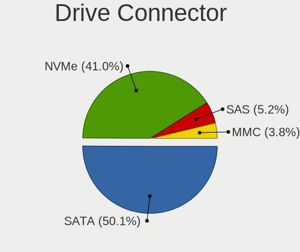
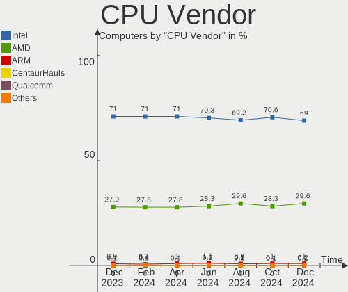

Linux Hardware Trends
---------------------

A project to identify most popular hardware characteristics and track their change
over time based on data collected by Linux users at https://Linux-Hardware.org.

Anyone can contribute to the study by uploading probes of their computers by
the [hw-probe](https://github.com/linuxhw/hw-probe) tool:

    sudo -E hw-probe -all -upload

This is a report for all computer types. See also reports for [desktops](/Desktop/README.md) and [notebooks](/Notebook/README.md).

Full-feature report is available here: https://linux-hardware.org/?view=trends

Distribution-specific reports: [Ubuntu](/Dist/Ubuntu), [ROSA](/Dist/ROSA), [Mint](/Dist/Mint), [Pop!_OS](/Dist/Pop!_OS), [Fedora](/Dist/Fedora), [BlackPanther](/Dist/BlackPanther), [Arch](/Dist/Arch), [Manjaro](/Dist/Manjaro), [Debian](/Dist/Debian), [Endless](/Dist/Endless), [Zorin](/Dist/Zorin), [Gentoo](/Dist/Gentoo), [Clear Linux](/Dist/Clear_Linux), [openSUSE](/Dist/openSUSE), [KDE neon](/Dist/KDE_neon).

Period: Sep, 2020.

Contents
--------

- [ OS                       ](#os)
- [ OS Family                ](#os-family)
- [ Kernel                   ](#kernel)
- [ Kernel Family            ](#kernel-family)
- [ Kernel Major Ver.        ](#kernel-major-ver)
- [ Arch                     ](#arch)
- [ DE                       ](#de)
- [ Display Server           ](#display-server)
- [ Display Manager          ](#display-manager)
- [ OS Lang                  ](#os-lang)
- [ Boot Mode                ](#boot-mode)
- [ Filesystem               ](#filesystem)
- [ Part. scheme             ](#part-scheme)
- [ Dual Boot with Linux/BSD ](#dual-boot-with-linux/bsd)
- [ Dual Boot (Win)          ](#dual-boot-win)
- [ Country                  ](#country)
- [ City                     ](#city)
- [ Vendor                   ](#vendor)
- [ Model                    ](#model)
- [ Model Family             ](#model-family)
- [ MFG Year                 ](#mfg-year)
- [ Form Factor              ](#form-factor)
- [ Secure Boot              ](#secure-boot)
- [ Coreboot                 ](#coreboot)
- [ RAM Size                 ](#ram-size)
- [ RAM Used                 ](#ram-used)
- [ Has CD-ROM               ](#has-cd-rom)
- [ Total Drives             ](#total-drives)
- [ Has Ethernet             ](#has-ethernet)
- [ Drive Vendor             ](#drive-vendor)
- [ HDD Vendor               ](#hdd-vendor)
- [ SSD Vendor               ](#ssd-vendor)
- [ Drive Model              ](#drive-model)
- [ Drive Kind               ](#drive-kind)
- [ Drive Connector          ](#drive-connector)
- [ Drive Size               ](#drive-size)
- [ Space Total              ](#space-total)
- [ Space Used               ](#space-used)
- [ Malfunc. Drives          ](#malfunc-drives)
- [ Malfunc. Drive Vendor    ](#malfunc-drive-vendor)
- [ Malfunc. HDD Vendor      ](#malfunc-hdd-vendor)
- [ Malfunc. Drive Kind      ](#malfunc-drive-kind)
- [ Failed Drives            ](#failed-drives)
- [ Failed Drive Vendor      ](#failed-drive-vendor)
- [ Drive Status             ](#drive-status)
- [ Storage Vendor           ](#storage-vendor)
- [ Storage Model            ](#storage-model)
- [ Storage Kind             ](#storage-kind)
- [ CPU Vendor               ](#cpu-vendor)
- [ CPU Model                ](#cpu-model)
- [ CPU Model Family         ](#cpu-model-family)
- [ CPU Cores                ](#cpu-cores)
- [ CPU Sockets              ](#cpu-sockets)
- [ CPU Threads              ](#cpu-threads)
- [ CPU Op-Modes             ](#cpu-op-modes)
- [ CPU Microcode            ](#cpu-microcode)
- [ CPU Microarch            ](#cpu-microarch)
- [ GPU Vendor               ](#gpu-vendor)
- [ GPU Model                ](#gpu-model)
- [ GPU Combo                ](#gpu-combo)
- [ GPU Driver               ](#gpu-driver)
- [ GPU Memory               ](#gpu-memory)
- [ Monitor Vendor           ](#monitor-vendor)
- [ Monitor Model            ](#monitor-model)
- [ Monitor Resolution       ](#monitor-resolution)
- [ Monitor Diagonal         ](#monitor-diagonal)
- [ Monitor Width            ](#monitor-width)
- [ Aspect Ratio             ](#aspect-ratio)
- [ Monitor Area             ](#monitor-area)
- [ Pixel Density            ](#pixel-density)
- [ Multiple Monitors        ](#multiple-monitors)
- [ Net Controller Vendor    ](#net-controller-vendor)
- [ Net Controller Model     ](#net-controller-model)
- [ Wireless Vendor          ](#wireless-vendor)
- [ Wireless Model           ](#wireless-model)
- [ Ethernet Vendor          ](#ethernet-vendor)
- [ Ethernet Model           ](#ethernet-model)
- [ Net Controller Kind      ](#net-controller-kind)
- [ Used Controller          ](#used-controller)
- [ NICs                     ](#nics)
- [ Memory Vendor            ](#memory-vendor)
- [ Memory Model             ](#memory-model)
- [ Memory Kind              ](#memory-kind)
- [ Memory Form Factor       ](#memory-form-factor)
- [ Memory Size              ](#memory-size)
- [ Memory Speed             ](#memory-speed)
- [ Sound Vendor             ](#sound-vendor)
- [ Sound Model              ](#sound-model)
- [ Camera Vendor            ](#camera-vendor)
- [ Camera Model             ](#camera-model)
- [ Fingerprint Vendor       ](#fingerprint-vendor)
- [ Fingerprint Model        ](#fingerprint-model)
- [ Chipcard Vendor          ](#chipcard-vendor)
- [ Chipcard Model           ](#chipcard-model)
- [ Printer Vendor           ](#printer-vendor)
- [ Printer Model            ](#printer-model)
- [ Scanner Vendor           ](#scanner-vendor)
- [ Scanner Model            ](#scanner-model)
- [ Bluetooth Vendor         ](#bluetooth-vendor)
- [ Bluetooth Model          ](#bluetooth-model)
- [ Unsupported Devices      ](#unsupported-devices)
- [ Unsupported Device Types ](#unsupported-device-types)

OS
--

Installed operating systems

| Name                | Computers | Percent |
|---------------------|-----------|---------|
| Ubuntu 20.04        | 1773      | 34.23%  |
| Ubuntu 18.04        | 410       | 7.92%   |
| Fedora 32           | 308       | 5.95%   |
| Pop!_OS 20.04       | 264       | 5.1%    |
| Manjaro 20.1        | 233       | 4.5%    |
| Mint 20             | 222       | 4.29%   |
| Arch Rolling        | 214       | 4.13%   |
| BlackPanther 18.1   | 186       | 3.59%   |
| Arch                | 159       | 3.07%   |
| ROSA R11.1          | 122       | 2.36%   |
| Manjaro             | 107       | 2.07%   |
| Endless 3.8.6       | 107       | 2.07%   |
| Debian 10           | 86        | 1.66%   |
| Zorin 15            | 81        | 1.56%   |
| Mint 19.3           | 59        | 1.14%   |
| ROSA R11            | 56        | 1.08%   |
| Ubuntu 16.04        | 47        | 0.91%   |
| KDE neon 20.04      | 45        | 0.87%   |
| Debian Testing      | 33        | 0.64%   |
| Gentoo              | 30        | 0.58%   |
| Ubuntu 20.10        | 26        | 0.5%    |
| Ubuntu 19.10        | 22        | 0.42%   |
| Kali 2020.3         | 22        | 0.42%   |
| Elementary 5.1.7    | 20        | 0.39%   |
| Debian Unstable     | 17        | 0.33%   |
| Gentoo 2.7          | 16        | 0.31%   |
| Endless 3.8.5       | 15        | 0.29%   |
| EndeavourOS Rolling | 15        | 0.29%   |
| Debian              | 15        | 0.29%   |
| openSUSE 15.2       | 14        | 0.27%   |
| LMDE 4              | 14        | 0.27%   |
| Fedora 31           | 14        | 0.27%   |
| openSUSE Leap-15.2  | 13        | 0.25%   |
| Solus 4.1           | 12        | 0.23%   |
| ROSA R8.1           | 12        | 0.23%   |
| Parrot 4.10         | 12        | 0.23%   |
| Deepin 20           | 12        | 0.23%   |
| Peppermint 10       | 11        | 0.21%   |
| CentOS 8            | 11        | 0.21%   |
| Fedora 33           | 10        | 0.19%   |
| Raspbian 10         | 9         | 0.17%   |
| CentOS 7            | 9         | 0.17%   |
| ROSA R10            | 8         | 0.15%   |
| Mint 19.1           | 8         | 0.15%   |
| ArcoLinux Rolling   | 8         | 0.15%   |
| ROSA 2019.05        | 7         | 0.14%   |
| Reborn OS           | 7         | 0.14%   |
| Android             | 7         | 0.14%   |
| Zorin 12            | 6         | 0.12%   |
| Void Rolling        | 6         | 0.12%   |
| Mint 18.3           | 6         | 0.12%   |
| BlackPanther 16.2   | 6         | 0.12%   |
| Manjaro-ARM         | 5         | 0.1%    |
| Mageia 7            | 5         | 0.1%    |
| EndeavourOS         | 5         | 0.1%    |
| ClearOS 7           | 5         | 0.1%    |
| Clear Linux 33760   | 5         | 0.1%    |
| RHEL 8.2            | 4         | 0.08%   |
| openSUSE 20200925   | 4         | 0.08%   |
| openSUSE 20200829   | 4         | 0.08%   |

OS Family
---------

OS without a version

| Name         | Computers | Percent |
|--------------|-----------|---------|
| Ubuntu       | 2294      | 44.29%  |
| Arch         | 373       | 7.2%    |
| Manjaro      | 342       | 6.6%    |
| Fedora       | 336       | 6.49%   |
| Mint         | 304       | 5.87%   |
| Pop!_OS      | 264       | 5.1%    |
| ROSA         | 207       | 4%      |
| BlackPanther | 192       | 3.71%   |
| Debian       | 155       | 2.99%   |
| Endless      | 142       | 2.74%   |
| Zorin        | 87        | 1.68%   |
| openSUSE     | 73        | 1.41%   |
| Gentoo       | 51        | 0.98%   |
| KDE neon     | 48        | 0.93%   |
| Kali         | 24        | 0.46%   |
| CentOS       | 24        | 0.46%   |
| Clear Linux  | 23        | 0.44%   |
| Elementary   | 21        | 0.41%   |
| EndeavourOS  | 20        | 0.39%   |
| LMDE         | 14        | 0.27%   |
| Deepin       | 14        | 0.27%   |
| Solus        | 12        | 0.23%   |
| Peppermint   | 12        | 0.23%   |
| Parrot       | 12        | 0.23%   |
| Void         | 9         | 0.17%   |
| Raspbian     | 9         | 0.17%   |
| ArcoLinux    | 9         | 0.17%   |
| Reborn OS    | 8         | 0.15%   |
| MX           | 8         | 0.15%   |
| SkiffOS      | 7         | 0.14%   |
| Manjaro-ARM  | 7         | 0.14%   |
| ClearOS      | 7         | 0.14%   |
| Android      | 7         | 0.14%   |
| Mageia       | 6         | 0.12%   |
| RHEL         | 5         | 0.1%    |
| Devuan       | 4         | 0.08%   |
| Chrome OS    | 4         | 0.08%   |
| WindowsFX    | 3         | 0.06%   |
| RED          | 3         | 0.06%   |
| Pardus       | 3         | 0.06%   |
| Garuda       | 3         | 0.06%   |
| Artix        | 3         | 0.06%   |
| ALT Linux    | 3         | 0.06%   |
| No1          | 2         | 0.04%   |
| NixOS        | 2         | 0.04%   |
| GNOME OS     | 2         | 0.04%   |
| Generic      | 2         | 0.04%   |
| E-On         | 2         | 0.04%   |
| Alpine       | 2         | 0.04%   |
| Sparky       | 1         | 0.02%   |
| SLED         | 1         | 0.02%   |
| Salient OS   | 1         | 0.02%   |
| Rockstor     | 1         | 0.02%   |
| PureOS       | 1         | 0.02%   |
| Puppy        | 1         | 0.02%   |
| PostmarketOS | 1         | 0.02%   |
| PCLinuxOS    | 1         | 0.02%   |
| NST          | 1         | 0.02%   |
| Makulu       | 1         | 0.02%   |
| KaOS         | 1         | 0.02%   |

Kernel
------

Version of the Linux kernel

| Version                          | Computers | Percent |
|----------------------------------|-----------|---------|
| 5.4.0-47-generic                 | 814       | 15.72%  |
| 5.4.0-48-generic                 | 514       | 9.92%   |
| 5.4.0-45-generic                 | 511       | 9.87%   |
| 5.4.0-42-generic                 | 400       | 7.72%   |
| 5.4.0-7642-generic               | 222       | 4.29%   |
| 4.18.16-desktop-1bP              | 185       | 3.57%   |
| 5.8.6-1-MANJARO                  | 131       | 2.53%   |
| 5.8.4-200.fc32.x86_64            | 96        | 1.85%   |
| 5.8.5-arch1-1                    | 75        | 1.45%   |
| 4.15.0-117-generic               | 65        | 1.26%   |
| 4.19.0-10-amd64                  | 58        | 1.12%   |
| 5.8.3-2-MANJARO                  | 55        | 1.06%   |
| 4.15.0-desktop-94.1rosa-x86_64   | 54        | 1.04%   |
| 4.15.0-118-generic               | 54        | 1.04%   |
| 5.8.10-arch1-1                   | 51        | 0.98%   |
| 4.15.0-desktop-45.1rosa-x86_64   | 51        | 0.98%   |
| 5.8.11-200.fc32.x86_64           | 43        | 0.83%   |
| 5.4.0-26-generic                 | 42        | 0.81%   |
| 5.8.10-200.fc32.x86_64           | 40        | 0.77%   |
| 5.7.17-2-MANJARO                 | 39        | 0.75%   |
| 5.4.0-49-generic                 | 39        | 0.75%   |
| 5.8.7-arch1-1                    | 30        | 0.58%   |
| 5.8.9-200.fc32.x86_64            | 28        | 0.54%   |
| 5.8.8-arch1-1                    | 28        | 0.54%   |
| 4.15.0-115-generic               | 27        | 0.52%   |
| 5.8.12-arch1-1                   | 26        | 0.5%    |
| 4.15.0-112-generic               | 26        | 0.5%    |
| 5.7.0-3-amd64                    | 25        | 0.48%   |
| 5.8.6-201.fc32.x86_64            | 24        | 0.46%   |
| 5.7.19-2-MANJARO                 | 24        | 0.46%   |
| 5.4.60-2-MANJARO                 | 22        | 0.42%   |
| 5.8.7-200.fc32.x86_64            | 19        | 0.37%   |
| 5.4.64-1-MANJARO                 | 19        | 0.37%   |
| 5.4.0-39-generic                 | 19        | 0.37%   |
| 5.4.40-generic-1rosa-x86_64      | 18        | 0.35%   |
| 5.8.5-zen1-1-zen                 | 17        | 0.33%   |
| 5.8.4-1-default                  | 16        | 0.31%   |
| 5.3.0-64-generic                 | 16        | 0.31%   |
| 5.8.11-arch1-1                   | 15        | 0.29%   |
| 5.8.0-1-amd64                    | 15        | 0.29%   |
| 5.4.61-1-lts                     | 15        | 0.29%   |
| 5.4.0-47-lowlatency              | 15        | 0.29%   |
| 5.3.18-lp152.41-default          | 15        | 0.29%   |
| 5.8.12-zen1-1-zen                | 14        | 0.27%   |
| 5.8.0-18-generic                 | 14        | 0.27%   |
| 5.8.9-arch2-1                    | 13        | 0.25%   |
| 5.3.18-lp152.36-default          | 13        | 0.25%   |
| 5.4.0-7634-generic               | 12        | 0.23%   |
| 4.9.155-nrj-desktop-1rosa-x86_64 | 12        | 0.23%   |
| 4.4.0-189-generic                | 12        | 0.23%   |
| 5.7.17-200.fc32.x86_64           | 11        | 0.21%   |
| 5.6.6-300.fc32.x86_64            | 11        | 0.21%   |
| 5.4.50-amd64-desktop             | 11        | 0.21%   |
| 5.4.0-48-lowlatency              | 11        | 0.21%   |
| 5.4.0-46-generic                 | 11        | 0.21%   |
| 5.4.0-40-generic                 | 11        | 0.21%   |
| 4.15.0-desktop-94.1rosa-i586     | 11        | 0.21%   |
| 5.8.9-050809-generic             | 10        | 0.19%   |
| 5.8.8-200.fc32.x86_64            | 10        | 0.19%   |
| 5.8.7-1-default                  | 10        | 0.19%   |

Kernel Family
-------------

Linux kernel without a distro release

| Version | Computers | Percent |
|---------|-----------|---------|
| 5.4.0   | 2675      | 51.65%  |
| 4.15.0  | 359       | 6.93%   |
| 4.18.16 | 185       | 3.57%   |
| 5.8.6   | 177       | 3.42%   |
| 5.8.10  | 139       | 2.68%   |
| 5.8.5   | 131       | 2.53%   |
| 5.8.4   | 117       | 2.26%   |
| 5.8.11  | 88        | 1.7%    |
| 4.19.0  | 84        | 1.62%   |
| 5.8.9   | 72        | 1.39%   |
| 5.8.0   | 72        | 1.39%   |
| 5.7.0   | 72        | 1.39%   |
| 5.8.7   | 71        | 1.37%   |
| 5.8.3   | 69        | 1.33%   |
| 5.8.12  | 62        | 1.2%    |
| 5.8.8   | 57        | 1.1%    |
| 5.3.0   | 57        | 1.1%    |
| 5.7.17  | 53        | 1.02%   |
| 5.4.60  | 41        | 0.79%   |
| 5.7.19  | 40        | 0.77%   |
| 5.3.18  | 31        | 0.6%    |
| 5.9.0   | 30        | 0.58%   |
| 5.0.0   | 27        | 0.52%   |
| 5.4.64  | 24        | 0.46%   |
| 5.4.61  | 22        | 0.42%   |
| 4.9.155 | 20        | 0.39%   |
| 4.4.0   | 20        | 0.39%   |
| 5.4.40  | 19        | 0.37%   |
| 3.10.0  | 19        | 0.37%   |
| 4.18.0  | 17        | 0.33%   |
| 5.6.0   | 16        | 0.31%   |
| 5.8.1   | 15        | 0.29%   |
| 5.7.15  | 15        | 0.29%   |
| 5.4.32  | 15        | 0.29%   |
| 5.6.19  | 14        | 0.27%   |
| 5.6.6   | 11        | 0.21%   |
| 5.4.50  | 11        | 0.21%   |
| 5.4.66  | 9         | 0.17%   |
| 5.4.51  | 9         | 0.17%   |
| 5.7.13  | 8         | 0.15%   |
| 5.7.12  | 8         | 0.15%   |
| 5.4.65  | 8         | 0.15%   |
| 5.7.16  | 7         | 0.14%   |
| 4.9.60  | 7         | 0.14%   |
| 4.9.20  | 7         | 0.14%   |
| 4.9.0   | 7         | 0.14%   |
| 5.7.8   | 6         | 0.12%   |
| 5.7.1   | 6         | 0.12%   |
| 5.6.15  | 6         | 0.12%   |
| 5.4.48  | 6         | 0.12%   |
| 5.8.2   | 5         | 0.1%    |
| 5.7.14  | 5         | 0.1%    |
| 5.7.11  | 5         | 0.1%    |
| 5.7.10  | 4         | 0.08%   |
| 5.4.68  | 4         | 0.08%   |
| 5.4.62  | 4         | 0.08%   |
| 5.4.55  | 4         | 0.08%   |
| 5.4.25  | 4         | 0.08%   |
| 4.10.0  | 4         | 0.08%   |
| 4.1.38  | 4         | 0.08%   |

Kernel Major Ver.
-----------------

Linux kernel major version

| Version | Computers | Percent |
|---------|-----------|---------|
| 5.4     | 2872      | 55.45%  |
| 5.8     | 1075      | 20.76%  |
| 4.15    | 361       | 6.97%   |
| 5.7     | 238       | 4.6%    |
| 4.18    | 203       | 3.92%   |
| 4.19    | 98        | 1.89%   |
| 5.3     | 89        | 1.72%   |
| 5.6     | 53        | 1.02%   |
| 4.9     | 48        | 0.93%   |
| 5.9     | 30        | 0.58%   |
| 5.0     | 29        | 0.56%   |
| 4.4     | 26        | 0.5%    |
| 3.10    | 19        | 0.37%   |
| 5.5     | 7         | 0.14%   |
| 4.10    | 4         | 0.08%   |
| 4.1     | 4         | 0.08%   |
| 5.1     | 3         | 0.06%   |
| 4.12    | 3         | 0.06%   |
| 3.18    | 3         | 0.06%   |
| 4.16    | 2         | 0.04%   |
| 4.14    | 2         | 0.04%   |
| 4.13    | 2         | 0.04%   |
| 2.6     | 2         | 0.04%   |
| 5.2     | 1         | 0.02%   |
| 5       | 1         | 0.02%   |
| 4.8     | 1         | 0.02%   |
| 4.2     | 1         | 0.02%   |
| 4.17    | 1         | 0.02%   |
| 3.13    | 1         | 0.02%   |

Arch
----

OS architecture (x86_64, i586, etc.)

| Name    | Computers | Percent |
|---------|-----------|---------|
| x86_64  | 4977      | 96.1%   |
| i686    | 150       | 2.9%    |
| aarch64 | 30        | 0.58%   |
| armv7l  | 13        | 0.25%   |
| armv8l  | 5         | 0.1%    |
| ppc     | 2         | 0.04%   |
| armv6l  | 2         | 0.04%   |

DE
--

Desktop Environment

| Name             | Computers | Percent |
|------------------|-----------|---------|
| GNOME            | 2624      | 50.67%  |
| KDE5             | 644       | 12.43%  |
| XFCE             | 419       | 8.09%   |
| Unknown          | 305       | 5.89%   |
| KDE              | 259       | 5%      |
| X-Cinnamon       | 190       | 3.67%   |
| KDE4             | 149       | 2.88%   |
| MATE             | 141       | 2.72%   |
| Cinnamon         | 121       | 2.34%   |
| Unity            | 66        | 1.27%   |
| LXQt             | 47        | 0.91%   |
| LXDE             | 37        | 0.71%   |
| i3               | 37        | 0.71%   |
| Budgie           | 36        | 0.7%    |
| Deepin           | 30        | 0.58%   |
| GNOME Flashback  | 25        | 0.48%   |
| Pantheon         | 20        | 0.39%   |
| openbox          | 7         | 0.14%   |
| sway             | 4         | 0.08%   |
| GNOME Classic    | 4         | 0.08%   |
| bspwm            | 4         | 0.08%   |
| lightdm-xsession | 2         | 0.04%   |
| default          | 2         | 0.04%   |
| awesome          | 2         | 0.04%   |
| ICEWM            | 1         | 0.02%   |
| GNOME-Flashback  | 1         | 0.02%   |
| enlightenment    | 1         | 0.02%   |
| dwm              | 1         | 0.02%   |

Display Server
--------------

X11 or Wayland

| Name        | Computers | Percent |
|-------------|-----------|---------|
| X11         | 4537      | 87.6%   |
| Wayland     | 362       | 6.99%   |
| Tty         | 149       | 2.88%   |
| Unknown     | 128       | 2.47%   |
| Unspecified | 2         | 0.04%   |
| Web         | 1         | 0.02%   |

Display Manager
---------------

SDDM, LightDM, etc.

| Name    | Computers | Percent |
|---------|-----------|---------|
| Unknown | 3145      | 60.73%  |
| GDM     | 672       | 12.98%  |
| SDDM    | 636       | 12.28%  |
| TDM     | 396       | 7.65%   |
| LightDM | 153       | 2.95%   |
| KDM     | 150       | 2.9%    |
| XDM     | 13        | 0.25%   |
| SLiM    | 6         | 0.12%   |
| LXDM    | 4         | 0.08%   |
| GDM3    | 3         | 0.06%   |
| Ly      | 1         | 0.02%   |

OS Lang
-------

Language

| Lang       | Computers | Percent |
|------------|-----------|---------|
| en_US      | 1961      | 37.86%  |
| de_DE      | 353       | 6.82%   |
| Unknown    | 345       | 6.66%   |
| pt_BR      | 302       | 5.83%   |
| en_GB      | 269       | 5.19%   |
| ru_RU      | 230       | 4.44%   |
| fr_FR      | 130       | 2.51%   |
| en_IN      | 123       | 2.37%   |
| it_IT      | 117       | 2.26%   |
| en_US.utf8 | 114       | 2.2%    |
| es_ES      | 112       | 2.16%   |
| en_CA      | 111       | 2.14%   |
| en_AU      | 83        | 1.6%    |
| pl_PL      | 81        | 1.56%   |
| C          | 61        | 1.18%   |
| nl_NL      | 39        | 0.75%   |
| pt_BR.utf8 | 38        | 0.73%   |
| es_AR      | 38        | 0.73%   |
| es_MX      | 29        | 0.56%   |
| hu_HU      | 26        | 0.5%    |
| en_ZA      | 24        | 0.46%   |
| cs_CZ      | 24        | 0.46%   |
| C          | 22        | 0.42%   |
| tr_TR      | 21        | 0.41%   |
| es_CO      | 21        | 0.41%   |
| sv_SE      | 20        | 0.39%   |
| pt_PT      | 19        | 0.37%   |
| ja_JP      | 19        | 0.37%   |
| en_NZ      | 19        | 0.37%   |
| fi_FI      | 18        | 0.35%   |
| ro_RO      | 17        | 0.33%   |
| ru_UA      | 16        | 0.31%   |
| en_PH      | 16        | 0.31%   |
| de_AT      | 15        | 0.29%   |
| en_IE      | 14        | 0.27%   |
| de_CH      | 14        | 0.27%   |
| es_CL      | 13        | 0.25%   |
| en_GB.utf8 | 13        | 0.25%   |
| de_DE.utf8 | 13        | 0.25%   |
| en_SG      | 12        | 0.23%   |
| bg_BG      | 11        | 0.21%   |
| zh_CN      | 9         | 0.17%   |
| nl_BE      | 9         | 0.17%   |
| en_IN      | 9         | 0.17%   |
| zh_TW      | 8         | 0.15%   |
| uk_UA      | 8         | 0.15%   |
| fr_CA      | 8         | 0.15%   |
| es_EC      | 8         | 0.15%   |
| da_DK      | 8         | 0.15%   |
| ca_ES      | 8         | 0.15%   |
| nb_NO      | 7         | 0.14%   |
| sk_SK      | 6         | 0.12%   |
| ko_KR      | 6         | 0.12%   |
| fr_BE      | 6         | 0.12%   |
| es_PE      | 6         | 0.12%   |
| es_ES.utf8 | 6         | 0.12%   |
| en_IL      | 6         | 0.12%   |
| ru_RU.utf8 | 5         | 0.1%    |
| POSIX      | 5         | 0.1%    |
| id_ID      | 5         | 0.1%    |

Boot Mode
---------

EFI or BIOS

| Mode | Computers | Percent |
|------|-----------|---------|
| EFI  | 2666      | 51.48%  |
| BIOS | 2513      | 48.52%  |

Filesystem
----------

Type of filesystem

| Type     | Computers | Percent |
|----------|-----------|---------|
| Ext4     | 4495      | 86.79%  |
| Overlay  | 245       | 4.73%   |
| Btrfs    | 233       | 4.5%    |
| Xfs      | 92        | 1.78%   |
| Zfs      | 49        | 0.95%   |
| F2fs     | 21        | 0.41%   |
| Unknown  | 12        | 0.23%   |
| Ext3     | 10        | 0.19%   |
| Ext2     | 9         | 0.17%   |
| Tmpfs    | 3         | 0.06%   |
| Reiserfs | 3         | 0.06%   |
| Ubifs    | 2         | 0.04%   |
| Jfs      | 2         | 0.04%   |
| Aufs     | 2         | 0.04%   |
| Ntfs     | 1         | 0.02%   |

Part. scheme
------------

Scheme of partitioning

| Type    | Computers | Percent |
|---------|-----------|---------|
| Unknown | 3009      | 58.1%   |
| GPT     | 1549      | 29.91%  |
| MBR     | 621       | 11.99%  |

Dual Boot with Linux/BSD
------------------------

Hosting more than one Linux/BSD

| Dual boot | Computers | Percent |
|-----------|-----------|---------|
| No        | 4511      | 87.1%   |
| Yes       | 668       | 12.9%   |

Dual Boot (Win)
---------------

Hosting Linux and Windows

| Dual boot | Computers | Percent |
|-----------|-----------|---------|
| No        | 3523      | 68.02%  |
| Yes       | 1656      | 31.98%  |

Country
-------

Geographic location (country)

| Country            | Computers | Percent |
|--------------------|-----------|---------|
| USA                | 997       | 19.25%  |
| Germany            | 476       | 9.19%   |
| Brazil             | 430       | 8.3%    |
| Russia             | 316       | 6.1%    |
| UK                 | 190       | 3.67%   |
| India              | 184       | 3.55%   |
| Italy              | 172       | 3.32%   |
| France             | 166       | 3.21%   |
| Hungary            | 161       | 3.11%   |
| Canada             | 157       | 3.03%   |
| Spain              | 143       | 2.76%   |
| Netherlands        | 125       | 2.41%   |
| Poland             | 118       | 2.28%   |
| Australia          | 99        | 1.91%   |
| Finland            | 66        | 1.27%   |
| Ukraine            | 65        | 1.26%   |
| Sweden             | 64        | 1.24%   |
| Argentina          | 64        | 1.24%   |
| Switzerland        | 62        | 1.2%    |
| Mexico             | 58        | 1.12%   |
| Romania            | 54        | 1.04%   |
| Belgium            | 50        | 0.97%   |
| Austria            | 45        | 0.87%   |
| Turkey             | 42        | 0.81%   |
| Czech Republic     | 39        | 0.75%   |
| South Africa       | 37        | 0.71%   |
| Portugal           | 35        | 0.68%   |
| Norway             | 34        | 0.66%   |
| Indonesia          | 33        | 0.64%   |
| Colombia           | 30        | 0.58%   |
| New Zealand        | 29        | 0.56%   |
| Japan              | 29        | 0.56%   |
| Philippines        | 26        | 0.5%    |
| Greece             | 26        | 0.5%    |
| Denmark            | 24        | 0.46%   |
| Singapore          | 22        | 0.42%   |
| Chile              | 21        | 0.41%   |
| Taiwan             | 20        | 0.39%   |
| Bulgaria           | 20        | 0.39%   |
| Slovakia           | 19        | 0.37%   |
| Serbia             | 18        | 0.35%   |
| China              | 18        | 0.35%   |
| Korea, Republic of | 17        | 0.33%   |
| Pakistan           | 15        | 0.29%   |
| Israel             | 15        | 0.29%   |
| Estonia            | 15        | 0.29%   |
| Ecuador            | 15        | 0.29%   |
| Lithuania          | 14        | 0.27%   |
| Croatia            | 14        | 0.27%   |
| Vietnam            | 12        | 0.23%   |
| Peru               | 12        | 0.23%   |
| Kazakhstan         | 11        | 0.21%   |
| Belarus            | 11        | 0.21%   |
| Thailand           | 10        | 0.19%   |
| Kenya              | 10        | 0.19%   |
| Iran               | 10        | 0.19%   |
| Bangladesh         | 10        | 0.19%   |
| Slovenia           | 9         | 0.17%   |
| Egypt              | 9         | 0.17%   |
| Ireland            | 8         | 0.15%   |

City
----

Geographic location (city)

| City              | Computers | Percent |
|-------------------|-----------|---------|
| Moscow            | 74        | 1.43%   |
| São Paulo        | 59        | 1.14%   |
| Budapest          | 51        | 0.98%   |
| Helsinki          | 37        | 0.71%   |
| Berlin            | 37        | 0.71%   |
| St Petersburg     | 36        | 0.7%    |
| Hamburg           | 31        | 0.6%    |
| Rio de Janeiro    | 28        | 0.54%   |
| Amsterdam         | 27        | 0.52%   |
| Paris             | 26        | 0.5%    |
| Warsaw            | 25        | 0.48%   |
| Madrid            | 25        | 0.48%   |
| Vienna            | 23        | 0.44%   |
| Milan             | 23        | 0.44%   |
| Toronto           | 22        | 0.42%   |
| Bengaluru         | 22        | 0.42%   |
| Prague            | 21        | 0.41%   |
| Auckland          | 20        | 0.39%   |
| Rome              | 19        | 0.37%   |
| New York          | 19        | 0.37%   |
| Curitiba          | 18        | 0.35%   |
| Chicago           | 18        | 0.35%   |
| Singapore         | 17        | 0.33%   |
| Munich            | 17        | 0.33%   |
| Hyderabad         | 17        | 0.33%   |
| Athens            | 17        | 0.33%   |
| Zurich            | 16        | 0.31%   |
| Montreal          | 16        | 0.31%   |
| Kyiv              | 16        | 0.31%   |
| Istanbul          | 16        | 0.31%   |
| Frankfurt am Main | 16        | 0.31%   |
| Novosibirsk       | 15        | 0.29%   |
| Melbourne         | 15        | 0.29%   |
| Brisbane          | 15        | 0.29%   |
| Belo Horizonte    | 15        | 0.29%   |
| Sydney            | 14        | 0.27%   |
| Stockholm         | 14        | 0.27%   |
| Pune              | 14        | 0.27%   |
| Mexico City       | 14        | 0.27%   |
| Buenos Aires      | 14        | 0.27%   |
| Bucharest         | 14        | 0.27%   |
| Los Angeles       | 13        | 0.25%   |
| Düsseldorf       | 13        | 0.25%   |
| Dallas            | 13        | 0.25%   |
| Bogotá           | 13        | 0.25%   |
| Barcelona         | 13        | 0.25%   |
| Tallinn           | 12        | 0.23%   |
| Stuttgart         | 12        | 0.23%   |
| Kazan’          | 12        | 0.23%   |
| Turin             | 11        | 0.21%   |
| Seattle           | 11        | 0.21%   |
| Tucson            | 10        | 0.19%   |
| Tel Aviv          | 10        | 0.19%   |
| Santiago          | 10        | 0.19%   |
| Rostov-on-Don     | 10        | 0.19%   |
| Mumbai            | 10        | 0.19%   |
| London            | 10        | 0.19%   |
| Lima              | 10        | 0.19%   |
| Karlsruhe         | 10        | 0.19%   |
| Kansas City       | 10        | 0.19%   |

Vendor
------

Motherboard manufacturer

| Name                    | Computers | Percent |
|-------------------------|-----------|---------|
| ASUSTek Computer        | 898       | 17.34%  |
| Lenovo                  | 735       | 14.19%  |
| Hewlett-Packard         | 672       | 12.98%  |
| Dell                    | 645       | 12.45%  |
| Gigabyte Technology     | 374       | 7.22%   |
| MSI                     | 360       | 6.95%   |
| Acer                    | 308       | 5.95%   |
| ASRock                  | 237       | 4.58%   |
| Intel                   | 91        | 1.76%   |
| Apple                   | 83        | 1.6%    |
| Toshiba                 | 76        | 1.47%   |
| Samsung Electronics     | 62        | 1.2%    |
| Unknown                 | 60        | 1.16%   |
| Sony                    | 49        | 0.95%   |
| Fujitsu                 | 33        | 0.64%   |
| Medion                  | 31        | 0.6%    |
| Foxconn                 | 26        | 0.5%    |
| Biostar                 | 23        | 0.44%   |
| HUAWEI                  | 22        | 0.42%   |
| Raspberry Pi Foundation | 21        | 0.41%   |
| Positivo                | 21        | 0.41%   |
| ECS                     | 21        | 0.41%   |
| Notebook                | 19        | 0.37%   |
| Pegatron                | 18        | 0.35%   |
| Fujitsu Siemens         | 16        | 0.31%   |
| System76                | 15        | 0.29%   |
| Packard Bell            | 15        | 0.29%   |
| Supermicro              | 13        | 0.25%   |
| Microsoft               | 13        | 0.25%   |
| LG Electronics          | 12        | 0.23%   |
| Google                  | 11        | 0.21%   |
| Gateway                 | 9         | 0.17%   |
| TUXEDO                  | 6         | 0.12%   |
| Timi                    | 6         | 0.12%   |
| Shuttle                 | 6         | 0.12%   |
| Pine Microsystems       | 6         | 0.12%   |
| eMachines               | 6         | 0.12%   |
| Clevo                   | 6         | 0.12%   |
| AMI                     | 6         | 0.12%   |
| Alienware               | 6         | 0.12%   |
| Panasonic               | 5         | 0.1%    |
| OEM                     | 5         | 0.1%    |
| PC Specialist           | 4         | 0.08%   |
| ZOTAC                   | 3         | 0.06%   |
| Teclast                 | 3         | 0.06%   |
| Semp Toshiba            | 3         | 0.06%   |
| Schenker                | 3         | 0.06%   |
| Quanta                  | 3         | 0.06%   |
| PCWare                  | 3         | 0.06%   |
| Megaware                | 3         | 0.06%   |
| Itautec                 | 3         | 0.06%   |
| Huanan                  | 3         | 0.06%   |
| ASRockRack              | 3         | 0.06%   |
| Wortmann AG             | 2         | 0.04%   |
| WeiBu                   | 2         | 0.04%   |
| TYAN Computer           | 2         | 0.04%   |
| TrekStor                | 2         | 0.04%   |
| sunxi                   | 2         | 0.04%   |
| Razer                   | 2         | 0.04%   |
| Microtech               | 2         | 0.04%   |

Model
-----

Motherboard model

| Name                               | Computers | Percent |
|------------------------------------|-----------|---------|
| Unknown                            | 81        | 1.56%   |
| ASUS All Series                    | 70        | 1.35%   |
| HP Notebook                        | 22        | 0.42%   |
| MSI MS-7C02                        | 19        | 0.37%   |
| ASUS TUF GAMING X570-PLUS          | 18        | 0.35%   |
| MSI MS-7A38                        | 16        | 0.31%   |
| ASUS PRIME X470-PRO                | 15        | 0.29%   |
| Gigabyte B450M DS3H                | 14        | 0.27%   |
| MSI MS-7B86                        | 13        | 0.25%   |
| HP Pavilion g6                     | 13        | 0.25%   |
| Dell XPS 13 9370                   | 12        | 0.23%   |
| ASUS PRIME B350-PLUS               | 12        | 0.23%   |
| Acer Nitro AN515-54                | 12        | 0.23%   |
| MSI MS-7B89                        | 11        | 0.21%   |
| HP Pavilion dv6                    | 11        | 0.21%   |
| ASRock B450M Pro4                  | 11        | 0.21%   |
| MSI MS-7B79                        | 10        | 0.19%   |
| Gigabyte X570 AORUS ELITE          | 10        | 0.19%   |
| Dell OptiPlex 7010                 | 10        | 0.19%   |
| Dell Latitude E6420                | 10        | 0.19%   |
| ASUS PRIME B450M-A                 | 10        | 0.19%   |
| MSI MS-7C37                        | 9         | 0.17%   |
| MSI MS-7B85                        | 9         | 0.17%   |
| MSI MS-7A34                        | 9         | 0.17%   |
| MSI MS-7817                        | 9         | 0.17%   |
| HUAWEI NBLK-WAX9X                  | 9         | 0.17%   |
| HP Pavilion 15                     | 9         | 0.17%   |
| HP EliteBook 840 G6                | 9         | 0.17%   |
| Gigabyte X470 AORUS ULTRA GAMING   | 9         | 0.17%   |
| Dell OptiPlex 3010                 | 9         | 0.17%   |
| Dell Inspiron 15 7000 Gaming       | 9         | 0.17%   |
| ASUS PRIME X370-PRO                | 9         | 0.17%   |
| RPi Raspberry Pi 4 Model B Rev 1.1 | 8         | 0.15%   |
| Gigabyte 970A-DS3P                 | 8         | 0.15%   |
| Dell XPS 15 9560                   | 8         | 0.15%   |
| Dell XPS 15 7590                   | 8         | 0.15%   |
| Dell Inspiron 5570                 | 8         | 0.15%   |
| ASUS ROG STRIX X570-E GAMING       | 8         | 0.15%   |
| ASUS ROG STRIX B450-F GAMING       | 8         | 0.15%   |
| ASUS PRIME A320M-K                 | 8         | 0.15%   |
| ASUS M5A97 R2.0                    | 8         | 0.15%   |
| Lenovo IdeaPad Flex 5 14ARE05 81X2 | 7         | 0.14%   |
| HP Pavilion Notebook               | 7         | 0.14%   |
| HP Pavilion dv7                    | 7         | 0.14%   |
| HP Laptop 15-bw0xx                 | 7         | 0.14%   |
| HP EliteBook 8470p                 | 7         | 0.14%   |
| Dell XPS 15 9570                   | 7         | 0.14%   |
| Dell OptiPlex 790                  | 7         | 0.14%   |
| Dell OptiPlex 780                  | 7         | 0.14%   |
| Dell Latitude E6430                | 7         | 0.14%   |
| Dell Latitude E6410                | 7         | 0.14%   |
| ASUS TUF B450-PLUS GAMING          | 7         | 0.14%   |
| Apple MacBookPro9,2                | 7         | 0.14%   |
| Acer Nitro AN517-51                | 7         | 0.14%   |
| Acer Aspire A315-54                | 7         | 0.14%   |
| RPi Raspberry Pi 4 Model B Rev 1.4 | 6         | 0.12%   |
| MSI MS-7821                        | 6         | 0.12%   |
| MSI MS-7721                        | 6         | 0.12%   |
| MSI MS-7693                        | 6         | 0.12%   |
| Lenovo Legion 5 15ARH05 82B5       | 6         | 0.12%   |

Model Family
------------

Motherboard model prefix

| Name               | Computers | Percent |
|--------------------|-----------|---------|
| Lenovo ThinkPad    | 329       | 6.35%   |
| Dell Inspiron      | 207       | 4%      |
| Acer Aspire        | 206       | 3.98%   |
| Lenovo IdeaPad     | 165       | 3.19%   |
| Dell Latitude      | 130       | 2.51%   |
| HP Pavilion        | 127       | 2.45%   |
| ASUS PRIME         | 109       | 2.1%    |
| Dell XPS           | 99        | 1.91%   |
| Dell OptiPlex      | 95        | 1.83%   |
| HP Compaq          | 83        | 1.6%    |
| HP EliteBook       | 82        | 1.58%   |
| Unknown            | 81        | 1.56%   |
| HP ProBook         | 72        | 1.39%   |
| ASUS ROG           | 72        | 1.39%   |
| ASUS All           | 70        | 1.35%   |
| Toshiba Satellite  | 69        | 1.33%   |
| ASUS VivoBook      | 61        | 1.18%   |
| ASUS TUF           | 58        | 1.12%   |
| HP Laptop          | 55        | 1.06%   |
| Dell Precision     | 48        | 0.93%   |
| HP ENVY            | 42        | 0.81%   |
| Lenovo ThinkCentre | 37        | 0.71%   |
| Gigabyte X570      | 35        | 0.68%   |
| Acer Nitro         | 31        | 0.6%    |
| Lenovo Yoga        | 29        | 0.56%   |
| Dell Vostro        | 28        | 0.54%   |
| Lenovo Legion      | 22        | 0.42%   |
| HP NOTEBOOK        | 22        | 0.42%   |
| RPi Raspberry      | 21        | 0.41%   |
| Gigabyte B450      | 20        | 0.39%   |
| MSI MS-7C02        | 19        | 0.37%   |
| ASRock X570        | 19        | 0.37%   |
| ASRock B450M       | 19        | 0.37%   |
| Gigabyte B450M     | 18        | 0.35%   |
| HP ZBook           | 17        | 0.33%   |
| ASUS M5A78L-M      | 17        | 0.33%   |
| MSI MS-7A38        | 16        | 0.31%   |
| ASUS ZenBook       | 15        | 0.29%   |
| ASUS Maximus       | 15        | 0.29%   |
| Acer Swift         | 15        | 0.29%   |
| HP EliteDesk       | 14        | 0.27%   |
| Fujitsu LIFEBOOK   | 14        | 0.27%   |
| MSI MS-7B86        | 13        | 0.25%   |
| Microsoft Surface  | 13        | 0.25%   |
| HP OMEN            | 13        | 0.25%   |
| HP 250             | 13        | 0.25%   |
| ASUS M5A97         | 13        | 0.25%   |
| ASRock X470        | 13        | 0.25%   |
| Acer Veriton       | 12        | 0.23%   |
| MSI MS-7B89        | 11        | 0.21%   |
| HP ProDesk         | 11        | 0.21%   |
| Fujitsu ESPRIMO    | 11        | 0.21%   |
| Dell PowerEdge     | 11        | 0.21%   |
| ASUS STRIX         | 11        | 0.21%   |
| MSI MS-7B79        | 10        | 0.19%   |
| MSI MS-7C37        | 9         | 0.17%   |
| MSI MS-7B85        | 9         | 0.17%   |
| MSI MS-7A34        | 9         | 0.17%   |
| MSI MS-7817        | 9         | 0.17%   |
| Lenovo IdeaCentre  | 9         | 0.17%   |

MFG Year
--------

Motherboard manufacture year

| Year    | Computers | Percent |
|---------|-----------|---------|
| 2020    | 954       | 18.42%  |
| 2019    | 952       | 18.38%  |
| 2018    | 537       | 10.37%  |
| 2013    | 353       | 6.82%   |
| 2012    | 312       | 6.02%   |
| 2011    | 287       | 5.54%   |
| 2014    | 286       | 5.52%   |
| 2015    | 271       | 5.23%   |
| 2016    | 244       | 4.71%   |
| 2010    | 230       | 4.44%   |
| 2017    | 229       | 4.42%   |
| 2009    | 180       | 3.48%   |
| 2008    | 139       | 2.68%   |
| 2007    | 99        | 1.91%   |
| Unknown | 57        | 1.1%    |
| 2006    | 27        | 0.52%   |
| 2005    | 14        | 0.27%   |
| 2004    | 5         | 0.1%    |
| 2003    | 2         | 0.04%   |
| 2001    | 1         | 0.02%   |

Form Factor
-----------

Physical design of the computer

| Name           | Computers | Percent |
|----------------|-----------|---------|
| Notebook       | 2682      | 51.79%  |
| Desktop        | 2158      | 41.67%  |
| Convertible    | 114       | 2.2%    |
| All in one     | 58        | 1.12%   |
| Mini pc        | 50        | 0.97%   |
| System on chip | 40        | 0.77%   |
| Tablet         | 33        | 0.64%   |
| Server         | 33        | 0.64%   |
| Phone          | 6         | 0.12%   |
| Other          | 5         | 0.1%    |

Secure Boot
-----------

Enabled or disabled

| State    | Computers | Percent |
|----------|-----------|---------|
| Disabled | 4817      | 93.01%  |
| Enabled  | 362       | 6.99%   |

Coreboot
--------

Have coreboot on board

| Used | Computers | Percent |
|------|-----------|---------|
| No   | 5159      | 99.61%  |
| Yes  | 20        | 0.39%   |

RAM Size
--------

Total RAM memory

| Size in GB      | Computers | Percent |
|-----------------|-----------|---------|
| 16.01-24.0      | 1105      | 21.34%  |
| 4.01-8.0        | 1079      | 20.83%  |
| 3.01-4.0        | 1048      | 20.24%  |
| 8.01-16.0       | 899       | 17.36%  |
| 32.01-64.0      | 473       | 9.13%   |
| 1.01-2.0        | 242       | 4.67%   |
| 64.01-256.0     | 118       | 2.28%   |
| 2.01-3.0        | 90        | 1.74%   |
| 24.01-32.0      | 76        | 1.47%   |
| 0.01-1.0        | 42        | 0.81%   |
| More than 256.0 | 7         | 0.14%   |

RAM Used
--------

Used RAM memory

| Used GB     | Computers | Percent |
|-------------|-----------|---------|
| 1.01-2.0    | 1622      | 31.32%  |
| 2.01-3.0    | 1225      | 23.65%  |
| 4.01-8.0    | 812       | 15.68%  |
| 3.01-4.0    | 613       | 11.84%  |
| 0.01-1.0    | 572       | 11.04%  |
| 8.01-16.0   | 262       | 5.06%   |
| 16.01-24.0  | 44        | 0.85%   |
| 24.01-32.0  | 13        | 0.25%   |
| 32.01-64.0  | 12        | 0.23%   |
| Unknown     | 3         | 0.06%   |
| 64.01-256.0 | 1         | 0.02%   |

Has CD-ROM
----------

Has CD-ROM on board

| Presented | Computers | Percent |
|-----------|-----------|---------|
| No        | 3068      | 59.24%  |
| Yes       | 2111      | 40.76%  |

Total Drives
------------

Number of drives on board

| Drives  | Computers | Percent |
|---------|-----------|---------|
| 1       | 2991      | 57.75%  |
| 2       | 1259      | 24.31%  |
| 3       | 453       | 8.75%   |
| 4       | 218       | 4.21%   |
| 5       | 107       | 2.07%   |
| 0       | 49        | 0.95%   |
| 6       | 42        | 0.81%   |
| 7       | 33        | 0.64%   |
| 8       | 13        | 0.25%   |
| 10      | 4         | 0.08%   |
| Unknown | 4         | 0.08%   |
| 13      | 2         | 0.04%   |
| 11      | 2         | 0.04%   |
| 25      | 1         | 0.02%   |
| 12      | 1         | 0.02%   |

Has Ethernet
------------

Has Ethernet on board

| Presented | Computers | Percent |
|-----------|-----------|---------|
| Yes       | 4639      | 89.57%  |
| No        | 540       | 10.43%  |

Drive Vendor
------------

Hard drive vendors

| Vendor                    | Computers | Drives  | Percent |
|---------------------------|-----------|---------|---------|
| WDC                       | 1330      | 1647    | 17.25%  |
| Seagate                   | 1327      | 1632    | 17.21%  |
| Samsung Electronics       | 1219      | 1504    | 15.81%  |
| Toshiba                   | 552       | 594     | 7.16%   |
| Kingston                  | 445       | 478     | 5.77%   |
| Sandisk                   | 354       | 378     | 4.59%   |
| Unknown                   | 304       | 337     | 3.94%   |
| Hitachi                   | 278       | 307     | 3.61%   |
| Crucial                   | 243       | 265     | 3.15%   |
| Intel                     | 203       | 220     | 2.63%   |
| HGST                      | 167       | 200     | 2.17%   |
| SK Hynix                  | 144       | 145     | 1.87%   |
| A-DATA Technology         | 123       | 133     | 1.6%    |
| Phison                    | 89        | 102     | 1.15%   |
| Micron Technology         | 66        | 83      | 0.86%   |
| China                     | 45        | 49      | 0.58%   |
| HL-DT-ST                  | 43        | Unknown | 0.56%   |
| Transcend                 | 42        | 42      | 0.54%   |
| PNY                       | 39        | 41      | 0.51%   |
| SPCC                      | 38        | 38      | 0.49%   |
| Fujitsu                   | 36        | 36      | 0.47%   |
| LITEON                    | 35        | 36      | 0.45%   |
| Apple                     | 35        | 35      | 0.45%   |
| MAXTOR                    | 33        | 34      | 0.43%   |
| OCZ                       | 31        | 35      | 0.4%    |
| Silicon Motion            | 28        | 31      | 0.36%   |
| Corsair                   | 26        | 29      | 0.34%   |
| Patriot                   | 24        | 24      | 0.31%   |
| LITEONIT                  | 21        | 21      | 0.27%   |
| JMicron                   | 20        | 17      | 0.26%   |
| Intenso                   | 18        | 19      | 0.23%   |
| Hewlett-Packard           | 18        | 20      | 0.23%   |
| GOODRAM                   | 16        | 17      | 0.21%   |
| Micron/Crucial Technology | 14        | 15      | 0.18%   |
| Apacer                    | 14        | 15      | 0.18%   |
| Team                      | 12        | 13      | 0.16%   |
| Gigabyte Technology       | 12        | 12      | 0.16%   |
| Mushkin                   | 11        | 11      | 0.14%   |
| KIOXIA                    | 11        | 11      | 0.14%   |
| XPG                       | 9         | 9       | 0.12%   |
| SABRENT                   | 9         | 9       | 0.12%   |
| PLEXTOR                   | 9         | 9       | 0.12%   |
| Lexar                     | 9         | 9       | 0.12%   |
| KingSpec                  | 9         | 10      | 0.12%   |
| Realtek Semiconductor     | 8         | 8       | 0.1%    |
| ASMT                      | 8         | 12      | 0.1%    |
| Union Memory              | 7         | 7       | 0.09%   |
| Lenovo                    | 6         | 6       | 0.08%   |
| KingFast                  | 6         | 6       | 0.08%   |
| KingDian                  | 5         | 5       | 0.06%   |
| External                  | 5         | 6       | 0.06%   |
| Smartbuy                  | 4         | 4       | 0.05%   |
| Phison Electronics        | 4         | 4       | 0.05%   |
| Msft                      | 4         | 8       | 0.05%   |
| LaCie                     | 4         | 4       | 0.05%   |
| TO Exter                  | 3         | 3       | 0.04%   |
| Teclast                   | 3         | 3       | 0.04%   |
| Pioneer                   | 3         | 5       | 0.04%   |
| Netac                     | 3         | 3       | 0.04%   |
| Lite-On                   | 3         | 3       | 0.04%   |

HDD Vendor
----------

Hard disk drive vendors

| Vendor              | Computers | Drives | Percent |
|---------------------|-----------|--------|---------|
| Seagate             | 1305      | 1588   | 36.92%  |
| WDC                 | 1104      | 1351   | 31.23%  |
| Toshiba             | 405       | 431    | 11.46%  |
| Hitachi             | 278       | 307    | 7.86%   |
| HGST                | 166       | 199    | 4.7%    |
| Samsung Electronics | 161       | 175    | 4.55%   |
| Fujitsu             | 34        | 34     | 0.96%   |
| Maxtor              | 31        | 32     | 0.88%   |
| Apple               | 14        | 14     | 0.4%    |
| Hewlett-Packard     | 6         | 7      | 0.17%   |
| Msft                | 4         | 8      | 0.11%   |
| TO Exter            | 3         | 3      | 0.08%   |
| KESU                | 3         | 3      | 0.08%   |
| Intenso             | 3         | 3      | 0.08%   |
| ASMT                | 3         | 3      | 0.08%   |
| JMicron             | 2         | 2      | 0.06%   |
| ExcelStor           | 2         | 2      | 0.06%   |
| asmedia             | 2         | 4      | 0.06%   |
| Unknown             | 1         | 1      | 0.03%   |
| NETAPP              | 1         | 2      | 0.03%   |
| MARVELL             | 1         | 1      | 0.03%   |
| Magnetic Data       | 1         | 1      | 0.03%   |
| Lenovo              | 1         | 1      | 0.03%   |
| LaCie               | 1         | 1      | 0.03%   |
| IBM/Hitachi         | 1         | 1      | 0.03%   |
| Dell                | 1         | 1      | 0.03%   |
| ASMT109x            | 1         | 1      | 0.03%   |

SSD Vendor
----------

Solid state drive vendors

| Vendor              | Computers | Drives | Percent |
|---------------------|-----------|--------|---------|
| Samsung Electronics | 643       | 750    | 25.21%  |
| Kingston            | 390       | 418    | 15.29%  |
| SanDisk             | 261       | 278    | 10.23%  |
| Crucial             | 235       | 257    | 9.21%   |
| WDC                 | 190       | 198    | 7.45%   |
| A-DATA Technology   | 100       | 106    | 3.92%   |
| Intel               | 72        | 78     | 2.82%   |
| Toshiba             | 54        | 63     | 2.12%   |
| Micron Technology   | 51        | 68     | 2%      |
| China               | 45        | 49     | 1.76%   |
| SK Hynix            | 40        | 40     | 1.57%   |
| Transcend           | 38        | 38     | 1.49%   |
| PNY                 | 37        | 39     | 1.45%   |
| SPCC                | 33        | 33     | 1.29%   |
| OCZ                 | 31        | 35     | 1.22%   |
| LITEON              | 30        | 31     | 1.18%   |
| Patriot             | 21        | 21     | 0.82%   |
| LITEONIT            | 21        | 21     | 0.82%   |
| Apple               | 18        | 18     | 0.71%   |
| Unknown             | 17        | 19     | 0.67%   |
| GOODRAM             | 16        | 17     | 0.63%   |
| Corsair             | 15        | 16     | 0.59%   |
| Intenso             | 14        | 15     | 0.55%   |
| Apacer              | 14        | 15     | 0.55%   |
| Team                | 12        | 13     | 0.47%   |
| SABRENT             | 9         | 9      | 0.35%   |
| KingSpec            | 9         | 10     | 0.35%   |
| Gigabyte Technology | 9         | 9      | 0.35%   |
| Mushkin             | 8         | 8      | 0.31%   |
| Lexar               | 8         | 8      | 0.31%   |
| JMicron             | 8         | 8      | 0.31%   |
| Hewlett-Packard     | 8         | 8      | 0.31%   |
| Seagate             | 7         | 7      | 0.27%   |
| PLEXTOR             | 7         | 7      | 0.27%   |
| Smartbuy            | 4         | 4      | 0.16%   |
| KingDian            | 4         | 4      | 0.16%   |
| ASMT                | 4         | 5      | 0.16%   |
| Teclast             | 3         | 3      | 0.12%   |
| KINGMAX             | 3         | 3      | 0.12%   |
| KingFast            | 3         | 3      | 0.12%   |
| Pioneer             | 2         | 4      | 0.08%   |
| OWC                 | 2         | 2      | 0.08%   |
| Netac               | 2         | 2      | 0.08%   |
| Microtech           | 2         | 2      | 0.08%   |
| Maxtor              | 2         | 2      | 0.08%   |
| Fujitsu             | 2         | 2      | 0.08%   |
| FORESEE             | 2         | 2      | 0.08%   |
| e2e4                | 2         | 2      | 0.08%   |
| Dogfish             | 2         | 2      | 0.08%   |
| BRAVEEAGLE          | 2         | 2      | 0.08%   |
| Zheino              | 1         | 1      | 0.04%   |
| WDC WDS2            | 1         | 1      | 0.04%   |
| WDC WDS1            | 1         | 1      | 0.04%   |
| WDC WDS             | 1         | 1      | 0.04%   |
| Verbatim            | 1         | 1      | 0.04%   |
| USB30               | 1         | 1      | 0.04%   |
| TCSUNBOW            | 1         | 1      | 0.04%   |
| TAMMUZ              | 1         | 1      | 0.04%   |
| T-FORCE             | 1         | 1      | 0.04%   |
| Super Talent        | 1         | 1      | 0.04%   |

Drive Model
-----------

Hard drive models

| Model                        | Computers | Percent |
|------------------------------|-----------|---------|
| NVMe SSD Drive 512GB         | 219       | 2.58%   |
| NVMe SSD Drive 256GB         | 174       | 2.05%   |
| SA400S37240G 240GB SSD       | 97        | 1.14%   |
| NVMe SSD Drive 500GB         | 87        | 1.02%   |
| SSD 860 EVO 500GB            | 86        | 1.01%   |
| ST1000LM035-1RK172 1TB       | 82        | 0.96%   |
| NVMe SSD Drive 1TB           | 70        | 0.82%   |
| SSD 850 EVO 500GB            | 68        | 0.8%    |
| SA400S37120G 120GB SSD       | 64        | 0.75%   |
| ST1000DM010-2EP102 1TB       | 63        | 0.74%   |
| SSD 850 EVO 250GB            | 63        | 0.74%   |
| NVMe SSD Drive 1024GB        | 63        | 0.74%   |
| SSD 860 EVO 1TB              | 61        | 0.72%   |
| ST500DM002-1BD142 500GB      | 59        | 0.69%   |
| MMC Card  32GB               | 59        | 0.69%   |
| HTS721010A9E630 1TB          | 58        | 0.68%   |
| ST1000LM024 HN-M101MBB 1TB   | 50        | 0.59%   |
| WD10EZEX-08WN4A0 1TB         | 46        | 0.54%   |
| SA400S37480G 480GB SSD       | 44        | 0.52%   |
| MQ01ABF050 500GB             | 44        | 0.52%   |
| MQ01ABD100 1TB               | 42        | 0.49%   |
| SSD 970 EVO Plus 500GB       | 40        | 0.47%   |
| CT500MX500SSD1 500GB         | 39        | 0.46%   |
| MMC Card  64GB               | 38        | 0.45%   |
| DT01ACA100 1TB               | 38        | 0.45%   |
| SV300S37A120G 120GB SSD      | 37        | 0.44%   |
| SSD 860 EVO 250GB            | 37        | 0.44%   |
| ST1000DM003-1ER162 1TB       | 36        | 0.42%   |
| MQ04ABF100 1TB               | 36        | 0.42%   |
| WD10SPZX-21Z10T0 1TB         | 34        | 0.4%    |
| ST1000DM003-1CH162 1TB       | 34        | 0.4%    |
| NVMe SSD Drive 250GB         | 33        | 0.39%   |
| NVMe SSD Drive 128GB         | 33        | 0.39%   |
| ST500LT012-1DG142 500GB      | 31        | 0.36%   |
| SSD 970 EVO 500GB            | 30        | 0.35%   |
| DVDRAM GUE1N 3GB             | 30        | 0.35%   |
| HDWD110 1TB                  | 29        | 0.34%   |
| CT1000MX500SSD1 1TB          | 29        | 0.34%   |
| ST4000DM004-2CV104 4TB       | 27        | 0.32%   |
| ST3500418AS 500GB            | 27        | 0.32%   |
| ST2000DM008-2FR102 2TB       | 27        | 0.32%   |
| WDS240G2G0A-00JH30 240GB SSD | 26        | 0.31%   |
| ST2000DM006-2DM164 2TB       | 26        | 0.31%   |
| ST2000DM001-1ER164 2TB       | 26        | 0.31%   |
| SSD PLUS 240GB               | 26        | 0.31%   |
| SSD 860 QVO 1TB              | 26        | 0.31%   |
| SD/MMC/MS PRO 128GB          | 26        | 0.31%   |
| Expansion 1TB                | 26        | 0.31%   |
| WD10EZEX-00BN5A0 1TB         | 25        | 0.29%   |
| MMC Card  128GB              | 25        | 0.29%   |
| ST9500325AS 500GB            | 24        | 0.28%   |
| ST500LM012 HN-M500MBB 500GB  | 24        | 0.28%   |
| ST1000LM048-2E7172 1TB       | 24        | 0.28%   |
| ST2000LM007-1R8174 2TB       | 23        | 0.27%   |
| CT240BX500SSD1 240GB         | 23        | 0.27%   |
| WD20EZRZ-00Z5HB0 2TB         | 22        | 0.26%   |
| WD10JPVX-22JC3T0 1TB         | 22        | 0.26%   |
| SSD 850 EVO 1TB              | 22        | 0.26%   |
| HTS541010A9E680 1TB          | 22        | 0.26%   |
| Expansion Desk 6TB           | 22        | 0.26%   |

Drive Kind
----------

HDD or SSD

| Kind    | Computers | Drives | Percent |
|---------|-----------|--------|---------|
| HDD     | 2994      | 4176   | 43.26%  |
| SSD     | 2204      | 2795   | 31.85%  |
| NVMe    | 1314      | 1516   | 18.99%  |
| MMC     | 219       | 249    | 3.16%   |
| Unknown | 190       | 160    | 2.75%   |

Drive Connector
---------------

SATA, SAS, NVMe, etc.

| Type | Computers | Drives | Percent |
|------|-----------|--------|---------|
| SATA | 4200      | 6792   | 69.64%  |
| NVMe | 1314      | 1515   | 21.79%  |
| SAS  | 298       | 340    | 4.94%   |
| MMC  | 219       | 249    | 3.63%   |

Drive Size
----------

Size of hard drive

| Size in TB | Computers | Drives | Percent |
|------------|-----------|--------|---------|
| 0.01-0.5   | 3732      | 4933   | 54.67%  |
| 0.51-1.0   | 2180      | 2690   | 31.93%  |
| 1.01-2.0   | 549       | 714    | 8.04%   |
| 2.01-3.0   | 129       | 173    | 1.89%   |
| 3.01-4.0   | 126       | 172    | 1.85%   |
| 4.01-10.0  | 104       | 196    | 1.52%   |
| 10.01-20.0 | 7         | 18     | 0.1%    |

Space Total
-----------

Amount of disk space available on the file system

| Size in GB     | Computers | Percent |
|----------------|-----------|---------|
| 101-250        | 1334      | 25.76%  |
| 251-500        | 1141      | 22.03%  |
| 501-1000       | 792       | 15.29%  |
| 1001-2000      | 454       | 8.77%   |
| 51-100         | 307       | 5.93%   |
| More than 3000 | 292       | 5.64%   |
| Unknown        | 247       | 4.77%   |
| 1-20           | 218       | 4.21%   |
| 2001-3000      | 209       | 4.04%   |
| 21-50          | 185       | 3.57%   |

Space Used
----------

Amount of used disk space

| Used GB        | Computers | Percent |
|----------------|-----------|---------|
| 1-20           | 1666      | 32.17%  |
| 21-50          | 881       | 17.01%  |
| 101-250        | 638       | 12.32%  |
| 51-100         | 571       | 11.03%  |
| 251-500        | 440       | 8.5%    |
| 501-1000       | 323       | 6.24%   |
| Unknown        | 247       | 4.77%   |
| 1001-2000      | 217       | 4.19%   |
| More than 3000 | 110       | 2.12%   |
| 2001-3000      | 85        | 1.64%   |
| 0              | 1         | 0.02%   |

Malfunc. Drives
---------------

Drive models with a malfunction

| Model                       | Computers | Drives | Percent |
|-----------------------------|-----------|--------|---------|
| ST500DM002-1BD142 500GB     | 13        | 13     | 2.43%   |
| ST500LT012-9WS142 500GB     | 10        | 10     | 1.87%   |
| ST1000LM024 HN-M101MBB 1TB  | 7         | 7      | 1.31%   |
| MQ01ABD100 1TB              | 7         | 7      | 1.31%   |
| HTS541010A9E680 1TB         | 6         | 6      | 1.12%   |
| WD10JPVX-22JC3T0 1TB        | 5         | 5      | 0.93%   |
| WD10EARS-00Y5B1 1TB         | 5         | 5      | 0.93%   |
| ST500LM012 HN-M500MBB 500GB | 5         | 5      | 0.93%   |
| ST3500418AS 500GB           | 5         | 5      | 0.93%   |
| ST9750420AS 752GB           | 4         | 4      | 0.75%   |
| ST9250315AS 250GB           | 4         | 4      | 0.75%   |
| ST500LT012-1DG142 500GB     | 4         | 4      | 0.75%   |
| ST31000524AS 1TB            | 4         | 4      | 0.75%   |
| ST1000DM003-9YN162 1TB      | 4         | 4      | 0.75%   |
| ST1000DM003-1CH162 1TB      | 4         | 5      | 0.75%   |
| HTS545050A7E680 500GB       | 4         | 4      | 0.75%   |
| HTS545050A7E380 500GB       | 4         | 4      | 0.75%   |
| HD103UJ 1TB                 | 4         | 5      | 0.75%   |
| WD5000AAKX-001CA0 500GB     | 3         | 3      | 0.56%   |
| WD5000AADS-00S9B0 500GB     | 3         | 3      | 0.56%   |
| WD20EARS-00MVWB0 2TB        | 3         | 3      | 0.56%   |
| SV300S37A120G 120GB SSD     | 3         | 3      | 0.56%   |
| ST9500423AS 500GB           | 3         | 3      | 0.56%   |
| ST9500325AS 500GB           | 3         | 3      | 0.56%   |
| ST9320325AS 320GB           | 3         | 3      | 0.56%   |
| ST320LT007-9ZV142 320GB     | 3         | 3      | 0.56%   |
| ST3160815AS 160GB           | 3         | 3      | 0.56%   |
| ST2000DM001-1ER164 2TB      | 3         | 3      | 0.56%   |
| ST1000LX015-1U7172 1TB      | 3         | 3      | 0.56%   |
| SA400S37120G 120GB SSD      | 3         | 3      | 0.56%   |
| MQ01ABF050 500GB            | 3         | 3      | 0.56%   |
| MK2552GSX 250GB             | 3         | 3      | 0.56%   |
| HTS723232A7A364 320GB       | 3         | 3      | 0.56%   |
| HTS721010A9E630 1TB         | 3         | 3      | 0.56%   |
| HD501LJ 500GB               | 3         | 3      | 0.56%   |
| CT525MX300SSD1 528GB        | 3         | 3      | 0.56%   |
| WD5000AAKX-75U6AA0 500GB    | 2         | 2      | 0.37%   |
| WD5000AAKX-00ERMA0 500GB    | 2         | 2      | 0.37%   |
| WD5000AADS-56S9B1 500GB     | 2         | 2      | 0.37%   |
| WD3200BPVT-22ZEST0 320GB    | 2         | 2      | 0.37%   |
| WD3200BEKT-75PVMT1 320GB    | 2         | 2      | 0.37%   |
| WD3200AAKS-00L9A0 320GB     | 2         | 2      | 0.37%   |
| WD3200AAJS-00L7A0 320GB     | 2         | 2      | 0.37%   |
| WD20EZRZ-00Z5HB0 2TB        | 2         | 2      | 0.37%   |
| WD20EZRX-00DC0B0 2TB        | 2         | 3      | 0.37%   |
| WD10JPCX-24UE4T0 1TB        | 2         | 2      | 0.37%   |
| WD10EZRX-00A8LB0 1TB        | 2         | 2      | 0.37%   |
| WD10EZEX-08WN4A0 1TB        | 2         | 2      | 0.37%   |
| WD10EZEX-00BN5A0 1TB        | 2         | 2      | 0.37%   |
| WD10EADS-00M2B0 1TB         | 2         | 2      | 0.37%   |
| VERTEX4 256GB SSD           | 2         | 2      | 0.37%   |
| SU800NS38 512GB SSD         | 2         | 2      | 0.37%   |
| ST9500420AS 500GB           | 2         | 2      | 0.37%   |
| ST9250410AS 250GB           | 2         | 2      | 0.37%   |
| ST9120822AS 120GB           | 2         | 2      | 0.37%   |
| ST500LM000-SSHD-8GB         | 2         | 2      | 0.37%   |
| ST3750525AS 752GB           | 2         | 2      | 0.37%   |
| ST3500830AS 500GB           | 2         | 2      | 0.37%   |
| ST3500630AS 500GB           | 2         | 2      | 0.37%   |
| ST3500410AS 500GB           | 2         | 2      | 0.37%   |

Malfunc. Drive Vendor
---------------------

Vendors of faulty drives

| Vendor              | Computers | Drives | Percent |
|---------------------|-----------|--------|---------|
| Seagate             | 165       | 170    | 31.55%  |
| WDC                 | 118       | 131    | 22.56%  |
| Hitachi             | 43        | 44     | 8.22%   |
| Toshiba             | 39        | 40     | 7.46%   |
| Samsung Electronics | 39        | 43     | 7.46%   |
| HGST                | 21        | 21     | 4.02%   |
| Kingston            | 12        | 12     | 2.29%   |
| Intel               | 12        | 12     | 2.29%   |
| SanDisk             | 10        | 11     | 1.91%   |
| SK Hynix            | 8         | 8      | 1.53%   |
| Crucial             | 8         | 9      | 1.53%   |
| A-DATA Technology   | 8         | 8      | 1.53%   |
| OCZ                 | 7         | 7      | 1.34%   |
| Maxtor              | 6         | 6      | 1.15%   |
| Micron Technology   | 5         | 7      | 0.96%   |
| SPCC                | 3         | 3      | 0.57%   |
| Fujitsu             | 3         | 3      | 0.57%   |
| Corsair             | 2         | 2      | 0.38%   |
| Apacer              | 2         | 2      | 0.38%   |
| Team                | 1         | 1      | 0.19%   |
| PNY                 | 1         | 1      | 0.19%   |
| PLEXTOR             | 1         | 1      | 0.19%   |
| Patriot             | 1         | 1      | 0.19%   |
| Mushkin             | 1         | 1      | 0.19%   |
| LITEONIT            | 1         | 1      | 0.19%   |
| LITEON              | 1         | 1      | 0.19%   |
| Kingrich            | 1         | 1      | 0.19%   |
| IBM/Hitachi         | 1         | 1      | 0.19%   |
| Hewlett-Packard     | 1         | 1      | 0.19%   |
| China               | 1         | 1      | 0.19%   |
| ASMT                | 1         | 1      | 0.19%   |

Malfunc. HDD Vendor
-------------------

Vendors of faulty HDD drives

| Vendor              | Computers | Drives | Percent |
|---------------------|-----------|--------|---------|
| Seagate             | 165       | 170    | 39.01%  |
| WDC                 | 117       | 130    | 27.66%  |
| Hitachi             | 43        | 44     | 10.17%  |
| Toshiba             | 38        | 39     | 8.98%   |
| Samsung Electronics | 27        | 31     | 6.38%   |
| HGST                | 21        | 21     | 4.96%   |
| MAXTOR              | 6         | 6      | 1.42%   |
| Fujitsu             | 3         | 3      | 0.71%   |
| IBM/Hitachi         | 1         | 1      | 0.24%   |
| Hewlett-Packard     | 1         | 1      | 0.24%   |
| ASMT                | 1         | 1      | 0.24%   |

Malfunc. Drive Kind
-------------------

Kinds of faulty drives

| Kind | Computers | Drives | Percent |
|------|-----------|--------|---------|
| HDD  | 401       | 447    | 80.04%  |
| SSD  | 87        | 91     | 17.37%  |
| NVMe | 13        | 13     | 2.59%   |

Failed Drives
-------------

Failed drive models

| Model                    | Computers | Drives | Percent |
|--------------------------|-----------|--------|---------|
| WD800BB-55JKC0 80GB      | 1         | 1      | 9.09%   |
| WD7500BPVT-22HXZT1 752GB | 1         | 1      | 9.09%   |
| WD3200BVVT-63A26Y0 320GB | 1         | 1      | 9.09%   |
| WD30EZRS-00J99B0 3TB     | 1         | 1      | 9.09%   |
| WD1600AAJS-75M0A0 160GB  | 1         | 1      | 9.09%   |
| WD10JPVX-22JC3T0 1TB     | 1         | 1      | 9.09%   |
| WD10EAVS-00D7B1 1TB      | 1         | 1      | 9.09%   |
| TS128GMTE850 128GB       | 1         | 1      | 9.09%   |
| SV300S37A120G 120GB SSD  | 1         | 1      | 9.09%   |
| ST3500418AS 500GB        | 1         | 1      | 9.09%   |
| SSDSCKGF256A5 SATA 256GB | 1         | 1      | 9.09%   |

Failed Drive Vendor
-------------------

Failed drive vendors

| Vendor    | Computers | Drives | Percent |
|-----------|-----------|--------|---------|
| WDC       | 7         | 7      | 63.64%  |
| Transcend | 1         | 1      | 9.09%   |
| Seagate   | 1         | 1      | 9.09%   |
| Kingston  | 1         | 1      | 9.09%   |
| Intel     | 1         | 1      | 9.09%   |

Drive Status
------------

Number of failed and malfunc. drives

| Status   | Computers | Drives | Percent |
|----------|-----------|--------|---------|
| Detected | 3228      | 5208   | 58.35%  |
| Works    | 1803      | 3126   | 32.59%  |
| Malfunc  | 490       | 551    | 8.86%   |
| Failed   | 11        | 11     | 0.2%    |

Storage Vendor
--------------

Storage controller vendors

| Vendor                           | Computers | Percent |
|----------------------------------|-----------|---------|
| Intel                            | 3428      | 54.12%  |
| AMD                              | 1211      | 19.12%  |
| Samsung Electronics              | 530       | 8.37%   |
| Sandisk                          | 174       | 2.75%   |
| ASMedia Technology               | 118       | 1.86%   |
| Phison Electronics               | 114       | 1.8%    |
| SK Hynix                         | 97        | 1.53%   |
| Nvidia                           | 97        | 1.53%   |
| Toshiba America Info Systems     | 90        | 1.42%   |
| JMicron Technology               | 66        | 1.04%   |
| Marvell Technology Group         | 63        | 0.99%   |
| Kingston Technology Company      | 58        | 0.92%   |
| Silicon Motion                   | 41        | 0.65%   |
| ADATA Technology                 | 41        | 0.65%   |
| KIOXIA                           | 28        | 0.44%   |
| Micron/Crucial Technology        | 21        | 0.33%   |
| Silicon Integrated Systems [SiS] | 17        | 0.27%   |
| Realtek Semiconductor            | 17        | 0.27%   |
| LSI Logic / Symbios Logic        | 17        | 0.27%   |
| VIA Technologies                 | 16        | 0.25%   |
| Micron Technology                | 16        | 0.25%   |
| Union Memory (Shenzhen)          | 15        | 0.24%   |
| Lite-On Technology               | 10        | 0.16%   |
| Broadcom / LSI                   | 9         | 0.14%   |
| Adaptec                          | 7         | 0.11%   |
| Silicon Image                    | 6         | 0.09%   |
| Seagate Technology               | 5         | 0.08%   |
| Lenovo                           | 5         | 0.08%   |
| Apple                            | 5         | 0.08%   |
| 3ware                            | 3         | 0.05%   |
| Shenzhen Longsys Electronics     | 2         | 0.03%   |
| Hewlett-Packard                  | 2         | 0.03%   |
| Tekram Technology                | 1         | 0.02%   |
| Solid State Storage Technology   | 1         | 0.02%   |
| Promise Technology               | 1         | 0.02%   |
| OCZ Technology Group             | 1         | 0.02%   |
| Integrated Technology Express    | 1         | 0.02%   |

Storage Model
-------------

Storage controller models

| Model                                                                             | Computers | Percent |
|-----------------------------------------------------------------------------------|-----------|---------|
| FCH SATA Controller [AHCI mode]                                                   | 922       | 12.17%  |
| NVMe SSD Controller SM981/PM981/PM983                                             | 386       | 5.09%   |
| Sunrise Point-LP SATA Controller [AHCI mode]                                      | 303       | 4%      |
| Non-Volatile memory controller                                                    | 302       | 3.98%   |
| 400 Series Chipset SATA Controller                                                | 241       | 3.18%   |
| 7 Series Chipset Family 6-port SATA Controller [AHCI mode]                        | 239       | 3.15%   |
| 8 Series/C220 Series Chipset Family 6-port SATA Controller 1 [AHCI mode]          | 236       | 3.11%   |
| 82801 Mobile SATA Controller [RAID mode]                                          | 211       | 2.78%   |
| 6 Series/C200 Series Chipset Family 6 port Mobile SATA AHCI Controller            | 145       | 1.91%   |
| SB7x0/SB8x0/SB9x0 SATA Controller [AHCI mode]                                     | 134       | 1.77%   |
| SB7x0/SB8x0/SB9x0 IDE Controller                                                  | 132       | 1.74%   |
| 6 Series/C200 Series Chipset Family 6 port Desktop SATA AHCI Controller           | 130       | 1.72%   |
| 8 Series SATA Controller 1 [AHCI mode]                                            | 125       | 1.65%   |
| NM10/ICH7 Family SATA Controller [IDE mode]                                       | 123       | 1.62%   |
| Q170/Q150/B150/H170/H110/Z170/CM236 Chipset SATA Controller [AHCI Mode]           | 121       | 1.6%    |
| 82801G (ICH7 Family) IDE Controller                                               | 117       | 1.54%   |
| ASM1062 Serial ATA Controller                                                     | 113       | 1.49%   |
| 200 Series PCH SATA controller [AHCI mode]                                        | 105       | 1.39%   |
| Cannon Lake Mobile PCH SATA AHCI Controller                                       | 101       | 1.33%   |
| 7 Series/C210 Series Chipset Family 6-port SATA Controller [AHCI mode]            | 97        | 1.28%   |
| NVMe SSD Controller SM961/PM961                                                   | 91        | 1.2%    |
| 82801IBM/IEM (ICH9M/ICH9M-E) 4 port SATA Controller [AHCI mode]                   | 90        | 1.19%   |
| SB7x0/SB8x0/SB9x0 SATA Controller [IDE mode]                                      | 88        | 1.16%   |
| Wildcat Point-LP SATA Controller [AHCI Mode]                                      | 81        | 1.07%   |
| 5 Series/3400 Series Chipset 4 port SATA AHCI Controller                          | 78        | 1.03%   |
| SATA Controller [RAID mode]                                                       | 75        | 0.99%   |
| E12 NVMe Controller                                                               | 75        | 0.99%   |
| SATA controller                                                                   | 74        | 0.98%   |
| HM170/QM170 Chipset SATA Controller [AHCI Mode]                                   | 74        | 0.98%   |
| Cannon Lake PCH SATA AHCI Controller                                              | 73        | 0.96%   |
| 300 Series Chipset SATA Controller                                                | 69        | 0.91%   |
| SSD 660P Series                                                                   | 67        | 0.88%   |
| 82801HM/HEM (ICH8M/ICH8M-E) IDE Controller                                        | 66        | 0.87%   |
| Cannon Point-LP SATA Controller [AHCI Mode]                                       | 64        | 0.84%   |
| 5 Series/3400 Series Chipset 6 port SATA AHCI Controller                          | 64        | 0.84%   |
| Comet Lake SATA AHCI Controller                                                   | 58        | 0.77%   |
| Toshiba America Info Non-Volatile memory controller                               | 55        | 0.73%   |
| Atom Processor E3800 Series SATA AHCI Controller                                  | 54        | 0.71%   |
| 9 Series Chipset Family SATA Controller [AHCI Mode]                               | 53        | 0.7%    |
| 6 Series/C200 Series Chipset Family Desktop SATA Controller (IDE mode, ports 4-5) | 50        | 0.66%   |
| 6 Series/C200 Series Chipset Family Desktop SATA Controller (IDE mode, ports 0-3) | 50        | 0.66%   |
| MCP61 SATA Controller                                                             | 48        | 0.63%   |
| 82801HM/HEM (ICH8M/ICH8M-E) SATA Controller [AHCI mode]                           | 47        | 0.62%   |
| WD Black 2018/PC SN520 NVMe SSD                                                   | 43        | 0.57%   |
| MCP61 IDE                                                                         | 40        | 0.53%   |
| FCH SATA Controller D                                                             | 40        | 0.53%   |
| BC501 NVMe Solid State Drive 512GB                                                | 40        | 0.53%   |
| Atom/Celeron/Pentium Processor x5-E8000/J3xxx/N3xxx Series SATA Controller        | 38        | 0.5%    |
| 82801I (ICH9 Family) 2 port SATA Controller [IDE mode]                            | 37        | 0.49%   |
| JMB363 SATA/IDE Controller                                                        | 35        | 0.46%   |
| NM10/ICH7 Family SATA Controller [AHCI mode]                                      | 34        | 0.45%   |
| Celeron N3350/Pentium N4200/Atom E3900 Series SATA AHCI Controller                | 34        | 0.45%   |
| XPG SX8200 Pro PCIe Gen3x4 M.2 2280 Solid State Drive                             | 32        | 0.42%   |
| X370 Series Chipset SATA Controller                                               | 31        | 0.41%   |
| Electronics Non-Volatile memory controller                                        | 28        | 0.37%   |
| C610/X99 series chipset 6-Port SATA Controller [AHCI mode]                        | 28        | 0.37%   |
| 82801GBM/GHM (ICH7-M Family) SATA Controller [IDE mode]                           | 27        | 0.36%   |
| WD Black 2018/PC SN720 NVMe SSD                                                   | 26        | 0.34%   |
| C610/X99 series chipset sSATA Controller [AHCI mode]                              | 26        | 0.34%   |
| A2000, M.2, 500GB                                                                 | 26        | 0.34%   |

Storage Kind
------------

Kind of storage controller (IDE, SATA, NVMe, SAS, ...)

| Kind | Computers | Percent |
|------|-----------|---------|
| SATA | 3915      | 60.93%  |
| NVMe | 1322      | 20.58%  |
| IDE  | 840       | 13.07%  |
| RAID | 325       | 5.06%   |
| SCSI | 12        | 0.19%   |
| SAS  | 11        | 0.17%   |

CPU Vendor
----------

Processor vendors

| Vendor       | Computers | Percent |
|--------------|-----------|---------|
| Intel        | 3765      | 72.7%   |
| AMD          | 1361      | 26.28%  |
| ARM          | 47        | 0.91%   |
| QUALCOMM     | 2         | 0.04%   |
| unknown (4e) | 1         | 0.02%   |
| PowerMac3,6  | 1         | 0.02%   |
| PowerMac10,2 | 1         | 0.02%   |
| Unknown      | 1         | 0.02%   |

CPU Model
---------

Processor models

| Model                                         | Computers | Percent |
|-----------------------------------------------|-----------|---------|
| AMD Ryzen 5 3600 6-Core Processor             | 77        | 1.49%   |
| Intel Core i7-8550U CPU @ 1.80GHz             | 73        | 1.41%   |
| Intel Core i5-8250U CPU @ 1.60GHz             | 68        | 1.31%   |
| Intel Core i7-8565U CPU @ 1.80GHz             | 67        | 1.29%   |
| Intel Core i5-7200U CPU @ 2.50GHz             | 64        | 1.24%   |
| AMD Ryzen 7 3700X 8-Core Processor            | 61        | 1.18%   |
| Intel Core i7-9750H CPU @ 2.60GHz             | 57        | 1.1%    |
| Intel Core i5-8265U CPU @ 1.60GHz             | 53        | 1.02%   |
| Intel Core i5-10210U CPU @ 1.60GHz            | 51        | 0.98%   |
| AMD Ryzen 5 3500U with Radeon Vega Mobile Gfx | 50        | 0.97%   |
| AMD Ryzen 5 2600 Six-Core Processor           | 49        | 0.95%   |
| Intel Core i7-7700HQ CPU @ 2.80GHz            | 45        | 0.87%   |
| Intel Core i7-10510U CPU @ 1.80GHz            | 40        | 0.77%   |
| Intel Core i7-8750H CPU @ 2.20GHz             | 36        | 0.7%    |
| Intel Core i7-7500U CPU @ 2.70GHz             | 36        | 0.7%    |
| AMD Ryzen 9 3900X 12-Core Processor           | 35        | 0.68%   |
| AMD Ryzen 7 2700X Eight-Core Processor        | 35        | 0.68%   |
| Intel Core i7-6700K CPU @ 4.00GHz             | 33        | 0.64%   |
| Intel Core i5-6200U CPU @ 2.30GHz             | 33        | 0.64%   |
| Intel Core i5-3470 CPU @ 3.20GHz              | 33        | 0.64%   |
| Intel Core i5-3210M CPU @ 2.50GHz             | 33        | 0.64%   |
| Intel Core i7-6700HQ CPU @ 2.60GHz            | 32        | 0.62%   |
| AMD Ryzen 5 1600 Six-Core Processor           | 32        | 0.62%   |
| AMD Ryzen 5 2600X Six-Core Processor          | 29        | 0.56%   |
| Intel Core 2 Duo CPU E8400 @ 3.00GHz          | 27        | 0.52%   |
| ARM Processor                                 | 27        | 0.52%   |
| AMD Ryzen 7 4700U with Radeon Graphics        | 27        | 0.52%   |
| AMD Ryzen 5 3600X 6-Core Processor            | 27        | 0.52%   |
| Intel Core i5-3230M CPU @ 2.60GHz             | 26        | 0.5%    |
| Intel Core i5-2400 CPU @ 3.10GHz              | 26        | 0.5%    |
| Intel Core i7-1065G7 CPU @ 1.30GHz            | 25        | 0.48%   |
| Intel Core i5-4210U CPU @ 1.70GHz             | 25        | 0.48%   |
| Intel Core i5-2520M CPU @ 2.50GHz             | 25        | 0.48%   |
| Intel Core i5-1035G1 CPU @ 1.00GHz            | 25        | 0.48%   |
| AMD FX-8350 Eight-Core Processor              | 25        | 0.48%   |
| Intel Core i7-4790K CPU @ 4.00GHz             | 23        | 0.44%   |
| Intel Core i5-6300U CPU @ 2.40GHz             | 23        | 0.44%   |
| Intel Core i5-5200U CPU @ 2.20GHz             | 23        | 0.44%   |
| Intel Core i5-3320M CPU @ 2.60GHz             | 23        | 0.44%   |
| Intel Core i5-2430M CPU @ 2.40GHz             | 23        | 0.44%   |
| Intel Core i3-5005U CPU @ 2.00GHz             | 22        | 0.42%   |
| Intel Celeron N4000 CPU @ 1.10GHz             | 22        | 0.42%   |
| AMD FX-6300 Six-Core Processor                | 22        | 0.42%   |
| Intel Core i7-6500U CPU @ 2.50GHz             | 21        | 0.41%   |
| Intel Core i5-9300H CPU @ 2.40GHz             | 21        | 0.41%   |
| Intel Core i7-3770 CPU @ 3.40GHz              | 20        | 0.39%   |
| Intel Core i7-2600 CPU @ 3.40GHz              | 20        | 0.39%   |
| Intel Core i5-4200U CPU @ 1.60GHz             | 20        | 0.39%   |
| Intel Celeron CPU N2840 @ 2.16GHz             | 20        | 0.39%   |
| AMD Ryzen 7 3700U with Radeon Vega Mobile Gfx | 20        | 0.39%   |
| Intel Core i5-4300U CPU @ 1.90GHz             | 19        | 0.37%   |
| Intel Core i3-3220 CPU @ 3.30GHz              | 19        | 0.37%   |
| Intel Core 2 Quad CPU Q6600 @ 2.40GHz         | 19        | 0.37%   |
| Intel Celeron CPU N3350 @ 1.10GHz             | 19        | 0.37%   |
| AMD Ryzen 5 2500U with Radeon Vega Mobile Gfx | 19        | 0.37%   |
| Intel Atom x5-Z8350 CPU @ 1.44GHz             | 18        | 0.35%   |
| AMD Ryzen 7 3800X 8-Core Processor            | 18        | 0.35%   |
| AMD Ryzen 7 1700 Eight-Core Processor         | 18        | 0.35%   |
| Intel Core i7-8700K CPU @ 3.70GHz             | 17        | 0.33%   |
| Intel Core i7-4790 CPU @ 3.60GHz              | 17        | 0.33%   |

CPU Model Family
----------------

Processor model prefix

| Model                   | Computers | Percent |
|-------------------------|-----------|---------|
| Intel Core i5           | 1148      | 22.17%  |
| Intel Core i7           | 1104      | 21.32%  |
| Intel Core i3           | 417       | 8.05%   |
| AMD Ryzen 5             | 359       | 6.93%   |
| AMD Ryzen 7             | 247       | 4.77%   |
| Intel Core 2 Duo        | 228       | 4.4%    |
| Intel Celeron           | 206       | 3.98%   |
| Intel Pentium           | 137       | 2.65%   |
| Intel Xeon              | 115       | 2.22%   |
| AMD FX                  | 100       | 1.93%   |
| Intel Atom              | 84        | 1.62%   |
| Intel Pentium Dual-Core | 69        | 1.33%   |
| AMD Ryzen 9             | 60        | 1.16%   |
| Intel Core 2 Quad       | 56        | 1.08%   |
| AMD Ryzen 3             | 55        | 1.06%   |
| AMD A6                  | 51        | 0.98%   |
| Other                   | 50        | 0.97%   |
| AMD A8                  | 50        | 0.97%   |
| AMD A10                 | 49        | 0.95%   |
| AMD A4                  | 41        | 0.79%   |
| Intel Pentium Dual      | 35        | 0.68%   |
| AMD Phenom II X4        | 34        | 0.66%   |
| Intel Core 2            | 32        | 0.62%   |
| AMD Athlon II X2        | 30        | 0.58%   |
| Intel Core i9           | 28        | 0.54%   |
| AMD Athlon 64 X2        | 24        | 0.46%   |
| AMD E1                  | 23        | 0.44%   |
| Intel Pentium 4         | 22        | 0.42%   |
| Intel Genuine           | 21        | 0.41%   |
| AMD Ryzen Threadripper  | 21        | 0.41%   |
| AMD Ryzen 7 PRO         | 21        | 0.41%   |
| AMD Athlon II X4        | 17        | 0.33%   |
| AMD Athlon              | 16        | 0.31%   |
| AMD E                   | 14        | 0.27%   |
| Intel Pentium Silver    | 13        | 0.25%   |
| AMD Phenom II X6        | 13        | 0.25%   |
| AMD E2                  | 13        | 0.25%   |
| Intel Pentium D         | 11        | 0.21%   |
| ARM BCM                 | 11        | 0.21%   |
| AMD Sempron             | 10        | 0.19%   |
| Intel Core m3           | 7         | 0.14%   |
| Intel Celeron M         | 7         | 0.14%   |
| AMD Ryzen 5 PRO         | 7         | 0.14%   |
| AMD Athlon X4           | 7         | 0.14%   |
| AMD Athlon 64           | 7         | 0.14%   |
| AMD Turion 64 X2 Mobile | 6         | 0.12%   |
| AMD Athlon II X3        | 6         | 0.12%   |
| AMD Phenom II X2        | 5         | 0.1%    |
| AMD Opteron             | 5         | 0.1%    |
| AMD A12                 | 5         | 0.1%    |
| Intel Pentium M         | 4         | 0.08%   |
| Intel Pentium Gold      | 4         | 0.08%   |
| ARM Allwinner           | 4         | 0.08%   |
| AMD EPYC                | 4         | 0.08%   |
| AMD C-60                | 4         | 0.08%   |
| AMD C-50                | 4         | 0.08%   |
| AMD Athlon II           | 4         | 0.08%   |
| Intel Core Duo          | 3         | 0.06%   |
| AMD PRO A10             | 3         | 0.06%   |
| AMD Phenom II X3        | 3         | 0.06%   |

CPU Cores
---------

Number of processor cores

| Number | Computers | Percent |
|--------|-----------|---------|
| 2      | 2137      | 41.26%  |
| 4      | 1903      | 36.74%  |
| 6      | 528       | 10.2%   |
| 8      | 303       | 5.85%   |
| 1      | 148       | 2.86%   |
| 12     | 59        | 1.14%   |
| 3      | 39        | 0.75%   |
| 16     | 29        | 0.56%   |
| 24     | 10        | 0.19%   |
| 32     | 7         | 0.14%   |
| 10     | 6         | 0.12%   |
| 20     | 2         | 0.04%   |
| 5      | 2         | 0.04%   |
| 72     | 1         | 0.02%   |
| 56     | 1         | 0.02%   |
| 40     | 1         | 0.02%   |
| 28     | 1         | 0.02%   |
| 22     | 1         | 0.02%   |
| 18     | 1         | 0.02%   |

CPU Sockets
-----------

Number of sockets

| Number | Computers | Percent |
|--------|-----------|---------|
| 1      | 5124      | 98.94%  |
| 2      | 52        | 1%      |
| 4      | 3         | 0.06%   |

CPU Threads
-----------

Threads per core (Hyper-Threading)

| Number | Computers | Percent |
|--------|-----------|---------|
| 2      | 3402      | 65.69%  |
| 1      | 1777      | 34.31%  |

CPU Op-Modes
------------

CPU Operation Modes (32-bit, 64-bit)

| Op mode        | Computers | Percent |
|----------------|-----------|---------|
| 32-bit, 64-bit | 5099      | 98.46%  |
| Unknown        | 42        | 0.81%   |
| 32-bit         | 38        | 0.73%   |

CPU Microcode
-------------

Microcode number

| Number     | Computers | Percent |
|------------|-----------|---------|
| Unknown    | 741       | 14.31%  |
| 0x306a9    | 339       | 6.55%   |
| 0x206a7    | 320       | 6.18%   |
| 0x306c3    | 264       | 5.1%    |
| 0x1067a    | 192       | 3.71%   |
| 0x906ea    | 182       | 3.51%   |
| 0x806ec    | 173       | 3.34%   |
| 0x806ea    | 163       | 3.15%   |
| 0x08701021 | 128       | 2.47%   |
| 0x806e9    | 125       | 2.41%   |
| 0x506e3    | 125       | 2.41%   |
| 0x40651    | 121       | 2.34%   |
| 0x906e9    | 115       | 2.22%   |
| 0x0800820d | 111       | 2.14%   |
| 0x406e3    | 110       | 2.12%   |
| 0x08701013 | 94        | 1.82%   |
| 0x20655    | 93        | 1.8%    |
| 0x306d4    | 82        | 1.58%   |
| 0x6fd      | 76        | 1.47%   |
| 0x10676    | 63        | 1.22%   |
| 0x06000852 | 63        | 1.22%   |
| 0x30678    | 62        | 1.2%    |
| 0x08108102 | 62        | 1.2%    |
| 0x010000c8 | 58        | 1.12%   |
| 0x706e5    | 54        | 1.04%   |
| 0x08108109 | 54        | 1.04%   |
| 0x06001119 | 53        | 1.02%   |
| 0x806eb    | 50        | 0.97%   |
| 0x20652    | 47        | 0.91%   |
| 0x08001138 | 41        | 0.79%   |
| 0x6fb      | 40        | 0.77%   |
| 0x706a1    | 39        | 0.75%   |
| 0x406c4    | 39        | 0.75%   |
| 0x06006705 | 33        | 0.64%   |
| 0x08600103 | 32        | 0.62%   |
| 0x0810100b | 32        | 0.62%   |
| 0x06003106 | 29        | 0.56%   |
| 0x106ca    | 28        | 0.54%   |
| 0x106e5    | 27        | 0.52%   |
| 0x906ed    | 25        | 0.48%   |
| 0x506c9    | 25        | 0.48%   |
| 0xa0652    | 24        | 0.46%   |
| 0x6f6      | 23        | 0.44%   |
| 0x0700010f | 23        | 0.44%   |
| 0x306f2    | 22        | 0.42%   |
| 0x05000119 | 22        | 0.42%   |
| 0x406c3    | 21        | 0.41%   |
| 0x07030105 | 21        | 0.41%   |
| 0x08600102 | 20        | 0.39%   |
| 0x010000db | 20        | 0.39%   |
| 0x906eb    | 19        | 0.37%   |
| 0x08600104 | 18        | 0.35%   |
| 0x08001137 | 18        | 0.35%   |
| 0x206d7    | 17        | 0.33%   |
| 0x0600611a | 17        | 0.33%   |
| 0x03000027 | 16        | 0.31%   |
| 0x0600063e | 15        | 0.29%   |
| 0x206c2    | 14        | 0.27%   |
| 0x906ec    | 13        | 0.25%   |
| 0x106c2    | 13        | 0.25%   |

CPU Microarch
-------------

Microarchitecture

| Name            | Computers | Percent |
|-----------------|-----------|---------|
| Skylake         | 1137      | 21.95%  |
| Haswell         | 476       | 9.19%   |
| Core            | 432       | 8.34%   |
| IvyBridge       | 396       | 7.65%   |
| SandyBridge     | 376       | 7.26%   |
| Zen 2           | 349       | 6.74%   |
| Zen+            | 273       | 5.27%   |
| KabyLake        | 200       | 3.86%   |
| Westmere        | 169       | 3.26%   |
| Zen             | 155       | 2.99%   |
| Silvermont      | 142       | 2.74%   |
| Piledriver      | 141       | 2.72%   |
| K10             | 131       | 2.53%   |
| Broadwell       | 101       | 1.95%   |
| Excavator       | 77        | 1.49%   |
| Icelake         | 61        | 1.18%   |
| K8 Hammer       | 52        | 1%      |
| Unknown         | 52        | 1%      |
| Bonnell         | 48        | 0.93%   |
| Goldmont plus   | 46        | 0.89%   |
| Nehalem         | 42        | 0.81%   |
| Puma            | 38        | 0.73%   |
| Penryn          | 38        | 0.73%   |
| Steamroller     | 37        | 0.71%   |
| NetBurst        | 37        | 0.71%   |
| Goldmont        | 34        | 0.66%   |
| Jaguar          | 32        | 0.62%   |
| Bobcat          | 32        | 0.62%   |
| P6              | 20        | 0.39%   |
| Bulldozer       | 20        | 0.39%   |
| K10 Llano       | 17        | 0.33%   |
| CometLake       | 11        | 0.21%   |
| K8 & K10 hybrid | 7         | 0.14%   |

GPU Vendor
----------

Vendors of graphics cards

| Vendor                                       | Computers | Percent |
|----------------------------------------------|-----------|---------|
| Intel                                        | 2814      | 47.05%  |
| Nvidia                                       | 1715      | 28.67%  |
| AMD                                          | 1390      | 23.24%  |
| Matrox Electronics Systems                   | 20        | 0.33%   |
| ASPEED Technology                            | 15        | 0.25%   |
| Silicon Integrated Systems [SiS]             | 10        | 0.17%   |
| VIA Technologies                             | 8         | 0.13%   |
| ATI Technologies                             | 4         | 0.07%   |
| XGI Technology (eXtreme Graphics Innovation) | 3         | 0.05%   |
| Silicon Motion                               | 2         | 0.03%   |

GPU Model
---------

Graphics card models

| Model                                                                              | Computers | Percent |
|------------------------------------------------------------------------------------|-----------|---------|
| 2nd Generation Core Processor Family Integrated Graphics Controller                | 273       | 4.41%   |
| 3rd Gen Core processor Graphics Controller                                         | 211       | 3.41%   |
| UHD Graphics 620                                                                   | 175       | 2.83%   |
| Ellesmere [Radeon RX 470/480/570/570X/580/580X/590]                                | 156       | 2.52%   |
| UHD Graphics 620 (Whiskey Lake)                                                    | 150       | 2.42%   |
| UHD Graphics                                                                       | 140       | 2.26%   |
| Haswell-ULT Integrated Graphics Controller                                         | 134       | 2.17%   |
| Picasso                                                                            | 128       | 2.07%   |
| UHD Graphics 630 (Mobile)                                                          | 126       | 2.04%   |
| HD Graphics 620                                                                    | 124       | 2%      |
| Skylake GT2 [HD Graphics 520]                                                      | 112       | 1.81%   |
| Core Processor Integrated Graphics Controller                                      | 109       | 1.76%   |
| Navi 10 [Radeon RX 5600 OEM/5600 XT / 5700/5700 XT]                                | 104       | 1.68%   |
| 4th Gen Core Processor Integrated Graphics Controller                              | 91        | 1.47%   |
| HD Graphics 630                                                                    | 87        | 1.41%   |
| Renoir                                                                             | 83        | 1.34%   |
| Mobile 4 Series Chipset Integrated Graphics Controller                             | 83        | 1.34%   |
| Xeon E3-1200 v2/3rd Gen Core processor Graphics Controller                         | 80        | 1.29%   |
| HD Graphics 5500                                                                   | 80        | 1.29%   |
| Xeon E3-1200 v3/4th Gen Core Processor Integrated Graphics Controller              | 79        | 1.28%   |
| HD Graphics 530                                                                    | 76        | 1.23%   |
| Atom Processor Z36xxx/Z37xxx Series Graphics & Display                             | 71        | 1.15%   |
| Atom/Celeron/Pentium Processor x5-E8000/J3xxx/N3xxx Integrated Graphics Controller | 70        | 1.13%   |
| GP107 [GeForce GTX 1050 Ti]                                                        | 61        | 0.99%   |
| Raven Ridge [Radeon Vega Series / Radeon Vega Mobile Series]                       | 54        | 0.87%   |
| TU117M [GeForce GTX 1650 Mobile / Max-Q]                                           | 48        | 0.78%   |
| Mobile GM965/GL960 Integrated Graphics Controller (secondary)                      | 47        | 0.76%   |
| Mobile GM965/GL960 Integrated Graphics Controller (primary)                        | 47        | 0.76%   |
| 4 Series Chipset Integrated Graphics Controller                                    | 47        | 0.76%   |
| UHD Graphics 605                                                                   | 46        | 0.74%   |
| GP106 [GeForce GTX 1060 6GB]                                                       | 46        | 0.74%   |
| Stoney [Radeon R2/R3/R4/R5 Graphics]                                               | 45        | 0.73%   |
| GK208B [GeForce GT 710]                                                            | 45        | 0.73%   |
| GM204 [GeForce GTX 970]                                                            | 43        | 0.7%    |
| Topaz XT [Radeon R7 M260/M265 / M340/M360 / M440/M445 / 530/535 / 620/625 Mobile]  | 41        | 0.66%   |
| GP104 [GeForce GTX 1070]                                                           | 40        | 0.65%   |
| GP107M [GeForce GTX 1050 Mobile]                                                   | 37        | 0.6%    |
| Mobile 945GM/GMS/GME, 943/940GML Express Integrated Graphics Controller            | 36        | 0.58%   |
| Sun XT [Radeon HD 8670A/8670M/8690M / R5 M330 / M430 / Radeon 520 Mobile]          | 35        | 0.57%   |
| Iris Plus Graphics G1 (Ice Lake)                                                   | 35        | 0.57%   |
| GP107M [GeForce GTX 1050 Ti Mobile]                                                | 32        | 0.52%   |
| GP104 [GeForce GTX 1080]                                                           | 32        | 0.52%   |
| GP102 [GeForce GTX 1080 Ti]                                                        | 32        | 0.52%   |
| GP108M [GeForce MX150]                                                             | 31        | 0.5%    |
| HD Graphics 500                                                                    | 29        | 0.47%   |
| Atom Processor D4xx/D5xx/N4xx/N5xx Integrated Graphics Controller                  | 29        | 0.47%   |
| Wani [Radeon R5/R6/R7 Graphics]                                                    | 28        | 0.45%   |
| Mobile 945GM/GMS, 943/940GML Express Integrated Graphics Controller                | 28        | 0.45%   |
| Baffin [Radeon RX 460/560D / Pro 450/455/460/555/555X/560/560X]                    | 28        | 0.45%   |
| GT218 [GeForce 210]                                                                | 27        | 0.44%   |
| UHD Graphics 630 (Desktop)                                                         | 26        | 0.42%   |
| Mullins [Radeon R4/R5 Graphics]                                                    | 26        | 0.42%   |
| GM108M [GeForce 940MX]                                                             | 26        | 0.42%   |
| Vega 10 XL/XT [Radeon RX Vega 56/64]                                               | 25        | 0.4%    |
| Iris Plus Graphics G7                                                              | 25        | 0.4%    |
| GP106 [GeForce GTX 1060 3GB]                                                       | 25        | 0.4%    |
| 82G33/G31 Express Integrated Graphics Controller                                   | 24        | 0.39%   |
| GM107M [GeForce GTX 960M]                                                          | 23        | 0.37%   |
| Cedar [Radeon HD 5000/6000/7350/8350 Series]                                       | 23        | 0.37%   |
| TU104 [GeForce RTX 2070 SUPER]                                                     | 22        | 0.36%   |

GPU Combo
---------

Combinations of graphics cards

| Name                     | Computers | Percent |
|--------------------------|-----------|---------|
| 1 x Intel                | 2020      | 39%     |
| 1 x AMD                  | 1104      | 21.32%  |
| 1 x Nvidia               | 1048      | 20.24%  |
| Intel + Nvidia           | 587       | 11.33%  |
| Intel + AMD              | 146       | 2.82%   |
| 2 x AMD                  | 91        | 1.76%   |
| Other                    | 57        | 1.1%    |
| AMD + Nvidia             | 42        | 0.81%   |
| 2 x Nvidia               | 21        | 0.41%   |
| 1 x Matrox               | 15        | 0.29%   |
| 1 x ASPEED               | 13        | 0.25%   |
| 1 x SiS                  | 10        | 0.19%   |
| 1 x VIA                  | 8         | 0.15%   |
| Nvidia + Matrox          | 4         | 0.08%   |
| 1 x Silicon Motion       | 2         | 0.04%   |
| Nvidia + ASPEED          | 2         | 0.04%   |
| 4 x Nvidia               | 1         | 0.02%   |
| 3 x Nvidia               | 1         | 0.02%   |
| 1 x XGI                  | 1         | 0.02%   |
| Nvidia + XGI             | 1         | 0.02%   |
| Intel + 5 x AMD + Nvidia | 1         | 0.02%   |
| Intel + 2 x Nvidia       | 1         | 0.02%   |
| AMD + 2 x Nvidia         | 1         | 0.02%   |
| AMD + XGI                | 1         | 0.02%   |
| AMD + Matrox             | 1         | 0.02%   |

GPU Driver
----------

Free vs proprietary

| Driver      | Computers | Percent |
|-------------|-----------|---------|
| Free        | 3901      | 75.32%  |
| Proprietary | 1077      | 20.8%   |
| Unknown     | 201       | 3.88%   |

GPU Memory
----------

Total video memory

| Size in GB | Computers | Percent |
|------------|-----------|---------|
| Unknown    | 2540      | 49.04%  |
| 1.01-2.0   | 662       | 12.78%  |
| 0.01-0.5   | 557       | 10.75%  |
| 0.51-1.0   | 428       | 8.26%   |
| 3.01-4.0   | 408       | 7.88%   |
| 7.01-8.0   | 355       | 6.85%   |
| 5.01-6.0   | 137       | 2.65%   |
| 2.01-3.0   | 46        | 0.89%   |
| 8.01-16.0  | 44        | 0.85%   |
| 4.01-5.0   | 1         | 0.02%   |
| 16.01-24.0 | 1         | 0.02%   |

Monitor Vendor
--------------

Monitor vendors

| Vendor                  | Computers | Percent |
|-------------------------|-----------|---------|
| Samsung Electronics     | 707       | 12.54%  |
| AU Optronics            | 663       | 11.76%  |
| LG Display              | 491       | 8.71%   |
| Chimei Innolux          | 430       | 7.63%   |
| BOE                     | 396       | 7.03%   |
| Dell                    | 372       | 6.6%    |
| Goldstar                | 303       | 5.38%   |
| Acer                    | 238       | 4.22%   |
| Hewlett-Packard         | 194       | 3.44%   |
| AOC                     | 177       | 3.14%   |
| Ancor Communications    | 177       | 3.14%   |
| BenQ                    | 133       | 2.36%   |
| Philips                 | 121       | 2.15%   |
| Sharp                   | 94        | 1.67%   |
| Lenovo                  | 93        | 1.65%   |
| Chi Mei Optoelectronics | 77        | 1.37%   |
| Apple                   | 77        | 1.37%   |
| ViewSonic               | 65        | 1.15%   |
| LG Electronics          | 51        | 0.9%    |
| Iiyama                  | 51        | 0.9%    |
| Unknown                 | 48        | 0.85%   |
| ASUSTek Computer        | 42        | 0.75%   |
| LG Philips              | 40        | 0.71%   |
| Sony                    | 37        | 0.66%   |
| PANDA                   | 36        | 0.64%   |
| InfoVision              | 30        | 0.53%   |
| HannStar                | 26        | 0.46%   |
| Panasonic               | 23        | 0.41%   |
| Fujitsu Siemens         | 20        | 0.35%   |
| Vizio                   | 19        | 0.34%   |
| NEC Computers           | 16        | 0.28%   |
| Sceptre Tech            | 13        | 0.23%   |
| MSI                     | 13        | 0.23%   |
| Toshiba                 | 12        | 0.21%   |
| Medion                  | 12        | 0.21%   |
| InnoLux Display         | 12        | 0.21%   |
| Eizo                    | 12        | 0.21%   |
| Vestel Elektronik       | 11        | 0.2%    |
| Seiko/Epson             | 11        | 0.2%    |
| LGD                     | 10        | 0.18%   |
| IBM                     | 9         | 0.16%   |
| Insignia                | 8         | 0.14%   |
| ___                     | 7         | 0.12%   |
| HKC                     | 7         | 0.12%   |
| CVT                     | 7         | 0.12%   |
| CPT                     | 7         | 0.12%   |
| Sanyo                   | 6         | 0.11%   |
| MStar                   | 6         | 0.11%   |
| Idek Iiyama             | 6         | 0.11%   |
| Hitachi                 | 6         | 0.11%   |
| RTK                     | 5         | 0.09%   |
| OEM                     | 5         | 0.09%   |
| Lenovo Group Limited    | 5         | 0.09%   |
| JDI                     | 5         | 0.09%   |
| FUS                     | 5         | 0.09%   |
| Belinea                 | 5         | 0.09%   |
| VIZ                     | 4         | 0.07%   |
| Tech Concepts           | 4         | 0.07%   |
| Plain Tree Systems      | 4         | 0.07%   |
| HPN                     | 4         | 0.07%   |

Monitor Model
-------------

Monitor models

| Model                                                | Computers | Percent |
|------------------------------------------------------|-----------|---------|
| LCD Monitor AUO38ED 1920x1080 340x190mm 15.3-inch    | 46        | 0.79%   |
| LCD Monitor CMN15DB 1366x768 344x193mm 15.5-inch     | 31        | 0.53%   |
| LCD Monitor AUO21ED 1920x1080 344x194mm 15.5-inch    | 31        | 0.53%   |
| LG ULTRAWIDE GSM59F1 1920x1080 580x240mm 24.7-inch   | 28        | 0.48%   |
| LCD Monitor CMN14D4 1920x1080 309x173mm 13.9-inch    | 21        | 0.36%   |
| LCD Monitor AUO70EC 1366x768 340x190mm 15.3-inch     | 21        | 0.36%   |
| LCD Monitor CMN15F5 1920x1080 344x193mm 15.5-inch    | 20        | 0.34%   |
| LCD Monitor SEC5441 1366x768 344x194mm 15.5-inch     | 19        | 0.33%   |
| 1708FP DEL4023 1280x1024 338x270mm 17.0-inch         | 19        | 0.33%   |
| LCD Monitor LGD033A 1366x768 340x190mm 15.3-inch     | 16        | 0.28%   |
| LCD Monitor AUO26EC 1366x768 344x193mm 15.5-inch     | 16        | 0.28%   |
| LCD Monitor CMN15E8 1920x1080 344x193mm 15.5-inch    | 15        | 0.26%   |
| LCD Monitor CMN15CA 1366x768 340x190mm 15.3-inch     | 15        | 0.26%   |
| LCD Monitor AUO403D 1920x1080 309x173mm 13.9-inch    | 15        | 0.26%   |
| FULL HD GSM5B55 1920x1080 480x270mm 21.7-inch        | 15        | 0.26%   |
| LCD Monitor LGD02DC 1366x768 344x194mm 15.5-inch     | 14        | 0.24%   |
| LCD Monitor CMN14D5 1920x1080 309x173mm 13.9-inch    | 14        | 0.24%   |
| LCD Monitor LGD05E5 1920x1080 344x194mm 15.5-inch    | 13        | 0.22%   |
| LCD Monitor BOE0672 1366x768 344x194mm 15.5-inch     | 13        | 0.22%   |
| LCD Monitor AUO71EC 1366x768 340x190mm 15.3-inch     | 13        | 0.22%   |
| U2412M DELA07A 1920x1200 518x324mm 24.1-inch         | 12        | 0.21%   |
| LCD Monitor CMN15E6 1366x768 344x193mm 15.5-inch     | 12        | 0.21%   |
| LCD Monitor AUO313C 1366x768 310x170mm 13.9-inch     | 12        | 0.21%   |
| IPS FULLHD GSM5AB8 1920x1080 480x270mm 21.7-inch     | 12        | 0.21%   |
| ASUS VS228 ACI22FD 1920x1080 476x268mm 21.5-inch     | 12        | 0.21%   |
| 27GL850 GSM5B7F 2560x1440 597x336mm 27.0-inch        | 12        | 0.21%   |
| LCD Monitor CMO1592 1366x768 344x193mm 15.5-inch     | 11        | 0.19%   |
| LCD Monitor CMN15D5 1920x1080 340x190mm 15.3-inch    | 11        | 0.19%   |
| LCD Monitor CMN14D6 1366x768 309x173mm 13.9-inch     | 11        | 0.19%   |
| LCD Monitor AUO61ED 1920x1080 340x190mm 15.3-inch    | 11        | 0.19%   |
| LCD Monitor AUO10EC 1366x768 340x190mm 15.3-inch     | 11        | 0.19%   |
| LCD Monitor 1920x1080                                | 11        | 0.19%   |
| 50UHD_LCD_TV VES3700 3840x2160 1872x1053mm 84.6-inch | 11        | 0.19%   |
| 24B1W AOC2401 1920x1080 521x293mm 23.5-inch          | 11        | 0.19%   |
| LCD Monitor LGD0456 1366x768 344x194mm 15.5-inch     | 10        | 0.17%   |
| LCD Monitor BOE07CE 1366x768 344x193mm 15.5-inch     | 10        | 0.17%   |
| LCD Monitor BOE0700 1920x1080 344x194mm 15.5-inch    | 10        | 0.17%   |
| LCD Monitor BOE06A5 1366x768 344x194mm 15.5-inch     | 10        | 0.17%   |
| LCD Monitor BOE06A4 1366x768 344x194mm 15.5-inch     | 10        | 0.17%   |
| LCD Monitor AUO45EC 1366x768 340x190mm 15.3-inch     | 10        | 0.17%   |
| LCD Monitor AUO106C 1366x768 277x156mm 12.5-inch     | 10        | 0.17%   |
| C24F390 SAM0D2C 1920x1080 520x290mm 23.4-inch        | 10        | 0.17%   |
| LCD Monitor SHP1453 1920x1080 346x194mm 15.6-inch    | 9         | 0.15%   |
| LCD Monitor AUO23EC 1366x768 344x193mm 15.5-inch     | 9         | 0.15%   |
| LCD Monitor AUO22EC 1366x768 344x193mm 15.5-inch     | 9         | 0.15%   |
| LCD Monitor 1366x768                                 | 9         | 0.15%   |
| ASUS VS247 ACI249A 1920x1080 521x293mm 23.5-inch     | 9         | 0.15%   |
| VVX13F009G00 MEI96A2 1920x1080 290x170mm 13.2-inch   | 8         | 0.14%   |
| ULTRAWIDE GSM76F9 2560x1080 531x298mm 24.0-inch      | 8         | 0.14%   |
| S24F350 SAM0D20 1920x1080 521x293mm 23.5-inch        | 8         | 0.14%   |
| LCD Monitor LEN40BA 1920x1080 344x194mm 15.5-inch    | 8         | 0.14%   |
| LCD Monitor HSD03E9 1024x600 220x129mm 10.0-inch     | 8         | 0.14%   |
| LCD Monitor CMO15A7 1366x768 350x190mm 15.7-inch     | 8         | 0.14%   |
| LCD Monitor CMO15A3 1366x768 344x193mm 15.5-inch     | 8         | 0.14%   |
| LCD Monitor BOE0675 1366x768 344x194mm 15.5-inch     | 8         | 0.14%   |
| LCD Monitor AUO40EC 1366x768 340x190mm 15.3-inch     | 8         | 0.14%   |
| LCD Monitor AUO219D 1920x1080 381x214mm 17.2-inch    | 8         | 0.14%   |
| LCD Monitor AUO20EC 1366x768 344x193mm 15.5-inch     | 8         | 0.14%   |
| HDR 4K GSM7707 3840x2160 600x340mm 27.2-inch         | 8         | 0.14%   |
| ASUS VX279 ACI27E4 1920x1080 598x336mm 27.0-inch     | 8         | 0.14%   |

Monitor Resolution
------------------

Monitor screen resolution

| Resolution         | Computers | Percent |
|--------------------|-----------|---------|
| 1920x1080 (FHD)    | 2301      | 42.7%   |
| 1366x768 (WXGA)    | 1121      | 20.8%   |
| 2560x1440 (QHD)    | 239       | 4.43%   |
| 1600x900 (HD+)     | 233       | 4.32%   |
| 1280x1024 (SXGA)   | 208       | 3.86%   |
| 3840x2160 (4K)     | 202       | 3.75%   |
| 1280x800 (WXGA)    | 135       | 2.51%   |
| 1680x1050 (WSXGA+) | 133       | 2.47%   |
| 1440x900 (WXGA+)   | 132       | 2.45%   |
| 1920x1200 (WUXGA)  | 118       | 2.19%   |
| Unknown            | 94        | 1.74%   |
| 1360x768           | 72        | 1.34%   |
| 2560x1080          | 58        | 1.08%   |
| 3440x1440          | 48        | 0.89%   |
| 3840x1080          | 40        | 0.74%   |
| 1024x600           | 35        | 0.65%   |
| 1024x768 (XGA)     | 31        | 0.58%   |
| 2560x1600          | 18        | 0.33%   |
| 1920x540           | 13        | 0.24%   |
| 3200x1800 (QHD+)   | 12        | 0.22%   |
| 1280x720 (HD)      | 10        | 0.19%   |
| 2880x1800          | 9         | 0.17%   |
| 1600x1200          | 8         | 0.15%   |
| 3840x1200          | 7         | 0.13%   |
| 3600x1080          | 7         | 0.13%   |
| 2736x1824          | 7         | 0.13%   |
| 3840x1600          | 6         | 0.11%   |
| 3200x1080          | 6         | 0.11%   |
| 2160x1440          | 6         | 0.11%   |
| 2048x1152          | 6         | 0.11%   |
| 3000x2000          | 5         | 0.09%   |
| 6400x1080          | 3         | 0.06%   |
| 3840x2400          | 3         | 0.06%   |
| 3520x1080          | 3         | 0.06%   |
| 3360x1080          | 3         | 0.06%   |
| 3286x1080          | 3         | 0.06%   |
| 1400x1050          | 3         | 0.06%   |
| 1280x768           | 3         | 0.06%   |
| 5520x1080          | 2         | 0.04%   |
| 4480x1440          | 2         | 0.04%   |
| 4480x1080          | 2         | 0.04%   |
| 3360x1050          | 2         | 0.04%   |
| 3200x1200          | 2         | 0.04%   |
| 2160x1200          | 2         | 0.04%   |
| 1800x1200          | 2         | 0.04%   |
| 1680x945           | 2         | 0.04%   |
| 9840x3840          | 1         | 0.02%   |
| 8960x2160          | 1         | 0.02%   |
| 8320x2160          | 1         | 0.02%   |
| 7680x2160          | 1         | 0.02%   |
| 720x576            | 1         | 0.02%   |
| 7040x1440          | 1         | 0.02%   |
| 6400x2160          | 1         | 0.02%   |
| 6400x1440          | 1         | 0.02%   |
| 5760x2160          | 1         | 0.02%   |
| 5760x1080          | 1         | 0.02%   |
| 5280x2160          | 1         | 0.02%   |
| 5280x1080          | 1         | 0.02%   |
| 5120x1200          | 1         | 0.02%   |
| 4880x1080          | 1         | 0.02%   |

Monitor Diagonal
----------------

Diagonal size in inches

| Inches  | Computers | Percent |
|---------|-----------|---------|
| 15      | 1365      | 24.43%  |
| 13      | 528       | 9.45%   |
| 23      | 452       | 8.09%   |
| Unknown | 397       | 7.11%   |
| 14      | 378       | 6.77%   |
| 27      | 377       | 6.75%   |
| 21      | 370       | 6.62%   |
| 24      | 318       | 5.69%   |
| 17      | 316       | 5.66%   |
| 19      | 165       | 2.95%   |
| 18      | 148       | 2.65%   |
| 31      | 82        | 1.47%   |
| 12      | 82        | 1.47%   |
| 20      | 75        | 1.34%   |
| 22      | 70        | 1.25%   |
| 11      | 56        | 1%      |
| 34      | 48        | 0.86%   |
| 10      | 48        | 0.86%   |
| 32      | 41        | 0.73%   |
| 29      | 35        | 0.63%   |
| 72      | 30        | 0.54%   |
| 40      | 23        | 0.41%   |
| 25      | 23        | 0.41%   |
| 26      | 21        | 0.38%   |
| 16      | 16        | 0.29%   |
| 54      | 14        | 0.25%   |
| 46      | 11        | 0.2%    |
| 37      | 10        | 0.18%   |
| 33      | 10        | 0.18%   |
| 84      | 9         | 0.16%   |
| 48      | 8         | 0.14%   |
| 65      | 6         | 0.11%   |
| 42      | 6         | 0.11%   |
| 52      | 5         | 0.09%   |
| 49      | 5         | 0.09%   |
| 43      | 5         | 0.09%   |
| 39      | 5         | 0.09%   |
| 8       | 5         | 0.09%   |
| 36      | 4         | 0.07%   |
| 28      | 4         | 0.07%   |
| 55      | 2         | 0.04%   |
| 50      | 2         | 0.04%   |
| 47      | 2         | 0.04%   |
| 38      | 2         | 0.04%   |
| 35      | 2         | 0.04%   |
| 142     | 1         | 0.02%   |
| 97      | 1         | 0.02%   |
| 74      | 1         | 0.02%   |
| 64      | 1         | 0.02%   |
| 60      | 1         | 0.02%   |
| 30      | 1         | 0.02%   |

Monitor Width
-------------

Physical width

| Width in mm    | Computers | Percent |
|----------------|-----------|---------|
| 301-350        | 2164      | 39.49%  |
| 501-600        | 1064      | 19.42%  |
| 401-500        | 712       | 12.99%  |
| Unknown        | 397       | 7.24%   |
| 201-300        | 389       | 7.1%    |
| 351-400        | 332       | 6.06%   |
| 601-700        | 163       | 2.97%   |
| 701-800        | 103       | 1.88%   |
| 1001-1500      | 57        | 1.04%   |
| 801-900        | 42        | 0.77%   |
| 1501-2000      | 40        | 0.73%   |
| 901-1000       | 10        | 0.18%   |
| 101-200        | 5         | 0.09%   |
| More than 2000 | 2         | 0.04%   |

Aspect Ratio
------------

Proportional relationship between the width and the height

| Ratio   | Computers | Percent |
|---------|-----------|---------|
| 16/9    | 3782      | 75.1%   |
| 16/10   | 509       | 10.11%  |
| Unknown | 353       | 7.01%   |
| 5/4     | 190       | 3.77%   |
| 21/9    | 89        | 1.77%   |
| 4/3     | 51        | 1.01%   |
| 3/2     | 32        | 0.64%   |
| 32/9    | 14        | 0.28%   |
| 6/5     | 5         | 0.1%    |
| 1.96    | 3         | 0.06%   |
| 3.40    | 1         | 0.02%   |
| 3.20    | 1         | 0.02%   |
| 2.07    | 1         | 0.02%   |
| 2.00    | 1         | 0.02%   |
| 1.00    | 1         | 0.02%   |
| 0.80    | 1         | 0.02%   |
| 0.62    | 1         | 0.02%   |
| 0.57    | 1         | 0.02%   |

Monitor Area
------------

Area in inch²

| Area in inch² | Computers | Percent |
|----------------|-----------|---------|
| 101-110        | 1351      | 24.39%  |
| 201-250        | 801       | 14.46%  |
| 81-90          | 714       | 12.89%  |
| 151-200        | 532       | 9.6%    |
| 301-350        | 416       | 7.51%   |
| Unknown        | 397       | 7.17%   |
| 121-130        | 197       | 3.56%   |
| 141-150        | 195       | 3.52%   |
| 71-80          | 192       | 3.47%   |
| 351-500        | 189       | 3.41%   |
| 251-300        | 157       | 2.83%   |
| More than 1000 | 77        | 1.39%   |
| 501-1000       | 77        | 1.39%   |
| 61-70          | 74        | 1.34%   |
| 51-60          | 58        | 1.05%   |
| 41-50          | 47        | 0.85%   |
| 131-140        | 27        | 0.49%   |
| 91-100         | 22        | 0.4%    |
| 111-120        | 11        | 0.2%    |
| 1-40           | 5         | 0.09%   |

Pixel Density
-------------

Pixels per inch

| Density       | Computers | Percent |
|---------------|-----------|---------|
| 101-120       | 1673      | 31.1%   |
| 51-100        | 1639      | 30.47%  |
| 121-160       | 1265      | 23.52%  |
| Unknown       | 397       | 7.38%   |
| 161-240       | 223       | 4.15%   |
| 1-50          | 93        | 1.73%   |
| More than 240 | 89        | 1.65%   |

Multiple Monitors
-----------------

Total monitors connected

| Total | Computers | Percent |
|-------|-----------|---------|
| 1     | 4037      | 77.95%  |
| 2     | 833       | 16.08%  |
| 0     | 210       | 4.05%   |
| 3     | 92        | 1.78%   |
| 4     | 7         | 0.14%   |

Net Controller Vendor
---------------------

Controller vendors

| Vendor                            | Computers | Percent |
|-----------------------------------|-----------|---------|
| Realtek Semiconductor             | 2847      | 36.58%  |
| Intel                             | 2366      | 30.4%   |
| Qualcomm Atheros                  | 1013      | 13.02%  |
| Broadcom Inc. and subsidiaries    | 381       | 4.9%    |
| Broadcom Limited                  | 124       | 1.59%   |
| Marvell Technology Group          | 99        | 1.27%   |
| Ralink Technology                 | 97        | 1.25%   |
| Nvidia                            | 82        | 1.05%   |
| Ralink                            | 81        | 1.04%   |
| TP-Link                           | 67        | 0.86%   |
| Microsoft                         | 37        | 0.48%   |
| Samsung Electronics               | 30        | 0.39%   |
| ASIX Electronics                  | 29        | 0.37%   |
| Qualcomm Atheros Communications   | 26        | 0.33%   |
| Huawei Technologies               | 26        | 0.33%   |
| D-Link System                     | 24        | 0.31%   |
| NetGear                           | 23        | 0.3%    |
| D-Link                            | 23        | 0.3%    |
| JMicron Technology                | 22        | 0.28%   |
| Broadcom                          | 20        | 0.26%   |
| MediaTek                          | 19        | 0.24%   |
| Aquantia                          | 19        | 0.24%   |
| DisplayLink                       | 18        | 0.23%   |
| Xiaomi                            | 17        | 0.22%   |
| Lenovo                            | 17        | 0.22%   |
| Ericsson Business Mobile Networks | 17        | 0.22%   |
| Sierra Wireless                   | 16        | 0.21%   |
| Dell                              | 15        | 0.19%   |
| ASUSTek Computer                  | 15        | 0.19%   |
| VIA Technologies                  | 13        | 0.17%   |
| Silicon Integrated Systems [SiS]  | 13        | 0.17%   |
| Microchip Technology              | 12        | 0.15%   |
| Linksys                           | 12        | 0.15%   |
| Hewlett-Packard                   | 10        | 0.13%   |
| Edimax Technology                 | 10        | 0.13%   |
| FIBOCOM                           | 9         | 0.12%   |
| Belkin Components                 | 7         | 0.09%   |
| IMC Networks                      | 6         | 0.08%   |
| AVM                               | 6         | 0.08%   |
| Apple                             | 6         | 0.08%   |
| Qualcomm                          | 5         | 0.06%   |
| OPPO                              | 5         | 0.06%   |
| Mellanox Technologies             | 5         | 0.06%   |
| Foxconn / Hon Hai                 | 5         | 0.06%   |
| ZyXEL Communications              | 4         | 0.05%   |
| OnePlus                           | 4         | 0.05%   |
| Motorola PCS                      | 4         | 0.05%   |
| Gemtek                            | 4         | 0.05%   |
| AMD                               | 4         | 0.05%   |
| ZTE WCDMA Technologies MSM        | 3         | 0.04%   |
| Unknown                           | 3         | 0.04%   |
| Netchip Technology                | 3         | 0.04%   |
| Input Club                        | 3         | 0.04%   |
| Google                            | 3         | 0.04%   |
| Arduino SA                        | 3         | 0.04%   |
| Xilinx                            | 2         | 0.03%   |
| Wilocity                          | 2         | 0.03%   |
| Texas Instruments                 | 2         | 0.03%   |
| STMicroelectronics                | 2         | 0.03%   |
| Spreadtrum Communications         | 2         | 0.03%   |

Net Controller Model
--------------------

Controller models

| Model                                                           | Computers | Percent |
|-----------------------------------------------------------------|-----------|---------|
| RTL8111/8168/8411 PCI Express Gigabit Ethernet Controller       | 2031      | 22.35%  |
| RTL810xE PCI Express Fast Ethernet controller                   | 420       | 4.62%   |
| I211 Gigabit Network Connection                                 | 236       | 2.6%    |
| Wi-Fi 6 AX200                                                   | 235       | 2.59%   |
| 82579LM Gigabit Network Connection (Lewisville)                 | 186       | 2.05%   |
| QCA9377 802.11ac Wireless Network Adapter                       | 172       | 1.89%   |
| Wireless 8265 / 8275                                            | 150       | 1.65%   |
| QCA9565 / AR9565 Wireless Network Adapter                       | 127       | 1.4%    |
| Wireless 7260                                                   | 121       | 1.33%   |
| AR9485 Wireless Network Adapter                                 | 121       | 1.33%   |
| AR9285 Wireless Network Adapter (PCI-Express)                   | 120       | 1.32%   |
| RTL8153 Gigabit Ethernet Adapter                                | 111       | 1.22%   |
| QCA6174 802.11ac Wireless Network Adapter                       | 110       | 1.21%   |
| Ethernet Connection (2) I219-V                                  | 102       | 1.12%   |
| Wireless-AC 9560 [Jefferson Peak]                               | 99        | 1.09%   |
| RTL8821CE 802.11ac PCIe Wireless Network Adapter                | 93        | 1.02%   |
| Cannon Point-LP CNVi [Wireless-AC]                              | 93        | 1.02%   |
| Wireless 3165                                                   | 88        | 0.97%   |
| Wireless 8260                                                   | 87        | 0.96%   |
| Dual Band Wireless-AC 3168NGW [Stone Peak]                      | 84        | 0.92%   |
| Comet Lake PCH-LP CNVi WiFi                                     | 80        | 0.88%   |
| Centrino Advanced-N 6205 [Taylor Peak]                          | 79        | 0.87%   |
| Wireless 7265                                                   | 78        | 0.86%   |
| RTL8723BE PCIe Wireless Network Adapter                         | 76        | 0.84%   |
| Wireless-AC 9260                                                | 71        | 0.78%   |
| RTL8822BE 802.11a/b/g/n/ac WiFi adapter                         | 67        | 0.74%   |
| BCM4313 802.11bgn Wireless Network Adapter                      | 60        | 0.66%   |
| Ethernet Connection I217-LM                                     | 56        | 0.62%   |
| RTL8822CE 802.11ac PCIe Wireless Network Adapter                | 52        | 0.57%   |
| Ethernet Connection (7) I219-V                                  | 52        | 0.57%   |
| Ethernet Connection (2) I218-V                                  | 50        | 0.55%   |
| Wireless 3160                                                   | 45        | 0.5%    |
| 82579V Gigabit Network Connection                               | 44        | 0.48%   |
| RTL8188EUS 802.11n Wireless Network Adapter                     | 42        | 0.46%   |
| MCP61 Ethernet                                                  | 42        | 0.46%   |
| AR8151 v2.0 Gigabit Ethernet                                    | 42        | 0.46%   |
| RTL8125 2.5GbE Controller                                       | 41        | 0.45%   |
| PRO/Wireless 3945ABG [Golan] Network Connection                 | 41        | 0.45%   |
| Killer Wi-Fi 6 AX1650i 160MHz Wireless Network Adapter (201NGW) | 41        | 0.45%   |
| Ethernet Connection I218-LM                                     | 41        | 0.45%   |
| BCM43142 802.11b/g/n                                            | 41        | 0.45%   |
| Killer E220x Gigabit Ethernet Controller                        | 39        | 0.43%   |
| Ethernet Connection (6) I219-V                                  | 39        | 0.43%   |
| MT7601U Wireless Adapter                                        | 38        | 0.42%   |
| Dual Band Wireless-AC 3165 Plus Bluetooth                       | 38        | 0.42%   |
| AR242x / AR542x Wireless Network Adapter (PCI-Express)          | 37        | 0.41%   |
| Ethernet Connection (4) I219-LM                                 | 36        | 0.4%    |
| Ethernet Connection I217-V                                      | 35        | 0.39%   |
| RTL-8100/8101L/8139 PCI Fast Ethernet Adapter                   | 34        | 0.37%   |
| Ethernet Connection (7) I219-LM                                 | 33        | 0.36%   |
| 82577LM Gigabit Network Connection                              | 33        | 0.36%   |
| RTL8188EE Wireless Network Adapter                              | 32        | 0.35%   |
| RTL8821AE 802.11ac PCIe Wireless Network Adapter                | 31        | 0.34%   |
| RTL8188CE 802.11b/g/n WiFi Adapter                              | 31        | 0.34%   |
| Ethernet Connection I219-LM                                     | 30        | 0.33%   |
| Ethernet Connection (2) I219-LM                                 | 30        | 0.33%   |
| Ethernet Connection (4) I219-V                                  | 28        | 0.31%   |
| Comet Lake PCH CNVi WiFi                                        | 28        | 0.31%   |
| Centrino Ultimate-N 6300                                        | 28        | 0.31%   |
| AR9462 Wireless Network Adapter                                 | 28        | 0.31%   |

Wireless Vendor
---------------

Wireless vendors

| Vendor                            | Computers | Percent |
|-----------------------------------|-----------|---------|
| Intel                             | 1678      | 42.73%  |
| Qualcomm Atheros                  | 806       | 20.52%  |
| Realtek Semiconductor             | 615       | 15.66%  |
| Broadcom Inc. and subsidiaries    | 259       | 6.6%    |
| Ralink Technology                 | 97        | 2.47%   |
| Ralink                            | 81        | 2.06%   |
| Broadcom Limited                  | 62        | 1.58%   |
| TP-Link                           | 60        | 1.53%   |
| Microsoft                         | 34        | 0.87%   |
| Qualcomm Atheros Communications   | 26        | 0.66%   |
| NetGear                           | 23        | 0.59%   |
| D-Link                            | 23        | 0.59%   |
| Sierra Wireless                   | 16        | 0.41%   |
| D-Link System                     | 16        | 0.41%   |
| ASUSTek Computer                  | 14        | 0.36%   |
| Dell                              | 13        | 0.33%   |
| Linksys                           | 12        | 0.31%   |
| Edimax Technology                 | 10        | 0.25%   |
| Broadcom                          | 10        | 0.25%   |
| Marvell Technology Group          | 9         | 0.23%   |
| FIBOCOM                           | 9         | 0.23%   |
| MEDIATEK                          | 7         | 0.18%   |
| Belkin Components                 | 7         | 0.18%   |
| IMC Networks                      | 6         | 0.15%   |
| Ericsson Business Mobile Networks | 6         | 0.15%   |
| AVM                               | 6         | 0.15%   |
| Gemtek                            | 4         | 0.1%    |
| ZyXEL Communications              | 3         | 0.08%   |
| Wilocity                          | 2         | 0.05%   |
| Hewlett-Packard                   | 2         | 0.05%   |
| Guillemot                         | 2         | 0.05%   |
| BUFFALO                           | 2         | 0.05%   |
| ZyDAS                             | 1         | 0.03%   |
| Sitecom Europe                    | 1         | 0.03%   |
| Realtek                           | 1         | 0.03%   |
| Philips (or NXP)                  | 1         | 0.03%   |
| Intersil                          | 1         | 0.03%   |
| Fujitsu Siemens Computers         | 1         | 0.03%   |
| Apple                             | 1         | 0.03%   |

Wireless Model
--------------

Wireless models

| Model                                                           | Computers | Percent |
|-----------------------------------------------------------------|-----------|---------|
| Wi-Fi 6 AX200                                                   | 235       | 5.94%   |
| QCA9377 802.11ac Wireless Network Adapter                       | 172       | 4.35%   |
| Wireless 8265 / 8275                                            | 150       | 3.79%   |
| QCA9565 / AR9565 Wireless Network Adapter                       | 127       | 3.21%   |
| Wireless 7260                                                   | 121       | 3.06%   |
| AR9485 Wireless Network Adapter                                 | 121       | 3.06%   |
| AR9285 Wireless Network Adapter (PCI-Express)                   | 120       | 3.03%   |
| QCA6174 802.11ac Wireless Network Adapter                       | 110       | 2.78%   |
| Wireless-AC 9560 [Jefferson Peak]                               | 99        | 2.5%    |
| RTL8821CE 802.11ac PCIe Wireless Network Adapter                | 93        | 2.35%   |
| Cannon Point-LP CNVi [Wireless-AC]                              | 93        | 2.35%   |
| Wireless 3165                                                   | 88        | 2.23%   |
| Wireless 8260                                                   | 87        | 2.2%    |
| Dual Band Wireless-AC 3168NGW [Stone Peak]                      | 84        | 2.12%   |
| Comet Lake PCH-LP CNVi WiFi                                     | 80        | 2.02%   |
| Centrino Advanced-N 6205 [Taylor Peak]                          | 79        | 2%      |
| Wireless 7265                                                   | 78        | 1.97%   |
| RTL8723BE PCIe Wireless Network Adapter                         | 76        | 1.92%   |
| Wireless-AC 9260                                                | 71        | 1.8%    |
| RTL8822BE 802.11a/b/g/n/ac WiFi adapter                         | 67        | 1.69%   |
| BCM4313 802.11bgn Wireless Network Adapter                      | 60        | 1.52%   |
| RTL8822CE 802.11ac PCIe Wireless Network Adapter                | 52        | 1.31%   |
| Wireless 3160                                                   | 45        | 1.14%   |
| RTL8188EUS 802.11n Wireless Network Adapter                     | 42        | 1.06%   |
| PRO/Wireless 3945ABG [Golan] Network Connection                 | 41        | 1.04%   |
| Killer Wi-Fi 6 AX1650i 160MHz Wireless Network Adapter (201NGW) | 41        | 1.04%   |
| BCM43142 802.11b/g/n                                            | 41        | 1.04%   |
| MT7601U Wireless Adapter                                        | 38        | 0.96%   |
| Dual Band Wireless-AC 3165 Plus Bluetooth                       | 38        | 0.96%   |
| AR242x / AR542x Wireless Network Adapter (PCI-Express)          | 37        | 0.94%   |
| RTL8188EE Wireless Network Adapter                              | 32        | 0.81%   |
| RTL8821AE 802.11ac PCIe Wireless Network Adapter                | 31        | 0.78%   |
| RTL8188CE 802.11b/g/n WiFi Adapter                              | 31        | 0.78%   |
| Centrino Ultimate-N 6300                                        | 28        | 0.71%   |
| AR9462 Wireless Network Adapter                                 | 28        | 0.71%   |
| BCM4360 802.11ac Wireless Network Adapter                       | 26        | 0.66%   |
| Comet Lake PCH CNVi WiFi                                        | 25        | 0.63%   |
| BCM4352 802.11ac Wireless Network Adapter                       | 25        | 0.63%   |
| WiFi Link 5100                                                  | 24        | 0.61%   |
| BCM4331 802.11a/b/g/n                                           | 24        | 0.61%   |
| BCM43228 802.11a/b/g/n                                          | 24        | 0.61%   |
| BCM4312 802.11b/g LP-PHY                                        | 24        | 0.61%   |
| AR93xx Wireless Network Adapter                                 | 24        | 0.61%   |
| AR9287 Wireless Network Adapter (PCI-Express)                   | 24        | 0.61%   |
| 802.11ac NIC                                                    | 24        | 0.61%   |
| RT3290 Wireless 802.11n 1T/1R PCIe                              | 23        | 0.58%   |
| Centrino Advanced-N 6200                                        | 23        | 0.58%   |
| USB3.0 802.11ac 1200M Adapter                                   | 22        | 0.56%   |
| Centrino Wireless-N 2230                                        | 22        | 0.56%   |
| RT5370 Wireless Adapter                                         | 21        | 0.53%   |
| 802.11n                                                         | 21        | 0.53%   |
| Centrino Advanced-N 6235                                        | 20        | 0.51%   |
| AR9271 802.11n                                                  | 20        | 0.51%   |
| 802.11ac WLAN Adapter                                           | 20        | 0.51%   |
| Xbox 360 Wireless Adapter                                       | 19        | 0.48%   |
| RTL8723DE Wireless Network Adapter                              | 19        | 0.48%   |
| PRO/Wireless 4965 AG or AGN [Kedron] Network Connection         | 17        | 0.43%   |
| BCM43224 802.11a/b/g/n                                          | 17        | 0.43%   |
| AR928X Wireless Network Adapter (PCI-Express)                   | 17        | 0.43%   |
| PRO/Wireless 5100 AGN [Shiloh] Network Connection               | 16        | 0.4%    |

Ethernet Vendor
---------------

Ethernet vendors

| Vendor                                 | Computers | Percent |
|----------------------------------------|-----------|---------|
| Realtek Semiconductor                  | 2628      | 53.16%  |
| Intel                                  | 1322      | 26.74%  |
| Qualcomm Atheros                       | 301       | 6.09%   |
| Broadcom Inc. and subsidiaries         | 166       | 3.36%   |
| Marvell Technology Group               | 90        | 1.82%   |
| Nvidia                                 | 82        | 1.66%   |
| Broadcom Limited                       | 62        | 1.25%   |
| Samsung Electronics                    | 30        | 0.61%   |
| ASIX Electronics                       | 29        | 0.59%   |
| JMicron Technology                     | 22        | 0.44%   |
| Aquantia                               | 19        | 0.38%   |
| DisplayLink                            | 18        | 0.36%   |
| Xiaomi                                 | 17        | 0.34%   |
| Lenovo                                 | 17        | 0.34%   |
| Huawei Technologies                    | 16        | 0.32%   |
| VIA Technologies                       | 13        | 0.26%   |
| Silicon Integrated Systems [SiS]       | 13        | 0.26%   |
| MediaTek                               | 12        | 0.24%   |
| Broadcom                               | 10        | 0.2%    |
| D-Link System                          | 8         | 0.16%   |
| TP-Link                                | 7         | 0.14%   |
| Microchip Technology                   | 6         | 0.12%   |
| OPPO                                   | 5         | 0.1%    |
| Mellanox Technologies                  | 5         | 0.1%    |
| Apple                                  | 5         | 0.1%    |
| OnePlus                                | 4         | 0.08%   |
| ZTE WCDMA Technologies MSM             | 3         | 0.06%   |
| Netchip Technology                     | 3         | 0.06%   |
| Motorola PCS                           | 3         | 0.06%   |
| Microsoft                              | 3         | 0.06%   |
| Google                                 | 3         | 0.06%   |
| Spreadtrum Communications              | 2         | 0.04%   |
| Qualcomm                               | 2         | 0.04%   |
| Hewlett-Packard                        | 2         | 0.04%   |
| Davicom Semiconductor                  | 2         | 0.04%   |
| ZyXEL Communications                   | 1         | 0.02%   |
| Sundance Technology Inc / IC Plus      | 1         | 0.02%   |
| Sony Ericsson Mobile Communications AB | 1         | 0.02%   |
| ICS Advent                             | 1         | 0.02%   |
| IBM                                    | 1         | 0.02%   |
| HTC (High Tech Computer)               | 1         | 0.02%   |
| Hangzhou Silan Microelectronics        | 1         | 0.02%   |
| Chelsio Communications                 | 1         | 0.02%   |
| Attansic Technology                    | 1         | 0.02%   |
| ASUSTek Computer                       | 1         | 0.02%   |
| American Megatrends                    | 1         | 0.02%   |
| ADMtek                                 | 1         | 0.02%   |
| Accton Technology                      | 1         | 0.02%   |
| 3Com                                   | 1         | 0.02%   |

Ethernet Model
--------------

Ethernet models

| Model                                                     | Computers | Percent |
|-----------------------------------------------------------|-----------|---------|
| RTL8111/8168/8411 PCI Express Gigabit Ethernet Controller | 2031      | 40.28%  |
| RTL810xE PCI Express Fast Ethernet controller             | 420       | 8.33%   |
| I211 Gigabit Network Connection                           | 236       | 4.68%   |
| 82579LM Gigabit Network Connection (Lewisville)           | 186       | 3.69%   |
| RTL8153 Gigabit Ethernet Adapter                          | 111       | 2.2%    |
| Ethernet Connection (2) I219-V                            | 102       | 2.02%   |
| Ethernet Connection I217-LM                               | 56        | 1.11%   |
| Ethernet Connection (7) I219-V                            | 52        | 1.03%   |
| Ethernet Connection (2) I218-V                            | 50        | 0.99%   |
| 82579V Gigabit Network Connection                         | 44        | 0.87%   |
| MCP61 Ethernet                                            | 42        | 0.83%   |
| AR8151 v2.0 Gigabit Ethernet                              | 42        | 0.83%   |
| Ethernet Connection I218-LM                               | 41        | 0.81%   |
| RTL8125 2.5GbE Controller                                 | 40        | 0.79%   |
| Killer E220x Gigabit Ethernet Controller                  | 39        | 0.77%   |
| Ethernet Connection (6) I219-V                            | 39        | 0.77%   |
| Ethernet Connection (4) I219-LM                           | 36        | 0.71%   |
| Ethernet Connection I217-V                                | 35        | 0.69%   |
| RTL-8100/8101L/8139 PCI Fast Ethernet Adapter             | 34        | 0.67%   |
| Ethernet Connection (7) I219-LM                           | 33        | 0.65%   |
| 82577LM Gigabit Network Connection                        | 33        | 0.65%   |
| Ethernet Connection I219-LM                               | 30        | 0.6%    |
| Ethernet Connection (2) I219-LM                           | 30        | 0.6%    |
| Ethernet Connection (4) I219-V                            | 28        | 0.56%   |
| QCA8171 Gigabit Ethernet                                  | 25        | 0.5%    |
| Killer E2500 Gigabit Ethernet Controller                  | 25        | 0.5%    |
| Killer E2400 Gigabit Ethernet Controller                  | 25        | 0.5%    |
| 82567LM-3 Gigabit Network Connection                      | 25        | 0.5%    |
| 82574L Gigabit Network Connection                         | 24        | 0.48%   |
| AR8161 Gigabit Ethernet                                   | 23        | 0.46%   |
| NetLink BCM57780 Gigabit Ethernet PCIe                    | 22        | 0.44%   |
| I210 Gigabit Network Connection                           | 22        | 0.44%   |
| 88E8040 PCI-E Fast Ethernet Controller                    | 22        | 0.44%   |
| AX88179 Gigabit Ethernet                                  | 20        | 0.4%    |
| 82567LM Gigabit Network Connection                        | 20        | 0.4%    |
| NetXtreme BCM57765 Gigabit Ethernet PCIe                  | 19        | 0.38%   |
| NetLink BCM57785 Gigabit Ethernet PCIe                    | 19        | 0.38%   |
| Galaxy series, misc. (tethering mode)                     | 19        | 0.38%   |
| AR8121/AR8113/AR8114 Gigabit or Fast Ethernet             | 19        | 0.38%   |
| Ethernet Connection (6) I219-LM                           | 18        | 0.36%   |
| 82566DM-2 Gigabit Network Connection                      | 18        | 0.36%   |
| NetXtreme BCM5764M Gigabit Ethernet PCIe                  | 17        | 0.34%   |
| JMC250 PCI Express Gigabit Ethernet Controller            | 17        | 0.34%   |
| Ethernet Connection (3) I218-LM                           | 17        | 0.34%   |
| AR8131 Gigabit Ethernet                                   | 17        | 0.34%   |
| AR8162 Fast Ethernet                                      | 16        | 0.32%   |
| AQC107 NBase-T/IEEE 802.3bz Ethernet Controller [AQtion]  | 16        | 0.32%   |
| NetXtreme BCM5761 Gigabit Ethernet PCIe                   | 15        | 0.3%    |
| Mi/Redmi series (RNDIS)                                   | 14        | 0.28%   |
| Attansic L1 Gigabit Ethernet                              | 14        | 0.28%   |
| RTL8169 PCI Gigabit Ethernet Controller                   | 13        | 0.26%   |
| NetLink BCM5787M Gigabit Ethernet PCI Express             | 13        | 0.26%   |
| Ethernet Connection I219-V                                | 13        | 0.26%   |
| BCM4401-B0 100Base-TX                                     | 13        | 0.26%   |
| AR8152 v2.0 Fast Ethernet                                 | 13        | 0.26%   |
| QCA8172 Fast Ethernet                                     | 12        | 0.24%   |
| NetXtreme BCM57766 Gigabit Ethernet PCIe                  | 12        | 0.24%   |
| FIG-LX1                                                   | 12        | 0.24%   |
| AR8132 Fast Ethernet                                      | 12        | 0.24%   |
| I350 Gigabit Network Connection                           | 11        | 0.22%   |

Net Controller Kind
-------------------

Ethernet, WiFi or modem

| Kind     | Computers | Percent |
|----------|-----------|---------|
| Ethernet | 4632      | 54.69%  |
| WiFi     | 3750      | 44.27%  |
| Modem    | 69        | 0.81%   |
| Unknown  | 19        | 0.22%   |

Used Controller
---------------

Currently used network controller

| Kind     | Computers | Percent |
|----------|-----------|---------|
| Ethernet | 3169      | 50.52%  |
| WiFi     | 3095      | 49.34%  |
| Unknown  | 6         | 0.1%    |
| Modem    | 3         | 0.05%   |

NICs
----

Total network controllers on board

| Total | Computers | Percent |
|-------|-----------|---------|
| 2     | 2837      | 54.78%  |
| 1     | 2085      | 40.26%  |
| 3     | 115       | 2.22%   |
| 0     | 105       | 2.03%   |
| 4     | 27        | 0.52%   |
| 5     | 6         | 0.12%   |
| 6     | 2         | 0.04%   |
| 10    | 1         | 0.02%   |
| 8     | 1         | 0.02%   |

Memory Vendor
-------------

Memory module vendors

| Vendor                     | Computers | Percent |
|----------------------------|-----------|---------|
| Samsung Electronics        | 614       | 20.26%  |
| SK Hynix                   | 482       | 15.91%  |
| Kingston                   | 393       | 12.97%  |
| Unknown                    | 351       | 11.58%  |
| Corsair                    | 241       | 7.95%   |
| Micron Technology          | 227       | 7.49%   |
| Crucial                    | 180       | 5.94%   |
| G.Skill                    | 164       | 5.41%   |
| A-DATA Technology          | 56        | 1.85%   |
| Ramaxel Technology         | 53        | 1.75%   |
| Elpida                     | 43        | 1.42%   |
| Nanya Technology           | 35        | 1.16%   |
| Patriot                    | 23        | 0.76%   |
| Smart                      | 17        | 0.56%   |
| Transcend                  | 16        | 0.53%   |
| Team                       | 12        | 0.4%    |
| Unknown (ABCD)             | 11        | 0.36%   |
| Apacer                     | 10        | 0.33%   |
| AMD                        | 8         | 0.26%   |
| GOODRAM                    | 7         | 0.23%   |
| ASint Technology           | 7         | 0.23%   |
| Teikon                     | 6         | 0.2%    |
| SMART Brazil               | 6         | 0.2%    |
| Kingmax                    | 6         | 0.2%    |
| Qimonda                    | 5         | 0.17%   |
| PNY                        | 5         | 0.17%   |
| G Skill                    | 5         | 0.17%   |
| Silicon Power              | 4         | 0.13%   |
| Unknown (8ABA)             | 3         | 0.1%    |
| Unknown (8A45)             | 2         | 0.07%   |
| Unifosa                    | 2         | 0.07%   |
| High Bridge                | 2         | 0.07%   |
| Avant                      | 2         | 0.07%   |
| V-GEN                      | 1         | 0.03%   |
| Unknown (898F)             | 1         | 0.03%   |
| Unknown (09B0)             | 1         | 0.03%   |
| Unknown (090E)             | 1         | 0.03%   |
| Unknown (00FFFFFFFFFFFFFF) | 1         | 0.03%   |
| Unknown (009C0B160000)     | 1         | 0.03%   |
| Unknown (0000CE020000)     | 1         | 0.03%   |
| Toshiba                    | 1         | 0.03%   |
| TakeMS                     | 1         | 0.03%   |
| Swissbit                   | 1         | 0.03%   |
| Spectek                    | 1         | 0.03%   |
| Smart Modular              | 1         | 0.03%   |
| Sesame                     | 1         | 0.03%   |
| Reboto                     | 1         | 0.03%   |
| Ramos Technology           | 1         | 0.03%   |
| Qumo                       | 1         | 0.03%   |
| OLOY                       | 1         | 0.03%   |
| Neo Forza                  | 1         | 0.03%   |
| Mushkin                    | 1         | 0.03%   |
| Micron_Technolog           | 1         | 0.03%   |
| Kllisre                    | 1         | 0.03%   |
| KLEVV                      | 1         | 0.03%   |
| Kingmax Semiconductor      | 1         | 0.03%   |
| ISD Technology Limited     | 1         | 0.03%   |
| Hewlett-Packard            | 1         | 0.03%   |
| H                          | 1         | 0.03%   |
| Goldkey                    | 1         | 0.03%   |

Memory Model
------------

Memory module models

| Model                                             | Computers | Percent |
|---------------------------------------------------|-----------|---------|
| RAM M471A5244CB0-CTD 4096MB SODIMM DDR4 2667MT/s  | 46        | 1.42%   |
| RAM HMA81GS6AFR8N-UH 8192MB SODIMM DDR4 2667MT/s  | 32        | 0.99%   |
| RAM CMK16GX4M2B3000C15 8192MB DIMM DDR4 3466MT/s  | 26        | 0.8%    |
| RAM CMK16GX4M2B3200C16 8192MB DIMM DDR4 3266MT/s  | 25        | 0.77%   |
| RAM Module 2048MB DIMM DDR2 800MT/s               | 22        | 0.68%   |
| RAM M471A5244CB0-CRC 4096MB SODIMM DDR4 2667MT/s  | 22        | 0.68%   |
| RAM M471B5173DB0-YK0 4096MB SODIMM DDR3 1600MT/s  | 21        | 0.65%   |
| RAM M471A1K43DB1-CTD 8192MB SODIMM DDR4 2667MT/s  | 20        | 0.62%   |
| RAM M471B5273DH0-CH9 4096MB SODIMM DDR3 1334MT/s  | 19        | 0.59%   |
| RAM M471B5173QH0-YK0 4096MB SODIMM DDR3 1600MT/s  | 19        | 0.59%   |
| RAM M471A1K43CB1-CTD 8192MB SODIMM DDR4 2667MT/s  | 19        | 0.59%   |
| RAM M471B5173EB0-YK0 4096MB SODIMM DDR3 1600MT/s  | 18        | 0.56%   |
| RAM HMA851S6AFR6N-UH 4096MB SODIMM DDR4 2667MT/s  | 18        | 0.56%   |
| RAM Module 4096MB DIMM 1333MT/s                   | 17        | 0.53%   |
| RAM Module 16384MB SODIMM DDR4 2667MT/s           | 17        | 0.53%   |
| RAM Module 8192MB DIMM DDR3 1600MT/s              | 16        | 0.5%    |
| RAM Module 4096MB DIMM DDR3 1600MT/s              | 16        | 0.5%    |
| RAM Module 4096MB DIMM DDR3 1333MT/s              | 16        | 0.5%    |
| RAM Module 2048MB DIMM DDR2 667MT/s               | 16        | 0.5%    |
| RAM HMT451S6BFR8A-PB 4096MB SODIMM DDR3 1600MT/s  | 16        | 0.5%    |
| RAM Module 8192MB SODIMM DDR4 2400MT/s            | 15        | 0.46%   |
| RAM M471A2K43CB1-CTD 16GB SODIMM DDR4 2667MT/s    | 15        | 0.46%   |
| RAM M471A1K43CB1-CRC 8192MB SODIMM DDR4 2667MT/s  | 15        | 0.46%   |
| RAM M471A1G44AB0-CWE 8192MB SODIMM DDR4 3200MT/s  | 15        | 0.46%   |
| RAM HMA81GS6JJR8N-VK 8192MB SODIMM DDR4 2667MT/s  | 15        | 0.46%   |
| RAM M471B1G73DB0-YK0 8192MB SODIMM DDR3 1600MT/s  | 14        | 0.43%   |
| RAM M471A1K43BB1-CRC 8192MB SODIMM DDR4 2667MT/s  | 14        | 0.43%   |
| RAM HMT351S6CFR8C-PB 4GB SODIMM DDR3 1600MT/s     | 14        | 0.43%   |
| RAM HMA81GS6CJR8N-VK 8192MB SODIMM DDR4 2667MT/s  | 14        | 0.43%   |
| RAM F4-3200C16-8GVKB 8192MB DIMM DDR4 3200MT/s    | 14        | 0.43%   |
| RAM CMK32GX4M2B3200C16 16384MB DIMM DDR4 3400MT/s | 14        | 0.43%   |
| RAM KHX2400C15/8G 8192MB DIMM DDR4 2933MT/s       | 13        | 0.4%    |
| RAM HMA41GS6AFR8N-TF 8192MB SODIMM DDR4 2133MT/s  | 13        | 0.4%    |
| RAM Module 2048MB DIMM DDR3 1333MT/s              | 12        | 0.37%   |
| RAM M471B1G73QH0-YK0 8192MB SODIMM DDR3 1600MT/s  | 12        | 0.37%   |
| RAM 8ATF1G64HZ-3G2J1 8192MB SODIMM DDR4 3200MT/s  | 12        | 0.37%   |
| RAM 4ATF51264HZ-2G6E1 4096MB SODIMM DDR4 2667MT/s | 12        | 0.37%   |
| RAM Module 8192MB SODIMM DDR4 2667MT/s            | 11        | 0.34%   |
| RAM Module 2048MB DIMM 1333MHz                    | 11        | 0.34%   |
| RAM KHX1866C10D3/8G 8192MB DIMM DDR3 1904MT/s     | 11        | 0.34%   |
| RAM F4-3200C16-16GVK 16GB DIMM DDR4 3600MT/s      | 11        | 0.34%   |
| RAM 8ATF1G64HZ-2G6E1 8192MB SODIMM DDR4 2667MT/s  | 11        | 0.34%   |
| RAM 123456789012345678 16384MB DIMM DDR4 2400MT/s | 11        | 0.34%   |
| RAM Module 8192MB DIMM 1333MT/s                   | 10        | 0.31%   |
| RAM Module 4096MB SODIMM DDR3 1600MT/s            | 10        | 0.31%   |
| RAM Module 4096MB SODIMM DDR3                     | 10        | 0.31%   |
| RAM M471B5273DH0-CK0 4096MB SODIMM DDR3 1600MT/s  | 10        | 0.31%   |
| RAM M471B5273CH0-CH9 4096MB SODIMM DDR3 1334MT/s  | 10        | 0.31%   |
| RAM M471A4G43MB1-CTD 32GB SODIMM DDR4 2667MT/s    | 10        | 0.31%   |
| RAM M471A2K43DB1-CTD 16384MB SODIMM DDR4 2667MT/s | 10        | 0.31%   |
| RAM KHX2666C16/8G 8GB DIMM DDR4 2800MT/s          | 10        | 0.31%   |
| RAM KHX1600C9D3/4GX 4096MB DIMM DDR3 2400MT/s     | 10        | 0.31%   |
| RAM HMT451S6AFR8A-PB 4096MB SODIMM DDR3 1600MT/s  | 10        | 0.31%   |
| RAM HMT41GS6BFR8A-PB 8192MB SODIMM DDR3 1600MT/s  | 10        | 0.31%   |
| RAM F4-3000C16-8GISB 8192MB DIMM DDR4 3200MT/s    | 10        | 0.31%   |
| RAM Module 8192MB DIMM DDR4 2133MT/s              | 9         | 0.28%   |
| RAM Module 8192MB DIMM DDR3 1333MT/s              | 9         | 0.28%   |
| RAM Module 2048MB SODIMM 800MT/s                  | 9         | 0.28%   |
| RAM Module 2048MB DIMM SDRAM                      | 9         | 0.28%   |
| RAM Module 2048MB DIMM DDR2                       | 9         | 0.28%   |

Memory Kind
-----------

Memory module kinds

| Kind    | Computers | Percent |
|---------|-----------|---------|
| DDR4    | 1271      | 49.13%  |
| DDR3    | 916       | 35.41%  |
| DDR2    | 163       | 6.3%    |
| Unknown | 90        | 3.48%   |
| LPDDR3  | 62        | 2.4%    |
| SDRAM   | 31        | 1.2%    |
| DDR     | 24        | 0.93%   |
| LPDDR4  | 23        | 0.89%   |
| DRAM    | 7         | 0.27%   |

Memory Form Factor
------------------

Physical design of the memory module

| Name         | Computers | Percent |
|--------------|-----------|---------|
| DIMM         | 1264      | 47.97%  |
| SODIMM       | 1248      | 47.36%  |
| Row Of Chips | 93        | 3.53%   |
| Chip         | 18        | 0.68%   |
| Unknown      | 6         | 0.23%   |
| RIMM         | 3         | 0.11%   |
| FB-DIMM      | 3         | 0.11%   |

Memory Size
-----------

Memory module size

| Size  | Computers | Percent |
|-------|-----------|---------|
| 8192  | 1032      | 35.51%  |
| 4096  | 783       | 26.94%  |
| 2048  | 382       | 13.15%  |
| 16384 | 291       | 10.01%  |
| 1024  | 122       | 4.2%    |
| 8000  | 79        | 2.72%   |
| 16000 | 78        | 2.68%   |
| 4000  | 50        | 1.72%   |
| 32000 | 37        | 1.27%   |
| 2000  | 28        | 0.96%   |
| 512   | 20        | 0.69%   |
| 256   | 3         | 0.1%    |
| 128   | 1         | 0.03%   |

Memory Speed
------------

Memory module speed

| Speed   | Computers | Percent |
|---------|-----------|---------|
| 1600    | 468       | 16.77%  |
| 2400    | 384       | 13.76%  |
| 1333    | 383       | 13.72%  |
| 2133    | 379       | 13.58%  |
| 2667    | 309       | 11.07%  |
| 3200    | 191       | 6.84%   |
| 800     | 137       | 4.91%   |
| 667     | 119       | 4.26%   |
| Unknown | 66        | 2.36%   |
| 1067    | 56        | 2.01%   |
| 1066    | 50        | 1.79%   |
| 2666    | 43        | 1.54%   |
| 3000    | 27        | 0.97%   |
| 3600    | 25        | 0.9%    |
| 1867    | 24        | 0.86%   |
| 1866    | 24        | 0.86%   |
| 533     | 19        | 0.68%   |
| 4267    | 9         | 0.32%   |
| 400     | 8         | 0.29%   |
| 3733    | 7         | 0.25%   |
| 333     | 6         | 0.21%   |
| 4266    | 5         | 0.18%   |
| 2800    | 5         | 0.18%   |
| 1334    | 5         | 0.18%   |
| 3800    | 3         | 0.11%   |
| 3533    | 3         | 0.11%   |
| 3133    | 3         | 0.11%   |
| 2999    | 3         | 0.11%   |
| 2933    | 3         | 0.11%   |
| 1777    | 3         | 0.11%   |
| 3400    | 2         | 0.07%   |
| 2134    | 2         | 0.07%   |
| 1800    | 2         | 0.07%   |
| 933     | 2         | 0.07%   |
| 266     | 2         | 0.07%   |
| 4133    | 1         | 0.04%   |
| 4000    | 1         | 0.04%   |
| 3466    | 1         | 0.04%   |
| 3333    | 1         | 0.04%   |
| 2934    | 1         | 0.04%   |
| 2187    | 1         | 0.04%   |
| 1776    | 1         | 0.04%   |
| 1400    | 1         | 0.04%   |
| 1331    | 1         | 0.04%   |
| 1200    | 1         | 0.04%   |
| 975     | 1         | 0.04%   |
| 666     | 1         | 0.04%   |
| 166     | 1         | 0.04%   |
| 133     | 1         | 0.04%   |

Sound Vendor
------------

Sound card vendors

| Vendor                                          | Computers | Percent |
|-------------------------------------------------|-----------|---------|
| Intel                                           | 3598      | 50.26%  |
| AMD                                             | 1545      | 21.58%  |
| Nvidia                                          | 1206      | 16.85%  |
| C-Media Electronics                             | 150       | 2.1%    |
| Logitech                                        | 83        | 1.16%   |
| Creative Labs                                   | 63        | 0.88%   |
| Kingston Technology                             | 32        | 0.45%   |
| Corsair                                         | 29        | 0.41%   |
| JMTek                                           | 26        | 0.36%   |
| Texas Instruments                               | 24        | 0.34%   |
| Realtek Semiconductor                           | 22        | 0.31%   |
| Lenovo                                          | 22        | 0.31%   |
| SteelSeries ApS                                 | 21        | 0.29%   |
| Creative Technology                             | 20        | 0.28%   |
| Blue Microphones                                | 20        | 0.28%   |
| VIA Technologies                                | 18        | 0.25%   |
| Silicon Integrated Systems [SiS]                | 17        | 0.24%   |
| GN Netcom                                       | 15        | 0.21%   |
| GYROCOM C&C                                     | 13        | 0.18%   |
| Focusrite-Novation                              | 13        | 0.18%   |
| Plantronics                                     | 12        | 0.17%   |
| Razer USA                                       | 10        | 0.14%   |
| XMOS                                            | 9         | 0.13%   |
| Generalplus Technology                          | 9         | 0.13%   |
| Sony                                            | 7         | 0.1%    |
| Sennheiser Communications                       | 7         | 0.1%    |
| Valve Software                                  | 6         | 0.08%   |
| Turtle Beach                                    | 6         | 0.08%   |
| Samson Technologies                             | 6         | 0.08%   |
| M-Audio                                         | 6         | 0.08%   |
| ASUSTek Computer                                | 6         | 0.08%   |
| RODE Microphones                                | 5         | 0.07%   |
| Licensed by Sony Computer Entertainment America | 5         | 0.07%   |
| Hewlett-Packard                                 | 5         | 0.07%   |
| GuangZhou FiiO Electronics                      | 5         | 0.07%   |
| Tenx Technology                                 | 4         | 0.06%   |
| Micro Star International                        | 4         | 0.06%   |
| Cambridge Silicon Radio                         | 4         | 0.06%   |
| CalDigit                                        | 4         | 0.06%   |
| BEHRINGER International                         | 4         | 0.06%   |
| Audio-Technica                                  | 4         | 0.06%   |
| ZOOM                                            | 3         | 0.04%   |
| Unknown                                         | 3         | 0.04%   |
| Giga-Byte Technology                            | 3         | 0.04%   |
| Cambridge Audio                                 | 3         | 0.04%   |
| Bose                                            | 3         | 0.04%   |
| Apple                                           | 3         | 0.04%   |
| Antlion Audio                                   | 3         | 0.04%   |
| Schiit Audio                                    | 2         | 0.03%   |
| SAVITECH                                        | 2         | 0.03%   |
| Native Instruments                              | 2         | 0.03%   |
| Microsoft                                       | 2         | 0.03%   |
| Micronas                                        | 2         | 0.03%   |
| Harman                                          | 2         | 0.03%   |
| Dell                                            | 2         | 0.03%   |
| Cooler Master                                   | 2         | 0.03%   |
| Cirrus Logic                                    | 2         | 0.03%   |
| Audioengine                                     | 2         | 0.03%   |
| ATI Technologies                                | 2         | 0.03%   |
| Asahi Kasei Microsystems                        | 2         | 0.03%   |

Sound Model
-----------

Sound card models

| Model                                                                                       | Computers | Percent |
|---------------------------------------------------------------------------------------------|-----------|---------|
| Sunrise Point-LP HD Audio                                                                   | 449       | 5.29%   |
| 7 Series/C216 Chipset Family High Definition Audio Controller                               | 387       | 4.56%   |
| 6 Series/C200 Series Chipset Family High Definition Audio Controller                        | 347       | 4.09%   |
| Family 17h (Models 10h-1fh) HD Audio Controller                                             | 281       | 3.31%   |
| 8 Series/C220 Series Chipset High Definition Audio Controller                               | 252       | 2.97%   |
| Starship/Matisse HD Audio Controller                                                        | 250       | 2.94%   |
| Cannon Lake PCH cAVS                                                                        | 225       | 2.65%   |
| Family 17h (Models 00h-0fh) HD Audio Controller                                             | 221       | 2.6%    |
| SBx00 Azalia (Intel HDA)                                                                    | 219       | 2.58%   |
| FCH Azalia Controller                                                                       | 196       | 2.31%   |
| NM10/ICH7 Family High Definition Audio Controller                                           | 190       | 2.24%   |
| Xeon E3-1200 v3/4th Gen Core Processor HD Audio Controller                                  | 182       | 2.14%   |
| Raven/Raven2/Fenghuang HDMI/DP Audio Controller                                             | 181       | 2.13%   |
| 5 Series/3400 Series Chipset High Definition Audio                                          | 177       | 2.08%   |
| 82801I (ICH9 Family) HD Audio Controller                                                    | 165       | 1.94%   |
| Cannon Point-LP High Definition Audio Controller                                            | 163       | 1.92%   |
| 100 Series/C230 Series Chipset Family HD Audio Controller                                   | 156       | 1.84%   |
| Ellesmere HDMI Audio [Radeon RX 470/480 / 570/580/590]                                      | 155       | 1.83%   |
| 8 Series HD Audio Controller                                                                | 137       | 1.61%   |
| Haswell-ULT HD Audio Controller                                                             | 136       | 1.6%    |
| GP107GL High Definition Audio Controller                                                    | 127       | 1.5%    |
| Navi 10 HDMI Audio                                                                          | 123       | 1.45%   |
| 200 Series PCH HD Audio                                                                     | 113       | 1.33%   |
| Comet Lake PCH-LP cAVS                                                                      | 111       | 1.31%   |
| High Definition Audio Controller                                                            | 109       | 1.28%   |
| GP104 High Definition Audio Controller                                                      | 97        | 1.14%   |
| Kabini HDMI/DP Audio                                                                        | 95        | 1.12%   |
| Broadwell-U Audio Controller                                                                | 93        | 1.1%    |
| Wildcat Point-LP High Definition Audio Controller                                           | 89        | 1.05%   |
| 82801H (ICH8 Family) HD Audio Controller                                                    | 82        | 0.97%   |
| GP106 High Definition Audio Controller                                                      | 77        | 0.91%   |
| Oland/Hainan/Cape Verde/Pitcairn HDMI Audio [Radeon HD 7000 Series]                         | 74        | 0.87%   |
| Family 15h (Models 60h-6fh) Audio Controller                                                | 74        | 0.87%   |
| Renoir Radeon High Definition Audio Controller                                              | 72        | 0.85%   |
| GK208 HDMI/DP Audio Controller                                                              | 72        | 0.85%   |
| TU116 High Definition Audio Controller                                                      | 70        | 0.82%   |
| CM238 HD Audio Controller                                                                   | 69        | 0.81%   |
| TU106 High Definition Audio Controller                                                      | 63        | 0.74%   |
| Smart Sound Technology Audio Controller                                                     | 61        | 0.72%   |
| GM204 High Definition Audio Controller                                                      | 61        | 0.72%   |
| TU107 GeForce GTX 1650 High Definition Audio Controller                                     | 60        | 0.71%   |
| Atom Processor Z36xxx/Z37xxx Series High Definition Audio Controller                        | 60        | 0.71%   |
| GF108 High Definition Audio Controller                                                      | 59        | 0.69%   |
| 9 Series Chipset Family HD Audio Controller                                                 | 52        | 0.61%   |
| Baffin HDMI/DP Audio [Radeon RX 550 640SP / RX 560/560X]                                    | 51        | 0.6%    |
| MCP61 High Definition Audio                                                                 | 46        | 0.54%   |
| Celeron/Pentium Silver Processor High Definition Audio                                      | 45        | 0.53%   |
| Atom/Celeron/Pentium Processor x5-E8000/J3xxx/N3xxx Series High Definition Audio Controller | 45        | 0.53%   |
| 82801JI (ICH10 Family) HD Audio Controller                                                  | 45        | 0.53%   |
| TU104 HD Audio Controller                                                                   | 44        | 0.52%   |
| Trinity HDMI Audio Controller                                                               | 44        | 0.52%   |
| GK107 HDMI Audio Controller                                                                 | 44        | 0.52%   |
| USB Audio                                                                                   | 43        | 0.51%   |
| Cedar HDMI Audio [Radeon HD 5400/6300/7300 Series]                                          | 41        | 0.48%   |
| GM107 High Definition Audio Controller [GeForce 940MX]                                      | 40        | 0.47%   |
| GF119 HDMI Audio Controller                                                                 | 39        | 0.46%   |
| C610/X99 series chipset HD Audio Controller                                                 | 34        | 0.4%    |
| GP102 HDMI Audio Controller                                                                 | 33        | 0.39%   |
| Comet Lake PCH cAVS                                                                         | 33        | 0.39%   |
| Celeron N3350/Pentium N4200/Atom E3900 Series Audio Cluster                                 | 33        | 0.39%   |

Camera Vendor
-------------

Camera device vendors

| Vendor                                           | Computers | Percent |
|--------------------------------------------------|-----------|---------|
| Chicony Electronics                              | 686       | 23.18%  |
| IMC Networks                                     | 258       | 8.72%   |
| Realtek Semiconductor                            | 251       | 8.48%   |
| Acer                                             | 219       | 7.4%    |
| Microdia                                         | 210       | 7.1%    |
| Logitech                                         | 201       | 6.79%   |
| Sunplus Innovation Technology                    | 166       | 5.61%   |
| Quanta                                           | 121       | 4.09%   |
| Cheng Uei Precision Industry (Foxlink)           | 110       | 3.72%   |
| Suyin                                            | 91        | 3.08%   |
| Apple                                            | 82        | 2.77%   |
| Lite-On Technology                               | 79        | 2.67%   |
| Syntek                                           | 70        | 2.37%   |
| Silicon Motion                                   | 51        | 1.72%   |
| Microsoft                                        | 51        | 1.72%   |
| Ricoh                                            | 32        | 1.08%   |
| Alcor Micro                                      | 28        | 0.95%   |
| Z-Star Microelectronics                          | 25        | 0.84%   |
| Samsung Electronics                              | 24        | 0.81%   |
| Lenovo                                           | 15        | 0.51%   |
| Importek                                         | 15        | 0.51%   |
| Primax Electronics                               | 13        | 0.44%   |
| GEMBIRD                                          | 9         | 0.3%    |
| Cubeternet                                       | 9         | 0.3%    |
| ALi                                              | 9         | 0.3%    |
| KYE Systems (Mouse Systems)                      | 8         | 0.27%   |
| OmniVision Technologies                          | 7         | 0.24%   |
| Intel                                            | 7         | 0.24%   |
| Hewlett-Packard                                  | 7         | 0.24%   |
| DigiTech                                         | 7         | 0.24%   |
| Valve Software                                   | 6         | 0.2%    |
| LG Electronics                                   | 6         | 0.2%    |
| Huawei Technologies                              | 6         | 0.2%    |
| Generalplus Technology                           | 6         | 0.2%    |
| Creative Technology                              | 6         | 0.2%    |
| Arkmicro Technologies                            | 6         | 0.2%    |
| Sunplus Technology                               | 5         | 0.17%   |
| MacroSilicon                                     | 4         | 0.14%   |
| Sunplus IT                                       | 3         | 0.1%    |
| Pixart Imaging                                   | 3         | 0.1%    |
| Jieli Technology                                 | 3         | 0.1%    |
| ARC International                                | 3         | 0.1%    |
| Unknown                                          | 2         | 0.07%   |
| SHENZHEN Fullhan                                 | 2         | 0.07%   |
| Razer USA                                        | 2         | 0.07%   |
| Nokia Mobile Phones                              | 2         | 0.07%   |
| Luxvisions Innotech Limited                      | 2         | 0.07%   |
| DJKCVA1BIDYUKT                                   | 2         | 0.07%   |
| Aveo Technology                                  | 2         | 0.07%   |
| Y Media                                          | 1         | 0.03%   |
| USB3.0 HD Audio Capture                          | 1         | 0.03%   |
| Trust                                            | 1         | 0.03%   |
| Tobii Technology AB                              | 1         | 0.03%   |
| Solid Year                                       | 1         | 0.03%   |
| SHENZHEN EMEET TECHNOLOGY                        | 1         | 0.03%   |
| Philips (or NXP)                                 | 1         | 0.03%   |
| OmniVision Technologies, Inc.538-7725-09.10.28.1 | 1         | 0.03%   |
| Novatel Wireless                                 | 1         | 0.03%   |
| MACROSIL                                         | 1         | 0.03%   |
| Jeilin Technology                                | 1         | 0.03%   |

Camera Model
------------

Camera device models

| Model                              | Computers | Percent |
|------------------------------------|-----------|---------|
| Integrated Camera                  | 353       | 11.85%  |
| Integrated_Webcam_HD               | 258       | 8.66%   |
| HD Webcam                          | 151       | 5.07%   |
| Lenovo EasyCamera                  | 102       | 3.43%   |
| USB2.0 HD UVC WebCam               | 84        | 2.82%   |
| HP TrueVision HD                   | 80        | 2.69%   |
| EasyCamera                         | 79        | 2.65%   |
| HP HD Camera                       | 77        | 2.59%   |
| USB2.0 VGA UVC WebCam              | 76        | 2.55%   |
| Integrated Webcam                  | 61        | 2.05%   |
| HD Pro Webcam C920                 | 58        | 1.95%   |
| HP Webcam                          | 57        | 1.91%   |
| HP TrueVision HD Camera            | 57        | 1.91%   |
| VGA WebCam                         | 50        | 1.68%   |
| HP Wide Vision HD Camera           | 43        | 1.44%   |
| Webcam C270                        | 41        | 1.38%   |
| HD User Facing                     | 41        | 1.38%   |
| USB 2.0 Camera                     | 40        | 1.34%   |
| USB2.0 Camera                      | 35        | 1.18%   |
| Webcam                             | 34        | 1.14%   |
| Laptop_Integrated_Webcam_HD        | 32        | 1.07%   |
| HP HD Webcam [Fixed]               | 31        | 1.04%   |
| iPhone5/5C/5S/6                    | 28        | 0.94%   |
| TOSHIBA Web Camera - HD            | 27        | 0.91%   |
| Integrated Camera (1280x720@30)    | 27        | 0.91%   |
| HP HD Webcam                       | 25        | 0.84%   |
| Galaxy series, misc. (MTP mode)    | 24        | 0.81%   |
| USB Camera                         | 23        | 0.77%   |
| BisonCam, NB Pro                   | 19        | 0.64%   |
| Webcam C310                        | 16        | 0.54%   |
| HP Webcam-101                      | 16        | 0.54%   |
| FaceTime HD Camera (Built-in)      | 16        | 0.54%   |
| Laptop_Integrated_Webcam_FHD       | 14        | 0.47%   |
| Built-in iSight                    | 14        | 0.47%   |
| USB2.0 PC CAMERA                   | 13        | 0.44%   |
| FaceTime HD Camera                 | 13        | 0.44%   |
| 1.3M HD WebCam                     | 13        | 0.44%   |
| VGA UVC WebCam                     | 12        | 0.4%    |
| HP Wide Vision FHD Camera          | 12        | 0.4%    |
| Sony Visual Communication Camera   | 11        | 0.37%   |
| ov9734_azurewave_camera            | 11        | 0.37%   |
| LifeCam HD-3000                    | 11        | 0.37%   |
| LifeCam Cinema                     | 11        | 0.37%   |
| Lenovo Integrated Camera (0.3MP)   | 11        | 0.37%   |
| HD Camera                          | 11        | 0.37%   |
| Camera                             | 11        | 0.37%   |
| ASUS USB2.0 Webcam                 | 11        | 0.37%   |
| HD Webcam C525                     | 10        | 0.34%   |
| CNF9055 Toshiba Webcam             | 10        | 0.34%   |
| Web Camera                         | 9         | 0.3%    |
| UVC VGA Webcam                     | 9         | 0.3%    |
| FJ Camera                          | 9         | 0.3%    |
| Acer/HP Integrated Webcam [CN0314] | 9         | 0.3%    |
| USB2.0 UVC HD Webcam               | 8         | 0.27%   |
| USB2.0 HD IR UVC WebCam            | 8         | 0.27%   |
| USB 2.0 PC Camera                  | 8         | 0.27%   |
| ThinkPad T490 Webcam               | 8         | 0.27%   |
| Sonix USB 2.0 Camera               | 8         | 0.27%   |
| Integrated Webcam HD               | 8         | 0.27%   |
| Integrated HP HD Webcam            | 8         | 0.27%   |

Fingerprint Vendor
------------------

Fingerprint sensor vendors

| Vendor                     | Computers | Percent |
|----------------------------|-----------|---------|
| Validity Sensors           | 228       | 39.31%  |
| Synaptics                  | 174       | 30%     |
| Shenzhen Goodix Technology | 64        | 11.03%  |
| AuthenTec                  | 34        | 5.86%   |
| Upek                       | 29        | 5%      |
| LighTuning Technology      | 22        | 3.79%   |
| Elan Microelectronics      | 14        | 2.41%   |
| STMicroelectronics         | 10        | 1.72%   |
| Focal-systems.Corp         | 2         | 0.34%   |
| Microsoft                  | 1         | 0.17%   |
| Futronic Technology        | 1         | 0.17%   |
| DigitalPersona             | 1         | 0.17%   |

Fingerprint Model
-----------------

Fingerprint sensor models

| Model                                                     | Computers | Percent |
|-----------------------------------------------------------|-----------|---------|
| Unknown                                                   | 49        | 8.45%   |
| Fingerprint Reader                                        | 46        | 7.93%   |
| Prometheus MIS Touch Fingerprint Reader                   | 41        | 7.07%   |
| VFS495 Fingerprint Reader                                 | 39        | 6.72%   |
| Synaptics WBDI                                            | 36        | 6.21%   |
| Synaptics VFS7552 Touch Fingerprint Sensor with PurePrint | 31        | 5.34%   |
| Metallica MIS Touch Fingerprint Reader                    | 31        | 5.34%   |
| Goodix Fingerprint Device                                 | 31        | 5.34%   |
| Biometric Touchchip/Touchstrip Fingerprint Sensor         | 28        | 4.83%   |
| VFS 5011 fingerprint sensor                               | 26        | 4.48%   |
| VFS5011 Fingerprint Reader                                | 20        | 3.45%   |
| VFS491                                                    | 20        | 3.45%   |
| VFS471 Fingerprint Reader                                 | 16        | 2.76%   |
| Swipe Fingerprint Sensor                                  | 16        | 2.76%   |
| ELAN:Fingerprint                                          | 14        | 2.41%   |
| VFS7500 Touch Fingerprint Sensor                          | 12        | 2.07%   |
| AES2501 Fingerprint Sensor                                | 12        | 2.07%   |
| EgisTec Touch Fingerprint Sensor                          | 11        | 1.9%    |
| VFS451 Fingerprint Reader                                 | 10        | 1.72%   |
| Metallica MOH Touch Fingerprint Reader                    | 10        | 1.72%   |
| EgisTec_ES603                                             | 10        | 1.72%   |
| Fingerprint scanner                                       | 9         | 1.55%   |
| Synaptics VFS7552 Touch Fingerprint Sensor                | 8         | 1.38%   |
| AES2810                                                   | 8         | 1.38%   |
| VFS7552 Touch Fingerprint Sensor                          | 7         | 1.21%   |
| VFS301 Fingerprint Reader                                 | 6         | 1.03%   |
| AES1600                                                   | 5         | 0.86%   |
| WBDI Device                                               | 4         | 0.69%   |
| VFS101 Fingerprint Reader                                 | 4         | 0.69%   |
| VFS Fingerprint sensor                                    | 4         | 0.69%   |
| Fingerprint Sensor                                        | 4         | 0.69%   |
| AES2550 Fingerprint Sensor                                | 3         | 0.52%   |
| Synaptics WBDI Fingerprint Reader - USB 052               | 2         | 0.34%   |
| FT9201Fingerprint.                                        | 2         | 0.34%   |
| AES1660 Fingerprint Sensor                                | 2         | 0.34%   |
| VFS300 Fingerprint Reader                                 | 1         | 0.17%   |
| TCS5B Fingerprint sensor                                  | 1         | 0.17%   |
| FS81 Fingerprint Scanner Module                           | 1         | 0.17%   |

Chipcard Vendor
---------------

Chipcard module vendors

| Vendor                            | Computers | Percent |
|-----------------------------------|-----------|---------|
| Broadcom                          | 86        | 40.57%  |
| Alcor Micro                       | 58        | 27.36%  |
| Lenovo                            | 17        | 8.02%   |
| Upek                              | 13        | 6.13%   |
| O2 Micro                          | 13        | 6.13%   |
| SCM Microsystems                  | 5         | 2.36%   |
| Gemalto (was Gemplus)             | 4         | 1.89%   |
| Realtek Semiconductor             | 3         | 1.42%   |
| OmniKey                           | 2         | 0.94%   |
| Yubico.com                        | 1         | 0.47%   |
| VASCO Data Security International | 1         | 0.47%   |
| Kobil Systems                     | 1         | 0.47%   |
| Giesecke & Devrient               | 1         | 0.47%   |
| Fujitsu Siemens Computers         | 1         | 0.47%   |
| Clay Logic                        | 1         | 0.47%   |
| Chicony Electronics               | 1         | 0.47%   |
| bit4id                            | 1         | 0.47%   |
| Aladdin Knowledge Systems         | 1         | 0.47%   |
| Advanced Card Systems             | 1         | 0.47%   |
| ActivCard                         | 1         | 0.47%   |

Chipcard Model
--------------

Chipcard module models

| Model                                                               | Computers | Percent |
|---------------------------------------------------------------------|-----------|---------|
| AU9540 Smartcard Reader                                             | 55        | 25.94%  |
| BCM5880 Secure Applications Processor                               | 31        | 14.62%  |
| BCM5880 Secure Applications Processor with fingerprint swipe sensor | 24        | 11.32%  |
| 5880                                                                | 21        | 9.91%   |
| Integrated Smart Card Reader                                        | 17        | 8.02%   |
| TouchChip Fingerprint Coprocessor (WBF advanced mode)               | 13        | 6.13%   |
| OZ776 CCID Smartcard Reader                                         | 12        | 5.66%   |
| 58200                                                               | 10        | 4.72%   |
| Smart Card Reader Interface                                         | 3         | 1.42%   |
| GemPC Twin SmartCard Reader                                         | 3         | 1.42%   |
| Watchdata W 1981                                                    | 2         | 0.94%   |
| SCR3340 - ExpressCard54 Smart Card Reader                           | 2         | 0.94%   |
| SCR331 SmartCard Reader                                             | 2         | 0.94%   |
| Yubikey NEO(-N) OTP+CCID                                            | 1         | 0.47%   |
| USB Reader V3                                                       | 1         | 0.47%   |
| Token JC                                                            | 1         | 0.47%   |
| StarSign CUT S                                                      | 1         | 0.47%   |
| SmartCard Reader 2A                                                 | 1         | 0.47%   |
| Smart Token                                                         | 1         | 0.47%   |
| SCR331-LC1 / SCR3310 SmartCard Reader                               | 1         | 0.47%   |
| Oz776 SmartCard Reader                                              | 1         | 0.47%   |
| Nitrokey Pro                                                        | 1         | 0.47%   |
| miniLector-EVO                                                      | 1         | 0.47%   |
| HP Skylab USB Smartcard Keyboard                                    | 1         | 0.47%   |
| EMV Smartcard Reader                                                | 1         | 0.47%   |
| Digipass 905 SmartCard Reader                                       | 1         | 0.47%   |
| Compact Smart Card Reader Writer                                    | 1         | 0.47%   |
| CardMan 3121                                                        | 1         | 0.47%   |
| CardMan 1021                                                        | 1         | 0.47%   |
| ACR122U                                                             | 1         | 0.47%   |

Printer Vendor
--------------

Printer device vendors

| Vendor                | Computers | Percent |
|-----------------------|-----------|---------|
| Hewlett-Packard       | 52        | 36.36%  |
| Brother Industries    | 35        | 24.48%  |
| Canon                 | 19        | 13.29%  |
| Samsung Electronics   | 16        | 11.19%  |
| Seiko Epson           | 12        | 8.39%   |
| Xerox                 | 2         | 1.4%    |
| Ricoh                 | 2         | 1.4%    |
| Prolific Technology   | 2         | 1.4%    |
| Oki Data              | 1         | 0.7%    |
| MIIIW                 | 1         | 0.7%    |
| Lexmark International | 1         | 0.7%    |

Printer Model
-------------

Printer device models

| Model                           | Computers | Percent |
|---------------------------------|-----------|---------|
| Printer                         | 7         | 4.9%    |
| DeskJet 2130 series             | 5         | 3.5%    |
| MF4010 series                   | 4         | 2.8%    |
| PIXMA MG2500 Series             | 3         | 2.1%    |
| DeskJet 3630 series             | 3         | 2.1%    |
| PL2305 Parallel Port            | 2         | 1.4%    |
| Officejet 2620 series           | 2         | 1.4%    |
| MFC-J470DW                      | 2         | 1.4%    |
| M267x 287x Series               | 2         | 1.4%    |
| LaserJet Professional P 1102w   | 2         | 1.4%    |
| LaserJet 1200                   | 2         | 1.4%    |
| LaserJet 1020                   | 2         | 1.4%    |
| L6160 Series                    | 2         | 1.4%    |
| Ink Tank Wireless 410 series    | 2         | 1.4%    |
| HL-2270DW Laser Printer         | 2         | 1.4%    |
| ET-2710 Series                  | 2         | 1.4%    |
| Deskjet 3050 J610 series        | 2         | 1.4%    |
| Deskjet 2050 J510               | 2         | 1.4%    |
| DeskJet 1110 series             | 2         | 1.4%    |
| DCP-L2540DW                     | 2         | 1.4%    |
| XP-205 207 Series               | 1         | 0.7%    |
| Xerox Phaser 3117 Laser Printer | 1         | 0.7%    |
| USB Device                      | 1         | 0.7%    |
| TS5300 series                   | 1         | 0.7%    |
| TS3100 series                   | 1         | 0.7%    |
| SP 150SU                        | 1         | 0.7%    |
| SP 112                          | 1         | 0.7%    |
| SCX-4200 series                 | 1         | 0.7%    |
| QL-800 P-touch Label Printer    | 1         | 0.7%    |
| QL-570 P-touch Label Printer    | 1         | 0.7%    |
| PTUSB Printing                  | 1         | 0.7%    |
| PIXMA MX490 Series              | 1         | 0.7%    |
| PIXMA MX360                     | 1         | 0.7%    |
| PIXMA MX340                     | 1         | 0.7%    |
| PIXMA MP190                     | 1         | 0.7%    |
| PIXMA MG5600 Series             | 1         | 0.7%    |
| PhotoSmart 130                  | 1         | 0.7%    |
| Phaser 3260                     | 1         | 0.7%    |
| Phaser 3250                     | 1         | 0.7%    |
| OfficeJet Pro 8020 series       | 1         | 0.7%    |
| OfficeJet Pro 6960              | 1         | 0.7%    |
| Officejet Pro 6230              | 1         | 0.7%    |
| OfficeJet 5200 series           | 1         | 0.7%    |
| Officejet 4620 series           | 1         | 0.7%    |
| MW Keyboard Air Mini            | 1         | 0.7%    |
| ML-3050/ML-3051 Laser Printer   | 1         | 0.7%    |
| ML-2540 Series Laser Printer    | 1         | 0.7%    |
| ML-2250 Series                  | 1         | 0.7%    |
| ML-2010P Mono Laser Printer     | 1         | 0.7%    |
| ML-1865                         | 1         | 0.7%    |
| ML-1660 Series                  | 1         | 0.7%    |
| ML-1640 Series Laser Printer    | 1         | 0.7%    |
| ML-1630 Series                  | 1         | 0.7%    |
| MFC-L2750DW series              | 1         | 0.7%    |
| MFC-J285DW                      | 1         | 0.7%    |
| MFC-9325CW                      | 1         | 0.7%    |
| MF240 Series V4                 | 1         | 0.7%    |
| M301x Series                    | 1         | 0.7%    |
| Lexmark MS312dn                 | 1         | 0.7%    |
| LBP6230/6240                    | 1         | 0.7%    |

Scanner Vendor
--------------

Scanner device vendors

| Vendor          | Computers | Percent |
|-----------------|-----------|---------|
| Canon           | 16        | 66.67%  |
| Seiko Epson     | 5         | 20.83%  |
| Hewlett-Packard | 2         | 8.33%   |
| Syscan          | 1         | 4.17%   |

Scanner Model
-------------

Scanner device models

| Model                                             | Computers | Percent |
|---------------------------------------------------|-----------|---------|
| CanoScan N650U/N656U                              | 2         | 8.33%   |
| CanoScan LiDE 220                                 | 2         | 8.33%   |
| CanoScan LiDE 210                                 | 2         | 8.33%   |
| CanoScan LiDE 120                                 | 2         | 8.33%   |
| CanoScan 4400F                                    | 2         | 8.33%   |
| TravelScan 460/464                                | 1         | 4.17%   |
| Scanner                                           | 1         | 4.17%   |
| ScanJet 7650                                      | 1         | 4.17%   |
| ScanJet 3570c                                     | 1         | 4.17%   |
| GT-F720 [GT-S620/Perfection V30/V300 Photo]       | 1         | 4.17%   |
| GT-F650 [GT-S600/Perfection V10/V100]             | 1         | 4.17%   |
| GT-8700/GT-8700F [Perfection 1640SU/1640SU PHOTO] | 1         | 4.17%   |
| CC-570L [Stylus CX3100/CX3200]                    | 1         | 4.17%   |
| CanoScan N670U/N676U/LiDE 20                      | 1         | 4.17%   |
| CanoScan N1240U/LiDE 30                           | 1         | 4.17%   |
| CanoScan LiDE 500F                                | 1         | 4.17%   |
| CanoScan LIDE 25                                  | 1         | 4.17%   |
| CanoScan LiDE 100                                 | 1         | 4.17%   |
| CanoScan 4200F                                    | 1         | 4.17%   |

Bluetooth Vendor
----------------

Controller vendors

| Vendor                          | Computers | Percent |
|---------------------------------|-----------|---------|
| Intel                           | 1297      | 45.51%  |
| Qualcomm Atheros Communications | 277       | 9.72%   |
| Realtek Semiconductor           | 249       | 8.74%   |
| Cambridge Silicon Radio         | 215       | 7.54%   |
| Broadcom                        | 152       | 5.33%   |
| Lite-On Technology              | 123       | 4.32%   |
| IMC Networks                    | 110       | 3.86%   |
| Apple                           | 80        | 2.81%   |
| ASUSTek Computer                | 74        | 2.6%    |
| Foxconn / Hon Hai               | 70        | 2.46%   |
| Dell                            | 43        | 1.51%   |
| Hewlett-Packard                 | 32        | 1.12%   |
| Ralink                          | 23        | 0.81%   |
| Realtek                         | 18        | 0.63%   |
| Toshiba                         | 16        | 0.56%   |
| Alps Electric                   | 9         | 0.32%   |
| Marvell Semiconductor           | 8         | 0.28%   |
| HTC (High Tech Computer)        | 7         | 0.25%   |
| Belkin Components               | 7         | 0.25%   |
| Unknown                         | 5         | 0.18%   |
| Integrated System Solution      | 5         | 0.18%   |
| Chicony Electronics             | 5         | 0.18%   |
| Ralink Technology               | 4         | 0.14%   |
| Foxconn International           | 4         | 0.14%   |
| Taiyo Yuden                     | 3         | 0.11%   |
| Micro Star International        | 2         | 0.07%   |
| MediaTek                        | 2         | 0.07%   |
| Logitech                        | 2         | 0.07%   |
| Dynex                           | 2         | 0.07%   |
| Conwise Technology              | 2         | 0.07%   |
| Askey Computer                  | 2         | 0.07%   |
| USI                             | 1         | 0.04%   |
| Qcom                            | 1         | 0.04%   |

Bluetooth Model
---------------

Controller models

| Model                                                             | Computers | Percent |
|-------------------------------------------------------------------|-----------|---------|
| Bluetooth Device                                                  | 1392      | 48.84%  |
| Bluetooth Radio                                                   | 306       | 10.74%  |
| Bluetooth Dongle (HCI mode)                                       | 215       | 7.54%   |
| Qualcomm Atheros Bluetooth Device                                 | 200       | 7.02%   |
| Wireless-AC 3168 Bluetooth                                        | 81        | 2.84%   |
| Bluetooth USB Host Controller                                     | 57        | 2%      |
| BCM20702A0                                                        | 41        | 1.44%   |
| AR3012 Bluetooth 4.0                                              | 32        | 1.12%   |
| AR3011 Bluetooth                                                  | 31        | 1.09%   |
| Atheros AR3012 Bluetooth                                          | 25        | 0.88%   |
| Bluetooth Host Controller                                         | 24        | 0.84%   |
| RT3290 Bluetooth                                                  | 23        | 0.81%   |
| Broadcom BCM20702A0 Bluetooth                                     | 22        | 0.77%   |
| BCM20702A0 Bluetooth 4.0                                          | 21        | 0.74%   |
| BCM20702 Bluetooth 4.0 [ThinkPad]                                 | 20        | 0.7%    |
| 802.11n WLAN Adapter                                              | 19        | 0.67%   |
| Bluetooth 2.0 Interface [Broadcom BCM2045]                        | 16        | 0.56%   |
| Broadcom 2070 Bluetooth Combo                                     | 15        | 0.53%   |
| HP Portable SoftSailing                                           | 14        | 0.49%   |
| BCM2045B (BDC-2.1)                                                | 14        | 0.49%   |
| Bluetooth HCI                                                     | 13        | 0.46%   |
| DW375 Bluetooth Module                                            | 11        | 0.39%   |
| Built-in Bluetooth 2.0+EDR HCI                                    | 11        | 0.39%   |
| BCM43142A0                                                        | 9         | 0.32%   |
| Qualcomm Bluetooth 4.1                                            | 8         | 0.28%   |
| Bluetooth and Wireless LAN Composite Device                       | 8         | 0.28%   |
| BCM43142A0 Bluetooth Device                                       | 8         | 0.28%   |
| BCM2070 Bluetooth 2.1 + EDR                                       | 8         | 0.28%   |
| BCM2045 Bluetooth                                                 | 8         | 0.28%   |
| Atheros AR3012 Bluetooth 4.0 Adapter                              | 8         | 0.28%   |
| Wireless 365 Bluetooth                                            | 7         | 0.25%   |
| Wireless 355 Bluetooth                                            | 7         | 0.25%   |
| Qualcomm Atheros Bluetooth                                        | 7         | 0.25%   |
| BCM920703 Bluetooth 4.1                                           | 7         | 0.25%   |
| HP Portable Bumble Bee                                            | 6         | 0.21%   |
| BT-183 Bluetooth 2.0+EDR adapter                                  | 6         | 0.21%   |
| BCM2045B (BDC-2) [Bluetooth Controller]                           | 6         | 0.21%   |
| RT Bluetooth Radio                                                | 5         | 0.18%   |
| Foxconn T77H114 BCM2070 [Single-Chip Bluetooth 2.1 + EDR Adapter] | 5         | 0.18%   |
| F8T065BF Mini Bluetooth 4.0 Adapter                               | 5         | 0.18%   |
| BT-253 Bluetooth Adapter                                          | 5         | 0.18%   |
| Broadcom BCM20702 Single-Chip Bluetooth 4.0 + LE                  | 5         | 0.18%   |
| Bluetooth                                                         | 5         | 0.18%   |
| BCM2045B (BDC-2.1) [Bluetooth Controller]                         | 5         | 0.18%   |
| Atheros Bluetooth                                                 | 5         | 0.18%   |
| BT-270 Bluetooth Adapter                                          | 4         | 0.14%   |
| Broadcom BCM43142A0 Bluetooth Device                              | 4         | 0.14%   |
| BCM43142A0 Bluetooth module                                       | 4         | 0.14%   |
| BCM43142A0 Bluetooth 4.0                                          | 4         | 0.14%   |
| BCM43142 Bluetooth 4.0                                            | 4         | 0.14%   |
| BCM2070 Bluetooth Device                                          | 4         | 0.14%   |
| BCM2045A0                                                         | 4         | 0.14%   |
| AR3012 Bluetooth                                                  | 4         | 0.14%   |
| Wireless 370 Bluetooth Mini-card                                  | 3         | 0.11%   |
| Wireless 360 Bluetooth                                            | 3         | 0.11%   |
| Bluetooth 2.1 Device                                              | 3         | 0.11%   |
| BCM43142A0 broadcom bluetooth                                     | 3         | 0.11%   |
| BCM20702A0 Bluetooth                                              | 3         | 0.11%   |
| BCM2046 Bluetooth Device                                          | 3         | 0.11%   |
| UGTZ4 Bluetooth                                                   | 2         | 0.07%   |

Unsupported Devices
-------------------

Total unsupported devices on board

| Total | Computers | Percent |
|-------|-----------|---------|
| 0     | 3834      | 74.03%  |
| 1     | 1105      | 21.34%  |
| 2     | 204       | 3.94%   |
| 3     | 19        | 0.37%   |
| 4     | 13        | 0.25%   |
| 5     | 2         | 0.04%   |
| 7     | 1         | 0.02%   |
| 6     | 1         | 0.02%   |

Unsupported Device Types
------------------------

Types of unsupported devices

| Type                     | Computers | Percent |
|--------------------------|-----------|---------|
| Fingerprint reader       | 572       | 35.86%  |
| Graphics card            | 306       | 19.18%  |
| Net/wireless             | 192       | 12.04%  |
| Chipcard                 | 185       | 11.6%   |
| Communication controller | 80        | 5.02%   |
| Multimedia controller    | 54        | 3.39%   |
| Unassigned class         | 45        | 2.82%   |
| Bluetooth                | 36        | 2.26%   |
| Storage                  | 30        | 1.88%   |
| Camera                   | 19        | 1.19%   |
| Sound                    | 18        | 1.13%   |
| Net/ethernet             | 11        | 0.69%   |
| Card reader              | 11        | 0.69%   |
| Network                  | 10        | 0.63%   |
| Modem                    | 8         | 0.5%    |
| Flash memory             | 6         | 0.38%   |
| Firewire controller      | 3         | 0.19%   |
| Storage/nvme             | 2         | 0.13%   |
| Storage/ide              | 2         | 0.13%   |
| Storage/ata              | 2         | 0.13%   |
| Dvb card                 | 2         | 0.13%   |
| Storage/raid             | 1         | 0.06%   |

