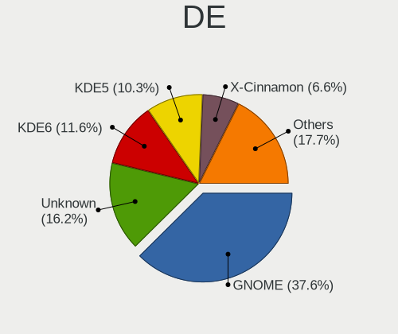
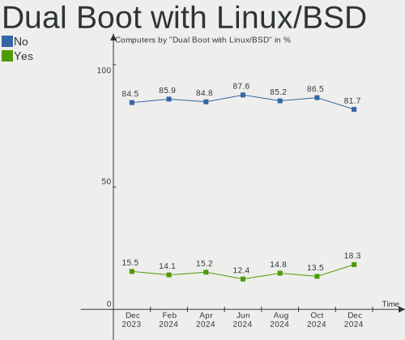
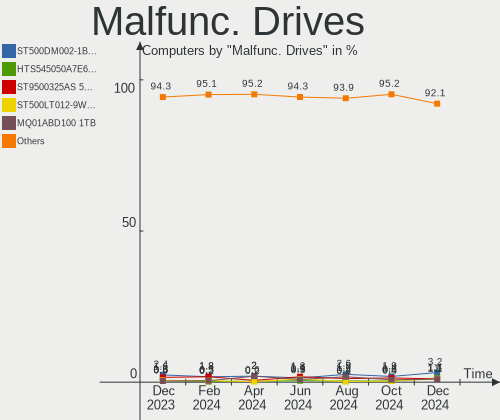
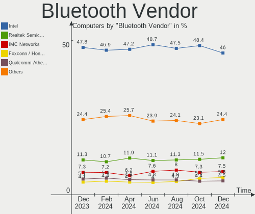
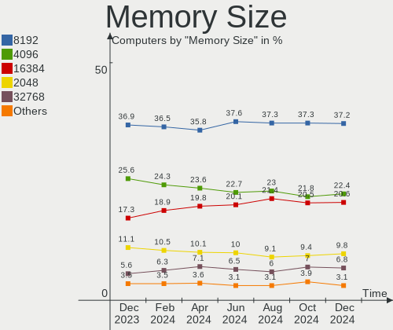
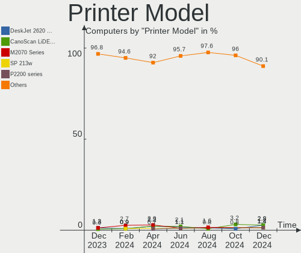
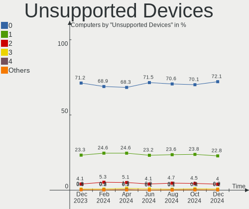

Linux Hardware Trends
---------------------

A project to identify most popular hardware characteristics and track their change
over time based on data collected by Linux users at https://Linux-Hardware.org.

Anyone can contribute to this report by the [hw-probe](https://github.com/linuxhw/hw-probe) tool:

    sudo -E hw-probe -all -upload

This is a report for all computer types. See also reports for [desktops](/Desktop/README.md) and [notebooks](/Notebook/README.md).

Full-feature report is available here: https://linux-hardware.org/?view=trends

Distribution-specific reports: [Ubuntu](/Dist/Ubuntu), [Debian](/Dist/Debian), [Linux Mint](/Dist/Linux_Mint), [Pop!_OS](/Dist/Pop!_OS), [Fedora](/Dist/Fedora), [OpenMandriva](/Dist/OpenMandriva), [Manjaro](/Dist/Manjaro), [Zorin](/Dist/Zorin), [Arch](/Dist/Arch), [KDE neon](/Dist/KDE_neon), [ROSA](/Dist/ROSA), [Xubuntu](/Dist/Xubuntu), [Kubuntu](/Dist/Kubuntu), [ArcoLinux](/Dist/ArcoLinux), [CentOS](/Dist/CentOS), [BlackPanther](/Dist/BlackPanther), [openSUSE](/Dist/openSUSE), [Clear Linux](/Dist/Clear_Linux), [Endless](/Dist/Endless), [Gentoo](/Dist/Gentoo).

Period: Aug, 2021.

Contents
--------

* [ System ](#system)
  - [ OS                       ](#os)
  - [ OS Family                ](#os-family)
  - [ Kernel                   ](#kernel)
  - [ Kernel Family            ](#kernel-family)
  - [ Kernel Major Ver.        ](#kernel-major-ver)
  - [ Arch                     ](#arch)
  - [ DE                       ](#de)
  - [ Display Server           ](#display-server)
  - [ Display Manager          ](#display-manager)
  - [ OS Lang                  ](#os-lang)
  - [ Boot Mode                ](#boot-mode)
  - [ Filesystem               ](#filesystem)
  - [ Part. scheme             ](#part-scheme)
  - [ Dual Boot with Linux/BSD ](#dual-boot-with-linuxbsd)
  - [ Dual Boot (Win)          ](#dual-boot-win)

* [ Board ](#board)
  - [ Vendor                   ](#vendor)
  - [ Model                    ](#model)
  - [ Model Family             ](#model-family)
  - [ MFG Year                 ](#mfg-year)
  - [ Form Factor              ](#form-factor)
  - [ Secure Boot              ](#secure-boot)
  - [ Coreboot                 ](#coreboot)
  - [ RAM Size                 ](#ram-size)
  - [ RAM Used                 ](#ram-used)
  - [ Total Drives             ](#total-drives)
  - [ Has CD-ROM               ](#has-cd-rom)
  - [ Has Ethernet             ](#has-ethernet)
  - [ Has WiFi                 ](#has-wifi)
  - [ Has Bluetooth            ](#has-bluetooth)

* [ Location ](#location)
  - [ Country                  ](#country)
  - [ City                     ](#city)

* [ Drives ](#drives)
  - [ Drive Vendor             ](#drive-vendor)
  - [ Drive Model              ](#drive-model)
  - [ HDD Vendor               ](#hdd-vendor)
  - [ SSD Vendor               ](#ssd-vendor)
  - [ Drive Kind               ](#drive-kind)
  - [ Drive Connector          ](#drive-connector)
  - [ Drive Size               ](#drive-size)
  - [ Space Total              ](#space-total)
  - [ Space Used               ](#space-used)
  - [ Malfunc. Drives          ](#malfunc-drives)
  - [ Malfunc. Drive Vendor    ](#malfunc-drive-vendor)
  - [ Malfunc. HDD Vendor      ](#malfunc-hdd-vendor)
  - [ Malfunc. Drive Kind      ](#malfunc-drive-kind)
  - [ Failed Drives            ](#failed-drives)
  - [ Failed Drive Vendor      ](#failed-drive-vendor)
  - [ Drive Status             ](#drive-status)

* [ Storage controller ](#storage-controller)
  - [ Storage Vendor           ](#storage-vendor)
  - [ Storage Model            ](#storage-model)
  - [ Storage Kind             ](#storage-kind)

* [ Processor ](#processor)
  - [ CPU Vendor               ](#cpu-vendor)
  - [ CPU Model                ](#cpu-model)
  - [ CPU Model Family         ](#cpu-model-family)
  - [ CPU Cores                ](#cpu-cores)
  - [ CPU Sockets              ](#cpu-sockets)
  - [ CPU Threads              ](#cpu-threads)
  - [ CPU Op-Modes             ](#cpu-op-modes)
  - [ CPU Microcode            ](#cpu-microcode)
  - [ CPU Microarch            ](#cpu-microarch)

* [ Graphics ](#graphics)
  - [ GPU Vendor               ](#gpu-vendor)
  - [ GPU Model                ](#gpu-model)
  - [ GPU Combo                ](#gpu-combo)
  - [ GPU Driver               ](#gpu-driver)
  - [ GPU Memory               ](#gpu-memory)

* [ Monitor ](#monitor)
  - [ Monitor Vendor           ](#monitor-vendor)
  - [ Monitor Model            ](#monitor-model)
  - [ Monitor Resolution       ](#monitor-resolution)
  - [ Monitor Diagonal         ](#monitor-diagonal)
  - [ Monitor Width            ](#monitor-width)
  - [ Aspect Ratio             ](#aspect-ratio)
  - [ Monitor Area             ](#monitor-area)
  - [ Pixel Density            ](#pixel-density)
  - [ Multiple Monitors        ](#multiple-monitors)

* [ Network ](#network)
  - [ Net Controller Vendor    ](#net-controller-vendor)
  - [ Net Controller Model     ](#net-controller-model)
  - [ Wireless Vendor          ](#wireless-vendor)
  - [ Wireless Model           ](#wireless-model)
  - [ Ethernet Vendor          ](#ethernet-vendor)
  - [ Ethernet Model           ](#ethernet-model)
  - [ Net Controller Kind      ](#net-controller-kind)
  - [ Used Controller          ](#used-controller)
  - [ NICs                     ](#nics)
  - [ IPv6                     ](#ipv6)

* [ Bluetooth ](#bluetooth)
  - [ Bluetooth Vendor         ](#bluetooth-vendor)
  - [ Bluetooth Model          ](#bluetooth-model)

* [ Sound ](#sound)
  - [ Sound Vendor             ](#sound-vendor)
  - [ Sound Model              ](#sound-model)

* [ Memory ](#memory)
  - [ Memory Vendor            ](#memory-vendor)
  - [ Memory Model             ](#memory-model)
  - [ Memory Kind              ](#memory-kind)
  - [ Memory Form Factor       ](#memory-form-factor)
  - [ Memory Size              ](#memory-size)
  - [ Memory Speed             ](#memory-speed)

* [ Printers & scanners ](#printers--scanners)
  - [ Printer Vendor           ](#printer-vendor)
  - [ Printer Model            ](#printer-model)
  - [ Scanner Vendor           ](#scanner-vendor)
  - [ Scanner Model            ](#scanner-model)

* [ Camera ](#camera)
  - [ Camera Vendor            ](#camera-vendor)
  - [ Camera Model             ](#camera-model)

* [ Security ](#security)
  - [ Fingerprint Vendor       ](#fingerprint-vendor)
  - [ Fingerprint Model        ](#fingerprint-model)
  - [ Chipcard Vendor          ](#chipcard-vendor)
  - [ Chipcard Model           ](#chipcard-model)

* [ Unsupported ](#unsupported)
  - [ Unsupported Devices      ](#unsupported-devices)
  - [ Unsupported Device Types ](#unsupported-device-types)

System
------

OS
--

Installed operating systems

| Name                | Computers | Percent |
|---------------------|-----------|---------|
| Ubuntu 20.04        | 831       | 16.25%  |
| Debian 11           | 499       | 9.76%   |
| Pop!_OS 21.04       | 401       | 7.84%   |
| Mint 20.2           | 369       | 7.22%   |
| Ubuntu 21.04        | 347       | 6.79%   |
| Fedora 34           | 280       | 5.48%   |
| OpenMandriva 4.2    | 252       | 4.93%   |
| KDE neon 20.04      | 130       | 2.54%   |
| Zorin 16            | 98        | 1.92%   |
| ROSA R11.1          | 95        | 1.86%   |
| Manjaro 21.1.0      | 92        | 1.8%    |
| Ubuntu 18.04        | 88        | 1.72%   |
| Manjaro             | 83        | 1.62%   |
| Arch                | 83        | 1.62%   |
| BlackPanther 18.1   | 80        | 1.56%   |
| ArcoLinux Rolling   | 79        | 1.54%   |
| Arch Rolling        | 72        | 1.41%   |
| Xubuntu 20.04       | 69        | 1.35%   |
| Debian 10           | 61        | 1.19%   |
| Zorin 15            | 57        | 1.11%   |
| Endless 3.9.5       | 52        | 1.02%   |
| Mint 20.1           | 50        | 0.98%   |
| Mint 19.3           | 44        | 0.86%   |
| Kubuntu 21.04       | 42        | 0.82%   |
| Kubuntu 20.04       | 42        | 0.82%   |
| Pop!_OS 20.04       | 37        | 0.72%   |
| OpenMandriva 4.50   | 28        | 0.55%   |
| Elementary 6        | 28        | 0.55%   |
| Mint 20             | 27        | 0.53%   |
| Kali 2021.2         | 26        | 0.51%   |
| Gentoo              | 26        | 0.51%   |
| Ubuntu 20.10        | 22        | 0.43%   |
| Fedora 33           | 21        | 0.41%   |
| Xubuntu 18.04       | 20        | 0.39%   |
| EndeavourOS Rolling | 20        | 0.39%   |
| CentOS 7.9.2009     | 20        | 0.39%   |
| LMDE 4              | 19        | 0.37%   |
| Ubuntu MATE 20.04   | 17        | 0.33%   |
| Gentoo 2.7          | 17        | 0.33%   |
| Clear Linux 34930   | 15        | 0.29%   |
| ROSA R11            | 14        | 0.27%   |
| Parrot 4.11         | 14        | 0.27%   |
| Pop!_OS 20.10       | 13        | 0.25%   |
| openSUSE Leap-15.3  | 13        | 0.25%   |
| Manjaro 21.1.1      | 13        | 0.25%   |
| Fedora 35           | 13        | 0.25%   |
| CentOS 8            | 13        | 0.25%   |
| Xubuntu 21.04       | 12        | 0.23%   |
| CentOS 7            | 12        | 0.23%   |
| ROSA R12            | 11        | 0.22%   |
| Debian              | 11        | 0.22%   |
| Ubuntu 21.10        | 9         | 0.18%   |
| Solus 4.3           | 9         | 0.18%   |
| Lubuntu 20.04       | 9         | 0.18%   |
| Garuda Soaring      | 9         | 0.18%   |
| Ubuntu MATE 21.04   | 8         | 0.16%   |
| Ubuntu 16.04        | 8         | 0.16%   |
| Fedora 32           | 8         | 0.16%   |
| Siduction 11        | 7         | 0.14%   |
| ArcoLinux           | 7         | 0.14%   |

OS Family
---------

OS without a version

| Name          | Computers | Percent |
|---------------|-----------|---------|
| Ubuntu        | 1315      | 25.71%  |
| Debian        | 578       | 11.3%   |
| Mint          | 503       | 9.84%   |
| Pop!_OS       | 451       | 8.82%   |
| Fedora        | 325       | 6.36%   |
| OpenMandriva  | 280       | 5.48%   |
| Manjaro       | 192       | 3.75%   |
| Zorin         | 156       | 3.05%   |
| Arch          | 155       | 3.03%   |
| KDE neon      | 130       | 2.54%   |
| ROSA          | 127       | 2.48%   |
| Xubuntu       | 102       | 1.99%   |
| Kubuntu       | 89        | 1.74%   |
| ArcoLinux     | 86        | 1.68%   |
| BlackPanther  | 85        | 1.66%   |
| Endless       | 64        | 1.25%   |
| CentOS        | 48        | 0.94%   |
| openSUSE      | 46        | 0.9%    |
| Gentoo        | 44        | 0.86%   |
| Elementary    | 35        | 0.68%   |
| Ubuntu MATE   | 29        | 0.57%   |
| Kali          | 27        | 0.53%   |
| Clear Linux   | 24        | 0.47%   |
| EndeavourOS   | 22        | 0.43%   |
| LMDE          | 19        | 0.37%   |
| Lubuntu       | 18        | 0.35%   |
| Parrot        | 16        | 0.31%   |
| Ubuntu Budgie | 12        | 0.23%   |
| Garuda        | 12        | 0.23%   |
| Solus         | 9         | 0.18%   |
| Raspbian      | 8         | 0.16%   |
| Slackware     | 7         | 0.14%   |
| Siduction     | 7         | 0.14%   |
| Rocky         | 6         | 0.12%   |
| MX            | 6         | 0.12%   |
| ALT Linux     | 6         | 0.12%   |
| RHEL          | 5         | 0.1%    |
| Peppermint    | 5         | 0.1%    |
| Kaisen        | 5         | 0.1%    |
| Deepin        | 5         | 0.1%    |
| Void          | 4         | 0.08%   |
| NixOS         | 4         | 0.08%   |
| Mageia        | 4         | 0.08%   |
| Artix         | 4         | 0.08%   |
| WindowsFX     | 3         | 0.06%   |
| GNOME OS      | 3         | 0.06%   |
| PureOS        | 2         | 0.04%   |
| PostmarketOS  | 2         | 0.04%   |
| Pear OS       | 2         | 0.04%   |
| Oracle Linux  | 2         | 0.04%   |
| GalliumOS     | 2         | 0.04%   |
| Exherbo       | 2         | 0.04%   |
| Devuan        | 2         | 0.04%   |
| Android       | 2         | 0.04%   |
| AlmaLinux     | 2         | 0.04%   |
| Xero          | 1         | 0.02%   |
| UHU           | 1         | 0.02%   |
| Sparky        | 1         | 0.02%   |
| SaferOS       | 1         | 0.02%   |
| Red OS        | 1         | 0.02%   |

Kernel
------

Version of the Linux kernel

| Version                             | Computers | Percent |
|-------------------------------------|-----------|---------|
| 5.11.0-25-generic                   | 524       | 10.25%  |
| 5.10.0-8-amd64                      | 433       | 8.47%   |
| 5.11.0-27-generic                   | 429       | 8.39%   |
| 5.11.0-7620-generic                 | 422       | 8.25%   |
| 5.4.0-81-generic                    | 345       | 6.75%   |
| 5.4.0-80-generic                    | 296       | 5.79%   |
| 5.10.14-desktop-1omv4002            | 241       | 4.71%   |
| 5.8.0-63-generic                    | 143       | 2.8%    |
| 5.11.0-31-generic                   | 139       | 2.72%   |
| 5.13.12-200.fc34.x86_64             | 73        | 1.43%   |
| 5.6.14-desktop-2bP                  | 58        | 1.13%   |
| 5.8.0-43-generic                    | 56        | 1.1%    |
| 5.8.0-14-generic                    | 56        | 1.1%    |
| 5.13.12-arch1-1                     | 47        | 0.92%   |
| 5.4.0-74-generic                    | 44        | 0.86%   |
| 5.13.9-200.fc34.x86_64              | 43        | 0.84%   |
| 5.13.8-200.fc34.x86_64              | 41        | 0.8%    |
| 5.13.6-200.fc34.x86_64              | 40        | 0.78%   |
| 5.10.0-7-amd64                      | 40        | 0.78%   |
| 4.19.0-17-amd64                     | 38        | 0.74%   |
| 5.4.83-generic-2rosa-x86_64         | 34        | 0.66%   |
| 5.13.10-arch1-1                     | 34        | 0.66%   |
| 5.10.53-1-MANJARO                   | 34        | 0.66%   |
| 5.13.10-200.fc34.x86_64             | 31        | 0.61%   |
| 5.10.56-1-MANJARO                   | 31        | 0.61%   |
| 5.13.11-1-MANJARO                   | 28        | 0.55%   |
| 5.11.0-16-generic                   | 26        | 0.51%   |
| 5.13.9-arch1-1                      | 25        | 0.49%   |
| 5.12.4-desktop-1omv4050             | 25        | 0.49%   |
| 5.13.13-arch1-1                     | 23        | 0.45%   |
| 5.8.0-59-generic                    | 21        | 0.41%   |
| 5.4.32-generic-2rosa-x86_64         | 21        | 0.41%   |
| 5.10.0-kali9-amd64                  | 21        | 0.41%   |
| 4.18.16-desktop-1bP                 | 21        | 0.41%   |
| 5.4.0-77-generic                    | 20        | 0.39%   |
| 5.13.8-arch1-1                      | 20        | 0.39%   |
| 5.13.7-arch1-1                      | 20        | 0.39%   |
| 5.13.12-1-MANJARO                   | 19        | 0.37%   |
| 5.10.59-1-MANJARO                   | 19        | 0.37%   |
| 5.4.0-42-generic                    | 17        | 0.33%   |
| 5.11.0-33-generic                   | 17        | 0.33%   |
| 4.15.0-desktop-122.124.1rosa-x86_64 | 17        | 0.33%   |
| 4.15.0-151-generic                  | 15        | 0.29%   |
| 5.13.8-1065.native                  | 13        | 0.25%   |
| 5.13.7-200.fc34.x86_64              | 13        | 0.25%   |
| 5.13.8-1-default                    | 12        | 0.23%   |
| 5.10.52-gentoo                      | 12        | 0.23%   |
| 5.10.0-8parrot1-amd64               | 12        | 0.23%   |
| 5.14.0-1-MANJARO                    | 11        | 0.22%   |
| 5.13.5-1-MANJARO                    | 11        | 0.22%   |
| 5.11.0-26-generic                   | 11        | 0.22%   |
| 5.11.0-22-generic                   | 11        | 0.22%   |
| 5.10.56-1-lts                       | 11        | 0.22%   |
| 4.15.0-desktop-45.1rosa-x86_64      | 11        | 0.22%   |
| 5.4.32-generic-2rosa-i586           | 10        | 0.2%    |
| 5.13.8-1-MANJARO                    | 10        | 0.2%    |
| 5.13.6-arch1-1                      | 10        | 0.2%    |
| 5.13.12-zen1-1-zen                  | 10        | 0.2%    |
| 5.12.19-1-MANJARO                   | 10        | 0.2%    |
| 5.11.12-desktop-1omv4002            | 10        | 0.2%    |

Kernel Family
-------------

Linux kernel without a distro release

| Version | Computers | Percent |
|---------|-----------|---------|
| 5.11.0  | 1630      | 31.87%  |
| 5.4.0   | 792       | 15.49%  |
| 5.10.0  | 571       | 11.17%  |
| 5.8.0   | 320       | 6.26%   |
| 5.10.14 | 241       | 4.71%   |
| 5.13.12 | 179       | 3.5%    |
| 5.13.8  | 115       | 2.25%   |
| 4.15.0  | 101       | 1.97%   |
| 5.13.9  | 94        | 1.84%   |
| 5.13.10 | 76        | 1.49%   |
| 5.13.6  | 69        | 1.35%   |
| 4.19.0  | 69        | 1.35%   |
| 5.6.14  | 58        | 1.13%   |
| 5.13.7  | 56        | 1.1%    |
| 5.10.56 | 53        | 1.04%   |
| 5.4.83  | 39        | 0.76%   |
| 5.13.13 | 38        | 0.74%   |
| 5.13.11 | 37        | 0.72%   |
| 5.14.0  | 34        | 0.66%   |
| 5.10.53 | 34        | 0.66%   |
| 5.4.32  | 31        | 0.61%   |
| 3.10.0  | 31        | 0.61%   |
| 5.13.5  | 29        | 0.57%   |
| 5.10.52 | 29        | 0.57%   |
| 4.18.0  | 28        | 0.55%   |
| 5.12.4  | 25        | 0.49%   |
| 4.18.16 | 21        | 0.41%   |
| 5.13.4  | 20        | 0.39%   |
| 5.11.12 | 20        | 0.39%   |
| 5.10.59 | 19        | 0.37%   |
| 5.12.19 | 18        | 0.35%   |
| 5.3.18  | 17        | 0.33%   |
| 5.13.0  | 14        | 0.27%   |
| 5.11.22 | 11        | 0.22%   |
| 5.12.14 | 9         | 0.18%   |
| 5.10.60 | 9         | 0.18%   |
| 5.3.0   | 7         | 0.14%   |
| 5.12.15 | 7         | 0.14%   |
| 5.0.0   | 7         | 0.14%   |
| 5.12.18 | 6         | 0.12%   |
| 4.9.20  | 6         | 0.12%   |
| 5.10.54 | 5         | 0.1%    |
| 5.10.42 | 5         | 0.1%    |
| 4.4.0   | 5         | 0.1%    |
| 5.12.0  | 4         | 0.08%   |
| 5.10.50 | 4         | 0.08%   |
| 5.9.16  | 3         | 0.06%   |
| 5.12.7  | 3         | 0.06%   |
| 5.12.13 | 3         | 0.06%   |
| 5.11.10 | 3         | 0.06%   |
| 5.10.17 | 3         | 0.06%   |
| 4.9.0   | 3         | 0.06%   |
| 5.4.17  | 2         | 0.04%   |
| 5.4.124 | 2         | 0.04%   |
| 5.13.2  | 2         | 0.04%   |
| 5.12.5  | 2         | 0.04%   |
| 5.12.12 | 2         | 0.04%   |
| 5.12.11 | 2         | 0.04%   |
| 5.11.6  | 2         | 0.04%   |
| 5.10.61 | 2         | 0.04%   |

Kernel Major Ver.
-----------------

Linux kernel major version

| Version | Computers | Percent |
|---------|-----------|---------|
| 5.11    | 1673      | 32.71%  |
| 5.10    | 999       | 19.53%  |
| 5.4     | 881       | 17.23%  |
| 5.13    | 730       | 14.27%  |
| 5.8     | 322       | 6.3%    |
| 4.15    | 102       | 1.99%   |
| 5.12    | 88        | 1.72%   |
| 4.19    | 70        | 1.37%   |
| 5.6     | 61        | 1.19%   |
| 4.18    | 49        | 0.96%   |
| 5.14    | 34        | 0.66%   |
| 3.10    | 31        | 0.61%   |
| 5.3     | 24        | 0.47%   |
| 4.9     | 16        | 0.31%   |
| 5.0     | 8         | 0.16%   |
| 5.9     | 7         | 0.14%   |
| 4.4     | 6         | 0.12%   |
| 4.16    | 3         | 0.06%   |
| 5.2     | 2         | 0.04%   |
| 4.1     | 2         | 0.04%   |
| Unknown | 2         | 0.04%   |
| 5.7     | 1         | 0.02%   |
| 4.20    | 1         | 0.02%   |
| 4.13    | 1         | 0.02%   |
| 4.10    | 1         | 0.02%   |

Arch
----

OS architecture (x86_64, i586, etc.)

| Name    | Computers | Percent |
|---------|-----------|---------|
| x86_64  | 4963      | 97.05%  |
| i686    | 106       | 2.07%   |
| aarch64 | 27        | 0.53%   |
| armv7l  | 14        | 0.27%   |
| ppc64   | 1         | 0.02%   |
| ppc     | 1         | 0.02%   |
| armv6l  | 1         | 0.02%   |
| Unknown | 1         | 0.02%   |

DE
--

Desktop Environment

| Name             | Computers | Percent |
|------------------|-----------|---------|
| GNOME            | 2328      | 45.52%  |
| KDE5             | 705       | 13.79%  |
| Unknown          | 538       | 10.52%  |
| X-Cinnamon       | 400       | 7.82%   |
| XFCE             | 368       | 7.2%    |
| KDE              | 260       | 5.08%   |
| MATE             | 146       | 2.85%   |
| KDE4             | 76        | 1.49%   |
| Cinnamon         | 63        | 1.23%   |
| Pantheon         | 31        | 0.61%   |
| LXQt             | 29        | 0.57%   |
| i3               | 27        | 0.53%   |
| Budgie           | 27        | 0.53%   |
| LXDE             | 18        | 0.35%   |
| Unity            | 16        | 0.31%   |
| qtile            | 11        | 0.22%   |
| awesome          | 10        | 0.2%    |
| Deepin           | 9         | 0.18%   |
| sway             | 8         | 0.16%   |
| GNOME Flashback  | 7         | 0.14%   |
| bspwm            | 5         | 0.1%    |
| xmonad           | 4         | 0.08%   |
| openbox          | 4         | 0.08%   |
| Enlightenment    | 4         | 0.08%   |
| Trinity          | 3         | 0.06%   |
| dwm              | 3         | 0.06%   |
| lightdm-xsession | 2         | 0.04%   |
| ICEWM            | 2         | 0.04%   |
| GNOME Classic    | 2         | 0.04%   |
| xubuntu          | 1         | 0.02%   |
| wmaker-common    | 1         | 0.02%   |
| UKUI             | 1         | 0.02%   |
| NsCDE            | 1         | 0.02%   |
| jwm              | 1         | 0.02%   |
| herbstluftwm     | 1         | 0.02%   |
| GNOME-Flashback  | 1         | 0.02%   |
| fly              | 1         | 0.02%   |

Display Server
--------------

X11 or Wayland

| Name        | Computers | Percent |
|-------------|-----------|---------|
| X11         | 3961      | 77.45%  |
| Wayland     | 642       | 12.55%  |
| Unknown     | 395       | 7.72%   |
| Tty         | 115       | 2.25%   |
| Unspecified | 1         | 0.02%   |

Display Manager
---------------

SDDM, LightDM, etc.

| Name    | Computers | Percent |
|---------|-----------|---------|
| Unknown | 2983      | 58.33%  |
| SDDM    | 754       | 14.74%  |
| GDM     | 743       | 14.53%  |
| TDM     | 308       | 6.02%   |
| LightDM | 229       | 4.48%   |
| KDM     | 73        | 1.43%   |
| XDM     | 9         | 0.18%   |
| LXDM    | 7         | 0.14%   |
| GDM3    | 4         | 0.08%   |
| SLiM    | 2         | 0.04%   |
| NODM    | 2         | 0.04%   |

OS Lang
-------

Language

| Lang    | Computers | Percent |
|---------|-----------|---------|
| en_US   | 1946      | 38.05%  |
| de_DE   | 461       | 9.01%   |
| Unknown | 364       | 7.12%   |
| ru_RU   | 315       | 6.16%   |
| en_GB   | 290       | 5.67%   |
| pt_BR   | 258       | 5.04%   |
| fr_FR   | 218       | 4.26%   |
| es_ES   | 110       | 2.15%   |
| C       | 100       | 1.96%   |
| en_AU   | 93        | 1.82%   |
| en_IN   | 91        | 1.78%   |
| pl_PL   | 78        | 1.53%   |
| en_CA   | 74        | 1.45%   |
| it_IT   | 63        | 1.23%   |
| cs_CZ   | 39        | 0.76%   |
| es_AR   | 33        | 0.65%   |
| zh_CN   | 32        | 0.63%   |
| es_MX   | 31        | 0.61%   |
| en_ZA   | 31        | 0.61%   |
| nl_NL   | 25        | 0.49%   |
| hu_HU   | 25        | 0.49%   |
| de_CH   | 24        | 0.47%   |
| nl_BE   | 21        | 0.41%   |
| en_NZ   | 21        | 0.41%   |
| ru_UA   | 20        | 0.39%   |
| sv_SE   | 19        | 0.37%   |
| fi_FI   | 18        | 0.35%   |
| de_AT   | 18        | 0.35%   |
| es_CL   | 17        | 0.33%   |
| ja_JP   | 16        | 0.31%   |
| es_CO   | 15        | 0.29%   |
| pt_PT   | 14        | 0.27%   |
| tr_TR   | 13        | 0.25%   |
| fr_BE   | 13        | 0.25%   |
| ro_RO   | 11        | 0.22%   |
| en_IE   | 11        | 0.22%   |
| fr_CA   | 10        | 0.2%    |
| zh_TW   | 9         | 0.18%   |
| en_PH   | 9         | 0.18%   |
| da_DK   | 9         | 0.18%   |
| nb_NO   | 7         | 0.14%   |
| hr_HR   | 7         | 0.14%   |
| es_PE   | 7         | 0.14%   |
| es_EC   | 7         | 0.14%   |
| el_GR   | 7         | 0.14%   |
| sk_SK   | 6         | 0.12%   |
| es_VE   | 6         | 0.12%   |
| en_SG   | 6         | 0.12%   |
| bg_BG   | 6         | 0.12%   |
| es_UY   | 5         | 0.1%    |
| en_IL   | 5         | 0.1%    |
| en_DK   | 5         | 0.1%    |
| nn_NO   | 4         | 0.08%   |
| fr_CH   | 4         | 0.08%   |
| uk_UA   | 3         | 0.06%   |
| th_TH   | 3         | 0.06%   |
| POSIX   | 3         | 0.06%   |
| lt_LT   | 3         | 0.06%   |
| es_SV   | 3         | 0.06%   |
| en_NG   | 3         | 0.06%   |

Boot Mode
---------

EFI or BIOS

| Mode | Computers | Percent |
|------|-----------|---------|
| BIOS | 2632      | 51.47%  |
| EFI  | 2482      | 48.53%  |

Filesystem
----------

Type of filesystem

| Type                | Computers | Percent |
|---------------------|-----------|---------|
| Ext4                | 3827      | 74.83%  |
| Overlay             | 684       | 13.38%  |
| Btrfs               | 435       | 8.51%   |
| Xfs                 | 97        | 1.9%    |
| Zfs                 | 30        | 0.59%   |
| F2fs                | 8         | 0.16%   |
| Ext3                | 8         | 0.16%   |
| Unknown             | 8         | 0.16%   |
| Ext2                | 6         | 0.12%   |
| Tmpfs               | 3         | 0.06%   |
| Aufs                | 3         | 0.06%   |
| XXXXXXX             | 1         | 0.02%   |
| XXXX                | 1         | 0.02%   |
| Rootfs              | 1         | 0.02%   |
| Jfs                 | 1         | 0.02%   |
| Fuse.fuse-overlayfs | 1         | 0.02%   |

Part. scheme
------------

Scheme of partitioning

| Type    | Computers | Percent |
|---------|-----------|---------|
| Unknown | 2574      | 50.33%  |
| GPT     | 1866      | 36.49%  |
| MBR     | 674       | 13.18%  |

Dual Boot with Linux/BSD
------------------------

Hosting more than one Linux/BSD

| Dual boot | Computers | Percent |
|-----------|-----------|---------|
| No        | 4429      | 86.61%  |
| Yes       | 685       | 13.39%  |

Dual Boot (Win)
---------------

Hosting Linux and Windows

| Dual boot | Computers | Percent |
|-----------|-----------|---------|
| No        | 3682      | 72%     |
| Yes       | 1432      | 28%     |

Board
-----

Vendor
------

Motherboard manufacturer

| Name                    | Computers | Percent |
|-------------------------|-----------|---------|
| ASUSTek Computer        | 743       | 14.53%  |
| Lenovo                  | 712       | 13.92%  |
| Hewlett-Packard         | 672       | 13.14%  |
| Dell                    | 611       | 11.95%  |
| Gigabyte Technology     | 381       | 7.45%   |
| Acer                    | 298       | 5.83%   |
| MSI                     | 264       | 5.16%   |
| Apple                   | 256       | 5.01%   |
| ASRock                  | 219       | 4.28%   |
| Toshiba                 | 74        | 1.45%   |
| Intel                   | 74        | 1.45%   |
| Unknown                 | 73        | 1.43%   |
| Google                  | 66        | 1.29%   |
| Samsung Electronics     | 57        | 1.11%   |
| Fujitsu                 | 43        | 0.84%   |
| Sony                    | 37        | 0.72%   |
| Medion                  | 31        | 0.61%   |
| Notebook                | 27        | 0.53%   |
| Packard Bell            | 24        | 0.47%   |
| HUAWEI                  | 24        | 0.47%   |
| Supermicro              | 21        | 0.41%   |
| Positivo                | 19        | 0.37%   |
| Pegatron                | 16        | 0.31%   |
| Microsoft               | 16        | 0.31%   |
| Foxconn                 | 16        | 0.31%   |
| TUXEDO                  | 15        | 0.29%   |
| System76                | 15        | 0.29%   |
| Fujitsu Siemens         | 14        | 0.27%   |
| ECS                     | 14        | 0.27%   |
| Biostar                 | 12        | 0.23%   |
| LG Electronics          | 10        | 0.2%    |
| eMachines               | 10        | 0.2%    |
| Alienware               | 9         | 0.18%   |
| Gateway                 | 8         | 0.16%   |
| Timi                    | 7         | 0.14%   |
| Razer                   | 7         | 0.14%   |
| Raspberry Pi Foundation | 7         | 0.14%   |
| PC Specialist           | 7         | 0.14%   |
| Huanan                  | 7         | 0.14%   |
| Chuwi                   | 7         | 0.14%   |
| AMI                     | 7         | 0.14%   |
| ZOTAC                   | 6         | 0.12%   |
| Panasonic               | 6         | 0.12%   |
| Clevo                   | 6         | 0.12%   |
| Teclast                 | 5         | 0.1%    |
| Itautec                 | 5         | 0.1%    |
| Semp Toshiba            | 4         | 0.08%   |
| PCWare                  | 4         | 0.08%   |
| Jumper                  | 4         | 0.08%   |
| HARDKERNEL              | 4         | 0.08%   |
| Shuttle                 | 3         | 0.06%   |
| OEM                     | 3         | 0.06%   |
| NEC Computers           | 3         | 0.06%   |
| Monster                 | 3         | 0.06%   |
| Insyde                  | 3         | 0.06%   |
| GPD                     | 3         | 0.06%   |
| Eluktronics             | 3         | 0.06%   |
| BANGHO                  | 3         | 0.06%   |
| AZW                     | 3         | 0.06%   |
| AVITA                   | 3         | 0.06%   |

Model
-----

Motherboard model

| Name                                  | Computers | Percent |
|---------------------------------------|-----------|---------|
| Unknown                               | 84        | 1.64%   |
| Apple MacBookAir7,1                   | 75        | 1.47%   |
| Apple MacBookAir7,2                   | 66        | 1.29%   |
| Google Enguarde                       | 48        | 0.94%   |
| ASUS All Series                       | 44        | 0.86%   |
| ASRock H470M-HVS                      | 20        | 0.39%   |
| HP Notebook                           | 18        | 0.35%   |
| ASUS UX31E                            | 16        | 0.31%   |
| MSI MS-7C37                           | 13        | 0.25%   |
| Lenovo ThinkPad 13 2nd Gen 20J10046US | 13        | 0.25%   |
| Dell OptiPlex 7010                    | 13        | 0.25%   |
| Gigabyte A320M-S2H                    | 12        | 0.23%   |
| Dell OptiPlex 9020                    | 12        | 0.23%   |
| ASUS ROG STRIX B450-F GAMING          | 12        | 0.23%   |
| MSI MS-7C91                           | 11        | 0.22%   |
| Gigabyte B450M DS3H                   | 11        | 0.22%   |
| HP Pavilion dv6                       | 10        | 0.2%    |
| HP Pavilion g6                        | 9         | 0.18%   |
| HP Pavilion 15                        | 9         | 0.18%   |
| Dell XPS 15 7590                      | 9         | 0.18%   |
| ASUS PRIME A320M-K                    | 9         | 0.18%   |
| Acer Nitro AN515-54                   | 9         | 0.18%   |
| MSI MS-7B86                           | 8         | 0.16%   |
| HP Pavilion dv7                       | 8         | 0.16%   |
| Dell OptiPlex 7040                    | 8         | 0.16%   |
| Apple MacBookPro8,1                   | 8         | 0.16%   |
| Acer Nitro AN515-44                   | 8         | 0.16%   |
| MSI MS-7C02                           | 7         | 0.14%   |
| Lenovo IdeaPad 330-15IKB 81DE         | 7         | 0.14%   |
| HUAWEI BOHK-WAX9X                     | 7         | 0.14%   |
| HP Pavilion Gaming Laptop 15-ec1xxx   | 7         | 0.14%   |
| HP EliteBook 8460p                    | 7         | 0.14%   |
| HP EliteBook 820 G1                   | 7         | 0.14%   |
| Gigabyte X570 AORUS ELITE             | 7         | 0.14%   |
| Dell XPS 15 9560                      | 7         | 0.14%   |
| Dell OptiPlex 790                     | 7         | 0.14%   |
| Dell OptiPlex 755                     | 7         | 0.14%   |
| Dell Latitude E6400                   | 7         | 0.14%   |
| ASUS TUF GAMING X570-PLUS             | 7         | 0.14%   |
| ASUS ROG Zephyrus G14 GA401QM_GA401QM | 7         | 0.14%   |
| ASUS PRIME B450M-A                    | 7         | 0.14%   |
| Apple MacBookPro9,2                   | 7         | 0.14%   |
| HP EliteBook 840 G3                   | 6         | 0.12%   |
| HP Compaq Pro 6300 SFF                | 6         | 0.12%   |
| Gigabyte B550M DS3H                   | 6         | 0.12%   |
| Gigabyte B450 AORUS PRO WIFI          | 6         | 0.12%   |
| Dell XPS 15 9500                      | 6         | 0.12%   |
| Dell Vostro 3500                      | 6         | 0.12%   |
| Dell OptiPlex 780                     | 6         | 0.12%   |
| Dell OptiPlex 3020                    | 6         | 0.12%   |
| Dell Latitude E6510                   | 6         | 0.12%   |
| Dell Inspiron 3521                    | 6         | 0.12%   |
| ASUS ROG STRIX B550-F GAMING          | 6         | 0.12%   |
| ASUS PRIME B365M-A                    | 6         | 0.12%   |
| Apple Macmini7,1                      | 6         | 0.12%   |
| System76 Oryx Pro                     | 5         | 0.1%    |
| MSI MS-7C56                           | 5         | 0.1%    |
| MSI MS-7B79                           | 5         | 0.1%    |
| MSI MS-7693                           | 5         | 0.1%    |
| Lenovo IdeaPad Y700-15ISK 80NV        | 5         | 0.1%    |

Model Family
------------

Motherboard model prefix

| Name                   | Computers | Percent |
|------------------------|-----------|---------|
| Lenovo ThinkPad        | 330       | 6.45%   |
| Acer Aspire            | 191       | 3.73%   |
| Dell Inspiron          | 166       | 3.25%   |
| Lenovo IdeaPad         | 153       | 2.99%   |
| Apple MacBookAir7      | 141       | 2.76%   |
| Dell Latitude          | 139       | 2.72%   |
| HP Pavilion            | 122       | 2.39%   |
| Dell OptiPlex          | 104       | 2.03%   |
| HP EliteBook           | 92        | 1.8%    |
| ASUS ROG               | 86        | 1.68%   |
| Unknown                | 84        | 1.64%   |
| ASUS PRIME             | 82        | 1.6%    |
| Dell XPS               | 81        | 1.58%   |
| HP Compaq              | 71        | 1.39%   |
| HP ProBook             | 66        | 1.29%   |
| HP Laptop              | 63        | 1.23%   |
| Toshiba Satellite      | 62        | 1.21%   |
| Dell Precision         | 58        | 1.13%   |
| ASUS VivoBook          | 50        | 0.98%   |
| Google Enguarde        | 48        | 0.94%   |
| ASUS All               | 44        | 0.86%   |
| HP ENVY                | 43        | 0.84%   |
| ASUS TUF               | 43        | 0.84%   |
| Lenovo ThinkCentre     | 42        | 0.82%   |
| Acer Nitro             | 38        | 0.74%   |
| Lenovo Yoga            | 31        | 0.61%   |
| Dell Vostro            | 31        | 0.61%   |
| Acer Swift             | 24        | 0.47%   |
| ASRock H470M-HVS       | 20        | 0.39%   |
| HP EliteDesk           | 19        | 0.37%   |
| Gigabyte B450M         | 19        | 0.37%   |
| Gigabyte B450          | 19        | 0.37%   |
| HP Notebook            | 18        | 0.35%   |
| Gigabyte X570          | 18        | 0.35%   |
| Fujitsu LIFEBOOK       | 17        | 0.33%   |
| ASUS ZenBook           | 17        | 0.33%   |
| ASUS ASUS              | 17        | 0.33%   |
| Microsoft Surface      | 16        | 0.31%   |
| ASUS UX31E             | 16        | 0.31%   |
| Packard Bell EasyNote  | 15        | 0.29%   |
| Lenovo ThinkBook       | 15        | 0.29%   |
| ASUS M5A78L-M          | 15        | 0.29%   |
| Gigabyte A320M-S2H     | 14        | 0.27%   |
| Fujitsu ESPRIMO        | 14        | 0.27%   |
| MSI MS-7C37            | 13        | 0.25%   |
| Lenovo ThinkStation    | 13        | 0.25%   |
| Lenovo Legion          | 12        | 0.23%   |
| MSI MS-7C91            | 11        | 0.22%   |
| HP Presario            | 11        | 0.22%   |
| Apple MacBookPro8      | 11        | 0.22%   |
| Acer Extensa           | 11        | 0.22%   |
| Gigabyte GA-78LMT-USB3 | 10        | 0.2%    |
| Dell Studio            | 10        | 0.2%    |
| ASRock B450M           | 10        | 0.2%    |
| HP ProLiant            | 9         | 0.18%   |
| Gigabyte Z390          | 9         | 0.18%   |
| ASUS SABERTOOTH        | 9         | 0.18%   |
| Apple MacBookPro9      | 9         | 0.18%   |
| Apple MacBookPro11     | 9         | 0.18%   |
| MSI MS-7B86            | 8         | 0.16%   |

MFG Year
--------

Motherboard manufacture year

| Year    | Computers | Percent |
|---------|-----------|---------|
| 2021    | 878       | 17.17%  |
| 2020    | 842       | 16.46%  |
| 2019    | 575       | 11.24%  |
| 2018    | 365       | 7.14%   |
| 2013    | 327       | 6.39%   |
| 2012    | 293       | 5.73%   |
| 2011    | 271       | 5.3%    |
| 2014    | 264       | 5.16%   |
| 2015    | 256       | 5.01%   |
| 2010    | 227       | 4.44%   |
| 2016    | 189       | 3.7%    |
| 2017    | 174       | 3.4%    |
| 2009    | 165       | 3.23%   |
| 2008    | 125       | 2.44%   |
| 2007    | 71        | 1.39%   |
| Unknown | 44        | 0.86%   |
| 2006    | 27        | 0.53%   |
| 2005    | 13        | 0.25%   |
| 2004    | 5         | 0.1%    |
| 2000    | 2         | 0.04%   |
| 2003    | 1         | 0.02%   |

Form Factor
-----------

Physical design of the computer

| Name           | Computers | Percent |
|----------------|-----------|---------|
| Notebook       | 2839      | 55.51%  |
| Desktop        | 1915      | 37.45%  |
| Convertible    | 122       | 2.39%   |
| All in one     | 67        | 1.31%   |
| Mini pc        | 60        | 1.17%   |
| Tablet         | 39        | 0.76%   |
| System on chip | 37        | 0.72%   |
| Server         | 30        | 0.59%   |
| Phone          | 3         | 0.06%   |
| Other          | 2         | 0.04%   |

Secure Boot
-----------

Enabled or disabled

| State    | Computers | Percent |
|----------|-----------|---------|
| Disabled | 4783      | 93.53%  |
| Enabled  | 331       | 6.47%   |

Coreboot
--------

Have coreboot on board

| Used | Computers | Percent |
|------|-----------|---------|
| No   | 5037      | 98.49%  |
| Yes  | 77        | 1.51%   |

RAM Size
--------

Total RAM memory

| Size in GB      | Computers | Percent |
|-----------------|-----------|---------|
| 4.01-8.0        | 1202      | 23.5%   |
| 3.01-4.0        | 1063      | 20.79%  |
| 16.01-24.0      | 953       | 18.64%  |
| 8.01-16.0       | 889       | 17.38%  |
| 32.01-64.0      | 505       | 9.87%   |
| 1.01-2.0        | 190       | 3.72%   |
| 64.01-256.0     | 122       | 2.39%   |
| 24.01-32.0      | 75        | 1.47%   |
| 2.01-3.0        | 72        | 1.41%   |
| 0.51-1.0        | 30        | 0.59%   |
| More than 256.0 | 6         | 0.12%   |
| 0.01-0.5        | 4         | 0.08%   |
| Unknown         | 3         | 0.06%   |

RAM Used
--------

Used RAM memory

| Used GB         | Computers | Percent |
|-----------------|-----------|---------|
| 1.01-2.0        | 2015      | 39.4%   |
| 2.01-3.0        | 1219      | 23.84%  |
| 4.01-8.0        | 625       | 12.22%  |
| 3.01-4.0        | 527       | 10.31%  |
| 0.51-1.0        | 411       | 8.04%   |
| 8.01-16.0       | 164       | 3.21%   |
| 0.01-0.5        | 99        | 1.94%   |
| 16.01-24.0      | 32        | 0.63%   |
| 24.01-32.0      | 9         | 0.18%   |
| 32.01-64.0      | 6         | 0.12%   |
| 64.01-256.0     | 3         | 0.06%   |
| Unknown         | 3         | 0.06%   |
| More than 256.0 | 1         | 0.02%   |

Total Drives
------------

Number of drives on board

| Drives | Computers | Percent |
|--------|-----------|---------|
| 1      | 3064      | 59.91%  |
| 2      | 1275      | 24.93%  |
| 3      | 383       | 7.49%   |
| 4      | 178       | 3.48%   |
| 5      | 89        | 1.74%   |
| 6      | 46        | 0.9%    |
| 7      | 26        | 0.51%   |
| 0      | 24        | 0.47%   |
| 8      | 12        | 0.23%   |
| 9      | 4         | 0.08%   |
| 10     | 3         | 0.06%   |
| 13     | 2         | 0.04%   |
| 12     | 2         | 0.04%   |
| 209    | 1         | 0.02%   |
| 28     | 1         | 0.02%   |
| 18     | 1         | 0.02%   |
| 17     | 1         | 0.02%   |
| 15     | 1         | 0.02%   |
| 11     | 1         | 0.02%   |

Has CD-ROM
----------

Has CD-ROM on board

| Presented | Computers | Percent |
|-----------|-----------|---------|
| No        | 3185      | 62.28%  |
| Yes       | 1929      | 37.72%  |

Has Ethernet
------------

Has Ethernet on board

| Presented | Computers | Percent |
|-----------|-----------|---------|
| Yes       | 4301      | 84.1%   |
| No        | 813       | 15.9%   |

Has WiFi
--------

Has WiFi module

| Presented | Computers | Percent |
|-----------|-----------|---------|
| Yes       | 3808      | 74.46%  |
| No        | 1306      | 25.54%  |

Has Bluetooth
-------------

Has Bluetooth module

| Presented | Computers | Percent |
|-----------|-----------|---------|
| Yes       | 3049      | 59.62%  |
| No        | 2065      | 40.38%  |

Location
--------

Country
-------

Geographic location (country)

| Country      | Computers | Percent |
|--------------|-----------|---------|
| USA          | 1091      | 21.33%  |
| Germany      | 564       | 11.03%  |
| Russia       | 346       | 6.77%   |
| Brazil       | 338       | 6.61%   |
| France       | 248       | 4.85%   |
| UK           | 231       | 4.52%   |
| India        | 148       | 2.89%   |
| Spain        | 131       | 2.56%   |
| Canada       | 127       | 2.48%   |
| Poland       | 117       | 2.29%   |
| Australia    | 116       | 2.27%   |
| Hungary      | 101       | 1.97%   |
| Netherlands  | 93        | 1.82%   |
| Italy        | 91        | 1.78%   |
| Ukraine      | 76        | 1.49%   |
| Switzerland  | 69        | 1.35%   |
| Mexico       | 64        | 1.25%   |
| Czechia      | 62        | 1.21%   |
| Belgium      | 62        | 1.21%   |
| Sweden       | 53        | 1.04%   |
| Argentina    | 52        | 1.02%   |
| Finland      | 45        | 0.88%   |
| Romania      | 43        | 0.84%   |
| Turkey       | 39        | 0.76%   |
| Austria      | 39        | 0.76%   |
| South Africa | 38        | 0.74%   |
| China        | 37        | 0.72%   |
| Indonesia    | 36        | 0.7%    |
| Japan        | 30        | 0.59%   |
| Portugal     | 26        | 0.51%   |
| New Zealand  | 26        | 0.51%   |
| Greece       | 25        | 0.49%   |
| Chile        | 24        | 0.47%   |
| Colombia     | 23        | 0.45%   |
| Belarus      | 22        | 0.43%   |
| Norway       | 21        | 0.41%   |
| Bulgaria     | 20        | 0.39%   |
| Denmark      | 18        | 0.35%   |
| Algeria      | 16        | 0.31%   |
| Serbia       | 15        | 0.29%   |
| Latvia       | 14        | 0.27%   |
| Israel       | 14        | 0.27%   |
| Iran         | 14        | 0.27%   |
| Estonia      | 14        | 0.27%   |
| Taiwan       | 13        | 0.25%   |
| Philippines  | 13        | 0.25%   |
| Ireland      | 13        | 0.25%   |
| Malaysia     | 12        | 0.23%   |
| Lithuania    | 12        | 0.23%   |
| Croatia      | 12        | 0.23%   |
| Vietnam      | 10        | 0.2%    |
| Thailand     | 10        | 0.2%    |
| Slovakia     | 10        | 0.2%    |
| Singapore    | 10        | 0.2%    |
| Hong Kong    | 10        | 0.2%    |
| Peru         | 9         | 0.18%   |
| Ecuador      | 9         | 0.18%   |
| South Korea  | 8         | 0.16%   |
| Morocco      | 8         | 0.16%   |
| Egypt        | 8         | 0.16%   |

City
----

Geographic location (city)

| City              | Computers | Percent |
|-------------------|-----------|---------|
| Portland          | 239       | 4.67%   |
| Moscow            | 75        | 1.47%   |
| Berlin            | 46        | 0.9%    |
| S??o Paulo        | 45        | 0.88%   |
| Voronezh          | 41        | 0.8%    |
| St Petersburg     | 33        | 0.65%   |
| Paris             | 33        | 0.65%   |
| London            | 33        | 0.65%   |
| Warsaw            | 31        | 0.61%   |
| Prague            | 31        | 0.61%   |
| Kyiv              | 26        | 0.51%   |
| Sydney            | 25        | 0.49%   |
| Helsinki          | 23        | 0.45%   |
| Bengaluru         | 22        | 0.43%   |
| Zurich            | 21        | 0.41%   |
| Vienna            | 20        | 0.39%   |
| Rochester         | 20        | 0.39%   |
| Rio de Janeiro    | 20        | 0.39%   |
| Madrid            | 20        | 0.39%   |
| Frankfurt am Main | 20        | 0.39%   |
| Hamburg           | 19        | 0.37%   |
| Budapest          | 18        | 0.35%   |
| Munich            | 17        | 0.33%   |
| Melbourne         | 17        | 0.33%   |
| Montreal          | 16        | 0.31%   |
| Minsk             | 16        | 0.31%   |
| Milan             | 16        | 0.31%   |
| Stuttgart         | 15        | 0.29%   |
| Los Angeles       | 15        | 0.29%   |
| Istanbul          | 15        | 0.29%   |
| Amsterdam         | 15        | 0.29%   |
| Dallas            | 14        | 0.27%   |
| Cologne           | 14        | 0.27%   |
| Rome              | 13        | 0.25%   |
| New York          | 13        | 0.25%   |
| Bogot??           | 13        | 0.25%   |
| Yekaterinburg     | 12        | 0.23%   |
| Toronto           | 12        | 0.23%   |
| Tehran            | 12        | 0.23%   |
| San Jose          | 12        | 0.23%   |
| Cape Town         | 12        | 0.23%   |
| Buenos Aires      | 12        | 0.23%   |
| Brisbane          | 12        | 0.23%   |
| Barcelona         | 12        | 0.23%   |
| Tallinn           | 11        | 0.22%   |
| Krasnodar         | 11        | 0.22%   |
| Johannesburg      | 11        | 0.22%   |
| Belo Horizonte    | 11        | 0.22%   |
| Tel Aviv          | 10        | 0.2%    |
| Singapore         | 10        | 0.2%    |
| Santiago          | 10        | 0.2%    |
| Rostov-on-Don     | 10        | 0.2%    |
| Riga              | 10        | 0.2%    |
| Porto Alegre      | 10        | 0.2%    |
| Miami             | 10        | 0.2%    |
| Kolkata           | 10        | 0.2%    |
| Frankfort         | 10        | 0.2%    |
| Fortaleza         | 10        | 0.2%    |
| D??sseldorf       | 10        | 0.2%    |
| Bucharest         | 10        | 0.2%    |

Drives
------

Drive Vendor
------------

Hard drive vendors

| Vendor                    | Computers | Drives | Percent |
|---------------------------|-----------|--------|---------|
| WDC                       | 1170      | 1657   | 15.87%  |
| Samsung Electronics       | 1119      | 1410   | 15.18%  |
| Seagate                   | 1087      | 1420   | 14.74%  |
| Toshiba                   | 512       | 557    | 6.95%   |
| Kingston                  | 407       | 443    | 5.52%   |
| SanDisk                   | 381       | 404    | 5.17%   |
| Unknown                   | 343       | 379    | 4.65%   |
| Crucial                   | 258       | 284    | 3.5%    |
| Hitachi                   | 221       | 245    | 3%      |
| Apple                     | 192       | 197    | 2.6%    |
| Intel                     | 172       | 192    | 2.33%   |
| SK Hynix                  | 170       | 174    | 2.31%   |
| A-DATA Technology         | 101       | 106    | 1.37%   |
| HGST                      | 97        | 108    | 1.32%   |
| Micron Technology         | 85        | 86     | 1.15%   |
| Phison                    | 56        | 60     | 0.76%   |
| China                     | 55        | 57     | 0.75%   |
| KIOXIA                    | 51        | 55     | 0.69%   |
| SPCC                      | 44        | 46     | 0.6%    |
| PNY                       | 42        | 43     | 0.57%   |
| Silicon Motion            | 38        | 41     | 0.52%   |
| Transcend                 | 34        | 39     | 0.46%   |
| Netac                     | 31        | 33     | 0.42%   |
| Maxtor                    | 29        | 30     | 0.39%   |
| SABRENT                   | 28        | 28     | 0.38%   |
| OCZ                       | 28        | 31     | 0.38%   |
| Intenso                   | 26        | 27     | 0.35%   |
| Fujitsu                   | 25        | 25     | 0.34%   |
| LITEON                    | 23        | 23     | 0.31%   |
| Patriot                   | 22        | 24     | 0.3%    |
| LITEONIT                  | 22        | 26     | 0.3%    |
| JMicron                   | 21        | 24     | 0.28%   |
| Hewlett-Packard           | 21        | 25     | 0.28%   |
| Apacer                    | 21        | 21     | 0.28%   |
| KingSpec                  | 20        | 20     | 0.27%   |
| GOODRAM                   | 19        | 19     | 0.26%   |
| Micron/Crucial Technology | 18        | 19     | 0.24%   |
| Corsair                   | 18        | 18     | 0.24%   |
| Gigabyte Technology       | 16        | 18     | 0.22%   |
| XPG                       | 15        | 15     | 0.2%    |
| PLEXTOR                   | 15        | 17     | 0.2%    |
| Team                      | 14        | 14     | 0.19%   |
| Realtek Semiconductor     | 14        | 14     | 0.19%   |
| Union Memory              | 12        | 12     | 0.16%   |
| Lite-On                   | 10        | 11     | 0.14%   |
| ASMT                      | 9         | 11     | 0.12%   |
| Lexar                     | 8         | 8      | 0.11%   |
| Zheino                    | 7         | 7      | 0.09%   |
| Union Memory (Shenzhen)   | 7         | 8      | 0.09%   |
| Mushkin                   | 7         | 7      | 0.09%   |
| KIOXIA-EXCERIA            | 6         | 6      | 0.08%   |
| KingFast                  | 6         | 6      | 0.08%   |
| ADATA Technology          | 6         | 6      | 0.08%   |
| Leven                     | 5         | 5      | 0.07%   |
| Lenovo                    | 5         | 5      | 0.07%   |
| LDLC                      | 5         | 5      | 0.07%   |
| KingDian                  | 5         | 6      | 0.07%   |
| Asmedia                   | 5         | 5      | 0.07%   |
| AMD                       | 5         | 6      | 0.07%   |
| Verbatim                  | 4         | 4      | 0.05%   |

Drive Model
-----------

Hard drive models

| Model                               | Computers | Percent |
|-------------------------------------|-----------|---------|
| Kingston SA400S37240G 240GB SSD     | 101       | 1.24%   |
| Apple SSD AP0128H 121GB             | 75        | 0.92%   |
| Apple SSD SM0128G 121GB             | 66        | 0.81%   |
| Seagate ST1000LM035-1RK172 1TB      | 65        | 0.8%    |
| Samsung SSD 860 EVO 500GB           | 61        | 0.75%   |
| Samsung SSD 850 EVO 250GB           | 59        | 0.73%   |
| Toshiba MQ01ABD100 1TB              | 58        | 0.71%   |
| Kingston SA400S37120G 120GB SSD     | 58        | 0.71%   |
| Seagate ST1000DM010-2EP102 1TB      | 53        | 0.65%   |
| Samsung SSD 860 EVO 1TB             | 53        | 0.65%   |
| Samsung SSD 850 EVO 500GB           | 53        | 0.65%   |
| Seagate ST500DM002-1BD142 500GB     | 52        | 0.64%   |
| Samsung NVMe SSD Drive 500GB        | 48        | 0.59%   |
| Unknown MMC Card  32GB              | 45        | 0.55%   |
| Samsung NVMe SSD Drive 512GB        | 45        | 0.55%   |
| Samsung SSD 860 EVO 250GB           | 43        | 0.53%   |
| Kingston SA400S37480G 480GB SSD     | 43        | 0.53%   |
| Seagate ST1000LM024 HN-M101MBB 1TB  | 41        | 0.5%    |
| Crucial CT1000MX500SSD1 1TB         | 40        | 0.49%   |
| Toshiba HDWD110 1TB                 | 39        | 0.48%   |
| Seagate ST2000DM008-2FR102 2TB      | 39        | 0.48%   |
| Samsung NVMe SSD Drive 1TB          | 38        | 0.47%   |
| Unknown SD/MMC/MS PRO 128GB         | 37        | 0.46%   |
| Unknown MMC Card  64GB              | 36        | 0.44%   |
| Toshiba DT01ACA100 1TB              | 36        | 0.44%   |
| Crucial CT240BX500SSD1 240GB        | 36        | 0.44%   |
| Kingston SV300S37A120G 120GB SSD    | 34        | 0.42%   |
| Toshiba MQ01ABF050 500GB            | 33        | 0.41%   |
| Intel NVMe SSD Drive 512GB          | 33        | 0.41%   |
| Crucial CT500MX500SSD1 500GB        | 33        | 0.41%   |
| WDC WDS240G2G0A-00JH30 240GB SSD    | 31        | 0.38%   |
| Seagate ST1000DM003-1CH162 1TB      | 31        | 0.38%   |
| Seagate Expansion 2TB               | 31        | 0.38%   |
| Seagate ST500LT012-1DG142 500GB     | 30        | 0.37%   |
| WDC WD10EZEX-08WN4A0 1TB            | 28        | 0.34%   |
| Toshiba MQ04ABF100 1TB              | 28        | 0.34%   |
| SanDisk SSD PLUS 240GB              | 28        | 0.34%   |
| HGST HTS721010A9E630 1TB            | 28        | 0.34%   |
| SK Hynix NVMe SSD Drive 512GB       | 27        | 0.33%   |
| Seagate ST1000DM003-1ER162 1TB      | 27        | 0.33%   |
| Sandisk NVMe SSD Drive 500GB        | 27        | 0.33%   |
| Samsung NVMe SSD Drive 256GB        | 27        | 0.33%   |
| Unknown AGND3R  16GB                | 26        | 0.32%   |
| Seagate ST9500325AS 500GB           | 26        | 0.32%   |
| Seagate ST500LM012 HN-M500MBB 500GB | 26        | 0.32%   |
| Seagate ST3500418AS 500GB           | 25        | 0.31%   |
| Sandisk NVMe SSD Drive 256GB        | 25        | 0.31%   |
| SABRENT Disk 1TB                    | 25        | 0.31%   |
| Seagate ST2000DM001-1ER164 2TB      | 24        | 0.3%    |
| Sandisk NVMe SSD Drive 1TB          | 24        | 0.3%    |
| Samsung SSD 970 EVO Plus 500GB      | 24        | 0.3%    |
| WDC WDS500G2B0A-00SM50 500GB SSD    | 23        | 0.28%   |
| WDC WD10SPZX-21Z10T0 1TB            | 23        | 0.28%   |
| Unknown MMC Card  128GB             | 23        | 0.28%   |
| Seagate ST1000LM048-2E7172 1TB      | 23        | 0.28%   |
| Sandisk NVMe SSD Drive 512GB        | 23        | 0.28%   |
| Samsung SSD 970 EVO Plus 1TB        | 23        | 0.28%   |
| Toshiba NVMe SSD Drive 512GB        | 21        | 0.26%   |
| Toshiba DT01ACA050 500GB            | 21        | 0.26%   |
| Samsung NVMe SSD Drive 250GB        | 21        | 0.26%   |

HDD Vendor
----------

Hard disk drive vendors

| Vendor              | Computers | Drives | Percent |
|---------------------|-----------|--------|---------|
| Seagate             | 1059      | 1374   | 36.01%  |
| WDC                 | 910       | 1138   | 30.94%  |
| Toshiba             | 399       | 431    | 13.57%  |
| Hitachi             | 221       | 245    | 7.51%   |
| Samsung Electronics | 139       | 164    | 4.73%   |
| HGST                | 97        | 108    | 3.3%    |
| Maxtor              | 27        | 28     | 0.92%   |
| Fujitsu             | 23        | 23     | 0.78%   |
| Apple               | 21        | 21     | 0.71%   |
| ASMT                | 7         | 9      | 0.24%   |
| JMicron             | 6         | 8      | 0.2%    |
| asmedia             | 5         | 5      | 0.17%   |
| Intenso             | 3         | 3      | 0.1%    |
| Hewlett-Packard     | 3         | 5      | 0.1%    |
| Unknown             | 2         | 2      | 0.07%   |
| TO Exter            | 2         | 2      | 0.07%   |
| PHD 3.0             | 2         | 2      | 0.07%   |
| IBM/Hitachi         | 2         | 2      | 0.07%   |
| IBM                 | 2         | 2      | 0.07%   |
| USB3.0              | 1         | 1      | 0.03%   |
| TPH00800640GB       | 1         | 1      | 0.03%   |
| Synology            | 1         | 2      | 0.03%   |
| SATAFIRM            | 1         | 1      | 0.03%   |
| NAS                 | 1         | 5      | 0.03%   |
| MDT                 | 1         | 1      | 0.03%   |
| MaxDigital          | 1         | 1      | 0.03%   |
| MARSHAL             | 1         | 1      | 0.03%   |
| LaCie               | 1         | 1      | 0.03%   |
| HPE                 | 1         | 1      | 0.03%   |
| 128MB               | 1         | 1      | 0.03%   |

SSD Vendor
----------

Solid state drive vendors

| Vendor              | Computers | Drives | Percent |
|---------------------|-----------|--------|---------|
| Samsung Electronics | 589       | 686    | 22.95%  |
| Kingston            | 344       | 371    | 13.4%   |
| SanDisk             | 262       | 277    | 10.21%  |
| Crucial             | 231       | 253    | 9%      |
| WDC                 | 155       | 164    | 6.04%   |
| Apple               | 91        | 91     | 3.54%   |
| A-DATA Technology   | 77        | 78     | 3%      |
| Intel               | 63        | 66     | 2.45%   |
| China               | 55        | 57     | 2.14%   |
| Micron Technology   | 42        | 42     | 1.64%   |
| PNY                 | 40        | 41     | 1.56%   |
| SPCC                | 39        | 41     | 1.52%   |
| Toshiba             | 38        | 41     | 1.48%   |
| SK Hynix            | 35        | 35     | 1.36%   |
| Transcend           | 29        | 30     | 1.13%   |
| Netac               | 29        | 30     | 1.13%   |
| OCZ                 | 27        | 30     | 1.05%   |
| SABRENT             | 26        | 26     | 1.01%   |
| LITEONIT            | 22        | 26     | 0.86%   |
| LITEON              | 21        | 21     | 0.82%   |
| Apacer              | 21        | 21     | 0.82%   |
| KingSpec            | 20        | 20     | 0.78%   |
| Patriot             | 19        | 21     | 0.74%   |
| Intenso             | 19        | 20     | 0.74%   |
| GOODRAM             | 19        | 19     | 0.74%   |
| Unknown             | 16        | 16     | 0.62%   |
| Seagate             | 16        | 16     | 0.62%   |
| PLEXTOR             | 14        | 15     | 0.55%   |
| Hewlett-Packard     | 13        | 14     | 0.51%   |
| Team                | 11        | 11     | 0.43%   |
| Gigabyte Technology | 9         | 10     | 0.35%   |
| Lexar               | 8         | 8      | 0.31%   |
| JMicron             | 7         | 7      | 0.27%   |
| Corsair             | 7         | 7      | 0.27%   |
| Mushkin             | 6         | 6      | 0.23%   |
| LDLC                | 5         | 5      | 0.19%   |
| KIOXIA-EXCERIA      | 5         | 5      | 0.19%   |
| KingDian            | 5         | 6      | 0.19%   |
| AMD                 | 5         | 6      | 0.19%   |
| Verbatim            | 4         | 4      | 0.16%   |
| StoreJet            | 4         | 4      | 0.16%   |
| Smartbuy            | 4         | 4      | 0.16%   |
| Leven               | 4         | 4      | 0.16%   |
| FORESEE             | 4         | 4      | 0.16%   |
| DOGFISH             | 4         | 4      | 0.16%   |
| BIWIN               | 4         | 4      | 0.16%   |
| Teclast             | 3         | 3      | 0.12%   |
| Pioneer             | 3         | 3      | 0.12%   |
| Hikvision           | 3         | 3      | 0.12%   |
| ZTC                 | 2         | 2      | 0.08%   |
| Zheino              | 2         | 2      | 0.08%   |
| VENO                | 2         | 2      | 0.08%   |
| Vaseky              | 2         | 2      | 0.08%   |
| V Series            | 2         | 2      | 0.08%   |
| TCSUNBOW            | 2         | 2      | 0.08%   |
| SUNEAST             | 2         | 2      | 0.08%   |
| PNY USB             | 2         | 2      | 0.08%   |
| PHISON              | 2         | 2      | 0.08%   |
| Palit               | 2         | 2      | 0.08%   |
| OWC                 | 2         | 2      | 0.08%   |

Drive Kind
----------

HDD or SSD

| Kind    | Computers | Drives | Percent |
|---------|-----------|--------|---------|
| HDD     | 2532      | 3588   | 37.8%   |
| SSD     | 2237      | 2770   | 33.39%  |
| NVMe    | 1515      | 1760   | 22.62%  |
| MMC     | 277       | 308    | 4.13%   |
| Unknown | 138       | 357    | 2.06%   |

Drive Connector
---------------

SATA, SAS, NVMe, etc.

| Type | Computers | Drives | Percent |
|------|-----------|--------|---------|
| SATA | 3889      | 6167   | 65.24%  |
| NVMe | 1513      | 1756   | 25.38%  |
| SAS  | 282       | 552    | 4.73%   |
| MMC  | 277       | 308    | 4.65%   |

Drive Size
----------

Size of hard drive

| Size in TB | Computers | Drives | Percent |
|------------|-----------|--------|---------|
| 0.01-0.5   | 2916      | 3706   | 58.1%   |
| 0.51-1.0   | 1415      | 1681   | 28.19%  |
| 1.01-2.0   | 403       | 501    | 8.03%   |
| 3.01-4.0   | 119       | 177    | 2.37%   |
| 4.01-10.0  | 77        | 130    | 1.53%   |
| 2.01-3.0   | 71        | 105    | 1.41%   |
| 10.01-20.0 | 18        | 58     | 0.36%   |

Space Total
-----------

Amount of disk space available on the file system

| Size in GB     | Computers | Percent |
|----------------|-----------|---------|
| 101-250        | 1459      | 28.53%  |
| 251-500        | 1089      | 21.29%  |
| 501-1000       | 690       | 13.49%  |
| 1-20           | 416       | 8.13%   |
| 1001-2000      | 360       | 7.04%   |
| 51-100         | 304       | 5.94%   |
| More than 3000 | 250       | 4.89%   |
| Unknown        | 241       | 4.71%   |
| 21-50          | 179       | 3.5%    |
| 2001-3000      | 126       | 2.46%   |

Space Used
----------

Amount of used disk space

| Used GB        | Computers | Percent |
|----------------|-----------|---------|
| 1-20           | 2049      | 40.07%  |
| 21-50          | 817       | 15.98%  |
| 101-250        | 618       | 12.08%  |
| 51-100         | 497       | 9.72%   |
| 251-500        | 333       | 6.51%   |
| 501-1000       | 267       | 5.22%   |
| Unknown        | 241       | 4.71%   |
| 1001-2000      | 150       | 2.93%   |
| More than 3000 | 96        | 1.88%   |
| 2001-3000      | 44        | 0.86%   |
| 0              | 2         | 0.04%   |

Malfunc. Drives
---------------

Drive models with a malfunction

| Model                                 | Computers | Drives | Percent |
|---------------------------------------|-----------|--------|---------|
| SanDisk SSD U100 256GB                | 16        | 16     | 2.99%   |
| Seagate ST500DM002-1BD142 500GB       | 12        | 14     | 2.24%   |
| Toshiba MQ01ABD100 1TB                | 8         | 8      | 1.49%   |
| Seagate ST9500325AS 500GB             | 8         | 9      | 1.49%   |
| Seagate ST500LT012-1DG142 500GB       | 7         | 7      | 1.31%   |
| Samsung Electronics HD103UJ 1TB       | 7         | 7      | 1.31%   |
| Seagate ST1000LM024 HN-M101MBB 1TB    | 6         | 6      | 1.12%   |
| HGST HTS725050A7E630 500GB            | 6         | 6      | 1.12%   |
| Seagate ST9320325AS 320GB             | 5         | 5      | 0.93%   |
| Seagate ST3500413AS 500GB             | 5         | 6      | 0.93%   |
| HGST HTS721010A9E630 1TB              | 5         | 5      | 0.93%   |
| Seagate ST9500420AS 500GB             | 4         | 4      | 0.75%   |
| Seagate ST500LM021-1KJ152 500GB       | 4         | 4      | 0.75%   |
| Seagate ST3500418AS 500GB             | 4         | 4      | 0.75%   |
| Seagate ST1000DM010-2EP102 1TB        | 4         | 4      | 0.75%   |
| WDC WD20EFRX-68EUZN0 2TB              | 3         | 4      | 0.56%   |
| WDC WD10JPVX-22JC3T0 1TB              | 3         | 3      | 0.56%   |
| Toshiba MQ01ABF050 500GB              | 3         | 3      | 0.56%   |
| Toshiba DT01ACA100 1TB                | 3         | 3      | 0.56%   |
| Seagate ST500LT012-9WS142 500GB       | 3         | 3      | 0.56%   |
| Seagate ST31000340NS 1TB              | 3         | 3      | 0.56%   |
| Seagate ST1000LM049-2GH172 1TB        | 3         | 3      | 0.56%   |
| Seagate ST1000LM035-1RK172 1TB        | 3         | 3      | 0.56%   |
| Intel SSDSC2CT120A3 120GB             | 3         | 3      | 0.56%   |
| Hitachi HTS543232A7A384 320GB         | 3         | 3      | 0.56%   |
| Crucial CT1050MX300SSD1 1050GB        | 3         | 3      | 0.56%   |
| WDC WDS240G2G0A-00JH30 240GB SSD      | 2         | 2      | 0.37%   |
| WDC WD5000LPCX-60VHAT0 500GB          | 2         | 2      | 0.37%   |
| WDC WD5000AAKX-001CA0 500GB           | 2         | 2      | 0.37%   |
| WDC WD30EZRX-00AZ6B0 3TB              | 2         | 2      | 0.37%   |
| WDC WD20EARS-00MVWB0 2TB              | 2         | 2      | 0.37%   |
| WDC WD2001FASS-00U0B0 2TB             | 2         | 2      | 0.37%   |
| WDC WD1600BEVT-22ZCT0 160GB           | 2         | 2      | 0.37%   |
| WDC WD10EARS-00Y5B1 1TB               | 2         | 2      | 0.37%   |
| Toshiba MQ02ABD100H 1TB               | 2         | 2      | 0.37%   |
| Toshiba MQ01ABD075 752GB              | 2         | 2      | 0.37%   |
| Toshiba MQ01ABD050 500GB              | 2         | 2      | 0.37%   |
| Toshiba MK7559GSXP 752GB              | 2         | 2      | 0.37%   |
| Toshiba MK5059GSXP 500GB              | 2         | 2      | 0.37%   |
| Toshiba MK3265GSX 320GB               | 2         | 2      | 0.37%   |
| Toshiba MK3252GSX 320GB               | 2         | 2      | 0.37%   |
| Toshiba MK1646GSX 160GB               | 2         | 2      | 0.37%   |
| Toshiba MK1234GSX 120GB               | 2         | 2      | 0.37%   |
| Toshiba DT01ACA050 500GB              | 2         | 2      | 0.37%   |
| Seagate ST9320423AS 320GB             | 2         | 2      | 0.37%   |
| Seagate ST500LM000-1EJ162 500GB       | 2         | 2      | 0.37%   |
| Seagate ST500DM002-1BC142 500GB       | 2         | 2      | 0.37%   |
| Seagate ST4000DM000-1F2168 4TB        | 2         | 2      | 0.37%   |
| Seagate ST3500312CS 500GB             | 2         | 2      | 0.37%   |
| Seagate ST3250824AS 250GB             | 2         | 2      | 0.37%   |
| Seagate ST3250410AS 250GB             | 2         | 2      | 0.37%   |
| Seagate ST3160813AS 160GB             | 2         | 2      | 0.37%   |
| Seagate ST2000DM001-1ER164 2TB        | 2         | 2      | 0.37%   |
| Seagate ST1000VM002-1CT162 1TB        | 2         | 2      | 0.37%   |
| Seagate ST1000LX015-1U7172 1TB        | 2         | 2      | 0.37%   |
| Seagate ST1000LM048-2E7172 1TB        | 2         | 2      | 0.37%   |
| Seagate ST1000DX001-1CM162 1TB        | 2         | 2      | 0.37%   |
| Seagate ST1000DM003-1SB102 1TB        | 2         | 2      | 0.37%   |
| SanDisk SD9SN8W-128G-1006 128GB SSD   | 2         | 2      | 0.37%   |
| Samsung Electronics SSD 960 EVO 250GB | 2         | 2      | 0.37%   |

Malfunc. Drive Vendor
---------------------

Vendors of faulty drives

| Vendor              | Computers | Drives | Percent |
|---------------------|-----------|--------|---------|
| Seagate             | 146       | 161    | 28.24%  |
| WDC                 | 104       | 116    | 20.12%  |
| Toshiba             | 48        | 48     | 9.28%   |
| Hitachi             | 47        | 47     | 9.09%   |
| Samsung Electronics | 42        | 46     | 8.12%   |
| SanDisk             | 25        | 26     | 4.84%   |
| HGST                | 18        | 20     | 3.48%   |
| Intel               | 15        | 17     | 2.9%    |
| Kingston            | 12        | 12     | 2.32%   |
| Crucial             | 9         | 10     | 1.74%   |
| A-DATA Technology   | 7         | 7      | 1.35%   |
| Maxtor              | 6         | 7      | 1.16%   |
| SK Hynix            | 5         | 6      | 0.97%   |
| Micron Technology   | 4         | 4      | 0.77%   |
| OCZ                 | 3         | 3      | 0.58%   |
| Fujitsu             | 3         | 3      | 0.58%   |
| Transcend           | 2         | 2      | 0.39%   |
| LITEONIT            | 2         | 2      | 0.39%   |
| KingSpec            | 2         | 2      | 0.39%   |
| IBM                 | 2         | 2      | 0.39%   |
| China               | 2         | 2      | 0.39%   |
| XPG                 | 1         | 1      | 0.19%   |
| VENO                | 1         | 1      | 0.19%   |
| Unknown             | 1         | 1      | 0.19%   |
| SPCC                | 1         | 1      | 0.19%   |
| PLEXTOR             | 1         | 1      | 0.19%   |
| Patriot             | 1         | 1      | 0.19%   |
| OCZ-VERTEX          | 1         | 1      | 0.19%   |
| MDT                 | 1         | 1      | 0.19%   |
| JMicron             | 1         | 1      | 0.19%   |
| JDa                 | 1         | 1      | 0.19%   |
| IBM/Hitachi         | 1         | 1      | 0.19%   |
| Apple               | 1         | 1      | 0.19%   |
| Apacer              | 1         | 1      | 0.19%   |

Malfunc. HDD Vendor
-------------------

Vendors of faulty HDD drives

| Vendor              | Computers | Drives | Percent |
|---------------------|-----------|--------|---------|
| Seagate             | 146       | 161    | 36.5%   |
| WDC                 | 100       | 112    | 25%     |
| Hitachi             | 47        | 47     | 11.75%  |
| Toshiba             | 44        | 44     | 11%     |
| Samsung Electronics | 29        | 32     | 7.25%   |
| HGST                | 18        | 20     | 4.5%    |
| Maxtor              | 6         | 7      | 1.5%    |
| Fujitsu             | 3         | 3      | 0.75%   |
| IBM                 | 2         | 2      | 0.5%    |
| Unknown             | 1         | 1      | 0.25%   |
| MDT                 | 1         | 1      | 0.25%   |
| JMicron             | 1         | 1      | 0.25%   |
| IBM/Hitachi         | 1         | 1      | 0.25%   |
| Apple               | 1         | 1      | 0.25%   |

Malfunc. Drive Kind
-------------------

Kinds of faulty drives

| Kind | Computers | Drives | Percent |
|------|-----------|--------|---------|
| HDD  | 376       | 433    | 76.27%  |
| SSD  | 98        | 101    | 19.88%  |
| NVMe | 19        | 22     | 3.85%   |

Failed Drives
-------------

Failed drive models

| Model                                            | Computers | Drives | Percent |
|--------------------------------------------------|-----------|--------|---------|
| Hitachi HDS721010DLE630 1TB                      | 2         | 3      | 10.53%  |
| WDC WD5000BPVT-60HXZT1 500GB                     | 1         | 1      | 5.26%   |
| WDC WD3200BPVT-80ZEST0 320GB                     | 1         | 1      | 5.26%   |
| WDC WD3200BEKT-75PVMT1 320GB                     | 1         | 1      | 5.26%   |
| WDC WD20EARS-00J99B0 2TB                         | 1         | 1      | 5.26%   |
| WDC WD1600JB-00REA0 160GB                        | 1         | 1      | 5.26%   |
| TPH00800640GB 640GB                              | 1         | 1      | 5.26%   |
| Toshiba MK3259GSXP 320GB                         | 1         | 1      | 5.26%   |
| Seagate ST500DM005 HD502HJ 500GB                 | 1         | 1      | 5.26%   |
| Seagate ST3500418AS 500GB                        | 1         | 1      | 5.26%   |
| Seagate ST31000528AS 1TB                         | 1         | 1      | 5.26%   |
| SanDisk SSD i100 24GB                            | 1         | 1      | 5.26%   |
| Samsung Electronics MZ7LN256HCHP-00000 256GB SSD | 1         | 1      | 5.26%   |
| Samsung Electronics HD252HJ 250GB                | 1         | 1      | 5.26%   |
| Kingston SV300S37A120G 120GB SSD                 | 1         | 1      | 5.26%   |
| Kingston SMS200S360G 64GB SSD                    | 1         | 1      | 5.26%   |
| JMicron Tech 250GB                               | 1         | 1      | 5.26%   |
| HGST HTS541010A9E680 1TB                         | 1         | 1      | 5.26%   |

Failed Drive Vendor
-------------------

Failed drive vendors

| Vendor              | Computers | Drives | Percent |
|---------------------|-----------|--------|---------|
| WDC                 | 5         | 5      | 26.32%  |
| Seagate             | 3         | 3      | 15.79%  |
| Samsung Electronics | 2         | 2      | 10.53%  |
| Kingston            | 2         | 2      | 10.53%  |
| Hitachi             | 2         | 3      | 10.53%  |
| TPH00800640GB       | 1         | 1      | 5.26%   |
| Toshiba             | 1         | 1      | 5.26%   |
| SanDisk             | 1         | 1      | 5.26%   |
| JMicron             | 1         | 1      | 5.26%   |
| HGST                | 1         | 1      | 5.26%   |

Drive Status
------------

Number of failed and malfunc. drives

| Status   | Computers | Drives | Percent |
|----------|-----------|--------|---------|
| Detected | 2847      | 4739   | 51.63%  |
| Works    | 2167      | 3468   | 39.3%   |
| Malfunc  | 481       | 556    | 8.72%   |
| Failed   | 19        | 20     | 0.34%   |

Storage controller
------------------

Storage Vendor
--------------

Storage controller vendors

| Vendor                           | Computers | Percent |
|----------------------------------|-----------|---------|
| Intel                            | 3270      | 52.03%  |
| AMD                              | 1043      | 16.6%   |
| Samsung Electronics              | 567       | 9.02%   |
| Sandisk                          | 247       | 3.93%   |
| SK Hynix                         | 135       | 2.15%   |
| ASMedia Technology               | 105       | 1.67%   |
| Phison Electronics               | 82        | 1.3%    |
| Apple                            | 80        | 1.27%   |
| Nvidia                           | 79        | 1.26%   |
| Toshiba America Info Systems     | 77        | 1.23%   |
| Kingston Technology Company      | 67        | 1.07%   |
| Marvell Technology Group         | 64        | 1.02%   |
| JMicron Technology               | 59        | 0.94%   |
| Silicon Motion                   | 58        | 0.92%   |
| KIOXIA                           | 56        | 0.89%   |
| Micron Technology                | 46        | 0.73%   |
| Micron/Crucial Technology        | 43        | 0.68%   |
| ADATA Technology                 | 32        | 0.51%   |
| Realtek Semiconductor            | 27        | 0.43%   |
| Union Memory (Shenzhen)          | 18        | 0.29%   |
| LSI Logic / Symbios Logic        | 18        | 0.29%   |
| VIA Technologies                 | 17        | 0.27%   |
| Silicon Integrated Systems [SiS] | 12        | 0.19%   |
| Broadcom / LSI                   | 12        | 0.19%   |
| Lite-On Technology               | 11        | 0.18%   |
| Solid State Storage Technology   | 9         | 0.14%   |
| Hewlett-Packard                  | 9         | 0.14%   |
| Silicon Image                    | 8         | 0.13%   |
| Adaptec                          | 7         | 0.11%   |
| Seagate Technology               | 5         | 0.08%   |
| Lenovo                           | 4         | 0.06%   |
| ULi Electronics                  | 3         | 0.05%   |
| Integrated Technology Express    | 2         | 0.03%   |
| 3ware                            | 2         | 0.03%   |
| Unknown                          | 1         | 0.02%   |
| Synopsys                         | 1         | 0.02%   |
| Shenzhen Longsys Electronics     | 1         | 0.02%   |
| OCZ Technology Group             | 1         | 0.02%   |
| Mylex                            | 1         | 0.02%   |
| MAXIO Technology (Hangzhou)      | 1         | 0.02%   |
| Lite-On IT Corp. / Plextor       | 1         | 0.02%   |
| Initio                           | 1         | 0.02%   |
| Broadcom                         | 1         | 0.02%   |
| Biwin Storage Technology         | 1         | 0.02%   |
| Beijing Starblaze Technology     | 1         | 0.02%   |

Storage Model
-------------

Storage controller models

| Model                                                                                   | Computers | Percent |
|-----------------------------------------------------------------------------------------|-----------|---------|
| AMD FCH SATA Controller [AHCI mode]                                                     | 701       | 9.65%   |
| Samsung NVMe SSD Controller SM981/PM981/PM983                                           | 272       | 3.75%   |
| Intel Sunrise Point-LP SATA Controller [AHCI mode]                                      | 262       | 3.61%   |
| Intel 8 Series/C220 Series Chipset Family 6-port SATA Controller 1 [AHCI mode]          | 228       | 3.14%   |
| Intel 7 Series Chipset Family 6-port SATA Controller [AHCI mode]                        | 209       | 2.88%   |
| Intel 82801 Mobile SATA Controller [RAID mode]                                          | 173       | 2.38%   |
| Intel 6 Series/C200 Series Chipset Family 6 port Mobile SATA AHCI Controller            | 158       | 2.18%   |
| AMD 400 Series Chipset SATA Controller                                                  | 154       | 2.12%   |
| Intel 6 Series/C200 Series Chipset Family 6 port Desktop SATA AHCI Controller           | 120       | 1.65%   |
| Intel 8 Series SATA Controller 1 [AHCI mode]                                            | 118       | 1.62%   |
| Intel 82801IBM/IEM (ICH9M/ICH9M-E) 4 port SATA Controller [AHCI mode]                   | 117       | 1.61%   |
| AMD SB7x0/SB8x0/SB9x0 SATA Controller [AHCI mode]                                       | 117       | 1.61%   |
| AMD SB7x0/SB8x0/SB9x0 IDE Controller                                                    | 106       | 1.46%   |
| Intel Q170/Q150/B150/H170/H110/Z170/CM236 Chipset SATA Controller [AHCI Mode]           | 104       | 1.43%   |
| ASMedia ASM1062 Serial ATA Controller                                                   | 98        | 1.35%   |
| Samsung NVMe Controller                                                                 | 91        | 1.25%   |
| Intel SATA Controller [RAID mode]                                                       | 90        | 1.24%   |
| Intel Comet Lake SATA AHCI Controller                                                   | 86        | 1.18%   |
| Intel 7 Series/C210 Series Chipset Family 6-port SATA Controller [AHCI mode]            | 86        | 1.18%   |
| Intel NM10/ICH7 Family SATA Controller [IDE mode]                                       | 85        | 1.17%   |
| Intel 82801G (ICH7 Family) IDE Controller                                               | 85        | 1.17%   |
| Intel 200 Series PCH SATA controller [AHCI mode]                                        | 83        | 1.14%   |
| Intel 5 Series/3400 Series Chipset 6 port SATA AHCI Controller                          | 82        | 1.13%   |
| Sandisk WD Black SN750 / PC SN730 NVMe SSD                                              | 80        | 1.1%    |
| AMD Starship/Matisse Chipset SATA Controller [AHCI mode]                                | 79        | 1.09%   |
| Intel Wildcat Point-LP SATA Controller [AHCI Mode]                                      | 76        | 1.05%   |
| Apple S1X NVMe Controller                                                               | 75        | 1.03%   |
| Intel Volume Management Device NVMe RAID Controller                                     | 74        | 1.02%   |
| Intel 5 Series/3400 Series Chipset 4 port SATA AHCI Controller                          | 74        | 1.02%   |
| Samsung Electronics SATA controller                                                     | 72        | 0.99%   |
| Intel Cannon Lake Mobile PCH SATA AHCI Controller                                       | 72        | 0.99%   |
| Intel Cannon Lake PCH SATA AHCI Controller                                              | 70        | 0.96%   |
| Sandisk WD Blue SN550 NVMe SSD                                                          | 68        | 0.94%   |
| AMD SB7x0/SB8x0/SB9x0 SATA Controller [IDE mode]                                        | 68        | 0.94%   |
| Intel HM170/QM170 Chipset SATA Controller [AHCI Mode]                                   | 64        | 0.88%   |
| Samsung NVMe SSD Controller SM961/PM961/SM963                                           | 62        | 0.85%   |
| Intel SSD 660P Series                                                                   | 62        | 0.85%   |
| Samsung NVMe SSD Controller PM9A1/PM9A3/980PRO                                          | 58        | 0.8%    |
| Intel Celeron/Pentium Silver Processor SATA Controller                                  | 57        | 0.78%   |
| Intel 82801HM/HEM (ICH8M/ICH8M-E) IDE Controller                                        | 57        | 0.78%   |
| KIOXIA Non-Volatile memory controller                                                   | 55        | 0.76%   |
| Intel 82801HM/HEM (ICH8M/ICH8M-E) SATA Controller [AHCI mode]                           | 51        | 0.7%    |
| Intel Atom Processor E3800 Series SATA AHCI Controller                                  | 46        | 0.63%   |
| Intel 400 Series Chipset Family SATA AHCI Controller                                    | 46        | 0.63%   |
| Micron Non-Volatile memory controller                                                   | 45        | 0.62%   |
| AMD FCH SATA Controller D                                                               | 45        | 0.62%   |
| Silicon Motion SM2263EN/SM2263XT SSD Controller                                         | 44        | 0.61%   |
| Intel Cannon Point-LP SATA Controller [AHCI Mode]                                       | 43        | 0.59%   |
| Phison E12 NVMe Controller                                                              | 38        | 0.52%   |
| Intel Atom/Celeron/Pentium Processor x5-E8000/J3xxx/N3xxx Series SATA Controller        | 37        | 0.51%   |
| Intel 9 Series Chipset Family SATA Controller [AHCI Mode]                               | 37        | 0.51%   |
| JMicron JMB363 SATA/IDE Controller                                                      | 35        | 0.48%   |
| SK Hynix NVMe SSD Controller                                                            | 33        | 0.45%   |
| Intel Tiger Lake-LP SATA Controller [AHCI mode]                                         | 33        | 0.45%   |
| SK Hynix BC511                                                                          | 32        | 0.44%   |
| AMD 300 Series Chipset SATA Controller                                                  | 32        | 0.44%   |
| Intel 6 Series/C200 Series Chipset Family Desktop SATA Controller (IDE mode, ports 4-5) | 31        | 0.43%   |
| Intel 6 Series/C200 Series Chipset Family Desktop SATA Controller (IDE mode, ports 0-3) | 31        | 0.43%   |
| Toshiba America Info Systems XG6 NVMe SSD Controller                                    | 30        | 0.41%   |
| Kingston Company A2000 NVMe SSD                                                         | 30        | 0.41%   |

Storage Kind
------------

Kind of storage controller (IDE, SATA, NVMe, SAS, ...)

| Kind | Computers | Percent |
|------|-----------|---------|
| SATA | 3739      | 58.57%  |
| NVMe | 1514      | 23.72%  |
| IDE  | 702       | 11%     |
| RAID | 394       | 6.17%   |
| SAS  | 19        | 0.3%    |
| SCSI | 16        | 0.25%   |

Processor
---------

CPU Vendor
----------

Processor vendors

| Vendor            | Computers | Percent |
|-------------------|-----------|---------|
| Intel             | 3820      | 74.7%   |
| AMD               | 1248      | 24.4%   |
| ARM               | 40        | 0.78%   |
| QUALCOMM          | 2         | 0.04%   |
| CentaurHauls      | 2         | 0.04%   |
| PowerBook5,5      | 1         | 0.02%   |
| CHRP IBM,9131-52A | 1         | 0.02%   |

CPU Model
---------

Processor models

| Model                                         | Computers | Percent |
|-----------------------------------------------|-----------|---------|
| Intel Core i5-5250U CPU @ 1.60GHz             | 141       | 2.76%   |
| Intel Celeron CPU N2840 @ 2.16GHz             | 62        | 1.21%   |
| AMD Ryzen 5 3600 6-Core Processor             | 61        | 1.19%   |
| Intel 11th Gen Core i7-1165G7 @ 2.80GHz       | 53        | 1.04%   |
| Intel Core i5-8250U CPU @ 1.60GHz             | 46        | 0.9%    |
| Intel Core i5-7200U CPU @ 2.50GHz             | 45        | 0.88%   |
| Intel Core i7-8550U CPU @ 1.80GHz             | 44        | 0.86%   |
| Intel 11th Gen Core i5-1135G7 @ 2.40GHz       | 44        | 0.86%   |
| Intel Core i7-8565U CPU @ 1.80GHz             | 41        | 0.8%    |
| AMD Ryzen 7 3700X 8-Core Processor            | 38        | 0.74%   |
| AMD Ryzen 5 3500U with Radeon Vega Mobile Gfx | 38        | 0.74%   |
| Intel Core i7-10510U CPU @ 1.80GHz            | 37        | 0.72%   |
| Intel Core i5-8265U CPU @ 1.60GHz             | 34        | 0.66%   |
| Intel Core i5-3210M CPU @ 2.50GHz             | 34        | 0.66%   |
| Intel Core i5-2520M CPU @ 2.50GHz             | 33        | 0.65%   |
| AMD Ryzen 7 4700U with Radeon Graphics        | 33        | 0.65%   |
| Intel Core i7-7700HQ CPU @ 2.80GHz            | 32        | 0.63%   |
| Intel Core i5-6200U CPU @ 2.30GHz             | 30        | 0.59%   |
| Intel Core i5-10210U CPU @ 1.60GHz            | 30        | 0.59%   |
| Intel Core i7-4790 CPU @ 3.60GHz              | 29        | 0.57%   |
| Intel Core i7-10700 CPU @ 2.90GHz             | 29        | 0.57%   |
| Intel Core i7-7500U CPU @ 2.70GHz             | 27        | 0.53%   |
| Intel Core i7-9750H CPU @ 2.60GHz             | 26        | 0.51%   |
| Intel Core i5-5200U CPU @ 2.20GHz             | 26        | 0.51%   |
| ARM Processor                                 | 26        | 0.51%   |
| AMD Ryzen 5 4500U with Radeon Graphics        | 26        | 0.51%   |
| Intel Core i5-3320M CPU @ 2.60GHz             | 25        | 0.49%   |
| Intel Core i7-10750H CPU @ 2.60GHz            | 24        | 0.47%   |
| AMD FX-8350 Eight-Core Processor              | 24        | 0.47%   |
| Intel Core i5-1035G1 CPU @ 1.00GHz            | 23        | 0.45%   |
| Intel Core i7-6700HQ CPU @ 2.60GHz            | 22        | 0.43%   |
| Intel Core i5-6300U CPU @ 2.40GHz             | 22        | 0.43%   |
| Intel Atom x5-Z8350 CPU @ 1.44GHz             | 22        | 0.43%   |
| AMD Ryzen 7 2700X Eight-Core Processor        | 22        | 0.43%   |
| AMD Ryzen 5 4600H with Radeon Graphics        | 22        | 0.43%   |
| Intel Core i7-8750H CPU @ 2.20GHz             | 21        | 0.41%   |
| Intel Core i5-3470 CPU @ 3.20GHz              | 21        | 0.41%   |
| AMD Ryzen 7 PRO 4750U with Radeon Graphics    | 21        | 0.41%   |
| AMD Ryzen 7 4800H with Radeon Graphics        | 21        | 0.41%   |
| AMD Ryzen 5 3400G with Radeon Vega Graphics   | 21        | 0.41%   |
| AMD FX-6300 Six-Core Processor                | 21        | 0.41%   |
| Intel Core i3-2120 CPU @ 3.30GHz              | 20        | 0.39%   |
| AMD Ryzen 5 2600 Six-Core Processor           | 20        | 0.39%   |
| Intel Core i7-4790K CPU @ 4.00GHz             | 19        | 0.37%   |
| Intel Core i5-4210U CPU @ 1.70GHz             | 19        | 0.37%   |
| Intel Core i5-2400 CPU @ 3.10GHz              | 19        | 0.37%   |
| Intel Core i5 CPU M 520 @ 2.40GHz             | 19        | 0.37%   |
| AMD Ryzen 9 3900X 12-Core Processor           | 19        | 0.37%   |
| Intel Core i7-6500U CPU @ 2.50GHz             | 18        | 0.35%   |
| Intel Core i7-3770 CPU @ 3.40GHz              | 18        | 0.35%   |
| Intel Core i7-2677M CPU @ 1.80GHz             | 18        | 0.35%   |
| Intel Core i5-9300H CPU @ 2.40GHz             | 18        | 0.35%   |
| Intel Core i3-3110M CPU @ 2.40GHz             | 18        | 0.35%   |
| Intel Core i7-6700 CPU @ 3.40GHz              | 17        | 0.33%   |
| Intel Core i7-2600 CPU @ 3.40GHz              | 17        | 0.33%   |
| Intel Core i7-1065G7 CPU @ 1.30GHz            | 17        | 0.33%   |
| Intel Core i5-7300HQ CPU @ 2.50GHz            | 17        | 0.33%   |
| Intel Celeron N4000 CPU @ 1.10GHz             | 17        | 0.33%   |
| Intel Celeron CPU N3060 @ 1.60GHz             | 17        | 0.33%   |
| Intel Core i5-6500 CPU @ 3.20GHz              | 16        | 0.31%   |

CPU Model Family
----------------

Processor model prefix

| Model                   | Computers | Percent |
|-------------------------|-----------|---------|
| Intel Core i5           | 1217      | 23.8%   |
| Intel Core i7           | 938       | 18.34%  |
| Intel Core i3           | 378       | 7.39%   |
| AMD Ryzen 5             | 306       | 5.98%   |
| Intel Celeron           | 271       | 5.3%    |
| AMD Ryzen 7             | 221       | 4.32%   |
| Other                   | 216       | 4.22%   |
| Intel Core 2 Duo        | 212       | 4.15%   |
| Intel Pentium           | 120       | 2.35%   |
| Intel Xeon              | 118       | 2.31%   |
| AMD Ryzen 9             | 82        | 1.6%    |
| Intel Atom              | 78        | 1.53%   |
| AMD FX                  | 75        | 1.47%   |
| AMD Ryzen 3             | 71        | 1.39%   |
| Intel Pentium Dual-Core | 61        | 1.19%   |
| AMD A8                  | 44        | 0.86%   |
| Intel Core 2 Quad       | 43        | 0.84%   |
| AMD A4                  | 42        | 0.82%   |
| Intel Core i9           | 39        | 0.76%   |
| Intel Pentium Dual      | 37        | 0.72%   |
| AMD A6                  | 36        | 0.7%    |
| AMD A10                 | 34        | 0.66%   |
| Intel Core 2            | 30        | 0.59%   |
| AMD Athlon II X2        | 29        | 0.57%   |
| AMD Ryzen 7 PRO         | 28        | 0.55%   |
| AMD Phenom II X4        | 28        | 0.55%   |
| AMD Athlon              | 25        | 0.49%   |
| AMD E                   | 24        | 0.47%   |
| AMD Ryzen Threadripper  | 21        | 0.41%   |
| AMD Athlon 64 X2        | 20        | 0.39%   |
| Intel Genuine           | 15        | 0.29%   |
| Intel Pentium Gold      | 14        | 0.27%   |
| Intel Pentium 4         | 14        | 0.27%   |
| AMD E1                  | 14        | 0.27%   |
| Intel Pentium Silver    | 13        | 0.25%   |
| Intel Core m3           | 13        | 0.25%   |
| AMD Sempron             | 12        | 0.23%   |
| AMD E2                  | 12        | 0.23%   |
| AMD Ryzen 5 PRO         | 10        | 0.2%    |
| Intel Celeron Dual-Core | 9         | 0.18%   |
| ARM BCM                 | 9         | 0.18%   |
| Intel Pentium M         | 7         | 0.14%   |
| AMD Turion 64 X2 Mobile | 7         | 0.14%   |
| AMD Phenom II X6        | 7         | 0.14%   |
| AMD Athlon 64           | 7         | 0.14%   |
| Intel Pentium D         | 6         | 0.12%   |
| Intel Celeron M         | 6         | 0.12%   |
| AMD Phenom II X2        | 6         | 0.12%   |
| AMD Athlon X4           | 6         | 0.12%   |
| AMD Athlon II X4        | 6         | 0.12%   |
| AMD GX                  | 5         | 0.1%    |
| Intel Core M            | 4         | 0.08%   |
| AMD Phenom              | 4         | 0.08%   |
| AMD Athlon II           | 4         | 0.08%   |
| AMD A12                 | 4         | 0.08%   |
| Intel Core 2 Extreme    | 3         | 0.06%   |
| AMD Turion 64 Mobile    | 3         | 0.06%   |
| AMD Ryzen 3 PRO         | 3         | 0.06%   |
| AMD Athlon II X3        | 3         | 0.06%   |
| Intel Xeon Gold         | 2         | 0.04%   |

CPU Cores
---------

Number of processor cores

| Number  | Computers | Percent |
|---------|-----------|---------|
| 2       | 2180      | 42.63%  |
| 4       | 1799      | 35.18%  |
| 6       | 442       | 8.64%   |
| 8       | 391       | 7.65%   |
| 1       | 134       | 2.62%   |
| 12      | 65        | 1.27%   |
| 3       | 36        | 0.7%    |
| 16      | 34        | 0.66%   |
| 10      | 9         | 0.18%   |
| 24      | 5         | 0.1%    |
| 32      | 4         | 0.08%   |
| Unknown | 3         | 0.06%   |
| 64      | 2         | 0.04%   |
| 28      | 2         | 0.04%   |
| 20      | 2         | 0.04%   |
| 44      | 1         | 0.02%   |
| 40      | 1         | 0.02%   |
| 36      | 1         | 0.02%   |
| 22      | 1         | 0.02%   |
| 14      | 1         | 0.02%   |
| 5       | 1         | 0.02%   |

CPU Sockets
-----------

Number of sockets

| Number  | Computers | Percent |
|---------|-----------|---------|
| 1       | 5060      | 98.94%  |
| 2       | 51        | 1%      |
| Unknown | 2         | 0.04%   |
| 4       | 1         | 0.02%   |

CPU Threads
-----------

Threads per core (Hyper-Threading)

| Number  | Computers | Percent |
|---------|-----------|---------|
| 2       | 3337      | 65.25%  |
| 1       | 1774      | 34.69%  |
| Unknown | 3         | 0.06%   |

CPU Op-Modes
------------

CPU Operation Modes (32-bit, 64-bit)

| Op mode        | Computers | Percent |
|----------------|-----------|---------|
| 32-bit, 64-bit | 5036      | 98.47%  |
| 32-bit         | 38        | 0.74%   |
| Unknown        | 36        | 0.7%    |
| 64-bit         | 4         | 0.08%   |

CPU Microcode
-------------

Microcode number

| Number     | Computers | Percent |
|------------|-----------|---------|
| Unknown    | 1166      | 22.8%   |
| 0x206a7    | 256       | 5.01%   |
| 0x306a9    | 250       | 4.89%   |
| 0x306c3    | 213       | 4.17%   |
| 0x306d4    | 210       | 4.11%   |
| 0x1067a    | 173       | 3.38%   |
| 0x806ec    | 123       | 2.41%   |
| 0x906ea    | 114       | 2.23%   |
| 0x806c1    | 114       | 2.23%   |
| 0x506e3    | 104       | 2.03%   |
| 0x406e3    | 103       | 2.01%   |
| 0x806ea    | 102       | 1.99%   |
| 0x40651    | 98        | 1.92%   |
| 0x806e9    | 97        | 1.9%    |
| 0x30678    | 88        | 1.72%   |
| 0x08701021 | 83        | 1.62%   |
| 0x08108109 | 80        | 1.56%   |
| 0x906e9    | 79        | 1.54%   |
| 0x6fd      | 77        | 1.51%   |
| 0x20655    | 76        | 1.49%   |
| 0x0800820d | 52        | 1.02%   |
| 0x08600106 | 51        | 1%      |
| 0xa0652    | 45        | 0.88%   |
| 0x10676    | 43        | 0.84%   |
| 0x06000852 | 43        | 0.84%   |
| 0x406c4    | 42        | 0.82%   |
| 0x06001119 | 42        | 0.82%   |
| 0x010000c8 | 42        | 0.82%   |
| 0x20652    | 41        | 0.8%    |
| 0xa0655    | 40        | 0.78%   |
| 0x906ed    | 39        | 0.76%   |
| 0x706e5    | 36        | 0.7%    |
| 0x08600104 | 36        | 0.7%    |
| 0x806eb    | 32        | 0.63%   |
| 0x106e5    | 30        | 0.59%   |
| 0x08108102 | 29        | 0.57%   |
| 0x706a1    | 28        | 0.55%   |
| 0x0a50000c | 28        | 0.55%   |
| 0x08600103 | 27        | 0.53%   |
| 0x6fb      | 26        | 0.51%   |
| 0xa0653    | 24        | 0.47%   |
| 0x0a201016 | 22        | 0.43%   |
| 0x706a8    | 21        | 0.41%   |
| 0x506c9    | 21        | 0.41%   |
| 0x08701013 | 21        | 0.41%   |
| 0x06006705 | 20        | 0.39%   |
| 0x0810100b | 19        | 0.37%   |
| 0x07030105 | 19        | 0.37%   |
| 0x406c3    | 18        | 0.35%   |
| 0x206d7    | 18        | 0.35%   |
| 0x206c2    | 18        | 0.35%   |
| 0x0a201009 | 18        | 0.35%   |
| 0x806d1    | 17        | 0.33%   |
| 0x08101016 | 17        | 0.33%   |
| 0x0700010f | 17        | 0.33%   |
| 0x05000119 | 17        | 0.33%   |
| 0x906eb    | 16        | 0.31%   |
| 0x306f2    | 16        | 0.31%   |
| 0x6f6      | 15        | 0.29%   |
| 0x106ca    | 15        | 0.29%   |

CPU Microarch
-------------

Microarchitecture

| Name            | Computers | Percent |
|-----------------|-----------|---------|
| KabyLake        | 777       | 15.19%  |
| Haswell         | 447       | 8.74%   |
| SandyBridge     | 371       | 7.25%   |
| IvyBridge       | 342       | 6.69%   |
| Zen 2           | 315       | 6.16%   |
| Penryn          | 271       | 5.3%    |
| Skylake         | 260       | 5.08%   |
| Broadwell       | 234       | 4.58%   |
| Zen+            | 212       | 4.15%   |
| Silvermont      | 185       | 3.62%   |
| Westmere        | 179       | 3.5%    |
| Core            | 160       | 3.13%   |
| CometLake       | 142       | 2.78%   |
| TigerLake       | 131       | 2.56%   |
| Piledriver      | 121       | 2.37%   |
| K10             | 108       | 2.11%   |
| Zen 3           | 104       | 2.03%   |
| Zen             | 103       | 2.01%   |
| Unknown         | 90        | 1.76%   |
| IceLake         | 66        | 1.29%   |
| Goldmont plus   | 66        | 1.29%   |
| Nehalem         | 62        | 1.21%   |
| Excavator       | 52        | 1.02%   |
| K8 Hammer       | 49        | 0.96%   |
| Bonnell         | 37        | 0.72%   |
| Bobcat          | 36        | 0.7%    |
| Puma            | 34        | 0.66%   |
| Goldmont        | 30        | 0.59%   |
| Jaguar          | 28        | 0.55%   |
| NetBurst        | 23        | 0.45%   |
| Steamroller     | 22        | 0.43%   |
| K10 Llano       | 21        | 0.41%   |
| P6              | 19        | 0.37%   |
| Bulldozer       | 11        | 0.22%   |
| K8 & K10 hybrid | 3         | 0.06%   |
| K6              | 2         | 0.04%   |
| Tremont         | 1         | 0.02%   |

Graphics
--------

GPU Vendor
----------

Vendors of graphics cards

| Vendor                                       | Computers | Percent |
|----------------------------------------------|-----------|---------|
| Intel                                        | 2935      | 49.73%  |
| Nvidia                                       | 1601      | 27.13%  |
| AMD                                          | 1314      | 22.26%  |
| ASPEED Technology                            | 19        | 0.32%   |
| Matrox Electronics Systems                   | 12        | 0.2%    |
| Silicon Integrated Systems [SiS]             | 9         | 0.15%   |
| VIA Technologies                             | 8         | 0.14%   |
| ATI Technologies                             | 2         | 0.03%   |
| XGI Technology (eXtreme Graphics Innovation) | 1         | 0.02%   |
| S3 Graphics                                  | 1         | 0.02%   |

GPU Model
---------

Graphics card models

| Model                                                                                    | Computers | Percent |
|------------------------------------------------------------------------------------------|-----------|---------|
| Intel 2nd Generation Core Processor Family Integrated Graphics Controller                | 268       | 4.41%   |
| Intel 3rd Gen Core processor Graphics Controller                                         | 184       | 3.03%   |
| Intel HD Graphics 6000                                                                   | 143       | 2.36%   |
| AMD Renoir                                                                               | 142       | 2.34%   |
| AMD Picasso                                                                              | 131       | 2.16%   |
| Intel Haswell-ULT Integrated Graphics Controller                                         | 128       | 2.11%   |
| Intel TigerLake-LP GT2 [Iris Xe Graphics]                                                | 120       | 1.98%   |
| Intel UHD Graphics 620                                                                   | 119       | 1.96%   |
| Intel Core Processor Integrated Graphics Controller                                      | 106       | 1.75%   |
| Intel Skylake GT2 [HD Graphics 520]                                                      | 105       | 1.73%   |
| Intel Atom Processor Z36xxx/Z37xxx Series Graphics & Display                             | 104       | 1.71%   |
| Intel WhiskeyLake-U GT2 [UHD Graphics 620]                                               | 101       | 1.66%   |
| Intel Mobile 4 Series Chipset Integrated Graphics Controller                             | 98        | 1.61%   |
| AMD Ellesmere [Radeon RX 470/480/570/570X/580/580X/590]                                  | 98        | 1.61%   |
| Intel Xeon E3-1200 v3/4th Gen Core Processor Integrated Graphics Controller              | 95        | 1.56%   |
| Intel CoffeeLake-H GT2 [UHD Graphics 630]                                                | 93        | 1.53%   |
| Intel HD Graphics 620                                                                    | 89        | 1.47%   |
| Intel CometLake-U GT2 [UHD Graphics]                                                     | 84        | 1.38%   |
| Intel Atom/Celeron/Pentium Processor x5-E8000/J3xxx/N3xxx Integrated Graphics Controller | 80        | 1.32%   |
| Intel HD Graphics 630                                                                    | 77        | 1.27%   |
| Intel 4th Gen Core Processor Integrated Graphics Controller                              | 77        | 1.27%   |
| Nvidia GK208B [GeForce GT 710]                                                           | 76        | 1.25%   |
| Intel HD Graphics 5500                                                                   | 71        | 1.17%   |
| Intel HD Graphics 530                                                                    | 67        | 1.1%    |
| Intel Xeon E3-1200 v2/3rd Gen Core processor Graphics Controller                         | 63        | 1.04%   |
| Intel CometLake-H GT2 [UHD Graphics]                                                     | 55        | 0.91%   |
| Intel GeminiLake [UHD Graphics 600]                                                      | 54        | 0.89%   |
| AMD Raven Ridge [Radeon Vega Series / Radeon Vega Mobile Series]                         | 50        | 0.82%   |
| Intel CometLake-S GT2 [UHD Graphics 630]                                                 | 49        | 0.81%   |
| Intel Mobile GM965/GL960 Integrated Graphics Controller (secondary)                      | 46        | 0.76%   |
| Intel Mobile GM965/GL960 Integrated Graphics Controller (primary)                        | 46        | 0.76%   |
| Nvidia GP107 [GeForce GTX 1050 Ti]                                                       | 44        | 0.72%   |
| AMD Cezanne                                                                              | 44        | 0.72%   |
| Nvidia GP107M [GeForce GTX 1050 Mobile]                                                  | 41        | 0.68%   |
| Intel 4 Series Chipset Integrated Graphics Controller                                    | 39        | 0.64%   |
| Nvidia TU117M [GeForce GTX 1650 Mobile / Max-Q]                                          | 38        | 0.63%   |
| Nvidia GP108 [GeForce GT 1030]                                                           | 36        | 0.59%   |
| Nvidia GT218 [GeForce 210]                                                               | 32        | 0.53%   |
| Nvidia TU106 [GeForce RTX 2060 Rev. A]                                                   | 31        | 0.51%   |
| Intel CoffeeLake-S GT2 [UHD Graphics 630]                                                | 31        | 0.51%   |
| Intel 4th Generation Core Processor Family Integrated Graphics Controller                | 30        | 0.49%   |
| AMD Sun XT [Radeon HD 8670A/8670M/8690M / R5 M330 / M430 / Radeon 520 Mobile]            | 30        | 0.49%   |
| AMD Stoney [Radeon R2/R3/R4/R5 Graphics]                                                 | 30        | 0.49%   |
| Nvidia GP106 [GeForce GTX 1060 6GB]                                                      | 29        | 0.48%   |
| AMD Topaz XT [Radeon R7 M260/M265 / M340/M360 / M440/M445 / 530/535 / 620/625 Mobile]    | 29        | 0.48%   |
| Intel Iris Plus Graphics G1 (Ice Lake)                                                   | 28        | 0.46%   |
| AMD Navi 10 [Radeon RX 5600 OEM/5600 XT / 5700/5700 XT]                                  | 28        | 0.46%   |
| Nvidia GA106M [GeForce RTX 3060 Mobile / Max-Q]                                          | 27        | 0.44%   |
| Intel 82G33/G31 Express Integrated Graphics Controller                                   | 27        | 0.44%   |
| AMD Lucienne                                                                             | 27        | 0.44%   |
| Nvidia TU117M                                                                            | 25        | 0.41%   |
| Nvidia GM204 [GeForce GTX 970]                                                           | 25        | 0.41%   |
| Nvidia GF117M [GeForce 610M/710M/810M/820M / GT 620M/625M/630M/720M]                     | 25        | 0.41%   |
| Nvidia GK208B [GeForce GT 730]                                                           | 23        | 0.38%   |
| Nvidia TU117M [GeForce GTX 1650 Ti Mobile]                                               | 22        | 0.36%   |
| Intel Mobile 945GM/GMS/GME, 943/940GML Express Integrated Graphics Controller            | 22        | 0.36%   |
| Intel HD Graphics 500                                                                    | 22        | 0.36%   |
| AMD Seymour [Radeon HD 6400M/7400M Series]                                               | 22        | 0.36%   |
| Nvidia TU116 [GeForce GTX 1660 SUPER]                                                    | 21        | 0.35%   |
| Nvidia TU106M [GeForce RTX 2060 Mobile]                                                  | 21        | 0.35%   |

GPU Combo
---------

Combinations of graphics cards

| Name                   | Computers | Percent |
|------------------------|-----------|---------|
| 1 x Intel              | 2200      | 43.02%  |
| 1 x AMD                | 1030      | 20.14%  |
| 1 x Nvidia             | 929       | 18.17%  |
| Intel + Nvidia         | 559       | 10.93%  |
| Intel + AMD            | 122       | 2.39%   |
| AMD + Nvidia           | 85        | 1.66%   |
| 2 x AMD                | 72        | 1.41%   |
| Other                  | 45        | 0.88%   |
| 1 x ASPEED             | 17        | 0.33%   |
| 2 x Nvidia             | 15        | 0.29%   |
| 1 x Matrox             | 11        | 0.22%   |
| 1 x SiS                | 9         | 0.18%   |
| 1 x VIA                | 8         | 0.16%   |
| Intel + 2 x Nvidia     | 3         | 0.06%   |
| Nvidia + ASPEED        | 2         | 0.04%   |
| 3 x Nvidia             | 1         | 0.02%   |
| 3 x AMD                | 1         | 0.02%   |
| 2 x Intel              | 1         | 0.02%   |
| 1 x XGI                | 1         | 0.02%   |
| 1 x S3 Graphics        | 1         | 0.02%   |
| Nvidia + Matrox        | 1         | 0.02%   |
| 1 x Intel + 7 x Nvidia | 1         | 0.02%   |

GPU Driver
----------

Free vs proprietary

| Driver      | Computers | Percent |
|-------------|-----------|---------|
| Free        | 4025      | 78.71%  |
| Proprietary | 851       | 16.64%  |
| Unknown     | 238       | 4.65%   |

GPU Memory
----------

Total video memory

| Size in GB | Computers | Percent |
|------------|-----------|---------|
| Unknown    | 3042      | 59.48%  |
| 1.01-2.0   | 554       | 10.83%  |
| 0.01-0.5   | 528       | 10.32%  |
| 0.51-1.0   | 336       | 6.57%   |
| 3.01-4.0   | 282       | 5.51%   |
| 7.01-8.0   | 169       | 3.3%    |
| 5.01-6.0   | 117       | 2.29%   |
| 8.01-16.0  | 44        | 0.86%   |
| 2.01-3.0   | 30        | 0.59%   |
| 16.01-24.0 | 7         | 0.14%   |
| 4.01-5.0   | 4         | 0.08%   |
| 24.01-32.0 | 1         | 0.02%   |

Monitor
-------

Monitor Vendor
--------------

Monitor vendors

| Vendor                  | Computers | Percent |
|-------------------------|-----------|---------|
| Samsung Electronics     | 644       | 11.92%  |
| AU Optronics            | 632       | 11.7%   |
| LG Display              | 470       | 8.7%    |
| Chimei Innolux          | 408       | 7.55%   |
| BOE                     | 402       | 7.44%   |
| Dell                    | 311       | 5.76%   |
| Goldstar                | 289       | 5.35%   |
| Apple                   | 236       | 4.37%   |
| Acer                    | 186       | 3.44%   |
| Hewlett-Packard         | 179       | 3.31%   |
| Ancor Communications    | 115       | 2.13%   |
| BenQ                    | 114       | 2.11%   |
| Philips                 | 113       | 2.09%   |
| AOC                     | 113       | 2.09%   |
| Lenovo                  | 108       | 2%      |
| Sharp                   | 104       | 1.93%   |
| Chi Mei Optoelectronics | 74        | 1.37%   |
| PANDA                   | 70        | 1.3%    |
| ViewSonic               | 58        | 1.07%   |
| Iiyama                  | 54        | 1%      |
| Unknown                 | 43        | 0.8%    |
| ASUSTek Computer        | 43        | 0.8%    |
| InfoVision              | 39        | 0.72%   |
| LG Electronics          | 31        | 0.57%   |
| Sony                    | 30        | 0.56%   |
| Fujitsu Siemens         | 30        | 0.56%   |
| CPT                     | 30        | 0.56%   |
| LG Philips              | 29        | 0.54%   |
| NEC Computers           | 28        | 0.52%   |
| HannStar                | 22        | 0.41%   |
| MSI                     | 21        | 0.39%   |
| Vizio                   | 18        | 0.33%   |
| Panasonic               | 16        | 0.3%    |
| Eizo                    | 15        | 0.28%   |
| CSO                     | 15        | 0.28%   |
| Medion                  | 14        | 0.26%   |
| Sceptre Tech            | 13        | 0.24%   |
| Toshiba                 | 12        | 0.22%   |
| Vestel Elektronik       | 11        | 0.2%    |
| ___                     | 9         | 0.17%   |
| Packard Bell            | 7         | 0.13%   |
| Insignia                | 7         | 0.13%   |
| Unknown (XXX)           | 6         | 0.11%   |
| RTK                     | 6         | 0.11%   |
| Hitachi                 | 6         | 0.11%   |
| Xiaomi                  | 5         | 0.09%   |
| MStar                   | 5         | 0.09%   |
| MiTAC                   | 5         | 0.09%   |
| InnoLux Display         | 5         | 0.09%   |
| eMachines               | 5         | 0.09%   |
| Belinea                 | 5         | 0.09%   |
| Westinghouse            | 4         | 0.07%   |
| TMX                     | 4         | 0.07%   |
| Seiko/Epson             | 4         | 0.07%   |
| LGD                     | 4         | 0.07%   |
| Gateway                 | 4         | 0.07%   |
| FUS                     | 4         | 0.07%   |
| DZX                     | 4         | 0.07%   |
| WST                     | 3         | 0.06%   |
| Viotek                  | 3         | 0.06%   |

Monitor Model
-------------

Monitor models

| Model                                                                    | Computers | Percent |
|--------------------------------------------------------------------------|-----------|---------|
| Apple Color LCD APP9CF3 1366x768 260x140mm 11.6-inch                     | 42        | 0.76%   |
| Apple Color LCD APP9CDF 1440x900 286x179mm 13.3-inch                     | 39        | 0.7%    |
| Apple Color LCD APP9CF2 1366x768 260x140mm 11.6-inch                     | 38        | 0.69%   |
| AU Optronics LCD Monitor AUO61ED 1920x1080 340x190mm 15.3-inch           | 31        | 0.56%   |
| BOE LCD Monitor BOE0609 1366x768 256x144mm 11.6-inch                     | 29        | 0.52%   |
| Chimei Innolux LCD Monitor CMN14D4 1920x1080 309x173mm 13.9-inch         | 26        | 0.47%   |
| Apple Color LCD APP9CF0 1440x900 290x180mm 13.4-inch                     | 26        | 0.47%   |
| AU Optronics LCD Monitor AUO38ED 1920x1080 340x190mm 15.3-inch           | 23        | 0.42%   |
| Chimei Innolux LCD Monitor CMN15DB 1366x768 344x193mm 15.5-inch          | 20        | 0.36%   |
| AU Optronics LCD Monitor AUO21ED 1920x1080 344x194mm 15.5-inch           | 20        | 0.36%   |
| Goldstar FULL HD GSM5B55 1920x1080 480x270mm 21.7-inch                   | 19        | 0.34%   |
| AU Optronics LCD Monitor AUO22EC 1366x768 344x193mm 15.5-inch            | 18        | 0.33%   |
| PANDA LCD Monitor NCP004D 1920x1080 344x194mm 15.5-inch                  | 17        | 0.31%   |
| Samsung Electronics LCD Monitor SEC5441 1366x768 344x194mm 15.5-inch     | 16        | 0.29%   |
| CPT LCD Monitor COR17DB 1600x900 293x164mm 13.2-inch                     | 16        | 0.29%   |
| LG Display LCD Monitor LGD02DC 1366x768 344x194mm 15.5-inch              | 15        | 0.27%   |
| Chimei Innolux LCD Monitor CMN15E6 1366x768 344x193mm 15.5-inch          | 15        | 0.27%   |
| Chimei Innolux LCD Monitor CMN1132 1366x768 260x140mm 11.6-inch          | 14        | 0.25%   |
| AU Optronics LCD Monitor AUO403D 1920x1080 309x173mm 13.9-inch           | 14        | 0.25%   |
| Samsung Electronics C27F390 SAM0D32 1920x1080 600x340mm 27.2-inch        | 13        | 0.23%   |
| Goldstar LG ULTRAWIDE GSM59F1 1920x1080 580x240mm 24.7-inch              | 13        | 0.23%   |
| Chimei Innolux LCD Monitor CMN15D5 1920x1080 340x190mm 15.3-inch         | 13        | 0.23%   |
| AU Optronics LCD Monitor AUO23EC 1366x768 344x193mm 15.5-inch            | 13        | 0.23%   |
| LG Display LCD Monitor LGD05E5 1920x1080 344x194mm 15.5-inch             | 12        | 0.22%   |
| LG Display LCD Monitor LGD033A 1366x768 340x190mm 15.3-inch              | 12        | 0.22%   |
| Goldstar HDR 4K GSM7707 3840x2160 600x340mm 27.2-inch                    | 12        | 0.22%   |
| Dell U2412M DELA07A 1920x1200 518x324mm 24.1-inch                        | 12        | 0.22%   |
| Chimei Innolux LCD Monitor CMN15F5 1920x1080 344x193mm 15.5-inch         | 12        | 0.22%   |
| AU Optronics LCD Monitor AUO26EC 1366x768 344x193mm 15.5-inch            | 12        | 0.22%   |
| Vestel Elektronik 50UHD_LCD_TV VES3700 3840x2160 1872x1053mm 84.6-inch   | 11        | 0.2%    |
| LG Display LCD Monitor LGD0456 1366x768 344x194mm 15.5-inch              | 11        | 0.2%    |
| Chimei Innolux LCD Monitor CMN15E7 1920x1080 344x193mm 15.5-inch         | 11        | 0.2%    |
| BOE LCD Monitor BOE06A4 1366x768 344x194mm 15.5-inch                     | 11        | 0.2%    |
| AU Optronics LCD Monitor AUO71EC 1366x768 340x190mm 15.3-inch            | 11        | 0.2%    |
| AU Optronics LCD Monitor AUO573D 1920x1080 309x174mm 14.0-inch           | 11        | 0.2%    |
| AU Optronics LCD Monitor AUO235C 1366x768 260x140mm 11.6-inch            | 11        | 0.2%    |
| AU Optronics LCD Monitor AUO21EC 1366x768 340x190mm 15.3-inch            | 11        | 0.2%    |
| Samsung Electronics LCD Monitor SEC3245 1366x768 344x194mm 15.5-inch     | 10        | 0.18%   |
| LG Display LCD Monitor LGD046F 1920x1080 344x194mm 15.5-inch             | 10        | 0.18%   |
| Chi Mei Optoelectronics LCD Monitor CMO1592 1366x768 344x193mm 15.5-inch | 10        | 0.18%   |
| AU Optronics LCD Monitor AUO45EC 1366x768 340x190mm 15.3-inch            | 10        | 0.18%   |
| AU Optronics LCD Monitor AUO133D 1920x1080 309x173mm 13.9-inch           | 10        | 0.18%   |
| LG Display LCD Monitor LGD065A 1920x1080 344x194mm 15.5-inch             | 9         | 0.16%   |
| LG Display LCD Monitor LGD062E 1920x1080 344x194mm 15.5-inch             | 9         | 0.16%   |
| Chimei Innolux LCD Monitor CMN15C4 1920x1080 344x193mm 15.5-inch         | 9         | 0.16%   |
| BOE LCD Monitor BOE0812 1920x1080 344x194mm 15.5-inch                    | 9         | 0.16%   |
| BOE LCD Monitor BOE06CF 1366x768 277x156mm 12.5-inch                     | 9         | 0.16%   |
| AU Optronics LCD Monitor AUO139E 1600x900 382x214mm 17.2-inch            | 9         | 0.16%   |
| AU Optronics LCD Monitor AUO106C 1366x768 277x156mm 12.5-inch            | 9         | 0.16%   |
| Ancor Communications ASUS VS247 ACI249A 1920x1080 521x293mm 23.5-inch    | 9         | 0.16%   |
| Panasonic VVX13F009G00 MEI96A2 1920x1080 290x170mm 13.2-inch             | 8         | 0.14%   |
| Lenovo LCD Monitor LEN40B1 1600x900 344x194mm 15.5-inch                  | 8         | 0.14%   |
| Lenovo LCD Monitor LEN4036 1440x900 304x190mm 14.1-inch                  | 8         | 0.14%   |
| Goldstar Ultra HD GSM5B08 3840x2160 600x340mm 27.2-inch                  | 8         | 0.14%   |
| Goldstar HDR WFHD GSM7714 2560x1080 798x334mm 34.1-inch                  | 8         | 0.14%   |
| Dell P2417H DELA0DB 1920x1080 527x296mm 23.8-inch                        | 8         | 0.14%   |
| Dell P2414H DELA09A 1920x1080 527x297mm 23.8-inch                        | 8         | 0.14%   |
| Chimei Innolux LCD Monitor CMN1521 1920x1080 344x193mm 15.5-inch         | 8         | 0.14%   |
| BOE LCD Monitor BOE06A5 1366x768 344x194mm 15.5-inch                     | 8         | 0.14%   |
| BOE LCD Monitor BOE0687 1920x1080 344x193mm 15.5-inch                    | 8         | 0.14%   |

Monitor Resolution
------------------

Monitor screen resolution

| Resolution         | Computers | Percent |
|--------------------|-----------|---------|
| 1920x1080 (FHD)    | 2144      | 41.33%  |
| 1366x768 (WXGA)    | 1089      | 20.99%  |
| 3840x2160 (4K)     | 309       | 5.96%   |
| 1600x900 (HD+)     | 240       | 4.63%   |
| 1440x900 (WXGA+)   | 197       | 3.8%    |
| 2560x1440 (QHD)    | 189       | 3.64%   |
| 1280x1024 (SXGA)   | 165       | 3.18%   |
| 1920x1200 (WUXGA)  | 131       | 2.53%   |
| 1680x1050 (WSXGA+) | 130       | 2.51%   |
| 1280x800 (WXGA)    | 128       | 2.47%   |
| 2560x1080          | 57        | 1.1%    |
| Unknown            | 49        | 0.94%   |
| 1360x768           | 42        | 0.81%   |
| 3440x1440          | 38        | 0.73%   |
| 3840x1080          | 32        | 0.62%   |
| 2560x1600          | 29        | 0.56%   |
| 1024x768 (XGA)     | 25        | 0.48%   |
| 1024x600           | 19        | 0.37%   |
| 1920x540           | 18        | 0.35%   |
| 3840x2400          | 14        | 0.27%   |
| 2160x1440          | 12        | 0.23%   |
| 3200x1800 (QHD+)   | 10        | 0.19%   |
| 2736x1824          | 10        | 0.19%   |
| 1600x1200          | 10        | 0.19%   |
| 2880x1800          | 9         | 0.17%   |
| 1280x720 (HD)      | 9         | 0.17%   |
| 2288x1287          | 6         | 0.12%   |
| 3840x1600          | 5         | 0.1%    |
| 3840x1200          | 5         | 0.1%    |
| 2256x1504          | 5         | 0.1%    |
| 1920x1280          | 4         | 0.08%   |
| 1400x1050          | 4         | 0.08%   |
| 3600x1080          | 3         | 0.06%   |
| 3456x2160          | 3         | 0.06%   |
| 2880x1920          | 3         | 0.06%   |
| 2560x1024          | 3         | 0.06%   |
| 1680x945           | 3         | 0.06%   |
| 1280x960           | 3         | 0.06%   |
| 5760x2160          | 2         | 0.04%   |
| 5760x1080          | 2         | 0.04%   |
| 5120x1440          | 2         | 0.04%   |
| 2048x1152          | 2         | 0.04%   |
| 800x1280           | 1         | 0.02%   |
| 7680x2160          | 1         | 0.02%   |
| 7680x1080          | 1         | 0.02%   |
| 6400x2160          | 1         | 0.02%   |
| 5760x1200          | 1         | 0.02%   |
| 5360x1440          | 1         | 0.02%   |
| 5200x1200          | 1         | 0.02%   |
| 4721x1050          | 1         | 0.02%   |
| 4608x1440          | 1         | 0.02%   |
| 4480x1440          | 1         | 0.02%   |
| 4480x1080          | 1         | 0.02%   |
| 3286x1080          | 1         | 0.02%   |
| 3200x1080          | 1         | 0.02%   |
| 3120x1050          | 1         | 0.02%   |
| 3072x1920          | 1         | 0.02%   |
| 3000x2000          | 1         | 0.02%   |
| 2720x1024          | 1         | 0.02%   |
| 2624x900           | 1         | 0.02%   |

Monitor Diagonal
----------------

Diagonal size in inches

| Inches  | Computers | Percent |
|---------|-----------|---------|
| 15      | 1360      | 25.37%  |
| 13      | 545       | 10.17%  |
| 14      | 412       | 7.69%   |
| 24      | 362       | 6.75%   |
| 27      | 347       | 6.47%   |
| 21      | 294       | 5.49%   |
| 23      | 292       | 5.45%   |
| 17      | 279       | 5.21%   |
| Unknown | 221       | 4.12%   |
| 11      | 186       | 3.47%   |
| 19      | 159       | 2.97%   |
| 18      | 107       | 2%      |
| 31      | 102       | 1.9%    |
| 12      | 96        | 1.79%   |
| 20      | 95        | 1.77%   |
| 22      | 90        | 1.68%   |
| 34      | 78        | 1.46%   |
| 84      | 30        | 0.56%   |
| 72      | 29        | 0.54%   |
| 10      | 27        | 0.5%    |
| 25      | 25        | 0.47%   |
| 32      | 22        | 0.41%   |
| 40      | 21        | 0.39%   |
| 16      | 18        | 0.34%   |
| 49      | 14        | 0.26%   |
| 54      | 13        | 0.24%   |
| 33      | 13        | 0.24%   |
| 26      | 12        | 0.22%   |
| 52      | 11        | 0.21%   |
| 48      | 11        | 0.21%   |
| 28      | 11        | 0.21%   |
| 46      | 10        | 0.19%   |
| 65      | 9         | 0.17%   |
| 43      | 7         | 0.13%   |
| 37      | 7         | 0.13%   |
| 142     | 6         | 0.11%   |
| 42      | 5         | 0.09%   |
| 47      | 4         | 0.07%   |
| 39      | 4         | 0.07%   |
| 29      | 4         | 0.07%   |
| 74      | 3         | 0.06%   |
| 57      | 3         | 0.06%   |
| 60      | 2         | 0.04%   |
| 55      | 2         | 0.04%   |
| 38      | 2         | 0.04%   |
| 35      | 2         | 0.04%   |
| 8       | 2         | 0.04%   |
| 64      | 1         | 0.02%   |
| 59      | 1         | 0.02%   |
| 41      | 1         | 0.02%   |
| 36      | 1         | 0.02%   |
| 30      | 1         | 0.02%   |
| 5       | 1         | 0.02%   |

Monitor Width
-------------

Physical width

| Width in mm    | Computers | Percent |
|----------------|-----------|---------|
| 301-350        | 2056      | 38.91%  |
| 501-600        | 943       | 17.85%  |
| 401-500        | 644       | 12.19%  |
| 201-300        | 617       | 11.68%  |
| 351-400        | 332       | 6.28%   |
| Unknown        | 221       | 4.18%   |
| 601-700        | 157       | 2.97%   |
| 701-800        | 114       | 2.16%   |
| 1001-1500      | 82        | 1.55%   |
| 1501-2000      | 61        | 1.15%   |
| 801-900        | 37        | 0.7%    |
| 901-1000       | 11        | 0.21%   |
| More than 2000 | 6         | 0.11%   |
| 101-200        | 2         | 0.04%   |
| 1-100          | 1         | 0.02%   |

Aspect Ratio
------------

Proportional relationship between the width and the height

| Ratio   | Computers | Percent |
|---------|-----------|---------|
| 16/9    | 3705      | 75.46%  |
| 16/10   | 632       | 12.87%  |
| Unknown | 192       | 3.91%   |
| 5/4     | 150       | 3.05%   |
| 21/9    | 95        | 1.93%   |
| 4/3     | 50        | 1.02%   |
| 3/2     | 48        | 0.98%   |
| 32/9    | 14        | 0.29%   |
| 1.00    | 9         | 0.18%   |
| 6/5     | 6         | 0.12%   |
| 1.96    | 3         | 0.06%   |
| 0.62    | 3         | 0.06%   |
| 3.20    | 1         | 0.02%   |
| 11/10   | 1         | 0.02%   |
| 0.46    | 1         | 0.02%   |

Monitor Area
------------

Area in inch

| Area in inch | Computers | Percent |
|----------------|-----------|---------|
| 101-110        | 1359      | 25.47%  |
| 201-250        | 813       | 15.24%  |
| 81-90          | 720       | 13.49%  |
| 151-200        | 362       | 6.78%   |
| 301-350        | 354       | 6.63%   |
| 71-80          | 244       | 4.57%   |
| 351-500        | 227       | 4.25%   |
| Unknown        | 221       | 4.14%   |
| 51-60          | 186       | 3.49%   |
| 121-130        | 171       | 3.2%    |
| 251-300        | 159       | 2.98%   |
| 141-150        | 151       | 2.83%   |
| More than 1000 | 119       | 2.23%   |
| 61-70          | 84        | 1.57%   |
| 501-1000       | 72        | 1.35%   |
| 131-140        | 39        | 0.73%   |
| 41-50          | 27        | 0.51%   |
| 111-120        | 17        | 0.32%   |
| 91-100         | 8         | 0.15%   |
| 1-40           | 3         | 0.06%   |

Pixel Density
-------------

Pixels per inch

| Density       | Computers | Percent |
|---------------|-----------|---------|
| 51-100        | 1654      | 31.61%  |
| 121-160       | 1508      | 28.82%  |
| 101-120       | 1348      | 25.76%  |
| 161-240       | 270       | 5.16%   |
| Unknown       | 221       | 4.22%   |
| 1-50          | 121       | 2.31%   |
| More than 240 | 110       | 2.1%    |

Multiple Monitors
-----------------

Total monitors connected

| Total | Computers | Percent |
|-------|-----------|---------|
| 1     | 4128      | 80.72%  |
| 2     | 662       | 12.94%  |
| 0     | 240       | 4.69%   |
| 3     | 75        | 1.47%   |
| 4     | 8         | 0.16%   |
| 5     | 1         | 0.02%   |

Network
-------

Net Controller Vendor
---------------------

Controller vendors

| Vendor                                 | Computers | Percent |
|----------------------------------------|-----------|---------|
| Realtek Semiconductor                  | 2636      | 35.23%  |
| Intel                                  | 2381      | 31.82%  |
| Qualcomm Atheros                       | 864       | 11.55%  |
| Broadcom                               | 436       | 5.83%   |
| Broadcom Limited                       | 240       | 3.21%   |
| Ralink Technology                      | 114       | 1.52%   |
| Marvell Technology Group               | 96        | 1.28%   |
| TP-Link                                | 89        | 1.19%   |
| Ralink                                 | 69        | 0.92%   |
| Nvidia                                 | 63        | 0.84%   |
| Samsung Electronics                    | 34        | 0.45%   |
| MEDIATEK                               | 32        | 0.43%   |
| ASIX Electronics                       | 22        | 0.29%   |
| D-Link                                 | 21        | 0.28%   |
| Lenovo                                 | 19        | 0.25%   |
| Ericsson Business Mobile Networks      | 19        | 0.25%   |
| Xiaomi                                 | 17        | 0.23%   |
| Qualcomm Atheros Communications        | 17        | 0.23%   |
| JMicron Technology                     | 16        | 0.21%   |
| Huawei Technologies                    | 16        | 0.21%   |
| Dell                                   | 16        | 0.21%   |
| D-Link System                          | 16        | 0.21%   |
| NetGear                                | 15        | 0.2%    |
| Microsoft                              | 15        | 0.2%    |
| ASUSTek Computer                       | 15        | 0.2%    |
| Sierra Wireless                        | 14        | 0.19%   |
| DisplayLink                            | 12        | 0.16%   |
| VIA Technologies                       | 11        | 0.15%   |
| Aquantia                               | 11        | 0.15%   |
| Motorola PCS                           | 10        | 0.13%   |
| Silicon Integrated Systems [SiS]       | 9         | 0.12%   |
| Qualcomm                               | 7         | 0.09%   |
| Hewlett-Packard                        | 7         | 0.09%   |
| Edimax Technology                      | 7         | 0.09%   |
| Mellanox Technologies                  | 6         | 0.08%   |
| IMC Networks                           | 5         | 0.07%   |
| Belkin Components                      | 5         | 0.07%   |
| Apple                                  | 5         | 0.07%   |
| AMD                                    | 5         | 0.07%   |
| 3Com                                   | 5         | 0.07%   |
| OPPO                                   | 4         | 0.05%   |
| Google                                 | 4         | 0.05%   |
| Fibocom                                | 4         | 0.05%   |
| U-Blox                                 | 3         | 0.04%   |
| Sitecom Europe                         | 3         | 0.04%   |
| OnePlus Technology (Shenzhen)          | 3         | 0.04%   |
| T & A Mobile Phones                    | 2         | 0.03%   |
| Sundance Technology Inc / IC Plus      | 2         | 0.03%   |
| Sony Ericsson Mobile Communications AB | 2         | 0.03%   |
| NetXen Incorporated                    | 2         | 0.03%   |
| Microchip Technology                   | 2         | 0.03%   |
| LSI                                    | 2         | 0.03%   |
| Linksys                                | 2         | 0.03%   |
| LG Electronics                         | 2         | 0.03%   |
| InterBiometrics                        | 2         | 0.03%   |
| ICS Advent                             | 2         | 0.03%   |
| HMD Global                             | 2         | 0.03%   |
| Davicom Semiconductor                  | 2         | 0.03%   |
| AVM                                    | 2         | 0.03%   |
| Attansic Technology                    | 2         | 0.03%   |

Net Controller Model
--------------------

Controller models

| Model                                                                   | Computers | Percent |
|-------------------------------------------------------------------------|-----------|---------|
| Realtek RTL8111/8168/8411 PCI Express Gigabit Ethernet Controller       | 1867      | 21.42%  |
| Realtek RTL810xE PCI Express Fast Ethernet controller                   | 321       | 3.68%   |
| Intel Wi-Fi 6 AX200                                                     | 297       | 3.41%   |
| Intel 82579LM Gigabit Network Connection (Lewisville)                   | 188       | 2.16%   |
| Intel Wireless 7260                                                     | 156       | 1.79%   |
| Broadcom Limited BCM4360 802.11ac Wireless Network Adapter              | 155       | 1.78%   |
| Intel Wireless 8265 / 8275                                              | 143       | 1.64%   |
| Qualcomm Atheros QCA9377 802.11ac Wireless Network Adapter              | 130       | 1.49%   |
| Intel I211 Gigabit Network Connection                                   | 124       | 1.42%   |
| Qualcomm Atheros AR9485 Wireless Network Adapter                        | 117       | 1.34%   |
| Realtek RTL8153 Gigabit Ethernet Adapter                                | 113       | 1.3%    |
| Qualcomm Atheros QCA9565 / AR9565 Wireless Network Adapter              | 108       | 1.24%   |
| Realtek RTL8821CE 802.11ac PCIe Wireless Network Adapter                | 107       | 1.23%   |
| Intel Wireless 7265                                                     | 106       | 1.22%   |
| Qualcomm Atheros AR9285 Wireless Network Adapter (PCI-Express)          | 96        | 1.1%    |
| Intel Wi-Fi 6 AX201                                                     | 96        | 1.1%    |
| Realtek RTL8822CE 802.11ac PCIe Wireless Network Adapter                | 89        | 1.02%   |
| Intel Wireless 8260                                                     | 76        | 0.87%   |
| Intel Ethernet Connection I217-LM                                       | 75        | 0.86%   |
| Intel Ethernet Connection (2) I219-V                                    | 74        | 0.85%   |
| Qualcomm Atheros QCA6174 802.11ac Wireless Network Adapter              | 72        | 0.83%   |
| Intel Dual Band Wireless-AC 3168NGW [Stone Peak]                        | 69        | 0.79%   |
| Realtek RTL8125 2.5GbE Controller                                       | 67        | 0.77%   |
| Intel Comet Lake PCH-LP CNVi WiFi                                       | 66        | 0.76%   |
| Intel Centrino Advanced-N 6205 [Taylor Peak]                            | 64        | 0.73%   |
| Intel Cannon Point-LP CNVi [Wireless-AC]                                | 59        | 0.68%   |
| Intel Cannon Lake PCH CNVi WiFi                                         | 58        | 0.67%   |
| Ralink MT7601U Wireless Adapter                                         | 55        | 0.63%   |
| Intel Wireless 3165                                                     | 54        | 0.62%   |
| Broadcom BCM43142 802.11b/g/n                                           | 54        | 0.62%   |
| Intel Comet Lake PCH CNVi WiFi                                          | 53        | 0.61%   |
| Broadcom BCM4313 802.11bgn Wireless Network Adapter                     | 53        | 0.61%   |
| Intel Wireless-AC 9260                                                  | 52        | 0.6%    |
| Realtek RTL8723BE PCIe Wireless Network Adapter                         | 49        | 0.56%   |
| Qualcomm Atheros AR8151 v2.0 Gigabit Ethernet                           | 48        | 0.55%   |
| Intel 82577LM Gigabit Network Connection                                | 44        | 0.5%    |
| Intel 82579V Gigabit Network Connection                                 | 43        | 0.49%   |
| Intel Ethernet Connection (4) I219-V                                    | 42        | 0.48%   |
| Realtek RTL8822BE 802.11a/b/g/n/ac WiFi adapter                         | 41        | 0.47%   |
| Intel Wireless 3160                                                     | 41        | 0.47%   |
| Qualcomm Atheros AR242x / AR542x Wireless Network Adapter (PCI-Express) | 39        | 0.45%   |
| Intel Ethernet Connection (7) I219-V                                    | 38        | 0.44%   |
| Realtek RTL-8100/8101L/8139 PCI Fast Ethernet Adapter                   | 36        | 0.41%   |
| Intel Ethernet Connection I219-LM                                       | 34        | 0.39%   |
| Qualcomm Atheros AR8161 Gigabit Ethernet                                | 33        | 0.38%   |
| Qualcomm Atheros AR9287 Wireless Network Adapter (PCI-Express)          | 32        | 0.37%   |
| Intel Dual Band Wireless-AC 3165 Plus Bluetooth                         | 32        | 0.37%   |
| Realtek RTL8188EUS 802.11n Wireless Network Adapter                     | 31        | 0.36%   |
| Intel Ethernet Controller I225-V                                        | 31        | 0.36%   |
| Intel Ethernet Connection I218-LM                                       | 31        | 0.36%   |
| Intel Ethernet Connection (2) I219-LM                                   | 31        | 0.36%   |
| Intel Centrino Advanced-N 6200                                          | 31        | 0.36%   |
| Realtek RTL8188CE 802.11b/g/n WiFi Adapter                              | 29        | 0.33%   |
| Intel Ethernet Connection (2) I218-V                                    | 29        | 0.33%   |
| Intel Centrino Wireless-N 2230                                          | 29        | 0.33%   |
| Intel WiFi Link 5100                                                    | 28        | 0.32%   |
| Intel Ethernet Connection I217-V                                        | 28        | 0.32%   |
| Intel Centrino Ultimate-N 6300                                          | 28        | 0.32%   |
| Realtek RTL88x2bu [AC1200 Techkey]                                      | 27        | 0.31%   |
| Qualcomm Atheros AR9462 Wireless Network Adapter                        | 27        | 0.31%   |

Wireless Vendor
---------------

Wireless vendors

| Vendor                                | Computers | Percent |
|---------------------------------------|-----------|---------|
| Intel                                 | 1767      | 44.67%  |
| Qualcomm Atheros                      | 692       | 17.49%  |
| Realtek Semiconductor                 | 547       | 13.83%  |
| Broadcom                              | 289       | 7.31%   |
| Broadcom Limited                      | 210       | 5.31%   |
| Ralink Technology                     | 114       | 2.88%   |
| TP-Link                               | 82        | 2.07%   |
| Ralink                                | 69        | 1.74%   |
| MEDIATEK                              | 25        | 0.63%   |
| D-Link                                | 19        | 0.48%   |
| Qualcomm Atheros Communications       | 17        | 0.43%   |
| Microsoft                             | 15        | 0.38%   |
| Marvell Technology Group              | 15        | 0.38%   |
| NetGear                               | 14        | 0.35%   |
| ASUSTek Computer                      | 13        | 0.33%   |
| Dell                                  | 9         | 0.23%   |
| D-Link System                         | 9         | 0.23%   |
| Edimax Technology                     | 7         | 0.18%   |
| Sierra Wireless                       | 6         | 0.15%   |
| IMC Networks                          | 5         | 0.13%   |
| Belkin Components                     | 5         | 0.13%   |
| Fibocom                               | 4         | 0.1%    |
| Sitecom Europe                        | 3         | 0.08%   |
| Qualcomm                              | 2         | 0.05%   |
| AVM                                   | 2         | 0.05%   |
| 802.11g Adapter [Linksys WUSB54GC v3] | 2         | 0.05%   |
| ZyDAS                                 | 1         | 0.03%   |
| Xiaomi                                | 1         | 0.03%   |
| Wacom                                 | 1         | 0.03%   |
| Texas Instruments                     | 1         | 0.03%   |
| Tenda                                 | 1         | 0.03%   |
| Senao                                 | 1         | 0.03%   |
| Samsung Electronics                   | 1         | 0.03%   |
| Qcom                                  | 1         | 0.03%   |
| Pegatron                              | 1         | 0.03%   |
| Linksys                               | 1         | 0.03%   |
| Hewlett-Packard                       | 1         | 0.03%   |
| Encore Electronics                    | 1         | 0.03%   |
| BUFFALO                               | 1         | 0.03%   |
| AboCom Systems                        | 1         | 0.03%   |

Wireless Model
--------------

Wireless models

| Model                                                                   | Computers | Percent |
|-------------------------------------------------------------------------|-----------|---------|
| Intel Wi-Fi 6 AX200                                                     | 297       | 7.47%   |
| Intel Wireless 7260                                                     | 156       | 3.92%   |
| Broadcom Limited BCM4360 802.11ac Wireless Network Adapter              | 155       | 3.9%    |
| Intel Wireless 8265 / 8275                                              | 143       | 3.6%    |
| Qualcomm Atheros QCA9377 802.11ac Wireless Network Adapter              | 130       | 3.27%   |
| Qualcomm Atheros AR9485 Wireless Network Adapter                        | 117       | 2.94%   |
| Qualcomm Atheros QCA9565 / AR9565 Wireless Network Adapter              | 108       | 2.72%   |
| Realtek RTL8821CE 802.11ac PCIe Wireless Network Adapter                | 107       | 2.69%   |
| Intel Wireless 7265                                                     | 106       | 2.67%   |
| Qualcomm Atheros AR9285 Wireless Network Adapter (PCI-Express)          | 96        | 2.42%   |
| Intel Wi-Fi 6 AX201                                                     | 96        | 2.42%   |
| Intel Wireless 8260                                                     | 76        | 1.91%   |
| Qualcomm Atheros QCA6174 802.11ac Wireless Network Adapter              | 72        | 1.81%   |
| Intel Dual Band Wireless-AC 3168NGW [Stone Peak]                        | 69        | 1.74%   |
| Intel Comet Lake PCH-LP CNVi WiFi                                       | 66        | 1.66%   |
| Intel Centrino Advanced-N 6205 [Taylor Peak]                            | 64        | 1.61%   |
| Intel Cannon Point-LP CNVi [Wireless-AC]                                | 59        | 1.48%   |
| Realtek RTL8822CE 802.11ac PCIe Wireless Network Adapter                | 58        | 1.46%   |
| Intel Cannon Lake PCH CNVi WiFi                                         | 58        | 1.46%   |
| Ralink MT7601U Wireless Adapter                                         | 55        | 1.38%   |
| Intel Wireless 3165                                                     | 54        | 1.36%   |
| Broadcom BCM43142 802.11b/g/n                                           | 54        | 1.36%   |
| Intel Comet Lake PCH CNVi WiFi                                          | 53        | 1.33%   |
| Broadcom BCM4313 802.11bgn Wireless Network Adapter                     | 53        | 1.33%   |
| Intel Wireless-AC 9260                                                  | 52        | 1.31%   |
| Realtek RTL8723BE PCIe Wireless Network Adapter                         | 49        | 1.23%   |
| Realtek RTL8822BE 802.11a/b/g/n/ac WiFi adapter                         | 41        | 1.03%   |
| Intel Wireless 3160                                                     | 41        | 1.03%   |
| Qualcomm Atheros AR242x / AR542x Wireless Network Adapter (PCI-Express) | 39        | 0.98%   |
| Qualcomm Atheros AR9287 Wireless Network Adapter (PCI-Express)          | 32        | 0.81%   |
| Intel Dual Band Wireless-AC 3165 Plus Bluetooth                         | 32        | 0.81%   |
| Realtek RTL8188EUS 802.11n Wireless Network Adapter                     | 31        | 0.78%   |
| Intel Centrino Advanced-N 6200                                          | 31        | 0.78%   |
| Realtek RTL8188CE 802.11b/g/n WiFi Adapter                              | 29        | 0.73%   |
| Intel Centrino Wireless-N 2230                                          | 29        | 0.73%   |
| Intel WiFi Link 5100                                                    | 28        | 0.7%    |
| Intel Centrino Ultimate-N 6300                                          | 28        | 0.7%    |
| Realtek RTL88x2bu [AC1200 Techkey]                                      | 27        | 0.68%   |
| Qualcomm Atheros AR9462 Wireless Network Adapter                        | 27        | 0.68%   |
| Intel PRO/Wireless 3945ABG [Golan] Network Connection                   | 27        | 0.68%   |
| Qualcomm Atheros AR928X Wireless Network Adapter (PCI-Express)          | 26        | 0.65%   |
| Intel Wi-Fi 6 AX210/AX211/AX411 160MHz                                  | 25        | 0.63%   |
| Intel Ice Lake-LP PCH CNVi WiFi                                         | 23        | 0.58%   |
| Broadcom BCM4331 802.11a/b/g/n                                          | 23        | 0.58%   |
| Realtek 802.11ac NIC                                                    | 22        | 0.55%   |
| Broadcom BCM4322 802.11a/b/g/n Wireless LAN Controller                  | 22        | 0.55%   |
| Intel PRO/Wireless 4965 AG or AGN [Kedron] Network Connection           | 21        | 0.53%   |
| Intel Centrino Advanced-N 6235                                          | 21        | 0.53%   |
| Broadcom BCM4360 802.11ac Wireless Network Adapter                      | 21        | 0.53%   |
| MEDIATEK Network controller                                             | 20        | 0.5%    |
| Realtek RTL8723DE Wireless Network Adapter                              | 19        | 0.48%   |
| Ralink RT3290 Wireless 802.11n 1T/1R PCIe                               | 19        | 0.48%   |
| Ralink RT3090 Wireless 802.11n 1T/1R PCIe                               | 19        | 0.48%   |
| Ralink RT5370 Wireless Adapter                                          | 18        | 0.45%   |
| Broadcom BCM43228 802.11a/b/g/n                                         | 18        | 0.45%   |
| Broadcom BCM43224 802.11a/b/g/n                                         | 18        | 0.45%   |
| TP-Link TL-WN823N v2/v3 [Realtek RTL8192EU]                             | 17        | 0.43%   |
| Realtek RTL8821AE 802.11ac PCIe Wireless Network Adapter                | 17        | 0.43%   |
| Realtek RTL8188EE Wireless Network Adapter                              | 17        | 0.43%   |
| Realtek RTL8852AE 802.11ax PCIe Wireless Network Adapter                | 16        | 0.4%    |

Ethernet Vendor
---------------

Ethernet vendors

| Vendor                                 | Computers | Percent |
|----------------------------------------|-----------|---------|
| Realtek Semiconductor                  | 2430      | 53.45%  |
| Intel                                  | 1204      | 26.48%  |
| Qualcomm Atheros                       | 262       | 5.76%   |
| Broadcom                               | 203       | 4.47%   |
| Marvell Technology Group               | 81        | 1.78%   |
| Nvidia                                 | 63        | 1.39%   |
| Broadcom Limited                       | 34        | 0.75%   |
| Samsung Electronics                    | 32        | 0.7%    |
| ASIX Electronics                       | 22        | 0.48%   |
| Lenovo                                 | 18        | 0.4%    |
| Xiaomi                                 | 16        | 0.35%   |
| JMicron Technology                     | 16        | 0.35%   |
| Huawei Technologies                    | 12        | 0.26%   |
| DisplayLink                            | 12        | 0.26%   |
| VIA Technologies                       | 11        | 0.24%   |
| Aquantia                               | 11        | 0.24%   |
| Silicon Integrated Systems [SiS]       | 9         | 0.2%    |
| Sierra Wireless                        | 8         | 0.18%   |
| TP-Link                                | 7         | 0.15%   |
| Motorola PCS                           | 7         | 0.15%   |
| MediaTek                               | 7         | 0.15%   |
| D-Link System                          | 7         | 0.15%   |
| Qualcomm                               | 5         | 0.11%   |
| Mellanox Technologies                  | 5         | 0.11%   |
| Hewlett-Packard                        | 5         | 0.11%   |
| 3Com                                   | 5         | 0.11%   |
| OPPO                                   | 4         | 0.09%   |
| Google                                 | 4         | 0.09%   |
| Apple                                  | 4         | 0.09%   |
| OnePlus Technology (Shenzhen)          | 3         | 0.07%   |
| Sundance Technology Inc / IC Plus      | 2         | 0.04%   |
| Sony Ericsson Mobile Communications AB | 2         | 0.04%   |
| NetXen Incorporated                    | 2         | 0.04%   |
| Microchip Technology                   | 2         | 0.04%   |
| LG Electronics                         | 2         | 0.04%   |
| ICS Advent                             | 2         | 0.04%   |
| HMD Global                             | 2         | 0.04%   |
| Davicom Semiconductor                  | 2         | 0.04%   |
| D-Link                                 | 2         | 0.04%   |
| Attansic Technology                    | 2         | 0.04%   |
| ASUSTek Computer                       | 2         | 0.04%   |
| ADMtek                                 | 2         | 0.04%   |
| ZyXEL Communications                   | 1         | 0.02%   |
| ZTE WCDMA Technologies MSM             | 1         | 0.02%   |
| Tehuti Networks                        | 1         | 0.02%   |
| T & A Mobile Phones                    | 1         | 0.02%   |
| Spreadtrum Communications              | 1         | 0.02%   |
| Solarflare Communications              | 1         | 0.02%   |
| NTmore                                 | 1         | 0.02%   |
| NetGear                                | 1         | 0.02%   |
| MosChip Semiconductor                  | 1         | 0.02%   |
| Linksys                                | 1         | 0.02%   |
| IBM                                    | 1         | 0.02%   |
| HTC (High Tech Computer)               | 1         | 0.02%   |
| Hangzhou Silan Microelectronics        | 1         | 0.02%   |
| American Megatrends                    | 1         | 0.02%   |
| AMD                                    | 1         | 0.02%   |

Ethernet Model
--------------

Ethernet models

| Model                                                             | Computers | Percent |
|-------------------------------------------------------------------|-----------|---------|
| Realtek RTL8111/8168/8411 PCI Express Gigabit Ethernet Controller | 1867      | 39.93%  |
| Realtek RTL810xE PCI Express Fast Ethernet controller             | 321       | 6.86%   |
| Intel 82579LM Gigabit Network Connection (Lewisville)             | 188       | 4.02%   |
| Intel I211 Gigabit Network Connection                             | 124       | 2.65%   |
| Realtek RTL8153 Gigabit Ethernet Adapter                          | 113       | 2.42%   |
| Intel Ethernet Connection I217-LM                                 | 75        | 1.6%    |
| Intel Ethernet Connection (2) I219-V                              | 74        | 1.58%   |
| Realtek RTL8125 2.5GbE Controller                                 | 67        | 1.43%   |
| Qualcomm Atheros AR8151 v2.0 Gigabit Ethernet                     | 48        | 1.03%   |
| Intel 82577LM Gigabit Network Connection                          | 44        | 0.94%   |
| Intel 82579V Gigabit Network Connection                           | 43        | 0.92%   |
| Intel Ethernet Connection (4) I219-V                              | 42        | 0.9%    |
| Intel Ethernet Connection (7) I219-V                              | 38        | 0.81%   |
| Realtek RTL-8100/8101L/8139 PCI Fast Ethernet Adapter             | 36        | 0.77%   |
| Intel Ethernet Connection I219-LM                                 | 34        | 0.73%   |
| Qualcomm Atheros AR8161 Gigabit Ethernet                          | 33        | 0.71%   |
| Realtek RTL8822CE 802.11ac PCIe Wireless Network Adapter          | 31        | 0.66%   |
| Intel Ethernet Controller I225-V                                  | 31        | 0.66%   |
| Intel Ethernet Connection I218-LM                                 | 31        | 0.66%   |
| Intel Ethernet Connection (2) I219-LM                             | 31        | 0.66%   |
| Intel Ethernet Connection (2) I218-V                              | 29        | 0.62%   |
| Intel Ethernet Connection I217-V                                  | 28        | 0.6%    |
| Nvidia MCP61 Ethernet                                             | 27        | 0.58%   |
| Intel I210 Gigabit Network Connection                             | 27        | 0.58%   |
| Intel Ethernet Connection (4) I219-LM                             | 27        | 0.58%   |
| Intel 82567LM Gigabit Network Connection                          | 26        | 0.56%   |
| Broadcom NetXtreme BCM57765 Gigabit Ethernet PCIe                 | 26        | 0.56%   |
| Samsung Galaxy series, misc. (tethering mode)                     | 25        | 0.53%   |
| Intel Ethernet Connection (6) I219-V                              | 23        | 0.49%   |
| Intel Ethernet Connection (3) I218-LM                             | 23        | 0.49%   |
| Broadcom NetXtreme BCM57766 Gigabit Ethernet PCIe                 | 23        | 0.49%   |
| Intel Ethernet Connection (7) I219-LM                             | 22        | 0.47%   |
| Realtek Killer E2600 Gigabit Ethernet Controller                  | 21        | 0.45%   |
| Broadcom NetLink BCM57785 Gigabit Ethernet PCIe                   | 21        | 0.45%   |
| Broadcom NetLink BCM57780 Gigabit Ethernet PCIe                   | 21        | 0.45%   |
| Qualcomm Atheros AR8121/AR8113/AR8114 Gigabit or Fast Ethernet    | 19        | 0.41%   |
| Intel Ethernet Connection (10) I219-V                             | 19        | 0.41%   |
| Intel 82567LM-3 Gigabit Network Connection                        | 19        | 0.41%   |
| Qualcomm Atheros QCA8171 Gigabit Ethernet                         | 18        | 0.38%   |
| Qualcomm Atheros AR8152 v2.0 Fast Ethernet                        | 18        | 0.38%   |
| Intel 82574L Gigabit Network Connection                           | 18        | 0.38%   |
| Qualcomm Atheros Killer E2500 Gigabit Ethernet Controller         | 17        | 0.36%   |
| Marvell Group 88E8040 PCI-E Fast Ethernet Controller              | 17        | 0.36%   |
| Broadcom NetXtreme BCM5764M Gigabit Ethernet PCIe                 | 17        | 0.36%   |
| Qualcomm Atheros Killer E2400 Gigabit Ethernet Controller         | 16        | 0.34%   |
| Qualcomm Atheros AR8131 Gigabit Ethernet                          | 16        | 0.34%   |
| Intel Ethernet Connection I219-V                                  | 15        | 0.32%   |
| Broadcom NetXtreme BCM5761 Gigabit Ethernet PCIe                  | 15        | 0.32%   |
| ASIX AX88179 Gigabit Ethernet                                     | 15        | 0.32%   |
| Qualcomm Atheros QCA8172 Fast Ethernet                            | 14        | 0.3%    |
| Qualcomm Atheros Killer E220x Gigabit Ethernet Controller         | 14        | 0.3%    |
| Nvidia MCP79 Ethernet                                             | 14        | 0.3%    |
| JMicron JMC250 PCI Express Gigabit Ethernet Controller            | 14        | 0.3%    |
| Qualcomm Atheros AR8132 Fast Ethernet                             | 13        | 0.28%   |
| Intel Ethernet Connection (6) I219-LM                             | 13        | 0.28%   |
| Intel 82566DM-2 Gigabit Network Connection                        | 13        | 0.28%   |
| Xiaomi Mi/Redmi series (RNDIS)                                    | 12        | 0.26%   |
| Marvell Group 88E8056 PCI-E Gigabit Ethernet Controller           | 12        | 0.26%   |
| Intel 82566MM Gigabit Network Connection                          | 11        | 0.24%   |
| Realtek RTL8169 PCI Gigabit Ethernet Controller                   | 10        | 0.21%   |

Net Controller Kind
-------------------

Ethernet, WiFi or modem

| Kind     | Computers | Percent |
|----------|-----------|---------|
| Ethernet | 4297      | 52.61%  |
| WiFi     | 3805      | 46.58%  |
| Modem    | 56        | 0.69%   |
| Unknown  | 10        | 0.12%   |

Used Controller
---------------

Currently used network controller

| Kind     | Computers | Percent |
|----------|-----------|---------|
| WiFi     | 3273      | 51.65%  |
| Ethernet | 3056      | 48.22%  |
| Modem    | 6         | 0.09%   |
| Unknown  | 2         | 0.03%   |

NICs
----

Total network controllers on board

| Total | Computers | Percent |
|-------|-----------|---------|
| 2     | 2654      | 51.9%   |
| 1     | 2246      | 43.92%  |
| 3     | 96        | 1.88%   |
| 0     | 84        | 1.64%   |
| 4     | 21        | 0.41%   |
| 6     | 6         | 0.12%   |
| 5     | 4         | 0.08%   |
| 12    | 1         | 0.02%   |
| 9     | 1         | 0.02%   |
| 8     | 1         | 0.02%   |

IPv6
----

IPv6 vs IPv4

| Used | Computers | Percent |
|------|-----------|---------|
| No   | 3869      | 75.66%  |
| Yes  | 1245      | 24.34%  |

Bluetooth
---------

Bluetooth Vendor
----------------

Controller vendors

| Vendor                          | Computers | Percent |
|---------------------------------|-----------|---------|
| Intel                           | 1419      | 46.13%  |
| Realtek Semiconductor           | 276       | 8.97%   |
| Apple                           | 253       | 8.22%   |
| Qualcomm Atheros Communications | 244       | 7.93%   |
| Cambridge Silicon Radio         | 212       | 6.89%   |
| Broadcom                        | 175       | 5.69%   |
| Lite-On Technology              | 103       | 3.35%   |
| IMC Networks                    | 102       | 3.32%   |
| Foxconn / Hon Hai               | 56        | 1.82%   |
| Dell                            | 40        | 1.3%    |
| ASUSTek Computer                | 38        | 1.24%   |
| Hewlett-Packard                 | 27        | 0.88%   |
| Toshiba                         | 21        | 0.68%   |
| Realtek                         | 19        | 0.62%   |
| Ralink                          | 19        | 0.62%   |
| Marvell Semiconductor           | 14        | 0.46%   |
| Foxconn International           | 13        | 0.42%   |
| Alps Electric                   | 11        | 0.36%   |
| Ralink Technology               | 8         | 0.26%   |
| Belkin Components               | 5         | 0.16%   |
| Askey Computer                  | 4         | 0.13%   |
| Taiyo Yuden                     | 3         | 0.1%    |
| Qcom                            | 2         | 0.07%   |
| Integrated System Solution      | 2         | 0.07%   |
| Edimax Technology               | 2         | 0.07%   |
| Chicony Electronics             | 2         | 0.07%   |
| Sitecom Europe                  | 1         | 0.03%   |
| Mobile Action Technology        | 1         | 0.03%   |
| Micro Star International        | 1         | 0.03%   |
| Logitech                        | 1         | 0.03%   |
| i.Tech Dynamic Limited          | 1         | 0.03%   |
| Dynex                           | 1         | 0.03%   |

Bluetooth Model
---------------

Controller models

| Model                                                                               | Computers | Percent |
|-------------------------------------------------------------------------------------|-----------|---------|
| Intel Bluetooth wireless interface                                                  | 552       | 17.92%  |
| Intel AX200 Bluetooth                                                               | 285       | 9.25%   |
| Intel Bluetooth Device                                                              | 282       | 9.16%   |
| Realtek Bluetooth Radio                                                             | 213       | 6.92%   |
| Cambridge Silicon Radio Bluetooth Dongle (HCI mode)                                 | 212       | 6.88%   |
| Apple Bluetooth USB Host Controller                                                 | 175       | 5.68%   |
| Intel Bluetooth 9460/9560 Jefferson Peak (JfP)                                      | 167       | 5.42%   |
| Qualcomm Atheros  Bluetooth Device                                                  | 119       | 3.86%   |
| Intel Wireless-AC 3168 Bluetooth                                                    | 67        | 2.18%   |
| Intel Centrino Bluetooth Wireless Transceiver                                       | 50        | 1.62%   |
| IMC Networks Bluetooth Radio                                                        | 46        | 1.49%   |
| Apple Bluetooth Host Controller                                                     | 44        | 1.43%   |
| Qualcomm Atheros AR3012 Bluetooth 4.0                                               | 40        | 1.3%    |
| Lite-On Qualcomm Atheros QCA9377 Bluetooth                                          | 34        | 1.1%    |
| Qualcomm Atheros AR3011 Bluetooth                                                   | 31        | 1.01%   |
| Lite-On Bluetooth Device                                                            | 27        | 0.88%   |
| Broadcom BCM20702A0 Bluetooth 4.0                                                   | 27        | 0.88%   |
| Broadcom BCM2045B (BDC-2.1)                                                         | 27        | 0.88%   |
| Foxconn / Hon Hai Bluetooth Device                                                  | 25        | 0.81%   |
| Realtek  Bluetooth 4.2 Adapter                                                      | 24        | 0.78%   |
| Qualcomm Atheros QCA61x4 Bluetooth 4.0                                              | 24        | 0.78%   |
| IMC Networks Bluetooth Device                                                       | 22        | 0.71%   |
| Apple Built-in Bluetooth 2.0+EDR HCI                                                | 20        | 0.65%   |
| Realtek Bluetooth Radio                                                             | 19        | 0.62%   |
| Ralink RT3290 Bluetooth                                                             | 19        | 0.62%   |
| Intel Centrino Advanced-N 6230 Bluetooth adapter                                    | 19        | 0.62%   |
| HP Broadcom 2070 Bluetooth Combo                                                    | 19        | 0.62%   |
| Realtek 802.11n WLAN Adapter                                                        | 18        | 0.58%   |
| Lite-On Atheros AR3012 Bluetooth                                                    | 17        | 0.55%   |
| ASUS Broadcom BCM20702A0 Bluetooth                                                  | 15        | 0.49%   |
| Dell BCM20702A0 Bluetooth Module                                                    | 14        | 0.45%   |
| Realtek RTL8723B Bluetooth                                                          | 13        | 0.42%   |
| Qualcomm Atheros AR9462 Bluetooth                                                   | 13        | 0.42%   |
| IMC Networks Wireless_Device                                                        | 13        | 0.42%   |
| Foxconn International BCM43142A0 Bluetooth module                                   | 13        | 0.42%   |
| Qualcomm Atheros Bluetooth USB Host Controller                                      | 11        | 0.36%   |
| Marvell Bluetooth and Wireless LAN Composite                                        | 11        | 0.36%   |
| Broadcom BCM43142A0 Bluetooth 4.0                                                   | 11        | 0.36%   |
| Broadcom BCM20702 Bluetooth 4.0 [ThinkPad]                                          | 11        | 0.36%   |
| Apple Bluetooth HCI                                                                 | 11        | 0.36%   |
| Broadcom BCM2070 Bluetooth 2.1 + EDR                                                | 10        | 0.32%   |
| IMC Networks Atheros AR3012 Bluetooth 4.0 Adapter                                   | 9         | 0.29%   |
| Broadcom HP Portable SoftSailing                                                    | 9         | 0.29%   |
| Broadcom BCM2045B (BDC-2) [Bluetooth Controller]                                    | 9         | 0.29%   |
| Realtek RTL8822BE Bluetooth 4.2 Adapter                                             | 8         | 0.26%   |
| Ralink Motorola BC4 Bluetooth 3.0+HS Adapter                                        | 8         | 0.26%   |
| Foxconn / Hon Hai Foxconn T77H114 BCM2070 [Single-Chip Bluetooth 2.1 + EDR Adapter] | 8         | 0.26%   |
| Dell DW375 Bluetooth Module                                                         | 8         | 0.26%   |
| Broadcom HP Portable Bumble Bee                                                     | 8         | 0.26%   |
| Broadcom BCM43142 Bluetooth 4.0                                                     | 8         | 0.26%   |
| Broadcom BCM2070 Bluetooth Device                                                   | 8         | 0.26%   |
| Broadcom BCM2045 Bluetooth                                                          | 8         | 0.26%   |
| Lite-On Wireless_Device                                                             | 7         | 0.23%   |
| HP Bluetooth 2.0 Interface [Broadcom BCM2045]                                       | 7         | 0.23%   |
| Broadcom BCM43142A0 Bluetooth Device                                                | 7         | 0.23%   |
| Broadcom BCM2045B (BDC-2.1) [Bluetooth Controller]                                  | 7         | 0.23%   |
| Lite-On Qualcomm Atheros Bluetooth                                                  | 6         | 0.19%   |
| IMC Networks Bluetooth                                                              | 6         | 0.19%   |
| Broadcom HP Portable Valentine                                                      | 6         | 0.19%   |
| Toshiba Bluetooth Device                                                            | 5         | 0.16%   |

Sound
-----

Sound Vendor
------------

Sound card vendors

| Vendor                                          | Computers | Percent |
|-------------------------------------------------|-----------|---------|
| Intel                                           | 3655      | 53.05%  |
| AMD                                             | 1463      | 21.23%  |
| Nvidia                                          | 1188      | 17.24%  |
| C-Media Electronics                             | 96        | 1.39%   |
| Logitech                                        | 44        | 0.64%   |
| Creative Labs                                   | 31        | 0.45%   |
| GN Netcom                                       | 25        | 0.36%   |
| JMTek                                           | 23        | 0.33%   |
| Texas Instruments                               | 21        | 0.3%    |
| Realtek Semiconductor                           | 20        | 0.29%   |
| Generalplus Technology                          | 20        | 0.29%   |
| VIA Technologies                                | 16        | 0.23%   |
| Kingston Technology                             | 16        | 0.23%   |
| Lenovo                                          | 15        | 0.22%   |
| Focusrite-Novation                              | 15        | 0.22%   |
| Razer USA                                       | 14        | 0.2%    |
| Plantronics                                     | 14        | 0.2%    |
| Creative Technology                             | 13        | 0.19%   |
| ASUSTek Computer                                | 12        | 0.17%   |
| Silicon Integrated Systems [SiS]                | 11        | 0.16%   |
| Sennheiser Communications                       | 10        | 0.15%   |
| Corsair                                         | 8         | 0.12%   |
| Blue Microphones                                | 8         | 0.12%   |
| SteelSeries ApS                                 | 7         | 0.1%    |
| Apple                                           | 7         | 0.1%    |
| XMOS                                            | 6         | 0.09%   |
| Sony                                            | 6         | 0.09%   |
| RODE Microphones                                | 5         | 0.07%   |
| Dell                                            | 5         | 0.07%   |
| Unknown                                         | 4         | 0.06%   |
| Microsoft                                       | 4         | 0.06%   |
| Giga-Byte Technology                            | 4         | 0.06%   |
| Cambridge Silicon Radio                         | 4         | 0.06%   |
| BEHRINGER International                         | 4         | 0.06%   |
| Yamaha                                          | 3         | 0.04%   |
| ULi Electronics                                 | 3         | 0.04%   |
| Thesycon Systemsoftware & Consulting            | 3         | 0.04%   |
| Tenx Technology                                 | 3         | 0.04%   |
| Samsung Electronics                             | 3         | 0.04%   |
| Samson Technologies                             | 3         | 0.04%   |
| M-Audio                                         | 3         | 0.04%   |
| Hewlett-Packard                                 | 3         | 0.04%   |
| GYROCOM C&C                                     | 3         | 0.04%   |
| Cirrus Logic                                    | 3         | 0.04%   |
| Bose                                            | 3         | 0.04%   |
| Turtle Beach                                    | 2         | 0.03%   |
| Trust                                           | 2         | 0.03%   |
| TerraTec Electronic                             | 2         | 0.03%   |
| SAVITECH                                        | 2         | 0.03%   |
| Native Instruments                              | 2         | 0.03%   |
| Licensed by Sony Computer Entertainment America | 2         | 0.03%   |
| Conexant Systems                                | 2         | 0.03%   |
| CMX Systems                                     | 2         | 0.03%   |
| Audioengine                                     | 2         | 0.03%   |
| Audio-Technica                                  | 2         | 0.03%   |
| AlfaPlus Semiconductor                          | 2         | 0.03%   |
| Xilinx                                          | 1         | 0.01%   |
| USB MICROPHONE                                  | 1         | 0.01%   |
| ThrustMaster                                    | 1         | 0.01%   |
| Thermaltake                                     | 1         | 0.01%   |

Sound Model
-----------

Sound card models

| Model                                                                                             | Computers | Percent |
|---------------------------------------------------------------------------------------------------|-----------|---------|
| AMD Family 17h (Models 10h-1fh) HD Audio Controller                                               | 414       | 5%      |
| Intel Sunrise Point-LP HD Audio                                                                   | 368       | 4.45%   |
| Intel 7 Series/C216 Chipset Family High Definition Audio Controller                               | 344       | 4.16%   |
| Intel 6 Series/C200 Series Chipset Family High Definition Audio Controller                        | 326       | 3.94%   |
| Intel 8 Series/C220 Series Chipset High Definition Audio Controller                               | 249       | 3.01%   |
| Intel Wildcat Point-LP High Definition Audio Controller                                           | 224       | 2.71%   |
| Intel Broadwell-U Audio Controller                                                                | 224       | 2.71%   |
| AMD Starship/Matisse HD Audio Controller                                                          | 223       | 2.69%   |
| AMD SBx00 Azalia (Intel HDA)                                                                      | 195       | 2.36%   |
| Intel Xeon E3-1200 v3/4th Gen Core Processor HD Audio Controller                                  | 190       | 2.3%    |
| Intel 5 Series/3400 Series Chipset High Definition Audio                                          | 190       | 2.3%    |
| AMD Renoir Radeon High Definition Audio Controller                                                | 179       | 2.16%   |
| Intel Cannon Lake PCH cAVS                                                                        | 176       | 2.13%   |
| AMD FCH Azalia Controller                                                                         | 175       | 2.11%   |
| Intel 82801I (ICH9 Family) HD Audio Controller                                                    | 172       | 2.08%   |
| AMD Raven/Raven2/Fenghuang HDMI/DP Audio Controller                                               | 169       | 2.04%   |
| Intel NM10/ICH7 Family High Definition Audio Controller                                           | 140       | 1.69%   |
| Intel 100 Series/C230 Series Chipset Family HD Audio Controller                                   | 133       | 1.61%   |
| Intel Tiger Lake-LP Smart Sound Technology Audio Controller                                       | 131       | 1.58%   |
| Intel Haswell-ULT HD Audio Controller                                                             | 129       | 1.56%   |
| Intel 8 Series HD Audio Controller                                                                | 129       | 1.56%   |
| Nvidia GK208 HDMI/DP Audio Controller                                                             | 115       | 1.39%   |
| AMD Family 17h (Models 00h-0fh) HD Audio Controller                                               | 113       | 1.37%   |
| Intel Cannon Point-LP High Definition Audio Controller                                            | 109       | 1.32%   |
| Nvidia GP107GL High Definition Audio Controller                                                   | 104       | 1.26%   |
| Intel Comet Lake PCH cAVS                                                                         | 99        | 1.2%    |
| AMD Ellesmere HDMI Audio [Radeon RX 470/480 / 570/580/590]                                        | 98        | 1.18%   |
| Intel Atom Processor Z36xxx/Z37xxx Series High Definition Audio Controller                        | 97        | 1.17%   |
| Intel Comet Lake PCH-LP cAVS                                                                      | 93        | 1.12%   |
| Intel 200 Series PCH HD Audio                                                                     | 92        | 1.11%   |
| Nvidia TU106 High Definition Audio Controller                                                     | 80        | 0.97%   |
| AMD Kabini HDMI/DP Audio                                                                          | 77        | 0.93%   |
| Intel 82801H (ICH8 Family) HD Audio Controller                                                    | 74        | 0.89%   |
| Nvidia TU107 GeForce GTX 1650 High Definition Audio Controller                                    | 73        | 0.88%   |
| Nvidia High Definition Audio Controller                                                           | 68        | 0.82%   |
| Intel Celeron/Pentium Silver Processor High Definition Audio                                      | 66        | 0.8%    |
| Nvidia GP106 High Definition Audio Controller                                                     | 63        | 0.76%   |
| Nvidia GF108 High Definition Audio Controller                                                     | 62        | 0.75%   |
| AMD Oland/Hainan/Cape Verde/Pitcairn HDMI Audio [Radeon HD 7000 Series]                           | 62        | 0.75%   |
| Nvidia TU116 High Definition Audio Controller                                                     | 60        | 0.72%   |
| Nvidia GK107 HDMI Audio Controller                                                                | 60        | 0.72%   |
| Nvidia GP104 High Definition Audio Controller                                                     | 55        | 0.66%   |
| Intel CM238 HD Audio Controller                                                                   | 55        | 0.66%   |
| Intel 82801JI (ICH10 Family) HD Audio Controller                                                  | 54        | 0.65%   |
| Intel Atom/Celeron/Pentium Processor x5-E8000/J3xxx/N3xxx Series High Definition Audio Controller | 48        | 0.58%   |
| Intel Ice Lake-LP Smart Sound Technology Audio Controller                                         | 47        | 0.57%   |
| AMD Family 15h (Models 60h-6fh) Audio Controller                                                  | 47        | 0.57%   |
| AMD Navi 10 HDMI Audio                                                                            | 44        | 0.53%   |
| Nvidia GM107 High Definition Audio Controller [GeForce 940MX]                                     | 43        | 0.52%   |
| AMD Trinity HDMI Audio Controller                                                                 | 43        | 0.52%   |
| AMD Baffin HDMI/DP Audio [Radeon RX 550 640SP / RX 560/560X]                                      | 42        | 0.51%   |
| Nvidia Audio device                                                                               | 37        | 0.45%   |
| Intel 9 Series Chipset Family HD Audio Controller                                                 | 37        | 0.45%   |
| Nvidia GP108 High Definition Audio Controller                                                     | 36        | 0.43%   |
| Nvidia GF119 HDMI Audio Controller                                                                | 35        | 0.42%   |
| AMD Cedar HDMI Audio [Radeon HD 5400/6300/7300 Series]                                            | 33        | 0.4%    |
| Nvidia GM204 High Definition Audio Controller                                                     | 32        | 0.39%   |
| Nvidia TU104 HD Audio Controller                                                                  | 31        | 0.37%   |
| Intel Tiger Lake-H HD Audio Controller                                                            | 31        | 0.37%   |
| AMD RV710/730 HDMI Audio [Radeon HD 4000 series]                                                  | 31        | 0.37%   |

Memory
------

Memory Vendor
-------------

Memory module vendors

| Vendor                 | Computers | Percent |
|------------------------|-----------|---------|
| Samsung Electronics    | 721       | 22.1%   |
| SK Hynix               | 561       | 17.19%  |
| Kingston               | 355       | 10.88%  |
| Unknown                | 342       | 10.48%  |
| Micron Technology      | 299       | 9.16%   |
| Crucial                | 217       | 6.65%   |
| Corsair                | 184       | 5.64%   |
| ELPIDA                 | 103       | 3.16%   |
| G.Skill                | 90        | 2.76%   |
| Ramaxel Technology     | 56        | 1.72%   |
| A-DATA Technology      | 53        | 1.62%   |
| Nanya Technology       | 41        | 1.26%   |
| Patriot                | 27        | 0.83%   |
| Hikvision              | 20        | 0.61%   |
| Smart                  | 19        | 0.58%   |
| Team                   | 17        | 0.52%   |
| Unknown (ABCD)         | 16        | 0.49%   |
| Transcend              | 15        | 0.46%   |
| GOODRAM                | 13        | 0.4%    |
| AMD                    | 13        | 0.4%    |
| Silicon Power          | 7         | 0.21%   |
| Kingmax                | 7         | 0.21%   |
| Avant                  | 6         | 0.18%   |
| Teikon                 | 5         | 0.15%   |
| PNY                    | 4         | 0.12%   |
| Goldkey                | 4         | 0.12%   |
| Apacer                 | 4         | 0.12%   |
| Unifosa                | 3         | 0.09%   |
| Neo Forza              | 3         | 0.09%   |
| Infineon               | 3         | 0.09%   |
| Wilk                   | 2         | 0.06%   |
| Unknown (0x07D5)       | 2         | 0.06%   |
| SHARETRONIC            | 2         | 0.06%   |
| Sesame                 | 2         | 0.06%   |
| Qimonda                | 2         | 0.06%   |
| OCZ                    | 2         | 0.06%   |
| Kllisre                | 2         | 0.06%   |
| GeIL                   | 2         | 0.06%   |
| Foxline                | 2         | 0.06%   |
| ASint Technology       | 2         | 0.06%   |
| 48spaces               | 2         | 0.06%   |
| V-Color                | 1         | 0.03%   |
| Unknown (AD8A)         | 1         | 0.03%   |
| Unknown (8AA2)         | 1         | 0.03%   |
| Unknown (897A)         | 1         | 0.03%   |
| Unknown (768A)         | 1         | 0.03%   |
| Unknown (0080000080AD) | 1         | 0.03%   |
| TIMETEC                | 1         | 0.03%   |
| Super Talent           | 1         | 0.03%   |
| Strontium              | 1         | 0.03%   |
| Smart Brazil           | 1         | 0.03%   |
| Reboto                 | 1         | 0.03%   |
| Ramos Technology       | 1         | 0.03%   |
| Qumo                   | 1         | 0.03%   |
| Netlist                | 1         | 0.03%   |
| MLLSE                  | 1         | 0.03%   |
| Micron/Elpida          | 1         | 0.03%   |
| Magnum Tech            | 1         | 0.03%   |
| Lexar Co Limited       | 1         | 0.03%   |
| KomputerBay            | 1         | 0.03%   |

Memory Model
------------

Memory module models

| Model                                                            | Computers | Percent |
|------------------------------------------------------------------|-----------|---------|
| Samsung RAM Module 2GB SODIMM DDR3 1600MT/s                      | 60        | 1.7%    |
| Samsung RAM M471B5674QH0-YK0 2GB SODIMM DDR3 1600MT/s            | 40        | 1.14%   |
| SK Hynix RAM HMA81GS6AFR8N-UH 8GB SODIMM DDR4 2667MT/s           | 31        | 0.88%   |
| Elpida RAM Module 4GB SODIMM DDR3 1600MT/s                       | 30        | 0.85%   |
| Samsung RAM M471A5244CB0-CTD 4096MB SODIMM DDR4 2667MT/s         | 27        | 0.77%   |
| Samsung RAM M471A1K43DB1-CWE 8GB SODIMM DDR4 3200MT/s            | 25        | 0.71%   |
| Samsung RAM M471B5273CH0-CH9 4096MB SODIMM DDR3 1334MT/s         | 22        | 0.62%   |
| SK Hynix RAM Module 4GB SODIMM DDR3 1600MT/s                     | 21        | 0.6%    |
| Samsung RAM M471B5173DB0-YK0 4GB SODIMM DDR3 1600MT/s            | 21        | 0.6%    |
| Hikvision RAM HKED4161DAA1D0MA1 16384MB DIMM DDR4 2667MT/s       | 20        | 0.57%   |
| SK Hynix RAM HMT451S6BFR8A-PB 4096MB SODIMM DDR3 1600MT/s        | 18        | 0.51%   |
| Samsung RAM Module 4GB SODIMM DDR3 1600MT/s                      | 18        | 0.51%   |
| Samsung RAM M471A5244CB0-CRC 4GB SODIMM DDR4 2667MT/s            | 18        | 0.51%   |
| SK Hynix RAM HMT41GS6BFR8A-PB 8GB SODIMM DDR3 1600MT/s           | 17        | 0.48%   |
| Samsung RAM M471B5173QH0-YK0 4GB SODIMM DDR3 1600MT/s            | 17        | 0.48%   |
| Crucial RAM CT8G4SFS824A.M8FE 8GB SODIMM DDR4 2667MT/s           | 17        | 0.48%   |
| Samsung RAM M471B5273DH0-CH9 4GB SODIMM DDR3 1334MT/s            | 16        | 0.45%   |
| Samsung RAM M471B5173EB0-YK0 4096MB SODIMM DDR3 1600MT/s         | 16        | 0.45%   |
| Samsung RAM M471A1G44AB0-CWE 8GB SODIMM DDR4 3200MT/s            | 16        | 0.45%   |
| Micron RAM 4ATF1G64HZ-3G2E2 8GB SODIMM DDR4 3200MT/s             | 16        | 0.45%   |
| Elpida RAM Module 2GB SODIMM DDR3 1600MT/s                       | 16        | 0.45%   |
| Elpida RAM Module 2GB SODIMM DDR3 1333MT/s                       | 16        | 0.45%   |
| Micron RAM 4ATF51264HZ-2G6E1 4096MB SODIMM DDR4 2667MT/s         | 15        | 0.43%   |
| Corsair RAM CMK16GX4M2B3200C16 8GB DIMM DDR4 3600MT/s            | 15        | 0.43%   |
| Unknown (ABCD) RAM 123456789012345678 2GB SODIMM LPDDR4 2400MT/s | 13        | 0.37%   |
| SK Hynix RAM HMT351S6CFR8C-PB 4GB SODIMM DDR3 1600MT/s           | 13        | 0.37%   |
| SK Hynix RAM HMA81GS6JJR8N-VK 8GB SODIMM DDR4 2667MT/s           | 13        | 0.37%   |
| Samsung RAM M471B1G73QH0-YK0 8192MB SODIMM DDR3 2667MT/s         | 13        | 0.37%   |
| Samsung RAM M471A1K43CB1-CTD 8192MB SODIMM DDR4 2667MT/s         | 13        | 0.37%   |
| Micron RAM 4ATF1G64HZ-3G2E1 8192MB SODIMM DDR4 3200MT/s          | 13        | 0.37%   |
| Corsair RAM CMK16GX4M2B3000C15 8GB DIMM DDR4 3466MT/s            | 13        | 0.37%   |
| Unknown RAM Module 4GB DIMM 1333MT/s                             | 12        | 0.34%   |
| SK Hynix RAM HMA82GS6JJR8N-VK 16384MB SODIMM DDR4 2667MT/s       | 12        | 0.34%   |
| Samsung RAM M471A5244CB0-CWE 4GB SODIMM DDR4 3200MT/s            | 12        | 0.34%   |
| Samsung RAM M471A1K43CB1-CRC 8192MB SODIMM DDR4 2667MT/s         | 12        | 0.34%   |
| Micron RAM 8ATF1G64HZ-3G2J1 8192MB SODIMM DDR4 3200MT/s          | 12        | 0.34%   |
| Unknown RAM Module 2GB SODIMM DDR2 667MT/s                       | 11        | 0.31%   |
| Unknown RAM Module 2048MB SODIMM DDR2 667MT/s                    | 11        | 0.31%   |
| SK Hynix RAM HMT351S6EFR8C-PB 4GB SODIMM DDR3 1600MT/s           | 11        | 0.31%   |
| Samsung RAM M471A2G44AM0-CWE 16384MB SODIMM DDR4 3200MT/s        | 11        | 0.31%   |
| Samsung RAM M471A1K43BB1-CRC 8192MB SODIMM DDR4 2667MT/s         | 11        | 0.31%   |
| Samsung RAM M471A1G44AB0-CWE 8GB Row Of Chips DDR4 3200MT/s      | 11        | 0.31%   |
| Micron RAM 4ATF51264HZ-3G2J1 4096MB SODIMM DDR4 3200MT/s         | 11        | 0.31%   |
| Kingston RAM KHX3200C16D4/8GX 8GB DIMM DDR4 3533MT/s             | 11        | 0.31%   |
| Unknown RAM Module 2GB DIMM 800MT/s                              | 10        | 0.28%   |
| SK Hynix RAM HMA81GS6DJR8N-XN 8GB SODIMM DDR4 3200MT/s           | 10        | 0.28%   |
| Micron RAM 8JTF51264AZ-1G6E1 4096MB DIMM DDR3 1600MT/s           | 10        | 0.28%   |
| Micron RAM 4KTF25664HZ-1G6E 2GB SODIMM DDR3 1333MT/s             | 10        | 0.28%   |
| SK Hynix RAM HMT451S6AFR8A-PB 4GB SODIMM DDR3 1600MT/s           | 9         | 0.26%   |
| SK Hynix RAM HMA851S6JJR6N-VK 4GB SODIMM DDR4 2667MT/s           | 9         | 0.26%   |
| SK Hynix RAM HMA82GS6DJR8N-XN 16GB SODIMM DDR4 3200MT/s          | 9         | 0.26%   |
| Samsung RAM M471B5773DH0-CH9 2048MB SODIMM DDR3 1600MT/s         | 9         | 0.26%   |
| Samsung RAM M471B5773CHS-CH9 2048MB SODIMM DDR3 4199MT/s         | 9         | 0.26%   |
| Samsung RAM M471B1G73EB0-YK0 8192MB SODIMM DDR3 1600MT/s         | 9         | 0.26%   |
| Samsung RAM M471B1G73DB0-YK0 8GB SODIMM DDR3 1600MT/s            | 9         | 0.26%   |
| Samsung RAM M471A2K43CB1-CRC 16GB SODIMM DDR4 2667MT/s           | 9         | 0.26%   |
| Samsung RAM M471A2G43AB2-CWE 16GB SODIMM DDR4 3200MT/s           | 9         | 0.26%   |
| Micron RAM 4ATF51264HZ-2G3B1 4GB SODIMM DDR4 2400MT/s            | 9         | 0.26%   |
| Samsung RAM M471B5273DH0-CK0 4GB SODIMM DDR3 1600MT/s            | 8         | 0.23%   |
| Samsung RAM M471A1K43DB1-CTD 8192MB SODIMM DDR4 2667MT/s         | 8         | 0.23%   |

Memory Kind
-----------

Memory module kinds

| Kind    | Computers | Percent |
|---------|-----------|---------|
| DDR4    | 1264      | 44.24%  |
| DDR3    | 1097      | 38.4%   |
| DDR2    | 154       | 5.39%   |
| Unknown | 95        | 3.33%   |
| LPDDR4  | 80        | 2.8%    |
| LPDDR3  | 71        | 2.49%   |
| SDRAM   | 64        | 2.24%   |
| DDR     | 25        | 0.88%   |
| DRAM    | 7         | 0.25%   |

Memory Form Factor
------------------

Physical design of the memory module

| Name         | Computers | Percent |
|--------------|-----------|---------|
| SODIMM       | 1662      | 58.42%  |
| DIMM         | 997       | 35.04%  |
| Row Of Chips | 159       | 5.59%   |
| Chip         | 16        | 0.56%   |
| Unknown      | 7         | 0.25%   |
| RIMM         | 2         | 0.07%   |
| FB-DIMM      | 2         | 0.07%   |

Memory Size
-----------

Memory module size

| Size    | Computers | Percent |
|---------|-----------|---------|
| 8192    | 980       | 31.65%  |
| 4096    | 945       | 30.52%  |
| 2048    | 574       | 18.54%  |
| 16384   | 390       | 12.6%   |
| 1024    | 114       | 3.68%   |
| 32768   | 62        | 2%      |
| 512     | 21        | 0.68%   |
| 256     | 6         | 0.19%   |
| 65536   | 2         | 0.06%   |
| 1536    | 1         | 0.03%   |
| Unknown | 1         | 0.03%   |

Memory Speed
------------

Memory module speed

| Speed   | Computers | Percent |
|---------|-----------|---------|
| 1600    | 793       | 25.78%  |
| 2667    | 487       | 15.83%  |
| 3200    | 368       | 11.96%  |
| 1333    | 235       | 7.64%   |
| 2400    | 212       | 6.89%   |
| 2133    | 145       | 4.71%   |
| 1334    | 85        | 2.76%   |
| 667     | 82        | 2.67%   |
| 800     | 77        | 2.5%    |
| Unknown | 64        | 2.08%   |
| 3600    | 58        | 1.89%   |
| 1867    | 43        | 1.4%    |
| 4267    | 40        | 1.3%    |
| 1067    | 38        | 1.24%   |
| 3000    | 33        | 1.07%   |
| 2933    | 26        | 0.85%   |
| 1066    | 24        | 0.78%   |
| 4199    | 22        | 0.72%   |
| 2666    | 21        | 0.68%   |
| 533     | 19        | 0.62%   |
| 1866    | 18        | 0.59%   |
| 3466    | 15        | 0.49%   |
| 2800    | 14        | 0.46%   |
| 2048    | 14        | 0.46%   |
| 400     | 13        | 0.42%   |
| 3533    | 11        | 0.36%   |
| 333     | 11        | 0.36%   |
| 3733    | 10        | 0.33%   |
| 975     | 10        | 0.33%   |
| 1800    | 8         | 0.26%   |
| 4266    | 6         | 0.2%    |
| 3100    | 6         | 0.2%    |
| 3400    | 5         | 0.16%   |
| 3266    | 5         | 0.16%   |
| 3866    | 4         | 0.13%   |
| 3334    | 4         | 0.13%   |
| 2000    | 4         | 0.13%   |
| 1400    | 4         | 0.13%   |
| 266     | 4         | 0.13%   |
| 3500    | 3         | 0.1%    |
| 3333    | 3         | 0.1%    |
| 4000    | 2         | 0.07%   |
| 3800    | 2         | 0.07%   |
| 3151    | 2         | 0.07%   |
| 3066    | 2         | 0.07%   |
| 3007    | 2         | 0.07%   |
| 2733    | 2         | 0.07%   |
| 2267    | 2         | 0.07%   |
| 2200    | 2         | 0.07%   |
| 1639    | 2         | 0.07%   |
| 933     | 2         | 0.07%   |
| 49926   | 1         | 0.03%   |
| 5354    | 1         | 0.03%   |
| 4333    | 1         | 0.03%   |
| 4133    | 1         | 0.03%   |
| 3020    | 1         | 0.03%   |
| 2866    | 1         | 0.03%   |
| 2197    | 1         | 0.03%   |
| 2187    | 1         | 0.03%   |
| 2134    | 1         | 0.03%   |

Printers & scanners
-------------------

Printer Vendor
--------------

Printer device vendors

| Vendor                             | Computers | Percent |
|------------------------------------|-----------|---------|
| Hewlett-Packard                    | 52        | 37.96%  |
| Canon                              | 24        | 17.52%  |
| Brother Industries                 | 21        | 15.33%  |
| Samsung Electronics                | 14        | 10.22%  |
| Seiko Epson                        | 7         | 5.11%   |
| Prolific Technology                | 3         | 2.19%   |
| STMicroelectronics                 | 2         | 1.46%   |
| QinHeng Electronics                | 2         | 1.46%   |
| Lexmark International              | 2         | 1.46%   |
| Kyocera                            | 2         | 1.46%   |
| Dell                               | 2         | 1.46%   |
| Ricoh                              | 1         | 0.73%   |
| Oki Data                           | 1         | 0.73%   |
| Magic Control Technology           | 1         | 0.73%   |
| Konica Minolta                     | 1         | 0.73%   |
| Datamax-O'Neil                     | 1         | 0.73%   |
| BeiJing LanXum Computer Technology | 1         | 0.73%   |

Printer Model
-------------

Printer device models

| Model                                                     | Computers | Percent |
|-----------------------------------------------------------|-----------|---------|
| HP DeskJet 2600 series                                    | 6         | 4.38%   |
| HP LaserJet M14-M17                                       | 4         | 2.92%   |
| Samsung SCX-3400 Series                                   | 3         | 2.19%   |
| Prolific PL2305 Parallel Port                             | 3         | 2.19%   |
| HP ENVY 5000 series                                       | 3         | 2.19%   |
| HP ENVY 4520 series                                       | 3         | 2.19%   |
| Canon PIXMA MG2500 Series                                 | 3         | 2.19%   |
| Canon LiDE 400                                            | 3         | 2.19%   |
| Brother Printer                                           | 3         | 2.19%   |
| Samsung C48x Series Color Laser Multifunction Printer     | 2         | 1.46%   |
| QinHeng CH340S                                            | 2         | 1.46%   |
| HP Officejet 4500 G510g-m                                 | 2         | 1.46%   |
| HP LaserJet 1020                                          | 2         | 1.46%   |
| HP ENVY 5540 series                                       | 2         | 1.46%   |
| HP DeskJet 3630 series                                    | 2         | 1.46%   |
| HP Deskjet 3050 J610 series                               | 2         | 1.46%   |
| Canon PIXMA MG3600 Series                                 | 2         | 1.46%   |
| Canon PIXMA MG3500 Series                                 | 2         | 1.46%   |
| Canon LiDE 300                                            | 2         | 1.46%   |
| Brother HL-L3230CDW series                                | 2         | 1.46%   |
| Brother DCP-7055 scanner/printer                          | 2         | 1.46%   |
| STMicroelectronics USB Printer P                          | 1         | 0.73%   |
| STMicroelectronics LED badge -- mini LED display -- 11x44 | 1         | 0.73%   |
| Seiko Epson XP-240 Series                                 | 1         | 0.73%   |
| Seiko Epson ME Office 600F/Stylus Office BX300F/TX300F    | 1         | 0.73%   |
| Seiko Epson L355 Series                                   | 1         | 0.73%   |
| Seiko Epson L130 Series                                   | 1         | 0.73%   |
| Seiko Epson ET-2710 Series                                | 1         | 0.73%   |
| Seiko Epson EP-306 Series                                 | 1         | 0.73%   |
| Seiko Epson AL-M310DN                                     | 1         | 0.73%   |
| Samsung SCX-4650 4x21S Series                             | 1         | 0.73%   |
| Samsung SCX-4600 Series                                   | 1         | 0.73%   |
| Samsung SCX-3200 Series                                   | 1         | 0.73%   |
| Samsung ML-2010P Mono Laser Printer                       | 1         | 0.73%   |
| Samsung ML-1740 Printer                                   | 1         | 0.73%   |
| Samsung ML-1610 Mono Laser Printer                        | 1         | 0.73%   |
| Samsung M2070 Series                                      | 1         | 0.73%   |
| Samsung Composite Device                                  | 1         | 0.73%   |
| Samsung CLX-3300 Series                                   | 1         | 0.73%   |
| Ricoh SP C260SFNw                                         | 1         | 0.73%   |
| Oki Data USB Device                                       | 1         | 0.73%   |
| Magic Control BAY-3U1S1P Parallel Port                    | 1         | 0.73%   |
| Lexmark International Lexmark MC2425adw                   | 1         | 0.73%   |
| Lexmark International Lexmark E238                        | 1         | 0.73%   |
| Kyocera FS-1370DN                                         | 1         | 0.73%   |
| Kyocera ECOSYS P5021cdw                                   | 1         | 0.73%   |
| Konica Minolta bizhub 4402P                               | 1         | 0.73%   |
| HP PSC-1315/PSC-1317                                      | 1         | 0.73%   |
| HP Officejet Pro 8100                                     | 1         | 0.73%   |
| HP OfficeJet 5200 series                                  | 1         | 0.73%   |
| HP OfficeJet 4650 series                                  | 1         | 0.73%   |
| HP LaserJet Professional P1102w                           | 1         | 0.73%   |
| HP LaserJet P1006                                         | 1         | 0.73%   |
| HP LaserJet P1005                                         | 1         | 0.73%   |
| HP LaserJet 400 M401dn                                    | 1         | 0.73%   |
| HP LaserJet 200 colorMFP M276nw                           | 1         | 0.73%   |
| HP LaserJet 1200                                          | 1         | 0.73%   |
| HP LaserJet 1150                                          | 1         | 0.73%   |
| HP LaserJet 1018                                          | 1         | 0.73%   |
| HP LaserJet 1015                                          | 1         | 0.73%   |

Scanner Vendor
--------------

Scanner device vendors

| Vendor          | Computers | Percent |
|-----------------|-----------|---------|
| Canon           | 19        | 61.29%  |
| Seiko Epson     | 9         | 29.03%  |
| Hewlett-Packard | 3         | 9.68%   |

Scanner Model
-------------

Scanner device models

| Model                                                    | Computers | Percent |
|----------------------------------------------------------|-----------|---------|
| Canon CanoScan N1240U/LiDE 30                            | 3         | 9.68%   |
| Canon CanoScan LiDE 220                                  | 3         | 9.68%   |
| Canon CanoScan LiDE 210                                  | 3         | 9.68%   |
| Canon CanoScan LiDE 110                                  | 3         | 9.68%   |
| Seiko Epson GT-X770 [Perfection V500]                    | 2         | 6.45%   |
| Seiko Epson GT-7700U [Perfection 1240U]                  | 2         | 6.45%   |
| Canon CanoScan LiDE 120                                  | 2         | 6.45%   |
| Seiko Epson GT-X820 [Perfection V600 Photo]              | 1         | 3.23%   |
| Seiko Epson GT-F720 [GT-S620/Perfection V30/V300 Photo]  | 1         | 3.23%   |
| Seiko Epson GT-F500/GT-F550 [Perfection 2480/2580 PHOTO] | 1         | 3.23%   |
| Seiko Epson GT-9700F [Perfection 2450 PHOTO]             | 1         | 3.23%   |
| Seiko Epson GT-8300UF [Perfection 1660 PHOTO]            | 1         | 3.23%   |
| HP ScanJet G4050                                         | 1         | 3.23%   |
| HP ScanJet 5200c                                         | 1         | 3.23%   |
| HP ScanJet 4570c                                         | 1         | 3.23%   |
| Canon CanoScan N670U/N676U/LiDE 20                       | 1         | 3.23%   |
| Canon CanoScan N650U/N656U                               | 1         | 3.23%   |
| Canon CanoScan LiDE 70                                   | 1         | 3.23%   |
| Canon CanoScan LIDE 25                                   | 1         | 3.23%   |
| Canon CanoScan LiDE 200                                  | 1         | 3.23%   |

Camera
------

Camera Vendor
-------------

Camera device vendors

| Vendor                                 | Computers | Percent |
|----------------------------------------|-----------|---------|
| Chicony Electronics                    | 613       | 21.13%  |
| IMC Networks                           | 266       | 9.17%   |
| Microdia                               | 245       | 8.45%   |
| Acer                                   | 216       | 7.45%   |
| Realtek Semiconductor                  | 215       | 7.41%   |
| Quanta                                 | 186       | 6.41%   |
| Logitech                               | 162       | 5.58%   |
| Sunplus Innovation Technology          | 142       | 4.89%   |
| Cheng Uei Precision Industry (Foxlink) | 111       | 3.83%   |
| Suyin                                  | 104       | 3.58%   |
| Apple                                  | 89        | 3.07%   |
| Syntek                                 | 75        | 2.59%   |
| Lite-On Technology                     | 66        | 2.28%   |
| Silicon Motion                         | 38        | 1.31%   |
| Alcor Micro                            | 37        | 1.28%   |
| Microsoft                              | 34        | 1.17%   |
| Samsung Electronics                    | 28        | 0.97%   |
| Ricoh                                  | 25        | 0.86%   |
| Lenovo                                 | 24        | 0.83%   |
| Z-Star Microelectronics                | 18        | 0.62%   |
| Generalplus Technology                 | 18        | 0.62%   |
| Luxvisions Innotech Limited            | 16        | 0.55%   |
| Primax Electronics                     | 12        | 0.41%   |
| DLEQNA1RSF8M7D                         | 10        | 0.34%   |
| DigiTech                               | 9         | 0.31%   |
| Unknown                                | 7         | 0.24%   |
| KYE Systems (Mouse Systems)            | 7         | 0.24%   |
| ALi                                    | 7         | 0.24%   |
| Importek                               | 6         | 0.21%   |
| Genesys Logic                          | 6         | 0.21%   |
| MACROSILICON                           | 5         | 0.17%   |
| Intel                                  | 5         | 0.17%   |
| Huawei Technologies                    | 5         | 0.17%   |
| GEMBIRD                                | 5         | 0.17%   |
| Creative Technology                    | 5         | 0.17%   |
| Sonix Technology                       | 4         | 0.14%   |
| OmniVision Technologies                | 4         | 0.14%   |
| Cubeternet                             | 4         | 0.14%   |
| AVerMedia Technologies                 | 4         | 0.14%   |
| Trust                                  | 3         | 0.1%    |
| SunplusIT                              | 3         | 0.1%    |
| Sunplus Technology                     | 3         | 0.1%    |
| Pixart Imaging                         | 3         | 0.1%    |
| Google                                 | 3         | 0.1%    |
| Aveo Technology                        | 3         | 0.1%    |
| ARC International                      | 3         | 0.1%    |
| WaveRider Communications               | 2         | 0.07%   |
| Razer USA                              | 2         | 0.07%   |
| Philips (or NXP)                       | 2         | 0.07%   |
| Mimaki Engineering                     | 2         | 0.07%   |
| LG Electronics                         | 2         | 0.07%   |
| Hewlett-Packard                        | 2         | 0.07%   |
| Goodong Industry                       | 2         | 0.07%   |
| Foxconn / Hon Hai                      | 2         | 0.07%   |
| Fitipower Integrated Technology        | 2         | 0.07%   |
| Arkmicro Technologies                  | 2         | 0.07%   |
| 8SSC20F27114V1SR11K1SE2                | 2         | 0.07%   |
| Xiongmai                               | 1         | 0.03%   |
| Xiaomi                                 | 1         | 0.03%   |
| webcam                                 | 1         | 0.03%   |

Camera Model
------------

Camera device models

| Model                                                           | Computers | Percent |
|-----------------------------------------------------------------|-----------|---------|
| Chicony Integrated Camera                                       | 130       | 4.44%   |
| Microdia Integrated_Webcam_HD                                   | 93        | 3.18%   |
| Realtek Integrated_Webcam_HD                                    | 81        | 2.77%   |
| IMC Networks Integrated Camera                                  | 77        | 2.63%   |
| Chicony HD WebCam                                               | 75        | 2.56%   |
| IMC Networks USB2.0 HD UVC WebCam                               | 65        | 2.22%   |
| Acer Integrated Camera                                          | 64        | 2.19%   |
| Sunplus Integrated_Webcam_HD                                    | 45        | 1.54%   |
| Logitech Webcam C270                                            | 45        | 1.54%   |
| Quanta HD User Facing                                           | 41        | 1.4%    |
| Syntek Integrated Camera                                        | 39        | 1.33%   |
| Quanta Chromebook HD Camera                                     | 39        | 1.33%   |
| IMC Networks USB2.0 VGA UVC WebCam                              | 36        | 1.23%   |
| Acer Lenovo EasyCamera                                          | 33        | 1.13%   |
| Logitech HD Pro Webcam C920                                     | 29        | 0.99%   |
| Samsung Galaxy series, misc. (MTP mode)                         | 28        | 0.96%   |
| Chicony USB2.0 Camera                                           | 27        | 0.92%   |
| Realtek USB Camera                                              | 26        | 0.89%   |
| Lite-On Integrated Camera                                       | 26        | 0.89%   |
| Chicony USB 2.0 Camera                                          | 26        | 0.89%   |
| Chicony HP HD Camera                                            | 25        | 0.85%   |
| Apple Built-in iSight                                           | 23        | 0.79%   |
| Quanta HP TrueVision HD Camera                                  | 22        | 0.75%   |
| Chicony EasyCamera                                              | 21        | 0.72%   |
| Chicony HP Truevision HD                                        | 20        | 0.68%   |
| Apple FaceTime HD Camera (Built-in)                             | 20        | 0.68%   |
| Apple FaceTime HD Camera                                        | 20        | 0.68%   |
| Acer BisonCam, NB Pro                                           | 20        | 0.68%   |
| Quanta HP HD Camera                                             | 19        | 0.65%   |
| Chicony Lenovo EasyCamera                                       | 18        | 0.62%   |
| Apple iPhone 5/5C/5S/6/SE                                       | 18        | 0.62%   |
| Sunplus HD WebCam                                               | 17        | 0.58%   |
| Microdia Integrated Webcam                                      | 17        | 0.58%   |
| Microdia Webcam Vitade AF                                       | 16        | 0.55%   |
| Lite-On HP HD Camera                                            | 16        | 0.55%   |
| Chicony HP Wide Vision HD Camera                                | 16        | 0.55%   |
| Chicony HD User Facing                                          | 16        | 0.55%   |
| Suyin Acer/HP Integrated Webcam [CN0314]                        | 15        | 0.51%   |
| Realtek Integrated Webcam                                       | 15        | 0.51%   |
| Chicony VGA WebCam                                              | 15        | 0.51%   |
| Chicony USB2.0 HD UVC WebCam                                    | 15        | 0.51%   |
| Chicony HP Truevision HD camera                                 | 15        | 0.51%   |
| Cheng Uei Precision Industry (Foxlink) HP Webcam                | 15        | 0.51%   |
| Syntek Lenovo EasyCamera                                        | 14        | 0.48%   |
| Quanta VGA WebCam                                               | 14        | 0.48%   |
| Microdia Camera                                                 | 13        | 0.44%   |
| Cheng Uei Precision Industry (Foxlink) HP Wide Vision HD Camera | 13        | 0.44%   |
| Acer HD Webcam                                                  | 13        | 0.44%   |
| Sunplus Asus Webcam                                             | 12        | 0.41%   |
| Realtek Lenovo EasyCamera                                       | 12        | 0.41%   |
| Microdia USB 2.0 Camera                                         | 12        | 0.41%   |
| Microdia Sonix USB 2.0 Camera                                   | 12        | 0.41%   |
| IMC Networks EasyCamera                                         | 12        | 0.41%   |
| Generalplus GENERAL WEBCAM                                      | 12        | 0.41%   |
| Acer SunplusIT Integrated Camera                                | 12        | 0.41%   |
| Acer EasyCamera                                                 | 12        | 0.41%   |
| Syntek EasyCamera                                               | 11        | 0.38%   |
| Chicony Chromebook HD Camera                                    | 11        | 0.38%   |
| Acer BisonCam,NB Pro                                            | 11        | 0.38%   |
| Suyin HP Truevision HD                                          | 10        | 0.34%   |

Security
--------

Fingerprint Vendor
------------------

Fingerprint sensor vendors

| Vendor                     | Computers | Percent |
|----------------------------|-----------|---------|
| Validity Sensors           | 195       | 35.78%  |
| Synaptics                  | 157       | 28.81%  |
| Shenzhen Goodix Technology | 86        | 15.78%  |
| LighTuning Technology      | 25        | 4.59%   |
| Upek                       | 24        | 4.4%    |
| AuthenTec                  | 22        | 4.04%   |
| Elan Microelectronics      | 18        | 3.3%    |
| STMicroelectronics         | 12        | 2.2%    |
| Focal-systems.Corp         | 3         | 0.55%   |
| HOLTEK                     | 1         | 0.18%   |
| Futronic Technology        | 1         | 0.18%   |
| DigitalPersona             | 1         | 0.18%   |

Fingerprint Model
-----------------

Fingerprint sensor models

| Model                                                                      | Computers | Percent |
|----------------------------------------------------------------------------|-----------|---------|
| Synaptics Prometheus MIS Touch Fingerprint Reader                          | 48        | 8.81%   |
| Validity Sensors VFS495 Fingerprint Reader                                 | 42        | 7.71%   |
| Unknown                                                                    | 41        | 7.52%   |
| Shenzhen Goodix  FingerPrint Device                                        | 40        | 7.34%   |
| Shenzhen Goodix Fingerprint Reader                                         | 32        | 5.87%   |
| Validity Sensors VFS 5011 fingerprint sensor                               | 31        | 5.69%   |
| Validity Sensors VFS5011 Fingerprint Reader                                | 26        | 4.77%   |
| Upek Biometric Touchchip/Touchstrip Fingerprint Sensor                     | 22        | 4.04%   |
| Synaptics  WBDI                                                            | 17        | 3.12%   |
| Elan ELAN:Fingerprint                                                      | 17        | 3.12%   |
| Synaptics Metallica MIS Touch Fingerprint Reader                           | 16        | 2.94%   |
| Validity Sensors VFS471 Fingerprint Reader                                 | 15        | 2.75%   |
| Synaptics  VFS7552 Touch Fingerprint Sensor with PurePrint                 | 15        | 2.75%   |
| LighTuning EgisTec Touch Fingerprint Sensor                                | 15        | 2.75%   |
| Shenzhen Goodix FingerPrint                                                | 14        | 2.57%   |
| Validity Sensors VFS7500 Touch Fingerprint Sensor                          | 13        | 2.39%   |
| Validity Sensors VFS491                                                    | 12        | 2.2%    |
| STMicroelectronics Fingerprint Reader                                      | 12        | 2.2%    |
| Validity Sensors Synaptics WBDI                                            | 11        | 2.02%   |
| Synaptics  FS7604 Touch Fingerprint Sensor with PurePrint                  | 9         | 1.65%   |
| LighTuning ES603 Swipe Fingerprint Sensor                                  | 8         | 1.47%   |
| AuthenTec AES2501 Fingerprint Sensor                                       | 8         | 1.47%   |
| Validity Sensors VFS451 Fingerprint Reader                                 | 7         | 1.28%   |
| Validity Sensors Swipe Fingerprint Sensor                                  | 7         | 1.28%   |
| Validity Sensors VFS7552 Touch Fingerprint Sensor                          | 6         | 1.1%    |
| Synaptics WBDI Device                                                      | 6         | 1.1%    |
| AuthenTec AES2810                                                          | 6         | 1.1%    |
| Validity Sensors Fingerprint scanner                                       | 5         | 0.92%   |
| Synaptics Metallica MOH Touch Fingerprint Reader                           | 5         | 0.92%   |
| AuthenTec AES1600                                                          | 5         | 0.92%   |
| Validity Sensors VFS301 Fingerprint Reader                                 | 4         | 0.73%   |
| Validity Sensors VFS Fingerprint sensor                                    | 4         | 0.73%   |
| Validity Sensors VFS300 Fingerprint Reader                                 | 3         | 0.55%   |
| Validity Sensors VFS101 Fingerprint Reader                                 | 3         | 0.55%   |
| Validity Sensors Synaptics VFS7552 Touch Fingerprint Sensor with PurePrint | 3         | 0.55%   |
| Validity Sensors Synaptics VFS7552 Touch Fingerprint Sensor                | 3         | 0.55%   |
| Focal-systems.Corp FT9201Fingerprint.                                      | 3         | 0.55%   |
| Upek TCS5B Fingerprint sensor                                              | 2         | 0.37%   |
| LighTuning Fingerprint Reader                                              | 2         | 0.37%   |
| HOLTEK FocalTech Fingerprint Device                                        | 1         | 0.18%   |
| Futronic Fingerprint Scanner Model FS88                                    | 1         | 0.18%   |
| Elan fingerprint sensor [FeinTech FPS00200]                                | 1         | 0.18%   |
| DigitalPersona Fingerprint Reader                                          | 1         | 0.18%   |
| AuthenTec Fingerprint Sensor                                               | 1         | 0.18%   |
| AuthenTec AES2550 Fingerprint Sensor                                       | 1         | 0.18%   |
| AuthenTec AES1660 Fingerprint Sensor                                       | 1         | 0.18%   |

Chipcard Vendor
---------------

Chipcard module vendors

| Vendor                            | Computers | Percent |
|-----------------------------------|-----------|---------|
| Broadcom                          | 99        | 47.6%   |
| Alcor Micro                       | 55        | 26.44%  |
| Lenovo                            | 13        | 6.25%   |
| O2 Micro                          | 10        | 4.81%   |
| Upek                              | 7         | 3.37%   |
| OmniKey                           | 4         | 1.92%   |
| Gemalto (was Gemplus)             | 3         | 1.44%   |
| SCM Microsystems                  | 2         | 0.96%   |
| Hewlett-Packard                   | 2         | 0.96%   |
| Giesecke & Devrient               | 2         | 0.96%   |
| Fujitsu Siemens Computers         | 2         | 0.96%   |
| Cherry                            | 2         | 0.96%   |
| Watchdata                         | 1         | 0.48%   |
| VASCO Data Security International | 1         | 0.48%   |
| Realtek Semiconductor             | 1         | 0.48%   |
| Kobil Systems                     | 1         | 0.48%   |
| In Focus Systems                  | 1         | 0.48%   |
| Chicony Electronics               | 1         | 0.48%   |
| Advanced Card Systems             | 1         | 0.48%   |

Chipcard Model
--------------

Chipcard module models

| Model                                                                        | Computers | Percent |
|------------------------------------------------------------------------------|-----------|---------|
| Alcor Micro AU9540 Smartcard Reader                                          | 55        | 26.44%  |
| Broadcom BCM5880 Secure Applications Processor                               | 39        | 18.75%  |
| Broadcom 58200                                                               | 24        | 11.54%  |
| Broadcom 5880                                                                | 21        | 10.1%   |
| Broadcom BCM5880 Secure Applications Processor with fingerprint swipe sensor | 14        | 6.73%   |
| Lenovo Integrated Smart Card Reader                                          | 13        | 6.25%   |
| O2 Micro OZ776 CCID Smartcard Reader                                         | 9         | 4.33%   |
| Upek TouchChip Fingerprint Coprocessor (WBF advanced mode)                   | 7         | 3.37%   |
| OmniKey CardMan 4321                                                         | 3         | 1.44%   |
| SCM Microsystems SCR331-LC1 / SCR3310 SmartCard Reader                       | 2         | 0.96%   |
| Hewlett-Packard SC Keyboard - Apollo (Liteon)                                | 2         | 0.96%   |
| Gemalto (was Gemplus) GemPC Twin SmartCard Reader                            | 2         | 0.96%   |
| Watchdata USB Key                                                            | 1         | 0.48%   |
| VASCO Data Security International Digipass 905 SmartCard Reader              | 1         | 0.48%   |
| Realtek Semiconductor Smart Card Reader Interface                            | 1         | 0.48%   |
| OmniKey CardMan 3021 / 3121                                                  | 1         | 0.48%   |
| O2 Micro Oz776 SmartCard Reader                                              | 1         | 0.48%   |
| Kobil Systems KOBIL Class 3 Reader                                           | 1         | 0.48%   |
| In Focus Systems EMV Smartcard Reader                                        | 1         | 0.48%   |
| Giesecke & Devrient StarSign CUT S                                           | 1         | 0.48%   |
| Giesecke & Devrient StarSign CUT                                             | 1         | 0.48%   |
| Gemalto (was Gemplus) Compact Smart Card Reader Writer                       | 1         | 0.48%   |
| Fujitsu Siemens Computers SmartCard Reader 2A                                | 1         | 0.48%   |
| Fujitsu Siemens Computers Keyboard KB100 SCR eSIG                            | 1         | 0.48%   |
| Chicony Electronics HP Skylab USB Smartcard Keyboard                         | 1         | 0.48%   |
| Cherry SmartTerminal XX1X                                                    | 1         | 0.48%   |
| Cherry SmartCard Reader Keyboard KC 1000 SC                                  | 1         | 0.48%   |
| Broadcom BCM5880 Secure Applications Processor with fingerprint touch sensor | 1         | 0.48%   |
| Advanced Card Systems ACR38 SmartCard Reader                                 | 1         | 0.48%   |

Unsupported
-----------

Unsupported Devices
-------------------

Total unsupported devices on board

| Total | Computers | Percent |
|-------|-----------|---------|
| 0     | 3598      | 70.36%  |
| 1     | 1265      | 24.74%  |
| 2     | 197       | 3.85%   |
| 3     | 36        | 0.7%    |
| 4     | 10        | 0.2%    |
| 7     | 3         | 0.06%   |
| 6     | 2         | 0.04%   |
| 5     | 2         | 0.04%   |
| 8     | 1         | 0.02%   |

Unsupported Device Types
------------------------

Types of unsupported devices

| Type                     | Computers | Percent |
|--------------------------|-----------|---------|
| Fingerprint reader       | 535       | 29.94%  |
| Graphics card            | 349       | 19.53%  |
| Multimedia controller    | 225       | 12.59%  |
| Net/wireless             | 186       | 10.41%  |
| Chipcard                 | 177       | 9.9%    |
| Communication controller | 69        | 3.86%   |
| Bluetooth                | 42        | 2.35%   |
| Unassigned class         | 37        | 2.07%   |
| Camera                   | 35        | 1.96%   |
| Storage                  | 26        | 1.45%   |
| Sound                    | 26        | 1.45%   |
| Net/ethernet             | 20        | 1.12%   |
| Card reader              | 16        | 0.9%    |
| Modem                    | 8         | 0.45%   |
| Flash memory             | 6         | 0.34%   |
| Firewire controller      | 6         | 0.34%   |
| Dvb card                 | 6         | 0.34%   |
| Storage/raid             | 5         | 0.28%   |
| Network                  | 5         | 0.28%   |
| Tv card                  | 2         | 0.11%   |
| Storage/ide              | 2         | 0.11%   |
| Storage/ata              | 2         | 0.11%   |
| Wireless                 | 1         | 0.06%   |
| Storage/nvme             | 1         | 0.06%   |

