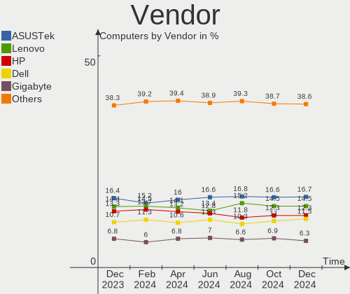
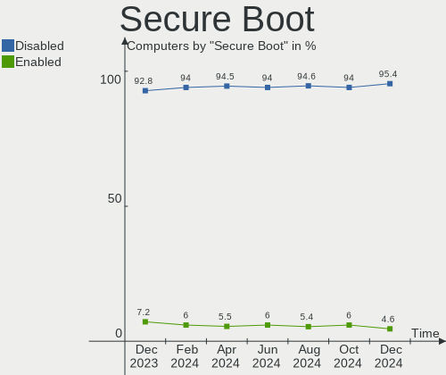
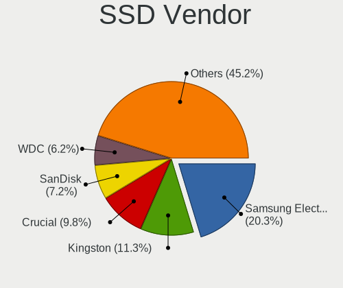
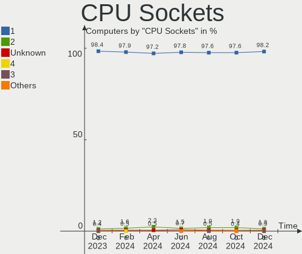
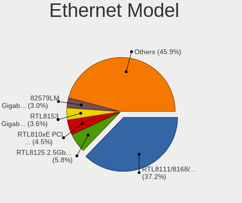
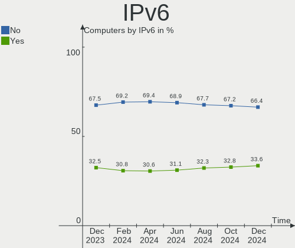
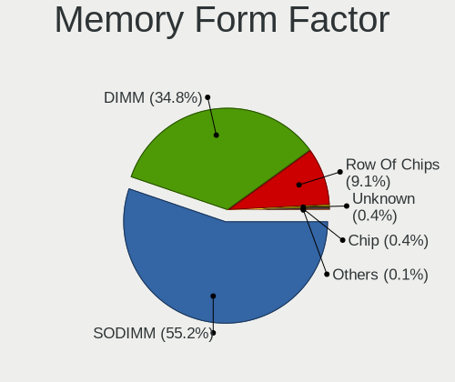
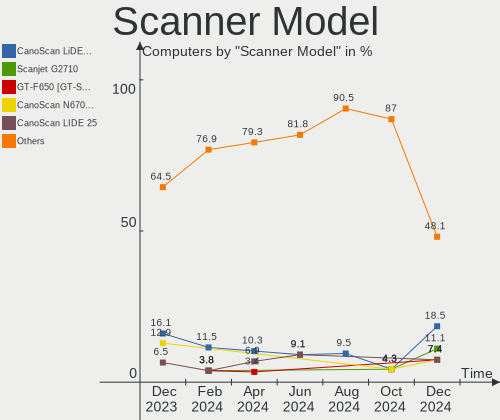

Linux - Hardware Trends
-----------------------

A project to identify most popular hardware characteristics and track their change
over time based on data collected by Linux users at https://Linux-Hardware.org.

Anyone can contribute to this report by the [hw-probe](https://github.com/linuxhw/hw-probe) tool:

    sudo -E hw-probe -all -upload

This is a report for all computer types. See also reports for [desktops](/Desktop/README.md) and [notebooks](/Notebook/README.md).

Distribution-specific reports: [Arch](/Dist/Arch), [ArcoLinux](/Dist/ArcoLinux), [BlackPanther](/Dist/BlackPanther), [CentOS](/Dist/CentOS), [Clear Linux](/Dist/Clear_Linux), [Debian](/Dist/Debian), [Elementary](/Dist/Elementary), [EndeavourOS](/Dist/EndeavourOS), [Endless](/Dist/Endless), [Fedora](/Dist/Fedora), [Gentoo](/Dist/Gentoo), [Kali](/Dist/Kali), [KDE neon](/Dist/KDE_neon), [Kubuntu](/Dist/Kubuntu), [Linux Mint](/Dist/Linux_Mint), [Manjaro](/Dist/Manjaro), [OpenMandriva](/Dist/OpenMandriva), [openSUSE](/Dist/openSUSE), [Pop!_OS](/Dist/Pop!_OS), [ROSA](/Dist/ROSA), [SteamOS](/Dist/SteamOS), [Ubuntu MATE](/Dist/Ubuntu_MATE), [Ubuntu](/Dist/Ubuntu), [Xubuntu](/Dist/Xubuntu), [Zorin](/Dist/Zorin).

This report is for one last month. Overall report since the beginning of time: [TestCoverage](https://github.com/linuxhw/TestCoverage)

Period: Jun, 2022.

Contents
--------

* [ System ](#system)
  - [ OS                       ](#os)
  - [ OS Family                ](#os-family)
  - [ Kernel                   ](#kernel)
  - [ Kernel Family            ](#kernel-family)
  - [ Kernel Major Ver.        ](#kernel-major-ver)
  - [ Arch                     ](#arch)
  - [ DE                       ](#de)
  - [ Display Server           ](#display-server)
  - [ Display Manager          ](#display-manager)
  - [ OS Lang                  ](#os-lang)
  - [ Boot Mode                ](#boot-mode)
  - [ Filesystem               ](#filesystem)
  - [ Part. scheme             ](#part-scheme)
  - [ Dual Boot with Linux/BSD ](#dual-boot-with-linuxbsd)
  - [ Dual Boot (Win)          ](#dual-boot-win)

* [ Board ](#board)
  - [ Vendor                   ](#vendor)
  - [ Model                    ](#model)
  - [ Model Family             ](#model-family)
  - [ MFG Year                 ](#mfg-year)
  - [ Form Factor              ](#form-factor)
  - [ Secure Boot              ](#secure-boot)
  - [ Coreboot                 ](#coreboot)
  - [ RAM Size                 ](#ram-size)
  - [ RAM Used                 ](#ram-used)
  - [ Total Drives             ](#total-drives)
  - [ Has CD-ROM               ](#has-cd-rom)
  - [ Has Ethernet             ](#has-ethernet)
  - [ Has WiFi                 ](#has-wifi)
  - [ Has Bluetooth            ](#has-bluetooth)

* [ Location ](#location)
  - [ Country                  ](#country)
  - [ City                     ](#city)

* [ Drives ](#drives)
  - [ Drive Vendor             ](#drive-vendor)
  - [ Drive Model              ](#drive-model)
  - [ HDD Vendor               ](#hdd-vendor)
  - [ SSD Vendor               ](#ssd-vendor)
  - [ Drive Kind               ](#drive-kind)
  - [ Drive Connector          ](#drive-connector)
  - [ Drive Size               ](#drive-size)
  - [ Space Total              ](#space-total)
  - [ Space Used               ](#space-used)
  - [ Malfunc. Drives          ](#malfunc-drives)
  - [ Malfunc. Drive Vendor    ](#malfunc-drive-vendor)
  - [ Malfunc. HDD Vendor      ](#malfunc-hdd-vendor)
  - [ Malfunc. Drive Kind      ](#malfunc-drive-kind)
  - [ Failed Drives            ](#failed-drives)
  - [ Failed Drive Vendor      ](#failed-drive-vendor)
  - [ Drive Status             ](#drive-status)

* [ Storage controller ](#storage-controller)
  - [ Storage Vendor           ](#storage-vendor)
  - [ Storage Model            ](#storage-model)
  - [ Storage Kind             ](#storage-kind)

* [ Processor ](#processor)
  - [ CPU Vendor               ](#cpu-vendor)
  - [ CPU Model                ](#cpu-model)
  - [ CPU Model Family         ](#cpu-model-family)
  - [ CPU Cores                ](#cpu-cores)
  - [ CPU Sockets              ](#cpu-sockets)
  - [ CPU Threads              ](#cpu-threads)
  - [ CPU Op-Modes             ](#cpu-op-modes)
  - [ CPU Microcode            ](#cpu-microcode)
  - [ CPU Microarch            ](#cpu-microarch)

* [ Graphics ](#graphics)
  - [ GPU Vendor               ](#gpu-vendor)
  - [ GPU Model                ](#gpu-model)
  - [ GPU Combo                ](#gpu-combo)
  - [ GPU Driver               ](#gpu-driver)
  - [ GPU Memory               ](#gpu-memory)

* [ Monitor ](#monitor)
  - [ Monitor Vendor           ](#monitor-vendor)
  - [ Monitor Model            ](#monitor-model)
  - [ Monitor Resolution       ](#monitor-resolution)
  - [ Monitor Diagonal         ](#monitor-diagonal)
  - [ Monitor Width            ](#monitor-width)
  - [ Aspect Ratio             ](#aspect-ratio)
  - [ Monitor Area             ](#monitor-area)
  - [ Pixel Density            ](#pixel-density)
  - [ Multiple Monitors        ](#multiple-monitors)

* [ Network ](#network)
  - [ Net Controller Vendor    ](#net-controller-vendor)
  - [ Net Controller Model     ](#net-controller-model)
  - [ Wireless Vendor          ](#wireless-vendor)
  - [ Wireless Model           ](#wireless-model)
  - [ Ethernet Vendor          ](#ethernet-vendor)
  - [ Ethernet Model           ](#ethernet-model)
  - [ Net Controller Kind      ](#net-controller-kind)
  - [ Used Controller          ](#used-controller)
  - [ NICs                     ](#nics)
  - [ IPv6                     ](#ipv6)

* [ Bluetooth ](#bluetooth)
  - [ Bluetooth Vendor         ](#bluetooth-vendor)
  - [ Bluetooth Model          ](#bluetooth-model)

* [ Sound ](#sound)
  - [ Sound Vendor             ](#sound-vendor)
  - [ Sound Model              ](#sound-model)

* [ Memory ](#memory)
  - [ Memory Vendor            ](#memory-vendor)
  - [ Memory Model             ](#memory-model)
  - [ Memory Kind              ](#memory-kind)
  - [ Memory Form Factor       ](#memory-form-factor)
  - [ Memory Size              ](#memory-size)
  - [ Memory Speed             ](#memory-speed)

* [ Printers & scanners ](#printers--scanners)
  - [ Printer Vendor           ](#printer-vendor)
  - [ Printer Model            ](#printer-model)
  - [ Scanner Vendor           ](#scanner-vendor)
  - [ Scanner Model            ](#scanner-model)

* [ Camera ](#camera)
  - [ Camera Vendor            ](#camera-vendor)
  - [ Camera Model             ](#camera-model)

* [ Security ](#security)
  - [ Fingerprint Vendor       ](#fingerprint-vendor)
  - [ Fingerprint Model        ](#fingerprint-model)
  - [ Chipcard Vendor          ](#chipcard-vendor)
  - [ Chipcard Model           ](#chipcard-model)

* [ Unsupported ](#unsupported)
  - [ Unsupported Devices      ](#unsupported-devices)
  - [ Unsupported Device Types ](#unsupported-device-types)

System
------

OS
--

Installed operating systems

| Name                         | Computers | Percent |
|------------------------------|-----------|---------|
| Ubuntu 22.04                 | 570       | 12.99%  |
| Ubuntu 20.04                 | 365       | 8.32%   |
| Fedora 36                    | 322       | 7.34%   |
| Linux Mint 20.3              | 320       | 7.29%   |
| Debian 11                    | 308       | 7.02%   |
| OpenMandriva 4.3             | 264       | 6.02%   |
| ROSA 12.2                    | 262       | 5.97%   |
| Pop!_OS 22.04                | 219       | 4.99%   |
| Arch                         | 117       | 2.67%   |
| Zorin 16                     | 109       | 2.48%   |
| KDE neon 20.04               | 109       | 2.48%   |
| Manjaro                      | 73        | 1.66%   |
| Arch Rolling                 | 66        | 1.5%    |
| Kubuntu 22.04                | 64        | 1.46%   |
| ArcoLinux Rolling            | 53        | 1.21%   |
| Kali 2022.2                  | 42        | 0.96%   |
| Elementary 6.1               | 42        | 0.96%   |
| Ubuntu 18.04                 | 39        | 0.89%   |
| Xubuntu 20.04                | 37        | 0.84%   |
| Manjaro 21.2.6               | 37        | 0.84%   |
| Fedora 35                    | 37        | 0.84%   |
| ROSA R11.1                   | 32        | 0.73%   |
| openSUSE Tumbleweed-XXXXXXXX | 31        | 0.71%   |
| Manjaro 21.3.0               | 31        | 0.71%   |
| Gentoo 2.8                   | 28        | 0.64%   |
| Ubuntu 21.10                 | 26        | 0.59%   |
| OpenMandriva 4.2             | 25        | 0.57%   |
| LMDE 5                       | 23        | 0.52%   |
| Xubuntu 22.04                | 22        | 0.5%    |
| Manjaro 21.3.1               | 22        | 0.5%    |
| SteamOS 3.2                  | 21        | 0.48%   |
| BlackPanther 18.1            | 21        | 0.48%   |
| Endless 4.0.6                | 20        | 0.46%   |
| EndeavourOS Rolling          | 19        | 0.43%   |
| Lubuntu 22.04                | 18        | 0.41%   |
| Debian Testing               | 18        | 0.41%   |
| Linux Mint 20.2              | 17        | 0.39%   |
| Ubuntu MATE 22.04            | 16        | 0.36%   |
| Parrot 5.0                   | 16        | 0.36%   |
| MX 21                        | 16        | 0.36%   |
| Linux Mint 19.3              | 15        | 0.34%   |
| Debian 10                    | 15        | 0.34%   |
| Linux Mint 20.1              | 13        | 0.3%    |
| Kubuntu 20.04                | 13        | 0.3%    |
| openSUSE Leap-15.4           | 12        | 0.27%   |
| Garuda Linux Soaring         | 12        | 0.27%   |
| Xubuntu 18.04                | 11        | 0.25%   |
| Kubuntu 11.1                 | 10        | 0.23%   |
| Ubuntu Budgie 22.04          | 9         | 0.21%   |
| Raspbian 11                  | 9         | 0.21%   |
| Pop!_OS 21.10                | 9         | 0.21%   |
| Kubuntu 11                   | 9         | 0.21%   |
| Debian Unstable              | 9         | 0.21%   |
| Ubuntu MATE 20.04            | 8         | 0.18%   |
| SteamOS 3.2 (steamdeck-main) | 8         | 0.18%   |
| Red OS 7.3.1                 | 8         | 0.18%   |
| EndeavourOS                  | 8         | 0.18%   |
| ACI 5.1.0                    | 8         | 0.18%   |
| Zorin 15                     | 7         | 0.16%   |
| Ubuntu 22.10                 | 7         | 0.16%   |

OS Family
---------

OS without a version

| Name             | Computers | Percent |
|------------------|-----------|---------|
| Ubuntu           | 1020      | 23.25%  |
| Linux Mint       | 377       | 8.59%   |
| Fedora           | 369       | 8.41%   |
| Debian           | 353       | 8.05%   |
| ROSA             | 303       | 6.91%   |
| OpenMandriva     | 295       | 6.72%   |
| Pop!_OS          | 232       | 5.29%   |
| Arch             | 183       | 4.17%   |
| Manjaro          | 163       | 3.72%   |
| Zorin            | 116       | 2.64%   |
| KDE neon         | 109       | 2.48%   |
| Kubuntu          | 108       | 2.46%   |
| Xubuntu          | 77        | 1.76%   |
| ArcoLinux        | 54        | 1.23%   |
| openSUSE         | 46        | 1.05%   |
| Kali             | 46        | 1.05%   |
| Elementary       | 45        | 1.03%   |
| SteamOS          | 32        | 0.73%   |
| Gentoo           | 32        | 0.73%   |
| Endless          | 32        | 0.73%   |
| Ubuntu MATE      | 28        | 0.64%   |
| Lubuntu          | 28        | 0.64%   |
| EndeavourOS      | 27        | 0.62%   |
| LMDE             | 23        | 0.52%   |
| BlackPanther     | 21        | 0.48%   |
| Parrot           | 18        | 0.41%   |
| MX               | 16        | 0.36%   |
| Garuda Linux     | 15        | 0.34%   |
| Clear Linux      | 15        | 0.34%   |
| CentOS           | 15        | 0.34%   |
| Ubuntu Budgie    | 14        | 0.32%   |
| Raspbian         | 14        | 0.32%   |
| Artix            | 10        | 0.23%   |
| ALT Linux        | 10        | 0.23%   |
| Red OS           | 9         | 0.21%   |
| LinuxFX          | 9         | 0.21%   |
| NixOS            | 8         | 0.18%   |
| ACI              | 8         | 0.18%   |
| antiX            | 7         | 0.16%   |
| RHEL             | 6         | 0.14%   |
| Devuan           | 6         | 0.14%   |
| Xero             | 5         | 0.11%   |
| Alpine           | 5         | 0.11%   |
| Ubuntu Studio    | 4         | 0.09%   |
| Oracle Linux     | 4         | 0.09%   |
| Guix             | 4         | 0.09%   |
| Solus            | 3         | 0.07%   |
| Rocky Linux      | 3         | 0.07%   |
| Q4OS             | 3         | 0.07%   |
| Peppermint       | 3         | 0.07%   |
| org.kde.Platform | 3         | 0.07%   |
| Linux Lite       | 3         | 0.07%   |
| Lilidog          | 3         | 0.07%   |
| ClearOS          | 3         | 0.07%   |
| AlmaLinux        | 3         | 0.07%   |
| Void Linux       | 2         | 0.05%   |
| Sparky           | 2         | 0.05%   |
| PCLinuxOS        | 2         | 0.05%   |
| Pardus           | 2         | 0.05%   |
| Manjaro-ARM      | 2         | 0.05%   |

Kernel
------

Version of the Linux kernel

| Version                                      | Computers | Percent |
|----------------------------------------------|-----------|---------|
| 5.16.7-desktop-1omv4003                      | 243       | 5.54%   |
| 5.13.0-51-generic                            | 211       | 4.81%   |
| 5.17.5-76051705-generic                      | 210       | 4.79%   |
| 5.13.0-44-generic                            | 181       | 4.12%   |
| 5.10.74-generic-2rosa2021.1-x86_64           | 172       | 3.92%   |
| 5.15.0-39-generic                            | 133       | 3.03%   |
| 5.13.0-48-generic                            | 130       | 2.96%   |
| 5.15.0-37-generic                            | 128       | 2.92%   |
| 5.10.0-7-amd64                               | 128       | 2.92%   |
| 5.15.0-40-generic                            | 126       | 2.87%   |
| 5.15.0-33-generic                            | 115       | 2.62%   |
| 5.15.0-35-generic                            | 113       | 2.58%   |
| 5.4.0-117-generic                            | 102       | 2.32%   |
| 5.4.0-113-generic                            | 92        | 2.1%    |
| 5.4.0-120-generic                            | 81        | 1.85%   |
| 5.18.5-200.fc36.x86_64                       | 73        | 1.66%   |
| 5.4.0-121-generic                            | 71        | 1.62%   |
| 5.10.0-14-amd64                              | 66        | 1.5%    |
| 5.10.0-15-amd64                              | 59        | 1.34%   |
| 5.17.13-300.fc36.x86_64                      | 54        | 1.23%   |
| 5.15.0-25-generic                            | 54        | 1.23%   |
| 5.17.11-300.fc36.x86_64                      | 48        | 1.09%   |
| 5.17.12-300.fc36.x86_64                      | 46        | 1.05%   |
| 5.18.1-arch1-1                               | 43        | 0.98%   |
| 5.10.118-generic-2rosa2021.1-x86_64          | 41        | 0.93%   |
| 5.18.3-arch1-1                               | 37        | 0.84%   |
| 5.18.6-200.fc36.x86_64                       | 35        | 0.8%    |
| 5.18.5-arch1-1                               | 35        | 0.8%    |
| 5.15.41-1-MANJARO                            | 32        | 0.73%   |
| 5.4.0-91-generic                             | 31        | 0.71%   |
| 5.11.0-35-generic                            | 25        | 0.57%   |
| 5.17.5-300.fc36.x86_64                       | 23        | 0.52%   |
| 5.10.14-desktop-1omv4002                     | 23        | 0.52%   |
| 5.10.0-13-amd64                              | 23        | 0.52%   |
| 5.18.6-arch1-1                               | 22        | 0.5%    |
| 5.15.48-1-MANJARO                            | 22        | 0.5%    |
| 5.13.0-valve15-1-neptune-02197-gf6ec7ad3762a | 21        | 0.48%   |
| 5.16.0-kali7-amd64                           | 18        | 0.41%   |
| 5.17.15-76051715-generic                     | 17        | 0.39%   |
| 5.17.0-kali3-amd64                           | 17        | 0.39%   |
| 5.16.13-desktop-1omv4003                     | 17        | 0.39%   |
| 5.13.0-40-generic                            | 17        | 0.39%   |
| 5.18.2-arch1-1                               | 16        | 0.36%   |
| 5.4.0-110-generic                            | 15        | 0.34%   |
| 5.18.7-arch1-1                               | 15        | 0.34%   |
| 5.15.49-1-MANJARO                            | 15        | 0.34%   |
| 5.16.0-12parrot1-amd64                       | 14        | 0.32%   |
| 5.13.0-52-generic                            | 14        | 0.32%   |
| 5.13.0-41-generic                            | 14        | 0.32%   |
| 5.18.5-1-MANJARO                             | 13        | 0.3%    |
| 5.18.3-zen1-1-zen                            | 13        | 0.3%    |
| 5.18.1-zen1-1-zen                            | 13        | 0.3%    |
| 5.14.0-1042-oem                              | 13        | 0.3%    |
| 5.18.3-1-MANJARO                             | 12        | 0.27%   |
| 5.17.9-1-MANJARO                             | 12        | 0.27%   |
| 5.13.0-30-generic                            | 12        | 0.27%   |
| 5.6.14-desktop-2bP                           | 11        | 0.25%   |
| 5.4.83-generic-2rosa-x86_64                  | 11        | 0.25%   |
| 5.18.5-zen1-1-zen                            | 11        | 0.25%   |
| 5.15.46-1-MANJARO                            | 11        | 0.25%   |

Kernel Family
-------------

Linux kernel without a distro release

| Version  | Computers | Percent |
|----------|-----------|---------|
| 5.15.0   | 716       | 16.32%  |
| 5.13.0   | 652       | 14.86%  |
| 5.4.0    | 445       | 10.14%  |
| 5.10.0   | 306       | 6.97%   |
| 5.16.7   | 243       | 5.54%   |
| 5.17.5   | 239       | 5.45%   |
| 5.10.74  | 177       | 4.03%   |
| 5.18.5   | 147       | 3.35%   |
| 5.18.1   | 92        | 2.1%    |
| 5.18.6   | 84        | 1.91%   |
| 5.18.3   | 81        | 1.85%   |
| 5.17.11  | 69        | 1.57%   |
| 5.11.0   | 61        | 1.39%   |
| 5.17.12  | 60        | 1.37%   |
| 5.17.13  | 58        | 1.32%   |
| 5.16.0   | 50        | 1.14%   |
| 5.18.0   | 49        | 1.12%   |
| 5.17.0   | 47        | 1.07%   |
| 4.15.0   | 46        | 1.05%   |
| 5.15.41  | 45        | 1.03%   |
| 5.10.118 | 44        | 1%      |
| 5.18.2   | 43        | 0.98%   |
| 5.17.9   | 38        | 0.87%   |
| 5.14.0   | 32        | 0.73%   |
| 5.15.48  | 30        | 0.68%   |
| 5.18.7   | 28        | 0.64%   |
| 5.18.4   | 24        | 0.55%   |
| 5.15.32  | 24        | 0.55%   |
| 5.17.15  | 23        | 0.52%   |
| 5.16.13  | 23        | 0.52%   |
| 5.10.14  | 23        | 0.52%   |
| 5.15.43  | 20        | 0.46%   |
| 5.15.49  | 19        | 0.43%   |
| 5.15.46  | 19        | 0.43%   |
| 3.10.0   | 18        | 0.41%   |
| 5.4.83   | 15        | 0.34%   |
| 5.15.35  | 14        | 0.32%   |
| 5.17.14  | 13        | 0.3%    |
| 5.6.14   | 11        | 0.25%   |
| 5.14.21  | 11        | 0.25%   |
| 4.19.0   | 11        | 0.25%   |
| 4.18.0   | 11        | 0.25%   |
| 4.18.16  | 10        | 0.23%   |
| 5.8.0    | 9         | 0.21%   |
| 5.17.7   | 9         | 0.21%   |
| 5.15.44  | 9         | 0.21%   |
| 5.17.1   | 8         | 0.18%   |
| 4.9.0    | 7         | 0.16%   |
| 5.15.45  | 6         | 0.14%   |
| 5.4.32   | 5         | 0.11%   |
| 5.19.0   | 5         | 0.11%   |
| 5.17.6   | 5         | 0.11%   |
| 5.17.4   | 5         | 0.11%   |
| 5.15.47  | 5         | 0.11%   |
| 5.18.8   | 4         | 0.09%   |
| 5.15.50  | 4         | 0.09%   |
| 5.14.18  | 4         | 0.09%   |
| 5.13.19  | 4         | 0.09%   |
| 5.0.0    | 4         | 0.09%   |
| 5.4.17   | 3         | 0.07%   |

Kernel Major Ver.
-----------------

Linux kernel major version

| Version | Computers | Percent |
|---------|-----------|---------|
| 5.15    | 928       | 21.15%  |
| 5.13    | 658       | 15%     |
| 5.10    | 580       | 13.22%  |
| 5.17    | 578       | 13.17%  |
| 5.18    | 552       | 12.58%  |
| 5.4     | 477       | 10.87%  |
| 5.16    | 332       | 7.57%   |
| 5.11    | 64        | 1.46%   |
| 5.14    | 56        | 1.28%   |
| 4.15    | 46        | 1.05%   |
| 4.18    | 21        | 0.48%   |
| 3.10    | 18        | 0.41%   |
| 4.9     | 15        | 0.34%   |
| 4.19    | 14        | 0.32%   |
| 5.6     | 12        | 0.27%   |
| 5.8     | 9         | 0.21%   |
| 5.3     | 6         | 0.14%   |
| 5.19    | 5         | 0.11%   |
| 5.0     | 5         | 0.11%   |
| 5.12    | 4         | 0.09%   |
| 4.4     | 3         | 0.07%   |
| 5.9     | 1         | 0.02%   |
| 5.7     | 1         | 0.02%   |
| 4.10    | 1         | 0.02%   |
| 4.1     | 1         | 0.02%   |
| 3.0     | 1         | 0.02%   |

Arch
----

OS architecture (x86_64, i586, etc.)

| Name    | Computers | Percent |
|---------|-----------|---------|
| x86_64  | 4267      | 97.24%  |
| i686    | 61        | 1.39%   |
| aarch64 | 36        | 0.82%   |
| armv7l  | 14        | 0.32%   |
| riscv64 | 6         | 0.14%   |
| armv6l  | 2         | 0.05%   |
| ppc     | 1         | 0.02%   |
| i586    | 1         | 0.02%   |

DE
--

Desktop Environment

| Name             | Computers | Percent |
|------------------|-----------|---------|
| GNOME            | 1896      | 43.21%  |
| KDE5             | 1085      | 24.73%  |
| Unknown          | 339       | 7.73%   |
| X-Cinnamon       | 310       | 7.06%   |
| XFCE             | 286       | 6.52%   |
| MATE             | 122       | 2.78%   |
| LXQt             | 62        | 1.41%   |
| Cinnamon         | 51        | 1.16%   |
| Pantheon         | 45        | 1.03%   |
| Budgie           | 28        | 0.64%   |
| KDE4             | 26        | 0.59%   |
| i3               | 20        | 0.46%   |
| sway             | 14        | 0.32%   |
| Unity            | 13        | 0.3%    |
| LXDE             | 13        | 0.3%    |
| GNOME Classic    | 13        | 0.3%    |
| GNOME Flashback  | 7         | 0.16%   |
| awesome          | 7         | 0.16%   |
| Openbox          | 5         | 0.11%   |
| lightdm-xsession | 5         | 0.11%   |
| KDE              | 5         | 0.11%   |
| bspwm            | 5         | 0.11%   |
| trinity          | 4         | 0.09%   |
| Deepin           | 4         | 0.09%   |
| qtile            | 3         | 0.07%   |
| icewm            | 3         | 0.07%   |
| Enlightenment    | 2         | 0.05%   |
| xmonad           | 1         | 0.02%   |
| UKUI             | 1         | 0.02%   |
| sway-dbus        | 1         | 0.02%   |
| stumpwm          | 1         | 0.02%   |
| spectrwm         | 1         | 0.02%   |
| river            | 1         | 0.02%   |
| pop              | 1         | 0.02%   |
| none+awesome     | 1         | 0.02%   |
| LeftWM           | 1         | 0.02%   |
| jwm              | 1         | 0.02%   |
| i3-with-shmlog   | 1         | 0.02%   |
| hyprland         | 1         | 0.02%   |
| fvwm             | 1         | 0.02%   |
| fly              | 1         | 0.02%   |
| DWM              | 1         | 0.02%   |

Display Server
--------------

X11 or Wayland

| Name        | Computers | Percent |
|-------------|-----------|---------|
| X11         | 2970      | 67.68%  |
| Wayland     | 1079      | 24.59%  |
| Unknown     | 216       | 4.92%   |
| Tty         | 121       | 2.76%   |
| Web         | 1         | 0.02%   |
| Unspecified | 1         | 0.02%   |

Display Manager
---------------

SDDM, LightDM, etc.

| Name    | Computers | Percent |
|---------|-----------|---------|
| Unknown | 1532      | 34.91%  |
| GDM3    | 864       | 19.69%  |
| SDDM    | 808       | 18.41%  |
| LightDM | 608       | 13.86%  |
| GDM     | 519       | 11.83%  |
| KDM     | 25        | 0.57%   |
| XDM     | 7         | 0.16%   |
| Ly      | 6         | 0.14%   |
| SLiM    | 5         | 0.11%   |
| TDM     | 3         | 0.07%   |
| GREETD  | 3         | 0.07%   |
| SLIMSKI | 2         | 0.05%   |
| NODM    | 2         | 0.05%   |
| LXDM    | 2         | 0.05%   |
| WDM     | 1         | 0.02%   |
| FLY-DM  | 1         | 0.02%   |

OS Lang
-------

Language

| Lang    | Computers | Percent |
|---------|-----------|---------|
| en_US   | 1802      | 41.07%  |
| ru_RU   | 592       | 13.49%  |
| de_DE   | 306       | 6.97%   |
| fr_FR   | 203       | 4.63%   |
| en_GB   | 200       | 4.56%   |
| pt_BR   | 182       | 4.15%   |
| en_AU   | 85        | 1.94%   |
| it_IT   | 82        | 1.87%   |
| en_CA   | 79        | 1.8%    |
| C       | 79        | 1.8%    |
| es_ES   | 77        | 1.75%   |
| Unknown | 75        | 1.71%   |
| pl_PL   | 73        | 1.66%   |
| en_IN   | 57        | 1.3%    |
| es_MX   | 34        | 0.77%   |
| es_AR   | 29        | 0.66%   |
| nl_NL   | 26        | 0.59%   |
| zh_CN   | 23        | 0.52%   |
| hu_HU   | 21        | 0.48%   |
| pt_PT   | 19        | 0.43%   |
| en_ZA   | 19        | 0.43%   |
| de_CH   | 19        | 0.43%   |
| cs_CZ   | 19        | 0.43%   |
| tr_TR   | 18        | 0.41%   |
| sv_SE   | 14        | 0.32%   |
| de_AT   | 14        | 0.32%   |
| ja_JP   | 13        | 0.3%    |
| fr_BE   | 13        | 0.3%    |
| es_CO   | 13        | 0.3%    |
| en_NZ   | 12        | 0.27%   |
| da_DK   | 12        | 0.27%   |
| es_VE   | 11        | 0.25%   |
| es_CL   | 11        | 0.25%   |
| nl_BE   | 9         | 0.21%   |
| en_IL   | 9         | 0.21%   |
| en_IE   | 9         | 0.21%   |
| fi_FI   | 8         | 0.18%   |
| ru_UA   | 7         | 0.16%   |
| es_PE   | 7         | 0.16%   |
| en_DK   | 7         | 0.16%   |
| es_BO   | 5         | 0.11%   |
| en_SG   | 5         | 0.11%   |
| en_PH   | 5         | 0.11%   |
| ro_RO   | 4         | 0.09%   |
| fr_CA   | 4         | 0.09%   |
| bg_BG   | 4         | 0.09%   |
| zh_TW   | 3         | 0.07%   |
| uk_UA   | 3         | 0.07%   |
| POSIX   | 3         | 0.07%   |
| nn_NO   | 3         | 0.07%   |
| hr_HR   | 3         | 0.07%   |
| fr_CH   | 3         | 0.07%   |
| es_UY   | 3         | 0.07%   |
| en_DE   | 3         | 0.07%   |
| en_AG   | 3         | 0.07%   |
| C.UTF8  | 3         | 0.07%   |
| lt_LT   | 2         | 0.05%   |
| ko_KR   | 2         | 0.05%   |
| es_GT   | 2         | 0.05%   |
| es_EC   | 2         | 0.05%   |

Boot Mode
---------

EFI or BIOS

| Mode | Computers | Percent |
|------|-----------|---------|
| EFI  | 2273      | 51.8%   |
| BIOS | 2115      | 48.2%   |

Filesystem
----------

Type of filesystem

| Type     | Computers | Percent |
|----------|-----------|---------|
| Ext4     | 3248      | 74.02%  |
| Btrfs    | 557       | 12.69%  |
| Overlay  | 460       | 10.48%  |
| Xfs      | 68        | 1.55%   |
| Zfs      | 32        | 0.73%   |
| Ext3     | 8         | 0.18%   |
| F2fs     | 7         | 0.16%   |
| Ext2     | 2         | 0.05%   |
| Unknown  | 2         | 0.05%   |
| XXXXXXX  | 1         | 0.02%   |
| Tmpfs    | 1         | 0.02%   |
| Rootfs   | 1         | 0.02%   |
| Bcachefs | 1         | 0.02%   |

Part. scheme
------------

Scheme of partitioning

| Type    | Computers | Percent |
|---------|-----------|---------|
| Unknown | 1995      | 45.46%  |
| GPT     | 1804      | 41.11%  |
| MBR     | 589       | 13.42%  |

Dual Boot with Linux/BSD
------------------------

Hosting more than one Linux/BSD

| Dual boot | Computers | Percent |
|-----------|-----------|---------|
| No        | 3777      | 86.08%  |
| Yes       | 611       | 13.92%  |

Dual Boot (Win)
---------------

Hosting Linux and Windows

| Dual boot | Computers | Percent |
|-----------|-----------|---------|
| No        | 2989      | 68.12%  |
| Yes       | 1399      | 31.88%  |

Board
-----

Vendor
------

Motherboard manufacturer

| Name                    | Computers | Percent |
|-------------------------|-----------|---------|
| ASUSTek Computer        | 745       | 16.98%  |
| Lenovo                  | 571       | 13.01%  |
| Hewlett-Packard         | 563       | 12.83%  |
| Dell                    | 558       | 12.72%  |
| Gigabyte Technology     | 331       | 7.54%   |
| MSI                     | 279       | 6.36%   |
| Acer                    | 233       | 5.31%   |
| ASRock                  | 145       | 3.3%    |
| Apple                   | 88        | 2.01%   |
| Intel                   | 68        | 1.55%   |
| Samsung Electronics     | 62        | 1.41%   |
| Unknown                 | 54        | 1.23%   |
| Toshiba                 | 53        | 1.21%   |
| Raspberry Pi Foundation | 36        | 0.82%   |
| HUAWEI                  | 35        | 0.8%    |
| Aquarius                | 32        | 0.73%   |
| Fujitsu                 | 28        | 0.64%   |
| Valve                   | 23        | 0.52%   |
| Sony                    | 23        | 0.52%   |
| Microsoft               | 21        | 0.48%   |
| Medion                  | 21        | 0.48%   |
| Google                  | 21        | 0.48%   |
| Alienware               | 19        | 0.43%   |
| Supermicro              | 17        | 0.39%   |
| Positivo                | 17        | 0.39%   |
| Foxconn                 | 16        | 0.36%   |
| Biostar                 | 15        | 0.34%   |
| System76                | 13        | 0.3%    |
| Packard Bell            | 10        | 0.23%   |
| Timi                    | 9         | 0.21%   |
| Razer                   | 9         | 0.21%   |
| LG Electronics          | 9         | 0.21%   |
| GPU Company             | 9         | 0.21%   |
| ECS                     | 9         | 0.21%   |
| BESSTAR Tech            | 9         | 0.21%   |
| TUXEDO                  | 8         | 0.18%   |
| Notebook                | 8         | 0.18%   |
| Huanan                  | 8         | 0.18%   |
| Chuwi                   | 8         | 0.18%   |
| Pegatron                | 7         | 0.16%   |
| HONOR                   | 6         | 0.14%   |
| eMachines               | 6         | 0.14%   |
| AZW                     | 6         | 0.14%   |
| AMI                     | 6         | 0.14%   |
| Shuttle                 | 5         | 0.11%   |
| Framework               | 5         | 0.11%   |
| Nvidia                  | 4         | 0.09%   |
| Clevo                   | 4         | 0.09%   |
| ZOTAC                   | 3         | 0.07%   |
| TrekStor                | 3         | 0.07%   |
| SLIMBOOK                | 3         | 0.07%   |
| Schenker                | 3         | 0.07%   |
| PCWare                  | 3         | 0.07%   |
| Panasonic               | 3         | 0.07%   |
| Monster                 | 3         | 0.07%   |
| IP3 Tech                | 3         | 0.07%   |
| Fujitsu Siemens         | 3         | 0.07%   |
| EVGA                    | 3         | 0.07%   |
| congatec                | 3         | 0.07%   |
| Avell High Performance  | 3         | 0.07%   |

Model
-----

Motherboard model

| Name                               | Computers | Percent |
|------------------------------------|-----------|---------|
| Unknown                            | 64        | 1.46%   |
| ASUS S20 K29                       | 45        | 1.03%   |
| ASUS All Series                    | 31        | 0.71%   |
| Aquarius NS585                     | 28        | 0.64%   |
| Valve Jupiter                      | 23        | 0.52%   |
| Gigabyte H410M S2H                 | 15        | 0.34%   |
| MSI MS-7817                        | 14        | 0.32%   |
| RPi Raspberry Pi                   | 13        | 0.3%    |
| Dell OptiPlex 7010                 | 13        | 0.3%    |
| MSI MS-7721                        | 12        | 0.27%   |
| MSI MS-7C37                        | 11        | 0.25%   |
| Dell OptiPlex 9020                 | 10        | 0.23%   |
| ASUS SABERTOOTH Z77                | 10        | 0.23%   |
| HP Pavilion Notebook               | 9         | 0.21%   |
| HP Pavilion g6                     | 9         | 0.21%   |
| HP Pavilion dv6                    | 9         | 0.21%   |
| Dell OptiPlex 3020                 | 9         | 0.21%   |
| ASUS PRIME A320M-K                 | 9         | 0.21%   |
| ASUS M5A97 R2.0                    | 9         | 0.21%   |
| HP Pavilion dv7                    | 8         | 0.18%   |
| ASUS TUF Gaming X570-PLUS          | 8         | 0.18%   |
| MSI MS-7A38                        | 7         | 0.16%   |
| MSI MS-7996                        | 7         | 0.16%   |
| HP Pavilion 15                     | 7         | 0.16%   |
| HP Notebook                        | 7         | 0.16%   |
| HP EliteBook 8470p                 | 7         | 0.16%   |
| Gigabyte 970A-DS3P                 | 7         | 0.16%   |
| Dell Latitude E5430 non-vPro       | 7         | 0.16%   |
| MSI MS-7C91                        | 6         | 0.14%   |
| MSI MS-7C02                        | 6         | 0.14%   |
| MSI MS-7758                        | 6         | 0.14%   |
| HP Compaq Elite 8300 SFF           | 6         | 0.14%   |
| Dell Latitude E6540                | 6         | 0.14%   |
| Dell Latitude E6410                | 6         | 0.14%   |
| Dell Latitude 3120                 | 6         | 0.14%   |
| Dell Inspiron 3451                 | 6         | 0.14%   |
| ASUS TUF Gaming B550M-PLUS         | 6         | 0.14%   |
| ASUS M5A78L-M/USB3                 | 6         | 0.14%   |
| ASUS H110M-R                       | 6         | 0.14%   |
| Apple MacBookPro11,1               | 6         | 0.14%   |
| Acer Nitro AN515-44                | 6         | 0.14%   |
| Acer Aspire V3-571G                | 6         | 0.14%   |
| Supermicro SYS-6029P-WTRT          | 5         | 0.11%   |
| RPi Raspberry Pi 4 Model B Rev 1.4 | 5         | 0.11%   |
| MSI MS-7C95                        | 5         | 0.11%   |
| MSI MS-7C56                        | 5         | 0.11%   |
| MSI MS-7C52                        | 5         | 0.11%   |
| MSI MS-7B86                        | 5         | 0.11%   |
| Lenovo ThinkBook 15 G3 ACL 21A4    | 5         | 0.11%   |
| HP ProDesk 600 G1 SFF              | 5         | 0.11%   |
| HP 15                              | 5         | 0.11%   |
| Framework Laptop                   | 5         | 0.11%   |
| Dell OptiPlex 7040                 | 5         | 0.11%   |
| Dell Latitude E6400                | 5         | 0.11%   |
| Dell Latitude 3420                 | 5         | 0.11%   |
| Dell Inspiron 15-3567              | 5         | 0.11%   |
| Dell G3 3500                       | 5         | 0.11%   |
| ASUS ROG STRIX X570-E GAMING       | 5         | 0.11%   |
| ASUS ROG STRIX B550-I GAMING       | 5         | 0.11%   |
| ASUS ROG CROSSHAIR VIII HERO       | 5         | 0.11%   |

Model Family
------------

Motherboard model prefix

| Name                  | Computers | Percent |
|-----------------------|-----------|---------|
| Lenovo ThinkPad       | 242       | 5.52%   |
| Acer Aspire           | 153       | 3.49%   |
| Dell Latitude         | 150       | 3.42%   |
| Dell Inspiron         | 140       | 3.19%   |
| HP Pavilion           | 106       | 2.42%   |
| ASUS ROG              | 104       | 2.37%   |
| Lenovo IdeaPad        | 101       | 2.3%    |
| Dell OptiPlex         | 89        | 2.03%   |
| ASUS PRIME            | 86        | 1.96%   |
| HP EliteBook          | 69        | 1.57%   |
| HP Laptop             | 64        | 1.46%   |
| Unknown               | 64        | 1.46%   |
| ASUS TUF              | 60        | 1.37%   |
| Dell Precision        | 59        | 1.34%   |
| HP ProBook            | 58        | 1.32%   |
| Dell XPS              | 49        | 1.12%   |
| ASUS VivoBook         | 49        | 1.12%   |
| Toshiba Satellite     | 47        | 1.07%   |
| ASUS S20              | 45        | 1.03%   |
| HP Compaq             | 42        | 0.96%   |
| RPi Raspberry         | 36        | 0.82%   |
| Lenovo ThinkCentre    | 33        | 0.75%   |
| HP ENVY               | 33        | 0.75%   |
| Dell Vostro           | 33        | 0.75%   |
| ASUS All              | 31        | 0.71%   |
| Aquarius NS585        | 28        | 0.64%   |
| Lenovo ThinkBook      | 25        | 0.57%   |
| Valve Jupiter         | 23        | 0.52%   |
| Lenovo Legion         | 23        | 0.52%   |
| Gigabyte H410M        | 22        | 0.5%    |
| Microsoft Surface     | 21        | 0.48%   |
| Lenovo Yoga           | 21        | 0.48%   |
| Acer Swift            | 21        | 0.48%   |
| ASUS ZenBook          | 20        | 0.46%   |
| ASUS ASUS             | 19        | 0.43%   |
| Acer Nitro            | 18        | 0.41%   |
| HP OMEN               | 17        | 0.39%   |
| HP EliteDesk          | 17        | 0.39%   |
| Gigabyte B450         | 16        | 0.36%   |
| Gigabyte X570         | 15        | 0.34%   |
| Fujitsu LIFEBOOK      | 15        | 0.34%   |
| Dell PowerEdge        | 15        | 0.34%   |
| ASUS M5A97            | 15        | 0.34%   |
| MSI MS-7817           | 14        | 0.32%   |
| Lenovo IdeaPadFlex    | 14        | 0.32%   |
| ASUS SABERTOOTH       | 14        | 0.32%   |
| HP ZBook              | 13        | 0.3%    |
| ASUS M5A78L-M         | 13        | 0.3%    |
| MSI MS-7721           | 12        | 0.27%   |
| Gigabyte B450M        | 12        | 0.27%   |
| MSI MS-7C37           | 11        | 0.25%   |
| Lenovo ThinkStation   | 11        | 0.25%   |
| HP ProDesk            | 11        | 0.25%   |
| HP 255                | 11        | 0.25%   |
| Gigabyte B550         | 10        | 0.23%   |
| ASUS CROSSHAIR        | 10        | 0.23%   |
| ASRock B450           | 10        | 0.23%   |
| Razer Blade           | 9         | 0.21%   |
| HP Spectre            | 9         | 0.21%   |
| Packard Bell EasyNote | 8         | 0.18%   |

MFG Year
--------

Motherboard manufacture year

| Year    | Computers | Percent |
|---------|-----------|---------|
| 2020    | 593       | 13.51%  |
| 2021    | 551       | 12.56%  |
| 2019    | 387       | 8.82%   |
| 2018    | 342       | 7.79%   |
| 2012    | 331       | 7.54%   |
| 2013    | 278       | 6.34%   |
| 2017    | 256       | 5.83%   |
| 2011    | 236       | 5.38%   |
| 2014    | 234       | 5.33%   |
| 2016    | 219       | 4.99%   |
| 2015    | 192       | 4.38%   |
| 2010    | 183       | 4.17%   |
| 2022    | 156       | 3.56%   |
| 2009    | 129       | 2.94%   |
| 2008    | 129       | 2.94%   |
| 2007    | 72        | 1.64%   |
| Unknown | 57        | 1.3%    |
| 2006    | 33        | 0.75%   |
| 2005    | 6         | 0.14%   |
| 2003    | 3         | 0.07%   |
| 2004    | 1         | 0.02%   |

Form Factor
-----------

Physical design of the computer

| Name           | Computers | Percent |
|----------------|-----------|---------|
| Notebook       | 2283      | 52.03%  |
| Desktop        | 1728      | 39.38%  |
| Convertible    | 131       | 2.99%   |
| Mini pc        | 62        | 1.41%   |
| All in one     | 56        | 1.28%   |
| System on chip | 50        | 1.14%   |
| Tablet         | 39        | 0.89%   |
| Server         | 37        | 0.84%   |
| Other          | 2         | 0.05%   |

Secure Boot
-----------

Enabled or disabled

| State    | Computers | Percent |
|----------|-----------|---------|
| Disabled | 4062      | 92.57%  |
| Enabled  | 326       | 7.43%   |

Coreboot
--------

Have coreboot on board

| Used | Computers | Percent |
|------|-----------|---------|
| No   | 4352      | 99.18%  |
| Yes  | 36        | 0.82%   |

RAM Size
--------

Total RAM memory

| Size in GB      | Computers | Percent |
|-----------------|-----------|---------|
| 4.01-8.0        | 1113      | 25.36%  |
| 16.01-24.0      | 879       | 20.03%  |
| 8.01-16.0       | 769       | 17.53%  |
| 3.01-4.0        | 703       | 16.02%  |
| 32.01-64.0      | 504       | 11.49%  |
| 64.01-256.0     | 138       | 3.14%   |
| 1.01-2.0        | 121       | 2.76%   |
| 24.01-32.0      | 70        | 1.6%    |
| 2.01-3.0        | 44        | 1%      |
| 0.51-1.0        | 28        | 0.64%   |
| More than 256.0 | 11        | 0.25%   |
| 0.01-0.5        | 7         | 0.16%   |
| Unknown         | 1         | 0.02%   |

RAM Used
--------

Used RAM memory

| Used GB         | Computers | Percent |
|-----------------|-----------|---------|
| 1.01-2.0        | 1404      | 32%     |
| 2.01-3.0        | 1045      | 23.81%  |
| 4.01-8.0        | 642       | 14.63%  |
| 3.01-4.0        | 578       | 13.17%  |
| 0.51-1.0        | 395       | 9%      |
| 8.01-16.0       | 212       | 4.83%   |
| 0.01-0.5        | 71        | 1.62%   |
| 16.01-24.0      | 20        | 0.46%   |
| 24.01-32.0      | 9         | 0.21%   |
| 32.01-64.0      | 5         | 0.11%   |
| More than 256.0 | 3         | 0.07%   |
| 64.01-256.0     | 2         | 0.05%   |
| Unknown         | 2         | 0.05%   |

Total Drives
------------

Number of drives on board

| Drives | Computers | Percent |
|--------|-----------|---------|
| 1      | 2593      | 59.09%  |
| 2      | 1077      | 24.54%  |
| 3      | 366       | 8.34%   |
| 4      | 153       | 3.49%   |
| 5      | 75        | 1.71%   |
| 0      | 34        | 0.77%   |
| 6      | 33        | 0.75%   |
| 7      | 30        | 0.68%   |
| 8      | 17        | 0.39%   |
| 9      | 5         | 0.11%   |
| 10     | 3         | 0.07%   |
| 12     | 1         | 0.02%   |
| 11     | 1         | 0.02%   |

Has CD-ROM
----------

Has CD-ROM on board

| Presented | Computers | Percent |
|-----------|-----------|---------|
| No        | 2976      | 67.82%  |
| Yes       | 1412      | 32.18%  |

Has Ethernet
------------

Has Ethernet on board

| Presented | Computers | Percent |
|-----------|-----------|---------|
| Yes       | 3694      | 84.18%  |
| No        | 694       | 15.82%  |

Has WiFi
--------

Has WiFi module

| Presented | Computers | Percent |
|-----------|-----------|---------|
| Yes       | 3261      | 74.32%  |
| No        | 1127      | 25.68%  |

Has Bluetooth
-------------

Has Bluetooth module

| Presented | Computers | Percent |
|-----------|-----------|---------|
| Yes       | 2657      | 60.55%  |
| No        | 1731      | 39.45%  |

Location
--------

Country
-------

Geographic location (country)

| Country      | Computers | Percent |
|--------------|-----------|---------|
| USA          | 823       | 18.76%  |
| Russia       | 639       | 14.56%  |
| Germany      | 387       | 8.82%   |
| France       | 233       | 5.31%   |
| Brazil       | 232       | 5.29%   |
| UK           | 162       | 3.69%   |
| Poland       | 130       | 2.96%   |
| Italy        | 113       | 2.58%   |
| Australia    | 105       | 2.39%   |
| Canada       | 100       | 2.28%   |
| Netherlands  | 99        | 2.26%   |
| India        | 99        | 2.26%   |
| Spain        | 86        | 1.96%   |
| Mexico       | 62        | 1.41%   |
| Hungary      | 57        | 1.3%    |
| Argentina    | 51        | 1.16%   |
| Switzerland  | 47        | 1.07%   |
| Sweden       | 44        | 1%      |
| Turkey       | 42        | 0.96%   |
| Belgium      | 40        | 0.91%   |
| China        | 39        | 0.89%   |
| Czechia      | 37        | 0.84%   |
| Austria      | 32        | 0.73%   |
| South Africa | 29        | 0.66%   |
| Portugal     | 29        | 0.66%   |
| Indonesia    | 29        | 0.66%   |
| Japan        | 27        | 0.62%   |
| Ukraine      | 26        | 0.59%   |
| Bulgaria     | 25        | 0.57%   |
| Colombia     | 23        | 0.52%   |
| Chile        | 23        | 0.52%   |
| Denmark      | 22        | 0.5%    |
| Belarus      | 22        | 0.5%    |
| Greece       | 21        | 0.48%   |
| New Zealand  | 18        | 0.41%   |
| Finland      | 18        | 0.41%   |
| Romania      | 16        | 0.36%   |
| Israel       | 16        | 0.36%   |
| Thailand     | 15        | 0.34%   |
| Taiwan       | 13        | 0.3%    |
| Norway       | 13        | 0.3%    |
| Peru         | 12        | 0.27%   |
| Kazakhstan   | 12        | 0.27%   |
| Ireland      | 12        | 0.27%   |
| Singapore    | 11        | 0.25%   |
| Serbia       | 11        | 0.25%   |
| Hong Kong    | 11        | 0.25%   |
| Egypt        | 11        | 0.25%   |
| Venezuela    | 10        | 0.23%   |
| South Korea  | 10        | 0.23%   |
| Slovenia     | 10        | 0.23%   |
| Slovakia     | 10        | 0.23%   |
| Pakistan     | 10        | 0.23%   |
| Malaysia     | 10        | 0.23%   |
| Iran         | 10        | 0.23%   |
| Latvia       | 8         | 0.18%   |
| Estonia      | 8         | 0.18%   |
| Ecuador      | 8         | 0.18%   |
| Philippines  | 7         | 0.16%   |
| Croatia      | 7         | 0.16%   |

City
----

Geographic location (city)

| City              | Computers | Percent |
|-------------------|-----------|---------|
| Voronezh          | 134       | 3.05%   |
| Moscow            | 100       | 2.28%   |
| St Petersburg     | 50        | 1.14%   |
| Paris             | 39        | 0.89%   |
| Berlin            | 35        | 0.8%    |
| Warsaw            | 27        | 0.62%   |
| Cheboksary        | 26        | 0.59%   |
| Vienna            | 24        | 0.55%   |
| Novosibirsk       | 24        | 0.55%   |
| Sydney            | 23        | 0.52%   |
| Budapest          | 23        | 0.52%   |
| Munich            | 21        | 0.48%   |
| Prague            | 20        | 0.46%   |
| Melbourne         | 20        | 0.46%   |
| Yekaterinburg     | 18        | 0.41%   |
| Hamburg           | 18        | 0.41%   |
| Sao Paulo         | 17        | 0.39%   |
| New York          | 17        | 0.39%   |
| Krakow            | 17        | 0.39%   |
| Schagen           | 16        | 0.36%   |
| Milan             | 16        | 0.36%   |
| Krasnodar         | 16        | 0.36%   |
| Amsterdam         | 16        | 0.36%   |
| Minsk             | 15        | 0.34%   |
| Seattle           | 14        | 0.32%   |
| Rio de Janeiro    | 14        | 0.32%   |
| Jakarta           | 14        | 0.32%   |
| Istanbul          | 14        | 0.32%   |
| Chelyabinsk       | 14        | 0.32%   |
| Mexico City       | 13        | 0.3%    |
| Madrid            | 13        | 0.3%    |
| Dallas            | 13        | 0.3%    |
| Buenos Aires      | 13        | 0.3%    |
| Tel Aviv          | 12        | 0.27%   |
| Rome              | 12        | 0.27%   |
| London            | 12        | 0.27%   |
| Brussels          | 12        | 0.27%   |
| Brisbane          | 12        | 0.27%   |
| Toronto           | 11        | 0.25%   |
| Santiago          | 11        | 0.25%   |
| Montreal          | 11        | 0.25%   |
| Chicago           | 11        | 0.25%   |
| Zurich            | 10        | 0.23%   |
| Wroclaw           | 10        | 0.23%   |
| Strzyzow          | 10        | 0.23%   |
| Singapore         | 10        | 0.23%   |
| Samara            | 10        | 0.23%   |
| Lima              | 10        | 0.23%   |
| Krasnoyarsk       | 10        | 0.23%   |
| Frankfurt am Main | 10        | 0.23%   |
| Bogot           | 10        | 0.23%   |
| Bengaluru         | 10        | 0.23%   |
| Beijing           | 10        | 0.23%   |
| Stockholm         | 9         | 0.21%   |
| San Antonio       | 9         | 0.21%   |
| Rostov-on-Don     | 9         | 0.21%   |
| Helsinki          | 9         | 0.21%   |
| Athens            | 9         | 0.21%   |
| Vladivostok       | 8         | 0.18%   |
| Tyumen            | 8         | 0.18%   |

Drives
------

Drive Vendor
------------

Hard drive vendors

| Vendor                         | Computers | Drives | Percent |
|--------------------------------|-----------|--------|---------|
| Samsung Electronics            | 982       | 1172   | 15.26%  |
| WDC                            | 935       | 1218   | 14.53%  |
| Seagate                        | 870       | 1076   | 13.52%  |
| Toshiba                        | 411       | 467    | 6.39%   |
| Kingston                       | 379       | 414    | 5.89%   |
| SanDisk                        | 316       | 344    | 4.91%   |
| Crucial                        | 270       | 297    | 4.2%    |
| Unknown                        | 246       | 275    | 3.82%   |
| Hitachi                        | 176       | 188    | 2.74%   |
| SK hynix                       | 170       | 173    | 2.64%   |
| A-DATA Technology              | 143       | 148    | 2.22%   |
| Intel                          | 139       | 175    | 2.16%   |
| HGST                           | 100       | 105    | 1.55%   |
| Micron Technology              | 85        | 96     | 1.32%   |
| Phison                         | 76        | 83     | 1.18%   |
| China                          | 67        | 70     | 1.04%   |
| KIOXIA                         | 57        | 58     | 0.89%   |
| SPCC                           | 40        | 41     | 0.62%   |
| Apple                          | 39        | 48     | 0.61%   |
| Unknown                        | 39        | 39     | 0.61%   |
| PNY                            | 37        | 38     | 0.58%   |
| Goodram                        | 33        | 34     | 0.51%   |
| Gigabyte Technology            | 33        | 34     | 0.51%   |
| Silicon Motion                 | 30        | 32     | 0.47%   |
| Patriot                        | 29        | 31     | 0.45%   |
| Intenso                        | 29        | 30     | 0.45%   |
| Micron/Crucial Technology      | 27        | 29     | 0.42%   |
| Fujitsu                        | 27        | 28     | 0.42%   |
| Apacer                         | 27        | 28     | 0.42%   |
| OCZ                            | 26        | 26     | 0.4%    |
| LITEON                         | 25        | 25     | 0.39%   |
| Team                           | 24        | 27     | 0.37%   |
| Transcend                      | 23        | 23     | 0.36%   |
| Netac                          | 23        | 23     | 0.36%   |
| Maxtor                         | 21        | 21     | 0.33%   |
| Corsair                        | 20        | 21     | 0.31%   |
| Hewlett-Packard                | 19        | 22     | 0.3%    |
| ASMT                           | 19        | 23     | 0.3%    |
| XPG                            | 17        | 18     | 0.26%   |
| Realtek Semiconductor          | 17        | 17     | 0.26%   |
| KingSpec                       | 17        | 17     | 0.26%   |
| JMicron Technology             | 15        | 16     | 0.23%   |
| UMIS                           | 14        | 14     | 0.22%   |
| SSSTC                          | 13        | 13     | 0.2%    |
| LITEONIT                       | 13        | 13     | 0.2%    |
| Solid State Storage Technology | 12        | 12     | 0.19%   |
| SABRENT                        | 11        | 12     | 0.17%   |
| Plextor                        | 11        | 12     | 0.17%   |
| KingDian                       | 10        | 10     | 0.16%   |
| Lexar                          | 9         | 9      | 0.14%   |
| Leven                          | 9         | 9      | 0.14%   |
| FORESEE                        | 8         | 8      | 0.12%   |
| Lite-On                        | 7         | 7      | 0.11%   |
| KIOXIA-EXCERIA                 | 7         | 7      | 0.11%   |
| ADATA Technology               | 7         | 7      | 0.11%   |
| USB3.0                         | 6         | 6      | 0.09%   |
| T-FORCE                        | 6         | 6      | 0.09%   |
| Mushkin                        | 6         | 7      | 0.09%   |
| KingFast                       | 6         | 7      | 0.09%   |
| External                       | 6         | 7      | 0.09%   |

Drive Model
-----------

Hard drive models

| Model                                  | Computers | Percent |
|----------------------------------------|-----------|---------|
| Kingston SA400S37240G 240GB SSD        | 97        | 1.36%   |
| Crucial CT480BX500SSD1 480GB           | 57        | 0.8%    |
| Samsung SSD 850 EVO 250GB              | 52        | 0.73%   |
| Samsung NVMe SSD Drive 1TB             | 47        | 0.66%   |
| Seagate ST2000DM008-2FR102 2TB         | 46        | 0.65%   |
| Seagate ST1000LM024 HN-M101MBB 1TB     | 44        | 0.62%   |
| Samsung NVMe SSD Drive 512GB           | 44        | 0.62%   |
| Toshiba MQ01ABD100 1TB                 | 43        | 0.6%    |
| Seagate ST500DM002-1BD142 500GB        | 40        | 0.56%   |
| Samsung SSD 860 EVO 500GB              | 40        | 0.56%   |
| Unknown                                | 39        | 0.55%   |
| Seagate ST500LT012-1DG142 500GB        | 38        | 0.53%   |
| Seagate ST1000LM035-1RK172 1TB         | 36        | 0.51%   |
| SanDisk NVMe SSD Drive 1TB             | 36        | 0.51%   |
| Samsung NVMe SSD Drive 256GB           | 36        | 0.51%   |
| Kingston SA400S37120G 120GB SSD        | 36        | 0.51%   |
| Seagate ST1000DM010-2EP102 1TB         | 35        | 0.49%   |
| Samsung SSD 860 EVO 250GB              | 35        | 0.49%   |
| Crucial CT1000MX500SSD1 1TB            | 35        | 0.49%   |
| WDC WD10EZEX-08WN4A0 1TB               | 34        | 0.48%   |
| SanDisk NVMe SSD Drive 512GB           | 34        | 0.48%   |
| Samsung SSD 850 EVO 500GB              | 33        | 0.46%   |
| Unknown SD/MMC/MS PRO 128GB            | 32        | 0.45%   |
| Toshiba MQ04ABF100 1TB                 | 32        | 0.45%   |
| Toshiba DT01ACA050 500GB               | 32        | 0.45%   |
| Crucial CT500MX500SSD1 500GB           | 32        | 0.45%   |
| Kingston SV300S37A120G 120GB SSD       | 31        | 0.44%   |
| Crucial CT240BX500SSD1 240GB           | 31        | 0.44%   |
| A-DATA SU800 512GB SSD                 | 30        | 0.42%   |
| Seagate ST1000DM003-1CH162 1TB         | 29        | 0.41%   |
| Samsung SSD 970 EVO Plus 1TB           | 28        | 0.39%   |
| Samsung SM963 2.5" NVMe PCIe SSD 500GB | 28        | 0.39%   |
| Samsung NVMe SSD Drive 1024GB          | 28        | 0.39%   |
| Unknown MMC Card  32GB                 | 27        | 0.38%   |
| HGST HTS721010A9E630 1TB               | 27        | 0.38%   |
| Seagate Expansion 1TB                  | 26        | 0.37%   |
| Kingston SA400S37480G 480GB SSD        | 26        | 0.37%   |
| Unknown MMC Card  64GB                 | 25        | 0.35%   |
| Samsung SSD 860 EVO 1TB                | 25        | 0.35%   |
| Intel NVMe SSD Drive 512GB             | 25        | 0.35%   |
| SK hynix NVMe SSD Drive 512GB          | 24        | 0.34%   |
| WDC WDS240G2G0A-00JH30 240GB SSD       | 23        | 0.32%   |
| Toshiba VT180 240GB SSD                | 23        | 0.32%   |
| Toshiba DT01ACA100 1TB                 | 23        | 0.32%   |
| Seagate ST1000DM003-1ER162 1TB         | 23        | 0.32%   |
| SanDisk NVMe SSD Drive 500GB           | 22        | 0.31%   |
| Toshiba HDWD110 1TB                    | 21        | 0.3%    |
| Seagate ST4000DM004-2CV104 4TB         | 21        | 0.3%    |
| Samsung SSD 970 EVO Plus 500GB         | 20        | 0.28%   |
| Seagate ST3500418AS 500GB              | 19        | 0.27%   |
| Toshiba MQ01ABF050 500GB               | 18        | 0.25%   |
| Seagate ST2000DM001-1ER164 2TB         | 18        | 0.25%   |
| HGST HTS541010A9E680 1TB               | 18        | 0.25%   |
| SanDisk NVMe SSD Drive 256GB           | 17        | 0.24%   |
| Samsung SSD 970 EVO 500GB              | 17        | 0.24%   |
| Kingston NVMe SSD Drive 512GB          | 17        | 0.24%   |
| SK hynix NVMe SSD Drive 256GB          | 16        | 0.23%   |
| Seagate ST9500325AS 500GB              | 16        | 0.23%   |
| Seagate ST1000DM003-1SB102 1TB         | 16        | 0.23%   |
| Samsung SSD 980 1TB                    | 16        | 0.23%   |

HDD Vendor
----------

Hard disk drive vendors

| Vendor              | Computers | Drives | Percent |
|---------------------|-----------|--------|---------|
| Seagate             | 859       | 1053   | 35.45%  |
| WDC                 | 737       | 955    | 30.42%  |
| Toshiba             | 324       | 360    | 13.37%  |
| Hitachi             | 176       | 188    | 7.26%   |
| HGST                | 100       | 105    | 4.13%   |
| Samsung Electronics | 93        | 102    | 3.84%   |
| Unknown             | 35        | 35     | 1.44%   |
| Fujitsu             | 27        | 28     | 1.11%   |
| Maxtor              | 21        | 21     | 0.87%   |
| ASMT                | 12        | 16     | 0.5%    |
| JMicron Technology  | 10        | 11     | 0.41%   |
| Apple               | 8         | 8      | 0.33%   |
| Intenso             | 4         | 4      | 0.17%   |
| Hewlett-Packard     | 4         | 4      | 0.17%   |
| Inateck             | 2         | 2      | 0.08%   |
| WD MediaMax         | 1         | 1      | 0.04%   |
| USB3.0              | 1         | 1      | 0.04%   |
| Maxone              | 1         | 1      | 0.04%   |
| Magnetic Data       | 1         | 1      | 0.04%   |
| IBM/Hitachi         | 1         | 1      | 0.04%   |
| IBM-ESXS            | 1         | 1      | 0.04%   |
| HGST HDN            | 1         | 1      | 0.04%   |
| External            | 1         | 1      | 0.04%   |
| DAS                 | 1         | 3      | 0.04%   |
| ASMT109x            | 1         | 1      | 0.04%   |
| AMP                 | 1         | 1      | 0.04%   |

SSD Vendor
----------

Solid state drive vendors

| Vendor              | Computers | Drives | Percent |
|---------------------|-----------|--------|---------|
| Samsung Electronics | 442       | 492    | 20.4%   |
| Kingston            | 277       | 300    | 12.78%  |
| Crucial             | 249       | 269    | 11.49%  |
| SanDisk             | 179       | 196    | 8.26%   |
| WDC                 | 127       | 132    | 5.86%   |
| A-DATA Technology   | 115       | 118    | 5.31%   |
| China               | 66        | 69     | 3.05%   |
| Toshiba             | 43        | 43     | 1.98%   |
| Micron Technology   | 38        | 42     | 1.75%   |
| SPCC                | 35        | 36     | 1.62%   |
| PNY                 | 31        | 32     | 1.43%   |
| Intel               | 31        | 34     | 1.43%   |
| Goodram             | 31        | 32     | 1.43%   |
| Patriot             | 27        | 29     | 1.25%   |
| SK hynix            | 26        | 26     | 1.2%    |
| OCZ                 | 26        | 26     | 1.2%    |
| Apacer              | 26        | 27     | 1.2%    |
| LITEON              | 23        | 23     | 1.06%   |
| Team                | 22        | 25     | 1.02%   |
| Apple               | 22        | 22     | 1.02%   |
| Transcend           | 21        | 21     | 0.97%   |
| Netac               | 20        | 20     | 0.92%   |
| Intenso             | 18        | 19     | 0.83%   |
| KingSpec            | 17        | 17     | 0.78%   |
| Gigabyte Technology | 17        | 17     | 0.78%   |
| LITEONIT            | 13        | 13     | 0.6%    |
| Plextor             | 11        | 12     | 0.51%   |
| Unknown             | 11        | 11     | 0.51%   |
| KingDian            | 10        | 10     | 0.46%   |
| Corsair             | 10        | 11     | 0.46%   |
| Lexar               | 9         | 9      | 0.42%   |
| Hewlett-Packard     | 8         | 8      | 0.37%   |
| Leven               | 7         | 7      | 0.32%   |
| FORESEE             | 7         | 7      | 0.32%   |
| Seagate             | 6         | 7      | 0.28%   |
| Mushkin             | 6         | 7      | 0.28%   |
| ASMT                | 6         | 6      | 0.28%   |
| USB3.0              | 5         | 5      | 0.23%   |
| Smartbuy            | 5         | 5      | 0.23%   |
| Verbatim            | 4         | 4      | 0.18%   |
| Phison              | 4         | 4      | 0.18%   |
| KIOXIA-EXCERIA      | 4         | 4      | 0.18%   |
| KingFast            | 4         | 4      | 0.18%   |
| BIWIN               | 4         | 4      | 0.18%   |
| BHT                 | 4         | 4      | 0.18%   |
| AMD                 | 4         | 4      | 0.18%   |
| Unknown             | 3         | 3      | 0.14%   |
| Union Memory        | 3         | 3      | 0.14%   |
| LDLC                | 3         | 3      | 0.14%   |
| EMTEC               | 3         | 3      | 0.14%   |
| Dogfish             | 3         | 3      | 0.14%   |
| Timetec             | 2         | 2      | 0.09%   |
| Teclast             | 2         | 2      | 0.09%   |
| T-FORCE             | 2         | 2      | 0.09%   |
| StoreJet            | 2         | 2      | 0.09%   |
| S3+                 | 2         | 2      | 0.09%   |
| NGFF                | 2         | 2      | 0.09%   |
| INTEL SS            | 2         | 2      | 0.09%   |
| INNOVATION IT       | 2         | 2      | 0.09%   |
| HS-SSD-E100         | 2         | 2      | 0.09%   |

Drive Kind
----------

HDD or SSD

| Kind    | Computers | Drives | Percent |
|---------|-----------|--------|---------|
| HDD     | 2025      | 2905   | 35.09%  |
| SSD     | 1889      | 2312   | 32.73%  |
| NVMe    | 1540      | 1847   | 26.69%  |
| MMC     | 236       | 264    | 4.09%   |
| Unknown | 81        | 96     | 1.4%    |

Drive Connector
---------------

SATA, SAS, NVMe, etc.

| Type | Computers | Drives | Percent |
|------|-----------|--------|---------|
| SATA | 3149      | 5032   | 61.04%  |
| NVMe | 1529      | 1824   | 29.64%  |
| SAS  | 245       | 304    | 4.75%   |
| MMC  | 236       | 264    | 4.57%   |

Drive Size
----------

Size of hard drive

| Size in TB | Computers | Drives | Percent |
|------------|-----------|--------|---------|
| 0.01-0.5   | 2331      | 2989   | 56.72%  |
| 0.51-1.0   | 1153      | 1372   | 28.05%  |
| 1.01-2.0   | 348       | 421    | 8.47%   |
| 3.01-4.0   | 116       | 167    | 2.82%   |
| 4.01-10.0  | 82        | 145    | 2%      |
| 2.01-3.0   | 67        | 92     | 1.63%   |
| 10.01-20.0 | 13        | 31     | 0.32%   |

Space Total
-----------

Amount of disk space available on the file system

| Size in GB     | Computers | Percent |
|----------------|-----------|---------|
| 101-250        | 1069      | 24.36%  |
| 251-500        | 890       | 20.28%  |
| 501-1000       | 671       | 15.29%  |
| 1-20           | 358       | 8.16%   |
| 1001-2000      | 352       | 8.02%   |
| Unknown        | 269       | 6.13%   |
| More than 3000 | 264       | 6.02%   |
| 51-100         | 232       | 5.29%   |
| 21-50          | 157       | 3.58%   |
| 2001-3000      | 126       | 2.87%   |

Space Used
----------

Amount of used disk space

| Used GB        | Computers | Percent |
|----------------|-----------|---------|
| 1-20           | 1596      | 36.37%  |
| 21-50          | 661       | 15.06%  |
| 101-250        | 553       | 12.6%   |
| 51-100         | 467       | 10.64%  |
| 251-500        | 348       | 7.93%   |
| Unknown        | 269       | 6.13%   |
| 501-1000       | 226       | 5.15%   |
| 1001-2000      | 135       | 3.08%   |
| More than 3000 | 81        | 1.85%   |
| 2001-3000      | 51        | 1.16%   |
| 0              | 1         | 0.02%   |

Malfunc. Drives
---------------

Drive models with a malfunction

| Model                               | Computers | Drives | Percent |
|-------------------------------------|-----------|--------|---------|
| Seagate ST1000LM024 HN-M101MBB 1TB  | 12        | 12     | 2.34%   |
| Seagate ST500DM002-1BD142 500GB     | 9         | 10     | 1.75%   |
| Seagate ST9320325AS 320GB           | 6         | 6      | 1.17%   |
| HGST HTS545050A7E680 500GB          | 6         | 6      | 1.17%   |
| Toshiba DT01ACA100 1TB              | 5         | 5      | 0.97%   |
| Seagate ST500LT012-9WS142 500GB     | 5         | 5      | 0.97%   |
| Seagate ST3250310AS 250GB           | 5         | 5      | 0.97%   |
| HGST HTS721010A9E630 1TB            | 5         | 5      | 0.97%   |
| Seagate ST9500325AS 500GB           | 4         | 4      | 0.78%   |
| Seagate ST1000LM035-1RK172 1TB      | 4         | 4      | 0.78%   |
| Samsung Electronics HD322HJ 320GB   | 4         | 4      | 0.78%   |
| Kingston SV300S37A120G 120GB SSD    | 4         | 4      | 0.78%   |
| WDC WD3200AAJS-00L7A0 320GB         | 3         | 3      | 0.58%   |
| WDC WD20EARS-00MVWB0 2TB            | 3         | 3      | 0.58%   |
| WDC WD10EZEX-00RKKA0 1TB            | 3         | 3      | 0.58%   |
| Toshiba MQ01ABF050 500GB            | 3         | 3      | 0.58%   |
| Toshiba MQ01ABD050 500GB            | 3         | 3      | 0.58%   |
| Toshiba MK3265GSX 320GB             | 3         | 3      | 0.58%   |
| Seagate ST92505610AS 250GB          | 3         | 3      | 0.58%   |
| Seagate ST9250315AS 250GB           | 3         | 3      | 0.58%   |
| Seagate ST500LM012 HN-M500MBB 500GB | 3         | 3      | 0.58%   |
| Seagate ST3500418AS 500GB           | 3         | 3      | 0.58%   |
| Seagate ST250DM000-1BD141 250GB     | 3         | 3      | 0.58%   |
| SanDisk SSD U100 256GB              | 3         | 3      | 0.58%   |
| Samsung Electronics SSD 870 EVO 1TB | 3         | 3      | 0.58%   |
| Hitachi HTS723232A7A364 320GB       | 3         | 3      | 0.58%   |
| Hitachi HTS547575A9E384 752GB       | 3         | 3      | 0.58%   |
| Hitachi HTS545050A7E380 500GB       | 3         | 3      | 0.58%   |
| HGST HTS545050A7E380 500GB          | 3         | 3      | 0.58%   |
| HGST HTS541010A9E680 1TB            | 3         | 3      | 0.58%   |
| Goodram SSD 120GB                   | 3         | 3      | 0.58%   |
| Crucial M4-CT256M4SSD3 256GB        | 3         | 3      | 0.58%   |
| WDC WD5000AAKX-08U6AA0 500GB        | 2         | 2      | 0.39%   |
| WDC WD5000AAKX-00ERMA0 500GB        | 2         | 2      | 0.39%   |
| WDC WD5000AAKX-001CA0 500GB         | 2         | 2      | 0.39%   |
| WDC WD5000AAKS-00UU3A0 500GB        | 2         | 2      | 0.39%   |
| WDC WD5000AAKB-00H8A0 500GB         | 2         | 2      | 0.39%   |
| WDC WD40EFRX-68WT0N0 4TB            | 2         | 6      | 0.39%   |
| WDC WD3200AAKX-001CA0 320GB         | 2         | 2      | 0.39%   |
| WDC WD3200AAKS-00B3A0 320GB         | 2         | 2      | 0.39%   |
| WDC WD2003FZEX-00Z4SA0 2TB          | 2         | 2      | 0.39%   |
| WDC WD15EARS-00MVWB0 1TB            | 2         | 2      | 0.39%   |
| WDC WD10EARS-00Y5B1 1TB             | 2         | 2      | 0.39%   |
| WDC WD10EADS-00M2B0 1TB             | 2         | 2      | 0.39%   |
| Toshiba MQ04ABF100 1TB              | 2         | 2      | 0.39%   |
| Toshiba MQ01ABD100 1TB              | 2         | 2      | 0.39%   |
| Toshiba MK6465GSX 640GB             | 2         | 2      | 0.39%   |
| Toshiba MK5059GSXP 500GB            | 2         | 2      | 0.39%   |
| Seagate ST9500420AS 500GB           | 2         | 2      | 0.39%   |
| Seagate ST9160412AS 160GB           | 2         | 2      | 0.39%   |
| Seagate ST500LT012-1DG142 500GB     | 2         | 2      | 0.39%   |
| Seagate ST3250318AS 250GB           | 2         | 2      | 0.39%   |
| Seagate ST320LT012-9WS14C 320GB     | 2         | 2      | 0.39%   |
| Seagate ST3160815AS 160GB           | 2         | 2      | 0.39%   |
| Seagate ST31500341AS 1TB            | 2         | 2      | 0.39%   |
| Seagate ST3000DM001-1CH166 3TB      | 2         | 2      | 0.39%   |
| Seagate ST2000DM001-1ER164 2TB      | 2         | 2      | 0.39%   |
| Seagate ST2000DM001-1CH164 2TB      | 2         | 2      | 0.39%   |
| Seagate ST1000LX015-1U7172 1TB      | 2         | 2      | 0.39%   |
| Seagate ST1000LM014-SSHD-8GB        | 2         | 2      | 0.39%   |

Malfunc. Drive Vendor
---------------------

Vendors of faulty drives

| Vendor              | Computers | Drives | Percent |
|---------------------|-----------|--------|---------|
| Seagate             | 127       | 134    | 25.25%  |
| WDC                 | 109       | 121    | 21.67%  |
| Hitachi             | 54        | 54     | 10.74%  |
| Samsung Electronics | 41        | 42     | 8.15%   |
| Toshiba             | 39        | 39     | 7.75%   |
| HGST                | 20        | 20     | 3.98%   |
| SanDisk             | 17        | 20     | 3.38%   |
| Kingston            | 10        | 10     | 1.99%   |
| Crucial             | 9         | 9      | 1.79%   |
| Intel               | 7         | 7      | 1.39%   |
| Fujitsu             | 7         | 7      | 1.39%   |
| China               | 7         | 7      | 1.39%   |
| Micron Technology   | 6         | 6      | 1.19%   |
| Maxtor              | 6         | 6      | 1.19%   |
| SK hynix            | 5         | 5      | 0.99%   |
| OCZ                 | 5         | 5      | 0.99%   |
| A-DATA Technology   | 5         | 5      | 0.99%   |
| Patriot             | 3         | 3      | 0.6%    |
| LITEONIT            | 3         | 3      | 0.6%    |
| Goodram             | 3         | 3      | 0.6%    |
| Hewlett-Packard     | 2         | 2      | 0.4%    |
| Apacer              | 2         | 2      | 0.4%    |
| Transcend           | 1         | 1      | 0.2%    |
| TCSUNBOW            | 1         | 1      | 0.2%    |
| SPCC                | 1         | 1      | 0.2%    |
| Leven               | 1         | 1      | 0.2%    |
| LDLC                | 1         | 1      | 0.2%    |
| KingSpec            | 1         | 1      | 0.2%    |
| Kingmax             | 1         | 1      | 0.2%    |
| JMicron Technology  | 1         | 1      | 0.2%    |
| Intenso             | 1         | 1      | 0.2%    |
| Innodisk            | 1         | 1      | 0.2%    |
| IBM/Hitachi         | 1         | 1      | 0.2%    |
| Gigabyte Technology | 1         | 1      | 0.2%    |
| Drevo               | 1         | 1      | 0.2%    |
| ASMT                | 1         | 1      | 0.2%    |
| Apple               | 1         | 1      | 0.2%    |
| AMD                 | 1         | 1      | 0.2%    |

Malfunc. HDD Vendor
-------------------

Vendors of faulty HDD drives

| Vendor              | Computers | Drives | Percent |
|---------------------|-----------|--------|---------|
| Seagate             | 127       | 134    | 33.51%  |
| WDC                 | 105       | 117    | 27.7%   |
| Hitachi             | 54        | 54     | 14.25%  |
| Toshiba             | 38        | 38     | 10.03%  |
| Samsung Electronics | 21        | 21     | 5.54%   |
| HGST                | 20        | 20     | 5.28%   |
| Fujitsu             | 7         | 7      | 1.85%   |
| Maxtor              | 6         | 6      | 1.58%   |
| IBM/Hitachi         | 1         | 1      | 0.26%   |

Malfunc. Drive Kind
-------------------

Kinds of faulty drives

| Kind    | Computers | Drives | Percent |
|---------|-----------|--------|---------|
| HDD     | 352       | 398    | 74.11%  |
| SSD     | 101       | 105    | 21.26%  |
| NVMe    | 21        | 22     | 4.42%   |
| Unknown | 1         | 1      | 0.21%   |

Failed Drives
-------------

Failed drive models

| Model                                            | Computers | Drives | Percent |
|--------------------------------------------------|-----------|--------|---------|
| WDC WD5000BEVT-22A0RT0 500GB                     | 1         | 1      | 11.11%  |
| WDC WD3200BPVT-24ZEST0 320GB                     | 1         | 1      | 11.11%  |
| Seagate ST9500325AS 500GB                        | 1         | 1      | 11.11%  |
| Seagate ST500LM000-1EJ162 500GB                  | 1         | 1      | 11.11%  |
| Samsung Electronics SP2504C 250GB                | 1         | 1      | 11.11%  |
| Samsung Electronics MZ7TY128HDHP-000L1 128GB SSD | 1         | 1      | 11.11%  |
| Samsung Electronics HD252HJ 250GB                | 1         | 1      | 11.11%  |
| Samsung Electronics HD103SJ 1TB                  | 1         | 1      | 11.11%  |
| HGST HTS721010A9E630 1TB                         | 1         | 1      | 11.11%  |

Failed Drive Vendor
-------------------

Failed drive vendors

| Vendor              | Computers | Drives | Percent |
|---------------------|-----------|--------|---------|
| Samsung Electronics | 4         | 4      | 44.44%  |
| WDC                 | 2         | 2      | 22.22%  |
| Seagate             | 2         | 2      | 22.22%  |
| HGST                | 1         | 1      | 11.11%  |

Drive Status
------------

Number of failed and malfunc. drives

| Status   | Computers | Drives | Percent |
|----------|-----------|--------|---------|
| Detected | 2211      | 3660   | 46.74%  |
| Works    | 2052      | 3229   | 43.38%  |
| Malfunc  | 458       | 526    | 9.68%   |
| Failed   | 9         | 9      | 0.19%   |

Storage controller
------------------

Storage Vendor
--------------

Storage controller vendors

| Vendor                           | Computers | Percent |
|----------------------------------|-----------|---------|
| Intel                            | 2836      | 50.7%   |
| AMD                              | 877       | 15.68%  |
| Samsung Electronics              | 532       | 9.51%   |
| SanDisk                          | 247       | 4.42%   |
| SK hynix                         | 142       | 2.54%   |
| Phison Electronics               | 108       | 1.93%   |
| Kingston Technology Company      | 108       | 1.93%   |
| ASMedia Technology               | 85        | 1.52%   |
| Toshiba America Info Systems     | 69        | 1.23%   |
| Marvell Technology Group         | 59        | 1.05%   |
| JMicron Technology               | 57        | 1.02%   |
| Micron Technology                | 53        | 0.95%   |
| Nvidia                           | 51        | 0.91%   |
| KIOXIA                           | 51        | 0.91%   |
| Micron/Crucial Technology        | 50        | 0.89%   |
| Silicon Motion                   | 45        | 0.8%    |
| ADATA Technology                 | 38        | 0.68%   |
| Realtek Semiconductor            | 32        | 0.57%   |
| Solid State Storage Technology   | 24        | 0.43%   |
| Broadcom / LSI                   | 18        | 0.32%   |
| Union Memory (Shenzhen)          | 15        | 0.27%   |
| LSI Logic / Symbios Logic        | 13        | 0.23%   |
| VIA Technologies                 | 12        | 0.21%   |
| Lite-On Technology               | 9         | 0.16%   |
| Apple                            | 9         | 0.16%   |
| MAXIO Technology (Hangzhou)      | 8         | 0.14%   |
| Shenzhen Longsys Electronics     | 6         | 0.11%   |
| Seagate Technology               | 6         | 0.11%   |
| Silicon Image                    | 5         | 0.09%   |
| Unknown                          | 4         | 0.07%   |
| Hewlett-Packard                  | 4         | 0.07%   |
| Biwin Storage Technology         | 4         | 0.07%   |
| O2 Micro                         | 3         | 0.05%   |
| Yangtze Memory Technologies      | 2         | 0.04%   |
| Integrated Technology Express    | 2         | 0.04%   |
| HighPoint Technologies           | 2         | 0.04%   |
| ULi Electronics                  | 1         | 0.02%   |
| Tekram Technology                | 1         | 0.02%   |
| Silicon Integrated Systems [SiS] | 1         | 0.02%   |
| Lite-On IT Corp. / Plextor       | 1         | 0.02%   |
| Lenovo                           | 1         | 0.02%   |
| Dell                             | 1         | 0.02%   |
| Adaptec                          | 1         | 0.02%   |
| 3ware                            | 1         | 0.02%   |

Storage Model
-------------

Storage controller models

| Model                                                                                   | Computers | Percent |
|-----------------------------------------------------------------------------------------|-----------|---------|
| AMD FCH SATA Controller [AHCI mode]                                                     | 582       | 9.14%   |
| Samsung NVMe SSD Controller SM981/PM981/PM983                                           | 241       | 3.78%   |
| Intel 8 Series/C220 Series Chipset Family 6-port SATA Controller 1 [AHCI mode]          | 195       | 3.06%   |
| Intel Sunrise Point-LP SATA Controller [AHCI mode]                                      | 193       | 3.03%   |
| Intel 7 Series Chipset Family 6-port SATA Controller [AHCI mode]                        | 184       | 2.89%   |
| Samsung NVMe SSD Controller 980                                                         | 141       | 2.21%   |
| Intel Volume Management Device NVMe RAID Controller                                     | 137       | 2.15%   |
| Intel 82801 Mobile SATA Controller [RAID mode]                                          | 136       | 2.14%   |
| AMD 400 Series Chipset SATA Controller                                                  | 127       | 1.99%   |
| Intel 200 Series PCH SATA controller [AHCI mode]                                        | 113       | 1.77%   |
| AMD SB7x0/SB8x0/SB9x0 SATA Controller [AHCI mode]                                       | 106       | 1.66%   |
| Intel Q170/Q150/B150/H170/H110/Z170/CM236 Chipset SATA Controller [AHCI Mode]           | 105       | 1.65%   |
| Intel 6 Series/C200 Series Chipset Family 6 port Mobile SATA AHCI Controller            | 97        | 1.52%   |
| Samsung NVMe SSD Controller PM9A1/PM9A3/980PRO                                          | 94        | 1.48%   |
| Intel 7 Series/C210 Series Chipset Family 6-port SATA Controller [AHCI mode]            | 93        | 1.46%   |
| AMD 500 Series Chipset SATA Controller                                                  | 90        | 1.41%   |
| Intel 8 Series SATA Controller 1 [AHCI mode]                                            | 83        | 1.3%    |
| ASMedia ASM1062 Serial ATA Controller                                                   | 79        | 1.24%   |
| Intel Cannon Lake PCH SATA AHCI Controller                                              | 78        | 1.22%   |
| AMD SB7x0/SB8x0/SB9x0 IDE Controller                                                    | 77        | 1.21%   |
| Intel NM10/ICH7 Family SATA Controller [IDE mode]                                       | 76        | 1.19%   |
| Intel 6 Series/C200 Series Chipset Family 6 port Desktop SATA AHCI Controller           | 76        | 1.19%   |
| Intel Wildcat Point-LP SATA Controller [AHCI Mode]                                      | 70        | 1.1%    |
| Intel SATA Controller [RAID mode]                                                       | 70        | 1.1%    |
| SK hynix Gold P31 SSD                                                                   | 69        | 1.08%   |
| Intel Celeron/Pentium Silver Processor SATA Controller                                  | 67        | 1.05%   |
| Intel 82801IBM/IEM (ICH9M/ICH9M-E) 4 port SATA Controller [AHCI mode]                   | 67        | 1.05%   |
| SanDisk WD Blue SN550 NVMe SSD                                                          | 65        | 1.02%   |
| Intel 82801G (ICH7 Family) IDE Controller                                               | 63        | 0.99%   |
| Intel Comet Lake SATA AHCI Controller                                                   | 62        | 0.97%   |
| Intel 400 Series Chipset Family SATA AHCI Controller                                    | 62        | 0.97%   |
| Intel 500 Series Chipset Family SATA AHCI Controller                                    | 60        | 0.94%   |
| SanDisk WD Black SN750 / PC SN730 NVMe SSD                                              | 58        | 0.91%   |
| Intel Tiger Lake-LP SATA Controller [AHCI mode]                                         | 58        | 0.91%   |
| SanDisk Non-Volatile memory controller                                                  | 49        | 0.77%   |
| Samsung NVMe SSD Controller SM961/PM961/SM963                                           | 49        | 0.77%   |
| KIOXIA Non-Volatile memory controller                                                   | 49        | 0.77%   |
| Micron Non-Volatile memory controller                                                   | 48        | 0.75%   |
| Intel Cannon Lake Mobile PCH SATA AHCI Controller                                       | 47        | 0.74%   |
| Intel 5 Series/3400 Series Chipset 6 port SATA AHCI Controller                          | 47        | 0.74%   |
| Intel Non-Volatile memory controller                                                    | 45        | 0.71%   |
| Intel Celeron N3350/Pentium N4200/Atom E3900 Series SATA AHCI Controller                | 45        | 0.71%   |
| Phison E12 NVMe Controller                                                              | 43        | 0.68%   |
| Intel Atom Processor E3800 Series SATA AHCI Controller                                  | 43        | 0.68%   |
| Intel 82801HM/HEM (ICH8M/ICH8M-E) IDE Controller                                        | 42        | 0.66%   |
| AMD SB7x0/SB8x0/SB9x0 SATA Controller [IDE mode]                                        | 42        | 0.66%   |
| JMicron JMB363 SATA/IDE Controller                                                      | 39        | 0.61%   |
| Intel 5 Series/3400 Series Chipset 4 port SATA AHCI Controller                          | 38        | 0.6%    |
| Silicon Motion SM2263EN/SM2263XT SSD Controller                                         | 37        | 0.58%   |
| AMD FCH SATA Controller D                                                               | 34        | 0.53%   |
| Kingston Company Company Non-Volatile memory controller                                 | 33        | 0.52%   |
| Intel SSD 660P Series                                                                   | 33        | 0.52%   |
| Intel HM170/QM170 Chipset SATA Controller [AHCI Mode]                                   | 33        | 0.52%   |
| Intel Alder Lake-S PCH SATA Controller [AHCI Mode]                                      | 33        | 0.52%   |
| Intel 82801HM/HEM (ICH8M/ICH8M-E) SATA Controller [AHCI mode]                           | 33        | 0.52%   |
| Phison PS5013 E13 NVMe Controller                                                       | 32        | 0.5%    |
| Kingston Company OM3PDP3 NVMe SSD                                                       | 32        | 0.5%    |
| Intel Cannon Point-LP SATA Controller [AHCI Mode]                                       | 32        | 0.5%    |
| Intel 6 Series/C200 Series Chipset Family Desktop SATA Controller (IDE mode, ports 4-5) | 31        | 0.49%   |
| Intel 6 Series/C200 Series Chipset Family Desktop SATA Controller (IDE mode, ports 0-3) | 30        | 0.47%   |

Storage Kind
------------

Kind of storage controller (IDE, SATA, NVMe, SAS, ...)

| Kind | Computers | Percent |
|------|-----------|---------|
| SATA | 3132      | 55.93%  |
| NVMe | 1531      | 27.34%  |
| IDE  | 509       | 9.09%   |
| RAID | 401       | 7.16%   |
| SAS  | 16        | 0.29%   |
| SCSI | 11        | 0.2%    |

Processor
---------

CPU Vendor
----------

Processor vendors

| Vendor         | Computers | Percent |
|----------------|-----------|---------|
| Intel          | 3201      | 72.95%  |
| AMD            | 1126      | 25.66%  |
| ARM            | 50        | 1.14%   |
| Unknown        | 4         | 0.09%   |
| sifive,u74-mc  | 2         | 0.05%   |
| sifive,bullet0 | 2         | 0.05%   |
| QUALCOMM       | 1         | 0.02%   |
| PowerBook6,7   | 1         | 0.02%   |
| GenuineTMx86   | 1         | 0.02%   |

CPU Model
---------

Processor models

| Model                                         | Computers | Percent |
|-----------------------------------------------|-----------|---------|
| Intel 11th Gen Core i7-1165G7 @ 2.80GHz       | 75        | 1.71%   |
| Intel 11th Gen Core i5-1135G7 @ 2.40GHz       | 67        | 1.53%   |
| Intel Core i5-9400 CPU @ 2.90GHz              | 50        | 1.14%   |
| Intel Core i5-7200U CPU @ 2.50GHz             | 48        | 1.09%   |
| Intel Core i5-8250U CPU @ 1.60GHz             | 39        | 0.89%   |
| Intel Core i7-8550U CPU @ 1.80GHz             | 33        | 0.75%   |
| ARM Processor                                 | 33        | 0.75%   |
| AMD Ryzen 7 5800H with Radeon Graphics        | 33        | 0.75%   |
| AMD Ryzen 5 5500U with Radeon Graphics        | 33        | 0.75%   |
| AMD Ryzen 5 3600 6-Core Processor             | 33        | 0.75%   |
| Intel Core i3-9100 CPU @ 3.60GHz              | 32        | 0.73%   |
| Intel Core i7-9750H CPU @ 2.60GHz             | 31        | 0.71%   |
| Intel Core i5-5200U CPU @ 2.20GHz             | 30        | 0.68%   |
| AMD Ryzen 5 3500U with Radeon Vega Mobile Gfx | 27        | 0.62%   |
| Intel Core i7-10510U CPU @ 1.80GHz            | 26        | 0.59%   |
| AMD Ryzen 7 3700X 8-Core Processor            | 26        | 0.59%   |
| Intel Core i7-7700HQ CPU @ 2.80GHz            | 25        | 0.57%   |
| Intel Core i7-10750H CPU @ 2.60GHz            | 25        | 0.57%   |
| Intel Core i5-10210U CPU @ 1.60GHz            | 25        | 0.57%   |
| Intel Core i5-8265U CPU @ 1.60GHz             | 24        | 0.55%   |
| Intel Core i5-3320M CPU @ 2.60GHz             | 24        | 0.55%   |
| Intel Celeron CPU N3350 @ 1.10GHz             | 24        | 0.55%   |
| AMD Ryzen 7 5700U with Radeon Graphics        | 24        | 0.55%   |
| Intel Core i5-6200U CPU @ 2.30GHz             | 23        | 0.52%   |
| Intel Celeron N4020 CPU @ 1.10GHz             | 23        | 0.52%   |
| Intel 11th Gen Core i7-11800H @ 2.30GHz       | 23        | 0.52%   |
| AMD Custom APU 0405                           | 23        | 0.52%   |
| Intel Core i5-1035G1 CPU @ 1.00GHz            | 22        | 0.5%    |
| AMD Ryzen 7 5800X 8-Core Processor            | 22        | 0.5%    |
| AMD Ryzen 5 5600X 6-Core Processor            | 22        | 0.5%    |
| AMD Ryzen 5 5600G with Radeon Graphics        | 22        | 0.5%    |
| AMD FX-8350 Eight-Core Processor              | 22        | 0.5%    |
| Intel Core i5-3470 CPU @ 3.20GHz              | 21        | 0.48%   |
| AMD Ryzen 7 5700G with Radeon Graphics        | 21        | 0.48%   |
| AMD Ryzen 7 4800H with Radeon Graphics        | 21        | 0.48%   |
| Intel Core i7-3770 CPU @ 3.40GHz              | 20        | 0.46%   |
| Intel Core i5-2520M CPU @ 2.50GHz             | 20        | 0.46%   |
| Intel Core i3-10100 CPU @ 3.60GHz             | 20        | 0.46%   |
| AMD Ryzen 9 3900X 12-Core Processor           | 20        | 0.46%   |
| Intel Core i7-8750H CPU @ 2.20GHz             | 19        | 0.43%   |
| Intel Core i5-3210M CPU @ 2.50GHz             | 19        | 0.43%   |
| Intel Core i7-8565U CPU @ 1.80GHz             | 18        | 0.41%   |
| Intel Core i5-6300U CPU @ 2.40GHz             | 18        | 0.41%   |
| Intel Core i5-4210U CPU @ 1.70GHz             | 18        | 0.41%   |
| Intel Core i5-4200U CPU @ 1.60GHz             | 18        | 0.41%   |
| Intel Core 2 Duo CPU E8400 @ 3.00GHz          | 18        | 0.41%   |
| AMD Ryzen 9 5900X 12-Core Processor           | 18        | 0.41%   |
| Intel Core i7-4790 CPU @ 3.60GHz              | 17        | 0.39%   |
| Intel Core i5-4460 CPU @ 3.20GHz              | 17        | 0.39%   |
| Intel Atom x5-Z8350 CPU @ 1.44GHz             | 17        | 0.39%   |
| AMD Ryzen 5 1600 Six-Core Processor           | 17        | 0.39%   |
| Intel Core i7-6700 CPU @ 3.40GHz              | 16        | 0.36%   |
| Intel Core i5-6500 CPU @ 3.20GHz              | 16        | 0.36%   |
| Intel Celeron CPU N2840 @ 2.16GHz             | 16        | 0.36%   |
| AMD Ryzen 9 5950X 16-Core Processor           | 16        | 0.36%   |
| AMD Ryzen 5 4500U with Radeon Graphics        | 16        | 0.36%   |
| AMD FX-6300 Six-Core Processor                | 16        | 0.36%   |
| Intel Core i5-3570K CPU @ 3.40GHz             | 15        | 0.34%   |
| Intel Core 2 Duo CPU E7500 @ 2.93GHz          | 15        | 0.34%   |
| Intel 11th Gen Core i3-1115G4 @ 3.00GHz       | 15        | 0.34%   |

CPU Model Family
----------------

Processor model prefix

| Model                   | Computers | Percent |
|-------------------------|-----------|---------|
| Intel Core i5           | 930       | 21.19%  |
| Intel Core i7           | 674       | 15.36%  |
| Other                   | 413       | 9.41%   |
| Intel Core i3           | 369       | 8.41%   |
| AMD Ryzen 5             | 282       | 6.43%   |
| AMD Ryzen 7             | 253       | 5.77%   |
| Intel Celeron           | 211       | 4.81%   |
| Intel Core 2 Duo        | 140       | 3.19%   |
| Intel Xeon              | 131       | 2.99%   |
| Intel Pentium           | 113       | 2.58%   |
| AMD Ryzen 9             | 84        | 1.91%   |
| AMD FX                  | 79        | 1.8%    |
| Intel Atom              | 72        | 1.64%   |
| AMD Ryzen 3             | 56        | 1.28%   |
| Intel Pentium Dual-Core | 49        | 1.12%   |
| AMD A6                  | 38        | 0.87%   |
| Intel Core 2 Quad       | 34        | 0.77%   |
| AMD Ryzen 7 PRO         | 31        | 0.71%   |
| AMD A10                 | 30        | 0.68%   |
| Intel Pentium Silver    | 27        | 0.62%   |
| Intel Core i9           | 27        | 0.62%   |
| AMD A8                  | 26        | 0.59%   |
| AMD A4                  | 24        | 0.55%   |
| Intel Core 2            | 18        | 0.41%   |
| AMD Phenom II X4        | 16        | 0.36%   |
| AMD Athlon 64 X2        | 16        | 0.36%   |
| Intel Pentium Dual      | 15        | 0.34%   |
| ARM BCM                 | 14        | 0.32%   |
| AMD E2                  | 14        | 0.32%   |
| AMD Athlon              | 13        | 0.3%    |
| AMD E                   | 12        | 0.27%   |
| AMD Ryzen 5 PRO         | 11        | 0.25%   |
| Intel Pentium Gold      | 10        | 0.23%   |
| Intel Genuine           | 9         | 0.21%   |
| AMD E1                  | 9         | 0.21%   |
| AMD Athlon II X4        | 9         | 0.21%   |
| Intel Pentium 4         | 8         | 0.18%   |
| AMD Athlon II X2        | 8         | 0.18%   |
| AMD Ryzen Threadripper  | 7         | 0.16%   |
| AMD Phenom II X6        | 7         | 0.16%   |
| Intel Pentium M         | 6         | 0.14%   |
| AMD Phenom II X2        | 6         | 0.14%   |
| Intel Xeon Gold         | 5         | 0.11%   |
| Intel Pentium D         | 5         | 0.11%   |
| Intel Celeron Dual-Core | 5         | 0.11%   |
| AMD Sempron             | 4         | 0.09%   |
| AMD Athlon X4           | 4         | 0.09%   |
| AMD Athlon II X3        | 4         | 0.09%   |
| AMD A12                 | 4         | 0.09%   |
| Intel Core m3           | 3         | 0.07%   |
| AMD Turion 64 X2 Mobile | 3         | 0.07%   |
| AMD Phenom II           | 3         | 0.07%   |
| AMD Opteron             | 3         | 0.07%   |
| AMD Athlon X2           | 3         | 0.07%   |
| AMD Athlon Dual Core    | 3         | 0.07%   |
| Intel Xeon Silver       | 2         | 0.05%   |
| Intel Core m5           | 2         | 0.05%   |
| Intel Core M            | 2         | 0.05%   |
| Intel Core 2 Extreme    | 2         | 0.05%   |
| ARM Allwinner           | 2         | 0.05%   |

CPU Cores
---------

Number of processor cores

| Number  | Computers | Percent |
|---------|-----------|---------|
| 4       | 1577      | 35.94%  |
| 2       | 1577      | 35.94%  |
| 6       | 528       | 12.03%  |
| 8       | 405       | 9.23%   |
| 1       | 87        | 1.98%   |
| 12      | 76        | 1.73%   |
| 16      | 43        | 0.98%   |
| 3       | 29        | 0.66%   |
| 14      | 23        | 0.52%   |
| 10      | 17        | 0.39%   |
| Unknown | 9         | 0.21%   |
| 32      | 7         | 0.16%   |
| 20      | 5         | 0.11%   |
| 24      | 3         | 0.07%   |
| 28      | 1         | 0.02%   |
| 18      | 1         | 0.02%   |

CPU Sockets
-----------

Number of sockets

| Number  | Computers | Percent |
|---------|-----------|---------|
| 1       | 4335      | 98.79%  |
| 2       | 43        | 0.98%   |
| Unknown | 9         | 0.21%   |
| 3       | 1         | 0.02%   |

CPU Threads
-----------

Threads per core (Hyper-Threading)

| Number  | Computers | Percent |
|---------|-----------|---------|
| 2       | 2960      | 67.46%  |
| 1       | 1419      | 32.34%  |
| Unknown | 9         | 0.21%   |

CPU Op-Modes
------------

CPU Operation Modes (32-bit, 64-bit)

| Op mode        | Computers | Percent |
|----------------|-----------|---------|
| 32-bit, 64-bit | 4318      | 98.4%   |
| Unknown        | 46        | 1.05%   |
| 32-bit         | 21        | 0.48%   |
| 64-bit         | 3         | 0.07%   |

CPU Microcode
-------------

Microcode number

| Number     | Computers | Percent |
|------------|-----------|---------|
| Unknown    | 1057      | 24.09%  |
| 0x306a9    | 240       | 5.47%   |
| 0x306c3    | 188       | 4.28%   |
| 0x206a7    | 176       | 4.01%   |
| 0x806c1    | 160       | 3.65%   |
| 0x906ea    | 140       | 3.19%   |
| 0x1067a    | 118       | 2.69%   |
| 0x0a50000c | 100       | 2.28%   |
| 0x806ec    | 87        | 1.98%   |
| 0x806e9    | 83        | 1.89%   |
| 0x906e9    | 78        | 1.78%   |
| 0x806ea    | 76        | 1.73%   |
| 0x40651    | 74        | 1.69%   |
| 0x506e3    | 66        | 1.5%    |
| 0x406e3    | 64        | 1.46%   |
| 0x306d4    | 62        | 1.41%   |
| 0x08701021 | 59        | 1.34%   |
| 0x08108109 | 51        | 1.16%   |
| 0x20655    | 48        | 1.09%   |
| 0xa0653    | 46        | 1.05%   |
| 0x08600106 | 46        | 1.05%   |
| 0x30678    | 45        | 1.03%   |
| 0x906eb    | 42        | 0.96%   |
| 0x08608103 | 42        | 0.96%   |
| 0xa0652    | 41        | 0.93%   |
| 0x0800820d | 39        | 0.89%   |
| 0x706a8    | 38        | 0.87%   |
| 0x6fd      | 37        | 0.84%   |
| 0x706e5    | 34        | 0.77%   |
| 0x406c4    | 33        | 0.75%   |
| 0x10676    | 33        | 0.75%   |
| 0x806d1    | 30        | 0.68%   |
| 0x506c9    | 30        | 0.68%   |
| 0x06000852 | 30        | 0.68%   |
| 0x0a201016 | 28        | 0.64%   |
| 0x906a3    | 27        | 0.62%   |
| 0x306f2    | 26        | 0.59%   |
| 0x706a1    | 24        | 0.55%   |
| 0x08108102 | 23        | 0.52%   |
| 0x06001119 | 23        | 0.52%   |
| 0xa0671    | 22        | 0.5%    |
| 0x6fb      | 22        | 0.5%    |
| 0x010000c8 | 22        | 0.5%    |
| 0x90672    | 19        | 0.43%   |
| 0x20652    | 19        | 0.43%   |
| 0x106e5    | 19        | 0.43%   |
| 0xa0655    | 18        | 0.41%   |
| 0x08600103 | 18        | 0.41%   |
| 0x906ed    | 17        | 0.39%   |
| 0x906c0    | 17        | 0.39%   |
| 0x06003106 | 17        | 0.39%   |
| 0x106ca    | 16        | 0.36%   |
| 0x806eb    | 15        | 0.34%   |
| 0x306e4    | 15        | 0.34%   |
| 0x08701013 | 15        | 0.34%   |
| 0x08600104 | 15        | 0.34%   |
| 0x0810100b | 14        | 0.32%   |
| 0x07030105 | 14        | 0.32%   |
| 0x03000027 | 14        | 0.32%   |
| 0x06006705 | 13        | 0.3%    |

CPU Microarch
-------------

Microarchitecture

| Name             | Computers | Percent |
|------------------|-----------|---------|
| KabyLake         | 678       | 15.45%  |
| Haswell          | 376       | 8.57%   |
| IvyBridge        | 322       | 7.34%   |
| SandyBridge      | 251       | 5.72%   |
| Zen 3            | 234       | 5.33%   |
| Zen 2            | 207       | 4.72%   |
| Unknown          | 206       | 4.69%   |
| TigerLake        | 198       | 4.51%   |
| Skylake          | 194       | 4.42%   |
| Penryn           | 194       | 4.42%   |
| Zen+             | 150       | 3.42%   |
| CometLake        | 150       | 3.42%   |
| Silvermont       | 114       | 2.6%    |
| Westmere         | 105       | 2.39%   |
| Piledriver       | 100       | 2.28%   |
| Broadwell        | 96        | 2.19%   |
| IceLake          | 93        | 2.12%   |
| Core             | 93        | 2.12%   |
| Zen              | 82        | 1.87%   |
| Goldmont plus    | 75        | 1.71%   |
| K10              | 64        | 1.46%   |
| Excavator        | 49        | 1.12%   |
| Nehalem          | 48        | 1.09%   |
| Goldmont         | 46        | 1.05%   |
| Alderlake Hybrid | 43        | 0.98%   |
| Bonnell          | 34        | 0.77%   |
| Puma             | 30        | 0.68%   |
| K8 Hammer        | 25        | 0.57%   |
| Bobcat           | 21        | 0.48%   |
| Steamroller      | 20        | 0.46%   |
| K10 Llano        | 18        | 0.41%   |
| Tremont          | 17        | 0.39%   |
| NetBurst         | 15        | 0.34%   |
| Bulldozer        | 15        | 0.34%   |
| P6               | 11        | 0.25%   |
| Jaguar           | 8         | 0.18%   |
| K8 & K10 hybrid  | 5         | 0.11%   |
| K6               | 1         | 0.02%   |

Graphics
--------

GPU Vendor
----------

Vendors of graphics cards

| Vendor                                       | Computers | Percent |
|----------------------------------------------|-----------|---------|
| Intel                                        | 2452      | 48.4%   |
| Nvidia                                       | 1394      | 27.52%  |
| AMD                                          | 1180      | 23.29%  |
| Matrox Electronics Systems                   | 20        | 0.39%   |
| ASPEED Technology                            | 16        | 0.32%   |
| ATI Technologies                             | 2         | 0.04%   |
| XGI Technology (eXtreme Graphics Innovation) | 1         | 0.02%   |
| Silicon Integrated Systems [SiS]             | 1         | 0.02%   |

GPU Model
---------

Graphics card models

| Model                                                                                    | Computers | Percent |
|------------------------------------------------------------------------------------------|-----------|---------|
| Intel 2nd Generation Core Processor Family Integrated Graphics Controller                | 177       | 3.41%   |
| Intel TigerLake-LP GT2 [Iris Xe Graphics]                                                | 176       | 3.39%   |
| Intel 3rd Gen Core processor Graphics Controller                                         | 170       | 3.27%   |
| AMD Cezanne                                                                              | 127       | 2.44%   |
| Intel CoffeeLake-S GT2 [UHD Graphics 630]                                                | 110       | 2.12%   |
| AMD Picasso/Raven 2 [Radeon Vega Series / Radeon Vega Mobile Series]                     | 101       | 1.94%   |
| AMD Renoir                                                                               | 99        | 1.9%    |
| Intel Haswell-ULT Integrated Graphics Controller                                         | 98        | 1.89%   |
| Intel UHD Graphics 620                                                                   | 90        | 1.73%   |
| Intel HD Graphics 620                                                                    | 88        | 1.69%   |
| Intel Xeon E3-1200 v3/4th Gen Core Processor Integrated Graphics Controller              | 82        | 1.58%   |
| Intel Skylake GT2 [HD Graphics 520]                                                      | 75        | 1.44%   |
| Intel HD Graphics 5500                                                                   | 69        | 1.33%   |
| Intel CometLake-U GT2 [UHD Graphics]                                                     | 69        | 1.33%   |
| Intel Core Processor Integrated Graphics Controller                                      | 64        | 1.23%   |
| Intel CoffeeLake-H GT2 [UHD Graphics 630]                                                | 64        | 1.23%   |
| AMD Lucienne                                                                             | 64        | 1.23%   |
| AMD Ellesmere [Radeon RX 470/480/570/570X/580/580X/590]                                  | 64        | 1.23%   |
| Intel Atom Processor Z36xxx/Z37xxx Series Graphics & Display                             | 59        | 1.14%   |
| Intel HD Graphics 530                                                                    | 58        | 1.12%   |
| Intel Mobile 4 Series Chipset Integrated Graphics Controller                             | 57        | 1.1%    |
| Intel HD Graphics 630                                                                    | 57        | 1.1%    |
| Intel GeminiLake [UHD Graphics 600]                                                      | 57        | 1.1%    |
| Intel CometLake-H GT2 [UHD Graphics]                                                     | 55        | 1.06%   |
| Intel Atom/Celeron/Pentium Processor x5-E8000/J3xxx/N3xxx Integrated Graphics Controller | 55        | 1.06%   |
| Intel 4th Gen Core Processor Integrated Graphics Controller                              | 55        | 1.06%   |
| Intel WhiskeyLake-U GT2 [UHD Graphics 620]                                               | 54        | 1.04%   |
| Intel Xeon E3-1200 v2/3rd Gen Core processor Graphics Controller                         | 52        | 1%      |
| Nvidia GK208B [GeForce GT 710]                                                           | 46        | 0.88%   |
| Intel CometLake-S GT2 [UHD Graphics 630]                                                 | 42        | 0.81%   |
| Intel HD Graphics 500                                                                    | 37        | 0.71%   |
| Intel TigerLake-H GT1 [UHD Graphics]                                                     | 34        | 0.65%   |
| Intel Iris Plus Graphics G1 (Ice Lake)                                                   | 34        | 0.65%   |
| Nvidia GA106M [GeForce RTX 3060 Mobile / Max-Q]                                          | 33        | 0.63%   |
| Intel 4 Series Chipset Integrated Graphics Controller                                    | 33        | 0.63%   |
| AMD Raven Ridge [Radeon Vega Series / Radeon Vega Mobile Series]                         | 33        | 0.63%   |
| Nvidia GP107 [GeForce GTX 1050 Ti]                                                       | 30        | 0.58%   |
| Intel Alder Lake-P Integrated Graphics Controller                                        | 30        | 0.58%   |
| Nvidia GP108 [GeForce GT 1030]                                                           | 28        | 0.54%   |
| Intel 4th Generation Core Processor Family Integrated Graphics Controller                | 26        | 0.5%    |
| Nvidia TU117M [GeForce GTX 1650 Mobile / Max-Q]                                          | 24        | 0.46%   |
| Nvidia GP106 [GeForce GTX 1060 6GB]                                                      | 24        | 0.46%   |
| AMD VanGogh [AMD Custom GPU 0405]                                                        | 23        | 0.44%   |
| AMD Stoney [Radeon R2/R3/R4/R5 Graphics]                                                 | 23        | 0.44%   |
| Nvidia GT218 [GeForce 210]                                                               | 22        | 0.42%   |
| Nvidia GP108M [GeForce MX150]                                                            | 22        | 0.42%   |
| AMD Wani [Radeon R5/R6/R7 Graphics]                                                      | 22        | 0.42%   |
| AMD Topaz XT [Radeon R7 M260/M265 / M340/M360 / M440/M445 / 530/535 / 620/625 Mobile]    | 22        | 0.42%   |
| Intel Mobile GM965/GL960 Integrated Graphics Controller (secondary)                      | 21        | 0.4%    |
| Intel Mobile GM965/GL960 Integrated Graphics Controller (primary)                        | 21        | 0.4%    |
| AMD Cedar [Radeon HD 5000/6000/7350/8350 Series]                                         | 21        | 0.4%    |
| Nvidia TU117 [GeForce GTX 1650]                                                          | 20        | 0.38%   |
| Nvidia GM206 [GeForce GTX 960]                                                           | 20        | 0.38%   |
| Nvidia GF117M [GeForce 610M/710M/810M/820M / GT 620M/625M/630M/720M]                     | 20        | 0.38%   |
| AMD Navi 10 [Radeon RX 5600 OEM/5600 XT / 5700/5700 XT]                                  | 20        | 0.38%   |
| Nvidia TU117M                                                                            | 19        | 0.37%   |
| Nvidia GP104 [GeForce GTX 1070]                                                          | 19        | 0.37%   |
| Nvidia GM107 [GeForce GTX 750 Ti]                                                        | 19        | 0.37%   |
| Nvidia GK208B [GeForce GT 730]                                                           | 19        | 0.37%   |
| Intel Tiger Lake UHD Graphics                                                            | 19        | 0.37%   |

GPU Combo
---------

Combinations of graphics cards

| Name                    | Computers | Percent |
|-------------------------|-----------|---------|
| 1 x Intel               | 1802      | 41.07%  |
| 1 x AMD                 | 927       | 21.13%  |
| 1 x Nvidia              | 790       | 18%     |
| Intel + Nvidia          | 496       | 11.3%   |
| Intel + AMD             | 89        | 2.03%   |
| AMD + Nvidia            | 83        | 1.89%   |
| 2 x AMD                 | 76        | 1.73%   |
| Other                   | 63        | 1.44%   |
| 1 x Matrox              | 18        | 0.41%   |
| 2 x Nvidia              | 14        | 0.32%   |
| 1 x ASPEED              | 13        | 0.3%    |
| 2 x Intel               | 5         | 0.11%   |
| Nvidia + ASPEED         | 2         | 0.05%   |
| Intel + 2 x AMD         | 2         | 0.05%   |
| 3 x AMD                 | 1         | 0.02%   |
| 2 x Nvidia + 1 x ASPEED | 1         | 0.02%   |
| 2 x AMD + 1 x Nvidia    | 1         | 0.02%   |
| 1 x SiS                 | 1         | 0.02%   |
| Nvidia + XGI            | 1         | 0.02%   |
| Nvidia + Matrox         | 1         | 0.02%   |
| Intel + 2 x Nvidia      | 1         | 0.02%   |
| AMD + Matrox            | 1         | 0.02%   |

GPU Driver
----------

Free vs proprietary

| Driver      | Computers | Percent |
|-------------|-----------|---------|
| Free        | 3351      | 76.37%  |
| Proprietary | 703       | 16.02%  |
| Unknown     | 334       | 7.61%   |

GPU Memory
----------

Total video memory

| Size in GB | Computers | Percent |
|------------|-----------|---------|
| Unknown    | 2667      | 60.78%  |
| 0.01-0.5   | 457       | 10.41%  |
| 1.01-2.0   | 430       | 9.8%    |
| 0.51-1.0   | 265       | 6.04%   |
| 3.01-4.0   | 225       | 5.13%   |
| 7.01-8.0   | 162       | 3.69%   |
| 5.01-6.0   | 83        | 1.89%   |
| 8.01-16.0  | 62        | 1.41%   |
| 2.01-3.0   | 24        | 0.55%   |
| 4.01-5.0   | 6         | 0.14%   |
| 16.01-24.0 | 6         | 0.14%   |
| 24.01-32.0 | 1         | 0.02%   |

Monitor
-------

Monitor Vendor
--------------

Monitor vendors

| Vendor                  | Computers | Percent |
|-------------------------|-----------|---------|
| Samsung Electronics     | 568       | 12.4%   |
| AU Optronics            | 539       | 11.77%  |
| BOE                     | 386       | 8.43%   |
| Chimei Innolux          | 375       | 8.19%   |
| LG Display              | 369       | 8.06%   |
| Dell                    | 266       | 5.81%   |
| Goldstar                | 244       | 5.33%   |
| Philips                 | 139       | 3.03%   |
| Acer                    | 138       | 3.01%   |
| BenQ                    | 134       | 2.93%   |
| Hewlett-Packard         | 133       | 2.9%    |
| AOC                     | 99        | 2.16%   |
| Lenovo                  | 83        | 1.81%   |
| Sharp                   | 75        | 1.64%   |
| Ancor Communications    | 74        | 1.62%   |
| Apple                   | 73        | 1.59%   |
| ViewSonic               | 56        | 1.22%   |
| Iiyama                  | 51        | 1.11%   |
| Chi Mei Optoelectronics | 51        | 1.11%   |
| PANDA                   | 47        | 1.03%   |
| ASUSTek Computer        | 47        | 1.03%   |
| Unknown                 | 33        | 0.72%   |
| Sony                    | 29        | 0.63%   |
| InfoVision              | 29        | 0.63%   |
| LG Electronics          | 24        | 0.52%   |
| ANX                     | 23        | 0.5%    |
| Panasonic               | 21        | 0.46%   |
| CSO                     | 19        | 0.41%   |
| Eizo                    | 17        | 0.37%   |
| MSI                     | 16        | 0.35%   |
| HannStar                | 15        | 0.33%   |
| Sceptre Tech            | 14        | 0.31%   |
| NEC Computers           | 14        | 0.31%   |
| LG Philips              | 13        | 0.28%   |
| Fujitsu Siemens         | 13        | 0.28%   |
| Vizio                   | 12        | 0.26%   |
| Toshiba                 | 12        | 0.26%   |
| Medion                  | 11        | 0.24%   |
| Gigabyte Technology     | 11        | 0.24%   |
| CPT                     | 11        | 0.24%   |
| Unknown                 | 11        | 0.24%   |
| ___                     | 9         | 0.2%    |
| RTK                     | 7         | 0.15%   |
| Hitachi                 | 7         | 0.15%   |
| TMX                     | 5         | 0.11%   |
| Mi                      | 5         | 0.11%   |
| Insignia                | 5         | 0.11%   |
| Compal                  | 5         | 0.11%   |
| CHD                     | 5         | 0.11%   |
| Vestel Elektronik       | 4         | 0.09%   |
| SGT                     | 4         | 0.09%   |
| Seiko/Epson             | 4         | 0.09%   |
| SAC                     | 4         | 0.09%   |
| Packard Bell            | 4         | 0.09%   |
| Onkyo                   | 4         | 0.09%   |
| Idek Iiyama             | 4         | 0.09%   |
| HUAWEI                  | 4         | 0.09%   |
| HKC                     | 4         | 0.09%   |
| GDH                     | 4         | 0.09%   |
| Envision Peripherals    | 4         | 0.09%   |

Monitor Model
-------------

Monitor models

| Model                                                                     | Computers | Percent |
|---------------------------------------------------------------------------|-----------|---------|
| ANX ANX7530 U ANX7539 800x1280                                            | 23        | 0.49%   |
| BenQ GL2460 BNQ78CE 1920x1080 531x299mm 24.0-inch                         | 21        | 0.44%   |
| Samsung Electronics LCD Monitor SEC5441 1366x768 344x194mm 15.5-inch      | 19        | 0.4%    |
| AU Optronics LCD Monitor AUO38ED 1920x1080 344x193mm 15.5-inch            | 19        | 0.4%    |
| Chimei Innolux LCD Monitor CMN14D4 1920x1080 309x173mm 13.9-inch          | 18        | 0.38%   |
| Chimei Innolux LCD Monitor CMN15F5 1920x1080 344x193mm 15.5-inch          | 17        | 0.36%   |
| AU Optronics LCD Monitor AUO21ED 1920x1080 344x193mm 15.5-inch            | 16        | 0.34%   |
| AU Optronics LCD Monitor AUO61ED 1920x1080 344x194mm 15.5-inch            | 15        | 0.32%   |
| PANDA LCD Monitor NCP004D 1920x1080 344x194mm 15.5-inch                   | 14        | 0.3%    |
| AU Optronics LCD Monitor AUO22EC 1366x768 344x193mm 15.5-inch             | 14        | 0.3%    |
| Goldstar FULL HD GSM5B55 1920x1080 480x270mm 21.7-inch                    | 13        | 0.27%   |
| Chi Mei Optoelectronics LCD Monitor CMO15A7 1366x768 344x193mm 15.5-inch  | 13        | 0.27%   |
| AU Optronics LCD Monitor AUO403D 1920x1080 309x174mm 14.0-inch            | 13        | 0.27%   |
| Goldstar ULTRAWIDE GSM59F1 2560x1080 673x284mm 28.8-inch                  | 12        | 0.25%   |
| Chimei Innolux LCD Monitor CMN15DB 1366x768 344x193mm 15.5-inch           | 12        | 0.25%   |
| Philips PHL 243V7 PHLC155 1920x1080 527x296mm 23.8-inch                   | 11        | 0.23%   |
| LG Display LCD Monitor LGD05E5 1920x1080 340x190mm 15.3-inch              | 11        | 0.23%   |
| LG Display LCD Monitor LGD046F 1920x1080 344x194mm 15.5-inch              | 11        | 0.23%   |
| Goldstar IPS FULLHD GSM5AB8 1920x1080 480x270mm 21.7-inch                 | 11        | 0.23%   |
| AU Optronics LCD Monitor AUO26EC 1366x768 344x193mm 15.5-inch             | 11        | 0.23%   |
| AOC 27V2G5 AOC2702 1920x1080 598x336mm 27.0-inch                          | 11        | 0.23%   |
| Unknown                                                                   | 11        | 0.23%   |
| Samsung Electronics S24F350 SAM0D20 1920x1080 521x293mm 23.5-inch         | 10        | 0.21%   |
| LG Display LCD Monitor LGD02DC 1366x768 344x194mm 15.5-inch               | 10        | 0.21%   |
| Chimei Innolux LCD Monitor CMN15E7 1920x1080 344x193mm 15.5-inch          | 10        | 0.21%   |
| Philips 273PQPY PHLC096 1920x1080 597x336mm 27.0-inch                     | 9         | 0.19%   |
| Panasonic LCD Monitor MEI96A2 2560x1440 309x173mm 13.9-inch               | 9         | 0.19%   |
| Chimei Innolux LCD Monitor CMN15E6 1366x768 344x193mm 15.5-inch           | 9         | 0.19%   |
| Chi Mei Optoelectronics LCD Monitor CMO1720 1920x1080 382x215mm 17.3-inch | 9         | 0.19%   |
| AU Optronics LCD Monitor AUO405C 1366x768 256x144mm 11.6-inch             | 9         | 0.19%   |
| AU Optronics LCD Monitor AUO313C 1366x768 309x173mm 13.9-inch             | 9         | 0.19%   |
| AU Optronics LCD Monitor AUO21EC 1366x768 344x193mm 15.5-inch             | 9         | 0.19%   |
| Samsung Electronics C24F390 SAM0D2C 1920x1080 521x293mm 23.5-inch         | 8         | 0.17%   |
| Philips PHL 223V5 PHLC0CF 1920x1080 477x268mm 21.5-inch                   | 8         | 0.17%   |
| Philips 247EL PHLC084 1920x1080 521x293mm 23.5-inch                       | 8         | 0.17%   |
| LG Display LCD Monitor LGD02D8 1366x768 277x156mm 12.5-inch               | 8         | 0.17%   |
| Goldstar HDR WFHD GSM7714 2560x1080 798x334mm 34.1-inch                   | 8         | 0.17%   |
| Chimei Innolux LCD Monitor CMN15C4 1920x1080 344x193mm 15.5-inch          | 8         | 0.17%   |
| Chimei Innolux LCD Monitor CMN1521 1920x1080 344x193mm 15.5-inch          | 8         | 0.17%   |
| Chimei Innolux LCD Monitor CMN14C4 1366x768 309x173mm 13.9-inch           | 8         | 0.17%   |
| BOE LCD Monitor BOE0872 1920x1080 344x194mm 15.5-inch                     | 8         | 0.17%   |
| BOE LCD Monitor BOE06A5 1366x768 344x194mm 15.5-inch                      | 8         | 0.17%   |
| BenQ GW2480 BNQ78E7 1920x1080 527x296mm 23.8-inch                         | 8         | 0.17%   |
| AU Optronics LCD Monitor AUO70EC 1366x768 344x193mm 15.5-inch             | 8         | 0.17%   |
| AU Optronics LCD Monitor AUO45EC 1366x768 344x193mm 15.5-inch             | 8         | 0.17%   |
| AU Optronics LCD Monitor AUO2E3C 1366x768 309x173mm 13.9-inch             | 8         | 0.17%   |
| AU Optronics LCD Monitor AUO203D 1920x1080 309x174mm 14.0-inch            | 8         | 0.17%   |
| Samsung Electronics U28E590 SAM0C4D 3840x2160 607x345mm 27.5-inch         | 7         | 0.15%   |
| Goldstar HDR 4K GSM7706 3840x2160 600x340mm 27.2-inch                     | 7         | 0.15%   |
| Chimei Innolux LCD Monitor CMN14D6 1366x768 309x173mm 13.9-inch           | 7         | 0.15%   |
| BOE LCD Monitor BOE0687 1920x1080 344x193mm 15.5-inch                     | 7         | 0.15%   |
| BOE LCD Monitor BOE0629 1366x768 309x173mm 13.9-inch                      | 7         | 0.15%   |
| AU Optronics LCD Monitor AUO40EC 1366x768 344x193mm 15.5-inch             | 7         | 0.15%   |
| AU Optronics LCD Monitor AUO223E 1600x900 309x174mm 14.0-inch             | 7         | 0.15%   |
| AU Optronics LCD Monitor AUO10EC 1366x768 344x193mm 15.5-inch             | 7         | 0.15%   |
| Unknown LCD Monitor FFFF 2288x1287 2550x2550mm 142.0-inch                 | 6         | 0.13%   |
| Samsung Electronics LCD Monitor SDC4171 2880x1800 302x189mm 14.0-inch     | 6         | 0.13%   |
| Samsung Electronics Color LCD SDCA029 2160x1440 252x168mm 11.9-inch       | 6         | 0.13%   |
| Samsung Electronics C27F390 SAM0D32 1920x1080 598x336mm 27.0-inch         | 6         | 0.13%   |
| LG Display LCD Monitor LGD0521 1920x1080 309x174mm 14.0-inch              | 6         | 0.13%   |

Monitor Resolution
------------------

Monitor screen resolution

| Resolution         | Computers | Percent |
|--------------------|-----------|---------|
| 1920x1080 (FHD)    | 2006      | 45.58%  |
| 1366x768 (WXGA)    | 790       | 17.95%  |
| 3840x2160 (4K)     | 283       | 6.43%   |
| 2560x1440 (QHD)    | 202       | 4.59%   |
| 1600x900 (HD+)     | 162       | 3.68%   |
| 1280x1024 (SXGA)   | 120       | 2.73%   |
| 1440x900 (WXGA+)   | 103       | 2.34%   |
| 1920x1200 (WUXGA)  | 97        | 2.2%    |
| 1680x1050 (WSXGA+) | 92        | 2.09%   |
| 1280x800 (WXGA)    | 62        | 1.41%   |
| Unknown            | 58        | 1.32%   |
| 2560x1080          | 45        | 1.02%   |
| 3440x1440          | 44        | 1%      |
| 2560x1600          | 33        | 0.75%   |
| 1360x768           | 33        | 0.75%   |
| 3840x1080          | 25        | 0.57%   |
| 2880x1800          | 25        | 0.57%   |
| 800x1280           | 23        | 0.52%   |
| 2160x1440          | 19        | 0.43%   |
| 1920x540           | 19        | 0.43%   |
| 3840x2400          | 16        | 0.36%   |
| 1024x768 (XGA)     | 16        | 0.36%   |
| 1024x600           | 12        | 0.27%   |
| 2288x1287          | 8         | 0.18%   |
| 2256x1504          | 7         | 0.16%   |
| 5120x1440          | 6         | 0.14%   |
| 1600x1200          | 6         | 0.14%   |
| 1280x720 (HD)      | 6         | 0.14%   |
| 3456x2160          | 5         | 0.11%   |
| 1400x1050          | 5         | 0.11%   |
| 5760x1080          | 4         | 0.09%   |
| 4480x1440          | 4         | 0.09%   |
| 3000x2000          | 4         | 0.09%   |
| 2736x1824          | 4         | 0.09%   |
| 2048x1152          | 4         | 0.09%   |
| 7680x2160          | 3         | 0.07%   |
| 3200x1800 (QHD+)   | 3         | 0.07%   |
| 2240x1400          | 3         | 0.07%   |
| 1920x1280          | 3         | 0.07%   |
| 5760x2160          | 2         | 0.05%   |
| 3840x1600          | 2         | 0.05%   |
| 3200x2000          | 2         | 0.05%   |
| 3200x1080          | 2         | 0.05%   |
| 3072x1920          | 2         | 0.05%   |
| 2520x1680          | 2         | 0.05%   |
| 1800x1200          | 2         | 0.05%   |
| 1680x945           | 2         | 0.05%   |
| 1280x960           | 2         | 0.05%   |
| 720x480            | 1         | 0.02%   |
| 6400x2160          | 1         | 0.02%   |
| 5200x1200          | 1         | 0.02%   |
| 4608x1440          | 1         | 0.02%   |
| 4480x1600          | 1         | 0.02%   |
| 4310x1080          | 1         | 0.02%   |
| 3840x1200          | 1         | 0.02%   |
| 3520x1080          | 1         | 0.02%   |
| 3360x1080          | 1         | 0.02%   |
| 3286x1080          | 1         | 0.02%   |
| 3200x900           | 1         | 0.02%   |
| 3040x900           | 1         | 0.02%   |

Monitor Diagonal
----------------

Diagonal size in inches

| Inches  | Computers | Percent |
|---------|-----------|---------|
| 15      | 1107      | 24.22%  |
| 13      | 424       | 9.28%   |
| 27      | 378       | 8.27%   |
| 14      | 352       | 7.7%    |
| 24      | 330       | 7.22%   |
| 23      | 298       | 6.52%   |
| 21      | 267       | 5.84%   |
| 17      | 234       | 5.12%   |
| Unknown | 194       | 4.24%   |
| 19      | 121       | 2.65%   |
| 31      | 115       | 2.52%   |
| 18      | 88        | 1.93%   |
| 34      | 72        | 1.58%   |
| 11      | 68        | 1.49%   |
| 12      | 64        | 1.4%    |
| 22      | 60        | 1.31%   |
| 20      | 58        | 1.27%   |
| 84      | 35        | 0.77%   |
| 72      | 35        | 0.77%   |
| 32      | 33        | 0.72%   |
| 16      | 33        | 0.72%   |
| 54      | 26        | 0.57%   |
| 10      | 24        | 0.53%   |
| 40      | 16        | 0.35%   |
| 25      | 15        | 0.33%   |
| 48      | 14        | 0.31%   |
| 26      | 11        | 0.24%   |
| 37      | 9         | 0.2%    |
| 42      | 8         | 0.18%   |
| 52      | 7         | 0.15%   |
| 49      | 7         | 0.15%   |
| 46      | 7         | 0.15%   |
| 39      | 7         | 0.15%   |
| 142     | 6         | 0.13%   |
| 29      | 6         | 0.13%   |
| 28      | 6         | 0.13%   |
| 55      | 5         | 0.11%   |
| 43      | 5         | 0.11%   |
| 65      | 4         | 0.09%   |
| 74      | 2         | 0.04%   |
| 60      | 2         | 0.04%   |
| 57      | 2         | 0.04%   |
| 47      | 2         | 0.04%   |
| 36      | 2         | 0.04%   |
| 35      | 2         | 0.04%   |
| 33      | 2         | 0.04%   |
| 30      | 2         | 0.04%   |
| 100     | 1         | 0.02%   |
| 85      | 1         | 0.02%   |
| 66      | 1         | 0.02%   |
| 64      | 1         | 0.02%   |
| 61      | 1         | 0.02%   |
| 41      | 1         | 0.02%   |

Monitor Width
-------------

Physical width

| Width in mm    | Computers | Percent |
|----------------|-----------|---------|
| 301-350        | 1701      | 37.82%  |
| 501-600        | 929       | 20.65%  |
| 401-500        | 517       | 11.49%  |
| 201-300        | 372       | 8.27%   |
| 351-400        | 293       | 6.51%   |
| Unknown        | 194       | 4.31%   |
| 601-700        | 179       | 3.98%   |
| 701-800        | 107       | 2.38%   |
| 1001-1500      | 77        | 1.71%   |
| 1501-2000      | 73        | 1.62%   |
| 801-900        | 33        | 0.73%   |
| 901-1000       | 16        | 0.36%   |
| More than 2000 | 7         | 0.16%   |

Aspect Ratio
------------

Proportional relationship between the width and the height

| Ratio   | Computers | Percent |
|---------|-----------|---------|
| 16/9    | 3218      | 78.07%  |
| 16/10   | 438       | 10.63%  |
| Unknown | 143       | 3.47%   |
| 5/4     | 113       | 2.74%   |
| 21/9    | 83        | 2.01%   |
| 3/2     | 49        | 1.19%   |
| 4/3     | 30        | 0.73%   |
| 0.62    | 23        | 0.56%   |
| 32/9    | 13        | 0.32%   |
| 1.00    | 6         | 0.15%   |
| 6/5     | 3         | 0.07%   |
| 2.65    | 1         | 0.02%   |
| 1.96    | 1         | 0.02%   |
| 0.45    | 1         | 0.02%   |

Monitor Area
------------

Area in inch

| Area in inch | Computers | Percent |
|----------------|-----------|---------|
| 101-110        | 1115      | 24.64%  |
| 201-250        | 777       | 17.17%  |
| 81-90          | 603       | 13.32%  |
| 301-350        | 388       | 8.57%   |
| 151-200        | 252       | 5.57%   |
| 351-500        | 231       | 5.1%    |
| Unknown        | 194       | 4.29%   |
| 71-80          | 170       | 3.76%   |
| 121-130        | 158       | 3.49%   |
| More than 1000 | 137       | 3.03%   |
| 141-150        | 116       | 2.56%   |
| 251-300        | 106       | 2.34%   |
| 51-60          | 68        | 1.5%    |
| 501-1000       | 68        | 1.5%    |
| 61-70          | 60        | 1.33%   |
| 131-140        | 30        | 0.66%   |
| 41-50          | 24        | 0.53%   |
| 111-120        | 20        | 0.44%   |
| 91-100         | 9         | 0.2%    |

Pixel Density
-------------

Pixels per inch

| Density       | Computers | Percent |
|---------------|-----------|---------|
| 51-100        | 1439      | 32.59%  |
| 121-160       | 1169      | 26.48%  |
| 101-120       | 1095      | 24.8%   |
| 161-240       | 283       | 6.41%   |
| Unknown       | 194       | 4.39%   |
| 1-50          | 126       | 2.85%   |
| More than 240 | 109       | 2.47%   |

Multiple Monitors
-----------------

Total monitors connected

| Total | Computers | Percent |
|-------|-----------|---------|
| 1     | 3303      | 75.27%  |
| 2     | 661       | 15.06%  |
| 0     | 340       | 7.75%   |
| 3     | 79        | 1.8%    |
| 4     | 4         | 0.09%   |
| 6     | 1         | 0.02%   |

Network
-------

Net Controller Vendor
---------------------

Controller vendors

| Vendor                            | Computers | Percent |
|-----------------------------------|-----------|---------|
| Realtek Semiconductor             | 2504      | 38.56%  |
| Intel                             | 2063      | 31.77%  |
| Qualcomm Atheros                  | 647       | 9.96%   |
| Broadcom                          | 317       | 4.88%   |
| MediaTek                          | 100       | 1.54%   |
| Broadcom Limited                  | 85        | 1.31%   |
| Ralink Technology                 | 70        | 1.08%   |
| TP-Link                           | 69        | 1.06%   |
| Ralink                            | 66        | 1.02%   |
| Marvell Technology Group          | 61        | 0.94%   |
| Nvidia                            | 43        | 0.66%   |
| Samsung Electronics               | 36        | 0.55%   |
| ASIX Electronics                  | 33        | 0.51%   |
| Aquantia                          | 24        | 0.37%   |
| Xiaomi                            | 22        | 0.34%   |
| Qualcomm Atheros Communications   | 22        | 0.34%   |
| Huawei Technologies               | 22        | 0.34%   |
| D-Link                            | 20        | 0.31%   |
| Dell                              | 18        | 0.28%   |
| Microsoft                         | 16        | 0.25%   |
| D-Link System                     | 16        | 0.25%   |
| Lenovo                            | 15        | 0.23%   |
| Sierra Wireless                   | 14        | 0.22%   |
| Qualcomm                          | 13        | 0.2%    |
| NetGear                           | 12        | 0.18%   |
| Google                            | 11        | 0.17%   |
| Mellanox Technologies             | 10        | 0.15%   |
| DisplayLink                       | 10        | 0.15%   |
| ASUSTek Computer                  | 10        | 0.15%   |
| Microchip Technology              | 9         | 0.14%   |
| VIA Technologies                  | 7         | 0.11%   |
| ICS Advent                        | 7         | 0.11%   |
| Hewlett-Packard                   | 7         | 0.11%   |
| Apple                             | 7         | 0.11%   |
| JMicron Technology                | 6         | 0.09%   |
| OPPO Electronics                  | 5         | 0.08%   |
| Motorola PCS                      | 5         | 0.08%   |
| Ericsson Business Mobile Networks | 5         | 0.08%   |
| Edimax Technology                 | 5         | 0.08%   |
| Linksys                           | 4         | 0.06%   |
| Belkin Components                 | 4         | 0.06%   |
| TRENDnet                          | 3         | 0.05%   |
| Standard Microsystems             | 3         | 0.05%   |
| Prolific Technology               | 3         | 0.05%   |
| LG Electronics                    | 3         | 0.05%   |
| ZTE WCDMA Technologies MSM        | 2         | 0.03%   |
| Wilocity                          | 2         | 0.03%   |
| U-Blox                            | 2         | 0.03%   |
| T & A Mobile Phones               | 2         | 0.03%   |
| Sundance Technology Inc / IC Plus | 2         | 0.03%   |
| STMicroelectronics                | 2         | 0.03%   |
| Realtek                           | 2         | 0.03%   |
| Quectel Wireless Solutions        | 2         | 0.03%   |
| OnePlus Technology (Shenzhen)     | 2         | 0.03%   |
| LSI                               | 2         | 0.03%   |
| InterBiometrics                   | 2         | 0.03%   |
| Gemtek                            | 2         | 0.03%   |
| Fibocom                           | 2         | 0.03%   |
| Encore Electronics                | 2         | 0.03%   |
| Dresden Elektronik                | 2         | 0.03%   |

Net Controller Model
--------------------

Controller models

| Model                                                             | Computers | Percent |
|-------------------------------------------------------------------|-----------|---------|
| Realtek RTL8111/8168/8411 PCI Express Gigabit Ethernet Controller | 1672      | 22.06%  |
| Realtek RTL810xE PCI Express Fast Ethernet controller             | 245       | 3.23%   |
| Intel Wi-Fi 6 AX200                                               | 223       | 2.94%   |
| Intel Wi-Fi 6 AX201                                               | 151       | 1.99%   |
| Intel 82579LM Gigabit Network Connection (Lewisville)             | 138       | 1.82%   |
| Realtek RTL8125 2.5GbE Controller                                 | 123       | 1.62%   |
| Realtek RTL8153 Gigabit Ethernet Adapter                          | 116       | 1.53%   |
| Realtek RTL8822CE 802.11ac PCIe Wireless Network Adapter          | 111       | 1.46%   |
| Intel Wireless 7265                                               | 107       | 1.41%   |
| Intel I211 Gigabit Network Connection                             | 101       | 1.33%   |
| Realtek RTL8821CE 802.11ac PCIe Wireless Network Adapter          | 98        | 1.29%   |
| Intel Wireless 8265 / 8275                                        | 97        | 1.28%   |
| Qualcomm Atheros QCA9377 802.11ac Wireless Network Adapter        | 96        | 1.27%   |
| Qualcomm Atheros QCA9565 / AR9565 Wireless Network Adapter        | 89        | 1.17%   |
| Intel Cannon Lake PCH CNVi WiFi                                   | 84        | 1.11%   |
| Qualcomm Atheros AR9485 Wireless Network Adapter                  | 83        | 1.1%    |
| Qualcomm Atheros QCA6174 802.11ac Wireless Network Adapter        | 70        | 0.92%   |
| Intel Wireless 7260                                               | 68        | 0.9%    |
| Intel Ethernet Connection I217-LM                                 | 68        | 0.9%    |
| Intel Wi-Fi 6 AX210/AX211/AX411 160MHz                            | 66        | 0.87%   |
| Intel Comet Lake PCH CNVi WiFi                                    | 66        | 0.87%   |
| Intel Ethernet Controller I225-V                                  | 65        | 0.86%   |
| MediaTek MT7921 802.11ax PCI Express Wireless Network Adapter     | 63        | 0.83%   |
| Intel Wireless 8260                                               | 63        | 0.83%   |
| Intel Wireless 3165                                               | 58        | 0.77%   |
| Intel Comet Lake PCH-LP CNVi WiFi                                 | 58        | 0.77%   |
| Qualcomm Atheros AR9285 Wireless Network Adapter (PCI-Express)    | 57        | 0.75%   |
| Intel Ethernet Connection (2) I219-V                              | 55        | 0.73%   |
| Intel Centrino Advanced-N 6205 [Taylor Peak]                      | 53        | 0.7%    |
| Broadcom BCM4313 802.11bgn Wireless Network Adapter               | 45        | 0.59%   |
| Intel Dual Band Wireless-AC 3168NGW [Stone Peak]                  | 42        | 0.55%   |
| Intel Wireless-AC 9260                                            | 39        | 0.51%   |
| Broadcom BCM43142 802.11b/g/n                                     | 39        | 0.51%   |
| Realtek 802.11ac NIC                                              | 38        | 0.5%    |
| Intel Cannon Point-LP CNVi [Wireless-AC]                          | 38        | 0.5%    |
| Realtek RTL8852AE 802.11ax PCIe Wireless Network Adapter          | 36        | 0.47%   |
| Realtek RTL8723BE PCIe Wireless Network Adapter                   | 36        | 0.47%   |
| Intel Tiger Lake PCH CNVi WiFi                                    | 34        | 0.45%   |
| Intel 82579V Gigabit Network Connection                           | 34        | 0.45%   |
| Ralink MT7601U Wireless Adapter                                   | 33        | 0.44%   |
| Qualcomm Atheros AR9462 Wireless Network Adapter                  | 33        | 0.44%   |
| Qualcomm Atheros AR8151 v2.0 Gigabit Ethernet                     | 32        | 0.42%   |
| Intel Ice Lake-LP PCH CNVi WiFi                                   | 32        | 0.42%   |
| Realtek RTL8822BE 802.11a/b/g/n/ac WiFi adapter                   | 31        | 0.41%   |
| Intel Ethernet Connection I219-LM                                 | 31        | 0.41%   |
| Intel Ethernet Connection (2) I219-LM                             | 31        | 0.41%   |
| Intel Alder Lake-P PCH CNVi WiFi                                  | 31        | 0.41%   |
| Realtek RTL8188CE 802.11b/g/n WiFi Adapter                        | 30        | 0.4%    |
| Intel Ethernet Connection (7) I219-V                              | 30        | 0.4%    |
| ASIX AX88179 Gigabit Ethernet                                     | 28        | 0.37%   |
| Intel Ethernet Connection (4) I219-LM                             | 27        | 0.36%   |
| Intel 82577LM Gigabit Network Connection                          | 26        | 0.34%   |
| Intel Centrino Ultimate-N 6300                                    | 25        | 0.33%   |
| Intel Ethernet Connection I217-V                                  | 24        | 0.32%   |
| Realtek RTL88x2bu [AC1200 Techkey]                                | 23        | 0.3%    |
| Realtek 802.11n WLAN Adapter                                      | 23        | 0.3%    |
| Ralink RT3290 Wireless 802.11n 1T/1R PCIe                         | 23        | 0.3%    |
| Intel 82574L Gigabit Network Connection                           | 23        | 0.3%    |
| Samsung Galaxy series, misc. (tethering mode)                     | 22        | 0.29%   |
| Realtek RTL8188EUS 802.11n Wireless Network Adapter               | 22        | 0.29%   |

Wireless Vendor
---------------

Wireless vendors

| Vendor                          | Computers | Percent |
|---------------------------------|-----------|---------|
| Intel                           | 1564      | 45.41%  |
| Realtek Semiconductor           | 642       | 18.64%  |
| Qualcomm Atheros                | 514       | 14.92%  |
| Broadcom                        | 212       | 6.16%   |
| MediaTek                        | 92        | 2.67%   |
| Ralink Technology               | 70        | 2.03%   |
| Ralink                          | 66        | 1.92%   |
| TP-Link                         | 61        | 1.77%   |
| Broadcom Limited                | 54        | 1.57%   |
| Qualcomm Atheros Communications | 22        | 0.64%   |
| D-Link                          | 19        | 0.55%   |
| Microsoft                       | 15        | 0.44%   |
| Sierra Wireless                 | 14        | 0.41%   |
| NetGear                         | 12        | 0.35%   |
| Dell                            | 12        | 0.35%   |
| Marvell Technology Group        | 11        | 0.32%   |
| D-Link System                   | 11        | 0.32%   |
| ASUSTek Computer                | 8         | 0.23%   |
| Qualcomm                        | 5         | 0.15%   |
| Edimax Technology               | 5         | 0.15%   |
| Linksys                         | 4         | 0.12%   |
| TRENDnet                        | 3         | 0.09%   |
| Belkin Components               | 3         | 0.09%   |
| Wilocity                        | 2         | 0.06%   |
| Realtek                         | 2         | 0.06%   |
| Quectel Wireless Solutions      | 2         | 0.06%   |
| Hewlett-Packard                 | 2         | 0.06%   |
| Fibocom                         | 2         | 0.06%   |
| Encore Electronics              | 2         | 0.06%   |
| AVM                             | 2         | 0.06%   |
| Xiaomi                          | 1         | 0.03%   |
| Wacom                           | 1         | 0.03%   |
| Sagem                           | 1         | 0.03%   |
| Micro Star International        | 1         | 0.03%   |
| Logitec                         | 1         | 0.03%   |
| IMC Networks                    | 1         | 0.03%   |
| Guillemot                       | 1         | 0.03%   |
| Gemtek                          | 1         | 0.03%   |
| Chu Yuen Enterprise             | 1         | 0.03%   |
| BUFFALO                         | 1         | 0.03%   |
| AboCom Systems                  | 1         | 0.03%   |

Wireless Model
--------------

Wireless models

| Model                                                          | Computers | Percent |
|----------------------------------------------------------------|-----------|---------|
| Intel Wi-Fi 6 AX200                                            | 223       | 6.42%   |
| Intel Wi-Fi 6 AX201                                            | 151       | 4.35%   |
| Realtek RTL8822CE 802.11ac PCIe Wireless Network Adapter       | 111       | 3.2%    |
| Intel Wireless 7265                                            | 107       | 3.08%   |
| Realtek RTL8821CE 802.11ac PCIe Wireless Network Adapter       | 98        | 2.82%   |
| Intel Wireless 8265 / 8275                                     | 97        | 2.79%   |
| Qualcomm Atheros QCA9377 802.11ac Wireless Network Adapter     | 96        | 2.76%   |
| Qualcomm Atheros QCA9565 / AR9565 Wireless Network Adapter     | 89        | 2.56%   |
| Intel Cannon Lake PCH CNVi WiFi                                | 84        | 2.42%   |
| Qualcomm Atheros AR9485 Wireless Network Adapter               | 83        | 2.39%   |
| Qualcomm Atheros QCA6174 802.11ac Wireless Network Adapter     | 70        | 2.01%   |
| Intel Wireless 7260                                            | 68        | 1.96%   |
| Intel Wi-Fi 6 AX210/AX211/AX411 160MHz                         | 66        | 1.9%    |
| Intel Comet Lake PCH CNVi WiFi                                 | 66        | 1.9%    |
| MediaTek MT7921 802.11ax PCI Express Wireless Network Adapter  | 63        | 1.81%   |
| Intel Wireless 8260                                            | 63        | 1.81%   |
| Intel Wireless 3165                                            | 58        | 1.67%   |
| Intel Comet Lake PCH-LP CNVi WiFi                              | 58        | 1.67%   |
| Qualcomm Atheros AR9285 Wireless Network Adapter (PCI-Express) | 57        | 1.64%   |
| Intel Centrino Advanced-N 6205 [Taylor Peak]                   | 53        | 1.53%   |
| Broadcom BCM4313 802.11bgn Wireless Network Adapter            | 45        | 1.3%    |
| Intel Dual Band Wireless-AC 3168NGW [Stone Peak]               | 42        | 1.21%   |
| Intel Wireless-AC 9260                                         | 39        | 1.12%   |
| Broadcom BCM43142 802.11b/g/n                                  | 39        | 1.12%   |
| Realtek 802.11ac NIC                                           | 38        | 1.09%   |
| Intel Cannon Point-LP CNVi [Wireless-AC]                       | 38        | 1.09%   |
| Realtek RTL8852AE 802.11ax PCIe Wireless Network Adapter       | 36        | 1.04%   |
| Realtek RTL8723BE PCIe Wireless Network Adapter                | 36        | 1.04%   |
| Intel Tiger Lake PCH CNVi WiFi                                 | 34        | 0.98%   |
| Ralink MT7601U Wireless Adapter                                | 33        | 0.95%   |
| Qualcomm Atheros AR9462 Wireless Network Adapter               | 33        | 0.95%   |
| Intel Ice Lake-LP PCH CNVi WiFi                                | 32        | 0.92%   |
| Realtek RTL8822BE 802.11a/b/g/n/ac WiFi adapter                | 31        | 0.89%   |
| Intel Alder Lake-P PCH CNVi WiFi                               | 31        | 0.89%   |
| Realtek RTL8188CE 802.11b/g/n WiFi Adapter                     | 30        | 0.86%   |
| Intel Centrino Ultimate-N 6300                                 | 25        | 0.72%   |
| Realtek RTL88x2bu [AC1200 Techkey]                             | 23        | 0.66%   |
| Realtek 802.11n WLAN Adapter                                   | 23        | 0.66%   |
| Ralink RT3290 Wireless 802.11n 1T/1R PCIe                      | 23        | 0.66%   |
| Realtek RTL8188EUS 802.11n Wireless Network Adapter            | 22        | 0.63%   |
| Realtek RTL8188EE Wireless Network Adapter                     | 21        | 0.6%    |
| Qualcomm Atheros AR928X Wireless Network Adapter (PCI-Express) | 21        | 0.6%    |
| Intel Centrino Advanced-N 6235                                 | 21        | 0.6%    |
| Intel Dual Band Wireless-AC 3165 Plus Bluetooth                | 20        | 0.58%   |
| Realtek RTL8723DE Wireless Network Adapter                     | 19        | 0.55%   |
| Qualcomm Atheros AR9271 802.11n                                | 19        | 0.55%   |
| Qualcomm Atheros AR93xx Wireless Network Adapter               | 19        | 0.55%   |
| Intel PRO/Wireless 3945ABG [Golan] Network Connection          | 19        | 0.55%   |
| Broadcom BCM4360 802.11ac Wireless Network Adapter             | 19        | 0.55%   |
| Realtek RTL8821AE 802.11ac PCIe Wireless Network Adapter       | 18        | 0.52%   |
| Intel Centrino Advanced-N 6200                                 | 17        | 0.49%   |
| Broadcom Limited BCM4360 802.11ac Wireless Network Adapter     | 17        | 0.49%   |
| Intel Alder Lake-S PCH CNVi WiFi                               | 16        | 0.46%   |
| Intel Centrino Wireless-N 2230                                 | 15        | 0.43%   |
| Realtek RTL8723BU 802.11b/g/n WLAN Adapter                     | 14        | 0.4%    |
| Qualcomm Atheros AR9287 Wireless Network Adapter (PCI-Express) | 14        | 0.4%    |
| MediaTek MT7921K (RZ608) Wi-Fi 6E 80MHz                        | 14        | 0.4%    |
| Intel Wireless 3160                                            | 14        | 0.4%    |
| Intel PRO/Wireless 4965 AG or AGN [Kedron] Network Connection  | 14        | 0.4%    |
| Intel Centrino Wireless-N 1000 [Condor Peak]                   | 14        | 0.4%    |

Ethernet Vendor
---------------

Ethernet vendors

| Vendor                            | Computers | Percent |
|-----------------------------------|-----------|---------|
| Realtek Semiconductor             | 2199      | 55.49%  |
| Intel                             | 1036      | 26.14%  |
| Qualcomm Atheros                  | 186       | 4.69%   |
| Broadcom                          | 144       | 3.63%   |
| Marvell Technology Group          | 50        | 1.26%   |
| Nvidia                            | 43        | 1.09%   |
| Samsung Electronics               | 36        | 0.91%   |
| ASIX Electronics                  | 33        | 0.83%   |
| Broadcom Limited                  | 31        | 0.78%   |
| Aquantia                          | 24        | 0.61%   |
| Xiaomi                            | 21        | 0.53%   |
| Huawei Technologies               | 17        | 0.43%   |
| Lenovo                            | 15        | 0.38%   |
| Mellanox Technologies             | 10        | 0.25%   |
| Google                            | 10        | 0.25%   |
| DisplayLink                       | 10        | 0.25%   |
| MediaTek                          | 9         | 0.23%   |
| TP-Link                           | 8         | 0.2%    |
| VIA Technologies                  | 7         | 0.18%   |
| ICS Advent                        | 7         | 0.18%   |
| Apple                             | 7         | 0.18%   |
| Qualcomm                          | 6         | 0.15%   |
| Microchip Technology              | 6         | 0.15%   |
| JMicron Technology                | 6         | 0.15%   |
| OPPO Electronics                  | 5         | 0.13%   |
| D-Link System                     | 5         | 0.13%   |
| Standard Microsystems             | 3         | 0.08%   |
| Motorola PCS                      | 3         | 0.08%   |
| LG Electronics                    | 3         | 0.08%   |
| ZTE WCDMA Technologies MSM        | 2         | 0.05%   |
| Sundance Technology Inc / IC Plus | 2         | 0.05%   |
| OnePlus Technology (Shenzhen)     | 2         | 0.05%   |
| Hewlett-Packard                   | 2         | 0.05%   |
| ASUSTek Computer                  | 2         | 0.05%   |
| Vimtron Electronics               | 1         | 0.03%   |
| Trident Microsystems              | 1         | 0.03%   |
| Silicon Integrated Systems [SiS]  | 1         | 0.03%   |
| QLogic                            | 1         | 0.03%   |
| Microsoft                         | 1         | 0.03%   |
| IBM                               | 1         | 0.03%   |
| HMD Global                        | 1         | 0.03%   |
| Gemtek                            | 1         | 0.03%   |
| D-Link                            | 1         | 0.03%   |
| Cypress Semiconductor             | 1         | 0.03%   |
| Belkin Components                 | 1         | 0.03%   |
| Accton Technology                 | 1         | 0.03%   |
| 3Com                              | 1         | 0.03%   |

Ethernet Model
--------------

Ethernet models

| Model                                                             | Computers | Percent |
|-------------------------------------------------------------------|-----------|---------|
| Realtek RTL8111/8168/8411 PCI Express Gigabit Ethernet Controller | 1672      | 41.39%  |
| Realtek RTL810xE PCI Express Fast Ethernet controller             | 245       | 6.06%   |
| Intel 82579LM Gigabit Network Connection (Lewisville)             | 138       | 3.42%   |
| Realtek RTL8125 2.5GbE Controller                                 | 123       | 3.04%   |
| Realtek RTL8153 Gigabit Ethernet Adapter                          | 116       | 2.87%   |
| Intel I211 Gigabit Network Connection                             | 101       | 2.5%    |
| Intel Ethernet Connection I217-LM                                 | 68        | 1.68%   |
| Intel Ethernet Controller I225-V                                  | 65        | 1.61%   |
| Intel Ethernet Connection (2) I219-V                              | 55        | 1.36%   |
| Intel 82579V Gigabit Network Connection                           | 34        | 0.84%   |
| Qualcomm Atheros AR8151 v2.0 Gigabit Ethernet                     | 32        | 0.79%   |
| Intel Ethernet Connection I219-LM                                 | 31        | 0.77%   |
| Intel Ethernet Connection (2) I219-LM                             | 31        | 0.77%   |
| Intel Ethernet Connection (7) I219-V                              | 30        | 0.74%   |
| ASIX AX88179 Gigabit Ethernet                                     | 28        | 0.69%   |
| Intel Ethernet Connection (4) I219-LM                             | 27        | 0.67%   |
| Intel 82577LM Gigabit Network Connection                          | 26        | 0.64%   |
| Intel Ethernet Connection I217-V                                  | 24        | 0.59%   |
| Intel 82574L Gigabit Network Connection                           | 23        | 0.57%   |
| Samsung Galaxy series, misc. (tethering mode)                     | 22        | 0.54%   |
| Intel Ethernet Connection I218-LM                                 | 21        | 0.52%   |
| Intel Ethernet Connection (4) I219-V                              | 21        | 0.52%   |
| Qualcomm Atheros AR8131 Gigabit Ethernet                          | 20        | 0.5%    |
| Intel Ethernet Connection (2) I218-V                              | 20        | 0.5%    |
| Realtek RTL8152 Fast Ethernet Adapter                             | 19        | 0.47%   |
| Intel I210 Gigabit Network Connection                             | 19        | 0.47%   |
| Intel Ethernet Connection (3) I218-LM                             | 19        | 0.47%   |
| Intel Ethernet Connection (13) I219-V                             | 19        | 0.47%   |
| Broadcom NetLink BCM57785 Gigabit Ethernet PCIe                   | 18        | 0.45%   |
| Realtek Killer E2600 Gigabit Ethernet Controller                  | 17        | 0.42%   |
| Qualcomm Atheros AR8161 Gigabit Ethernet                          | 17        | 0.42%   |
| Nvidia MCP61 Ethernet                                             | 17        | 0.42%   |
| Intel Ethernet Connection (7) I219-LM                             | 17        | 0.42%   |
| Broadcom NetXtreme BCM57766 Gigabit Ethernet PCIe                 | 17        | 0.42%   |
| Qualcomm Atheros AR8152 v2.0 Fast Ethernet                        | 16        | 0.4%    |
| Intel Ethernet Connection (6) I219-V                              | 16        | 0.4%    |
| Intel Ethernet Connection (14) I219-V                             | 16        | 0.4%    |
| Qualcomm Atheros Killer E2500 Gigabit Ethernet Controller         | 15        | 0.37%   |
| Qualcomm Atheros Killer E220x Gigabit Ethernet Controller         | 15        | 0.37%   |
| Intel Ethernet Connection (11) I219-LM                            | 15        | 0.37%   |
| Intel 82567LM-3 Gigabit Network Connection                        | 15        | 0.37%   |
| Xiaomi Mi/Redmi series (RNDIS)                                    | 14        | 0.35%   |
| Realtek RTL-8100/8101L/8139 PCI Fast Ethernet Adapter             | 14        | 0.35%   |
| Intel 82567LM Gigabit Network Connection                          | 14        | 0.35%   |
| Samsung GT-I9070 (network tethering, USB debugging enabled)       | 13        | 0.32%   |
| Realtek Killer E3000 2.5GbE Controller                            | 13        | 0.32%   |
| Intel Ethernet Connection (10) I219-V                             | 13        | 0.32%   |
| Broadcom NetXtreme BCM5761 Gigabit Ethernet PCIe                  | 13        | 0.32%   |
| Aquantia AQC107 NBase-T/IEEE 802.3bz Ethernet Controller [AQtion] | 13        | 0.32%   |
| Marvell Group 88E8040 PCI-E Fast Ethernet Controller              | 12        | 0.3%    |
| Intel I350 Gigabit Network Connection                             | 12        | 0.3%    |
| Qualcomm Atheros QCA8171 Gigabit Ethernet                         | 11        | 0.27%   |
| Nvidia MCP79 Ethernet                                             | 11        | 0.27%   |
| Huawei E353/E3131                                                 | 11        | 0.27%   |
| Broadcom NetXtreme BCM57765 Gigabit Ethernet PCIe                 | 11        | 0.27%   |
| Qualcomm Atheros QCA8172 Fast Ethernet                            | 10        | 0.25%   |
| Qualcomm Atheros AR8132 Fast Ethernet                             | 10        | 0.25%   |
| Intel Ethernet Connection (11) I219-V                             | 10        | 0.25%   |
| Broadcom NetXtreme BCM5764M Gigabit Ethernet PCIe                 | 10        | 0.25%   |
| Realtek RTL-8110SC/8169SC Gigabit Ethernet                        | 9         | 0.22%   |

Net Controller Kind
-------------------

Ethernet, WiFi or modem

| Kind     | Computers | Percent |
|----------|-----------|---------|
| Ethernet | 3686      | 52.58%  |
| WiFi     | 3259      | 46.49%  |
| Modem    | 51        | 0.73%   |
| Unknown  | 14        | 0.2%    |

Used Controller
---------------

Currently used network controller

| Kind     | Computers | Percent |
|----------|-----------|---------|
| WiFi     | 2396      | 53.89%  |
| Ethernet | 2048      | 46.06%  |
| Modem    | 1         | 0.02%   |
| Unknown  | 1         | 0.02%   |

NICs
----

Total network controllers on board

| Total | Computers | Percent |
|-------|-----------|---------|
| 2     | 2228      | 50.77%  |
| 1     | 1876      | 42.75%  |
| 0     | 132       | 3.01%   |
| 3     | 113       | 2.58%   |
| 4     | 20        | 0.46%   |
| 6     | 11        | 0.25%   |
| 9     | 2         | 0.05%   |
| 7     | 2         | 0.05%   |
| 5     | 2         | 0.05%   |
| 10    | 1         | 0.02%   |
| 8     | 1         | 0.02%   |

IPv6
----

IPv6 vs IPv4

| Used | Computers | Percent |
|------|-----------|---------|
| No   | 3234      | 73.7%   |
| Yes  | 1154      | 26.3%   |

Bluetooth
---------

Bluetooth Vendor
----------------

Controller vendors

| Vendor                          | Computers | Percent |
|---------------------------------|-----------|---------|
| Intel                           | 1300      | 48.38%  |
| Realtek Semiconductor           | 297       | 11.05%  |
| Qualcomm Atheros Communications | 199       | 7.41%   |
| Cambridge Silicon Radio         | 155       | 5.77%   |
| IMC Networks                    | 148       | 5.51%   |
| Broadcom                        | 119       | 4.43%   |
| Lite-On Technology              | 88        | 3.28%   |
| Apple                           | 80        | 2.98%   |
| Foxconn / Hon Hai               | 64        | 2.38%   |
| ASUSTek Computer                | 40        | 1.49%   |
| Dell                            | 37        | 1.38%   |
| Ralink                          | 23        | 0.86%   |
| Hewlett-Packard                 | 21        | 0.78%   |
| Realtek                         | 17        | 0.63%   |
| MediaTek                        | 15        | 0.56%   |
| Toshiba                         | 14        | 0.52%   |
| Marvell Semiconductor           | 10        | 0.37%   |
| Foxconn International           | 10        | 0.37%   |
| Ralink Technology               | 8         | 0.3%    |
| TP-Link                         | 7         | 0.26%   |
| Alps Electric                   | 6         | 0.22%   |
| Edimax Technology               | 4         | 0.15%   |
| Opticis                         | 3         | 0.11%   |
| Integrated System Solution      | 3         | 0.11%   |
| SINO WEALTH                     | 2         | 0.07%   |
| Qcom                            | 2         | 0.07%   |
| Logitech                        | 2         | 0.07%   |
| Dynex                           | 2         | 0.07%   |
| Chicony Electronics             | 2         | 0.07%   |
| Belkin Components               | 2         | 0.07%   |
| Motorola PCS                    | 1         | 0.04%   |
| Mobile Action Technology        | 1         | 0.04%   |
| Micro Star International        | 1         | 0.04%   |
| HTC (High Tech Computer)        | 1         | 0.04%   |
| Fujitsu                         | 1         | 0.04%   |
| Conwise Technology              | 1         | 0.04%   |
| Unknown                         | 1         | 0.04%   |

Bluetooth Model
---------------

Controller models

| Model                                               | Computers | Percent |
|-----------------------------------------------------|-----------|---------|
| Intel Bluetooth wireless interface                  | 394       | 14.65%  |
| Intel Bluetooth Device                              | 330       | 12.27%  |
| Realtek Bluetooth Radio                             | 216       | 8.03%   |
| Intel AX200 Bluetooth                               | 209       | 7.77%   |
| Intel Bluetooth 9460/9560 Jefferson Peak (JfP)      | 188       | 6.99%   |
| Cambridge Silicon Radio Bluetooth Dongle (HCI mode) | 155       | 5.76%   |
| Qualcomm Atheros  Bluetooth Device                  | 92        | 3.42%   |
| Realtek  Bluetooth 4.2 Adapter                      | 61        | 2.27%   |
| Intel AX210 Bluetooth                               | 60        | 2.23%   |
| IMC Networks Bluetooth Radio                        | 59        | 2.19%   |
| Intel Wireless-AC 3168 Bluetooth                    | 41        | 1.52%   |
| IMC Networks Wireless_Device                        | 40        | 1.49%   |
| Intel Wireless-AC 9260 Bluetooth Adapter            | 35        | 1.3%    |
| Apple Bluetooth Host Controller                     | 35        | 1.3%    |
| Qualcomm Atheros AR3012 Bluetooth 4.0               | 33        | 1.23%   |
| Lite-On Qualcomm Atheros QCA9377 Bluetooth          | 33        | 1.23%   |
| Intel Centrino Bluetooth Wireless Transceiver       | 30        | 1.12%   |
| IMC Networks Bluetooth Device                       | 27        | 1%      |
| Foxconn / Hon Hai Bluetooth Device                  | 26        | 0.97%   |
| Qualcomm Atheros QCA61x4 Bluetooth 4.0              | 25        | 0.93%   |
| Apple Bluetooth USB Host Controller                 | 25        | 0.93%   |
| Ralink RT3290 Bluetooth                             | 23        | 0.86%   |
| Lite-On Bluetooth Device                            | 22        | 0.82%   |
| Qualcomm Atheros AR3011 Bluetooth                   | 19        | 0.71%   |
| Foxconn / Hon Hai Wireless_Device                   | 19        | 0.71%   |
| Broadcom BCM20702A0 Bluetooth 4.0                   | 18        | 0.67%   |
| Realtek Bluetooth Radio                             | 17        | 0.63%   |
| Broadcom BCM2045B (BDC-2.1)                         | 16        | 0.6%    |
| MediaTek Wireless_Device                            | 15        | 0.56%   |
| Intel Centrino Advanced-N 6230 Bluetooth adapter    | 15        | 0.56%   |
| Lite-On Atheros AR3012 Bluetooth                    | 14        | 0.52%   |
| HP Broadcom 2070 Bluetooth Combo                    | 14        | 0.52%   |
| Dell BCM20702A0 Bluetooth Module                    | 13        | 0.48%   |
| ASUS Broadcom BCM20702A0 Bluetooth                  | 12        | 0.45%   |
| Qualcomm Atheros Bluetooth USB Host Controller      | 11        | 0.41%   |
| Qualcomm Atheros AR9462 Bluetooth                   | 11        | 0.41%   |
| Broadcom HP Portable SoftSailing                    | 11        | 0.41%   |
| Apple Built-in Bluetooth 2.0+EDR HCI                | 11        | 0.41%   |
| Foxconn International BCM43142A0 Bluetooth module   | 10        | 0.37%   |
| Lite-On Wireless_Device                             | 9         | 0.33%   |
| Realtek RTL8723B Bluetooth                          | 8         | 0.3%    |
| IMC Networks Atheros AR3012 Bluetooth 4.0 Adapter   | 8         | 0.3%    |
| Broadcom BCM43142A0 Bluetooth Device                | 8         | 0.3%    |
| Broadcom BCM2070 Bluetooth 2.1 + EDR                | 8         | 0.3%    |
| Broadcom BCM2045 Bluetooth                          | 8         | 0.3%    |
| ASUS ASUS USB-BT500                                 | 8         | 0.3%    |
| TP-Link UB500 Adapter                               | 7         | 0.26%   |
| Broadcom BCM20702 Bluetooth 4.0 [ThinkPad]          | 7         | 0.26%   |
| ASUS Bluetooth Radio                                | 7         | 0.26%   |
| Apple Bluetooth HCI                                 | 7         | 0.26%   |
| Realtek RTL8821A Bluetooth                          | 6         | 0.22%   |
| HP Bluetooth 2.0 Interface [Broadcom BCM2045]       | 6         | 0.22%   |
| Foxconn / Hon Hai BCM20702A0                        | 6         | 0.22%   |
| Dell Wireless 365 Bluetooth                         | 6         | 0.22%   |
| Dell DW375 Bluetooth Module                         | 6         | 0.22%   |
| Broadcom BCM43142A0 Bluetooth 4.0                   | 6         | 0.22%   |
| Broadcom BCM43142 Bluetooth 4.0                     | 6         | 0.22%   |
| Broadcom BCM2070 Bluetooth Device                   | 6         | 0.22%   |
| Ralink CSR BS8510                                   | 5         | 0.19%   |
| Marvell Bluetooth and Wireless LAN Composite Device | 5         | 0.19%   |

Sound
-----

Sound Vendor
------------

Sound card vendors

| Vendor                                       | Computers | Percent |
|----------------------------------------------|-----------|---------|
| Intel                                        | 3059      | 50.74%  |
| AMD                                          | 1325      | 21.98%  |
| Nvidia                                       | 1033      | 17.13%  |
| C-Media Electronics                          | 109       | 1.81%   |
| Logitech                                     | 42        | 0.7%    |
| Creative Labs                                | 31        | 0.51%   |
| Texas Instruments                            | 29        | 0.48%   |
| Kingston Technology                          | 24        | 0.4%    |
| Realtek Semiconductor                        | 23        | 0.38%   |
| JMTek                                        | 23        | 0.38%   |
| GN Netcom                                    | 22        | 0.36%   |
| Generalplus Technology                       | 22        | 0.36%   |
| SteelSeries ApS                              | 16        | 0.27%   |
| Lenovo                                       | 16        | 0.27%   |
| Razer USA                                    | 14        | 0.23%   |
| Creative Technology                          | 14        | 0.23%   |
| ASUSTek Computer                             | 14        | 0.23%   |
| Plantronics                                  | 13        | 0.22%   |
| Focusrite-Novation                           | 10        | 0.17%   |
| Samson Technologies                          | 9         | 0.15%   |
| Corsair                                      | 9         | 0.15%   |
| Dell                                         | 8         | 0.13%   |
| Sony                                         | 7         | 0.12%   |
| Micro Star International                     | 7         | 0.12%   |
| TerraTec Electronic                          | 5         | 0.08%   |
| Sennheiser Communications                    | 5         | 0.08%   |
| FiiO Electronics Technology                  | 5         | 0.08%   |
| Blue Microphones                             | 5         | 0.08%   |
| Tenx Technology                              | 4         | 0.07%   |
| PreSonus Audio Electronics                   | 4         | 0.07%   |
| Conexant Systems                             | 4         | 0.07%   |
| BEHRINGER International                      | 4         | 0.07%   |
| Audio-Technica                               | 4         | 0.07%   |
| Apple                                        | 4         | 0.07%   |
| Zoran Co. Personal Media Division (Nogatech) | 3         | 0.05%   |
| Yamaha                                       | 3         | 0.05%   |
| XMOS                                         | 3         | 0.05%   |
| VIA Technologies                             | 3         | 0.05%   |
| Thesycon Systemsoftware & Consulting         | 3         | 0.05%   |
| SAVITECH                                     | 3         | 0.05%   |
| RODE Microphones                             | 3         | 0.05%   |
| Mackie Designs                               | 3         | 0.05%   |
| Hewlett-Packard                              | 3         | 0.05%   |
| Giga-Byte Technology                         | 3         | 0.05%   |
| DCMT Technology                              | 3         | 0.05%   |
| Bose                                         | 3         | 0.05%   |
| Valve Software                               | 2         | 0.03%   |
| Unknown                                      | 2         | 0.03%   |
| Samsung Electronics                          | 2         | 0.03%   |
| Microsoft                                    | 2         | 0.03%   |
| Medeli Electronics                           | 2         | 0.03%   |
| M-Audio                                      | 2         | 0.03%   |
| FIFINE Microphones                           | 2         | 0.03%   |
| Cooler Master                                | 2         | 0.03%   |
| BY EDIFIER                                   | 2         | 0.03%   |
| ATI Technologies                             | 2         | 0.03%   |
| Astro Gaming                                 | 2         | 0.03%   |
| Arturia                                      | 2         | 0.03%   |
| Xilinx                                       | 1         | 0.02%   |
| USB-MIC                                      | 1         | 0.02%   |

Sound Model
-----------

Sound card models

| Model                                                                      | Computers | Percent |
|----------------------------------------------------------------------------|-----------|---------|
| AMD Family 17h/19h HD Audio Controller                                     | 450       | 6.29%   |
| Intel 7 Series/C216 Chipset Family High Definition Audio Controller        | 321       | 4.49%   |
| Intel Sunrise Point-LP HD Audio                                            | 283       | 3.96%   |
| AMD Renoir Radeon High Definition Audio Controller                         | 274       | 3.83%   |
| Intel 8 Series/C220 Series Chipset High Definition Audio Controller        | 221       | 3.09%   |
| Intel 6 Series/C200 Series Chipset Family High Definition Audio Controller | 214       | 2.99%   |
| Intel Tiger Lake-LP Smart Sound Technology Audio Controller                | 198       | 2.77%   |
| AMD Starship/Matisse HD Audio Controller                                   | 188       | 2.63%   |
| Intel Cannon Lake PCH cAVS                                                 | 159       | 2.22%   |
| Intel Xeon E3-1200 v3/4th Gen Core Processor HD Audio Controller           | 154       | 2.15%   |
| AMD SBx00 Azalia (Intel HDA)                                               | 152       | 2.13%   |
| AMD Raven/Raven2/Fenghuang HDMI/DP Audio Controller                        | 130       | 1.82%   |
| Intel 200 Series PCH HD Audio                                              | 126       | 1.76%   |
| Intel 5 Series/3400 Series Chipset High Definition Audio                   | 118       | 1.65%   |
| AMD FCH Azalia Controller                                                  | 118       | 1.65%   |
| Intel 100 Series/C230 Series Chipset Family HD Audio Controller            | 112       | 1.57%   |
| Intel NM10/ICH7 Family High Definition Audio Controller                    | 104       | 1.45%   |
| Intel Haswell-ULT HD Audio Controller                                      | 98        | 1.37%   |
| Intel 8 Series HD Audio Controller                                         | 98        | 1.37%   |
| Intel 82801I (ICH9 Family) HD Audio Controller                             | 97        | 1.36%   |
| AMD Family 17h (Models 00h-0fh) HD Audio Controller                        | 91        | 1.27%   |
| Intel Comet Lake PCH cAVS                                                  | 90        | 1.26%   |
| Intel Broadwell-U Audio Controller                                         | 85        | 1.19%   |
| Intel Wildcat Point-LP High Definition Audio Controller                    | 82        | 1.15%   |
| Intel Comet Lake PCH-LP cAVS                                               | 76        | 1.06%   |
| Intel Celeron/Pentium Silver Processor High Definition Audio               | 75        | 1.05%   |
| Nvidia TU107 GeForce GTX 1650 High Definition Audio Controller             | 74        | 1.04%   |
| Nvidia GK208 HDMI/DP Audio Controller                                      | 74        | 1.04%   |
| Nvidia Audio device                                                        | 74        | 1.04%   |
| Nvidia GP107GL High Definition Audio Controller                            | 67        | 0.94%   |
| Intel Cannon Point-LP High Definition Audio Controller                     | 66        | 0.92%   |
| AMD Ellesmere HDMI Audio [Radeon RX 470/480 / 570/580/590]                 | 65        | 0.91%   |
| Intel Tiger Lake-H HD Audio Controller                                     | 64        | 0.9%    |
| AMD Oland/Hainan/Cape Verde/Pitcairn HDMI Audio [Radeon HD 7000 Series]    | 62        | 0.87%   |
| AMD Kabini HDMI/DP Audio                                                   | 59        | 0.83%   |
| Nvidia GP106 High Definition Audio Controller                              | 56        | 0.78%   |
| Nvidia TU106 High Definition Audio Controller                              | 55        | 0.77%   |
| AMD Navi 21/23 HDMI/DP Audio Controller                                    | 55        | 0.77%   |
| Nvidia GF108 High Definition Audio Controller                              | 54        | 0.76%   |
| Nvidia GA104 High Definition Audio Controller                              | 54        | 0.76%   |
| Intel 82801H (ICH8 Family) HD Audio Controller                             | 53        | 0.74%   |
| Intel Atom Processor Z36xxx/Z37xxx Series High Definition Audio Controller | 50        | 0.7%    |
| AMD Family 15h (Models 60h-6fh) Audio Controller                           | 49        | 0.69%   |
| Intel Ice Lake-LP Smart Sound Technology Audio Controller                  | 47        | 0.66%   |
| Nvidia GP104 High Definition Audio Controller                              | 45        | 0.63%   |
| Nvidia TU116 High Definition Audio Controller                              | 44        | 0.62%   |
| Nvidia High Definition Audio Controller                                    | 44        | 0.62%   |
| Intel Celeron N3350/Pentium N4200/Atom E3900 Series Audio Cluster          | 43        | 0.6%    |
| Nvidia GM107 High Definition Audio Controller [GeForce 940MX]              | 40        | 0.56%   |
| Intel 82801JI (ICH10 Family) HD Audio Controller                           | 40        | 0.56%   |
| AMD Baffin HDMI/DP Audio [Radeon RX 550 640SP / RX 560/560X]               | 36        | 0.5%    |
| Intel CM238 HD Audio Controller                                            | 34        | 0.48%   |
| Intel Alder Lake PCH-P High Definition Audio Controller                    | 34        | 0.48%   |
| Nvidia GF119 HDMI Audio Controller                                         | 33        | 0.46%   |
| Intel C610/X99 series chipset HD Audio Controller                          | 33        | 0.46%   |
| Intel Alder Lake-S HD Audio Controller                                     | 33        | 0.46%   |
| AMD Cedar HDMI Audio [Radeon HD 5400/6300/7300 Series]                     | 33        | 0.46%   |
| Intel Comet Lake PCH-V cAVS                                                | 32        | 0.45%   |
| AMD Rembrandt Radeon High Definition Audio Controller                      | 32        | 0.45%   |
| AMD Navi 10 HDMI Audio                                                     | 32        | 0.45%   |

Memory
------

Memory Vendor
-------------

Memory module vendors

| Vendor                                  | Computers | Percent |
|-----------------------------------------|-----------|---------|
| Samsung Electronics                     | 610       | 20.32%  |
| SK hynix                                | 502       | 16.72%  |
| Kingston                                | 334       | 11.13%  |
| Micron Technology                       | 283       | 9.43%   |
| Unknown                                 | 279       | 9.29%   |
| Crucial                                 | 257       | 8.56%   |
| Corsair                                 | 145       | 4.83%   |
| G.Skill                                 | 102       | 3.4%    |
| A-DATA Technology                       | 64        | 2.13%   |
| Unknown (ABCD)                          | 37        | 1.23%   |
| Ramaxel Technology                      | 36        | 1.2%    |
| Elpida                                  | 36        | 1.2%    |
| Nanya Technology                        | 31        | 1.03%   |
| Patriot                                 | 30        | 1%      |
| Unknown                                 | 30        | 1%      |
| Team                                    | 21        | 0.7%    |
| AMD                                     | 19        | 0.63%   |
| Smart                                   | 18        | 0.6%    |
| Goodram                                 | 16        | 0.53%   |
| Transcend                               | 12        | 0.4%    |
| Foxline                                 | 11        | 0.37%   |
| Goldkey                                 | 7         | 0.23%   |
| Apacer                                  | 7         | 0.23%   |
| Unifosa                                 | 6         | 0.2%    |
| Silicon Power                           | 6         | 0.2%    |
| Teikon                                  | 5         | 0.17%   |
| PNY                                     | 5         | 0.17%   |
| Kllisre                                 | 5         | 0.17%   |
| KETECH                                  | 5         | 0.17%   |
| GeIL                                    | 5         | 0.17%   |
| Neo Forza                               | 4         | 0.13%   |
| Kingmax                                 | 4         | 0.13%   |
| Timetec                                 | 3         | 0.1%    |
| Qumo                                    | 3         | 0.1%    |
| High Bridge                             | 3         | 0.1%    |
| Wilk Elektronik                         | 2         | 0.07%   |
| Wilk                                    | 2         | 0.07%   |
| Unknown (0x0C26)                        | 2         | 0.07%   |
| Undefi                                  | 2         | 0.07%   |
| Silicon Power Computer & Communications | 2         | 0.07%   |
| ChangXin Memory                         | 2         | 0.07%   |
| ASint Technology                        | 2         | 0.07%   |
| Unknown (89F7)                          | 1         | 0.03%   |
| Unknown (7F7F7F7F7F7F6B00)              | 1         | 0.03%   |
| Unknown (768A)                          | 1         | 0.03%   |
| Unknown (0xAD0A)                        | 1         | 0.03%   |
| Unknown (0x7FA8000000000000)            | 1         | 0.03%   |
| Unknown (0x7F7FB5FFFFFFFFFF)            | 1         | 0.03%   |
| Unknown (094A)                          | 1         | 0.03%   |
| Unknown (000080B3802C)                  | 1         | 0.03%   |
| TwinMOS                                 | 1         | 0.03%   |
| Toshiba                                 | 1         | 0.03%   |
| Texas_Instrument                        | 1         | 0.03%   |
| Super Talent                            | 1         | 0.03%   |
| Smart Brazil                            | 1         | 0.03%   |
| Shenzhen Longsys                        | 1         | 0.03%   |
| SHARETRONIC                             | 1         | 0.03%   |
| Sesame                                  | 1         | 0.03%   |
| Saikano                                 | 1         | 0.03%   |
| Ramos Technology                        | 1         | 0.03%   |

Memory Model
------------

Memory module models

| Model                                                               | Computers | Percent |
|---------------------------------------------------------------------|-----------|---------|
| Samsung RAM M471A1G44AB0-CWE 8192MB SODIMM DDR4 3200MT/s            | 34        | 1.06%   |
| Unknown                                                             | 30        | 0.93%   |
| Crucial RAM CT8G4SFRA266.C8FD1 8GB SODIMM DDR4 2667MT/s             | 28        | 0.87%   |
| Unknown (ABCD) RAM 123456789012345678 2048MB SODIMM LPDDR4 2400MT/s | 27        | 0.84%   |
| Samsung RAM M471A1K43DB1-CWE 8GB SODIMM DDR4 3200MT/s               | 25        | 0.78%   |
| Crucial RAM CT8G4DFRA266.M16FG 8GB DIMM DDR4 2666MT/s               | 23        | 0.71%   |
| Crucial RAM CT8G4DFRA266.C8FN 8GB DIMM DDR4 2866MT/s                | 23        | 0.71%   |
| SK hynix RAM HMA81GS6AFR8N-UH 8GB SODIMM DDR4 2667MT/s              | 21        | 0.65%   |
| Samsung RAM M471A5244CB0-CWE 4GB SODIMM DDR4 3200MT/s               | 20        | 0.62%   |
| SK hynix RAM HMT351S6CFR8C-PB 4GB SODIMM DDR3 1600MT/s              | 19        | 0.59%   |
| Samsung RAM M471B5173QH0-YK0 4GB SODIMM DDR3 1600MT/s               | 19        | 0.59%   |
| Samsung RAM M471A5244CB0-CTD 4GB SODIMM DDR4 3266MT/s               | 18        | 0.56%   |
| SK hynix RAM HMT451S6BFR8A-PB 4096MB SODIMM DDR3 1600MT/s           | 16        | 0.5%    |
| SK hynix RAM HMA82GU6JJR8N-VK 16GB DIMM DDR4 2667MT/s               | 16        | 0.5%    |
| Samsung RAM M471B1G73DB0-YK0 8GB SODIMM DDR3 1600MT/s               | 16        | 0.5%    |
| Unknown RAM Module 2GB DIMM SDRAM                                   | 15        | 0.47%   |
| Micron RAM 8ATF1G64HZ-3G2J1 8GB SODIMM DDR4 3200MT/s                | 15        | 0.47%   |
| Micron RAM 4ATF51264HZ-2G6E1 4GB SODIMM DDR4 2667MT/s               | 15        | 0.47%   |
| Samsung RAM M471B5273DH0-CH9 4GB SODIMM DDR3 1334MT/s               | 14        | 0.43%   |
| Samsung RAM M471B5173DB0-YK0 4GB SODIMM DDR3 1600MT/s               | 14        | 0.43%   |
| SK hynix RAM HMT41GS6BFR8A-PB 8GB SODIMM DDR3 1600MT/s              | 13        | 0.4%    |
| Samsung RAM M471B5173EB0-YK0 4GB SODIMM DDR3 1600MT/s               | 13        | 0.4%    |
| Samsung RAM M471B1G73QH0-YK0 8GB SODIMM DDR3 1600MT/s               | 13        | 0.4%    |
| Samsung RAM M471A1K43CB1-CTD 8GB SODIMM DDR4 2667MT/s               | 13        | 0.4%    |
| Kingston RAM 9905403-559.A00LF 8GB DIMM DDR3 1600MT/s               | 13        | 0.4%    |
| SK hynix RAM HMT451S6AFR8A-PB 4GB SODIMM DDR3 1600MT/s              | 12        | 0.37%   |
| SK hynix RAM HMAA1GS6CJR6N-XN 8192MB SODIMM DDR4 3200MT/s           | 12        | 0.37%   |
| Samsung RAM M471A1K43EB1-CWE 8GB SODIMM DDR4 3200MT/s               | 12        | 0.37%   |
| Samsung RAM M471A1K43DB1-CTD 8GB SODIMM DDR4 2667MT/s               | 12        | 0.37%   |
| Micron RAM 4ATF1G64HZ-3G2E1 8GB SODIMM DDR4 3200MT/s                | 12        | 0.37%   |
| Corsair RAM CMK16GX4M2B3200C16 8GB DIMM DDR4 3600MT/s               | 12        | 0.37%   |
| Unknown RAM Module 2GB SODIMM DDR2 667MT/s                          | 11        | 0.34%   |
| Samsung RAM M471A2K43CB1-CRC 16GB SODIMM DDR4 2667MT/s              | 11        | 0.34%   |
| Micron RAM 4ATF1G64HZ-3G2E2 8GB SODIMM DDR4 3200MT/s                | 11        | 0.34%   |
| Corsair RAM CMK16GX4M2B3000C15 8192MB DIMM DDR4 3000MT/s            | 11        | 0.34%   |
| Unknown (ABCD) RAM 123456789012345678 2GB DIMM LPDDR4 2400MT/s      | 10        | 0.31%   |
| SK hynix RAM HMT41GS6AFR8A-PB 8192MB SODIMM DDR3 1600MT/s           | 10        | 0.31%   |
| SK hynix RAM HMAA1GS6CJR6N-XN 8GB SODIMM DDR4 3200MT/s              | 10        | 0.31%   |
| Unknown RAM Module 2GB DIMM 800MT/s                                 | 9         | 0.28%   |
| SK hynix RAM HMA41GS6AFR8N-TF 8GB SODIMM DDR4 2667MT/s              | 9         | 0.28%   |
| Samsung RAM M471A1K43CB1-CRC 8192MB SODIMM DDR4 2667MT/s            | 9         | 0.28%   |
| Kingston RAM KHX3200C16D4/8GX 8192MB DIMM DDR4 3533MT/s             | 9         | 0.28%   |
| Kingston RAM KHX2666C16/8G 8GB DIMM DDR4 3466MT/s                   | 9         | 0.28%   |
| G.Skill RAM F4-3200C16-16GVK 16GB DIMM DDR4 3600MT/s                | 9         | 0.28%   |
| Unknown RAM Module 2GB DIMM DDR2 800MT/s                            | 8         | 0.25%   |
| Unknown RAM Module 2GB DIMM 1333MT/s                                | 8         | 0.25%   |
| SK hynix RAM HMA851S6AFR6N-UH 4GB SODIMM DDR4 2667MT/s              | 8         | 0.25%   |
| SK hynix RAM HMA81GS6JJR8N-VK 8GB SODIMM DDR4 2667MT/s              | 8         | 0.25%   |
| Samsung RAM M471B5273CH0-CH9 4GB SODIMM DDR3 1334MT/s               | 8         | 0.25%   |
| Samsung RAM M471B5173BH0-YK0 4GB SODIMM DDR3 1600MT/s               | 8         | 0.25%   |
| Samsung RAM M471A5244CB0-CRC 4GB SODIMM DDR4 2667MT/s               | 8         | 0.25%   |
| Samsung RAM M471A2K43DB1-CWE 16GB SODIMM DDR4 3200MT/s              | 8         | 0.25%   |
| Samsung RAM M471A2G44AM0-CWE 16384MB SODIMM DDR4 3200MT/s           | 8         | 0.25%   |
| Micron RAM 8JTF51264AZ-1G6E1 4GB DIMM DDR3 1600MT/s                 | 8         | 0.25%   |
| Micron RAM 4ATF51264HZ-2G3B1 4GB SODIMM DDR4 2400MT/s               | 8         | 0.25%   |
| Micron RAM 4ATF1G64HZ-3G2E1 8192MB Row Of Chips DDR4 3200MT/s       | 8         | 0.25%   |
| Kingston RAM KHX2400C15/8G 8GB DIMM DDR4 2933MT/s                   | 8         | 0.25%   |
| Kingston RAM KHX1600C10D3/8G 8GB DIMM DDR3 1600MT/s                 | 8         | 0.25%   |
| Unknown RAM Module 2GB DIMM 400MT/s                                 | 7         | 0.22%   |
| SK hynix RAM HMT451S6BFR8A-PB 4GB SODIMM DDR3 1600MT/s              | 7         | 0.22%   |

Memory Kind
-----------

Memory module kinds

| Kind    | Computers | Percent |
|---------|-----------|---------|
| DDR4    | 1311      | 50.48%  |
| DDR3    | 792       | 30.5%   |
| LPDDR4  | 127       | 4.89%   |
| Unknown | 124       | 4.77%   |
| DDR2    | 114       | 4.39%   |
| SDRAM   | 53        | 2.04%   |
| LPDDR3  | 47        | 1.81%   |
| DDR     | 19        | 0.73%   |
| DRAM    | 9         | 0.35%   |
| RAM     | 1         | 0.04%   |

Memory Form Factor
------------------

Physical design of the memory module

| Name         | Computers | Percent |
|--------------|-----------|---------|
| SODIMM       | 1344      | 51.73%  |
| DIMM         | 1044      | 40.18%  |
| Row Of Chips | 181       | 6.97%   |
| Chip         | 14        | 0.54%   |
| Unknown      | 9         | 0.35%   |
| FB-DIMM      | 4         | 0.15%   |
| RIMM         | 2         | 0.08%   |

Memory Size
-----------

Memory module size

| Size  | Computers | Percent |
|-------|-----------|---------|
| 8192  | 1097      | 38.89%  |
| 4096  | 808       | 28.64%  |
| 16384 | 375       | 13.29%  |
| 2048  | 350       | 12.41%  |
| 32768 | 91        | 3.23%   |
| 1024  | 80        | 2.84%   |
| 512   | 12        | 0.43%   |
| 65536 | 5         | 0.18%   |
| 1536  | 1         | 0.04%   |
| 256   | 1         | 0.04%   |
| 232   | 1         | 0.04%   |

Memory Speed
------------

Memory module speed

| Speed   | Computers | Percent |
|---------|-----------|---------|
| 1600    | 538       | 19.15%  |
| 3200    | 462       | 16.45%  |
| 2667    | 391       | 13.92%  |
| 2400    | 207       | 7.37%   |
| 1333    | 184       | 6.55%   |
| 2133    | 130       | 4.63%   |
| 3600    | 77        | 2.74%   |
| 800     | 69        | 2.46%   |
| 1334    | 68        | 2.42%   |
| 667     | 63        | 2.24%   |
| 4267    | 55        | 1.96%   |
| Unknown | 51        | 1.82%   |
| 1867    | 50        | 1.78%   |
| 2666    | 40        | 1.42%   |
| 1866    | 33        | 1.17%   |
| 2933    | 29        | 1.03%   |
| 4800    | 26        | 0.93%   |
| 2866    | 25        | 0.89%   |
| 3466    | 24        | 0.85%   |
| 1066    | 24        | 0.85%   |
| 1067    | 23        | 0.82%   |
| 3266    | 21        | 0.75%   |
| 3000    | 19        | 0.68%   |
| 3733    | 17        | 0.61%   |
| 3400    | 15        | 0.53%   |
| 2048    | 12        | 0.43%   |
| 1800    | 12        | 0.43%   |
| 533     | 11        | 0.39%   |
| 6400    | 10        | 0.36%   |
| 400     | 10        | 0.36%   |
| 3533    | 9         | 0.32%   |
| 4266    | 8         | 0.28%   |
| 2800    | 8         | 0.28%   |
| 333     | 7         | 0.25%   |
| 3800    | 6         | 0.21%   |
| 3500    | 6         | 0.21%   |
| 266     | 6         | 0.21%   |
| 4199    | 5         | 0.18%   |
| 3334    | 4         | 0.14%   |
| 2000    | 4         | 0.14%   |
| 3866    | 3         | 0.11%   |
| 3007    | 3         | 0.11%   |
| 1639    | 3         | 0.11%   |
| 975     | 3         | 0.11%   |
| 8400    | 2         | 0.07%   |
| 4333    | 2         | 0.07%   |
| 4000    | 2         | 0.07%   |
| 3333    | 2         | 0.07%   |
| 3100    | 2         | 0.07%   |
| 3067    | 2         | 0.07%   |
| 3066    | 2         | 0.07%   |
| 2934    | 2         | 0.07%   |
| 2733    | 2         | 0.07%   |
| 2465    | 2         | 0.07%   |
| 49926   | 1         | 0.04%   |
| 5800    | 1         | 0.04%   |
| 5600    | 1         | 0.04%   |
| 4400    | 1         | 0.04%   |
| 3666    | 1         | 0.04%   |
| 3467    | 1         | 0.04%   |

Printers & scanners
-------------------

Printer Vendor
--------------

Printer device vendors

| Vendor              | Computers | Percent |
|---------------------|-----------|---------|
| Hewlett-Packard     | 38        | 39.18%  |
| Brother Industries  | 26        | 26.8%   |
| Samsung Electronics | 10        | 10.31%  |
| Xerox               | 5         | 5.15%   |
| Seiko Epson         | 5         | 5.15%   |
| Canon               | 5         | 5.15%   |
| STMicroelectronics  | 2         | 2.06%   |
| Toshiba TEC         | 1         | 1.03%   |
| Prolific Technology | 1         | 1.03%   |
| Pantum              | 1         | 1.03%   |
| Kyocera             | 1         | 1.03%   |
| Graphtec America    | 1         | 1.03%   |
| Dymo-CoStar         | 1         | 1.03%   |

Printer Model
-------------

Printer device models

| Model                                                     | Computers | Percent |
|-----------------------------------------------------------|-----------|---------|
| Xerox B205                                                | 5         | 5.1%    |
| Brother DCP-7055W                                         | 3         | 3.06%   |
| Samsung ML-191x/ML-252x Laser Printer                     | 2         | 2.04%   |
| HP OfficeJet 3830 series                                  | 2         | 2.04%   |
| HP LaserJet P1102                                         | 2         | 2.04%   |
| HP LaserJet P1005                                         | 2         | 2.04%   |
| HP LaserJet M14-M17                                       | 2         | 2.04%   |
| HP LaserJet 1022                                          | 2         | 2.04%   |
| HP LaserJet 1018                                          | 2         | 2.04%   |
| HP ENVY 4520 series                                       | 2         | 2.04%   |
| HP DeskJet 3700 series                                    | 2         | 2.04%   |
| HP DeskJet 2700 series                                    | 2         | 2.04%   |
| Brother Printer                                           | 2         | 2.04%   |
| Brother MFC-L2700DW                                       | 2         | 2.04%   |
| Brother DCP-T510W                                         | 2         | 2.04%   |
| Toshiba TEC e-STD120 USB                                  | 1         | 1.02%   |
| STMicroelectronics USB Printer P                          | 1         | 1.02%   |
| STMicroelectronics LED badge -- mini LED display -- 11x44 | 1         | 1.02%   |
| Seiko Epson XP-7100 Series                                | 1         | 1.02%   |
| Seiko Epson WF-7830 Series                                | 1         | 1.02%   |
| Seiko Epson WF-4830 Series                                | 1         | 1.02%   |
| Seiko Epson L3150 Series                                  | 1         | 1.02%   |
| Seiko Epson ET-2720 Series                                | 1         | 1.02%   |
| Samsung Xerox Phaser 3117 Laser Printer                   | 1         | 1.02%   |
| Samsung SCX-3400 Series                                   | 1         | 1.02%   |
| Samsung ML-2010P Mono Laser Printer                       | 1         | 1.02%   |
| Samsung ML-1210 Printer                                   | 1         | 1.02%   |
| Samsung M283x Series                                      | 1         | 1.02%   |
| Samsung M2020 Series                                      | 1         | 1.02%   |
| Samsung Composite Device                                  | 1         | 1.02%   |
| Samsung C48x Series Color Laser Multifunction Printer     | 1         | 1.02%   |
| Prolific PL2305 Parallel Port                             | 1         | 1.02%   |
| Pantum P2500W series                                      | 1         | 1.02%   |
| Kyocera ECOSYS M5521cdw                                   | 1         | 1.02%   |
| HP PSC 1400                                               | 1         | 1.02%   |
| HP OfficeJet 8010 series                                  | 1         | 1.02%   |
| HP OfficeJet 5500 series                                  | 1         | 1.02%   |
| HP Officejet 4500 G510g-m                                 | 1         | 1.02%   |
| HP LaserJet 1200                                          | 1         | 1.02%   |
| HP LaserJet 1020                                          | 1         | 1.02%   |
| HP LaserJet 1012                                          | 1         | 1.02%   |
| HP LaserJet 1010                                          | 1         | 1.02%   |
| HP ENVY Photo 6200 series                                 | 1         | 1.02%   |
| HP ENVY 6400 series                                       | 1         | 1.02%   |
| HP ENVY 6000 series                                       | 1         | 1.02%   |
| HP DeskJet F4100 Printer series                           | 1         | 1.02%   |
| HP DeskJet F300 series                                    | 1         | 1.02%   |
| HP Deskjet F2280 series                                   | 1         | 1.02%   |
| HP DeskJet 4670 series                                    | 1         | 1.02%   |
| HP DeskJet 3630 series                                    | 1         | 1.02%   |
| HP Deskjet 2050 J510                                      | 1         | 1.02%   |
| HP DeskJet 1110 series                                    | 1         | 1.02%   |
| HP Deskjet 1050 J410                                      | 1         | 1.02%   |
| HP Deskjet 1000 J110 series                               | 1         | 1.02%   |
| Graphtec America Graphtec Printer                         | 1         | 1.02%   |
| Dymo-CoStar DYMO LabelWriter 4XL                          | 1         | 1.02%   |
| Dymo-CoStar DYMO LabelWriter 450 Turbo                    | 1         | 1.02%   |
| Canon TR7500 series                                       | 1         | 1.02%   |
| Canon Pro9000II series                                    | 1         | 1.02%   |
| Canon PIXMA MX920 Series                                  | 1         | 1.02%   |

Scanner Vendor
--------------

Scanner device vendors

| Vendor             | Computers | Percent |
|--------------------|-----------|---------|
| Canon              | 16        | 72.73%  |
| Seiko Epson        | 2         | 9.09%   |
| Hewlett-Packard    | 2         | 9.09%   |
| Ultima Electronics | 1         | 4.55%   |
| AGFA-Gevaert NV    | 1         | 4.55%   |

Scanner Model
-------------

Scanner device models

| Model                                                                                 | Computers | Percent |
|---------------------------------------------------------------------------------------|-----------|---------|
| Canon CanoScan N670U/N676U/LiDE 20                                                    | 3         | 13.64%  |
| Canon CanoScan LiDE 210                                                               | 3         | 13.64%  |
| Canon CanoScan LiDE 110                                                               | 3         | 13.64%  |
| HP ScanJet 2400c                                                                      | 2         | 9.09%   |
| Canon CanoScan LiDE 220                                                               | 2         | 9.09%   |
| Canon CanoScan LiDE 100                                                               | 2         | 9.09%   |
| Ultima Artec Ultima 2000 (GT6801 based)/Lifetec LT9385/ScanMagic 1200 UB Plus Scanner | 1         | 4.55%   |
| Seiko Epson GT-X820 [Perfection V600 Photo]                                           | 1         | 4.55%   |
| Seiko Epson GT-7700U [Perfection 1240U]                                               | 1         | 4.55%   |
| Canon CanoScan N650U/N656U                                                            | 1         | 4.55%   |
| Canon CanoScan LiDE 200                                                               | 1         | 4.55%   |
| Canon CanoScan 8800F                                                                  | 1         | 4.55%   |
| AGFA-Gevaert NV SnapScan 1212U (?)                                                    | 1         | 4.55%   |

Camera
------

Camera Vendor
-------------

Camera device vendors

| Vendor                                            | Computers | Percent |
|---------------------------------------------------|-----------|---------|
| Chicony Electronics                               | 499       | 19.63%  |
| Microdia                                          | 234       | 9.21%   |
| IMC Networks                                      | 217       | 8.54%   |
| Acer                                              | 216       | 8.5%    |
| Realtek Semiconductor                             | 183       | 7.2%    |
| Quanta                                            | 154       | 6.06%   |
| Logitech                                          | 151       | 5.94%   |
| Sunplus Innovation Technology                     | 133       | 5.23%   |
| Cheng Uei Precision Industry (Foxlink)            | 87        | 3.42%   |
| Suyin                                             | 70        | 2.75%   |
| Apple                                             | 66        | 2.6%    |
| Syntek                                            | 65        | 2.56%   |
| Lite-On Technology                                | 50        | 1.97%   |
| Silicon Motion                                    | 42        | 1.65%   |
| Luxvisions Innotech Limited                       | 38        | 1.49%   |
| Microsoft                                         | 34        | 1.34%   |
| Alcor Micro                                       | 30        | 1.18%   |
| Z-Star Microelectronics                           | 20        | 0.79%   |
| Ricoh                                             | 18        | 0.71%   |
| Sonix Technology                                  | 15        | 0.59%   |
| Samsung Electronics                               | 14        | 0.55%   |
| Generalplus Technology                            | 14        | 0.55%   |
| Lenovo                                            | 13        | 0.51%   |
| Unknown                                           | 12        | 0.47%   |
| SunplusIT                                         | 12        | 0.47%   |
| ARC International                                 | 12        | 0.47%   |
| Creative Technology                               | 10        | 0.39%   |
| OmniVision Technologies                           | 7         | 0.28%   |
| MacroSilicon                                      | 7         | 0.28%   |
| KYE Systems (Mouse Systems)                       | 7         | 0.28%   |
| Hewlett-Packard                                   | 7         | 0.28%   |
| ALi                                               | 7         | 0.28%   |
| Primax Electronics                                | 6         | 0.24%   |
| Unknown                                           | 6         | 0.24%   |
| icSpring                                          | 5         | 0.2%    |
| Y Media                                           | 4         | 0.16%   |
| Pixart Imaging                                    | 4         | 0.16%   |
| DigiTech                                          | 4         | 0.16%   |
| Cubeternet                                        | 4         | 0.16%   |
| Arkmicro Technologies                             | 4         | 0.16%   |
| 8SSC20F27145V1SR1BX02P8                           | 4         | 0.16%   |
| LG Electronics                                    | 3         | 0.12%   |
| Jieli Technology                                  | 3         | 0.12%   |
| Importek                                          | 3         | 0.12%   |
| WaveRider Communications                          | 2         | 0.08%   |
| Valve Software                                    | 2         | 0.08%   |
| Trust                                             | 2         | 0.08%   |
| Sunplus Technology                                | 2         | 0.08%   |
| OPPO Electronics                                  | 2         | 0.08%   |
| Intel                                             | 2         | 0.08%   |
| Huawei Technologies                               | 2         | 0.08%   |
| GEMBIRD                                           | 2         | 0.08%   |
| eMeet                                             | 2         | 0.08%   |
| AVerMedia Technologies                            | 2         | 0.08%   |
| Xiaomi                                            | 1         | 0.04%   |
| XHT-210518                                        | 1         | 0.04%   |
| ViewSonic                                         | 1         | 0.04%   |
| USB Camera CS                                     | 1         | 0.04%   |
| Tobii Technology AB                               | 1         | 0.04%   |
| STMicroelectronics Imaging Division (VLSI Vision) | 1         | 0.04%   |

Camera Model
------------

Camera device models

| Model                                               | Computers | Percent |
|-----------------------------------------------------|-----------|---------|
| Chicony Integrated Camera                           | 114       | 4.43%   |
| Microdia Integrated_Webcam_HD                       | 103       | 4%      |
| IMC Networks Integrated Camera                      | 66        | 2.56%   |
| Acer Integrated Camera                              | 66        | 2.56%   |
| IMC Networks USB2.0 HD UVC WebCam                   | 59        | 2.29%   |
| Realtek Integrated_Webcam_HD                        | 54        | 2.1%    |
| Chicony HD WebCam                                   | 50        | 1.94%   |
| Syntek Integrated Camera                            | 41        | 1.59%   |
| Acer BisonCam, NB Pro                               | 35        | 1.36%   |
| Sunplus Integrated_Webcam_HD                        | 33        | 1.28%   |
| Logitech Webcam C270                                | 33        | 1.28%   |
| Quanta HD User Facing                               | 30        | 1.17%   |
| Logitech HD Pro Webcam C920                         | 29        | 1.13%   |
| Apple iPhone 5/5C/5S/6/SE                           | 25        | 0.97%   |
| Sunplus HD WebCam                                   | 24        | 0.93%   |
| Realtek USB Camera                                  | 24        | 0.93%   |
| IMC Networks USB2.0 VGA UVC WebCam                  | 24        | 0.93%   |
| Microdia USB 2.0 Camera                             | 22        | 0.85%   |
| Quanta HP TrueVision HD Camera                      | 21        | 0.82%   |
| Chicony HP HD Camera                                | 21        | 0.82%   |
| Microdia Integrated Webcam                          | 20        | 0.78%   |
| Apple FaceTime HD Camera (Built-in)                 | 19        | 0.74%   |
| Quanta VGA WebCam                                   | 18        | 0.7%    |
| Chicony USB2.0 HD UVC WebCam                        | 18        | 0.7%    |
| Alcor Micro USB 2.0 Camera                          | 18        | 0.7%    |
| Chicony HP Wide Vision HD Camera                    | 17        | 0.66%   |
| Quanta HP HD Camera                                 | 16        | 0.62%   |
| Acer Lenovo EasyCamera                              | 16        | 0.62%   |
| Chicony USB2.0 VGA UVC WebCam                       | 15        | 0.58%   |
| Chicony HP TrueVision HD Camera                     | 15        | 0.58%   |
| Chicony HD User Facing                              | 15        | 0.58%   |
| Apple Built-in iSight                               | 15        | 0.58%   |
| Acer HD Webcam                                      | 15        | 0.58%   |
| Samsung Galaxy series, misc. (MTP mode)             | 14        | 0.54%   |
| Realtek Integrated Webcam                           | 14        | 0.54%   |
| Lite-On Integrated Camera                           | 14        | 0.54%   |
| IMC Networks HD Camera                              | 14        | 0.54%   |
| Chicony TOSHIBA Web Camera - HD                     | 14        | 0.54%   |
| Chicony HP Truevision HD                            | 14        | 0.54%   |
| Cheng Uei Precision Industry (Foxlink) HP HD Camera | 14        | 0.54%   |
| Sonix USB2.0 HD UVC WebCam                          | 13        | 0.51%   |
| Quanta HP Webcam                                    | 13        | 0.51%   |
| Syntek Lenovo EasyCamera                            | 12        | 0.47%   |
| Quanta HP Wide Vision HD Camera                     | 12        | 0.47%   |
| Luxvisions Innotech Limited HP TrueVision HD Camera | 12        | 0.47%   |
| Chicony USB2.0 Camera                               | 12        | 0.47%   |
| Chicony USB 2.0 Camera                              | 12        | 0.47%   |
| Chicony Integrated HP HD Webcam                     | 12        | 0.47%   |
| Chicony Integrated Camera (1280x720@30)             | 12        | 0.47%   |
| Suyin HP Truevision HD                              | 11        | 0.43%   |
| Microdia Webcam Vitade AF                           | 11        | 0.43%   |
| Microdia Laptop_Integrated_Webcam_HD                | 11        | 0.43%   |
| Lite-On HP HD Camera                                | 11        | 0.43%   |
| Chicony VGA WebCam                                  | 11        | 0.43%   |
| Chicony FJ Camera                                   | 11        | 0.43%   |
| Acer BisonCam,NB Pro                                | 11        | 0.43%   |
| Quanta HD Webcam                                    | 10        | 0.39%   |
| Logitech HD Webcam C525                             | 10        | 0.39%   |
| Lite-On HP HD Webcam                                | 10        | 0.39%   |
| Chicony Lenovo EasyCamera                           | 10        | 0.39%   |

Security
--------

Fingerprint Vendor
------------------

Fingerprint sensor vendors

| Vendor                     | Computers | Percent |
|----------------------------|-----------|---------|
| Validity Sensors           | 155       | 32.91%  |
| Synaptics                  | 138       | 29.3%   |
| Shenzhen Goodix Technology | 94        | 19.96%  |
| Elan Microelectronics      | 24        | 5.1%    |
| AuthenTec                  | 20        | 4.25%   |
| Upek                       | 16        | 3.4%    |
| LighTuning Technology      | 11        | 2.34%   |
| STMicroelectronics         | 6         | 1.27%   |
| Samsung Electronics        | 3         | 0.64%   |
| Focal-systems.Corp         | 3         | 0.64%   |
| HOLTEK                     | 1         | 0.21%   |

Fingerprint Model
-----------------

Fingerprint sensor models

| Model                                                                      | Computers | Percent |
|----------------------------------------------------------------------------|-----------|---------|
| Shenzhen Goodix  Fingerprint Device                                        | 65        | 13.8%   |
| Unknown                                                                    | 47        | 9.98%   |
| Synaptics Prometheus MIS Touch Fingerprint Reader                          | 43        | 9.13%   |
| Validity Sensors VFS495 Fingerprint Reader                                 | 34        | 7.22%   |
| Shenzhen Goodix Fingerprint Reader                                         | 22        | 4.67%   |
| Validity Sensors VFS5011 Fingerprint Reader                                | 16        | 3.4%    |
| Validity Sensors VFS 5011 fingerprint sensor                               | 16        | 3.4%    |
| Upek Biometric Touchchip/Touchstrip Fingerprint Sensor                     | 16        | 3.4%    |
| Synaptics Metallica MIS Touch Fingerprint Reader                           | 15        | 3.18%   |
| Validity Sensors VFS491                                                    | 14        | 2.97%   |
| Validity Sensors Fingerprint scanner                                       | 13        | 2.76%   |
| Elan ELAN:Fingerprint                                                      | 13        | 2.76%   |
| Validity Sensors VFS7500 Touch Fingerprint Sensor                          | 12        | 2.55%   |
| Validity Sensors Synaptics WBDI                                            | 12        | 2.55%   |
| Synaptics  FS7604 Touch Fingerprint Sensor with PurePrint                  | 11        | 2.34%   |
| Elan ELAN:ARM-M4                                                           | 11        | 2.34%   |
| Validity Sensors VFS471 Fingerprint Reader                                 | 9         | 1.91%   |
| LighTuning EgisTec Touch Fingerprint Sensor                                | 8         | 1.7%    |
| AuthenTec AES2810                                                          | 8         | 1.7%    |
| Validity Sensors VFS451 Fingerprint Reader                                 | 7         | 1.49%   |
| Synaptics Metallica MOH Touch Fingerprint Reader                           | 7         | 1.49%   |
| Shenzhen Goodix FingerPrint                                                | 7         | 1.49%   |
| Validity Sensors Synaptics VFS7552 Touch Fingerprint Sensor with PurePrint | 6         | 1.27%   |
| Synaptics  VFS7552 Touch Fingerprint Sensor with PurePrint                 | 6         | 1.27%   |
| STMicroelectronics Fingerprint Reader                                      | 6         | 1.27%   |
| Validity Sensors VFS7552 Touch Fingerprint Sensor                          | 4         | 0.85%   |
| Validity Sensors VFS301 Fingerprint Reader                                 | 4         | 0.85%   |
| Validity Sensors Swipe Fingerprint Sensor                                  | 4         | 0.85%   |
| Synaptics WBDI Device                                                      | 4         | 0.85%   |
| Synaptics  WBDI                                                            | 4         | 0.85%   |
| AuthenTec AES2501 Fingerprint Sensor                                       | 4         | 0.85%   |
| Focal-systems.Corp FT9201Fingerprint.                                      | 3         | 0.64%   |
| Validity Sensors VFS300 Fingerprint Reader                                 | 2         | 0.42%   |
| Samsung Fingerprint Sensor Device - 730B                                   | 2         | 0.42%   |
| LighTuning ES603 Swipe Fingerprint Sensor                                  | 2         | 0.42%   |
| AuthenTec Fingerprint Sensor                                               | 2         | 0.42%   |
| AuthenTec AES2550 Fingerprint Sensor                                       | 2         | 0.42%   |
| AuthenTec AES1660 Fingerprint Sensor                                       | 2         | 0.42%   |
| AuthenTec AES1600                                                          | 2         | 0.42%   |
| Validity Sensors VFS101 Fingerprint Reader                                 | 1         | 0.21%   |
| Validity Sensors VFS Fingerprint sensor                                    | 1         | 0.21%   |
| Synaptics  WBDI Fingerprint Reader - USB 052                               | 1         | 0.21%   |
| Samsung Fingerprint Device                                                 | 1         | 0.21%   |
| LighTuning Fingerprint Reader                                              | 1         | 0.21%   |
| HOLTEK FocalTech Fingerprint Device                                        | 1         | 0.21%   |

Chipcard Vendor
---------------

Chipcard module vendors

| Vendor                | Computers | Percent |
|-----------------------|-----------|---------|
| Broadcom              | 86        | 48.59%  |
| Alcor Micro           | 47        | 26.55%  |
| O2 Micro              | 12        | 6.78%   |
| Upek                  | 10        | 5.65%   |
| Gemalto (was Gemplus) | 7         | 3.95%   |
| Lenovo                | 5         | 2.82%   |
| OmniKey               | 2         | 1.13%   |
| Yubico.com            | 1         | 0.56%   |
| SCM Microsystems      | 1         | 0.56%   |
| Realtek Semiconductor | 1         | 0.56%   |
| Clay Logic            | 1         | 0.56%   |
| Chicony Electronics   | 1         | 0.56%   |
| BIT4ID                | 1         | 0.56%   |
| Aladdin R.D.          | 1         | 0.56%   |
| Advanced Card Systems | 1         | 0.56%   |

Chipcard Model
--------------

Chipcard module models

| Model                                                                        | Computers | Percent |
|------------------------------------------------------------------------------|-----------|---------|
| Alcor Micro AU9540 Smartcard Reader                                          | 46        | 25.99%  |
| Broadcom BCM5880 Secure Applications Processor                               | 31        | 17.51%  |
| Broadcom BCM5880 Secure Applications Processor with fingerprint swipe sensor | 19        | 10.73%  |
| Broadcom 5880                                                                | 19        | 10.73%  |
| Broadcom 58200                                                               | 16        | 9.04%   |
| Upek TouchChip Fingerprint Coprocessor (WBF advanced mode)                   | 10        | 5.65%   |
| O2 Micro OZ776 CCID Smartcard Reader                                         | 10        | 5.65%   |
| Lenovo Integrated Smart Card Reader                                          | 5         | 2.82%   |
| Gemalto (was Gemplus) GemPC Twin SmartCard Reader                            | 4         | 2.26%   |
| O2 Micro Oz776 SmartCard Reader                                              | 2         | 1.13%   |
| Gemalto (was Gemplus) Compact Smart Card Reader Writer                       | 2         | 1.13%   |
| Yubico.com Yubikey NEO(-N) OTP+CCID                                          | 1         | 0.56%   |
| SCM Microsystems SCR331-LC1 / SCR3310 SmartCard Reader                       | 1         | 0.56%   |
| Realtek Semiconductor Smart Card Reader Interface                            | 1         | 0.56%   |
| OmniKey CardMan 4321                                                         | 1         | 0.56%   |
| OmniKey CardMan 1021                                                         | 1         | 0.56%   |
| Gemalto (was Gemplus) GemPC Key SmartCard Reader                             | 1         | 0.56%   |
| Clay Logic Nitrokey Pro                                                      | 1         | 0.56%   |
| Chicony Electronics HP Skylab USB Smartcard Keyboard                         | 1         | 0.56%   |
| Broadcom BCM5880 Secure Applications Processor with fingerprint touch sensor | 1         | 0.56%   |
| BIT4ID miniLector EVO                                                        | 1         | 0.56%   |
| Alcor Micro EMV Smartcard Reader                                             | 1         | 0.56%   |
| Aladdin R.D. JaCarta                                                         | 1         | 0.56%   |
| Advanced Card Systems ACR38 SmartCard Reader                                 | 1         | 0.56%   |

Unsupported
-----------

Unsupported Devices
-------------------

Total unsupported devices on board

| Total | Computers | Percent |
|-------|-----------|---------|
| 0     | 2977      | 67.84%  |
| 1     | 1137      | 25.91%  |
| 2     | 214       | 4.88%   |
| 3     | 31        | 0.71%   |
| 4     | 19        | 0.43%   |
| 5     | 6         | 0.14%   |
| 6     | 3         | 0.07%   |
| 9     | 1         | 0.02%   |

Unsupported Device Types
------------------------

Types of unsupported devices

| Type                     | Computers | Percent |
|--------------------------|-----------|---------|
| Fingerprint reader       | 460       | 26.78%  |
| Graphics card            | 440       | 25.61%  |
| Net/wireless             | 191       | 11.12%  |
| Chipcard                 | 147       | 8.56%   |
| Multimedia controller    | 127       | 7.39%   |
| Communication controller | 72        | 4.19%   |
| Bluetooth                | 61        | 3.55%   |
| Unassigned class         | 52        | 3.03%   |
| Camera                   | 47        | 2.74%   |
| Sound                    | 33        | 1.92%   |
| Net/ethernet             | 22        | 1.28%   |
| Network                  | 19        | 1.11%   |
| Storage                  | 15        | 0.87%   |
| Card reader              | 14        | 0.81%   |
| Modem                    | 8         | 0.47%   |
| Storage/raid             | 3         | 0.17%   |
| Firewire controller      | 3         | 0.17%   |
| Storage/ide              | 1         | 0.06%   |
| Storage/ata              | 1         | 0.06%   |
| Flash memory             | 1         | 0.06%   |
| Dvb card                 | 1         | 0.06%   |

