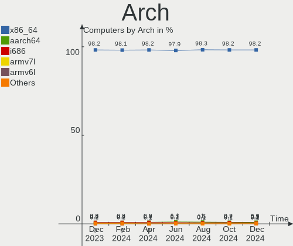
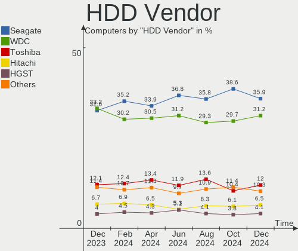
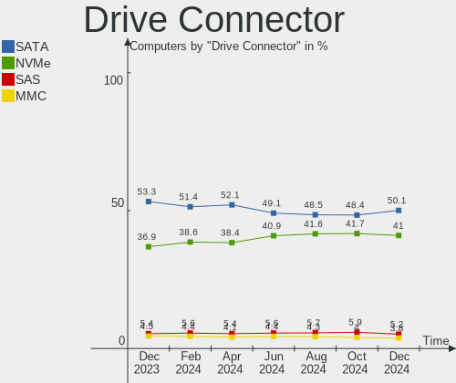
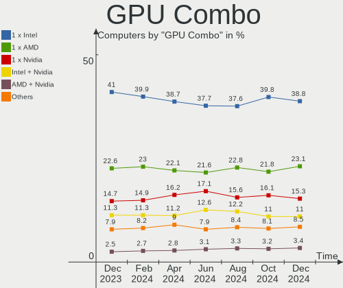
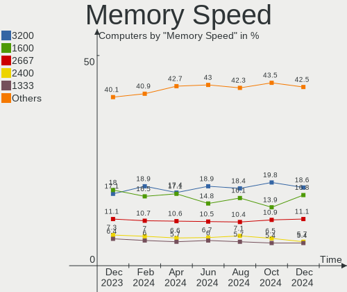

Linux Hardware Trends
---------------------

A project to identify most popular hardware characteristics and track their change
over time based on data collected by Linux users at https://Linux-Hardware.org.

Anyone can contribute to this report by the [hw-probe](https://github.com/linuxhw/hw-probe) tool:

    sudo -E hw-probe -all -upload

This is a report for all computer types. See also reports for [desktops](/Desktop/README.md) and [notebooks](/Notebook/README.md).

Distribution-specific reports: [Ubuntu](/Dist/Ubuntu), [Debian](/Dist/Debian), [Linux Mint](/Dist/Linux_Mint), [Pop!_OS](/Dist/Pop!_OS), [Fedora](/Dist/Fedora), [OpenMandriva](/Dist/OpenMandriva), [Manjaro](/Dist/Manjaro), [Zorin](/Dist/Zorin), [Arch](/Dist/Arch), [KDE neon](/Dist/KDE_neon), [ROSA](/Dist/ROSA), [Xubuntu](/Dist/Xubuntu), [Kubuntu](/Dist/Kubuntu), [ArcoLinux](/Dist/ArcoLinux), [CentOS](/Dist/CentOS), [BlackPanther](/Dist/BlackPanther), [openSUSE](/Dist/openSUSE), [Clear Linux](/Dist/Clear_Linux), [Endless](/Dist/Endless), [Gentoo](/Dist/Gentoo), [Elementary](/Dist/Elementary), [EndeavourOS](/Dist/EndeavourOS), [Ubuntu MATE](/Dist/Ubuntu_MATE), [Kali](/Dist/Kali).

This report is for one last month. Overall report since the beginning of time: [TestCoverage](https://github.com/linuxhw/TestCoverage)

Period: Apr, 2022.

Contents
--------

* [ System ](#system)
  - [ OS                       ](#os)
  - [ OS Family                ](#os-family)
  - [ Kernel                   ](#kernel)
  - [ Kernel Family            ](#kernel-family)
  - [ Kernel Major Ver.        ](#kernel-major-ver)
  - [ Arch                     ](#arch)
  - [ DE                       ](#de)
  - [ Display Server           ](#display-server)
  - [ Display Manager          ](#display-manager)
  - [ OS Lang                  ](#os-lang)
  - [ Boot Mode                ](#boot-mode)
  - [ Filesystem               ](#filesystem)
  - [ Part. scheme             ](#part-scheme)
  - [ Dual Boot with Linux/BSD ](#dual-boot-with-linuxbsd)
  - [ Dual Boot (Win)          ](#dual-boot-win)

* [ Board ](#board)
  - [ Vendor                   ](#vendor)
  - [ Model                    ](#model)
  - [ Model Family             ](#model-family)
  - [ MFG Year                 ](#mfg-year)
  - [ Form Factor              ](#form-factor)
  - [ Secure Boot              ](#secure-boot)
  - [ Coreboot                 ](#coreboot)
  - [ RAM Size                 ](#ram-size)
  - [ RAM Used                 ](#ram-used)
  - [ Total Drives             ](#total-drives)
  - [ Has CD-ROM               ](#has-cd-rom)
  - [ Has Ethernet             ](#has-ethernet)
  - [ Has WiFi                 ](#has-wifi)
  - [ Has Bluetooth            ](#has-bluetooth)

* [ Location ](#location)
  - [ Country                  ](#country)
  - [ City                     ](#city)

* [ Drives ](#drives)
  - [ Drive Vendor             ](#drive-vendor)
  - [ Drive Model              ](#drive-model)
  - [ HDD Vendor               ](#hdd-vendor)
  - [ SSD Vendor               ](#ssd-vendor)
  - [ Drive Kind               ](#drive-kind)
  - [ Drive Connector          ](#drive-connector)
  - [ Drive Size               ](#drive-size)
  - [ Space Total              ](#space-total)
  - [ Space Used               ](#space-used)
  - [ Malfunc. Drives          ](#malfunc-drives)
  - [ Malfunc. Drive Vendor    ](#malfunc-drive-vendor)
  - [ Malfunc. HDD Vendor      ](#malfunc-hdd-vendor)
  - [ Malfunc. Drive Kind      ](#malfunc-drive-kind)
  - [ Failed Drives            ](#failed-drives)
  - [ Failed Drive Vendor      ](#failed-drive-vendor)
  - [ Drive Status             ](#drive-status)

* [ Storage controller ](#storage-controller)
  - [ Storage Vendor           ](#storage-vendor)
  - [ Storage Model            ](#storage-model)
  - [ Storage Kind             ](#storage-kind)

* [ Processor ](#processor)
  - [ CPU Vendor               ](#cpu-vendor)
  - [ CPU Model                ](#cpu-model)
  - [ CPU Model Family         ](#cpu-model-family)
  - [ CPU Cores                ](#cpu-cores)
  - [ CPU Sockets              ](#cpu-sockets)
  - [ CPU Threads              ](#cpu-threads)
  - [ CPU Op-Modes             ](#cpu-op-modes)
  - [ CPU Microcode            ](#cpu-microcode)
  - [ CPU Microarch            ](#cpu-microarch)

* [ Graphics ](#graphics)
  - [ GPU Vendor               ](#gpu-vendor)
  - [ GPU Model                ](#gpu-model)
  - [ GPU Combo                ](#gpu-combo)
  - [ GPU Driver               ](#gpu-driver)
  - [ GPU Memory               ](#gpu-memory)

* [ Monitor ](#monitor)
  - [ Monitor Vendor           ](#monitor-vendor)
  - [ Monitor Model            ](#monitor-model)
  - [ Monitor Resolution       ](#monitor-resolution)
  - [ Monitor Diagonal         ](#monitor-diagonal)
  - [ Monitor Width            ](#monitor-width)
  - [ Aspect Ratio             ](#aspect-ratio)
  - [ Monitor Area             ](#monitor-area)
  - [ Pixel Density            ](#pixel-density)
  - [ Multiple Monitors        ](#multiple-monitors)

* [ Network ](#network)
  - [ Net Controller Vendor    ](#net-controller-vendor)
  - [ Net Controller Model     ](#net-controller-model)
  - [ Wireless Vendor          ](#wireless-vendor)
  - [ Wireless Model           ](#wireless-model)
  - [ Ethernet Vendor          ](#ethernet-vendor)
  - [ Ethernet Model           ](#ethernet-model)
  - [ Net Controller Kind      ](#net-controller-kind)
  - [ Used Controller          ](#used-controller)
  - [ NICs                     ](#nics)
  - [ IPv6                     ](#ipv6)

* [ Bluetooth ](#bluetooth)
  - [ Bluetooth Vendor         ](#bluetooth-vendor)
  - [ Bluetooth Model          ](#bluetooth-model)

* [ Sound ](#sound)
  - [ Sound Vendor             ](#sound-vendor)
  - [ Sound Model              ](#sound-model)

* [ Memory ](#memory)
  - [ Memory Vendor            ](#memory-vendor)
  - [ Memory Model             ](#memory-model)
  - [ Memory Kind              ](#memory-kind)
  - [ Memory Form Factor       ](#memory-form-factor)
  - [ Memory Size              ](#memory-size)
  - [ Memory Speed             ](#memory-speed)

* [ Printers & scanners ](#printers--scanners)
  - [ Printer Vendor           ](#printer-vendor)
  - [ Printer Model            ](#printer-model)
  - [ Scanner Vendor           ](#scanner-vendor)
  - [ Scanner Model            ](#scanner-model)

* [ Camera ](#camera)
  - [ Camera Vendor            ](#camera-vendor)
  - [ Camera Model             ](#camera-model)

* [ Security ](#security)
  - [ Fingerprint Vendor       ](#fingerprint-vendor)
  - [ Fingerprint Model        ](#fingerprint-model)
  - [ Chipcard Vendor          ](#chipcard-vendor)
  - [ Chipcard Model           ](#chipcard-model)

* [ Unsupported ](#unsupported)
  - [ Unsupported Devices      ](#unsupported-devices)
  - [ Unsupported Device Types ](#unsupported-device-types)

System
------

OS
--

Installed operating systems

| Name                 | Computers | Percent |
|----------------------|-----------|---------|
| Ubuntu 20.04         | 666       | 11.75%  |
| ROSA 12.2            | 387       | 6.83%   |
| Linux Mint 20.3      | 383       | 6.76%   |
| Fedora 35            | 336       | 5.93%   |
| Debian 11            | 331       | 5.84%   |
| OpenMandriva 4.3     | 302       | 5.33%   |
| Ubuntu 21.10         | 266       | 4.69%   |
| Ubuntu 22.04         | 264       | 4.66%   |
| Pop!_OS 21.10        | 219       | 3.86%   |
| Zorin 16             | 160       | 2.82%   |
| Kometa P10           | 156       | 2.75%   |
| KDE neon 20.04       | 133       | 2.35%   |
| Arch                 | 121       | 2.13%   |
| Manjaro              | 120       | 2.12%   |
| Fedora 36            | 86        | 1.52%   |
| Arch Rolling         | 82        | 1.45%   |
| Pop!_OS 22.04        | 67        | 1.18%   |
| ArcoLinux Rolling    | 66        | 1.16%   |
| Manjaro 21.2.5       | 64        | 1.13%   |
| Elementary 6.1       | 62        | 1.09%   |
| Ubuntu 18.04         | 54        | 0.95%   |
| Xubuntu 20.04        | 50        | 0.88%   |
| ROSA R11.1           | 47        | 0.83%   |
| Kali 2022.1          | 45        | 0.79%   |
| Kubuntu 20.04        | 43        | 0.76%   |
| Manjaro 21.2.6       | 41        | 0.72%   |
| OpenMandriva 4.2     | 40        | 0.71%   |
| BlackPanther 18.1    | 38        | 0.67%   |
| Kubuntu 21.10        | 37        | 0.65%   |
| LMDE 5               | 34        | 0.6%    |
| EndeavourOS Rolling  | 32        | 0.56%   |
| Debian Testing       | 30        | 0.53%   |
| Linux Mint 20.2      | 29        | 0.51%   |
| Linux Mint 19.3      | 26        | 0.46%   |
| Fedora 34            | 25        | 0.44%   |
| Gentoo 2.6           | 24        | 0.42%   |
| MX 21                | 20        | 0.35%   |
| Kubuntu 22.04        | 19        | 0.34%   |
| Gentoo 2.8           | 19        | 0.34%   |
| Pop!_OS 20.04        | 18        | 0.32%   |
| Parrot 5.0           | 18        | 0.32%   |
| Endless 4.0.4        | 18        | 0.32%   |
| Debian 10            | 18        | 0.32%   |
| Ubuntu MATE 20.04    | 16        | 0.28%   |
| Zorin 15             | 15        | 0.26%   |
| Slackware 15.0       | 15        | 0.26%   |
| Gentoo 2.7           | 15        | 0.26%   |
| Debian Unstable      | 15        | 0.26%   |
| SteamOS Snapshot     | 13        | 0.23%   |
| Linux Mint 20.1      | 13        | 0.23%   |
| Garuda Linux Soaring | 12        | 0.21%   |
| Xubuntu 21.10        | 11        | 0.19%   |
| Ubuntu Budgie 20.04  | 11        | 0.19%   |
| Solus 4.3            | 11        | 0.19%   |
| Raspbian 11          | 11        | 0.19%   |
| Xubuntu 22.04        | 10        | 0.18%   |
| Ubuntu 21.04         | 10        | 0.18%   |
| ROSA 12.1            | 10        | 0.18%   |
| openSUSE Leap-15.3   | 10        | 0.18%   |
| Lubuntu 21.10        | 10        | 0.18%   |

OS Family
---------

OS without a version

| Name             | Computers | Percent |
|------------------|-----------|---------|
| Ubuntu           | 1275      | 22.49%  |
| Linux Mint       | 468       | 8.26%   |
| ROSA             | 455       | 8.03%   |
| Fedora           | 453       | 7.99%   |
| Debian           | 400       | 7.06%   |
| OpenMandriva     | 351       | 6.19%   |
| Pop!_OS          | 313       | 5.52%   |
| Manjaro          | 226       | 3.99%   |
| Arch             | 203       | 3.58%   |
| Zorin            | 175       | 3.09%   |
| ALT Linux        | 166       | 2.93%   |
| KDE neon         | 134       | 2.36%   |
| Kubuntu          | 113       | 1.99%   |
| Xubuntu          | 76        | 1.34%   |
| ArcoLinux        | 69        | 1.22%   |
| Elementary       | 67        | 1.18%   |
| Gentoo           | 58        | 1.02%   |
| openSUSE         | 54        | 0.95%   |
| Kali             | 51        | 0.9%    |
| Endless          | 45        | 0.79%   |
| LMDE             | 40        | 0.71%   |
| EndeavourOS      | 39        | 0.69%   |
| BlackPanther     | 38        | 0.67%   |
| Lubuntu          | 34        | 0.6%    |
| Ubuntu MATE      | 30        | 0.53%   |
| Clear Linux      | 24        | 0.42%   |
| Ubuntu Budgie    | 21        | 0.37%   |
| MX               | 21        | 0.37%   |
| Parrot           | 20        | 0.35%   |
| Garuda Linux     | 19        | 0.34%   |
| Slackware        | 15        | 0.26%   |
| SteamOS          | 14        | 0.25%   |
| Raspbian         | 14        | 0.25%   |
| Solus            | 11        | 0.19%   |
| NixOS            | 10        | 0.18%   |
| CentOS           | 10        | 0.18%   |
| LinuxFX          | 9         | 0.16%   |
| RHEL             | 8         | 0.14%   |
| Void Linux       | 7         | 0.12%   |
| Red OS           | 7         | 0.12%   |
| Xero             | 6         | 0.11%   |
| PureOS           | 6         | 0.11%   |
| org.kde.Platform | 6         | 0.11%   |
| Mageia           | 6         | 0.11%   |
| Devuan           | 6         | 0.11%   |
| Ubuntu Studio    | 5         | 0.09%   |
| Manjaro-ARM      | 5         | 0.09%   |
| Linux Lite       | 5         | 0.09%   |
| Deepin           | 5         | 0.09%   |
| Artix            | 5         | 0.09%   |
| Trisquel         | 4         | 0.07%   |
| Rocky Linux      | 4         | 0.07%   |
| Pardus           | 4         | 0.07%   |
| ClearOS          | 4         | 0.07%   |
| Peppermint       | 3         | 0.05%   |
| Oracle Linux     | 3         | 0.05%   |
| Lilidog          | 3         | 0.05%   |
| Atz              | 3         | 0.05%   |
| Alpine           | 3         | 0.05%   |
| Sparky           | 2         | 0.04%   |

Kernel
------

Version of the Linux kernel

| Version                            | Computers | Percent |
|------------------------------------|-----------|---------|
| 5.13.0-39-generic                  | 782       | 13.8%   |
| 5.10.74-generic-2rosa2021.1-x86_64 | 336       | 5.93%   |
| 5.4.0-107-generic                  | 314       | 5.54%   |
| 5.13.0-40-generic                  | 313       | 5.52%   |
| 5.16.7-desktop-1omv4003            | 288       | 5.08%   |
| 5.10.0-13-amd64                    | 210       | 3.71%   |
| 5.16.18-200.fc35.x86_64            | 151       | 2.66%   |
| 5.15.0-25-generic                  | 149       | 2.63%   |
| 5.4.0-109-generic                  | 148       | 2.61%   |
| 5.16.15-76051615-generic           | 141       | 2.49%   |
| 5.17.1-arch1-1                     | 110       | 1.94%   |
| 5.16.19-76051619-generic           | 108       | 1.91%   |
| 5.15.0-27-generic                  | 104       | 1.83%   |
| 5.10.109-std-def-alt1              | 81        | 1.43%   |
| 5.10.102-std-def-alt1              | 70        | 1.24%   |
| 5.15.28-1-MANJARO                  | 59        | 1.04%   |
| 5.15.32-1-MANJARO                  | 50        | 0.88%   |
| 5.13.0-30-generic                  | 50        | 0.88%   |
| 5.16.20-200.fc35.x86_64            | 44        | 0.78%   |
| 5.13.0-37-generic                  | 40        | 0.71%   |
| 5.16.19-200.fc35.x86_64            | 39        | 0.69%   |
| 5.17.1-zen1-1-zen                  | 38        | 0.67%   |
| 5.10.14-desktop-1omv4002           | 38        | 0.67%   |
| 5.10.0-7-amd64                     | 37        | 0.65%   |
| 5.17.4-200.fc35.x86_64             | 35        | 0.62%   |
| 5.4.0-91-generic                   | 34        | 0.6%    |
| 5.16.11-76051611-generic           | 34        | 0.6%    |
| 5.11.0-35-generic                  | 33        | 0.58%   |
| 5.10.0-10-amd64                    | 33        | 0.58%   |
| 5.16.0-6-amd64                     | 32        | 0.56%   |
| 5.15.0-23-generic                  | 30        | 0.53%   |
| 5.17.4-arch1-1                     | 28        | 0.49%   |
| 5.17.2-300.fc36.x86_64             | 26        | 0.46%   |
| 5.16.14-1-MANJARO                  | 26        | 0.46%   |
| 5.17.3-arch1-1                     | 25        | 0.44%   |
| 5.17.1-3-MANJARO                   | 24        | 0.42%   |
| 5.15.32-generic-5rosa2021.1-x86_64 | 24        | 0.42%   |
| 5.13.0-35-generic                  | 23        | 0.41%   |
| 5.6.14-desktop-2bP                 | 21        | 0.37%   |
| 5.17.1-300.fc36.x86_64             | 21        | 0.37%   |
| 5.14.10-300.fc35.x86_64            | 21        | 0.37%   |
| 5.13.0-27-generic                  | 21        | 0.37%   |
| 5.4.0-105-generic                  | 19        | 0.34%   |
| 5.16.0-12parrot1-amd64             | 19        | 0.34%   |
| 5.13.0-19-generic                  | 18        | 0.32%   |
| 5.10.0-12-amd64                    | 18        | 0.32%   |
| 5.17.1-1-default                   | 17        | 0.3%    |
| 4.18.16-desktop-1bP                | 17        | 0.3%    |
| 5.10.0-13-686-pae                  | 16        | 0.28%   |
| 5.17.2-arch3-1                     | 15        | 0.26%   |
| 5.16.16-200.fc35.x86_64            | 15        | 0.26%   |
| 4.15.0-175-generic                 | 15        | 0.26%   |
| 5.4.0-104-generic                  | 14        | 0.25%   |
| 5.17.3-302.fc36.x86_64             | 14        | 0.25%   |
| 5.16.0-kali6-amd64                 | 14        | 0.25%   |
| 5.15.33-1-lts                      | 14        | 0.25%   |
| 5.4.83-generic-2rosa-x86_64        | 13        | 0.23%   |
| 5.17.3-zen1-1-zen                  | 13        | 0.23%   |
| 5.16.0-kali7-amd64                 | 13        | 0.23%   |
| 5.10.105-1-MANJARO                 | 13        | 0.23%   |

Kernel Family
-------------

Linux kernel without a distro release

| Version  | Computers | Percent |
|----------|-----------|---------|
| 5.13.0   | 1309      | 23.09%  |
| 5.4.0    | 612       | 10.8%   |
| 5.10.0   | 348       | 6.14%   |
| 5.10.74  | 347       | 6.12%   |
| 5.15.0   | 310       | 5.47%   |
| 5.16.7   | 288       | 5.08%   |
| 5.17.1   | 252       | 4.45%   |
| 5.16.18  | 193       | 3.41%   |
| 5.16.15  | 155       | 2.73%   |
| 5.16.19  | 154       | 2.72%   |
| 5.15.32  | 148       | 2.61%   |
| 5.16.0   | 113       | 1.99%   |
| 5.17.4   | 99        | 1.75%   |
| 5.10.109 | 90        | 1.59%   |
| 5.11.0   | 85        | 1.5%    |
| 5.17.3   | 77        | 1.36%   |
| 5.17.2   | 75        | 1.32%   |
| 5.10.102 | 70        | 1.24%   |
| 5.15.28  | 63        | 1.11%   |
| 5.16.20  | 53        | 0.94%   |
| 4.15.0   | 53        | 0.94%   |
| 5.17.0   | 51        | 0.9%    |
| 5.16.11  | 47        | 0.83%   |
| 5.10.14  | 38        | 0.67%   |
| 5.14.0   | 35        | 0.62%   |
| 5.16.16  | 31        | 0.55%   |
| 5.16.14  | 29        | 0.51%   |
| 5.8.0    | 25        | 0.44%   |
| 5.15.33  | 24        | 0.42%   |
| 5.4.83   | 23        | 0.41%   |
| 5.16.13  | 23        | 0.41%   |
| 5.6.14   | 21        | 0.37%   |
| 5.17.5   | 21        | 0.37%   |
| 5.14.10  | 21        | 0.37%   |
| 4.19.0   | 18        | 0.32%   |
| 5.13.19  | 17        | 0.3%    |
| 4.18.16  | 17        | 0.3%    |
| 4.18.0   | 14        | 0.25%   |
| 5.15.34  | 13        | 0.23%   |
| 5.10.105 | 13        | 0.23%   |
| 5.4.32   | 12        | 0.21%   |
| 5.18.0   | 10        | 0.18%   |
| 3.10.0   | 10        | 0.18%   |
| 5.15.30  | 9         | 0.16%   |
| 5.15.26  | 9         | 0.16%   |
| 5.3.18   | 8         | 0.14%   |
| 5.15.11  | 8         | 0.14%   |
| 5.16.17  | 7         | 0.12%   |
| 5.15.19  | 7         | 0.12%   |
| 5.15.16  | 7         | 0.12%   |
| 5.15.15  | 7         | 0.12%   |
| 5.15.10  | 7         | 0.12%   |
| 5.14.7   | 7         | 0.12%   |
| 5.10.101 | 6         | 0.11%   |
| 5.3.0    | 5         | 0.09%   |
| 5.16.12  | 5         | 0.09%   |
| 5.15.5   | 5         | 0.09%   |
| 5.15.35  | 5         | 0.09%   |
| 5.4.184  | 4         | 0.07%   |
| 5.16.2   | 4         | 0.07%   |

Kernel Major Ver.
-----------------

Linux kernel major version

| Version | Computers | Percent |
|---------|-----------|---------|
| 5.13    | 1331      | 23.48%  |
| 5.16    | 1115      | 19.67%  |
| 5.10    | 949       | 16.74%  |
| 5.4     | 664       | 11.71%  |
| 5.15    | 655       | 11.56%  |
| 5.17    | 575       | 10.14%  |
| 5.11    | 89        | 1.57%   |
| 5.14    | 75        | 1.32%   |
| 4.15    | 53        | 0.94%   |
| 4.18    | 31        | 0.55%   |
| 5.8     | 27        | 0.48%   |
| 5.6     | 25        | 0.44%   |
| 4.19    | 25        | 0.44%   |
| 5.3     | 13        | 0.23%   |
| 5.18    | 10        | 0.18%   |
| 3.10    | 10        | 0.18%   |
| 4.9     | 6         | 0.11%   |
| 4.4     | 4         | 0.07%   |
| 5.12    | 2         | 0.04%   |
| 5.9     | 1         | 0.02%   |
| 5.0     | 1         | 0.02%   |
| 5       | 1         | 0.02%   |
| 4.8     | 1         | 0.02%   |
| 4.7     | 1         | 0.02%   |
| 4.14    | 1         | 0.02%   |
| 4.1     | 1         | 0.02%   |
| 3.8     | 1         | 0.02%   |
| 3.0     | 1         | 0.02%   |

Arch
----

OS architecture (x86_64, i586, etc.)

| Name    | Computers | Percent |
|---------|-----------|---------|
| x86_64  | 5498      | 97%     |
| i686    | 101       | 1.78%   |
| aarch64 | 47        | 0.83%   |
| armv7l  | 16        | 0.28%   |
| armv6l  | 4         | 0.07%   |
| ppc64   | 1         | 0.02%   |
| e2k     | 1         | 0.02%   |

DE
--

Desktop Environment

| Name             | Computers | Percent |
|------------------|-----------|---------|
| GNOME            | 2441      | 43.07%  |
| KDE5             | 1416      | 24.98%  |
| X-Cinnamon       | 407       | 7.18%   |
| XFCE             | 393       | 6.93%   |
| Unknown          | 354       | 6.25%   |
| MATE             | 146       | 2.58%   |
| LXQt             | 110       | 1.94%   |
| Pantheon         | 66        | 1.16%   |
| Cinnamon         | 65        | 1.15%   |
| i3               | 48        | 0.85%   |
| KDE4             | 37        | 0.65%   |
| Budgie           | 35        | 0.62%   |
| LXDE             | 22        | 0.39%   |
| Unity            | 20        | 0.35%   |
| GNOME Flashback  | 17        | 0.3%    |
| Deepin           | 13        | 0.23%   |
| Openbox          | 10        | 0.18%   |
| sway             | 9         | 0.16%   |
| awesome          | 9         | 0.16%   |
| GNOME Classic    | 8         | 0.14%   |
| DWM              | 5         | 0.09%   |
| KDE              | 4         | 0.07%   |
| bspwm            | 4         | 0.07%   |
| Trinity          | 3         | 0.05%   |
| lightdm-xsession | 3         | 0.05%   |
| LeftWM           | 3         | 0.05%   |
| icewm            | 3         | 0.05%   |
| xmonad           | 2         | 0.04%   |
| Phosh:GNOME      | 2         | 0.04%   |
| Enlightenment    | 2         | 0.04%   |
| xwmconfig        | 1         | 0.02%   |
| UKUI             | 1         | 0.02%   |
| ubuntu           | 1         | 0.02%   |
| qtile-default    | 1         | 0.02%   |
| qtile            | 1         | 0.02%   |
| plasma5          | 1         | 0.02%   |
| none+xmonad      | 1         | 0.02%   |
| none+i3          | 1         | 0.02%   |
| Lubuntu          | 1         | 0.02%   |
| jwm              | 1         | 0.02%   |
| herbstluftwm     | 1         | 0.02%   |

Display Server
--------------

X11 or Wayland

| Name        | Computers | Percent |
|-------------|-----------|---------|
| X11         | 4034      | 71.17%  |
| Wayland     | 1254      | 22.12%  |
| Unknown     | 221       | 3.9%    |
| Tty         | 156       | 2.75%   |
| Unspecified | 2         | 0.04%   |
| Web         | 1         | 0.02%   |

Display Manager
---------------

SDDM, LightDM, etc.

| Name    | Computers | Percent |
|---------|-----------|---------|
| Unknown | 1861      | 32.83%  |
| SDDM    | 1168      | 20.61%  |
| GDM     | 989       | 17.45%  |
| GDM3    | 812       | 14.33%  |
| LightDM | 768       | 13.55%  |
| KDM     | 37        | 0.65%   |
| XDM     | 8         | 0.14%   |
| SLiM    | 7         | 0.12%   |
| Ly      | 6         | 0.11%   |
| LXDM    | 6         | 0.11%   |
| NODM    | 2         | 0.04%   |
| GREETD  | 2         | 0.04%   |
| MDM     | 1         | 0.02%   |
| EMPTTY  | 1         | 0.02%   |

OS Lang
-------

Language

| Lang    | Computers | Percent |
|---------|-----------|---------|
| en_US   | 2260      | 39.87%  |
| ru_RU   | 782       | 13.8%   |
| de_DE   | 446       | 7.87%   |
| en_GB   | 270       | 4.76%   |
| pt_BR   | 213       | 3.76%   |
| fr_FR   | 209       | 3.69%   |
| Unknown | 188       | 3.32%   |
| en_CA   | 126       | 2.22%   |
| it_IT   | 118       | 2.08%   |
| es_ES   | 105       | 1.85%   |
| pl_PL   | 102       | 1.8%    |
| en_AU   | 90        | 1.59%   |
| en_IN   | 67        | 1.18%   |
| C       | 50        | 0.88%   |
| nl_NL   | 43        | 0.76%   |
| cs_CZ   | 43        | 0.76%   |
| es_MX   | 40        | 0.71%   |
| zh_CN   | 33        | 0.58%   |
| en_ZA   | 27        | 0.48%   |
| sv_SE   | 25        | 0.44%   |
| tr_TR   | 23        | 0.41%   |
| hu_HU   | 22        | 0.39%   |
| pt_PT   | 21        | 0.37%   |
| es_AR   | 20        | 0.35%   |
| de_AT   | 18        | 0.32%   |
| ja_JP   | 17        | 0.3%    |
| en_NZ   | 15        | 0.26%   |
| en_IE   | 15        | 0.26%   |
| nl_BE   | 14        | 0.25%   |
| fr_CA   | 14        | 0.25%   |
| es_CO   | 14        | 0.25%   |
| es_CL   | 13        | 0.23%   |
| de_CH   | 13        | 0.23%   |
| fi_FI   | 12        | 0.21%   |
| fr_BE   | 11        | 0.19%   |
| es_PE   | 10        | 0.18%   |
| ca_ES   | 10        | 0.18%   |
| ro_RO   | 9         | 0.16%   |
| es_VE   | 8         | 0.14%   |
| en_IL   | 8         | 0.14%   |
| C.UTF8  | 8         | 0.14%   |
| sk_SK   | 7         | 0.12%   |
| es_UY   | 7         | 0.12%   |
| el_GR   | 7         | 0.12%   |
| zh_TW   | 6         | 0.11%   |
| es_EC   | 6         | 0.11%   |
| en_HK   | 6         | 0.11%   |
| da_DK   | 6         | 0.11%   |
| ko_KR   | 5         | 0.09%   |
| hr_HR   | 5         | 0.09%   |
| en_PH   | 5         | 0.09%   |
| en_DK   | 5         | 0.09%   |
| POSIX   | 4         | 0.07%   |
| nb_NO   | 4         | 0.07%   |
| es_US   | 4         | 0.07%   |
| en_DE   | 4         | 0.07%   |
| uk_UA   | 3         | 0.05%   |
| es_CR   | 3         | 0.05%   |
| es_BO   | 3         | 0.05%   |
| en_SG   | 3         | 0.05%   |

Boot Mode
---------

EFI or BIOS

| Mode | Computers | Percent |
|------|-----------|---------|
| EFI  | 2966      | 52.33%  |
| BIOS | 2702      | 47.67%  |

Filesystem
----------

Type of filesystem

| Type     | Computers | Percent |
|----------|-----------|---------|
| Ext4     | 4332      | 76.43%  |
| Btrfs    | 628       | 11.08%  |
| Overlay  | 528       | 9.32%   |
| Xfs      | 89        | 1.57%   |
| Zfs      | 52        | 0.92%   |
| F2fs     | 11        | 0.19%   |
| Tmpfs    | 7         | 0.12%   |
| Ext3     | 6         | 0.11%   |
| Unknown  | 6         | 0.11%   |
| Reiserfs | 2         | 0.04%   |
| Ext2     | 2         | 0.04%   |
| XXXXXXX  | 1         | 0.02%   |
| XXX4     | 1         | 0.02%   |
| XXX      | 1         | 0.02%   |
| Rootfs   | 1         | 0.02%   |
| Aufs     | 1         | 0.02%   |

Part. scheme
------------

Scheme of partitioning

| Type    | Computers | Percent |
|---------|-----------|---------|
| GPT     | 2486      | 43.86%  |
| Unknown | 2436      | 42.98%  |
| MBR     | 746       | 13.16%  |

Dual Boot with Linux/BSD
------------------------

Hosting more than one Linux/BSD

| Dual boot | Computers | Percent |
|-----------|-----------|---------|
| No        | 4820      | 85.04%  |
| Yes       | 848       | 14.96%  |

Dual Boot (Win)
---------------

Hosting Linux and Windows

| Dual boot | Computers | Percent |
|-----------|-----------|---------|
| No        | 3993      | 70.45%  |
| Yes       | 1675      | 29.55%  |

Board
-----

Vendor
------

Motherboard manufacturer

| Name                    | Computers | Percent |
|-------------------------|-----------|---------|
| ASUSTek Computer        | 918       | 16.2%   |
| Lenovo                  | 806       | 14.22%  |
| Dell                    | 718       | 12.67%  |
| Hewlett-Packard         | 670       | 11.82%  |
| Gigabyte Technology     | 417       | 7.36%   |
| MSI                     | 375       | 6.62%   |
| Acer                    | 304       | 5.36%   |
| ASRock                  | 191       | 3.37%   |
| Apple                   | 126       | 2.22%   |
| Intel                   | 123       | 2.17%   |
| Toshiba                 | 81        | 1.43%   |
| Unknown                 | 68        | 1.2%    |
| Samsung Electronics     | 59        | 1.04%   |
| Google                  | 43        | 0.76%   |
| Raspberry Pi Foundation | 41        | 0.72%   |
| Fujitsu                 | 40        | 0.71%   |
| Sony                    | 35        | 0.62%   |
| Supermicro              | 33        | 0.58%   |
| Medion                  | 31        | 0.55%   |
| HUAWEI                  | 25        | 0.44%   |
| TUXEDO                  | 22        | 0.39%   |
| Biostar                 | 21        | 0.37%   |
| Positivo                | 20        | 0.35%   |
| Foxconn                 | 20        | 0.35%   |
| Alienware               | 20        | 0.35%   |
| Timi                    | 19        | 0.34%   |
| Pegatron                | 19        | 0.34%   |
| Packard Bell            | 19        | 0.34%   |
| Framework               | 19        | 0.34%   |
| Microsoft               | 17        | 0.3%    |
| 3Logic Group            | 17        | 0.3%    |
| Notebook                | 16        | 0.28%   |
| System76                | 15        | 0.26%   |
| Valve                   | 14        | 0.25%   |
| ECS                     | 14        | 0.25%   |
| eMachines               | 12        | 0.21%   |
| Chuwi                   | 11        | 0.19%   |
| AMI                     | 11        | 0.19%   |
| Razer                   | 9         | 0.16%   |
| BESSTAR Tech            | 9         | 0.16%   |
| ICL                     | 8         | 0.14%   |
| Fujitsu Siemens         | 8         | 0.14%   |
| LG Electronics          | 7         | 0.12%   |
| Avell High Performance  | 6         | 0.11%   |
| ASRockRack              | 6         | 0.11%   |
| PC Specialist           | 5         | 0.09%   |
| Itautec                 | 5         | 0.09%   |
| Hardkernel              | 5         | 0.09%   |
| Gateway                 | 5         | 0.09%   |
| AZW                     | 5         | 0.09%   |
| SLIMBOOK                | 4         | 0.07%   |
| Shuttle                 | 4         | 0.07%   |
| Huanan                  | 4         | 0.07%   |
| Clevo                   | 4         | 0.07%   |
| ZOTAC                   | 3         | 0.05%   |
| Wortmann AG             | 3         | 0.05%   |
| TrekStor                | 3         | 0.05%   |
| Teclast                 | 3         | 0.05%   |
| Purism                  | 3         | 0.05%   |
| Philco                  | 3         | 0.05%   |

Model
-----

Motherboard model

| Name                                  | Computers | Percent |
|---------------------------------------|-----------|---------|
| Unknown                               | 84        | 1.48%   |
| ASUS All Series                       | 71        | 1.25%   |
| Intel SKYBAY                          | 42        | 0.74%   |
| Google Enguarde                       | 27        | 0.48%   |
| HP Notebook                           | 22        | 0.39%   |
| RPi Raspberry Pi                      | 20        | 0.35%   |
| Framework Laptop                      | 19        | 0.34%   |
| Apple MacBook5,2                      | 19        | 0.34%   |
| ASUS PRIME B450-PLUS                  | 17        | 0.3%    |
| MSI MS-7C37                           | 16        | 0.28%   |
| Dell OptiPlex 7010                    | 16        | 0.28%   |
| 3Logic Group Graviton                 | 16        | 0.28%   |
| HP 250 G7 Notebook PC                 | 15        | 0.26%   |
| Gigabyte H410M S2H                    | 15        | 0.26%   |
| Valve Jupiter                         | 14        | 0.25%   |
| HP Pavilion Notebook                  | 14        | 0.25%   |
| ASUS TUF Gaming X570-PLUS             | 14        | 0.25%   |
| Gigabyte B450M DS3H                   | 13        | 0.23%   |
| MSI MS-7C02                           | 12        | 0.21%   |
| MSI MS-7A38                           | 12        | 0.21%   |
| Dell OptiPlex 3020                    | 12        | 0.21%   |
| MSI MS-7B79                           | 11        | 0.19%   |
| HP Pavilion g6                        | 11        | 0.19%   |
| ASUS ROG STRIX B450-F GAMING          | 11        | 0.19%   |
| ASUS 1005HA                           | 11        | 0.19%   |
| Supermicro SYS-5019A-FTN4             | 10        | 0.18%   |
| MSI MS-7817                           | 10        | 0.18%   |
| Lenovo V540-24IWL AIO 10YS0031RU      | 10        | 0.18%   |
| Dell OptiPlex 9020                    | 10        | 0.18%   |
| Acer Veriton X2640G                   | 10        | 0.18%   |
| MSI MS-7C56                           | 9         | 0.16%   |
| HP ProBook 440 G5                     | 9         | 0.16%   |
| Gigabyte B450 AORUS M                 | 9         | 0.16%   |
| Dell Inspiron 15-3567                 | 9         | 0.16%   |
| Acer Nitro AN515-44                   | 9         | 0.16%   |
| MSI MS-7D22                           | 8         | 0.14%   |
| MSI MS-7721                           | 8         | 0.14%   |
| HP EliteBook 840 G1                   | 8         | 0.14%   |
| HP 15                                 | 8         | 0.14%   |
| Gigabyte 970A-DS3P                    | 8         | 0.14%   |
| Dell OptiPlex 790                     | 8         | 0.14%   |
| Dell Latitude E6430                   | 8         | 0.14%   |
| Dell Latitude 3120                    | 8         | 0.14%   |
| MSI MS-7B98                           | 7         | 0.12%   |
| HP Pavilion dv6                       | 7         | 0.12%   |
| HP Laptop 15-bw0xx                    | 7         | 0.12%   |
| Gigabyte B450 AORUS ELITE             | 7         | 0.12%   |
| Dell XPS 13 9370                      | 7         | 0.12%   |
| Dell XPS 13 9310                      | 7         | 0.12%   |
| Dell OptiPlex 3050                    | 7         | 0.12%   |
| ASUS UX31E                            | 7         | 0.12%   |
| ASUS ROG STRIX B550-I GAMING          | 7         | 0.12%   |
| ASUS ROG STRIX B550-F GAMING          | 7         | 0.12%   |
| Apple MacBookPro9,2                   | 7         | 0.12%   |
| MSI MS-7C35                           | 6         | 0.11%   |
| MSI MS-7B86                           | 6         | 0.11%   |
| MSI MS-7B48                           | 6         | 0.11%   |
| Lenovo ThinkBook 15 G2 ITL 20VE       | 6         | 0.11%   |
| Lenovo IdeaPad L340-15IRH Gaming 81LK | 6         | 0.11%   |
| ICL RAYbook Si1512                    | 6         | 0.11%   |

Model Family
------------

Motherboard model prefix

| Name                  | Computers | Percent |
|-----------------------|-----------|---------|
| Lenovo ThinkPad       | 339       | 5.98%   |
| Dell Latitude         | 184       | 3.25%   |
| Dell Inspiron         | 176       | 3.11%   |
| Acer Aspire           | 175       | 3.09%   |
| Lenovo IdeaPad        | 144       | 2.54%   |
| ASUS PRIME            | 126       | 2.22%   |
| HP Pavilion           | 125       | 2.21%   |
| ASUS ROG              | 119       | 2.1%    |
| Dell OptiPlex         | 115       | 2.03%   |
| Dell XPS              | 88        | 1.55%   |
| Unknown               | 84        | 1.48%   |
| HP Laptop             | 71        | 1.25%   |
| HP EliteBook          | 71        | 1.25%   |
| Dell Precision        | 71        | 1.25%   |
| ASUS All              | 71        | 1.25%   |
| HP ProBook            | 70        | 1.24%   |
| Lenovo ThinkCentre    | 64        | 1.13%   |
| Toshiba Satellite     | 63        | 1.11%   |
| ASUS TUF              | 56        | 0.99%   |
| ASUS VivoBook         | 48        | 0.85%   |
| HP Compaq             | 47        | 0.83%   |
| Intel SKYBAY          | 42        | 0.74%   |
| RPi Raspberry         | 40        | 0.71%   |
| Lenovo Legion         | 39        | 0.69%   |
| HP ENVY               | 37        | 0.65%   |
| Dell Vostro           | 37        | 0.65%   |
| Acer Nitro            | 37        | 0.65%   |
| Lenovo Yoga           | 36        | 0.64%   |
| Lenovo ThinkBook      | 29        | 0.51%   |
| HP ZBook              | 28        | 0.49%   |
| Google Enguarde       | 27        | 0.48%   |
| Acer Swift            | 27        | 0.48%   |
| HP 250                | 26        | 0.46%   |
| Gigabyte X570         | 24        | 0.42%   |
| HP Notebook           | 22        | 0.39%   |
| Gigabyte B450         | 22        | 0.39%   |
| Gigabyte H410M        | 21        | 0.37%   |
| Gigabyte B450M        | 21        | 0.37%   |
| ASUS M5A78L-M         | 21        | 0.37%   |
| ASUS ASUS             | 21        | 0.37%   |
| HP EliteDesk          | 20        | 0.35%   |
| Apple MacBook5        | 20        | 0.35%   |
| Lenovo IdeaPadFlex    | 19        | 0.34%   |
| Framework Laptop      | 19        | 0.34%   |
| ASUS ZenBook          | 18        | 0.32%   |
| Acer TravelMate       | 18        | 0.32%   |
| Microsoft Surface     | 17        | 0.3%    |
| 3Logic Group Graviton | 17        | 0.3%    |
| MSI MS-7C37           | 16        | 0.28%   |
| Gigabyte B550         | 16        | 0.28%   |
| HP OMEN               | 15        | 0.26%   |
| Fujitsu LIFEBOOK      | 15        | 0.26%   |
| Acer Veriton          | 15        | 0.26%   |
| Valve Jupiter         | 14        | 0.25%   |
| Packard Bell EasyNote | 14        | 0.25%   |
| Fujitsu ESPRIMO       | 13        | 0.23%   |
| MSI MS-7C02           | 12        | 0.21%   |
| MSI MS-7A38           | 12        | 0.21%   |
| Gigabyte B550M        | 12        | 0.21%   |
| MSI MS-7B79           | 11        | 0.19%   |

MFG Year
--------

Motherboard manufacture year

| Year    | Computers | Percent |
|---------|-----------|---------|
| 2021    | 693       | 12.23%  |
| 2020    | 654       | 11.54%  |
| 2018    | 540       | 9.53%   |
| 2019    | 515       | 9.09%   |
| 2013    | 388       | 6.85%   |
| 2017    | 370       | 6.53%   |
| 2012    | 368       | 6.49%   |
| 2011    | 352       | 6.21%   |
| 2014    | 300       | 5.29%   |
| 2015    | 279       | 4.92%   |
| 2016    | 276       | 4.87%   |
| 2010    | 229       | 4.04%   |
| 2009    | 189       | 3.33%   |
| 2008    | 164       | 2.89%   |
| 2007    | 107       | 1.89%   |
| 2022    | 101       | 1.78%   |
| Unknown | 83        | 1.46%   |
| 2006    | 42        | 0.74%   |
| 2005    | 12        | 0.21%   |
| 2004    | 4         | 0.07%   |
| 2003    | 2         | 0.04%   |

Form Factor
-----------

Physical design of the computer

| Name           | Computers | Percent |
|----------------|-----------|---------|
| Notebook       | 2960      | 52.22%  |
| Desktop        | 2263      | 39.93%  |
| Convertible    | 139       | 2.45%   |
| All in one     | 79        | 1.39%   |
| Mini pc        | 74        | 1.31%   |
| System on chip | 62        | 1.09%   |
| Tablet         | 50        | 0.88%   |
| Server         | 39        | 0.69%   |
| Phone          | 1         | 0.02%   |
| Stick pc       | 1         | 0.02%   |

Secure Boot
-----------

Enabled or disabled

| State    | Computers | Percent |
|----------|-----------|---------|
| Disabled | 5301      | 93.53%  |
| Enabled  | 367       | 6.47%   |

Coreboot
--------

Have coreboot on board

| Used | Computers | Percent |
|------|-----------|---------|
| No   | 5612      | 99.01%  |
| Yes  | 56        | 0.99%   |

RAM Size
--------

Total RAM memory

| Size in GB      | Computers | Percent |
|-----------------|-----------|---------|
| 4.01-8.0        | 1244      | 21.95%  |
| 16.01-24.0      | 1203      | 21.22%  |
| 8.01-16.0       | 1014      | 17.89%  |
| 3.01-4.0        | 929       | 16.39%  |
| 32.01-64.0      | 632       | 11.15%  |
| 64.01-256.0     | 225       | 3.97%   |
| 1.01-2.0        | 195       | 3.44%   |
| 24.01-32.0      | 91        | 1.61%   |
| 2.01-3.0        | 80        | 1.41%   |
| 0.51-1.0        | 41        | 0.72%   |
| 0.01-0.5        | 7         | 0.12%   |
| More than 256.0 | 5         | 0.09%   |
| Unknown         | 2         | 0.04%   |

RAM Used
--------

Used RAM memory

| Used GB     | Computers | Percent |
|-------------|-----------|---------|
| 1.01-2.0    | 1944      | 34.3%   |
| 2.01-3.0    | 1255      | 22.14%  |
| 4.01-8.0    | 904       | 15.95%  |
| 3.01-4.0    | 658       | 11.61%  |
| 0.51-1.0    | 446       | 7.87%   |
| 8.01-16.0   | 286       | 5.05%   |
| 0.01-0.5    | 76        | 1.34%   |
| 16.01-24.0  | 44        | 0.78%   |
| 24.01-32.0  | 26        | 0.46%   |
| 32.01-64.0  | 22        | 0.39%   |
| Unknown     | 4         | 0.07%   |
| 64.01-256.0 | 3         | 0.05%   |

Total Drives
------------

Number of drives on board

| Drives | Computers | Percent |
|--------|-----------|---------|
| 1      | 3366      | 59.39%  |
| 2      | 1389      | 24.51%  |
| 3      | 442       | 7.8%    |
| 4      | 218       | 3.85%   |
| 5      | 108       | 1.91%   |
| 6      | 52        | 0.92%   |
| 0      | 36        | 0.64%   |
| 7      | 20        | 0.35%   |
| 8      | 18        | 0.32%   |
| 11     | 5         | 0.09%   |
| 9      | 4         | 0.07%   |
| 13     | 2         | 0.04%   |
| 10     | 2         | 0.04%   |
| 45     | 1         | 0.02%   |
| 19     | 1         | 0.02%   |
| 16     | 1         | 0.02%   |
| 15     | 1         | 0.02%   |
| 14     | 1         | 0.02%   |
| 12     | 1         | 0.02%   |

Has CD-ROM
----------

Has CD-ROM on board

| Presented | Computers | Percent |
|-----------|-----------|---------|
| No        | 3731      | 65.83%  |
| Yes       | 1937      | 34.17%  |

Has Ethernet
------------

Has Ethernet on board

| Presented | Computers | Percent |
|-----------|-----------|---------|
| Yes       | 4879      | 86.08%  |
| No        | 789       | 13.92%  |

Has WiFi
--------

Has WiFi module

| Presented | Computers | Percent |
|-----------|-----------|---------|
| Yes       | 4173      | 73.62%  |
| No        | 1495      | 26.38%  |

Has Bluetooth
-------------

Has Bluetooth module

| Presented | Computers | Percent |
|-----------|-----------|---------|
| Yes       | 3382      | 59.67%  |
| No        | 2286      | 40.33%  |

Location
--------

Country
-------

Geographic location (country)

| Country      | Computers | Percent |
|--------------|-----------|---------|
| USA          | 1076      | 18.98%  |
| Russia       | 824       | 14.54%  |
| Germany      | 579       | 10.22%  |
| Brazil       | 296       | 5.22%   |
| France       | 253       | 4.46%   |
| UK           | 203       | 3.58%   |
| Canada       | 195       | 3.44%   |
| Italy        | 171       | 3.02%   |
| Poland       | 150       | 2.65%   |
| Spain        | 137       | 2.42%   |
| Netherlands  | 120       | 2.12%   |
| Australia    | 114       | 2.01%   |
| India        | 99        | 1.75%   |
| Sweden       | 71        | 1.25%   |
| Hungary      | 71        | 1.25%   |
| Mexico       | 64        | 1.13%   |
| Czechia      | 63        | 1.11%   |
| Belgium      | 55        | 0.97%   |
| Austria      | 51        | 0.9%    |
| Turkey       | 49        | 0.86%   |
| Switzerland  | 49        | 0.86%   |
| Romania      | 48        | 0.85%   |
| China        | 45        | 0.79%   |
| Greece       | 39        | 0.69%   |
| Japan        | 38        | 0.67%   |
| Portugal     | 37        | 0.65%   |
| Argentina    | 37        | 0.65%   |
| South Africa | 36        | 0.64%   |
| Norway       | 32        | 0.56%   |
| Ukraine      | 30        | 0.53%   |
| Finland      | 30        | 0.53%   |
| Colombia     | 23        | 0.41%   |
| Belarus      | 22        | 0.39%   |
| Chile        | 21        | 0.37%   |
| Egypt        | 20        | 0.35%   |
| Croatia      | 20        | 0.35%   |
| Peru         | 19        | 0.34%   |
| Serbia       | 18        | 0.32%   |
| New Zealand  | 18        | 0.32%   |
| Denmark      | 18        | 0.32%   |
| Bulgaria     | 18        | 0.32%   |
| Slovakia     | 16        | 0.28%   |
| Ireland      | 16        | 0.28%   |
| Indonesia    | 16        | 0.28%   |
| Thailand     | 15        | 0.26%   |
| Kazakhstan   | 15        | 0.26%   |
| Venezuela    | 14        | 0.25%   |
| Taiwan       | 14        | 0.25%   |
| Israel       | 14        | 0.25%   |
| Iran         | 14        | 0.25%   |
| South Korea  | 13        | 0.23%   |
| Hong Kong    | 13        | 0.23%   |
| Costa Rica   | 12        | 0.21%   |
| Saudi Arabia | 11        | 0.19%   |
| Philippines  | 11        | 0.19%   |
| Malaysia     | 11        | 0.19%   |
| Slovenia     | 10        | 0.18%   |
| Latvia       | 10        | 0.18%   |
| Pakistan     | 9         | 0.16%   |
| Lithuania    | 9         | 0.16%   |

City
----

Geographic location (city)

| City              | Computers | Percent |
|-------------------|-----------|---------|
| Moscow            | 286       | 5.05%   |
| Bangor            | 74        | 1.31%   |
| St Petersburg     | 65        | 1.15%   |
| Berlin            | 48        | 0.85%   |
| Voronezh          | 46        | 0.81%   |
| Sao Paulo         | 43        | 0.76%   |
| Warsaw            | 42        | 0.74%   |
| Sydney            | 36        | 0.64%   |
| Milan             | 32        | 0.56%   |
| Paris             | 30        | 0.53%   |
| Prague            | 29        | 0.51%   |
| Vienna            | 28        | 0.49%   |
| Munich            | 28        | 0.49%   |
| Toronto           | 26        | 0.46%   |
| Budapest          | 26        | 0.46%   |
| Athens            | 25        | 0.44%   |
| Madrid            | 23        | 0.41%   |
| Melbourne         | 21        | 0.37%   |
| Chicago           | 20        | 0.35%   |
| Brisbane          | 20        | 0.35%   |
| Barcelona         | 20        | 0.35%   |
| Samara            | 19        | 0.34%   |
| Amsterdam         | 19        | 0.34%   |
| Rio de Janeiro    | 18        | 0.32%   |
| London            | 18        | 0.32%   |
| Yekaterinburg     | 17        | 0.3%    |
| Rome              | 17        | 0.3%    |
| Istanbul          | 17        | 0.3%    |
| Rostov-on-Don     | 16        | 0.28%   |
| Portland          | 16        | 0.28%   |
| Krasnodar         | 16        | 0.28%   |
| Cologne           | 16        | 0.28%   |
| San Jose          | 15        | 0.26%   |
| Novosibirsk       | 15        | 0.26%   |
| Perm              | 14        | 0.25%   |
| Montreal          | 14        | 0.25%   |
| Hamburg           | 14        | 0.25%   |
| Frankfurt am Main | 14        | 0.25%   |
| Bengaluru         | 14        | 0.25%   |
| Belgrade          | 14        | 0.25%   |
| Helsinki          | 13        | 0.23%   |
| Dallas            | 13        | 0.23%   |
| Chelyabinsk       | 13        | 0.23%   |
| Wroclaw           | 12        | 0.21%   |
| Volgograd         | 12        | 0.21%   |
| Stuttgart         | 12        | 0.21%   |
| Stockholm         | 12        | 0.21%   |
| San Diego         | 12        | 0.21%   |
| Perth             | 12        | 0.21%   |
| Nizhniy Novgorod  | 12        | 0.21%   |
| Minsk             | 12        | 0.21%   |
| Durham            | 12        | 0.21%   |
| Dublin            | 12        | 0.21%   |
| Calgary           | 12        | 0.21%   |
| Zurich            | 11        | 0.19%   |
| Zagreb            | 11        | 0.19%   |
| Nuremberg         | 11        | 0.19%   |
| Leipzig           | 11        | 0.19%   |
| Krasnoyarsk       | 11        | 0.19%   |
| Karlsruhe         | 11        | 0.19%   |

Drives
------

Drive Vendor
------------

Hard drive vendors

| Vendor                         | Computers | Drives | Percent |
|--------------------------------|-----------|--------|---------|
| Samsung Electronics            | 1321      | 1676   | 16.04%  |
| WDC                            | 1248      | 1598   | 15.15%  |
| Seagate                        | 1169      | 1456   | 14.19%  |
| Toshiba                        | 538       | 594    | 6.53%   |
| Kingston                       | 463       | 509    | 5.62%   |
| Sandisk                        | 390       | 414    | 4.73%   |
| Crucial                        | 332       | 372    | 4.03%   |
| Unknown                        | 325       | 367    | 3.95%   |
| SK Hynix                       | 253       | 265    | 3.07%   |
| Intel                          | 210       | 241    | 2.55%   |
| Hitachi                        | 203       | 219    | 2.46%   |
| A-DATA Technology              | 138       | 150    | 1.68%   |
| HGST                           | 127       | 147    | 1.54%   |
| Micron Technology              | 121       | 124    | 1.47%   |
| China                          | 81        | 87     | 0.98%   |
| Phison                         | 80        | 86     | 0.97%   |
| KIOXIA                         | 74        | 75     | 0.9%    |
| Apple                          | 52        | 56     | 0.63%   |
| PNY                            | 49        | 53     | 0.59%   |
| Apacer                         | 44        | 45     | 0.53%   |
| Fujitsu                        | 41        | 41     | 0.5%    |
| Transcend                      | 40        | 43     | 0.49%   |
| SPCC                           | 40        | 43     | 0.49%   |
| Unknown                        | 37        | 37     | 0.45%   |
| OCZ                            | 36        | 38     | 0.44%   |
| MAXTOR                         | 35        | 38     | 0.42%   |
| Silicon Motion                 | 33        | 35     | 0.4%    |
| GOODRAM                        | 32        | 35     | 0.39%   |
| Micron/Crucial Technology      | 31        | 38     | 0.38%   |
| Patriot                        | 29        | 29     | 0.35%   |
| Corsair                        | 29        | 35     | 0.35%   |
| XPG                            | 28        | 34     | 0.34%   |
| LITEON                         | 26        | 26     | 0.32%   |
| AXIOMTEK                       | 25        | 25     | 0.3%    |
| Intenso                        | 23        | 28     | 0.28%   |
| Netac                          | 19        | 19     | 0.23%   |
| KingSpec                       | 18        | 18     | 0.22%   |
| Hewlett-Packard                | 18        | 37     | 0.22%   |
| Gigabyte Technology            | 16        | 18     | 0.19%   |
| JMicron                        | 15        | 16     | 0.18%   |
| Team                           | 13        | 14     | 0.16%   |
| SABRENT                        | 12        | 12     | 0.15%   |
| LITEONIT                       | 12        | 12     | 0.15%   |
| ASMT                           | 12        | 13     | 0.15%   |
| ADATA Technology               | 12        | 14     | 0.15%   |
| SSSTC                          | 11        | 11     | 0.13%   |
| UMIS                           | 10        | 10     | 0.12%   |
| PLEXTOR                        | 10        | 11     | 0.12%   |
| AMD                            | 10        | 11     | 0.12%   |
| Smartbuy                       | 9         | 9      | 0.11%   |
| Lexar                          | 9         | 9      | 0.11%   |
| Mushkin                        | 8         | 12     | 0.1%    |
| Lenovo                         | 8         | 8      | 0.1%    |
| Dogfish                        | 8         | 8      | 0.1%    |
| Solid State Storage Technology | 7         | 7      | 0.08%   |
| MAXIO Technology (Hangzhou)    | 6         | 6      | 0.07%   |
| KIOXIA-EXCERIA                 | 6         | 6      | 0.07%   |
| KingDian                       | 6         | 6      | 0.07%   |
| HS-SSD-C100                    | 6         | 6      | 0.07%   |
| FOXLINE                        | 6         | 6      | 0.07%   |

Drive Model
-----------

Hard drive models

| Model                                | Computers | Percent |
|--------------------------------------|-----------|---------|
| Kingston SA400S37240G 240GB SSD      | 115       | 1.26%   |
| Samsung SSD 860 EVO 500GB            | 81        | 0.88%   |
| Samsung SSD 850 EVO 250GB            | 69        | 0.75%   |
| Samsung NVMe SSD Drive 1TB           | 60        | 0.66%   |
| Seagate ST1000LM035-1RK172 1TB       | 59        | 0.64%   |
| Samsung SSD 850 EVO 500GB            | 59        | 0.64%   |
| Seagate ST1000LM024 HN-M101MBB 1TB   | 58        | 0.63%   |
| Seagate ST1000DM010-2EP102 1TB       | 58        | 0.63%   |
| Seagate ST500DM002-1BD142 500GB      | 54        | 0.59%   |
| Samsung NVMe SSD Drive 512GB         | 51        | 0.56%   |
| Seagate ST2000DM008-2FR102 2TB       | 48        | 0.52%   |
| Toshiba MQ01ABD100 1TB               | 47        | 0.51%   |
| Crucial CT500MX500SSD1 500GB         | 47        | 0.51%   |
| Crucial CT240BX500SSD1 240GB         | 47        | 0.51%   |
| Crucial CT1000MX500SSD1 1TB          | 47        | 0.51%   |
| Samsung SSD 860 EVO 1TB              | 45        | 0.49%   |
| Kingston SA400S37480G 480GB SSD      | 44        | 0.48%   |
| Samsung NVMe SSD Drive 500GB         | 43        | 0.47%   |
| Kingston SA400S37120G 120GB SSD      | 43        | 0.47%   |
| Sandisk NVMe SSD Drive 1TB           | 41        | 0.45%   |
| Samsung SSD 970 EVO Plus 1TB         | 41        | 0.45%   |
| Unknown MMC Card  64GB               | 40        | 0.44%   |
| Sandisk NVMe SSD Drive 512GB         | 40        | 0.44%   |
| Unknown MMC Card  32GB               | 39        | 0.43%   |
| Toshiba MQ04ABF100 1TB               | 38        | 0.42%   |
| SK Hynix NVMe SSD Drive 512GB        | 38        | 0.42%   |
| Unknown                              | 37        | 0.4%    |
| WDC WDS500G2B0A-00SM50 500GB SSD     | 36        | 0.39%   |
| Toshiba MQ01ABF050 500GB             | 36        | 0.39%   |
| Samsung SSD 860 EVO 250GB            | 36        | 0.39%   |
| Toshiba DT01ACA100 1TB               | 35        | 0.38%   |
| Samsung SSD 980 1TB                  | 34        | 0.37%   |
| Samsung NVMe SSD Drive 250GB         | 34        | 0.37%   |
| Intel NVMe SSD Drive 512GB           | 34        | 0.37%   |
| Samsung SSD 970 EVO Plus 500GB       | 33        | 0.36%   |
| WDC WDS240G2G0A-00JH30 240GB SSD     | 30        | 0.33%   |
| WDC WD10EZEX-08WN4A0 1TB             | 30        | 0.33%   |
| Samsung SSD 980 PRO 1TB              | 30        | 0.33%   |
| Samsung NVMe SSD Drive 256GB         | 30        | 0.33%   |
| Seagate ST500LT012-1DG142 500GB      | 29        | 0.32%   |
| Seagate ST3500418AS 500GB            | 28        | 0.31%   |
| Samsung NVMe SSD Drive 1024GB        | 28        | 0.31%   |
| Unknown MMC Card  128GB              | 26        | 0.28%   |
| Seagate ST9500325AS 500GB            | 26        | 0.28%   |
| Seagate ST4000DM004-2CV104 4TB       | 26        | 0.28%   |
| Unknown SD/MMC/MS PRO 16GB           | 25        | 0.27%   |
| Seagate ST2000DM001-1ER164 2TB       | 25        | 0.27%   |
| Seagate Expansion+ 2TB               | 25        | 0.27%   |
| HGST HTS721010A9E630 1TB             | 25        | 0.27%   |
| AXIOMTEK Corp.-FSA128GMC2T 128GB SSD | 25        | 0.27%   |
| Toshiba HDWD110 1TB                  | 24        | 0.26%   |
| Toshiba DT01ACA050 500GB             | 24        | 0.26%   |
| Seagate ST1000DM003-1ER162 1TB       | 24        | 0.26%   |
| Samsung NVMe SSD Drive 2TB           | 23        | 0.25%   |
| Seagate ST2000LM007-1R8174 2TB       | 22        | 0.24%   |
| Sandisk NVMe SSD Drive 500GB         | 22        | 0.24%   |
| Samsung SSD 870 EVO 1TB              | 22        | 0.24%   |
| Seagate ST2000DM001-1CH164 2TB       | 21        | 0.23%   |
| SK Hynix NVMe SSD Drive 256GB        | 20        | 0.22%   |
| Seagate ST31000528AS 1TB             | 20        | 0.22%   |

HDD Vendor
----------

Hard disk drive vendors

| Vendor              | Computers | Drives | Percent |
|---------------------|-----------|--------|---------|
| Seagate             | 1142      | 1418   | 36.83%  |
| WDC                 | 959       | 1218   | 30.93%  |
| Toshiba             | 399       | 443    | 12.87%  |
| Hitachi             | 203       | 219    | 6.55%   |
| HGST                | 127       | 147    | 4.1%    |
| Samsung Electronics | 105       | 125    | 3.39%   |
| Fujitsu             | 41        | 41     | 1.32%   |
| MAXTOR              | 33        | 36     | 1.06%   |
| Unknown             | 28        | 28     | 0.9%    |
| SABRENT             | 12        | 12     | 0.39%   |
| ASMT                | 10        | 11     | 0.32%   |
| Apple               | 10        | 10     | 0.32%   |
| Hewlett-Packard     | 4         | 20     | 0.13%   |
| USB                 | 2         | 2      | 0.06%   |
| PHD 3.0             | 2         | 2      | 0.06%   |
| MARVELL             | 2         | 3      | 0.06%   |
| Intenso             | 2         | 3      | 0.06%   |
| ExcelStor           | 2         | 2      | 0.06%   |
| WD MediaMax         | 1         | 1      | 0.03%   |
| USB 3.0             | 1         | 1      | 0.03%   |
| Unknown (CF)        | 1         | 1      | 0.03%   |
| TrueNAS             | 1         | 1      | 0.03%   |
| sage                | 1         | 1      | 0.03%   |
| QUANTUM             | 1         | 1      | 0.03%   |
| Pear 2TB            | 1         | 1      | 0.03%   |
| Maxtor 6            | 1         | 1      | 0.03%   |
| LaCie               | 1         | 1      | 0.03%   |
| IBM H0              | 1         | 1      | 0.03%   |
| IBM                 | 1         | 1      | 0.03%   |
| DELLBOSS            | 1         | 1      | 0.03%   |
| DAS                 | 1         | 3      | 0.03%   |
| asmedia             | 1         | 1      | 0.03%   |
| Apricorn            | 1         | 1      | 0.03%   |
| APPLE HD            | 1         | 1      | 0.03%   |
| 3ware               | 1         | 4      | 0.03%   |
| Unknown             | 1         | 1      | 0.03%   |

SSD Vendor
----------

Solid state drive vendors

| Vendor              | Computers | Drives | Percent |
|---------------------|-----------|--------|---------|
| Samsung Electronics | 616       | 746    | 22.3%   |
| Kingston            | 339       | 361    | 12.27%  |
| Crucial             | 295       | 329    | 10.68%  |
| SanDisk             | 241       | 255    | 8.73%   |
| WDC                 | 196       | 209    | 7.1%    |
| A-DATA Technology   | 104       | 110    | 3.77%   |
| China               | 80        | 86     | 2.9%    |
| Intel               | 67        | 70     | 2.43%   |
| Micron Technology   | 58        | 58     | 2.1%    |
| SK Hynix            | 46        | 48     | 1.67%   |
| PNY                 | 46        | 50     | 1.67%   |
| Apple               | 39        | 39     | 1.41%   |
| Toshiba             | 38        | 40     | 1.38%   |
| Transcend           | 37        | 39     | 1.34%   |
| SPCC                | 36        | 38     | 1.3%    |
| OCZ                 | 34        | 34     | 1.23%   |
| GOODRAM             | 32        | 34     | 1.16%   |
| Patriot             | 28        | 28     | 1.01%   |
| Apacer              | 27        | 28     | 0.98%   |
| AXIOMTEK            | 25        | 25     | 0.91%   |
| LITEON              | 23        | 23     | 0.83%   |
| KingSpec            | 18        | 18     | 0.65%   |
| Netac               | 16        | 16     | 0.58%   |
| Intenso             | 16        | 20     | 0.58%   |
| Seagate             | 13        | 13     | 0.47%   |
| Team                | 12        | 13     | 0.43%   |
| LITEONIT            | 12        | 12     | 0.43%   |
| CORSAIR             | 12        | 14     | 0.43%   |
| Hewlett-Packard     | 11        | 12     | 0.4%    |
| Gigabyte Technology | 11        | 13     | 0.4%    |
| Unknown             | 11        | 11     | 0.4%    |
| PLEXTOR             | 10        | 10     | 0.36%   |
| JMicron             | 9         | 9      | 0.33%   |
| Smartbuy            | 8         | 8      | 0.29%   |
| Dogfish             | 8         | 8      | 0.29%   |
| Mushkin             | 7         | 11     | 0.25%   |
| Lexar               | 7         | 7      | 0.25%   |
| XrayDisk            | 5         | 5      | 0.18%   |
| Teclast             | 5         | 5      | 0.18%   |
| KingDian            | 5         | 5      | 0.18%   |
| BHT                 | 5         | 5      | 0.18%   |
| Verbatim            | 4         | 5      | 0.14%   |
| LONDISK             | 4         | 5      | 0.14%   |
| Leven               | 4         | 4      | 0.14%   |
| KIOXIA-EXCERIA      | 4         | 4      | 0.14%   |
| KINGBANK            | 4         | 4      | 0.14%   |
| FORESEE             | 4         | 4      | 0.14%   |
| EMTEC               | 4         | 4      | 0.14%   |
| AMD                 | 4         | 4      | 0.14%   |
| USB3.0              | 3         | 3      | 0.11%   |
| TwinMOS             | 3         | 3      | 0.11%   |
| TO Exter            | 3         | 3      | 0.11%   |
| QUMO                | 3         | 3      | 0.11%   |
| Phison              | 3         | 3      | 0.11%   |
| OWC                 | 3         | 3      | 0.11%   |
| NGFF                | 3         | 3      | 0.11%   |
| Argon               | 3         | 3      | 0.11%   |
| Vaseky              | 2         | 2      | 0.07%   |
| Unknown             | 2         | 2      | 0.07%   |
| T-FORCE             | 2         | 2      | 0.07%   |

Drive Kind
----------

HDD or SSD

| Kind    | Computers | Drives | Percent |
|---------|-----------|--------|---------|
| HDD     | 2641      | 3763   | 35.23%  |
| SSD     | 2423      | 3022   | 32.32%  |
| NVMe    | 2014      | 2381   | 26.86%  |
| MMC     | 314       | 356    | 4.19%   |
| Unknown | 105       | 119    | 1.4%    |

Drive Connector
---------------

SATA, SAS, NVMe, etc.

| Type | Computers | Drives | Percent |
|------|-----------|--------|---------|
| SATA | 4080      | 6543   | 61.05%  |
| NVMe | 2012      | 2375   | 30.11%  |
| MMC  | 314       | 356    | 4.7%    |
| SAS  | 277       | 367    | 4.14%   |

Drive Size
----------

Size of hard drive

| Size in TB | Computers | Drives | Percent |
|------------|-----------|--------|---------|
| 0.01-0.5   | 3065      | 3899   | 57.8%   |
| 0.51-1.0   | 1460      | 1763   | 27.53%  |
| 1.01-2.0   | 446       | 581    | 8.41%   |
| 3.01-4.0   | 153       | 239    | 2.89%   |
| 4.01-10.0  | 84        | 162    | 1.58%   |
| 2.01-3.0   | 73        | 100    | 1.38%   |
| 10.01-20.0 | 22        | 41     | 0.41%   |

Space Total
-----------

Amount of disk space available on the file system

| Size in GB     | Computers | Percent |
|----------------|-----------|---------|
| 101-250        | 1431      | 25.25%  |
| 251-500        | 1200      | 21.17%  |
| 501-1000       | 809       | 14.27%  |
| 1-20           | 504       | 8.89%   |
| 1001-2000      | 449       | 7.92%   |
| More than 3000 | 339       | 5.98%   |
| 51-100         | 289       | 5.1%    |
| Unknown        | 284       | 5.01%   |
| 2001-3000      | 196       | 3.46%   |
| 21-50          | 167       | 2.95%   |

Space Used
----------

Amount of used disk space

| Used GB        | Computers | Percent |
|----------------|-----------|---------|
| 1-20           | 2076      | 36.63%  |
| 21-50          | 833       | 14.7%   |
| 101-250        | 722       | 12.74%  |
| 51-100         | 593       | 10.46%  |
| 251-500        | 454       | 8.01%   |
| 501-1000       | 307       | 5.42%   |
| Unknown        | 284       | 5.01%   |
| 1001-2000      | 206       | 3.63%   |
| More than 3000 | 122       | 2.15%   |
| 2001-3000      | 70        | 1.24%   |
| 0              | 1         | 0.02%   |

Malfunc. Drives
---------------

Drive models with a malfunction

| Model                                               | Computers | Drives | Percent |
|-----------------------------------------------------|-----------|--------|---------|
| Seagate ST3500418AS 500GB                           | 12        | 13     | 1.82%   |
| Seagate ST9500325AS 500GB                           | 11        | 11     | 1.66%   |
| Seagate ST1000LM024 HN-M101MBB 1TB                  | 10        | 11     | 1.51%   |
| Toshiba MQ01ABD100 1TB                              | 9         | 9      | 1.36%   |
| Seagate ST500LT012-9WS142 500GB                     | 9         | 9      | 1.36%   |
| Seagate ST500DM002-1BD142 500GB                     | 9         | 9      | 1.36%   |
| Seagate ST9500420AS 500GB                           | 7         | 7      | 1.06%   |
| Seagate ST3500413AS 500GB                           | 7         | 7      | 1.06%   |
| Hitachi HTS547575A9E384 752GB                       | 7         | 7      | 1.06%   |
| Seagate ST500LT012-1DG142 500GB                     | 6         | 6      | 0.91%   |
| SanDisk SSD U100 256GB                              | 6         | 6      | 0.91%   |
| HGST HTS541010A9E680 1TB                            | 6         | 6      | 0.91%   |
| Seagate ST31500341AS 1TB                            | 5         | 5      | 0.76%   |
| Seagate ST2000DM001-1CH164 2TB                      | 5         | 6      | 0.76%   |
| Seagate ST1000LM035-1RK172 1TB                      | 5         | 5      | 0.76%   |
| WDC WD5000AAKX-001CA0 500GB                         | 4         | 4      | 0.61%   |
| Seagate ST9320325AS 320GB                           | 4         | 4      | 0.61%   |
| Seagate ST3250318AS 250GB                           | 4         | 4      | 0.61%   |
| Seagate ST1000DM003-1SB102 1TB                      | 4         | 4      | 0.61%   |
| Samsung Electronics SSD 870 EVO 1TB                 | 4         | 4      | 0.61%   |
| HGST HTS725050A7E630 500GB                          | 4         | 4      | 0.61%   |
| HGST HTS721010A9E630 1TB                            | 4         | 5      | 0.61%   |
| HGST HTS545050A7E680 500GB                          | 4         | 4      | 0.61%   |
| HGST HTS545050A7E380 500GB                          | 4         | 4      | 0.61%   |
| WDC WD5000LPVX-22V0TT0 500GB                        | 3         | 3      | 0.45%   |
| Toshiba MQ01ABF050 500GB                            | 3         | 3      | 0.45%   |
| Toshiba DT01ACA050 500GB                            | 3         | 3      | 0.45%   |
| Seagate ST9250315AS 250GB                           | 3         | 3      | 0.45%   |
| Seagate ST500LM021-1KJ152 500GB                     | 3         | 3      | 0.45%   |
| Seagate ST3320418AS 320GB                           | 3         | 3      | 0.45%   |
| Seagate ST3250410AS 250GB                           | 3         | 3      | 0.45%   |
| Seagate ST31000528AS 1TB                            | 3         | 3      | 0.45%   |
| Seagate ST2000DM008-2FR102 2TB                      | 3         | 3      | 0.45%   |
| Seagate ST1000DM003-1ER162 1TB                      | 3         | 4      | 0.45%   |
| Samsung Electronics SSD 980 1TB                     | 3         | 3      | 0.45%   |
| Micron Technology MTFDDAV256TDL-1AW1ZABHA 256GB SSD | 3         | 3      | 0.45%   |
| Kingston SV300S37A120G 120GB SSD                    | 3         | 3      | 0.45%   |
| HGST HTS541010A7E630 1TB                            | 3         | 4      | 0.45%   |
| Crucial CT525MX300SSD1 528GB                        | 3         | 3      | 0.45%   |
| WDC WDS240G2G0B-00EPW0 240GB SSD                    | 2         | 2      | 0.3%    |
| WDC WDS240G2G0A-00JH30 240GB SSD                    | 2         | 3      | 0.3%    |
| WDC WD5000LPLX-00ZNTT0 500GB                        | 2         | 3      | 0.3%    |
| WDC WD2500KS-00MJB0 250GB                           | 2         | 2      | 0.3%    |
| WDC WD20EARX-00PASB0 2TB                            | 2         | 2      | 0.3%    |
| WDC WD20EARS-00S8B1 2TB                             | 2         | 2      | 0.3%    |
| WDC WD1600BEVS-60RST0 160GB                         | 2         | 2      | 0.3%    |
| WDC WD1600AAJS-00L7A0 160GB                         | 2         | 2      | 0.3%    |
| WDC WD10EZEX-60WN4A0 1TB                            | 2         | 2      | 0.3%    |
| WDC WD10EZEX-22MFCA0 1TB                            | 2         | 2      | 0.3%    |
| WDC WD10EARS-00Y5B1 1TB                             | 2         | 2      | 0.3%    |
| WDC WD10EADS-22M2B0 1TB                             | 2         | 2      | 0.3%    |
| WDC WD1002FAEX-00Z3A0 1TB                           | 2         | 2      | 0.3%    |
| Toshiba MQ04ABF100 1TB                              | 2         | 2      | 0.3%    |
| Toshiba MQ01ABF032 320GB                            | 2         | 2      | 0.3%    |
| Toshiba MQ01ABD075 752GB                            | 2         | 2      | 0.3%    |
| Toshiba MK3259GSXP 320GB                            | 2         | 2      | 0.3%    |
| Toshiba MK2565GSX 250GB                             | 2         | 2      | 0.3%    |
| Toshiba MK1652GSX 160GB                             | 2         | 2      | 0.3%    |
| Toshiba MK1246GSX 120GB                             | 2         | 2      | 0.3%    |
| Toshiba KSG60ZMV256G M.2 2280 256GB SSD             | 2         | 2      | 0.3%    |

Malfunc. Drive Vendor
---------------------

Vendors of faulty drives

| Vendor              | Computers | Drives | Percent |
|---------------------|-----------|--------|---------|
| Seagate             | 198       | 215    | 30.79%  |
| WDC                 | 126       | 139    | 19.6%   |
| Toshiba             | 55        | 58     | 8.55%   |
| Samsung Electronics | 46        | 53     | 7.15%   |
| Hitachi             | 42        | 43     | 6.53%   |
| HGST                | 29        | 31     | 4.51%   |
| SanDisk             | 18        | 18     | 2.8%    |
| Intel               | 16        | 17     | 2.49%   |
| SK Hynix            | 13        | 13     | 2.02%   |
| Crucial             | 13        | 13     | 2.02%   |
| Kingston            | 12        | 12     | 1.87%   |
| Micron Technology   | 11        | 11     | 1.71%   |
| MAXTOR              | 9         | 9      | 1.4%    |
| Fujitsu             | 7         | 7      | 1.09%   |
| A-DATA Technology   | 7         | 7      | 1.09%   |
| KingSpec            | 3         | 3      | 0.47%   |
| SPCC                | 2         | 2      | 0.31%   |
| Silicon Motion      | 2         | 2      | 0.31%   |
| PLEXTOR             | 2         | 2      | 0.31%   |
| OCZ                 | 2         | 2      | 0.31%   |
| LITEONIT            | 2         | 2      | 0.31%   |
| Corsair             | 2         | 2      | 0.31%   |
| Apple               | 2         | 2      | 0.31%   |
| XrayDisk            | 1         | 1      | 0.16%   |
| XPG                 | 1         | 1      | 0.16%   |
| WD MediaMax         | 1         | 1      | 0.16%   |
| Unknown             | 1         | 1      | 0.16%   |
| Teclast             | 1         | 1      | 0.16%   |
| SSSTC               | 1         | 1      | 0.16%   |
| QUMO                | 1         | 1      | 0.16%   |
| QUANTUM             | 1         | 1      | 0.16%   |
| PNY                 | 1         | 1      | 0.16%   |
| LITEON              | 1         | 1      | 0.16%   |
| Leven               | 1         | 1      | 0.16%   |
| LDLC                | 1         | 1      | 0.16%   |
| Kingmax             | 1         | 1      | 0.16%   |
| IBM                 | 1         | 1      | 0.16%   |
| Hewlett-Packard     | 1         | 1      | 0.16%   |
| GLOWAY              | 1         | 1      | 0.16%   |
| DAS                 | 1         | 3      | 0.16%   |
| China               | 1         | 1      | 0.16%   |
| asmedia             | 1         | 1      | 0.16%   |
| ASENNO              | 1         | 1      | 0.16%   |
| Apricorn            | 1         | 1      | 0.16%   |
| Apacer              | 1         | 1      | 0.16%   |
| AMD                 | 1         | 1      | 0.16%   |
| Unknown             | 1         | 1      | 0.16%   |

Malfunc. HDD Vendor
-------------------

Vendors of faulty HDD drives

| Vendor              | Computers | Drives | Percent |
|---------------------|-----------|--------|---------|
| Seagate             | 198       | 215    | 40.91%  |
| WDC                 | 119       | 130    | 24.59%  |
| Toshiba             | 52        | 55     | 10.74%  |
| Hitachi             | 42        | 43     | 8.68%   |
| HGST                | 29        | 31     | 5.99%   |
| Samsung Electronics | 20        | 26     | 4.13%   |
| MAXTOR              | 9         | 9      | 1.86%   |
| Fujitsu             | 7         | 7      | 1.45%   |
| WD MediaMax         | 1         | 1      | 0.21%   |
| Unknown             | 1         | 1      | 0.21%   |
| QUANTUM             | 1         | 1      | 0.21%   |
| IBM                 | 1         | 1      | 0.21%   |
| DAS                 | 1         | 3      | 0.21%   |
| asmedia             | 1         | 1      | 0.21%   |
| Apricorn            | 1         | 1      | 0.21%   |
| Unknown             | 1         | 1      | 0.21%   |

Malfunc. Drive Kind
-------------------

Kinds of faulty drives

| Kind | Computers | Drives | Percent |
|------|-----------|--------|---------|
| HDD  | 454       | 526    | 74.43%  |
| SSD  | 137       | 143    | 22.46%  |
| NVMe | 19        | 20     | 3.11%   |

Failed Drives
-------------

Failed drive models

| Model                                        | Computers | Drives | Percent |
|----------------------------------------------|-----------|--------|---------|
| WDC WD5000BEVT-22A0RT0 500GB                 | 1         | 1      | 6.67%   |
| WDC WD3200BPVT-22JJ5T0 320GB                 | 1         | 1      | 6.67%   |
| WDC WD3200BEVT-11ZCT0 320GB                  | 1         | 1      | 6.67%   |
| WDC WD10JPVX-60JC3T0 1TB                     | 1         | 1      | 6.67%   |
| Toshiba THNSN5512GPU7 512GB                  | 1         | 1      | 6.67%   |
| Seagate ST31000524AS 1TB                     | 1         | 1      | 6.67%   |
| Seagate ST31000520AS 1TB                     | 1         | 1      | 6.67%   |
| Samsung Electronics MZVLB512HAJQ-000H1 512GB | 1         | 1      | 6.67%   |
| Samsung Electronics HD103UJ 1TB              | 1         | 1      | 6.67%   |
| Patriot Pyro SSD 120GB                       | 1         | 1      | 6.67%   |
| LITEON CA3-8D512 512GB                       | 1         | 1      | 6.67%   |
| Intel SSDSA1M160G2HP 160GB                   | 1         | 1      | 6.67%   |
| Hitachi HTS545050A7E380 500GB                | 1         | 1      | 6.67%   |
| Hitachi HDP725050GLA360 500GB                | 1         | 1      | 6.67%   |
| HGST HTS721010A9E630 1TB                     | 1         | 1      | 6.67%   |

Failed Drive Vendor
-------------------

Failed drive vendors

| Vendor              | Computers | Drives | Percent |
|---------------------|-----------|--------|---------|
| WDC                 | 4         | 4      | 26.67%  |
| Seagate             | 2         | 2      | 13.33%  |
| Samsung Electronics | 2         | 2      | 13.33%  |
| Hitachi             | 2         | 2      | 13.33%  |
| Toshiba             | 1         | 1      | 6.67%   |
| Patriot             | 1         | 1      | 6.67%   |
| LITEON              | 1         | 1      | 6.67%   |
| Intel               | 1         | 1      | 6.67%   |
| HGST                | 1         | 1      | 6.67%   |

Drive Status
------------

Number of failed and malfunc. drives

| Status   | Computers | Drives | Percent |
|----------|-----------|--------|---------|
| Detected | 2778      | 4649   | 45.18%  |
| Works    | 2762      | 4288   | 44.92%  |
| Malfunc  | 594       | 689    | 9.66%   |
| Failed   | 15        | 15     | 0.24%   |

Storage controller
------------------

Storage Vendor
--------------

Storage controller vendors

| Vendor                           | Computers | Percent |
|----------------------------------|-----------|---------|
| Intel                            | 3656      | 50.46%  |
| AMD                              | 1160      | 16.01%  |
| Samsung Electronics              | 726       | 10.02%  |
| Sandisk                          | 295       | 4.07%   |
| SK Hynix                         | 202       | 2.79%   |
| Kingston Technology Company      | 137       | 1.89%   |
| Phison Electronics               | 131       | 1.81%   |
| Toshiba America Info Systems     | 111       | 1.53%   |
| ASMedia Technology               | 103       | 1.42%   |
| Nvidia                           | 81        | 1.12%   |
| Micron/Crucial Technology        | 69        | 0.95%   |
| KIOXIA                           | 67        | 0.92%   |
| Micron Technology                | 66        | 0.91%   |
| JMicron Technology               | 64        | 0.88%   |
| Marvell Technology Group         | 61        | 0.84%   |
| ADATA Technology                 | 61        | 0.84%   |
| Silicon Motion                   | 57        | 0.79%   |
| Realtek Semiconductor            | 21        | 0.29%   |
| LSI Logic / Symbios Logic        | 18        | 0.25%   |
| Broadcom / LSI                   | 18        | 0.25%   |
| Solid State Storage Technology   | 17        | 0.23%   |
| Union Memory (Shenzhen)          | 14        | 0.19%   |
| VIA Technologies                 | 13        | 0.18%   |
| Silicon Image                    | 12        | 0.17%   |
| Silicon Integrated Systems [SiS] | 9         | 0.12%   |
| Yangtze Memory Technologies      | 8         | 0.11%   |
| Seagate Technology               | 8         | 0.11%   |
| Lenovo                           | 8         | 0.11%   |
| Lite-On Technology               | 7         | 0.1%    |
| MAXIO Technology (Hangzhou)      | 6         | 0.08%   |
| Apple                            | 6         | 0.08%   |
| OCZ Technology Group             | 5         | 0.07%   |
| Shenzhen Longsys Electronics     | 4         | 0.06%   |
| Hewlett-Packard                  | 4         | 0.06%   |
| Adaptec                          | 4         | 0.06%   |
| Unknown                          | 2         | 0.03%   |
| Integrated Technology Express    | 2         | 0.03%   |
| Chelsio Communications           | 2         | 0.03%   |
| Biwin Storage Technology         | 2         | 0.03%   |
| 3ware                            | 2         | 0.03%   |
| Zhaoxin                          | 1         | 0.01%   |
| Western Digital                  | 1         | 0.01%   |
| ULi Electronics                  | 1         | 0.01%   |
| Mylex                            | 1         | 0.01%   |
| MCST                             | 1         | 0.01%   |
| HighPoint Technologies           | 1         | 0.01%   |
| Unknown                          | 1         | 0.01%   |

Storage Model
-------------

Storage controller models

| Model                                                                                   | Computers | Percent |
|-----------------------------------------------------------------------------------------|-----------|---------|
| AMD FCH SATA Controller [AHCI mode]                                                     | 800       | 9.62%   |
| Samsung NVMe SSD Controller SM981/PM981/PM983                                           | 346       | 4.16%   |
| Intel Sunrise Point-LP SATA Controller [AHCI mode]                                      | 265       | 3.19%   |
| Intel 8 Series/C220 Series Chipset Family 6-port SATA Controller 1 [AHCI mode]          | 260       | 3.13%   |
| Intel 7 Series Chipset Family 6-port SATA Controller [AHCI mode]                        | 212       | 2.55%   |
| AMD 400 Series Chipset SATA Controller                                                  | 197       | 2.37%   |
| Intel 82801 Mobile SATA Controller [RAID mode]                                          | 188       | 2.26%   |
| Samsung NVMe SSD Controller 980                                                         | 176       | 2.12%   |
| Intel Q170/Q150/B150/H170/H110/Z170/CM236 Chipset SATA Controller [AHCI Mode]           | 176       | 2.12%   |
| Intel Volume Management Device NVMe RAID Controller                                     | 146       | 1.76%   |
| Intel 6 Series/C200 Series Chipset Family 6 port Mobile SATA AHCI Controller            | 145       | 1.74%   |
| Intel 8 Series SATA Controller 1 [AHCI mode]                                            | 124       | 1.49%   |
| Intel 200 Series PCH SATA controller [AHCI mode]                                        | 124       | 1.49%   |
| Samsung NVMe SSD Controller PM9A1/PM9A3/980PRO                                          | 113       | 1.36%   |
| Intel NM10/ICH7 Family SATA Controller [IDE mode]                                       | 113       | 1.36%   |
| AMD 500 Series Chipset SATA Controller                                                  | 113       | 1.36%   |
| Intel 6 Series/C200 Series Chipset Family 6 port Desktop SATA AHCI Controller           | 112       | 1.35%   |
| Intel 500 Series Chipset Family SATA AHCI Controller                                    | 106       | 1.27%   |
| AMD SB7x0/SB8x0/SB9x0 IDE Controller                                                    | 100       | 1.2%    |
| AMD SB7x0/SB8x0/SB9x0 SATA Controller [AHCI mode]                                       | 99        | 1.19%   |
| Intel 82801G (ICH7 Family) IDE Controller                                               | 97        | 1.17%   |
| Sandisk WD Blue SN550 NVMe SSD                                                          | 93        | 1.12%   |
| ASMedia ASM1062 Serial ATA Controller                                                   | 93        | 1.12%   |
| Intel Wildcat Point-LP SATA Controller [AHCI Mode]                                      | 89        | 1.07%   |
| Intel Cannon Lake Mobile PCH SATA AHCI Controller                                       | 88        | 1.06%   |
| Samsung NVMe SSD Controller SM961/PM961/SM963                                           | 86        | 1.03%   |
| Intel 7 Series/C210 Series Chipset Family 6-port SATA Controller [AHCI mode]            | 86        | 1.03%   |
| Intel 82801IBM/IEM (ICH9M/ICH9M-E) 4 port SATA Controller [AHCI mode]                   | 83        | 1%      |
| SK Hynix Gold P31 SSD                                                                   | 81        | 0.97%   |
| Sandisk WD Black SN750 / PC SN730 NVMe SSD                                              | 80        | 0.96%   |
| Intel SATA Controller [RAID mode]                                                       | 77        | 0.93%   |
| AMD SB7x0/SB8x0/SB9x0 SATA Controller [IDE mode]                                        | 72        | 0.87%   |
| Intel Comet Lake SATA AHCI Controller                                                   | 70        | 0.84%   |
| Intel Cannon Lake PCH SATA AHCI Controller                                              | 69        | 0.83%   |
| Intel 400 Series Chipset Family SATA AHCI Controller                                    | 68        | 0.82%   |
| Intel Tiger Lake-LP SATA Controller [AHCI mode]                                         | 67        | 0.81%   |
| Intel Celeron/Pentium Silver Processor SATA Controller                                  | 66        | 0.79%   |
| Micron Non-Volatile memory controller                                                   | 65        | 0.78%   |
| KIOXIA Non-Volatile memory controller                                                   | 64        | 0.77%   |
| Intel 82801HM/HEM (ICH8M/ICH8M-E) IDE Controller                                        | 58        | 0.7%    |
| Intel 6 Series/C200 Series Chipset Family Desktop SATA Controller (IDE mode, ports 4-5) | 58        | 0.7%    |
| Intel 6 Series/C200 Series Chipset Family Desktop SATA Controller (IDE mode, ports 0-3) | 58        | 0.7%    |
| Toshiba America Info Systems XG6 NVMe SSD Controller                                    | 55        | 0.66%   |
| Intel 5 Series/3400 Series Chipset 4 port SATA AHCI Controller                          | 55        | 0.66%   |
| Phison E12 NVMe Controller                                                              | 53        | 0.64%   |
| Intel SSD 660P Series                                                                   | 53        | 0.64%   |
| Intel HM170/QM170 Chipset SATA Controller [AHCI Mode]                                   | 51        | 0.61%   |
| Phison PS5013 E13 NVMe Controller                                                       | 49        | 0.59%   |
| Intel 82801HM/HEM (ICH8M/ICH8M-E) SATA Controller [AHCI mode]                           | 49        | 0.59%   |
| Intel Non-Volatile memory controller                                                    | 46        | 0.55%   |
| Intel 9 Series Chipset Family SATA Controller [AHCI Mode]                               | 45        | 0.54%   |
| Intel 5 Series/3400 Series Chipset 6 port SATA AHCI Controller                          | 45        | 0.54%   |
| Intel Celeron N3350/Pentium N4200/Atom E3900 Series SATA AHCI Controller                | 44        | 0.53%   |
| SK Hynix Non-Volatile memory controller                                                 | 43        | 0.52%   |
| Silicon Motion SM2263EN/SM2263XT SSD Controller                                         | 43        | 0.52%   |
| Sandisk Non-Volatile memory controller                                                  | 42        | 0.5%    |
| Kingston Company Company Non-Volatile memory controller                                 | 42        | 0.5%    |
| Intel Atom Processor E3800 Series SATA AHCI Controller                                  | 41        | 0.49%   |
| SK Hynix BC501 NVMe Solid State Drive                                                   | 39        | 0.47%   |
| Kingston Company A2000 NVMe SSD                                                         | 38        | 0.46%   |

Storage Kind
------------

Kind of storage controller (IDE, SATA, NVMe, SAS, ...)

| Kind | Computers | Percent |
|------|-----------|---------|
| SATA | 4071      | 55.73%  |
| NVMe | 2013      | 27.56%  |
| IDE  | 704       | 9.64%   |
| RAID | 480       | 6.57%   |
| SAS  | 24        | 0.33%   |
| SCSI | 13        | 0.18%   |

Processor
---------

CPU Vendor
----------

Processor vendors

| Vendor            | Computers | Percent |
|-------------------|-----------|---------|
| Intel             | 4205      | 74.19%  |
| AMD               | 1392      | 24.56%  |
| ARM               | 61        | 1.08%   |
| QUALCOMM          | 4         | 0.07%   |
| Unknown           | 2         | 0.04%   |
| PHYTIUM           | 1         | 0.02%   |
| MBE8C-PC          | 1         | 0.02%   |
| CHRP IBM,9131-52A | 1         | 0.02%   |
| CentaurHauls      | 1         | 0.02%   |

CPU Model
---------

Processor models

| Model                                         | Computers | Percent |
|-----------------------------------------------|-----------|---------|
| Intel 11th Gen Core i5-1135G7 @ 2.40GHz       | 96        | 1.69%   |
| Intel 11th Gen Core i7-1165G7 @ 2.80GHz       | 91        | 1.61%   |
| Intel Core i5-7200U CPU @ 2.50GHz             | 54        | 0.95%   |
| AMD Ryzen 5 3600 6-Core Processor             | 54        | 0.95%   |
| Intel Core i7-8550U CPU @ 1.80GHz             | 46        | 0.81%   |
| Intel Core i5-8265U CPU @ 1.60GHz             | 46        | 0.81%   |
| Intel Core i3-6100TE CPU @ 2.70GHz            | 42        | 0.74%   |
| Intel Core i5-8250U CPU @ 1.60GHz             | 41        | 0.72%   |
| Intel Celeron CPU N2840 @ 2.16GHz             | 41        | 0.72%   |
| ARM Processor                                 | 41        | 0.72%   |
| Intel Core i5-10210U CPU @ 1.60GHz            | 39        | 0.69%   |
| AMD Ryzen 7 4800H with Radeon Graphics        | 38        | 0.67%   |
| AMD Ryzen 7 3700X 8-Core Processor            | 38        | 0.67%   |
| Intel 11th Gen Core i7-11800H @ 2.30GHz       | 35        | 0.62%   |
| AMD Ryzen 7 5800H with Radeon Graphics        | 35        | 0.62%   |
| AMD Ryzen 7 5700U with Radeon Graphics        | 35        | 0.62%   |
| Intel Core i7-9750H CPU @ 2.60GHz             | 34        | 0.6%    |
| Intel Core i5-6200U CPU @ 2.30GHz             | 34        | 0.6%    |
| AMD Ryzen 5 5500U with Radeon Graphics        | 33        | 0.58%   |
| Intel Core i7-10510U CPU @ 1.80GHz            | 31        | 0.55%   |
| Intel Core i7-8750H CPU @ 2.20GHz             | 30        | 0.53%   |
| Intel Core i7-8565U CPU @ 1.80GHz             | 30        | 0.53%   |
| Intel Core i7-7700HQ CPU @ 2.80GHz            | 30        | 0.53%   |
| Intel Core i7-1065G7 CPU @ 1.30GHz            | 30        | 0.53%   |
| Intel Core i7-7500U CPU @ 2.70GHz             | 29        | 0.51%   |
| AMD Ryzen 9 3900X 12-Core Processor           | 29        | 0.51%   |
| AMD Ryzen 5 3500U with Radeon Vega Mobile Gfx | 29        | 0.51%   |
| Intel Core i7-10750H CPU @ 2.60GHz            | 28        | 0.49%   |
| AMD Ryzen 7 5800X 8-Core Processor            | 28        | 0.49%   |
| AMD Ryzen 5 2600 Six-Core Processor           | 28        | 0.49%   |
| AMD Ryzen 5 1600 Six-Core Processor           | 28        | 0.49%   |
| Intel Core i7-3770 CPU @ 3.40GHz              | 27        | 0.48%   |
| Intel Core i5-4590 CPU @ 3.30GHz              | 27        | 0.48%   |
| Intel Core i5-2400 CPU @ 3.10GHz              | 27        | 0.48%   |
| Intel Core i5-3470 CPU @ 3.20GHz              | 26        | 0.46%   |
| Intel Core i5-3210M CPU @ 2.50GHz             | 26        | 0.46%   |
| Intel Core i5-5200U CPU @ 2.20GHz             | 25        | 0.44%   |
| Intel Core i5-4210U CPU @ 1.70GHz             | 25        | 0.44%   |
| Intel Core i5-4200U CPU @ 1.60GHz             | 24        | 0.42%   |
| Intel Core i7-6700HQ CPU @ 2.60GHz            | 23        | 0.41%   |
| Intel Core i5-9400 CPU @ 2.90GHz              | 23        | 0.41%   |
| Intel Celeron N4020 CPU @ 1.10GHz             | 23        | 0.41%   |
| Intel 11th Gen Core i7-1185G7 @ 3.00GHz       | 23        | 0.41%   |
| AMD Ryzen 5 5600G with Radeon Graphics        | 23        | 0.41%   |
| Intel Core i7-4790 CPU @ 3.60GHz              | 22        | 0.39%   |
| Intel Core i5-6300U CPU @ 2.40GHz             | 22        | 0.39%   |
| Intel Core i3-10100 CPU @ 3.60GHz             | 22        | 0.39%   |
| AMD Ryzen 7 4700U with Radeon Graphics        | 22        | 0.39%   |
| AMD Ryzen 7 2700X Eight-Core Processor        | 22        | 0.39%   |
| AMD Ryzen 5 5600X 6-Core Processor            | 22        | 0.39%   |
| Intel Core i7-6500U CPU @ 2.50GHz             | 21        | 0.37%   |
| Intel Core i5-3320M CPU @ 2.60GHz             | 21        | 0.37%   |
| Intel Core 2 Duo CPU P7450 @ 2.13GHz          | 21        | 0.37%   |
| AMD Ryzen 9 5950X 16-Core Processor           | 21        | 0.37%   |
| Intel Core i5-3230M CPU @ 2.60GHz             | 20        | 0.35%   |
| Intel Core i5-2520M CPU @ 2.50GHz             | 20        | 0.35%   |
| Intel Core i3-6006U CPU @ 2.00GHz             | 20        | 0.35%   |
| AMD Ryzen 5 4600H with Radeon Graphics        | 20        | 0.35%   |
| Intel Core i5-10400 CPU @ 2.90GHz             | 19        | 0.34%   |
| Intel Core i3-5005U CPU @ 2.00GHz             | 19        | 0.34%   |

CPU Model Family
----------------

Processor model prefix

| Model                          | Computers | Percent |
|--------------------------------|-----------|---------|
| Intel Core i5                  | 1149      | 20.27%  |
| Intel Core i7                  | 986       | 17.4%   |
| Other                          | 496       | 8.75%   |
| Intel Core i3                  | 477       | 8.42%   |
| AMD Ryzen 5                    | 359       | 6.33%   |
| AMD Ryzen 7                    | 328       | 5.79%   |
| Intel Celeron                  | 273       | 4.82%   |
| Intel Core 2 Duo               | 206       | 3.63%   |
| Intel Pentium                  | 140       | 2.47%   |
| Intel Xeon                     | 139       | 2.45%   |
| Intel Atom                     | 119       | 2.1%    |
| AMD Ryzen 9                    | 106       | 1.87%   |
| AMD FX                         | 76        | 1.34%   |
| AMD Ryzen 3                    | 66        | 1.16%   |
| Intel Pentium Dual-Core        | 62        | 1.09%   |
| Intel Core 2 Quad              | 45        | 0.79%   |
| AMD A6                         | 42        | 0.74%   |
| AMD A8                         | 41        | 0.72%   |
| Intel Core i9                  | 40        | 0.71%   |
| AMD A10                        | 36        | 0.64%   |
| Intel Pentium Dual             | 28        | 0.49%   |
| Intel Core 2                   | 27        | 0.48%   |
| Intel Pentium Silver           | 26        | 0.46%   |
| AMD Ryzen 7 PRO                | 26        | 0.46%   |
| AMD Phenom II X4               | 26        | 0.46%   |
| AMD A4                         | 26        | 0.46%   |
| Intel Genuine                  | 22        | 0.39%   |
| AMD Athlon II X2               | 20        | 0.35%   |
| AMD Athlon 64 X2               | 17        | 0.3%    |
| ARM BCM                        | 15        | 0.26%   |
| AMD Athlon                     | 14        | 0.25%   |
| AMD E2                         | 13        | 0.23%   |
| AMD E1                         | 13        | 0.23%   |
| AMD Ryzen Threadripper         | 12        | 0.21%   |
| AMD Athlon II X4               | 12        | 0.21%   |
| AMD Ryzen 5 PRO                | 10        | 0.18%   |
| AMD E                          | 10        | 0.18%   |
| AMD Phenom II X6               | 9         | 0.16%   |
| Intel Pentium 4                | 8         | 0.14%   |
| AMD Athlon X4                  | 8         | 0.14%   |
| Intel Pentium D                | 7         | 0.12%   |
| AMD Ryzen 3 PRO                | 7         | 0.12%   |
| AMD Athlon II                  | 7         | 0.12%   |
| Intel Pentium Gold             | 6         | 0.11%   |
| Intel Core m3                  | 6         | 0.11%   |
| Intel Celeron M                | 6         | 0.11%   |
| AMD Phenom                     | 6         | 0.11%   |
| AMD A12                        | 6         | 0.11%   |
| Intel Xeon Gold                | 5         | 0.09%   |
| Intel Core m5                  | 5         | 0.09%   |
| AMD Turion 64 X2 Mobile        | 5         | 0.09%   |
| AMD Phenom II X2               | 5         | 0.09%   |
| AMD GX                         | 5         | 0.09%   |
| QUALCOMM AArch64               | 4         | 0.07%   |
| AMD Sempron                    | 4         | 0.07%   |
| AMD EPYC                       | 4         | 0.07%   |
| Intel Pentium M                | 3         | 0.05%   |
| AMD V140                       | 3         | 0.05%   |
| AMD Turion X2 Dual-Core Mobile | 3         | 0.05%   |
| AMD Ryzen Embedded             | 3         | 0.05%   |

CPU Cores
---------

Number of processor cores

| Number  | Computers | Percent |
|---------|-----------|---------|
| 2       | 2102      | 37.09%  |
| 4       | 2021      | 35.66%  |
| 6       | 634       | 11.19%  |
| 8       | 554       | 9.77%   |
| 1       | 116       | 2.05%   |
| 12      | 92        | 1.62%   |
| 16      | 46        | 0.81%   |
| 10      | 30        | 0.53%   |
| 3       | 28        | 0.49%   |
| 14      | 12        | 0.21%   |
| Unknown | 12        | 0.21%   |
| 24      | 9         | 0.16%   |
| 20      | 3         | 0.05%   |
| 64      | 2         | 0.04%   |
| 32      | 2         | 0.04%   |
| 18      | 2         | 0.04%   |
| 48      | 1         | 0.02%   |
| 44      | 1         | 0.02%   |
| 40      | 1         | 0.02%   |

CPU Sockets
-----------

Number of sockets

| Number  | Computers | Percent |
|---------|-----------|---------|
| 1       | 5594      | 98.69%  |
| 2       | 62        | 1.09%   |
| Unknown | 12        | 0.21%   |

CPU Threads
-----------

Threads per core (Hyper-Threading)

| Number  | Computers | Percent |
|---------|-----------|---------|
| 2       | 3849      | 67.91%  |
| 1       | 1807      | 31.88%  |
| Unknown | 12        | 0.21%   |

CPU Op-Modes
------------

CPU Operation Modes (32-bit, 64-bit)

| Op mode        | Computers | Percent |
|----------------|-----------|---------|
| 32-bit, 64-bit | 5571      | 98.29%  |
| 32-bit         | 47        | 0.83%   |
| Unknown        | 45        | 0.79%   |
| 64-bit         | 5         | 0.09%   |

CPU Microcode
-------------

Microcode number

| Number     | Computers | Percent |
|------------|-----------|---------|
| Unknown    | 1315      | 23.2%   |
| 0x306a9    | 278       | 4.9%    |
| 0x206a7    | 275       | 4.85%   |
| 0x306c3    | 249       | 4.39%   |
| 0x806c1    | 195       | 3.44%   |
| 0x1067a    | 189       | 3.33%   |
| 0x906ea    | 150       | 2.65%   |
| 0x506e3    | 135       | 2.38%   |
| 0x806e9    | 113       | 1.99%   |
| 0x806ec    | 111       | 1.96%   |
| 0x806ea    | 106       | 1.87%   |
| 0x906e9    | 102       | 1.8%    |
| 0x406e3    | 102       | 1.8%    |
| 0x40651    | 98        | 1.73%   |
| 0x08701021 | 95        | 1.68%   |
| 0x0a50000c | 83        | 1.46%   |
| 0x6fd      | 72        | 1.27%   |
| 0x30678    | 70        | 1.24%   |
| 0x306d4    | 68        | 1.2%    |
| 0x20655    | 65        | 1.15%   |
| 0x0800820d | 62        | 1.09%   |
| 0xa0652    | 58        | 1.02%   |
| 0x08600106 | 58        | 1.02%   |
| 0xa0653    | 57        | 1.01%   |
| 0x08108109 | 54        | 0.95%   |
| 0x806d1    | 46        | 0.81%   |
| 0x06000852 | 43        | 0.76%   |
| 0x10676    | 42        | 0.74%   |
| 0x706a8    | 41        | 0.72%   |
| 0x0a201016 | 41        | 0.72%   |
| 0x010000c8 | 41        | 0.72%   |
| 0x906ed    | 40        | 0.71%   |
| 0x706e5    | 37        | 0.65%   |
| 0x506c9    | 37        | 0.65%   |
| 0x08608103 | 37        | 0.65%   |
| 0xa0671    | 36        | 0.64%   |
| 0x08001138 | 36        | 0.64%   |
| 0x806eb    | 33        | 0.58%   |
| 0x406c4    | 32        | 0.56%   |
| 0x06001119 | 31        | 0.55%   |
| 0x08108102 | 28        | 0.49%   |
| 0x406c3    | 27        | 0.48%   |
| 0x106ca    | 24        | 0.42%   |
| 0x06006705 | 24        | 0.42%   |
| 0xa0655    | 22        | 0.39%   |
| 0x6f6      | 22        | 0.39%   |
| 0x20652    | 22        | 0.39%   |
| 0x106c2    | 22        | 0.39%   |
| 0x08600103 | 22        | 0.39%   |
| 0x06003106 | 22        | 0.39%   |
| 0x706a1    | 20        | 0.35%   |
| 0x6fb      | 20        | 0.35%   |
| 0x106e5    | 20        | 0.35%   |
| 0x0a201009 | 20        | 0.35%   |
| 0x08701013 | 20        | 0.35%   |
| 0x0810100b | 20        | 0.35%   |
| 0x306f2    | 19        | 0.34%   |
| 0x306e4    | 19        | 0.34%   |
| 0x906c0    | 18        | 0.32%   |
| 0x90672    | 18        | 0.32%   |

CPU Microarch
-------------

Microarchitecture

| Name             | Computers | Percent |
|------------------|-----------|---------|
| KabyLake         | 869       | 15.33%  |
| Haswell          | 497       | 8.77%   |
| IvyBridge        | 376       | 6.63%   |
| SandyBridge      | 355       | 6.26%   |
| Skylake          | 323       | 5.7%    |
| Zen 2            | 311       | 5.49%   |
| Penryn           | 270       | 4.76%   |
| TigerLake        | 258       | 4.55%   |
| Unknown          | 234       | 4.13%   |
| Zen 3            | 226       | 3.99%   |
| Zen+             | 202       | 3.56%   |
| CometLake        | 193       | 3.41%   |
| Silvermont       | 164       | 2.89%   |
| Core             | 149       | 2.63%   |
| Westmere         | 126       | 2.22%   |
| IceLake          | 121       | 2.13%   |
| Zen              | 120       | 2.12%   |
| Broadwell        | 114       | 2.01%   |
| Piledriver       | 105       | 1.85%   |
| K10              | 97        | 1.71%   |
| Goldmont plus    | 76        | 1.34%   |
| Bonnell          | 64        | 1.13%   |
| Excavator        | 62        | 1.09%   |
| Goldmont         | 54        | 0.95%   |
| Nehalem          | 48        | 0.85%   |
| K8 Hammer        | 35        | 0.62%   |
| Puma             | 31        | 0.55%   |
| Steamroller      | 28        | 0.49%   |
| Jaguar           | 27        | 0.48%   |
| Alderlake Hybrid | 27        | 0.48%   |
| Bobcat           | 23        | 0.41%   |
| NetBurst         | 18        | 0.32%   |
| Tremont          | 17        | 0.3%    |
| P6               | 16        | 0.28%   |
| Bulldozer        | 14        | 0.25%   |
| K10 Llano        | 13        | 0.23%   |
| K8 & K10 hybrid  | 4         | 0.07%   |
| K6               | 1         | 0.02%   |

Graphics
--------

GPU Vendor
----------

Vendors of graphics cards

| Vendor                           | Computers | Percent |
|----------------------------------|-----------|---------|
| Intel                            | 3209      | 48.73%  |
| Nvidia                           | 1879      | 28.53%  |
| AMD                              | 1432      | 21.75%  |
| ASPEED Technology                | 28        | 0.43%   |
| Matrox Electronics Systems       | 25        | 0.38%   |
| Silicon Integrated Systems [SiS] | 7         | 0.11%   |
| VIA Technologies                 | 2         | 0.03%   |
| ATI Technologies                 | 2         | 0.03%   |
| Zhaoxin                          | 1         | 0.02%   |

GPU Model
---------

Graphics card models

| Model                                                                                    | Computers | Percent |
|------------------------------------------------------------------------------------------|-----------|---------|
| Intel 2nd Generation Core Processor Family Integrated Graphics Controller                | 256       | 3.8%    |
| Intel TigerLake-LP GT2 [Iris Xe Graphics]                                                | 237       | 3.52%   |
| Intel 3rd Gen Core processor Graphics Controller                                         | 185       | 2.74%   |
| Intel Haswell-ULT Integrated Graphics Controller                                         | 136       | 2.02%   |
| AMD Renoir                                                                               | 131       | 1.94%   |
| Intel HD Graphics 620                                                                    | 129       | 1.91%   |
| AMD Cezanne                                                                              | 123       | 1.82%   |
| Intel UHD Graphics 620                                                                   | 120       | 1.78%   |
| Intel Xeon E3-1200 v3/4th Gen Core Processor Integrated Graphics Controller              | 118       | 1.75%   |
| Intel Skylake GT2 [HD Graphics 520]                                                      | 115       | 1.71%   |
| Intel HD Graphics 530                                                                    | 112       | 1.66%   |
| AMD Ellesmere [Radeon RX 470/480/570/570X/580/580X/590]                                  | 111       | 1.65%   |
| AMD Picasso/Raven 2 [Radeon Vega Series / Radeon Vega Mobile Series]                     | 109       | 1.62%   |
| Intel CoffeeLake-H GT2 [UHD Graphics 630]                                                | 104       | 1.54%   |
| Intel WhiskeyLake-U GT2 [UHD Graphics 620]                                               | 100       | 1.48%   |
| Intel Atom Processor Z36xxx/Z37xxx Series Graphics & Display                             | 89        | 1.32%   |
| Intel HD Graphics 5500                                                                   | 87        | 1.29%   |
| Intel HD Graphics 630                                                                    | 86        | 1.28%   |
| Intel 4th Gen Core Processor Integrated Graphics Controller                              | 84        | 1.25%   |
| Intel Core Processor Integrated Graphics Controller                                      | 79        | 1.17%   |
| Intel CometLake-U GT2 [UHD Graphics]                                                     | 79        | 1.17%   |
| Intel CometLake-H GT2 [UHD Graphics]                                                     | 75        | 1.11%   |
| Intel Atom/Celeron/Pentium Processor x5-E8000/J3xxx/N3xxx Integrated Graphics Controller | 74        | 1.1%    |
| AMD Lucienne                                                                             | 72        | 1.07%   |
| Intel Mobile 4 Series Chipset Integrated Graphics Controller                             | 70        | 1.04%   |
| Nvidia GP107 [GeForce GTX 1050 Ti]                                                       | 69        | 1.02%   |
| Intel CoffeeLake-S GT2 [UHD Graphics 630]                                                | 68        | 1.01%   |
| Intel GeminiLake [UHD Graphics 600]                                                      | 63        | 0.93%   |
| Intel TigerLake-H GT1 [UHD Graphics]                                                     | 59        | 0.88%   |
| Intel CometLake-S GT2 [UHD Graphics 630]                                                 | 55        | 0.82%   |
| Nvidia GK208B [GeForce GT 710]                                                           | 54        | 0.8%    |
| Intel Xeon E3-1200 v2/3rd Gen Core processor Graphics Controller                         | 54        | 0.8%    |
| Nvidia GP106 [GeForce GTX 1060 6GB]                                                      | 49        | 0.73%   |
| Nvidia GA106M [GeForce RTX 3060 Mobile / Max-Q]                                          | 49        | 0.73%   |
| AMD Raven Ridge [Radeon Vega Series / Radeon Vega Mobile Series]                         | 47        | 0.7%    |
| Intel 4 Series Chipset Integrated Graphics Controller                                    | 44        | 0.65%   |
| AMD Stoney [Radeon R2/R3/R4/R5 Graphics]                                                 | 37        | 0.55%   |
| AMD Navi 10 [Radeon RX 5600 OEM/5600 XT / 5700/5700 XT]                                  | 37        | 0.55%   |
| Nvidia GF117M [GeForce 610M/710M/810M/820M / GT 620M/625M/630M/720M]                     | 36        | 0.53%   |
| Nvidia TU117M                                                                            | 35        | 0.52%   |
| Nvidia GP107M [GeForce GTX 1050 Mobile]                                                  | 35        | 0.52%   |
| Nvidia TU117M [GeForce GTX 1650 Mobile / Max-Q]                                          | 33        | 0.49%   |
| Intel Mobile GM965/GL960 Integrated Graphics Controller (secondary)                      | 33        | 0.49%   |
| Intel Mobile GM965/GL960 Integrated Graphics Controller (primary)                        | 33        | 0.49%   |
| Intel Mobile 945GM/GMS/GME, 943/940GML Express Integrated Graphics Controller            | 33        | 0.49%   |
| Intel HD Graphics 500                                                                    | 33        | 0.49%   |
| Nvidia GT218 [GeForce 210]                                                               | 31        | 0.46%   |
| Nvidia GP108 [GeForce GT 1030]                                                           | 31        | 0.46%   |
| Intel Iris Plus Graphics G7                                                              | 31        | 0.46%   |
| AMD Topaz XT [Radeon R7 M260/M265 / M340/M360 / M440/M445 / 530/535 / 620/625 Mobile]    | 29        | 0.43%   |
| Intel 4th Generation Core Processor Family Integrated Graphics Controller                | 28        | 0.42%   |
| ASPEED Technology ASPEED Graphics Family                                                 | 28        | 0.42%   |
| Nvidia GP104 [GeForce GTX 1080]                                                          | 26        | 0.39%   |
| Nvidia GM204 [GeForce GTX 970]                                                           | 26        | 0.39%   |
| Nvidia GP104 [GeForce GTX 1070]                                                          | 24        | 0.36%   |
| AMD Wani [Radeon R5/R6/R7 Graphics]                                                      | 24        | 0.36%   |
| AMD Lexa PRO [Radeon 540/540X/550/550X / RX 540X/550/550X]                               | 24        | 0.36%   |
| Nvidia GA107M [GeForce RTX 3050 Mobile]                                                  | 23        | 0.34%   |
| Intel Atom Processor D4xx/D5xx/N4xx/N5xx Integrated Graphics Controller                  | 23        | 0.34%   |
| Nvidia TU117 [GeForce GTX 1650]                                                          | 22        | 0.33%   |

GPU Combo
---------

Combinations of graphics cards

| Name                     | Computers | Percent |
|--------------------------|-----------|---------|
| 1 x Intel                | 2328      | 41.07%  |
| 1 x AMD                  | 1147      | 20.24%  |
| 1 x Nvidia               | 1066      | 18.81%  |
| Intel + Nvidia           | 688       | 12.14%  |
| Intel + AMD              | 109       | 1.92%   |
| AMD + Nvidia             | 96        | 1.69%   |
| Other                    | 78        | 1.38%   |
| 2 x AMD                  | 73        | 1.29%   |
| 1 x ASPEED               | 22        | 0.39%   |
| 1 x Matrox               | 21        | 0.37%   |
| 2 x Nvidia               | 14        | 0.25%   |
| 1 x SiS                  | 7         | 0.12%   |
| Nvidia + ASPEED          | 4         | 0.07%   |
| Nvidia + Matrox          | 3         | 0.05%   |
| 2 x Intel                | 2         | 0.04%   |
| 1 x VIA                  | 2         | 0.04%   |
| Intel + AMD + 1 x Nvidia | 2         | 0.04%   |
| AMD + ASPEED             | 2         | 0.04%   |
| 3 x AMD                  | 1         | 0.02%   |
| 1 x Zhaoxin              | 1         | 0.02%   |
| Intel + 2 x AMD          | 1         | 0.02%   |
| AMD + Matrox             | 1         | 0.02%   |

GPU Driver
----------

Free vs proprietary

| Driver      | Computers | Percent |
|-------------|-----------|---------|
| Free        | 4391      | 77.47%  |
| Proprietary | 1007      | 17.77%  |
| Unknown     | 270       | 4.76%   |

GPU Memory
----------

Total video memory

| Size in GB | Computers | Percent |
|------------|-----------|---------|
| Unknown    | 3395      | 59.9%   |
| 0.01-0.5   | 552       | 9.74%   |
| 1.01-2.0   | 520       | 9.17%   |
| 0.51-1.0   | 357       | 6.3%    |
| 3.01-4.0   | 349       | 6.16%   |
| 7.01-8.0   | 233       | 4.11%   |
| 5.01-6.0   | 140       | 2.47%   |
| 8.01-16.0  | 77        | 1.36%   |
| 2.01-3.0   | 36        | 0.64%   |
| 16.01-24.0 | 8         | 0.14%   |
| 32.01-64.0 | 1         | 0.02%   |

Monitor
-------

Monitor Vendor
--------------

Monitor vendors

| Vendor                  | Computers | Percent |
|-------------------------|-----------|---------|
| Samsung Electronics     | 689       | 11.2%   |
| AU Optronics            | 658       | 10.69%  |
| BOE                     | 544       | 8.84%   |
| LG Display              | 494       | 8.03%   |
| Chimei Innolux          | 476       | 7.73%   |
| Dell                    | 424       | 6.89%   |
| Goldstar                | 342       | 5.56%   |
| Acer                    | 214       | 3.48%   |
| Hewlett-Packard         | 203       | 3.3%    |
| AOC                     | 187       | 3.04%   |
| BenQ                    | 156       | 2.53%   |
| Philips                 | 130       | 2.11%   |
| Ancor Communications    | 130       | 2.11%   |
| Sharp                   | 129       | 2.1%    |
| Apple                   | 114       | 1.85%   |
| Lenovo                  | 111       | 1.8%    |
| Iiyama                  | 68        | 1.1%    |
| ViewSonic               | 67        | 1.09%   |
| Chi Mei Optoelectronics | 66        | 1.07%   |
| PANDA                   | 62        | 1.01%   |
| ASUSTek Computer        | 56        | 0.91%   |
| HHT                     | 42        | 0.68%   |
| InfoVision              | 40        | 0.65%   |
| HannStar                | 38        | 0.62%   |
| LG Electronics          | 35        | 0.57%   |
| Unknown                 | 33        | 0.54%   |
| Sony                    | 33        | 0.54%   |
| NEC Computers           | 26        | 0.42%   |
| LG Philips              | 26        | 0.42%   |
| CSO                     | 23        | 0.37%   |
| Eizo                    | 21        | 0.34%   |
| CPT                     | 20        | 0.32%   |
| Unknown                 | 20        | 0.32%   |
| Toshiba                 | 19        | 0.31%   |
| ECS                     | 19        | 0.31%   |
| MSI                     | 18        | 0.29%   |
| Vizio                   | 17        | 0.28%   |
| Panasonic               | 17        | 0.28%   |
| Fujitsu Siemens         | 16        | 0.26%   |
| Sceptre Tech            | 14        | 0.23%   |
| ANX                     | 14        | 0.23%   |
| Gigabyte Technology     | 11        | 0.18%   |
| Medion                  | 8         | 0.13%   |
| InnoLux Display         | 8         | 0.13%   |
| Vestel Elektronik       | 7         | 0.11%   |
| TMX                     | 7         | 0.11%   |
| Plain Tree Systems      | 7         | 0.11%   |
| Mi                      | 7         | 0.11%   |
| Insignia                | 7         | 0.11%   |
| Belinea                 | 7         | 0.11%   |
| RTK                     | 6         | 0.1%    |
| HUAWEI                  | 6         | 0.1%    |
| HKC                     | 6         | 0.1%    |
| Microstep               | 5         | 0.08%   |
| Idek Iiyama             | 5         | 0.08%   |
| Hitachi                 | 5         | 0.08%   |
| Valve                   | 4         | 0.06%   |
| STD                     | 4         | 0.06%   |
| Seiko/Epson             | 4         | 0.06%   |
| SAC                     | 4         | 0.06%   |

Monitor Model
-------------

Monitor models

| Model                                                                     | Computers | Percent |
|---------------------------------------------------------------------------|-----------|---------|
| HHT ActivPanel V6 HHT0030 3840x2160 944x398mm 40.3-inch                   | 42        | 0.66%   |
| AU Optronics LCD Monitor AUO21ED 1920x1080 344x194mm 15.5-inch            | 30        | 0.47%   |
| Chimei Innolux LCD Monitor CMN14D4 1920x1080 309x173mm 13.9-inch          | 28        | 0.44%   |
| AU Optronics LCD Monitor AUO38ED 1920x1080 344x193mm 15.5-inch            | 25        | 0.4%    |
| Chimei Innolux LCD Monitor CMN15DB 1366x768 344x193mm 15.5-inch           | 24        | 0.38%   |
| Samsung Electronics LCD Monitor SEC5441 1366x768 309x174mm 14.0-inch      | 20        | 0.32%   |
| LG Display LCD Monitor LGD02DC 1366x768 344x194mm 15.5-inch               | 20        | 0.32%   |
| Goldstar FULL HD GSM5B55 1920x1080 480x270mm 21.7-inch                    | 20        | 0.32%   |
| Chimei Innolux LCD Monitor CMN15E7 1920x1080 344x193mm 15.5-inch          | 20        | 0.32%   |
| BOE LCD Monitor BOE095F 2256x1504 285x190mm 13.5-inch                     | 20        | 0.32%   |
| Unknown                                                                   | 20        | 0.32%   |
| Goldstar ULTRAWIDE GSM59F1 2560x1080 677x290mm 29.0-inch                  | 19        | 0.3%    |
| ECS AIO PC ECS2486 1920x1080 520x300mm 23.6-inch                          | 19        | 0.3%    |
| BOE LCD Monitor BOE0609 1366x768 256x144mm 11.6-inch                      | 19        | 0.3%    |
| BOE LCD Monitor BOE0687 1920x1080 344x193mm 15.5-inch                     | 17        | 0.27%   |
| LG Display LCD Monitor LGD05E5 1920x1080 344x194mm 15.5-inch              | 14        | 0.22%   |
| HannStar HSD101PFW2 HSD03E9 1024x600 222x125mm 10.0-inch                  | 14        | 0.22%   |
| Goldstar LG HDR 4K GSM7707 3840x2160 600x340mm 27.2-inch                  | 14        | 0.22%   |
| Chimei Innolux LCD Monitor CMN15F5 1920x1080 344x193mm 15.5-inch          | 14        | 0.22%   |
| ANX ANX7530 U ANX7539 800x1280                                            | 14        | 0.22%   |
| PANDA LCD Monitor NCP004D 1920x1080 344x194mm 15.5-inch                   | 13        | 0.21%   |
| Apple Color LCD APP9C5B 1280x800 286x179mm 13.3-inch                      | 13        | 0.21%   |
| Ancor Communications ASUS VS247 ACI249A 1920x1080 521x293mm 23.5-inch     | 13        | 0.21%   |
| Samsung Electronics S24F350 SAM0D20 1920x1080 520x290mm 23.4-inch         | 12        | 0.19%   |
| Samsung Electronics C24F390 SAM0D2C 1920x1080 521x293mm 23.5-inch         | 12        | 0.19%   |
| Chimei Innolux LCD Monitor CMN1482 1600x900 309x174mm 14.0-inch           | 12        | 0.19%   |
| Samsung Electronics C27F390 SAM0D32 1920x1080 598x336mm 27.0-inch         | 11        | 0.17%   |
| Chimei Innolux LCD Monitor CMN1521 1920x1080 344x193mm 15.5-inch          | 11        | 0.17%   |
| AU Optronics LCD Monitor AUOAF90 1920x1080 344x193mm 15.5-inch            | 11        | 0.17%   |
| AU Optronics LCD Monitor AUO61ED 1920x1080 344x194mm 15.5-inch            | 11        | 0.17%   |
| AU Optronics LCD Monitor AUO573D 1920x1080 309x174mm 14.0-inch            | 11        | 0.17%   |
| AU Optronics LCD Monitor AUO26EC 1366x768 344x193mm 15.5-inch             | 11        | 0.17%   |
| AOC LCD Monitor 2778X 2560x1440                                           | 11        | 0.17%   |
| Philips PHL 273V7 PHLC156 1920x1080 598x336mm 27.0-inch                   | 10        | 0.16%   |
| LG Display LCD Monitor LGD0555 1536x1024 263x175mm 12.4-inch              | 10        | 0.16%   |
| Lenovo LEN-V5S5W-B-A LENE288 1920x1080 527x296mm 23.8-inch                | 10        | 0.16%   |
| Goldstar LCD Monitor GSM5AB8 1920x1080 480x270mm 21.7-inch                | 10        | 0.16%   |
| Chimei Innolux LCD Monitor CMN15C4 1920x1080 344x193mm 15.5-inch          | 10        | 0.16%   |
| Chimei Innolux LCD Monitor CMN14D5 1920x1080 309x173mm 13.9-inch          | 10        | 0.16%   |
| BenQ GW2270 BNQ78DB 1920x1080 476x268mm 21.5-inch                         | 10        | 0.16%   |
| AU Optronics LCD Monitor AUO403D 1920x1080 309x174mm 14.0-inch            | 10        | 0.16%   |
| Acer V246HL ACR0336 1920x1080 531x299mm 24.0-inch                         | 10        | 0.16%   |
| Philips PHL 223V5 PHLC0CF 1920x1080 477x268mm 21.5-inch                   | 9         | 0.14%   |
| LG Display LCD Monitor LGD046F 1920x1080 344x194mm 15.5-inch              | 9         | 0.14%   |
| LG Display LCD Monitor LGD033B 1366x768 344x194mm 15.5-inch               | 9         | 0.14%   |
| LG Display LCD Monitor LGD033A 1366x768 344x194mm 15.5-inch               | 9         | 0.14%   |
| LG Display LCD Monitor LGD02D8 1366x768 277x156mm 12.5-inch               | 9         | 0.14%   |
| Goldstar HDR 4K GSM7706 3840x2160 600x340mm 27.2-inch                     | 9         | 0.14%   |
| Chimei Innolux LCD Monitor CMN15E8 1920x1080 344x193mm 15.5-inch          | 9         | 0.14%   |
| Chimei Innolux LCD Monitor CMN15BF 1366x768 344x193mm 15.5-inch           | 9         | 0.14%   |
| Chimei Innolux LCD Monitor CMN14C3 1366x768 309x173mm 13.9-inch           | 9         | 0.14%   |
| Chi Mei Optoelectronics LCD Monitor CMO1720 1920x1080 382x215mm 17.3-inch | 9         | 0.14%   |
| BOE LCD Monitor BOE0696 1366x768 309x173mm 13.9-inch                      | 9         | 0.14%   |
| AU Optronics LCD Monitor AUO22EC 1366x768 344x193mm 15.5-inch             | 9         | 0.14%   |
| Samsung Electronics LCD Monitor SEC4251 1366x768 344x194mm 15.5-inch      | 8         | 0.13%   |
| Samsung Electronics LCD Monitor SDCA029 3840x2160 344x194mm 15.5-inch     | 8         | 0.13%   |
| Samsung Electronics LCD Monitor SDC4161 1920x1080 344x194mm 15.5-inch     | 8         | 0.13%   |
| LG Display LCD Monitor LGD0456 1366x768 344x194mm 15.5-inch               | 8         | 0.13%   |
| Lenovo LCD Monitor LEN40B2 1920x1080 344x193mm 15.5-inch                  | 8         | 0.13%   |
| Goldstar Ultra HD GSM5B09 3780x2160 600x340mm 27.2-inch                   | 8         | 0.13%   |

Monitor Resolution
------------------

Monitor screen resolution

| Resolution         | Computers | Percent |
|--------------------|-----------|---------|
| 1920x1080 (FHD)    | 2617      | 44.45%  |
| 1366x768 (WXGA)    | 1005      | 17.07%  |
| 3840x2160 (4K)     | 432       | 7.34%   |
| 2560x1440 (QHD)    | 305       | 5.18%   |
| 1600x900 (HD+)     | 224       | 3.8%    |
| 1280x1024 (SXGA)   | 190       | 3.23%   |
| 1440x900 (WXGA+)   | 139       | 2.36%   |
| 1680x1050 (WSXGA+) | 137       | 2.33%   |
| 1280x800 (WXGA)    | 120       | 2.04%   |
| 1920x1200 (WUXGA)  | 119       | 2.02%   |
| Unknown            | 63        | 1.07%   |
| 3440x1440          | 62        | 1.05%   |
| 2560x1080          | 61        | 1.04%   |
| 1360x768           | 44        | 0.75%   |
| 1024x600           | 39        | 0.66%   |
| 2560x1600          | 35        | 0.59%   |
| 3840x1080          | 23        | 0.39%   |
| 2880x1800          | 23        | 0.39%   |
| 2256x1504          | 22        | 0.37%   |
| 1024x768 (XGA)     | 18        | 0.31%   |
| 1920x540           | 15        | 0.25%   |
| 800x1280           | 14        | 0.24%   |
| 1600x1200          | 13        | 0.22%   |
| 3840x2400          | 12        | 0.2%    |
| 2736x1824          | 12        | 0.2%    |
| 2160x1440          | 11        | 0.19%   |
| 3200x1800 (QHD+)   | 9         | 0.15%   |
| 2288x1287          | 8         | 0.14%   |
| 3456x2160          | 7         | 0.12%   |
| 3200x1080          | 7         | 0.12%   |
| 1280x720 (HD)      | 7         | 0.12%   |
| 3000x2000          | 6         | 0.1%    |
| 2240x1400          | 6         | 0.1%    |
| 1920x1280          | 6         | 0.1%    |
| 1400x1050          | 6         | 0.1%    |
| 3840x1600          | 5         | 0.08%   |
| 3200x2000          | 5         | 0.08%   |
| 4480x1440          | 4         | 0.07%   |
| 7680x2160          | 3         | 0.05%   |
| 3840x1200          | 3         | 0.05%   |
| 2800x1752          | 3         | 0.05%   |
| 2048x1152          | 3         | 0.05%   |
| 800x480            | 2         | 0.03%   |
| 5760x2160          | 2         | 0.03%   |
| 5760x1080          | 2         | 0.03%   |
| 5120x1440          | 2         | 0.03%   |
| 3840x2560          | 2         | 0.03%   |
| 2160x1350          | 2         | 0.03%   |
| 1680x945           | 2         | 0.03%   |
| 1280x960           | 2         | 0.03%   |
| 1280x768           | 2         | 0.03%   |
| 9600x2160          | 1         | 0.02%   |
| 7280x1440          | 1         | 0.02%   |
| 6784x2160          | 1         | 0.02%   |
| 6400x1600          | 1         | 0.02%   |
| 5760x1200          | 1         | 0.02%   |
| 5520x1080          | 1         | 0.02%   |
| 4480x1200          | 1         | 0.02%   |
| 4480x1080          | 1         | 0.02%   |
| 4000x1440          | 1         | 0.02%   |

Monitor Diagonal
----------------

Diagonal size in inches

| Inches  | Computers | Percent |
|---------|-----------|---------|
| 15      | 1440      | 23.49%  |
| 13      | 561       | 9.15%   |
| 27      | 477       | 7.78%   |
| 24      | 453       | 7.39%   |
| 14      | 442       | 7.21%   |
| 23      | 414       | 6.75%   |
| 17      | 334       | 5.45%   |
| 21      | 310       | 5.06%   |
| Unknown | 268       | 4.37%   |
| 19      | 206       | 3.36%   |
| 31      | 151       | 2.46%   |
| 18      | 109       | 1.78%   |
| 11      | 109       | 1.78%   |
| 34      | 99        | 1.62%   |
| 12      | 98        | 1.6%    |
| 22      | 97        | 1.58%   |
| 20      | 92        | 1.5%    |
| 40      | 63        | 1.03%   |
| 84      | 45        | 0.73%   |
| 10      | 42        | 0.69%   |
| 16      | 35        | 0.57%   |
| 72      | 32        | 0.52%   |
| 32      | 28        | 0.46%   |
| 54      | 23        | 0.38%   |
| 25      | 23        | 0.38%   |
| 28      | 22        | 0.36%   |
| 26      | 21        | 0.34%   |
| 42      | 11        | 0.18%   |
| 65      | 10        | 0.16%   |
| 48      | 9         | 0.15%   |
| 43      | 9         | 0.15%   |
| 37      | 9         | 0.15%   |
| 142     | 7         | 0.11%   |
| 29      | 7         | 0.11%   |
| 52      | 6         | 0.1%    |
| 35      | 6         | 0.1%    |
| 33      | 6         | 0.1%    |
| 49      | 5         | 0.08%   |
| 46      | 5         | 0.08%   |
| 60      | 4         | 0.07%   |
| 55      | 4         | 0.07%   |
| 8       | 4         | 0.07%   |
| 74      | 3         | 0.05%   |
| 66      | 3         | 0.05%   |
| 47      | 3         | 0.05%   |
| 39      | 3         | 0.05%   |
| 100     | 2         | 0.03%   |
| 86      | 2         | 0.03%   |
| 75      | 2         | 0.03%   |
| 57      | 2         | 0.03%   |
| 50      | 2         | 0.03%   |
| 69      | 1         | 0.02%   |
| 64      | 1         | 0.02%   |
| 63      | 1         | 0.02%   |
| 59      | 1         | 0.02%   |
| 41      | 1         | 0.02%   |
| 38      | 1         | 0.02%   |
| 36      | 1         | 0.02%   |
| 30      | 1         | 0.02%   |
| 9       | 1         | 0.02%   |

Monitor Width
-------------

Physical width

| Width in mm    | Computers | Percent |
|----------------|-----------|---------|
| 301-350        | 2182      | 36.29%  |
| 501-600        | 1244      | 20.69%  |
| 401-500        | 695       | 11.56%  |
| 201-300        | 565       | 9.4%    |
| 351-400        | 412       | 6.85%   |
| Unknown        | 268       | 4.46%   |
| 601-700        | 235       | 3.91%   |
| 701-800        | 135       | 2.25%   |
| 1501-2000      | 84        | 1.4%    |
| 1001-1500      | 77        | 1.28%   |
| 901-1000       | 63        | 1.05%   |
| 801-900        | 38        | 0.63%   |
| More than 2000 | 9         | 0.15%   |
| 101-200        | 5         | 0.08%   |
| 1-100          | 1         | 0.02%   |

Aspect Ratio
------------

Proportional relationship between the width and the height

| Ratio   | Computers | Percent |
|---------|-----------|---------|
| 16/9    | 4185      | 75.43%  |
| 16/10   | 636       | 11.46%  |
| Unknown | 208       | 3.75%   |
| 5/4     | 182       | 3.28%   |
| 21/9    | 159       | 2.87%   |
| 3/2     | 72        | 1.3%    |
| 4/3     | 56        | 1.01%   |
| 0.62    | 14        | 0.25%   |
| 32/9    | 13        | 0.23%   |
| 6/5     | 7         | 0.13%   |
| 1.00    | 7         | 0.13%   |
| 0.45    | 3         | 0.05%   |
| 1.96    | 2         | 0.04%   |
| 3.40    | 1         | 0.02%   |
| 3.20    | 1         | 0.02%   |
| 2.01    | 1         | 0.02%   |
| 0.65    | 1         | 0.02%   |

Monitor Area
------------

Area in inch

| Area in inch | Computers | Percent |
|----------------|-----------|---------|
| 101-110        | 1443      | 23.77%  |
| 201-250        | 1021      | 16.82%  |
| 81-90          | 770       | 12.68%  |
| 301-350        | 495       | 8.15%   |
| 151-200        | 396       | 6.52%   |
| 351-500        | 308       | 5.07%   |
| Unknown        | 268       | 4.41%   |
| 71-80          | 250       | 4.12%   |
| 121-130        | 229       | 3.77%   |
| 141-150        | 161       | 2.65%   |
| 251-300        | 157       | 2.59%   |
| More than 1000 | 152       | 2.5%    |
| 501-1000       | 118       | 1.94%   |
| 51-60          | 109       | 1.8%    |
| 61-70          | 80        | 1.32%   |
| 41-50          | 43        | 0.71%   |
| 131-140        | 37        | 0.61%   |
| 111-120        | 21        | 0.35%   |
| 91-100         | 7         | 0.12%   |
| 1-40           | 6         | 0.1%    |

Pixel Density
-------------

Pixels per inch

| Density       | Computers | Percent |
|---------------|-----------|---------|
| 51-100        | 1960      | 33.16%  |
| 121-160       | 1591      | 26.92%  |
| 101-120       | 1473      | 24.92%  |
| 161-240       | 346       | 5.85%   |
| Unknown       | 269       | 4.55%   |
| More than 240 | 139       | 2.35%   |
| 1-50          | 133       | 2.25%   |

Multiple Monitors
-----------------

Total monitors connected

| Total | Computers | Percent |
|-------|-----------|---------|
| 1     | 4414      | 77.88%  |
| 2     | 876       | 15.46%  |
| 0     | 270       | 4.76%   |
| 3     | 94        | 1.66%   |
| 4     | 13        | 0.23%   |
| 5     | 1         | 0.02%   |

Network
-------

Net Controller Vendor
---------------------

Controller vendors

| Vendor                            | Computers | Percent |
|-----------------------------------|-----------|---------|
| Realtek Semiconductor             | 3169      | 37.43%  |
| Intel                             | 2865      | 33.84%  |
| Qualcomm Atheros                  | 886       | 10.46%  |
| Broadcom                          | 405       | 4.78%   |
| MEDIATEK                          | 94        | 1.11%   |
| Broadcom Limited                  | 93        | 1.1%    |
| Ralink Technology                 | 90        | 1.06%   |
| Marvell Technology Group          | 87        | 1.03%   |
| TP-Link                           | 84        | 0.99%   |
| Nvidia                            | 66        | 0.78%   |
| Ralink                            | 65        | 0.77%   |
| ASIX Electronics                  | 44        | 0.52%   |
| Xiaomi                            | 28        | 0.33%   |
| Samsung Electronics               | 28        | 0.33%   |
| Microsoft                         | 28        | 0.33%   |
| Huawei Technologies               | 27        | 0.32%   |
| Sierra Wireless                   | 22        | 0.26%   |
| Dell                              | 22        | 0.26%   |
| Lenovo                            | 21        | 0.25%   |
| ASUSTek Computer                  | 20        | 0.24%   |
| Qualcomm Atheros Communications   | 18        | 0.21%   |
| Ericsson Business Mobile Networks | 18        | 0.21%   |
| D-Link System                     | 16        | 0.19%   |
| Aquantia                          | 16        | 0.19%   |
| D-Link                            | 15        | 0.18%   |
| NetGear                           | 14        | 0.17%   |
| Microchip Technology              | 14        | 0.17%   |
| DisplayLink                       | 12        | 0.14%   |
| JMicron Technology                | 11        | 0.13%   |
| Qualcomm                          | 10        | 0.12%   |
| Hewlett-Packard                   | 10        | 0.12%   |
| VIA Technologies                  | 8         | 0.09%   |
| Silicon Integrated Systems [SiS]  | 8         | 0.09%   |
| Motorola PCS                      | 6         | 0.07%   |
| Linksys                           | 6         | 0.07%   |
| AVM                               | 6         | 0.07%   |
| Attansic Technology               | 6         | 0.07%   |
| Mellanox Technologies             | 5         | 0.06%   |
| InterBiometrics                   | 5         | 0.06%   |
| Google                            | 5         | 0.06%   |
| Fibocom                           | 5         | 0.06%   |
| Edimax Technology                 | 5         | 0.06%   |
| Apple                             | 5         | 0.06%   |
| ZTE WCDMA Technologies MSM        | 3         | 0.04%   |
| U-Blox                            | 3         | 0.04%   |
| Tenda                             | 3         | 0.04%   |
| Motorola                          | 3         | 0.04%   |
| Gemtek                            | 3         | 0.04%   |
| Belkin Components                 | 3         | 0.04%   |
| Arduino SA                        | 3         | 0.04%   |
| AMD                               | 3         | 0.04%   |
| ZyXEL Communications              | 2         | 0.02%   |
| ZyDAS                             | 2         | 0.02%   |
| Wacom                             | 2         | 0.02%   |
| TRENDnet                          | 2         | 0.02%   |
| Standard Microsystems             | 2         | 0.02%   |
| Sigma Designs                     | 2         | 0.02%   |
| OPPO Electronics                  | 2         | 0.02%   |
| OpenMoko                          | 2         | 0.02%   |
| OnePlus Technology (Shenzhen)     | 2         | 0.02%   |

Net Controller Model
--------------------

Controller models

| Model                                                             | Computers | Percent |
|-------------------------------------------------------------------|-----------|---------|
| Realtek RTL8111/8168/8411 PCI Express Gigabit Ethernet Controller | 2100      | 21.29%  |
| Realtek RTL810xE PCI Express Fast Ethernet controller             | 351       | 3.56%   |
| Intel Wi-Fi 6 AX200                                               | 337       | 3.42%   |
| Intel 82579LM Gigabit Network Connection (Lewisville)             | 190       | 1.93%   |
| Intel Wi-Fi 6 AX201                                               | 186       | 1.89%   |
| Realtek RTL8153 Gigabit Ethernet Adapter                          | 170       | 1.72%   |
| Intel Wireless 8265 / 8275                                        | 158       | 1.6%    |
| Intel I211 Gigabit Network Connection                             | 146       | 1.48%   |
| Realtek RTL8125 2.5GbE Controller                                 | 144       | 1.46%   |
| Intel Wireless 7260                                               | 135       | 1.37%   |
| Qualcomm Atheros QCA9377 802.11ac Wireless Network Adapter        | 128       | 1.3%    |
| Qualcomm Atheros QCA9565 / AR9565 Wireless Network Adapter        | 127       | 1.29%   |
| Qualcomm Atheros AR9285 Wireless Network Adapter (PCI-Express)    | 111       | 1.13%   |
| Intel Wireless 7265                                               | 103       | 1.04%   |
| Intel Wireless 3165                                               | 100       | 1.01%   |
| Qualcomm Atheros QCA6174 802.11ac Wireless Network Adapter        | 99        | 1%      |
| Realtek RTL8821CE 802.11ac PCIe Wireless Network Adapter          | 98        | 0.99%   |
| Qualcomm Atheros AR9485 Wireless Network Adapter                  | 98        | 0.99%   |
| Realtek RTL8822CE 802.11ac PCIe Wireless Network Adapter          | 95        | 0.96%   |
| Intel Wi-Fi 6 AX210/AX211/AX411 160MHz                            | 84        | 0.85%   |
| Intel Wireless 8260                                               | 83        | 0.84%   |
| Intel Ethernet Connection I217-LM                                 | 82        | 0.83%   |
| Intel Comet Lake PCH CNVi WiFi                                    | 80        | 0.81%   |
| Intel Ethernet Connection (2) I219-V                              | 78        | 0.79%   |
| Intel Comet Lake PCH-LP CNVi WiFi                                 | 75        | 0.76%   |
| Intel Ethernet Controller I225-V                                  | 72        | 0.73%   |
| Intel Dual Band Wireless-AC 3168NGW [Stone Peak]                  | 71        | 0.72%   |
| Intel Cannon Lake PCH CNVi WiFi                                   | 71        | 0.72%   |
| Intel Centrino Advanced-N 6205 [Taylor Peak]                      | 69        | 0.7%    |
| Intel Cannon Point-LP CNVi [Wireless-AC]                          | 67        | 0.68%   |
| Intel Ethernet Connection I219-LM                                 | 59        | 0.6%    |
| Intel Wireless-AC 9260                                            | 56        | 0.57%   |
| Realtek RTL8152 Fast Ethernet Adapter                             | 55        | 0.56%   |
| MEDIATEK MT7921 802.11ax PCI Express Wireless Network Adapter     | 54        | 0.55%   |
| Intel Tiger Lake PCH CNVi WiFi                                    | 54        | 0.55%   |
| Broadcom BCM4313 802.11bgn Wireless Network Adapter               | 52        | 0.53%   |
| Realtek RTL8822BE 802.11a/b/g/n/ac WiFi adapter                   | 49        | 0.5%    |
| Intel Ethernet Connection (7) I219-V                              | 49        | 0.5%    |
| Intel Ethernet Connection (2) I219-LM                             | 47        | 0.48%   |
| Realtek RTL8723BE PCIe Wireless Network Adapter                   | 46        | 0.47%   |
| Broadcom BCM43142 802.11b/g/n                                     | 44        | 0.45%   |
| Realtek 802.11ac NIC                                              | 42        | 0.43%   |
| Intel 82579V Gigabit Network Connection                           | 41        | 0.42%   |
| Intel Ethernet Connection (4) I219-LM                             | 40        | 0.41%   |
| Qualcomm Atheros AR8151 v2.0 Gigabit Ethernet                     | 39        | 0.4%    |
| Intel Ethernet Connection (7) I219-LM                             | 39        | 0.4%    |
| Intel Ethernet Connection I217-V                                  | 37        | 0.38%   |
| Realtek RTL8852AE 802.11ax PCIe Wireless Network Adapter          | 36        | 0.36%   |
| Intel Ice Lake-LP PCH CNVi WiFi                                   | 36        | 0.36%   |
| ASIX AX88179 Gigabit Ethernet                                     | 35        | 0.35%   |
| Realtek RTL8188EUS 802.11n Wireless Network Adapter               | 34        | 0.34%   |
| Intel Wireless 3160                                               | 33        | 0.33%   |
| Qualcomm Atheros Killer E220x Gigabit Ethernet Controller         | 32        | 0.32%   |
| Intel Dual Band Wireless-AC 3165 Plus Bluetooth                   | 32        | 0.32%   |
| Ralink MT7601U Wireless Adapter                                   | 31        | 0.31%   |
| Intel Ethernet Connection (10) I219-V                             | 31        | 0.31%   |
| Realtek RTL8188EE Wireless Network Adapter                        | 30        | 0.3%    |
| Qualcomm Atheros AR8132 Fast Ethernet                             | 30        | 0.3%    |
| Intel Ethernet Connection I218-LM                                 | 30        | 0.3%    |
| Intel Centrino Advanced-N 6235                                    | 30        | 0.3%    |

Wireless Vendor
---------------

Wireless vendors

| Vendor                                | Computers | Percent |
|---------------------------------------|-----------|---------|
| Intel                                 | 2138      | 48.79%  |
| Realtek Semiconductor                 | 704       | 16.07%  |
| Qualcomm Atheros                      | 698       | 15.93%  |
| Broadcom                              | 267       | 6.09%   |
| Ralink Technology                     | 90        | 2.05%   |
| MEDIATEK                              | 86        | 1.96%   |
| TP-Link                               | 73        | 1.67%   |
| Broadcom Limited                      | 65        | 1.48%   |
| Ralink                                | 64        | 1.46%   |
| Microsoft                             | 25        | 0.57%   |
| Sierra Wireless                       | 22        | 0.5%    |
| ASUSTek Computer                      | 20        | 0.46%   |
| Qualcomm Atheros Communications       | 18        | 0.41%   |
| D-Link                                | 15        | 0.34%   |
| NetGear                               | 13        | 0.3%    |
| Dell                                  | 11        | 0.25%   |
| Marvell Technology Group              | 10        | 0.23%   |
| D-Link System                         | 8         | 0.18%   |
| AVM                                   | 6         | 0.14%   |
| Edimax Technology                     | 5         | 0.11%   |
| Linksys                               | 4         | 0.09%   |
| Fibocom                               | 4         | 0.09%   |
| Tenda                                 | 3         | 0.07%   |
| Qualcomm                              | 3         | 0.07%   |
| Hewlett-Packard                       | 3         | 0.07%   |
| Belkin Components                     | 3         | 0.07%   |
| ZyXEL Communications                  | 2         | 0.05%   |
| ZyDAS                                 | 2         | 0.05%   |
| Wacom                                 | 2         | 0.05%   |
| TRENDnet                              | 2         | 0.05%   |
| Samsung Electronics                   | 2         | 0.05%   |
| Mercucys                              | 2         | 0.05%   |
| IMC Networks                          | 2         | 0.05%   |
| Gemtek                                | 2         | 0.05%   |
| Wilocity                              | 1         | 0.02%   |
| Sitecom Europe                        | 1         | 0.02%   |
| Realtek                               | 1         | 0.02%   |
| PLANEX                                | 1         | 0.02%   |
| Micro Star International              | 1         | 0.02%   |
| Lenovo                                | 1         | 0.02%   |
| Apple                                 | 1         | 0.02%   |
| 802.11g Adapter [Linksys WUSB54GC v3] | 1         | 0.02%   |

Wireless Model
--------------

Wireless models

| Model                                                                   | Computers | Percent |
|-------------------------------------------------------------------------|-----------|---------|
| Intel Wi-Fi 6 AX200                                                     | 337       | 7.64%   |
| Intel Wi-Fi 6 AX201                                                     | 186       | 4.22%   |
| Intel Wireless 8265 / 8275                                              | 158       | 3.58%   |
| Intel Wireless 7260                                                     | 135       | 3.06%   |
| Qualcomm Atheros QCA9377 802.11ac Wireless Network Adapter              | 128       | 2.9%    |
| Qualcomm Atheros QCA9565 / AR9565 Wireless Network Adapter              | 127       | 2.88%   |
| Qualcomm Atheros AR9285 Wireless Network Adapter (PCI-Express)          | 111       | 2.52%   |
| Intel Wireless 7265                                                     | 103       | 2.34%   |
| Intel Wireless 3165                                                     | 100       | 2.27%   |
| Qualcomm Atheros QCA6174 802.11ac Wireless Network Adapter              | 99        | 2.24%   |
| Realtek RTL8821CE 802.11ac PCIe Wireless Network Adapter                | 98        | 2.22%   |
| Qualcomm Atheros AR9485 Wireless Network Adapter                        | 98        | 2.22%   |
| Realtek RTL8822CE 802.11ac PCIe Wireless Network Adapter                | 95        | 2.15%   |
| Intel Wi-Fi 6 AX210/AX211/AX411 160MHz                                  | 84        | 1.9%    |
| Intel Wireless 8260                                                     | 83        | 1.88%   |
| Intel Comet Lake PCH CNVi WiFi                                          | 80        | 1.81%   |
| Intel Comet Lake PCH-LP CNVi WiFi                                       | 75        | 1.7%    |
| Intel Dual Band Wireless-AC 3168NGW [Stone Peak]                        | 71        | 1.61%   |
| Intel Cannon Lake PCH CNVi WiFi                                         | 71        | 1.61%   |
| Intel Centrino Advanced-N 6205 [Taylor Peak]                            | 69        | 1.56%   |
| Intel Cannon Point-LP CNVi [Wireless-AC]                                | 67        | 1.52%   |
| Intel Wireless-AC 9260                                                  | 56        | 1.27%   |
| MEDIATEK MT7921 802.11ax PCI Express Wireless Network Adapter           | 54        | 1.22%   |
| Intel Tiger Lake PCH CNVi WiFi                                          | 54        | 1.22%   |
| Broadcom BCM4313 802.11bgn Wireless Network Adapter                     | 52        | 1.18%   |
| Realtek RTL8822BE 802.11a/b/g/n/ac WiFi adapter                         | 49        | 1.11%   |
| Realtek RTL8723BE PCIe Wireless Network Adapter                         | 46        | 1.04%   |
| Broadcom BCM43142 802.11b/g/n                                           | 44        | 1%      |
| Realtek 802.11ac NIC                                                    | 42        | 0.95%   |
| Realtek RTL8852AE 802.11ax PCIe Wireless Network Adapter                | 36        | 0.82%   |
| Intel Ice Lake-LP PCH CNVi WiFi                                         | 36        | 0.82%   |
| Realtek RTL8188EUS 802.11n Wireless Network Adapter                     | 34        | 0.77%   |
| Intel Wireless 3160                                                     | 33        | 0.75%   |
| Intel Dual Band Wireless-AC 3165 Plus Bluetooth                         | 32        | 0.73%   |
| Ralink MT7601U Wireless Adapter                                         | 31        | 0.7%    |
| Realtek RTL8188EE Wireless Network Adapter                              | 30        | 0.68%   |
| Intel Centrino Advanced-N 6235                                          | 30        | 0.68%   |
| Realtek RTL88x2bu [AC1200 Techkey]                                      | 29        | 0.66%   |
| Realtek RTL8188CE 802.11b/g/n WiFi Adapter                              | 29        | 0.66%   |
| Broadcom BCM4322 802.11a/b/g/n Wireless LAN Controller                  | 28        | 0.63%   |
| Qualcomm Atheros AR242x / AR542x Wireless Network Adapter (PCI-Express) | 26        | 0.59%   |
| Intel PRO/Wireless 3945ABG [Golan] Network Connection                   | 26        | 0.59%   |
| Realtek RTL8723BU 802.11b/g/n WLAN Adapter                              | 25        | 0.57%   |
| Realtek RTL8723DE Wireless Network Adapter                              | 24        | 0.54%   |
| Ralink RT3290 Wireless 802.11n 1T/1R PCIe                               | 24        | 0.54%   |
| Qualcomm Atheros AR9462 Wireless Network Adapter                        | 24        | 0.54%   |
| Qualcomm Atheros AR9287 Wireless Network Adapter (PCI-Express)          | 23        | 0.52%   |
| Intel Centrino Wireless-N 2230                                          | 23        | 0.52%   |
| Broadcom BCM4331 802.11a/b/g/n                                          | 23        | 0.52%   |
| Intel Centrino Ultimate-N 6300                                          | 22        | 0.5%    |
| Realtek RTL8192EE PCIe Wireless Network Adapter                         | 20        | 0.45%   |
| Ralink RT5370 Wireless Adapter                                          | 20        | 0.45%   |
| MEDIATEK RZ608 Wi-Fi 6E 80MHz                                           | 20        | 0.45%   |
| Intel PRO/Wireless 4965 AG or AGN [Kedron] Network Connection           | 20        | 0.45%   |
| Intel Centrino Advanced-N 6200                                          | 20        | 0.45%   |
| Broadcom BCM4360 802.11ac Wireless Network Adapter                      | 20        | 0.45%   |
| Ralink RT2870/RT3070 Wireless Adapter                                   | 19        | 0.43%   |
| Intel Centrino Wireless-N 1030 [Rainbow Peak]                           | 19        | 0.43%   |
| Intel Alder Lake-S PCH CNVi WiFi                                        | 19        | 0.43%   |
| Realtek RTL8821AE 802.11ac PCIe Wireless Network Adapter                | 18        | 0.41%   |

Ethernet Vendor
---------------

Ethernet vendors

| Vendor                                 | Computers | Percent |
|----------------------------------------|-----------|---------|
| Realtek Semiconductor                  | 2873      | 54.85%  |
| Intel                                  | 1421      | 27.13%  |
| Qualcomm Atheros                       | 280       | 5.35%   |
| Broadcom                               | 191       | 3.65%   |
| Marvell Technology Group               | 77        | 1.47%   |
| Nvidia                                 | 66        | 1.26%   |
| ASIX Electronics                       | 44        | 0.84%   |
| Broadcom Limited                       | 31        | 0.59%   |
| Xiaomi                                 | 28        | 0.53%   |
| Samsung Electronics                    | 26        | 0.5%    |
| Lenovo                                 | 20        | 0.38%   |
| Huawei Technologies                    | 19        | 0.36%   |
| Aquantia                               | 16        | 0.31%   |
| DisplayLink                            | 12        | 0.23%   |
| TP-Link                                | 11        | 0.21%   |
| JMicron Technology                     | 11        | 0.21%   |
| VIA Technologies                       | 8         | 0.15%   |
| Silicon Integrated Systems [SiS]       | 8         | 0.15%   |
| Microchip Technology                   | 8         | 0.15%   |
| D-Link System                          | 8         | 0.15%   |
| Qualcomm                               | 7         | 0.13%   |
| MediaTek                               | 6         | 0.11%   |
| Attansic Technology                    | 6         | 0.11%   |
| Google                                 | 5         | 0.1%    |
| Apple                                  | 4         | 0.08%   |
| ZTE WCDMA Technologies MSM             | 3         | 0.06%   |
| Motorola PCS                           | 3         | 0.06%   |
| Microsoft                              | 3         | 0.06%   |
| Mellanox Technologies                  | 3         | 0.06%   |
| Standard Microsystems                  | 2         | 0.04%   |
| OPPO Electronics                       | 2         | 0.04%   |
| OnePlus Technology (Shenzhen)          | 2         | 0.04%   |
| NetXen Incorporated                    | 2         | 0.04%   |
| Linksys                                | 2         | 0.04%   |
| IBM                                    | 2         | 0.04%   |
| Hewlett-Packard                        | 2         | 0.04%   |
| Davicom Semiconductor                  | 2         | 0.04%   |
| Chelsio Communications                 | 2         | 0.04%   |
| American Megatrends                    | 2         | 0.04%   |
| ADMtek                                 | 2         | 0.04%   |
| Trendchip Technologies                 | 1         | 0.02%   |
| Spreadtrum Communications              | 1         | 0.02%   |
| Sony Ericsson Mobile Communications AB | 1         | 0.02%   |
| SK Hynix                               | 1         | 0.02%   |
| OpenMoko                               | 1         | 0.02%   |
| NetGear                                | 1         | 0.02%   |
| Motorola BCS                           | 1         | 0.02%   |
| MCST                                   | 1         | 0.02%   |
| Kyocera                                | 1         | 0.02%   |
| Insyde Software                        | 1         | 0.02%   |
| ICS Advent                             | 1         | 0.02%   |
| HTC (High Tech Computer)               | 1         | 0.02%   |
| HMD Global                             | 1         | 0.02%   |
| Gemtek                                 | 1         | 0.02%   |
| Foxconn / Hon Hai                      | 1         | 0.02%   |
| FIBOCOM                                | 1         | 0.02%   |
| Cypress Semiconductor                  | 1         | 0.02%   |
| 3Com                                   | 1         | 0.02%   |

Ethernet Model
--------------

Ethernet models

| Model                                                             | Computers | Percent |
|-------------------------------------------------------------------|-----------|---------|
| Realtek RTL8111/8168/8411 PCI Express Gigabit Ethernet Controller | 2100      | 39.25%  |
| Realtek RTL810xE PCI Express Fast Ethernet controller             | 351       | 6.56%   |
| Intel 82579LM Gigabit Network Connection (Lewisville)             | 190       | 3.55%   |
| Realtek RTL8153 Gigabit Ethernet Adapter                          | 170       | 3.18%   |
| Intel I211 Gigabit Network Connection                             | 146       | 2.73%   |
| Realtek RTL8125 2.5GbE Controller                                 | 143       | 2.67%   |
| Intel Ethernet Connection I217-LM                                 | 82        | 1.53%   |
| Intel Ethernet Connection (2) I219-V                              | 78        | 1.46%   |
| Intel Ethernet Controller I225-V                                  | 72        | 1.35%   |
| Intel Ethernet Connection I219-LM                                 | 59        | 1.1%    |
| Realtek RTL8152 Fast Ethernet Adapter                             | 55        | 1.03%   |
| Intel Ethernet Connection (7) I219-V                              | 49        | 0.92%   |
| Intel Ethernet Connection (2) I219-LM                             | 47        | 0.88%   |
| Intel 82579V Gigabit Network Connection                           | 41        | 0.77%   |
| Intel Ethernet Connection (4) I219-LM                             | 40        | 0.75%   |
| Qualcomm Atheros AR8151 v2.0 Gigabit Ethernet                     | 39        | 0.73%   |
| Intel Ethernet Connection (7) I219-LM                             | 39        | 0.73%   |
| Intel Ethernet Connection I217-V                                  | 37        | 0.69%   |
| ASIX AX88179 Gigabit Ethernet                                     | 35        | 0.65%   |
| Qualcomm Atheros Killer E220x Gigabit Ethernet Controller         | 32        | 0.6%    |
| Intel Ethernet Connection (10) I219-V                             | 31        | 0.58%   |
| Qualcomm Atheros AR8132 Fast Ethernet                             | 30        | 0.56%   |
| Intel Ethernet Connection I218-LM                                 | 30        | 0.56%   |
| Realtek Killer E2600 Gigabit Ethernet Controller                  | 28        | 0.52%   |
| Realtek RTL-8100/8101L/8139 PCI Fast Ethernet Adapter             | 27        | 0.5%    |
| Nvidia MCP79 Ethernet                                             | 27        | 0.5%    |
| Intel I210 Gigabit Network Connection                             | 27        | 0.5%    |
| Intel Ethernet Connection (3) I218-LM                             | 27        | 0.5%    |
| Intel Ethernet Connection (2) I218-V                              | 25        | 0.47%   |
| Intel Ethernet Connection (14) I219-V                             | 25        | 0.47%   |
| Qualcomm Atheros AR8161 Gigabit Ethernet                          | 24        | 0.45%   |
| Intel Ethernet Connection (4) I219-V                              | 24        | 0.45%   |
| Intel Ethernet Connection (13) I219-V                             | 24        | 0.45%   |
| Intel 82574L Gigabit Network Connection                           | 24        | 0.45%   |
| Qualcomm Atheros AR8131 Gigabit Ethernet                          | 23        | 0.43%   |
| Intel Ethernet Connection (6) I219-V                              | 23        | 0.43%   |
| Intel 82567LM-3 Gigabit Network Connection                        | 23        | 0.43%   |
| Xiaomi Mi/Redmi series (RNDIS)                                    | 22        | 0.41%   |
| Nvidia MCP61 Ethernet                                             | 22        | 0.41%   |
| Intel 82577LM Gigabit Network Connection                          | 22        | 0.41%   |
| Broadcom NetXtreme BCM57765 Gigabit Ethernet PCIe                 | 22        | 0.41%   |
| Qualcomm Atheros QCA8171 Gigabit Ethernet                         | 20        | 0.37%   |
| Qualcomm Atheros AR8121/AR8113/AR8114 Gigabit or Fast Ethernet    | 20        | 0.37%   |
| Broadcom NetLink BCM57785 Gigabit Ethernet PCIe                   | 20        | 0.37%   |
| Samsung Galaxy series, misc. (tethering mode)                     | 19        | 0.36%   |
| Intel Ethernet Connection (5) I219-LM                             | 19        | 0.36%   |
| Qualcomm Atheros Killer E2400 Gigabit Ethernet Controller         | 17        | 0.32%   |
| Marvell Group 88E8056 PCI-E Gigabit Ethernet Controller           | 17        | 0.32%   |
| Intel I350 Gigabit Network Connection                             | 17        | 0.32%   |
| Intel Ethernet Connection I219-V                                  | 17        | 0.32%   |
| Qualcomm Atheros AR8152 v2.0 Fast Ethernet                        | 16        | 0.3%    |
| Broadcom NetLink BCM57780 Gigabit Ethernet PCIe                   | 16        | 0.3%    |
| Realtek Killer E3000 2.5GbE Controller                            | 15        | 0.28%   |
| Intel Ethernet Connection (11) I219-LM                            | 14        | 0.26%   |
| Broadcom NetXtreme BCM57786 Gigabit Ethernet PCIe                 | 14        | 0.26%   |
| Broadcom NetXtreme BCM57766 Gigabit Ethernet PCIe                 | 14        | 0.26%   |
| Broadcom NetXtreme BCM5761 Gigabit Ethernet PCIe                  | 14        | 0.26%   |
| Qualcomm Atheros AR8162 Fast Ethernet                             | 13        | 0.24%   |
| Marvell Group 88E8040 PCI-E Fast Ethernet Controller              | 13        | 0.24%   |
| Intel Ethernet Connection (6) I219-LM                             | 13        | 0.24%   |

Net Controller Kind
-------------------

Ethernet, WiFi or modem

| Kind     | Computers | Percent |
|----------|-----------|---------|
| Ethernet | 4875      | 53.28%  |
| WiFi     | 4171      | 45.59%  |
| Modem    | 86        | 0.94%   |
| Unknown  | 17        | 0.19%   |

Used Controller
---------------

Currently used network controller

| Kind     | Computers | Percent |
|----------|-----------|---------|
| WiFi     | 3189      | 55.02%  |
| Ethernet | 2605      | 44.94%  |
| Unknown  | 2         | 0.03%   |

NICs
----

Total network controllers on board

| Total | Computers | Percent |
|-------|-----------|---------|
| 2     | 3001      | 52.95%  |
| 1     | 2354      | 41.53%  |
| 0     | 137       | 2.42%   |
| 3     | 131       | 2.31%   |
| 4     | 33        | 0.58%   |
| 6     | 5         | 0.09%   |
| 8     | 2         | 0.04%   |
| 5     | 2         | 0.04%   |
| 14    | 1         | 0.02%   |
| 13    | 1         | 0.02%   |
| 7     | 1         | 0.02%   |

IPv6
----

IPv6 vs IPv4

| Used | Computers | Percent |
|------|-----------|---------|
| No   | 4232      | 74.66%  |
| Yes  | 1436      | 25.34%  |

Bluetooth
---------

Bluetooth Vendor
----------------

Controller vendors

| Vendor                          | Computers | Percent |
|---------------------------------|-----------|---------|
| Intel                           | 1775      | 51.93%  |
| Realtek Semiconductor           | 320       | 9.36%   |
| Qualcomm Atheros Communications | 260       | 7.61%   |
| Cambridge Silicon Radio         | 189       | 5.53%   |
| Broadcom                        | 161       | 4.71%   |
| IMC Networks                    | 130       | 3.8%    |
| Apple                           | 120       | 3.51%   |
| Lite-On Technology              | 109       | 3.19%   |
| Foxconn / Hon Hai               | 83        | 2.43%   |
| ASUSTek Computer                | 59        | 1.73%   |
| Dell                            | 41        | 1.2%    |
| Toshiba                         | 25        | 0.73%   |
| Ralink                          | 24        | 0.7%    |
| MediaTek                        | 21        | 0.61%   |
| Hewlett-Packard                 | 16        | 0.47%   |
| Realtek                         | 12        | 0.35%   |
| TP-Link                         | 10        | 0.29%   |
| Marvell Semiconductor           | 9         | 0.26%   |
| Foxconn International           | 7         | 0.2%    |
| Dynex                           | 7         | 0.2%    |
| Integrated System Solution      | 6         | 0.18%   |
| Opticis                         | 5         | 0.15%   |
| Alps Electric                   | 5         | 0.15%   |
| Unknown                         | 3         | 0.09%   |
| Ralink Technology               | 3         | 0.09%   |
| Logitech                        | 3         | 0.09%   |
| HTC (High Tech Computer)        | 3         | 0.09%   |
| Micro Star International        | 2         | 0.06%   |
| Edimax Technology               | 2         | 0.06%   |
| Chicony Electronics             | 2         | 0.06%   |
| Belkin Components               | 2         | 0.06%   |
| Askey Computer                  | 2         | 0.06%   |
| Taiyo Yuden                     | 1         | 0.03%   |
| Mobile Action Technology        | 1         | 0.03%   |

Bluetooth Model
---------------

Controller models

| Model                                                    | Computers | Percent |
|----------------------------------------------------------|-----------|---------|
| Intel Bluetooth wireless interface                       | 577       | 16.88%  |
| Intel Bluetooth Device                                   | 399       | 11.67%  |
| Intel AX200 Bluetooth                                    | 320       | 9.36%   |
| Realtek Bluetooth Radio                                  | 211       | 6.17%   |
| Intel Bluetooth 9460/9560 Jefferson Peak (JfP)           | 204       | 5.97%   |
| Cambridge Silicon Radio Bluetooth Dongle (HCI mode)      | 189       | 5.53%   |
| Qualcomm Atheros  Bluetooth Device                       | 133       | 3.89%   |
| Intel AX210 Bluetooth                                    | 80        | 2.34%   |
| Realtek  Bluetooth 4.2 Adapter                           | 73        | 2.14%   |
| Intel Wireless-AC 3168 Bluetooth                         | 69        | 2.02%   |
| Lite-On Bluetooth Device                                 | 66        | 1.93%   |
| Intel Wireless-AC 9260 Bluetooth Adapter                 | 55        | 1.61%   |
| Intel Centrino Bluetooth Wireless Transceiver            | 47        | 1.37%   |
| Apple Bluetooth USB Host Controller                      | 40        | 1.17%   |
| Qualcomm Atheros AR3012 Bluetooth 4.0                    | 38        | 1.11%   |
| Apple Built-in Bluetooth 2.0+EDR HCI                     | 35        | 1.02%   |
| Qualcomm Atheros QCA61x4 Bluetooth 4.0                   | 31        | 0.91%   |
| Qualcomm Atheros AR3011 Bluetooth                        | 30        | 0.88%   |
| Foxconn / Hon Hai Bluetooth Device                       | 30        | 0.88%   |
| Apple Bluetooth Host Controller                          | 30        | 0.88%   |
| IMC Networks Bluetooth Device                            | 29        | 0.85%   |
| IMC Networks Wireless_Device                             | 28        | 0.82%   |
| IMC Networks Bluetooth Radio                             | 27        | 0.79%   |
| Intel Centrino Advanced-N 6230 Bluetooth adapter         | 25        | 0.73%   |
| Ralink RT3290 Bluetooth                                  | 24        | 0.7%    |
| Broadcom BCM20702A0 Bluetooth 4.0                        | 24        | 0.7%    |
| Broadcom BCM2045B (BDC-2.1)                              | 22        | 0.64%   |
| MediaTek Wireless_Device                                 | 20        | 0.58%   |
| Lite-On Atheros AR3012 Bluetooth                         | 20        | 0.58%   |
| ASUS Broadcom BCM20702A0 Bluetooth                       | 20        | 0.58%   |
| Broadcom BCM20702 Bluetooth 4.0 [ThinkPad]               | 17        | 0.5%    |
| Qualcomm Atheros AR9462 Bluetooth                        | 16        | 0.47%   |
| IMC Networks Atheros AR3012 Bluetooth 4.0 Adapter        | 16        | 0.47%   |
| Foxconn / Hon Hai Wireless_Device                        | 16        | 0.47%   |
| IMC Networks 802.11ac WLAN Adapter                       | 14        | 0.41%   |
| Lite-On Wireless_Device                                  | 13        | 0.38%   |
| Dell BCM20702A0 Bluetooth Module                         | 13        | 0.38%   |
| Realtek RTL8821A Bluetooth                               | 12        | 0.35%   |
| Realtek Bluetooth Radio                                  | 12        | 0.35%   |
| ASUS ASUS USB-BT500                                      | 12        | 0.35%   |
| Realtek RTL8723B Bluetooth                               | 11        | 0.32%   |
| Broadcom HP Portable SoftSailing                         | 11        | 0.32%   |
| Apple Bluetooth HCI                                      | 11        | 0.32%   |
| TP-Link UB500 Adapter                                    | 10        | 0.29%   |
| Realtek RTL8822BE Bluetooth 4.2 Adapter                  | 10        | 0.29%   |
| Broadcom BCM43142A0 Bluetooth 4.0                        | 10        | 0.29%   |
| Broadcom BCM2070 Bluetooth 2.1 + EDR                     | 10        | 0.29%   |
| HP Bluetooth 2.0 Interface [Broadcom BCM2045]            | 9         | 0.26%   |
| Foxconn / Hon Hai Bluetooth USB Host Controller          | 9         | 0.26%   |
| Dell DW375 Bluetooth Module                              | 9         | 0.26%   |
| Marvell Bluetooth and Wireless LAN Composite             | 8         | 0.23%   |
| Broadcom BCM43142A0 Bluetooth Device                     | 8         | 0.23%   |
| Broadcom BCM2045 Bluetooth                               | 8         | 0.23%   |
| Qualcomm Atheros Bluetooth USB Host Controller           | 7         | 0.2%    |
| IMC Networks Bluetooth USB Host Controller               | 7         | 0.2%    |
| HP Broadcom 2070 Bluetooth Combo                         | 7         | 0.2%    |
| Foxconn International BCM43142A0 Bluetooth module        | 7         | 0.2%    |
| Foxconn / Hon Hai BCM20702A0                             | 7         | 0.2%    |
| Dynex Bluetooth 4.0 Adapter [Broadcom, 1.12, BCM20702A0] | 7         | 0.2%    |
| Toshiba Integrated Bluetooth HCI                         | 6         | 0.18%   |

Sound
-----

Sound Vendor
------------

Sound card vendors

| Vendor                                       | Computers | Percent |
|----------------------------------------------|-----------|---------|
| Intel                                        | 3996      | 50.45%  |
| AMD                                          | 1625      | 20.52%  |
| Nvidia                                       | 1441      | 18.19%  |
| C-Media Electronics                          | 116       | 1.46%   |
| Logitech                                     | 64        | 0.81%   |
| Creative Labs                                | 53        | 0.67%   |
| Texas Instruments                            | 40        | 0.51%   |
| Realtek Semiconductor                        | 40        | 0.51%   |
| GN Netcom                                    | 35        | 0.44%   |
| Focusrite-Novation                           | 34        | 0.43%   |
| SteelSeries ApS                              | 26        | 0.33%   |
| Plantronics                                  | 26        | 0.33%   |
| Generalplus Technology                       | 26        | 0.33%   |
| Corsair                                      | 24        | 0.3%    |
| Kingston Technology                          | 20        | 0.25%   |
| Creative Technology                          | 20        | 0.25%   |
| Lenovo                                       | 18        | 0.23%   |
| JMTek                                        | 18        | 0.23%   |
| ASUSTek Computer                             | 17        | 0.21%   |
| Blue Microphones                             | 14        | 0.18%   |
| Sennheiser Communications                    | 13        | 0.16%   |
| Razer USA                                    | 13        | 0.16%   |
| VIA Technologies                             | 11        | 0.14%   |
| Yamaha                                       | 10        | 0.13%   |
| Sony                                         | 10        | 0.13%   |
| Samson Technologies                          | 10        | 0.13%   |
| Silicon Integrated Systems [SiS]             | 9         | 0.11%   |
| Micro Star International                     | 9         | 0.11%   |
| XMOS                                         | 7         | 0.09%   |
| Cooler Master                                | 7         | 0.09%   |
| M-Audio                                      | 6         | 0.08%   |
| Cambridge Silicon Radio                      | 6         | 0.08%   |
| Apple                                        | 6         | 0.08%   |
| Valve Software                               | 5         | 0.06%   |
| Microsoft                                    | 5         | 0.06%   |
| Hewlett-Packard                              | 5         | 0.06%   |
| FiiO Electronics Technology                  | 5         | 0.06%   |
| RODE Microphones                             | 4         | 0.05%   |
| GYROCOM C&C                                  | 4         | 0.05%   |
| BEHRINGER International                      | 4         | 0.05%   |
| Zoran Co. Personal Media Division (Nogatech) | 3         | 0.04%   |
| ZOOM                                         | 3         | 0.04%   |
| Tenx Technology                              | 3         | 0.04%   |
| Shure                                        | 3         | 0.04%   |
| PreSonus Audio Electronics                   | 3         | 0.04%   |
| Elite Silicon                                | 3         | 0.04%   |
| Audio-Technica                               | 3         | 0.04%   |
| Audient                                      | 3         | 0.04%   |
| Unknown                                      | 2         | 0.03%   |
| Thesycon Systemsoftware & Consulting         | 2         | 0.03%   |
| Schiit Audio                                 | 2         | 0.03%   |
| Roland                                       | 2         | 0.03%   |
| OLKB                                         | 2         | 0.03%   |
| No brand                                     | 2         | 0.03%   |
| Native Instruments                           | 2         | 0.03%   |
| NAD Electronics                              | 2         | 0.03%   |
| Medeli Electronics                           | 2         | 0.03%   |
| KTMicro                                      | 2         | 0.03%   |
| Huawei Technologies                          | 2         | 0.03%   |
| Giga-Byte Technology                         | 2         | 0.03%   |

Sound Model
-----------

Sound card models

| Model                                                                                             | Computers | Percent |
|---------------------------------------------------------------------------------------------------|-----------|---------|
| AMD Family 17h/19h HD Audio Controller                                                            | 498       | 5.34%   |
| Intel Sunrise Point-LP HD Audio                                                                   | 397       | 4.26%   |
| Intel 7 Series/C216 Chipset Family High Definition Audio Controller                               | 348       | 3.73%   |
| Intel 6 Series/C200 Series Chipset Family High Definition Audio Controller                        | 335       | 3.59%   |
| AMD Renoir Radeon High Definition Audio Controller                                                | 291       | 3.12%   |
| Intel 8 Series/C220 Series Chipset High Definition Audio Controller                               | 288       | 3.09%   |
| Intel Tiger Lake-LP Smart Sound Technology Audio Controller                                       | 258       | 2.77%   |
| AMD Starship/Matisse HD Audio Controller                                                          | 249       | 2.67%   |
| Intel Xeon E3-1200 v3/4th Gen Core Processor HD Audio Controller                                  | 223       | 2.39%   |
| Intel Cannon Lake PCH cAVS                                                                        | 192       | 2.06%   |
| Intel 100 Series/C230 Series Chipset Family HD Audio Controller                                   | 189       | 2.03%   |
| Intel NM10/ICH7 Family High Definition Audio Controller                                           | 185       | 1.98%   |
| AMD SBx00 Azalia (Intel HDA)                                                                      | 176       | 1.89%   |
| AMD Raven/Raven2/Fenghuang HDMI/DP Audio Controller                                               | 151       | 1.62%   |
| AMD Family 17h (Models 00h-0fh) HD Audio Controller                                               | 150       | 1.61%   |
| AMD FCH Azalia Controller                                                                         | 148       | 1.59%   |
| Nvidia GP107GL High Definition Audio Controller                                                   | 145       | 1.55%   |
| Intel 200 Series PCH HD Audio                                                                     | 141       | 1.51%   |
| Intel 8 Series HD Audio Controller                                                                | 137       | 1.47%   |
| Intel Haswell-ULT HD Audio Controller                                                             | 134       | 1.44%   |
| Intel 5 Series/3400 Series Chipset High Definition Audio                                          | 131       | 1.4%    |
| Intel 82801I (ICH9 Family) HD Audio Controller                                                    | 124       | 1.33%   |
| AMD Ellesmere HDMI Audio [Radeon RX 470/480 / 570/580/590]                                        | 116       | 1.24%   |
| Intel Cannon Point-LP High Definition Audio Controller                                            | 113       | 1.21%   |
| Intel Tiger Lake-H HD Audio Controller                                                            | 106       | 1.14%   |
| Nvidia Audio device                                                                               | 104       | 1.11%   |
| Intel Comet Lake PCH cAVS                                                                         | 102       | 1.09%   |
| Intel Broadwell-U Audio Controller                                                                | 101       | 1.08%   |
| Intel Wildcat Point-LP High Definition Audio Controller                                           | 98        | 1.05%   |
| Intel Comet Lake PCH-LP cAVS                                                                      | 95        | 1.02%   |
| Nvidia TU107 GeForce GTX 1650 High Definition Audio Controller                                    | 93        | 1%      |
| Nvidia GP106 High Definition Audio Controller                                                     | 87        | 0.93%   |
| Nvidia GK208 HDMI/DP Audio Controller                                                             | 87        | 0.93%   |
| AMD Kabini HDMI/DP Audio                                                                          | 79        | 0.85%   |
| Intel Celeron/Pentium Silver Processor High Definition Audio                                      | 76        | 0.81%   |
| Intel Atom Processor Z36xxx/Z37xxx Series High Definition Audio Controller                        | 76        | 0.81%   |
| Intel 82801H (ICH8 Family) HD Audio Controller                                                    | 73        | 0.78%   |
| Nvidia High Definition Audio Controller                                                           | 71        | 0.76%   |
| Nvidia GF108 High Definition Audio Controller                                                     | 71        | 0.76%   |
| Nvidia GP104 High Definition Audio Controller                                                     | 68        | 0.73%   |
| Nvidia TU106 High Definition Audio Controller                                                     | 65        | 0.7%    |
| Nvidia GK107 HDMI Audio Controller                                                                | 65        | 0.7%    |
| Nvidia TU116 High Definition Audio Controller                                                     | 64        | 0.69%   |
| AMD Navi 21/23 HDMI/DP Audio Controller                                                           | 64        | 0.69%   |
| Nvidia GA104 High Definition Audio Controller                                                     | 63        | 0.68%   |
| Nvidia GM107 High Definition Audio Controller [GeForce 940MX]                                     | 60        | 0.64%   |
| AMD Family 15h (Models 60h-6fh) Audio Controller                                                  | 59        | 0.63%   |
| Intel Ice Lake-LP Smart Sound Technology Audio Controller                                         | 55        | 0.59%   |
| AMD Oland/Hainan/Cape Verde/Pitcairn HDMI Audio [Radeon HD 7000 Series]                           | 54        | 0.58%   |
| AMD Baffin HDMI/DP Audio [Radeon RX 550 640SP / RX 560/560X]                                      | 54        | 0.58%   |
| Intel CM238 HD Audio Controller                                                                   | 53        | 0.57%   |
| Intel 9 Series Chipset Family HD Audio Controller                                                 | 47        | 0.5%    |
| Intel 82801JI (ICH10 Family) HD Audio Controller                                                  | 47        | 0.5%    |
| AMD Navi 10 HDMI Audio                                                                            | 47        | 0.5%    |
| Intel Celeron N3350/Pentium N4200/Atom E3900 Series Audio Cluster                                 | 43        | 0.46%   |
| Intel Atom/Celeron/Pentium Processor x5-E8000/J3xxx/N3xxx Series High Definition Audio Controller | 43        | 0.46%   |
| Nvidia GM204 High Definition Audio Controller                                                     | 42        | 0.45%   |
| Intel Comet Lake PCH-V cAVS                                                                       | 40        | 0.43%   |
| Intel Audio device                                                                                | 40        | 0.43%   |
| AMD High Definition Audio Controller                                                              | 37        | 0.4%    |

Memory
------

Memory Vendor
-------------

Memory module vendors

| Vendor                       | Computers | Percent |
|------------------------------|-----------|---------|
| Samsung Electronics          | 767       | 19.63%  |
| SK Hynix                     | 648       | 16.59%  |
| Kingston                     | 475       | 12.16%  |
| Micron Technology            | 394       | 10.08%  |
| Unknown                      | 375       | 9.6%    |
| Crucial                      | 299       | 7.65%   |
| Corsair                      | 190       | 4.86%   |
| G.Skill                      | 134       | 3.43%   |
| A-DATA Technology            | 81        | 2.07%   |
| Ramaxel Technology           | 71        | 1.82%   |
| Elpida                       | 50        | 1.28%   |
| Unknown (ABCD)               | 41        | 1.05%   |
| Nanya Technology             | 38        | 0.97%   |
| Patriot                      | 34        | 0.87%   |
| Unknown                      | 31        | 0.79%   |
| AMD                          | 30        | 0.77%   |
| Team                         | 29        | 0.74%   |
| Smart                        | 18        | 0.46%   |
| GOODRAM                      | 17        | 0.44%   |
| Transcend                    | 15        | 0.38%   |
| Kingmax                      | 9         | 0.23%   |
| Apacer                       | 8         | 0.2%    |
| Qimonda                      | 7         | 0.18%   |
| Silicon Power                | 6         | 0.15%   |
| Goldkey                      | 6         | 0.15%   |
| TIMETEC                      | 5         | 0.13%   |
| Teikon                       | 5         | 0.13%   |
| SMART Brazil                 | 5         | 0.13%   |
| Kllisre                      | 5         | 0.13%   |
| ASint Technology             | 5         | 0.13%   |
| SHARETRONIC                  | 4         | 0.1%    |
| GeIL                         | 4         | 0.1%    |
| Foxline                      | 4         | 0.1%    |
| 48spaces                     | 4         | 0.1%    |
| Unifosa                      | 3         | 0.08%   |
| Toshiba                      | 3         | 0.08%   |
| Qumo                         | 3         | 0.08%   |
| Neo Forza                    | 3         | 0.08%   |
| Hikvision                    | 3         | 0.08%   |
| Hewlett-Packard              | 3         | 0.08%   |
| Avant                        | 3         | 0.08%   |
| Sesame                       | 2         | 0.05%   |
| PNY                          | 2         | 0.05%   |
| Patriot Memory (PDP Systems) | 2         | 0.05%   |
| Patriot Memory               | 2         | 0.05%   |
| Multilaser                   | 2         | 0.05%   |
| Golden Empire                | 2         | 0.05%   |
| Gloway                       | 2         | 0.05%   |
| Essencore                    | 2         | 0.05%   |
| CSX                          | 2         | 0.05%   |
| AXIOM                        | 2         | 0.05%   |
| atermiter                    | 2         | 0.05%   |
| Wilk Elektronik              | 1         | 0.03%   |
| Wilk                         | 1         | 0.03%   |
| V-GeN                        | 1         | 0.03%   |
| V-Color                      | 1         | 0.03%   |
| Unknown (AB)                 | 1         | 0.03%   |
| Unknown (8AFD)               | 1         | 0.03%   |
| Unknown (8AC8)               | 1         | 0.03%   |
| Unknown (8A02)               | 1         | 0.03%   |

Memory Model
------------

Memory module models

| Model                                                            | Computers | Percent |
|------------------------------------------------------------------|-----------|---------|
| Samsung RAM M471A5244CB0-CTD 4096MB SODIMM DDR4 3266MT/s         | 45        | 1.07%   |
| Samsung RAM M471A1G44AB0-CWE 8192MB SODIMM DDR4 3200MT/s         | 34        | 0.81%   |
| Unknown (ABCD) RAM 123456789012345678 3GB SODIMM LPDDR4 2400MT/s | 31        | 0.74%   |
| SK Hynix RAM HMA81GS6AFR8N-UH 8GB SODIMM DDR4 2667MT/s           | 31        | 0.74%   |
| Unknown                                                          | 31        | 0.74%   |
| Samsung RAM M471B5173DB0-YK0 4096MB SODIMM DDR3 1600MT/s         | 28        | 0.67%   |
| Micron RAM 4ATF1G64HZ-3G2E1 8GB SODIMM DDR4 3200MT/s             | 27        | 0.64%   |
| Samsung RAM M471B5173QH0-YK0 4GB SODIMM DDR3 1600MT/s            | 26        | 0.62%   |
| SK Hynix RAM HMAA1GS6CJR6N-XN 8GB SODIMM DDR4 3200MT/s           | 25        | 0.6%    |
| SK Hynix RAM HMA81GS6DJR8N-XN 8GB SODIMM DDR4 3200MT/s           | 24        | 0.57%   |
| Corsair RAM CMK16GX4M2B3200C16 8GB DIMM DDR4 3600MT/s            | 24        | 0.57%   |
| Samsung RAM M471A1K43DB1-CWE 8192MB SODIMM DDR4 3200MT/s         | 22        | 0.53%   |
| Samsung RAM M471A1G44AB0-CWE 8GB Row Of Chips DDR4 3200MT/s      | 22        | 0.53%   |
| Samsung RAM M471B5674QH0-YK0 2GB SODIMM DDR3 1600MT/s            | 21        | 0.5%    |
| SK Hynix RAM HMT351S6CFR8C-PB 4GB SODIMM DDR3 1600MT/s           | 20        | 0.48%   |
| Samsung RAM M471A5244CB0-CRC 4GB SODIMM DDR4 2667MT/s            | 20        | 0.48%   |
| Samsung RAM M471B5273DH0-CH9 4096MB SODIMM DDR3 1334MT/s         | 19        | 0.45%   |
| Samsung RAM M471A1K43DB1-CTD 8GB SODIMM DDR4 2667MT/s            | 19        | 0.45%   |
| SK Hynix RAM HMA81GS6JJR8N-VK 8GB SODIMM DDR4 2667MT/s           | 18        | 0.43%   |
| Unknown RAM Module 2GB SODIMM DDR2 667MT/s                       | 17        | 0.41%   |
| SK Hynix RAM Module 1GB SODIMM DDR2 800MT/s                      | 17        | 0.41%   |
| Crucial RAM CT8G4SFRA266.M8FRS 8GB SODIMM DDR4 2667MT/s          | 17        | 0.41%   |
| SK Hynix RAM HMT451S6BFR8A-PB 4096MB SODIMM DDR3 1600MT/s        | 16        | 0.38%   |
| Samsung RAM M471B1G73QH0-YK0 8GB SODIMM DDR3 1600MT/s            | 16        | 0.38%   |
| SK Hynix RAM HMA82GU6JJR8N-VK 16GB DIMM DDR4 2667MT/s            | 15        | 0.36%   |
| Samsung RAM M471A1K43BB1-CRC 8192MB SODIMM DDR4 2667MT/s         | 15        | 0.36%   |
| Ramaxel RAM RMSA3260ME78HAF-2666 8192MB SODIMM DDR4 2667MT/s     | 15        | 0.36%   |
| Micron RAM 8ATF1G64HZ-2G6E1 8GB SODIMM DDR4 2667MT/s             | 15        | 0.36%   |
| Unknown RAM Module 4GB DIMM DDR3 1333MT/s                        | 14        | 0.33%   |
| SK Hynix RAM HMA851S6AFR6N-UH 4096MB SODIMM DDR4 2667MT/s        | 14        | 0.33%   |
| Samsung RAM M471B5173EB0-YK0 4GB SODIMM DDR3 1600MT/s            | 14        | 0.33%   |
| Samsung RAM M471B1G73DB0-YK0 8GB SODIMM DDR3 1600MT/s            | 14        | 0.33%   |
| Samsung RAM M471A1K43CB1-CRC 8GB SODIMM DDR4 2667MT/s            | 14        | 0.33%   |
| Crucial RAM CT4G4DFS824A.M8FF 4GB DIMM DDR4 2400MT/s             | 14        | 0.33%   |
| Samsung RAM M471A5244CB0-CWE 4GB SODIMM DDR4 3200MT/s            | 13        | 0.31%   |
| Micron RAM 4ATF1G64HZ-3G2E1 8GB Row Of Chips DDR4 3200MT/s       | 13        | 0.31%   |
| Kingston RAM KHX1600C10D3/8G 8GB DIMM DDR3 1600MT/s              | 13        | 0.31%   |
| Unknown RAM Module 1GB SODIMM SDRAM                              | 12        | 0.29%   |
| SK Hynix RAM HMA81GS6CJR8N-VK 8192MB SODIMM DDR4 2667MT/s        | 12        | 0.29%   |
| Samsung RAM M471A2K43DB1-CWE 16GB SODIMM DDR4 3200MT/s           | 12        | 0.29%   |
| Micron RAM 8ATF1G64HZ-3G2J1 8192MB SODIMM DDR4 3200MT/s          | 12        | 0.29%   |
| Micron RAM 16KTF51264HZ-1G6M1 4096MB SODIMM DDR3 1600MT/s        | 12        | 0.29%   |
| G.Skill RAM F4-3200C16-8GVKB 8192MB DIMM DDR4 3200MT/s           | 12        | 0.29%   |
| Corsair RAM CMK16GX4M2B3000C15 8GB DIMM DDR4 3000MT/s            | 12        | 0.29%   |
| Unknown RAM Module 2GB DIMM SDRAM                                | 11        | 0.26%   |
| SK Hynix RAM HMA851S6CJR6N-VK 4GB SODIMM DDR4 2667MT/s           | 11        | 0.26%   |
| Samsung RAM M471A4G43AB1-CWE 32GB SODIMM DDR4 3200MT/s           | 11        | 0.26%   |
| Samsung RAM M471A1K43CB1-CTD 8192MB SODIMM DDR4 2667MT/s         | 11        | 0.26%   |
| Micron RAM 8JTF51264AZ-1G6E1 4GB DIMM DDR3 1600MT/s              | 11        | 0.26%   |
| Micron RAM 4ATF1G64HZ-3G2E2 8GB SODIMM DDR4 3200MT/s             | 11        | 0.26%   |
| Kingston RAM KHX2666C16/8G 8GB DIMM DDR4 3466MT/s                | 11        | 0.26%   |
| Unknown RAM Module 2GB DIMM DDR2 800MT/s                         | 10        | 0.24%   |
| Unknown (ABCD) RAM 123456789012345678 2GB DIMM LPDDR3 2400MT/s   | 10        | 0.24%   |
| SK Hynix RAM HMT41GS6BFR8A-PB 8192MB SODIMM DDR3 1600MT/s        | 10        | 0.24%   |
| SK Hynix RAM HMA82GR7DJR8N-XN 16GB DIMM DDR4 3200MT/s            | 10        | 0.24%   |
| Samsung RAM UBE3D4AA-MGCR 8GB Row Of Chips LPDDR4 4267MT/s       | 10        | 0.24%   |
| Samsung RAM M471A1K43EB1-CWE 8GB SODIMM DDR4 3200MT/s            | 10        | 0.24%   |
| Micron RAM Module 4GB DIMM DDR4 2400MT/s                         | 10        | 0.24%   |
| Kingston RAM KHX1600C9D3/4GX 4GB DIMM DDR3 2400MT/s              | 10        | 0.24%   |
| G.Skill RAM F4-3200C16-16GVK 16GB DIMM DDR4 3600MT/s             | 10        | 0.24%   |

Memory Kind
-----------

Memory module kinds

| Kind         | Computers | Percent |
|--------------|-----------|---------|
| DDR4         | 1698      | 49.97%  |
| DDR3         | 1065      | 31.34%  |
| DDR2         | 177       | 5.21%   |
| LPDDR4       | 150       | 4.41%   |
| Unknown      | 115       | 3.38%   |
| SDRAM        | 97        | 2.85%   |
| LPDDR3       | 62        | 1.82%   |
| DDR          | 27        | 0.79%   |
| DRAM         | 6         | 0.18%   |
| DDR2 FB-DIMM | 1         | 0.03%   |

Memory Form Factor
------------------

Physical design of the memory module

| Name         | Computers | Percent |
|--------------|-----------|---------|
| SODIMM       | 1861      | 55.11%  |
| DIMM         | 1278      | 37.84%  |
| Row Of Chips | 211       | 6.25%   |
| Chip         | 14        | 0.41%   |
| FB-DIMM      | 5         | 0.15%   |
| RIMM         | 4         | 0.12%   |
| Unknown      | 4         | 0.12%   |

Memory Size
-----------

Memory module size

| Size   | Computers | Percent |
|--------|-----------|---------|
| 8192   | 1351      | 36.73%  |
| 4096   | 1021      | 27.76%  |
| 16384  | 534       | 14.52%  |
| 2048   | 468       | 12.72%  |
| 1024   | 147       | 4%      |
| 32768  | 140       | 3.81%   |
| 512    | 13        | 0.35%   |
| 131072 | 1         | 0.03%   |
| 6144   | 1         | 0.03%   |
| 3072   | 1         | 0.03%   |
| 256    | 1         | 0.03%   |

Memory Speed
------------

Memory module speed

| Speed   | Computers | Percent |
|---------|-----------|---------|
| 1600    | 701       | 19.16%  |
| 3200    | 610       | 16.68%  |
| 2667    | 532       | 14.54%  |
| 2400    | 288       | 7.87%   |
| 1333    | 255       | 6.97%   |
| 2133    | 168       | 4.59%   |
| 3600    | 106       | 2.9%    |
| 800     | 106       | 2.9%    |
| 667     | 103       | 2.82%   |
| 1334    | 89        | 2.43%   |
| Unknown | 78        | 2.13%   |
| 4267    | 71        | 1.94%   |
| 1867    | 63        | 1.72%   |
| 3266    | 45        | 1.23%   |
| 3466    | 41        | 1.12%   |
| 1066    | 33        | 0.9%    |
| 2933    | 32        | 0.87%   |
| 1067    | 32        | 0.87%   |
| 3000    | 27        | 0.74%   |
| 2666    | 27        | 0.74%   |
| 4199    | 16        | 0.44%   |
| 4800    | 15        | 0.41%   |
| 4266    | 15        | 0.41%   |
| 3400    | 15        | 0.41%   |
| 2048    | 15        | 0.41%   |
| 3733    | 14        | 0.38%   |
| 1866    | 14        | 0.38%   |
| 1800    | 14        | 0.38%   |
| 533     | 13        | 0.36%   |
| 3800    | 9         | 0.25%   |
| 400     | 9         | 0.25%   |
| 333     | 9         | 0.25%   |
| 3533    | 7         | 0.19%   |
| 3500    | 7         | 0.19%   |
| 2800    | 7         | 0.19%   |
| 3866    | 6         | 0.16%   |
| 975     | 5         | 0.14%   |
| 4400    | 4         | 0.11%   |
| 2200    | 4         | 0.11%   |
| 266     | 4         | 0.11%   |
| 3333    | 3         | 0.08%   |
| 2866    | 3         | 0.08%   |
| 1639    | 3         | 0.08%   |
| 4133    | 2         | 0.05%   |
| 3467    | 2         | 0.05%   |
| 3134    | 2         | 0.05%   |
| 3066    | 2         | 0.05%   |
| 2465    | 2         | 0.05%   |
| 2134    | 2         | 0.05%   |
| 2132    | 2         | 0.05%   |
| 2000    | 2         | 0.05%   |
| 57535   | 1         | 0.03%   |
| 49926   | 1         | 0.03%   |
| 8400    | 1         | 0.03%   |
| 6400    | 1         | 0.03%   |
| 4333    | 1         | 0.03%   |
| 4200    | 1         | 0.03%   |
| 4000    | 1         | 0.03%   |
| 3534    | 1         | 0.03%   |
| 3334    | 1         | 0.03%   |

Printers & scanners
-------------------

Printer Vendor
--------------

Printer device vendors

| Vendor                 | Computers | Percent |
|------------------------|-----------|---------|
| Hewlett-Packard        | 56        | 36.84%  |
| Brother Industries     | 26        | 17.11%  |
| Canon                  | 20        | 13.16%  |
| Samsung Electronics    | 15        | 9.87%   |
| Seiko Epson            | 12        | 7.89%   |
| Dymo-CoStar            | 3         | 1.97%   |
| Zebra                  | 2         | 1.32%   |
| Prolific Technology    | 2         | 1.32%   |
| Pantum                 | 2         | 1.32%   |
| Panasonic (Matsushita) | 2         | 1.32%   |
| Kyocera                | 2         | 1.32%   |
| Xiaomi                 | 1         | 0.66%   |
| Xerox                  | 1         | 0.66%   |
| Ricoh                  | 1         | 0.66%   |
| QinHeng Electronics    | 1         | 0.66%   |
| Oki Data               | 1         | 0.66%   |
| MIIIW                  | 1         | 0.66%   |
| Lexmark International  | 1         | 0.66%   |
| Konica Minolta         | 1         | 0.66%   |
| ICS Advent             | 1         | 0.66%   |
| Agere Systems (Lucent) | 1         | 0.66%   |

Printer Model
-------------

Printer device models

| Model                                                                 | Computers | Percent |
|-----------------------------------------------------------------------|-----------|---------|
| HP LaserJet 1020                                                      | 4         | 2.58%   |
| Samsung ML-216x Series Laser Printer                                  | 3         | 1.94%   |
| HP LaserJet M14-M17                                                   | 3         | 1.94%   |
| HP LaserJet 1018                                                      | 3         | 1.94%   |
| HP DeskJet 2130 series                                                | 3         | 1.94%   |
| Seiko Epson L210 Series                                               | 2         | 1.29%   |
| Samsung M2070 Series                                                  | 2         | 1.29%   |
| Prolific PL2305 Parallel Port                                         | 2         | 1.29%   |
| Panasonic (Matsushita) KX-MB2030 Multifunction Laser Printer          | 2         | 1.29%   |
| HP LaserJet M402dn                                                    | 2         | 1.29%   |
| HP LaserJet 1320                                                      | 2         | 1.29%   |
| HP DeskJet 2700 series                                                | 2         | 1.29%   |
| HP Deskjet 1050 J410                                                  | 2         | 1.29%   |
| Dymo-CoStar DYMO LabelWriter 450 Turbo                                | 2         | 1.29%   |
| Canon PIXMA MX920 Series                                              | 2         | 1.29%   |
| Canon PIXMA MG3600 Series                                             | 2         | 1.29%   |
| Canon MF632C/634C                                                     | 2         | 1.29%   |
| Brother MFC-J485DW                                                    | 2         | 1.29%   |
| Brother HL-L2300D series                                              | 2         | 1.29%   |
| Brother HL-2030 Laser Printer                                         | 2         | 1.29%   |
| Zebra Zebra GC420d Label Printer                                      | 1         | 0.65%   |
| Zebra TLP2844                                                         | 1         | 0.65%   |
| Xiaomi MiMouse 2                                                      | 1         | 0.65%   |
| Xerox Phaser 3020                                                     | 1         | 0.65%   |
| Seiko Epson XP-7100 Series                                            | 1         | 0.65%   |
| Seiko Epson XP-2150 Series                                            | 1         | 0.65%   |
| Seiko Epson WF-2860 Series                                            | 1         | 0.65%   |
| Seiko Epson ME OFFICE 620F Series/Stylus Office BX305F/BX305FW/TX320F | 1         | 0.65%   |
| Seiko Epson L4150 Series                                              | 1         | 0.65%   |
| Seiko Epson L312 Series                                               | 1         | 0.65%   |
| Seiko Epson L3110 Series                                              | 1         | 0.65%   |
| Seiko Epson L110 Series                                               | 1         | 0.65%   |
| Seiko Epson ET-2820 Series                                            | 1         | 0.65%   |
| Seiko Epson AL-M310DN                                                 | 1         | 0.65%   |
| Samsung SCX-4300 Series                                               | 1         | 0.65%   |
| Samsung ML-1210 Printer                                               | 1         | 0.65%   |
| Samsung M332x 382x 402x Series                                        | 1         | 0.65%   |
| Samsung M267x 287x Series                                             | 1         | 0.65%   |
| Samsung M2020 Series                                                  | 1         | 0.65%   |
| Samsung Laser Printer                                                 | 1         | 0.65%   |
| Samsung CLX-4190 Series                                               | 1         | 0.65%   |
| Samsung CLX-3180 Series                                               | 1         | 0.65%   |
| Samsung CLP-325 Color Laser Printer                                   | 1         | 0.65%   |
| Samsung C48x Series Color Laser Multifunction Printer                 | 1         | 0.65%   |
| Ricoh SP 112                                                          | 1         | 0.65%   |
| QinHeng CH340S                                                        | 1         | 0.65%   |
| Pantum P2500 series                                                   | 1         | 0.65%   |
| Pantum P2200 series                                                   | 1         | 0.65%   |
| Oki Data USB Device                                                   | 1         | 0.65%   |
| MIIIW MW Keyboard Air Mini                                            | 1         | 0.65%   |
| Lexmark International E360d                                           | 1         | 0.65%   |
| Kyocera TASKalfa 250ci                                                | 1         | 0.65%   |
| Kyocera ECOSYS P2040dw                                                | 1         | 0.65%   |
| Konica Minolta 185                                                    | 1         | 0.65%   |
| ICS Advent Parallel Adapter                                           | 1         | 0.65%   |
| HP Smart Tank 510 series                                              | 1         | 0.65%   |
| HP PSC-1315/PSC-1317                                                  | 1         | 0.65%   |
| HP PSC 1500 series                                                    | 1         | 0.65%   |
| HP Printing Support                                                   | 1         | 0.65%   |
| HP OfficeJet Pro 8730                                                 | 1         | 0.65%   |

Scanner Vendor
--------------

Scanner device vendors

| Vendor                      | Computers | Percent |
|-----------------------------|-----------|---------|
| Canon                       | 22        | 64.71%  |
| Hewlett-Packard             | 5         | 14.71%  |
| Seiko Epson                 | 2         | 5.88%   |
| Mustek Systems              | 2         | 5.88%   |
| Nikon                       | 1         | 2.94%   |
| KYE Systems (Mouse Systems) | 1         | 2.94%   |
| AGFA-Gevaert NV             | 1         | 2.94%   |

Scanner Model
-------------

Scanner device models

| Model                                                | Computers | Percent |
|------------------------------------------------------|-----------|---------|
| Canon CanoScan LiDE 110                              | 6         | 17.65%  |
| Canon CanoScan LiDE 220                              | 3         | 8.82%   |
| Canon CanoScan N1240U/LiDE 30                        | 2         | 5.88%   |
| Canon CanoScan LiDE 210                              | 2         | 5.88%   |
| Canon CanoScan LiDE 120                              | 2         | 5.88%   |
| Seiko Epson GT-X820 [Perfection V600 Photo]          | 1         | 2.94%   |
| Seiko Epson GT-8300UF [Perfection 1660 PHOTO]        | 1         | 2.94%   |
| Nikon Coolscan LS 40 ED                              | 1         | 2.94%   |
| Mustek Systems SNAPSCAN e22                          | 1         | 2.94%   |
| Mustek Systems ScanExpress 1200 CU                   | 1         | 2.94%   |
| KYE Systems (Mouse Systems) ColorPage-HR6 V2 Scanner | 1         | 2.94%   |
| HP ScanJet 5590                                      | 1         | 2.94%   |
| HP ScanJet 3970c                                     | 1         | 2.94%   |
| HP Scanjet 300                                       | 1         | 2.94%   |
| HP ScanJet 2400c                                     | 1         | 2.94%   |
| HP OfficeJet 6110                                    | 1         | 2.94%   |
| Canon CanoScan N670U/N676U/LiDE 20                   | 1         | 2.94%   |
| Canon CanoScan N650U/N656U                           | 1         | 2.94%   |
| Canon CanoScan LiDE 90                               | 1         | 2.94%   |
| Canon CanoScan LiDE 600F                             | 1         | 2.94%   |
| Canon CanoScan LiDE 60                               | 1         | 2.94%   |
| Canon CanoScan LIDE 25                               | 1         | 2.94%   |
| Canon CanoScan LiDE 100                              | 1         | 2.94%   |
| AGFA-Gevaert NV SnapScan 1212U (?)                   | 1         | 2.94%   |

Camera
------

Camera Vendor
-------------

Camera device vendors

| Vendor                                 | Computers | Percent |
|----------------------------------------|-----------|---------|
| Chicony Electronics                    | 743       | 22.07%  |
| Microdia                               | 304       | 9.03%   |
| IMC Networks                           | 291       | 8.64%   |
| Acer                                   | 255       | 7.57%   |
| Realtek Semiconductor                  | 248       | 7.37%   |
| Logitech                               | 245       | 7.28%   |
| Sunplus Innovation Technology          | 182       | 5.41%   |
| Quanta                                 | 170       | 5.05%   |
| Cheng Uei Precision Industry (Foxlink) | 129       | 3.83%   |
| Apple                                  | 92        | 2.73%   |
| Suyin                                  | 79        | 2.35%   |
| Syntek                                 | 64        | 1.9%    |
| Alcor Micro                            | 58        | 1.72%   |
| Lite-On Technology                     | 56        | 1.66%   |
| Luxvisions Innotech Limited            | 44        | 1.31%   |
| Silicon Motion                         | 42        | 1.25%   |
| Microsoft                              | 32        | 0.95%   |
| Samsung Electronics                    | 25        | 0.74%   |
| Z-Star Microelectronics                | 23        | 0.68%   |
| Generalplus Technology                 | 20        | 0.59%   |
| Ricoh                                  | 19        | 0.56%   |
| Sonix Technology                       | 16        | 0.48%   |
| Unknown                                | 13        | 0.39%   |
| MACROSILICON                           | 13        | 0.39%   |
| Importek                               | 12        | 0.36%   |
| Lenovo                                 | 11        | 0.33%   |
| Creative Technology                    | 11        | 0.33%   |
| ARC International                      | 11        | 0.33%   |
| KYE Systems (Mouse Systems)            | 10        | 0.3%    |
| ALi                                    | 10        | 0.3%    |
| Razer USA                              | 8         | 0.24%   |
| GEMBIRD                                | 7         | 0.21%   |
| Primax Electronics                     | 6         | 0.18%   |
| OmniVision Technologies                | 6         | 0.18%   |
| Hewlett-Packard                        | 6         | 0.18%   |
| Genesys Logic                          | 6         | 0.18%   |
| Cubeternet                             | 6         | 0.18%   |
| Valve Software                         | 5         | 0.15%   |
| USB Camera                             | 5         | 0.15%   |
| Jieli Technology                       | 4         | 0.12%   |
| DigiTech                               | 4         | 0.12%   |
| YGTek                                  | 3         | 0.09%   |
| SunplusIT                              | 3         | 0.09%   |
| Sunplus Technology                     | 3         | 0.09%   |
| Google                                 | 3         | 0.09%   |
| CQG-5693-201019                        | 3         | 0.09%   |
| Aveo Technology                        | 3         | 0.09%   |
| Y Media                                | 2         | 0.06%   |
| Xiaomi                                 | 2         | 0.06%   |
| webcam                                 | 2         | 0.06%   |
| Tobii Technology AB                    | 2         | 0.06%   |
| SiGma Micro                            | 2         | 0.06%   |
| Pixart Imaging                         | 2         | 0.06%   |
| Oculus VR                              | 2         | 0.06%   |
| lihappe8                               | 2         | 0.06%   |
| LG Electronics                         | 2         | 0.06%   |
| Intel                                  | 2         | 0.06%   |
| Huawei Technologies                    | 2         | 0.06%   |
| HD USB Camera                          | 2         | 0.06%   |
| AVerMedia Technologies                 | 2         | 0.06%   |

Camera Model
------------

Camera device models

| Model                                                          | Computers | Percent |
|----------------------------------------------------------------|-----------|---------|
| Chicony integrated camera                                      | 176       | 5.18%   |
| Microdia Integrated_Webcam_HD                                  | 137       | 4.03%   |
| IMC Networks Integrated Camera                                 | 91        | 2.68%   |
| Realtek Integrated_Webcam_HD                                   | 85        | 2.5%    |
| Sunplus Integrated_Webcam_HD                                   | 78        | 2.3%    |
| Chicony HD Webcam                                              | 76        | 2.24%   |
| Acer Integrated Camera                                         | 73        | 2.15%   |
| IMC Networks USB2.0 HD UVC WebCam                              | 64        | 1.88%   |
| Logitech Webcam C270                                           | 62        | 1.83%   |
| Quanta HD User Facing                                          | 38        | 1.12%   |
| Chicony HP HD Camera                                           | 38        | 1.12%   |
| Logitech HD Pro Webcam C920                                    | 36        | 1.06%   |
| Syntek Integrated Camera                                       | 31        | 0.91%   |
| Chicony USB2.0 Camera                                          | 28        | 0.82%   |
| Chicony HD User Facing                                         | 28        | 0.82%   |
| Apple iPhone 5/5C/5S/6/SE                                      | 27        | 0.8%    |
| Apple FaceTime HD Camera (Built-in)                            | 27        | 0.8%    |
| Acer HD Webcam                                                 | 27        | 0.8%    |
| Samsung Galaxy A5 (MTP)                                        | 24        | 0.71%   |
| IMC Networks USB2.0 VGA UVC WebCam                             | 24        | 0.71%   |
| Cheng Uei Precision Industry (Foxlink) Webcam                  | 24        | 0.71%   |
| Cheng Uei Precision Industry (Foxlink) HP TrueVision HD Camera | 24        | 0.71%   |
| Quanta HP TrueVision HD Camera                                 | 23        | 0.68%   |
| Chicony HP Truevision HD camera                                | 23        | 0.68%   |
| Alcor Micro USB 2.0 PC Camera                                  | 23        | 0.68%   |
| Quanta Chromebook HD Camera                                    | 22        | 0.65%   |
| Chicony USB2.0 HD UVC WebCam                                   | 22        | 0.65%   |
| Microdia Integrated Webcam                                     | 21        | 0.62%   |
| Lite-On Integrated Camera                                      | 21        | 0.62%   |
| Acer EasyCamera                                                | 21        | 0.62%   |
| Chicony USB 2.0 Camera                                         | 20        | 0.59%   |
| Alcor Micro USB 2.0 Web Camera                                 | 20        | 0.59%   |
| Acer Lenovo EasyCamera                                         | 20        | 0.59%   |
| Acer BisonCam,NB Pro                                           | 20        | 0.59%   |
| Sunplus HD WebCam                                              | 19        | 0.56%   |
| Realtek Integrated Webcam                                      | 19        | 0.56%   |
| Chicony HP Truevision HD                                       | 19        | 0.56%   |
| Chicony Integrated Camera (1280x720@30)                        | 18        | 0.53%   |
| Luxvisions Innotech Limited HP HD Camera                       | 17        | 0.5%    |
| Chicony HP Wide Vision HD Camera                               | 17        | 0.5%    |
| Acer Lenovo Integrated Webcam                                  | 17        | 0.5%    |
| Quanta HP HD Camera                                            | 16        | 0.47%   |
| Microsoft LifeCam HD-3000                                      | 16        | 0.47%   |
| Microdia Webcam Vitade AF                                      | 16        | 0.47%   |
| Chicony VGA Webcam                                             | 16        | 0.47%   |
| Chicony Lenovo EasyCamera                                      | 16        | 0.47%   |
| Apple FaceTime HD Camera                                       | 16        | 0.47%   |
| Logitech C922 Pro Stream Webcam                                | 15        | 0.44%   |
| Apple Built-in iSight                                          | 15        | 0.44%   |
| Acer BisonCam, NB Pro                                          | 15        | 0.44%   |
| Syntek Lenovo EasyCamera                                       | 14        | 0.41%   |
| Realtek USB Camera                                             | 14        | 0.41%   |
| Quanta VGA WebCam                                              | 14        | 0.41%   |
| Logitech Webcam C310                                           | 14        | 0.41%   |
| Logitech C920 PRO HD Webcam                                    | 14        | 0.41%   |
| Chicony TOSHIBA Web Camera - HD                                | 14        | 0.41%   |
| Microdia Integrated Webcam HD                                  | 13        | 0.38%   |
| Generalplus GENERAL WEBCAM                                     | 13        | 0.38%   |
| Chicony USB2.0 VGA UVC WebCam                                  | 13        | 0.38%   |
| Chicony HP Webcam                                              | 13        | 0.38%   |

Security
--------

Fingerprint Vendor
------------------

Fingerprint sensor vendors

| Vendor                     | Computers | Percent |
|----------------------------|-----------|---------|
| Synaptics                  | 169       | 30.62%  |
| Validity Sensors           | 155       | 28.08%  |
| Shenzhen Goodix Technology | 95        | 17.21%  |
| Elan Microelectronics      | 35        | 6.34%   |
| Upek                       | 29        | 5.25%   |
| LighTuning Technology      | 28        | 5.07%   |
| AuthenTec                  | 22        | 3.99%   |
| STMicroelectronics         | 8         | 1.45%   |
| Samsung Electronics        | 4         | 0.72%   |
| DigitalPersona             | 3         | 0.54%   |
| HOLTEK                     | 2         | 0.36%   |
| Focal-systems.Corp         | 2         | 0.36%   |

Fingerprint Model
-----------------

Fingerprint sensor models

| Model                                                                      | Computers | Percent |
|----------------------------------------------------------------------------|-----------|---------|
| Synaptics Prometheus MIS Touch Fingerprint Reader                          | 65        | 11.78%  |
| Unknown                                                                    | 55        | 9.96%   |
| Shenzhen Goodix  Fingerprint Device                                        | 51        | 9.24%   |
| Validity Sensors VFS495 Fingerprint Reader                                 | 31        | 5.62%   |
| Upek Biometric Touchchip/Touchstrip Fingerprint Sensor                     | 29        | 5.25%   |
| Shenzhen Goodix Fingerprint Reader                                         | 27        | 4.89%   |
| Validity Sensors VFS 5011 fingerprint sensor                               | 22        | 3.99%   |
| Validity Sensors Synaptics WBDI                                            | 20        | 3.62%   |
| Elan ELAN:Fingerprint                                                      | 20        | 3.62%   |
| Validity Sensors VFS5011 Fingerprint Reader                                | 17        | 3.08%   |
| Shenzhen Goodix FingerPrint                                                | 17        | 3.08%   |
| Elan ELAN:ARM-M4                                                           | 15        | 2.72%   |
| LighTuning ES603 Swipe Fingerprint Sensor                                  | 13        | 2.36%   |
| Validity Sensors Synaptics VFS7552 Touch Fingerprint Sensor with PurePrint | 12        | 2.17%   |
| Validity Sensors Fingerprint scanner                                       | 11        | 1.99%   |
| Synaptics  WBDI                                                            | 11        | 1.99%   |
| Synaptics Metallica MIS Touch Fingerprint Reader                           | 11        | 1.99%   |
| Validity Sensors VFS7500 Touch Fingerprint Sensor                          | 10        | 1.81%   |
| Synaptics  FS7604 Touch Fingerprint Sensor with PurePrint                  | 10        | 1.81%   |
| LighTuning EgisTec Touch Fingerprint Sensor                                | 10        | 1.81%   |
| Validity Sensors VFS491                                                    | 9         | 1.63%   |
| STMicroelectronics Fingerprint Reader                                      | 8         | 1.45%   |
| Synaptics Metallica MOH Touch Fingerprint Reader                           | 7         | 1.27%   |
| Validity Sensors Swipe Fingerprint Sensor                                  | 6         | 1.09%   |
| AuthenTec AES2810                                                          | 6         | 1.09%   |
| Validity Sensors VFS471 Fingerprint Reader                                 | 5         | 0.91%   |
| Validity Sensors VFS451 Fingerprint Reader                                 | 5         | 0.91%   |
| Synaptics  VFS7552 Touch Fingerprint Sensor with PurePrint                 | 5         | 0.91%   |
| AuthenTec Fingerprint Sensor                                               | 5         | 0.91%   |
| Samsung Fingerprint Sensor Device - 730B                                   | 4         | 0.72%   |
| AuthenTec AES2501 Fingerprint Sensor                                       | 4         | 0.72%   |
| Validity Sensors VFS7552 Touch Fingerprint Sensor                          | 3         | 0.54%   |
| Synaptics WBDI Device                                                      | 3         | 0.54%   |
| LighTuning Fingerprint Reader                                              | 3         | 0.54%   |
| DigitalPersona Fingerprint Reader                                          | 3         | 0.54%   |
| AuthenTec AES1600                                                          | 3         | 0.54%   |
| Synaptics  WBDI Fingerprint Reader - USB 052                               | 2         | 0.36%   |
| LighTuning Fingerprint Sensor                                              | 2         | 0.36%   |
| HOLTEK FocalTech Fingerprint Device                                        | 2         | 0.36%   |
| Focal-systems.Corp FT9201Fingerprint.                                      | 2         | 0.36%   |
| AuthenTec AES2550 Fingerprint Sensor                                       | 2         | 0.36%   |
| Validity Sensors VFS301 Fingerprint Reader                                 | 1         | 0.18%   |
| Validity Sensors VFS101 Fingerprint Reader                                 | 1         | 0.18%   |
| Validity Sensors VFS Fingerprint sensor                                    | 1         | 0.18%   |
| Validity Sensors Synaptics VFS7552 Touch Fingerprint Sensor                | 1         | 0.18%   |
| AuthenTec AES3500 TruePrint Sensor                                         | 1         | 0.18%   |
| AuthenTec AES1660 Fingerprint Sensor                                       | 1         | 0.18%   |

Chipcard Vendor
---------------

Chipcard module vendors

| Vendor                            | Computers | Percent |
|-----------------------------------|-----------|---------|
| Broadcom                          | 108       | 42.69%  |
| Alcor Micro                       | 84        | 33.2%   |
| O2 Micro                          | 16        | 6.32%   |
| Lenovo                            | 9         | 3.56%   |
| Upek                              | 8         | 3.16%   |
| Gemalto (was Gemplus)             | 5         | 1.98%   |
| Yubico.com                        | 3         | 1.19%   |
| Clay Logic                        | 3         | 1.19%   |
| VASCO Data Security International | 2         | 0.79%   |
| Realtek Semiconductor             | 2         | 0.79%   |
| OmniKey                           | 2         | 0.79%   |
| Chicony Electronics               | 2         | 0.79%   |
| Watchdata                         | 1         | 0.4%    |
| SCM Microsystems                  | 1         | 0.4%    |
| Reiner SCT Kartensysteme          | 1         | 0.4%    |
| In Focus Systems                  | 1         | 0.4%    |
| Hewlett-Packard                   | 1         | 0.4%    |
| BLUTRONICS                        | 1         | 0.4%    |
| ARDS                              | 1         | 0.4%    |
| Aktiv                             | 1         | 0.4%    |
| Advanced Card Systems             | 1         | 0.4%    |

Chipcard Model
--------------

Chipcard module models

| Model                                                                        | Computers | Percent |
|------------------------------------------------------------------------------|-----------|---------|
| Alcor Micro AU9540 Smartcard Reader                                          | 81        | 32.02%  |
| Broadcom BCM5880 Secure Applications Processor                               | 34        | 13.44%  |
| Broadcom 58200                                                               | 31        | 12.25%  |
| Broadcom 5880                                                                | 25        | 9.88%   |
| Broadcom BCM5880 Secure Applications Processor with fingerprint swipe sensor | 17        | 6.72%   |
| O2 Micro OZ776 CCID Smartcard Reader                                         | 13        | 5.14%   |
| Lenovo Integrated Smart Card Reader                                          | 9         | 3.56%   |
| Upek TouchChip Fingerprint Coprocessor (WBF advanced mode)                   | 8         | 3.16%   |
| Yubico.com Yubikey 4/5 U2F+CCID                                              | 3         | 1.19%   |
| O2 Micro Oz776 SmartCard Reader                                              | 3         | 1.19%   |
| Alcor Micro Watchdata W 1981                                                 | 3         | 1.19%   |
| Realtek Semiconductor Smart Card Reader Interface                            | 2         | 0.79%   |
| OmniKey 3x21 Smart Card Reader                                               | 2         | 0.79%   |
| Gemalto (was Gemplus) GemPC Twin SmartCard Reader                            | 2         | 0.79%   |
| Gemalto (was Gemplus) GemPC Key SmartCard Reader                             | 2         | 0.79%   |
| Clay Logic Nitrokey Pro                                                      | 2         | 0.79%   |
| Chicony Electronics HP Skylab USB Smartcard Keyboard                         | 2         | 0.79%   |
| Watchdata USB Key                                                            | 1         | 0.4%    |
| VASCO Data Security International Digipass 905 SmartCard Reader              | 1         | 0.4%    |
| VASCO Data Security International DIGIPASS 870                               | 1         | 0.4%    |
| SCM Microsystems uTrust 3700 F CL Reader                                     | 1         | 0.4%    |
| Reiner SCT Kartensysteme cyberJack one                                       | 1         | 0.4%    |
| In Focus Systems EMV Smartcard Reader                                        | 1         | 0.4%    |
| Hewlett-Packard SC Keyboard - Apollo (Liteon)                                | 1         | 0.4%    |
| Gemalto (was Gemplus) Compact Smart Card Reader Writer                       | 1         | 0.4%    |
| Clay Logic Nitrokey HSM                                                      | 1         | 0.4%    |
| Broadcom BCM5880 Secure Applications Processor with fingerprint touch sensor | 1         | 0.4%    |
| BLUTRONICS BLUDRIVE II CCID                                                  | 1         | 0.4%    |
| ARDS JaCarta                                                                 | 1         | 0.4%    |
| Aktiv Rutoken lite                                                           | 1         | 0.4%    |
| Advanced Card Systems ACR38 SmartCard Reader                                 | 1         | 0.4%    |

Unsupported
-----------

Unsupported Devices
-------------------

Total unsupported devices on board

| Total | Computers | Percent |
|-------|-----------|---------|
| 0     | 4068      | 71.77%  |
| 1     | 1276      | 22.51%  |
| 2     | 266       | 4.69%   |
| 3     | 36        | 0.64%   |
| 4     | 12        | 0.21%   |
| 5     | 4         | 0.07%   |
| 8     | 2         | 0.04%   |
| 7     | 2         | 0.04%   |
| 6     | 2         | 0.04%   |

Unsupported Device Types
------------------------

Types of unsupported devices

| Type                     | Computers | Percent |
|--------------------------|-----------|---------|
| Fingerprint reader       | 541       | 27.67%  |
| Graphics card            | 419       | 21.43%  |
| Net/wireless             | 226       | 11.56%  |
| Chipcard                 | 198       | 10.13%  |
| Multimedia controller    | 148       | 7.57%   |
| Communication controller | 110       | 5.63%   |
| Bluetooth                | 69        | 3.53%   |
| Camera                   | 44        | 2.25%   |
| Unassigned class         | 42        | 2.15%   |
| Net/ethernet             | 32        | 1.64%   |
| Sound                    | 31        | 1.59%   |
| Storage                  | 26        | 1.33%   |
| Card reader              | 21        | 1.07%   |
| Network                  | 16        | 0.82%   |
| Modem                    | 12        | 0.61%   |
| Storage/raid             | 6         | 0.31%   |
| Storage/ide              | 3         | 0.15%   |
| Firewire controller      | 3         | 0.15%   |
| Dvb card                 | 3         | 0.15%   |
| Storage/ata              | 2         | 0.1%    |
| Flash memory             | 2         | 0.1%    |
| Wireless                 | 1         | 0.05%   |

