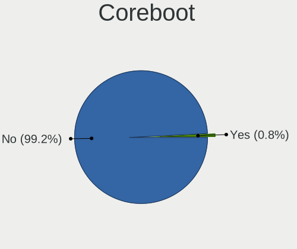
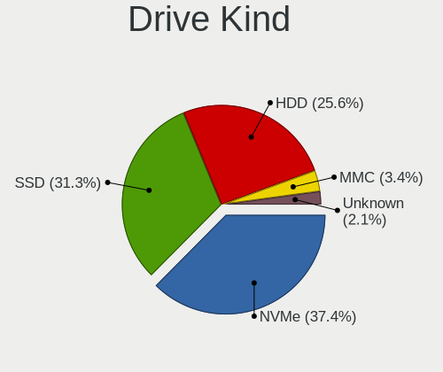
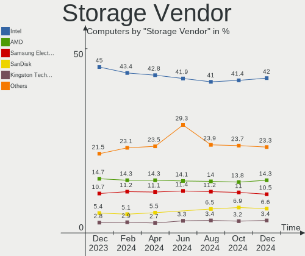
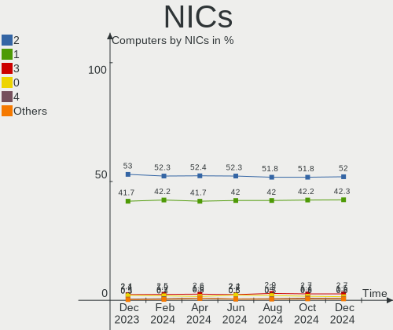
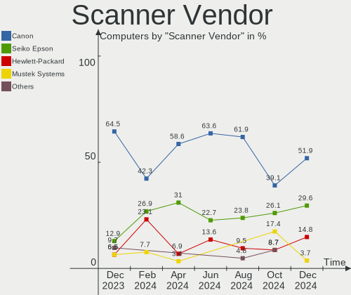

Linux - Hardware Trends
-----------------------

A project to identify most popular hardware characteristics and track their change
over time based on data collected by Linux users at https://Linux-Hardware.org.

Anyone can contribute to this report by the [hw-probe](https://github.com/linuxhw/hw-probe) tool:

    sudo -E hw-probe -all -upload

This is a report for all computer types. See also reports for [desktops](/Desktop/README.md) and [notebooks](/Notebook/README.md).

Distribution-specific reports: [Arch](/Dist/Arch), [ArcoLinux](/Dist/ArcoLinux), [BlackPanther](/Dist/BlackPanther), [CentOS](/Dist/CentOS), [Clear Linux](/Dist/Clear_Linux), [Debian](/Dist/Debian), [Elementary](/Dist/Elementary), [EndeavourOS](/Dist/EndeavourOS), [Endless](/Dist/Endless), [Fedora](/Dist/Fedora), [Garuda Linux](/Dist/Garuda_Linux), [Gentoo](/Dist/Gentoo), [Kali](/Dist/Kali), [KDE neon](/Dist/KDE_neon), [Kubuntu](/Dist/Kubuntu), [Linux Mint](/Dist/Linux_Mint), [Manjaro](/Dist/Manjaro), [OpenMandriva](/Dist/OpenMandriva), [openSUSE](/Dist/openSUSE), [Pop!_OS](/Dist/Pop!_OS), [Red OS](/Dist/Red_OS), [ROSA](/Dist/ROSA), [SteamOS](/Dist/SteamOS), [Ubuntu MATE](/Dist/Ubuntu_MATE), [Ubuntu](/Dist/Ubuntu), [Xubuntu](/Dist/Xubuntu), [Zorin](/Dist/Zorin).

This report is for one last month. Overall report since the beginning of time: [TestDays](https://github.com/linuxhw/TestDays)

Period: Jan, 2024.

Contents
--------

* [ System ](#system)
  - [ OS                       ](#os)
  - [ OS Family                ](#os-family)
  - [ Kernel                   ](#kernel)
  - [ Kernel Family            ](#kernel-family)
  - [ Kernel Major Ver.        ](#kernel-major-ver)
  - [ Arch                     ](#arch)
  - [ DE                       ](#de)
  - [ Display Server           ](#display-server)
  - [ Display Manager          ](#display-manager)
  - [ OS Lang                  ](#os-lang)
  - [ Boot Mode                ](#boot-mode)
  - [ Filesystem               ](#filesystem)
  - [ Part. scheme             ](#part-scheme)
  - [ Dual Boot with Linux/BSD ](#dual-boot-with-linuxbsd)
  - [ Dual Boot (Win)          ](#dual-boot-win)

* [ Board ](#board)
  - [ Vendor                   ](#vendor)
  - [ Model                    ](#model)
  - [ Model Family             ](#model-family)
  - [ MFG Year                 ](#mfg-year)
  - [ Form Factor              ](#form-factor)
  - [ Secure Boot              ](#secure-boot)
  - [ Coreboot                 ](#coreboot)
  - [ RAM Size                 ](#ram-size)
  - [ RAM Used                 ](#ram-used)
  - [ Total Drives             ](#total-drives)
  - [ Has CD-ROM               ](#has-cd-rom)
  - [ Has Ethernet             ](#has-ethernet)
  - [ Has WiFi                 ](#has-wifi)
  - [ Has Bluetooth            ](#has-bluetooth)

* [ Location ](#location)
  - [ Country                  ](#country)
  - [ City                     ](#city)

* [ Drives ](#drives)
  - [ Drive Vendor             ](#drive-vendor)
  - [ Drive Model              ](#drive-model)
  - [ HDD Vendor               ](#hdd-vendor)
  - [ SSD Vendor               ](#ssd-vendor)
  - [ Drive Kind               ](#drive-kind)
  - [ Drive Connector          ](#drive-connector)
  - [ Drive Size               ](#drive-size)
  - [ Space Total              ](#space-total)
  - [ Space Used               ](#space-used)
  - [ Malfunc. Drives          ](#malfunc-drives)
  - [ Malfunc. Drive Vendor    ](#malfunc-drive-vendor)
  - [ Malfunc. HDD Vendor      ](#malfunc-hdd-vendor)
  - [ Malfunc. Drive Kind      ](#malfunc-drive-kind)
  - [ Failed Drives            ](#failed-drives)
  - [ Failed Drive Vendor      ](#failed-drive-vendor)
  - [ Drive Status             ](#drive-status)

* [ Storage controller ](#storage-controller)
  - [ Storage Vendor           ](#storage-vendor)
  - [ Storage Model            ](#storage-model)
  - [ Storage Kind             ](#storage-kind)

* [ Processor ](#processor)
  - [ CPU Vendor               ](#cpu-vendor)
  - [ CPU Model                ](#cpu-model)
  - [ CPU Model Family         ](#cpu-model-family)
  - [ CPU Cores                ](#cpu-cores)
  - [ CPU Sockets              ](#cpu-sockets)
  - [ CPU Threads              ](#cpu-threads)
  - [ CPU Op-Modes             ](#cpu-op-modes)
  - [ CPU Microcode            ](#cpu-microcode)
  - [ CPU Microarch            ](#cpu-microarch)

* [ Graphics ](#graphics)
  - [ GPU Vendor               ](#gpu-vendor)
  - [ GPU Model                ](#gpu-model)
  - [ GPU Combo                ](#gpu-combo)
  - [ GPU Driver               ](#gpu-driver)
  - [ GPU Memory               ](#gpu-memory)

* [ Monitor ](#monitor)
  - [ Monitor Vendor           ](#monitor-vendor)
  - [ Monitor Model            ](#monitor-model)
  - [ Monitor Resolution       ](#monitor-resolution)
  - [ Monitor Diagonal         ](#monitor-diagonal)
  - [ Monitor Width            ](#monitor-width)
  - [ Aspect Ratio             ](#aspect-ratio)
  - [ Monitor Area             ](#monitor-area)
  - [ Pixel Density            ](#pixel-density)
  - [ Multiple Monitors        ](#multiple-monitors)

* [ Network ](#network)
  - [ Net Controller Vendor    ](#net-controller-vendor)
  - [ Net Controller Model     ](#net-controller-model)
  - [ Wireless Vendor          ](#wireless-vendor)
  - [ Wireless Model           ](#wireless-model)
  - [ Ethernet Vendor          ](#ethernet-vendor)
  - [ Ethernet Model           ](#ethernet-model)
  - [ Net Controller Kind      ](#net-controller-kind)
  - [ Used Controller          ](#used-controller)
  - [ NICs                     ](#nics)
  - [ IPv6                     ](#ipv6)

* [ Bluetooth ](#bluetooth)
  - [ Bluetooth Vendor         ](#bluetooth-vendor)
  - [ Bluetooth Model          ](#bluetooth-model)

* [ Sound ](#sound)
  - [ Sound Vendor             ](#sound-vendor)
  - [ Sound Model              ](#sound-model)

* [ Memory ](#memory)
  - [ Memory Vendor            ](#memory-vendor)
  - [ Memory Model             ](#memory-model)
  - [ Memory Kind              ](#memory-kind)
  - [ Memory Form Factor       ](#memory-form-factor)
  - [ Memory Size              ](#memory-size)
  - [ Memory Speed             ](#memory-speed)

* [ Printers & scanners ](#printers--scanners)
  - [ Printer Vendor           ](#printer-vendor)
  - [ Printer Model            ](#printer-model)
  - [ Scanner Vendor           ](#scanner-vendor)
  - [ Scanner Model            ](#scanner-model)

* [ Camera ](#camera)
  - [ Camera Vendor            ](#camera-vendor)
  - [ Camera Model             ](#camera-model)

* [ Security ](#security)
  - [ Fingerprint Vendor       ](#fingerprint-vendor)
  - [ Fingerprint Model        ](#fingerprint-model)
  - [ Chipcard Vendor          ](#chipcard-vendor)
  - [ Chipcard Model           ](#chipcard-model)

* [ Unsupported ](#unsupported)
  - [ Unsupported Devices      ](#unsupported-devices)
  - [ Unsupported Device Types ](#unsupported-device-types)

System
------

OS
--

Installed operating systems

| Name                         | Computers | Percent |
|------------------------------|-----------|---------|
| Ubuntu 22.04                 | 825       | 13.53%  |
| Fedora 39                    | 597       | 9.79%   |
| Debian 12                    | 430       | 7.05%   |
| Linux Mint 21.2              | 285       | 4.67%   |
| Ubuntu 23.10                 | 255       | 4.18%   |
| Arch Rolling                 | 242       | 3.97%   |
| Zorin 17                     | 217       | 3.56%   |
| Pop!_OS 22.04                | 194       | 3.18%   |
| Linux Mint 21.3              | 168       | 2.75%   |
| ROSA 12.4                    | 161       | 2.64%   |
| ArcoLinux Rolling            | 137       | 2.25%   |
| BlackPanther 18.1            | 130       | 2.13%   |
| OpenMandriva 23.08           | 117       | 1.92%   |
| OpenMandriva 5.0             | 106       | 1.74%   |
| Zorin 16                     | 105       | 1.72%   |
| Ubuntu 20.04                 | 81        | 1.33%   |
| Manjaro                      | 80        | 1.31%   |
| Kali 2023.4                  | 76        | 1.25%   |
| KDE neon 22.04               | 73        | 1.2%    |
| Nobara 39                    | 72        | 1.18%   |
| EndeavourOS Rolling          | 71        | 1.16%   |
| openSUSE Tumbleweed-XXXXXXXX | 69        | 1.13%   |
| Kubuntu 22.04                | 69        | 1.13%   |
| Kubuntu 23.10                | 68        | 1.11%   |
| Debian 11                    | 63        | 1.03%   |
| SteamOS 3.5.7                | 58        | 0.95%   |
| Debian                       | 55        | 0.9%    |
| OpenMandriva 24.01           | 51        | 0.84%   |
| LMDE 6                       | 47        | 0.77%   |
| Gentoo 2.14                  | 47        | 0.77%   |
| Linux Mint 20.3              | 38        | 0.62%   |
| Xubuntu 22.04                | 37        | 0.61%   |
| Fedora 38                    | 36        | 0.59%   |
| Elementary 7.1               | 34        | 0.56%   |
| Xero Rolling                 | 32        | 0.52%   |
| Manjaro 23.1.3               | 32        | 0.52%   |
| Ubuntu 23.04                 | 31        | 0.51%   |
| Linux Mint 21.1              | 31        | 0.51%   |
| NixOS 23.11                  | 25        | 0.41%   |
| MX 23                        | 25        | 0.41%   |

OS Family
---------

OS without a version

| Name         | Computers | Percent |
|--------------|-----------|---------|
| Ubuntu       | 1227      | 20.12%  |
| Fedora       | 647       | 10.61%  |
| Linux Mint   | 562       | 9.21%   |
| Debian       | 553       | 9.07%   |
| OpenMandriva | 346       | 5.67%   |
| Zorin        | 325       | 5.33%   |
| Arch         | 242       | 3.97%   |
| ROSA         | 200       | 3.28%   |
| Pop!_OS      | 196       | 3.21%   |
| Kubuntu      | 150       | 2.46%   |
| Manjaro      | 144       | 2.36%   |
| ArcoLinux    | 141       | 2.31%   |
| BlackPanther | 140       | 2.3%    |
| openSUSE     | 102       | 1.67%   |
| Nobara       | 87        | 1.43%   |
| SteamOS      | 83        | 1.36%   |
| Kali         | 82        | 1.34%   |
| Xubuntu      | 79        | 1.3%    |
| KDE neon     | 74        | 1.21%   |
| EndeavourOS  | 71        | 1.16%   |
| NixOS        | 49        | 0.8%    |
| LMDE         | 49        | 0.8%    |
| Gentoo       | 48        | 0.79%   |
| Lubuntu      | 41        | 0.67%   |
| Elementary   | 36        | 0.59%   |
| Xero         | 32        | 0.52%   |
| MX           | 29        | 0.48%   |
| Red OS       | 26        | 0.43%   |
| Ubuntu MATE  | 24        | 0.39%   |
| Garuda Linux | 24        | 0.39%   |
| Endless      | 16        | 0.26%   |
| Parrot       | 15        | 0.25%   |
| ChimeraOS    | 14        | 0.23%   |
| ALT Linux    | 12        | 0.2%    |
| RHEL         | 11        | 0.18%   |
| TUXEDO OS    | 10        | 0.16%   |
| Rocky Linux  | 10        | 0.16%   |
| Alpine       | 10        | 0.16%   |
| AlmaLinux    | 10        | 0.16%   |
| Clear Linux  | 9         | 0.15%   |

Kernel
------

Version of the Linux kernel

| Version                           | Computers | Percent |
|-----------------------------------|-----------|---------|
| 6.5.0-14-generic                  | 758       | 12.43%  |
| 5.15.0-91-generic                 | 526       | 8.62%   |
| 6.2.0-39-generic                  | 396       | 6.49%   |
| 6.1.0-17-amd64                    | 238       | 3.9%    |
| 6.5.0-15-generic                  | 215       | 3.53%   |
| 6.6.9-200.fc39.x86_64             | 203       | 3.33%   |
| 6.6.2-desktop-1omv2390            | 163       | 2.67%   |
| 6.6.6-76060606-generic            | 146       | 2.39%   |
| 6.4.11-desktop-1omv2390           | 105       | 1.72%   |
| 6.6.11-200.fc39.x86_64            | 95        | 1.56%   |
| 6.1.58-generic-1rosa2021.1-x86_64 | 95        | 1.56%   |
| 5.15.0-92-generic                 | 82        | 1.34%   |
| 6.6.8-200.fc39.x86_64             | 80        | 1.31%   |
| 6.6.13-200.fc39.x86_64            | 80        | 1.31%   |
| 5.15.85-desktop-1bP               | 68        | 1.11%   |
| 6.1.0-16-amd64                    | 67        | 1.1%    |
| 6.5.0-kali3-amd64                 | 63        | 1.03%   |
| 6.7.0-arch3-1                     | 62        | 1.02%   |
| 6.1.52-valve9-1-neptune-61        | 58        | 0.95%   |
| 6.6.10-arch1-1                    | 56        | 0.92%   |
| 6.2.0-26-generic                  | 55        | 0.9%    |
| 6.5.6-300.fc39.x86_64             | 54        | 0.89%   |
| 6.6.8-arch1-1                     | 52        | 0.85%   |
| 6.1.0-4-amd64                     | 49        | 0.8%    |
| 5.4.0-169-generic                 | 49        | 0.8%    |
| 6.1.20-generic-2rosa2021.1-x86_64 | 48        | 0.79%   |
| 6.6.9-arch1-1                     | 41        | 0.67%   |
| 6.6.10-1-MANJARO                  | 41        | 0.67%   |
| 6.6.12-200.fc39.x86_64            | 40        | 0.66%   |
| 6.7.1-arch1-1                     | 34        | 0.56%   |
| 5.6.14-desktop-2bP                | 33        | 0.54%   |
| 5.15.0-76-generic                 | 33        | 0.54%   |
| 6.7.0-zen3-1-zen                  | 32        | 0.52%   |
| 5.19.0-38-generic                 | 31        | 0.51%   |
| 6.6.8-2-MANJARO                   | 30        | 0.49%   |
| 5.10.0-27-amd64                   | 28        | 0.46%   |
| 6.6.1-arch1-1                     | 27        | 0.44%   |
| 6.7.2-arch1-1                     | 26        | 0.43%   |
| 6.6.10-76060610-generic           | 26        | 0.43%   |
| 6.6.10-zen1-1-zen                 | 25        | 0.41%   |

Kernel Family
-------------

Linux kernel without a distro release

| Version | Computers | Percent |
|---------|-----------|---------|
| 6.5.0   | 1177      | 19.3%   |
| 5.15.0  | 747       | 12.25%  |
| 6.2.0   | 503       | 8.25%   |
| 6.1.0   | 466       | 7.64%   |
| 6.6.9   | 334       | 5.48%   |
| 6.6.8   | 233       | 3.82%   |
| 6.7.0   | 201       | 3.3%    |
| 6.6.10  | 179       | 2.93%   |
| 6.6.2   | 168       | 2.75%   |
| 6.6.11  | 160       | 2.62%   |
| 6.6.6   | 157       | 2.57%   |
| 6.6.13  | 107       | 1.75%   |
| 6.4.11  | 106       | 1.74%   |
| 6.1.58  | 98        | 1.61%   |
| 5.4.0   | 92        | 1.51%   |
| 6.1.52  | 88        | 1.44%   |
| 6.5.6   | 77        | 1.26%   |
| 6.7.1   | 70        | 1.15%   |
| 5.15.85 | 69        | 1.13%   |
| 6.6.12  | 64        | 1.05%   |
| 5.10.0  | 57        | 0.93%   |
| 6.6.7   | 54        | 0.89%   |
| 5.19.0  | 51        | 0.84%   |
| 6.1.20  | 48        | 0.79%   |
| 6.7.2   | 39        | 0.64%   |
| 5.6.14  | 34        | 0.56%   |
| 6.1.69  | 33        | 0.54%   |
| 6.6.1   | 32        | 0.52%   |
| 6.5.11  | 30        | 0.49%   |
| 5.14.0  | 26        | 0.43%   |
| 5.14.21 | 25        | 0.41%   |
| 4.18.16 | 25        | 0.41%   |
| 6.5.13  | 23        | 0.38%   |
| 4.15.0  | 22        | 0.36%   |
| 6.6.4   | 21        | 0.34%   |
| 6.2.6   | 21        | 0.34%   |
| 6.1.71  | 18        | 0.3%    |
| 6.4.8   | 17        | 0.28%   |
| 6.1.67  | 17        | 0.28%   |
| 6.6.3   | 13        | 0.21%   |

Kernel Major Ver.
-----------------

Linux kernel major version

| Version | Computers | Percent |
|---------|-----------|---------|
| 6.6     | 1548      | 25.38%  |
| 6.5     | 1349      | 22.12%  |
| 5.15    | 855       | 14.02%  |
| 6.1     | 825       | 13.53%  |
| 6.2     | 545       | 8.94%   |
| 6.7     | 310       | 5.08%   |
| 6.4     | 150       | 2.46%   |
| 5.4     | 106       | 1.74%   |
| 5.10    | 102       | 1.67%   |
| 5.19    | 53        | 0.87%   |
| 5.14    | 52        | 0.85%   |
| 5.6     | 35        | 0.57%   |
| 4.18    | 35        | 0.57%   |
| 6.3     | 30        | 0.49%   |
| 4.15    | 23        | 0.38%   |
| 5.16    | 17        | 0.28%   |
| 6.0     | 12        | 0.2%    |
| 5.13    | 9         | 0.15%   |
| 4.19    | 6         | 0.1%    |
| 5.18    | 5         | 0.08%   |
| 5.11    | 5         | 0.08%   |
| 6.8     | 4         | 0.07%   |
| 4.9     | 4         | 0.07%   |
| 6       | 3         | 0.05%   |
| 5.8     | 3         | 0.05%   |
| 3.10    | 3         | 0.05%   |
| 5.3     | 2         | 0.03%   |
| 5.17    | 2         | 0.03%   |
| 4.4     | 2         | 0.03%   |
| 6.1.66  | 1         | 0.02%   |
| 5.0     | 1         | 0.02%   |
| 4.7     | 1         | 0.02%   |
| 4.20    | 1         | 0.02%   |

Arch
----

OS architecture (x86_64, i586, etc.)

| Name    | Computers | Percent |
|---------|-----------|---------|
| x86_64  | 5994      | 98.28%  |
| aarch64 | 54        | 0.89%   |
| i686    | 42        | 0.69%   |
| armv7l  | 6         | 0.1%    |
| riscv64 | 1         | 0.02%   |
| ppc     | 1         | 0.02%   |
| armv6l  | 1         | 0.02%   |

DE
--

Desktop Environment

| Name             | Computers | Percent |
|------------------|-----------|---------|
| GNOME            | 2586      | 42.4%   |
| KDE5             | 1570      | 25.74%  |
| X-Cinnamon       | 515       | 8.44%   |
| XFCE             | 428       | 7.02%   |
| Unknown          | 343       | 5.62%   |
| MATE             | 157       | 2.57%   |
| LXQt             | 108       | 1.77%   |
| Cinnamon         | 49        | 0.8%    |
| Hyprland         | 39        | 0.64%   |
| Pantheon         | 37        | 0.61%   |
| i3               | 33        | 0.54%   |
| Budgie           | 26        | 0.43%   |
| LXDE             | 21        | 0.34%   |
| KDE              | 20        | 0.33%   |
| sway             | 18        | 0.3%    |
| Endless:GNOME    | 14        | 0.23%   |
| GNOME Flashback  | 11        | 0.18%   |
| Deepin           | 11        | 0.18%   |
| openbox          | 10        | 0.16%   |
| KDE4             | 10        | 0.16%   |
| Unity            | 9         | 0.15%   |
| KDE6             | 8         | 0.13%   |
| GNOME Classic    | 8         | 0.13%   |
| lightdm-xsession | 7         | 0.11%   |
| Trinity          | 6         | 0.1%    |
| icewm            | 6         | 0.1%    |
| awesome          | 6         | 0.1%    |
| Enlightenment    | 5         | 0.08%   |
| DWM              | 5         | 0.08%   |
| LXDE-pi-wayfire  | 4         | 0.07%   |
| wayfire          | 3         | 0.05%   |
| none+i3          | 3         | 0.05%   |
| DDE              | 3         | 0.05%   |
| qtile            | 2         | 0.03%   |
| herbstluftwm     | 2         | 0.03%   |
| GNUstep          | 2         | 0.03%   |
| fly              | 2         | 0.03%   |
| bspwm            | 2         | 0.03%   |
| xinitrc          | 1         | 0.02%   |
| WindowMaker      | 1         | 0.02%   |

Display Server
--------------

X11 or Wayland

| Name    | Computers | Percent |
|---------|-----------|---------|
| X11     | 3239      | 53.11%  |
| Wayland | 2425      | 39.76%  |
| Unknown | 225       | 3.69%   |
| Tty     | 207       | 3.39%   |
| Web     | 3         | 0.05%   |

Display Manager
---------------

SDDM, LightDM, etc.

| Name          | Computers | Percent |
|---------------|-----------|---------|
| Unknown       | 2318      | 38.01%  |
| GDM3          | 1263      | 20.71%  |
| SDDM          | 1242      | 20.36%  |
| LightDM       | 845       | 13.85%  |
| GDM           | 388       | 6.36%   |
| KDM           | 9         | 0.15%   |
| XDM           | 6         | 0.1%    |
| TDM           | 5         | 0.08%   |
| LXDM          | 5         | 0.08%   |
| SLiM          | 4         | 0.07%   |
| LY-DM         | 4         | 0.07%   |
| GREETD        | 3         | 0.05%   |
| SLIMSKI       | 2         | 0.03%   |
| Ly            | 2         | 0.03%   |
| WDM           | 1         | 0.02%   |
| NODM          | 1         | 0.02%   |
| DARKDM_ON_TTY | 1         | 0.02%   |

OS Lang
-------

Language

| Lang    | Computers | Percent |
|---------|-----------|---------|
| en_US   | 2584      | 42.37%  |
| de_DE   | 515       | 8.44%   |
| ru_RU   | 482       | 7.9%    |
| en_GB   | 308       | 5.05%   |
| fr_FR   | 305       | 5%      |
| Unknown | 227       | 3.72%   |
| C       | 206       | 3.38%   |
| it_IT   | 190       | 3.12%   |
| pt_BR   | 165       | 2.71%   |
| es_ES   | 118       | 1.93%   |
| en_CA   | 110       | 1.8%    |
| en_AU   | 91        | 1.49%   |
| pl_PL   | 90        | 1.48%   |
| en_IN   | 63        | 1.03%   |
| es_MX   | 51        | 0.84%   |
| nl_NL   | 37        | 0.61%   |
| zh_CN   | 36        | 0.59%   |
| cs_CZ   | 31        | 0.51%   |
| hu_HU   | 29        | 0.48%   |
| tr_TR   | 28        | 0.46%   |
| pt_PT   | 26        | 0.43%   |
| es_AR   | 26        | 0.43%   |
| de_CH   | 26        | 0.43%   |
| en_ZA   | 19        | 0.31%   |
| de_AT   | 19        | 0.31%   |
| es_CL   | 17        | 0.28%   |
| sv_SE   | 15        | 0.25%   |
| fr_CA   | 15        | 0.25%   |
| da_DK   | 15        | 0.25%   |
| fr_BE   | 13        | 0.21%   |
| en_NZ   | 13        | 0.21%   |
| en_IE   | 13        | 0.21%   |
| es_CO   | 12        | 0.2%    |
| ja_JP   | 11        | 0.18%   |
| ro_RO   | 10        | 0.16%   |
| en_HK   | 10        | 0.16%   |
| el_GR   | 10        | 0.16%   |
| nb_NO   | 9         | 0.15%   |
| fi_FI   | 9         | 0.15%   |
| en_PH   | 9         | 0.15%   |

Boot Mode
---------

EFI or BIOS

| Mode | Computers | Percent |
|------|-----------|---------|
| EFI  | 3251      | 53.3%   |
| BIOS | 2848      | 46.7%   |

Filesystem
----------

Type of filesystem

| Type     | Computers | Percent |
|----------|-----------|---------|
| Ext4     | 3534      | 57.94%  |
| Btrfs    | 1160      | 19.02%  |
| Tmpfs    | 820       | 13.44%  |
| Overlay  | 404       | 6.62%   |
| Xfs      | 91        | 1.49%   |
| Zfs      | 51        | 0.84%   |
| F2fs     | 11        | 0.18%   |
| Ext3     | 10        | 0.16%   |
| Ext2     | 6         | 0.1%    |
| Unknown  | 6         | 0.1%    |
| Reiserfs | 3         | 0.05%   |
| Rootfs   | 1         | 0.02%   |
| Jfs      | 1         | 0.02%   |
| Aufs     | 1         | 0.02%   |

Part. scheme
------------

Scheme of partitioning

| Type    | Computers | Percent |
|---------|-----------|---------|
| GPT     | 3411      | 55.93%  |
| Unknown | 2008      | 32.92%  |
| MBR     | 680       | 11.15%  |

Dual Boot with Linux/BSD
------------------------

Hosting more than one Linux/BSD

| Dual boot | Computers | Percent |
|-----------|-----------|---------|
| No        | 5274      | 86.47%  |
| Yes       | 825       | 13.53%  |

Dual Boot (Win)
---------------

Hosting Linux and Windows

| Dual boot | Computers | Percent |
|-----------|-----------|---------|
| No        | 4572      | 74.96%  |
| Yes       | 1527      | 25.04%  |

Board
-----

Vendor
------

Motherboard manufacturer

| Name                                 | Computers | Percent |
|--------------------------------------|-----------|---------|
| ASUSTek Computer                     | 988       | 16.2%   |
| Lenovo                               | 872       | 14.3%   |
| Hewlett-Packard                      | 803       | 13.17%  |
| Dell                                 | 700       | 11.48%  |
| Gigabyte Technology                  | 381       | 6.25%   |
| MSI                                  | 369       | 6.05%   |
| Acer                                 | 291       | 4.77%   |
| ASRock                               | 207       | 3.39%   |
| Apple                                | 202       | 3.31%   |
| Intel                                | 107       | 1.75%   |
| Unknown                              | 84        | 1.38%   |
| Valve                                | 70        | 1.15%   |
| Toshiba                              | 63        | 1.03%   |
| Fujitsu                              | 60        | 0.98%   |
| Samsung Electronics                  | 53        | 0.87%   |
| HUAWEI                               | 42        | 0.69%   |
| Supermicro                           | 41        | 0.67%   |
| Medion                               | 39        | 0.64%   |
| Sony                                 | 34        | 0.56%   |
| Google                               | 34        | 0.56%   |
| Microsoft                            | 33        | 0.54%   |
| AZW                                  | 33        | 0.54%   |
| Raspberry Pi Foundation              | 28        | 0.46%   |
| Biostar                              | 21        | 0.34%   |
| TUXEDO                               | 20        | 0.33%   |
| Foxconn                              | 20        | 0.33%   |
| Pegatron                             | 17        | 0.28%   |
| Packard Bell                         | 16        | 0.26%   |
| Shenzhen Meigao Electronic Equipment | 15        | 0.25%   |
| Notebook                             | 15        | 0.25%   |
| Alienware                            | 15        | 0.25%   |
| ECS                                  | 13        | 0.21%   |
| Positivo                             | 11        | 0.18%   |
| LG Electronics                       | 11        | 0.18%   |
| System76                             | 10        | 0.16%   |
| Framework                            | 10        | 0.16%   |
| Aquarius                             | 10        | 0.16%   |
| Timi                                 | 9         | 0.15%   |
| Huanan                               | 9         | 0.15%   |
| BESSTAR Tech                         | 9         | 0.15%   |

Model
-----

Motherboard model

| Name                               | Computers | Percent |
|------------------------------------|-----------|---------|
| Unknown                            | 97        | 1.59%   |
| Valve Jupiter                      | 57        | 0.93%   |
| ASUS All Series                    | 55        | 0.9%    |
| HP ProDesk 400 G2.5 SFF            | 21        | 0.34%   |
| HP Notebook                        | 17        | 0.28%   |
| Dell OptiPlex 9020                 | 14        | 0.23%   |
| Valve Galileo                      | 13        | 0.21%   |
| MSI MS-7C56                        | 13        | 0.21%   |
| ASUS P5QL-CM                       | 13        | 0.21%   |
| Apple MacBookPro9,2                | 13        | 0.21%   |
| Apple MacBookAir7,2                | 13        | 0.21%   |
| HP Pavilion 15                     | 12        | 0.2%    |
| Dell OptiPlex 7010                 | 11        | 0.18%   |
| ASUS TUF Gaming X570-PLUS          | 11        | 0.18%   |
| ASUS PRIME A320M-K                 | 11        | 0.18%   |
| Apple MacBookPro14,1               | 11        | 0.18%   |
| MSI MS-7C95                        | 10        | 0.16%   |
| HP Pavilion dv6                    | 10        | 0.16%   |
| Dell Latitude 7490                 | 10        | 0.16%   |
| MSI MS-7C91                        | 9         | 0.15%   |
| MSI MS-7B89                        | 9         | 0.15%   |
| Dell OptiPlex 7050                 | 9         | 0.15%   |
| AZW SER                            | 9         | 0.15%   |
| ASRock B450M Pro4                  | 9         | 0.15%   |
| Aquarius NS585                     | 9         | 0.15%   |
| Apple MacBookAir6,2                | 9         | 0.15%   |
| RPi Raspberry Pi 5 Model B Rev 1.0 | 8         | 0.13%   |
| HP EliteBook 840 G3                | 8         | 0.13%   |
| ETegro Hyperion RS125 G4           | 8         | 0.13%   |
| Dell XPS 15 9530                   | 8         | 0.13%   |
| ASUS Vivobook Go E1504FA_E1504FA   | 8         | 0.13%   |
| ASUS ROG STRIX X670E-E GAMING WIFI | 8         | 0.13%   |
| Apple MacBookPro8,1                | 8         | 0.13%   |
| MSI MS-7C37                        | 7         | 0.11%   |
| MSI MS-7B86                        | 7         | 0.11%   |
| Microsoft Surface Pro 3            | 7         | 0.11%   |
| Intel X99                          | 7         | 0.11%   |
| HP ProDesk 400 G3 SFF              | 7         | 0.11%   |
| HP Pavilion dv7                    | 7         | 0.11%   |
| HP Laptop 15s-eq2xxx               | 7         | 0.11%   |

Model Family
------------

Motherboard model prefix

| Name               | Computers | Percent |
|--------------------|-----------|---------|
| Lenovo ThinkPad    | 390       | 6.39%   |
| Dell Latitude      | 201       | 3.3%    |
| Acer Aspire        | 189       | 3.1%    |
| Dell Inspiron      | 183       | 3%      |
| Lenovo IdeaPad     | 163       | 2.67%   |
| ASUS ROG           | 155       | 2.54%   |
| ASUS PRIME         | 137       | 2.25%   |
| HP Pavilion        | 120       | 1.97%   |
| ASUS Vivobook      | 114       | 1.87%   |
| Dell OptiPlex      | 111       | 1.82%   |
| HP EliteBook       | 102       | 1.67%   |
| Unknown            | 97        | 1.59%   |
| HP Laptop          | 88        | 1.44%   |
| Dell Precision     | 74        | 1.21%   |
| ASUS TUF           | 73        | 1.2%    |
| HP ProBook         | 71        | 1.16%   |
| Lenovo ThinkCentre | 69        | 1.13%   |
| Dell XPS           | 66        | 1.08%   |
| Valve Jupiter      | 57        | 0.93%   |
| Toshiba Satellite  | 55        | 0.9%    |
| ASUS All           | 55        | 0.9%    |
| HP Compaq          | 52        | 0.85%   |
| Lenovo Yoga        | 48        | 0.79%   |
| HP ProDesk         | 44        | 0.72%   |
| HP ENVY            | 40        | 0.66%   |
| Lenovo Legion      | 39        | 0.64%   |
| ASUS ASUS          | 37        | 0.61%   |
| ASUS ZenBook       | 36        | 0.59%   |
| HP EliteDesk       | 34        | 0.56%   |
| Microsoft Surface  | 33        | 0.54%   |
| Fujitsu LIFEBOOK   | 29        | 0.48%   |
| RPi Raspberry      | 28        | 0.46%   |
| Acer Nitro         | 28        | 0.46%   |
| HP ZBook           | 26        | 0.43%   |
| Acer Swift         | 25        | 0.41%   |
| Dell Vostro        | 23        | 0.38%   |
| HP Spectre         | 22        | 0.36%   |
| Fujitsu ESPRIMO    | 21        | 0.34%   |
| Lenovo ThinkBook   | 20        | 0.33%   |
| HP OMEN            | 20        | 0.33%   |

MFG Year
--------

Motherboard manufacture year

| Year    | Computers | Percent |
|---------|-----------|---------|
| 2022    | 569       | 9.33%   |
| 2023    | 568       | 9.31%   |
| 2021    | 565       | 9.26%   |
| 2020    | 538       | 8.82%   |
| 2018    | 466       | 7.64%   |
| 2019    | 437       | 7.17%   |
| 2013    | 385       | 6.31%   |
| 2012    | 359       | 5.89%   |
| 2017    | 333       | 5.46%   |
| 2014    | 308       | 5.05%   |
| 2016    | 297       | 4.87%   |
| 2015    | 269       | 4.41%   |
| 2011    | 255       | 4.18%   |
| 2010    | 234       | 3.84%   |
| 2009    | 164       | 2.69%   |
| 2008    | 150       | 2.46%   |
| 2007    | 98        | 1.61%   |
| Unknown | 60        | 0.98%   |
| 2006    | 31        | 0.51%   |
| 2005    | 7         | 0.11%   |
| 2024    | 3         | 0.05%   |
| 2004    | 2         | 0.03%   |
| 2003    | 1         | 0.02%   |

Form Factor
-----------

Physical design of the computer

| Name           | Computers | Percent |
|----------------|-----------|---------|
| Notebook       | 3191      | 52.32%  |
| Desktop        | 2333      | 38.25%  |
| Convertible    | 178       | 2.92%   |
| Mini pc        | 119       | 1.95%   |
| Server         | 82        | 1.34%   |
| All in one     | 81        | 1.33%   |
| Tablet         | 62        | 1.02%   |
| System on chip | 52        | 0.85%   |
| Other          | 1         | 0.02%   |

Secure Boot
-----------

Enabled or disabled

| State    | Computers | Percent |
|----------|-----------|---------|
| Disabled | 5675      | 93.05%  |
| Enabled  | 424       | 6.95%   |

Coreboot
--------

Have coreboot on board

| Used | Computers | Percent |
|------|-----------|---------|
| No   | 6056      | 99.29%  |
| Yes  | 43        | 0.71%   |

RAM Size
--------

Total RAM memory

| Size in GB      | Computers | Percent |
|-----------------|-----------|---------|
| 4.01-8.0        | 1394      | 22.86%  |
| 16.01-24.0      | 1252      | 20.53%  |
| 8.01-16.0       | 1058      | 17.35%  |
| 32.01-64.0      | 858       | 14.07%  |
| 3.01-4.0        | 790       | 12.95%  |
| 64.01-256.0     | 320       | 5.25%   |
| 24.01-32.0      | 187       | 3.07%   |
| 1.01-2.0        | 130       | 2.13%   |
| 2.01-3.0        | 61        | 1%      |
| More than 256.0 | 31        | 0.51%   |
| 0.51-1.0        | 13        | 0.21%   |
| 0.01-0.5        | 5         | 0.08%   |

RAM Used
--------

Used RAM memory

| Used GB     | Computers | Percent |
|-------------|-----------|---------|
| 1.01-2.0    | 1569      | 25.73%  |
| 2.01-3.0    | 1488      | 24.4%   |
| 4.01-8.0    | 1248      | 20.46%  |
| 3.01-4.0    | 967       | 15.86%  |
| 8.01-16.0   | 337       | 5.53%   |
| 0.51-1.0    | 317       | 5.2%    |
| 16.01-24.0  | 63        | 1.03%   |
| 0.01-0.5    | 61        | 1%      |
| 24.01-32.0  | 21        | 0.34%   |
| 32.01-64.0  | 14        | 0.23%   |
| 64.01-256.0 | 12        | 0.2%    |
| Unknown     | 2         | 0.03%   |

Total Drives
------------

Number of drives on board

| Drives | Computers | Percent |
|--------|-----------|---------|
| 1      | 3691      | 60.52%  |
| 2      | 1419      | 23.27%  |
| 3      | 499       | 8.18%   |
| 4      | 216       | 3.54%   |
| 5      | 113       | 1.85%   |
| 6      | 62        | 1.02%   |
| 0      | 28        | 0.46%   |
| 7      | 23        | 0.38%   |
| 8      | 20        | 0.33%   |
| 9      | 9         | 0.15%   |
| 11     | 5         | 0.08%   |
| 13     | 3         | 0.05%   |
| 19     | 2         | 0.03%   |
| 10     | 2         | 0.03%   |
| 70     | 1         | 0.02%   |
| 33     | 1         | 0.02%   |
| 26     | 1         | 0.02%   |
| 25     | 1         | 0.02%   |
| 21     | 1         | 0.02%   |
| 16     | 1         | 0.02%   |
| 14     | 1         | 0.02%   |

Has CD-ROM
----------

Has CD-ROM on board

| Presented | Computers | Percent |
|-----------|-----------|---------|
| No        | 4272      | 70.04%  |
| Yes       | 1827      | 29.96%  |

Has Ethernet
------------

Has Ethernet on board

| Presented | Computers | Percent |
|-----------|-----------|---------|
| Yes       | 5066      | 83.06%  |
| No        | 1033      | 16.94%  |

Has WiFi
--------

Has WiFi module

| Presented | Computers | Percent |
|-----------|-----------|---------|
| Yes       | 4721      | 77.41%  |
| No        | 1378      | 22.59%  |

Has Bluetooth
-------------

Has Bluetooth module

| Presented | Computers | Percent |
|-----------|-----------|---------|
| Yes       | 4006      | 65.68%  |
| No        | 2093      | 34.32%  |

Location
--------

Country
-------

Geographic location (country)

| Country      | Computers | Percent |
|--------------|-----------|---------|
| USA          | 1205      | 19.76%  |
| Germany      | 706       | 11.58%  |
| Russia       | 582       | 9.54%   |
| France       | 353       | 5.79%   |
| Italy        | 256       | 4.2%    |
| Brazil       | 254       | 4.16%   |
| UK           | 244       | 4%      |
| Canada       | 193       | 3.16%   |
| Hungary      | 164       | 2.69%   |
| Poland       | 161       | 2.64%   |
| Spain        | 147       | 2.41%   |
| India        | 122       | 2%      |
| Netherlands  | 113       | 1.85%   |
| Australia    | 111       | 1.82%   |
| Switzerland  | 81        | 1.33%   |
| Mexico       | 69        | 1.13%   |
| Sweden       | 63        | 1.03%   |
| Turkey       | 62        | 1.02%   |
| Czechia      | 59        | 0.97%   |
| Austria      | 59        | 0.97%   |
| Portugal     | 48        | 0.79%   |
| Argentina    | 48        | 0.79%   |
| Belgium      | 47        | 0.77%   |
| Romania      | 46        | 0.75%   |
| China        | 44        | 0.72%   |
| Finland      | 40        | 0.66%   |
| Indonesia    | 39        | 0.64%   |
| Greece       | 33        | 0.54%   |
| Chile        | 31        | 0.51%   |
| Bulgaria     | 31        | 0.51%   |
| Colombia     | 30        | 0.49%   |
| South Africa | 29        | 0.48%   |
| Japan        | 29        | 0.48%   |
| Hong Kong    | 27        | 0.44%   |
| Denmark      | 25        | 0.41%   |
| Norway       | 22        | 0.36%   |
| New Zealand  | 22        | 0.36%   |
| Belarus      | 22        | 0.36%   |
| Vietnam      | 21        | 0.34%   |
| Thailand     | 19        | 0.31%   |

City
----

Geographic location (city)

| City              | Computers | Percent |
|-------------------|-----------|---------|
| Moscow            | 135       | 2.21%   |
| Berlin            | 62        | 1.02%   |
| Voronezh          | 55        | 0.9%    |
| Budapest          | 55        | 0.9%    |
| St Petersburg     | 47        | 0.77%   |
| Sydney            | 40        | 0.66%   |
| Paris             | 37        | 0.61%   |
| Hamburg           | 37        | 0.61%   |
| Warsaw            | 32        | 0.52%   |
| Milan             | 31        | 0.51%   |
| Munich            | 30        | 0.49%   |
| Toronto           | 28        | 0.46%   |
| Rome              | 28        | 0.46%   |
| Amsterdam         | 28        | 0.46%   |
| Roubaix           | 27        | 0.44%   |
| Vienna            | 25        | 0.41%   |
| Melbourne         | 25        | 0.41%   |
| Los Angeles       | 22        | 0.36%   |
| Istanbul          | 22        | 0.36%   |
| Frankfurt am Main | 21        | 0.34%   |
| Montreal          | 20        | 0.33%   |
| Santiago          | 19        | 0.31%   |
| Prague            | 19        | 0.31%   |
| Denver            | 19        | 0.31%   |
| Sao Paulo         | 18        | 0.3%    |
| Central           | 18        | 0.3%    |
| Zurich            | 17        | 0.28%   |
| Sofia             | 17        | 0.28%   |
| New York          | 17        | 0.28%   |
| Calgary           | 17        | 0.28%   |
| Turin             | 16        | 0.26%   |
| Stuttgart         | 16        | 0.26%   |
| Stockholm         | 16        | 0.26%   |
| Krakow            | 16        | 0.26%   |
| Helsinki          | 16        | 0.26%   |
| Bengaluru         | 16        | 0.26%   |
| Bagneux           | 16        | 0.26%   |
| Athens            | 16        | 0.26%   |
| Singapore         | 15        | 0.25%   |
| Madrid            | 15        | 0.25%   |

Drives
------

Drive Vendor
------------

Hard drive vendors

| Vendor                       | Computers | Drives | Percent |
|------------------------------|-----------|--------|---------|
| Samsung Electronics          | 1449      | 1830   | 16.07%  |
| WDC                          | 1081      | 1361   | 11.99%  |
| Seagate                      | 934       | 1228   | 10.36%  |
| Sandisk                      | 604       | 661    | 6.7%    |
| Kingston                     | 492       | 543    | 5.46%   |
| Toshiba                      | 422       | 505    | 4.68%   |
| Unknown                      | 358       | 407    | 3.97%   |
| Crucial                      | 316       | 355    | 3.51%   |
| SK hynix                     | 285       | 294    | 3.16%   |
| Intel                        | 232       | 265    | 2.57%   |
| Micron Technology            | 214       | 219    | 2.37%   |
| Hitachi                      | 176       | 217    | 1.95%   |
| Phison Electronics           | 155       | 165    | 1.72%   |
| A-DATA Technology            | 122       | 127    | 1.35%   |
| China                        | 115       | 125    | 1.28%   |
| HGST                         | 113       | 126    | 1.25%   |
| Kingston Technology Company  | 112       | 114    | 1.24%   |
| Micron/Crucial Technology    | 110       | 126    | 1.22%   |
| Apple                        | 105       | 131    | 1.16%   |
| KIOXIA                       | 104       | 109    | 1.15%   |
| Unknown                      | 80        | 81     | 0.89%   |
| Intenso                      | 73        | 76     | 0.81%   |
| MAXIO Technology (Hangzhou)  | 67        | 70     | 0.74%   |
| PNY                          | 64        | 66     | 0.71%   |
| Silicon Motion               | 63        | 64     | 0.7%    |
| SPCC                         | 55        | 56     | 0.61%   |
| Patriot                      | 35        | 35     | 0.39%   |
| Fujitsu                      | 32        | 38     | 0.36%   |
| Realtek Semiconductor        | 31        | 33     | 0.34%   |
| Phison                       | 31        | 35     | 0.34%   |
| ADATA Technology             | 31        | 31     | 0.34%   |
| Transcend                    | 30        | 32     | 0.33%   |
| JMicron Technology           | 30        | 31     | 0.33%   |
| GOODRAM                      | 29        | 32     | 0.32%   |
| Lexar                        | 28        | 28     | 0.31%   |
| Netac                        | 27        | 28     | 0.3%    |
| Fanxiang                     | 25        | 27     | 0.28%   |
| Team                         | 24        | 28     | 0.27%   |
| Apacer                       | 24        | 24     | 0.27%   |
| Shenzhen Longsys Electronics | 23        | 24     | 0.26%   |

Drive Model
-----------

Hard drive models

| Model                                                 | Computers | Percent |
|-------------------------------------------------------|-----------|---------|
| Samsung NVMe SSD Controller SM981/PM981/PM983 1TB     | 215       | 2.18%   |
| Samsung NVMe SSD Controller PM9A1/PM9A3/980PRO 2TB    | 132       | 1.34%   |
| Kingston SA400S37240G 240GB SSD                       | 102       | 1.03%   |
| Kingston SA400S37480G 480GB SSD                       | 87        | 0.88%   |
| Unknown                                               | 80        | 0.81%   |
| Micron/Crucial P2 NVMe PCIe SSD 1TB                   | 69        | 0.7%    |
| Seagate ST1000LM035-1RK172 1TB                        | 60        | 0.61%   |
| Samsung NVMe SSD Controller SM961/PM961/SM963 256GB   | 57        | 0.58%   |
| Samsung SSD 850 EVO 250GB                             | 56        | 0.57%   |
| Seagate ST500DM002-1BD142 500GB                       | 55        | 0.56%   |
| Samsung SSD 860 EVO 500GB                             | 54        | 0.55%   |
| Unknown MMC Card  64GB                                | 53        | 0.54%   |
| Samsung SSD 860 EVO 1TB                               | 51        | 0.52%   |
| Sandisk WD Blue SN550 NVMe SSD 512GB                  | 50        | 0.51%   |
| Seagate ST1000DM010-2EP102 1TB                        | 47        | 0.48%   |
| Phison PS5013 E13 NVMe Controller 256GB               | 46        | 0.47%   |
| Unknown MMC Card  32GB                                | 45        | 0.46%   |
| MAXIO (Hangzhou) NVMe SSD Controller MAP1202 512GB    | 43        | 0.44%   |
| Samsung SSD 870 EVO 1TB                               | 41        | 0.42%   |
| Crucial CT1000MX500SSD1 1TB                           | 40        | 0.4%    |
| Samsung SSD 980 1TB                                   | 39        | 0.39%   |
| Phison E12 NVMe Controller 1TB                        | 39        | 0.39%   |
| Sandisk WD Black SN750 / PC SN730 NVMe SSD 512GB      | 38        | 0.38%   |
| WDC WD10EZEX-08WN4A0 1TB                              | 37        | 0.37%   |
| Samsung SSD 850 EVO 500GB                             | 37        | 0.37%   |
| Kingston Company SNV2S1000G 1TB                       | 36        | 0.36%   |
| Crucial CT500MX500SSD1 500GB                          | 36        | 0.36%   |
| Toshiba MQ01ABD100 1TB                                | 35        | 0.35%   |
| Silicon Motion SM2263EN/SM2263XT SSD Controller 128GB | 34        | 0.34%   |
| Crucial CT1000BX500SSD1 1TB                           | 34        | 0.34%   |
| Unknown SD/MMC/MS PRO 256GB                           | 33        | 0.33%   |
| Unknown MMC Card  128GB                               | 33        | 0.33%   |
| Intel SSDPEKNU512GZ 512GB                             | 33        | 0.33%   |
| Seagate ST1000LM024 HN-M101MBB 1TB                    | 32        | 0.32%   |
| Samsung SSD 860 EVO 250GB                             | 32        | 0.32%   |
| Toshiba DT01ACA100 1TB                                | 31        | 0.31%   |
| Crucial CT480BX500SSD1 480GB                          | 31        | 0.31%   |
| Seagate ST2000DM008-2FR102 2TB                        | 30        | 0.3%    |
| Samsung SSD 870 QVO 1TB                               | 30        | 0.3%    |
| Samsung SSD 870 EVO 500GB                             | 30        | 0.3%    |

HDD Vendor
----------

Hard disk drive vendors

| Vendor              | Computers | Drives | Percent |
|---------------------|-----------|--------|---------|
| Seagate             | 913       | 1190   | 34.27%  |
| WDC                 | 855       | 1087   | 32.09%  |
| Toshiba             | 334       | 411    | 12.54%  |
| Hitachi             | 176       | 217    | 6.61%   |
| HGST                | 113       | 126    | 4.24%   |
| Samsung Electronics | 89        | 102    | 3.34%   |
| Unknown             | 35        | 35     | 1.31%   |
| Fujitsu             | 32        | 38     | 1.2%    |
| Apple               | 22        | 22     | 0.83%   |
| JMicron Technology  | 21        | 22     | 0.79%   |
| Maxtor              | 18        | 19     | 0.68%   |
| External            | 8         | 10     | 0.3%    |
| Intenso             | 5         | 5      | 0.19%   |
| Hewlett-Packard     | 5         | 18     | 0.19%   |
| ASMT                | 5         | 8      | 0.19%   |
| TO Exter            | 4         | 4      | 0.15%   |
| TDAS                | 2         | 9      | 0.08%   |
| SSK                 | 2         | 4      | 0.08%   |
| MARSHAL             | 2         | 2      | 0.08%   |
| Lenovo              | 2         | 16     | 0.08%   |
| Inateck             | 2         | 2      | 0.08%   |
| HPE                 | 2         | 2      | 0.08%   |
| FC-1307             | 2         | 2      | 0.08%   |
| Unknown             | 2         | 2      | 0.08%   |
| USB3.0              | 1         | 1      | 0.04%   |
| Unknown (CF)        | 1         | 1      | 0.04%   |
| StoreJet            | 1         | 1      | 0.04%   |
| QEMU                | 1         | 1      | 0.04%   |
| NETAPP              | 1         | 3      | 0.04%   |
| Min Yi U            | 1         | 1      | 0.04%   |
| Mercury             | 1         | 1      | 0.04%   |
| MaxDigital          | 1         | 1      | 0.04%   |
| LaCie               | 1         | 1      | 0.04%   |
| IBM-ESXS            | 1         | 1      | 0.04%   |
| ExcelStor           | 1         | 1      | 0.04%   |
| CSD                 | 1         | 1      | 0.04%   |
| Asm                 | 1         | 1      | 0.04%   |

SSD Vendor
----------

Solid state drive vendors

| Vendor              | Computers | Drives | Percent |
|---------------------|-----------|--------|---------|
| Samsung Electronics | 645       | 743    | 21.66%  |
| Kingston            | 373       | 399    | 12.53%  |
| Crucial             | 273       | 304    | 9.17%   |
| SanDisk             | 226       | 234    | 7.59%   |
| WDC                 | 183       | 190    | 6.15%   |
| China               | 115       | 125    | 3.86%   |
| A-DATA Technology   | 95        | 98     | 3.19%   |
| Intel               | 69        | 76     | 2.32%   |
| PNY                 | 62        | 64     | 2.08%   |
| SK hynix            | 59        | 60     | 1.98%   |
| Intenso             | 56        | 59     | 1.88%   |
| Apple               | 54        | 54     | 1.81%   |
| SPCC                | 48        | 49     | 1.61%   |
| Micron Technology   | 46        | 51     | 1.54%   |
| Patriot             | 31        | 31     | 1.04%   |
| GOODRAM             | 29        | 32     | 0.97%   |
| Transcend           | 28        | 29     | 0.94%   |
| Unknown             | 23        | 23     | 0.77%   |
| Toshiba             | 22        | 25     | 0.74%   |
| OCZ                 | 22        | 22     | 0.74%   |
| Apacer              | 22        | 22     | 0.74%   |
| Netac               | 20        | 20     | 0.67%   |
| LITEONIT            | 20        | 20     | 0.67%   |
| LITEON              | 20        | 20     | 0.67%   |
| Team                | 19        | 22     | 0.64%   |
| Lexar               | 18        | 18     | 0.6%    |
| KingSpec            | 18        | 18     | 0.6%    |
| Gigabyte Technology | 17        | 17     | 0.57%   |
| Hewlett-Packard     | 14        | 14     | 0.47%   |
| Fanxiang            | 14        | 15     | 0.47%   |
| XrayDisk            | 13        | 13     | 0.44%   |
| Verbatim            | 10        | 11     | 0.34%   |
| SABRENT             | 10        | 10     | 0.34%   |
| Corsair             | 10        | 10     | 0.34%   |
| Plextor             | 9         | 9      | 0.3%    |
| Phison              | 8         | 8      | 0.27%   |
| USB3.0              | 7         | 7      | 0.24%   |
| Seagate             | 6         | 8      | 0.2%    |
| FIKWOT              | 6         | 6      | 0.2%    |
| AMD                 | 6         | 6      | 0.2%    |

Drive Kind
----------

HDD or SSD

| Kind    | Computers | Drives | Percent |
|---------|-----------|--------|---------|
| NVMe    | 2790      | 3429   | 34.46%  |
| SSD     | 2579      | 3215   | 31.85%  |
| HDD     | 2270      | 3368   | 28.04%  |
| MMC     | 315       | 345    | 3.89%   |
| Unknown | 143       | 177    | 1.77%   |

Drive Connector
---------------

SATA, SAS, NVMe, etc.

| Type | Computers | Drives | Percent |
|------|-----------|--------|---------|
| SATA | 3906      | 6266   | 52.81%  |
| NVMe | 2783      | 3400   | 37.62%  |
| SAS  | 393       | 523    | 5.31%   |
| MMC  | 315       | 345    | 4.26%   |

Drive Size
----------

Size of hard drive

| Size in TB | Computers | Drives | Percent |
|------------|-----------|--------|---------|
| 0.01-0.5   | 2769      | 3568   | 54.42%  |
| 0.51-1.0   | 1493      | 1832   | 29.34%  |
| 1.01-2.0   | 436       | 553    | 8.57%   |
| 3.01-4.0   | 170       | 258    | 3.34%   |
| 4.01-10.0  | 107       | 169    | 2.1%    |
| 2.01-3.0   | 82        | 125    | 1.61%   |
| 10.01-20.0 | 30        | 76     | 0.59%   |
| 20.01-50.0 | 1         | 2      | 0.02%   |

Space Total
-----------

Amount of disk space available on the file system

| Size in GB     | Computers | Percent |
|----------------|-----------|---------|
| 101-250        | 1395      | 22.87%  |
| 251-500        | 1318      | 21.61%  |
| 501-1000       | 1003      | 16.45%  |
| 1001-2000      | 598       | 9.8%    |
| More than 3000 | 474       | 7.77%   |
| 1-20           | 340       | 5.57%   |
| Unknown        | 319       | 5.23%   |
| 51-100         | 304       | 4.98%   |
| 2001-3000      | 198       | 3.25%   |
| 21-50          | 150       | 2.46%   |

Space Used
----------

Amount of used disk space

| Used GB        | Computers | Percent |
|----------------|-----------|---------|
| 1-20           | 1816      | 29.78%  |
| 21-50          | 1095      | 17.95%  |
| 101-250        | 855       | 14.02%  |
| 51-100         | 654       | 10.72%  |
| 251-500        | 493       | 8.08%   |
| 501-1000       | 408       | 6.69%   |
| Unknown        | 319       | 5.23%   |
| 1001-2000      | 217       | 3.56%   |
| More than 3000 | 135       | 2.21%   |
| 2001-3000      | 101       | 1.66%   |
| 0              | 6         | 0.1%    |

Malfunc. Drives
---------------

Drive models with a malfunction

| Model                                 | Computers | Drives | Percent |
|---------------------------------------|-----------|--------|---------|
| Seagate ST500DM002-1BD142 500GB       | 13        | 13     | 2.11%   |
| WDC WD3200AAJS-00L7A0 320GB           | 9         | 9      | 1.46%   |
| Seagate ST9500325AS 500GB             | 8         | 8      | 1.3%    |
| Seagate ST1000LM024 HN-M101MBB 1TB    | 8         | 8      | 1.3%    |
| Seagate ST500LT012-1DG142 500GB       | 7         | 7      | 1.13%   |
| Samsung Electronics SSD 870 EVO 1TB   | 7         | 8      | 1.13%   |
| HGST HTS541010A9E680 1TB              | 7         | 7      | 1.13%   |
| Toshiba MQ01ABF050 500GB              | 5         | 5      | 0.81%   |
| Seagate ST320LT020-9YG142 320GB       | 5         | 5      | 0.81%   |
| Seagate ST1000LM035-1RK172 1TB        | 5         | 5      | 0.81%   |
| SanDisk SSD PLUS 1000GB               | 5         | 5      | 0.81%   |
| WDC WD20EFRX-68EUZN0 2TB              | 4         | 6      | 0.65%   |
| Toshiba MQ01ABD050 500GB              | 4         | 4      | 0.65%   |
| Seagate ST9320325AS 320GB             | 4         | 4      | 0.65%   |
| Seagate ST500LT012-9WS142 500GB       | 4         | 4      | 0.65%   |
| Seagate ST1000DM010-2EP102 1TB        | 4         | 4      | 0.65%   |
| Samsung Electronics SSD 870 EVO 500GB | 4         | 4      | 0.65%   |
| Hitachi HDS721050CLA362 500GB         | 4         | 4      | 0.65%   |
| HGST HTS545050A7E680 500GB            | 4         | 4      | 0.65%   |
| HGST HTS545050A7E380 500GB            | 4         | 4      | 0.65%   |
| Crucial CT275MX300SSD1 275GB          | 4         | 4      | 0.65%   |
| WDC WDS240G2G0A-00JH30 240GB SSD      | 3         | 3      | 0.49%   |
| WDC WD5000LPVX-22V0TT0 500GB          | 3         | 3      | 0.49%   |
| WDC WD5000AAKX-00ERMA0 500GB          | 3         | 3      | 0.49%   |
| WDC WD20EARS-00MVWB0 2TB              | 3         | 3      | 0.49%   |
| WDC WD2002FAEX-007BA0 2TB             | 3         | 3      | 0.49%   |
| Toshiba DT01ACA100 1TB                | 3         | 3      | 0.49%   |
| Seagate ST500LM012 HN-M500MBB 500GB   | 3         | 4      | 0.49%   |
| Seagate ST3500418AS 500GB             | 3         | 3      | 0.49%   |
| Seagate ST31000528AS 1TB              | 3         | 3      | 0.49%   |
| Seagate ST2000DM008-2FR102 2TB        | 3         | 4      | 0.49%   |
| Seagate ST1000DM003-9YN162 1TB        | 3         | 3      | 0.49%   |
| Seagate ST1000DM003-1SB102 1TB        | 3         | 3      | 0.49%   |
| Seagate ST1000DM003-1CH162 1TB        | 3         | 3      | 0.49%   |
| SanDisk SSD PLUS 480GB                | 3         | 3      | 0.49%   |
| SanDisk SD9SN8W-128G-1006 128GB SSD   | 3         | 3      | 0.49%   |
| Maxtor STM3250310AS 250GB             | 3         | 3      | 0.49%   |
| Kingston SA400S37240G 240GB SSD       | 3         | 3      | 0.49%   |
| Intel SSDSA2M080G2GC 80GB             | 3         | 3      | 0.49%   |
| Hitachi HTS547550A9E384 500GB         | 3         | 3      | 0.49%   |

Malfunc. Drive Vendor
---------------------

Vendors of faulty drives

| Vendor                      | Computers | Drives | Percent |
|-----------------------------|-----------|--------|---------|
| WDC                         | 144       | 165    | 24.08%  |
| Seagate                     | 137       | 145    | 22.91%  |
| Hitachi                     | 47        | 49     | 7.86%   |
| Samsung Electronics         | 41        | 48     | 6.86%   |
| Toshiba                     | 39        | 43     | 6.52%   |
| HGST                        | 27        | 28     | 4.52%   |
| Kingston                    | 20        | 20     | 3.34%   |
| SanDisk                     | 17        | 17     | 2.84%   |
| SK hynix                    | 16        | 16     | 2.68%   |
| Intel                       | 16        | 18     | 2.68%   |
| Crucial                     | 14        | 14     | 2.34%   |
| China                       | 8         | 8      | 1.34%   |
| Apple                       | 8         | 8      | 1.34%   |
| Maxtor                      | 7         | 8      | 1.17%   |
| A-DATA Technology           | 7         | 7      | 1.17%   |
| Micron Technology           | 4         | 5      | 0.67%   |
| LITEONIT                    | 4         | 4      | 0.67%   |
| OCZ                         | 3         | 3      | 0.5%    |
| Fujitsu                     | 3         | 3      | 0.5%    |
| Unknown                     | 3         | 3      | 0.5%    |
| Patriot                     | 2         | 2      | 0.33%   |
| Lenovo                      | 2         | 2      | 0.33%   |
| BAITITON                    | 2         | 2      | 0.33%   |
| ASMT                        | 2         | 3      | 0.33%   |
| XrayDisk                    | 1         | 1      | 0.17%   |
| Wibtek                      | 1         | 1      | 0.17%   |
| walram                      | 1         | 1      | 0.17%   |
| USB3.0                      | 1         | 1      | 0.17%   |
| Unknown                     | 1         | 1      | 0.17%   |
| Transcend                   | 1         | 1      | 0.17%   |
| Timetec                     | 1         | 1      | 0.17%   |
| SXMicro                     | 1         | 1      | 0.17%   |
| SPCC                        | 1         | 1      | 0.17%   |
| Silicon Motion              | 1         | 1      | 0.17%   |
| Micron/Crucial Technology   | 1         | 1      | 0.17%   |
| KLEVV                       | 1         | 1      | 0.17%   |
| Kingston Technology Company | 1         | 1      | 0.17%   |
| KingSpec                    | 1         | 1      | 0.17%   |
| JMicron Technology          | 1         | 1      | 0.17%   |
| Intenso                     | 1         | 1      | 0.17%   |

Malfunc. HDD Vendor
-------------------

Vendors of faulty HDD drives

| Vendor              | Computers | Drives | Percent |
|---------------------|-----------|--------|---------|
| Seagate             | 137       | 145    | 32.93%  |
| WDC                 | 131       | 151    | 31.49%  |
| Hitachi             | 47        | 49     | 11.3%   |
| Toshiba             | 38        | 42     | 9.13%   |
| HGST                | 27        | 28     | 6.49%   |
| Samsung Electronics | 16        | 19     | 3.85%   |
| Maxtor              | 7         | 8      | 1.68%   |
| Apple               | 4         | 4      | 0.96%   |
| Fujitsu             | 3         | 3      | 0.72%   |
| Unknown             | 1         | 1      | 0.24%   |
| Inateck             | 1         | 1      | 0.24%   |
| Hewlett-Packard     | 1         | 2      | 0.24%   |
| CSD                 | 1         | 1      | 0.24%   |
| ASMT                | 1         | 2      | 0.24%   |
| Unknown             | 1         | 1      | 0.24%   |

Malfunc. Drive Kind
-------------------

Kinds of faulty drives

| Kind    | Computers | Drives | Percent |
|---------|-----------|--------|---------|
| HDD     | 395       | 457    | 68.34%  |
| SSD     | 158       | 164    | 27.34%  |
| NVMe    | 24        | 25     | 4.15%   |
| Unknown | 1         | 1      | 0.17%   |

Failed Drives
-------------

Failed drive models

| Model                                 | Computers | Drives | Percent |
|---------------------------------------|-----------|--------|---------|
| WDC WD1500HLFS-01G6U0 150GB           | 1         | 1      | 6.67%   |
| Transcend TS120GSSD220S 120GB         | 1         | 1      | 6.67%   |
| Toshiba XG6 NVMe SSD Controller 256GB | 1         | 1      | 6.67%   |
| Toshiba THNSN5256GPUK NVMe 256GB      | 1         | 1      | 6.67%   |
| Toshiba MQ04ABF100 1TB                | 1         | 1      | 6.67%   |
| Toshiba MQ01ABD050 500GB              | 1         | 1      | 6.67%   |
| Seagate ST9320320AS 320GB             | 1         | 1      | 6.67%   |
| Seagate ST9160412AS 160GB             | 1         | 1      | 6.67%   |
| Seagate ST91000430AS 1TB              | 1         | 1      | 6.67%   |
| Seagate ST3500410AS 500GB             | 1         | 1      | 6.67%   |
| Seagate ST3250310AS 250GB             | 1         | 1      | 6.67%   |
| Seagate ST31500341AS 1TB              | 1         | 1      | 6.67%   |
| Hitachi HTS723232L9A360 320GB         | 1         | 1      | 6.67%   |
| HGST HTS721010A9E630 1TB              | 1         | 1      | 6.67%   |
| Apple SSD TS256C 256GB                | 1         | 1      | 6.67%   |

Failed Drive Vendor
-------------------

Failed drive vendors

| Vendor    | Computers | Drives | Percent |
|-----------|-----------|--------|---------|
| Seagate   | 5         | 6      | 35.71%  |
| Toshiba   | 4         | 4      | 28.57%  |
| WDC       | 1         | 1      | 7.14%   |
| Transcend | 1         | 1      | 7.14%   |
| Hitachi   | 1         | 1      | 7.14%   |
| HGST      | 1         | 1      | 7.14%   |
| Apple     | 1         | 1      | 7.14%   |

Drive Status
------------

Number of failed and malfunc. drives

| Status   | Computers | Drives | Percent |
|----------|-----------|--------|---------|
| Detected | 3208      | 5328   | 48.72%  |
| Works    | 2804      | 4544   | 42.59%  |
| Malfunc  | 558       | 647    | 8.48%   |
| Failed   | 14        | 15     | 0.21%   |

Storage controller
------------------

Storage Vendor
--------------

Storage controller vendors

| Vendor                               | Computers | Percent |
|--------------------------------------|-----------|---------|
| Intel                                | 3683      | 44.52%  |
| AMD                                  | 1204      | 14.56%  |
| Samsung Electronics                  | 870       | 10.52%  |
| SanDisk                              | 455       | 5.5%    |
| Kingston Technology Company          | 235       | 2.84%   |
| SK hynix                             | 223       | 2.7%    |
| Phison Electronics                   | 200       | 2.42%   |
| Micron Technology                    | 169       | 2.04%   |
| Micron/Crucial Technology            | 153       | 1.85%   |
| ASMedia Technology                   | 135       | 1.63%   |
| KIOXIA                               | 102       | 1.23%   |
| MAXIO Technology (Hangzhou)          | 89        | 1.08%   |
| Silicon Motion                       | 81        | 0.98%   |
| JMicron Technology                   | 80        | 0.97%   |
| Nvidia                               | 76        | 0.92%   |
| Toshiba America Info Systems         | 74        | 0.89%   |
| Marvell Technology Group             | 60        | 0.73%   |
| ADATA Technology                     | 55        | 0.66%   |
| Realtek Semiconductor                | 41        | 0.5%    |
| LSI Logic / Symbios Logic            | 33        | 0.4%    |
| Shenzhen Longsys Electronics         | 29        | 0.35%   |
| Apple                                | 24        | 0.29%   |
| Broadcom / LSI                       | 21        | 0.25%   |
| Union Memory (Shenzhen)              | 18        | 0.22%   |
| Solidigm                             | 18        | 0.22%   |
| Solid State Storage Technology       | 17        | 0.21%   |
| Seagate Technology                   | 14        | 0.17%   |
| VIA Technologies                     | 13        | 0.16%   |
| O2 Micro                             | 11        | 0.13%   |
| Yangtze Memory Technologies          | 10        | 0.12%   |
| Silicon Image                        | 8         | 0.1%    |
| Netac Technology                     | 8         | 0.1%    |
| Lite-On Technology                   | 7         | 0.08%   |
| INNOGRIT                             | 7         | 0.08%   |
| Hosin Global Electronics             | 7         | 0.08%   |
| Hewlett-Packard                      | 7         | 0.08%   |
| Lenovo                               | 6         | 0.07%   |
| Adaptec                              | 5         | 0.06%   |
| Silicon Integrated Systems [SiS]     | 3         | 0.04%   |
| Ramaxel Technology(Shenzhen) Limited | 2         | 0.02%   |

Storage Model
-------------

Storage controller models

| Model                                                                          | Computers | Percent |
|--------------------------------------------------------------------------------|-----------|---------|
| AMD FCH SATA Controller [AHCI mode]                                            | 684       | 7.39%   |
| Samsung NVMe SSD Controller SM981/PM981/PM983                                  | 313       | 3.38%   |
| Intel 8 Series/C220 Series Chipset Family 6-port SATA Controller 1 [AHCI mode] | 274       | 2.96%   |
| Intel Sunrise Point-LP SATA Controller [AHCI mode]                             | 268       | 2.9%    |
| Intel Volume Management Device NVMe RAID Controller                            | 212       | 2.29%   |
| Samsung NVMe SSD Controller PM9A1/PM9A3/980PRO                                 | 210       | 2.27%   |
| Intel 7 Series Chipset Family 6-port SATA Controller [AHCI mode]               | 210       | 2.27%   |
| AMD 500 Series Chipset SATA Controller                                         | 181       | 1.96%   |
| Intel 82801 Mobile SATA Controller [RAID mode]                                 | 177       | 1.91%   |
| Samsung NVMe SSD Controller 980 (DRAM-less)                                    | 176       | 1.9%    |
| Intel Q170/Q150/B150/H170/H110/Z170/CM236 Chipset SATA Controller [AHCI Mode]  | 163       | 1.76%   |
| AMD 400 Series Chipset SATA Controller                                         | 147       | 1.59%   |
| ASMedia ASM1061/ASM1062 Serial ATA Controller                                  | 123       | 1.33%   |
| Intel 6 Series/C200 Series Chipset Family 6 port Mobile SATA AHCI Controller   | 122       | 1.32%   |
| Intel 8 Series SATA Controller 1 [AHCI mode]                                   | 112       | 1.21%   |
| AMD 600 Series Chipset SATA Controller                                         | 110       | 1.19%   |
| Intel 200 Series PCH SATA controller [AHCI mode]                               | 104       | 1.12%   |
| Micron/Crucial P2 [Nick P2] / P3 / P3 Plus NVMe PCIe SSD (DRAM-less)           | 102       | 1.1%    |
| Intel 7 Series/C210 Series Chipset Family 6-port SATA Controller [AHCI mode]   | 93        | 1.01%   |
| AMD SB7x0/SB8x0/SB9x0 SATA Controller [AHCI mode]                              | 93        | 1.01%   |
| SK hynix Gold P31/BC711/PC711 NVMe Solid State Drive                           | 89        | 0.96%   |
| Intel Celeron/Pentium Silver Processor SATA Controller                         | 88        | 0.95%   |
| Intel Cannon Lake PCH SATA AHCI Controller                                     | 87        | 0.94%   |
| Intel SATA Controller [RAID mode]                                              | 84        | 0.91%   |
| Intel Alder Lake-S PCH SATA Controller [AHCI Mode]                             | 84        | 0.91%   |
| AMD SB7x0/SB8x0/SB9x0 IDE Controller                                           | 84        | 0.91%   |
| Intel 6 Series/C200 Series Chipset Family 6 port Desktop SATA AHCI Controller  | 83        | 0.9%    |
| Intel Wildcat Point-LP SATA Controller [AHCI Mode]                             | 78        | 0.84%   |
| SanDisk WD Black SN770 / PC SN740 256GB / PC SN560 (DRAM-less) NVMe SSD        | 77        | 0.83%   |
| Samsung NVMe SSD Controller SM961/PM961/SM963                                  | 77        | 0.83%   |
| Intel Tiger Lake-LP SATA Controller                                            | 77        | 0.83%   |
| SanDisk Ultra 3D / WD Blue SN550 NVMe SSD                                      | 75        | 0.81%   |
| Intel Comet Lake SATA AHCI Controller                                          | 67        | 0.72%   |
| Intel 82801IBM/IEM (ICH9M/ICH9M-E) 4 port SATA Controller [AHCI mode]          | 67        | 0.72%   |
| Intel 5 Series/3400 Series Chipset 4 port SATA AHCI Controller                 | 66        | 0.71%   |
| Intel 500 Series Chipset Family SATA AHCI Controller                           | 64        | 0.69%   |
| SanDisk Extreme Pro / WD Black SN750 / PC SN730 / Red SN700 NVMe SSD           | 63        | 0.68%   |
| MAXIO (Hangzhou) NVMe SSD Controller MAP1202 (DRAM-less)                       | 62        | 0.67%   |
| Intel 5 Series/3400 Series Chipset 6 port SATA AHCI Controller                 | 62        | 0.67%   |
| Intel Volume Management Device NVMe RAID Controller Intel Corporation          | 61        | 0.66%   |

Storage Kind
------------

Kind of storage controller (IDE, SATA, NVMe, SAS, ...)

| Kind | Computers | Percent |
|------|-----------|---------|
| SATA | 4186      | 51.41%  |
| NVMe | 2782      | 34.16%  |
| RAID | 597       | 7.33%   |
| IDE  | 533       | 6.55%   |
| SAS  | 37        | 0.45%   |
| SCSI | 8         | 0.1%    |

Processor
---------

CPU Vendor
----------

Processor vendors

| Vendor       | Computers | Percent |
|--------------|-----------|---------|
| Intel        | 4342      | 71.19%  |
| AMD          | 1692      | 27.74%  |
| ARM          | 50        | 0.82%   |
| Unknown      | 7         | 0.11%   |
| Qualcomm     | 3         | 0.05%   |
| thead,c906   | 1         | 0.02%   |
| PowerBook3,5 | 1         | 0.02%   |
| Phytium      | 1         | 0.02%   |
| iSH          | 1         | 0.02%   |
| CentaurHauls | 1         | 0.02%   |

CPU Model
---------

Processor models

| Model                                   | Computers | Percent |
|-----------------------------------------|-----------|---------|
| Intel 11th Gen Core i5-1135G7 @ 2.40GHz | 70        | 1.15%   |
| AMD Custom APU 0405                     | 69        | 1.13%   |
| Intel 11th Gen Core i7-1165G7 @ 2.80GHz | 53        | 0.87%   |
| Intel Core i5-7200U CPU @ 2.50GHz       | 50        | 0.82%   |
| Intel Core i5-6300U CPU @ 2.40GHz       | 45        | 0.74%   |
| AMD Ryzen 5 3600 6-Core Processor       | 44        | 0.72%   |
| Intel Core i7-8550U CPU @ 1.80GHz       | 43        | 0.71%   |
| ARM Processor                           | 43        | 0.71%   |
| AMD Ryzen 5 5600G with Radeon Graphics  | 43        | 0.71%   |
| AMD Ryzen 5 5500U with Radeon Graphics  | 41        | 0.67%   |
| Intel Core i5-8250U CPU @ 1.60GHz       | 37        | 0.61%   |
| Intel Core i5-3210M CPU @ 2.50GHz       | 37        | 0.61%   |
| AMD Ryzen 7 5800X 8-Core Processor      | 37        | 0.61%   |
| AMD Ryzen 5 5600X 6-Core Processor      | 35        | 0.57%   |
| AMD Ryzen 7 5700U with Radeon Graphics  | 34        | 0.56%   |
| Intel Core i5-8265U CPU @ 1.60GHz       | 32        | 0.52%   |
| AMD Ryzen 7 3700X 8-Core Processor      | 32        | 0.52%   |
| Intel Core i7-8650U CPU @ 1.90GHz       | 31        | 0.51%   |
| Intel Core i7-8565U CPU @ 1.80GHz       | 31        | 0.51%   |
| Intel Core i5-8350U CPU @ 1.70GHz       | 30        | 0.49%   |
| Intel Core i5-1035G1 CPU @ 1.00GHz      | 30        | 0.49%   |
| Intel Core i5-6200U CPU @ 2.30GHz       | 29        | 0.48%   |
| AMD Ryzen 5 5600H with Radeon Graphics  | 29        | 0.48%   |
| Intel Core i5-3470 CPU @ 3.20GHz        | 28        | 0.46%   |
| Intel Core i5-3320M CPU @ 2.60GHz       | 28        | 0.46%   |
| Intel 12th Gen Core i5-1235U            | 28        | 0.46%   |
| Intel Core i7-9750H CPU @ 2.60GHz       | 27        | 0.44%   |
| Intel Core i7-3770 CPU @ 3.40GHz        | 27        | 0.44%   |
| Intel 12th Gen Core i7-12700H           | 27        | 0.44%   |
| AMD Ryzen 7 5800H with Radeon Graphics  | 27        | 0.44%   |
| AMD Ryzen 7 5700G with Radeon Graphics  | 27        | 0.44%   |
| Intel Core i7-7500U CPU @ 2.70GHz       | 25        | 0.41%   |
| Intel Core i5-5300U CPU @ 2.30GHz       | 25        | 0.41%   |
| Intel Celeron N4020 CPU @ 1.10GHz       | 25        | 0.41%   |
| Intel Core i7-7700HQ CPU @ 2.80GHz      | 24        | 0.39%   |
| Intel Core i7-6700 CPU @ 3.40GHz        | 24        | 0.39%   |
| Intel Core i5-6500 CPU @ 3.20GHz        | 24        | 0.39%   |
| Intel 11th Gen Core i3-1115G4 @ 3.00GHz | 24        | 0.39%   |
| Intel 13th Gen Core i9-13900H           | 23        | 0.38%   |
| Intel 12th Gen Core i7-1255U            | 23        | 0.38%   |

CPU Model Family
----------------

Processor model prefix

| Model                   | Computers | Percent |
|-------------------------|-----------|---------|
| Intel Core i5           | 1176      | 19.28%  |
| Other                   | 934       | 15.31%  |
| Intel Core i7           | 879       | 14.41%  |
| AMD Ryzen 5             | 440       | 7.21%   |
| AMD Ryzen 7             | 425       | 6.97%   |
| Intel Core i3           | 412       | 6.76%   |
| Intel Celeron           | 255       | 4.18%   |
| Intel Xeon              | 197       | 3.23%   |
| Intel Core 2 Duo        | 178       | 2.92%   |
| AMD Ryzen 9             | 152       | 2.49%   |
| Intel Pentium           | 149       | 2.44%   |
| AMD Ryzen 3             | 82        | 1.34%   |
| Intel Atom              | 56        | 0.92%   |
| AMD FX                  | 56        | 0.92%   |
| AMD A8                  | 50        | 0.82%   |
| Intel Core i9           | 46        | 0.75%   |
| AMD Ryzen 7 PRO         | 44        | 0.72%   |
| Intel Pentium Dual-Core | 42        | 0.69%   |
| Intel Core 2 Quad       | 38        | 0.62%   |
| Intel Pentium Silver    | 30        | 0.49%   |
| AMD A6                  | 30        | 0.49%   |
| AMD Ryzen 5 PRO         | 28        | 0.46%   |
| AMD A10                 | 28        | 0.46%   |
| AMD A4                  | 25        | 0.41%   |
| AMD Phenom II X4        | 24        | 0.39%   |
| AMD Athlon II X2        | 22        | 0.36%   |
| Intel Core 2            | 21        | 0.34%   |
| AMD Athlon              | 20        | 0.33%   |
| Intel Genuine           | 16        | 0.26%   |
| AMD Athlon 64 X2        | 15        | 0.25%   |
| AMD E                   | 14        | 0.23%   |
| Intel Pentium Dual      | 13        | 0.21%   |
| AMD E1                  | 13        | 0.21%   |
| AMD Ryzen Threadripper  | 11        | 0.18%   |
| AMD EPYC                | 11        | 0.18%   |
| Intel Pentium Gold      | 10        | 0.16%   |
| Intel Xeon Gold         | 9         | 0.15%   |
| AMD E2                  | 9         | 0.15%   |
| AMD Athlon II X4        | 9         | 0.15%   |
| Intel Core m3           | 7         | 0.11%   |

CPU Cores
---------

Number of processor cores

| Number  | Computers | Percent |
|---------|-----------|---------|
| 2       | 1989      | 32.61%  |
| 4       | 1954      | 32.04%  |
| 6       | 680       | 11.15%  |
| 8       | 670       | 10.99%  |
| 12      | 200       | 3.28%   |
| 10      | 163       | 2.67%   |
| 14      | 110       | 1.8%    |
| 16      | 107       | 1.75%   |
| 1       | 76        | 1.25%   |
| 24      | 45        | 0.74%   |
| Unknown | 31        | 0.51%   |
| 3       | 23        | 0.38%   |
| 32      | 11        | 0.18%   |
| 20      | 9         | 0.15%   |
| 28      | 8         | 0.13%   |
| 64      | 7         | 0.11%   |
| 18      | 6         | 0.1%    |
| 40      | 3         | 0.05%   |
| 56      | 2         | 0.03%   |
| 36      | 2         | 0.03%   |
| 48      | 1         | 0.02%   |
| 22      | 1         | 0.02%   |
| 5       | 1         | 0.02%   |

CPU Sockets
-----------

Number of sockets

| Number  | Computers | Percent |
|---------|-----------|---------|
| 1       | 5968      | 97.85%  |
| 2       | 98        | 1.61%   |
| Unknown | 31        | 0.51%   |
| 4       | 2         | 0.03%   |

CPU Threads
-----------

Threads per core (Hyper-Threading)

| Number  | Computers | Percent |
|---------|-----------|---------|
| 2       | 4389      | 71.96%  |
| 1       | 1679      | 27.53%  |
| Unknown | 31        | 0.51%   |

CPU Op-Modes
------------

CPU Operation Modes (32-bit, 64-bit)

| Op mode        | Computers | Percent |
|----------------|-----------|---------|
| 32-bit, 64-bit | 6045      | 99.11%  |
| 32-bit         | 22        | 0.36%   |
| Unknown        | 17        | 0.28%   |
| 64-bit         | 15        | 0.25%   |

CPU Microcode
-------------

Microcode number

| Number     | Computers | Percent |
|------------|-----------|---------|
| Unknown    | 3723      | 61.04%  |
| 0x306c3    | 123       | 2.02%   |
| 0x306a9    | 122       | 2%      |
| 0x206a7    | 95        | 1.56%   |
| 0x0a50000d | 93        | 1.52%   |
| 0x1067a    | 72        | 1.18%   |
| 0x08701021 | 56        | 0.92%   |
| 0x506e3    | 49        | 0.8%    |
| 0x08108109 | 46        | 0.75%   |
| 0x20655    | 45        | 0.74%   |
| 0x0a601206 | 45        | 0.74%   |
| 0x0a404102 | 45        | 0.74%   |
| 0x0a50000c | 44        | 0.72%   |
| 0x806ec    | 41        | 0.67%   |
| 0x08608103 | 41        | 0.67%   |
| 0x806ea    | 40        | 0.66%   |
| 0x08600106 | 40        | 0.66%   |
| 0x40651    | 39        | 0.64%   |
| 0x010000c8 | 38        | 0.62%   |
| 0x806c1    | 36        | 0.59%   |
| 0x406e3    | 35        | 0.57%   |
| 0x906ea    | 33        | 0.54%   |
| 0x906e9    | 32        | 0.52%   |
| 0x0a601203 | 31        | 0.51%   |
| 0x0800820d | 31        | 0.51%   |
| 0x806e9    | 27        | 0.44%   |
| 0x0a20120a | 26        | 0.43%   |
| 0x306d4    | 25        | 0.41%   |
| 0x6fd      | 23        | 0.38%   |
| 0x10676    | 23        | 0.38%   |
| 0x08701030 | 23        | 0.38%   |
| 0x906a3    | 22        | 0.36%   |
| 0x0a704103 | 21        | 0.34%   |
| 0x08101016 | 20        | 0.33%   |
| 0x06000852 | 20        | 0.33%   |
| 0x406f1    | 19        | 0.31%   |
| 0x20652    | 18        | 0.3%    |
| 0x706a8    | 17        | 0.28%   |
| 0x0a201016 | 17        | 0.28%   |
| 0x08108102 | 17        | 0.28%   |

CPU Microarch
-------------

Microarchitecture

| Name              | Computers | Percent |
|-------------------|-----------|---------|
| KabyLake          | 802       | 13.15%  |
| Unknown           | 678       | 11.12%  |
| Haswell           | 515       | 8.44%   |
| IvyBridge         | 387       | 6.35%   |
| Zen 3             | 380       | 6.23%   |
| Alderlake Hybrid  | 347       | 5.69%   |
| Skylake           | 340       | 5.57%   |
| SandyBridge       | 261       | 4.28%   |
| Zen 2             | 241       | 3.95%   |
| Penryn            | 217       | 3.56%   |
| TigerLake         | 207       | 3.39%   |
| Westmere          | 159       | 2.61%   |
| Zen+              | 158       | 2.59%   |
| Broadwell         | 145       | 2.38%   |
| CometLake         | 141       | 2.31%   |
| IceLake           | 124       | 2.03%   |
| Silvermont        | 112       | 1.84%   |
| Core              | 108       | 1.77%   |
| Goldmont plus     | 105       | 1.72%   |
| Zen               | 91        | 1.49%   |
| Piledriver        | 89        | 1.46%   |
| K10               | 89        | 1.46%   |
| Excavator         | 69        | 1.13%   |
| Nehalem           | 54        | 0.89%   |
| Goldmont          | 44        | 0.72%   |
| K8 Hammer         | 29        | 0.48%   |
| Bobcat            | 28        | 0.46%   |
| Puma              | 27        | 0.44%   |
| Bonnell           | 24        | 0.39%   |
| Jaguar            | 21        | 0.34%   |
| Tremont           | 20        | 0.33%   |
| Gracemont         | 17        | 0.28%   |
| Steamroller       | 16        | 0.26%   |
| K10 Llano         | 14        | 0.23%   |
| P6                | 12        | 0.2%    |
| Bulldozer         | 10        | 0.16%   |
| NetBurst          | 9         | 0.15%   |
| K8 & K10 hybrid   | 5         | 0.08%   |
| Meteorlake Hybrid | 3         | 0.05%   |
| Sapphire Rapids   | 1         | 0.02%   |

Graphics
--------

GPU Vendor
----------

Vendors of graphics cards

| Vendor                           | Computers | Percent |
|----------------------------------|-----------|---------|
| Intel                            | 3363      | 47.45%  |
| AMD                              | 1814      | 25.6%   |
| Nvidia                           | 1804      | 25.46%  |
| Matrox Electronics Systems       | 49        | 0.69%   |
| ASPEED Technology                | 48        | 0.68%   |
| VIA Technologies                 | 2         | 0.03%   |
| Silicon Integrated Systems [SiS] | 2         | 0.03%   |
| Huawei Technologies              | 2         | 0.03%   |
| Zhaoxin                          | 1         | 0.01%   |
| Red Hat                          | 1         | 0.01%   |
| ATI Technologies                 | 1         | 0.01%   |

GPU Model
---------

Graphics card models

| Model                                                                                    | Computers | Percent |
|------------------------------------------------------------------------------------------|-----------|---------|
| Intel 2nd Generation Core Processor Family Integrated Graphics Controller                | 200       | 2.75%   |
| Intel 3rd Gen Core processor Graphics Controller                                         | 197       | 2.71%   |
| Intel TigerLake-LP GT2 [Iris Xe Graphics]                                                | 175       | 2.4%    |
| Intel UHD Graphics 620                                                                   | 149       | 2.05%   |
| AMD Cezanne [Radeon Vega Series / Radeon Vega Mobile Series]                             | 144       | 1.98%   |
| Intel Haswell-ULT Integrated Graphics Controller                                         | 134       | 1.84%   |
| Intel Skylake GT2 [HD Graphics 520]                                                      | 133       | 1.83%   |
| Intel Xeon E3-1200 v3/4th Gen Core Processor Integrated Graphics Controller              | 126       | 1.73%   |
| Intel HD Graphics 620                                                                    | 118       | 1.62%   |
| Intel Raptor Lake-P [Iris Xe Graphics]                                                   | 117       | 1.61%   |
| Intel HD Graphics 530                                                                    | 110       | 1.51%   |
| AMD Picasso/Raven 2 [Radeon Vega Series / Radeon Vega Mobile Series]                     | 105       | 1.44%   |
| AMD Renoir [Radeon RX Vega 6 (Ryzen 4000/5000 Mobile Series)]                            | 97        | 1.33%   |
| AMD Raphael                                                                              | 96        | 1.32%   |
| Intel WhiskeyLake-U GT2 [UHD Graphics 620]                                               | 92        | 1.26%   |
| Intel Core Processor Integrated Graphics Controller                                      | 91        | 1.25%   |
| AMD Ellesmere [Radeon RX 470/480/570/570X/580/580X/590]                                  | 90        | 1.24%   |
| AMD Lucienne                                                                             | 89        | 1.22%   |
| Intel CoffeeLake-S GT2 [UHD Graphics 630]                                                | 85        | 1.17%   |
| Intel GeminiLake [UHD Graphics 600]                                                      | 81        | 1.11%   |
| Intel HD Graphics 5500                                                                   | 79        | 1.09%   |
| Intel Alder Lake-P GT2 [Iris Xe Graphics]                                                | 78        | 1.07%   |
| Intel 4th Gen Core Processor Integrated Graphics Controller                              | 78        | 1.07%   |
| Intel HD Graphics 630                                                                    | 74        | 1.02%   |
| AMD Rembrandt [Radeon 680M]                                                              | 71        | 0.98%   |
| Intel CoffeeLake-H GT2 [UHD Graphics 630]                                                | 67        | 0.92%   |
| Intel CometLake-U GT2 [UHD Graphics]                                                     | 65        | 0.89%   |
| Intel Atom/Celeron/Pentium Processor x5-E8000/J3xxx/N3xxx Integrated Graphics Controller | 65        | 0.89%   |
| AMD VanGogh [AMD Custom GPU 0405]                                                        | 57        | 0.78%   |
| Intel Xeon E3-1200 v2/3rd Gen Core processor Graphics Controller                         | 56        | 0.77%   |
| AMD Barcelo                                                                              | 55        | 0.76%   |
| Nvidia GK208B [GeForce GT 710]                                                           | 54        | 0.74%   |
| Intel Mobile 4 Series Chipset Integrated Graphics Controller                             | 53        | 0.73%   |
| Nvidia GA107M [GeForce RTX 3050 Mobile]                                                  | 51        | 0.7%    |
| AMD Phoenix1                                                                             | 51        | 0.7%    |
| ASPEED Technology ASPEED Graphics Family                                                 | 48        | 0.66%   |
| AMD Navi 22 [Radeon RX 6700/6700 XT/6750 XT / 6800M/6850M XT]                            | 48        | 0.66%   |
| Nvidia TU117M [GeForce GTX 1650 Mobile / Max-Q]                                          | 47        | 0.65%   |
| Intel Alder Lake-UP3 GT2 [Iris Xe Graphics]                                              | 47        | 0.65%   |
| Intel Atom Processor Z36xxx/Z37xxx Series Graphics & Display                             | 46        | 0.63%   |

GPU Combo
---------

Combinations of graphics cards

| Name                    | Computers | Percent |
|-------------------------|-----------|---------|
| 1 x Intel               | 2447      | 40.12%  |
| 1 x AMD                 | 1393      | 22.84%  |
| 1 x Nvidia              | 956       | 15.67%  |
| Intel + Nvidia          | 663       | 10.87%  |
| AMD + Nvidia            | 155       | 2.54%   |
| 2 x AMD                 | 129       | 2.12%   |
| Intel + AMD             | 127       | 2.08%   |
| Other                   | 72        | 1.18%   |
| 1 x Matrox              | 43        | 0.71%   |
| 2 x Intel               | 40        | 0.66%   |
| 1 x ASPEED              | 39        | 0.64%   |
| 2 x Nvidia              | 11        | 0.18%   |
| Nvidia + ASPEED         | 8         | 0.13%   |
| Nvidia + Matrox         | 5         | 0.08%   |
| 1 x VIA                 | 2         | 0.03%   |
| 1 x SiS                 | 2         | 0.03%   |
| 1 x Huawei Technologies | 2         | 0.03%   |
| 1 x Zhaoxin             | 1         | 0.02%   |
| 1 x Red Hat             | 1         | 0.02%   |
| Intel + 2 x AMD         | 1         | 0.02%   |
| AMD + Matrox            | 1         | 0.02%   |
| AMD + ASPEED            | 1         | 0.02%   |

GPU Driver
----------

Free vs proprietary

| Driver      | Computers | Percent |
|-------------|-----------|---------|
| Free        | 4819      | 79.01%  |
| Proprietary | 952       | 15.61%  |
| Unknown     | 328       | 5.38%   |

GPU Memory
----------

Total video memory

| Size in GB | Computers | Percent |
|------------|-----------|---------|
| Unknown    | 4024      | 65.98%  |
| 0.01-0.5   | 531       | 8.71%   |
| 1.01-2.0   | 430       | 7.05%   |
| 0.51-1.0   | 297       | 4.87%   |
| 3.01-4.0   | 264       | 4.33%   |
| 7.01-8.0   | 250       | 4.1%    |
| 8.01-16.0  | 147       | 2.41%   |
| 5.01-6.0   | 98        | 1.61%   |
| 16.01-24.0 | 34        | 0.56%   |
| 2.01-3.0   | 20        | 0.33%   |
| 4.01-5.0   | 4         | 0.07%   |

Monitor
-------

Monitor Vendor
--------------

Monitor vendors

| Vendor                  | Computers | Percent |
|-------------------------|-----------|---------|
| Samsung Electronics     | 784       | 12.06%  |
| AU Optronics            | 704       | 10.83%  |
| BOE                     | 588       | 9.05%   |
| Chimei Innolux          | 541       | 8.32%   |
| LG Display              | 472       | 7.26%   |
| Dell                    | 358       | 5.51%   |
| Goldstar                | 354       | 5.45%   |
| Hewlett-Packard         | 224       | 3.45%   |
| Acer                    | 217       | 3.34%   |
| Philips                 | 183       | 2.82%   |
| Apple                   | 182       | 2.8%    |
| AOC                     | 140       | 2.15%   |
| BenQ                    | 130       | 2%      |
| Ancor Communications    | 129       | 1.98%   |
| Lenovo                  | 116       | 1.78%   |
| Sharp                   | 101       | 1.55%   |
| ASUSTek Computer        | 94        | 1.45%   |
| Iiyama                  | 70        | 1.08%   |
| Valve                   | 65        | 1%      |
| ViewSonic               | 63        | 0.97%   |
| PANDA                   | 62        | 0.95%   |
| Chi Mei Optoelectronics | 61        | 0.94%   |
| Sony                    | 51        | 0.78%   |
| InfoVision              | 50        | 0.77%   |
| MSI                     | 34        | 0.52%   |
| CSO                     | 31        | 0.48%   |
| Gigabyte Technology     | 28        | 0.43%   |
| Sceptre Tech            | 26        | 0.4%    |
| LG Electronics          | 26        | 0.4%    |
| Panasonic               | 24        | 0.37%   |
| HKC                     | 21        | 0.32%   |
| Eizo                    | 21        | 0.32%   |
| Vizio                   | 20        | 0.31%   |
| Mi                      | 20        | 0.31%   |
| Unknown                 | 19        | 0.29%   |
| TMX                     | 19        | 0.29%   |
| HannStar                | 18        | 0.28%   |
| NEC Computers           | 17        | 0.26%   |
| Unknown                 | 17        | 0.26%   |
| LG Philips              | 16        | 0.25%   |

Monitor Model
-------------

Monitor models

| Model                                                                 | Computers | Percent |
|-----------------------------------------------------------------------|-----------|---------|
| Valve ANX7530 U VLV3001 800x1280 100x150mm 7.1-inch                   | 52        | 0.78%   |
| Philips 197EL PHLC08B 1366x768 410x230mm 18.5-inch                    | 39        | 0.59%   |
| Chimei Innolux LCD Monitor CMN15F5 1920x1080 344x193mm 15.5-inch      | 31        | 0.47%   |
| Chimei Innolux LCD Monitor CMN15E7 1920x1080 344x193mm 15.5-inch      | 27        | 0.41%   |
| Chimei Innolux LCD Monitor CMN1521 1920x1080 344x193mm 15.5-inch      | 26        | 0.39%   |
| AU Optronics LCD Monitor AUO38ED 1920x1080 344x193mm 15.5-inch        | 21        | 0.32%   |
| Goldstar FULL HD GSM5B55 1920x1080 480x270mm 21.7-inch                | 20        | 0.3%    |
| Chimei Innolux LCD Monitor CMN14D6 1366x768 309x173mm 13.9-inch       | 20        | 0.3%    |
| Chimei Innolux LCD Monitor CMN14D4 1920x1080 309x173mm 13.9-inch      | 20        | 0.3%    |
| AOC 27G2G8 AOC2702 1920x1080 598x336mm 27.0-inch                      | 18        | 0.27%   |
| Samsung Electronics LCD Monitor SEC5441 1366x768 344x194mm 15.5-inch  | 17        | 0.26%   |
| PANDA LCD Monitor NCP004D 1920x1080 344x194mm 15.5-inch               | 17        | 0.26%   |
| AU Optronics LCD Monitor AUO61ED 1920x1080 344x194mm 15.5-inch        | 17        | 0.26%   |
| AU Optronics LCD Monitor AUO22EC 1366x768 344x193mm 15.5-inch         | 17        | 0.26%   |
| AU Optronics LCD Monitor AUO106C 1366x768 276x155mm 12.5-inch         | 17        | 0.26%   |
| Unknown                                                               | 17        | 0.26%   |
| Chimei Innolux LCD Monitor CMN15DB 1366x768 344x193mm 15.5-inch       | 16        | 0.24%   |
| BOE LCD Monitor BOE0872 1920x1080 344x194mm 15.5-inch                 | 16        | 0.24%   |
| AU Optronics LCD Monitor AUO21ED 1920x1080 344x193mm 15.5-inch        | 16        | 0.24%   |
| Unknown LCD Monitor FFFF 2288x1287 2550x2550mm 142.0-inch             | 15        | 0.23%   |
| Samsung Electronics LCD Monitor SDC4171 2880x1800 302x189mm 14.0-inch | 15        | 0.23%   |
| BOE LCD Monitor BOE084E 1920x1080 382x215mm 17.3-inch                 | 15        | 0.23%   |
| Samsung Electronics LCD Monitor SDC4161 1920x1080 344x194mm 15.5-inch | 14        | 0.21%   |
| Samsung Electronics C27F390 SAM0D32 1920x1080 598x336mm 27.0-inch     | 14        | 0.21%   |
| AU Optronics LCD Monitor AUO26EC 1366x768 344x193mm 15.5-inch         | 14        | 0.21%   |
| Goldstar ULTRAWIDE GSM59F1 2560x1080 673x284mm 28.8-inch              | 13        | 0.2%    |
| AU Optronics LCD Monitor AUO403D 1920x1080 309x174mm 14.0-inch        | 13        | 0.2%    |
| Valve ANX7530 U VLV3003 800x1280 100x160mm 7.4-inch                   | 12        | 0.18%   |
| Samsung Electronics C24F390 SAM0D2C 1920x1080 521x293mm 23.5-inch     | 12        | 0.18%   |
| Goldstar HDR WFHD GSM7714 2560x1080 798x334mm 34.1-inch               | 12        | 0.18%   |
| AU Optronics LCD Monitor AUO2E3C 1366x768 309x173mm 13.9-inch         | 12        | 0.18%   |
| AU Optronics LCD Monitor AUO133D 1920x1080 309x173mm 13.9-inch        | 12        | 0.18%   |
| LG Display LCD Monitor LGD0521 1920x1080 309x174mm 14.0-inch          | 11        | 0.17%   |
| Goldstar HDR 4K GSM7707 3840x2160 600x340mm 27.2-inch                 | 11        | 0.17%   |
| Chimei Innolux LCD Monitor CMN151E 1920x1080 344x193mm 15.5-inch      | 11        | 0.17%   |
| AU Optronics LCD Monitor AUO45EC 1366x768 340x190mm 15.3-inch         | 11        | 0.17%   |
| AU Optronics LCD Monitor AUO243D 1920x1080 309x173mm 13.9-inch        | 11        | 0.17%   |
| Goldstar Ultra HD GSM5B09 3840x2160 600x340mm 27.2-inch               | 10        | 0.15%   |
| Chimei Innolux LCD Monitor CMN14C9 1920x1080 309x173mm 13.9-inch      | 10        | 0.15%   |
| BOE LCD Monitor BOE08D5 1920x1080 344x194mm 15.5-inch                 | 10        | 0.15%   |

Monitor Resolution
------------------

Monitor screen resolution

| Resolution         | Computers | Percent |
|--------------------|-----------|---------|
| 1920x1080 (FHD)    | 2781      | 44.72%  |
| 1366x768 (WXGA)    | 960       | 15.44%  |
| 3840x2160 (4K)     | 489       | 7.86%   |
| 2560x1440 (QHD)    | 326       | 5.24%   |
| 1920x1200 (WUXGA)  | 206       | 3.31%   |
| 1600x900 (HD+)     | 203       | 3.26%   |
| 1280x1024 (SXGA)   | 152       | 2.44%   |
| 1440x900 (WXGA+)   | 135       | 2.17%   |
| 1680x1050 (WSXGA+) | 122       | 1.96%   |
| 1280x800 (WXGA)    | 99        | 1.59%   |
| 3440x1440          | 86        | 1.38%   |
| 2560x1600          | 85        | 1.37%   |
| 2880x1800          | 80        | 1.29%   |
| 800x1280           | 65        | 1.05%   |
| 2560x1080          | 59        | 0.95%   |
| 3840x1080          | 32        | 0.51%   |
| 1360x768           | 32        | 0.51%   |
| Unknown            | 27        | 0.43%   |
| 3840x2400          | 20        | 0.32%   |
| 2160x1440          | 19        | 0.31%   |
| 1920x540           | 19        | 0.31%   |
| 1920x1280          | 17        | 0.27%   |
| 1024x768 (XGA)     | 17        | 0.27%   |
| 2288x1287          | 16        | 0.26%   |
| 3200x2000          | 13        | 0.21%   |
| 2256x1504          | 13        | 0.21%   |
| 2880x1620          | 11        | 0.18%   |
| 1600x1200          | 11        | 0.18%   |
| 3200x1800 (QHD+)   | 9         | 0.14%   |
| 2736x1824          | 9         | 0.14%   |
| 1024x600           | 9         | 0.14%   |
| 3840x1600          | 8         | 0.13%   |
| 2240x1400          | 7         | 0.11%   |
| 1280x720 (HD)      | 7         | 0.11%   |
| 1400x1050          | 6         | 0.1%    |
| 3456x2160          | 5         | 0.08%   |
| 2880x1920          | 5         | 0.08%   |
| 1680x945           | 5         | 0.08%   |
| 3000x2000          | 4         | 0.06%   |
| 2304x1440          | 4         | 0.06%   |

Monitor Diagonal
----------------

Diagonal size in inches

| Inches  | Computers | Percent |
|---------|-----------|---------|
| 15      | 1482      | 22.82%  |
| 27      | 615       | 9.47%   |
| 13      | 588       | 9.05%   |
| 14      | 527       | 8.11%   |
| 24      | 439       | 6.76%   |
| 23      | 424       | 6.53%   |
| 21      | 333       | 5.13%   |
| 17      | 301       | 4.63%   |
| 31      | 197       | 3.03%   |
| 18      | 156       | 2.4%    |
| Unknown | 156       | 2.4%    |
| 19      | 151       | 2.32%   |
| 16      | 136       | 2.09%   |
| 12      | 120       | 1.85%   |
| 34      | 115       | 1.77%   |
| 22      | 88        | 1.35%   |
| 20      | 84        | 1.29%   |
| 7       | 67        | 1.03%   |
| 11      | 59        | 0.91%   |
| 84      | 53        | 0.82%   |
| 32      | 41        | 0.63%   |
| 72      | 33        | 0.51%   |
| 40      | 33        | 0.51%   |
| 54      | 32        | 0.49%   |
| 25      | 23        | 0.35%   |
| 48      | 21        | 0.32%   |
| 26      | 21        | 0.32%   |
| 10      | 19        | 0.29%   |
| 28      | 18        | 0.28%   |
| 49      | 17        | 0.26%   |
| 142     | 15        | 0.23%   |
| 46      | 10        | 0.15%   |
| 43      | 10        | 0.15%   |
| 42      | 10        | 0.15%   |
| 52      | 9         | 0.14%   |
| 37      | 9         | 0.14%   |
| 36      | 9         | 0.14%   |
| 35      | 9         | 0.14%   |
| 29      | 7         | 0.11%   |
| 65      | 6         | 0.09%   |

Monitor Width
-------------

Physical width

| Width in mm    | Computers | Percent |
|----------------|-----------|---------|
| 301-350        | 2401      | 37.57%  |
| 501-600        | 1383      | 21.64%  |
| 401-500        | 718       | 11.24%  |
| 201-300        | 523       | 8.18%   |
| 351-400        | 388       | 6.07%   |
| 601-700        | 274       | 4.29%   |
| 701-800        | 164       | 2.57%   |
| Unknown        | 156       | 2.44%   |
| 1001-1500      | 116       | 1.82%   |
| 1501-2000      | 103       | 1.61%   |
| 1-100          | 65        | 1.02%   |
| 801-900        | 55        | 0.86%   |
| 901-1000       | 26        | 0.41%   |
| More than 2000 | 15        | 0.23%   |
| 101-200        | 3         | 0.05%   |

Aspect Ratio
------------

Proportional relationship between the width and the height

| Ratio   | Computers | Percent |
|---------|-----------|---------|
| 16/9    | 4444      | 75.18%  |
| 16/10   | 806       | 13.64%  |
| 21/9    | 148       | 2.5%    |
| 5/4     | 141       | 2.39%   |
| Unknown | 109       | 1.84%   |
| 3/2     | 83        | 1.4%    |
| 0.67    | 52        | 0.88%   |
| 4/3     | 40        | 0.68%   |
| 32/9    | 28        | 0.47%   |
| 1.00    | 16        | 0.27%   |
| 0.62    | 14        | 0.24%   |
| 6/5     | 6         | 0.1%    |
| 2.65    | 5         | 0.08%   |
| 2.00    | 5         | 0.08%   |
| 1.96    | 3         | 0.05%   |
| 3.20    | 2         | 0.03%   |
| 0.89    | 2         | 0.03%   |
| 0.56    | 2         | 0.03%   |
| 0.45    | 2         | 0.03%   |
| 3.73    | 1         | 0.02%   |
| 3.40    | 1         | 0.02%   |
| 0.80    | 1         | 0.02%   |

Monitor Area
------------

Area in inch

| Area in inch | Computers | Percent |
|----------------|-----------|---------|
| 101-110        | 1486      | 23.06%  |
| 201-250        | 1027      | 15.94%  |
| 81-90          | 873       | 13.55%  |
| 301-350        | 625       | 9.7%    |
| 351-500        | 374       | 5.8%    |
| 151-200        | 352       | 5.46%   |
| 71-80          | 234       | 3.63%   |
| 121-130        | 225       | 3.49%   |
| More than 1000 | 193       | 3%      |
| 141-150        | 183       | 2.84%   |
| 251-300        | 168       | 2.61%   |
| Unknown        | 156       | 2.42%   |
| 501-1000       | 120       | 1.86%   |
| 111-120        | 116       | 1.8%    |
| 61-70          | 108       | 1.68%   |
| 1-40           | 68        | 1.06%   |
| 51-60          | 63        | 0.98%   |
| 91-100         | 29        | 0.45%   |
| 131-140        | 28        | 0.43%   |
| 41-50          | 16        | 0.25%   |

Pixel Density
-------------

Pixels per inch

| Density       | Computers | Percent |
|---------------|-----------|---------|
| 51-100        | 2061      | 32.88%  |
| 121-160       | 1711      | 27.29%  |
| 101-120       | 1437      | 22.92%  |
| 161-240       | 583       | 9.3%    |
| More than 240 | 179       | 2.86%   |
| Unknown       | 156       | 2.49%   |
| 1-50          | 142       | 2.27%   |

Multiple Monitors
-----------------

Total monitors connected

| Total | Computers | Percent |
|-------|-----------|---------|
| 1     | 4745      | 77.8%   |
| 2     | 884       | 14.49%  |
| 0     | 357       | 5.85%   |
| 3     | 101       | 1.66%   |
| 4     | 10        | 0.16%   |
| 6     | 1         | 0.02%   |
| 5     | 1         | 0.02%   |

Network
-------

Net Controller Vendor
---------------------

Controller vendors

| Vendor                            | Computers | Percent |
|-----------------------------------|-----------|---------|
| Realtek Semiconductor             | 3309      | 36.41%  |
| Intel                             | 2965      | 32.63%  |
| Qualcomm Atheros                  | 747       | 8.22%   |
| Broadcom                          | 469       | 5.16%   |
| MediaTek                          | 360       | 3.96%   |
| TP-Link                           | 118       | 1.3%    |
| Broadcom Limited                  | 114       | 1.25%   |
| Ralink Technology                 | 88        | 0.97%   |
| Marvell Technology Group          | 86        | 0.95%   |
| ASIX Electronics                  | 76        | 0.84%   |
| Ralink                            | 60        | 0.66%   |
| Nvidia                            | 58        | 0.64%   |
| Qualcomm                          | 52        | 0.57%   |
| Samsung Electronics               | 39        | 0.43%   |
| Sierra Wireless                   | 29        | 0.32%   |
| Xiaomi                            | 25        | 0.28%   |
| DisplayLink                       | 25        | 0.28%   |
| Microsoft                         | 24        | 0.26%   |
| Aquantia                          | 24        | 0.26%   |
| Dell                              | 23        | 0.25%   |
| NetGear                           | 20        | 0.22%   |
| Qualcomm Atheros Communications   | 19        | 0.21%   |
| D-Link                            | 19        | 0.21%   |
| ASUSTek Computer                  | 19        | 0.21%   |
| Hewlett-Packard                   | 18        | 0.2%    |
| Lenovo                            | 17        | 0.19%   |
| Mellanox Technologies             | 16        | 0.18%   |
| Fibocom                           | 15        | 0.17%   |
| Edimax Technology                 | 15        | 0.17%   |
| JMicron Technology                | 14        | 0.15%   |
| Google                            | 14        | 0.15%   |
| Motorola PCS                      | 12        | 0.13%   |
| Ericsson Business Mobile Networks | 12        | 0.13%   |
| Huawei Technologies               | 11        | 0.12%   |
| Linksys                           | 9         | 0.1%    |
| D-Link System                     | 9         | 0.1%    |
| Raspberry Pi                      | 8         | 0.09%   |
| AVM                               | 8         | 0.09%   |
| VIA Technologies                  | 7         | 0.08%   |
| QinHeng Electronics               | 6         | 0.07%   |

Net Controller Model
--------------------

Controller models

| Model                                                                  | Computers | Percent |
|------------------------------------------------------------------------|-----------|---------|
| Realtek RTL8111/8168/8211/8411 PCI Express Gigabit Ethernet Controller | 2069      | 19.4%   |
| Realtek RTL810xE PCI Express Fast Ethernet controller                  | 289       | 2.71%   |
| Realtek RTL8125 2.5GbE Controller                                      | 280       | 2.63%   |
| Intel Wi-Fi 6 AX200                                                    | 258       | 2.42%   |
| Intel Wireless 8265 / 8275                                             | 189       | 1.77%   |
| Realtek RTL8153 Gigabit Ethernet Adapter                               | 176       | 1.65%   |
| Realtek RTL8822CE 802.11ac PCIe Wireless Network Adapter               | 165       | 1.55%   |
| Intel 82579LM Gigabit Network Connection (Lewisville)                  | 165       | 1.55%   |
| Intel Alder Lake-P PCH CNVi WiFi                                       | 153       | 1.43%   |
| Intel Wi-Fi 6 AX201                                                    | 146       | 1.37%   |
| Realtek RTL8821CE 802.11ac PCIe Wireless Network Adapter               | 142       | 1.33%   |
| Intel Ethernet Controller I225-V                                       | 137       | 1.28%   |
| Intel Wireless 7265                                                    | 134       | 1.26%   |
| Intel Wi-Fi 6E(802.11ax) AX210/AX1675* 2x2 [Typhoon Peak]              | 134       | 1.26%   |
| Qualcomm Atheros QCA9377 802.11ac Wireless Network Adapter             | 125       | 1.17%   |
| MediaTek MT7922 802.11ax PCI Express Wireless Network Adapter          | 122       | 1.14%   |
| MediaTek MT7921 802.11ax PCI Express Wireless Network Adapter          | 115       | 1.08%   |
| Intel I211 Gigabit Network Connection                                  | 113       | 1.06%   |
| Qualcomm Atheros QCA9565 / AR9565 Wireless Network Adapter             | 111       | 1.04%   |
| Intel Wireless 8260                                                    | 110       | 1.03%   |
| Intel Raptor Lake PCH CNVi WiFi                                        | 105       | 0.98%   |
| Intel Ethernet Connection I217-LM                                      | 94        | 0.88%   |
| Intel Wireless 7260                                                    | 93        | 0.87%   |
| Qualcomm Atheros QCA6174 802.11ac Wireless Network Adapter             | 82        | 0.77%   |
| Intel Ethernet Connection (4) I219-LM                                  | 78        | 0.73%   |
| Qualcomm Atheros AR9285 Wireless Network Adapter (PCI-Express)         | 74        | 0.69%   |
| Intel Wireless 3165                                                    | 72        | 0.68%   |
| Intel Centrino Advanced-N 6205 [Taylor Peak]                           | 72        | 0.68%   |
| Qualcomm Atheros AR9485 Wireless Network Adapter                       | 69        | 0.65%   |
| Intel Ethernet Connection (2) I219-V                                   | 66        | 0.62%   |
| ASIX AX88179 Gigabit Ethernet                                          | 66        | 0.62%   |
| MediaTek MT7921K (RZ608) Wi-Fi 6E 80MHz                                | 62        | 0.58%   |
| Realtek RTL8852BE PCIe 802.11ax Wireless Network Controller            | 60        | 0.56%   |
| Intel Cannon Point-LP CNVi [Wireless-AC]                               | 60        | 0.56%   |
| Realtek 802.11ac NIC                                                   | 59        | 0.55%   |
| Intel Dual Band Wireless-AC 3168NGW [Stone Peak]                       | 59        | 0.55%   |
| Intel Cannon Lake PCH CNVi WiFi                                        | 57        | 0.53%   |
| Intel Comet Lake PCH-LP CNVi WiFi                                      | 55        | 0.52%   |
| Intel Ethernet Connection I219-LM                                      | 51        | 0.48%   |
| Intel Ethernet Connection (2) I219-LM                                  | 50        | 0.47%   |

Wireless Vendor
---------------

Wireless vendors

| Vendor                                | Computers | Percent |
|---------------------------------------|-----------|---------|
| Intel                                 | 2238      | 44.83%  |
| Realtek Semiconductor                 | 869       | 17.41%  |
| Qualcomm Atheros                      | 588       | 11.78%  |
| MediaTek                              | 353       | 7.07%   |
| Broadcom                              | 329       | 6.59%   |
| TP-Link                               | 109       | 2.18%   |
| Ralink Technology                     | 88        | 1.76%   |
| Broadcom Limited                      | 78        | 1.56%   |
| Ralink                                | 60        | 1.2%    |
| Qualcomm                              | 39        | 0.78%   |
| Sierra Wireless                       | 29        | 0.58%   |
| Microsoft                             | 22        | 0.44%   |
| NetGear                               | 20        | 0.4%    |
| Qualcomm Atheros Communications       | 19        | 0.38%   |
| ASUSTek Computer                      | 18        | 0.36%   |
| Marvell Technology Group              | 17        | 0.34%   |
| D-Link                                | 17        | 0.34%   |
| Fibocom                               | 15        | 0.3%    |
| Edimax Technology                     | 15        | 0.3%    |
| Dell                                  | 15        | 0.3%    |
| Linksys                               | 8         | 0.16%   |
| AVM                                   | 8         | 0.16%   |
| IMC Networks                          | 6         | 0.12%   |
| Hewlett-Packard                       | 6         | 0.12%   |
| Mercucys                              | 3         | 0.06%   |
| D-Link System                         | 3         | 0.06%   |
| Belkin Components                     | 3         | 0.06%   |
| ZyXEL Communications                  | 2         | 0.04%   |
| Qualcomm Technologies                 | 2         | 0.04%   |
| Gemtek                                | 2         | 0.04%   |
| Ericsson Business Mobile Networks     | 2         | 0.04%   |
| 802.11g Adapter [Linksys WUSB54GC v3] | 2         | 0.04%   |
| Z-Com                                 | 1         | 0.02%   |
| Wilocity                              | 1         | 0.02%   |
| Tenda                                 | 1         | 0.02%   |
| Quectel Wireless Solutions            | 1         | 0.02%   |
| Micro Star International              | 1         | 0.02%   |
| GlobeSpan                             | 1         | 0.02%   |
| Elecom                                | 1         | 0.02%   |

Wireless Model
--------------

Wireless models

| Model                                                                | Computers | Percent |
|----------------------------------------------------------------------|-----------|---------|
| Intel Wi-Fi 6 AX200                                                  | 258       | 5.14%   |
| Intel Wireless 8265 / 8275                                           | 189       | 3.77%   |
| Realtek RTL8822CE 802.11ac PCIe Wireless Network Adapter             | 165       | 3.29%   |
| Intel Alder Lake-P PCH CNVi WiFi                                     | 153       | 3.05%   |
| Intel Wi-Fi 6 AX201                                                  | 146       | 2.91%   |
| Realtek RTL8821CE 802.11ac PCIe Wireless Network Adapter             | 142       | 2.83%   |
| Intel Wireless 7265                                                  | 134       | 2.67%   |
| Intel Wi-Fi 6E(802.11ax) AX210/AX1675* 2x2 [Typhoon Peak]            | 134       | 2.67%   |
| Qualcomm Atheros QCA9377 802.11ac Wireless Network Adapter           | 125       | 2.49%   |
| MediaTek MT7922 802.11ax PCI Express Wireless Network Adapter        | 122       | 2.43%   |
| MediaTek MT7921 802.11ax PCI Express Wireless Network Adapter        | 115       | 2.29%   |
| Qualcomm Atheros QCA9565 / AR9565 Wireless Network Adapter           | 111       | 2.21%   |
| Intel Wireless 8260                                                  | 110       | 2.19%   |
| Intel Raptor Lake PCH CNVi WiFi                                      | 105       | 2.09%   |
| Intel Wireless 7260                                                  | 93        | 1.85%   |
| Qualcomm Atheros QCA6174 802.11ac Wireless Network Adapter           | 82        | 1.63%   |
| Qualcomm Atheros AR9285 Wireless Network Adapter (PCI-Express)       | 74        | 1.47%   |
| Intel Wireless 3165                                                  | 72        | 1.44%   |
| Intel Centrino Advanced-N 6205 [Taylor Peak]                         | 72        | 1.44%   |
| Qualcomm Atheros AR9485 Wireless Network Adapter                     | 69        | 1.38%   |
| MediaTek MT7921K (RZ608) Wi-Fi 6E 80MHz                              | 62        | 1.24%   |
| Realtek RTL8852BE PCIe 802.11ax Wireless Network Controller          | 60        | 1.2%    |
| Intel Cannon Point-LP CNVi [Wireless-AC]                             | 60        | 1.2%    |
| Realtek 802.11ac NIC                                                 | 59        | 1.18%   |
| Intel Dual Band Wireless-AC 3168NGW [Stone Peak]                     | 59        | 1.18%   |
| Intel Cannon Lake PCH CNVi WiFi                                      | 57        | 1.14%   |
| Intel Comet Lake PCH-LP CNVi WiFi                                    | 55        | 1.1%    |
| Intel Comet Lake PCH CNVi WiFi                                       | 50        | 1%      |
| Broadcom BCM43142 802.11b/g/n                                        | 50        | 1%      |
| Realtek RTL8723BE PCIe Wireless Network Adapter                      | 48        | 0.96%   |
| Intel Tiger Lake PCH CNVi WiFi                                       | 46        | 0.92%   |
| Realtek RTL8188EUS 802.11n Wireless Network Adapter                  | 44        | 0.88%   |
| Intel Wi-Fi 5(802.11ac) Wireless-AC 9x6x [Thunder Peak]              | 44        | 0.88%   |
| Realtek RTL8822BE 802.11a/b/g/n/ac WiFi adapter                      | 38        | 0.76%   |
| MediaTek Wi-Fi 6E MT7902 Wireless Network Adapter                    | 37        | 0.74%   |
| Broadcom Limited BCM4360 802.11ac Dual Band Wireless Network Adapter | 37        | 0.74%   |
| Realtek RTL88x2bu [AC1200 Techkey]                                   | 36        | 0.72%   |
| Ralink MT7601U Wireless Adapter                                      | 36        | 0.72%   |
| Qualcomm QCNFA765 Wireless Network Adapter                           | 36        | 0.72%   |
| Broadcom BCM4313 802.11bgn Wireless Network Adapter                  | 36        | 0.72%   |

Ethernet Vendor
---------------

Ethernet vendors

| Vendor                           | Computers | Percent |
|----------------------------------|-----------|---------|
| Realtek Semiconductor            | 2885      | 53.19%  |
| Intel                            | 1552      | 28.61%  |
| Broadcom                         | 224       | 4.13%   |
| Qualcomm Atheros                 | 222       | 4.09%   |
| ASIX Electronics                 | 76        | 1.4%    |
| Marvell Technology Group         | 69        | 1.27%   |
| Nvidia                           | 58        | 1.07%   |
| Samsung Electronics              | 38        | 0.7%    |
| Broadcom Limited                 | 36        | 0.66%   |
| Xiaomi                           | 25        | 0.46%   |
| DisplayLink                      | 25        | 0.46%   |
| Aquantia                         | 24        | 0.44%   |
| Lenovo                           | 16        | 0.29%   |
| JMicron Technology               | 14        | 0.26%   |
| Google                           | 14        | 0.26%   |
| Qualcomm                         | 13        | 0.24%   |
| TP-Link                          | 10        | 0.18%   |
| Raspberry Pi                     | 8         | 0.15%   |
| VIA Technologies                 | 7         | 0.13%   |
| Motorola PCS                     | 7         | 0.13%   |
| Mellanox Technologies            | 7         | 0.13%   |
| Hewlett-Packard                  | 7         | 0.13%   |
| MediaTek                         | 6         | 0.11%   |
| Huawei Technologies              | 6         | 0.11%   |
| D-Link System                    | 6         | 0.11%   |
| ICS Advent                       | 5         | 0.09%   |
| Apple                            | 5         | 0.09%   |
| American Megatrends              | 5         | 0.09%   |
| T & A Mobile Phones              | 4         | 0.07%   |
| OPPO Electronics                 | 4         | 0.07%   |
| Insyde Software                  | 4         | 0.07%   |
| Cypress Semiconductor            | 4         | 0.07%   |
| 3Com                             | 4         | 0.07%   |
| Silicon Integrated Systems [SiS] | 3         | 0.06%   |
| ADMtek                           | 3         | 0.06%   |
| ZTE WCDMA Technologies MSM       | 2         | 0.04%   |
| Standard Microsystems            | 2         | 0.04%   |
| Solarflare Communications        | 2         | 0.04%   |
| QLogic                           | 2         | 0.04%   |
| NetXen Incorporated              | 2         | 0.04%   |

Ethernet Model
--------------

Ethernet models

| Model                                                                  | Computers | Percent |
|------------------------------------------------------------------------|-----------|---------|
| Realtek RTL8111/8168/8211/8411 PCI Express Gigabit Ethernet Controller | 2069      | 37.29%  |
| Realtek RTL810xE PCI Express Fast Ethernet controller                  | 289       | 5.21%   |
| Realtek RTL8125 2.5GbE Controller                                      | 280       | 5.05%   |
| Realtek RTL8153 Gigabit Ethernet Adapter                               | 176       | 3.17%   |
| Intel 82579LM Gigabit Network Connection (Lewisville)                  | 165       | 2.97%   |
| Intel Ethernet Controller I225-V                                       | 137       | 2.47%   |
| Intel I211 Gigabit Network Connection                                  | 113       | 2.04%   |
| Intel Ethernet Connection I217-LM                                      | 94        | 1.69%   |
| Intel Ethernet Connection (4) I219-LM                                  | 78        | 1.41%   |
| Intel Ethernet Connection (2) I219-V                                   | 66        | 1.19%   |
| ASIX AX88179 Gigabit Ethernet                                          | 66        | 1.19%   |
| Intel Ethernet Connection I219-LM                                      | 51        | 0.92%   |
| Intel Ethernet Connection (2) I219-LM                                  | 50        | 0.9%    |
| Intel Ethernet Connection (7) I219-V                                   | 40        | 0.72%   |
| Intel Ethernet Connection I217-V                                       | 39        | 0.7%    |
| Intel Ethernet Connection (4) I219-V                                   | 38        | 0.68%   |
| Intel Ethernet Connection (3) I218-LM                                  | 37        | 0.67%   |
| Broadcom NetXtreme BCM57765 Gigabit Ethernet PCIe                      | 37        | 0.67%   |
| Qualcomm Atheros AR8151 v2.0 Gigabit Ethernet                          | 34        | 0.61%   |
| Intel I350 Gigabit Network Connection                                  | 34        | 0.61%   |
| Intel I210 Gigabit Network Connection                                  | 33        | 0.59%   |
| Intel 82579V Gigabit Network Connection                                | 33        | 0.59%   |
| Broadcom NetXtreme BCM57766 Gigabit Ethernet PCIe                      | 31        | 0.56%   |
| Intel 82574L Gigabit Network Connection                                | 30        | 0.54%   |
| Intel Ethernet Connection I218-LM                                      | 29        | 0.52%   |
| Realtek Killer E2600 GbE Controller                                    | 28        | 0.5%    |
| Intel 82577LM Gigabit Network Connection                               | 28        | 0.5%    |
| Nvidia MCP79 Ethernet                                                  | 27        | 0.49%   |
| Intel Ethernet Connection (16) I219-V                                  | 27        | 0.49%   |
| Samsung Galaxy series, misc. (tethering mode)                          | 24        | 0.43%   |
| Intel Ethernet Controller I226-V                                       | 24        | 0.43%   |
| Xiaomi Mi/Redmi series (RNDIS)                                         | 23        | 0.41%   |
| Qualcomm Atheros QCA8171 Gigabit Ethernet                              | 23        | 0.41%   |
| Intel Ethernet Connection (7) I219-LM                                  | 23        | 0.41%   |
| Intel Ethernet Connection (5) I219-LM                                  | 23        | 0.41%   |
| Realtek RTL8152 Fast Ethernet Adapter                                  | 21        | 0.38%   |
| Qualcomm Atheros AR8161 Gigabit Ethernet                               | 21        | 0.38%   |
| Qualcomm Atheros AR8131 Gigabit Ethernet                               | 21        | 0.38%   |
| Intel Ethernet Connection (6) I219-LM                                  | 21        | 0.38%   |
| Intel Ethernet Connection (2) I218-V                                   | 21        | 0.38%   |

Net Controller Kind
-------------------

Ethernet, WiFi or modem

| Kind     | Computers | Percent |
|----------|-----------|---------|
| Ethernet | 5055      | 51.2%   |
| WiFi     | 4719      | 47.79%  |
| Modem    | 66        | 0.67%   |
| Unknown  | 34        | 0.34%   |

Used Controller
---------------

Currently used network controller

| Kind     | Computers | Percent |
|----------|-----------|---------|
| WiFi     | 3567      | 57.3%   |
| Ethernet | 2657      | 42.68%  |
| Unknown  | 1         | 0.02%   |

NICs
----

Total network controllers on board

| Total | Computers | Percent |
|-------|-----------|---------|
| 2     | 3189      | 52.29%  |
| 1     | 2583      | 42.35%  |
| 3     | 154       | 2.53%   |
| 0     | 111       | 1.82%   |
| 4     | 39        | 0.64%   |
| 5     | 8         | 0.13%   |
| 6     | 7         | 0.11%   |
| 8     | 6         | 0.1%    |
| 17    | 1         | 0.02%   |
| 7     | 1         | 0.02%   |

IPv6
----

IPv6 vs IPv4

| Used | Computers | Percent |
|------|-----------|---------|
| No   | 4107      | 67.34%  |
| Yes  | 1992      | 32.66%  |

Bluetooth
---------

Bluetooth Vendor
----------------

Controller vendors

| Vendor                          | Computers | Percent |
|---------------------------------|-----------|---------|
| Intel                           | 1917      | 47.26%  |
| Realtek Semiconductor           | 429       | 10.58%  |
| IMC Networks                    | 274       | 6.76%   |
| Qualcomm Atheros Communications | 225       | 5.55%   |
| Cambridge Silicon Radio         | 202       | 4.98%   |
| Foxconn / Hon Hai               | 179       | 4.41%   |
| Apple                           | 177       | 4.36%   |
| Broadcom                        | 133       | 3.28%   |
| Lite-On Technology              | 116       | 2.86%   |
| MediaTek                        | 106       | 2.61%   |
| ASUSTek Computer                | 52        | 1.28%   |
| TP-Link                         | 30        | 0.74%   |
| Hewlett-Packard                 | 29        | 0.71%   |
| Dell                            | 27        | 0.67%   |
| Toshiba                         | 25        | 0.62%   |
| Realtek                         | 21        | 0.52%   |
| Ralink                          | 19        | 0.47%   |
| Marvell Semiconductor           | 17        | 0.42%   |
| USI                             | 16        | 0.39%   |
| Foxconn International           | 8         | 0.2%    |
| Integrated System Solution      | 7         | 0.17%   |
| Edimax Technology               | 6         | 0.15%   |
| Belkin Components               | 6         | 0.15%   |
| Askey Computer                  | 5         | 0.12%   |
| Alps Electric                   | 5         | 0.12%   |
| Actions                         | 5         | 0.12%   |
| Taiyo Yuden                     | 4         | 0.1%    |
| Opticis                         | 3         | 0.07%   |
| Dynex                           | 2         | 0.05%   |
| Chicony Electronics             | 2         | 0.05%   |
| Unknown                         | 2         | 0.05%   |
| Smart Modular Technologies      | 1         | 0.02%   |
| Ralink Technology               | 1         | 0.02%   |
| Qcom                            | 1         | 0.02%   |
| Nordic Semiconductor ASA        | 1         | 0.02%   |
| Micro Star International        | 1         | 0.02%   |
| HTC (High Tech Computer)        | 1         | 0.02%   |
| Fujitsu                         | 1         | 0.02%   |

Bluetooth Model
---------------

Controller models

| Model                                               | Computers | Percent |
|-----------------------------------------------------|-----------|---------|
| Intel Bluetooth wireless interface                  | 596       | 14.68%  |
| Intel AX201 Bluetooth                               | 350       | 8.62%   |
| Realtek Bluetooth Radio                             | 329       | 8.11%   |
| Intel Bluetooth Device                              | 257       | 6.33%   |
| Intel AX200 Bluetooth                               | 239       | 5.89%   |
| Intel Bluetooth 9460/9560 Jefferson Peak (JfP)      | 211       | 5.2%    |
| Cambridge Silicon Radio Bluetooth Dongle (HCI mode) | 202       | 4.98%   |
| Intel AX210 Bluetooth                               | 126       | 3.1%    |
| Qualcomm Atheros  Bluetooth Device                  | 122       | 3.01%   |
| IMC Networks Bluetooth Radio                        | 116       | 2.86%   |
| IMC Networks Wireless_Device                        | 111       | 2.73%   |
| MediaTek Wireless_Device                            | 103       | 2.54%   |
| Foxconn / Hon Hai Wireless_Device                   | 96        | 2.37%   |
| Apple Bluetooth Host Controller                     | 77        | 1.9%    |
| Realtek  Bluetooth 4.2 Adapter                      | 73        | 1.8%    |
| Apple Bluetooth USB Host Controller                 | 67        | 1.65%   |
| Intel Wireless-AC 3168 Bluetooth                    | 56        | 1.38%   |
| Intel Wireless-AC 9260 Bluetooth Adapter            | 44        | 1.08%   |
| Intel Centrino Bluetooth Wireless Transceiver       | 40        | 0.99%   |
| Foxconn / Hon Hai Bluetooth Device                  | 39        | 0.96%   |
| Lite-On Qualcomm Atheros QCA9377 Bluetooth          | 34        | 0.84%   |
| Qualcomm Atheros QCA61x4 Bluetooth 4.0              | 32        | 0.79%   |
| IMC Networks Bluetooth Device                       | 31        | 0.76%   |
| TP-Link UB500 Adapter                               | 30        | 0.74%   |
| Lite-On Bluetooth Device                            | 27        | 0.67%   |
| Qualcomm Atheros AR3012 Bluetooth 4.0               | 26        | 0.64%   |
| Broadcom BCM2045B (BDC-2.1)                         | 26        | 0.64%   |
| Lite-On Wireless_Device                             | 22        | 0.54%   |
| Realtek Bluetooth Radio                             | 21        | 0.52%   |
| Broadcom BCM20702 Bluetooth 4.0 [ThinkPad]          | 21        | 0.52%   |
| Apple Built-in Bluetooth 2.0+EDR HCI                | 21        | 0.52%   |
| Ralink RT3290 Bluetooth                             | 19        | 0.47%   |
| HP Broadcom 2070 Bluetooth Combo                    | 19        | 0.47%   |
| Lite-On Atheros AR3012 Bluetooth                    | 18        | 0.44%   |
| ASUS ASUS USB-BT500                                 | 18        | 0.44%   |
| Qualcomm Atheros AR3011 Bluetooth                   | 17        | 0.42%   |
| USI Bluetooth Device                                | 15        | 0.37%   |
| Qualcomm Atheros AR9462 Bluetooth                   | 15        | 0.37%   |
| Broadcom HP Portable SoftSailing                    | 12        | 0.3%    |
| Dell DW375 Bluetooth Module                         | 11        | 0.27%   |

Sound
-----

Sound Vendor
------------

Sound card vendors

| Vendor                                       | Computers | Percent |
|----------------------------------------------|-----------|---------|
| Intel                                        | 4152      | 49.19%  |
| AMD                                          | 1939      | 22.97%  |
| Nvidia                                       | 1406      | 16.66%  |
| C-Media Electronics                          | 131       | 1.55%   |
| Logitech                                     | 71        | 0.84%   |
| ASUSTek Computer                             | 58        | 0.69%   |
| Generalplus Technology                       | 39        | 0.46%   |
| Texas Instruments                            | 35        | 0.41%   |
| JMTek                                        | 35        | 0.41%   |
| Creative Labs                                | 30        | 0.36%   |
| Realtek Semiconductor                        | 26        | 0.31%   |
| Micro Star International                     | 26        | 0.31%   |
| Kingston Technology                          | 25        | 0.3%    |
| SteelSeries ApS                              | 24        | 0.28%   |
| Lenovo                                       | 24        | 0.28%   |
| Razer USA                                    | 23        | 0.27%   |
| Focusrite-Novation                           | 23        | 0.27%   |
| Creative Technology                          | 22        | 0.26%   |
| GN Netcom                                    | 21        | 0.25%   |
| Hewlett-Packard                              | 16        | 0.19%   |
| Sony                                         | 15        | 0.18%   |
| Apple                                        | 15        | 0.18%   |
| Tenx Technology                              | 14        | 0.17%   |
| Plantronics                                  | 14        | 0.17%   |
| RODE Microphones                             | 11        | 0.13%   |
| Zoran Co. Personal Media Division (Nogatech) | 10        | 0.12%   |
| BEHRINGER International                      | 10        | 0.12%   |
| Blue Microphones                             | 8         | 0.09%   |
| VIA Technologies                             | 7         | 0.08%   |
| M-Audio                                      | 7         | 0.08%   |
| Dell                                         | 7         | 0.08%   |
| Trust                                        | 6         | 0.07%   |
| Nordic Semiconductor ASA                     | 6         | 0.07%   |
| DSEA A/S                                     | 6         | 0.07%   |
| Corsair                                      | 6         | 0.07%   |
| Yamaha                                       | 5         | 0.06%   |
| Thesycon Systemsoftware & Consulting         | 5         | 0.06%   |
| Samson Technologies                          | 5         | 0.06%   |
| KTMicro                                      | 5         | 0.06%   |
| Astro Gaming                                 | 5         | 0.06%   |

Sound Model
-----------

Sound card models

| Model                                                                      | Computers | Percent |
|----------------------------------------------------------------------------|-----------|---------|
| AMD Family 17h/19h HD Audio Controller                                     | 808       | 7.89%   |
| Intel Sunrise Point-LP HD Audio                                            | 445       | 4.34%   |
| AMD Renoir Radeon High Definition Audio Controller                         | 397       | 3.88%   |
| Intel 7 Series/C216 Chipset Family High Definition Audio Controller        | 351       | 3.43%   |
| Intel 8 Series/C220 Series Chipset High Definition Audio Controller        | 313       | 3.06%   |
| AMD Rembrandt Radeon High Definition Audio Controller                      | 297       | 2.9%    |
| AMD Starship/Matisse HD Audio Controller                                   | 254       | 2.48%   |
| Intel 6 Series/C200 Series Chipset Family High Definition Audio Controller | 247       | 2.41%   |
| Intel Xeon E3-1200 v3/4th Gen Core Processor HD Audio Controller           | 222       | 2.17%   |
| Intel Tiger Lake-LP Smart Sound Technology Audio Controller                | 207       | 2.02%   |
| Intel Alder Lake PCH-P High Definition Audio Controller                    | 189       | 1.84%   |
| Intel 100 Series/C230 Series Chipset Family HD Audio Controller            | 177       | 1.73%   |
| Intel Cannon Lake PCH cAVS                                                 | 167       | 1.63%   |
| Nvidia Audio device                                                        | 160       | 1.56%   |
| AMD Navi 21/23 HDMI/DP Audio Controller                                    | 160       | 1.56%   |
| Intel 5 Series/3400 Series Chipset High Definition Audio                   | 158       | 1.54%   |
| AMD SBx00 Azalia (Intel HDA)                                               | 144       | 1.41%   |
| AMD Raven/Raven2/Fenghuang HDMI/DP Audio Controller                        | 143       | 1.4%    |
| AMD FCH Azalia Controller                                                  | 137       | 1.34%   |
| Intel Raptor Lake-P/U/H cAVS                                               | 136       | 1.33%   |
| Intel Haswell-ULT HD Audio Controller                                      | 134       | 1.31%   |
| Intel 8 Series HD Audio Controller                                         | 134       | 1.31%   |
| Intel 200 Series PCH HD Audio                                              | 112       | 1.09%   |
| AMD Ellesmere HDMI Audio [Radeon RX 470/480 / 570/580/590]                 | 111       | 1.08%   |
| Intel Cannon Point-LP High Definition Audio Controller                     | 108       | 1.05%   |
| Intel Broadwell-U Audio Controller                                         | 108       | 1.05%   |
| Intel Wildcat Point-LP High Definition Audio Controller                    | 105       | 1.02%   |
| Intel Celeron/Pentium Silver Processor High Definition Audio               | 105       | 1.02%   |
| Intel 82801I (ICH9 Family) HD Audio Controller                             | 105       | 1.02%   |
| Nvidia GA106 High Definition Audio Controller                              | 100       | 0.98%   |
| Intel NM10/ICH7 Family High Definition Audio Controller                    | 100       | 0.98%   |
| AMD Family 17h (Models 00h-0fh) HD Audio Controller                        | 87        | 0.85%   |
| Intel Alder Lake-S HD Audio Controller                                     | 85        | 0.83%   |
| Nvidia GA104 High Definition Audio Controller                              | 81        | 0.79%   |
| Nvidia GK208 HDMI/DP Audio Controller                                      | 80        | 0.78%   |
| Intel Comet Lake PCH cAVS                                                  | 80        | 0.78%   |
| Intel Tiger Lake-H HD Audio Controller                                     | 79        | 0.77%   |
| AMD Kabini HDMI/DP Audio                                                   | 74        | 0.72%   |
| Nvidia TU116 High Definition Audio Controller                              | 73        | 0.71%   |
| Nvidia GP107GL High Definition Audio Controller                            | 73        | 0.71%   |

Memory
------

Memory Vendor
-------------

Memory module vendors

| Vendor                       | Computers | Percent |
|------------------------------|-----------|---------|
| Samsung Electronics          | 901       | 22.42%  |
| SK hynix                     | 683       | 16.99%  |
| Kingston                     | 456       | 11.35%  |
| Micron Technology            | 428       | 10.65%  |
| Unknown                      | 308       | 7.66%   |
| Crucial                      | 246       | 6.12%   |
| Corsair                      | 223       | 5.55%   |
| G.Skill                      | 139       | 3.46%   |
| A-DATA Technology            | 80        | 1.99%   |
| Unknown                      | 73        | 1.82%   |
| Ramaxel Technology           | 62        | 1.54%   |
| Elpida                       | 44        | 1.09%   |
| Unknown (ABCD)               | 34        | 0.85%   |
| Patriot                      | 34        | 0.85%   |
| Nanya Technology             | 33        | 0.82%   |
| Team                         | 25        | 0.62%   |
| Apacer                       | 15        | 0.37%   |
| Smart                        | 14        | 0.35%   |
| Kingmax                      | 13        | 0.32%   |
| Transcend                    | 10        | 0.25%   |
| GOODRAM                      | 9         | 0.22%   |
| Patriot Memory (PDP Systems) | 8         | 0.2%    |
| PNY                          | 6         | 0.15%   |
| ff                           | 6         | 0.15%   |
| Avant                        | 6         | 0.15%   |
| 4ea5                         | 6         | 0.15%   |
| Timetec                      | 5         | 0.12%   |
| Lexar                        | 5         | 0.12%   |
| ChangXin Memory              | 5         | 0.12%   |
| AMD                          | 5         | 0.12%   |
| Wodposit                     | 4         | 0.1%    |
| ASint Technology             | 4         | 0.1%    |
| Wilk                         | 3         | 0.07%   |
| Unknown (0x0080)             | 3         | 0.07%   |
| Toshiba                      | 3         | 0.07%   |
| Smart Brazil                 | 3         | 0.07%   |
| Kimtigo                      | 3         | 0.07%   |
| Hikvision                    | 3         | 0.07%   |
| Hewlett-Packard              | 3         | 0.07%   |
| Atermiter                    | 3         | 0.07%   |

Memory Model
------------

Memory module models

| Model                                                               | Computers | Percent |
|---------------------------------------------------------------------|-----------|---------|
| Unknown                                                             | 73        | 1.7%    |
| Samsung RAM M471A5244CB0-CTD 4096MB SODIMM DDR4 3266MT/s            | 34        | 0.79%   |
| Samsung RAM M471A1K43EB1-CWE 8GB SODIMM DDR4 3200MT/s               | 30        | 0.7%    |
| Samsung RAM M471A1G44AB0-CWE 8GB SODIMM DDR4 3200MT/s               | 30        | 0.7%    |
| SK hynix RAM HMA81GS6AFR8N-UH 8GB SODIMM DDR4 2667MT/s              | 29        | 0.67%   |
| Samsung RAM M471A1G44BB0-CWE 8GB SODIMM DDR4 3200MT/s               | 28        | 0.65%   |
| Samsung RAM M471B5173QH0-YK0 4096MB SODIMM DDR3 1600MT/s            | 24        | 0.56%   |
| Unknown (ABCD) RAM 123456789012345678 2048MB SODIMM LPDDR4 2400MT/s | 23        | 0.53%   |
| SK hynix RAM HMT451S6BFR8A-PB 4GB SODIMM DDR3 1600MT/s              | 23        | 0.53%   |
| Micron RAM 4ATF1G64HZ-3G2F1 8GB SODIMM DDR4 3200MT/s                | 23        | 0.53%   |
| Samsung RAM M471A1K43DB1-CWE 8GB SODIMM DDR4 3200MT/s               | 22        | 0.51%   |
| SK hynix RAM HMT41GS6BFR8A-PB 8GB SODIMM DDR3 1600MT/s              | 21        | 0.49%   |
| Samsung RAM M471A5244CB0-CWE 4GB SODIMM DDR4 3200MT/s               | 21        | 0.49%   |
| Samsung RAM M471B5273DH0-CH9 4GB SODIMM DDR3 1334MT/s               | 20        | 0.47%   |
| SK hynix RAM HMAA1GS6CJR6N-XN 8GB SODIMM DDR4 3200MT/s              | 19        | 0.44%   |
| Unknown RAM Module 2GB DIMM DDR2 800MT/s                            | 18        | 0.42%   |
| Samsung RAM M471B5173EB0-YK0 4GB SODIMM DDR3 1600MT/s               | 18        | 0.42%   |
| Micron RAM 8ATF1G64HZ-3G2R1 8GB SODIMM DDR4 3200MT/s                | 17        | 0.4%    |
| SK hynix RAM HMA81GS6DJR8N-XN 8GB SODIMM DDR4 3200MT/s              | 16        | 0.37%   |
| Samsung RAM M471B5173DB0-YK0 4GB SODIMM DDR3 1600MT/s               | 16        | 0.37%   |
| Corsair RAM CMK16GX4M2B3200C16 8GB DIMM DDR4 3600MT/s               | 16        | 0.37%   |
| Samsung RAM M471B5773DH0-CH9 2GB SODIMM DDR3 1600MT/s               | 15        | 0.35%   |
| Samsung RAM M471A5244CB0-CRC 4GB SODIMM DDR4 2667MT/s               | 15        | 0.35%   |
| Samsung RAM M471A1K43CB1-CTD 8GB SODIMM DDR4 2667MT/s               | 15        | 0.35%   |
| Samsung RAM M471A1K43CB1-CRC 8GB SODIMM DDR4 2667MT/s               | 15        | 0.35%   |
| Samsung RAM M378B5173EB0-YK0 4GB DIMM DDR3 1600MT/s                 | 15        | 0.35%   |
| SK hynix RAM HMT351S6CFR8C-PB 4GB SODIMM DDR3 1600MT/s              | 14        | 0.33%   |
| SK hynix RAM HMA851S6AFR6N-UH 4GB SODIMM DDR4 2667MT/s              | 14        | 0.33%   |
| Samsung RAM M471A5244CB0-CWE 4GB Row Of Chips DDR4 3200MT/s         | 14        | 0.33%   |
| SK hynix RAM HMAA2GS6CJR8N-XN 16GB SODIMM DDR4 3200MT/s             | 13        | 0.3%    |
| Samsung RAM M471B1G73EB0-YK0 8GB SODIMM DDR3 1600MT/s               | 13        | 0.3%    |
| Samsung RAM M471A1K43DB1-CTD 8GB SODIMM DDR4 2667MT/s               | 13        | 0.3%    |
| SK hynix RAM HMT451S6AFR8A-PB 4GB SODIMM DDR3 1600MT/s              | 12        | 0.28%   |
| SK hynix RAM HMA82GS6AFR8N-UH 16GB SODIMM DDR4 2667MT/s             | 12        | 0.28%   |
| Samsung RAM M471A2K43DB1-CWE 16GB SODIMM DDR4 3200MT/s              | 12        | 0.28%   |
| Samsung RAM M471A2K43CB1-CRC 16GB SODIMM DDR4 2667MT/s              | 12        | 0.28%   |
| Unknown RAM Module 2GB SODIMM DDR2 667MT/s                          | 11        | 0.26%   |
| Unknown (ABCD) RAM 123456789012345678 2GB DIMM LPDDR4 2400MT/s      | 11        | 0.26%   |
| SK hynix RAM Module 8GB SODIMM DDR3 1600MT/s                        | 11        | 0.26%   |
| SK hynix RAM HMA81GS6CJR8N-VK 8GB SODIMM DDR4 2667MT/s              | 11        | 0.26%   |

Memory Kind
-----------

Memory module kinds

| Kind    | Computers | Percent |
|---------|-----------|---------|
| DDR4    | 1601      | 45.77%  |
| DDR3    | 977       | 27.93%  |
| DDR5    | 223       | 6.38%   |
| LPDDR4  | 149       | 4.26%   |
| DDR2    | 142       | 4.06%   |
| LPDDR5  | 131       | 3.74%   |
| Unknown | 87        | 2.49%   |
| SDRAM   | 74        | 2.12%   |
| LPDDR3  | 71        | 2.03%   |
| DDR     | 21        | 0.6%    |
| DRAM    | 18        | 0.51%   |
| EPROM   | 2         | 0.06%   |
| RAM     | 1         | 0.03%   |
| LPDDR2  | 1         | 0.03%   |

Memory Form Factor
------------------

Physical design of the memory module

| Name         | Computers | Percent |
|--------------|-----------|---------|
| SODIMM       | 1881      | 54.05%  |
| DIMM         | 1261      | 36.24%  |
| Row Of Chips | 297       | 8.53%   |
| Unknown      | 20        | 0.57%   |
| Chip         | 12        | 0.34%   |
| RIMM         | 5         | 0.14%   |
| FB-DIMM      | 3         | 0.09%   |
| DIP          | 1         | 0.03%   |

Memory Size
-----------

Memory module size

| Size  | Computers | Percent |
|-------|-----------|---------|
| 8192  | 1377      | 36.54%  |
| 4096  | 938       | 24.89%  |
| 16384 | 706       | 18.74%  |
| 2048  | 394       | 10.46%  |
| 32768 | 221       | 5.87%   |
| 1024  | 106       | 2.81%   |
| 512   | 12        | 0.32%   |
| 65536 | 7         | 0.19%   |
| 49152 | 4         | 0.11%   |
| 6144  | 1         | 0.03%   |
| 3072  | 1         | 0.03%   |
| 16    | 1         | 0.03%   |

Memory Speed
------------

Memory module speed

| Speed   | Computers | Percent |
|---------|-----------|---------|
| 3200    | 666       | 17.66%  |
| 1600    | 642       | 17.02%  |
| 2667    | 420       | 11.14%  |
| 2400    | 270       | 7.16%   |
| 1333    | 208       | 5.52%   |
| 2133    | 181       | 4.8%    |
| 6400    | 118       | 3.13%   |
| 4800    | 116       | 3.08%   |
| 3600    | 99        | 2.63%   |
| 1334    | 89        | 2.36%   |
| 667     | 78        | 2.07%   |
| 800     | 75        | 1.99%   |
| Unknown | 66        | 1.75%   |
| 1867    | 61        | 1.62%   |
| 5600    | 54        | 1.43%   |
| 3733    | 43        | 1.14%   |
| 3266    | 40        | 1.06%   |
| 4267    | 39        | 1.03%   |
| 1066    | 37        | 0.98%   |
| 1067    | 35        | 0.93%   |
| 6000    | 30        | 0.8%    |
| 2666    | 27        | 0.72%   |
| 1866    | 27        | 0.72%   |
| 3800    | 26        | 0.69%   |
| 4266    | 25        | 0.66%   |
| 2933    | 20        | 0.53%   |
| 4199    | 17        | 0.45%   |
| 3400    | 13        | 0.34%   |
| 1800    | 13        | 0.34%   |
| 5200    | 12        | 0.32%   |
| 3866    | 11        | 0.29%   |
| 3466    | 11        | 0.29%   |
| 3000    | 11        | 0.29%   |
| 2048    | 11        | 0.29%   |
| 8400    | 10        | 0.27%   |
| 7500    | 10        | 0.27%   |
| 3533    | 10        | 0.27%   |
| 533     | 10        | 0.27%   |
| 4000    | 9         | 0.24%   |
| 3666    | 9         | 0.24%   |

Printers & scanners
-------------------

Printer Vendor
--------------

Printer device vendors

| Vendor                | Computers | Percent |
|-----------------------|-----------|---------|
| Hewlett-Packard       | 38        | 32.2%   |
| Brother Industries    | 30        | 25.42%  |
| Canon                 | 14        | 11.86%  |
| Seiko Epson           | 11        | 9.32%   |
| Samsung Electronics   | 7         | 5.93%   |
| QinHeng Electronics   | 5         | 4.24%   |
| Xiaomi                | 2         | 1.69%   |
| Lexmark International | 2         | 1.69%   |
| Dymo-CoStar           | 2         | 1.69%   |
| Zebra                 | 1         | 0.85%   |
| STMicroelectronics    | 1         | 0.85%   |
| SAT                   | 1         | 0.85%   |
| Prolific Technology   | 1         | 0.85%   |
| Pantum                | 1         | 0.85%   |
| Oki Data              | 1         | 0.85%   |
| Belkin Components     | 1         | 0.85%   |

Printer Model
-------------

Printer device models

| Model                                                                 | Computers | Percent |
|-----------------------------------------------------------------------|-----------|---------|
| QinHeng CH340S                                                        | 5         | 4.1%    |
| Canon CanoScan LiDE 300                                               | 3         | 2.46%   |
| Brother Printer                                                       | 3         | 2.46%   |
| Xiaomi MiMouse 2                                                      | 2         | 1.64%   |
| Seiko Epson ET-4850 Series                                            | 2         | 1.64%   |
| HP HP LaserJet M14-M17                                                | 2         | 1.64%   |
| HP DeskJet 4100 series                                                | 2         | 1.64%   |
| HP DeskJet 2700 series                                                | 2         | 1.64%   |
| HP Color LaserJet CP1215                                              | 2         | 1.64%   |
| Canon LBP6030w/6018w                                                  | 2         | 1.64%   |
| Brother MFC-L2710DW series                                            | 2         | 1.64%   |
| Brother HL-1210W series                                               | 2         | 1.64%   |
| Brother DCP-7030                                                      | 2         | 1.64%   |
| Zebra TLP2844                                                         | 1         | 0.82%   |
| STMicroelectronics LED badge -- mini LED display -- 11x44             | 1         | 0.82%   |
| Seiko Epson XP-4100 Series                                            | 1         | 0.82%   |
| Seiko Epson XP-215 217 Series                                         | 1         | 0.82%   |
| Seiko Epson WF-M5299 Series                                           | 1         | 0.82%   |
| Seiko Epson WF-2830 Series                                            | 1         | 0.82%   |
| Seiko Epson ME OFFICE 620F Series/Stylus Office BX305F/BX305FW/TX320F | 1         | 0.82%   |
| Seiko Epson ME Office 600F/Stylus Office BX300F/TX300F                | 1         | 0.82%   |
| Seiko Epson L3250 Series                                              | 1         | 0.82%   |
| Seiko Epson L300 Series                                               | 1         | 0.82%   |
| Seiko Epson AL-M2400                                                  | 1         | 0.82%   |
| SAT SAT38TUSE                                                         | 1         | 0.82%   |
| Samsung SCX-3400 Series                                               | 1         | 0.82%   |
| Samsung Phaser 3120                                                   | 1         | 0.82%   |
| Samsung ML-1660 Series                                                | 1         | 0.82%   |
| Samsung ML-1640 Series Laser Printer                                  | 1         | 0.82%   |
| Samsung M332x 382x 402x Series                                        | 1         | 0.82%   |
| Samsung M283x Series                                                  | 1         | 0.82%   |
| Samsung M2020 Series                                                  | 1         | 0.82%   |
| Prolific PL2305 Parallel Port                                         | 1         | 0.82%   |
| Pantum P2200 series                                                   | 1         | 0.82%   |
| Oki Data MC363 Multifunction Printer                                  | 1         | 0.82%   |
| Lexmark International MX310dn                                         | 1         | 0.82%   |
| Lexmark International MC3224dwe                                       | 1         | 0.82%   |
| HP OfficeJet Pro 9020 series                                          | 1         | 0.82%   |
| HP OfficeJet Pro 8020 series                                          | 1         | 0.82%   |
| HP OfficeJet Pro 6960                                                 | 1         | 0.82%   |

Scanner Vendor
--------------

Scanner device vendors

| Vendor             | Computers | Percent |
|--------------------|-----------|---------|
| Canon              | 17        | 70.83%  |
| Seiko Epson        | 3         | 12.5%   |
| Mustek Systems     | 2         | 8.33%   |
| Ultima Electronics | 1         | 4.17%   |
| Hewlett-Packard    | 1         | 4.17%   |

Scanner Model
-------------

Scanner device models

| Model                                                                                 | Computers | Percent |
|---------------------------------------------------------------------------------------|-----------|---------|
| Canon CanoScan LiDE 210                                                               | 3         | 12.5%   |
| Canon CanoScan LiDE 110                                                               | 3         | 12.5%   |
| Canon CanoScan LIDE 25                                                                | 2         | 8.33%   |
| Canon CanoScan LiDE 220                                                               | 2         | 8.33%   |
| Ultima Artec Ultima 2000 (GT6801 based)/Lifetec LT9385/ScanMagic 1200 UB Plus Scanner | 1         | 4.17%   |
| Seiko Epson Perfection 660                                                            | 1         | 4.17%   |
| Seiko Epson GT-F650 [GT-S600/Perfection V10/V100]                                     | 1         | 4.17%   |
| Seiko Epson GT-8300UF [Perfection 1660 PHOTO]                                         | 1         | 4.17%   |
| Mustek Systems SNAPSCAN e22                                                           | 1         | 4.17%   |
| Mustek Systems ScanExpress 1200 UB                                                    | 1         | 4.17%   |
| HP Scanjet N6350                                                                      | 1         | 4.17%   |
| Canon CanoScan N670U/N676U/LiDE 20                                                    | 1         | 4.17%   |
| Canon CanoScan LiDE 90                                                                | 1         | 4.17%   |
| Canon CanoScan LiDE 60                                                                | 1         | 4.17%   |
| Canon CanoScan LiDE 200                                                               | 1         | 4.17%   |
| Canon CanoScan LiDE 120                                                               | 1         | 4.17%   |
| Canon CanoScan LiDE 100                                                               | 1         | 4.17%   |
| Canon CanoScan                                                                        | 1         | 4.17%   |

Camera
------

Camera Vendor
-------------

Camera device vendors

| Vendor                                 | Computers | Percent |
|----------------------------------------|-----------|---------|
| Chicony Electronics                    | 691       | 19.98%  |
| Microdia                               | 300       | 8.67%   |
| IMC Networks                           | 280       | 8.09%   |
| Realtek Semiconductor                  | 219       | 6.33%   |
| Quanta                                 | 210       | 6.07%   |
| Logitech                               | 202       | 5.84%   |
| Bison Electronics                      | 201       | 5.81%   |
| Sunplus Innovation Technology          | 177       | 5.12%   |
| Apple                                  | 133       | 3.85%   |
| Cheng Uei Precision Industry (Foxlink) | 112       | 3.24%   |
| Luxvisions Innotech Limited            | 91        | 2.63%   |
| Acer                                   | 82        | 2.37%   |
| Syntek                                 | 74        | 2.14%   |
| Lite-On Technology                     | 72        | 2.08%   |
| Suyin                                  | 70        | 2.02%   |
| Sonix Technology                       | 68        | 1.97%   |
| Microsoft                              | 42        | 1.21%   |
| Silicon Motion                         | 35        | 1.01%   |
| Samsung Electronics                    | 28        | 0.81%   |
| Alcor Micro                            | 28        | 0.81%   |
| Shinetech                              | 26        | 0.75%   |
| Z-Star Microelectronics                | 20        | 0.58%   |
| Lenovo                                 | 18        | 0.52%   |
| Ricoh                                  | 17        | 0.49%   |
| SunplusIT                              | 15        | 0.43%   |
| USB Camera                             | 14        | 0.4%    |
| Generalplus Technology                 | 14        | 0.4%    |
| Primax Electronics                     | 11        | 0.32%   |
| Importek                               | 11        | 0.32%   |
| KYE Systems (Mouse Systems)            | 10        | 0.29%   |
| Razer USA                              | 9         | 0.26%   |
| MacroSilicon                           | 9         | 0.26%   |
| webcamvendor                           | 8         | 0.23%   |
| 8SSC21K12273V1SR33X2817                | 8         | 0.23%   |
| Jieli Technology                       | 7         | 0.2%    |
| GEMBIRD                                | 7         | 0.2%    |
| Creative Technology                    | 6         | 0.17%   |
| ARC International                      | 6         | 0.17%   |
| Unknown                                | 6         | 0.17%   |
| OmniVision Technologies                | 5         | 0.14%   |

Camera Model
------------

Camera device models

| Model                                               | Computers | Percent |
|-----------------------------------------------------|-----------|---------|
| Chicony Integrated Camera                           | 165       | 4.72%   |
| Microdia Integrated_Webcam_HD                       | 101       | 2.89%   |
| IMC Networks USB2.0 HD UVC WebCam                   | 93        | 2.66%   |
| IMC Networks Integrated Camera                      | 87        | 2.49%   |
| Realtek Integrated_Webcam_HD                        | 75        | 2.15%   |
| Bison Integrated Camera                             | 66        | 1.89%   |
| Syntek Integrated Camera                            | 56        | 1.6%    |
| Chicony HD WebCam                                   | 56        | 1.6%    |
| Sunplus Integrated_Webcam_HD                        | 53        | 1.52%   |
| Logitech Webcam C270                                | 52        | 1.49%   |
| Quanta HD User Facing                               | 40        | 1.14%   |
| Apple Built-in iSight                               | 40        | 1.14%   |
| Microdia USB 2.0 Camera                             | 38        | 1.09%   |
| Apple FaceTime HD Camera (Built-in)                 | 37        | 1.06%   |
| Realtek USB Camera                                  | 34        | 0.97%   |
| IMC Networks USB2.0 VGA UVC WebCam                  | 32        | 0.92%   |
| Chicony HP HD Camera                                | 31        | 0.89%   |
| Sonix USB2.0 HD UVC WebCam                          | 30        | 0.86%   |
| Samsung Galaxy series, misc. (MTP mode)             | 27        | 0.77%   |
| Quanta HP TrueVision HD Camera                      | 27        | 0.77%   |
| Chicony HD User Facing                              | 27        | 0.77%   |
| Sonix USB2.0 FHD UVC WebCam                         | 26        | 0.74%   |
| Apple FaceTime HD Camera                            | 26        | 0.74%   |
| Logitech HD Pro Webcam C920                         | 25        | 0.72%   |
| Microdia Integrated_Webcam_FHD                      | 24        | 0.69%   |
| Chicony HP TrueVision HD Camera                     | 24        | 0.69%   |
| Acer SunplusIT Integrated Camera                    | 24        | 0.69%   |
| Lite-On Integrated Camera                           | 23        | 0.66%   |
| Bison Lenovo EasyCamera                             | 23        | 0.66%   |
| Apple iPhone 5/5C/5S/6/SE/7/8/X/XR                  | 23        | 0.66%   |
| Microdia Integrated Webcam                          | 22        | 0.63%   |
| Logitech C922 Pro Stream Webcam                     | 22        | 0.63%   |
| Chicony USB2.0 HD UVC WebCam                        | 22        | 0.63%   |
| Chicony FJ Camera                                   | 22        | 0.63%   |
| Acer Integrated Camera                              | 21        | 0.6%    |
| ShineTech USB2.0 HD UVC WebCam                      | 20        | 0.57%   |
| Quanta HP HD Camera                                 | 20        | 0.57%   |
| Luxvisions Innotech Limited Integrated Camera       | 20        | 0.57%   |
| Cheng Uei Precision Industry (Foxlink) HP Webcam    | 20        | 0.57%   |
| Luxvisions Innotech Limited HP TrueVision HD Camera | 19        | 0.54%   |

Security
--------

Fingerprint Vendor
------------------

Fingerprint sensor vendors

| Vendor                             | Computers | Percent |
|------------------------------------|-----------|---------|
| Synaptics                          | 185       | 31.73%  |
| Validity Sensors                   | 176       | 30.19%  |
| Shenzhen Goodix Technology         | 79        | 13.55%  |
| Elan Microelectronics              | 34        | 5.83%   |
| LighTuning Technology              | 28        | 4.8%    |
| Upek                               | 26        | 4.46%   |
| Realtek USB2.0 Finger Print Bridge | 20        | 3.43%   |
| AuthenTec                          | 18        | 3.09%   |
| Focal-systems.Corp                 | 6         | 1.03%   |
| STMicroelectronics                 | 3         | 0.51%   |
| Samsung Electronics                | 2         | 0.34%   |
| FocalTech                          | 2         | 0.34%   |
| HOLTEK                             | 1         | 0.17%   |
| GDMicroelectronics                 | 1         | 0.17%   |
| DigitalPersona                     | 1         | 0.17%   |
| Dell                               | 1         | 0.17%   |

Fingerprint Model
-----------------

Fingerprint sensor models

| Model                                                                      | Computers | Percent |
|----------------------------------------------------------------------------|-----------|---------|
| Synaptics Prometheus MIS Touch Fingerprint Reader                          | 55        | 9.43%   |
| Shenzhen Goodix  Fingerprint Device                                        | 42        | 7.2%    |
| Validity Sensors VFS495 Fingerprint Reader                                 | 41        | 7.03%   |
| Synaptics Metallica MIS Touch Fingerprint Reader                           | 37        | 6.35%   |
| Shenzhen Goodix Fingerprint Reader                                         | 32        | 5.49%   |
| Validity Sensors Synaptics WBDI                                            | 25        | 4.29%   |
| Upek Biometric Touchchip/Touchstrip Fingerprint Sensor                     | 23        | 3.95%   |
| Realtek USB2.0 Finger Print Bridge FocalTech Fingerprint Device            | 20        | 3.43%   |
| Elan ELAN:ARM-M4                                                           | 19        | 3.26%   |
| Synaptics FS7604 Touch Fingerprint Sensor with PurePrint                   | 18        | 3.09%   |
| Validity Sensors VFS 5011 fingerprint sensor                               | 17        | 2.92%   |
| Validity Sensors VFS5011 Fingerprint Reader                                | 15        | 2.57%   |
| Validity Sensors VFS491                                                    | 15        | 2.57%   |
| Elan ELAN:Fingerprint                                                      | 15        | 2.57%   |
| Validity Sensors Fingerprint scanner                                       | 13        | 2.23%   |
| Synaptics UWP WBDI                                                         | 12        | 2.06%   |
| Validity Sensors Synaptics VFS7552 Touch Fingerprint Sensor with PurePrint | 11        | 1.89%   |
| Synaptics Fingerprint reader [HP G6]                                       | 10        | 1.72%   |
| LighTuning ES603 Swipe Fingerprint Sensor                                  | 10        | 1.72%   |
| Validity Sensors VFS471 Fingerprint Reader                                 | 9         | 1.54%   |
| Synaptics WBDI                                                             | 9         | 1.54%   |
| Synaptics UWP WBDI Device                                                  | 9         | 1.54%   |
| Synaptics  WBDI                                                            | 9         | 1.54%   |
| Validity Sensors VFS451 Fingerprint Reader                                 | 7         | 1.2%    |
| Synaptics Metallica MOH Touch Fingerprint Reader                           | 7         | 1.2%    |
| LighTuning EgisTec Touch Fingerprint Sensor                                | 7         | 1.2%    |
| Validity Sensors VFS7500 Touch Fingerprint Sensor                          | 6         | 1.03%   |
| Validity Sensors VFS301 Fingerprint Reader                                 | 6         | 1.03%   |
| LighTuning Fingerprint Sensor                                              | 6         | 1.03%   |
| Focal-systems.Corp FT9201Fingerprint.                                  | 6         | 1.03%   |
| Validity Sensors Swipe Fingerprint Sensor                                  | 5         | 0.86%   |
| Synaptics  FS7604 Touch Fingerprint Sensor with PurePrint                  | 5         | 0.86%   |
| Shenzhen Goodix FingerPrint                                                | 5         | 0.86%   |
| LighTuning Fingerprint Reader                                              | 5         | 0.86%   |
| AuthenTec Fingerprint Sensor                                               | 4         | 0.69%   |
| AuthenTec AES2810                                                          | 4         | 0.69%   |
| AuthenTec AES2501 Fingerprint Sensor                                       | 4         | 0.69%   |
| Upek TCS5B Fingerprint sensor                                              | 3         | 0.51%   |
| Synaptics WBDI Fingerprint Reader USB 102                                  | 3         | 0.51%   |
| Synaptics WBDI Fingerprint Reader USB 086                                  | 3         | 0.51%   |

Chipcard Vendor
---------------

Chipcard module vendors

| Vendor                            | Computers | Percent |
|-----------------------------------|-----------|---------|
| Broadcom                          | 133       | 47.5%   |
| Alcor Micro                       | 84        | 30%     |
| Upek                              | 15        | 5.36%   |
| O2 Micro                          | 11        | 3.93%   |
| Lenovo                            | 11        | 3.93%   |
| Gemalto (was Gemplus)             | 6         | 2.14%   |
| SCM Microsystems                  | 4         | 1.43%   |
| OmniKey                           | 3         | 1.07%   |
| Aktiv                             | 3         | 1.07%   |
| Chicony Electronics               | 2         | 0.71%   |
| Advanced Card Systems             | 2         | 0.71%   |
| Yubico.com                        | 1         | 0.36%   |
| VASCO Data Security International | 1         | 0.36%   |
| Reiner SCT Kartensysteme          | 1         | 0.36%   |
| Hewlett-Packard                   | 1         | 0.36%   |
| Fujitsu Siemens Computers         | 1         | 0.36%   |
| Cherry                            | 1         | 0.36%   |

Chipcard Model
--------------

Chipcard module models

| Model                                                                        | Computers | Percent |
|------------------------------------------------------------------------------|-----------|---------|
| Alcor Micro AU9540 Smartcard Reader                                          | 83        | 29.64%  |
| Broadcom 5880                                                                | 43        | 15.36%  |
| Broadcom 58200                                                               | 43        | 15.36%  |
| Broadcom BCM5880 Secure Applications Processor                               | 30        | 10.71%  |
| Broadcom BCM5880 Secure Applications Processor with fingerprint swipe sensor | 16        | 5.71%   |
| Upek TouchChip Fingerprint Coprocessor (WBF advanced mode)                   | 15        | 5.36%   |
| Lenovo Integrated Smart Card Reader                                          | 11        | 3.93%   |
| O2 Micro OZ776 CCID Smartcard Reader                                         | 8         | 2.86%   |
| Gemalto (was Gemplus) GemPC Twin SmartCard Reader                            | 5         | 1.79%   |
| O2 Micro Oz776 SmartCard Reader                                              | 3         | 1.07%   |
| Aktiv Rutoken lite                                                           | 3         | 1.07%   |
| SCM Microsystems SCR3340 - ExpressCard54 Smart Card Reader                   | 2         | 0.71%   |
| SCM Microsystems SCR331-LC1 / SCR3310 SmartCard Reader                       | 2         | 0.71%   |
| OmniKey 3x21 Smart Card Reader                                               | 2         | 0.71%   |
| Chicony Electronics HP Skylab USB Smartcard Keyboard                         | 2         | 0.71%   |
| Yubico.com Yubikey 4/5 U2F+CCID                                              | 1         | 0.36%   |
| VASCO Data Security International DIGIPASS 870                               | 1         | 0.36%   |
| Reiner SCT Kartensysteme cyberJack RFID basis contactless smartcard reader   | 1         | 0.36%   |
| OmniKey CardMan Smart@Link                                                   | 1         | 0.36%   |
| Hewlett-Packard SC Keyboard - Apollo (Liteon)                                | 1         | 0.36%   |
| Gemalto (was Gemplus) Compact Smart Card Reader Writer                       | 1         | 0.36%   |
| Fujitsu Siemens Computers Keyboard KB100 SCR eSIG                            | 1         | 0.36%   |
| Cherry KC 1000 SC Z                                                          | 1         | 0.36%   |
| Broadcom BCM5880 Secure Applications Processor with fingerprint touch sensor | 1         | 0.36%   |
| Alcor Micro Watchdata W 1981                                                 | 1         | 0.36%   |
| Advanced Card Systems ACR1252 Dual Reader                                    | 1         | 0.36%   |
| Advanced Card Systems ACR122U                                                | 1         | 0.36%   |

Unsupported
-----------

Unsupported Devices
-------------------

Total unsupported devices on board

| Total | Computers | Percent |
|-------|-----------|---------|
| 0     | 4244      | 69.59%  |
| 1     | 1533      | 25.14%  |
| 2     | 252       | 4.13%   |
| 3     | 42        | 0.69%   |
| 4     | 19        | 0.31%   |
| 5     | 6         | 0.1%    |
| 6     | 2         | 0.03%   |
| 7     | 1         | 0.02%   |

Unsupported Device Types
------------------------

Types of unsupported devices

| Type                     | Computers | Percent |
|--------------------------|-----------|---------|
| Graphics card            | 581       | 26.34%  |
| Fingerprint reader       | 570       | 25.84%  |
| Chipcard                 | 225       | 10.2%   |
| Net/wireless             | 220       | 9.97%   |
| Multimedia controller    | 178       | 8.07%   |
| Communication controller | 92        | 4.17%   |
| Camera                   | 75        | 3.4%    |
| Unassigned class         | 74        | 3.35%   |
| Bluetooth                | 48        | 2.18%   |
| Net/ethernet             | 33        | 1.5%    |
| Sound                    | 26        | 1.18%   |
| Storage                  | 22        | 1%      |
| Network                  | 13        | 0.59%   |
| Card reader              | 13        | 0.59%   |
| Storage/raid             | 7         | 0.32%   |
| Storage/ide              | 6         | 0.27%   |
| Modem                    | 6         | 0.27%   |
| Storage/nvme             | 4         | 0.18%   |
| Flash memory             | 4         | 0.18%   |
| Firewire controller      | 3         | 0.14%   |
| Dvb card                 | 3         | 0.14%   |
| Wireless                 | 1         | 0.05%   |
| Tv card                  | 1         | 0.05%   |
| Storage/ata              | 1         | 0.05%   |

