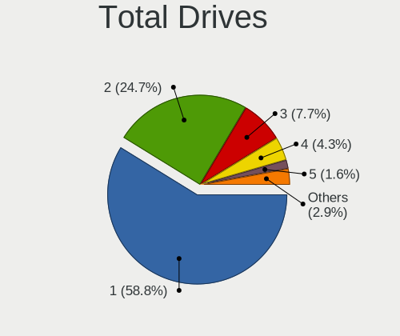
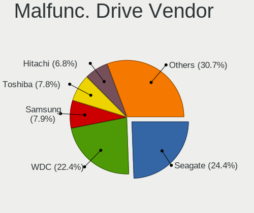
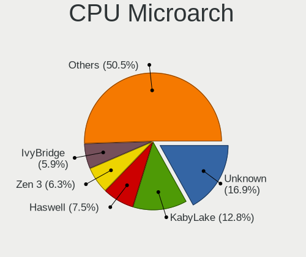
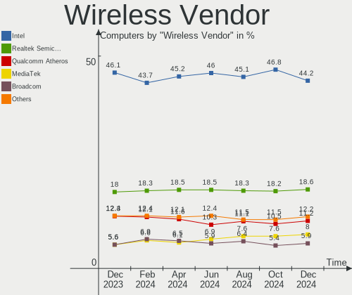
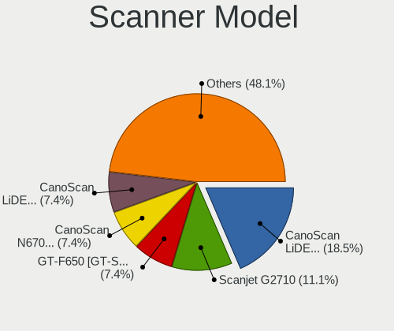
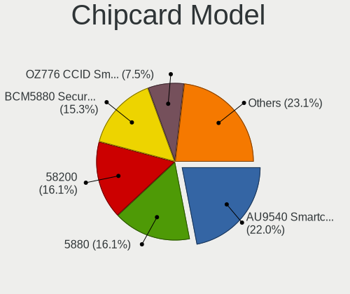

Linux - Hardware Trends
-----------------------

A project to identify most popular hardware characteristics and track their change
over time based on data collected by Linux users at https://Linux-Hardware.org.

Anyone can contribute to this report by the [hw-probe](https://github.com/linuxhw/hw-probe) tool:

    sudo -E hw-probe -all -upload

This is a report for all computer types. See also reports for [desktops](/Desktop/README.md) and [notebooks](/Notebook/README.md).

Distribution-specific reports: [Arch](/Dist/Arch), [ArcoLinux](/Dist/ArcoLinux), [BlackPanther](/Dist/BlackPanther), [CentOS](/Dist/CentOS), [Clear Linux](/Dist/Clear_Linux), [Debian](/Dist/Debian), [Elementary](/Dist/Elementary), [EndeavourOS](/Dist/EndeavourOS), [Endless](/Dist/Endless), [Fedora](/Dist/Fedora), [Gentoo](/Dist/Gentoo), [Kali](/Dist/Kali), [KDE neon](/Dist/KDE_neon), [Kubuntu](/Dist/Kubuntu), [Linux Mint](/Dist/Linux_Mint), [Manjaro](/Dist/Manjaro), [OpenMandriva](/Dist/OpenMandriva), [openSUSE](/Dist/openSUSE), [Pop!_OS](/Dist/Pop!_OS), [ROSA](/Dist/ROSA), [SteamOS](/Dist/SteamOS), [Ubuntu MATE](/Dist/Ubuntu_MATE), [Ubuntu](/Dist/Ubuntu), [Xubuntu](/Dist/Xubuntu), [Zorin](/Dist/Zorin).

This report is for one last month. Overall report since the beginning of time: [TestCoverage](https://github.com/linuxhw/TestCoverage)

Period: Aug, 2022.

Contents
--------

* [ System ](#system)
  - [ OS                       ](#os)
  - [ OS Family                ](#os-family)
  - [ Kernel                   ](#kernel)
  - [ Kernel Family            ](#kernel-family)
  - [ Kernel Major Ver.        ](#kernel-major-ver)
  - [ Arch                     ](#arch)
  - [ DE                       ](#de)
  - [ Display Server           ](#display-server)
  - [ Display Manager          ](#display-manager)
  - [ OS Lang                  ](#os-lang)
  - [ Boot Mode                ](#boot-mode)
  - [ Filesystem               ](#filesystem)
  - [ Part. scheme             ](#part-scheme)
  - [ Dual Boot with Linux/BSD ](#dual-boot-with-linuxbsd)
  - [ Dual Boot (Win)          ](#dual-boot-win)

* [ Board ](#board)
  - [ Vendor                   ](#vendor)
  - [ Model                    ](#model)
  - [ Model Family             ](#model-family)
  - [ MFG Year                 ](#mfg-year)
  - [ Form Factor              ](#form-factor)
  - [ Secure Boot              ](#secure-boot)
  - [ Coreboot                 ](#coreboot)
  - [ RAM Size                 ](#ram-size)
  - [ RAM Used                 ](#ram-used)
  - [ Total Drives             ](#total-drives)
  - [ Has CD-ROM               ](#has-cd-rom)
  - [ Has Ethernet             ](#has-ethernet)
  - [ Has WiFi                 ](#has-wifi)
  - [ Has Bluetooth            ](#has-bluetooth)

* [ Location ](#location)
  - [ Country                  ](#country)
  - [ City                     ](#city)

* [ Drives ](#drives)
  - [ Drive Vendor             ](#drive-vendor)
  - [ Drive Model              ](#drive-model)
  - [ HDD Vendor               ](#hdd-vendor)
  - [ SSD Vendor               ](#ssd-vendor)
  - [ Drive Kind               ](#drive-kind)
  - [ Drive Connector          ](#drive-connector)
  - [ Drive Size               ](#drive-size)
  - [ Space Total              ](#space-total)
  - [ Space Used               ](#space-used)
  - [ Malfunc. Drives          ](#malfunc-drives)
  - [ Malfunc. Drive Vendor    ](#malfunc-drive-vendor)
  - [ Malfunc. HDD Vendor      ](#malfunc-hdd-vendor)
  - [ Malfunc. Drive Kind      ](#malfunc-drive-kind)
  - [ Failed Drives            ](#failed-drives)
  - [ Failed Drive Vendor      ](#failed-drive-vendor)
  - [ Drive Status             ](#drive-status)

* [ Storage controller ](#storage-controller)
  - [ Storage Vendor           ](#storage-vendor)
  - [ Storage Model            ](#storage-model)
  - [ Storage Kind             ](#storage-kind)

* [ Processor ](#processor)
  - [ CPU Vendor               ](#cpu-vendor)
  - [ CPU Model                ](#cpu-model)
  - [ CPU Model Family         ](#cpu-model-family)
  - [ CPU Cores                ](#cpu-cores)
  - [ CPU Sockets              ](#cpu-sockets)
  - [ CPU Threads              ](#cpu-threads)
  - [ CPU Op-Modes             ](#cpu-op-modes)
  - [ CPU Microcode            ](#cpu-microcode)
  - [ CPU Microarch            ](#cpu-microarch)

* [ Graphics ](#graphics)
  - [ GPU Vendor               ](#gpu-vendor)
  - [ GPU Model                ](#gpu-model)
  - [ GPU Combo                ](#gpu-combo)
  - [ GPU Driver               ](#gpu-driver)
  - [ GPU Memory               ](#gpu-memory)

* [ Monitor ](#monitor)
  - [ Monitor Vendor           ](#monitor-vendor)
  - [ Monitor Model            ](#monitor-model)
  - [ Monitor Resolution       ](#monitor-resolution)
  - [ Monitor Diagonal         ](#monitor-diagonal)
  - [ Monitor Width            ](#monitor-width)
  - [ Aspect Ratio             ](#aspect-ratio)
  - [ Monitor Area             ](#monitor-area)
  - [ Pixel Density            ](#pixel-density)
  - [ Multiple Monitors        ](#multiple-monitors)

* [ Network ](#network)
  - [ Net Controller Vendor    ](#net-controller-vendor)
  - [ Net Controller Model     ](#net-controller-model)
  - [ Wireless Vendor          ](#wireless-vendor)
  - [ Wireless Model           ](#wireless-model)
  - [ Ethernet Vendor          ](#ethernet-vendor)
  - [ Ethernet Model           ](#ethernet-model)
  - [ Net Controller Kind      ](#net-controller-kind)
  - [ Used Controller          ](#used-controller)
  - [ NICs                     ](#nics)
  - [ IPv6                     ](#ipv6)

* [ Bluetooth ](#bluetooth)
  - [ Bluetooth Vendor         ](#bluetooth-vendor)
  - [ Bluetooth Model          ](#bluetooth-model)

* [ Sound ](#sound)
  - [ Sound Vendor             ](#sound-vendor)
  - [ Sound Model              ](#sound-model)

* [ Memory ](#memory)
  - [ Memory Vendor            ](#memory-vendor)
  - [ Memory Model             ](#memory-model)
  - [ Memory Kind              ](#memory-kind)
  - [ Memory Form Factor       ](#memory-form-factor)
  - [ Memory Size              ](#memory-size)
  - [ Memory Speed             ](#memory-speed)

* [ Printers & scanners ](#printers--scanners)
  - [ Printer Vendor           ](#printer-vendor)
  - [ Printer Model            ](#printer-model)
  - [ Scanner Vendor           ](#scanner-vendor)
  - [ Scanner Model            ](#scanner-model)

* [ Camera ](#camera)
  - [ Camera Vendor            ](#camera-vendor)
  - [ Camera Model             ](#camera-model)

* [ Security ](#security)
  - [ Fingerprint Vendor       ](#fingerprint-vendor)
  - [ Fingerprint Model        ](#fingerprint-model)
  - [ Chipcard Vendor          ](#chipcard-vendor)
  - [ Chipcard Model           ](#chipcard-model)

* [ Unsupported ](#unsupported)
  - [ Unsupported Devices      ](#unsupported-devices)
  - [ Unsupported Device Types ](#unsupported-device-types)

System
------

OS
--

Installed operating systems

| Name                         | Computers | Percent |
|------------------------------|-----------|---------|
| Ubuntu 22.04                 | 710       | 15.15%  |
| Debian 11                    | 396       | 8.45%   |
| Fedora 36                    | 339       | 7.23%   |
| OpenMandriva 4.3             | 289       | 6.17%   |
| Ubuntu 20.04                 | 276       | 5.89%   |
| ROSA 12.2                    | 220       | 4.69%   |
| Pop!_OS 22.04                | 220       | 4.69%   |
| Linux Mint 20.3              | 178       | 3.8%    |
| Linux Mint 21                | 177       | 3.78%   |
| Zorin 16                     | 146       | 3.11%   |
| Arch                         | 121       | 2.58%   |
| KDE neon 20.04               | 110       | 2.35%   |
| OpenMandriva 4.90            | 101       | 2.15%   |
| Arch Rolling                 | 68        | 1.45%   |
| Manjaro                      | 62        | 1.32%   |
| Elementary 6.1               | 59        | 1.26%   |
| Kubuntu 22.04                | 58        | 1.24%   |
| SteamOS 3.3                  | 50        | 1.07%   |
| Kali 2022.3                  | 45        | 0.96%   |
| Gentoo 2.8                   | 45        | 0.96%   |
| Manjaro 21.3.6               | 40        | 0.85%   |
| ArcoLinux Rolling            | 38        | 0.81%   |
| openSUSE Tumbleweed-XXXXXXXX | 35        | 0.75%   |
| Ubuntu 18.04                 | 34        | 0.73%   |
| Debian Testing               | 34        | 0.73%   |
| Nobara 36                    | 32        | 0.68%   |
| Xubuntu 22.04                | 31        | 0.66%   |
| Xubuntu 20.04                | 28        | 0.6%    |
| Manjaro 21.3.7               | 27        | 0.58%   |
| SteamOS 3.3.1                | 26        | 0.55%   |
| ROSA R11.1                   | 24        | 0.51%   |
| Lubuntu 22.04                | 20        | 0.43%   |
| Ubuntu MATE 22.04            | 19        | 0.41%   |
| LMDE 5                       | 18        | 0.38%   |
| Fedora 35                    | 18        | 0.38%   |
| BlackPanther 18.1            | 18        | 0.38%   |
| OpenMandriva 4.2             | 17        | 0.36%   |
| EndeavourOS Rolling          | 17        | 0.36%   |
| Debian Unstable              | 16        | 0.34%   |
| Linux Mint 20.2              | 15        | 0.32%   |
| Kubuntu 20.04                | 15        | 0.32%   |
| MX 21                        | 13        | 0.28%   |
| Linux Mint 19.3              | 13        | 0.28%   |
| Garuda Linux Soaring         | 13        | 0.28%   |
| Zorin 15                     | 12        | 0.26%   |
| Ubuntu 22.10                 | 10        | 0.21%   |
| Ubuntu 21.10                 | 10        | 0.21%   |
| Linux Mint 20                | 10        | 0.21%   |
| Endless 4.0.8                | 10        | 0.21%   |
| Raspbian 11                  | 9         | 0.19%   |
| KDE neon 22.04               | 9         | 0.19%   |
| Endless 4.0.7                | 9         | 0.19%   |
| Debian 10                    | 9         | 0.19%   |
| Xubuntu 18.04                | 8         | 0.17%   |
| Ubuntu MATE 20.04            | 8         | 0.17%   |
| openSUSE Leap-15.4           | 8         | 0.17%   |
| Linux Mint 20.1              | 8         | 0.17%   |
| Ubuntu Budgie 22.04          | 7         | 0.15%   |
| Garuda Linux                 | 7         | 0.15%   |
| EndeavourOS                  | 7         | 0.15%   |

OS Family
---------

OS without a version

| Name              | Computers | Percent |
|-------------------|-----------|---------|
| Ubuntu            | 1055      | 22.51%  |
| Debian            | 461       | 9.84%   |
| OpenMandriva      | 409       | 8.73%   |
| Linux Mint        | 408       | 8.7%    |
| Fedora            | 367       | 7.83%   |
| ROSA              | 253       | 5.4%    |
| Pop!_OS           | 226       | 4.82%   |
| Arch              | 189       | 4.03%   |
| Zorin             | 159       | 3.39%   |
| Manjaro           | 135       | 2.88%   |
| KDE neon          | 119       | 2.54%   |
| Kubuntu           | 90        | 1.92%   |
| SteamOS           | 82        | 1.75%   |
| Xubuntu           | 68        | 1.45%   |
| Elementary        | 63        | 1.34%   |
| Kali              | 54        | 1.15%   |
| openSUSE          | 46        | 0.98%   |
| Gentoo            | 46        | 0.98%   |
| ArcoLinux         | 44        | 0.94%   |
| Endless           | 33        | 0.7%    |
| Nobara            | 32        | 0.68%   |
| Ubuntu MATE       | 28        | 0.6%    |
| Lubuntu           | 27        | 0.58%   |
| EndeavourOS       | 24        | 0.51%   |
| LMDE              | 20        | 0.43%   |
| Garuda Linux      | 20        | 0.43%   |
| BlackPanther      | 18        | 0.38%   |
| MX                | 14        | 0.3%    |
| Ubuntu Budgie     | 13        | 0.28%   |
| ALT Linux         | 13        | 0.28%   |
| Raspbian          | 11        | 0.23%   |
| Parrot            | 11        | 0.23%   |
| CentOS            | 11        | 0.23%   |
| Clear Linux       | 9         | 0.19%   |
| Xero              | 7         | 0.15%   |
| Red OS            | 7         | 0.15%   |
| Archcraft         | 7         | 0.15%   |
| Rocky Linux       | 5         | 0.11%   |
| Linux Lite        | 5         | 0.11%   |
| Lilidog           | 5         | 0.11%   |
| Cyber Infra       | 5         | 0.11%   |
| Artix             | 5         | 0.11%   |
| Void Linux        | 4         | 0.09%   |
| Ubuntu Studio     | 4         | 0.09%   |
| Trisquel          | 4         | 0.09%   |
| Slackware         | 4         | 0.09%   |
| NixOS             | 4         | 0.09%   |
| LinuxFX           | 4         | 0.09%   |
| BigLinux          | 4         | 0.09%   |
| Alpine            | 4         | 0.09%   |
| RHEL              | 3         | 0.06%   |
| Peppermint        | 3         | 0.06%   |
| org.kde.Platform  | 3         | 0.06%   |
| Manjaro-ARM       | 3         | 0.06%   |
| Devuan            | 3         | 0.06%   |
| BuildRoot         | 3         | 0.06%   |
| Ultramarine Linux | 2         | 0.04%   |
| Sparky            | 2         | 0.04%   |
| Solus             | 2         | 0.04%   |
| Reborn OS         | 2         | 0.04%   |

Kernel
------

Version of the Linux kernel

| Version                                        | Computers | Percent |
|------------------------------------------------|-----------|---------|
| 5.15.0-46-generic                              | 829       | 17.69%  |
| 5.15.0-43-generic                              | 440       | 9.39%   |
| 5.16.7-desktop-1omv4003                        | 274       | 5.85%   |
| 5.10.0-16-amd64                                | 254       | 5.42%   |
| 5.18.10-76051810-generic                       | 136       | 2.9%    |
| 5.15.0-41-generic                              | 111       | 2.37%   |
| 5.4.0-122-generic                              | 105       | 2.24%   |
| 5.10.74-generic-2rosa2021.1-x86_64             | 103       | 2.2%    |
| 5.4.0-124-generic                              | 95        | 2.03%   |
| 5.18.12-desktop-3omv4090                       | 92        | 1.96%   |
| 5.18.16-200.fc36.x86_64                        | 84        | 1.79%   |
| 5.10.118-generic-2rosa2021.1-x86_64            | 78        | 1.66%   |
| 5.19.0-76051900-generic                        | 73        | 1.56%   |
| 5.10.0-17-amd64                                | 68        | 1.45%   |
| 5.18.16-arch1-1                                | 58        | 1.24%   |
| 5.18.13-200.fc36.x86_64                        | 50        | 1.07%   |
| 5.18.17-200.fc36.x86_64                        | 48        | 1.02%   |
| 5.18.18-200.fc36.x86_64                        | 44        | 0.94%   |
| 5.18.0-kali5-amd64                             | 44        | 0.94%   |
| 5.15.0-25-generic                              | 44        | 0.94%   |
| 5.18.19-200.fc36.x86_64                        | 36        | 0.77%   |
| 5.4.0-125-generic                              | 33        | 0.7%    |
| 5.15.60-1-MANJARO                              | 33        | 0.7%    |
| 5.15.0-47-generic                              | 33        | 0.7%    |
| 5.13.0-valve21-1-neptune-02209-g2a5bdc1102a0   | 33        | 0.7%    |
| 5.10.0-7-amd64                                 | 29        | 0.62%   |
| 5.19.1-arch2-1                                 | 26        | 0.55%   |
| 5.18.0-4-amd64                                 | 26        | 0.55%   |
| 5.13.0-valve21.1-1-neptune-02211-gc54cda5a36f3 | 26        | 0.55%   |
| 5.18.0-3-amd64                                 | 25        | 0.53%   |
| 5.11.0-35-generic                              | 25        | 0.53%   |
| 5.19.3-arch1-1                                 | 23        | 0.49%   |
| 5.19.2-arch1-1                                 | 23        | 0.49%   |
| 5.19.1-3-MANJARO                               | 18        | 0.38%   |
| 5.17.5-300.fc36.x86_64                         | 18        | 0.38%   |
| 5.10.14-desktop-1omv4002                       | 17        | 0.36%   |
| 5.19.4-200.fc36.x86_64                         | 16        | 0.34%   |
| 5.15.0-46-lowlatency                           | 16        | 0.34%   |
| 5.18.15-200.fc36.x86_64                        | 15        | 0.32%   |
| 5.15.57-2-MANJARO                              | 14        | 0.3%    |
| 5.18.16-zen1-1-zen                             | 13        | 0.28%   |
| 5.18.14-1-MANJARO                              | 13        | 0.28%   |
| 5.18.0-0.bpo.1-amd64                           | 13        | 0.28%   |
| 5.16.13-desktop-1omv4003                       | 12        | 0.26%   |
| 5.4.0-91-generic                               | 11        | 0.23%   |
| 5.19.4-arch1-1                                 | 11        | 0.23%   |
| 5.18.15-arch1-1                                | 11        | 0.23%   |
| 5.13.0-30-generic                              | 11        | 0.23%   |
| 5.17.5-76051705-generic                        | 10        | 0.21%   |
| 5.15.59-2-lts                                  | 10        | 0.21%   |
| 5.15.59-1-MANJARO                              | 10        | 0.21%   |
| 5.15.43-generic-2rosa2021.1-x86_64             | 10        | 0.21%   |
| 4.15.0-191-generic                             | 10        | 0.21%   |
| 5.6.14-desktop-2bP                             | 9         | 0.19%   |
| 5.19.0-051900-generic                          | 9         | 0.19%   |
| 5.13.0-valve22-1-neptune-02213-gb68995364335   | 9         | 0.19%   |
| 4.18.16-desktop-1bP                            | 9         | 0.19%   |
| 5.19.2-1-default                               | 8         | 0.17%   |
| 5.19.0-2-MANJARO                               | 8         | 0.17%   |
| 5.18.15-1-default                              | 8         | 0.17%   |

Kernel Family
-------------

Linux kernel without a distro release

| Version  | Computers | Percent |
|----------|-----------|---------|
| 5.15.0   | 1539      | 32.84%  |
| 5.10.0   | 383       | 8.17%   |
| 5.4.0    | 297       | 6.34%   |
| 5.16.7   | 274       | 5.85%   |
| 5.18.16  | 191       | 4.08%   |
| 5.19.0   | 145       | 3.09%   |
| 5.18.10  | 139       | 2.97%   |
| 5.13.0   | 139       | 2.97%   |
| 5.18.0   | 132       | 2.82%   |
| 5.10.74  | 110       | 2.35%   |
| 5.18.12  | 102       | 2.18%   |
| 5.10.118 | 81        | 1.73%   |
| 5.19.1   | 75        | 1.6%    |
| 5.18.15  | 61        | 1.3%    |
| 5.18.17  | 59        | 1.26%   |
| 5.18.13  | 59        | 1.26%   |
| 5.19.2   | 54        | 1.15%   |
| 5.18.18  | 54        | 1.15%   |
| 5.11.0   | 49        | 1.05%   |
| 5.18.19  | 44        | 0.94%   |
| 5.15.60  | 43        | 0.92%   |
| 5.19.3   | 40        | 0.85%   |
| 4.15.0   | 40        | 0.85%   |
| 5.19.4   | 39        | 0.83%   |
| 5.15.59  | 39        | 0.83%   |
| 5.17.5   | 33        | 0.7%    |
| 5.14.0   | 28        | 0.6%    |
| 5.18.14  | 24        | 0.51%   |
| 5.10.14  | 17        | 0.36%   |
| 5.15.57  | 16        | 0.34%   |
| 5.8.0    | 13        | 0.28%   |
| 5.16.13  | 13        | 0.28%   |
| 5.15.52  | 12        | 0.26%   |
| 5.15.43  | 12        | 0.26%   |
| 5.19.5   | 11        | 0.23%   |
| 5.16.0   | 11        | 0.23%   |
| 4.19.0   | 11        | 0.23%   |
| 5.18.11  | 10        | 0.21%   |
| 5.17.11  | 10        | 0.21%   |
| 5.15.55  | 10        | 0.21%   |
| 5.15.53  | 10        | 0.21%   |
| 3.10.0   | 10        | 0.21%   |
| 5.6.14   | 9         | 0.19%   |
| 5.17.0   | 9         | 0.19%   |
| 4.18.16  | 9         | 0.19%   |
| 5.17.1   | 8         | 0.17%   |
| 5.15.32  | 8         | 0.17%   |
| 5.14.21  | 8         | 0.17%   |
| 5.18.9   | 7         | 0.15%   |
| 5.15.35  | 7         | 0.15%   |
| 5.4.83   | 6         | 0.13%   |
| 5.4.32   | 6         | 0.13%   |
| 5.17.15  | 6         | 0.13%   |
| 5.15.39  | 6         | 0.13%   |
| 6.0.0    | 4         | 0.09%   |
| 5.3.0    | 4         | 0.09%   |
| 5.18.7   | 4         | 0.09%   |
| 5.15.62  | 4         | 0.09%   |
| 5.15.61  | 4         | 0.09%   |
| 5.15.48  | 4         | 0.09%   |

Kernel Major Ver.
-----------------

Linux kernel major version

| Version | Computers | Percent |
|---------|-----------|---------|
| 5.15    | 1744      | 37.21%  |
| 5.18    | 897       | 19.14%  |
| 5.10    | 619       | 13.21%  |
| 5.19    | 364       | 7.77%   |
| 5.4     | 314       | 6.7%    |
| 5.16    | 306       | 6.53%   |
| 5.13    | 142       | 3.03%   |
| 5.17    | 79        | 1.69%   |
| 5.11    | 50        | 1.07%   |
| 4.15    | 40        | 0.85%   |
| 5.14    | 39        | 0.83%   |
| 4.19    | 14        | 0.3%    |
| 5.8     | 13        | 0.28%   |
| 4.18    | 13        | 0.28%   |
| 3.10    | 11        | 0.23%   |
| 5.6     | 10        | 0.21%   |
| 5.3     | 7         | 0.15%   |
| 4.9     | 5         | 0.11%   |
| 6.0     | 4         | 0.09%   |
| 4.4     | 4         | 0.09%   |
| 4.14    | 3         | 0.06%   |
| 5.7     | 2         | 0.04%   |
| 3.18    | 2         | 0.04%   |
| 5.5     | 1         | 0.02%   |
| 5.17.1  | 1         | 0.02%   |
| 5.0     | 1         | 0.02%   |
| 5       | 1         | 0.02%   |
| 3.4     | 1         | 0.02%   |

Arch
----

OS architecture (x86_64, i586, etc.)

| Name     | Computers | Percent |
|----------|-----------|---------|
| x86_64   | 4580      | 97.72%  |
| i686     | 44        | 0.94%   |
| aarch64  | 42        | 0.9%    |
| armv7l   | 8         | 0.17%   |
| armv6l   | 5         | 0.11%   |
| riscv64  | 4         | 0.09%   |
| sh4a     | 1         | 0.02%   |
| ppc64    | 1         | 0.02%   |
| e2k      | 1         | 0.02%   |
| armv5tel | 1         | 0.02%   |

DE
--

Desktop Environment

| Name               | Computers | Percent |
|--------------------|-----------|---------|
| GNOME              | 2011      | 42.91%  |
| KDE5               | 1208      | 25.77%  |
| Unknown            | 359       | 7.66%   |
| X-Cinnamon         | 336       | 7.17%   |
| XFCE               | 320       | 6.83%   |
| MATE               | 118       | 2.52%   |
| LXQt               | 74        | 1.58%   |
| Pantheon           | 64        | 1.37%   |
| Cinnamon           | 44        | 0.94%   |
| KDE4               | 20        | 0.43%   |
| i3                 | 18        | 0.38%   |
| Budgie             | 18        | 0.38%   |
| LXDE               | 14        | 0.3%    |
| Unity              | 10        | 0.21%   |
| GNOME Flashback    | 8         | 0.17%   |
| lightdm-xsession   | 7         | 0.15%   |
| awesome            | 7         | 0.15%   |
| sway               | 6         | 0.13%   |
| qtile              | 6         | 0.13%   |
| Deepin             | 6         | 0.13%   |
| GNOME Classic      | 4         | 0.09%   |
| dwm                | 4         | 0.09%   |
| bspwm              | 4         | 0.09%   |
| KDE                | 3         | 0.06%   |
| Enlightenment      | 3         | 0.06%   |
| openbox            | 2         | 0.04%   |
| gamescope          | 2         | 0.04%   |
| Cutefish           | 2         | 0.04%   |
| X-Generic          | 1         | 0.02%   |
| Phosh:GNOME        | 1         | 0.02%   |
| pantheon-non-gnome | 1         | 0.02%   |
| none+xmonad        | 1         | 0.02%   |
| LeftWM             | 1         | 0.02%   |
| icewm              | 1         | 0.02%   |
| i3-with-shmlog     | 1         | 0.02%   |
| herbstluftwm       | 1         | 0.02%   |
| dusk               | 1         | 0.02%   |

Display Server
--------------

X11 or Wayland

| Name    | Computers | Percent |
|---------|-----------|---------|
| X11     | 3123      | 66.63%  |
| Wayland | 1195      | 25.5%   |
| Unknown | 241       | 5.14%   |
| Tty     | 128       | 2.73%   |

Display Manager
---------------

SDDM, LightDM, etc.

| Name    | Computers | Percent |
|---------|-----------|---------|
| Unknown | 1664      | 35.5%   |
| GDM3    | 953       | 20.33%  |
| SDDM    | 893       | 19.05%  |
| LightDM | 630       | 13.44%  |
| GDM     | 504       | 10.75%  |
| KDM     | 20        | 0.43%   |
| XDM     | 11        | 0.23%   |
| Ly      | 5         | 0.11%   |
| LXDM    | 3         | 0.06%   |
| SLiM    | 2         | 0.04%   |
| GREETD  | 2         | 0.04%   |

OS Lang
-------

Language

| Lang    | Computers | Percent |
|---------|-----------|---------|
| en_US   | 2092      | 44.63%  |
| ru_RU   | 410       | 8.75%   |
| de_DE   | 303       | 6.46%   |
| fr_FR   | 214       | 4.57%   |
| en_GB   | 203       | 4.33%   |
| pt_BR   | 202       | 4.31%   |
| Unknown | 197       | 4.2%    |
| es_ES   | 92        | 1.96%   |
| it_IT   | 81        | 1.73%   |
| en_AU   | 78        | 1.66%   |
| en_IN   | 71        | 1.51%   |
| en_CA   | 62        | 1.32%   |
| C       | 60        | 1.28%   |
| pl_PL   | 53        | 1.13%   |
| nl_NL   | 40        | 0.85%   |
| zh_CN   | 28        | 0.6%    |
| cs_CZ   | 28        | 0.6%    |
| pt_PT   | 27        | 0.58%   |
| es_AR   | 23        | 0.49%   |
| en_NZ   | 23        | 0.49%   |
| es_MX   | 20        | 0.43%   |
| hu_HU   | 18        | 0.38%   |
| fi_FI   | 16        | 0.34%   |
| en_ZA   | 16        | 0.34%   |
| de_CH   | 16        | 0.34%   |
| sv_SE   | 14        | 0.3%    |
| es_CL   | 14        | 0.3%    |
| es_CO   | 13        | 0.28%   |
| de_AT   | 13        | 0.28%   |
| tr_TR   | 12        | 0.26%   |
| nl_BE   | 11        | 0.23%   |
| ja_JP   | 11        | 0.23%   |
| fr_CA   | 11        | 0.23%   |
| en_IE   | 11        | 0.23%   |
| fr_BE   | 10        | 0.21%   |
| nb_NO   | 9         | 0.19%   |
| C.UTF8  | 9         | 0.19%   |
| es_VE   | 8         | 0.17%   |
| es_PE   | 8         | 0.17%   |
| en_SG   | 8         | 0.17%   |
| en_PH   | 8         | 0.17%   |
| en_AG   | 8         | 0.17%   |
| ro_RO   | 7         | 0.15%   |
| da_DK   | 7         | 0.15%   |
| sk_SK   | 6         | 0.13%   |
| fr_CH   | 5         | 0.11%   |
| es_US   | 5         | 0.11%   |
| es_GT   | 5         | 0.11%   |
| es_CR   | 5         | 0.11%   |
| en_IL   | 5         | 0.11%   |
| en_HK   | 5         | 0.11%   |
| el_GR   | 5         | 0.11%   |
| Default | 5         | 0.11%   |
| ca_ES   | 5         | 0.11%   |
| sr_RS   | 4         | 0.09%   |
| es_UY   | 4         | 0.09%   |
| en_DK   | 4         | 0.09%   |
| bg_BG   | 4         | 0.09%   |
| zh_TW   | 3         | 0.06%   |
| ru_UA   | 3         | 0.06%   |

Boot Mode
---------

EFI or BIOS

| Mode | Computers | Percent |
|------|-----------|---------|
| EFI  | 2528      | 53.94%  |
| BIOS | 2159      | 46.06%  |

Filesystem
----------

Type of filesystem

| Type    | Computers | Percent |
|---------|-----------|---------|
| Ext4    | 3322      | 70.88%  |
| Btrfs   | 651       | 13.89%  |
| Overlay | 592       | 12.63%  |
| Xfs     | 60        | 1.28%   |
| Zfs     | 25        | 0.53%   |
| F2fs    | 12        | 0.26%   |
| Ext3    | 6         | 0.13%   |
| Ext2    | 6         | 0.13%   |
| XXXXXXX | 5         | 0.11%   |
| Tmpfs   | 4         | 0.09%   |
| Unknown | 2         | 0.04%   |
| XXXXX   | 1         | 0.02%   |
| Rootfs  | 1         | 0.02%   |

Part. scheme
------------

Scheme of partitioning

| Type    | Computers | Percent |
|---------|-----------|---------|
| Unknown | 2113      | 45.08%  |
| GPT     | 2079      | 44.36%  |
| MBR     | 495       | 10.56%  |

Dual Boot with Linux/BSD
------------------------

Hosting more than one Linux/BSD

| Dual boot | Computers | Percent |
|-----------|-----------|---------|
| No        | 3963      | 84.55%  |
| Yes       | 724       | 15.45%  |

Dual Boot (Win)
---------------

Hosting Linux and Windows

| Dual boot | Computers | Percent |
|-----------|-----------|---------|
| No        | 3383      | 72.18%  |
| Yes       | 1304      | 27.82%  |

Board
-----

Vendor
------

Motherboard manufacturer

| Name                    | Computers | Percent |
|-------------------------|-----------|---------|
| ASUSTek Computer        | 773       | 16.49%  |
| Lenovo                  | 744       | 15.87%  |
| Hewlett-Packard         | 601       | 12.82%  |
| Dell                    | 539       | 11.5%   |
| Gigabyte Technology     | 292       | 6.23%   |
| MSI                     | 281       | 6%      |
| Acer                    | 226       | 4.82%   |
| ASRock                  | 160       | 3.41%   |
| Apple                   | 117       | 2.5%    |
| Intel                   | 67        | 1.43%   |
| Valve                   | 62        | 1.32%   |
| Toshiba                 | 50        | 1.07%   |
| Samsung Electronics     | 49        | 1.05%   |
| HUAWEI                  | 46        | 0.98%   |
| Unknown                 | 45        | 0.96%   |
| Google                  | 43        | 0.92%   |
| Raspberry Pi Foundation | 33        | 0.7%    |
| Fujitsu                 | 26        | 0.55%   |
| Foxconn                 | 26        | 0.55%   |
| Notebook                | 24        | 0.51%   |
| Sony                    | 23        | 0.49%   |
| Microsoft               | 19        | 0.41%   |
| Supermicro              | 18        | 0.38%   |
| Positivo                | 18        | 0.38%   |
| Alienware               | 18        | 0.38%   |
| Packard Bell            | 17        | 0.36%   |
| Biostar                 | 15        | 0.32%   |
| ECS                     | 14        | 0.3%    |
| Pegatron                | 13        | 0.28%   |
| Timi                    | 12        | 0.26%   |
| Medion                  | 12        | 0.26%   |
| AZW                     | 12        | 0.26%   |
| System76                | 11        | 0.23%   |
| eMachines               | 11        | 0.23%   |
| BESSTAR Tech            | 9         | 0.19%   |
| AMI                     | 8         | 0.17%   |
| TUXEDO                  | 7         | 0.15%   |
| Panasonic               | 7         | 0.15%   |
| OEM                     | 7         | 0.15%   |
| GPU Company             | 7         | 0.15%   |
| Chuwi                   | 7         | 0.15%   |
| Gateway                 | 6         | 0.13%   |
| Framework               | 6         | 0.13%   |
| TrekStor                | 5         | 0.11%   |
| MACHINIST               | 5         | 0.11%   |
| Huanan                  | 5         | 0.11%   |
| HONOR                   | 5         | 0.11%   |
| Acidanthera             | 5         | 0.11%   |
| Standard                | 4         | 0.09%   |
| Shuttle                 | 4         | 0.09%   |
| Razer                   | 4         | 0.09%   |
| Pine Microsystems       | 4         | 0.09%   |
| LG Electronics          | 4         | 0.09%   |
| Fujitsu Siemens         | 4         | 0.09%   |
| sunxi                   | 3         | 0.06%   |
| SLIMBOOK                | 3         | 0.06%   |
| Protectli               | 3         | 0.06%   |
| PCWare                  | 3         | 0.06%   |
| Microtech               | 3         | 0.06%   |
| IP3 Tech                | 3         | 0.06%   |

Model
-----

Motherboard model

| Name                                      | Computers | Percent |
|-------------------------------------------|-----------|---------|
| Lenovo ThinkPad L13 Yoga Gen 2 20VK0019US | 104       | 2.22%   |
| Unknown                                   | 64        | 1.37%   |
| Valve Jupiter                             | 62        | 1.32%   |
| ASUS All Series                           | 39        | 0.83%   |
| MSI MS-7C37                               | 16        | 0.34%   |
| ASUS TUF Gaming X570-PLUS                 | 16        | 0.34%   |
| HP Notebook                               | 14        | 0.3%    |
| Google Terra                              | 14        | 0.3%    |
| RPi Raspberry Pi                          | 13        | 0.28%   |
| Dell OptiPlex 7010                        | 12        | 0.26%   |
| MSI MS-7C02                               | 11        | 0.23%   |
| HP Pavilion g6                            | 11        | 0.23%   |
| Supermicro Super Server                   | 10        | 0.21%   |
| Apple MacBookPro9,2                       | 10        | 0.21%   |
| MSI MS-7C91                               | 8         | 0.17%   |
| Gigabyte B550M DS3H                       | 8         | 0.17%   |
| Dell Latitude E6430                       | 8         | 0.17%   |
| Dell Latitude 3190 2-in-1                 | 8         | 0.17%   |
| Lenovo IdeaPad 330-15IKB 81DE             | 7         | 0.15%   |
| HP Pavilion Notebook                      | 7         | 0.15%   |
| Google Reks                               | 7         | 0.15%   |
| Dell OptiPlex 780                         | 7         | 0.15%   |
| Dell Latitude E6420                       | 7         | 0.15%   |
| ASUS PRIME X570-P                         | 7         | 0.15%   |
| ASUS PRIME B450M-A II                     | 7         | 0.15%   |
| Apple MacBookAir7,2                       | 7         | 0.15%   |
| MSI MS-7D54                               | 6         | 0.13%   |
| MSI MS-7C56                               | 6         | 0.13%   |
| MSI MS-7C52                               | 6         | 0.13%   |
| MSI MS-7B86                               | 6         | 0.13%   |
| MSI MS-7817                               | 6         | 0.13%   |
| Lenovo IdeaPad Gaming 3 15ACH6 82K2       | 6         | 0.13%   |
| HP ProDesk 600 G1 SFF                     | 6         | 0.13%   |
| HP Pavilion 15                            | 6         | 0.13%   |
| HP 15                                     | 6         | 0.13%   |
| Dell XPS 15 9520                          | 6         | 0.13%   |
| Dell Latitude E6400                       | 6         | 0.13%   |
| Dell Latitude E5470                       | 6         | 0.13%   |
| Dell Inspiron 15-3567                     | 6         | 0.13%   |
| ASUS VivoBook 15_ASUS Laptop X540UAR      | 6         | 0.13%   |
| ASUS ROG STRIX X570-E GAMING              | 6         | 0.13%   |
| ASUS ROG STRIX B550-F GAMING              | 6         | 0.13%   |
| ASUS PRIME B450M-A                        | 6         | 0.13%   |
| ASRock B450M Pro4                         | 6         | 0.13%   |
| System76 Oryx Pro                         | 5         | 0.11%   |
| MSI MS-7C94                               | 5         | 0.11%   |
| MSI MS-7721                               | 5         | 0.11%   |
| Lenovo IdeaPad S340-14API 81NB            | 5         | 0.11%   |
| Lenovo IdeaPad 5 Pro 14ACN6 82L7          | 5         | 0.11%   |
| Lenovo IdeaPad 3 15ITL6 82H8              | 5         | 0.11%   |
| HUAWEI NBD-WXX9                           | 5         | 0.11%   |
| HP Victus by Laptop 16-e0xxx              | 5         | 0.11%   |
| HP Pavilion dv6                           | 5         | 0.11%   |
| HP EliteBook x360 1030 G2                 | 5         | 0.11%   |
| HP EliteBook 8460p                        | 5         | 0.11%   |
| HP EliteBook 840 G8 Notebook PC           | 5         | 0.11%   |
| Gigabyte B450M DS3H                       | 5         | 0.11%   |
| Framework Laptop                          | 5         | 0.11%   |
| Dell XPS 9320                             | 5         | 0.11%   |
| Dell XPS 15 9560                          | 5         | 0.11%   |

Model Family
------------

Motherboard model prefix

| Name                  | Computers | Percent |
|-----------------------|-----------|---------|
| Lenovo ThinkPad       | 349       | 7.45%   |
| Dell Latitude         | 158       | 3.37%   |
| Lenovo IdeaPad        | 154       | 3.29%   |
| Acer Aspire           | 137       | 2.92%   |
| Dell Inspiron         | 124       | 2.65%   |
| ASUS ROG              | 101       | 2.15%   |
| HP Pavilion           | 92        | 1.96%   |
| ASUS PRIME            | 84        | 1.79%   |
| ASUS VivoBook         | 81        | 1.73%   |
| Dell OptiPlex         | 75        | 1.6%    |
| Dell XPS              | 72        | 1.54%   |
| HP Laptop             | 65        | 1.39%   |
| HP EliteBook          | 64        | 1.37%   |
| Unknown               | 64        | 1.37%   |
| Valve Jupiter         | 62        | 1.32%   |
| HP ProBook            | 58        | 1.24%   |
| ASUS TUF              | 58        | 1.24%   |
| HP Compaq             | 54        | 1.15%   |
| Lenovo ThinkCentre    | 45        | 0.96%   |
| HP ENVY               | 40        | 0.85%   |
| Dell Precision        | 39        | 0.83%   |
| ASUS All              | 39        | 0.83%   |
| Toshiba Satellite     | 33        | 0.7%    |
| RPi Raspberry         | 33        | 0.7%    |
| Dell Vostro           | 31        | 0.66%   |
| Lenovo Legion         | 30        | 0.64%   |
| Lenovo Yoga           | 28        | 0.6%    |
| HP EliteDesk          | 26        | 0.55%   |
| Acer Nitro            | 26        | 0.55%   |
| Lenovo ThinkBook      | 25        | 0.53%   |
| ASUS Zenbook          | 25        | 0.53%   |
| Microsoft Surface     | 19        | 0.41%   |
| HP ProDesk            | 19        | 0.41%   |
| Gigabyte B450         | 17        | 0.36%   |
| MSI MS-7C37           | 16        | 0.34%   |
| HP ZBook              | 16        | 0.34%   |
| Gigabyte B550         | 16        | 0.34%   |
| ASUS ASUS             | 15        | 0.32%   |
| HP Notebook           | 14        | 0.3%    |
| Google Terra          | 14        | 0.3%    |
| Gigabyte B550M        | 14        | 0.3%    |
| Packard Bell EasyNote | 13        | 0.28%   |
| HP OMEN               | 13        | 0.28%   |
| Gigabyte B450M        | 12        | 0.26%   |
| Fujitsu LIFEBOOK      | 12        | 0.26%   |
| MSI MS-7C02           | 11        | 0.23%   |
| Lenovo IdeaCentre     | 11        | 0.23%   |
| Gigabyte X570         | 11        | 0.23%   |
| Dell PowerEdge        | 11        | 0.23%   |
| ASRock B450M          | 11        | 0.23%   |
| Apple MacBookPro11    | 11        | 0.23%   |
| Supermicro Super      | 10        | 0.21%   |
| HP Stream             | 10        | 0.21%   |
| HP 255                | 10        | 0.21%   |
| Apple MacBookPro9     | 10        | 0.21%   |
| Acer TravelMate       | 10        | 0.21%   |
| Acer Predator         | 10        | 0.21%   |
| MSI Modern            | 9         | 0.19%   |
| HP Spectre            | 9         | 0.19%   |
| Dell G3               | 9         | 0.19%   |

MFG Year
--------

Motherboard manufacture year

| Year    | Computers | Percent |
|---------|-----------|---------|
| 2020    | 611       | 13.04%  |
| 2021    | 559       | 11.93%  |
| 2019    | 437       | 9.32%   |
| 2018    | 396       | 8.45%   |
| 2012    | 327       | 6.98%   |
| 2022    | 301       | 6.42%   |
| 2013    | 286       | 6.1%    |
| 2011    | 258       | 5.5%    |
| 2014    | 237       | 5.06%   |
| 2017    | 233       | 4.97%   |
| 2015    | 218       | 4.65%   |
| 2016    | 215       | 4.59%   |
| 2010    | 196       | 4.18%   |
| 2008    | 119       | 2.54%   |
| 2009    | 117       | 2.5%    |
| 2007    | 82        | 1.75%   |
| Unknown | 64        | 1.37%   |
| 2006    | 27        | 0.58%   |
| 2004    | 2         | 0.04%   |
| 2005    | 1         | 0.02%   |
| 2003    | 1         | 0.02%   |

Form Factor
-----------

Physical design of the computer

| Name           | Computers | Percent |
|----------------|-----------|---------|
| Notebook       | 2526      | 53.89%  |
| Desktop        | 1651      | 35.23%  |
| Convertible    | 235       | 5.01%   |
| Mini pc        | 78        | 1.66%   |
| All in one     | 64        | 1.37%   |
| System on chip | 48        | 1.02%   |
| Tablet         | 44        | 0.94%   |
| Server         | 36        | 0.77%   |
| Phone          | 3         | 0.06%   |
| Other          | 1         | 0.02%   |
| Stick pc       | 1         | 0.02%   |

Secure Boot
-----------

Enabled or disabled

| State    | Computers | Percent |
|----------|-----------|---------|
| Disabled | 4348      | 92.77%  |
| Enabled  | 339       | 7.23%   |

Coreboot
--------

Have coreboot on board

| Used | Computers | Percent |
|------|-----------|---------|
| No   | 4633      | 98.85%  |
| Yes  | 54        | 1.15%   |

RAM Size
--------

Total RAM memory

| Size in GB      | Computers | Percent |
|-----------------|-----------|---------|
| 4.01-8.0        | 1100      | 23.47%  |
| 16.01-24.0      | 1056      | 22.53%  |
| 8.01-16.0       | 887       | 18.92%  |
| 3.01-4.0        | 717       | 15.3%   |
| 32.01-64.0      | 464       | 9.9%    |
| 1.01-2.0        | 154       | 3.29%   |
| 64.01-256.0     | 153       | 3.26%   |
| 24.01-32.0      | 74        | 1.58%   |
| 2.01-3.0        | 48        | 1.02%   |
| 0.51-1.0        | 18        | 0.38%   |
| More than 256.0 | 8         | 0.17%   |
| 0.01-0.5        | 7         | 0.15%   |
| Unknown         | 1         | 0.02%   |

RAM Used
--------

Used RAM memory

| Used GB     | Computers | Percent |
|-------------|-----------|---------|
| 1.01-2.0    | 1645      | 35.1%   |
| 2.01-3.0    | 1079      | 23.02%  |
| 4.01-8.0    | 722       | 15.4%   |
| 3.01-4.0    | 628       | 13.4%   |
| 0.51-1.0    | 288       | 6.14%   |
| 8.01-16.0   | 220       | 4.69%   |
| 0.01-0.5    | 56        | 1.19%   |
| 16.01-24.0  | 27        | 0.58%   |
| 24.01-32.0  | 9         | 0.19%   |
| 32.01-64.0  | 7         | 0.15%   |
| 64.01-256.0 | 3         | 0.06%   |
| Unknown     | 3         | 0.06%   |

Total Drives
------------

Number of drives on board

| Drives | Computers | Percent |
|--------|-----------|---------|
| 1      | 2837      | 60.53%  |
| 2      | 1172      | 25.01%  |
| 3      | 335       | 7.15%   |
| 4      | 146       | 3.11%   |
| 5      | 80        | 1.71%   |
| 6      | 59        | 1.26%   |
| 0      | 29        | 0.62%   |
| 7      | 13        | 0.28%   |
| 9      | 6         | 0.13%   |
| 8      | 3         | 0.06%   |
| 14     | 2         | 0.04%   |
| 12     | 2         | 0.04%   |
| 11     | 2         | 0.04%   |
| 10     | 1         | 0.02%   |

Has CD-ROM
----------

Has CD-ROM on board

| Presented | Computers | Percent |
|-----------|-----------|---------|
| No        | 3198      | 68.23%  |
| Yes       | 1489      | 31.77%  |

Has Ethernet
------------

Has Ethernet on board

| Presented | Computers | Percent |
|-----------|-----------|---------|
| Yes       | 3882      | 82.82%  |
| No        | 805       | 17.18%  |

Has WiFi
--------

Has WiFi module

| Presented | Computers | Percent |
|-----------|-----------|---------|
| Yes       | 3629      | 77.43%  |
| No        | 1058      | 22.57%  |

Has Bluetooth
-------------

Has Bluetooth module

| Presented | Computers | Percent |
|-----------|-----------|---------|
| Yes       | 3014      | 64.31%  |
| No        | 1673      | 35.69%  |

Location
--------

Country
-------

Geographic location (country)

| Country      | Computers | Percent |
|--------------|-----------|---------|
| USA          | 1046      | 22.32%  |
| Russia       | 473       | 10.09%  |
| Germany      | 392       | 8.36%   |
| Brazil       | 262       | 5.59%   |
| France       | 247       | 5.27%   |
| UK           | 169       | 3.61%   |
| Italy        | 125       | 2.67%   |
| Netherlands  | 114       | 2.43%   |
| Canada       | 112       | 2.39%   |
| India        | 111       | 2.37%   |
| Poland       | 99        | 2.11%   |
| Australia    | 99        | 2.11%   |
| Spain        | 96        | 2.05%   |
| Mexico       | 53        | 1.13%   |
| Argentina    | 53        | 1.13%   |
| Hungary      | 52        | 1.11%   |
| Czechia      | 47        | 1%      |
| Turkey       | 45        | 0.96%   |
| Sweden       | 45        | 0.96%   |
| Finland      | 45        | 0.96%   |
| Belgium      | 45        | 0.96%   |
| Austria      | 45        | 0.96%   |
| Switzerland  | 44        | 0.94%   |
| Romania      | 39        | 0.83%   |
| Portugal     | 36        | 0.77%   |
| Norway       | 36        | 0.77%   |
| China        | 35        | 0.75%   |
| New Zealand  | 30        | 0.64%   |
| Indonesia    | 29        | 0.62%   |
| Japan        | 26        | 0.55%   |
| South Africa | 24        | 0.51%   |
| Chile        | 24        | 0.51%   |
| Greece       | 23        | 0.49%   |
| Denmark      | 22        | 0.47%   |
| Colombia     | 22        | 0.47%   |
| Belarus      | 21        | 0.45%   |
| Bulgaria     | 20        | 0.43%   |
| Ukraine      | 19        | 0.41%   |
| Slovakia     | 19        | 0.41%   |
| Philippines  | 18        | 0.38%   |
| Vietnam      | 17        | 0.36%   |
| Thailand     | 16        | 0.34%   |
| Serbia       | 16        | 0.34%   |
| Venezuela    | 15        | 0.32%   |
| Ireland      | 15        | 0.32%   |
| Iran         | 15        | 0.32%   |
| Hong Kong    | 15        | 0.32%   |
| Singapore    | 14        | 0.3%    |
| Israel       | 14        | 0.3%    |
| Taiwan       | 13        | 0.28%   |
| Peru         | 12        | 0.26%   |
| Malaysia     | 12        | 0.26%   |
| Egypt        | 12        | 0.26%   |
| Uruguay      | 11        | 0.23%   |
| Tunisia      | 9         | 0.19%   |
| Saudi Arabia | 9         | 0.19%   |
| Pakistan     | 9         | 0.19%   |
| Lithuania    | 9         | 0.19%   |
| Guatemala    | 9         | 0.19%   |
| Costa Rica   | 9         | 0.19%   |

City
----

Geographic location (city)

| City              | Computers | Percent |
|-------------------|-----------|---------|
| Bangor            | 143       | 3.05%   |
| Moscow            | 116       | 2.47%   |
| Berlin            | 47        | 1%      |
| St Petersburg     | 34        | 0.73%   |
| Voronezh          | 33        | 0.7%    |
| Paris             | 33        | 0.7%    |
| Sydney            | 29        | 0.62%   |
| Vienna            | 26        | 0.55%   |
| Helsinki          | 25        | 0.53%   |
| Sao Paulo         | 23        | 0.49%   |
| Madrid            | 23        | 0.49%   |
| Milan             | 20        | 0.43%   |
| Krasnodar         | 20        | 0.43%   |
| Budapest          | 20        | 0.43%   |
| Schagen           | 18        | 0.38%   |
| Munich            | 17        | 0.36%   |
| Istanbul          | 17        | 0.36%   |
| Dallas            | 17        | 0.36%   |
| Bengaluru         | 17        | 0.36%   |
| Auckland          | 17        | 0.36%   |
| Rio de Janeiro    | 16        | 0.34%   |
| Brisbane          | 16        | 0.34%   |
| Warsaw            | 15        | 0.32%   |
| Fortaleza         | 15        | 0.32%   |
| Bucharest         | 15        | 0.32%   |
| Amsterdam         | 15        | 0.32%   |
| Yekaterinburg     | 14        | 0.3%    |
| Stockholm         | 14        | 0.3%    |
| Sofia             | 14        | 0.3%    |
| Singapore         | 14        | 0.3%    |
| Prague            | 14        | 0.3%    |
| Mumbai            | 14        | 0.3%    |
| Portland          | 13        | 0.28%   |
| Oslo              | 13        | 0.28%   |
| Melbourne         | 13        | 0.28%   |
| Belgrade          | 13        | 0.28%   |
| Novosibirsk       | 12        | 0.26%   |
| Minsk             | 12        | 0.26%   |
| Hamburg           | 12        | 0.26%   |
| Athens            | 12        | 0.26%   |
| Toronto           | 11        | 0.23%   |
| Stuttgart         | 11        | 0.23%   |
| Rostov-on-Don     | 11        | 0.23%   |
| New York          | 11        | 0.23%   |
| Montevideo        | 11        | 0.23%   |
| Frankfurt am Main | 11        | 0.23%   |
| Dublin            | 11        | 0.23%   |
| Atlanta           | 11        | 0.23%   |
| Zurich            | 10        | 0.21%   |
| Tampere           | 10        | 0.21%   |
| Seattle           | 10        | 0.21%   |
| Rome              | 10        | 0.21%   |
| Montreal          | 10        | 0.21%   |
| Mexico City       | 10        | 0.21%   |
| Los Angeles       | 10        | 0.21%   |
| Denver            | 10        | 0.21%   |
| Chelyabinsk       | 10        | 0.21%   |
| Central           | 10        | 0.21%   |
| Buenos Aires      | 10        | 0.21%   |
| Bogot           | 10        | 0.21%   |

Drives
------

Drive Vendor
------------

Hard drive vendors

| Vendor                      | Computers | Drives | Percent |
|-----------------------------|-----------|--------|---------|
| Samsung Electronics         | 1127      | 1375   | 16.71%  |
| WDC                         | 942       | 1158   | 13.96%  |
| Seagate                     | 833       | 1029   | 12.35%  |
| Kingston                    | 377       | 399    | 5.59%   |
| Toshiba                     | 366       | 422    | 5.43%   |
| SanDisk                     | 351       | 374    | 5.2%    |
| Unknown                     | 319       | 355    | 4.73%   |
| Crucial                     | 260       | 301    | 3.85%   |
| SK hynix                    | 200       | 209    | 2.96%   |
| Hitachi                     | 178       | 197    | 2.64%   |
| Intel                       | 165       | 185    | 2.45%   |
| Micron Technology           | 119       | 131    | 1.76%   |
| HGST                        | 103       | 120    | 1.53%   |
| Phison                      | 99        | 105    | 1.47%   |
| A-DATA Technology           | 96        | 103    | 1.42%   |
| China                       | 82        | 91     | 1.22%   |
| Apple                       | 66        | 78     | 0.98%   |
| Unknown                     | 65        | 68     | 0.96%   |
| KIOXIA                      | 63        | 69     | 0.93%   |
| PNY                         | 50        | 53     | 0.74%   |
| Silicon Motion              | 46        | 50     | 0.68%   |
| SPCC                        | 43        | 44     | 0.64%   |
| Micron/Crucial Technology   | 33        | 33     | 0.49%   |
| Transcend                   | 28        | 28     | 0.42%   |
| Patriot                     | 28        | 28     | 0.42%   |
| GOODRAM                     | 28        | 28     | 0.42%   |
| LITEON                      | 27        | 27     | 0.4%    |
| Intenso                     | 27        | 31     | 0.4%    |
| Apacer                      | 25        | 25     | 0.37%   |
| OCZ                         | 22        | 24     | 0.33%   |
| Netac                       | 22        | 22     | 0.33%   |
| Maxtor                      | 21        | 22     | 0.31%   |
| Team                        | 20        | 21     | 0.3%    |
| XPG                         | 19        | 21     | 0.28%   |
| JMicron Technology          | 19        | 19     | 0.28%   |
| Corsair                     | 18        | 19     | 0.27%   |
| KingSpec                    | 17        | 17     | 0.25%   |
| ADATA Technology            | 17        | 17     | 0.25%   |
| Hewlett-Packard             | 16        | 20     | 0.24%   |
| Gigabyte Technology         | 15        | 15     | 0.22%   |
| UMIS                        | 14        | 14     | 0.21%   |
| Fujitsu                     | 12        | 12     | 0.18%   |
| Plextor                     | 11        | 11     | 0.16%   |
| Realtek Semiconductor       | 9         | 9      | 0.13%   |
| KingFast                    | 9         | 9      | 0.13%   |
| AMD                         | 9         | 9      | 0.13%   |
| USB3.0                      | 8         | 8      | 0.12%   |
| Union Memory (Shenzhen)     | 8         | 8      | 0.12%   |
| Phison Electronics          | 8         | 10     | 0.12%   |
| LITEONIT                    | 8         | 8      | 0.12%   |
| HS-SSD-C100                 | 8         | 8      | 0.12%   |
| Emtec                       | 8         | 8      | 0.12%   |
| Kingston Technology Company | 7         | 7      | 0.1%    |
| SABRENT                     | 5         | 5      | 0.07%   |
| NGFF                        | 5         | 5      | 0.07%   |
| Mushkin                     | 5         | 5      | 0.07%   |
| MAXIO Technology (Hangzhou) | 5         | 5      | 0.07%   |
| KIOXIA-EXCERIA              | 5         | 5      | 0.07%   |
| KingDian                    | 5         | 6      | 0.07%   |
| FORESEE                     | 5         | 5      | 0.07%   |

Drive Model
-----------

Hard drive models

| Model                                             | Computers | Percent |
|---------------------------------------------------|-----------|---------|
| Samsung MZVLB512HBJQ-000L7 512GB                  | 108       | 1.46%   |
| Kingston SA400S37240G 240GB SSD                   | 66        | 0.89%   |
| Unknown                                           | 65        | 0.88%   |
| Samsung NVMe SSD Drive 1TB                        | 54        | 0.73%   |
| Seagate ST1000LM035-1RK172 1TB                    | 53        | 0.72%   |
| Samsung NVMe SSD Drive 512GB                      | 52        | 0.7%    |
| Samsung SSD 860 EVO 500GB                         | 51        | 0.69%   |
| Seagate ST500DM002-1BD142 500GB                   | 50        | 0.68%   |
| Crucial CT1000MX500SSD1 1TB                       | 47        | 0.64%   |
| Seagate ST1000LM024 HN-M101MBB 1TB                | 43        | 0.58%   |
| Kingston SA400S37120G 120GB SSD                   | 43        | 0.58%   |
| Samsung SSD 850 EVO 500GB                         | 41        | 0.55%   |
| Samsung NVMe SSD Drive 500GB                      | 41        | 0.55%   |
| Seagate ST1000DM010-2EP102 1TB                    | 40        | 0.54%   |
| SanDisk NVMe SSD Drive 1TB                        | 38        | 0.51%   |
| Crucial CT240BX500SSD1 240GB                      | 37        | 0.5%    |
| Crucial CT500MX500SSD1 500GB                      | 36        | 0.49%   |
| Seagate ST2000DM008-2FR102 2TB                    | 33        | 0.45%   |
| Kingston SA400S37480G 480GB SSD                   | 33        | 0.45%   |
| SanDisk NVMe SSD Drive 512GB                      | 32        | 0.43%   |
| Samsung SSD 860 EVO 1TB                           | 32        | 0.43%   |
| Samsung SSD 850 EVO 250GB                         | 30        | 0.41%   |
| Samsung NVMe SSD Drive 256GB                      | 30        | 0.41%   |
| WDC WDS500G2B0A-00SM50 500GB SSD                  | 29        | 0.39%   |
| Phison NVMe SSD Drive 512GB                       | 29        | 0.39%   |
| WDC WD10EZEX-08WN4A0 1TB                          | 28        | 0.38%   |
| Unknown SD/MMC/MS PRO 128GB                       | 28        | 0.38%   |
| Unknown MMC Card  32GB                            | 28        | 0.38%   |
| Kingston NVMe SSD Drive 512GB                     | 28        | 0.38%   |
| Unknown MMC Card  64GB                            | 27        | 0.36%   |
| Intel NVMe SSD Drive 512GB                        | 27        | 0.36%   |
| Samsung SSD 970 EVO Plus 1TB                      | 26        | 0.35%   |
| Toshiba MQ04ABF100 1TB                            | 25        | 0.34%   |
| Toshiba MQ01ABD100 1TB                            | 25        | 0.34%   |
| Samsung SSD 970 EVO Plus 500GB                    | 25        | 0.34%   |
| Crucial CT480BX500SSD1 480GB                      | 25        | 0.34%   |
| Unknown MMC Card  128GB                           | 24        | 0.32%   |
| Toshiba DT01ACA050 500GB                          | 24        | 0.32%   |
| Seagate ST500LT012-1DG142 500GB                   | 24        | 0.32%   |
| Samsung NVMe SSD Controller SM981/PM981/PM983 1TB | 24        | 0.32%   |
| Toshiba MQ01ABF050 500GB                          | 23        | 0.31%   |
| Toshiba DT01ACA100 1TB                            | 23        | 0.31%   |
| Seagate Expansion 500GB                           | 22        | 0.3%    |
| SanDisk NVMe SSD Drive 256GB                      | 22        | 0.3%    |
| Seagate ST1000DM003-1SB102 1TB                    | 21        | 0.28%   |
| SanDisk NVMe SSD Drive 500GB                      | 21        | 0.28%   |
| Kingston SV300S37A120G 120GB SSD                  | 21        | 0.28%   |
| WDC WDS240G2G0A-00JH30 240GB SSD                  | 20        | 0.27%   |
| SanDisk SSD PLUS 240GB                            | 20        | 0.27%   |
| Samsung SM963 2.5" NVMe PCIe SSD 1024GB           | 20        | 0.27%   |
| Samsung NVMe SSD Drive 2TB                        | 20        | 0.27%   |
| Micron NVMe SSD Drive 512GB                       | 20        | 0.27%   |
| Seagate ST2000DM001-1ER164 2TB                    | 18        | 0.24%   |
| Seagate ST1000DM003-1CH162 1TB                    | 18        | 0.24%   |
| Samsung SSD 860 EVO 250GB                         | 18        | 0.24%   |
| Samsung NVMe SSD Drive 250GB                      | 18        | 0.24%   |
| Toshiba HDWD110 1TB                               | 17        | 0.23%   |
| Intel SSDPEKNW512G8 512GB                         | 17        | 0.23%   |
| HGST HTS721010A9E630 1TB                          | 17        | 0.23%   |
| Seagate ST1000LM048-2E7172 1TB                    | 16        | 0.22%   |

HDD Vendor
----------

Hard disk drive vendors

| Vendor              | Computers | Drives | Percent |
|---------------------|-----------|--------|---------|
| Seagate             | 811       | 993    | 35.34%  |
| WDC                 | 726       | 896    | 31.63%  |
| Toshiba             | 261       | 310    | 11.37%  |
| Hitachi             | 178       | 197    | 7.76%   |
| HGST                | 103       | 120    | 4.49%   |
| Samsung Electronics | 87        | 100    | 3.79%   |
| Unknown             | 32        | 35     | 1.39%   |
| Maxtor              | 18        | 19     | 0.78%   |
| Apple               | 17        | 18     | 0.74%   |
| Fujitsu             | 12        | 12     | 0.52%   |
| USB3.0              | 8         | 8      | 0.35%   |
| SABRENT             | 5         | 5      | 0.22%   |
| Hewlett-Packard     | 4         | 5      | 0.17%   |
| ASMT                | 4         | 5      | 0.17%   |
| SCST_BIO            | 2         | 6      | 0.09%   |
| SAGE                | 2         | 2      | 0.09%   |
| Magnetic Data       | 2         | 2      | 0.09%   |
| JMicron Technology  | 2         | 2      | 0.09%   |
| Intenso             | 2         | 2      | 0.09%   |
| HGST HTS            | 2         | 2      | 0.09%   |
| ExcelStor           | 2         | 2      | 0.09%   |
| WD MediaMax         | 1         | 1      | 0.04%   |
| USB                 | 1         | 1      | 0.04%   |
| TANDBERG            | 1         | 1      | 0.04%   |
| Synology            | 1         | 1      | 0.04%   |
| Storeva             | 1         | 1      | 0.04%   |
| StoreJet            | 1         | 1      | 0.04%   |
| RSH-339             | 1         | 1      | 0.04%   |
| RSH-319             | 1         | 1      | 0.04%   |
| PHD 3.0             | 1         | 1      | 0.04%   |
| Maxone              | 1         | 1      | 0.04%   |
| IBM-ESXS            | 1         | 2      | 0.04%   |
| DAS                 | 1         | 3      | 0.04%   |
| ASMedia             | 1         | 1      | 0.04%   |
| Asm                 | 1         | 1      | 0.04%   |
| Unknown             | 1         | 1      | 0.04%   |

SSD Vendor
----------

Solid state drive vendors

| Vendor              | Computers | Drives | Percent |
|---------------------|-----------|--------|---------|
| Samsung Electronics | 454       | 520    | 21.11%  |
| Kingston            | 260       | 270    | 12.09%  |
| Crucial             | 236       | 272    | 10.97%  |
| SanDisk             | 174       | 188    | 8.09%   |
| WDC                 | 133       | 138    | 6.18%   |
| China               | 81        | 90     | 3.77%   |
| A-DATA Technology   | 68        | 70     | 3.16%   |
| PNY                 | 48        | 51     | 2.23%   |
| Micron Technology   | 43        | 48     | 2%      |
| Intel               | 41        | 43     | 1.91%   |
| SPCC                | 38        | 39     | 1.77%   |
| Toshiba             | 35        | 37     | 1.63%   |
| SK hynix            | 35        | 36     | 1.63%   |
| Apple               | 32        | 32     | 1.49%   |
| LITEON              | 27        | 27     | 1.26%   |
| GOODRAM             | 27        | 27     | 1.26%   |
| Transcend           | 25        | 25     | 1.16%   |
| Patriot             | 25        | 25     | 1.16%   |
| Unknown             | 24        | 24     | 1.12%   |
| Apacer              | 22        | 22     | 1.02%   |
| OCZ                 | 21        | 22     | 0.98%   |
| Netac               | 21        | 21     | 0.98%   |
| Intenso             | 21        | 24     | 0.98%   |
| KingSpec            | 17        | 17     | 0.79%   |
| Team                | 15        | 16     | 0.7%    |
| Plextor             | 10        | 10     | 0.46%   |
| Seagate             | 9         | 12     | 0.42%   |
| JMicron Technology  | 9         | 9      | 0.42%   |
| Gigabyte Technology | 9         | 9      | 0.42%   |
| LITEONIT            | 8         | 8      | 0.37%   |
| Corsair             | 8         | 8      | 0.37%   |
| Emtec               | 7         | 7      | 0.33%   |
| NGFF                | 5         | 5      | 0.23%   |
| KIOXIA-EXCERIA      | 5         | 5      | 0.23%   |
| KingDian            | 5         | 6      | 0.23%   |
| FORESEE             | 5         | 5      | 0.23%   |
| AMD                 | 5         | 5      | 0.23%   |
| Verbatim            | 4         | 4      | 0.19%   |
| TrekStor            | 4         | 4      | 0.19%   |
| Smartbuy            | 4         | 4      | 0.19%   |
| Mushkin             | 4         | 4      | 0.19%   |
| Lexar               | 4         | 4      | 0.19%   |
| KingFast            | 4         | 4      | 0.19%   |
| Hewlett-Packard     | 4         | 4      | 0.19%   |
| Win Memory          | 3         | 3      | 0.14%   |
| TO Exter            | 3         | 3      | 0.14%   |
| Phison              | 3         | 3      | 0.14%   |
| Maxtor              | 3         | 3      | 0.14%   |
| Leven               | 3         | 3      | 0.14%   |
| HS-SSD-C100         | 3         | 3      | 0.14%   |
| Argon               | 3         | 3      | 0.14%   |
| XUM                 | 2         | 2      | 0.09%   |
| XrayDisk            | 2         | 2      | 0.09%   |
| Unknown             | 2         | 2      | 0.09%   |
| Teutons             | 2         | 2      | 0.09%   |
| Teclast             | 2         | 2      | 0.09%   |
| TCSUNBOW            | 2         | 3      | 0.09%   |
| T-CREATE            | 2         | 2      | 0.09%   |
| S3+                 | 2         | 2      | 0.09%   |
| OCZ-VERTEX3         | 2         | 2      | 0.09%   |

Drive Kind
----------

HDD or SSD

| Kind    | Computers | Drives | Percent |
|---------|-----------|--------|---------|
| HDD     | 1948      | 2759   | 31.75%  |
| SSD     | 1888      | 2319   | 30.77%  |
| NVMe    | 1878      | 2195   | 30.61%  |
| MMC     | 316       | 348    | 5.15%   |
| Unknown | 105       | 122    | 1.71%   |

Drive Connector
---------------

SATA, SAS, NVMe, etc.

| Type | Computers | Drives | Percent |
|------|-----------|--------|---------|
| SATA | 3114      | 4880   | 55.86%  |
| NVMe | 1873      | 2183   | 33.6%   |
| MMC  | 316       | 348    | 5.67%   |
| SAS  | 272       | 332    | 4.88%   |

Drive Size
----------

Size of hard drive

| Size in TB      | Computers | Drives | Percent |
|-----------------|-----------|--------|---------|
| 0.01-0.5        | 2317      | 2979   | 57.95%  |
| 0.51-1.0        | 1098      | 1301   | 27.46%  |
| 1.01-2.0        | 307       | 381    | 7.68%   |
| 3.01-4.0        | 113       | 148    | 2.83%   |
| 4.01-10.0       | 81        | 135    | 2.03%   |
| 2.01-3.0        | 64        | 90     | 1.6%    |
| 10.01-20.0      | 17        | 43     | 0.43%   |
| More than 100.0 | 1         | 1      | 0.03%   |

Space Total
-----------

Amount of disk space available on the file system

| Size in GB     | Computers | Percent |
|----------------|-----------|---------|
| 101-250        | 1148      | 24.49%  |
| 251-500        | 1133      | 24.17%  |
| 501-1000       | 698       | 14.89%  |
| 1-20           | 420       | 8.96%   |
| 1001-2000      | 341       | 7.28%   |
| 51-100         | 251       | 5.36%   |
| More than 3000 | 247       | 5.27%   |
| Unknown        | 183       | 3.9%    |
| 2001-3000      | 136       | 2.9%    |
| 21-50          | 129       | 2.75%   |
| 0              | 1         | 0.02%   |

Space Used
----------

Amount of used disk space

| Used GB        | Computers | Percent |
|----------------|-----------|---------|
| 1-20           | 1809      | 38.6%   |
| 21-50          | 737       | 15.72%  |
| 101-250        | 538       | 11.48%  |
| 51-100         | 519       | 11.07%  |
| 251-500        | 375       | 8%      |
| 501-1000       | 238       | 5.08%   |
| Unknown        | 183       | 3.9%    |
| 1001-2000      | 146       | 3.11%   |
| More than 3000 | 90        | 1.92%   |
| 2001-3000      | 47        | 1%      |
| 0              | 5         | 0.11%   |

Malfunc. Drives
---------------

Drive models with a malfunction

| Model                                            | Computers | Drives | Percent |
|--------------------------------------------------|-----------|--------|---------|
| Seagate ST500DM002-1BD142 500GB                  | 14        | 16     | 2.84%   |
| HGST HTS545050A7E680 500GB                       | 7         | 7      | 1.42%   |
| Seagate ST500LT012-9WS142 500GB                  | 6         | 6      | 1.22%   |
| SK hynix BC711 HFM512GD3JX013N 512GB             | 5         | 5      | 1.01%   |
| Seagate ST1000LM024 HN-M101MBB 1TB               | 5         | 5      | 1.01%   |
| WDC WDS240G2G0A-00JH30 240GB SSD                 | 4         | 5      | 0.81%   |
| WDC WD5000AAKX-001CA0 500GB                      | 4         | 4      | 0.81%   |
| Toshiba MQ01ABF050 500GB                         | 4         | 4      | 0.81%   |
| Seagate ST500LT012-1DG142 500GB                  | 4         | 4      | 0.81%   |
| Samsung Electronics SSD 870 EVO 1TB              | 4         | 4      | 0.81%   |
| Kingston SV300S37A120G 120GB SSD                 | 4         | 4      | 0.81%   |
| Hitachi HDT725032VLA360 320GB                    | 4         | 4      | 0.81%   |
| WDC WD20EARS-00MVWB0 2TB                         | 3         | 3      | 0.61%   |
| WDC WD1600BEVT-22A23T0 160GB                     | 3         | 3      | 0.61%   |
| WDC WD10EARS-00Y5B1 1TB                          | 3         | 3      | 0.61%   |
| Toshiba MQ01ABD075 752GB                         | 3         | 3      | 0.61%   |
| Seagate ST9500325AS 500GB                        | 3         | 3      | 0.61%   |
| Seagate ST3500413AS 500GB                        | 3         | 3      | 0.61%   |
| Seagate ST320LT007-9ZV142 320GB                  | 3         | 3      | 0.61%   |
| Seagate ST31000528AS 1TB                         | 3         | 3      | 0.61%   |
| Seagate ST1000LM014-1EJ164 1TB                   | 3         | 3      | 0.61%   |
| Seagate ST1000DM003-9YN162 1TB                   | 3         | 3      | 0.61%   |
| Seagate ST1000DM003-1CH162 1TB                   | 3         | 5      | 0.61%   |
| Samsung Electronics SSD 860 EVO 500GB            | 3         | 3      | 0.61%   |
| Samsung Electronics HD103SJ 1TB                  | 3         | 3      | 0.61%   |
| Micron Technology 1100_MTFDDAK512TBN 512GB SSD   | 3         | 3      | 0.61%   |
| Kingston SA400S37240G 240GB SSD                  | 3         | 3      | 0.61%   |
| Hitachi HTS545032B9A300 320GB                    | 3         | 3      | 0.61%   |
| Hitachi HTS545025B9A300 250GB                    | 3         | 3      | 0.61%   |
| Hitachi HTS543232L9A300 320GB                    | 3         | 3      | 0.61%   |
| Hitachi HTS541680J9SA00 80GB                     | 3         | 3      | 0.61%   |
| WDC WD5000LPVX-22V0TT0 500GB                     | 2         | 2      | 0.41%   |
| WDC WD5000BEVT-22A0RT0 500GB                     | 2         | 2      | 0.41%   |
| WDC WD5000AADS-00S9B0 500GB                      | 2         | 2      | 0.41%   |
| WDC WD2500BEKT-60A25T1 250GB                     | 2         | 2      | 0.41%   |
| WDC WD20EFRX-68AX9N0 2TB                         | 2         | 2      | 0.41%   |
| WDC WD10EZEX-75M2NA0 1TB                         | 2         | 2      | 0.41%   |
| WDC WD1003FBYX-01Y7B1 1TB                        | 2         | 2      | 0.41%   |
| Toshiba MQ04ABF100 1TB                           | 2         | 2      | 0.41%   |
| Toshiba DT01ACA100 1TB                           | 2         | 2      | 0.41%   |
| Toshiba DT01ACA050 500GB                         | 2         | 3      | 0.41%   |
| SK hynix HFS256G39TND-N210A 256GB SSD            | 2         | 2      | 0.41%   |
| Seagate ST9250827AS 250GB                        | 2         | 2      | 0.41%   |
| Seagate ST9250410AS 250GB                        | 2         | 2      | 0.41%   |
| Seagate ST500LM012 HN-M500MBB 500GB              | 2         | 2      | 0.41%   |
| Seagate ST3500418AS 500GB                        | 2         | 2      | 0.41%   |
| Seagate ST3500414CS 500GB                        | 2         | 2      | 0.41%   |
| Seagate ST31000524AS 1TB                         | 2         | 2      | 0.41%   |
| Seagate ST31000333AS 1TB                         | 2         | 2      | 0.41%   |
| Seagate ST2000LM007-1R8174 2TB                   | 2         | 2      | 0.41%   |
| Seagate ST2000DM001-1ER164 2TB                   | 2         | 2      | 0.41%   |
| Seagate ST1000LX015-1U7172 1TB                   | 2         | 2      | 0.41%   |
| Seagate ST1000LM035-1RK172 1TB                   | 2         | 2      | 0.41%   |
| Seagate ST1000DM003-1SB102 1TB                   | 2         | 2      | 0.41%   |
| Samsung Electronics SSD 870 EVO 500GB            | 2         | 2      | 0.41%   |
| Samsung Electronics MZNLH128HBHQ-000H1 128GB SSD | 2         | 2      | 0.41%   |
| Samsung Electronics HM320JI 320GB                | 2         | 2      | 0.41%   |
| Samsung Electronics HD501LJ 500GB                | 2         | 3      | 0.41%   |
| Micron Technology 1100_MTFDDAK256TBN 256GB SSD   | 2         | 2      | 0.41%   |
| Kingston SV300S37A60G 64GB SSD                   | 2         | 2      | 0.41%   |

Malfunc. Drive Vendor
---------------------

Vendors of faulty drives

| Vendor              | Computers | Drives | Percent |
|---------------------|-----------|--------|---------|
| Seagate             | 120       | 137    | 25.05%  |
| WDC                 | 105       | 113    | 21.92%  |
| Hitachi             | 47        | 50     | 9.81%   |
| Samsung Electronics | 42        | 46     | 8.77%   |
| Toshiba             | 29        | 30     | 6.05%   |
| HGST                | 20        | 21     | 4.18%   |
| Kingston            | 18        | 18     | 3.76%   |
| Intel               | 12        | 12     | 2.51%   |
| SK hynix            | 10        | 10     | 2.09%   |
| SanDisk             | 9         | 9      | 1.88%   |
| Micron Technology   | 8         | 8      | 1.67%   |
| A-DATA Technology   | 6         | 6      | 1.25%   |
| Crucial             | 5         | 5      | 1.04%   |
| China               | 5         | 5      | 1.04%   |
| Maxtor              | 4         | 4      | 0.84%   |
| OCZ                 | 3         | 3      | 0.63%   |
| Netac               | 3         | 3      | 0.63%   |
| USB3.0              | 2         | 2      | 0.42%   |
| LITEON              | 2         | 2      | 0.42%   |
| HGST HTS            | 2         | 2      | 0.42%   |
| Hewlett-Packard     | 2         | 2      | 0.42%   |
| GOODRAM             | 2         | 2      | 0.42%   |
| Fujitsu             | 2         | 2      | 0.42%   |
| Apacer              | 2         | 2      | 0.42%   |
| Unknown             | 2         | 2      | 0.42%   |
| Transcend           | 1         | 1      | 0.21%   |
| tecmiyo             | 1         | 1      | 0.21%   |
| Team                | 1         | 1      | 0.21%   |
| SemsoTai            | 1         | 1      | 0.21%   |
| Plextor             | 1         | 1      | 0.21%   |
| NGFF                | 1         | 1      | 0.21%   |
| Magnetic Data       | 1         | 1      | 0.21%   |
| LITEONIT            | 1         | 1      | 0.21%   |
| LEQIXIANG           | 1         | 1      | 0.21%   |
| KingSpec            | 1         | 1      | 0.21%   |
| JMicron Technology  | 1         | 1      | 0.21%   |
| Indilinx            | 1         | 1      | 0.21%   |
| HP Phison           | 1         | 1      | 0.21%   |
| ExcelStor           | 1         | 1      | 0.21%   |
| DUEX                | 1         | 1      | 0.21%   |
| Corsair             | 1         | 1      | 0.21%   |
| Apple               | 1         | 1      | 0.21%   |

Malfunc. HDD Vendor
-------------------

Vendors of faulty HDD drives

| Vendor              | Computers | Drives | Percent |
|---------------------|-----------|--------|---------|
| Seagate             | 120       | 137    | 34.09%  |
| WDC                 | 101       | 107    | 28.69%  |
| Hitachi             | 47        | 50     | 13.35%  |
| Toshiba             | 29        | 30     | 8.24%   |
| Samsung Electronics | 20        | 21     | 5.68%   |
| HGST                | 20        | 21     | 5.68%   |
| Maxtor              | 4         | 4      | 1.14%   |
| USB3.0              | 2         | 2      | 0.57%   |
| HGST HTS            | 2         | 2      | 0.57%   |
| Fujitsu             | 2         | 2      | 0.57%   |
| Magnetic Data       | 1         | 1      | 0.28%   |
| JMicron Technology  | 1         | 1      | 0.28%   |
| Hewlett-Packard     | 1         | 1      | 0.28%   |
| ExcelStor           | 1         | 1      | 0.28%   |
| Apple               | 1         | 1      | 0.28%   |

Malfunc. Drive Kind
-------------------

Kinds of faulty drives

| Kind | Computers | Drives | Percent |
|------|-----------|--------|---------|
| HDD  | 329       | 381    | 72.31%  |
| SSD  | 108       | 114    | 23.74%  |
| NVMe | 18        | 18     | 3.96%   |

Failed Drives
-------------

Failed drive models

| Model                                            | Computers | Drives | Percent |
|--------------------------------------------------|-----------|--------|---------|
| Seagate ST500DM002-1BD142 500GB                  | 2         | 2      | 16.67%  |
| WDC WD5000BEVT-22A0RT0 500GB                     | 1         | 1      | 8.33%   |
| WDC WD20EARS-00MVWB0 2TB                         | 1         | 1      | 8.33%   |
| WDC WD1600BEVT-75A23T0 160GB                     | 1         | 1      | 8.33%   |
| Seagate ST31000528AS 1TB                         | 1         | 1      | 8.33%   |
| Samsung Electronics SSD 980 1TB                  | 1         | 1      | 8.33%   |
| Samsung Electronics MZ7TY128HDHP-000L1 128GB SSD | 1         | 1      | 8.33%   |
| Samsung Electronics HM321HI 320GB                | 1         | 1      | 8.33%   |
| Samsung Electronics HM251JI 250GB                | 1         | 1      | 8.33%   |
| Samsung Electronics HD103SJ 1TB                  | 1         | 1      | 8.33%   |
| Phison ESO128GTLC9-E8C-2 128GB                   | 1         | 1      | 8.33%   |

Failed Drive Vendor
-------------------

Failed drive vendors

| Vendor              | Computers | Drives | Percent |
|---------------------|-----------|--------|---------|
| Samsung Electronics | 5         | 5      | 41.67%  |
| WDC                 | 3         | 3      | 25%     |
| Seagate             | 3         | 3      | 25%     |
| Phison              | 1         | 1      | 8.33%   |

Drive Status
------------

Number of failed and malfunc. drives

| Status   | Computers | Drives | Percent |
|----------|-----------|--------|---------|
| Detected | 2427      | 3878   | 47.78%  |
| Works    | 2200      | 3340   | 43.32%  |
| Malfunc  | 440       | 513    | 8.66%   |
| Failed   | 12        | 12     | 0.24%   |

Storage controller
------------------

Storage Vendor
--------------

Storage controller vendors

| Vendor                           | Computers | Percent |
|----------------------------------|-----------|---------|
| Intel                            | 2842      | 47.23%  |
| AMD                              | 941       | 15.64%  |
| Samsung Electronics              | 701       | 11.65%  |
| SanDisk                          | 277       | 4.6%    |
| SK hynix                         | 161       | 2.68%   |
| Phison Electronics               | 131       | 2.18%   |
| Kingston Technology Company      | 128       | 2.13%   |
| ASMedia Technology               | 104       | 1.73%   |
| Micron Technology                | 77        | 1.28%   |
| Silicon Motion                   | 75        | 1.25%   |
| Toshiba America Info Systems     | 72        | 1.2%    |
| Nvidia                           | 72        | 1.2%    |
| KIOXIA                           | 63        | 1.05%   |
| Micron/Crucial Technology        | 59        | 0.98%   |
| ADATA Technology                 | 50        | 0.83%   |
| JMicron Technology               | 45        | 0.75%   |
| Marvell Technology Group         | 36        | 0.6%    |
| Realtek Semiconductor            | 22        | 0.37%   |
| Union Memory (Shenzhen)          | 21        | 0.35%   |
| LSI Logic / Symbios Logic        | 18        | 0.3%    |
| Apple                            | 17        | 0.28%   |
| VIA Technologies                 | 16        | 0.27%   |
| Broadcom / LSI                   | 15        | 0.25%   |
| Silicon Image                    | 9         | 0.15%   |
| Seagate Technology               | 9         | 0.15%   |
| Solid State Storage Technology   | 7         | 0.12%   |
| MAXIO Technology (Hangzhou)      | 7         | 0.12%   |
| Yangtze Memory Technologies      | 4         | 0.07%   |
| Silicon Integrated Systems [SiS] | 4         | 0.07%   |
| Lenovo                           | 4         | 0.07%   |
| Adaptec                          | 4         | 0.07%   |
| O2 Micro                         | 3         | 0.05%   |
| Lite-On Technology               | 3         | 0.05%   |
| Integrated Technology Express    | 3         | 0.05%   |
| Biwin Storage Technology         | 3         | 0.05%   |
| Unknown                          | 2         | 0.03%   |
| Shenzhen Longsys Electronics     | 2         | 0.03%   |
| HighPoint Technologies           | 2         | 0.03%   |
| Zhaoxin                          | 1         | 0.02%   |
| OCZ Technology Group             | 1         | 0.02%   |
| Netac Technology                 | 1         | 0.02%   |
| MCST                             | 1         | 0.02%   |
| Hewlett-Packard                  | 1         | 0.02%   |
| Broadcom                         | 1         | 0.02%   |
| Areca Technology                 | 1         | 0.02%   |
| Unknown                          | 1         | 0.02%   |

Storage Model
-------------

Storage controller models

| Model                                                                                   | Computers | Percent |
|-----------------------------------------------------------------------------------------|-----------|---------|
| AMD FCH SATA Controller [AHCI mode]                                                     | 628       | 9.27%   |
| Samsung NVMe SSD Controller SM981/PM981/PM983                                           | 360       | 5.31%   |
| Intel Sunrise Point-LP SATA Controller [AHCI mode]                                      | 223       | 3.29%   |
| Intel 8 Series/C220 Series Chipset Family 6-port SATA Controller 1 [AHCI mode]          | 208       | 3.07%   |
| Intel 7 Series Chipset Family 6-port SATA Controller [AHCI mode]                        | 190       | 2.8%    |
| Intel Volume Management Device NVMe RAID Controller                                     | 172       | 2.54%   |
| Samsung NVMe SSD Controller 980                                                         | 158       | 2.33%   |
| Intel 82801 Mobile SATA Controller [RAID mode]                                          | 154       | 2.27%   |
| AMD 400 Series Chipset SATA Controller                                                  | 135       | 1.99%   |
| Intel Q170/Q150/B150/H170/H110/Z170/CM236 Chipset SATA Controller [AHCI Mode]           | 115       | 1.7%    |
| AMD 500 Series Chipset SATA Controller                                                  | 108       | 1.59%   |
| Samsung NVMe SSD Controller PM9A1/PM9A3/980PRO                                          | 103       | 1.52%   |
| Intel 6 Series/C200 Series Chipset Family 6 port Mobile SATA AHCI Controller            | 98        | 1.45%   |
| ASMedia ASM1062 Serial ATA Controller                                                   | 96        | 1.42%   |
| SanDisk WD Blue SN550 NVMe SSD                                                          | 91        | 1.34%   |
| Intel Celeron/Pentium Silver Processor SATA Controller                                  | 88        | 1.3%    |
| AMD SB7x0/SB8x0/SB9x0 SATA Controller [AHCI mode]                                       | 84        | 1.24%   |
| Intel 6 Series/C200 Series Chipset Family 6 port Desktop SATA AHCI Controller           | 80        | 1.18%   |
| SK hynix Gold P31 SSD                                                                   | 79        | 1.17%   |
| Micron Non-Volatile memory controller                                                   | 76        | 1.12%   |
| Intel 8 Series SATA Controller 1 [AHCI mode]                                            | 74        | 1.09%   |
| Intel 200 Series PCH SATA controller [AHCI mode]                                        | 74        | 1.09%   |
| AMD SB7x0/SB8x0/SB9x0 IDE Controller                                                    | 74        | 1.09%   |
| Intel SATA Controller [RAID mode]                                                       | 70        | 1.03%   |
| Intel NM10/ICH7 Family SATA Controller [IDE mode]                                       | 67        | 0.99%   |
| Intel 7 Series/C210 Series Chipset Family 6-port SATA Controller [AHCI mode]            | 66        | 0.97%   |
| Intel Tiger Lake-LP SATA Controller                                                     | 65        | 0.96%   |
| Intel 82801IBM/IEM (ICH9M/ICH9M-E) 4 port SATA Controller [AHCI mode]                   | 65        | 0.96%   |
| Intel Comet Lake SATA AHCI Controller                                                   | 64        | 0.94%   |
| SanDisk WD Black SN750 / PC SN730 NVMe SSD                                              | 63        | 0.93%   |
| Intel 5 Series/3400 Series Chipset 4 port SATA AHCI Controller                          | 62        | 0.91%   |
| Intel Wildcat Point-LP SATA Controller [AHCI Mode]                                      | 61        | 0.9%    |
| Phison PS5013 E13 NVMe Controller                                                       | 60        | 0.89%   |
| Intel Cannon Lake PCH SATA AHCI Controller                                              | 56        | 0.83%   |
| SanDisk Non-Volatile memory controller                                                  | 55        | 0.81%   |
| Intel 82801G (ICH7 Family) IDE Controller                                               | 55        | 0.81%   |
| Silicon Motion SM2263EN/SM2263XT SSD Controller                                         | 54        | 0.8%    |
| Intel SSD 660P Series                                                                   | 54        | 0.8%    |
| Intel 400 Series Chipset Family SATA AHCI Controller                                    | 53        | 0.78%   |
| KIOXIA NVMe SSD Controller BG4                                                          | 51        | 0.75%   |
| Samsung NVMe SSD Controller SM961/PM961/SM963                                           | 48        | 0.71%   |
| Intel 500 Series Chipset Family SATA AHCI Controller                                    | 46        | 0.68%   |
| Kingston Company Company Non-Volatile memory controller                                 | 44        | 0.65%   |
| Kingston Company OM3PDP3 NVMe SSD                                                       | 43        | 0.63%   |
| Phison E12 NVMe Controller                                                              | 42        | 0.62%   |
| AMD SB7x0/SB8x0/SB9x0 SATA Controller [IDE mode]                                        | 42        | 0.62%   |
| Intel Non-Volatile memory controller                                                    | 41        | 0.6%    |
| Intel 82801HM/HEM (ICH8M/ICH8M-E) IDE Controller                                        | 41        | 0.6%    |
| Intel HM170/QM170 Chipset SATA Controller [AHCI Mode]                                   | 40        | 0.59%   |
| Intel Cannon Lake Mobile PCH SATA AHCI Controller                                       | 39        | 0.58%   |
| Intel 5 Series/3400 Series Chipset 6 port SATA AHCI Controller                          | 39        | 0.58%   |
| Intel Cannon Point-LP SATA Controller [AHCI Mode]                                       | 37        | 0.55%   |
| Intel 82801HM/HEM (ICH8M/ICH8M-E) SATA Controller [AHCI mode]                           | 37        | 0.55%   |
| Intel 6 Series/C200 Series Chipset Family Desktop SATA Controller (IDE mode, ports 4-5) | 37        | 0.55%   |
| Intel 6 Series/C200 Series Chipset Family Desktop SATA Controller (IDE mode, ports 0-3) | 37        | 0.55%   |
| Intel Celeron N3350/Pentium N4200/Atom E3900 Series SATA AHCI Controller                | 36        | 0.53%   |
| Intel 9 Series Chipset Family SATA Controller [AHCI Mode]                               | 34        | 0.5%    |
| AMD FCH SATA Controller D                                                               | 32        | 0.47%   |
| Toshiba America Info Systems XG6 NVMe SSD Controller                                    | 31        | 0.46%   |
| JMicron JMB363 SATA/IDE Controller                                                      | 30        | 0.44%   |

Storage Kind
------------

Kind of storage controller (IDE, SATA, NVMe, SAS, ...)

| Kind | Computers | Percent |
|------|-----------|---------|
| SATA | 3190      | 52.9%   |
| NVMe | 1874      | 31.08%  |
| IDE  | 488       | 8.09%   |
| RAID | 455       | 7.55%   |
| SAS  | 18        | 0.3%    |
| SCSI | 5         | 0.08%   |

Processor
---------

CPU Vendor
----------

Processor vendors

| Vendor                | Computers | Percent |
|-----------------------|-----------|---------|
| Intel                 | 3376      | 72.03%  |
| AMD                   | 1247      | 26.61%  |
| ARM                   | 55        | 1.17%   |
| sifive,u74-mc         | 2         | 0.04%   |
| Unknown               | 2         | 0.04%   |
| sifive,bullet0        | 1         | 0.02%   |
| PowerMac11,2          | 1         | 0.02%   |
| MBE8C-PC              | 1         | 0.02%   |
| Marvell Semiconductor | 1         | 0.02%   |
| CentaurHauls          | 1         | 0.02%   |

CPU Model
---------

Processor models

| Model                                         | Computers | Percent |
|-----------------------------------------------|-----------|---------|
| Intel 11th Gen Core i7-1165G7 @ 2.80GHz       | 173       | 3.69%   |
| Intel 11th Gen Core i5-1135G7 @ 2.40GHz       | 81        | 1.73%   |
| AMD Custom APU 0405                           | 62        | 1.32%   |
| Intel Core i5-8250U CPU @ 1.60GHz             | 45        | 0.96%   |
| Intel Core i5-10210U CPU @ 1.60GHz            | 39        | 0.83%   |
| ARM Processor                                 | 38        | 0.81%   |
| AMD Ryzen 5 5500U with Radeon Graphics        | 38        | 0.81%   |
| Intel Celeron CPU N3060 @ 1.60GHz             | 37        | 0.79%   |
| Intel Core i5-7200U CPU @ 2.50GHz             | 35        | 0.75%   |
| Intel Core i7-8550U CPU @ 1.80GHz             | 34        | 0.73%   |
| Intel Core i5-3320M CPU @ 2.60GHz             | 32        | 0.68%   |
| Intel Core i5-3210M CPU @ 2.50GHz             | 32        | 0.68%   |
| Intel Core i7-10510U CPU @ 1.80GHz            | 31        | 0.66%   |
| AMD Ryzen 5 3600 6-Core Processor             | 31        | 0.66%   |
| Intel Core i7-8565U CPU @ 1.80GHz             | 30        | 0.64%   |
| Intel Core i7-10750H CPU @ 2.60GHz            | 30        | 0.64%   |
| Intel Core i5-8265U CPU @ 1.60GHz             | 30        | 0.64%   |
| AMD Ryzen 5 3500U with Radeon Vega Mobile Gfx | 30        | 0.64%   |
| AMD Ryzen 5 5600X 6-Core Processor            | 29        | 0.62%   |
| Intel Core i5-6200U CPU @ 2.30GHz             | 28        | 0.6%    |
| Intel Core i7-6700HQ CPU @ 2.60GHz            | 27        | 0.58%   |
| AMD Ryzen 5 2600 Six-Core Processor           | 26        | 0.55%   |
| Intel Core i5-3470 CPU @ 3.20GHz              | 25        | 0.53%   |
| AMD Ryzen 7 5800H with Radeon Graphics        | 25        | 0.53%   |
| AMD Ryzen 7 3700X 8-Core Processor            | 25        | 0.53%   |
| AMD Ryzen 5 5600H with Radeon Graphics        | 25        | 0.53%   |
| Intel Core i7-3770 CPU @ 3.40GHz              | 24        | 0.51%   |
| Intel Celeron N4020 CPU @ 1.10GHz             | 24        | 0.51%   |
| AMD Ryzen 7 5700U with Radeon Graphics        | 24        | 0.51%   |
| Intel Core i5-2520M CPU @ 2.50GHz             | 22        | 0.47%   |
| AMD Ryzen 7 5800X 8-Core Processor            | 22        | 0.47%   |
| Intel 11th Gen Core i7-11800H @ 2.30GHz       | 21        | 0.45%   |
| AMD Ryzen 9 5950X 16-Core Processor           | 21        | 0.45%   |
| AMD Ryzen 9 3900X 12-Core Processor           | 21        | 0.45%   |
| AMD Ryzen 5 5600G with Radeon Graphics        | 21        | 0.45%   |
| Intel Core i7-4790K CPU @ 4.00GHz             | 20        | 0.43%   |
| AMD Ryzen 9 5900X 12-Core Processor           | 20        | 0.43%   |
| Intel Core i7-8750H CPU @ 2.20GHz             | 19        | 0.41%   |
| Intel Celeron J4125 CPU @ 2.00GHz             | 19        | 0.41%   |
| Intel 12th Gen Core i7-12700H                 | 19        | 0.41%   |
| AMD Ryzen 7 5700G with Radeon Graphics        | 19        | 0.41%   |
| Intel Core i7-1065G7 CPU @ 1.30GHz            | 18        | 0.38%   |
| Intel Core i5-5200U CPU @ 2.20GHz             | 18        | 0.38%   |
| Intel 11th Gen Core i3-1115G4 @ 3.00GHz       | 18        | 0.38%   |
| Intel Core i5-6300U CPU @ 2.40GHz             | 17        | 0.36%   |
| Intel Core i5-1035G1 CPU @ 1.00GHz            | 17        | 0.36%   |
| Intel Core i7-4790 CPU @ 3.60GHz              | 16        | 0.34%   |
| Intel Core i5-4570 CPU @ 3.20GHz              | 16        | 0.34%   |
| Intel Core i5-3230M CPU @ 2.60GHz             | 16        | 0.34%   |
| Intel Atom x5-Z8350 CPU @ 1.44GHz             | 16        | 0.34%   |
| AMD Ryzen 7 4800H with Radeon Graphics        | 16        | 0.34%   |
| Intel Core i7-9750H CPU @ 2.60GHz             | 15        | 0.32%   |
| Intel Core i7-7500U CPU @ 2.70GHz             | 15        | 0.32%   |
| Intel Core i7-4770 CPU @ 3.40GHz              | 15        | 0.32%   |
| Intel Core i5-6500 CPU @ 3.20GHz              | 15        | 0.32%   |
| Intel Core 2 Duo CPU P8600 @ 2.40GHz          | 15        | 0.32%   |
| AMD Ryzen 7 4700U with Radeon Graphics        | 15        | 0.32%   |
| AMD Ryzen 5 4600H with Radeon Graphics        | 15        | 0.32%   |
| AMD FX-8350 Eight-Core Processor              | 15        | 0.32%   |
| Intel Core i7-7700HQ CPU @ 2.80GHz            | 14        | 0.3%    |

CPU Model Family
----------------

Processor model prefix

| Model                   | Computers | Percent |
|-------------------------|-----------|---------|
| Intel Core i5           | 936       | 19.97%  |
| Intel Core i7           | 744       | 15.87%  |
| Other                   | 589       | 12.57%  |
| AMD Ryzen 5             | 327       | 6.98%   |
| Intel Core i3           | 304       | 6.49%   |
| AMD Ryzen 7             | 254       | 5.42%   |
| Intel Celeron           | 239       | 5.1%    |
| Intel Core 2 Duo        | 159       | 3.39%   |
| Intel Pentium           | 118       | 2.52%   |
| Intel Xeon              | 116       | 2.47%   |
| AMD Ryzen 9             | 103       | 2.2%    |
| Intel Atom              | 70        | 1.49%   |
| AMD Ryzen 3             | 63        | 1.34%   |
| AMD FX                  | 62        | 1.32%   |
| Intel Pentium Dual-Core | 54        | 1.15%   |
| AMD A6                  | 34        | 0.73%   |
| AMD A10                 | 34        | 0.73%   |
| AMD A8                  | 29        | 0.62%   |
| AMD A4                  | 29        | 0.62%   |
| Intel Core i9           | 28        | 0.6%    |
| Intel Pentium Silver    | 26        | 0.55%   |
| Intel Core 2 Quad       | 25        | 0.53%   |
| AMD Ryzen 7 PRO         | 21        | 0.45%   |
| AMD Ryzen 5 PRO         | 21        | 0.45%   |
| Intel Pentium Dual      | 19        | 0.41%   |
| Intel Core 2            | 19        | 0.41%   |
| AMD Phenom II X4        | 18        | 0.38%   |
| AMD Athlon              | 17        | 0.36%   |
| AMD Athlon II X2        | 14        | 0.3%    |
| ARM BCM                 | 12        | 0.26%   |
| AMD E1                  | 12        | 0.26%   |
| AMD E                   | 12        | 0.26%   |
| AMD E2                  | 11        | 0.23%   |
| Intel Pentium Gold      | 10        | 0.21%   |
| Intel Genuine           | 9         | 0.19%   |
| AMD Athlon 64 X2        | 9         | 0.19%   |
| AMD Ryzen Threadripper  | 8         | 0.17%   |
| Intel Core m5           | 6         | 0.13%   |
| AMD PRO A10             | 6         | 0.13%   |
| AMD Phenom II X6        | 6         | 0.13%   |
| AMD Phenom II X2        | 6         | 0.13%   |
| AMD Phenom              | 6         | 0.13%   |
| AMD C-60                | 6         | 0.13%   |
| Intel Pentium D         | 5         | 0.11%   |
| Intel Core m3           | 5         | 0.11%   |
| AMD Turion 64 X2 Mobile | 5         | 0.11%   |
| AMD Athlon X4           | 5         | 0.11%   |
| AMD Athlon II X4        | 5         | 0.11%   |
| Intel Xeon Silver       | 4         | 0.09%   |
| Intel Pentium 4         | 4         | 0.09%   |
| AMD Ryzen 3 PRO         | 4         | 0.09%   |
| AMD Phenom II           | 4         | 0.09%   |
| AMD Athlon II X3        | 4         | 0.09%   |
| AMD Athlon II           | 4         | 0.09%   |
| AMD A12                 | 4         | 0.09%   |
| Intel Core M            | 3         | 0.06%   |
| Intel Celeron M         | 3         | 0.06%   |
| AMD EPYC                | 3         | 0.06%   |
| AMD Athlon 64           | 3         | 0.06%   |
| Intel Xeon Gold         | 2         | 0.04%   |

CPU Cores
---------

Number of processor cores

| Number  | Computers | Percent |
|---------|-----------|---------|
| 4       | 1804      | 38.49%  |
| 2       | 1666      | 35.55%  |
| 6       | 494       | 10.54%  |
| 8       | 396       | 8.45%   |
| 1       | 79        | 1.69%   |
| 12      | 71        | 1.51%   |
| 14      | 42        | 0.9%    |
| 16      | 41        | 0.87%   |
| 3       | 27        | 0.58%   |
| 10      | 26        | 0.55%   |
| Unknown | 12        | 0.26%   |
| 32      | 7         | 0.15%   |
| 24      | 6         | 0.13%   |
| 28      | 4         | 0.09%   |
| 20      | 4         | 0.09%   |
| 80      | 2         | 0.04%   |
| 40      | 2         | 0.04%   |
| 18      | 2         | 0.04%   |
| 64      | 1         | 0.02%   |
| 5       | 1         | 0.02%   |

CPU Sockets
-----------

Number of sockets

| Number  | Computers | Percent |
|---------|-----------|---------|
| 1       | 4642      | 99.04%  |
| 2       | 33        | 0.7%    |
| Unknown | 12        | 0.26%   |

CPU Threads
-----------

Threads per core (Hyper-Threading)

| Number  | Computers | Percent |
|---------|-----------|---------|
| 2       | 3247      | 69.28%  |
| 1       | 1425      | 30.4%   |
| Unknown | 12        | 0.26%   |
| 4       | 2         | 0.04%   |
| 8       | 1         | 0.02%   |

CPU Op-Modes
------------

CPU Operation Modes (32-bit, 64-bit)

| Op mode        | Computers | Percent |
|----------------|-----------|---------|
| 32-bit, 64-bit | 4625      | 98.68%  |
| Unknown        | 43        | 0.92%   |
| 32-bit         | 13        | 0.28%   |
| 64-bit         | 6         | 0.13%   |

CPU Microcode
-------------

Microcode number

| Number     | Computers | Percent |
|------------|-----------|---------|
| Unknown    | 1223      | 26.09%  |
| 0x806c1    | 257       | 5.48%   |
| 0x306a9    | 230       | 4.91%   |
| 0x306c3    | 176       | 3.76%   |
| 0x206a7    | 167       | 3.56%   |
| 0x1067a    | 125       | 2.67%   |
| 0x806ec    | 117       | 2.5%    |
| 0x506e3    | 96        | 2.05%   |
| 0x0a50000c | 93        | 1.98%   |
| 0x806e9    | 87        | 1.86%   |
| 0x806ea    | 85        | 1.81%   |
| 0x906ea    | 82        | 1.75%   |
| 0x406e3    | 70        | 1.49%   |
| 0x08108109 | 68        | 1.45%   |
| 0x40651    | 67        | 1.43%   |
| 0x08701021 | 62        | 1.32%   |
| 0x906e9    | 61        | 1.3%    |
| 0x406c4    | 60        | 1.28%   |
| 0x306d4    | 60        | 1.28%   |
| 0x20655    | 56        | 1.19%   |
| 0xa0652    | 53        | 1.13%   |
| 0x706a8    | 52        | 1.11%   |
| 0x08608103 | 48        | 1.02%   |
| 0x6fd      | 47        | 1%      |
| 0x906a3    | 44        | 0.94%   |
| 0x08600106 | 44        | 0.94%   |
| 0x706e5    | 37        | 0.79%   |
| 0x0800820d | 34        | 0.73%   |
| 0x0a201016 | 32        | 0.68%   |
| 0x06001119 | 30        | 0.64%   |
| 0x906ed    | 29        | 0.62%   |
| 0x806d1    | 29        | 0.62%   |
| 0x706a1    | 29        | 0.62%   |
| 0x506c9    | 29        | 0.62%   |
| 0x06000852 | 29        | 0.62%   |
| 0x30678    | 28        | 0.6%    |
| 0xa0653    | 26        | 0.55%   |
| 0x08108102 | 26        | 0.55%   |
| 0x010000c8 | 25        | 0.53%   |
| 0x10676    | 22        | 0.47%   |
| 0x20652    | 21        | 0.45%   |
| 0x08101016 | 21        | 0.45%   |
| 0xa0655    | 20        | 0.43%   |
| 0x106e5    | 20        | 0.43%   |
| 0x806eb    | 19        | 0.41%   |
| 0x106ca    | 19        | 0.41%   |
| 0x06006705 | 19        | 0.41%   |
| 0x90672    | 17        | 0.36%   |
| 0x6fb      | 17        | 0.36%   |
| 0x08701013 | 17        | 0.36%   |
| 0x906c0    | 16        | 0.34%   |
| 0x206d7    | 16        | 0.34%   |
| 0x406c3    | 15        | 0.32%   |
| 0x306f2    | 15        | 0.32%   |
| 0x0600611a | 15        | 0.32%   |
| 0x05000119 | 15        | 0.32%   |
| 0x6f6      | 13        | 0.28%   |
| 0x0a50000d | 13        | 0.28%   |
| 0x0a404101 | 13        | 0.28%   |
| 0x08600104 | 13        | 0.28%   |

CPU Microarch
-------------

Microarchitecture

| Name             | Computers | Percent |
|------------------|-----------|---------|
| KabyLake         | 653       | 13.93%  |
| Haswell          | 374       | 7.98%   |
| TigerLake        | 324       | 6.91%   |
| IvyBridge        | 315       | 6.72%   |
| Unknown          | 277       | 5.91%   |
| Zen 3            | 256       | 5.46%   |
| Skylake          | 246       | 5.25%   |
| SandyBridge      | 244       | 5.21%   |
| Zen 2            | 204       | 4.35%   |
| Penryn           | 194       | 4.14%   |
| Zen+             | 189       | 4.03%   |
| Silvermont       | 129       | 2.75%   |
| CometLake        | 125       | 2.67%   |
| Westmere         | 115       | 2.45%   |
| Core             | 110       | 2.35%   |
| Broadwell        | 97        | 2.07%   |
| Goldmont plus    | 95        | 2.03%   |
| Piledriver       | 94        | 2.01%   |
| Icelake          | 93        | 1.98%   |
| Zen              | 78        | 1.66%   |
| K10              | 74        | 1.58%   |
| Alderlake Hybrid | 63        | 1.34%   |
| Excavator        | 55        | 1.17%   |
| Nehalem          | 40        | 0.85%   |
| Goldmont         | 39        | 0.83%   |
| Bonnell          | 33        | 0.7%    |
| Bobcat           | 27        | 0.58%   |
| K8 Hammer        | 23        | 0.49%   |
| Steamroller      | 22        | 0.47%   |
| Puma             | 22        | 0.47%   |
| Tremont          | 15        | 0.32%   |
| Jaguar           | 15        | 0.32%   |
| Bulldozer        | 14        | 0.3%    |
| K10 Llano        | 11        | 0.23%   |
| NetBurst         | 10        | 0.21%   |
| P6               | 8         | 0.17%   |
| K8 & K10 hybrid  | 3         | 0.06%   |
| K6               | 1         | 0.02%   |

Graphics
--------

GPU Vendor
----------

Vendors of graphics cards

| Vendor                                       | Computers | Percent |
|----------------------------------------------|-----------|---------|
| Intel                                        | 2647      | 48.82%  |
| Nvidia                                       | 1405      | 25.91%  |
| AMD                                          | 1313      | 24.22%  |
| Matrox Electronics Systems                   | 23        | 0.42%   |
| ASPEED Technology                            | 21        | 0.39%   |
| VIA Technologies                             | 5         | 0.09%   |
| ATI Technologies                             | 3         | 0.06%   |
| Silicon Integrated Systems [SiS]             | 2         | 0.04%   |
| Zhaoxin                                      | 1         | 0.02%   |
| XGI Technology (eXtreme Graphics Innovation) | 1         | 0.02%   |
| S3 Graphics                                  | 1         | 0.02%   |

GPU Model
---------

Graphics card models

| Model                                                                                    | Computers | Percent |
|------------------------------------------------------------------------------------------|-----------|---------|
| Intel TigerLake-LP GT2 [Iris Xe Graphics]                                                | 294       | 5.3%    |
| Intel 3rd Gen Core processor Graphics Controller                                         | 182       | 3.28%   |
| Intel 2nd Generation Core Processor Family Integrated Graphics Controller                | 175       | 3.15%   |
| AMD Picasso/Raven 2 [Radeon Vega Series / Radeon Vega Mobile Series]                     | 126       | 2.27%   |
| AMD Cezanne                                                                              | 126       | 2.27%   |
| Intel UHD Graphics 620                                                                   | 102       | 1.84%   |
| Intel Xeon E3-1200 v3/4th Gen Core Processor Integrated Graphics Controller              | 95        | 1.71%   |
| Intel HD Graphics 620                                                                    | 87        | 1.57%   |
| Intel CometLake-U GT2 [UHD Graphics]                                                     | 86        | 1.55%   |
| Intel Atom/Celeron/Pentium Processor x5-E8000/J3xxx/N3xxx Integrated Graphics Controller | 86        | 1.55%   |
| Intel Haswell-ULT Integrated Graphics Controller                                         | 85        | 1.53%   |
| Intel Skylake GT2 [HD Graphics 520]                                                      | 84        | 1.51%   |
| AMD Renoir                                                                               | 84        | 1.51%   |
| Intel WhiskeyLake-U GT2 [UHD Graphics 620]                                               | 81        | 1.46%   |
| Intel HD Graphics 530                                                                    | 80        | 1.44%   |
| AMD Ellesmere [Radeon RX 470/480/570/570X/580/580X/590]                                  | 79        | 1.42%   |
| Intel GeminiLake [UHD Graphics 600]                                                      | 74        | 1.33%   |
| Intel Core Processor Integrated Graphics Controller                                      | 70        | 1.26%   |
| AMD Lucienne                                                                             | 67        | 1.21%   |
| AMD VanGogh [AMD Custom GPU 0405]                                                        | 62        | 1.12%   |
| Intel HD Graphics 5500                                                                   | 61        | 1.1%    |
| Intel Mobile 4 Series Chipset Integrated Graphics Controller                             | 60        | 1.08%   |
| Intel 4th Gen Core Processor Integrated Graphics Controller                              | 59        | 1.06%   |
| Intel HD Graphics 630                                                                    | 56        | 1.01%   |
| Intel CometLake-H GT2 [UHD Graphics]                                                     | 56        | 1.01%   |
| Intel Alder Lake-P Integrated Graphics Controller                                        | 56        | 1.01%   |
| Intel CoffeeLake-H GT2 [UHD Graphics 630]                                                | 50        | 0.9%    |
| Intel Xeon E3-1200 v2/3rd Gen Core processor Graphics Controller                         | 44        | 0.79%   |
| Intel CoffeeLake-S GT2 [UHD Graphics 630]                                                | 44        | 0.79%   |
| Intel Atom Processor Z36xxx/Z37xxx Series Graphics & Display                             | 43        | 0.78%   |
| Nvidia GP107 [GeForce GTX 1050 Ti]                                                       | 42        | 0.76%   |
| Nvidia GA106M [GeForce RTX 3060 Mobile / Max-Q]                                          | 39        | 0.7%    |
| AMD Raven Ridge [Radeon Vega Series / Radeon Vega Mobile Series]                         | 39        | 0.7%    |
| Intel TigerLake-H GT1 [UHD Graphics]                                                     | 36        | 0.65%   |
| Intel HD Graphics 500                                                                    | 32        | 0.58%   |
| Nvidia TU117M [GeForce GTX 1650 Mobile / Max-Q]                                          | 31        | 0.56%   |
| Intel 4 Series Chipset Integrated Graphics Controller                                    | 31        | 0.56%   |
| AMD Stoney [Radeon R2/R3/R4/R5 Graphics]                                                 | 31        | 0.56%   |
| Intel Mobile GM965/GL960 Integrated Graphics Controller (secondary)                      | 29        | 0.52%   |
| Intel Mobile GM965/GL960 Integrated Graphics Controller (primary)                        | 29        | 0.52%   |
| Intel Iris Plus Graphics G1 (Ice Lake)                                                   | 29        | 0.52%   |
| Nvidia GP108 [GeForce GT 1030]                                                           | 28        | 0.5%    |
| Nvidia GA107M [GeForce RTX 3050 Ti Mobile]                                               | 28        | 0.5%    |
| Intel Tiger Lake UHD Graphics                                                            | 28        | 0.5%    |
| AMD Topaz XT [Radeon R7 M260/M265 / M340/M360 / M440/M445 / 530/535 / 620/625 Mobile]    | 28        | 0.5%    |
| AMD Rembrandt [Radeon 680M]                                                              | 27        | 0.49%   |
| AMD Navi 23 [Radeon RX 6600/6600 XT/6600M]                                               | 24        | 0.43%   |
| AMD Navi 22 [Radeon RX 6700/6700 XT/6750 XT / 6800M]                                     | 24        | 0.43%   |
| Nvidia GP106 [GeForce GTX 1060 6GB]                                                      | 23        | 0.41%   |
| Nvidia GK208B [GeForce GT 730]                                                           | 22        | 0.4%    |
| AMD Navi 10 [Radeon RX 5600 OEM/5600 XT / 5700/5700 XT]                                  | 22        | 0.4%    |
| AMD Baffin [Radeon RX 460/560D / Pro 450/455/460/555/555X/560/560X]                      | 22        | 0.4%    |
| Nvidia GT218 [GeForce 210]                                                               | 21        | 0.38%   |
| Nvidia GK208B [GeForce GT 710]                                                           | 21        | 0.38%   |
| Nvidia GF117M [GeForce 610M/710M/810M/820M / GT 620M/625M/630M/720M]                     | 21        | 0.38%   |
| Nvidia GA107M [GeForce RTX 3050 Mobile]                                                  | 21        | 0.38%   |
| Intel IvyBridge GT2 [HD Graphics 4000]                                                   | 21        | 0.38%   |
| Intel Iris Plus Graphics G7                                                              | 21        | 0.38%   |
| Intel GeminiLake [UHD Graphics 605]                                                      | 21        | 0.38%   |
| Intel Atom Processor D4xx/D5xx/N4xx/N5xx Integrated Graphics Controller                  | 21        | 0.38%   |

GPU Combo
---------

Combinations of graphics cards

| Name                     | Computers | Percent |
|--------------------------|-----------|---------|
| 1 x Intel                | 1951      | 41.63%  |
| 1 x AMD                  | 1027      | 21.91%  |
| 1 x Nvidia               | 760       | 16.22%  |
| Intel + Nvidia           | 526       | 11.22%  |
| Intel + AMD              | 107       | 2.28%   |
| AMD + Nvidia             | 100       | 2.13%   |
| 2 x AMD                  | 75        | 1.6%    |
| Other                    | 67        | 1.43%   |
| 1 x Matrox               | 20        | 0.43%   |
| 1 x ASPEED               | 19        | 0.41%   |
| 2 x Intel                | 10        | 0.21%   |
| 2 x Nvidia               | 6         | 0.13%   |
| 1 x VIA                  | 5         | 0.11%   |
| Nvidia + Matrox          | 3         | 0.06%   |
| 1 x SiS                  | 2         | 0.04%   |
| Nvidia + ASPEED          | 2         | 0.04%   |
| Intel + AMD + 1 x Nvidia | 2         | 0.04%   |
| 2 x AMD + 3 x Nvidia     | 1         | 0.02%   |
| 1 x Zhaoxin              | 1         | 0.02%   |
| 1 x XGI                  | 1         | 0.02%   |
| 1 x S3 Graphics          | 1         | 0.02%   |
| Intel + 2 x Nvidia       | 1         | 0.02%   |

GPU Driver
----------

Free vs proprietary

| Driver      | Computers | Percent |
|-------------|-----------|---------|
| Free        | 3730      | 79.58%  |
| Proprietary | 733       | 15.64%  |
| Unknown     | 224       | 4.78%   |

GPU Memory
----------

Total video memory

| Size in GB | Computers | Percent |
|------------|-----------|---------|
| Unknown    | 2986      | 63.71%  |
| 0.01-0.5   | 433       | 9.24%   |
| 1.01-2.0   | 427       | 9.11%   |
| 0.51-1.0   | 274       | 5.85%   |
| 3.01-4.0   | 220       | 4.69%   |
| 7.01-8.0   | 154       | 3.29%   |
| 5.01-6.0   | 101       | 2.15%   |
| 8.01-16.0  | 65        | 1.39%   |
| 2.01-3.0   | 17        | 0.36%   |
| 16.01-24.0 | 7         | 0.15%   |
| 32.01-64.0 | 2         | 0.04%   |
| 4.01-5.0   | 1         | 0.02%   |

Monitor
-------

Monitor Vendor
--------------

Monitor vendors

| Vendor                  | Computers | Percent |
|-------------------------|-----------|---------|
| AU Optronics            | 672       | 13.48%  |
| Samsung Electronics     | 539       | 10.81%  |
| BOE                     | 469       | 9.4%    |
| Chimei Innolux          | 416       | 8.34%   |
| LG Display              | 409       | 8.2%    |
| Dell                    | 285       | 5.71%   |
| Goldstar                | 259       | 5.19%   |
| Hewlett-Packard         | 163       | 3.27%   |
| Acer                    | 147       | 2.95%   |
| AOC                     | 119       | 2.39%   |
| Philips                 | 108       | 2.17%   |
| Apple                   | 107       | 2.15%   |
| BenQ                    | 102       | 2.05%   |
| Ancor Communications    | 99        | 1.99%   |
| Sharp                   | 98        | 1.97%   |
| Lenovo                  | 89        | 1.78%   |
| PANDA                   | 61        | 1.22%   |
| ANX                     | 59        | 1.18%   |
| Chi Mei Optoelectronics | 55        | 1.1%    |
| ViewSonic               | 52        | 1.04%   |
| Iiyama                  | 46        | 0.92%   |
| ASUSTek Computer        | 43        | 0.86%   |
| InfoVision              | 37        | 0.74%   |
| Sony                    | 27        | 0.54%   |
| CSO                     | 25        | 0.5%    |
| MSI                     | 22        | 0.44%   |
| Eizo                    | 21        | 0.42%   |
| Sceptre Tech            | 20        | 0.4%    |
| Unknown                 | 19        | 0.38%   |
| Toshiba                 | 19        | 0.38%   |
| HannStar                | 17        | 0.34%   |
| Vizio                   | 16        | 0.32%   |
| Panasonic               | 16        | 0.32%   |
| LG Philips              | 14        | 0.28%   |
| LG Electronics          | 14        | 0.28%   |
| RTK                     | 10        | 0.2%    |
| Unknown                 | 10        | 0.2%    |
| TMX                     | 9         | 0.18%   |
| NEC Computers           | 9         | 0.18%   |
| Gigabyte Technology     | 9         | 0.18%   |
| Fujitsu Siemens         | 9         | 0.18%   |
| Vestel Elektronik       | 8         | 0.16%   |
| HKC                     | 8         | 0.16%   |
| Belinea                 | 7         | 0.14%   |
| Hitachi                 | 6         | 0.12%   |
| Compal                  | 6         | 0.12%   |
| Pixio                   | 5         | 0.1%    |
| Mi                      | 5         | 0.1%    |
| KTC                     | 5         | 0.1%    |
| Gateway                 | 5         | 0.1%    |
| ___                     | 4         | 0.08%   |
| Unknown (XXX)           | 4         | 0.08%   |
| Seiko/Epson             | 4         | 0.08%   |
| Microstep               | 4         | 0.08%   |
| KDC                     | 4         | 0.08%   |
| JDI                     | 4         | 0.08%   |
| CPT                     | 4         | 0.08%   |
| STA                     | 3         | 0.06%   |
| Packard Bell            | 3         | 0.06%   |
| NCS                     | 3         | 0.06%   |

Monitor Model
-------------

Monitor models

| Model                                                                    | Computers | Percent |
|--------------------------------------------------------------------------|-----------|---------|
| AU Optronics LCD Monitor AUO592D 1920x1080 293x165mm 13.2-inch           | 99        | 1.94%   |
| ANX ANX7530 U ANX7539 800x1280                                           | 59        | 1.15%   |
| LG Display LCD Monitor LGD02DC 1366x768 344x194mm 15.5-inch              | 19        | 0.37%   |
| Chimei Innolux LCD Monitor CMN15DB 1366x768 344x193mm 15.5-inch          | 19        | 0.37%   |
| AU Optronics LCD Monitor AUO38ED 1920x1080 344x193mm 15.5-inch           | 19        | 0.37%   |
| PANDA LCD Monitor NCP004D 1920x1080 344x194mm 15.5-inch                  | 18        | 0.35%   |
| AU Optronics LCD Monitor AUO235C 1366x768 256x144mm 11.6-inch            | 18        | 0.35%   |
| AU Optronics LCD Monitor AUO22EC 1366x768 344x193mm 15.5-inch            | 18        | 0.35%   |
| Samsung Electronics LCD Monitor SEC5441 1366x768 344x194mm 15.5-inch     | 17        | 0.33%   |
| Chimei Innolux LCD Monitor CMN15F5 1920x1080 344x193mm 15.5-inch         | 17        | 0.33%   |
| Goldstar FULL HD GSM5B55 1920x1080 480x270mm 21.7-inch                   | 16        | 0.31%   |
| Chimei Innolux LCD Monitor CMN15E6 1366x768 344x193mm 15.5-inch          | 16        | 0.31%   |
| AU Optronics LCD Monitor AUO21ED 1920x1080 344x193mm 15.5-inch           | 16        | 0.31%   |
| Samsung Electronics C27F390 SAM0D32 1920x1080 600x340mm 27.2-inch        | 15        | 0.29%   |
| Chimei Innolux LCD Monitor CMN14D4 1920x1080 309x173mm 13.9-inch         | 14        | 0.27%   |
| Samsung Electronics C24F390 SAM0D2C 1920x1080 520x290mm 23.4-inch        | 12        | 0.23%   |
| LG Display LCD Monitor LGD033A 1366x768 344x194mm 15.5-inch              | 12        | 0.23%   |
| Goldstar ULTRAWIDE GSM59F1 2560x1080 673x284mm 28.8-inch                 | 12        | 0.23%   |
| Chimei Innolux LCD Monitor CMN14D6 1366x768 309x173mm 13.9-inch          | 12        | 0.23%   |
| AU Optronics LCD Monitor AUO71EC 1366x768 344x193mm 15.5-inch            | 12        | 0.23%   |
| Chimei Innolux LCD Monitor CMN15E7 1920x1080 344x193mm 15.5-inch         | 11        | 0.22%   |
| Chimei Innolux LCD Monitor CMN14D5 1920x1080 309x173mm 13.9-inch         | 11        | 0.22%   |
| Chimei Innolux LCD Monitor CMN1132 1366x768 256x144mm 11.6-inch          | 11        | 0.22%   |
| Chi Mei Optoelectronics LCD Monitor CMO15A7 1366x768 344x193mm 15.5-inch | 11        | 0.22%   |
| AU Optronics LCD Monitor AUO61ED 1920x1080 344x193mm 15.5-inch           | 11        | 0.22%   |
| AU Optronics LCD Monitor AUO106C 1366x768 277x156mm 12.5-inch            | 10        | 0.2%    |
| Unknown                                                                  | 10        | 0.2%    |
| Samsung Electronics LCD Monitor SEC544B 1600x900 382x215mm 17.3-inch     | 9         | 0.18%   |
| Samsung Electronics LCD Monitor SDC4161 1920x1080 344x194mm 15.5-inch    | 9         | 0.18%   |
| Philips PHL 223V5 PHLC0CF 1920x1080 477x268mm 21.5-inch                  | 9         | 0.18%   |
| Goldstar LCD Monitor GSM5AB8 1920x1080 480x270mm 21.7-inch               | 9         | 0.18%   |
| Goldstar HDR WFHD GSM7714 2560x1080 798x334mm 34.1-inch                  | 9         | 0.18%   |
| Chimei Innolux LCD Monitor CMN15CA 1366x768 344x193mm 15.5-inch          | 9         | 0.18%   |
| BOE LCD Monitor BOE0872 1920x1080 344x194mm 15.5-inch                    | 9         | 0.18%   |
| BOE LCD Monitor BOE0747 1920x1080 344x194mm 15.5-inch                    | 9         | 0.18%   |
| AU Optronics LCD Monitor AUOD1ED 1920x1080 344x193mm 15.5-inch           | 9         | 0.18%   |
| AU Optronics LCD Monitor AUO2E3C 1366x768 309x173mm 13.9-inch            | 9         | 0.18%   |
| AU Optronics LCD Monitor AUO26EC 1366x768 344x193mm 15.5-inch            | 9         | 0.18%   |
| Vestel Elektronik 50UHD_LCD_TV VES3700 3840x2160 1872x1053mm 84.6-inch   | 8         | 0.16%   |
| Lenovo LCD Monitor LEN40BA 1920x1080 344x194mm 15.5-inch                 | 8         | 0.16%   |
| Chimei Innolux LCD Monitor CMN1735 1920x1080 382x215mm 17.3-inch         | 8         | 0.16%   |
| Chimei Innolux LCD Monitor CMN15E8 1920x1080 344x193mm 15.5-inch         | 8         | 0.16%   |
| Chimei Innolux LCD Monitor CMN15C4 1920x1080 344x193mm 15.5-inch         | 8         | 0.16%   |
| BOE LCD Monitor BOE0893 2160x1440 296x197mm 14.0-inch                    | 8         | 0.16%   |
| BOE LCD Monitor BOE0877 1920x1080 309x173mm 13.9-inch                    | 8         | 0.16%   |
| BOE LCD Monitor BOE0687 1920x1080 344x193mm 15.5-inch                    | 8         | 0.16%   |
| AU Optronics LCD Monitor AUO403D 1920x1080 309x173mm 13.9-inch           | 8         | 0.16%   |
| AOC 24G2W1G4 AOC2402 1920x1080 527x296mm 23.8-inch                       | 8         | 0.16%   |
| LG Display LCD Monitor LGD0555 1536x1024 263x175mm 12.4-inch             | 7         | 0.14%   |
| LG Display LCD Monitor LGD046F 1920x1080 345x194mm 15.6-inch             | 7         | 0.14%   |
| LG Display LCD Monitor LGD0456 1366x768 344x194mm 15.5-inch              | 7         | 0.14%   |
| Goldstar Ultra HD GSM5B09 3840x2160 600x340mm 27.2-inch                  | 7         | 0.14%   |
| Goldstar HDR 4K GSM7706 3840x2160 600x340mm 27.2-inch                    | 7         | 0.14%   |
| Dell P2419H DELD0DA 1920x1080 527x296mm 23.8-inch                        | 7         | 0.14%   |
| Chimei Innolux LCD Monitor CMN1728 1600x900 382x215mm 17.3-inch          | 7         | 0.14%   |
| Chimei Innolux LCD Monitor CMN15D5 1920x1080 344x193mm 15.5-inch         | 7         | 0.14%   |
| BOE LCD Monitor BOE095F 2256x1504 285x190mm 13.5-inch                    | 7         | 0.14%   |
| BOE LCD Monitor BOE08D7 1920x1080 309x174mm 14.0-inch                    | 7         | 0.14%   |
| BOE LCD Monitor BOE0819 1920x1080 344x194mm 15.5-inch                    | 7         | 0.14%   |
| BOE LCD Monitor BOE0812 1920x1080 344x194mm 15.5-inch                    | 7         | 0.14%   |

Monitor Resolution
------------------

Monitor screen resolution

| Resolution         | Computers | Percent |
|--------------------|-----------|---------|
| 1920x1080 (FHD)    | 2144      | 44.48%  |
| 1366x768 (WXGA)    | 853       | 17.7%   |
| 3840x2160 (4K)     | 296       | 6.14%   |
| 2560x1440 (QHD)    | 221       | 4.59%   |
| 1600x900 (HD+)     | 195       | 4.05%   |
| 1280x1024 (SXGA)   | 143       | 2.97%   |
| 1680x1050 (WSXGA+) | 106       | 2.2%    |
| 1440x900 (WXGA+)   | 102       | 2.12%   |
| 1920x1200 (WUXGA)  | 97        | 2.01%   |
| 1280x800 (WXGA)    | 88        | 1.83%   |
| 3440x1440          | 63        | 1.31%   |
| 800x1280           | 60        | 1.24%   |
| 2560x1080          | 49        | 1.02%   |
| 2560x1600          | 45        | 0.93%   |
| 1360x768           | 38        | 0.79%   |
| Unknown            | 38        | 0.79%   |
| 2880x1800          | 37        | 0.77%   |
| 1920x540           | 23        | 0.48%   |
| 3840x1080          | 22        | 0.46%   |
| 3840x2400          | 17        | 0.35%   |
| 2160x1440          | 16        | 0.33%   |
| 1024x768 (XGA)     | 16        | 0.33%   |
| 1024x600           | 13        | 0.27%   |
| 2736x1824          | 11        | 0.23%   |
| 2256x1504          | 8         | 0.17%   |
| 1280x720 (HD)      | 8         | 0.17%   |
| 3200x1800 (QHD+)   | 7         | 0.15%   |
| 1600x1200          | 7         | 0.15%   |
| 3840x1600          | 6         | 0.12%   |
| 3000x2000          | 5         | 0.1%    |
| 2520x1680          | 5         | 0.1%    |
| 2048x1152          | 5         | 0.1%    |
| 1920x1280          | 5         | 0.1%    |
| 3840x1200          | 4         | 0.08%   |
| 3456x2160          | 4         | 0.08%   |
| 3200x2000          | 4         | 0.08%   |
| 3072x1920          | 4         | 0.08%   |
| 2288x1287          | 4         | 0.08%   |
| 5760x2160          | 3         | 0.06%   |
| 1680x945           | 3         | 0.06%   |
| 1400x1050          | 3         | 0.06%   |
| 1280x960           | 3         | 0.06%   |
| 5120x1440          | 2         | 0.04%   |
| 3840x1100          | 2         | 0.04%   |
| 3200x1080          | 2         | 0.04%   |
| 2880x1920          | 2         | 0.04%   |
| 2400x1600          | 2         | 0.04%   |
| 2240x1400          | 2         | 0.04%   |
| 7120x1080          | 1         | 0.02%   |
| 7040x1440          | 1         | 0.02%   |
| 6400x2160          | 1         | 0.02%   |
| 6400x1440          | 1         | 0.02%   |
| 6400x1080          | 1         | 0.02%   |
| 5760x1080          | 1         | 0.02%   |
| 5360x1440          | 1         | 0.02%   |
| 4480x1600          | 1         | 0.02%   |
| 4480x1440          | 1         | 0.02%   |
| 4240x1080          | 1         | 0.02%   |
| 3360x1200          | 1         | 0.02%   |
| 3286x1080          | 1         | 0.02%   |

Monitor Diagonal
----------------

Diagonal size in inches

| Inches  | Computers | Percent |
|---------|-----------|---------|
| 15      | 1226      | 24.68%  |
| 13      | 567       | 11.42%  |
| 14      | 389       | 7.83%   |
| 27      | 348       | 7.01%   |
| 23      | 316       | 6.36%   |
| 24      | 299       | 6.02%   |
| 17      | 267       | 5.38%   |
| 21      | 248       | 4.99%   |
| Unknown | 222       | 4.47%   |
| 31      | 131       | 2.64%   |
| 19      | 129       | 2.6%    |
| 34      | 97        | 1.95%   |
| 18      | 91        | 1.83%   |
| 12      | 91        | 1.83%   |
| 11      | 81        | 1.63%   |
| 20      | 68        | 1.37%   |
| 22      | 66        | 1.33%   |
| 16      | 55        | 1.11%   |
| 84      | 35        | 0.7%    |
| 32      | 30        | 0.6%    |
| 72      | 19        | 0.38%   |
| 10      | 19        | 0.38%   |
| 25      | 16        | 0.32%   |
| 26      | 15        | 0.3%    |
| 54      | 14        | 0.28%   |
| 40      | 10        | 0.2%    |
| 65      | 9         | 0.18%   |
| 48      | 9         | 0.18%   |
| 37      | 8         | 0.16%   |
| 28      | 8         | 0.16%   |
| 46      | 7         | 0.14%   |
| 52      | 6         | 0.12%   |
| 43      | 6         | 0.12%   |
| 29      | 6         | 0.12%   |
| 74      | 5         | 0.1%    |
| 49      | 5         | 0.1%    |
| 42      | 5         | 0.1%    |
| 35      | 5         | 0.1%    |
| 142     | 4         | 0.08%   |
| 55      | 4         | 0.08%   |
| 47      | 4         | 0.08%   |
| 39      | 4         | 0.08%   |
| 36      | 3         | 0.06%   |
| 33      | 3         | 0.06%   |
| 69      | 2         | 0.04%   |
| 50      | 2         | 0.04%   |
| 44      | 2         | 0.04%   |
| 41      | 2         | 0.04%   |
| 38      | 2         | 0.04%   |
| 30      | 2         | 0.04%   |
| 64      | 1         | 0.02%   |
| 60      | 1         | 0.02%   |
| 9       | 1         | 0.02%   |
| 8       | 1         | 0.02%   |
| 7       | 1         | 0.02%   |

Monitor Width
-------------

Physical width

| Width in mm    | Computers | Percent |
|----------------|-----------|---------|
| 301-350        | 1911      | 39.15%  |
| 501-600        | 888       | 18.19%  |
| 201-300        | 525       | 10.76%  |
| 401-500        | 524       | 10.74%  |
| 351-400        | 318       | 6.52%   |
| Unknown        | 222       | 4.55%   |
| 601-700        | 187       | 3.83%   |
| 701-800        | 132       | 2.7%    |
| 1001-1500      | 63        | 1.29%   |
| 1501-2000      | 61        | 1.25%   |
| 801-900        | 29        | 0.59%   |
| 901-1000       | 14        | 0.29%   |
| More than 2000 | 4         | 0.08%   |
| 101-200        | 2         | 0.04%   |
| 1-100          | 1         | 0.02%   |

Aspect Ratio
------------

Proportional relationship between the width and the height

| Ratio   | Computers | Percent |
|---------|-----------|---------|
| 16/9    | 3495      | 76.43%  |
| 16/10   | 517       | 11.31%  |
| 5/4     | 132       | 2.89%   |
| Unknown | 125       | 2.73%   |
| 21/9    | 114       | 2.49%   |
| 3/2     | 62        | 1.36%   |
| 0.62    | 59        | 1.29%   |
| 4/3     | 37        | 0.81%   |
| 32/9    | 15        | 0.33%   |
| 6/5     | 5         | 0.11%   |
| 1.00    | 4         | 0.09%   |
| 3.40    | 2         | 0.04%   |
| 3.73    | 1         | 0.02%   |
| 3.20    | 1         | 0.02%   |
| 11/10   | 1         | 0.02%   |
| 1.96    | 1         | 0.02%   |
| 1.03    | 1         | 0.02%   |
| 0.67    | 1         | 0.02%   |

Monitor Area
------------

Area in inch

| Area in inch | Computers | Percent |
|----------------|-----------|---------|
| 101-110        | 1227      | 24.98%  |
| 201-250        | 723       | 14.72%  |
| 81-90          | 672       | 13.68%  |
| 301-350        | 363       | 7.39%   |
| 71-80          | 292       | 5.94%   |
| 151-200        | 278       | 5.66%   |
| 351-500        | 268       | 5.46%   |
| Unknown        | 222       | 4.52%   |
| 121-130        | 176       | 3.58%   |
| 141-150        | 137       | 2.79%   |
| 251-300        | 120       | 2.44%   |
| More than 1000 | 107       | 2.18%   |
| 51-60          | 85        | 1.73%   |
| 61-70          | 78        | 1.59%   |
| 501-1000       | 59        | 1.2%    |
| 111-120        | 42        | 0.86%   |
| 131-140        | 31        | 0.63%   |
| 41-50          | 18        | 0.37%   |
| 91-100         | 12        | 0.24%   |
| 1-40           | 2         | 0.04%   |

Pixel Density
-------------

Pixels per inch

| Density       | Computers | Percent |
|---------------|-----------|---------|
| 51-100        | 1486      | 30.76%  |
| 121-160       | 1318      | 27.28%  |
| 101-120       | 1169      | 24.2%   |
| 161-240       | 417       | 8.63%   |
| Unknown       | 222       | 4.6%    |
| More than 240 | 125       | 2.59%   |
| 1-50          | 94        | 1.95%   |

Multiple Monitors
-----------------

Total monitors connected

| Total | Computers | Percent |
|-------|-----------|---------|
| 1     | 3735      | 79.69%  |
| 2     | 655       | 13.97%  |
| 0     | 217       | 4.63%   |
| 3     | 72        | 1.54%   |
| 4     | 8         | 0.17%   |

Network
-------

Net Controller Vendor
---------------------

Controller vendors

| Vendor                                 | Computers | Percent |
|----------------------------------------|-----------|---------|
| Realtek Semiconductor                  | 2556      | 36.89%  |
| Intel                                  | 2286      | 33%     |
| Qualcomm Atheros                       | 693       | 10%     |
| Broadcom                               | 348       | 5.02%   |
| MediaTek                               | 107       | 1.54%   |
| TP-Link                                | 82        | 1.18%   |
| Ralink Technology                      | 79        | 1.14%   |
| Broadcom Limited                       | 77        | 1.11%   |
| Nvidia                                 | 57        | 0.82%   |
| Marvell Technology Group               | 56        | 0.81%   |
| Ralink                                 | 52        | 0.75%   |
| ASIX Electronics                       | 48        | 0.69%   |
| Samsung Electronics                    | 39        | 0.56%   |
| NetGear                                | 26        | 0.38%   |
| Microsoft                              | 25        | 0.36%   |
| Qualcomm Atheros Communications        | 22        | 0.32%   |
| Xiaomi                                 | 21        | 0.3%    |
| Huawei Technologies                    | 19        | 0.27%   |
| Sierra Wireless                        | 18        | 0.26%   |
| Dell                                   | 17        | 0.25%   |
| DisplayLink                            | 15        | 0.22%   |
| Aquantia                               | 15        | 0.22%   |
| Qualcomm                               | 14        | 0.2%    |
| D-Link System                          | 14        | 0.2%    |
| JMicron Technology                     | 13        | 0.19%   |
| Hewlett-Packard                        | 13        | 0.19%   |
| Ericsson Business Mobile Networks      | 12        | 0.17%   |
| Lenovo                                 | 11        | 0.16%   |
| D-Link                                 | 11        | 0.16%   |
| ASUSTek Computer                       | 11        | 0.16%   |
| Realtek                                | 10        | 0.14%   |
| Motorola PCS                           | 9         | 0.13%   |
| VIA Technologies                       | 8         | 0.12%   |
| Google                                 | 8         | 0.12%   |
| Microchip Technology                   | 7         | 0.1%    |
| Mellanox Technologies                  | 6         | 0.09%   |
| ICS Advent                             | 6         | 0.09%   |
| Belkin Components                      | 6         | 0.09%   |
| Attansic Technology                    | 6         | 0.09%   |
| Apple                                  | 6         | 0.09%   |
| U-Blox                                 | 5         | 0.07%   |
| Sundance Technology Inc / IC Plus      | 5         | 0.07%   |
| OPPO Electronics                       | 5         | 0.07%   |
| ZTE WCDMA Technologies MSM             | 4         | 0.06%   |
| T & A Mobile Phones                    | 4         | 0.06%   |
| Spreadtrum Communications              | 4         | 0.06%   |
| Silicon Integrated Systems [SiS]       | 4         | 0.06%   |
| Linksys                                | 4         | 0.06%   |
| InterBiometrics                        | 4         | 0.06%   |
| IMC Networks                           | 4         | 0.06%   |
| AVM                                    | 4         | 0.06%   |
| Wilocity                               | 3         | 0.04%   |
| Sony Ericsson Mobile Communications AB | 3         | 0.04%   |
| OnePlus Technology (Shenzhen)          | 3         | 0.04%   |
| IBM                                    | 3         | 0.04%   |
| Edimax Technology                      | 3         | 0.04%   |
| Mercucys                               | 2         | 0.03%   |
| LeafLabs                               | 2         | 0.03%   |
| HMD Global                             | 2         | 0.03%   |
| Fibocom                                | 2         | 0.03%   |

Net Controller Model
--------------------

Controller models

| Model                                                             | Computers | Percent |
|-------------------------------------------------------------------|-----------|---------|
| Realtek RTL8111/8168/8411 PCI Express Gigabit Ethernet Controller | 1653      | 20.31%  |
| Realtek RTL810xE PCI Express Fast Ethernet controller             | 270       | 3.32%   |
| Intel Wi-Fi 6 AX201                                               | 265       | 3.26%   |
| Intel Wi-Fi 6 AX200                                               | 229       | 2.81%   |
| Intel 82579LM Gigabit Network Connection (Lewisville)             | 146       | 1.79%   |
| Realtek RTL8822CE 802.11ac PCIe Wireless Network Adapter          | 135       | 1.66%   |
| Realtek RTL8821CE 802.11ac PCIe Wireless Network Adapter          | 135       | 1.66%   |
| Intel Wireless 8265 / 8275                                        | 132       | 1.62%   |
| Realtek RTL8153 Gigabit Ethernet Adapter                          | 129       | 1.59%   |
| Realtek RTL8125 2.5GbE Controller                                 | 124       | 1.52%   |
| Intel Wireless 7265                                               | 122       | 1.5%    |
| Qualcomm Atheros QCA9377 802.11ac Wireless Network Adapter        | 116       | 1.43%   |
| Intel Ethernet Connection (13) I219-V                             | 115       | 1.41%   |
| Intel I211 Gigabit Network Connection                             | 86        | 1.06%   |
| Qualcomm Atheros QCA6174 802.11ac Wireless Network Adapter        | 85        | 1.04%   |
| Qualcomm Atheros QCA9565 / AR9565 Wireless Network Adapter        | 84        | 1.03%   |
| Qualcomm Atheros AR9285 Wireless Network Adapter (PCI-Express)    | 82        | 1.01%   |
| Intel Comet Lake PCH-LP CNVi WiFi                                 | 73        | 0.9%    |
| Qualcomm Atheros AR9485 Wireless Network Adapter                  | 72        | 0.88%   |
| Intel Comet Lake PCH CNVi WiFi                                    | 66        | 0.81%   |
| Intel Wireless 8260                                               | 65        | 0.8%    |
| Intel Wi-Fi 6 AX210/AX211/AX411 160MHz                            | 64        | 0.79%   |
| Intel Ethernet Connection I217-LM                                 | 63        | 0.77%   |
| Intel Wireless 3165                                               | 62        | 0.76%   |
| Intel Ethernet Connection (2) I219-V                              | 62        | 0.76%   |
| MediaTek MT7921 802.11ax PCI Express Wireless Network Adapter     | 59        | 0.72%   |
| Intel Wireless 7260                                               | 59        | 0.72%   |
| Intel Ethernet Controller I225-V                                  | 59        | 0.72%   |
| Intel Dual Band Wireless-AC 3168NGW [Stone Peak]                  | 59        | 0.72%   |
| Intel Alder Lake-P PCH CNVi WiFi                                  | 59        | 0.72%   |
| Intel Centrino Advanced-N 6205 [Taylor Peak]                      | 58        | 0.71%   |
| Intel Wireless-AC 9260                                            | 54        | 0.66%   |
| Intel Cannon Point-LP CNVi [Wireless-AC]                          | 47        | 0.58%   |
| Realtek RTL8723BE PCIe Wireless Network Adapter                   | 45        | 0.55%   |
| Realtek RTL8188EUS 802.11n Wireless Network Adapter               | 45        | 0.55%   |
| Intel Cannon Lake PCH CNVi WiFi                                   | 45        | 0.55%   |
| Realtek 802.11ac NIC                                              | 42        | 0.52%   |
| ASIX AX88179 Gigabit Ethernet                                     | 41        | 0.5%    |
| Broadcom BCM4313 802.11bgn Wireless Network Adapter               | 40        | 0.49%   |
| Intel Tiger Lake PCH CNVi WiFi                                    | 36        | 0.44%   |
| Intel Ethernet Connection (7) I219-V                              | 36        | 0.44%   |
| Qualcomm Atheros AR8151 v2.0 Gigabit Ethernet                     | 35        | 0.43%   |
| Qualcomm Atheros AR9462 Wireless Network Adapter                  | 33        | 0.41%   |
| Intel Ice Lake-LP PCH CNVi WiFi                                   | 33        | 0.41%   |
| Broadcom BCM43142 802.11b/g/n                                     | 33        | 0.41%   |
| Intel Ethernet Connection (2) I219-LM                             | 32        | 0.39%   |
| Intel Wireless 3160                                               | 30        | 0.37%   |
| Realtek RTL8852AE 802.11ax PCIe Wireless Network Adapter          | 29        | 0.36%   |
| Ralink MT7601U Wireless Adapter                                   | 29        | 0.36%   |
| Intel Ethernet Connection I217-V                                  | 29        | 0.36%   |
| Intel Centrino Ultimate-N 6300                                    | 29        | 0.36%   |
| Realtek RTL88x2bu [AC1200 Techkey]                                | 28        | 0.34%   |
| Intel I210 Gigabit Network Connection                             | 28        | 0.34%   |
| Intel Ethernet Connection (4) I219-LM                             | 28        | 0.34%   |
| Realtek Killer E2600 Gigabit Ethernet Controller                  | 26        | 0.32%   |
| Intel Dual Band Wireless-AC 3165 Plus Bluetooth                   | 26        | 0.32%   |
| Intel 82579V Gigabit Network Connection                           | 25        | 0.31%   |
| Broadcom BCM4360 802.11ac Wireless Network Adapter                | 25        | 0.31%   |
| Realtek RTL8822BE 802.11a/b/g/n/ac WiFi adapter                   | 24        | 0.29%   |
| Realtek RTL8188EE Wireless Network Adapter                        | 24        | 0.29%   |

Wireless Vendor
---------------

Wireless vendors

| Vendor                            | Computers | Percent |
|-----------------------------------|-----------|---------|
| Intel                             | 1802      | 46.94%  |
| Realtek Semiconductor             | 711       | 18.52%  |
| Qualcomm Atheros                  | 559       | 14.56%  |
| Broadcom                          | 232       | 6.04%   |
| MediaTek                          | 98        | 2.55%   |
| Ralink Technology                 | 79        | 2.06%   |
| TP-Link                           | 67        | 1.75%   |
| Broadcom Limited                  | 54        | 1.41%   |
| Ralink                            | 52        | 1.35%   |
| NetGear                           | 26        | 0.68%   |
| Qualcomm Atheros Communications   | 22        | 0.57%   |
| Microsoft                         | 20        | 0.52%   |
| Sierra Wireless                   | 16        | 0.42%   |
| Dell                              | 11        | 0.29%   |
| Realtek                           | 10        | 0.26%   |
| Marvell Technology Group          | 10        | 0.26%   |
| D-Link                            | 10        | 0.26%   |
| ASUSTek Computer                  | 10        | 0.26%   |
| D-Link System                     | 8         | 0.21%   |
| Belkin Components                 | 6         | 0.16%   |
| Qualcomm                          | 5         | 0.13%   |
| Linksys                           | 4         | 0.1%    |
| IMC Networks                      | 4         | 0.1%    |
| AVM                               | 4         | 0.1%    |
| Wilocity                          | 3         | 0.08%   |
| Edimax Technology                 | 3         | 0.08%   |
| Mercucys                          | 2         | 0.05%   |
| Hewlett-Packard                   | 2         | 0.05%   |
| Ericsson Business Mobile Networks | 2         | 0.05%   |
| ZyXEL Communications              | 1         | 0.03%   |
| ZyDAS                             | 1         | 0.03%   |
| TRENDnet                          | 1         | 0.03%   |
| Sitecom Europe                    | 1         | 0.03%   |
| Gemtek                            | 1         | 0.03%   |
| Fibocom                           | 1         | 0.03%   |
| BUFFALO                           | 1         | 0.03%   |

Wireless Model
--------------

Wireless models

| Model                                                                   | Computers | Percent |
|-------------------------------------------------------------------------|-----------|---------|
| Intel Wi-Fi 6 AX201                                                     | 265       | 6.86%   |
| Intel Wi-Fi 6 AX200                                                     | 229       | 5.93%   |
| Realtek RTL8822CE 802.11ac PCIe Wireless Network Adapter                | 135       | 3.5%    |
| Realtek RTL8821CE 802.11ac PCIe Wireless Network Adapter                | 135       | 3.5%    |
| Intel Wireless 8265 / 8275                                              | 132       | 3.42%   |
| Intel Wireless 7265                                                     | 122       | 3.16%   |
| Qualcomm Atheros QCA9377 802.11ac Wireless Network Adapter              | 116       | 3%      |
| Qualcomm Atheros QCA6174 802.11ac Wireless Network Adapter              | 85        | 2.2%    |
| Qualcomm Atheros QCA9565 / AR9565 Wireless Network Adapter              | 84        | 2.18%   |
| Qualcomm Atheros AR9285 Wireless Network Adapter (PCI-Express)          | 82        | 2.12%   |
| Intel Comet Lake PCH-LP CNVi WiFi                                       | 73        | 1.89%   |
| Qualcomm Atheros AR9485 Wireless Network Adapter                        | 72        | 1.86%   |
| Intel Comet Lake PCH CNVi WiFi                                          | 66        | 1.71%   |
| Intel Wireless 8260                                                     | 65        | 1.68%   |
| Intel Wi-Fi 6 AX210/AX211/AX411 160MHz                                  | 64        | 1.66%   |
| Intel Wireless 3165                                                     | 62        | 1.61%   |
| MediaTek MT7921 802.11ax PCI Express Wireless Network Adapter           | 59        | 1.53%   |
| Intel Wireless 7260                                                     | 59        | 1.53%   |
| Intel Dual Band Wireless-AC 3168NGW [Stone Peak]                        | 59        | 1.53%   |
| Intel Alder Lake-P PCH CNVi WiFi                                        | 59        | 1.53%   |
| Intel Centrino Advanced-N 6205 [Taylor Peak]                            | 58        | 1.5%    |
| Intel Wireless-AC 9260                                                  | 54        | 1.4%    |
| Intel Cannon Point-LP CNVi [Wireless-AC]                                | 47        | 1.22%   |
| Realtek RTL8723BE PCIe Wireless Network Adapter                         | 45        | 1.17%   |
| Realtek RTL8188EUS 802.11n Wireless Network Adapter                     | 45        | 1.17%   |
| Intel Cannon Lake PCH CNVi WiFi                                         | 45        | 1.17%   |
| Realtek 802.11ac NIC                                                    | 42        | 1.09%   |
| Broadcom BCM4313 802.11bgn Wireless Network Adapter                     | 40        | 1.04%   |
| Intel Tiger Lake PCH CNVi WiFi                                          | 36        | 0.93%   |
| Qualcomm Atheros AR9462 Wireless Network Adapter                        | 33        | 0.85%   |
| Intel Ice Lake-LP PCH CNVi WiFi                                         | 33        | 0.85%   |
| Broadcom BCM43142 802.11b/g/n                                           | 33        | 0.85%   |
| Intel Wireless 3160                                                     | 30        | 0.78%   |
| Realtek RTL8852AE 802.11ax PCIe Wireless Network Adapter                | 29        | 0.75%   |
| Ralink MT7601U Wireless Adapter                                         | 29        | 0.75%   |
| Realtek RTL88x2bu [AC1200 Techkey]                                      | 28        | 0.73%   |
| Intel Centrino Ultimate-N 6300                                          | 28        | 0.73%   |
| Intel Dual Band Wireless-AC 3165 Plus Bluetooth                         | 26        | 0.67%   |
| Broadcom BCM4360 802.11ac Wireless Network Adapter                      | 25        | 0.65%   |
| Realtek RTL8822BE 802.11a/b/g/n/ac WiFi adapter                         | 24        | 0.62%   |
| Realtek RTL8188EE Wireless Network Adapter                              | 24        | 0.62%   |
| Realtek RTL8821AE 802.11ac PCIe Wireless Network Adapter                | 22        | 0.57%   |
| Realtek RTL8188CE 802.11b/g/n WiFi Adapter                              | 22        | 0.57%   |
| Ralink RT3290 Wireless 802.11n 1T/1R PCIe                               | 21        | 0.54%   |
| Intel Centrino Wireless-N 2230                                          | 21        | 0.54%   |
| Intel Centrino Advanced-N 6235                                          | 21        | 0.54%   |
| Intel PRO/Wireless 3945ABG [Golan] Network Connection                   | 20        | 0.52%   |
| Broadcom BCM4331 802.11a/b/g/n                                          | 19        | 0.49%   |
| Qualcomm Atheros AR9271 802.11n                                         | 18        | 0.47%   |
| Qualcomm Atheros AR9287 Wireless Network Adapter (PCI-Express)          | 18        | 0.47%   |
| Broadcom BCM43602 802.11ac Wireless LAN SoC                             | 18        | 0.47%   |
| Realtek Realtek Network controller                                      | 17        | 0.44%   |
| Qualcomm Atheros AR242x / AR542x Wireless Network Adapter (PCI-Express) | 17        | 0.44%   |
| Broadcom Limited BCM4360 802.11ac Wireless Network Adapter              | 17        | 0.44%   |
| Realtek RTL8188FTV 802.11b/g/n 1T1R 2.4G WLAN Adapter                   | 16        | 0.41%   |
| Qualcomm Atheros AR928X Wireless Network Adapter (PCI-Express)          | 16        | 0.41%   |
| Intel Gemini Lake PCH CNVi WiFi                                         | 16        | 0.41%   |
| Broadcom BCM43228 802.11a/b/g/n                                         | 16        | 0.41%   |
| Broadcom BCM4322 802.11a/b/g/n Wireless LAN Controller                  | 16        | 0.41%   |
| TP-Link TL-WN722N v2                                                    | 14        | 0.36%   |

Ethernet Vendor
---------------

Ethernet vendors

| Vendor                                 | Computers | Percent |
|----------------------------------------|-----------|---------|
| Realtek Semiconductor                  | 2207      | 53.35%  |
| Intel                                  | 1104      | 26.69%  |
| Qualcomm Atheros                       | 206       | 4.98%   |
| Broadcom                               | 172       | 4.16%   |
| Nvidia                                 | 57        | 1.38%   |
| ASIX Electronics                       | 48        | 1.16%   |
| Marvell Technology Group               | 46        | 1.11%   |
| Samsung Electronics                    | 39        | 0.94%   |
| Broadcom Limited                       | 23        | 0.56%   |
| Xiaomi                                 | 21        | 0.51%   |
| Huawei Technologies                    | 16        | 0.39%   |
| TP-Link                                | 15        | 0.36%   |
| DisplayLink                            | 15        | 0.36%   |
| Aquantia                               | 15        | 0.36%   |
| JMicron Technology                     | 13        | 0.31%   |
| Lenovo                                 | 11        | 0.27%   |
| Qualcomm                               | 9         | 0.22%   |
| MediaTek                               | 9         | 0.22%   |
| VIA Technologies                       | 8         | 0.19%   |
| Google                                 | 8         | 0.19%   |
| Motorola PCS                           | 7         | 0.17%   |
| Microchip Technology                   | 6         | 0.15%   |
| ICS Advent                             | 6         | 0.15%   |
| Hewlett-Packard                        | 6         | 0.15%   |
| D-Link System                          | 6         | 0.15%   |
| Attansic Technology                    | 6         | 0.15%   |
| Apple                                  | 6         | 0.15%   |
| Sundance Technology Inc / IC Plus      | 5         | 0.12%   |
| OPPO Electronics                       | 5         | 0.12%   |
| T & A Mobile Phones                    | 4         | 0.1%    |
| Spreadtrum Communications              | 4         | 0.1%    |
| Silicon Integrated Systems [SiS]       | 4         | 0.1%    |
| OnePlus Technology (Shenzhen)          | 3         | 0.07%   |
| Microsoft                              | 3         | 0.07%   |
| Mellanox Technologies                  | 3         | 0.07%   |
| IBM                                    | 3         | 0.07%   |
| Sony Ericsson Mobile Communications AB | 2         | 0.05%   |
| Sierra Wireless                        | 2         | 0.05%   |
| HMD Global                             | 2         | 0.05%   |
| Emulex                                 | 2         | 0.05%   |
| D-Link                                 | 2         | 0.05%   |
| ZTE WCDMA Technologies MSM             | 1         | 0.02%   |
| Promise Technology                     | 1         | 0.02%   |
| NetXen Incorporated                    | 1         | 0.02%   |
| MCST                                   | 1         | 0.02%   |
| Fibocom                                | 1         | 0.02%   |
| Davicom Semiconductor                  | 1         | 0.02%   |
| ASUSTek Computer                       | 1         | 0.02%   |
| American Megatrends                    | 1         | 0.02%   |

Ethernet Model
--------------

Ethernet models

| Model                                                             | Computers | Percent |
|-------------------------------------------------------------------|-----------|---------|
| Realtek RTL8111/8168/8411 PCI Express Gigabit Ethernet Controller | 1653      | 39.26%  |
| Realtek RTL810xE PCI Express Fast Ethernet controller             | 270       | 6.41%   |
| Intel 82579LM Gigabit Network Connection (Lewisville)             | 146       | 3.47%   |
| Realtek RTL8153 Gigabit Ethernet Adapter                          | 129       | 3.06%   |
| Realtek RTL8125 2.5GbE Controller                                 | 124       | 2.95%   |
| Intel Ethernet Connection (13) I219-V                             | 115       | 2.73%   |
| Intel I211 Gigabit Network Connection                             | 86        | 2.04%   |
| Intel Ethernet Connection I217-LM                                 | 63        | 1.5%    |
| Intel Ethernet Connection (2) I219-V                              | 62        | 1.47%   |
| Intel Ethernet Controller I225-V                                  | 59        | 1.4%    |
| ASIX AX88179 Gigabit Ethernet                                     | 41        | 0.97%   |
| Intel Ethernet Connection (7) I219-V                              | 36        | 0.86%   |
| Qualcomm Atheros AR8151 v2.0 Gigabit Ethernet                     | 35        | 0.83%   |
| Intel Ethernet Connection (2) I219-LM                             | 32        | 0.76%   |
| Intel Ethernet Connection I217-V                                  | 29        | 0.69%   |
| Intel I210 Gigabit Network Connection                             | 28        | 0.67%   |
| Intel Ethernet Connection (4) I219-LM                             | 28        | 0.67%   |
| Realtek Killer E2600 Gigabit Ethernet Controller                  | 26        | 0.62%   |
| Intel 82579V Gigabit Network Connection                           | 25        | 0.59%   |
| Intel Ethernet Connection I219-LM                                 | 24        | 0.57%   |
| Intel Ethernet Connection (4) I219-V                              | 24        | 0.57%   |
| Intel Ethernet Connection (2) I218-V                              | 24        | 0.57%   |
| Nvidia MCP61 Ethernet                                             | 23        | 0.55%   |
| Broadcom NetXtreme BCM57766 Gigabit Ethernet PCIe                 | 23        | 0.55%   |
| Broadcom NetLink BCM57780 Gigabit Ethernet PCIe                   | 23        | 0.55%   |
| Samsung Galaxy series, misc. (tethering mode)                     | 21        | 0.5%    |
| Broadcom NetXtreme BCM57765 Gigabit Ethernet PCIe                 | 21        | 0.5%    |
| Qualcomm Atheros AR8161 Gigabit Ethernet                          | 20        | 0.48%   |
| Intel Ethernet Connection I218-LM                                 | 20        | 0.48%   |
| Intel Ethernet Connection (3) I218-LM                             | 20        | 0.48%   |
| Qualcomm Atheros Killer E220x Gigabit Ethernet Controller         | 19        | 0.45%   |
| Qualcomm Atheros AR8152 v2.0 Fast Ethernet                        | 18        | 0.43%   |
| Qualcomm Atheros AR8131 Gigabit Ethernet                          | 18        | 0.43%   |
| Samsung GT-I9070 (network tethering, USB debugging enabled)       | 17        | 0.4%    |
| Intel 82574L Gigabit Network Connection                           | 17        | 0.4%    |
| Intel 82567LM Gigabit Network Connection                          | 17        | 0.4%    |
| Realtek RTL-8100/8101L/8139 PCI Fast Ethernet Adapter             | 16        | 0.38%   |
| Nvidia MCP79 Ethernet                                             | 16        | 0.38%   |
| Qualcomm Atheros QCA8171 Gigabit Ethernet                         | 15        | 0.36%   |
| Qualcomm Atheros Killer E2500 Gigabit Ethernet Controller         | 15        | 0.36%   |
| Intel Ethernet Connection (10) I219-V                             | 15        | 0.36%   |
| Intel 82567LM-3 Gigabit Network Connection                        | 15        | 0.36%   |
| Intel Ethernet Connection (6) I219-V                              | 14        | 0.33%   |
| Intel Ethernet Connection (5) I219-LM                             | 14        | 0.33%   |
| Intel 82577LM Gigabit Network Connection                          | 14        | 0.33%   |
| Broadcom NetLink BCM57785 Gigabit Ethernet PCIe                   | 14        | 0.33%   |
| TP-Link UE300 10/100/1000 LAN (ethernet mode) [Realtek RTL8153]   | 13        | 0.31%   |
| Qualcomm Atheros Killer E2400 Gigabit Ethernet Controller         | 13        | 0.31%   |
| Huawei JNY-LX1                                                    | 13        | 0.31%   |
| Xiaomi Mi/Redmi series (RNDIS)                                    | 12        | 0.29%   |
| Qualcomm Atheros AR8121/AR8113/AR8114 Gigabit or Fast Ethernet    | 12        | 0.29%   |
| Qualcomm Atheros AR8162 Fast Ethernet                             | 11        | 0.26%   |
| Intel Ethernet Connection I219-V                                  | 11        | 0.26%   |
| Intel Ethernet Connection (7) I219-LM                             | 11        | 0.26%   |
| Broadcom NetXtreme BCM5764M Gigabit Ethernet PCIe                 | 11        | 0.26%   |
| Aquantia AQC107 NBase-T/IEEE 802.3bz Ethernet Controller [AQtion] | 11        | 0.26%   |
| Qualcomm Atheros QCA8172 Fast Ethernet                            | 10        | 0.24%   |
| Intel I350 Gigabit Network Connection                             | 10        | 0.24%   |
| Xiaomi Mi/Redmi series (RNDIS + ADB)                              | 9         | 0.21%   |
| Realtek RTL8169 PCI Gigabit Ethernet Controller                   | 9         | 0.21%   |

Net Controller Kind
-------------------

Ethernet, WiFi or modem

| Kind     | Computers | Percent |
|----------|-----------|---------|
| Ethernet | 3877      | 51.24%  |
| WiFi     | 3625      | 47.91%  |
| Modem    | 50        | 0.66%   |
| Unknown  | 14        | 0.19%   |

Used Controller
---------------

Currently used network controller

| Kind     | Computers | Percent |
|----------|-----------|---------|
| WiFi     | 2752      | 57.89%  |
| Ethernet | 2001      | 42.09%  |
| Unknown  | 1         | 0.02%   |

NICs
----

Total network controllers on board

| Total | Computers | Percent |
|-------|-----------|---------|
| 2     | 2443      | 52.12%  |
| 1     | 2000      | 42.67%  |
| 0     | 123       | 2.62%   |
| 3     | 87        | 1.86%   |
| 4     | 22        | 0.47%   |
| 5     | 6         | 0.13%   |
| 6     | 5         | 0.11%   |
| 10    | 1         | 0.02%   |

IPv6
----

IPv6 vs IPv4

| Used | Computers | Percent |
|------|-----------|---------|
| No   | 3441      | 73.42%  |
| Yes  | 1246      | 26.58%  |

Bluetooth
---------

Bluetooth Vendor
----------------

Controller vendors

| Vendor                          | Computers | Percent |
|---------------------------------|-----------|---------|
| Intel                           | 1529      | 50.33%  |
| Realtek Semiconductor           | 306       | 10.07%  |
| Qualcomm Atheros Communications | 215       | 7.08%   |
| IMC Networks                    | 209       | 6.88%   |
| Cambridge Silicon Radio         | 146       | 4.81%   |
| Broadcom                        | 138       | 4.54%   |
| Apple                           | 95        | 3.13%   |
| Foxconn / Hon Hai               | 86        | 2.83%   |
| Lite-On Technology              | 81        | 2.67%   |
| ASUSTek Computer                | 49        | 1.61%   |
| Dell                            | 38        | 1.25%   |
| Ralink                          | 21        | 0.69%   |
| Hewlett-Packard                 | 21        | 0.69%   |
| Realtek                         | 18        | 0.59%   |
| MediaTek                        | 14        | 0.46%   |
| Toshiba                         | 13        | 0.43%   |
| Marvell Semiconductor           | 9         | 0.3%    |
| Foxconn International           | 9         | 0.3%    |
| TP-Link                         | 6         | 0.2%    |
| Belkin Components               | 5         | 0.16%   |
| Alps Electric                   | 5         | 0.16%   |
| Ralink Technology               | 4         | 0.13%   |
| Edimax Technology               | 4         | 0.13%   |
| USI                             | 3         | 0.1%    |
| Dynex                           | 3         | 0.1%    |
| Opticis                         | 2         | 0.07%   |
| Syntek                          | 1         | 0.03%   |
| SINO WEALTH                     | 1         | 0.03%   |
| Qcom                            | 1         | 0.03%   |
| Mobile Action Technology        | 1         | 0.03%   |
| Micro Star International        | 1         | 0.03%   |
| Kensington                      | 1         | 0.03%   |
| Integrated System Solution      | 1         | 0.03%   |
| Fujitsu                         | 1         | 0.03%   |
| Askey Computer                  | 1         | 0.03%   |

Bluetooth Model
---------------

Controller models

| Model                                                                               | Computers | Percent |
|-------------------------------------------------------------------------------------|-----------|---------|
| Intel Bluetooth wireless interface                                                  | 457       | 15.03%  |
| Intel AX201 Bluetooth                                                               | 412       | 13.55%  |
| Realtek Bluetooth Radio                                                             | 220       | 7.24%   |
| Intel AX200 Bluetooth                                                               | 220       | 7.24%   |
| Intel Bluetooth 9460/9560 Jefferson Peak (JfP)                                      | 179       | 5.89%   |
| Cambridge Silicon Radio Bluetooth Dongle (HCI mode)                                 | 146       | 4.8%    |
| IMC Networks Bluetooth Radio                                                        | 112       | 3.68%   |
| Qualcomm Atheros  Bluetooth Device                                                  | 105       | 3.45%   |
| Intel AX210 Bluetooth                                                               | 59        | 1.94%   |
| Intel Wireless-AC 3168 Bluetooth                                                    | 56        | 1.84%   |
| Realtek  Bluetooth 4.2 Adapter                                                      | 55        | 1.81%   |
| Intel Bluetooth Device                                                              | 52        | 1.71%   |
| Intel Wireless-AC 9260 Bluetooth Adapter                                            | 51        | 1.68%   |
| Apple Bluetooth USB Host Controller                                                 | 43        | 1.41%   |
| Qualcomm Atheros QCA61x4 Bluetooth 4.0                                              | 40        | 1.32%   |
| IMC Networks Wireless_Device                                                        | 38        | 1.25%   |
| Apple Bluetooth Host Controller                                                     | 37        | 1.22%   |
| Intel Centrino Bluetooth Wireless Transceiver                                       | 36        | 1.18%   |
| IMC Networks Bluetooth Device                                                       | 35        | 1.15%   |
| Foxconn / Hon Hai Wireless_Device                                                   | 32        | 1.05%   |
| Foxconn / Hon Hai Bluetooth Device                                                  | 26        | 0.86%   |
| Lite-On Bluetooth Device                                                            | 24        | 0.79%   |
| Qualcomm Atheros AR3012 Bluetooth 4.0                                               | 23        | 0.76%   |
| Qualcomm Atheros AR3011 Bluetooth                                                   | 23        | 0.76%   |
| Lite-On Qualcomm Atheros QCA9377 Bluetooth                                          | 23        | 0.76%   |
| Broadcom BCM20702A0 Bluetooth 4.0                                                   | 23        | 0.76%   |
| ASUS Broadcom BCM20702A0 Bluetooth                                                  | 23        | 0.76%   |
| Ralink RT3290 Bluetooth                                                             | 21        | 0.69%   |
| Realtek Bluetooth Radio                                                             | 18        | 0.59%   |
| Broadcom BCM2045B (BDC-2.1)                                                         | 17        | 0.56%   |
| IMC Networks Atheros AR3012 Bluetooth 4.0 Adapter                                   | 15        | 0.49%   |
| MediaTek Wireless_Device                                                            | 14        | 0.46%   |
| Lite-On Atheros AR3012 Bluetooth                                                    | 14        | 0.46%   |
| Broadcom BCM20702 Bluetooth 4.0 [ThinkPad]                                          | 14        | 0.46%   |
| Realtek RTL8723B Bluetooth                                                          | 13        | 0.43%   |
| HP Broadcom 2070 Bluetooth Combo                                                    | 13        | 0.43%   |
| Realtek RTL8821A Bluetooth                                                          | 12        | 0.39%   |
| Broadcom BCM2045 Bluetooth                                                          | 12        | 0.39%   |
| Qualcomm Atheros AR9462 Bluetooth                                                   | 11        | 0.36%   |
| Dell DW375 Bluetooth Module                                                         | 11        | 0.36%   |
| Dell BCM20702A0 Bluetooth Module                                                    | 10        | 0.33%   |
| Lite-On Wireless_Device                                                             | 9         | 0.3%    |
| Intel Centrino Advanced-N 6230 Bluetooth adapter                                    | 9         | 0.3%    |
| Foxconn International BCM43142A0 Bluetooth module                                   | 9         | 0.3%    |
| ASUS ASUS USB-BT500                                                                 | 9         | 0.3%    |
| Apple Built-in Bluetooth 2.0+EDR HCI                                                | 9         | 0.3%    |
| HP Bluetooth 2.0 Interface [Broadcom BCM2045]                                       | 8         | 0.26%   |
| Foxconn / Hon Hai Foxconn T77H114 BCM2070 [Single-Chip Bluetooth 2.1 + EDR Adapter] | 8         | 0.26%   |
| Marvell Bluetooth and Wireless LAN Composite                                        | 7         | 0.23%   |
| Broadcom HP Portable Bumble Bee                                                     | 7         | 0.23%   |
| Broadcom BCM2045B (BDC-2.1) [Bluetooth Controller]                                  | 7         | 0.23%   |
| TP-Link UB500 Adapter                                                               | 6         | 0.2%    |
| Realtek RTL8822BE Bluetooth 4.2 Adapter                                             | 6         | 0.2%    |
| Foxconn / Hon Hai Broadcom Bluetooth 2.1 Device                                     | 6         | 0.2%    |
| Broadcom HP Portable SoftSailing                                                    | 6         | 0.2%    |
| Broadcom BCM43142 Bluetooth 4.0                                                     | 6         | 0.2%    |
| ASUS Bluetooth Radio                                                                | 6         | 0.2%    |
| Apple Bluetooth HCI                                                                 | 6         | 0.2%    |
| Qualcomm Atheros Bluetooth USB Host Controller                                      | 5         | 0.16%   |
| Lite-On Broadcom BCM43142A0 Bluetooth Device                                        | 5         | 0.16%   |

Sound
-----

Sound Vendor
------------

Sound card vendors

| Vendor                                       | Computers | Percent |
|----------------------------------------------|-----------|---------|
| Intel                                        | 3218      | 51.1%   |
| AMD                                          | 1416      | 22.49%  |
| Nvidia                                       | 1040      | 16.52%  |
| C-Media Electronics                          | 96        | 1.52%   |
| Creative Labs                                | 39        | 0.62%   |
| Logitech                                     | 38        | 0.6%    |
| Texas Instruments                            | 22        | 0.35%   |
| JMTek                                        | 22        | 0.35%   |
| GN Netcom                                    | 22        | 0.35%   |
| Kingston Technology                          | 21        | 0.33%   |
| Generalplus Technology                       | 17        | 0.27%   |
| Realtek Semiconductor                        | 15        | 0.24%   |
| Razer USA                                    | 15        | 0.24%   |
| SteelSeries ApS                              | 14        | 0.22%   |
| ASUSTek Computer                             | 14        | 0.22%   |
| Lenovo                                       | 13        | 0.21%   |
| Corsair                                      | 13        | 0.21%   |
| Creative Technology                          | 12        | 0.19%   |
| Focusrite-Novation                           | 11        | 0.17%   |
| Blue Microphones                             | 11        | 0.17%   |
| Apple                                        | 11        | 0.17%   |
| Sennheiser Communications                    | 10        | 0.16%   |
| Plantronics                                  | 9         | 0.14%   |
| Hewlett-Packard                              | 9         | 0.14%   |
| VIA Technologies                             | 8         | 0.13%   |
| Samson Technologies                          | 7         | 0.11%   |
| Micro Star International                     | 7         | 0.11%   |
| XMOS                                         | 6         | 0.1%    |
| SAVITECH                                     | 6         | 0.1%    |
| RODE Microphones                             | 6         | 0.1%    |
| Microsoft                                    | 6         | 0.1%    |
| BEHRINGER International                      | 6         | 0.1%    |
| Audio-Technica                               | 5         | 0.08%   |
| Thesycon Systemsoftware & Consulting         | 4         | 0.06%   |
| Sony                                         | 4         | 0.06%   |
| Silicon Integrated Systems [SiS]             | 4         | 0.06%   |
| M-Audio                                      | 4         | 0.06%   |
| Conexant Systems                             | 4         | 0.06%   |
| Zoran Co. Personal Media Division (Nogatech) | 3         | 0.05%   |
| Valve Software                               | 3         | 0.05%   |
| Unknown                                      | 3         | 0.05%   |
| Giga-Byte Technology                         | 3         | 0.05%   |
| Cooler Master                                | 3         | 0.05%   |
| Cambridge Silicon Radio                      | 3         | 0.05%   |
| BR25                                         | 3         | 0.05%   |
| Alesis                                       | 3         | 0.05%   |
| Trust                                        | 2         | 0.03%   |
| Tenx Technology                              | 2         | 0.03%   |
| Shure                                        | 2         | 0.03%   |
| Schiit Audio                                 | 2         | 0.03%   |
| Samsung Electronics                          | 2         | 0.03%   |
| PreSonus Audio Electronics                   | 2         | 0.03%   |
| ONN                                          | 2         | 0.03%   |
| Nordic Semiconductor ASA                     | 2         | 0.03%   |
| No brand                                     | 2         | 0.03%   |
| Midiplus                                     | 2         | 0.03%   |
| Medeli Electronics                           | 2         | 0.03%   |
| KTMicro                                      | 2         | 0.03%   |
| Guillemot                                    | 2         | 0.03%   |
| Elgato Systems                               | 2         | 0.03%   |

Sound Model
-----------

Sound card models

| Model                                                                                             | Computers | Percent |
|---------------------------------------------------------------------------------------------------|-----------|---------|
| AMD Family 17h/19h HD Audio Controller                                                            | 503       | 6.69%   |
| Intel Tiger Lake-LP Smart Sound Technology Audio Controller                                       | 324       | 4.31%   |
| Intel Sunrise Point-LP HD Audio                                                                   | 321       | 4.27%   |
| Intel 7 Series/C216 Chipset Family High Definition Audio Controller                               | 300       | 3.99%   |
| AMD Renoir Radeon High Definition Audio Controller                                                | 274       | 3.65%   |
| Intel 8 Series/C220 Series Chipset High Definition Audio Controller                               | 228       | 3.03%   |
| Intel 6 Series/C200 Series Chipset Family High Definition Audio Controller                        | 226       | 3.01%   |
| AMD Starship/Matisse HD Audio Controller                                                          | 204       | 2.71%   |
| Intel Xeon E3-1200 v3/4th Gen Core Processor HD Audio Controller                                  | 162       | 2.16%   |
| AMD Raven/Raven2/Fenghuang HDMI/DP Audio Controller                                               | 159       | 2.12%   |
| Intel 100 Series/C230 Series Chipset Family HD Audio Controller                                   | 138       | 1.84%   |
| Intel 5 Series/3400 Series Chipset High Definition Audio                                          | 130       | 1.73%   |
| AMD SBx00 Azalia (Intel HDA)                                                                      | 130       | 1.73%   |
| AMD FCH Azalia Controller                                                                         | 130       | 1.73%   |
| Intel Cannon Lake PCH cAVS                                                                        | 118       | 1.57%   |
| Intel NM10/ICH7 Family High Definition Audio Controller                                           | 106       | 1.41%   |
| Intel 82801I (ICH9 Family) HD Audio Controller                                                    | 101       | 1.34%   |
| Intel Celeron/Pentium Silver Processor High Definition Audio                                      | 95        | 1.26%   |
| Intel Cannon Point-LP High Definition Audio Controller                                            | 94        | 1.25%   |
| Intel Comet Lake PCH-LP cAVS                                                                      | 93        | 1.24%   |
| AMD Family 17h (Models 00h-0fh) HD Audio Controller                                               | 89        | 1.18%   |
| Intel Haswell-ULT HD Audio Controller                                                             | 87        | 1.16%   |
| Intel Comet Lake PCH cAVS                                                                         | 87        | 1.16%   |
| Intel 8 Series HD Audio Controller                                                                | 86        | 1.14%   |
| Intel 200 Series PCH HD Audio                                                                     | 86        | 1.14%   |
| Intel Broadwell-U Audio Controller                                                                | 83        | 1.1%    |
| AMD Rembrandt Radeon High Definition Audio Controller                                             | 83        | 1.1%    |
| Intel Wildcat Point-LP High Definition Audio Controller                                           | 80        | 1.06%   |
| AMD Ellesmere HDMI Audio [Radeon RX 470/480 / 570/580/590]                                        | 80        | 1.06%   |
| AMD Navi 21/23 HDMI/DP Audio Controller                                                           | 79        | 1.05%   |
| Nvidia GP107GL High Definition Audio Controller                                                   | 72        | 0.96%   |
| Nvidia TU107 GeForce GTX 1650 High Definition Audio Controller                                    | 67        | 0.89%   |
| Nvidia GA104 High Definition Audio Controller                                                     | 66        | 0.88%   |
| Intel Alder Lake PCH-P High Definition Audio Controller                                           | 63        | 0.84%   |
| Nvidia TU116 High Definition Audio Controller                                                     | 61        | 0.81%   |
| Nvidia GK208 HDMI/DP Audio Controller                                                             | 58        | 0.77%   |
| Nvidia GA106 High Definition Audio Controller                                                     | 58        | 0.77%   |
| Intel Atom/Celeron/Pentium Processor x5-E8000/J3xxx/N3xxx Series High Definition Audio Controller | 58        | 0.77%   |
| Intel 82801H (ICH8 Family) HD Audio Controller                                                    | 57        | 0.76%   |
| AMD Kabini HDMI/DP Audio                                                                          | 54        | 0.72%   |
| Intel Ice Lake-LP Smart Sound Technology Audio Controller                                         | 53        | 0.71%   |
| Nvidia TU106 High Definition Audio Controller                                                     | 52        | 0.69%   |
| Intel Tiger Lake-H HD Audio Controller                                                            | 52        | 0.69%   |
| AMD Family 15h (Models 60h-6fh) Audio Controller                                                  | 52        | 0.69%   |
| Nvidia GP106 High Definition Audio Controller                                                     | 50        | 0.67%   |
| Nvidia GF108 High Definition Audio Controller                                                     | 50        | 0.67%   |
| AMD Baffin HDMI/DP Audio [Radeon RX 550 640SP / RX 560/560X]                                      | 46        | 0.61%   |
| Nvidia High Definition Audio Controller                                                           | 45        | 0.6%    |
| AMD Oland/Hainan/Cape Verde/Pitcairn HDMI Audio [Radeon HD 7000 Series]                           | 45        | 0.6%    |
| Nvidia GK107 HDMI Audio Controller                                                                | 43        | 0.57%   |
| Intel Celeron N3350/Pentium N4200/Atom E3900 Series Audio Cluster                                 | 39        | 0.52%   |
| Intel 9 Series Chipset Family HD Audio Controller                                                 | 38        | 0.51%   |
| AMD Navi 10 HDMI Audio                                                                            | 38        | 0.51%   |
| Nvidia GM107 High Definition Audio Controller [GeForce 940MX]                                     | 37        | 0.49%   |
| AMD Trinity HDMI Audio Controller                                                                 | 37        | 0.49%   |
| Nvidia GP104 High Definition Audio Controller                                                     | 35        | 0.47%   |
| Intel Atom Processor Z36xxx/Z37xxx Series High Definition Audio Controller                        | 34        | 0.45%   |
| Nvidia GF119 HDMI Audio Controller                                                                | 33        | 0.44%   |
| AMD High Definition Audio Controller                                                              | 31        | 0.41%   |
| Nvidia Audio device                                                                               | 30        | 0.4%    |

Memory
------

Memory Vendor
-------------

Memory module vendors

| Vendor                                           | Computers | Percent |
|--------------------------------------------------|-----------|---------|
| Samsung Electronics                              | 763       | 24.29%  |
| SK hynix                                         | 506       | 16.11%  |
| Kingston                                         | 336       | 10.7%   |
| Micron Technology                                | 311       | 9.9%    |
| Unknown                                          | 271       | 8.63%   |
| Crucial                                          | 191       | 6.08%   |
| Corsair                                          | 132       | 4.2%    |
| G.Skill                                          | 103       | 3.28%   |
| A-DATA Technology                                | 74        | 2.36%   |
| Unknown                                          | 43        | 1.37%   |
| Ramaxel Technology                               | 41        | 1.31%   |
| Unknown (ABCD)                                   | 40        | 1.27%   |
| Elpida                                           | 38        | 1.21%   |
| Nanya Technology                                 | 33        | 1.05%   |
| Team                                             | 32        | 1.02%   |
| Patriot                                          | 26        | 0.83%   |
| AMD                                              | 18        | 0.57%   |
| Smart                                            | 16        | 0.51%   |
| GOODRAM                                          | 11        | 0.35%   |
| Transcend                                        | 10        | 0.32%   |
| Apacer                                           | 9         | 0.29%   |
| Qimonda                                          | 7         | 0.22%   |
| PNY                                              | 7         | 0.22%   |
| Hewlett-Packard                                  | 6         | 0.19%   |
| Kingmax                                          | 5         | 0.16%   |
| Goldkey                                          | 5         | 0.16%   |
| 48spaces                                         | 5         | 0.16%   |
| Timetec                                          | 4         | 0.13%   |
| Teikon                                           | 4         | 0.13%   |
| Sesame                                           | 4         | 0.13%   |
| Qumo                                             | 4         | 0.13%   |
| Multilaser                                       | 4         | 0.13%   |
| Kllisre                                          | 4         | 0.13%   |
| Avant                                            | 4         | 0.13%   |
| ASint Technology                                 | 4         | 0.13%   |
| Toshiba                                          | 3         | 0.1%    |
| Silicon Power                                    | 3         | 0.1%    |
| Neo Forza                                        | 3         | 0.1%    |
| Lexar                                            | 3         | 0.1%    |
| GeIL                                             | 3         | 0.1%    |
| ChangXin Memory                                  | 3         | 0.1%    |
| Atermiter                                        | 3         | 0.1%    |
| TakeMS                                           | 2         | 0.06%   |
| Smart Brazil                                     | 2         | 0.06%   |
| Patriot Memory                                   | 2         | 0.06%   |
| KLEVV                                            | 2         | 0.06%   |
| Foxline                                          | 2         | 0.06%   |
| fef5                                             | 2         | 0.06%   |
| CSX                                              | 2         | 0.06%   |
| Wilk                                             | 1         | 0.03%   |
| V-GeN                                            | 1         | 0.03%   |
| Unknown (82B5)                                   | 1         | 0.03%   |
| Unknown (7F7F7F9400000000)                       | 1         | 0.03%   |
| Unknown (0x5846)                                 | 1         | 0.03%   |
| Unknown (0x4E41324D3030314733374455202020202020) | 1         | 0.03%   |
| Unknown (0x4D342037305432393533455A332D43453620) | 1         | 0.03%   |
| Unknown (0x09EE)                                 | 1         | 0.03%   |
| Unknown (0x038A)                                 | 1         | 0.03%   |
| Unifosa                                          | 1         | 0.03%   |
| Super Talent                                     | 1         | 0.03%   |

Memory Model
------------

Memory module models

| Model                                                               | Computers | Percent |
|---------------------------------------------------------------------|-----------|---------|
| Samsung RAM M471A1G44AB0-CWE 8GB SODIMM DDR4 3200MT/s               | 136       | 4.08%   |
| Unknown                                                             | 43        | 1.29%   |
| Samsung RAM M471A5244CB0-CTD 4096MB SODIMM DDR4 3266MT/s            | 33        | 0.99%   |
| Unknown (ABCD) RAM 123456789012345678 2048MB SODIMM LPDDR4 2400MT/s | 28        | 0.84%   |
| SK hynix RAM HMA81GS6DJR8N-XN 8GB SODIMM DDR4 3200MT/s              | 22        | 0.66%   |
| Samsung RAM M471A5244CB0-CWE 4GB SODIMM DDR4 3200MT/s               | 22        | 0.66%   |
| SK hynix RAM HMT451S6BFR8A-PB 4GB SODIMM DDR3 1600MT/s              | 21        | 0.63%   |
| Samsung RAM M471B5173DB0-YK0 4096MB SODIMM DDR3 1600MT/s            | 19        | 0.57%   |
| Samsung RAM M471A1K43EB1-CWE 8GB SODIMM DDR4 3200MT/s               | 19        | 0.57%   |
| SK hynix RAM HMAA1GS6CJR6N-XN 8GB SODIMM DDR4 3200MT/s              | 18        | 0.54%   |
| Samsung RAM M471A5244CB0-CRC 4GB SODIMM DDR4 2667MT/s               | 18        | 0.54%   |
| Samsung RAM M471A1K43DB1-CWE 8GB SODIMM DDR4 3200MT/s               | 18        | 0.54%   |
| SK hynix RAM HMA81GS6AFR8N-UH 8GB SODIMM DDR4 2667MT/s              | 17        | 0.51%   |
| Corsair RAM CMK16GX4M2B3200C16 8GB DIMM DDR4 3600MT/s               | 17        | 0.51%   |
| SK hynix RAM HMT41GS6BFR8A-PB 8GB SODIMM DDR3 1600MT/s              | 16        | 0.48%   |
| SK hynix RAM HMT351S6CFR8C-PB 4GB SODIMM DDR3 1600MT/s              | 15        | 0.45%   |
| Samsung RAM M471A1K43CB1-CRC 8GB SODIMM DDR4 2667MT/s               | 15        | 0.45%   |
| Samsung RAM M471A1G44AB0-CWE 8GB Row Of Chips DDR4 3200MT/s         | 15        | 0.45%   |
| Micron RAM 4ATF51264HZ-3G2J1 4GB SODIMM DDR4 3200MT/s               | 15        | 0.45%   |
| SK hynix RAM HMA81GS6JJR8N-VK 8GB SODIMM DDR4 2667MT/s              | 14        | 0.42%   |
| Samsung RAM M471B5173EB0-YK0 4GB SODIMM DDR3 1600MT/s               | 14        | 0.42%   |
| Micron RAM 8ATF1G64HZ-3G2J1 8GB SODIMM DDR4 3200MT/s                | 14        | 0.42%   |
| Micron RAM 4ATF1G64HZ-3G2E1 8GB SODIMM DDR4 3200MT/s                | 14        | 0.42%   |
| Samsung RAM M471B5273DH0-CH9 4096MB SODIMM DDR3 1334MT/s            | 13        | 0.39%   |
| Samsung RAM M471B5173QH0-YK0 4GB SODIMM DDR3 1600MT/s               | 13        | 0.39%   |
| Micron RAM 4ATF51264HZ-2G6E1 4GB SODIMM DDR4 2667MT/s               | 13        | 0.39%   |
| Unknown RAM Module 2GB SODIMM DDR2 667MT/s                          | 12        | 0.36%   |
| Unknown (ABCD) RAM 123456789012345678 1GB DIMM DDR3 2400MT/s        | 12        | 0.36%   |
| Samsung RAM M471B5273DH0-CK0 4GB SODIMM DDR3 1600MT/s               | 12        | 0.36%   |
| Samsung RAM M471B1G73QH0-YK0 8GB SODIMM DDR3 1600MT/s               | 12        | 0.36%   |
| Samsung RAM M471A5244CB0-CWE 4GB Row Of Chips DDR4 3200MT/s         | 12        | 0.36%   |
| Samsung RAM M471A2K43CB1-CTD 16GB SODIMM DDR4 8400MT/s              | 12        | 0.36%   |
| Unknown RAM Module 2GB DIMM DDR2 800MT/s                            | 11        | 0.33%   |
| Unknown RAM Module 2GB DIMM SDRAM                                   | 10        | 0.3%    |
| SK hynix RAM Module 4GB SODIMM DDR3 1600MT/s                        | 10        | 0.3%    |
| SK hynix RAM HMT41GS6AFR8A-PB 8GB SODIMM DDR3 1600MT/s              | 10        | 0.3%    |
| Samsung RAM M471B5273CH0-CK0 4GB SODIMM DDR3 1600MT/s               | 10        | 0.3%    |
| Samsung RAM M471B1G73EB0-YK0 8GB SODIMM DDR3 1600MT/s               | 10        | 0.3%    |
| Samsung RAM M471A1K43CB1-CTD 8GB SODIMM DDR4 2667MT/s               | 10        | 0.3%    |
| Micron RAM 4ATF1G64HZ-3G2E2 8GB SODIMM DDR4 3200MT/s                | 10        | 0.3%    |
| Samsung RAM M471A1K43DB1-CTD 8GB SODIMM DDR4 2667MT/s               | 9         | 0.27%   |
| Samsung RAM M471A1G44BB0-CWE 8192MB SODIMM DDR4 3200MT/s            | 9         | 0.27%   |
| Micron RAM 4ATF1G64HZ-3G2E1 8GB Row Of Chips DDR4 3200MT/s          | 9         | 0.27%   |
| Kingston RAM KHX3200C16D4/8GX 8GB DIMM DDR4 3600MT/s                | 9         | 0.27%   |
| Kingston RAM KHX2666C16/8G 8GB DIMM DDR4 3466MT/s                   | 9         | 0.27%   |
| SK hynix RAM HMT351U6CFR8C-PB 4GB DIMM DDR3 1800MT/s                | 8         | 0.24%   |
| SK hynix RAM HMA851S6AFR6N-UH 4GB SODIMM DDR4 2667MT/s              | 8         | 0.24%   |
| Samsung RAM UBE3D4AA-MGCR 2GB Row Of Chips LPDDR4 4267MT/s          | 8         | 0.24%   |
| Samsung RAM M471B5773DH0-CH9 2048MB SODIMM DDR3 1600MT/s            | 8         | 0.24%   |
| Samsung RAM M471A2K43DB1-CWE 16GB SODIMM DDR4 3200MT/s              | 8         | 0.24%   |
| Samsung RAM K4E8E324EB-EGCF 2GB LPDDR3 1867MT/s                     | 8         | 0.24%   |
| Ramaxel RAM RMSA3260ME78HAF-2666 8GB SODIMM DDR4 2667MT/s           | 8         | 0.24%   |
| Micron RAM 8KTF51264HZ-1G6E1 4096MB SODIMM DDR3 1600MT/s            | 8         | 0.24%   |
| Corsair RAM CMK16GX4M2B3000C15 8GB DIMM DDR4 3000MT/s               | 8         | 0.24%   |
| Unknown RAM Module 4GB SODIMM DDR3 1600MT/s                         | 7         | 0.21%   |
| Unknown RAM Module 4GB DIMM DDR3 1333MT/s                           | 7         | 0.21%   |
| SK hynix RAM HMT351S6EFR8A-PB 4GB SODIMM DDR3 1600MT/s              | 7         | 0.21%   |
| SK hynix RAM HMA81GS6CJR8N-VK 8GB SODIMM DDR4 2667MT/s              | 7         | 0.21%   |
| Samsung RAM M471A5244BB0-CRC 4GB SODIMM DDR4 2667MT/s               | 7         | 0.21%   |
| Samsung RAM M471A2G44AM0-CWE 16GB SODIMM DDR4 3200MT/s              | 7         | 0.21%   |

Memory Kind
-----------

Memory module kinds

| Kind    | Computers | Percent |
|---------|-----------|---------|
| DDR4    | 1401      | 51.21%  |
| DDR3    | 801       | 29.28%  |
| LPDDR4  | 130       | 4.75%   |
| DDR2    | 111       | 4.06%   |
| Unknown | 105       | 3.84%   |
| LPDDR3  | 73        | 2.67%   |
| SDRAM   | 57        | 2.08%   |
| DDR     | 19        | 0.69%   |
| LPDDR5  | 17        | 0.62%   |
| DDR5    | 15        | 0.55%   |
| DRAM    | 7         | 0.26%   |

Memory Form Factor
------------------

Physical design of the memory module

| Name         | Computers | Percent |
|--------------|-----------|---------|
| SODIMM       | 1586      | 58.1%   |
| DIMM         | 885       | 32.42%  |
| Row Of Chips | 215       | 7.88%   |
| Unknown      | 31        | 1.14%   |
| Chip         | 13        | 0.48%   |

Memory Size
-----------

Memory module size

| Size  | Computers | Percent |
|-------|-----------|---------|
| 8192  | 1134      | 38.47%  |
| 4096  | 856       | 29.04%  |
| 2048  | 371       | 12.58%  |
| 16384 | 369       | 12.52%  |
| 32768 | 117       | 3.97%   |
| 1024  | 82        | 2.78%   |
| 512   | 11        | 0.37%   |
| 65536 | 7         | 0.24%   |
| 1536  | 1         | 0.03%   |

Memory Speed
------------

Memory module speed

| Speed   | Computers | Percent |
|---------|-----------|---------|
| 3200    | 628       | 21.15%  |
| 1600    | 543       | 18.29%  |
| 2667    | 360       | 12.13%  |
| 2400    | 241       | 8.12%   |
| 1333    | 167       | 5.62%   |
| 2133    | 134       | 4.51%   |
| 3600    | 95        | 3.2%    |
| 667     | 74        | 2.49%   |
| 1334    | 66        | 2.22%   |
| 800     | 64        | 2.16%   |
| 1867    | 58        | 1.95%   |
| 4267    | 50        | 1.68%   |
| Unknown | 41        | 1.38%   |
| 1067    | 37        | 1.25%   |
| 3266    | 36        | 1.21%   |
| 4800    | 33        | 1.11%   |
| 2933    | 25        | 0.84%   |
| 1066    | 24        | 0.81%   |
| 6400    | 22        | 0.74%   |
| 3466    | 22        | 0.74%   |
| 2666    | 21        | 0.71%   |
| 3000    | 19        | 0.64%   |
| 3733    | 17        | 0.57%   |
| 1800    | 17        | 0.57%   |
| 1866    | 15        | 0.51%   |
| 4199    | 14        | 0.47%   |
| 533     | 13        | 0.44%   |
| 8400    | 12        | 0.4%    |
| 4266    | 12        | 0.4%    |
| 3400    | 11        | 0.37%   |
| 400     | 11        | 0.37%   |
| 2800    | 6         | 0.2%    |
| 2048    | 6         | 0.2%    |
| 975     | 6         | 0.2%    |
| 333     | 6         | 0.2%    |
| 3800    | 5         | 0.17%   |
| 2200    | 5         | 0.17%   |
| 2000    | 5         | 0.17%   |
| 2733    | 4         | 0.13%   |
| 4000    | 3         | 0.1%    |
| 3333    | 3         | 0.1%    |
| 3100    | 3         | 0.1%    |
| 3066    | 3         | 0.1%    |
| 2134    | 3         | 0.1%    |
| 3866    | 2         | 0.07%   |
| 3666    | 2         | 0.07%   |
| 3334    | 2         | 0.07%   |
| 3020    | 2         | 0.07%   |
| 2934    | 2         | 0.07%   |
| 2866    | 2         | 0.07%   |
| 50410   | 1         | 0.03%   |
| 49926   | 1         | 0.03%   |
| 41632   | 1         | 0.03%   |
| 6000    | 1         | 0.03%   |
| 5600    | 1         | 0.03%   |
| 5200    | 1         | 0.03%   |
| 4333    | 1         | 0.03%   |
| 4133    | 1         | 0.03%   |
| 4040    | 1         | 0.03%   |
| 3151    | 1         | 0.03%   |

Printers & scanners
-------------------

Printer Vendor
--------------

Printer device vendors

| Vendor                 | Computers | Percent |
|------------------------|-----------|---------|
| Hewlett-Packard        | 39        | 32.5%   |
| Brother Industries     | 23        | 19.17%  |
| Canon                  | 20        | 16.67%  |
| Samsung Electronics    | 11        | 9.17%   |
| Seiko Epson            | 9         | 7.5%    |
| Prolific Technology    | 6         | 5%      |
| Kyocera                | 2         | 1.67%   |
| Dymo-CoStar            | 2         | 1.67%   |
| Zebra                  | 1         | 0.83%   |
| Xerox                  | 1         | 0.83%   |
| QinHeng Electronics    | 1         | 0.83%   |
| Pantum                 | 1         | 0.83%   |
| Panasonic (Matsushita) | 1         | 0.83%   |
| Lexmark International  | 1         | 0.83%   |
| Dell                   | 1         | 0.83%   |
| Datamax-O'Neil         | 1         | 0.83%   |

Printer Model
-------------

Printer device models

| Model                                 | Computers | Percent |
|---------------------------------------|-----------|---------|
| Prolific PL2305 Parallel Port         | 6         | 5%      |
| Seiko Epson L120 Series               | 3         | 2.5%    |
| Canon CanoScan LiDE 300               | 3         | 2.5%    |
| Samsung ML-2010P Mono Laser Printer   | 2         | 1.67%   |
| Samsung ML-191x/ML-252x Laser Printer | 2         | 1.67%   |
| Samsung M2020 Series                  | 2         | 1.67%   |
| HP OfficeJet Pro 69                   | 2         | 1.67%   |
| HP LaserJet M14-M17                   | 2         | 1.67%   |
| HP LaserJet 1018                      | 2         | 1.67%   |
| HP ENVY 4500 series                   | 2         | 1.67%   |
| HP DeskJet 1110 series                | 2         | 1.67%   |
| Dymo-CoStar LabelWriter 450           | 2         | 1.67%   |
| Canon PIXMA MG3600 Series             | 2         | 1.67%   |
| Zebra ZP 450 Printer                  | 1         | 0.83%   |
| Xerox Phaser 6022                     | 1         | 0.83%   |
| Seiko Epson XP-3150 Series            | 1         | 0.83%   |
| Seiko Epson Printer                   | 1         | 0.83%   |
| Seiko Epson L3200 Series              | 1         | 0.83%   |
| Seiko Epson L3150 Series              | 1         | 0.83%   |
| Seiko Epson L300 Series               | 1         | 0.83%   |
| Seiko Epson ET-2800 Series            | 1         | 0.83%   |
| Samsung SCX-3400 Series               | 1         | 0.83%   |
| Samsung ML-1640 Series Laser Printer  | 1         | 0.83%   |
| Samsung M2070 Series                  | 1         | 0.83%   |
| Samsung Composite Device              | 1         | 0.83%   |
| Samsung CLP-310 Color Laser Printer   | 1         | 0.83%   |
| QinHeng CH340S                        | 1         | 0.83%   |
| Pantum P2500W-series                  | 1         | 0.83%   |
| Panasonic (Matsushita) KX-MB1500UC    | 1         | 0.83%   |
| Lexmark International 2400 series     | 1         | 0.83%   |
| Kyocera ECOSYS P5021cdw               | 1         | 0.83%   |
| Kyocera ECOSYS M5521cdw               | 1         | 0.83%   |
| HP Smart Tank 7000 series             | 1         | 0.83%   |
| HP PhotoSmart 7350                    | 1         | 0.83%   |
| HP Officejet Pro 8630                 | 1         | 0.83%   |
| HP OfficeJet Pro 7730 series          | 1         | 0.83%   |
| HP OfficeJet 5600 (USBHUB)            | 1         | 0.83%   |
| HP OfficeJet 5500 series              | 1         | 0.83%   |
| HP Officejet 4630 series              | 1         | 0.83%   |
| HP Officejet 4500 G510n-z             | 1         | 0.83%   |
| HP LaserJet Pro M428f-M429f           | 1         | 0.83%   |
| HP LaserJet Pro M148f-M149f           | 1         | 0.83%   |
| HP LaserJet P1102                     | 1         | 0.83%   |
| HP LaserJet P1005                     | 1         | 0.83%   |
| HP LaserJet CM1415fnw                 | 1         | 0.83%   |
| HP LaserJet 4250                      | 1         | 0.83%   |
| HP LaserJet 1320                      | 1         | 0.83%   |
| HP LaserJet 1020                      | 1         | 0.83%   |
| HP LaserJet 1010                      | 1         | 0.83%   |
| HP Ink Tank Wireless 410 series       | 1         | 0.83%   |
| HP ENVY 6000 series                   | 1         | 0.83%   |
| HP DeskJet F300 series                | 1         | 0.83%   |
| HP DeskJet 6122                       | 1         | 0.83%   |
| HP DeskJet 4100 series                | 1         | 0.83%   |
| HP DeskJet 3700 series                | 1         | 0.83%   |
| HP Deskjet 3520 series                | 1         | 0.83%   |
| HP Deskjet 3070 B611 series           | 1         | 0.83%   |
| HP DeskJet 2620 All-in-One Printer    | 1         | 0.83%   |
| HP DeskJet 2300 series                | 1         | 0.83%   |
| HP DeskJet 2130 series                | 1         | 0.83%   |

Scanner Vendor
--------------

Scanner device vendors

| Vendor      | Computers | Percent |
|-------------|-----------|---------|
| Canon       | 14        | 70%     |
| Seiko Epson | 6         | 30%     |

Scanner Model
-------------

Scanner device models

| Model                                                         | Computers | Percent |
|---------------------------------------------------------------|-----------|---------|
| Canon CanoScan N1240U/LiDE 30                                 | 3         | 15%     |
| Canon CanoScan LiDE 110                                       | 2         | 10%     |
| Canon CanoScan LiDE 100                                       | 2         | 10%     |
| Seiko Epson Perfection 660                                    | 1         | 5%      |
| Seiko Epson GT-X770 [Perfection V500]                         | 1         | 5%      |
| Seiko Epson GT-F720 [GT-S620/Perfection V30/V300 Photo]       | 1         | 5%      |
| Seiko Epson GT-8700/GT-8700F [Perfection 1640SU/1640SU PHOTO] | 1         | 5%      |
| Seiko Epson GT-8400UF [Perfection 1670/1670 PHOTO]            | 1         | 5%      |
| Seiko Epson ES-H300 [GT-2500]                                 | 1         | 5%      |
| Canon CanoScan N650U/N656U                                    | 1         | 5%      |
| Canon CanoScan LiDE 600F                                      | 1         | 5%      |
| Canon CanoScan LiDE 60                                        | 1         | 5%      |
| Canon CanoScan LiDE 220                                       | 1         | 5%      |
| Canon CanoScan LiDE 210                                       | 1         | 5%      |
| Canon CanoScan 8800F                                          | 1         | 5%      |
| Canon CanoScan 4200F                                          | 1         | 5%      |

Camera
------

Camera Vendor
-------------

Camera device vendors

| Vendor                                 | Computers | Percent |
|----------------------------------------|-----------|---------|
| Chicony Electronics                    | 650       | 22.31%  |
| IMC Networks                           | 294       | 10.09%  |
| Acer                                   | 273       | 9.37%   |
| Microdia                               | 239       | 8.2%    |
| Realtek Semiconductor                  | 200       | 6.87%   |
| Quanta                                 | 167       | 5.73%   |
| Sunplus Innovation Technology          | 150       | 5.15%   |
| Logitech                               | 143       | 4.91%   |
| Cheng Uei Precision Industry (Foxlink) | 93        | 3.19%   |
| Apple                                  | 83        | 2.85%   |
| Suyin                                  | 67        | 2.3%    |
| Syntek                                 | 65        | 2.23%   |
| Luxvisions Innotech Limited            | 53        | 1.82%   |
| Lite-On Technology                     | 49        | 1.68%   |
| Microsoft                              | 43        | 1.48%   |
| Alcor Micro                            | 36        | 1.24%   |
| Silicon Motion                         | 31        | 1.06%   |
| Sonix Technology                       | 19        | 0.65%   |
| Lenovo                                 | 18        | 0.62%   |
| Samsung Electronics                    | 16        | 0.55%   |
| Ricoh                                  | 16        | 0.55%   |
| Z-Star Microelectronics                | 15        | 0.51%   |
| ALi                                    | 14        | 0.48%   |
| ARC International                      | 10        | 0.34%   |
| Unknown                                | 9         | 0.31%   |
| icSpring                               | 9         | 0.31%   |
| KYE Systems (Mouse Systems)            | 8         | 0.27%   |
| Importek                               | 8         | 0.27%   |
| Primax Electronics                     | 7         | 0.24%   |
| Generalplus Technology                 | 7         | 0.24%   |
| Y Media                                | 6         | 0.21%   |
| SunplusIT                              | 6         | 0.21%   |
| Jieli Technology                       | 6         | 0.21%   |
| GEMBIRD                                | 6         | 0.21%   |
| Cubeternet                             | 6         | 0.21%   |
| MacroSilicon                           | 5         | 0.17%   |
| ShineTech                              | 4         | 0.14%   |
| Razer USA                              | 4         | 0.14%   |
| Hewlett-Packard                        | 4         | 0.14%   |
| webcam                                 | 3         | 0.1%    |
| Valve Software                         | 3         | 0.1%    |
| Sunplus Technology                     | 3         | 0.1%    |
| Intel                                  | 3         | 0.1%    |
| Huawei Technologies                    | 3         | 0.1%    |
| Guillemot                              | 3         | 0.1%    |
| Google                                 | 3         | 0.1%    |
| DigiTech                               | 3         | 0.1%    |
| A4Tech                                 | 3         | 0.1%    |
| Trust                                  | 2         | 0.07%   |
| SN0002                                 | 2         | 0.07%   |
| SHENZHEN EMEET TECHNOLOGY              | 2         | 0.07%   |
| OmniVision Technologies                | 2         | 0.07%   |
| LG Electronics                         | 2         | 0.07%   |
| Goodong                                | 2         | 0.07%   |
| Foxconn / Hon Hai                      | 2         | 0.07%   |
| Creative Technology                    | 2         | 0.07%   |
| AVerMedia Technologies                 | 2         | 0.07%   |
| Unknown                                | 2         | 0.07%   |
| YGTek                                  | 1         | 0.03%   |
| Xiongmai                               | 1         | 0.03%   |

Camera Model
------------

Camera device models

| Model                                                | Computers | Percent |
|------------------------------------------------------|-----------|---------|
| Chicony Integrated Camera                            | 176       | 5.94%   |
| Acer Integrated Camera                               | 116       | 3.91%   |
| Microdia Integrated_Webcam_HD                        | 113       | 3.81%   |
| IMC Networks Integrated Camera                       | 81        | 2.73%   |
| IMC Networks USB2.0 HD UVC WebCam                    | 80        | 2.7%    |
| Realtek Integrated_Webcam_HD                         | 63        | 2.13%   |
| Acer Integrated 5M Camera                            | 63        | 2.13%   |
| Chicony HD Webcam                                    | 51        | 1.72%   |
| Syntek Integrated Camera                             | 44        | 1.48%   |
| Sunplus Integrated_Webcam_HD                         | 42        | 1.42%   |
| Chicony Integrated 5M Camera                         | 41        | 1.38%   |
| IMC Networks USB2.0 VGA UVC WebCam                   | 37        | 1.25%   |
| Quanta HD User Facing                                | 34        | 1.15%   |
| Logitech Webcam C270                                 | 32        | 1.08%   |
| Chicony USB2.0 HD UVC WebCam                         | 29        | 0.98%   |
| Chicony USB2.0 VGA UVC WebCam                        | 27        | 0.91%   |
| Chicony HP HD Camera                                 | 27        | 0.91%   |
| Acer HD Webcam                                       | 26        | 0.88%   |
| Quanta HP TrueVision HD Camera                       | 25        | 0.84%   |
| Apple iPhone 5/5C/5S/6/SE                            | 22        | 0.74%   |
| Chicony USB 2.0 Camera                               | 21        | 0.71%   |
| Apple FaceTime HD Camera (Built-in)                  | 21        | 0.71%   |
| Logitech HD Pro Webcam C920                          | 20        | 0.67%   |
| IMC Networks HD Camera                               | 20        | 0.67%   |
| Chicony HP Wide Vision HD Camera                     | 20        | 0.67%   |
| Chicony HD User Facing                               | 20        | 0.67%   |
| Microdia USB 2.0 Camera                              | 19        | 0.64%   |
| Apple Built-in iSight                                | 19        | 0.64%   |
| Sunplus HD WebCam                                    | 18        | 0.61%   |
| Microdia Integrated Webcam                           | 18        | 0.61%   |
| Luxvisions Innotech Limited HP TrueVision HD Camera  | 18        | 0.61%   |
| Acer BisonCam,NB Pro                                 | 18        | 0.61%   |
| Realtek USB Camera                                   | 17        | 0.57%   |
| Apple FaceTime HD Camera                             | 17        | 0.57%   |
| Samsung Galaxy series, misc. (MTP mode)              | 16        | 0.54%   |
| Chicony Lenovo EasyCamera                            | 16        | 0.54%   |
| Chicony HP Truevision HD camera                      | 16        | 0.54%   |
| Chicony HP TrueVision HD                             | 16        | 0.54%   |
| Alcor Micro USB 2.0 Camera                           | 16        | 0.54%   |
| Sonix USB2.0 HD UVC WebCam                           | 15        | 0.51%   |
| Quanta HP Wide Vision HD Camera                      | 15        | 0.51%   |
| Microdia Webcam Vitade AF                            | 14        | 0.47%   |
| Logitech C922 Pro Stream Webcam                      | 14        | 0.47%   |
| Lite-On Integrated Camera                            | 14        | 0.47%   |
| Chicony USB2.0 Camera                                | 14        | 0.47%   |
| Chicony EasyCamera                                   | 14        | 0.47%   |
| Cheng Uei Precision Industry (Foxlink) Webcam        | 14        | 0.47%   |
| Quanta HP HD Camera                                  | 13        | 0.44%   |
| Chicony TOSHIBA Web Camera - HD                      | 13        | 0.44%   |
| Suyin HP Truevision HD                               | 11        | 0.37%   |
| Realtek Integrated Webcam                            | 11        | 0.37%   |
| Realtek EasyCamera                                   | 11        | 0.37%   |
| Quanta HD Webcam                                     | 11        | 0.37%   |
| Quanta HD Camera                                     | 11        | 0.37%   |
| Luxvisions Innotech Limited HP Wide Vision HD Camera | 11        | 0.37%   |
| Acer Lenovo EasyCamera                               | 11        | 0.37%   |
| Quanta VGA WebCam                                    | 10        | 0.34%   |
| Quanta USB2.0 HD UVC WebCam                          | 10        | 0.34%   |
| Quanta HP Webcam                                     | 10        | 0.34%   |
| Luxvisions Innotech Limited Integrated Camera        | 10        | 0.34%   |

Security
--------

Fingerprint Vendor
------------------

Fingerprint sensor vendors

| Vendor                     | Computers | Percent |
|----------------------------|-----------|---------|
| Synaptics                  | 237       | 42.25%  |
| Validity Sensors           | 136       | 24.24%  |
| Shenzhen Goodix Technology | 86        | 15.33%  |
| Elan Microelectronics      | 33        | 5.88%   |
| AuthenTec                  | 27        | 4.81%   |
| Upek                       | 18        | 3.21%   |
| LighTuning Technology      | 11        | 1.96%   |
| STMicroelectronics         | 6         | 1.07%   |
| Samsung Electronics        | 3         | 0.53%   |
| Focal-systems.Corp         | 2         | 0.36%   |
| DigitalPersona             | 1         | 0.18%   |
| Dell                       | 1         | 0.18%   |

Fingerprint Model
-----------------

Fingerprint sensor models

| Model                                                                      | Computers | Percent |
|----------------------------------------------------------------------------|-----------|---------|
| Synaptics Prometheus MIS Touch Fingerprint Reader                          | 136       | 24.24%  |
| Shenzhen Goodix  Fingerprint Device                                        | 62        | 11.05%  |
| Unknown                                                                    | 56        | 9.98%   |
| Validity Sensors VFS495 Fingerprint Reader                                 | 35        | 6.24%   |
| Elan ELAN:ARM-M4                                                           | 21        | 3.74%   |
| Validity Sensors VFS 5011 fingerprint sensor                               | 18        | 3.21%   |
| Shenzhen Goodix Fingerprint Reader                                         | 18        | 3.21%   |
| Upek Biometric Touchchip/Touchstrip Fingerprint Sensor                     | 16        | 2.85%   |
| Synaptics Metallica MIS Touch Fingerprint Reader                           | 12        | 2.14%   |
| Validity Sensors VFS491                                                    | 11        | 1.96%   |
| Validity Sensors VFS5011 Fingerprint Reader                                | 10        | 1.78%   |
| Validity Sensors VFS471 Fingerprint Reader                                 | 10        | 1.78%   |
| Elan ELAN:Fingerprint                                                      | 10        | 1.78%   |
| Validity Sensors VFS7500 Touch Fingerprint Sensor                          | 8         | 1.43%   |
| Validity Sensors Fingerprint scanner                                       | 8         | 1.43%   |
| Synaptics  WBDI                                                            | 8         | 1.43%   |
| Synaptics  VFS7552 Touch Fingerprint Sensor with PurePrint                 | 8         | 1.43%   |
| Synaptics  FS7604 Touch Fingerprint Sensor with PurePrint                  | 8         | 1.43%   |
| AuthenTec AES2810                                                          | 7         | 1.25%   |
| AuthenTec AES2501 Fingerprint Sensor                                       | 7         | 1.25%   |
| Validity Sensors VFS451 Fingerprint Reader                                 | 6         | 1.07%   |
| Validity Sensors Synaptics WBDI                                            | 6         | 1.07%   |
| Validity Sensors Synaptics VFS7552 Touch Fingerprint Sensor                | 6         | 1.07%   |
| Synaptics Metallica MOH Touch Fingerprint Reader                           | 6         | 1.07%   |
| STMicroelectronics Fingerprint Reader                                      | 6         | 1.07%   |
| Shenzhen Goodix FingerPrint                                                | 6         | 1.07%   |
| AuthenTec Fingerprint Sensor                                               | 6         | 1.07%   |
| Validity Sensors Swipe Fingerprint Sensor                                  | 5         | 0.89%   |
| LighTuning ES603 Swipe Fingerprint Sensor                                  | 5         | 0.89%   |
| Validity Sensors Synaptics VFS7552 Touch Fingerprint Sensor with PurePrint | 4         | 0.71%   |
| AuthenTec AES1660 Fingerprint Sensor                                       | 4         | 0.71%   |
| Validity Sensors VFS7552 Touch Fingerprint Sensor                          | 3         | 0.53%   |
| Synaptics WBDI Device                                                      | 3         | 0.53%   |
| LighTuning Fingerprint Reader                                              | 3         | 0.53%   |
| AuthenTec AES1600                                                          | 3         | 0.53%   |
| Validity Sensors VFS300 Fingerprint Reader                                 | 2         | 0.36%   |
| Validity Sensors VFS101 Fingerprint Reader                                 | 2         | 0.36%   |
| Upek TCS5B Fingerprint sensor                                              | 2         | 0.36%   |
| Samsung Fingerprint Sensor Device - 730B                                   | 2         | 0.36%   |
| LighTuning Fingerprint Sensor                                              | 2         | 0.36%   |
| Focal-systems.Corp FT9201Fingerprint.                                      | 2         | 0.36%   |
| Elan fingerprint sensor [FeinTech FPS00200]                                | 2         | 0.36%   |
| Validity Sensors VFS301 Fingerprint Reader                                 | 1         | 0.18%   |
| Validity Sensors VFS Fingerprint sensor                                    | 1         | 0.18%   |
| Samsung Fingerprint Device                                                 | 1         | 0.18%   |
| LighTuning EgisTec Touch Fingerprint Sensor                                | 1         | 0.18%   |
| DigitalPersona Fingerprint Reader                                          | 1         | 0.18%   |
| Dell MS819 Wired Mouse With Fingerprint Reader                             | 1         | 0.18%   |

Chipcard Vendor
---------------

Chipcard module vendors

| Vendor                     | Computers | Percent |
|----------------------------|-----------|---------|
| Broadcom                   | 90        | 43.69%  |
| Alcor Micro                | 48        | 23.3%   |
| O2 Micro                   | 16        | 7.77%   |
| Upek                       | 11        | 5.34%   |
| Lenovo                     | 10        | 4.85%   |
| SCM Microsystems           | 7         | 3.4%    |
| Gemalto (was Gemplus)      | 6         | 2.91%   |
| Yubico.com                 | 5         | 2.43%   |
| Realtek Semiconductor      | 2         | 0.97%   |
| Cherry                     | 2         | 0.97%   |
| Aladdin Knowledge Systems  | 2         | 0.97%   |
| Reiner SCT Kartensysteme   | 1         | 0.49%   |
| OmniKey                    | 1         | 0.49%   |
| Clay Logic                 | 1         | 0.49%   |
| Bit4id                     | 1         | 0.49%   |
| Athena Smartcard Solutions | 1         | 0.49%   |
| Aktiv                      | 1         | 0.49%   |
| Advanced Card Systems      | 1         | 0.49%   |

Chipcard Model
--------------

Chipcard module models

| Model                                                                        | Computers | Percent |
|------------------------------------------------------------------------------|-----------|---------|
| Alcor Micro AU9540 Smartcard Reader                                          | 48        | 23.3%   |
| Broadcom 5880                                                                | 26        | 12.62%  |
| Broadcom 58200                                                               | 25        | 12.14%  |
| Broadcom BCM5880 Secure Applications Processor                               | 24        | 11.65%  |
| O2 Micro OZ776 CCID Smartcard Reader                                         | 15        | 7.28%   |
| Broadcom BCM5880 Secure Applications Processor with fingerprint swipe sensor | 15        | 7.28%   |
| Upek TouchChip Fingerprint Coprocessor (WBF advanced mode)                   | 11        | 5.34%   |
| Lenovo Integrated Smart Card Reader                                          | 10        | 4.85%   |
| SCM Microsystems SCR331-LC1 / SCR3310 SmartCard Reader                       | 6         | 2.91%   |
| Yubico.com Yubikey 4 U2F+CCID                                                | 4         | 1.94%   |
| Gemalto (was Gemplus) GemPC Twin SmartCard Reader                            | 4         | 1.94%   |
| Realtek Semiconductor Smart Card Reader Interface                            | 2         | 0.97%   |
| Gemalto (was Gemplus) Compact Smart Card Reader Writer                       | 2         | 0.97%   |
| Cherry SmartCard Reader Keyboard KC 1000 SC                                  | 2         | 0.97%   |
| Aladdin Knowledge Systems Token JC                                           | 2         | 0.97%   |
| Yubico.com Yubikey 4/5 CCID                                                  | 1         | 0.49%   |
| SCM Microsystems SCR3500 A Contact Reader                                    | 1         | 0.49%   |
| Reiner SCT Kartensysteme tanJack USB                                         | 1         | 0.49%   |
| OmniKey CardMan 3021 / 3121                                                  | 1         | 0.49%   |
| O2 Micro Oz776 SmartCard Reader                                              | 1         | 0.49%   |
| Clay Logic CanoKey Pigeon                                                    | 1         | 0.49%   |
| Bit4id miniLector EVO                                                        | 1         | 0.49%   |
| Athena Smartcard Solutions ASEDrive CCID                                     | 1         | 0.49%   |
| Aktiv Rutoken lite                                                           | 1         | 0.49%   |
| Advanced Card Systems ACR38 SmartCard Reader                                 | 1         | 0.49%   |

Unsupported
-----------

Unsupported Devices
-------------------

Total unsupported devices on board

| Total | Computers | Percent |
|-------|-----------|---------|
| 0     | 3203      | 68.34%  |
| 1     | 1229      | 26.22%  |
| 2     | 200       | 4.27%   |
| 3     | 35        | 0.75%   |
| 4     | 13        | 0.28%   |
| 5     | 4         | 0.09%   |
| 9     | 1         | 0.02%   |
| 7     | 1         | 0.02%   |
| 6     | 1         | 0.02%   |

Unsupported Device Types
------------------------

Types of unsupported devices

| Type                     | Computers | Percent |
|--------------------------|-----------|---------|
| Fingerprint reader       | 552       | 31.29%  |
| Graphics card            | 372       | 21.09%  |
| Net/wireless             | 204       | 11.56%  |
| Chipcard                 | 169       | 9.58%   |
| Multimedia controller    | 121       | 6.86%   |
| Communication controller | 82        | 4.65%   |
| Bluetooth                | 56        | 3.17%   |
| Camera                   | 55        | 3.12%   |
| Unassigned class         | 41        | 2.32%   |
| Sound                    | 32        | 1.81%   |
| Storage                  | 20        | 1.13%   |
| Net/ethernet             | 15        | 0.85%   |
| Card reader              | 12        | 0.68%   |
| Network                  | 10        | 0.57%   |
| Storage/raid             | 7         | 0.4%    |
| Modem                    | 6         | 0.34%   |
| Flash memory             | 3         | 0.17%   |
| Dvb card                 | 3         | 0.17%   |
| Storage/nvme             | 2         | 0.11%   |
| Storage/ide              | 1         | 0.06%   |
| Firewire controller      | 1         | 0.06%   |

