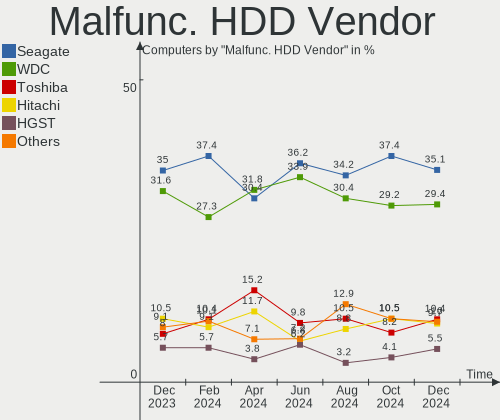

Linux - Hardware Trends
-----------------------

A project to identify most popular hardware characteristics and track their change
over time based on data collected by Linux users at https://Linux-Hardware.org.

Anyone can contribute to this report by the [hw-probe](https://github.com/linuxhw/hw-probe) tool:

    sudo -E hw-probe -all -upload

This is a report for all computer types. See also reports for [desktops](/Desktop/README.md) and [notebooks](/Notebook/README.md).

Distribution-specific reports: [Arch](/Dist/Arch), [ArcoLinux](/Dist/ArcoLinux), [BlackPanther](/Dist/BlackPanther), [CentOS](/Dist/CentOS), [Clear Linux](/Dist/Clear_Linux), [Debian](/Dist/Debian), [Elementary](/Dist/Elementary), [EndeavourOS](/Dist/EndeavourOS), [Endless](/Dist/Endless), [Fedora](/Dist/Fedora), [Garuda Linux](/Dist/Garuda_Linux), [Gentoo](/Dist/Gentoo), [Kali](/Dist/Kali), [KDE neon](/Dist/KDE_neon), [Kubuntu](/Dist/Kubuntu), [Linux Mint](/Dist/Linux_Mint), [Manjaro](/Dist/Manjaro), [OpenMandriva](/Dist/OpenMandriva), [openSUSE](/Dist/openSUSE), [Pop!_OS](/Dist/Pop!_OS), [Red OS](/Dist/Red_OS), [ROSA](/Dist/ROSA), [SteamOS](/Dist/SteamOS), [Ubuntu MATE](/Dist/Ubuntu_MATE), [Ubuntu](/Dist/Ubuntu), [Xubuntu](/Dist/Xubuntu), [Zorin](/Dist/Zorin).

This report is for one last month. Overall report since the beginning of time: [TestDays](https://github.com/linuxhw/TestDays)

Period: Jun, 2023.

Contents
--------

* [ System ](#system)
  - [ OS                       ](#os)
  - [ OS Family                ](#os-family)
  - [ Kernel                   ](#kernel)
  - [ Kernel Family            ](#kernel-family)
  - [ Kernel Major Ver.        ](#kernel-major-ver)
  - [ Arch                     ](#arch)
  - [ DE                       ](#de)
  - [ Display Server           ](#display-server)
  - [ Display Manager          ](#display-manager)
  - [ OS Lang                  ](#os-lang)
  - [ Boot Mode                ](#boot-mode)
  - [ Filesystem               ](#filesystem)
  - [ Part. scheme             ](#part-scheme)
  - [ Dual Boot with Linux/BSD ](#dual-boot-with-linuxbsd)
  - [ Dual Boot (Win)          ](#dual-boot-win)

* [ Board ](#board)
  - [ Vendor                   ](#vendor)
  - [ Model                    ](#model)
  - [ Model Family             ](#model-family)
  - [ MFG Year                 ](#mfg-year)
  - [ Form Factor              ](#form-factor)
  - [ Secure Boot              ](#secure-boot)
  - [ Coreboot                 ](#coreboot)
  - [ RAM Size                 ](#ram-size)
  - [ RAM Used                 ](#ram-used)
  - [ Total Drives             ](#total-drives)
  - [ Has CD-ROM               ](#has-cd-rom)
  - [ Has Ethernet             ](#has-ethernet)
  - [ Has WiFi                 ](#has-wifi)
  - [ Has Bluetooth            ](#has-bluetooth)

* [ Location ](#location)
  - [ Country                  ](#country)
  - [ City                     ](#city)

* [ Drives ](#drives)
  - [ Drive Vendor             ](#drive-vendor)
  - [ Drive Model              ](#drive-model)
  - [ HDD Vendor               ](#hdd-vendor)
  - [ SSD Vendor               ](#ssd-vendor)
  - [ Drive Kind               ](#drive-kind)
  - [ Drive Connector          ](#drive-connector)
  - [ Drive Size               ](#drive-size)
  - [ Space Total              ](#space-total)
  - [ Space Used               ](#space-used)
  - [ Malfunc. Drives          ](#malfunc-drives)
  - [ Malfunc. Drive Vendor    ](#malfunc-drive-vendor)
  - [ Malfunc. HDD Vendor      ](#malfunc-hdd-vendor)
  - [ Malfunc. Drive Kind      ](#malfunc-drive-kind)
  - [ Failed Drives            ](#failed-drives)
  - [ Failed Drive Vendor      ](#failed-drive-vendor)
  - [ Drive Status             ](#drive-status)

* [ Storage controller ](#storage-controller)
  - [ Storage Vendor           ](#storage-vendor)
  - [ Storage Model            ](#storage-model)
  - [ Storage Kind             ](#storage-kind)

* [ Processor ](#processor)
  - [ CPU Vendor               ](#cpu-vendor)
  - [ CPU Model                ](#cpu-model)
  - [ CPU Model Family         ](#cpu-model-family)
  - [ CPU Cores                ](#cpu-cores)
  - [ CPU Sockets              ](#cpu-sockets)
  - [ CPU Threads              ](#cpu-threads)
  - [ CPU Op-Modes             ](#cpu-op-modes)
  - [ CPU Microcode            ](#cpu-microcode)
  - [ CPU Microarch            ](#cpu-microarch)

* [ Graphics ](#graphics)
  - [ GPU Vendor               ](#gpu-vendor)
  - [ GPU Model                ](#gpu-model)
  - [ GPU Combo                ](#gpu-combo)
  - [ GPU Driver               ](#gpu-driver)
  - [ GPU Memory               ](#gpu-memory)

* [ Monitor ](#monitor)
  - [ Monitor Vendor           ](#monitor-vendor)
  - [ Monitor Model            ](#monitor-model)
  - [ Monitor Resolution       ](#monitor-resolution)
  - [ Monitor Diagonal         ](#monitor-diagonal)
  - [ Monitor Width            ](#monitor-width)
  - [ Aspect Ratio             ](#aspect-ratio)
  - [ Monitor Area             ](#monitor-area)
  - [ Pixel Density            ](#pixel-density)
  - [ Multiple Monitors        ](#multiple-monitors)

* [ Network ](#network)
  - [ Net Controller Vendor    ](#net-controller-vendor)
  - [ Net Controller Model     ](#net-controller-model)
  - [ Wireless Vendor          ](#wireless-vendor)
  - [ Wireless Model           ](#wireless-model)
  - [ Ethernet Vendor          ](#ethernet-vendor)
  - [ Ethernet Model           ](#ethernet-model)
  - [ Net Controller Kind      ](#net-controller-kind)
  - [ Used Controller          ](#used-controller)
  - [ NICs                     ](#nics)
  - [ IPv6                     ](#ipv6)

* [ Bluetooth ](#bluetooth)
  - [ Bluetooth Vendor         ](#bluetooth-vendor)
  - [ Bluetooth Model          ](#bluetooth-model)

* [ Sound ](#sound)
  - [ Sound Vendor             ](#sound-vendor)
  - [ Sound Model              ](#sound-model)

* [ Memory ](#memory)
  - [ Memory Vendor            ](#memory-vendor)
  - [ Memory Model             ](#memory-model)
  - [ Memory Kind              ](#memory-kind)
  - [ Memory Form Factor       ](#memory-form-factor)
  - [ Memory Size              ](#memory-size)
  - [ Memory Speed             ](#memory-speed)

* [ Printers & scanners ](#printers--scanners)
  - [ Printer Vendor           ](#printer-vendor)
  - [ Printer Model            ](#printer-model)
  - [ Scanner Vendor           ](#scanner-vendor)
  - [ Scanner Model            ](#scanner-model)

* [ Camera ](#camera)
  - [ Camera Vendor            ](#camera-vendor)
  - [ Camera Model             ](#camera-model)

* [ Security ](#security)
  - [ Fingerprint Vendor       ](#fingerprint-vendor)
  - [ Fingerprint Model        ](#fingerprint-model)
  - [ Chipcard Vendor          ](#chipcard-vendor)
  - [ Chipcard Model           ](#chipcard-model)

* [ Unsupported ](#unsupported)
  - [ Unsupported Devices      ](#unsupported-devices)
  - [ Unsupported Device Types ](#unsupported-device-types)

System
------

OS
--

Installed operating systems

| Name                         | Computers | Percent |
|------------------------------|-----------|---------|
| Ubuntu 22.04                 | 687       | 13.62%  |
| Fedora 38                    | 443       | 8.78%   |
| Linux Mint 21.1              | 379       | 7.51%   |
| Ubuntu 23.04                 | 248       | 4.92%   |
| Debian 12                    | 244       | 4.84%   |
| Arch Rolling                 | 214       | 4.24%   |
| Pop!_OS 22.04                | 180       | 3.57%   |
| OpenMandriva 23.03           | 174       | 3.45%   |
| Debian 11                    | 164       | 3.25%   |
| ArcoLinux Rolling            | 155       | 3.07%   |
| ROSA 12.4                    | 137       | 2.72%   |
| Zorin 16                     | 116       | 2.3%    |
| Ubuntu 20.04                 | 103       | 2.04%   |
| KDE neon 22.04               | 83        | 1.65%   |
| BlackPanther 18.1            | 82        | 1.63%   |
| Manjaro                      | 81        | 1.61%   |
| OpenMandriva 23.06           | 75        | 1.49%   |
| openSUSE Tumbleweed-XXXXXXXX | 66        | 1.31%   |
| Manjaro 23.0.0               | 55        | 1.09%   |
| Ubuntu 22.10                 | 53        | 1.05%   |
| Kali 2023.2                  | 53        | 1.05%   |
| SteamOS 3.4.8                | 51        | 1.01%   |
| Kubuntu 22.04                | 50        | 0.99%   |
| Kubuntu 23.04                | 48        | 0.95%   |
| EndeavourOS Rolling          | 47        | 0.93%   |
| OpenMandriva 4.3             | 44        | 0.87%   |
| Linux Mint 20.3              | 44        | 0.87%   |
| Xubuntu 22.04                | 37        | 0.73%   |
| Nobara 37                    | 35        | 0.69%   |
| Gentoo 2.13                  | 35        | 0.69%   |
| Linux Mint 21                | 34        | 0.67%   |
| LMDE 5                       | 29        | 0.57%   |
| Fedora 37                    | 26        | 0.52%   |
| Elementary 7                 | 25        | 0.5%    |
| openSUSE Leap-15.5           | 24        | 0.48%   |
| Ubuntu 18.04                 | 21        | 0.42%   |
| Parrot 5.3                   | 20        | 0.4%    |
| Lubuntu 22.04                | 20        | 0.4%    |
| MX 21                        | 18        | 0.36%   |
| OpenMandriva 23.01           | 17        | 0.34%   |

OS Family
---------

OS without a version

| Name          | Computers | Percent |
|---------------|-----------|---------|
| Ubuntu        | 1118      | 22.16%  |
| Linux Mint    | 491       | 9.73%   |
| Fedora        | 485       | 9.62%   |
| Debian        | 432       | 8.56%   |
| OpenMandriva  | 331       | 6.56%   |
| Arch          | 214       | 4.24%   |
| Pop!_OS       | 184       | 3.65%   |
| ROSA          | 165       | 3.27%   |
| ArcoLinux     | 158       | 3.13%   |
| Manjaro       | 144       | 2.85%   |
| Zorin         | 123       | 2.44%   |
| Kubuntu       | 110       | 2.18%   |
| openSUSE      | 105       | 2.08%   |
| BlackPanther  | 91        | 1.8%    |
| KDE neon      | 85        | 1.69%   |
| SteamOS       | 80        | 1.59%   |
| Xubuntu       | 64        | 1.27%   |
| Kali          | 60        | 1.19%   |
| EndeavourOS   | 47        | 0.93%   |
| Nobara        | 42        | 0.83%   |
| Gentoo        | 36        | 0.71%   |
| Lubuntu       | 32        | 0.63%   |
| Elementary    | 32        | 0.63%   |
| Ubuntu MATE   | 30        | 0.59%   |
| LMDE          | 29        | 0.57%   |
| Parrot        | 22        | 0.44%   |
| MX            | 20        | 0.4%    |
| Endless       | 17        | 0.34%   |
| NixOS         | 15        | 0.3%    |
| Ubuntu Budgie | 14        | 0.28%   |
| Garuda Linux  | 14        | 0.28%   |
| ChimeraOS     | 14        | 0.28%   |
| ALT Linux     | 14        | 0.28%   |
| Xero          | 10        | 0.2%    |
| Ubuntu Unity  | 10        | 0.2%    |
| TUXEDO OS     | 10        | 0.2%    |
| CentOS        | 10        | 0.2%    |
| Red OS        | 9         | 0.18%   |
| blendOS       | 8         | 0.16%   |
| Alpine        | 8         | 0.16%   |

Kernel
------

Version of the Linux kernel

| Version                           | Computers | Percent |
|-----------------------------------|-----------|---------|
| 5.19.0-43-generic                 | 414       | 8.21%   |
| 5.15.0-73-generic                 | 321       | 6.36%   |
| 5.19.0-45-generic                 | 250       | 4.96%   |
| 5.15.0-75-generic                 | 207       | 4.1%    |
| 6.1.0-9-amd64                     | 181       | 3.59%   |
| 6.2.0-20-generic                  | 177       | 3.51%   |
| 6.2.6-desktop-1omv2390            | 176       | 3.49%   |
| 6.2.6-76060206-generic            | 164       | 3.25%   |
| 5.10.0-23-amd64                   | 123       | 2.44%   |
| 6.3.8-200.fc38.x86_64             | 118       | 2.34%   |
| 6.1.20-generic-2rosa2021.1-x86_64 | 117       | 2.32%   |
| 6.2.0-23-generic                  | 105       | 2.08%   |
| 6.3.5-200.fc38.x86_64             | 74        | 1.47%   |
| 6.3.5-desktop-3omv2390            | 73        | 1.45%   |
| 6.3.6-200.fc38.x86_64             | 62        | 1.23%   |
| 6.1.31-2-MANJARO                  | 61        | 1.21%   |
| 5.13.0-valve36-1-neptune          | 61        | 1.21%   |
| 6.3.9-arch1-1                     | 60        | 1.19%   |
| 5.4.0-150-generic                 | 51        | 1.01%   |
| 6.3.6-arch1-1                     | 49        | 0.97%   |
| 6.3.5-arch1-1                     | 48        | 0.95%   |
| 6.1.0-4-amd64                     | 48        | 0.95%   |
| 6.3.7-200.fc38.x86_64             | 47        | 0.93%   |
| 6.3.4-201.fc38.x86_64             | 47        | 0.93%   |
| 6.3.8-arch1-1                     | 46        | 0.91%   |
| 6.2.9-300.fc38.x86_64             | 46        | 0.91%   |
| 6.1.0-kali9-amd64                 | 45        | 0.89%   |
| 5.15.0-69-generic                 | 44        | 0.87%   |
| 6.3.7-arch1-1                     | 41        | 0.81%   |
| 5.19.0-46-generic                 | 38        | 0.75%   |
| 5.15.0-56-generic                 | 38        | 0.75%   |
| 5.6.14-desktop-2bP                | 36        | 0.71%   |
| 5.19.0-42-generic                 | 34        | 0.67%   |
| 5.19.0-32-generic                 | 33        | 0.65%   |
| 5.15.0-72-generic                 | 33        | 0.65%   |
| 6.2.15-300.fc38.x86_64            | 32        | 0.63%   |
| 6.3.5-2-MANJARO                   | 31        | 0.61%   |
| 5.15.0-76-generic                 | 29        | 0.57%   |
| 5.16.7-desktop-1omv4003           | 25        | 0.5%    |
| 5.15.85-desktop-1bP               | 25        | 0.5%    |

Kernel Family
-------------

Linux kernel without a distro release

| Version  | Computers | Percent |
|----------|-----------|---------|
| 5.19.0   | 812       | 16.1%   |
| 5.15.0   | 761       | 15.09%  |
| 6.2.6    | 343       | 6.8%    |
| 6.1.0    | 334       | 6.62%   |
| 6.2.0    | 329       | 6.52%   |
| 6.3.5    | 283       | 5.61%   |
| 6.3.8    | 215       | 4.26%   |
| 5.10.0   | 180       | 3.57%   |
| 6.3.7    | 168       | 3.33%   |
| 6.3.6    | 158       | 3.13%   |
| 5.4.0    | 128       | 2.54%   |
| 6.1.20   | 118       | 2.34%   |
| 6.1.31   | 102       | 2.02%   |
| 6.3.9    | 100       | 1.98%   |
| 6.3.4    | 99        | 1.96%   |
| 5.13.0   | 77        | 1.53%   |
| 6.2.9    | 47        | 0.93%   |
| 6.2.15   | 46        | 0.91%   |
| 5.6.14   | 37        | 0.73%   |
| 5.14.21  | 31        | 0.61%   |
| 6.3.3    | 29        | 0.57%   |
| 5.16.7   | 25        | 0.5%    |
| 5.15.85  | 25        | 0.5%    |
| 6.4.0    | 23        | 0.46%   |
| 4.18.16  | 23        | 0.46%   |
| 6.1.34   | 21        | 0.42%   |
| 5.14.0   | 20        | 0.4%    |
| 6.1.1    | 19        | 0.38%   |
| 5.16.13  | 19        | 0.38%   |
| 4.15.0   | 19        | 0.38%   |
| 6.0.0    | 16        | 0.32%   |
| 6.1.27   | 15        | 0.3%    |
| 6.1.21   | 15        | 0.3%    |
| 6.3.0    | 14        | 0.28%   |
| 6.1.35   | 14        | 0.28%   |
| 6.1.33   | 14        | 0.28%   |
| 5.15.114 | 14        | 0.28%   |
| 6.3.1    | 13        | 0.26%   |
| 6.1.30   | 12        | 0.24%   |
| 6.3.2    | 11        | 0.22%   |

Kernel Major Ver.
-----------------

Linux kernel major version

| Version  | Computers | Percent |
|----------|-----------|---------|
| 6.3      | 1095      | 21.71%  |
| 5.15     | 858       | 17.01%  |
| 5.19     | 818       | 16.22%  |
| 6.2      | 815       | 16.16%  |
| 6.1      | 697       | 13.82%  |
| 5.10     | 222       | 4.4%    |
| 5.4      | 140       | 2.78%   |
| 5.13     | 79        | 1.57%   |
| 5.14     | 52        | 1.03%   |
| 5.16     | 49        | 0.97%   |
| 5.6      | 37        | 0.73%   |
| 6.0      | 35        | 0.69%   |
| 4.18     | 33        | 0.65%   |
| 6.4      | 23        | 0.46%   |
| 4.15     | 19        | 0.38%   |
| 5.11     | 14        | 0.28%   |
| 3.10     | 11        | 0.22%   |
| 4.19     | 10        | 0.2%    |
| 5.17     | 9         | 0.18%   |
| 5.18     | 6         | 0.12%   |
| 4.9      | 6         | 0.12%   |
| 5.9      | 4         | 0.08%   |
| 5.8      | 4         | 0.08%   |
| 4.4      | 3         | 0.06%   |
| 6.3.0    | 1         | 0.02%   |
| 5.3      | 1         | 0.02%   |
| 5.15.107 | 1         | 0.02%   |
| 5.12     | 1         | 0.02%   |
| 3.1      | 1         | 0.02%   |

Arch
----

OS architecture (x86_64, i586, etc.)

| Name        | Computers | Percent |
|-------------|-----------|---------|
| x86_64      | 4962      | 98.37%  |
| i686        | 42        | 0.83%   |
| aarch64     | 25        | 0.5%    |
| armv7l      | 10        | 0.2%    |
| riscv64     | 2         | 0.04%   |
| armv6l      | 2         | 0.04%   |
| loongarch64 | 1         | 0.02%   |

DE
--

Desktop Environment

| Name              | Computers | Percent |
|-------------------|-----------|---------|
| GNOME             | 2108      | 41.79%  |
| KDE5              | 1310      | 25.97%  |
| X-Cinnamon        | 431       | 8.54%   |
| XFCE              | 380       | 7.53%   |
| Unknown           | 301       | 5.97%   |
| MATE              | 164       | 3.25%   |
| LXQt              | 66        | 1.31%   |
| i3                | 38        | 0.75%   |
| Cinnamon          | 34        | 0.67%   |
| Pantheon          | 31        | 0.61%   |
| Budgie            | 26        | 0.52%   |
| LXDE              | 19        | 0.38%   |
| GNOME Classic     | 16        | 0.32%   |
| Hyprland          | 15        | 0.3%    |
| KDE               | 14        | 0.28%   |
| sway              | 13        | 0.26%   |
| KDE4              | 12        | 0.24%   |
| Unity             | 9         | 0.18%   |
| Deepin            | 9         | 0.18%   |
| Openbox           | 6         | 0.12%   |
| lightdm-xsession  | 6         | 0.12%   |
| GNOME Flashback   | 5         | 0.1%    |
| awesome           | 4         | 0.08%   |
| Dwm               | 3         | 0.06%   |
| bspwm             | 3         | 0.06%   |
| ubuntu:pika:GNOME | 2         | 0.04%   |
| Trinity           | 2         | 0.04%   |
| LeftWM            | 2         | 0.04%   |
| icewm             | 2         | 0.04%   |
| herbstluftwm      | 2         | 0.04%   |
| chadwm            | 2         | 0.04%   |
| xsession          | 1         | 0.02%   |
| Wayfire           | 1         | 0.02%   |
| pika:GNOME        | 1         | 0.02%   |
| onyx:GNOME        | 1         | 0.02%   |
| i3-with-shmlog    | 1         | 0.02%   |
| Hypr              | 1         | 0.02%   |
| Enlightenment     | 1         | 0.02%   |
| DDE               | 1         | 0.02%   |
| Cutefish          | 1         | 0.02%   |

Display Server
--------------

X11 or Wayland

| Name    | Computers | Percent |
|---------|-----------|---------|
| X11     | 3091      | 61.28%  |
| Wayland | 1611      | 31.94%  |
| Unknown | 211       | 4.18%   |
| Tty     | 129       | 2.56%   |
| Web     | 2         | 0.04%   |

Display Manager
---------------

SDDM, LightDM, etc.

| Name    | Computers | Percent |
|---------|-----------|---------|
| Unknown | 1825      | 36.18%  |
| GDM3    | 1047      | 20.76%  |
| SDDM    | 1022      | 20.26%  |
| LightDM | 713       | 14.14%  |
| GDM     | 394       | 7.81%   |
| LXDM    | 13        | 0.26%   |
| KDM     | 11        | 0.22%   |
| SLiM    | 6         | 0.12%   |
| GREETD  | 5         | 0.1%    |
| TDM     | 2         | 0.04%   |
| LY-DM   | 2         | 0.04%   |
| Ly      | 2         | 0.04%   |
| XDM     | 1         | 0.02%   |
| EMPTTY  | 1         | 0.02%   |

OS Lang
-------

Language

| Lang    | Computers | Percent |
|---------|-----------|---------|
| en_US   | 2195      | 43.52%  |
| ru_RU   | 375       | 7.43%   |
| de_DE   | 373       | 7.39%   |
| en_GB   | 266       | 5.27%   |
| fr_FR   | 204       | 4.04%   |
| pt_BR   | 192       | 3.81%   |
| Unknown | 166       | 3.29%   |
| es_ES   | 120       | 2.38%   |
| C       | 117       | 2.32%   |
| it_IT   | 103       | 2.04%   |
| en_CA   | 93        | 1.84%   |
| en_AU   | 75        | 1.49%   |
| en_IN   | 74        | 1.47%   |
| pl_PL   | 70        | 1.39%   |
| es_MX   | 52        | 1.03%   |
| es_AR   | 40        | 0.79%   |
| zh_CN   | 37        | 0.73%   |
| tr_TR   | 30        | 0.59%   |
| nl_NL   | 29        | 0.57%   |
| hu_HU   | 24        | 0.48%   |
| cs_CZ   | 24        | 0.48%   |
| de_AT   | 23        | 0.46%   |
| pt_PT   | 19        | 0.38%   |
| es_CL   | 19        | 0.38%   |
| en_ZA   | 17        | 0.34%   |
| en_NZ   | 15        | 0.3%    |
| de_CH   | 15        | 0.3%    |
| sv_SE   | 14        | 0.28%   |
| fi_FI   | 14        | 0.28%   |
| es_CO   | 14        | 0.28%   |
| en_PH   | 11        | 0.22%   |
| zh_TW   | 10        | 0.2%    |
| es_PE   | 10        | 0.2%    |
| en_IE   | 10        | 0.2%    |
| da_DK   | 10        | 0.2%    |
| sk_SK   | 9         | 0.18%   |
| ja_JP   | 9         | 0.18%   |
| en_DK   | 9         | 0.18%   |
| POSIX   | 8         | 0.16%   |
| ro_RO   | 7         | 0.14%   |

Boot Mode
---------

EFI or BIOS

| Mode | Computers | Percent |
|------|-----------|---------|
| EFI  | 2649      | 52.52%  |
| BIOS | 2395      | 47.48%  |

Filesystem
----------

Type of filesystem

| Type     | Computers | Percent |
|----------|-----------|---------|
| Ext4     | 2909      | 57.67%  |
| Btrfs    | 944       | 18.72%  |
| Tmpfs    | 700       | 13.88%  |
| Overlay  | 360       | 7.14%   |
| Xfs      | 67        | 1.33%   |
| Zfs      | 30        | 0.59%   |
| F2fs     | 15        | 0.3%    |
| Unknown  | 7         | 0.14%   |
| Ext3     | 4         | 0.08%   |
| Ext2     | 4         | 0.08%   |
| Rootfs   | 1         | 0.02%   |
| Reiserfs | 1         | 0.02%   |
| Jfs      | 1         | 0.02%   |
| Aufs     | 1         | 0.02%   |

Part. scheme
------------

Scheme of partitioning

| Type    | Computers | Percent |
|---------|-----------|---------|
| GPT     | 2873      | 56.96%  |
| Unknown | 1578      | 31.28%  |
| MBR     | 593       | 11.76%  |

Dual Boot with Linux/BSD
------------------------

Hosting more than one Linux/BSD

| Dual boot | Computers | Percent |
|-----------|-----------|---------|
| No        | 4248      | 84.22%  |
| Yes       | 796       | 15.78%  |

Dual Boot (Win)
---------------

Hosting Linux and Windows

| Dual boot | Computers | Percent |
|-----------|-----------|---------|
| No        | 3669      | 72.74%  |
| Yes       | 1375      | 27.26%  |

Board
-----

Vendor
------

Motherboard manufacturer

| Name                    | Computers | Percent |
|-------------------------|-----------|---------|
| ASUSTek Computer        | 773       | 15.33%  |
| Lenovo                  | 716       | 14.2%   |
| Hewlett-Packard         | 627       | 12.43%  |
| Dell                    | 576       | 11.42%  |
| MSI                     | 346       | 6.86%   |
| Gigabyte Technology     | 335       | 6.64%   |
| Acer                    | 254       | 5.04%   |
| Apple                   | 154       | 3.05%   |
| ASRock                  | 152       | 3.01%   |
| Intel                   | 84        | 1.67%   |
| Valve                   | 65        | 1.29%   |
| Toshiba                 | 60        | 1.19%   |
| Unknown                 | 60        | 1.19%   |
| Samsung Electronics     | 57        | 1.13%   |
| Supermicro              | 53        | 1.05%   |
| HUAWEI                  | 44        | 0.87%   |
| Fujitsu                 | 38        | 0.75%   |
| Sony                    | 30        | 0.59%   |
| Google                  | 28        | 0.56%   |
| AZW                     | 25        | 0.5%    |
| Microsoft               | 21        | 0.42%   |
| Biostar                 | 21        | 0.42%   |
| Timi                    | 18        | 0.36%   |
| Pegatron                | 18        | 0.36%   |
| Positivo                | 16        | 0.32%   |
| Medion                  | 16        | 0.32%   |
| Raspberry Pi Foundation | 15        | 0.3%    |
| Foxconn                 | 15        | 0.3%    |
| Notebook                | 14        | 0.28%   |
| AMI                     | 14        | 0.28%   |
| TUXEDO                  | 13        | 0.26%   |
| HONOR                   | 13        | 0.26%   |
| Aquarius                | 13        | 0.26%   |
| Packard Bell            | 11        | 0.22%   |
| Huanan                  | 11        | 0.22%   |
| ECS                     | 10        | 0.2%    |
| Alienware               | 10        | 0.2%    |
| System76                | 9         | 0.18%   |
| Razer                   | 9         | 0.18%   |
| eMachines               | 9         | 0.18%   |

Model
-----

Motherboard model

| Name                            | Computers | Percent |
|---------------------------------|-----------|---------|
| Unknown                         | 75        | 1.49%   |
| Valve Jupiter                   | 65        | 1.29%   |
| ASUS All Series                 | 23        | 0.46%   |
| HP Notebook                     | 18        | 0.36%   |
| MSI MS-7C37                     | 14        | 0.28%   |
| Dell OptiPlex 7010              | 13        | 0.26%   |
| Apple MacBookPro9,2             | 13        | 0.26%   |
| Apple MacBookAir7,2             | 13        | 0.26%   |
| Supermicro X8DTU                | 12        | 0.24%   |
| Lenovo ThinkCentre M55p 8808D8U | 12        | 0.24%   |
| Dell OptiPlex 9020              | 12        | 0.24%   |
| Supermicro Super Server         | 11        | 0.22%   |
| MSI MS-7C91                     | 11        | 0.22%   |
| MSI MS-7C02                     | 11        | 0.22%   |
| Dell OptiPlex 3020              | 11        | 0.22%   |
| AZW SER                         | 11        | 0.22%   |
| ASUS TUF Gaming X570-PLUS       | 11        | 0.22%   |
| ASUS PRIME B450M-K              | 11        | 0.22%   |
| Aquarius NS585                  | 11        | 0.22%   |
| MSI MS-7C95                     | 10        | 0.2%    |
| HP Pavilion Notebook            | 10        | 0.2%    |
| HP Pavilion dv6                 | 10        | 0.2%    |
| MSI MS-7A38                     | 9         | 0.18%   |
| MSI MS-7B79                     | 8         | 0.16%   |
| MSI MS-7817                     | 8         | 0.16%   |
| Intel H61                       | 8         | 0.16%   |
| HP Pavilion g6                  | 8         | 0.16%   |
| HP Laptop 15s-eq2xxx            | 8         | 0.16%   |
| HP Laptop 15-db0xxx             | 8         | 0.16%   |
| HP EliteBook 840 G3             | 8         | 0.16%   |
| Supermicro X9DRW                | 7         | 0.14%   |
| MSI MS-7C56                     | 7         | 0.14%   |
| Gigabyte B450M DS3H             | 7         | 0.14%   |
| Gigabyte B450 AORUS ELITE       | 7         | 0.14%   |
| Dell Latitude E6420             | 7         | 0.14%   |
| Dell Latitude E6410             | 7         | 0.14%   |
| Dell Latitude E6400             | 7         | 0.14%   |
| Dell Inspiron 3501              | 7         | 0.14%   |
| Apple MacBookPro5,5             | 7         | 0.14%   |
| Apple MacBookPro12,1            | 7         | 0.14%   |

Model Family
------------

Motherboard model prefix

| Name               | Computers | Percent |
|--------------------|-----------|---------|
| Lenovo ThinkPad    | 297       | 5.89%   |
| Acer Aspire        | 167       | 3.31%   |
| Dell Latitude      | 154       | 3.05%   |
| Lenovo IdeaPad     | 139       | 2.76%   |
| Dell Inspiron      | 136       | 2.7%    |
| ASUS ROG           | 119       | 2.36%   |
| ASUS PRIME         | 115       | 2.28%   |
| HP Pavilion        | 103       | 2.04%   |
| HP EliteBook       | 89        | 1.76%   |
| ASUS VivoBook      | 86        | 1.7%    |
| Dell OptiPlex      | 84        | 1.67%   |
| HP Laptop          | 79        | 1.57%   |
| Unknown            | 75        | 1.49%   |
| Lenovo ThinkCentre | 67        | 1.33%   |
| Valve Jupiter      | 65        | 1.29%   |
| Dell XPS           | 62        | 1.23%   |
| Dell Precision     | 60        | 1.19%   |
| ASUS TUF           | 60        | 1.19%   |
| HP Compaq          | 55        | 1.09%   |
| Toshiba Satellite  | 42        | 0.83%   |
| Lenovo Legion      | 42        | 0.83%   |
| Lenovo Yoga        | 35        | 0.69%   |
| HP ENVY            | 35        | 0.69%   |
| HP ProBook         | 34        | 0.67%   |
| Dell Vostro        | 33        | 0.65%   |
| ASUS ASUS          | 27        | 0.54%   |
| Acer Nitro         | 24        | 0.48%   |
| ASUS All           | 23        | 0.46%   |
| HP OMEN            | 22        | 0.44%   |
| ASUS ZenBook       | 22        | 0.44%   |
| Microsoft Surface  | 21        | 0.42%   |
| HP EliteDesk       | 21        | 0.42%   |
| HP Notebook        | 18        | 0.36%   |
| Gigabyte B450M     | 18        | 0.36%   |
| Gigabyte B450      | 17        | 0.34%   |
| Acer Swift         | 17        | 0.34%   |
| Lenovo ThinkBook   | 16        | 0.32%   |
| Apple MacBookAir7  | 16        | 0.32%   |
| RPi Raspberry      | 15        | 0.3%    |
| Dell PowerEdge     | 15        | 0.3%    |

MFG Year
--------

Motherboard manufacture year

| Year    | Computers | Percent |
|---------|-----------|---------|
| 2022    | 561       | 11.12%  |
| 2021    | 557       | 11.04%  |
| 2020    | 455       | 9.02%   |
| 2019    | 412       | 8.17%   |
| 2018    | 399       | 7.91%   |
| 2012    | 301       | 5.97%   |
| 2013    | 287       | 5.69%   |
| 2017    | 282       | 5.59%   |
| 2011    | 267       | 5.29%   |
| 2014    | 255       | 5.06%   |
| 2015    | 245       | 4.86%   |
| 2016    | 230       | 4.56%   |
| 2010    | 220       | 4.36%   |
| 2023    | 157       | 3.11%   |
| 2009    | 150       | 2.97%   |
| 2008    | 130       | 2.58%   |
| 2007    | 67        | 1.33%   |
| Unknown | 41        | 0.81%   |
| 2006    | 22        | 0.44%   |
| 2005    | 5         | 0.1%    |
| 2002    | 1         | 0.02%   |

Form Factor
-----------

Physical design of the computer

| Name           | Computers | Percent |
|----------------|-----------|---------|
| Notebook       | 2669      | 52.91%  |
| Desktop        | 1890      | 37.47%  |
| Convertible    | 133       | 2.64%   |
| Server         | 95        | 1.88%   |
| Mini pc        | 88        | 1.74%   |
| All in one     | 83        | 1.65%   |
| Tablet         | 48        | 0.95%   |
| System on chip | 32        | 0.63%   |
| Phone          | 3         | 0.06%   |
| Stick pc       | 2         | 0.04%   |
| Other          | 1         | 0.02%   |

Secure Boot
-----------

Enabled or disabled

| State    | Computers | Percent |
|----------|-----------|---------|
| Disabled | 4726      | 93.7%   |
| Enabled  | 318       | 6.3%    |

Coreboot
--------

Have coreboot on board

| Used | Computers | Percent |
|------|-----------|---------|
| No   | 5011      | 99.35%  |
| Yes  | 33        | 0.65%   |

RAM Size
--------

Total RAM memory

| Size in GB      | Computers | Percent |
|-----------------|-----------|---------|
| 4.01-8.0        | 1194      | 23.67%  |
| 16.01-24.0      | 1011      | 20.04%  |
| 8.01-16.0       | 916       | 18.16%  |
| 3.01-4.0        | 728       | 14.43%  |
| 32.01-64.0      | 644       | 12.77%  |
| 64.01-256.0     | 218       | 4.32%   |
| 24.01-32.0      | 124       | 2.46%   |
| 1.01-2.0        | 102       | 2.02%   |
| 2.01-3.0        | 64        | 1.27%   |
| More than 256.0 | 19        | 0.38%   |
| 0.51-1.0        | 19        | 0.38%   |
| 0.01-0.5        | 5         | 0.1%    |

RAM Used
--------

Used RAM memory

| Used GB     | Computers | Percent |
|-------------|-----------|---------|
| 1.01-2.0    | 1421      | 28.17%  |
| 2.01-3.0    | 1223      | 24.25%  |
| 4.01-8.0    | 1000      | 19.83%  |
| 3.01-4.0    | 726       | 14.39%  |
| 0.51-1.0    | 267       | 5.29%   |
| 8.01-16.0   | 266       | 5.27%   |
| 0.01-0.5    | 57        | 1.13%   |
| 16.01-24.0  | 47        | 0.93%   |
| 32.01-64.0  | 18        | 0.36%   |
| 24.01-32.0  | 9         | 0.18%   |
| 64.01-256.0 | 8         | 0.16%   |
| 0           | 1         | 0.02%   |
| Unknown     | 1         | 0.02%   |

Total Drives
------------

Number of drives on board

| Drives | Computers | Percent |
|--------|-----------|---------|
| 1      | 2984      | 59.16%  |
| 2      | 1245      | 24.68%  |
| 3      | 400       | 7.93%   |
| 4      | 194       | 3.85%   |
| 5      | 95        | 1.88%   |
| 6      | 47        | 0.93%   |
| 0      | 28        | 0.56%   |
| 8      | 13        | 0.26%   |
| 7      | 13        | 0.26%   |
| 10     | 6         | 0.12%   |
| 9      | 5         | 0.1%    |
| 11     | 4         | 0.08%   |
| 12     | 2         | 0.04%   |
| 47     | 1         | 0.02%   |
| 29     | 1         | 0.02%   |
| 27     | 1         | 0.02%   |
| 21     | 1         | 0.02%   |
| 19     | 1         | 0.02%   |
| 17     | 1         | 0.02%   |
| 14     | 1         | 0.02%   |
| 13     | 1         | 0.02%   |

Has CD-ROM
----------

Has CD-ROM on board

| Presented | Computers | Percent |
|-----------|-----------|---------|
| No        | 3570      | 70.78%  |
| Yes       | 1474      | 29.22%  |

Has Ethernet
------------

Has Ethernet on board

| Presented | Computers | Percent |
|-----------|-----------|---------|
| Yes       | 4209      | 83.45%  |
| No        | 835       | 16.55%  |

Has WiFi
--------

Has WiFi module

| Presented | Computers | Percent |
|-----------|-----------|---------|
| Yes       | 3860      | 76.53%  |
| No        | 1184      | 23.47%  |

Has Bluetooth
-------------

Has Bluetooth module

| Presented | Computers | Percent |
|-----------|-----------|---------|
| Yes       | 3217      | 63.78%  |
| No        | 1827      | 36.22%  |

Location
--------

Country
-------

Geographic location (country)

| Country      | Computers | Percent |
|--------------|-----------|---------|
| USA          | 951       | 18.85%  |
| Germany      | 509       | 10.09%  |
| Russia       | 460       | 9.12%   |
| Brazil       | 285       | 5.65%   |
| France       | 247       | 4.9%    |
| UK           | 192       | 3.81%   |
| Italy        | 159       | 3.15%   |
| Canada       | 152       | 3.01%   |
| Spain        | 139       | 2.76%   |
| Poland       | 120       | 2.38%   |
| India        | 111       | 2.2%    |
| Hungary      | 111       | 2.2%    |
| Netherlands  | 100       | 1.98%   |
| Australia    | 98        | 1.94%   |
| Mexico       | 78        | 1.55%   |
| Argentina    | 57        | 1.13%   |
| Turkey       | 55        | 1.09%   |
| China        | 55        | 1.09%   |
| Switzerland  | 52        | 1.03%   |
| Sweden       | 50        | 0.99%   |
| Czechia      | 48        | 0.95%   |
| Austria      | 47        | 0.93%   |
| Portugal     | 44        | 0.87%   |
| Finland      | 38        | 0.75%   |
| Romania      | 35        | 0.69%   |
| Chile        | 35        | 0.69%   |
| Indonesia    | 32        | 0.63%   |
| Colombia     | 32        | 0.63%   |
| Belgium      | 32        | 0.63%   |
| Norway       | 31        | 0.61%   |
| Japan        | 30        | 0.59%   |
| South Africa | 28        | 0.56%   |
| Greece       | 26        | 0.52%   |
| Denmark      | 24        | 0.48%   |
| Slovakia     | 23        | 0.46%   |
| Bulgaria     | 23        | 0.46%   |
| Philippines  | 22        | 0.44%   |
| Israel       | 21        | 0.42%   |
| Serbia       | 20        | 0.4%    |
| New Zealand  | 20        | 0.4%    |

City
----

Geographic location (city)

| City           | Computers | Percent |
|----------------|-----------|---------|
| Moscow         | 140       | 2.78%   |
| Voronezh       | 51        | 1.01%   |
| Budapest       | 46        | 0.91%   |
| Berlin         | 38        | 0.75%   |
| Sao Paulo      | 37        | 0.73%   |
| St Petersburg  | 33        | 0.65%   |
| Paris          | 32        | 0.63%   |
| Melbourne      | 32        | 0.63%   |
| Bangor         | 31        | 0.61%   |
| Sydney         | 29        | 0.57%   |
| Warsaw         | 27        | 0.54%   |
| Helsinki       | 26        | 0.52%   |
| Milan          | 25        | 0.5%    |
| Istanbul       | 25        | 0.5%    |
| Amsterdam      | 25        | 0.5%    |
| Toronto        | 23        | 0.46%   |
| Rio de Janeiro | 23        | 0.46%   |
| Seattle        | 22        | 0.44%   |
| Munich         | 22        | 0.44%   |
| Vienna         | 21        | 0.42%   |
| Madrid         | 19        | 0.38%   |
| Hamburg        | 19        | 0.38%   |
| New York       | 18        | 0.36%   |
| Singapore      | 17        | 0.34%   |
| Rome           | 17        | 0.34%   |
| Prague         | 17        | 0.34%   |
| London         | 17        | 0.34%   |
| Santiago       | 16        | 0.32%   |
| Montreal       | 16        | 0.32%   |
| Zurich         | 14        | 0.28%   |
| Manchester     | 14        | 0.28%   |
| Delhi          | 14        | 0.28%   |
| Novosibirsk    | 13        | 0.26%   |
| Mexico City    | 13        | 0.26%   |
| Jakarta        | 13        | 0.26%   |
| Hyderabad      | 13        | 0.26%   |
| Brisbane       | 13        | 0.26%   |
| Stockholm      | 12        | 0.24%   |
| Cologne        | 12        | 0.24%   |
| Bengaluru      | 12        | 0.24%   |

Drives
------

Drive Vendor
------------

Hard drive vendors

| Vendor                      | Computers | Drives | Percent |
|-----------------------------|-----------|--------|---------|
| Samsung Electronics         | 1157      | 1415   | 15.39%  |
| WDC                         | 921       | 1154   | 12.25%  |
| Seagate                     | 861       | 1146   | 11.45%  |
| Sandisk                     | 461       | 494    | 6.13%   |
| Kingston                    | 424       | 462    | 5.64%   |
| Toshiba                     | 393       | 432    | 5.23%   |
| Crucial                     | 309       | 351    | 4.11%   |
| Unknown                     | 300       | 327    | 3.99%   |
| SK hynix                    | 209       | 216    | 2.78%   |
| Intel                       | 185       | 211    | 2.46%   |
| Hitachi                     | 167       | 180    | 2.22%   |
| Micron Technology           | 160       | 169    | 2.13%   |
| HGST                        | 105       | 127    | 1.4%    |
| A-DATA Technology           | 104       | 107    | 1.38%   |
| Phison Electronics          | 100       | 111    | 1.33%   |
| Kingston Technology Company | 99        | 101    | 1.32%   |
| China                       | 91        | 95     | 1.21%   |
| KIOXIA                      | 89        | 91     | 1.18%   |
| Apple                       | 82        | 90     | 1.09%   |
| Micron/Crucial Technology   | 73        | 80     | 0.97%   |
| SPCC                        | 60        | 72     | 0.8%    |
| Silicon Motion              | 49        | 51     | 0.65%   |
| PNY                         | 44        | 48     | 0.59%   |
| Intenso                     | 44        | 47     | 0.59%   |
| Unknown                     | 43        | 44     | 0.57%   |
| Netac                       | 36        | 39     | 0.48%   |
| OCZ                         | 32        | 33     | 0.43%   |
| Fujitsu                     | 32        | 47     | 0.43%   |
| ADATA Technology            | 32        | 35     | 0.43%   |
| JMicron Technology          | 31        | 32     | 0.41%   |
| Patriot                     | 30        | 30     | 0.4%    |
| Transcend                   | 28        | 28     | 0.37%   |
| GOODRAM                     | 28        | 28     | 0.37%   |
| Gigabyte Technology         | 24        | 24     | 0.32%   |
| Realtek Semiconductor       | 22        | 22     | 0.29%   |
| LITEON                      | 22        | 22     | 0.29%   |
| Team                        | 21        | 23     | 0.28%   |
| SABRENT                     | 21        | 22     | 0.28%   |
| MAXIO Technology (Hangzhou) | 21        | 21     | 0.28%   |
| Apacer                      | 21        | 22     | 0.28%   |

Drive Model
-----------

Hard drive models

| Model                                                 | Computers | Percent |
|-------------------------------------------------------|-----------|---------|
| Samsung NVMe SSD Controller SM981/PM981/PM983 250GB   | 185       | 2.26%   |
| Samsung NVMe SSD Controller PM9A1/PM9A3/980PRO 2TB    | 112       | 1.37%   |
| Kingston SA400S37240G 240GB SSD                       | 91        | 1.11%   |
| Unknown MMC Card  64GB                                | 59        | 0.72%   |
| Kingston SA400S37480G 480GB SSD                       | 57        | 0.7%    |
| Crucial CT500MX500SSD1 500GB                          | 52        | 0.64%   |
| Seagate ST2000DM008-2FR102 2TB                        | 51        | 0.62%   |
| Micron/Crucial P2 NVMe PCIe SSD 4TB                   | 51        | 0.62%   |
| Sandisk WD Black SN750 / PC SN730 NVMe SSD 500GB      | 48        | 0.59%   |
| Samsung SSD 850 EVO 250GB                             | 48        | 0.59%   |
| Seagate ST500DM002-1BD142 500GB                       | 47        | 0.58%   |
| Seagate ST1000LM035-1RK172 1TB                        | 46        | 0.56%   |
| Sandisk WD Blue SN550 NVMe SSD 1TB                    | 45        | 0.55%   |
| Seagate ST1000DM010-2EP102 1TB                        | 43        | 0.53%   |
| Samsung SSD 860 EVO 500GB                             | 43        | 0.53%   |
| Crucial CT1000MX500SSD1 1TB                           | 43        | 0.53%   |
| Unknown                                               | 43        | 0.53%   |
| Samsung SSD 980 1TB                                   | 42        | 0.51%   |
| Kingston SA400S37120G 120GB SSD                       | 42        | 0.51%   |
| Toshiba MQ01ABD100 1TB                                | 40        | 0.49%   |
| Crucial CT480BX500SSD1 480GB                          | 39        | 0.48%   |
| Intel SSD 660P Series 512GB                           | 38        | 0.47%   |
| Unknown MMC Card  32GB                                | 37        | 0.45%   |
| Samsung NVMe SSD Controller SM961/PM961/SM963 256GB   | 36        | 0.44%   |
| Unknown MMC Card  128GB                               | 34        | 0.42%   |
| Toshiba DT01ACA100 1TB                                | 34        | 0.42%   |
| Toshiba MQ04ABF100 1TB                                | 33        | 0.4%    |
| Phison PS5013 E13 NVMe Controller 512GB               | 33        | 0.4%    |
| Crucial CT240BX500SSD1 240GB                          | 33        | 0.4%    |
| Kingston Company OM3PDP3 NVMe SSD 256GB               | 32        | 0.39%   |
| Phison E12 NVMe Controller 1TB                        | 31        | 0.38%   |
| Samsung SSD 860 EVO 1TB                               | 30        | 0.37%   |
| Seagate ST4000DM004-2CV104 4TB                        | 29        | 0.36%   |
| Silicon Motion SM2263EN/SM2263XT SSD Controller 256GB | 28        | 0.34%   |
| Samsung SSD 870 EVO 1TB                               | 28        | 0.34%   |
| Samsung SSD 870 EVO 500GB                             | 27        | 0.33%   |
| Samsung SSD 850 EVO 500GB                             | 27        | 0.33%   |
| Seagate ST500LT012-1DG142 500GB                       | 26        | 0.32%   |
| SanDisk NVMe SSD Drive 1TB                            | 26        | 0.32%   |
| Unknown SD/MMC/MS PRO 250GB                           | 25        | 0.31%   |

HDD Vendor
----------

Hard disk drive vendors

| Vendor              | Computers | Drives | Percent |
|---------------------|-----------|--------|---------|
| Seagate             | 846       | 1117   | 35.55%  |
| WDC                 | 744       | 926    | 31.26%  |
| Toshiba             | 299       | 326    | 12.56%  |
| Hitachi             | 167       | 180    | 7.02%   |
| HGST                | 105       | 127    | 4.41%   |
| Samsung Electronics | 81        | 86     | 3.4%    |
| Fujitsu             | 32        | 47     | 1.34%   |
| Unknown             | 26        | 26     | 1.09%   |
| Apple               | 21        | 21     | 0.88%   |
| Maxtor              | 17        | 18     | 0.71%   |
| ASMT                | 8         | 12     | 0.34%   |
| Intenso             | 5         | 5      | 0.21%   |
| USB3.0              | 3         | 5      | 0.13%   |
| LaCie               | 3         | 3      | 0.13%   |
| Hewlett-Packard     | 3         | 10     | 0.13%   |
| QNAP                | 2         | 2      | 0.08%   |
| ASMedia             | 2         | 2      | 0.08%   |
| WD MediaMax         | 1         | 1      | 0.04%   |
| USB                 | 1         | 1      | 0.04%   |
| Teleplan            | 1         | 1      | 0.04%   |
| StoreJet            | 1         | 1      | 0.04%   |
| SSK                 | 1         | 1      | 0.04%   |
| SAGE                | 1         | 1      | 0.04%   |
| SABRENT             | 1         | 2      | 0.04%   |
| Maxone              | 1         | 1      | 0.04%   |
| MARSHAL             | 1         | 1      | 0.04%   |
| Lenovo              | 1         | 10     | 0.04%   |
| JMicron Technology  | 1         | 2      | 0.04%   |
| IBM/Hitachi         | 1         | 1      | 0.04%   |
| HPE                 | 1         | 1      | 0.04%   |
| Fantom              | 1         | 1      | 0.04%   |
| ExcelStor           | 1         | 1      | 0.04%   |
| Dell                | 1         | 1      | 0.04%   |

SSD Vendor
----------

Solid state drive vendors

| Vendor              | Computers | Drives | Percent |
|---------------------|-----------|--------|---------|
| Samsung Electronics | 492       | 567    | 19.96%  |
| Kingston            | 328       | 353    | 13.31%  |
| Crucial             | 273       | 307    | 11.08%  |
| SanDisk             | 189       | 195    | 7.67%   |
| WDC                 | 134       | 150    | 5.44%   |
| China               | 90        | 94     | 3.65%   |
| A-DATA Technology   | 81        | 83     | 3.29%   |
| Intel               | 62        | 77     | 2.52%   |
| SPCC                | 56        | 66     | 2.27%   |
| Micron Technology   | 43        | 50     | 1.74%   |
| Apple               | 43        | 43     | 1.74%   |
| Toshiba             | 41        | 42     | 1.66%   |
| PNY                 | 40        | 42     | 1.62%   |
| SK hynix            | 34        | 35     | 1.38%   |
| OCZ                 | 32        | 33     | 1.3%    |
| Intenso             | 32        | 34     | 1.3%    |
| GOODRAM             | 28        | 28     | 1.14%   |
| Patriot             | 26        | 26     | 1.05%   |
| Transcend           | 23        | 23     | 0.93%   |
| Netac               | 23        | 24     | 0.93%   |
| Team                | 20        | 22     | 0.81%   |
| LITEON              | 20        | 20     | 0.81%   |
| KingSpec            | 19        | 20     | 0.77%   |
| Apacer              | 19        | 19     | 0.77%   |
| Gigabyte Technology | 17        | 17     | 0.69%   |
| Hewlett-Packard     | 13        | 19     | 0.53%   |
| LITEONIT            | 12        | 12     | 0.49%   |
| Lexar               | 12        | 12     | 0.49%   |
| Plextor             | 11        | 11     | 0.45%   |
| Unknown             | 10        | 11     | 0.41%   |
| FORESEE             | 9         | 9      | 0.37%   |
| Acer                | 9         | 9      | 0.37%   |
| Verbatim            | 8         | 8      | 0.32%   |
| T-FORCE             | 7         | 7      | 0.28%   |
| Seagate             | 7         | 8      | 0.28%   |
| Phison              | 5         | 5      | 0.2%    |
| KingDian            | 5         | 5      | 0.2%    |
| External            | 5         | 6      | 0.2%    |
| Emtec               | 5         | 5      | 0.2%    |
| ASMT                | 5         | 5      | 0.2%    |

Drive Kind
----------

HDD or SSD

| Kind    | Computers | Drives | Percent |
|---------|-----------|--------|---------|
| NVMe    | 2163      | 2629   | 32.18%  |
| SSD     | 2150      | 2692   | 31.99%  |
| HDD     | 2007      | 2940   | 29.86%  |
| MMC     | 281       | 304    | 4.18%   |
| Unknown | 120       | 148    | 1.79%   |

Drive Connector
---------------

SATA, SAS, NVMe, etc.

| Type | Computers | Drives | Percent |
|------|-----------|--------|---------|
| SATA | 3362      | 5364   | 55.2%   |
| NVMe | 2142      | 2577   | 35.17%  |
| SAS  | 306       | 468    | 5.02%   |
| MMC  | 281       | 304    | 4.61%   |

Drive Size
----------

Size of hard drive

| Size in TB      | Computers | Drives | Percent |
|-----------------|-----------|--------|---------|
| 0.01-0.5        | 2414      | 3072   | 55.29%  |
| 0.51-1.0        | 1240      | 1523   | 28.4%   |
| 1.01-2.0        | 405       | 534    | 9.28%   |
| 3.01-4.0        | 130       | 202    | 2.98%   |
| 4.01-10.0       | 92        | 153    | 2.11%   |
| 2.01-3.0        | 64        | 83     | 1.47%   |
| 10.01-20.0      | 20        | 64     | 0.46%   |
| More than 100.0 | 1         | 1      | 0.02%   |

Space Total
-----------

Amount of disk space available on the file system

| Size in GB     | Computers | Percent |
|----------------|-----------|---------|
| 101-250        | 1162      | 23.04%  |
| 251-500        | 1107      | 21.95%  |
| 501-1000       | 830       | 16.46%  |
| 1001-2000      | 433       | 8.58%   |
| More than 3000 | 386       | 7.65%   |
| 1-20           | 297       | 5.89%   |
| Unknown        | 261       | 5.17%   |
| 51-100         | 252       | 5%      |
| 2001-3000      | 177       | 3.51%   |
| 21-50          | 139       | 2.76%   |

Space Used
----------

Amount of used disk space

| Used GB        | Computers | Percent |
|----------------|-----------|---------|
| 1-20           | 1577      | 31.26%  |
| 21-50          | 913       | 18.1%   |
| 101-250        | 632       | 12.53%  |
| 51-100         | 569       | 11.28%  |
| 251-500        | 430       | 8.52%   |
| 501-1000       | 282       | 5.59%   |
| Unknown        | 261       | 5.17%   |
| 1001-2000      | 195       | 3.87%   |
| More than 3000 | 126       | 2.5%    |
| 2001-3000      | 57        | 1.13%   |
| 0              | 2         | 0.04%   |

Malfunc. Drives
---------------

Drive models with a malfunction

| Model                               | Computers | Drives | Percent |
|-------------------------------------|-----------|--------|---------|
| Seagate ST500DM002-1BD142 500GB     | 14        | 17     | 2.4%    |
| Toshiba MQ01ABD100 1TB              | 8         | 8      | 1.37%   |
| Toshiba MQ01ABF050 500GB            | 7         | 7      | 1.2%    |
| Seagate ST9500325AS 500GB           | 6         | 6      | 1.03%   |
| HGST HTS541010A9E680 1TB            | 6         | 6      | 1.03%   |
| Seagate ST9320325AS 320GB           | 5         | 5      | 0.86%   |
| Seagate ST1000LM035-1RK172 1TB      | 5         | 6      | 0.86%   |
| Seagate ST1000LM024 HN-M101MBB 1TB  | 5         | 5      | 0.86%   |
| Samsung Electronics SSD 870 EVO 1TB | 5         | 13     | 0.86%   |
| WDC WD5000AAKX-001CA0 500GB         | 4         | 4      | 0.68%   |
| WDC WD20EFRX-68EUZN0 2TB            | 4         | 6      | 0.68%   |
| Toshiba MQ01ABD050 500GB            | 4         | 4      | 0.68%   |
| Seagate ST500LT012-9WS142 500GB     | 4         | 4      | 0.68%   |
| Seagate ST500LM021-1KJ152 500GB     | 4         | 4      | 0.68%   |
| Seagate ST3500418AS 500GB           | 4         | 4      | 0.68%   |
| Seagate ST3500413AS 500GB           | 4         | 4      | 0.68%   |
| Seagate ST3320418AS 320GB           | 4         | 4      | 0.68%   |
| WDC WDS120G2G0A-00JH30 128GB SSD    | 3         | 4      | 0.51%   |
| WDC WD2002FAEX-007BA0 2TB           | 3         | 3      | 0.51%   |
| WDC WD1600AAJS-00B4A0 160GB         | 3         | 3      | 0.51%   |
| WDC WD10EZEX-00WN4A0 1TB            | 3         | 3      | 0.51%   |
| Toshiba MQ04ABF100 1TB              | 3         | 3      | 0.51%   |
| Seagate ST3250310AS 250GB           | 3         | 3      | 0.51%   |
| Seagate ST2000DM001-1CH164 2TB      | 3         | 3      | 0.51%   |
| Seagate ST1000LX015-1U7172 1TB      | 3         | 3      | 0.51%   |
| Samsung Electronics HD103UJ 1TB     | 3         | 3      | 0.51%   |
| Kingston SV300S37A120G 120GB SSD    | 3         | 3      | 0.51%   |
| Hitachi HTS723232A7A364 320GB       | 3         | 3      | 0.51%   |
| Hitachi HTS545050B9A300 500GB       | 3         | 3      | 0.51%   |
| Hitachi HTS545032B9A300 320GB       | 3         | 3      | 0.51%   |
| HGST HTS545032A7E380 320GB          | 3         | 3      | 0.51%   |
| WDC WDS240G2G0A-00JH30 240GB SSD    | 2         | 2      | 0.34%   |
| WDC WD5000LPVX-80V0TT0 500GB        | 2         | 2      | 0.34%   |
| WDC WD5000LPLX-66ZNTT1 500GB        | 2         | 2      | 0.34%   |
| WDC WD5000AAKX-00ERMA0 500GB        | 2         | 2      | 0.34%   |
| WDC WD5000AAKS-00UU3A0 500GB        | 2         | 2      | 0.34%   |
| WDC WD5000AAKS-007AA0 500GB         | 2         | 2      | 0.34%   |
| WDC WD3200BEKT-60PVMT0 320GB        | 2         | 2      | 0.34%   |
| WDC WD3200AAKS-61L9A0 320GB         | 2         | 2      | 0.34%   |
| WDC WD20EARX-00PASB0 2TB            | 2         | 2      | 0.34%   |

Malfunc. Drive Vendor
---------------------

Vendors of faulty drives

| Vendor                | Computers | Drives | Percent |
|-----------------------|-----------|--------|---------|
| WDC                   | 132       | 142    | 23.2%   |
| Seagate               | 127       | 138    | 22.32%  |
| Hitachi               | 51        | 52     | 8.96%   |
| Toshiba               | 50        | 53     | 8.79%   |
| Samsung Electronics   | 41        | 53     | 7.21%   |
| HGST                  | 18        | 18     | 3.16%   |
| Kingston              | 15        | 15     | 2.64%   |
| Intel                 | 13        | 18     | 2.28%   |
| Crucial               | 13        | 14     | 2.28%   |
| SanDisk               | 11        | 11     | 1.93%   |
| SK hynix              | 10        | 10     | 1.76%   |
| China                 | 9         | 9      | 1.58%   |
| Maxtor                | 7         | 8      | 1.23%   |
| A-DATA Technology     | 7         | 7      | 1.23%   |
| OCZ                   | 5         | 5      | 0.88%   |
| Micron Technology     | 5         | 8      | 0.88%   |
| Fujitsu               | 5         | 5      | 0.88%   |
| LITEON                | 4         | 4      | 0.7%    |
| SPCC                  | 3         | 3      | 0.53%   |
| Transcend             | 2         | 2      | 0.35%   |
| SSSTC                 | 2         | 2      | 0.35%   |
| Silicon Motion        | 2         | 2      | 0.35%   |
| Realtek Semiconductor | 2         | 2      | 0.35%   |
| Patriot               | 2         | 2      | 0.35%   |
| HS-SSD-C100           | 2         | 2      | 0.35%   |
| ASMT                  | 2         | 2      | 0.35%   |
| Apple                 | 2         | 2      | 0.35%   |
| 2.5"                  | 2         | 3      | 0.35%   |
| ZHITAI                | 1         | 1      | 0.18%   |
| XrayDisk              | 1         | 1      | 0.18%   |
| Western Digital       | 1         | 2      | 0.18%   |
| WD MediaMax           | 1         | 1      | 0.18%   |
| Timetec               | 1         | 1      | 0.18%   |
| Team                  | 1         | 1      | 0.18%   |
| ShiJi                 | 1         | 1      | 0.18%   |
| Ramsta                | 1         | 1      | 0.18%   |
| PNY                   | 1         | 2      | 0.18%   |
| ORTIAL                | 1         | 1      | 0.18%   |
| Mushkin               | 1         | 1      | 0.18%   |
| MARSHAL               | 1         | 1      | 0.18%   |

Malfunc. HDD Vendor
-------------------

Vendors of faulty HDD drives

| Vendor              | Computers | Drives | Percent |
|---------------------|-----------|--------|---------|
| Seagate             | 127       | 138    | 31.51%  |
| WDC                 | 118       | 126    | 29.28%  |
| Hitachi             | 51        | 52     | 12.66%  |
| Toshiba             | 48        | 51     | 11.91%  |
| Samsung Electronics | 20        | 20     | 4.96%   |
| HGST                | 18        | 18     | 4.47%   |
| Maxtor              | 7         | 8      | 1.74%   |
| Fujitsu             | 5         | 5      | 1.24%   |
| ASMT                | 2         | 2      | 0.5%    |
| WD MediaMax         | 1         | 1      | 0.25%   |
| MARSHAL             | 1         | 1      | 0.25%   |
| IBM/Hitachi         | 1         | 1      | 0.25%   |
| Hewlett-Packard     | 1         | 1      | 0.25%   |
| ExcelStor           | 1         | 1      | 0.25%   |
| ASMedia             | 1         | 1      | 0.25%   |
| Apple               | 1         | 1      | 0.25%   |

Malfunc. Drive Kind
-------------------

Kinds of faulty drives

| Kind    | Computers | Drives | Percent |
|---------|-----------|--------|---------|
| HDD     | 379       | 427    | 69.54%  |
| SSD     | 136       | 159    | 24.95%  |
| NVMe    | 29        | 32     | 5.32%   |
| Unknown | 1         | 1      | 0.18%   |

Failed Drives
-------------

Failed drive models

| Model                                 | Computers | Drives | Percent |
|---------------------------------------|-----------|--------|---------|
| WDC WD800BB-00FJA0 80GB               | 1         | 1      | 11.11%  |
| WDC WD3200BUCT-63TWBY0 320GB          | 1         | 1      | 11.11%  |
| WDC WD3200BPVT-00JJ5T0 320GB          | 1         | 1      | 11.11%  |
| Toshiba HDWG180 8TB                   | 1         | 4      | 11.11%  |
| Toshiba DT01ACA100 1TB                | 1         | 1      | 11.11%  |
| Toshiba DT01ACA050 500GB              | 1         | 1      | 11.11%  |
| Seagate ST3500418AS 500GB             | 1         | 1      | 11.11%  |
| Samsung Electronics SSD 960 EVO 250GB | 1         | 2      | 11.11%  |
| Hitachi HTS547550A9E384 500GB         | 1         | 1      | 11.11%  |

Failed Drive Vendor
-------------------

Failed drive vendors

| Vendor              | Computers | Drives | Percent |
|---------------------|-----------|--------|---------|
| WDC                 | 3         | 3      | 33.33%  |
| Toshiba             | 3         | 6      | 33.33%  |
| Seagate             | 1         | 1      | 11.11%  |
| Samsung Electronics | 1         | 2      | 11.11%  |
| Hitachi             | 1         | 1      | 11.11%  |

Drive Status
------------

Number of failed and malfunc. drives

| Status   | Computers | Drives | Percent |
|----------|-----------|--------|---------|
| Detected | 2636      | 4348   | 48.18%  |
| Works    | 2305      | 3733   | 42.13%  |
| Malfunc  | 521       | 619    | 9.52%   |
| Failed   | 9         | 13     | 0.16%   |

Storage controller
------------------

Storage Vendor
--------------

Storage controller vendors

| Vendor                                  | Computers | Percent |
|-----------------------------------------|-----------|---------|
| Intel                                   | 3110      | 46.12%  |
| AMD                                     | 1011      | 14.99%  |
| Samsung Electronics                     | 696       | 10.32%  |
| SanDisk                                 | 347       | 5.15%   |
| Kingston Technology Company             | 197       | 2.92%   |
| SK hynix                                | 175       | 2.6%    |
| Phison Electronics                      | 136       | 2.02%   |
| Micron Technology                       | 118       | 1.75%   |
| Micron/Crucial Technology               | 111       | 1.65%   |
| ASMedia Technology                      | 105       | 1.56%   |
| KIOXIA                                  | 87        | 1.29%   |
| Silicon Motion                          | 62        | 0.92%   |
| Nvidia                                  | 62        | 0.92%   |
| Toshiba America Info Systems            | 59        | 0.87%   |
| ADATA Technology                        | 56        | 0.83%   |
| Marvell Technology Group                | 54        | 0.8%    |
| JMicron Technology                      | 42        | 0.62%   |
| Solid State Storage Technology          | 32        | 0.47%   |
| MAXIO Technology (Hangzhou)             | 32        | 0.47%   |
| LSI Logic / Symbios Logic               | 32        | 0.47%   |
| Realtek Semiconductor                   | 27        | 0.4%    |
| Broadcom / LSI                          | 22        | 0.33%   |
| Union Memory (Shenzhen)                 | 17        | 0.25%   |
| Apple                                   | 16        | 0.24%   |
| Yangtze Memory Technologies             | 14        | 0.21%   |
| O2 Micro                                | 13        | 0.19%   |
| Netac Technology                        | 12        | 0.18%   |
| INNOGRIT                                | 10        | 0.15%   |
| Adaptec                                 | 9         | 0.13%   |
| VIA Technologies                        | 8         | 0.12%   |
| Silicon Image                           | 7         | 0.1%    |
| Hewlett-Packard                         | 7         | 0.1%    |
| Shenzhen Longsys Electronics            | 6         | 0.09%   |
| Seagate Technology                      | 6         | 0.09%   |
| Transcend                               | 5         | 0.07%   |
| Solidigm                                | 5         | 0.07%   |
| Lite-On Technology                      | 5         | 0.07%   |
| Biwin Storage Technology                | 5         | 0.07%   |
| Silicon Integrated Systems [SiS]        | 3         | 0.04%   |
| Shenzhen Unionmemory Information System | 3         | 0.04%   |

Storage Model
-------------

Storage controller models

| Model                                                                          | Computers | Percent |
|--------------------------------------------------------------------------------|-----------|---------|
| AMD FCH SATA Controller [AHCI mode]                                            | 676       | 8.87%   |
| Samsung NVMe SSD Controller SM981/PM981/PM983                                  | 276       | 3.62%   |
| Intel Sunrise Point-LP SATA Controller [AHCI mode]                             | 226       | 2.97%   |
| Intel 8 Series/C220 Series Chipset Family 6-port SATA Controller 1 [AHCI mode] | 212       | 2.78%   |
| Intel Volume Management Device NVMe RAID Controller                            | 179       | 2.35%   |
| Samsung NVMe SSD Controller 980                                                | 162       | 2.13%   |
| Samsung NVMe SSD Controller PM9A1/PM9A3/980PRO                                 | 159       | 2.09%   |
| Intel 7 Series Chipset Family 6-port SATA Controller [AHCI mode]               | 158       | 2.07%   |
| AMD 400 Series Chipset SATA Controller                                         | 155       | 2.03%   |
| AMD 500 Series Chipset SATA Controller                                         | 130       | 1.71%   |
| Intel 82801 Mobile SATA Controller [RAID mode]                                 | 123       | 1.61%   |
| Intel 6 Series/C200 Series Chipset Family 6 port Mobile SATA AHCI Controller   | 119       | 1.56%   |
| Intel Q170/Q150/B150/H170/H110/Z170/CM236 Chipset SATA Controller [AHCI Mode]  | 112       | 1.47%   |
| Intel 8 Series SATA Controller 1 [AHCI mode]                                   | 104       | 1.37%   |
| Intel 6 Series/C200 Series Chipset Family 6 port Desktop SATA AHCI Controller  | 98        | 1.29%   |
| ASMedia ASM1062 Serial ATA Controller                                          | 94        | 1.23%   |
| Intel Cannon Lake PCH SATA AHCI Controller                                     | 93        | 1.22%   |
| Intel 200 Series PCH SATA controller [AHCI mode]                               | 92        | 1.21%   |
| SK hynix Gold P31/BC711/PC711 NVMe Solid State Drive                           | 90        | 1.18%   |
| Intel 7 Series/C210 Series Chipset Family 6-port SATA Controller [AHCI mode]   | 85        | 1.12%   |
| Intel Celeron/Pentium Silver Processor SATA Controller                         | 81        | 1.06%   |
| AMD SB7x0/SB8x0/SB9x0 IDE Controller                                           | 81        | 1.06%   |
| Intel Tiger Lake-LP SATA Controller                                            | 80        | 1.05%   |
| Micron/Crucial P2 NVMe PCIe SSD                                                | 78        | 1.02%   |
| Kingston Company Company Non-Volatile memory controller                        | 76        | 1%      |
| Intel 82801IBM/IEM (ICH9M/ICH9M-E) 4 port SATA Controller [AHCI mode]          | 76        | 1%      |
| AMD SB7x0/SB8x0/SB9x0 SATA Controller [AHCI mode]                              | 75        | 0.98%   |
| SanDisk WD Black SN750 / PC SN730 NVMe SSD                                     | 71        | 0.93%   |
| Intel NM10/ICH7 Family SATA Controller [IDE mode]                              | 69        | 0.91%   |
| Intel Wildcat Point-LP SATA Controller [AHCI Mode]                             | 67        | 0.88%   |
| Intel 5 Series/3400 Series Chipset 6 port SATA AHCI Controller                 | 66        | 0.87%   |
| SanDisk WD Blue SN550 NVMe SSD                                                 | 63        | 0.83%   |
| Intel SATA Controller [RAID mode]                                              | 61        | 0.8%    |
| Intel 82801G (ICH7 Family) IDE Controller                                      | 61        | 0.8%    |
| Intel Cannon Lake Mobile PCH SATA AHCI Controller                              | 57        | 0.75%   |
| Micron NVMe Storage Controller                                                 | 56        | 0.74%   |
| Intel Comet Lake SATA AHCI Controller                                          | 56        | 0.74%   |
| AMD SB7x0/SB8x0/SB9x0 SATA Controller [IDE mode]                               | 56        | 0.74%   |
| Samsung NVMe SSD Controller SM961/PM961/SM963                                  | 55        | 0.72%   |
| Intel Alder Lake-S PCH SATA Controller [AHCI Mode]                             | 54        | 0.71%   |

Storage Kind
------------

Kind of storage controller (IDE, SATA, NVMe, SAS, ...)

| Kind | Computers | Percent |
|------|-----------|---------|
| SATA | 3555      | 53.08%  |
| NVMe | 2142      | 31.98%  |
| IDE  | 494       | 7.38%   |
| RAID | 454       | 6.78%   |
| SAS  | 37        | 0.55%   |
| SCSI | 16        | 0.24%   |

Processor
---------

CPU Vendor
----------

Processor vendors

| Vendor                | Computers | Percent |
|-----------------------|-----------|---------|
| Intel                 | 3642      | 72.2%   |
| AMD                   | 1361      | 26.98%  |
| ARM                   | 34        | 0.67%   |
| sifive,u74-mc         | 2         | 0.04%   |
| Phytium               | 1         | 0.02%   |
| Marvell Semiconductor | 1         | 0.02%   |
| Loongson              | 1         | 0.02%   |
| CentaurHauls          | 1         | 0.02%   |
| Unknown               | 1         | 0.02%   |

CPU Model
---------

Processor models

| Model                                         | Computers | Percent |
|-----------------------------------------------|-----------|---------|
| Intel 11th Gen Core i5-1135G7 @ 2.40GHz       | 74        | 1.47%   |
| AMD Custom APU 0405                           | 65        | 1.29%   |
| Intel Core i5-7200U CPU @ 2.50GHz             | 47        | 0.93%   |
| AMD Ryzen 5 5500U with Radeon Graphics        | 42        | 0.83%   |
| Intel 11th Gen Core i7-1165G7 @ 2.80GHz       | 40        | 0.79%   |
| Intel Core i5-6200U CPU @ 2.30GHz             | 34        | 0.67%   |
| AMD Ryzen 7 5800H with Radeon Graphics        | 34        | 0.67%   |
| Intel Celeron N4020 CPU @ 1.10GHz             | 33        | 0.65%   |
| Intel 11th Gen Core i3-1115G4 @ 3.00GHz       | 32        | 0.63%   |
| Intel Core i7-9750H CPU @ 2.60GHz             | 31        | 0.61%   |
| Intel Core i7-3770 CPU @ 3.40GHz              | 31        | 0.61%   |
| AMD Ryzen 7 5700U with Radeon Graphics        | 31        | 0.61%   |
| AMD Ryzen 5 5600H with Radeon Graphics        | 30        | 0.59%   |
| AMD Ryzen 7 5800X 8-Core Processor            | 28        | 0.56%   |
| Intel Core i7-8550U CPU @ 1.80GHz             | 27        | 0.54%   |
| Intel Core i7-6700HQ CPU @ 2.60GHz            | 26        | 0.52%   |
| Intel Core i7-4790 CPU @ 3.60GHz              | 26        | 0.52%   |
| Intel Core i7-10750H CPU @ 2.60GHz            | 26        | 0.52%   |
| Intel Core i5-8265U CPU @ 1.60GHz             | 26        | 0.52%   |
| Intel Core i5-8250U CPU @ 1.60GHz             | 26        | 0.52%   |
| Intel Core i5-6300U CPU @ 2.40GHz             | 26        | 0.52%   |
| Intel Core i5-10210U CPU @ 1.60GHz            | 26        | 0.52%   |
| Intel 12th Gen Core i7-12700H                 | 26        | 0.52%   |
| AMD Ryzen 5 5600G with Radeon Graphics        | 26        | 0.52%   |
| Intel Core i7-7700HQ CPU @ 2.80GHz            | 25        | 0.5%    |
| Intel Core i5-1035G1 CPU @ 1.00GHz            | 25        | 0.5%    |
| AMD Ryzen 5 5600X 6-Core Processor            | 25        | 0.5%    |
| Intel Core i7-8750H CPU @ 2.20GHz             | 24        | 0.48%   |
| AMD Ryzen 7 3700X 8-Core Processor            | 24        | 0.48%   |
| AMD Ryzen 5 3600 6-Core Processor             | 24        | 0.48%   |
| AMD Ryzen 5 3500U with Radeon Vega Mobile Gfx | 24        | 0.48%   |
| AMD Ryzen 5 2600 Six-Core Processor           | 24        | 0.48%   |
| Intel Core i5-3210M CPU @ 2.50GHz             | 23        | 0.46%   |
| Intel 11th Gen Core i7-11800H @ 2.30GHz       | 23        | 0.46%   |
| Intel Core i7-7500U CPU @ 2.70GHz             | 22        | 0.44%   |
| Intel Core i5-7300U CPU @ 2.60GHz             | 22        | 0.44%   |
| Intel Core i3-2120 CPU @ 3.30GHz              | 22        | 0.44%   |
| AMD Ryzen 9 5900X 12-Core Processor           | 22        | 0.44%   |
| Intel 12th Gen Core i7-1260P                  | 21        | 0.42%   |
| Intel Core i5-3470 CPU @ 3.20GHz              | 20        | 0.4%    |

CPU Model Family
----------------

Processor model prefix

| Model                   | Computers | Percent |
|-------------------------|-----------|---------|
| Intel Core i5           | 960       | 19.03%  |
| Intel Core i7           | 762       | 15.11%  |
| Other                   | 687       | 13.62%  |
| Intel Core i3           | 386       | 7.65%   |
| AMD Ryzen 5             | 353       | 7%      |
| AMD Ryzen 7             | 323       | 6.4%    |
| Intel Celeron           | 241       | 4.78%   |
| Intel Xeon              | 163       | 3.23%   |
| Intel Core 2 Duo        | 155       | 3.07%   |
| AMD Ryzen 9             | 131       | 2.6%    |
| Intel Pentium           | 106       | 2.1%    |
| AMD Ryzen 3             | 67        | 1.33%   |
| AMD FX                  | 66        | 1.31%   |
| Intel Pentium Dual-Core | 53        | 1.05%   |
| Intel Atom              | 48        | 0.95%   |
| AMD A6                  | 33        | 0.65%   |
| Intel Core i9           | 30        | 0.59%   |
| Intel Core 2 Quad       | 30        | 0.59%   |
| Intel Core 2            | 28        | 0.56%   |
| AMD A10                 | 28        | 0.56%   |
| AMD Ryzen 7 PRO         | 27        | 0.54%   |
| AMD Ryzen 5 PRO         | 27        | 0.54%   |
| AMD A8                  | 21        | 0.42%   |
| AMD Phenom II X4        | 19        | 0.38%   |
| Intel Pentium Silver    | 18        | 0.36%   |
| Intel Pentium Dual      | 18        | 0.36%   |
| AMD A4                  | 17        | 0.34%   |
| AMD Athlon              | 16        | 0.32%   |
| Intel Pentium Gold      | 15        | 0.3%    |
| AMD E2                  | 14        | 0.28%   |
| AMD E1                  | 12        | 0.24%   |
| AMD Athlon II X2        | 12        | 0.24%   |
| Intel Genuine           | 11        | 0.22%   |
| Intel Xeon Gold         | 8         | 0.16%   |
| ARM BCM                 | 8         | 0.16%   |
| AMD Ryzen Threadripper  | 8         | 0.16%   |
| AMD E                   | 8         | 0.16%   |
| Intel Pentium 4         | 7         | 0.14%   |
| AMD Phenom II X6        | 7         | 0.14%   |
| AMD Athlon II X4        | 7         | 0.14%   |

CPU Cores
---------

Number of processor cores

| Number  | Computers | Percent |
|---------|-----------|---------|
| 2       | 1730      | 34.3%   |
| 4       | 1661      | 32.93%  |
| 6       | 576       | 11.42%  |
| 8       | 511       | 10.13%  |
| 12      | 170       | 3.37%   |
| 10      | 91        | 1.8%    |
| 16      | 77        | 1.53%   |
| 14      | 68        | 1.35%   |
| 1       | 63        | 1.25%   |
| 24      | 29        | 0.57%   |
| 3       | 29        | 0.57%   |
| Unknown | 12        | 0.24%   |
| 28      | 9         | 0.18%   |
| 36      | 4         | 0.08%   |
| 32      | 3         | 0.06%   |
| 22      | 2         | 0.04%   |
| 5       | 2         | 0.04%   |
| 384     | 1         | 0.02%   |
| 128     | 1         | 0.02%   |
| 56      | 1         | 0.02%   |
| 48      | 1         | 0.02%   |
| 40      | 1         | 0.02%   |
| 20      | 1         | 0.02%   |
| 7       | 1         | 0.02%   |

CPU Sockets
-----------

Number of sockets

| Number  | Computers | Percent |
|---------|-----------|---------|
| 1       | 4946      | 98.06%  |
| 2       | 83        | 1.65%   |
| Unknown | 12        | 0.24%   |
| 8       | 1         | 0.02%   |
| 4       | 1         | 0.02%   |
| 0       | 1         | 0.02%   |

CPU Threads
-----------

Threads per core (Hyper-Threading)

| Number  | Computers | Percent |
|---------|-----------|---------|
| 2       | 3590      | 71.17%  |
| 1       | 1442      | 28.59%  |
| Unknown | 12        | 0.24%   |

CPU Op-Modes
------------

CPU Operation Modes (32-bit, 64-bit)

| Op mode        | Computers | Percent |
|----------------|-----------|---------|
| 32-bit, 64-bit | 5001      | 99.15%  |
| Unknown        | 23        | 0.46%   |
| 32-bit         | 11        | 0.22%   |
| 64-bit         | 9         | 0.18%   |

CPU Microcode
-------------

Microcode number

| Number     | Computers | Percent |
|------------|-----------|---------|
| Unknown    | 2492      | 49.41%  |
| 0x206a7    | 126       | 2.5%    |
| 0x306c3    | 118       | 2.34%   |
| 0x306a9    | 106       | 2.1%    |
| 0x1067a    | 93        | 1.84%   |
| 0x806c1    | 81        | 1.61%   |
| 0x08108109 | 70        | 1.39%   |
| 0x0a50000d | 69        | 1.37%   |
| 0x0a50000c | 69        | 1.37%   |
| 0x906ea    | 61        | 1.21%   |
| 0x506e3    | 56        | 1.11%   |
| 0x40651    | 56        | 1.11%   |
| 0x806e9    | 55        | 1.09%   |
| 0x406e3    | 53        | 1.05%   |
| 0x08600106 | 53        | 1.05%   |
| 0x08608103 | 51        | 1.01%   |
| 0x20655    | 48        | 0.95%   |
| 0x806ec    | 46        | 0.91%   |
| 0x0a20120a | 45        | 0.89%   |
| 0x0a601203 | 44        | 0.87%   |
| 0x0a404102 | 41        | 0.81%   |
| 0x906a3    | 39        | 0.77%   |
| 0x306d4    | 39        | 0.77%   |
| 0x906e9    | 36        | 0.71%   |
| 0x806ea    | 35        | 0.69%   |
| 0x0800820d | 34        | 0.67%   |
| 0x08701021 | 33        | 0.65%   |
| 0x706a8    | 32        | 0.63%   |
| 0x906a4    | 25        | 0.5%    |
| 0x010000c8 | 25        | 0.5%    |
| 0x6fd      | 24        | 0.48%   |
| 0x30678    | 22        | 0.44%   |
| 0x0a201016 | 22        | 0.44%   |
| 0x06000852 | 22        | 0.44%   |
| 0x906eb    | 20        | 0.4%    |
| 0x10676    | 20        | 0.4%    |
| 0x706e5    | 19        | 0.38%   |
| 0x06006705 | 19        | 0.38%   |
| 0x306e4    | 18        | 0.36%   |
| 0x20652    | 18        | 0.36%   |

CPU Microarch
-------------

Microarchitecture

| Name             | Computers | Percent |
|------------------|-----------|---------|
| KabyLake         | 694       | 13.76%  |
| Unknown          | 444       | 8.8%    |
| Haswell          | 411       | 8.15%   |
| Zen 3            | 328       | 6.5%    |
| IvyBridge        | 304       | 6.03%   |
| SandyBridge      | 285       | 5.65%   |
| Skylake          | 273       | 5.41%   |
| Penryn           | 210       | 4.16%   |
| TigerLake        | 203       | 4.02%   |
| Alderlake Hybrid | 202       | 4%      |
| Zen 2            | 193       | 3.83%   |
| Zen+             | 163       | 3.23%   |
| Westmere         | 141       | 2.8%    |
| CometLake        | 126       | 2.5%    |
| Broadwell        | 111       | 2.2%    |
| Core             | 106       | 2.1%    |
| IceLake          | 105       | 2.08%   |
| Silvermont       | 104       | 2.06%   |
| Goldmont plus    | 97        | 1.92%   |
| Piledriver       | 86        | 1.7%    |
| K10              | 75        | 1.49%   |
| Zen              | 70        | 1.39%   |
| Excavator        | 57        | 1.13%   |
| Nehalem          | 45        | 0.89%   |
| Goldmont         | 38        | 0.75%   |
| Puma             | 24        | 0.48%   |
| Bobcat           | 23        | 0.46%   |
| Bonnell          | 20        | 0.4%    |
| Tremont          | 16        | 0.32%   |
| K8 Hammer        | 16        | 0.32%   |
| Jaguar           | 15        | 0.3%    |
| Steamroller      | 14        | 0.28%   |
| Bulldozer        | 14        | 0.28%   |
| NetBurst         | 11        | 0.22%   |
| K10 Llano        | 8         | 0.16%   |
| Gracemont        | 5         | 0.1%    |
| P6               | 4         | 0.08%   |
| K8 & K10 hybrid  | 2         | 0.04%   |
| Sapphire Rapids  | 1         | 0.02%   |

Graphics
--------

GPU Vendor
----------

Vendors of graphics cards

| Vendor                           | Computers | Percent |
|----------------------------------|-----------|---------|
| Intel                            | 2811      | 47.54%  |
| Nvidia                           | 1551      | 26.23%  |
| AMD                              | 1447      | 24.47%  |
| Matrox Electronics Systems       | 51        | 0.86%   |
| ASPEED Technology                | 44        | 0.74%   |
| VIA Technologies                 | 2         | 0.03%   |
| Silicon Integrated Systems [SiS] | 2         | 0.03%   |
| Zhaoxin                          | 1         | 0.02%   |
| S3 Graphics                      | 1         | 0.02%   |
| Loongson Technology              | 1         | 0.02%   |
| Huawei Technologies              | 1         | 0.02%   |
| ATI Technologies                 | 1         | 0.02%   |

GPU Model
---------

Graphics card models

| Model                                                                                    | Computers | Percent |
|------------------------------------------------------------------------------------------|-----------|---------|
| Intel 2nd Generation Core Processor Family Integrated Graphics Controller                | 203       | 3.35%   |
| Intel TigerLake-LP GT2 [Iris Xe Graphics]                                                | 163       | 2.69%   |
| Intel 3rd Gen Core processor Graphics Controller                                         | 151       | 2.49%   |
| AMD Cezanne [Radeon Vega Series / Radeon Vega Mobile Series]                             | 141       | 2.33%   |
| Intel HD Graphics 620                                                                    | 116       | 1.91%   |
| Intel Haswell-ULT Integrated Graphics Controller                                         | 110       | 1.82%   |
| AMD Picasso/Raven 2 [Radeon Vega Series / Radeon Vega Mobile Series]                     | 106       | 1.75%   |
| Intel Skylake GT2 [HD Graphics 520]                                                      | 101       | 1.67%   |
| Intel Xeon E3-1200 v3/4th Gen Core Processor Integrated Graphics Controller              | 94        | 1.55%   |
| Intel Alder Lake-P Integrated Graphics Controller                                        | 94        | 1.55%   |
| Intel HD Graphics 530                                                                    | 85        | 1.4%    |
| AMD Renoir                                                                               | 85        | 1.4%    |
| Intel GeminiLake [UHD Graphics 600]                                                      | 84        | 1.39%   |
| Intel UHD Graphics 620                                                                   | 83        | 1.37%   |
| AMD Lucienne                                                                             | 81        | 1.34%   |
| Intel CoffeeLake-H GT2 [UHD Graphics 630]                                                | 78        | 1.29%   |
| AMD Ellesmere [Radeon RX 470/480/570/570X/580/580X/590]                                  | 78        | 1.29%   |
| Intel Core Processor Integrated Graphics Controller                                      | 77        | 1.27%   |
| Intel Mobile 4 Series Chipset Integrated Graphics Controller                             | 68        | 1.12%   |
| Intel 4th Gen Core Processor Integrated Graphics Controller                              | 67        | 1.11%   |
| Intel HD Graphics 630                                                                    | 65        | 1.07%   |
| Intel HD Graphics 5500                                                                   | 65        | 1.07%   |
| AMD VanGogh [AMD Custom GPU 0405]                                                        | 65        | 1.07%   |
| Intel WhiskeyLake-U GT2 [UHD Graphics 620]                                               | 64        | 1.06%   |
| Intel CoffeeLake-S GT2 [UHD Graphics 630]                                                | 64        | 1.06%   |
| Intel CometLake-U GT2 [UHD Graphics]                                                     | 62        | 1.02%   |
| AMD Rembrandt [Radeon 680M]                                                              | 59        | 0.97%   |
| Intel Atom Processor Z36xxx/Z37xxx Series Graphics & Display                             | 58        | 0.96%   |
| Nvidia TU117M [GeForce GTX 1650 Mobile / Max-Q]                                          | 46        | 0.76%   |
| Intel CometLake-H GT2 [UHD Graphics]                                                     | 46        | 0.76%   |
| Intel Atom/Celeron/Pentium Processor x5-E8000/J3xxx/N3xxx Integrated Graphics Controller | 46        | 0.76%   |
| ASPEED Technology ASPEED Graphics Family                                                 | 44        | 0.73%   |
| Nvidia GP107 [GeForce GTX 1050 Ti]                                                       | 43        | 0.71%   |
| Intel Xeon E3-1200 v2/3rd Gen Core processor Graphics Controller                         | 43        | 0.71%   |
| AMD Raphael                                                                              | 42        | 0.69%   |
| AMD Navi 23 [Radeon RX 6600/6600 XT/6600M]                                               | 42        | 0.69%   |
| Nvidia GA106M [GeForce RTX 3060 Mobile / Max-Q]                                          | 41        | 0.68%   |
| Intel Alder Lake-UP3 GT2 [Iris Xe Graphics]                                              | 40        | 0.66%   |
| Intel TigerLake-H GT1 [UHD Graphics]                                                     | 39        | 0.64%   |
| Nvidia GK208B [GeForce GT 710]                                                           | 38        | 0.63%   |

GPU Combo
---------

Combinations of graphics cards

| Name                      | Computers | Percent |
|---------------------------|-----------|---------|
| 1 x Intel                 | 2013      | 39.91%  |
| 1 x AMD                   | 1131      | 22.42%  |
| 1 x Nvidia                | 798       | 15.82%  |
| Intel + Nvidia            | 597       | 11.84%  |
| AMD + Nvidia              | 127       | 2.52%   |
| Intel + AMD               | 105       | 2.08%   |
| 2 x AMD                   | 75        | 1.49%   |
| Other                     | 47        | 0.93%   |
| 1 x Matrox                | 47        | 0.93%   |
| 1 x ASPEED                | 37        | 0.73%   |
| 2 x Intel                 | 30        | 0.59%   |
| 2 x Nvidia                | 10        | 0.2%    |
| Nvidia + Matrox           | 3         | 0.06%   |
| 3 x Nvidia + 1 x ASPEED   | 2         | 0.04%   |
| 2 x Nvidia + 1 x ASPEED   | 2         | 0.04%   |
| 1 x VIA                   | 2         | 0.04%   |
| 1 x SiS                   | 2         | 0.04%   |
| Intel + 2 x AMD           | 2         | 0.04%   |
| AMD + ASPEED              | 2         | 0.04%   |
| 2 x Intel + 1 x AMD       | 1         | 0.02%   |
| 2 x AMD + 1 x Nvidia      | 1         | 0.02%   |
| 1 x Zhaoxin               | 1         | 0.02%   |
| 1 x S3 Graphics           | 1         | 0.02%   |
| Nvidia + ASPEED           | 1         | 0.02%   |
| 1 x Loongson Technology   | 1         | 0.02%   |
| 1 x Intel + 3 x Nvidia    | 1         | 0.02%   |
| Intel + 2 x Nvidia        | 1         | 0.02%   |
| Intel + AMD + 1 x Nvidia  | 1         | 0.02%   |
| 1 x Huawei Technologies   | 1         | 0.02%   |
| AMD + 2 x Nvidia          | 1         | 0.02%   |
| AMD + Nvidia + 1 x Matrox | 1         | 0.02%   |

GPU Driver
----------

Free vs proprietary

| Driver      | Computers | Percent |
|-------------|-----------|---------|
| Free        | 3960      | 78.51%  |
| Proprietary | 825       | 16.36%  |
| Unknown     | 259       | 5.13%   |

GPU Memory
----------

Total video memory

| Size in GB | Computers | Percent |
|------------|-----------|---------|
| Unknown    | 3333      | 66.08%  |
| 0.01-0.5   | 416       | 8.25%   |
| 1.01-2.0   | 355       | 7.04%   |
| 3.01-4.0   | 284       | 5.63%   |
| 0.51-1.0   | 233       | 4.62%   |
| 7.01-8.0   | 190       | 3.77%   |
| 8.01-16.0  | 102       | 2.02%   |
| 5.01-6.0   | 88        | 1.74%   |
| 2.01-3.0   | 23        | 0.46%   |
| 16.01-24.0 | 17        | 0.34%   |
| 4.01-5.0   | 2         | 0.04%   |
| 24.01-32.0 | 1         | 0.02%   |

Monitor
-------

Monitor Vendor
--------------

Monitor vendors

| Vendor                  | Computers | Percent |
|-------------------------|-----------|---------|
| Samsung Electronics     | 655       | 12.2%   |
| AU Optronics            | 592       | 11.03%  |
| BOE                     | 530       | 9.88%   |
| Chimei Innolux          | 418       | 7.79%   |
| LG Display              | 401       | 7.47%   |
| Goldstar                | 315       | 5.87%   |
| Dell                    | 297       | 5.53%   |
| Hewlett-Packard         | 182       | 3.39%   |
| Acer                    | 169       | 3.15%   |
| AOC                     | 149       | 2.78%   |
| Apple                   | 139       | 2.59%   |
| Ancor Communications    | 122       | 2.27%   |
| BenQ                    | 112       | 2.09%   |
| Philips                 | 98        | 1.83%   |
| Sharp                   | 89        | 1.66%   |
| Lenovo                  | 81        | 1.51%   |
| Valve                   | 64        | 1.19%   |
| PANDA                   | 57        | 1.06%   |
| Chi Mei Optoelectronics | 57        | 1.06%   |
| ASUSTek Computer        | 55        | 1.02%   |
| ViewSonic               | 54        | 1.01%   |
| Iiyama                  | 49        | 0.91%   |
| CSO                     | 37        | 0.69%   |
| InfoVision              | 35        | 0.65%   |
| Sony                    | 32        | 0.6%    |
| MSI                     | 26        | 0.48%   |
| NEC Computers           | 22        | 0.41%   |
| LG Philips              | 21        | 0.39%   |
| Eizo                    | 21        | 0.39%   |
| Sceptre Tech            | 20        | 0.37%   |
| Panasonic               | 20        | 0.37%   |
| Gigabyte Technology     | 19        | 0.35%   |
| Unknown                 | 18        | 0.34%   |
| TMX                     | 17        | 0.32%   |
| Fujitsu Siemens         | 16        | 0.3%    |
| Toshiba                 | 15        | 0.28%   |
| Mi                      | 15        | 0.28%   |
| Vestel Elektronik       | 14        | 0.26%   |
| HannStar                | 13        | 0.24%   |
| Vizio                   | 12        | 0.22%   |

Monitor Model
-------------

Monitor models

| Model                                                                 | Computers | Percent |
|-----------------------------------------------------------------------|-----------|---------|
| Valve ANX7530 U VLV3001 800x1280 100x150mm 7.1-inch                   | 63        | 1.14%   |
| Goldstar FULL HD GSM5B55 1920x1080 480x270mm 21.7-inch                | 24        | 0.44%   |
| Chimei Innolux LCD Monitor CMN15E7 1920x1080 344x193mm 15.5-inch      | 24        | 0.44%   |
| Samsung Electronics LCD Monitor SEC5441 1366x768 293x165mm 13.2-inch  | 18        | 0.33%   |
| Goldstar ULTRAWIDE GSM59F1 2560x1080 673x284mm 28.8-inch              | 18        | 0.33%   |
| Chimei Innolux LCD Monitor CMN14D4 1920x1080 309x173mm 13.9-inch      | 18        | 0.33%   |
| AU Optronics LCD Monitor AUO38ED 1920x1080 344x193mm 15.5-inch        | 17        | 0.31%   |
| Samsung Electronics C24F390 SAM0D2C 1920x1080 521x293mm 23.5-inch     | 16        | 0.29%   |
| AU Optronics LCD Monitor AUO61ED 1920x1080 344x194mm 15.5-inch        | 16        | 0.29%   |
| PANDA LCD Monitor NCP004D 1920x1080 344x194mm 15.5-inch               | 15        | 0.27%   |
| BOE LCD Monitor BOE0872 1920x1080 344x194mm 15.5-inch                 | 15        | 0.27%   |
| Chimei Innolux LCD Monitor CMN15F5 1920x1080 344x193mm 15.5-inch      | 14        | 0.25%   |
| Chimei Innolux LCD Monitor CMN1521 1920x1080 344x193mm 15.5-inch      | 14        | 0.25%   |
| Ancor Communications ASUS VS229 ACI22D3 1920x1080 475x267mm 21.5-inch | 14        | 0.25%   |
| Vestel Elektronik 32FHD_LCD_TV VES3700 1920x1080 700x400mm 31.7-inch  | 13        | 0.24%   |
| Samsung Electronics C27F390 SAM0D32 1920x1080 598x336mm 27.0-inch     | 13        | 0.24%   |
| LG Display LCD Monitor LGD02DC 1366x768 344x194mm 15.5-inch           | 13        | 0.24%   |
| Goldstar LG IPS FULLHD GSM5AB8 1920x1080 480x270mm 21.7-inch          | 13        | 0.24%   |
| Goldstar HDR 4K GSM7707 3840x2160 600x340mm 27.2-inch                 | 13        | 0.24%   |
| Chimei Innolux LCD Monitor CMN15DB 1366x768 344x193mm 15.5-inch       | 13        | 0.24%   |
| AU Optronics LCD Monitor AUO21ED 1920x1080 344x194mm 15.5-inch        | 13        | 0.24%   |
| Goldstar HDR 4K GSM7706 3840x2160 600x340mm 27.2-inch                 | 12        | 0.22%   |
| Chimei Innolux LCD Monitor CMN1735 1920x1080 382x215mm 17.3-inch      | 12        | 0.22%   |
| AU Optronics LCD Monitor AUO22EC 1366x768 344x193mm 15.5-inch         | 12        | 0.22%   |
| AU Optronics LCD Monitor AUO106C 1366x768 277x156mm 12.5-inch         | 12        | 0.22%   |
| Chimei Innolux LCD Monitor CMN15E6 1366x768 344x193mm 15.5-inch       | 11        | 0.2%    |
| BOE LCD Monitor BOE08D5 1920x1080 344x194mm 15.5-inch                 | 11        | 0.2%    |
| AU Optronics LCD Monitor AUO403D 1920x1080 309x174mm 14.0-inch        | 11        | 0.2%    |
| AU Optronics LCD Monitor AUO26EC 1366x768 344x193mm 15.5-inch         | 11        | 0.2%    |
| AOC 24P1W1 AOC2401 1920x1080 527x296mm 23.8-inch                      | 11        | 0.2%    |
| Goldstar HDR WFHD GSM7714 2560x1080 798x334mm 34.1-inch               | 10        | 0.18%   |
| BOE LCD Monitor BOE0757 1366x768 344x194mm 15.5-inch                  | 10        | 0.18%   |
| Samsung Electronics LCD Monitor SDC4C48 1920x1080 409x230mm 18.5-inch | 9         | 0.16%   |
| LG Display LCD Monitor LGD033A 1366x768 344x194mm 15.5-inch           | 9         | 0.16%   |
| Chimei Innolux LCD Monitor CMN15CA 1366x768 344x193mm 15.5-inch       | 9         | 0.16%   |
| Chimei Innolux LCD Monitor CMN14D6 1366x768 309x173mm 13.9-inch       | 9         | 0.16%   |
| AU Optronics LCD Monitor AUO46EC 1366x768 344x193mm 15.5-inch         | 9         | 0.16%   |
| Apple Color LCD APP9CF0 1440x900 290x180mm 13.4-inch                  | 9         | 0.16%   |
| Samsung Electronics LCD Monitor SDC4161 1920x1080 344x194mm 15.5-inch | 8         | 0.15%   |
| Dell U2412M DELA07B 1920x1200 518x324mm 24.1-inch                     | 8         | 0.15%   |

Monitor Resolution
------------------

Monitor screen resolution

| Resolution         | Computers | Percent |
|--------------------|-----------|---------|
| 1920x1080 (FHD)    | 2309      | 45.02%  |
| 1366x768 (WXGA)    | 830       | 16.18%  |
| 3840x2160 (4K)     | 378       | 7.37%   |
| 2560x1440 (QHD)    | 266       | 5.19%   |
| 1600x900 (HD+)     | 186       | 3.63%   |
| 1920x1200 (WUXGA)  | 130       | 2.53%   |
| 1280x1024 (SXGA)   | 121       | 2.36%   |
| 1440x900 (WXGA+)   | 117       | 2.28%   |
| 1680x1050 (WSXGA+) | 95        | 1.85%   |
| 1280x800 (WXGA)    | 93        | 1.81%   |
| 2560x1600          | 77        | 1.5%    |
| 3440x1440          | 65        | 1.27%   |
| 800x1280           | 63        | 1.23%   |
| 2560x1080          | 61        | 1.19%   |
| 2880x1800          | 38        | 0.74%   |
| 1360x768           | 32        | 0.62%   |
| Unknown            | 24        | 0.47%   |
| 3840x2400          | 22        | 0.43%   |
| 3840x1080          | 19        | 0.37%   |
| 1920x540           | 16        | 0.31%   |
| 1024x768 (XGA)     | 15        | 0.29%   |
| 1600x1200          | 12        | 0.23%   |
| 2160x1440          | 11        | 0.21%   |
| 3840x1600          | 10        | 0.19%   |
| 1024x600           | 10        | 0.19%   |
| 2256x1504          | 9         | 0.18%   |
| 3000x2000          | 8         | 0.16%   |
| 2736x1824          | 8         | 0.16%   |
| 2520x1680          | 8         | 0.16%   |
| 1920x1280          | 8         | 0.16%   |
| 2288x1287          | 7         | 0.14%   |
| 1280x720 (HD)      | 7         | 0.14%   |
| 3456x2160          | 6         | 0.12%   |
| 2880x1620          | 6         | 0.12%   |
| 2240x1400          | 6         | 0.12%   |
| 3840x1100          | 4         | 0.08%   |
| 3200x2000          | 4         | 0.08%   |
| 3200x1800 (QHD+)   | 4         | 0.08%   |
| 2048x1152          | 4         | 0.08%   |
| 5760x1080          | 3         | 0.06%   |

Monitor Diagonal
----------------

Diagonal size in inches

| Inches  | Computers | Percent |
|---------|-----------|---------|
| 15      | 1274      | 23.68%  |
| 13      | 452       | 8.4%    |
| 27      | 451       | 8.38%   |
| 14      | 436       | 8.1%    |
| 24      | 373       | 6.93%   |
| 23      | 351       | 6.52%   |
| 21      | 318       | 5.91%   |
| 17      | 293       | 5.45%   |
| 19      | 149       | 2.77%   |
| 31      | 134       | 2.49%   |
| Unknown | 117       | 2.17%   |
| 18      | 108       | 2.01%   |
| 34      | 105       | 1.95%   |
| 16      | 89        | 1.65%   |
| 12      | 86        | 1.6%    |
| 20      | 80        | 1.49%   |
| 11      | 70        | 1.3%    |
| 7       | 65        | 1.21%   |
| 22      | 63        | 1.17%   |
| 84      | 55        | 1.02%   |
| 72      | 32        | 0.59%   |
| 40      | 27        | 0.5%    |
| 32      | 27        | 0.5%    |
| 28      | 19        | 0.35%   |
| 54      | 18        | 0.33%   |
| 26      | 16        | 0.3%    |
| 48      | 15        | 0.28%   |
| 10      | 13        | 0.24%   |
| 43      | 11        | 0.2%    |
| 35      | 11        | 0.2%    |
| 25      | 11        | 0.2%    |
| 52      | 10        | 0.19%   |
| 37      | 10        | 0.19%   |
| 29      | 10        | 0.19%   |
| 33      | 9         | 0.17%   |
| 46      | 8         | 0.15%   |
| 42      | 8         | 0.15%   |
| 142     | 7         | 0.13%   |
| 65      | 6         | 0.11%   |
| 47      | 5         | 0.09%   |

Monitor Width
-------------

Physical width

| Width in mm    | Computers | Percent |
|----------------|-----------|---------|
| 301-350        | 1971      | 37.3%   |
| 501-600        | 1083      | 20.5%   |
| 401-500        | 641       | 12.13%  |
| 201-300        | 440       | 8.33%   |
| 351-400        | 365       | 6.91%   |
| 601-700        | 205       | 3.88%   |
| 701-800        | 143       | 2.71%   |
| Unknown        | 117       | 2.21%   |
| 1501-2000      | 95        | 1.8%    |
| 1001-1500      | 77        | 1.46%   |
| 1-100          | 63        | 1.19%   |
| 801-900        | 55        | 1.04%   |
| 901-1000       | 18        | 0.34%   |
| More than 2000 | 7         | 0.13%   |
| 101-200        | 4         | 0.08%   |

Aspect Ratio
------------

Proportional relationship between the width and the height

| Ratio   | Computers | Percent |
|---------|-----------|---------|
| 16/9    | 3683      | 76.08%  |
| 16/10   | 601       | 12.41%  |
| 21/9    | 133       | 2.75%   |
| 5/4     | 116       | 2.4%    |
| Unknown | 85        | 1.76%   |
| 3/2     | 73        | 1.51%   |
| 0.67    | 63        | 1.3%    |
| 4/3     | 42        | 0.87%   |
| 32/9    | 19        | 0.39%   |
| 1.00    | 7         | 0.14%   |
| 6/5     | 5         | 0.1%    |
| 3.40    | 4         | 0.08%   |
| 1.96    | 4         | 0.08%   |
| 0.45    | 2         | 0.04%   |
| 3.20    | 1         | 0.02%   |
| 2.00    | 1         | 0.02%   |
| 0.63    | 1         | 0.02%   |
| 0.56    | 1         | 0.02%   |

Monitor Area
------------

Area in inch

| Area in inch | Computers | Percent |
|----------------|-----------|---------|
| 101-110        | 1281      | 24.04%  |
| 201-250        | 883       | 16.57%  |
| 81-90          | 694       | 13.02%  |
| 301-350        | 471       | 8.84%   |
| 151-200        | 312       | 5.85%   |
| 351-500        | 299       | 5.61%   |
| 121-130        | 215       | 4.03%   |
| 71-80          | 191       | 3.58%   |
| More than 1000 | 150       | 2.81%   |
| 141-150        | 141       | 2.65%   |
| 251-300        | 129       | 2.42%   |
| Unknown        | 117       | 2.2%    |
| 501-1000       | 94        | 1.76%   |
| 111-120        | 79        | 1.48%   |
| 51-60          | 75        | 1.41%   |
| 61-70          | 71        | 1.33%   |
| 1-40           | 67        | 1.26%   |
| 131-140        | 33        | 0.62%   |
| 91-100         | 14        | 0.26%   |
| 41-50          | 13        | 0.24%   |

Pixel Density
-------------

Pixels per inch

| Density       | Computers | Percent |
|---------------|-----------|---------|
| 51-100        | 1633      | 31.62%  |
| 121-160       | 1420      | 27.5%   |
| 101-120       | 1287      | 24.92%  |
| 161-240       | 455       | 8.81%   |
| More than 240 | 138       | 2.67%   |
| Unknown       | 117       | 2.27%   |
| 1-50          | 114       | 2.21%   |

Multiple Monitors
-----------------

Total monitors connected

| Total | Computers | Percent |
|-------|-----------|---------|
| 1     | 3897      | 77.26%  |
| 2     | 750       | 14.87%  |
| 0     | 290       | 5.75%   |
| 3     | 92        | 1.82%   |
| 4     | 15        | 0.3%    |

Network
-------

Net Controller Vendor
---------------------

Controller vendors

| Vendor                            | Computers | Percent |
|-----------------------------------|-----------|---------|
| Realtek Semiconductor             | 2791      | 37.21%  |
| Intel                             | 2419      | 32.25%  |
| Qualcomm Atheros                  | 664       | 8.85%   |
| Broadcom                          | 401       | 5.35%   |
| MediaTek                          | 219       | 2.92%   |
| Broadcom Limited                  | 94        | 1.25%   |
| TP-Link                           | 84        | 1.12%   |
| Ralink Technology                 | 84        | 1.12%   |
| ASIX Electronics                  | 65        | 0.87%   |
| Marvell Technology Group          | 60        | 0.8%    |
| Ralink                            | 52        | 0.69%   |
| Nvidia                            | 50        | 0.67%   |
| Samsung Electronics               | 38        | 0.51%   |
| Qualcomm                          | 31        | 0.41%   |
| Xiaomi                            | 23        | 0.31%   |
| DisplayLink                       | 21        | 0.28%   |
| Aquantia                          | 21        | 0.28%   |
| Sierra Wireless                   | 20        | 0.27%   |
| Lenovo                            | 20        | 0.27%   |
| Qualcomm Atheros Communications   | 19        | 0.25%   |
| Dell                              | 18        | 0.24%   |
| NetGear                           | 17        | 0.23%   |
| Mellanox Technologies             | 17        | 0.23%   |
| Microsoft                         | 16        | 0.21%   |
| Huawei Technologies               | 16        | 0.21%   |
| ASUSTek Computer                  | 16        | 0.21%   |
| D-Link System                     | 14        | 0.19%   |
| D-Link                            | 14        | 0.19%   |
| JMicron Technology                | 13        | 0.17%   |
| Edimax Technology                 | 12        | 0.16%   |
| OPPO Electronics                  | 11        | 0.15%   |
| Ericsson Business Mobile Networks | 9         | 0.12%   |
| Microchip Technology              | 8         | 0.11%   |
| Hewlett-Packard                   | 8         | 0.11%   |
| Google                            | 8         | 0.11%   |
| Motorola PCS                      | 7         | 0.09%   |
| Linksys                           | 7         | 0.09%   |
| IBM                               | 7         | 0.09%   |
| ICS Advent                        | 6         | 0.08%   |
| Apple                             | 6         | 0.08%   |

Net Controller Model
--------------------

Controller models

| Model                                                             | Computers | Percent |
|-------------------------------------------------------------------|-----------|---------|
| Realtek RTL8111/8168/8411 PCI Express Gigabit Ethernet Controller | 1810      | 20.59%  |
| Realtek RTL810xE PCI Express Fast Ethernet controller             | 245       | 2.79%   |
| Intel Wi-Fi 6 AX200                                               | 218       | 2.48%   |
| Realtek RTL8125 2.5GbE Controller                                 | 177       | 2.01%   |
| Realtek RTL8822CE 802.11ac PCIe Wireless Network Adapter          | 152       | 1.73%   |
| Intel 82579LM Gigabit Network Connection (Lewisville)             | 147       | 1.67%   |
| Intel Wi-Fi 6 AX201                                               | 140       | 1.59%   |
| Realtek RTL8821CE 802.11ac PCIe Wireless Network Adapter          | 137       | 1.56%   |
| Realtek RTL8153 Gigabit Ethernet Adapter                          | 137       | 1.56%   |
| Intel Wireless 8265 / 8275                                        | 129       | 1.47%   |
| Intel Alder Lake-P PCH CNVi WiFi                                  | 127       | 1.44%   |
| Qualcomm Atheros QCA9377 802.11ac Wireless Network Adapter        | 118       | 1.34%   |
| Intel Wireless 7265                                               | 99        | 1.13%   |
| MediaTek MT7921 802.11ax PCI Express Wireless Network Adapter     | 98        | 1.12%   |
| Intel Wi-Fi 6 AX210/AX211/AX411 160MHz                            | 98        | 1.12%   |
| Intel Ethernet Controller I225-V                                  | 98        | 1.12%   |
| Intel I211 Gigabit Network Connection                             | 96        | 1.09%   |
| Qualcomm Atheros AR9485 Wireless Network Adapter                  | 86        | 0.98%   |
| Intel Wireless 8260                                               | 84        | 0.96%   |
| Intel Ethernet Connection I217-LM                                 | 83        | 0.94%   |
| Intel Cannon Lake PCH CNVi WiFi                                   | 74        | 0.84%   |
| Intel Wireless 7260                                               | 72        | 0.82%   |
| Qualcomm Atheros QCA9565 / AR9565 Wireless Network Adapter        | 68        | 0.77%   |
| Qualcomm Atheros QCA6174 802.11ac Wireless Network Adapter        | 62        | 0.71%   |
| Intel Centrino Advanced-N 6205 [Taylor Peak]                      | 62        | 0.71%   |
| Intel Wireless 3165                                               | 60        | 0.68%   |
| Intel Ethernet Connection (2) I219-V                              | 60        | 0.68%   |
| ASIX AX88179 Gigabit Ethernet                                     | 59        | 0.67%   |
| Realtek RTL8852BE PCIe 802.11ax Wireless Network Controller       | 58        | 0.66%   |
| Qualcomm Atheros AR9285 Wireless Network Adapter (PCI-Express)    | 57        | 0.65%   |
| Intel Comet Lake PCH-LP CNVi WiFi                                 | 57        | 0.65%   |
| Intel Comet Lake PCH CNVi WiFi                                    | 57        | 0.65%   |
| MediaTek MT7922 802.11ax PCI Express Wireless Network Adapter     | 56        | 0.64%   |
| Broadcom BCM4313 802.11bgn Wireless Network Adapter               | 50        | 0.57%   |
| Intel Dual Band Wireless-AC 3168NGW [Stone Peak]                  | 47        | 0.53%   |
| MediaTek MT7921K (RZ608) Wi-Fi 6E 80MHz                           | 45        | 0.51%   |
| Realtek 802.11ac NIC                                              | 44        | 0.5%    |
| Intel Ethernet Connection (4) I219-LM                             | 44        | 0.5%    |
| Broadcom BCM43142 802.11b/g/n                                     | 42        | 0.48%   |
| Realtek RTL8852AE 802.11ax PCIe Wireless Network Adapter          | 41        | 0.47%   |

Wireless Vendor
---------------

Wireless vendors

| Vendor                          | Computers | Percent |
|---------------------------------|-----------|---------|
| Intel                           | 1808      | 44.44%  |
| Realtek Semiconductor           | 790       | 19.42%  |
| Qualcomm Atheros                | 510       | 12.54%  |
| Broadcom                        | 280       | 6.88%   |
| MediaTek                        | 212       | 5.21%   |
| Ralink Technology               | 84        | 2.06%   |
| TP-Link                         | 80        | 1.97%   |
| Broadcom Limited                | 64        | 1.57%   |
| Ralink                          | 52        | 1.28%   |
| Sierra Wireless                 | 20        | 0.49%   |
| Qualcomm                        | 20        | 0.49%   |
| Qualcomm Atheros Communications | 19        | 0.47%   |
| NetGear                         | 16        | 0.39%   |
| ASUSTek Computer                | 16        | 0.39%   |
| Microsoft                       | 14        | 0.34%   |
| Edimax Technology               | 12        | 0.29%   |
| Dell                            | 11        | 0.27%   |
| D-Link                          | 11        | 0.27%   |
| Marvell Technology Group        | 10        | 0.25%   |
| D-Link System                   | 8         | 0.2%    |
| Linksys                         | 6         | 0.15%   |
| Belkin Components               | 4         | 0.1%    |
| ZyXEL Communications            | 3         | 0.07%   |
| Wilocity                        | 3         | 0.07%   |
| Wacom                           | 2         | 0.05%   |
| TRENDnet                        | 2         | 0.05%   |
| Hewlett-Packard                 | 2         | 0.05%   |
| Gemtek                          | 2         | 0.05%   |
| Fibocom                         | 2         | 0.05%   |
| ZyDAS                           | 1         | 0.02%   |
| Sitecom Europe                  | 1         | 0.02%   |
| IMC Networks                    | 1         | 0.02%   |
| Guillemot                       | 1         | 0.02%   |
| AVM                             | 1         | 0.02%   |

Wireless Model
--------------

Wireless models

| Model                                                          | Computers | Percent |
|----------------------------------------------------------------|-----------|---------|
| Intel Wi-Fi 6 AX200                                            | 218       | 5.32%   |
| Realtek RTL8822CE 802.11ac PCIe Wireless Network Adapter       | 152       | 3.71%   |
| Intel Wi-Fi 6 AX201                                            | 140       | 3.42%   |
| Realtek RTL8821CE 802.11ac PCIe Wireless Network Adapter       | 137       | 3.35%   |
| Intel Wireless 8265 / 8275                                     | 129       | 3.15%   |
| Intel Alder Lake-P PCH CNVi WiFi                               | 127       | 3.1%    |
| Qualcomm Atheros QCA9377 802.11ac Wireless Network Adapter     | 118       | 2.88%   |
| Intel Wireless 7265                                            | 99        | 2.42%   |
| MediaTek MT7921 802.11ax PCI Express Wireless Network Adapter  | 98        | 2.39%   |
| Intel Wi-Fi 6 AX210/AX211/AX411 160MHz                         | 98        | 2.39%   |
| Qualcomm Atheros AR9485 Wireless Network Adapter               | 86        | 2.1%    |
| Intel Wireless 8260                                            | 84        | 2.05%   |
| Intel Cannon Lake PCH CNVi WiFi                                | 74        | 1.81%   |
| Intel Wireless 7260                                            | 72        | 1.76%   |
| Qualcomm Atheros QCA9565 / AR9565 Wireless Network Adapter     | 68        | 1.66%   |
| Qualcomm Atheros QCA6174 802.11ac Wireless Network Adapter     | 62        | 1.51%   |
| Intel Centrino Advanced-N 6205 [Taylor Peak]                   | 62        | 1.51%   |
| Intel Wireless 3165                                            | 60        | 1.47%   |
| Realtek RTL8852BE PCIe 802.11ax Wireless Network Controller    | 58        | 1.42%   |
| Qualcomm Atheros AR9285 Wireless Network Adapter (PCI-Express) | 57        | 1.39%   |
| Intel Comet Lake PCH-LP CNVi WiFi                              | 57        | 1.39%   |
| Intel Comet Lake PCH CNVi WiFi                                 | 57        | 1.39%   |
| MediaTek MT7922 802.11ax PCI Express Wireless Network Adapter  | 56        | 1.37%   |
| Broadcom BCM4313 802.11bgn Wireless Network Adapter            | 50        | 1.22%   |
| Intel Dual Band Wireless-AC 3168NGW [Stone Peak]               | 47        | 1.15%   |
| MediaTek MT7921K (RZ608) Wi-Fi 6E 80MHz                        | 45        | 1.1%    |
| Realtek 802.11ac NIC                                           | 44        | 1.07%   |
| Broadcom BCM43142 802.11b/g/n                                  | 42        | 1.03%   |
| Realtek RTL8852AE 802.11ax PCIe Wireless Network Adapter       | 41        | 1%      |
| Ralink MT7601U Wireless Adapter                                | 41        | 1%      |
| Intel Tiger Lake PCH CNVi WiFi                                 | 41        | 1%      |
| Intel Wireless-AC 9260                                         | 39        | 0.95%   |
| Realtek RTL8723BE PCIe Wireless Network Adapter                | 37        | 0.9%    |
| Qualcomm Atheros AR9462 Wireless Network Adapter               | 35        | 0.85%   |
| Intel Wireless 3160                                            | 33        | 0.81%   |
| Intel Ice Lake-LP PCH CNVi WiFi                                | 33        | 0.81%   |
| Intel Cannon Point-LP CNVi [Wireless-AC]                       | 31        | 0.76%   |
| Intel Dual Band Wireless-AC 3165 Plus Bluetooth                | 29        | 0.71%   |
| Broadcom Limited BCM4360 802.11ac Wireless Network Adapter     | 28        | 0.68%   |
| Realtek RTL8188EUS 802.11n Wireless Network Adapter            | 27        | 0.66%   |

Ethernet Vendor
---------------

Ethernet vendors

| Vendor                           | Computers | Percent |
|----------------------------------|-----------|---------|
| Realtek Semiconductor            | 2408      | 53.44%  |
| Intel                            | 1233      | 27.36%  |
| Qualcomm Atheros                 | 212       | 4.7%    |
| Broadcom                         | 183       | 4.06%   |
| ASIX Electronics                 | 65        | 1.44%   |
| Nvidia                           | 50        | 1.11%   |
| Marvell Technology Group         | 50        | 1.11%   |
| Broadcom Limited                 | 30        | 0.67%   |
| Samsung Electronics              | 26        | 0.58%   |
| Xiaomi                           | 23        | 0.51%   |
| DisplayLink                      | 21        | 0.47%   |
| Aquantia                         | 21        | 0.47%   |
| Lenovo                           | 20        | 0.44%   |
| Mellanox Technologies            | 15        | 0.33%   |
| JMicron Technology               | 13        | 0.29%   |
| Qualcomm                         | 11        | 0.24%   |
| OPPO Electronics                 | 11        | 0.24%   |
| Huawei Technologies              | 10        | 0.22%   |
| Google                           | 8         | 0.18%   |
| IBM                              | 7         | 0.16%   |
| Microchip Technology             | 6         | 0.13%   |
| MediaTek                         | 6         | 0.13%   |
| ICS Advent                       | 6         | 0.13%   |
| D-Link System                    | 6         | 0.13%   |
| Motorola PCS                     | 5         | 0.11%   |
| Insyde Software                  | 5         | 0.11%   |
| VIA Technologies                 | 4         | 0.09%   |
| TP-Link                          | 4         | 0.09%   |
| Apple                            | 4         | 0.09%   |
| American Megatrends              | 4         | 0.09%   |
| 3Com                             | 4         | 0.09%   |
| ZTE WCDMA Technologies MSM       | 3         | 0.07%   |
| Silicon Integrated Systems [SiS] | 3         | 0.07%   |
| Emulex                           | 3         | 0.07%   |
| Dell                             | 3         | 0.07%   |
| D-Link                           | 3         | 0.07%   |
| Hewlett-Packard                  | 2         | 0.04%   |
| vivo                             | 1         | 0.02%   |
| Spreadtrum Communications        | 1         | 0.02%   |
| Solarflare Communications        | 1         | 0.02%   |

Ethernet Model
--------------

Ethernet models

| Model                                                             | Computers | Percent |
|-------------------------------------------------------------------|-----------|---------|
| Realtek RTL8111/8168/8411 PCI Express Gigabit Ethernet Controller | 1810      | 39.21%  |
| Realtek RTL810xE PCI Express Fast Ethernet controller             | 245       | 5.31%   |
| Realtek RTL8125 2.5GbE Controller                                 | 177       | 3.83%   |
| Intel 82579LM Gigabit Network Connection (Lewisville)             | 147       | 3.18%   |
| Realtek RTL8153 Gigabit Ethernet Adapter                          | 137       | 2.97%   |
| Intel Ethernet Controller I225-V                                  | 98        | 2.12%   |
| Intel I211 Gigabit Network Connection                             | 96        | 2.08%   |
| Intel Ethernet Connection I217-LM                                 | 83        | 1.8%    |
| Intel Ethernet Connection (2) I219-V                              | 60        | 1.3%    |
| ASIX AX88179 Gigabit Ethernet                                     | 59        | 1.28%   |
| Intel Ethernet Connection (4) I219-LM                             | 44        | 0.95%   |
| Intel Ethernet Connection I219-LM                                 | 41        | 0.89%   |
| Intel Ethernet Connection (7) I219-V                              | 41        | 0.89%   |
| Qualcomm Atheros AR8151 v2.0 Gigabit Ethernet                     | 37        | 0.8%    |
| Intel Ethernet Connection (2) I219-LM                             | 36        | 0.78%   |
| Broadcom NetXtreme BCM57765 Gigabit Ethernet PCIe                 | 33        | 0.71%   |
| Intel I350 Gigabit Network Connection                             | 32        | 0.69%   |
| Realtek RTL8152 Fast Ethernet Adapter                             | 31        | 0.67%   |
| Intel 82579V Gigabit Network Connection                           | 30        | 0.65%   |
| Intel I210 Gigabit Network Connection                             | 29        | 0.63%   |
| Intel 82577LM Gigabit Network Connection                          | 29        | 0.63%   |
| Samsung Galaxy series, misc. (tethering mode)                     | 26        | 0.56%   |
| Intel Ethernet Connection (3) I218-LM                             | 26        | 0.56%   |
| Realtek Killer E2600 Gigabit Ethernet Controller                  | 25        | 0.54%   |
| Qualcomm Atheros Killer E220x Gigabit Ethernet Controller         | 23        | 0.5%    |
| Intel Ethernet Connection I218-LM                                 | 21        | 0.45%   |
| Qualcomm Atheros QCA8171 Gigabit Ethernet                         | 20        | 0.43%   |
| Nvidia MCP79 Ethernet                                             | 20        | 0.43%   |
| Intel Ethernet Connection (6) I219-V                              | 20        | 0.43%   |
| Intel 82574L Gigabit Network Connection                           | 20        | 0.43%   |
| Qualcomm Atheros AR8161 Gigabit Ethernet                          | 19        | 0.41%   |
| Broadcom NetXtreme BCM57766 Gigabit Ethernet PCIe                 | 19        | 0.41%   |
| Qualcomm Atheros Killer E2400 Gigabit Ethernet Controller         | 18        | 0.39%   |
| Nvidia MCP61 Ethernet                                             | 18        | 0.39%   |
| Intel Ethernet Connection (7) I219-LM                             | 18        | 0.39%   |
| Qualcomm Atheros AR8131 Gigabit Ethernet                          | 17        | 0.37%   |
| Intel Ethernet Connection I217-V                                  | 17        | 0.37%   |
| Intel Ethernet Connection (5) I219-LM                             | 17        | 0.37%   |
| Intel Ethernet Connection (4) I219-V                              | 17        | 0.37%   |
| Intel 82567LM Gigabit Network Connection                          | 17        | 0.37%   |

Net Controller Kind
-------------------

Ethernet, WiFi or modem

| Kind     | Computers | Percent |
|----------|-----------|---------|
| Ethernet | 4195      | 51.58%  |
| WiFi     | 3859      | 47.45%  |
| Modem    | 66        | 0.81%   |
| Unknown  | 13        | 0.16%   |

Used Controller
---------------

Currently used network controller

| Kind     | Computers | Percent |
|----------|-----------|---------|
| WiFi     | 2872      | 55.92%  |
| Ethernet | 2264      | 44.08%  |

NICs
----

Total network controllers on board

| Total | Computers | Percent |
|-------|-----------|---------|
| 2     | 2611      | 51.76%  |
| 1     | 2146      | 42.55%  |
| 3     | 119       | 2.36%   |
| 0     | 99        | 1.96%   |
| 4     | 49        | 0.97%   |
| 6     | 11        | 0.22%   |
| 8     | 5         | 0.1%    |
| 5     | 3         | 0.06%   |
| 10    | 1         | 0.02%   |

IPv6
----

IPv6 vs IPv4

| Used | Computers | Percent |
|------|-----------|---------|
| No   | 3478      | 68.95%  |
| Yes  | 1566      | 31.05%  |

Bluetooth
---------

Bluetooth Vendor
----------------

Controller vendors

| Vendor                          | Computers | Percent |
|---------------------------------|-----------|---------|
| Intel                           | 1551      | 47.72%  |
| Realtek Semiconductor           | 376       | 11.57%  |
| IMC Networks                    | 218       | 6.71%   |
| Qualcomm Atheros Communications | 177       | 5.45%   |
| Cambridge Silicon Radio         | 172       | 5.29%   |
| Apple                           | 138       | 4.25%   |
| Foxconn / Hon Hai               | 126       | 3.88%   |
| Lite-On Technology              | 97        | 2.98%   |
| Broadcom                        | 90        | 2.77%   |
| MediaTek                        | 56        | 1.72%   |
| ASUSTek Computer                | 39        | 1.2%    |
| Dell                            | 27        | 0.83%   |
| Toshiba                         | 26        | 0.8%    |
| Hewlett-Packard                 | 24        | 0.74%   |
| TP-Link                         | 19        | 0.58%   |
| Realtek                         | 16        | 0.49%   |
| Ralink                          | 15        | 0.46%   |
| Marvell Semiconductor           | 9         | 0.28%   |
| USI                             | 7         | 0.22%   |
| Alps Electric                   | 7         | 0.22%   |
| Actions                         | 7         | 0.22%   |
| Opticis                         | 6         | 0.18%   |
| Unknown                         | 6         | 0.18%   |
| Ralink Technology               | 5         | 0.15%   |
| Integrated System Solution      | 5         | 0.15%   |
| Foxconn International           | 5         | 0.15%   |
| Belkin Components               | 5         | 0.15%   |
| Fujitsu                         | 4         | 0.12%   |
| Logitech                        | 3         | 0.09%   |
| Taiyo Yuden                     | 2         | 0.06%   |
| Edimax Technology               | 2         | 0.06%   |
| Dynex                           | 2         | 0.06%   |
| Micro Star International        | 1         | 0.03%   |
| ISSC                            | 1         | 0.03%   |
| HTC (High Tech Computer)        | 1         | 0.03%   |
| D-Link                          | 1         | 0.03%   |
| Creative Technology             | 1         | 0.03%   |
| Corsair                         | 1         | 0.03%   |
| Chicony Electronics             | 1         | 0.03%   |
| Askey Computer                  | 1         | 0.03%   |

Bluetooth Model
---------------

Controller models

| Model                                               | Computers | Percent |
|-----------------------------------------------------|-----------|---------|
| Intel Bluetooth wireless interface                  | 465       | 14.29%  |
| Intel AX201 Bluetooth                               | 313       | 9.62%   |
| Realtek Bluetooth Radio                             | 284       | 8.73%   |
| Intel AX200 Bluetooth                               | 214       | 6.58%   |
| Intel Bluetooth 9460/9560 Jefferson Peak (JfP)      | 200       | 6.15%   |
| Cambridge Silicon Radio Bluetooth Dongle (HCI mode) | 172       | 5.29%   |
| Intel Bluetooth Device                              | 146       | 4.49%   |
| IMC Networks Bluetooth Radio                        | 115       | 3.54%   |
| Qualcomm Atheros  Bluetooth Device                  | 91        | 2.8%    |
| Intel AX210 Bluetooth                               | 89        | 2.74%   |
| Realtek  Bluetooth 4.2 Adapter                      | 73        | 2.24%   |
| IMC Networks Wireless_Device                        | 57        | 1.75%   |
| MediaTek Wireless_Device                            | 56        | 1.72%   |
| Apple Bluetooth USB Host Controller                 | 51        | 1.57%   |
| Apple Bluetooth Host Controller                     | 50        | 1.54%   |
| Intel Wireless-AC 3168 Bluetooth                    | 46        | 1.41%   |
| Intel Wireless-AC 9260 Bluetooth Adapter            | 39        | 1.2%    |
| Lite-On Qualcomm Atheros QCA9377 Bluetooth          | 37        | 1.14%   |
| Foxconn / Hon Hai Wireless_Device                   | 33        | 1.01%   |
| Qualcomm Atheros AR3012 Bluetooth 4.0               | 29        | 0.89%   |
| Foxconn / Hon Hai Bluetooth Device                  | 29        | 0.89%   |
| Intel Centrino Bluetooth Wireless Transceiver       | 28        | 0.86%   |
| IMC Networks Bluetooth Device                       | 28        | 0.86%   |
| Foxconn / Hon Hai MediaTek Bluetooth Adapter        | 28        | 0.86%   |
| Apple Built-in Bluetooth 2.0+EDR HCI                | 26        | 0.8%    |
| Qualcomm Atheros QCA61x4 Bluetooth 4.0              | 24        | 0.74%   |
| Lite-On Wireless_Device                             | 22        | 0.68%   |
| TP-Link UB500 Adapter                               | 19        | 0.58%   |
| HP Broadcom 2070 Bluetooth Combo                    | 19        | 0.58%   |
| Qualcomm Atheros AR3011 Bluetooth                   | 18        | 0.55%   |
| Realtek Bluetooth Radio                             | 16        | 0.49%   |
| Ralink RT3290 Bluetooth                             | 15        | 0.46%   |
| Lite-On Atheros AR3012 Bluetooth                    | 15        | 0.46%   |
| Lite-On Bluetooth Device                            | 13        | 0.4%    |
| Broadcom BCM20702 Bluetooth 4.0 [ThinkPad]          | 13        | 0.4%    |
| Intel Centrino Advanced-N 6230 Bluetooth adapter    | 12        | 0.37%   |
| Broadcom BCM43142A0 Bluetooth 4.0                   | 12        | 0.37%   |
| Dell DW375 Bluetooth Module                         | 11        | 0.34%   |
| ASUS ASUS USB-BT500                                 | 11        | 0.34%   |
| Broadcom BCM20702A0 Bluetooth 4.0                   | 10        | 0.31%   |

Sound
-----

Sound Vendor
------------

Sound card vendors

| Vendor                               | Computers | Percent |
|--------------------------------------|-----------|---------|
| Intel                                | 3463      | 49.34%  |
| AMD                                  | 1570      | 22.37%  |
| Nvidia                               | 1173      | 16.71%  |
| C-Media Electronics                  | 138       | 1.97%   |
| Logitech                             | 70        | 1%      |
| Creative Labs                        | 36        | 0.51%   |
| ASUSTek Computer                     | 34        | 0.48%   |
| GN Netcom                            | 29        | 0.41%   |
| Generalplus Technology               | 28        | 0.4%    |
| Razer USA                            | 25        | 0.36%   |
| Texas Instruments                    | 23        | 0.33%   |
| Lenovo                               | 22        | 0.31%   |
| JMTek                                | 22        | 0.31%   |
| Kingston Technology                  | 20        | 0.28%   |
| Creative Technology                  | 20        | 0.28%   |
| Realtek Semiconductor                | 15        | 0.21%   |
| Plantronics                          | 15        | 0.21%   |
| Micro Star International             | 14        | 0.2%    |
| SteelSeries ApS                      | 13        | 0.19%   |
| VIA Technologies                     | 12        | 0.17%   |
| Hewlett-Packard                      | 12        | 0.17%   |
| Focusrite-Novation                   | 11        | 0.16%   |
| Blue Microphones                     | 9         | 0.13%   |
| Apple                                | 9         | 0.13%   |
| XMOS                                 | 7         | 0.1%    |
| Thesycon Systemsoftware & Consulting | 7         | 0.1%    |
| KTMicro                              | 7         | 0.1%    |
| Corsair                              | 7         | 0.1%    |
| Giga-Byte Technology                 | 6         | 0.09%   |
| Dell                                 | 6         | 0.09%   |
| Audio-Technica                       | 6         | 0.09%   |
| Tenx Technology                      | 5         | 0.07%   |
| Scarlett                             | 5         | 0.07%   |
| SAVITECH                             | 5         | 0.07%   |
| Samson Technologies                  | 5         | 0.07%   |
| RODE Microphones                     | 5         | 0.07%   |
| Fifine Microphones                   | 5         | 0.07%   |
| DCMT Technology                      | 5         | 0.07%   |
| Asahi Kasei Microsystems             | 5         | 0.07%   |
| Yamaha                               | 4         | 0.06%   |

Sound Model
-----------

Sound card models

| Model                                                                      | Computers | Percent |
|----------------------------------------------------------------------------|-----------|---------|
| AMD Family 17h/19h HD Audio Controller                                     | 623       | 7.41%   |
| Intel Sunrise Point-LP HD Audio                                            | 339       | 4.03%   |
| AMD Renoir Radeon High Definition Audio Controller                         | 332       | 3.95%   |
| Intel 7 Series/C216 Chipset Family High Definition Audio Controller        | 273       | 3.25%   |
| Intel 6 Series/C200 Series Chipset Family High Definition Audio Controller | 272       | 3.24%   |
| Intel 8 Series/C220 Series Chipset High Definition Audio Controller        | 245       | 2.92%   |
| Intel Tiger Lake-LP Smart Sound Technology Audio Controller                | 203       | 2.42%   |
| AMD Starship/Matisse HD Audio Controller                                   | 199       | 2.37%   |
| Intel Cannon Lake PCH cAVS                                                 | 180       | 2.14%   |
| Intel Xeon E3-1200 v3/4th Gen Core Processor HD Audio Controller           | 178       | 2.12%   |
| AMD Rembrandt Radeon High Definition Audio Controller                      | 168       | 2%      |
| Intel Alder Lake PCH-P High Definition Audio Controller                    | 157       | 1.87%   |
| Intel 5 Series/3400 Series Chipset High Definition Audio                   | 144       | 1.71%   |
| Intel 100 Series/C230 Series Chipset Family HD Audio Controller            | 142       | 1.69%   |
| AMD SBx00 Azalia (Intel HDA)                                               | 130       | 1.55%   |
| AMD Navi 21/23 HDMI/DP Audio Controller                                    | 126       | 1.5%    |
| Intel 8 Series HD Audio Controller                                         | 115       | 1.37%   |
| Intel Haswell-ULT HD Audio Controller                                      | 114       | 1.36%   |
| Intel 82801I (ICH9 Family) HD Audio Controller                             | 114       | 1.36%   |
| AMD Raven/Raven2/Fenghuang HDMI/DP Audio Controller                        | 114       | 1.36%   |
| AMD FCH Azalia Controller                                                  | 107       | 1.27%   |
| Intel Celeron/Pentium Silver Processor High Definition Audio               | 97        | 1.15%   |
| Intel Broadwell-U Audio Controller                                         | 96        | 1.14%   |
| Intel 200 Series PCH HD Audio                                              | 95        | 1.13%   |
| Intel NM10/ICH7 Family High Definition Audio Controller                    | 94        | 1.12%   |
| Intel Wildcat Point-LP High Definition Audio Controller                    | 92        | 1.09%   |
| Nvidia TU107 GeForce GTX 1650 High Definition Audio Controller             | 86        | 1.02%   |
| AMD Ellesmere HDMI Audio [Radeon RX 470/480 / 570/580/590]                 | 86        | 1.02%   |
| Nvidia GK208 HDMI/DP Audio Controller                                      | 85        | 1.01%   |
| Nvidia GP107GL High Definition Audio Controller                            | 84        | 1%      |
| AMD Family 17h (Models 00h-0fh) HD Audio Controller                        | 82        | 0.98%   |
| Nvidia GA106 High Definition Audio Controller                              | 80        | 0.95%   |
| Nvidia Audio device                                                        | 78        | 0.93%   |
| Intel Comet Lake PCH cAVS                                                  | 77        | 0.92%   |
| Intel Cannon Point-LP High Definition Audio Controller                     | 77        | 0.92%   |
| Intel Comet Lake PCH-LP cAVS                                               | 69        | 0.82%   |
| Intel Tiger Lake-H HD Audio Controller                                     | 67        | 0.8%    |
| Nvidia TU106 High Definition Audio Controller                              | 65        | 0.77%   |
| Nvidia GA104 High Definition Audio Controller                              | 65        | 0.77%   |
| Nvidia TU116 High Definition Audio Controller                              | 58        | 0.69%   |

Memory
------

Memory Vendor
-------------

Memory module vendors

| Vendor                       | Computers | Percent |
|------------------------------|-----------|---------|
| Samsung Electronics          | 736       | 21.8%   |
| SK hynix                     | 534       | 15.82%  |
| Kingston                     | 373       | 11.05%  |
| Micron Technology            | 366       | 10.84%  |
| Unknown                      | 258       | 7.64%   |
| Crucial                      | 238       | 7.05%   |
| Corsair                      | 171       | 5.07%   |
| G.Skill                      | 124       | 3.67%   |
| A-DATA Technology            | 78        | 2.31%   |
| Ramaxel Technology           | 56        | 1.66%   |
| Unknown (ABCD)               | 41        | 1.21%   |
| Unknown                      | 41        | 1.21%   |
| Elpida                       | 37        | 1.1%    |
| Nanya Technology             | 35        | 1.04%   |
| Team                         | 32        | 0.95%   |
| Transcend                    | 22        | 0.65%   |
| Patriot                      | 17        | 0.5%    |
| Smart                        | 14        | 0.41%   |
| AMD                          | 12        | 0.36%   |
| Apacer                       | 11        | 0.33%   |
| Micro Memory Bank            | 8         | 0.24%   |
| GOODRAM                      | 8         | 0.24%   |
| Avant                        | 7         | 0.21%   |
| Kingmax                      | 6         | 0.18%   |
| Teikon                       | 5         | 0.15%   |
| V-Color                      | 4         | 0.12%   |
| Timetec                      | 4         | 0.12%   |
| Silicon Power                | 4         | 0.12%   |
| PNY                          | 4         | 0.12%   |
| Patriot Memory (PDP Systems) | 4         | 0.12%   |
| ChangXin Memory              | 4         | 0.12%   |
| Atermiter                    | 4         | 0.12%   |
| TakeMS                       | 3         | 0.09%   |
| Smart Brazil                 | 3         | 0.09%   |
| PUSKILL                      | 3         | 0.09%   |
| Neo Forza                    | 3         | 0.09%   |
| Kllisre                      | 3         | 0.09%   |
| Hikvision                    | 3         | 0.09%   |
| Hewlett-Packard              | 3         | 0.09%   |
| Goldkey                      | 3         | 0.09%   |

Memory Model
------------

Memory module models

| Model                                                            | Computers | Percent |
|------------------------------------------------------------------|-----------|---------|
| Samsung RAM M471A1G44AB0-CWE 8GB SODIMM DDR4 3200MT/s            | 42        | 1.17%   |
| Unknown                                                          | 41        | 1.14%   |
| Unknown (ABCD) RAM 123456789012345678 3GB SODIMM LPDDR4 2400MT/s | 30        | 0.83%   |
| Samsung RAM M471A1K43EB1-CWE 8GB SODIMM DDR4 3200MT/s            | 29        | 0.81%   |
| SK hynix RAM HMT451S6BFR8A-PB 4GB SODIMM DDR3 1600MT/s           | 27        | 0.75%   |
| SK hynix RAM HMAA1GS6CJR6N-XN 8GB SODIMM DDR4 3200MT/s           | 27        | 0.75%   |
| Samsung RAM M471A5244CB0-CRC 4GB SODIMM DDR4 2667MT/s            | 21        | 0.58%   |
| SK hynix RAM HMA81GS6DJR8N-XN 8GB SODIMM DDR4 3200MT/s           | 19        | 0.53%   |
| Samsung RAM M471A5244CB0-CTD 4GB SODIMM DDR4 3266MT/s            | 19        | 0.53%   |
| Unknown RAM Module 2GB DIMM SDRAM                                | 18        | 0.5%    |
| SK hynix RAM HMA81GS6AFR8N-UH 8GB SODIMM DDR4 2667MT/s           | 18        | 0.5%    |
| Samsung RAM M471A5244CB0-CWE 4GB SODIMM DDR4 3200MT/s            | 17        | 0.47%   |
| Micron RAM 8ATF1G64HZ-3G2R1 8GB SODIMM DDR4 3200MT/s             | 16        | 0.44%   |
| Corsair RAM CMK16GX4M2B3200C16 8192MB DIMM DDR4 3600MT/s         | 16        | 0.44%   |
| Samsung RAM M471B5273DH0-CH9 4GB SODIMM DDR3 1334MT/s            | 15        | 0.42%   |
| Samsung RAM M471B5173EB0-YK0 4096MB SODIMM DDR3 1600MT/s         | 15        | 0.42%   |
| Samsung RAM M471B5173DB0-YK0 4GB SODIMM DDR3 1600MT/s            | 15        | 0.42%   |
| Micron RAM 4ATF1G64HZ-3G2E1 8GB Row Of Chips DDR4 3200MT/s       | 15        | 0.42%   |
| Samsung RAM M471A1K43CB1-CTD 8GB SODIMM DDR4 2667MT/s            | 14        | 0.39%   |
| SK hynix RAM HMT451S6AFR8A-PB 4GB SODIMM DDR3 1600MT/s           | 13        | 0.36%   |
| Samsung RAM M471A1K43DB1-CWE 8GB SODIMM DDR4 3200MT/s            | 13        | 0.36%   |
| Samsung RAM M471A1G44AB0-CWE 8GB Row Of Chips DDR4 3200MT/s      | 13        | 0.36%   |
| SK hynix RAM Module 4GB SODIMM DDR3 1600MT/s                     | 12        | 0.33%   |
| SK hynix RAM HMT41GS6BFR8A-PB 8GB SODIMM DDR3 1600MT/s           | 12        | 0.33%   |
| SK hynix RAM HMT351S6CFR8C-PB 4GB SODIMM DDR3 1600MT/s           | 12        | 0.33%   |
| SK hynix RAM HMA81GS6JJR8N-VK 8GB SODIMM DDR4 2667MT/s           | 12        | 0.33%   |
| Samsung RAM M471A1K43BB1-CRC 8GB SODIMM DDR4 2667MT/s            | 12        | 0.33%   |
| Samsung RAM M378A1K43DB2-CTD 8GB DIMM DDR4 4333MT/s              | 12        | 0.33%   |
| Unknown (ABCD) RAM 123456789012345678 2GB DIMM LPDDR4 2400MT/s   | 11        | 0.31%   |
| Samsung RAM M471A5244CB0-CWE 4GB Row Of Chips DDR4 3200MT/s      | 11        | 0.31%   |
| Samsung RAM M471A2K43CB1-CTD 16GB SODIMM DDR4 8400MT/s           | 11        | 0.31%   |
| Samsung RAM M425R1GB4BB0-CQKOL 8GB SODIMM DDR5 4800MT/s          | 11        | 0.31%   |
| Micron RAM 4ATF51264HZ-2G6E1 4GB SODIMM DDR4 2667MT/s            | 11        | 0.31%   |
| Micron RAM 4ATF1G64HZ-3G2F1 8GB SODIMM DDR4 3200MT/s             | 11        | 0.31%   |
| Crucial RAM CT8G4SFRA266.C8FD1 8GB SODIMM DDR4 2667MT/s          | 11        | 0.31%   |
| Corsair RAM CMK32GX4M2E3200C16 16GB DIMM DDR4 3534MT/s           | 11        | 0.31%   |
| Samsung RAM M471B5273CH0-CH9 4GB SODIMM DDR3 1334MT/s            | 10        | 0.28%   |
| Samsung RAM M471A1K43DB1-CTD 8GB SODIMM DDR4 2667MT/s            | 10        | 0.28%   |
| Samsung RAM M471A1G44BB0-CWE 8GB SODIMM DDR4 3200MT/s            | 10        | 0.28%   |
| Micron RAM 8JTF51264AZ-1G6E1 4GB DIMM DDR3 1600MT/s              | 10        | 0.28%   |

Memory Kind
-----------

Memory module kinds

| Kind    | Computers | Percent |
|---------|-----------|---------|
| DDR4    | 1410      | 48.25%  |
| DDR3    | 819       | 28.03%  |
| LPDDR4  | 135       | 4.62%   |
| DDR2    | 128       | 4.38%   |
| DDR5    | 126       | 4.31%   |
| Unknown | 83        | 2.84%   |
| SDRAM   | 80        | 2.74%   |
| LPDDR5  | 68        | 2.33%   |
| LPDDR3  | 58        | 1.98%   |
| DDR     | 10        | 0.34%   |
| DRAM    | 5         | 0.17%   |

Memory Form Factor
------------------

Physical design of the memory module

| Name         | Computers | Percent |
|--------------|-----------|---------|
| SODIMM       | 1539      | 52.83%  |
| DIMM         | 1097      | 37.66%  |
| Row Of Chips | 242       | 8.31%   |
| Unknown      | 19        | 0.65%   |
| Chip         | 14        | 0.48%   |
| RIMM         | 1         | 0.03%   |
| FB-DIMM      | 1         | 0.03%   |

Memory Size
-----------

Memory module size

| Size  | Computers | Percent |
|-------|-----------|---------|
| 8192  | 1190      | 37.73%  |
| 4096  | 802       | 25.43%  |
| 16384 | 537       | 17.03%  |
| 2048  | 351       | 11.13%  |
| 32768 | 167       | 5.29%   |
| 1024  | 86        | 2.73%   |
| 512   | 14        | 0.44%   |
| 65536 | 4         | 0.13%   |
| 8072  | 1         | 0.03%   |
| 1536  | 1         | 0.03%   |
| 256   | 1         | 0.03%   |

Memory Speed
------------

Memory module speed

| Speed   | Computers | Percent |
|---------|-----------|---------|
| 3200    | 594       | 18.93%  |
| 1600    | 530       | 16.89%  |
| 2667    | 367       | 11.7%   |
| 2400    | 226       | 7.2%    |
| 1333    | 197       | 6.28%   |
| 2133    | 131       | 4.17%   |
| 4800    | 86        | 2.74%   |
| 3600    | 84        | 2.68%   |
| 667     | 72        | 2.29%   |
| 6400    | 71        | 2.26%   |
| 800     | 68        | 2.17%   |
| 1334    | 67        | 2.14%   |
| Unknown | 59        | 1.88%   |
| 4267    | 57        | 1.82%   |
| 1867    | 47        | 1.5%    |
| 1067    | 33        | 1.05%   |
| 3266    | 30        | 0.96%   |
| 1066    | 28        | 0.89%   |
| 3733    | 24        | 0.76%   |
| 1866    | 24        | 0.76%   |
| 2933    | 22        | 0.7%    |
| 2666    | 21        | 0.67%   |
| 2048    | 18        | 0.57%   |
| 3800    | 17        | 0.54%   |
| 1800    | 15        | 0.48%   |
| 6000    | 14        | 0.45%   |
| 5600    | 13        | 0.41%   |
| 3000    | 13        | 0.41%   |
| 8400    | 12        | 0.38%   |
| 4333    | 12        | 0.38%   |
| 3866    | 12        | 0.38%   |
| 4266    | 11        | 0.35%   |
| 4199    | 11        | 0.35%   |
| 3534    | 11        | 0.35%   |
| 3400    | 11        | 0.35%   |
| 3933    | 10        | 0.32%   |
| 533     | 10        | 0.32%   |
| 975     | 9         | 0.29%   |
| 5200    | 8         | 0.25%   |
| 3533    | 8         | 0.25%   |

Printers & scanners
-------------------

Printer Vendor
--------------

Printer device vendors

| Vendor                        | Computers | Percent |
|-------------------------------|-----------|---------|
| Hewlett-Packard               | 48        | 38.4%   |
| Brother Industries            | 26        | 20.8%   |
| Canon                         | 15        | 12%     |
| Samsung Electronics           | 13        | 10.4%   |
| Seiko Epson                   | 7         | 5.6%    |
| Pantum                        | 3         | 2.4%    |
| Lexmark International         | 3         | 2.4%    |
| Dymo-CoStar                   | 3         | 2.4%    |
| Xerox                         | 2         | 1.6%    |
| Samsung Info. Systems America | 1         | 0.8%    |
| QinHeng Electronics           | 1         | 0.8%    |
| Philips (or NXP)              | 1         | 0.8%    |
| NCR                           | 1         | 0.8%    |
| Kyocera                       | 1         | 0.8%    |

Printer Model
-------------

Printer device models

| Model                                         | Computers | Percent |
|-----------------------------------------------|-----------|---------|
| HP LaserJet M14-M17                           | 3         | 2.38%   |
| HP DeskJet 3700 series                        | 3         | 2.38%   |
| Samsung ML-1640 Series Laser Printer          | 2         | 1.59%   |
| Samsung M2020 Series                          | 2         | 1.59%   |
| HP OfficeJet 5600 (USBHUB)                    | 2         | 1.59%   |
| HP OfficeJet 3830 series                      | 2         | 1.59%   |
| HP LaserJet 1020                              | 2         | 1.59%   |
| HP ENVY 5000 series                           | 2         | 1.59%   |
| HP DeskJet F4200 series                       | 2         | 1.59%   |
| HP DeskJet 2620 All-in-One Printer            | 2         | 1.59%   |
| HP DeskJet 2130 series                        | 2         | 1.59%   |
| Dymo-CoStar DYMO LabelWriter 450 Turbo        | 2         | 1.59%   |
| Canon LiDE 400                                | 2         | 1.59%   |
| Canon LBP6020                                 | 2         | 1.59%   |
| Canon G3010 series                            | 2         | 1.59%   |
| Brother Printer                               | 2         | 1.59%   |
| Brother HL-L2390DW                            | 2         | 1.59%   |
| Xerox Phaser 6125N                            | 1         | 0.79%   |
| Xerox B215                                    | 1         | 0.79%   |
| Seiko Epson XP-4200 Series                    | 1         | 0.79%   |
| Seiko Epson XP-240 Series                     | 1         | 0.79%   |
| Seiko Epson ME 320/330 Series [Stylus SX125]  | 1         | 0.79%   |
| Seiko Epson L365 Series                       | 1         | 0.79%   |
| Seiko Epson L210 Series                       | 1         | 0.79%   |
| Seiko Epson ET-2820 Series                    | 1         | 0.79%   |
| Seiko Epson ET-2800 Series                    | 1         | 0.79%   |
| Samsung Info. Systems America SAMSUNG SRP-270 | 1         | 0.79%   |
| Samsung SCX-4623 Series                       | 1         | 0.79%   |
| Samsung SCX-3400 Series                       | 1         | 0.79%   |
| Samsung SCX-3200 Series                       | 1         | 0.79%   |
| Samsung ML-216x Series Laser Printer          | 1         | 0.79%   |
| Samsung M337x 387x 407x Series                | 1         | 0.79%   |
| Samsung M267x 287x Series                     | 1         | 0.79%   |
| Samsung M2070 Series                          | 1         | 0.79%   |
| Samsung C48x Series                           | 1         | 0.79%   |
| Samsung C1860 Series                          | 1         | 0.79%   |
| QinHeng CH340S                                | 1         | 0.79%   |
| Philips (or NXP) Gprinter USB Printer         | 1         | 0.79%   |
| Pantum P2500W series                          | 1         | 0.79%   |
| Pantum M6550NW series                         | 1         | 0.79%   |

Scanner Vendor
--------------

Scanner device vendors

| Vendor          | Computers | Percent |
|-----------------|-----------|---------|
| Canon           | 17        | 60.71%  |
| Seiko Epson     | 7         | 25%     |
| Mustek Systems  | 2         | 7.14%   |
| Hewlett-Packard | 1         | 3.57%   |
| AGFA-Gevaert NV | 1         | 3.57%   |

Scanner Model
-------------

Scanner device models

| Model                                                         | Computers | Percent |
|---------------------------------------------------------------|-----------|---------|
| Canon CanoScan LiDE 210                                       | 3         | 10.71%  |
| Seiko Epson GT-X800 [Perfection 4990 PHOTO]                   | 2         | 7.14%   |
| Seiko Epson GT-8300UF [Perfection 1660 PHOTO]                 | 2         | 7.14%   |
| Canon CanoScan N670U/N676U/LiDE 20                            | 2         | 7.14%   |
| Canon CanoScan LiDE 60                                        | 2         | 7.14%   |
| Canon CanoScan LiDE 220                                       | 2         | 7.14%   |
| Canon CanoScan LiDE 120                                       | 2         | 7.14%   |
| Canon CanoScan LiDE 110                                       | 2         | 7.14%   |
| Seiko Epson GT-F720 [GT-S620/Perfection V30/V300 Photo]       | 1         | 3.57%   |
| Seiko Epson GT-F520/GT-F570 [Perfection 3590 PHOTO]           | 1         | 3.57%   |
| Seiko Epson GT-8700/GT-8700F [Perfection 1640SU/1640SU PHOTO] | 1         | 3.57%   |
| Mustek Systems ScanExpress 1200 UB                            | 1         | 3.57%   |
| Mustek Systems BearPaw 2448 CU Pro                            | 1         | 3.57%   |
| HP ScanJet 3400cse                                            | 1         | 3.57%   |
| Canon CanoScan N1240U/LiDE 30                                 | 1         | 3.57%   |
| Canon CanoScan LIDE 25                                        | 1         | 3.57%   |
| Canon CanoScan LiDE 200                                       | 1         | 3.57%   |
| Canon CanoScan 4400F                                          | 1         | 3.57%   |
| AGFA-Gevaert NV SnapScan 1212U (?)                            | 1         | 3.57%   |

Camera
------

Camera Vendor
-------------

Camera device vendors

| Vendor                                 | Computers | Percent |
|----------------------------------------|-----------|---------|
| Chicony Electronics                    | 534       | 18.12%  |
| IMC Networks                           | 286       | 9.7%    |
| Microdia                               | 269       | 9.13%   |
| Realtek Semiconductor                  | 182       | 6.18%   |
| Logitech                               | 167       | 5.67%   |
| Quanta                                 | 164       | 5.56%   |
| Sunplus Innovation Technology          | 152       | 5.16%   |
| Bison Electronics                      | 140       | 4.75%   |
| Acer                                   | 126       | 4.28%   |
| Apple                                  | 125       | 4.24%   |
| Cheng Uei Precision Industry (Foxlink) | 87        | 2.95%   |
| Suyin                                  | 70        | 2.38%   |
| Luxvisions Innotech Limited            | 70        | 2.38%   |
| Syntek                                 | 69        | 2.34%   |
| Lite-On Technology                     | 60        | 2.04%   |
| Sonix Technology                       | 36        | 1.22%   |
| Silicon Motion                         | 35        | 1.19%   |
| Microsoft                              | 34        | 1.15%   |
| Alcor Micro                            | 30        | 1.02%   |
| Samsung Electronics                    | 24        | 0.81%   |
| SunplusIT                              | 23        | 0.78%   |
| Ricoh                                  | 18        | 0.61%   |
| Generalplus Technology                 | 17        | 0.58%   |
| Importek                               | 14        | 0.48%   |
| Z-Star Microelectronics                | 11        | 0.37%   |
| ALi                                    | 11        | 0.37%   |
| USB Camera                             | 9         | 0.31%   |
| Lenovo                                 | 9         | 0.31%   |
| OmniVision Technologies                | 8         | 0.27%   |
| KYE Systems (Mouse Systems)            | 7         | 0.24%   |
| Jieli Technology                       | 7         | 0.24%   |
| Shenzhen Kingcome Optoelectronic       | 6         | 0.2%    |
| Creative Technology                    | 6         | 0.2%    |
| ARC International                      | 6         | 0.2%    |
| Y Media                                | 5         | 0.17%   |
| GEMBIRD                                | 5         | 0.17%   |
| 2M UVC CAMERA                          | 5         | 0.17%   |
| Primax Electronics                     | 4         | 0.14%   |
| MacroSilicon                           | 4         | 0.14%   |
| Alpha Imaging Technology               | 4         | 0.14%   |

Camera Model
------------

Camera device models

| Model                                               | Computers | Percent |
|-----------------------------------------------------|-----------|---------|
| Chicony Integrated Camera                           | 110       | 3.7%    |
| Microdia Integrated_Webcam_HD                       | 102       | 3.43%   |
| IMC Networks USB2.0 HD UVC WebCam                   | 90        | 3.03%   |
| IMC Networks Integrated Camera                      | 79        | 2.66%   |
| Realtek Integrated_Webcam_HD                        | 52        | 1.75%   |
| Syntek Integrated Camera                            | 51        | 1.72%   |
| Acer Integrated Camera                              | 46        | 1.55%   |
| Bison Integrated Camera                             | 45        | 1.52%   |
| Sunplus Integrated_Webcam_HD                        | 43        | 1.45%   |
| Chicony HD Webcam                                   | 41        | 1.38%   |
| Logitech Webcam C270                                | 37        | 1.25%   |
| Apple iPhone 5/5C/5S/6/SE/7/8/X                     | 37        | 1.25%   |
| Apple Built-in iSight                               | 35        | 1.18%   |
| Quanta HD User Facing                               | 31        | 1.04%   |
| IMC Networks USB2.0 VGA UVC WebCam                  | 30        | 1.01%   |
| Apple FaceTime HD Camera (Built-in)                 | 29        | 0.98%   |
| Acer HD Webcam                                      | 28        | 0.94%   |
| Lite-On Integrated Camera                           | 26        | 0.88%   |
| Quanta HP TrueVision HD Camera                      | 25        | 0.84%   |
| Chicony HD User Facing                              | 25        | 0.84%   |
| Microdia Webcam Vitade AF                           | 24        | 0.81%   |
| Logitech HD Pro Webcam C920                         | 24        | 0.81%   |
| Chicony HP Truevision HD camera                     | 24        | 0.81%   |
| Samsung Galaxy A5 (MTP)                             | 23        | 0.77%   |
| Chicony HP HD Camera                                | 23        | 0.77%   |
| Sonix USB2.0 HD UVC WebCam                          | 22        | 0.74%   |
| Luxvisions Innotech Limited Integrated Camera       | 22        | 0.74%   |
| Apple FaceTime HD Camera                            | 21        | 0.71%   |
| Luxvisions Innotech Limited HP TrueVision HD Camera | 20        | 0.67%   |
| Chicony USB2.0 HD UVC WebCam                        | 20        | 0.67%   |
| IMC Networks HD Camera                              | 18        | 0.61%   |
| Chicony VGA Webcam                                  | 18        | 0.61%   |
| Chicony HP Truevision HD                            | 18        | 0.61%   |
| Sunplus HD WebCam                                   | 17        | 0.57%   |
| Microdia Integrated_Webcam_FHD                      | 17        | 0.57%   |
| Microdia Integrated Webcam                          | 17        | 0.57%   |
| Logitech C922 Pro Stream Webcam                     | 17        | 0.57%   |
| Sunplus FHD Camera Microphone                       | 15        | 0.51%   |
| Realtek USB Camera                                  | 15        | 0.51%   |
| Bison SunplusIT Integrated Camera                   | 15        | 0.51%   |

Security
--------

Fingerprint Vendor
------------------

Fingerprint sensor vendors

| Vendor                             | Computers | Percent |
|------------------------------------|-----------|---------|
| Validity Sensors                   | 164       | 32.22%  |
| Synaptics                          | 142       | 27.9%   |
| Shenzhen Goodix Technology         | 88        | 17.29%  |
| Elan Microelectronics              | 33        | 6.48%   |
| Upek                               | 21        | 4.13%   |
| LighTuning Technology              | 16        | 3.14%   |
| AuthenTec                          | 14        | 2.75%   |
| Realtek USB2.0 Finger Print Bridge | 13        | 2.55%   |
| STMicroelectronics                 | 6         | 1.18%   |
| Samsung Electronics                | 5         | 0.98%   |
| Focal-systems.Corp                 | 4         | 0.79%   |
| HOLTEK                             | 1         | 0.2%    |
| DigitalPersona                     | 1         | 0.2%    |
| Dell                               | 1         | 0.2%    |

Fingerprint Model
-----------------

Fingerprint sensor models

| Model                                                                      | Computers | Percent |
|----------------------------------------------------------------------------|-----------|---------|
| Shenzhen Goodix  FingerPrint Device                                        | 65        | 12.77%  |
| Synaptics Prometheus MIS Touch Fingerprint Reader                          | 46        | 9.04%   |
| Validity Sensors VFS495 Fingerprint Reader                                 | 35        | 6.88%   |
| Validity Sensors Synaptics WBDI                                            | 22        | 4.32%   |
| Synaptics Metallica MIS Touch Fingerprint Reader                           | 21        | 4.13%   |
| Elan ELAN:ARM-M4                                                           | 20        | 3.93%   |
| Validity Sensors VFS 5011 fingerprint sensor                               | 19        | 3.73%   |
| Upek Biometric Touchchip/Touchstrip Fingerprint Sensor                     | 19        | 3.73%   |
| Shenzhen Goodix Fingerprint Reader                                         | 16        | 3.14%   |
| Validity Sensors VFS5011 Fingerprint Reader                                | 14        | 2.75%   |
| Validity Sensors VFS7500 Touch Fingerprint Sensor                          | 13        | 2.55%   |
| Synaptics FS7604 Touch Fingerprint Sensor with PurePrint                   | 13        | 2.55%   |
| Realtek USB2.0 Finger Print Bridge FocalTech Fingerprint Device            | 13        | 2.55%   |
| Validity Sensors VFS471 Fingerprint Reader                                 | 12        | 2.36%   |
| Synaptics WBDI                                                             | 12        | 2.36%   |
| Validity Sensors Fingerprint scanner                                       | 11        | 2.16%   |
| Elan ELAN:Fingerprint                                                      | 11        | 2.16%   |
| Synaptics UWP WBDI                                                         | 9         | 1.77%   |
| Synaptics  VFS7552 Touch Fingerprint Sensor with PurePrint                 | 9         | 1.77%   |
| LighTuning ES603 Swipe Fingerprint Sensor                                  | 9         | 1.77%   |
| Validity Sensors VFS451 Fingerprint Reader                                 | 8         | 1.57%   |
| Validity Sensors Swipe Fingerprint Sensor                                  | 7         | 1.38%   |
| Synaptics UWP WBDI Device                                                  | 7         | 1.38%   |
| Shenzhen Goodix FingerPrint                                                | 7         | 1.38%   |
| Validity Sensors Synaptics VFS7552 Touch Fingerprint Sensor                | 6         | 1.18%   |
| Synaptics WBDI Fingerprint Reader USB 086                                  | 6         | 1.18%   |
| Synaptics  WBDI                                                            | 6         | 1.18%   |
| Synaptics Metallica MOH Touch Fingerprint Reader                           | 6         | 1.18%   |
| STMicroelectronics Fingerprint Reader                                      | 6         | 1.18%   |
| Validity Sensors Synaptics VFS7552 Touch Fingerprint Sensor with PurePrint | 5         | 0.98%   |
| Synaptics  FS7604 Touch Fingerprint Sensor with PurePrint                  | 4         | 0.79%   |
| Samsung Fingerprint Sensor Device - 730B                                   | 4         | 0.79%   |
| Focal-systems.Corp FT9201Fingerprint.                                      | 4         | 0.79%   |
| AuthenTec Fingerprint Sensor                                               | 4         | 0.79%   |
| Validity Sensors VFS491                                                    | 3         | 0.59%   |
| Validity Sensors VFS301 Fingerprint Reader                                 | 3         | 0.59%   |
| LighTuning Fingerprint Sensor                                              | 3         | 0.59%   |
| AuthenTec AES2810                                                          | 3         | 0.59%   |
| AuthenTec AES1600                                                          | 3         | 0.59%   |
| Validity Sensors VFS7552 Touch Fingerprint Sensor                          | 2         | 0.39%   |

Chipcard Vendor
---------------

Chipcard module vendors

| Vendor                            | Computers | Percent |
|-----------------------------------|-----------|---------|
| Broadcom                          | 106       | 54.64%  |
| Alcor Micro                       | 50        | 25.77%  |
| Upek                              | 12        | 6.19%   |
| O2 Micro                          | 9         | 4.64%   |
| Yubico.com                        | 4         | 2.06%   |
| Lenovo                            | 3         | 1.55%   |
| OmniKey                           | 2         | 1.03%   |
| Gemalto (was Gemplus)             | 2         | 1.03%   |
| VASCO Data Security International | 1         | 0.52%   |
| SCM Microsystems                  | 1         | 0.52%   |
| Hewlett-Packard                   | 1         | 0.52%   |
| Clay Logic                        | 1         | 0.52%   |
| C3PO                              | 1         | 0.52%   |
| Advanced Card Systems             | 1         | 0.52%   |

Chipcard Model
--------------

Chipcard module models

| Model                                                                        | Computers | Percent |
|------------------------------------------------------------------------------|-----------|---------|
| Alcor Micro AU9540 Smartcard Reader                                          | 50        | 25.77%  |
| Broadcom BCM5880 Secure Applications Processor                               | 35        | 18.04%  |
| Broadcom 58200                                                               | 28        | 14.43%  |
| Broadcom 5880                                                                | 24        | 12.37%  |
| Broadcom BCM5880 Secure Applications Processor with fingerprint swipe sensor | 18        | 9.28%   |
| Upek TouchChip Fingerprint Coprocessor (WBF advanced mode)                   | 12        | 6.19%   |
| O2 Micro OZ776 CCID Smartcard Reader                                         | 6         | 3.09%   |
| Yubico.com Yubikey 4/5 U2F+CCID                                              | 3         | 1.55%   |
| O2 Micro Oz776 SmartCard Reader                                              | 3         | 1.55%   |
| Lenovo Integrated Smart Card Reader                                          | 3         | 1.55%   |
| Gemalto (was Gemplus) Compact Smart Card Reader Writer                       | 2         | 1.03%   |
| Yubico.com Yubikey NEO(-N) OTP+CCID                                          | 1         | 0.52%   |
| VASCO Data Security International DIGIPASS 870                               | 1         | 0.52%   |
| SCM Microsystems SCR3340 - ExpressCard54 Smart Card Reader                   | 1         | 0.52%   |
| OmniKey CardMan 3121 (HID Technologies)                                      | 1         | 0.52%   |
| OmniKey CardMan 3021 / 3121                                                  | 1         | 0.52%   |
| Hewlett-Packard SC Keyboard - Apollo (Liteon)                                | 1         | 0.52%   |
| Clay Logic Nitrokey Pro                                                      | 1         | 0.52%   |
| C3PO LTC31v2                                                                 | 1         | 0.52%   |
| Broadcom BCM5880 Secure Applications Processor with fingerprint touch sensor | 1         | 0.52%   |
| Advanced Card Systems ACR122U                                                | 1         | 0.52%   |

Unsupported
-----------

Unsupported Devices
-------------------

Total unsupported devices on board

| Total | Computers | Percent |
|-------|-----------|---------|
| 0     | 3579      | 70.96%  |
| 1     | 1166      | 23.12%  |
| 2     | 222       | 4.4%    |
| 3     | 45        | 0.89%   |
| 4     | 22        | 0.44%   |
| 5     | 6         | 0.12%   |
| 6     | 3         | 0.06%   |
| 8     | 1         | 0.02%   |

Unsupported Device Types
------------------------

Types of unsupported devices

| Type                     | Computers | Percent |
|--------------------------|-----------|---------|
| Fingerprint reader       | 498       | 27.74%  |
| Graphics card            | 442       | 24.62%  |
| Net/wireless             | 197       | 10.97%  |
| Chipcard                 | 157       | 8.75%   |
| Multimedia controller    | 140       | 7.8%    |
| Communication controller | 91        | 5.07%   |
| Camera                   | 76        | 4.23%   |
| Unassigned class         | 54        | 3.01%   |
| Bluetooth                | 37        | 2.06%   |
| Sound                    | 25        | 1.39%   |
| Storage                  | 22        | 1.23%   |
| Card reader              | 17        | 0.95%   |
| Net/ethernet             | 11        | 0.61%   |
| Network                  | 9         | 0.5%    |
| Dvb card                 | 6         | 0.33%   |
| Storage/raid             | 3         | 0.17%   |
| Storage/ide              | 3         | 0.17%   |
| Modem                    | 3         | 0.17%   |
| Video                    | 1         | 0.06%   |
| Storage/nvme             | 1         | 0.06%   |
| Storage/ata              | 1         | 0.06%   |
| Flash memory             | 1         | 0.06%   |

