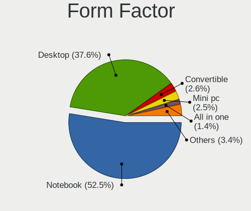
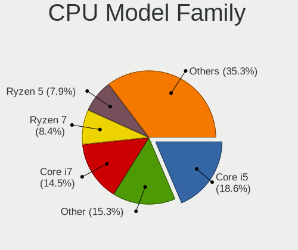
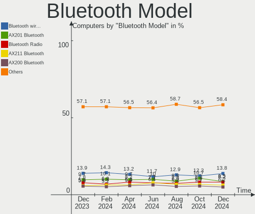

Linux - Hardware Trends
-----------------------

A project to identify most popular hardware characteristics and track their change
over time based on data collected by Linux users at https://Linux-Hardware.org.

Anyone can contribute to this report by the [hw-probe](https://github.com/linuxhw/hw-probe) tool:

    sudo -E hw-probe -all -upload

This is a report for all computer types. See also reports for [desktops](/Desktop/README.md) and [notebooks](/Notebook/README.md).

Distribution-specific reports: [Arch](/Dist/Arch), [ArcoLinux](/Dist/ArcoLinux), [BlackPanther](/Dist/BlackPanther), [CentOS](/Dist/CentOS), [Clear Linux](/Dist/Clear_Linux), [Debian](/Dist/Debian), [Elementary](/Dist/Elementary), [EndeavourOS](/Dist/EndeavourOS), [Endless](/Dist/Endless), [Fedora](/Dist/Fedora), [Garuda Linux](/Dist/Garuda_Linux), [Gentoo](/Dist/Gentoo), [Kali](/Dist/Kali), [KDE neon](/Dist/KDE_neon), [Kubuntu](/Dist/Kubuntu), [Linux Mint](/Dist/Linux_Mint), [Manjaro](/Dist/Manjaro), [OpenMandriva](/Dist/OpenMandriva), [openSUSE](/Dist/openSUSE), [Pop!_OS](/Dist/Pop!_OS), [Red OS](/Dist/Red_OS), [ROSA](/Dist/ROSA), [SteamOS](/Dist/SteamOS), [Ubuntu MATE](/Dist/Ubuntu_MATE), [Ubuntu](/Dist/Ubuntu), [Xubuntu](/Dist/Xubuntu), [Zorin](/Dist/Zorin).

This report is for one last month. Overall report since the beginning of time: [TestDays](https://github.com/linuxhw/TestDays)

Period: Dec, 2023.

Contents
--------

* [ System ](#system)
  - [ OS                       ](#os)
  - [ OS Family                ](#os-family)
  - [ Kernel                   ](#kernel)
  - [ Kernel Family            ](#kernel-family)
  - [ Kernel Major Ver.        ](#kernel-major-ver)
  - [ Arch                     ](#arch)
  - [ DE                       ](#de)
  - [ Display Server           ](#display-server)
  - [ Display Manager          ](#display-manager)
  - [ OS Lang                  ](#os-lang)
  - [ Boot Mode                ](#boot-mode)
  - [ Filesystem               ](#filesystem)
  - [ Part. scheme             ](#part-scheme)
  - [ Dual Boot with Linux/BSD ](#dual-boot-with-linuxbsd)
  - [ Dual Boot (Win)          ](#dual-boot-win)

* [ Board ](#board)
  - [ Vendor                   ](#vendor)
  - [ Model                    ](#model)
  - [ Model Family             ](#model-family)
  - [ MFG Year                 ](#mfg-year)
  - [ Form Factor              ](#form-factor)
  - [ Secure Boot              ](#secure-boot)
  - [ Coreboot                 ](#coreboot)
  - [ RAM Size                 ](#ram-size)
  - [ RAM Used                 ](#ram-used)
  - [ Total Drives             ](#total-drives)
  - [ Has CD-ROM               ](#has-cd-rom)
  - [ Has Ethernet             ](#has-ethernet)
  - [ Has WiFi                 ](#has-wifi)
  - [ Has Bluetooth            ](#has-bluetooth)

* [ Location ](#location)
  - [ Country                  ](#country)
  - [ City                     ](#city)

* [ Drives ](#drives)
  - [ Drive Vendor             ](#drive-vendor)
  - [ Drive Model              ](#drive-model)
  - [ HDD Vendor               ](#hdd-vendor)
  - [ SSD Vendor               ](#ssd-vendor)
  - [ Drive Kind               ](#drive-kind)
  - [ Drive Connector          ](#drive-connector)
  - [ Drive Size               ](#drive-size)
  - [ Space Total              ](#space-total)
  - [ Space Used               ](#space-used)
  - [ Malfunc. Drives          ](#malfunc-drives)
  - [ Malfunc. Drive Vendor    ](#malfunc-drive-vendor)
  - [ Malfunc. HDD Vendor      ](#malfunc-hdd-vendor)
  - [ Malfunc. Drive Kind      ](#malfunc-drive-kind)
  - [ Failed Drives            ](#failed-drives)
  - [ Failed Drive Vendor      ](#failed-drive-vendor)
  - [ Drive Status             ](#drive-status)

* [ Storage controller ](#storage-controller)
  - [ Storage Vendor           ](#storage-vendor)
  - [ Storage Model            ](#storage-model)
  - [ Storage Kind             ](#storage-kind)

* [ Processor ](#processor)
  - [ CPU Vendor               ](#cpu-vendor)
  - [ CPU Model                ](#cpu-model)
  - [ CPU Model Family         ](#cpu-model-family)
  - [ CPU Cores                ](#cpu-cores)
  - [ CPU Sockets              ](#cpu-sockets)
  - [ CPU Threads              ](#cpu-threads)
  - [ CPU Op-Modes             ](#cpu-op-modes)
  - [ CPU Microcode            ](#cpu-microcode)
  - [ CPU Microarch            ](#cpu-microarch)

* [ Graphics ](#graphics)
  - [ GPU Vendor               ](#gpu-vendor)
  - [ GPU Model                ](#gpu-model)
  - [ GPU Combo                ](#gpu-combo)
  - [ GPU Driver               ](#gpu-driver)
  - [ GPU Memory               ](#gpu-memory)

* [ Monitor ](#monitor)
  - [ Monitor Vendor           ](#monitor-vendor)
  - [ Monitor Model            ](#monitor-model)
  - [ Monitor Resolution       ](#monitor-resolution)
  - [ Monitor Diagonal         ](#monitor-diagonal)
  - [ Monitor Width            ](#monitor-width)
  - [ Aspect Ratio             ](#aspect-ratio)
  - [ Monitor Area             ](#monitor-area)
  - [ Pixel Density            ](#pixel-density)
  - [ Multiple Monitors        ](#multiple-monitors)

* [ Network ](#network)
  - [ Net Controller Vendor    ](#net-controller-vendor)
  - [ Net Controller Model     ](#net-controller-model)
  - [ Wireless Vendor          ](#wireless-vendor)
  - [ Wireless Model           ](#wireless-model)
  - [ Ethernet Vendor          ](#ethernet-vendor)
  - [ Ethernet Model           ](#ethernet-model)
  - [ Net Controller Kind      ](#net-controller-kind)
  - [ Used Controller          ](#used-controller)
  - [ NICs                     ](#nics)
  - [ IPv6                     ](#ipv6)

* [ Bluetooth ](#bluetooth)
  - [ Bluetooth Vendor         ](#bluetooth-vendor)
  - [ Bluetooth Model          ](#bluetooth-model)

* [ Sound ](#sound)
  - [ Sound Vendor             ](#sound-vendor)
  - [ Sound Model              ](#sound-model)

* [ Memory ](#memory)
  - [ Memory Vendor            ](#memory-vendor)
  - [ Memory Model             ](#memory-model)
  - [ Memory Kind              ](#memory-kind)
  - [ Memory Form Factor       ](#memory-form-factor)
  - [ Memory Size              ](#memory-size)
  - [ Memory Speed             ](#memory-speed)

* [ Printers & scanners ](#printers--scanners)
  - [ Printer Vendor           ](#printer-vendor)
  - [ Printer Model            ](#printer-model)
  - [ Scanner Vendor           ](#scanner-vendor)
  - [ Scanner Model            ](#scanner-model)

* [ Camera ](#camera)
  - [ Camera Vendor            ](#camera-vendor)
  - [ Camera Model             ](#camera-model)

* [ Security ](#security)
  - [ Fingerprint Vendor       ](#fingerprint-vendor)
  - [ Fingerprint Model        ](#fingerprint-model)
  - [ Chipcard Vendor          ](#chipcard-vendor)
  - [ Chipcard Model           ](#chipcard-model)

* [ Unsupported ](#unsupported)
  - [ Unsupported Devices      ](#unsupported-devices)
  - [ Unsupported Device Types ](#unsupported-device-types)

System
------

OS
--

Installed operating systems

| Name                         | Computers | Percent |
|------------------------------|-----------|---------|
| Ubuntu 22.04                 | 771       | 12.62%  |
| Fedora 39                    | 535       | 8.75%   |
| Linux Mint 21.2              | 471       | 7.71%   |
| Debian 12                    | 366       | 5.99%   |
| Ubuntu 23.10                 | 279       | 4.57%   |
| Arch Rolling                 | 270       | 4.42%   |
| OpenMandriva 5.0             | 231       | 3.78%   |
| Pop!_OS 22.04                | 176       | 2.88%   |
| OpenMandriva 23.08           | 173       | 2.83%   |
| ROSA 12.4                    | 158       | 2.59%   |
| ArcoLinux Rolling            | 149       | 2.44%   |
| Zorin 16                     | 139       | 2.27%   |
| BlackPanther 18.1            | 122       | 2%      |
| OpenMandriva 23.11           | 110       | 1.8%    |
| Ubuntu 20.04                 | 95        | 1.55%   |
| SteamOS 3.5.7                | 81        | 1.33%   |
| Zorin 17                     | 78        | 1.28%   |
| EndeavourOS Rolling          | 73        | 1.19%   |
| CentOS 7                     | 73        | 1.19%   |
| openSUSE Tumbleweed-XXXXXXXX | 60        | 0.98%   |
| Manjaro                      | 58        | 0.95%   |
| Kubuntu 23.10                | 58        | 0.95%   |
| Kubuntu 22.04                | 57        | 0.93%   |
| KDE neon 22.04               | 57        | 0.93%   |
| Nobara 38                    | 56        | 0.92%   |
| Kali 2023.4                  | 56        | 0.92%   |
| Fedora 38                    | 50        | 0.82%   |
| LMDE 6                       | 48        | 0.79%   |
| Xero Rolling                 | 44        | 0.72%   |
| Debian 11                    | 43        | 0.7%    |
| Linux Mint 21.1              | 41        | 0.67%   |
| Gentoo 2.14                  | 41        | 0.67%   |
| Debian                       | 39        | 0.64%   |
| Ubuntu 23.04                 | 38        | 0.62%   |
| Manjaro 23.1.0               | 37        | 0.61%   |
| Xubuntu 22.04                | 32        | 0.52%   |
| Linux Mint 20.3              | 32        | 0.52%   |
| openSUSE Leap-15.5           | 29        | 0.47%   |
| Debian Testing/unstable      | 24        | 0.39%   |
| OpenMandriva 23.03           | 23        | 0.38%   |

OS Family
---------

OS without a version

| Name         | Computers | Percent |
|--------------|-----------|---------|
| Ubuntu       | 1227      | 20.08%  |
| Fedora       | 609       | 9.97%   |
| Linux Mint   | 599       | 9.8%    |
| OpenMandriva | 594       | 9.72%   |
| Debian       | 482       | 7.89%   |
| Arch         | 270       | 4.42%   |
| Zorin        | 223       | 3.65%   |
| ROSA         | 191       | 3.13%   |
| Pop!_OS      | 179       | 2.93%   |
| ArcoLinux    | 152       | 2.49%   |
| Kubuntu      | 129       | 2.11%   |
| BlackPanther | 126       | 2.06%   |
| Manjaro      | 115       | 1.88%   |
| SteamOS      | 104       | 1.7%    |
| openSUSE     | 98        | 1.6%    |
| CentOS       | 76        | 1.24%   |
| EndeavourOS  | 74        | 1.21%   |
| Nobara       | 67        | 1.1%    |
| Kali         | 64        | 1.05%   |
| Xubuntu      | 57        | 0.93%   |
| KDE neon     | 57        | 0.93%   |
| LMDE         | 51        | 0.83%   |
| Xero         | 44        | 0.72%   |
| Gentoo       | 41        | 0.67%   |
| NixOS        | 29        | 0.47%   |
| Lubuntu      | 29        | 0.47%   |
| Ubuntu MATE  | 27        | 0.44%   |
| MX           | 26        | 0.43%   |
| Garuda Linux | 26        | 0.43%   |
| Elementary   | 25        | 0.41%   |
| ALT Linux    | 17        | 0.28%   |
| ChimeraOS    | 16        | 0.26%   |
| Parrot       | 14        | 0.23%   |
| Ubuntu Unity | 13        | 0.21%   |
| TUXEDO OS    | 13        | 0.21%   |
| Red OS       | 13        | 0.21%   |
| Raspbian     | 13        | 0.21%   |
| Endless      | 12        | 0.2%    |
| BigLinux     | 11        | 0.18%   |
| Alpine       | 10        | 0.16%   |

Kernel
------

Version of the Linux kernel

| Version                           | Computers | Percent |
|-----------------------------------|-----------|---------|
| 6.2.0-39-generic                  | 483       | 7.9%    |
| 5.15.0-91-generic                 | 475       | 7.77%   |
| 6.2.0-37-generic                  | 351       | 5.74%   |
| 6.6.2-desktop-1omv2390            | 324       | 5.3%    |
| 6.5.0-14-generic                  | 269       | 4.4%    |
| 5.15.0-89-generic                 | 179       | 2.93%   |
| 6.4.11-desktop-1omv2390           | 165       | 2.7%    |
| 6.1.0-16-amd64                    | 147       | 2.41%   |
| 6.1.0-13-amd64                    | 114       | 1.87%   |
| 6.1.58-generic-1rosa2021.1-x86_64 | 98        | 1.6%    |
| 6.6.7-arch1-1                     | 97        | 1.59%   |
| 6.6.4-200.fc39.x86_64             | 97        | 1.59%   |
| 6.6.6-200.fc39.x86_64             | 91        | 1.49%   |
| 6.5.6-76060506-generic            | 91        | 1.49%   |
| 6.6.8-200.fc39.x86_64             | 90        | 1.47%   |
| 6.6.7-200.fc39.x86_64             | 81        | 1.33%   |
| 6.1.52-valve9-1-neptune-61        | 80        | 1.31%   |
| 6.6.6-76060606-generic            | 76        | 1.24%   |
| 6.6.4-arch1-1                     | 71        | 1.16%   |
| 6.6.2-201.fc39.x86_64             | 69        | 1.13%   |
| 6.6.8-arch1-1                     | 67        | 1.1%    |
| 6.6.3-arch1-1                     | 67        | 1.1%    |
| 6.1.0-15-amd64                    | 63        | 1.03%   |
| 5.15.85-desktop-1bP               | 57        | 0.93%   |
| 6.5.0-13-generic                  | 54        | 0.88%   |
| 6.5.0-kali3-amd64                 | 52        | 0.85%   |
| 6.2.0-26-generic                  | 52        | 0.85%   |
| 6.5.6-300.fc39.x86_64             | 48        | 0.79%   |
| 3.10.0-1160.102.1.el7.x86_64      | 44        | 0.72%   |
| 6.1.20-generic-2rosa2021.1-x86_64 | 43        | 0.7%    |
| 5.15.0-76-generic                 | 42        | 0.69%   |
| 6.5.0-9-generic                   | 41        | 0.67%   |
| 6.6.3-200.fc39.x86_64             | 39        | 0.64%   |
| 5.6.14-desktop-2bP                | 38        | 0.62%   |
| 5.4.0-169-generic                 | 32        | 0.52%   |
| 6.6.1-arch1-1                     | 30        | 0.49%   |
| 6.6.6-1-default                   | 29        | 0.47%   |
| 5.15.0-88-generic                 | 28        | 0.46%   |
| 6.6.7-zen1-1-zen                  | 27        | 0.44%   |
| 5.19.0-38-generic                 | 27        | 0.44%   |

Kernel Family
-------------

Linux kernel without a distro release

| Version | Computers | Percent |
|---------|-----------|---------|
| 6.2.0   | 950       | 15.55%  |
| 5.15.0  | 812       | 13.29%  |
| 6.5.0   | 535       | 8.75%   |
| 6.6.2   | 429       | 7.02%   |
| 6.1.0   | 427       | 6.99%   |
| 6.6.7   | 280       | 4.58%   |
| 6.6.6   | 261       | 4.27%   |
| 6.6.8   | 230       | 3.76%   |
| 6.6.4   | 226       | 3.7%    |
| 6.6.3   | 176       | 2.88%   |
| 6.4.11  | 170       | 2.78%   |
| 6.5.6   | 155       | 2.54%   |
| 6.1.52  | 103       | 1.69%   |
| 6.1.58  | 102       | 1.67%   |
| 5.4.0   | 92        | 1.51%   |
| 3.10.0  | 73        | 1.19%   |
| 5.15.85 | 57        | 0.93%   |
| 5.19.0  | 48        | 0.79%   |
| 6.6.1   | 43        | 0.7%    |
| 6.1.20  | 43        | 0.7%    |
| 6.6.5   | 41        | 0.67%   |
| 5.10.0  | 41        | 0.67%   |
| 5.6.14  | 39        | 0.64%   |
| 6.5.11  | 37        | 0.61%   |
| 6.5.13  | 32        | 0.52%   |
| 5.14.21 | 29        | 0.47%   |
| 6.7.0   | 26        | 0.43%   |
| 5.10.10 | 26        | 0.43%   |
| 6.2.6   | 23        | 0.38%   |
| 6.1.64  | 23        | 0.38%   |
| 6.1.69  | 22        | 0.36%   |
| 5.14.0  | 21        | 0.34%   |
| 4.15.0  | 21        | 0.34%   |
| 6.5.12  | 20        | 0.33%   |
| 6.4.8   | 20        | 0.33%   |
| 6.5.9   | 19        | 0.31%   |
| 6.1.68  | 19        | 0.31%   |
| 4.18.16 | 19        | 0.31%   |
| 6.1.67  | 18        | 0.29%   |
| 6.1.21  | 14        | 0.23%   |

Kernel Major Ver.
-----------------

Linux kernel major version

| Version | Computers | Percent |
|---------|-----------|---------|
| 6.6     | 1695      | 27.74%  |
| 6.2     | 1000      | 16.36%  |
| 5.15    | 903       | 14.78%  |
| 6.1     | 844       | 13.81%  |
| 6.5     | 833       | 13.63%  |
| 6.4     | 220       | 3.6%    |
| 5.10    | 119       | 1.95%   |
| 5.4     | 99        | 1.62%   |
| 3.10    | 73        | 1.19%   |
| 5.14    | 51        | 0.83%   |
| 5.19    | 50        | 0.82%   |
| 5.6     | 40        | 0.65%   |
| 6.3     | 36        | 0.59%   |
| 6.7     | 26        | 0.43%   |
| 4.18    | 26        | 0.43%   |
| 4.15    | 21        | 0.34%   |
| 5.16    | 12        | 0.2%    |
| 6.0     | 10        | 0.16%   |
| 5.13    | 10        | 0.16%   |
| 5.17    | 8         | 0.13%   |
| 5.8     | 7         | 0.11%   |
| 5.11    | 7         | 0.11%   |
| 4.19    | 5         | 0.08%   |
| 5.18    | 3         | 0.05%   |
| 4.9     | 3         | 0.05%   |
| 4.4     | 3         | 0.05%   |
| 6       | 1         | 0.02%   |
| 5.3     | 1         | 0.02%   |
| 5.1     | 1         | 0.02%   |
| 4.8     | 1         | 0.02%   |
| 4.14    | 1         | 0.02%   |
| 4.13    | 1         | 0.02%   |
| 2.6     | 1         | 0.02%   |

Arch
----

OS architecture (x86_64, i586, etc.)

| Name    | Computers | Percent |
|---------|-----------|---------|
| x86_64  | 5999      | 98.17%  |
| aarch64 | 47        | 0.77%   |
| i686    | 46        | 0.75%   |
| armv7l  | 12        | 0.2%    |
| riscv64 | 3         | 0.05%   |
| armv6l  | 3         | 0.05%   |
| i486    | 1         | 0.02%   |

DE
--

Desktop Environment

| Name             | Computers | Percent |
|------------------|-----------|---------|
| GNOME            | 2543      | 41.61%  |
| KDE5             | 1752      | 28.67%  |
| X-Cinnamon       | 552       | 9.03%   |
| XFCE             | 377       | 6.17%   |
| Unknown          | 262       | 4.29%   |
| MATE             | 154       | 2.52%   |
| LXQt             | 89        | 1.46%   |
| Cinnamon         | 65        | 1.06%   |
| LXDE             | 42        | 0.69%   |
| i3               | 40        | 0.65%   |
| Hyprland         | 32        | 0.52%   |
| Pantheon         | 28        | 0.46%   |
| Budgie           | 26        | 0.43%   |
| Unity            | 13        | 0.21%   |
| GNOME Classic    | 13        | 0.21%   |
| sway             | 12        | 0.2%    |
| Deepin           | 11        | 0.18%   |
| lightdm-xsession | 8         | 0.13%   |
| KDE4             | 8         | 0.13%   |
| KDE              | 8         | 0.13%   |
| GNOME Flashback  | 8         | 0.13%   |
| Endless:GNOME    | 8         | 0.13%   |
| bspwm            | 5         | 0.08%   |
| KDE6             | 4         | 0.07%   |
| icewm            | 4         | 0.07%   |
| Trinity          | 3         | 0.05%   |
| qtile            | 3         | 0.05%   |
| Openbox          | 3         | 0.05%   |
| GNOME-Classic    | 3         | 0.05%   |
| Enlightenment    | 3         | 0.05%   |
| BunsenLabs       | 3         | 0.05%   |
| awesome          | 3         | 0.05%   |
| Unicorn:XFCE     | 2         | 0.03%   |
| none+i3          | 2         | 0.03%   |
| Jwm              | 2         | 0.03%   |
| fly              | 2         | 0.03%   |
| dwm              | 2         | 0.03%   |
| xsession         | 1         | 0.02%   |
| xmonad           | 1         | 0.02%   |
| X-Generic        | 1         | 0.02%   |

Display Server
--------------

X11 or Wayland

| Name    | Computers | Percent |
|---------|-----------|---------|
| X11     | 3246      | 53.12%  |
| Wayland | 2525      | 41.32%  |
| Unknown | 175       | 2.86%   |
| Tty     | 163       | 2.67%   |
| Web     | 2         | 0.03%   |

Display Manager
---------------

SDDM, LightDM, etc.

| Name    | Computers | Percent |
|---------|-----------|---------|
| Unknown | 2099      | 34.35%  |
| SDDM    | 1422      | 23.27%  |
| GDM3    | 1265      | 20.7%   |
| LightDM | 793       | 12.98%  |
| GDM     | 466       | 7.63%   |
| NODM    | 26        | 0.43%   |
| KDM     | 9         | 0.15%   |
| SLiM    | 5         | 0.08%   |
| LY-DM   | 5         | 0.08%   |
| SLIMSKI | 4         | 0.07%   |
| LXDM    | 4         | 0.07%   |
| XDM     | 3         | 0.05%   |
| GREETD  | 3         | 0.05%   |
| TDM     | 2         | 0.03%   |
| EMPTTY  | 2         | 0.03%   |
| MDM     | 1         | 0.02%   |
| LEMURS  | 1         | 0.02%   |
| FLY-DM  | 1         | 0.02%   |

OS Lang
-------

Language

| Lang    | Computers | Percent |
|---------|-----------|---------|
| en_US   | 2561      | 41.91%  |
| de_DE   | 513       | 8.39%   |
| ru_RU   | 385       | 6.3%    |
| fr_FR   | 307       | 5.02%   |
| en_GB   | 286       | 4.68%   |
| Unknown | 262       | 4.29%   |
| it_IT   | 208       | 3.4%    |
| pt_BR   | 186       | 3.04%   |
| C       | 173       | 2.83%   |
| es_ES   | 143       | 2.34%   |
| pl_PL   | 140       | 2.29%   |
| en_CA   | 95        | 1.55%   |
| en_AU   | 92        | 1.51%   |
| en_IN   | 79        | 1.29%   |
| es_MX   | 50        | 0.82%   |
| nl_NL   | 35        | 0.57%   |
| zh_CN   | 31        | 0.51%   |
| hu_HU   | 29        | 0.47%   |
| cs_CZ   | 29        | 0.47%   |
| de_AT   | 27        | 0.44%   |
| tr_TR   | 25        | 0.41%   |
| pt_PT   | 25        | 0.41%   |
| de_CH   | 25        | 0.41%   |
| es_CO   | 22        | 0.36%   |
| es_AR   | 22        | 0.36%   |
| es_CL   | 18        | 0.29%   |
| sv_SE   | 17        | 0.28%   |
| ja_JP   | 15        | 0.25%   |
| fr_CA   | 15        | 0.25%   |
| POSIX   | 14        | 0.23%   |
| zh_TW   | 13        | 0.21%   |
| en_ZA   | 13        | 0.21%   |
| en_IL   | 13        | 0.21%   |
| ro_RO   | 12        | 0.2%    |
| fi_FI   | 12        | 0.2%    |
| sk_SK   | 11        | 0.18%   |
| nl_BE   | 11        | 0.18%   |
| nb_NO   | 11        | 0.18%   |
| en_IE   | 10        | 0.16%   |
| en_DK   | 10        | 0.16%   |

Boot Mode
---------

EFI or BIOS

| Mode | Computers | Percent |
|------|-----------|---------|
| EFI  | 3371      | 55.16%  |
| BIOS | 2740      | 44.84%  |

Filesystem
----------

Type of filesystem

| Type     | Computers | Percent |
|----------|-----------|---------|
| Ext4     | 3524      | 57.67%  |
| Btrfs    | 1102      | 18.03%  |
| Tmpfs    | 827       | 13.53%  |
| Overlay  | 434       | 7.1%    |
| Xfs      | 79        | 1.29%   |
| Zfs      | 52        | 0.85%   |
| Ext3     | 39        | 0.64%   |
| Rootfs   | 27        | 0.44%   |
| F2fs     | 16        | 0.26%   |
| Unknown  | 5         | 0.08%   |
| Bcachefs | 2         | 0.03%   |
| XXXXXXX  | 1         | 0.02%   |
| Jfs      | 1         | 0.02%   |
| Ext2     | 1         | 0.02%   |
| Aufs     | 1         | 0.02%   |

Part. scheme
------------

Scheme of partitioning

| Type    | Computers | Percent |
|---------|-----------|---------|
| GPT     | 3525      | 57.68%  |
| Unknown | 1887      | 30.88%  |
| MBR     | 699       | 11.44%  |

Dual Boot with Linux/BSD
------------------------

Hosting more than one Linux/BSD

| Dual boot | Computers | Percent |
|-----------|-----------|---------|
| No        | 5167      | 84.55%  |
| Yes       | 944       | 15.45%  |

Dual Boot (Win)
---------------

Hosting Linux and Windows

| Dual boot | Computers | Percent |
|-----------|-----------|---------|
| No        | 4458      | 72.95%  |
| Yes       | 1653      | 27.05%  |

Board
-----

Vendor
------

Motherboard manufacturer

| Name                                 | Computers | Percent |
|--------------------------------------|-----------|---------|
| ASUSTek Computer                     | 1003      | 16.41%  |
| Lenovo                               | 882       | 14.43%  |
| Hewlett-Packard                      | 813       | 13.3%   |
| Dell                                 | 655       | 10.72%  |
| Gigabyte Technology                  | 418       | 6.84%   |
| MSI                                  | 401       | 6.56%   |
| Acer                                 | 303       | 4.96%   |
| ASRock                               | 184       | 3.01%   |
| Apple                                | 171       | 2.8%    |
| Valve                                | 97        | 1.59%   |
| Intel                                | 89        | 1.46%   |
| Unknown                              | 80        | 1.31%   |
| Fujitsu                              | 60        | 0.98%   |
| Toshiba                              | 59        | 0.97%   |
| HUAWEI                               | 56        | 0.92%   |
| Samsung Electronics                  | 49        | 0.8%    |
| Medion                               | 40        | 0.65%   |
| Supermicro                           | 39        | 0.64%   |
| Google                               | 37        | 0.61%   |
| Sony                                 | 34        | 0.56%   |
| AZW                                  | 33        | 0.54%   |
| Raspberry Pi Foundation              | 32        | 0.52%   |
| Microsoft                            | 26        | 0.43%   |
| Framework                            | 25        | 0.41%   |
| Alienware                            | 20        | 0.33%   |
| Packard Bell                         | 18        | 0.29%   |
| Foxconn                              | 18        | 0.29%   |
| TUXEDO                               | 16        | 0.26%   |
| Shenzhen Meigao Electronic Equipment | 14        | 0.23%   |
| Pegatron                             | 14        | 0.23%   |
| Biostar                              | 14        | 0.23%   |
| System76                             | 12        | 0.2%    |
| Positivo                             | 12        | 0.2%    |
| Notebook                             | 12        | 0.2%    |
| eMachines                            | 11        | 0.18%   |
| Timi                                 | 10        | 0.16%   |
| LG Electronics                       | 9         | 0.15%   |
| Chuwi                                | 9         | 0.15%   |
| BESSTAR Tech                         | 9         | 0.15%   |
| AMI                                  | 9         | 0.15%   |

Model
-----

Motherboard model

| Name                                       | Computers | Percent |
|--------------------------------------------|-----------|---------|
| Unknown                                    | 100       | 1.64%   |
| Valve Jupiter                              | 75        | 1.23%   |
| ASUS All Series                            | 40        | 0.65%   |
| Valve Galileo                              | 22        | 0.36%   |
| HP Notebook                                | 22        | 0.36%   |
| Gigabyte H81M-S2H                          | 17        | 0.28%   |
| Framework Laptop 13 (AMD Ryzen 7040Series) | 16        | 0.26%   |
| MSI MS-7C56                                | 15        | 0.25%   |
| MSI MS-7C31                                | 15        | 0.25%   |
| Dell OptiPlex 7010                         | 15        | 0.25%   |
| AZW SER                                    | 14        | 0.23%   |
| ASUS PRIME A320M-K                         | 14        | 0.23%   |
| ASUS TUF Gaming X570-PLUS                  | 13        | 0.21%   |
| MSI MS-7C02                                | 11        | 0.18%   |
| RPi Raspberry Pi 4 Model B Rev 1.5         | 10        | 0.16%   |
| MSI MS-7C91                                | 10        | 0.16%   |
| MSI MS-7B86                                | 10        | 0.16%   |
| MSI MS-7A15                                | 10        | 0.16%   |
| Intel H61                                  | 10        | 0.16%   |
| HP ProBook 650 G1                          | 10        | 0.16%   |
| HP Pavilion dv6                            | 10        | 0.16%   |
| Dell Latitude 7490                         | 10        | 0.16%   |
| ASUS ROG STRIX B550-F GAMING               | 10        | 0.16%   |
| Apple MacBookAir7,2                        | 10        | 0.16%   |
| HP ProBook 650 G2                          | 9         | 0.15%   |
| Dell OptiPlex 7040                         | 9         | 0.15%   |
| Dell Latitude E6440                        | 9         | 0.15%   |
| ASUS PRIME B450-PLUS                       | 9         | 0.15%   |
| MSI MS-7B79                                | 8         | 0.13%   |
| MSI MS-7A38                                | 8         | 0.13%   |
| Lenovo ThinkPad X230 2325V2Y               | 8         | 0.13%   |
| Lenovo ThinkCentre M710s 10M8S02A00        | 8         | 0.13%   |
| HUAWEI BOD-WXX9                            | 8         | 0.13%   |
| HP Pavilion dv7                            | 8         | 0.13%   |
| HP Pavilion 15                             | 8         | 0.13%   |
| Gigabyte B550M DS3H                        | 8         | 0.13%   |
| Gigabyte B450M DS3H                        | 8         | 0.13%   |
| Dell OptiPlex 3020                         | 8         | 0.13%   |
| ASUS M5A97 R2.0                            | 8         | 0.13%   |
| ASUS H110M-K                               | 8         | 0.13%   |

Model Family
------------

Motherboard model prefix

| Name               | Computers | Percent |
|--------------------|-----------|---------|
| Lenovo ThinkPad    | 375       | 6.14%   |
| Dell Latitude      | 189       | 3.09%   |
| Acer Aspire        | 184       | 3.01%   |
| ASUS ROG           | 152       | 2.49%   |
| Lenovo IdeaPad     | 149       | 2.44%   |
| Dell Inspiron      | 144       | 2.36%   |
| ASUS PRIME         | 138       | 2.26%   |
| HP Pavilion        | 123       | 2.01%   |
| Dell OptiPlex      | 115       | 1.88%   |
| ASUS VivoBook      | 114       | 1.87%   |
| Unknown            | 100       | 1.64%   |
| HP EliteBook       | 84        | 1.37%   |
| Lenovo ThinkCentre | 82        | 1.34%   |
| HP ProBook         | 82        | 1.34%   |
| HP Laptop          | 81        | 1.33%   |
| ASUS TUF           | 77        | 1.26%   |
| Valve Jupiter      | 75        | 1.23%   |
| HP Compaq          | 73        | 1.19%   |
| Dell Precision     | 68        | 1.11%   |
| Dell XPS           | 57        | 0.93%   |
| Toshiba Satellite  | 49        | 0.8%    |
| Lenovo Legion      | 49        | 0.8%    |
| ASUS ASUS          | 44        | 0.72%   |
| HP ENVY            | 43        | 0.7%    |
| Acer Nitro         | 42        | 0.69%   |
| ASUS All           | 40        | 0.65%   |
| Lenovo Yoga        | 38        | 0.62%   |
| Dell Vostro        | 35        | 0.57%   |
| HP EliteDesk       | 34        | 0.56%   |
| RPi Raspberry      | 32        | 0.52%   |
| Lenovo ThinkBook   | 32        | 0.52%   |
| ASUS Zenbook       | 32        | 0.52%   |
| HP ZBook           | 30        | 0.49%   |
| Fujitsu LIFEBOOK   | 30        | 0.49%   |
| Microsoft Surface  | 26        | 0.43%   |
| Framework Laptop   | 25        | 0.41%   |
| HP ProDesk         | 24        | 0.39%   |
| Fujitsu ESPRIMO    | 23        | 0.38%   |
| Acer Swift         | 23        | 0.38%   |
| Valve Galileo      | 22        | 0.36%   |

MFG Year
--------

Motherboard manufacture year

| Year    | Computers | Percent |
|---------|-----------|---------|
| 2023    | 619       | 10.13%  |
| 2022    | 560       | 9.16%   |
| 2021    | 531       | 8.69%   |
| 2020    | 531       | 8.69%   |
| 2018    | 464       | 7.59%   |
| 2019    | 442       | 7.23%   |
| 2013    | 393       | 6.43%   |
| 2012    | 372       | 6.09%   |
| 2017    | 327       | 5.35%   |
| 2011    | 302       | 4.94%   |
| 2014    | 289       | 4.73%   |
| 2016    | 282       | 4.61%   |
| 2015    | 270       | 4.42%   |
| 2010    | 219       | 3.58%   |
| 2009    | 187       | 3.06%   |
| 2008    | 125       | 2.05%   |
| 2007    | 95        | 1.55%   |
| Unknown | 64        | 1.05%   |
| 2006    | 21        | 0.34%   |
| 2005    | 8         | 0.13%   |
| 2004    | 5         | 0.08%   |
| 2024    | 2         | 0.03%   |
| 2001    | 2         | 0.03%   |
| 2003    | 1         | 0.02%   |

Form Factor
-----------

Physical design of the computer

| Name           | Computers | Percent |
|----------------|-----------|---------|
| Notebook       | 3236      | 52.95%  |
| Desktop        | 2324      | 38.03%  |
| Convertible    | 154       | 2.52%   |
| Mini pc        | 121       | 1.98%   |
| All in one     | 89        | 1.46%   |
| Tablet         | 66        | 1.08%   |
| Server         | 61        | 1%      |
| System on chip | 55        | 0.9%    |
| Other          | 3         | 0.05%   |
| Phone          | 1         | 0.02%   |
| Stick pc       | 1         | 0.02%   |

Secure Boot
-----------

Enabled or disabled

| State    | Computers | Percent |
|----------|-----------|---------|
| Disabled | 5674      | 92.85%  |
| Enabled  | 437       | 7.15%   |

Coreboot
--------

Have coreboot on board

| Used | Computers | Percent |
|------|-----------|---------|
| No   | 6062      | 99.2%   |
| Yes  | 49        | 0.8%    |

RAM Size
--------

Total RAM memory

| Size in GB      | Computers | Percent |
|-----------------|-----------|---------|
| 4.01-8.0        | 1474      | 24.12%  |
| 16.01-24.0      | 1227      | 20.08%  |
| 8.01-16.0       | 1089      | 17.82%  |
| 3.01-4.0        | 806       | 13.19%  |
| 32.01-64.0      | 799       | 13.07%  |
| 64.01-256.0     | 283       | 4.63%   |
| 24.01-32.0      | 208       | 3.4%    |
| 1.01-2.0        | 113       | 1.85%   |
| 2.01-3.0        | 58        | 0.95%   |
| 0.51-1.0        | 23        | 0.38%   |
| More than 256.0 | 21        | 0.34%   |
| 0.01-0.5        | 7         | 0.11%   |
| Unknown         | 2         | 0.03%   |
| 0               | 1         | 0.02%   |

RAM Used
--------

Used RAM memory

| Used GB     | Computers | Percent |
|-------------|-----------|---------|
| 1.01-2.0    | 1745      | 28.56%  |
| 2.01-3.0    | 1459      | 23.87%  |
| 4.01-8.0    | 1246      | 20.39%  |
| 3.01-4.0    | 882       | 14.43%  |
| 8.01-16.0   | 311       | 5.09%   |
| 0.51-1.0    | 283       | 4.63%   |
| 0.01-0.5    | 86        | 1.41%   |
| 16.01-24.0  | 52        | 0.85%   |
| 32.01-64.0  | 15        | 0.25%   |
| 24.01-32.0  | 15        | 0.25%   |
| 64.01-256.0 | 12        | 0.2%    |
| Unknown     | 3         | 0.05%   |
| 0           | 2         | 0.03%   |

Total Drives
------------

Number of drives on board

| Drives | Computers | Percent |
|--------|-----------|---------|
| 1      | 3601      | 58.93%  |
| 2      | 1504      | 24.61%  |
| 3      | 495       | 8.1%    |
| 4      | 240       | 3.93%   |
| 5      | 107       | 1.75%   |
| 6      | 59        | 0.97%   |
| 0      | 41        | 0.67%   |
| 7      | 22        | 0.36%   |
| 9      | 10        | 0.16%   |
| 8      | 10        | 0.16%   |
| 10     | 8         | 0.13%   |
| 13     | 4         | 0.07%   |
| 11     | 2         | 0.03%   |
| 101    | 1         | 0.02%   |
| 70     | 1         | 0.02%   |
| 26     | 1         | 0.02%   |
| 21     | 1         | 0.02%   |
| 18     | 1         | 0.02%   |
| 16     | 1         | 0.02%   |
| 15     | 1         | 0.02%   |
| 12     | 1         | 0.02%   |

Has CD-ROM
----------

Has CD-ROM on board

| Presented | Computers | Percent |
|-----------|-----------|---------|
| No        | 4239      | 69.37%  |
| Yes       | 1872      | 30.63%  |

Has Ethernet
------------

Has Ethernet on board

| Presented | Computers | Percent |
|-----------|-----------|---------|
| Yes       | 5089      | 83.28%  |
| No        | 1022      | 16.72%  |

Has WiFi
--------

Has WiFi module

| Presented | Computers | Percent |
|-----------|-----------|---------|
| Yes       | 4701      | 76.93%  |
| No        | 1410      | 23.07%  |

Has Bluetooth
-------------

Has Bluetooth module

| Presented | Computers | Percent |
|-----------|-----------|---------|
| Yes       | 3978      | 65.1%   |
| No        | 2133      | 34.9%   |

Location
--------

Country
-------

Geographic location (country)

| Country     | Computers | Percent |
|-------------|-----------|---------|
| USA         | 1101      | 18.02%  |
| Germany     | 686       | 11.23%  |
| Russia      | 461       | 7.54%   |
| France      | 338       | 5.53%   |
| Italy       | 292       | 4.78%   |
| Brazil      | 260       | 4.25%   |
| Canada      | 220       | 3.6%    |
| Poland      | 210       | 3.44%   |
| UK          | 201       | 3.29%   |
| Australia   | 187       | 3.06%   |
| Spain       | 174       | 2.85%   |
| Hungary     | 166       | 2.72%   |
| India       | 124       | 2.03%   |
| Netherlands | 92        | 1.51%   |
| Mexico      | 83        | 1.36%   |
| Austria     | 76        | 1.24%   |
| Switzerland | 74        | 1.21%   |
| Sweden      | 60        | 0.98%   |
| Belgium     | 56        | 0.92%   |
| Romania     | 55        | 0.9%    |
| Czechia     | 55        | 0.9%    |
| China       | 51        | 0.83%   |
| Turkey      | 46        | 0.75%   |
| Portugal    | 46        | 0.75%   |
| Finland     | 42        | 0.69%   |
| Colombia    | 41        | 0.67%   |
| Argentina   | 41        | 0.67%   |
| Japan       | 38        | 0.62%   |
| Greece      | 38        | 0.62%   |
| Norway      | 37        | 0.61%   |
| Indonesia   | 37        | 0.61%   |
| Bulgaria    | 31        | 0.51%   |
| Israel      | 30        | 0.49%   |
| Slovakia    | 29        | 0.47%   |
| Chile       | 27        | 0.44%   |
| Thailand    | 23        | 0.38%   |
| Taiwan      | 23        | 0.38%   |
| Denmark     | 22        | 0.36%   |
| Philippines | 21        | 0.34%   |
| Hong Kong   | 21        | 0.34%   |

City
----

Geographic location (city)

| City           | Computers | Percent |
|----------------|-----------|---------|
| Moscow         | 132       | 2.16%   |
| Melbourne      | 93        | 1.52%   |
| Berlin         | 59        | 0.97%   |
| Warsaw         | 54        | 0.88%   |
| Roubaix        | 48        | 0.79%   |
| Sydney         | 47        | 0.77%   |
| Budapest       | 47        | 0.77%   |
| Milan          | 42        | 0.69%   |
| Sao Paulo      | 41        | 0.67%   |
| St Petersburg  | 40        | 0.65%   |
| Vienna         | 38        | 0.62%   |
| Paris          | 34        | 0.56%   |
| Munich         | 34        | 0.56%   |
| Hamburg        | 30        | 0.49%   |
| Toronto        | 27        | 0.44%   |
| Rome           | 27        | 0.44%   |
| Los Angeles    | 22        | 0.36%   |
| Helsinki       | 22        | 0.36%   |
| Madrid         | 21        | 0.34%   |
| Amsterdam      | 21        | 0.34%   |
| Montreal       | 20        | 0.33%   |
| Istanbul       | 20        | 0.33%   |
| Zurich         | 19        | 0.31%   |
| Prague         | 19        | 0.31%   |
| Cologne        | 19        | 0.31%   |
| Bogotá        | 19        | 0.31%   |
| Barcelona      | 19        | 0.31%   |
| New York       | 18        | 0.29%   |
| Bucharest      | 18        | 0.29%   |
| Milano         | 17        | 0.28%   |
| Sofia          | 16        | 0.26%   |
| Singapore      | 16        | 0.26%   |
| Seattle        | 16        | 0.26%   |
| Rio de Janeiro | 16        | 0.26%   |
| Yekaterinburg  | 15        | 0.25%   |
| Santiago       | 15        | 0.25%   |
| Poznan         | 15        | 0.25%   |
| Mexico City    | 15        | 0.25%   |
| Chicago        | 15        | 0.25%   |
| Brussels       | 15        | 0.25%   |

Drives
------

Drive Vendor
------------

Hard drive vendors

| Vendor                       | Computers | Drives | Percent |
|------------------------------|-----------|--------|---------|
| Samsung Electronics          | 1466      | 1867   | 16.18%  |
| WDC                          | 1137      | 1489   | 12.55%  |
| Seagate                      | 952       | 1229   | 10.5%   |
| Sandisk                      | 562       | 627    | 6.2%    |
| Kingston                     | 485       | 526    | 5.35%   |
| Toshiba                      | 436       | 476    | 4.81%   |
| Unknown                      | 356       | 407    | 3.93%   |
| Crucial                      | 344       | 400    | 3.8%    |
| SK hynix                     | 242       | 247    | 2.67%   |
| Micron Technology            | 211       | 215    | 2.33%   |
| Intel                        | 210       | 248    | 2.32%   |
| Hitachi                      | 190       | 211    | 2.1%    |
| Phison Electronics           | 136       | 147    | 1.5%    |
| Micron/Crucial Technology    | 123       | 135    | 1.36%   |
| A-DATA Technology            | 123       | 129    | 1.36%   |
| HGST                         | 115       | 223    | 1.27%   |
| China                        | 110       | 118    | 1.21%   |
| Apple                        | 99        | 113    | 1.09%   |
| Kingston Technology Company  | 95        | 98     | 1.05%   |
| Unknown                      | 83        | 86     | 0.92%   |
| KIOXIA                       | 81        | 82     | 0.89%   |
| SPCC                         | 68        | 72     | 0.75%   |
| Silicon Motion               | 65        | 65     | 0.72%   |
| PNY                          | 60        | 64     | 0.66%   |
| MAXIO Technology (Hangzhou)  | 60        | 61     | 0.66%   |
| Intenso                      | 55        | 58     | 0.61%   |
| ADATA Technology             | 45        | 49     | 0.5%    |
| Patriot                      | 42        | 42     | 0.46%   |
| Phison                       | 38        | 42     | 0.42%   |
| GOODRAM                      | 36        | 41     | 0.4%    |
| Team                         | 35        | 35     | 0.39%   |
| Transcend                    | 34        | 34     | 0.38%   |
| Netac                        | 34        | 36     | 0.38%   |
| Lexar                        | 32        | 33     | 0.35%   |
| Fujitsu                      | 30        | 31     | 0.33%   |
| JMicron Technology           | 29        | 34     | 0.32%   |
| LITEON                       | 25        | 25     | 0.28%   |
| Hewlett-Packard              | 25        | 28     | 0.28%   |
| Fanxiang                     | 23        | 26     | 0.25%   |
| Shenzhen Longsys Electronics | 22        | 23     | 0.24%   |

Drive Model
-----------

Hard drive models

| Model                                                 | Computers | Percent |
|-------------------------------------------------------|-----------|---------|
| Samsung NVMe SSD Controller SM981/PM981/PM983 512GB   | 191       | 1.91%   |
| Samsung NVMe SSD Controller PM9A1/PM9A3/980PRO 2TB    | 149       | 1.49%   |
| Kingston SA400S37240G 240GB SSD                       | 97        | 0.97%   |
| Unknown                                               | 83        | 0.83%   |
| Micron/Crucial P2 NVMe PCIe SSD 4TB                   | 75        | 0.75%   |
| Kingston SA400S37480G 480GB SSD                       | 72        | 0.72%   |
| WDC WD10EZEX-08WN4A0 1TB                              | 70        | 0.7%    |
| Sandisk WD Blue SN550 NVMe SSD 1TB                    | 60        | 0.6%    |
| Seagate ST500DM002-1BD142 500GB                       | 57        | 0.57%   |
| Samsung SSD 860 EVO 500GB                             | 53        | 0.53%   |
| Seagate ST1000LM035-1RK172 1TB                        | 50        | 0.5%    |
| Unknown MMC Card  64GB                                | 49        | 0.49%   |
| Kingston SA400S37120G 120GB SSD                       | 49        | 0.49%   |
| Crucial CT500MX500SSD1 500GB                          | 48        | 0.48%   |
| Crucial CT1000MX500SSD1 1TB                           | 48        | 0.48%   |
| Seagate ST2000DM008-2FR102 2TB                        | 47        | 0.47%   |
| Samsung SSD 850 EVO 500GB                             | 46        | 0.46%   |
| Unknown MMC Card  128GB                               | 45        | 0.45%   |
| Toshiba DT01ACA100 1TB                                | 45        | 0.45%   |
| Samsung SSD 980 1TB                                   | 44        | 0.44%   |
| Samsung SSD 860 EVO 1TB                               | 44        | 0.44%   |
| Samsung SSD 850 EVO 250GB                             | 44        | 0.44%   |
| Seagate ST1000DM010-2EP102 1TB                        | 43        | 0.43%   |
| Phison E12 NVMe Controller 1TB                        | 42        | 0.42%   |
| Unknown MMC Card  32GB                                | 41        | 0.41%   |
| Crucial CT240BX500SSD1 240GB                          | 41        | 0.41%   |
| Unknown SD/MMC/MS PRO 512GB                           | 40        | 0.4%    |
| MAXIO (Hangzhou) NVMe SSD Controller MAP1202 256GB    | 39        | 0.39%   |
| Samsung SSD 870 EVO 500GB                             | 38        | 0.38%   |
| Samsung NVMe SSD Controller SM961/PM961/SM963 250GB   | 38        | 0.38%   |
| Phison PS5013 E13 NVMe Controller 512GB               | 37        | 0.37%   |
| Toshiba MQ01ABD100 1TB                                | 35        | 0.35%   |
| Silicon Motion SM2263EN/SM2263XT SSD Controller 500GB | 34        | 0.34%   |
| Seagate ST500LT012-1DG142 500GB                       | 34        | 0.34%   |
| Kingston Company SNV2S1000G 1TB                       | 33        | 0.33%   |
| Intel SSD 660P Series 1TB                             | 33        | 0.33%   |
| Samsung SSD 870 EVO 1TB                               | 32        | 0.32%   |
| Seagate ST4000DM004-2CV104 4TB                        | 31        | 0.31%   |
| Sandisk WD Black SN750 / PC SN730 NVMe SSD 2TB        | 31        | 0.31%   |
| Samsung SSD 860 EVO 250GB                             | 31        | 0.31%   |

HDD Vendor
----------

Hard disk drive vendors

| Vendor              | Computers | Drives | Percent |
|---------------------|-----------|--------|---------|
| WDC                 | 944       | 1227   | 33.33%  |
| Seagate             | 928       | 1196   | 32.77%  |
| Toshiba             | 344       | 378    | 12.15%  |
| Hitachi             | 190       | 211    | 6.71%   |
| HGST                | 114       | 199    | 4.03%   |
| Samsung Electronics | 104       | 114    | 3.67%   |
| Unknown             | 42        | 42     | 1.48%   |
| Fujitsu             | 30        | 31     | 1.06%   |
| Apple               | 26        | 26     | 0.92%   |
| Maxtor              | 17        | 17     | 0.6%    |
| SABRENT             | 15        | 16     | 0.53%   |
| ASMT                | 11        | 25     | 0.39%   |
| USB3.0              | 7         | 7      | 0.25%   |
| Intenso             | 6         | 6      | 0.21%   |
| TO Exter            | 5         | 5      | 0.18%   |
| Hewlett-Packard     | 5         | 8      | 0.18%   |
| External            | 5         | 5      | 0.18%   |
| HPQ                 | 4         | 4      | 0.14%   |
| WD MediaMax         | 3         | 4      | 0.11%   |
| USB                 | 3         | 4      | 0.11%   |
| KESU                | 3         | 3      | 0.11%   |
| JMicron Technology  | 2         | 5      | 0.07%   |
| Inateck             | 2         | 3      | 0.07%   |
| Unknown             | 2         | 2      | 0.07%   |
| SSK                 | 1         | 1      | 0.04%   |
| SSI                 | 1         | 1      | 0.04%   |
| SAGE                | 1         | 1      | 0.04%   |
| OOS16000            | 1         | 1      | 0.04%   |
| NETAPP              | 1         | 12     | 0.04%   |
| Maxone              | 1         | 1      | 0.04%   |
| MaxDigital          | 1         | 1      | 0.04%   |
| MARVELL             | 1         | 1      | 0.04%   |
| LIO-ORG             | 1         | 4      | 0.04%   |
| LaCie               | 1         | 1      | 0.04%   |
| KINGWIN             | 1         | 1      | 0.04%   |
| Initio              | 1         | 1      | 0.04%   |
| IBM-ESXS            | 1         | 1      | 0.04%   |
| H/W                 | 1         | 7      | 0.04%   |
| Generic-            | 1         | 1      | 0.04%   |
| Fantom              | 1         | 1      | 0.04%   |

SSD Vendor
----------

Solid state drive vendors

| Vendor              | Computers | Drives | Percent |
|---------------------|-----------|--------|---------|
| Samsung Electronics | 641       | 770    | 21.95%  |
| Kingston            | 363       | 385    | 12.43%  |
| Crucial             | 297       | 342    | 10.17%  |
| SanDisk             | 194       | 205    | 6.64%   |
| WDC                 | 165       | 177    | 5.65%   |
| China               | 110       | 118    | 3.77%   |
| A-DATA Technology   | 94        | 100    | 3.22%   |
| Intel               | 77        | 96     | 2.64%   |
| SPCC                | 60        | 63     | 2.05%   |
| PNY                 | 58        | 62     | 1.99%   |
| Micron Technology   | 47        | 47     | 1.61%   |
| Intenso             | 45        | 48     | 1.54%   |
| Apple               | 43        | 43     | 1.47%   |
| SK hynix            | 38        | 38     | 1.3%    |
| Patriot             | 38        | 38     | 1.3%    |
| GOODRAM             | 34        | 37     | 1.16%   |
| Toshiba             | 31        | 31     | 1.06%   |
| Transcend           | 28        | 28     | 0.96%   |
| Team                | 27        | 27     | 0.92%   |
| Netac               | 27        | 28     | 0.92%   |
| LITEON              | 23        | 23     | 0.79%   |
| KingSpec            | 22        | 22     | 0.75%   |
| Lexar               | 21        | 22     | 0.72%   |
| LITEONIT            | 20        | 20     | 0.68%   |
| Apacer              | 19        | 19     | 0.65%   |
| OCZ                 | 18        | 18     | 0.62%   |
| JMicron Technology  | 15        | 17     | 0.51%   |
| Gigabyte Technology | 14        | 14     | 0.48%   |
| Corsair             | 13        | 13     | 0.45%   |
| Verbatim            | 12        | 13     | 0.41%   |
| Phison              | 11        | 11     | 0.38%   |
| KIOXIA-EXCERIA      | 11        | 15     | 0.38%   |
| Hewlett-Packard     | 11        | 11     | 0.38%   |
| Fanxiang            | 11        | 12     | 0.38%   |
| Emtec               | 11        | 11     | 0.38%   |
| Unknown             | 11        | 11     | 0.38%   |
| XrayDisk            | 9         | 10     | 0.31%   |
| Plextor             | 9         | 9      | 0.31%   |
| ASMT                | 9         | 9      | 0.31%   |
| AMD                 | 9         | 10     | 0.31%   |

Drive Kind
----------

HDD or SSD

| Kind    | Computers | Drives | Percent |
|---------|-----------|--------|---------|
| NVMe    | 2742      | 3337   | 33.74%  |
| SSD     | 2505      | 3201   | 30.82%  |
| HDD     | 2398      | 3578   | 29.51%  |
| MMC     | 332       | 365    | 4.09%   |
| Unknown | 150       | 215    | 1.85%   |

Drive Connector
---------------

SATA, SAS, NVMe, etc.

| Type | Computers | Drives | Percent |
|------|-----------|--------|---------|
| SATA | 3961      | 6418   | 53.31%  |
| NVMe | 2740      | 3314   | 36.88%  |
| SAS  | 397       | 599    | 5.34%   |
| MMC  | 332       | 365    | 4.47%   |

Drive Size
----------

Size of hard drive

| Size in TB | Computers | Drives | Percent |
|------------|-----------|--------|---------|
| 0.01-0.5   | 2738      | 3470   | 52.48%  |
| 0.51-1.0   | 1566      | 1918   | 30.02%  |
| 1.01-2.0   | 502       | 660    | 9.62%   |
| 3.01-4.0   | 180       | 240    | 3.45%   |
| 4.01-10.0  | 106       | 235    | 2.03%   |
| 2.01-3.0   | 84        | 127    | 1.61%   |
| 10.01-20.0 | 40        | 128    | 0.77%   |
| 20.01-50.0 | 1         | 1      | 0.02%   |

Space Total
-----------

Amount of disk space available on the file system

| Size in GB     | Computers | Percent |
|----------------|-----------|---------|
| 101-250        | 1327      | 21.71%  |
| 251-500        | 1208      | 19.77%  |
| 501-1000       | 1084      | 17.74%  |
| 1001-2000      | 613       | 10.03%  |
| More than 3000 | 473       | 7.74%   |
| 1-20           | 417       | 6.82%   |
| 51-100         | 358       | 5.86%   |
| Unknown        | 269       | 4.4%    |
| 2001-3000      | 195       | 3.19%   |
| 21-50          | 167       | 2.73%   |

Space Used
----------

Amount of used disk space

| Used GB        | Computers | Percent |
|----------------|-----------|---------|
| 1-20           | 1979      | 32.38%  |
| 21-50          | 1019      | 16.67%  |
| 101-250        | 833       | 13.63%  |
| 51-100         | 722       | 11.81%  |
| 251-500        | 482       | 7.89%   |
| 501-1000       | 354       | 5.79%   |
| Unknown        | 269       | 4.4%    |
| 1001-2000      | 216       | 3.53%   |
| More than 3000 | 152       | 2.49%   |
| 2001-3000      | 74        | 1.21%   |
| 0              | 11        | 0.18%   |

Malfunc. Drives
---------------

Drive models with a malfunction

| Model                                 | Computers | Drives | Percent |
|---------------------------------------|-----------|--------|---------|
| Seagate ST500DM002-1BD142 500GB       | 16        | 17     | 2.39%   |
| Seagate ST9500325AS 500GB             | 11        | 11     | 1.64%   |
| Seagate ST500LT012-1DG142 500GB       | 9         | 9      | 1.35%   |
| WDC WD5000AAKX-001CA0 500GB           | 8         | 8      | 1.2%    |
| Toshiba MQ01ABF050 500GB              | 8         | 8      | 1.2%    |
| HGST HTS541010A9E680 1TB              | 7         | 7      | 1.05%   |
| Seagate ST2000DM008-2FR102 2TB        | 6         | 6      | 0.9%    |
| Toshiba DT01ACA050 500GB              | 5         | 5      | 0.75%   |
| HGST HTS725050A7E630 500GB            | 5         | 5      | 0.75%   |
| HGST HTS721010A9E630 1TB              | 5         | 5      | 0.75%   |
| WDC WD10EZEX-08WN4A0 1TB              | 4         | 4      | 0.6%    |
| Seagate ST9320325AS 320GB             | 4         | 4      | 0.6%    |
| Seagate ST500LT012-9WS142 500GB       | 4         | 4      | 0.6%    |
| Seagate ST3500418AS 500GB             | 4         | 4      | 0.6%    |
| Seagate ST31000524AS 1TB              | 4         | 4      | 0.6%    |
| Seagate ST2000LM007-1R8174 2TB        | 4         | 4      | 0.6%    |
| Seagate ST1000LM035-1RK172 1TB        | 4         | 4      | 0.6%    |
| Seagate ST1000LM024 HN-M101MBB 1TB    | 4         | 4      | 0.6%    |
| Seagate ST1000DM010-2EP102 1TB        | 4         | 4      | 0.6%    |
| Samsung Electronics HD103UJ 1TB       | 4         | 5      | 0.6%    |
| Kingston SA400S37240G 240GB SSD       | 4         | 4      | 0.6%    |
| HGST HTS545050A7E680 500GB            | 4         | 4      | 0.6%    |
| WDC WDS240G2G0A-00JH30 240GB SSD      | 3         | 3      | 0.45%   |
| WDC WD5000LPLX-60ZNTT1 500GB          | 3         | 3      | 0.45%   |
| WDC WD5000AAKS-007AA0 500GB           | 3         | 3      | 0.45%   |
| WDC WD40EFRX-68N32N0 4TB              | 3         | 3      | 0.45%   |
| WDC WD20EFRX-68EUZN0 2TB              | 3         | 6      | 0.45%   |
| Toshiba MQ01ABD100 1TB                | 3         | 3      | 0.45%   |
| Seagate ST500LM021-1KJ152 500GB       | 3         | 5      | 0.45%   |
| Seagate ST31000528AS 1TB              | 3         | 3      | 0.45%   |
| Seagate ST2000DM006-2DM164 2TB        | 3         | 3      | 0.45%   |
| Seagate ST2000DM001-1CH164 2TB        | 3         | 4      | 0.45%   |
| SanDisk SSD PLUS 480GB                | 3         | 3      | 0.45%   |
| Samsung Electronics SSD 870 EVO 500GB | 3         | 3      | 0.45%   |
| Intel SSDSC2BB800G7 800GB             | 3         | 3      | 0.45%   |
| Hitachi HTS727575A9E364 752GB         | 3         | 3      | 0.45%   |
| Hitachi HTS545050A7E380 500GB         | 3         | 3      | 0.45%   |
| HGST HTS545050A7E380 500GB            | 3         | 3      | 0.45%   |
| Crucial CT525MX300SSD1 528GB          | 3         | 3      | 0.45%   |
| Crucial CT275MX300SSD1 275GB          | 3         | 3      | 0.45%   |

Malfunc. Drive Vendor
---------------------

Vendors of faulty drives

| Vendor                    | Computers | Drives | Percent |
|---------------------------|-----------|--------|---------|
| Seagate                   | 166       | 182    | 25.74%  |
| WDC                       | 160       | 190    | 24.81%  |
| Hitachi                   | 50        | 56     | 7.75%   |
| Samsung Electronics       | 45        | 46     | 6.98%   |
| Toshiba                   | 41        | 46     | 6.36%   |
| HGST                      | 27        | 34     | 4.19%   |
| Intel                     | 20        | 24     | 3.1%    |
| Kingston                  | 17        | 17     | 2.64%   |
| A-DATA Technology         | 12        | 13     | 1.86%   |
| SanDisk                   | 11        | 11     | 1.71%   |
| Maxtor                    | 9         | 9      | 1.4%    |
| Crucial                   | 9         | 9      | 1.4%    |
| SK hynix                  | 8         | 8      | 1.24%   |
| Fujitsu                   | 8         | 8      | 1.24%   |
| China                     | 7         | 7      | 1.09%   |
| Micron Technology         | 6         | 6      | 0.93%   |
| Apple                     | 4         | 4      | 0.62%   |
| OCZ                       | 3         | 3      | 0.47%   |
| Netac                     | 3         | 3      | 0.47%   |
| PNY                       | 2         | 2      | 0.31%   |
| LITEONIT                  | 2         | 2      | 0.31%   |
| LDLC                      | 2         | 2      | 0.31%   |
| Hewlett-Packard           | 2         | 3      | 0.31%   |
| XPG                       | 1         | 1      | 0.16%   |
| USB3.0                    | 1         | 1      | 0.16%   |
| UMIS                      | 1         | 1      | 0.16%   |
| Transcend                 | 1         | 1      | 0.16%   |
| Timetec                   | 1         | 1      | 0.16%   |
| Team                      | 1         | 1      | 0.16%   |
| SUNEAST                   | 1         | 1      | 0.16%   |
| SPCC                      | 1         | 1      | 0.16%   |
| Silicon Motion            | 1         | 1      | 0.16%   |
| SABRENT                   | 1         | 1      | 0.16%   |
| Realtek Semiconductor     | 1         | 1      | 0.16%   |
| Plextor                   | 1         | 1      | 0.16%   |
| Phison                    | 1         | 1      | 0.16%   |
| Patriot                   | 1         | 1      | 0.16%   |
| ORTIAL                    | 1         | 1      | 0.16%   |
| Neo                       | 1         | 1      | 0.16%   |
| Micron/Crucial Technology | 1         | 1      | 0.16%   |

Malfunc. HDD Vendor
-------------------

Vendors of faulty HDD drives

| Vendor              | Computers | Drives | Percent |
|---------------------|-----------|--------|---------|
| Seagate             | 166       | 182    | 34.87%  |
| WDC                 | 149       | 178    | 31.3%   |
| Hitachi             | 50        | 56     | 10.5%   |
| Toshiba             | 39        | 44     | 8.19%   |
| HGST                | 27        | 34     | 5.67%   |
| Samsung Electronics | 22        | 23     | 4.62%   |
| Maxtor              | 9         | 9      | 1.89%   |
| Fujitsu             | 8         | 8      | 1.68%   |
| Apple               | 2         | 2      | 0.42%   |
| USB3.0              | 1         | 1      | 0.21%   |
| SABRENT             | 1         | 1      | 0.21%   |
| Hewlett-Packard     | 1         | 2      | 0.21%   |
| ASMT                | 1         | 1      | 0.21%   |

Malfunc. Drive Kind
-------------------

Kinds of faulty drives

| Kind | Computers | Drives | Percent |
|------|-----------|--------|---------|
| HDD  | 444       | 541    | 72.31%  |
| SSD  | 136       | 141    | 22.15%  |
| NVMe | 34        | 34     | 5.54%   |

Failed Drives
-------------

Failed drive models

| Model                              | Computers | Drives | Percent |
|------------------------------------|-----------|--------|---------|
| WDC WD7500BPKT-75PK4T0 752GB       | 1         | 1      | 9.09%   |
| WDC WD30 EZRS-00J99B0 3TB          | 1         | 1      | 9.09%   |
| Seagate ST3500418AS 500GB          | 1         | 1      | 9.09%   |
| Seagate ST2000NM0011 2TB           | 1         | 1      | 9.09%   |
| Seagate ST1000LM024 HN-M101MBB 1TB | 1         | 1      | 9.09%   |
| Samsung Electronics HM160HC 160GB  | 1         | 1      | 9.09%   |
| Samsung Electronics HD103SJ 1TB    | 1         | 1      | 9.09%   |
| Samsung Electronics HD080HJ 80GB   | 1         | 1      | 9.09%   |
| Maxtor STM3320820AS 320GB          | 1         | 1      | 9.09%   |
| JMicron Technology Tech 250GB      | 1         | 1      | 9.09%   |
| HGST HTS541010A9E680 1TB           | 1         | 1      | 9.09%   |

Failed Drive Vendor
-------------------

Failed drive vendors

| Vendor              | Computers | Drives | Percent |
|---------------------|-----------|--------|---------|
| Seagate             | 3         | 3      | 27.27%  |
| Samsung Electronics | 3         | 3      | 27.27%  |
| WDC                 | 2         | 2      | 18.18%  |
| Maxtor              | 1         | 1      | 9.09%   |
| JMicron Technology  | 1         | 1      | 9.09%   |
| HGST                | 1         | 1      | 9.09%   |

Drive Status
------------

Number of failed and malfunc. drives

| Status   | Computers | Drives | Percent |
|----------|-----------|--------|---------|
| Detected | 3117      | 5231   | 46.99%  |
| Works    | 2916      | 4738   | 43.96%  |
| Malfunc  | 590       | 716    | 8.89%   |
| Failed   | 11        | 11     | 0.17%   |

Storage controller
------------------

Storage Vendor
--------------

Storage controller vendors

| Vendor                           | Computers | Percent |
|----------------------------------|-----------|---------|
| Intel                            | 3678      | 44.99%  |
| AMD                              | 1198      | 14.65%  |
| Samsung Electronics              | 876       | 10.72%  |
| Sandisk                          | 442       | 5.41%   |
| Kingston Technology Company      | 226       | 2.76%   |
| SK hynix                         | 202       | 2.47%   |
| Phison Electronics               | 190       | 2.32%   |
| Micron/Crucial Technology        | 174       | 2.13%   |
| Micron Technology                | 165       | 2.02%   |
| ASMedia Technology               | 133       | 1.63%   |
| Silicon Motion                   | 89        | 1.09%   |
| KIOXIA                           | 87        | 1.06%   |
| MAXIO Technology (Hangzhou)      | 82        | 1%      |
| ADATA Technology                 | 70        | 0.86%   |
| Marvell Technology Group         | 69        | 0.84%   |
| Toshiba America Info Systems     | 64        | 0.78%   |
| Nvidia                           | 59        | 0.72%   |
| JMicron Technology               | 58        | 0.71%   |
| Realtek Semiconductor            | 39        | 0.48%   |
| Shenzhen Longsys Electronics     | 32        | 0.39%   |
| Apple                            | 26        | 0.32%   |
| Broadcom / LSI                   | 24        | 0.29%   |
| INNOGRIT                         | 21        | 0.26%   |
| LSI Logic / Symbios Logic        | 20        | 0.24%   |
| Union Memory (Shenzhen)          | 17        | 0.21%   |
| Solidigm                         | 17        | 0.21%   |
| Solid State Storage Technology   | 14        | 0.17%   |
| VIA Technologies                 | 12        | 0.15%   |
| Seagate Technology               | 11        | 0.13%   |
| O2 Micro                         | 10        | 0.12%   |
| Transcend                        | 7         | 0.09%   |
| Biwin Storage Technology         | 6         | 0.07%   |
| Adaptec                          | 6         | 0.07%   |
| Netac Technology                 | 5         | 0.06%   |
| Lite-On Technology               | 5         | 0.06%   |
| Hewlett-Packard                  | 5         | 0.06%   |
| Silicon Integrated Systems [SiS] | 4         | 0.05%   |
| Silicon Image                    | 4         | 0.05%   |
| Lenovo                           | 4         | 0.05%   |
| Integrated Technology Express    | 4         | 0.05%   |

Storage Model
-------------

Storage controller models

| Model                                                                          | Computers | Percent |
|--------------------------------------------------------------------------------|-----------|---------|
| AMD FCH SATA Controller [AHCI mode]                                            | 747       | 8.18%   |
| Samsung NVMe SSD Controller SM981/PM981/PM983                                  | 298       | 3.26%   |
| Intel 8 Series/C220 Series Chipset Family 6-port SATA Controller 1 [AHCI mode] | 277       | 3.03%   |
| Intel Sunrise Point-LP SATA Controller [AHCI mode]                             | 252       | 2.76%   |
| Samsung NVMe SSD Controller PM9A1/PM9A3/980PRO                                 | 216       | 2.37%   |
| Intel 7 Series Chipset Family 6-port SATA Controller [AHCI mode]               | 208       | 2.28%   |
| Samsung NVMe SSD Controller 980 (DRAM-less)                                    | 207       | 2.27%   |
| Intel Volume Management Device NVMe RAID Controller                            | 204       | 2.23%   |
| Intel 82801 Mobile SATA Controller [RAID mode]                                 | 179       | 1.96%   |
| AMD 500 Series Chipset SATA Controller                                         | 169       | 1.85%   |
| AMD 400 Series Chipset SATA Controller                                         | 151       | 1.65%   |
| Intel 6 Series/C200 Series Chipset Family 6 port Mobile SATA AHCI Controller   | 149       | 1.63%   |
| Intel Q170/Q150/B150/H170/H110/Z170/CM236 Chipset SATA Controller [AHCI Mode]  | 143       | 1.57%   |
| Intel 200 Series PCH SATA controller [AHCI mode]                               | 136       | 1.49%   |
| AMD SB7x0/SB8x0/SB9x0 SATA Controller [AHCI mode]                              | 122       | 1.34%   |
| Intel 6 Series/C200 Series Chipset Family 6 port Desktop SATA AHCI Controller  | 114       | 1.25%   |
| Micron/Crucial P2 [Nick P2] / P3 / P3 Plus NVMe PCIe SSD (DRAM-less)           | 113       | 1.24%   |
| ASMedia ASM1062 Serial ATA Controller                                          | 113       | 1.24%   |
| Intel 8 Series SATA Controller 1 [AHCI mode]                                   | 108       | 1.18%   |
| AMD SB7x0/SB8x0/SB9x0 IDE Controller                                           | 98        | 1.07%   |
| Intel 7 Series/C210 Series Chipset Family 6-port SATA Controller [AHCI mode]   | 93        | 1.02%   |
| Intel Wildcat Point-LP SATA Controller [AHCI Mode]                             | 90        | 0.99%   |
| Intel Celeron/Pentium Silver Processor SATA Controller                         | 90        | 0.99%   |
| Intel Tiger Lake-LP SATA Controller                                            | 89        | 0.97%   |
| Intel Cannon Lake PCH SATA AHCI Controller                                     | 89        | 0.97%   |
| SanDisk Ultra 3D / WD Blue SN550 NVMe SSD                                      | 84        | 0.92%   |
| Intel 82801IBM/IEM (ICH9M/ICH9M-E) 4 port SATA Controller [AHCI mode]          | 83        | 0.91%   |
| Intel SATA Controller [RAID mode]                                              | 80        | 0.88%   |
| Intel Volume Management Device NVMe RAID Controller Intel Corporation          | 76        | 0.83%   |
| SanDisk WD Black SN770 / PC SN740 256GB / PC SN560 (DRAM-less) NVMe SSD        | 75        | 0.82%   |
| Intel Comet Lake SATA AHCI Controller                                          | 68        | 0.74%   |
| Silicon Motion SM2263EN/SM2263XT (DRAM-less) NVMe SSD Controllers              | 66        | 0.72%   |
| SK hynix Gold P31/BC711/PC711 NVMe Solid State Drive                           | 65        | 0.71%   |
| Intel Alder Lake-S PCH SATA Controller [AHCI Mode]                             | 64        | 0.7%    |
| MAXIO (Hangzhou) NVMe SSD Controller MAP1202                                   | 61        | 0.67%   |
| Intel 5 Series/3400 Series Chipset 6 port SATA AHCI Controller                 | 60        | 0.66%   |
| Intel 5 Series/3400 Series Chipset 4 port SATA AHCI Controller                 | 60        | 0.66%   |
| Intel Alder Lake-P SATA AHCI Controller                                        | 59        | 0.65%   |
| Intel 700 Series Chipset Family SATA AHCI Controller                           | 59        | 0.65%   |
| Phison E12 NVMe Controller                                                     | 58        | 0.64%   |

Storage Kind
------------

Kind of storage controller (IDE, SATA, NVMe, SAS, ...)

| Kind | Computers | Percent |
|------|-----------|---------|
| SATA | 4219      | 51.96%  |
| NVMe | 2739      | 33.73%  |
| RAID | 601       | 7.4%    |
| IDE  | 516       | 6.35%   |
| SAS  | 33        | 0.41%   |
| SCSI | 12        | 0.15%   |

Processor
---------

CPU Vendor
----------

Processor vendors

| Vendor        | Computers | Percent |
|---------------|-----------|---------|
| Intel         | 4340      | 71.02%  |
| AMD           | 1703      | 27.87%  |
| ARM           | 57        | 0.93%   |
| Unknown       | 4         | 0.07%   |
| CentaurHauls  | 3         | 0.05%   |
| sifive,u74-mc | 2         | 0.03%   |
| Qualcomm      | 1         | 0.02%   |
| HUAWEI        | 1         | 0.02%   |

CPU Model
---------

Processor models

| Model                                         | Computers | Percent |
|-----------------------------------------------|-----------|---------|
| AMD Custom APU 0405                           | 97        | 1.59%   |
| Intel 11th Gen Core i5-1135G7 @ 2.40GHz       | 70        | 1.15%   |
| Intel Core i5-7200U CPU @ 2.50GHz             | 51        | 0.83%   |
| Intel 11th Gen Core i7-1165G7 @ 2.80GHz       | 50        | 0.82%   |
| AMD Ryzen 5 3600 6-Core Processor             | 46        | 0.75%   |
| AMD Ryzen 5 5600G with Radeon Graphics        | 44        | 0.72%   |
| Intel Core i7-8550U CPU @ 1.80GHz             | 41        | 0.67%   |
| Intel Core i5-8250U CPU @ 1.60GHz             | 39        | 0.64%   |
| Intel Celeron N4020 CPU @ 1.10GHz             | 39        | 0.64%   |
| Intel Core i5-8265U CPU @ 1.60GHz             | 36        | 0.59%   |
| Intel Core i5-3470 CPU @ 3.20GHz              | 36        | 0.59%   |
| ARM Processor                                 | 36        | 0.59%   |
| AMD Ryzen 7 5800H with Radeon Graphics        | 36        | 0.59%   |
| AMD Ryzen 7 5700G with Radeon Graphics        | 36        | 0.59%   |
| AMD Ryzen 5 5600X 6-Core Processor            | 36        | 0.59%   |
| Intel Core i5-9400 CPU @ 2.90GHz              | 34        | 0.56%   |
| Intel Core i5-3210M CPU @ 2.50GHz             | 34        | 0.56%   |
| Intel 11th Gen Core i3-1115G4 @ 3.00GHz       | 34        | 0.56%   |
| Intel Core i5-4460 CPU @ 3.20GHz              | 33        | 0.54%   |
| AMD Ryzen 7 5800X 8-Core Processor            | 33        | 0.54%   |
| AMD Ryzen 7 5700U with Radeon Graphics        | 33        | 0.54%   |
| AMD Ryzen 5 5500U with Radeon Graphics        | 33        | 0.54%   |
| Intel Core i5-7400 CPU @ 3.00GHz              | 31        | 0.51%   |
| Intel 12th Gen Core i5-1235U                  | 31        | 0.51%   |
| Intel Core i7-10750H CPU @ 2.60GHz            | 30        | 0.49%   |
| Intel Core i5-6300U CPU @ 2.40GHz             | 29        | 0.47%   |
| Intel Core i5-5200U CPU @ 2.20GHz             | 29        | 0.47%   |
| Intel Core i5-10210U CPU @ 1.60GHz            | 29        | 0.47%   |
| Intel 12th Gen Core i7-12700H                 | 29        | 0.47%   |
| AMD Ryzen 7 3700X 8-Core Processor            | 29        | 0.47%   |
| AMD Ryzen 5 3500U with Radeon Vega Mobile Gfx | 29        | 0.47%   |
| Intel Core i5-8350U CPU @ 1.70GHz             | 28        | 0.46%   |
| Intel Core i7-8750H CPU @ 2.20GHz             | 27        | 0.44%   |
| Intel Core i7-7700HQ CPU @ 2.80GHz            | 27        | 0.44%   |
| Intel Core i5-6200U CPU @ 2.30GHz             | 27        | 0.44%   |
| Intel Celeron CPU N3350 @ 1.10GHz             | 27        | 0.44%   |
| Intel Core i5-3230M CPU @ 2.60GHz             | 26        | 0.43%   |
| Intel Core i5-1035G1 CPU @ 1.00GHz            | 26        | 0.43%   |
| Intel Core i7-3770 CPU @ 3.40GHz              | 25        | 0.41%   |
| Intel 12th Gen Core i7-1255U                  | 25        | 0.41%   |

CPU Model Family
----------------

Processor model prefix

| Model                   | Computers | Percent |
|-------------------------|-----------|---------|
| Intel Core i5           | 1273      | 20.83%  |
| Other                   | 955       | 15.63%  |
| Intel Core i7           | 844       | 13.81%  |
| AMD Ryzen 5             | 431       | 7.05%   |
| AMD Ryzen 7             | 430       | 7.04%   |
| Intel Core i3           | 427       | 6.99%   |
| Intel Celeron           | 273       | 4.47%   |
| Intel Xeon              | 183       | 2.99%   |
| Intel Core 2 Duo        | 159       | 2.6%    |
| AMD Ryzen 9             | 158       | 2.59%   |
| Intel Pentium           | 118       | 1.93%   |
| AMD FX                  | 78        | 1.28%   |
| AMD Ryzen 3             | 72        | 1.18%   |
| Intel Atom              | 58        | 0.95%   |
| Intel Pentium Dual-Core | 40        | 0.65%   |
| AMD A8                  | 38        | 0.62%   |
| AMD Ryzen 7 PRO         | 35        | 0.57%   |
| AMD A6                  | 33        | 0.54%   |
| Intel Core i9           | 32        | 0.52%   |
| Intel Core 2 Quad       | 30        | 0.49%   |
| AMD Phenom II X4        | 30        | 0.49%   |
| AMD A4                  | 28        | 0.46%   |
| AMD A10                 | 27        | 0.44%   |
| AMD Athlon II X2        | 23        | 0.38%   |
| AMD E1                  | 19        | 0.31%   |
| Intel Pentium Silver    | 17        | 0.28%   |
| Intel Pentium Dual      | 17        | 0.28%   |
| AMD Athlon              | 17        | 0.28%   |
| ARM BCM                 | 16        | 0.26%   |
| AMD Ryzen 5 PRO         | 16        | 0.26%   |
| AMD Ryzen Threadripper  | 14        | 0.23%   |
| Intel Genuine           | 13        | 0.21%   |
| Intel Core 2            | 13        | 0.21%   |
| AMD E                   | 12        | 0.2%    |
| AMD Athlon 64 X2        | 12        | 0.2%    |
| AMD Phenom II X6        | 11        | 0.18%   |
| AMD E2                  | 11        | 0.18%   |
| Intel Pentium Gold      | 9         | 0.15%   |
| Intel Pentium 4         | 8         | 0.13%   |
| AMD Athlon II Dual-Core | 8         | 0.13%   |

CPU Cores
---------

Number of processor cores

| Number  | Computers | Percent |
|---------|-----------|---------|
| 4       | 2031      | 33.24%  |
| 2       | 1957      | 32.02%  |
| 6       | 717       | 11.73%  |
| 8       | 637       | 10.42%  |
| 12      | 180       | 2.95%   |
| 10      | 148       | 2.42%   |
| 14      | 128       | 2.09%   |
| 16      | 98        | 1.6%    |
| 1       | 71        | 1.16%   |
| 24      | 52        | 0.85%   |
| 3       | 31        | 0.51%   |
| Unknown | 25        | 0.41%   |
| 32      | 7         | 0.11%   |
| 20      | 7         | 0.11%   |
| 28      | 6         | 0.1%    |
| 64      | 3         | 0.05%   |
| 40      | 3         | 0.05%   |
| 5       | 3         | 0.05%   |
| 36      | 2         | 0.03%   |
| 22      | 2         | 0.03%   |
| 18      | 2         | 0.03%   |
| 128     | 1         | 0.02%   |

CPU Sockets
-----------

Number of sockets

| Number  | Computers | Percent |
|---------|-----------|---------|
| 1       | 6014      | 98.41%  |
| 2       | 71        | 1.16%   |
| Unknown | 24        | 0.39%   |
| 4       | 1         | 0.02%   |
| 3       | 1         | 0.02%   |

CPU Threads
-----------

Threads per core (Hyper-Threading)

| Number  | Computers | Percent |
|---------|-----------|---------|
| 2       | 4361      | 71.36%  |
| 1       | 1724      | 28.21%  |
| Unknown | 25        | 0.41%   |
| 4       | 1         | 0.02%   |

CPU Op-Modes
------------

CPU Operation Modes (32-bit, 64-bit)

| Op mode        | Computers | Percent |
|----------------|-----------|---------|
| 32-bit, 64-bit | 6049      | 98.99%  |
| Unknown        | 34        | 0.56%   |
| 32-bit         | 18        | 0.29%   |
| 64-bit         | 10        | 0.16%   |

CPU Microcode
-------------

Microcode number

| Number     | Computers | Percent |
|------------|-----------|---------|
| Unknown    | 3569      | 58.4%   |
| 0x306c3    | 133       | 2.18%   |
| 0x306a9    | 124       | 2.03%   |
| 0x206a7    | 104       | 1.7%    |
| 0x0a50000d | 98        | 1.6%    |
| 0x08108109 | 70        | 1.15%   |
| 0x906e9    | 63        | 1.03%   |
| 0x1067a    | 63        | 1.03%   |
| 0x0a50000c | 58        | 0.95%   |
| 0x906ea    | 53        | 0.87%   |
| 0x806c1    | 50        | 0.82%   |
| 0x406e3    | 48        | 0.79%   |
| 0x506e3    | 45        | 0.74%   |
| 0x0a601203 | 45        | 0.74%   |
| 0x0a404102 | 44        | 0.72%   |
| 0x0a704103 | 42        | 0.69%   |
| 0x08701030 | 41        | 0.67%   |
| 0x08608103 | 40        | 0.65%   |
| 0x0800820d | 40        | 0.65%   |
| 0x0a601206 | 39        | 0.64%   |
| 0x806ec    | 37        | 0.61%   |
| 0x20655    | 36        | 0.59%   |
| 0x0a20120a | 36        | 0.59%   |
| 0x40651    | 35        | 0.57%   |
| 0x806ea    | 34        | 0.56%   |
| 0x08701021 | 34        | 0.56%   |
| 0x08600106 | 32        | 0.52%   |
| 0x010000c8 | 31        | 0.51%   |
| 0x806e9    | 29        | 0.47%   |
| 0x306d4    | 29        | 0.47%   |
| 0x06000852 | 25        | 0.41%   |
| 0x906a3    | 22        | 0.36%   |
| 0x0a20120e | 22        | 0.36%   |
| 0xb0671    | 20        | 0.33%   |
| 0x6fd      | 20        | 0.33%   |
| 0x10676    | 19        | 0.31%   |
| 0x706a8    | 18        | 0.29%   |
| 0x506c9    | 18        | 0.29%   |
| 0x30678    | 18        | 0.29%   |
| 0x0a50000f | 18        | 0.29%   |

CPU Microarch
-------------

Microarchitecture

| Name             | Computers | Percent |
|------------------|-----------|---------|
| KabyLake         | 834       | 13.65%  |
| Unknown          | 690       | 11.29%  |
| Haswell          | 512       | 8.38%   |
| Zen 3            | 386       | 6.32%   |
| IvyBridge        | 372       | 6.09%   |
| Alderlake Hybrid | 335       | 5.48%   |
| SandyBridge      | 324       | 5.3%    |
| Skylake          | 306       | 5.01%   |
| TigerLake        | 228       | 3.73%   |
| Zen 2            | 212       | 3.47%   |
| Penryn           | 208       | 3.4%    |
| Zen+             | 165       | 2.7%    |
| Westmere         | 149       | 2.44%   |
| CometLake        | 141       | 2.31%   |
| Broadwell        | 140       | 2.29%   |
| Icelake          | 118       | 1.93%   |
| Silvermont       | 112       | 1.83%   |
| K10              | 107       | 1.75%   |
| Goldmont plus    | 104       | 1.7%    |
| Piledriver       | 95        | 1.55%   |
| Core             | 91        | 1.49%   |
| Zen              | 78        | 1.28%   |
| Excavator        | 59        | 0.97%   |
| Nehalem          | 51        | 0.83%   |
| Goldmont         | 45        | 0.74%   |
| Puma             | 34        | 0.56%   |
| Bonnell          | 29        | 0.47%   |
| Bobcat           | 25        | 0.41%   |
| Jaguar           | 24        | 0.39%   |
| K8 Hammer        | 23        | 0.38%   |
| Steamroller      | 22        | 0.36%   |
| Gracemont        | 20        | 0.33%   |
| Tremont          | 18        | 0.29%   |
| Bulldozer        | 15        | 0.25%   |
| K10 Llano        | 14        | 0.23%   |
| P6               | 12        | 0.2%    |
| NetBurst         | 10        | 0.16%   |
| K8 & K10 hybrid  | 3         | 0.05%   |

Graphics
--------

GPU Vendor
----------

Vendors of graphics cards

| Vendor                               | Computers | Percent |
|--------------------------------------|-----------|---------|
| Intel                                | 3442      | 48.53%  |
| AMD                                  | 1799      | 25.36%  |
| Nvidia                               | 1775      | 25.02%  |
| Matrox Electronics Systems           | 39        | 0.55%   |
| ASPEED Technology                    | 27        | 0.38%   |
| Silicon Integrated Systems [SiS]     | 4         | 0.06%   |
| VIA Technologies                     | 3         | 0.04%   |
| NVidia / SGS Thomson (Joint Venture) | 2         | 0.03%   |
| Zhaoxin                              | 1         | 0.01%   |
| S3 Graphics                          | 1         | 0.01%   |

GPU Model
---------

Graphics card models

| Model                                                                                    | Computers | Percent |
|------------------------------------------------------------------------------------------|-----------|---------|
| Intel 2nd Generation Core Processor Family Integrated Graphics Controller                | 242       | 3.32%   |
| Intel 3rd Gen Core processor Graphics Controller                                         | 193       | 2.65%   |
| Intel TigerLake-LP GT2 [Iris Xe Graphics]                                                | 184       | 2.53%   |
| AMD Cezanne [Radeon Vega Series / Radeon Vega Mobile Series]                             | 160       | 2.2%    |
| Intel Xeon E3-1200 v3/4th Gen Core Processor Integrated Graphics Controller              | 148       | 2.03%   |
| Intel UHD Graphics 620                                                                   | 135       | 1.85%   |
| Intel Haswell-ULT Integrated Graphics Controller                                         | 126       | 1.73%   |
| Intel Skylake GT2 [HD Graphics 520]                                                      | 117       | 1.61%   |
| Intel HD Graphics 620                                                                    | 116       | 1.59%   |
| AMD Picasso/Raven 2 [Radeon Vega Series / Radeon Vega Mobile Series]                     | 109       | 1.5%    |
| Intel HD Graphics 530                                                                    | 108       | 1.48%   |
| Intel Raptor Lake-P [Iris Xe Graphics]                                                   | 106       | 1.46%   |
| Intel GeminiLake [UHD Graphics 600]                                                      | 95        | 1.3%    |
| AMD Raphael                                                                              | 94        | 1.29%   |
| Intel CoffeeLake-S GT2 [UHD Graphics 630]                                                | 93        | 1.28%   |
| AMD Ellesmere [Radeon RX 470/480/570/570X/580/580X/590]                                  | 90        | 1.24%   |
| Intel 4th Gen Core Processor Integrated Graphics Controller                              | 89        | 1.22%   |
| Intel HD Graphics 630                                                                    | 88        | 1.21%   |
| Intel Core Processor Integrated Graphics Controller                                      | 88        | 1.21%   |
| AMD Renoir [Radeon RX Vega 6 (Ryzen 4000/5000 Mobile Series)]                            | 85        | 1.17%   |
| Intel WhiskeyLake-U GT2 [UHD Graphics 620]                                               | 84        | 1.15%   |
| Intel Alder Lake-P GT2 [Iris Xe Graphics]                                                | 83        | 1.14%   |
| Intel HD Graphics 5500                                                                   | 81        | 1.11%   |
| Intel CoffeeLake-H GT2 [UHD Graphics 630]                                                | 79        | 1.08%   |
| Nvidia TU117M [GeForce GTX 1650 Mobile / Max-Q]                                          | 77        | 1.06%   |
| AMD VanGogh [AMD Custom GPU 0405]                                                        | 75        | 1.03%   |
| AMD Lucienne                                                                             | 75        | 1.03%   |
| Intel CometLake-U GT2 [UHD Graphics]                                                     | 73        | 1%      |
| AMD Phoenix1                                                                             | 70        | 0.96%   |
| Intel Mobile 4 Series Chipset Integrated Graphics Controller                             | 67        | 0.92%   |
| Intel Atom/Celeron/Pentium Processor x5-E8000/J3xxx/N3xxx Integrated Graphics Controller | 64        | 0.88%   |
| AMD Rembrandt [Radeon 680M]                                                              | 58        | 0.8%    |
| Nvidia GK208B [GeForce GT 710]                                                           | 57        | 0.78%   |
| Intel Xeon E3-1200 v2/3rd Gen Core processor Graphics Controller                         | 55        | 0.76%   |
| Intel CometLake-H GT2 [UHD Graphics]                                                     | 52        | 0.71%   |
| AMD Barcelo                                                                              | 51        | 0.7%    |
| AMD Navi 22 [Radeon RX 6700/6700 XT/6750 XT / 6800M/6850M XT]                            | 50        | 0.69%   |
| Nvidia GA107M [GeForce RTX 3050 Mobile]                                                  | 48        | 0.66%   |
| Intel Alder Lake-UP3 GT2 [Iris Xe Graphics]                                              | 48        | 0.66%   |
| Intel Atom Processor Z36xxx/Z37xxx Series Graphics & Display                             | 47        | 0.65%   |

GPU Combo
---------

Combinations of graphics cards

| Name                                          | Computers | Percent |
|-----------------------------------------------|-----------|---------|
| 1 x Intel                                     | 2509      | 41.06%  |
| 1 x AMD                                       | 1379      | 22.57%  |
| 1 x Nvidia                                    | 898       | 14.69%  |
| Intel + Nvidia                                | 693       | 11.34%  |
| AMD + Nvidia                                  | 151       | 2.47%   |
| Intel + AMD                                   | 131       | 2.14%   |
| 2 x AMD                                       | 126       | 2.06%   |
| Other                                         | 73        | 1.19%   |
| 2 x Intel                                     | 54        | 0.88%   |
| 1 x Matrox                                    | 35        | 0.57%   |
| 1 x ASPEED                                    | 16        | 0.26%   |
| 2 x Nvidia                                    | 14        | 0.23%   |
| AMD + ASPEED                                  | 6         | 0.1%    |
| 1 x SiS                                       | 4         | 0.07%   |
| Nvidia + Matrox                               | 3         | 0.05%   |
| Nvidia + ASPEED                               | 3         | 0.05%   |
| 2 x Intel + 1 x Nvidia                        | 2         | 0.03%   |
| 1 x VIA                                       | 2         | 0.03%   |
| Intel + 2 x Nvidia                            | 2         | 0.03%   |
| 3 x Nvidia + 1 x ASPEED                       | 1         | 0.02%   |
| 2 x Nvidia + 1 x Matrox                       | 1         | 0.02%   |
| 2 x AMD + 1 x Nvidia                          | 1         | 0.02%   |
| 1 x Zhaoxin                                   | 1         | 0.02%   |
| 1 x S3 Graphics                               | 1         | 0.02%   |
| 1 x NVidia / SGS Thomson (Joint Venture)      | 1         | 0.02%   |
| Nvidia + NVidia / SGS Thomson (Joint Venture) | 1         | 0.02%   |
| 1 x Intel + 3 x Nvidia                        | 1         | 0.02%   |
| Intel + ASPEED                                | 1         | 0.02%   |
| AMD + VIA                                     | 1         | 0.02%   |

GPU Driver
----------

Free vs proprietary

| Driver      | Computers | Percent |
|-------------|-----------|---------|
| Free        | 4943      | 80.89%  |
| Proprietary | 904       | 14.79%  |
| Unknown     | 264       | 4.32%   |

GPU Memory
----------

Total video memory

| Size in GB | Computers | Percent |
|------------|-----------|---------|
| Unknown    | 3979      | 65.11%  |
| 0.01-0.5   | 548       | 8.97%   |
| 1.01-2.0   | 455       | 7.45%   |
| 0.51-1.0   | 295       | 4.83%   |
| 3.01-4.0   | 275       | 4.5%    |
| 7.01-8.0   | 238       | 3.89%   |
| 8.01-16.0  | 140       | 2.29%   |
| 5.01-6.0   | 105       | 1.72%   |
| 2.01-3.0   | 38        | 0.62%   |
| 16.01-24.0 | 37        | 0.61%   |
| 4.01-5.0   | 1         | 0.02%   |

Monitor
-------

Monitor Vendor
--------------

Monitor vendors

| Vendor                  | Computers | Percent |
|-------------------------|-----------|---------|
| Samsung Electronics     | 784       | 12.07%  |
| AU Optronics            | 698       | 10.75%  |
| BOE                     | 608       | 9.36%   |
| Chimei Innolux          | 551       | 8.49%   |
| LG Display              | 475       | 7.32%   |
| Dell                    | 378       | 5.82%   |
| Goldstar                | 367       | 5.65%   |
| Acer                    | 204       | 3.14%   |
| Hewlett-Packard         | 191       | 2.94%   |
| Philips                 | 174       | 2.68%   |
| AOC                     | 151       | 2.33%   |
| Lenovo                  | 143       | 2.2%    |
| Apple                   | 142       | 2.19%   |
| Ancor Communications    | 118       | 1.82%   |
| BenQ                    | 104       | 1.6%    |
| Sharp                   | 98        | 1.51%   |
| Valve                   | 95        | 1.46%   |
| ASUSTek Computer        | 83        | 1.28%   |
| Iiyama                  | 78        | 1.2%    |
| Chi Mei Optoelectronics | 72        | 1.11%   |
| ViewSonic               | 69        | 1.06%   |
| PANDA                   | 65        | 1%      |
| Sony                    | 46        | 0.71%   |
| CSO                     | 42        | 0.65%   |
| InfoVision              | 41        | 0.63%   |
| MSI                     | 28        | 0.43%   |
| Unknown                 | 26        | 0.4%    |
| Panasonic               | 26        | 0.4%    |
| NEC Computers           | 25        | 0.39%   |
| Gigabyte Technology     | 25        | 0.39%   |
| Vizio                   | 24        | 0.37%   |
| Sceptre Tech            | 19        | 0.29%   |
| RTK                     | 19        | 0.29%   |
| LG Philips              | 19        | 0.29%   |
| Fujitsu Siemens         | 19        | 0.29%   |
| Eizo                    | 19        | 0.29%   |
| TMX                     | 16        | 0.25%   |
| HUAWEI                  | 16        | 0.25%   |
| HKC                     | 16        | 0.25%   |
| Mi                      | 14        | 0.22%   |

Monitor Model
-------------

Monitor models

| Model                                                                    | Computers | Percent |
|--------------------------------------------------------------------------|-----------|---------|
| Valve ANX7530 U VLV3001 800x1280 100x150mm 7.1-inch                      | 72        | 1.08%   |
| Chimei Innolux LCD Monitor CMN15F5 1920x1080 344x193mm 15.5-inch         | 31        | 0.47%   |
| Chimei Innolux LCD Monitor CMN14D4 1920x1080 309x173mm 13.9-inch         | 31        | 0.47%   |
| Chimei Innolux LCD Monitor CMN15E7 1920x1080 344x193mm 15.5-inch         | 29        | 0.44%   |
| AU Optronics LCD Monitor AUO21ED 1920x1080 344x193mm 15.5-inch           | 27        | 0.41%   |
| Chimei Innolux LCD Monitor CMN1521 1920x1080 344x193mm 15.5-inch         | 23        | 0.35%   |
| Samsung Electronics LCD Monitor SEC5441 1366x768 344x194mm 15.5-inch     | 22        | 0.33%   |
| Valve ANX7530 U VLV3003 800x1280 100x160mm 7.4-inch                      | 20        | 0.3%    |
| Unknown LCD Monitor FFFF 2288x1287 2550x2550mm 142.0-inch                | 19        | 0.29%   |
| Philips 197EL PHLC08B 1366x768 410x230mm 18.5-inch                       | 19        | 0.29%   |
| AOC 27G2G4 AOC2702 1920x1080 598x336mm 27.0-inch                         | 19        | 0.29%   |
| BOE LCD Monitor BOE0BCA 2256x1504 285x190mm 13.5-inch                    | 18        | 0.27%   |
| AU Optronics LCD Monitor AUO106C 1366x768 277x156mm 12.5-inch            | 18        | 0.27%   |
| Goldstar FULL HD GSM5B55 1920x1080 480x270mm 21.7-inch                   | 17        | 0.26%   |
| Goldstar ULTRAWIDE GSM59F1 2560x1080 673x284mm 28.8-inch                 | 16        | 0.24%   |
| BOE LCD Monitor BOE0872 1920x1080 344x194mm 15.5-inch                    | 16        | 0.24%   |
| AU Optronics LCD Monitor AUO61ED 1920x1080 344x194mm 15.5-inch           | 16        | 0.24%   |
| AU Optronics LCD Monitor AUO38ED 1920x1080 344x193mm 15.5-inch           | 16        | 0.24%   |
| LG Display LCD Monitor LGD02DC 1366x768 344x194mm 15.5-inch              | 15        | 0.23%   |
| Goldstar LG IPS FULLHD GSM5AB8 1920x1080 480x270mm 21.7-inch             | 15        | 0.23%   |
| AU Optronics LCD Monitor AUO26EC 1366x768 344x193mm 15.5-inch            | 15        | 0.23%   |
| PANDA LCD Monitor NCP004D 1920x1080 344x194mm 15.5-inch                  | 14        | 0.21%   |
| Goldstar HDR 4K GSM7707 3840x2160 600x340mm 27.2-inch                    | 14        | 0.21%   |
| Chimei Innolux LCD Monitor CMN15DB 1366x768 344x193mm 15.5-inch          | 14        | 0.21%   |
| AU Optronics LCD Monitor AUO403D 1920x1080 309x173mm 13.9-inch           | 14        | 0.21%   |
| Unknown                                                                  | 14        | 0.21%   |
| BOE LCD Monitor BOE06A4 1366x768 344x194mm 15.5-inch                     | 13        | 0.2%    |
| LG Display LCD Monitor LGD0555 2736x1824 260x173mm 12.3-inch             | 12        | 0.18%   |
| Chimei Innolux LCD Monitor CMN15E8 1920x1080 344x193mm 15.5-inch         | 12        | 0.18%   |
| Chi Mei Optoelectronics LCD Monitor CMO15A7 1366x768 344x193mm 15.5-inch | 12        | 0.18%   |
| BOE LCD Monitor BOE0812 1920x1080 344x194mm 15.5-inch                    | 12        | 0.18%   |
| Samsung Electronics LCD Monitor SDC4161 1920x1080 344x194mm 15.5-inch    | 11        | 0.17%   |
| Samsung Electronics C24F390 SAM0D2C 1920x1080 521x293mm 23.5-inch        | 11        | 0.17%   |
| Chimei Innolux LCD Monitor CMN15C9 1366x768 344x193mm 15.5-inch          | 11        | 0.17%   |
| BOE LCD Monitor BOE0700 1920x1080 344x194mm 15.5-inch                    | 11        | 0.17%   |
| AU Optronics LCD Monitor AUO71EC 1366x768 344x193mm 15.5-inch            | 11        | 0.17%   |
| AU Optronics LCD Monitor AUO46EC 1366x768 344x193mm 15.5-inch            | 11        | 0.17%   |
| AU Optronics LCD Monitor AUO22EC 1366x768 344x193mm 15.5-inch            | 11        | 0.17%   |
| Samsung Electronics S24F350 SAM0D20 1920x1080 521x293mm 23.5-inch        | 10        | 0.15%   |
| Samsung Electronics LCD Monitor SDC4171 2880x1800 302x189mm 14.0-inch    | 10        | 0.15%   |

Monitor Resolution
------------------

Monitor screen resolution

| Resolution         | Computers | Percent |
|--------------------|-----------|---------|
| 1920x1080 (FHD)    | 2831      | 45.44%  |
| 1366x768 (WXGA)    | 943       | 15.14%  |
| 3840x2160 (4K)     | 423       | 6.79%   |
| 2560x1440 (QHD)    | 343       | 5.51%   |
| 1600x900 (HD+)     | 219       | 3.52%   |
| 1920x1200 (WUXGA)  | 212       | 3.4%    |
| 1280x1024 (SXGA)   | 145       | 2.33%   |
| 1680x1050 (WSXGA+) | 130       | 2.09%   |
| 2560x1600          | 117       | 1.88%   |
| 1440x900 (WXGA+)   | 115       | 1.85%   |
| 800x1280           | 94        | 1.51%   |
| 1280x800 (WXGA)    | 86        | 1.38%   |
| 3440x1440          | 78        | 1.25%   |
| 2880x1800          | 55        | 0.88%   |
| 2560x1080          | 55        | 0.88%   |
| 1360x768           | 32        | 0.51%   |
| 1920x540           | 26        | 0.42%   |
| 3840x1080          | 25        | 0.4%    |
| 2160x1440          | 25        | 0.4%    |
| 2256x1504          | 24        | 0.39%   |
| Unknown            | 23        | 0.37%   |
| 2288x1287          | 19        | 0.3%    |
| 2736x1824          | 18        | 0.29%   |
| 3840x2400          | 16        | 0.26%   |
| 1024x768 (XGA)     | 16        | 0.26%   |
| 3200x1800 (QHD+)   | 15        | 0.24%   |
| 1600x1200          | 14        | 0.22%   |
| 1280x720 (HD)      | 11        | 0.18%   |
| 1024x600           | 11        | 0.18%   |
| 3200x2000          | 10        | 0.16%   |
| 2880x1620          | 10        | 0.16%   |
| 1920x1280          | 8         | 0.13%   |
| 3840x1600          | 7         | 0.11%   |
| 3072x1920          | 7         | 0.11%   |
| 3000x2000          | 5         | 0.08%   |
| 2520x1680          | 5         | 0.08%   |
| 3456x2160          | 4         | 0.06%   |
| 2240x1400          | 4         | 0.06%   |
| 2048x1152          | 4         | 0.06%   |
| 2880x1920          | 3         | 0.05%   |

Monitor Diagonal
----------------

Diagonal size in inches

| Inches  | Computers | Percent |
|---------|-----------|---------|
| 15      | 1516      | 23.32%  |
| 13      | 570       | 8.77%   |
| 27      | 562       | 8.65%   |
| 14      | 502       | 7.72%   |
| 24      | 488       | 7.51%   |
| 23      | 408       | 6.28%   |
| 21      | 381       | 5.86%   |
| 17      | 317       | 4.88%   |
| 31      | 182       | 2.8%    |
| Unknown | 159       | 2.45%   |
| 16      | 144       | 2.22%   |
| 19      | 143       | 2.2%    |
| 34      | 113       | 1.74%   |
| 12      | 111       | 1.71%   |
| 18      | 110       | 1.69%   |
| 7       | 97        | 1.49%   |
| 20      | 85        | 1.31%   |
| 22      | 84        | 1.29%   |
| 11      | 57        | 0.88%   |
| 84      | 49        | 0.75%   |
| 32      | 42        | 0.65%   |
| 40      | 40        | 0.62%   |
| 72      | 39        | 0.6%    |
| 54      | 36        | 0.55%   |
| 26      | 27        | 0.42%   |
| 10      | 21        | 0.32%   |
| 142     | 19        | 0.29%   |
| 48      | 18        | 0.28%   |
| 25      | 17        | 0.26%   |
| 49      | 15        | 0.23%   |
| 65      | 13        | 0.2%    |
| 29      | 13        | 0.2%    |
| 42      | 12        | 0.18%   |
| 37      | 12        | 0.18%   |
| 28      | 10        | 0.15%   |
| 46      | 9         | 0.14%   |
| 43      | 9         | 0.14%   |
| 52      | 8         | 0.12%   |
| 35      | 8         | 0.12%   |
| 33      | 6         | 0.09%   |

Monitor Width
-------------

Physical width

| Width in mm    | Computers | Percent |
|----------------|-----------|---------|
| 301-350        | 2425      | 37.9%   |
| 501-600        | 1359      | 21.24%  |
| 401-500        | 716       | 11.19%  |
| 201-300        | 489       | 7.64%   |
| 351-400        | 401       | 6.27%   |
| 601-700        | 259       | 4.05%   |
| 701-800        | 162       | 2.53%   |
| Unknown        | 159       | 2.48%   |
| 1001-1500      | 115       | 1.8%    |
| 1501-2000      | 98        | 1.53%   |
| 1-100          | 95        | 1.48%   |
| 801-900        | 68        | 1.06%   |
| 901-1000       | 30        | 0.47%   |
| More than 2000 | 19        | 0.3%    |
| 101-200        | 4         | 0.06%   |

Aspect Ratio
------------

Proportional relationship between the width and the height

| Ratio   | Computers | Percent |
|---------|-----------|---------|
| 16/9    | 4409      | 74.93%  |
| 16/10   | 782       | 13.29%  |
| 21/9    | 138       | 2.35%   |
| 5/4     | 133       | 2.26%   |
| 3/2     | 105       | 1.78%   |
| Unknown | 105       | 1.78%   |
| 0.67    | 73        | 1.24%   |
| 4/3     | 46        | 0.78%   |
| 32/9    | 33        | 0.56%   |
| 0.62    | 25        | 0.42%   |
| 1.00    | 20        | 0.34%   |
| 6/5     | 4         | 0.07%   |
| 2.00    | 4         | 0.07%   |
| 0.56    | 3         | 0.05%   |
| 3.73    | 1         | 0.02%   |
| 2.69    | 1         | 0.02%   |
| 0.89    | 1         | 0.02%   |
| 0.75    | 1         | 0.02%   |

Monitor Area
------------

Area in inch²

| Area in inch² | Computers | Percent |
|----------------|-----------|---------|
| 101-110        | 1527      | 23.7%   |
| 201-250        | 1055      | 16.37%  |
| 81-90          | 854       | 13.25%  |
| 301-350        | 580       | 9%      |
| 351-500        | 365       | 5.67%   |
| 151-200        | 354       | 5.49%   |
| 121-130        | 236       | 3.66%   |
| 71-80          | 218       | 3.38%   |
| More than 1000 | 191       | 2.96%   |
| 251-300        | 181       | 2.81%   |
| Unknown        | 159       | 2.47%   |
| 141-150        | 153       | 2.37%   |
| 501-1000       | 128       | 1.99%   |
| 111-120        | 122       | 1.89%   |
| 1-40           | 99        | 1.54%   |
| 61-70          | 90        | 1.4%    |
| 51-60          | 60        | 0.93%   |
| 91-100         | 27        | 0.42%   |
| 131-140        | 25        | 0.39%   |
| 41-50          | 19        | 0.29%   |

Pixel Density
-------------

Pixels per inch

| Density       | Computers | Percent |
|---------------|-----------|---------|
| 51-100        | 2030      | 32.29%  |
| 121-160       | 1686      | 26.82%  |
| 101-120       | 1503      | 23.91%  |
| 161-240       | 602       | 9.58%   |
| Unknown       | 159       | 2.53%   |
| 1-50          | 158       | 2.51%   |
| More than 240 | 149       | 2.37%   |

Multiple Monitors
-----------------

Total monitors connected

| Total | Computers | Percent |
|-------|-----------|---------|
| 1     | 4709      | 77.06%  |
| 2     | 874       | 14.3%   |
| 0     | 403       | 6.59%   |
| 3     | 114       | 1.87%   |
| 4     | 9         | 0.15%   |
| 6     | 1         | 0.02%   |
| 5     | 1         | 0.02%   |

Network
-------

Net Controller Vendor
---------------------

Controller vendors

| Vendor                            | Computers | Percent |
|-----------------------------------|-----------|---------|
| Realtek Semiconductor             | 3424      | 37.81%  |
| Intel                             | 2961      | 32.7%   |
| Qualcomm Atheros                  | 755       | 8.34%   |
| Broadcom                          | 401       | 4.43%   |
| MediaTek                          | 338       | 3.73%   |
| Broadcom Limited                  | 105       | 1.16%   |
| TP-Link                           | 99        | 1.09%   |
| Ralink Technology                 | 86        | 0.95%   |
| Marvell Technology Group          | 80        | 0.88%   |
| ASIX Electronics                  | 76        | 0.84%   |
| Ralink                            | 59        | 0.65%   |
| Qualcomm                          | 52        | 0.57%   |
| Nvidia                            | 46        | 0.51%   |
| DisplayLink                       | 38        | 0.42%   |
| Samsung Electronics               | 34        | 0.38%   |
| Microsoft                         | 29        | 0.32%   |
| NetGear                           | 27        | 0.3%    |
| Xiaomi                            | 26        | 0.29%   |
| Sierra Wireless                   | 25        | 0.28%   |
| Lenovo                            | 24        | 0.27%   |
| Dell                              | 24        | 0.27%   |
| Ericsson Business Mobile Networks | 23        | 0.25%   |
| D-Link                            | 22        | 0.24%   |
| Qualcomm Atheros Communications   | 21        | 0.23%   |
| D-Link System                     | 21        | 0.23%   |
| Aquantia                          | 20        | 0.22%   |
| ASUSTek Computer                  | 14        | 0.15%   |
| Motorola PCS                      | 12        | 0.13%   |
| Huawei Technologies               | 11        | 0.12%   |
| Hewlett-Packard                   | 11        | 0.12%   |
| JMicron Technology                | 9         | 0.1%    |
| Linksys                           | 8         | 0.09%   |
| Fibocom                           | 8         | 0.09%   |
| Microchip Technology              | 7         | 0.08%   |
| Mercucys                          | 7         | 0.08%   |
| Google                            | 7         | 0.08%   |
| Edimax Technology                 | 7         | 0.08%   |
| Apple                             | 7         | 0.08%   |
| Qualcomm Technologies             | 6         | 0.07%   |
| OPPO Electronics                  | 6         | 0.07%   |

Net Controller Model
--------------------

Controller models

| Model                                                             | Computers | Percent |
|-------------------------------------------------------------------|-----------|---------|
| Realtek RTL8111/8168/8411 PCI Express Gigabit Ethernet Controller | 2179      | 20.43%  |
| Realtek RTL8125 2.5GbE Controller                                 | 292       | 2.74%   |
| Realtek RTL810xE PCI Express Fast Ethernet controller             | 272       | 2.55%   |
| Intel Wi-Fi 6 AX200                                               | 234       | 2.19%   |
| Realtek RTL8153 Gigabit Ethernet Adapter                          | 208       | 1.95%   |
| Realtek RTL8822CE 802.11ac PCIe Wireless Network Adapter          | 198       | 1.86%   |
| Intel 82579LM Gigabit Network Connection (Lewisville)             | 185       | 1.73%   |
| Intel Wi-Fi 6 AX201                                               | 177       | 1.66%   |
| Intel Wireless 8265 / 8275                                        | 172       | 1.61%   |
| Intel Alder Lake-P PCH CNVi WiFi                                  | 148       | 1.39%   |
| Realtek RTL8821CE 802.11ac PCIe Wireless Network Adapter          | 147       | 1.38%   |
| MediaTek MT7922 802.11ax PCI Express Wireless Network Adapter     | 142       | 1.33%   |
| Intel Wi-Fi 6 AX210/AX211/AX411 160MHz                            | 140       | 1.31%   |
| Intel Wireless 7265                                               | 128       | 1.2%    |
| Intel Ethernet Controller I225-V                                  | 124       | 1.16%   |
| Qualcomm Atheros AR9485 Wireless Network Adapter                  | 110       | 1.03%   |
| Qualcomm Atheros QCA9377 802.11ac Wireless Network Adapter        | 108       | 1.01%   |
| Intel Wireless 7260                                               | 108       | 1.01%   |
| Intel I211 Gigabit Network Connection                             | 105       | 0.98%   |
| Intel Ethernet Connection I217-LM                                 | 105       | 0.98%   |
| Intel Raptor Lake PCH CNVi WiFi                                   | 97        | 0.91%   |
| Intel Wireless 8260                                               | 95        | 0.89%   |
| Qualcomm Atheros AR9285 Wireless Network Adapter (PCI-Express)    | 93        | 0.87%   |
| Qualcomm Atheros QCA9565 / AR9565 Wireless Network Adapter        | 88        | 0.83%   |
| MediaTek MT7921 802.11ax PCI Express Wireless Network Adapter     | 88        | 0.83%   |
| Qualcomm Atheros QCA6174 802.11ac Wireless Network Adapter        | 74        | 0.69%   |
| Intel Wireless 3165                                               | 68        | 0.64%   |
| Intel Dual Band Wireless-AC 3168NGW [Stone Peak]                  | 68        | 0.64%   |
| Intel Centrino Advanced-N 6205 [Taylor Peak]                      | 67        | 0.63%   |
| ASIX AX88179 Gigabit Ethernet                                     | 67        | 0.63%   |
| Intel Ethernet Connection (4) I219-LM                             | 65        | 0.61%   |
| Intel Cannon Lake PCH CNVi WiFi                                   | 65        | 0.61%   |
| Intel Comet Lake PCH-LP CNVi WiFi                                 | 64        | 0.6%    |
| Intel Ethernet Connection (2) I219-V                              | 63        | 0.59%   |
| Realtek RTL8723BE PCIe Wireless Network Adapter                   | 62        | 0.58%   |
| Intel Comet Lake PCH CNVi WiFi                                    | 59        | 0.55%   |
| Intel 700 Series Chipset Family Wi-Fi                             | 57        | 0.53%   |
| Qualcomm Atheros AR8151 v2.0 Gigabit Ethernet                     | 54        | 0.51%   |
| Intel Ethernet Connection (2) I219-LM                             | 54        | 0.51%   |
| Intel Cannon Point-LP CNVi [Wireless-AC]                          | 54        | 0.51%   |

Wireless Vendor
---------------

Wireless vendors

| Vendor                            | Computers | Percent |
|-----------------------------------|-----------|---------|
| Intel                             | 2258      | 45.52%  |
| Realtek Semiconductor             | 898       | 18.1%   |
| Qualcomm Atheros                  | 601       | 12.11%  |
| MediaTek                          | 324       | 6.53%   |
| Broadcom                          | 274       | 5.52%   |
| TP-Link                           | 97        | 1.96%   |
| Ralink Technology                 | 86        | 1.73%   |
| Broadcom Limited                  | 75        | 1.51%   |
| Ralink                            | 59        | 1.19%   |
| Qualcomm                          | 43        | 0.87%   |
| NetGear                           | 27        | 0.54%   |
| Microsoft                         | 27        | 0.54%   |
| Sierra Wireless                   | 25        | 0.5%    |
| Qualcomm Atheros Communications   | 21        | 0.42%   |
| D-Link                            | 20        | 0.4%    |
| Dell                              | 18        | 0.36%   |
| D-Link System                     | 14        | 0.28%   |
| ASUSTek Computer                  | 13        | 0.26%   |
| Marvell Technology Group          | 11        | 0.22%   |
| Fibocom                           | 8         | 0.16%   |
| Mercucys                          | 7         | 0.14%   |
| Edimax Technology                 | 7         | 0.14%   |
| Linksys                           | 6         | 0.12%   |
| Ericsson Business Mobile Networks | 5         | 0.1%    |
| Belkin Components                 | 4         | 0.08%   |
| AVM                               | 4         | 0.08%   |
| Sitecom Europe                    | 3         | 0.06%   |
| Hewlett-Packard                   | 3         | 0.06%   |
| ZyDAS                             | 2         | 0.04%   |
| Tenda                             | 2         | 0.04%   |
| Qualcomm Technologies             | 2         | 0.04%   |
| IMC Networks                      | 2         | 0.04%   |
| BUFFALO                           | 2         | 0.04%   |
| Unknown                           | 2         | 0.04%   |
| ZyXEL Communications              | 1         | 0.02%   |
| Xiaomi                            | 1         | 0.02%   |
| Wacom                             | 1         | 0.02%   |
| Qcom                              | 1         | 0.02%   |
| PLANEX                            | 1         | 0.02%   |
| NEC Computers                     | 1         | 0.02%   |

Wireless Model
--------------

Wireless models

| Model                                                          | Computers | Percent |
|----------------------------------------------------------------|-----------|---------|
| Intel Wi-Fi 6 AX200                                            | 234       | 4.69%   |
| Realtek RTL8822CE 802.11ac PCIe Wireless Network Adapter       | 198       | 3.97%   |
| Intel Wi-Fi 6 AX201                                            | 177       | 3.55%   |
| Intel Wireless 8265 / 8275                                     | 172       | 3.45%   |
| Intel Alder Lake-P PCH CNVi WiFi                               | 148       | 2.96%   |
| Realtek RTL8821CE 802.11ac PCIe Wireless Network Adapter       | 147       | 2.94%   |
| MediaTek MT7922 802.11ax PCI Express Wireless Network Adapter  | 141       | 2.82%   |
| Intel Wi-Fi 6 AX210/AX211/AX411 160MHz                         | 140       | 2.8%    |
| Intel Wireless 7265                                            | 128       | 2.56%   |
| Qualcomm Atheros AR9485 Wireless Network Adapter               | 110       | 2.2%    |
| Qualcomm Atheros QCA9377 802.11ac Wireless Network Adapter     | 108       | 2.16%   |
| Intel Wireless 7260                                            | 108       | 2.16%   |
| Intel Raptor Lake PCH CNVi WiFi                                | 97        | 1.94%   |
| Intel Wireless 8260                                            | 95        | 1.9%    |
| Qualcomm Atheros AR9285 Wireless Network Adapter (PCI-Express) | 93        | 1.86%   |
| Qualcomm Atheros QCA9565 / AR9565 Wireless Network Adapter     | 88        | 1.76%   |
| MediaTek MT7921 802.11ax PCI Express Wireless Network Adapter  | 88        | 1.76%   |
| Qualcomm Atheros QCA6174 802.11ac Wireless Network Adapter     | 74        | 1.48%   |
| Intel Wireless 3165                                            | 68        | 1.36%   |
| Intel Dual Band Wireless-AC 3168NGW [Stone Peak]               | 68        | 1.36%   |
| Intel Centrino Advanced-N 6205 [Taylor Peak]                   | 67        | 1.34%   |
| Intel Cannon Lake PCH CNVi WiFi                                | 65        | 1.3%    |
| Intel Comet Lake PCH-LP CNVi WiFi                              | 64        | 1.28%   |
| Realtek RTL8723BE PCIe Wireless Network Adapter                | 62        | 1.24%   |
| Intel Comet Lake PCH CNVi WiFi                                 | 59        | 1.18%   |
| Intel 700 Series Chipset Family Wi-Fi                          | 57        | 1.14%   |
| Intel Cannon Point-LP CNVi [Wireless-AC]                       | 54        | 1.08%   |
| Realtek RTL8852BE PCIe 802.11ax Wireless Network Controller    | 53        | 1.06%   |
| Realtek RTL88x2bu [AC1200 Techkey]                             | 47        | 0.94%   |
| Realtek RTL8188EUS 802.11n Wireless Network Adapter            | 46        | 0.92%   |
| Broadcom BCM4313 802.11bgn Wireless Network Adapter            | 46        | 0.92%   |
| MediaTek MT7921K (RZ608) Wi-Fi 6E 80MHz                        | 45        | 0.9%    |
| Qualcomm QCNFA765 Wireless Network Adapter                     | 42        | 0.84%   |
| Broadcom BCM43142 802.11b/g/n                                  | 40        | 0.8%    |
| Realtek 802.11ac NIC                                           | 39        | 0.78%   |
| Qualcomm Atheros AR9462 Wireless Network Adapter               | 37        | 0.74%   |
| Ralink MT7601U Wireless Adapter                                | 36        | 0.72%   |
| MediaTek Wi-Fi 6E MT7902 Wireless Network Adapter              | 36        | 0.72%   |
| Intel Wireless-AC 9260                                         | 36        | 0.72%   |
| Realtek RTL8852AE 802.11ax PCIe Wireless Network Adapter       | 35        | 0.7%    |

Ethernet Vendor
---------------

Ethernet vendors

| Vendor                                 | Computers | Percent |
|----------------------------------------|-----------|---------|
| Realtek Semiconductor                  | 3008      | 55.67%  |
| Intel                                  | 1494      | 27.65%  |
| Qualcomm Atheros                       | 229       | 4.24%   |
| Broadcom                               | 192       | 3.55%   |
| ASIX Electronics                       | 76        | 1.41%   |
| Marvell Technology Group               | 69        | 1.28%   |
| Nvidia                                 | 45        | 0.83%   |
| DisplayLink                            | 38        | 0.7%    |
| Broadcom Limited                       | 30        | 0.56%   |
| Xiaomi                                 | 25        | 0.46%   |
| Samsung Electronics                    | 25        | 0.46%   |
| Lenovo                                 | 20        | 0.37%   |
| Aquantia                               | 20        | 0.37%   |
| MediaTek                               | 12        | 0.22%   |
| Qualcomm                               | 9         | 0.17%   |
| JMicron Technology                     | 9         | 0.17%   |
| Motorola PCS                           | 8         | 0.15%   |
| Huawei Technologies                    | 8         | 0.15%   |
| Google                                 | 7         | 0.13%   |
| D-Link System                          | 7         | 0.13%   |
| Apple                                  | 7         | 0.13%   |
| OPPO Electronics                       | 6         | 0.11%   |
| Microchip Technology                   | 6         | 0.11%   |
| VIA Technologies                       | 5         | 0.09%   |
| Hewlett-Packard                        | 5         | 0.09%   |
| American Megatrends                    | 4         | 0.07%   |
| Standard Microsystems                  | 3         | 0.06%   |
| Silicon Integrated Systems [SiS]       | 3         | 0.06%   |
| Attansic Technology                    | 3         | 0.06%   |
| TP-Link                                | 2         | 0.04%   |
| Spreadtrum Communications              | 2         | 0.04%   |
| Mellanox Technologies                  | 2         | 0.04%   |
| Linksys                                | 2         | 0.04%   |
| Insyde Software                        | 2         | 0.04%   |
| D-Link                                 | 2         | 0.04%   |
| ZTE WCDMA Technologies MSM             | 1         | 0.02%   |
| Sony Ericsson Mobile Communications AB | 1         | 0.02%   |
| Sharp                                  | 1         | 0.02%   |
| Research In Motion                     | 1         | 0.02%   |
| QLogic                                 | 1         | 0.02%   |

Ethernet Model
--------------

Ethernet models

| Model                                                             | Computers | Percent |
|-------------------------------------------------------------------|-----------|---------|
| Realtek RTL8111/8168/8411 PCI Express Gigabit Ethernet Controller | 2179      | 39.25%  |
| Realtek RTL8125 2.5GbE Controller                                 | 292       | 5.26%   |
| Realtek RTL810xE PCI Express Fast Ethernet controller             | 272       | 4.9%    |
| Realtek RTL8153 Gigabit Ethernet Adapter                          | 208       | 3.75%   |
| Intel 82579LM Gigabit Network Connection (Lewisville)             | 185       | 3.33%   |
| Intel Ethernet Controller I225-V                                  | 124       | 2.23%   |
| Intel I211 Gigabit Network Connection                             | 105       | 1.89%   |
| Intel Ethernet Connection I217-LM                                 | 105       | 1.89%   |
| ASIX AX88179 Gigabit Ethernet                                     | 67        | 1.21%   |
| Intel Ethernet Connection (4) I219-LM                             | 65        | 1.17%   |
| Intel Ethernet Connection (2) I219-V                              | 63        | 1.13%   |
| Qualcomm Atheros AR8151 v2.0 Gigabit Ethernet                     | 54        | 0.97%   |
| Intel Ethernet Connection (2) I219-LM                             | 54        | 0.97%   |
| Intel Ethernet Connection (7) I219-V                              | 46        | 0.83%   |
| Intel Ethernet Connection I219-LM                                 | 37        | 0.67%   |
| Intel Ethernet Connection I218-LM                                 | 33        | 0.59%   |
| Realtek Killer E2600 Gigabit Ethernet Controller                  | 32        | 0.58%   |
| Intel I210 Gigabit Network Connection                             | 32        | 0.58%   |
| Intel 82579V Gigabit Network Connection                           | 32        | 0.58%   |
| Intel Ethernet Connection I217-V                                  | 31        | 0.56%   |
| Intel 82577LM Gigabit Network Connection                          | 31        | 0.56%   |
| Broadcom NetXtreme BCM57766 Gigabit Ethernet PCIe                 | 31        | 0.56%   |
| Intel Ethernet Connection (4) I219-V                              | 30        | 0.54%   |
| Intel Ethernet Controller I226-V                                  | 29        | 0.52%   |
| Intel Ethernet Connection (3) I218-LM                             | 29        | 0.52%   |
| Intel Ethernet Connection (7) I219-LM                             | 28        | 0.5%    |
| Realtek RTL8152 Fast Ethernet Adapter                             | 27        | 0.49%   |
| Intel Ethernet Connection (5) I219-LM                             | 27        | 0.49%   |
| Qualcomm Atheros Killer E220x Gigabit Ethernet Controller         | 26        | 0.47%   |
| Intel Ethernet Connection I219-V                                  | 26        | 0.47%   |
| Samsung Galaxy series, misc. (tethering mode)                     | 24        | 0.43%   |
| Realtek RTL-8100/8101L/8139 PCI Fast Ethernet Adapter             | 24        | 0.43%   |
| Broadcom NetXtreme BCM57765 Gigabit Ethernet PCIe                 | 24        | 0.43%   |
| Intel I350 Gigabit Network Connection                             | 23        | 0.41%   |
| Intel Ethernet Connection (6) I219-LM                             | 23        | 0.41%   |
| Intel Ethernet Connection (13) I219-V                             | 22        | 0.4%    |
| Broadcom NetXtreme BCM5764M Gigabit Ethernet PCIe                 | 21        | 0.38%   |
| Qualcomm Atheros AR8131 Gigabit Ethernet                          | 20        | 0.36%   |
| Intel 82567LM-3 Gigabit Network Connection                        | 20        | 0.36%   |
| Intel Ethernet Connection (2) I218-V                              | 19        | 0.34%   |

Net Controller Kind
-------------------

Ethernet, WiFi or modem

| Kind     | Computers | Percent |
|----------|-----------|---------|
| Ethernet | 5074      | 51.3%   |
| WiFi     | 4698      | 47.5%   |
| Modem    | 85        | 0.86%   |
| Unknown  | 34        | 0.34%   |

Used Controller
---------------

Currently used network controller

| Kind     | Computers | Percent |
|----------|-----------|---------|
| WiFi     | 3575      | 57.26%  |
| Ethernet | 2667      | 42.72%  |
| Unknown  | 1         | 0.02%   |

NICs
----

Total network controllers on board

| Total | Computers | Percent |
|-------|-----------|---------|
| 2     | 3237      | 52.97%  |
| 1     | 2548      | 41.7%   |
| 3     | 146       | 2.39%   |
| 0     | 129       | 2.11%   |
| 4     | 31        | 0.51%   |
| 6     | 8         | 0.13%   |
| 5     | 8         | 0.13%   |
| 7     | 2         | 0.03%   |
| 11    | 1         | 0.02%   |
| 8     | 1         | 0.02%   |

IPv6
----

IPv6 vs IPv4

| Used | Computers | Percent |
|------|-----------|---------|
| No   | 4121      | 67.44%  |
| Yes  | 1990      | 32.56%  |

Bluetooth
---------

Bluetooth Vendor
----------------

Controller vendors

| Vendor                          | Computers | Percent |
|---------------------------------|-----------|---------|
| Intel                           | 1925      | 47.8%   |
| Realtek Semiconductor           | 455       | 11.3%   |
| IMC Networks                    | 295       | 7.33%   |
| Cambridge Silicon Radio         | 205       | 5.09%   |
| Qualcomm Atheros Communications | 204       | 5.07%   |
| Foxconn / Hon Hai               | 165       | 4.1%    |
| Broadcom                        | 150       | 3.72%   |
| Apple                           | 143       | 3.55%   |
| MediaTek                        | 102       | 2.53%   |
| Lite-On Technology              | 102       | 2.53%   |
| ASUSTek Computer                | 46        | 1.14%   |
| Dell                            | 35        | 0.87%   |
| Hewlett-Packard                 | 31        | 0.77%   |
| Realtek                         | 28        | 0.7%    |
| TP-Link                         | 24        | 0.6%    |
| Ralink                          | 23        | 0.57%   |
| Toshiba                         | 16        | 0.4%    |
| Foxconn International           | 12        | 0.3%    |
| USI                             | 11        | 0.27%   |
| Marvell Semiconductor           | 11        | 0.27%   |
| Alps Electric                   | 8         | 0.2%    |
| Actions                         | 6         | 0.15%   |
| Taiyo Yuden                     | 5         | 0.12%   |
| Integrated System Solution      | 4         | 0.1%    |
| Belkin Components               | 4         | 0.1%    |
| Askey Computer                  | 4         | 0.1%    |
| Unknown                         | 3         | 0.07%   |
| Ralink Technology               | 2         | 0.05%   |
| Fujitsu                         | 2         | 0.05%   |
| Dynex                           | 2         | 0.05%   |
| Micro Star International        | 1         | 0.02%   |
| HTC (High Tech Computer)        | 1         | 0.02%   |
| Chicony Electronics             | 1         | 0.02%   |
| 8BitDo                          | 1         | 0.02%   |

Bluetooth Model
---------------

Controller models

| Model                                               | Computers | Percent |
|-----------------------------------------------------|-----------|---------|
| Intel Bluetooth Device                              | 630       | 15.64%  |
| Intel Bluetooth wireless interface                  | 562       | 13.95%  |
| Realtek Bluetooth Radio                             | 350       | 8.69%   |
| Intel AX200 Bluetooth                               | 225       | 5.58%   |
| Intel Bluetooth 9460/9560 Jefferson Peak (JfP)      | 217       | 5.39%   |
| Cambridge Silicon Radio Bluetooth Dongle (HCI mode) | 205       | 5.09%   |
| Intel AX210 Bluetooth                               | 129       | 3.2%    |
| MediaTek Wireless_Device                            | 101       | 2.51%   |
| IMC Networks Wireless_Device                        | 96        | 2.38%   |
| Qualcomm Atheros  Bluetooth Device                  | 94        | 2.33%   |
| IMC Networks 802.11ac WLAN Adapter                  | 75        | 1.86%   |
| Intel Wireless-AC 3168 Bluetooth                    | 68        | 1.69%   |
| IMC Networks Bluetooth Radio                        | 64        | 1.59%   |
| Realtek  Bluetooth 4.2 Adapter                      | 63        | 1.56%   |
| Apple Bluetooth USB Host Controller                 | 59        | 1.46%   |
| Foxconn / Hon Hai Wireless_Device                   | 55        | 1.37%   |
| Apple Bluetooth Host Controller                     | 51        | 1.27%   |
| Intel Centrino Bluetooth Wireless Transceiver       | 42        | 1.04%   |
| Foxconn / Hon Hai Bluetooth Device                  | 40        | 0.99%   |
| IMC Networks Bluetooth Device                       | 35        | 0.87%   |
| Intel Wireless-AC 9260 Bluetooth Adapter            | 33        | 0.82%   |
| Qualcomm Atheros AR3011 Bluetooth                   | 31        | 0.77%   |
| Lite-On Qualcomm Atheros QCA9377 Bluetooth          | 29        | 0.72%   |
| Realtek Bluetooth Radio                             | 28        | 0.69%   |
| Qualcomm Atheros QCA61x4 Bluetooth 4.0              | 26        | 0.65%   |
| Lite-On Bluetooth Device                            | 26        | 0.65%   |
| Qualcomm Atheros AR3012 Bluetooth 4.0               | 25        | 0.62%   |
| Broadcom BCM20702 Bluetooth 4.0 [ThinkPad]          | 25        | 0.62%   |
| TP-Link UB500 Adapter                               | 24        | 0.6%    |
| Ralink RT3290 Bluetooth                             | 23        | 0.57%   |
| HP Broadcom 2070 Bluetooth Combo                    | 23        | 0.57%   |
| Lite-On Wireless_Device                             | 21        | 0.52%   |
| Foxconn / Hon Hai Bluetooth Adapter                 | 21        | 0.52%   |
| Broadcom BCM20702A0 Bluetooth 4.0                   | 21        | 0.52%   |
| Broadcom BCM2045B (BDC-2.1)                         | 20        | 0.5%    |
| ASUS Bluetooth Device                               | 20        | 0.5%    |
| Intel Centrino Advanced-N 6230 Bluetooth adapter    | 19        | 0.47%   |
| Apple Built-in Bluetooth 2.0+EDR HCI                | 19        | 0.47%   |
| Realtek RTL8723B Bluetooth                          | 17        | 0.42%   |
| Dell DW375 Bluetooth Module                         | 17        | 0.42%   |

Sound
-----

Sound Vendor
------------

Sound card vendors

| Vendor                                       | Computers | Percent |
|----------------------------------------------|-----------|---------|
| Intel                                        | 4169      | 49.4%   |
| AMD                                          | 1933      | 22.9%   |
| Nvidia                                       | 1365      | 16.17%  |
| C-Media Electronics                          | 139       | 1.65%   |
| ASUSTek Computer                             | 57        | 0.68%   |
| Logitech                                     | 52        | 0.62%   |
| Creative Labs                                | 47        | 0.56%   |
| JMTek                                        | 45        | 0.53%   |
| Texas Instruments                            | 31        | 0.37%   |
| Micro Star International                     | 29        | 0.34%   |
| Kingston Technology                          | 28        | 0.33%   |
| Generalplus Technology                       | 28        | 0.33%   |
| Realtek Semiconductor                        | 27        | 0.32%   |
| Lenovo                                       | 26        | 0.31%   |
| GN Netcom                                    | 26        | 0.31%   |
| Creative Technology                          | 21        | 0.25%   |
| Hewlett-Packard                              | 20        | 0.24%   |
| Apple                                        | 19        | 0.23%   |
| SteelSeries ApS                              | 18        | 0.21%   |
| Razer USA                                    | 17        | 0.2%    |
| Corsair                                      | 17        | 0.2%    |
| Plantronics                                  | 16        | 0.19%   |
| Focusrite-Novation                           | 16        | 0.19%   |
| Sony                                         | 15        | 0.18%   |
| Zoran Co. Personal Media Division (Nogatech) | 11        | 0.13%   |
| BR23                                         | 10        | 0.12%   |
| Unknown                                      | 9         | 0.11%   |
| DSEA A/S                                     | 8         | 0.09%   |
| Dell                                         | 8         | 0.09%   |
| DCMT Technology                              | 8         | 0.09%   |
| Blue Microphones                             | 8         | 0.09%   |
| Tenx Technology                              | 7         | 0.08%   |
| FIFINE Microphones                           | 7         | 0.08%   |
| Yamaha                                       | 6         | 0.07%   |
| VIA Technologies                             | 6         | 0.07%   |
| Nordic Semiconductor ASA                     | 6         | 0.07%   |
| ASRock                                       | 6         | 0.07%   |
| Thesycon Systemsoftware & Consulting         | 5         | 0.06%   |
| RODE Microphones                             | 5         | 0.06%   |
| M-Audio                                      | 5         | 0.06%   |

Sound Model
-----------

Sound card models

| Model                                                                      | Computers | Percent |
|----------------------------------------------------------------------------|-----------|---------|
| AMD Family 17h/19h HD Audio Controller                                     | 784       | 7.67%   |
| Intel Sunrise Point-LP HD Audio                                            | 411       | 4.02%   |
| AMD Renoir Radeon High Definition Audio Controller                         | 369       | 3.61%   |
| Intel 7 Series/C216 Chipset Family High Definition Audio Controller        | 343       | 3.36%   |
| AMD Rembrandt Radeon High Definition Audio Controller                      | 317       | 3.1%    |
| Intel 8 Series/C220 Series Chipset High Definition Audio Controller        | 312       | 3.05%   |
| Intel 6 Series/C200 Series Chipset Family High Definition Audio Controller | 312       | 3.05%   |
| AMD Starship/Matisse HD Audio Controller                                   | 258       | 2.52%   |
| Intel Xeon E3-1200 v3/4th Gen Core Processor HD Audio Controller           | 243       | 2.38%   |
| Intel Tiger Lake-LP Smart Sound Technology Audio Controller                | 228       | 2.23%   |
| Intel Alder Lake PCH-P High Definition Audio Controller                    | 194       | 1.9%    |
| Intel Cannon Lake PCH cAVS                                                 | 187       | 1.83%   |
| AMD SBx00 Azalia (Intel HDA)                                               | 181       | 1.77%   |
| Intel 100 Series/C230 Series Chipset Family HD Audio Controller            | 168       | 1.64%   |
| AMD Navi 21/23 HDMI/DP Audio Controller                                    | 161       | 1.57%   |
| Intel 5 Series/3400 Series Chipset High Definition Audio                   | 151       | 1.48%   |
| Nvidia Audio device                                                        | 147       | 1.44%   |
| Intel 200 Series PCH HD Audio                                              | 145       | 1.42%   |
| AMD FCH Azalia Controller                                                  | 136       | 1.33%   |
| AMD Raven/Raven2/Fenghuang HDMI/DP Audio Controller                        | 135       | 1.32%   |
| Intel Haswell-ULT HD Audio Controller                                      | 127       | 1.24%   |
| Intel 8 Series HD Audio Controller                                         | 127       | 1.24%   |
| Intel Raptor Lake-P/U/H cAVS                                               | 122       | 1.19%   |
| Intel 82801I (ICH9 Family) HD Audio Controller                             | 119       | 1.16%   |
| Intel Broadwell-U Audio Controller                                         | 111       | 1.09%   |
| AMD Ellesmere HDMI Audio [Radeon RX 470/480 / 570/580/590]                 | 109       | 1.07%   |
| Intel Wildcat Point-LP High Definition Audio Controller                    | 105       | 1.03%   |
| Intel Celeron/Pentium Silver Processor High Definition Audio               | 105       | 1.03%   |
| Nvidia GA106 High Definition Audio Controller                              | 96        | 0.94%   |
| Nvidia GP107GL High Definition Audio Controller                            | 94        | 0.92%   |
| Intel Cannon Point-LP High Definition Audio Controller                     | 93        | 0.91%   |
| Nvidia GK208 HDMI/DP Audio Controller                                      | 91        | 0.89%   |
| Nvidia TU107 GeForce GTX 1650 High Definition Audio Controller             | 85        | 0.83%   |
| AMD Family 17h (Models 00h-0fh) HD Audio Controller                        | 84        | 0.82%   |
| AMD Kabini HDMI/DP Audio                                                   | 83        | 0.81%   |
| Nvidia GA104 High Definition Audio Controller                              | 82        | 0.8%    |
| Intel Comet Lake PCH-LP cAVS                                               | 81        | 0.79%   |
| Intel Comet Lake PCH cAVS                                                  | 80        | 0.78%   |
| Intel NM10/ICH7 Family High Definition Audio Controller                    | 79        | 0.77%   |
| Intel 700 Series Chipset Family Precise Touch and Stylus Port #1           | 79        | 0.77%   |

Memory
------

Memory Vendor
-------------

Memory module vendors

| Vendor                                  | Computers | Percent |
|-----------------------------------------|-----------|---------|
| Samsung Electronics                     | 850       | 20.17%  |
| SK hynix                                | 719       | 17.06%  |
| Kingston                                | 502       | 11.91%  |
| Micron Technology                       | 453       | 10.75%  |
| Unknown                                 | 306       | 7.26%   |
| Crucial                                 | 236       | 5.6%    |
| Corsair                                 | 203       | 4.82%   |
| G.Skill                                 | 172       | 4.08%   |
| A-DATA Technology                       | 102       | 2.42%   |
| Unknown                                 | 85        | 2.02%   |
| Ramaxel Technology                      | 63        | 1.5%    |
| Nanya Technology                        | 57        | 1.35%   |
| Elpida                                  | 57        | 1.35%   |
| Unknown (ABCD)                          | 51        | 1.21%   |
| Team                                    | 38        | 0.9%    |
| Patriot                                 | 32        | 0.76%   |
| GOODRAM                                 | 20        | 0.47%   |
| Transcend                               | 13        | 0.31%   |
| Smart                                   | 13        | 0.31%   |
| Apacer                                  | 13        | 0.31%   |
| Silicon Power                           | 12        | 0.28%   |
| GeIL                                    | 11        | 0.26%   |
| AMD                                     | 10        | 0.24%   |
| Teikon                                  | 7         | 0.17%   |
| PNY                                     | 7         | 0.17%   |
| Kingmax                                 | 7         | 0.17%   |
| Goldkey                                 | 7         | 0.17%   |
| ASint Technology                        | 7         | 0.17%   |
| Timetec                                 | 6         | 0.14%   |
| Patriot Memory (PDP Systems)            | 6         | 0.14%   |
| Kllisre                                 | 6         | 0.14%   |
| ChangXin Memory                         | 6         | 0.14%   |
| Avant                                   | 6         | 0.14%   |
| Patriot Memory                          | 5         | 0.12%   |
| Lexar                                   | 5         | 0.12%   |
| Hewlett-Packard                         | 5         | 0.12%   |
| ACPI Digital                            | 5         | 0.12%   |
| Unknown (0x0E9D)                        | 4         | 0.09%   |
| Unifosa                                 | 4         | 0.09%   |
| Silicon Power Computer & Communications | 4         | 0.09%   |

Memory Model
------------

Memory module models

| Model                                                            | Computers | Percent |
|------------------------------------------------------------------|-----------|---------|
| Unknown                                                          | 85        | 1.88%   |
| Samsung RAM M471A1K43EB1-CWE 8GB SODIMM DDR4 3200MT/s            | 46        | 1.02%   |
| Unknown (ABCD) RAM 123456789012345678 2GB SODIMM LPDDR4 2400MT/s | 36        | 0.8%    |
| SK hynix RAM HMT451S6BFR8A-PB 4GB SODIMM DDR3 1600MT/s           | 29        | 0.64%   |
| SK hynix RAM HMT41GS6BFR8A-PB 8GB SODIMM DDR3 1600MT/s           | 26        | 0.57%   |
| SK hynix RAM HMA81GS6AFR8N-UH 8GB SODIMM DDR4 2667MT/s           | 26        | 0.57%   |
| Samsung RAM M471A1G44BB0-CWE 8GB SODIMM DDR4 3200MT/s            | 24        | 0.53%   |
| Samsung RAM M471A1G44AB0-CWE 8GB SODIMM DDR4 3200MT/s            | 24        | 0.53%   |
| Samsung RAM M471A5244CB0-CTD 4GB SODIMM DDR4 3266MT/s            | 23        | 0.51%   |
| Micron RAM 8ATF1G64HZ-3G2R1 8GB SODIMM DDR4 3200MT/s             | 23        | 0.51%   |
| Samsung RAM M471A5244CB0-CWE 4GB SODIMM DDR4 3200MT/s            | 22        | 0.49%   |
| SK hynix RAM HMA851S6CJR6N-VK 4GB SODIMM DDR4 2667MT/s           | 21        | 0.46%   |
| Micron RAM 4ATF1G64HZ-3G2F1 8GB SODIMM DDR4 3200MT/s             | 21        | 0.46%   |
| SK hynix RAM HMAA1GS6CJR6N-XN 8GB SODIMM DDR4 3200MT/s           | 20        | 0.44%   |
| Samsung RAM M471B5173QH0-YK0 4GB SODIMM DDR3 1600MT/s            | 20        | 0.44%   |
| Samsung RAM M471B5173DB0-YK0 4GB SODIMM DDR3 1600MT/s            | 20        | 0.44%   |
| Samsung RAM M471B5273DH0-CH9 4096MB SODIMM DDR3 1334MT/s         | 18        | 0.4%    |
| Samsung RAM M471B1G73QH0-YK0 8GB SODIMM DDR3 1867MT/s            | 18        | 0.4%    |
| Samsung RAM M471B5173EB0-YK0 4GB SODIMM DDR3 1600MT/s            | 17        | 0.38%   |
| Corsair RAM CMK16GX4M2B3200C16 8GB DIMM DDR4 3600MT/s            | 17        | 0.38%   |
| SK hynix RAM HMT351S6CFR8C-PB 4GB SODIMM DDR3 1600MT/s           | 16        | 0.35%   |
| Unknown RAM Module 4GB DIMM 1333MT/s                             | 15        | 0.33%   |
| Unknown (ABCD) RAM 123456789012345678 2GB DIMM LPDDR4 2400MT/s   | 15        | 0.33%   |
| Samsung RAM M471A5244CB0-CWE 4GB Row Of Chips DDR4 3200MT/s      | 15        | 0.33%   |
| Samsung RAM M471A1K43DB1-CWE 8GB SODIMM DDR4 3200MT/s            | 15        | 0.33%   |
| Samsung RAM M471A1G44AB0-CWE 8GB Row Of Chips DDR4 3200MT/s      | 15        | 0.33%   |
| Micron RAM 4ATF51264HZ-2G6E1 4GB SODIMM DDR4 2667MT/s            | 15        | 0.33%   |
| SK hynix RAM HMA851S6AFR6N-UH 4096MB SODIMM DDR4 2667MT/s        | 14        | 0.31%   |
| Samsung RAM M471A1K43CB1-CRC 8GB SODIMM DDR4 2667MT/s            | 14        | 0.31%   |
| Samsung RAM M425R1GB4BB0-CQKOL 8GB SODIMM DDR5 4800MT/s          | 14        | 0.31%   |
| Micron RAM 8JTF51264AZ-1G6E1 4GB DIMM DDR3 1600MT/s              | 14        | 0.31%   |
| SK hynix RAM HMA81GS6DJR8N-XN 8GB SODIMM DDR4 3200MT/s           | 13        | 0.29%   |
| Samsung RAM Module 8GB SODIMM DDR4 2133MT/s                      | 13        | 0.29%   |
| Samsung RAM M471A1K43DB1-CTD 8GB SODIMM DDR4 2667MT/s            | 13        | 0.29%   |
| Samsung RAM M378A5244CB0-CRC 4GB DIMM DDR4 3066MT/s              | 13        | 0.29%   |
| SK hynix RAM Module 4GB SODIMM DDR3 1600MT/s                     | 12        | 0.27%   |
| Micron RAM MTC4C10163S1SC48BA1 8GB SODIMM DDR5 4800MT/s          | 12        | 0.27%   |
| Unknown RAM Module 4GB DIMM DDR3 1333MT/s                        | 11        | 0.24%   |
| SK hynix RAM HMA81GS6CJR8N-VK 8GB SODIMM DDR4 2667MT/s           | 11        | 0.24%   |
| Samsung RAM U6E3S4AA-MGCR 1GB Row Of Chips LPDDR4 4267MT/s       | 11        | 0.24%   |

Memory Kind
-----------

Memory module kinds

| Kind    | Computers | Percent |
|---------|-----------|---------|
| DDR4    | 1650      | 45.38%  |
| DDR3    | 1074      | 29.54%  |
| DDR5    | 226       | 6.22%   |
| LPDDR4  | 170       | 4.68%   |
| DDR2    | 138       | 3.8%    |
| LPDDR5  | 108       | 2.97%   |
| Unknown | 96        | 2.64%   |
| SDRAM   | 83        | 2.28%   |
| LPDDR3  | 58        | 1.6%    |
| DDR     | 21        | 0.58%   |
| DRAM    | 12        | 0.33%   |

Memory Form Factor
------------------

Physical design of the memory module

| Name         | Computers | Percent |
|--------------|-----------|---------|
| SODIMM       | 1925      | 53.16%  |
| DIMM         | 1372      | 37.89%  |
| Row Of Chips | 282       | 7.79%   |
| Unknown      | 20        | 0.55%   |
| Chip         | 15        | 0.41%   |
| RIMM         | 4         | 0.11%   |
| FB-DIMM      | 3         | 0.08%   |

Memory Size
-----------

Memory module size

| Size  | Computers | Percent |
|-------|-----------|---------|
| 8192  | 1461      | 37.01%  |
| 4096  | 1014      | 25.68%  |
| 16384 | 664       | 16.82%  |
| 2048  | 449       | 11.37%  |
| 32768 | 221       | 5.6%    |
| 1024  | 112       | 2.84%   |
| 512   | 12        | 0.3%    |
| 49152 | 5         | 0.13%   |
| 65536 | 4         | 0.1%    |
| 256   | 2         | 0.05%   |
| 3072  | 1         | 0.03%   |
| 1536  | 1         | 0.03%   |
| 128   | 1         | 0.03%   |
| 16    | 1         | 0.03%   |

Memory Speed
------------

Memory module speed

| Speed   | Computers | Percent |
|---------|-----------|---------|
| 1600    | 714       | 18.21%  |
| 3200    | 670       | 17.09%  |
| 2667    | 427       | 10.89%  |
| 2400    | 283       | 7.22%   |
| 1333    | 253       | 6.45%   |
| 2133    | 163       | 4.16%   |
| 4800    | 111       | 2.83%   |
| 6400    | 104       | 2.65%   |
| 3600    | 102       | 2.6%    |
| 1334    | 86        | 2.19%   |
| 800     | 80        | 2.04%   |
| 667     | 74        | 1.89%   |
| 5600    | 72        | 1.84%   |
| Unknown | 59        | 1.5%    |
| 1867    | 58        | 1.48%   |
| 4267    | 53        | 1.35%   |
| 3733    | 41        | 1.05%   |
| 1067    | 41        | 1.05%   |
| 1066    | 33        | 0.84%   |
| 2666    | 31        | 0.79%   |
| 3266    | 30        | 0.77%   |
| 3000    | 25        | 0.64%   |
| 1866    | 23        | 0.59%   |
| 1800    | 23        | 0.59%   |
| 4266    | 22        | 0.56%   |
| 3800    | 22        | 0.56%   |
| 3400    | 21        | 0.54%   |
| 2933    | 21        | 0.54%   |
| 2048    | 21        | 0.54%   |
| 6000    | 19        | 0.48%   |
| 3666    | 19        | 0.48%   |
| 4199    | 16        | 0.41%   |
| 3866    | 14        | 0.36%   |
| 3066    | 14        | 0.36%   |
| 333     | 13        | 0.33%   |
| 975     | 12        | 0.31%   |
| 5200    | 9         | 0.23%   |
| 3534    | 8         | 0.2%    |
| 3533    | 8         | 0.2%    |
| 2000    | 8         | 0.2%    |

Printers & scanners
-------------------

Printer Vendor
--------------

Printer device vendors

| Vendor                 | Computers | Percent |
|------------------------|-----------|---------|
| Hewlett-Packard        | 54        | 34.39%  |
| Brother Industries     | 30        | 19.11%  |
| Canon                  | 25        | 15.92%  |
| Samsung Electronics    | 15        | 9.55%   |
| Seiko Epson            | 14        | 8.92%   |
| Dymo-CoStar            | 5         | 3.18%   |
| Pantum                 | 2         | 1.27%   |
| Lexmark International  | 2         | 1.27%   |
| Kyocera                | 2         | 1.27%   |
| Zebra                  | 1         | 0.64%   |
| Xerox                  | 1         | 0.64%   |
| Ricoh                  | 1         | 0.64%   |
| QinHeng Electronics    | 1         | 0.64%   |
| Panasonic (Matsushita) | 1         | 0.64%   |
| Oki Data               | 1         | 0.64%   |
| Minolta                | 1         | 0.64%   |
| Intermec Technologies  | 1         | 0.64%   |

Printer Model
-------------

Printer device models

| Model                                | Computers | Percent |
|--------------------------------------|-----------|---------|
| Samsung M2020 Series                 | 4         | 2.55%   |
| HP LaserJet 1020                     | 4         | 2.55%   |
| Samsung C48x Series                  | 3         | 1.91%   |
| HP DeskJet 3700 series               | 3         | 1.91%   |
| Seiko Epson L382 Series              | 2         | 1.27%   |
| Seiko Epson L3150 Series             | 2         | 1.27%   |
| Seiko Epson ET-4800 Series           | 2         | 1.27%   |
| Samsung M2070 Series                 | 2         | 1.27%   |
| HP OfficeJet 5200 series             | 2         | 1.27%   |
| HP LaserJet P2055 series             | 2         | 1.27%   |
| HP LaserJet M14-M17                  | 2         | 1.27%   |
| HP LaserJet 1018                     | 2         | 1.27%   |
| HP Deskjet 3520 series               | 2         | 1.27%   |
| HP DeskJet 2600 series               | 2         | 1.27%   |
| Dymo-CoStar LabelWriter 450          | 2         | 1.27%   |
| Dymo-CoStar LabelWriter 400          | 2         | 1.27%   |
| Canon PIXMA MG3600 Series            | 2         | 1.27%   |
| Canon MF230 Series UFRII LT          | 2         | 1.27%   |
| Canon LiDE 400                       | 2         | 1.27%   |
| Brother HL-L2350DW series            | 2         | 1.27%   |
| Brother HL-2030 Laser Printer        | 2         | 1.27%   |
| Brother HL-1210W series              | 2         | 1.27%   |
| Brother DCP-L2530DW series           | 2         | 1.27%   |
| Zebra Thrmal 2844                    | 1         | 0.64%   |
| Xerox WorkCentre 6015N/NI            | 1         | 0.64%   |
| Seiko Epson XP-4100 Series           | 1         | 0.64%   |
| Seiko Epson XP-2100 Series           | 1         | 0.64%   |
| Seiko Epson WF-2530 Series           | 1         | 0.64%   |
| Seiko Epson Printer                  | 1         | 0.64%   |
| Seiko Epson L6270 Series             | 1         | 0.64%   |
| Seiko Epson L3100 Series             | 1         | 0.64%   |
| Seiko Epson ET-2850 Series           | 1         | 0.64%   |
| Seiko Epson ET-2810 Series           | 1         | 0.64%   |
| Samsung SCX-6x55X Series             | 1         | 0.64%   |
| Samsung ML-331x Series Laser Printer | 1         | 0.64%   |
| Samsung ML-2010P Mono Laser Printer  | 1         | 0.64%   |
| Samsung M267x 287x Series            | 1         | 0.64%   |
| Samsung CLX-3180 Series              | 1         | 0.64%   |
| Samsung CLP-325 Color Laser Printer  | 1         | 0.64%   |
| Ricoh Aficio SP 3510DN               | 1         | 0.64%   |

Scanner Vendor
--------------

Scanner device vendors

| Vendor                      | Computers | Percent |
|-----------------------------|-----------|---------|
| Canon                       | 20        | 64.52%  |
| Seiko Epson                 | 4         | 12.9%   |
| Mustek Systems              | 2         | 6.45%   |
| Hewlett-Packard             | 2         | 6.45%   |
| Ultima Electronics          | 1         | 3.23%   |
| AGFA-Gevaert NV             | 1         | 3.23%   |
| Acer Peripherals (now BenQ) | 1         | 3.23%   |

Scanner Model
-------------

Scanner device models

| Model                                             | Computers | Percent |
|---------------------------------------------------|-----------|---------|
| Canon CanoScan LiDE 210                           | 5         | 16.13%  |
| Canon CanoScan N670U/N676U/LiDE 20                | 4         | 12.9%   |
| Canon CanoScan LiDE 220                           | 3         | 9.68%   |
| HP Scanjet 300                                    | 2         | 6.45%   |
| Canon CanoScan LIDE 25                            | 2         | 6.45%   |
| Canon CanoScan 1220U                              | 2         | 6.45%   |
| Ultima Artec E+ Pro                               | 1         | 3.23%   |
| Seiko Epson GT-9400UF [Perfection 3170]           | 1         | 3.23%   |
| Seiko Epson GT-9300UF [Perfection 2400 PHOTO]     | 1         | 3.23%   |
| Seiko Epson GT-8300UF [Perfection 1660 PHOTO]     | 1         | 3.23%   |
| Seiko Epson GT-7300U [Perfection 1260/1260 PHOTO] | 1         | 3.23%   |
| Mustek Systems BearPaw 2448 TA Plus               | 1         | 3.23%   |
| Mustek Systems BearPaw 1200 CU Plus               | 1         | 3.23%   |
| Canon CanoScan LiDE 90                            | 1         | 3.23%   |
| Canon CanoScan LiDE 50/LiDE 35/LiDE 40            | 1         | 3.23%   |
| Canon CanoScan LiDE 120                           | 1         | 3.23%   |
| Canon CanoScan LiDE 100                           | 1         | 3.23%   |
| AGFA-Gevaert NV SnapScan 1236U                    | 1         | 3.23%   |
| Acer Peripherals (now BenQ) Benq 5560             | 1         | 3.23%   |

Camera
------

Camera Vendor
-------------

Camera device vendors

| Vendor                                 | Computers | Percent |
|----------------------------------------|-----------|---------|
| Chicony Electronics                    | 704       | 20.13%  |
| IMC Networks                           | 324       | 9.27%   |
| Microdia                               | 296       | 8.46%   |
| Realtek Semiconductor                  | 236       | 6.75%   |
| Quanta                                 | 211       | 6.03%   |
| Logitech                               | 196       | 5.6%    |
| Bison Electronics                      | 194       | 5.55%   |
| Sunplus Innovation Technology          | 163       | 4.66%   |
| Apple                                  | 115       | 3.29%   |
| Cheng Uei Precision Industry (Foxlink) | 112       | 3.2%    |
| Luxvisions Innotech Limited            | 88        | 2.52%   |
| Syntek                                 | 86        | 2.46%   |
| Suyin                                  | 86        | 2.46%   |
| Sonix Technology                       | 70        | 2%      |
| Lite-On Technology                     | 65        | 1.86%   |
| Acer                                   | 57        | 1.63%   |
| Alcor Micro                            | 45        | 1.29%   |
| Ricoh                                  | 32        | 0.92%   |
| Microsoft                              | 31        | 0.89%   |
| Silicon Motion                         | 29        | 0.83%   |
| SunplusIT                              | 27        | 0.77%   |
| Z-Star Microelectronics                | 24        | 0.69%   |
| Samsung Electronics                    | 24        | 0.69%   |
| ShineTech                              | 21        | 0.6%    |
| Lenovo                                 | 15        | 0.43%   |
| icSpring                               | 15        | 0.43%   |
| Generalplus Technology                 | 14        | 0.4%    |
| Primax Electronics                     | 9         | 0.26%   |
| Importek                               | 9         | 0.26%   |
| ARC International                      | 9         | 0.26%   |
| GEMBIRD                                | 7         | 0.2%    |
| Creality 3D Technology                 | 7         | 0.2%    |
| MacroSilicon                           | 6         | 0.17%   |
| KYE Systems (Mouse Systems)            | 6         | 0.17%   |
| DigiTech                               | 6         | 0.17%   |
| Unknown                                | 6         | 0.17%   |
| USB Camera CS                          | 5         | 0.14%   |
| Razer USA                              | 5         | 0.14%   |
| Jieli Technology                       | 5         | 0.14%   |
| Creative Technology                    | 5         | 0.14%   |

Camera Model
------------

Camera device models

| Model                                               | Computers | Percent |
|-----------------------------------------------------|-----------|---------|
| Chicony Integrated Camera                           | 161       | 4.57%   |
| IMC Networks USB2.0 HD UVC WebCam                   | 104       | 2.95%   |
| Microdia Integrated_Webcam_HD                       | 97        | 2.75%   |
| IMC Networks Integrated Camera                      | 86        | 2.44%   |
| Bison Integrated Camera                             | 72        | 2.04%   |
| Realtek Integrated_Webcam_HD                        | 64        | 1.82%   |
| Syntek Integrated Camera                            | 61        | 1.73%   |
| Chicony HD Webcam                                   | 59        | 1.67%   |
| Logitech Webcam C270                                | 46        | 1.31%   |
| Sunplus Integrated_Webcam_HD                        | 45        | 1.28%   |
| Sonix USB2.0 HD UVC WebCam                          | 40        | 1.14%   |
| Realtek USB camera                                  | 39        | 1.11%   |
| IMC Networks USB2.0 VGA UVC WebCam                  | 38        | 1.08%   |
| Quanta HD User Facing                               | 36        | 1.02%   |
| Chicony HP HD Camera                                | 32        | 0.91%   |
| Logitech HD Pro Webcam C920                         | 31        | 0.88%   |
| Apple FaceTime HD Camera (Built-in)                 | 30        | 0.85%   |
| Apple Built-in iSight                               | 30        | 0.85%   |
| Chicony HD User Facing                              | 29        | 0.82%   |
| Apple iPhone 5/5C/5S/6/SE                           | 29        | 0.82%   |
| Microdia Integrated Webcam                          | 28        | 0.79%   |
| Chicony Integrated Camera (1280x720@30)             | 28        | 0.79%   |
| Microdia USB Camera                                 | 25        | 0.71%   |
| Samsung Galaxy series, misc. (MTP mode)             | 24        | 0.68%   |
| Luxvisions Innotech Limited HP TrueVision HD Camera | 24        | 0.68%   |
| Chicony USB2.0 HD UVC WebCam                        | 24        | 0.68%   |
| Chicony HP Truevision HD                            | 24        | 0.68%   |
| Quanta HP Wide Vision HD Camera                     | 23        | 0.65%   |
| Quanta ACER HD User Facing                          | 23        | 0.65%   |
| Chicony FJ Camera                                   | 23        | 0.65%   |
| Sunplus HD WebCam                                   | 22        | 0.62%   |
| Lite-On Integrated Camera                           | 22        | 0.62%   |
| Chicony HP TrueVision HD Camera                     | 22        | 0.62%   |
| Sonix USB2.0 FHD UVC WebCam                         | 20        | 0.57%   |
| Quanta HP TrueVision HD Camera                      | 20        | 0.57%   |
| Quanta HP HD Camera                                 | 20        | 0.57%   |
| Lite-On HP HD Camera                                | 20        | 0.57%   |
| Bison HD Webcam                                     | 20        | 0.57%   |
| Alcor Micro USB 2.0 Camera                          | 20        | 0.57%   |
| Chicony USB2.0 Camera                               | 19        | 0.54%   |

Security
--------

Fingerprint Vendor
------------------

Fingerprint sensor vendors

| Vendor                             | Computers | Percent |
|------------------------------------|-----------|---------|
| Synaptics                          | 172       | 30.88%  |
| Validity Sensors                   | 159       | 28.55%  |
| Shenzhen Goodix Technology         | 87        | 15.62%  |
| Elan Microelectronics              | 44        | 7.9%    |
| LighTuning Technology              | 28        | 5.03%   |
| AuthenTec                          | 25        | 4.49%   |
| Upek                               | 22        | 3.95%   |
| STMicroelectronics                 | 5         | 0.9%    |
| Realtek USB2.0 Finger Print Bridge | 5         | 0.9%    |
| HOLTEK                             | 4         | 0.72%   |
| Focal-systems.Corp                 | 3         | 0.54%   |
| Samsung Electronics                | 1         | 0.18%   |
| GDMicroelectronics                 | 1         | 0.18%   |
| DigitalPersona                     | 1         | 0.18%   |

Fingerprint Model
-----------------

Fingerprint sensor models

| Model                                                                      | Computers | Percent |
|----------------------------------------------------------------------------|-----------|---------|
| Shenzhen Goodix  Fingerprint Device                                        | 61        | 10.93%  |
| Synaptics Prometheus MIS Touch Fingerprint Reader                          | 39        | 6.99%   |
| Validity Sensors VFS495 Fingerprint Reader                                 | 37        | 6.63%   |
| Synaptics Metallica MIS Touch Fingerprint Reader                           | 37        | 6.63%   |
| Elan ELAN:Fingerprint                                                      | 24        | 4.3%    |
| Synaptics FS7604 Touch Fingerprint Sensor with PurePrint                   | 21        | 3.76%   |
| Shenzhen Goodix Fingerprint Reader                                         | 21        | 3.76%   |
| Upek Biometric Touchchip/Touchstrip Fingerprint Sensor                     | 20        | 3.58%   |
| Elan ELAN:ARM-M4                                                           | 20        | 3.58%   |
| Validity Sensors VFS5011 Fingerprint Reader                                | 18        | 3.23%   |
| Validity Sensors Synaptics WBDI                                            | 18        | 3.23%   |
| Validity Sensors VFS 5011 fingerprint sensor                               | 17        | 3.05%   |
| Synaptics WBDI                                                             | 17        | 3.05%   |
| LighTuning EgisTec Touch Fingerprint Sensor                                | 14        | 2.51%   |
| Validity Sensors VFS471 Fingerprint Reader                                 | 11        | 1.97%   |
| Synaptics Fingerprint reader [HP G6]                                       | 11        | 1.97%   |
| Validity Sensors VFS7500 Touch Fingerprint Sensor                          | 10        | 1.79%   |
| Synaptics UWP WBDI                                                         | 10        | 1.79%   |
| Validity Sensors Synaptics VFS7552 Touch Fingerprint Sensor with PurePrint | 8         | 1.43%   |
| Synaptics WBDI Fingerprint Reader USB 086                                  | 8         | 1.43%   |
| AuthenTec AES2810                                                          | 8         | 1.43%   |
| Validity Sensors VFS491                                                    | 7         | 1.25%   |
| Validity Sensors Fingerprint scanner                                       | 7         | 1.25%   |
| LighTuning ES603 Swipe Fingerprint Sensor                                  | 7         | 1.25%   |
| Synaptics UWP WBDI Device                                                  | 6         | 1.08%   |
| Synaptics  FS7604 Touch Fingerprint Sensor with PurePrint                  | 6         | 1.08%   |
| AuthenTec Fingerprint Sensor                                               | 6         | 1.08%   |
| AuthenTec AES2501 Fingerprint Sensor                                       | 6         | 1.08%   |
| Validity Sensors VFS301 Fingerprint Reader                                 | 5         | 0.9%    |
| Validity Sensors Swipe Fingerprint Sensor                                  | 5         | 0.9%    |
| Synaptics  WBDI                                                            | 5         | 0.9%    |
| STMicroelectronics Fingerprint Reader                                      | 5         | 0.9%    |
| Shenzhen Goodix FingerPrint                                                | 5         | 0.9%    |
| Realtek USB2.0 Finger Print Bridge FocalTech Fingerprint Device            | 5         | 0.9%    |
| Validity Sensors VFS101 Fingerprint Reader                                 | 4         | 0.72%   |
| Validity Sensors Synaptics VFS7552 Touch Fingerprint Sensor                | 4         | 0.72%   |
| Synaptics Metallica MOH Touch Fingerprint Reader                           | 4         | 0.72%   |
| LighTuning Fingerprint Reader                                              | 4         | 0.72%   |
| HOLTEK FocalTech Fingerprint Device                                        | 4         | 0.72%   |
| Validity Sensors VFS7552 Touch Fingerprint Sensor                          | 3         | 0.54%   |

Chipcard Vendor
---------------

Chipcard module vendors

| Vendor                            | Computers | Percent |
|-----------------------------------|-----------|---------|
| Broadcom                          | 126       | 47.19%  |
| Alcor Micro                       | 70        | 26.22%  |
| O2 Micro                          | 14        | 5.24%   |
| Lenovo                            | 13        | 4.87%   |
| Upek                              | 11        | 4.12%   |
| Gemalto (was Gemplus)             | 7         | 2.62%   |
| Advanced Card Systems             | 6         | 2.25%   |
| SCM Microsystems                  | 4         | 1.5%    |
| OmniKey                           | 3         | 1.12%   |
| VASCO Data Security International | 2         | 0.75%   |
| Reiner SCT Kartensysteme          | 2         | 0.75%   |
| Realtek Semiconductor             | 2         | 0.75%   |
| Giesecke & Devrient               | 2         | 0.75%   |
| Chicony Electronics               | 2         | 0.75%   |
| NXP Semiconductors                | 1         | 0.37%   |
| Cherry                            | 1         | 0.37%   |
| Aladdin Knowledge Systems         | 1         | 0.37%   |

Chipcard Model
--------------

Chipcard module models

| Model                                                                        | Computers | Percent |
|------------------------------------------------------------------------------|-----------|---------|
| Alcor Micro AU9540 Smartcard Reader                                          | 69        | 25.84%  |
| Broadcom BCM5880 Secure Applications Processor                               | 37        | 13.86%  |
| Broadcom 5880                                                                | 35        | 13.11%  |
| Broadcom 58200                                                               | 33        | 12.36%  |
| Broadcom BCM5880 Secure Applications Processor with fingerprint swipe sensor | 21        | 7.87%   |
| O2 Micro OZ776 CCID Smartcard Reader                                         | 14        | 5.24%   |
| Lenovo Integrated Smart Card Reader                                          | 13        | 4.87%   |
| Upek TouchChip Fingerprint Coprocessor (WBF advanced mode)                   | 11        | 4.12%   |
| Gemalto (was Gemplus) GemPC Twin SmartCard Reader                            | 6         | 2.25%   |
| SCM Microsystems SCR3340 - ExpressCard54 Smart Card Reader                   | 2         | 0.75%   |
| Reiner SCT Kartensysteme cyberJack RFID basis contactless smartcard reader   | 2         | 0.75%   |
| Realtek Semiconductor Smart Card Reader Interface                            | 2         | 0.75%   |
| OmniKey CardMan 3021 / 3121                                                  | 2         | 0.75%   |
| Giesecke & Devrient StarSign CUT                                             | 2         | 0.75%   |
| Chicony Electronics HP Skylab USB Smartcard Keyboard                         | 2         | 0.75%   |
| Advanced Card Systems ACR38 SmartCard Reader                                 | 2         | 0.75%   |
| Advanced Card Systems ACR122U                                                | 2         | 0.75%   |
| VASCO Data Security International Digipass 905 SmartCard Reader              | 1         | 0.37%   |
| VASCO Data Security International DIGIPASS 870                               | 1         | 0.37%   |
| SCM Microsystems uTrust 3700 F CL Reader                                     | 1         | 0.37%   |
| SCM Microsystems SCR331-LC1 / SCR3310 SmartCard Reader                       | 1         | 0.37%   |
| OmniKey CardMan 3121 (HID Technologies)                                      | 1         | 0.37%   |
| NXP Semiconductors PR533                                                     | 1         | 0.37%   |
| Gemalto (was Gemplus) Compact Smart Card Reader Writer                       | 1         | 0.37%   |
| Cherry SmartCard Reader Keyboard KC 1000 SC                                  | 1         | 0.37%   |
| Alcor Micro Watchdata W 1981                                                 | 1         | 0.37%   |
| Aladdin Knowledge Systems Token JC                                           | 1         | 0.37%   |
| Advanced Card Systems ACR39U                                                 | 1         | 0.37%   |
| Advanced Card Systems ACR1281 1S Dual Reader                                 | 1         | 0.37%   |

Unsupported
-----------

Unsupported Devices
-------------------

Total unsupported devices on board

| Total | Computers | Percent |
|-------|-----------|---------|
| 0     | 4373      | 71.56%  |
| 1     | 1418      | 23.2%   |
| 2     | 235       | 3.85%   |
| 3     | 49        | 0.8%    |
| 4     | 20        | 0.33%   |
| 5     | 9         | 0.15%   |
| 6     | 5         | 0.08%   |
| 10    | 1         | 0.02%   |
| 9     | 1         | 0.02%   |

Unsupported Device Types
------------------------

Types of unsupported devices

| Type                     | Computers | Percent |
|--------------------------|-----------|---------|
| Fingerprint reader       | 550       | 26.14%  |
| Graphics card            | 487       | 23.15%  |
| Net/wireless             | 232       | 11.03%  |
| Chipcard                 | 215       | 10.22%  |
| Multimedia controller    | 167       | 7.94%   |
| Communication controller | 88        | 4.18%   |
| Unassigned class         | 71        | 3.37%   |
| Camera                   | 66        | 3.14%   |
| Sound                    | 60        | 2.85%   |
| Bluetooth                | 52        | 2.47%   |
| Net/ethernet             | 25        | 1.19%   |
| Storage                  | 24        | 1.14%   |
| Card reader              | 18        | 0.86%   |
| Storage/raid             | 15        | 0.71%   |
| Network                  | 13        | 0.62%   |
| Modem                    | 9         | 0.43%   |
| Storage/ide              | 4         | 0.19%   |
| Dvb card                 | 3         | 0.14%   |
| Firewire controller      | 2         | 0.1%    |
| Video                    | 1         | 0.05%   |
| Storage/ata              | 1         | 0.05%   |
| Flash memory             | 1         | 0.05%   |

