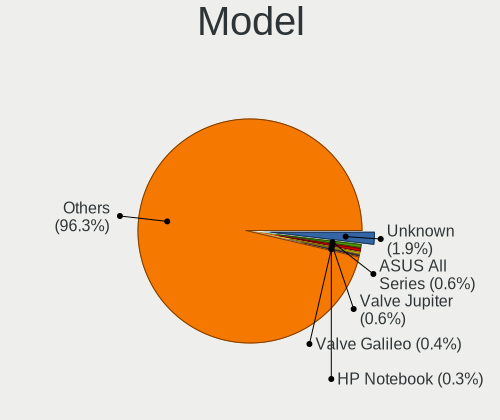
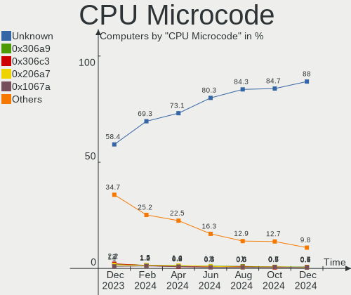

Linux Hardware Trends
---------------------

A project to identify most popular hardware characteristics and track their change
over time based on data collected by Linux users at https://Linux-Hardware.org.

Anyone can contribute to the study by uploading probes of their computers by
the [hw-probe](https://github.com/linuxhw/hw-probe) tool:

    sudo hw-probe -all -upload

This is a report for all computer types. See also reports for [desktops](/Desktop/README.md) and [notebooks](/Notebook/README.md).

Full-feature report is available here: https://linux-hardware.org/?view=trends

Period: Nov, 2019.

Contents
--------

- [ OS                       ](#os)
- [ OS Family                ](#os-family)
- [ Kernel                   ](#kernel)
- [ Kernel Family            ](#kernel-family)
- [ Kernel Major Ver.        ](#kernel-major-ver)
- [ Arch                     ](#arch)
- [ DE                       ](#de)
- [ Display Server           ](#display-server)
- [ OS Lang                  ](#os-lang)
- [ Boot Mode                ](#boot-mode)
- [ Filesystem               ](#filesystem)
- [ Dual Boot with Linux     ](#dual-boot-with-linux)
- [ Dual Boot (Win)          ](#dual-boot-win)
- [ Country                  ](#country)
- [ City                     ](#city)
- [ Vendor                   ](#vendor)
- [ Model                    ](#model)
- [ Model Family             ](#model-family)
- [ MFG Year                 ](#mfg-year)
- [ Form Factor              ](#form-factor)
- [ Secure Boot              ](#secure-boot)
- [ Coreboot                 ](#coreboot)
- [ RAM Size                 ](#ram-size)
- [ RAM Used                 ](#ram-used)
- [ Drive Vendor             ](#drive-vendor)
- [ Drive Model              ](#drive-model)
- [ Drive Kind               ](#drive-kind)
- [ Drive Connector          ](#drive-connector)
- [ Drive Size               ](#drive-size)
- [ Space Total              ](#space-total)
- [ Space Used               ](#space-used)
- [ Malfunc. Drives          ](#malfunc-drives)
- [ Malfunc. Drive Vendor    ](#malfunc-drive-vendor)
- [ Malfunc. Drive Kind      ](#malfunc-drive-kind)
- [ Failed Drives            ](#failed-drives)
- [ Failed Drive Vendor      ](#failed-drive-vendor)
- [ Drive Status             ](#drive-status)
- [ CPU Vendor               ](#cpu-vendor)
- [ CPU Model                ](#cpu-model)
- [ CPU Model Family         ](#cpu-model-family)
- [ CPU Cores                ](#cpu-cores)
- [ CPU Sockets              ](#cpu-sockets)
- [ CPU Threads              ](#cpu-threads)
- [ CPU Op-Modes             ](#cpu-op-modes)
- [ CPU Microarch            ](#cpu-microarch)
- [ CPU Microcode            ](#cpu-microcode)
- [ GPU Vendor               ](#gpu-vendor)
- [ GPU Model                ](#gpu-model)
- [ GPU Combo                ](#gpu-combo)
- [ GPU Driver               ](#gpu-driver)
- [ GPU Memory               ](#gpu-memory)
- [ Monitor Vendor           ](#monitor-vendor)
- [ Monitor Model            ](#monitor-model)
- [ Monitor Resolution       ](#monitor-resolution)
- [ Monitor Diagonal         ](#monitor-diagonal)
- [ Monitor Width            ](#monitor-width)
- [ Aspect Ratio             ](#aspect-ratio)
- [ Monitor Area             ](#monitor-area)
- [ Pixel Density            ](#pixel-density)
- [ Multiple Monitors        ](#multiple-monitors)
- [ Net Controller Vendor    ](#net-controller-vendor)
- [ Net Controller Model     ](#net-controller-model)
- [ Net Controller Kind      ](#net-controller-kind)
- [ Used Controller          ](#used-controller)
- [ NICs                     ](#nics)
- [ Unsupported Devices      ](#unsupported-devices)
- [ Unsupported Device Types ](#unsupported-device-types)

OS
--

Installed operating systems

| Name                   | Computers | Percent |
|------------------------|-----------|---------|
| Ubuntu 18.04           | 532       | 27.61%  |
| Ubuntu 19.10           | 255       | 13.23%  |
| ROSA R11               | 247       | 12.82%  |
| Mint 19.2              | 183       | 9.5%    |
| Fedora 31              | 78        | 4.05%   |
| Ubuntu 19.04           | 68        | 3.53%   |
| Endless 3.7.3          | 37        | 1.92%   |
| Ubuntu 16.04           | 36        | 1.87%   |
| Debian 10              | 30        | 1.56%   |
| Arch                   | 30        | 1.56%   |
| Zorin 15               | 28        | 1.45%   |
| ROSA R8.1              | 27        | 1.4%    |
| Manjaro                | 23        | 1.19%   |
| Fedora 30              | 21        | 1.09%   |
| Mint 19.1              | 18        | 0.93%   |
| Endless 3.7.4          | 18        | 0.93%   |
| KDE neon 18.04         | 16        | 0.83%   |
| Arch Rolling           | 15        | 0.78%   |
| Manjaro 18.1.3         | 13        | 0.67%   |
| Peppermint 10          | 12        | 0.62%   |
| Mint 18.3              | 12        | 0.62%   |
| Debian                 | 12        | 0.62%   |
| Zorin 12               | 11        | 0.57%   |
| Manjaro 18.1.2         | 11        | 0.57%   |
| ROSA R10               | 10        | 0.52%   |
| CentOS 8               | 10        | 0.52%   |
| Elementary 5.0         | 9         | 0.47%   |
| Ubuntu 18.10           | 8         | 0.42%   |
| Mint 19                | 8         | 0.42%   |
| Debian Testing         | 8         | 0.42%   |
| Kali 2019.4            | 6         | 0.31%   |
| ROSA R9                | 5         | 0.26%   |
| Solus 4.0              | 4         | 0.21%   |
| Gentoo                 | 4         | 0.21%   |
| Endless 3.3.19-nexthw1 | 4         | 0.21%   |
| Debian Unstable        | 4         | 0.21%   |
| Debian 9               | 4         | 0.21%   |
| Clear Linux 31530      | 4         | 0.21%   |
| Clear Linux 31470      | 4         | 0.21%   |
| Ubuntu 20.04           | 3         | 0.16%   |
| ROSA Nickel 2019.0     | 3         | 0.16%   |
| RHEL 8.1               | 3         | 0.16%   |
| RED X4                 | 3         | 0.16%   |
| Endless 3.5.7-nexthw1  | 3         | 0.16%   |
| ALT Linux 9.0          | 3         | 0.16%   |
| Ubuntu 17.10           | 2         | 0.1%    |
| ROSA R12               | 2         | 0.1%    |
| RHEL 8.0               | 2         | 0.1%    |
| MX 18.3                | 2         | 0.1%    |
| Mageia 7               | 2         | 0.1%    |
| Kali 2019.3            | 2         | 0.1%    |
| Gentoo 2.6             | 2         | 0.1%    |
| Fedora 32              | 2         | 0.1%    |
| Fedora 29              | 2         | 0.1%    |
| Endless 3.6.2          | 2         | 0.1%    |
| Endless 3.6.0          | 2         | 0.1%    |
| Endless 3.4.4-nexthw1  | 2         | 0.1%    |
| Endless 3.3.16-nexthw1 | 2         | 0.1%    |
| Deepin 15.11           | 2         | 0.1%    |
| Debian 9.11            | 2         | 0.1%    |

OS Family
---------

OS without a version

| Name         | Computers | Percent |
|--------------|-----------|---------|
| Ubuntu       | 904       | 46.91%  |
| ROSA         | 295       | 15.31%  |
| Mint         | 223       | 11.57%  |
| Fedora       | 103       | 5.35%   |
| Endless      | 79        | 4.1%    |
| Debian       | 61        | 3.17%   |
| Manjaro      | 47        | 2.44%   |
| Arch         | 45        | 2.34%   |
| Zorin        | 39        | 2.02%   |
| Clear Linux  | 18        | 0.93%   |
| KDE neon     | 16        | 0.83%   |
| Peppermint   | 12        | 0.62%   |
| CentOS       | 11        | 0.57%   |
| Elementary   | 9         | 0.47%   |
| Kali         | 8         | 0.42%   |
| RHEL         | 6         | 0.31%   |
| openSUSE     | 6         | 0.31%   |
| Gentoo       | 6         | 0.31%   |
| Solus        | 4         | 0.21%   |
| RED          | 4         | 0.21%   |
| ALT Linux    | 3         | 0.16%   |
| Pop!_OS      | 2         | 0.1%    |
| MX           | 2         | 0.1%    |
| Mageia       | 2         | 0.1%    |
| Deepin       | 2         | 0.1%    |
| ClearOS      | 2         | 0.1%    |
| antergos     | 2         | 0.1%    |
| Void         | 1         | 0.05%   |
| Virtuozzo    | 1         | 0.05%   |
| TTOS         | 1         | 0.05%   |
| Trisquel     | 1         | 0.05%   |
| Sabayon      | 1         | 0.05%   |
| Reborn OS    | 1         | 0.05%   |
| Raspbian     | 1         | 0.05%   |
| PureOS       | 1         | 0.05%   |
| Parrot       | 1         | 0.05%   |
| Pardus       | 1         | 0.05%   |
| OpenMandriva | 1         | 0.05%   |
| Generic      | 1         | 0.05%   |
| Freedesktop  | 1         | 0.05%   |
| EndeavourOS  | 1         | 0.05%   |
| Ctlos        | 1         | 0.05%   |
| Arcolinux    | 1         | 0.05%   |

Kernel
------

Version of the Linux kernel

| Version                          | Computers | Percent |
|----------------------------------|-----------|---------|
| 5.0.0-36-generic                 | 182       | 9.44%   |
| 5.0.0-32-generic                 | 175       | 9.08%   |
| 4.15.0-70-generic                | 157       | 8.15%   |
| 4.15.0-66-generic                | 140       | 7.27%   |
| 5.3.0-23-generic                 | 110       | 5.71%   |
| 5.3.0-19-generic                 | 100       | 5.19%   |
| 4.15.0-desktop-60.7rosa-x86_64   | 91        | 4.72%   |
| 4.15.0-desktop-45.1rosa-x86_64   | 83        | 4.31%   |
| 5.0.0-23-generic                 | 50        | 2.59%   |
| 5.3.0-12-generic                 | 39        | 2.02%   |
| 5.3.11-300.fc31.x86_64           | 32        | 1.66%   |
| 4.9.155-nrj-desktop-1rosa-x86_64 | 31        | 1.61%   |
| 5.3.8-300.fc31.x86_64            | 30        | 1.56%   |
| 4.15.0-54-generic                | 30        | 1.56%   |
| 4.15.0-desktop-45.1rosa-i586     | 19        | 0.99%   |
| 5.3.8-arch1-1                    | 18        | 0.93%   |
| 5.3.0-18-generic                 | 18        | 0.93%   |
| 4.19.0-6-amd64                   | 17        | 0.88%   |
| 4.15.0-desktop-60.7rosa-i586     | 16        | 0.83%   |
| 5.0.0-31-generic                 | 14        | 0.73%   |
| 5.3.11-1-MANJARO                 | 11        | 0.57%   |
| 5.3.0-24-generic                 | 11        | 0.57%   |
| 4.18.0-25-generic                | 11        | 0.57%   |
| 5.3.7-301.fc31.x86_64            | 10        | 0.52%   |
| 5.3.0-21-generic                 | 10        | 0.52%   |
| 5.0.0-35-generic                 | 10        | 0.52%   |
| 5.0.0-34-generic                 | 10        | 0.52%   |
| 4.18.0-80.11.2.el8_0.x86_64      | 10        | 0.52%   |
| 4.15.0-29-generic                | 9         | 0.47%   |
| 5.3.8-200.fc30.x86_64            | 8         | 0.42%   |
| 5.3.11-arch1-1                   | 8         | 0.42%   |
| 4.15.0-69-generic                | 8         | 0.42%   |
| 5.3.9-863.native                 | 7         | 0.36%   |
| 5.3.8-3-MANJARO                  | 7         | 0.36%   |
| 5.3.12-1-MANJARO                 | 7         | 0.36%   |
| 5.3.0-22-generic                 | 7         | 0.36%   |
| 5.0.0-13-generic                 | 7         | 0.36%   |
| 4.15.0-65-generic                | 7         | 0.36%   |
| 4.15.0-20-generic                | 7         | 0.36%   |
| 5.3.7-200.fc30.x86_64            | 6         | 0.31%   |
| 5.2.0-3-amd64                    | 6         | 0.31%   |
| 4.9.0-11-amd64                   | 6         | 0.31%   |
| 4.15.0-66-lowlatency             | 6         | 0.31%   |
| 4.10.0-38-generic                | 6         | 0.31%   |
| 5.3.8-854.native                 | 5         | 0.26%   |
| 5.3.11-200.fc30.x86_64           | 5         | 0.26%   |
| 5.3.0-2-amd64                    | 5         | 0.26%   |
| 5.3.0-19-lowlatency              | 5         | 0.26%   |
| 5.0.0-desktop-33.1rosa-x86_64    | 5         | 0.26%   |
| 5.0.0-37-generic                 | 5         | 0.26%   |
| 4.9.60-nrj-desktop-1rosa-x86_64  | 5         | 0.26%   |
| 4.9.20-nrj-desktop-1rosa-x86_64  | 5         | 0.26%   |
| 4.15.0-55-generic                | 5         | 0.26%   |
| 4.15.0-15-generic                | 5         | 0.26%   |
| 4.1.38-nrj-desktop-2rosa-x86_64  | 5         | 0.26%   |
| 5.3.13-arch1-1                   | 4         | 0.21%   |
| 5.3.11-050311-generic            | 4         | 0.21%   |
| 5.3.0-kali2-amd64                | 4         | 0.21%   |
| 5.3.0-23-lowlatency              | 4         | 0.21%   |
| 5.3.0-20-generic                 | 4         | 0.21%   |

Kernel Family
-------------

Linux kernel without a distro release

| Version | Computers | Percent |
|---------|-----------|---------|
| 4.15.0  | 629       | 32.64%  |
| 5.0.0   | 487       | 25.27%  |
| 5.3.0   | 335       | 17.38%  |
| 5.3.8   | 77        | 4%      |
| 5.3.11  | 65        | 3.37%   |
| 4.9.155 | 39        | 2.02%   |
| 4.18.0  | 33        | 1.71%   |
| 5.3.7   | 30        | 1.56%   |
| 4.19.0  | 27        | 1.4%    |
| 5.3.9   | 17        | 0.88%   |
| 5.3.12  | 16        | 0.83%   |
| 4.4.0   | 12        | 0.62%   |
| 5.4.0   | 10        | 0.52%   |
| 5.2.0   | 9         | 0.47%   |
| 4.9.0   | 8         | 0.42%   |
| 5.3.13  | 7         | 0.36%   |
| 4.9.60  | 7         | 0.36%   |
| 5.3.10  | 6         | 0.31%   |
| 4.9.20  | 6         | 0.31%   |
| 4.13.0  | 6         | 0.31%   |
| 4.10.0  | 6         | 0.31%   |
| 4.1.38  | 6         | 0.31%   |
| 4.9.9   | 5         | 0.26%   |
| 4.9.124 | 5         | 0.26%   |
| 3.10.0  | 5         | 0.26%   |
| 5.3.6   | 4         | 0.21%   |
| 5.2.21  | 4         | 0.21%   |
| 4.19.81 | 4         | 0.21%   |
| 5.1.0   | 3         | 0.16%   |
| 4.19.82 | 3         | 0.16%   |
| 4.16.18 | 3         | 0.16%   |
| 5.4.1   | 2         | 0.1%    |
| 5.3.5   | 2         | 0.1%    |
| 5.3.1   | 2         | 0.1%    |
| 5.2.20  | 2         | 0.1%    |
| 5.2.15  | 2         | 0.1%    |
| 5.0.9   | 2         | 0.1%    |
| 5.0.21  | 2         | 0.1%    |
| 4.19.80 | 2         | 0.1%    |
| 4.19.79 | 2         | 0.1%    |
| 4.17.0  | 2         | 0.1%    |
| 4.16.0  | 2         | 0.1%    |
| 4.12.14 | 2         | 0.1%    |
| 5.3.2   | 1         | 0.05%   |
| 5.2.6   | 1         | 0.05%   |
| 5.2.14  | 1         | 0.05%   |
| 5.2.13  | 1         | 0.05%   |
| 5.2.11  | 1         | 0.05%   |
| 5.1.8   | 1         | 0.05%   |
| 5.1.2   | 1         | 0.05%   |
| 5.1.15  | 1         | 0.05%   |
| 4.9.193 | 1         | 0.05%   |
| 4.9.189 | 1         | 0.05%   |
| 4.8.13  | 1         | 0.05%   |
| 4.4.74  | 1         | 0.05%   |
| 4.19.86 | 1         | 0.05%   |
| 4.19.85 | 1         | 0.05%   |
| 4.19.84 | 1         | 0.05%   |
| 4.19.8  | 1         | 0.05%   |
| 4.19.75 | 1         | 0.05%   |

Kernel Major Ver.
-----------------

Linux kernel major version

| Version | Computers | Percent |
|---------|-----------|---------|
| 4.15    | 630       | 32.69%  |
| 5.3     | 562       | 29.16%  |
| 5.0     | 491       | 25.48%  |
| 4.9     | 72        | 3.74%   |
| 4.19    | 49        | 2.54%   |
| 4.18    | 33        | 1.71%   |
| 5.2     | 21        | 1.09%   |
| 4.4     | 13        | 0.67%   |
| 5.4     | 12        | 0.62%   |
| 5.1     | 6         | 0.31%   |
| 4.13    | 6         | 0.31%   |
| 4.10    | 6         | 0.31%   |
| 4.1     | 6         | 0.31%   |
| 4.16    | 5         | 0.26%   |
| 3.10    | 5         | 0.26%   |
| 4.14    | 3         | 0.16%   |
| 4.17    | 2         | 0.1%    |
| 4.12    | 2         | 0.1%    |
| 4.8     | 1         | 0.05%   |
| 3.16    | 1         | 0.05%   |
| 3.13    | 1         | 0.05%   |

Arch
----

OS architecture (x86_64, i586, etc.)

| Name    | Computers | Percent |
|---------|-----------|---------|
| x86_64  | 1762      | 91.44%  |
| i686    | 156       | 8.1%    |
| aarch64 | 6         | 0.31%   |
| armv7l  | 3         | 0.16%   |

DE
--

Desktop Environment

| Name                | Computers | Percent |
|---------------------|-----------|---------|
| Unknown             | 620       | 32.17%  |
| GNOME               | 582       | 30.2%   |
| KDE5                | 301       | 15.62%  |
| XFCE                | 128       | 6.64%   |
| X-Cinnamon          | 89        | 4.62%   |
| MATE                | 52        | 2.7%    |
| KDE                 | 46        | 2.39%   |
| Cinnamon            | 42        | 2.18%   |
| Unity               | 20        | 1.04%   |
| LXDE                | 11        | 0.57%   |
| LXQt                | 8         | 0.42%   |
| GNOME Flashback     | 7         | 0.36%   |
| Budgie              | 6         | 0.31%   |
| Pantheon            | 5         | 0.26%   |
| Deepin              | 5         | 0.26%   |
| GNOME-Classic:GNOME | 2         | 0.1%    |
| KDE4                | 1         | 0.05%   |
| i3                  | 1         | 0.05%   |
| Enlightenment       | 1         | 0.05%   |

Display Server
--------------

X11 or Wayland

| Name    | Computers | Percent |
|---------|-----------|---------|
| Unknown | 1211      | 62.84%  |
| X11     | 675       | 35.03%  |
| Wayland | 39        | 2.02%   |
| Tty     | 2         | 0.1%    |

OS Lang
-------

Language

| Lang       | Computers | Percent |
|------------|-----------|---------|
| Unknown    | 1223      | 63.47%  |
| en_US      | 221       | 11.47%  |
| de_DE      | 80        | 4.15%   |
| pt_BR      | 45        | 2.34%   |
| it_IT      | 32        | 1.66%   |
| fr_FR      | 32        | 1.66%   |
| ru_RU      | 30        | 1.56%   |
| es_ES      | 30        | 1.56%   |
| en_GB      | 29        | 1.5%    |
| en_CA      | 21        | 1.09%   |
| C          | 15        | 0.78%   |
| en_US.utf8 | 14        | 0.73%   |
| en_AU      | 12        | 0.62%   |
| pl_PL      | 11        | 0.57%   |
| ro_RO      | 8         | 0.42%   |
| hu_HU      | 8         | 0.42%   |
| en_IN      | 7         | 0.36%   |
| cs_CZ      | 7         | 0.36%   |
| pt_PT      | 6         | 0.31%   |
| nl_NL      | 6         | 0.31%   |
| fr_CA      | 5         | 0.26%   |
| de_AT      | 5         | 0.26%   |
| zh_CN      | 4         | 0.21%   |
| es_MX      | 4         | 0.21%   |
| es_AR      | 4         | 0.21%   |
| en_ZA      | 4         | 0.21%   |
| ru_UA      | 3         | 0.16%   |
| pt_BR.utf8 | 3         | 0.16%   |
| nb_NO      | 3         | 0.16%   |
| es_UY      | 3         | 0.16%   |
| es_CL      | 3         | 0.16%   |
| el_GR      | 3         | 0.16%   |
| de_CH      | 3         | 0.16%   |
| da_DK      | 3         | 0.16%   |
| tr_TR      | 2         | 0.1%    |
| th_TH      | 2         | 0.1%    |
| sl_SI      | 2         | 0.1%    |
| sk_SK      | 2         | 0.1%    |
| nl_BE      | 2         | 0.1%    |
| ja_JP      | 2         | 0.1%    |
| fi_FI      | 2         | 0.1%    |
| es_VE      | 2         | 0.1%    |
| es_PE      | 2         | 0.1%    |
| es_CO      | 2         | 0.1%    |
| en_NZ      | 2         | 0.1%    |
| en_IL      | 2         | 0.1%    |
| en_IE      | 2         | 0.1%    |
| ca_ES      | 2         | 0.1%    |
| zh_TW      | 1         | 0.05%   |
| lt_LT      | 1         | 0.05%   |
| id_ID      | 1         | 0.05%   |
| hr_HR      | 1         | 0.05%   |
| fr_FR.utf8 | 1         | 0.05%   |
| fr_CH      | 1         | 0.05%   |
| fr_BE      | 1         | 0.05%   |
| es_CR      | 1         | 0.05%   |
| en_PH      | 1         | 0.05%   |
| en_HK      | 1         | 0.05%   |
| de_DE.utf8 | 1         | 0.05%   |
| bg_BG      | 1         | 0.05%   |

Boot Mode
---------

EFI or BIOS

| Mode | Computers | Percent |
|------|-----------|---------|
| BIOS | 1133      | 58.8%   |
| EFI  | 794       | 41.2%   |

Filesystem
----------

Type of filesystem

| Type    | Computers | Percent |
|---------|-----------|---------|
| Ext4    | 1797      | 93.25%  |
| Overlay | 50        | 2.59%   |
| Btrfs   | 35        | 1.82%   |
| Xfs     | 28        | 1.45%   |
| Ext3    | 7         | 0.36%   |
| Ext2    | 4         | 0.21%   |
| Zfs     | 2         | 0.1%    |
| Unknown | 2         | 0.1%    |
| Jfs     | 1         | 0.05%   |
| Aufs    | 1         | 0.05%   |

Dual Boot with Linux
--------------------

Hosting more than one Linux

| Dual boot | Computers | Percent |
|-----------|-----------|---------|
| No        | 1691      | 87.75%  |
| Yes       | 236       | 12.25%  |

Dual Boot (Win)
---------------

Hosting Linux and Windows

| Dual boot | Computers | Percent |
|-----------|-----------|---------|
| No        | 1351      | 70.11%  |
| Yes       | 576       | 29.89%  |

Country
-------

Geographic location (country)

| Country                   | Computers | Percent |
|---------------------------|-----------|---------|
| Russia                    | 337       | 17.49%  |
| USA                       | 264       | 13.7%   |
| Germany                   | 197       | 10.22%  |
| Brazil                    | 121       | 6.28%   |
| Italy                     | 81        | 4.2%    |
| France                    | 71        | 3.68%   |
| Spain                     | 66        | 3.43%   |
| UK                        | 65        | 3.37%   |
| Canada                    | 61        | 3.17%   |
| Poland                    | 40        | 2.08%   |
| Netherlands               | 39        | 2.02%   |
| Ukraine                   | 36        | 1.87%   |
| India                     | 35        | 1.82%   |
| Australia                 | 33        | 1.71%   |
| Romania                   | 31        | 1.61%   |
| Czech Republic            | 25        | 1.3%    |
| Belarus                   | 25        | 1.3%    |
| Portugal                  | 22        | 1.14%   |
| Slovakia                  | 21        | 1.09%   |
| Hungary                   | 20        | 1.04%   |
| Turkey                    | 18        | 0.93%   |
| Switzerland               | 17        | 0.88%   |
| Belgium                   | 16        | 0.83%   |
| Austria                   | 16        | 0.83%   |
| Mexico                    | 13        | 0.67%   |
| Argentina                 | 13        | 0.67%   |
| Sweden                    | 12        | 0.62%   |
| Norway                    | 12        | 0.62%   |
| Finland                   | 11        | 0.57%   |
| Japan                     | 10        | 0.52%   |
| China                     | 10        | 0.52%   |
| Serbia                    | 9         | 0.47%   |
| New Zealand               | 9         | 0.47%   |
| Greece                    | 9         | 0.47%   |
| Bulgaria                  | 9         | 0.47%   |
| Egypt                     | 8         | 0.42%   |
| Denmark                   | 8         | 0.42%   |
| Croatia                   | 8         | 0.42%   |
| Colombia                  | 8         | 0.42%   |
| Peru                      | 7         | 0.36%   |
| Chile                     | 7         | 0.36%   |
| South Africa              | 6         | 0.31%   |
| Uruguay                   | 5         | 0.26%   |
| Morocco                   | 5         | 0.26%   |
| Malaysia                  | 5         | 0.26%   |
| Lithuania                 | 5         | 0.26%   |
| Latvia                    | 5         | 0.26%   |
| Israel                    | 5         | 0.26%   |
| Thailand                  | 4         | 0.21%   |
| Philippines               | 4         | 0.21%   |
| Iran, Islamic Republic of | 4         | 0.21%   |
| Venezuela                 | 3         | 0.16%   |
| Tunisia                   | 3         | 0.16%   |
| Slovenia                  | 3         | 0.16%   |
| Qatar                     | 3         | 0.16%   |
| Iran                      | 3         | 0.16%   |
| Indonesia                 | 3         | 0.16%   |
| Bangladesh                | 3         | 0.16%   |
| Singapore                 | 2         | 0.1%    |
| Kazakhstan                | 2         | 0.1%    |

City
----

Geographic location (city)

| City              | Computers | Percent |
|-------------------|-----------|---------|
| Moscow            | 59        | 3.06%   |
| St Petersburg     | 28        | 1.45%   |
| São Paulo        | 19        | 0.99%   |
| Berlin            | 17        | 0.88%   |
| Yekaterinburg     | 14        | 0.73%   |
| Warsaw            | 13        | 0.67%   |
| Kyiv              | 13        | 0.67%   |
| Rostov-on-Don     | 11        | 0.57%   |
| Rome              | 11        | 0.57%   |
| Nizhniy Novgorod  | 11        | 0.57%   |
| Frankfurt am Main | 11        | 0.57%   |
| Bucharest         | 11        | 0.57%   |
| Paris             | 10        | 0.52%   |
| Munich            | 10        | 0.52%   |
| Madrid            | 10        | 0.52%   |
| Vienna            | 9         | 0.47%   |
| Prague            | 9         | 0.47%   |
| Istanbul          | 9         | 0.47%   |
| Zurich            | 8         | 0.42%   |
| Vitebsk           | 8         | 0.42%   |
| Novosibirsk       | 8         | 0.42%   |
| Krasnodar         | 8         | 0.42%   |
| Hamburg           | 8         | 0.42%   |
| Chicago           | 8         | 0.42%   |
| Chelyabinsk       | 8         | 0.42%   |
| Zagreb            | 7         | 0.36%   |
| Porto Alegre      | 7         | 0.36%   |
| Curitiba          | 7         | 0.36%   |
| Budapest          | 7         | 0.36%   |
| Bengaluru         | 7         | 0.36%   |
| Wahroonga         | 6         | 0.31%   |
| Voronezh          | 6         | 0.31%   |
| Sofia             | 6         | 0.31%   |
| Montreal          | 6         | 0.31%   |
| Lima              | 6         | 0.31%   |
| Belgrade          | 6         | 0.31%   |
| Toronto           | 5         | 0.26%   |
| Seattle           | 5         | 0.26%   |
| Saratov           | 5         | 0.26%   |
| Samara            | 5         | 0.26%   |
| Ryazan            | 5         | 0.26%   |
| Rio de Janeiro    | 5         | 0.26%   |
| Riga              | 5         | 0.26%   |
| Ottawa            | 5         | 0.26%   |
| Minsk             | 5         | 0.26%   |
| London            | 5         | 0.26%   |
| Genoa             | 5         | 0.26%   |
| Cairo             | 5         | 0.26%   |
| Bratislava        | 5         | 0.26%   |
| Brasília         | 5         | 0.26%   |
| Bologna           | 5         | 0.26%   |
| Bogotá           | 5         | 0.26%   |
| Amsterdam         | 5         | 0.26%   |
| Tyumen            | 4         | 0.21%   |
| Tehran            | 4         | 0.21%   |
| Surgut            | 4         | 0.21%   |
| Stuttgart         | 4         | 0.21%   |
| Stockholm         | 4         | 0.21%   |
| Santiago          | 4         | 0.21%   |
| Salvador          | 4         | 0.21%   |

Vendor
------

Motherboard manufacturer

| Name                    | Computers | Percent |
|-------------------------|-----------|---------|
| ASUSTek Computer        | 358       | 18.58%  |
| Hewlett-Packard         | 261       | 13.54%  |
| Lenovo                  | 245       | 12.71%  |
| Dell                    | 197       | 10.22%  |
| Gigabyte Technology     | 146       | 7.58%   |
| Acer                    | 144       | 7.47%   |
| MSI                     | 103       | 5.35%   |
| ASRock                  | 90        | 4.67%   |
| Toshiba                 | 48        | 2.49%   |
| Intel                   | 33        | 1.71%   |
| Samsung Electronics     | 23        | 1.19%   |
| Apple                   | 23        | 1.19%   |
| Sony                    | 22        | 1.14%   |
| Fujitsu                 | 16        | 0.83%   |
| ECS                     | 13        | 0.67%   |
| Medion                  | 12        | 0.62%   |
| Unknown                 | 12        | 0.62%   |
| Packard Bell            | 11        | 0.57%   |
| eMachines               | 11        | 0.57%   |
| Foxconn                 | 9         | 0.47%   |
| Raspberry Pi Foundation | 8         | 0.42%   |
| Pegatron                | 8         | 0.42%   |
| Supermicro              | 7         | 0.36%   |
| Positivo                | 7         | 0.36%   |
| Biostar                 | 7         | 0.36%   |
| Notebook                | 6         | 0.31%   |
| Microsoft               | 6         | 0.31%   |
| Fujitsu Siemens         | 6         | 0.31%   |
| LG Electronics          | 5         | 0.26%   |
| HUAWEI                  | 5         | 0.26%   |
| Alienware               | 5         | 0.26%   |
| Novastar                | 4         | 0.21%   |
| Digma                   | 4         | 0.21%   |
| Clevo                   | 4         | 0.21%   |
| AMI                     | 4         | 0.21%   |
| TrekStor                | 3         | 0.16%   |
| System76                | 3         | 0.16%   |
| Quanta                  | 3         | 0.16%   |
| Wistron                 | 2         | 0.1%    |
| WinFast                 | 2         | 0.1%    |
| Shuttle                 | 2         | 0.1%    |
| Purism                  | 2         | 0.1%    |
| PCWare                  | 2         | 0.1%    |
| Panasonic               | 2         | 0.1%    |
| Itautec                 | 2         | 0.1%    |
| IBM                     | 2         | 0.1%    |
| Gateway                 | 2         | 0.1%    |
| ZOTAC                   | 1         | 0.05%   |
| WINCOR NIXDORF          | 1         | 0.05%   |
| VIT M2100               | 1         | 0.05%   |
| TR                      | 1         | 0.05%   |
| Timi                    | 1         | 0.05%   |
| Teclast                 | 1         | 0.05%   |
| sunxi                   | 1         | 0.05%   |
| Standard                | 1         | 0.05%   |
| SiS Technology          | 1         | 0.05%   |
| Radiant Systems         | 1         | 0.05%   |
| Qbex                    | 1         | 0.05%   |
| Prestigio               | 1         | 0.05%   |
| PCChips                 | 1         | 0.05%   |

Model
-----

Motherboard model

| Name                              | Computers | Percent |
|-----------------------------------|-----------|---------|
| All Series                        | 22        | 1.14%   |
| Unknown                           | 20        | 1.04%   |
| Notebook                          | 9         | 0.47%   |
| Pavilion dv6                      | 8         | 0.42%   |
| Pavilion g6                       | 7         | 0.36%   |
| Pavilion 15                       | 7         | 0.36%   |
| Raspberry Pi 4 Model B Rev 1.1    | 6         | 0.31%   |
| Laptop 15-bw0xx                   | 5         | 0.26%   |
| Laptop 15-bs1xx                   | 5         | 0.26%   |
| G50-30 80G0                       | 5         | 0.26%   |
| VivoBook_ASUSLaptop X570ZD_F570ZD | 4         | 0.21%   |
| Surface Pro 4                     | 4         | 0.21%   |
| PRIME A320M-K                     | 4         | 0.21%   |
| Pavilion dv7                      | 4         | 0.21%   |
| OptiPlex 745                      | 4         | 0.21%   |
| MS-7C02                           | 4         | 0.21%   |
| MS-7A38                           | 4         | 0.21%   |
| MS-7A34                           | 4         | 0.21%   |
| M5A97 R2.0                        | 4         | 0.21%   |
| Legion Y530-15ICH 81FV            | 4         | 0.21%   |
| Latitude E6420                    | 4         | 0.21%   |
| Laptop 15-db0xxx                  | 4         | 0.21%   |
| KL55                              | 4         | 0.21%   |
| IdeaPad S145-15IWL 81MV           | 4         | 0.21%   |
| IdeaPad 310-15IKB 80TV            | 4         | 0.21%   |
| H61M-K                            | 4         | 0.21%   |
| G31M-ES2L                         | 4         | 0.21%   |
| EliteBook 840 G3                  | 4         | 0.21%   |
| B450M S2H                         | 4         | 0.21%   |
| Aspire A315-51                    | 4         | 0.21%   |
| Aspire A315-21                    | 4         | 0.21%   |
| 970 Pro3 R2.0                     | 4         | 0.21%   |
| XPS L502X                         | 3         | 0.16%   |
| X555LAB                           | 3         | 0.16%   |
| X540NA                            | 3         | 0.16%   |
| X406UAR                           | 3         | 0.16%   |
| VivoBook_ASUSLaptop X509FB_X509FB | 3         | 0.16%   |
| TERRA_PC                          | 3         | 0.16%   |
| SF20PA2                           | 3         | 0.16%   |
| ProBook 6470b                     | 3         | 0.16%   |
| ProBook 4530s                     | 3         | 0.16%   |
| PRIME X370-PRO                    | 3         | 0.16%   |
| PRIME B350-PLUS                   | 3         | 0.16%   |
| P8H77-V LE                        | 3         | 0.16%   |
| P8H67                             | 3         | 0.16%   |
| P5Q                               | 3         | 0.16%   |
| OptiPlex 960                      | 3         | 0.16%   |
| OptiPlex 9020                     | 3         | 0.16%   |
| OptiPlex 760                      | 3         | 0.16%   |
| OptiPlex 755                      | 3         | 0.16%   |
| OptiPlex 3020                     | 3         | 0.16%   |
| MS-7693                           | 3         | 0.16%   |
| MacBookPro8,1                     | 3         | 0.16%   |
| M5A78L-M/USB3                     | 3         | 0.16%   |
| M5A78L-M LX3                      | 3         | 0.16%   |
| M2N-MX SE Plus                    | 3         | 0.16%   |
| Latitude E6540                    | 3         | 0.16%   |
| Latitude E5520                    | 3         | 0.16%   |
| Laptop 15-bs0xx                   | 3         | 0.16%   |
| K53SV                             | 3         | 0.16%   |

Model Family
------------

Motherboard model prefix

| Name                   | Computers | Percent |
|------------------------|-----------|---------|
| Acer Aspire            | 102       | 5.29%   |
| Lenovo ThinkPad        | 98        | 5.09%   |
| Dell Inspiron          | 61        | 3.17%   |
| Lenovo IdeaPad         | 53        | 2.75%   |
| HP Pavilion            | 53        | 2.75%   |
| Dell Latitude          | 43        | 2.23%   |
| Toshiba Satellite      | 38        | 1.97%   |
| HP Laptop              | 36        | 1.87%   |
| Dell OptiPlex          | 31        | 1.61%   |
| HP EliteBook           | 30        | 1.56%   |
| ASUS VivoBook          | 25        | 1.3%    |
| HP Compaq              | 24        | 1.25%   |
| HP ProBook             | 23        | 1.19%   |
| ASUS All               | 22        | 1.14%   |
| ASUS PRIME             | 21        | 1.09%   |
| Unknown                | 21        | 1.09%   |
| Dell Precision         | 17        | 0.88%   |
| Dell XPS               | 16        | 0.83%   |
| Dell Vostro            | 14        | 0.73%   |
| Lenovo ThinkCentre     | 12        | 0.62%   |
| ASUS M5A78L-M          | 11        | 0.57%   |
| HP Notebook            | 9         | 0.47%   |
| RPi Raspberry          | 8         | 0.42%   |
| ASUS ROG               | 8         | 0.42%   |
| Acer Veriton           | 8         | 0.42%   |
| HP EliteDesk           | 7         | 0.36%   |
| Fujitsu LIFEBOOK       | 7         | 0.36%   |
| ASUS TUF               | 7         | 0.36%   |
| ASUS P8H61-M           | 7         | 0.36%   |
| ASUS M5A97             | 7         | 0.36%   |
| Packard Bell EasyNote  | 6         | 0.31%   |
| Microsoft Surface      | 6         | 0.31%   |
| Lenovo Legion          | 6         | 0.31%   |
| HP ZBook               | 6         | 0.31%   |
| HP Stream              | 6         | 0.31%   |
| Gigabyte B450          | 6         | 0.31%   |
| Fujitsu ESPRIMO        | 6         | 0.31%   |
| ASRock 970             | 6         | 0.31%   |
| Acer TravelMate        | 6         | 0.31%   |
| Lenovo G50-30          | 5         | 0.26%   |
| HP OMEN                | 5         | 0.26%   |
| HP 255                 | 5         | 0.26%   |
| Gigabyte GA-78LMT-USB3 | 5         | 0.26%   |
| Gigabyte B450M         | 5         | 0.26%   |
| ASUS P5K               | 5         | 0.26%   |
| ASRock B450M           | 5         | 0.26%   |
| Acer Nitro             | 5         | 0.26%   |
| Novastar KL55          | 4         | 0.21%   |
| MSI MS-7C02            | 4         | 0.21%   |
| MSI MS-7A38            | 4         | 0.21%   |
| MSI MS-7A34            | 4         | 0.21%   |
| Lenovo G580            | 4         | 0.21%   |
| HP Spectre             | 4         | 0.21%   |
| HP ProLiant            | 4         | 0.21%   |
| HP ProDesk             | 4         | 0.21%   |
| HP 250                 | 4         | 0.21%   |
| Gigabyte Z390          | 4         | 0.21%   |
| Gigabyte G31M-ES2L     | 4         | 0.21%   |
| Dell Studio            | 4         | 0.21%   |
| Dell PowerEdge         | 4         | 0.21%   |

MFG Year
--------

Motherboard manufacture year

| Year    | Computers | Percent |
|---------|-----------|---------|
| 2019    | 345       | 17.9%   |
| 2018    | 246       | 12.77%  |
| 2012    | 171       | 8.87%   |
| 2013    | 158       | 8.2%    |
| 2014    | 134       | 6.95%   |
| 2011    | 134       | 6.95%   |
| 2010    | 133       | 6.9%    |
| 2015    | 112       | 5.81%   |
| 2017    | 109       | 5.66%   |
| 2016    | 99        | 5.14%   |
| 2009    | 92        | 4.77%   |
| 2008    | 80        | 4.15%   |
| 2007    | 54        | 2.8%    |
| 2006    | 30        | 1.56%   |
| Unknown | 12        | 0.62%   |
| 2005    | 9         | 0.47%   |
| 2003    | 4         | 0.21%   |
| 2004    | 2         | 0.1%    |
| 2001    | 2         | 0.1%    |
| 2002    | 1         | 0.05%   |

Form Factor
-----------

Physical design of the computer

| Name           | Computers | Percent |
|----------------|-----------|---------|
| Notebook       | 1041      | 54.02%  |
| Desktop        | 785       | 40.74%  |
| All in one     | 25        | 1.3%    |
| Convertible    | 20        | 1.04%   |
| Mini pc        | 19        | 0.99%   |
| Server         | 16        | 0.83%   |
| Tablet         | 12        | 0.62%   |
| System on chip | 9         | 0.47%   |

Secure Boot
-----------

Enabled or disabled

| State    | Computers | Percent |
|----------|-----------|---------|
| Disabled | 1819      | 94.4%   |
| Enabled  | 108       | 5.6%    |

Coreboot
--------

Have coreboot on board

| Used | Computers | Percent |
|------|-----------|---------|
| No   | 1924      | 99.84%  |
| Yes  | 3         | 0.16%   |

RAM Size
--------

Total RAM memory

| Size in GB  | Computers | Percent |
|-------------|-----------|---------|
| 3.01-4.0    | 521       | 27.04%  |
| 4.01-8.0    | 407       | 21.12%  |
| 8.01-16.0   | 367       | 19.05%  |
| 16.01-24.0  | 273       | 14.17%  |
| 1.01-2.0    | 162       | 8.41%   |
| 32.01-64.0  | 74        | 3.84%   |
| 2.01-3.0    | 54        | 2.8%    |
| 0.01-1.0    | 25        | 1.3%    |
| 64.01-256.0 | 24        | 1.25%   |
| 24.01-32.0  | 18        | 0.93%   |
| Unknown     | 2         | 0.1%    |

RAM Used
--------

Used RAM memory

| Used GB    | Computers | Percent |
|------------|-----------|---------|
| 1.01-2.0   | 815       | 42.29%  |
| 2.01-3.0   | 445       | 23.09%  |
| 0.01-1.0   | 336       | 17.44%  |
| 3.01-4.0   | 158       | 8.2%    |
| 4.01-8.0   | 142       | 7.37%   |
| 8.01-16.0  | 24        | 1.25%   |
| Unknown    | 3         | 0.16%   |
| 16.01-24.0 | 2         | 0.1%    |
| 32.01-64.0 | 1         | 0.05%   |
| 24.01-32.0 | 1         | 0.05%   |

Drive Vendor
------------

Hard drive vendors

| Vendor              | Computers | Drives  | Percent |
|---------------------|-----------|---------|---------|
| Seagate             | 508       | 581     | 20.21%  |
| WDC                 | 490       | 559     | 19.49%  |
| Samsung Electronics | 280       | 309     | 11.14%  |
| Toshiba             | 240       | 250     | 9.55%   |
| Kingston            | 137       | 140     | 5.45%   |
| Hitachi             | 122       | 126     | 4.85%   |
| SanDisk             | 112       | 117     | 4.46%   |
| Unknown             | 68        | 74      | 2.7%    |
| Crucial             | 67        | 69      | 2.67%   |
| HGST                | 65        | 66      | 2.59%   |
| Intel               | 48        | 51      | 1.91%   |
| SK Hynix            | 29        | 29      | 1.15%   |
| Micron Technology   | 26        | 26      | 1.03%   |
| A-DATA Technology   | 24        | 24      | 0.95%   |
| Maxtor              | 22        | 23      | 0.88%   |
| OCZ                 | 20        | 20      | 0.8%    |
| Transcend           | 18        | 18      | 0.72%   |
| China               | 17        | 18      | 0.68%   |
| SPCC                | 15        | 15      | 0.6%    |
| Patriot             | 15        | 15      | 0.6%    |
| LITEON              | 14        | 14      | 0.56%   |
| Generic             | 12        | 12      | 0.48%   |
| Fujitsu             | 12        | 12      | 0.48%   |
| PLEXTOR             | 11        | 12      | 0.44%   |
| PNY                 | 10        | 10      | 0.4%    |
| LITEONIT            | 9         | 9       | 0.36%   |
| Corsair             | 9         | 9       | 0.36%   |
| Intenso             | 8         | 8       | 0.32%   |
| Apacer              | 8         | 8       | 0.32%   |
| Team                | 6         | 6       | 0.24%   |
| HL-DT-ST            | 6         | Unknown | 0.24%   |
| Apple               | 6         | 6       | 0.24%   |
| KingSpec            | 5         | 5       | 0.2%    |
| GOODRAM             | 5         | 6       | 0.2%    |
| ASMT                | 5         | 5       | 0.2%    |
| JMicron             | 4         | 4       | 0.16%   |
| Gigabyte Technology | 4         | 4       | 0.16%   |
| USB30               | 3         | 3       | 0.12%   |
| KingDian            | 3         | 3       | 0.12%   |
| IBM/Hitachi         | 3         | 3       | 0.12%   |
| HUAWEI              | 3         | 3       | 0.12%   |
| Hewlett-Packard     | 3         | 4       | 0.12%   |
| Vi550               | 2         | 2       | 0.08%   |
| TO Exter            | 2         | 2       | 0.08%   |
| Mushkin             | 2         | 2       | 0.08%   |
| faspeed             | 2         | 2       | 0.08%   |
| DREVO               | 2         | 2       | 0.08%   |
| ASMedia             | 2         | 2       | 0.08%   |
| AMD                 | 2         | 2       | 0.08%   |
| Zheino              | 1         | 1       | 0.04%   |
| VT                  | 1         | 1       | 0.04%   |
| Verbatim            | 1         | 1       | 0.04%   |
| USB                 | 1         | 1       | 0.04%   |
| Union Memory        | 1         | 1       | 0.04%   |
| TCSUNBOW            | 1         | 1       | 0.04%   |
| Smartbuy            | 1         | 1       | 0.04%   |
| SABRENT             | 1         | 1       | 0.04%   |
| Reeinno             | 1         | 1       | 0.04%   |
| Phison              | 1         | 1       | 0.04%   |
| Oyen                | 1         | 1       | 0.04%   |

Drive Model
-----------

Hard drive models

| Model                        | Computers | Percent |
|------------------------------|-----------|---------|
| ST1000LM035-1RK172 1TB       | 49        | 1.8%    |
| ST500DM002-1BD142 500GB      | 28        | 1.03%   |
| MQ01ABF050 500GB             | 27        | 0.99%   |
| SSD 850 EVO 250GB            | 26        | 0.96%   |
| SA400S37120G 120GB SSD       | 25        | 0.92%   |
| SV300S37A120G 120GB SSD      | 24        | 0.88%   |
| ST1000LM024 HN-M101MBB 1TB   | 24        | 0.88%   |
| DT01ACA050 500GB             | 24        | 0.88%   |
| MQ01ABD100 1TB               | 20        | 0.74%   |
| SA400S37240G 240GB SSD       | 19        | 0.7%    |
| ST1000DM010-2EP102 1TB       | 17        | 0.63%   |
| SSD 850 EVO 500GB            | 17        | 0.63%   |
| SSD 860 EVO 250GB            | 16        | 0.59%   |
| MQ04ABF100 1TB               | 16        | 0.59%   |
| MMC Card  31GB               | 16        | 0.59%   |
| HTS545050A7E680 500GB        | 16        | 0.59%   |
| ST3500418AS 500GB            | 14        | 0.51%   |
| HTS541010A9E680 1TB          | 14        | 0.51%   |
| DT01ACA200 2TB               | 14        | 0.51%   |
| DT01ACA100 1TB               | 14        | 0.51%   |
| SDSSDA240G 240GB             | 13        | 0.48%   |
| ST500LT012-1DG142 500GB      | 12        | 0.44%   |
| HTS721010A9E630 1TB          | 12        | 0.44%   |
| WD10EZEX-08WN4A0 1TB         | 11        | 0.4%    |
| Solid State Disk 128GB       | 11        | 0.4%    |
| SD/MMC/MS PRO 128GB          | 11        | 0.4%    |
| ST3500413AS 500GB            | 10        | 0.37%   |
| ST1000DM003-1ER162 1TB       | 10        | 0.37%   |
| SSD PLUS 240GB               | 10        | 0.37%   |
| HTS545050A7E380 500GB        | 10        | 0.37%   |
| Burst 120GB SSD              | 10        | 0.37%   |
| WD20EZRZ-00Z5HB0 2TB         | 9         | 0.33%   |
| WD10SPZX-21Z10T0 1TB         | 9         | 0.33%   |
| WD10JPVX-22JC3T0 1TB         | 9         | 0.33%   |
| ST1000DM003-1CH162 1TB       | 9         | 0.33%   |
| SSD 860 EVO 1TB              | 9         | 0.33%   |
| SSD 840 EVO 120GB            | 9         | 0.33%   |
| SA400S37480G 480GB SSD       | 9         | 0.33%   |
| HDWD110 1TB                  | 9         | 0.33%   |
| CT500MX500SSD1 500GB         | 9         | 0.33%   |
| CT120BX500SSD1 120GB         | 9         | 0.33%   |
| WD10EZEX-22MFCA0 1TB         | 8         | 0.29%   |
| ST500LT012-9WS142 500GB      | 8         | 0.29%   |
| ST31000524AS 1TB             | 8         | 0.29%   |
| ST1000DM003-9YN162 1TB       | 8         | 0.29%   |
| SSD 860 EVO 500GB            | 8         | 0.29%   |
| SSD 840 EVO 250GB            | 8         | 0.29%   |
| Expansion 500GB              | 8         | 0.29%   |
| DF4032  31GB                 | 8         | 0.29%   |
| WDS240G2G0A-00JH30 240GB SSD | 7         | 0.26%   |
| WD40EFRX-68N32N0 4TB         | 7         | 0.26%   |
| SV300S37A240G 240GB SSD      | 7         | 0.26%   |
| ST500LM012 HN-M500MBB 500GB  | 7         | 0.26%   |
| ST2000DM008-2FR102 2TB       | 7         | 0.26%   |
| ST1000DM003-1SB102 1TB       | 7         | 0.26%   |
| HTS543232A7A384 320GB        | 7         | 0.26%   |
| CT250MX500SSD1 250GB         | 7         | 0.26%   |
| WD5000AAKX-00ERMA0 500GB     | 6         | 0.22%   |
| WD3200BPVT-24JJ5T0 320GB     | 6         | 0.22%   |
| WD20EFRX-68EUZN0 2TB         | 6         | 0.22%   |

Drive Kind
----------

HDD or SSD

| Kind    | Computers | Drives | Percent |
|---------|-----------|--------|---------|
| HDD     | 1290      | 1636   | 57.69%  |
| SSD     | 745       | 876    | 33.32%  |
| MMC     | 80        | 88     | 3.58%   |
| NVMe    | 67        | 68     | 3%      |
| Unknown | 54        | 50     | 2.42%   |

Drive Connector
---------------

SATA, SAS, NVMe, etc.

| Type | Computers | Drives | Percent |
|------|-----------|--------|---------|
| SATA | 1727      | 2481   | 88.29%  |
| SAS  | 82        | 81     | 4.19%   |
| MMC  | 80        | 88     | 4.09%   |
| NVMe | 67        | 68     | 3.43%   |

Drive Size
----------

Size of hard drive

| Size in TB | Computers | Drives | Percent |
|------------|-----------|--------|---------|
| 0.01-0.5   | 1436      | 1819   | 63.94%  |
| 0.51-1.0   | 590       | 658    | 26.27%  |
| 1.01-2.0   | 143       | 158    | 6.37%   |
| 3.01-4.0   | 39        | 41     | 1.74%   |
| 2.01-3.0   | 20        | 21     | 0.89%   |
| 4.01-10.0  | 13        | 15     | 0.58%   |
| Unknown    | 5         | 6      | 0.22%   |

Space Total
-----------

Amount of disk space available on the file system

| Size in GB     | Computers | Percent |
|----------------|-----------|---------|
| 101-250        | 558       | 28.96%  |
| 251-500        | 449       | 23.3%   |
| 501-1000       | 307       | 15.93%  |
| 51-100         | 160       | 8.3%    |
| 21-50          | 125       | 6.49%   |
| 1001-2000      | 125       | 6.49%   |
| 1-20           | 82        | 4.26%   |
| 2001-3000      | 50        | 2.59%   |
| More than 3000 | 49        | 2.54%   |
| Unknown        | 22        | 1.14%   |

Space Used
----------

Amount of used disk space

| Used GB        | Computers | Percent |
|----------------|-----------|---------|
| 1-20           | 820       | 42.55%  |
| 21-50          | 339       | 17.59%  |
| 101-250        | 228       | 11.83%  |
| 51-100         | 219       | 11.36%  |
| 251-500        | 118       | 6.12%   |
| 501-1000       | 96        | 4.98%   |
| 1001-2000      | 53        | 2.75%   |
| Unknown        | 22        | 1.14%   |
| More than 3000 | 19        | 0.99%   |
| 2001-3000      | 13        | 0.67%   |

Malfunc. Drives
---------------

Drive models with a malfunction

| Model                       | Computers | Drives | Percent |
|-----------------------------|-----------|--------|---------|
| SV300S37A120G 120GB SSD     | 3         | 3      | 1.7%    |
| ST3500418AS 500GB           | 3         | 3      | 1.7%    |
| ST320LT020-9YG142 320GB     | 3         | 3      | 1.7%    |
| WD1200BEVS-60UST0 120GB     | 2         | 2      | 1.14%   |
| ST9500325AS 500GB           | 2         | 2      | 1.14%   |
| ST500LM012 HN-M500MBB 500GB | 2         | 2      | 1.14%   |
| ST500DM002-1BD142 500GB     | 2         | 2      | 1.14%   |
| ST3500312CS 500GB           | 2         | 2      | 1.14%   |
| ST3250318AS 250GB           | 2         | 2      | 1.14%   |
| ST1000LM035-1RK172 1TB      | 2         | 2      | 1.14%   |
| SP2504C 250GB               | 2         | 2      | 1.14%   |
| MK3265GSX 320GB             | 2         | 2      | 1.14%   |
| MK2565GSX 250GB             | 2         | 2      | 1.14%   |
| HTS545050A7E380 500GB       | 2         | 2      | 1.14%   |
| HDS721010DLE630 1TB         | 2         | 2      | 1.14%   |
| HDS721010CLA332 1TB         | 2         | 2      | 1.14%   |
| X1 SSD 120GB                | 1         | 1      | 0.57%   |
| WD800BB-55JKC0 80GB         | 1         | 1      | 0.57%   |
| WD7500BPVT-00HXZT3 752GB    | 1         | 1      | 0.57%   |
| WD7500BPVT-00HXZT1 752GB    | 1         | 1      | 0.57%   |
| WD6402AAEX-00Y9A0 640GB     | 1         | 1      | 0.57%   |
| WD6400AAKS-22A7B0 640GB     | 1         | 1      | 0.57%   |
| WD6000HLHX-01JJPV0 600GB    | 1         | 1      | 0.57%   |
| WD5001AALS-00E3A0 500GB     | 1         | 1      | 0.57%   |
| WD5000LPVX-22V0TT0 500GB    | 1         | 1      | 0.57%   |
| WD5000BPVT-55HXZT3 500GB    | 1         | 1      | 0.57%   |
| WD5000BEVT-60A0RT0 500GB    | 1         | 1      | 0.57%   |
| WD5000BEVT-24A0RT0 500GB    | 1         | 1      | 0.57%   |
| WD5000AVCS-732DY1 500GB     | 1         | 1      | 0.57%   |
| WD5000AAKX-22ERMA0 500GB    | 1         | 1      | 0.57%   |
| WD5000AAKS-08V0A0 500GB     | 1         | 1      | 0.57%   |
| WD5000AAKS-00UU3A0 500GB    | 1         | 1      | 0.57%   |
| WD5000AAKS-00A7B2 500GB     | 1         | 1      | 0.57%   |
| WD3200BPVT-75ZEST0 320GB    | 1         | 1      | 0.57%   |
| WD3200BPVT-22ZEST0 320GB    | 1         | 1      | 0.57%   |
| WD3200BPVT-22JJ5T0 320GB    | 1         | 1      | 0.57%   |
| WD2503ABYX-01WERA1 256GB    | 1         | 1      | 0.57%   |
| WD2500BEVT-35A23T0 250GB    | 1         | 1      | 0.57%   |
| WD2500BEKT-60A25T1 250GB    | 1         | 1      | 0.57%   |
| WD2500AAKX-75U6AA0 250GB    | 1         | 1      | 0.57%   |
| WD2500AAKX-001CA0 250GB     | 1         | 1      | 0.57%   |
| WD2500AAJS-00V4A0 250GB     | 1         | 1      | 0.57%   |
| WD2500AAJS-00L7A0 250GB     | 1         | 1      | 0.57%   |
| WD20EZRX-00DC0B0 2TB        | 1         | 1      | 0.57%   |
| WD20EARX-00PASB0 2TB        | 1         | 1      | 0.57%   |
| WD20EARS-00S 2TB            | 1         | 1      | 0.57%   |
| WD20EARS-00MVWB0 2TB        | 1         | 1      | 0.57%   |
| WD2003FYYS-01T8B0 2TB       | 1         | 1      | 0.57%   |
| WD2000JS-00MHB0 200GB       | 1         | 1      | 0.57%   |
| WD2000JD-22HBC0 200GB       | 1         | 1      | 0.57%   |
| WD1600BEVT-22A23T0 160GB    | 1         | 1      | 0.57%   |
| WD1600AAJS-07M0A0 160GB     | 1         | 1      | 0.57%   |
| WD1600AAJS-00B4A0 160GB     | 1         | 1      | 0.57%   |
| WD1200BEVS-6 120GB          | 1         | 1      | 0.57%   |
| WD10EZEX-60Z 1TB            | 1         | 1      | 0.57%   |
| WD10EZEX-21M2NA0 1TB        | 1         | 1      | 0.57%   |
| WD10EARS-00Y5B1 1TB         | 1         | 1      | 0.57%   |
| WD10EACS-00D 1TB            | 1         | 1      | 0.57%   |
| WD1002FBYS-02A6B0 1TB       | 1         | 1      | 0.57%   |
| WD1002FAEX-00Z3A0 1TB       | 1         | 1      | 0.57%   |

Malfunc. Drive Vendor
---------------------

Vendors of faulty drives

| Vendor              | Computers | Drives | Percent |
|---------------------|-----------|--------|---------|
| Seagate             | 47        | 50     | 28.48%  |
| WDC                 | 43        | 47     | 26.06%  |
| Hitachi             | 25        | 27     | 15.15%  |
| Toshiba             | 15        | 15     | 9.09%   |
| Samsung Electronics | 10        | 10     | 6.06%   |
| Kingston            | 4         | 5      | 2.42%   |
| Intel               | 4         | 4      | 2.42%   |
| MAXTOR              | 3         | 3      | 1.82%   |
| HGST                | 3         | 4      | 1.82%   |
| SanDisk             | 2         | 2      | 1.21%   |
| SK Hynix            | 1         | 1      | 0.61%   |
| OCZ                 | 1         | 1      | 0.61%   |
| Micron Technology   | 1         | 1      | 0.61%   |
| LITEONIT            | 1         | 1      | 0.61%   |
| KingSpec            | 1         | 1      | 0.61%   |
| IBM/Hitachi         | 1         | 1      | 0.61%   |
| Fujitsu             | 1         | 1      | 0.61%   |
| DREVO               | 1         | 1      | 0.61%   |
| Crucial             | 1         | 1      | 0.61%   |

Malfunc. Drive Kind
-------------------

Kinds of faulty drives

| Kind | Computers | Drives | Percent |
|------|-----------|--------|---------|
| HDD  | 140       | 158    | 89.74%  |
| SSD  | 15        | 17     | 9.62%   |
| NVMe | 1         | 1      | 0.64%   |

Failed Drives
-------------

Failed drive models

| Model                    | Computers | Drives | Percent |
|--------------------------|-----------|--------|---------|
| WD5000LPVX-80V0TT0 500GB | 1         | 1      | 16.67%  |
| WD2500BEVT-22A23T0 250GB | 1         | 1      | 16.67%  |
| WD1600JS-00MHB0 160GB    | 1         | 1      | 16.67%  |
| ST3160318AS 160GB        | 1         | 1      | 16.67%  |
| HTS541010A9E680 1TB      | 1         | 1      | 16.67%  |
| HDS721010DLE630 1TB      | 1         | 1      | 16.67%  |

Failed Drive Vendor
-------------------

Failed drive vendors

| Vendor  | Computers | Drives | Percent |
|---------|-----------|--------|---------|
| WDC     | 3         | 3      | 50%     |
| Seagate | 1         | 1      | 16.67%  |
| Hitachi | 1         | 1      | 16.67%  |
| HGST    | 1         | 1      | 16.67%  |

Drive Status
------------

Number of failed and malfunc. drives

| Status   | Computers | Drives | Percent |
|----------|-----------|--------|---------|
| Detected | 1325      | 1943   | 69.26%  |
| Works    | 427       | 593    | 22.32%  |
| Malfunc  | 155       | 176    | 8.1%    |
| Failed   | 6         | 6      | 0.31%   |

CPU Vendor
----------

Processor vendors

| Vendor       | Computers | Percent |
|--------------|-----------|---------|
| Intel        | 1499      | 77.79%  |
| AMD          | 418       | 21.69%  |
| ARM          | 9         | 0.47%   |
| CentaurHauls | 1         | 0.05%   |

CPU Model
---------

Processor models

| Model                                         | Computers | Percent |
|-----------------------------------------------|-----------|---------|
| Intel Core i5-8250U CPU @ 1.60GHz             | 29        | 1.5%    |
| Intel Core i5-7200U CPU @ 2.50GHz             | 29        | 1.5%    |
| Intel Core i5-8265U CPU @ 1.60GHz             | 21        | 1.09%   |
| Intel Core i7-7500U CPU @ 2.70GHz             | 19        | 0.99%   |
| Intel Core i7-8565U CPU @ 1.80GHz             | 17        | 0.88%   |
| Intel Core i7-8750H CPU @ 2.20GHz             | 16        | 0.83%   |
| Intel Core i5-3320M CPU @ 2.60GHz             | 16        | 0.83%   |
| Intel Core i7-8550U CPU @ 1.80GHz             | 15        | 0.78%   |
| Intel Core i5-5200U CPU @ 2.20GHz             | 15        | 0.78%   |
| Intel Core i5-2520M CPU @ 2.50GHz             | 15        | 0.78%   |
| Intel Celeron N4000 CPU @ 1.10GHz             | 15        | 0.78%   |
| Intel Atom x5-Z8350 CPU @ 1.44GHz             | 15        | 0.78%   |
| Intel Core 2 Duo CPU E8400 @ 3.00GHz          | 14        | 0.73%   |
| Intel Celeron CPU N3350 @ 1.10GHz             | 14        | 0.73%   |
| Intel Core i7-9750H CPU @ 2.60GHz             | 13        | 0.67%   |
| Intel Core i5-6200U CPU @ 2.30GHz             | 12        | 0.62%   |
| Intel Core i5-3470 CPU @ 3.20GHz              | 12        | 0.62%   |
| Intel Core i5-3210M CPU @ 2.50GHz             | 12        | 0.62%   |
| Intel Core 2 Quad CPU Q6600 @ 2.40GHz         | 12        | 0.62%   |
| Intel Celeron CPU N3060 @ 1.60GHz             | 12        | 0.62%   |
| AMD Ryzen 5 2500U with Radeon Vega Mobile Gfx | 12        | 0.62%   |
| AMD FX-8350 Eight-Core Processor              | 11        | 0.57%   |
| Intel Core i7-3770 CPU @ 3.40GHz              | 10        | 0.52%   |
| Intel Core i7-2670QM CPU @ 2.20GHz            | 10        | 0.52%   |
| Intel Core i5 CPU M 520 @ 2.40GHz             | 10        | 0.52%   |
| Intel Core i7-7700HQ CPU @ 2.80GHz            | 9         | 0.47%   |
| Intel Core i7-4770 CPU @ 3.40GHz              | 9         | 0.47%   |
| Intel Core i5-4210U CPU @ 1.70GHz             | 9         | 0.47%   |
| Intel Core i5-3330 CPU @ 3.00GHz              | 9         | 0.47%   |
| Intel Core i5-2400 CPU @ 3.10GHz              | 9         | 0.47%   |
| Intel Core i3-3220 CPU @ 3.30GHz              | 9         | 0.47%   |
| Intel Core i3-2120 CPU @ 3.30GHz              | 9         | 0.47%   |
| Intel Pentium CPU 2020M @ 2.40GHz             | 8         | 0.42%   |
| Intel Core i7-6700HQ CPU @ 2.60GHz            | 8         | 0.42%   |
| Intel Core i5-8300H CPU @ 2.30GHz             | 8         | 0.42%   |
| Intel Core i5-6500 CPU @ 3.20GHz              | 8         | 0.42%   |
| Intel Core i5-2410M CPU @ 2.30GHz             | 8         | 0.42%   |
| Intel Core i3-8100 CPU @ 3.60GHz              | 8         | 0.42%   |
| Intel Celeron CPU N2840 @ 2.16GHz             | 8         | 0.42%   |
| AMD Ryzen 7 2700 Eight-Core Processor         | 8         | 0.42%   |
| AMD Ryzen 5 2600 Six-Core Processor           | 8         | 0.42%   |
| AMD FX-6300 Six-Core Processor                | 8         | 0.42%   |
| Intel Core i7-6500U CPU @ 2.50GHz             | 7         | 0.36%   |
| Intel Core i5-6300U CPU @ 2.40GHz             | 7         | 0.36%   |
| Intel Core i5-5300U CPU @ 2.30GHz             | 7         | 0.36%   |
| Intel Core i5-2450M CPU @ 2.50GHz             | 7         | 0.36%   |
| Intel Core i3-2350M CPU @ 2.30GHz             | 7         | 0.36%   |
| Intel Core i3-2100 CPU @ 3.10GHz              | 7         | 0.36%   |
| Intel Core i3 CPU M 370 @ 2.40GHz             | 7         | 0.36%   |
| Intel Core 2 Duo CPU E8500 @ 3.16GHz          | 7         | 0.36%   |
| Intel Core 2 Duo CPU E7500 @ 2.93GHz          | 7         | 0.36%   |
| AMD Ryzen 5 1600 Six-Core Processor           | 7         | 0.36%   |
| AMD Ryzen 3 2200U with Radeon Vega Mobile Gfx | 7         | 0.36%   |
| AMD Ryzen 3 2200G with Radeon Vega Graphics   | 7         | 0.36%   |
| Intel Pentium CPU G620 @ 2.60GHz              | 6         | 0.31%   |
| Intel Core i7-5500U CPU @ 2.40GHz             | 6         | 0.31%   |
| Intel Core i7-4790K CPU @ 4.00GHz             | 6         | 0.31%   |
| Intel Core i7-2630QM CPU @ 2.00GHz            | 6         | 0.31%   |
| Intel Core i7-2600 CPU @ 3.40GHz              | 6         | 0.31%   |
| Intel Core i5-8400 CPU @ 2.80GHz              | 6         | 0.31%   |

CPU Model Family
----------------

Processor model prefix

| Model                   | Computers | Percent |
|-------------------------|-----------|---------|
| Intel Core i5           | 446       | 23.14%  |
| Intel Core i7           | 307       | 15.93%  |
| Intel Core i3           | 167       | 8.67%   |
| Intel Celeron           | 121       | 6.28%   |
| Intel Core 2 Duo        | 109       | 5.66%   |
| Intel Pentium           | 85        | 4.41%   |
| Intel Atom              | 61        | 3.17%   |
| AMD Ryzen 5             | 58        | 3.01%   |
| AMD FX                  | 49        | 2.54%   |
| Intel Xeon              | 45        | 2.34%   |
| Intel Pentium Dual-Core | 33        | 1.71%   |
| AMD Ryzen 7             | 32        | 1.66%   |
| Intel Core 2 Quad       | 31        | 1.61%   |
| AMD Athlon 64 X2        | 27        | 1.4%    |
| AMD A6                  | 27        | 1.4%    |
| AMD Ryzen 3             | 22        | 1.14%   |
| AMD A8                  | 20        | 1.04%   |
| AMD A4                  | 18        | 0.93%   |
| AMD A10                 | 18        | 0.93%   |
| Intel Core 2            | 17        | 0.88%   |
| Intel Pentium Dual      | 16        | 0.83%   |
| AMD Athlon II X2        | 16        | 0.83%   |
| Intel Pentium 4         | 15        | 0.78%   |
| AMD Phenom II X4        | 14        | 0.73%   |
| Intel Genuine           | 13        | 0.67%   |
| Other                   | 12        | 0.62%   |
| AMD Athlon              | 12        | 0.62%   |
| Intel Core i9           | 11        | 0.57%   |
| AMD Athlon II X4        | 9         | 0.47%   |
| AMD Athlon 64           | 7         | 0.36%   |
| AMD Sempron             | 6         | 0.31%   |
| AMD Phenom              | 6         | 0.31%   |
| AMD E2                  | 6         | 0.31%   |
| AMD E1                  | 6         | 0.31%   |
| AMD E                   | 6         | 0.31%   |
| Intel Pentium Silver    | 5         | 0.26%   |
| AMD Athlon II X3        | 5         | 0.26%   |
| Intel Pentium M         | 4         | 0.21%   |
| Intel Pentium D         | 4         | 0.21%   |
| Intel Celeron M         | 4         | 0.21%   |
| AMD V140                | 4         | 0.21%   |
| AMD Mobile Sempron      | 4         | 0.21%   |
| ARM BCM                 | 3         | 0.16%   |
| AMD Turion 64 X2 Mobile | 3         | 0.16%   |
| AMD Turion 64 Mobile    | 3         | 0.16%   |
| AMD Phenom II           | 3         | 0.16%   |
| AMD Athlon X4           | 3         | 0.16%   |
| AMD Athlon II           | 3         | 0.16%   |
| AMD Ryzen Threadripper  | 2         | 0.1%    |
| AMD Phenom II X6        | 2         | 0.1%    |
| AMD Phenom II X2        | 2         | 0.1%    |
| AMD C-60                | 2         | 0.1%    |
| Intel Xeon Platinum     | 1         | 0.05%   |
| Intel Pentium Gold      | 1         | 0.05%   |
| Intel Core m5           | 1         | 0.05%   |
| Intel Core 2 Extreme    | 1         | 0.05%   |
| Intel Celeron Dual-Core | 1         | 0.05%   |
| CentaurHauls VIA C7     | 1         | 0.05%   |
| ARM AArch64             | 1         | 0.05%   |
| AMD Turion II Neo       | 1         | 0.05%   |

CPU Cores
---------

Number of processor cores

| Number  | Computers | Percent |
|---------|-----------|---------|
| 2       | 990       | 51.38%  |
| 4       | 659       | 34.2%   |
| 1       | 103       | 5.35%   |
| 6       | 91        | 4.72%   |
| 8       | 47        | 2.44%   |
| 3       | 19        | 0.99%   |
| 12      | 4         | 0.21%   |
| 16      | 3         | 0.16%   |
| 24      | 2         | 0.1%    |
| 18      | 2         | 0.1%    |
| 64      | 1         | 0.05%   |
| 48      | 1         | 0.05%   |
| 32      | 1         | 0.05%   |
| 28      | 1         | 0.05%   |
| 14      | 1         | 0.05%   |
| 10      | 1         | 0.05%   |
| Unknown | 1         | 0.05%   |

CPU Sockets
-----------

Number of sockets

| Number  | Computers | Percent |
|---------|-----------|---------|
| 1       | 1909      | 99.07%  |
| 2       | 17        | 0.88%   |
| Unknown | 1         | 0.05%   |

CPU Threads
-----------

Threads per core (Hyper-Threading)

| Number  | Computers | Percent |
|---------|-----------|---------|
| 2       | 1059      | 54.96%  |
| 1       | 866       | 44.94%  |
| 4       | 1         | 0.05%   |
| Unknown | 1         | 0.05%   |

CPU Op-Modes
------------

CPU Operation Modes (32-bit, 64-bit)

| Op mode        | Computers | Percent |
|----------------|-----------|---------|
| 32-bit, 64-bit | 1686      | 87.49%  |
| Unknown        | 201       | 10.43%  |
| 32-bit         | 40        | 2.08%   |

CPU Microarch
-------------

Microarchitecture

| Name            | Computers | Percent |
|-----------------|-----------|---------|
| Skylake         | 345       | 17.9%   |
| Core            | 218       | 11.31%  |
| SandyBridge     | 192       | 9.96%   |
| IvyBridge       | 183       | 9.5%    |
| Haswell         | 154       | 7.99%   |
| Westmere        | 77        | 4%      |
| Silvermont      | 74        | 3.84%   |
| K10             | 72        | 3.74%   |
| Zen             | 65        | 3.37%   |
| Piledriver      | 63        | 3.27%   |
| KabyLake        | 51        | 2.65%   |
| K8 Hammer       | 50        | 2.59%   |
| Broadwell       | 44        | 2.28%   |
| Zen+            | 42        | 2.18%   |
| Bonnell         | 38        | 1.97%   |
| Excavator       | 30        | 1.56%   |
| Goldmont plus   | 24        | 1.25%   |
| NetBurst        | 22        | 1.14%   |
| Nehalem         | 22        | 1.14%   |
| Unknown         | 19        | 0.99%   |
| P6              | 18        | 0.93%   |
| Goldmont        | 17        | 0.88%   |
| Puma            | 15        | 0.78%   |
| Bobcat          | 14        | 0.73%   |
| Jaguar          | 13        | 0.67%   |
| Zen 2           | 12        | 0.62%   |
| Steamroller     | 11        | 0.57%   |
| Penryn          | 11        | 0.57%   |
| Bulldozer       | 10        | 0.52%   |
| K10 Liano       | 7         | 0.36%   |
| K8 & K10 hybrid | 6         | 0.31%   |
| K10 Llano       | 3         | 0.16%   |
| K6              | 2         | 0.1%    |
| CometLake       | 2         | 0.1%    |
| Icelake         | 1         | 0.05%   |

CPU Microcode
-------------

Microcode number

| Number     | Computers | Percent |
|------------|-----------|---------|
| Unknown    | 226       | 11.73%  |
| 0x206a7    | 171       | 8.87%   |
| 0x306a9    | 158       | 8.2%    |
| 0x306c3    | 103       | 5.35%   |
| 0x1067a    | 102       | 5.29%   |
| 0x906ea    | 62        | 3.22%   |
| 0x806e9    | 58        | 3.01%   |
| 0x806ea    | 47        | 2.44%   |
| 0x20655    | 43        | 2.23%   |
| 0x010000c8 | 42        | 2.18%   |
| 0x40651    | 39        | 2.02%   |
| 0x6fd      | 37        | 1.92%   |
| 0x506e3    | 37        | 1.92%   |
| 0x906e9    | 36        | 1.87%   |
| 0x306d4    | 36        | 1.87%   |
| 0x406e3    | 33        | 1.71%   |
| 0x406c4    | 31        | 1.61%   |
| 0x06000852 | 31        | 1.61%   |
| 0x806ec    | 27        | 1.4%    |
| 0x6fb      | 26        | 1.35%   |
| 0x30678    | 24        | 1.25%   |
| 0x706a1    | 23        | 1.19%   |
| 0x0810100b | 23        | 1.19%   |
| 0x06001119 | 23        | 1.19%   |
| 0x20652    | 21        | 1.09%   |
| 0x806eb    | 20        | 1.04%   |
| 0x10676    | 20        | 1.04%   |
| 0x106ca    | 19        | 0.99%   |
| 0x506c9    | 14        | 0.73%   |
| 0x08108102 | 14        | 0.73%   |
| 0x106e5    | 13        | 0.67%   |
| 0x08001138 | 13        | 0.67%   |
| 0x6f6      | 12        | 0.62%   |
| 0x106c2    | 12        | 0.62%   |
| 0x06006705 | 12        | 0.62%   |
| 0x08701013 | 11        | 0.57%   |
| 0x07030105 | 11        | 0.57%   |
| 0x0700010f | 11        | 0.57%   |
| 0x06006704 | 11        | 0.57%   |
| 0x0800820d | 10        | 0.52%   |
| 0x0600063e | 10        | 0.52%   |
| 0x03000027 | 10        | 0.52%   |
| 0x406c3    | 9         | 0.47%   |
| 0x206d7    | 9         | 0.47%   |
| 0x05000119 | 9         | 0.47%   |
| 0x010000db | 9         | 0.47%   |
| 0x906eb    | 8         | 0.42%   |
| 0x6e8      | 8         | 0.42%   |
| 0x30661    | 8         | 0.42%   |
| 0x06003106 | 8         | 0.42%   |
| 0x106a5    | 7         | 0.36%   |
| 0x0800820b | 7         | 0.36%   |
| 0x906ed    | 6         | 0.31%   |
| 0x206c2    | 6         | 0.31%   |
| 0xf43      | 5         | 0.26%   |
| 0x50654    | 5         | 0.26%   |
| 0x10661    | 5         | 0.26%   |
| 0x08001137 | 5         | 0.26%   |
| 0x01000083 | 5         | 0.26%   |
| 0xf29      | 4         | 0.21%   |

GPU Vendor
----------

Vendors of graphics cards

| Vendor                                       | Computers | Percent |
|----------------------------------------------|-----------|---------|
| Intel                                        | 1085      | 47.71%  |
| Nvidia                                       | 658       | 28.94%  |
| AMD                                          | 504       | 22.16%  |
| Matrox Electronics Systems                   | 8         | 0.35%   |
| ASPEED Technology                            | 6         | 0.26%   |
| VIA Technologies                             | 5         | 0.22%   |
| Silicon Integrated Systems [SiS]             | 5         | 0.22%   |
| XGI Technology (eXtreme Graphics Innovation) | 1         | 0.04%   |
| S3 Graphics                                  | 1         | 0.04%   |
| ATI Technologies                             | 1         | 0.04%   |

GPU Model
---------

Graphics card models

| Model                                                                              | Computers | Percent |
|------------------------------------------------------------------------------------|-----------|---------|
| 2nd Generation Core Processor Family Integrated Graphics Controller                | 145       | 6.17%   |
| 3rd Gen Core processor Graphics Controller                                         | 100       | 4.26%   |
| HD Graphics 620                                                                    | 60        | 2.55%   |
| Core Processor Integrated Graphics Controller                                      | 50        | 2.13%   |
| UHD Graphics 620                                                                   | 49        | 2.09%   |
| UHD Graphics 620 (Whiskey Lake)                                                    | 47        | 2%      |
| UHD Graphics 630 (Mobile)                                                          | 44        | 1.87%   |
| Atom/Celeron/Pentium Processor x5-E8000/J3xxx/N3xxx Integrated Graphics Controller | 43        | 1.83%   |
| Haswell-ULT Integrated Graphics Controller                                         | 42        | 1.79%   |
| HD Graphics 5500                                                                   | 40        | 1.7%    |
| Skylake GT2 [HD Graphics 520]                                                      | 37        | 1.57%   |
| Raven Ridge [Radeon Vega Series / Radeon Vega Mobile Series]                       | 36        | 1.53%   |
| Xeon E3-1200 v3/4th Gen Core Processor Integrated Graphics Controller              | 35        | 1.49%   |
| Xeon E3-1200 v2/3rd Gen Core processor Graphics Controller                         | 34        | 1.45%   |
| Mobile 4 Series Chipset Integrated Graphics Controller                             | 33        | 1.4%    |
| Ellesmere [Radeon RX 470/480/570/570X/580/580X/590]                                | 32        | 1.36%   |
| 4th Gen Core Processor Integrated Graphics Controller                              | 32        | 1.36%   |
| Atom Processor Z36xxx/Z37xxx Series Graphics & Display                             | 31        | 1.32%   |
| HD Graphics 630                                                                    | 27        | 1.15%   |
| HD Graphics 530                                                                    | 26        | 1.11%   |
| UHD Graphics 605                                                                   | 24        | 1.02%   |
| Stoney [Radeon R2/R3/R4/R5 Graphics]                                               | 23        | 0.98%   |
| GP107M [GeForce GTX 1050 Mobile]                                                   | 21        | 0.89%   |
| GF117M [GeForce 610M/710M/810M/820M / GT 620M/625M/630M/720M]                      | 21        | 0.89%   |
| Picasso                                                                            | 20        | 0.85%   |
| GP106 [GeForce GTX 1060 6GB]                                                       | 19        | 0.81%   |
| Topaz XT [Radeon R7 M260/M265 / M340/M360 / M440/M445 / 530/535 / 620/625 Mobile]  | 18        | 0.77%   |
| GP107 [GeForce GTX 1050 Ti]                                                        | 18        | 0.77%   |
| GK208B [GeForce GT 710]                                                            | 18        | 0.77%   |
| Atom Processor D4xx/D5xx/N4xx/N5xx Integrated Graphics Controller                  | 18        | 0.77%   |
| Mobile GM965/GL960 Integrated Graphics Controller (secondary)                      | 17        | 0.72%   |
| Mobile GM965/GL960 Integrated Graphics Controller (primary)                        | 17        | 0.72%   |
| Mobile 945GM/GMS/GME, 943/940GML Express Integrated Graphics Controller            | 16        | 0.68%   |
| 4 Series Chipset Integrated Graphics Controller                                    | 16        | 0.68%   |
| Sun XT [Radeon HD 8670A/8670M/8690M / R5 M330 / M430 / Radeon 520 Mobile]          | 15        | 0.64%   |
| HD Graphics 500                                                                    | 15        | 0.64%   |
| Seymour [Radeon HD 6400M/7400M Series]                                             | 14        | 0.6%    |
| GT218 [GeForce 210]                                                                | 14        | 0.6%    |
| Caicos [Radeon HD 6450/7450/8450 / R5 230 OEM]                                     | 14        | 0.6%    |
| RS880M [Mobility Radeon HD 4225/4250]                                              | 13        | 0.55%   |
| Mullins [Radeon R4/R5 Graphics]                                                    | 13        | 0.55%   |
| GM107 [GeForce GTX 750 Ti]                                                         | 12        | 0.51%   |
| GF119 [GeForce GT 610]                                                             | 12        | 0.51%   |
| Cedar [Radeon HD 5000/6000/7350/8350 Series]                                       | 12        | 0.51%   |
| UHD Graphics 630 (Desktop)                                                         | 11        | 0.47%   |
| RS780L [Radeon 3000]                                                               | 11        | 0.47%   |
| GP108M [GeForce MX150]                                                             | 11        | 0.47%   |
| GK208B [GeForce GT 730]                                                            | 11        | 0.47%   |
| GM108M [GeForce MX110]                                                             | 10        | 0.43%   |
| GM108M [GeForce 940MX]                                                             | 10        | 0.43%   |
| Mobile 945GM/GMS, 943/940GML Express Integrated Graphics Controller                | 9         | 0.38%   |
| GM108M [GeForce 940M]                                                              | 9         | 0.38%   |
| GF108M [GeForce GT 540M]                                                           | 9         | 0.38%   |
| 82945G/GZ Integrated Graphics Controller                                           | 9         | 0.38%   |
| Thames [Radeon HD 7500M/7600M Series]                                              | 8         | 0.34%   |
| GP107M [GeForce GTX 1050 Ti Mobile]                                                | 8         | 0.34%   |
| GP106M [GeForce GTX 1060 Mobile]                                                   | 8         | 0.34%   |
| GK107 [GeForce GTX 650]                                                            | 8         | 0.34%   |
| Atom Processor D2xxx/N2xxx Integrated Graphics Controller                          | 8         | 0.34%   |
| Vega 10 XL/XT [Radeon RX Vega 56/64]                                               | 7         | 0.3%    |

GPU Combo
---------

Combinations of graphics cards

| Name                                               | Computers | Percent |
|----------------------------------------------------|-----------|---------|
| 1 x Intel                                          | 750       | 38.92%  |
| 1 x AMD                                            | 392       | 20.34%  |
| 1 x Nvidia                                         | 388       | 20.13%  |
| Intel + Nvidia                                     | 247       | 12.82%  |
| Intel + AMD                                        | 61        | 3.17%   |
| 2 x AMD                                            | 40        | 2.08%   |
| Other                                              | 10        | 0.52%   |
| AMD + Nvidia                                       | 7         | 0.36%   |
| 1 x Matrox                                         | 6         | 0.31%   |
| 2 x Nvidia                                         | 5         | 0.26%   |
| 1 x VIA                                            | 5         | 0.26%   |
| 1 x SiS                                            | 5         | 0.26%   |
| 1 x ASPEED                                         | 4         | 0.21%   |
| Nvidia + ASPEED                                    | 2         | 0.1%    |
| 2 x AMD + 1 x Nvidia                               | 1         | 0.05%   |
| 1 x S3 Graphics                                    | 1         | 0.05%   |
| Nvidia + Matrox                                    | 1         | 0.05%   |
| AMD + XGI Technology (eXtreme Graphics Innovation) | 1         | 0.05%   |
| AMD + Matrox                                       | 1         | 0.05%   |

GPU Driver
----------

Free vs proprietary

| Driver      | Computers | Percent |
|-------------|-----------|---------|
| Free        | 1558      | 80.85%  |
| Proprietary | 301       | 15.62%  |
| Unknown     | 68        | 3.53%   |

GPU Memory
----------

Total video memory

| Size in GB | Computers | Percent |
|------------|-----------|---------|
| Unknown    | 695       | 36.07%  |
| 1.01-2.0   | 435       | 22.57%  |
| 0.01-0.5   | 326       | 16.92%  |
| 0.51-1.0   | 213       | 11.05%  |
| 3.01-4.0   | 161       | 8.35%   |
| 7.01-8.0   | 42        | 2.18%   |
| 5.01-6.0   | 32        | 1.66%   |
| 2.01-3.0   | 14        | 0.73%   |
| 8.01-16.0  | 7         | 0.36%   |
| 4.01-5.0   | 2         | 0.1%    |

Monitor Vendor
--------------

Monitor vendors

| Vendor                  | Computers | Percent |
|-------------------------|-----------|---------|
| Samsung Electronics     | 282       | 15.44%  |
| AU Optronics            | 228       | 12.48%  |
| LG Display              | 190       | 10.4%   |
| Chimei Innolux          | 145       | 7.94%   |
| BOE                     | 123       | 6.73%   |
| Dell                    | 94        | 5.15%   |
| Goldstar                | 87        | 4.76%   |
| BenQ                    | 58        | 3.17%   |
| Hewlett-Packard         | 49        | 2.68%   |
| Acer                    | 48        | 2.63%   |
| Philips                 | 47        | 2.57%   |
| Ancor Communications    | 46        | 2.52%   |
| Chi Mei Optoelectronics | 42        | 2.3%    |
| AOC                     | 41        | 2.24%   |
| Lenovo                  | 36        | 1.97%   |
| ViewSonic               | 27        | 1.48%   |
| Apple                   | 22        | 1.2%    |
| Sony                    | 21        | 1.15%   |
| LG Philips              | 18        | 0.99%   |
| Sharp                   | 15        | 0.82%   |
| HannStar                | 14        | 0.77%   |
| NEC Computers           | 13        | 0.71%   |
| Iiyama                  | 12        | 0.66%   |
| Fujitsu Siemens         | 11        | 0.6%    |
| CPT                     | 10        | 0.55%   |
| PANDA                   | 7         | 0.38%   |
| InfoVision              | 7         | 0.38%   |
| Toshiba                 | 6         | 0.33%   |
| Medion                  | 6         | 0.33%   |
| ASUSTek Computer        | 6         | 0.33%   |
| Panasonic               | 5         | 0.27%   |
| MSI                     | 5         | 0.27%   |
| Vizio                   | 4         | 0.22%   |
| NOV                     | 4         | 0.22%   |
| XYK                     | 3         | 0.16%   |
| STD                     | 3         | 0.16%   |
| Lenovo Group Limited    | 3         | 0.16%   |
| Gateway                 | 3         | 0.16%   |
| Eizo                    | 3         | 0.16%   |
| Belinea                 | 3         | 0.16%   |
| Westinghouse            | 2         | 0.11%   |
| Sceptre Tech            | 2         | 0.11%   |
| RTK                     | 2         | 0.11%   |
| Quanta Display          | 2         | 0.11%   |
| Onkyo                   | 2         | 0.11%   |
| LG Electronics          | 2         | 0.11%   |
| KTC                     | 2         | 0.11%   |
| ITE                     | 2         | 0.11%   |
| INN                     | 2         | 0.11%   |
| IBM                     | 2         | 0.11%   |
| Hitachi                 | 2         | 0.11%   |
| Envision Peripherals    | 2         | 0.11%   |
| Compaq Computer         | 2         | 0.11%   |
| CHE                     | 2         | 0.11%   |
| ___                     | 1         | 0.05%   |
| VIT                     | 1         | 0.05%   |
| UTV                     | 1         | 0.05%   |
| Unknown (XXX)           | 1         | 0.05%   |
| Unknown (ADA)           | 1         | 0.05%   |
| Unknown                 | 1         | 0.05%   |

Monitor Model
-------------

Monitor models

| Model                                              | Computers | Percent |
|----------------------------------------------------|-----------|---------|
| LCD Monitor AUO38ED 1920x1080 340x190mm 15.3-inch  | 27        | 1.45%   |
| LCD Monitor CMN15DB 1366x768 344x193mm 15.5-inch   | 15        | 0.81%   |
| LCD Monitor SEC5441 1366x768 344x194mm 15.5-inch   | 14        | 0.75%   |
| LCD Monitor LGD033A 1366x768 340x190mm 15.3-inch   | 11        | 0.59%   |
| LCD Monitor LGD039F 1366x768 345x194mm 15.6-inch   | 10        | 0.54%   |
| LCD Monitor LGD02DC 1366x768 344x194mm 15.5-inch   | 10        | 0.54%   |
| LCD Monitor CMO15A7 1366x768 350x190mm 15.7-inch   | 10        | 0.54%   |
| LCD Monitor BOE0687 1920x1080 344x193mm 15.5-inch  | 9         | 0.48%   |
| LCD Monitor CMN15F5 1920x1080 344x193mm 15.5-inch  | 8         | 0.43%   |
| LCD Monitor AUO61ED 1920x1080 340x190mm 15.3-inch  | 8         | 0.43%   |
| LCD Monitor CMN15DC 1366x768 344x193mm 15.5-inch   | 7         | 0.38%   |
| LCD Monitor AUO313C 1366x768 310x170mm 13.9-inch   | 7         | 0.38%   |
| LCD Monitor AUO22EC 1366x768 344x193mm 15.5-inch   | 7         | 0.38%   |
| LCD Monitor SEC5541 1366x768 344x193mm 15.5-inch   | 6         | 0.32%   |
| LCD Monitor LGD0456 1366x768 344x194mm 15.5-inch   | 6         | 0.32%   |
| LCD Monitor CMN15CA 1366x768 340x190mm 15.3-inch   | 6         | 0.32%   |
| LCD Monitor BOE069C 1920x1080 344x193mm 15.5-inch  | 6         | 0.32%   |
| LCD Monitor AUO71EC 1366x768 340x190mm 15.3-inch   | 6         | 0.32%   |
| LCD Monitor AUO47EC 1366x768 344x193mm 15.5-inch   | 6         | 0.32%   |
| LCD Monitor AUO26EC 1366x768 344x193mm 15.5-inch   | 6         | 0.32%   |
| LCD Monitor AUO21ED 1920x1080 344x194mm 15.5-inch  | 6         | 0.32%   |
| LCD Monitor AUO21EC 1366x768 340x190mm 15.3-inch   | 6         | 0.32%   |
| LCD Monitor AUO10EC 1366x768 340x190mm 15.3-inch   | 6         | 0.32%   |
| U2410 DELF015 1920x1200 520x320mm 24.0-inch        | 5         | 0.27%   |
| LCD Monitor SEC3046 1366x768 340x190mm 15.3-inch   | 5         | 0.27%   |
| LCD Monitor LGD05E5 1920x1080 344x194mm 15.5-inch  | 5         | 0.27%   |
| LCD Monitor LGD056D 1920x1080 380x210mm 17.1-inch  | 5         | 0.27%   |
| LCD Monitor LEN40B2 1920x1080 344x193mm 15.5-inch  | 5         | 0.27%   |
| LCD Monitor CMN14D4 1920x1080 309x173mm 13.9-inch  | 5         | 0.27%   |
| LCD Monitor BOE0700 1920x1080 344x194mm 15.5-inch  | 5         | 0.27%   |
| LCD Monitor BOE06A4 1366x768 344x194mm 15.5-inch   | 5         | 0.27%   |
| LCD Monitor AUO70EC 1366x768 340x190mm 15.3-inch   | 5         | 0.27%   |
| LCD Monitor AUO2E3C 1366x768 309x173mm 13.9-inch   | 5         | 0.27%   |
| PD2700U BNQ802E 3840x2160 600x340mm 27.2-inch      | 4         | 0.22%   |
| NOVA HD CARD NOV0405 1920x1080 459x296mm 21.5-inch | 4         | 0.22%   |
| LP156WH2-TLAA LGD0230 1366x768 344x194mm 15.5-inch | 4         | 0.22%   |
| LCD Monitor SEC544B 1600x900 382x214mm 17.2-inch   | 4         | 0.22%   |
| LCD Monitor SEC324A 1366x768 344x194mm 15.5-inch   | 4         | 0.22%   |
| LCD Monitor SDC3853 2736x1824 260x173mm 12.3-inch  | 4         | 0.22%   |
| LCD Monitor SDC324C 1920x1080 344x194mm 15.5-inch  | 4         | 0.22%   |
| LCD Monitor LGD046F 1920x1080 344x194mm 15.5-inch  | 4         | 0.22%   |
| LCD Monitor LGD02F2 1366x768 344x194mm 15.5-inch   | 4         | 0.22%   |
| LCD Monitor HSD03E9 1024x600 220x129mm 10.0-inch   | 4         | 0.22%   |
| LCD Monitor CMN15C4 1920x1080 344x193mm 15.5-inch  | 4         | 0.22%   |
| LCD Monitor CMN15B7 1366x768 340x190mm 15.3-inch   | 4         | 0.22%   |
| LCD Monitor CMN14C9 1920x1080 309x173mm 13.9-inch  | 4         | 0.22%   |
| LCD Monitor CMN1490 1366x768 309x173mm 13.9-inch   | 4         | 0.22%   |
| LCD Monitor BOE0718 1920x1080 309x173mm 13.9-inch  | 4         | 0.22%   |
| LCD Monitor BOE061D 1366x768 309x173mm 13.9-inch   | 4         | 0.22%   |
| LCD Monitor AUO61D2 1024x600 220x130mm 10.1-inch   | 4         | 0.22%   |
| LCD Monitor AUO45EC 1366x768 340x190mm 15.3-inch   | 4         | 0.22%   |
| LCD Monitor AUO123D 1920x1080 309x173mm 13.9-inch  | 4         | 0.22%   |
| LCD Monitor AUO119E 1600x900 382x214mm 17.2-inch   | 4         | 0.22%   |
| W1942 GSM4B6F 1440x900 408x255mm 18.9-inch         | 3         | 0.16%   |
| W1752 GSM4490 1440x900 370x232mm 17.2-inch         | 3         | 0.16%   |
| U28E590 SAM0C4E 3840x2160 608x345mm 27.5-inch      | 3         | 0.16%   |
| U2414H DELA0A4 1920x1080 530x300mm 24.0-inch       | 3         | 0.16%   |
| P2715Q DEL40BD 3840x2160 597x336mm 27.0-inch       | 3         | 0.16%   |
| Monitor XYK2360 1920x1080 477x268mm 21.5-inch      | 3         | 0.16%   |
| LP156WH2-TLE1 LGDCF01 1366x768 344x194mm 15.5-inch | 3         | 0.16%   |

Monitor Resolution
------------------

Monitor screen resolution

| Resolution         | Computers | Percent |
|--------------------|-----------|---------|
| 1920x1080 (FHD)    | 683       | 38.39%  |
| 1366x768 (WXGA)    | 471       | 26.48%  |
| 1280x1024 (SXGA)   | 98        | 5.51%   |
| 1600x900 (HD+)     | 84        | 4.72%   |
| 1280x800 (WXGA)    | 68        | 3.82%   |
| 1680x1050 (WSXGA+) | 66        | 3.71%   |
| 1440x900 (WXGA+)   | 61        | 3.43%   |
| 3840x2160 (4K)     | 46        | 2.59%   |
| 2560x1440 (QHD)    | 36        | 2.02%   |
| 1920x1200 (WUXGA)  | 31        | 1.74%   |
| 1024x600           | 27        | 1.52%   |
| 1024x768 (XGA)     | 21        | 1.18%   |
| 1360x768           | 17        | 0.96%   |
| 1920x540           | 10        | 0.56%   |
| 2560x1080          | 9         | 0.51%   |
| 2560x1600          | 7         | 0.39%   |
| 1600x1200          | 5         | 0.28%   |
| 1280x720 (HD)      | 5         | 0.28%   |
| Unknown            | 5         | 0.28%   |
| 3840x1080          | 4         | 0.22%   |
| 2736x1824          | 4         | 0.22%   |
| 2160x1440          | 3         | 0.17%   |
| 3840x1100          | 2         | 0.11%   |
| 3440x1440          | 2         | 0.11%   |
| 3200x1800 (QHD+)   | 2         | 0.11%   |
| 2880x1800          | 2         | 0.11%   |
| 3840x1600          | 1         | 0.06%   |
| 3780x2160          | 1         | 0.06%   |
| 3360x1080          | 1         | 0.06%   |
| 3000x2000          | 1         | 0.06%   |
| 2880x1920          | 1         | 0.06%   |
| 1800x1440          | 1         | 0.06%   |
| 1400x1050          | 1         | 0.06%   |
| 1360x765           | 1         | 0.06%   |
| 1280x768           | 1         | 0.06%   |
| 1152x864           | 1         | 0.06%   |

Monitor Diagonal
----------------

Diagonal size in inches

| Inches  | Computers | Percent |
|---------|-----------|---------|
| 15      | 565       | 30.82%  |
| 13      | 153       | 8.35%   |
| 23      | 130       | 7.09%   |
| 21      | 130       | 7.09%   |
| 17      | 125       | 6.82%   |
| 14      | 121       | 6.6%    |
| 27      | 86        | 4.69%   |
| 19      | 77        | 4.2%    |
| 24      | 73        | 3.98%   |
| 18      | 61        | 3.33%   |
| 22      | 42        | 2.29%   |
| 20      | 39        | 2.13%   |
| Unknown | 37        | 2.02%   |
| 12      | 35        | 1.91%   |
| 10      | 29        | 1.58%   |
| 31      | 26        | 1.42%   |
| 11      | 20        | 1.09%   |
| 72      | 15        | 0.82%   |
| 32      | 10        | 0.55%   |
| 25      | 10        | 0.55%   |
| 34      | 6         | 0.33%   |
| 16      | 6         | 0.33%   |
| 26      | 5         | 0.27%   |
| 40      | 4         | 0.22%   |
| 54      | 3         | 0.16%   |
| 29      | 3         | 0.16%   |
| 28      | 3         | 0.16%   |
| 84      | 2         | 0.11%   |
| 52      | 2         | 0.11%   |
| 49      | 2         | 0.11%   |
| 46      | 2         | 0.11%   |
| 43      | 2         | 0.11%   |
| 64      | 1         | 0.05%   |
| 48      | 1         | 0.05%   |
| 42      | 1         | 0.05%   |
| 41      | 1         | 0.05%   |
| 39      | 1         | 0.05%   |
| 37      | 1         | 0.05%   |
| 33      | 1         | 0.05%   |
| 8       | 1         | 0.05%   |
| 7       | 1         | 0.05%   |

Monitor Width
-------------

Physical width

| Width in mm | Computers | Percent |
|-------------|-----------|---------|
| 301-350     | 814       | 44.85%  |
| 401-500     | 285       | 15.7%   |
| 501-600     | 283       | 15.59%  |
| 201-300     | 148       | 8.15%   |
| 351-400     | 146       | 8.04%   |
| 601-700     | 45        | 2.48%   |
| Unknown     | 37        | 2.04%   |
| 701-800     | 17        | 0.94%   |
| 1501-2000   | 17        | 0.94%   |
| 1001-1500   | 11        | 0.61%   |
| 801-900     | 6         | 0.33%   |
| 901-1000    | 4         | 0.22%   |
| 101-200     | 2         | 0.11%   |

Aspect Ratio
------------

Proportional relationship between the width and the height

| Ratio   | Computers | Percent |
|---------|-----------|---------|
| 16/9    | 1306      | 75.97%  |
| 16/10   | 231       | 13.44%  |
| 5/4     | 96        | 5.58%   |
| 4/3     | 36        | 2.09%   |
| Unknown | 17        | 0.99%   |
| 3/2     | 14        | 0.81%   |
| 21/9    | 11        | 0.64%   |
| 32/9    | 5         | 0.29%   |
| 3.40    | 2         | 0.12%   |
| 6/5     | 1         | 0.06%   |

Monitor Area
------------

Area in inch²

| Area in inch² | Computers | Percent |
|----------------|-----------|---------|
| 101-110        | 559       | 30.55%  |
| 151-200        | 252       | 13.77%  |
| 201-250        | 240       | 13.11%  |
| 81-90          | 210       | 11.48%  |
| 301-350        | 87        | 4.75%   |
| 141-150        | 75        | 4.1%    |
| 121-130        | 69        | 3.77%   |
| 71-80          | 58        | 3.17%   |
| 351-500        | 46        | 2.51%   |
| 251-300        | 43        | 2.35%   |
| Unknown        | 37        | 2.02%   |
| 61-70          | 31        | 1.69%   |
| 41-50          | 29        | 1.58%   |
| More than 1000 | 24        | 1.31%   |
| 51-60          | 22        | 1.2%    |
| 131-140        | 14        | 0.77%   |
| 501-1000       | 14        | 0.77%   |
| 111-120        | 9         | 0.49%   |
| 91-100         | 9         | 0.49%   |
| 1-40           | 2         | 0.11%   |

Pixel Density
-------------

Pixels per inch

| Density       | Computers | Percent |
|---------------|-----------|---------|
| 101-120       | 665       | 37.3%   |
| 51-100        | 596       | 33.43%  |
| 121-160       | 375       | 21.03%  |
| 161-240       | 62        | 3.48%   |
| Unknown       | 37        | 2.08%   |
| More than 240 | 25        | 1.4%    |
| 1-50          | 23        | 1.29%   |

Multiple Monitors
-----------------

Total monitors connected

| Total | Computers | Percent |
|-------|-----------|---------|
| 1     | 1630      | 84.59%  |
| 2     | 213       | 11.05%  |
| 0     | 65        | 3.37%   |
| 3     | 18        | 0.93%   |
| 4     | 1         | 0.05%   |

Net Controller Vendor
---------------------

Controller vendors

| Vendor                                            | Computers | Percent |
|---------------------------------------------------|-----------|---------|
| Intel                                             | 278       | 55.94%  |
| Realtek Semiconductor                             | 63        | 12.68%  |
| Nvidia                                            | 34        | 6.84%   |
| Samsung Electronics                               | 14        | 2.82%   |
| Huawei Technologies                               | 8         | 1.61%   |
| Ericsson Business Mobile Networks                 | 7         | 1.41%   |
| ZTE WCDMA Technologies MSM                        | 6         | 1.21%   |
| VIA Technologies                                  | 6         | 1.21%   |
| Hewlett-Packard                                   | 6         | 1.21%   |
| Dell                                              | 6         | 1.21%   |
| Lenovo                                            | 5         | 1.01%   |
| Sierra Wireless                                   | 4         | 0.8%    |
| MediaTek                                          | 4         | 0.8%    |
| FIBOCOM                                           | 4         | 0.8%    |
| Broadcom Limited                                  | 4         | 0.8%    |
| Broadcom Inc. and subsidiaries                    | 4         | 0.8%    |
| Qualcomm                                          | 3         | 0.6%    |
| D-Link System                                     | 3         | 0.6%    |
| ASIX Electronics                                  | 3         | 0.6%    |
| Android                                           | 3         | 0.6%    |
| Standard Microsystems                             | 2         | 0.4%    |
| LG Electronics                                    | 2         | 0.4%    |
| DisplayLink                                       | 2         | 0.4%    |
| D-Link                                            | 2         | 0.4%    |
| Broadcom                                          | 2         | 0.4%    |
| ASUSTek Computer                                  | 2         | 0.4%    |
| Arduino SA                                        | 2         | 0.4%    |
| AMD                                               | 2         | 0.4%    |
| 3Com                                              | 2         | 0.4%    |
| Vimtron Electronics                               | 1         | 0.2%    |
| Spreadtrum Communications                         | 1         | 0.2%    |
| Silicon Integrated Systems [SiS]                  | 1         | 0.2%    |
| QLogic                                            | 1         | 0.2%    |
| NetGear                                           | 1         | 0.2%    |
| Motorola PCS                                      | 1         | 0.2%    |
| Mellanox Technologies                             | 1         | 0.2%    |
| Linux 3.4.99-bilbao with at91_udc                 | 1         | 0.2%    |
| Kontron (Industrial Computer Source / ICS Advent) | 1         | 0.2%    |
| Intersil                                          | 1         | 0.2%    |
| Holtek Semiconductor                              | 1         | 0.2%    |
| Edimax Technology                                 | 1         | 0.2%    |
| Davicom Semiconductor                             | 1         | 0.2%    |
| Acer                                              | 1         | 0.2%    |

Net Controller Model
--------------------

Controller models

| Model                                                              | Computers | Percent |
|--------------------------------------------------------------------|-----------|---------|
| 82579LM Gigabit Network Connection (Lewisville)                    | 70        | 12.17%  |
| Centrino Advanced-N 6205 [Taylor Peak]                             | 40        | 6.96%   |
| I211 Gigabit Network Connection                                    | 35        | 6.09%   |
| 82579V Gigabit Network Connection                                  | 26        | 4.52%   |
| RTL8723DE Wireless Network Adapter                                 | 22        | 3.83%   |
| MCP61 Ethernet                                                     | 21        | 3.65%   |
| Wireless 8265 / 8275                                               | 20        | 3.48%   |
| Wi-Fi 6 AX200                                                      | 18        | 3.13%   |
| Centrino Advanced-N 6200                                           | 18        | 3.13%   |
| 82577LM Gigabit Network Connection                                 | 18        | 3.13%   |
| RTL8153 Gigabit Ethernet Adapter                                   | 14        | 2.43%   |
| Centrino Ultimate-N 6300                                           | 13        | 2.26%   |
| 82567LM-3 Gigabit Network Connection                               | 13        | 2.26%   |
| GT-I9500 [Galaxy S4] / GT-I9250 [Galaxy Nexus] (network tethering) | 10        | 1.74%   |
| 82566DM-2 Gigabit Network Connection                               | 10        | 1.74%   |
| RTL8152 Fast Ethernet Adapter                                      | 8         | 1.39%   |
| MCP51 Ethernet Controller                                          | 8         | 1.39%   |
| I210 Gigabit Network Connection                                    | 8         | 1.39%   |
| Centrino Advanced-N 6235                                           | 8         | 1.39%   |
| 82574L Gigabit Network Connection                                  | 8         | 1.39%   |
| RTL8723BU 802.11n WLAN Adapter                                     | 6         | 1.04%   |
| VT6102/VT6103 [Rhine-II]                                           | 5         | 0.87%   |
| RTL8187 Wireless LAN Adapter                                       | 5         | 0.87%   |
| BCM4401-B0 100Base-TX                                              | 5         | 0.87%   |
| Android                                                            | 5         | 0.87%   |
| 82567LM Gigabit Network Connection                                 | 5         | 0.87%   |
| ZTE Mobile Broadband Station                                       | 4         | 0.7%    |
| PRO/100 VE Network Connection                                      | 4         | 0.7%    |
| I350 Gigabit Network Connection                                    | 4         | 0.7%    |
| GT-I9070 (network tethering, USB debugging enabled)                | 4         | 0.7%    |
| Centrino Advanced-N + WiMAX 6250 [Kilmer Peak]                     | 4         | 0.7%    |
| Wireless-AC 9462                                                   | 3         | 0.52%   |
| Power Ice Evo                                                      | 3         | 0.52%   |
| MCP55 Ethernet                                                     | 3         | 0.52%   |
| L830-EB-00                                                         | 3         | 0.52%   |
| H5321 gw Mobile Broadband Driver                                   | 3         | 0.52%   |
| F3507g Mobile Broadband Module                                     | 3         | 0.52%   |
| E398 LTE/UMTS/GSM Modem/Networkcard                                | 3         | 0.52%   |
| DW5550                                                             | 3         | 0.52%   |
| Centrino Advanced-N 6230 [Rainbow Peak]                            | 3         | 0.52%   |
| 82567V-2 Gigabit Network Connection                                | 3         | 0.52%   |
| 82566MM Gigabit Network Connection                                 | 3         | 0.52%   |
| 82566DM Gigabit Network Connection                                 | 3         | 0.52%   |
| USB-C Dock Ethernet                                                | 2         | 0.35%   |
| un2430 Mobile Broadband Module                                     | 2         | 0.35%   |
| SDM636-MTP _SN:5F93851E                                            | 2         | 0.35%   |
| RTL8192EE PCIe Wireless Network Adapter                            | 2         | 0.35%   |
| RTL810xE PCI Express Fast Ethernet controller                      | 2         | 0.35%   |
| NM10/ICH7 Family LAN Controller                                    | 2         | 0.35%   |
| MT65xx Android Phone                                               | 2         | 0.35%   |
| lt4120 Snapdragon X5 LTE                                           | 2         | 0.35%   |
| LGE Modem                                                          | 2         | 0.35%   |
| IXP SB400 AC'97 Modem Controller                                   | 2         | 0.35%   |
| hs2340 HSPA+ mobile broadband                                      | 2         | 0.35%   |
| Gobi 2000                                                          | 2         | 0.35%   |
| EM7345 4G LTE                                                      | 2         | 0.35%   |
| E173 3G Modem (modem-mode)                                         | 2         | 0.35%   |
| DWA-140 RangeBooster N Adapter(rev.B2) [Ralink RT3072]             | 2         | 0.35%   |
| DLI-TL20                                                           | 2         | 0.35%   |
| CK804 Ethernet Controller                                          | 2         | 0.35%   |

Net Controller Kind
-------------------

Ethernet, WiFi or modem

| Kind     | Computers | Percent |
|----------|-----------|---------|
| Ethernet | 338       | 60.68%  |
| WiFi     | 178       | 31.96%  |
| Modem    | 31        | 5.57%   |
| Unknown  | 10        | 1.8%    |

Used Controller
---------------

Currently used network controller

| Kind     | Computers | Percent |
|----------|-----------|---------|
| Ethernet | 188       | 64.38%  |
| WiFi     | 103       | 35.27%  |
| Unknown  | 1         | 0.34%   |

NICs
----

Total network controllers on board

| Total | Computers | Percent |
|-------|-----------|---------|
| 2     | 1084      | 56.25%  |
| 1     | 765       | 39.7%   |
| 0     | 38        | 1.97%   |
| 3     | 26        | 1.35%   |
| 4     | 9         | 0.47%   |
| 5     | 3         | 0.16%   |
| 8     | 1         | 0.05%   |
| 6     | 1         | 0.05%   |

Unsupported Devices
-------------------

Total unsupported devices on board

| Total | Computers | Percent |
|-------|-----------|---------|
| 0     | 1413      | 73.33%  |
| 1     | 401       | 20.81%  |
| 2     | 91        | 4.72%   |
| 3     | 15        | 0.78%   |
| 4     | 4         | 0.21%   |
| 5     | 3         | 0.16%   |

Unsupported Device Types
------------------------

Types of unsupported devices

| Type                     | Computers | Percent |
|--------------------------|-----------|---------|
| Fingerprint reader       | 168       | 26.54%  |
| Graphics card            | 152       | 24.01%  |
| Net/wireless             | 78        | 12.32%  |
| Chipcard                 | 70        | 11.06%  |
| Communication controller | 33        | 5.21%   |
| Network                  | 29        | 4.58%   |
| Multimedia controller    | 24        | 3.79%   |
| Bluetooth                | 17        | 2.69%   |
| Camera                   | 13        | 2.05%   |
| Storage                  | 12        | 1.9%    |
| Sound                    | 11        | 1.74%   |
| Unassigned class         | 10        | 1.58%   |
| Flash memory             | 5         | 0.79%   |
| Card reader              | 5         | 0.79%   |
| Modem                    | 3         | 0.47%   |
| Tv card                  | 1         | 0.16%   |
| Firewire controller      | 1         | 0.16%   |
| Dvb card                 | 1         | 0.16%   |

