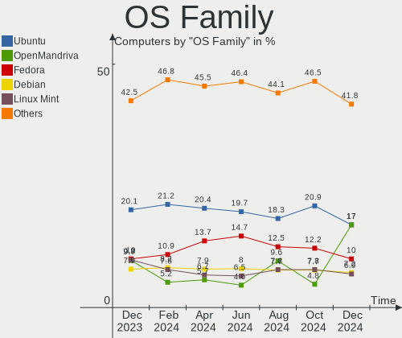
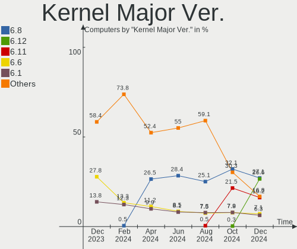
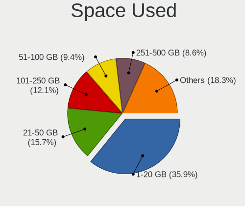
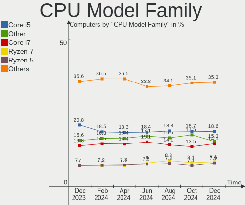

Linux - Hardware Trends
-----------------------

A project to identify most popular hardware characteristics and track their change
over time based on data collected by Linux users at https://Linux-Hardware.org.

Anyone can contribute to this report by the [hw-probe](https://github.com/linuxhw/hw-probe) tool:

    sudo -E hw-probe -all -upload

This is a report for all computer types. See also reports for [desktops](/Desktop/README.md) and [notebooks](/Notebook/README.md).

Distribution-specific reports: [Arch](/Dist/Arch), [ArcoLinux](/Dist/ArcoLinux), [BlackPanther](/Dist/BlackPanther), [CentOS](/Dist/CentOS), [Clear Linux](/Dist/Clear_Linux), [Debian](/Dist/Debian), [Elementary](/Dist/Elementary), [EndeavourOS](/Dist/EndeavourOS), [Endless](/Dist/Endless), [Fedora](/Dist/Fedora), [Gentoo](/Dist/Gentoo), [Kali](/Dist/Kali), [KDE neon](/Dist/KDE_neon), [Kubuntu](/Dist/Kubuntu), [Linux Mint](/Dist/Linux_Mint), [Manjaro](/Dist/Manjaro), [OpenMandriva](/Dist/OpenMandriva), [openSUSE](/Dist/openSUSE), [Pop!_OS](/Dist/Pop!_OS), [ROSA](/Dist/ROSA), [Ubuntu MATE](/Dist/Ubuntu_MATE), [Ubuntu](/Dist/Ubuntu), [Xubuntu](/Dist/Xubuntu), [Zorin](/Dist/Zorin).

This report is for one last month. Overall report since the beginning of time: [TestCoverage](https://github.com/linuxhw/TestCoverage)

Period: May, 2022.

Contents
--------

* [ System ](#system)
  - [ OS                       ](#os)
  - [ OS Family                ](#os-family)
  - [ Kernel                   ](#kernel)
  - [ Kernel Family            ](#kernel-family)
  - [ Kernel Major Ver.        ](#kernel-major-ver)
  - [ Arch                     ](#arch)
  - [ DE                       ](#de)
  - [ Display Server           ](#display-server)
  - [ Display Manager          ](#display-manager)
  - [ OS Lang                  ](#os-lang)
  - [ Boot Mode                ](#boot-mode)
  - [ Filesystem               ](#filesystem)
  - [ Part. scheme             ](#part-scheme)
  - [ Dual Boot with Linux/BSD ](#dual-boot-with-linuxbsd)
  - [ Dual Boot (Win)          ](#dual-boot-win)

* [ Board ](#board)
  - [ Vendor                   ](#vendor)
  - [ Model                    ](#model)
  - [ Model Family             ](#model-family)
  - [ MFG Year                 ](#mfg-year)
  - [ Form Factor              ](#form-factor)
  - [ Secure Boot              ](#secure-boot)
  - [ Coreboot                 ](#coreboot)
  - [ RAM Size                 ](#ram-size)
  - [ RAM Used                 ](#ram-used)
  - [ Total Drives             ](#total-drives)
  - [ Has CD-ROM               ](#has-cd-rom)
  - [ Has Ethernet             ](#has-ethernet)
  - [ Has WiFi                 ](#has-wifi)
  - [ Has Bluetooth            ](#has-bluetooth)

* [ Location ](#location)
  - [ Country                  ](#country)
  - [ City                     ](#city)

* [ Drives ](#drives)
  - [ Drive Vendor             ](#drive-vendor)
  - [ Drive Model              ](#drive-model)
  - [ HDD Vendor               ](#hdd-vendor)
  - [ SSD Vendor               ](#ssd-vendor)
  - [ Drive Kind               ](#drive-kind)
  - [ Drive Connector          ](#drive-connector)
  - [ Drive Size               ](#drive-size)
  - [ Space Total              ](#space-total)
  - [ Space Used               ](#space-used)
  - [ Malfunc. Drives          ](#malfunc-drives)
  - [ Malfunc. Drive Vendor    ](#malfunc-drive-vendor)
  - [ Malfunc. HDD Vendor      ](#malfunc-hdd-vendor)
  - [ Malfunc. Drive Kind      ](#malfunc-drive-kind)
  - [ Failed Drives            ](#failed-drives)
  - [ Failed Drive Vendor      ](#failed-drive-vendor)
  - [ Drive Status             ](#drive-status)

* [ Storage controller ](#storage-controller)
  - [ Storage Vendor           ](#storage-vendor)
  - [ Storage Model            ](#storage-model)
  - [ Storage Kind             ](#storage-kind)

* [ Processor ](#processor)
  - [ CPU Vendor               ](#cpu-vendor)
  - [ CPU Model                ](#cpu-model)
  - [ CPU Model Family         ](#cpu-model-family)
  - [ CPU Cores                ](#cpu-cores)
  - [ CPU Sockets              ](#cpu-sockets)
  - [ CPU Threads              ](#cpu-threads)
  - [ CPU Op-Modes             ](#cpu-op-modes)
  - [ CPU Microcode            ](#cpu-microcode)
  - [ CPU Microarch            ](#cpu-microarch)

* [ Graphics ](#graphics)
  - [ GPU Vendor               ](#gpu-vendor)
  - [ GPU Model                ](#gpu-model)
  - [ GPU Combo                ](#gpu-combo)
  - [ GPU Driver               ](#gpu-driver)
  - [ GPU Memory               ](#gpu-memory)

* [ Monitor ](#monitor)
  - [ Monitor Vendor           ](#monitor-vendor)
  - [ Monitor Model            ](#monitor-model)
  - [ Monitor Resolution       ](#monitor-resolution)
  - [ Monitor Diagonal         ](#monitor-diagonal)
  - [ Monitor Width            ](#monitor-width)
  - [ Aspect Ratio             ](#aspect-ratio)
  - [ Monitor Area             ](#monitor-area)
  - [ Pixel Density            ](#pixel-density)
  - [ Multiple Monitors        ](#multiple-monitors)

* [ Network ](#network)
  - [ Net Controller Vendor    ](#net-controller-vendor)
  - [ Net Controller Model     ](#net-controller-model)
  - [ Wireless Vendor          ](#wireless-vendor)
  - [ Wireless Model           ](#wireless-model)
  - [ Ethernet Vendor          ](#ethernet-vendor)
  - [ Ethernet Model           ](#ethernet-model)
  - [ Net Controller Kind      ](#net-controller-kind)
  - [ Used Controller          ](#used-controller)
  - [ NICs                     ](#nics)
  - [ IPv6                     ](#ipv6)

* [ Bluetooth ](#bluetooth)
  - [ Bluetooth Vendor         ](#bluetooth-vendor)
  - [ Bluetooth Model          ](#bluetooth-model)

* [ Sound ](#sound)
  - [ Sound Vendor             ](#sound-vendor)
  - [ Sound Model              ](#sound-model)

* [ Memory ](#memory)
  - [ Memory Vendor            ](#memory-vendor)
  - [ Memory Model             ](#memory-model)
  - [ Memory Kind              ](#memory-kind)
  - [ Memory Form Factor       ](#memory-form-factor)
  - [ Memory Size              ](#memory-size)
  - [ Memory Speed             ](#memory-speed)

* [ Printers & scanners ](#printers--scanners)
  - [ Printer Vendor           ](#printer-vendor)
  - [ Printer Model            ](#printer-model)
  - [ Scanner Vendor           ](#scanner-vendor)
  - [ Scanner Model            ](#scanner-model)

* [ Camera ](#camera)
  - [ Camera Vendor            ](#camera-vendor)
  - [ Camera Model             ](#camera-model)

* [ Security ](#security)
  - [ Fingerprint Vendor       ](#fingerprint-vendor)
  - [ Fingerprint Model        ](#fingerprint-model)
  - [ Chipcard Vendor          ](#chipcard-vendor)
  - [ Chipcard Model           ](#chipcard-model)

* [ Unsupported ](#unsupported)
  - [ Unsupported Devices      ](#unsupported-devices)
  - [ Unsupported Device Types ](#unsupported-device-types)

System
------

OS
--

Installed operating systems

| Name                         | Computers | Percent |
|------------------------------|-----------|---------|
| Ubuntu 22.04                 | 634       | 12.95%  |
| Ubuntu 20.04                 | 415       | 8.47%   |
| Linux Mint 20.3              | 343       | 7%      |
| Fedora 36                    | 269       | 5.49%   |
| ROSA 12.2                    | 268       | 5.47%   |
| Pop!_OS 22.04                | 265       | 5.41%   |
| Debian 11                    | 263       | 5.37%   |
| OpenMandriva 4.3             | 252       | 5.15%   |
| Zorin 16                     | 166       | 3.39%   |
| KDE neon 20.04               | 130       | 2.65%   |
| Fedora 35                    | 128       | 2.61%   |
| Manjaro                      | 109       | 2.23%   |
| Arch                         | 109       | 2.23%   |
| Manjaro 21.2.6               | 99        | 2.02%   |
| Arch Rolling                 | 68        | 1.39%   |
| openSUSE Tumbleweed-XXXXXXXX | 66        | 1.35%   |
| ArcoLinux Rolling            | 63        | 1.29%   |
| Ubuntu 21.10                 | 51        | 1.04%   |
| Kubuntu 22.04                | 50        | 1.02%   |
| Xubuntu 20.04                | 41        | 0.84%   |
| Kali 2022.2                  | 40        | 0.82%   |
| Elementary 6.1               | 40        | 0.82%   |
| Ubuntu 18.04                 | 34        | 0.69%   |
| LMDE 5                       | 31        | 0.63%   |
| Pop!_OS 21.10                | 30        | 0.61%   |
| BlackPanther 18.1            | 28        | 0.57%   |
| ROSA R11.1                   | 27        | 0.55%   |
| OpenMandriva 4.2             | 27        | 0.55%   |
| Kubuntu 20.04                | 25        | 0.51%   |
| Xubuntu 22.04                | 22        | 0.45%   |
| Gentoo 2.6                   | 22        | 0.45%   |
| EndeavourOS Rolling          | 22        | 0.45%   |
| Debian Testing               | 22        | 0.45%   |
| Ubuntu Budgie 22.04          | 21        | 0.43%   |
| Endless 4.0.6                | 21        | 0.43%   |
| Linux Mint 20.2              | 20        | 0.41%   |
| Lubuntu 22.04                | 19        | 0.39%   |
| Gentoo 2.8                   | 18        | 0.37%   |
| Gentoo 2.7                   | 17        | 0.35%   |
| Lubuntu 20.04                | 14        | 0.29%   |
| Ubuntu 16.04                 | 13        | 0.27%   |
| openSUSE Leap-15.4           | 13        | 0.27%   |
| Linux Mint 20.1              | 13        | 0.27%   |
| EndeavourOS                  | 13        | 0.27%   |
| Ubuntu MATE 20.04            | 12        | 0.25%   |
| Kubuntu 11                   | 12        | 0.25%   |
| Fedora 34                    | 12        | 0.25%   |
| Debian 10                    | 12        | 0.25%   |
| Ubuntu MATE 22.04            | 11        | 0.22%   |
| Parrot 5.0                   | 11        | 0.22%   |
| Linux Mint 19.3              | 11        | 0.22%   |
| Debian Unstable              | 11        | 0.22%   |
| Lubuntu 21.10                | 10        | 0.2%    |
| Cyber Infra 5.0.1            | 10        | 0.2%    |
| ROSA 12.1                    | 9         | 0.18%   |
| Red OS 7.3.1                 | 9         | 0.18%   |
| Raspbian 11                  | 9         | 0.18%   |
| Kubuntu 21.10                | 9         | 0.18%   |
| Kometa P10                   | 9         | 0.18%   |
| Zorin 15                     | 8         | 0.16%   |

OS Family
---------

OS without a version

| Name          | Computers | Percent |
|---------------|-----------|---------|
| Ubuntu        | 1164      | 23.77%  |
| Fedora        | 414       | 8.45%   |
| Linux Mint    | 405       | 8.27%   |
| Debian        | 318       | 6.49%   |
| Pop!_OS       | 307       | 6.27%   |
| ROSA          | 306       | 6.25%   |
| OpenMandriva  | 286       | 5.84%   |
| Manjaro       | 212       | 4.33%   |
| Arch          | 177       | 3.61%   |
| Zorin         | 175       | 3.57%   |
| KDE neon      | 130       | 2.65%   |
| Kubuntu       | 100       | 2.04%   |
| openSUSE      | 88        | 1.8%    |
| Xubuntu       | 73        | 1.49%   |
| ArcoLinux     | 66        | 1.35%   |
| Gentoo        | 59        | 1.2%    |
| Lubuntu       | 48        | 0.98%   |
| Kali          | 45        | 0.92%   |
| Elementary    | 44        | 0.9%    |
| Endless       | 38        | 0.78%   |
| EndeavourOS   | 35        | 0.71%   |
| LMDE          | 32        | 0.65%   |
| Clear Linux   | 29        | 0.59%   |
| BlackPanther  | 28        | 0.57%   |
| ALT Linux     | 28        | 0.57%   |
| Ubuntu Budgie | 26        | 0.53%   |
| Ubuntu MATE   | 24        | 0.49%   |
| SteamOS       | 24        | 0.49%   |
| Garuda Linux  | 15        | 0.31%   |
| Raspbian      | 12        | 0.25%   |
| Parrot        | 12        | 0.25%   |
| RHEL          | 11        | 0.22%   |
| LinuxFX       | 11        | 0.22%   |
| CentOS        | 11        | 0.22%   |
| Red OS        | 10        | 0.2%    |
| Cyber Infra   | 10        | 0.2%    |
| Linux Lite    | 9         | 0.18%   |
| MX            | 8         | 0.16%   |
| Xero          | 6         | 0.12%   |
| Ubuntu Studio | 5         | 0.1%    |
| Drauger OS    | 5         | 0.1%    |
| Artix         | 5         | 0.1%    |
| Alpine        | 5         | 0.1%    |
| Void Linux    | 4         | 0.08%   |
| Q4OS          | 4         | 0.08%   |
| Mageia        | 4         | 0.08%   |
| Trisquel      | 3         | 0.06%   |
| Slackware     | 3         | 0.06%   |
| Manjaro-ARM   | 3         | 0.06%   |
| ClearOS       | 3         | 0.06%   |
| antiX         | 3         | 0.06%   |
| Sparky        | 2         | 0.04%   |
| Solus         | 2         | 0.04%   |
| Rocky Linux   | 2         | 0.04%   |
| Puppy         | 2         | 0.04%   |
| Peppermint    | 2         | 0.04%   |
| Pardus        | 2         | 0.04%   |
| No1           | 2         | 0.04%   |
| NixOS         | 2         | 0.04%   |
| Makulu        | 2         | 0.04%   |

Kernel
------

Version of the Linux kernel

| Version                            | Computers | Percent |
|------------------------------------|-----------|---------|
| 5.13.0-40-generic                  | 288       | 5.88%   |
| 5.15.0-27-generic                  | 273       | 5.57%   |
| 5.13.0-41-generic                  | 272       | 5.55%   |
| 5.10.74-generic-2rosa2021.1-x86_64 | 244       | 4.98%   |
| 5.16.7-desktop-1omv4003            | 234       | 4.78%   |
| 5.17.5-76051705-generic            | 218       | 4.45%   |
| 5.15.0-30-generic                  | 186       | 3.8%    |
| 5.4.0-110-generic                  | 162       | 3.31%   |
| 5.13.0-44-generic                  | 150       | 3.06%   |
| 5.4.0-109-generic                  | 141       | 2.88%   |
| 5.15.0-33-generic                  | 136       | 2.78%   |
| 5.10.0-14-amd64                    | 119       | 2.43%   |
| 5.4.0-113-generic                  | 91        | 1.86%   |
| 5.17.6-300.fc36.x86_64             | 74        | 1.51%   |
| 5.10.0-7-amd64                     | 69        | 1.41%   |
| 5.16.19-76051619-generic           | 66        | 1.35%   |
| 5.17.5-arch1-1                     | 65        | 1.33%   |
| 5.17.9-arch1-1                     | 64        | 1.31%   |
| 5.15.0-25-generic                  | 52        | 1.06%   |
| 5.17.5-300.fc36.x86_64             | 48        | 0.98%   |
| 5.15.32-1-MANJARO                  | 48        | 0.98%   |
| 5.10.0-13-amd64                    | 46        | 0.94%   |
| 5.17.5-200.fc35.x86_64             | 45        | 0.92%   |
| 5.17.8-300.fc36.x86_64             | 42        | 0.86%   |
| 5.17.4-1-default                   | 39        | 0.8%    |
| 5.17.4-200.fc35.x86_64             | 36        | 0.74%   |
| 5.15.38-1-MANJARO                  | 34        | 0.69%   |
| 5.17.7-300.fc36.x86_64             | 33        | 0.67%   |
| 5.16.0-kali7-amd64                 | 32        | 0.65%   |
| 5.4.0-91-generic                   | 31        | 0.63%   |
| 5.17.0-1-amd64                     | 31        | 0.63%   |
| 5.11.0-35-generic                  | 28        | 0.57%   |
| 5.17.9-300.fc36.x86_64             | 26        | 0.53%   |
| 5.17.11-300.fc36.x86_64            | 26        | 0.53%   |
| 5.17.1-3-MANJARO                   | 25        | 0.51%   |
| 5.10.14-desktop-1omv4002           | 23        | 0.47%   |
| 5.17.6-1-MANJARO                   | 22        | 0.45%   |
| 5.13.0-39-generic                  | 21        | 0.43%   |
| 5.15.41-1-MANJARO                  | 18        | 0.37%   |
| 5.17.9-zen1-1-zen                  | 17        | 0.35%   |
| 5.15.32-generic-6rosa2021.1-x86_64 | 17        | 0.35%   |
| 5.13.0-27-generic                  | 16        | 0.33%   |
| 5.17.5-zen1-1-zen                  | 15        | 0.31%   |
| 5.15.0-1006-raspi                  | 15        | 0.31%   |
| 4.18.16-desktop-1bP                | 15        | 0.31%   |
| 5.6.14-desktop-2bP                 | 13        | 0.27%   |
| 5.17.7-arch1-1                     | 13        | 0.27%   |
| 5.15.0-32-generic                  | 13        | 0.27%   |
| 5.15.0-28-generic                  | 13        | 0.27%   |
| 5.13.0-30-generic                  | 13        | 0.27%   |
| 5.18.0-arch1-1                     | 12        | 0.25%   |
| 5.17.9-1-default                   | 12        | 0.25%   |
| 5.16.13-desktop-1omv4003           | 12        | 0.25%   |
| 5.16.0-12parrot1-amd64             | 12        | 0.25%   |
| 5.4.83-generic-2rosa-x86_64        | 11        | 0.22%   |
| 5.17.8-arch1-1                     | 11        | 0.22%   |
| 5.16.0-0.bpo.4-amd64               | 11        | 0.22%   |
| 5.15.32-gentoo-r1                  | 11        | 0.22%   |
| 3.10.0-1160.41.1.vz7.183.5         | 11        | 0.22%   |
| 5.17.7-zen1-1-zen                  | 10        | 0.2%    |

Kernel Family
-------------

Linux kernel without a distro release

| Version  | Computers | Percent |
|----------|-----------|---------|
| 5.13.0   | 830       | 16.95%  |
| 5.15.0   | 729       | 14.89%  |
| 5.4.0    | 505       | 10.31%  |
| 5.17.5   | 444       | 9.07%   |
| 5.10.0   | 261       | 5.33%   |
| 5.10.74  | 251       | 5.13%   |
| 5.16.7   | 234       | 4.78%   |
| 5.17.9   | 156       | 3.19%   |
| 5.17.6   | 128       | 2.61%   |
| 5.15.32  | 99        | 2.02%   |
| 5.17.4   | 95        | 1.94%   |
| 5.17.7   | 86        | 1.76%   |
| 5.17.8   | 71        | 1.45%   |
| 5.16.19  | 71        | 1.45%   |
| 5.11.0   | 71        | 1.45%   |
| 5.17.0   | 69        | 1.41%   |
| 5.16.0   | 65        | 1.33%   |
| 4.15.0   | 44        | 0.9%    |
| 5.17.1   | 41        | 0.84%   |
| 5.15.38  | 41        | 0.84%   |
| 5.18.0   | 39        | 0.8%    |
| 5.17.11  | 38        | 0.78%   |
| 5.14.0   | 36        | 0.74%   |
| 5.15.41  | 30        | 0.61%   |
| 5.10.14  | 23        | 0.47%   |
| 5.8.0    | 20        | 0.41%   |
| 5.16.13  | 20        | 0.41%   |
| 5.15.35  | 19        | 0.39%   |
| 3.10.0   | 19        | 0.39%   |
| 4.18.16  | 15        | 0.31%   |
| 4.18.0   | 15        | 0.31%   |
| 5.17.3   | 14        | 0.29%   |
| 5.16.18  | 14        | 0.29%   |
| 5.15.37  | 14        | 0.29%   |
| 4.19.0   | 14        | 0.29%   |
| 5.6.14   | 13        | 0.27%   |
| 5.4.83   | 13        | 0.27%   |
| 5.10.109 | 13        | 0.27%   |
| 5.16.20  | 12        | 0.25%   |
| 5.14.21  | 11        | 0.22%   |
| 5.13.19  | 10        | 0.2%    |
| 5.3.18   | 9         | 0.18%   |
| 5.14.10  | 9         | 0.18%   |
| 5.16.11  | 8         | 0.16%   |
| 5.15.36  | 6         | 0.12%   |
| 5.10.102 | 6         | 0.12%   |
| 4.9.0    | 6         | 0.12%   |
| 5.15.10  | 5         | 0.1%    |
| 5.14.7   | 5         | 0.1%    |
| 5.11.12  | 5         | 0.1%    |
| 4.4.0    | 5         | 0.1%    |
| 5.18.1   | 4         | 0.08%   |
| 5.16.15  | 4         | 0.08%   |
| 5.15.43  | 4         | 0.08%   |
| 5.15.39  | 4         | 0.08%   |
| 5.15.34  | 4         | 0.08%   |
| 5.15.19  | 4         | 0.08%   |
| 5.10.113 | 4         | 0.08%   |
| 5.6.0    | 3         | 0.06%   |
| 5.4.32   | 3         | 0.06%   |

Kernel Major Ver.
-----------------

Linux kernel major version

| Version | Computers | Percent |
|---------|-----------|---------|
| 5.17    | 1144      | 23.36%  |
| 5.15    | 976       | 19.93%  |
| 5.13    | 843       | 17.21%  |
| 5.10    | 589       | 12.03%  |
| 5.4     | 527       | 10.76%  |
| 5.16    | 445       | 9.09%   |
| 5.11    | 77        | 1.57%   |
| 5.14    | 67        | 1.37%   |
| 4.15    | 44        | 0.9%    |
| 5.18    | 43        | 0.88%   |
| 4.18    | 30        | 0.61%   |
| 4.19    | 21        | 0.43%   |
| 5.8     | 20        | 0.41%   |
| 3.10    | 19        | 0.39%   |
| 5.6     | 17        | 0.35%   |
| 4.9     | 10        | 0.2%    |
| 5.3     | 9         | 0.18%   |
| 4.4     | 6         | 0.12%   |
| 5.12    | 2         | 0.04%   |
| 5.0     | 2         | 0.04%   |
| 5.2     | 1         | 0.02%   |
| 5       | 1         | 0.02%   |
| 4.14    | 1         | 0.02%   |
| 4.10    | 1         | 0.02%   |
| 3.13    | 1         | 0.02%   |
| 2.6     | 1         | 0.02%   |

Arch
----

OS architecture (x86_64, i586, etc.)

| Name    | Computers | Percent |
|---------|-----------|---------|
| x86_64  | 4790      | 97.81%  |
| i686    | 51        | 1.04%   |
| aarch64 | 42        | 0.86%   |
| armv7l  | 11        | 0.22%   |
| riscv64 | 1         | 0.02%   |
| ppc     | 1         | 0.02%   |
| armv6l  | 1         | 0.02%   |

DE
--

Desktop Environment

| Name             | Computers | Percent |
|------------------|-----------|---------|
| GNOME            | 2288      | 46.72%  |
| KDE5             | 1130      | 23.08%  |
| XFCE             | 361       | 7.37%   |
| X-Cinnamon       | 352       | 7.19%   |
| Unknown          | 275       | 5.62%   |
| MATE             | 123       | 2.51%   |
| LXQt             | 90        | 1.84%   |
| Cinnamon         | 48        | 0.98%   |
| Pantheon         | 43        | 0.88%   |
| Budgie           | 28        | 0.57%   |
| i3               | 23        | 0.47%   |
| LXDE             | 21        | 0.43%   |
| Unity            | 20        | 0.41%   |
| KDE4             | 18        | 0.37%   |
| GNOME Flashback  | 9         | 0.18%   |
| awesome          | 9         | 0.18%   |
| sway             | 6         | 0.12%   |
| qtile            | 6         | 0.12%   |
| lightdm-xsession | 5         | 0.1%    |
| LeftWM           | 5         | 0.1%    |
| Deepin           | 5         | 0.1%    |
| bspwm            | 5         | 0.1%    |
| xmonad           | 4         | 0.08%   |
| openbox          | 4         | 0.08%   |
| KDE              | 4         | 0.08%   |
| WindowMaker      | 2         | 0.04%   |
| GNOME Classic    | 2         | 0.04%   |
| fly              | 2         | 0.04%   |
| dwm              | 2         | 0.04%   |
| Trinity          | 1         | 0.02%   |
| Phosh:GNOME      | 1         | 0.02%   |
| matchbox         | 1         | 0.02%   |
| icewm            | 1         | 0.02%   |
| Enlightenment    | 1         | 0.02%   |
| cwm              | 1         | 0.02%   |
| Cutefish         | 1         | 0.02%   |

Display Server
--------------

X11 or Wayland

| Name        | Computers | Percent |
|-------------|-----------|---------|
| X11         | 3429      | 70.02%  |
| Wayland     | 1208      | 24.67%  |
| Unknown     | 154       | 3.14%   |
| Tty         | 105       | 2.14%   |
| Unspecified | 1         | 0.02%   |

Display Manager
---------------

SDDM, LightDM, etc.

| Name    | Computers | Percent |
|---------|-----------|---------|
| Unknown | 1744      | 35.61%  |
| GDM3    | 993       | 20.28%  |
| SDDM    | 901       | 18.4%   |
| LightDM | 631       | 12.89%  |
| GDM     | 579       | 11.82%  |
| KDM     | 17        | 0.35%   |
| XDM     | 11        | 0.22%   |
| LXDM    | 7         | 0.14%   |
| Ly      | 5         | 0.1%    |
| SLiM    | 4         | 0.08%   |
| GREETD  | 2         | 0.04%   |
| FLY-DM  | 2         | 0.04%   |
| TDM     | 1         | 0.02%   |

OS Lang
-------

Language

| Lang        | Computers | Percent |
|-------------|-----------|---------|
| en_US       | 2044      | 41.74%  |
| ru_RU       | 541       | 11.05%  |
| de_DE       | 352       | 7.19%   |
| en_GB       | 240       | 4.9%    |
| pt_BR       | 205       | 4.19%   |
| fr_FR       | 204       | 4.17%   |
| es_ES       | 121       | 2.47%   |
| en_AU       | 109       | 2.23%   |
| Unknown     | 99        | 2.02%   |
| it_IT       | 95        | 1.94%   |
| en_CA       | 86        | 1.76%   |
| pl_PL       | 78        | 1.59%   |
| C           | 61        | 1.25%   |
| en_IN       | 60        | 1.23%   |
| es_MX       | 37        | 0.76%   |
| cs_CZ       | 34        | 0.69%   |
| nl_NL       | 33        | 0.67%   |
| zh_CN       | 28        | 0.57%   |
| ja_JP       | 24        | 0.49%   |
| hu_HU       | 24        | 0.49%   |
| tr_TR       | 22        | 0.45%   |
| en_ZA       | 21        | 0.43%   |
| de_CH       | 21        | 0.43%   |
| es_AR       | 20        | 0.41%   |
| sv_SE       | 19        | 0.39%   |
| pt_PT       | 19        | 0.39%   |
| en_IE       | 18        | 0.37%   |
| de_AT       | 18        | 0.37%   |
| es_CO       | 14        | 0.29%   |
| fi_FI       | 13        | 0.27%   |
| es_CL       | 12        | 0.25%   |
| en_PH       | 12        | 0.25%   |
| en_NZ       | 12        | 0.25%   |
| nl_BE       | 10        | 0.2%    |
| fr_BE       | 10        | 0.2%    |
| es_EC       | 10        | 0.2%    |
| es_PE       | 9         | 0.18%   |
| en_IL       | 9         | 0.18%   |
| en_DK       | 9         | 0.18%   |
| el_GR       | 9         | 0.18%   |
| da_DK       | 9         | 0.18%   |
| ru_UA       | 8         | 0.16%   |
| nb_NO       | 8         | 0.16%   |
| C.UTF8      | 7         | 0.14%   |
| bg_BG       | 7         | 0.14%   |
| zh_TW       | 6         | 0.12%   |
| ko_KR       | 6         | 0.12%   |
| ro_RO       | 5         | 0.1%    |
| POSIX       | 5         | 0.1%    |
| fr_CA       | 5         | 0.1%    |
| ca_ES       | 5         | 0.1%    |
| sl_SI       | 4         | 0.08%   |
| es_VE       | 4         | 0.08%   |
| sr_RS@latin | 3         | 0.06%   |
| sk_SK       | 3         | 0.06%   |
| hr_HR       | 3         | 0.06%   |
| fr_CH       | 3         | 0.06%   |
| es_NI       | 3         | 0.06%   |
| es_CR       | 3         | 0.06%   |
| uk_UA       | 2         | 0.04%   |

Boot Mode
---------

EFI or BIOS

| Mode | Computers | Percent |
|------|-----------|---------|
| EFI  | 2462      | 50.28%  |
| BIOS | 2435      | 49.72%  |

Filesystem
----------

Type of filesystem

| Type     | Computers | Percent |
|----------|-----------|---------|
| Ext4     | 3702      | 75.6%   |
| Btrfs    | 637       | 13.01%  |
| Overlay  | 408       | 8.33%   |
| Xfs      | 72        | 1.47%   |
| Zfs      | 39        | 0.8%    |
| F2fs     | 16        | 0.33%   |
| Unknown  | 6         | 0.12%   |
| Ext2     | 5         | 0.1%    |
| Ext3     | 4         | 0.08%   |
| Aufs     | 4         | 0.08%   |
| XXXXXXX  | 1         | 0.02%   |
| XXX4     | 1         | 0.02%   |
| Reiserfs | 1         | 0.02%   |
| Jfs      | 1         | 0.02%   |

Part. scheme
------------

Scheme of partitioning

| Type    | Computers | Percent |
|---------|-----------|---------|
| Unknown | 2380      | 48.6%   |
| GPT     | 1898      | 38.76%  |
| MBR     | 619       | 12.64%  |

Dual Boot with Linux/BSD
------------------------

Hosting more than one Linux/BSD

| Dual boot | Computers | Percent |
|-----------|-----------|---------|
| No        | 4217      | 86.11%  |
| Yes       | 680       | 13.89%  |

Dual Boot (Win)
---------------

Hosting Linux and Windows

| Dual boot | Computers | Percent |
|-----------|-----------|---------|
| No        | 3481      | 71.08%  |
| Yes       | 1416      | 28.92%  |

Board
-----

Vendor
------

Motherboard manufacturer

| Name                    | Computers | Percent |
|-------------------------|-----------|---------|
| ASUSTek Computer        | 855       | 17.46%  |
| Lenovo                  | 684       | 13.97%  |
| Hewlett-Packard         | 632       | 12.91%  |
| Dell                    | 574       | 11.72%  |
| Gigabyte Technology     | 354       | 7.23%   |
| MSI                     | 312       | 6.37%   |
| Acer                    | 248       | 5.06%   |
| ASRock                  | 166       | 3.39%   |
| Apple                   | 98        | 2%      |
| Intel                   | 89        | 1.82%   |
| Toshiba                 | 69        | 1.41%   |
| Samsung Electronics     | 54        | 1.1%    |
| Raspberry Pi Foundation | 43        | 0.88%   |
| Unknown                 | 40        | 0.82%   |
| HUAWEI                  | 34        | 0.69%   |
| Supermicro              | 30        | 0.61%   |
| Fujitsu                 | 29        | 0.59%   |
| Sony                    | 28        | 0.57%   |
| Google                  | 28        | 0.57%   |
| Medion                  | 26        | 0.53%   |
| Positivo                | 25        | 0.51%   |
| Aquarius                | 22        | 0.45%   |
| Notebook                | 21        | 0.43%   |
| Alienware               | 21        | 0.43%   |
| Pegatron                | 18        | 0.37%   |
| Packard Bell            | 17        | 0.35%   |
| Microsoft               | 17        | 0.35%   |
| ECS                     | 17        | 0.35%   |
| TUXEDO                  | 16        | 0.33%   |
| Valve                   | 15        | 0.31%   |
| Foxconn                 | 15        | 0.31%   |
| Chuwi                   | 13        | 0.27%   |
| AMI                     | 12        | 0.25%   |
| System76                | 11        | 0.22%   |
| LG Electronics          | 11        | 0.22%   |
| Timi                    | 9         | 0.18%   |
| Shuttle                 | 8         | 0.16%   |
| Razer                   | 8         | 0.16%   |
| Biostar                 | 8         | 0.16%   |
| Fujitsu Siemens         | 7         | 0.14%   |
| BESSTAR Tech            | 7         | 0.14%   |
| ICL                     | 6         | 0.12%   |
| Huanan                  | 6         | 0.12%   |
| Framework               | 6         | 0.12%   |
| Avell High Performance  | 6         | 0.12%   |
| Schenker                | 5         | 0.1%    |
| Panasonic               | 5         | 0.1%    |
| Gateway                 | 5         | 0.1%    |
| eMachines               | 5         | 0.1%    |
| Clevo                   | 5         | 0.1%    |
| AZW                     | 5         | 0.1%    |
| Teclast                 | 4         | 0.08%   |
| SLIMBOOK                | 4         | 0.08%   |
| PC Specialist           | 4         | 0.08%   |
| Standard                | 3         | 0.06%   |
| MouseComputer           | 3         | 0.06%   |
| IBM                     | 3         | 0.06%   |
| HONOR                   | 3         | 0.06%   |
| GPU Company             | 3         | 0.06%   |
| Fanless Mini PC         | 3         | 0.06%   |

Model
-----

Motherboard model

| Name                               | Computers | Percent |
|------------------------------------|-----------|---------|
| Unknown                            | 59        | 1.2%    |
| ASUS All Series                    | 56        | 1.14%   |
| Aquarius NS585                     | 22        | 0.45%   |
| RPi Raspberry Pi                   | 18        | 0.37%   |
| HP Notebook                        | 17        | 0.35%   |
| Valve Jupiter                      | 15        | 0.31%   |
| HP Pavilion g6                     | 13        | 0.27%   |
| ASRock H470M-HVS                   | 12        | 0.25%   |
| MSI MS-7C37                        | 11        | 0.22%   |
| Supermicro SBI-6119P-T3N           | 10        | 0.2%    |
| MSI MS-7C91                        | 10        | 0.2%    |
| ASUS ROG STRIX B550-F GAMING       | 10        | 0.2%    |
| MSI MS-7C02                        | 9         | 0.18%   |
| HP Pavilion Notebook               | 9         | 0.18%   |
| Dell XPS 13 9310                   | 9         | 0.18%   |
| Dell OptiPlex 790                  | 9         | 0.18%   |
| Samsung 550XDA                     | 8         | 0.16%   |
| MSI MS-7B86                        | 8         | 0.16%   |
| MSI MS-7A38                        | 8         | 0.16%   |
| Dell XPS 15 9570                   | 8         | 0.16%   |
| ASUS TUF Gaming B550-PLUS          | 8         | 0.16%   |
| RPi Raspberry Pi 4 Model B Rev 1.4 | 7         | 0.14%   |
| MSI MS-7B79                        | 7         | 0.14%   |
| Lenovo IdeaPad 3 15ITL6 82H8       | 7         | 0.14%   |
| HP EliteBook 8470p                 | 7         | 0.14%   |
| HP Compaq 8200 Elite SFF PC        | 7         | 0.14%   |
| Gigabyte B450M DS3H                | 7         | 0.14%   |
| ASUS TUF Gaming X570-PLUS          | 7         | 0.14%   |
| ASUS TUF Gaming B550M-PLUS         | 7         | 0.14%   |
| ASUS ROG Strix G513QY_G513QY       | 7         | 0.14%   |
| ASUS PRIME X570-P                  | 7         | 0.14%   |
| ASUS PRIME B450M-A                 | 7         | 0.14%   |
| ASUS PRIME A320M-K                 | 7         | 0.14%   |
| MSI MS-7C56                        | 6         | 0.12%   |
| MSI MS-7C52                        | 6         | 0.12%   |
| MSI MS-7996                        | 6         | 0.12%   |
| MSI MS-7693                        | 6         | 0.12%   |
| HP Pavilion dv6                    | 6         | 0.12%   |
| HP OMEN Laptop 15-en0xxx           | 6         | 0.12%   |
| HP ENVY x360 Convertible 13-ay0xxx | 6         | 0.12%   |
| HP EliteBook 840 G3                | 6         | 0.12%   |
| HP EliteBook 2560p                 | 6         | 0.12%   |
| Gigabyte X570 AORUS MASTER         | 6         | 0.12%   |
| Gigabyte GA-78LMT-S2P              | 6         | 0.12%   |
| Framework Laptop                   | 6         | 0.12%   |
| Dell OptiPlex 9020                 | 6         | 0.12%   |
| Dell OptiPlex 7010                 | 6         | 0.12%   |
| Dell OptiPlex 3020                 | 6         | 0.12%   |
| Dell Latitude E6540                | 6         | 0.12%   |
| Dell Latitude E6420                | 6         | 0.12%   |
| Dell Latitude 5420                 | 6         | 0.12%   |
| Dell Latitude 3120                 | 6         | 0.12%   |
| ASUS UX31E                         | 6         | 0.12%   |
| ASUS S20 K29                       | 6         | 0.12%   |
| ASUS ROG STRIX X570-E GAMING       | 6         | 0.12%   |
| Apple MacBookAir7,2                | 6         | 0.12%   |
| Acer Nitro AN515-45                | 6         | 0.12%   |
| Acer Nitro AN515-44                | 6         | 0.12%   |
| System76 Oryx Pro                  | 5         | 0.1%    |
| RPi Raspberry Pi 3 Model B Rev 1.2 | 5         | 0.1%    |

Model Family
------------

Motherboard model prefix

| Name                     | Computers | Percent |
|--------------------------|-----------|---------|
| Lenovo ThinkPad          | 270       | 5.51%   |
| Acer Aspire              | 159       | 3.25%   |
| Dell Inspiron            | 144       | 2.94%   |
| Lenovo IdeaPad           | 142       | 2.9%    |
| Dell Latitude            | 131       | 2.68%   |
| HP Pavilion              | 117       | 2.39%   |
| ASUS ROG                 | 113       | 2.31%   |
| ASUS PRIME               | 92        | 1.88%   |
| ASUS VivoBook            | 83        | 1.69%   |
| Dell OptiPlex            | 80        | 1.63%   |
| Dell XPS                 | 74        | 1.51%   |
| HP ProBook               | 72        | 1.47%   |
| HP EliteBook             | 68        | 1.39%   |
| ASUS TUF                 | 63        | 1.29%   |
| HP Laptop                | 61        | 1.25%   |
| Unknown                  | 59        | 1.2%    |
| Dell Precision           | 57        | 1.16%   |
| Toshiba Satellite        | 56        | 1.14%   |
| ASUS All                 | 56        | 1.14%   |
| HP Compaq                | 50        | 1.02%   |
| RPi Raspberry            | 43        | 0.88%   |
| Dell Vostro              | 42        | 0.86%   |
| Lenovo Yoga              | 40        | 0.82%   |
| Lenovo ThinkCentre       | 38        | 0.78%   |
| Lenovo Legion            | 37        | 0.76%   |
| HP ENVY                  | 29        | 0.59%   |
| ASUS ASUS                | 26        | 0.53%   |
| Acer Nitro               | 25        | 0.51%   |
| Acer Swift               | 24        | 0.49%   |
| Lenovo ThinkBook         | 22        | 0.45%   |
| Gigabyte X570            | 22        | 0.45%   |
| Aquarius NS585           | 22        | 0.45%   |
| HP ZBook                 | 21        | 0.43%   |
| HP OMEN                  | 18        | 0.37%   |
| HP EliteDesk             | 18        | 0.37%   |
| Microsoft Surface        | 17        | 0.35%   |
| HP Notebook              | 17        | 0.35%   |
| ASUS ZenBook             | 16        | 0.33%   |
| Valve Jupiter            | 15        | 0.31%   |
| Gigabyte B550            | 15        | 0.31%   |
| Dell PowerEdge           | 13        | 0.27%   |
| Packard Bell EasyNote    | 12        | 0.25%   |
| HP 255                   | 12        | 0.25%   |
| HP 250                   | 12        | 0.25%   |
| Gigabyte B450M           | 12        | 0.25%   |
| ASRock H470M-HVS         | 12        | 0.25%   |
| MSI MS-7C37              | 11        | 0.22%   |
| Dell Studio              | 11        | 0.22%   |
| ASUS SABERTOOTH          | 11        | 0.22%   |
| ASRock B450              | 11        | 0.22%   |
| Acer TravelMate          | 11        | 0.22%   |
| Supermicro SBI-6119P-T3N | 10        | 0.2%    |
| MSI MS-7C91              | 10        | 0.2%    |
| HP Spectre               | 10        | 0.2%    |
| HP ProLiant              | 10        | 0.2%    |
| HP ProDesk               | 10        | 0.2%    |
| Gigabyte B450            | 10        | 0.2%    |
| Fujitsu LIFEBOOK         | 10        | 0.2%    |
| MSI MS-7C02              | 9         | 0.18%   |
| Lenovo IdeaPadFlex       | 9         | 0.18%   |

MFG Year
--------

Motherboard manufacture year

| Year    | Computers | Percent |
|---------|-----------|---------|
| 2020    | 626       | 12.78%  |
| 2021    | 624       | 12.74%  |
| 2019    | 456       | 9.31%   |
| 2018    | 410       | 8.37%   |
| 2012    | 349       | 7.13%   |
| 2011    | 315       | 6.43%   |
| 2013    | 296       | 6.04%   |
| 2017    | 278       | 5.68%   |
| 2016    | 256       | 5.23%   |
| 2014    | 256       | 5.23%   |
| 2015    | 231       | 4.72%   |
| 2010    | 222       | 4.53%   |
| 2009    | 147       | 3%      |
| 2008    | 138       | 2.82%   |
| 2022    | 120       | 2.45%   |
| 2007    | 75        | 1.53%   |
| Unknown | 50        | 1.02%   |
| 2006    | 36        | 0.74%   |
| 2005    | 9         | 0.18%   |
| 2004    | 3         | 0.06%   |

Form Factor
-----------

Physical design of the computer

| Name           | Computers | Percent |
|----------------|-----------|---------|
| Notebook       | 2583      | 52.75%  |
| Desktop        | 1894      | 38.68%  |
| Convertible    | 139       | 2.84%   |
| Mini pc        | 77        | 1.57%   |
| All in one     | 56        | 1.14%   |
| System on chip | 52        | 1.06%   |
| Server         | 52        | 1.06%   |
| Tablet         | 38        | 0.78%   |
| Stick pc       | 4         | 0.08%   |
| Phone          | 2         | 0.04%   |

Secure Boot
-----------

Enabled or disabled

| State    | Computers | Percent |
|----------|-----------|---------|
| Disabled | 4537      | 92.65%  |
| Enabled  | 360       | 7.35%   |

Coreboot
--------

Have coreboot on board

| Used | Computers | Percent |
|------|-----------|---------|
| No   | 4856      | 99.16%  |
| Yes  | 41        | 0.84%   |

RAM Size
--------

Total RAM memory

| Size in GB      | Computers | Percent |
|-----------------|-----------|---------|
| 4.01-8.0        | 1172      | 23.93%  |
| 16.01-24.0      | 1046      | 21.36%  |
| 8.01-16.0       | 854       | 17.44%  |
| 3.01-4.0        | 765       | 15.62%  |
| 32.01-64.0      | 588       | 12.01%  |
| 64.01-256.0     | 173       | 3.53%   |
| 1.01-2.0        | 135       | 2.76%   |
| 24.01-32.0      | 84        | 1.72%   |
| 2.01-3.0        | 51        | 1.04%   |
| 0.51-1.0        | 21        | 0.43%   |
| More than 256.0 | 7         | 0.14%   |
| 0.01-0.5        | 1         | 0.02%   |

RAM Used
--------

Used RAM memory

| Used GB     | Computers | Percent |
|-------------|-----------|---------|
| 1.01-2.0    | 1582      | 32.31%  |
| 2.01-3.0    | 1193      | 24.36%  |
| 4.01-8.0    | 781       | 15.95%  |
| 3.01-4.0    | 649       | 13.25%  |
| 0.51-1.0    | 386       | 7.88%   |
| 8.01-16.0   | 207       | 4.23%   |
| 0.01-0.5    | 46        | 0.94%   |
| 16.01-24.0  | 27        | 0.55%   |
| 32.01-64.0  | 13        | 0.27%   |
| 24.01-32.0  | 9         | 0.18%   |
| 64.01-256.0 | 2         | 0.04%   |
| Unknown     | 2         | 0.04%   |

Total Drives
------------

Number of drives on board

| Drives | Computers | Percent |
|--------|-----------|---------|
| 1      | 2806      | 57.3%   |
| 2      | 1268      | 25.89%  |
| 3      | 410       | 8.37%   |
| 4      | 190       | 3.88%   |
| 5      | 91        | 1.86%   |
| 0      | 52        | 1.06%   |
| 6      | 37        | 0.76%   |
| 7      | 19        | 0.39%   |
| 8      | 8         | 0.16%   |
| 10     | 5         | 0.1%    |
| 9      | 5         | 0.1%    |
| 13     | 3         | 0.06%   |
| 26     | 1         | 0.02%   |
| 18     | 1         | 0.02%   |
| 15     | 1         | 0.02%   |

Has CD-ROM
----------

Has CD-ROM on board

| Presented | Computers | Percent |
|-----------|-----------|---------|
| No        | 3233      | 66.02%  |
| Yes       | 1664      | 33.98%  |

Has Ethernet
------------

Has Ethernet on board

| Presented | Computers | Percent |
|-----------|-----------|---------|
| Yes       | 4151      | 84.77%  |
| No        | 746       | 15.23%  |

Has WiFi
--------

Has WiFi module

| Presented | Computers | Percent |
|-----------|-----------|---------|
| Yes       | 3634      | 74.21%  |
| No        | 1263      | 25.79%  |

Has Bluetooth
-------------

Has Bluetooth module

| Presented | Computers | Percent |
|-----------|-----------|---------|
| Yes       | 3003      | 61.32%  |
| No        | 1894      | 38.68%  |

Location
--------

Country
-------

Geographic location (country)

| Country      | Computers | Percent |
|--------------|-----------|---------|
| USA          | 858       | 17.52%  |
| Russia       | 577       | 11.78%  |
| Germany      | 468       | 9.56%   |
| Brazil       | 273       | 5.57%   |
| France       | 244       | 4.98%   |
| UK           | 185       | 3.78%   |
| Spain        | 142       | 2.9%    |
| Poland       | 142       | 2.9%    |
| Italy        | 140       | 2.86%   |
| Canada       | 139       | 2.84%   |
| Australia    | 120       | 2.45%   |
| Netherlands  | 104       | 2.12%   |
| India        | 96        | 1.96%   |
| Mexico       | 66        | 1.35%   |
| Hungary      | 59        | 1.2%    |
| Sweden       | 54        | 1.1%    |
| Switzerland  | 50        | 1.02%   |
| Czechia      | 50        | 1.02%   |
| Belgium      | 48        | 0.98%   |
| Turkey       | 47        | 0.96%   |
| Austria      | 47        | 0.96%   |
| Finland      | 43        | 0.88%   |
| Argentina    | 43        | 0.88%   |
| Portugal     | 40        | 0.82%   |
| China        | 40        | 0.82%   |
| Ukraine      | 38        | 0.78%   |
| Indonesia    | 38        | 0.78%   |
| Japan        | 37        | 0.76%   |
| Norway       | 34        | 0.69%   |
| Bulgaria     | 28        | 0.57%   |
| Romania      | 27        | 0.55%   |
| Colombia     | 26        | 0.53%   |
| South Africa | 24        | 0.49%   |
| Peru         | 24        | 0.49%   |
| Greece       | 24        | 0.49%   |
| Denmark      | 24        | 0.49%   |
| Chile        | 23        | 0.47%   |
| Serbia       | 21        | 0.43%   |
| New Zealand  | 20        | 0.41%   |
| Belarus      | 20        | 0.41%   |
| Israel       | 19        | 0.39%   |
| Croatia      | 18        | 0.37%   |
| Thailand     | 16        | 0.33%   |
| Philippines  | 16        | 0.33%   |
| Ireland      | 16        | 0.33%   |
| Ecuador      | 14        | 0.29%   |
| Taiwan       | 12        | 0.25%   |
| South Korea  | 12        | 0.25%   |
| Slovakia     | 12        | 0.25%   |
| Iran         | 12        | 0.25%   |
| Hong Kong    | 12        | 0.25%   |
| Slovenia     | 11        | 0.22%   |
| Saudi Arabia | 11        | 0.22%   |
| Estonia      | 11        | 0.22%   |
| Bangladesh   | 11        | 0.22%   |
| Morocco      | 10        | 0.2%    |
| Lithuania    | 10        | 0.2%    |
| Kenya        | 9         | 0.18%   |
| Venezuela    | 8         | 0.16%   |
| Latvia       | 8         | 0.16%   |

City
----

Geographic location (city)

| City              | Computers | Percent |
|-------------------|-----------|---------|
| Moscow            | 143       | 2.92%   |
| Voronezh          | 74        | 1.51%   |
| St Petersburg     | 58        | 1.18%   |
| Sao Paulo         | 54        | 1.1%    |
| Berlin            | 43        | 0.88%   |
| Paris             | 32        | 0.65%   |
| Milan             | 32        | 0.65%   |
| Warsaw            | 29        | 0.59%   |
| Sydney            | 28        | 0.57%   |
| Vienna            | 27        | 0.55%   |
| Madrid            | 24        | 0.49%   |
| Budapest          | 23        | 0.47%   |
| Munich            | 22        | 0.45%   |
| Melbourne         | 22        | 0.45%   |
| Brisbane          | 21        | 0.43%   |
| Dallas            | 20        | 0.41%   |
| Prague            | 18        | 0.37%   |
| London            | 18        | 0.37%   |
| Helsinki          | 18        | 0.37%   |
| Frankfurt am Main | 18        | 0.37%   |
| Buenos Aires      | 18        | 0.37%   |
| Lima              | 17        | 0.35%   |
| Hamburg           | 17        | 0.35%   |
| Istanbul          | 16        | 0.33%   |
| Belgrade          | 16        | 0.33%   |
| Amsterdam         | 16        | 0.33%   |
| Zurich            | 15        | 0.31%   |
| Yekaterinburg     | 14        | 0.29%   |
| Rio de Janeiro    | 14        | 0.29%   |
| Chicago           | 14        | 0.29%   |
| Barcelona         | 14        | 0.29%   |
| Toronto           | 13        | 0.27%   |
| Sofia             | 13        | 0.27%   |
| Rome              | 13        | 0.27%   |
| Perm              | 13        | 0.27%   |
| Montreal          | 13        | 0.27%   |
| Chelyabinsk       | 13        | 0.27%   |
| Vancouver         | 12        | 0.25%   |
| Stuttgart         | 12        | 0.25%   |
| San Jose          | 12        | 0.25%   |
| Mexico City       | 12        | 0.25%   |
| Athens            | 12        | 0.25%   |
| Wroclaw           | 11        | 0.22%   |
| Novosibirsk       | 11        | 0.22%   |
| New York          | 11        | 0.22%   |
| Krakow            | 11        | 0.22%   |
| Jakarta           | 11        | 0.22%   |
| Central           | 11        | 0.22%   |
| Bucharest         | 11        | 0.22%   |
| Zagreb            | 10        | 0.2%    |
| Oslo              | 10        | 0.2%    |
| Krasnodar         | 10        | 0.2%    |
| Bogotá           | 10        | 0.2%    |
| Bengaluru         | 10        | 0.2%    |
| Adelaide          | 10        | 0.2%    |
| The Hague         | 9         | 0.18%   |
| Seattle           | 9         | 0.18%   |
| Santiago          | 9         | 0.18%   |
| Poznan            | 9         | 0.18%   |
| Perth             | 9         | 0.18%   |

Drives
------

Drive Vendor
------------

Hard drive vendors

| Vendor                         | Computers | Drives | Percent |
|--------------------------------|-----------|--------|---------|
| Samsung Electronics            | 1170      | 1480   | 16.28%  |
| WDC                            | 1013      | 1303   | 14.09%  |
| Seagate                        | 1008      | 1234   | 14.02%  |
| Toshiba                        | 431       | 472    | 6%      |
| Kingston                       | 402       | 426    | 5.59%   |
| SanDisk                        | 367       | 389    | 5.11%   |
| Crucial                        | 293       | 321    | 4.08%   |
| Unknown                        | 269       | 305    | 3.74%   |
| SK Hynix                       | 199       | 205    | 2.77%   |
| Hitachi                        | 197       | 216    | 2.74%   |
| Intel                          | 190       | 231    | 2.64%   |
| A-DATA Technology              | 134       | 140    | 1.86%   |
| Micron Technology              | 119       | 124    | 1.66%   |
| HGST                           | 119       | 128    | 1.66%   |
| Phison                         | 100       | 106    | 1.39%   |
| China                          | 70        | 79     | 0.97%   |
| KIOXIA                         | 69        | 72     | 0.96%   |
| Silicon Motion                 | 49        | 53     | 0.68%   |
| Apple                          | 45        | 53     | 0.63%   |
| Unknown                        | 43        | 44     | 0.6%    |
| PNY                            | 36        | 37     | 0.5%    |
| Patriot                        | 35        | 35     | 0.49%   |
| OCZ                            | 34        | 36     | 0.47%   |
| Netac                          | 33        | 33     | 0.46%   |
| SPCC                           | 28        | 29     | 0.39%   |
| GOODRAM                        | 28        | 29     | 0.39%   |
| LITEON                         | 27        | 27     | 0.38%   |
| Intenso                        | 25        | 31     | 0.35%   |
| Gigabyte Technology            | 24        | 26     | 0.33%   |
| Apacer                         | 24        | 26     | 0.33%   |
| Transcend                      | 22        | 23     | 0.31%   |
| Micron/Crucial Technology      | 22        | 23     | 0.31%   |
| Hewlett-Packard                | 22        | 40     | 0.31%   |
| XPG                            | 21        | 22     | 0.29%   |
| KingSpec                       | 18        | 18     | 0.25%   |
| Fujitsu                        | 18        | 18     | 0.25%   |
| JMicron                        | 17        | 17     | 0.24%   |
| Team                           | 16        | 18     | 0.22%   |
| MAXTOR                         | 16        | 17     | 0.22%   |
| Lexar                          | 16        | 16     | 0.22%   |
| Corsair                        | 16        | 17     | 0.22%   |
| ASMT                           | 14        | 17     | 0.19%   |
| UMIS                           | 13        | 13     | 0.18%   |
| PLEXTOR                        | 13        | 15     | 0.18%   |
| Solid State Storage Technology | 12        | 12     | 0.17%   |
| LITEONIT                       | 11        | 11     | 0.15%   |
| KIOXIA-EXCERIA                 | 11        | 11     | 0.15%   |
| TO Exter                       | 9         | 9      | 0.13%   |
| Realtek Semiconductor          | 9         | 9      | 0.13%   |
| Dogfish                        | 9         | 9      | 0.13%   |
| ADATA Technology               | 9         | 9      | 0.13%   |
| SABRENT                        | 8         | 8      | 0.11%   |
| Union Memory (Shenzhen)        | 7         | 7      | 0.1%    |
| Smartbuy                       | 7         | 8      | 0.1%    |
| XrayDisk                       | 6         | 8      | 0.08%   |
| USB3.0                         | 6         | 6      | 0.08%   |
| Teclast                        | 6         | 6      | 0.08%   |
| SSSTC                          | 6         | 6      | 0.08%   |
| Leven                          | 6         | 6      | 0.08%   |
| Lenovo                         | 6         | 6      | 0.08%   |

Drive Model
-----------

Hard drive models

| Model                               | Computers | Percent |
|-------------------------------------|-----------|---------|
| Kingston SA400S37240G 240GB SSD     | 77        | 0.97%   |
| Samsung NVMe SSD Drive 1TB          | 71        | 0.89%   |
| Samsung SSD 850 EVO 250GB           | 58        | 0.73%   |
| Seagate ST1000LM035-1RK172 1TB      | 57        | 0.72%   |
| Seagate ST1000DM010-2EP102 1TB      | 56        | 0.71%   |
| Seagate ST500DM002-1BD142 500GB     | 52        | 0.66%   |
| Samsung NVMe SSD Drive 500GB        | 51        | 0.64%   |
| Samsung NVMe SSD Drive 512GB        | 49        | 0.62%   |
| Toshiba MQ01ABD100 1TB              | 44        | 0.55%   |
| Crucial CT500MX500SSD1 500GB        | 44        | 0.55%   |
| Sandisk NVMe SSD Drive 1TB          | 43        | 0.54%   |
| Samsung SSD 860 EVO 500GB           | 43        | 0.54%   |
| Unknown                             | 43        | 0.54%   |
| Samsung NVMe SSD Drive 256GB        | 40        | 0.5%    |
| Samsung SSD 970 EVO Plus 1TB        | 39        | 0.49%   |
| Crucial CT1000MX500SSD1 1TB         | 39        | 0.49%   |
| Samsung SSD 860 EVO 250GB           | 38        | 0.48%   |
| Samsung SSD 860 EVO 1TB             | 38        | 0.48%   |
| Kingston SA400S37120G 120GB SSD     | 38        | 0.48%   |
| Unknown MMC Card  32GB              | 36        | 0.45%   |
| Toshiba HDWD110 1TB                 | 36        | 0.45%   |
| Seagate ST500LT012-1DG142 500GB     | 36        | 0.45%   |
| Seagate ST2000DM008-2FR102 2TB      | 36        | 0.45%   |
| Seagate ST1000LM024 HN-M101MBB 1TB  | 36        | 0.45%   |
| Sandisk NVMe SSD Drive 512GB        | 35        | 0.44%   |
| Samsung SSD 850 EVO 500GB           | 35        | 0.44%   |
| Crucial CT480BX500SSD1 480GB        | 34        | 0.43%   |
| WDC WD10EZEX-08WN4A0 1TB            | 32        | 0.4%    |
| Unknown SD/MMC/MS PRO 999GB         | 32        | 0.4%    |
| Intel NVMe SSD Drive 512GB          | 32        | 0.4%    |
| HGST HTS721010A9E630 1TB            | 32        | 0.4%    |
| Unknown MMC Card  64GB              | 31        | 0.39%   |
| Kingston SA400S37480G 480GB SSD     | 31        | 0.39%   |
| Crucial CT240BX500SSD1 240GB        | 31        | 0.39%   |
| SK Hynix NVMe SSD Drive 512GB       | 30        | 0.38%   |
| Toshiba MQ01ABF050 500GB            | 29        | 0.37%   |
| Samsung NVMe SSD Drive 1024GB       | 29        | 0.37%   |
| Kingston SV300S37A120G 120GB SSD    | 29        | 0.37%   |
| Toshiba DT01ACA100 1TB              | 28        | 0.35%   |
| Samsung SSD 970 EVO Plus 500GB      | 28        | 0.35%   |
| Seagate ST1000DM003-1ER162 1TB      | 27        | 0.34%   |
| Seagate ST1000DM003-1CH162 1TB      | 26        | 0.33%   |
| WDC WDS500G2B0A-00SM50 500GB SSD    | 25        | 0.31%   |
| Sandisk NVMe SSD Drive 500GB        | 25        | 0.31%   |
| Samsung SSD 980 PRO 1TB             | 25        | 0.31%   |
| Samsung NVMe SSD Drive 250GB        | 25        | 0.31%   |
| A-DATA SU800 512GB SSD              | 25        | 0.31%   |
| Toshiba KBG30ZMS128G 128GB NVMe SSD | 24        | 0.3%    |
| Toshiba MQ04ABF100 1TB              | 23        | 0.29%   |
| Seagate ST4000DM004-2CV104 4TB      | 23        | 0.29%   |
| Samsung NVMe SSD Drive 2TB          | 22        | 0.28%   |
| Sandisk NVMe SSD Drive 256GB        | 21        | 0.26%   |
| Samsung SSD 870 EVO 500GB           | 21        | 0.26%   |
| Seagate ST1000LM049-2GH172 1TB      | 20        | 0.25%   |
| Samsung SSD 870 EVO 1TB             | 20        | 0.25%   |
| HGST HTS545050A7E680 500GB          | 20        | 0.25%   |
| Seagate ST2000DM001-1ER164 2TB      | 19        | 0.24%   |
| Seagate ST2000DM001-1CH164 2TB      | 19        | 0.24%   |
| SanDisk SSD PLUS 240GB              | 19        | 0.24%   |
| Micron NVMe SSD Drive 512GB         | 19        | 0.24%   |

HDD Vendor
----------

Hard disk drive vendors

| Vendor              | Computers | Drives | Percent |
|---------------------|-----------|--------|---------|
| Seagate             | 981       | 1194   | 37.16%  |
| WDC                 | 771       | 996    | 29.2%   |
| Toshiba             | 331       | 362    | 12.54%  |
| Hitachi             | 196       | 215    | 7.42%   |
| HGST                | 119       | 128    | 4.51%   |
| Samsung Electronics | 107       | 121    | 4.05%   |
| Unknown             | 35        | 38     | 1.33%   |
| Apple               | 18        | 19     | 0.68%   |
| Fujitsu             | 17        | 17     | 0.64%   |
| MAXTOR              | 12        | 13     | 0.45%   |
| ASMT                | 12        | 15     | 0.45%   |
| SABRENT             | 8         | 8      | 0.3%    |
| Hewlett-Packard     | 4         | 22     | 0.15%   |
| Intenso             | 3         | 3      | 0.11%   |
| HGST HTS            | 3         | 3      | 0.11%   |
| USB                 | 2         | 2      | 0.08%   |
| sage                | 2         | 2      | 0.08%   |
| pqi                 | 2         | 2      | 0.08%   |
| LaCie               | 2         | 2      | 0.08%   |
| HPE                 | 2         | 3      | 0.08%   |
| USB3.0              | 1         | 1      | 0.04%   |
| USB 3.0             | 1         | 1      | 0.04%   |
| StoreJet            | 1         | 1      | 0.04%   |
| QC-FT-D             | 1         | 1      | 0.04%   |
| PHD 3.0             | 1         | 1      | 0.04%   |
| MaxDigital          | 1         | 2      | 0.04%   |
| JMicron             | 1         | 1      | 0.04%   |
| IBM/Hitachi         | 1         | 1      | 0.04%   |
| IBM-207x            | 1         | 4      | 0.04%   |
| IB-AC703            | 1         | 1      | 0.04%   |
| Fantom              | 1         | 1      | 0.04%   |
| DELLBOSS            | 1         | 1      | 0.04%   |
| ASUSTOR             | 1         | 2      | 0.04%   |

SSD Vendor
----------

Solid state drive vendors

| Vendor              | Computers | Drives | Percent |
|---------------------|-----------|--------|---------|
| Samsung Electronics | 529       | 628    | 21.92%  |
| Kingston            | 297       | 315    | 12.31%  |
| Crucial             | 258       | 284    | 10.69%  |
| SanDisk             | 209       | 219    | 8.66%   |
| WDC                 | 156       | 160    | 6.46%   |
| A-DATA Technology   | 110       | 114    | 4.56%   |
| Intel               | 73        | 96     | 3.03%   |
| China               | 67        | 76     | 2.78%   |
| Micron Technology   | 45        | 47     | 1.86%   |
| PNY                 | 35        | 35     | 1.45%   |
| SK Hynix            | 34        | 34     | 1.41%   |
| Toshiba             | 32        | 32     | 1.33%   |
| Patriot             | 32        | 32     | 1.33%   |
| OCZ                 | 32        | 33     | 1.33%   |
| Netac               | 31        | 31     | 1.28%   |
| GOODRAM             | 26        | 27     | 1.08%   |
| Apacer              | 23        | 24     | 0.95%   |
| LITEON              | 22        | 22     | 0.91%   |
| Apple               | 22        | 22     | 0.91%   |
| SPCC                | 21        | 21     | 0.87%   |
| Transcend           | 18        | 19     | 0.75%   |
| KingSpec            | 18        | 18     | 0.75%   |
| Unknown             | 17        | 18     | 0.7%    |
| Lexar               | 16        | 16     | 0.66%   |
| Gigabyte Technology | 15        | 17     | 0.62%   |
| Intenso             | 14        | 17     | 0.58%   |
| Hewlett-Packard     | 13        | 13     | 0.54%   |
| PLEXTOR             | 11        | 13     | 0.46%   |
| LITEONIT            | 11        | 11     | 0.46%   |
| Team                | 10        | 11     | 0.41%   |
| JMicron             | 10        | 10     | 0.41%   |
| TO Exter            | 9         | 9      | 0.37%   |
| Seagate             | 9         | 9      | 0.37%   |
| KIOXIA-EXCERIA      | 9         | 9      | 0.37%   |
| DOGFISH             | 9         | 9      | 0.37%   |
| Corsair             | 8         | 8      | 0.33%   |
| Smartbuy            | 7         | 8      | 0.29%   |
| USB3.0              | 5         | 5      | 0.21%   |
| Pioneer             | 5         | 5      | 0.21%   |
| Leven               | 5         | 5      | 0.21%   |
| Verbatim            | 4         | 4      | 0.17%   |
| Teclast             | 4         | 4      | 0.17%   |
| S3+                 | 4         | 4      | 0.17%   |
| Phison              | 4         | 4      | 0.17%   |
| MAXTOR              | 4         | 4      | 0.17%   |
| FORESEE             | 4         | 4      | 0.17%   |
| BIWIN               | 4         | 4      | 0.17%   |
| BHT                 | 4         | 4      | 0.17%   |
| AMD                 | 4         | 4      | 0.17%   |
| XrayDisk            | 3         | 5      | 0.12%   |
| Union Memory        | 3         | 3      | 0.12%   |
| MyDigitalSSD        | 3         | 3      | 0.12%   |
| Mushkin             | 3         | 3      | 0.12%   |
| DREVO               | 3         | 3      | 0.12%   |
| Zheino              | 2         | 2      | 0.08%   |
| walram              | 2         | 2      | 0.08%   |
| Vaseky              | 2         | 2      | 0.08%   |
| PNY USB             | 2         | 2      | 0.08%   |
| OSCOO               | 2         | 2      | 0.08%   |
| MidasForce          | 2         | 2      | 0.08%   |

Drive Kind
----------

HDD or SSD

| Kind    | Computers | Drives | Percent |
|---------|-----------|--------|---------|
| HDD     | 2235      | 3183   | 34.47%  |
| SSD     | 2094      | 2624   | 32.3%   |
| NVMe    | 1782      | 2128   | 27.49%  |
| MMC     | 263       | 289    | 4.06%   |
| Unknown | 109       | 126    | 1.68%   |

Drive Connector
---------------

SATA, SAS, NVMe, etc.

| Type | Computers | Drives | Percent |
|------|-----------|--------|---------|
| SATA | 3495      | 5599   | 60.15%  |
| NVMe | 1781      | 2123   | 30.65%  |
| SAS  | 271       | 339    | 4.66%   |
| MMC  | 263       | 289    | 4.53%   |

Drive Size
----------

Size of hard drive

| Size in TB | Computers | Drives | Percent |
|------------|-----------|--------|---------|
| 0.01-0.5   | 2562      | 3235   | 55.95%  |
| 0.51-1.0   | 1338      | 1624   | 29.22%  |
| 1.01-2.0   | 380       | 508    | 8.3%    |
| 3.01-4.0   | 130       | 179    | 2.84%   |
| 4.01-10.0  | 90        | 140    | 1.97%   |
| 2.01-3.0   | 61        | 86     | 1.33%   |
| 10.01-20.0 | 18        | 35     | 0.39%   |

Space Total
-----------

Amount of disk space available on the file system

| Size in GB     | Computers | Percent |
|----------------|-----------|---------|
| 101-250        | 1222      | 24.95%  |
| 251-500        | 1075      | 21.95%  |
| 501-1000       | 713       | 14.56%  |
| 1001-2000      | 433       | 8.84%   |
| 1-20           | 345       | 7.05%   |
| More than 3000 | 313       | 6.39%   |
| 51-100         | 277       | 5.66%   |
| Unknown        | 220       | 4.49%   |
| 21-50          | 162       | 3.31%   |
| 2001-3000      | 137       | 2.8%    |

Space Used
----------

Amount of used disk space

| Used GB        | Computers | Percent |
|----------------|-----------|---------|
| 1-20           | 1723      | 35.18%  |
| 21-50          | 829       | 16.93%  |
| 101-250        | 605       | 12.35%  |
| 51-100         | 511       | 10.43%  |
| 251-500        | 407       | 8.31%   |
| 501-1000       | 263       | 5.37%   |
| Unknown        | 220       | 4.49%   |
| 1001-2000      | 170       | 3.47%   |
| More than 3000 | 105       | 2.14%   |
| 2001-3000      | 64        | 1.31%   |

Malfunc. Drives
---------------

Drive models with a malfunction

| Model                                 | Computers | Drives | Percent |
|---------------------------------------|-----------|--------|---------|
| Seagate ST500DM002-1BD142 500GB       | 12        | 16     | 2.37%   |
| Seagate ST500LT012-1DG142 500GB       | 10        | 10     | 1.98%   |
| Seagate ST1000LM024 HN-M101MBB 1TB    | 9         | 9      | 1.78%   |
| Seagate ST500LT012-9WS142 500GB       | 7         | 7      | 1.38%   |
| HGST HTS545050A7E680 500GB            | 7         | 7      | 1.38%   |
| Seagate ST9500325AS 500GB             | 6         | 6      | 1.19%   |
| Seagate ST9320325AS 320GB             | 6         | 6      | 1.19%   |
| Seagate ST31000528AS 1TB              | 6         | 9      | 1.19%   |
| Seagate ST1000LM035-1RK172 1TB        | 6         | 6      | 1.19%   |
| SanDisk SSD U100 256GB                | 6         | 6      | 1.19%   |
| Toshiba MQ01ABD100 1TB                | 5         | 5      | 0.99%   |
| HGST HTS725050A7E630 500GB            | 5         | 5      | 0.99%   |
| HGST HTS545050A7E380 500GB            | 5         | 6      | 0.99%   |
| Seagate ST2000DM001-1CH164 2TB        | 4         | 5      | 0.79%   |
| Seagate ST1000DM003-1CH162 1TB        | 4         | 4      | 0.79%   |
| Samsung Electronics SSD 870 EVO 1TB   | 4         | 4      | 0.79%   |
| Samsung Electronics SSD 840 EVO 120GB | 4         | 4      | 0.79%   |
| Kingston SV300S37A120G 120GB SSD      | 4         | 4      | 0.79%   |
| HGST HTS541010A9E680 1TB              | 4         | 4      | 0.79%   |
| WDC WD20EARS-00MVWB0 2TB              | 3         | 3      | 0.59%   |
| WDC WD10EALX-009BA0 1TB               | 3         | 3      | 0.59%   |
| Toshiba MQ01ABF050 500GB              | 3         | 3      | 0.59%   |
| Toshiba MQ01ABD075 752GB              | 3         | 3      | 0.59%   |
| Seagate ST500LM000-SSHD-8GB           | 3         | 3      | 0.59%   |
| Seagate ST500LM000-1EJ162 500GB       | 3         | 3      | 0.59%   |
| Seagate ST3500413AS 500GB             | 3         | 4      | 0.59%   |
| Seagate ST3160815AS 160GB             | 3         | 3      | 0.59%   |
| Seagate ST2000DM001-9YN164 2TB        | 3         | 3      | 0.59%   |
| Seagate ST2000DL003-9VT166 2TB        | 3         | 3      | 0.59%   |
| Samsung Electronics SSD 980 1TB       | 3         | 3      | 0.59%   |
| Samsung Electronics HD502HJ 500GB     | 3         | 3      | 0.59%   |
| Samsung Electronics HD080HJ 80GB      | 3         | 3      | 0.59%   |
| HGST HTS721010A9E630 1TB              | 3         | 3      | 0.59%   |
| WDC WDS240G2G0B-00EPW0 240GB SSD      | 2         | 2      | 0.4%    |
| WDC WDS240G2G0A-00JH30 240GB SSD      | 2         | 2      | 0.4%    |
| WDC WD5000LPVX-75V0TT0 500GB          | 2         | 2      | 0.4%    |
| WDC WD5000LPLX-60ZNTT1 500GB          | 2         | 2      | 0.4%    |
| WDC WD5000BPVT-22HXZT1 500GB          | 2         | 2      | 0.4%    |
| WDC WD5000AAKX-00ERMA0 500GB          | 2         | 2      | 0.4%    |
| WDC WD5000AAKX-001CA0 500GB           | 2         | 3      | 0.4%    |
| WDC WD2500BEVT-60ZCT1 250GB           | 2         | 2      | 0.4%    |
| WDC WD2500AAJS-00YZCA0 250GB          | 2         | 2      | 0.4%    |
| WDC WD10JPVX-22JC3T0 1TB              | 2         | 2      | 0.4%    |
| WDC WD10EADS-22M2B0 1TB               | 2         | 2      | 0.4%    |
| Toshiba MQ01ABD050 500GB              | 2         | 2      | 0.4%    |
| Toshiba MK5055GSX 500GB               | 2         | 2      | 0.4%    |
| Toshiba MK1637GSX 160GB               | 2         | 2      | 0.4%    |
| Seagate ST4000VN008-2DR166 4TB        | 2         | 2      | 0.4%    |
| Seagate ST3500418AS 500GB             | 2         | 2      | 0.4%    |
| Seagate ST3320820AS 320GB             | 2         | 2      | 0.4%    |
| Seagate ST3250318AS 250GB             | 2         | 2      | 0.4%    |
| Seagate ST3250310AS 250GB             | 2         | 2      | 0.4%    |
| Seagate ST320LT020-9YG142 320GB       | 2         | 2      | 0.4%    |
| Seagate ST32000542AS 2TB              | 2         | 3      | 0.4%    |
| Seagate ST3160811AS 160GB             | 2         | 2      | 0.4%    |
| Seagate ST2000LM015-2E8174 2TB        | 2         | 2      | 0.4%    |
| Seagate ST2000LM003 HN-M201RAD 2TB    | 2         | 2      | 0.4%    |
| Seagate ST1000LM014-SSHD-8GB          | 2         | 2      | 0.4%    |
| Seagate ST1000LM014-1EJ164 1TB        | 2         | 2      | 0.4%    |
| Seagate ST1000DM003-9YN162 1TB        | 2         | 2      | 0.4%    |

Malfunc. Drive Vendor
---------------------

Vendors of faulty drives

| Vendor              | Computers | Drives | Percent |
|---------------------|-----------|--------|---------|
| Seagate             | 143       | 161    | 28.83%  |
| WDC                 | 106       | 114    | 21.37%  |
| Samsung Electronics | 56        | 57     | 11.29%  |
| Hitachi             | 33        | 33     | 6.65%   |
| Toshiba             | 31        | 31     | 6.25%   |
| HGST                | 26        | 27     | 5.24%   |
| Kingston            | 15        | 15     | 3.02%   |
| Intel               | 13        | 14     | 2.62%   |
| Crucial             | 11        | 11     | 2.22%   |
| SanDisk             | 10        | 10     | 2.02%   |
| SK Hynix            | 7         | 7      | 1.41%   |
| China               | 5         | 5      | 1.01%   |
| A-DATA Technology   | 4         | 4      | 0.81%   |
| OCZ                 | 3         | 3      | 0.6%    |
| MAXTOR              | 3         | 3      | 0.6%    |
| Fujitsu             | 3         | 3      | 0.6%    |
| XPG                 | 2         | 2      | 0.4%    |
| Transcend           | 2         | 2      | 0.4%    |
| SPCC                | 2         | 2      | 0.4%    |
| Micron Technology   | 2         | 2      | 0.4%    |
| AMD                 | 2         | 2      | 0.4%    |
| Unknown             | 2         | 2      | 0.4%    |
| Unknown             | 1         | 1      | 0.2%    |
| Team                | 1         | 2      | 0.2%    |
| Smartbuy            | 1         | 1      | 0.2%    |
| Patriot             | 1         | 1      | 0.2%    |
| Origin              | 1         | 1      | 0.2%    |
| OCZ-VERTEX3         | 1         | 1      | 0.2%    |
| LITEON              | 1         | 1      | 0.2%    |
| Leven               | 1         | 1      | 0.2%    |
| Lenovo              | 1         | 1      | 0.2%    |
| KingSpec            | 1         | 1      | 0.2%    |
| Kingmax             | 1         | 1      | 0.2%    |
| Intenso             | 1         | 1      | 0.2%    |
| HGST HTS            | 1         | 1      | 0.2%    |
| Apple               | 1         | 2      | 0.2%    |
| Apacer              | 1         | 1      | 0.2%    |

Malfunc. HDD Vendor
-------------------

Vendors of faulty HDD drives

| Vendor              | Computers | Drives | Percent |
|---------------------|-----------|--------|---------|
| Seagate             | 143       | 161    | 38.65%  |
| WDC                 | 101       | 109    | 27.3%   |
| Hitachi             | 33        | 33     | 8.92%   |
| Toshiba             | 31        | 31     | 8.38%   |
| Samsung Electronics | 27        | 28     | 7.3%    |
| HGST                | 26        | 27     | 7.03%   |
| MAXTOR              | 3         | 3      | 0.81%   |
| Fujitsu             | 3         | 3      | 0.81%   |
| Unknown             | 1         | 1      | 0.27%   |
| HGST HTS            | 1         | 1      | 0.27%   |
| Apple               | 1         | 2      | 0.27%   |

Malfunc. Drive Kind
-------------------

Kinds of faulty drives

| Kind | Computers | Drives | Percent |
|------|-----------|--------|---------|
| HDD  | 355       | 399    | 73.8%   |
| SSD  | 109       | 111    | 22.66%  |
| NVMe | 17        | 17     | 3.53%   |

Failed Drives
-------------

Failed drive models

| Model                             | Computers | Drives | Percent |
|-----------------------------------|-----------|--------|---------|
| Zheino CHN-NGFFNV2280-256 256GB   | 1         | 1      | 12.5%   |
| WDC WD5000AADS-00S9B0 500GB       | 1         | 1      | 12.5%   |
| WDC WD20EARX-00PASB0 2TB          | 1         | 1      | 12.5%   |
| Toshiba MQ01ABD075 752GB          | 1         | 1      | 12.5%   |
| Seagate ST980811AS 80GB           | 1         | 1      | 12.5%   |
| Seagate ST31000520AS 1TB          | 1         | 2      | 12.5%   |
| Seagate ST2000DM001-1CH164 2TB    | 1         | 1      | 12.5%   |
| Samsung Electronics SSD 980 500GB | 1         | 2      | 12.5%   |

Failed Drive Vendor
-------------------

Failed drive vendors

| Vendor              | Computers | Drives | Percent |
|---------------------|-----------|--------|---------|
| Seagate             | 3         | 4      | 37.5%   |
| WDC                 | 2         | 2      | 25%     |
| Zheino              | 1         | 1      | 12.5%   |
| Toshiba             | 1         | 1      | 12.5%   |
| Samsung Electronics | 1         | 2      | 12.5%   |

Drive Status
------------

Number of failed and malfunc. drives

| Status   | Computers | Drives | Percent |
|----------|-----------|--------|---------|
| Detected | 2625      | 4410   | 49.93%  |
| Works    | 2154      | 3403   | 40.97%  |
| Malfunc  | 470       | 527    | 8.94%   |
| Failed   | 8         | 10     | 0.15%   |

Storage controller
------------------

Storage Vendor
--------------

Storage controller vendors

| Vendor                           | Computers | Percent |
|----------------------------------|-----------|---------|
| Intel                            | 3161      | 49.58%  |
| AMD                              | 1010      | 15.84%  |
| Samsung Electronics              | 656       | 10.29%  |
| Sandisk                          | 274       | 4.3%    |
| SK Hynix                         | 163       | 2.56%   |
| Phison Electronics               | 127       | 1.99%   |
| Kingston Technology Company      | 106       | 1.66%   |
| ASMedia Technology               | 97        | 1.52%   |
| Toshiba America Info Systems     | 81        | 1.27%   |
| Micron Technology                | 78        | 1.22%   |
| Nvidia                           | 75        | 1.18%   |
| Silicon Motion                   | 72        | 1.13%   |
| JMicron Technology               | 70        | 1.1%    |
| KIOXIA                           | 66        | 1.04%   |
| Marvell Technology Group         | 56        | 0.88%   |
| Micron/Crucial Technology        | 51        | 0.8%    |
| ADATA Technology                 | 45        | 0.71%   |
| LSI Logic / Symbios Logic        | 23        | 0.36%   |
| Union Memory (Shenzhen)          | 20        | 0.31%   |
| Realtek Semiconductor            | 19        | 0.3%    |
| Solid State Storage Technology   | 17        | 0.27%   |
| Broadcom / LSI                   | 16        | 0.25%   |
| VIA Technologies                 | 13        | 0.2%    |
| Seagate Technology               | 11        | 0.17%   |
| Lite-On Technology               | 9         | 0.14%   |
| Silicon Image                    | 8         | 0.13%   |
| Silicon Integrated Systems [SiS] | 6         | 0.09%   |
| Hewlett-Packard                  | 6         | 0.09%   |
| Apple                            | 6         | 0.09%   |
| Lenovo                           | 5         | 0.08%   |
| Unknown                          | 4         | 0.06%   |
| MAXIO Technology (Hangzhou)      | 4         | 0.06%   |
| Integrated Technology Express    | 3         | 0.05%   |
| Adaptec                          | 3         | 0.05%   |
| Yangtze Memory Technologies      | 2         | 0.03%   |
| ULi Electronics                  | 2         | 0.03%   |
| Shenzhen Longsys Electronics     | 2         | 0.03%   |
| OCZ Technology Group             | 2         | 0.03%   |
| O2 Micro                         | 2         | 0.03%   |
| Lite-On IT Corp. / Plextor       | 1         | 0.02%   |
| Chelsio Communications           | 1         | 0.02%   |
| Biwin Storage Technology         | 1         | 0.02%   |
| Unknown                          | 1         | 0.02%   |

Storage Model
-------------

Storage controller models

| Model                                                                                   | Computers | Percent |
|-----------------------------------------------------------------------------------------|-----------|---------|
| AMD FCH SATA Controller [AHCI mode]                                                     | 673       | 9.23%   |
| Samsung NVMe SSD Controller SM981/PM981/PM983                                           | 336       | 4.61%   |
| Intel Sunrise Point-LP SATA Controller [AHCI mode]                                      | 226       | 3.1%    |
| Intel 8 Series/C220 Series Chipset Family 6-port SATA Controller 1 [AHCI mode]          | 190       | 2.6%    |
| Intel 7 Series Chipset Family 6-port SATA Controller [AHCI mode]                        | 187       | 2.56%   |
| Intel 82801 Mobile SATA Controller [RAID mode]                                          | 155       | 2.13%   |
| Intel Volume Management Device NVMe RAID Controller                                     | 152       | 2.08%   |
| AMD 400 Series Chipset SATA Controller                                                  | 149       | 2.04%   |
| Samsung NVMe SSD Controller 980                                                         | 139       | 1.91%   |
| Intel 6 Series/C200 Series Chipset Family 6 port Mobile SATA AHCI Controller            | 139       | 1.91%   |
| Intel Q170/Q150/B150/H170/H110/Z170/CM236 Chipset SATA Controller [AHCI Mode]           | 122       | 1.67%   |
| Intel 6 Series/C200 Series Chipset Family 6 port Desktop SATA AHCI Controller           | 115       | 1.58%   |
| AMD 500 Series Chipset SATA Controller                                                  | 114       | 1.56%   |
| Intel 8 Series SATA Controller 1 [AHCI mode]                                            | 107       | 1.47%   |
| AMD SB7x0/SB8x0/SB9x0 SATA Controller [AHCI mode]                                       | 104       | 1.43%   |
| Samsung NVMe SSD Controller PM9A1/PM9A3/980PRO                                          | 98        | 1.34%   |
| AMD SB7x0/SB8x0/SB9x0 IDE Controller                                                    | 94        | 1.29%   |
| Intel 200 Series PCH SATA controller [AHCI mode]                                        | 92        | 1.26%   |
| ASMedia ASM1062 Serial ATA Controller                                                   | 91        | 1.25%   |
| Intel Celeron/Pentium Silver Processor SATA Controller                                  | 90        | 1.23%   |
| SK Hynix Gold P31 SSD                                                                   | 85        | 1.17%   |
| Intel Cannon Lake Mobile PCH SATA AHCI Controller                                       | 85        | 1.17%   |
| Micron Non-Volatile memory controller                                                   | 78        | 1.07%   |
| Intel Comet Lake SATA AHCI Controller                                                   | 78        | 1.07%   |
| Intel Tiger Lake-LP SATA Controller [AHCI mode]                                         | 76        | 1.04%   |
| Intel NM10/ICH7 Family SATA Controller [IDE mode]                                       | 74        | 1.01%   |
| Intel Cannon Lake PCH SATA AHCI Controller                                              | 74        | 1.01%   |
| Intel SATA Controller [RAID mode]                                                       | 73        | 1%      |
| Intel 7 Series/C210 Series Chipset Family 6-port SATA Controller [AHCI mode]            | 70        | 0.96%   |
| Sandisk WD Blue SN550 NVMe SSD                                                          | 68        | 0.93%   |
| Samsung NVMe SSD Controller SM961/PM961/SM963                                           | 67        | 0.92%   |
| Intel Wildcat Point-LP SATA Controller [AHCI Mode]                                      | 67        | 0.92%   |
| Sandisk WD Black SN750 / PC SN730 NVMe SSD                                              | 64        | 0.88%   |
| Silicon Motion SM2263EN/SM2263XT SSD Controller                                         | 63        | 0.86%   |
| Intel 82801IBM/IEM (ICH9M/ICH9M-E) 4 port SATA Controller [AHCI mode]                   | 63        | 0.86%   |
| KIOXIA Non-Volatile memory controller                                                   | 62        | 0.85%   |
| Intel 500 Series Chipset Family SATA AHCI Controller                                    | 60        | 0.82%   |
| Intel SSD 660P Series                                                                   | 58        | 0.8%    |
| Intel 82801G (ICH7 Family) IDE Controller                                               | 58        | 0.8%    |
| Intel 5 Series/3400 Series Chipset 6 port SATA AHCI Controller                          | 58        | 0.8%    |
| AMD SB7x0/SB8x0/SB9x0 SATA Controller [IDE mode]                                        | 57        | 0.78%   |
| Intel Cannon Point-LP SATA Controller [AHCI Mode]                                       | 53        | 0.73%   |
| Intel 5 Series/3400 Series Chipset 4 port SATA AHCI Controller                          | 49        | 0.67%   |
| Phison E12 NVMe Controller                                                              | 48        | 0.66%   |
| Intel HM170/QM170 Chipset SATA Controller [AHCI Mode]                                   | 47        | 0.64%   |
| Sandisk Non-Volatile memory controller                                                  | 45        | 0.62%   |
| Intel 9 Series Chipset Family SATA Controller [AHCI Mode]                               | 45        | 0.62%   |
| Intel 400 Series Chipset Family SATA AHCI Controller                                    | 44        | 0.6%    |
| Intel Atom Processor E3800 Series SATA AHCI Controller                                  | 42        | 0.58%   |
| Toshiba America Info Systems XG6 NVMe SSD Controller                                    | 40        | 0.55%   |
| Phison PS5013 E13 NVMe Controller                                                       | 40        | 0.55%   |
| Intel Alder Lake-S PCH SATA Controller [AHCI Mode]                                      | 39        | 0.53%   |
| Intel 82801HM/HEM (ICH8M/ICH8M-E) IDE Controller                                        | 39        | 0.53%   |
| Intel 82801HM/HEM (ICH8M/ICH8M-E) SATA Controller [AHCI mode]                           | 34        | 0.47%   |
| Kingston Company Company Non-Volatile memory controller                                 | 33        | 0.45%   |
| JMicron JMB363 SATA/IDE Controller                                                      | 33        | 0.45%   |
| Kingston Company A2000 NVMe SSD                                                         | 32        | 0.44%   |
| Intel Non-Volatile memory controller                                                    | 32        | 0.44%   |
| Intel 6 Series/C200 Series Chipset Family Desktop SATA Controller (IDE mode, ports 0-3) | 31        | 0.43%   |
| Sandisk WD PC SN810 / Black SN850 NVMe SSD                                              | 30        | 0.41%   |

Storage Kind
------------

Kind of storage controller (IDE, SATA, NVMe, SAS, ...)

| Kind | Computers | Percent |
|------|-----------|---------|
| SATA | 3550      | 55.27%  |
| NVMe | 1785      | 27.79%  |
| IDE  | 596       | 9.28%   |
| RAID | 449       | 6.99%   |
| SAS  | 34        | 0.53%   |
| SCSI | 9         | 0.14%   |

Processor
---------

CPU Vendor
----------

Processor vendors

| Vendor        | Computers | Percent |
|---------------|-----------|---------|
| Intel         | 3572      | 72.94%  |
| AMD           | 1268      | 25.89%  |
| ARM           | 52        | 1.06%   |
| QUALCOMM      | 2         | 0.04%   |
| sifive,u74-mc | 1         | 0.02%   |
| PowerBook6,7  | 1         | 0.02%   |
| CentaurHauls  | 1         | 0.02%   |

CPU Model
---------

Processor models

| Model                                         | Computers | Percent |
|-----------------------------------------------|-----------|---------|
| Intel 11th Gen Core i7-1165G7 @ 2.80GHz       | 78        | 1.59%   |
| Intel 11th Gen Core i5-1135G7 @ 2.40GHz       | 64        | 1.31%   |
| Intel Core i5-7200U CPU @ 2.50GHz             | 48        | 0.98%   |
| AMD Ryzen 5 3600 6-Core Processor             | 45        | 0.92%   |
| Intel Core i7-8550U CPU @ 1.80GHz             | 44        | 0.9%    |
| Intel Core i5-8265U CPU @ 1.60GHz             | 43        | 0.88%   |
| AMD Ryzen 7 5800H with Radeon Graphics        | 41        | 0.84%   |
| ARM Processor                                 | 40        | 0.82%   |
| Intel Core i5-8250U CPU @ 1.60GHz             | 39        | 0.8%    |
| Intel Core i7-8750H CPU @ 2.20GHz             | 37        | 0.76%   |
| AMD Ryzen 5 3500U with Radeon Vega Mobile Gfx | 34        | 0.69%   |
| Intel Core i5-10210U CPU @ 1.60GHz            | 33        | 0.67%   |
| Intel Celeron N4020 CPU @ 1.10GHz             | 33        | 0.67%   |
| AMD Ryzen 7 4800H with Radeon Graphics        | 32        | 0.65%   |
| Intel Core i7-10510U CPU @ 1.80GHz            | 31        | 0.63%   |
| AMD Ryzen 5 5600X 6-Core Processor            | 30        | 0.61%   |
| Intel Core i7-9750H CPU @ 2.60GHz             | 29        | 0.59%   |
| Intel Core i7-10750H CPU @ 2.60GHz            | 27        | 0.55%   |
| Intel 11th Gen Core i7-1185G7 @ 3.00GHz       | 27        | 0.55%   |
| Intel Core i7-7700HQ CPU @ 2.80GHz            | 26        | 0.53%   |
| Intel Core i5-6200U CPU @ 2.30GHz             | 26        | 0.53%   |
| AMD Ryzen 9 3900X 12-Core Processor           | 26        | 0.53%   |
| AMD Ryzen 7 5700U with Radeon Graphics        | 26        | 0.53%   |
| AMD Ryzen 7 3700X 8-Core Processor            | 26        | 0.53%   |
| Intel 11th Gen Core i7-11800H @ 2.30GHz       | 25        | 0.51%   |
| AMD Ryzen 5 2600 Six-Core Processor           | 25        | 0.51%   |
| Intel Core i7-7500U CPU @ 2.70GHz             | 24        | 0.49%   |
| Intel Core i5-3320M CPU @ 2.60GHz             | 24        | 0.49%   |
| Intel Core i5-2400 CPU @ 3.10GHz              | 24        | 0.49%   |
| Intel Core i3-9100 CPU @ 3.60GHz              | 24        | 0.49%   |
| AMD Ryzen 9 5900X 12-Core Processor           | 24        | 0.49%   |
| AMD Ryzen 5 5500U with Radeon Graphics        | 24        | 0.49%   |
| Intel Core i7-8565U CPU @ 1.80GHz             | 23        | 0.47%   |
| Intel Core i7-6700HQ CPU @ 2.60GHz            | 23        | 0.47%   |
| Intel Core i5-3210M CPU @ 2.50GHz             | 23        | 0.47%   |
| AMD Ryzen 5 4500U with Radeon Graphics        | 22        | 0.45%   |
| Intel Core i7-3770 CPU @ 3.40GHz              | 21        | 0.43%   |
| Intel Core i7-1065G7 CPU @ 1.30GHz            | 21        | 0.43%   |
| Intel Core i5-6300U CPU @ 2.40GHz             | 21        | 0.43%   |
| Intel Core i5-4200U CPU @ 1.60GHz             | 21        | 0.43%   |
| Intel Core i5-3470 CPU @ 3.20GHz              | 21        | 0.43%   |
| Intel Core i5-1035G1 CPU @ 1.00GHz            | 21        | 0.43%   |
| AMD Ryzen 9 5900HX with Radeon Graphics       | 21        | 0.43%   |
| AMD Ryzen 7 5700G with Radeon Graphics        | 21        | 0.43%   |
| AMD Ryzen 5 5600G with Radeon Graphics        | 21        | 0.43%   |
| AMD Ryzen 5 1600 Six-Core Processor           | 21        | 0.43%   |
| Intel Core i5-5200U CPU @ 2.20GHz             | 20        | 0.41%   |
| Intel Celeron J4125 CPU @ 2.00GHz             | 20        | 0.41%   |
| Intel Celeron CPU N2840 @ 2.16GHz             | 20        | 0.41%   |
| AMD Ryzen 7 5800X 8-Core Processor            | 20        | 0.41%   |
| Intel Core i7-2600 CPU @ 3.40GHz              | 19        | 0.39%   |
| Intel Core i3-6006U CPU @ 2.00GHz             | 19        | 0.39%   |
| AMD FX-8350 Eight-Core Processor              | 19        | 0.39%   |
| Intel Core i7-10700 CPU @ 2.90GHz             | 18        | 0.37%   |
| Intel Core i5-3230M CPU @ 2.60GHz             | 18        | 0.37%   |
| Intel Core i5-2520M CPU @ 2.50GHz             | 18        | 0.37%   |
| Intel 11th Gen Core i3-1115G4 @ 3.00GHz       | 18        | 0.37%   |
| AMD Ryzen 9 5950X 16-Core Processor           | 18        | 0.37%   |
| AMD Ryzen 7 2700X Eight-Core Processor        | 18        | 0.37%   |
| AMD Ryzen 7 4700U with Radeon Graphics        | 17        | 0.35%   |

CPU Model Family
----------------

Processor model prefix

| Model                   | Computers | Percent |
|-------------------------|-----------|---------|
| Intel Core i5           | 968       | 19.77%  |
| Intel Core i7           | 847       | 17.3%   |
| Other                   | 434       | 8.86%   |
| Intel Core i3           | 395       | 8.07%   |
| AMD Ryzen 5             | 335       | 6.84%   |
| AMD Ryzen 7             | 269       | 5.49%   |
| Intel Celeron           | 236       | 4.82%   |
| Intel Core 2 Duo        | 162       | 3.31%   |
| Intel Xeon              | 157       | 3.21%   |
| Intel Pentium           | 116       | 2.37%   |
| AMD Ryzen 9             | 110       | 2.25%   |
| Intel Atom              | 67        | 1.37%   |
| AMD Ryzen 3             | 63        | 1.29%   |
| AMD FX                  | 63        | 1.29%   |
| Intel Core 2 Quad       | 48        | 0.98%   |
| AMD A6                  | 41        | 0.84%   |
| Intel Core i9           | 37        | 0.76%   |
| AMD A8                  | 34        | 0.69%   |
| Intel Pentium Dual-Core | 32        | 0.65%   |
| AMD A4                  | 32        | 0.65%   |
| AMD A10                 | 28        | 0.57%   |
| AMD Phenom II X4        | 27        | 0.55%   |
| AMD Ryzen 7 PRO         | 26        | 0.53%   |
| Intel Pentium Silver    | 25        | 0.51%   |
| Intel Core 2            | 24        | 0.49%   |
| AMD Athlon 64 X2        | 23        | 0.47%   |
| Intel Pentium Dual      | 21        | 0.43%   |
| AMD E                   | 19        | 0.39%   |
| AMD Athlon              | 17        | 0.35%   |
| AMD Athlon II X2        | 16        | 0.33%   |
| Intel Xeon Silver       | 14        | 0.29%   |
| Intel Pentium Gold      | 14        | 0.29%   |
| AMD E1                  | 14        | 0.29%   |
| AMD Phenom II X6        | 13        | 0.27%   |
| ARM BCM                 | 12        | 0.25%   |
| Intel Genuine           | 11        | 0.22%   |
| AMD Ryzen Threadripper  | 11        | 0.22%   |
| AMD E2                  | 11        | 0.22%   |
| AMD Ryzen 5 PRO         | 9         | 0.18%   |
| AMD Athlon II X4        | 9         | 0.18%   |
| Intel Pentium 4         | 7         | 0.14%   |
| AMD Sempron             | 6         | 0.12%   |
| AMD Phenom              | 6         | 0.12%   |
| Intel Core m3           | 5         | 0.1%    |
| AMD Phenom II X2        | 5         | 0.1%    |
| Intel Pentium M         | 4         | 0.08%   |
| Intel Celeron Dual-Core | 4         | 0.08%   |
| AMD PRO A10             | 4         | 0.08%   |
| AMD Phenom II           | 4         | 0.08%   |
| AMD Athlon X4           | 4         | 0.08%   |
| AMD Athlon II X3        | 4         | 0.08%   |
| Intel Core M            | 3         | 0.06%   |
| AMD Turion 64 X2 Mobile | 3         | 0.06%   |
| AMD Phenom II X3        | 3         | 0.06%   |
| AMD Mobile Sempron      | 3         | 0.06%   |
| AMD Athlon 64           | 3         | 0.06%   |
| AMD A12                 | 3         | 0.06%   |
| QUALCOMM AArch64        | 2         | 0.04%   |
| Intel Xeon Gold         | 2         | 0.04%   |
| Intel Pentium D         | 2         | 0.04%   |

CPU Cores
---------

Number of processor cores

| Number  | Computers | Percent |
|---------|-----------|---------|
| 4       | 1797      | 36.7%   |
| 2       | 1741      | 35.55%  |
| 6       | 531       | 10.84%  |
| 8       | 485       | 9.9%    |
| 12      | 94        | 1.92%   |
| 1       | 86        | 1.76%   |
| 16      | 44        | 0.9%    |
| 3       | 31        | 0.63%   |
| 10      | 29        | 0.59%   |
| 14      | 22        | 0.45%   |
| Unknown | 11        | 0.22%   |
| 28      | 6         | 0.12%   |
| 24      | 6         | 0.12%   |
| 20      | 5         | 0.1%    |
| 32      | 4         | 0.08%   |
| 64      | 3         | 0.06%   |
| 48      | 1         | 0.02%   |
| 18      | 1         | 0.02%   |

CPU Sockets
-----------

Number of sockets

| Number  | Computers | Percent |
|---------|-----------|---------|
| 1       | 4830      | 98.63%  |
| 2       | 55        | 1.12%   |
| Unknown | 11        | 0.22%   |
| 4       | 1         | 0.02%   |

CPU Threads
-----------

Threads per core (Hyper-Threading)

| Number  | Computers | Percent |
|---------|-----------|---------|
| 2       | 3337      | 68.14%  |
| 1       | 1545      | 31.55%  |
| Unknown | 11        | 0.22%   |
| 8       | 3         | 0.06%   |
| 4       | 1         | 0.02%   |

CPU Op-Modes
------------

CPU Operation Modes (32-bit, 64-bit)

| Op mode        | Computers | Percent |
|----------------|-----------|---------|
| 32-bit, 64-bit | 4832      | 98.67%  |
| Unknown        | 40        | 0.82%   |
| 32-bit         | 20        | 0.41%   |
| 64-bit         | 5         | 0.1%    |

CPU Microcode
-------------

Microcode number

| Number     | Computers | Percent |
|------------|-----------|---------|
| Unknown    | 1292      | 26.38%  |
| 0x206a7    | 250       | 5.11%   |
| 0x306a9    | 231       | 4.72%   |
| 0x306c3    | 190       | 3.88%   |
| 0x806c1    | 168       | 3.43%   |
| 0x906ea    | 120       | 2.45%   |
| 0x1067a    | 117       | 2.39%   |
| 0x0a50000c | 105       | 2.14%   |
| 0x806ec    | 99        | 2.02%   |
| 0x506e3    | 97        | 1.98%   |
| 0x806ea    | 94        | 1.92%   |
| 0x40651    | 87        | 1.78%   |
| 0x906e9    | 78        | 1.59%   |
| 0x08701021 | 78        | 1.59%   |
| 0x806e9    | 73        | 1.49%   |
| 0x406e3    | 72        | 1.47%   |
| 0x08600106 | 65        | 1.33%   |
| 0x306d4    | 61        | 1.25%   |
| 0x08108109 | 59        | 1.2%    |
| 0x0800820d | 52        | 1.06%   |
| 0x706e5    | 50        | 1.02%   |
| 0x706a8    | 50        | 1.02%   |
| 0x20655    | 50        | 1.02%   |
| 0x6fd      | 43        | 0.88%   |
| 0xa0652    | 41        | 0.84%   |
| 0x30678    | 39        | 0.8%    |
| 0x06000852 | 36        | 0.74%   |
| 0x010000c8 | 34        | 0.69%   |
| 0xa0655    | 33        | 0.67%   |
| 0x906eb    | 33        | 0.67%   |
| 0x806eb    | 33        | 0.67%   |
| 0x08608103 | 33        | 0.67%   |
| 0x06001119 | 33        | 0.67%   |
| 0x0a201016 | 32        | 0.65%   |
| 0x906ed    | 31        | 0.63%   |
| 0x406c4    | 28        | 0.57%   |
| 0x20652    | 27        | 0.55%   |
| 0x106e5    | 27        | 0.55%   |
| 0x10676    | 26        | 0.53%   |
| 0xa0653    | 25        | 0.51%   |
| 0xa0671    | 24        | 0.49%   |
| 0x806d1    | 24        | 0.49%   |
| 0x706a1    | 24        | 0.49%   |
| 0x6fb      | 24        | 0.49%   |
| 0x906a3    | 23        | 0.47%   |
| 0x90672    | 23        | 0.47%   |
| 0x306f2    | 22        | 0.45%   |
| 0x206d7    | 19        | 0.39%   |
| 0x08600104 | 18        | 0.37%   |
| 0x08108102 | 18        | 0.37%   |
| 0x05000119 | 18        | 0.37%   |
| 0x406c3    | 17        | 0.35%   |
| 0x08600103 | 17        | 0.35%   |
| 0x06006705 | 17        | 0.35%   |
| 0x906c0    | 16        | 0.33%   |
| 0x106a5    | 16        | 0.33%   |
| 0x08001138 | 16        | 0.33%   |
| 0x0810100b | 15        | 0.31%   |
| 0x6f6      | 14        | 0.29%   |
| 0x506c9    | 14        | 0.29%   |

CPU Microarch
-------------

Microarchitecture

| Name             | Computers | Percent |
|------------------|-----------|---------|
| KabyLake         | 771       | 15.74%  |
| Haswell          | 408       | 8.33%   |
| SandyBridge      | 331       | 6.76%   |
| IvyBridge        | 309       | 6.31%   |
| Zen 2            | 267       | 5.45%   |
| Zen 3            | 254       | 5.19%   |
| Skylake          | 252       | 5.15%   |
| TigerLake        | 227       | 4.64%   |
| Penryn           | 205       | 4.19%   |
| Unknown          | 195       | 3.98%   |
| Zen+             | 178       | 3.63%   |
| CometLake        | 141       | 2.88%   |
| Westmere         | 128       | 2.61%   |
| Silvermont       | 121       | 2.47%   |
| Core             | 119       | 2.43%   |
| Icelake          | 108       | 2.21%   |
| Broadwell        | 102       | 2.08%   |
| Goldmont plus    | 99        | 2.02%   |
| Piledriver       | 96        | 1.96%   |
| K10              | 92        | 1.88%   |
| Zen              | 83        | 1.69%   |
| Nehalem          | 61        | 1.25%   |
| Excavator        | 53        | 1.08%   |
| Alderlake Hybrid | 46        | 0.94%   |
| K8 Hammer        | 35        | 0.71%   |
| Bobcat           | 34        | 0.69%   |
| Bonnell          | 30        | 0.61%   |
| Puma             | 29        | 0.59%   |
| Jaguar           | 22        | 0.45%   |
| Goldmont         | 20        | 0.41%   |
| Steamroller      | 19        | 0.39%   |
| K10 Llano        | 18        | 0.37%   |
| Tremont          | 14        | 0.29%   |
| NetBurst         | 10        | 0.2%    |
| P6               | 7         | 0.14%   |
| Bulldozer        | 7         | 0.14%   |
| K8 & K10 hybrid  | 5         | 0.1%    |
| K6               | 1         | 0.02%   |

Graphics
--------

GPU Vendor
----------

Vendors of graphics cards

| Vendor                           | Computers | Percent |
|----------------------------------|-----------|---------|
| Intel                            | 2675      | 46.7%   |
| Nvidia                           | 1675      | 29.24%  |
| AMD                              | 1315      | 22.96%  |
| Matrox Electronics Systems       | 30        | 0.52%   |
| ASPEED Technology                | 26        | 0.45%   |
| Silicon Integrated Systems [SiS] | 4         | 0.07%   |
| VIA Technologies                 | 2         | 0.03%   |
| ATI Technologies                 | 1         | 0.02%   |

GPU Model
---------

Graphics card models

| Model                                                                                    | Computers | Percent |
|------------------------------------------------------------------------------------------|-----------|---------|
| Intel 2nd Generation Core Processor Family Integrated Graphics Controller                | 227       | 3.88%   |
| Intel TigerLake-LP GT2 [Iris Xe Graphics]                                                | 202       | 3.45%   |
| Intel 3rd Gen Core processor Graphics Controller                                         | 176       | 3%      |
| AMD Cezanne                                                                              | 130       | 2.22%   |
| AMD Renoir                                                                               | 119       | 2.03%   |
| Intel Haswell-ULT Integrated Graphics Controller                                         | 118       | 2.01%   |
| Intel UHD Graphics 620                                                                   | 108       | 1.84%   |
| AMD Picasso/Raven 2 [Radeon Vega Series / Radeon Vega Mobile Series]                     | 100       | 1.71%   |
| Intel HD Graphics 620                                                                    | 99        | 1.69%   |
| Intel CoffeeLake-H GT2 [UHD Graphics 630]                                                | 99        | 1.69%   |
| Intel WhiskeyLake-U GT2 [UHD Graphics 620]                                               | 88        | 1.5%    |
| Intel Skylake GT2 [HD Graphics 520]                                                      | 85        | 1.45%   |
| Intel GeminiLake [UHD Graphics 600]                                                      | 83        | 1.42%   |
| AMD Ellesmere [Radeon RX 470/480/570/570X/580/580X/590]                                  | 82        | 1.4%    |
| Intel Core Processor Integrated Graphics Controller                                      | 80        | 1.37%   |
| Intel CometLake-U GT2 [UHD Graphics]                                                     | 78        | 1.33%   |
| Intel Xeon E3-1200 v3/4th Gen Core Processor Integrated Graphics Controller              | 75        | 1.28%   |
| Intel HD Graphics 530                                                                    | 75        | 1.28%   |
| Intel CoffeeLake-S GT2 [UHD Graphics 630]                                                | 72        | 1.23%   |
| Intel 4th Gen Core Processor Integrated Graphics Controller                              | 67        | 1.14%   |
| Intel HD Graphics 5500                                                                   | 65        | 1.11%   |
| Intel HD Graphics 630                                                                    | 64        | 1.09%   |
| Intel Atom/Celeron/Pentium Processor x5-E8000/J3xxx/N3xxx Integrated Graphics Controller | 62        | 1.06%   |
| Intel Atom Processor Z36xxx/Z37xxx Series Graphics & Display                             | 59        | 1.01%   |
| Intel CometLake-H GT2 [UHD Graphics]                                                     | 56        | 0.96%   |
| Nvidia GP107 [GeForce GTX 1050 Ti]                                                       | 55        | 0.94%   |
| AMD Lucienne                                                                             | 54        | 0.92%   |
| Nvidia GA106M [GeForce RTX 3060 Mobile / Max-Q]                                          | 52        | 0.89%   |
| Intel Mobile 4 Series Chipset Integrated Graphics Controller                             | 50        | 0.85%   |
| Nvidia GK208B [GeForce GT 710]                                                           | 39        | 0.67%   |
| Intel Iris Plus Graphics G1 (Ice Lake)                                                   | 37        | 0.63%   |
| Nvidia GP106 [GeForce GTX 1060 6GB]                                                      | 36        | 0.61%   |
| AMD Raven Ridge [Radeon Vega Series / Radeon Vega Mobile Series]                         | 36        | 0.61%   |
| Intel TigerLake-H GT1 [UHD Graphics]                                                     | 35        | 0.6%    |
| Intel 4 Series Chipset Integrated Graphics Controller                                    | 35        | 0.6%    |
| Intel Xeon E3-1200 v2/3rd Gen Core processor Graphics Controller                         | 34        | 0.58%   |
| AMD Navi 10 [Radeon RX 5600 OEM/5600 XT / 5700/5700 XT]                                  | 34        | 0.58%   |
| Nvidia GP107M [GeForce GTX 1050 Mobile]                                                  | 32        | 0.55%   |
| AMD Stoney [Radeon R2/R3/R4/R5 Graphics]                                                 | 32        | 0.55%   |
| Nvidia GF117M [GeForce 610M/710M/810M/820M / GT 620M/625M/630M/720M]                     | 31        | 0.53%   |
| Nvidia GP108 [GeForce GT 1030]                                                           | 30        | 0.51%   |
| AMD Cedar [Radeon HD 5000/6000/7350/8350 Series]                                         | 30        | 0.51%   |
| Nvidia TU117M [GeForce GTX 1650 Mobile / Max-Q]                                          | 29        | 0.5%    |
| Intel Mobile GM965/GL960 Integrated Graphics Controller (secondary)                      | 29        | 0.5%    |
| Intel Mobile GM965/GL960 Integrated Graphics Controller (primary)                        | 29        | 0.5%    |
| AMD Topaz XT [Radeon R7 M260/M265 / M340/M360 / M440/M445 / 530/535 / 620/625 Mobile]    | 27        | 0.46%   |
| AMD Navi 23 [Radeon RX 6600/6600 XT/6600M]                                               | 27        | 0.46%   |
| Nvidia TU117M [GeForce GTX 1650 Ti Mobile]                                               | 26        | 0.44%   |
| Nvidia TU106 [GeForce RTX 2060 Rev. A]                                                   | 26        | 0.44%   |
| Nvidia GM206 [GeForce GTX 960]                                                           | 26        | 0.44%   |
| Nvidia GM107 [GeForce GTX 750 Ti]                                                        | 26        | 0.44%   |
| Intel Alder Lake-P Integrated Graphics Controller                                        | 26        | 0.44%   |
| ASPEED Technology ASPEED Graphics Family                                                 | 26        | 0.44%   |
| AMD Navi 22 [Radeon RX 6700/6700 XT/6750 XT / 6800M]                                     | 26        | 0.44%   |
| Nvidia GP104 [GeForce GTX 1070]                                                          | 25        | 0.43%   |
| Nvidia GP107M [GeForce GTX 1050 Ti Mobile]                                               | 24        | 0.41%   |
| Intel Iris Plus Graphics G7                                                              | 24        | 0.41%   |
| Intel 4th Generation Core Processor Family Integrated Graphics Controller                | 24        | 0.41%   |
| Nvidia GT218 [GeForce 210]                                                               | 23        | 0.39%   |
| Intel Tiger Lake UHD Graphics                                                            | 23        | 0.39%   |

GPU Combo
---------

Combinations of graphics cards

| Name                     | Computers | Percent |
|--------------------------|-----------|---------|
| 1 x Intel                | 1901      | 38.82%  |
| 1 x AMD                  | 1013      | 20.69%  |
| 1 x Nvidia               | 941       | 19.22%  |
| Intel + Nvidia           | 594       | 12.13%  |
| Intel + AMD              | 121       | 2.47%   |
| AMD + Nvidia             | 110       | 2.25%   |
| 2 x AMD                  | 66        | 1.35%   |
| Other                    | 64        | 1.31%   |
| 1 x Matrox               | 25        | 0.51%   |
| 1 x ASPEED               | 25        | 0.51%   |
| 2 x Nvidia               | 16        | 0.33%   |
| 2 x Intel                | 5         | 0.1%    |
| 1 x SiS                  | 4         | 0.08%   |
| Nvidia + Matrox          | 4         | 0.08%   |
| 1 x VIA                  | 2         | 0.04%   |
| Nvidia + ASPEED          | 1         | 0.02%   |
| Intel + 2 x Nvidia       | 1         | 0.02%   |
| Intel + 2 x AMD          | 1         | 0.02%   |
| Intel + AMD + 1 x Nvidia | 1         | 0.02%   |
| AMD + 2 x Nvidia         | 1         | 0.02%   |
| AMD + Matrox             | 1         | 0.02%   |

GPU Driver
----------

Free vs proprietary

| Driver      | Computers | Percent |
|-------------|-----------|---------|
| Free        | 3707      | 75.7%   |
| Proprietary | 892       | 18.22%  |
| Unknown     | 298       | 6.09%   |

GPU Memory
----------

Total video memory

| Size in GB | Computers | Percent |
|------------|-----------|---------|
| Unknown    | 2950      | 60.24%  |
| 1.01-2.0   | 468       | 9.56%   |
| 0.01-0.5   | 454       | 9.27%   |
| 0.51-1.0   | 327       | 6.68%   |
| 3.01-4.0   | 278       | 5.68%   |
| 7.01-8.0   | 207       | 4.23%   |
| 5.01-6.0   | 98        | 2%      |
| 8.01-16.0  | 75        | 1.53%   |
| 2.01-3.0   | 32        | 0.65%   |
| 16.01-24.0 | 5         | 0.1%    |
| 32.01-64.0 | 2         | 0.04%   |
| 4.01-5.0   | 1         | 0.02%   |

Monitor
-------

Monitor Vendor
--------------

Monitor vendors

| Vendor                  | Computers | Percent |
|-------------------------|-----------|---------|
| Samsung Electronics     | 638       | 12.29%  |
| AU Optronics            | 552       | 10.63%  |
| BOE                     | 478       | 9.2%    |
| LG Display              | 448       | 8.63%   |
| Chimei Innolux          | 418       | 8.05%   |
| Dell                    | 324       | 6.24%   |
| Goldstar                | 304       | 5.85%   |
| Hewlett-Packard         | 184       | 3.54%   |
| Acer                    | 151       | 2.91%   |
| AOC                     | 126       | 2.43%   |
| BenQ                    | 119       | 2.29%   |
| Ancor Communications    | 110       | 2.12%   |
| Philips                 | 104       | 2%      |
| Lenovo                  | 99        | 1.91%   |
| Sharp                   | 90        | 1.73%   |
| Apple                   | 83        | 1.6%    |
| ASUSTek Computer        | 68        | 1.31%   |
| ViewSonic               | 61        | 1.17%   |
| Iiyama                  | 52        | 1%      |
| Chi Mei Optoelectronics | 52        | 1%      |
| PANDA                   | 46        | 0.89%   |
| Sony                    | 37        | 0.71%   |
| InfoVision              | 37        | 0.71%   |
| Unknown                 | 26        | 0.5%    |
| Eizo                    | 22        | 0.42%   |
| CSO                     | 22        | 0.42%   |
| MSI                     | 21        | 0.4%    |
| HannStar                | 21        | 0.4%    |
| NEC Computers           | 19        | 0.37%   |
| LG Electronics          | 19        | 0.37%   |
| Unknown                 | 18        | 0.35%   |
| Gigabyte Technology     | 16        | 0.31%   |
| Unknown (XXX)           | 15        | 0.29%   |
| Vizio                   | 14        | 0.27%   |
| Sceptre Tech            | 14        | 0.27%   |
| Fujitsu Siemens         | 14        | 0.27%   |
| CPT                     | 14        | 0.27%   |
| Toshiba                 | 13        | 0.25%   |
| LG Philips              | 13        | 0.25%   |
| ANX                     | 13        | 0.25%   |
| Panasonic               | 12        | 0.23%   |
| Medion                  | 12        | 0.23%   |
| Plain Tree Systems      | 9         | 0.17%   |
| Denver                  | 9         | 0.17%   |
| Vestel Elektronik       | 7         | 0.13%   |
| RTK                     | 7         | 0.13%   |
| ONKYO                   | 7         | 0.13%   |
| TMX                     | 6         | 0.12%   |
| Idek Iiyama             | 6         | 0.12%   |
| AUS                     | 6         | 0.12%   |
| ___                     | 5         | 0.1%    |
| Pixio                   | 5         | 0.1%    |
| Insignia                | 5         | 0.1%    |
| InnoLux Display         | 5         | 0.1%    |
| Hitachi                 | 5         | 0.1%    |
| SKY                     | 4         | 0.08%   |
| SGT                     | 4         | 0.08%   |
| ONN                     | 4         | 0.08%   |
| MStar                   | 4         | 0.08%   |
| DENON                   | 4         | 0.08%   |

Monitor Model
-------------

Monitor models

| Model                                                                | Computers | Percent |
|----------------------------------------------------------------------|-----------|---------|
| Chimei Innolux LCD Monitor CMN14D4 1920x1080 309x173mm 13.9-inch     | 29        | 0.54%   |
| Goldstar FULL HD GSM5B55 1920x1080 480x270mm 21.7-inch               | 25        | 0.47%   |
| AU Optronics LCD Monitor AUO21ED 1920x1080 344x194mm 15.5-inch       | 24        | 0.45%   |
| Chimei Innolux LCD Monitor CMN15F5 1920x1080 344x193mm 15.5-inch     | 21        | 0.39%   |
| AU Optronics LCD Monitor AUO38ED 1920x1080 344x193mm 15.5-inch       | 21        | 0.39%   |
| Samsung Electronics LCD Monitor SEC5441 1366x768 309x174mm 14.0-inch | 18        | 0.34%   |
| BOE LCD Monitor BOE0812 1920x1080 344x194mm 15.5-inch                | 18        | 0.34%   |
| Unknown                                                              | 18        | 0.34%   |
| Samsung Electronics C24F390 SAM0D2C 1920x1080 521x293mm 23.5-inch    | 16        | 0.3%    |
| PANDA LCD Monitor NCP004D 1920x1080 344x194mm 15.5-inch              | 16        | 0.3%    |
| Chimei Innolux LCD Monitor CMN15DB 1366x768 344x193mm 15.5-inch      | 16        | 0.3%    |
| LG Display LCD Monitor LGD02DC 1366x768 344x194mm 15.5-inch          | 15        | 0.28%   |
| AU Optronics LCD Monitor AUO26EC 1366x768 344x193mm 15.5-inch        | 14        | 0.26%   |
| Chimei Innolux LCD Monitor CMN14D6 1366x768 309x173mm 13.9-inch      | 13        | 0.24%   |
| ANX ANX7530 U ANX7539 800x1280                                       | 13        | 0.24%   |
| LG Display LCD Monitor LGD046F 1920x1080 344x194mm 15.5-inch         | 12        | 0.23%   |
| Goldstar ULTRAWIDE GSM59F1 2560x1080 673x284mm 28.8-inch             | 12        | 0.23%   |
| Chimei Innolux LCD Monitor CMN14D5 1920x1080 309x173mm 13.9-inch     | 12        | 0.23%   |
| AU Optronics LCD Monitor AUO61ED 1920x1080 344x194mm 15.5-inch       | 12        | 0.23%   |
| LG Display LCD Monitor LGD033A 1366x768 344x194mm 15.5-inch          | 11        | 0.21%   |
| Goldstar IPS FULLHD GSM5AB8 1920x1080 480x270mm 21.7-inch            | 11        | 0.21%   |
| Samsung Electronics S24F350 SAM0D20 1920x1080 521x293mm 23.5-inch    | 10        | 0.19%   |
| LG Display LCD Monitor LGD0563 1920x1080 344x194mm 15.5-inch         | 10        | 0.19%   |
| Chimei Innolux LCD Monitor CMN15E6 1366x768 344x193mm 15.5-inch      | 10        | 0.19%   |
| Samsung Electronics LCD Monitor SEC544B 1600x900 310x174mm 14.0-inch | 9         | 0.17%   |
| Philips PHL 223V5 PHLC0CF 1920x1080 480x270mm 21.7-inch              | 9         | 0.17%   |
| Goldstar LG HDR 4K GSM7707 3840x2160 600x340mm 27.2-inch             | 9         | 0.17%   |
| AU Optronics LCD Monitor AUO573D 1920x1080 309x174mm 14.0-inch       | 9         | 0.17%   |
| AU Optronics LCD Monitor AUO403D 1920x1080 309x174mm 14.0-inch       | 9         | 0.17%   |
| AU Optronics LCD Monitor AUO235C 1366x768 256x144mm 11.6-inch        | 9         | 0.17%   |
| AOC 27G2G4 AOC2702 1920x1080 598x336mm 27.0-inch                     | 9         | 0.17%   |
| AOC 2470W AOC2470 1920x1080 521x293mm 23.5-inch                      | 9         | 0.17%   |
| LG Display LCD Monitor LGD05E5 1920x1080 344x194mm 15.5-inch         | 8         | 0.15%   |
| LG Display LCD Monitor LGD02D8 1366x768 277x156mm 12.5-inch          | 8         | 0.15%   |
| Lenovo LCD Monitor LEN40BA 1920x1080 344x194mm 15.5-inch             | 8         | 0.15%   |
| Goldstar HDR WFHD GSM7714 2560x1080 798x334mm 34.1-inch              | 8         | 0.15%   |
| Dell U2412M DELA07A 1920x1200 518x324mm 24.1-inch                    | 8         | 0.15%   |
| Dell P2419H DELD0DA 1920x1080 527x296mm 23.8-inch                    | 8         | 0.15%   |
| Chimei Innolux LCD Monitor CMN15E7 1920x1080 344x193mm 15.5-inch     | 8         | 0.15%   |
| Chimei Innolux LCD Monitor CMN1521 1920x1080 344x193mm 15.5-inch     | 8         | 0.15%   |
| BOE LCD Monitor BOE0872 1920x1080 344x194mm 15.5-inch                | 8         | 0.15%   |
| BOE LCD Monitor BOE06A4 1366x768 344x194mm 15.5-inch                 | 8         | 0.15%   |
| AU Optronics LCD Monitor AUOAF90 1920x1080 344x193mm 15.5-inch       | 8         | 0.15%   |
| AU Optronics LCD Monitor AUO23EC 1366x768 344x193mm 15.5-inch        | 8         | 0.15%   |
| AU Optronics LCD Monitor AUO22EC 1366x768 344x193mm 15.5-inch        | 8         | 0.15%   |
| AOC 24G1WG4 AOC2401 1920x1080 521x293mm 23.5-inch                    | 8         | 0.15%   |
| AOC 24B2W1G5 AOC2402 1920x1080 527x296mm 23.8-inch                   | 8         | 0.15%   |
| Vestel Elektronik 22W_LCD_TV VES3700 1920x540                        | 7         | 0.13%   |
| Sharp LCD Monitor SHP149A 1920x1080 344x194mm 15.5-inch              | 7         | 0.13%   |
| Samsung Electronics LCD Monitor SDC4852 1366x768 344x194mm 15.5-inch | 7         | 0.13%   |
| Samsung Electronics C27F390 SAM0D32 1920x1080 598x336mm 27.0-inch    | 7         | 0.13%   |
| LG Display LCD Monitor LGD0456 1366x768 344x194mm 15.5-inch          | 7         | 0.13%   |
| Chimei Innolux LCD Monitor CMN15C4 1920x1080 344x193mm 15.5-inch     | 7         | 0.13%   |
| Chimei Innolux LCD Monitor CMN1540 2560x1440 344x193mm 15.5-inch     | 7         | 0.13%   |
| Chimei Innolux LCD Monitor CMN1526 1920x1080 344x193mm 15.5-inch     | 7         | 0.13%   |
| Chimei Innolux LCD Monitor CMN14C9 1920x1080 309x173mm 13.9-inch     | 7         | 0.13%   |
| Chimei Innolux LCD Monitor CMN1132 1366x768 256x144mm 11.6-inch      | 7         | 0.13%   |
| BOE LCD Monitor BOE0877 1920x1080 309x173mm 13.9-inch                | 7         | 0.13%   |
| BOE LCD Monitor BOE06A5 1366x768 344x194mm 15.5-inch                 | 7         | 0.13%   |
| BOE LCD Monitor BOE0687 1920x1080 344x193mm 15.5-inch                | 7         | 0.13%   |

Monitor Resolution
------------------

Monitor screen resolution

| Resolution         | Computers | Percent |
|--------------------|-----------|---------|
| 1920x1080 (FHD)    | 2318      | 46.33%  |
| 1366x768 (WXGA)    | 874       | 17.47%  |
| 3840x2160 (4K)     | 347       | 6.94%   |
| 2560x1440 (QHD)    | 243       | 4.86%   |
| 1600x900 (HD+)     | 189       | 3.78%   |
| 1280x1024 (SXGA)   | 150       | 3%      |
| 1680x1050 (WSXGA+) | 116       | 2.32%   |
| 1920x1200 (WUXGA)  | 112       | 2.24%   |
| 1440x900 (WXGA+)   | 104       | 2.08%   |
| 1280x800 (WXGA)    | 76        | 1.52%   |
| 3440x1440          | 60        | 1.2%    |
| Unknown            | 54        | 1.08%   |
| 2560x1080          | 49        | 0.98%   |
| 2560x1600          | 35        | 0.7%    |
| 1360x768           | 34        | 0.68%   |
| 3840x1080          | 24        | 0.48%   |
| 2880x1800          | 17        | 0.34%   |
| 1024x768 (XGA)     | 14        | 0.28%   |
| 1024x600           | 14        | 0.28%   |
| 800x1280           | 13        | 0.26%   |
| 3840x2400          | 13        | 0.26%   |
| 2160x1440          | 13        | 0.26%   |
| 2736x1824          | 11        | 0.22%   |
| 1920x540           | 11        | 0.22%   |
| 1600x1200          | 9         | 0.18%   |
| 3840x1600          | 8         | 0.16%   |
| 3200x1800 (QHD+)   | 7         | 0.14%   |
| 2256x1504          | 7         | 0.14%   |
| 3456x2160          | 6         | 0.12%   |
| 4480x1440          | 5         | 0.1%    |
| 3840x1200          | 5         | 0.1%    |
| 1280x720 (HD)      | 5         | 0.1%    |
| 5760x2160          | 3         | 0.06%   |
| 5760x1080          | 3         | 0.06%   |
| 3200x1080          | 3         | 0.06%   |
| 2160x1350          | 3         | 0.06%   |
| 1280x768           | 3         | 0.06%   |
| 7680x2160          | 2         | 0.04%   |
| 4480x1080          | 2         | 0.04%   |
| 3360x1080          | 2         | 0.04%   |
| 3200x2000          | 2         | 0.04%   |
| 3000x2000          | 2         | 0.04%   |
| 2800x1752          | 2         | 0.04%   |
| 2520x1680          | 2         | 0.04%   |
| 2288x1287          | 2         | 0.04%   |
| 1680x945           | 2         | 0.04%   |
| 7680x3996          | 1         | 0.02%   |
| 6720x2160          | 1         | 0.02%   |
| 6400x1440          | 1         | 0.02%   |
| 5760x1200          | 1         | 0.02%   |
| 5200x1200          | 1         | 0.02%   |
| 5120x1440          | 1         | 0.02%   |
| 4480x1600          | 1         | 0.02%   |
| 4096x1152          | 1         | 0.02%   |
| 3653x1080          | 1         | 0.02%   |
| 3360x1050          | 1         | 0.02%   |
| 3280x1080          | 1         | 0.02%   |
| 3240x2160          | 1         | 0.02%   |
| 3072x1920          | 1         | 0.02%   |
| 2960x1050          | 1         | 0.02%   |

Monitor Diagonal
----------------

Diagonal size in inches

| Inches  | Computers | Percent |
|---------|-----------|---------|
| 15      | 1280      | 24.76%  |
| 13      | 485       | 9.38%   |
| 27      | 393       | 7.6%    |
| 14      | 370       | 7.16%   |
| 23      | 367       | 7.1%    |
| 24      | 366       | 7.08%   |
| 21      | 290       | 5.61%   |
| 17      | 287       | 5.55%   |
| Unknown | 227       | 4.39%   |
| 31      | 125       | 2.42%   |
| 19      | 117       | 2.26%   |
| 18      | 95        | 1.84%   |
| 34      | 88        | 1.7%    |
| 22      | 84        | 1.62%   |
| 20      | 74        | 1.43%   |
| 12      | 74        | 1.43%   |
| 11      | 73        | 1.41%   |
| 16      | 42        | 0.81%   |
| 84      | 41        | 0.79%   |
| 54      | 34        | 0.66%   |
| 32      | 34        | 0.66%   |
| 72      | 33        | 0.64%   |
| 10      | 21        | 0.41%   |
| 26      | 18        | 0.35%   |
| 25      | 18        | 0.35%   |
| 40      | 16        | 0.31%   |
| 46      | 11        | 0.21%   |
| 37      | 11        | 0.21%   |
| 29      | 11        | 0.21%   |
| 48      | 9         | 0.17%   |
| 28      | 8         | 0.15%   |
| 42      | 7         | 0.14%   |
| 52      | 6         | 0.12%   |
| 43      | 6         | 0.12%   |
| 35      | 6         | 0.12%   |
| 49      | 5         | 0.1%    |
| 65      | 4         | 0.08%   |
| 47      | 4         | 0.08%   |
| 36      | 4         | 0.08%   |
| 57      | 3         | 0.06%   |
| 55      | 3         | 0.06%   |
| 39      | 3         | 0.06%   |
| 142     | 2         | 0.04%   |
| 86      | 2         | 0.04%   |
| 75      | 2         | 0.04%   |
| 66      | 2         | 0.04%   |
| 30      | 2         | 0.04%   |
| 74      | 1         | 0.02%   |
| 69      | 1         | 0.02%   |
| 64      | 1         | 0.02%   |
| 60      | 1         | 0.02%   |
| 41      | 1         | 0.02%   |
| 38      | 1         | 0.02%   |
| 8       | 1         | 0.02%   |

Monitor Width
-------------

Physical width

| Width in mm    | Computers | Percent |
|----------------|-----------|---------|
| 301-350        | 1954      | 38.39%  |
| 501-600        | 1054      | 20.71%  |
| 401-500        | 582       | 11.43%  |
| 201-300        | 409       | 8.04%   |
| 351-400        | 329       | 6.46%   |
| Unknown        | 227       | 4.46%   |
| 601-700        | 194       | 3.81%   |
| 701-800        | 126       | 2.48%   |
| 1001-1500      | 82        | 1.61%   |
| 1501-2000      | 80        | 1.57%   |
| 801-900        | 36        | 0.71%   |
| 901-1000       | 14        | 0.28%   |
| More than 2000 | 2         | 0.04%   |
| 101-200        | 1         | 0.02%   |

Aspect Ratio
------------

Proportional relationship between the width and the height

| Ratio   | Computers | Percent |
|---------|-----------|---------|
| 16/9    | 3659      | 78.05%  |
| 16/10   | 487       | 10.39%  |
| Unknown | 183       | 3.9%    |
| 5/4     | 130       | 2.77%   |
| 21/9    | 108       | 2.3%    |
| 3/2     | 47        | 1%      |
| 4/3     | 36        | 0.77%   |
| 0.62    | 14        | 0.3%    |
| 32/9    | 11        | 0.23%   |
| 6/5     | 6         | 0.13%   |
| 1.00    | 2         | 0.04%   |
| 0.45    | 2         | 0.04%   |
| 3.20    | 1         | 0.02%   |
| 2.65    | 1         | 0.02%   |
| 1.96    | 1         | 0.02%   |

Monitor Area
------------

Area in inch²

| Area in inch² | Computers | Percent |
|----------------|-----------|---------|
| 101-110        | 1279      | 24.94%  |
| 201-250        | 895       | 17.45%  |
| 81-90          | 651       | 12.69%  |
| 301-350        | 409       | 7.97%   |
| 151-200        | 271       | 5.28%   |
| 351-500        | 261       | 5.09%   |
| Unknown        | 227       | 4.43%   |
| 71-80          | 209       | 4.07%   |
| 121-130        | 186       | 3.63%   |
| 141-150        | 150       | 2.92%   |
| 251-300        | 144       | 2.81%   |
| More than 1000 | 137       | 2.67%   |
| 501-1000       | 76        | 1.48%   |
| 51-60          | 74        | 1.44%   |
| 61-70          | 64        | 1.25%   |
| 111-120        | 34        | 0.66%   |
| 131-140        | 30        | 0.58%   |
| 41-50          | 20        | 0.39%   |
| 91-100         | 11        | 0.21%   |
| 1-40           | 1         | 0.02%   |

Pixel Density
-------------

Pixels per inch

| Density       | Computers | Percent |
|---------------|-----------|---------|
| 51-100        | 1609      | 32.26%  |
| 121-160       | 1357      | 27.21%  |
| 101-120       | 1276      | 25.58%  |
| 161-240       | 292       | 5.85%   |
| Unknown       | 227       | 4.55%   |
| 1-50          | 116       | 2.33%   |
| More than 240 | 111       | 2.23%   |

Multiple Monitors
-----------------

Total monitors connected

| Total | Computers | Percent |
|-------|-----------|---------|
| 1     | 3796      | 77.52%  |
| 2     | 716       | 14.62%  |
| 0     | 304       | 6.21%   |
| 3     | 71        | 1.45%   |
| 4     | 10        | 0.2%    |

Network
-------

Net Controller Vendor
---------------------

Controller vendors

| Vendor                            | Computers | Percent |
|-----------------------------------|-----------|---------|
| Realtek Semiconductor             | 2715      | 37.47%  |
| Intel                             | 2424      | 33.45%  |
| Qualcomm Atheros                  | 741       | 10.23%  |
| Broadcom                          | 344       | 4.75%   |
| MEDIATEK                          | 99        | 1.37%   |
| Broadcom Limited                  | 85        | 1.17%   |
| Marvell Technology Group          | 75        | 1.04%   |
| TP-Link                           | 69        | 0.95%   |
| Ralink Technology                 | 68        | 0.94%   |
| Nvidia                            | 66        | 0.91%   |
| Ralink                            | 64        | 0.88%   |
| ASIX Electronics                  | 37        | 0.51%   |
| Samsung Electronics               | 29        | 0.4%    |
| D-Link                            | 24        | 0.33%   |
| Lenovo                            | 22        | 0.3%    |
| ASUSTek Computer                  | 21        | 0.29%   |
| Aquantia                          | 20        | 0.28%   |
| NetGear                           | 19        | 0.26%   |
| Microsoft                         | 19        | 0.26%   |
| Sierra Wireless                   | 18        | 0.25%   |
| Huawei Technologies               | 18        | 0.25%   |
| Dell                              | 18        | 0.25%   |
| Qualcomm Atheros Communications   | 17        | 0.23%   |
| Xiaomi                            | 15        | 0.21%   |
| DisplayLink                       | 14        | 0.19%   |
| Qualcomm                          | 12        | 0.17%   |
| Hewlett-Packard                   | 10        | 0.14%   |
| JMicron Technology                | 9         | 0.12%   |
| Ericsson Business Mobile Networks | 9         | 0.12%   |
| D-Link System                     | 9         | 0.12%   |
| OPPO Electronics                  | 8         | 0.11%   |
| Microchip Technology              | 8         | 0.11%   |
| Fibocom                           | 7         | 0.1%    |
| Silicon Integrated Systems [SiS]  | 6         | 0.08%   |
| OnePlus Technology (Shenzhen)     | 6         | 0.08%   |
| Linksys                           | 6         | 0.08%   |
| Google                            | 6         | 0.08%   |
| Edimax Technology                 | 6         | 0.08%   |
| Belkin Components                 | 5         | 0.07%   |
| AVM                               | 5         | 0.07%   |
| VIA Technologies                  | 4         | 0.06%   |
| Motorola PCS                      | 4         | 0.06%   |
| Mellanox Technologies             | 4         | 0.06%   |
| Insyde Software                   | 4         | 0.06%   |
| U-Blox                            | 3         | 0.04%   |
| Sundance Technology Inc / IC Plus | 3         | 0.04%   |
| Apple                             | 3         | 0.04%   |
| Sigma Designs                     | 2         | 0.03%   |
| Shenzhen Goodix Technology        | 2         | 0.03%   |
| Prolific Technology               | 2         | 0.03%   |
| Motorola                          | 2         | 0.03%   |
| IMC Networks                      | 2         | 0.03%   |
| ICS Advent                        | 2         | 0.03%   |
| IBM                               | 2         | 0.03%   |
| HTC (High Tech Computer)          | 2         | 0.03%   |
| Attansic Technology               | 2         | 0.03%   |
| Arduino SA                        | 2         | 0.03%   |
| 3Com                              | 2         | 0.03%   |
| ZyXEL Communications              | 1         | 0.01%   |
| Wilocity                          | 1         | 0.01%   |

Net Controller Model
--------------------

Controller models

| Model                                                             | Computers | Percent |
|-------------------------------------------------------------------|-----------|---------|
| Realtek RTL8111/8168/8411 PCI Express Gigabit Ethernet Controller | 1796      | 21.16%  |
| Intel Wi-Fi 6 AX200                                               | 283       | 3.33%   |
| Realtek RTL810xE PCI Express Fast Ethernet controller             | 279       | 3.29%   |
| Intel Wi-Fi 6 AX201                                               | 169       | 1.99%   |
| Intel 82579LM Gigabit Network Connection (Lewisville)             | 162       | 1.91%   |
| Intel I211 Gigabit Network Connection                             | 151       | 1.78%   |
| Realtek RTL8125 2.5GbE Controller                                 | 139       | 1.64%   |
| Realtek RTL8153 Gigabit Ethernet Adapter                          | 124       | 1.46%   |
| Realtek RTL8822CE 802.11ac PCIe Wireless Network Adapter          | 121       | 1.43%   |
| Realtek RTL8821CE 802.11ac PCIe Wireless Network Adapter          | 111       | 1.31%   |
| Intel Wireless 8265 / 8275                                        | 111       | 1.31%   |
| Qualcomm Atheros QCA9377 802.11ac Wireless Network Adapter        | 107       | 1.26%   |
| Qualcomm Atheros QCA9565 / AR9565 Wireless Network Adapter        | 106       | 1.25%   |
| Qualcomm Atheros AR9485 Wireless Network Adapter                  | 103       | 1.21%   |
| Intel Wireless 7265                                               | 100       | 1.18%   |
| Intel Cannon Lake PCH CNVi WiFi                                   | 93        | 1.1%    |
| Intel Ethernet Controller I225-V                                  | 78        | 0.92%   |
| Qualcomm Atheros QCA6174 802.11ac Wireless Network Adapter        | 76        | 0.9%    |
| Intel Wireless 7260                                               | 75        | 0.88%   |
| Intel Ethernet Connection (2) I219-V                              | 75        | 0.88%   |
| MEDIATEK MT7921 802.11ax PCI Express Wireless Network Adapter     | 72        | 0.85%   |
| Intel Wi-Fi 6 AX210/AX211/AX411 160MHz                            | 70        | 0.82%   |
| Intel Wireless 8260                                               | 65        | 0.77%   |
| Qualcomm Atheros AR9285 Wireless Network Adapter (PCI-Express)    | 64        | 0.75%   |
| Intel Comet Lake PCH CNVi WiFi                                    | 64        | 0.75%   |
| Intel Comet Lake PCH-LP CNVi WiFi                                 | 63        | 0.74%   |
| Intel Cannon Point-LP CNVi [Wireless-AC]                          | 63        | 0.74%   |
| Intel Wireless 3165                                               | 62        | 0.73%   |
| Intel Ethernet Connection I217-LM                                 | 60        | 0.71%   |
| Intel Dual Band Wireless-AC 3168NGW [Stone Peak]                  | 58        | 0.68%   |
| Intel Centrino Advanced-N 6205 [Taylor Peak]                      | 58        | 0.68%   |
| Intel Wireless-AC 9260                                            | 51        | 0.6%    |
| Broadcom BCM4313 802.11bgn Wireless Network Adapter               | 51        | 0.6%    |
| Realtek RTL8723BE PCIe Wireless Network Adapter                   | 50        | 0.59%   |
| Realtek RTL8188EUS 802.11n Wireless Network Adapter               | 46        | 0.54%   |
| Intel Ice Lake-LP PCH CNVi WiFi                                   | 44        | 0.52%   |
| Realtek RTL8822BE 802.11a/b/g/n/ac WiFi adapter                   | 41        | 0.48%   |
| Intel 82579V Gigabit Network Connection                           | 41        | 0.48%   |
| Qualcomm Atheros AR8151 v2.0 Gigabit Ethernet                     | 39        | 0.46%   |
| Intel Tiger Lake PCH CNVi WiFi                                    | 38        | 0.45%   |
| Realtek RTL88x2bu [AC1200 Techkey]                                | 36        | 0.42%   |
| Broadcom BCM43142 802.11b/g/n                                     | 36        | 0.42%   |
| Intel Ethernet Connection (2) I219-LM                             | 35        | 0.41%   |
| Realtek RTL8188CE 802.11b/g/n WiFi Adapter                        | 34        | 0.4%    |
| Intel Wireless 3160                                               | 34        | 0.4%    |
| Intel 82574L Gigabit Network Connection                           | 33        | 0.39%   |
| Realtek 802.11ac NIC                                              | 32        | 0.38%   |
| Intel Ethernet Connection (7) I219-V                              | 32        | 0.38%   |
| Intel Ethernet Connection (2) I218-V                              | 32        | 0.38%   |
| Realtek RTL8852AE 802.11ax PCIe Wireless Network Adapter          | 31        | 0.37%   |
| Qualcomm Atheros AR9462 Wireless Network Adapter                  | 31        | 0.37%   |
| Intel Ethernet Connection (6) I219-V                              | 30        | 0.35%   |
| Intel Alder Lake-P PCH CNVi WiFi                                  | 30        | 0.35%   |
| Qualcomm Atheros Killer E220x Gigabit Ethernet Controller         | 29        | 0.34%   |
| Intel Ethernet Connection I217-V                                  | 29        | 0.34%   |
| Intel Dual Band Wireless-AC 3165 Plus Bluetooth                   | 29        | 0.34%   |
| ASIX AX88179 Gigabit Ethernet                                     | 29        | 0.34%   |
| Ralink RT3290 Wireless 802.11n 1T/1R PCIe                         | 28        | 0.33%   |
| Ralink MT7601U Wireless Adapter                                   | 27        | 0.32%   |
| Intel Ethernet Connection I218-LM                                 | 26        | 0.31%   |

Wireless Vendor
---------------

Wireless vendors

| Vendor                          | Computers | Percent |
|---------------------------------|-----------|---------|
| Intel                           | 1820      | 47.56%  |
| Realtek Semiconductor           | 678       | 17.72%  |
| Qualcomm Atheros                | 569       | 14.87%  |
| Broadcom                        | 228       | 5.96%   |
| MEDIATEK                        | 94        | 2.46%   |
| Ralink Technology               | 68        | 1.78%   |
| Ralink                          | 64        | 1.67%   |
| TP-Link                         | 62        | 1.62%   |
| Broadcom Limited                | 55        | 1.44%   |
| D-Link                          | 21        | 0.55%   |
| ASUSTek Computer                | 20        | 0.52%   |
| Sierra Wireless                 | 18        | 0.47%   |
| NetGear                         | 18        | 0.47%   |
| Microsoft                       | 18        | 0.47%   |
| Qualcomm Atheros Communications | 17        | 0.44%   |
| Marvell Technology Group        | 12        | 0.31%   |
| Dell                            | 11        | 0.29%   |
| Linksys                         | 6         | 0.16%   |
| Edimax Technology               | 6         | 0.16%   |
| D-Link System                   | 6         | 0.16%   |
| AVM                             | 5         | 0.13%   |
| Qualcomm                        | 4         | 0.1%    |
| Fibocom                         | 4         | 0.1%    |
| Belkin Components               | 4         | 0.1%    |
| IMC Networks                    | 2         | 0.05%   |
| ZyXEL Communications            | 1         | 0.03%   |
| Wilocity                        | 1         | 0.03%   |
| Wacom                           | 1         | 0.03%   |
| VIA Technologies                | 1         | 0.03%   |
| U.S. Robotics                   | 1         | 0.03%   |
| Tenda                           | 1         | 0.03%   |
| Sitecom Europe                  | 1         | 0.03%   |
| Quectel Wireless Solutions      | 1         | 0.03%   |
| Qcom                            | 1         | 0.03%   |
| PLANEX                          | 1         | 0.03%   |
| Micro Star International        | 1         | 0.03%   |
| Mercucys                        | 1         | 0.03%   |
| Hewlett-Packard                 | 1         | 0.03%   |
| Gemtek                          | 1         | 0.03%   |
| BUFFALO                         | 1         | 0.03%   |
| Accton Technology               | 1         | 0.03%   |
| AboCom Systems                  | 1         | 0.03%   |

Wireless Model
--------------

Wireless models

| Model                                                                   | Computers | Percent |
|-------------------------------------------------------------------------|-----------|---------|
| Intel Wi-Fi 6 AX200                                                     | 283       | 7.35%   |
| Intel Wi-Fi 6 AX201                                                     | 169       | 4.39%   |
| Realtek RTL8822CE 802.11ac PCIe Wireless Network Adapter                | 121       | 3.14%   |
| Realtek RTL8821CE 802.11ac PCIe Wireless Network Adapter                | 111       | 2.88%   |
| Intel Wireless 8265 / 8275                                              | 111       | 2.88%   |
| Qualcomm Atheros QCA9377 802.11ac Wireless Network Adapter              | 107       | 2.78%   |
| Qualcomm Atheros QCA9565 / AR9565 Wireless Network Adapter              | 106       | 2.75%   |
| Qualcomm Atheros AR9485 Wireless Network Adapter                        | 103       | 2.67%   |
| Intel Wireless 7265                                                     | 100       | 2.6%    |
| Intel Cannon Lake PCH CNVi WiFi                                         | 93        | 2.41%   |
| Qualcomm Atheros QCA6174 802.11ac Wireless Network Adapter              | 76        | 1.97%   |
| Intel Wireless 7260                                                     | 75        | 1.95%   |
| MEDIATEK MT7921 802.11ax PCI Express Wireless Network Adapter           | 72        | 1.87%   |
| Intel Wi-Fi 6 AX210/AX211/AX411 160MHz                                  | 70        | 1.82%   |
| Intel Wireless 8260                                                     | 65        | 1.69%   |
| Qualcomm Atheros AR9285 Wireless Network Adapter (PCI-Express)          | 64        | 1.66%   |
| Intel Comet Lake PCH CNVi WiFi                                          | 64        | 1.66%   |
| Intel Comet Lake PCH-LP CNVi WiFi                                       | 63        | 1.64%   |
| Intel Cannon Point-LP CNVi [Wireless-AC]                                | 63        | 1.64%   |
| Intel Wireless 3165                                                     | 62        | 1.61%   |
| Intel Dual Band Wireless-AC 3168NGW [Stone Peak]                        | 58        | 1.51%   |
| Intel Centrino Advanced-N 6205 [Taylor Peak]                            | 58        | 1.51%   |
| Intel Wireless-AC 9260                                                  | 51        | 1.32%   |
| Broadcom BCM4313 802.11bgn Wireless Network Adapter                     | 51        | 1.32%   |
| Realtek RTL8723BE PCIe Wireless Network Adapter                         | 50        | 1.3%    |
| Realtek RTL8188EUS 802.11n Wireless Network Adapter                     | 46        | 1.19%   |
| Intel Ice Lake-LP PCH CNVi WiFi                                         | 44        | 1.14%   |
| Realtek RTL8822BE 802.11a/b/g/n/ac WiFi adapter                         | 41        | 1.06%   |
| Intel Tiger Lake PCH CNVi WiFi                                          | 38        | 0.99%   |
| Realtek RTL88x2bu [AC1200 Techkey]                                      | 36        | 0.93%   |
| Broadcom BCM43142 802.11b/g/n                                           | 36        | 0.93%   |
| Realtek RTL8188CE 802.11b/g/n WiFi Adapter                              | 34        | 0.88%   |
| Intel Wireless 3160                                                     | 34        | 0.88%   |
| Realtek 802.11ac NIC                                                    | 32        | 0.83%   |
| Realtek RTL8852AE 802.11ax PCIe Wireless Network Adapter                | 31        | 0.8%    |
| Qualcomm Atheros AR9462 Wireless Network Adapter                        | 31        | 0.8%    |
| Intel Alder Lake-P PCH CNVi WiFi                                        | 30        | 0.78%   |
| Intel Dual Band Wireless-AC 3165 Plus Bluetooth                         | 29        | 0.75%   |
| Ralink RT3290 Wireless 802.11n 1T/1R PCIe                               | 28        | 0.73%   |
| Ralink MT7601U Wireless Adapter                                         | 27        | 0.7%    |
| Intel PRO/Wireless 3945ABG [Golan] Network Connection                   | 25        | 0.65%   |
| Intel Centrino Wireless-N 2230                                          | 25        | 0.65%   |
| Intel Gemini Lake PCH CNVi WiFi                                         | 24        | 0.62%   |
| Realtek RTL8188EE Wireless Network Adapter                              | 23        | 0.6%    |
| Broadcom BCM4360 802.11ac Wireless Network Adapter                      | 22        | 0.57%   |
| Realtek RTL8723BU 802.11b/g/n WLAN Adapter                              | 20        | 0.52%   |
| Intel Centrino Ultimate-N 6300                                          | 20        | 0.52%   |
| Intel Alder Lake-S PCH CNVi WiFi                                        | 20        | 0.52%   |
| Qualcomm Atheros AR928X Wireless Network Adapter (PCI-Express)          | 19        | 0.49%   |
| Qualcomm Atheros AR9287 Wireless Network Adapter (PCI-Express)          | 19        | 0.49%   |
| Intel Centrino Advanced-N 6235                                          | 19        | 0.49%   |
| Intel Centrino Advanced-N 6200                                          | 19        | 0.49%   |
| Realtek RTL8821AE 802.11ac PCIe Wireless Network Adapter                | 18        | 0.47%   |
| Intel WiFi Link 5100                                                    | 18        | 0.47%   |
| Broadcom Limited BCM4360 802.11ac Wireless Network Adapter              | 18        | 0.47%   |
| Qualcomm Atheros AR242x / AR542x Wireless Network Adapter (PCI-Express) | 17        | 0.44%   |
| Realtek RTL8723DE Wireless Network Adapter                              | 16        | 0.42%   |
| Broadcom BCM43224 802.11a/b/g/n                                         | 16        | 0.42%   |
| Broadcom BCM43228 802.11a/b/g/n                                         | 15        | 0.39%   |
| Broadcom BCM4312 802.11b/g LP-PHY                                       | 15        | 0.39%   |

Ethernet Vendor
---------------

Ethernet vendors

| Vendor                                 | Computers | Percent |
|----------------------------------------|-----------|---------|
| Realtek Semiconductor                  | 2389      | 53.98%  |
| Intel                                  | 1208      | 27.29%  |
| Qualcomm Atheros                       | 242       | 5.47%   |
| Broadcom                               | 163       | 3.68%   |
| Nvidia                                 | 66        | 1.49%   |
| Marvell Technology Group               | 63        | 1.42%   |
| ASIX Electronics                       | 37        | 0.84%   |
| Broadcom Limited                       | 34        | 0.77%   |
| Samsung Electronics                    | 29        | 0.66%   |
| Lenovo                                 | 22        | 0.5%    |
| Aquantia                               | 20        | 0.45%   |
| Xiaomi                                 | 15        | 0.34%   |
| Huawei Technologies                    | 14        | 0.32%   |
| DisplayLink                            | 14        | 0.32%   |
| JMicron Technology                     | 9         | 0.2%    |
| Qualcomm                               | 8         | 0.18%   |
| TP-Link                                | 7         | 0.16%   |
| OPPO Electronics                       | 7         | 0.16%   |
| Microchip Technology                   | 6         | 0.14%   |
| Silicon Integrated Systems [SiS]       | 5         | 0.11%   |
| OnePlus Technology (Shenzhen)          | 5         | 0.11%   |
| Mellanox Technologies                  | 4         | 0.09%   |
| Insyde Software                        | 4         | 0.09%   |
| Hewlett-Packard                        | 4         | 0.09%   |
| Google                                 | 4         | 0.09%   |
| VIA Technologies                       | 3         | 0.07%   |
| Sundance Technology Inc / IC Plus      | 3         | 0.07%   |
| MediaTek                               | 3         | 0.07%   |
| Fibocom                                | 3         | 0.07%   |
| D-Link System                          | 3         | 0.07%   |
| D-Link                                 | 3         | 0.07%   |
| Apple                                  | 3         | 0.07%   |
| Motorola PCS                           | 2         | 0.05%   |
| ICS Advent                             | 2         | 0.05%   |
| IBM                                    | 2         | 0.05%   |
| HTC (High Tech Computer)               | 2         | 0.05%   |
| Attansic Technology                    | 2         | 0.05%   |
| 3Com                                   | 2         | 0.05%   |
| vivo                                   | 1         | 0.02%   |
| ULi Electronics                        | 1         | 0.02%   |
| T & A Mobile Phones                    | 1         | 0.02%   |
| Standard Microsystems                  | 1         | 0.02%   |
| Sony Ericsson Mobile Communications AB | 1         | 0.02%   |
| Solarflare Communications              | 1         | 0.02%   |
| NetXen Incorporated                    | 1         | 0.02%   |
| NetGear                                | 1         | 0.02%   |
| Microsoft                              | 1         | 0.02%   |
| Lab126                                 | 1         | 0.02%   |
| HMD Global                             | 1         | 0.02%   |
| Cypress Semiconductor                  | 1         | 0.02%   |
| Chelsio Communications                 | 1         | 0.02%   |
| ASUSTek Computer                       | 1         | 0.02%   |

Ethernet Model
--------------

Ethernet models

| Model                                                             | Computers | Percent |
|-------------------------------------------------------------------|-----------|---------|
| Realtek RTL8111/8168/8411 PCI Express Gigabit Ethernet Controller | 1796      | 39.42%  |
| Realtek RTL810xE PCI Express Fast Ethernet controller             | 279       | 6.12%   |
| Intel 82579LM Gigabit Network Connection (Lewisville)             | 162       | 3.56%   |
| Intel I211 Gigabit Network Connection                             | 151       | 3.31%   |
| Realtek RTL8125 2.5GbE Controller                                 | 139       | 3.05%   |
| Realtek RTL8153 Gigabit Ethernet Adapter                          | 124       | 2.72%   |
| Intel Ethernet Controller I225-V                                  | 78        | 1.71%   |
| Intel Ethernet Connection (2) I219-V                              | 75        | 1.65%   |
| Intel Ethernet Connection I217-LM                                 | 60        | 1.32%   |
| Intel 82579V Gigabit Network Connection                           | 41        | 0.9%    |
| Qualcomm Atheros AR8151 v2.0 Gigabit Ethernet                     | 39        | 0.86%   |
| Intel Ethernet Connection (2) I219-LM                             | 35        | 0.77%   |
| Intel 82574L Gigabit Network Connection                           | 33        | 0.72%   |
| Intel Ethernet Connection (7) I219-V                              | 32        | 0.7%    |
| Intel Ethernet Connection (2) I218-V                              | 32        | 0.7%    |
| Intel Ethernet Connection (6) I219-V                              | 30        | 0.66%   |
| Qualcomm Atheros Killer E220x Gigabit Ethernet Controller         | 29        | 0.64%   |
| Intel Ethernet Connection I217-V                                  | 29        | 0.64%   |
| ASIX AX88179 Gigabit Ethernet                                     | 29        | 0.64%   |
| Intel Ethernet Connection I218-LM                                 | 26        | 0.57%   |
| Intel Ethernet Connection (7) I219-LM                             | 25        | 0.55%   |
| Intel 82577LM Gigabit Network Connection                          | 25        | 0.55%   |
| Intel Ethernet Connection (4) I219-LM                             | 24        | 0.53%   |
| Intel Ethernet Connection I219-LM                                 | 23        | 0.5%    |
| Realtek Killer E2600 Gigabit Ethernet Controller                  | 22        | 0.48%   |
| Qualcomm Atheros AR8161 Gigabit Ethernet                          | 22        | 0.48%   |
| Samsung Galaxy series, misc. (tethering mode)                     | 21        | 0.46%   |
| Realtek RTL-8100/8101L/8139 PCI Fast Ethernet Adapter             | 21        | 0.46%   |
| Intel 82567LM Gigabit Network Connection                          | 21        | 0.46%   |
| Nvidia MCP79 Ethernet                                             | 20        | 0.44%   |
| Nvidia MCP61 Ethernet                                             | 20        | 0.44%   |
| Intel Ethernet Connection (4) I219-V                              | 20        | 0.44%   |
| Qualcomm Atheros AR8131 Gigabit Ethernet                          | 19        | 0.42%   |
| Intel I210 Gigabit Network Connection                             | 19        | 0.42%   |
| Qualcomm Atheros AR8152 v2.0 Fast Ethernet                        | 18        | 0.4%    |
| Intel Ethernet Connection (13) I219-V                             | 18        | 0.4%    |
| Broadcom NetXtreme BCM5764M Gigabit Ethernet PCIe                 | 18        | 0.4%    |
| Intel Ethernet Connection (3) I218-LM                             | 17        | 0.37%   |
| Intel 82567LM-3 Gigabit Network Connection                        | 17        | 0.37%   |
| Broadcom NetXtreme BCM57765 Gigabit Ethernet PCIe                 | 17        | 0.37%   |
| Broadcom NetLink BCM57785 Gigabit Ethernet PCIe                   | 17        | 0.37%   |
| Realtek RTL8152 Fast Ethernet Adapter                             | 16        | 0.35%   |
| Qualcomm Atheros AR8132 Fast Ethernet                             | 16        | 0.35%   |
| Intel I350 Gigabit Network Connection                             | 16        | 0.35%   |
| Qualcomm Atheros QCA8171 Gigabit Ethernet                         | 15        | 0.33%   |
| Qualcomm Atheros AR8121/AR8113/AR8114 Gigabit or Fast Ethernet    | 15        | 0.33%   |
| Intel Ethernet Connection I219-V                                  | 15        | 0.33%   |
| Intel Ethernet Connection (11) I219-LM                            | 15        | 0.33%   |
| Realtek Killer E3000 2.5GbE Controller                            | 14        | 0.31%   |
| Intel Ethernet Connection (13) I219-LM                            | 14        | 0.31%   |
| Broadcom NetXtreme BCM57766 Gigabit Ethernet PCIe                 | 14        | 0.31%   |
| Aquantia AQC107 NBase-T/IEEE 802.3bz Ethernet Controller [AQtion] | 14        | 0.31%   |
| Qualcomm Atheros QCA8172 Fast Ethernet                            | 13        | 0.29%   |
| Qualcomm Atheros AR8162 Fast Ethernet                             | 13        | 0.29%   |
| Intel Ethernet Connection (10) I219-V                             | 13        | 0.29%   |
| Qualcomm Atheros Killer E2500 Gigabit Ethernet Controller         | 12        | 0.26%   |
| Qualcomm Atheros Killer E2400 Gigabit Ethernet Controller         | 12        | 0.26%   |
| Intel Ethernet Connection (14) I219-V                             | 12        | 0.26%   |
| Broadcom NetLink BCM57780 Gigabit Ethernet PCIe                   | 12        | 0.26%   |
| Intel Ethernet Connection (5) I219-LM                             | 11        | 0.24%   |

Net Controller Kind
-------------------

Ethernet, WiFi or modem

| Kind     | Computers | Percent |
|----------|-----------|---------|
| Ethernet | 4139      | 52.76%  |
| WiFi     | 3629      | 46.26%  |
| Modem    | 61        | 0.78%   |
| Unknown  | 16        | 0.2%    |

Used Controller
---------------

Currently used network controller

| Kind     | Computers | Percent |
|----------|-----------|---------|
| WiFi     | 2691      | 54.2%   |
| Ethernet | 2271      | 45.74%  |
| Unknown  | 3         | 0.06%   |

NICs
----

Total network controllers on board

| Total | Computers | Percent |
|-------|-----------|---------|
| 2     | 2548      | 52.03%  |
| 1     | 2066      | 42.19%  |
| 3     | 116       | 2.37%   |
| 0     | 112       | 2.29%   |
| 4     | 37        | 0.76%   |
| 5     | 9         | 0.18%   |
| 8     | 4         | 0.08%   |
| 6     | 4         | 0.08%   |
| 14    | 1         | 0.02%   |

IPv6
----

IPv6 vs IPv4

| Used | Computers | Percent |
|------|-----------|---------|
| No   | 3635      | 74.23%  |
| Yes  | 1262      | 25.77%  |

Bluetooth
---------

Bluetooth Vendor
----------------

Controller vendors

| Vendor                          | Computers | Percent |
|---------------------------------|-----------|---------|
| Intel                           | 1526      | 50.33%  |
| Realtek Semiconductor           | 303       | 9.99%   |
| Qualcomm Atheros Communications | 220       | 7.26%   |
| Cambridge Silicon Radio         | 175       | 5.77%   |
| IMC Networks                    | 171       | 5.64%   |
| Broadcom                        | 134       | 4.42%   |
| Apple                           | 90        | 2.97%   |
| Lite-On Technology              | 89        | 2.94%   |
| Foxconn / Hon Hai               | 75        | 2.47%   |
| ASUSTek Computer                | 53        | 1.75%   |
| Dell                            | 33        | 1.09%   |
| Ralink                          | 28        | 0.92%   |
| Hewlett-Packard                 | 25        | 0.82%   |
| Realtek                         | 21        | 0.69%   |
| Toshiba                         | 20        | 0.66%   |
| MediaTek                        | 10        | 0.33%   |
| Marvell Semiconductor           | 10        | 0.33%   |
| Foxconn International           | 8         | 0.26%   |
| TP-Link                         | 6         | 0.2%    |
| Belkin Components               | 6         | 0.2%    |
| Edimax Technology               | 5         | 0.16%   |
| Integrated System Solution      | 4         | 0.13%   |
| Ralink Technology               | 3         | 0.1%    |
| Chicony Electronics             | 3         | 0.1%    |
| Alps Electric                   | 3         | 0.1%    |
| USI                             | 1         | 0.03%   |
| Unknown                         | 1         | 0.03%   |
| TRENDnet                        | 1         | 0.03%   |
| SINO WEALTH                     | 1         | 0.03%   |
| Qcom                            | 1         | 0.03%   |
| Micro Star International        | 1         | 0.03%   |
| HTC (High Tech Computer)        | 1         | 0.03%   |
| Dynex                           | 1         | 0.03%   |
| Corsair                         | 1         | 0.03%   |
| Conwise Technology              | 1         | 0.03%   |
| Unknown                         | 1         | 0.03%   |

Bluetooth Model
---------------

Controller models

| Model                                               | Computers | Percent |
|-----------------------------------------------------|-----------|---------|
| Intel Bluetooth wireless interface                  | 436       | 14.37%  |
| Intel AX201 Bluetooth                               | 316       | 10.42%  |
| Intel AX200 Bluetooth                               | 269       | 8.87%   |
| Intel Bluetooth 9460/9560 Jefferson Peak (JfP)      | 250       | 8.24%   |
| Realtek Bluetooth Radio                             | 174       | 5.74%   |
| Cambridge Silicon Radio Bluetooth Dongle (HCI mode) | 174       | 5.74%   |
| Qualcomm Atheros  Bluetooth Device                  | 112       | 3.69%   |
| Intel AX210 Bluetooth                               | 71        | 2.34%   |
| Realtek  Bluetooth 4.2 Adapter                      | 65        | 2.14%   |
| IMC Networks Bluetooth Radio                        | 63        | 2.08%   |
| Intel Wireless-AC 3168 Bluetooth                    | 56        | 1.85%   |
| Intel Wireless-AC 9260 Bluetooth Adapter            | 47        | 1.55%   |
| IMC Networks Wireless_Device                        | 43        | 1.42%   |
| Realtek 802.11ac WLAN Adapter                       | 41        | 1.35%   |
| Intel Centrino Bluetooth Wireless Transceiver       | 41        | 1.35%   |
| IMC Networks Bluetooth Device                       | 40        | 1.32%   |
| Qualcomm Atheros QCA61x4 Bluetooth 4.0              | 38        | 1.25%   |
| Apple Bluetooth Host Controller                     | 35        | 1.15%   |
| Apple Bluetooth USB Host Controller                 | 33        | 1.09%   |
| Qualcomm Atheros AR3012 Bluetooth 4.0               | 31        | 1.02%   |
| Lite-On Qualcomm Atheros QCA9377 Bluetooth          | 31        | 1.02%   |
| Ralink RT3290 Bluetooth                             | 28        | 0.92%   |
| Intel Bluetooth Device                              | 27        | 0.89%   |
| Foxconn / Hon Hai Bluetooth Device                  | 27        | 0.89%   |
| Qualcomm Atheros AR3011 Bluetooth                   | 23        | 0.76%   |
| Realtek Bluetooth Radio                             | 21        | 0.69%   |
| Foxconn / Hon Hai Wireless_Device                   | 21        | 0.69%   |
| Broadcom BCM20702A0 Bluetooth 4.0                   | 19        | 0.63%   |
| Apple Built-in Bluetooth 2.0+EDR HCI                | 17        | 0.56%   |
| Lite-On Bluetooth Device                            | 16        | 0.53%   |
| Lite-On Atheros AR3012 Bluetooth                    | 15        | 0.49%   |
| HP Broadcom 2070 Bluetooth Combo                    | 15        | 0.49%   |
| Broadcom BCM2045B (BDC-2.1)                         | 15        | 0.49%   |
| Intel Centrino Advanced-N 6230 Bluetooth adapter    | 14        | 0.46%   |
| ASUS Broadcom BCM20702A0 Bluetooth                  | 14        | 0.46%   |
| Lite-On Wireless_Device                             | 13        | 0.43%   |
| IMC Networks Atheros AR3012 Bluetooth 4.0 Adapter   | 13        | 0.43%   |
| Broadcom HP Portable SoftSailing                    | 13        | 0.43%   |
| Broadcom BCM20702 Bluetooth 4.0 [ThinkPad]          | 13        | 0.43%   |
| Realtek RTL8723B Bluetooth                          | 12        | 0.4%    |
| Broadcom BCM2070 Bluetooth 2.1 + EDR                | 12        | 0.4%    |
| Realtek RTL8822BE Bluetooth 4.2 Adapter             | 10        | 0.33%   |
| MediaTek Wireless_Device                            | 10        | 0.33%   |
| HP Bluetooth 2.0 Interface [Broadcom BCM2045]       | 10        | 0.33%   |
| ASUS ASUS USB-BT500                                 | 10        | 0.33%   |
| Marvell Bluetooth and Wireless LAN Composite        | 9         | 0.3%    |
| Foxconn / Hon Hai Bluetooth USB Host Controller     | 9         | 0.3%    |
| Dell DW375 Bluetooth Module                         | 9         | 0.3%    |
| ASUS Bluetooth Radio                                | 9         | 0.3%    |
| Foxconn International BCM43142A0 Bluetooth module   | 8         | 0.26%   |
| Broadcom BCM43142A0 Bluetooth 4.0                   | 8         | 0.26%   |
| Broadcom HP Portable Bumble Bee                     | 7         | 0.23%   |
| Broadcom BCM2045B (BDC-2.1) [Bluetooth Controller]  | 7         | 0.23%   |
| TP-Link UB500 Adapter                               | 6         | 0.2%    |
| Qualcomm Atheros Bluetooth USB Host Controller      | 6         | 0.2%    |
| Dell Wireless 365 Bluetooth                         | 6         | 0.2%    |
| Dell BCM20702A0 Bluetooth Module                    | 6         | 0.2%    |
| Toshiba Bluetooth Device                            | 5         | 0.16%   |
| Qualcomm Atheros AR3012 Bluetooth                   | 5         | 0.16%   |
| IMC Networks BCM20702A0                             | 5         | 0.16%   |

Sound
-----

Sound Vendor
------------

Sound card vendors

| Vendor                                       | Computers | Percent |
|----------------------------------------------|-----------|---------|
| Intel                                        | 3394      | 49.51%  |
| AMD                                          | 1446      | 21.09%  |
| Nvidia                                       | 1273      | 18.57%  |
| C-Media Electronics                          | 117       | 1.71%   |
| Logitech                                     | 59        | 0.86%   |
| Creative Labs                                | 33        | 0.48%   |
| Texas Instruments                            | 28        | 0.41%   |
| Kingston Technology                          | 28        | 0.41%   |
| JMTek                                        | 28        | 0.41%   |
| SteelSeries ApS                              | 25        | 0.36%   |
| GN Netcom                                    | 24        | 0.35%   |
| Realtek Semiconductor                        | 22        | 0.32%   |
| Razer USA                                    | 20        | 0.29%   |
| Generalplus Technology                       | 19        | 0.28%   |
| Lenovo                                       | 18        | 0.26%   |
| ASUSTek Computer                             | 17        | 0.25%   |
| Corsair                                      | 16        | 0.23%   |
| Focusrite-Novation                           | 15        | 0.22%   |
| Creative Technology                          | 15        | 0.22%   |
| Plantronics                                  | 14        | 0.2%    |
| Micro Star International                     | 14        | 0.2%    |
| Sennheiser Communications                    | 12        | 0.18%   |
| Hewlett-Packard                              | 9         | 0.13%   |
| BEHRINGER International                      | 9         | 0.13%   |
| Sony                                         | 8         | 0.12%   |
| Blue Microphones                             | 8         | 0.12%   |
| VIA Technologies                             | 6         | 0.09%   |
| Silicon Integrated Systems [SiS]             | 6         | 0.09%   |
| SAVITECH                                     | 6         | 0.09%   |
| RODE Microphones                             | 6         | 0.09%   |
| Yamaha                                       | 5         | 0.07%   |
| Microsoft                                    | 5         | 0.07%   |
| Giga-Byte Technology                         | 5         | 0.07%   |
| Apple                                        | 5         | 0.07%   |
| XMOS                                         | 4         | 0.06%   |
| GYROCOM C&C                                  | 4         | 0.06%   |
| FiiO Electronics Technology                  | 4         | 0.06%   |
| Conexant Systems                             | 4         | 0.06%   |
| Cambridge Silicon Radio                      | 4         | 0.06%   |
| Thesycon Systemsoftware & Consulting         | 3         | 0.04%   |
| PreSonus Audio Electronics                   | 3         | 0.04%   |
| Jieli Technology                             | 3         | 0.04%   |
| Huawei Technologies                          | 3         | 0.04%   |
| Ensoniq                                      | 3         | 0.04%   |
| Elgato Systems                               | 3         | 0.04%   |
| DEXP BK-20                                   | 3         | 0.04%   |
| Bose                                         | 3         | 0.04%   |
| Asahi Kasei Microsystems                     | 3         | 0.04%   |
| Alesis                                       | 3         | 0.04%   |
| Zoran Co. Personal Media Division (Nogatech) | 2         | 0.03%   |
| Unknown                                      | 2         | 0.03%   |
| Tenx Technology                              | 2         | 0.03%   |
| Schiit Audio                                 | 2         | 0.03%   |
| Samson Technologies                          | 2         | 0.03%   |
| Roland                                       | 2         | 0.03%   |
| ROCCAT                                       | 2         | 0.03%   |
| Nordic Semiconductor ASA                     | 2         | 0.03%   |
| Nektar                                       | 2         | 0.03%   |
| Native Instruments                           | 2         | 0.03%   |
| Medeli Electronics                           | 2         | 0.03%   |

Sound Model
-----------

Sound card models

| Model                                                                                             | Computers | Percent |
|---------------------------------------------------------------------------------------------------|-----------|---------|
| AMD Family 17h/19h HD Audio Controller                                                            | 468       | 5.79%   |
| Intel Sunrise Point-LP HD Audio                                                                   | 326       | 4.03%   |
| Intel 6 Series/C200 Series Chipset Family High Definition Audio Controller                        | 297       | 3.67%   |
| Intel 7 Series/C216 Chipset Family High Definition Audio Controller                               | 296       | 3.66%   |
| AMD Renoir Radeon High Definition Audio Controller                                                | 274       | 3.39%   |
| AMD Starship/Matisse HD Audio Controller                                                          | 235       | 2.91%   |
| Intel Tiger Lake-LP Smart Sound Technology Audio Controller                                       | 226       | 2.8%    |
| Intel 8 Series/C220 Series Chipset High Definition Audio Controller                               | 215       | 2.66%   |
| Intel Cannon Lake PCH cAVS                                                                        | 191       | 2.36%   |
| AMD SBx00 Azalia (Intel HDA)                                                                      | 162       | 2%      |
| Intel Xeon E3-1200 v3/4th Gen Core Processor HD Audio Controller                                  | 155       | 1.92%   |
| Intel 100 Series/C230 Series Chipset Family HD Audio Controller                                   | 145       | 1.79%   |
| AMD FCH Azalia Controller                                                                         | 139       | 1.72%   |
| Intel 5 Series/3400 Series Chipset High Definition Audio                                          | 135       | 1.67%   |
| AMD Raven/Raven2/Fenghuang HDMI/DP Audio Controller                                               | 135       | 1.67%   |
| Intel Haswell-ULT HD Audio Controller                                                             | 118       | 1.46%   |
| Intel 8 Series HD Audio Controller                                                                | 118       | 1.46%   |
| Nvidia GP107GL High Definition Audio Controller                                                   | 109       | 1.35%   |
| AMD Family 17h (Models 00h-0fh) HD Audio Controller                                               | 109       | 1.35%   |
| Intel Cannon Point-LP High Definition Audio Controller                                            | 107       | 1.32%   |
| Intel NM10/ICH7 Family High Definition Audio Controller                                           | 106       | 1.31%   |
| Intel 200 Series PCH HD Audio                                                                     | 104       | 1.29%   |
| Intel 82801I (ICH9 Family) HD Audio Controller                                                    | 102       | 1.26%   |
| Intel Comet Lake PCH cAVS                                                                         | 101       | 1.25%   |
| Intel Celeron/Pentium Silver Processor High Definition Audio                                      | 99        | 1.22%   |
| Nvidia Audio device                                                                               | 91        | 1.13%   |
| Intel Broadwell-U Audio Controller                                                                | 86        | 1.06%   |
| Intel Comet Lake PCH-LP cAVS                                                                      | 83        | 1.03%   |
| AMD Navi 21/23 HDMI/DP Audio Controller                                                           | 83        | 1.03%   |
| AMD Ellesmere HDMI Audio [Radeon RX 470/480 / 570/580/590]                                        | 83        | 1.03%   |
| Nvidia TU107 GeForce GTX 1650 High Definition Audio Controller                                    | 81        | 1%      |
| Intel Wildcat Point-LP High Definition Audio Controller                                           | 81        | 1%      |
| Nvidia GF108 High Definition Audio Controller                                                     | 74        | 0.92%   |
| Nvidia GK208 HDMI/DP Audio Controller                                                             | 70        | 0.87%   |
| Nvidia GP106 High Definition Audio Controller                                                     | 69        | 0.85%   |
| Nvidia GA104 High Definition Audio Controller                                                     | 68        | 0.84%   |
| Nvidia TU106 High Definition Audio Controller                                                     | 67        | 0.83%   |
| Intel Tiger Lake-H HD Audio Controller                                                            | 66        | 0.82%   |
| AMD Kabini HDMI/DP Audio                                                                          | 64        | 0.79%   |
| Intel Ice Lake-LP Smart Sound Technology Audio Controller                                         | 63        | 0.78%   |
| Nvidia GP104 High Definition Audio Controller                                                     | 62        | 0.77%   |
| Nvidia TU116 High Definition Audio Controller                                                     | 57        | 0.71%   |
| Intel 82801H (ICH8 Family) HD Audio Controller                                                    | 56        | 0.69%   |
| Nvidia GM107 High Definition Audio Controller [GeForce 940MX]                                     | 55        | 0.68%   |
| Intel 82801JI (ICH10 Family) HD Audio Controller                                                  | 50        | 0.62%   |
| Intel Atom Processor Z36xxx/Z37xxx Series High Definition Audio Controller                        | 49        | 0.61%   |
| AMD Family 15h (Models 60h-6fh) Audio Controller                                                  | 49        | 0.61%   |
| Intel CM238 HD Audio Controller                                                                   | 47        | 0.58%   |
| Intel 9 Series Chipset Family HD Audio Controller                                                 | 47        | 0.58%   |
| Nvidia High Definition Audio Controller                                                           | 46        | 0.57%   |
| AMD Navi 10 HDMI Audio                                                                            | 46        | 0.57%   |
| Nvidia GK107 HDMI Audio Controller                                                                | 39        | 0.48%   |
| AMD Cedar HDMI Audio [Radeon HD 5400/6300/7300 Series]                                            | 39        | 0.48%   |
| Intel Atom/Celeron/Pentium Processor x5-E8000/J3xxx/N3xxx Series High Definition Audio Controller | 38        | 0.47%   |
| AMD Oland/Hainan/Cape Verde/Pitcairn HDMI Audio [Radeon HD 7000 Series]                           | 38        | 0.47%   |
| Intel Alder Lake-S HD Audio Controller                                                            | 37        | 0.46%   |
| Intel C610/X99 series chipset HD Audio Controller                                                 | 35        | 0.43%   |
| Nvidia GM204 High Definition Audio Controller                                                     | 34        | 0.42%   |
| AMD Baffin HDMI/DP Audio [Radeon RX 550 640SP / RX 560/560X]                                      | 34        | 0.42%   |
| Nvidia TU104 HD Audio Controller                                                                  | 33        | 0.41%   |

Memory
------

Memory Vendor
-------------

Memory module vendors

| Vendor                                           | Computers | Percent |
|--------------------------------------------------|-----------|---------|
| Samsung Electronics                              | 688       | 21.79%  |
| SK Hynix                                         | 511       | 16.18%  |
| Kingston                                         | 367       | 11.62%  |
| Unknown                                          | 290       | 9.18%   |
| Micron Technology                                | 288       | 9.12%   |
| Crucial                                          | 227       | 7.19%   |
| Corsair                                          | 145       | 4.59%   |
| G.Skill                                          | 112       | 3.55%   |
| A-DATA Technology                                | 59        | 1.87%   |
| Ramaxel Technology                               | 45        | 1.42%   |
| Elpida                                           | 39        | 1.23%   |
| Unknown (ABCD)                                   | 36        | 1.14%   |
| Unknown                                          | 35        | 1.11%   |
| Team                                             | 33        | 1.04%   |
| Patriot                                          | 33        | 1.04%   |
| Nanya Technology                                 | 33        | 1.04%   |
| GOODRAM                                          | 21        | 0.66%   |
| Smart                                            | 20        | 0.63%   |
| AMD                                              | 17        | 0.54%   |
| Hikvision                                        | 10        | 0.32%   |
| Apacer                                           | 10        | 0.32%   |
| Kingmax                                          | 8         | 0.25%   |
| ASint Technology                                 | 8         | 0.25%   |
| Transcend                                        | 7         | 0.22%   |
| Kllisre                                          | 6         | 0.19%   |
| Hewlett-Packard                                  | 6         | 0.19%   |
| Teikon                                           | 5         | 0.16%   |
| SHARETRONIC                                      | 5         | 0.16%   |
| PNY                                              | 5         | 0.16%   |
| Neo Forza                                        | 5         | 0.16%   |
| Silicon Power                                    | 4         | 0.13%   |
| Foxline                                          | 4         | 0.13%   |
| Qimonda                                          | 3         | 0.09%   |
| Goldkey                                          | 3         | 0.09%   |
| GeIL                                             | 3         | 0.09%   |
| Wilk                                             | 2         | 0.06%   |
| Unknown (8A02)                                   | 2         | 0.06%   |
| Super Talent                                     | 2         | 0.06%   |
| SMART Brazil                                     | 2         | 0.06%   |
| Qumo                                             | 2         | 0.06%   |
| PDPSystems                                       | 2         | 0.06%   |
| Patriot Memory (PDP Systems)                     | 2         | 0.06%   |
| G-Alantic                                        | 2         | 0.06%   |
| fef5                                             | 2         | 0.06%   |
| CSX                                              | 2         | 0.06%   |
| Avant                                            | 2         | 0.06%   |
| Wilk Elektronik                                  | 1         | 0.03%   |
| V-Color                                          | 1         | 0.03%   |
| Unknown (AB)                                     | 1         | 0.03%   |
| Unknown (8AD3)                                   | 1         | 0.03%   |
| Unknown (7F7F7F94FFFFFFFF)                       | 1         | 0.03%   |
| Unknown (0xC209)                                 | 1         | 0.03%   |
| Unknown (0x9801)                                 | 1         | 0.03%   |
| Unknown (0x48594D503132355336344350382D53362020) | 1         | 0.03%   |
| Unknown (0x48594D503131325336344350362D53362020) | 1         | 0.03%   |
| Unknown (0x2503)                                 | 1         | 0.03%   |
| Unknown (0x0CBA)                                 | 1         | 0.03%   |
| Unknown (0x0B7A)                                 | 1         | 0.03%   |
| Unknown (0x0100)                                 | 1         | 0.03%   |
| Unknown (09D5)                                   | 1         | 0.03%   |

Memory Model
------------

Memory module models

| Model                                                           | Computers | Percent |
|-----------------------------------------------------------------|-----------|---------|
| Samsung RAM M471A1G44AB0-CWE 8GB SODIMM DDR4 3200MT/s           | 38        | 1.12%   |
| Unknown                                                         | 35        | 1.03%   |
| Unknown (ABCD) RAM 123456789012345678 2GB SODIMM DDR4 2400MT/s  | 28        | 0.82%   |
| Samsung RAM M471A5244CB0-CTD 4GB SODIMM DDR4 3266MT/s           | 26        | 0.77%   |
| SK Hynix RAM HMA81GS6AFR8N-UH 8GB SODIMM DDR4 2667MT/s          | 24        | 0.71%   |
| Crucial RAM CT8G4SFRA266.C8FD1 8GB SODIMM DDR4 2667MT/s         | 24        | 0.71%   |
| SK Hynix RAM HMT351S6CFR8C-PB 4GB SODIMM DDR3 1600MT/s          | 22        | 0.65%   |
| Samsung RAM M471B5173QH0-YK0 4GB SODIMM DDR3 1600MT/s           | 22        | 0.65%   |
| SK Hynix RAM HMT451S6BFR8A-PB 4GB SODIMM DDR3 1600MT/s          | 20        | 0.59%   |
| SK Hynix RAM HMA81GS6DJR8N-XN 8GB SODIMM DDR4 3200MT/s          | 19        | 0.56%   |
| Samsung RAM M471B5273DH0-CH9 4GB SODIMM DDR3 1334MT/s           | 19        | 0.56%   |
| Samsung RAM M471A1K43DB1-CWE 8GB SODIMM DDR4 3200MT/s           | 19        | 0.56%   |
| Samsung RAM M471B5173EB0-YK0 4GB SODIMM DDR3 1600MT/s           | 18        | 0.53%   |
| Samsung RAM M471B5173DB0-YK0 4GB SODIMM DDR3 1600MT/s           | 18        | 0.53%   |
| Samsung RAM M471A5244CB0-CWE 4GB SODIMM DDR4 3200MT/s           | 18        | 0.53%   |
| Samsung RAM M471A1K43EB1-CWE 8GB SODIMM DDR4 3200MT/s           | 18        | 0.53%   |
| SK Hynix RAM HMA851S6AFR6N-UH 4GB SODIMM DDR4 2667MT/s          | 16        | 0.47%   |
| Samsung RAM M471B5273CH0-CH9 4GB SODIMM DDR3 1334MT/s           | 15        | 0.44%   |
| Samsung RAM M471A1K43CB1-CTD 8GB SODIMM DDR4 2667MT/s           | 15        | 0.44%   |
| Micron RAM 4ATF51264HZ-3G2J1 4GB SODIMM DDR4 3200MT/s           | 15        | 0.44%   |
| SK Hynix RAM HMA851S6CJR6N-VK 4GB SODIMM DDR4 2667MT/s          | 14        | 0.41%   |
| Samsung RAM M471A5244CB0-CRC 4GB SODIMM DDR4 2667MT/s           | 14        | 0.41%   |
| Unknown RAM Module 2GB DIMM 800MT/s                             | 13        | 0.38%   |
| SK Hynix RAM HMT41GS6BFR8A-PB 8GB SODIMM DDR3 1600MT/s          | 13        | 0.38%   |
| Unknown RAM Module 4GB SODIMM DDR3                              | 12        | 0.35%   |
| Unknown RAM Module 2GB SODIMM DDR2 667MT/s                      | 12        | 0.35%   |
| SK Hynix RAM HMA81GS6CJR8N-VK 8192MB SODIMM DDR4 2667MT/s       | 12        | 0.35%   |
| Samsung RAM M471B1G73DB0-YK0 8192MB SODIMM DDR3 1600MT/s        | 12        | 0.35%   |
| Samsung RAM M471A2G43AB2-CWE 16GB SODIMM DDR4 3200MT/s          | 12        | 0.35%   |
| Samsung RAM M471A1K43DB1-CTD 8GB SODIMM DDR4 2667MT/s           | 12        | 0.35%   |
| Samsung RAM M471A1G44AB0-CWE 8GB Row Of Chips DDR4 3200MT/s     | 12        | 0.35%   |
| Micron RAM 4ATF51264HZ-2G6E1 4GB SODIMM DDR4 2667MT/s           | 12        | 0.35%   |
| Micron RAM 4ATF1G64HZ-3G2E2 8GB SODIMM DDR4 3200MT/s            | 12        | 0.35%   |
| Micron RAM 4ATF1G64HZ-3G2E1 8GB SODIMM DDR4 3200MT/s            | 12        | 0.35%   |
| SK Hynix RAM HMAA1GS6CJR6N-XN 8GB SODIMM DDR4 3200MT/s          | 11        | 0.32%   |
| Samsung RAM M471A1K43CB1-CRC 8GB SODIMM DDR4 2667MT/s           | 11        | 0.32%   |
| Samsung RAM M471A1K43BB1-CRC 8GB SODIMM DDR4 2667MT/s           | 11        | 0.32%   |
| Kingston RAM KHX3200C16D4/8GX 8192MB DIMM DDR4 3533MT/s         | 11        | 0.32%   |
| Unknown RAM Module 2GB DIMM DDR2 800MT/s                        | 10        | 0.29%   |
| Samsung RAM UBE3D4AA-MGCR 2GB Row Of Chips LPDDR4 4267MT/s      | 10        | 0.29%   |
| Micron RAM 4ATF1G64HZ-3G2E1 8192MB Row Of Chips DDR4 3200MT/s   | 10        | 0.29%   |
| Micron RAM 36ASF4G72PZ-2G9E2 32GB DIMM DDR4 2933MT/s            | 10        | 0.29%   |
| Hikvision RAM HKED4161DAA1D0MA1 16GB DIMM DDR4 2667MT/s         | 10        | 0.29%   |
| Unknown RAM Module 2GB DIMM 1333MT/s                            | 9         | 0.27%   |
| SK Hynix RAM HMAA1GS6CJR6N-XN 8192MB SODIMM DDR4 3200MT/s       | 9         | 0.27%   |
| Kingston RAM KHX1866C10D3/8G 8GB DIMM DDR3 1867MT/s             | 9         | 0.27%   |
| Kingston RAM KHX1600C10D3/8G 4096MB DIMM DDR3 1600MT/s          | 9         | 0.27%   |
| G.Skill RAM F4-3200C16-8GVKB 8GB DIMM DDR4 3200MT/s             | 9         | 0.27%   |
| Corsair RAM CMK16GX4M2B3200C16 8GB DIMM DDR4 3600MT/s           | 9         | 0.27%   |
| Unknown RAM Module 2GB Row Of Chips LPDDR4 4267MT/s             | 8         | 0.24%   |
| Unknown (ABCD) RAM 123456789012345678 2GB DIMM LPDDR4 2400MT/s  | 8         | 0.24%   |
| SK Hynix RAM HMT451S6AFR8A-PB 4GB SODIMM DDR3 1600MT/s          | 8         | 0.24%   |
| SK Hynix RAM HMT41GS6AFR8A-PB 8GB SODIMM DDR3 1600MT/s          | 8         | 0.24%   |
| SK Hynix RAM HMAA2GS6CJR8N-XN 16384MB SODIMM DDR4 3200MT/s      | 8         | 0.24%   |
| SK Hynix RAM HMAA1GS6CJR6N-XN 8192MB Row Of Chips DDR4 3200MT/s | 8         | 0.24%   |
| SK Hynix RAM HMA41GS6AFR8N-TF 8GB SODIMM DDR4 2667MT/s          | 8         | 0.24%   |
| Samsung RAM M471B5773DH0-CH9 2GB SODIMM DDR3 1600MT/s           | 8         | 0.24%   |
| Samsung RAM M471B5773CHS-CH9 2GB SODIMM DDR3 4199MT/s           | 8         | 0.24%   |
| Samsung RAM M471A5244CB0-CWE 4GB Row Of Chips DDR4 3200MT/s     | 8         | 0.24%   |
| Samsung RAM M471A4G43MB1-CTD 32GB SODIMM DDR4 2667MT/s          | 8         | 0.24%   |

Memory Kind
-----------

Memory module kinds

| Kind    | Computers | Percent |
|---------|-----------|---------|
| DDR4    | 1416      | 51.77%  |
| DDR3    | 849       | 31.04%  |
| LPDDR4  | 128       | 4.68%   |
| Unknown | 110       | 4.02%   |
| DDR2    | 100       | 3.66%   |
| SDRAM   | 65        | 2.38%   |
| LPDDR3  | 45        | 1.65%   |
| DDR     | 16        | 0.59%   |
| DRAM    | 5         | 0.18%   |
| EEPROM  | 1         | 0.04%   |

Memory Form Factor
------------------

Physical design of the memory module

| Name         | Computers | Percent |
|--------------|-----------|---------|
| SODIMM       | 1479      | 54.46%  |
| DIMM         | 1030      | 37.92%  |
| Row Of Chips | 182       | 6.7%    |
| Unknown      | 10        | 0.37%   |
| Chip         | 7         | 0.26%   |
| RIMM         | 4         | 0.15%   |
| FB-DIMM      | 4         | 0.15%   |

Memory Size
-----------

Memory module size

| Size  | Computers | Percent |
|-------|-----------|---------|
| 8192  | 1095      | 36.78%  |
| 4096  | 874       | 29.36%  |
| 16384 | 415       | 13.94%  |
| 2048  | 372       | 12.5%   |
| 32768 | 122       | 4.1%    |
| 1024  | 86        | 2.89%   |
| 512   | 7         | 0.24%   |
| 65536 | 2         | 0.07%   |
| 256   | 2         | 0.07%   |
| 6144  | 1         | 0.03%   |
| 1     | 1         | 0.03%   |

Memory Speed
------------

Memory module speed

| Speed   | Computers | Percent |
|---------|-----------|---------|
| 1600    | 553       | 18.75%  |
| 3200    | 534       | 18.1%   |
| 2667    | 437       | 14.81%  |
| 2400    | 236       | 8%      |
| 1333    | 192       | 6.51%   |
| 2133    | 155       | 5.25%   |
| 1334    | 89        | 3.02%   |
| 800     | 71        | 2.41%   |
| 3600    | 69        | 2.34%   |
| 4267    | 55        | 1.86%   |
| Unknown | 55        | 1.86%   |
| 667     | 52        | 1.76%   |
| 1867    | 41        | 1.39%   |
| 2933    | 34        | 1.15%   |
| 3266    | 31        | 1.05%   |
| 1067    | 29        | 0.98%   |
| 1866    | 27        | 0.92%   |
| 3466    | 26        | 0.88%   |
| 3000    | 24        | 0.81%   |
| 1066    | 22        | 0.75%   |
| 4800    | 20        | 0.68%   |
| 2666    | 20        | 0.68%   |
| 4199    | 17        | 0.58%   |
| 3733    | 14        | 0.47%   |
| 2048    | 12        | 0.41%   |
| 3533    | 11        | 0.37%   |
| 400     | 11        | 0.37%   |
| 533     | 10        | 0.34%   |
| 2800    | 8         | 0.27%   |
| 1800    | 8         | 0.27%   |
| 4266    | 6         | 0.2%    |
| 3400    | 6         | 0.2%    |
| 3800    | 4         | 0.14%   |
| 3100    | 4         | 0.14%   |
| 3066    | 4         | 0.14%   |
| 8400    | 3         | 0.1%    |
| 3866    | 3         | 0.1%    |
| 3666    | 3         | 0.1%    |
| 3334    | 3         | 0.1%    |
| 1639    | 3         | 0.1%    |
| 1200    | 3         | 0.1%    |
| 975     | 3         | 0.1%    |
| 333     | 3         | 0.1%    |
| 6400    | 2         | 0.07%   |
| 4333    | 2         | 0.07%   |
| 4000    | 2         | 0.07%   |
| 3467    | 2         | 0.07%   |
| 3333    | 2         | 0.07%   |
| 2733    | 2         | 0.07%   |
| 2448    | 2         | 0.07%   |
| 2200    | 2         | 0.07%   |
| 2000    | 2         | 0.07%   |
| 200     | 2         | 0.07%   |
| 65535   | 1         | 0.03%   |
| 57535   | 1         | 0.03%   |
| 49926   | 1         | 0.03%   |
| 41632   | 1         | 0.03%   |
| 6000    | 1         | 0.03%   |
| 5354    | 1         | 0.03%   |
| 4600    | 1         | 0.03%   |

Printers & scanners
-------------------

Printer Vendor
--------------

Printer device vendors

| Vendor                | Computers | Percent |
|-----------------------|-----------|---------|
| Hewlett-Packard       | 46        | 33.82%  |
| Canon                 | 26        | 19.12%  |
| Brother Industries    | 18        | 13.24%  |
| Samsung Electronics   | 16        | 11.76%  |
| Seiko Epson           | 11        | 8.09%   |
| Pantum                | 5         | 3.68%   |
| QinHeng Electronics   | 2         | 1.47%   |
| Prolific Technology   | 2         | 1.47%   |
| Lexmark International | 2         | 1.47%   |
| Kyocera               | 2         | 1.47%   |
| Dymo-CoStar           | 2         | 1.47%   |
| SAT                   | 1         | 0.74%   |
| Ricoh                 | 1         | 0.74%   |
| Oki Data              | 1         | 0.74%   |
| Apple                 | 1         | 0.74%   |

Printer Model
-------------

Printer device models

| Model                                                                 | Computers | Percent |
|-----------------------------------------------------------------------|-----------|---------|
| HP LaserJet M14-M17                                                   | 4         | 2.94%   |
| Samsung SCX-3400 Series                                               | 3         | 2.21%   |
| Pantum P2500W series                                                  | 3         | 2.21%   |
| Canon PIXMA MG2500 Series                                             | 3         | 2.21%   |
| Seiko Epson L3110 Series                                              | 2         | 1.47%   |
| Samsung M2070 Series                                                  | 2         | 1.47%   |
| Samsung M2020 Series                                                  | 2         | 1.47%   |
| QinHeng CH340S                                                        | 2         | 1.47%   |
| Prolific PL2305 Parallel Port                                         | 2         | 1.47%   |
| HP OfficeJet Pro 8020 series                                          | 2         | 1.47%   |
| HP LaserJet 1020                                                      | 2         | 1.47%   |
| HP DeskJet 2620 All-in-One Printer                                    | 2         | 1.47%   |
| Canon PIXMA MG3600 Series                                             | 2         | 1.47%   |
| Canon LiDE 400                                                        | 2         | 1.47%   |
| Brother MFC-L8600CDW                                                  | 2         | 1.47%   |
| Brother DCP-1510                                                      | 2         | 1.47%   |
| Seiko Epson Printer                                                   | 1         | 0.74%   |
| Seiko Epson ME OFFICE 620F Series/Stylus Office BX305F/BX305FW/TX320F | 1         | 0.74%   |
| Seiko Epson L395 Series                                               | 1         | 0.74%   |
| Seiko Epson L365 Series                                               | 1         | 0.74%   |
| Seiko Epson L222 Series                                               | 1         | 0.74%   |
| Seiko Epson ET-4750 [WorkForce ET-4750 EcoTank All-in-One]            | 1         | 0.74%   |
| Seiko Epson ET-2720 Series                                            | 1         | 0.74%   |
| Seiko Epson ET-2710 Series                                            | 1         | 0.74%   |
| Seiko Epson AL-M310DN                                                 | 1         | 0.74%   |
| SAT SAT38TUSE                                                         | 1         | 0.74%   |
| Samsung SF-760 Series                                                 | 1         | 0.74%   |
| Samsung SCX-4600 Series                                               | 1         | 0.74%   |
| Samsung SCX-3200 Series                                               | 1         | 0.74%   |
| Samsung ML-216x Series Laser Printer                                  | 1         | 0.74%   |
| Samsung ML-2010P Mono Laser Printer                                   | 1         | 0.74%   |
| Samsung ML-1660 Series                                                | 1         | 0.74%   |
| Samsung Composite Device                                              | 1         | 0.74%   |
| Samsung C48x Series Color Laser Multifunction Printer                 | 1         | 0.74%   |
| Samsung C43x Series                                                   | 1         | 0.74%   |
| Ricoh SP 211                                                          | 1         | 0.74%   |
| Pantum P2200 series                                                   | 1         | 0.74%   |
| Pantum M6500 series                                                   | 1         | 0.74%   |
| Oki Data USB Device                                                   | 1         | 0.74%   |
| Lexmark International B2442dw                                         | 1         | 0.74%   |
| Lexmark International B2236dw                                         | 1         | 0.74%   |
| Kyocera ECOSYS M5521cdw                                               | 1         | 0.74%   |
| Kyocera ECOSYS M5521cdn                                               | 1         | 0.74%   |
| HP Smart Tank 500 series                                              | 1         | 0.74%   |
| HP OfficeJet Pro 7740 series                                          | 1         | 0.74%   |
| HP OfficeJet 6950                                                     | 1         | 0.74%   |
| HP Officejet 6600                                                     | 1         | 0.74%   |
| HP OfficeJet 5500 series                                              | 1         | 0.74%   |
| HP OfficeJet 5200 series                                              | 1         | 0.74%   |
| HP Officejet 4500 G510g-m                                             | 1         | 0.74%   |
| HP Officejet 2620 series                                              | 1         | 0.74%   |
| HP LaserJet P2035                                                     | 1         | 0.74%   |
| HP LaserJet P1102                                                     | 1         | 0.74%   |
| HP LaserJet P1006                                                     | 1         | 0.74%   |
| HP Laserjet CP1525nw                                                  | 1         | 0.74%   |
| HP LaserJet 200 colorMFP M276nw                                       | 1         | 0.74%   |
| HP LaserJet 1200                                                      | 1         | 0.74%   |
| HP LaserJet 1160 series                                               | 1         | 0.74%   |
| HP LaserJet 1022                                                      | 1         | 0.74%   |
| HP LaserJet 1018                                                      | 1         | 0.74%   |

Scanner Vendor
--------------

Scanner device vendors

| Vendor                      | Computers | Percent |
|-----------------------------|-----------|---------|
| Canon                       | 20        | 74.07%  |
| Seiko Epson                 | 2         | 7.41%   |
| Mustek Systems              | 2         | 7.41%   |
| Hewlett-Packard             | 2         | 7.41%   |
| Acer Peripherals (now BenQ) | 1         | 3.7%    |

Scanner Model
-------------

Scanner device models

| Model                                         | Computers | Percent |
|-----------------------------------------------|-----------|---------|
| Canon CanoScan LiDE 100                       | 4         | 14.81%  |
| Canon CanoScan LiDE 220                       | 3         | 11.11%  |
| Canon CanoScan LiDE 210                       | 3         | 11.11%  |
| Canon CanoScan LiDE 60                        | 2         | 7.41%   |
| Canon CanoScan LiDE 110                       | 2         | 7.41%   |
| Seiko Epson GT-X820 [Perfection V600 Photo]   | 1         | 3.7%    |
| Seiko Epson GT-8300UF [Perfection 1660 PHOTO] | 1         | 3.7%    |
| Mustek Systems ScanExpress A3 USB 1200 PRO    | 1         | 3.7%    |
| Mustek Systems ScanExpress 1200 UB            | 1         | 3.7%    |
| HP ScanJet 3970c                              | 1         | 3.7%    |
| HP ScanJet 2300c                              | 1         | 3.7%    |
| Canon CanoScan N670U/N676U/LiDE 20            | 1         | 3.7%    |
| Canon CanoScan N1240U/LiDE 30                 | 1         | 3.7%    |
| Canon CanoScan LiDE 50/LiDE 35/LiDE 40        | 1         | 3.7%    |
| Canon CanoScan LIDE 25                        | 1         | 3.7%    |
| Canon CanoScan LiDE 200                       | 1         | 3.7%    |
| Canon CanoScan LiDE 120                       | 1         | 3.7%    |
| Acer Peripherals (now BenQ) Benq 5000         | 1         | 3.7%    |

Camera
------

Camera Vendor
-------------

Camera device vendors

| Vendor                                 | Computers | Percent |
|----------------------------------------|-----------|---------|
| Chicony Electronics                    | 600       | 20.35%  |
| IMC Networks                           | 289       | 9.8%    |
| Microdia                               | 263       | 8.92%   |
| Acer                                   | 227       | 7.7%    |
| Realtek Semiconductor                  | 220       | 7.46%   |
| Logitech                               | 219       | 7.43%   |
| Sunplus Innovation Technology          | 162       | 5.5%    |
| Quanta                                 | 120       | 4.07%   |
| Cheng Uei Precision Industry (Foxlink) | 111       | 3.77%   |
| Syntek                                 | 86        | 2.92%   |
| Apple                                  | 80        | 2.71%   |
| Suyin                                  | 74        | 2.51%   |
| Luxvisions Innotech Limited            | 45        | 1.53%   |
| Lite-On Technology                     | 44        | 1.49%   |
| Silicon Motion                         | 40        | 1.36%   |
| Microsoft                              | 34        | 1.15%   |
| Samsung Electronics                    | 32        | 1.09%   |
| Ricoh                                  | 27        | 0.92%   |
| Alcor Micro                            | 24        | 0.81%   |
| Sonix Technology                       | 18        | 0.61%   |
| Lenovo                                 | 15        | 0.51%   |
| Unknown                                | 12        | 0.41%   |
| Primax Electronics                     | 11        | 0.37%   |
| SunplusIT                              | 10        | 0.34%   |
| Jieli Technology                       | 10        | 0.34%   |
| Generalplus Technology                 | 10        | 0.34%   |
| GEMBIRD                                | 10        | 0.34%   |
| Creative Technology                    | 10        | 0.34%   |
| ALi                                    | 9         | 0.31%   |
| Z-Star Microelectronics                | 7         | 0.24%   |
| KYE Systems (Mouse Systems)            | 7         | 0.24%   |
| ARC International                      | 7         | 0.24%   |
| Importek                               | 6         | 0.2%    |
| USB Camera                             | 5         | 0.17%   |
| Razer USA                              | 5         | 0.17%   |
| Pixart Imaging                         | 5         | 0.17%   |
| MacroSilicon                           | 5         | 0.17%   |
| Arkmicro Technologies                  | 5         | 0.17%   |
| WaveRider Communications               | 4         | 0.14%   |
| Hewlett-Packard                        | 4         | 0.14%   |
| Cubeternet                             | 4         | 0.14%   |
| Aveo Technology                        | 4         | 0.14%   |
| Sunplus Technology                     | 3         | 0.1%    |
| OmniVision Technologies                | 3         | 0.1%    |
| lihappe8                               | 3         | 0.1%    |
| Guillemot                              | 3         | 0.1%    |
| Genesys Logic                          | 3         | 0.1%    |
| Unknown                                | 3         | 0.1%    |
| Y Media                                | 2         | 0.07%   |
| Tobii Technology AB                    | 2         | 0.07%   |
| Sunplus IT                             | 2         | 0.07%   |
| Ruision                                | 2         | 0.07%   |
| Nokia Mobile Phones                    | 2         | 0.07%   |
| Nebraska Furniture Mart                | 2         | 0.07%   |
| Mimaki Engineering                     | 2         | 0.07%   |
| HD WEBCAM                              | 2         | 0.07%   |
| HD USB Camera                          | 2         | 0.07%   |
| Google                                 | 2         | 0.07%   |
| DLUPCA1RSFZKI5                         | 2         | 0.07%   |
| DigiTech                               | 2         | 0.07%   |

Camera Model
------------

Camera device models

| Model                                                          | Computers | Percent |
|----------------------------------------------------------------|-----------|---------|
| Chicony Integrated Camera                                      | 134       | 4.5%    |
| Microdia Integrated_Webcam_HD                                  | 119       | 4%      |
| IMC Networks Integrated Camera                                 | 80        | 2.69%   |
| IMC Networks USB2.0 HD UVC WebCam                              | 79        | 2.66%   |
| Realtek Integrated_Webcam_HD                                   | 67        | 2.25%   |
| Chicony HD WebCam                                              | 61        | 2.05%   |
| Acer Integrated Camera                                         | 59        | 1.98%   |
| Logitech Webcam C270                                           | 49        | 1.65%   |
| Syntek Integrated Camera                                       | 46        | 1.55%   |
| Sunplus Integrated_Webcam_HD                                   | 46        | 1.55%   |
| Logitech HD Pro Webcam C920                                    | 43        | 1.45%   |
| IMC Networks USB2.0 VGA UVC WebCam                             | 36        | 1.21%   |
| Samsung Galaxy A5 (MTP)                                        | 32        | 1.08%   |
| Acer BisonCam, NB Pro                                          | 31        | 1.04%   |
| Quanta HD User Facing                                          | 27        | 0.91%   |
| Apple iPhone 5/5C/5S/6/SE                                      | 27        | 0.91%   |
| Acer BisonCam,NB Pro                                           | 25        | 0.84%   |
| Chicony Lenovo EasyCamera                                      | 24        | 0.81%   |
| Chicony HP HD Camera                                           | 24        | 0.81%   |
| Chicony USB2.0 HD UVC WebCam                                   | 23        | 0.77%   |
| Apple Built-in iSight                                          | 23        | 0.77%   |
| Sunplus HD WebCam                                              | 22        | 0.74%   |
| Chicony HD User Facing                                         | 22        | 0.74%   |
| Microdia Integrated Webcam                                     | 21        | 0.71%   |
| Logitech C922 Pro Stream Webcam                                | 20        | 0.67%   |
| Chicony HP Wide Vision HD Camera                               | 20        | 0.67%   |
| Chicony TOSHIBA Web Camera - HD                                | 19        | 0.64%   |
| Realtek Integrated Webcam                                      | 18        | 0.61%   |
| Microdia USB 2.0 Camera                                        | 18        | 0.61%   |
| Syntek Lenovo EasyCamera                                       | 17        | 0.57%   |
| Cheng Uei Precision Industry (Foxlink) Webcam                  | 17        | 0.57%   |
| Acer Lenovo EasyCamera                                         | 17        | 0.57%   |
| Acer HD Webcam                                                 | 17        | 0.57%   |
| Realtek USB Camera                                             | 16        | 0.54%   |
| IMC Networks HD Camera                                         | 16        | 0.54%   |
| Chicony HP Truevision HD camera                                | 16        | 0.54%   |
| Sunplus HK 1080P K20Pro                                        | 15        | 0.5%    |
| Lite-On Integrated Camera                                      | 15        | 0.5%    |
| Chicony EasyCamera                                             | 15        | 0.5%    |
| Sonix USB2.0 HD UVC WebCam                                     | 14        | 0.47%   |
| Realtek HD WebCam                                              | 14        | 0.47%   |
| Quanta VGA WebCam                                              | 14        | 0.47%   |
| Quanta HP HD Camera                                            | 14        | 0.47%   |
| Microdia Webcam Vitade AF                                      | 14        | 0.47%   |
| Luxvisions Innotech Limited HP TrueVision HD Camera            | 14        | 0.47%   |
| Chicony USB2.0 VGA UVC WebCam                                  | 14        | 0.47%   |
| Chicony USB2.0 Camera                                          | 14        | 0.47%   |
| Chicony USB 2.0 Camera                                         | 14        | 0.47%   |
| Chicony HP TrueVision HD                                       | 14        | 0.47%   |
| Apple FaceTime HD Camera (Built-in)                            | 14        | 0.47%   |
| Acer SunplusIT Integrated Camera                               | 14        | 0.47%   |
| Suyin HP Truevision HD                                         | 13        | 0.44%   |
| Quanta HP Wide Vision HD Camera                                | 13        | 0.44%   |
| Logitech HD Webcam C525                                        | 13        | 0.44%   |
| Cheng Uei Precision Industry (Foxlink) HP Webcam               | 13        | 0.44%   |
| Apple FaceTime HD Camera                                       | 13        | 0.44%   |
| Syntek EasyCamera                                              | 12        | 0.4%    |
| Suyin Integrated_Webcam_HD                                     | 12        | 0.4%    |
| Cheng Uei Precision Industry (Foxlink) HP TrueVision HD Camera | 12        | 0.4%    |
| Acer Lenovo Integrated Webcam                                  | 12        | 0.4%    |

Security
--------

Fingerprint Vendor
------------------

Fingerprint sensor vendors

| Vendor                     | Computers | Percent |
|----------------------------|-----------|---------|
| Synaptics                  | 170       | 31.48%  |
| Validity Sensors           | 139       | 25.74%  |
| Shenzhen Goodix Technology | 104       | 19.26%  |
| Elan Microelectronics      | 38        | 7.04%   |
| AuthenTec                  | 26        | 4.81%   |
| LighTuning Technology      | 25        | 4.63%   |
| Upek                       | 22        | 4.07%   |
| STMicroelectronics         | 6         | 1.11%   |
| Samsung Electronics        | 4         | 0.74%   |
| Focal-systems.Corp         | 3         | 0.56%   |
| Gingytech                  | 1         | 0.19%   |
| DigitalPersona             | 1         | 0.19%   |
| Dell                       | 1         | 0.19%   |

Fingerprint Model
-----------------

Fingerprint sensor models

| Model                                                                      | Computers | Percent |
|----------------------------------------------------------------------------|-----------|---------|
| Synaptics Prometheus MIS Touch Fingerprint Reader                          | 60        | 11.11%  |
| Shenzhen Goodix  Fingerprint Device                                        | 59        | 10.93%  |
| Unknown                                                                    | 57        | 10.56%  |
| Validity Sensors VFS495 Fingerprint Reader                                 | 31        | 5.74%   |
| Shenzhen Goodix Fingerprint Reader                                         | 30        | 5.56%   |
| Elan ELAN:ARM-M4                                                           | 22        | 4.07%   |
| Upek Biometric Touchchip/Touchstrip Fingerprint Sensor                     | 21        | 3.89%   |
| LighTuning EgisTec Touch Fingerprint Sensor                                | 17        | 3.15%   |
| Validity Sensors VFS 5011 fingerprint sensor                               | 16        | 2.96%   |
| Synaptics  WBDI                                                            | 15        | 2.78%   |
| Synaptics Metallica MIS Touch Fingerprint Reader                           | 15        | 2.78%   |
| Shenzhen Goodix FingerPrint                                                | 15        | 2.78%   |
| Validity Sensors Synaptics WBDI                                            | 12        | 2.22%   |
| Elan ELAN:Fingerprint                                                      | 12        | 2.22%   |
| Validity Sensors VFS5011 Fingerprint Reader                                | 11        | 2.04%   |
| Validity Sensors VFS491                                                    | 11        | 2.04%   |
| AuthenTec AES2810                                                          | 11        | 2.04%   |
| Validity Sensors VFS471 Fingerprint Reader                                 | 10        | 1.85%   |
| Synaptics  FS7604 Touch Fingerprint Sensor with PurePrint                  | 10        | 1.85%   |
| Validity Sensors VFS451 Fingerprint Reader                                 | 9         | 1.67%   |
| Validity Sensors VFS7500 Touch Fingerprint Sensor                          | 8         | 1.48%   |
| Validity Sensors Fingerprint scanner                                       | 8         | 1.48%   |
| Validity Sensors Synaptics VFS7552 Touch Fingerprint Sensor with PurePrint | 7         | 1.3%    |
| Validity Sensors Swipe Fingerprint Sensor                                  | 6         | 1.11%   |
| Synaptics  VFS7552 Touch Fingerprint Sensor with PurePrint                 | 6         | 1.11%   |
| STMicroelectronics Fingerprint Reader                                      | 6         | 1.11%   |
| AuthenTec Fingerprint Sensor                                               | 6         | 1.11%   |
| Validity Sensors Synaptics VFS7552 Touch Fingerprint Sensor                | 5         | 0.93%   |
| LighTuning ES603 Swipe Fingerprint Sensor                                  | 5         | 0.93%   |
| Synaptics WBDI Device                                                      | 4         | 0.74%   |
| Elan fingerprint sensor [FeinTech FPS00200]                                | 4         | 0.74%   |
| Synaptics Metallica MOH Touch Fingerprint Reader                           | 3         | 0.56%   |
| Samsung Fingerprint Sensor Device - 730B                                   | 3         | 0.56%   |
| Focal-systems.Corp FT9201Fingerprint.                                      | 3         | 0.56%   |
| AuthenTec AES2501 Fingerprint Sensor                                       | 3         | 0.56%   |
| AuthenTec AES1660 Fingerprint Sensor                                       | 3         | 0.56%   |
| Validity Sensors VFS7552 Touch Fingerprint Sensor                          | 2         | 0.37%   |
| LighTuning Fingerprint Reader                                              | 2         | 0.37%   |
| AuthenTec AES1600                                                          | 2         | 0.37%   |
| Validity Sensors VFS301 Fingerprint Reader                                 | 1         | 0.19%   |
| Validity Sensors VFS300 Fingerprint Reader                                 | 1         | 0.19%   |
| Validity Sensors VFS Fingerprint sensor                                    | 1         | 0.19%   |
| Upek TCS5B Fingerprint sensor                                              | 1         | 0.19%   |
| Samsung Fingerprint Device                                                 | 1         | 0.19%   |
| LighTuning Fingerprint Sensor                                              | 1         | 0.19%   |
| Gingytech Fingerprint sensor                                               | 1         | 0.19%   |
| DigitalPersona Fingerprint Reader                                          | 1         | 0.19%   |
| Dell MS819 Wired Mouse With Fingerprint Reader                             | 1         | 0.19%   |
| AuthenTec AES2550 Fingerprint Sensor                                       | 1         | 0.19%   |

Chipcard Vendor
---------------

Chipcard module vendors

| Vendor                            | Computers | Percent |
|-----------------------------------|-----------|---------|
| Broadcom                          | 87        | 42.44%  |
| Alcor Micro                       | 61        | 29.76%  |
| O2 Micro                          | 14        | 6.83%   |
| Upek                              | 8         | 3.9%    |
| SCM Microsystems                  | 7         | 3.41%   |
| Lenovo                            | 5         | 2.44%   |
| OmniKey                           | 4         | 1.95%   |
| Gemalto (was Gemplus)             | 4         | 1.95%   |
| Realtek Semiconductor             | 3         | 1.46%   |
| Hewlett-Packard                   | 2         | 0.98%   |
| Cherry                            | 2         | 0.98%   |
| VASCO Data Security International | 1         | 0.49%   |
| Reiner SCT Kartensysteme          | 1         | 0.49%   |
| NXP Semiconductors                | 1         | 0.49%   |
| MagTek                            | 1         | 0.49%   |
| Clay Logic                        | 1         | 0.49%   |
| Aladdin Knowledge Systems         | 1         | 0.49%   |
| Aktiv                             | 1         | 0.49%   |
| Advanced Card Systems             | 1         | 0.49%   |

Chipcard Model
--------------

Chipcard module models

| Model                                                                        | Computers | Percent |
|------------------------------------------------------------------------------|-----------|---------|
| Alcor Micro AU9540 Smartcard Reader                                          | 60        | 29.27%  |
| Broadcom BCM5880 Secure Applications Processor                               | 33        | 16.1%   |
| Broadcom 58200                                                               | 20        | 9.76%   |
| Broadcom 5880                                                                | 18        | 8.78%   |
| Broadcom BCM5880 Secure Applications Processor with fingerprint swipe sensor | 16        | 7.8%    |
| O2 Micro OZ776 CCID Smartcard Reader                                         | 12        | 5.85%   |
| Upek TouchChip Fingerprint Coprocessor (WBF advanced mode)                   | 8         | 3.9%    |
| Lenovo Integrated Smart Card Reader                                          | 5         | 2.44%   |
| SCM Microsystems SCR331-LC1 / SCR3310 SmartCard Reader                       | 4         | 1.95%   |
| Realtek Semiconductor Smart Card Reader Interface                            | 3         | 1.46%   |
| Gemalto (was Gemplus) Compact Smart Card Reader Writer                       | 3         | 1.46%   |
| OmniKey CardMan 3021 / 3121                                                  | 2         | 0.98%   |
| O2 Micro Oz776 SmartCard Reader                                              | 2         | 0.98%   |
| Hewlett-Packard SC Keyboard - Apollo (Liteon)                                | 2         | 0.98%   |
| VASCO Data Security International DIGIPASS 870                               | 1         | 0.49%   |
| SCM Microsystems uTrust 3512 SAM slot Token                                  | 1         | 0.49%   |
| SCM Microsystems SCR3500 A Contact Reader                                    | 1         | 0.49%   |
| SCM Microsystems SCR335 SmartCard Reader                                     | 1         | 0.49%   |
| Reiner SCT Kartensysteme cyberJack one                                       | 1         | 0.49%   |
| OmniKey CardMan 1021                                                         | 1         | 0.49%   |
| OmniKey 3x21 Smart Card Reader                                               | 1         | 0.49%   |
| NXP Semiconductors PR533                                                     | 1         | 0.49%   |
| MagTek ZCS160-PCSC                                                           | 1         | 0.49%   |
| Gemalto (was Gemplus) GemPC Twin SmartCard Reader                            | 1         | 0.49%   |
| Clay Logic Nitrokey Pro                                                      | 1         | 0.49%   |
| Cherry SmartTerminal XX1X                                                    | 1         | 0.49%   |
| Cherry Smart Terminal XX44                                                   | 1         | 0.49%   |
| Alcor Micro Watchdata W 1981                                                 | 1         | 0.49%   |
| Aladdin Knowledge Systems Token JC                                           | 1         | 0.49%   |
| Aktiv Rutoken lite                                                           | 1         | 0.49%   |
| Advanced Card Systems ACR1281 1S Dual Reader                                 | 1         | 0.49%   |

Unsupported
-----------

Unsupported Devices
-------------------

Total unsupported devices on board

| Total | Computers | Percent |
|-------|-----------|---------|
| 0     | 3414      | 69.72%  |
| 1     | 1179      | 24.08%  |
| 2     | 227       | 4.64%   |
| 3     | 42        | 0.86%   |
| 4     | 22        | 0.45%   |
| 5     | 9         | 0.18%   |
| 6     | 2         | 0.04%   |
| 8     | 1         | 0.02%   |
| 7     | 1         | 0.02%   |

Unsupported Device Types
------------------------

Types of unsupported devices

| Type                     | Computers | Percent |
|--------------------------|-----------|---------|
| Fingerprint reader       | 531       | 28.95%  |
| Graphics card            | 438       | 23.88%  |
| Net/wireless             | 188       | 10.25%  |
| Chipcard                 | 163       | 8.89%   |
| Multimedia controller    | 114       | 6.22%   |
| Communication controller | 81        | 4.42%   |
| Bluetooth                | 76        | 4.14%   |
| Unassigned class         | 62        | 3.38%   |
| Camera                   | 52        | 2.84%   |
| Sound                    | 32        | 1.74%   |
| Storage                  | 20        | 1.09%   |
| Card reader              | 19        | 1.04%   |
| Network                  | 14        | 0.76%   |
| Net/ethernet             | 14        | 0.76%   |
| Modem                    | 11        | 0.6%    |
| Storage/ide              | 7         | 0.38%   |
| Storage/raid             | 5         | 0.27%   |
| Firewire controller      | 2         | 0.11%   |
| Dvb card                 | 2         | 0.11%   |
| Wireless                 | 1         | 0.05%   |
| Storage/nvme             | 1         | 0.05%   |
| Flash memory             | 1         | 0.05%   |

