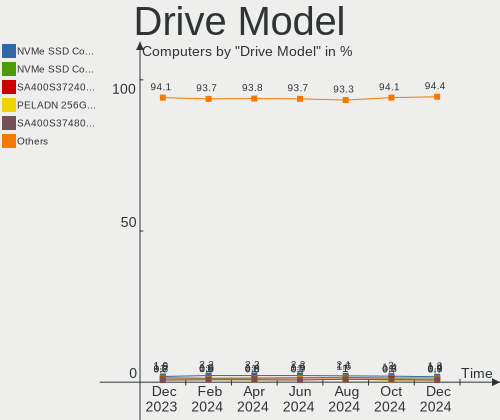
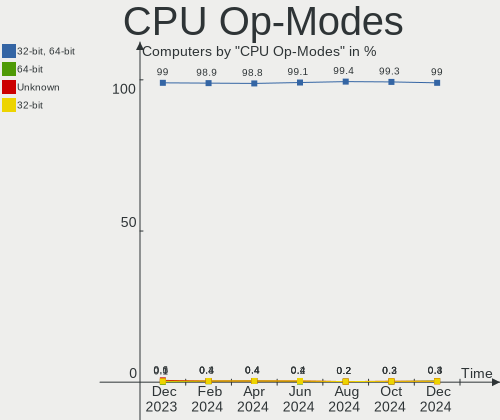

Linux Hardware Trends
---------------------

A project to identify most popular hardware characteristics and track their change
over time based on data collected by Linux users at https://Linux-Hardware.org.

Anyone can contribute to this report by the [hw-probe](https://github.com/linuxhw/hw-probe) tool:

    sudo -E hw-probe -all -upload

This is a report for all computer types. See also reports for [desktops](/Desktop/README.md) and [notebooks](/Notebook/README.md).

Full-feature report is available here: https://linux-hardware.org/?view=trends

Distribution-specific reports: [Ubuntu](/Dist/Ubuntu), [Debian](/Dist/Debian), [Linux Mint](/Dist/Linux_Mint), [Pop!_OS](/Dist/Pop!_OS), [Fedora](/Dist/Fedora), [OpenMandriva](/Dist/OpenMandriva), [Manjaro](/Dist/Manjaro), [Zorin](/Dist/Zorin), [Arch](/Dist/Arch), [KDE neon](/Dist/KDE_neon), [ROSA](/Dist/ROSA), [Xubuntu](/Dist/Xubuntu), [Kubuntu](/Dist/Kubuntu), [ArcoLinux](/Dist/ArcoLinux), [CentOS](/Dist/CentOS), [BlackPanther](/Dist/BlackPanther), [openSUSE](/Dist/openSUSE), [Clear Linux](/Dist/Clear_Linux), [Endless](/Dist/Endless), [Gentoo](/Dist/Gentoo), [Elementary](/Dist/Elementary), [EndeavourOS](/Dist/EndeavourOS), [Ubuntu MATE](/Dist/Ubuntu_MATE), [Kali](/Dist/Kali).

Period: Feb, 2022.

Contents
--------

* [ System ](#system)
  - [ OS                       ](#os)
  - [ OS Family                ](#os-family)
  - [ Kernel                   ](#kernel)
  - [ Kernel Family            ](#kernel-family)
  - [ Kernel Major Ver.        ](#kernel-major-ver)
  - [ Arch                     ](#arch)
  - [ DE                       ](#de)
  - [ Display Server           ](#display-server)
  - [ Display Manager          ](#display-manager)
  - [ OS Lang                  ](#os-lang)
  - [ Boot Mode                ](#boot-mode)
  - [ Filesystem               ](#filesystem)
  - [ Part. scheme             ](#part-scheme)
  - [ Dual Boot with Linux/BSD ](#dual-boot-with-linuxbsd)
  - [ Dual Boot (Win)          ](#dual-boot-win)

* [ Board ](#board)
  - [ Vendor                   ](#vendor)
  - [ Model                    ](#model)
  - [ Model Family             ](#model-family)
  - [ MFG Year                 ](#mfg-year)
  - [ Form Factor              ](#form-factor)
  - [ Secure Boot              ](#secure-boot)
  - [ Coreboot                 ](#coreboot)
  - [ RAM Size                 ](#ram-size)
  - [ RAM Used                 ](#ram-used)
  - [ Total Drives             ](#total-drives)
  - [ Has CD-ROM               ](#has-cd-rom)
  - [ Has Ethernet             ](#has-ethernet)
  - [ Has WiFi                 ](#has-wifi)
  - [ Has Bluetooth            ](#has-bluetooth)

* [ Location ](#location)
  - [ Country                  ](#country)
  - [ City                     ](#city)

* [ Drives ](#drives)
  - [ Drive Vendor             ](#drive-vendor)
  - [ Drive Model              ](#drive-model)
  - [ HDD Vendor               ](#hdd-vendor)
  - [ SSD Vendor               ](#ssd-vendor)
  - [ Drive Kind               ](#drive-kind)
  - [ Drive Connector          ](#drive-connector)
  - [ Drive Size               ](#drive-size)
  - [ Space Total              ](#space-total)
  - [ Space Used               ](#space-used)
  - [ Malfunc. Drives          ](#malfunc-drives)
  - [ Malfunc. Drive Vendor    ](#malfunc-drive-vendor)
  - [ Malfunc. HDD Vendor      ](#malfunc-hdd-vendor)
  - [ Malfunc. Drive Kind      ](#malfunc-drive-kind)
  - [ Failed Drives            ](#failed-drives)
  - [ Failed Drive Vendor      ](#failed-drive-vendor)
  - [ Drive Status             ](#drive-status)

* [ Storage controller ](#storage-controller)
  - [ Storage Vendor           ](#storage-vendor)
  - [ Storage Model            ](#storage-model)
  - [ Storage Kind             ](#storage-kind)

* [ Processor ](#processor)
  - [ CPU Vendor               ](#cpu-vendor)
  - [ CPU Model                ](#cpu-model)
  - [ CPU Model Family         ](#cpu-model-family)
  - [ CPU Cores                ](#cpu-cores)
  - [ CPU Sockets              ](#cpu-sockets)
  - [ CPU Threads              ](#cpu-threads)
  - [ CPU Op-Modes             ](#cpu-op-modes)
  - [ CPU Microcode            ](#cpu-microcode)
  - [ CPU Microarch            ](#cpu-microarch)

* [ Graphics ](#graphics)
  - [ GPU Vendor               ](#gpu-vendor)
  - [ GPU Model                ](#gpu-model)
  - [ GPU Combo                ](#gpu-combo)
  - [ GPU Driver               ](#gpu-driver)
  - [ GPU Memory               ](#gpu-memory)

* [ Monitor ](#monitor)
  - [ Monitor Vendor           ](#monitor-vendor)
  - [ Monitor Model            ](#monitor-model)
  - [ Monitor Resolution       ](#monitor-resolution)
  - [ Monitor Diagonal         ](#monitor-diagonal)
  - [ Monitor Width            ](#monitor-width)
  - [ Aspect Ratio             ](#aspect-ratio)
  - [ Monitor Area             ](#monitor-area)
  - [ Pixel Density            ](#pixel-density)
  - [ Multiple Monitors        ](#multiple-monitors)

* [ Network ](#network)
  - [ Net Controller Vendor    ](#net-controller-vendor)
  - [ Net Controller Model     ](#net-controller-model)
  - [ Wireless Vendor          ](#wireless-vendor)
  - [ Wireless Model           ](#wireless-model)
  - [ Ethernet Vendor          ](#ethernet-vendor)
  - [ Ethernet Model           ](#ethernet-model)
  - [ Net Controller Kind      ](#net-controller-kind)
  - [ Used Controller          ](#used-controller)
  - [ NICs                     ](#nics)
  - [ IPv6                     ](#ipv6)

* [ Bluetooth ](#bluetooth)
  - [ Bluetooth Vendor         ](#bluetooth-vendor)
  - [ Bluetooth Model          ](#bluetooth-model)

* [ Sound ](#sound)
  - [ Sound Vendor             ](#sound-vendor)
  - [ Sound Model              ](#sound-model)

* [ Memory ](#memory)
  - [ Memory Vendor            ](#memory-vendor)
  - [ Memory Model             ](#memory-model)
  - [ Memory Kind              ](#memory-kind)
  - [ Memory Form Factor       ](#memory-form-factor)
  - [ Memory Size              ](#memory-size)
  - [ Memory Speed             ](#memory-speed)

* [ Printers & scanners ](#printers--scanners)
  - [ Printer Vendor           ](#printer-vendor)
  - [ Printer Model            ](#printer-model)
  - [ Scanner Vendor           ](#scanner-vendor)
  - [ Scanner Model            ](#scanner-model)

* [ Camera ](#camera)
  - [ Camera Vendor            ](#camera-vendor)
  - [ Camera Model             ](#camera-model)

* [ Security ](#security)
  - [ Fingerprint Vendor       ](#fingerprint-vendor)
  - [ Fingerprint Model        ](#fingerprint-model)
  - [ Chipcard Vendor          ](#chipcard-vendor)
  - [ Chipcard Model           ](#chipcard-model)

* [ Unsupported ](#unsupported)
  - [ Unsupported Devices      ](#unsupported-devices)
  - [ Unsupported Device Types ](#unsupported-device-types)

System
------

OS
--

Installed operating systems

| Name                 | Computers | Percent |
|----------------------|-----------|---------|
| OpenMandriva 4.3     | 1308      | 23.75%  |
| Ubuntu 20.04         | 637       | 11.56%  |
| Linux Mint 20.3      | 373       | 6.77%   |
| Ubuntu 21.10         | 269       | 4.88%   |
| Pop!_OS 21.10        | 241       | 4.38%   |
| Debian 11            | 228       | 4.14%   |
| Fedora 35            | 212       | 3.85%   |
| Zorin 16             | 149       | 2.71%   |
| KDE neon 20.04       | 137       | 2.49%   |
| OpenMandriva 4.2     | 112       | 2.03%   |
| Arch                 | 91        | 1.65%   |
| Elementary 6.1       | 88        | 1.6%    |
| ROSA 12.2            | 78        | 1.42%   |
| BlackPanther 18.1    | 74        | 1.34%   |
| Manjaro 21.2.3       | 72        | 1.31%   |
| Linux Mint 20.2      | 71        | 1.29%   |
| Manjaro              | 65        | 1.18%   |
| Ubuntu 18.04         | 60        | 1.09%   |
| Arch Rolling         | 60        | 1.09%   |
| ArcoLinux Rolling    | 57        | 1.03%   |
| ROSA 12.1            | 52        | 0.94%   |
| Kubuntu 20.04        | 52        | 0.94%   |
| ROSA R11.1           | 47        | 0.85%   |
| Xubuntu 20.04        | 42        | 0.76%   |
| Kubuntu 21.10        | 39        | 0.71%   |
| EndeavourOS Rolling  | 33        | 0.6%    |
| Pop!_OS 20.04        | 31        | 0.56%   |
| Kali 2022.1          | 31        | 0.56%   |
| OpenMandriva 4.50    | 30        | 0.54%   |
| Linux Mint 20.1      | 26        | 0.47%   |
| Zorin 15             | 25        | 0.45%   |
| Ubuntu 21.04         | 24        | 0.44%   |
| Ubuntu 22.04         | 22        | 0.4%    |
| Garuda Linux Soaring | 22        | 0.4%    |
| Endless 4.0.2        | 21        | 0.38%   |
| Linux Mint 19.3      | 20        | 0.36%   |
| Lubuntu 20.04        | 19        | 0.34%   |
| Gentoo 2.6           | 18        | 0.33%   |
| Fedora 34            | 17        | 0.31%   |
| Ubuntu MATE 20.04    | 16        | 0.29%   |
| Xubuntu 21.10        | 15        | 0.27%   |
| Debian Testing       | 15        | 0.27%   |
| Pop!_OS 21.04        | 14        | 0.25%   |
| Manjaro 21.2.2       | 14        | 0.25%   |
| LMDE 4               | 13        | 0.24%   |
| LinuxFX 11           | 13        | 0.24%   |
| Linux Mint 20        | 13        | 0.24%   |
| Parrot 5.0           | 12        | 0.22%   |
| Gentoo 2.8           | 12        | 0.22%   |
| Ubuntu Budgie 20.04  | 11        | 0.2%    |
| Gentoo 2.7           | 11        | 0.2%    |
| Debian 10            | 11        | 0.2%    |
| Xubuntu 18.04        | 10        | 0.18%   |
| MX 21                | 10        | 0.18%   |
| Lubuntu 21.10        | 10        | 0.18%   |
| Kubuntu 11           | 8         | 0.15%   |
| ALT Linux 10.0       | 8         | 0.15%   |
| Ubuntu MATE 21.10    | 7         | 0.13%   |
| Ubuntu Budgie 21.10  | 7         | 0.13%   |
| Ubuntu 20.10         | 7         | 0.13%   |

OS Family
---------

OS without a version

| Name             | Computers | Percent |
|------------------|-----------|---------|
| OpenMandriva     | 1450      | 26.33%  |
| Ubuntu           | 1028      | 18.66%  |
| Linux Mint       | 511       | 9.28%   |
| Pop!_OS          | 286       | 5.19%   |
| Debian           | 262       | 4.76%   |
| Fedora           | 237       | 4.3%    |
| ROSA             | 185       | 3.36%   |
| Zorin            | 175       | 3.18%   |
| Manjaro          | 157       | 2.85%   |
| Arch             | 151       | 2.74%   |
| KDE neon         | 137       | 2.49%   |
| Kubuntu          | 113       | 2.05%   |
| Elementary       | 92        | 1.67%   |
| BlackPanther     | 75        | 1.36%   |
| Xubuntu          | 73        | 1.33%   |
| ArcoLinux        | 62        | 1.13%   |
| Gentoo           | 42        | 0.76%   |
| Kali             | 39        | 0.71%   |
| EndeavourOS      | 37        | 0.67%   |
| Lubuntu          | 35        | 0.64%   |
| Endless          | 35        | 0.64%   |
| openSUSE         | 34        | 0.62%   |
| Ubuntu MATE      | 28        | 0.51%   |
| Garuda Linux     | 24        | 0.44%   |
| Ubuntu Budgie    | 20        | 0.36%   |
| Clear Linux      | 17        | 0.31%   |
| Parrot           | 14        | 0.25%   |
| LMDE             | 14        | 0.25%   |
| LinuxFX          | 13        | 0.24%   |
| MX               | 12        | 0.22%   |
| ALT Linux        | 11        | 0.2%    |
| Raspbian         | 10        | 0.18%   |
| CentOS           | 9         | 0.16%   |
| Ubuntu Studio    | 7         | 0.13%   |
| Linux Lite       | 7         | 0.13%   |
| Artix            | 7         | 0.13%   |
| Rocky Linux      | 6         | 0.11%   |
| Void Linux       | 5         | 0.09%   |
| RHEL             | 5         | 0.09%   |
| Red OS           | 5         | 0.09%   |
| ClearOS          | 5         | 0.09%   |
| Slackware        | 4         | 0.07%   |
| NixOS            | 4         | 0.07%   |
| Mageia           | 4         | 0.07%   |
| Devuan           | 4         | 0.07%   |
| Xero             | 3         | 0.05%   |
| Sparky           | 3         | 0.05%   |
| Siduction        | 3         | 0.05%   |
| PureOS           | 3         | 0.05%   |
| Org.kde.platform | 3         | 0.05%   |
| Astra Linux      | 3         | 0.05%   |
| Trisquel         | 2         | 0.04%   |
| Reborn OS        | 2         | 0.04%   |
| Peppermint       | 2         | 0.04%   |
| Pardus           | 2         | 0.04%   |
| Manjaro-ARM      | 2         | 0.04%   |
| Guix             | 2         | 0.04%   |
| GNOME OS         | 2         | 0.04%   |
| Drauger OS       | 2         | 0.04%   |
| Archcraft        | 2         | 0.04%   |

Kernel
------

Version of the Linux kernel

| Version                            | Computers | Percent |
|------------------------------------|-----------|---------|
| 5.16.7-desktop-1omv4003            | 1305      | 23.69%  |
| 5.13.0-28-generic                  | 726       | 13.18%  |
| 5.13.0-30-generic                  | 377       | 6.84%   |
| 5.15.15-76051515-generic           | 191       | 3.47%   |
| 5.4.0-99-generic                   | 180       | 3.27%   |
| 5.4.0-100-generic                  | 173       | 3.14%   |
| 5.4.0-97-generic                   | 141       | 2.56%   |
| 5.10.74-generic-2rosa2021.1-x86_64 | 124       | 2.25%   |
| 5.10.0-11-amd64                    | 118       | 2.14%   |
| 5.10.14-desktop-1omv4002           | 102       | 1.85%   |
| 5.13.0-27-generic                  | 100       | 1.82%   |
| 5.15.23-76051523-generic           | 65        | 1.18%   |
| 5.6.14-desktop-2bP                 | 51        | 0.93%   |
| 5.4.0-96-generic                   | 51        | 0.93%   |
| 5.16.9-200.fc35.x86_64             | 51        | 0.93%   |
| 5.16.5-200.fc35.x86_64             | 36        | 0.65%   |
| 5.16.10-arch1-1                    | 35        | 0.64%   |
| 5.15.21-1-MANJARO                  | 34        | 0.62%   |
| 5.16.8-arch1-1                     | 31        | 0.56%   |
| 5.4.0-91-generic                   | 29        | 0.53%   |
| 5.15.18-200.fc35.x86_64            | 29        | 0.53%   |
| 5.11.0-35-generic                  | 27        | 0.49%   |
| 5.15.0-kali3-amd64                 | 26        | 0.47%   |
| 5.15.0-18-generic                  | 25        | 0.45%   |
| 5.16.8-200.fc35.x86_64             | 24        | 0.44%   |
| 5.15.19-1-MANJARO                  | 24        | 0.44%   |
| 5.16.5-arch1-1                     | 23        | 0.42%   |
| 5.11.0-27-generic                  | 23        | 0.42%   |
| 4.18.16-desktop-1bP                | 23        | 0.42%   |
| 5.15.0-2-amd64                     | 22        | 0.4%    |
| 5.10.0-7-amd64                     | 22        | 0.4%    |
| 5.13.0-19-generic                  | 20        | 0.36%   |
| 5.11.0-49-generic                  | 20        | 0.36%   |
| 5.16.4-arch1-1                     | 19        | 0.34%   |
| 5.16.7-1-MANJARO                   | 18        | 0.33%   |
| 5.15.0-3-amd64                     | 18        | 0.33%   |
| 5.11.0-38-generic                  | 18        | 0.33%   |
| 4.15.0-167-generic                 | 18        | 0.33%   |
| 5.4.83-generic-2rosa-x86_64        | 17        | 0.31%   |
| 5.10.0-10-amd64                    | 17        | 0.31%   |
| 5.16.7-200.fc35.x86_64             | 16        | 0.29%   |
| 5.11.0-46-generic                  | 16        | 0.29%   |
| 5.15.16-1-MANJARO                  | 15        | 0.27%   |
| 5.11.0-43-generic                  | 15        | 0.27%   |
| 4.19.0-18-amd64                    | 15        | 0.27%   |
| 5.16.11-arch1-1                    | 14        | 0.25%   |
| 5.14.10-300.fc35.x86_64            | 14        | 0.25%   |
| 5.16.9-arch1-1                     | 13        | 0.24%   |
| 5.16.7-arch1-1                     | 13        | 0.24%   |
| 5.14.0-9parrot1-amd64              | 13        | 0.24%   |
| 5.16.11-200.fc35.x86_64            | 12        | 0.22%   |
| 5.13.0-29-generic                  | 12        | 0.22%   |
| 5.10.0-9-amd64                     | 12        | 0.22%   |
| 5.16.5-1-MANJARO                   | 11        | 0.2%    |
| 5.16.10-zen1-1-zen                 | 11        | 0.2%    |
| 5.13.0-28-lowlatency               | 11        | 0.2%    |
| 5.13.0-1016-raspi                  | 11        | 0.2%    |
| 5.12.4-desktop-1omv4050            | 11        | 0.2%    |
| 5.11.12-desktop-1omv4002           | 11        | 0.2%    |
| 4.4.0-210-generic                  | 11        | 0.2%    |

Kernel Family
-------------

Linux kernel without a distro release

| Version | Computers | Percent |
|---------|-----------|---------|
| 5.16.7  | 1368      | 24.84%  |
| 5.13.0  | 1297      | 23.55%  |
| 5.4.0   | 640       | 11.62%  |
| 5.10.0  | 201       | 3.65%   |
| 5.15.15 | 194       | 3.52%   |
| 5.11.0  | 150       | 2.72%   |
| 5.10.74 | 126       | 2.29%   |
| 5.15.0  | 114       | 2.07%   |
| 5.16.5  | 106       | 1.92%   |
| 5.10.14 | 102       | 1.85%   |
| 5.16.8  | 84        | 1.53%   |
| 5.16.9  | 82        | 1.49%   |
| 5.15.23 | 82        | 1.49%   |
| 5.16.10 | 70        | 1.27%   |
| 4.15.0  | 59        | 1.07%   |
| 5.6.14  | 51        | 0.93%   |
| 5.15.21 | 47        | 0.85%   |
| 5.15.18 | 44        | 0.8%    |
| 5.16.4  | 42        | 0.76%   |
| 5.15.19 | 40        | 0.73%   |
| 5.16.11 | 33        | 0.6%    |
| 5.14.0  | 31        | 0.56%   |
| 5.15.16 | 29        | 0.53%   |
| 5.16.0  | 28        | 0.51%   |
| 5.8.0   | 24        | 0.44%   |
| 4.18.16 | 23        | 0.42%   |
| 4.19.0  | 20        | 0.36%   |
| 5.4.83  | 18        | 0.33%   |
| 4.18.0  | 18        | 0.33%   |
| 5.16.2  | 16        | 0.29%   |
| 5.15.22 | 16        | 0.29%   |
| 5.14.10 | 15        | 0.27%   |
| 5.11.12 | 14        | 0.25%   |
| 5.10.92 | 14        | 0.25%   |
| 5.17.0  | 13        | 0.24%   |
| 5.15.11 | 13        | 0.24%   |
| 5.16.3  | 12        | 0.22%   |
| 5.15.17 | 12        | 0.22%   |
| 5.13.19 | 12        | 0.22%   |
| 5.12.4  | 11        | 0.2%    |
| 4.4.0   | 11        | 0.2%    |
| 5.15.24 | 10        | 0.18%   |
| 5.14.7  | 10        | 0.18%   |
| 5.10.96 | 10        | 0.18%   |
| 5.4.32  | 9         | 0.16%   |
| 5.15.10 | 9         | 0.16%   |
| 5.0.0   | 9         | 0.16%   |
| 4.9.155 | 9         | 0.16%   |
| 5.15.25 | 7         | 0.13%   |
| 5.15.13 | 7         | 0.13%   |
| 5.13.13 | 7         | 0.13%   |
| 5.10.93 | 7         | 0.13%   |
| 3.10.0  | 7         | 0.13%   |
| 5.3.18  | 6         | 0.11%   |
| 5.15.7  | 6         | 0.11%   |
| 5.15.5  | 5         | 0.09%   |
| 5.15.12 | 5         | 0.09%   |
| 5.14.21 | 5         | 0.09%   |
| 5.16.1  | 4         | 0.07%   |
| 5.15.8  | 4         | 0.07%   |

Kernel Major Ver.
-----------------

Linux kernel major version

| Version | Computers | Percent |
|---------|-----------|---------|
| 5.16    | 1848      | 33.55%  |
| 5.13    | 1318      | 23.93%  |
| 5.4     | 674       | 12.24%  |
| 5.15    | 649       | 11.78%  |
| 5.10    | 490       | 8.9%    |
| 5.11    | 166       | 3.01%   |
| 5.14    | 70        | 1.27%   |
| 4.15    | 59        | 1.07%   |
| 5.6     | 57        | 1.03%   |
| 4.18    | 41        | 0.74%   |
| 5.8     | 24        | 0.44%   |
| 4.19    | 23        | 0.42%   |
| 4.9     | 19        | 0.34%   |
| 5.17    | 13        | 0.24%   |
| 4.4     | 12        | 0.22%   |
| 5.12    | 11        | 0.2%    |
| 5.0     | 9         | 0.16%   |
| 5.3     | 8         | 0.15%   |
| 3.10    | 8         | 0.15%   |
| 5.9     | 5         | 0.09%   |
| 5.5     | 2         | 0.04%   |
| 4.16    | 1         | 0.02%   |
| 4.12    | 1         | 0.02%   |

Arch
----

OS architecture (x86_64, i586, etc.)

| Name    | Computers | Percent |
|---------|-----------|---------|
| x86_64  | 5374      | 97.57%  |
| i686    | 80        | 1.45%   |
| aarch64 | 43        | 0.78%   |
| armv7l  | 10        | 0.18%   |
| armv6l  | 1         | 0.02%   |

DE
--

Desktop Environment

| Name              | Computers | Percent |
|-------------------|-----------|---------|
| KDE5              | 2201      | 39.96%  |
| GNOME             | 1836      | 33.33%  |
| X-Cinnamon        | 423       | 7.68%   |
| XFCE              | 332       | 6.03%   |
| Unknown           | 212       | 3.85%   |
| MATE              | 129       | 2.34%   |
| Pantheon          | 92        | 1.67%   |
| LXQt              | 50        | 0.91%   |
| Cinnamon          | 46        | 0.84%   |
| KDE4              | 32        | 0.58%   |
| Budgie            | 25        | 0.45%   |
| i3                | 24        | 0.44%   |
| LXDE              | 18        | 0.33%   |
| Unity             | 16        | 0.29%   |
| KDE               | 9         | 0.16%   |
| GNOME Flashback   | 8         | 0.15%   |
| awesome           | 8         | 0.15%   |
| openbox           | 6         | 0.11%   |
| lightdm-xsession  | 5         | 0.09%   |
| GNOME Classic     | 5         | 0.09%   |
| sway              | 4         | 0.07%   |
| LeftWM            | 4         | 0.07%   |
| bspwm             | 4         | 0.07%   |
| fly               | 3         | 0.05%   |
| Enlightenment     | 2         | 0.04%   |
| dwm               | 2         | 0.04%   |
| Deepin            | 2         | 0.04%   |
| Cutefish          | 2         | 0.04%   |
| Yaru:ubuntu:GNOME | 1         | 0.02%   |
| xubuntu           | 1         | 0.02%   |
| Trinity           | 1         | 0.02%   |
| qtile             | 1         | 0.02%   |
| jwm               | 1         | 0.02%   |
| herbstluftwm      | 1         | 0.02%   |
| GNUstep           | 1         | 0.02%   |
| fluxbox           | 1         | 0.02%   |

Display Server
--------------

X11 or Wayland

| Name    | Computers | Percent |
|---------|-----------|---------|
| X11     | 4642      | 84.28%  |
| Wayland | 648       | 11.76%  |
| Tty     | 111       | 2.02%   |
| Unknown | 107       | 1.94%   |

Display Manager
---------------

SDDM, LightDM, etc.

| Name    | Computers | Percent |
|---------|-----------|---------|
| SDDM    | 2003      | 36.37%  |
| Unknown | 1455      | 26.42%  |
| LightDM | 676       | 12.27%  |
| GDM3    | 666       | 12.09%  |
| GDM     | 646       | 11.73%  |
| KDM     | 33        | 0.6%    |
| Ly      | 8         | 0.15%   |
| LXDM    | 8         | 0.15%   |
| XDM     | 7         | 0.13%   |
| SLiM    | 2         | 0.04%   |
| GREETD  | 2         | 0.04%   |
| TDM     | 1         | 0.02%   |
| MDM     | 1         | 0.02%   |

OS Lang
-------

Language

| Lang    | Computers | Percent |
|---------|-----------|---------|
| en_US   | 2308      | 41.9%   |
| de_DE   | 620       | 11.26%  |
| ru_RU   | 387       | 7.03%   |
| en_GB   | 264       | 4.79%   |
| fr_FR   | 239       | 4.34%   |
| pt_BR   | 221       | 4.01%   |
| it_IT   | 156       | 2.83%   |
| Unknown | 127       | 2.31%   |
| es_ES   | 117       | 2.12%   |
| pl_PL   | 106       | 1.92%   |
| en_CA   | 86        | 1.56%   |
| en_AU   | 83        | 1.51%   |
| C       | 62        | 1.13%   |
| en_IN   | 61        | 1.11%   |
| de_AT   | 48        | 0.87%   |
| nl_NL   | 45        | 0.82%   |
| es_MX   | 43        | 0.78%   |
| cs_CZ   | 34        | 0.62%   |
| es_AR   | 33        | 0.6%    |
| hu_HU   | 30        | 0.54%   |
| tr_TR   | 27        | 0.49%   |
| pt_PT   | 21        | 0.38%   |
| ru_UA   | 19        | 0.34%   |
| en_ZA   | 19        | 0.34%   |
| nl_BE   | 18        | 0.33%   |
| zh_CN   | 17        | 0.31%   |
| ja_JP   | 17        | 0.31%   |
| de_CH   | 17        | 0.31%   |
| fr_BE   | 15        | 0.27%   |
| sv_SE   | 13        | 0.24%   |
| da_DK   | 13        | 0.24%   |
| ro_RO   | 11        | 0.2%    |
| el_GR   | 11        | 0.2%    |
| sk_SK   | 10        | 0.18%   |
| fi_FI   | 10        | 0.18%   |
| es_CL   | 10        | 0.18%   |
| en_NZ   | 10        | 0.18%   |
| en_IE   | 10        | 0.18%   |
| fr_CA   | 9         | 0.16%   |
| es_CO   | 9         | 0.16%   |
| nb_NO   | 8         | 0.15%   |
| fr_CH   | 8         | 0.15%   |
| bg_BG   | 8         | 0.15%   |
| en_IL   | 7         | 0.13%   |
| zh_TW   | 6         | 0.11%   |
| uk_UA   | 6         | 0.11%   |
| POSIX   | 6         | 0.11%   |
| en_SG   | 6         | 0.11%   |
| en_PH   | 6         | 0.11%   |
| sl_SI   | 5         | 0.09%   |
| es_VE   | 5         | 0.09%   |
| es_CR   | 5         | 0.09%   |
| en_HK   | 5         | 0.09%   |
| en_DK   | 5         | 0.09%   |
| hr_HR   | 4         | 0.07%   |
| ca_ES   | 4         | 0.07%   |
| C.UTF8  | 4         | 0.07%   |
| ar_SA   | 4         | 0.07%   |
| ko_KR   | 3         | 0.05%   |
| es_PY   | 3         | 0.05%   |

Boot Mode
---------

EFI or BIOS

| Mode | Computers | Percent |
|------|-----------|---------|
| EFI  | 2788      | 50.62%  |
| BIOS | 2720      | 49.38%  |

Filesystem
----------

Type of filesystem

| Type     | Computers | Percent |
|----------|-----------|---------|
| Ext4     | 3587      | 65.12%  |
| Overlay  | 1418      | 25.74%  |
| Btrfs    | 383       | 6.95%   |
| Xfs      | 55        | 1%      |
| Zfs      | 29        | 0.53%   |
| Ext3     | 8         | 0.15%   |
| F2fs     | 7         | 0.13%   |
| Ext2     | 6         | 0.11%   |
| Tmpfs    | 5         | 0.09%   |
| Unknown  | 4         | 0.07%   |
| Jfs      | 3         | 0.05%   |
| Rootfs   | 1         | 0.02%   |
| Reiserfs | 1         | 0.02%   |
| Aufs     | 1         | 0.02%   |

Part. scheme
------------

Scheme of partitioning

| Type    | Computers | Percent |
|---------|-----------|---------|
| GPT     | 2346      | 42.59%  |
| Unknown | 2189      | 39.74%  |
| MBR     | 973       | 17.67%  |

Dual Boot with Linux/BSD
------------------------

Hosting more than one Linux/BSD

| Dual boot | Computers | Percent |
|-----------|-----------|---------|
| No        | 4221      | 76.63%  |
| Yes       | 1287      | 23.37%  |

Dual Boot (Win)
---------------

Hosting Linux and Windows

| Dual boot | Computers | Percent |
|-----------|-----------|---------|
| No        | 3674      | 66.7%   |
| Yes       | 1834      | 33.3%   |

Board
-----

Vendor
------

Motherboard manufacturer

| Name                    | Computers | Percent |
|-------------------------|-----------|---------|
| ASUSTek Computer        | 938       | 17.03%  |
| Hewlett-Packard         | 734       | 13.33%  |
| Lenovo                  | 725       | 13.16%  |
| Dell                    | 640       | 11.62%  |
| Gigabyte Technology     | 429       | 7.79%   |
| MSI                     | 327       | 5.94%   |
| Acer                    | 314       | 5.7%    |
| ASRock                  | 222       | 4.03%   |
| Apple                   | 102       | 1.85%   |
| Toshiba                 | 96        | 1.74%   |
| Intel                   | 82        | 1.49%   |
| Samsung Electronics     | 81        | 1.47%   |
| Fujitsu                 | 60        | 1.09%   |
| Sony                    | 46        | 0.84%   |
| Raspberry Pi Foundation | 40        | 0.73%   |
| Medion                  | 36        | 0.65%   |
| Unknown                 | 32        | 0.58%   |
| HUAWEI                  | 29        | 0.53%   |
| Packard Bell            | 28        | 0.51%   |
| Google                  | 25        | 0.45%   |
| Biostar                 | 24        | 0.44%   |
| Foxconn                 | 20        | 0.36%   |
| Supermicro              | 19        | 0.34%   |
| ECS                     | 19        | 0.34%   |
| Positivo                | 18        | 0.33%   |
| Pegatron                | 17        | 0.31%   |
| Notebook                | 17        | 0.31%   |
| Microsoft               | 16        | 0.29%   |
| Timi                    | 15        | 0.27%   |
| TUXEDO                  | 14        | 0.25%   |
| System76                | 14        | 0.25%   |
| Fujitsu Siemens         | 14        | 0.25%   |
| LG Electronics          | 13        | 0.24%   |
| Gateway                 | 13        | 0.24%   |
| eMachines               | 11        | 0.2%    |
| Alienware               | 11        | 0.2%    |
| Chuwi                   | 10        | 0.18%   |
| BESSTAR Tech            | 10        | 0.18%   |
| Razer                   | 7         | 0.13%   |
| HONOR                   | 7         | 0.13%   |
| AZW                     | 7         | 0.13%   |
| Teclast                 | 6         | 0.11%   |
| TYAN Computer           | 5         | 0.09%   |
| Positivo Bahia - VAIO   | 5         | 0.09%   |
| Jumper                  | 5         | 0.09%   |
| Huanan                  | 5         | 0.09%   |
| SLIMBOOK                | 4         | 0.07%   |
| Shuttle                 | 4         | 0.07%   |
| Schenker                | 4         | 0.07%   |
| PC Specialist           | 4         | 0.07%   |
| Panasonic               | 4         | 0.07%   |
| Nvidia                  | 4         | 0.07%   |
| Framework               | 4         | 0.07%   |
| Clevo                   | 4         | 0.07%   |
| Avell High Performance  | 4         | 0.07%   |
| AMI                     | 4         | 0.07%   |
| ZOTAC                   | 3         | 0.05%   |
| Wortmann AG             | 3         | 0.05%   |
| Inventec                | 3         | 0.05%   |
| Insyde                  | 3         | 0.05%   |

Model
-----

Motherboard model

| Name                                       | Computers | Percent |
|--------------------------------------------|-----------|---------|
| ASUS All Series                            | 63        | 1.14%   |
| RPi Raspberry Pi                           | 40        | 0.73%   |
| Unknown                                    | 39        | 0.71%   |
| HP Notebook                                | 24        | 0.44%   |
| Dell OptiPlex 7010                         | 19        | 0.34%   |
| HP Pavilion g6                             | 13        | 0.24%   |
| MSI MS-7C56                                | 12        | 0.22%   |
| Dell OptiPlex 9020                         | 12        | 0.22%   |
| MSI MS-7C02                                | 11        | 0.2%    |
| HP Pavilion 15                             | 11        | 0.2%    |
| Dell OptiPlex 790                          | 11        | 0.2%    |
| HP Pavilion dv6                            | 10        | 0.18%   |
| Gigabyte H410M H V3                        | 10        | 0.18%   |
| Gigabyte 970A-DS3P                         | 10        | 0.18%   |
| MSI MS-7693                                | 9         | 0.16%   |
| Gigabyte B450M DS3H                        | 9         | 0.16%   |
| ASUS UX31E                                 | 9         | 0.16%   |
| ASUS ROG STRIX B450-F GAMING               | 9         | 0.16%   |
| MSI MS-7C91                                | 8         | 0.15%   |
| MSI MS-7C84                                | 8         | 0.15%   |
| MSI MS-7C37                                | 8         | 0.15%   |
| MSI MS-7817                                | 8         | 0.15%   |
| HP Pavilion Notebook                       | 8         | 0.15%   |
| Dell Latitude 5480                         | 8         | 0.15%   |
| ASUS PRIME X570-P                          | 8         | 0.15%   |
| ASUS PRIME A320M-K                         | 8         | 0.15%   |
| MSI MS-7B86                                | 7         | 0.13%   |
| Lenovo G50-70 20351                        | 7         | 0.13%   |
| HP Pavilion dv7                            | 7         | 0.13%   |
| HP Pavilion 17                             | 7         | 0.13%   |
| HP Laptop 15-db0xxx                        | 7         | 0.13%   |
| HP Compaq Pro 6300 SFF                     | 7         | 0.13%   |
| HP Compaq Elite 8300 SFF                   | 7         | 0.13%   |
| Gigabyte B250M-DS3H                        | 7         | 0.13%   |
| Dell XPS 15 9570                           | 7         | 0.13%   |
| Dell XPS 15 7590                           | 7         | 0.13%   |
| Dell OptiPlex 780                          | 7         | 0.13%   |
| Dell OptiPlex 755                          | 7         | 0.13%   |
| Dell Latitude E6420                        | 7         | 0.13%   |
| Dell Latitude E6410                        | 7         | 0.13%   |
| Dell Latitude D630                         | 7         | 0.13%   |
| ASUS TUF GAMING X570-PLUS                  | 7         | 0.13%   |
| ASUS ROG STRIX B550-F GAMING               | 7         | 0.13%   |
| ASUS PRIME H510M-A                         | 7         | 0.13%   |
| ASRock B450M Pro4                          | 7         | 0.13%   |
| Acer Nitro AN515-44                        | 7         | 0.13%   |
| Samsung 300E4A/300E5A/300E7A/3430EA/3530EA | 6         | 0.11%   |
| MSI MS-7B79                                | 6         | 0.11%   |
| Lenovo MIIX 320-10ICR 80XF                 | 6         | 0.11%   |
| HUAWEI NBLK-WAX9X                          | 6         | 0.11%   |
| HP Pavilion g7                             | 6         | 0.11%   |
| HP Pavilion Aero Laptop 13-be0xxx          | 6         | 0.11%   |
| Gigabyte B450 AORUS M                      | 6         | 0.11%   |
| Gigabyte A320M-S2H                         | 6         | 0.11%   |
| Dell OptiPlex 3010                         | 6         | 0.11%   |
| Dell Latitude E7240                        | 6         | 0.11%   |
| Dell Latitude E5430 non-vPro               | 6         | 0.11%   |
| ASUS PRIME X570-PRO                        | 6         | 0.11%   |
| ASUS PRIME B450M-A                         | 6         | 0.11%   |
| ASRock B450M Steel Legend                  | 6         | 0.11%   |

Model Family
------------

Motherboard model prefix

| Name                  | Computers | Percent |
|-----------------------|-----------|---------|
| Lenovo ThinkPad       | 287       | 5.21%   |
| Acer Aspire           | 207       | 3.76%   |
| Dell Latitude         | 180       | 3.27%   |
| Lenovo IdeaPad        | 164       | 2.98%   |
| Dell Inspiron         | 153       | 2.78%   |
| HP Pavilion           | 149       | 2.71%   |
| Dell OptiPlex         | 114       | 2.07%   |
| ASUS PRIME            | 106       | 1.92%   |
| ASUS ROG              | 103       | 1.87%   |
| HP Compaq             | 85        | 1.54%   |
| Toshiba Satellite     | 83        | 1.51%   |
| HP EliteBook          | 71        | 1.29%   |
| Dell XPS              | 71        | 1.29%   |
| HP ProBook            | 70        | 1.27%   |
| ASUS VivoBook         | 70        | 1.27%   |
| ASUS All              | 63        | 1.14%   |
| HP Laptop             | 61        | 1.11%   |
| Lenovo ThinkCentre    | 59        | 1.07%   |
| Dell Precision        | 52        | 0.94%   |
| ASUS TUF              | 48        | 0.87%   |
| RPi Raspberry         | 40        | 0.73%   |
| Unknown               | 39        | 0.71%   |
| HP ENVY               | 32        | 0.58%   |
| Acer Swift            | 30        | 0.54%   |
| Fujitsu LIFEBOOK      | 29        | 0.53%   |
| Lenovo Yoga           | 26        | 0.47%   |
| Lenovo Legion         | 26        | 0.47%   |
| HP Notebook           | 24        | 0.44%   |
| Dell Vostro           | 24        | 0.44%   |
| ASUS ASUS             | 23        | 0.42%   |
| HP ProDesk            | 22        | 0.4%    |
| Acer Nitro            | 21        | 0.38%   |
| Gigabyte B450M        | 20        | 0.36%   |
| ASUS ZenBook          | 20        | 0.36%   |
| Fujitsu ESPRIMO       | 19        | 0.34%   |
| HP EliteDesk          | 18        | 0.33%   |
| Packard Bell EasyNote | 16        | 0.29%   |
| Microsoft Surface     | 16        | 0.29%   |
| HP OMEN               | 16        | 0.29%   |
| ASUS P8H61-M          | 16        | 0.29%   |
| ASUS M5A78L-M         | 16        | 0.29%   |
| HP 255                | 15        | 0.27%   |
| Dell PowerEdge        | 15        | 0.27%   |
| Gigabyte H410M        | 14        | 0.25%   |
| Gigabyte B450         | 14        | 0.25%   |
| ASRock B450M          | 14        | 0.25%   |
| Lenovo ThinkBook      | 13        | 0.24%   |
| HP ZBook              | 13        | 0.24%   |
| HP Spectre            | 13        | 0.24%   |
| HP 250                | 13        | 0.24%   |
| Gigabyte X570         | 13        | 0.24%   |
| Acer TravelMate       | 13        | 0.24%   |
| MSI MS-7C56           | 12        | 0.22%   |
| ASRock B450           | 12        | 0.22%   |
| MSI MS-7C02           | 11        | 0.2%    |
| Acer Predator         | 11        | 0.2%    |
| Lenovo IdeaCentre     | 10        | 0.18%   |
| Gigabyte Z390         | 10        | 0.18%   |
| Gigabyte 970A-DS3P    | 10        | 0.18%   |
| Acer Extensa          | 10        | 0.18%   |

MFG Year
--------

Motherboard manufacture year

| Year    | Computers | Percent |
|---------|-----------|---------|
| 2021    | 577       | 10.48%  |
| 2020    | 574       | 10.42%  |
| 2012    | 477       | 8.66%   |
| 2018    | 467       | 8.48%   |
| 2019    | 441       | 8.01%   |
| 2013    | 412       | 7.48%   |
| 2011    | 402       | 7.3%    |
| 2017    | 342       | 6.21%   |
| 2014    | 334       | 6.06%   |
| 2015    | 271       | 4.92%   |
| 2010    | 268       | 4.87%   |
| 2016    | 266       | 4.83%   |
| 2009    | 219       | 3.98%   |
| 2008    | 194       | 3.52%   |
| 2007    | 136       | 2.47%   |
| Unknown | 52        | 0.94%   |
| 2006    | 44        | 0.8%    |
| 2022    | 15        | 0.27%   |
| 2005    | 13        | 0.24%   |
| 2004    | 3         | 0.05%   |
| 2003    | 1         | 0.02%   |

Form Factor
-----------

Physical design of the computer

| Name           | Computers | Percent |
|----------------|-----------|---------|
| Notebook       | 2869      | 52.09%  |
| Desktop        | 2227      | 40.43%  |
| Convertible    | 108       | 1.96%   |
| Mini pc        | 83        | 1.51%   |
| All in one     | 82        | 1.49%   |
| System on chip | 53        | 0.96%   |
| Tablet         | 48        | 0.87%   |
| Server         | 35        | 0.64%   |
| Other          | 1         | 0.02%   |
| Stick pc       | 1         | 0.02%   |
| Firewall       | 1         | 0.02%   |

Secure Boot
-----------

Enabled or disabled

| State    | Computers | Percent |
|----------|-----------|---------|
| Disabled | 5209      | 94.57%  |
| Enabled  | 299       | 5.43%   |

Coreboot
--------

Have coreboot on board

| Used | Computers | Percent |
|------|-----------|---------|
| No   | 5468      | 99.27%  |
| Yes  | 40        | 0.73%   |

RAM Size
--------

Total RAM memory

| Size in GB      | Computers | Percent |
|-----------------|-----------|---------|
| 4.01-8.0        | 1366      | 24.8%   |
| 3.01-4.0        | 1072      | 19.46%  |
| 16.01-24.0      | 1053      | 19.12%  |
| 8.01-16.0       | 987       | 17.92%  |
| 32.01-64.0      | 492       | 8.93%   |
| 1.01-2.0        | 215       | 3.9%    |
| 64.01-256.0     | 141       | 2.56%   |
| 24.01-32.0      | 86        | 1.56%   |
| 2.01-3.0        | 68        | 1.23%   |
| 0.51-1.0        | 21        | 0.38%   |
| More than 256.0 | 5         | 0.09%   |
| 0.01-0.5        | 2         | 0.04%   |

RAM Used
--------

Used RAM memory

| Used GB     | Computers | Percent |
|-------------|-----------|---------|
| 1.01-2.0    | 2473      | 44.9%   |
| 2.01-3.0    | 1091      | 19.81%  |
| 4.01-8.0    | 572       | 10.38%  |
| 0.51-1.0    | 543       | 9.86%   |
| 3.01-4.0    | 521       | 9.46%   |
| 8.01-16.0   | 169       | 3.07%   |
| 0.01-0.5    | 92        | 1.67%   |
| 16.01-24.0  | 25        | 0.45%   |
| 24.01-32.0  | 10        | 0.18%   |
| 32.01-64.0  | 8         | 0.15%   |
| 64.01-256.0 | 3         | 0.05%   |
| Unknown     | 1         | 0.02%   |

Total Drives
------------

Number of drives on board

| Drives | Computers | Percent |
|--------|-----------|---------|
| 1      | 3174      | 57.63%  |
| 2      | 1448      | 26.29%  |
| 3      | 444       | 8.06%   |
| 4      | 212       | 3.85%   |
| 5      | 91        | 1.65%   |
| 0      | 43        | 0.78%   |
| 6      | 38        | 0.69%   |
| 7      | 24        | 0.44%   |
| 8      | 15        | 0.27%   |
| 9      | 8         | 0.15%   |
| 12     | 3         | 0.05%   |
| 10     | 3         | 0.05%   |
| 11     | 2         | 0.04%   |
| 28     | 1         | 0.02%   |
| 15     | 1         | 0.02%   |
| 14     | 1         | 0.02%   |

Has CD-ROM
----------

Has CD-ROM on board

| Presented | Computers | Percent |
|-----------|-----------|---------|
| No        | 3241      | 58.84%  |
| Yes       | 2267      | 41.16%  |

Has Ethernet
------------

Has Ethernet on board

| Presented | Computers | Percent |
|-----------|-----------|---------|
| Yes       | 4783      | 86.84%  |
| No        | 725       | 13.16%  |

Has WiFi
--------

Has WiFi module

| Presented | Computers | Percent |
|-----------|-----------|---------|
| Yes       | 4021      | 73%     |
| No        | 1487      | 27%     |

Has Bluetooth
-------------

Has Bluetooth module

| Presented | Computers | Percent |
|-----------|-----------|---------|
| Yes       | 3143      | 57.06%  |
| No        | 2365      | 42.94%  |

Location
--------

Country
-------

Geographic location (country)

| Country                | Computers | Percent |
|------------------------|-----------|---------|
| USA                    | 865       | 15.7%   |
| Germany                | 784       | 14.23%  |
| Russia                 | 417       | 7.57%   |
| France                 | 286       | 5.19%   |
| Brazil                 | 284       | 5.16%   |
| UK                     | 212       | 3.85%   |
| Italy                  | 201       | 3.65%   |
| Poland                 | 190       | 3.45%   |
| Spain                  | 156       | 2.83%   |
| Canada                 | 155       | 2.81%   |
| Netherlands            | 116       | 2.11%   |
| Hungary                | 116       | 2.11%   |
| Australia              | 114       | 2.07%   |
| India                  | 105       | 1.91%   |
| Ukraine                | 84        | 1.53%   |
| Belgium                | 73        | 1.33%   |
| Austria                | 73        | 1.33%   |
| Turkey                 | 70        | 1.27%   |
| Mexico                 | 66        | 1.2%    |
| Sweden                 | 57        | 1.03%   |
| Czechia                | 57        | 1.03%   |
| Argentina              | 52        | 0.94%   |
| Switzerland            | 51        | 0.93%   |
| Portugal               | 45        | 0.82%   |
| Romania                | 44        | 0.8%    |
| Japan                  | 44        | 0.8%    |
| China                  | 37        | 0.67%   |
| Indonesia              | 36        | 0.65%   |
| Finland                | 36        | 0.65%   |
| South Africa           | 32        | 0.58%   |
| Greece                 | 32        | 0.58%   |
| Slovakia               | 29        | 0.53%   |
| Bulgaria               | 29        | 0.53%   |
| Serbia                 | 28        | 0.51%   |
| Norway                 | 23        | 0.42%   |
| Denmark                | 23        | 0.42%   |
| Israel                 | 20        | 0.36%   |
| Chile                  | 20        | 0.36%   |
| Croatia                | 19        | 0.34%   |
| Colombia               | 19        | 0.34%   |
| Taiwan                 | 18        | 0.33%   |
| New Zealand            | 18        | 0.33%   |
| Belarus                | 16        | 0.29%   |
| Egypt                  | 15        | 0.27%   |
| Slovenia               | 14        | 0.25%   |
| Singapore              | 14        | 0.25%   |
| Philippines            | 14        | 0.25%   |
| Thailand               | 11        | 0.2%    |
| Saudi Arabia           | 11        | 0.2%    |
| Ireland                | 11        | 0.2%    |
| Pakistan               | 10        | 0.18%   |
| Lithuania              | 10        | 0.18%   |
| Bangladesh             | 10        | 0.18%   |
| Venezuela              | 9         | 0.16%   |
| Tunisia                | 9         | 0.16%   |
| South Korea            | 9         | 0.16%   |
| Latvia                 | 9         | 0.16%   |
| Costa Rica             | 9         | 0.16%   |
| Kazakhstan             | 8         | 0.15%   |
| Bosnia and Herzegovina | 8         | 0.15%   |

City
----

Geographic location (city)

| City              | Computers | Percent |
|-------------------|-----------|---------|
| Moscow            | 77        | 1.4%    |
| Berlin            | 68        | 1.23%   |
| Paris             | 48        | 0.87%   |
| Voronezh          | 47        | 0.85%   |
| São Paulo      | 44        | 0.8%    |
| St Petersburg     | 41        | 0.74%   |
| Sydney            | 40        | 0.73%   |
| Vienna            | 37        | 0.67%   |
| Warsaw            | 36        | 0.65%   |
| Budapest          | 34        | 0.62%   |
| Munich            | 32        | 0.58%   |
| Istanbul          | 32        | 0.58%   |
| Milan             | 27        | 0.49%   |
| Rome              | 26        | 0.47%   |
| Madrid            | 26        | 0.47%   |
| Rio de Janeiro    | 19        | 0.34%   |
| Prague            | 19        | 0.34%   |
| Mexico City       | 19        | 0.34%   |
| Kyiv              | 19        | 0.34%   |
| Belgrade          | 19        | 0.34%   |
| Krakow            | 18        | 0.33%   |
| Barcelona         | 18        | 0.33%   |
| Hamburg           | 17        | 0.31%   |
| Brisbane          | 17        | 0.31%   |
| Athens            | 17        | 0.31%   |
| Montreal          | 16        | 0.29%   |
| Melbourne         | 15        | 0.27%   |
| Cologne           | 15        | 0.27%   |
| Yekaterinburg     | 14        | 0.25%   |
| Sofia             | 14        | 0.25%   |
| Singapore         | 14        | 0.25%   |
| Novosibirsk       | 14        | 0.25%   |
| Bucharest         | 14        | 0.25%   |
| Toronto           | 13        | 0.24%   |
| Krasnodar         | 13        | 0.24%   |
| Frankfurt am Main | 13        | 0.24%   |
| The Hague         | 12        | 0.22%   |
| Phoenix           | 12        | 0.22%   |
| Leipzig           | 12        | 0.22%   |
| Jakarta           | 12        | 0.22%   |
| Dublin            | 12        | 0.22%   |
| Cairo             | 12        | 0.22%   |
| Belo Horizonte    | 12        | 0.22%   |
| Amsterdam         | 12        | 0.22%   |
| Zurich            | 11        | 0.2%    |
| Zagreb            | 11        | 0.2%    |
| Tel Aviv          | 11        | 0.2%    |
| Stockholm         | 11        | 0.2%    |
| Minsk             | 11        | 0.2%    |
| Los Angeles       | 11        | 0.2%    |
| London            | 11        | 0.2%    |
| Helsinki          | 11        | 0.2%    |
| Hanover           | 11        | 0.2%    |
| Essen             | 11        | 0.2%    |
| Wroclaw           | 10        | 0.18%   |
| Sheffield         | 10        | 0.18%   |
| Portland          | 10        | 0.18%   |
| Mannheim          | 10        | 0.18%   |
| Houston           | 10        | 0.18%   |
| Thessaloniki      | 9         | 0.16%   |

Drives
------

Drive Vendor
------------

Hard drive vendors

| Vendor                         | Computers | Drives | Percent |
|--------------------------------|-----------|--------|---------|
| WDC                            | 1285      | 1574   | 15.74%  |
| Samsung Electronics            | 1284      | 1567   | 15.73%  |
| Seagate                        | 1150      | 1404   | 14.09%  |
| Toshiba                        | 528       | 567    | 6.47%   |
| Kingston                       | 455       | 492    | 5.57%   |
| SanDisk                        | 398       | 429    | 4.88%   |
| Crucial                        | 359       | 401    | 4.4%    |
| Unknown                        | 308       | 347    | 3.77%   |
| Hitachi                        | 237       | 249    | 2.9%    |
| SK Hynix                       | 200       | 212    | 2.45%   |
| Intel                          | 191       | 214    | 2.34%   |
| A-DATA Technology              | 144       | 152    | 1.76%   |
| HGST                           | 135       | 153    | 1.65%   |
| Micron Technology              | 93        | 98     | 1.14%   |
| Phison                         | 79        | 86     | 0.97%   |
| Intenso                        | 58        | 59     | 0.71%   |
| Apple                          | 58        | 61     | 0.71%   |
| PNY                            | 56        | 66     | 0.69%   |
| China                          | 53        | 57     | 0.65%   |
| SPCC                           | 51        | 54     | 0.62%   |
| KIOXIA                         | 50        | 55     | 0.61%   |
| Corsair                        | 45        | 48     | 0.55%   |
| LITEON                         | 43        | 43     | 0.53%   |
| Patriot                        | 41        | 41     | 0.5%    |
| Unknown                        | 39        | 40     | 0.48%   |
| Silicon Motion                 | 36        | 38     | 0.44%   |
| Transcend                      | 35        | 36     | 0.43%   |
| Gigabyte Technology            | 34        | 34     | 0.42%   |
| Fujitsu                        | 33        | 34     | 0.4%    |
| OCZ                            | 29        | 30     | 0.36%   |
| GOODRAM                        | 27        | 27     | 0.33%   |
| MAXTOR                         | 25        | 27     | 0.31%   |
| ASMT                           | 25        | 33     | 0.31%   |
| Apacer                         | 24        | 24     | 0.29%   |
| LITEONIT                       | 23        | 23     | 0.28%   |
| JMicron                        | 22        | 22     | 0.27%   |
| Netac                          | 21        | 22     | 0.26%   |
| KingSpec                       | 20        | 20     | 0.25%   |
| XPG                            | 19        | 21     | 0.23%   |
| Team                           | 17        | 19     | 0.21%   |
| Hewlett-Packard                | 16        | 18     | 0.2%    |
| Micron/Crucial Technology      | 15        | 15     | 0.18%   |
| SABRENT                        | 12        | 13     | 0.15%   |
| TO Exter                       | 11        | 11     | 0.13%   |
| Lexar                          | 11        | 12     | 0.13%   |
| UMIS                           | 10        | 10     | 0.12%   |
| SSSTC                          | 10        | 10     | 0.12%   |
| Solid State Storage Technology | 10        | 10     | 0.12%   |
| PLEXTOR                        | 10        | 10     | 0.12%   |
| Smartbuy                       | 9         | 10     | 0.11%   |
| Realtek Semiconductor          | 9         | 9      | 0.11%   |
| KingDian                       | 9         | 9      | 0.11%   |
| Mushkin                        | 8         | 8      | 0.1%    |
| Lenovo                         | 7         | 8      | 0.09%   |
| KIOXIA-EXCERIA                 | 7         | 7      | 0.09%   |
| KingFast                       | 7         | 7      | 0.09%   |
| AMD                            | 7         | 7      | 0.09%   |
| ADATA Technology               | 7         | 7      | 0.09%   |
| Union Memory (Shenzhen)        | 6         | 6      | 0.07%   |
| Lite-On                        | 6         | 6      | 0.07%   |

Drive Model
-----------

Hard drive models

| Model                                  | Computers | Percent |
|----------------------------------------|-----------|---------|
| Kingston SA400S37240G 240GB SSD        | 100       | 1.12%   |
| Samsung SSD 860 EVO 500GB              | 75        | 0.84%   |
| Samsung SSD 850 EVO 250GB              | 70        | 0.78%   |
| Seagate ST1000LM024 HN-M101MBB 1TB     | 67        | 0.75%   |
| Kingston SA400S37120G 120GB SSD        | 65        | 0.73%   |
| Seagate ST500DM002-1BD142 500GB        | 64        | 0.71%   |
| Seagate ST1000DM010-2EP102 1TB         | 59        | 0.66%   |
| Crucial CT500MX500SSD1 500GB           | 57        | 0.64%   |
| Crucial CT1000MX500SSD1 1TB            | 52        | 0.58%   |
| Unknown MMC Card  64GB                 | 51        | 0.57%   |
| Crucial CT240BX500SSD1 240GB           | 49        | 0.55%   |
| Seagate ST1000LM035-1RK172 1TB         | 48        | 0.54%   |
| Kingston SA400S37480G 480GB SSD        | 48        | 0.54%   |
| Seagate ST2000DM008-2FR102 2TB         | 47        | 0.52%   |
| Samsung NVMe SSD Drive 1TB             | 47        | 0.52%   |
| Samsung SSD 860 EVO 250GB              | 45        | 0.5%    |
| Samsung NVMe SSD Drive 500GB           | 45        | 0.5%    |
| Unknown MMC Card  32GB                 | 40        | 0.45%   |
| Toshiba MQ01ABD100 1TB                 | 40        | 0.45%   |
| Samsung SSD 850 EVO 500GB              | 40        | 0.45%   |
| Toshiba MQ04ABF100 1TB                 | 39        | 0.44%   |
| Unknown                                | 39        | 0.44%   |
| WDC WD10EZEX-08WN4A0 1TB               | 38        | 0.42%   |
| Toshiba MQ01ABF050 500GB               | 37        | 0.41%   |
| Samsung SSD 970 EVO Plus 1TB           | 37        | 0.41%   |
| Sandisk NVMe SSD Drive 512GB           | 35        | 0.39%   |
| Unknown SD/MMC/MS PRO 64GB             | 34        | 0.38%   |
| Samsung NVMe SSD Drive 512GB           | 34        | 0.38%   |
| WDC WDS240G2G0A-00JH30 240GB SSD       | 33        | 0.37%   |
| Seagate ST500LT012-1DG142 500GB        | 33        | 0.37%   |
| Samsung SSD 860 EVO 1TB                | 33        | 0.37%   |
| Toshiba DT01ACA100 1TB                 | 32        | 0.36%   |
| Seagate ST3500418AS 500GB              | 32        | 0.36%   |
| Samsung SSD 970 EVO Plus 500GB         | 32        | 0.36%   |
| Samsung SM963 2.5" NVMe PCIe SSD 256GB | 32        | 0.36%   |
| Seagate Expansion+ 2TB                 | 30        | 0.34%   |
| SK Hynix NVMe SSD Drive 512GB          | 29        | 0.32%   |
| SanDisk SSD PLUS 240GB                 | 29        | 0.32%   |
| Intel NVMe SSD Drive 512GB             | 29        | 0.32%   |
| WDC WDS500G2B0A-00SM50 500GB SSD       | 28        | 0.31%   |
| Unknown MMC Card  128GB                | 28        | 0.31%   |
| Toshiba HDWD110 1TB                    | 28        | 0.31%   |
| Samsung SSD 870 EVO 500GB              | 28        | 0.31%   |
| Kingston SV300S37A120G 120GB SSD       | 28        | 0.31%   |
| Toshiba DT01ACA050 500GB               | 27        | 0.3%    |
| Seagate ST9500325AS 500GB              | 26        | 0.29%   |
| Sandisk NVMe SSD Drive 1TB             | 26        | 0.29%   |
| Hitachi HTS543232A7A384 320GB          | 25        | 0.28%   |
| HGST HTS721010A9E630 1TB               | 25        | 0.28%   |
| Seagate ST4000DM004-2CV104 4TB         | 23        | 0.26%   |
| Seagate ST1000DM003-1ER162 1TB         | 23        | 0.26%   |
| Seagate ST1000DM003-1CH162 1TB         | 23        | 0.26%   |
| Sandisk NVMe SSD Drive 500GB           | 23        | 0.26%   |
| Samsung SSD 970 EVO Plus 2TB           | 23        | 0.26%   |
| Seagate ST1000LM048-2E7172 1TB         | 22        | 0.25%   |
| Crucial CT480BX500SSD1 480GB           | 22        | 0.25%   |
| Seagate ST2000DM006-2DM164 2TB         | 21        | 0.23%   |
| Samsung SSD 970 EVO 500GB              | 21        | 0.23%   |
| Samsung SSD 870 QVO 1TB                | 21        | 0.23%   |
| Samsung SSD 860 QVO 1TB                | 21        | 0.23%   |

HDD Vendor
----------

Hard disk drive vendors

| Vendor              | Computers | Drives | Percent |
|---------------------|-----------|--------|---------|
| Seagate             | 1127      | 1366   | 34.68%  |
| WDC                 | 1003      | 1216   | 30.86%  |
| Toshiba             | 412       | 443    | 12.68%  |
| Hitachi             | 236       | 247    | 7.26%   |
| Samsung Electronics | 165       | 180    | 5.08%   |
| HGST                | 135       | 153    | 4.15%   |
| Unknown             | 36        | 36     | 1.11%   |
| Fujitsu             | 33        | 34     | 1.02%   |
| MAXTOR              | 23        | 25     | 0.71%   |
| Apple               | 20        | 20     | 0.62%   |
| ASMT                | 13        | 16     | 0.4%    |
| SABRENT             | 10        | 11     | 0.31%   |
| Intenso             | 4         | 4      | 0.12%   |
| ASMedia             | 4         | 4      | 0.12%   |
| WD MediaMax         | 3         | 4      | 0.09%   |
| JMicron             | 3         | 3      | 0.09%   |
| Hewlett-Packard     | 3         | 3      | 0.09%   |
| USB3.0              | 2         | 2      | 0.06%   |
| IBM/Hitachi         | 2         | 2      | 0.06%   |
| USB 3.0             | 1         | 1      | 0.03%   |
| StoreJet            | 1         | 1      | 0.03%   |
| QUANTUM             | 1         | 1      | 0.03%   |
| Pear 2TB            | 1         | 1      | 0.03%   |
| NETAPP              | 1         | 4      | 0.03%   |
| MARVELL             | 1         | 2      | 0.03%   |
| Magnetic Data       | 1         | 1      | 0.03%   |
| LaCie               | 1         | 1      | 0.03%   |
| ipTIME              | 1         | 1      | 0.03%   |
| HGST HUS            | 1         | 1      | 0.03%   |
| HGST HTS            | 1         | 1      | 0.03%   |
| Glyph               | 1         | 1      | 0.03%   |
| ExcelStor           | 1         | 1      | 0.03%   |
| DELLBOSS            | 1         | 1      | 0.03%   |
| Config              | 1         | 1      | 0.03%   |
| China               | 1         | 1      | 0.03%   |

SSD Vendor
----------

Solid state drive vendors

| Vendor              | Computers | Drives | Percent |
|---------------------|-----------|--------|---------|
| Samsung Electronics | 650       | 744    | 22.22%  |
| Kingston            | 366       | 391    | 12.51%  |
| Crucial             | 322       | 357    | 11.01%  |
| SanDisk             | 264       | 292    | 9.03%   |
| WDC                 | 193       | 204    | 6.6%    |
| A-DATA Technology   | 111       | 114    | 3.79%   |
| Intel               | 74        | 80     | 2.53%   |
| Micron Technology   | 56        | 58     | 1.91%   |
| China               | 52        | 56     | 1.78%   |
| PNY                 | 51        | 58     | 1.74%   |
| Toshiba             | 50        | 51     | 1.71%   |
| Intenso             | 50        | 51     | 1.71%   |
| SK Hynix            | 44        | 47     | 1.5%    |
| LITEON              | 40        | 40     | 1.37%   |
| SPCC                | 39        | 41     | 1.33%   |
| Patriot             | 38        | 38     | 1.3%    |
| Transcend           | 33        | 34     | 1.13%   |
| OCZ                 | 28        | 28     | 0.96%   |
| Apple               | 28        | 28     | 0.96%   |
| Corsair             | 26        | 26     | 0.89%   |
| GOODRAM             | 25        | 25     | 0.85%   |
| Gigabyte Technology | 24        | 24     | 0.82%   |
| LITEONIT            | 23        | 23     | 0.79%   |
| Apacer              | 23        | 23     | 0.79%   |
| Netac               | 19        | 20     | 0.65%   |
| KingSpec            | 18        | 18     | 0.62%   |
| Unknown             | 18        | 18     | 0.62%   |
| Team                | 15        | 17     | 0.51%   |
| Seagate             | 12        | 12     | 0.41%   |
| TO Exter            | 11        | 11     | 0.38%   |
| Lexar               | 10        | 11     | 0.34%   |
| Hewlett-Packard     | 9         | 11     | 0.31%   |
| Smartbuy            | 8         | 9      | 0.27%   |
| KingDian            | 8         | 8      | 0.27%   |
| Mushkin             | 7         | 7      | 0.24%   |
| Dogfish             | 6         | 6      | 0.21%   |
| AMD                 | 6         | 6      | 0.21%   |
| Teclast             | 5         | 5      | 0.17%   |
| Leven               | 5         | 5      | 0.17%   |
| KIOXIA-EXCERIA      | 5         | 5      | 0.17%   |
| KingFast            | 5         | 5      | 0.17%   |
| ASMT                | 5         | 9      | 0.17%   |
| Unknown             | 4         | 4      | 0.14%   |
| PLEXTOR             | 4         | 4      | 0.14%   |
| Colorful            | 4         | 4      | 0.14%   |
| XrayDisk            | 3         | 3      | 0.1%    |
| Verbatim            | 3         | 3      | 0.1%    |
| PHISON              | 3         | 3      | 0.1%    |
| OCZ-VERTEX3         | 3         | 3      | 0.1%    |
| Lenovo              | 3         | 3      | 0.1%    |
| INNOVATION IT       | 3         | 3      | 0.1%    |
| Foxline             | 3         | 3      | 0.1%    |
| EMTEC               | 3         | 3      | 0.1%    |
| ASUS-PHISON         | 3         | 4      | 0.1%    |
| Zheino              | 2         | 2      | 0.07%   |
| Vaseky              | 2         | 2      | 0.07%   |
| USB30               | 2         | 2      | 0.07%   |
| Teutons             | 2         | 2      | 0.07%   |
| TCSUNBOW            | 2         | 2      | 0.07%   |
| Super Talent        | 2         | 2      | 0.07%   |

Drive Kind
----------

HDD or SSD

| Kind    | Computers | Drives | Percent |
|---------|-----------|--------|---------|
| HDD     | 2782      | 3789   | 38%     |
| SSD     | 2517      | 3162   | 34.38%  |
| NVMe    | 1626      | 1920   | 22.21%  |
| MMC     | 293       | 333    | 4%      |
| Unknown | 103       | 123    | 1.41%   |

Drive Connector
---------------

SATA, SAS, NVMe, etc.

| Type | Computers | Drives | Percent |
|------|-----------|--------|---------|
| SATA | 4259      | 6670   | 65.62%  |
| NVMe | 1610      | 1899   | 24.81%  |
| SAS  | 328       | 425    | 5.05%   |
| MMC  | 293       | 333    | 4.51%   |

Drive Size
----------

Size of hard drive

| Size in TB | Computers | Drives | Percent |
|------------|-----------|--------|---------|
| 0.01-0.5   | 3255      | 4184   | 59.31%  |
| 0.51-1.0   | 1489      | 1794   | 27.13%  |
| 1.01-2.0   | 420       | 514    | 7.65%   |
| 3.01-4.0   | 123       | 170    | 2.24%   |
| 4.01-10.0  | 100       | 158    | 1.82%   |
| 2.01-3.0   | 85        | 103    | 1.55%   |
| 10.01-20.0 | 16        | 28     | 0.29%   |

Space Total
-----------

Amount of disk space available on the file system

| Size in GB     | Computers | Percent |
|----------------|-----------|---------|
| 101-250        | 1286      | 23.35%  |
| 251-500        | 1051      | 19.08%  |
| 1-20           | 995       | 18.06%  |
| 501-1000       | 703       | 12.76%  |
| 1001-2000      | 334       | 6.06%   |
| 51-100         | 310       | 5.63%   |
| Unknown        | 300       | 5.45%   |
| More than 3000 | 224       | 4.07%   |
| 21-50          | 192       | 3.49%   |
| 2001-3000      | 113       | 2.05%   |

Space Used
----------

Amount of used disk space

| Used GB        | Computers | Percent |
|----------------|-----------|---------|
| 1-20           | 2610      | 47.39%  |
| 21-50          | 745       | 13.53%  |
| 101-250        | 566       | 10.28%  |
| 51-100         | 491       | 8.91%   |
| 251-500        | 334       | 6.06%   |
| Unknown        | 300       | 5.45%   |
| 501-1000       | 205       | 3.72%   |
| 1001-2000      | 127       | 2.31%   |
| More than 3000 | 84        | 1.53%   |
| 2001-3000      | 45        | 0.82%   |
| 0              | 1         | 0.02%   |

Malfunc. Drives
---------------

Drive models with a malfunction

| Model                                 | Computers | Drives | Percent |
|---------------------------------------|-----------|--------|---------|
| Seagate ST500DM002-1BD142 500GB       | 14        | 14     | 1.85%   |
| Seagate ST1000LM024 HN-M101MBB 1TB    | 13        | 13     | 1.72%   |
| Hitachi HTS543232A7A384 320GB         | 11        | 11     | 1.46%   |
| Seagate ST9500325AS 500GB             | 9         | 9      | 1.19%   |
| Seagate ST9320325AS 320GB             | 9         | 9      | 1.19%   |
| Toshiba MQ01ABF050 500GB              | 8         | 8      | 1.06%   |
| SanDisk SSD U100 256GB                | 8         | 8      | 1.06%   |
| Seagate ST250DM000-1BD141 250GB       | 7         | 7      | 0.93%   |
| HGST HTS721010A9E630 1TB              | 7         | 8      | 0.93%   |
| WDC WDS240G2G0A-00JH30 240GB SSD      | 6         | 6      | 0.79%   |
| Toshiba MQ01ABD100 1TB                | 6         | 6      | 0.79%   |
| Seagate ST1000DM010-2EP102 1TB        | 6         | 6      | 0.79%   |
| Seagate ST1000DM003-9YN162 1TB        | 6         | 7      | 0.79%   |
| Samsung Electronics SSD 870 EVO 500GB | 6         | 6      | 0.79%   |
| HGST HTS725050A7E630 500GB            | 6         | 6      | 0.79%   |
| Samsung Electronics HD154UI 1TB       | 5         | 6      | 0.66%   |
| Kingston SV300S37A120G 120GB SSD      | 5         | 5      | 0.66%   |
| Kingston SA400S37240G 240GB SSD       | 5         | 5      | 0.66%   |
| HGST HTS545050A7E680 500GB            | 5         | 5      | 0.66%   |
| HGST HTS545050A7E380 500GB            | 5         | 5      | 0.66%   |
| Crucial CT240M500SSD1 240GB           | 5         | 5      | 0.66%   |
| WDC WD5000AADS-00S9B0 500GB           | 4         | 4      | 0.53%   |
| Toshiba MQ01ABD050 500GB              | 4         | 4      | 0.53%   |
| Seagate ST9320423AS 320GB             | 4         | 4      | 0.53%   |
| Seagate ST500LT012-1DG142 500GB       | 4         | 4      | 0.53%   |
| Seagate ST500LM021-1KJ152 500GB       | 4         | 4      | 0.53%   |
| Seagate ST3500418AS 500GB             | 4         | 5      | 0.53%   |
| Hitachi HTS725032A9A364 320GB         | 4         | 4      | 0.53%   |
| Hitachi HDS721050CLA362 500GB         | 4         | 4      | 0.53%   |
| HGST HTS541010A9E680 1TB              | 4         | 4      | 0.53%   |
| ASMT 2135 120GB SSD                   | 4         | 8      | 0.53%   |
| WDC WDS120G2G0A-00JH30 120GB SSD      | 3         | 3      | 0.4%    |
| WDC WD5000AAKX-00ERMA0 500GB          | 3         | 3      | 0.4%    |
| WDC WD30EFRX-68EUZN0 3TB              | 3         | 3      | 0.4%    |
| WDC WD20EZRZ-00Z5HB0 2TB              | 3         | 4      | 0.4%    |
| WDC WD20EARS-00MVWB0 2TB              | 3         | 4      | 0.4%    |
| WDC WD10EZEX-08WN4A0 1TB              | 3         | 3      | 0.4%    |
| WDC WD10EALX-009BA0 1TB               | 3         | 3      | 0.4%    |
| Toshiba MK5055GSX 500GB               | 3         | 3      | 0.4%    |
| Toshiba DT01ACA100 1TB                | 3         | 3      | 0.4%    |
| Toshiba DT01ACA050 500GB              | 3         | 3      | 0.4%    |
| Seagate ST9250315AS 250GB             | 3         | 3      | 0.4%    |
| Seagate ST500LT012-9WS142 500GB       | 3         | 3      | 0.4%    |
| Seagate ST500LM012 HN-M500MBB 500GB   | 3         | 3      | 0.4%    |
| Seagate ST380013AS 80GB               | 3         | 3      | 0.4%    |
| Seagate ST3320418AS 320GB             | 3         | 3      | 0.4%    |
| Seagate ST320LT020-9YG142 320GB       | 3         | 3      | 0.4%    |
| Seagate ST31000528AS 1TB              | 3         | 3      | 0.4%    |
| Seagate ST1000LM035-1RK172 1TB        | 3         | 3      | 0.4%    |
| SanDisk SSD PLUS 240GB                | 3         | 3      | 0.4%    |
| Samsung Electronics HM160HI 160GB     | 3         | 3      | 0.4%    |
| Samsung Electronics HD753LJ 752GB     | 3         | 3      | 0.4%    |
| Samsung Electronics HD103UJ 1TB       | 3         | 4      | 0.4%    |
| Hitachi HTS547550A9E384 500GB         | 3         | 3      | 0.4%    |
| Hitachi HTS545050A7E380 500GB         | 3         | 3      | 0.4%    |
| Hitachi HTS543225L9A300 250GB         | 3         | 3      | 0.4%    |
| Hitachi HTS542516K9SA00 160GB         | 3         | 3      | 0.4%    |
| Hitachi HDS722020ALA330 2TB           | 3         | 3      | 0.4%    |
| Hitachi HDP725025GLA380 250GB         | 3         | 3      | 0.4%    |
| WDC WD5000LPVX-22V0TT0 500GB          | 2         | 2      | 0.26%   |

Malfunc. Drive Vendor
---------------------

Vendors of faulty drives

| Vendor              | Computers | Drives | Percent |
|---------------------|-----------|--------|---------|
| Seagate             | 192       | 205    | 26.05%  |
| WDC                 | 152       | 165    | 20.62%  |
| Samsung Electronics | 68        | 73     | 9.23%   |
| Hitachi             | 68        | 71     | 9.23%   |
| Toshiba             | 67        | 68     | 9.09%   |
| HGST                | 33        | 34     | 4.48%   |
| SanDisk             | 21        | 21     | 2.85%   |
| Kingston            | 21        | 21     | 2.85%   |
| Crucial             | 18        | 19     | 2.44%   |
| A-DATA Technology   | 13        | 13     | 1.76%   |
| Intel               | 12        | 12     | 1.63%   |
| SK Hynix            | 8         | 8      | 1.09%   |
| Fujitsu             | 8         | 8      | 1.09%   |
| MAXTOR              | 5         | 5      | 0.68%   |
| ASMT                | 5         | 9      | 0.68%   |
| Apple               | 5         | 5      | 0.68%   |
| Micron Technology   | 4         | 4      | 0.54%   |
| Transcend           | 3         | 3      | 0.41%   |
| SPCC                | 3         | 3      | 0.41%   |
| LITEON              | 3         | 3      | 0.41%   |
| OCZ                 | 2         | 2      | 0.27%   |
| Intenso             | 2         | 2      | 0.27%   |
| Corsair             | 2         | 2      | 0.27%   |
| Unknown             | 2         | 2      | 0.27%   |
| XPG                 | 1         | 1      | 0.14%   |
| WDC WDS2            | 1         | 1      | 0.14%   |
| TO Exter            | 1         | 1      | 0.14%   |
| Team                | 1         | 2      | 0.14%   |
| PLEXTOR             | 1         | 1      | 0.14%   |
| Patriot             | 1         | 1      | 0.14%   |
| OCZ-AGIL            | 1         | 1      | 0.14%   |
| LITEONIT            | 1         | 1      | 0.14%   |
| KingSpec            | 1         | 1      | 0.14%   |
| Kingmax             | 1         | 1      | 0.14%   |
| KingDian            | 1         | 1      | 0.14%   |
| INNOVATION IT       | 1         | 1      | 0.14%   |
| INDMEM              | 1         | 1      | 0.14%   |
| IBM/Hitachi         | 1         | 1      | 0.14%   |
| HP Phison           | 1         | 1      | 0.14%   |
| External            | 1         | 1      | 0.14%   |
| EMTEC               | 1         | 1      | 0.14%   |
| DREVO               | 1         | 1      | 0.14%   |
| ASMedia             | 1         | 1      | 0.14%   |
| 2.5"                | 1         | 1      | 0.14%   |

Malfunc. HDD Vendor
-------------------

Vendors of faulty HDD drives

| Vendor              | Computers | Drives | Percent |
|---------------------|-----------|--------|---------|
| Seagate             | 192       | 205    | 33.86%  |
| WDC                 | 141       | 152    | 24.87%  |
| Hitachi             | 68        | 71     | 11.99%  |
| Toshiba             | 62        | 63     | 10.93%  |
| Samsung Electronics | 50        | 53     | 8.82%   |
| HGST                | 33        | 34     | 5.82%   |
| Fujitsu             | 8         | 8      | 1.41%   |
| MAXTOR              | 5         | 5      | 0.88%   |
| Apple               | 5         | 5      | 0.88%   |
| IBM/Hitachi         | 1         | 1      | 0.18%   |
| ASMT                | 1         | 1      | 0.18%   |
| ASMedia             | 1         | 1      | 0.18%   |

Malfunc. Drive Kind
-------------------

Kinds of faulty drives

| Kind | Computers | Drives | Percent |
|------|-----------|--------|---------|
| HDD  | 530       | 599    | 75.71%  |
| SSD  | 154       | 163    | 22%     |
| NVMe | 16        | 17     | 2.29%   |

Failed Drives
-------------

Failed drive models

| Model                               | Computers | Drives | Percent |
|-------------------------------------|-----------|--------|---------|
| WDC WD5000BEVT-22ZAT0 500GB         | 1         | 1      | 4.17%   |
| WDC WD5000BEVT-22A0RT0 500GB        | 1         | 1      | 4.17%   |
| WDC WD3200AAJS-60Z0A0 320GB         | 1         | 1      | 4.17%   |
| WDC WD3200AAJS-00L7A0 320GB         | 1         | 1      | 4.17%   |
| WDC WD2500BEVT-60ZCT1 250GB         | 1         | 1      | 4.17%   |
| WDC WD10SPZX-22Z10T0 1TB            | 1         | 1      | 4.17%   |
| WDC WD10EALX-759BA1 1TB             | 1         | 1      | 4.17%   |
| Toshiba MK3265GSXN 320GB            | 1         | 1      | 4.17%   |
| Toshiba MK3256GSY 320GB             | 1         | 1      | 4.17%   |
| Seagate STM31000528AS 1TB           | 1         | 1      | 4.17%   |
| Seagate ST500LT012-1DG142 500GB     | 1         | 1      | 4.17%   |
| Seagate ST500LM012 HN-M500MBB 500GB | 1         | 1      | 4.17%   |
| Seagate ST320DM001 HD322GJ 320GB    | 1         | 1      | 4.17%   |
| Seagate ST3160215A 160GB            | 1         | 1      | 4.17%   |
| Seagate ST1000LM 024 HN-M101MBB 1TB | 1         | 1      | 4.17%   |
| Samsung Electronics SSD 980 500GB   | 1         | 1      | 4.17%   |
| Samsung Electronics HM160HI 160GB   | 1         | 1      | 4.17%   |
| Samsung Electronics HD502IJ 500GB   | 1         | 1      | 4.17%   |
| Samsung Electronics HD103SJ 1TB     | 1         | 1      | 4.17%   |
| LITEON CA3-8D512 512GB              | 1         | 1      | 4.17%   |
| Hitachi HTS725050A7E630 500GB       | 1         | 1      | 4.17%   |
| HGST HTS545050A7E680 500GB          | 1         | 1      | 4.17%   |
| GOODRAM SSDPR-PX500-256-80 256GB    | 1         | 1      | 4.17%   |
| Apple HDD HTS545050A7E362 500GB     | 1         | 1      | 4.17%   |

Failed Drive Vendor
-------------------

Failed drive vendors

| Vendor              | Computers | Drives | Percent |
|---------------------|-----------|--------|---------|
| WDC                 | 7         | 7      | 29.17%  |
| Seagate             | 6         | 6      | 25%     |
| Samsung Electronics | 4         | 4      | 16.67%  |
| Toshiba             | 2         | 2      | 8.33%   |
| LITEON              | 1         | 1      | 4.17%   |
| Hitachi             | 1         | 1      | 4.17%   |
| HGST                | 1         | 1      | 4.17%   |
| GOODRAM             | 1         | 1      | 4.17%   |
| Apple               | 1         | 1      | 4.17%   |

Drive Status
------------

Number of failed and malfunc. drives

| Status   | Computers | Drives | Percent |
|----------|-----------|--------|---------|
| Works    | 2798      | 4462   | 46.46%  |
| Detected | 2522      | 4062   | 41.87%  |
| Malfunc  | 680       | 779    | 11.29%  |
| Failed   | 23        | 24     | 0.38%   |

Storage controller
------------------

Storage Vendor
--------------

Storage controller vendors

| Vendor                           | Computers | Percent |
|----------------------------------|-----------|---------|
| Intel                            | 3649      | 52.75%  |
| AMD                              | 1192      | 17.23%  |
| Samsung Electronics              | 587       | 8.49%   |
| Sandisk                          | 255       | 3.69%   |
| SK Hynix                         | 151       | 2.18%   |
| Phison Electronics               | 126       | 1.82%   |
| ASMedia Technology               | 111       | 1.6%    |
| Kingston Technology Company      | 97        | 1.4%    |
| Nvidia                           | 86        | 1.24%   |
| Marvell Technology Group         | 78        | 1.13%   |
| Toshiba America Info Systems     | 76        | 1.1%    |
| JMicron Technology               | 74        | 1.07%   |
| Silicon Motion                   | 55        | 0.8%    |
| Micron/Crucial Technology        | 52        | 0.75%   |
| ADATA Technology                 | 46        | 0.67%   |
| KIOXIA                           | 45        | 0.65%   |
| Micron Technology                | 43        | 0.62%   |
| Solid State Storage Technology   | 22        | 0.32%   |
| Realtek Semiconductor            | 22        | 0.32%   |
| VIA Technologies                 | 21        | 0.3%    |
| LSI Logic / Symbios Logic        | 18        | 0.26%   |
| Union Memory (Shenzhen)          | 15        | 0.22%   |
| Broadcom / LSI                   | 13        | 0.19%   |
| Seagate Technology               | 11        | 0.16%   |
| Lite-On Technology               | 11        | 0.16%   |
| Silicon Integrated Systems [SiS] | 9         | 0.13%   |
| Apple                            | 9         | 0.13%   |
| Silicon Image                    | 7         | 0.1%    |
| Integrated Technology Express    | 5         | 0.07%   |
| Adaptec                          | 5         | 0.07%   |
| Shenzhen Longsys Electronics     | 4         | 0.06%   |
| Lenovo                           | 4         | 0.06%   |
| Yangtze Memory Technologies      | 3         | 0.04%   |
| Biwin Storage Technology         | 3         | 0.04%   |
| OCZ Technology Group             | 2         | 0.03%   |
| MAXIO Technology (Hangzhou)      | 2         | 0.03%   |
| Dell                             | 2         | 0.03%   |
| Zhaoxin                          | 1         | 0.01%   |
| Unknown                          | 1         | 0.01%   |
| ULi Electronics                  | 1         | 0.01%   |
| Promise Technology               | 1         | 0.01%   |
| Broadcom                         | 1         | 0.01%   |
| 3ware                            | 1         | 0.01%   |

Storage Model
-------------

Storage controller models

| Model                                                                                   | Computers | Percent |
|-----------------------------------------------------------------------------------------|-----------|---------|
| AMD FCH SATA Controller [AHCI mode]                                                     | 789       | 9.86%   |
| Samsung NVMe SSD Controller SM981/PM981/PM983                                           | 333       | 4.16%   |
| Intel 8 Series/C220 Series Chipset Family 6-port SATA Controller 1 [AHCI mode]          | 264       | 3.3%    |
| Intel 7 Series Chipset Family 6-port SATA Controller [AHCI mode]                        | 245       | 3.06%   |
| Intel Sunrise Point-LP SATA Controller [AHCI mode]                                      | 228       | 2.85%   |
| AMD 400 Series Chipset SATA Controller                                                  | 178       | 2.22%   |
| Intel 6 Series/C200 Series Chipset Family 6 port Mobile SATA AHCI Controller            | 162       | 2.02%   |
| Intel 82801 Mobile SATA Controller [RAID mode]                                          | 158       | 1.97%   |
| AMD SB7x0/SB8x0/SB9x0 SATA Controller [AHCI mode]                                       | 141       | 1.76%   |
| Intel 6 Series/C200 Series Chipset Family 6 port Desktop SATA AHCI Controller           | 130       | 1.62%   |
| AMD SB7x0/SB8x0/SB9x0 IDE Controller                                                    | 129       | 1.61%   |
| Samsung NVMe SSD Controller 980                                                         | 123       | 1.54%   |
| Intel 8 Series SATA Controller 1 [AHCI mode]                                            | 119       | 1.49%   |
| Intel 82801IBM/IEM (ICH9M/ICH9M-E) 4 port SATA Controller [AHCI mode]                   | 118       | 1.47%   |
| Intel Q170/Q150/B150/H170/H110/Z170/CM236 Chipset SATA Controller [AHCI Mode]           | 116       | 1.45%   |
| Intel Volume Management Device NVMe RAID Controller                                     | 115       | 1.44%   |
| Intel 7 Series/C210 Series Chipset Family 6-port SATA Controller [AHCI mode]            | 100       | 1.25%   |
| Intel 200 Series PCH SATA controller [AHCI mode]                                        | 99        | 1.24%   |
| Intel NM10/ICH7 Family SATA Controller [IDE mode]                                       | 95        | 1.19%   |
| ASMedia ASM1062 Serial ATA Controller                                                   | 95        | 1.19%   |
| Intel Celeron/Pentium Silver Processor SATA Controller                                  | 93        | 1.16%   |
| AMD Starship/Matisse Chipset SATA Controller [AHCI mode]                                | 92        | 1.15%   |
| Intel Wildcat Point-LP SATA Controller [AHCI Mode]                                      | 88        | 1.1%    |
| Intel 5 Series/3400 Series Chipset 4 port SATA AHCI Controller                          | 87        | 1.09%   |
| Intel Cannon Lake PCH SATA AHCI Controller                                              | 82        | 1.02%   |
| Intel 500 Series Chipset Family SATA AHCI Controller                                    | 82        | 1.02%   |
| Sandisk WD Black SN750 / PC SN730 NVMe SSD                                              | 80        | 1%      |
| Intel 82801G (ICH7 Family) IDE Controller                                               | 80        | 1%      |
| Intel SATA Controller [RAID mode]                                                       | 78        | 0.97%   |
| Intel Comet Lake SATA AHCI Controller                                                   | 77        | 0.96%   |
| AMD SB7x0/SB8x0/SB9x0 SATA Controller [IDE mode]                                        | 73        | 0.91%   |
| SK Hynix Gold P31 SSD                                                                   | 72        | 0.9%    |
| Sandisk WD Blue SN550 NVMe SSD                                                          | 70        | 0.87%   |
| Intel 82801HM/HEM (ICH8M/ICH8M-E) IDE Controller                                        | 70        | 0.87%   |
| Intel 5 Series/3400 Series Chipset 6 port SATA AHCI Controller                          | 69        | 0.86%   |
| Intel 400 Series Chipset Family SATA AHCI Controller                                    | 64        | 0.8%    |
| Samsung NVMe SSD Controller PM9A1/PM9A3/980PRO                                          | 63        | 0.79%   |
| Intel Atom Processor E3800 Series SATA AHCI Controller                                  | 63        | 0.79%   |
| Phison E12 NVMe Controller                                                              | 62        | 0.77%   |
| Intel HM170/QM170 Chipset SATA Controller [AHCI Mode]                                   | 60        | 0.75%   |
| Samsung NVMe SSD Controller SM961/PM961/SM963                                           | 59        | 0.74%   |
| Intel Tiger Lake-LP SATA Controller [AHCI mode]                                         | 57        | 0.71%   |
| Intel SSD 660P Series                                                                   | 57        | 0.71%   |
| Intel Cannon Lake Mobile PCH SATA AHCI Controller                                       | 57        | 0.71%   |
| Intel 6 Series/C200 Series Chipset Family Desktop SATA Controller (IDE mode, ports 4-5) | 55        | 0.69%   |
| Intel 6 Series/C200 Series Chipset Family Desktop SATA Controller (IDE mode, ports 0-3) | 55        | 0.69%   |
| Intel 82801HM/HEM (ICH8M/ICH8M-E) SATA Controller [AHCI mode]                           | 53        | 0.66%   |
| AMD FCH SATA Controller D                                                               | 47        | 0.59%   |
| Silicon Motion SM2263EN/SM2263XT SSD Controller                                         | 43        | 0.54%   |
| Micron Non-Volatile memory controller                                                   | 43        | 0.54%   |
| Nvidia MCP61 SATA Controller                                                            | 42        | 0.52%   |
| KIOXIA Non-Volatile memory controller                                                   | 42        | 0.52%   |
| Intel Atom/Celeron/Pentium Processor x5-E8000/J3xxx/N3xxx Series SATA Controller        | 42        | 0.52%   |
| Intel 9 Series Chipset Family SATA Controller [AHCI Mode]                               | 40        | 0.5%    |
| JMicron JMB363 SATA/IDE Controller                                                      | 38        | 0.47%   |
| Intel Celeron N3350/Pentium N4200/Atom E3900 Series SATA AHCI Controller                | 37        | 0.46%   |
| Nvidia MCP61 IDE                                                                        | 36        | 0.45%   |
| Intel Cannon Point-LP SATA Controller [AHCI Mode]                                       | 36        | 0.45%   |
| Sandisk Non-Volatile memory controller                                                  | 35        | 0.44%   |
| Intel Non-Volatile memory controller                                                    | 34        | 0.42%   |

Storage Kind
------------

Kind of storage controller (IDE, SATA, NVMe, SAS, ...)

| Kind | Computers | Percent |
|------|-----------|---------|
| SATA | 4104      | 58.9%   |
| NVMe | 1613      | 23.15%  |
| IDE  | 800       | 11.48%  |
| RAID | 420       | 6.03%   |
| SAS  | 23        | 0.33%   |
| SCSI | 8         | 0.11%   |

Processor
---------

CPU Vendor
----------

Processor vendors

| Vendor       | Computers | Percent |
|--------------|-----------|---------|
| Intel        | 4025      | 73.08%  |
| AMD          | 1426      | 25.89%  |
| ARM          | 50        | 0.91%   |
| PHYTIUM      | 2         | 0.04%   |
| CentaurHauls | 2         | 0.04%   |
| Unknown      | 2         | 0.04%   |
| QUALCOMM     | 1         | 0.02%   |

CPU Model
---------

Processor models

| Model                                         | Computers | Percent |
|-----------------------------------------------|-----------|---------|
| Intel 11th Gen Core i7-1165G7 @ 2.80GHz       | 79        | 1.43%   |
| Intel 11th Gen Core i5-1135G7 @ 2.40GHz       | 63        | 1.14%   |
| Intel Core i5-8250U CPU @ 1.60GHz             | 45        | 0.82%   |
| AMD Ryzen 5 3600 6-Core Processor             | 44        | 0.8%    |
| AMD Ryzen 5 3500U with Radeon Vega Mobile Gfx | 42        | 0.76%   |
| AMD Ryzen 7 3700X 8-Core Processor            | 40        | 0.73%   |
| Intel Core i7-8550U CPU @ 1.80GHz             | 39        | 0.71%   |
| Intel Core i5-10210U CPU @ 1.60GHz            | 39        | 0.71%   |
| ARM Processor                                 | 38        | 0.69%   |
| Intel Core i5-3470 CPU @ 3.20GHz              | 37        | 0.67%   |
| AMD Ryzen 7 4800H with Radeon Graphics        | 36        | 0.65%   |
| Intel Core i5-3210M CPU @ 2.50GHz             | 35        | 0.64%   |
| Intel Core i7-7700HQ CPU @ 2.80GHz            | 32        | 0.58%   |
| Intel Atom x5-Z8350 CPU @ 1.44GHz             | 32        | 0.58%   |
| AMD Ryzen 5 5600X 6-Core Processor            | 32        | 0.58%   |
| Intel Core i7-10750H CPU @ 2.60GHz            | 31        | 0.56%   |
| Intel Core i5-7200U CPU @ 2.50GHz             | 31        | 0.56%   |
| Intel Celeron N4020 CPU @ 1.10GHz             | 31        | 0.56%   |
| Intel Core i5-5200U CPU @ 2.20GHz             | 30        | 0.54%   |
| Intel Core i5-10400 CPU @ 2.90GHz             | 30        | 0.54%   |
| Intel Core i5-6200U CPU @ 2.30GHz             | 29        | 0.53%   |
| Intel Core i5-3320M CPU @ 2.60GHz             | 29        | 0.53%   |
| Intel Core i5-2400 CPU @ 3.10GHz              | 29        | 0.53%   |
| Intel Core i5-6300U CPU @ 2.40GHz             | 28        | 0.51%   |
| Intel Core i5-2520M CPU @ 2.50GHz             | 28        | 0.51%   |
| AMD Ryzen 7 4700U with Radeon Graphics        | 28        | 0.51%   |
| Intel Core i7-9750H CPU @ 2.60GHz             | 27        | 0.49%   |
| Intel Core i7-6700HQ CPU @ 2.60GHz            | 27        | 0.49%   |
| Intel Core i7-10510U CPU @ 1.80GHz            | 27        | 0.49%   |
| AMD Ryzen 5 5500U with Radeon Graphics        | 27        | 0.49%   |
| Intel Core i5-3230M CPU @ 2.60GHz             | 26        | 0.47%   |
| AMD Ryzen 7 5700U with Radeon Graphics        | 26        | 0.47%   |
| Intel Core i5-8265U CPU @ 1.60GHz             | 25        | 0.45%   |
| AMD Ryzen 7 5800H with Radeon Graphics        | 25        | 0.45%   |
| Intel Core i7-8750H CPU @ 2.20GHz             | 24        | 0.44%   |
| Intel Core i7-3770 CPU @ 3.40GHz              | 24        | 0.44%   |
| Intel Core 2 Duo CPU E8400 @ 3.00GHz          | 24        | 0.44%   |
| AMD Ryzen 5 2600 Six-Core Processor           | 24        | 0.44%   |
| Intel Core i5-4200U CPU @ 1.60GHz             | 23        | 0.42%   |
| AMD Ryzen 7 5700G with Radeon Graphics        | 22        | 0.4%    |
| Intel Core i7-7500U CPU @ 2.70GHz             | 21        | 0.38%   |
| Intel Core i3-5005U CPU @ 2.00GHz             | 21        | 0.38%   |
| Intel Celeron CPU N3060 @ 1.60GHz             | 21        | 0.38%   |
| Intel 11th Gen Core i7-11800H @ 2.30GHz       | 21        | 0.38%   |
| AMD Ryzen 5 4500U with Radeon Graphics        | 21        | 0.38%   |
| Intel Core i7-8565U CPU @ 1.80GHz             | 20        | 0.36%   |
| Intel Core i7-6700 CPU @ 3.40GHz              | 20        | 0.36%   |
| Intel Core i7-4790 CPU @ 3.60GHz              | 20        | 0.36%   |
| Intel Core i5-4570 CPU @ 3.20GHz              | 20        | 0.36%   |
| Intel Core i5-4210U CPU @ 1.70GHz             | 20        | 0.36%   |
| Intel Celeron N4000 CPU @ 1.10GHz             | 20        | 0.36%   |
| Intel 11th Gen Core i7-1185G7 @ 3.00GHz       | 20        | 0.36%   |
| AMD Ryzen 5 3400G with Radeon Vega Graphics   | 20        | 0.36%   |
| AMD Ryzen 3 3200G with Radeon Vega Graphics   | 20        | 0.36%   |
| Intel Core i7-8700 CPU @ 3.20GHz              | 19        | 0.34%   |
| Intel Core i7-2600 CPU @ 3.40GHz              | 19        | 0.34%   |
| Intel Core i5-6500 CPU @ 3.20GHz              | 19        | 0.34%   |
| Intel Core i3-2350M CPU @ 2.30GHz             | 19        | 0.34%   |
| Intel Core i3 CPU M 370 @ 2.40GHz             | 19        | 0.34%   |
| AMD FX-8350 Eight-Core Processor              | 19        | 0.34%   |

CPU Model Family
----------------

Processor model prefix

| Model                   | Computers | Percent |
|-------------------------|-----------|---------|
| Intel Core i5           | 1176      | 21.35%  |
| Intel Core i7           | 855       | 15.52%  |
| Intel Core i3           | 450       | 8.17%   |
| Other                   | 344       | 6.25%   |
| AMD Ryzen 5             | 333       | 6.05%   |
| Intel Celeron           | 300       | 5.45%   |
| AMD Ryzen 7             | 278       | 5.05%   |
| Intel Core 2 Duo        | 240       | 4.36%   |
| Intel Pentium           | 165       | 3%      |
| Intel Xeon              | 129       | 2.34%   |
| Intel Atom              | 108       | 1.96%   |
| AMD FX                  | 85        | 1.54%   |
| AMD Ryzen 3             | 76        | 1.38%   |
| AMD Ryzen 9             | 75        | 1.36%   |
| Intel Pentium Dual-Core | 69        | 1.25%   |
| Intel Core 2 Quad       | 61        | 1.11%   |
| AMD A8                  | 59        | 1.07%   |
| AMD A6                  | 55        | 1%      |
| AMD A4                  | 53        | 0.96%   |
| AMD A10                 | 39        | 0.71%   |
| AMD Phenom II X4        | 33        | 0.6%    |
| Intel Core i9           | 29        | 0.53%   |
| AMD Ryzen 7 PRO         | 28        | 0.51%   |
| AMD Athlon II X2        | 28        | 0.51%   |
| AMD E1                  | 25        | 0.45%   |
| AMD E                   | 24        | 0.44%   |
| Intel Pentium Dual      | 23        | 0.42%   |
| AMD Athlon              | 23        | 0.42%   |
| AMD Athlon 64 X2        | 22        | 0.4%    |
| Intel Pentium Silver    | 21        | 0.38%   |
| Intel Pentium 4         | 20        | 0.36%   |
| Intel Genuine           | 20        | 0.36%   |
| Intel Core 2            | 20        | 0.36%   |
| AMD Ryzen 5 PRO         | 19        | 0.34%   |
| AMD E2                  | 16        | 0.29%   |
| AMD Phenom II X6        | 14        | 0.25%   |
| AMD Athlon II X4        | 13        | 0.24%   |
| Intel Pentium D         | 11        | 0.2%    |
| ARM BCM                 | 10        | 0.18%   |
| AMD Phenom II X2        | 10        | 0.18%   |
| Intel Pentium Gold      | 8         | 0.15%   |
| Intel Core m3           | 8         | 0.15%   |
| AMD Athlon X4           | 8         | 0.15%   |
| AMD Athlon II X3        | 8         | 0.15%   |
| AMD A12                 | 8         | 0.15%   |
| AMD Sempron             | 7         | 0.13%   |
| AMD Ryzen Threadripper  | 7         | 0.13%   |
| AMD Phenom              | 6         | 0.11%   |
| AMD Turion 64 X2 Mobile | 5         | 0.09%   |
| Intel Core M            | 4         | 0.07%   |
| Intel Celeron M         | 4         | 0.07%   |
| Intel Celeron Dual-Core | 4         | 0.07%   |
| AMD GX                  | 4         | 0.07%   |
| AMD C-60                | 4         | 0.07%   |
| AMD Athlon X2           | 4         | 0.07%   |
| AMD Athlon 64           | 4         | 0.07%   |
| Intel Core m5           | 3         | 0.05%   |
| Intel Core 2 Extreme    | 3         | 0.05%   |
| AMD Turion 64 Mobile    | 3         | 0.05%   |
| AMD Ryzen Embedded      | 3         | 0.05%   |

CPU Cores
---------

Number of processor cores

| Number  | Computers | Percent |
|---------|-----------|---------|
| 2       | 2256      | 40.96%  |
| 4       | 1976      | 35.88%  |
| 6       | 550       | 9.99%   |
| 8       | 435       | 7.9%    |
| 1       | 124       | 2.25%   |
| 12      | 60        | 1.09%   |
| 16      | 41        | 0.74%   |
| 3       | 34        | 0.62%   |
| 10      | 17        | 0.31%   |
| 14      | 4         | 0.07%   |
| 64      | 2         | 0.04%   |
| 24      | 2         | 0.04%   |
| 18      | 2         | 0.04%   |
| Unknown | 2         | 0.04%   |
| 48      | 1         | 0.02%   |
| 40      | 1         | 0.02%   |
| 32      | 1         | 0.02%   |

CPU Sockets
-----------

Number of sockets

| Number  | Computers | Percent |
|---------|-----------|---------|
| 1       | 5464      | 99.2%   |
| 2       | 40        | 0.73%   |
| Unknown | 2         | 0.04%   |
| 4       | 1         | 0.02%   |
| 3       | 1         | 0.02%   |

CPU Threads
-----------

Threads per core (Hyper-Threading)

| Number  | Computers | Percent |
|---------|-----------|---------|
| 2       | 3480      | 63.18%  |
| 1       | 2023      | 36.73%  |
| 8       | 2         | 0.04%   |
| Unknown | 2         | 0.04%   |
| 4       | 1         | 0.02%   |

CPU Op-Modes
------------

CPU Operation Modes (32-bit, 64-bit)

| Op mode        | Computers | Percent |
|----------------|-----------|---------|
| 32-bit, 64-bit | 5436      | 98.69%  |
| 32-bit         | 34        | 0.62%   |
| Unknown        | 34        | 0.62%   |
| 64-bit         | 4         | 0.07%   |

CPU Microcode
-------------

Microcode number

| Number     | Computers | Percent |
|------------|-----------|---------|
| Unknown    | 988       | 17.94%  |
| 0x206a7    | 325       | 5.9%    |
| 0x306a9    | 321       | 5.83%   |
| 0x306c3    | 277       | 5.03%   |
| 0x1067a    | 210       | 3.81%   |
| 0x806c1    | 153       | 2.78%   |
| 0x906ea    | 131       | 2.38%   |
| 0x506e3    | 122       | 2.21%   |
| 0x40651    | 107       | 1.94%   |
| 0x20655    | 98        | 1.78%   |
| 0x406e3    | 97        | 1.76%   |
| 0x906e9    | 91        | 1.65%   |
| 0x806ec    | 91        | 1.65%   |
| 0x806ea    | 91        | 1.65%   |
| 0x08701021 | 91        | 1.65%   |
| 0x0a50000c | 85        | 1.54%   |
| 0x306d4    | 83        | 1.51%   |
| 0x806e9    | 79        | 1.43%   |
| 0x08108109 | 79        | 1.43%   |
| 0x08600106 | 74        | 1.34%   |
| 0x30678    | 67        | 1.22%   |
| 0x10676    | 66        | 1.2%    |
| 0x406c4    | 58        | 1.05%   |
| 0x6fd      | 57        | 1.03%   |
| 0x706a8    | 51        | 0.93%   |
| 0xa0652    | 49        | 0.89%   |
| 0x010000c8 | 48        | 0.87%   |
| 0x06001119 | 46        | 0.84%   |
| 0xa0653    | 45        | 0.82%   |
| 0x20652    | 44        | 0.8%    |
| 0x0a201016 | 44        | 0.8%    |
| 0x0800820d | 43        | 0.78%   |
| 0xa0655    | 42        | 0.76%   |
| 0x706a1    | 42        | 0.76%   |
| 0x08108102 | 39        | 0.71%   |
| 0x08608103 | 37        | 0.67%   |
| 0x6fb      | 36        | 0.65%   |
| 0x506c9    | 35        | 0.64%   |
| 0xa0671    | 34        | 0.62%   |
| 0x706e5    | 31        | 0.56%   |
| 0x106e5    | 31        | 0.56%   |
| 0x06000852 | 29        | 0.53%   |
| 0x06006705 | 28        | 0.51%   |
| 0x806d1    | 25        | 0.45%   |
| 0x07030105 | 25        | 0.45%   |
| 0x906ed    | 24        | 0.44%   |
| 0x406c3    | 24        | 0.44%   |
| 0x08600104 | 23        | 0.42%   |
| 0x0700010f | 23        | 0.42%   |
| 0x05000119 | 23        | 0.42%   |
| 0x03000027 | 23        | 0.42%   |
| 0x0a201009 | 22        | 0.4%    |
| 0x08001138 | 22        | 0.4%    |
| 0x0600611a | 21        | 0.38%   |
| 0x0810100b | 20        | 0.36%   |
| 0x08701013 | 19        | 0.34%   |
| 0x06003106 | 19        | 0.34%   |
| 0x906eb    | 17        | 0.31%   |
| 0x206d7    | 17        | 0.31%   |
| 0x106ca    | 17        | 0.31%   |

CPU Microarch
-------------

Microarchitecture

| Name             | Computers | Percent |
|------------------|-----------|---------|
| KabyLake         | 693       | 12.58%  |
| Haswell          | 495       | 8.99%   |
| SandyBridge      | 409       | 7.43%   |
| IvyBridge        | 401       | 7.28%   |
| Penryn           | 324       | 5.88%   |
| Skylake          | 281       | 5.1%    |
| Zen 2            | 280       | 5.08%   |
| Zen+             | 205       | 3.72%   |
| TigerLake        | 201       | 3.65%   |
| Zen 3            | 200       | 3.63%   |
| Westmere         | 180       | 3.27%   |
| Silvermont       | 179       | 3.25%   |
| CometLake        | 167       | 3.03%   |
| Core             | 142       | 2.58%   |
| Unknown          | 141       | 2.56%   |
| K10              | 130       | 2.36%   |
| Piledriver       | 129       | 2.34%   |
| Broadwell        | 110       | 2%      |
| Goldmont plus    | 102       | 1.85%   |
| Zen              | 100       | 1.82%   |
| IceLake          | 93        | 1.69%   |
| Excavator        | 78        | 1.42%   |
| Nehalem          | 55        | 1%      |
| Bobcat           | 48        | 0.87%   |
| Bonnell          | 47        | 0.85%   |
| K8 Hammer        | 44        | 0.8%    |
| Puma             | 42        | 0.76%   |
| Jaguar           | 40        | 0.73%   |
| Goldmont         | 39        | 0.71%   |
| NetBurst         | 36        | 0.65%   |
| K10 Llano        | 30        | 0.54%   |
| Steamroller      | 23        | 0.42%   |
| Bulldozer        | 17        | 0.31%   |
| Tremont          | 15        | 0.27%   |
| Alderlake Hybrid | 15        | 0.27%   |
| P6               | 12        | 0.22%   |
| K8 & K10 hybrid  | 4         | 0.07%   |
| K6               | 1         | 0.02%   |

Graphics
--------

GPU Vendor
----------

Vendors of graphics cards

| Vendor                                       | Computers | Percent |
|----------------------------------------------|-----------|---------|
| Intel                                        | 3047      | 48.2%   |
| Nvidia                                       | 1682      | 26.61%  |
| AMD                                          | 1548      | 24.49%  |
| Matrox Electronics Systems                   | 23        | 0.36%   |
| ASPEED Technology                            | 11        | 0.17%   |
| Silicon Integrated Systems [SiS]             | 4         | 0.06%   |
| VIA Technologies                             | 2         | 0.03%   |
| ATI Technologies                             | 2         | 0.03%   |
| Zhaoxin                                      | 1         | 0.02%   |
| XGI Technology (eXtreme Graphics Innovation) | 1         | 0.02%   |

GPU Model
---------

Graphics card models

| Model                                                                                    | Computers | Percent |
|------------------------------------------------------------------------------------------|-----------|---------|
| Intel 2nd Generation Core Processor Family Integrated Graphics Controller                | 276       | 4.26%   |
| Intel 3rd Gen Core processor Graphics Controller                                         | 217       | 3.35%   |
| Intel TigerLake-LP GT2 [Iris Xe Graphics]                                                | 184       | 2.84%   |
| Intel Haswell-ULT Integrated Graphics Controller                                         | 139       | 2.15%   |
| AMD Picasso/Raven 2 [Radeon Vega Series / Radeon Vega Mobile Series]                     | 136       | 2.1%    |
| AMD Renoir                                                                               | 131       | 2.02%   |
| Intel Xeon E3-1200 v3/4th Gen Core Processor Integrated Graphics Controller              | 119       | 1.84%   |
| AMD Cezanne                                                                              | 107       | 1.65%   |
| Intel Skylake GT2 [HD Graphics 520]                                                      | 106       | 1.64%   |
| Intel Core Processor Integrated Graphics Controller                                      | 106       | 1.64%   |
| Intel UHD Graphics 620                                                                   | 105       | 1.62%   |
| AMD Ellesmere [Radeon RX 470/480/570/570X/580/580X/590]                                  | 100       | 1.54%   |
| Intel Mobile 4 Series Chipset Integrated Graphics Controller                             | 95        | 1.47%   |
| Intel HD Graphics 530                                                                    | 93        | 1.44%   |
| Intel Atom/Celeron/Pentium Processor x5-E8000/J3xxx/N3xxx Integrated Graphics Controller | 93        | 1.44%   |
| Intel GeminiLake [UHD Graphics 600]                                                      | 91        | 1.41%   |
| Intel HD Graphics 5500                                                                   | 87        | 1.34%   |
| Intel 4th Gen Core Processor Integrated Graphics Controller                              | 84        | 1.3%    |
| Intel HD Graphics 620                                                                    | 83        | 1.28%   |
| Intel Atom Processor Z36xxx/Z37xxx Series Graphics & Display                             | 82        | 1.27%   |
| Intel CometLake-U GT2 [UHD Graphics]                                                     | 80        | 1.24%   |
| Intel CoffeeLake-H GT2 [UHD Graphics 630]                                                | 77        | 1.19%   |
| Intel HD Graphics 630                                                                    | 72        | 1.11%   |
| Intel Xeon E3-1200 v2/3rd Gen Core processor Graphics Controller                         | 71        | 1.1%    |
| Intel WhiskeyLake-U GT2 [UHD Graphics 620]                                               | 58        | 0.9%    |
| Intel CometLake-S GT2 [UHD Graphics 630]                                                 | 58        | 0.9%    |
| Intel CometLake-H GT2 [UHD Graphics]                                                     | 57        | 0.88%   |
| Intel CoffeeLake-S GT2 [UHD Graphics 630]                                                | 55        | 0.85%   |
| Intel 4 Series Chipset Integrated Graphics Controller                                    | 55        | 0.85%   |
| AMD Lucienne                                                                             | 54        | 0.83%   |
| Nvidia GP107 [GeForce GTX 1050 Ti]                                                       | 52        | 0.8%    |
| Nvidia GK208B [GeForce GT 710]                                                           | 49        | 0.76%   |
| Intel Mobile GM965/GL960 Integrated Graphics Controller (secondary)                      | 45        | 0.69%   |
| Intel Mobile GM965/GL960 Integrated Graphics Controller (primary)                        | 45        | 0.69%   |
| AMD Raven Ridge [Radeon Vega Series / Radeon Vega Mobile Series]                         | 44        | 0.68%   |
| AMD Stoney [Radeon R2/R3/R4/R5 Graphics]                                                 | 40        | 0.62%   |
| Nvidia GP108 [GeForce GT 1030]                                                           | 39        | 0.6%    |
| Nvidia GK208B [GeForce GT 730]                                                           | 35        | 0.54%   |
| Intel HD Graphics 500                                                                    | 34        | 0.53%   |
| Nvidia TU117M [GeForce GTX 1650 Mobile / Max-Q]                                          | 32        | 0.49%   |
| AMD Wani [Radeon R5/R6/R7 Graphics]                                                      | 32        | 0.49%   |
| Nvidia GF117M [GeForce 610M/710M/810M/820M / GT 620M/625M/630M/720M]                     | 31        | 0.48%   |
| AMD Topaz XT [Radeon R7 M260/M265 / M340/M360 / M440/M445 / 530/535 / 620/625 Mobile]    | 30        | 0.46%   |
| AMD Mullins [Radeon R4/R5 Graphics]                                                      | 29        | 0.45%   |
| Nvidia GM107 [GeForce GTX 750 Ti]                                                        | 28        | 0.43%   |
| AMD Cedar [Radeon HD 5000/6000/7350/8350 Series]                                         | 28        | 0.43%   |
| Nvidia GT218 [GeForce 210]                                                               | 27        | 0.42%   |
| Intel 4th Generation Core Processor Family Integrated Graphics Controller                | 27        | 0.42%   |
| Intel TigerLake-H GT1 [UHD Graphics]                                                     | 26        | 0.4%    |
| AMD Baffin [Radeon RX 460/560D / Pro 450/455/460/555/555X/560/560X]                      | 26        | 0.4%    |
| Nvidia TU117M                                                                            | 25        | 0.39%   |
| Nvidia GP107 [GeForce GTX 1050]                                                          | 25        | 0.39%   |
| Intel IvyBridge GT2 [HD Graphics 4000]                                                   | 25        | 0.39%   |
| AMD Sun XT [Radeon HD 8670A/8670M/8690M / R5 M330 / M430 / Radeon 520 Mobile]            | 25        | 0.39%   |
| Intel Iris Plus Graphics G1 (Ice Lake)                                                   | 24        | 0.37%   |
| Nvidia GP107M [GeForce GTX 1050 Mobile]                                                  | 23        | 0.36%   |
| Nvidia GP106 [GeForce GTX 1060 6GB]                                                      | 23        | 0.36%   |
| AMD Lexa PRO [Radeon 540/540X/550/550X / RX 540X/550/550X]                               | 23        | 0.36%   |
| AMD Seymour [Radeon HD 6400M/7400M Series]                                               | 22        | 0.34%   |
| AMD Navi 10 [Radeon RX 5600 OEM/5600 XT / 5700/5700 XT]                                  | 22        | 0.34%   |

GPU Combo
---------

Combinations of graphics cards

| Name                    | Computers | Percent |
|-------------------------|-----------|---------|
| 1 x Intel               | 2273      | 41.27%  |
| 1 x AMD                 | 1241      | 22.53%  |
| 1 x Nvidia              | 1019      | 18.5%   |
| Intel + Nvidia          | 564       | 10.24%  |
| Intel + AMD             | 143       | 2.6%    |
| 2 x AMD                 | 80        | 1.45%   |
| AMD + Nvidia            | 80        | 1.45%   |
| Other                   | 55        | 1%      |
| 1 x Matrox              | 18        | 0.33%   |
| 1 x ASPEED              | 10        | 0.18%   |
| 2 x Nvidia              | 6         | 0.11%   |
| 1 x SiS                 | 4         | 0.07%   |
| Nvidia + Matrox         | 3         | 0.05%   |
| 2 x Intel               | 2         | 0.04%   |
| 1 x VIA                 | 2         | 0.04%   |
| Intel + 2 x Nvidia      | 2         | 0.04%   |
| 2 x Nvidia + 1 x Matrox | 1         | 0.02%   |
| 1 x Zhaoxin             | 1         | 0.02%   |
| 1 x XGI                 | 1         | 0.02%   |
| Intel + 2 x AMD         | 1         | 0.02%   |
| AMD + Matrox            | 1         | 0.02%   |
| AMD + ASPEED            | 1         | 0.02%   |

GPU Driver
----------

Free vs proprietary

| Driver      | Computers | Percent |
|-------------|-----------|---------|
| Free        | 4560      | 82.79%  |
| Proprietary | 698       | 12.67%  |
| Unknown     | 250       | 4.54%   |

GPU Memory
----------

Total video memory

| Size in GB | Computers | Percent |
|------------|-----------|---------|
| Unknown    | 3010      | 54.65%  |
| 0.01-0.5   | 670       | 12.16%  |
| 1.01-2.0   | 646       | 11.73%  |
| 0.51-1.0   | 455       | 8.26%   |
| 3.01-4.0   | 311       | 5.65%   |
| 7.01-8.0   | 198       | 3.59%   |
| 5.01-6.0   | 124       | 2.25%   |
| 8.01-16.0  | 51        | 0.93%   |
| 2.01-3.0   | 37        | 0.67%   |
| 16.01-24.0 | 3         | 0.05%   |
| 4.01-5.0   | 2         | 0.04%   |
| 32.01-64.0 | 1         | 0.02%   |

Monitor
-------

Monitor Vendor
--------------

Monitor vendors

| Vendor                  | Computers | Percent |
|-------------------------|-----------|---------|
| Samsung Electronics     | 739       | 12.84%  |
| AU Optronics            | 629       | 10.93%  |
| LG Display              | 513       | 8.91%   |
| Chimei Innolux          | 479       | 8.32%   |
| BOE                     | 425       | 7.38%   |
| Dell                    | 337       | 5.85%   |
| Goldstar                | 334       | 5.8%    |
| Hewlett-Packard         | 220       | 3.82%   |
| Acer                    | 194       | 3.37%   |
| Philips                 | 149       | 2.59%   |
| AOC                     | 141       | 2.45%   |
| BenQ                    | 135       | 2.35%   |
| Ancor Communications    | 108       | 1.88%   |
| Lenovo                  | 102       | 1.77%   |
| Chi Mei Optoelectronics | 102       | 1.77%   |
| Apple                   | 90        | 1.56%   |
| Sharp                   | 88        | 1.53%   |
| ViewSonic               | 69        | 1.2%    |
| Iiyama                  | 55        | 0.96%   |
| PANDA                   | 52        | 0.9%    |
| ASUSTek Computer        | 50        | 0.87%   |
| Sony                    | 42        | 0.73%   |
| InfoVision              | 40        | 0.69%   |
| Eizo                    | 32        | 0.56%   |
| Unknown                 | 29        | 0.5%    |
| LG Philips              | 28        | 0.49%   |
| LG Electronics          | 27        | 0.47%   |
| CSO                     | 25        | 0.43%   |
| Panasonic               | 23        | 0.4%    |
| Fujitsu Siemens         | 23        | 0.4%    |
| HannStar                | 22        | 0.38%   |
| CPT                     | 22        | 0.38%   |
| Vizio                   | 21        | 0.36%   |
| Toshiba                 | 20        | 0.35%   |
| NEC Computers           | 17        | 0.3%    |
| MSI                     | 15        | 0.26%   |
| Medion                  | 15        | 0.26%   |
| Vestel Elektronik       | 14        | 0.24%   |
| Gigabyte Technology     | 14        | 0.24%   |
| Sceptre Tech            | 11        | 0.19%   |
| Hitachi                 | 11        | 0.19%   |
| ___                     | 7         | 0.12%   |
| RTK                     | 7         | 0.12%   |
| OEM                     | 7         | 0.12%   |
| Idek Iiyama             | 7         | 0.12%   |
| HUAWEI                  | 7         | 0.12%   |
| Quanta Display          | 6         | 0.1%    |
| Mi                      | 6         | 0.1%    |
| IOD                     | 6         | 0.1%    |
| GNR                     | 6         | 0.1%    |
| TMX                     | 5         | 0.09%   |
| TCL                     | 5         | 0.09%   |
| MiTAC                   | 5         | 0.09%   |
| KDC                     | 5         | 0.09%   |
| Gateway                 | 5         | 0.09%   |
| Belinea                 | 5         | 0.09%   |
| AUS                     | 5         | 0.09%   |
| AGO                     | 5         | 0.09%   |
| Xiaomi                  | 4         | 0.07%   |
| VIE                     | 4         | 0.07%   |

Monitor Model
-------------

Monitor models

| Model                                                                     | Computers | Percent |
|---------------------------------------------------------------------------|-----------|---------|
| Chimei Innolux LCD Monitor CMN14D4 1920x1080 309x173mm 13.9-inch          | 29        | 0.49%   |
| Samsung Electronics LCD Monitor SEC5441 1366x768 344x194mm 15.5-inch      | 26        | 0.44%   |
| AU Optronics LCD Monitor AUO21ED 1920x1080 344x194mm 15.5-inch            | 25        | 0.42%   |
| Goldstar LG FULL HD GSM5B55 1920x1080 480x270mm 21.7-inch                 | 24        | 0.41%   |
| Chimei Innolux LCD Monitor CMN15F5 1920x1080 344x193mm 15.5-inch          | 24        | 0.41%   |
| Chimei Innolux LCD Monitor CMN15DB 1366x768 344x193mm 15.5-inch           | 24        | 0.41%   |
| LG Display LCD Monitor LGD033A 1366x768 344x194mm 15.5-inch               | 19        | 0.32%   |
| LG Display LCD Monitor LGD02DC 1366x768 344x194mm 15.5-inch               | 19        | 0.32%   |
| Samsung Electronics C24F390 SAM0D2C 1920x1080 521x293mm 23.5-inch         | 18        | 0.31%   |
| AU Optronics LCD Monitor AUO403D 1920x1080 309x174mm 14.0-inch            | 18        | 0.31%   |
| Samsung Electronics C27F390 SAM0D32 1920x1080 598x336mm 27.0-inch         | 17        | 0.29%   |
| AU Optronics LCD Monitor AUO38ED 1920x1080 344x193mm 15.5-inch            | 17        | 0.29%   |
| Goldstar ULTRAWIDE GSM59F1 2560x1080 673x284mm 28.8-inch                  | 16        | 0.27%   |
| Chimei Innolux LCD Monitor CMN14D6 1366x768 309x173mm 13.9-inch           | 15        | 0.25%   |
| Chi Mei Optoelectronics LCD Monitor CMO15A7 1366x768 344x193mm 15.5-inch  | 15        | 0.25%   |
| AU Optronics LCD Monitor AUO22EC 1366x768 344x193mm 15.5-inch             | 15        | 0.25%   |
| Vestel Elektronik 50UHD_LCD_TV VES3700 3840x2160 1100x620mm 49.7-inch     | 14        | 0.24%   |
| AU Optronics LCD Monitor AUO109D 1920x1080 381x214mm 17.2-inch            | 14        | 0.24%   |
| PANDA LCD Monitor NCP004D 1920x1080 344x194mm 15.5-inch                   | 13        | 0.22%   |
| BOE LCD Monitor BOE0812 1920x1080 344x194mm 15.5-inch                     | 13        | 0.22%   |
| BOE LCD Monitor BOE06A4 1366x768 344x194mm 15.5-inch                      | 13        | 0.22%   |
| LG Display LCD Monitor LGD039F 1366x768 345x194mm 15.6-inch               | 11        | 0.19%   |
| Chimei Innolux LCD Monitor CMN15E7 1920x1080 344x193mm 15.5-inch          | 11        | 0.19%   |
| Chimei Innolux LCD Monitor CMN15AB 1366x768 344x193mm 15.5-inch           | 11        | 0.19%   |
| Chimei Innolux LCD Monitor CMN14D5 1920x1080 309x173mm 13.9-inch          | 11        | 0.19%   |
| AU Optronics LCD Monitor AUO71EC 1366x768 344x193mm 15.5-inch             | 11        | 0.19%   |
| AU Optronics LCD Monitor AUO61ED 1920x1080 344x194mm 15.5-inch            | 11        | 0.19%   |
| AU Optronics LCD Monitor AUO45EC 1366x768 344x193mm 15.5-inch             | 11        | 0.19%   |
| LG Display LCD Monitor LGD0259 1920x1080 345x194mm 15.6-inch              | 10        | 0.17%   |
| Hewlett-Packard 24f HPN3545 1920x1080 527x296mm 23.8-inch                 | 10        | 0.17%   |
| Goldstar Ultra HD GSM5B09 3840x2160 600x340mm 27.2-inch                   | 10        | 0.17%   |
| Dell P2419H DELD0DA 1920x1080 527x296mm 23.8-inch                         | 10        | 0.17%   |
| Chi Mei Optoelectronics LCD Monitor CMO1720 1920x1080 382x215mm 17.3-inch | 10        | 0.17%   |
| BOE LCD Monitor BOE06A5 1366x768 344x194mm 15.5-inch                      | 10        | 0.17%   |
| AU Optronics LCD Monitor AUO26EC 1366x768 344x193mm 15.5-inch             | 10        | 0.17%   |
| AU Optronics LCD Monitor AUO10EC 1366x768 344x193mm 15.5-inch             | 10        | 0.17%   |
| AOC 27B2 AOC2702 1920x1080 598x336mm 27.0-inch                            | 10        | 0.17%   |
| Samsung Electronics U28E590 SAM0C4C 3840x2160 608x345mm 27.5-inch         | 9         | 0.15%   |
| LG Display LCD Monitor LGD0555 2736x1824 260x173mm 12.3-inch              | 9         | 0.15%   |
| LG Display LCD Monitor LGD0469 1920x1080 382x215mm 17.3-inch              | 9         | 0.15%   |
| Goldstar LG HDR 4K GSM7706 3840x2160 600x340mm 27.2-inch                  | 9         | 0.15%   |
| Goldstar IPS FULLHD GSM5AB8 1920x1080 480x270mm 21.7-inch                 | 9         | 0.15%   |
| CPT LCD Monitor COR17DB 1600x900 293x164mm 13.2-inch                      | 9         | 0.15%   |
| Chimei Innolux LCD Monitor CMN15E6 1366x768 344x193mm 15.5-inch           | 9         | 0.15%   |
| Chimei Innolux LCD Monitor CMN15CA 1366x768 344x193mm 15.5-inch           | 9         | 0.15%   |
| Chimei Innolux LCD Monitor CMN14C3 1366x768 309x173mm 13.9-inch           | 9         | 0.15%   |
| AU Optronics LCD Monitor AUO106C 1366x768 277x156mm 12.5-inch             | 9         | 0.15%   |
| Ancor Communications ASUS VS247 ACI249A 1920x1080 521x293mm 23.5-inch     | 9         | 0.15%   |
| Unknown LCD Monitor FFFF 2288x1287 2550x2550mm 142.0-inch                 | 8         | 0.14%   |
| Samsung Electronics LCD Monitor SEC544B 1600x900 382x214mm 17.2-inch      | 8         | 0.14%   |
| Samsung Electronics LCD Monitor SEC304C 1366x768 353x198mm 15.9-inch      | 8         | 0.14%   |
| LG Display LCD Monitor LGD046F 1920x1080 344x194mm 15.5-inch              | 8         | 0.14%   |
| InfoVision LCD Monitor IVO03F4 1024x600 223x125mm 10.1-inch               | 8         | 0.14%   |
| Dell D1918H DEL2005 1366x768 410x230mm 18.5-inch                          | 8         | 0.14%   |
| Chimei Innolux LCD Monitor CMN1735 1920x1080 382x215mm 17.3-inch          | 8         | 0.14%   |
| Chimei Innolux LCD Monitor CMN15D5 1920x1080 344x193mm 15.5-inch          | 8         | 0.14%   |
| Chi Mei Optoelectronics LCD Monitor CMO1592 1366x768 344x193mm 15.5-inch  | 8         | 0.14%   |
| BOE LCD Monitor BOE0687 1920x1080 344x193mm 15.5-inch                     | 8         | 0.14%   |
| AU Optronics LCD Monitor AUOD1ED 1920x1080 344x193mm 15.5-inch            | 8         | 0.14%   |
| AU Optronics LCD Monitor AUO20EC 1366x768 344x193mm 15.5-inch             | 8         | 0.14%   |

Monitor Resolution
------------------

Monitor screen resolution

| Resolution         | Computers | Percent |
|--------------------|-----------|---------|
| 1920x1080 (FHD)    | 2428      | 43.4%   |
| 1366x768 (WXGA)    | 1115      | 19.93%  |
| 3840x2160 (4K)     | 335       | 5.99%   |
| 1600x900 (HD+)     | 276       | 4.93%   |
| 2560x1440 (QHD)    | 270       | 4.83%   |
| 1280x1024 (SXGA)   | 194       | 3.47%   |
| 1680x1050 (WSXGA+) | 140       | 2.5%    |
| 1440x900 (WXGA+)   | 126       | 2.25%   |
| 1280x800 (WXGA)    | 121       | 2.16%   |
| 1920x1200 (WUXGA)  | 109       | 1.95%   |
| 3440x1440          | 62        | 1.11%   |
| 2560x1080          | 49        | 0.88%   |
| Unknown            | 47        | 0.84%   |
| 2560x1600          | 40        | 0.71%   |
| 1360x768           | 36        | 0.64%   |
| 1920x540           | 28        | 0.5%    |
| 3840x1080          | 24        | 0.43%   |
| 1024x600           | 21        | 0.38%   |
| 2880x1800          | 17        | 0.3%    |
| 2160x1440          | 16        | 0.29%   |
| 3840x2400          | 13        | 0.23%   |
| 1024x768 (XGA)     | 13        | 0.23%   |
| 2736x1824          | 11        | 0.2%    |
| 3200x1800 (QHD+)   | 9         | 0.16%   |
| 1600x1200          | 9         | 0.16%   |
| 1280x720 (HD)      | 9         | 0.16%   |
| 2288x1287          | 8         | 0.14%   |
| 1280x960           | 7         | 0.13%   |
| 1400x1050          | 5         | 0.09%   |
| 4480x1440          | 4         | 0.07%   |
| 2256x1504          | 4         | 0.07%   |
| 3072x1920          | 3         | 0.05%   |
| 3000x2000          | 3         | 0.05%   |
| 1680x945           | 3         | 0.05%   |
| 3360x1080          | 2         | 0.04%   |
| 2960x1050          | 2         | 0.04%   |
| 2880x1920          | 2         | 0.04%   |
| 2560x1024          | 2         | 0.04%   |
| 2304x1440          | 2         | 0.04%   |
| 2240x1400          | 2         | 0.04%   |
| 2048x1152          | 2         | 0.04%   |
| 640x480            | 1         | 0.02%   |
| 6400x2160          | 1         | 0.02%   |
| 5760x2160          | 1         | 0.02%   |
| 5440x1800          | 1         | 0.02%   |
| 5200x2160          | 1         | 0.02%   |
| 5120x1440          | 1         | 0.02%   |
| 4480x1080          | 1         | 0.02%   |
| 3840x2560          | 1         | 0.02%   |
| 3840x1200          | 1         | 0.02%   |
| 3600x1080          | 1         | 0.02%   |
| 3456x2160          | 1         | 0.02%   |
| 3360x1200          | 1         | 0.02%   |
| 3360x1050          | 1         | 0.02%   |
| 3200x900           | 1         | 0.02%   |
| 3200x2000          | 1         | 0.02%   |
| 3200x1080          | 1         | 0.02%   |
| 3120x1050          | 1         | 0.02%   |
| 2400x1600          | 1         | 0.02%   |
| 1920x515           | 1         | 0.02%   |

Monitor Diagonal
----------------

Diagonal size in inches

| Inches  | Computers | Percent |
|---------|-----------|---------|
| 15      | 1432      | 24.87%  |
| 13      | 490       | 8.51%   |
| 27      | 458       | 7.95%   |
| 14      | 388       | 6.74%   |
| 23      | 382       | 6.63%   |
| 17      | 382       | 6.63%   |
| 24      | 375       | 6.51%   |
| 21      | 372       | 6.46%   |
| Unknown | 185       | 3.21%   |
| 19      | 175       | 3.04%   |
| 31      | 143       | 2.48%   |
| 18      | 118       | 2.05%   |
| 34      | 98        | 1.7%    |
| 12      | 95        | 1.65%   |
| 22      | 91        | 1.58%   |
| 11      | 89        | 1.55%   |
| 20      | 83        | 1.44%   |
| 84      | 47        | 0.82%   |
| 16      | 41        | 0.71%   |
| 32      | 36        | 0.63%   |
| 10      | 33        | 0.57%   |
| 72      | 32        | 0.56%   |
| 26      | 26        | 0.45%   |
| 54      | 23        | 0.4%    |
| 40      | 21        | 0.36%   |
| 28      | 16        | 0.28%   |
| 65      | 14        | 0.24%   |
| 25      | 14        | 0.24%   |
| 48      | 10        | 0.17%   |
| 142     | 8         | 0.14%   |
| 33      | 7         | 0.12%   |
| 49      | 6         | 0.1%    |
| 36      | 6         | 0.1%    |
| 52      | 5         | 0.09%   |
| 47      | 5         | 0.09%   |
| 46      | 5         | 0.09%   |
| 42      | 5         | 0.09%   |
| 29      | 5         | 0.09%   |
| 43      | 4         | 0.07%   |
| 39      | 4         | 0.07%   |
| 74      | 3         | 0.05%   |
| 55      | 3         | 0.05%   |
| 50      | 3         | 0.05%   |
| 37      | 3         | 0.05%   |
| 35      | 3         | 0.05%   |
| 8       | 3         | 0.05%   |
| 60      | 2         | 0.03%   |
| 44      | 2         | 0.03%   |
| 41      | 2         | 0.03%   |
| 69      | 1         | 0.02%   |
| 64      | 1         | 0.02%   |
| 57      | 1         | 0.02%   |
| 38      | 1         | 0.02%   |
| 30      | 1         | 0.02%   |

Monitor Width
-------------

Physical width

| Width in mm    | Computers | Percent |
|----------------|-----------|---------|
| 301-350        | 2125      | 37.46%  |
| 501-600        | 1144      | 20.17%  |
| 401-500        | 744       | 13.11%  |
| 201-300        | 467       | 8.23%   |
| 351-400        | 439       | 7.74%   |
| 601-700        | 212       | 3.74%   |
| Unknown        | 185       | 3.26%   |
| 701-800        | 141       | 2.49%   |
| 1501-2000      | 82        | 1.45%   |
| 1001-1500      | 78        | 1.37%   |
| 801-900        | 31        | 0.55%   |
| 901-1000       | 14        | 0.25%   |
| More than 2000 | 8         | 0.14%   |
| 101-200        | 3         | 0.05%   |

Aspect Ratio
------------

Proportional relationship between the width and the height

| Ratio   | Computers | Percent |
|---------|-----------|---------|
| 16/9    | 4155      | 78.6%   |
| 16/10   | 570       | 10.78%  |
| 5/4     | 183       | 3.46%   |
| Unknown | 148       | 2.8%    |
| 21/9    | 105       | 1.99%   |
| 3/2     | 52        | 0.98%   |
| 4/3     | 46        | 0.87%   |
| 32/9    | 12        | 0.23%   |
| 1.00    | 8         | 0.15%   |
| 6/5     | 4         | 0.08%   |
| 3.73    | 1         | 0.02%   |
| 2.65    | 1         | 0.02%   |
| 1.96    | 1         | 0.02%   |

Monitor Area
------------

Area in inch²

| Area in inch² | Computers | Percent |
|----------------|-----------|---------|
| 101-110        | 1434      | 25.06%  |
| 201-250        | 990       | 17.3%   |
| 81-90          | 659       | 11.51%  |
| 301-350        | 470       | 8.21%   |
| 151-200        | 375       | 6.55%   |
| 351-500        | 297       | 5.19%   |
| 121-130        | 257       | 4.49%   |
| 71-80          | 230       | 4.02%   |
| 141-150        | 196       | 3.42%   |
| Unknown        | 185       | 3.23%   |
| More than 1000 | 147       | 2.57%   |
| 251-300        | 139       | 2.43%   |
| 51-60          | 89        | 1.56%   |
| 61-70          | 77        | 1.35%   |
| 501-1000       | 69        | 1.21%   |
| 131-140        | 34        | 0.59%   |
| 41-50          | 33        | 0.58%   |
| 111-120        | 26        | 0.45%   |
| 91-100         | 13        | 0.23%   |
| 1-40           | 3         | 0.05%   |

Pixel Density
-------------

Pixels per inch

| Density       | Computers | Percent |
|---------------|-----------|---------|
| 51-100        | 1944      | 34.71%  |
| 101-120       | 1588      | 28.36%  |
| 121-160       | 1353      | 24.16%  |
| 161-240       | 305       | 5.45%   |
| Unknown       | 185       | 3.3%    |
| 1-50          | 123       | 2.2%    |
| More than 240 | 102       | 1.82%   |

Multiple Monitors
-----------------

Total monitors connected

| Total | Computers | Percent |
|-------|-----------|---------|
| 1     | 4491      | 81.54%  |
| 2     | 712       | 12.93%  |
| 0     | 235       | 4.27%   |
| 3     | 59        | 1.07%   |
| 4     | 11        | 0.2%    |

Network
-------

Net Controller Vendor
---------------------

Controller vendors

| Vendor                            | Computers | Percent |
|-----------------------------------|-----------|---------|
| Realtek Semiconductor             | 3140      | 38.62%  |
| Intel                             | 2470      | 30.38%  |
| Qualcomm Atheros                  | 945       | 11.62%  |
| Broadcom                          | 416       | 5.12%   |
| Ralink Technology                 | 108       | 1.33%   |
| Marvell Technology Group          | 104       | 1.28%   |
| Broadcom Limited                  | 94        | 1.16%   |
| Ralink                            | 90        | 1.11%   |
| TP-Link                           | 89        | 1.09%   |
| MEDIATEK                          | 76        | 0.93%   |
| Nvidia                            | 68        | 0.84%   |
| Samsung Electronics               | 40        | 0.49%   |
| ASIX Electronics                  | 35        | 0.43%   |
| Qualcomm Atheros Communications   | 25        | 0.31%   |
| Dell                              | 22        | 0.27%   |
| Xiaomi                            | 20        | 0.25%   |
| ASUSTek Computer                  | 20        | 0.25%   |
| Sierra Wireless                   | 19        | 0.23%   |
| DisplayLink                       | 19        | 0.23%   |
| NetGear                           | 18        | 0.22%   |
| JMicron Technology                | 18        | 0.22%   |
| Ericsson Business Mobile Networks | 18        | 0.22%   |
| Huawei Technologies               | 17        | 0.21%   |
| Microsoft                         | 15        | 0.18%   |
| D-Link                            | 14        | 0.17%   |
| Edimax Technology                 | 13        | 0.16%   |
| D-Link System                     | 13        | 0.16%   |
| Aquantia                          | 12        | 0.15%   |
| Lenovo                            | 11        | 0.14%   |
| Qualcomm                          | 10        | 0.12%   |
| Motorola PCS                      | 10        | 0.12%   |
| IMC Networks                      | 10        | 0.12%   |
| Microchip Technology              | 8         | 0.1%    |
| Hewlett-Packard                   | 8         | 0.1%    |
| AVM                               | 8         | 0.1%    |
| Silicon Integrated Systems [SiS]  | 7         | 0.09%   |
| Linksys                           | 7         | 0.09%   |
| Google                            | 7         | 0.09%   |
| Belkin Components                 | 7         | 0.09%   |
| Attansic Technology               | 6         | 0.07%   |
| ICS Advent                        | 5         | 0.06%   |
| VIA Technologies                  | 4         | 0.05%   |
| Mellanox Technologies             | 4         | 0.05%   |
| Arduino SA                        | 4         | 0.05%   |
| 3Com                              | 4         | 0.05%   |
| ZTE WCDMA Technologies MSM        | 3         | 0.04%   |
| U-Blox                            | 3         | 0.04%   |
| Toshiba                           | 3         | 0.04%   |
| Apple                             | 3         | 0.04%   |
| ZyXEL Communications              | 2         | 0.02%   |
| Sundance Technology Inc / IC Plus | 2         | 0.02%   |
| Spreadtrum Communications         | 2         | 0.02%   |
| OPPO Electronics                  | 2         | 0.02%   |
| OnePlus                           | 2         | 0.02%   |
| Logitec                           | 2         | 0.02%   |
| LG Electronics                    | 2         | 0.02%   |
| Holtek Semiconductor              | 2         | 0.02%   |
| HMD Global                        | 2         | 0.02%   |
| Fibocom                           | 2         | 0.02%   |
| Cypress Semiconductor             | 2         | 0.02%   |

Net Controller Model
--------------------

Controller models

| Model                                                                   | Computers | Percent |
|-------------------------------------------------------------------------|-----------|---------|
| Realtek RTL8111/8168/8411 PCI Express Gigabit Ethernet Controller       | 2178      | 22.97%  |
| Realtek RTL810xE PCI Express Fast Ethernet controller                   | 371       | 3.91%   |
| Intel Wi-Fi 6 AX200                                                     | 266       | 2.81%   |
| Intel 82579LM Gigabit Network Connection (Lewisville)                   | 208       | 2.19%   |
| Intel Wi-Fi 6 AX201                                                     | 149       | 1.57%   |
| Qualcomm Atheros QCA9377 802.11ac Wireless Network Adapter              | 131       | 1.38%   |
| Qualcomm Atheros AR9285 Wireless Network Adapter (PCI-Express)          | 131       | 1.38%   |
| Realtek RTL8153 Gigabit Ethernet Adapter                                | 129       | 1.36%   |
| Qualcomm Atheros QCA9565 / AR9565 Wireless Network Adapter              | 128       | 1.35%   |
| Realtek RTL8821CE 802.11ac PCIe Wireless Network Adapter                | 126       | 1.33%   |
| Qualcomm Atheros AR9485 Wireless Network Adapter                        | 124       | 1.31%   |
| Intel Wireless 8265 / 8275                                              | 124       | 1.31%   |
| Intel I211 Gigabit Network Connection                                   | 116       | 1.22%   |
| Intel Wireless 7260                                                     | 115       | 1.21%   |
| Realtek RTL8125 2.5GbE Controller                                       | 108       | 1.14%   |
| Intel Wireless 7265                                                     | 99        | 1.04%   |
| Intel Wireless 8260                                                     | 95        | 1%      |
| Realtek RTL8822CE 802.11ac PCIe Wireless Network Adapter                | 92        | 0.97%   |
| Qualcomm Atheros QCA6174 802.11ac Wireless Network Adapter              | 84        | 0.89%   |
| Intel Ethernet Connection I217-LM                                       | 82        | 0.86%   |
| Intel Centrino Advanced-N 6205 [Taylor Peak]                            | 81        | 0.85%   |
| Intel Wireless 3165                                                     | 74        | 0.78%   |
| Intel Ethernet Connection (2) I219-V                                    | 72        | 0.76%   |
| Broadcom BCM4313 802.11bgn Wireless Network Adapter                     | 69        | 0.73%   |
| Intel Dual Band Wireless-AC 3168NGW [Stone Peak]                        | 67        | 0.71%   |
| Intel Comet Lake PCH-LP CNVi WiFi                                       | 67        | 0.71%   |
| Intel Ethernet Controller I225-V                                        | 63        | 0.66%   |
| Intel Comet Lake PCH CNVi WiFi                                          | 63        | 0.66%   |
| Realtek RTL8723BE PCIe Wireless Network Adapter                         | 60        | 0.63%   |
| Intel Wi-Fi 6 AX210/AX211/AX411 160MHz                                  | 52        | 0.55%   |
| MEDIATEK MT7921 802.11ax PCI Express Wireless Network Adapter           | 51        | 0.54%   |
| Intel Wireless-AC 9260                                                  | 50        | 0.53%   |
| Qualcomm Atheros AR8151 v2.0 Gigabit Ethernet                           | 49        | 0.52%   |
| Intel Cannon Lake PCH CNVi WiFi                                         | 49        | 0.52%   |
| Intel Ethernet Connection (7) I219-V                                    | 46        | 0.49%   |
| Broadcom BCM43142 802.11b/g/n                                           | 46        | 0.49%   |
| Intel Wireless 3160                                                     | 43        | 0.45%   |
| Realtek RTL8188EUS 802.11n Wireless Network Adapter                     | 41        | 0.43%   |
| Ralink MT7601U Wireless Adapter                                         | 41        | 0.43%   |
| Realtek RTL-8100/8101L/8139 PCI Fast Ethernet Adapter                   | 40        | 0.42%   |
| Realtek 802.11ac NIC                                                    | 40        | 0.42%   |
| Intel 82579V Gigabit Network Connection                                 | 40        | 0.42%   |
| Realtek RTL8188CE 802.11b/g/n WiFi Adapter                              | 39        | 0.41%   |
| Realtek RTL8852AE 802.11ax PCIe Wireless Network Adapter                | 38        | 0.4%    |
| Intel Ethernet Connection (2) I219-LM                                   | 38        | 0.4%    |
| Qualcomm Atheros AR8161 Gigabit Ethernet                                | 37        | 0.39%   |
| Realtek RTL8822BE 802.11a/b/g/n/ac WiFi adapter                         | 36        | 0.38%   |
| Realtek RTL8188EE Wireless Network Adapter                              | 36        | 0.38%   |
| Intel WiFi Link 5100                                                    | 36        | 0.38%   |
| Intel 82577LM Gigabit Network Connection                                | 35        | 0.37%   |
| Qualcomm Atheros AR242x / AR542x Wireless Network Adapter (PCI-Express) | 34        | 0.36%   |
| Nvidia MCP61 Ethernet                                                   | 34        | 0.36%   |
| Qualcomm Atheros AR9462 Wireless Network Adapter                        | 33        | 0.35%   |
| Intel Ethernet Connection I218-LM                                       | 33        | 0.35%   |
| Intel PRO/Wireless 3945ABG [Golan] Network Connection                   | 32        | 0.34%   |
| Intel Cannon Point-LP CNVi [Wireless-AC]                                | 31        | 0.33%   |
| Samsung Galaxy series, misc. (tethering mode)                           | 29        | 0.31%   |
| Intel Ice Lake-LP PCH CNVi WiFi                                         | 29        | 0.31%   |
| Intel Centrino Ultimate-N 6300                                          | 29        | 0.31%   |
| Realtek RTL8821AE 802.11ac PCIe Wireless Network Adapter                | 28        | 0.3%    |

Wireless Vendor
---------------

Wireless vendors

| Vendor                                | Computers | Percent |
|---------------------------------------|-----------|---------|
| Intel                                 | 1827      | 43.23%  |
| Qualcomm Atheros                      | 762       | 18.03%  |
| Realtek Semiconductor                 | 760       | 17.98%  |
| Broadcom                              | 263       | 6.22%   |
| Ralink Technology                     | 108       | 2.56%   |
| Ralink                                | 90        | 2.13%   |
| TP-Link                               | 80        | 1.89%   |
| MEDIATEK                              | 68        | 1.61%   |
| Broadcom Limited                      | 56        | 1.33%   |
| Qualcomm Atheros Communications       | 25        | 0.59%   |
| ASUSTek Computer                      | 20        | 0.47%   |
| Sierra Wireless                       | 19        | 0.45%   |
| NetGear                               | 17        | 0.4%    |
| Marvell Technology Group              | 15        | 0.35%   |
| Microsoft                             | 14        | 0.33%   |
| D-Link                                | 14        | 0.33%   |
| Edimax Technology                     | 13        | 0.31%   |
| Dell                                  | 13        | 0.31%   |
| IMC Networks                          | 10        | 0.24%   |
| D-Link System                         | 9         | 0.21%   |
| AVM                                   | 8         | 0.19%   |
| Linksys                               | 7         | 0.17%   |
| Belkin Components                     | 6         | 0.14%   |
| Qualcomm                              | 3         | 0.07%   |
| ZyXEL Communications                  | 2         | 0.05%   |
| Logitec                               | 2         | 0.05%   |
| Hewlett-Packard                       | 2         | 0.05%   |
| Fibocom                               | 2         | 0.05%   |
| ZyDAS                                 | 1         | 0.02%   |
| Wilocity                              | 1         | 0.02%   |
| TRENDnet                              | 1         | 0.02%   |
| Sitecom Europe                        | 1         | 0.02%   |
| Quectel Wireless Solutions            | 1         | 0.02%   |
| Philips (or NXP)                      | 1         | 0.02%   |
| LG Electronics                        | 1         | 0.02%   |
| Chu Yuen Enterprise                   | 1         | 0.02%   |
| Atmel                                 | 1         | 0.02%   |
| AirVast                               | 1         | 0.02%   |
| 802.11g Adapter [Linksys WUSB54GC v3] | 1         | 0.02%   |

Wireless Model
--------------

Wireless models

| Model                                                                   | Computers | Percent |
|-------------------------------------------------------------------------|-----------|---------|
| Intel Wi-Fi 6 AX200                                                     | 266       | 6.26%   |
| Intel Wi-Fi 6 AX201                                                     | 149       | 3.51%   |
| Qualcomm Atheros QCA9377 802.11ac Wireless Network Adapter              | 131       | 3.08%   |
| Qualcomm Atheros AR9285 Wireless Network Adapter (PCI-Express)          | 131       | 3.08%   |
| Qualcomm Atheros QCA9565 / AR9565 Wireless Network Adapter              | 128       | 3.01%   |
| Realtek RTL8821CE 802.11ac PCIe Wireless Network Adapter                | 126       | 2.97%   |
| Qualcomm Atheros AR9485 Wireless Network Adapter                        | 124       | 2.92%   |
| Intel Wireless 8265 / 8275                                              | 124       | 2.92%   |
| Intel Wireless 7260                                                     | 115       | 2.71%   |
| Intel Wireless 7265                                                     | 99        | 2.33%   |
| Intel Wireless 8260                                                     | 95        | 2.24%   |
| Realtek RTL8822CE 802.11ac PCIe Wireless Network Adapter                | 92        | 2.17%   |
| Qualcomm Atheros QCA6174 802.11ac Wireless Network Adapter              | 84        | 1.98%   |
| Intel Centrino Advanced-N 6205 [Taylor Peak]                            | 81        | 1.91%   |
| Intel Wireless 3165                                                     | 74        | 1.74%   |
| Broadcom BCM4313 802.11bgn Wireless Network Adapter                     | 69        | 1.62%   |
| Intel Dual Band Wireless-AC 3168NGW [Stone Peak]                        | 67        | 1.58%   |
| Intel Comet Lake PCH-LP CNVi WiFi                                       | 67        | 1.58%   |
| Intel Comet Lake PCH CNVi WiFi                                          | 63        | 1.48%   |
| Realtek RTL8723BE PCIe Wireless Network Adapter                         | 60        | 1.41%   |
| Intel Wi-Fi 6 AX210/AX211/AX411 160MHz                                  | 52        | 1.22%   |
| MEDIATEK MT7921 802.11ax PCI Express Wireless Network Adapter           | 51        | 1.2%    |
| Intel Wireless-AC 9260                                                  | 50        | 1.18%   |
| Intel Cannon Lake PCH CNVi WiFi                                         | 49        | 1.15%   |
| Broadcom BCM43142 802.11b/g/n                                           | 46        | 1.08%   |
| Intel Wireless 3160                                                     | 43        | 1.01%   |
| Realtek RTL8188EUS 802.11n Wireless Network Adapter                     | 41        | 0.96%   |
| Ralink MT7601U Wireless Adapter                                         | 41        | 0.96%   |
| Realtek 802.11ac NIC                                                    | 40        | 0.94%   |
| Realtek RTL8188CE 802.11b/g/n WiFi Adapter                              | 39        | 0.92%   |
| Realtek RTL8852AE 802.11ax PCIe Wireless Network Adapter                | 38        | 0.89%   |
| Realtek RTL8822BE 802.11a/b/g/n/ac WiFi adapter                         | 36        | 0.85%   |
| Realtek RTL8188EE Wireless Network Adapter                              | 36        | 0.85%   |
| Intel WiFi Link 5100                                                    | 36        | 0.85%   |
| Qualcomm Atheros AR242x / AR542x Wireless Network Adapter (PCI-Express) | 34        | 0.8%    |
| Qualcomm Atheros AR9462 Wireless Network Adapter                        | 33        | 0.78%   |
| Intel PRO/Wireless 3945ABG [Golan] Network Connection                   | 32        | 0.75%   |
| Intel Cannon Point-LP CNVi [Wireless-AC]                                | 31        | 0.73%   |
| Intel Ice Lake-LP PCH CNVi WiFi                                         | 29        | 0.68%   |
| Intel Centrino Ultimate-N 6300                                          | 29        | 0.68%   |
| Realtek RTL8821AE 802.11ac PCIe Wireless Network Adapter                | 28        | 0.66%   |
| Realtek RTL88x2bu [AC1200 Techkey]                                      | 27        | 0.64%   |
| Intel Dual Band Wireless-AC 3165 Plus Bluetooth                         | 27        | 0.64%   |
| Intel Centrino Wireless-N 2230                                          | 27        | 0.64%   |
| Intel Tiger Lake PCH CNVi WiFi                                          | 26        | 0.61%   |
| Intel Centrino Advanced-N 6200                                          | 26        | 0.61%   |
| Qualcomm Atheros AR928X Wireless Network Adapter (PCI-Express)          | 25        | 0.59%   |
| Realtek RTL8723DE Wireless Network Adapter                              | 24        | 0.56%   |
| Ralink RT3290 Wireless 802.11n 1T/1R PCIe                               | 24        | 0.56%   |
| Qualcomm Atheros AR9287 Wireless Network Adapter (PCI-Express)          | 24        | 0.56%   |
| Intel Centrino Advanced-N 6235                                          | 23        | 0.54%   |
| Intel PRO/Wireless 4965 AG or AGN [Kedron] Network Connection           | 21        | 0.49%   |
| Qualcomm Atheros AR93xx Wireless Network Adapter                        | 20        | 0.47%   |
| Intel Centrino Wireless-N 1000 [Condor Peak]                            | 20        | 0.47%   |
| Ralink RT5370 Wireless Adapter                                          | 19        | 0.45%   |
| Realtek RTL8723AE PCIe Wireless Network Adapter                         | 18        | 0.42%   |
| Ralink RT2870/RT3070 Wireless Adapter                                   | 18        | 0.42%   |
| Broadcom BCM43228 802.11a/b/g/n                                         | 18        | 0.42%   |
| Ralink RT3090 Wireless 802.11n 1T/1R PCIe                               | 17        | 0.4%    |
| Qualcomm Atheros AR9271 802.11n                                         | 17        | 0.4%    |

Ethernet Vendor
---------------

Ethernet vendors

| Vendor                            | Computers | Percent |
|-----------------------------------|-----------|---------|
| Realtek Semiconductor             | 2832      | 56.24%  |
| Intel                             | 1254      | 24.9%   |
| Qualcomm Atheros                  | 284       | 5.64%   |
| Broadcom                          | 199       | 3.95%   |
| Marvell Technology Group          | 89        | 1.77%   |
| Nvidia                            | 68        | 1.35%   |
| Broadcom Limited                  | 40        | 0.79%   |
| Samsung Electronics               | 38        | 0.75%   |
| ASIX Electronics                  | 35        | 0.69%   |
| Xiaomi                            | 20        | 0.4%    |
| DisplayLink                       | 19        | 0.38%   |
| JMicron Technology                | 18        | 0.36%   |
| Huawei Technologies               | 12        | 0.24%   |
| Aquantia                          | 12        | 0.24%   |
| Lenovo                            | 11        | 0.22%   |
| TP-Link                           | 8         | 0.16%   |
| MediaTek                          | 8         | 0.16%   |
| Silicon Integrated Systems [SiS]  | 7         | 0.14%   |
| Qualcomm                          | 7         | 0.14%   |
| Microchip Technology              | 7         | 0.14%   |
| Motorola PCS                      | 6         | 0.12%   |
| Google                            | 6         | 0.12%   |
| Attansic Technology               | 6         | 0.12%   |
| ICS Advent                        | 5         | 0.1%    |
| VIA Technologies                  | 4         | 0.08%   |
| D-Link System                     | 4         | 0.08%   |
| 3Com                              | 4         | 0.08%   |
| Hewlett-Packard                   | 3         | 0.06%   |
| Apple                             | 3         | 0.06%   |
| Sundance Technology Inc / IC Plus | 2         | 0.04%   |
| Spreadtrum Communications         | 2         | 0.04%   |
| OPPO Electronics                  | 2         | 0.04%   |
| OnePlus                           | 2         | 0.04%   |
| Mellanox Technologies             | 2         | 0.04%   |
| HMD Global                        | 2         | 0.04%   |
| Cypress Semiconductor             | 2         | 0.04%   |
| American Megatrends               | 2         | 0.04%   |
| ZTE WCDMA Technologies MSM        | 1         | 0.02%   |
| T & A Mobile Phones               | 1         | 0.02%   |
| NetXen Incorporated               | 1         | 0.02%   |
| NetGear                           | 1         | 0.02%   |
| Netchip Technology                | 1         | 0.02%   |
| Microsoft                         | 1         | 0.02%   |
| LG Electronics                    | 1         | 0.02%   |
| GCT Semiconductor                 | 1         | 0.02%   |
| Belkin Components                 | 1         | 0.02%   |
| Alteon Networks                   | 1         | 0.02%   |
| ADMtek                            | 1         | 0.02%   |

Ethernet Model
--------------

Ethernet models

| Model                                                                          | Computers | Percent |
|--------------------------------------------------------------------------------|-----------|---------|
| Realtek RTL8111/8168/8411 PCI Express Gigabit Ethernet Controller              | 2178      | 42.32%  |
| Realtek RTL810xE PCI Express Fast Ethernet controller                          | 371       | 7.21%   |
| Intel 82579LM Gigabit Network Connection (Lewisville)                          | 208       | 4.04%   |
| Realtek RTL8153 Gigabit Ethernet Adapter                                       | 129       | 2.51%   |
| Intel I211 Gigabit Network Connection                                          | 116       | 2.25%   |
| Realtek RTL8125 2.5GbE Controller                                              | 108       | 2.1%    |
| Intel Ethernet Connection I217-LM                                              | 82        | 1.59%   |
| Intel Ethernet Connection (2) I219-V                                           | 72        | 1.4%    |
| Intel Ethernet Controller I225-V                                               | 63        | 1.22%   |
| Qualcomm Atheros AR8151 v2.0 Gigabit Ethernet                                  | 49        | 0.95%   |
| Intel Ethernet Connection (7) I219-V                                           | 46        | 0.89%   |
| Realtek RTL-8100/8101L/8139 PCI Fast Ethernet Adapter                          | 40        | 0.78%   |
| Intel 82579V Gigabit Network Connection                                        | 40        | 0.78%   |
| Intel Ethernet Connection (2) I219-LM                                          | 38        | 0.74%   |
| Qualcomm Atheros AR8161 Gigabit Ethernet                                       | 37        | 0.72%   |
| Intel 82577LM Gigabit Network Connection                                       | 35        | 0.68%   |
| Nvidia MCP61 Ethernet                                                          | 34        | 0.66%   |
| Intel Ethernet Connection I218-LM                                              | 33        | 0.64%   |
| Samsung Galaxy series, misc. (tethering mode)                                  | 29        | 0.56%   |
| Intel Ethernet Connection I219-LM                                              | 27        | 0.52%   |
| Intel Ethernet Connection (2) I218-V                                           | 26        | 0.51%   |
| ASIX AX88179 Gigabit Ethernet                                                  | 26        | 0.51%   |
| Intel Ethernet Connection I219-V                                               | 25        | 0.49%   |
| Intel Ethernet Connection I217-V                                               | 25        | 0.49%   |
| Intel Ethernet Connection (4) I219-LM                                          | 25        | 0.49%   |
| Intel Ethernet Connection (14) I219-V                                          | 24        | 0.47%   |
| Intel 82567LM-3 Gigabit Network Connection                                     | 23        | 0.45%   |
| Intel 82567LM Gigabit Network Connection                                       | 23        | 0.45%   |
| Intel 82574L Gigabit Network Connection                                        | 22        | 0.43%   |
| Qualcomm Atheros QCA8172 Fast Ethernet                                         | 21        | 0.41%   |
| Broadcom NetLink BCM57785 Gigabit Ethernet PCIe                                | 21        | 0.41%   |
| Qualcomm Atheros Killer E220x Gigabit Ethernet Controller                      | 20        | 0.39%   |
| Intel I210 Gigabit Network Connection                                          | 20        | 0.39%   |
| Qualcomm Atheros QCA8171 Gigabit Ethernet                                      | 19        | 0.37%   |
| Qualcomm Atheros AR8131 Gigabit Ethernet                                       | 19        | 0.37%   |
| Qualcomm Atheros AR8121/AR8113/AR8114 Gigabit or Fast Ethernet                 | 19        | 0.37%   |
| Intel Ethernet Connection (4) I219-V                                           | 19        | 0.37%   |
| Intel Ethernet Connection (3) I218-LM                                          | 19        | 0.37%   |
| Nvidia MCP79 Ethernet                                                          | 18        | 0.35%   |
| Intel Ethernet Connection (7) I219-LM                                          | 18        | 0.35%   |
| Intel 82566DM-2 Gigabit Network Connection                                     | 18        | 0.35%   |
| Broadcom NetXtreme BCM5764M Gigabit Ethernet PCIe                              | 18        | 0.35%   |
| Qualcomm Atheros AR8152 v2.0 Fast Ethernet                                     | 17        | 0.33%   |
| Intel Ethernet Connection (13) I219-V                                          | 17        | 0.33%   |
| Realtek Killer E2600 Gigabit Ethernet Controller                               | 16        | 0.31%   |
| Qualcomm Atheros Killer E2400 Gigabit Ethernet Controller                      | 16        | 0.31%   |
| Broadcom NetXtreme BCM57766 Gigabit Ethernet PCIe                              | 16        | 0.31%   |
| Marvell Group 88E8040 PCI-E Fast Ethernet Controller                           | 15        | 0.29%   |
| Intel Ethernet Connection (5) I219-LM                                          | 15        | 0.29%   |
| Broadcom NetXtreme BCM5761 Gigabit Ethernet PCIe                               | 15        | 0.29%   |
| Qualcomm Atheros AR8162 Fast Ethernet                                          | 14        | 0.27%   |
| JMicron JMC250 PCI Express Gigabit Ethernet Controller                         | 14        | 0.27%   |
| Broadcom NetXtreme BCM57765 Gigabit Ethernet PCIe                              | 14        | 0.27%   |
| Broadcom NetLink BCM57780 Gigabit Ethernet PCIe                                | 14        | 0.27%   |
| Xiaomi Mi/Redmi series (RNDIS)                                                 | 13        | 0.25%   |
| Qualcomm Atheros Killer E2500 Gigabit Ethernet Controller                      | 13        | 0.25%   |
| Marvell Group Yukon Optima 88E8059 [PCIe Gigabit Ethernet Controller with AVB] | 13        | 0.25%   |
| Marvell Group 88E8055 PCI-E Gigabit Ethernet Controller                        | 13        | 0.25%   |
| Intel Ethernet Connection (6) I219-V                                           | 13        | 0.25%   |
| Intel Ethernet Connection (11) I219-V                                          | 13        | 0.25%   |

Net Controller Kind
-------------------

Ethernet, WiFi or modem

| Kind     | Computers | Percent |
|----------|-----------|---------|
| Ethernet | 4770      | 53.75%  |
| WiFi     | 4021      | 45.31%  |
| Modem    | 67        | 0.76%   |
| Unknown  | 16        | 0.18%   |

Used Controller
---------------

Currently used network controller

| Kind     | Computers | Percent |
|----------|-----------|---------|
| Ethernet | 3697      | 52.83%  |
| WiFi     | 3287      | 46.97%  |
| Modem    | 10        | 0.14%   |
| Unknown  | 4         | 0.06%   |

NICs
----

Total network controllers on board

| Total | Computers | Percent |
|-------|-----------|---------|
| 2     | 2881      | 52.31%  |
| 1     | 2360      | 42.85%  |
| 0     | 119       | 2.16%   |
| 3     | 112       | 2.03%   |
| 4     | 20        | 0.36%   |
| 5     | 8         | 0.15%   |
| 6     | 3         | 0.05%   |
| 8     | 2         | 0.04%   |
| 66    | 1         | 0.02%   |
| 12    | 1         | 0.02%   |
| 7     | 1         | 0.02%   |

IPv6
----

IPv6 vs IPv4

| Used | Computers | Percent |
|------|-----------|---------|
| No   | 3915      | 71.08%  |
| Yes  | 1593      | 28.92%  |

Bluetooth
---------

Bluetooth Vendor
----------------

Controller vendors

| Vendor                          | Computers | Percent |
|---------------------------------|-----------|---------|
| Intel                           | 1444      | 45.62%  |
| Realtek Semiconductor           | 337       | 10.65%  |
| Qualcomm Atheros Communications | 212       | 6.7%    |
| Cambridge Silicon Radio         | 206       | 6.51%   |
| Broadcom                        | 176       | 5.56%   |
| IMC Networks                    | 151       | 4.77%   |
| Lite-On Technology              | 125       | 3.95%   |
| Apple                           | 88        | 2.78%   |
| Foxconn / Hon Hai               | 79        | 2.5%    |
| Dell                            | 50        | 1.58%   |
| ASUSTek Computer                | 49        | 1.55%   |
| Qualcomm Atheros                | 46        | 1.45%   |
| Hewlett-Packard                 | 36        | 1.14%   |
| Toshiba                         | 35        | 1.11%   |
| Realtek                         | 29        | 0.92%   |
| Ralink                          | 24        | 0.76%   |
| Marvell Semiconductor           | 12        | 0.38%   |
| MediaTek                        | 9         | 0.28%   |
| Foxconn International           | 7         | 0.22%   |
| Edimax Technology               | 7         | 0.22%   |
| Ralink Technology               | 5         | 0.16%   |
| Integrated System Solution      | 5         | 0.16%   |
| Alps Electric                   | 5         | 0.16%   |
| TP-Link                         | 3         | 0.09%   |
| D-Link System                   | 3         | 0.09%   |
| Chicony Electronics             | 3         | 0.09%   |
| Belkin Components               | 3         | 0.09%   |
| Qcom                            | 2         | 0.06%   |
| Fujitsu                         | 2         | 0.06%   |
| Unknown                         | 2         | 0.06%   |
| Taiyo Yuden                     | 1         | 0.03%   |
| Sitecom Europe                  | 1         | 0.03%   |
| Primax Electronics              | 1         | 0.03%   |
| Opticis                         | 1         | 0.03%   |
| Micro Star International        | 1         | 0.03%   |
| HTC (High Tech Computer)        | 1         | 0.03%   |
| Dynex                           | 1         | 0.03%   |
| Creative Technology             | 1         | 0.03%   |
| Conwise Technology              | 1         | 0.03%   |
| Askey Computer                  | 1         | 0.03%   |

Bluetooth Model
---------------

Controller models

| Model                                                                               | Computers | Percent |
|-------------------------------------------------------------------------------------|-----------|---------|
| Intel Bluetooth Device                                                              | 422       | 13.33%  |
| Intel Bluetooth wireless interface                                                  | 333       | 10.52%  |
| Intel AX201 Bluetooth                                                               | 279       | 8.82%   |
| Intel AX200 Bluetooth                                                               | 254       | 8.03%   |
| Realtek Bluetooth Radio                                                             | 242       | 7.65%   |
| Cambridge Silicon Radio Bluetooth Dongle (HCI mode)                                 | 206       | 6.51%   |
| Qualcomm Atheros  Bluetooth Device                                                  | 136       | 4.3%    |
| Realtek  Bluetooth 4.2 Adapter                                                      | 78        | 2.46%   |
| Lite-On Bluetooth Device                                                            | 78        | 2.46%   |
| Intel Wireless-AC 3168 Bluetooth                                                    | 62        | 1.96%   |
| Intel Centrino Bluetooth Wireless Transceiver                                       | 49        | 1.55%   |
| IMC Networks Bluetooth Radio                                                        | 49        | 1.55%   |
| Qualcomm Atheros AR3012 Bluetooth 4.0                                               | 46        | 1.45%   |
| Intel Wireless-AC 9260 Bluetooth Adapter                                            | 45        | 1.42%   |
| Qualcomm Atheros AR3011 Bluetooth                                                   | 44        | 1.39%   |
| IMC Networks Bluetooth Device                                                       | 39        | 1.23%   |
| Apple Bluetooth Host Controller                                                     | 33        | 1.04%   |
| IMC Networks Wireless_Device                                                        | 31        | 0.98%   |
| Realtek Bluetooth Radio                                                             | 29        | 0.92%   |
| Apple Bluetooth USB Host Controller                                                 | 28        | 0.88%   |
| Ralink RT3290 Bluetooth                                                             | 24        | 0.76%   |
| Foxconn / Hon Hai Bluetooth Device                                                  | 24        | 0.76%   |
| Broadcom BCM20702 Bluetooth 4.0 [ThinkPad]                                          | 23        | 0.73%   |
| HP Broadcom 2070 Bluetooth Combo                                                    | 22        | 0.7%    |
| Dell DW375 Bluetooth Module                                                         | 22        | 0.7%    |
| Lite-On Atheros AR3012 Bluetooth                                                    | 21        | 0.66%   |
| Broadcom BCM2045B (BDC-2.1)                                                         | 20        | 0.63%   |
| Apple Built-in Bluetooth 2.0+EDR HCI                                                | 19        | 0.6%    |
| IMC Networks Atheros AR3012 Bluetooth 4.0 Adapter                                   | 18        | 0.57%   |
| Broadcom BCM20702A0 Bluetooth 4.0                                                   | 17        | 0.54%   |
| Qualcomm Atheros AR9462 Bluetooth                                                   | 16        | 0.51%   |
| HP Bluetooth 2.0 Interface [Broadcom BCM2045]                                       | 13        | 0.41%   |
| Dell BCM20702A0                                                                     | 13        | 0.41%   |
| ASUS Broadcom BCM20702A0 Bluetooth                                                  | 13        | 0.41%   |
| Broadcom BCM2070 Bluetooth 2.1 + EDR                                                | 12        | 0.38%   |
| Qualcomm Atheros Bluetooth USB Host Controller                                      | 11        | 0.35%   |
| Marvell Bluetooth and Wireless LAN Composite                                        | 11        | 0.35%   |
| Broadcom BCM2045 Bluetooth                                                          | 11        | 0.35%   |
| Realtek RTL8821A Bluetooth                                                          | 10        | 0.32%   |
| Lite-On Wireless_Device                                                             | 10        | 0.32%   |
| Foxconn / Hon Hai Wireless_Device                                                   | 10        | 0.32%   |
| Foxconn / Hon Hai Foxconn T77H114 BCM2070 [Single-Chip Bluetooth 2.1 + EDR Adapter] | 10        | 0.32%   |
| Toshiba RT Bluetooth Radio                                                          | 9         | 0.28%   |
| Toshiba Bluetooth Device                                                            | 9         | 0.28%   |
| MediaTek Wireless_Device                                                            | 9         | 0.28%   |
| Foxconn / Hon Hai BCM20702A0                                                        | 9         | 0.28%   |
| Broadcom HP Portable SoftSailing                                                    | 9         | 0.28%   |
| Broadcom BCM43142 Bluetooth 4.0                                                     | 9         | 0.28%   |
| Toshiba Integrated Bluetooth HCI                                                    | 8         | 0.25%   |
| Broadcom BCM43142A0 Bluetooth 4.0                                                   | 8         | 0.25%   |
| Broadcom BCM2070 Bluetooth Device                                                   | 8         | 0.25%   |
| ASUS Bluetooth Radio                                                                | 8         | 0.25%   |
| ASUS ASUS USB-BT500                                                                 | 8         | 0.25%   |
| Lite-On Broadcom BCM43142A0 Bluetooth Device                                        | 7         | 0.22%   |
| Foxconn International BCM43142A0 Bluetooth module                                   | 7         | 0.22%   |
| Edimax Bluetooth Adapter                                                            | 7         | 0.22%   |
| Foxconn / Hon Hai Bluetooth USB Host Controller                                     | 6         | 0.19%   |
| Broadcom HP Portable Valentine                                                      | 6         | 0.19%   |
| Broadcom HP Portable Bumble Bee                                                     | 6         | 0.19%   |
| Broadcom BCM43142A0 Bluetooth Device                                                | 6         | 0.19%   |

Sound
-----

Sound Vendor
------------

Sound card vendors

| Vendor                           | Computers | Percent |
|----------------------------------|-----------|---------|
| Intel                            | 3835      | 51.26%  |
| AMD                              | 1675      | 22.39%  |
| Nvidia                           | 1269      | 16.96%  |
| C-Media Electronics              | 106       | 1.42%   |
| Creative Labs                    | 59        | 0.79%   |
| Logitech                         | 54        | 0.72%   |
| Realtek Semiconductor            | 28        | 0.37%   |
| JMTek                            | 28        | 0.37%   |
| Texas Instruments                | 27        | 0.36%   |
| Creative Technology              | 25        | 0.33%   |
| GN Netcom                        | 21        | 0.28%   |
| ASUSTek Computer                 | 21        | 0.28%   |
| Generalplus Technology           | 17        | 0.23%   |
| Plantronics                      | 16        | 0.21%   |
| Kingston Technology              | 15        | 0.2%    |
| Focusrite-Novation               | 14        | 0.19%   |
| Corsair                          | 14        | 0.19%   |
| Lenovo                           | 13        | 0.17%   |
| VIA Technologies                 | 12        | 0.16%   |
| SteelSeries ApS                  | 12        | 0.16%   |
| Razer USA                        | 11        | 0.15%   |
| Blue Microphones                 | 11        | 0.15%   |
| Silicon Integrated Systems [SiS] | 9         | 0.12%   |
| Apple                            | 9         | 0.12%   |
| Tenx Technology                  | 8         | 0.11%   |
| Sennheiser Communications        | 8         | 0.11%   |
| Yamaha                           | 7         | 0.09%   |
| Sony                             | 7         | 0.09%   |
| Conexant Systems                 | 6         | 0.08%   |
| BEHRINGER International          | 6         | 0.08%   |
| XMOS                             | 5         | 0.07%   |
| Dell                             | 5         | 0.07%   |
| Audio-Technica                   | 5         | 0.07%   |
| Valve Software                   | 4         | 0.05%   |
| RODE Microphones                 | 4         | 0.05%   |
| Micro Star International         | 4         | 0.05%   |
| Hewlett-Packard                  | 4         | 0.05%   |
| AudioQuest                       | 4         | 0.05%   |
| Turtle Beach                     | 3         | 0.04%   |
| Trust                            | 3         | 0.04%   |
| SAVITECH                         | 3         | 0.04%   |
| Samsung Electronics              | 3         | 0.04%   |
| Native Instruments               | 3         | 0.04%   |
| Medeli Electronics               | 3         | 0.04%   |
| M-Audio                          | 3         | 0.04%   |
| GYROCOM C&C                      | 3         | 0.04%   |
| Giga-Byte Technology             | 3         | 0.04%   |
| ESS Technology                   | 3         | 0.04%   |
| BR25                             | 3         | 0.04%   |
| Best Buy                         | 3         | 0.04%   |
| Thermaltake                      | 2         | 0.03%   |
| TerraTec Electronic              | 2         | 0.03%   |
| Samson Technologies              | 2         | 0.03%   |
| ROCCAT                           | 2         | 0.03%   |
| PreSonus Audio Electronics       | 2         | 0.03%   |
| OPPO Electronics                 | 2         | 0.03%   |
| No brand                         | 2         | 0.03%   |
| Huawei Technologies              | 2         | 0.03%   |
| Bose                             | 2         | 0.03%   |
| Audient                          | 2         | 0.03%   |

Sound Model
-----------

Sound card models

| Model                                                                                             | Computers | Percent |
|---------------------------------------------------------------------------------------------------|-----------|---------|
| AMD Family 17h/19h HD Audio Controller                                                            | 490       | 5.47%   |
| Intel 7 Series/C216 Chipset Family High Definition Audio Controller                               | 408       | 4.55%   |
| Intel 6 Series/C200 Series Chipset Family High Definition Audio Controller                        | 361       | 4.03%   |
| Intel Sunrise Point-LP HD Audio                                                                   | 333       | 3.72%   |
| Intel 8 Series/C220 Series Chipset High Definition Audio Controller                               | 288       | 3.21%   |
| AMD Renoir Radeon High Definition Audio Controller                                                | 264       | 2.95%   |
| Intel Xeon E3-1200 v3/4th Gen Core Processor HD Audio Controller                                  | 217       | 2.42%   |
| AMD SBx00 Azalia (Intel HDA)                                                                      | 215       | 2.4%    |
| AMD FCH Azalia Controller                                                                         | 215       | 2.4%    |
| AMD Starship/Matisse HD Audio Controller                                                          | 214       | 2.39%   |
| Intel Tiger Lake-LP Smart Sound Technology Audio Controller                                       | 201       | 2.24%   |
| Intel 5 Series/3400 Series Chipset High Definition Audio                                          | 191       | 2.13%   |
| Intel 82801I (ICH9 Family) HD Audio Controller                                                    | 188       | 2.1%    |
| AMD Raven/Raven2/Fenghuang HDMI/DP Audio Controller                                               | 176       | 1.96%   |
| Intel Cannon Lake PCH cAVS                                                                        | 165       | 1.84%   |
| Intel 100 Series/C230 Series Chipset Family HD Audio Controller                                   | 150       | 1.67%   |
| Intel NM10/ICH7 Family High Definition Audio Controller                                           | 145       | 1.62%   |
| Intel 8 Series HD Audio Controller                                                                | 141       | 1.57%   |
| Intel Haswell-ULT HD Audio Controller                                                             | 140       | 1.56%   |
| Nvidia GP107GL High Definition Audio Controller                                                   | 113       | 1.26%   |
| AMD Kabini HDMI/DP Audio                                                                          | 108       | 1.21%   |
| AMD Family 17h (Models 00h-0fh) HD Audio Controller                                               | 107       | 1.19%   |
| Intel Broadwell-U Audio Controller                                                                | 104       | 1.16%   |
| Intel Wildcat Point-LP High Definition Audio Controller                                           | 102       | 1.14%   |
| Intel Celeron/Pentium Silver Processor High Definition Audio                                      | 101       | 1.13%   |
| AMD Ellesmere HDMI Audio [Radeon RX 470/480 / 570/580/590]                                        | 101       | 1.13%   |
| Intel 200 Series PCH HD Audio                                                                     | 100       | 1.12%   |
| Nvidia GK208 HDMI/DP Audio Controller                                                             | 99        | 1.1%    |
| Nvidia GF108 High Definition Audio Controller                                                     | 89        | 0.99%   |
| Intel Comet Lake PCH cAVS                                                                         | 89        | 0.99%   |
| Intel Comet Lake PCH-LP cAVS                                                                      | 87        | 0.97%   |
| Intel 82801H (ICH8 Family) HD Audio Controller                                                    | 84        | 0.94%   |
| Nvidia TU107 GeForce GTX 1650 High Definition Audio Controller                                    | 80        | 0.89%   |
| AMD Oland/Hainan/Cape Verde/Pitcairn HDMI Audio [Radeon HD 7000 Series]                           | 79        | 0.88%   |
| AMD Family 15h (Models 60h-6fh) Audio Controller                                                  | 72        | 0.8%    |
| Intel Cannon Point-LP High Definition Audio Controller                                            | 70        | 0.78%   |
| Nvidia TU116 High Definition Audio Controller                                                     | 66        | 0.74%   |
| Intel Atom Processor Z36xxx/Z37xxx Series High Definition Audio Controller                        | 66        | 0.74%   |
| Nvidia GM107 High Definition Audio Controller [GeForce 940MX]                                     | 65        | 0.73%   |
| Nvidia High Definition Audio Controller                                                           | 64        | 0.71%   |
| Intel 82801JI (ICH10 Family) HD Audio Controller                                                  | 63        | 0.7%    |
| Nvidia GP106 High Definition Audio Controller                                                     | 62        | 0.69%   |
| Intel Tiger Lake-H HD Audio Controller                                                            | 60        | 0.67%   |
| Nvidia TU106 High Definition Audio Controller                                                     | 58        | 0.65%   |
| AMD Baffin HDMI/DP Audio [Radeon RX 550 640SP / RX 560/560X]                                      | 57        | 0.64%   |
| Intel Atom/Celeron/Pentium Processor x5-E8000/J3xxx/N3xxx Series High Definition Audio Controller | 51        | 0.57%   |
| Nvidia GF119 HDMI Audio Controller                                                                | 50        | 0.56%   |
| Nvidia GK107 HDMI Audio Controller                                                                | 48        | 0.54%   |
| Intel CM238 HD Audio Controller                                                                   | 48        | 0.54%   |
| AMD Cedar HDMI Audio [Radeon HD 5400/6300/7300 Series]                                            | 46        | 0.51%   |
| Nvidia GP104 High Definition Audio Controller                                                     | 45        | 0.5%    |
| Intel Ice Lake-LP Smart Sound Technology Audio Controller                                         | 44        | 0.49%   |
| Intel 9 Series Chipset Family HD Audio Controller                                                 | 43        | 0.48%   |
| Nvidia MCP61 High Definition Audio                                                                | 42        | 0.47%   |
| AMD RV710/730 HDMI Audio [Radeon HD 4000 series]                                                  | 42        | 0.47%   |
| AMD Navi 21 HDMI Audio [Radeon RX 6800/6800 XT / 6900 XT]                                         | 42        | 0.47%   |
| Nvidia GA104 High Definition Audio Controller                                                     | 40        | 0.45%   |
| Nvidia Audio device                                                                               | 40        | 0.45%   |
| Intel Audio device                                                                                | 40        | 0.45%   |
| AMD Wrestler HDMI Audio                                                                           | 40        | 0.45%   |

Memory
------

Memory Vendor
-------------

Memory module vendors

| Vendor                       | Computers | Percent |
|------------------------------|-----------|---------|
| Samsung Electronics          | 815       | 19.7%   |
| SK Hynix                     | 641       | 15.49%  |
| Kingston                     | 521       | 12.59%  |
| Unknown                      | 461       | 11.14%  |
| Micron Technology            | 347       | 8.39%   |
| Crucial                      | 254       | 6.14%   |
| Corsair                      | 199       | 4.81%   |
| G.Skill                      | 160       | 3.87%   |
| A-DATA Technology            | 97        | 2.34%   |
| Ramaxel Technology           | 86        | 2.08%   |
| Elpida                       | 69        | 1.67%   |
| Unknown                      | 48        | 1.16%   |
| Nanya Technology             | 43        | 1.04%   |
| Unknown (ABCD)               | 39        | 0.94%   |
| Patriot                      | 38        | 0.92%   |
| Team                         | 37        | 0.89%   |
| Smart                        | 27        | 0.65%   |
| GOODRAM                      | 22        | 0.53%   |
| AMD                          | 19        | 0.46%   |
| ASint Technology             | 15        | 0.36%   |
| Transcend                    | 11        | 0.27%   |
| Avant                        | 10        | 0.24%   |
| Silicon Power                | 9         | 0.22%   |
| Apacer                       | 9         | 0.22%   |
| Kingmax                      | 7         | 0.17%   |
| Goldkey                      | 7         | 0.17%   |
| Unifosa                      | 6         | 0.14%   |
| Teikon                       | 6         | 0.14%   |
| SMART Brazil                 | 6         | 0.14%   |
| Kllisre                      | 6         | 0.14%   |
| Qimonda                      | 5         | 0.12%   |
| GeIL                         | 4         | 0.1%    |
| Atermiter                    | 4         | 0.1%    |
| 48spaces                     | 4         | 0.1%    |
| Toshiba                      | 3         | 0.07%   |
| TIMETEC                      | 3         | 0.07%   |
| PNY                          | 3         | 0.07%   |
| OCZ                          | 3         | 0.07%   |
| Lexar Co Limited             | 3         | 0.07%   |
| High Bridge                  | 3         | 0.07%   |
| CSX                          | 3         | 0.07%   |
| Unknown (2C0B)               | 2         | 0.05%   |
| Unigen                       | 2         | 0.05%   |
| TakeMS                       | 2         | 0.05%   |
| Sesame                       | 2         | 0.05%   |
| RZX                          | 2         | 0.05%   |
| Qumo                         | 2         | 0.05%   |
| PUSKILL                      | 2         | 0.05%   |
| Patriot Memory (PDP Systems) | 2         | 0.05%   |
| OM Nanotech                  | 2         | 0.05%   |
| Netlist                      | 2         | 0.05%   |
| Neo Forza                    | 2         | 0.05%   |
| Multilaser                   | 2         | 0.05%   |
| Klevv                        | 2         | 0.05%   |
| Kingmax Semiconductor        | 2         | 0.05%   |
| InnoDisk                     | 2         | 0.05%   |
| HT Micron                    | 2         | 0.05%   |
| Foxline                      | 2         | 0.05%   |
| Essencore Limited            | 2         | 0.05%   |
| ZIFEI                        | 1         | 0.02%   |

Memory Model
------------

Memory module models

| Model                                                            | Computers | Percent |
|------------------------------------------------------------------|-----------|---------|
| Unknown                                                          | 48        | 1.08%   |
| Samsung RAM M471A1G44AB0-CWE 8GB SODIMM DDR4 3200MT/s            | 46        | 1.04%   |
| Samsung RAM M471A5244CB0-CTD 4096MB SODIMM DDR4 3266MT/s         | 33        | 0.74%   |
| Samsung RAM M471B5173EB0-YK0 4GB SODIMM DDR3 1600MT/s            | 31        | 0.7%    |
| Samsung RAM M471B5173DB0-YK0 4GB SODIMM DDR3 1600MT/s            | 31        | 0.7%    |
| SK Hynix RAM HMA81GS6AFR8N-UH 8192MB SODIMM DDR4 2667MT/s        | 26        | 0.59%   |
| Samsung RAM M471B5273DH0-CH9 4GB SODIMM DDR3 1334MT/s            | 26        | 0.59%   |
| Unknown (ABCD) RAM 123456789012345678 2GB SODIMM LPDDR4 2400MT/s | 24        | 0.54%   |
| SK Hynix RAM HMT451S6BFR8A-PB 4096MB SODIMM DDR3 1600MT/s        | 24        | 0.54%   |
| SK Hynix RAM HMT351S6CFR8C-PB 4GB SODIMM DDR3 1600MT/s           | 23        | 0.52%   |
| Samsung RAM M471B5173QH0-YK0 4096MB SODIMM DDR3 1600MT/s         | 22        | 0.5%    |
| Samsung RAM M471A1K43DB1-CWE 8GB SODIMM DDR4 3200MT/s            | 22        | 0.5%    |
| Unknown RAM Module 2GB DIMM SDRAM                                | 19        | 0.43%   |
| Unknown RAM Module 2GB SODIMM DDR2 667MT/s                       | 18        | 0.41%   |
| Samsung RAM M471A1K43DB1-CTD 8GB SODIMM DDR4 2667MT/s            | 18        | 0.41%   |
| Unknown RAM Module 2GB SODIMM DDR2                               | 17        | 0.38%   |
| SK Hynix RAM HMT41GS6BFR8A-PB 8192MB SODIMM DDR3 1600MT/s        | 17        | 0.38%   |
| Samsung RAM M471B5273CH0-CH9 4GB SODIMM DDR3 1334MT/s            | 17        | 0.38%   |
| Samsung RAM M471A5244CB0-CRC 4096MB SODIMM DDR4 2667MT/s         | 17        | 0.38%   |
| SK Hynix RAM HMA851S6CJR6N-VK 4GB SODIMM DDR4 2667MT/s           | 16        | 0.36%   |
| Samsung RAM M471B5273DH0-CK0 4GB SODIMM DDR3 1600MT/s            | 16        | 0.36%   |
| Samsung RAM M471A1G44AB0-CWE 8GB Row Of Chips DDR4 3200MT/s      | 16        | 0.36%   |
| Kingston RAM KHX1600C10D3/8G 8GB DIMM DDR3 1867MT/s              | 16        | 0.36%   |
| Corsair RAM CMK16GX4M2B3200C16 8192MB DIMM DDR4 3600MT/s         | 16        | 0.36%   |
| Unknown RAM Module 4GB DIMM 1333MT/s                             | 15        | 0.34%   |
| Unknown RAM Module 2GB DIMM 800MT/s                              | 15        | 0.34%   |
| Unknown (ABCD) RAM 123456789012345678 4GB DIMM DDR4 2400MT/s     | 15        | 0.34%   |
| SK Hynix RAM HMAA1GS6CJR6N-XN 8GB SODIMM DDR4 3200MT/s           | 15        | 0.34%   |
| Samsung RAM M471A1K43EB1-CWE 8GB SODIMM DDR4 3200MT/s            | 15        | 0.34%   |
| Micron RAM 4ATF51264HZ-2G6E1 4GB SODIMM DDR4 2667MT/s            | 15        | 0.34%   |
| Samsung RAM M471A1K43CB1-CRC 8192MB SODIMM DDR4 2667MT/s         | 14        | 0.32%   |
| Unknown RAM Module 2GB DIMM DDR2 800MT/s                         | 13        | 0.29%   |
| Unknown RAM Module 2GB DIMM 1333MT/s                             | 13        | 0.29%   |
| Samsung RAM M471A5244CB0-CWE 4GB SODIMM DDR4 3200MT/s            | 13        | 0.29%   |
| Samsung RAM M378B5173QH0-CK0 4GB DIMM DDR3 1866MT/s              | 13        | 0.29%   |
| Micron RAM 4ATF1G64HZ-3G2E1 8192MB Row Of Chips DDR4 3200MT/s    | 13        | 0.29%   |
| SK Hynix RAM HMA41GS6AFR8N-TF 8GB SODIMM DDR4 2667MT/s           | 12        | 0.27%   |
| Samsung RAM M471B5773CHS-CH9 2GB SODIMM DDR3 4199MT/s            | 12        | 0.27%   |
| Samsung RAM M471B5673FH0-CF8 2GB SODIMM DDR3 1067MT/s            | 12        | 0.27%   |
| Samsung RAM M471B1G73DB0-YK0 8GB SODIMM DDR3 1600MT/s            | 12        | 0.27%   |
| Kingston RAM 99U5428-018.A00LF 8GB SODIMM DDR3 1600MT/s          | 12        | 0.27%   |
| SK Hynix RAM HMA851S6AFR6N-UH 4GB SODIMM DDR4 2667MT/s           | 11        | 0.25%   |
| Micron RAM 4ATF1G64HZ-3G2E1 8192MB SODIMM DDR4 3200MT/s          | 11        | 0.25%   |
| Kingston RAM KHX2666C16/8G 8GB DIMM DDR4 3200MT/s                | 11        | 0.25%   |
| G.Skill RAM F4-3200C16-8GVKB 8GB DIMM DDR4 2933MT/s              | 11        | 0.25%   |
| Unknown RAM Module 4GB SODIMM DDR3                               | 10        | 0.23%   |
| Unknown RAM Module 1GB DIMM SDRAM                                | 10        | 0.23%   |
| SK Hynix RAM HMT451U6AFR8C-PB 4GB DIMM DDR3 1600MT/s             | 10        | 0.23%   |
| Samsung RAM M471B5773DH0-CH9 2GB SODIMM DDR3 1600MT/s            | 10        | 0.23%   |
| Samsung RAM M471B1G73QH0-YK0 8GB SODIMM DDR3 2667MT/s            | 10        | 0.23%   |
| Micron RAM 8ATF1G64HZ-3G2J1 8192MB SODIMM DDR4 3200MT/s          | 10        | 0.23%   |
| Micron RAM 4ATF51264HZ-2G3B1 4GB SODIMM DDR4 2400MT/s            | 10        | 0.23%   |
| G.Skill RAM F4-3000C16-8GISB 8GB DIMM DDR4 3200MT/s              | 10        | 0.23%   |
| Unknown RAM Module 4GB DIMM DDR3 1333MT/s                        | 9         | 0.2%    |
| Unknown RAM Module 4096MB DIMM DDR3 1333MT/s                     | 9         | 0.2%    |
| SK Hynix RAM HMT351S6EFR8A-PB 4GB SODIMM DDR3 1600MT/s           | 9         | 0.2%    |
| SK Hynix RAM HMT351S6BFR8C-H9 4GB SODIMM DDR3 1333MT/s           | 9         | 0.2%    |
| Samsung RAM UBE3D4AA-MGCR 2GB Row Of Chips LPDDR4 4267MT/s       | 9         | 0.2%    |
| Samsung RAM M471A2K43DB1-CWE 16GB SODIMM DDR4 3200MT/s           | 9         | 0.2%    |
| Samsung RAM M471A2K43CB1-CTD 16GB SODIMM DDR4 2667MT/s           | 9         | 0.2%    |

Memory Kind
-----------

Memory module kinds

| Kind    | Computers | Percent |
|---------|-----------|---------|
| DDR4    | 1516      | 42.68%  |
| DDR3    | 1367      | 38.49%  |
| DDR2    | 204       | 5.74%   |
| Unknown | 136       | 3.83%   |
| LPDDR4  | 128       | 3.6%    |
| SDRAM   | 110       | 3.1%    |
| LPDDR3  | 64        | 1.8%    |
| DDR     | 20        | 0.56%   |
| DRAM    | 7         | 0.2%    |

Memory Form Factor
------------------

Physical design of the memory module

| Name         | Computers | Percent |
|--------------|-----------|---------|
| SODIMM       | 1853      | 52.49%  |
| DIMM         | 1468      | 41.59%  |
| Row Of Chips | 185       | 5.24%   |
| Chip         | 11        | 0.31%   |
| Unknown      | 11        | 0.31%   |
| RIMM         | 1         | 0.03%   |
| FB-DIMM      | 1         | 0.03%   |

Memory Size
-----------

Memory module size

| Size  | Computers | Percent |
|-------|-----------|---------|
| 8192  | 1305      | 33.51%  |
| 4096  | 1244      | 31.95%  |
| 2048  | 650       | 16.69%  |
| 16384 | 433       | 11.12%  |
| 1024  | 152       | 3.9%    |
| 32768 | 94        | 2.41%   |
| 512   | 12        | 0.31%   |
| 65536 | 2         | 0.05%   |
| 256   | 2         | 0.05%   |

Memory Speed
------------

Memory module speed

| Speed   | Computers | Percent |
|---------|-----------|---------|
| 1600    | 857       | 22.08%  |
| 3200    | 539       | 13.89%  |
| 2667    | 466       | 12.01%  |
| 1333    | 354       | 9.12%   |
| 2400    | 293       | 7.55%   |
| 2133    | 148       | 3.81%   |
| 1334    | 130       | 3.35%   |
| 800     | 117       | 3.01%   |
| 667     | 106       | 2.73%   |
| Unknown | 100       | 2.58%   |
| 3600    | 89        | 2.29%   |
| 1867    | 71        | 1.83%   |
| 1067    | 61        | 1.57%   |
| 4267    | 50        | 1.29%   |
| 2666    | 42        | 1.08%   |
| 1866    | 42        | 1.08%   |
| 1066    | 41        | 1.06%   |
| 3266    | 34        | 0.88%   |
| 3000    | 34        | 0.88%   |
| 2933    | 27        | 0.7%    |
| 4199    | 25        | 0.64%   |
| 2048    | 21        | 0.54%   |
| 533     | 19        | 0.49%   |
| 400     | 17        | 0.44%   |
| 3466    | 16        | 0.41%   |
| 1800    | 13        | 0.33%   |
| 975     | 13        | 0.33%   |
| 4266    | 12        | 0.31%   |
| 3733    | 11        | 0.28%   |
| 333     | 9         | 0.23%   |
| 2800    | 8         | 0.21%   |
| 3400    | 7         | 0.18%   |
| 1639    | 7         | 0.18%   |
| 3533    | 6         | 0.15%   |
| 1400    | 6         | 0.15%   |
| 4800    | 5         | 0.13%   |
| 3334    | 5         | 0.13%   |
| 3067    | 5         | 0.13%   |
| 3066    | 5         | 0.13%   |
| 2465    | 5         | 0.13%   |
| 49926   | 4         | 0.1%    |
| 8400    | 4         | 0.1%    |
| 3666    | 4         | 0.1%    |
| 3333    | 4         | 0.1%    |
| 4000    | 3         | 0.08%   |
| 3866    | 3         | 0.08%   |
| 3800    | 3         | 0.08%   |
| 2866    | 3         | 0.08%   |
| 2733    | 3         | 0.08%   |
| 4333    | 2         | 0.05%   |
| 3151    | 2         | 0.05%   |
| 3100    | 2         | 0.05%   |
| 2267    | 2         | 0.05%   |
| 2200    | 2         | 0.05%   |
| 2134    | 2         | 0.05%   |
| 2000    | 2         | 0.05%   |
| 1200    | 2         | 0.05%   |
| 933     | 2         | 0.05%   |
| 19791   | 1         | 0.03%   |
| 8192    | 1         | 0.03%   |

Printers & scanners
-------------------

Printer Vendor
--------------

Printer device vendors

| Vendor                   | Computers | Percent |
|--------------------------|-----------|---------|
| Hewlett-Packard          | 67        | 40.36%  |
| Brother Industries       | 28        | 16.87%  |
| Canon                    | 25        | 15.06%  |
| Samsung Electronics      | 17        | 10.24%  |
| Seiko Epson              | 10        | 6.02%   |
| Xerox                    | 3         | 1.81%   |
| QinHeng Electronics      | 3         | 1.81%   |
| Prolific Technology      | 2         | 1.2%    |
| Lexmark International    | 2         | 1.2%    |
| Dell                     | 2         | 1.2%    |
| Zhuhai Poskey Technology | 1         | 0.6%    |
| Zebra                    | 1         | 0.6%    |
| Xiaomi                   | 1         | 0.6%    |
| Oki Data                 | 1         | 0.6%    |
| Kyocera                  | 1         | 0.6%    |
| Dymo-CoStar              | 1         | 0.6%    |
| Coopaty                  | 1         | 0.6%    |

Printer Model
-------------

Printer device models

| Model                                                                 | Computers | Percent |
|-----------------------------------------------------------------------|-----------|---------|
| Seiko Epson ET-4760 Series                                            | 3         | 1.78%   |
| Samsung M2070 Series                                                  | 3         | 1.78%   |
| QinHeng CH340S                                                        | 3         | 1.78%   |
| HP LaserJet M14-M17                                                   | 3         | 1.78%   |
| HP DeskJet 3630 series                                                | 3         | 1.78%   |
| HP DeskJet 2620 All-in-One Printer                                    | 3         | 1.78%   |
| Samsung SCX-3400 Series                                               | 2         | 1.18%   |
| Samsung ML-1640 Series Laser Printer                                  | 2         | 1.18%   |
| Samsung M267x 287x Series                                             | 2         | 1.18%   |
| Samsung M2020 Series                                                  | 2         | 1.18%   |
| Prolific PL2305 Parallel Port                                         | 2         | 1.18%   |
| HP Officejet J4500 series                                             | 2         | 1.18%   |
| HP LaserJet P2055 series                                              | 2         | 1.18%   |
| HP LaserJet 1300                                                      | 2         | 1.18%   |
| HP LaserJet 1200                                                      | 2         | 1.18%   |
| HP LaserJet 1000                                                      | 2         | 1.18%   |
| HP Ink Tank Wireless 410 series                                       | 2         | 1.18%   |
| HP ENVY 5000 series                                                   | 2         | 1.18%   |
| HP ENVY 4520 series                                                   | 2         | 1.18%   |
| HP Deskjet 3050 J610 series                                           | 2         | 1.18%   |
| HP DeskJet 2700 series                                                | 2         | 1.18%   |
| HP Deskjet 1050 J410                                                  | 2         | 1.18%   |
| HP designjet 30/130 series                                            | 2         | 1.18%   |
| Canon PIXMA MP230                                                     | 2         | 1.18%   |
| Canon PIXMA MG3600 Series                                             | 2         | 1.18%   |
| Brother MFC-L2710DW series                                            | 2         | 1.18%   |
| Brother MFC-J470DW                                                    | 2         | 1.18%   |
| Brother HL-L2390DW                                                    | 2         | 1.18%   |
| Brother HL-2270DW Laser Printer                                       | 2         | 1.18%   |
| Brother HL-2030 Laser Printer                                         | 2         | 1.18%   |
| Zhuhai Poskey Printer                                                 | 1         | 0.59%   |
| Zebra ZTC ZD420-203dpi ZPL                                            | 1         | 0.59%   |
| Xiaomi MiMouse 2                                                      | 1         | 0.59%   |
| Xerox Phaser 6510                                                     | 1         | 0.59%   |
| Xerox Phaser 6010N                                                    | 1         | 0.59%   |
| Xerox Phaser 3020                                                     | 1         | 0.59%   |
| Seiko Epson XP-4100 Series                                            | 1         | 0.59%   |
| Seiko Epson XP-2100 Series                                            | 1         | 0.59%   |
| Seiko Epson TM-T20II                                                  | 1         | 0.59%   |
| Seiko Epson ME OFFICE 620F Series/Stylus Office BX305F/BX305FW/TX320F | 1         | 0.59%   |
| Seiko Epson M100 Series                                               | 1         | 0.59%   |
| Seiko Epson ET-3850 Series                                            | 1         | 0.59%   |
| Seiko Epson ET-3750 Series                                            | 1         | 0.59%   |
| Seiko Epson ET-2720 Series                                            | 1         | 0.59%   |
| Seiko Epson AL-M310DN                                                 | 1         | 0.59%   |
| Samsung Xerox Phaser 3117 Laser Printer                               | 1         | 0.59%   |
| Samsung SF-760 Series                                                 | 1         | 0.59%   |
| Samsung SCX-4200 series                                               | 1         | 0.59%   |
| Samsung ML-2850 Series                                                | 1         | 0.59%   |
| Samsung M332x 382x 402x Series                                        | 1         | 0.59%   |
| Samsung CLX-3180 Series                                               | 1         | 0.59%   |
| Oki Data USB Device                                                   | 1         | 0.59%   |
| Lexmark International CX410de                                         | 1         | 0.59%   |
| Lexmark International B2236dw                                         | 1         | 0.59%   |
| Kyocera ECOSYS M5521cdw                                               | 1         | 0.59%   |
| HP OfficeJet Pro 9010 series                                          | 1         | 0.59%   |
| HP Officejet Pro 8100                                                 | 1         | 0.59%   |
| HP OfficeJet 6950                                                     | 1         | 0.59%   |
| HP OfficeJet 4650 series                                              | 1         | 0.59%   |
| HP OfficeJet 4300                                                     | 1         | 0.59%   |

Scanner Vendor
--------------

Scanner device vendors

| Vendor                      | Computers | Percent |
|-----------------------------|-----------|---------|
| Canon                       | 13        | 40.63%  |
| Seiko Epson                 | 8         | 25%     |
| Hewlett-Packard             | 4         | 12.5%   |
| Mustek Systems              | 3         | 9.38%   |
| Minolta                     | 1         | 3.13%   |
| Microtek International      | 1         | 3.13%   |
| AGFA-Gevaert NV             | 1         | 3.13%   |
| Acer Peripherals (now BenQ) | 1         | 3.13%   |

Scanner Model
-------------

Scanner device models

| Model                                                       | Computers | Percent |
|-------------------------------------------------------------|-----------|---------|
| Canon CanoScan LiDE 100                                     | 5         | 15.63%  |
| Canon CanoScan LiDE 220                                     | 4         | 12.5%   |
| Seiko Epson GT-X820 [Perfection V600 Photo]                 | 2         | 6.25%   |
| Mustek Systems SNAPSCAN e22                                 | 2         | 6.25%   |
| Seiko Epson GT-X770 [Perfection V500]                       | 1         | 3.13%   |
| Seiko Epson GT-F520/GT-F570 [Perfection 3590 PHOTO]         | 1         | 3.13%   |
| Seiko Epson GT-F500/GT-F550 [Perfection 2480/2580 PHOTO]    | 1         | 3.13%   |
| Seiko Epson GT-9300UF [Perfection 2400 PHOTO]               | 1         | 3.13%   |
| Seiko Epson GT-8400UF [Perfection 1670/1670 PHOTO]          | 1         | 3.13%   |
| Seiko Epson GT-8200U/GT-8200UF [Perfection 1650/1650 PHOTO] | 1         | 3.13%   |
| Mustek Systems BearPaw 2448 TA Plus                         | 1         | 3.13%   |
| Minolta Dimage Scan Dual III AF-2840 (2889)                 | 1         | 3.13%   |
| Microtek International USB1200 Scanner                      | 1         | 3.13%   |
| HP ScanJet Pro 2500 f1                                      | 1         | 3.13%   |
| HP ScanJet 3970c                                            | 1         | 3.13%   |
| HP ScanJet 3300c                                            | 1         | 3.13%   |
| HP ScanJet 2200c                                            | 1         | 3.13%   |
| Canon CanoScan N1240U/LiDE 30                               | 1         | 3.13%   |
| Canon CanoScan LiDE 50/LiDE 35/LiDE 40                      | 1         | 3.13%   |
| Canon CanoScan LiDE 110                                     | 1         | 3.13%   |
| Canon CanoScan 5200F                                        | 1         | 3.13%   |
| AGFA-Gevaert NV SnapScan 1212U (?)                          | 1         | 3.13%   |
| Acer Peripherals (now BenQ) S2W 3300U/4300U                 | 1         | 3.13%   |

Camera
------

Camera Vendor
-------------

Camera device vendors

| Vendor                                 | Computers | Percent |
|----------------------------------------|-----------|---------|
| Chicony Electronics                    | 677       | 21.34%  |
| IMC Networks                           | 297       | 9.36%   |
| Microdia                               | 263       | 8.29%   |
| Realtek Semiconductor                  | 248       | 7.82%   |
| Acer                                   | 220       | 6.93%   |
| Logitech                               | 183       | 5.77%   |
| Sunplus Innovation Technology          | 152       | 4.79%   |
| Quanta                                 | 150       | 4.73%   |
| Suyin                                  | 108       | 3.4%    |
| Cheng Uei Precision Industry (Foxlink) | 108       | 3.4%    |
| Syntek                                 | 89        | 2.8%    |
| Apple                                  | 88        | 2.77%   |
| Lite-On Technology                     | 79        | 2.49%   |
| Silicon Motion                         | 62        | 1.95%   |
| Alcor Micro                            | 34        | 1.07%   |
| Microsoft                              | 29        | 0.91%   |
| Ricoh                                  | 27        | 0.85%   |
| Z-Star Microelectronics                | 22        | 0.69%   |
| Samsung Electronics                    | 21        | 0.66%   |
| Luxvisions Innotech Limited            | 21        | 0.66%   |
| Lenovo                                 | 21        | 0.66%   |
| Generalplus Technology                 | 19        | 0.6%    |
| Primax Electronics                     | 14        | 0.44%   |
| Importek                               | 14        | 0.44%   |
| GEMBIRD                                | 12        | 0.38%   |
| Sonix Technology                       | 11        | 0.35%   |
| ARC International                      | 11        | 0.35%   |
| Razer USA                              | 9         | 0.28%   |
| DJKANA1BIF866I                         | 9         | 0.28%   |
| ALi                                    | 9         | 0.28%   |
| Hewlett-Packard                        | 8         | 0.25%   |
| Trust                                  | 7         | 0.22%   |
| SunplusIT                              | 7         | 0.22%   |
| Genesys Logic                          | 7         | 0.22%   |
| Unknown                                | 6         | 0.19%   |
| KYE Systems (Mouse Systems)            | 6         | 0.19%   |
| Jieli Technology                       | 6         | 0.19%   |
| Cubeternet                             | 6         | 0.19%   |
| MacroSilicon                           | 5         | 0.16%   |
| LG Electronics                         | 5         | 0.16%   |
| HD 2MP WEBCAM                          | 5         | 0.16%   |
| DigiTech                               | 5         | 0.16%   |
| Creative Technology                    | 5         | 0.16%   |
| Valve Software                         | 4         | 0.13%   |
| Intel                                  | 4         | 0.13%   |
| icSpring                               | 4         | 0.13%   |
| Google                                 | 4         | 0.13%   |
| Aveo Technology                        | 4         | 0.13%   |
| Arkmicro Technologies                  | 4         | 0.13%   |
| WaveRider Communications               | 3         | 0.09%   |
| Sunplus Technology                     | 3         | 0.09%   |
| Goodong Industry                       | 3         | 0.09%   |
| 8SSC20F27145V1SR18P0H10                | 3         | 0.09%   |
| Yealink Network Technology             | 2         | 0.06%   |
| Xiongmai                               | 2         | 0.06%   |
| WCM_USB                                | 2         | 0.06%   |
| Teslong Camera                         | 2         | 0.06%   |
| OmniVision Technologies                | 2         | 0.06%   |
| Foxconn / Hon Hai                      | 2         | 0.06%   |
| eMeet-200611                           | 2         | 0.06%   |

Camera Model
------------

Camera device models

| Model                               | Computers | Percent |
|-------------------------------------|-----------|---------|
| Chicony Integrated Camera           | 114       | 3.57%   |
| Microdia Integrated_Webcam_HD       | 95        | 2.97%   |
| IMC Networks Integrated Camera      | 85        | 2.66%   |
| Chicony HD WebCam                   | 77        | 2.41%   |
| Realtek Integrated_Webcam_HD        | 70        | 2.19%   |
| Acer Integrated Camera              | 59        | 1.85%   |
| IMC Networks USB2.0 HD UVC WebCam   | 58        | 1.82%   |
| IMC Networks USB2.0 VGA UVC WebCam  | 57        | 1.78%   |
| Syntek Integrated Camera            | 45        | 1.41%   |
| Sunplus Integrated_Webcam_HD        | 40        | 1.25%   |
| Logitech HD Pro Webcam C920         | 34        | 1.06%   |
| Logitech Webcam C270                | 33        | 1.03%   |
| Quanta HD User Facing               | 32        | 1%      |
| Realtek USB Camera                  | 30        | 0.94%   |
| Microdia Integrated Webcam          | 28        | 0.88%   |
| Chicony TOSHIBA Web Camera - HD     | 26        | 0.81%   |
| Apple Built-in iSight               | 26        | 0.81%   |
| Chicony USB 2.0 camera              | 25        | 0.78%   |
| Chicony HD User Facing              | 25        | 0.78%   |
| Apple iPhone 5/5C/5S/6/SE           | 25        | 0.78%   |
| Sunplus HD WebCam                   | 24        | 0.75%   |
| Apple FaceTime HD Camera (Built-in) | 24        | 0.75%   |
| Acer Lenovo EasyCamera              | 23        | 0.72%   |
| Lite-On Integrated Camera           | 22        | 0.69%   |
| Chicony HP Webcam                   | 22        | 0.69%   |
| Chicony HP TrueVision HD            | 22        | 0.69%   |
| Samsung Galaxy A5 (MTP)             | 21        | 0.66%   |
| Chicony HP HD Camera                | 21        | 0.66%   |
| Chicony FJ Camera                   | 21        | 0.66%   |
| Chicony VGA Webcam                  | 20        | 0.63%   |
| Microdia Webcam Vitade AF           | 19        | 0.59%   |
| Acer HD Webcam                      | 19        | 0.59%   |
| Acer BisonCam, NB Pro               | 19        | 0.59%   |
| Lite-On HP HD Camera                | 18        | 0.56%   |
| Chicony USB2.0 HD UVC WebCam        | 18        | 0.56%   |
| Realtek Lenovo EasyCamera           | 17        | 0.53%   |
| Quanta HP TrueVision HD Camera      | 17        | 0.53%   |
| Chicony USB2.0 Camera               | 17        | 0.53%   |
| Chicony Lenovo EasyCamera           | 17        | 0.53%   |
| Chicony EasyCamera                  | 17        | 0.53%   |
| Acer Lenovo Integrated Webcam       | 17        | 0.53%   |
| Acer BisonCam,NB Pro                | 17        | 0.53%   |
| Realtek USB2.0 HD UVC WebCam        | 16        | 0.5%    |
| Suyin HP Truevision HD              | 15        | 0.47%   |
| Quanta VGA WebCam                   | 15        | 0.47%   |
| Quanta HP Webcam                    | 15        | 0.47%   |
| Microdia USB 2.0 Camera             | 15        | 0.47%   |
| Logitech HD Webcam C525             | 15        | 0.47%   |
| Generalplus GENERAL WEBCAM          | 15        | 0.47%   |
| Chicony USB2.0 VGA UVC WebCam       | 15        | 0.47%   |
| Chicony HP Wide Vision HD Camera    | 15        | 0.47%   |
| Chicony HP TrueVision HD Camera     | 15        | 0.47%   |
| Alcor Micro USB 2.0 Camera          | 15        | 0.47%   |
| Syntek Lenovo EasyCamera            | 14        | 0.44%   |
| Syntek EasyCamera                   | 14        | 0.44%   |
| Sunplus ASUS Webcam                 | 14        | 0.44%   |
| Silicon Motion WebCam SC-0311139N   | 13        | 0.41%   |
| Quanta HP HD Camera                 | 13        | 0.41%   |
| Microsoft LifeCam HD-3000           | 13        | 0.41%   |
| Lite-On HP Wide Vision HD Camera    | 13        | 0.41%   |

Security
--------

Fingerprint Vendor
------------------

Fingerprint sensor vendors

| Vendor                     | Computers | Percent |
|----------------------------|-----------|---------|
| Validity Sensors           | 154       | 30.8%   |
| Synaptics                  | 121       | 24.2%   |
| Shenzhen Goodix Technology | 84        | 16.8%   |
| AuthenTec                  | 45        | 9%      |
| LighTuning Technology      | 32        | 6.4%    |
| Upek                       | 30        | 6%      |
| Elan Microelectronics      | 21        | 4.2%    |
| Samsung Electronics        | 6         | 1.2%    |
| STMicroelectronics         | 5         | 1%      |
| Focal-systems.Corp         | 1         | 0.2%    |
| DigitalPersona             | 1         | 0.2%    |

Fingerprint Model
-----------------

Fingerprint sensor models

| Model                                                                      | Computers | Percent |
|----------------------------------------------------------------------------|-----------|---------|
| Shenzhen Goodix  Fingerprint Device                                        | 46        | 9.2%    |
| Synaptics Prometheus MIS Touch Fingerprint Reader                          | 40        | 8%      |
| Validity Sensors VFS495 Fingerprint Reader                                 | 34        | 6.8%    |
| Unknown                                                                    | 34        | 6.8%    |
| Upek Biometric Touchchip/Touchstrip Fingerprint Sensor                     | 28        | 5.6%    |
| Shenzhen Goodix Fingerprint Reader                                         | 25        | 5%      |
| LighTuning EgisTec Touch Fingerprint Sensor                                | 18        | 3.6%    |
| Elan ELAN:Fingerprint                                                      | 18        | 3.6%    |
| Validity Sensors VFS 5011 fingerprint sensor                               | 16        | 3.2%    |
| Validity Sensors VFS7500 Touch Fingerprint Sensor                          | 15        | 3%      |
| Validity Sensors VFS471 Fingerprint Reader                                 | 13        | 2.6%    |
| Shenzhen Goodix FingerPrint                                                | 13        | 2.6%    |
| AuthenTec AES2810                                                          | 13        | 2.6%    |
| Validity Sensors Synaptics WBDI                                            | 12        | 2.4%    |
| Validity Sensors Swipe Fingerprint Sensor                                  | 11        | 2.2%    |
| AuthenTec AES1600                                                          | 11        | 2.2%    |
| Validity Sensors VFS5011 Fingerprint Reader                                | 10        | 2%      |
| Synaptics  VFS7552 Touch Fingerprint Sensor with PurePrint                 | 10        | 2%      |
| Synaptics Metallica MIS Touch Fingerprint Reader                           | 10        | 2%      |
| Synaptics Metallica MOH Touch Fingerprint Reader                           | 9         | 1.8%    |
| AuthenTec AES2501 Fingerprint Sensor                                       | 9         | 1.8%    |
| Synaptics  FS7604 Touch Fingerprint Sensor with PurePrint                  | 8         | 1.6%    |
| Validity Sensors VFS491                                                    | 7         | 1.4%    |
| Validity Sensors Fingerprint scanner                                       | 7         | 1.4%    |
| AuthenTec Fingerprint Sensor                                               | 7         | 1.4%    |
| Validity Sensors VFS7552 Touch Fingerprint Sensor                          | 6         | 1.2%    |
| Validity Sensors VFS301 Fingerprint Reader                                 | 6         | 1.2%    |
| LighTuning Fingerprint Reader                                              | 6         | 1.2%    |
| Validity Sensors VFS451 Fingerprint Reader                                 | 5         | 1%      |
| Synaptics WBDI Device                                                      | 5         | 1%      |
| STMicroelectronics Fingerprint Reader                                      | 5         | 1%      |
| Samsung Fingerprint Sensor Device - 730B                                   | 5         | 1%      |
| LighTuning ES603 Swipe Fingerprint Sensor                                  | 5         | 1%      |
| Synaptics  WBDI                                                            | 4         | 0.8%    |
| Validity Sensors VFS101 Fingerprint Reader                                 | 3         | 0.6%    |
| Validity Sensors VFS Fingerprint sensor                                    | 3         | 0.6%    |
| Validity Sensors Synaptics VFS7552 Touch Fingerprint Sensor with PurePrint | 3         | 0.6%    |
| Validity Sensors Synaptics VFS7552 Touch Fingerprint Sensor                | 3         | 0.6%    |
| LighTuning Fingerprint Sensor                                              | 3         | 0.6%    |
| Elan fingerprint sensor [FeinTech FPS00200]                                | 3         | 0.6%    |
| AuthenTec AES2550 Fingerprint Sensor                                       | 3         | 0.6%    |
| Upek TCS5B Fingerprint sensor                                              | 2         | 0.4%    |
| AuthenTec AES1660 Fingerprint Sensor                                       | 2         | 0.4%    |
| Synaptics  WBDI Fingerprint Reader - USB 052                               | 1         | 0.2%    |
| Samsung Fingerprint Device                                                 | 1         | 0.2%    |
| Focal-systems.Corp FT9201Fingerprint.                                      | 1         | 0.2%    |
| DigitalPersona Fingerprint Reader                                          | 1         | 0.2%    |

Chipcard Vendor
---------------

Chipcard module vendors

| Vendor                   | Computers | Percent |
|--------------------------|-----------|---------|
| Broadcom                 | 112       | 47.66%  |
| Alcor Micro              | 56        | 23.83%  |
| O2 Micro                 | 21        | 8.94%   |
| Lenovo                   | 15        | 6.38%   |
| Upek                     | 11        | 4.68%   |
| Realtek Semiconductor    | 4         | 1.7%    |
| Gemalto (was Gemplus)    | 4         | 1.7%    |
| Advanced Card Systems    | 3         | 1.28%   |
| Yubico.com               | 2         | 0.85%   |
| SCM Microsystems         | 2         | 0.85%   |
| Reiner SCT Kartensysteme | 1         | 0.43%   |
| OmniKey                  | 1         | 0.43%   |
| Hewlett-Packard          | 1         | 0.43%   |
| Chicony Electronics      | 1         | 0.43%   |
| Cherry                   | 1         | 0.43%   |

Chipcard Model
--------------

Chipcard module models

| Model                                                                        | Computers | Percent |
|------------------------------------------------------------------------------|-----------|---------|
| Alcor Micro AU9540 Smartcard Reader                                          | 53        | 22.55%  |
| Broadcom BCM5880 Secure Applications Processor                               | 43        | 18.3%   |
| Broadcom 5880                                                                | 28        | 11.91%  |
| Broadcom BCM5880 Secure Applications Processor with fingerprint swipe sensor | 21        | 8.94%   |
| O2 Micro OZ776 CCID Smartcard Reader                                         | 20        | 8.51%   |
| Broadcom 58200                                                               | 20        | 8.51%   |
| Lenovo Integrated Smart Card Reader                                          | 15        | 6.38%   |
| Upek TouchChip Fingerprint Coprocessor (WBF advanced mode)                   | 11        | 4.68%   |
| Realtek Semiconductor Smart Card Reader Interface                            | 4         | 1.7%    |
| Gemalto (was Gemplus) GemPC Twin SmartCard Reader                            | 4         | 1.7%    |
| Alcor Micro Watchdata W 1981                                                 | 3         | 1.28%   |
| Advanced Card Systems ACR38 SmartCard Reader                                 | 3         | 1.28%   |
| SCM Microsystems SCR3340 - ExpressCard54 Smart Card Reader                   | 2         | 0.85%   |
| Yubico.com Yubikey NEO(-N) OTP+CCID                                          | 1         | 0.43%   |
| Yubico.com Yubikey 4/5 CCID                                                  | 1         | 0.43%   |
| Reiner SCT Kartensysteme cyberJack one                                       | 1         | 0.43%   |
| OmniKey 3x21 Smart Card Reader                                               | 1         | 0.43%   |
| O2 Micro Oz776 SmartCard Reader                                              | 1         | 0.43%   |
| Hewlett-Packard SC Keyboard - Apollo (Liteon)                                | 1         | 0.43%   |
| Chicony Electronics HP Skylab USB Smartcard Keyboard                         | 1         | 0.43%   |
| Cherry Smart Card Reader USB                                                 | 1         | 0.43%   |

Unsupported
-----------

Unsupported Devices
-------------------

Total unsupported devices on board

| Total | Computers | Percent |
|-------|-----------|---------|
| 0     | 4065      | 73.8%   |
| 1     | 1188      | 21.57%  |
| 2     | 202       | 3.67%   |
| 3     | 39        | 0.71%   |
| 4     | 11        | 0.2%    |
| 5     | 3         | 0.05%   |

Unsupported Device Types
------------------------

Types of unsupported devices

| Type                     | Computers | Percent |
|--------------------------|-----------|---------|
| Fingerprint reader       | 493       | 28.66%  |
| Graphics card            | 363       | 21.1%   |
| Chipcard                 | 218       | 12.67%  |
| Net/wireless             | 216       | 12.56%  |
| Multimedia controller    | 121       | 7.03%   |
| Communication controller | 69        | 4.01%   |
| Bluetooth                | 49        | 2.85%   |
| Camera                   | 42        | 2.44%   |
| Unassigned class         | 30        | 1.74%   |
| Storage                  | 29        | 1.69%   |
| Card reader              | 21        | 1.22%   |
| Sound                    | 18        | 1.05%   |
| Net/ethernet             | 18        | 1.05%   |
| Network                  | 12        | 0.7%    |
| Modem                    | 5         | 0.29%   |
| Storage/raid             | 4         | 0.23%   |
| Flash memory             | 4         | 0.23%   |
| Dvb card                 | 3         | 0.17%   |
| Storage/ide              | 2         | 0.12%   |
| Tv card                  | 1         | 0.06%   |
| Storage/ata              | 1         | 0.06%   |
| Firewire controller      | 1         | 0.06%   |

