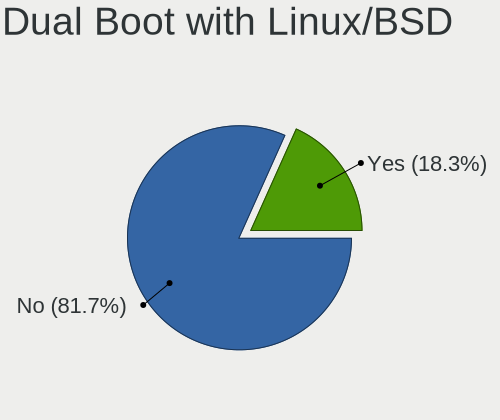
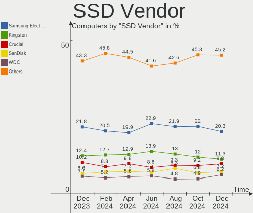
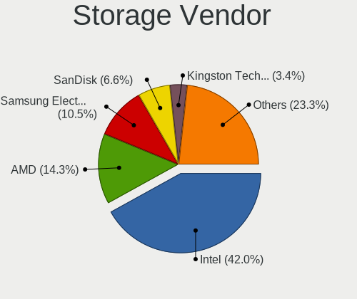
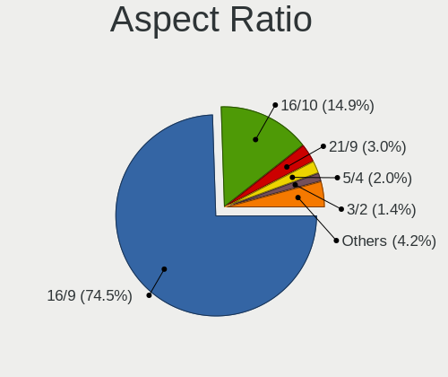
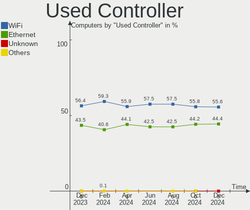

Linux Hardware Trends
---------------------

A project to identify most popular hardware characteristics and track their change
over time based on data collected by Linux users at https://Linux-Hardware.org.

Anyone can contribute to this report by the [hw-probe](https://github.com/linuxhw/hw-probe) tool:

    sudo -E hw-probe -all -upload

This is a report for all computer types. See also reports for [desktops](/Desktop/README.md) and [notebooks](/Notebook/README.md).

Full-feature report is available here: https://linux-hardware.org/?view=trends

Distribution-specific reports: [Ubuntu](/Dist/Ubuntu), [Debian](/Dist/Debian), [Linux Mint](/Dist/Linux_Mint), [Pop!_OS](/Dist/Pop!_OS), [Fedora](/Dist/Fedora), [OpenMandriva](/Dist/OpenMandriva), [Manjaro](/Dist/Manjaro), [Zorin](/Dist/Zorin), [Arch](/Dist/Arch), [KDE neon](/Dist/KDE_neon), [ROSA](/Dist/ROSA), [Xubuntu](/Dist/Xubuntu), [Kubuntu](/Dist/Kubuntu), [ArcoLinux](/Dist/ArcoLinux), [CentOS](/Dist/CentOS), [BlackPanther](/Dist/BlackPanther), [openSUSE](/Dist/openSUSE), [Clear Linux](/Dist/Clear_Linux), [Endless](/Dist/Endless), [Gentoo](/Dist/Gentoo), [Elementary](/Dist/Elementary), [EndeavourOS](/Dist/EndeavourOS), [Ubuntu MATE](/Dist/Ubuntu_MATE), [Kali](/Dist/Kali).

Period: Mar, 2022.

Contents
--------

* [ System ](#system)
  - [ OS                       ](#os)
  - [ OS Family                ](#os-family)
  - [ Kernel                   ](#kernel)
  - [ Kernel Family            ](#kernel-family)
  - [ Kernel Major Ver.        ](#kernel-major-ver)
  - [ Arch                     ](#arch)
  - [ DE                       ](#de)
  - [ Display Server           ](#display-server)
  - [ Display Manager          ](#display-manager)
  - [ OS Lang                  ](#os-lang)
  - [ Boot Mode                ](#boot-mode)
  - [ Filesystem               ](#filesystem)
  - [ Part. scheme             ](#part-scheme)
  - [ Dual Boot with Linux/BSD ](#dual-boot-with-linuxbsd)
  - [ Dual Boot (Win)          ](#dual-boot-win)

* [ Board ](#board)
  - [ Vendor                   ](#vendor)
  - [ Model                    ](#model)
  - [ Model Family             ](#model-family)
  - [ MFG Year                 ](#mfg-year)
  - [ Form Factor              ](#form-factor)
  - [ Secure Boot              ](#secure-boot)
  - [ Coreboot                 ](#coreboot)
  - [ RAM Size                 ](#ram-size)
  - [ RAM Used                 ](#ram-used)
  - [ Total Drives             ](#total-drives)
  - [ Has CD-ROM               ](#has-cd-rom)
  - [ Has Ethernet             ](#has-ethernet)
  - [ Has WiFi                 ](#has-wifi)
  - [ Has Bluetooth            ](#has-bluetooth)

* [ Location ](#location)
  - [ Country                  ](#country)
  - [ City                     ](#city)

* [ Drives ](#drives)
  - [ Drive Vendor             ](#drive-vendor)
  - [ Drive Model              ](#drive-model)
  - [ HDD Vendor               ](#hdd-vendor)
  - [ SSD Vendor               ](#ssd-vendor)
  - [ Drive Kind               ](#drive-kind)
  - [ Drive Connector          ](#drive-connector)
  - [ Drive Size               ](#drive-size)
  - [ Space Total              ](#space-total)
  - [ Space Used               ](#space-used)
  - [ Malfunc. Drives          ](#malfunc-drives)
  - [ Malfunc. Drive Vendor    ](#malfunc-drive-vendor)
  - [ Malfunc. HDD Vendor      ](#malfunc-hdd-vendor)
  - [ Malfunc. Drive Kind      ](#malfunc-drive-kind)
  - [ Failed Drives            ](#failed-drives)
  - [ Failed Drive Vendor      ](#failed-drive-vendor)
  - [ Drive Status             ](#drive-status)

* [ Storage controller ](#storage-controller)
  - [ Storage Vendor           ](#storage-vendor)
  - [ Storage Model            ](#storage-model)
  - [ Storage Kind             ](#storage-kind)

* [ Processor ](#processor)
  - [ CPU Vendor               ](#cpu-vendor)
  - [ CPU Model                ](#cpu-model)
  - [ CPU Model Family         ](#cpu-model-family)
  - [ CPU Cores                ](#cpu-cores)
  - [ CPU Sockets              ](#cpu-sockets)
  - [ CPU Threads              ](#cpu-threads)
  - [ CPU Op-Modes             ](#cpu-op-modes)
  - [ CPU Microcode            ](#cpu-microcode)
  - [ CPU Microarch            ](#cpu-microarch)

* [ Graphics ](#graphics)
  - [ GPU Vendor               ](#gpu-vendor)
  - [ GPU Model                ](#gpu-model)
  - [ GPU Combo                ](#gpu-combo)
  - [ GPU Driver               ](#gpu-driver)
  - [ GPU Memory               ](#gpu-memory)

* [ Monitor ](#monitor)
  - [ Monitor Vendor           ](#monitor-vendor)
  - [ Monitor Model            ](#monitor-model)
  - [ Monitor Resolution       ](#monitor-resolution)
  - [ Monitor Diagonal         ](#monitor-diagonal)
  - [ Monitor Width            ](#monitor-width)
  - [ Aspect Ratio             ](#aspect-ratio)
  - [ Monitor Area             ](#monitor-area)
  - [ Pixel Density            ](#pixel-density)
  - [ Multiple Monitors        ](#multiple-monitors)

* [ Network ](#network)
  - [ Net Controller Vendor    ](#net-controller-vendor)
  - [ Net Controller Model     ](#net-controller-model)
  - [ Wireless Vendor          ](#wireless-vendor)
  - [ Wireless Model           ](#wireless-model)
  - [ Ethernet Vendor          ](#ethernet-vendor)
  - [ Ethernet Model           ](#ethernet-model)
  - [ Net Controller Kind      ](#net-controller-kind)
  - [ Used Controller          ](#used-controller)
  - [ NICs                     ](#nics)
  - [ IPv6                     ](#ipv6)

* [ Bluetooth ](#bluetooth)
  - [ Bluetooth Vendor         ](#bluetooth-vendor)
  - [ Bluetooth Model          ](#bluetooth-model)

* [ Sound ](#sound)
  - [ Sound Vendor             ](#sound-vendor)
  - [ Sound Model              ](#sound-model)

* [ Memory ](#memory)
  - [ Memory Vendor            ](#memory-vendor)
  - [ Memory Model             ](#memory-model)
  - [ Memory Kind              ](#memory-kind)
  - [ Memory Form Factor       ](#memory-form-factor)
  - [ Memory Size              ](#memory-size)
  - [ Memory Speed             ](#memory-speed)

* [ Printers & scanners ](#printers--scanners)
  - [ Printer Vendor           ](#printer-vendor)
  - [ Printer Model            ](#printer-model)
  - [ Scanner Vendor           ](#scanner-vendor)
  - [ Scanner Model            ](#scanner-model)

* [ Camera ](#camera)
  - [ Camera Vendor            ](#camera-vendor)
  - [ Camera Model             ](#camera-model)

* [ Security ](#security)
  - [ Fingerprint Vendor       ](#fingerprint-vendor)
  - [ Fingerprint Model        ](#fingerprint-model)
  - [ Chipcard Vendor          ](#chipcard-vendor)
  - [ Chipcard Model           ](#chipcard-model)

* [ Unsupported ](#unsupported)
  - [ Unsupported Devices      ](#unsupported-devices)
  - [ Unsupported Device Types ](#unsupported-device-types)

System
------

OS
--

Installed operating systems

| Name                | Computers | Percent |
|---------------------|-----------|---------|
| Ubuntu 20.04        | 646       | 12.16%  |
| Debian 11           | 620       | 11.67%  |
| OpenMandriva 4.3    | 396       | 7.45%   |
| Linux Mint 20.3     | 378       | 7.11%   |
| ROSA 12.2           | 346       | 6.51%   |
| Ubuntu 21.10        | 298       | 5.61%   |
| Pop!_OS 21.10       | 260       | 4.89%   |
| Fedora 35           | 256       | 4.82%   |
| Zorin 16            | 164       | 3.09%   |
| KDE neon 20.04      | 153       | 2.88%   |
| Manjaro             | 94        | 1.77%   |
| Elementary 6.1      | 79        | 1.49%   |
| Arch                | 71        | 1.34%   |
| Manjaro 21.2.5      | 63        | 1.19%   |
| ROSA R11.1          | 59        | 1.11%   |
| BlackPanther 18.1   | 56        | 1.05%   |
| ArcoLinux Rolling   | 53        | 1%      |
| Arch Rolling        | 53        | 1%      |
| Linux Mint 20.2     | 50        | 0.94%   |
| Ubuntu 18.04        | 49        | 0.92%   |
| Xubuntu 20.04       | 48        | 0.9%    |
| Kali 2022.1         | 48        | 0.9%    |
| ROSA 12.1           | 41        | 0.77%   |
| Manjaro 21.2.4      | 40        | 0.75%   |
| Kubuntu 20.04       | 40        | 0.75%   |
| Pop!_OS 20.04       | 35        | 0.66%   |
| Kubuntu 21.10       | 35        | 0.66%   |
| Ubuntu 22.04        | 30        | 0.56%   |
| OpenMandriva 4.2    | 30        | 0.56%   |
| Endless 4.0.3       | 25        | 0.47%   |
| EndeavourOS Rolling | 21        | 0.4%    |
| Debian 10           | 21        | 0.4%    |
| Ubuntu MATE 20.04   | 20        | 0.38%   |
| Fedora 36           | 20        | 0.38%   |
| Parrot 5.0          | 18        | 0.34%   |
| Gentoo 2.8          | 18        | 0.34%   |
| Linux Mint 19.3     | 17        | 0.32%   |
| Gentoo 2.6          | 17        | 0.32%   |
| Linux Mint 20.1     | 16        | 0.3%    |
| Ubuntu 21.04        | 15        | 0.28%   |
| OpenMandriva 4.50   | 14        | 0.26%   |
| Lubuntu 20.04       | 14        | 0.26%   |
| Gentoo 2.7          | 14        | 0.26%   |
| Xero Rolling        | 13        | 0.24%   |
| Lubuntu 21.10       | 13        | 0.24%   |
| Debian Testing      | 13        | 0.24%   |
| Slackware 15.0      | 12        | 0.23%   |
| LMDE 5              | 12        | 0.23%   |
| Zorin 15            | 11        | 0.21%   |
| Xubuntu 21.10       | 11        | 0.21%   |
| LMDE 4              | 11        | 0.21%   |
| Linux Mint 20       | 11        | 0.21%   |
| Fedora 34           | 11        | 0.21%   |
| ALT Linux 10.0      | 11        | 0.21%   |
| Xubuntu 18.04       | 10        | 0.19%   |
| Pop!_OS 21.04       | 10        | 0.19%   |
| openSUSE Leap-15.3  | 10        | 0.19%   |
| Kubuntu 11          | 10        | 0.19%   |
| Ubuntu Budgie 20.04 | 9         | 0.17%   |
| MX 21               | 9         | 0.17%   |

OS Family
---------

OS without a version

| Name             | Computers | Percent |
|------------------|-----------|---------|
| Ubuntu           | 1050      | 19.76%  |
| Debian           | 660       | 12.42%  |
| Linux Mint       | 486       | 9.15%   |
| ROSA             | 459       | 8.64%   |
| OpenMandriva     | 441       | 8.3%    |
| Pop!_OS          | 305       | 5.74%   |
| Fedora           | 293       | 5.51%   |
| Manjaro          | 201       | 3.78%   |
| Zorin            | 176       | 3.31%   |
| KDE neon         | 153       | 2.88%   |
| Arch             | 125       | 2.35%   |
| Kubuntu          | 94        | 1.77%   |
| Elementary       | 85        | 1.6%    |
| Xubuntu          | 72        | 1.35%   |
| ArcoLinux        | 57        | 1.07%   |
| BlackPanther     | 56        | 1.05%   |
| Kali             | 52        | 0.98%   |
| Gentoo           | 50        | 0.94%   |
| Endless          | 43        | 0.81%   |
| openSUSE         | 42        | 0.79%   |
| Lubuntu          | 31        | 0.58%   |
| Ubuntu MATE      | 29        | 0.55%   |
| EndeavourOS      | 29        | 0.55%   |
| Parrot           | 25        | 0.47%   |
| LMDE             | 23        | 0.43%   |
| Clear Linux      | 23        | 0.43%   |
| Xero             | 16        | 0.3%    |
| Ubuntu Budgie    | 15        | 0.28%   |
| Garuda Linux     | 15        | 0.28%   |
| ALT Linux        | 15        | 0.28%   |
| Slackware        | 12        | 0.23%   |
| NixOS            | 12        | 0.23%   |
| MX               | 12        | 0.23%   |
| Raspbian         | 11        | 0.21%   |
| Red OS           | 10        | 0.19%   |
| CentOS           | 10        | 0.19%   |
| LinuxFX          | 8         | 0.15%   |
| Linux Lite       | 8         | 0.15%   |
| RHEL             | 7         | 0.13%   |
| SteamOS          | 6         | 0.11%   |
| Oracle Linux     | 6         | 0.11%   |
| Manjaro-ARM      | 6         | 0.11%   |
| Rocky Linux      | 5         | 0.09%   |
| Peppermint       | 5         | 0.09%   |
| Mageia           | 5         | 0.09%   |
| Alpine           | 5         | 0.09%   |
| Artix            | 4         | 0.08%   |
| Void Linux       | 3         | 0.06%   |
| UbuntuDDE        | 3         | 0.06%   |
| Ubuntu Studio    | 3         | 0.06%   |
| Sparky           | 3         | 0.06%   |
| Q4OS             | 3         | 0.06%   |
| Pardus           | 3         | 0.06%   |
| Devuan           | 3         | 0.06%   |
| antiX            | 3         | 0.06%   |
| Storm OS         | 2         | 0.04%   |
| Solus            | 2         | 0.04%   |
| Siduction        | 2         | 0.04%   |
| Reborn OS        | 2         | 0.04%   |
| Org.kde.platform | 2         | 0.04%   |

Kernel
------

Version of the Linux kernel

| Version                             | Computers | Percent |
|-------------------------------------|-----------|---------|
| 5.13.0-35-generic                   | 516       | 9.71%   |
| 5.16.7-desktop-1omv4003             | 387       | 7.28%   |
| 5.10.0-10-amd64                     | 384       | 7.23%   |
| 5.10.74-generic-2rosa2021.1-x86_64  | 369       | 6.94%   |
| 5.13.0-30-generic                   | 364       | 6.85%   |
| 5.13.0-37-generic                   | 274       | 5.16%   |
| 5.16.11-76051611-generic            | 230       | 4.33%   |
| 5.4.0-104-generic                   | 186       | 3.5%    |
| 5.4.0-100-generic                   | 166       | 3.12%   |
| 5.4.0-105-generic                   | 117       | 2.2%    |
| 5.10.0-12-amd64                     | 70        | 1.32%   |
| 5.16.16-200.fc35.x86_64             | 63        | 1.19%   |
| 5.15.28-1-MANJARO                   | 61        | 1.15%   |
| 5.13.0-39-generic                   | 61        | 1.15%   |
| 5.16.12-200.fc35.x86_64             | 60        | 1.13%   |
| 5.10.0-11-amd64                     | 50        | 0.94%   |
| 5.10.0-7-amd64                      | 47        | 0.88%   |
| 5.15.25-1-MANJARO                   | 38        | 0.72%   |
| 5.16.16-arch1-1                     | 36        | 0.68%   |
| 5.6.14-desktop-2bP                  | 35        | 0.66%   |
| 5.11.0-35-generic                   | 30        | 0.56%   |
| 5.16.11-200.fc35.x86_64             | 29        | 0.55%   |
| 5.16.11-2-MANJARO                   | 28        | 0.53%   |
| 5.13.0-28-generic                   | 28        | 0.53%   |
| 5.10.14-desktop-1omv4002            | 28        | 0.53%   |
| 5.4.0-91-generic                    | 27        | 0.51%   |
| 5.15.23-76051523-generic            | 26        | 0.49%   |
| 5.10.0-13-amd64                     | 26        | 0.49%   |
| 5.16.13-arch1-1                     | 24        | 0.45%   |
| 5.13.0-27-generic                   | 24        | 0.45%   |
| 5.13.0-19-generic                   | 24        | 0.45%   |
| 5.16.15-arch1-1                     | 23        | 0.43%   |
| 5.16.15-201.fc35.x86_64             | 23        | 0.43%   |
| 5.16.14-arch1-1                     | 22        | 0.41%   |
| 5.16.14-1-MANJARO                   | 22        | 0.41%   |
| 5.15.15-76051515-generic            | 21        | 0.4%    |
| 4.18.16-desktop-1bP                 | 21        | 0.4%    |
| 5.16.12-arch1-1                     | 20        | 0.38%   |
| 5.16.14-200.fc35.x86_64             | 18        | 0.34%   |
| 5.16.11-1-default                   | 18        | 0.34%   |
| 5.16.16-zen1-1-zen                  | 17        | 0.32%   |
| 5.14.10-300.fc35.x86_64             | 17        | 0.32%   |
| 5.4.83-generic-2rosa-x86_64         | 16        | 0.3%    |
| 5.4.0-107-generic                   | 16        | 0.3%    |
| 4.15.0-171-generic                  | 16        | 0.3%    |
| 5.16.18-200.fc35.x86_64             | 15        | 0.28%   |
| 5.15.0-kali3-amd64                  | 14        | 0.26%   |
| 5.13.0-32-generic                   | 14        | 0.26%   |
| 5.11.0-49-generic                   | 14        | 0.26%   |
| 5.4.32-generic-2rosa-x86_64         | 13        | 0.24%   |
| 5.16.11-arch1-1                     | 13        | 0.24%   |
| 5.16.0-kali3-amd64                  | 12        | 0.23%   |
| 5.15.0-23-generic                   | 12        | 0.23%   |
| 5.14.7-desktop-1omv4050             | 12        | 0.23%   |
| 4.18.0-348.12.2.el8_5.x86_64        | 12        | 0.23%   |
| 5.8.0-43-generic                    | 11        | 0.21%   |
| 5.15.0-15parrot1-amd64              | 11        | 0.21%   |
| 5.14.0-1027-oem                     | 11        | 0.21%   |
| 4.15.0-desktop-122.124.1rosa-x86_64 | 11        | 0.21%   |
| 5.8.0-14-generic                    | 10        | 0.19%   |

Kernel Family
-------------

Linux kernel without a distro release

| Version  | Computers | Percent |
|----------|-----------|---------|
| 5.13.0   | 1379      | 25.95%  |
| 5.10.0   | 623       | 11.72%  |
| 5.4.0    | 583       | 10.97%  |
| 5.16.7   | 390       | 7.34%   |
| 5.10.74  | 378       | 7.11%   |
| 5.16.11  | 347       | 6.53%   |
| 5.16.16  | 126       | 2.37%   |
| 5.16.12  | 110       | 2.07%   |
| 5.11.0   | 96        | 1.81%   |
| 5.16.14  | 85        | 1.6%    |
| 5.16.0   | 71        | 1.34%   |
| 5.16.15  | 68        | 1.28%   |
| 5.15.0   | 68        | 1.28%   |
| 4.15.0   | 68        | 1.28%   |
| 5.15.28  | 65        | 1.22%   |
| 5.16.13  | 52        | 0.98%   |
| 5.14.0   | 47        | 0.88%   |
| 5.15.25  | 45        | 0.85%   |
| 5.17.0   | 42        | 0.79%   |
| 5.8.0    | 38        | 0.72%   |
| 5.15.23  | 38        | 0.72%   |
| 5.6.14   | 35        | 0.66%   |
| 4.19.0   | 29        | 0.55%   |
| 5.10.14  | 28        | 0.53%   |
| 5.15.26  | 25        | 0.47%   |
| 5.17.1   | 24        | 0.45%   |
| 5.4.83   | 22        | 0.41%   |
| 5.15.15  | 21        | 0.4%    |
| 4.18.16  | 21        | 0.4%    |
| 5.16.18  | 20        | 0.38%   |
| 5.4.32   | 19        | 0.36%   |
| 5.14.10  | 17        | 0.32%   |
| 4.18.0   | 16        | 0.3%    |
| 5.16.17  | 13        | 0.24%   |
| 5.10.102 | 13        | 0.24%   |
| 5.15.10  | 12        | 0.23%   |
| 5.14.7   | 12        | 0.23%   |
| 5.10.103 | 12        | 0.23%   |
| 5.16.9   | 11        | 0.21%   |
| 5.15.11  | 11        | 0.21%   |
| 5.3.18   | 10        | 0.19%   |
| 5.16.10  | 10        | 0.19%   |
| 5.10.71  | 9         | 0.17%   |
| 3.10.0   | 9         | 0.17%   |
| 5.15.27  | 8         | 0.15%   |
| 5.10.105 | 8         | 0.15%   |
| 5.16.2   | 7         | 0.13%   |
| 5.15.19  | 6         | 0.11%   |
| 5.10.88  | 6         | 0.11%   |
| 5.15.31  | 5         | 0.09%   |
| 5.15.30  | 5         | 0.09%   |
| 5.15.29  | 5         | 0.09%   |
| 5.13.19  | 5         | 0.09%   |
| 5.4.17   | 4         | 0.08%   |
| 5.16.8   | 4         | 0.08%   |
| 5.15.16  | 4         | 0.08%   |
| 5.14.18  | 4         | 0.08%   |
| 5.10.92  | 4         | 0.08%   |
| 5.10.63  | 4         | 0.08%   |
| 5.9.16   | 3         | 0.06%   |

Kernel Major Ver.
-----------------

Linux kernel major version

| Version | Computers | Percent |
|---------|-----------|---------|
| 5.13    | 1388      | 26.12%  |
| 5.16    | 1321      | 24.86%  |
| 5.10    | 1109      | 20.87%  |
| 5.4     | 645       | 12.14%  |
| 5.15    | 342       | 6.44%   |
| 5.11    | 100       | 1.88%   |
| 5.14    | 85        | 1.6%    |
| 4.15    | 68        | 1.28%   |
| 5.17    | 66        | 1.24%   |
| 5.8     | 38        | 0.72%   |
| 4.18    | 37        | 0.7%    |
| 5.6     | 36        | 0.68%   |
| 4.19    | 31        | 0.58%   |
| 5.3     | 12        | 0.23%   |
| 4.9     | 11        | 0.21%   |
| 3.10    | 9         | 0.17%   |
| 5.9     | 3         | 0.06%   |
| 5.0     | 3         | 0.06%   |
| 5.12    | 2         | 0.04%   |
| 5       | 2         | 0.04%   |
| 4.4     | 2         | 0.04%   |
| 5.15.6  | 1         | 0.02%   |
| 4.16    | 1         | 0.02%   |
| 4.12    | 1         | 0.02%   |
| 3.13    | 1         | 0.02%   |

Arch
----

OS architecture (x86_64, i586, etc.)

| Name    | Computers | Percent |
|---------|-----------|---------|
| x86_64  | 5151      | 96.93%  |
| i686    | 92        | 1.73%   |
| aarch64 | 57        | 1.07%   |
| armv7l  | 11        | 0.21%   |
| armv6l  | 2         | 0.04%   |
| e2k     | 1         | 0.02%   |

DE
--

Desktop Environment

| Name             | Computers | Percent |
|------------------|-----------|---------|
| GNOME            | 2097      | 39.46%  |
| KDE5             | 1305      | 24.56%  |
| Unknown          | 593       | 11.16%  |
| X-Cinnamon       | 388       | 7.3%    |
| XFCE             | 359       | 6.76%   |
| MATE             | 154       | 2.9%    |
| Pantheon         | 87        | 1.64%   |
| LXQt             | 74        | 1.39%   |
| Cinnamon         | 56        | 1.05%   |
| KDE4             | 43        | 0.81%   |
| Budgie           | 22        | 0.41%   |
| i3               | 16        | 0.3%    |
| GNOME Flashback  | 16        | 0.3%    |
| LXDE             | 14        | 0.26%   |
| KDE              | 13        | 0.24%   |
| Unity            | 11        | 0.21%   |
| Deepin           | 9         | 0.17%   |
| GNOME Classic    | 8         | 0.15%   |
| openbox          | 7         | 0.13%   |
| sway             | 6         | 0.11%   |
| awesome          | 6         | 0.11%   |
| dwm              | 4         | 0.08%   |
| xmonad           | 3         | 0.06%   |
| Trinity          | 3         | 0.06%   |
| lightdm-xsession | 3         | 0.06%   |
| ICEWM            | 3         | 0.06%   |
| qtile            | 2         | 0.04%   |
| Enlightenment    | 2         | 0.04%   |
| bspwm            | 2         | 0.04%   |
| river            | 1         | 0.02%   |
| qtile-default    | 1         | 0.02%   |
| Phosh:GNOME      | 1         | 0.02%   |
| Lubuntu          | 1         | 0.02%   |
| LeftWM           | 1         | 0.02%   |
| herbstluftwm     | 1         | 0.02%   |
| FVWM             | 1         | 0.02%   |
| Cutefish         | 1         | 0.02%   |

Display Server
--------------

X11 or Wayland

| Name    | Computers | Percent |
|---------|-----------|---------|
| X11     | 3735      | 70.29%  |
| Wayland | 963       | 18.12%  |
| Unknown | 514       | 9.67%   |
| Tty     | 101       | 1.9%    |
| Web     | 1         | 0.02%   |

Display Manager
---------------

SDDM, LightDM, etc.

| Name    | Computers | Percent |
|---------|-----------|---------|
| Unknown | 2031      | 38.22%  |
| SDDM    | 1025      | 19.29%  |
| GDM     | 811       | 15.26%  |
| GDM3    | 709       | 13.34%  |
| LightDM | 681       | 12.82%  |
| KDM     | 42        | 0.79%   |
| XDM     | 4         | 0.08%   |
| LXDM    | 4         | 0.08%   |
| SLiM    | 3         | 0.06%   |
| TDM     | 2         | 0.04%   |
| MDM     | 2         | 0.04%   |

OS Lang
-------

Language

| Lang    | Computers | Percent |
|---------|-----------|---------|
| en_US   | 1961      | 36.9%   |
| ru_RU   | 623       | 11.72%  |
| Unknown | 482       | 9.07%   |
| de_DE   | 381       | 7.17%   |
| en_GB   | 241       | 4.54%   |
| pt_BR   | 203       | 3.82%   |
| fr_FR   | 180       | 3.39%   |
| it_IT   | 129       | 2.43%   |
| es_ES   | 95        | 1.79%   |
| en_CA   | 95        | 1.79%   |
| pl_PL   | 75        | 1.41%   |
| en_AU   | 74        | 1.39%   |
| en_IN   | 68        | 1.28%   |
| C       | 59        | 1.11%   |
| cs_CZ   | 49        | 0.92%   |
| es_MX   | 45        | 0.85%   |
| nl_NL   | 38        | 0.72%   |
| es_AR   | 33        | 0.62%   |
| zh_CN   | 30        | 0.56%   |
| tr_TR   | 24        | 0.45%   |
| en_ZA   | 24        | 0.45%   |
| fr_CA   | 23        | 0.43%   |
| pt_PT   | 20        | 0.38%   |
| hu_HU   | 20        | 0.38%   |
| de_AT   | 20        | 0.38%   |
| nl_BE   | 15        | 0.28%   |
| en_IE   | 14        | 0.26%   |
| el_GR   | 13        | 0.24%   |
| es_EC   | 12        | 0.23%   |
| es_CO   | 12        | 0.23%   |
| en_PH   | 12        | 0.23%   |
| de_CH   | 12        | 0.23%   |
| sv_SE   | 11        | 0.21%   |
| es_VE   | 11        | 0.21%   |
| sk_SK   | 10        | 0.19%   |
| nb_NO   | 10        | 0.19%   |
| da_DK   | 10        | 0.19%   |
| fr_BE   | 9         | 0.17%   |
| en_SG   | 9         | 0.17%   |
| en_NZ   | 9         | 0.17%   |
| C.UTF8  | 9         | 0.17%   |
| ru_UA   | 8         | 0.15%   |
| ja_JP   | 8         | 0.15%   |
| en_IL   | 8         | 0.15%   |
| es_CL   | 7         | 0.13%   |
| en_DK   | 7         | 0.13%   |
| zh_TW   | 6         | 0.11%   |
| ko_KR   | 6         | 0.11%   |
| POSIX   | 5         | 0.09%   |
| hr_HR   | 5         | 0.09%   |
| fr_CH   | 5         | 0.09%   |
| fi_FI   | 5         | 0.09%   |
| en_HK   | 5         | 0.09%   |
| es_UY   | 4         | 0.08%   |
| es_PE   | 4         | 0.08%   |
| ca_ES   | 4         | 0.08%   |
| ro_RO   | 3         | 0.06%   |
| id_ID   | 3         | 0.06%   |
| es_CR   | 3         | 0.06%   |
| ar_EG   | 3         | 0.06%   |

Boot Mode
---------

EFI or BIOS

| Mode | Computers | Percent |
|------|-----------|---------|
| EFI  | 2868      | 53.97%  |
| BIOS | 2446      | 46.03%  |

Filesystem
----------

Type of filesystem

| Type    | Computers | Percent |
|---------|-----------|---------|
| Ext4    | 3794      | 71.4%   |
| Overlay | 926       | 17.43%  |
| Btrfs   | 469       | 8.83%   |
| Xfs     | 63        | 1.19%   |
| Zfs     | 29        | 0.55%   |
| Ext2    | 10        | 0.19%   |
| F2fs    | 7         | 0.13%   |
| Tmpfs   | 6         | 0.11%   |
| Ext3    | 6         | 0.11%   |
| Aufs    | 3         | 0.06%   |
| Unknown | 1         | 0.02%   |

Part. scheme
------------

Scheme of partitioning

| Type    | Computers | Percent |
|---------|-----------|---------|
| Unknown | 2376      | 44.71%  |
| GPT     | 2265      | 42.62%  |
| MBR     | 673       | 12.66%  |

Dual Boot with Linux/BSD
------------------------

Hosting more than one Linux/BSD

| Dual boot | Computers | Percent |
|-----------|-----------|---------|
| No        | 4231      | 79.62%  |
| Yes       | 1083      | 20.38%  |

Dual Boot (Win)
---------------

Hosting Linux and Windows

| Dual boot | Computers | Percent |
|-----------|-----------|---------|
| No        | 3770      | 70.94%  |
| Yes       | 1544      | 29.06%  |

Board
-----

Vendor
------

Motherboard manufacturer

| Name                    | Computers | Percent |
|-------------------------|-----------|---------|
| ASUSTek Computer        | 835       | 15.71%  |
| Dell                    | 633       | 11.91%  |
| Hewlett-Packard         | 630       | 11.86%  |
| Lenovo                  | 622       | 11.7%   |
| Apple                   | 480       | 9.03%   |
| Gigabyte Technology     | 378       | 7.11%   |
| MSI                     | 308       | 5.8%    |
| Acer                    | 279       | 5.25%   |
| ASRock                  | 180       | 3.39%   |
| Toshiba                 | 84        | 1.58%   |
| Intel                   | 81        | 1.52%   |
| Samsung Electronics     | 66        | 1.24%   |
| Raspberry Pi Foundation | 45        | 0.85%   |
| HUAWEI                  | 41        | 0.77%   |
| Unknown                 | 38        | 0.72%   |
| Sony                    | 37        | 0.7%    |
| Fujitsu                 | 36        | 0.68%   |
| Biostar                 | 26        | 0.49%   |
| Positivo                | 23        | 0.43%   |
| Medion                  | 22        | 0.41%   |
| Packard Bell            | 21        | 0.4%    |
| Pegatron                | 18        | 0.34%   |
| Fujitsu Siemens         | 18        | 0.34%   |
| ECS                     | 18        | 0.34%   |
| Microsoft               | 17        | 0.32%   |
| System76                | 14        | 0.26%   |
| Supermicro              | 13        | 0.24%   |
| Foxconn                 | 13        | 0.24%   |
| Timi                    | 12        | 0.23%   |
| Notebook                | 12        | 0.23%   |
| Alienware               | 12        | 0.23%   |
| Google                  | 11        | 0.21%   |
| AMI                     | 11        | 0.21%   |
| TUXEDO                  | 9         | 0.17%   |
| Aquarius                | 9         | 0.17%   |
| Avell High Performance  | 8         | 0.15%   |
| LG Electronics          | 7         | 0.13%   |
| eMachines               | 7         | 0.13%   |
| Chuwi                   | 7         | 0.13%   |
| Valve                   | 6         | 0.11%   |
| Pine Microsystems       | 6         | 0.11%   |
| Panasonic               | 6         | 0.11%   |
| Razer                   | 5         | 0.09%   |
| HONOR                   | 5         | 0.09%   |
| Framework               | 5         | 0.09%   |
| Clevo                   | 5         | 0.09%   |
| BESSTAR Tech            | 5         | 0.09%   |
| Teclast                 | 4         | 0.08%   |
| Positivo Bahia - VAIO   | 4         | 0.08%   |
| Philco                  | 4         | 0.08%   |
| Multilaser              | 4         | 0.08%   |
| IP3 Tech                | 4         | 0.08%   |
| IBM                     | 4         | 0.08%   |
| Hardkernel              | 4         | 0.08%   |
| GPU Company             | 4         | 0.08%   |
| Gateway                 | 4         | 0.08%   |
| AZW                     | 4         | 0.08%   |
| 3Logic Group            | 4         | 0.08%   |
| Thomson                 | 3         | 0.06%   |
| Shuttle                 | 3         | 0.06%   |

Model
-----

Motherboard model

| Name                                      | Computers | Percent |
|-------------------------------------------|-----------|---------|
| Apple MacBook5,2                          | 286       | 5.38%   |
| Unknown                                   | 55        | 1.04%   |
| Apple MacBook2,1                          | 52        | 0.98%   |
| ASUS All Series                           | 48        | 0.9%    |
| RPi Raspberry Pi                          | 45        | 0.85%   |
| Apple MacBook4,1                          | 21        | 0.4%    |
| HP Notebook                               | 16        | 0.3%    |
| HP Pavilion g6                            | 15        | 0.28%   |
| Gigabyte H410M H V3                       | 15        | 0.28%   |
| Dell Latitude 3120                        | 14        | 0.26%   |
| ASUS UX31E                                | 14        | 0.26%   |
| ASUS TUF GAMING X570-PLUS                 | 11        | 0.21%   |
| MSI MS-7C37                               | 10        | 0.19%   |
| MSI MS-7A38                               | 10        | 0.19%   |
| HP Pavilion dv7                           | 10        | 0.19%   |
| Dell OptiPlex 7010                        | 10        | 0.19%   |
| Dell Latitude E6420                       | 10        | 0.19%   |
| ASUS PRIME H510M-A                        | 10        | 0.19%   |
| MSI MS-7B86                               | 9         | 0.17%   |
| Gigabyte B450M DS3H                       | 9         | 0.17%   |
| Gigabyte 970A-DS3P                        | 9         | 0.17%   |
| ASUS ROG STRIX B550-F GAMING              | 9         | 0.17%   |
| MSI MS-7817                               | 8         | 0.15%   |
| Lenovo IdeaPad S145-15IIL 82DJ            | 8         | 0.15%   |
| HUAWEI HVY-WXX9                           | 8         | 0.15%   |
| Apple MacBook7,1                          | 8         | 0.15%   |
| Apple iMac12,2                            | 8         | 0.15%   |
| Acer Swift SF314-42                       | 8         | 0.15%   |
| MSI MS-7A34                               | 7         | 0.13%   |
| Lenovo ThinkPad L13 Yoga Gen 2 20VK0019US | 7         | 0.13%   |
| HP Z420 Workstation                       | 7         | 0.13%   |
| HP ProDesk 600 G1 SFF                     | 7         | 0.13%   |
| HP Pavilion dv6                           | 7         | 0.13%   |
| HP Laptop 15-da0xxx                       | 7         | 0.13%   |
| HP Laptop 15-bw0xx                        | 7         | 0.13%   |
| HP Laptop 15-bs0xx                        | 7         | 0.13%   |
| Dell XPS 15 7590                          | 7         | 0.13%   |
| Dell Latitude E6430                       | 7         | 0.13%   |
| ASUS PRIME B450M-A                        | 7         | 0.13%   |
| ASUS M5A78L-M/USB3                        | 7         | 0.13%   |
| Apple MacBookPro9,2                       | 7         | 0.13%   |
| Acer Nitro AN515-44                       | 7         | 0.13%   |
| Valve Jupiter                             | 6         | 0.11%   |
| MSI MS-7C02                               | 6         | 0.11%   |
| MSI MS-7721                               | 6         | 0.11%   |
| Lenovo ThinkBook 15 G2 ITL 20VE           | 6         | 0.11%   |
| Lenovo IdeaPad 5 Pro 14ACN6 82L7          | 6         | 0.11%   |
| HP Pavilion Notebook                      | 6         | 0.11%   |
| HP Pavilion 17                            | 6         | 0.11%   |
| HP Laptop 15-db0xxx                       | 6         | 0.11%   |
| HP ENVY x360 Convertible 15-eu0xxx        | 6         | 0.11%   |
| Gigabyte B450 AORUS M                     | 6         | 0.11%   |
| Gigabyte B450 AORUS ELITE                 | 6         | 0.11%   |
| Dell OptiPlex 760                         | 6         | 0.11%   |
| Dell OptiPlex 7050                        | 6         | 0.11%   |
| Dell Inspiron 5100                        | 6         | 0.11%   |
| Dell Inspiron 1545                        | 6         | 0.11%   |
| Apple MacBookPro12,1                      | 6         | 0.11%   |
| Apple MacBookAir7,2                       | 6         | 0.11%   |
| MSI MS-7C56                               | 5         | 0.09%   |

Model Family
------------

Motherboard model prefix

| Name                  | Computers | Percent |
|-----------------------|-----------|---------|
| Apple MacBook5        | 288       | 5.42%   |
| Lenovo ThinkPad       | 237       | 4.46%   |
| Dell Latitude         | 192       | 3.61%   |
| Acer Aspire           | 174       | 3.27%   |
| Dell Inspiron         | 149       | 2.8%    |
| Lenovo IdeaPad        | 134       | 2.52%   |
| HP Pavilion           | 128       | 2.41%   |
| ASUS PRIME            | 108       | 2.03%   |
| Dell OptiPlex         | 88        | 1.66%   |
| ASUS ROG              | 85        | 1.6%    |
| HP Laptop             | 78        | 1.47%   |
| Toshiba Satellite     | 72        | 1.35%   |
| HP EliteBook          | 70        | 1.32%   |
| Dell XPS              | 68        | 1.28%   |
| HP ProBook            | 57        | 1.07%   |
| Unknown               | 55        | 1.04%   |
| Dell Precision        | 53        | 1%      |
| ASUS VivoBook         | 53        | 1%      |
| Apple MacBook2        | 52        | 0.98%   |
| HP Compaq             | 49        | 0.92%   |
| ASUS TUF              | 49        | 0.92%   |
| ASUS All              | 48        | 0.9%    |
| RPi Raspberry         | 45        | 0.85%   |
| Lenovo ThinkCentre    | 42        | 0.79%   |
| Dell Vostro           | 39        | 0.73%   |
| HP ENVY               | 32        | 0.6%    |
| Lenovo Legion         | 29        | 0.55%   |
| Acer Swift            | 27        | 0.51%   |
| Acer Nitro            | 24        | 0.45%   |
| ASUS M5A78L-M         | 22        | 0.41%   |
| Lenovo Yoga           | 21        | 0.4%    |
| Apple MacBook4        | 21        | 0.4%    |
| Gigabyte X570         | 19        | 0.36%   |
| Lenovo ThinkBook      | 18        | 0.34%   |
| Fujitsu LIFEBOOK      | 18        | 0.34%   |
| Microsoft Surface     | 17        | 0.32%   |
| HP ZBook              | 17        | 0.32%   |
| HP Notebook           | 17        | 0.32%   |
| Gigabyte H410M        | 17        | 0.32%   |
| ASUS ZenBook          | 17        | 0.32%   |
| Gigabyte B450M        | 16        | 0.3%    |
| Gigabyte B450         | 16        | 0.3%    |
| ASUS P8H61-M          | 16        | 0.3%    |
| Packard Bell EasyNote | 15        | 0.28%   |
| HP EliteDesk          | 15        | 0.28%   |
| Lenovo IdeaCentre     | 14        | 0.26%   |
| ASUS UX31E            | 14        | 0.26%   |
| Lenovo ThinkStation   | 13        | 0.24%   |
| HP ProDesk            | 13        | 0.24%   |
| HP OMEN               | 13        | 0.24%   |
| Fujitsu ESPRIMO       | 13        | 0.24%   |
| ASUS ASUS             | 13        | 0.24%   |
| HP 250                | 12        | 0.23%   |
| Dell PowerEdge        | 12        | 0.23%   |
| Apple iMac12          | 12        | 0.23%   |
| Acer TravelMate       | 12        | 0.23%   |
| MSI MS-7C37           | 10        | 0.19%   |
| MSI MS-7A38           | 10        | 0.19%   |
| Lenovo IdeaPadFlex    | 10        | 0.19%   |
| HP 255                | 10        | 0.19%   |

MFG Year
--------

Motherboard manufacture year

| Year    | Computers | Percent |
|---------|-----------|---------|
| 2021    | 586       | 11.03%  |
| 2020    | 574       | 10.8%   |
| 2009    | 459       | 8.64%   |
| 2018    | 418       | 7.87%   |
| 2019    | 406       | 7.64%   |
| 2012    | 397       | 7.47%   |
| 2011    | 370       | 6.96%   |
| 2013    | 321       | 6.04%   |
| 2017    | 291       | 5.48%   |
| 2014    | 276       | 5.19%   |
| 2016    | 236       | 4.44%   |
| 2010    | 229       | 4.31%   |
| 2015    | 225       | 4.23%   |
| 2008    | 191       | 3.59%   |
| 2007    | 158       | 2.97%   |
| Unknown | 77        | 1.45%   |
| 2006    | 42        | 0.79%   |
| 2022    | 31        | 0.58%   |
| 2005    | 14        | 0.26%   |
| 2003    | 9         | 0.17%   |
| 2004    | 2         | 0.04%   |
| 2002    | 2         | 0.04%   |

Form Factor
-----------

Physical design of the computer

| Name           | Computers | Percent |
|----------------|-----------|---------|
| Notebook       | 2949      | 55.49%  |
| Desktop        | 1920      | 36.13%  |
| Convertible    | 146       | 2.75%   |
| All in one     | 85        | 1.6%    |
| Mini pc        | 63        | 1.19%   |
| System on chip | 62        | 1.17%   |
| Tablet         | 45        | 0.85%   |
| Server         | 39        | 0.73%   |
| Phone          | 4         | 0.08%   |
| Stick pc       | 1         | 0.02%   |

Secure Boot
-----------

Enabled or disabled

| State    | Computers | Percent |
|----------|-----------|---------|
| Disabled | 4969      | 93.51%  |
| Enabled  | 345       | 6.49%   |

Coreboot
--------

Have coreboot on board

| Used | Computers | Percent |
|------|-----------|---------|
| No   | 5295      | 99.64%  |
| Yes  | 19        | 0.36%   |

RAM Size
--------

Total RAM memory

| Size in GB      | Computers | Percent |
|-----------------|-----------|---------|
| 4.01-8.0        | 1182      | 22.24%  |
| 16.01-24.0      | 992       | 18.67%  |
| 3.01-4.0        | 950       | 17.88%  |
| 8.01-16.0       | 849       | 15.98%  |
| 1.01-2.0        | 520       | 9.79%   |
| 32.01-64.0      | 472       | 8.88%   |
| 64.01-256.0     | 142       | 2.67%   |
| 2.01-3.0        | 81        | 1.52%   |
| 24.01-32.0      | 68        | 1.28%   |
| 0.51-1.0        | 41        | 0.77%   |
| 0.01-0.5        | 10        | 0.19%   |
| More than 256.0 | 7         | 0.13%   |

RAM Used
--------

Used RAM memory

| Used GB     | Computers | Percent |
|-------------|-----------|---------|
| 1.01-2.0    | 2213      | 41.64%  |
| 2.01-3.0    | 1136      | 21.38%  |
| 4.01-8.0    | 642       | 12.08%  |
| 3.01-4.0    | 548       | 10.31%  |
| 0.51-1.0    | 459       | 8.64%   |
| 8.01-16.0   | 166       | 3.12%   |
| 0.01-0.5    | 103       | 1.94%   |
| 16.01-24.0  | 27        | 0.51%   |
| 24.01-32.0  | 12        | 0.23%   |
| 32.01-64.0  | 6         | 0.11%   |
| 64.01-256.0 | 1         | 0.02%   |
| Unknown     | 1         | 0.02%   |

Total Drives
------------

Number of drives on board

| Drives | Computers | Percent |
|--------|-----------|---------|
| 1      | 3231      | 60.8%   |
| 2      | 1252      | 23.56%  |
| 3      | 437       | 8.22%   |
| 4      | 187       | 3.52%   |
| 5      | 74        | 1.39%   |
| 6      | 49        | 0.92%   |
| 0      | 44        | 0.83%   |
| 7      | 17        | 0.32%   |
| 8      | 9         | 0.17%   |
| 9      | 7         | 0.13%   |
| 11     | 2         | 0.04%   |
| 10     | 2         | 0.04%   |
| 16     | 1         | 0.02%   |
| 13     | 1         | 0.02%   |
| 12     | 1         | 0.02%   |

Has CD-ROM
----------

Has CD-ROM on board

| Presented | Computers | Percent |
|-----------|-----------|---------|
| No        | 3141      | 59.11%  |
| Yes       | 2173      | 40.89%  |

Has Ethernet
------------

Has Ethernet on board

| Presented | Computers | Percent |
|-----------|-----------|---------|
| Yes       | 4586      | 86.3%   |
| No        | 728       | 13.7%   |

Has WiFi
--------

Has WiFi module

| Presented | Computers | Percent |
|-----------|-----------|---------|
| Yes       | 4048      | 76.18%  |
| No        | 1266      | 23.82%  |

Has Bluetooth
-------------

Has Bluetooth module

| Presented | Computers | Percent |
|-----------|-----------|---------|
| Yes       | 3227      | 60.73%  |
| No        | 2087      | 39.27%  |

Location
--------

Country
-------

Geographic location (country)

| Country      | Computers | Percent |
|--------------|-----------|---------|
| USA          | 1236      | 23.26%  |
| Russia       | 667       | 12.55%  |
| Germany      | 468       | 8.81%   |
| Brazil       | 281       | 5.29%   |
| France       | 227       | 4.27%   |
| UK           | 170       | 3.2%    |
| Italy        | 167       | 3.14%   |
| Canada       | 152       | 2.86%   |
| Poland       | 126       | 2.37%   |
| Spain        | 124       | 2.33%   |
| Netherlands  | 120       | 2.26%   |
| Australia    | 94        | 1.77%   |
| India        | 88        | 1.66%   |
| Hungary      | 73        | 1.37%   |
| Czechia      | 67        | 1.26%   |
| Mexico       | 64        | 1.2%    |
| Turkey       | 53        | 1%      |
| Argentina    | 52        | 0.98%   |
| Switzerland  | 49        | 0.92%   |
| Austria      | 49        | 0.92%   |
| Indonesia    | 46        | 0.87%   |
| Sweden       | 41        | 0.77%   |
| China        | 40        | 0.75%   |
| Belgium      | 40        | 0.75%   |
| Portugal     | 39        | 0.73%   |
| Romania      | 38        | 0.72%   |
| Greece       | 37        | 0.7%    |
| Norway       | 32        | 0.6%    |
| South Africa | 28        | 0.53%   |
| Colombia     | 28        | 0.53%   |
| Ukraine      | 27        | 0.51%   |
| Belarus      | 25        | 0.47%   |
| Japan        | 21        | 0.4%    |
| Finland      | 21        | 0.4%    |
| Denmark      | 21        | 0.4%    |
| Bulgaria     | 21        | 0.4%    |
| Slovakia     | 19        | 0.36%   |
| Philippines  | 19        | 0.36%   |
| Serbia       | 18        | 0.34%   |
| Croatia      | 18        | 0.34%   |
| New Zealand  | 17        | 0.32%   |
| Ecuador      | 17        | 0.32%   |
| Hong Kong    | 16        | 0.3%    |
| Egypt        | 16        | 0.3%    |
| Israel       | 15        | 0.28%   |
| Ireland      | 15        | 0.28%   |
| Iran         | 15        | 0.28%   |
| Chile        | 15        | 0.28%   |
| Venezuela    | 13        | 0.24%   |
| Slovenia     | 12        | 0.23%   |
| Taiwan       | 11        | 0.21%   |
| Thailand     | 10        | 0.19%   |
| Saudi Arabia | 10        | 0.19%   |
| Malaysia     | 10        | 0.19%   |
| South Korea  | 9         | 0.17%   |
| Uzbekistan   | 8         | 0.15%   |
| Bangladesh   | 8         | 0.15%   |
| Uruguay      | 7         | 0.13%   |
| Singapore    | 7         | 0.13%   |
| Puerto Rico  | 7         | 0.13%   |

City
----

Geographic location (city)

| City              | Computers | Percent |
|-------------------|-----------|---------|
| Bangor            | 392       | 7.38%   |
| Moscow            | 141       | 2.65%   |
| St Petersburg     | 71        | 1.34%   |
| Voronezh          | 51        | 0.96%   |
| Berlin            | 48        | 0.9%    |
| Paris             | 38        | 0.72%   |
| Sydney            | 33        | 0.62%   |
| Prague            | 32        | 0.6%    |
| Warsaw            | 29        | 0.55%   |
| Montreal          | 29        | 0.55%   |
| Vienna            | 27        | 0.51%   |
| Sao Paulo         | 25        | 0.47%   |
| Milan             | 24        | 0.45%   |
| Schagen           | 23        | 0.43%   |
| Istanbul          | 20        | 0.38%   |
| Barcelona         | 20        | 0.38%   |
| Munich            | 19        | 0.36%   |
| Minsk             | 18        | 0.34%   |
| Budapest          | 18        | 0.34%   |
| Athens            | 18        | 0.34%   |
| Seattle           | 17        | 0.32%   |
| New York          | 17        | 0.32%   |
| Jakarta           | 17        | 0.32%   |
| Yekaterinburg     | 16        | 0.3%    |
| Melbourne         | 16        | 0.3%    |
| Rome              | 15        | 0.28%   |
| Brisbane          | 15        | 0.28%   |
| Volgograd         | 14        | 0.26%   |
| Rostov-on-Don     | 14        | 0.26%   |
| Gonikoppal        | 14        | 0.26%   |
| Frankfurt am Main | 14        | 0.26%   |
| Buenos Aires      | 14        | 0.26%   |
| Bucharest         | 14        | 0.26%   |
| Rio de Janeiro    | 13        | 0.24%   |
| Perm              | 13        | 0.24%   |
| Madrid            | 13        | 0.24%   |
| Portland          | 12        | 0.23%   |
| Novosibirsk       | 12        | 0.23%   |
| Miami             | 12        | 0.23%   |
| Zagreb            | 11        | 0.21%   |
| Toronto           | 11        | 0.21%   |
| Houston           | 11        | 0.21%   |
| Brasília         | 11        | 0.21%   |
| Beijing           | 11        | 0.21%   |
| Amsterdam         | 11        | 0.21%   |
| The Hague         | 10        | 0.19%   |
| Stuttgart         | 10        | 0.19%   |
| Strasbourg        | 10        | 0.19%   |
| Hamburg           | 10        | 0.19%   |
| Curitiba          | 10        | 0.19%   |
| Bogotá           | 10        | 0.19%   |
| Atlanta           | 10        | 0.19%   |
| Wroclaw           | 9         | 0.17%   |
| Stockholm         | 9         | 0.17%   |
| Porto Alegre      | 9         | 0.17%   |
| Oslo              | 9         | 0.17%   |
| Leipzig           | 9         | 0.17%   |
| Cologne           | 9         | 0.17%   |
| Chicago           | 9         | 0.17%   |
| Zurich            | 8         | 0.15%   |

Drives
------

Drive Vendor
------------

Hard drive vendors

| Vendor                         | Computers | Drives | Percent |
|--------------------------------|-----------|--------|---------|
| WDC                            | 1118      | 1366   | 14.67%  |
| Seagate                        | 1095      | 1369   | 14.36%  |
| Samsung Electronics            | 1091      | 1350   | 14.31%  |
| Toshiba                        | 594       | 645    | 7.79%   |
| Kingston                       | 400       | 435    | 5.25%   |
| Sandisk                        | 392       | 421    | 5.14%   |
| Unknown                        | 272       | 321    | 3.57%   |
| Fujitsu                        | 233       | 234    | 3.06%   |
| Crucial                        | 233       | 254    | 3.06%   |
| Hitachi                        | 219       | 237    | 2.87%   |
| SK Hynix                       | 193       | 199    | 2.53%   |
| Intel                          | 174       | 190    | 2.28%   |
| A-DATA Technology              | 142       | 145    | 1.86%   |
| HGST                           | 121       | 124    | 1.59%   |
| Micron Technology              | 85        | 89     | 1.12%   |
| China                          | 78        | 78     | 1.02%   |
| Phison                         | 65        | 67     | 0.85%   |
| Apple                          | 59        | 73     | 0.77%   |
| KIOXIA                         | 58        | 59     | 0.76%   |
| SPCC                           | 53        | 55     | 0.7%    |
| PNY                            | 39        | 45     | 0.51%   |
| Unknown                        | 38        | 38     | 0.5%    |
| Silicon Motion                 | 36        | 36     | 0.47%   |
| GOODRAM                        | 36        | 39     | 0.47%   |
| Intenso                        | 29        | 31     | 0.38%   |
| Transcend                      | 28        | 28     | 0.37%   |
| Patriot                        | 28        | 28     | 0.37%   |
| MAXTOR                         | 28        | 29     | 0.37%   |
| Gigabyte Technology            | 28        | 29     | 0.37%   |
| Apacer                         | 25        | 25     | 0.33%   |
| JMicron                        | 22        | 27     | 0.29%   |
| XPG                            | 21        | 21     | 0.28%   |
| OCZ                            | 21        | 24     | 0.28%   |
| LITEON                         | 21        | 21     | 0.28%   |
| Corsair                        | 21        | 24     | 0.28%   |
| Team                           | 20        | 21     | 0.26%   |
| Netac                          | 20        | 20     | 0.26%   |
| Micron/Crucial Technology      | 18        | 19     | 0.24%   |
| Hewlett-Packard                | 18        | 18     | 0.24%   |
| AMD                            | 18        | 18     | 0.24%   |
| LITEONIT                       | 17        | 18     | 0.22%   |
| Lexar                          | 15        | 15     | 0.2%    |
| UMIS                           | 12        | 12     | 0.16%   |
| PLEXTOR                        | 12        | 15     | 0.16%   |
| KingSpec                       | 12        | 13     | 0.16%   |
| SSSTC                          | 11        | 11     | 0.14%   |
| Solid State Storage Technology | 11        | 11     | 0.14%   |
| SABRENT                        | 11        | 11     | 0.14%   |
| ASMT                           | 10        | 11     | 0.13%   |
| ADATA Technology               | 10        | 11     | 0.13%   |
| KingFast                       | 9         | 10     | 0.12%   |
| Realtek Semiconductor          | 8         | 8      | 0.1%    |
| Mushkin                        | 7         | 10     | 0.09%   |
| Lenovo                         | 7         | 7      | 0.09%   |
| KIOXIA-EXCERIA                 | 7         | 8      | 0.09%   |
| KingDian                       | 7         | 7      | 0.09%   |
| YMTC                           | 6         | 6      | 0.08%   |
| USB3.0                         | 6         | 6      | 0.08%   |
| External                       | 6         | 6      | 0.08%   |
| ASMedia                        | 6         | 6      | 0.08%   |

Drive Model
-----------

Hard drive models

| Model                              | Computers | Percent |
|------------------------------------|-----------|---------|
| Fujitsu MHZ2160BH FFS G1 160GB     | 186       | 2.22%   |
| Kingston SA400S37240G 240GB SSD    | 86        | 1.03%   |
| Kingston SA400S37480G 480GB SSD    | 54        | 0.65%   |
| Unknown MMC Card  64GB             | 51        | 0.61%   |
| Seagate ST2000DM008-2FR102 2TB     | 51        | 0.61%   |
| Seagate ST1000LM035-1RK172 1TB     | 50        | 0.6%    |
| Seagate ST1000DM010-2EP102 1TB     | 50        | 0.6%    |
| Samsung SSD 860 EVO 250GB          | 49        | 0.59%   |
| Unknown MMC Card  32GB             | 48        | 0.57%   |
| Samsung SSD 860 EVO 500GB          | 47        | 0.56%   |
| Seagate ST500DM002-1BD142 500GB    | 46        | 0.55%   |
| Samsung NVMe SSD Drive 1TB         | 46        | 0.55%   |
| Seagate ST1000LM024 HN-M101MBB 1TB | 45        | 0.54%   |
| Samsung NVMe SSD Drive 500GB       | 44        | 0.53%   |
| Toshiba MK1655GSXF 160GB           | 43        | 0.51%   |
| Seagate ST500LT012-1DG142 500GB    | 43        | 0.51%   |
| Samsung SSD 850 EVO 250GB          | 43        | 0.51%   |
| Toshiba MQ04ABF100 1TB             | 41        | 0.49%   |
| Sandisk NVMe SSD Drive 512GB       | 41        | 0.49%   |
| Sandisk NVMe SSD Drive 1TB         | 41        | 0.49%   |
| Kingston SA400S37120G 120GB SSD    | 41        | 0.49%   |
| Toshiba MK1653GSX 160GB            | 40        | 0.48%   |
| Unknown                            | 38        | 0.45%   |
| Samsung NVMe SSD Drive 512GB       | 36        | 0.43%   |
| Crucial CT240BX500SSD1 240GB       | 36        | 0.43%   |
| WDC WD10EZEX-08WN4A0 1TB           | 35        | 0.42%   |
| Unknown SD/MMC/MS PRO 32GB         | 35        | 0.42%   |
| Toshiba MQ01ABD100 1TB             | 35        | 0.42%   |
| WDC WDS240G2G0A-00JH30 240GB SSD   | 34        | 0.41%   |
| HGST HTS721010A9E630 1TB           | 34        | 0.41%   |
| Samsung SSD 970 EVO Plus 1TB       | 33        | 0.39%   |
| WDC WDS500G2B0A-00SM50 500GB SSD   | 32        | 0.38%   |
| Crucial CT500MX500SSD1 500GB       | 32        | 0.38%   |
| Samsung SSD 860 EVO 1TB            | 31        | 0.37%   |
| Samsung NVMe SSD Drive 256GB       | 31        | 0.37%   |
| Intel NVMe SSD Drive 512GB         | 31        | 0.37%   |
| Unknown MMC Card  128GB            | 29        | 0.35%   |
| Toshiba DT01ACA100 1TB             | 29        | 0.35%   |
| Samsung SSD 850 EVO 500GB          | 29        | 0.35%   |
| SK Hynix NVMe SSD Drive 512GB      | 28        | 0.33%   |
| Toshiba MQ01ABF050 500GB           | 27        | 0.32%   |
| Crucial CT1000MX500SSD1 1TB        | 27        | 0.32%   |
| Sandisk NVMe SSD Drive 500GB       | 25        | 0.3%    |
| Samsung SSD 970 EVO Plus 500GB     | 25        | 0.3%    |
| SanDisk SSD PLUS 240GB             | 24        | 0.29%   |
| Seagate Expansion 320GB            | 23        | 0.28%   |
| Toshiba HDWD110 1TB                | 22        | 0.26%   |
| Kingston SV300S37A120G 120GB SSD   | 22        | 0.26%   |
| Toshiba DT01ACA050 500GB           | 21        | 0.25%   |
| Seagate ST1000DM003-1CH162 1TB     | 21        | 0.25%   |
| Sandisk NVMe SSD Drive 256GB       | 21        | 0.25%   |
| WDC WDS100T2B0A-00SM50 1TB SSD     | 20        | 0.24%   |
| Seagate ST9500325AS 500GB          | 20        | 0.24%   |
| Seagate ST3500418AS 500GB          | 20        | 0.24%   |
| Samsung SSD 870 QVO 1TB            | 20        | 0.24%   |
| Seagate ST3500413AS 500GB          | 19        | 0.23%   |
| Seagate ST1000DM003-1ER162 1TB     | 19        | 0.23%   |
| A-DATA SU650 120GB SSD             | 19        | 0.23%   |
| Seagate ST4000DM004-2CV104 4TB     | 18        | 0.22%   |
| Seagate ST31000528AS 1TB           | 18        | 0.22%   |

HDD Vendor
----------

Hard disk drive vendors

| Vendor              | Computers | Drives | Percent |
|---------------------|-----------|--------|---------|
| Seagate             | 1071      | 1333   | 32.8%   |
| WDC                 | 867       | 1051   | 26.55%  |
| Toshiba             | 476       | 513    | 14.58%  |
| Fujitsu             | 232       | 233    | 7.11%   |
| Hitachi             | 219       | 237    | 6.71%   |
| Samsung Electronics | 147       | 165    | 4.5%    |
| HGST                | 121       | 124    | 3.71%   |
| Unknown             | 37        | 38     | 1.13%   |
| MAXTOR              | 24        | 25     | 0.74%   |
| Apple               | 15        | 15     | 0.46%   |
| SABRENT             | 11        | 11     | 0.34%   |
| asmedia             | 6         | 6      | 0.18%   |
| Hewlett-Packard     | 5         | 5      | 0.15%   |
| JMicron             | 4         | 6      | 0.12%   |
| ASMT                | 4         | 5      | 0.12%   |
| Intenso             | 3         | 3      | 0.09%   |
| IBM/Hitachi         | 3         | 3      | 0.09%   |
| StoreJet            | 2         | 2      | 0.06%   |
| sage                | 2         | 2      | 0.06%   |
| RSH-339             | 2         | 2      | 0.06%   |
| WD MediaMax         | 1         | 1      | 0.03%   |
| USB3.0              | 1         | 1      | 0.03%   |
| USB 3.0             | 1         | 1      | 0.03%   |
| TPH01204000GB       | 1         | 1      | 0.03%   |
| RSH-319             | 1         | 1      | 0.03%   |
| QNAP                | 1         | 6      | 0.03%   |
| Pear 2TB            | 1         | 1      | 0.03%   |
| MaxDigital          | 1         | 1      | 0.03%   |
| LaCie               | 1         | 1      | 0.03%   |
| KESU                | 1         | 1      | 0.03%   |
| IBM                 | 1         | 1      | 0.03%   |
| HPE                 | 1         | 1      | 0.03%   |
| HGST HUS            | 1         | 1      | 0.03%   |
| ExcelStor           | 1         | 2      | 0.03%   |

SSD Vendor
----------

Solid state drive vendors

| Vendor              | Computers | Drives | Percent |
|---------------------|-----------|--------|---------|
| Samsung Electronics | 523       | 608    | 21.39%  |
| Kingston            | 318       | 343    | 13.01%  |
| SanDisk             | 227       | 239    | 9.28%   |
| Crucial             | 207       | 222    | 8.47%   |
| WDC                 | 177       | 184    | 7.24%   |
| A-DATA Technology   | 108       | 109    | 4.42%   |
| China               | 77        | 77     | 3.15%   |
| Intel               | 52        | 54     | 2.13%   |
| SPCC                | 46        | 48     | 1.88%   |
| Toshiba             | 42        | 47     | 1.72%   |
| SK Hynix            | 38        | 40     | 1.55%   |
| Micron Technology   | 36        | 37     | 1.47%   |
| PNY                 | 35        | 40     | 1.43%   |
| GOODRAM             | 35        | 37     | 1.43%   |
| Apple               | 32        | 32     | 1.31%   |
| Transcend           | 26        | 26     | 1.06%   |
| Patriot             | 26        | 26     | 1.06%   |
| Intenso             | 22        | 24     | 0.9%    |
| Apacer              | 21        | 21     | 0.86%   |
| OCZ                 | 20        | 22     | 0.82%   |
| Netac               | 20        | 20     | 0.82%   |
| LITEON              | 19        | 19     | 0.78%   |
| Team                | 18        | 19     | 0.74%   |
| LITEONIT            | 17        | 18     | 0.7%    |
| JMicron             | 16        | 16     | 0.65%   |
| Corsair             | 15        | 17     | 0.61%   |
| Gigabyte Technology | 14        | 14     | 0.57%   |
| AMD                 | 14        | 14     | 0.57%   |
| Unknown             | 13        | 13     | 0.53%   |
| Lexar               | 12        | 12     | 0.49%   |
| KingSpec            | 12        | 13     | 0.49%   |
| Hewlett-Packard     | 11        | 11     | 0.45%   |
| PLEXTOR             | 10        | 11     | 0.41%   |
| Seagate             | 8         | 8      | 0.33%   |
| Mushkin             | 7         | 10     | 0.29%   |
| KingDian            | 7         | 7      | 0.29%   |
| KingFast            | 6         | 6      | 0.25%   |
| USB3.0              | 5         | 5      | 0.2%    |
| Teclast             | 5         | 5      | 0.2%    |
| ASMT                | 5         | 5      | 0.2%    |
| Argon               | 5         | 5      | 0.2%    |
| TO Exter            | 4         | 7      | 0.16%   |
| MAXTOR              | 4         | 4      | 0.16%   |
| DOGFISH             | 4         | 4      | 0.16%   |
| Verbatim            | 3         | 3      | 0.12%   |
| Unknown             | 3         | 3      | 0.12%   |
| Smartbuy            | 3         | 3      | 0.12%   |
| KIOXIA-EXCERIA      | 3         | 3      | 0.12%   |
| INNOVATION IT       | 3         | 4      | 0.12%   |
| Hikvision           | 3         | 3      | 0.12%   |
| FOXLINE             | 3         | 3      | 0.12%   |
| FORESEE             | 3         | 3      | 0.12%   |
| Colorful            | 3         | 3      | 0.12%   |
| BHT                 | 3         | 3      | 0.12%   |
| ZTC                 | 2         | 2      | 0.08%   |
| Zheino              | 2         | 2      | 0.08%   |
| XrayDisk            | 2         | 2      | 0.08%   |
| Xinhaike            | 2         | 2      | 0.08%   |
| Vaseky              | 2         | 2      | 0.08%   |
| TCSUNBOW            | 2         | 2      | 0.08%   |

Drive Kind
----------

HDD or SSD

| Kind    | Computers | Drives | Percent |
|---------|-----------|--------|---------|
| HDD     | 2845      | 3799   | 40.89%  |
| SSD     | 2174      | 2627   | 31.24%  |
| NVMe    | 1576      | 1859   | 22.65%  |
| MMC     | 252       | 296    | 3.62%   |
| Unknown | 111       | 127    | 1.6%    |

Drive Connector
---------------

SATA, SAS, NVMe, etc.

| Type | Computers | Drives | Percent |
|------|-----------|--------|---------|
| SATA | 4076      | 6167   | 65.7%   |
| NVMe | 1571      | 1849   | 25.32%  |
| SAS  | 305       | 396    | 4.92%   |
| MMC  | 252       | 296    | 4.06%   |

Drive Size
----------

Size of hard drive

| Size in TB | Computers | Drives | Percent |
|------------|-----------|--------|---------|
| 0.01-0.5   | 3168      | 3973   | 61.4%   |
| 0.51-1.0   | 1318      | 1552   | 25.54%  |
| 1.01-2.0   | 382       | 471    | 7.4%    |
| 3.01-4.0   | 138       | 183    | 2.67%   |
| 2.01-3.0   | 73        | 97     | 1.41%   |
| 4.01-10.0  | 71        | 129    | 1.38%   |
| 10.01-20.0 | 10        | 21     | 0.19%   |

Space Total
-----------

Amount of disk space available on the file system

| Size in GB     | Computers | Percent |
|----------------|-----------|---------|
| 101-250        | 1262      | 23.75%  |
| 251-500        | 1018      | 19.16%  |
| 501-1000       | 695       | 13.08%  |
| Unknown        | 585       | 11.01%  |
| 1-20           | 451       | 8.49%   |
| 1001-2000      | 380       | 7.15%   |
| 51-100         | 317       | 5.97%   |
| More than 3000 | 281       | 5.29%   |
| 21-50          | 185       | 3.48%   |
| 2001-3000      | 140       | 2.63%   |

Space Used
----------

Amount of used disk space

| Used GB        | Computers | Percent |
|----------------|-----------|---------|
| 1-20           | 2007      | 37.77%  |
| 21-50          | 766       | 14.41%  |
| Unknown        | 585       | 11.01%  |
| 101-250        | 563       | 10.59%  |
| 51-100         | 492       | 9.26%   |
| 251-500        | 357       | 6.72%   |
| 501-1000       | 243       | 4.57%   |
| 1001-2000      | 148       | 2.79%   |
| More than 3000 | 93        | 1.75%   |
| 2001-3000      | 59        | 1.11%   |
| 0              | 1         | 0.02%   |

Malfunc. Drives
---------------

Drive models with a malfunction

| Model                               | Computers | Drives | Percent |
|-------------------------------------|-----------|--------|---------|
| Fujitsu MHZ2160BH FFS G1 160GB      | 19        | 19     | 2.67%   |
| SanDisk SSD U100 256GB              | 13        | 13     | 1.83%   |
| Seagate ST500LT012-1DG142 500GB     | 10        | 10     | 1.4%    |
| Toshiba MK1653GSX 160GB             | 9         | 9      | 1.26%   |
| Seagate ST1000LM024 HN-M101MBB 1TB  | 8         | 8      | 1.12%   |
| WDC WDS240G2G0A-00JH30 240GB SSD    | 7         | 7      | 0.98%   |
| Seagate ST9500325AS 500GB           | 7         | 7      | 0.98%   |
| Seagate ST500DM002-1BD142 500GB     | 7         | 9      | 0.98%   |
| Toshiba MK1655GSXF 160GB            | 6         | 6      | 0.84%   |
| Hitachi HTS543216L9SA02 160GB       | 6         | 6      | 0.84%   |
| Hitachi HTS542512K9SA00 120GB       | 6         | 6      | 0.84%   |
| HGST HTS725050A7E630 500GB          | 6         | 6      | 0.84%   |
| Seagate ST9320325AS 320GB           | 5         | 5      | 0.7%    |
| Seagate ST3500418AS 500GB           | 5         | 5      | 0.7%    |
| Seagate ST1000LM035-1RK172 1TB      | 5         | 5      | 0.7%    |
| HGST HTS545050A7E680 500GB          | 5         | 5      | 0.7%    |
| WDC WD1600BUDT-63DPZY0 160GB        | 4         | 4      | 0.56%   |
| Toshiba MQ01ABF050 500GB            | 4         | 4      | 0.56%   |
| Toshiba MQ01ABD050 500GB            | 4         | 4      | 0.56%   |
| Seagate ST980811AS 80GB             | 4         | 4      | 0.56%   |
| Seagate ST750LM022 HN-M750MBB 752GB | 4         | 4      | 0.56%   |
| Seagate ST500LT012-9WS142 500GB     | 4         | 4      | 0.56%   |
| Seagate ST500LM021-1KJ152 500GB     | 4         | 4      | 0.56%   |
| Seagate ST1000DM003-1CH162 1TB      | 4         | 5      | 0.56%   |
| Samsung Electronics HM160HI 160GB   | 4         | 4      | 0.56%   |
| Kingston SA400S37120G 120GB SSD     | 4         | 6      | 0.56%   |
| Hitachi HTS547575A9E384 752GB       | 4         | 4      | 0.56%   |
| Hitachi HTS545050B9A300 500GB       | 4         | 4      | 0.56%   |
| HGST HTS721010A9E630 1TB            | 4         | 4      | 0.56%   |
| WDC WD10EARS-00Y5B1 1TB             | 3         | 3      | 0.42%   |
| Toshiba MQ04ABF100 1TB              | 3         | 3      | 0.42%   |
| Toshiba DT01ACA050 500GB            | 3         | 3      | 0.42%   |
| Seagate ST9500420AS 500GB           | 3         | 3      | 0.42%   |
| Seagate ST9320423AS 320GB           | 3         | 3      | 0.42%   |
| Seagate ST8000AS0002-1NA17Z 8TB     | 3         | 4      | 0.42%   |
| Seagate ST500LM012 HN-M500MBB 500GB | 3         | 3      | 0.42%   |
| Seagate ST500LM000-SSHD-8GB         | 3         | 3      | 0.42%   |
| Seagate ST3500320AS 500GB           | 3         | 3      | 0.42%   |
| Seagate ST3250310AS 250GB           | 3         | 3      | 0.42%   |
| Seagate ST3160815AS 160GB           | 3         | 3      | 0.42%   |
| Seagate ST31000528AS 1TB            | 3         | 3      | 0.42%   |
| Seagate ST2000DM001-1CH164 2TB      | 3         | 3      | 0.42%   |
| Seagate ST1000LX015-1U7172 1TB      | 3         | 3      | 0.42%   |
| Seagate ST1000DM010-2EP102 1TB      | 3         | 3      | 0.42%   |
| SanDisk SSD PLUS 240GB              | 3         | 3      | 0.42%   |
| Samsung Electronics HD501LJ 500GB   | 3         | 4      | 0.42%   |
| Samsung Electronics HD322HJ 320GB   | 3         | 3      | 0.42%   |
| Samsung Electronics HD160JJ 160GB   | 3         | 3      | 0.42%   |
| Kingston SV300S37A120G 120GB SSD    | 3         | 3      | 0.42%   |
| Kingston SA400S37240G 240GB SSD     | 3         | 3      | 0.42%   |
| Hitachi HTS543232A7A384 320GB       | 3         | 3      | 0.42%   |
| Hitachi HDS721010CLA330 1TB         | 3         | 3      | 0.42%   |
| Hitachi HDP725050GLA360 500GB       | 3         | 3      | 0.42%   |
| HGST HTS545050A7E380 500GB          | 3         | 3      | 0.42%   |
| Crucial CT525MX300SSD1 528GB        | 3         | 3      | 0.42%   |
| WDC WDS480G2G0A-00JH30 480GB SSD    | 2         | 2      | 0.28%   |
| WDC WD5000LPVX-22V0TT0 500GB        | 2         | 2      | 0.28%   |
| WDC WD5000AAKX-60U6AA0 500GB        | 2         | 2      | 0.28%   |
| WDC WD5000AAKX-603CA0 500GB         | 2         | 2      | 0.28%   |
| WDC WD5000AAKX-22ERMA0 500GB        | 2         | 2      | 0.28%   |

Malfunc. Drive Vendor
---------------------

Vendors of faulty drives

| Vendor              | Computers | Drives | Percent |
|---------------------|-----------|--------|---------|
| Seagate             | 193       | 214    | 28.18%  |
| WDC                 | 138       | 153    | 20.15%  |
| Hitachi             | 64        | 66     | 9.34%   |
| Toshiba             | 56        | 60     | 8.18%   |
| Samsung Electronics | 52        | 57     | 7.59%   |
| SanDisk             | 27        | 28     | 3.94%   |
| Fujitsu             | 27        | 27     | 3.94%   |
| HGST                | 21        | 21     | 3.07%   |
| Kingston            | 20        | 22     | 2.92%   |
| SK Hynix            | 13        | 15     | 1.9%    |
| MAXTOR              | 9         | 9      | 1.31%   |
| Crucial             | 9         | 9      | 1.31%   |
| Intel               | 7         | 7      | 1.02%   |
| A-DATA Technology   | 6         | 6      | 0.88%   |
| Micron Technology   | 5         | 5      | 0.73%   |
| SSSTC               | 2         | 2      | 0.29%   |
| LITEON              | 2         | 2      | 0.29%   |
| Lenovo              | 2         | 2      | 0.29%   |
| IBM/Hitachi         | 2         | 2      | 0.29%   |
| ASMedia             | 2         | 2      | 0.29%   |
| WD MediaMax         | 1         | 1      | 0.15%   |
| Vaseky              | 1         | 1      | 0.15%   |
| Transcend           | 1         | 1      | 0.15%   |
| Team                | 1         | 1      | 0.15%   |
| SPCC                | 1         | 1      | 0.15%   |
| SATAFIRM            | 1         | 1      | 0.15%   |
| RSH-339             | 1         | 1      | 0.15%   |
| PLEXTOR             | 1         | 1      | 0.15%   |
| Phison              | 1         | 1      | 0.15%   |
| OCZ-VERTEX3         | 1         | 1      | 0.15%   |
| OCZ                 | 1         | 1      | 0.15%   |
| Netac               | 1         | 1      | 0.15%   |
| Mushkin             | 1         | 1      | 0.15%   |
| LITEONIT            | 1         | 1      | 0.15%   |
| KingSpec            | 1         | 1      | 0.15%   |
| Intenso             | 1         | 1      | 0.15%   |
| IBM                 | 1         | 1      | 0.15%   |
| HPE                 | 1         | 1      | 0.15%   |
| HP Phison           | 1         | 1      | 0.15%   |
| Hewlett-Packard     | 1         | 1      | 0.15%   |
| ExcelStor           | 1         | 2      | 0.15%   |
| Espada              | 1         | 1      | 0.15%   |
| Drevo               | 1         | 1      | 0.15%   |
| DOGFISH             | 1         | 1      | 0.15%   |
| Corsair             | 1         | 1      | 0.15%   |
| Colorful            | 1         | 1      | 0.15%   |
| China               | 1         | 1      | 0.15%   |
| AMD                 | 1         | 1      | 0.15%   |

Malfunc. HDD Vendor
-------------------

Vendors of faulty HDD drives

| Vendor              | Computers | Drives | Percent |
|---------------------|-----------|--------|---------|
| Seagate             | 193       | 214    | 35.22%  |
| WDC                 | 130       | 142    | 23.72%  |
| Hitachi             | 64        | 66     | 11.68%  |
| Toshiba             | 54        | 58     | 9.85%   |
| Samsung Electronics | 41        | 46     | 7.48%   |
| Fujitsu             | 27        | 27     | 4.93%   |
| HGST                | 21        | 21     | 3.83%   |
| MAXTOR              | 9         | 9      | 1.64%   |
| IBM/Hitachi         | 2         | 2      | 0.36%   |
| ASMedia             | 2         | 2      | 0.36%   |
| WD MediaMax         | 1         | 1      | 0.18%   |
| RSH-339             | 1         | 1      | 0.18%   |
| IBM                 | 1         | 1      | 0.18%   |
| HPE                 | 1         | 1      | 0.18%   |
| ExcelStor           | 1         | 2      | 0.18%   |

Malfunc. Drive Kind
-------------------

Kinds of faulty drives

| Kind | Computers | Drives | Percent |
|------|-----------|--------|---------|
| HDD  | 513       | 593    | 78.8%   |
| SSD  | 125       | 132    | 19.2%   |
| NVMe | 13        | 13     | 2%      |

Failed Drives
-------------

Failed drive models

| Model                                          | Computers | Drives | Percent |
|------------------------------------------------|-----------|--------|---------|
| Apple HDD HTS541010A9E662 1TB                  | 3         | 3      | 17.65%  |
| WDC WD5000BEVT-22A0RT0 500GB                   | 1         | 1      | 5.88%   |
| WDC WD2003FYYS-18W0B0 2TB                      | 1         | 1      | 5.88%   |
| WDC WD1600BEVT-22ZCT0 160GB                    | 1         | 1      | 5.88%   |
| Toshiba DT01ACA100 1TB                         | 1         | 1      | 5.88%   |
| Seagate ST500LT012-1DG142 500GB                | 1         | 1      | 5.88%   |
| Seagate ST31000528AS 1TB                       | 1         | 1      | 5.88%   |
| Seagate ST250DM000-1BD141 250GB                | 1         | 1      | 5.88%   |
| Seagate ST2000DM001-1CH164 2TB                 | 1         | 1      | 5.88%   |
| Samsung Electronics HD502HJ 500GB              | 1         | 3      | 5.88%   |
| Samsung Electronics HD103SJ 1TB                | 1         | 1      | 5.88%   |
| Patriot Pyro SSD 120GB                         | 1         | 1      | 5.88%   |
| Micron Technology 1100_MTFDDAV256TBN 256GB SSD | 1         | 1      | 5.88%   |
| Intel SSDSC2KB960G8 960GB                      | 1         | 1      | 5.88%   |
| Hitachi HDS721010DLE630 1TB                    | 1         | 1      | 5.88%   |

Failed Drive Vendor
-------------------

Failed drive vendors

| Vendor              | Computers | Drives | Percent |
|---------------------|-----------|--------|---------|
| Seagate             | 4         | 4      | 23.53%  |
| WDC                 | 3         | 3      | 17.65%  |
| Apple               | 3         | 3      | 17.65%  |
| Samsung Electronics | 2         | 4      | 11.76%  |
| Toshiba             | 1         | 1      | 5.88%   |
| Patriot             | 1         | 1      | 5.88%   |
| Micron Technology   | 1         | 1      | 5.88%   |
| Intel               | 1         | 1      | 5.88%   |
| Hitachi             | 1         | 1      | 5.88%   |

Drive Status
------------

Number of failed and malfunc. drives

| Status   | Computers | Drives | Percent |
|----------|-----------|--------|---------|
| Detected | 2579      | 4193   | 45.1%   |
| Works    | 2489      | 3757   | 43.53%  |
| Malfunc  | 632       | 738    | 11.05%  |
| Failed   | 17        | 19     | 0.3%    |
| Limited  | 1         | 1      | 0.02%   |

Storage controller
------------------

Storage Vendor
--------------

Storage controller vendors

| Vendor                           | Computers | Percent |
|----------------------------------|-----------|---------|
| Intel                            | 3300      | 50.05%  |
| AMD                              | 1023      | 15.52%  |
| Samsung Electronics              | 533       | 8.08%   |
| Nvidia                           | 374       | 5.67%   |
| Sandisk                          | 270       | 4.1%    |
| SK Hynix                         | 149       | 2.26%   |
| Phison Electronics               | 102       | 1.55%   |
| ASMedia Technology               | 92        | 1.4%    |
| Kingston Technology Company      | 89        | 1.35%   |
| Toshiba America Info Systems     | 85        | 1.29%   |
| Marvell Technology Group         | 70        | 1.06%   |
| JMicron Technology               | 69        | 1.05%   |
| KIOXIA                           | 57        | 0.86%   |
| Silicon Motion                   | 56        | 0.85%   |
| ADATA Technology                 | 53        | 0.8%    |
| Micron Technology                | 49        | 0.74%   |
| Micron/Crucial Technology        | 48        | 0.73%   |
| Solid State Storage Technology   | 20        | 0.3%    |
| Realtek Semiconductor            | 19        | 0.29%   |
| Union Memory (Shenzhen)          | 13        | 0.2%    |
| LSI Logic / Symbios Logic        | 13        | 0.2%    |
| Broadcom / LSI                   | 13        | 0.2%    |
| VIA Technologies                 | 12        | 0.18%   |
| Silicon Integrated Systems [SiS] | 10        | 0.15%   |
| Apple                            | 10        | 0.15%   |
| Yangtze Memory Technologies      | 8         | 0.12%   |
| Seagate Technology               | 8         | 0.12%   |
| Silicon Image                    | 7         | 0.11%   |
| Lite-On Technology               | 7         | 0.11%   |
| Lenovo                           | 5         | 0.08%   |
| Adaptec                          | 5         | 0.08%   |
| Shenzhen Longsys Electronics     | 4         | 0.06%   |
| MAXIO Technology (Hangzhou)      | 4         | 0.06%   |
| O2 Micro                         | 3         | 0.05%   |
| Integrated Technology Express    | 3         | 0.05%   |
| ULi Electronics                  | 2         | 0.03%   |
| OCZ Technology Group             | 2         | 0.03%   |
| Biwin Storage Technology         | 2         | 0.03%   |
| Unknown                          | 1         | 0.02%   |
| MCST                             | 1         | 0.02%   |
| Hewlett-Packard                  | 1         | 0.02%   |
| Artop Electronic                 | 1         | 0.02%   |

Storage Model
-------------

Storage controller models

| Model                                                                                   | Computers | Percent |
|-----------------------------------------------------------------------------------------|-----------|---------|
| AMD FCH SATA Controller [AHCI mode]                                                     | 663       | 8.69%   |
| Nvidia MCP79 AHCI Controller                                                            | 300       | 3.93%   |
| Samsung NVMe SSD Controller SM981/PM981/PM983                                           | 266       | 3.49%   |
| Intel Sunrise Point-LP SATA Controller [AHCI mode]                                      | 220       | 2.88%   |
| Intel 7 Series Chipset Family 6-port SATA Controller [AHCI mode]                        | 208       | 2.73%   |
| Intel 8 Series/C220 Series Chipset Family 6-port SATA Controller 1 [AHCI mode]          | 197       | 2.58%   |
| Intel 82801 Mobile SATA Controller [RAID mode]                                          | 184       | 2.41%   |
| Intel 6 Series/C200 Series Chipset Family 6 port Mobile SATA AHCI Controller            | 165       | 2.16%   |
| AMD 400 Series Chipset SATA Controller                                                  | 151       | 1.98%   |
| Intel 82801G (ICH7 Family) IDE Controller                                               | 125       | 1.64%   |
| Samsung NVMe SSD Controller 980                                                         | 122       | 1.6%    |
| Intel 6 Series/C200 Series Chipset Family 6 port Desktop SATA AHCI Controller           | 117       | 1.53%   |
| Intel Volume Management Device NVMe RAID Controller                                     | 112       | 1.47%   |
| Intel Q170/Q150/B150/H170/H110/Z170/CM236 Chipset SATA Controller [AHCI Mode]           | 111       | 1.46%   |
| AMD SB7x0/SB8x0/SB9x0 SATA Controller [AHCI mode]                                       | 108       | 1.42%   |
| AMD SB7x0/SB8x0/SB9x0 IDE Controller                                                    | 105       | 1.38%   |
| Intel 500 Series Chipset Family SATA AHCI Controller                                    | 92        | 1.21%   |
| Intel NM10/ICH7 Family SATA Controller [IDE mode]                                       | 91        | 1.19%   |
| Intel 8 Series SATA Controller 1 [AHCI mode]                                            | 89        | 1.17%   |
| Intel 82801IBM/IEM (ICH9M/ICH9M-E) 4 port SATA Controller [AHCI mode]                   | 87        | 1.14%   |
| ASMedia ASM1062 Serial ATA Controller                                                   | 87        | 1.14%   |
| Intel 7 Series/C210 Series Chipset Family 6-port SATA Controller [AHCI mode]            | 86        | 1.13%   |
| AMD 500 Series Chipset SATA Controller                                                  | 83        | 1.09%   |
| Sandisk WD Blue SN550 NVMe SSD                                                          | 82        | 1.07%   |
| Intel Celeron/Pentium Silver Processor SATA Controller                                  | 79        | 1.04%   |
| Intel 200 Series PCH SATA controller [AHCI mode]                                        | 79        | 1.04%   |
| Intel SATA Controller [RAID mode]                                                       | 76        | 1%      |
| Intel 82801HM/HEM (ICH8M/ICH8M-E) IDE Controller                                        | 76        | 1%      |
| Intel Cannon Lake PCH SATA AHCI Controller                                              | 75        | 0.98%   |
| Samsung NVMe SSD Controller PM9A1/PM9A3/980PRO                                          | 73        | 0.96%   |
| Intel Wildcat Point-LP SATA Controller [AHCI Mode]                                      | 73        | 0.96%   |
| Intel 5 Series/3400 Series Chipset 4 port SATA AHCI Controller                          | 68        | 0.89%   |
| AMD SB7x0/SB8x0/SB9x0 SATA Controller [IDE mode]                                        | 67        | 0.88%   |
| Intel Comet Lake SATA AHCI Controller                                                   | 66        | 0.87%   |
| SK Hynix Gold P31 SSD                                                                   | 65        | 0.85%   |
| Sandisk WD Black SN750 / PC SN730 NVMe SSD                                              | 65        | 0.85%   |
| Intel Cannon Lake Mobile PCH SATA AHCI Controller                                       | 64        | 0.84%   |
| Intel 82801HM/HEM (ICH8M/ICH8M-E) SATA Controller [AHCI mode]                           | 64        | 0.84%   |
| Intel 82801GBM/GHM (ICH7-M Family) SATA Controller [AHCI mode]                          | 58        | 0.76%   |
| Intel HM170/QM170 Chipset SATA Controller [AHCI Mode]                                   | 53        | 0.69%   |
| Samsung NVMe SSD Controller SM961/PM961/SM963                                           | 52        | 0.68%   |
| KIOXIA Non-Volatile memory controller                                                   | 52        | 0.68%   |
| Intel Tiger Lake-LP SATA Controller [AHCI mode]                                         | 51        | 0.67%   |
| Intel 6 Series/C200 Series Chipset Family Desktop SATA Controller (IDE mode, ports 4-5) | 51        | 0.67%   |
| Intel 6 Series/C200 Series Chipset Family Desktop SATA Controller (IDE mode, ports 0-3) | 51        | 0.67%   |
| Intel 5 Series/3400 Series Chipset 6 port SATA AHCI Controller                          | 50        | 0.66%   |
| Micron Non-Volatile memory controller                                                   | 49        | 0.64%   |
| Intel SSD 660P Series                                                                   | 49        | 0.64%   |
| Phison E12 NVMe Controller                                                              | 48        | 0.63%   |
| Silicon Motion SM2263EN/SM2263XT SSD Controller                                         | 47        | 0.62%   |
| Sandisk Non-Volatile memory controller                                                  | 45        | 0.59%   |
| Intel 400 Series Chipset Family SATA AHCI Controller                                    | 45        | 0.59%   |
| Intel Atom Processor E3800 Series SATA AHCI Controller                                  | 43        | 0.56%   |
| Intel Celeron N3350/Pentium N4200/Atom E3900 Series SATA AHCI Controller                | 38        | 0.5%    |
| JMicron JMB363 SATA/IDE Controller                                                      | 37        | 0.49%   |
| Intel Cannon Point-LP SATA Controller [AHCI Mode]                                       | 35        | 0.46%   |
| Nvidia MCP61 SATA Controller                                                            | 34        | 0.45%   |
| Intel 5 Series/3400 Series Chipset 4 port SATA IDE Controller                           | 34        | 0.45%   |
| Toshiba America Info Systems XG6 NVMe SSD Controller                                    | 33        | 0.43%   |
| Intel 5 Series/3400 Series Chipset 2 port SATA IDE Controller                           | 32        | 0.42%   |

Storage Kind
------------

Kind of storage controller (IDE, SATA, NVMe, SAS, ...)

| Kind | Computers | Percent |
|------|-----------|---------|
| SATA | 3917      | 58.21%  |
| NVMe | 1569      | 23.32%  |
| IDE  | 782       | 11.62%  |
| RAID | 423       | 6.29%   |
| SAS  | 28        | 0.42%   |
| SCSI | 10        | 0.15%   |

Processor
---------

CPU Vendor
----------

Processor vendors

| Vendor       | Computers | Percent |
|--------------|-----------|---------|
| Intel        | 4006      | 75.39%  |
| AMD          | 1236      | 23.26%  |
| ARM          | 64        | 1.2%    |
| QUALCOMM     | 2         | 0.04%   |
| Phytium      | 2         | 0.04%   |
| Unknown      | 2         | 0.04%   |
| E8C-SWTX     | 1         | 0.02%   |
| CentaurHauls | 1         | 0.02%   |

CPU Model
---------

Processor models

| Model                                         | Computers | Percent |
|-----------------------------------------------|-----------|---------|
| Intel Core 2 Duo CPU P7450 @ 2.13GHz          | 287       | 5.4%    |
| Intel 11th Gen Core i7-1165G7 @ 2.80GHz       | 88        | 1.66%   |
| Intel Core 2 CPU T7200 @ 2.00GHz              | 55        | 1.04%   |
| Intel 11th Gen Core i5-1135G7 @ 2.40GHz       | 55        | 1.04%   |
| Intel Core i5-8250U CPU @ 1.60GHz             | 51        | 0.96%   |
| ARM Processor                                 | 49        | 0.92%   |
| AMD Ryzen 5 3600 6-Core Processor             | 43        | 0.81%   |
| Intel Core i5-3470 CPU @ 3.20GHz              | 37        | 0.7%    |
| Intel Core i5-7200U CPU @ 2.50GHz             | 36        | 0.68%   |
| Intel Core i5-10400 CPU @ 2.90GHz             | 34        | 0.64%   |
| Intel Core i7-8550U CPU @ 1.80GHz             | 33        | 0.62%   |
| Intel Core i5-10210U CPU @ 1.60GHz            | 33        | 0.62%   |
| Intel Core i5-3210M CPU @ 2.50GHz             | 32        | 0.6%    |
| Intel Core i7-9750H CPU @ 2.60GHz             | 31        | 0.58%   |
| Intel Atom x5-Z8350 CPU @ 1.44GHz             | 31        | 0.58%   |
| Intel Core i5-3320M CPU @ 2.60GHz             | 30        | 0.56%   |
| AMD Ryzen 7 5800H with Radeon Graphics        | 30        | 0.56%   |
| AMD Ryzen 5 5500U with Radeon Graphics        | 30        | 0.56%   |
| Intel Core i7-7700HQ CPU @ 2.80GHz            | 29        | 0.55%   |
| Intel Core i7-10510U CPU @ 1.80GHz            | 26        | 0.49%   |
| Intel Core i5-6200U CPU @ 2.30GHz             | 26        | 0.49%   |
| AMD Ryzen 7 4800H with Radeon Graphics        | 26        | 0.49%   |
| AMD Ryzen 5 5600X 6-Core Processor            | 26        | 0.49%   |
| AMD Ryzen 5 3500U with Radeon Vega Mobile Gfx | 26        | 0.49%   |
| Intel Core i7-8750H CPU @ 2.20GHz             | 25        | 0.47%   |
| Intel Core i7-6700HQ CPU @ 2.60GHz            | 25        | 0.47%   |
| Intel Core i5-8265U CPU @ 1.60GHz             | 25        | 0.47%   |
| Intel Core i5-5200U CPU @ 2.20GHz             | 24        | 0.45%   |
| Intel Core 2 Duo CPU T8100 @ 2.10GHz          | 24        | 0.45%   |
| Intel Celeron N4020 CPU @ 1.10GHz             | 24        | 0.45%   |
| AMD Ryzen 7 5700U with Radeon Graphics        | 24        | 0.45%   |
| AMD Ryzen 7 3700X 8-Core Processor            | 24        | 0.45%   |
| Intel Core i7-8565U CPU @ 1.80GHz             | 23        | 0.43%   |
| Intel Core i7-4790 CPU @ 3.60GHz              | 22        | 0.41%   |
| Intel Core i5-7400 CPU @ 3.00GHz              | 22        | 0.41%   |
| Intel 11th Gen Core i7-11800H @ 2.30GHz       | 22        | 0.41%   |
| AMD Ryzen 9 3900X 12-Core Processor           | 22        | 0.41%   |
| Intel Core i5-2520M CPU @ 2.50GHz             | 21        | 0.4%    |
| Intel Core i5-1035G1 CPU @ 1.00GHz            | 21        | 0.4%    |
| Intel Core 2 Duo CPU E8400 @ 3.00GHz          | 21        | 0.4%    |
| Intel 11th Gen Core i7-1185G7 @ 3.00GHz       | 21        | 0.4%    |
| Intel Pentium Silver N6000 @ 1.10GHz          | 20        | 0.38%   |
| Intel Core i7-10750H CPU @ 2.60GHz            | 20        | 0.38%   |
| AMD FX-8350 Eight-Core Processor              | 20        | 0.38%   |
| Intel Core i7-3770 CPU @ 3.40GHz              | 19        | 0.36%   |
| Intel Core i7-1065G7 CPU @ 1.30GHz            | 19        | 0.36%   |
| Intel Core i5-6500 CPU @ 3.20GHz              | 19        | 0.36%   |
| Intel Core i5-6300U CPU @ 2.40GHz             | 19        | 0.36%   |
| AMD Ryzen 7 4700U with Radeon Graphics        | 19        | 0.36%   |
| AMD Ryzen 5 2600 Six-Core Processor           | 19        | 0.36%   |
| Intel Core i5-4200U CPU @ 1.60GHz             | 18        | 0.34%   |
| Intel Celeron CPU N3350 @ 1.10GHz             | 18        | 0.34%   |
| AMD Ryzen 9 5950X 16-Core Processor           | 18        | 0.34%   |
| Intel Core i5-5300U CPU @ 2.30GHz             | 17        | 0.32%   |
| Intel Core 2 Duo CPU P8600 @ 2.40GHz          | 17        | 0.32%   |
| AMD Ryzen 7 2700X Eight-Core Processor        | 17        | 0.32%   |
| AMD Ryzen 5 4600H with Radeon Graphics        | 17        | 0.32%   |
| AMD Ryzen 5 1600 Six-Core Processor           | 17        | 0.32%   |
| Intel Core i5-3230M CPU @ 2.60GHz             | 16        | 0.3%    |
| Intel Core i5-2430M CPU @ 2.40GHz             | 16        | 0.3%    |

CPU Model Family
----------------

Processor model prefix

| Model                   | Computers | Percent |
|-------------------------|-----------|---------|
| Intel Core i5           | 1039      | 19.55%  |
| Intel Core i7           | 806       | 15.17%  |
| Intel Core 2 Duo        | 516       | 9.71%   |
| Intel Core i3           | 411       | 7.73%   |
| Other                   | 381       | 7.17%   |
| AMD Ryzen 5             | 319       | 6%      |
| AMD Ryzen 7             | 228       | 4.29%   |
| Intel Celeron           | 219       | 4.12%   |
| Intel Pentium           | 153       | 2.88%   |
| Intel Xeon              | 121       | 2.28%   |
| Intel Atom              | 100       | 1.88%   |
| AMD Ryzen 9             | 83        | 1.56%   |
| AMD FX                  | 81        | 1.52%   |
| Intel Core 2            | 77        | 1.45%   |
| Intel Pentium Dual-Core | 58        | 1.09%   |
| AMD Ryzen 3             | 50        | 0.94%   |
| AMD A8                  | 42        | 0.79%   |
| AMD A4                  | 42        | 0.79%   |
| AMD A10                 | 42        | 0.79%   |
| AMD A6                  | 40        | 0.75%   |
| Intel Core 2 Quad       | 39        | 0.73%   |
| Intel Pentium Silver    | 38        | 0.72%   |
| Intel Core i9           | 37        | 0.7%    |
| Intel Pentium Dual      | 27        | 0.51%   |
| AMD Athlon II X2        | 26        | 0.49%   |
| AMD Athlon 64 X2        | 24        | 0.45%   |
| AMD Phenom II X4        | 19        | 0.36%   |
| AMD Ryzen 7 PRO         | 18        | 0.34%   |
| AMD Ryzen 5 PRO         | 16        | 0.3%    |
| AMD E1                  | 16        | 0.3%    |
| AMD E                   | 16        | 0.3%    |
| ARM BCM                 | 13        | 0.24%   |
| AMD Athlon              | 12        | 0.23%   |
| Intel Pentium 4         | 11        | 0.21%   |
| AMD E2                  | 11        | 0.21%   |
| AMD Athlon II X4        | 11        | 0.21%   |
| AMD Phenom II X6        | 10        | 0.19%   |
| Intel Genuine           | 9         | 0.17%   |
| Intel Pentium Gold      | 8         | 0.15%   |
| AMD Turion 64 Mobile    | 7         | 0.13%   |
| AMD Sempron             | 7         | 0.13%   |
| AMD Ryzen Threadripper  | 7         | 0.13%   |
| AMD Phenom              | 7         | 0.13%   |
| AMD C-60                | 7         | 0.13%   |
| AMD Ryzen 3 PRO         | 6         | 0.11%   |
| AMD Athlon 64           | 6         | 0.11%   |
| Intel Core m3           | 5         | 0.09%   |
| AMD Turion 64 X2 Mobile | 5         | 0.09%   |
| AMD Athlon X4           | 5         | 0.09%   |
| AMD A12                 | 5         | 0.09%   |
| Intel Xeon Silver       | 4         | 0.08%   |
| Intel Xeon Gold         | 4         | 0.08%   |
| Intel Pentium M         | 4         | 0.08%   |
| Intel Pentium D         | 4         | 0.08%   |
| AMD Phenom II           | 4         | 0.08%   |
| AMD Athlon X2           | 4         | 0.08%   |
| AMD Athlon II           | 4         | 0.08%   |
| Intel Core m5           | 3         | 0.06%   |
| AMD Opteron             | 3         | 0.06%   |
| AMD EPYC                | 3         | 0.06%   |

CPU Cores
---------

Number of processor cores

| Number  | Computers | Percent |
|---------|-----------|---------|
| 2       | 2293      | 43.15%  |
| 4       | 1797      | 33.82%  |
| 6       | 542       | 10.2%   |
| 8       | 381       | 7.17%   |
| 1       | 111       | 2.09%   |
| 12      | 63        | 1.19%   |
| 16      | 44        | 0.83%   |
| 3       | 30        | 0.56%   |
| 10      | 13        | 0.24%   |
| 14      | 11        | 0.21%   |
| Unknown | 8         | 0.15%   |
| 32      | 6         | 0.11%   |
| 20      | 4         | 0.08%   |
| 24      | 3         | 0.06%   |
| 18      | 2         | 0.04%   |
| 48      | 1         | 0.02%   |
| 40      | 1         | 0.02%   |
| 36      | 1         | 0.02%   |
| 28      | 1         | 0.02%   |
| 22      | 1         | 0.02%   |
| 5       | 1         | 0.02%   |

CPU Sockets
-----------

Number of sockets

| Number  | Computers | Percent |
|---------|-----------|---------|
| 1       | 5265      | 99.08%  |
| 2       | 41        | 0.77%   |
| Unknown | 7         | 0.13%   |
| 4       | 1         | 0.02%   |

CPU Threads
-----------

Threads per core (Hyper-Threading)

| Number  | Computers | Percent |
|---------|-----------|---------|
| 2       | 3214      | 60.48%  |
| 1       | 2090      | 39.33%  |
| Unknown | 8         | 0.15%   |
| 8       | 2         | 0.04%   |

CPU Op-Modes
------------

CPU Operation Modes (32-bit, 64-bit)

| Op mode        | Computers | Percent |
|----------------|-----------|---------|
| 32-bit, 64-bit | 5230      | 98.42%  |
| 32-bit         | 38        | 0.72%   |
| Unknown        | 36        | 0.68%   |
| 64-bit         | 10        | 0.19%   |

CPU Microcode
-------------

Microcode number

| Number     | Computers | Percent |
|------------|-----------|---------|
| Unknown    | 1088      | 20.47%  |
| 0x1067a    | 480       | 9.03%   |
| 0x206a7    | 295       | 5.55%   |
| 0x306a9    | 275       | 5.18%   |
| 0x306c3    | 187       | 3.52%   |
| 0x806c1    | 163       | 3.07%   |
| 0x906ea    | 103       | 1.94%   |
| 0x806ec    | 103       | 1.94%   |
| 0x806ea    | 99        | 1.86%   |
| 0x506e3    | 96        | 1.81%   |
| 0x906e9    | 93        | 1.75%   |
| 0x0a50000c | 84        | 1.58%   |
| 0x806e9    | 81        | 1.52%   |
| 0x406e3    | 78        | 1.47%   |
| 0x40651    | 73        | 1.37%   |
| 0x306d4    | 73        | 1.37%   |
| 0x08701021 | 73        | 1.37%   |
| 0x20655    | 63        | 1.19%   |
| 0x08108109 | 63        | 1.19%   |
| 0x6f6      | 62        | 1.17%   |
| 0x6fd      | 60        | 1.13%   |
| 0x10676    | 52        | 0.98%   |
| 0x706e5    | 47        | 0.88%   |
| 0x08600106 | 47        | 0.88%   |
| 0x706a8    | 45        | 0.85%   |
| 0xa0653    | 43        | 0.81%   |
| 0x30678    | 43        | 0.81%   |
| 0x0800820d | 42        | 0.79%   |
| 0x06000852 | 42        | 0.79%   |
| 0xa0655    | 37        | 0.7%    |
| 0xa0652    | 37        | 0.7%    |
| 0x08608103 | 37        | 0.7%    |
| 0x906ed    | 36        | 0.68%   |
| 0x406c4    | 36        | 0.68%   |
| 0x010000c8 | 34        | 0.64%   |
| 0x06001119 | 33        | 0.62%   |
| 0x706a1    | 32        | 0.6%    |
| 0x20652    | 32        | 0.6%    |
| 0x506c9    | 30        | 0.56%   |
| 0x806d1    | 28        | 0.53%   |
| 0x106e5    | 27        | 0.51%   |
| 0x0a201016 | 27        | 0.51%   |
| 0xa0671    | 26        | 0.49%   |
| 0x206d7    | 22        | 0.41%   |
| 0x08108102 | 22        | 0.41%   |
| 0x906eb    | 21        | 0.4%    |
| 0x906c0    | 21        | 0.4%    |
| 0x6fb      | 21        | 0.4%    |
| 0x08001138 | 21        | 0.4%    |
| 0x406c3    | 20        | 0.38%   |
| 0x06006705 | 20        | 0.38%   |
| 0x03000027 | 20        | 0.38%   |
| 0x90672    | 19        | 0.36%   |
| 0x106ca    | 19        | 0.36%   |
| 0x08701013 | 19        | 0.36%   |
| 0x08101016 | 19        | 0.36%   |
| 0x0700010f | 19        | 0.36%   |
| 0x08600104 | 17        | 0.32%   |
| 0x07030105 | 17        | 0.32%   |
| 0x306f2    | 16        | 0.3%    |

CPU Microarch
-------------

Microarchitecture

| Name             | Computers | Percent |
|------------------|-----------|---------|
| KabyLake         | 699       | 13.15%  |
| Penryn           | 570       | 10.73%  |
| Haswell          | 377       | 7.09%   |
| SandyBridge      | 372       | 7%      |
| IvyBridge        | 372       | 7%      |
| Skylake          | 248       | 4.67%   |
| Zen 2            | 244       | 4.59%   |
| TigerLake        | 199       | 3.74%   |
| Unknown          | 186       | 3.5%    |
| Core             | 185       | 3.48%   |
| Zen 3            | 182       | 3.42%   |
| Zen+             | 166       | 3.12%   |
| CometLake        | 160       | 3.01%   |
| Westmere         | 138       | 2.6%    |
| Silvermont       | 134       | 2.52%   |
| Piledriver       | 112       | 2.11%   |
| Broadwell        | 109       | 2.05%   |
| Icelake          | 97        | 1.83%   |
| K10              | 96        | 1.81%   |
| Zen              | 94        | 1.77%   |
| Goldmont plus    | 88        | 1.66%   |
| Excavator        | 69        | 1.3%    |
| Nehalem          | 54        | 1.02%   |
| K8 Hammer        | 48        | 0.9%    |
| Bonnell          | 42        | 0.79%   |
| Goldmont         | 39        | 0.73%   |
| Puma             | 30        | 0.56%   |
| Jaguar           | 30        | 0.56%   |
| K10 Llano        | 27        | 0.51%   |
| Bobcat           | 27        | 0.51%   |
| Alderlake Hybrid | 24        | 0.45%   |
| NetBurst         | 20        | 0.38%   |
| Tremont          | 19        | 0.36%   |
| Bulldozer        | 18        | 0.34%   |
| Steamroller      | 17        | 0.32%   |
| P6               | 12        | 0.23%   |
| K8 & K10 hybrid  | 8         | 0.15%   |
| K6               | 2         | 0.04%   |

Graphics
--------

GPU Vendor
----------

Vendors of graphics cards

| Vendor                           | Computers | Percent |
|----------------------------------|-----------|---------|
| Intel                            | 2810      | 46.28%  |
| Nvidia                           | 1904      | 31.36%  |
| AMD                              | 1309      | 21.56%  |
| Matrox Electronics Systems       | 18        | 0.3%    |
| ASPEED Technology                | 15        | 0.25%   |
| Silicon Integrated Systems [SiS] | 8         | 0.13%   |
| VIA Technologies                 | 3         | 0.05%   |
| ATI Technologies                 | 3         | 0.05%   |
| Silicon Motion                   | 1         | 0.02%   |
| S3 Graphics                      | 1         | 0.02%   |

GPU Model
---------

Graphics card models

| Model                                                                                    | Computers | Percent |
|------------------------------------------------------------------------------------------|-----------|---------|
| Nvidia C79 [GeForce 9400M G]                                                             | 286       | 4.54%   |
| Intel 2nd Generation Core Processor Family Integrated Graphics Controller                | 272       | 4.31%   |
| Intel 3rd Gen Core processor Graphics Controller                                         | 196       | 3.11%   |
| Intel TigerLake-LP GT2 [Iris Xe Graphics]                                                | 181       | 2.87%   |
| Intel UHD Graphics 620                                                                   | 105       | 1.67%   |
| AMD Picasso/Raven 2 [Radeon Vega Series / Radeon Vega Mobile Series]                     | 103       | 1.63%   |
| AMD Renoir                                                                               | 101       | 1.6%    |
| AMD Cezanne                                                                              | 101       | 1.6%    |
| Intel Haswell-ULT Integrated Graphics Controller                                         | 97        | 1.54%   |
| Intel Skylake GT2 [HD Graphics 520]                                                      | 92        | 1.46%   |
| AMD Ellesmere [Radeon RX 470/480/570/570X/580/580X/590]                                  | 91        | 1.44%   |
| Intel Xeon E3-1200 v3/4th Gen Core Processor Integrated Graphics Controller              | 90        | 1.43%   |
| Intel Core Processor Integrated Graphics Controller                                      | 81        | 1.28%   |
| Intel CoffeeLake-H GT2 [UHD Graphics 630]                                                | 80        | 1.27%   |
| Intel HD Graphics 620                                                                    | 78        | 1.24%   |
| Intel Mobile 4 Series Chipset Integrated Graphics Controller                             | 77        | 1.22%   |
| Intel Atom/Celeron/Pentium Processor x5-E8000/J3xxx/N3xxx Integrated Graphics Controller | 75        | 1.19%   |
| Intel HD Graphics 5500                                                                   | 74        | 1.17%   |
| Intel CometLake-U GT2 [UHD Graphics]                                                     | 74        | 1.17%   |
| Intel GeminiLake [UHD Graphics 600]                                                      | 70        | 1.11%   |
| Intel WhiskeyLake-U GT2 [UHD Graphics 620]                                               | 69        | 1.09%   |
| Intel Mobile 945GM/GMS/GME, 943/940GML Express Integrated Graphics Controller            | 67        | 1.06%   |
| Intel CoffeeLake-S GT2 [UHD Graphics 630]                                                | 65        | 1.03%   |
| Intel HD Graphics 630                                                                    | 64        | 1.02%   |
| Intel Mobile 945GM/GMS, 943/940GML Express Integrated Graphics Controller                | 62        | 0.98%   |
| Intel Xeon E3-1200 v2/3rd Gen Core processor Graphics Controller                         | 61        | 0.97%   |
| Intel HD Graphics 530                                                                    | 61        | 0.97%   |
| Intel 4th Gen Core Processor Integrated Graphics Controller                              | 61        | 0.97%   |
| Intel Mobile GM965/GL960 Integrated Graphics Controller (secondary)                      | 59        | 0.94%   |
| Intel Mobile GM965/GL960 Integrated Graphics Controller (primary)                        | 59        | 0.94%   |
| AMD Lucienne                                                                             | 59        | 0.94%   |
| Intel Atom Processor Z36xxx/Z37xxx Series Graphics & Display                             | 57        | 0.9%    |
| Intel CometLake-S GT2 [UHD Graphics 630]                                                 | 56        | 0.89%   |
| Intel CometLake-H GT2 [UHD Graphics]                                                     | 51        | 0.81%   |
| Nvidia GK208B [GeForce GT 710]                                                           | 50        | 0.79%   |
| Nvidia GP107 [GeForce GTX 1050 Ti]                                                       | 42        | 0.67%   |
| AMD Raven Ridge [Radeon Vega Series / Radeon Vega Mobile Series]                         | 38        | 0.6%    |
| Nvidia GP106 [GeForce GTX 1060 6GB]                                                      | 37        | 0.59%   |
| Intel 4 Series Chipset Integrated Graphics Controller                                    | 36        | 0.57%   |
| AMD Stoney [Radeon R2/R3/R4/R5 Graphics]                                                 | 35        | 0.56%   |
| Nvidia GT218 [GeForce 210]                                                               | 33        | 0.52%   |
| Intel TigerLake-H GT1 [UHD Graphics]                                                     | 33        | 0.52%   |
| Intel Iris Plus Graphics G1 (Ice Lake)                                                   | 33        | 0.52%   |
| AMD Wani [Radeon R5/R6/R7 Graphics]                                                      | 32        | 0.51%   |
| AMD Topaz XT [Radeon R7 M260/M265 / M340/M360 / M440/M445 / 530/535 / 620/625 Mobile]    | 32        | 0.51%   |
| Nvidia TU117M [GeForce GTX 1650 Mobile / Max-Q]                                          | 31        | 0.49%   |
| Nvidia TU117M                                                                            | 31        | 0.49%   |
| Nvidia GA106M [GeForce RTX 3060 Mobile / Max-Q]                                          | 29        | 0.46%   |
| Intel HD Graphics 500                                                                    | 29        | 0.46%   |
| AMD Navi 10 [Radeon RX 5600 OEM/5600 XT / 5700/5700 XT]                                  | 28        | 0.44%   |
| Nvidia GF117M [GeForce 610M/710M/810M/820M / GT 620M/625M/630M/720M]                     | 27        | 0.43%   |
| Nvidia GP104 [GeForce GTX 1070]                                                          | 25        | 0.4%    |
| Nvidia GM204 [GeForce GTX 970]                                                           | 25        | 0.4%    |
| Nvidia GP107M [GeForce GTX 1050 Mobile]                                                  | 24        | 0.38%   |
| Intel JasperLake [UHD Graphics]                                                          | 24        | 0.38%   |
| Nvidia GM206 [GeForce GTX 960]                                                           | 23        | 0.36%   |
| Nvidia GP108 [GeForce GT 1030]                                                           | 22        | 0.35%   |
| Nvidia GP106 [GeForce GTX 1060 3GB]                                                      | 22        | 0.35%   |
| AMD Lexa PRO [Radeon 540/540X/550/550X / RX 540X/550/550X]                               | 22        | 0.35%   |
| AMD Baffin [Radeon RX 460/560D / Pro 450/455/460/555/555X/560/560X]                      | 22        | 0.35%   |

GPU Combo
---------

Combinations of graphics cards

| Name                    | Computers | Percent |
|-------------------------|-----------|---------|
| 1 x Intel               | 2079      | 39.12%  |
| 1 x Nvidia              | 1251      | 23.54%  |
| 1 x AMD                 | 1027      | 19.33%  |
| Intel + Nvidia          | 543       | 10.22%  |
| Intel + AMD             | 107       | 2.01%   |
| 2 x AMD                 | 89        | 1.67%   |
| AMD + Nvidia            | 84        | 1.58%   |
| Other                   | 70        | 1.32%   |
| 1 x Matrox              | 16        | 0.3%    |
| 2 x Nvidia              | 11        | 0.21%   |
| 1 x ASPEED              | 9         | 0.17%   |
| 1 x SiS                 | 8         | 0.15%   |
| Nvidia + ASPEED         | 5         | 0.09%   |
| 1 x VIA                 | 3         | 0.06%   |
| 3 x AMD                 | 2         | 0.04%   |
| 2 x Intel               | 2         | 0.04%   |
| Intel + 2 x Nvidia      | 2         | 0.04%   |
| 6 x Nvidia              | 1         | 0.02%   |
| 2 x Nvidia + 1 x Matrox | 1         | 0.02%   |
| 1 x Silicon Motion      | 1         | 0.02%   |
| 1 x S3 Graphics         | 1         | 0.02%   |
| Nvidia + Matrox         | 1         | 0.02%   |
| AMD + ASPEED            | 1         | 0.02%   |

GPU Driver
----------

Free vs proprietary

| Driver      | Computers | Percent |
|-------------|-----------|---------|
| Free        | 4265      | 80.26%  |
| Proprietary | 775       | 14.58%  |
| Unknown     | 274       | 5.16%   |

GPU Memory
----------

Total video memory

| Size in GB | Computers | Percent |
|------------|-----------|---------|
| Unknown    | 2909      | 54.74%  |
| 0.01-0.5   | 835       | 15.71%  |
| 1.01-2.0   | 511       | 9.62%   |
| 0.51-1.0   | 360       | 6.77%   |
| 3.01-4.0   | 291       | 5.48%   |
| 7.01-8.0   | 179       | 3.37%   |
| 5.01-6.0   | 118       | 2.22%   |
| 8.01-16.0  | 64        | 1.2%    |
| 2.01-3.0   | 42        | 0.79%   |
| 16.01-24.0 | 5         | 0.09%   |

Monitor
-------

Monitor Vendor
--------------

Monitor vendors

| Vendor                  | Computers | Percent |
|-------------------------|-----------|---------|
| Samsung Electronics     | 675       | 12.11%  |
| AU Optronics            | 576       | 10.33%  |
| LG Display              | 465       | 8.34%   |
| Apple                   | 458       | 8.22%   |
| BOE                     | 414       | 7.43%   |
| Chimei Innolux          | 405       | 7.27%   |
| Dell                    | 318       | 5.71%   |
| Goldstar                | 278       | 4.99%   |
| Acer                    | 198       | 3.55%   |
| Hewlett-Packard         | 166       | 2.98%   |
| BenQ                    | 137       | 2.46%   |
| AOC                     | 136       | 2.44%   |
| Philips                 | 124       | 2.22%   |
| Ancor Communications    | 117       | 2.1%    |
| Lenovo                  | 101       | 1.81%   |
| Sharp                   | 99        | 1.78%   |
| Chi Mei Optoelectronics | 65        | 1.17%   |
| Iiyama                  | 50        | 0.9%    |
| PANDA                   | 48        | 0.86%   |
| ViewSonic               | 44        | 0.79%   |
| ASUSTek Computer        | 36        | 0.65%   |
| Eizo                    | 31        | 0.56%   |
| CPT                     | 30        | 0.54%   |
| LG Electronics          | 28        | 0.5%    |
| InfoVision              | 27        | 0.48%   |
| LG Philips              | 26        | 0.47%   |
| Unknown                 | 25        | 0.45%   |
| Sony                    | 23        | 0.41%   |
| CSO                     | 22        | 0.39%   |
| NEC Computers           | 21        | 0.38%   |
| Vizio                   | 19        | 0.34%   |
| Fujitsu Siemens         | 17        | 0.3%    |
| Toshiba                 | 14        | 0.25%   |
| Sceptre Tech            | 14        | 0.25%   |
| Panasonic               | 13        | 0.23%   |
| MSI                     | 13        | 0.23%   |
| HannStar                | 12        | 0.22%   |
| Unknown                 | 12        | 0.22%   |
| Medion                  | 11        | 0.2%    |
| Sanyo                   | 8         | 0.14%   |
| InnoLux Display         | 7         | 0.13%   |
| Gateway                 | 7         | 0.13%   |
| CVT                     | 7         | 0.13%   |
| ONN                     | 6         | 0.11%   |
| MStar                   | 6         | 0.11%   |
| Mi                      | 6         | 0.11%   |
| Hitachi                 | 6         | 0.11%   |
| AUS                     | 6         | 0.11%   |
| ANX                     | 6         | 0.11%   |
| Vestel Elektronik       | 5         | 0.09%   |
| RTK                     | 5         | 0.09%   |
| Packard Bell            | 5         | 0.09%   |
| Onkyo                   | 5         | 0.09%   |
| KDC                     | 5         | 0.09%   |
| Plain Tree Systems      | 4         | 0.07%   |
| Microstep               | 4         | 0.07%   |
| Insignia                | 4         | 0.07%   |
| HUAWEI                  | 4         | 0.07%   |
| Grundig                 | 4         | 0.07%   |
| Gigabyte Technology     | 4         | 0.07%   |

Monitor Model
-------------

Monitor models

| Model                                                                    | Computers | Percent |
|--------------------------------------------------------------------------|-----------|---------|
| Apple Color LCD APP9C5B 1280x800 286x179mm 13.3-inch                     | 187       | 3.27%   |
| Apple LCD Monitor APP9C5F 1280x800 286x179mm 13.3-inch                   | 142       | 2.49%   |
| Chimei Innolux LCD Monitor CMN14D4 1920x1080 309x173mm 13.9-inch         | 27        | 0.47%   |
| LG Display LCD Monitor LGD02DC 1366x768 344x194mm 15.5-inch              | 23        | 0.4%    |
| AU Optronics LCD Monitor AUO61ED 1920x1080 344x193mm 15.5-inch           | 18        | 0.32%   |
| AU Optronics LCD Monitor AUO21ED 1920x1080 344x194mm 15.5-inch           | 18        | 0.32%   |
| Apple Color LCD APP9C5C 1280x800 286x179mm 13.3-inch                     | 18        | 0.32%   |
| Goldstar FULL HD GSM5B55 1920x1080 480x270mm 21.7-inch                   | 17        | 0.3%    |
| Chimei Innolux LCD Monitor CMN15F5 1920x1080 344x193mm 15.5-inch         | 16        | 0.28%   |
| Chimei Innolux LCD Monitor CMN15DB 1366x768 344x193mm 15.5-inch          | 16        | 0.28%   |
| AU Optronics LCD Monitor AUO38ED 1920x1080 344x193mm 15.5-inch           | 16        | 0.28%   |
| Samsung Electronics LCD Monitor SEC5441 1366x768 256x144mm 11.6-inch     | 15        | 0.26%   |
| LG Display LCD Monitor LGD033A 1366x768 344x194mm 15.5-inch              | 15        | 0.26%   |
| AU Optronics LCD Monitor AUO22EC 1366x768 344x193mm 15.5-inch            | 15        | 0.26%   |
| Samsung Electronics C24F390 SAM0D2C 1920x1080 521x293mm 23.5-inch        | 14        | 0.25%   |
| Goldstar ULTRAWIDE GSM59F1 2560x1080 673x284mm 28.8-inch                 | 14        | 0.25%   |
| Dell D1918H DEL2005 1366x768 410x230mm 18.5-inch                         | 14        | 0.25%   |
| CPT LCD Monitor COR17DB 1600x900 293x164mm 13.2-inch                     | 14        | 0.25%   |
| BOE LCD Monitor BOE0687 1920x1080 344x193mm 15.5-inch                    | 14        | 0.25%   |
| Eizo EV3285 ENC2979 3840x2160 698x393mm 31.5-inch                        | 13        | 0.23%   |
| Chimei Innolux LCD Monitor CMN15E6 1366x768 344x193mm 15.5-inch          | 13        | 0.23%   |
| Chi Mei Optoelectronics LCD Monitor CMO15A7 1366x768 344x193mm 15.5-inch | 13        | 0.23%   |
| Samsung Electronics C27F390 SAM0D32 1920x1080 598x336mm 27.0-inch        | 12        | 0.21%   |
| Philips PHL 243V7 PHLC155 1920x1080 527x296mm 23.8-inch                  | 12        | 0.21%   |
| PANDA LCD Monitor NCP004D 1920x1080 344x194mm 15.5-inch                  | 12        | 0.21%   |
| LG Display LCD Monitor LGD046F 1920x1080 345x194mm 15.6-inch             | 12        | 0.21%   |
| AU Optronics LCD Monitor AUO10EC 1366x768 344x193mm 15.5-inch            | 12        | 0.21%   |
| Unknown                                                                  | 12        | 0.21%   |
| LG Display LCD Monitor LGD05E5 1920x1080 344x194mm 15.5-inch             | 11        | 0.19%   |
| BenQ GW2270 BNQ78DB 1920x1080 476x268mm 21.5-inch                        | 11        | 0.19%   |
| Apple Color LCD APP9C5E 1280x800 286x178mm 13.3-inch                     | 11        | 0.19%   |
| Samsung Electronics LCD Monitor SEC3245 1366x768 344x194mm 15.5-inch     | 10        | 0.18%   |
| Chimei Innolux LCD Monitor CMN15C9 1366x768 344x193mm 15.5-inch          | 10        | 0.18%   |
| Chimei Innolux LCD Monitor CMN14D5 1920x1080 309x173mm 13.9-inch         | 10        | 0.18%   |
| BOE LCD Monitor BOE0812 1920x1080 344x194mm 15.5-inch                    | 10        | 0.18%   |
| AOC Q27G2WG4 AOC2702 2560x1440 597x336mm 27.0-inch                       | 10        | 0.18%   |
| Samsung Electronics S24F350 SAM0D20 1920x1080 521x293mm 23.5-inch        | 9         | 0.16%   |
| LG Display LCD Monitor LGD02EB 1366x768 309x174mm 14.0-inch              | 9         | 0.16%   |
| Goldstar Ultra HD GSM5B09 3840x2160 600x340mm 27.2-inch                  | 9         | 0.16%   |
| Goldstar LG HDR 4K GSM7707 3840x2160 600x340mm 27.2-inch                 | 9         | 0.16%   |
| Chimei Innolux LCD Monitor CMN1738 1920x1080 381x214mm 17.2-inch         | 9         | 0.16%   |
| AU Optronics LCD Monitor AUO70EC 1366x768 344x193mm 15.5-inch            | 9         | 0.16%   |
| LG Display LCD Monitor LGD02F2 1366x768 344x194mm 15.5-inch              | 8         | 0.14%   |
| Goldstar IPS FULLHD GSM5AB8 1920x1080 480x270mm 21.7-inch                | 8         | 0.14%   |
| Dell P2419H DELD0DA 1920x1080 527x296mm 23.8-inch                        | 8         | 0.14%   |
| Chimei Innolux LCD Monitor CMN15E8 1920x1080 340x190mm 15.3-inch         | 8         | 0.14%   |
| Chimei Innolux LCD Monitor CMN15D5 1920x1080 344x193mm 15.5-inch         | 8         | 0.14%   |
| Chimei Innolux LCD Monitor CMN14D6 1366x768 309x173mm 13.9-inch          | 8         | 0.14%   |
| BOE LCD Monitor BOE06A4 1366x768 344x194mm 15.5-inch                     | 8         | 0.14%   |
| AU Optronics LCD Monitor AUOAF90 1920x1080 344x193mm 15.5-inch           | 8         | 0.14%   |
| AU Optronics LCD Monitor AUO71EC 1366x768 344x193mm 15.5-inch            | 8         | 0.14%   |
| AU Optronics LCD Monitor AUO45EC 1366x768 344x193mm 15.5-inch            | 8         | 0.14%   |
| AU Optronics LCD Monitor AUO21EC 1366x768 344x193mm 15.5-inch            | 8         | 0.14%   |
| AU Optronics LCD Monitor AUO133D 1920x1080 309x173mm 13.9-inch           | 8         | 0.14%   |
| AU Optronics LCD Monitor AUO106C 1366x768 277x156mm 12.5-inch            | 8         | 0.14%   |
| Samsung Electronics LCD Monitor SEC544B 1600x900 310x174mm 14.0-inch     | 7         | 0.12%   |
| Samsung Electronics LCD Monitor SDC5441 1366x768 344x194mm 15.5-inch     | 7         | 0.12%   |
| Philips PHL 223V5 PHLC0CF 1920x1080 477x268mm 21.5-inch                  | 7         | 0.12%   |
| LG Display LCD Monitor LGD0563 1920x1080 344x194mm 15.5-inch             | 7         | 0.12%   |
| LG Display LCD Monitor LGD02D8 1366x768 277x156mm 12.5-inch              | 7         | 0.12%   |

Monitor Resolution
------------------

Monitor screen resolution

| Resolution         | Computers | Percent |
|--------------------|-----------|---------|
| 1920x1080 (FHD)    | 2147      | 39.99%  |
| 1366x768 (WXGA)    | 973       | 18.12%  |
| 1280x800 (WXGA)    | 471       | 8.77%   |
| 3840x2160 (4K)     | 298       | 5.55%   |
| 2560x1440 (QHD)    | 222       | 4.13%   |
| 1600x900 (HD+)     | 221       | 4.12%   |
| 1280x1024 (SXGA)   | 162       | 3.02%   |
| 1680x1050 (WSXGA+) | 125       | 2.33%   |
| 1440x900 (WXGA+)   | 122       | 2.27%   |
| 1920x1200 (WUXGA)  | 116       | 2.16%   |
| Unknown            | 64        | 1.19%   |
| 2560x1080          | 46        | 0.86%   |
| 1360x768           | 45        | 0.84%   |
| 3440x1440          | 44        | 0.82%   |
| 3840x1080          | 28        | 0.52%   |
| 2560x1600          | 27        | 0.5%    |
| 1024x768 (XGA)     | 22        | 0.41%   |
| 2880x1800          | 21        | 0.39%   |
| 1024x600           | 21        | 0.39%   |
| 1600x1200          | 18        | 0.34%   |
| 1920x540           | 14        | 0.26%   |
| 3840x2400          | 12        | 0.22%   |
| 2160x1440          | 11        | 0.2%    |
| 2736x1824          | 10        | 0.19%   |
| 4480x1440          | 8         | 0.15%   |
| 3200x1800 (QHD+)   | 7         | 0.13%   |
| 800x1280           | 6         | 0.11%   |
| 2256x1504          | 6         | 0.11%   |
| 1920x1280          | 6         | 0.11%   |
| 3840x1600          | 5         | 0.09%   |
| 3000x2000          | 5         | 0.09%   |
| 2288x1287          | 5         | 0.09%   |
| 3072x1920          | 4         | 0.07%   |
| 2240x1400          | 4         | 0.07%   |
| 1280x720 (HD)      | 4         | 0.07%   |
| 5120x1440          | 3         | 0.06%   |
| 3600x1080          | 3         | 0.06%   |
| 3200x2000          | 3         | 0.06%   |
| 3200x1080          | 3         | 0.06%   |
| 2880x1920          | 3         | 0.06%   |
| 2520x1680          | 3         | 0.06%   |
| 1800x1200          | 3         | 0.06%   |
| 1280x768           | 3         | 0.06%   |
| 6400x2160          | 2         | 0.04%   |
| 5760x1080          | 2         | 0.04%   |
| 5360x1440          | 2         | 0.04%   |
| 4480x1080          | 2         | 0.04%   |
| 3840x1200          | 2         | 0.04%   |
| 3520x1080          | 2         | 0.04%   |
| 3360x1050          | 2         | 0.04%   |
| 2960x1050          | 2         | 0.04%   |
| 2800x1752          | 2         | 0.04%   |
| 2160x1350          | 2         | 0.04%   |
| 1680x945           | 2         | 0.04%   |
| 1400x1050          | 2         | 0.04%   |
| 1152x864           | 2         | 0.04%   |
| 7680x2160          | 1         | 0.02%   |
| 6784x2160          | 1         | 0.02%   |
| 5440x1080          | 1         | 0.02%   |
| 5120x1080          | 1         | 0.02%   |

Monitor Diagonal
----------------

Diagonal size in inches

| Inches  | Computers | Percent |
|---------|-----------|---------|
| 15      | 1285      | 23.16%  |
| 13      | 814       | 14.67%  |
| 27      | 398       | 7.17%   |
| 24      | 369       | 6.65%   |
| 14      | 358       | 6.45%   |
| 23      | 336       | 6.06%   |
| 17      | 296       | 5.34%   |
| 21      | 295       | 5.32%   |
| Unknown | 218       | 3.93%   |
| 19      | 159       | 2.87%   |
| 18      | 127       | 2.29%   |
| 31      | 116       | 2.09%   |
| 12      | 99        | 1.78%   |
| 22      | 97        | 1.75%   |
| 34      | 83        | 1.5%    |
| 11      | 83        | 1.5%    |
| 20      | 71        | 1.28%   |
| 16      | 41        | 0.74%   |
| 10      | 33        | 0.59%   |
| 84      | 31        | 0.56%   |
| 54      | 24        | 0.43%   |
| 32      | 24        | 0.43%   |
| 72      | 21        | 0.38%   |
| 40      | 19        | 0.34%   |
| 25      | 19        | 0.34%   |
| 26      | 17        | 0.31%   |
| 48      | 12        | 0.22%   |
| 52      | 10        | 0.18%   |
| 37      | 8         | 0.14%   |
| 28      | 8         | 0.14%   |
| 65      | 7         | 0.13%   |
| 39      | 7         | 0.13%   |
| 49      | 6         | 0.11%   |
| 47      | 6         | 0.11%   |
| 43      | 6         | 0.11%   |
| 29      | 6         | 0.11%   |
| 74      | 5         | 0.09%   |
| 46      | 5         | 0.09%   |
| 142     | 4         | 0.07%   |
| 42      | 4         | 0.07%   |
| 33      | 3         | 0.05%   |
| 8       | 3         | 0.05%   |
| 75      | 2         | 0.04%   |
| 66      | 2         | 0.04%   |
| 57      | 2         | 0.04%   |
| 41      | 2         | 0.04%   |
| 30      | 2         | 0.04%   |
| 69      | 1         | 0.02%   |
| 60      | 1         | 0.02%   |
| 55      | 1         | 0.02%   |
| 44      | 1         | 0.02%   |
| 38      | 1         | 0.02%   |

Monitor Width
-------------

Physical width

| Width in mm    | Computers | Percent |
|----------------|-----------|---------|
| 301-350        | 1916      | 35.03%  |
| 501-600        | 1040      | 19.02%  |
| 201-300        | 821       | 15.01%  |
| 401-500        | 660       | 12.07%  |
| 351-400        | 344       | 6.29%   |
| Unknown        | 218       | 3.99%   |
| 601-700        | 171       | 3.13%   |
| 701-800        | 109       | 1.99%   |
| 1001-1500      | 75        | 1.37%   |
| 1501-2000      | 60        | 1.1%    |
| 801-900        | 35        | 0.64%   |
| 901-1000       | 13        | 0.24%   |
| More than 2000 | 4         | 0.07%   |
| 101-200        | 3         | 0.05%   |

Aspect Ratio
------------

Proportional relationship between the width and the height

| Ratio   | Computers | Percent |
|---------|-----------|---------|
| 16/9    | 3580      | 70.64%  |
| 16/10   | 922       | 18.19%  |
| Unknown | 168       | 3.31%   |
| 5/4     | 150       | 2.96%   |
| 21/9    | 91        | 1.8%    |
| 3/2     | 63        | 1.24%   |
| 4/3     | 53        | 1.05%   |
| 32/9    | 17        | 0.34%   |
| 6/5     | 7         | 0.14%   |
| 0.62    | 6         | 0.12%   |
| 1.00    | 4         | 0.08%   |
| 1.96    | 2         | 0.04%   |
| 0.45    | 2         | 0.04%   |
| 3.73    | 1         | 0.02%   |
| 3.20    | 1         | 0.02%   |
| 2.00    | 1         | 0.02%   |

Monitor Area
------------

Area in inch²

| Area in inch² | Computers | Percent |
|----------------|-----------|---------|
| 101-110        | 1286      | 23.37%  |
| 81-90          | 960       | 17.45%  |
| 201-250        | 878       | 15.95%  |
| 301-350        | 410       | 7.45%   |
| 151-200        | 320       | 5.82%   |
| 351-500        | 233       | 4.23%   |
| Unknown        | 218       | 3.96%   |
| 71-80          | 217       | 3.94%   |
| 121-130        | 188       | 3.42%   |
| 141-150        | 178       | 3.23%   |
| 251-300        | 139       | 2.53%   |
| More than 1000 | 117       | 2.13%   |
| 61-70          | 89        | 1.62%   |
| 51-60          | 83        | 1.51%   |
| 501-1000       | 71        | 1.29%   |
| 131-140        | 38        | 0.69%   |
| 41-50          | 33        | 0.6%    |
| 111-120        | 28        | 0.51%   |
| 91-100         | 14        | 0.25%   |
| 1-40           | 3         | 0.05%   |

Pixel Density
-------------

Pixels per inch

| Density       | Computers | Percent |
|---------------|-----------|---------|
| 51-100        | 1721      | 31.95%  |
| 101-120       | 1687      | 31.32%  |
| 121-160       | 1249      | 23.19%  |
| 161-240       | 295       | 5.48%   |
| Unknown       | 218       | 4.05%   |
| 1-50          | 109       | 2.02%   |
| More than 240 | 108       | 2%      |

Multiple Monitors
-----------------

Total monitors connected

| Total | Computers | Percent |
|-------|-----------|---------|
| 1     | 4220      | 79.41%  |
| 2     | 733       | 13.79%  |
| 0     | 281       | 5.29%   |
| 3     | 69        | 1.3%    |
| 4     | 11        | 0.21%   |

Network
-------

Net Controller Vendor
---------------------

Controller vendors

| Vendor                            | Computers | Percent |
|-----------------------------------|-----------|---------|
| Realtek Semiconductor             | 2737      | 33.82%  |
| Intel                             | 2266      | 28%     |
| Qualcomm Atheros                  | 903       | 11.16%  |
| Broadcom                          | 718       | 8.87%   |
| Nvidia                            | 356       | 4.4%    |
| Marvell Technology Group          | 155       | 1.92%   |
| Broadcom Limited                  | 95        | 1.17%   |
| TP-Link                           | 91        | 1.12%   |
| Ralink                            | 88        | 1.09%   |
| MEDIATEK                          | 81        | 1%      |
| Ralink Technology                 | 74        | 0.91%   |
| Samsung Electronics               | 51        | 0.63%   |
| ASIX Electronics                  | 32        | 0.4%    |
| NetGear                           | 24        | 0.3%    |
| Xiaomi                            | 23        | 0.28%   |
| Microsoft                         | 20        | 0.25%   |
| Dell                              | 19        | 0.23%   |
| D-Link                            | 19        | 0.23%   |
| Qualcomm Atheros Communications   | 18        | 0.22%   |
| JMicron Technology                | 18        | 0.22%   |
| DisplayLink                       | 16        | 0.2%    |
| Huawei Technologies               | 15        | 0.19%   |
| Hewlett-Packard                   | 14        | 0.17%   |
| ASUSTek Computer                  | 14        | 0.17%   |
| Ericsson Business Mobile Networks | 13        | 0.16%   |
| Qualcomm                          | 12        | 0.15%   |
| Lenovo                            | 11        | 0.14%   |
| Silicon Integrated Systems [SiS]  | 10        | 0.12%   |
| Sierra Wireless                   | 10        | 0.12%   |
| D-Link System                     | 10        | 0.12%   |
| Aquantia                          | 9         | 0.11%   |
| Motorola PCS                      | 8         | 0.1%    |
| Belkin Components                 | 8         | 0.1%    |
| VIA Technologies                  | 7         | 0.09%   |
| Edimax Technology                 | 7         | 0.09%   |
| AMD                               | 7         | 0.09%   |
| OPPO Electronics                  | 6         | 0.07%   |
| OnePlus Technology (Shenzhen)     | 6         | 0.07%   |
| Fibocom                           | 6         | 0.07%   |
| Microchip Technology              | 5         | 0.06%   |
| Linksys                           | 5         | 0.06%   |
| Google                            | 5         | 0.06%   |
| Mercucys                          | 4         | 0.05%   |
| ICS Advent                        | 4         | 0.05%   |
| Attansic Technology               | 4         | 0.05%   |
| 3Com                              | 4         | 0.05%   |
| ZTE WCDMA Technologies MSM        | 3         | 0.04%   |
| T & A Mobile Phones               | 3         | 0.04%   |
| Standard Microsystems             | 3         | 0.04%   |
| Motorola                          | 3         | 0.04%   |
| InterBiometrics                   | 3         | 0.04%   |
| Gemtek                            | 3         | 0.04%   |
| Arduino SA                        | 3         | 0.04%   |
| Apple                             | 3         | 0.04%   |
| ULi Electronics                   | 2         | 0.02%   |
| Toshiba                           | 2         | 0.02%   |
| Spreadtrum Communications         | 2         | 0.02%   |
| QLogic                            | 2         | 0.02%   |
| National Semiconductor            | 2         | 0.02%   |
| Mellanox Technologies             | 2         | 0.02%   |

Net Controller Model
--------------------

Controller models

| Model                                                                                 | Computers | Percent |
|---------------------------------------------------------------------------------------|-----------|---------|
| Realtek RTL8111/8168/8411 PCI Express Gigabit Ethernet Controller                     | 1846      | 19.87%  |
| Nvidia MCP79 Ethernet                                                                 | 301       | 3.24%   |
| Realtek RTL810xE PCI Express Fast Ethernet controller                                 | 299       | 3.22%   |
| Broadcom BCM4322 802.11a/b/g/n Wireless LAN Controller                                | 297       | 3.2%    |
| Intel Wi-Fi 6 AX200                                                                   | 238       | 2.56%   |
| Intel 82579LM Gigabit Network Connection (Lewisville)                                 | 179       | 1.93%   |
| Intel Wi-Fi 6 AX201                                                                   | 147       | 1.58%   |
| Qualcomm Atheros QCA9377 802.11ac Wireless Network Adapter                            | 132       | 1.42%   |
| Realtek RTL8153 Gigabit Ethernet Adapter                                              | 130       | 1.4%    |
| Intel Wireless 8265 / 8275                                                            | 125       | 1.35%   |
| Qualcomm Atheros AR9485 Wireless Network Adapter                                      | 123       | 1.32%   |
| Intel I211 Gigabit Network Connection                                                 | 120       | 1.29%   |
| Realtek RTL8821CE 802.11ac PCIe Wireless Network Adapter                              | 114       | 1.23%   |
| Realtek RTL8125 2.5GbE Controller                                                     | 110       | 1.18%   |
| Intel Wireless 7265                                                                   | 108       | 1.16%   |
| Qualcomm Atheros QCA9565 / AR9565 Wireless Network Adapter                            | 100       | 1.08%   |
| Qualcomm Atheros AR9285 Wireless Network Adapter (PCI-Express)                        | 92        | 0.99%   |
| Realtek RTL8822CE 802.11ac PCIe Wireless Network Adapter                              | 88        | 0.95%   |
| Intel Wireless 8260                                                                   | 72        | 0.77%   |
| Intel Wireless 7260                                                                   | 71        | 0.76%   |
| Intel Wireless 3165                                                                   | 71        | 0.76%   |
| Intel Centrino Advanced-N 6205 [Taylor Peak]                                          | 71        | 0.76%   |
| Qualcomm Atheros QCA6174 802.11ac Wireless Network Adapter                            | 68        | 0.73%   |
| Intel Ethernet Connection I217-LM                                                     | 66        | 0.71%   |
| Intel Cannon Lake PCH CNVi WiFi                                                       | 66        | 0.71%   |
| Intel Ethernet Connection (2) I219-V                                                  | 65        | 0.7%    |
| Intel Ethernet Controller I225-V                                                      | 62        | 0.67%   |
| Intel Comet Lake PCH-LP CNVi WiFi                                                     | 62        | 0.67%   |
| Intel Dual Band Wireless-AC 3168NGW [Stone Peak]                                      | 58        | 0.62%   |
| Qualcomm Atheros AR5418 Wireless Network Adapter [AR5008E 802.11(a)bgn] (PCI-Express) | 54        | 0.58%   |
| Marvell Group 88E8053 PCI-E Gigabit Ethernet Controller                               | 54        | 0.58%   |
| Intel Wi-Fi 6 AX210/AX211/AX411 160MHz                                                | 53        | 0.57%   |
| Intel Comet Lake PCH CNVi WiFi                                                        | 52        | 0.56%   |
| Intel Wireless-AC 9260                                                                | 50        | 0.54%   |
| Intel Cannon Point-LP CNVi [Wireless-AC]                                              | 50        | 0.54%   |
| Broadcom BCM4313 802.11bgn Wireless Network Adapter                                   | 47        | 0.51%   |
| MEDIATEK MT7921 802.11ax PCI Express Wireless Network Adapter                         | 46        | 0.5%    |
| Realtek RTL8723BE PCIe Wireless Network Adapter                                       | 44        | 0.47%   |
| Broadcom BCM43142 802.11b/g/n                                                         | 44        | 0.47%   |
| Qualcomm Atheros AR8151 v2.0 Gigabit Ethernet                                         | 43        | 0.46%   |
| Intel 82579V Gigabit Network Connection                                               | 43        | 0.46%   |
| Samsung Galaxy series, misc. (tethering mode)                                         | 37        | 0.4%    |
| Realtek RTL8852AE 802.11ax PCIe Wireless Network Adapter                              | 37        | 0.4%    |
| Realtek 802.11ac NIC                                                                  | 37        | 0.4%    |
| Intel Ethernet Connection (7) I219-V                                                  | 37        | 0.4%    |
| Ralink MT7601U Wireless Adapter                                                       | 34        | 0.37%   |
| Qualcomm Atheros AR9462 Wireless Network Adapter                                      | 34        | 0.37%   |
| Realtek RTL8188CE 802.11b/g/n WiFi Adapter                                            | 32        | 0.34%   |
| Realtek RTL-8100/8101L/8139 PCI Fast Ethernet Adapter                                 | 32        | 0.34%   |
| Ralink RT3290 Wireless 802.11n 1T/1R PCIe                                             | 31        | 0.33%   |
| Intel Tiger Lake PCH CNVi WiFi                                                        | 31        | 0.33%   |
| Realtek RTL8188EUS 802.11n Wireless Network Adapter                                   | 30        | 0.32%   |
| Intel Wireless 3160                                                                   | 30        | 0.32%   |
| Realtek RTL8822BE 802.11a/b/g/n/ac WiFi adapter                                       | 29        | 0.31%   |
| Qualcomm Atheros AR9287 Wireless Network Adapter (PCI-Express)                        | 29        | 0.31%   |
| Intel PRO/Wireless 3945ABG [Golan] Network Connection                                 | 29        | 0.31%   |
| Nvidia MCP61 Ethernet                                                                 | 28        | 0.3%    |
| Intel WiFi Link 5100                                                                  | 28        | 0.3%    |
| Realtek RTL88x2bu [AC1200 Techkey]                                                    | 27        | 0.29%   |
| Qualcomm Atheros AR242x / AR542x Wireless Network Adapter (PCI-Express)               | 27        | 0.29%   |

Wireless Vendor
---------------

Wireless vendors

| Vendor                                | Computers | Percent |
|---------------------------------------|-----------|---------|
| Intel                                 | 1686      | 39.91%  |
| Qualcomm Atheros                      | 729       | 17.25%  |
| Realtek Semiconductor                 | 668       | 15.81%  |
| Broadcom                              | 577       | 13.66%  |
| Ralink                                | 88        | 2.08%   |
| TP-Link                               | 83        | 1.96%   |
| Ralink Technology                     | 74        | 1.75%   |
| MEDIATEK                              | 73        | 1.73%   |
| Broadcom Limited                      | 67        | 1.59%   |
| NetGear                               | 24        | 0.57%   |
| Qualcomm Atheros Communications       | 18        | 0.43%   |
| D-Link                                | 18        | 0.43%   |
| Microsoft                             | 17        | 0.4%    |
| ASUSTek Computer                      | 14        | 0.33%   |
| Sierra Wireless                       | 10        | 0.24%   |
| Marvell Technology Group              | 10        | 0.24%   |
| Dell                                  | 9         | 0.21%   |
| Edimax Technology                     | 7         | 0.17%   |
| Belkin Components                     | 7         | 0.17%   |
| Qualcomm                              | 5         | 0.12%   |
| Linksys                               | 5         | 0.12%   |
| Mercucys                              | 4         | 0.09%   |
| D-Link System                         | 4         | 0.09%   |
| Gemtek                                | 3         | 0.07%   |
| FIBOCOM                               | 3         | 0.07%   |
| Ericsson Business Mobile Networks     | 3         | 0.07%   |
| Hewlett-Packard                       | 2         | 0.05%   |
| AVM                                   | 2         | 0.05%   |
| 802.11g Adapter [Linksys WUSB54GC v3] | 2         | 0.05%   |
| ZyDAS                                 | 1         | 0.02%   |
| Z-Com                                 | 1         | 0.02%   |
| Xiaomi                                | 1         | 0.02%   |
| Tenda                                 | 1         | 0.02%   |
| Sitecom Europe                        | 1         | 0.02%   |
| Samsung Electronics                   | 1         | 0.02%   |
| Quectel Wireless Solutions            | 1         | 0.02%   |
| LG Electronics                        | 1         | 0.02%   |
| IMC Networks                          | 1         | 0.02%   |
| Hawking Technologies                  | 1         | 0.02%   |
| BUFFALO                               | 1         | 0.02%   |
| Accton Technology                     | 1         | 0.02%   |
| 3Com                                  | 1         | 0.02%   |

Wireless Model
--------------

Wireless models

| Model                                                                                 | Computers | Percent |
|---------------------------------------------------------------------------------------|-----------|---------|
| Broadcom BCM4322 802.11a/b/g/n Wireless LAN Controller                                | 297       | 7%      |
| Intel Wi-Fi 6 AX200                                                                   | 238       | 5.61%   |
| Intel Wi-Fi 6 AX201                                                                   | 147       | 3.46%   |
| Qualcomm Atheros QCA9377 802.11ac Wireless Network Adapter                            | 132       | 3.11%   |
| Intel Wireless 8265 / 8275                                                            | 125       | 2.95%   |
| Qualcomm Atheros AR9485 Wireless Network Adapter                                      | 123       | 2.9%    |
| Realtek RTL8821CE 802.11ac PCIe Wireless Network Adapter                              | 114       | 2.69%   |
| Intel Wireless 7265                                                                   | 108       | 2.55%   |
| Qualcomm Atheros QCA9565 / AR9565 Wireless Network Adapter                            | 100       | 2.36%   |
| Qualcomm Atheros AR9285 Wireless Network Adapter (PCI-Express)                        | 92        | 2.17%   |
| Realtek RTL8822CE 802.11ac PCIe Wireless Network Adapter                              | 88        | 2.07%   |
| Intel Wireless 8260                                                                   | 72        | 1.7%    |
| Intel Wireless 7260                                                                   | 71        | 1.67%   |
| Intel Wireless 3165                                                                   | 71        | 1.67%   |
| Intel Centrino Advanced-N 6205 [Taylor Peak]                                          | 71        | 1.67%   |
| Qualcomm Atheros QCA6174 802.11ac Wireless Network Adapter                            | 68        | 1.6%    |
| Intel Cannon Lake PCH CNVi WiFi                                                       | 66        | 1.56%   |
| Intel Comet Lake PCH-LP CNVi WiFi                                                     | 62        | 1.46%   |
| Intel Dual Band Wireless-AC 3168NGW [Stone Peak]                                      | 58        | 1.37%   |
| Qualcomm Atheros AR5418 Wireless Network Adapter [AR5008E 802.11(a)bgn] (PCI-Express) | 54        | 1.27%   |
| Intel Comet Lake PCH CNVi WiFi                                                        | 52        | 1.23%   |
| Intel Wireless-AC 9260                                                                | 50        | 1.18%   |
| Intel Cannon Point-LP CNVi [Wireless-AC]                                              | 50        | 1.18%   |
| Intel Wi-Fi 6 AX210/AX211/AX411 160MHz                                                | 49        | 1.15%   |
| Broadcom BCM4313 802.11bgn Wireless Network Adapter                                   | 47        | 1.11%   |
| MEDIATEK MT7921 802.11ax PCI Express Wireless Network Adapter                         | 46        | 1.08%   |
| Realtek RTL8723BE PCIe Wireless Network Adapter                                       | 44        | 1.04%   |
| Broadcom BCM43142 802.11b/g/n                                                         | 44        | 1.04%   |
| Realtek RTL8852AE 802.11ax PCIe Wireless Network Adapter                              | 37        | 0.87%   |
| Realtek 802.11ac NIC                                                                  | 37        | 0.87%   |
| Ralink MT7601U Wireless Adapter                                                       | 34        | 0.8%    |
| Qualcomm Atheros AR9462 Wireless Network Adapter                                      | 34        | 0.8%    |
| Realtek RTL8188CE 802.11b/g/n WiFi Adapter                                            | 32        | 0.75%   |
| Ralink RT3290 Wireless 802.11n 1T/1R PCIe                                             | 31        | 0.73%   |
| Intel Tiger Lake PCH CNVi WiFi                                                        | 31        | 0.73%   |
| Realtek RTL8188EUS 802.11n Wireless Network Adapter                                   | 30        | 0.71%   |
| Intel Wireless 3160                                                                   | 30        | 0.71%   |
| Realtek RTL8822BE 802.11a/b/g/n/ac WiFi adapter                                       | 29        | 0.68%   |
| Qualcomm Atheros AR9287 Wireless Network Adapter (PCI-Express)                        | 29        | 0.68%   |
| Intel PRO/Wireless 3945ABG [Golan] Network Connection                                 | 29        | 0.68%   |
| Intel WiFi Link 5100                                                                  | 28        | 0.66%   |
| Realtek RTL88x2bu [AC1200 Techkey]                                                    | 27        | 0.64%   |
| Qualcomm Atheros AR242x / AR542x Wireless Network Adapter (PCI-Express)               | 27        | 0.64%   |
| Broadcom BCM4321 802.11a/b/g/n                                                        | 27        | 0.64%   |
| Intel Ice Lake-LP PCH CNVi WiFi                                                       | 26        | 0.61%   |
| Realtek RTL8188EE Wireless Network Adapter                                            | 24        | 0.57%   |
| Intel Centrino Ultimate-N 6300                                                        | 24        | 0.57%   |
| Broadcom BCM4360 802.11ac Wireless Network Adapter                                    | 24        | 0.57%   |
| Broadcom BCM43224 802.11a/b/g/n                                                       | 24        | 0.57%   |
| Realtek RTL8723DE Wireless Network Adapter                                            | 23        | 0.54%   |
| Qualcomm Atheros AR93xx Wireless Network Adapter                                      | 22        | 0.52%   |
| Intel Dual Band Wireless-AC 3165 Plus Bluetooth                                       | 22        | 0.52%   |
| Qualcomm Atheros AR928X Wireless Network Adapter (PCI-Express)                        | 21        | 0.49%   |
| Intel Centrino Wireless-N 2230                                                        | 21        | 0.49%   |
| Intel Wi-Fi 6 AX201 160MHz                                                            | 20        | 0.47%   |
| Broadcom BCM43228 802.11a/b/g/n                                                       | 19        | 0.45%   |
| Intel Centrino Wireless-N 1000 [Condor Peak]                                          | 17        | 0.4%    |
| Broadcom BCM43602 802.11ac Wireless LAN SoC                                           | 17        | 0.4%    |
| Realtek RTL8821AE 802.11ac PCIe Wireless Network Adapter                              | 16        | 0.38%   |
| Realtek RTL8723BU 802.11b/g/n WLAN Adapter                                            | 16        | 0.38%   |

Ethernet Vendor
---------------

Ethernet vendors

| Vendor                                 | Computers | Percent |
|----------------------------------------|-----------|---------|
| Realtek Semiconductor                  | 2445      | 50.46%  |
| Intel                                  | 1134      | 23.41%  |
| Nvidia                                 | 356       | 7.35%   |
| Qualcomm Atheros                       | 256       | 5.28%   |
| Broadcom                               | 194       | 4%      |
| Marvell Technology Group               | 145       | 2.99%   |
| Samsung Electronics                    | 50        | 1.03%   |
| ASIX Electronics                       | 32        | 0.66%   |
| Broadcom Limited                       | 29        | 0.6%    |
| Xiaomi                                 | 22        | 0.45%   |
| JMicron Technology                     | 18        | 0.37%   |
| DisplayLink                            | 16        | 0.33%   |
| Lenovo                                 | 11        | 0.23%   |
| Silicon Integrated Systems [SiS]       | 10        | 0.21%   |
| Huawei Technologies                    | 10        | 0.21%   |
| MediaTek                               | 9         | 0.19%   |
| Aquantia                               | 9         | 0.19%   |
| TP-Link                                | 8         | 0.17%   |
| VIA Technologies                       | 7         | 0.14%   |
| Qualcomm                               | 6         | 0.12%   |
| OPPO Electronics                       | 6         | 0.12%   |
| Hewlett-Packard                        | 6         | 0.12%   |
| D-Link System                          | 6         | 0.12%   |
| ICS Advent                             | 4         | 0.08%   |
| Google                                 | 4         | 0.08%   |
| Attansic Technology                    | 4         | 0.08%   |
| Standard Microsystems                  | 3         | 0.06%   |
| Microsoft                              | 3         | 0.06%   |
| Microchip Technology                   | 3         | 0.06%   |
| Fibocom                                | 3         | 0.06%   |
| Apple                                  | 3         | 0.06%   |
| 3Com                                   | 3         | 0.06%   |
| Spreadtrum Communications              | 2         | 0.04%   |
| QLogic                                 | 2         | 0.04%   |
| National Semiconductor                 | 2         | 0.04%   |
| Motorola PCS                           | 2         | 0.04%   |
| Mellanox Technologies                  | 2         | 0.04%   |
| IBM                                    | 2         | 0.04%   |
| ZTE WCDMA Technologies MSM             | 1         | 0.02%   |
| Xilinx                                 | 1         | 0.02%   |
| Vimtron Electronics                    | 1         | 0.02%   |
| Unknown                                | 1         | 0.02%   |
| T & A Mobile Phones                    | 1         | 0.02%   |
| Sundance Technology Inc / IC Plus      | 1         | 0.02%   |
| Sony Ericsson Mobile Communications AB | 1         | 0.02%   |
| OnePlus Technology (Shenzhen)          | 1         | 0.02%   |
| OKB SAPR                               | 1         | 0.02%   |
| Nokia Mobile Phones                    | 1         | 0.02%   |
| MosChip Semiconductor                  | 1         | 0.02%   |
| MCST                                   | 1         | 0.02%   |
| LSI                                    | 1         | 0.02%   |
| HTC (High Tech Computer)               | 1         | 0.02%   |
| Davicom Semiconductor                  | 1         | 0.02%   |
| D-Link                                 | 1         | 0.02%   |
| Belkin Components                      | 1         | 0.02%   |
| American Megatrends                    | 1         | 0.02%   |

Ethernet Model
--------------

Ethernet models

| Model                                                             | Computers | Percent |
|-------------------------------------------------------------------|-----------|---------|
| Realtek RTL8111/8168/8411 PCI Express Gigabit Ethernet Controller | 1846      | 37.35%  |
| Nvidia MCP79 Ethernet                                             | 301       | 6.09%   |
| Realtek RTL810xE PCI Express Fast Ethernet controller             | 299       | 6.05%   |
| Intel 82579LM Gigabit Network Connection (Lewisville)             | 179       | 3.62%   |
| Realtek RTL8153 Gigabit Ethernet Adapter                          | 130       | 2.63%   |
| Intel I211 Gigabit Network Connection                             | 120       | 2.43%   |
| Realtek RTL8125 2.5GbE Controller                                 | 109       | 2.21%   |
| Intel Ethernet Connection I217-LM                                 | 66        | 1.34%   |
| Intel Ethernet Connection (2) I219-V                              | 65        | 1.32%   |
| Intel Ethernet Controller I225-V                                  | 62        | 1.25%   |
| Marvell Group 88E8053 PCI-E Gigabit Ethernet Controller           | 54        | 1.09%   |
| Qualcomm Atheros AR8151 v2.0 Gigabit Ethernet                     | 43        | 0.87%   |
| Intel 82579V Gigabit Network Connection                           | 43        | 0.87%   |
| Samsung Galaxy series, misc. (tethering mode)                     | 37        | 0.75%   |
| Intel Ethernet Connection (7) I219-V                              | 37        | 0.75%   |
| Realtek RTL-8100/8101L/8139 PCI Fast Ethernet Adapter             | 32        | 0.65%   |
| Nvidia MCP61 Ethernet                                             | 28        | 0.57%   |
| Intel Ethernet Connection (7) I219-LM                             | 27        | 0.55%   |
| Intel Ethernet Connection (3) I218-LM                             | 27        | 0.55%   |
| Marvell Group 88E8058 PCI-E Gigabit Ethernet Controller           | 26        | 0.53%   |
| ASIX AX88179 Gigabit Ethernet                                     | 26        | 0.53%   |
| Intel Ethernet Connection I219-LM                                 | 25        | 0.51%   |
| Intel Ethernet Connection I217-V                                  | 25        | 0.51%   |
| Broadcom NetXtreme BCM57765 Gigabit Ethernet PCIe                 | 25        | 0.51%   |
| Qualcomm Atheros QCA8171 Gigabit Ethernet                         | 24        | 0.49%   |
| Intel Ethernet Connection (4) I219-LM                             | 24        | 0.49%   |
| Intel Ethernet Connection (2) I218-V                              | 24        | 0.49%   |
| Intel Ethernet Connection (13) I219-V                             | 24        | 0.49%   |
| Realtek Killer E2600 Gigabit Ethernet Controller                  | 23        | 0.47%   |
| Intel Ethernet Connection (4) I219-V                              | 23        | 0.47%   |
| Intel Ethernet Connection (2) I219-LM                             | 23        | 0.47%   |
| Intel I210 Gigabit Network Connection                             | 22        | 0.45%   |
| Intel Ethernet Connection (6) I219-V                              | 22        | 0.45%   |
| Intel Ethernet Connection (14) I219-V                             | 22        | 0.45%   |
| Broadcom NetLink BCM57785 Gigabit Ethernet PCIe                   | 22        | 0.45%   |
| Intel 82577LM Gigabit Network Connection                          | 21        | 0.42%   |
| Qualcomm Atheros Killer E2500 Gigabit Ethernet Controller         | 20        | 0.4%    |
| Qualcomm Atheros Killer E220x Gigabit Ethernet Controller         | 20        | 0.4%    |
| Intel Ethernet Connection I218-LM                                 | 20        | 0.4%    |
| Broadcom NetXtreme BCM5764M Gigabit Ethernet PCIe                 | 20        | 0.4%    |
| Qualcomm Atheros AR8161 Gigabit Ethernet                          | 19        | 0.38%   |
| Marvell Group 88E8040 PCI-E Fast Ethernet Controller              | 19        | 0.38%   |
| Qualcomm Atheros AR8121/AR8113/AR8114 Gigabit or Fast Ethernet    | 18        | 0.36%   |
| Intel 82574L Gigabit Network Connection                           | 18        | 0.36%   |
| Intel 82567LM Gigabit Network Connection                          | 18        | 0.36%   |
| Broadcom NetLink BCM57780 Gigabit Ethernet PCIe                   | 18        | 0.36%   |
| Xiaomi Mi/Redmi series (RNDIS)                                    | 17        | 0.34%   |
| Qualcomm Atheros Killer E2400 Gigabit Ethernet Controller         | 17        | 0.34%   |
| Intel Ethernet Connection (10) I219-V                             | 17        | 0.34%   |
| Intel 82567LM-3 Gigabit Network Connection                        | 17        | 0.34%   |
| Qualcomm Atheros QCA8172 Fast Ethernet                            | 16        | 0.32%   |
| Qualcomm Atheros AR8152 v2.0 Fast Ethernet                        | 16        | 0.32%   |
| Qualcomm Atheros AR8132 Fast Ethernet                             | 16        | 0.32%   |
| JMicron JMC250 PCI Express Gigabit Ethernet Controller            | 16        | 0.32%   |
| Qualcomm Atheros AR8162 Fast Ethernet                             | 15        | 0.3%    |
| Broadcom NetXtreme BCM57766 Gigabit Ethernet PCIe                 | 15        | 0.3%    |
| Samsung GT-I9070 (network tethering, USB debugging enabled)       | 13        | 0.26%   |
| Realtek RTL8152 Fast Ethernet Adapter                             | 13        | 0.26%   |
| Broadcom NetXtreme BCM5761 Gigabit Ethernet PCIe                  | 13        | 0.26%   |
| Qualcomm Atheros AR8131 Gigabit Ethernet                          | 12        | 0.24%   |

Net Controller Kind
-------------------

Ethernet, WiFi or modem

| Kind     | Computers | Percent |
|----------|-----------|---------|
| Ethernet | 4581      | 52.46%  |
| WiFi     | 4044      | 46.31%  |
| Modem    | 83        | 0.95%   |
| Unknown  | 24        | 0.27%   |

Used Controller
---------------

Currently used network controller

| Kind     | Computers | Percent |
|----------|-----------|---------|
| WiFi     | 3224      | 54.95%  |
| Ethernet | 2632      | 44.86%  |
| Modem    | 6         | 0.1%    |
| Unknown  | 5         | 0.09%   |

NICs
----

Total network controllers on board

| Total | Computers | Percent |
|-------|-----------|---------|
| 2     | 2980      | 56.08%  |
| 1     | 2069      | 38.93%  |
| 0     | 145       | 2.73%   |
| 3     | 93        | 1.75%   |
| 4     | 19        | 0.36%   |
| 6     | 3         | 0.06%   |
| 5     | 3         | 0.06%   |
| 10    | 1         | 0.02%   |
| 7     | 1         | 0.02%   |

IPv6
----

IPv6 vs IPv4

| Used | Computers | Percent |
|------|-----------|---------|
| No   | 4057      | 76.35%  |
| Yes  | 1257      | 23.65%  |

Bluetooth
---------

Bluetooth Vendor
----------------

Controller vendors

| Vendor                          | Computers | Percent |
|---------------------------------|-----------|---------|
| Intel                           | 1360      | 41.79%  |
| Apple                           | 468       | 14.38%  |
| Realtek Semiconductor           | 302       | 9.28%   |
| Qualcomm Atheros Communications | 225       | 6.91%   |
| Cambridge Silicon Radio         | 195       | 5.99%   |
| Broadcom                        | 140       | 4.3%    |
| IMC Networks                    | 130       | 4%      |
| Lite-On Technology              | 98        | 3.01%   |
| Foxconn / Hon Hai               | 71        | 2.18%   |
| ASUSTek Computer                | 48        | 1.48%   |
| Dell                            | 45        | 1.38%   |
| Ralink                          | 31        | 0.95%   |
| Toshiba                         | 27        | 0.83%   |
| Hewlett-Packard                 | 23        | 0.71%   |
| Realtek                         | 17        | 0.52%   |
| MediaTek                        | 13        | 0.4%    |
| Foxconn International           | 12        | 0.37%   |
| Marvell Semiconductor           | 7         | 0.22%   |
| Alps Electric                   | 6         | 0.18%   |
| TP-Link                         | 5         | 0.15%   |
| Ralink Technology               | 5         | 0.15%   |
| Belkin Components               | 5         | 0.15%   |
| Dynex                           | 3         | 0.09%   |
| Taiyo Yuden                     | 2         | 0.06%   |
| Qcom                            | 2         | 0.06%   |
| Opticis                         | 2         | 0.06%   |
| Micro Star International        | 2         | 0.06%   |
| Integrated System Solution      | 2         | 0.06%   |
| Chicony Electronics             | 2         | 0.06%   |
| Unknown                         | 2         | 0.06%   |
| Unknown                         | 1         | 0.03%   |
| Roper                           | 1         | 0.03%   |
| Logitech                        | 1         | 0.03%   |
| Fujitsu                         | 1         | 0.03%   |

Bluetooth Model
---------------

Controller models

| Model                                                                               | Computers | Percent |
|-------------------------------------------------------------------------------------|-----------|---------|
| Intel Bluetooth wireless interface                                                  | 461       | 14.15%  |
| Apple Built-in Bluetooth 2.0+EDR HCI                                                | 299       | 9.18%   |
| Intel AX201 Bluetooth                                                               | 277       | 8.5%    |
| Intel AX200 Bluetooth                                                               | 225       | 6.91%   |
| Realtek Bluetooth Radio                                                             | 214       | 6.57%   |
| Cambridge Silicon Radio Bluetooth Dongle (HCI mode)                                 | 195       | 5.99%   |
| Intel Bluetooth 9460/9560 Jefferson Peak (JfP)                                      | 176       | 5.4%    |
| Qualcomm Atheros  Bluetooth Device                                                  | 111       | 3.41%   |
| Apple Bluetooth HCI MacBookPro (HID mode)                                           | 74        | 2.27%   |
| Realtek  Bluetooth 4.2 Adapter                                                      | 63        | 1.93%   |
| Intel Wireless-AC 3168 Bluetooth                                                    | 57        | 1.75%   |
| Intel Bluetooth Device                                                              | 56        | 1.72%   |
| Intel AX210 Bluetooth                                                               | 52        | 1.6%    |
| Apple Bluetooth USB Host Controller                                                 | 44        | 1.35%   |
| Apple Bluetooth Host Controller                                                     | 43        | 1.32%   |
| IMC Networks Bluetooth Radio                                                        | 42        | 1.29%   |
| IMC Networks Bluetooth Device                                                       | 40        | 1.23%   |
| Intel Centrino Bluetooth Wireless Transceiver                                       | 36        | 1.11%   |
| Lite-On Qualcomm Atheros QCA9377 Bluetooth                                          | 35        | 1.07%   |
| Ralink RT3290 Bluetooth                                                             | 31        | 0.95%   |
| Qualcomm Atheros AR3012 Bluetooth 4.0                                               | 30        | 0.92%   |
| Qualcomm Atheros AR3011 Bluetooth                                                   | 28        | 0.86%   |
| Lite-On Bluetooth Device                                                            | 25        | 0.77%   |
| Intel Centrino Advanced-N 6230 Bluetooth adapter                                    | 23        | 0.71%   |
| Qualcomm Atheros QCA61x4 Bluetooth 4.0                                              | 21        | 0.64%   |
| IMC Networks Wireless_Device                                                        | 21        | 0.64%   |
| Lite-On Atheros AR3012 Bluetooth                                                    | 19        | 0.58%   |
| Qualcomm Atheros Bluetooth USB Host Controller                                      | 18        | 0.55%   |
| Broadcom BCM20702 Bluetooth 4.0 [ThinkPad]                                          | 18        | 0.55%   |
| Realtek Bluetooth Radio                                                             | 17        | 0.52%   |
| Foxconn / Hon Hai Wireless_Device                                                   | 16        | 0.49%   |
| Foxconn / Hon Hai Bluetooth Device                                                  | 16        | 0.49%   |
| Dell DW375 Bluetooth Module                                                         | 16        | 0.49%   |
| Broadcom BCM20702A0 Bluetooth 4.0                                                   | 16        | 0.49%   |
| IMC Networks Atheros AR3012 Bluetooth 4.0 Adapter                                   | 15        | 0.46%   |
| HP Broadcom 2070 Bluetooth Combo                                                    | 14        | 0.43%   |
| Dell BCM20702A0 Bluetooth Module                                                    | 14        | 0.43%   |
| Qualcomm Atheros AR9462 Bluetooth                                                   | 13        | 0.4%    |
| Broadcom BCM2045B (BDC-2.1)                                                         | 13        | 0.4%    |
| ASUS Broadcom BCM20702A0 Bluetooth                                                  | 13        | 0.4%    |
| MediaTek Wireless_Device                                                            | 12        | 0.37%   |
| Foxconn International BCM43142A0 Bluetooth module                                   | 12        | 0.37%   |
| Realtek RTL8723B Bluetooth                                                          | 11        | 0.34%   |
| Foxconn / Hon Hai BCM20702A0                                                        | 11        | 0.34%   |
| Broadcom HP Portable SoftSailing                                                    | 11        | 0.34%   |
| Broadcom BCM43142A0 Bluetooth 4.0                                                   | 11        | 0.34%   |
| Broadcom BCM2045 Bluetooth                                                          | 10        | 0.31%   |
| ASUS ASUS USB-BT500                                                                 | 10        | 0.31%   |
| Foxconn / Hon Hai Bluetooth USB Host Controller                                     | 9         | 0.28%   |
| Toshiba Bluetooth Device                                                            | 8         | 0.25%   |
| HP Bluetooth 2.0 Interface [Broadcom BCM2045]                                       | 8         | 0.25%   |
| Broadcom BCM43142 Bluetooth 4.0                                                     | 8         | 0.25%   |
| Broadcom BCM2070 Bluetooth Device                                                   | 8         | 0.25%   |
| Apple Bluetooth HCI                                                                 | 8         | 0.25%   |
| Toshiba Integrated Bluetooth HCI                                                    | 7         | 0.21%   |
| Realtek RTL8821A Bluetooth                                                          | 7         | 0.21%   |
| Lite-On Wireless_Device                                                             | 7         | 0.21%   |
| Realtek RTL8822BE Bluetooth 4.2 Adapter                                             | 6         | 0.18%   |
| Marvell Bluetooth and Wireless LAN Composite                                        | 6         | 0.18%   |
| Foxconn / Hon Hai Foxconn T77H114 BCM2070 [Single-Chip Bluetooth 2.1 + EDR Adapter] | 6         | 0.18%   |

Sound
-----

Sound Vendor
------------

Sound card vendors

| Vendor                               | Computers | Percent |
|--------------------------------------|-----------|---------|
| Intel                                | 3536      | 49.28%  |
| Nvidia                               | 1524      | 21.24%  |
| AMD                                  | 1443      | 20.11%  |
| C-Media Electronics                  | 101       | 1.41%   |
| Logitech                             | 57        | 0.79%   |
| Creative Labs                        | 35        | 0.49%   |
| JMTek                                | 29        | 0.4%    |
| Texas Instruments                    | 27        | 0.38%   |
| Realtek Semiconductor                | 25        | 0.35%   |
| Kingston Technology                  | 23        | 0.32%   |
| GN Netcom                            | 22        | 0.31%   |
| Corsair                              | 18        | 0.25%   |
| Creative Technology                  | 16        | 0.22%   |
| Generalplus Technology               | 15        | 0.21%   |
| Focusrite-Novation                   | 15        | 0.21%   |
| VIA Technologies                     | 13        | 0.18%   |
| SteelSeries ApS                      | 13        | 0.18%   |
| Plantronics                          | 12        | 0.17%   |
| Sennheiser Communications            | 11        | 0.15%   |
| Razer USA                            | 11        | 0.15%   |
| Lenovo                               | 11        | 0.15%   |
| Silicon Integrated Systems [SiS]     | 10        | 0.14%   |
| Samson Technologies                  | 10        | 0.14%   |
| Sony                                 | 7         | 0.1%    |
| Apple                                | 7         | 0.1%    |
| RODE Microphones                     | 6         | 0.08%   |
| Micro Star International             | 6         | 0.08%   |
| Hewlett-Packard                      | 6         | 0.08%   |
| Blue Microphones                     | 6         | 0.08%   |
| ASUSTek Computer                     | 6         | 0.08%   |
| Thesycon Systemsoftware & Consulting | 5         | 0.07%   |
| Tenx Technology                      | 5         | 0.07%   |
| GYROCOM C&C                          | 5         | 0.07%   |
| Giga-Byte Technology                 | 5         | 0.07%   |
| Dell                                 | 5         | 0.07%   |
| Astro Gaming                         | 5         | 0.07%   |
| ROCCAT                               | 4         | 0.06%   |
| Medeli Electronics                   | 4         | 0.06%   |
| FiiO Electronics Technology          | 4         | 0.06%   |
| DCMT Technology                      | 4         | 0.06%   |
| Cambridge Silicon Radio              | 4         | 0.06%   |
| Yamaha                               | 3         | 0.04%   |
| XMOS                                 | 3         | 0.04%   |
| Unknown                              | 3         | 0.04%   |
| Native Instruments                   | 3         | 0.04%   |
| Cooler Master                        | 3         | 0.04%   |
| A4Tech                               | 3         | 0.04%   |
| Valve Software                       | 2         | 0.03%   |
| USB-MIC                              | 2         | 0.03%   |
| ULi Electronics                      | 2         | 0.03%   |
| Trust                                | 2         | 0.03%   |
| TerraTec Electronic                  | 2         | 0.03%   |
| Schiit Audio                         | 2         | 0.03%   |
| SAVITECH                             | 2         | 0.03%   |
| Samsung Electronics                  | 2         | 0.03%   |
| Philips (or NXP)                     | 2         | 0.03%   |
| NAD Electronics                      | 2         | 0.03%   |
| Microsoft                            | 2         | 0.03%   |
| M-Audio                              | 2         | 0.03%   |
| Jieli Technology                     | 2         | 0.03%   |

Sound Model
-----------

Sound card models

| Model                                                                      | Computers | Percent |
|----------------------------------------------------------------------------|-----------|---------|
| AMD Family 17h/19h HD Audio Controller                                     | 416       | 4.96%   |
| Intel 7 Series/C216 Chipset Family High Definition Audio Controller        | 353       | 4.21%   |
| Intel 6 Series/C200 Series Chipset Family High Definition Audio Controller | 347       | 4.13%   |
| Intel Sunrise Point-LP HD Audio                                            | 315       | 3.75%   |
| Nvidia MCP79 High Definition Audio                                         | 303       | 3.61%   |
| Intel 8 Series/C220 Series Chipset High Definition Audio Controller        | 229       | 2.73%   |
| AMD Renoir Radeon High Definition Audio Controller                         | 227       | 2.7%    |
| AMD Starship/Matisse HD Audio Controller                                   | 209       | 2.49%   |
| Intel Tiger Lake-LP Smart Sound Technology Audio Controller                | 199       | 2.37%   |
| AMD SBx00 Azalia (Intel HDA)                                               | 190       | 2.26%   |
| Intel NM10/ICH7 Family High Definition Audio Controller                    | 187       | 2.23%   |
| Intel Cannon Lake PCH cAVS                                                 | 169       | 2.01%   |
| Intel Xeon E3-1200 v3/4th Gen Core Processor HD Audio Controller           | 161       | 1.92%   |
| AMD FCH Azalia Controller                                                  | 160       | 1.91%   |
| Intel 5 Series/3400 Series Chipset High Definition Audio                   | 154       | 1.84%   |
| Intel 100 Series/C230 Series Chipset Family HD Audio Controller            | 141       | 1.68%   |
| Intel 82801I (ICH9 Family) HD Audio Controller                             | 133       | 1.58%   |
| AMD Raven/Raven2/Fenghuang HDMI/DP Audio Controller                        | 132       | 1.57%   |
| AMD Family 17h (Models 00h-0fh) HD Audio Controller                        | 102       | 1.22%   |
| Intel Broadwell-U Audio Controller                                         | 99        | 1.18%   |
| Intel 8 Series HD Audio Controller                                         | 99        | 1.18%   |
| Intel Haswell-ULT HD Audio Controller                                      | 98        | 1.17%   |
| Intel Wildcat Point-LP High Definition Audio Controller                    | 93        | 1.11%   |
| Intel 200 Series PCH HD Audio                                              | 92        | 1.1%    |
| AMD Ellesmere HDMI Audio [Radeon RX 470/480 / 570/580/590]                 | 91        | 1.08%   |
| Nvidia GP107GL High Definition Audio Controller                            | 90        | 1.07%   |
| AMD Kabini HDMI/DP Audio                                                   | 90        | 1.07%   |
| Nvidia GK208 HDMI/DP Audio Controller                                      | 89        | 1.06%   |
| Intel 82801H (ICH8 Family) HD Audio Controller                             | 88        | 1.05%   |
| Intel Celeron/Pentium Silver Processor High Definition Audio               | 87        | 1.04%   |
| Intel Comet Lake PCH-LP cAVS                                               | 84        | 1%      |
| Intel Cannon Point-LP High Definition Audio Controller                     | 82        | 0.98%   |
| Nvidia GP106 High Definition Audio Controller                              | 80        | 0.95%   |
| Nvidia GF108 High Definition Audio Controller                              | 78        | 0.93%   |
| Intel Comet Lake PCH cAVS                                                  | 78        | 0.93%   |
| Nvidia TU107 GeForce GTX 1650 High Definition Audio Controller             | 69        | 0.82%   |
| AMD Oland/Hainan/Cape Verde/Pitcairn HDMI Audio [Radeon HD 7000 Series]    | 68        | 0.81%   |
| Intel Tiger Lake-H HD Audio Controller                                     | 67        | 0.8%    |
| AMD Family 15h (Models 60h-6fh) Audio Controller                           | 67        | 0.8%    |
| Nvidia Audio device                                                        | 64        | 0.76%   |
| Nvidia TU116 High Definition Audio Controller                              | 62        | 0.74%   |
| Nvidia TU106 High Definition Audio Controller                              | 62        | 0.74%   |
| Nvidia High Definition Audio Controller                                    | 59        | 0.7%    |
| Intel Ice Lake-LP Smart Sound Technology Audio Controller                  | 56        | 0.67%   |
| Intel Audio device                                                         | 54        | 0.64%   |
| AMD Baffin HDMI/DP Audio [Radeon RX 550 640SP / RX 560/560X]               | 51        | 0.61%   |
| Nvidia GA104 High Definition Audio Controller                              | 47        | 0.56%   |
| Intel 82801JI (ICH10 Family) HD Audio Controller                           | 47        | 0.56%   |
| Intel Atom Processor Z36xxx/Z37xxx Series High Definition Audio Controller | 46        | 0.55%   |
| Nvidia GM107 High Definition Audio Controller [GeForce 940MX]              | 45        | 0.54%   |
| Nvidia GK107 HDMI Audio Controller                                         | 45        | 0.54%   |
| Nvidia GP104 High Definition Audio Controller                              | 44        | 0.52%   |
| Nvidia GM204 High Definition Audio Controller                              | 44        | 0.52%   |
| AMD Navi 10 HDMI Audio                                                     | 41        | 0.49%   |
| Intel CM238 HD Audio Controller                                            | 39        | 0.46%   |
| Intel Celeron N3350/Pentium N4200/Atom E3900 Series Audio Cluster          | 38        | 0.45%   |
| AMD Navi 21/23 HDMI/DP Audio Controller                                    | 38        | 0.45%   |
| Nvidia TU104 HD Audio Controller                                           | 36        | 0.43%   |
| Nvidia GM206 High Definition Audio Controller                              | 35        | 0.42%   |
| AMD High Definition Audio Controller                                       | 35        | 0.42%   |

Memory
------

Memory Vendor
-------------

Memory module vendors

| Vendor                       | Computers | Percent |
|------------------------------|-----------|---------|
| SK Hynix                     | 860       | 23.71%  |
| Samsung Electronics          | 673       | 18.56%  |
| Unknown                      | 377       | 10.39%  |
| Kingston                     | 365       | 10.06%  |
| Micron Technology            | 285       | 7.86%   |
| Crucial                      | 212       | 5.85%   |
| Corsair                      | 165       | 4.55%   |
| G.Skill                      | 112       | 3.09%   |
| A-DATA Technology            | 71        | 1.96%   |
| Elpida                       | 60        | 1.65%   |
| Ramaxel Technology           | 58        | 1.6%    |
| Nanya Technology             | 41        | 1.13%   |
| Unknown (ABCD)               | 38        | 1.05%   |
| Patriot                      | 34        | 0.94%   |
| Unknown                      | 25        | 0.69%   |
| AMD                          | 23        | 0.63%   |
| Smart                        | 18        | 0.5%    |
| GOODRAM                      | 18        | 0.5%    |
| Transcend                    | 17        | 0.47%   |
| Team                         | 17        | 0.47%   |
| Goldkey                      | 10        | 0.28%   |
| Apacer                       | 9         | 0.25%   |
| Qimonda                      | 7         | 0.19%   |
| TIMETEC                      | 6         | 0.17%   |
| Silicon Power                | 6         | 0.17%   |
| Avant                        | 6         | 0.17%   |
| Teikon                       | 5         | 0.14%   |
| SMART Brazil                 | 5         | 0.14%   |
| Patriot Memory (PDP Systems) | 5         | 0.14%   |
| Kingmax                      | 5         | 0.14%   |
| ASint Technology             | 5         | 0.14%   |
| Hewlett-Packard              | 4         | 0.11%   |
| GeIL                         | 4         | 0.11%   |
| Unifosa                      | 3         | 0.08%   |
| SHARETRONIC                  | 3         | 0.08%   |
| PNY                          | 3         | 0.08%   |
| Neo Forza                    | 3         | 0.08%   |
| Foxline                      | 3         | 0.08%   |
| 48spaces                     | 3         | 0.08%   |
| Wilk Elektronik              | 2         | 0.06%   |
| V-GeN                        | 2         | 0.06%   |
| V-Color                      | 2         | 0.06%   |
| Toshiba                      | 2         | 0.06%   |
| Super Talent                 | 2         | 0.06%   |
| Smart Modular                | 2         | 0.06%   |
| Ramos Technology             | 2         | 0.06%   |
| OM Nanotech                  | 2         | 0.06%   |
| Mushkin                      | 2         | 0.06%   |
| Magnum Tech                  | 2         | 0.06%   |
| Kllisre                      | 2         | 0.06%   |
| High Bridge                  | 2         | 0.06%   |
| Centon                       | 2         | 0.06%   |
| atermiter                    | 2         | 0.06%   |
| Wilk                         | 1         | 0.03%   |
| Unknown (AB)                 | 1         | 0.03%   |
| Unknown (8A02)               | 1         | 0.03%   |
| Unknown (0x7F7FB5FFFFFFFFFF) | 1         | 0.03%   |
| Unknown (0x4000000000000000) | 1         | 0.03%   |
| Unknown (0x198)              | 1         | 0.03%   |
| Unknown (0B38)               | 1         | 0.03%   |

Memory Model
------------

Memory module models

| Model                                                               | Computers | Percent |
|---------------------------------------------------------------------|-----------|---------|
| SK Hynix RAM Module 1GB SODIMM DDR2 800MT/s                         | 239       | 6.16%   |
| SK Hynix RAM Module 1GB SODIMM DDR2 667MT/s                         | 66        | 1.7%    |
| Samsung RAM M471A1G44AB0-CWE 8GB SODIMM DDR4 3200MT/s               | 37        | 0.95%   |
| Unknown (ABCD) RAM 123456789012345678 2048MB SODIMM LPDDR4 2400MT/s | 30        | 0.77%   |
| Samsung RAM Module 1GB SODIMM DDR2 800MT/s                          | 30        | 0.77%   |
| Samsung RAM M471B5273DH0-CH9 4096MB SODIMM DDR3 1334MT/s            | 26        | 0.67%   |
| Unknown                                                             | 25        | 0.64%   |
| SK Hynix RAM Module 2GB SODIMM DDR2 800MT/s                         | 24        | 0.62%   |
| SK Hynix RAM HMA81GS6AFR8N-UH 8GB SODIMM DDR4 2667MT/s              | 23        | 0.59%   |
| Samsung RAM M471B5173QH0-YK0 4096MB SODIMM DDR3 1600MT/s            | 22        | 0.57%   |
| Samsung RAM M471A1K43CB1-CTD 8192MB SODIMM DDR4 2667MT/s            | 22        | 0.57%   |
| Samsung RAM M471B5173DB0-YK0 4GB SODIMM DDR3 1600MT/s               | 20        | 0.52%   |
| Samsung RAM M471A1K43DB1-CWE 8192MB SODIMM DDR4 3200MT/s            | 20        | 0.52%   |
| SK Hynix RAM HMA81GS6DJR8N-XN 8GB SODIMM DDR4 3200MT/s              | 19        | 0.49%   |
| Samsung RAM M471A5244CB0-CTD 4096MB SODIMM DDR4 3266MT/s            | 19        | 0.49%   |
| SK Hynix RAM HMT351S6CFR8C-PB 4GB SODIMM DDR3 1600MT/s              | 17        | 0.44%   |
| Corsair RAM CMK16GX4M2B3200C16 8192MB DIMM DDR4 3600MT/s            | 17        | 0.44%   |
| Unknown RAM Module 2GB DIMM SDRAM                                   | 16        | 0.41%   |
| SK Hynix RAM HMT451S6BFR8A-PB 4GB SODIMM DDR3 1600MT/s              | 16        | 0.41%   |
| Samsung RAM M471A5244CB0-CRC 4GB SODIMM DDR4 2667MT/s               | 16        | 0.41%   |
| Elpida RAM Module 2GB SODIMM DDR3 1333MT/s                          | 16        | 0.41%   |
| SK Hynix RAM HMA81GS6CJR8N-VK 8192MB SODIMM DDR4 2667MT/s           | 15        | 0.39%   |
| Samsung RAM M471B1G73QH0-YK0 8GB SODIMM DDR3 1600MT/s               | 15        | 0.39%   |
| Samsung RAM M471A5244CB0-CWE 4GB SODIMM DDR4 3200MT/s               | 14        | 0.36%   |
| Samsung RAM M471A1K43CB1-CRC 8GB SODIMM DDR4 2667MT/s               | 14        | 0.36%   |
| Micron RAM 4ATF1G64HZ-3G2E1 8GB Row Of Chips DDR4 3200MT/s          | 14        | 0.36%   |
| SK Hynix RAM HMA851S6AFR6N-UH 4096MB SODIMM DDR4 2667MT/s           | 13        | 0.33%   |
| SK Hynix RAM HCNNNBKMMLXR-NEE 4GB Row Of Chips LPDDR4 4267MT/s      | 13        | 0.33%   |
| Samsung RAM M471B5773DH0-CH9 2GB SODIMM DDR3 1600MT/s               | 13        | 0.33%   |
| Samsung RAM M471A1G44AB0-CWE 8GB Row Of Chips DDR4 3200MT/s         | 13        | 0.33%   |
| Unknown RAM Module 2GB SODIMM DDR2 667MT/s                          | 12        | 0.31%   |
| Unknown RAM Module 2GB DIMM DDR2 800MT/s                            | 12        | 0.31%   |
| Unknown RAM Module 2GB DIMM 1333MT/s                                | 12        | 0.31%   |
| Samsung RAM M471A1K43EB1-CWE 8GB SODIMM DDR4 3200MT/s               | 12        | 0.31%   |
| Micron RAM Module 8GB DIMM DDR4 2666MT/s                            | 12        | 0.31%   |
| Unknown RAM Module 2GB DIMM 800MT/s                                 | 11        | 0.28%   |
| SK Hynix RAM HMA851S6DJR6N-XN 4GB SODIMM DDR4 3200MT/s              | 11        | 0.28%   |
| SK Hynix RAM HMA81GS6JJR8N-VK 8GB SODIMM DDR4 2667MT/s              | 11        | 0.28%   |
| Samsung RAM UBE3D4AA-MGCR 8GB Row Of Chips LPDDR4 4267MT/s          | 11        | 0.28%   |
| Micron RAM 4ATF1G64HZ-3G2E1 8GB SODIMM DDR4 3200MT/s                | 11        | 0.28%   |
| G.Skill RAM F4-3200C16-8GVKB 8GB DIMM DDR4 3200MT/s                 | 11        | 0.28%   |
| Samsung RAM M471B5273DH0-CK0 4GB SODIMM DDR3 1600MT/s               | 10        | 0.26%   |
| Samsung RAM M471B5273CH0-CH9 4096MB SODIMM DDR3 1334MT/s            | 10        | 0.26%   |
| Samsung RAM M471A1K43DB1-CTD 8192MB SODIMM DDR4 2667MT/s            | 10        | 0.26%   |
| Micron RAM 8ATF1G64HZ-3G2J1 8GB SODIMM DDR4 3200MT/s                | 10        | 0.26%   |
| Unknown RAM Module 4GB DIMM 1333MT/s                                | 9         | 0.23%   |
| SK Hynix RAM HMT425S6AFR6A-PB 2GB SODIMM DDR3 1600MT/s              | 9         | 0.23%   |
| SK Hynix RAM HMT41GS6BFR8A-PB 8192MB SODIMM DDR3 1600MT/s           | 9         | 0.23%   |
| SK Hynix RAM HMT41GS6AFR8A-PB 8192MB SODIMM DDR3 1600MT/s           | 9         | 0.23%   |
| Samsung RAM M471B5173EB0-YK0 4GB SODIMM DDR3 1600MT/s               | 9         | 0.23%   |
| Samsung RAM M471B1G73DB0-YK0 8GB SODIMM DDR3 1600MT/s               | 9         | 0.23%   |
| Samsung RAM M471A4G43AB1-CWE 32GB SODIMM DDR4 3200MT/s              | 9         | 0.23%   |
| Micron RAM 4ATF51264HZ-3G2J1 4GB Row Of Chips DDR4 3200MT/s         | 9         | 0.23%   |
| Corsair RAM CMK16GX4M2B3000C15 8GB DIMM DDR4 3000MT/s               | 9         | 0.23%   |
| Unknown RAM Module 2GB SODIMM DDR2                                  | 8         | 0.21%   |
| Unknown RAM Module 2GB DIMM DDR3 1333MT/s                           | 8         | 0.21%   |
| Unknown RAM Module 2GB DIMM DDR2 667MT/s                            | 8         | 0.21%   |
| Unknown (ABCD) RAM 123456789012345678 2GB DIMM LPDDR4 2400MT/s      | 8         | 0.21%   |
| SK Hynix RAM HMAA1GS6CJR6N-XN 8GB SODIMM DDR4 3200MT/s              | 8         | 0.21%   |
| Micron RAM 4ATF51264HZ-2G3B1 4GB SODIMM DDR4 2400MT/s               | 8         | 0.21%   |

Memory Kind
-----------

Memory module kinds

| Kind    | Computers | Percent |
|---------|-----------|---------|
| DDR4    | 1283      | 40.61%  |
| DDR3    | 936       | 29.63%  |
| DDR2    | 518       | 16.4%   |
| LPDDR4  | 145       | 4.59%   |
| Unknown | 117       | 3.7%    |
| SDRAM   | 67        | 2.12%   |
| LPDDR3  | 61        | 1.93%   |
| DDR     | 23        | 0.73%   |
| DRAM    | 9         | 0.28%   |

Memory Form Factor
------------------

Physical design of the memory module

| Name         | Computers | Percent |
|--------------|-----------|---------|
| SODIMM       | 1846      | 58.42%  |
| DIMM         | 1090      | 34.49%  |
| Row Of Chips | 208       | 6.58%   |
| Chip         | 7         | 0.22%   |
| Unknown      | 5         | 0.16%   |
| RIMM         | 3         | 0.09%   |
| FB-DIMM      | 1         | 0.03%   |

Memory Size
-----------

Memory module size

| Size   | Computers | Percent |
|--------|-----------|---------|
| 8192   | 1078      | 31.32%  |
| 4096   | 908       | 26.38%  |
| 2048   | 517       | 15.02%  |
| 1024   | 468       | 13.6%   |
| 16384  | 332       | 9.65%   |
| 32768  | 101       | 2.93%   |
| 512    | 22        | 0.64%   |
| 256    | 11        | 0.32%   |
| 65536  | 2         | 0.06%   |
| 129408 | 1         | 0.03%   |
| 32     | 1         | 0.03%   |
| 16     | 1         | 0.03%   |

Memory Speed
------------

Memory module speed

| Speed   | Computers | Percent |
|---------|-----------|---------|
| 1600    | 593       | 17.36%  |
| 3200    | 456       | 13.35%  |
| 2667    | 414       | 12.12%  |
| 800     | 370       | 10.83%  |
| 1333    | 239       | 7%      |
| 2400    | 235       | 6.88%   |
| 667     | 161       | 4.71%   |
| 2133    | 112       | 3.28%   |
| 1334    | 94        | 2.75%   |
| 3600    | 74        | 2.17%   |
| Unknown | 74        | 2.17%   |
| 4267    | 69        | 2.02%   |
| 1867    | 55        | 1.61%   |
| 1067    | 46        | 1.35%   |
| 2666    | 44        | 1.29%   |
| 1066    | 36        | 1.05%   |
| 3266    | 25        | 0.73%   |
| 3000    | 23        | 0.67%   |
| 3466    | 21        | 0.61%   |
| 1866    | 21        | 0.61%   |
| 533     | 21        | 0.61%   |
| 2933    | 19        | 0.56%   |
| 4266    | 15        | 0.44%   |
| 3400    | 15        | 0.44%   |
| 400     | 14        | 0.41%   |
| 4199    | 13        | 0.38%   |
| 2048    | 12        | 0.35%   |
| 1800    | 11        | 0.32%   |
| 333     | 11        | 0.32%   |
| 4800    | 10        | 0.29%   |
| 3733    | 9         | 0.26%   |
| 3533    | 8         | 0.23%   |
| 266     | 8         | 0.23%   |
| 975     | 7         | 0.2%    |
| 3800    | 6         | 0.18%   |
| 1639    | 6         | 0.18%   |
| 3334    | 5         | 0.15%   |
| 2800    | 5         | 0.15%   |
| 1400    | 5         | 0.15%   |
| 4000    | 4         | 0.12%   |
| 3333    | 3         | 0.09%   |
| 2200    | 3         | 0.09%   |
| 3666    | 2         | 0.06%   |
| 3500    | 2         | 0.06%   |
| 3151    | 2         | 0.06%   |
| 3134    | 2         | 0.06%   |
| 3100    | 2         | 0.06%   |
| 3066    | 2         | 0.06%   |
| 2465    | 2         | 0.06%   |
| 2176    | 2         | 0.06%   |
| 2000    | 2         | 0.06%   |
| 52217   | 1         | 0.03%   |
| 8400    | 1         | 0.03%   |
| 5600    | 1         | 0.03%   |
| 4333    | 1         | 0.03%   |
| 4133    | 1         | 0.03%   |
| 3866    | 1         | 0.03%   |
| 3534    | 1         | 0.03%   |
| 3467    | 1         | 0.03%   |
| 3067    | 1         | 0.03%   |

Printers & scanners
-------------------

Printer Vendor
--------------

Printer device vendors

| Vendor                          | Computers | Percent |
|---------------------------------|-----------|---------|
| Hewlett-Packard                 | 42        | 33.07%  |
| Brother Industries              | 24        | 18.9%   |
| Canon                           | 23        | 18.11%  |
| Samsung Electronics             | 16        | 12.6%   |
| Seiko Epson                     | 8         | 6.3%    |
| Prolific Technology             | 3         | 2.36%   |
| Dymo-CoStar                     | 3         | 2.36%   |
| Pantum                          | 2         | 1.57%   |
| QinHeng Electronics             | 1         | 0.79%   |
| Panasonic (Matsushita)          | 1         | 0.79%   |
| NXP Semiconductors              | 1         | 0.79%   |
| Lexmark International           | 1         | 0.79%   |
| Kyocera                         | 1         | 0.79%   |
| cab Produkttechnik GmbH & Co KG | 1         | 0.79%   |

Printer Model
-------------

Printer device models

| Model                                                 | Computers | Percent |
|-------------------------------------------------------|-----------|---------|
| Samsung M2070 Series                                  | 3         | 2.36%   |
| Samsung M2020 Series                                  | 3         | 2.36%   |
| Prolific PL2305 Parallel Port                         | 3         | 2.36%   |
| HP LaserJet M14-M17                                   | 3         | 2.36%   |
| HP LaserJet 1018                                      | 3         | 2.36%   |
| Seiko Epson ET-2720 Series                            | 2         | 1.57%   |
| HP LaserJet Professional P1102w                       | 2         | 1.57%   |
| HP LaserJet 1020                                      | 2         | 1.57%   |
| HP DeskJet 2620 All-in-One Printer                    | 2         | 1.57%   |
| HP Deskjet 1050 J410                                  | 2         | 1.57%   |
| Canon PIXMA MX920 Series                              | 2         | 1.57%   |
| Canon PIXMA MG2500 Series                             | 2         | 1.57%   |
| Canon Pixma iP4500 Printer                            | 2         | 1.57%   |
| Brother HL-L2300D series                              | 2         | 1.57%   |
| Brother HL-2270DW Laser Printer                       | 2         | 1.57%   |
| Seiko Epson XP-7100 Series                            | 1         | 0.79%   |
| Seiko Epson WF-2510 Series                            | 1         | 0.79%   |
| Seiko Epson ME 320/330 Series [Stylus SX125]          | 1         | 0.79%   |
| Seiko Epson L395 Series                               | 1         | 0.79%   |
| Seiko Epson L3110 Series                              | 1         | 0.79%   |
| Seiko Epson AL-M310DN                                 | 1         | 0.79%   |
| Samsung SCX-6545 Series                               | 1         | 0.79%   |
| Samsung SCX-4200 series                               | 1         | 0.79%   |
| Samsung SCX-3400 Series                               | 1         | 0.79%   |
| Samsung SCX-3200 Series                               | 1         | 0.79%   |
| Samsung ML-216x Series Laser Printer                  | 1         | 0.79%   |
| Samsung ML-1640 Series Laser Printer                  | 1         | 0.79%   |
| Samsung ML-1210 Printer                               | 1         | 0.79%   |
| Samsung M267x 287x Series                             | 1         | 0.79%   |
| Samsung CLP-360 Series                                | 1         | 0.79%   |
| Samsung C48x Series Color Laser Multifunction Printer | 1         | 0.79%   |
| QinHeng CH340S                                        | 1         | 0.79%   |
| Pantum P2200 series                                   | 1         | 0.79%   |
| Pantum M6500W series                                  | 1         | 0.79%   |
| Panasonic (Matsushita) KX-MB1500CX                    | 1         | 0.79%   |
| NXP Semiconductors Printer-80                         | 1         | 0.79%   |
| Lexmark International X364dn                          | 1         | 0.79%   |
| Kyocera ECOSYS M5521cdw                               | 1         | 0.79%   |
| HP PhotoSmart 7350                                    | 1         | 0.79%   |
| HP OfficeJet Pro 8020 series                          | 1         | 0.79%   |
| HP OfficeJet Pro 7730 series                          | 1         | 0.79%   |
| HP OfficeJet 5200 series                              | 1         | 0.79%   |
| HP Officejet 4500 G510a-f                             | 1         | 0.79%   |
| HP LaserJet M101-M106                                 | 1         | 0.79%   |
| HP LaserJet 1200                                      | 1         | 0.79%   |
| HP LaserJet 1015                                      | 1         | 0.79%   |
| HP LaserJet 1012                                      | 1         | 0.79%   |
| HP LaserJet 1010                                      | 1         | 0.79%   |
| HP ENVY Photo 7800 series                             | 1         | 0.79%   |
| HP ENVY Photo 6200 series                             | 1         | 0.79%   |
| HP ENVY 6000 series                                   | 1         | 0.79%   |
| HP ENVY 5540 series                                   | 1         | 0.79%   |
| HP ENVY 4520 series                                   | 1         | 0.79%   |
| HP ENVY 4500 series                                   | 1         | 0.79%   |
| HP DeskJet Plus 4100 series                           | 1         | 0.79%   |
| HP DeskJet F4200 series                               | 1         | 0.79%   |
| HP DeskJet F4100 Printer series                       | 1         | 0.79%   |
| HP DeskJet F300 series                                | 1         | 0.79%   |
| HP DeskJet F2492 All-in-One                           | 1         | 0.79%   |
| HP Deskjet D1500 series                               | 1         | 0.79%   |

Scanner Vendor
--------------

Scanner device vendors

| Vendor          | Computers | Percent |
|-----------------|-----------|---------|
| Canon           | 22        | 68.75%  |
| Seiko Epson     | 5         | 15.63%  |
| Hewlett-Packard | 3         | 9.38%   |
| Mustek Systems  | 1         | 3.13%   |
| AGFA-Gevaert NV | 1         | 3.13%   |

Scanner Model
-------------

Scanner device models

| Model                                                    | Computers | Percent |
|----------------------------------------------------------|-----------|---------|
| Canon CanoScan LiDE 110                                  | 5         | 15.63%  |
| Canon CanoScan LIDE 25                                   | 4         | 12.5%   |
| Canon CanoScan N670U/N676U/LiDE 20                       | 3         | 9.38%   |
| Canon CanoScan LiDE 220                                  | 2         | 6.25%   |
| Canon CanoScan LiDE 210                                  | 2         | 6.25%   |
| Canon CanoScan LiDE 120                                  | 2         | 6.25%   |
| Seiko Epson GT-X770 [Perfection V500]                    | 1         | 3.13%   |
| Seiko Epson GT-X750 [Perfection 4490 Photo]              | 1         | 3.13%   |
| Seiko Epson GT-F520/GT-F570 [Perfection 3590 PHOTO]      | 1         | 3.13%   |
| Seiko Epson GT-F500/GT-F550 [Perfection 2480/2580 PHOTO] | 1         | 3.13%   |
| Seiko Epson GT-9800F [Perfection 3200]                   | 1         | 3.13%   |
| Mustek Systems BearPaw 1200 CU Plus                      | 1         | 3.13%   |
| HP ScanJet 5470c/5490c                                   | 1         | 3.13%   |
| HP ScanJet 3770                                          | 1         | 3.13%   |
| HP ScanJet 3500c                                         | 1         | 3.13%   |
| Canon CanoScan N1240U/LiDE 30                            | 1         | 3.13%   |
| Canon CanoScan LiDE 90                                   | 1         | 3.13%   |
| Canon CanoScan LiDE 200                                  | 1         | 3.13%   |
| Canon CanoScan LiDE 100                                  | 1         | 3.13%   |
| AGFA-Gevaert NV SnapScan 1212U (?)                       | 1         | 3.13%   |

Camera
------

Camera Vendor
-------------

Camera device vendors

| Vendor                                 | Computers | Percent |
|----------------------------------------|-----------|---------|
| Chicony Electronics                    | 582       | 19.76%  |
| Microdia                               | 262       | 8.89%   |
| IMC Networks                           | 253       | 8.59%   |
| Acer                                   | 219       | 7.43%   |
| Realtek Semiconductor                  | 209       | 7.09%   |
| Logitech                               | 187       | 6.35%   |
| Sunplus Innovation Technology          | 164       | 5.57%   |
| Quanta                                 | 154       | 5.23%   |
| Cheng Uei Precision Industry (Foxlink) | 118       | 4.01%   |
| Apple                                  | 112       | 3.8%    |
| Suyin                                  | 82        | 2.78%   |
| Syntek                                 | 77        | 2.61%   |
| Alcor Micro                            | 58        | 1.97%   |
| Lite-On Technology                     | 45        | 1.53%   |
| Silicon Motion                         | 41        | 1.39%   |
| Luxvisions Innotech Limited            | 34        | 1.15%   |
| Samsung Electronics                    | 32        | 1.09%   |
| Ricoh                                  | 25        | 0.85%   |
| Z-Star Microelectronics                | 20        | 0.68%   |
| Microsoft                              | 20        | 0.68%   |
| Importek                               | 16        | 0.54%   |
| Generalplus Technology                 | 16        | 0.54%   |
| Lenovo                                 | 14        | 0.48%   |
| Unknown                                | 12        | 0.41%   |
| Primax Electronics                     | 10        | 0.34%   |
| ALi                                    | 10        | 0.34%   |
| USB Camera                             | 9         | 0.31%   |
| MacroSilicon                           | 9         | 0.31%   |
| OmniVision Technologies                | 8         | 0.27%   |
| GEMBIRD                                | 8         | 0.27%   |
| DJKANA1BIFZTDM                         | 8         | 0.27%   |
| Creative Technology                    | 8         | 0.27%   |
| ARC International                      | 8         | 0.27%   |
| KYE Systems (Mouse Systems)            | 7         | 0.24%   |
| Sonix Technology                       | 5         | 0.17%   |
| Jieli Technology                       | 5         | 0.17%   |
| Genesys Logic                          | 5         | 0.17%   |
| DigiTech                               | 5         | 0.17%   |
| Arkmicro Technologies                  | 5         | 0.17%   |
| Y Media                                | 4         | 0.14%   |
| Sunplus Technology                     | 4         | 0.14%   |
| Razer USA                              | 4         | 0.14%   |
| Hewlett-Packard                        | 4         | 0.14%   |
| Xiongmai                               | 3         | 0.1%    |
| Trust                                  | 3         | 0.1%    |
| Pixart Imaging                         | 3         | 0.1%    |
| Intel                                  | 3         | 0.1%    |
| Foxconn / Hon Hai                      | 3         | 0.1%    |
| Cubeternet                             | 3         | 0.1%    |
| 8SSC21B70095V1SR1BS026P                | 3         | 0.1%    |
| WaveRider Communications               | 2         | 0.07%   |
| Valve Software                         | 2         | 0.07%   |
| SunplusIT                              | 2         | 0.07%   |
| Sony                                   | 2         | 0.07%   |
| Novatek Microelectronics               | 2         | 0.07%   |
| AVerMedia Technologies                 | 2         | 0.07%   |
| ANYKA                                  | 2         | 0.07%   |
| Unknown                                | 2         | 0.07%   |
| Xiaomi                                 | 1         | 0.03%   |
| WCM_USB                                | 1         | 0.03%   |

Camera Model
------------

Camera device models

| Model                                                          | Computers | Percent |
|----------------------------------------------------------------|-----------|---------|
| Chicony Integrated Camera                                      | 118       | 3.97%   |
| Microdia Integrated_Webcam_HD                                  | 106       | 3.57%   |
| IMC Networks Integrated Camera                                 | 68        | 2.29%   |
| Acer Integrated Camera                                         | 65        | 2.19%   |
| Realtek Integrated_Webcam_HD                                   | 64        | 2.15%   |
| IMC Networks USB2.0 HD UVC WebCam                              | 59        | 1.98%   |
| Sunplus Integrated_Webcam_HD                                   | 58        | 1.95%   |
| Chicony HD Webcam                                              | 55        | 1.85%   |
| Logitech Webcam C270                                           | 46        | 1.55%   |
| Syntek Integrated Camera                                       | 43        | 1.45%   |
| Apple Built-in iSight                                          | 36        | 1.21%   |
| IMC Networks USB2.0 VGA UVC WebCam                             | 33        | 1.11%   |
| Samsung Galaxy series, misc. (MTP mode)                        | 32        | 1.08%   |
| Quanta HD User Facing                                          | 32        | 1.08%   |
| Apple iPhone 5/5C/5S/6/SE                                      | 31        | 1.04%   |
| Acer Lenovo EasyCamera                                         | 30        | 1.01%   |
| Acer HD Webcam                                                 | 30        | 1.01%   |
| Logitech HD Pro Webcam C920                                    | 28        | 0.94%   |
| Chicony USB2.0 HD UVC WebCam                                   | 27        | 0.91%   |
| Apple FaceTime HD Camera (Built-in)                            | 26        | 0.87%   |
| Chicony HD User Facing                                         | 23        | 0.77%   |
| Sunplus HD WebCam                                              | 22        | 0.74%   |
| Microdia Integrated Webcam                                     | 22        | 0.74%   |
| Quanta HP TrueVision HD Camera                                 | 21        | 0.71%   |
| Luxvisions Innotech Limited HP TrueVision HD Camera            | 21        | 0.71%   |
| Alcor Micro USB 2.0 PC cam                                     | 21        | 0.71%   |
| Microdia Laptop_Integrated_Webcam_HD                           | 20        | 0.67%   |
| Chicony HP HD Camera                                           | 20        | 0.67%   |
| Logitech C922 Pro Stream Webcam                                | 18        | 0.61%   |
| Quanta VGA WebCam                                              | 17        | 0.57%   |
| Cheng Uei Precision Industry (Foxlink) HP TrueVision HD Camera | 17        | 0.57%   |
| Microdia Webcam Vitade AF                                      | 16        | 0.54%   |
| Chicony TOSHIBA Web Camera - HD                                | 16        | 0.54%   |
| Chicony HP Wide Vision HD Camera                               | 16        | 0.54%   |
| Chicony HP TrueVision HD                                       | 16        | 0.54%   |
| Acer BisonCam, NB Pro                                          | 16        | 0.54%   |
| IMC Networks HD Camera                                         | 15        | 0.5%    |
| Chicony EasyCamera                                             | 15        | 0.5%    |
| Realtek Integrated_Webcam_5M                                   | 14        | 0.47%   |
| Quanta HP HD Camera                                            | 14        | 0.47%   |
| Quanta HD Webcam                                               | 14        | 0.47%   |
| Lite-On HP HD Camera                                           | 14        | 0.47%   |
| Chicony USB2.0 Camera                                          | 14        | 0.47%   |
| Realtek USB Camera                                             | 13        | 0.44%   |
| Logitech HD Webcam C615                                        | 13        | 0.44%   |
| Chicony USB 2.0 Camera                                         | 13        | 0.44%   |
| Cheng Uei Precision Industry (Foxlink) HP Truevision HD        | 13        | 0.44%   |
| Cheng Uei Precision Industry (Foxlink) HD Camera               | 13        | 0.44%   |
| Syntek Lenovo EasyCamera                                       | 12        | 0.4%    |
| Suyin HP Truevision HD                                         | 12        | 0.4%    |
| Realtek USB2.0 HD UVC WebCam                                   | 12        | 0.4%    |
| Realtek Lenovo EasyCamera                                      | 12        | 0.4%    |
| Chicony USB2.0 VGA UVC WebCam                                  | 12        | 0.4%    |
| Chicony Integrated Camera (1280x720@30)                        | 12        | 0.4%    |
| Chicony HP Webcam                                              | 12        | 0.4%    |
| Chicony HP TrueVision HD Camera                                | 12        | 0.4%    |
| Chicony FJ Camera                                              | 12        | 0.4%    |
| Apple FaceTime HD Camera                                       | 12        | 0.4%    |
| Acer BisonCam,NB Pro                                           | 12        | 0.4%    |
| Realtek Integrated Webcam                                      | 11        | 0.37%   |

Security
--------

Fingerprint Vendor
------------------

Fingerprint sensor vendors

| Vendor                     | Computers | Percent |
|----------------------------|-----------|---------|
| Validity Sensors           | 145       | 32.44%  |
| Synaptics                  | 127       | 28.41%  |
| Shenzhen Goodix Technology | 83        | 18.57%  |
| Elan Microelectronics      | 27        | 6.04%   |
| AuthenTec                  | 22        | 4.92%   |
| LighTuning Technology      | 17        | 3.8%    |
| Upek                       | 16        | 3.58%   |
| STMicroelectronics         | 4         | 0.89%   |
| Samsung Electronics        | 4         | 0.89%   |
| Focal-systems.Corp         | 2         | 0.45%   |

Fingerprint Model
-----------------

Fingerprint sensor models

| Model                                                                      | Computers | Percent |
|----------------------------------------------------------------------------|-----------|---------|
| Shenzhen Goodix  FingerPrint Device                                        | 51        | 11.41%  |
| Synaptics Prometheus MIS Touch Fingerprint Reader                          | 43        | 9.62%   |
| Unknown                                                                    | 42        | 9.4%    |
| Validity Sensors VFS495 Fingerprint Reader                                 | 32        | 7.16%   |
| Shenzhen Goodix Fingerprint Reader                                         | 23        | 5.15%   |
| Validity Sensors VFS 5011 fingerprint sensor                               | 20        | 4.47%   |
| Validity Sensors VFS5011 Fingerprint Reader                                | 16        | 3.58%   |
| Upek Biometric Touchchip/Touchstrip Fingerprint Sensor                     | 15        | 3.36%   |
| Elan ELAN:ARM-M4                                                           | 14        | 3.13%   |
| Elan ELAN:Fingerprint                                                      | 13        | 2.91%   |
| Validity Sensors Fingerprint scanner                                       | 12        | 2.68%   |
| Synaptics Metallica MIS Touch Fingerprint Reader                           | 12        | 2.68%   |
| Validity Sensors VFS491                                                    | 11        | 2.46%   |
| Validity Sensors VFS451 Fingerprint Reader                                 | 9         | 2.01%   |
| Validity Sensors Synaptics WBDI                                            | 9         | 2.01%   |
| Shenzhen Goodix FingerPrint                                                | 9         | 2.01%   |
| Validity Sensors VFS471 Fingerprint Reader                                 | 8         | 1.79%   |
| Synaptics  WBDI                                                            | 7         | 1.57%   |
| Synaptics  FS7604 Touch Fingerprint Sensor with PurePrint                  | 7         | 1.57%   |
| LighTuning ES603 Swipe Fingerprint Sensor                                  | 7         | 1.57%   |
| AuthenTec Fingerprint Sensor                                               | 7         | 1.57%   |
| Validity Sensors VFS7500 Touch Fingerprint Sensor                          | 6         | 1.34%   |
| Validity Sensors Synaptics VFS7552 Touch Fingerprint Sensor with PurePrint | 6         | 1.34%   |
| Synaptics  VFS7552 Touch Fingerprint Sensor with PurePrint                 | 6         | 1.34%   |
| Synaptics Metallica MOH Touch Fingerprint Reader                           | 6         | 1.34%   |
| LighTuning EgisTec Touch Fingerprint Sensor                                | 6         | 1.34%   |
| AuthenTec AES2501 Fingerprint Sensor                                       | 6         | 1.34%   |
| Validity Sensors VFS101 Fingerprint Reader                                 | 4         | 0.89%   |
| Validity Sensors Swipe Fingerprint Sensor                                  | 4         | 0.89%   |
| AuthenTec AES2810                                                          | 4         | 0.89%   |
| Validity Sensors VFS7552 Touch Fingerprint Sensor                          | 3         | 0.67%   |
| Validity Sensors VFS301 Fingerprint Reader                                 | 3         | 0.67%   |
| Synaptics WBDI Device                                                      | 3         | 0.67%   |
| Samsung Fingerprint Sensor Device - 730B                                   | 3         | 0.67%   |
| LighTuning Fingerprint Reader                                              | 3         | 0.67%   |
| AuthenTec AES1660 Fingerprint Sensor                                       | 3         | 0.67%   |
| STMicroelectronics TouchChip Fingerprint Reader                          | 2         | 0.45%   |
| STMicroelectronics Fingerprint Reader                                      | 2         | 0.45%   |
| Focal-systems.Corp FT9201Fingerprint.                                      | 2         | 0.45%   |
| AuthenTec AES1600                                                          | 2         | 0.45%   |
| Validity Sensors VFS Fingerprint sensor                                    | 1         | 0.22%   |
| Validity Sensors Synaptics VFS7552 Touch Fingerprint Sensor                | 1         | 0.22%   |
| Upek TCS5B Fingerprint sensor                                              | 1         | 0.22%   |
| Synaptics  WBDI Fingerprint Reader - USB 052                               | 1         | 0.22%   |
| Samsung Fingerprint Device                                                 | 1         | 0.22%   |
| LighTuning Fingerprint Sensor                                              | 1         | 0.22%   |

Chipcard Vendor
---------------

Chipcard module vendors

| Vendor                            | Computers | Percent |
|-----------------------------------|-----------|---------|
| Broadcom                          | 101       | 46.54%  |
| Alcor Micro                       | 49        | 22.58%  |
| O2 Micro                          | 24        | 11.06%  |
| Upek                              | 11        | 5.07%   |
| Gemalto (was Gemplus)             | 7         | 3.23%   |
| Lenovo                            | 6         | 2.76%   |
| OmniKey                           | 4         | 1.84%   |
| SCM Microsystems                  | 3         | 1.38%   |
| Aladdin Knowledge Systems         | 3         | 1.38%   |
| Chicony Electronics               | 2         | 0.92%   |
| Advanced Card Systems             | 2         | 0.92%   |
| Yubico.com                        | 1         | 0.46%   |
| VASCO Data Security International | 1         | 0.46%   |
| Hewlett-Packard                   | 1         | 0.46%   |
| Clay Logic                        | 1         | 0.46%   |
| C3PO                              | 1         | 0.46%   |

Chipcard Model
--------------

Chipcard module models

| Model                                                                        | Computers | Percent |
|------------------------------------------------------------------------------|-----------|---------|
| Alcor Micro AU9540 Smartcard Reader                                          | 49        | 22.58%  |
| Broadcom BCM5880 Secure Applications Processor                               | 39        | 17.97%  |
| Broadcom 58200                                                               | 25        | 11.52%  |
| O2 Micro OZ776 CCID Smartcard Reader                                         | 23        | 10.6%   |
| Broadcom 5880                                                                | 19        | 8.76%   |
| Broadcom BCM5880 Secure Applications Processor with fingerprint swipe sensor | 17        | 7.83%   |
| Upek TouchChip Fingerprint Coprocessor (WBF advanced mode)                   | 11        | 5.07%   |
| Lenovo Integrated Smart Card Reader                                          | 6         | 2.76%   |
| Gemalto (was Gemplus) GemPC Twin SmartCard Reader                            | 4         | 1.84%   |
| Gemalto (was Gemplus) Compact Smart Card Reader Writer                       | 3         | 1.38%   |
| Aladdin Knowledge Systems Token JC                                           | 3         | 1.38%   |
| Chicony Electronics HP Skylab USB Smartcard Keyboard                         | 2         | 0.92%   |
| Yubico.com Yubikey 4/5 U2F+CCID                                              | 1         | 0.46%   |
| VASCO Data Security International DIGIPASS 870                               | 1         | 0.46%   |
| SCM Microsystems uTrust FIDO2 Security Key                                   | 1         | 0.46%   |
| SCM Microsystems SCR35xx Smart Card Reader                                   | 1         | 0.46%   |
| SCM Microsystems CLOUD 2700 F Smart Card Reader                              | 1         | 0.46%   |
| OmniKey CardMan Smart@Link                                                   | 1         | 0.46%   |
| OmniKey CardMan 3121 (HID Technologies)                                      | 1         | 0.46%   |
| OmniKey CardMan 3021 / 3121                                                  | 1         | 0.46%   |
| OmniKey 3x21 Smart Card Reader                                               | 1         | 0.46%   |
| O2 Micro Oz776 SmartCard Reader                                              | 1         | 0.46%   |
| Hewlett-Packard SC Keyboard - Apollo (Liteon)                                | 1         | 0.46%   |
| Clay Logic Nitrokey Pro                                                      | 1         | 0.46%   |
| C3PO USB SMART CARD READER                                                   | 1         | 0.46%   |
| Broadcom BCM5880 Secure Applications Processor with fingerprint touch sensor | 1         | 0.46%   |
| Advanced Card Systems ACR39U                                                 | 1         | 0.46%   |
| Advanced Card Systems ACR38 SmartCard Reader                                 | 1         | 0.46%   |

Unsupported
-----------

Unsupported Devices
-------------------

Total unsupported devices on board

| Total | Computers | Percent |
|-------|-----------|---------|
| 0     | 3927      | 73.9%   |
| 1     | 1111      | 20.91%  |
| 2     | 214       | 4.03%   |
| 3     | 42        | 0.79%   |
| 4     | 14        | 0.26%   |
| 5     | 4         | 0.08%   |
| 7     | 2         | 0.04%   |

Unsupported Device Types
------------------------

Types of unsupported devices

| Type                     | Computers | Percent |
|--------------------------|-----------|---------|
| Fingerprint reader       | 442       | 26.29%  |
| Graphics card            | 366       | 21.77%  |
| Net/wireless             | 199       | 11.84%  |
| Chipcard                 | 189       | 11.24%  |
| Multimedia controller    | 147       | 8.74%   |
| Bluetooth                | 59        | 3.51%   |
| Communication controller | 57        | 3.39%   |
| Unassigned class         | 44        | 2.62%   |
| Camera                   | 37        | 2.2%    |
| Storage                  | 29        | 1.73%   |
| Sound                    | 26        | 1.55%   |
| Net/ethernet             | 17        | 1.01%   |
| Card reader              | 16        | 0.95%   |
| Modem                    | 13        | 0.77%   |
| Network                  | 12        | 0.71%   |
| Storage/raid             | 7         | 0.42%   |
| Flash memory             | 5         | 0.3%    |
| Wireless                 | 3         | 0.18%   |
| Storage/ide              | 3         | 0.18%   |
| Firewire controller      | 3         | 0.18%   |
| Unclassified device      | 2         | 0.12%   |
| Dvb card                 | 2         | 0.12%   |
| Video                    | 1         | 0.06%   |
| Tv card                  | 1         | 0.06%   |
| Storage/ata              | 1         | 0.06%   |

