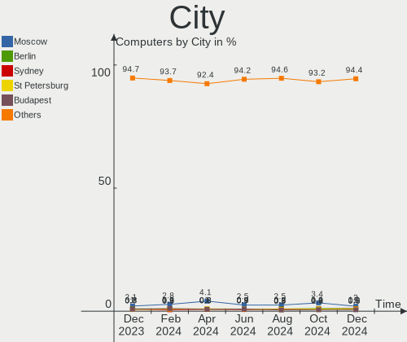
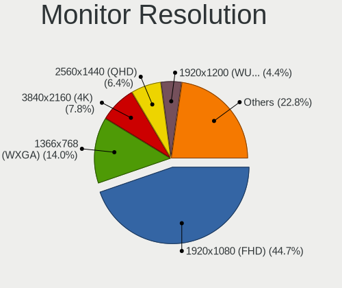
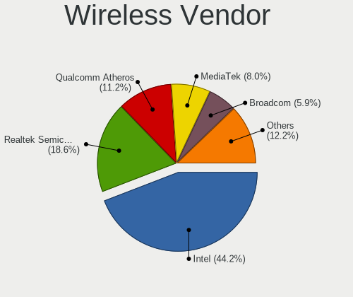
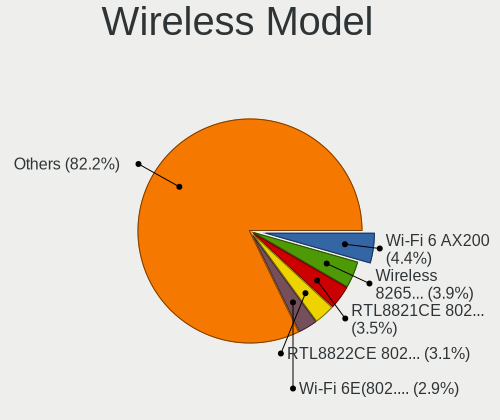
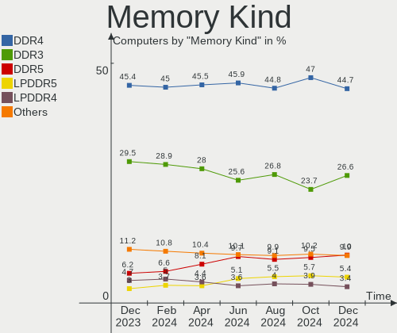
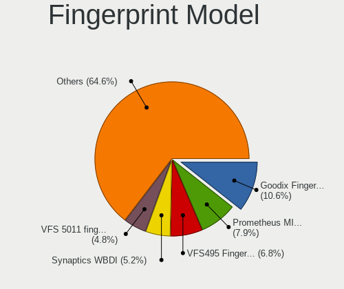

Linux Hardware Trends
---------------------

A project to identify most popular hardware characteristics and track their change
over time based on data collected by Linux users at https://Linux-Hardware.org.

Anyone can contribute to this report by the [hw-probe](https://github.com/linuxhw/hw-probe) tool:

    sudo -E hw-probe -all -upload

This is a report for all computer types. See also reports for [desktops](/Desktop/README.md) and [notebooks](/Notebook/README.md).

Full-feature report is available here: https://linux-hardware.org/?view=trends

Distribution-specific reports: [Ubuntu](/Dist/Ubuntu), [Debian](/Dist/Debian), [Linux Mint](/Dist/Linux_Mint), [Pop!_OS](/Dist/Pop!_OS), [Fedora](/Dist/Fedora), [OpenMandriva](/Dist/OpenMandriva), [Manjaro](/Dist/Manjaro), [Zorin](/Dist/Zorin), [Arch](/Dist/Arch), [KDE neon](/Dist/KDE_neon), [ROSA](/Dist/ROSA), [Xubuntu](/Dist/Xubuntu), [Kubuntu](/Dist/Kubuntu), [ArcoLinux](/Dist/ArcoLinux), [CentOS](/Dist/CentOS), [BlackPanther](/Dist/BlackPanther), [openSUSE](/Dist/openSUSE), [Clear Linux](/Dist/Clear_Linux), [Endless](/Dist/Endless), [Gentoo](/Dist/Gentoo).

Period: Nov, 2021.

Contents
--------

* [ System ](#system)
  - [ OS                       ](#os)
  - [ OS Family                ](#os-family)
  - [ Kernel                   ](#kernel)
  - [ Kernel Family            ](#kernel-family)
  - [ Kernel Major Ver.        ](#kernel-major-ver)
  - [ Arch                     ](#arch)
  - [ DE                       ](#de)
  - [ Display Server           ](#display-server)
  - [ Display Manager          ](#display-manager)
  - [ OS Lang                  ](#os-lang)
  - [ Boot Mode                ](#boot-mode)
  - [ Filesystem               ](#filesystem)
  - [ Part. scheme             ](#part-scheme)
  - [ Dual Boot with Linux/BSD ](#dual-boot-with-linuxbsd)
  - [ Dual Boot (Win)          ](#dual-boot-win)

* [ Board ](#board)
  - [ Vendor                   ](#vendor)
  - [ Model                    ](#model)
  - [ Model Family             ](#model-family)
  - [ MFG Year                 ](#mfg-year)
  - [ Form Factor              ](#form-factor)
  - [ Secure Boot              ](#secure-boot)
  - [ Coreboot                 ](#coreboot)
  - [ RAM Size                 ](#ram-size)
  - [ RAM Used                 ](#ram-used)
  - [ Total Drives             ](#total-drives)
  - [ Has CD-ROM               ](#has-cd-rom)
  - [ Has Ethernet             ](#has-ethernet)
  - [ Has WiFi                 ](#has-wifi)
  - [ Has Bluetooth            ](#has-bluetooth)

* [ Location ](#location)
  - [ Country                  ](#country)
  - [ City                     ](#city)

* [ Drives ](#drives)
  - [ Drive Vendor             ](#drive-vendor)
  - [ Drive Model              ](#drive-model)
  - [ HDD Vendor               ](#hdd-vendor)
  - [ SSD Vendor               ](#ssd-vendor)
  - [ Drive Kind               ](#drive-kind)
  - [ Drive Connector          ](#drive-connector)
  - [ Drive Size               ](#drive-size)
  - [ Space Total              ](#space-total)
  - [ Space Used               ](#space-used)
  - [ Malfunc. Drives          ](#malfunc-drives)
  - [ Malfunc. Drive Vendor    ](#malfunc-drive-vendor)
  - [ Malfunc. HDD Vendor      ](#malfunc-hdd-vendor)
  - [ Malfunc. Drive Kind      ](#malfunc-drive-kind)
  - [ Failed Drives            ](#failed-drives)
  - [ Failed Drive Vendor      ](#failed-drive-vendor)
  - [ Drive Status             ](#drive-status)

* [ Storage controller ](#storage-controller)
  - [ Storage Vendor           ](#storage-vendor)
  - [ Storage Model            ](#storage-model)
  - [ Storage Kind             ](#storage-kind)

* [ Processor ](#processor)
  - [ CPU Vendor               ](#cpu-vendor)
  - [ CPU Model                ](#cpu-model)
  - [ CPU Model Family         ](#cpu-model-family)
  - [ CPU Cores                ](#cpu-cores)
  - [ CPU Sockets              ](#cpu-sockets)
  - [ CPU Threads              ](#cpu-threads)
  - [ CPU Op-Modes             ](#cpu-op-modes)
  - [ CPU Microcode            ](#cpu-microcode)
  - [ CPU Microarch            ](#cpu-microarch)

* [ Graphics ](#graphics)
  - [ GPU Vendor               ](#gpu-vendor)
  - [ GPU Model                ](#gpu-model)
  - [ GPU Combo                ](#gpu-combo)
  - [ GPU Driver               ](#gpu-driver)
  - [ GPU Memory               ](#gpu-memory)

* [ Monitor ](#monitor)
  - [ Monitor Vendor           ](#monitor-vendor)
  - [ Monitor Model            ](#monitor-model)
  - [ Monitor Resolution       ](#monitor-resolution)
  - [ Monitor Diagonal         ](#monitor-diagonal)
  - [ Monitor Width            ](#monitor-width)
  - [ Aspect Ratio             ](#aspect-ratio)
  - [ Monitor Area             ](#monitor-area)
  - [ Pixel Density            ](#pixel-density)
  - [ Multiple Monitors        ](#multiple-monitors)

* [ Network ](#network)
  - [ Net Controller Vendor    ](#net-controller-vendor)
  - [ Net Controller Model     ](#net-controller-model)
  - [ Wireless Vendor          ](#wireless-vendor)
  - [ Wireless Model           ](#wireless-model)
  - [ Ethernet Vendor          ](#ethernet-vendor)
  - [ Ethernet Model           ](#ethernet-model)
  - [ Net Controller Kind      ](#net-controller-kind)
  - [ Used Controller          ](#used-controller)
  - [ NICs                     ](#nics)
  - [ IPv6                     ](#ipv6)

* [ Bluetooth ](#bluetooth)
  - [ Bluetooth Vendor         ](#bluetooth-vendor)
  - [ Bluetooth Model          ](#bluetooth-model)

* [ Sound ](#sound)
  - [ Sound Vendor             ](#sound-vendor)
  - [ Sound Model              ](#sound-model)

* [ Memory ](#memory)
  - [ Memory Vendor            ](#memory-vendor)
  - [ Memory Model             ](#memory-model)
  - [ Memory Kind              ](#memory-kind)
  - [ Memory Form Factor       ](#memory-form-factor)
  - [ Memory Size              ](#memory-size)
  - [ Memory Speed             ](#memory-speed)

* [ Printers & scanners ](#printers--scanners)
  - [ Printer Vendor           ](#printer-vendor)
  - [ Printer Model            ](#printer-model)
  - [ Scanner Vendor           ](#scanner-vendor)
  - [ Scanner Model            ](#scanner-model)

* [ Camera ](#camera)
  - [ Camera Vendor            ](#camera-vendor)
  - [ Camera Model             ](#camera-model)

* [ Security ](#security)
  - [ Fingerprint Vendor       ](#fingerprint-vendor)
  - [ Fingerprint Model        ](#fingerprint-model)
  - [ Chipcard Vendor          ](#chipcard-vendor)
  - [ Chipcard Model           ](#chipcard-model)

* [ Unsupported ](#unsupported)
  - [ Unsupported Devices      ](#unsupported-devices)
  - [ Unsupported Device Types ](#unsupported-device-types)

System
------

OS
--

Installed operating systems

| Name                | Computers | Percent |
|---------------------|-----------|---------|
| Ubuntu 20.04        | 922       | 17.46%  |
| Linux Mint 20.2     | 440       | 8.33%   |
| Ubuntu 21.10        | 407       | 7.71%   |
| Pop!_OS 21.04       | 368       | 6.97%   |
| Fedora 35           | 279       | 5.28%   |
| Debian 11           | 266       | 5.04%   |
| OpenMandriva 4.2    | 219       | 4.15%   |
| Zorin 16            | 195       | 3.69%   |
| KDE neon 20.04      | 87        | 1.65%   |
| BlackPanther 18.1   | 87        | 1.65%   |
| ArcoLinux Rolling   | 85        | 1.61%   |
| Arch Rolling        | 80        | 1.51%   |
| Xubuntu 20.04       | 79        | 1.5%    |
| Manjaro             | 77        | 1.46%   |
| Ubuntu 21.04        | 76        | 1.44%   |
| Ubuntu 18.04        | 74        | 1.4%    |
| ROSA R11.1          | 72        | 1.36%   |
| Arch                | 72        | 1.36%   |
| Manjaro 21.1.6      | 71        | 1.34%   |
| Elementary 6        | 68        | 1.29%   |
| Fedora 34           | 62        | 1.17%   |
| ROSA 12.1           | 55        | 1.04%   |
| ROSA 12             | 45        | 0.85%   |
| Pop!_OS 20.04       | 43        | 0.81%   |
| Manjaro 21.2.0      | 42        | 0.8%    |
| Linux Mint 19.3     | 37        | 0.7%    |
| Kubuntu 20.04       | 35        | 0.66%   |
| Gentoo 2.7          | 34        | 0.64%   |
| Endless 3.9.5       | 32        | 0.61%   |
| OpenMandriva 4.50   | 30        | 0.57%   |
| Linux Mint 20       | 30        | 0.57%   |
| Kubuntu 21.10       | 30        | 0.57%   |
| Kali 2021.3         | 30        | 0.57%   |
| Ubuntu MATE 20.04   | 29        | 0.55%   |
| Zorin 15            | 27        | 0.51%   |
| Linux Mint 20.1     | 27        | 0.51%   |
| Xubuntu 18.04       | 25        | 0.47%   |
| EndeavourOS Rolling | 24        | 0.45%   |
| Debian 10           | 23        | 0.44%   |
| Debian Testing      | 22        | 0.42%   |
| LinuxFX 11          | 15        | 0.28%   |
| Gentoo 2.8          | 15        | 0.28%   |
| Lubuntu 20.04       | 14        | 0.27%   |
| Garuda Soaring      | 14        | 0.27%   |
| openSUSE Leap-15.3  | 13        | 0.25%   |
| LMDE 4              | 13        | 0.25%   |
| Ubuntu 16.04        | 12        | 0.23%   |
| MX 21               | 12        | 0.23%   |
| CentOS 8            | 12        | 0.23%   |
| Ubuntu 20.10        | 11        | 0.21%   |
| Parrot 4.11         | 10        | 0.19%   |
| Xubuntu 21.10       | 9         | 0.17%   |
| Ubuntu 22.04        | 9         | 0.17%   |
| Fedora 33           | 9         | 0.17%   |
| Debian Unstable     | 9         | 0.17%   |
| Ubuntu MATE 21.10   | 8         | 0.15%   |
| openSUSE Leap-15.2  | 8         | 0.15%   |
| Lubuntu 21.10       | 8         | 0.15%   |
| Kubuntu 21.04       | 8         | 0.15%   |
| Elementary 5.1.7    | 8         | 0.15%   |

OS Family
---------

OS without a version

| Name          | Computers | Percent |
|---------------|-----------|---------|
| Ubuntu        | 1517      | 28.73%  |
| Linux Mint    | 546       | 10.34%  |
| Pop!_OS       | 421       | 7.97%   |
| Fedora        | 357       | 6.76%   |
| Debian        | 329       | 6.23%   |
| OpenMandriva  | 249       | 4.72%   |
| Zorin         | 222       | 4.2%    |
| Manjaro       | 197       | 3.73%   |
| ROSA          | 173       | 3.28%   |
| Arch          | 152       | 2.88%   |
| Xubuntu       | 119       | 2.25%   |
| ArcoLinux     | 90        | 1.7%    |
| BlackPanther  | 88        | 1.67%   |
| KDE neon      | 87        | 1.65%   |
| Kubuntu       | 85        | 1.61%   |
| Elementary    | 76        | 1.44%   |
| openSUSE      | 69        | 1.31%   |
| Gentoo        | 56        | 1.06%   |
| Endless       | 54        | 1.02%   |
| Ubuntu MATE   | 41        | 0.78%   |
| Kali          | 38        | 0.72%   |
| Lubuntu       | 29        | 0.55%   |
| EndeavourOS   | 28        | 0.53%   |
| CentOS        | 24        | 0.45%   |
| Clear Linux   | 21        | 0.4%    |
| Garuda        | 18        | 0.34%   |
| MX            | 17        | 0.32%   |
| LinuxFX       | 16        | 0.3%    |
| Parrot        | 13        | 0.25%   |
| LMDE          | 13        | 0.25%   |
| Ubuntu Budgie | 11        | 0.21%   |
| RHEL          | 9         | 0.17%   |
| Raspbian      | 9         | 0.17%   |
| Artix         | 9         | 0.17%   |
| Rocky Linux   | 8         | 0.15%   |
| Xero          | 7         | 0.13%   |
| Solus         | 7         | 0.13%   |
| Peppermint    | 7         | 0.13%   |
| Manjaro-ARM   | 5         | 0.09%   |
| Reborn OS     | 4         | 0.08%   |
| Mageia        | 4         | 0.08%   |
| Android       | 4         | 0.08%   |
| Void          | 3         | 0.06%   |
| Sparky        | 3         | 0.06%   |
| Slackware     | 3         | 0.06%   |
| PureOS        | 3         | 0.06%   |
| NixOS         | 3         | 0.06%   |
| BuildRoot     | 3         | 0.06%   |
| Alpine        | 3         | 0.06%   |
| Red OS        | 2         | 0.04%   |
| Kaisen        | 2         | 0.04%   |
| GNOME OS      | 2         | 0.04%   |
| Devuan        | 2         | 0.04%   |
| Deepin        | 2         | 0.04%   |
| ALT Linux     | 2         | 0.04%   |
| XCP-ng        | 1         | 0.02%   |
| Trisquel      | 1         | 0.02%   |
| Siduction     | 1         | 0.02%   |
| Redcore       | 1         | 0.02%   |
| Q4OS          | 1         | 0.02%   |

Kernel
------

Version of the Linux kernel

| Version                             | Computers | Percent |
|-------------------------------------|-----------|---------|
| 5.11.0-40-generic                   | 728       | 13.79%  |
| 5.11.0-38-generic                   | 409       | 7.74%   |
| 5.4.0-90-generic                    | 380       | 7.2%    |
| 5.13.0-7620-generic                 | 356       | 6.74%   |
| 5.13.0-21-generic                   | 286       | 5.42%   |
| 5.10.14-desktop-1omv4002            | 213       | 4.03%   |
| 5.4.0-89-generic                    | 186       | 3.52%   |
| 5.10.0-9-amd64                      | 160       | 3.03%   |
| 5.13.0-20-generic                   | 98        | 1.86%   |
| 5.11.0-27-generic                   | 77        | 1.46%   |
| 5.14.16-301.fc35.x86_64             | 67        | 1.27%   |
| 5.6.14-desktop-2bP                  | 63        | 1.19%   |
| 5.13.19-2-MANJARO                   | 62        | 1.17%   |
| 5.10.74-generic-2rosa2021.1-x86_64  | 58        | 1.1%    |
| 5.10.0-7-amd64                      | 57        | 1.08%   |
| 5.14.18-300.fc35.x86_64             | 56        | 1.06%   |
| 5.4.0-74-generic                    | 46        | 0.87%   |
| 5.14.17-301.fc35.x86_64             | 45        | 0.85%   |
| 5.8.0-14-generic                    | 42        | 0.8%    |
| 5.10.71-generic-1rosa2021.1-x86_64  | 42        | 0.8%    |
| 5.15.4-arch1-1                      | 40        | 0.76%   |
| 5.15.2-arch1-1                      | 39        | 0.74%   |
| 5.13.0-19-generic                   | 39        | 0.74%   |
| 5.14.14-300.fc35.x86_64             | 37        | 0.7%    |
| 5.14.16-arch1-1                     | 36        | 0.68%   |
| 5.11.0-41-generic                   | 35        | 0.66%   |
| 5.13.0-7614-generic                 | 33        | 0.62%   |
| 5.15.2-2-MANJARO                    | 30        | 0.57%   |
| 5.14.10-1-MANJARO                   | 29        | 0.55%   |
| 5.11.0-37-generic                   | 29        | 0.55%   |
| 5.14.15-300.fc35.x86_64             | 28        | 0.53%   |
| 5.4.0-91-generic                    | 26        | 0.49%   |
| 5.13.0-22-generic                   | 26        | 0.49%   |
| 4.18.16-desktop-1bP                 | 24        | 0.45%   |
| 4.15.0-162-generic                  | 24        | 0.45%   |
| 5.10.0-8-amd64                      | 23        | 0.44%   |
| 5.10.70-1-MANJARO                   | 22        | 0.42%   |
| 5.4.83-generic-2rosa-x86_64         | 19        | 0.36%   |
| 4.19.0-18-amd64                     | 19        | 0.36%   |
| 5.14.15-arch1-1                     | 18        | 0.34%   |
| 5.14.14-200.fc34.x86_64             | 18        | 0.34%   |
| 5.14.10-300.fc35.x86_64             | 18        | 0.34%   |
| 5.10.79-1-MANJARO                   | 18        | 0.34%   |
| 4.15.0-161-generic                  | 18        | 0.34%   |
| 5.15.2-zen1-1-zen                   | 17        | 0.32%   |
| 5.14.14-1-default                   | 17        | 0.32%   |
| 5.14.0-kali4-amd64                  | 17        | 0.32%   |
| 4.15.0-desktop-122.124.1rosa-x86_64 | 17        | 0.32%   |
| 5.12.4-desktop-1omv4050             | 15        | 0.28%   |
| 5.15.5-arch1-1                      | 14        | 0.27%   |
| 5.15.4-zen1-1-zen                   | 14        | 0.27%   |
| 5.15.4-201.fc35.x86_64              | 14        | 0.27%   |
| 5.4.0-88-generic                    | 13        | 0.25%   |
| 5.11.0-7620-generic                 | 13        | 0.25%   |
| 5.14.14-arch1-1                     | 12        | 0.23%   |
| 5.14.0-9parrot1-amd64               | 12        | 0.23%   |
| 5.8.0-63-generic                    | 11        | 0.21%   |
| 5.15.3-arch1-1                      | 11        | 0.21%   |
| 5.14.16-201.fc34.x86_64             | 11        | 0.21%   |
| 5.14.0-4-amd64                      | 11        | 0.21%   |

Kernel Family
-------------

Linux kernel without a distro release

| Version | Computers | Percent |
|---------|-----------|---------|
| 5.11.0  | 1337      | 25.32%  |
| 5.13.0  | 861       | 16.3%   |
| 5.4.0   | 736       | 13.94%  |
| 5.10.0  | 291       | 5.51%   |
| 5.10.14 | 213       | 4.03%   |
| 5.14.16 | 136       | 2.58%   |
| 5.15.2  | 118       | 2.23%   |
| 5.14.14 | 112       | 2.12%   |
| 4.15.0  | 95        | 1.8%    |
| 5.15.4  | 91        | 1.72%   |
| 5.14.0  | 83        | 1.57%   |
| 5.8.0   | 82        | 1.55%   |
| 5.14.18 | 75        | 1.42%   |
| 5.14.15 | 74        | 1.4%    |
| 5.13.19 | 69        | 1.31%   |
| 5.6.14  | 63        | 1.19%   |
| 5.10.74 | 63        | 1.19%   |
| 5.14.17 | 51        | 0.97%   |
| 5.14.10 | 49        | 0.93%   |
| 5.15.0  | 48        | 0.91%   |
| 5.10.71 | 42        | 0.8%    |
| 5.15.3  | 36        | 0.68%   |
| 4.19.0  | 34        | 0.64%   |
| 5.15.5  | 29        | 0.55%   |
| 5.4.83  | 26        | 0.49%   |
| 5.10.70 | 26        | 0.49%   |
| 4.18.0  | 25        | 0.47%   |
| 5.10.79 | 24        | 0.45%   |
| 4.18.16 | 24        | 0.45%   |
| 5.15.1  | 23        | 0.44%   |
| 5.3.18  | 20        | 0.38%   |
| 5.10.76 | 18        | 0.34%   |
| 5.4.32  | 15        | 0.28%   |
| 5.12.4  | 15        | 0.28%   |
| 5.13.13 | 14        | 0.27%   |
| 5.16.0  | 13        | 0.25%   |
| 5.14.7  | 10        | 0.19%   |
| 5.10.63 | 10        | 0.19%   |
| 5.0.0   | 10        | 0.19%   |
| 4.4.0   | 10        | 0.19%   |
| 5.11.12 | 9         | 0.17%   |
| 3.10.0  | 9         | 0.17%   |
| 5.3.0   | 7         | 0.13%   |
| 5.14.13 | 7         | 0.13%   |
| 5.11.22 | 7         | 0.13%   |
| 5.10.78 | 7         | 0.13%   |
| 5.14.12 | 6         | 0.11%   |
| 5.10.61 | 6         | 0.11%   |
| 4.9.155 | 6         | 0.11%   |
| 5.14.9  | 5         | 0.09%   |
| 5.13.12 | 5         | 0.09%   |
| 5.10.80 | 5         | 0.09%   |
| 5.10.82 | 4         | 0.08%   |
| 4.9.0   | 4         | 0.08%   |
| 5.9.16  | 3         | 0.06%   |
| 5.14.20 | 3         | 0.06%   |
| 5.13.9  | 3         | 0.06%   |
| 5.10.81 | 3         | 0.06%   |
| 5.10.77 | 3         | 0.06%   |
| 5.10.75 | 3         | 0.06%   |

Kernel Major Ver.
-----------------

Linux kernel major version

| Version | Computers | Percent |
|---------|-----------|---------|
| 5.11    | 1360      | 25.75%  |
| 5.13    | 960       | 18.18%  |
| 5.4     | 790       | 14.96%  |
| 5.10    | 738       | 13.97%  |
| 5.14    | 622       | 11.78%  |
| 5.15    | 345       | 6.53%   |
| 4.15    | 95        | 1.8%    |
| 5.8     | 83        | 1.57%   |
| 5.6     | 70        | 1.33%   |
| 4.18    | 49        | 0.93%   |
| 4.19    | 38        | 0.72%   |
| 5.3     | 27        | 0.51%   |
| 5.12    | 20        | 0.38%   |
| 5.16    | 13        | 0.25%   |
| 4.9     | 13        | 0.25%   |
| 4.4     | 12        | 0.23%   |
| 5.0     | 10        | 0.19%   |
| 3.10    | 10        | 0.19%   |
| 5.9     | 7         | 0.13%   |
| 5.7     | 3         | 0.06%   |
| 5.5     | 3         | 0.06%   |
| 4.16    | 2         | 0.04%   |
| 4.1     | 2         | 0.04%   |
| 5.14.12 | 1         | 0.02%   |
| 5       | 1         | 0.02%   |
| 4.7     | 1         | 0.02%   |
| 4.14    | 1         | 0.02%   |
| 4.10    | 1         | 0.02%   |
| 3.4     | 1         | 0.02%   |
| 3.18    | 1         | 0.02%   |
| 2.6     | 1         | 0.02%   |
| Unknown | 1         | 0.02%   |

Arch
----

OS architecture (x86_64, i586, etc.)

| Name    | Computers | Percent |
|---------|-----------|---------|
| x86_64  | 5131      | 97.16%  |
| i686    | 95        | 1.8%    |
| aarch64 | 39        | 0.74%   |
| armv7l  | 12        | 0.23%   |
| armv8l  | 2         | 0.04%   |
| armv6l  | 2         | 0.04%   |

DE
--

Desktop Environment

| Name             | Computers | Percent |
|------------------|-----------|---------|
| GNOME            | 2539      | 48.08%  |
| KDE5             | 970       | 18.37%  |
| X-Cinnamon       | 433       | 8.2%    |
| Unknown          | 371       | 7.03%   |
| XFCE             | 362       | 6.85%   |
| MATE             | 159       | 3.01%   |
| Cinnamon         | 70        | 1.33%   |
| Pantheon         | 69        | 1.31%   |
| LXQt             | 49        | 0.93%   |
| KDE4             | 48        | 0.91%   |
| i3               | 32        | 0.61%   |
| LXDE             | 28        | 0.53%   |
| Unity            | 22        | 0.42%   |
| Budgie           | 20        | 0.38%   |
| KDE              | 12        | 0.23%   |
| GNOME Classic    | 12        | 0.23%   |
| GNOME Flashback  | 11        | 0.21%   |
| lightdm-xsession | 9         | 0.17%   |
| awesome          | 9         | 0.17%   |
| xmonad           | 7         | 0.13%   |
| qtile            | 7         | 0.13%   |
| sway             | 6         | 0.11%   |
| Openbox          | 6         | 0.11%   |
| Deepin           | 6         | 0.11%   |
| dwm              | 5         | 0.09%   |
| bspwm            | 5         | 0.09%   |
| trinity          | 3         | 0.06%   |
| LeftWM           | 2         | 0.04%   |
| dusk             | 2         | 0.04%   |
| Wayfire          | 1         | 0.02%   |
| ICEWM            | 1         | 0.02%   |
| i3-with-shmlog   | 1         | 0.02%   |
| herbstluftwm     | 1         | 0.02%   |
| fluxbox          | 1         | 0.02%   |
| Enlightenment    | 1         | 0.02%   |
| 03WindowMaker    | 1         | 0.02%   |

Display Server
--------------

X11 or Wayland

| Name    | Computers | Percent |
|---------|-----------|---------|
| X11     | 4102      | 77.67%  |
| Wayland | 862       | 16.32%  |
| Unknown | 198       | 3.75%   |
| Tty     | 119       | 2.25%   |

Display Manager
---------------

SDDM, LightDM, etc.

| Name    | Computers | Percent |
|---------|-----------|---------|
| Unknown | 1729      | 32.74%  |
| GDM3    | 1018      | 19.28%  |
| GDM     | 883       | 16.72%  |
| SDDM    | 794       | 15.04%  |
| LightDM | 783       | 14.83%  |
| KDM     | 47        | 0.89%   |
| XDM     | 13        | 0.25%   |
| SLiM    | 8         | 0.15%   |
| LXDM    | 4         | 0.08%   |
| TDM     | 1         | 0.02%   |
| MDM     | 1         | 0.02%   |

OS Lang
-------

Language

| Lang        | Computers | Percent |
|-------------|-----------|---------|
| en_US       | 2066      | 39.12%  |
| de_DE       | 511       | 9.68%   |
| ru_RU       | 384       | 7.27%   |
| en_GB       | 282       | 5.34%   |
| fr_FR       | 260       | 4.92%   |
| pt_BR       | 213       | 4.03%   |
| Unknown     | 164       | 3.11%   |
| it_IT       | 127       | 2.4%    |
| en_CA       | 127       | 2.4%    |
| C           | 102       | 1.93%   |
| es_ES       | 96        | 1.82%   |
| en_AU       | 91        | 1.72%   |
| pl_PL       | 88        | 1.67%   |
| en_IN       | 82        | 1.55%   |
| nl_NL       | 53        | 1%      |
| en_ZA       | 32        | 0.61%   |
| cs_CZ       | 31        | 0.59%   |
| hu_HU       | 28        | 0.53%   |
| es_MX       | 26        | 0.49%   |
| zh_CN       | 25        | 0.47%   |
| pt_PT       | 24        | 0.45%   |
| fi_FI       | 23        | 0.44%   |
| de_AT       | 23        | 0.44%   |
| sv_SE       | 22        | 0.42%   |
| es_AR       | 22        | 0.42%   |
| ru_UA       | 19        | 0.36%   |
| fr_CA       | 19        | 0.36%   |
| tr_TR       | 18        | 0.34%   |
| es_CL       | 18        | 0.34%   |
| en_IL       | 18        | 0.34%   |
| de_CH       | 17        | 0.32%   |
| nb_NO       | 14        | 0.27%   |
| nl_BE       | 13        | 0.25%   |
| ja_JP       | 13        | 0.25%   |
| fr_BE       | 13        | 0.25%   |
| el_GR       | 13        | 0.25%   |
| en_NZ       | 12        | 0.23%   |
| POSIX       | 10        | 0.19%   |
| es_CO       | 10        | 0.19%   |
| hr_HR       | 9         | 0.17%   |
| sk_SK       | 8         | 0.15%   |
| uk_UA       | 7         | 0.13%   |
| ro_RO       | 7         | 0.13%   |
| ca_ES       | 7         | 0.13%   |
| bg_BG       | 7         | 0.13%   |
| fr_CH       | 6         | 0.11%   |
| es_PE       | 6         | 0.11%   |
| en_PH       | 6         | 0.11%   |
| en_IE       | 6         | 0.11%   |
| da_DK       | 6         | 0.11%   |
| C.UTF8      | 6         | 0.11%   |
| sl_SI       | 5         | 0.09%   |
| lt_LT       | 5         | 0.09%   |
| es_VE       | 5         | 0.09%   |
| en_DK       | 5         | 0.09%   |
| zh_TW       | 4         | 0.08%   |
| ru_RU.UTF_8 | 4         | 0.08%   |
| es_US       | 4         | 0.08%   |
| es_EC       | 4         | 0.08%   |
| en_HK       | 4         | 0.08%   |

Boot Mode
---------

EFI or BIOS

| Mode | Computers | Percent |
|------|-----------|---------|
| BIOS | 2716      | 51.43%  |
| EFI  | 2565      | 48.57%  |

Filesystem
----------

Type of filesystem

| Type    | Computers | Percent |
|---------|-----------|---------|
| Ext4    | 4119      | 78%     |
| Btrfs   | 526       | 9.96%   |
| Overlay | 489       | 9.26%   |
| Xfs     | 67        | 1.27%   |
| Zfs     | 39        | 0.74%   |
| F2fs    | 11        | 0.21%   |
| Ext3    | 11        | 0.21%   |
| Ext2    | 7         | 0.13%   |
| Unknown | 6         | 0.11%   |
| Tmpfs   | 2         | 0.04%   |
| Rootfs  | 2         | 0.04%   |
| XXXXX   | 1         | 0.02%   |
| OveXlay | 1         | 0.02%   |

Part. scheme
------------

Scheme of partitioning

| Type    | Computers | Percent |
|---------|-----------|---------|
| Unknown | 2815      | 53.3%   |
| GPT     | 1801      | 34.1%   |
| MBR     | 665       | 12.59%  |

Dual Boot with Linux/BSD
------------------------

Hosting more than one Linux/BSD

| Dual boot | Computers | Percent |
|-----------|-----------|---------|
| No        | 4553      | 86.21%  |
| Yes       | 728       | 13.79%  |

Dual Boot (Win)
---------------

Hosting Linux and Windows

| Dual boot | Computers | Percent |
|-----------|-----------|---------|
| No        | 3726      | 70.55%  |
| Yes       | 1555      | 29.45%  |

Board
-----

Vendor
------

Motherboard manufacturer

| Name                    | Computers | Percent |
|-------------------------|-----------|---------|
| ASUSTek Computer        | 900       | 17.04%  |
| Hewlett-Packard         | 710       | 13.44%  |
| Lenovo                  | 706       | 13.37%  |
| Dell                    | 703       | 13.31%  |
| Gigabyte Technology     | 360       | 6.82%   |
| MSI                     | 310       | 5.87%   |
| Acer                    | 281       | 5.32%   |
| ASRock                  | 216       | 4.09%   |
| Apple                   | 138       | 2.61%   |
| Toshiba                 | 77        | 1.46%   |
| Samsung Electronics     | 68        | 1.29%   |
| Intel                   | 68        | 1.29%   |
| Fujitsu                 | 48        | 0.91%   |
| Sony                    | 43        | 0.81%   |
| Raspberry Pi Foundation | 41        | 0.78%   |
| Unknown                 | 40        | 0.76%   |
| Medion                  | 39        | 0.74%   |
| HUAWEI                  | 39        | 0.74%   |
| Notebook                | 28        | 0.53%   |
| Google                  | 28        | 0.53%   |
| Pegatron                | 21        | 0.4%    |
| Supermicro              | 20        | 0.38%   |
| Packard Bell            | 19        | 0.36%   |
| ECS                     | 19        | 0.36%   |
| Timi                    | 17        | 0.32%   |
| Microsoft               | 17        | 0.32%   |
| Positivo                | 15        | 0.28%   |
| Biostar                 | 15        | 0.28%   |
| System76                | 14        | 0.27%   |
| Fujitsu Siemens         | 14        | 0.27%   |
| Foxconn                 | 14        | 0.27%   |
| LG Electronics          | 12        | 0.23%   |
| Alienware               | 11        | 0.21%   |
| TUXEDO                  | 10        | 0.19%   |
| Huanan                  | 9         | 0.17%   |
| Shuttle                 | 8         | 0.15%   |
| GPU Company             | 8         | 0.15%   |
| IBM                     | 7         | 0.13%   |
| OEM                     | 6         | 0.11%   |
| Semp Toshiba            | 5         | 0.09%   |
| Panasonic               | 5         | 0.09%   |
| Gateway                 | 5         | 0.09%   |
| Framework               | 5         | 0.09%   |
| Chuwi                   | 5         | 0.09%   |
| AMI                     | 5         | 0.09%   |
| Razer                   | 4         | 0.08%   |
| PC Specialist           | 4         | 0.08%   |
| Jumper                  | 4         | 0.08%   |
| EVGA                    | 4         | 0.08%   |
| Aquarius                | 4         | 0.08%   |
| ZOTAC                   | 3         | 0.06%   |
| SIEMENS                 | 3         | 0.06%   |
| Schenker                | 3         | 0.06%   |
| Pine Microsystems       | 3         | 0.06%   |
| MouseComputer           | 3         | 0.06%   |
| Minix                   | 3         | 0.06%   |
| LattePanda              | 3         | 0.06%   |
| HPE                     | 3         | 0.06%   |
| TrekStor                | 2         | 0.04%   |
| Teclast                 | 2         | 0.04%   |

Model
-----

Motherboard model

| Name                              | Computers | Percent |
|-----------------------------------|-----------|---------|
| ASUS All Series                   | 61        | 1.16%   |
| Unknown                           | 54        | 1.02%   |
| RPi Raspberry Pi                  | 39        | 0.74%   |
| ASRock H470M-HVS                  | 20        | 0.38%   |
| Dell OptiPlex 7010                | 19        | 0.36%   |
| HP Pavilion dv6                   | 18        | 0.34%   |
| HP Notebook                       | 18        | 0.34%   |
| Dell OptiPlex 9020                | 15        | 0.28%   |
| ASUS TUF GAMING X570-PLUS         | 14        | 0.27%   |
| MSI MS-7C02                       | 13        | 0.25%   |
| Gigabyte B450M DS3H               | 13        | 0.25%   |
| Dell XPS 13 9310                  | 12        | 0.23%   |
| HP Pavilion Notebook              | 11        | 0.21%   |
| HP Pavilion g6                    | 11        | 0.21%   |
| HP Pavilion 15                    | 11        | 0.21%   |
| Apple MacBookAir7,1               | 11        | 0.21%   |
| MSI MS-7C37                       | 9         | 0.17%   |
| HP Pavilion g7                    | 9         | 0.17%   |
| Gigabyte 970A-DS3P                | 9         | 0.17%   |
| Dell XPS 15 9500                  | 9         | 0.17%   |
| Dell Latitude E6420               | 9         | 0.17%   |
| ASUS TUF GAMING B550-PLUS         | 9         | 0.17%   |
| ASUS ROG STRIX B550-F GAMING      | 9         | 0.17%   |
| ASRock B450M Pro4                 | 9         | 0.17%   |
| MSI MS-7C52                       | 8         | 0.15%   |
| MSI MS-7B79                       | 8         | 0.15%   |
| HP 15                             | 8         | 0.15%   |
| Dell XPS 15 9510                  | 8         | 0.15%   |
| Dell OptiPlex 780                 | 8         | 0.15%   |
| Dell Latitude E6410               | 8         | 0.15%   |
| Dell Inspiron 15-3567             | 8         | 0.15%   |
| ASUS ROG STRIX X570-E GAMING      | 8         | 0.15%   |
| ASUS ROG STRIX B450-F GAMING      | 8         | 0.15%   |
| ASUS P8H61-M LX3 R2.0             | 8         | 0.15%   |
| Apple MacBookPro9,2               | 8         | 0.15%   |
| MSI MS-7B89                       | 7         | 0.13%   |
| MSI MS-7817                       | 7         | 0.13%   |
| MSI MS-7693                       | 7         | 0.13%   |
| Lenovo IdeaPadFlex 5 14ARE05 81X2 | 7         | 0.13%   |
| Intel H61                         | 7         | 0.13%   |
| HUAWEI KLVL-WXX9                  | 7         | 0.13%   |
| HP Pavilion dv7                   | 7         | 0.13%   |
| Dell XPS 15 9570                  | 7         | 0.13%   |
| Dell OptiPlex 390                 | 7         | 0.13%   |
| Dell OptiPlex 3020                | 7         | 0.13%   |
| Dell Latitude E7440               | 7         | 0.13%   |
| Dell Latitude D630                | 7         | 0.13%   |
| Apple iMac10,1                    | 7         | 0.13%   |
| Acer Nitro AN515-54               | 7         | 0.13%   |
| Acer Nitro AN515-44               | 7         | 0.13%   |
| MSI MS-7A38                       | 6         | 0.11%   |
| HUAWEI BOHK-WAX9X                 | 6         | 0.11%   |
| HP EliteDesk 800 G1 SFF           | 6         | 0.11%   |
| HP EliteBook 840 G3               | 6         | 0.11%   |
| Gigabyte B550M DS3H               | 6         | 0.11%   |
| Dell Vostro 3500                  | 6         | 0.11%   |
| Dell OptiPlex 790                 | 6         | 0.11%   |
| Dell Latitude E6430               | 6         | 0.11%   |
| Dell Latitude 5520                | 6         | 0.11%   |
| Dell Inspiron 5570                | 6         | 0.11%   |

Model Family
------------

Motherboard model prefix

| Name                  | Computers | Percent |
|-----------------------|-----------|---------|
| Lenovo ThinkPad       | 312       | 5.91%   |
| Acer Aspire           | 172       | 3.26%   |
| Dell Latitude         | 171       | 3.24%   |
| Dell Inspiron         | 166       | 3.14%   |
| HP Pavilion           | 143       | 2.71%   |
| Lenovo IdeaPad        | 131       | 2.48%   |
| Dell OptiPlex         | 110       | 2.08%   |
| ASUS ROG              | 95        | 1.8%    |
| ASUS PRIME            | 91        | 1.72%   |
| Dell XPS              | 90        | 1.7%    |
| HP ProBook            | 83        | 1.57%   |
| HP EliteBook          | 83        | 1.57%   |
| HP Compaq             | 76        | 1.44%   |
| Toshiba Satellite     | 68        | 1.29%   |
| HP Laptop             | 66        | 1.25%   |
| Dell Precision        | 64        | 1.21%   |
| ASUS All              | 61        | 1.16%   |
| ASUS TUF              | 59        | 1.12%   |
| ASUS VivoBook         | 56        | 1.06%   |
| Unknown               | 54        | 1.02%   |
| Dell Vostro           | 45        | 0.85%   |
| RPi Raspberry         | 41        | 0.78%   |
| HP ENVY               | 39        | 0.74%   |
| Lenovo ThinkCentre    | 31        | 0.59%   |
| Lenovo Legion         | 30        | 0.57%   |
| HP EliteDesk          | 30        | 0.57%   |
| Acer Swift            | 30        | 0.57%   |
| Acer Nitro            | 28        | 0.53%   |
| Lenovo Yoga           | 27        | 0.51%   |
| ASUS ASUS             | 27        | 0.51%   |
| Lenovo ThinkBook      | 25        | 0.47%   |
| Gigabyte B450M        | 24        | 0.45%   |
| Fujitsu LIFEBOOK      | 24        | 0.45%   |
| ASUS M5A78L-M         | 22        | 0.42%   |
| HP ZBook              | 21        | 0.4%    |
| ASUS P8Z77-V          | 21        | 0.4%    |
| ASRock H470M-HVS      | 20        | 0.38%   |
| HP Notebook           | 18        | 0.34%   |
| ASRock B450M          | 18        | 0.34%   |
| Microsoft Surface     | 17        | 0.32%   |
| Gigabyte X570         | 16        | 0.3%    |
| ASUS M5A97            | 16        | 0.3%    |
| Lenovo IdeaCentre     | 15        | 0.28%   |
| ASUS P8H61-M          | 15        | 0.28%   |
| ASRock X570           | 15        | 0.28%   |
| Packard Bell EasyNote | 14        | 0.27%   |
| Lenovo IdeaPadFlex    | 14        | 0.27%   |
| Fujitsu ESPRIMO       | 14        | 0.27%   |
| Apple MacBookAir7     | 14        | 0.27%   |
| MSI MS-7C02           | 13        | 0.25%   |
| HP Spectre            | 12        | 0.23%   |
| Gigabyte B550M        | 12        | 0.23%   |
| Dell G5               | 11        | 0.21%   |
| ASUS ZenBook          | 11        | 0.21%   |
| Apple MacBookPro9     | 11        | 0.21%   |
| Apple MacBookPro11    | 11        | 0.21%   |
| Acer TravelMate       | 11        | 0.21%   |
| HP ProLiant           | 10        | 0.19%   |
| HP OMEN               | 10        | 0.19%   |
| Gigabyte B550         | 10        | 0.19%   |

MFG Year
--------

Motherboard manufacture year

| Year    | Computers | Percent |
|---------|-----------|---------|
| 2021    | 1224      | 23.18%  |
| 2020    | 641       | 12.14%  |
| 2019    | 504       | 9.54%   |
| 2018    | 380       | 7.2%    |
| 2013    | 326       | 6.17%   |
| 2012    | 299       | 5.66%   |
| 2014    | 281       | 5.32%   |
| 2011    | 274       | 5.19%   |
| 2015    | 255       | 4.83%   |
| 2010    | 216       | 4.09%   |
| 2016    | 206       | 3.9%    |
| 2009    | 192       | 3.64%   |
| 2017    | 183       | 3.47%   |
| 2008    | 120       | 2.27%   |
| 2007    | 73        | 1.38%   |
| Unknown | 54        | 1.02%   |
| 2006    | 37        | 0.7%    |
| 2005    | 13        | 0.25%   |
| 2004    | 2         | 0.04%   |
| 2002    | 1         | 0.02%   |

Form Factor
-----------

Physical design of the computer

| Name           | Computers | Percent |
|----------------|-----------|---------|
| Notebook       | 2805      | 53.11%  |
| Desktop        | 2081      | 39.41%  |
| Convertible    | 129       | 2.44%   |
| All in one     | 86        | 1.63%   |
| Mini pc        | 48        | 0.91%   |
| System on chip | 47        | 0.89%   |
| Server         | 43        | 0.81%   |
| Tablet         | 37        | 0.7%    |
| Phone          | 4         | 0.08%   |
| Other          | 1         | 0.02%   |

Secure Boot
-----------

Enabled or disabled

| State    | Computers | Percent |
|----------|-----------|---------|
| Disabled | 4883      | 92.46%  |
| Enabled  | 398       | 7.54%   |

Coreboot
--------

Have coreboot on board

| Used | Computers | Percent |
|------|-----------|---------|
| No   | 5245      | 99.32%  |
| Yes  | 36        | 0.68%   |

RAM Size
--------

Total RAM memory

| Size in GB      | Computers | Percent |
|-----------------|-----------|---------|
| 4.01-8.0        | 1202      | 22.76%  |
| 16.01-24.0      | 1120      | 21.21%  |
| 3.01-4.0        | 974       | 18.44%  |
| 8.01-16.0       | 911       | 17.25%  |
| 32.01-64.0      | 551       | 10.43%  |
| 1.01-2.0        | 186       | 3.52%   |
| 64.01-256.0     | 148       | 2.8%    |
| 2.01-3.0        | 79        | 1.5%    |
| 24.01-32.0      | 78        | 1.48%   |
| 0.51-1.0        | 20        | 0.38%   |
| 0.01-0.5        | 6         | 0.11%   |
| More than 256.0 | 5         | 0.09%   |
| Unknown         | 1         | 0.02%   |

RAM Used
--------

Used RAM memory

| Used GB     | Computers | Percent |
|-------------|-----------|---------|
| 1.01-2.0    | 1933      | 36.6%   |
| 2.01-3.0    | 1286      | 24.35%  |
| 4.01-8.0    | 720       | 13.63%  |
| 3.01-4.0    | 599       | 11.34%  |
| 0.51-1.0    | 407       | 7.71%   |
| 8.01-16.0   | 197       | 3.73%   |
| 0.01-0.5    | 93        | 1.76%   |
| 16.01-24.0  | 26        | 0.49%   |
| 24.01-32.0  | 7         | 0.13%   |
| 32.01-64.0  | 6         | 0.11%   |
| Unknown     | 4         | 0.08%   |
| 64.01-256.0 | 3         | 0.06%   |

Total Drives
------------

Number of drives on board

| Drives  | Computers | Percent |
|---------|-----------|---------|
| 1       | 3165      | 59.93%  |
| 2       | 1266      | 23.97%  |
| 3       | 420       | 7.95%   |
| 4       | 185       | 3.5%    |
| 5       | 96        | 1.82%   |
| 6       | 48        | 0.91%   |
| 0       | 42        | 0.8%    |
| 7       | 23        | 0.44%   |
| 8       | 9         | 0.17%   |
| 9       | 8         | 0.15%   |
| 11      | 7         | 0.13%   |
| 10      | 3         | 0.06%   |
| 12      | 2         | 0.04%   |
| 97      | 1         | 0.02%   |
| 87      | 1         | 0.02%   |
| 71      | 1         | 0.02%   |
| 22      | 1         | 0.02%   |
| 15      | 1         | 0.02%   |
| 13      | 1         | 0.02%   |
| Unknown | 1         | 0.02%   |

Has CD-ROM
----------

Has CD-ROM on board

| Presented | Computers | Percent |
|-----------|-----------|---------|
| No        | 3206      | 60.71%  |
| Yes       | 2075      | 39.29%  |

Has Ethernet
------------

Has Ethernet on board

| Presented | Computers | Percent |
|-----------|-----------|---------|
| Yes       | 4555      | 86.25%  |
| No        | 726       | 13.75%  |

Has WiFi
--------

Has WiFi module

| Presented | Computers | Percent |
|-----------|-----------|---------|
| Yes       | 3918      | 74.19%  |
| No        | 1363      | 25.81%  |

Has Bluetooth
-------------

Has Bluetooth module

| Presented | Computers | Percent |
|-----------|-----------|---------|
| Yes       | 3078      | 58.28%  |
| No        | 2203      | 41.72%  |

Location
--------

Country
-------

Geographic location (country)

| Country                | Computers | Percent |
|------------------------|-----------|---------|
| USA                    | 943       | 17.86%  |
| Germany                | 631       | 11.95%  |
| Russia                 | 415       | 7.86%   |
| France                 | 320       | 6.06%   |
| Brazil                 | 269       | 5.09%   |
| Canada                 | 207       | 3.92%   |
| UK                     | 192       | 3.64%   |
| Italy                  | 181       | 3.43%   |
| Netherlands            | 133       | 2.52%   |
| Hungary                | 127       | 2.4%    |
| India                  | 124       | 2.35%   |
| Poland                 | 123       | 2.33%   |
| Spain                  | 119       | 2.25%   |
| Australia              | 100       | 1.89%   |
| Ukraine                | 74        | 1.4%    |
| Switzerland            | 62        | 1.17%   |
| Belgium                | 57        | 1.08%   |
| Czechia                | 54        | 1.02%   |
| Finland                | 52        | 0.98%   |
| Mexico                 | 51        | 0.97%   |
| Austria                | 51        | 0.97%   |
| Sweden                 | 47        | 0.89%   |
| Portugal               | 47        | 0.89%   |
| Greece                 | 44        | 0.83%   |
| Romania                | 39        | 0.74%   |
| Argentina              | 39        | 0.74%   |
| China                  | 38        | 0.72%   |
| South Africa           | 37        | 0.7%    |
| Norway                 | 37        | 0.7%    |
| Turkey                 | 34        | 0.64%   |
| Indonesia              | 30        | 0.57%   |
| Slovakia               | 27        | 0.51%   |
| Chile                  | 26        | 0.49%   |
| Japan                  | 24        | 0.45%   |
| Denmark                | 23        | 0.44%   |
| Israel                 | 22        | 0.42%   |
| Belarus                | 22        | 0.42%   |
| Colombia               | 21        | 0.4%    |
| Bulgaria               | 20        | 0.38%   |
| Croatia                | 19        | 0.36%   |
| New Zealand            | 17        | 0.32%   |
| Pakistan               | 16        | 0.3%    |
| Vietnam                | 15        | 0.28%   |
| Slovenia               | 15        | 0.28%   |
| Philippines            | 14        | 0.27%   |
| Morocco                | 14        | 0.27%   |
| Iran                   | 14        | 0.27%   |
| Thailand               | 13        | 0.25%   |
| Lithuania              | 12        | 0.23%   |
| Peru                   | 11        | 0.21%   |
| Bangladesh             | 11        | 0.21%   |
| Saudi Arabia           | 10        | 0.19%   |
| Hong Kong              | 10        | 0.19%   |
| Taiwan                 | 9         | 0.17%   |
| Cyprus                 | 9         | 0.17%   |
| Tunisia                | 8         | 0.15%   |
| Singapore              | 8         | 0.15%   |
| Serbia                 | 8         | 0.15%   |
| Bosnia and Herzegovina | 8         | 0.15%   |
| Venezuela              | 7         | 0.13%   |

City
----

Geographic location (city)

| City              | Computers | Percent |
|-------------------|-----------|---------|
| Moscow            | 92        | 1.74%   |
| Berlin            | 75        | 1.42%   |
| Voronezh          | 62        | 1.17%   |
| Paris             | 43        | 0.81%   |
| St Petersburg     | 41        | 0.78%   |
| Budapest          | 37        | 0.7%    |
| Sydney            | 35        | 0.66%   |
| Warsaw            | 34        | 0.64%   |
| S??o Paulo        | 31        | 0.59%   |
| Athens            | 31        | 0.59%   |
| Vienna            | 28        | 0.53%   |
| Milan             | 27        | 0.51%   |
| Madrid            | 27        | 0.51%   |
| Amsterdam         | 26        | 0.49%   |
| Montreal          | 24        | 0.45%   |
| Helsinki          | 24        | 0.45%   |
| Hamburg           | 23        | 0.44%   |
| Zurich            | 22        | 0.42%   |
| Prague            | 21        | 0.4%    |
| Munich            | 21        | 0.4%    |
| London            | 20        | 0.38%   |
| Kyiv              | 20        | 0.38%   |
| Qu?©bec           | 19        | 0.36%   |
| New York          | 18        | 0.34%   |
| Frankfurt am Main | 18        | 0.34%   |
| Eliot             | 17        | 0.32%   |
| Rio de Janeiro    | 16        | 0.3%    |
| Bengaluru         | 16        | 0.3%    |
| Zagreb            | 15        | 0.28%   |
| Melbourne         | 15        | 0.28%   |
| Bucharest         | 15        | 0.28%   |
| Brisbane          | 15        | 0.28%   |
| Rome              | 14        | 0.27%   |
| Oslo              | 14        | 0.27%   |
| Houston           | 14        | 0.27%   |
| Portland          | 13        | 0.25%   |
| Lyon              | 13        | 0.25%   |
| Denver            | 13        | 0.25%   |
| Curitiba          | 13        | 0.25%   |
| Barcelona         | 13        | 0.25%   |
| Vancouver         | 12        | 0.23%   |
| Stuttgart         | 12        | 0.23%   |
| Samara            | 12        | 0.23%   |
| Minsk             | 12        | 0.23%   |
| Johannesburg      | 12        | 0.23%   |
| Buenos Aires      | 12        | 0.23%   |
| Bras?­lia         | 12        | 0.23%   |
| Sofia             | 11        | 0.21%   |
| Istanbul          | 11        | 0.21%   |
| Chicago           | 11        | 0.21%   |
| Bratislava        | 11        | 0.21%   |
| Tel Aviv          | 10        | 0.19%   |
| Santiago          | 10        | 0.19%   |
| Novosibirsk       | 10        | 0.19%   |
| Lisbon            | 10        | 0.19%   |
| Lima              | 10        | 0.19%   |
| Dallas            | 10        | 0.19%   |
| Cleveland         | 10        | 0.19%   |
| Chennai           | 10        | 0.19%   |
| Yekaterinburg     | 9         | 0.17%   |

Drives
------

Drive Vendor
------------

Hard drive vendors

| Vendor                         | Computers | Drives | Percent |
|--------------------------------|-----------|--------|---------|
| WDC                            | 1252      | 1567   | 16.4%   |
| Samsung Electronics            | 1225      | 1514   | 16.05%  |
| Seagate                        | 1151      | 1628   | 15.08%  |
| Toshiba                        | 505       | 561    | 6.62%   |
| Kingston                       | 404       | 424    | 5.29%   |
| Sandisk                        | 393       | 423    | 5.15%   |
| Crucial                        | 276       | 314    | 3.62%   |
| Unknown                        | 256       | 302    | 3.35%   |
| Intel                          | 207       | 243    | 2.71%   |
| Hitachi                        | 201       | 221    | 2.63%   |
| SK Hynix                       | 188       | 197    | 2.46%   |
| HGST                           | 125       | 234    | 1.64%   |
| A-DATA Technology              | 123       | 131    | 1.61%   |
| Micron Technology              | 98        | 106    | 1.28%   |
| KIOXIA                         | 68        | 69     | 0.89%   |
| Phison                         | 66        | 74     | 0.86%   |
| Apple                          | 63        | 70     | 0.83%   |
| China                          | 50        | 51     | 0.65%   |
| PNY                            | 49        | 55     | 0.64%   |
| Intenso                        | 48        | 53     | 0.63%   |
| LITEON                         | 41        | 42     | 0.54%   |
| Silicon Motion                 | 40        | 41     | 0.52%   |
| SPCC                           | 36        | 37     | 0.47%   |
| Patriot                        | 34        | 37     | 0.45%   |
| Micron/Crucial Technology      | 32        | 34     | 0.42%   |
| Corsair                        | 32        | 34     | 0.42%   |
| Netac                          | 30        | 30     | 0.39%   |
| Transcend                      | 25        | 25     | 0.33%   |
| Fujitsu                        | 25        | 25     | 0.33%   |
| MAXTOR                         | 24        | 25     | 0.31%   |
| Hewlett-Packard                | 24        | 35     | 0.31%   |
| Unknown                        | 24        | 26     | 0.31%   |
| OCZ                            | 22        | 23     | 0.29%   |
| JMicron                        | 22        | 22     | 0.29%   |
| GOODRAM                        | 22        | 24     | 0.29%   |
| XPG                            | 18        | 20     | 0.24%   |
| KingSpec                       | 18        | 18     | 0.24%   |
| LITEONIT                       | 16        | 17     | 0.21%   |
| Lexar                          | 16        | 16     | 0.21%   |
| Team                           | 13        | 15     | 0.17%   |
| SABRENT                        | 13        | 14     | 0.17%   |
| ASMT                           | 13        | 18     | 0.17%   |
| Gigabyte Technology            | 12        | 13     | 0.16%   |
| Realtek Semiconductor          | 11        | 12     | 0.14%   |
| PLEXTOR                        | 11        | 11     | 0.14%   |
| Apacer                         | 11        | 11     | 0.14%   |
| ADATA Technology               | 10        | 10     | 0.13%   |
| UMIS                           | 9         | 9      | 0.12%   |
| Mushkin                        | 9         | 9      | 0.12%   |
| BHT                            | 8         | 8      | 0.1%    |
| Yangtze Memory Technologies    | 7         | 7      | 0.09%   |
| LDLC                           | 7         | 8      | 0.09%   |
| Realtek                        | 6         | 6      | 0.08%   |
| Teclast                        | 5         | 5      | 0.07%   |
| SSSTC                          | 5         | 5      | 0.07%   |
| Solid State Storage Technology | 5         | 6      | 0.07%   |
| External                       | 5         | 5      | 0.07%   |
| EMTEC                          | 5         | 5      | 0.07%   |
| YMTC                           | 4         | 4      | 0.05%   |
| Union Memory (Shenzhen)        | 4         | 4      | 0.05%   |

Drive Model
-----------

Hard drive models

| Model                                  | Computers | Percent |
|----------------------------------------|-----------|---------|
| Kingston SA400S37240G 240GB SSD        | 92        | 1.09%   |
| Samsung NVMe SSD Drive 500GB           | 63        | 0.74%   |
| Samsung SSD 860 EVO 500GB              | 59        | 0.7%    |
| Samsung NVMe SSD Drive 512GB           | 58        | 0.68%   |
| Seagate ST2000DM008-2FR102 2TB         | 53        | 0.63%   |
| Seagate ST500DM002-1BD142 500GB        | 51        | 0.6%    |
| Seagate ST1000DM010-2EP102 1TB         | 51        | 0.6%    |
| Unknown MMC Card  32GB                 | 50        | 0.59%   |
| Seagate ST1000LM035-1RK172 1TB         | 50        | 0.59%   |
| Crucial CT500MX500SSD1 500GB           | 49        | 0.58%   |
| Kingston SA400S37120G 120GB SSD        | 48        | 0.57%   |
| Samsung SSD 860 EVO 1TB                | 47        | 0.55%   |
| Samsung SSD 850 EVO 500GB              | 45        | 0.53%   |
| Samsung SSD 850 EVO 250GB              | 45        | 0.53%   |
| Seagate ST1000LM024 HN-M101MBB 1TB     | 44        | 0.52%   |
| Kingston SV300S37A120G 120GB SSD       | 44        | 0.52%   |
| Sandisk NVMe SSD Drive 512GB           | 42        | 0.5%    |
| Samsung NVMe SSD Drive 1TB             | 42        | 0.5%    |
| Unknown MMC Card  64GB                 | 41        | 0.48%   |
| Toshiba MQ04ABF100 1TB                 | 40        | 0.47%   |
| Samsung SSD 860 EVO 250GB              | 40        | 0.47%   |
| WDC WDS500G2B0A-00SM50 500GB SSD       | 37        | 0.44%   |
| Toshiba MQ01ABF050 500GB               | 35        | 0.41%   |
| Toshiba MQ01ABD100 1TB                 | 35        | 0.41%   |
| Intel NVMe SSD Drive 512GB             | 35        | 0.41%   |
| Crucial CT240BX500SSD1 240GB           | 34        | 0.4%    |
| Samsung SSD 970 EVO Plus 1TB           | 33        | 0.39%   |
| Kingston SA400S37480G 480GB SSD        | 33        | 0.39%   |
| Toshiba HDWD110 1TB                    | 32        | 0.38%   |
| Sandisk NVMe SSD Drive 256GB           | 32        | 0.38%   |
| Sandisk NVMe SSD Drive 1TB             | 32        | 0.38%   |
| Seagate ST1000DM003-1ER162 1TB         | 31        | 0.37%   |
| Toshiba DT01ACA100 1TB                 | 30        | 0.35%   |
| Seagate ST3500418AS 500GB              | 30        | 0.35%   |
| Seagate Expansion 1TB                  | 30        | 0.35%   |
| WDC WD10EZEX-08WN4A0 1TB               | 29        | 0.34%   |
| Unknown MMC Card  128GB                | 29        | 0.34%   |
| Unknown SD/MMC/MS PRO 394GB            | 28        | 0.33%   |
| Seagate ST500LT012-1DG142 500GB        | 28        | 0.33%   |
| Seagate ST1000DM003-1CH162 1TB         | 28        | 0.33%   |
| Crucial CT1000MX500SSD1 1TB            | 28        | 0.33%   |
| Samsung SM963 2.5" NVMe PCIe SSD 250GB | 27        | 0.32%   |
| Samsung NVMe SSD Drive 256GB           | 27        | 0.32%   |
| Sandisk NVMe SSD Drive 500GB           | 26        | 0.31%   |
| HGST HTS721010A9E630 1TB               | 26        | 0.31%   |
| SK Hynix NVMe SSD Drive 512GB          | 25        | 0.3%    |
| Seagate ST9500325AS 500GB              | 25        | 0.3%    |
| Toshiba DT01ACA050 500GB               | 24        | 0.28%   |
| Seagate ST31000528AS 1TB               | 24        | 0.28%   |
| Samsung SSD 870 QVO 1TB                | 24        | 0.28%   |
| Crucial CT480BX500SSD1 480GB           | 24        | 0.28%   |
| Unknown                                | 24        | 0.28%   |
| Seagate ST4000DM004-2CV104 4TB         | 22        | 0.26%   |
| Seagate ST2000DM001-1ER164 2TB         | 22        | 0.26%   |
| Samsung SSD 970 EVO Plus 500GB         | 22        | 0.26%   |
| WDC WDS240G2G0A-00JH30 240GB SSD       | 21        | 0.25%   |
| Seagate ST500LM012 HN-M500MBB 500GB    | 21        | 0.25%   |
| Seagate ST2000DM006-2DM164 2TB         | 21        | 0.25%   |
| HGST HTS545050A7E680 500GB             | 21        | 0.25%   |
| WDC WDS100T2B0A-00SM50 1TB SSD         | 20        | 0.24%   |

HDD Vendor
----------

Hard disk drive vendors

| Vendor              | Computers | Drives | Percent |
|---------------------|-----------|--------|---------|
| Seagate             | 1127      | 1585   | 35.88%  |
| WDC                 | 984       | 1225   | 31.33%  |
| Toshiba             | 400       | 448    | 12.73%  |
| Hitachi             | 201       | 221    | 6.4%    |
| Samsung Electronics | 150       | 167    | 4.78%   |
| HGST                | 125       | 164    | 3.98%   |
| Unknown             | 31        | 46     | 0.99%   |
| Fujitsu             | 25        | 25     | 0.8%    |
| MAXTOR              | 21        | 22     | 0.67%   |
| Apple               | 18        | 18     | 0.57%   |
| ASMT                | 10        | 15     | 0.32%   |
| Hewlett-Packard     | 8         | 18     | 0.25%   |
| Intenso             | 7         | 8      | 0.22%   |
| External            | 5         | 5      | 0.16%   |
| TO Exter            | 4         | 4      | 0.13%   |
| USB3.0              | 3         | 3      | 0.1%    |
| LaCie               | 3         | 3      | 0.1%    |
| asmedia             | 3         | 3      | 0.1%    |
| StoreJet            | 2         | 2      | 0.06%   |
| IBM/Hitachi         | 2         | 2      | 0.06%   |
| HGST HTS            | 2         | 2      | 0.06%   |
| ExcelStor           | 2         | 2      | 0.06%   |
| USB 3.0             | 1         | 2      | 0.03%   |
| USB                 | 1         | 1      | 0.03%   |
| PHD 3.0             | 1         | 1      | 0.03%   |
| MARVELL             | 1         | 1      | 0.03%   |
| LIO-ORG             | 1         | 1      | 0.03%   |
| Lenovo              | 1         | 2      | 0.03%   |
| KESU                | 1         | 1      | 0.03%   |
| Unknown             | 1         | 1      | 0.03%   |

SSD Vendor
----------

Solid state drive vendors

| Vendor              | Computers | Drives | Percent |
|---------------------|-----------|--------|---------|
| Samsung Electronics | 599       | 694    | 23.86%  |
| Kingston            | 319       | 337    | 12.7%   |
| Crucial             | 247       | 279    | 9.84%   |
| SanDisk             | 232       | 255    | 9.24%   |
| WDC                 | 171       | 185    | 6.81%   |
| A-DATA Technology   | 93        | 99     | 3.7%    |
| Intel               | 81        | 85     | 3.23%   |
| China               | 49        | 50     | 1.95%   |
| PNY                 | 47        | 52     | 1.87%   |
| SK Hynix            | 40        | 40     | 1.59%   |
| Intenso             | 37        | 39     | 1.47%   |
| LITEON              | 35        | 36     | 1.39%   |
| Micron Technology   | 33        | 36     | 1.31%   |
| Patriot             | 32        | 35     | 1.27%   |
| Toshiba             | 31        | 31     | 1.23%   |
| SPCC                | 30        | 30     | 1.19%   |
| Netac               | 26        | 26     | 1.04%   |
| Apple               | 26        | 26     | 1.04%   |
| OCZ                 | 22        | 23     | 0.88%   |
| GOODRAM             | 22        | 24     | 0.88%   |
| Transcend           | 21        | 21     | 0.84%   |
| Corsair             | 20        | 22     | 0.8%    |
| LITEONIT            | 16        | 17     | 0.64%   |
| KingSpec            | 16        | 16     | 0.64%   |
| Lexar               | 15        | 15     | 0.6%    |
| Seagate             | 14        | 15     | 0.56%   |
| JMicron             | 14        | 14     | 0.56%   |
| Hewlett-Packard     | 14        | 14     | 0.56%   |
| Team                | 11        | 11     | 0.44%   |
| PLEXTOR             | 10        | 10     | 0.4%    |
| Apacer              | 10        | 10     | 0.4%    |
| Mushkin             | 9         | 9      | 0.36%   |
| Gigabyte Technology | 8         | 8      | 0.32%   |
| BHT                 | 7         | 7      | 0.28%   |
| Unknown             | 7         | 7      | 0.28%   |
| Unknown             | 6         | 6      | 0.24%   |
| Teclast             | 5         | 5      | 0.2%    |
| EMTEC               | 5         | 5      | 0.2%    |
| Leven               | 4         | 4      | 0.16%   |
| LDLC                | 4         | 4      | 0.16%   |
| KingDian            | 4         | 4      | 0.16%   |
| DOGFISH             | 4         | 4      | 0.16%   |
| AMD                 | 4         | 4      | 0.16%   |
| Verbatim            | 3         | 3      | 0.12%   |
| Smartbuy            | 3         | 3      | 0.12%   |
| Pioneer             | 3         | 3      | 0.12%   |
| OWC                 | 3         | 3      | 0.12%   |
| MAXTOR              | 3         | 3      | 0.12%   |
| KIOXIA-EXCERIA      | 3         | 3      | 0.12%   |
| Hoodisk             | 3         | 3      | 0.12%   |
| FORESEE             | 3         | 3      | 0.12%   |
| DREVO               | 3         | 3      | 0.12%   |
| Zheino              | 2         | 2      | 0.08%   |
| WDC WDS             | 2         | 2      | 0.08%   |
| TCSUNBOW            | 2         | 2      | 0.08%   |
| Phison              | 2         | 2      | 0.08%   |
| Palit               | 2         | 2      | 0.08%   |
| OSCOO               | 2         | 2      | 0.08%   |
| LS                  | 2         | 2      | 0.08%   |
| Kingmax             | 2         | 2      | 0.08%   |

Drive Kind
----------

HDD or SSD

| Kind    | Computers | Drives | Percent |
|---------|-----------|--------|---------|
| HDD     | 2656      | 3998   | 38.59%  |
| SSD     | 2212      | 2729   | 32.14%  |
| NVMe    | 1675      | 1998   | 24.34%  |
| MMC     | 226       | 247    | 3.28%   |
| Unknown | 114       | 202    | 1.66%   |

Drive Connector
---------------

SATA, SAS, NVMe, etc.

| Type | Computers | Drives | Percent |
|------|-----------|--------|---------|
| SATA | 3955      | 6352   | 64.24%  |
| NVMe | 1669      | 1979   | 27.11%  |
| SAS  | 307       | 596    | 4.99%   |
| MMC  | 226       | 247    | 3.67%   |

Drive Size
----------

Size of hard drive

| Size in TB | Computers | Drives | Percent |
|------------|-----------|--------|---------|
| 0.01-0.5   | 2946      | 3745   | 57.75%  |
| 0.51-1.0   | 1429      | 1725   | 28.01%  |
| 1.01-2.0   | 412       | 511    | 8.08%   |
| 3.01-4.0   | 145       | 298    | 2.84%   |
| 2.01-3.0   | 79        | 125    | 1.55%   |
| 4.01-10.0  | 71        | 189    | 1.39%   |
| 10.01-20.0 | 19        | 134    | 0.37%   |

Space Total
-----------

Amount of disk space available on the file system

| Size in GB     | Computers | Percent |
|----------------|-----------|---------|
| 101-250        | 1315      | 24.9%   |
| 251-500        | 1158      | 21.93%  |
| 501-1000       | 791       | 14.98%  |
| 1001-2000      | 439       | 8.31%   |
| 1-20           | 343       | 6.49%   |
| 51-100         | 305       | 5.78%   |
| Unknown        | 291       | 5.51%   |
| More than 3000 | 281       | 5.32%   |
| 21-50          | 187       | 3.54%   |
| 2001-3000      | 171       | 3.24%   |

Space Used
----------

Amount of used disk space

| Used GB        | Computers | Percent |
|----------------|-----------|---------|
| 1-20           | 1898      | 35.94%  |
| 21-50          | 848       | 16.06%  |
| 101-250        | 648       | 12.27%  |
| 51-100         | 593       | 11.23%  |
| 251-500        | 368       | 6.97%   |
| 501-1000       | 291       | 5.51%   |
| Unknown        | 291       | 5.51%   |
| 1001-2000      | 186       | 3.52%   |
| More than 3000 | 99        | 1.87%   |
| 2001-3000      | 58        | 1.1%    |
| 0              | 1         | 0.02%   |

Malfunc. Drives
---------------

Drive models with a malfunction

| Model                                 | Computers | Drives | Percent |
|---------------------------------------|-----------|--------|---------|
| Seagate ST500DM002-1BD142 500GB       | 15        | 15     | 2.89%   |
| Seagate ST9500325AS 500GB             | 8         | 8      | 1.54%   |
| HGST HTS545050A7E680 500GB            | 7         | 7      | 1.35%   |
| Seagate ST1000LM024 HN-M101MBB 1TB    | 6         | 6      | 1.16%   |
| Kingston SV300S37A120G 120GB SSD      | 6         | 7      | 1.16%   |
| HGST HTS541010A9E680 1TB              | 6         | 6      | 1.16%   |
| Toshiba MQ01ABD100 1TB                | 5         | 5      | 0.96%   |
| Seagate ST9320325AS 320GB             | 5         | 5      | 0.96%   |
| Seagate ST3500418AS 500GB             | 5         | 5      | 0.96%   |
| HGST HTS725050A7E630 500GB            | 5         | 5      | 0.96%   |
| WDC WD5000AAKX-001CA0 500GB           | 4         | 4      | 0.77%   |
| Seagate ST9250315AS 250GB             | 4         | 4      | 0.77%   |
| Seagate ST500LT012-9WS142 500GB       | 4         | 4      | 0.77%   |
| Seagate ST500LM021-1KJ152 500GB       | 4         | 4      | 0.77%   |
| Seagate ST31500341AS 1TB              | 4         | 6      | 0.77%   |
| Seagate ST31000528AS 1TB              | 4         | 4      | 0.77%   |
| Seagate ST1000LM048-2E7172 1TB        | 4         | 4      | 0.77%   |
| Seagate ST1000LM035-1RK172 1TB        | 4         | 4      | 0.77%   |
| Seagate ST1000DM003-9YN162 1TB        | 4         | 4      | 0.77%   |
| WDC WD5000AAKX-60U6AA0 500GB          | 3         | 3      | 0.58%   |
| WDC WD5000AAKX-00ERMA0 500GB          | 3         | 3      | 0.58%   |
| WDC WD10EADS-00L5B1 1TB               | 3         | 3      | 0.58%   |
| Toshiba MK3261GSYN 320GB              | 3         | 3      | 0.58%   |
| Seagate ST9500420AS 500GB             | 3         | 3      | 0.58%   |
| Seagate ST500LM012 HN-M500MBB 500GB   | 3         | 3      | 0.58%   |
| Seagate ST3320620AS 320GB             | 3         | 5      | 0.58%   |
| Seagate ST3250310AS 250GB             | 3         | 3      | 0.58%   |
| Seagate ST250DM000-1BD141 250GB       | 3         | 3      | 0.58%   |
| Seagate ST2000DM001-9YN164 2TB        | 3         | 3      | 0.58%   |
| Seagate ST1000LM014-1EJ164 1TB        | 3         | 3      | 0.58%   |
| SanDisk SSD U100 256GB                | 3         | 3      | 0.58%   |
| MAXTOR STM3250310AS 250GB             | 3         | 3      | 0.58%   |
| LITEON CV8-8E128-HP 128GB SSD         | 3         | 3      | 0.58%   |
| Hitachi HTS542516K9SA00 160GB         | 3         | 3      | 0.58%   |
| WDC WD6400BEVT-60A0RT0 640GB          | 2         | 2      | 0.39%   |
| WDC WD5000AAKX-603CA0 500GB           | 2         | 2      | 0.39%   |
| WDC WD5000AAKX-08U6AA0 500GB          | 2         | 2      | 0.39%   |
| WDC WD40EFRX-68N32N0 4TB              | 2         | 5      | 0.39%   |
| WDC WD3200BEVT-22ZCT0 320GB           | 2         | 2      | 0.39%   |
| WDC WD30EZRX-00DC0B0 3TB              | 2         | 3      | 0.39%   |
| WDC WD2500HHTZ-04N21V0 250GB          | 2         | 2      | 0.39%   |
| WDC WD20EZRZ-00Z5HB0 2TB              | 2         | 2      | 0.39%   |
| WDC WD10EARX-00N0YB0 1TB              | 2         | 2      | 0.39%   |
| WDC WD10EARS-00Y5B1 1TB               | 2         | 2      | 0.39%   |
| WDC WD10EADS-00M2B0 1TB               | 2         | 2      | 0.39%   |
| WDC WD1003FZEX-00MK2A0 1TB            | 2         | 2      | 0.39%   |
| WDC WD1002FAEX-00Z3A0 1TB             | 2         | 2      | 0.39%   |
| Toshiba MQ01ABF050 500GB              | 2         | 2      | 0.39%   |
| Toshiba MQ01ABD075 752GB              | 2         | 2      | 0.39%   |
| Toshiba MQ01ABD050 500GB              | 2         | 2      | 0.39%   |
| Toshiba MQ01ABD032 320GB              | 2         | 2      | 0.39%   |
| Toshiba MK2555GSX 250GB               | 2         | 2      | 0.39%   |
| Toshiba MK1237GSX 120GB               | 2         | 2      | 0.39%   |
| Toshiba DT01ACA100 1TB                | 2         | 2      | 0.39%   |
| SK Hynix HFS256G39TND-N210A 256GB SSD | 2         | 2      | 0.39%   |
| Seagate ST500LT012-1DG142 500GB       | 2         | 2      | 0.39%   |
| Seagate ST500LM000-SSHD-8GB           | 2         | 2      | 0.39%   |
| Seagate ST500DM002-1BC142 500GB       | 2         | 2      | 0.39%   |
| Seagate ST31000524AS 1TB              | 2         | 2      | 0.39%   |
| Seagate ST2000VM003-1ET164 2TB        | 2         | 2      | 0.39%   |

Malfunc. Drive Vendor
---------------------

Vendors of faulty drives

| Vendor              | Computers | Drives | Percent |
|---------------------|-----------|--------|---------|
| Seagate             | 160       | 179    | 31.75%  |
| WDC                 | 107       | 118    | 21.23%  |
| Toshiba             | 42        | 43     | 8.33%   |
| Hitachi             | 34        | 36     | 6.75%   |
| Samsung Electronics | 30        | 31     | 5.95%   |
| HGST                | 24        | 24     | 4.76%   |
| SanDisk             | 17        | 18     | 3.37%   |
| Kingston            | 14        | 15     | 2.78%   |
| Crucial             | 12        | 12     | 2.38%   |
| Intel               | 9         | 9      | 1.79%   |
| MAXTOR              | 8         | 8      | 1.59%   |
| A-DATA Technology   | 6         | 6      | 1.19%   |
| SK Hynix            | 4         | 4      | 0.79%   |
| Micron Technology   | 4         | 4      | 0.79%   |
| Hewlett-Packard     | 4         | 4      | 0.79%   |
| Fujitsu             | 4         | 4      | 0.79%   |
| PLEXTOR             | 3         | 3      | 0.6%    |
| OCZ                 | 3         | 4      | 0.6%    |
| LITEONIT            | 3         | 3      | 0.6%    |
| LITEON              | 3         | 3      | 0.6%    |
| Corsair             | 2         | 2      | 0.4%    |
| ASMT                | 2         | 2      | 0.4%    |
| Phison              | 1         | 1      | 0.2%    |
| ORICO               | 1         | 1      | 0.2%    |
| Kingmax             | 1         | 1      | 0.2%    |
| Intenso             | 1         | 1      | 0.2%    |
| IBM/Hitachi         | 1         | 1      | 0.2%    |
| ExcelStor           | 1         | 1      | 0.2%    |
| Colorful            | 1         | 1      | 0.2%    |
| Apple               | 1         | 1      | 0.2%    |
| Unknown             | 1         | 1      | 0.2%    |

Malfunc. HDD Vendor
-------------------

Vendors of faulty HDD drives

| Vendor              | Computers | Drives | Percent |
|---------------------|-----------|--------|---------|
| Seagate             | 160       | 179    | 39.51%  |
| WDC                 | 106       | 116    | 26.17%  |
| Toshiba             | 40        | 41     | 9.88%   |
| Hitachi             | 34        | 36     | 8.4%    |
| HGST                | 24        | 24     | 5.93%   |
| Samsung Electronics | 21        | 22     | 5.19%   |
| MAXTOR              | 8         | 8      | 1.98%   |
| Fujitsu             | 4         | 4      | 0.99%   |
| Hewlett-Packard     | 2         | 2      | 0.49%   |
| ASMT                | 2         | 2      | 0.49%   |
| IBM/Hitachi         | 1         | 1      | 0.25%   |
| ExcelStor           | 1         | 1      | 0.25%   |
| Apple               | 1         | 1      | 0.25%   |
| Unknown             | 1         | 1      | 0.25%   |

Malfunc. Drive Kind
-------------------

Kinds of faulty drives

| Kind | Computers | Drives | Percent |
|------|-----------|--------|---------|
| HDD  | 384       | 438    | 79.34%  |
| SSD  | 88        | 91     | 18.18%  |
| NVMe | 12        | 12     | 2.48%   |

Failed Drives
-------------

Failed drive models

| Model                                 | Computers | Drives | Percent |
|---------------------------------------|-----------|--------|---------|
| Seagate ST500LT012-1DG142 500GB       | 2         | 2      | 15.38%  |
| WDC WD5000BEVT-35A0RT0 500GB          | 1         | 1      | 7.69%   |
| WDC WD4000FYYZ-01UL1B2 4TB            | 1         | 1      | 7.69%   |
| WDC WD2500BEVT-75A23T0 250GB          | 1         | 1      | 7.69%   |
| Toshiba DT01ACA200 2TB                | 1         | 1      | 7.69%   |
| SK Hynix HFS128G39TND-N210A 128GB SSD | 1         | 1      | 7.69%   |
| Seagate ST9320325AS 320GB             | 1         | 1      | 7.69%   |
| Seagate ST31000524AS 1TB              | 1         | 1      | 7.69%   |
| Samsung Electronics SSD 980 500GB     | 1         | 1      | 7.69%   |
| Samsung Electronics HM501II 500GB     | 1         | 1      | 7.69%   |
| Samsung Electronics HM321HI 320GB     | 1         | 1      | 7.69%   |
| Samsung Electronics HD252HJ 250GB     | 1         | 1      | 7.69%   |

Failed Drive Vendor
-------------------

Failed drive vendors

| Vendor              | Computers | Drives | Percent |
|---------------------|-----------|--------|---------|
| Seagate             | 4         | 4      | 30.77%  |
| Samsung Electronics | 4         | 4      | 30.77%  |
| WDC                 | 3         | 3      | 23.08%  |
| Toshiba             | 1         | 1      | 7.69%   |
| SK Hynix            | 1         | 1      | 7.69%   |

Drive Status
------------

Number of failed and malfunc. drives

| Status   | Computers | Drives | Percent |
|----------|-----------|--------|---------|
| Detected | 2998      | 5190   | 53.22%  |
| Works    | 2151      | 3430   | 38.19%  |
| Malfunc  | 471       | 541    | 8.36%   |
| Failed   | 13        | 13     | 0.23%   |

Storage controller
------------------

Storage Vendor
--------------

Storage controller vendors

| Vendor                           | Computers | Percent |
|----------------------------------|-----------|---------|
| Intel                            | 3504      | 52.42%  |
| AMD                              | 1048      | 15.68%  |
| Samsung Electronics              | 597       | 8.93%   |
| Sandisk                          | 296       | 4.43%   |
| SK Hynix                         | 147       | 2.2%    |
| ASMedia Technology               | 112       | 1.68%   |
| Nvidia                           | 98        | 1.47%   |
| Phison Electronics               | 90        | 1.35%   |
| Toshiba America Info Systems     | 89        | 1.33%   |
| Kingston Technology Company      | 86        | 1.29%   |
| JMicron Technology               | 69        | 1.03%   |
| Micron/Crucial Technology        | 64        | 0.96%   |
| Micron Technology                | 64        | 0.96%   |
| Marvell Technology Group         | 60        | 0.9%    |
| KIOXIA                           | 59        | 0.88%   |
| Silicon Motion                   | 55        | 0.82%   |
| ADATA Technology                 | 39        | 0.58%   |
| LSI Logic / Symbios Logic        | 29        | 0.43%   |
| Realtek Semiconductor            | 27        | 0.4%    |
| Apple                            | 20        | 0.3%    |
| VIA Technologies                 | 19        | 0.28%   |
| Broadcom / LSI                   | 18        | 0.27%   |
| Yangtze Memory Technologies      | 11        | 0.16%   |
| Union Memory (Shenzhen)          | 11        | 0.16%   |
| Solid State Storage Technology   | 10        | 0.15%   |
| Silicon Image                    | 10        | 0.15%   |
| Silicon Integrated Systems [SiS] | 9         | 0.13%   |
| Lite-On Technology               | 9         | 0.13%   |
| Hewlett-Packard                  | 6         | 0.09%   |
| Adaptec                          | 6         | 0.09%   |
| Seagate Technology               | 5         | 0.07%   |
| Shenzhen Longsys Electronics     | 3         | 0.04%   |
| MAXIO Technology (Hangzhou)      | 2         | 0.03%   |
| Lite-On IT Corp. / Plextor       | 2         | 0.03%   |
| Lenovo                           | 2         | 0.03%   |
| Integrated Technology Express    | 2         | 0.03%   |
| HighPoint Technologies           | 2         | 0.03%   |
| Enmotus                          | 2         | 0.03%   |
| Zhaoxin                          | 1         | 0.01%   |
| Unknown                          | 1         | 0.01%   |
| Biwin Storage Technology         | 1         | 0.01%   |

Storage Model
-------------

Storage controller models

| Model                                                                                   | Computers | Percent |
|-----------------------------------------------------------------------------------------|-----------|---------|
| AMD FCH SATA Controller [AHCI mode]                                                     | 680       | 8.8%    |
| Samsung NVMe SSD Controller SM981/PM981/PM983                                           | 323       | 4.18%   |
| Intel Sunrise Point-LP SATA Controller [AHCI mode]                                      | 261       | 3.38%   |
| Intel 8 Series/C220 Series Chipset Family 6-port SATA Controller 1 [AHCI mode]          | 261       | 3.38%   |
| Intel 7 Series Chipset Family 6-port SATA Controller [AHCI mode]                        | 226       | 2.93%   |
| Intel 82801 Mobile SATA Controller [RAID mode]                                          | 177       | 2.29%   |
| Intel 6 Series/C200 Series Chipset Family 6 port Mobile SATA AHCI Controller            | 157       | 2.03%   |
| AMD 400 Series Chipset SATA Controller                                                  | 157       | 2.03%   |
| Intel Volume Management Device NVMe RAID Controller                                     | 134       | 1.73%   |
| AMD SB7x0/SB8x0/SB9x0 SATA Controller [AHCI mode]                                       | 130       | 1.68%   |
| Intel Q170/Q150/B150/H170/H110/Z170/CM236 Chipset SATA Controller [AHCI Mode]           | 121       | 1.57%   |
| AMD SB7x0/SB8x0/SB9x0 IDE Controller                                                    | 119       | 1.54%   |
| Samsung NVMe SSD Controller 980                                                         | 116       | 1.5%    |
| Intel 6 Series/C200 Series Chipset Family 6 port Desktop SATA AHCI Controller           | 113       | 1.46%   |
| Intel 8 Series SATA Controller 1 [AHCI mode]                                            | 110       | 1.42%   |
| Intel NM10/ICH7 Family SATA Controller [IDE mode]                                       | 109       | 1.41%   |
| Sandisk WD Blue SN550 NVMe SSD                                                          | 105       | 1.36%   |
| Intel Comet Lake SATA AHCI Controller                                                   | 105       | 1.36%   |
| Intel 82801IBM/IEM (ICH9M/ICH9M-E) 4 port SATA Controller [AHCI mode]                   | 103       | 1.33%   |
| ASMedia ASM1062 Serial ATA Controller                                                   | 103       | 1.33%   |
| Intel 7 Series/C210 Series Chipset Family 6-port SATA Controller [AHCI mode]            | 99        | 1.28%   |
| Intel 200 Series PCH SATA controller [AHCI mode]                                        | 90        | 1.16%   |
| Intel 82801G (ICH7 Family) IDE Controller                                               | 88        | 1.14%   |
| Intel Cannon Lake Mobile PCH SATA AHCI Controller                                       | 86        | 1.11%   |
| Samsung NVMe SSD Controller PM9A1/PM9A3/980PRO                                          | 83        | 1.07%   |
| Intel SATA Controller [RAID mode]                                                       | 83        | 1.07%   |
| AMD Starship/Matisse Chipset SATA Controller [AHCI mode]                                | 82        | 1.06%   |
| Intel Wildcat Point-LP SATA Controller [AHCI Mode]                                      | 80        | 1.04%   |
| Intel 5 Series/3400 Series Chipset 4 port SATA AHCI Controller                          | 77        | 1%      |
| Sandisk WD Black SN750 / PC SN730 NVMe SSD                                              | 74        | 0.96%   |
| AMD SB7x0/SB8x0/SB9x0 SATA Controller [IDE mode]                                        | 74        | 0.96%   |
| Intel Cannon Lake PCH SATA AHCI Controller                                              | 70        | 0.91%   |
| SK Hynix Gold P31 SSD                                                                   | 68        | 0.88%   |
| Micron Non-Volatile memory controller                                                   | 64        | 0.83%   |
| Intel 6 Series/C200 Series Chipset Family Desktop SATA Controller (IDE mode, ports 0-3) | 63        | 0.82%   |
| Intel 82801HM/HEM (ICH8M/ICH8M-E) IDE Controller                                        | 62        | 0.8%    |
| Intel 6 Series/C200 Series Chipset Family Desktop SATA Controller (IDE mode, ports 4-5) | 62        | 0.8%    |
| Intel 5 Series/3400 Series Chipset 6 port SATA AHCI Controller                          | 62        | 0.8%    |
| Intel 500 Series Chipset Family SATA AHCI Controller                                    | 61        | 0.79%   |
| Samsung NVMe SSD Controller SM961/PM961/SM963                                           | 59        | 0.76%   |
| KIOXIA Non-Volatile memory controller                                                   | 58        | 0.75%   |
| Intel SSD 660P Series                                                                   | 58        | 0.75%   |
| Intel Tiger Lake-LP SATA Controller [AHCI mode]                                         | 56        | 0.72%   |
| Intel 400 Series Chipset Family SATA AHCI Controller                                    | 55        | 0.71%   |
| Intel Celeron/Pentium Silver Processor SATA Controller                                  | 54        | 0.7%    |
| Intel 82801HM/HEM (ICH8M/ICH8M-E) SATA Controller [AHCI mode]                           | 53        | 0.69%   |
| Sandisk Non-Volatile memory controller                                                  | 46        | 0.6%    |
| Intel Atom Processor E3800 Series SATA AHCI Controller                                  | 44        | 0.57%   |
| Intel HM170/QM170 Chipset SATA Controller [AHCI Mode]                                   | 43        | 0.56%   |
| Phison E12 NVMe Controller                                                              | 42        | 0.54%   |
| Silicon Motion SM2263EN/SM2263XT SSD Controller                                         | 41        | 0.53%   |
| Intel Cannon Point-LP SATA Controller [AHCI Mode]                                       | 41        | 0.53%   |
| Intel Celeron N3350/Pentium N4200/Atom E3900 Series SATA AHCI Controller                | 40        | 0.52%   |
| Toshiba America Info Systems XG6 NVMe SSD Controller                                    | 39        | 0.5%    |
| Intel 9 Series Chipset Family SATA Controller [AHCI Mode]                               | 39        | 0.5%    |
| Intel Atom/Celeron/Pentium Processor x5-E8000/J3xxx/N3xxx Series SATA Controller        | 36        | 0.47%   |
| Nvidia MCP79 AHCI Controller                                                            | 32        | 0.41%   |
| Nvidia MCP61 SATA Controller                                                            | 32        | 0.41%   |
| SK Hynix BC511                                                                          | 31        | 0.4%    |
| Kingston Company A2000 NVMe SSD                                                         | 31        | 0.4%    |

Storage Kind
------------

Kind of storage controller (IDE, SATA, NVMe, SAS, ...)

| Kind | Computers | Percent |
|------|-----------|---------|
| SATA | 3846      | 56.68%  |
| NVMe | 1673      | 24.66%  |
| IDE  | 751       | 11.07%  |
| RAID | 464       | 6.84%   |
| SAS  | 36        | 0.53%   |
| SCSI | 15        | 0.22%   |

Processor
---------

CPU Vendor
----------

Processor vendors

| Vendor       | Computers | Percent |
|--------------|-----------|---------|
| Intel        | 3952      | 74.83%  |
| AMD          | 1272      | 24.09%  |
| ARM          | 52        | 0.98%   |
| QUALCOMM     | 3         | 0.06%   |
| CentaurHauls | 2         | 0.04%   |

CPU Model
---------

Processor models

| Model                                         | Computers | Percent |
|-----------------------------------------------|-----------|---------|
| Intel 11th Gen Core i7-1165G7 @ 2.80GHz       | 90        | 1.7%    |
| Intel 11th Gen Core i5-1135G7 @ 2.40GHz       | 70        | 1.33%   |
| AMD Ryzen 5 3600 6-Core Processor             | 57        | 1.08%   |
| Intel Core i5-7200U CPU @ 2.50GHz             | 54        | 1.02%   |
| Intel Core i5-8250U CPU @ 1.60GHz             | 48        | 0.91%   |
| Intel Core i7-9750H CPU @ 2.60GHz             | 46        | 0.87%   |
| Intel Core i7-8550U CPU @ 1.80GHz             | 46        | 0.87%   |
| Intel Core i7-10510U CPU @ 1.80GHz            | 44        | 0.83%   |
| Intel Core i7-10750H CPU @ 2.60GHz            | 41        | 0.78%   |
| AMD Ryzen 7 3700X 8-Core Processor            | 38        | 0.72%   |
| ARM Processor                                 | 37        | 0.7%    |
| Intel Core i5-10210U CPU @ 1.60GHz            | 35        | 0.66%   |
| Intel Core i7-8565U CPU @ 1.80GHz             | 34        | 0.64%   |
| Intel Core i5-6200U CPU @ 2.30GHz             | 34        | 0.64%   |
| Intel Core i5-2520M CPU @ 2.50GHz             | 32        | 0.61%   |
| AMD Ryzen 5 3500U with Radeon Vega Mobile Gfx | 31        | 0.59%   |
| Intel Core i5-8265U CPU @ 1.60GHz             | 30        | 0.57%   |
| Intel Core i5-6300U CPU @ 2.40GHz             | 30        | 0.57%   |
| Intel 11th Gen Core i7-1185G7 @ 3.00GHz       | 30        | 0.57%   |
| AMD Ryzen 7 4800H with Radeon Graphics        | 30        | 0.57%   |
| Intel Core i7-8750H CPU @ 2.20GHz             | 29        | 0.55%   |
| Intel Core i5-5200U CPU @ 2.20GHz             | 29        | 0.55%   |
| AMD Ryzen 5 5600X 6-Core Processor            | 29        | 0.55%   |
| Intel Core i7-7500U CPU @ 2.70GHz             | 28        | 0.53%   |
| Intel 11th Gen Core i7-11800H @ 2.30GHz       | 28        | 0.53%   |
| AMD Ryzen 5 5500U with Radeon Graphics        | 28        | 0.53%   |
| Intel Core i7-7700HQ CPU @ 2.80GHz            | 26        | 0.49%   |
| Intel Core i5-3470 CPU @ 3.20GHz              | 26        | 0.49%   |
| Intel Core i7-3770 CPU @ 3.40GHz              | 25        | 0.47%   |
| Intel Core i7-10700 CPU @ 2.90GHz             | 25        | 0.47%   |
| Intel Core i3-2120 CPU @ 3.30GHz              | 25        | 0.47%   |
| AMD Ryzen 5 4500U with Radeon Graphics        | 25        | 0.47%   |
| Intel Core i5-6500 CPU @ 3.20GHz              | 23        | 0.44%   |
| Intel Core i5-3210M CPU @ 2.50GHz             | 23        | 0.44%   |
| Intel Core i5-2400 CPU @ 3.10GHz              | 23        | 0.44%   |
| Intel Core i5-1035G1 CPU @ 1.00GHz            | 23        | 0.44%   |
| Intel Core 2 Duo CPU E8400 @ 3.00GHz          | 23        | 0.44%   |
| AMD Ryzen 7 5700U with Radeon Graphics        | 23        | 0.44%   |
| Intel Core i7-4790 CPU @ 3.60GHz              | 22        | 0.42%   |
| AMD Ryzen 9 5900X 12-Core Processor           | 22        | 0.42%   |
| AMD Ryzen 7 2700X Eight-Core Processor        | 22        | 0.42%   |
| Intel Core i7-4770 CPU @ 3.40GHz              | 21        | 0.4%    |
| Intel Core i7-2600 CPU @ 3.40GHz              | 21        | 0.4%    |
| Intel Core i5-3230M CPU @ 2.60GHz             | 21        | 0.4%    |
| Intel Core i3-3110M CPU @ 2.40GHz             | 21        | 0.4%    |
| AMD Ryzen 7 5800H with Radeon Graphics        | 21        | 0.4%    |
| Intel Core i7-6700HQ CPU @ 2.60GHz            | 20        | 0.38%   |
| Intel Core i5-5250U CPU @ 1.60GHz             | 19        | 0.36%   |
| Intel Core i5-3320M CPU @ 2.60GHz             | 19        | 0.36%   |
| AMD Ryzen 5 4600H with Radeon Graphics        | 19        | 0.36%   |
| Intel Core i3-3220 CPU @ 3.30GHz              | 18        | 0.34%   |
| AMD Ryzen 7 4700U with Radeon Graphics        | 18        | 0.34%   |
| AMD FX-8350 Eight-Core Processor              | 18        | 0.34%   |
| Intel Core i7-4770K CPU @ 3.50GHz             | 17        | 0.32%   |
| Intel Core i5 CPU M 520 @ 2.40GHz             | 17        | 0.32%   |
| Intel Celeron CPU N3060 @ 1.60GHz             | 17        | 0.32%   |
| AMD Ryzen 9 5950X 16-Core Processor           | 17        | 0.32%   |
| AMD FX-6300 Six-Core Processor                | 17        | 0.32%   |
| Intel Core i7-1065G7 CPU @ 1.30GHz            | 16        | 0.3%    |
| Intel Core i5-4210U CPU @ 1.70GHz             | 16        | 0.3%    |

CPU Model Family
----------------

Processor model prefix

| Model                   | Computers | Percent |
|-------------------------|-----------|---------|
| Intel Core i5           | 1107      | 20.96%  |
| Intel Core i7           | 972       | 18.41%  |
| Intel Core i3           | 408       | 7.73%   |
| Other                   | 368       | 6.97%   |
| AMD Ryzen 5             | 323       | 6.12%   |
| AMD Ryzen 7             | 238       | 4.51%   |
| Intel Celeron           | 226       | 4.28%   |
| Intel Core 2 Duo        | 220       | 4.17%   |
| Intel Pentium           | 171       | 3.24%   |
| Intel Xeon              | 142       | 2.69%   |
| AMD FX                  | 83        | 1.57%   |
| AMD Ryzen 9             | 81        | 1.53%   |
| Intel Pentium Dual-Core | 66        | 1.25%   |
| Intel Atom              | 63        | 1.19%   |
| Intel Core 2 Quad       | 53        | 1%      |
| AMD Ryzen 3             | 51        | 0.97%   |
| AMD A10                 | 48        | 0.91%   |
| Intel Core i9           | 39        | 0.74%   |
| AMD A8                  | 38        | 0.72%   |
| AMD A4                  | 36        | 0.68%   |
| AMD A6                  | 35        | 0.66%   |
| Intel Pentium Dual      | 29        | 0.55%   |
| Intel Core 2            | 29        | 0.55%   |
| AMD Phenom II X4        | 27        | 0.51%   |
| AMD Athlon 64 X2        | 26        | 0.49%   |
| AMD Ryzen 7 PRO         | 25        | 0.47%   |
| AMD E1                  | 23        | 0.44%   |
| AMD Athlon II X4        | 23        | 0.44%   |
| AMD Athlon II X2        | 21        | 0.4%    |
| Intel Pentium Silver    | 19        | 0.36%   |
| AMD Athlon              | 19        | 0.36%   |
| AMD E                   | 18        | 0.34%   |
| Intel Pentium 4         | 16        | 0.3%    |
| AMD E2                  | 16        | 0.3%    |
| Intel Genuine           | 14        | 0.27%   |
| AMD Ryzen Threadripper  | 14        | 0.27%   |
| ARM BCM                 | 12        | 0.23%   |
| AMD Ryzen 5 PRO         | 12        | 0.23%   |
| Intel Pentium D         | 11        | 0.21%   |
| Intel Pentium Gold      | 9         | 0.17%   |
| AMD Phenom II X6        | 9         | 0.17%   |
| AMD Phenom              | 9         | 0.17%   |
| AMD Turion 64 X2 Mobile | 8         | 0.15%   |
| AMD Sempron             | 7         | 0.13%   |
| AMD Athlon 64           | 7         | 0.13%   |
| Intel Pentium M         | 6         | 0.11%   |
| Intel Core m3           | 6         | 0.11%   |
| AMD Athlon X4           | 6         | 0.11%   |
| Intel Celeron M         | 5         | 0.09%   |
| AMD Athlon II           | 5         | 0.09%   |
| Intel Core m5           | 4         | 0.08%   |
| Intel Core Duo          | 4         | 0.08%   |
| Intel Core 2 Extreme    | 4         | 0.08%   |
| AMD Ryzen 3 PRO         | 4         | 0.08%   |
| AMD Phenom II X2        | 4         | 0.08%   |
| AMD Phenom II           | 4         | 0.08%   |
| QUALCOMM AArch64        | 3         | 0.06%   |
| Intel Core m7           | 3         | 0.06%   |
| Intel Celeron Dual-Core | 3         | 0.06%   |
| AMD Athlon X2           | 3         | 0.06%   |

CPU Cores
---------

Number of processor cores

| Number  | Computers | Percent |
|---------|-----------|---------|
| 2       | 2096      | 39.69%  |
| 4       | 1920      | 36.36%  |
| 6       | 552       | 10.45%  |
| 8       | 418       | 7.92%   |
| 1       | 103       | 1.95%   |
| 12      | 62        | 1.17%   |
| 16      | 42        | 0.8%    |
| 3       | 33        | 0.62%   |
| 10      | 20        | 0.38%   |
| Unknown | 9         | 0.17%   |
| 24      | 7         | 0.13%   |
| 32      | 6         | 0.11%   |
| 20      | 4         | 0.08%   |
| 64      | 3         | 0.06%   |
| 40      | 2         | 0.04%   |
| 36      | 1         | 0.02%   |
| 28      | 1         | 0.02%   |
| 18      | 1         | 0.02%   |
| 14      | 1         | 0.02%   |

CPU Sockets
-----------

Number of sockets

| Number  | Computers | Percent |
|---------|-----------|---------|
| 1       | 5219      | 98.83%  |
| 2       | 52        | 0.98%   |
| Unknown | 9         | 0.17%   |
| 3       | 1         | 0.02%   |

CPU Threads
-----------

Threads per core (Hyper-Threading)

| Number  | Computers | Percent |
|---------|-----------|---------|
| 2       | 3491      | 66.1%   |
| 1       | 1779      | 33.69%  |
| Unknown | 9         | 0.17%   |
| 8       | 1         | 0.02%   |
| 4       | 1         | 0.02%   |

CPU Op-Modes
------------

CPU Operation Modes (32-bit, 64-bit)

| Op mode        | Computers | Percent |
|----------------|-----------|---------|
| 32-bit, 64-bit | 5205      | 98.56%  |
| Unknown        | 35        | 0.66%   |
| 32-bit         | 33        | 0.62%   |
| 64-bit         | 8         | 0.15%   |

CPU Microcode
-------------

Microcode number

| Number     | Computers | Percent |
|------------|-----------|---------|
| Unknown    | 1210      | 22.91%  |
| 0x206a7    | 295       | 5.59%   |
| 0x306a9    | 267       | 5.06%   |
| 0x306c3    | 248       | 4.7%    |
| 0x806c1    | 192       | 3.64%   |
| 0x1067a    | 183       | 3.47%   |
| 0x906ea    | 135       | 2.56%   |
| 0x806ec    | 120       | 2.27%   |
| 0x806e9    | 111       | 2.1%    |
| 0x806ea    | 107       | 2.03%   |
| 0x406e3    | 105       | 1.99%   |
| 0x40651    | 94        | 1.78%   |
| 0x506e3    | 93        | 1.76%   |
| 0x306d4    | 84        | 1.59%   |
| 0x20655    | 77        | 1.46%   |
| 0x08701021 | 77        | 1.46%   |
| 0x906e9    | 72        | 1.36%   |
| 0xa0652    | 65        | 1.23%   |
| 0x0a50000c | 62        | 1.17%   |
| 0x6fd      | 58        | 1.1%    |
| 0x08600106 | 54        | 1.02%   |
| 0x706e5    | 52        | 0.98%   |
| 0x010000c8 | 51        | 0.97%   |
| 0xa0655    | 47        | 0.89%   |
| 0x08108109 | 45        | 0.85%   |
| 0x06001119 | 45        | 0.85%   |
| 0x406c4    | 42        | 0.8%    |
| 0x0800820d | 41        | 0.78%   |
| 0x06000852 | 40        | 0.76%   |
| 0x906ed    | 39        | 0.74%   |
| 0x20652    | 39        | 0.74%   |
| 0x10676    | 39        | 0.74%   |
| 0x806d1    | 38        | 0.72%   |
| 0x30678    | 36        | 0.68%   |
| 0x08608103 | 34        | 0.64%   |
| 0x0a201016 | 33        | 0.62%   |
| 0x08108102 | 31        | 0.59%   |
| 0x706a8    | 30        | 0.57%   |
| 0x506c9    | 30        | 0.57%   |
| 0xa0671    | 28        | 0.53%   |
| 0x806eb    | 26        | 0.49%   |
| 0x07030105 | 25        | 0.47%   |
| 0xa0653    | 24        | 0.45%   |
| 0x6fb      | 23        | 0.44%   |
| 0x0a201009 | 23        | 0.44%   |
| 0x0810100b | 23        | 0.44%   |
| 0x106e5    | 21        | 0.4%    |
| 0x6f6      | 20        | 0.38%   |
| 0x08600104 | 20        | 0.38%   |
| 0x706a1    | 19        | 0.36%   |
| 0x08701013 | 18        | 0.34%   |
| 0x06006705 | 18        | 0.34%   |
| 0x406c3    | 17        | 0.32%   |
| 0x05000119 | 17        | 0.32%   |
| 0x03000027 | 17        | 0.32%   |
| 0x306f2    | 16        | 0.3%    |
| 0x206d7    | 16        | 0.3%    |
| 0x010000db | 16        | 0.3%    |
| 0x08600103 | 15        | 0.28%   |
| 0x0600611a | 15        | 0.28%   |

CPU Microarch
-------------

Microarchitecture

| Name             | Computers | Percent |
|------------------|-----------|---------|
| KabyLake         | 816       | 15.45%  |
| Haswell          | 468       | 8.86%   |
| SandyBridge      | 402       | 7.61%   |
| IvyBridge        | 362       | 6.85%   |
| Penryn           | 303       | 5.74%   |
| Zen 2            | 274       | 5.19%   |
| Skylake          | 258       | 4.89%   |
| TigerLake        | 230       | 4.36%   |
| Zen+             | 176       | 3.33%   |
| CometLake        | 173       | 3.28%   |
| Westmere         | 167       | 3.16%   |
| Zen 3            | 165       | 3.12%   |
| Unknown          | 146       | 2.76%   |
| Core             | 145       | 2.75%   |
| Silvermont       | 127       | 2.4%    |
| Piledriver       | 118       | 2.23%   |
| Broadwell        | 117       | 2.22%   |
| K10              | 116       | 2.2%    |
| Icelake          | 113       | 2.14%   |
| Zen              | 99        | 1.87%   |
| Goldmont plus    | 58        | 1.1%    |
| Excavator        | 56        | 1.06%   |
| K8 Hammer        | 51        | 0.97%   |
| Nehalem          | 48        | 0.91%   |
| Goldmont         | 42        | 0.8%    |
| Puma             | 38        | 0.72%   |
| Bobcat           | 34        | 0.64%   |
| Bonnell          | 33        | 0.62%   |
| NetBurst         | 29        | 0.55%   |
| Steamroller      | 23        | 0.44%   |
| K10 Llano        | 23        | 0.44%   |
| P6               | 21        | 0.4%    |
| Jaguar           | 21        | 0.4%    |
| Bulldozer        | 18        | 0.34%   |
| Alderlake Hybrid | 5         | 0.09%   |
| K8 & K10 hybrid  | 4         | 0.08%   |
| Tremont          | 2         | 0.04%   |

Graphics
--------

GPU Vendor
----------

Vendors of graphics cards

| Vendor                           | Computers | Percent |
|----------------------------------|-----------|---------|
| Intel                            | 2951      | 47.88%  |
| Nvidia                           | 1746      | 28.33%  |
| AMD                              | 1412      | 22.91%  |
| Matrox Electronics Systems       | 25        | 0.41%   |
| ASPEED Technology                | 15        | 0.24%   |
| VIA Technologies                 | 6         | 0.1%    |
| Silicon Integrated Systems [SiS] | 5         | 0.08%   |
| Zhaoxin                          | 1         | 0.02%   |
| Huawei Technologies              | 1         | 0.02%   |
| ATI Technologies                 | 1         | 0.02%   |

GPU Model
---------

Graphics card models

| Model                                                                                    | Computers | Percent |
|------------------------------------------------------------------------------------------|-----------|---------|
| Intel 2nd Generation Core Processor Family Integrated Graphics Controller                | 287       | 4.54%   |
| Intel TigerLake-LP GT2 [Iris Xe Graphics]                                                | 214       | 3.38%   |
| Intel 3rd Gen Core processor Graphics Controller                                         | 191       | 3.02%   |
| Intel UHD Graphics 620                                                                   | 127       | 2.01%   |
| Intel Haswell-ULT Integrated Graphics Controller                                         | 120       | 1.9%    |
| AMD Renoir                                                                               | 118       | 1.87%   |
| Intel Xeon E3-1200 v3/4th Gen Core Processor Integrated Graphics Controller              | 116       | 1.83%   |
| Intel HD Graphics 620                                                                    | 114       | 1.8%    |
| Intel CoffeeLake-H GT2 [UHD Graphics 630]                                                | 108       | 1.71%   |
| AMD Picasso/Raven 2 [Radeon Vega Series / Radeon Vega Mobile Series]                     | 108       | 1.71%   |
| Intel Skylake GT2 [HD Graphics 520]                                                      | 106       | 1.68%   |
| Intel Core Processor Integrated Graphics Controller                                      | 101       | 1.6%    |
| AMD Ellesmere [Radeon RX 470/480/570/570X/580/580X/590]                                  | 97        | 1.53%   |
| Intel CometLake-U GT2 [UHD Graphics]                                                     | 93        | 1.47%   |
| Intel Mobile 4 Series Chipset Integrated Graphics Controller                             | 77        | 1.22%   |
| Intel WhiskeyLake-U GT2 [UHD Graphics 620]                                               | 75        | 1.19%   |
| Intel HD Graphics 5500                                                                   | 73        | 1.15%   |
| Intel CometLake-H GT2 [UHD Graphics]                                                     | 72        | 1.14%   |
| AMD Cezanne                                                                              | 72        | 1.14%   |
| Intel HD Graphics 530                                                                    | 71        | 1.12%   |
| Intel Atom/Celeron/Pentium Processor x5-E8000/J3xxx/N3xxx Integrated Graphics Controller | 67        | 1.06%   |
| Intel 4th Gen Core Processor Integrated Graphics Controller                              | 67        | 1.06%   |
| Nvidia GK208B [GeForce GT 710]                                                           | 62        | 0.98%   |
| Intel Atom Processor Z36xxx/Z37xxx Series Graphics & Display                             | 59        | 0.93%   |
| Intel Xeon E3-1200 v2/3rd Gen Core processor Graphics Controller                         | 58        | 0.92%   |
| Nvidia GP107 [GeForce GTX 1050 Ti]                                                       | 57        | 0.9%    |
| Intel HD Graphics 630                                                                    | 56        | 0.89%   |
| Intel CoffeeLake-S GT2 [UHD Graphics 630]                                                | 56        | 0.89%   |
| AMD Lucienne                                                                             | 55        | 0.87%   |
| AMD Raven Ridge [Radeon Vega Series / Radeon Vega Mobile Series]                         | 48        | 0.76%   |
| Intel Mobile GM965/GL960 Integrated Graphics Controller (secondary)                      | 44        | 0.7%    |
| Intel Mobile GM965/GL960 Integrated Graphics Controller (primary)                        | 44        | 0.7%    |
| Intel TigerLake-H GT1 [UHD Graphics]                                                     | 43        | 0.68%   |
| Intel 4 Series Chipset Integrated Graphics Controller                                    | 43        | 0.68%   |
| Intel GeminiLake [UHD Graphics 600]                                                      | 42        | 0.66%   |
| AMD Topaz XT [Radeon R7 M260/M265 / M340/M360 / M440/M445 / 530/535 / 620/625 Mobile]    | 42        | 0.66%   |
| AMD Navi 10 [Radeon RX 5600 OEM/5600 XT / 5700/5700 XT]                                  | 41        | 0.65%   |
| Nvidia TU117M [GeForce GTX 1650 Mobile / Max-Q]                                          | 39        | 0.62%   |
| Nvidia GP108 [GeForce GT 1030]                                                           | 37        | 0.58%   |
| Intel Iris Plus Graphics G1 (Ice Lake)                                                   | 37        | 0.58%   |
| AMD Cedar [Radeon HD 5000/6000/7350/8350 Series]                                         | 36        | 0.57%   |
| Nvidia TU106 [GeForce RTX 2060 Rev. A]                                                   | 35        | 0.55%   |
| Nvidia GP107M [GeForce GTX 1050 Mobile]                                                  | 35        | 0.55%   |
| Nvidia GA106M [GeForce RTX 3060 Mobile / Max-Q]                                          | 33        | 0.52%   |
| Intel HD Graphics 500                                                                    | 33        | 0.52%   |
| Nvidia TU117M                                                                            | 31        | 0.49%   |
| Intel CometLake-S GT2 [UHD Graphics 630]                                                 | 31        | 0.49%   |
| Nvidia GM107 [GeForce GTX 750 Ti]                                                        | 30        | 0.47%   |
| Nvidia TU117M [GeForce GTX 1650 Ti Mobile]                                               | 28        | 0.44%   |
| Nvidia GP106 [GeForce GTX 1060 6GB]                                                      | 27        | 0.43%   |
| AMD Stoney [Radeon R2/R3/R4/R5 Graphics]                                                 | 26        | 0.41%   |
| Nvidia TU116M [GeForce GTX 1660 Ti Mobile]                                               | 25        | 0.4%    |
| AMD Seymour [Radeon HD 6400M/7400M Series]                                               | 25        | 0.4%    |
| Nvidia GP104 [GeForce GTX 1080]                                                          | 24        | 0.38%   |
| Nvidia GP104 [GeForce GTX 1070]                                                          | 24        | 0.38%   |
| AMD Wani [Radeon R5/R6/R7 Graphics]                                                      | 24        | 0.38%   |
| Nvidia GK208B [GeForce GT 730]                                                           | 23        | 0.36%   |
| Intel 4th Generation Core Processor Family Integrated Graphics Controller                | 23        | 0.36%   |
| AMD Park [Mobility Radeon HD 5430/5450/5470]                                             | 23        | 0.36%   |
| Nvidia GP107M [GeForce GTX 1050 Ti Mobile]                                               | 22        | 0.35%   |

GPU Combo
---------

Combinations of graphics cards

| Name                              | Computers | Percent |
|-----------------------------------|-----------|---------|
| 1 x Intel                         | 2114      | 40.03%  |
| 1 x AMD                           | 1106      | 20.94%  |
| 1 x Nvidia                        | 997       | 18.88%  |
| Intel + Nvidia                    | 638       | 12.08%  |
| Intel + AMD                       | 139       | 2.63%   |
| AMD + Nvidia                      | 82        | 1.55%   |
| 2 x AMD                           | 72        | 1.36%   |
| Other                             | 58        | 1.1%    |
| 1 x Matrox                        | 23        | 0.44%   |
| 2 x Nvidia                        | 16        | 0.3%    |
| 1 x ASPEED                        | 12        | 0.23%   |
| 1 x VIA                           | 6         | 0.11%   |
| 1 x SiS                           | 5         | 0.09%   |
| 2 x Intel                         | 2         | 0.04%   |
| Intel + 2 x Nvidia                | 2         | 0.04%   |
| AMD + ASPEED                      | 2         | 0.04%   |
| 5 x AMD                           | 1         | 0.02%   |
| 3 x Nvidia                        | 1         | 0.02%   |
| 2 x AMD + 1 x Nvidia + 1 x ASPEED | 1         | 0.02%   |
| 1 x Zhaoxin                       | 1         | 0.02%   |
| Nvidia + Matrox                   | 1         | 0.02%   |
| Nvidia + Huawei Technologies      | 1         | 0.02%   |
| AMD + Matrox                      | 1         | 0.02%   |

GPU Driver
----------

Free vs proprietary

| Driver      | Computers | Percent |
|-------------|-----------|---------|
| Free        | 4060      | 76.88%  |
| Proprietary | 930       | 17.61%  |
| Unknown     | 291       | 5.51%   |

GPU Memory
----------

Total video memory

| Size in GB | Computers | Percent |
|------------|-----------|---------|
| Unknown    | 3056      | 57.87%  |
| 0.01-0.5   | 585       | 11.08%  |
| 1.01-2.0   | 547       | 10.36%  |
| 0.51-1.0   | 383       | 7.25%   |
| 3.01-4.0   | 294       | 5.57%   |
| 7.01-8.0   | 205       | 3.88%   |
| 5.01-6.0   | 125       | 2.37%   |
| 8.01-16.0  | 56        | 1.06%   |
| 2.01-3.0   | 25        | 0.47%   |
| 16.01-24.0 | 4         | 0.08%   |
| 24.01-32.0 | 1         | 0.02%   |

Monitor
-------

Monitor Vendor
--------------

Monitor vendors

| Vendor                  | Computers | Percent |
|-------------------------|-----------|---------|
| Samsung Electronics     | 704       | 12.71%  |
| AU Optronics            | 582       | 10.51%  |
| LG Display              | 498       | 8.99%   |
| BOE                     | 459       | 8.29%   |
| Chimei Innolux          | 439       | 7.93%   |
| Dell                    | 321       | 5.8%    |
| Goldstar                | 298       | 5.38%   |
| Acer                    | 195       | 3.52%   |
| Hewlett-Packard         | 193       | 3.48%   |
| AOC                     | 133       | 2.4%    |
| BenQ                    | 131       | 2.37%   |
| Ancor Communications    | 130       | 2.35%   |
| Philips                 | 123       | 2.22%   |
| Apple                   | 123       | 2.22%   |
| Sharp                   | 107       | 1.93%   |
| Lenovo                  | 90        | 1.62%   |
| Chi Mei Optoelectronics | 69        | 1.25%   |
| ViewSonic               | 67        | 1.21%   |
| PANDA                   | 63        | 1.14%   |
| Iiyama                  | 56        | 1.01%   |
| InfoVision              | 48        | 0.87%   |
| Sony                    | 46        | 0.83%   |
| ASUSTek Computer        | 44        | 0.79%   |
| CSO                     | 27        | 0.49%   |
| LG Philips              | 25        | 0.45%   |
| Toshiba                 | 23        | 0.42%   |
| LG Electronics          | 23        | 0.42%   |
| NEC Computers           | 22        | 0.4%    |
| Unknown                 | 21        | 0.38%   |
| Eizo                    | 21        | 0.38%   |
| Sceptre Tech            | 19        | 0.34%   |
| Vizio                   | 17        | 0.31%   |
| Medion                  | 17        | 0.31%   |
| HannStar                | 17        | 0.31%   |
| CPT                     | 17        | 0.31%   |
| Panasonic               | 16        | 0.29%   |
| Fujitsu Siemens         | 15        | 0.27%   |
| Packard Bell            | 9         | 0.16%   |
| Gigabyte Technology     | 9         | 0.16%   |
| Unknown                 | 9         | 0.16%   |
| Westinghouse            | 8         | 0.14%   |
| LGD                     | 8         | 0.14%   |
| AUS                     | 8         | 0.14%   |
| ONN                     | 7         | 0.13%   |
| Insignia                | 7         | 0.13%   |
| Belinea                 | 7         | 0.13%   |
| MSI                     | 6         | 0.11%   |
| Mi                      | 6         | 0.11%   |
| Idek Iiyama             | 6         | 0.11%   |
| HKC                     | 6         | 0.11%   |
| Grundig                 | 6         | 0.11%   |
| ___                     | 5         | 0.09%   |
| KTC                     | 5         | 0.09%   |
| InnoLux Display         | 5         | 0.09%   |
| Hitachi                 | 5         | 0.09%   |
| Compaq Computer         | 5         | 0.09%   |
| Seiko/Epson             | 4         | 0.07%   |
| SAC                     | 4         | 0.07%   |
| Plain Tree Systems      | 4         | 0.07%   |
| IOD                     | 4         | 0.07%   |

Monitor Model
-------------

Monitor models

| Model                                                                    | Computers | Percent |
|--------------------------------------------------------------------------|-----------|---------|
| Samsung Electronics LCD Monitor SEC5441 1366x768 344x194mm 15.5-inch     | 25        | 0.44%   |
| Chimei Innolux LCD Monitor CMN14D4 1920x1080 309x173mm 13.9-inch         | 24        | 0.42%   |
| Chimei Innolux LCD Monitor CMN15F5 1920x1080 344x193mm 15.5-inch         | 23        | 0.4%    |
| Goldstar FULL HD GSM5B55 1920x1080 480x270mm 21.7-inch                   | 21        | 0.37%   |
| AU Optronics LCD Monitor AUO38ED 1920x1080 340x190mm 15.3-inch           | 21        | 0.37%   |
| LG Display LCD Monitor LGD02DC 1366x768 344x194mm 15.5-inch              | 20        | 0.35%   |
| PANDA LCD Monitor NCP004D 1920x1080 344x194mm 15.5-inch                  | 19        | 0.33%   |
| AU Optronics LCD Monitor AUO21ED 1920x1080 344x194mm 15.5-inch           | 19        | 0.33%   |
| Goldstar LG ULTRAWIDE GSM59F1 1920x1080 580x240mm 24.7-inch              | 17        | 0.3%    |
| Chimei Innolux LCD Monitor CMN15E6 1366x768 344x193mm 15.5-inch          | 15        | 0.26%   |
| Samsung Electronics C27F390 SAM0D32 1920x1080 600x340mm 27.2-inch        | 14        | 0.25%   |
| Samsung Electronics C24F390 SAM0D2C 1920x1080 520x290mm 23.4-inch        | 14        | 0.25%   |
| AU Optronics LCD Monitor AUO61ED 1920x1080 340x190mm 15.3-inch           | 14        | 0.25%   |
| AU Optronics LCD Monitor AUO403D 1920x1080 309x173mm 13.9-inch           | 14        | 0.25%   |
| AU Optronics LCD Monitor AUO21EC 1366x768 340x190mm 15.3-inch            | 13        | 0.23%   |
| LG Display LCD Monitor LGD05E5 1920x1080 344x194mm 15.5-inch             | 12        | 0.21%   |
| LG Display LCD Monitor LGD046F 1920x1080 344x194mm 15.5-inch             | 12        | 0.21%   |
| Chimei Innolux LCD Monitor CMN1735 1920x1080 382x215mm 17.3-inch         | 12        | 0.21%   |
| Chimei Innolux LCD Monitor CMN15DB 1366x768 344x193mm 15.5-inch          | 12        | 0.21%   |
| Chimei Innolux LCD Monitor CMN1521 1920x1080 344x193mm 15.5-inch         | 12        | 0.21%   |
| Samsung Electronics LCD Monitor SEC5541 1366x768 344x193mm 15.5-inch     | 11        | 0.19%   |
| LG Display LCD Monitor LGD0563 1920x1080 344x194mm 15.5-inch             | 11        | 0.19%   |
| Goldstar IPS FULLHD GSM5AB8 1920x1080 480x270mm 21.7-inch                | 11        | 0.19%   |
| Chimei Innolux LCD Monitor CMN15E7 1920x1080 344x193mm 15.5-inch         | 11        | 0.19%   |
| BOE LCD Monitor BOE0812 1920x1080 344x194mm 15.5-inch                    | 11        | 0.19%   |
| Sharp LCD Monitor SHP14D1 1920x1200 336x210mm 15.6-inch                  | 10        | 0.18%   |
| Goldstar ULTRAWIDE GSM76F9 2560x1080 531x298mm 24.0-inch                 | 10        | 0.18%   |
| Goldstar HDR 4K GSM7707 3840x2160 600x340mm 27.2-inch                    | 10        | 0.18%   |
| Chi Mei Optoelectronics LCD Monitor CMO15A7 1366x768 350x190mm 15.7-inch | 10        | 0.18%   |
| BOE LCD Monitor BOE08D7 1920x1080 309x174mm 14.0-inch                    | 10        | 0.18%   |
| BOE LCD Monitor BOE0893 2160x1440 296x197mm 14.0-inch                    | 10        | 0.18%   |
| AU Optronics LCD Monitor AUO22EC 1366x768 344x193mm 15.5-inch            | 10        | 0.18%   |
| Sharp LCD Monitor SHP14F9 1920x1200 288x180mm 13.4-inch                  | 9         | 0.16%   |
| Chimei Innolux LCD Monitor CMN1728 1600x900 382x215mm 17.3-inch          | 9         | 0.16%   |
| Chimei Innolux LCD Monitor CMN14D6 1366x768 309x173mm 13.9-inch          | 9         | 0.16%   |
| Chimei Innolux LCD Monitor CMN14C3 1366x768 309x173mm 13.9-inch          | 9         | 0.16%   |
| BOE LCD Monitor BOE0687 1920x1080 344x193mm 15.5-inch                    | 9         | 0.16%   |
| AU Optronics LCD Monitor AUO106C 1366x768 277x156mm 12.5-inch            | 9         | 0.16%   |
| Apple Color LCD APP9CF3 1366x768 260x140mm 11.6-inch                     | 9         | 0.16%   |
| Unknown                                                                  | 9         | 0.16%   |
| Samsung Electronics S24F350 SAM0D20 1920x1080 521x293mm 23.5-inch        | 8         | 0.14%   |
| Samsung Electronics LCD Monitor SDC4852 3840x2160 340x190mm 15.3-inch    | 8         | 0.14%   |
| Philips PHL 243V5 PHLC0D1 1920x1080 521x293mm 23.5-inch                  | 8         | 0.14%   |
| LG Display LCD Monitor LGD0521 1920x1080 309x174mm 14.0-inch             | 8         | 0.14%   |
| LG Display LCD Monitor LGD039F 1366x768 345x194mm 15.6-inch              | 8         | 0.14%   |
| LG Display LCD Monitor LGD033A 1366x768 340x190mm 15.3-inch              | 8         | 0.14%   |
| Lenovo LCD Monitor LEN40BA 1920x1080 344x194mm 15.5-inch                 | 8         | 0.14%   |
| Chimei Innolux LCD Monitor CMN15D5 1920x1080 340x190mm 15.3-inch         | 8         | 0.14%   |
| Chimei Innolux LCD Monitor CMN15C9 1366x768 344x193mm 15.5-inch          | 8         | 0.14%   |
| Chimei Innolux LCD Monitor CMN14A7 1920x1080 308x173mm 13.9-inch         | 8         | 0.14%   |
| Chimei Innolux LCD Monitor CMN1132 1366x768 260x140mm 11.6-inch          | 8         | 0.14%   |
| BOE LCD Monitor BOE095F 2256x1504 285x190mm 13.5-inch                    | 8         | 0.14%   |
| BOE LCD Monitor BOE0872 1920x1080 344x194mm 15.5-inch                    | 8         | 0.14%   |
| BOE LCD Monitor BOE07DB 1920x1080 309x174mm 14.0-inch                    | 8         | 0.14%   |
| AU Optronics LCD Monitor AUO45EC 1366x768 340x190mm 15.3-inch            | 8         | 0.14%   |
| AU Optronics LCD Monitor AUO313C 1366x768 310x170mm 13.9-inch            | 8         | 0.14%   |
| AU Optronics LCD Monitor AUO243D 1920x1080 309x173mm 13.9-inch           | 8         | 0.14%   |
| AU Optronics LCD Monitor AUO235C 1366x768 260x140mm 11.6-inch            | 8         | 0.14%   |
| Apple LCD Monitor APP9CA3 1440x900 330x210mm 15.4-inch                   | 8         | 0.14%   |
| Sharp LCD Monitor SHP148D 3840x2160 344x194mm 15.5-inch                  | 7         | 0.12%   |

Monitor Resolution
------------------

Monitor screen resolution

| Resolution         | Computers | Percent |
|--------------------|-----------|---------|
| 1920x1080 (FHD)    | 2350      | 44.02%  |
| 1366x768 (WXGA)    | 957       | 17.92%  |
| 3840x2160 (4K)     | 301       | 5.64%   |
| 1600x900 (HD+)     | 254       | 4.76%   |
| 2560x1440 (QHD)    | 238       | 4.46%   |
| 1280x1024 (SXGA)   | 198       | 3.71%   |
| 1680x1050 (WSXGA+) | 142       | 2.66%   |
| 1920x1200 (WUXGA)  | 131       | 2.45%   |
| 1280x800 (WXGA)    | 123       | 2.3%    |
| 1440x900 (WXGA+)   | 115       | 2.15%   |
| Unknown            | 73        | 1.37%   |
| 1360x768           | 49        | 0.92%   |
| 2560x1080          | 47        | 0.88%   |
| 2560x1600          | 41        | 0.77%   |
| 3840x1080          | 38        | 0.71%   |
| 3440x1440          | 34        | 0.64%   |
| 2160x1440          | 23        | 0.43%   |
| 1024x768 (XGA)     | 19        | 0.36%   |
| 2880x1800          | 18        | 0.34%   |
| 1920x540           | 15        | 0.28%   |
| 1024x600           | 14        | 0.26%   |
| 3840x2400          | 13        | 0.24%   |
| 2736x1824          | 11        | 0.21%   |
| 2256x1504          | 10        | 0.19%   |
| 3200x1800 (QHD+)   | 9         | 0.17%   |
| 4480x1440          | 8         | 0.15%   |
| 3456x2160          | 8         | 0.15%   |
| 3600x1080          | 7         | 0.13%   |
| 1600x1200          | 7         | 0.13%   |
| 1280x720 (HD)      | 7         | 0.13%   |
| 3840x1600          | 5         | 0.09%   |
| 3072x1920          | 5         | 0.09%   |
| 3000x2000          | 4         | 0.07%   |
| 2288x1287          | 4         | 0.07%   |
| 1920x1280          | 4         | 0.07%   |
| 3200x1080          | 3         | 0.06%   |
| 2160x1200          | 3         | 0.06%   |
| 1680x945           | 3         | 0.06%   |
| 5120x1440          | 2         | 0.04%   |
| 3840x1200          | 2         | 0.04%   |
| 3840x1100          | 2         | 0.04%   |
| 3520x1080          | 2         | 0.04%   |
| 3360x1080          | 2         | 0.04%   |
| 3200x2000          | 2         | 0.04%   |
| 2400x1600          | 2         | 0.04%   |
| 1920x515           | 2         | 0.04%   |
| 1440x2560          | 2         | 0.04%   |
| 1280x960           | 2         | 0.04%   |
| 1280x768           | 2         | 0.04%   |
| 1152x864           | 2         | 0.04%   |
| 7680x2160          | 1         | 0.02%   |
| 6720x1440          | 1         | 0.02%   |
| 6400x2160          | 1         | 0.02%   |
| 5760x2160          | 1         | 0.02%   |
| 5760x1080          | 1         | 0.02%   |
| 5360x1440          | 1         | 0.02%   |
| 4480x1080          | 1         | 0.02%   |
| 4240x1440          | 1         | 0.02%   |
| 3840x1440          | 1         | 0.02%   |
| 3780x2160          | 1         | 0.02%   |

Monitor Diagonal
----------------

Diagonal size in inches

| Inches  | Computers | Percent |
|---------|-----------|---------|
| 15      | 1394      | 25.31%  |
| 13      | 477       | 8.66%   |
| 14      | 459       | 8.33%   |
| 27      | 418       | 7.59%   |
| 24      | 385       | 6.99%   |
| 17      | 343       | 6.23%   |
| 23      | 332       | 6.03%   |
| 21      | 317       | 5.76%   |
| Unknown | 256       | 4.65%   |
| 19      | 159       | 2.89%   |
| 18      | 115       | 2.09%   |
| 31      | 99        | 1.8%    |
| 22      | 97        | 1.76%   |
| 20      | 83        | 1.51%   |
| 11      | 75        | 1.36%   |
| 12      | 74        | 1.34%   |
| 34      | 66        | 1.2%    |
| 16      | 41        | 0.74%   |
| 72      | 38        | 0.69%   |
| 32      | 28        | 0.51%   |
| 84      | 24        | 0.44%   |
| 10      | 23        | 0.42%   |
| 25      | 22        | 0.4%    |
| 26      | 21        | 0.38%   |
| 54      | 20        | 0.36%   |
| 40      | 15        | 0.27%   |
| 28      | 11        | 0.2%    |
| 46      | 10        | 0.18%   |
| 52      | 8         | 0.15%   |
| 37      | 8         | 0.15%   |
| 29      | 8         | 0.15%   |
| 49      | 7         | 0.13%   |
| 33      | 7         | 0.13%   |
| 65      | 6         | 0.11%   |
| 74      | 5         | 0.09%   |
| 48      | 5         | 0.09%   |
| 42      | 5         | 0.09%   |
| 39      | 5         | 0.09%   |
| 8       | 5         | 0.09%   |
| 142     | 4         | 0.07%   |
| 43      | 4         | 0.07%   |
| 38      | 4         | 0.07%   |
| 47      | 3         | 0.05%   |
| 36      | 3         | 0.05%   |
| 35      | 3         | 0.05%   |
| 30      | 3         | 0.05%   |
| 66      | 2         | 0.04%   |
| 64      | 2         | 0.04%   |
| 75      | 1         | 0.02%   |
| 69      | 1         | 0.02%   |
| 63      | 1         | 0.02%   |
| 60      | 1         | 0.02%   |
| 55      | 1         | 0.02%   |
| 50      | 1         | 0.02%   |
| 44      | 1         | 0.02%   |
| 41      | 1         | 0.02%   |

Monitor Width
-------------

Physical width

| Width in mm    | Computers | Percent |
|----------------|-----------|---------|
| 301-350        | 2154      | 39.79%  |
| 501-600        | 1052      | 19.43%  |
| 401-500        | 665       | 12.28%  |
| 201-300        | 418       | 7.72%   |
| 351-400        | 404       | 7.46%   |
| Unknown        | 256       | 4.73%   |
| 601-700        | 172       | 3.18%   |
| 701-800        | 104       | 1.92%   |
| 1501-2000      | 68        | 1.26%   |
| 1001-1500      | 66        | 1.22%   |
| 801-900        | 34        | 0.63%   |
| 901-1000       | 11        | 0.2%    |
| 101-200        | 5         | 0.09%   |
| More than 2000 | 4         | 0.07%   |
| 1-100          | 1         | 0.02%   |

Aspect Ratio
------------

Proportional relationship between the width and the height

| Ratio   | Computers | Percent |
|---------|-----------|---------|
| 16/9    | 3781      | 75.33%  |
| 16/10   | 596       | 11.87%  |
| Unknown | 220       | 4.38%   |
| 5/4     | 184       | 3.67%   |
| 21/9    | 83        | 1.65%   |
| 3/2     | 76        | 1.51%   |
| 4/3     | 39        | 0.78%   |
| 6/5     | 12        | 0.24%   |
| 32/9    | 11        | 0.22%   |
| 1.00    | 5         | 0.1%    |
| 0.62    | 3         | 0.06%   |
| 3.73    | 2         | 0.04%   |
| 3.40    | 2         | 0.04%   |
| 0.45    | 2         | 0.04%   |
| 3.20    | 1         | 0.02%   |
| 1.96    | 1         | 0.02%   |
| 0.00    | 1         | 0.02%   |

Monitor Area
------------

Area in inch²

| Area in inch² | Computers | Percent |
|----------------|-----------|---------|
| 101-110        | 1397      | 25.53%  |
| 201-250        | 908       | 16.59%  |
| 81-90          | 742       | 13.56%  |
| 301-350        | 432       | 7.89%   |
| 151-200        | 342       | 6.25%   |
| Unknown        | 257       | 4.7%    |
| 351-500        | 221       | 4.04%   |
| 121-130        | 207       | 3.78%   |
| 71-80          | 202       | 3.69%   |
| 141-150        | 188       | 3.44%   |
| 251-300        | 144       | 2.63%   |
| More than 1000 | 119       | 2.17%   |
| 51-60          | 77        | 1.41%   |
| 501-1000       | 64        | 1.17%   |
| 61-70          | 62        | 1.13%   |
| 131-140        | 41        | 0.75%   |
| 111-120        | 32        | 0.58%   |
| 41-50          | 22        | 0.4%    |
| 91-100         | 10        | 0.18%   |
| 1-40           | 5         | 0.09%   |

Pixel Density
-------------

Pixels per inch

| Density       | Computers | Percent |
|---------------|-----------|---------|
| 51-100        | 1759      | 33.01%  |
| 121-160       | 1391      | 26.1%   |
| 101-120       | 1368      | 25.67%  |
| 161-240       | 303       | 5.69%   |
| Unknown       | 256       | 4.8%    |
| 1-50          | 131       | 2.46%   |
| More than 240 | 121       | 2.27%   |

Multiple Monitors
-----------------

Total monitors connected

| Total | Computers | Percent |
|-------|-----------|---------|
| 1     | 4147      | 78.53%  |
| 2     | 733       | 13.88%  |
| 0     | 305       | 5.78%   |
| 3     | 89        | 1.69%   |
| 4     | 4         | 0.08%   |
| 5     | 2         | 0.04%   |
| 6     | 1         | 0.02%   |

Network
-------

Net Controller Vendor
---------------------

Controller vendors

| Vendor                                | Computers | Percent |
|---------------------------------------|-----------|---------|
| Realtek Semiconductor                 | 2917      | 37.22%  |
| Intel                                 | 2510      | 32.02%  |
| Qualcomm Atheros                      | 888       | 11.33%  |
| Broadcom                              | 434       | 5.54%   |
| Broadcom Limited                      | 108       | 1.38%   |
| Ralink Technology                     | 100       | 1.28%   |
| Marvell Technology Group              | 89        | 1.14%   |
| TP-Link                               | 85        | 1.08%   |
| Ralink                                | 81        | 1.03%   |
| Nvidia                                | 76        | 0.97%   |
| MEDIATEK                              | 47        | 0.6%    |
| ASIX Electronics                      | 26        | 0.33%   |
| Dell                                  | 24        | 0.31%   |
| NetGear                               | 22        | 0.28%   |
| Microsoft                             | 22        | 0.28%   |
| Lenovo                                | 20        | 0.26%   |
| Xiaomi                                | 19        | 0.24%   |
| Samsung Electronics                   | 19        | 0.24%   |
| DisplayLink                           | 17        | 0.22%   |
| ASUSTek Computer                      | 17        | 0.22%   |
| Aquantia                              | 17        | 0.22%   |
| Qualcomm Atheros Communications       | 16        | 0.2%    |
| JMicron Technology                    | 15        | 0.19%   |
| VIA Technologies                      | 14        | 0.18%   |
| Sierra Wireless                       | 14        | 0.18%   |
| D-Link                                | 14        | 0.18%   |
| Huawei Technologies                   | 13        | 0.17%   |
| Qualcomm                              | 12        | 0.15%   |
| Edimax Technology                     | 12        | 0.15%   |
| Hewlett-Packard                       | 11        | 0.14%   |
| Ericsson Business Mobile Networks     | 11        | 0.14%   |
| D-Link System                         | 11        | 0.14%   |
| ICS Advent                            | 10        | 0.13%   |
| IMC Networks                          | 8         | 0.1%    |
| Silicon Integrated Systems [SiS]      | 6         | 0.08%   |
| Microchip Technology                  | 6         | 0.08%   |
| Mellanox Technologies                 | 6         | 0.08%   |
| Linksys                               | 6         | 0.08%   |
| OnePlus Technology (Shenzhen)         | 5         | 0.06%   |
| Motorola PCS                          | 5         | 0.06%   |
| Micro Star International              | 5         | 0.06%   |
| Google                                | 5         | 0.06%   |
| AVM                                   | 5         | 0.06%   |
| Arduino SA                            | 5         | 0.06%   |
| 3Com                                  | 5         | 0.06%   |
| InterBiometrics                       | 4         | 0.05%   |
| IBM                                   | 4         | 0.05%   |
| Attansic Technology                   | 4         | 0.05%   |
| Sitecom Europe                        | 3         | 0.04%   |
| OPPO Electronics                      | 3         | 0.04%   |
| Gemtek                                | 3         | 0.04%   |
| Fibocom                               | 3         | 0.04%   |
| Exar                                  | 3         | 0.04%   |
| Belkin Components                     | 3         | 0.04%   |
| 802.11g Adapter [Linksys WUSB54GC v3] | 3         | 0.04%   |
| ZyDAS                                 | 2         | 0.03%   |
| Wilocity                              | 2         | 0.03%   |
| U-Blox                                | 2         | 0.03%   |
| STMicroelectronics                    | 2         | 0.03%   |
| Standard Microsystems                 | 2         | 0.03%   |

Net Controller Model
--------------------

Controller models

| Model                                                                   | Computers | Percent |
|-------------------------------------------------------------------------|-----------|---------|
| Realtek RTL8111/8168/8411 PCI Express Gigabit Ethernet Controller       | 1999      | 21.92%  |
| Realtek RTL810xE PCI Express Fast Ethernet controller                   | 320       | 3.51%   |
| Intel Wi-Fi 6 AX200                                                     | 298       | 3.27%   |
| Intel 82579LM Gigabit Network Connection (Lewisville)                   | 204       | 2.24%   |
| Intel Wi-Fi 6 AX201                                                     | 172       | 1.89%   |
| Realtek RTL8153 Gigabit Ethernet Adapter                                | 145       | 1.59%   |
| Intel Wireless 8265 / 8275                                              | 135       | 1.48%   |
| Intel I211 Gigabit Network Connection                                   | 127       | 1.39%   |
| Qualcomm Atheros QCA9377 802.11ac Wireless Network Adapter              | 122       | 1.34%   |
| Qualcomm Atheros AR9485 Wireless Network Adapter                        | 121       | 1.33%   |
| Qualcomm Atheros QCA9565 / AR9565 Wireless Network Adapter              | 109       | 1.2%    |
| Intel Wireless 7265                                                     | 107       | 1.17%   |
| Qualcomm Atheros AR9285 Wireless Network Adapter (PCI-Express)          | 105       | 1.15%   |
| Realtek RTL8125 2.5GbE Controller                                       | 103       | 1.13%   |
| Realtek RTL8822CE 802.11ac PCIe Wireless Network Adapter                | 97        | 1.06%   |
| Intel Wireless 7260                                                     | 91        | 1%      |
| Intel Wireless 8260                                                     | 88        | 0.97%   |
| Realtek RTL8821CE 802.11ac PCIe Wireless Network Adapter                | 87        | 0.95%   |
| Qualcomm Atheros QCA6174 802.11ac Wireless Network Adapter              | 86        | 0.94%   |
| Intel Comet Lake PCH-LP CNVi WiFi                                       | 83        | 0.91%   |
| Intel Cannon Lake PCH CNVi WiFi                                         | 80        | 0.88%   |
| Intel Ethernet Connection I217-LM                                       | 75        | 0.82%   |
| Intel Centrino Advanced-N 6205 [Taylor Peak]                            | 73        | 0.8%    |
| Intel Comet Lake PCH CNVi WiFi                                          | 71        | 0.78%   |
| Intel Ethernet Connection (2) I219-V                                    | 64        | 0.7%    |
| Realtek RTL8723BE PCIe Wireless Network Adapter                         | 61        | 0.67%   |
| Intel Dual Band Wireless-AC 3168NGW [Stone Peak]                        | 61        | 0.67%   |
| Broadcom BCM4313 802.11bgn Wireless Network Adapter                     | 61        | 0.67%   |
| Intel Cannon Point-LP CNVi [Wireless-AC]                                | 54        | 0.59%   |
| Intel Wireless 3165                                                     | 53        | 0.58%   |
| Qualcomm Atheros AR8151 v2.0 Gigabit Ethernet                           | 52        | 0.57%   |
| Intel Wireless-AC 9260                                                  | 52        | 0.57%   |
| Intel 82579V Gigabit Network Connection                                 | 51        | 0.56%   |
| Intel Ethernet Connection (7) I219-V                                    | 49        | 0.54%   |
| Intel Wi-Fi 6 AX210/AX211/AX411 160MHz                                  | 47        | 0.52%   |
| Realtek RTL-8100/8101L/8139 PCI Fast Ethernet Adapter                   | 45        | 0.49%   |
| Ralink MT7601U Wireless Adapter                                         | 44        | 0.48%   |
| Broadcom BCM43142 802.11b/g/n                                           | 42        | 0.46%   |
| Intel Wireless 3160                                                     | 41        | 0.45%   |
| Realtek 802.11ac NIC                                                    | 40        | 0.44%   |
| Intel Ice Lake-LP PCH CNVi WiFi                                         | 39        | 0.43%   |
| Intel Ethernet Controller I225-V                                        | 39        | 0.43%   |
| Intel Ethernet Connection I217-V                                        | 39        | 0.43%   |
| Intel Ethernet Connection (4) I219-LM                                   | 39        | 0.43%   |
| Realtek RTL8822BE 802.11a/b/g/n/ac WiFi adapter                         | 37        | 0.41%   |
| Realtek RTL8188CE 802.11b/g/n WiFi Adapter                              | 37        | 0.41%   |
| Intel Ethernet Connection I219-LM                                       | 37        | 0.41%   |
| Realtek RTL8852AE 802.11ax PCIe Wireless Network Adapter                | 36        | 0.39%   |
| Qualcomm Atheros AR928X Wireless Network Adapter (PCI-Express)          | 36        | 0.39%   |
| Intel Tiger Lake PCH CNVi WiFi                                          | 36        | 0.39%   |
| Intel PRO/Wireless 3945ABG [Golan] Network Connection                   | 35        | 0.38%   |
| Intel Ethernet Connection (2) I219-LM                                   | 34        | 0.37%   |
| MEDIATEK Network controller                                             | 33        | 0.36%   |
| Intel Centrino Ultimate-N 6300                                          | 33        | 0.36%   |
| Intel I210 Gigabit Network Connection                                   | 31        | 0.34%   |
| Realtek RTL8188EUS 802.11n Wireless Network Adapter                     | 30        | 0.33%   |
| Realtek RTL88x2bu [AC1200 Techkey]                                      | 29        | 0.32%   |
| Qualcomm Atheros AR242x / AR542x Wireless Network Adapter (PCI-Express) | 29        | 0.32%   |
| Nvidia MCP61 Ethernet                                                   | 29        | 0.32%   |
| Intel Ethernet Connection (4) I219-V                                    | 29        | 0.32%   |

Wireless Vendor
---------------

Wireless vendors

| Vendor                                | Computers | Percent |
|---------------------------------------|-----------|---------|
| Intel                                 | 1878      | 45.7%   |
| Qualcomm Atheros                      | 694       | 16.89%  |
| Realtek Semiconductor                 | 674       | 16.4%   |
| Broadcom                              | 294       | 7.16%   |
| Ralink Technology                     | 100       | 2.43%   |
| Ralink                                | 81        | 1.97%   |
| TP-Link                               | 78        | 1.9%    |
| Broadcom Limited                      | 67        | 1.63%   |
| MediaTek                              | 42        | 1.02%   |
| NetGear                               | 19        | 0.46%   |
| Microsoft                             | 18        | 0.44%   |
| ASUSTek Computer                      | 17        | 0.41%   |
| Qualcomm Atheros Communications       | 16        | 0.39%   |
| Dell                                  | 16        | 0.39%   |
| Sierra Wireless                       | 14        | 0.34%   |
| Marvell Technology Group              | 13        | 0.32%   |
| D-Link                                | 13        | 0.32%   |
| Edimax Technology                     | 12        | 0.29%   |
| IMC Networks                          | 8         | 0.19%   |
| Qualcomm                              | 7         | 0.17%   |
| Micro Star International              | 5         | 0.12%   |
| Linksys                               | 5         | 0.12%   |
| AVM                                   | 5         | 0.12%   |
| D-Link System                         | 4         | 0.1%    |
| Sitecom Europe                        | 3         | 0.07%   |
| Hewlett-Packard                       | 3         | 0.07%   |
| Gemtek                                | 3         | 0.07%   |
| Fibocom                               | 3         | 0.07%   |
| Belkin Components                     | 3         | 0.07%   |
| 802.11g Adapter [Linksys WUSB54GC v3] | 3         | 0.07%   |
| ZyDAS                                 | 2         | 0.05%   |
| Wilocity                              | 2         | 0.05%   |
| VIA Technologies                      | 1         | 0.02%   |
| TRENDnet                              | 1         | 0.02%   |
| Senao                                 | 1         | 0.02%   |
| PLANEX                                | 1         | 0.02%   |
| Philips (or NXP)                      | 1         | 0.02%   |
| Panasonic (Matsushita)                | 1         | 0.02%   |
| AboCom Systems                        | 1         | 0.02%   |

Wireless Model
--------------

Wireless models

| Model                                                                   | Computers | Percent |
|-------------------------------------------------------------------------|-----------|---------|
| Intel Wi-Fi 6 AX200                                                     | 298       | 7.2%    |
| Intel Wi-Fi 6 AX201                                                     | 172       | 4.16%   |
| Intel Wireless 8265 / 8275                                              | 135       | 3.26%   |
| Qualcomm Atheros QCA9377 802.11ac Wireless Network Adapter              | 122       | 2.95%   |
| Qualcomm Atheros AR9485 Wireless Network Adapter                        | 121       | 2.92%   |
| Qualcomm Atheros QCA9565 / AR9565 Wireless Network Adapter              | 109       | 2.63%   |
| Intel Wireless 7265                                                     | 107       | 2.59%   |
| Qualcomm Atheros AR9285 Wireless Network Adapter (PCI-Express)          | 105       | 2.54%   |
| Realtek RTL8822CE 802.11ac PCIe Wireless Network Adapter                | 97        | 2.34%   |
| Intel Wireless 7260                                                     | 91        | 2.2%    |
| Intel Wireless 8260                                                     | 88        | 2.13%   |
| Realtek RTL8821CE 802.11ac PCIe Wireless Network Adapter                | 87        | 2.1%    |
| Qualcomm Atheros QCA6174 802.11ac Wireless Network Adapter              | 86        | 2.08%   |
| Intel Comet Lake PCH-LP CNVi WiFi                                       | 83        | 2.01%   |
| Intel Cannon Lake PCH CNVi WiFi                                         | 80        | 1.93%   |
| Intel Centrino Advanced-N 6205 [Taylor Peak]                            | 73        | 1.76%   |
| Intel Comet Lake PCH CNVi WiFi                                          | 71        | 1.72%   |
| Realtek RTL8723BE PCIe Wireless Network Adapter                         | 61        | 1.47%   |
| Intel Dual Band Wireless-AC 3168NGW [Stone Peak]                        | 61        | 1.47%   |
| Broadcom BCM4313 802.11bgn Wireless Network Adapter                     | 61        | 1.47%   |
| Intel Cannon Point-LP CNVi [Wireless-AC]                                | 54        | 1.31%   |
| Intel Wireless 3165                                                     | 53        | 1.28%   |
| Intel Wireless-AC 9260                                                  | 52        | 1.26%   |
| Intel Wi-Fi 6 AX210/AX211/AX411 160MHz                                  | 47        | 1.14%   |
| Ralink MT7601U Wireless Adapter                                         | 44        | 1.06%   |
| Broadcom BCM43142 802.11b/g/n                                           | 42        | 1.02%   |
| Intel Wireless 3160                                                     | 41        | 0.99%   |
| Realtek 802.11ac NIC                                                    | 40        | 0.97%   |
| Intel Ice Lake-LP PCH CNVi WiFi                                         | 39        | 0.94%   |
| Realtek RTL8822BE 802.11a/b/g/n/ac WiFi adapter                         | 37        | 0.89%   |
| Realtek RTL8188CE 802.11b/g/n WiFi Adapter                              | 37        | 0.89%   |
| Realtek RTL8852AE 802.11ax PCIe Wireless Network Adapter                | 36        | 0.87%   |
| Qualcomm Atheros AR928X Wireless Network Adapter (PCI-Express)          | 36        | 0.87%   |
| Intel Tiger Lake PCH CNVi WiFi                                          | 36        | 0.87%   |
| Intel PRO/Wireless 3945ABG [Golan] Network Connection                   | 35        | 0.85%   |
| MEDIATEK Network controller                                             | 33        | 0.8%    |
| Intel Centrino Ultimate-N 6300                                          | 33        | 0.8%    |
| Realtek RTL8188EUS 802.11n Wireless Network Adapter                     | 30        | 0.73%   |
| Realtek RTL88x2bu [AC1200 Techkey]                                      | 29        | 0.7%    |
| Qualcomm Atheros AR242x / AR542x Wireless Network Adapter (PCI-Express) | 29        | 0.7%    |
| Intel Dual Band Wireless-AC 3165 Plus Bluetooth                         | 27        | 0.65%   |
| Ralink RT3290 Wireless 802.11n 1T/1R PCIe                               | 25        | 0.6%    |
| Intel WiFi Link 5100                                                    | 25        | 0.6%    |
| Intel Centrino Advanced-N 6200                                          | 25        | 0.6%    |
| Broadcom BCM4360 802.11ac Wireless Network Adapter                      | 25        | 0.6%    |
| Qualcomm Atheros AR9462 Wireless Network Adapter                        | 23        | 0.56%   |
| Qualcomm Atheros AR9287 Wireless Network Adapter (PCI-Express)          | 23        | 0.56%   |
| Broadcom BCM4331 802.11a/b/g/n                                          | 22        | 0.53%   |
| Broadcom BCM4322 802.11a/b/g/n Wireless LAN Controller                  | 22        | 0.53%   |
| Realtek RTL8821AE 802.11ac PCIe Wireless Network Adapter                | 21        | 0.51%   |
| Realtek RTL8188EE Wireless Network Adapter                              | 21        | 0.51%   |
| Intel Centrino Wireless-N 2230                                          | 21        | 0.51%   |
| Broadcom Limited BCM4360 802.11ac Wireless Network Adapter              | 21        | 0.51%   |
| Realtek RTL8723DE Wireless Network Adapter                              | 20        | 0.48%   |
| Qualcomm Atheros AR93xx Wireless Network Adapter                        | 19        | 0.46%   |
| Broadcom BCM43228 802.11a/b/g/n                                         | 19        | 0.46%   |
| Intel Centrino Advanced-N 6235                                          | 18        | 0.44%   |
| Broadcom BCM43602 802.11ac Wireless LAN SoC                             | 18        | 0.44%   |
| Realtek RTL8191SEvB Wireless LAN Controller                             | 17        | 0.41%   |
| TP-Link TL-WN722N v2/v3 [Realtek RTL8188EUS]                            | 16        | 0.39%   |

Ethernet Vendor
---------------

Ethernet vendors

| Vendor                            | Computers | Percent |
|-----------------------------------|-----------|---------|
| Realtek Semiconductor             | 2629      | 54.92%  |
| Intel                             | 1240      | 25.9%   |
| Qualcomm Atheros                  | 273       | 5.7%    |
| Broadcom                          | 198       | 4.14%   |
| Nvidia                            | 76        | 1.59%   |
| Marvell Technology Group          | 76        | 1.59%   |
| Broadcom Limited                  | 44        | 0.92%   |
| ASIX Electronics                  | 26        | 0.54%   |
| Lenovo                            | 20        | 0.42%   |
| Xiaomi                            | 18        | 0.38%   |
| Samsung Electronics               | 18        | 0.38%   |
| DisplayLink                       | 17        | 0.36%   |
| Aquantia                          | 17        | 0.36%   |
| JMicron Technology                | 15        | 0.31%   |
| VIA Technologies                  | 13        | 0.27%   |
| ICS Advent                        | 10        | 0.21%   |
| Huawei Technologies               | 9         | 0.19%   |
| TP-Link                           | 7         | 0.15%   |
| D-Link System                     | 7         | 0.15%   |
| Silicon Integrated Systems [SiS]  | 6         | 0.13%   |
| Qualcomm                          | 5         | 0.1%    |
| OnePlus Technology (Shenzhen)     | 5         | 0.1%    |
| MediaTek                          | 5         | 0.1%    |
| 3Com                              | 5         | 0.1%    |
| Motorola PCS                      | 4         | 0.08%   |
| Microchip Technology              | 4         | 0.08%   |
| Mellanox Technologies             | 4         | 0.08%   |
| Attansic Technology               | 4         | 0.08%   |
| NetGear                           | 3         | 0.06%   |
| Microsoft                         | 3         | 0.06%   |
| IBM                               | 3         | 0.06%   |
| Google                            | 3         | 0.06%   |
| Standard Microsystems             | 2         | 0.04%   |
| OPPO Electronics                  | 2         | 0.04%   |
| Accton Technology                 | 2         | 0.04%   |
| Tehuti Networks                   | 1         | 0.02%   |
| Sundance Technology Inc / IC Plus | 1         | 0.02%   |
| Novatel Wireless                  | 1         | 0.02%   |
| Netchip Technology                | 1         | 0.02%   |
| National Semiconductor            | 1         | 0.02%   |
| MosChip Semiconductor             | 1         | 0.02%   |
| Linksys                           | 1         | 0.02%   |
| LG Electronics                    | 1         | 0.02%   |
| HMD Global                        | 1         | 0.02%   |
| Hewlett-Packard                   | 1         | 0.02%   |
| Foxconn / Hon Hai                 | 1         | 0.02%   |
| D-Link                            | 1         | 0.02%   |
| American Megatrends               | 1         | 0.02%   |
| ADMtek                            | 1         | 0.02%   |

Ethernet Model
--------------

Ethernet models

| Model                                                             | Computers | Percent |
|-------------------------------------------------------------------|-----------|---------|
| Realtek RTL8111/8168/8411 PCI Express Gigabit Ethernet Controller | 1999      | 40.84%  |
| Realtek RTL810xE PCI Express Fast Ethernet controller             | 320       | 6.54%   |
| Intel 82579LM Gigabit Network Connection (Lewisville)             | 204       | 4.17%   |
| Realtek RTL8153 Gigabit Ethernet Adapter                          | 145       | 2.96%   |
| Intel I211 Gigabit Network Connection                             | 127       | 2.59%   |
| Realtek RTL8125 2.5GbE Controller                                 | 103       | 2.1%    |
| Intel Ethernet Connection I217-LM                                 | 75        | 1.53%   |
| Intel Ethernet Connection (2) I219-V                              | 64        | 1.31%   |
| Qualcomm Atheros AR8151 v2.0 Gigabit Ethernet                     | 52        | 1.06%   |
| Intel 82579V Gigabit Network Connection                           | 51        | 1.04%   |
| Intel Ethernet Connection (7) I219-V                              | 49        | 1%      |
| Realtek RTL-8100/8101L/8139 PCI Fast Ethernet Adapter             | 45        | 0.92%   |
| Intel Ethernet Controller I225-V                                  | 39        | 0.8%    |
| Intel Ethernet Connection I217-V                                  | 39        | 0.8%    |
| Intel Ethernet Connection (4) I219-LM                             | 39        | 0.8%    |
| Intel Ethernet Connection I219-LM                                 | 37        | 0.76%   |
| Intel Ethernet Connection (2) I219-LM                             | 34        | 0.69%   |
| Intel I210 Gigabit Network Connection                             | 31        | 0.63%   |
| Nvidia MCP61 Ethernet                                             | 29        | 0.59%   |
| Intel Ethernet Connection (4) I219-V                              | 29        | 0.59%   |
| Intel 82574L Gigabit Network Connection                           | 28        | 0.57%   |
| Broadcom NetXtreme BCM57765 Gigabit Ethernet PCIe                 | 28        | 0.57%   |
| Qualcomm Atheros AR8131 Gigabit Ethernet                          | 27        | 0.55%   |
| Intel 82577LM Gigabit Network Connection                          | 26        | 0.53%   |
| Qualcomm Atheros Killer E220x Gigabit Ethernet Controller         | 25        | 0.51%   |
| Intel 82567LM-3 Gigabit Network Connection                        | 25        | 0.51%   |
| Qualcomm Atheros AR8161 Gigabit Ethernet                          | 24        | 0.49%   |
| Nvidia MCP79 Ethernet                                             | 24        | 0.49%   |
| Intel Ethernet Connection I218-LM                                 | 24        | 0.49%   |
| Intel Ethernet Connection (2) I218-V                              | 23        | 0.47%   |
| Intel 82567LM Gigabit Network Connection                          | 23        | 0.47%   |
| Qualcomm Atheros QCA8171 Gigabit Ethernet                         | 22        | 0.45%   |
| Intel Ethernet Connection (7) I219-LM                             | 22        | 0.45%   |
| Intel Ethernet Connection (3) I218-LM                             | 21        | 0.43%   |
| Intel Ethernet Connection (10) I219-V                             | 21        | 0.43%   |
| ASIX AX88179 Gigabit Ethernet                                     | 21        | 0.43%   |
| Intel Ethernet Connection (13) I219-V                             | 20        | 0.41%   |
| Qualcomm Atheros AR8121/AR8113/AR8114 Gigabit or Fast Ethernet    | 18        | 0.37%   |
| Marvell Group 88E8040 PCI-E Fast Ethernet Controller              | 18        | 0.37%   |
| Intel Ethernet Connection I219-V                                  | 18        | 0.37%   |
| Realtek Killer E2600 Gigabit Ethernet Controller                  | 17        | 0.35%   |
| Qualcomm Atheros Killer E2400 Gigabit Ethernet Controller         | 17        | 0.35%   |
| Xiaomi Mi/Redmi series (RNDIS)                                    | 16        | 0.33%   |
| Qualcomm Atheros AR8152 v2.0 Fast Ethernet                        | 16        | 0.33%   |
| Broadcom NetXtreme BCM57766 Gigabit Ethernet PCIe                 | 16        | 0.33%   |
| Broadcom NetXtreme BCM5761 Gigabit Ethernet PCIe                  | 16        | 0.33%   |
| Broadcom NetLink BCM57780 Gigabit Ethernet PCIe                   | 16        | 0.33%   |
| Qualcomm Atheros Killer E2500 Gigabit Ethernet Controller         | 15        | 0.31%   |
| Broadcom NetXtreme BCM5764M Gigabit Ethernet PCIe                 | 15        | 0.31%   |
| Samsung Galaxy series, misc. (tethering mode)                     | 14        | 0.29%   |
| Realtek RTL8152 Fast Ethernet Adapter                             | 14        | 0.29%   |
| Qualcomm Atheros QCA8172 Fast Ethernet                            | 14        | 0.29%   |
| Qualcomm Atheros AR8162 Fast Ethernet                             | 12        | 0.25%   |
| JMicron JMC250 PCI Express Gigabit Ethernet Controller            | 12        | 0.25%   |
| Intel I350 Gigabit Network Connection                             | 12        | 0.25%   |
| Intel Ethernet Connection (6) I219-V                              | 12        | 0.25%   |
| Intel 82578DM Gigabit Network Connection                          | 12        | 0.25%   |
| Realtek RTL-8110SC/8169SC Gigabit Ethernet                        | 11        | 0.22%   |
| Intel Ethernet Connection (14) I219-V                             | 11        | 0.22%   |
| Intel Ethernet Connection (11) I219-V                             | 11        | 0.22%   |

Net Controller Kind
-------------------

Ethernet, WiFi or modem

| Kind     | Computers | Percent |
|----------|-----------|---------|
| Ethernet | 4544      | 53.16%  |
| WiFi     | 3918      | 45.84%  |
| Modem    | 69        | 0.81%   |
| Unknown  | 16        | 0.19%   |

Used Controller
---------------

Currently used network controller

| Kind     | Computers | Percent |
|----------|-----------|---------|
| WiFi     | 3329      | 50.66%  |
| Ethernet | 3236      | 49.25%  |
| Modem    | 3         | 0.05%   |
| Unknown  | 3         | 0.05%   |

NICs
----

Total network controllers on board

| Total | Computers | Percent |
|-------|-----------|---------|
| 2     | 2814      | 53.29%  |
| 1     | 2217      | 41.98%  |
| 0     | 118       | 2.23%   |
| 3     | 99        | 1.87%   |
| 4     | 23        | 0.44%   |
| 5     | 4         | 0.08%   |
| 6     | 3         | 0.06%   |
| 12    | 1         | 0.02%   |
| 8     | 1         | 0.02%   |
| 7     | 1         | 0.02%   |

IPv6
----

IPv6 vs IPv4

| Used | Computers | Percent |
|------|-----------|---------|
| No   | 3826      | 72.45%  |
| Yes  | 1455      | 27.55%  |

Bluetooth
---------

Bluetooth Vendor
----------------

Controller vendors

| Vendor                          | Computers | Percent |
|---------------------------------|-----------|---------|
| Intel                           | 1510      | 48.49%  |
| Realtek Semiconductor           | 305       | 9.79%   |
| Qualcomm Atheros Communications | 251       | 8.06%   |
| Cambridge Silicon Radio         | 225       | 7.23%   |
| Broadcom                        | 136       | 4.37%   |
| Apple                           | 125       | 4.01%   |
| IMC Networks                    | 117       | 3.76%   |
| Lite-On Technology              | 103       | 3.31%   |
| Foxconn / Hon Hai               | 67        | 2.15%   |
| Dell                            | 48        | 1.54%   |
| ASUSTek Computer                | 47        | 1.51%   |
| Hewlett-Packard                 | 34        | 1.09%   |
| Toshiba                         | 26        | 0.83%   |
| Ralink                          | 25        | 0.8%    |
| Realtek                         | 23        | 0.74%   |
| Marvell Semiconductor           | 13        | 0.42%   |
| Foxconn International           | 8         | 0.26%   |
| Integrated System Solution      | 6         | 0.19%   |
| Belkin Components               | 6         | 0.19%   |
| Ralink Technology               | 5         | 0.16%   |
| Micro Star International        | 5         | 0.16%   |
| HTC (High Tech Computer)        | 4         | 0.13%   |
| Chicony Electronics             | 4         | 0.13%   |
| Alps Electric                   | 4         | 0.13%   |
| Edimax Technology               | 3         | 0.1%    |
| Dynex                           | 3         | 0.1%    |
| TP-Link                         | 2         | 0.06%   |
| Qcom                            | 2         | 0.06%   |
| Opticis                         | 2         | 0.06%   |
| SINO WEALTH                     | 1         | 0.03%   |
| National Semiconductor          | 1         | 0.03%   |
| Mobile Action Technology        | 1         | 0.03%   |
| Conwise Technology              | 1         | 0.03%   |
| Askey Computer                  | 1         | 0.03%   |

Bluetooth Model
---------------

Controller models

| Model                                               | Computers | Percent |
|-----------------------------------------------------|-----------|---------|
| Intel Bluetooth wireless interface                  | 484       | 15.54%  |
| Intel Bluetooth Device                              | 366       | 11.75%  |
| Intel AX200 Bluetooth                               | 278       | 8.92%   |
| Cambridge Silicon Radio Bluetooth Dongle (HCI mode) | 225       | 7.22%   |
| Realtek Bluetooth Radio                             | 206       | 6.61%   |
| Intel Bluetooth 9460/9560 Jefferson Peak (JfP)      | 203       | 6.52%   |
| Qualcomm Atheros  Bluetooth Device                  | 117       | 3.76%   |
| Intel Wireless-AC 3168 Bluetooth                    | 61        | 1.96%   |
| Intel Wireless-AC 9260 Bluetooth Adapter            | 51        | 1.64%   |
| IMC Networks Bluetooth Radio                        | 51        | 1.64%   |
| Apple Bluetooth USB Host Controller                 | 48        | 1.54%   |
| Intel AX210 Bluetooth                               | 44        | 1.41%   |
| Apple Bluetooth Host Controller                     | 41        | 1.32%   |
| Realtek  Bluetooth 4.2 Adapter                      | 39        | 1.25%   |
| Qualcomm Atheros AR3011 Bluetooth                   | 37        | 1.19%   |
| Qualcomm Atheros QCA61x4 Bluetooth 4.0              | 34        | 1.09%   |
| Lite-On Qualcomm Atheros QCA9377 Bluetooth          | 34        | 1.09%   |
| Qualcomm Atheros AR3012 Bluetooth 4.0               | 33        | 1.06%   |
| Lite-On Bluetooth Device                            | 28        | 0.9%    |
| IMC Networks Bluetooth Device                       | 27        | 0.87%   |
| Ralink RT3290 Bluetooth                             | 25        | 0.8%    |
| Apple Built-in Bluetooth 2.0+EDR HCI                | 24        | 0.77%   |
| Realtek Bluetooth Radio                             | 23        | 0.74%   |
| Intel Centrino Advanced-N 6230 Bluetooth adapter    | 23        | 0.74%   |
| Lite-On Atheros AR3012 Bluetooth                    | 21        | 0.67%   |
| Broadcom BCM20702A0 Bluetooth 4.0                   | 21        | 0.67%   |
| Realtek RTL8723B Bluetooth                          | 19        | 0.61%   |
| Realtek 802.11n WLAN Adapter                        | 19        | 0.61%   |
| HP Broadcom 2070 Bluetooth Combo                    | 19        | 0.61%   |
| Foxconn / Hon Hai Bluetooth Device                  | 19        | 0.61%   |
| IMC Networks Wireless_Device                        | 17        | 0.55%   |
| Dell DW375 Bluetooth Module                         | 16        | 0.51%   |
| ASUS Broadcom BCM20702A0 Bluetooth                  | 16        | 0.51%   |
| Broadcom BCM2045B (BDC-2.1)                         | 14        | 0.45%   |
| Qualcomm Atheros AR9462 Bluetooth                   | 13        | 0.42%   |
| Marvell Bluetooth and Wireless LAN Composite Device | 13        | 0.42%   |
| HP Bluetooth 2.0 Interface [Broadcom BCM2045]       | 13        | 0.42%   |
| Foxconn / Hon Hai Bluetooth USB Host Controller     | 13        | 0.42%   |
| Broadcom BCM20702 Bluetooth 4.0 [ThinkPad]          | 13        | 0.42%   |
| Realtek RTL8822BE Bluetooth 4.2 Adapter             | 12        | 0.39%   |
| Broadcom BCM43142A0 Bluetooth 4.0                   | 11        | 0.35%   |
| Apple Bluetooth HCI                                 | 11        | 0.35%   |
| Toshiba Bluetooth Device                            | 10        | 0.32%   |
| Foxconn / Hon Hai Wireless_Device                   | 10        | 0.32%   |
| Dell BCM20702A0                                     | 10        | 0.32%   |
| Broadcom HP Portable Bumble Bee                     | 9         | 0.29%   |
| Broadcom BCM2070 Bluetooth 2.1 + EDR                | 9         | 0.29%   |
| Realtek RTL8821A Bluetooth                          | 8         | 0.26%   |
| Qualcomm Atheros Bluetooth USB Host Controller      | 8         | 0.26%   |
| Foxconn International BCM43142A0 Bluetooth module   | 8         | 0.26%   |
| Broadcom BCM2070 Bluetooth Device                   | 8         | 0.26%   |
| IMC Networks Atheros AR3012 Bluetooth 4.0 Adapter   | 7         | 0.22%   |
| Dell Wireless 365 Bluetooth                         | 7         | 0.22%   |
| Broadcom BCM2045 Bluetooth                          | 7         | 0.22%   |
| Toshiba Integrated Bluetooth HCI                    | 6         | 0.19%   |
| Qualcomm Atheros Bluetooth                          | 6         | 0.19%   |
| Lite-On Wireless_Device                             | 6         | 0.19%   |
| Broadcom HP Portable SoftSailing                    | 6         | 0.19%   |
| Broadcom BCM43142 Bluetooth 4.0                     | 6         | 0.19%   |
| ASUS Bluetooth Adapter                              | 6         | 0.19%   |

Sound
-----

Sound Vendor
------------

Sound card vendors

| Vendor                                          | Computers | Percent |
|-------------------------------------------------|-----------|---------|
| Intel                                           | 3763      | 51.59%  |
| AMD                                             | 1544      | 21.17%  |
| Nvidia                                          | 1300      | 17.82%  |
| C-Media Electronics                             | 107       | 1.47%   |
| Creative Labs                                   | 56        | 0.77%   |
| Logitech                                        | 54        | 0.74%   |
| Realtek Semiconductor                           | 25        | 0.34%   |
| GN Netcom                                       | 25        | 0.34%   |
| Texas Instruments                               | 21        | 0.29%   |
| ASUSTek Computer                                | 21        | 0.29%   |
| Generalplus Technology                          | 20        | 0.27%   |
| JMTek                                           | 19        | 0.26%   |
| Lenovo                                          | 16        | 0.22%   |
| Creative Technology                             | 16        | 0.22%   |
| Corsair                                         | 16        | 0.22%   |
| VIA Technologies                                | 15        | 0.21%   |
| Plantronics                                     | 14        | 0.19%   |
| Kingston Technology                             | 14        | 0.19%   |
| Focusrite-Novation                              | 14        | 0.19%   |
| Razer USA                                       | 13        | 0.18%   |
| SteelSeries ApS                                 | 12        | 0.16%   |
| Sennheiser Communications                       | 11        | 0.15%   |
| Blue Microphones                                | 11        | 0.15%   |
| Silicon Integrated Systems [SiS]                | 9         | 0.12%   |
| Sony                                            | 8         | 0.11%   |
| Tenx Technology                                 | 7         | 0.1%    |
| SAVITECH                                        | 7         | 0.1%    |
| Apple                                           | 7         | 0.1%    |
| Thesycon Systemsoftware & Consulting            | 6         | 0.08%   |
| Samson Technologies                             | 5         | 0.07%   |
| Yamaha                                          | 4         | 0.05%   |
| Ensoniq                                         | 4         | 0.05%   |
| BEHRINGER International                         | 4         | 0.05%   |
| Valve Software                                  | 3         | 0.04%   |
| Unknown                                         | 3         | 0.04%   |
| Turtle Beach                                    | 3         | 0.04%   |
| Trust                                           | 3         | 0.04%   |
| M-Audio                                         | 3         | 0.04%   |
| Hewlett-Packard                                 | 3         | 0.04%   |
| GYROCOM C&C                                     | 3         | 0.04%   |
| Cooler Master                                   | 3         | 0.04%   |
| Audio-Technica                                  | 3         | 0.04%   |
| XMOS                                            | 2         | 0.03%   |
| TerraTec Electronic                             | 2         | 0.03%   |
| RODE Microphones                                | 2         | 0.03%   |
| ROCCAT                                          | 2         | 0.03%   |
| Oculus VR                                       | 2         | 0.03%   |
| Microsoft                                       | 2         | 0.03%   |
| Micro Star International                        | 2         | 0.03%   |
| Meizu                                           | 2         | 0.03%   |
| Licensed by Sony Computer Entertainment America | 2         | 0.03%   |
| Giga-Byte Technology                            | 2         | 0.03%   |
| FiiO Electronics Technology                     | 2         | 0.03%   |
| EVGA                                            | 2         | 0.03%   |
| Elgato Systems                                  | 2         | 0.03%   |
| DigiTech                                        | 2         | 0.03%   |
| Dell                                            | 2         | 0.03%   |
| CMX Systems                                     | 2         | 0.03%   |
| Cambridge Silicon Radio                         | 2         | 0.03%   |
| Bose                                            | 2         | 0.03%   |

Sound Model
-----------

Sound card models

| Model                                                                                             | Computers | Percent |
|---------------------------------------------------------------------------------------------------|-----------|---------|
| AMD Family 17h (Models 10h-1fh) HD Audio Controller                                               | 415       | 4.83%   |
| Intel Sunrise Point-LP HD Audio                                                                   | 395       | 4.6%    |
| Intel 7 Series/C216 Chipset Family High Definition Audio Controller                               | 364       | 4.24%   |
| Intel 6 Series/C200 Series Chipset Family High Definition Audio Controller                        | 353       | 4.11%   |
| Intel 8 Series/C220 Series Chipset High Definition Audio Controller                               | 284       | 3.31%   |
| Intel Tiger Lake-LP Smart Sound Technology Audio Controller                                       | 229       | 2.67%   |
| AMD Starship/Matisse HD Audio Controller                                                          | 223       | 2.6%    |
| AMD Renoir Radeon High Definition Audio Controller                                                | 214       | 2.49%   |
| AMD SBx00 Azalia (Intel HDA)                                                                      | 209       | 2.43%   |
| Intel Xeon E3-1200 v3/4th Gen Core Processor HD Audio Controller                                  | 194       | 2.26%   |
| Intel Cannon Lake PCH cAVS                                                                        | 192       | 2.24%   |
| Intel 5 Series/3400 Series Chipset High Definition Audio                                          | 173       | 2.02%   |
| AMD FCH Azalia Controller                                                                         | 170       | 1.98%   |
| Intel NM10/ICH7 Family High Definition Audio Controller                                           | 149       | 1.74%   |
| AMD Raven/Raven2/Fenghuang HDMI/DP Audio Controller                                               | 147       | 1.71%   |
| Intel 82801I (ICH9 Family) HD Audio Controller                                                    | 139       | 1.62%   |
| Intel 100 Series/C230 Series Chipset Family HD Audio Controller                                   | 136       | 1.58%   |
| Intel 8 Series HD Audio Controller                                                                | 123       | 1.43%   |
| Intel Haswell-ULT HD Audio Controller                                                             | 122       | 1.42%   |
| Intel Comet Lake PCH cAVS                                                                         | 119       | 1.39%   |
| Nvidia GP107GL High Definition Audio Controller                                                   | 109       | 1.27%   |
| Intel Broadwell-U Audio Controller                                                                | 109       | 1.27%   |
| Nvidia GK208 HDMI/DP Audio Controller                                                             | 108       | 1.26%   |
| Intel Comet Lake PCH-LP cAVS                                                                      | 107       | 1.25%   |
| Intel Wildcat Point-LP High Definition Audio Controller                                           | 103       | 1.2%    |
| AMD Family 17h (Models 00h-0fh) HD Audio Controller                                               | 102       | 1.19%   |
| AMD Ellesmere HDMI Audio [Radeon RX 470/480 / 570/580/590]                                        | 98        | 1.14%   |
| Nvidia TU106 High Definition Audio Controller                                                     | 93        | 1.08%   |
| Intel 200 Series PCH HD Audio                                                                     | 93        | 1.08%   |
| Intel Cannon Point-LP High Definition Audio Controller                                            | 87        | 1.01%   |
| Nvidia TU107 GeForce GTX 1650 High Definition Audio Controller                                    | 81        | 0.94%   |
| Intel 82801H (ICH8 Family) HD Audio Controller                                                    | 81        | 0.94%   |
| AMD Kabini HDMI/DP Audio                                                                          | 78        | 0.91%   |
| Nvidia GF108 High Definition Audio Controller                                                     | 76        | 0.89%   |
| Intel Tiger Lake-H HD Audio Controller                                                            | 75        | 0.87%   |
| AMD Cedar HDMI Audio [Radeon HD 5400/6300/7300 Series]                                            | 67        | 0.78%   |
| Nvidia GP104 High Definition Audio Controller                                                     | 65        | 0.76%   |
| Nvidia TU116 High Definition Audio Controller                                                     | 63        | 0.73%   |
| AMD Oland/Hainan/Cape Verde/Pitcairn HDMI Audio [Radeon HD 7000 Series]                           | 63        | 0.73%   |
| Nvidia GM107 High Definition Audio Controller [GeForce 940MX]                                     | 60        | 0.7%    |
| Intel Ice Lake-LP Smart Sound Technology Audio Controller                                         | 60        | 0.7%    |
| Intel Celeron/Pentium Silver Processor High Definition Audio                                      | 58        | 0.68%   |
| Nvidia GP106 High Definition Audio Controller                                                     | 57        | 0.66%   |
| Intel 82801JI (ICH10 Family) HD Audio Controller                                                  | 56        | 0.65%   |
| Nvidia Audio device                                                                               | 55        | 0.64%   |
| Nvidia High Definition Audio Controller                                                           | 54        | 0.63%   |
| AMD Family 15h (Models 60h-6fh) Audio Controller                                                  | 52        | 0.61%   |
| AMD Navi 10 HDMI Audio                                                                            | 51        | 0.59%   |
| Intel Atom/Celeron/Pentium Processor x5-E8000/J3xxx/N3xxx Series High Definition Audio Controller | 49        | 0.57%   |
| Intel Atom Processor Z36xxx/Z37xxx Series High Definition Audio Controller                        | 49        | 0.57%   |
| AMD Baffin HDMI/DP Audio [Radeon RX 550 640SP / RX 560/560X]                                      | 46        | 0.54%   |
| Nvidia GK107 HDMI Audio Controller                                                                | 41        | 0.48%   |
| Intel Celeron N3350/Pentium N4200/Atom E3900 Series Audio Cluster                                 | 41        | 0.48%   |
| Intel 9 Series Chipset Family HD Audio Controller                                                 | 41        | 0.48%   |
| Nvidia GF119 HDMI Audio Controller                                                                | 40        | 0.47%   |
| Intel CM238 HD Audio Controller                                                                   | 40        | 0.47%   |
| AMD Trinity HDMI Audio Controller                                                                 | 39        | 0.45%   |
| Nvidia GP108 High Definition Audio Controller                                                     | 37        | 0.43%   |
| AMD Turks HDMI Audio [Radeon HD 6500/6600 / 6700M Series]                                         | 37        | 0.43%   |
| Nvidia GA104 High Definition Audio Controller                                                     | 36        | 0.42%   |

Memory
------

Memory Vendor
-------------

Memory module vendors

| Vendor                       | Computers | Percent |
|------------------------------|-----------|---------|
| Samsung Electronics          | 720       | 21.72%  |
| SK Hynix                     | 566       | 17.07%  |
| Kingston                     | 403       | 12.16%  |
| Unknown                      | 334       | 10.08%  |
| Micron Technology            | 304       | 9.17%   |
| Crucial                      | 206       | 6.21%   |
| Corsair                      | 148       | 4.46%   |
| G.Skill                      | 127       | 3.83%   |
| Ramaxel Technology           | 57        | 1.72%   |
| A-DATA Technology            | 50        | 1.51%   |
| Nanya Technology             | 49        | 1.48%   |
| Elpida                       | 45        | 1.36%   |
| Patriot                      | 36        | 1.09%   |
| Smart                        | 26        | 0.78%   |
| Team                         | 25        | 0.75%   |
| Unknown                      | 25        | 0.75%   |
| Hikvision                    | 20        | 0.6%    |
| Unknown (ABCD)               | 16        | 0.48%   |
| Transcend                    | 16        | 0.48%   |
| AMD                          | 16        | 0.48%   |
| GOODRAM                      | 14        | 0.42%   |
| PNY                          | 7         | 0.21%   |
| Kingmax                      | 5         | 0.15%   |
| GeIL                         | 5         | 0.15%   |
| ASint Technology             | 5         | 0.15%   |
| Silicon Power                | 4         | 0.12%   |
| Neo Forza                    | 4         | 0.12%   |
| Goldkey                      | 4         | 0.12%   |
| Avant                        | 4         | 0.12%   |
| Unifosa                      | 3         | 0.09%   |
| SHARETRONIC                  | 3         | 0.09%   |
| Kllisre                      | 3         | 0.09%   |
| Hewlett-Packard              | 3         | 0.09%   |
| CSX                          | 3         | 0.09%   |
| Atermiter                    | 3         | 0.09%   |
| Apacer                       | 3         | 0.09%   |
| Toshiba                      | 2         | 0.06%   |
| TIMETEC                      | 2         | 0.06%   |
| Smart Modular                | 2         | 0.06%   |
| Qimonda                      | 2         | 0.06%   |
| Multilaser                   | 2         | 0.06%   |
| High Bridge                  | 2         | 0.06%   |
| 48spaces                     | 2         | 0.06%   |
| Wilk Elektronik              | 1         | 0.03%   |
| Wilk                         | 1         | 0.03%   |
| Veineda                      | 1         | 0.03%   |
| V-GeN                        | 1         | 0.03%   |
| Unknown (836D)               | 1         | 0.03%   |
| Unknown (0x8551)             | 1         | 0.03%   |
| Unknown (0x7F7FBA00FFFFFFFF) | 1         | 0.03%   |
| Unknown (0x08AE)             | 1         | 0.03%   |
| Unknown (000004B30000)       | 1         | 0.03%   |
| Unigen                       | 1         | 0.03%   |
| Teikon                       | 1         | 0.03%   |
| TakeMS                       | 1         | 0.03%   |
| Super Talent                 | 1         | 0.03%   |
| SMART Brazil                 | 1         | 0.03%   |
| Shenzhen Mic                 | 1         | 0.03%   |
| Saikano                      | 1         | 0.03%   |
| Reboto                       | 1         | 0.03%   |

Memory Model
------------

Memory module models

| Model                                                          | Computers | Percent |
|----------------------------------------------------------------|-----------|---------|
| Samsung RAM M471A1G44AB0-CWE 8192MB SODIMM DDR4 3200MT/s       | 40        | 1.13%   |
| SK Hynix RAM HMA81GS6AFR8N-UH 8192MB SODIMM DDR4 2667MT/s      | 31        | 0.87%   |
| Samsung RAM M471A5244CB0-CTD 4GB SODIMM DDR4 3266MT/s          | 28        | 0.79%   |
| SK Hynix RAM HMT451S6BFR8A-PB 4GB SODIMM DDR3 1600MT/s         | 25        | 0.7%    |
| Unknown                                                        | 25        | 0.7%    |
| SK Hynix RAM HMAA1GS6CJR6N-XN 8GB SODIMM DDR4 3200MT/s         | 24        | 0.68%   |
| Samsung RAM M471A1K43DB1-CWE 8GB SODIMM DDR4 3200MT/s          | 23        | 0.65%   |
| Samsung RAM M471A1G44AB0-CWE 8192MB Row Of Chips DDR4 3200MT/s | 20        | 0.56%   |
| Hikvision RAM HKED4161DAA1D0MA1 16GB DIMM DDR4 2667MT/s        | 20        | 0.56%   |
| Samsung RAM M471B5173EB0-YK0 4096MB SODIMM DDR3 1600MT/s       | 19        | 0.54%   |
| Micron RAM 4ATF1G64HZ-3G2E2 8192MB SODIMM DDR4 3200MT/s        | 17        | 0.48%   |
| Samsung RAM M471B5173DB0-YK0 4GB SODIMM DDR3 1600MT/s          | 16        | 0.45%   |
| Samsung RAM M471A5244CB0-CWE 4GB SODIMM DDR4 3200MT/s          | 16        | 0.45%   |
| Samsung RAM M471A5244CB0-CRC 4GB SODIMM DDR4 2667MT/s          | 16        | 0.45%   |
| Micron RAM 8ATF1G64HZ-3G2J1 8GB SODIMM DDR4 3200MT/s           | 16        | 0.45%   |
| Samsung RAM M471B5273DH0-CH9 4096MB SODIMM DDR3 1334MT/s       | 15        | 0.42%   |
| Samsung RAM M471A2K43DB1-CWE 16GB SODIMM DDR4 3200MT/s         | 15        | 0.42%   |
| Samsung RAM M471A1K43DB1-CTD 8GB SODIMM DDR4 2667MT/s          | 15        | 0.42%   |
| Samsung RAM M471A1K43BB1-CRC 8GB SODIMM DDR4 2667MT/s          | 15        | 0.42%   |
| SK Hynix RAM HMT41GS6BFR8A-PB 8GB SODIMM DDR3 1600MT/s         | 14        | 0.39%   |
| Unknown RAM Module 2GB SODIMM DDR2 667MT/s                     | 13        | 0.37%   |
| SK Hynix RAM HMT41GS6AFR8A-PB 8GB SODIMM DDR3 1600MT/s         | 13        | 0.37%   |
| SK Hynix RAM HMT351S6CFR8C-PB 4GB SODIMM DDR3 1600MT/s         | 13        | 0.37%   |
| SK Hynix RAM HMA851S6AFR6N-UH 4096MB SODIMM DDR4 2667MT/s      | 13        | 0.37%   |
| SK Hynix RAM HMA81GS6JJR8N-VK 8GB SODIMM DDR4 2667MT/s         | 13        | 0.37%   |
| SK Hynix RAM HMA81GS6DJR8N-XN 8GB SODIMM DDR4 3200MT/s         | 13        | 0.37%   |
| Samsung RAM M471B1G73DB0-YK0 8GB SODIMM DDR3 1600MT/s          | 13        | 0.37%   |
| Micron RAM 4ATF1G64HZ-3G2E1 8GB SODIMM DDR4 3200MT/s           | 13        | 0.37%   |
| Micron RAM 4ATF1G64HZ-3G2E1 8192MB Row Of Chips DDR4 3200MT/s  | 13        | 0.37%   |
| Corsair RAM CMK16GX4M2B3200C16 8GB DIMM DDR4 3600MT/s          | 13        | 0.37%   |
| Unknown (ABCD) RAM 123456789012345678 2GB SODIMM DDR4 2400MT/s | 12        | 0.34%   |
| SK Hynix RAM HMAA2GS6CJR8N-XN 16384MB SODIMM DDR4 3200MT/s     | 12        | 0.34%   |
| Samsung RAM M471B5773CHS-CH9 2048MB SODIMM DDR3 4199MT/s       | 12        | 0.34%   |
| Samsung RAM M471B5173QH0-YK0 4096MB SODIMM DDR3 1600MT/s       | 12        | 0.34%   |
| SK Hynix RAM HMA851S6CJR6N-VK 4096MB SODIMM DDR4 2667MT/s      | 11        | 0.31%   |
| Samsung RAM M471A1K43EB1-CWE 8192MB SODIMM DDR4 3200MT/s       | 11        | 0.31%   |
| Unknown RAM Module 4GB DIMM 1333MT/s                           | 10        | 0.28%   |
| SK Hynix RAM Module 4GB SODIMM DDR3 1600MT/s                   | 10        | 0.28%   |
| SK Hynix RAM HMA41GS6AFR8N-TF 8192MB SODIMM DDR4 2667MT/s      | 10        | 0.28%   |
| Samsung RAM Module 2GB SODIMM DDR3 1600MT/s                    | 10        | 0.28%   |
| Samsung RAM M471A5244CB0-CWE 4GB Row Of Chips DDR4 3200MT/s    | 10        | 0.28%   |
| Samsung RAM M471A2K43CB1-CTD 16384MB SODIMM DDR4 2667MT/s      | 10        | 0.28%   |
| Samsung RAM M471A1K43CB1-CRC 8GB SODIMM DDR4 2667MT/s          | 10        | 0.28%   |
| Samsung RAM M378B5173DB0-CK0 4GB DIMM DDR3 1600MT/s            | 10        | 0.28%   |
| G.Skill RAM F4-3200C16-8GVKB 8GB DIMM DDR4 3200MT/s            | 10        | 0.28%   |
| SK Hynix RAM HMA851S6DJR6N-XN 4GB SODIMM DDR4 3200MT/s         | 9         | 0.25%   |
| SK Hynix RAM HMA82GS6JJR8N-VK 16GB SODIMM DDR4 2667MT/s        | 9         | 0.25%   |
| Samsung RAM M471B5273CH0-CH9 4096MB SODIMM DDR3 1334MT/s       | 9         | 0.25%   |
| Samsung RAM M471A2G44AM0-CWE 16GB SODIMM DDR4 3200MT/s         | 9         | 0.25%   |
| Samsung RAM M471A1K43CB1-CTD 8192MB SODIMM DDR4 2667MT/s       | 9         | 0.25%   |
| Ramaxel RAM RMSA3260ME78HAF-2666 8GB SODIMM DDR4 2667MT/s      | 9         | 0.25%   |
| Kingston RAM KHX3200C16D4/8GX 8GB DIMM DDR4 3533MT/s           | 9         | 0.25%   |
| Kingston RAM KHX1600C9D3/4GX 4096MB DIMM DDR3 2400MT/s         | 9         | 0.25%   |
| G.Skill RAM F4-3000C16-8GISB 8GB DIMM DDR4 3200MT/s            | 9         | 0.25%   |
| Corsair RAM CMK32GX4M2B3200C16 16GB DIMM DDR4 3400MT/s         | 9         | 0.25%   |
| Corsair RAM CMK16GX4M2B3000C15 8GB DIMM DDR4 3466MT/s          | 9         | 0.25%   |
| Unknown RAM Module 2GB DIMM SDRAM                              | 8         | 0.23%   |
| Unknown RAM Module 2GB DIMM DDR2 800MT/s                       | 8         | 0.23%   |
| Unknown RAM Module 2GB DIMM 800MT/s                            | 8         | 0.23%   |
| Samsung RAM M471B1G73QH0-YK0 8192MB SODIMM DDR3 2667MT/s       | 8         | 0.23%   |

Memory Kind
-----------

Memory module kinds

| Kind    | Computers | Percent |
|---------|-----------|---------|
| DDR4    | 1418      | 49.34%  |
| DDR3    | 950       | 33.05%  |
| DDR2    | 142       | 4.94%   |
| LPDDR4  | 110       | 3.83%   |
| SDRAM   | 84        | 2.92%   |
| Unknown | 84        | 2.92%   |
| LPDDR3  | 57        | 1.98%   |
| DDR     | 25        | 0.87%   |
| DRAM    | 4         | 0.14%   |

Memory Form Factor
------------------

Physical design of the memory module

| Name         | Computers | Percent |
|--------------|-----------|---------|
| SODIMM       | 1579      | 55.11%  |
| DIMM         | 1060      | 37%     |
| Row Of Chips | 196       | 6.84%   |
| Chip         | 14        | 0.49%   |
| Unknown      | 10        | 0.35%   |
| FB-DIMM      | 4         | 0.14%   |
| RIMM         | 2         | 0.07%   |

Memory Size
-----------

Memory module size

| Size  | Computers | Percent |
|-------|-----------|---------|
| 8192  | 1077      | 34.67%  |
| 4096  | 901       | 29.01%  |
| 16384 | 466       | 15%     |
| 2048  | 450       | 14.49%  |
| 1024  | 105       | 3.38%   |
| 32768 | 89        | 2.87%   |
| 512   | 13        | 0.42%   |
| 65536 | 2         | 0.06%   |
| 256   | 2         | 0.06%   |
| 64    | 1         | 0.03%   |

Memory Speed
------------

Memory module speed

| Speed   | Computers | Percent |
|---------|-----------|---------|
| 1600    | 617       | 19.83%  |
| 3200    | 536       | 17.22%  |
| 2667    | 465       | 14.94%  |
| 1333    | 235       | 7.55%   |
| 2400    | 233       | 7.49%   |
| 2133    | 155       | 4.98%   |
| 1334    | 74        | 2.38%   |
| 800     | 74        | 2.38%   |
| 667     | 71        | 2.28%   |
| 3600    | 69        | 2.22%   |
| Unknown | 64        | 2.06%   |
| 4267    | 61        | 1.96%   |
| 1867    | 52        | 1.67%   |
| 1067    | 47        | 1.51%   |
| 3266    | 31        | 1%      |
| 1066    | 31        | 1%      |
| 2666    | 28        | 0.9%    |
| 4199    | 27        | 0.87%   |
| 2933    | 24        | 0.77%   |
| 1866    | 18        | 0.58%   |
| 3000    | 16        | 0.51%   |
| 400     | 16        | 0.51%   |
| 533     | 15        | 0.48%   |
| 3733    | 14        | 0.45%   |
| 2048    | 14        | 0.45%   |
| 3400    | 12        | 0.39%   |
| 975     | 11        | 0.35%   |
| 3466    | 10        | 0.32%   |
| 3533    | 9         | 0.29%   |
| 1800    | 9         | 0.29%   |
| 4266    | 7         | 0.22%   |
| 3800    | 7         | 0.22%   |
| 2800    | 6         | 0.19%   |
| 3334    | 4         | 0.13%   |
| 3100    | 4         | 0.13%   |
| 333     | 4         | 0.13%   |
| 3666    | 3         | 0.1%    |
| 3500    | 3         | 0.1%    |
| 3007    | 3         | 0.1%    |
| 1639    | 3         | 0.1%    |
| 1400    | 3         | 0.1%    |
| 4333    | 2         | 0.06%   |
| 3866    | 2         | 0.06%   |
| 3067    | 2         | 0.06%   |
| 2934    | 2         | 0.06%   |
| 2866    | 2         | 0.06%   |
| 2465    | 2         | 0.06%   |
| 2000    | 2         | 0.06%   |
| 1648    | 2         | 0.06%   |
| 266     | 2         | 0.06%   |
| 49926   | 1         | 0.03%   |
| 4400    | 1         | 0.03%   |
| 4000    | 1         | 0.03%   |
| 3333    | 1         | 0.03%   |
| 2747    | 1         | 0.03%   |
| 2733    | 1         | 0.03%   |
| 2132    | 1         | 0.03%   |
| 1024    | 1         | 0.03%   |
| 200     | 1         | 0.03%   |

Printers & scanners
-------------------

Printer Vendor
--------------

Printer device vendors

| Vendor                | Computers | Percent |
|-----------------------|-----------|---------|
| Hewlett-Packard       | 55        | 35.26%  |
| Brother Industries    | 33        | 21.15%  |
| Canon                 | 29        | 18.59%  |
| Samsung Electronics   | 14        | 8.97%   |
| Seiko Epson           | 9         | 5.77%   |
| QinHeng Electronics   | 5         | 3.21%   |
| Kyocera               | 3         | 1.92%   |
| Prolific Technology   | 2         | 1.28%   |
| Xiaomi                | 1         | 0.64%   |
| STMicroelectronics    | 1         | 0.64%   |
| Star Micronics        | 1         | 0.64%   |
| Pantum                | 1         | 0.64%   |
| Lexmark International | 1         | 0.64%   |
| Dymo-CoStar           | 1         | 0.64%   |

Printer Model
-------------

Printer device models

| Model                                                      | Computers | Percent |
|------------------------------------------------------------|-----------|---------|
| QinHeng CH340S                                             | 5         | 3.21%   |
| Brother Printer                                            | 4         | 2.56%   |
| Brother DCP-7030                                           | 4         | 2.56%   |
| Samsung SCX-3400 Series                                    | 3         | 1.92%   |
| HP LaserJet P2055 series                                   | 3         | 1.92%   |
| HP LaserJet M14-M17                                        | 3         | 1.92%   |
| HP ENVY Photo 6200 series                                  | 3         | 1.92%   |
| Canon PIXMA MP495                                          | 3         | 1.92%   |
| Samsung SCX-4200 series                                    | 2         | 1.28%   |
| Samsung ML-216x Series Laser Printer                       | 2         | 1.28%   |
| Prolific PL2305 Parallel Port                              | 2         | 1.28%   |
| HP OfficeJet 5200 series                                   | 2         | 1.28%   |
| HP LaserJet P1005                                          | 2         | 1.28%   |
| HP LaserJet M101-M106                                      | 2         | 1.28%   |
| HP ENVY 4520 series                                        | 2         | 1.28%   |
| HP Deskjet F2280 series                                    | 2         | 1.28%   |
| HP DeskJet 3700 series                                     | 2         | 1.28%   |
| HP DeskJet 2620 All-in-One Printer                         | 2         | 1.28%   |
| Canon TS3100 series                                        | 2         | 1.28%   |
| Canon TR4500 series                                        | 2         | 1.28%   |
| Brother HL-L2380DW                                         | 2         | 1.28%   |
| Brother HL-1210W series                                    | 2         | 1.28%   |
| Xiaomi MiMouse 2                                           | 1         | 0.64%   |
| STMicroelectronics JRSVC Printer                           | 1         | 0.64%   |
| Star Micronics IP1000 Printer USB001                       | 1         | 0.64%   |
| Seiko Epson XP-4100 Series                                 | 1         | 0.64%   |
| Seiko Epson XP-2100 Series                                 | 1         | 0.64%   |
| Seiko Epson WF-3520 Series                                 | 1         | 0.64%   |
| Seiko Epson Printer                                        | 1         | 0.64%   |
| Seiko Epson L805 Series                                    | 1         | 0.64%   |
| Seiko Epson L4150 Series                                   | 1         | 0.64%   |
| Seiko Epson L3150 Series                                   | 1         | 0.64%   |
| Seiko Epson ET-4750 [WorkForce ET-4750 EcoTank All-in-One] | 1         | 0.64%   |
| Seiko Epson AL-M310DN                                      | 1         | 0.64%   |
| Samsung SCX-483x 5x3x Series                               | 1         | 0.64%   |
| Samsung ML-2010P Mono Laser Printer                        | 1         | 0.64%   |
| Samsung ML-1865W Series                                    | 1         | 0.64%   |
| Samsung ML-1865                                            | 1         | 0.64%   |
| Samsung M337x 387x 407x Series                             | 1         | 0.64%   |
| Samsung M2070 Series                                       | 1         | 0.64%   |
| Samsung C48x Series Color Laser Multifunction Printer      | 1         | 0.64%   |
| Pantum M6500 series                                        | 1         | 0.64%   |
| Lexmark International InkJet Color Printer                 | 1         | 0.64%   |
| Kyocera FS-1030D printer                                   | 1         | 0.64%   |
| Kyocera ECOSYS P5021cdw                                    | 1         | 0.64%   |
| Kyocera ECOSYS M5526cdw                                    | 1         | 0.64%   |
| HP Officejet Pro 6230                                      | 1         | 0.64%   |
| HP Officejet J4680                                         | 1         | 0.64%   |
| HP Officejet 7110 series                                   | 1         | 0.64%   |
| HP OfficeJet 6960                                          | 1         | 0.64%   |
| HP OfficeJet 6950                                          | 1         | 0.64%   |
| HP LaserJet Pro M201dw                                     | 1         | 0.64%   |
| HP LaserJet P2035                                          | 1         | 0.64%   |
| HP LaserJet P2015 series                                   | 1         | 0.64%   |
| HP LaserJet P1102                                          | 1         | 0.64%   |
| HP LaserJet CM1415fnw                                      | 1         | 0.64%   |
| HP LaserJet 1022                                           | 1         | 0.64%   |
| HP LaserJet 1018                                           | 1         | 0.64%   |
| HP LaserJet 1012                                           | 1         | 0.64%   |
| HP EWS UPD                                                 | 1         | 0.64%   |

Scanner Vendor
--------------

Scanner device vendors

| Vendor          | Computers | Percent |
|-----------------|-----------|---------|
| Canon           | 25        | 62.5%   |
| Seiko Epson     | 7         | 17.5%   |
| Hewlett-Packard | 6         | 15%     |
| Mustek Systems  | 1         | 2.5%    |
| Fujitsu         | 1         | 2.5%    |

Scanner Model
-------------

Scanner device models

| Model                                                    | Computers | Percent |
|----------------------------------------------------------|-----------|---------|
| Canon CanoScan LIDE 25                                   | 5         | 12.5%   |
| Canon CanoScan N1240U/LiDE 30                            | 3         | 7.5%    |
| Canon CanoScan LiDE 220                                  | 3         | 7.5%    |
| Canon CanoScan LiDE 120                                  | 3         | 7.5%    |
| Canon CanoScan LiDE 110                                  | 3         | 7.5%    |
| Seiko Epson GT-X770 [Perfection V500]                    | 2         | 5%      |
| HP ScanJet 2200c                                         | 2         | 5%      |
| Canon CanoScan LiDE 200                                  | 2         | 5%      |
| Seiko Epson GT-X820 [Perfection V600 Photo]              | 1         | 2.5%    |
| Seiko Epson GT-X750 [Perfection 4490 Photo]              | 1         | 2.5%    |
| Seiko Epson GT-F500/GT-F550 [Perfection 2480/2580 PHOTO] | 1         | 2.5%    |
| Seiko Epson GT-9300UF [Perfection 2400 PHOTO]            | 1         | 2.5%    |
| Seiko Epson GT-8400UF [Perfection 1670/1670 PHOTO]       | 1         | 2.5%    |
| Mustek Systems BearPaw 1200 CU Plus                      | 1         | 2.5%    |
| HP Scanjet N6010                                         | 1         | 2.5%    |
| HP ScanJet 4370                                          | 1         | 2.5%    |
| HP ScanJet 2400c                                         | 1         | 2.5%    |
| HP PSC 1200                                              | 1         | 2.5%    |
| Fujitsu ScanSnap SV600                                   | 1         | 2.5%    |
| Canon CanoScan N670U/N676U/LiDE 20                       | 1         | 2.5%    |
| Canon CanoScan LiDE 50/LiDE 35/LiDE 40                   | 1         | 2.5%    |
| Canon CanoScan LiDE 210                                  | 1         | 2.5%    |
| Canon CanoScan 8800F                                     | 1         | 2.5%    |
| Canon CanoScan 4400F                                     | 1         | 2.5%    |
| Canon CanoScan                                           | 1         | 2.5%    |

Camera
------

Camera Vendor
-------------

Camera device vendors

| Vendor                                 | Computers | Percent |
|----------------------------------------|-----------|---------|
| Chicony Electronics                    | 663       | 21.46%  |
| IMC Networks                           | 311       | 10.07%  |
| Microdia                               | 275       | 8.9%    |
| Realtek Semiconductor                  | 248       | 8.03%   |
| Acer                                   | 225       | 7.28%   |
| Logitech                               | 200       | 6.47%   |
| Sunplus Innovation Technology          | 161       | 5.21%   |
| Quanta                                 | 136       | 4.4%    |
| Cheng Uei Precision Industry (Foxlink) | 107       | 3.46%   |
| Apple                                  | 101       | 3.27%   |
| Syntek                                 | 75        | 2.43%   |
| Suyin                                  | 71        | 2.3%    |
| Lite-On Technology                     | 59        | 1.91%   |
| Silicon Motion                         | 42        | 1.36%   |
| Luxvisions Innotech Limited            | 34        | 1.1%    |
| Ricoh                                  | 33        | 1.07%   |
| Microsoft                              | 32        | 1.04%   |
| Alcor Micro                            | 29        | 0.94%   |
| Generalplus Technology                 | 21        | 0.68%   |
| Samsung Electronics                    | 19        | 0.62%   |
| Z-Star Microelectronics                | 18        | 0.58%   |
| Lenovo                                 | 17        | 0.55%   |
| Primax Electronics                     | 11        | 0.36%   |
| ARC International                      | 11        | 0.36%   |
| ALi                                    | 10        | 0.32%   |
| Unknown                                | 9         | 0.29%   |
| DigiTech                               | 9         | 0.29%   |
| Sonix Technology                       | 8         | 0.26%   |
| Genesys Logic                          | 8         | 0.26%   |
| KYE Systems (Mouse Systems)            | 6         | 0.19%   |
| Jieli Technology                       | 6         | 0.19%   |
| Importek                               | 6         | 0.19%   |
| icSpring                               | 6         | 0.19%   |
| GEMBIRD                                | 6         | 0.19%   |
| Cubeternet                             | 6         | 0.19%   |
| Creative Technology                    | 6         | 0.19%   |
| Aveo Technology                        | 6         | 0.19%   |
| WaveRider Communications               | 5         | 0.16%   |
| Hewlett-Packard                        | 5         | 0.16%   |
| DLEQNA14PF8SVW                         | 5         | 0.16%   |
| Razer USA                              | 4         | 0.13%   |
| Valve Software                         | 3         | 0.1%    |
| SunplusIT                              | 3         | 0.1%    |
| Sunplus Technology                     | 3         | 0.1%    |
| OmniVision Technologies                | 3         | 0.1%    |
| Mimaki Engineering                     | 3         | 0.1%    |
| LG Electronics                         | 3         | 0.1%    |
| Intel                                  | 3         | 0.1%    |
| Google                                 | 3         | 0.1%    |
| Arkmicro Technologies                  | 3         | 0.1%    |
| SHENZHEN Fullhan                       | 2         | 0.06%   |
| Ruision                                | 2         | 0.06%   |
| Novatek Microelectronics               | 2         | 0.06%   |
| Nebraska Furniture Mart                | 2         | 0.06%   |
| Magic Control Technology               | 2         | 0.06%   |
| kingcome                               | 2         | 0.06%   |
| Huawei Technologies                    | 2         | 0.06%   |
| Guillemot                              | 2         | 0.06%   |
| DLUPCA1UIFLF5U                         | 2         | 0.06%   |
| Alpha Imaging Technology               | 2         | 0.06%   |

Camera Model
------------

Camera device models

| Model                                               | Computers | Percent |
|-----------------------------------------------------|-----------|---------|
| Chicony Integrated Camera                           | 125       | 4.02%   |
| Microdia Integrated_Webcam_HD                       | 114       | 3.66%   |
| IMC Networks Integrated Camera                      | 106       | 3.41%   |
| Acer Integrated Camera                              | 102       | 3.28%   |
| Realtek Integrated_Webcam_HD                        | 82        | 2.63%   |
| Logitech Webcam C270                                | 69        | 2.22%   |
| Chicony HD WebCam                                   | 68        | 2.18%   |
| IMC Networks USB2.0 HD UVC WebCam                   | 66        | 2.12%   |
| Sunplus Integrated_Webcam_HD                        | 55        | 1.77%   |
| Quanta HD User Facing                               | 47        | 1.51%   |
| IMC Networks USB2.0 VGA UVC WebCam                  | 44        | 1.41%   |
| Syntek Integrated Camera                            | 42        | 1.35%   |
| Chicony HP HD Camera                                | 42        | 1.35%   |
| Logitech HD Pro Webcam C920                         | 37        | 1.19%   |
| Apple Built-in iSight                               | 32        | 1.03%   |
| Chicony USB 2.0 Camera                              | 31        | 1%      |
| Microdia Integrated Webcam                          | 26        | 0.84%   |
| Realtek USB Camera                                  | 24        | 0.77%   |
| Apple iPhone 5/5C/5S/6/SE                           | 24        | 0.77%   |
| Chicony USB2.0 HD UVC WebCam                        | 23        | 0.74%   |
| Chicony USB2.0 Camera                               | 22        | 0.71%   |
| Chicony HP Truevision HD                            | 22        | 0.71%   |
| Apple FaceTime HD Camera (Built-in)                 | 22        | 0.71%   |
| Acer Lenovo EasyCamera                              | 22        | 0.71%   |
| Microdia Webcam Vitade AF                           | 20        | 0.64%   |
| Lite-On HP HD Camera                                | 20        | 0.64%   |
| Acer EasyCamera                                     | 20        | 0.64%   |
| Apple FaceTime HD Camera                            | 19        | 0.61%   |
| Samsung Galaxy A5 (MTP)                             | 18        | 0.58%   |
| Realtek Integrated Webcam                           | 18        | 0.58%   |
| Syntek Lenovo EasyCamera                            | 17        | 0.55%   |
| Sunplus HD WebCam                                   | 17        | 0.55%   |
| Chicony EasyCamera                                  | 17        | 0.55%   |
| Quanta HP TrueVision HD Camera                      | 16        | 0.51%   |
| Quanta HP HD Camera                                 | 16        | 0.51%   |
| IMC Networks HD Camera                              | 16        | 0.51%   |
| Generalplus GENERAL WEBCAM                          | 16        | 0.51%   |
| Chicony HP Truevision HD camera                     | 16        | 0.51%   |
| Chicony HD User Facing                              | 16        | 0.51%   |
| Chicony FJ Camera                                   | 16        | 0.51%   |
| Chicony Integrated Camera (1280x720@30)             | 15        | 0.48%   |
| Cheng Uei Precision Industry (Foxlink) HP Webcam    | 15        | 0.48%   |
| Acer HD Webcam                                      | 15        | 0.48%   |
| Acer BisonCam,NB Pro                                | 15        | 0.48%   |
| Sunplus FHD Camera Microphone                       | 14        | 0.45%   |
| Realtek Lenovo EasyCamera                           | 14        | 0.45%   |
| Chicony USB2.0 VGA UVC WebCam                       | 14        | 0.45%   |
| Alcor Micro USB 2.0 Camera                          | 14        | 0.45%   |
| Realtek Integrated Webcam HD                        | 13        | 0.42%   |
| Syntek EasyCamera                                   | 12        | 0.39%   |
| Quanta VGA WebCam                                   | 12        | 0.39%   |
| Chicony VGA WebCam                                  | 12        | 0.39%   |
| Chicony TOSHIBA Web Camera - HD                     | 12        | 0.39%   |
| Chicony HP Wide Vision HD Camera                    | 12        | 0.39%   |
| Chicony HP HD Webcam                                | 12        | 0.39%   |
| Cheng Uei Precision Industry (Foxlink) HP HD Camera | 12        | 0.39%   |
| Suyin HP Truevision HD                              | 11        | 0.35%   |
| Realtek HD WebCam                                   | 11        | 0.35%   |
| Luxvisions Innotech Limited HP HD Camera            | 11        | 0.35%   |
| Chicony Lenovo EasyCamera                           | 11        | 0.35%   |

Security
--------

Fingerprint Vendor
------------------

Fingerprint sensor vendors

| Vendor                     | Computers | Percent |
|----------------------------|-----------|---------|
| Validity Sensors           | 192       | 33.05%  |
| Synaptics                  | 174       | 29.95%  |
| Shenzhen Goodix Technology | 111       | 19.1%   |
| AuthenTec                  | 32        | 5.51%   |
| LighTuning Technology      | 24        | 4.13%   |
| Upek                       | 19        | 3.27%   |
| Elan Microelectronics      | 16        | 2.75%   |
| STMicroelectronics         | 6         | 1.03%   |
| Samsung Electronics        | 5         | 0.86%   |
| Focal-systems.Corp         | 1         | 0.17%   |
| DigitalPersona             | 1         | 0.17%   |

Fingerprint Model
-----------------

Fingerprint sensor models

| Model                                                                      | Computers | Percent |
|----------------------------------------------------------------------------|-----------|---------|
| Shenzhen Goodix  Fingerprint Device                                        | 66        | 11.36%  |
| Synaptics Prometheus MIS Touch Fingerprint Reader                          | 60        | 10.33%  |
| Validity Sensors VFS495 Fingerprint Reader                                 | 49        | 8.43%   |
| Unknown                                                                    | 47        | 8.09%   |
| Shenzhen Goodix FingerPrint                                                | 28        | 4.82%   |
| Validity Sensors VFS 5011 fingerprint sensor                               | 21        | 3.61%   |
| Upek Biometric Touchchip/Touchstrip Fingerprint Sensor                     | 17        | 2.93%   |
| Shenzhen Goodix Fingerprint Reader                                         | 17        | 2.93%   |
| Validity Sensors VFS471 Fingerprint Reader                                 | 16        | 2.75%   |
| Synaptics Metallica MIS Touch Fingerprint Reader                           | 16        | 2.75%   |
| LighTuning EgisTec Touch Fingerprint Sensor                                | 16        | 2.75%   |
| Validity Sensors VFS5011 Fingerprint Reader                                | 15        | 2.58%   |
| Elan ELAN:Fingerprint                                                      | 15        | 2.58%   |
| Validity Sensors Synaptics WBDI                                            | 14        | 2.41%   |
| Synaptics  WBDI                                                            | 14        | 2.41%   |
| Synaptics  FS7604 Touch Fingerprint Sensor with PurePrint                  | 14        | 2.41%   |
| Validity Sensors Synaptics VFS7552 Touch Fingerprint Sensor with PurePrint | 13        | 2.24%   |
| Validity Sensors Fingerprint scanner                                       | 12        | 2.07%   |
| AuthenTec AES2810                                                          | 11        | 1.89%   |
| Validity Sensors VFS7500 Touch Fingerprint Sensor                          | 9         | 1.55%   |
| Synaptics Metallica MOH Touch Fingerprint Reader                           | 9         | 1.55%   |
| AuthenTec AES2501 Fingerprint Sensor                                       | 9         | 1.55%   |
| Validity Sensors VFS451 Fingerprint Reader                                 | 8         | 1.38%   |
| Validity Sensors Swipe Fingerprint Sensor                                  | 8         | 1.38%   |
| Synaptics  VFS7552 Touch Fingerprint Sensor with PurePrint                 | 8         | 1.38%   |
| Validity Sensors VFS491                                                    | 7         | 1.2%    |
| Validity Sensors VFS Fingerprint sensor                                    | 6         | 1.03%   |
| STMicroelectronics Fingerprint Reader                                      | 6         | 1.03%   |
| Samsung Fingerprint Sensor Device - 730B                                   | 5         | 0.86%   |
| Validity Sensors VFS301 Fingerprint Reader                                 | 4         | 0.69%   |
| Validity Sensors Synaptics VFS7552 Touch Fingerprint Sensor                | 4         | 0.69%   |
| Synaptics WBDI Device                                                      | 4         | 0.69%   |
| LighTuning Fingerprint Reader                                              | 4         | 0.69%   |
| LighTuning ES603 Swipe Fingerprint Sensor                                  | 4         | 0.69%   |
| AuthenTec AES1660 Fingerprint Sensor                                       | 4         | 0.69%   |
| Validity Sensors VFS7552 Touch Fingerprint Sensor                          | 3         | 0.52%   |
| AuthenTec Fingerprint Sensor                                               | 3         | 0.52%   |
| AuthenTec AES1600                                                          | 3         | 0.52%   |
| Validity Sensors VFS300 Fingerprint Reader                                 | 2         | 0.34%   |
| Upek TCS5B Fingerprint sensor                                              | 2         | 0.34%   |
| Synaptics  WBDI Fingerprint Reader - USB 052                               | 2         | 0.34%   |
| AuthenTec AES2550 Fingerprint Sensor                                       | 2         | 0.34%   |
| Validity Sensors VFS101 Fingerprint Reader                                 | 1         | 0.17%   |
| Focal-systems.Corp FT9201Fingerprint.                                      | 1         | 0.17%   |
| Elan fingerprint sensor [FeinTech FPS00200]                                | 1         | 0.17%   |
| DigitalPersona Fingerprint Reader                                          | 1         | 0.17%   |

Chipcard Vendor
---------------

Chipcard module vendors

| Vendor                    | Computers | Percent |
|---------------------------|-----------|---------|
| Broadcom                  | 109       | 42.75%  |
| Alcor Micro               | 72        | 28.24%  |
| O2 Micro                  | 23        | 9.02%   |
| Lenovo                    | 13        | 5.1%    |
| Upek                      | 12        | 4.71%   |
| SCM Microsystems          | 5         | 1.96%   |
| Gemalto (was Gemplus)     | 5         | 1.96%   |
| Hewlett-Packard           | 3         | 1.18%   |
| OmniKey                   | 2         | 0.78%   |
| Microchip Technology      | 2         | 0.78%   |
| Advanced Card Systems     | 2         | 0.78%   |
| Yubico.com                | 1         | 0.39%   |
| Reiner SCT Kartensysteme  | 1         | 0.39%   |
| Realtek Semiconductor     | 1         | 0.39%   |
| Giesecke & Devrient       | 1         | 0.39%   |
| Cherry                    | 1         | 0.39%   |
| Aladdin Knowledge Systems | 1         | 0.39%   |
| Aktiv                     | 1         | 0.39%   |

Chipcard Model
--------------

Chipcard module models

| Model                                                                        | Computers | Percent |
|------------------------------------------------------------------------------|-----------|---------|
| Alcor Micro AU9540 Smartcard Reader                                          | 71        | 27.84%  |
| Broadcom BCM5880 Secure Applications Processor                               | 32        | 12.55%  |
| Broadcom 5880                                                                | 29        | 11.37%  |
| Broadcom BCM5880 Secure Applications Processor with fingerprint swipe sensor | 24        | 9.41%   |
| Broadcom 58200                                                               | 23        | 9.02%   |
| O2 Micro OZ776 CCID Smartcard Reader                                         | 20        | 7.84%   |
| Lenovo Integrated Smart Card Reader                                          | 13        | 5.1%    |
| Upek TouchChip Fingerprint Coprocessor (WBF advanced mode)                   | 12        | 4.71%   |
| O2 Micro Oz776 SmartCard Reader                                              | 3         | 1.18%   |
| Hewlett-Packard SC Keyboard - Apollo (Liteon)                                | 3         | 1.18%   |
| Gemalto (was Gemplus) GemPC Twin SmartCard Reader                            | 3         | 1.18%   |
| SCM Microsystems SCR331-LC1 / SCR3310 SmartCard Reader                       | 2         | 0.78%   |
| OmniKey CardMan 3021 / 3121                                                  | 2         | 0.78%   |
| Microchip Technology SMSC USX101x Reader                                     | 2         | 0.78%   |
| Gemalto (was Gemplus) Compact Smart Card Reader Writer                       | 2         | 0.78%   |
| Advanced Card Systems ACR38 SmartCard Reader                                 | 2         | 0.78%   |
| Yubico.com Yubikey 4 U2F+CCID                                                | 1         | 0.39%   |
| SCM Microsystems SCR35xx Smart Card Reader                                   | 1         | 0.39%   |
| SCM Microsystems SCR335 SmartCard Reader                                     | 1         | 0.39%   |
| SCM Microsystems SCR331 SmartCard Reader                                     | 1         | 0.39%   |
| Reiner SCT Kartensysteme cyberJack e-com/pinpad                              | 1         | 0.39%   |
| Realtek Semiconductor Smart Card Reader Interface                            | 1         | 0.39%   |
| Giesecke & Devrient StarSign CUT                                             | 1         | 0.39%   |
| Cherry SmartCard Reader Keyboard KC 1000 SC                                  | 1         | 0.39%   |
| Broadcom BCM5880 Secure Applications Processor with fingerprint touch sensor | 1         | 0.39%   |
| Alcor Micro Watchdata W 1981                                                 | 1         | 0.39%   |
| Aladdin Knowledge Systems Token JC                                           | 1         | 0.39%   |
| Aktiv Rutoken lite                                                           | 1         | 0.39%   |

Unsupported
-----------

Unsupported Devices
-------------------

Total unsupported devices on board

| Total | Computers | Percent |
|-------|-----------|---------|
| 0     | 3711      | 70.27%  |
| 1     | 1284      | 24.31%  |
| 2     | 218       | 4.13%   |
| 3     | 49        | 0.93%   |
| 4     | 13        | 0.25%   |
| 5     | 4         | 0.08%   |
| 6     | 2         | 0.04%   |

Unsupported Device Types
------------------------

Types of unsupported devices

| Type                     | Computers | Percent |
|--------------------------|-----------|---------|
| Fingerprint reader       | 572       | 30.2%   |
| Graphics card            | 409       | 21.59%  |
| Net/wireless             | 230       | 12.14%  |
| Chipcard                 | 216       | 11.4%   |
| Multimedia controller    | 102       | 5.39%   |
| Communication controller | 90        | 4.75%   |
| Camera                   | 52        | 2.75%   |
| Bluetooth                | 45        | 2.38%   |
| Unassigned class         | 34        | 1.8%    |
| Sound                    | 33        | 1.74%   |
| Net/ethernet             | 30        | 1.58%   |
| Storage                  | 28        | 1.48%   |
| Card reader              | 19        | 1%      |
| Network                  | 10        | 0.53%   |
| Flash memory             | 7         | 0.37%   |
| Firewire controller      | 4         | 0.21%   |
| Storage/raid             | 3         | 0.16%   |
| Storage/ide              | 3         | 0.16%   |
| Modem                    | 3         | 0.16%   |
| Storage/nvme             | 2         | 0.11%   |
| Storage/ata              | 1         | 0.05%   |
| Dvb card                 | 1         | 0.05%   |

