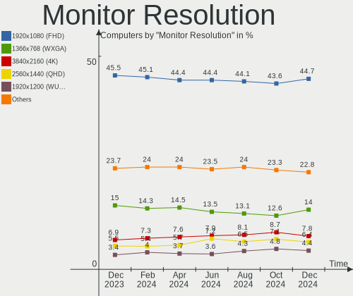

Linux Hardware Trends
---------------------

A project to identify most popular hardware characteristics and track their change
over time based on data collected by Linux users at https://Linux-Hardware.org.

Anyone can contribute to the study by uploading probes of their computers by
the [hw-probe](https://github.com/linuxhw/hw-probe) tool:

    sudo -E hw-probe -all -upload

This is a report for all computer types. See also reports for [desktops](/Desktop/README.md) and [notebooks](/Notebook/README.md).

Full-feature report is available here: https://linux-hardware.org/?view=trends

Distribution-specific reports: [Ubuntu](/Dist/Ubuntu), [ROSA](/Dist/ROSA), [Mint](/Dist/Mint), [Pop!_OS](/Dist/Pop!_OS), [Fedora](/Dist/Fedora), [BlackPanther](/Dist/BlackPanther), [Arch](/Dist/Arch), [Manjaro](/Dist/Manjaro), [Debian](/Dist/Debian), [Endless](/Dist/Endless), [Zorin](/Dist/Zorin), [Gentoo](/Dist/Gentoo), [Clear Linux](/Dist/Clear_Linux), [openSUSE](/Dist/openSUSE), [KDE neon](/Dist/KDE_neon).

Period: May, 2020.

Contents
--------

- [ OS                       ](#os)
- [ OS Family                ](#os-family)
- [ Kernel                   ](#kernel)
- [ Kernel Family            ](#kernel-family)
- [ Kernel Major Ver.        ](#kernel-major-ver)
- [ Arch                     ](#arch)
- [ DE                       ](#de)
- [ Display Server           ](#display-server)
- [ Display Manager          ](#display-manager)
- [ OS Lang                  ](#os-lang)
- [ Boot Mode                ](#boot-mode)
- [ Filesystem               ](#filesystem)
- [ Part. scheme             ](#part-scheme)
- [ Dual Boot with Linux/BSD ](#dual-boot-with-linux/bsd)
- [ Dual Boot (Win)          ](#dual-boot-win)
- [ Country                  ](#country)
- [ City                     ](#city)
- [ Vendor                   ](#vendor)
- [ Model                    ](#model)
- [ Model Family             ](#model-family)
- [ MFG Year                 ](#mfg-year)
- [ Form Factor              ](#form-factor)
- [ Secure Boot              ](#secure-boot)
- [ Coreboot                 ](#coreboot)
- [ RAM Size                 ](#ram-size)
- [ RAM Used                 ](#ram-used)
- [ Drive Vendor             ](#drive-vendor)
- [ Drive Model              ](#drive-model)
- [ Drive Kind               ](#drive-kind)
- [ Drive Connector          ](#drive-connector)
- [ Drive Size               ](#drive-size)
- [ Space Total              ](#space-total)
- [ Space Used               ](#space-used)
- [ Malfunc. Drives          ](#malfunc-drives)
- [ Malfunc. Drive Vendor    ](#malfunc-drive-vendor)
- [ Malfunc. HDD Vendor      ](#malfunc-hdd-vendor)
- [ Malfunc. Drive Kind      ](#malfunc-drive-kind)
- [ Failed Drives            ](#failed-drives)
- [ Failed Drive Vendor      ](#failed-drive-vendor)
- [ Drive Status             ](#drive-status)
- [ Storage Vendor           ](#storage-vendor)
- [ Storage Model            ](#storage-model)
- [ Storage Kind             ](#storage-kind)
- [ CPU Vendor               ](#cpu-vendor)
- [ CPU Model                ](#cpu-model)
- [ CPU Model Family         ](#cpu-model-family)
- [ CPU Cores                ](#cpu-cores)
- [ CPU Sockets              ](#cpu-sockets)
- [ CPU Threads              ](#cpu-threads)
- [ CPU Op-Modes             ](#cpu-op-modes)
- [ CPU Microcode            ](#cpu-microcode)
- [ CPU Microarch            ](#cpu-microarch)
- [ GPU Vendor               ](#gpu-vendor)
- [ GPU Model                ](#gpu-model)
- [ GPU Combo                ](#gpu-combo)
- [ GPU Driver               ](#gpu-driver)
- [ GPU Memory               ](#gpu-memory)
- [ Monitor Vendor           ](#monitor-vendor)
- [ Monitor Model            ](#monitor-model)
- [ Monitor Resolution       ](#monitor-resolution)
- [ Monitor Diagonal         ](#monitor-diagonal)
- [ Monitor Width            ](#monitor-width)
- [ Aspect Ratio             ](#aspect-ratio)
- [ Monitor Area             ](#monitor-area)
- [ Pixel Density            ](#pixel-density)
- [ Multiple Monitors        ](#multiple-monitors)
- [ Net Controller Vendor    ](#net-controller-vendor)
- [ Net Controller Model     ](#net-controller-model)
- [ Wireless Vendor          ](#wireless-vendor)
- [ Wireless Model           ](#wireless-model)
- [ Ethernet Vendor          ](#ethernet-vendor)
- [ Ethernet Model           ](#ethernet-model)
- [ Net Controller Kind      ](#net-controller-kind)
- [ Used Controller          ](#used-controller)
- [ NICs                     ](#nics)
- [ Bluetooth Vendor         ](#bluetooth-vendor)
- [ Bluetooth Model          ](#bluetooth-model)
- [ Unsupported Devices      ](#unsupported-devices)
- [ Unsupported Device Types ](#unsupported-device-types)

OS
--

Installed operating systems

| Name                   | Computers | Percent |
|------------------------|-----------|---------|
| Ubuntu 20.04           | 2595      | 44.25%  |
| Ubuntu 18.04           | 658       | 11.22%  |
| Pop!_OS 20.04          | 268       | 4.57%   |
| Mint 19.3              | 235       | 4.01%   |
| BlackPanther 18.1      | 186       | 3.17%   |
| Fedora 32              | 184       | 3.14%   |
| ROSA R11.1             | 155       | 2.64%   |
| Ubuntu 19.10           | 149       | 2.54%   |
| Endless 3.8.0          | 112       | 1.91%   |
| Arch                   | 108       | 1.84%   |
| Zorin 15               | 107       | 1.82%   |
| Manjaro                | 81        | 1.38%   |
| ROSA R11               | 71        | 1.21%   |
| Debian 10              | 71        | 1.21%   |
| Ubuntu 16.04           | 69        | 1.18%   |
| Manjaro 20.0.1         | 62        | 1.06%   |
| Gentoo                 | 46        | 0.78%   |
| Fedora 31              | 39        | 0.67%   |
| Endless 3.8.1          | 35        | 0.6%    |
| KDE neon 18.04         | 31        | 0.53%   |
| Arch Rolling           | 31        | 0.53%   |
| Elementary 5.1.4       | 29        | 0.49%   |
| BlackPanther 16.2      | 27        | 0.46%   |
| Mint 4                 | 24        | 0.41%   |
| Manjaro 20.0           | 23        | 0.39%   |
| Endless 3.7.8          | 19        | 0.32%   |
| Gentoo 2.6             | 18        | 0.31%   |
| Debian Testing         | 18        | 0.31%   |
| Peppermint 10          | 17        | 0.29%   |
| Mint 19.2              | 16        | 0.27%   |
| Ubuntu 19.04           | 15        | 0.26%   |
| Parrot 4.9             | 15        | 0.26%   |
| Mint 19.1              | 15        | 0.26%   |
| ROSA R8.1              | 14        | 0.24%   |
| Kali 2020.2            | 14        | 0.24%   |
| Debian                 | 13        | 0.22%   |
| CentOS 8               | 13        | 0.22%   |
| Gentoo 2.7             | 12        | 0.2%    |
| Mint 18.3              | 10        | 0.17%   |
| Ubuntu 20.10           | 9         | 0.15%   |
| ROSA R10               | 9         | 0.15%   |
| openSUSE 15.1          | 9         | 0.15%   |
| Clear Linux 33010      | 9         | 0.15%   |
| CentOS 7               | 8         | 0.14%   |
| openSUSE Leap-15.1     | 7         | 0.12%   |
| Debian Unstable        | 7         | 0.12%   |
| Ubuntu                 | 6         | 0.1%    |
| Solus 4.1              | 6         | 0.1%    |
| RHEL 8.2               | 6         | 0.1%    |
| Fedora 30              | 6         | 0.1%    |
| Ubuntu 18.10           | 5         | 0.09%   |
| openSUSE 20200523      | 5         | 0.09%   |
| Zorin 12               | 4         | 0.07%   |
| QTS 4.4.2              | 4         | 0.07%   |
| Mint 19                | 4         | 0.07%   |
| Endless 3.3.20-nexthw1 | 4         | 0.07%   |
| ClearOS 7              | 4         | 0.07%   |
| Chrome OS              | 4         | 0.07%   |
| WindowsFX 10           | 3         | 0.05%   |
| MX 20                  | 3         | 0.05%   |

OS Family
---------

OS without a version

| Name         | Computers | Percent |
|--------------|-----------|---------|
| Ubuntu       | 3510      | 59.85%  |
| Mint         | 306       | 5.22%   |
| Pop!_OS      | 270       | 4.6%    |
| ROSA         | 254       | 4.33%   |
| Fedora       | 232       | 3.96%   |
| BlackPanther | 213       | 3.63%   |
| Endless      | 174       | 2.97%   |
| Manjaro      | 168       | 2.86%   |
| Arch         | 140       | 2.39%   |
| Debian       | 115       | 1.96%   |
| Zorin        | 111       | 1.89%   |
| Gentoo       | 77        | 1.31%   |
| openSUSE     | 42        | 0.72%   |
| Elementary   | 34        | 0.58%   |
| KDE neon     | 31        | 0.53%   |
| Clear Linux  | 30        | 0.51%   |
| CentOS       | 23        | 0.39%   |
| Peppermint   | 19        | 0.32%   |
| Kali         | 18        | 0.31%   |
| Parrot       | 16        | 0.27%   |
| RHEL         | 10        | 0.17%   |
| Solus        | 6         | 0.1%    |
| MX           | 6         | 0.1%    |
| Deepin       | 6         | 0.1%    |
| ClearOS      | 5         | 0.09%   |
| QTS          | 4         | 0.07%   |
| Chrome OS    | 4         | 0.07%   |
| ALT Linux    | 4         | 0.07%   |
| WindowsFX    | 3         | 0.05%   |
| Mageia       | 3         | 0.05%   |
| EndeavourOS  | 3         | 0.05%   |
| Astra Linux  | 3         | 0.05%   |
| ArcoLinux    | 3         | 0.05%   |
| Reborn OS    | 2         | 0.03%   |
| BigLinux     | 2         | 0.03%   |
| Android      | 2         | 0.03%   |
| Void         | 1         | 0.02%   |
| Sparky       | 1         | 0.02%   |
| Regataos     | 1         | 0.02%   |
| Raspbian     | 1         | 0.02%   |
| Pardus       | 1         | 0.02%   |
| Oracle Linux | 1         | 0.02%   |
| Klusterfuk   | 1         | 0.02%   |
| Kaisen       | 1         | 0.02%   |
| Generic      | 1         | 0.02%   |
| GalliumOS    | 1         | 0.02%   |
| BunsenLabs   | 1         | 0.02%   |
| BlackArch    | 1         | 0.02%   |
| Black Box    | 1         | 0.02%   |
| ArchLabs     | 1         | 0.02%   |
| Arch ARM     | 1         | 0.02%   |
| Alpine       | 1         | 0.02%   |

Kernel
------

Version of the Linux kernel

| Version                          | Computers | Percent |
|----------------------------------|-----------|---------|
| 5.4.0-29-generic                 | 1089      | 18.57%  |
| 5.4.0-31-generic                 | 609       | 10.38%  |
| 5.3.0-51-generic                 | 532       | 9.07%   |
| 5.4.0-28-generic                 | 366       | 6.24%   |
| 5.3.0-53-generic                 | 209       | 3.56%   |
| 5.4.0-26-generic                 | 205       | 3.5%    |
| 4.15.0-99-generic                | 199       | 3.39%   |
| 5.4.0-33-generic                 | 182       | 3.1%    |
| 5.4.0-19-generic                 | 148       | 2.52%   |
| 4.18.16-desktop-1bP              | 145       | 2.47%   |
| 5.4.0-7626-generic               | 135       | 2.3%    |
| 4.15.0-desktop-45.1rosa-x86_64   | 68        | 1.16%   |
| 4.15.0-101-generic               | 65        | 1.11%   |
| 5.4.0-7629-generic               | 58        | 0.99%   |
| 5.4.0-7625-generic               | 54        | 0.92%   |
| 4.15.0-desktop-94.1rosa-x86_64   | 54        | 0.92%   |
| 5.3.0-46-generic                 | 48        | 0.82%   |
| 5.3.0-28-generic                 | 47        | 0.8%    |
| 4.19.0-9-amd64                   | 46        | 0.78%   |
| 5.6.8-300.fc32.x86_64            | 44        | 0.75%   |
| 5.6.12-1-MANJARO                 | 42        | 0.72%   |
| 5.4.32-generic-2rosa-x86_64      | 39        | 0.66%   |
| 5.1.15-desktop-1bP               | 39        | 0.66%   |
| 5.4.0-29-lowlatency              | 32        | 0.55%   |
| 5.6.13-arch1-1                   | 29        | 0.49%   |
| 5.6.14-300.fc32.x86_64           | 27        | 0.46%   |
| 5.6.13-300.fc32.x86_64           | 27        | 0.46%   |
| 5.0.0-32-generic                 | 27        | 0.46%   |
| 4.9.20-desktop-pae-1bP           | 27        | 0.46%   |
| 5.6.11-arch1-1                   | 26        | 0.44%   |
| 4.19.0-8-amd64                   | 25        | 0.43%   |
| 5.6.11-1-MANJARO                 | 24        | 0.41%   |
| 5.6.0-1-amd64                    | 24        | 0.41%   |
| 5.6.7-1-MANJARO                  | 22        | 0.38%   |
| 5.6.14-arch1-1                   | 21        | 0.36%   |
| 5.6.10-300.fc32.x86_64           | 20        | 0.34%   |
| 4.15.0-96-generic                | 20        | 0.34%   |
| 5.6.7-300.fc32.x86_64            | 18        | 0.31%   |
| 5.6.12-300.fc32.x86_64           | 18        | 0.31%   |
| 5.6.11-300.fc32.x86_64           | 18        | 0.31%   |
| 5.4.0-32-generic                 | 17        | 0.29%   |
| 5.6.12-1-default                 | 16        | 0.27%   |
| 5.4.0-31-lowlatency              | 16        | 0.27%   |
| 4.15.0-desktop-45.1rosa-i586     | 16        | 0.27%   |
| 5.4.0-7634-generic               | 14        | 0.24%   |
| 5.3.0-40-generic                 | 14        | 0.24%   |
| 4.15.0-desktop-94.1rosa-i586     | 14        | 0.24%   |
| 5.6.8-1-MANJARO                  | 13        | 0.22%   |
| 5.5.0-1parrot1-amd64             | 13        | 0.22%   |
| 5.4.40-1-MANJARO                 | 13        | 0.22%   |
| 5.6.10-arch1-1                   | 12        | 0.2%    |
| 5.4.0-1008-raspi                 | 12        | 0.2%    |
| 5.3.0-55-generic                 | 12        | 0.2%    |
| 4.18.0-147.8.1.el8_1.x86_64      | 12        | 0.2%    |
| 4.12.14-lp151.28.48-default      | 12        | 0.2%    |
| 5.4.0-30-generic                 | 11        | 0.19%   |
| 4.9.155-nrj-desktop-1rosa-x86_64 | 11        | 0.19%   |
| 4.4.0-178-generic                | 11        | 0.19%   |
| 5.6.8-200.fc31.x86_64            | 10        | 0.17%   |
| 5.6.8-arch1-1                    | 9         | 0.15%   |

Kernel Family
-------------

Linux kernel without a distro release

| Version | Computers | Percent |
|---------|-----------|---------|
| 5.4.0   | 2991      | 51%     |
| 5.3.0   | 917       | 15.64%  |
| 4.15.0  | 535       | 9.12%   |
| 4.18.16 | 145       | 2.47%   |
| 5.6.8   | 98        | 1.67%   |
| 5.6.11  | 97        | 1.65%   |
| 4.19.0  | 91        | 1.55%   |
| 5.6.12  | 90        | 1.53%   |
| 5.6.13  | 78        | 1.33%   |
| 5.6.14  | 74        | 1.26%   |
| 5.6.7   | 66        | 1.13%   |
| 5.0.0   | 60        | 1.02%   |
| 5.6.10  | 57        | 0.97%   |
| 5.6.0   | 44        | 0.75%   |
| 5.4.32  | 44        | 0.75%   |
| 5.1.15  | 41        | 0.7%    |
| 4.18.0  | 38        | 0.65%   |
| 5.5.0   | 35        | 0.6%    |
| 4.9.20  | 29        | 0.49%   |
| 5.4.38  | 24        | 0.41%   |
| 4.4.0   | 24        | 0.41%   |
| 5.6.6   | 20        | 0.34%   |
| 5.4.40  | 19        | 0.32%   |
| 4.9.155 | 16        | 0.27%   |
| 5.7.0   | 15        | 0.26%   |
| 4.12.14 | 15        | 0.26%   |
| 3.10.0  | 14        | 0.24%   |
| 5.4.28  | 13        | 0.22%   |
| 5.4.35  | 10        | 0.17%   |
| 4.9.60  | 10        | 0.17%   |
| 5.4.39  | 8         | 0.14%   |
| 5.6.15  | 7         | 0.12%   |
| 5.6.4   | 6         | 0.1%    |
| 4.10.0  | 6         | 0.1%    |
| 4.1.38  | 6         | 0.1%    |
| 5.4.36  | 5         | 0.09%   |
| 5.4.34  | 5         | 0.09%   |
| 5.5.19  | 4         | 0.07%   |
| 5.5.17  | 4         | 0.07%   |
| 4.9.0   | 4         | 0.07%   |
| 4.14.24 | 4         | 0.07%   |
| 5.6.2   | 3         | 0.05%   |
| 5.4.41  | 3         | 0.05%   |
| 5.3.6   | 3         | 0.05%   |
| 4.9.140 | 3         | 0.05%   |
| 4.19.88 | 3         | 0.05%   |
| 4.16.0  | 3         | 0.05%   |
| 4.15.3  | 3         | 0.05%   |
| 5.6.3   | 2         | 0.03%   |
| 5.5.7   | 2         | 0.03%   |
| 5.5.13  | 2         | 0.03%   |
| 5.5.11  | 2         | 0.03%   |
| 5.5.10  | 2         | 0.03%   |
| 5.4.42  | 2         | 0.03%   |
| 5.4.31  | 2         | 0.03%   |
| 5.4.25  | 2         | 0.03%   |
| 5.4.17  | 2         | 0.03%   |
| 5.4.15  | 2         | 0.03%   |
| 5.2.0   | 2         | 0.03%   |
| 5.0.16  | 2         | 0.03%   |

Kernel Major Ver.
-----------------

Linux kernel major version

| Version | Computers | Percent |
|---------|-----------|---------|
| 5.4     | 3140      | 53.54%  |
| 5.3     | 924       | 15.75%  |
| 5.6     | 643       | 10.96%  |
| 4.15    | 540       | 9.21%   |
| 4.18    | 183       | 3.12%   |
| 4.19    | 108       | 1.84%   |
| 4.9     | 65        | 1.11%   |
| 5.0     | 62        | 1.06%   |
| 5.5     | 54        | 0.92%   |
| 5.1     | 44        | 0.75%   |
| 4.4     | 24        | 0.41%   |
| 5.7     | 15        | 0.26%   |
| 4.12    | 15        | 0.26%   |
| 3.10    | 15        | 0.26%   |
| 4.16    | 6         | 0.1%    |
| 4.14    | 6         | 0.1%    |
| 4.10    | 6         | 0.1%    |
| 4.1     | 6         | 0.1%    |
| 5.2     | 4         | 0.07%   |
| 4.8     | 2         | 0.03%   |
| 4.13    | 2         | 0.03%   |
| 4.11    | 1         | 0.02%   |

Arch
----

OS architecture (x86_64, i586, etc.)

| Name     | Computers | Percent |
|----------|-----------|---------|
| x86_64   | 5592      | 95.35%  |
| i686     | 240       | 4.09%   |
| aarch64  | 26        | 0.44%   |
| ppc      | 3         | 0.05%   |
| armv7l   | 2         | 0.03%   |
| mips64   | 1         | 0.02%   |
| armv5tel | 1         | 0.02%   |

DE
--

Desktop Environment

| Name             | Computers | Percent |
|------------------|-----------|---------|
| GNOME            | 3623      | 61.77%  |
| KDE5             | 430       | 7.33%   |
| XFCE             | 414       | 7.06%   |
| Unknown          | 291       | 4.96%   |
| X-Cinnamon       | 233       | 3.97%   |
| KDE              | 208       | 3.55%   |
| KDE4             | 149       | 2.54%   |
| MATE             | 137       | 2.34%   |
| Unity            | 68        | 1.16%   |
| LXQt             | 57        | 0.97%   |
| Cinnamon         | 51        | 0.87%   |
| LXDE             | 46        | 0.78%   |
| Budgie           | 42        | 0.72%   |
| Deepin           | 34        | 0.58%   |
| Pantheon         | 29        | 0.49%   |
| GNOME Flashback  | 24        | 0.41%   |
| i3               | 11        | 0.19%   |
| GNOME Classic    | 10        | 0.17%   |
| Openbox          | 3         | 0.05%   |
| xubuntu          | 1         | 0.02%   |
| lightdm-xsession | 1         | 0.02%   |
| GNUstep          | 1         | 0.02%   |
| enlightenment    | 1         | 0.02%   |
| Core             | 1         | 0.02%   |

Display Server
--------------

X11 or Wayland

| Name        | Computers | Percent |
|-------------|-----------|---------|
| X11         | 5417      | 92.36%  |
| Wayland     | 275       | 4.69%   |
| Unknown     | 123       | 2.1%    |
| Tty         | 48        | 0.82%   |
| Unspecified | 2         | 0.03%   |

Display Manager
---------------

SDDM, LightDM, etc.

| Name    | Computers | Percent |
|---------|-----------|---------|
| Unknown | 4661      | 79.47%  |
| SDDM    | 434       | 7.4%    |
| GDM     | 329       | 5.61%   |
| LightDM | 273       | 4.65%   |
| KDM     | 149       | 2.54%   |
| XDM     | 10        | 0.17%   |
| SLiM    | 5         | 0.09%   |
| WDM     | 1         | 0.02%   |
| NODM    | 1         | 0.02%   |
| Ly      | 1         | 0.02%   |
| LXDM    | 1         | 0.02%   |

OS Lang
-------

Language

| Lang       | Computers | Percent |
|------------|-----------|---------|
| en_US      | 1949      | 33.23%  |
| de_DE      | 427       | 7.28%   |
| Unknown    | 376       | 6.41%   |
| ru_RU      | 341       | 5.81%   |
| en_GB      | 324       | 5.52%   |
| pt_BR      | 285       | 4.86%   |
| it_IT      | 228       | 3.89%   |
| fr_FR      | 228       | 3.89%   |
| en_CA      | 147       | 2.51%   |
| es_ES      | 144       | 2.46%   |
| en_IN      | 107       | 1.82%   |
| pl_PL      | 105       | 1.79%   |
| en_US.utf8 | 101       | 1.72%   |
| en_AU      | 97        | 1.65%   |
| C          | 67        | 1.14%   |
| nl_NL      | 60        | 1.02%   |
| es_AR      | 53        | 0.9%    |
| pt_PT      | 41        | 0.7%    |
| ja_JP      | 34        | 0.58%   |
| hu_HU      | 33        | 0.56%   |
| es_MX      | 31        | 0.53%   |
| en_ZA      | 30        | 0.51%   |
| cs_CZ      | 28        | 0.48%   |
| tr_TR      | 26        | 0.44%   |
| zh_CN      | 23        | 0.39%   |
| ru_UA      | 23        | 0.39%   |
| es_CL      | 22        | 0.38%   |
| el_GR      | 22        | 0.38%   |
| de_AT      | 22        | 0.38%   |
| uk_UA      | 21        | 0.36%   |
| pt_BR.utf8 | 21        | 0.36%   |
| de_CH      | 18        | 0.31%   |
| en_NZ      | 17        | 0.29%   |
| sv_SE      | 15        | 0.26%   |
| ro_RO      | 15        | 0.26%   |
| nl_BE      | 15        | 0.26%   |
| ko_KR      | 15        | 0.26%   |
| en_IE      | 15        | 0.26%   |
| fr_BE      | 14        | 0.24%   |
| es_CO      | 14        | 0.24%   |
| de_DE.utf8 | 14        | 0.24%   |
| ca_ES      | 14        | 0.24%   |
| bg_BG      | 13        | 0.22%   |
| es_PE      | 12        | 0.2%    |
| da_DK      | 12        | 0.2%    |
| C          | 12        | 0.2%    |
| fr_CA      | 11        | 0.19%   |
| en_PH      | 10        | 0.17%   |
| es_UY      | 9         | 0.15%   |
| en_IN      | 9         | 0.15%   |
| zh_TW      | 8         | 0.14%   |
| ru_RU.utf8 | 8         | 0.14%   |
| fi_FI      | 8         | 0.14%   |
| nb_NO      | 7         | 0.12%   |
| hr_HR      | 7         | 0.12%   |
| es_VE      | 7         | 0.12%   |
| en_SG      | 7         | 0.12%   |
| en_IL      | 7         | 0.12%   |
| en_HK      | 7         | 0.12%   |
| en_GB.utf8 | 7         | 0.12%   |

Boot Mode
---------

EFI or BIOS

| Mode | Computers | Percent |
|------|-----------|---------|
| BIOS | 3488      | 59.47%  |
| EFI  | 2377      | 40.53%  |

Filesystem
----------

Type of filesystem

| Type     | Computers | Percent |
|----------|-----------|---------|
| Ext4     | 5351      | 91.24%  |
| Overlay  | 191       | 3.26%   |
| Btrfs    | 132       | 2.25%   |
| Xfs      | 76        | 1.3%    |
| Zfs      | 60        | 1.02%   |
| Ext2     | 16        | 0.27%   |
| Ext3     | 13        | 0.22%   |
| Tmpfs    | 9         | 0.15%   |
| F2fs     | 6         | 0.1%    |
| Aufs     | 4         | 0.07%   |
| Unknown  | 3         | 0.05%   |
| Reiserfs | 2         | 0.03%   |
| XXXXXXX  | 1         | 0.02%   |
| SquasXfs | 1         | 0.02%   |

Part. scheme
------------

Scheme of partitioning

| Type    | Computers | Percent |
|---------|-----------|---------|
| Unknown | 5282      | 90.06%  |
| GPT     | 329       | 5.61%   |
| MBR     | 254       | 4.33%   |

Dual Boot with Linux/BSD
------------------------

Hosting more than one Linux/BSD

| Dual boot | Computers | Percent |
|-----------|-----------|---------|
| No        | 5147      | 87.76%  |
| Yes       | 718       | 12.24%  |

Dual Boot (Win)
---------------

Hosting Linux and Windows

| Dual boot | Computers | Percent |
|-----------|-----------|---------|
| No        | 3887      | 66.27%  |
| Yes       | 1978      | 33.73%  |

Country
-------

Geographic location (country)

| Country            | Computers | Percent |
|--------------------|-----------|---------|
| USA                | 996       | 16.98%  |
| Germany            | 568       | 9.68%   |
| Russia             | 445       | 7.59%   |
| Brazil             | 366       | 6.24%   |
| UK                 | 277       | 4.72%   |
| Italy              | 271       | 4.62%   |
| France             | 269       | 4.59%   |
| Hungary            | 218       | 3.72%   |
| Canada             | 186       | 3.17%   |
| Spain              | 179       | 3.05%   |
| Poland             | 138       | 2.35%   |
| India              | 137       | 2.34%   |
| Ukraine            | 114       | 1.94%   |
| Australia          | 108       | 1.84%   |
| Netherlands        | 102       | 1.74%   |
| Argentina          | 75        | 1.28%   |
| Romania            | 69        | 1.18%   |
| Switzerland        | 61        | 1.04%   |
| Greece             | 59        | 1.01%   |
| Portugal           | 56        | 0.95%   |
| Belgium            | 54        | 0.92%   |
| Sweden             | 53        | 0.9%    |
| Czech Republic     | 50        | 0.85%   |
| Austria            | 50        | 0.85%   |
| Mexico             | 48        | 0.82%   |
| Turkey             | 45        | 0.77%   |
| South Africa       | 44        | 0.75%   |
| Japan              | 41        | 0.7%    |
| Chile              | 36        | 0.61%   |
| Bulgaria           | 36        | 0.61%   |
| Colombia           | 29        | 0.49%   |
| China              | 29        | 0.49%   |
| Denmark            | 28        | 0.48%   |
| Serbia             | 26        | 0.44%   |
| Ireland            | 25        | 0.43%   |
| New Zealand        | 24        | 0.41%   |
| Indonesia          | 23        | 0.39%   |
| Norway             | 21        | 0.36%   |
| Korea, Republic of | 20        | 0.34%   |
| Philippines        | 18        | 0.31%   |
| Peru               | 18        | 0.31%   |
| Finland            | 18        | 0.31%   |
| Egypt              | 18        | 0.31%   |
| Croatia            | 17        | 0.29%   |
| Belarus            | 17        | 0.29%   |
| Iran               | 16        | 0.27%   |
| Slovenia           | 14        | 0.24%   |
| Israel             | 14        | 0.24%   |
| Uruguay            | 13        | 0.22%   |
| Thailand           | 12        | 0.2%    |
| Taiwan             | 12        | 0.2%    |
| Kenya              | 12        | 0.2%    |
| Slovakia           | 11        | 0.19%   |
| Singapore          | 11        | 0.19%   |
| Pakistan           | 10        | 0.17%   |
| Malaysia           | 10        | 0.17%   |
| Hong Kong          | 10        | 0.17%   |
| Bangladesh         | 10        | 0.17%   |
| Algeria            | 10        | 0.17%   |
| Vietnam            | 9         | 0.15%   |

City
----

Geographic location (city)

| City              | Computers | Percent |
|-------------------|-----------|---------|
| Moscow            | 109       | 1.86%   |
| Budapest          | 74        | 1.26%   |
| Berlin            | 58        | 0.99%   |
| São Paulo        | 49        | 0.84%   |
| St Petersburg     | 42        | 0.72%   |
| Madrid            | 37        | 0.63%   |
| Kyiv              | 37        | 0.63%   |
| Rome              | 36        | 0.61%   |
| Athens            | 34        | 0.58%   |
| Paris             | 33        | 0.56%   |
| Warsaw            | 31        | 0.53%   |
| Vienna            | 30        | 0.51%   |
| Rio de Janeiro    | 30        | 0.51%   |
| Hamburg           | 29        | 0.49%   |
| Toronto           | 27        | 0.46%   |
| Barcelona         | 26        | 0.44%   |
| Sydney            | 23        | 0.39%   |
| Sofia             | 23        | 0.39%   |
| Munich            | 23        | 0.39%   |
| Santiago          | 21        | 0.36%   |
| Prague            | 20        | 0.34%   |
| Milan             | 20        | 0.34%   |
| Buenos Aires      | 20        | 0.34%   |
| Zurich            | 19        | 0.32%   |
| London            | 19        | 0.32%   |
| Bucharest         | 18        | 0.31%   |
| Montreal          | 16        | 0.27%   |
| Leipzig           | 16        | 0.27%   |
| Frankfurt am Main | 16        | 0.27%   |
| Chennai           | 16        | 0.27%   |
| Turin             | 15        | 0.26%   |
| Ottawa            | 15        | 0.26%   |
| Johannesburg      | 15        | 0.26%   |
| Belo Horizonte    | 15        | 0.26%   |
| Melbourne         | 14        | 0.24%   |
| Ekaterinburg      | 14        | 0.24%   |
| Dublin            | 14        | 0.24%   |
| Dallas            | 14        | 0.24%   |
| Bengaluru         | 14        | 0.24%   |
| Amsterdam         | 14        | 0.24%   |
| Samara            | 13        | 0.22%   |
| Pune              | 13        | 0.22%   |
| Novosibirsk       | 13        | 0.22%   |
| Lisbon            | 13        | 0.22%   |
| Lima              | 13        | 0.22%   |
| Curitiba          | 13        | 0.22%   |
| Stuttgart         | 12        | 0.2%    |
| Miami             | 12        | 0.2%    |
| Krasnodar         | 12        | 0.2%    |
| Chicago           | 12        | 0.2%    |
| Cairo             | 12        | 0.2%    |
| Wrocław          | 11        | 0.19%   |
| Montevideo        | 11        | 0.19%   |
| Mannheim          | 11        | 0.19%   |
| Kharkiv           | 11        | 0.19%   |
| Helsinki          | 11        | 0.19%   |
| Brasília         | 11        | 0.19%   |
| Belgrade          | 11        | 0.19%   |
| Zagreb            | 10        | 0.17%   |
| San Antonio       | 10        | 0.17%   |

Vendor
------

Motherboard manufacturer

| Name                    | Computers | Percent |
|-------------------------|-----------|---------|
| ASUSTek Computer        | 1027      | 17.51%  |
| Hewlett-Packard         | 880       | 15%     |
| Dell                    | 758       | 12.92%  |
| Lenovo                  | 736       | 12.55%  |
| Gigabyte Technology     | 441       | 7.52%   |
| Acer                    | 352       | 6%      |
| MSI                     | 277       | 4.72%   |
| ASRock                  | 205       | 3.5%    |
| Toshiba                 | 130       | 2.22%   |
| Apple                   | 121       | 2.06%   |
| Intel                   | 105       | 1.79%   |
| Samsung Electronics     | 90        | 1.53%   |
| Sony                    | 69        | 1.18%   |
| Unknown                 | 54        | 0.92%   |
| Fujitsu                 | 53        | 0.9%    |
| Packard Bell            | 29        | 0.49%   |
| Medion                  | 26        | 0.44%   |
| Fujitsu Siemens         | 26        | 0.44%   |
| Positivo                | 24        | 0.41%   |
| Foxconn                 | 24        | 0.41%   |
| Notebook                | 22        | 0.38%   |
| Biostar                 | 21        | 0.36%   |
| Raspberry Pi Foundation | 20        | 0.34%   |
| ECS                     | 20        | 0.34%   |
| Pegatron                | 19        | 0.32%   |
| HUAWEI                  | 19        | 0.32%   |
| Supermicro              | 16        | 0.27%   |
| Microsoft               | 15        | 0.26%   |
| Google                  | 13        | 0.22%   |
| Gateway                 | 13        | 0.22%   |
| Alienware               | 12        | 0.2%    |
| eMachines               | 10        | 0.17%   |
| Timi                    | 9         | 0.15%   |
| LG Electronics          | 9         | 0.15%   |
| Clevo                   | 9         | 0.15%   |
| Chuwi                   | 9         | 0.15%   |
| AMI                     | 9         | 0.15%   |
| System76                | 8         | 0.14%   |
| Semp Toshiba            | 7         | 0.12%   |
| Shuttle                 | 6         | 0.1%    |
| PCWare                  | 6         | 0.1%    |
| Panasonic               | 5         | 0.09%   |
| Nvidia                  | 5         | 0.09%   |
| IBM                     | 5         | 0.09%   |
| ZOTAC                   | 4         | 0.07%   |
| TUXEDO                  | 4         | 0.07%   |
| Razer                   | 4         | 0.07%   |
| Itautec                 | 4         | 0.07%   |
| Huanan                  | 4         | 0.07%   |
| Exo                     | 4         | 0.07%   |
| EVGA                    | 4         | 0.07%   |
| Teclast                 | 3         | 0.05%   |
| Prestigio               | 3         | 0.05%   |
| NEC Computers           | 3         | 0.05%   |
| Mediacom                | 3         | 0.05%   |
| GPD                     | 3         | 0.05%   |
| AZW                     | 3         | 0.05%   |
| AOpen                   | 3         | 0.05%   |
| AMD                     | 3         | 0.05%   |
| VIT                     | 2         | 0.03%   |

Model
-----

Motherboard model

| Name                               | Computers | Percent |
|------------------------------------|-----------|---------|
| Unknown                            | 77        | 1.31%   |
| ASUS All Series                    | 50        | 0.85%   |
| HP Notebook                        | 34        | 0.58%   |
| HP Pavilion g6                     | 23        | 0.39%   |
| HP Pavilion dv6                    | 22        | 0.38%   |
| Dell XPS 15 7590                   | 17        | 0.29%   |
| RPi Raspberry Pi 4 Model B Rev 1.1 | 14        | 0.24%   |
| Gigabyte B450M DS3H                | 13        | 0.22%   |
| Dell OptiPlex 7010                 | 13        | 0.22%   |
| MSI MS-7C02                        | 12        | 0.2%    |
| HP Pavilion Notebook               | 12        | 0.2%    |
| HP Pavilion dv7                    | 12        | 0.2%    |
| HP Pavilion 15                     | 12        | 0.2%    |
| Dell Latitude E6410                | 12        | 0.2%    |
| HP 15                              | 11        | 0.19%   |
| Gigabyte GA-78LMT-USB3 6.0         | 11        | 0.19%   |
| Dell XPS 15 9570                   | 11        | 0.19%   |
| Dell Inspiron 5570                 | 11        | 0.19%   |
| Dell Inspiron 3521                 | 11        | 0.19%   |
| Lenovo IdeaPad 330-15IKB 81DE      | 10        | 0.17%   |
| HP 2000                            | 10        | 0.17%   |
| Dell OptiPlex 780                  | 10        | 0.17%   |
| Dell Latitude E7450                | 10        | 0.17%   |
| ASUS PRIME A320M-K                 | 10        | 0.17%   |
| MSI MS-7693                        | 9         | 0.15%   |
| HP EliteBook 840 G2                | 9         | 0.15%   |
| HP Compaq Elite 8300 SFF           | 9         | 0.15%   |
| Gigabyte X470 AORUS ULTRA GAMING   | 9         | 0.15%   |
| Dell XPS 13 9360                   | 9         | 0.15%   |
| Dell OptiPlex 9020                 | 9         | 0.15%   |
| Dell Latitude E6420                | 9         | 0.15%   |
| ASUS M5A78L-M/USB3                 | 9         | 0.15%   |
| MSI MS-7850                        | 8         | 0.14%   |
| Lenovo V330-15IKB 81AX             | 8         | 0.14%   |
| HP Laptop 15-da0xxx                | 8         | 0.14%   |
| HP EliteBook 8460p                 | 8         | 0.14%   |
| HP 15 Notebook PC                  | 8         | 0.14%   |
| Gigabyte A320M-S2H                 | 8         | 0.14%   |
| Dell OptiPlex 790                  | 8         | 0.14%   |
| Dell OptiPlex 760                  | 8         | 0.14%   |
| Dell OptiPlex 755                  | 8         | 0.14%   |
| Dell Inspiron N5110                | 8         | 0.14%   |
| Apple MacBookPro8,1                | 8         | 0.14%   |
| Acer Aspire A315-53                | 8         | 0.14%   |
| Positivo MOBILE                    | 7         | 0.12%   |
| MSI MS-7C37                        | 7         | 0.12%   |
| HP Presario CQ57                   | 7         | 0.12%   |
| HP Pavilion dv4                    | 7         | 0.12%   |
| HP Laptop 15-bw0xx                 | 7         | 0.12%   |
| HP EliteBook 8470p                 | 7         | 0.12%   |
| HP EliteBook 840 G1                | 7         | 0.12%   |
| HP Compaq 8200 Elite SFF PC        | 7         | 0.12%   |
| Gigabyte 970A-DS3P                 | 7         | 0.12%   |
| Dell OptiPlex 9010                 | 7         | 0.12%   |
| Dell Latitude E6520                | 7         | 0.12%   |
| Dell Latitude E6430                | 7         | 0.12%   |
| Dell Latitude D630                 | 7         | 0.12%   |
| ASUS X541NA                        | 7         | 0.12%   |
| ASUS M5A78L-M PLUS/USB3            | 7         | 0.12%   |
| ASRock B450M Pro4                  | 7         | 0.12%   |

Model Family
------------

Motherboard model prefix

| Name                   | Computers | Percent |
|------------------------|-----------|---------|
| Lenovo ThinkPad        | 322       | 5.49%   |
| Acer Aspire            | 249       | 4.25%   |
| Dell Inspiron          | 230       | 3.92%   |
| Dell Latitude          | 196       | 3.34%   |
| HP Pavilion            | 157       | 2.68%   |
| Lenovo IdeaPad         | 140       | 2.39%   |
| HP EliteBook           | 117       | 1.99%   |
| Dell OptiPlex          | 112       | 1.91%   |
| Toshiba Satellite      | 107       | 1.82%   |
| HP ProBook             | 104       | 1.77%   |
| HP Compaq              | 93        | 1.59%   |
| ASUS PRIME             | 84        | 1.43%   |
| Unknown                | 77        | 1.31%   |
| Dell XPS               | 76        | 1.3%    |
| ASUS VivoBook          | 68        | 1.16%   |
| HP Laptop              | 61        | 1.04%   |
| Dell Precision         | 51        | 0.87%   |
| ASUS All               | 50        | 0.85%   |
| HP ENVY                | 41        | 0.7%    |
| Dell Vostro            | 41        | 0.7%    |
| Lenovo ThinkCentre     | 40        | 0.68%   |
| ASUS ROG               | 40        | 0.68%   |
| ASUS TUF               | 37        | 0.63%   |
| HP Notebook            | 34        | 0.58%   |
| Lenovo Yoga            | 29        | 0.49%   |
| ASUS M5A78L-M          | 26        | 0.44%   |
| Fujitsu LIFEBOOK       | 22        | 0.38%   |
| RPi Raspberry          | 20        | 0.34%   |
| HP 15                  | 20        | 0.34%   |
| Gigabyte B450M         | 20        | 0.34%   |
| Acer Swift             | 20        | 0.34%   |
| Acer Nitro             | 20        | 0.34%   |
| HP 250                 | 19        | 0.32%   |
| Fujitsu ESPRIMO        | 19        | 0.32%   |
| ASUS P8H61-M           | 19        | 0.32%   |
| Acer TravelMate        | 19        | 0.32%   |
| Packard Bell EasyNote  | 18        | 0.31%   |
| HP Presario            | 18        | 0.31%   |
| HP 255                 | 17        | 0.29%   |
| Dell Studio            | 16        | 0.27%   |
| Apple MacBookPro8      | 16        | 0.27%   |
| Microsoft Surface      | 15        | 0.26%   |
| Lenovo IdeaCentre      | 15        | 0.26%   |
| Gigabyte GA-78LMT-USB3 | 15        | 0.26%   |
| Gigabyte B450          | 15        | 0.26%   |
| ASUS ZenBook           | 15        | 0.26%   |
| ASUS SABERTOOTH        | 15        | 0.26%   |
| ASUS P8Z77-V           | 15        | 0.26%   |
| HP Spectre             | 14        | 0.24%   |
| Gigabyte X570          | 13        | 0.22%   |
| Dell G3                | 13        | 0.22%   |
| ASRock Z77             | 13        | 0.22%   |
| MSI MS-7C02            | 12        | 0.2%    |
| HP ZBook               | 12        | 0.2%    |
| Lenovo G580            | 11        | 0.19%   |
| Gigabyte Z390          | 11        | 0.19%   |
| Dell PowerEdge         | 11        | 0.19%   |
| ASUS Maximus           | 11        | 0.19%   |
| ASRock B450M           | 11        | 0.19%   |
| HP ProDesk             | 10        | 0.17%   |

MFG Year
--------

Motherboard manufacture year

| Year    | Computers | Percent |
|---------|-----------|---------|
| 2019    | 1208      | 20.6%   |
| 2018    | 603       | 10.28%  |
| 2013    | 451       | 7.69%   |
| 2012    | 443       | 7.55%   |
| 2011    | 408       | 6.96%   |
| 2014    | 353       | 6.02%   |
| 2010    | 338       | 5.76%   |
| 2015    | 330       | 5.63%   |
| 2016    | 323       | 5.51%   |
| 2017    | 322       | 5.49%   |
| 2020    | 309       | 5.27%   |
| 2009    | 295       | 5.03%   |
| 2008    | 205       | 3.5%    |
| 2007    | 137       | 2.34%   |
| 2006    | 56        | 0.95%   |
| Unknown | 41        | 0.7%    |
| 2005    | 29        | 0.49%   |
| 2004    | 6         | 0.1%    |
| 2003    | 4         | 0.07%   |
| 2002    | 3         | 0.05%   |
| 2001    | 1         | 0.02%   |

Form Factor
-----------

Physical design of the computer

| Name           | Computers | Percent |
|----------------|-----------|---------|
| Notebook       | 3292      | 56.13%  |
| Desktop        | 2224      | 37.92%  |
| Convertible    | 96        | 1.64%   |
| Mini pc        | 70        | 1.19%   |
| All in one     | 67        | 1.14%   |
| Tablet         | 51        | 0.87%   |
| Server         | 38        | 0.65%   |
| System on chip | 26        | 0.44%   |
| Phone          | 1         | 0.02%   |

Secure Boot
-----------

Enabled or disabled

| State    | Computers | Percent |
|----------|-----------|---------|
| Disabled | 5436      | 92.69%  |
| Enabled  | 429       | 7.31%   |

Coreboot
--------

Have coreboot on board

| Used | Computers | Percent |
|------|-----------|---------|
| No   | 5848      | 99.71%  |
| Yes  | 17        | 0.29%   |

RAM Size
--------

Total RAM memory

| Size in GB      | Computers | Percent |
|-----------------|-----------|---------|
| 3.01-4.0        | 1442      | 24.59%  |
| 4.01-8.0        | 1344      | 22.92%  |
| 8.01-16.0       | 1040      | 17.73%  |
| 16.01-24.0      | 1016      | 17.32%  |
| 1.01-2.0        | 375       | 6.39%   |
| 32.01-64.0      | 334       | 5.69%   |
| 2.01-3.0        | 103       | 1.76%   |
| 64.01-256.0     | 79        | 1.35%   |
| 0.01-1.0        | 69        | 1.18%   |
| 24.01-32.0      | 62        | 1.06%   |
| More than 256.0 | 1         | 0.02%   |

RAM Used
--------

Used RAM memory

| Used GB     | Computers | Percent |
|-------------|-----------|---------|
| 1.01-2.0    | 2436      | 41.53%  |
| 2.01-3.0    | 1440      | 24.55%  |
| 0.01-1.0    | 654       | 11.15%  |
| 4.01-8.0    | 609       | 10.38%  |
| 3.01-4.0    | 577       | 9.84%   |
| 8.01-16.0   | 127       | 2.17%   |
| 16.01-24.0  | 12        | 0.2%    |
| 32.01-64.0  | 4         | 0.07%   |
| 24.01-32.0  | 3         | 0.05%   |
| 64.01-256.0 | 2         | 0.03%   |
| Unknown     | 1         | 0.02%   |

Drive Vendor
------------

Hard drive vendors

| Vendor              | Computers | Drives | Percent |
|---------------------|-----------|--------|---------|
| Seagate             | 1461      | 1673   | 19.15%  |
| WDC                 | 1448      | 1722   | 18.98%  |
| Samsung Electronics | 957       | 1072   | 12.54%  |
| Toshiba             | 600       | 611    | 7.86%   |
| Kingston            | 391       | 412    | 5.12%   |
| Hitachi             | 377       | 397    | 4.94%   |
| Unknown             | 338       | 376    | 4.43%   |
| SanDisk             | 301       | 315    | 3.94%   |
| Crucial             | 267       | 279    | 3.5%    |
| HGST                | 203       | 206    | 2.66%   |
| Intel               | 119       | 124    | 1.56%   |
| A-DATA Technology   | 114       | 117    | 1.49%   |
| HL-DT-ST            | 60        | 32     | 0.79%   |
| SK Hynix            | 56        | 56     | 0.73%   |
| MAXTOR              | 55        | 58     | 0.72%   |
| Micron Technology   | 54        | 54     | 0.71%   |
| China               | 49        | 51     | 0.64%   |
| Fujitsu             | 45        | 46     | 0.59%   |
| SPCC                | 43        | 44     | 0.56%   |
| OCZ                 | 43        | 43     | 0.56%   |
| Transcend           | 41        | 41     | 0.54%   |
| Apple               | 36        | 37     | 0.47%   |
| PNY                 | 32        | 32     | 0.42%   |
| Patriot             | 32        | 34     | 0.42%   |
| LITEON              | 32        | 32     | 0.42%   |
| Intenso             | 28        | 29     | 0.37%   |
| LITEONIT            | 23        | 24     | 0.3%    |
| GOODRAM             | 23        | 23     | 0.3%    |
| Generic             | 21        | 21     | 0.28%   |
| Hewlett-Packard     | 20        | 21     | 0.26%   |
| Corsair             | 20        | 20     | 0.26%   |
| PLEXTOR             | 19        | 20     | 0.25%   |
| JMicron             | 18        | 18     | 0.24%   |
| Apacer              | 16        | 16     | 0.21%   |
| ASMT                | 14        | 16     | 0.18%   |
| KingSpec            | 12        | 12     | 0.16%   |
| Team                | 11        | 11     | 0.14%   |
| Gigabyte Technology | 10        | 10     | 0.13%   |
| PHISON              | 9         | 9      | 0.12%   |
| KingDian            | 9         | 9      | 0.12%   |
| SABRENT             | 8         | 9      | 0.1%    |
| Mushkin             | 7         | 7      | 0.09%   |
| TO Exter            | 6         | 6      | 0.08%   |
| Netac               | 6         | 6      | 0.08%   |
| KINGMAX             | 6         | 6      | 0.08%   |
| FORESEE             | 6         | 6      | 0.08%   |
| StoreJet            | 5         | 5      | 0.07%   |
| Lexar               | 5         | 5      | 0.07%   |
| LaCie               | 5         | 7      | 0.07%   |
| HUAWEI              | 5         | 5      | 0.07%   |
| External            | 5         | 5      | 0.07%   |
| WDC WD16            | 4         | 4      | 0.05%   |
| Smartbuy            | 4         | 4      | 0.05%   |
| Lenovo              | 4         | 4      | 0.05%   |
| LDLC                | 4         | 5      | 0.05%   |
| KIOXIA              | 4         | 4      | 0.05%   |
| BHT                 | 4         | 4      | 0.05%   |
| ASMT109x            | 4         | 4      | 0.05%   |
| AMD                 | 4         | 6      | 0.05%   |
| XPG                 | 3         | 3      | 0.04%   |

Drive Model
-----------

Hard drive models

| Model                        | Computers | Percent |
|------------------------------|-----------|---------|
| ST1000LM035-1RK172 1TB       | 98        | 1.17%   |
| MMC Card  32GB               | 98        | 1.17%   |
| ST500DM002-1BD142 500GB      | 85        | 1.02%   |
| SA400S37240G 240GB SSD       | 84        | 1%      |
| SSD 850 EVO 250GB            | 78        | 0.93%   |
| ST1000LM024 HN-M101MBB 1TB   | 75        | 0.9%    |
| MQ01ABF050 500GB             | 73        | 0.87%   |
| SSD 850 EVO 500GB            | 69        | 0.83%   |
| MMC Card  64GB               | 69        | 0.83%   |
| MQ01ABD100 1TB               | 65        | 0.78%   |
| SSD 860 EVO 500GB            | 59        | 0.71%   |
| SA400S37120G 120GB SSD       | 58        | 0.69%   |
| DT01ACA100 1TB               | 57        | 0.68%   |
| ST500LT012-1DG142 500GB      | 55        | 0.66%   |
| SV300S37A120G 120GB SSD      | 50        | 0.6%    |
| ST9500325AS 500GB            | 50        | 0.6%    |
| ST1000DM010-2EP102 1TB       | 48        | 0.57%   |
| DVDRAM GUE1N 3GB             | 47        | 0.56%   |
| MQ04ABF100 1TB               | 45        | 0.54%   |
| SSD 860 EVO 1TB              | 44        | 0.53%   |
| SA400S37480G 480GB SSD       | 40        | 0.48%   |
| HTS721010A9E630 1TB          | 40        | 0.48%   |
| CT500MX500SSD1 500GB         | 39        | 0.47%   |
| HTS545050A7E380 500GB        | 37        | 0.44%   |
| WD10EZEX-08WN4A0 1TB         | 36        | 0.43%   |
| HTS541010A9E680 1TB          | 35        | 0.42%   |
| SSD 860 EVO 250GB            | 33        | 0.39%   |
| WD10SPZX-21Z10T0 1TB         | 32        | 0.38%   |
| SSD 840 EVO 250GB            | 32        | 0.38%   |
| ST2000DM008-2FR102 2TB       | 31        | 0.37%   |
| CT240BX500SSD1 240GB         | 31        | 0.37%   |
| ST1000DM003-1CH162 1TB       | 29        | 0.35%   |
| ST500LM012 HN-M500MBB 500GB  | 28        | 0.33%   |
| ST3500418AS 500GB            | 28        | 0.33%   |
| SSD PLUS 240GB               | 28        | 0.33%   |
| SD/MMC/MS PRO 32GB           | 28        | 0.33%   |
| HTS725050A7E630 500GB        | 28        | 0.33%   |
| ST31000528AS 1TB             | 27        | 0.32%   |
| MMC Card  128GB              | 27        | 0.32%   |
| HTS545050A7E680 500GB        | 27        | 0.32%   |
| WD10EZEX-00BN5A0 1TB         | 26        | 0.31%   |
| SV300S37A240G 240GB SSD      | 26        | 0.31%   |
| HTS547575A9E384 752GB        | 26        | 0.31%   |
| WDS240G2G0A-00JH30 240GB SSD | 25        | 0.3%    |
| ST2000DM001-1ER164 2TB       | 25        | 0.3%    |
| MMC Card  16GB               | 25        | 0.3%    |
| ST1000DM003-1ER162 1TB       | 24        | 0.29%   |
| SSD 860 QVO 1TB              | 23        | 0.28%   |
| DT01ACA200 2TB               | 23        | 0.28%   |
| ST500LT012-9WS142 500GB      | 22        | 0.26%   |
| ST2000DM001-1CH164 2TB       | 22        | 0.26%   |
| Expansion 2TB                | 22        | 0.26%   |
| CT120BX500SSD1 120GB         | 22        | 0.26%   |
| ST3160815AS 160GB            | 21        | 0.25%   |
| ST2000DM006-2DM164 2TB       | 21        | 0.25%   |
| SDSSDA120G 120GB             | 21        | 0.25%   |
| SD/MMC/MS PRO 4GB            | 21        | 0.25%   |
| WD10JPVX-22JC3T0 1TB         | 20        | 0.24%   |
| ST9500420AS 500GB            | 20        | 0.24%   |
| SSD 840 EVO 120GB            | 20        | 0.24%   |

Drive Kind
----------

HDD or SSD

| Kind    | Computers | Drives | Percent |
|---------|-----------|--------|---------|
| HDD     | 3667      | 4711   | 53.5%   |
| SSD     | 2404      | 2816   | 35.07%  |
| MMC     | 294       | 331    | 4.29%   |
| NVMe    | 256       | 278    | 3.74%   |
| Unknown | 233       | 219    | 3.4%    |

Drive Connector
---------------

SATA, SAS, NVMe, etc.

| Type | Computers | Drives | Percent |
|------|-----------|--------|---------|
| SATA | 5093      | 7408   | 85.3%   |
| SAS  | 328       | 338    | 5.49%   |
| MMC  | 294       | 331    | 4.92%   |
| NVMe | 256       | 278    | 4.29%   |

Drive Size
----------

Size of hard drive

| Size in TB | Computers | Drives | Percent |
|------------|-----------|--------|---------|
| 0.01-0.5   | 4261      | 5450   | 62.24%  |
| 0.51-1.0   | 1828      | 2030   | 26.7%   |
| 1.01-2.0   | 452       | 525    | 6.6%    |
| 2.01-3.0   | 127       | 140    | 1.86%   |
| 3.01-4.0   | 99        | 118    | 1.45%   |
| 4.01-10.0  | 71        | 84     | 1.04%   |
| 10.01-20.0 | 5         | 5      | 0.07%   |
| Unknown    | 2         | 2      | 0.03%   |
| 0          | 1         | 1      | 0.01%   |

Space Total
-----------

Amount of disk space available on the file system

| Size in GB     | Computers | Percent |
|----------------|-----------|---------|
| 101-250        | 1708      | 29.12%  |
| 251-500        | 1455      | 24.81%  |
| 501-1000       | 853       | 14.54%  |
| 51-100         | 471       | 8.03%   |
| 1001-2000      | 373       | 6.36%   |
| 21-50          | 293       | 5%      |
| 1-20           | 247       | 4.21%   |
| More than 3000 | 212       | 3.61%   |
| Unknown        | 127       | 2.17%   |
| 2001-3000      | 126       | 2.15%   |

Space Used
----------

Amount of used disk space

| Used GB        | Computers | Percent |
|----------------|-----------|---------|
| 1-20           | 2595      | 44.25%  |
| 21-50          | 990       | 16.88%  |
| 101-250        | 637       | 10.86%  |
| 51-100         | 623       | 10.62%  |
| 251-500        | 377       | 6.43%   |
| 501-1000       | 253       | 4.31%   |
| 1001-2000      | 135       | 2.3%    |
| Unknown        | 127       | 2.17%   |
| More than 3000 | 85        | 1.45%   |
| 2001-3000      | 43        | 0.73%   |

Malfunc. Drives
---------------

Drive models with a malfunction

| Model                      | Computers | Drives | Percent |
|----------------------------|-----------|--------|---------|
| ST500DM002-1BD142 500GB    | 12        | 12     | 2.88%   |
| HTS545050A7E680 500GB      | 8         | 8      | 1.92%   |
| ST9500325AS 500GB          | 7         | 7      | 1.68%   |
| ST320LT020-9YG142 320GB    | 7         | 7      | 1.68%   |
| MQ01ABD100 1TB             | 7         | 7      | 1.68%   |
| ST3500418AS 500GB          | 6         | 6      | 1.44%   |
| ST9500420AS 500GB          | 5         | 5      | 1.2%    |
| ST500LT012-9WS142 500GB    | 5         | 5      | 1.2%    |
| ST9320325AS 320GB          | 4         | 4      | 0.96%   |
| ST9250315AS 250GB          | 4         | 4      | 0.96%   |
| ST1000LM024 HN-M101MBB 1TB | 4         | 4      | 0.96%   |
| MQ01ABF050 500GB           | 4         | 4      | 0.96%   |
| HTS547575A9E384 752GB      | 4         | 4      | 0.96%   |
| HTS545050A7E380 500GB      | 4         | 4      | 0.96%   |
| HTS542516K9SA00 160GB      | 4         | 4      | 0.96%   |
| HTS541010A9E680 1TB        | 4         | 4      | 0.96%   |
| HD103UJ 1TB                | 4         | 4      | 0.96%   |
| SV300S37A120G 120GB SSD    | 3         | 3      | 0.72%   |
| ST9320423AS 320GB          | 3         | 3      | 0.72%   |
| ST500LT012-1DG142 500GB    | 3         | 3      | 0.72%   |
| ST380815AS 80GB            | 3         | 3      | 0.72%   |
| ST1000LM035-1RK172 1TB     | 3         | 3      | 0.72%   |
| SA400S37120G 120GB SSD     | 3         | 3      | 0.72%   |
| HTS723232A7A364 320GB      | 3         | 3      | 0.72%   |
| HTS721010A9E630 1TB        | 3         | 3      | 0.72%   |
| HM500JI 500GB              | 3         | 3      | 0.72%   |
| HD103SJ 1TB                | 3         | 3      | 0.72%   |
| WD5000AADS-00M2B0 500GB    | 2         | 2      | 0.48%   |
| WD40EFRX-68WT0N0 4TB       | 2         | 2      | 0.48%   |
| WD3200AAKS-75B3A0 320GB    | 2         | 2      | 0.48%   |
| WD20EARS-60MVWB0 2TB       | 2         | 2      | 0.48%   |
| WD10JPVX-22JC3T0 1TB       | 2         | 2      | 0.48%   |
| WD10EZEX-08WN4A0 1TB       | 2         | 2      | 0.48%   |
| ST9160314AS 160GB          | 2         | 2      | 0.48%   |
| ST500LM021-1KJ152 500GB    | 2         | 2      | 0.48%   |
| ST500LM000-1EJ162 500GB    | 2         | 2      | 0.48%   |
| ST380013AS 80GB            | 2         | 2      | 0.48%   |
| ST3250410AS 250GB          | 2         | 2      | 0.48%   |
| ST3200822AS 200GB          | 2         | 2      | 0.48%   |
| ST31000528AS 1TB           | 2         | 2      | 0.48%   |
| ST2000DM001-1CH164 2TB     | 2         | 2      | 0.48%   |
| ST1000DM010-2EP102 1TB     | 2         | 2      | 0.48%   |
| SSDSC2CT120A3 120GB        | 2         | 2      | 0.48%   |
| SSDSA2M080G2GC 80GB        | 2         | 2      | 0.48%   |
| SSD 970 EVO 2TB            | 2         | 2      | 0.48%   |
| SSD 60GB                   | 2         | 2      | 0.48%   |
| SSD 120GB                  | 2         | 2      | 0.48%   |
| SA400S37480G 480GB SSD     | 2         | 2      | 0.48%   |
| HTS725050A7E635 500GB      | 2         | 2      | 0.48%   |
| HTS725025A9A364 250GB      | 2         | 2      | 0.48%   |
| HTS547564A9E384 640GB      | 2         | 2      | 0.48%   |
| HTS543232A7A384 320GB      | 2         | 2      | 0.48%   |
| HTS541680J9SA00 80GB       | 2         | 2      | 0.48%   |
| HDT721010SLA360 1TB        | 2         | 2      | 0.48%   |
| HDS721050DLE630 500GB      | 2         | 2      | 0.48%   |
| HD161HJ 160GB              | 2         | 2      | 0.48%   |
| DT01ACA050 500GB           | 2         | 2      | 0.48%   |
| CV8-8E128-HP 128GB SSD     | 2         | 2      | 0.48%   |
| ASM1156-PM 3TB             | 2         | 2      | 0.48%   |
| 6L200M0 208GB              | 2         | 2      | 0.48%   |

Malfunc. Drive Vendor
---------------------

Vendors of faulty drives

| Vendor              | Computers | Drives | Percent |
|---------------------|-----------|--------|---------|
| Seagate             | 116       | 125    | 28.86%  |
| WDC                 | 83        | 86     | 20.65%  |
| Hitachi             | 46        | 46     | 11.44%  |
| Toshiba             | 34        | 34     | 8.46%   |
| Samsung Electronics | 27        | 29     | 6.72%   |
| HGST                | 23        | 23     | 5.72%   |
| Kingston            | 11        | 11     | 2.74%   |
| Intel               | 10        | 10     | 2.49%   |
| MAXTOR              | 8         | 8      | 1.99%   |
| SanDisk             | 7         | 7      | 1.74%   |
| A-DATA Technology   | 7         | 7      | 1.74%   |
| Fujitsu             | 4         | 4      | 1%      |
| Micron Technology   | 3         | 3      | 0.75%   |
| KINGMAX             | 3         | 3      | 0.75%   |
| SK Hynix            | 2         | 2      | 0.5%    |
| OCZ                 | 2         | 2      | 0.5%    |
| LITEON              | 2         | 2      | 0.5%    |
| Crucial             | 2         | 2      | 0.5%    |
| ASMT                | 2         | 2      | 0.5%    |
| Apacer              | 2         | 2      | 0.5%    |
| SPCC                | 1         | 1      | 0.25%   |
| OCZ-VERTEX3         | 1         | 1      | 0.25%   |
| Mushkin             | 1         | 1      | 0.25%   |
| LITEONIT            | 1         | 1      | 0.25%   |
| LDLC                | 1         | 1      | 0.25%   |
| KingFast            | 1         | 1      | 0.25%   |
| Apple               | 1         | 1      | 0.25%   |
| AMD                 | 1         | 1      | 0.25%   |

Malfunc. HDD Vendor
-------------------

Vendors of faulty HDD drives

| Vendor              | Computers | Drives | Percent |
|---------------------|-----------|--------|---------|
| Seagate             | 116       | 125    | 34.73%  |
| WDC                 | 81        | 84     | 24.25%  |
| Hitachi             | 46        | 46     | 13.77%  |
| Toshiba             | 33        | 33     | 9.88%   |
| HGST                | 23        | 23     | 6.89%   |
| Samsung Electronics | 20        | 22     | 5.99%   |
| Maxtor              | 8         | 8      | 2.4%    |
| Fujitsu             | 4         | 4      | 1.2%    |
| ASMT                | 2         | 2      | 0.6%    |
| Apple               | 1         | 1      | 0.3%    |

Malfunc. Drive Kind
-------------------

Kinds of faulty drives

| Kind | Computers | Drives | Percent |
|------|-----------|--------|---------|
| HDD  | 316       | 348    | 82.29%  |
| SSD  | 61        | 61     | 15.89%  |
| NVMe | 7         | 7      | 1.82%   |

Failed Drives
-------------

Failed drive models

| Model                   | Computers | Drives | Percent |
|-------------------------|-----------|--------|---------|
| WD5000BEVT-00ZAT0 500GB | 1         | 1      | 20%     |
| ST9500325AS 500GB       | 1         | 1      | 20%     |
| MK3265GSX 320GB         | 1         | 1      | 20%     |
| HTS543225A7A384 250GB   | 1         | 1      | 20%     |
| HDWD130 3TB             | 1         | 1      | 20%     |

Failed Drive Vendor
-------------------

Failed drive vendors

| Vendor  | Computers | Drives | Percent |
|---------|-----------|--------|---------|
| Toshiba | 2         | 2      | 40%     |
| WDC     | 1         | 1      | 20%     |
| Seagate | 1         | 1      | 20%     |
| Hitachi | 1         | 1      | 20%     |

Drive Status
------------

Number of failed and malfunc. drives

| Status   | Computers | Drives | Percent |
|----------|-----------|--------|---------|
| Detected | 4196      | 6294   | 73.91%  |
| Works    | 1101      | 1640   | 19.39%  |
| Malfunc  | 376       | 416    | 6.62%   |
| Failed   | 4         | 5      | 0.07%   |

Storage Vendor
--------------

Storage controller vendors

| Vendor                           | Computers | Percent |
|----------------------------------|-----------|---------|
| Intel                            | 4160      | 61.14%  |
| AMD                              | 1122      | 16.49%  |
| Samsung Electronics              | 377       | 5.54%   |
| Nvidia                           | 135       | 1.98%   |
| Sandisk                          | 125       | 1.84%   |
| JMicron Technology               | 122       | 1.79%   |
| Marvell Technology Group         | 118       | 1.73%   |
| ASMedia Technology               | 113       | 1.66%   |
| SK Hynix                         | 73        | 1.07%   |
| Toshiba America Info Systems     | 68        | 1%      |
| Phison Electronics               | 65        | 0.96%   |
| Kingston Technology Company      | 42        | 0.62%   |
| VIA Technologies                 | 41        | 0.6%    |
| Silicon Motion                   | 38        | 0.56%   |
| Silicon Integrated Systems [SiS] | 21        | 0.31%   |
| ADATA Technology                 | 21        | 0.31%   |
| Broadcom / LSI                   | 18        | 0.26%   |
| Realtek Semiconductor            | 16        | 0.24%   |
| Micron/Crucial Technology        | 16        | 0.24%   |
| Silicon Image                    | 15        | 0.22%   |
| LSI Logic / Symbios Logic        | 15        | 0.22%   |
| KIOXIA                           | 11        | 0.16%   |
| Union Memory (Shenzhen)          | 9         | 0.13%   |
| Micron Technology                | 9         | 0.13%   |
| Integrated Technology Express    | 8         | 0.12%   |
| Adaptec                          | 8         | 0.12%   |
| Lite-On Technology               | 7         | 0.1%    |
| Lenovo                           | 7         | 0.1%    |
| Apple                            | 6         | 0.09%   |
| Hewlett-Packard                  | 4         | 0.06%   |
| ULi Electronics                  | 3         | 0.04%   |
| Shenzhen Longsys Electronics     | 3         | 0.04%   |
| Seagate Technology               | 3         | 0.04%   |
| OCZ Technology Group             | 2         | 0.03%   |
| HighPoint Technologies           | 2         | 0.03%   |
| Loongson Technology              | 1         | 0.01%   |

Storage Model
-------------

Storage controller models

| Model                                                                             | Computers | Percent |
|-----------------------------------------------------------------------------------|-----------|---------|
| FCH SATA Controller [AHCI mode]                                                   | 743       | 9.06%   |
| Sunrise Point-LP SATA Controller [AHCI mode]                                      | 358       | 4.37%   |
| 7 Series Chipset Family 6-port SATA Controller [AHCI mode]                        | 337       | 4.11%   |
| 6 Series/C200 Series Chipset Family 6 port Mobile SATA AHCI Controller            | 271       | 3.31%   |
| NVMe SSD Controller SM981/PM981/PM983                                             | 262       | 3.2%    |
| 8 Series/C220 Series Chipset Family 6-port SATA Controller 1 [AHCI mode]          | 248       | 3.03%   |
| 82801 Mobile SATA Controller [RAID mode]                                          | 246       | 3%      |
| Non-Volatile memory controller                                                    | 208       | 2.54%   |
| SB7x0/SB8x0/SB9x0 IDE Controller                                                  | 185       | 2.26%   |
| SB7x0/SB8x0/SB9x0 SATA Controller [AHCI mode]                                     | 175       | 2.13%   |
| NM10/ICH7 Family SATA Controller [IDE mode]                                       | 166       | 2.03%   |
| 82801G (ICH7 Family) IDE Controller                                               | 158       | 1.93%   |
| 82801IBM/IEM (ICH9M/ICH9M-E) 4 port SATA Controller [AHCI mode]                   | 147       | 1.79%   |
| 8 Series SATA Controller 1 [AHCI mode]                                            | 145       | 1.77%   |
| 400 Series Chipset SATA Controller                                                | 143       | 1.74%   |
| SB7x0/SB8x0/SB9x0 SATA Controller [IDE mode]                                      | 133       | 1.62%   |
| Wildcat Point-LP SATA Controller [AHCI Mode]                                      | 129       | 1.57%   |
| Cannon Lake Mobile PCH SATA AHCI Controller                                       | 118       | 1.44%   |
| 5 Series/3400 Series Chipset 6 port SATA AHCI Controller                          | 114       | 1.39%   |
| Q170/Q150/B150/H170/H110/Z170/CM236 Chipset SATA Controller [AHCI Mode]           | 113       | 1.38%   |
| 6 Series/C200 Series Chipset Family 6 port Desktop SATA AHCI Controller           | 110       | 1.34%   |
| 7 Series/C210 Series Chipset Family 6-port SATA Controller [AHCI mode]            | 109       | 1.33%   |
| ASM1062 Serial ATA Controller                                                     | 107       | 1.31%   |
| 5 Series/3400 Series Chipset 4 port SATA AHCI Controller                          | 103       | 1.26%   |
| 82801HM/HEM (ICH8M/ICH8M-E) IDE Controller                                        | 95        | 1.16%   |
| 200 Series PCH SATA controller [AHCI mode]                                        | 89        | 1.09%   |
| SATA Controller [RAID mode]                                                       | 88        | 1.07%   |
| Cannon Point-LP SATA Controller [AHCI Mode]                                       | 83        | 1.01%   |
| 82801HM/HEM (ICH8M/ICH8M-E) SATA Controller [AHCI mode]                           | 77        | 0.94%   |
| Atom/Celeron/Pentium Processor x5-E8000/J3xxx/N3xxx Series SATA Controller        | 72        | 0.88%   |
| Cannon Lake PCH SATA AHCI Controller                                              | 70        | 0.85%   |
| NVMe SSD Controller SM961/PM961                                                   | 68        | 0.83%   |
| 6 Series/C200 Series Chipset Family Desktop SATA Controller (IDE mode, ports 4-5) | 67        | 0.82%   |
| 6 Series/C200 Series Chipset Family Desktop SATA Controller (IDE mode, ports 0-3) | 67        | 0.82%   |
| JMB363 SATA/IDE Controller                                                        | 64        | 0.78%   |
| HM170/QM170 Chipset SATA Controller [AHCI Mode]                                   | 62        | 0.76%   |
| Atom Processor E3800 Series SATA AHCI Controller                                  | 55        | 0.67%   |
| SATA controller                                                                   | 53        | 0.65%   |
| MCP61 SATA Controller                                                             | 53        | 0.65%   |
| SSD 660P Series                                                                   | 47        | 0.57%   |
| 5 Series/3400 Series Chipset 4 port SATA IDE Controller                           | 47        | 0.57%   |
| 5 Series/3400 Series Chipset 2 port SATA IDE Controller                           | 47        | 0.57%   |
| 9 Series Chipset Family SATA Controller [AHCI Mode]                               | 46        | 0.56%   |
| FCH SATA Controller D                                                             | 45        | 0.55%   |
| Celeron N3350/Pentium N4200/Atom E3900 Series SATA AHCI Controller                | 45        | 0.55%   |
| 82801JI (ICH10 Family) 4 port SATA IDE Controller #1                              | 45        | 0.55%   |
| 82801JI (ICH10 Family) 2 port SATA IDE Controller #2                              | 43        | 0.52%   |
| MCP61 IDE                                                                         | 41        | 0.5%    |
| E12 NVMe Controller                                                               | 41        | 0.5%    |
| NM10/ICH7 Family SATA Controller [AHCI mode]                                      | 40        | 0.49%   |
| 82801GBM/GHM (ICH7-M Family) SATA Controller [IDE mode]                           | 39        | 0.48%   |
| 82801JI (ICH10 Family) SATA AHCI Controller                                       | 38        | 0.46%   |
| Toshiba America Info Non-Volatile memory controller                               | 37        | 0.45%   |
| 82801I (ICH9 Family) 2 port SATA Controller [IDE mode]                            | 37        | 0.45%   |
| WD Black 2018/PC SN720 NVMe SSD                                                   | 35        | 0.43%   |
| FCH IDE Controller                                                                | 35        | 0.43%   |
| 4 Series Chipset PT IDER Controller                                               | 35        | 0.43%   |
| 300 Series Chipset SATA Controller                                                | 35        | 0.43%   |
| JMB368 IDE controller                                                             | 33        | 0.4%    |
| C600/X79 series chipset 6-Port SATA AHCI Controller                               | 32        | 0.39%   |

Storage Kind
------------

Kind of storage controller (IDE, SATA, NVMe, SAS, ...)

| Kind | Computers | Percent |
|------|-----------|---------|
| SATA | 4376      | 62.68%  |
| IDE  | 1219      | 17.46%  |
| NVMe | 944       | 13.52%  |
| RAID | 406       | 5.82%   |
| SAS  | 26        | 0.37%   |
| SCSI | 10        | 0.14%   |

CPU Vendor
----------

Processor vendors

| Vendor                | Computers | Percent |
|-----------------------|-----------|---------|
| Intel                 | 4571      | 77.94%  |
| AMD                   | 1259      | 21.47%  |
| ARM                   | 27        | 0.46%   |
| CentaurHauls          | 2         | 0.03%   |
| QUALCOMM              | 1         | 0.02%   |
| PowerBook5,6          | 1         | 0.02%   |
| PowerBook5,4          | 1         | 0.02%   |
| PowerBook3,4          | 1         | 0.02%   |
| Marvell Semiconductor | 1         | 0.02%   |
| Unknown               | 1         | 0.02%   |

CPU Model
---------

Processor models

| Model                                         | Computers | Percent |
|-----------------------------------------------|-----------|---------|
| Intel Core i7-8550U CPU @ 1.80GHz             | 90        | 1.53%   |
| Intel Core i5-8250U CPU @ 1.60GHz             | 79        | 1.35%   |
| Intel Core i5-8265U CPU @ 1.60GHz             | 68        | 1.16%   |
| Intel Core i7-8565U CPU @ 1.80GHz             | 65        | 1.11%   |
| Intel Core i7-8750H CPU @ 2.20GHz             | 57        | 0.97%   |
| Intel Core i5-7200U CPU @ 2.50GHz             | 57        | 0.97%   |
| Intel Core i7-9750H CPU @ 2.60GHz             | 56        | 0.95%   |
| Intel Core i7-7500U CPU @ 2.70GHz             | 45        | 0.77%   |
| Intel Core i5-2520M CPU @ 2.50GHz             | 40        | 0.68%   |
| Intel Core i5-3320M CPU @ 2.60GHz             | 39        | 0.66%   |
| Intel Core 2 Duo CPU E8400 @ 3.00GHz          | 39        | 0.66%   |
| Intel Core i5-3210M CPU @ 2.50GHz             | 38        | 0.65%   |
| Intel Atom x5-Z8350 CPU @ 1.44GHz             | 35        | 0.6%    |
| Intel Core i5-2410M CPU @ 2.30GHz             | 34        | 0.58%   |
| Intel Core i5-5200U CPU @ 2.20GHz             | 33        | 0.56%   |
| Intel Core i5-3470 CPU @ 3.20GHz              | 33        | 0.56%   |
| AMD FX-8350 Eight-Core Processor              | 33        | 0.56%   |
| Intel Core i7-5500U CPU @ 2.40GHz             | 32        | 0.55%   |
| Intel Core i3-6006U CPU @ 2.00GHz             | 32        | 0.55%   |
| Intel Core i7-3770 CPU @ 3.40GHz              | 31        | 0.53%   |
| AMD Ryzen 5 3600 6-Core Processor             | 31        | 0.53%   |
| Intel Core i5-3230M CPU @ 2.60GHz             | 29        | 0.49%   |
| AMD Ryzen 5 3500U with Radeon Vega Mobile Gfx | 29        | 0.49%   |
| Intel Core i7-7700HQ CPU @ 2.80GHz            | 28        | 0.48%   |
| Intel Core 2 Quad CPU Q6600 @ 2.40GHz         | 28        | 0.48%   |
| Intel Celeron CPU N3060 @ 1.60GHz             | 28        | 0.48%   |
| Intel Core i7-6500U CPU @ 2.50GHz             | 27        | 0.46%   |
| Intel Core i5-6300U CPU @ 2.40GHz             | 27        | 0.46%   |
| Intel Core i5-4210U CPU @ 1.70GHz             | 27        | 0.46%   |
| Intel Core i7-6700HQ CPU @ 2.60GHz            | 26        | 0.44%   |
| Intel Core i5-6200U CPU @ 2.30GHz             | 26        | 0.44%   |
| Intel Core i7-2630QM CPU @ 2.00GHz            | 25        | 0.43%   |
| Intel Core i5-2450M CPU @ 2.50GHz             | 25        | 0.43%   |
| Intel Core i3-5005U CPU @ 2.00GHz             | 25        | 0.43%   |
| ARM Processor                                 | 25        | 0.43%   |
| AMD Ryzen 5 2500U with Radeon Vega Mobile Gfx | 25        | 0.43%   |
| Intel Core i7-4790 CPU @ 3.60GHz              | 24        | 0.41%   |
| Intel Core i7-2600 CPU @ 3.40GHz              | 24        | 0.41%   |
| AMD Ryzen 7 2700X Eight-Core Processor        | 24        | 0.41%   |
| Intel Core i7-4790K CPU @ 4.00GHz             | 23        | 0.39%   |
| Intel Core i7-10510U CPU @ 1.80GHz            | 23        | 0.39%   |
| Intel Core i3-3110M CPU @ 2.40GHz             | 23        | 0.39%   |
| Intel Core i5-8300H CPU @ 2.30GHz             | 22        | 0.38%   |
| Intel Core i5-4200U CPU @ 1.60GHz             | 22        | 0.38%   |
| Intel Core i5-2430M CPU @ 2.40GHz             | 22        | 0.38%   |
| Intel Core i3-4005U CPU @ 1.70GHz             | 22        | 0.38%   |
| Intel Core i3 CPU M 370 @ 2.40GHz             | 22        | 0.38%   |
| Intel Celeron CPU N3350 @ 1.10GHz             | 22        | 0.38%   |
| Intel Celeron CPU N3050 @ 1.60GHz             | 22        | 0.38%   |
| Intel Core i7-8700 CPU @ 3.20GHz              | 21        | 0.36%   |
| Intel Core i5-2400 CPU @ 3.10GHz              | 21        | 0.36%   |
| Intel Core i5 CPU M 520 @ 2.40GHz             | 21        | 0.36%   |
| AMD Ryzen 5 2600 Six-Core Processor           | 21        | 0.36%   |
| AMD A8-7410 APU with AMD Radeon R5 Graphics   | 21        | 0.36%   |
| Intel Core 2 Duo CPU E7500 @ 2.93GHz          | 20        | 0.34%   |
| Intel Core i3-3220 CPU @ 3.30GHz              | 19        | 0.32%   |
| Intel Core i3-2350M CPU @ 2.30GHz             | 19        | 0.32%   |
| Intel Atom CPU N270 @ 1.60GHz                 | 19        | 0.32%   |
| Intel Core i5-5300U CPU @ 2.30GHz             | 18        | 0.31%   |
| Intel Core i5-4200M CPU @ 2.50GHz             | 18        | 0.31%   |

CPU Model Family
----------------

Processor model prefix

| Model                          | Computers | Percent |
|--------------------------------|-----------|---------|
| Intel Core i5                  | 1297      | 22.11%  |
| Intel Core i7                  | 1235      | 21.06%  |
| Intel Core i3                  | 493       | 8.41%   |
| Intel Core 2 Duo               | 326       | 5.56%   |
| Intel Celeron                  | 282       | 4.81%   |
| AMD Ryzen 5                    | 195       | 3.32%   |
| Intel Pentium                  | 192       | 3.27%   |
| Intel Atom                     | 142       | 2.42%   |
| AMD FX                         | 139       | 2.37%   |
| Intel Xeon                     | 125       | 2.13%   |
| AMD Ryzen 7                    | 119       | 2.03%   |
| Intel Pentium Dual-Core        | 115       | 1.96%   |
| AMD A6                         | 85        | 1.45%   |
| AMD A8                         | 78        | 1.33%   |
| Intel Core 2 Quad              | 71        | 1.21%   |
| Intel Core 2                   | 58        | 0.99%   |
| AMD Ryzen 3                    | 58        | 0.99%   |
| AMD A10                        | 58        | 0.99%   |
| Other                          | 53        | 0.9%    |
| Intel Pentium Dual             | 53        | 0.9%    |
| AMD A4                         | 48        | 0.82%   |
| AMD Athlon II X2               | 39        | 0.66%   |
| AMD Athlon 64 X2               | 39        | 0.66%   |
| AMD Phenom II X4               | 36        | 0.61%   |
| AMD E1                         | 34        | 0.58%   |
| AMD E2                         | 31        | 0.53%   |
| Intel Genuine                  | 30        | 0.51%   |
| Intel Pentium 4                | 29        | 0.49%   |
| Intel Core i9                  | 25        | 0.43%   |
| Intel Pentium Silver           | 24        | 0.41%   |
| AMD E                          | 23        | 0.39%   |
| AMD Ryzen 9                    | 19        | 0.32%   |
| AMD Athlon                     | 19        | 0.32%   |
| AMD Athlon II X4               | 17        | 0.29%   |
| Intel Pentium D                | 16        | 0.27%   |
| AMD Ryzen Threadripper         | 15        | 0.26%   |
| AMD Phenom II X6               | 14        | 0.24%   |
| AMD Sempron                    | 13        | 0.22%   |
| AMD Phenom                     | 13        | 0.22%   |
| Intel Celeron M                | 12        | 0.2%    |
| AMD Athlon 64                  | 12        | 0.2%    |
| Intel Core m3                  | 10        | 0.17%   |
| AMD Turion 64 X2 Mobile        | 10        | 0.17%   |
| AMD Athlon X2                  | 9         | 0.15%   |
| AMD Athlon II X3               | 9         | 0.15%   |
| Intel Pentium M                | 8         | 0.14%   |
| AMD Turion 64 Mobile           | 8         | 0.14%   |
| Intel Celeron Dual-Core        | 7         | 0.12%   |
| AMD Phenom II X2               | 6         | 0.1%    |
| AMD Athlon II                  | 6         | 0.1%    |
| AMD A12                        | 6         | 0.1%    |
| AMD Turion X2 Dual-Core Mobile | 5         | 0.09%   |
| AMD Ryzen 7 PRO                | 5         | 0.09%   |
| AMD Phenom II                  | 5         | 0.09%   |
| AMD C-50                       | 5         | 0.09%   |
| AMD Athlon X4                  | 5         | 0.09%   |
| Intel Pentium Gold             | 4         | 0.07%   |
| Intel Core m5                  | 4         | 0.07%   |
| AMD Opteron                    | 4         | 0.07%   |
| AMD C-60                       | 4         | 0.07%   |

CPU Cores
---------

Number of processor cores

| Number  | Computers | Percent |
|---------|-----------|---------|
| 2       | 2898      | 49.41%  |
| 4       | 2079      | 35.45%  |
| 6       | 364       | 6.21%   |
| 1       | 244       | 4.16%   |
| 8       | 154       | 2.63%   |
| 3       | 51        | 0.87%   |
| 12      | 34        | 0.58%   |
| 16      | 21        | 0.36%   |
| 24      | 6         | 0.1%    |
| 32      | 4         | 0.07%   |
| 10      | 4         | 0.07%   |
| 64      | 2         | 0.03%   |
| 20      | 2         | 0.03%   |
| 40      | 1         | 0.02%   |
| Unknown | 1         | 0.02%   |

CPU Sockets
-----------

Number of sockets

| Number  | Computers | Percent |
|---------|-----------|---------|
| 1       | 5818      | 99.2%   |
| 2       | 44        | 0.75%   |
| 4       | 1         | 0.02%   |
| 3       | 1         | 0.02%   |
| Unknown | 1         | 0.02%   |

CPU Threads
-----------

Threads per core (Hyper-Threading)

| Number  | Computers | Percent |
|---------|-----------|---------|
| 2       | 3558      | 60.66%  |
| 1       | 2306      | 39.32%  |
| Unknown | 1         | 0.02%   |

CPU Op-Modes
------------

CPU Operation Modes (32-bit, 64-bit)

| Op mode        | Computers | Percent |
|----------------|-----------|---------|
| 32-bit, 64-bit | 5754      | 98.11%  |
| 32-bit         | 81        | 1.38%   |
| Unknown        | 30        | 0.51%   |

CPU Microcode
-------------

Microcode number

| Number     | Computers | Percent |
|------------|-----------|---------|
| Unknown    | 780       | 13.3%   |
| 0x206a7    | 462       | 7.88%   |
| 0x306a9    | 451       | 7.69%   |
| 0x1067a    | 282       | 4.81%   |
| 0x306c3    | 274       | 4.67%   |
| 0x906ea    | 210       | 3.58%   |
| 0x806ea    | 195       | 3.32%   |
| 0x40651    | 144       | 2.46%   |
| 0x806e9    | 142       | 2.42%   |
| 0x20655    | 141       | 2.4%    |
| 0x406e3    | 129       | 2.2%    |
| 0x306d4    | 127       | 2.17%   |
| 0x806ec    | 122       | 2.08%   |
| 0x506e3    | 119       | 2.03%   |
| 0x6fd      | 108       | 1.84%   |
| 0x906e9    | 99        | 1.69%   |
| 0x010000c8 | 84        | 1.43%   |
| 0x10676    | 83        | 1.42%   |
| 0x406c4    | 80        | 1.36%   |
| 0x06000852 | 78        | 1.33%   |
| 0x06001119 | 75        | 1.28%   |
| 0x0800820d | 70        | 1.19%   |
| 0x08701013 | 67        | 1.14%   |
| 0x6fb      | 65        | 1.11%   |
| 0x08108102 | 62        | 1.06%   |
| 0x30678    | 61        | 1.04%   |
| 0x806eb    | 56        | 0.95%   |
| 0x20652    | 56        | 0.95%   |
| 0x106e5    | 56        | 0.95%   |
| 0x07030105 | 48        | 0.82%   |
| 0x706a1    | 46        | 0.78%   |
| 0x406c3    | 44        | 0.75%   |
| 0x0810100b | 43        | 0.73%   |
| 0x06006705 | 43        | 0.73%   |
| 0x506c9    | 41        | 0.7%    |
| 0x08108109 | 41        | 0.7%    |
| 0x906ed    | 37        | 0.63%   |
| 0x6f6      | 37        | 0.63%   |
| 0x0700010f | 32        | 0.55%   |
| 0x0600063e | 32        | 0.55%   |
| 0x05000119 | 32        | 0.55%   |
| 0x03000027 | 32        | 0.55%   |
| 0x106ca    | 30        | 0.51%   |
| 0x106c2    | 25        | 0.43%   |
| 0x06003106 | 25        | 0.43%   |
| 0x706e5    | 24        | 0.41%   |
| 0x206d7    | 23        | 0.39%   |
| 0x106a5    | 22        | 0.38%   |
| 0x08001138 | 21        | 0.36%   |
| 0x010000db | 21        | 0.36%   |
| 0x6f2      | 19        | 0.32%   |
| 0x10661    | 18        | 0.31%   |
| 0x306e4    | 16        | 0.27%   |
| 0x206c2    | 16        | 0.27%   |
| 0x6e8      | 15        | 0.26%   |
| 0x0600611a | 15        | 0.26%   |
| 0x30661    | 14        | 0.24%   |
| 0x06006704 | 14        | 0.24%   |
| 0x906ec    | 13        | 0.22%   |
| 0x010000dc | 13        | 0.22%   |

CPU Microarch
-------------

Microarchitecture

| Name            | Computers | Percent |
|-----------------|-----------|---------|
| Skylake         | 1140      | 19.44%  |
| Core            | 636       | 10.84%  |
| SandyBridge     | 536       | 9.14%   |
| IvyBridge       | 525       | 8.95%   |
| Haswell         | 506       | 8.63%   |
| Westmere        | 240       | 4.09%   |
| Silvermont      | 214       | 3.65%   |
| Zen+            | 195       | 3.32%   |
| Piledriver      | 195       | 3.32%   |
| KabyLake        | 180       | 3.07%   |
| K10             | 177       | 3.02%   |
| Broadwell       | 150       | 2.56%   |
| Zen             | 128       | 2.18%   |
| Zen 2           | 94        | 1.6%    |
| Excavator       | 92        | 1.57%   |
| Nehalem         | 91        | 1.55%   |
| K8 Hammer       | 87        | 1.48%   |
| Bonnell         | 74        | 1.26%   |
| Puma            | 68        | 1.16%   |
| Penryn          | 60        | 1.02%   |
| Goldmont plus   | 55        | 0.94%   |
| NetBurst        | 53        | 0.9%    |
| Bobcat          | 51        | 0.87%   |
| Unknown         | 51        | 0.87%   |
| Goldmont        | 47        | 0.8%    |
| Jaguar          | 40        | 0.68%   |
| Steamroller     | 36        | 0.61%   |
| Bulldozer       | 34        | 0.58%   |
| P6              | 33        | 0.56%   |
| K10 Llano       | 33        | 0.56%   |
| Icelake         | 24        | 0.41%   |
| K8 & K10 hybrid | 16        | 0.27%   |
| K6              | 3         | 0.05%   |
| CometLake       | 1         | 0.02%   |

GPU Vendor
----------

Vendors of graphics cards

| Vendor                           | Computers | Percent |
|----------------------------------|-----------|---------|
| Intel                            | 3373      | 49.71%  |
| Nvidia                           | 1830      | 26.97%  |
| AMD                              | 1522      | 22.43%  |
| Matrox Electronics Systems       | 18        | 0.27%   |
| Silicon Integrated Systems [SiS] | 15        | 0.22%   |
| VIA Technologies                 | 13        | 0.19%   |
| ASPEED Technology                | 11        | 0.16%   |
| ATI Technologies                 | 2         | 0.03%   |
| Loongson Technology              | 1         | 0.01%   |

GPU Model
---------

Graphics card models

| Model                                                                              | Computers | Percent |
|------------------------------------------------------------------------------------|-----------|---------|
| 2nd Generation Core Processor Family Integrated Graphics Controller                | 389       | 5.52%   |
| 3rd Gen Core processor Graphics Controller                                         | 307       | 4.36%   |
| UHD Graphics 620                                                                   | 198       | 2.81%   |
| UHD Graphics 620 (Whiskey Lake)                                                    | 164       | 2.33%   |
| Haswell-ULT Integrated Graphics Controller                                         | 161       | 2.29%   |
| UHD Graphics 630 (Mobile)                                                          | 157       | 2.23%   |
| HD Graphics 620                                                                    | 146       | 2.07%   |
| Core Processor Integrated Graphics Controller                                      | 140       | 1.99%   |
| Atom/Celeron/Pentium Processor x5-E8000/J3xxx/N3xxx Integrated Graphics Controller | 137       | 1.95%   |
| Mobile 4 Series Chipset Integrated Graphics Controller                             | 130       | 1.85%   |
| HD Graphics 5500                                                                   | 130       | 1.85%   |
| Skylake GT2 [HD Graphics 520]                                                      | 125       | 1.78%   |
| 4th Gen Core Processor Integrated Graphics Controller                              | 113       | 1.6%    |
| Ellesmere [Radeon RX 470/480/570/570X/580/580X/590]                                | 110       | 1.56%   |
| Picasso                                                                            | 106       | 1.51%   |
| Xeon E3-1200 v3/4th Gen Core Processor Integrated Graphics Controller              | 93        | 1.32%   |
| Xeon E3-1200 v2/3rd Gen Core processor Graphics Controller                         | 92        | 1.31%   |
| Atom Processor Z36xxx/Z37xxx Series Graphics & Display                             | 75        | 1.07%   |
| HD Graphics 530                                                                    | 70        | 0.99%   |
| 4 Series Chipset Integrated Graphics Controller                                    | 66        | 0.94%   |
| Mobile GM965/GL960 Integrated Graphics Controller (secondary)                      | 64        | 0.91%   |
| Mobile GM965/GL960 Integrated Graphics Controller (primary)                        | 64        | 0.91%   |
| HD Graphics 630                                                                    | 63        | 0.89%   |
| Raven Ridge [Radeon Vega Series / Radeon Vega Mobile Series]                       | 61        | 0.87%   |
| Stoney [Radeon R2/R3/R4/R5 Graphics]                                               | 58        | 0.82%   |
| GK208B [GeForce GT 710]                                                            | 57        | 0.81%   |
| UHD Graphics 605                                                                   | 55        | 0.78%   |
| UHD Graphics                                                                       | 50        | 0.71%   |
| TU117M [GeForce GTX 1650 Mobile / Max-Q]                                           | 48        | 0.68%   |
| Mobile 945GM/GMS/GME, 943/940GML Express Integrated Graphics Controller            | 48        | 0.68%   |
| GP107M [GeForce GTX 1050 Mobile]                                                   | 48        | 0.68%   |
| GP107 [GeForce GTX 1050 Ti]                                                        | 48        | 0.68%   |
| GT218 [GeForce 210]                                                                | 45        | 0.64%   |
| Seymour [Radeon HD 6400M/7400M Series]                                             | 43        | 0.61%   |
| Topaz XT [Radeon R7 M260/M265 / M340/M360 / M440/M445 / 530/535 / 620/625 Mobile]  | 41        | 0.58%   |
| GP107M [GeForce GTX 1050 Ti Mobile]                                                | 41        | 0.58%   |
| Mullins [Radeon R4/R5 Graphics]                                                    | 40        | 0.57%   |
| GP106 [GeForce GTX 1060 6GB]                                                       | 40        | 0.57%   |
| GP108M [GeForce MX150]                                                             | 38        | 0.54%   |
| Cedar [Radeon HD 5000/6000/7350/8350 Series]                                       | 36        | 0.51%   |
| HD Graphics 500                                                                    | 33        | 0.47%   |
| GF117M [GeForce 610M/710M/810M/820M / GT 620M/625M/630M/720M]                      | 32        | 0.45%   |
| Sun XT [Radeon HD 8670A/8670M/8690M / R5 M330 / M430 / Radeon 520 Mobile]          | 31        | 0.44%   |
| Mobile 945GM/GMS, 943/940GML Express Integrated Graphics Controller                | 31        | 0.44%   |
| GF119 [GeForce GT 610]                                                             | 30        | 0.43%   |
| Wani [Radeon R5/R6/R7 Graphics]                                                    | 29        | 0.41%   |
| UHD Graphics 630 (Desktop)                                                         | 29        | 0.41%   |
| Thames [Radeon HD 7500M/7600M Series]                                              | 29        | 0.41%   |
| Atom Processor D4xx/D5xx/N4xx/N5xx Integrated Graphics Controller                  | 29        | 0.41%   |
| 82G33/G31 Express Integrated Graphics Controller                                   | 29        | 0.41%   |
| Navi 10 [Radeon RX 5600 OEM/5600 XT / 5700/5700 XT]                                | 28        | 0.4%    |
| Baffin [Radeon RX 460/560D / Pro 450/455/460/555/555X/560/560X]                    | 27        | 0.38%   |
| RS780L [Radeon 3000]                                                               | 26        | 0.37%   |
| Caicos [Radeon HD 6450/7450/8450 / R5 230 OEM]                                     | 26        | 0.37%   |
| GP104 [GeForce GTX 1080]                                                           | 25        | 0.36%   |
| GM204 [GeForce GTX 970]                                                            | 25        | 0.36%   |
| GM107 [GeForce GTX 750 Ti]                                                         | 25        | 0.36%   |
| GP104 [GeForce GTX 1070]                                                           | 24        | 0.34%   |
| GP108M [GeForce MX250]                                                             | 22        | 0.31%   |
| GM108M [GeForce 940MX]                                                             | 22        | 0.31%   |

GPU Combo
---------

Combinations of graphics cards

| Name                    | Computers | Percent |
|-------------------------|-----------|---------|
| 1 x Intel               | 2437      | 41.55%  |
| 1 x AMD                 | 1186      | 20.22%  |
| 1 x Nvidia              | 1080      | 18.41%  |
| Intel + Nvidia          | 699       | 11.92%  |
| Intel + AMD             | 200       | 3.41%   |
| 2 x AMD                 | 115       | 1.96%   |
| AMD + Nvidia            | 38        | 0.65%   |
| Other                   | 31        | 0.53%   |
| 2 x Nvidia              | 19        | 0.32%   |
| 1 x SiS                 | 15        | 0.26%   |
| 1 x Matrox              | 14        | 0.24%   |
| 1 x VIA                 | 13        | 0.22%   |
| 1 x ASPEED              | 7         | 0.12%   |
| Nvidia + ASPEED         | 3         | 0.05%   |
| Nvidia + Matrox         | 2         | 0.03%   |
| AMD + Matrox            | 2         | 0.03%   |
| AMD + ASPEED            | 2         | 0.03%   |
| 3 x AMD                 | 1         | 0.02%   |
| 2 x Loongson Technology | 1         | 0.02%   |

GPU Driver
----------

Free vs proprietary

| Driver      | Computers | Percent |
|-------------|-----------|---------|
| Free        | 4609      | 78.58%  |
| Proprietary | 1068      | 18.21%  |
| Unknown     | 188       | 3.21%   |

GPU Memory
----------

Total video memory

| Size in GB | Computers | Percent |
|------------|-----------|---------|
| Unknown    | 2870      | 48.93%  |
| 1.01-2.0   | 854       | 14.56%  |
| 0.01-0.5   | 813       | 13.86%  |
| 0.51-1.0   | 617       | 10.52%  |
| 3.01-4.0   | 347       | 5.92%   |
| 7.01-8.0   | 187       | 3.19%   |
| 5.01-6.0   | 92        | 1.57%   |
| 2.01-3.0   | 60        | 1.02%   |
| 8.01-16.0  | 22        | 0.38%   |
| 4.01-5.0   | 2         | 0.03%   |
| 16.01-24.0 | 1         | 0.02%   |

Monitor Vendor
--------------

Monitor vendors

| Vendor                  | Computers | Percent |
|-------------------------|-----------|---------|
| Samsung Electronics     | 852       | 14.16%  |
| AU Optronics            | 739       | 12.28%  |
| LG Display              | 644       | 10.7%   |
| Chimei Innolux          | 417       | 6.93%   |
| BOE                     | 416       | 6.91%   |
| Dell                    | 310       | 5.15%   |
| Goldstar                | 276       | 4.59%   |
| Acer                    | 196       | 3.26%   |
| Hewlett-Packard         | 188       | 3.12%   |
| BenQ                    | 144       | 2.39%   |
| Ancor Communications    | 139       | 2.31%   |
| AOC                     | 132       | 2.19%   |
| Chi Mei Optoelectronics | 131       | 2.18%   |
| Philips                 | 114       | 1.89%   |
| Apple                   | 103       | 1.71%   |
| Sharp                   | 98        | 1.63%   |
| Lenovo                  | 91        | 1.51%   |
| LG Electronics          | 76        | 1.26%   |
| ViewSonic               | 61        | 1.01%   |
| Unknown                 | 59        | 0.98%   |
| Sony                    | 52        | 0.86%   |
| Iiyama                  | 51        | 0.85%   |
| InfoVision              | 41        | 0.68%   |
| HannStar                | 41        | 0.68%   |
| LG Philips              | 35        | 0.58%   |
| PANDA                   | 33        | 0.55%   |
| Panasonic               | 32        | 0.53%   |
| Toshiba                 | 29        | 0.48%   |
| Medion                  | 23        | 0.38%   |
| NEC Computers           | 21        | 0.35%   |
| Eizo                    | 21        | 0.35%   |
| Vizio                   | 20        | 0.33%   |
| Fujitsu Siemens         | 19        | 0.32%   |
| CPT                     | 19        | 0.32%   |
| ASUSTek Computer        | 18        | 0.3%    |
| LGD                     | 17        | 0.28%   |
| Seiko/Epson             | 15        | 0.25%   |
| InnoLux Display         | 15        | 0.25%   |
| Vestel Elektronik       | 12        | 0.2%    |
| Idek Iiyama             | 10        | 0.17%   |
| Packard Bell            | 8         | 0.13%   |
| Lenovo Group Limited    | 8         | 0.13%   |
| ___                     | 7         | 0.12%   |
| MStar                   | 7         | 0.12%   |
| MSI                     | 7         | 0.12%   |
| ONN                     | 6         | 0.1%    |
| Microstep               | 6         | 0.1%    |
| Hitachi                 | 6         | 0.1%    |
| Gateway                 | 6         | 0.1%    |
| CVT                     | 6         | 0.1%    |
| Belinea                 | 6         | 0.1%    |
| AUS                     | 6         | 0.1%    |
| Sceptre Tech            | 5         | 0.08%   |
| Quanta Display          | 5         | 0.08%   |
| Hyundai ImageQuest      | 5         | 0.08%   |
| HannStar Display        | 5         | 0.08%   |
| Sanyo                   | 4         | 0.07%   |
| SAC                     | 4         | 0.07%   |
| Planar                  | 4         | 0.07%   |
| Onkyo                   | 4         | 0.07%   |

Monitor Model
-------------

Monitor models

| Model                                                | Computers | Percent |
|------------------------------------------------------|-----------|---------|
| LCD Monitor AUO38ED 1920x1080 340x190mm 15.3-inch    | 46        | 0.75%   |
| LCD Monitor SEC5441 1366x768 344x194mm 15.5-inch     | 37        | 0.6%    |
| LCD Monitor LGD02DC 1366x768 344x194mm 15.5-inch     | 36        | 0.59%   |
| LCD Monitor BOE06A5 1366x768 344x194mm 15.5-inch     | 30        | 0.49%   |
| LCD Monitor AUO22EC 1366x768 344x193mm 15.5-inch     | 28        | 0.46%   |
| LCD Monitor CMN15DB 1366x768 344x193mm 15.5-inch     | 27        | 0.44%   |
| LCD Monitor LGD033A 1366x768 340x190mm 15.3-inch     | 25        | 0.41%   |
| LCD Monitor AUO21ED 1920x1080 344x194mm 15.5-inch    | 24        | 0.39%   |
| LCD Monitor CMN14D4 1920x1080 309x173mm 13.9-inch    | 23        | 0.37%   |
| LCD Monitor AUO26EC 1366x768 344x193mm 15.5-inch     | 21        | 0.34%   |
| LCD Monitor 1920x1080                                | 21        | 0.34%   |
| LCD Monitor AUO10EC 1366x768 340x190mm 15.3-inch     | 18        | 0.29%   |
| LG ULTRAWIDE GSM59F1 1920x1080 580x240mm 24.7-inch   | 17        | 0.28%   |
| LCD Monitor CMN15DC 1366x768 344x193mm 15.5-inch     | 16        | 0.26%   |
| LCD Monitor BOE0687 1920x1080 344x193mm 15.5-inch    | 16        | 0.26%   |
| LCD Monitor CMN15CA 1366x768 340x190mm 15.3-inch     | 15        | 0.24%   |
| LCD Monitor CMN14C3 1366x768 309x173mm 13.9-inch     | 15        | 0.24%   |
| LCD Monitor AUO61ED 1920x1080 340x190mm 15.3-inch    | 15        | 0.24%   |
| U2412M DELA07A 1920x1200 518x324mm 24.1-inch         | 14        | 0.23%   |
| LCD Monitor HSD03E9 1024x600 220x129mm 10.0-inch     | 14        | 0.23%   |
| LCD Monitor BOE069C 1920x1080 344x193mm 15.5-inch    | 14        | 0.23%   |
| LCD Monitor AUO71EC 1366x768 340x190mm 15.3-inch     | 14        | 0.23%   |
| LCD Monitor AUO46EC 1366x768 344x193mm 15.5-inch     | 14        | 0.23%   |
| IPS FULLHD GSM5AB8 1920x1080 480x270mm 21.7-inch     | 14        | 0.23%   |
| LCD Monitor SEC4251 1366x768 344x194mm 15.5-inch     | 13        | 0.21%   |
| LCD Monitor CMN15F5 1920x1080 344x193mm 15.5-inch    | 13        | 0.21%   |
| LCD Monitor CMN15D5 1920x1080 340x190mm 15.3-inch    | 13        | 0.21%   |
| LCD Monitor BOE0672 1366x768 344x194mm 15.5-inch     | 13        | 0.21%   |
| LCD Monitor AUO70EC 1366x768 340x190mm 15.3-inch     | 13        | 0.21%   |
| LCD Monitor AUO21EC 1366x768 340x190mm 15.3-inch     | 13        | 0.21%   |
| LCD Monitor AUO106C 1366x768 277x156mm 12.5-inch     | 13        | 0.21%   |
| LCD Monitor 1366x768                                 | 13        | 0.21%   |
| LCD Monitor SHP14BA 1920x1080 344x194mm 15.5-inch    | 12        | 0.2%    |
| LCD Monitor AUO45EC 1366x768 340x190mm 15.3-inch     | 12        | 0.2%    |
| LCD Monitor AUO139E 1600x900 382x214mm 17.2-inch     | 12        | 0.2%    |
| 50UHD_LCD_TV VES3700 3840x2160 1872x1053mm 84.6-inch | 12        | 0.2%    |
| VVX13F009G00 MEI96A2 1920x1080 290x170mm 13.2-inch   | 11        | 0.18%   |
| TV MEIA296 1920x1080 1280x720mm 57.8-inch            | 11        | 0.18%   |
| LCD Monitor SyncMaster                               | 11        | 0.18%   |
| LCD Monitor LGD046F 1920x1080 344x194mm 15.5-inch    | 11        | 0.18%   |
| LCD Monitor LGD0465 1366x768 344x194mm 15.5-inch     | 11        | 0.18%   |
| LCD Monitor CMO15A7 1366x768 350x190mm 15.7-inch     | 11        | 0.18%   |
| LCD Monitor CMN15AB 1366x768 350x190mm 15.7-inch     | 11        | 0.18%   |
| LCD Monitor BOE06A4 1366x768 344x194mm 15.5-inch     | 11        | 0.18%   |
| LCD Monitor SAMSUNG 1920x1080                        | 10        | 0.16%   |
| LCD Monitor LGD0590 1920x1080 344x194mm 15.5-inch    | 10        | 0.16%   |
| LCD Monitor CMO15A3 1366x768 344x193mm 15.5-inch     | 10        | 0.16%   |
| LCD Monitor CMN14C9 1920x1080 309x173mm 13.9-inch    | 10        | 0.16%   |
| LCD Monitor BOE06A9 1920x1080 344x193mm 15.5-inch    | 10        | 0.16%   |
| LCD Monitor BOE0696 1366x768 309x173mm 13.9-inch     | 10        | 0.16%   |
| LCD Monitor BOE0675 1366x768 344x194mm 15.5-inch     | 10        | 0.16%   |
| LCD Monitor AUO2E3C 1366x768 309x173mm 13.9-inch     | 10        | 0.16%   |
| LCD Monitor AUO23EC 1366x768 344x193mm 15.5-inch     | 10        | 0.16%   |
| LCD Monitor AUO20EC 1366x768 344x193mm 15.5-inch     | 10        | 0.16%   |
| LCD Monitor NCP0036 1920x1080 344x194mm 15.5-inch    | 9         | 0.15%   |
| LCD Monitor LGD046D 1920x1080 309x174mm 14.0-inch    | 9         | 0.15%   |
| LCD Monitor LGD02F2 1366x768 344x194mm 15.5-inch     | 9         | 0.15%   |
| LCD Monitor LGD02E9 1366x768 309x174mm 14.0-inch     | 9         | 0.15%   |
| LCD Monitor CMO1592 1366x768 344x193mm 15.5-inch     | 9         | 0.15%   |
| LCD Monitor CMN15E8 1920x1080 344x193mm 15.5-inch    | 9         | 0.15%   |

Monitor Resolution
------------------

Monitor screen resolution

| Resolution         | Computers | Percent |
|--------------------|-----------|---------|
| 1920x1080 (FHD)    | 2300      | 39.3%   |
| 1366x768 (WXGA)    | 1475      | 25.2%   |
| 1600x900 (HD+)     | 310       | 5.3%    |
| 1280x1024 (SXGA)   | 257       | 4.39%   |
| 3840x2160 (4K)     | 205       | 3.5%    |
| 1280x800 (WXGA)    | 194       | 3.31%   |
| 1680x1050 (WSXGA+) | 187       | 3.19%   |
| 1440x900 (WXGA+)   | 160       | 2.73%   |
| 2560x1440 (QHD)    | 115       | 1.96%   |
| 1920x1200 (WUXGA)  | 99        | 1.69%   |
| Unknown            | 96        | 1.64%   |
| 1360x768           | 86        | 1.47%   |
| 1024x600           | 49        | 0.84%   |
| 2560x1080          | 39        | 0.67%   |
| 1024x768 (XGA)     | 29        | 0.5%    |
| 1920x540           | 28        | 0.48%   |
| 3440x1440          | 17        | 0.29%   |
| 3000x2000          | 17        | 0.29%   |
| 3840x1080          | 15        | 0.26%   |
| 1600x1200          | 15        | 0.26%   |
| 2880x1800          | 14        | 0.24%   |
| 3200x1800 (QHD+)   | 12        | 0.21%   |
| 2560x1600          | 12        | 0.21%   |
| 2160x1440          | 7         | 0.12%   |
| 1680x945           | 7         | 0.12%   |
| 3600x1080          | 6         | 0.1%    |
| 2736x1824          | 6         | 0.1%    |
| 2048x1152          | 6         | 0.1%    |
| 1280x720 (HD)      | 6         | 0.1%    |
| 5760x1080          | 5         | 0.09%   |
| 3840x1200          | 4         | 0.07%   |
| 1280x768           | 4         | 0.07%   |
| 7680x2160          | 3         | 0.05%   |
| 2960x1050          | 3         | 0.05%   |
| 1920x1280          | 3         | 0.05%   |
| 1400x1050          | 3         | 0.05%   |
| 1280x854           | 3         | 0.05%   |
| 3840x2400          | 2         | 0.03%   |
| 3840x1600          | 2         | 0.03%   |
| 3286x1080          | 2         | 0.03%   |
| 3240x2160          | 2         | 0.03%   |
| 3200x1080          | 2         | 0.03%   |
| 2944x1080          | 2         | 0.03%   |
| 2806x900           | 2         | 0.03%   |
| 2304x1440          | 2         | 0.03%   |
| 1080x2160          | 2         | 0.03%   |
| 1024x576           | 2         | 0.03%   |
| 5760x2160          | 1         | 0.02%   |
| 5760x1440          | 1         | 0.02%   |
| 5520x1080          | 1         | 0.02%   |
| 5504x1440          | 1         | 0.02%   |
| 5120x1440          | 1         | 0.02%   |
| 4880x2560          | 1         | 0.02%   |
| 4640x1050          | 1         | 0.02%   |
| 4480x1440          | 1         | 0.02%   |
| 4480x1200          | 1         | 0.02%   |
| 4240x1440          | 1         | 0.02%   |
| 4240x1050          | 1         | 0.02%   |
| 3520x1080          | 1         | 0.02%   |
| 3360x1200          | 1         | 0.02%   |

Monitor Diagonal
----------------

Diagonal size in inches

| Inches  | Computers | Percent |
|---------|-----------|---------|
| 15      | 1696      | 28.4%   |
| 13      | 550       | 9.21%   |
| Unknown | 515       | 8.62%   |
| 14      | 406       | 6.8%    |
| 23      | 375       | 6.28%   |
| 17      | 354       | 5.93%   |
| 21      | 334       | 5.59%   |
| 27      | 289       | 4.84%   |
| 24      | 247       | 4.14%   |
| 19      | 180       | 3.01%   |
| 18      | 174       | 2.91%   |
| 12      | 127       | 2.13%   |
| 31      | 119       | 1.99%   |
| 22      | 105       | 1.76%   |
| 20      | 99        | 1.66%   |
| 11      | 62        | 1.04%   |
| 10      | 53        | 0.89%   |
| 72      | 32        | 0.54%   |
| 32      | 32        | 0.54%   |
| 34      | 23        | 0.39%   |
| 26      | 22        | 0.37%   |
| 28      | 21        | 0.35%   |
| 40      | 20        | 0.33%   |
| 25      | 20        | 0.33%   |
| 16      | 16        | 0.27%   |
| 84      | 15        | 0.25%   |
| 37      | 13        | 0.22%   |
| 54      | 11        | 0.18%   |
| 48      | 6         | 0.1%    |
| 43      | 6         | 0.1%    |
| 33      | 6         | 0.1%    |
| 29      | 5         | 0.08%   |
| 8       | 5         | 0.08%   |
| 55      | 4         | 0.07%   |
| 49      | 4         | 0.07%   |
| 74      | 3         | 0.05%   |
| 52      | 3         | 0.05%   |
| 46      | 3         | 0.05%   |
| 42      | 3         | 0.05%   |
| 36      | 3         | 0.05%   |
| 65      | 2         | 0.03%   |
| 39      | 2         | 0.03%   |
| 5       | 2         | 0.03%   |
| 61      | 1         | 0.02%   |
| 59      | 1         | 0.02%   |
| 50      | 1         | 0.02%   |
| 41      | 1         | 0.02%   |
| 35      | 1         | 0.02%   |

Monitor Width
-------------

Physical width

| Width in mm | Computers | Percent |
|-------------|-----------|---------|
| 301-350     | 2490      | 42.15%  |
| 501-600     | 869       | 14.71%  |
| 401-500     | 748       | 12.66%  |
| Unknown     | 515       | 8.72%   |
| 201-300     | 494       | 8.36%   |
| 351-400     | 401       | 6.79%   |
| 601-700     | 188       | 3.18%   |
| 701-800     | 64        | 1.08%   |
| 1501-2000   | 50        | 0.85%   |
| 1001-1500   | 36        | 0.61%   |
| 801-900     | 35        | 0.59%   |
| 901-1000    | 10        | 0.17%   |
| 101-200     | 5         | 0.08%   |
| 1-100       | 2         | 0.03%   |

Aspect Ratio
------------

Proportional relationship between the width and the height

| Ratio   | Computers | Percent |
|---------|-----------|---------|
| 16/9    | 4046      | 72.85%  |
| 16/10   | 615       | 11.07%  |
| Unknown | 476       | 8.57%   |
| 5/4     | 218       | 3.93%   |
| 4/3     | 67        | 1.21%   |
| 3/2     | 46        | 0.83%   |
| 21/9    | 45        | 0.81%   |
| 32/9    | 25        | 0.45%   |
| 6/5     | 12        | 0.22%   |
| 0.50    | 2         | 0.04%   |
| 0.80    | 1         | 0.02%   |
| 0.62    | 1         | 0.02%   |

Monitor Area
------------

Area in inch²

| Area in inch² | Computers | Percent |
|----------------|-----------|---------|
| 101-110        | 1677      | 28.25%  |
| 81-90          | 727       | 12.25%  |
| 201-250        | 705       | 11.87%  |
| 151-200        | 584       | 9.84%   |
| Unknown        | 515       | 8.67%   |
| 301-350        | 300       | 5.05%   |
| 71-80          | 235       | 3.96%   |
| 121-130        | 233       | 3.92%   |
| 141-150        | 195       | 3.28%   |
| 351-500        | 185       | 3.12%   |
| 251-300        | 148       | 2.49%   |
| 61-70          | 112       | 1.89%   |
| More than 1000 | 82        | 1.38%   |
| 51-60          | 62        | 1.04%   |
| 41-50          | 53        | 0.89%   |
| 501-1000       | 52        | 0.88%   |
| 91-100         | 30        | 0.51%   |
| 131-140        | 27        | 0.45%   |
| 111-120        | 8         | 0.13%   |
| 1-40           | 7         | 0.12%   |

Pixel Density
-------------

Pixels per inch

| Density       | Computers | Percent |
|---------------|-----------|---------|
| 101-120       | 1981      | 34.09%  |
| 51-100        | 1656      | 28.5%   |
| 121-160       | 1242      | 21.37%  |
| Unknown       | 515       | 8.86%   |
| 161-240       | 225       | 3.87%   |
| More than 240 | 99        | 1.7%    |
| 1-50          | 93        | 1.6%    |

Multiple Monitors
-----------------

Total monitors connected

| Total | Computers | Percent |
|-------|-----------|---------|
| 1     | 4879      | 83.19%  |
| 2     | 713       | 12.16%  |
| 0     | 204       | 3.48%   |
| 3     | 66        | 1.13%   |
| 4     | 3         | 0.05%   |

Net Controller Vendor
---------------------

Controller vendors

| Vendor                            | Computers | Percent |
|-----------------------------------|-----------|---------|
| Realtek Semiconductor             | 3145      | 35.5%   |
| Intel                             | 2492      | 28.13%  |
| Qualcomm Atheros                  | 1266      | 14.29%  |
| Broadcom Inc. and subsidiaries    | 578       | 6.53%   |
| Ralink Technology                 | 143       | 1.61%   |
| Marvell Technology Group          | 140       | 1.58%   |
| Broadcom Limited                  | 129       | 1.46%   |
| Nvidia                            | 115       | 1.3%    |
| Ralink                            | 105       | 1.19%   |
| TP-Link                           | 77        | 0.87%   |
| ASUSTek Computer                  | 34        | 0.38%   |
| Samsung Electronics               | 32        | 0.36%   |
| Qualcomm Atheros Communications   | 32        | 0.36%   |
| Huawei Technologies               | 30        | 0.34%   |
| VIA Technologies                  | 26        | 0.29%   |
| ASIX Electronics                  | 26        | 0.29%   |
| MEDIATEK                          | 25        | 0.28%   |
| Hewlett-Packard                   | 24        | 0.27%   |
| Dell                              | 24        | 0.27%   |
| NetGear                           | 23        | 0.26%   |
| D-Link System                     | 22        | 0.25%   |
| D-Link                            | 22        | 0.25%   |
| Broadcom                          | 22        | 0.25%   |
| DisplayLink                       | 21        | 0.24%   |
| JMicron Technology                | 19        | 0.21%   |
| Ericsson Business Mobile Networks | 19        | 0.21%   |
| Xiaomi                            | 18        | 0.2%    |
| Sierra Wireless                   | 17        | 0.19%   |
| Microsoft                         | 17        | 0.19%   |
| Silicon Integrated Systems [SiS]  | 16        | 0.18%   |
| Linksys                           | 16        | 0.18%   |
| Edimax Technology                 | 13        | 0.15%   |
| Belkin Components                 | 10        | 0.11%   |
| Attansic Technology               | 10        | 0.11%   |
| Aquantia                          | 10        | 0.11%   |
| ZTE WCDMA Technologies MSM        | 7         | 0.08%   |
| Lenovo                            | 7         | 0.08%   |
| Apple                             | 7         | 0.08%   |
| Sitecom Europe                    | 5         | 0.06%   |
| Realtek                           | 5         | 0.06%   |
| AVM                               | 5         | 0.06%   |
| 3Com                              | 5         | 0.06%   |
| ZyDAS                             | 4         | 0.05%   |
| Qualcomm                          | 4         | 0.05%   |
| Motorola PCS                      | 4         | 0.05%   |
| LG Electronics                    | 4         | 0.05%   |
| IBM                               | 4         | 0.05%   |
| FIBOCOM                           | 4         | 0.05%   |
| AMD                               | 4         | 0.05%   |
| Netchip Technology                | 3         | 0.03%   |
| Microchip Technology              | 3         | 0.03%   |
| Mellanox Technologies             | 3         | 0.03%   |
| IMC Networks                      | 3         | 0.03%   |
| Gemtek                            | 3         | 0.03%   |
| Arduino SA                        | 3         | 0.03%   |
| ZyXEL Communications              | 2         | 0.02%   |
| ULi Electronics                   | 2         | 0.02%   |
| T & A Mobile Phones               | 2         | 0.02%   |
| Sundance Technology Inc / IC Plus | 2         | 0.02%   |
| STMicroelectronics                | 2         | 0.02%   |

Net Controller Model
--------------------

Controller models

| Model                                                     | Computers | Percent |
|-----------------------------------------------------------|-----------|---------|
| RTL8111/8168/8411 PCI Express Gigabit Ethernet Controller | 2209      | 21.33%  |
| RTL810xE PCI Express Fast Ethernet controller             | 521       | 5.03%   |
| 82579LM Gigabit Network Connection (Lewisville)           | 268       | 2.59%   |
| AR9485 Wireless Network Adapter                           | 188       | 1.82%   |
| QCA9377 802.11ac Wireless Network Adapter                 | 178       | 1.72%   |
| Wireless 8265 / 8275                                      | 176       | 1.7%    |
| AR9285 Wireless Network Adapter (PCI-Express)             | 163       | 1.57%   |
| Wireless 7260                                             | 146       | 1.41%   |
| QCA9565 / AR9565 Wireless Network Adapter                 | 146       | 1.41%   |
| Wireless 7265                                             | 145       | 1.4%    |
| I211 Gigabit Network Connection                           | 121       | 1.17%   |
| Centrino Advanced-N 6205 [Taylor Peak]                    | 115       | 1.11%   |
| Cannon Point-LP CNVi [Wireless-AC]                        | 112       | 1.08%   |
| Wireless-AC 9560 [Jefferson Peak]                         | 108       | 1.04%   |
| Wi-Fi 6 AX200                                             | 104       | 1%      |
| Wireless 3165                                             | 96        | 0.93%   |
| BCM4313 802.11bgn Wireless Network Adapter                | 96        | 0.93%   |
| RTL8723BE PCIe Wireless Network Adapter                   | 92        | 0.89%   |
| RTL8821CE 802.11ac PCIe Wireless Network Adapter          | 91        | 0.88%   |
| Wireless 8260                                             | 90        | 0.87%   |
| QCA6174 802.11ac Wireless Network Adapter                 | 82        | 0.79%   |
| AR8151 v2.0 Gigabit Ethernet                              | 82        | 0.79%   |
| Ethernet Connection (2) I219-V                            | 81        | 0.78%   |
| BCM43142 802.11b/g/n                                      | 79        | 0.76%   |
| RTL8153 Gigabit Ethernet Adapter                          | 74        | 0.71%   |
| Ethernet Connection I217-LM                               | 74        | 0.71%   |
| RTL8822BE 802.11a/b/g/n/ac WiFi adapter                   | 66        | 0.64%   |
| RTL-8100/8101L/8139 PCI Fast Ethernet Adapter             | 66        | 0.64%   |
| Dual Band Wireless-AC 3168NGW [Stone Peak]                | 65        | 0.63%   |
| 82579V Gigabit Network Connection                         | 64        | 0.62%   |
| Wireless 3160                                             | 61        | 0.59%   |
| Wireless-AC 9260                                          | 60        | 0.58%   |
| 82577LM Gigabit Network Connection                        | 58        | 0.56%   |
| NetLink BCM57780 Gigabit Ethernet PCIe                    | 57        | 0.55%   |
| PRO/Wireless 3945ABG [Golan] Network Connection           | 55        | 0.53%   |
| MT7601U Wireless Adapter                                  | 55        | 0.53%   |
| Ethernet Connection (7) I219-V                            | 54        | 0.52%   |
| AR242x / AR542x Wireless Network Adapter (PCI-Express)    | 52        | 0.5%    |
| RTL8188CE 802.11b/g/n WiFi Adapter                        | 49        | 0.47%   |
| Dual Band Wireless-AC 3165 Plus Bluetooth                 | 48        | 0.46%   |
| Centrino Ultimate-N 6300                                  | 48        | 0.46%   |
| MCP61 Ethernet                                            | 46        | 0.44%   |
| Ethernet Connection I218-LM                               | 46        | 0.44%   |
| BCM4312 802.11b/g LP-PHY                                  | 46        | 0.44%   |
| RTL8188EUS 802.11n Wireless Network Adapter               | 44        | 0.42%   |
| Ethernet Connection (3) I218-LM                           | 44        | 0.42%   |
| RTL8188EE Wireless Network Adapter                        | 43        | 0.42%   |
| AR9462 Wireless Network Adapter                           | 43        | 0.42%   |
| Centrino Advanced-N 6200                                  | 42        | 0.41%   |
| Ethernet Connection (4) I219-V                            | 41        | 0.4%    |
| 82567LM-3 Gigabit Network Connection                      | 41        | 0.4%    |
| WiFi Link 5100                                            | 40        | 0.39%   |
| RTL8723DE Wireless Network Adapter                        | 40        | 0.39%   |
| AR8131 Gigabit Ethernet                                   | 40        | 0.39%   |
| Wireless-AC 9462                                          | 37        | 0.36%   |
| BCM4331 802.11a/b/g/n                                     | 36        | 0.35%   |
| AR8152 v2.0 Fast Ethernet                                 | 36        | 0.35%   |
| Ethernet Connection I219-LM                               | 35        | 0.34%   |
| Ethernet Connection (6) I219-V                            | 35        | 0.34%   |
| RT2870/RT3070 Wireless Adapter                            | 34        | 0.33%   |

Wireless Vendor
---------------

Wireless vendors

| Vendor                          | Computers | Percent |
|---------------------------------|-----------|---------|
| Intel                           | 1827      | 39.84%  |
| Qualcomm Atheros                | 981       | 21.39%  |
| Realtek Semiconductor           | 721       | 15.72%  |
| Broadcom Inc. and subsidiaries  | 370       | 8.07%   |
| Ralink Technology               | 143       | 3.12%   |
| Ralink                          | 105       | 2.29%   |
| Broadcom Limited                | 76        | 1.66%   |
| TP-Link                         | 71        | 1.55%   |
| ASUSTek Computer                | 33        | 0.72%   |
| Qualcomm Atheros Communications | 32        | 0.7%    |
| NetGear                         | 21        | 0.46%   |
| D-Link                          | 20        | 0.44%   |
| Sierra Wireless                 | 17        | 0.37%   |
| MEDIATEK                        | 16        | 0.35%   |
| Linksys                         | 15        | 0.33%   |
| Microsoft                       | 14        | 0.31%   |
| Hewlett-Packard                 | 13        | 0.28%   |
| Edimax Technology               | 13        | 0.28%   |
| Broadcom                        | 13        | 0.28%   |
| Marvell Technology Group        | 11        | 0.24%   |
| Dell                            | 11        | 0.24%   |
| D-Link System                   | 10        | 0.22%   |
| Belkin Components               | 10        | 0.22%   |
| Sitecom Europe                  | 5         | 0.11%   |
| AVM                             | 5         | 0.11%   |
| ZyDAS                           | 4         | 0.09%   |
| Realtek                         | 4         | 0.09%   |
| FIBOCOM                         | 4         | 0.09%   |
| IMC Networks                    | 3         | 0.07%   |
| ZyXEL Communications            | 2         | 0.04%   |
| Sagem                           | 2         | 0.04%   |
| Gemtek                          | 2         | 0.04%   |
| Wilocity                        | 1         | 0.02%   |
| TRENDnet                        | 1         | 0.02%   |
| Samsung Electronics             | 1         | 0.02%   |
| Qcom                            | 1         | 0.02%   |
| Philips (or NXP)                | 1         | 0.02%   |
| Micro Star International        | 1         | 0.02%   |
| Huawei Technologies             | 1         | 0.02%   |
| Fujitsu Siemens Computers       | 1         | 0.02%   |
| Fiberline                       | 1         | 0.02%   |
| BUFFALO                         | 1         | 0.02%   |
| Belkin                          | 1         | 0.02%   |
| 3Com                            | 1         | 0.02%   |

Wireless Model
--------------

Wireless models

| Model                                                           | Computers | Percent |
|-----------------------------------------------------------------|-----------|---------|
| AR9485 Wireless Network Adapter                                 | 188       | 4.08%   |
| QCA9377 802.11ac Wireless Network Adapter                       | 178       | 3.86%   |
| Wireless 8265 / 8275                                            | 176       | 3.82%   |
| AR9285 Wireless Network Adapter (PCI-Express)                   | 163       | 3.54%   |
| Wireless 7260                                                   | 146       | 3.17%   |
| QCA9565 / AR9565 Wireless Network Adapter                       | 146       | 3.17%   |
| Wireless 7265                                                   | 145       | 3.15%   |
| Centrino Advanced-N 6205 [Taylor Peak]                          | 115       | 2.49%   |
| Cannon Point-LP CNVi [Wireless-AC]                              | 112       | 2.43%   |
| Wireless-AC 9560 [Jefferson Peak]                               | 108       | 2.34%   |
| Wi-Fi 6 AX200                                                   | 104       | 2.26%   |
| Wireless 3165                                                   | 96        | 2.08%   |
| BCM4313 802.11bgn Wireless Network Adapter                      | 96        | 2.08%   |
| RTL8723BE PCIe Wireless Network Adapter                         | 92        | 2%      |
| RTL8821CE 802.11ac PCIe Wireless Network Adapter                | 91        | 1.97%   |
| Wireless 8260                                                   | 90        | 1.95%   |
| QCA6174 802.11ac Wireless Network Adapter                       | 82        | 1.78%   |
| BCM43142 802.11b/g/n                                            | 79        | 1.71%   |
| RTL8822BE 802.11a/b/g/n/ac WiFi adapter                         | 66        | 1.43%   |
| Dual Band Wireless-AC 3168NGW [Stone Peak]                      | 65        | 1.41%   |
| Wireless 3160                                                   | 61        | 1.32%   |
| Wireless-AC 9260                                                | 60        | 1.3%    |
| PRO/Wireless 3945ABG [Golan] Network Connection                 | 55        | 1.19%   |
| MT7601U Wireless Adapter                                        | 55        | 1.19%   |
| AR242x / AR542x Wireless Network Adapter (PCI-Express)          | 52        | 1.13%   |
| RTL8188CE 802.11b/g/n WiFi Adapter                              | 49        | 1.06%   |
| Dual Band Wireless-AC 3165 Plus Bluetooth                       | 48        | 1.04%   |
| Centrino Ultimate-N 6300                                        | 48        | 1.04%   |
| BCM4312 802.11b/g LP-PHY                                        | 46        | 1%      |
| RTL8188EUS 802.11n Wireless Network Adapter                     | 44        | 0.95%   |
| RTL8188EE Wireless Network Adapter                              | 43        | 0.93%   |
| AR9462 Wireless Network Adapter                                 | 43        | 0.93%   |
| Centrino Advanced-N 6200                                        | 42        | 0.91%   |
| WiFi Link 5100                                                  | 40        | 0.87%   |
| RTL8723DE Wireless Network Adapter                              | 40        | 0.87%   |
| Wireless-AC 9462                                                | 37        | 0.8%    |
| BCM4331 802.11a/b/g/n                                           | 36        | 0.78%   |
| RT2870/RT3070 Wireless Adapter                                  | 34        | 0.74%   |
| Centrino Wireless-N 2230                                        | 34        | 0.74%   |
| BCM4360 802.11ac Wireless Network Adapter                       | 34        | 0.74%   |
| AR9287 Wireless Network Adapter (PCI-Express)                   | 34        | 0.74%   |
| Centrino Wireless-N 1000 [Condor Peak]                          | 31        | 0.67%   |
| Centrino Advanced-N 6235                                        | 30        | 0.65%   |
| AR928X Wireless Network Adapter (PCI-Express)                   | 30        | 0.65%   |
| 802.11ac WLAN Adapter                                           | 30        | 0.65%   |
| USB3.0 802.11ac 1200M Adapter                                   | 29        | 0.63%   |
| RT3290 Wireless 802.11n 1T/1R PCIe                              | 29        | 0.63%   |
| RTL8821AE 802.11ac PCIe Wireless Network Adapter                | 27        | 0.59%   |
| PRO/Wireless 5100 AGN [Shiloh] Network Connection               | 27        | 0.59%   |
| PRO/Wireless 4965 AG or AGN [Kedron] Network Connection         | 27        | 0.59%   |
| BCM43228 802.11a/b/g/n                                          | 27        | 0.59%   |
| RTL8822CE 802.11ac PCIe Wireless Network Adapter                | 26        | 0.56%   |
| RTL8191SEvB Wireless LAN Controller                             | 26        | 0.56%   |
| 802.11ac NIC                                                    | 26        | 0.56%   |
| AR9271 802.11n                                                  | 25        | 0.54%   |
| RTL8723AE PCIe Wireless Network Adapter                         | 24        | 0.52%   |
| RTL8188CUS 802.11n WLAN Adapter                                 | 22        | 0.48%   |
| Killer Wi-Fi 6 AX1650i 160MHz Wireless Network Adapter (201NGW) | 22        | 0.48%   |
| Centrino Wireless-N 1030 [Rainbow Peak]                         | 22        | 0.48%   |
| RT3090 Wireless 802.11n 1T/1R PCIe                              | 20        | 0.43%   |

Ethernet Vendor
---------------

Ethernet vendors

| Vendor                            | Computers | Percent |
|-----------------------------------|-----------|---------|
| Realtek Semiconductor             | 2904      | 52.4%   |
| Intel                             | 1359      | 24.52%  |
| Qualcomm Atheros                  | 419       | 7.56%   |
| Broadcom Inc. and subsidiaries    | 266       | 4.8%    |
| Marvell Technology Group          | 128       | 2.31%   |
| Nvidia                            | 115       | 2.08%   |
| Broadcom Limited                  | 53        | 0.96%   |
| Samsung Electronics               | 31        | 0.56%   |
| ASIX Electronics                  | 26        | 0.47%   |
| VIA Technologies                  | 25        | 0.45%   |
| DisplayLink                       | 21        | 0.38%   |
| JMicron Technology                | 19        | 0.34%   |
| Xiaomi                            | 18        | 0.32%   |
| Huawei Technologies               | 17        | 0.31%   |
| Silicon Integrated Systems [SiS]  | 14        | 0.25%   |
| D-Link System                     | 11        | 0.2%    |
| Attansic Technology               | 10        | 0.18%   |
| Aquantia                          | 10        | 0.18%   |
| Broadcom                          | 9         | 0.16%   |
| ZTE WCDMA Technologies MSM        | 7         | 0.13%   |
| MediaTek                          | 7         | 0.13%   |
| Lenovo                            | 7         | 0.13%   |
| Apple                             | 7         | 0.13%   |
| TP-Link                           | 6         | 0.11%   |
| Motorola PCS                      | 4         | 0.07%   |
| LG Electronics                    | 4         | 0.07%   |
| IBM                               | 4         | 0.07%   |
| 3Com                              | 4         | 0.07%   |
| Qualcomm                          | 3         | 0.05%   |
| Hewlett-Packard                   | 3         | 0.05%   |
| T & A Mobile Phones               | 2         | 0.04%   |
| Sundance Technology Inc / IC Plus | 2         | 0.04%   |
| OnePlus                           | 2         | 0.04%   |
| Microchip Technology              | 2         | 0.04%   |
| Mellanox Technologies             | 2         | 0.04%   |
| HTC (High Tech Computer)          | 2         | 0.04%   |
| HMD Global                        | 2         | 0.04%   |
| D-Link                            | 2         | 0.04%   |
| Westell                           | 1         | 0.02%   |
| Spreadtrum Communications         | 1         | 0.02%   |
| Solarflare Communications         | 1         | 0.02%   |
| QLogic                            | 1         | 0.02%   |
| Novatel Wireless                  | 1         | 0.02%   |
| NetXen Incorporated               | 1         | 0.02%   |
| NetGear                           | 1         | 0.02%   |
| Microsoft                         | 1         | 0.02%   |
| Lite-On Communications            | 1         | 0.02%   |
| ICS Advent                        | 1         | 0.02%   |
| Google                            | 1         | 0.02%   |
| Emulex                            | 1         | 0.02%   |
| ASUSTek Computer                  | 1         | 0.02%   |
| American Megatrends               | 1         | 0.02%   |
| Accton Technology                 | 1         | 0.02%   |

Ethernet Model
--------------

Ethernet models

| Model                                                     | Computers | Percent |
|-----------------------------------------------------------|-----------|---------|
| RTL8111/8168/8411 PCI Express Gigabit Ethernet Controller | 2209      | 39.29%  |
| RTL810xE PCI Express Fast Ethernet controller             | 521       | 9.27%   |
| 82579LM Gigabit Network Connection (Lewisville)           | 268       | 4.77%   |
| I211 Gigabit Network Connection                           | 121       | 2.15%   |
| AR8151 v2.0 Gigabit Ethernet                              | 82        | 1.46%   |
| Ethernet Connection (2) I219-V                            | 81        | 1.44%   |
| RTL8153 Gigabit Ethernet Adapter                          | 74        | 1.32%   |
| Ethernet Connection I217-LM                               | 74        | 1.32%   |
| RTL-8100/8101L/8139 PCI Fast Ethernet Adapter             | 66        | 1.17%   |
| 82579V Gigabit Network Connection                         | 64        | 1.14%   |
| 82577LM Gigabit Network Connection                        | 58        | 1.03%   |
| NetLink BCM57780 Gigabit Ethernet PCIe                    | 57        | 1.01%   |
| Ethernet Connection (7) I219-V                            | 54        | 0.96%   |
| MCP61 Ethernet                                            | 46        | 0.82%   |
| Ethernet Connection I218-LM                               | 46        | 0.82%   |
| Ethernet Connection (3) I218-LM                           | 44        | 0.78%   |
| Ethernet Connection (4) I219-V                            | 41        | 0.73%   |
| 82567LM-3 Gigabit Network Connection                      | 41        | 0.73%   |
| AR8131 Gigabit Ethernet                                   | 40        | 0.71%   |
| AR8152 v2.0 Fast Ethernet                                 | 36        | 0.64%   |
| Ethernet Connection I219-LM                               | 35        | 0.62%   |
| Ethernet Connection (6) I219-V                            | 35        | 0.62%   |
| AR8161 Gigabit Ethernet                                   | 34        | 0.6%    |
| NetLink BCM57785 Gigabit Ethernet PCIe                    | 33        | 0.59%   |
| NetXtreme BCM57765 Gigabit Ethernet PCIe                  | 32        | 0.57%   |
| Ethernet Connection I217-V                                | 31        | 0.55%   |
| Killer E220x Gigabit Ethernet Controller                  | 30        | 0.53%   |
| Ethernet Connection (4) I219-LM                           | 30        | 0.53%   |
| I210 Gigabit Network Connection                           | 29        | 0.52%   |
| 82567LM Gigabit Network Connection                        | 29        | 0.52%   |
| 82574L Gigabit Network Connection                         | 28        | 0.5%    |
| QCA8171 Gigabit Ethernet                                  | 27        | 0.48%   |
| AR8132 Fast Ethernet                                      | 27        | 0.48%   |
| AR8121/AR8113/AR8114 Gigabit or Fast Ethernet             | 27        | 0.48%   |
| Ethernet Connection (7) I219-LM                           | 26        | 0.46%   |
| Ethernet Connection (2) I219-LM                           | 26        | 0.46%   |
| Ethernet Connection (2) I218-V                            | 26        | 0.46%   |
| Killer E2500 Gigabit Ethernet Controller                  | 23        | 0.41%   |
| Galaxy series, misc. (tethering mode)                     | 23        | 0.41%   |
| NetXtreme BCM5761 Gigabit Ethernet PCIe                   | 22        | 0.39%   |
| 88E8040 PCI-E Fast Ethernet Controller                    | 22        | 0.39%   |
| 82566DM-2 Gigabit Network Connection                      | 22        | 0.39%   |
| AR8162 Fast Ethernet                                      | 21        | 0.37%   |
| VT6102/VT6103 [Rhine-II]                                  | 19        | 0.34%   |
| Killer E2400 Gigabit Ethernet Controller                  | 19        | 0.34%   |
| AX88179 Gigabit Ethernet                                  | 19        | 0.34%   |
| QCA8172 Fast Ethernet                                     | 18        | 0.32%   |
| 88E8055 PCI-E Gigabit Ethernet Controller                 | 18        | 0.32%   |
| RTL8169 PCI Gigabit Ethernet Controller                   | 17        | 0.3%    |
| NetXtreme BCM5764M Gigabit Ethernet PCIe                  | 17        | 0.3%    |
| Mi/Redmi series (RNDIS)                                   | 17        | 0.3%    |
| MCP79 Ethernet                                            | 17        | 0.3%    |
| JMC250 PCI Express Gigabit Ethernet Controller            | 17        | 0.3%    |
| Attansic L1 Gigabit Ethernet                              | 17        | 0.3%    |
| 88E8056 PCI-E Gigabit Ethernet Controller                 | 17        | 0.3%    |
| RTL8125 2.5GbE Controller                                 | 16        | 0.28%   |
| RTL-8110SC/8169SC Gigabit Ethernet                        | 16        | 0.28%   |
| NetLink BCM57781 Gigabit Ethernet PCIe                    | 15        | 0.27%   |
| Ethernet Connection (6) I219-LM                           | 15        | 0.27%   |
| NetLink BCM5906M Fast Ethernet PCI Express                | 14        | 0.25%   |

Net Controller Kind
-------------------

Ethernet, WiFi or modem

| Kind     | Computers | Percent |
|----------|-----------|---------|
| Ethernet | 5257      | 53.96%  |
| WiFi     | 4362      | 44.77%  |
| Modem    | 98        | 1.01%   |
| Unknown  | 26        | 0.27%   |

Used Controller
---------------

Currently used network controller

| Kind     | Computers | Percent |
|----------|-----------|---------|
| WiFi     | 3510      | 58.59%  |
| Ethernet | 2479      | 41.38%  |
| Unknown  | 2         | 0.03%   |

NICs
----

Total network controllers on board

| Total | Computers | Percent |
|-------|-----------|---------|
| 2     | 3426      | 58.41%  |
| 1     | 2211      | 37.7%   |
| 0     | 112       | 1.91%   |
| 3     | 83        | 1.42%   |
| 4     | 25        | 0.43%   |
| 6     | 3         | 0.05%   |
| 5     | 3         | 0.05%   |
| 10    | 1         | 0.02%   |
| 8     | 1         | 0.02%   |

Bluetooth Vendor
----------------

Controller vendors

| Vendor                          | Computers | Percent |
|---------------------------------|-----------|---------|
| Intel                           | 1281      | 40.97%  |
| Qualcomm Atheros Communications | 319       | 10.2%   |
| Realtek Semiconductor           | 255       | 8.15%   |
| Broadcom                        | 231       | 7.39%   |
| Cambridge Silicon Radio         | 204       | 6.52%   |
| IMC Networks                    | 133       | 4.25%   |
| Lite-On Technology              | 123       | 3.93%   |
| Apple                           | 114       | 3.65%   |
| Dell                            | 75        | 2.4%    |
| Foxconn / Hon Hai               | 70        | 2.24%   |
| Hewlett-Packard                 | 63        | 2.01%   |
| ASUSTek Computer                | 62        | 1.98%   |
| Toshiba                         | 34        | 1.09%   |
| Ralink                          | 29        | 0.93%   |
| Qualcomm Atheros                | 21        | 0.67%   |
| Foxconn International           | 17        | 0.54%   |
| Realtek                         | 15        | 0.48%   |
| Alps Electric                   | 13        | 0.42%   |
| Marvell Semiconductor           | 11        | 0.35%   |
| Askey Computer                  | 8         | 0.26%   |
| MediaTek                        | 7         | 0.22%   |
| Integrated System Solution      | 7         | 0.22%   |
| Ralink Technology               | 4         | 0.13%   |
| Micro Star International        | 4         | 0.13%   |
| Chicony Electronics             | 4         | 0.13%   |
| USI                             | 3         | 0.1%    |
| Taiyo Yuden                     | 3         | 0.1%    |
| Unknown                         | 2         | 0.06%   |
| Qcom                            | 2         | 0.06%   |
| Dynex                           | 2         | 0.06%   |
| Belkin Components               | 2         | 0.06%   |
| TRENDnet                        | 1         | 0.03%   |
| Syntek                          | 1         | 0.03%   |
| Primax Electronics              | 1         | 0.03%   |
| Logitech                        | 1         | 0.03%   |
| HTC (High Tech Computer)        | 1         | 0.03%   |
| Edimax Technology               | 1         | 0.03%   |
| D-Link System                   | 1         | 0.03%   |
| Conwise Technology              | 1         | 0.03%   |
| Bluetooth Device                | 1         | 0.03%   |

Bluetooth Model
---------------

Controller models

| Model                                                             | Computers | Percent |
|-------------------------------------------------------------------|-----------|---------|
| Bluetooth Device                                                  | 1476      | 47.2%   |
| Bluetooth Radio                                                   | 287       | 9.18%   |
| Bluetooth Dongle (HCI mode)                                       | 204       | 6.52%   |
| Qualcomm Atheros Bluetooth Device                                 | 200       | 6.4%    |
| Bluetooth USB Host Controller                                     | 69        | 2.21%   |
| AR3012 Bluetooth 4.0                                              | 59        | 1.89%   |
| AR3011 Bluetooth                                                  | 56        | 1.79%   |
| BCM20702A0                                                        | 41        | 1.31%   |
| 802.11n WLAN Adapter                                              | 39        | 1.25%   |
| Bluetooth Host Controller                                         | 38        | 1.22%   |
| Broadcom 2070 Bluetooth Combo                                     | 34        | 1.09%   |
| DW375 Bluetooth Module                                            | 32        | 1.02%   |
| RT3290 Bluetooth                                                  | 29        | 0.93%   |
| BCM20702A0 Bluetooth 4.0                                          | 26        | 0.83%   |
| BCM2045B (BDC-2.1)                                                | 26        | 0.83%   |
| Bluetooth HCI                                                     | 25        | 0.8%    |
| Bluetooth 2.0 Interface [Broadcom BCM2045]                        | 25        | 0.8%    |
| BCM20702 Bluetooth 4.0 [ThinkPad]                                 | 24        | 0.77%   |
| Atheros AR3012 Bluetooth                                          | 20        | 0.64%   |
| BCM43142A0 Bluetooth 4.0                                          | 19        | 0.61%   |
| HP Portable SoftSailing                                           | 18        | 0.58%   |
| Built-in Bluetooth 2.0+EDR HCI                                    | 17        | 0.54%   |
| BCM43142A0 Bluetooth module                                       | 17        | 0.54%   |
| Atheros AR3012 Bluetooth 4.0 Adapter                              | 17        | 0.54%   |
| Broadcom BCM20702A0 Bluetooth                                     | 16        | 0.51%   |
| BCM2070 Bluetooth 2.1 + EDR                                       | 14        | 0.45%   |
| Foxconn T77H114 BCM2070 [Single-Chip Bluetooth 2.1 + EDR Adapter] | 12        | 0.38%   |
| BCM43142A0                                                        | 12        | 0.38%   |
| BCM2045 Bluetooth                                                 | 12        | 0.38%   |
| RT Bluetooth Radio                                                | 11        | 0.35%   |
| Bluetooth and Wireless LAN Composite Device                       | 11        | 0.35%   |
| BCM2070 Bluetooth Device                                          | 11        | 0.35%   |
| HP Portable Bumble Bee                                            | 10        | 0.32%   |
| Wireless 365 Bluetooth                                            | 9         | 0.29%   |
| BCM2046 Bluetooth Device                                          | 9         | 0.29%   |
| HP Portable Valentine                                             | 8         | 0.26%   |
| BCM43142 Bluetooth 4.0                                            | 8         | 0.26%   |
| BCM2045B (BDC-2.1) [Bluetooth Controller]                         | 8         | 0.26%   |
| BT-253 Bluetooth Adapter                                          | 7         | 0.22%   |
| Bluetooth                                                         | 7         | 0.22%   |
| Wireless 360 Bluetooth                                            | 6         | 0.19%   |
| Integrated Bluetooth HCI                                          | 6         | 0.19%   |
| Bluetooth Adapter                                                 | 6         | 0.19%   |
| BCM43142A0 Bluetooth Device                                       | 6         | 0.19%   |
| BT-183 Bluetooth 2.0+EDR adapter                                  | 5         | 0.16%   |
| BT                                                                | 5         | 0.16%   |
| Broadcom BCM43142A0 Bluetooth Device                              | 5         | 0.16%   |
| Wireless 370 Bluetooth Mini-card                                  | 4         | 0.13%   |
| Wireless 355 Bluetooth                                            | 4         | 0.13%   |
| MT7630e Bluetooth Adapter                                         | 4         | 0.13%   |
| Motorola BC4 Bluetooth 3.0+HS Adapter                             | 4         | 0.13%   |
| KY-BT100 Bluetooth Adapter                                        | 4         | 0.13%   |
| Broadcom BCM20702 Bluetooth                                       | 4         | 0.13%   |
| Bluetooth module                                                  | 4         | 0.13%   |
| BCM20702A0 Bluetooth                                              | 4         | 0.13%   |
| AR3012 Bluetooth                                                  | 4         | 0.13%   |
| Wireless 350 Bluetooth                                            | 3         | 0.1%    |
| Qualcomm Bluetooth 4.1                                            | 3         | 0.1%    |
| Qualcomm Atheros Bluetooth                                        | 3         | 0.1%    |
| BT Mini-Receiver                                                  | 3         | 0.1%    |

Unsupported Devices
-------------------

Total unsupported devices on board

| Total | Computers | Percent |
|-------|-----------|---------|
| 0     | 4263      | 72.69%  |
| 1     | 1331      | 22.69%  |
| 2     | 244       | 4.16%   |
| 3     | 16        | 0.27%   |
| 4     | 4         | 0.07%   |
| 6     | 3         | 0.05%   |
| 5     | 2         | 0.03%   |
| 8     | 1         | 0.02%   |
| 7     | 1         | 0.02%   |

Unsupported Device Types
------------------------

Types of unsupported devices

| Type                     | Computers | Percent |
|--------------------------|-----------|---------|
| Fingerprint reader       | 633       | 33.8%   |
| Graphics card            | 325       | 17.35%  |
| Chipcard                 | 266       | 14.2%   |
| Net/wireless             | 212       | 11.32%  |
| Communication controller | 84        | 4.48%   |
| Multimedia controller    | 75        | 4%      |
| Storage                  | 50        | 2.67%   |
| Bluetooth                | 47        | 2.51%   |
| Camera                   | 36        | 1.92%   |
| Unassigned class         | 27        | 1.44%   |
| Net/ethernet             | 27        | 1.44%   |
| Sound                    | 16        | 0.85%   |
| Network                  | 15        | 0.8%    |
| Modem                    | 15        | 0.8%    |
| Card reader              | 15        | 0.8%    |
| Flash memory             | 8         | 0.43%   |
| Storage/raid             | 6         | 0.32%   |
| Storage/ide              | 5         | 0.27%   |
| Firewire controller      | 5         | 0.27%   |
| Unclassified device      | 2         | 0.11%   |
| Storage/nvme             | 2         | 0.11%   |
| Storage/ata              | 1         | 0.05%   |
| Dvb card                 | 1         | 0.05%   |

