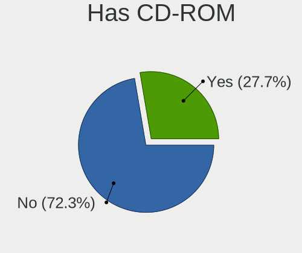

Linux - Hardware Trends
-----------------------

A project to identify most popular hardware characteristics and track their change
over time based on data collected by Linux users at https://Linux-Hardware.org.

Anyone can contribute to this report by the [hw-probe](https://github.com/linuxhw/hw-probe) tool:

    sudo -E hw-probe -all -upload

This is a report for all computer types. See also reports for [desktops](/Desktop/README.md) and [notebooks](/Notebook/README.md).

Distribution-specific reports: [Arch](/Dist/Arch), [ArcoLinux](/Dist/ArcoLinux), [BlackPanther](/Dist/BlackPanther), [CentOS](/Dist/CentOS), [Clear Linux](/Dist/Clear_Linux), [Debian](/Dist/Debian), [Elementary](/Dist/Elementary), [EndeavourOS](/Dist/EndeavourOS), [Endless](/Dist/Endless), [Fedora](/Dist/Fedora), [Garuda Linux](/Dist/Garuda_Linux), [Gentoo](/Dist/Gentoo), [Kali](/Dist/Kali), [KDE neon](/Dist/KDE_neon), [Kubuntu](/Dist/Kubuntu), [Linux Mint](/Dist/Linux_Mint), [Manjaro](/Dist/Manjaro), [OpenMandriva](/Dist/OpenMandriva), [openSUSE](/Dist/openSUSE), [Pop!_OS](/Dist/Pop!_OS), [Red OS](/Dist/Red_OS), [ROSA](/Dist/ROSA), [SteamOS](/Dist/SteamOS), [Ubuntu MATE](/Dist/Ubuntu_MATE), [Ubuntu](/Dist/Ubuntu), [Xubuntu](/Dist/Xubuntu), [Zorin](/Dist/Zorin).

This report is for one last month. Overall report since the beginning of time: [TestDays](https://github.com/linuxhw/TestDays)

Period: Feb, 2023.

Contents
--------

* [ System ](#system)
  - [ OS                       ](#os)
  - [ OS Family                ](#os-family)
  - [ Kernel                   ](#kernel)
  - [ Kernel Family            ](#kernel-family)
  - [ Kernel Major Ver.        ](#kernel-major-ver)
  - [ Arch                     ](#arch)
  - [ DE                       ](#de)
  - [ Display Server           ](#display-server)
  - [ Display Manager          ](#display-manager)
  - [ OS Lang                  ](#os-lang)
  - [ Boot Mode                ](#boot-mode)
  - [ Filesystem               ](#filesystem)
  - [ Part. scheme             ](#part-scheme)
  - [ Dual Boot with Linux/BSD ](#dual-boot-with-linuxbsd)
  - [ Dual Boot (Win)          ](#dual-boot-win)

* [ Board ](#board)
  - [ Vendor                   ](#vendor)
  - [ Model                    ](#model)
  - [ Model Family             ](#model-family)
  - [ MFG Year                 ](#mfg-year)
  - [ Form Factor              ](#form-factor)
  - [ Secure Boot              ](#secure-boot)
  - [ Coreboot                 ](#coreboot)
  - [ RAM Size                 ](#ram-size)
  - [ RAM Used                 ](#ram-used)
  - [ Total Drives             ](#total-drives)
  - [ Has CD-ROM               ](#has-cd-rom)
  - [ Has Ethernet             ](#has-ethernet)
  - [ Has WiFi                 ](#has-wifi)
  - [ Has Bluetooth            ](#has-bluetooth)

* [ Location ](#location)
  - [ Country                  ](#country)
  - [ City                     ](#city)

* [ Drives ](#drives)
  - [ Drive Vendor             ](#drive-vendor)
  - [ Drive Model              ](#drive-model)
  - [ HDD Vendor               ](#hdd-vendor)
  - [ SSD Vendor               ](#ssd-vendor)
  - [ Drive Kind               ](#drive-kind)
  - [ Drive Connector          ](#drive-connector)
  - [ Drive Size               ](#drive-size)
  - [ Space Total              ](#space-total)
  - [ Space Used               ](#space-used)
  - [ Malfunc. Drives          ](#malfunc-drives)
  - [ Malfunc. Drive Vendor    ](#malfunc-drive-vendor)
  - [ Malfunc. HDD Vendor      ](#malfunc-hdd-vendor)
  - [ Malfunc. Drive Kind      ](#malfunc-drive-kind)
  - [ Failed Drives            ](#failed-drives)
  - [ Failed Drive Vendor      ](#failed-drive-vendor)
  - [ Drive Status             ](#drive-status)

* [ Storage controller ](#storage-controller)
  - [ Storage Vendor           ](#storage-vendor)
  - [ Storage Model            ](#storage-model)
  - [ Storage Kind             ](#storage-kind)

* [ Processor ](#processor)
  - [ CPU Vendor               ](#cpu-vendor)
  - [ CPU Model                ](#cpu-model)
  - [ CPU Model Family         ](#cpu-model-family)
  - [ CPU Cores                ](#cpu-cores)
  - [ CPU Sockets              ](#cpu-sockets)
  - [ CPU Threads              ](#cpu-threads)
  - [ CPU Op-Modes             ](#cpu-op-modes)
  - [ CPU Microcode            ](#cpu-microcode)
  - [ CPU Microarch            ](#cpu-microarch)

* [ Graphics ](#graphics)
  - [ GPU Vendor               ](#gpu-vendor)
  - [ GPU Model                ](#gpu-model)
  - [ GPU Combo                ](#gpu-combo)
  - [ GPU Driver               ](#gpu-driver)
  - [ GPU Memory               ](#gpu-memory)

* [ Monitor ](#monitor)
  - [ Monitor Vendor           ](#monitor-vendor)
  - [ Monitor Model            ](#monitor-model)
  - [ Monitor Resolution       ](#monitor-resolution)
  - [ Monitor Diagonal         ](#monitor-diagonal)
  - [ Monitor Width            ](#monitor-width)
  - [ Aspect Ratio             ](#aspect-ratio)
  - [ Monitor Area             ](#monitor-area)
  - [ Pixel Density            ](#pixel-density)
  - [ Multiple Monitors        ](#multiple-monitors)

* [ Network ](#network)
  - [ Net Controller Vendor    ](#net-controller-vendor)
  - [ Net Controller Model     ](#net-controller-model)
  - [ Wireless Vendor          ](#wireless-vendor)
  - [ Wireless Model           ](#wireless-model)
  - [ Ethernet Vendor          ](#ethernet-vendor)
  - [ Ethernet Model           ](#ethernet-model)
  - [ Net Controller Kind      ](#net-controller-kind)
  - [ Used Controller          ](#used-controller)
  - [ NICs                     ](#nics)
  - [ IPv6                     ](#ipv6)

* [ Bluetooth ](#bluetooth)
  - [ Bluetooth Vendor         ](#bluetooth-vendor)
  - [ Bluetooth Model          ](#bluetooth-model)

* [ Sound ](#sound)
  - [ Sound Vendor             ](#sound-vendor)
  - [ Sound Model              ](#sound-model)

* [ Memory ](#memory)
  - [ Memory Vendor            ](#memory-vendor)
  - [ Memory Model             ](#memory-model)
  - [ Memory Kind              ](#memory-kind)
  - [ Memory Form Factor       ](#memory-form-factor)
  - [ Memory Size              ](#memory-size)
  - [ Memory Speed             ](#memory-speed)

* [ Printers & scanners ](#printers--scanners)
  - [ Printer Vendor           ](#printer-vendor)
  - [ Printer Model            ](#printer-model)
  - [ Scanner Vendor           ](#scanner-vendor)
  - [ Scanner Model            ](#scanner-model)

* [ Camera ](#camera)
  - [ Camera Vendor            ](#camera-vendor)
  - [ Camera Model             ](#camera-model)

* [ Security ](#security)
  - [ Fingerprint Vendor       ](#fingerprint-vendor)
  - [ Fingerprint Model        ](#fingerprint-model)
  - [ Chipcard Vendor          ](#chipcard-vendor)
  - [ Chipcard Model           ](#chipcard-model)

* [ Unsupported ](#unsupported)
  - [ Unsupported Devices      ](#unsupported-devices)
  - [ Unsupported Device Types ](#unsupported-device-types)

System
------

OS
--

Installed operating systems

| Name                         | Computers | Percent |
|------------------------------|-----------|---------|
| Ubuntu 22.04                 | 846       | 14.9%   |
| Linux Mint 21.1              | 435       | 7.66%   |
| OpenMandriva 23.01           | 427       | 7.52%   |
| Fedora 37                    | 361       | 6.36%   |
| Debian 11                    | 300       | 5.28%   |
| Ubuntu 22.10                 | 244       | 4.3%    |
| Pop!_OS 22.04                | 222       | 3.91%   |
| Arch Rolling                 | 196       | 3.45%   |
| Zorin 16                     | 172       | 3.03%   |
| Ubuntu 20.04                 | 154       | 2.71%   |
| ROSA 12.3                    | 153       | 2.7%    |
| OpenMandriva 4.3             | 124       | 2.18%   |
| KDE neon 22.04               | 115       | 2.03%   |
| Manjaro                      | 93        | 1.64%   |
| Linux Mint 20.3              | 83        | 1.46%   |
| SteamOS 3.4.4                | 68        | 1.2%    |
| Kubuntu 22.04                | 67        | 1.18%   |
| Kubuntu 22.10                | 62        | 1.09%   |
| Kali 2022.4                  | 56        | 0.99%   |
| Ubuntu 16.04                 | 55        | 0.97%   |
| Debian                       | 55        | 0.97%   |
| ArcoLinux Rolling            | 55        | 0.97%   |
| openSUSE Tumbleweed-XXXXXXXX | 54        | 0.95%   |
| Ubuntu 18.04                 | 47        | 0.83%   |
| Nobara 37                    | 47        | 0.83%   |
| Elementary 7                 | 46        | 0.81%   |
| EndeavourOS Rolling          | 43        | 0.76%   |
| Linux Mint 21                | 41        | 0.72%   |
| Xubuntu 22.04                | 40        | 0.7%    |
| MX 21                        | 39        | 0.69%   |
| BlackPanther 18.1            | 39        | 0.69%   |
| Gentoo 2.9                   | 33        | 0.58%   |
| OpenMandriva 4.2             | 28        | 0.49%   |
| LMDE 5                       | 25        | 0.44%   |
| Lubuntu 22.04                | 24        | 0.42%   |
| Ubuntu MATE 22.04            | 23        | 0.41%   |
| Red OS 7.3.2                 | 22        | 0.39%   |
| Manjaro 22.0.3               | 21        | 0.37%   |
| Fedora 36                    | 21        | 0.37%   |
| Manjaro 22.0.4               | 20        | 0.35%   |

OS Family
---------

OS without a version

| Name          | Computers | Percent |
|---------------|-----------|---------|
| Ubuntu        | 1372      | 24.17%  |
| OpenMandriva  | 612       | 10.78%  |
| Linux Mint    | 594       | 10.46%  |
| Fedora        | 396       | 6.98%   |
| Debian        | 362       | 6.38%   |
| Pop!_OS       | 223       | 3.93%   |
| Arch          | 196       | 3.45%   |
| ROSA          | 188       | 3.31%   |
| Zorin         | 183       | 3.22%   |
| Manjaro       | 162       | 2.85%   |
| Kubuntu       | 140       | 2.47%   |
| KDE neon      | 117       | 2.06%   |
| SteamOS       | 96        | 1.69%   |
| Xubuntu       | 76        | 1.34%   |
| openSUSE      | 68        | 1.2%    |
| ArcoLinux     | 61        | 1.07%   |
| Kali          | 60        | 1.06%   |
| Elementary    | 58        | 1.02%   |
| Gentoo        | 55        | 0.97%   |
| Nobara        | 50        | 0.88%   |
| EndeavourOS   | 43        | 0.76%   |
| MX            | 42        | 0.74%   |
| Endless       | 42        | 0.74%   |
| Lubuntu       | 41        | 0.72%   |
| BlackPanther  | 39        | 0.69%   |
| Ubuntu MATE   | 38        | 0.67%   |
| Red OS        | 31        | 0.55%   |
| LMDE          | 26        | 0.46%   |
| Garuda Linux  | 17        | 0.3%    |
| ALT Linux     | 17        | 0.3%    |
| Parrot        | 14        | 0.25%   |
| Ubuntu Budgie | 13        | 0.23%   |
| Rocky Linux   | 13        | 0.23%   |
| Ubuntu Unity  | 12        | 0.21%   |
| Raspbian      | 12        | 0.21%   |
| CentOS        | 11        | 0.19%   |
| Clear Linux   | 10        | 0.18%   |
| BunsenLabs    | 10        | 0.18%   |
| RHEL          | 9         | 0.16%   |
| NixOS         | 9         | 0.16%   |

Kernel
------

Version of the Linux kernel

| Version                            | Computers | Percent |
|------------------------------------|-----------|---------|
| 5.15.0-60-generic                  | 718       | 12.65%  |
| 5.15.0-58-generic                  | 557       | 9.81%   |
| 5.19.0-32-generic                  | 374       | 6.59%   |
| 6.1.1-desktop-1omv2290             | 313       | 5.51%   |
| 5.10.0-21-amd64                    | 198       | 3.49%   |
| 5.19.0-31-generic                  | 188       | 3.31%   |
| 6.0.12-76060006-generic            | 167       | 2.94%   |
| 6.1.4-desktop-1omv2301             | 97        | 1.71%   |
| 5.4.0-137-generic                  | 75        | 1.32%   |
| 5.19.0-29-generic                  | 75        | 1.32%   |
| 5.13.0-valve36-1-neptune           | 72        | 1.27%   |
| 6.1.12-arch1-1                     | 70        | 1.23%   |
| 5.16.13-desktop-1omv4003           | 69        | 1.22%   |
| 5.15.0-56-generic                  | 68        | 1.2%    |
| 5.4.0-139-generic                  | 66        | 1.16%   |
| 6.1.11-200.fc37.x86_64             | 65        | 1.14%   |
| 6.1.9-200.fc37.x86_64              | 64        | 1.13%   |
| 6.1.8-200.fc37.x86_64              | 56        | 0.99%   |
| 5.16.7-desktop-1omv4003            | 56        | 0.99%   |
| 5.15.79-generic-1rosa2021.1-x86_64 | 56        | 0.99%   |
| 4.15.0-142-generic                 | 54        | 0.95%   |
| 5.15.0-43-generic                  | 53        | 0.93%   |
| 6.1.10-200.fc37.x86_64             | 46        | 0.81%   |
| 6.1.13-200.fc37.x86_64             | 43        | 0.76%   |
| 6.0.0-kali6-amd64                  | 43        | 0.76%   |
| 5.15.75-generic-1rosa2021.1-x86_64 | 42        | 0.74%   |
| 6.1.9-arch1-1                      | 38        | 0.67%   |
| 5.10.0-20-amd64                    | 38        | 0.67%   |
| 6.1.11-76060111-generic            | 36        | 0.63%   |
| 6.1.11-1-MANJARO                   | 35        | 0.62%   |
| 6.1.0-3-amd64                      | 32        | 0.56%   |
| 6.1.9-1-MANJARO                    | 31        | 0.55%   |
| 6.1.11-arch1-1                     | 31        | 0.55%   |
| 5.19.0-21-generic                  | 28        | 0.49%   |
| 6.1.12-1-MANJARO                   | 26        | 0.46%   |
| 5.6.14-desktop-2bP                 | 25        | 0.44%   |
| 5.19.0-35-generic                  | 25        | 0.44%   |
| 6.1.12-200.fc37.x86_64             | 24        | 0.42%   |
| 6.0.7-301.fc37.x86_64              | 23        | 0.41%   |
| 5.15.0-47-generic                  | 22        | 0.39%   |

Kernel Family
-------------

Linux kernel without a distro release

| Version  | Computers | Percent |
|----------|-----------|---------|
| 5.15.0   | 1518      | 26.74%  |
| 5.19.0   | 723       | 12.74%  |
| 6.1.1    | 326       | 5.74%   |
| 5.10.0   | 298       | 5.25%   |
| 6.1.11   | 230       | 4.05%   |
| 6.1.9    | 222       | 3.91%   |
| 6.1.12   | 212       | 3.73%   |
| 5.4.0    | 199       | 3.51%   |
| 6.0.12   | 185       | 3.26%   |
| 6.1.8    | 131       | 2.31%   |
| 6.1.10   | 118       | 2.08%   |
| 6.0.0    | 113       | 1.99%   |
| 6.1.4    | 110       | 1.94%   |
| 5.13.0   | 108       | 1.9%    |
| 4.15.0   | 91        | 1.6%    |
| 6.1.0    | 70        | 1.23%   |
| 5.16.13  | 69        | 1.22%   |
| 6.1.13   | 58        | 1.02%   |
| 5.15.79  | 58        | 1.02%   |
| 5.16.7   | 56        | 0.99%   |
| 5.15.75  | 51        | 0.9%    |
| 6.2.0    | 46        | 0.81%   |
| 6.1.7    | 34        | 0.6%    |
| 5.14.0   | 33        | 0.58%   |
| 6.0.7    | 27        | 0.48%   |
| 5.15.94  | 27        | 0.48%   |
| 6.2.1    | 25        | 0.44%   |
| 5.6.14   | 25        | 0.44%   |
| 5.11.0   | 23        | 0.41%   |
| 5.15.91  | 20        | 0.35%   |
| 5.10.14  | 20        | 0.35%   |
| 5.10.155 | 17        | 0.3%    |
| 6.1.6    | 16        | 0.28%   |
| 4.18.16  | 14        | 0.25%   |
| 4.18.0   | 14        | 0.25%   |
| 5.17.0   | 13        | 0.23%   |
| 5.15.87  | 13        | 0.23%   |
| 5.15.93  | 12        | 0.21%   |
| 5.15.89  | 12        | 0.21%   |
| 5.15.84  | 12        | 0.21%   |

Kernel Major Ver.
-----------------

Linux kernel major version

| Version | Computers | Percent |
|---------|-----------|---------|
| 5.15    | 1797      | 31.65%  |
| 6.1     | 1534      | 27.02%  |
| 5.19    | 739       | 13.02%  |
| 5.10    | 388       | 6.83%   |
| 6.0     | 364       | 6.41%   |
| 5.4     | 207       | 3.65%   |
| 5.16    | 130       | 2.29%   |
| 5.13    | 114       | 2.01%   |
| 4.15    | 92        | 1.62%   |
| 6.2     | 71        | 1.25%   |
| 5.14    | 46        | 0.81%   |
| 5.11    | 32        | 0.56%   |
| 5.17    | 30        | 0.53%   |
| 4.18    | 28        | 0.49%   |
| 5.6     | 26        | 0.46%   |
| 5.18    | 20        | 0.35%   |
| 3.10    | 12        | 0.21%   |
| 5.8     | 11        | 0.19%   |
| 4.19    | 11        | 0.19%   |
| 4.9     | 8         | 0.14%   |
| 4.4     | 4         | 0.07%   |
| 5.0     | 2         | 0.04%   |
| 4.14    | 2         | 0.04%   |
| 4.1     | 2         | 0.04%   |
| 6.3     | 1         | 0.02%   |
| 5.5     | 1         | 0.02%   |
| 5.3     | 1         | 0.02%   |
| 4.8     | 1         | 0.02%   |
| 3.18    | 1         | 0.02%   |
| 3.13    | 1         | 0.02%   |
| Unknown | 1         | 0.02%   |

Arch
----

OS architecture (x86_64, i586, etc.)

| Name        | Computers | Percent |
|-------------|-----------|---------|
| x86_64      | 5566      | 98.04%  |
| i686        | 57        | 1%      |
| aarch64     | 29        | 0.51%   |
| armv7l      | 11        | 0.19%   |
| armv6l      | 4         | 0.07%   |
| riscv64     | 3         | 0.05%   |
| sparc64     | 1         | 0.02%   |
| ppc64le     | 1         | 0.02%   |
| ppc64       | 1         | 0.02%   |
| mips64      | 1         | 0.02%   |
| loongarch64 | 1         | 0.02%   |
| i586        | 1         | 0.02%   |
| Unknown     | 1         | 0.02%   |

DE
--

Desktop Environment

| Name             | Computers | Percent |
|------------------|-----------|---------|
| GNOME            | 2352      | 41.43%  |
| KDE5             | 1561      | 27.5%   |
| X-Cinnamon       | 491       | 8.65%   |
| XFCE             | 391       | 6.89%   |
| Unknown          | 317       | 5.58%   |
| MATE             | 177       | 3.12%   |
| LXQt             | 71        | 1.25%   |
| Pantheon         | 58        | 1.02%   |
| Cinnamon         | 40        | 0.7%    |
| i3               | 26        | 0.46%   |
| LXDE             | 22        | 0.39%   |
| KDE4             | 17        | 0.3%    |
| Budgie           | 14        | 0.25%   |
| sway             | 12        | 0.21%   |
| Hyprland         | 12        | 0.21%   |
| Unity            | 11        | 0.19%   |
| Openbox          | 11        | 0.19%   |
| KDE              | 10        | 0.18%   |
| Deepin           | 10        | 0.18%   |
| GNOME Classic    | 9         | 0.16%   |
| GNOME Flashback  | 8         | 0.14%   |
| chadwm           | 7         | 0.12%   |
| awesome          | 6         | 0.11%   |
| xmonad           | 5         | 0.09%   |
| qtile            | 5         | 0.09%   |
| lightdm-xsession | 4         | 0.07%   |
| icewm            | 4         | 0.07%   |
| dwm              | 4         | 0.07%   |
| BunsenLabs       | 3         | 0.05%   |
| bspwm            | 3         | 0.05%   |
| Trinity          | 2         | 0.04%   |
| none+i3          | 2         | 0.04%   |
| LeftWM           | 2         | 0.04%   |
| i3-with-shmlog   | 2         | 0.04%   |
| xinitrc          | 1         | 0.02%   |
| X-Generic        | 1         | 0.02%   |
| UKUI             | 1         | 0.02%   |
| Phosh:GNOME      | 1         | 0.02%   |
| gnome-xorg       | 1         | 0.02%   |
| GNOME-Classic    | 1         | 0.02%   |

Display Server
--------------

X11 or Wayland

| Name    | Computers | Percent |
|---------|-----------|---------|
| X11     | 3839      | 67.62%  |
| Wayland | 1519      | 26.76%  |
| Unknown | 168       | 2.96%   |
| Tty     | 151       | 2.66%   |

Display Manager
---------------

SDDM, LightDM, etc.

| Name    | Computers | Percent |
|---------|-----------|---------|
| Unknown | 1959      | 34.51%  |
| SDDM    | 1195      | 21.05%  |
| GDM3    | 1195      | 21.05%  |
| LightDM | 783       | 13.79%  |
| GDM     | 496       | 8.74%   |
| KDM     | 13        | 0.23%   |
| LXDM    | 11        | 0.19%   |
| SLiM    | 9         | 0.16%   |
| Ly      | 6         | 0.11%   |
| XDM     | 3         | 0.05%   |
| GREETD  | 3         | 0.05%   |
| TDM     | 2         | 0.04%   |
| SLIMSKI | 1         | 0.02%   |
| MDM     | 1         | 0.02%   |

OS Lang
-------

Language

| Lang    | Computers | Percent |
|---------|-----------|---------|
| en_US   | 2421      | 42.65%  |
| de_DE   | 513       | 9.04%   |
| ru_RU   | 434       | 7.64%   |
| en_GB   | 284       | 5%      |
| fr_FR   | 264       | 4.65%   |
| pt_BR   | 197       | 3.47%   |
| Unknown | 191       | 3.36%   |
| it_IT   | 190       | 3.35%   |
| es_ES   | 120       | 2.11%   |
| pl_PL   | 107       | 1.88%   |
| en_CA   | 104       | 1.83%   |
| C       | 86        | 1.51%   |
| en_IN   | 63        | 1.11%   |
| en_AU   | 61        | 1.07%   |
| cs_CZ   | 44        | 0.78%   |
| es_MX   | 43        | 0.76%   |
| nl_NL   | 41        | 0.72%   |
| de_AT   | 32        | 0.56%   |
| de_CH   | 28        | 0.49%   |
| hu_HU   | 27        | 0.48%   |
| pt_PT   | 23        | 0.41%   |
| zh_CN   | 21        | 0.37%   |
| en_NZ   | 20        | 0.35%   |
| sv_SE   | 19        | 0.33%   |
| fi_FI   | 18        | 0.32%   |
| es_CO   | 17        | 0.3%    |
| tr_TR   | 16        | 0.28%   |
| es_AR   | 15        | 0.26%   |
| en_IE   | 15        | 0.26%   |
| en_ZA   | 13        | 0.23%   |
| ja_JP   | 12        | 0.21%   |
| es_CL   | 12        | 0.21%   |
| zh_TW   | 10        | 0.18%   |
| nl_BE   | 10        | 0.18%   |
| fr_BE   | 10        | 0.18%   |
| en_PH   | 10        | 0.18%   |
| en_IL   | 9         | 0.16%   |
| es_PE   | 8         | 0.14%   |
| da_DK   | 8         | 0.14%   |
| ru_UA   | 7         | 0.12%   |

Boot Mode
---------

EFI or BIOS

| Mode | Computers | Percent |
|------|-----------|---------|
| EFI  | 2944      | 51.86%  |
| BIOS | 2733      | 48.14%  |

Filesystem
----------

Type of filesystem

| Type     | Computers | Percent |
|----------|-----------|---------|
| Ext4     | 4243      | 74.74%  |
| Btrfs    | 806       | 14.2%   |
| Overlay  | 428       | 7.54%   |
| Xfs      | 94        | 1.66%   |
| Zfs      | 59        | 1.04%   |
| F2fs     | 13        | 0.23%   |
| Tmpfs    | 9         | 0.16%   |
| Ext3     | 6         | 0.11%   |
| Ext2     | 5         | 0.09%   |
| Jfs      | 4         | 0.07%   |
| Unknown  | 4         | 0.07%   |
| Reiserfs | 2         | 0.04%   |
| XXXfs    | 1         | 0.02%   |
| XXX4     | 1         | 0.02%   |
| Rootfs   | 1         | 0.02%   |
| Aufs     | 1         | 0.02%   |

Part. scheme
------------

Scheme of partitioning

| Type    | Computers | Percent |
|---------|-----------|---------|
| GPT     | 3263      | 57.48%  |
| Unknown | 1667      | 29.36%  |
| MBR     | 747       | 13.16%  |

Dual Boot with Linux/BSD
------------------------

Hosting more than one Linux/BSD

| Dual boot | Computers | Percent |
|-----------|-----------|---------|
| No        | 4680      | 82.44%  |
| Yes       | 997       | 17.56%  |

Dual Boot (Win)
---------------

Hosting Linux and Windows

| Dual boot | Computers | Percent |
|-----------|-----------|---------|
| No        | 4096      | 72.15%  |
| Yes       | 1581      | 27.85%  |

Board
-----

Vendor
------

Motherboard manufacturer

| Name                    | Computers | Percent |
|-------------------------|-----------|---------|
| ASUSTek Computer        | 971       | 17.1%   |
| Lenovo                  | 795       | 14%     |
| Hewlett-Packard         | 717       | 12.63%  |
| Dell                    | 644       | 11.34%  |
| Gigabyte Technology     | 386       | 6.8%    |
| MSI                     | 349       | 6.15%   |
| Acer                    | 306       | 5.39%   |
| ASRock                  | 203       | 3.58%   |
| Apple                   | 131       | 2.31%   |
| Intel                   | 94        | 1.66%   |
| Unknown                 | 81        | 1.43%   |
| Valve                   | 75        | 1.32%   |
| Toshiba                 | 64        | 1.13%   |
| Samsung Electronics     | 54        | 0.95%   |
| HUAWEI                  | 49        | 0.86%   |
| Fujitsu                 | 45        | 0.79%   |
| Google                  | 39        | 0.69%   |
| Sony                    | 37        | 0.65%   |
| AZW                     | 32        | 0.56%   |
| Medion                  | 30        | 0.53%   |
| Raspberry Pi Foundation | 24        | 0.42%   |
| Timi                    | 22        | 0.39%   |
| Supermicro              | 22        | 0.39%   |
| Alienware               | 22        | 0.39%   |
| Microsoft               | 19        | 0.33%   |
| Biostar                 | 18        | 0.32%   |
| Pegatron                | 17        | 0.3%    |
| Foxconn                 | 17        | 0.3%    |
| TUXEDO                  | 16        | 0.28%   |
| Notebook                | 14        | 0.25%   |
| Positivo                | 13        | 0.23%   |
| Packard Bell            | 13        | 0.23%   |
| HONOR                   | 10        | 0.18%   |
| Gateway                 | 10        | 0.18%   |
| ECS                     | 9         | 0.16%   |
| Chuwi                   | 9         | 0.16%   |
| BESSTAR Tech            | 9         | 0.16%   |
| System76                | 8         | 0.14%   |
| Fujitsu Siemens         | 8         | 0.14%   |
| eMachines               | 7         | 0.12%   |

Model
-----

Motherboard model

| Name                         | Computers | Percent |
|------------------------------|-----------|---------|
| Unknown                      | 98        | 1.73%   |
| Valve Jupiter                | 75        | 1.32%   |
| ASUS All Series              | 45        | 0.79%   |
| ASUS ROG STRIX X299-E GAMING | 40        | 0.7%    |
| HP Notebook                  | 28        | 0.49%   |
| MSI MS-7C37                  | 18        | 0.32%   |
| ASUS TUF Gaming X570-PLUS    | 14        | 0.25%   |
| Intel H61                    | 12        | 0.21%   |
| Dell OptiPlex 3020           | 12        | 0.21%   |
| ASUS ROG STRIX B550-F GAMING | 11        | 0.19%   |
| HP Pavilion g6               | 10        | 0.18%   |
| HP Pavilion 15               | 10        | 0.18%   |
| AZW SER                      | 10        | 0.18%   |
| ASUS ROG STRIX X570-E GAMING | 10        | 0.18%   |
| Apple MacBookPro8,1          | 10        | 0.18%   |
| MSI MS-7C91                  | 9         | 0.16%   |
| Dell OptiPlex 7010           | 9         | 0.16%   |
| ASUS PRIME TRX40-PRO         | 9         | 0.16%   |
| Dell OptiPlex 780            | 8         | 0.14%   |
| ASUS TUF X299 MARK 2         | 8         | 0.14%   |
| ASUS PRIME B550M-A           | 8         | 0.14%   |
| MSI MS-7C56                  | 7         | 0.12%   |
| MSI MS-7C02                  | 7         | 0.12%   |
| Lenovo G50-80 80E5           | 7         | 0.12%   |
| HP Pavilion dv7              | 7         | 0.12%   |
| HP Compaq Elite 8300 SFF     | 7         | 0.12%   |
| Gigabyte X299 UD4 Pro        | 7         | 0.12%   |
| Gigabyte B450M S2H           | 7         | 0.12%   |
| Dell Precision M4800         | 7         | 0.12%   |
| Dell Precision 5570          | 7         | 0.12%   |
| Dell OptiPlex 790            | 7         | 0.12%   |
| Dell OptiPlex 7050           | 7         | 0.12%   |
| AZW GTR                      | 7         | 0.12%   |
| ASUS ROG STRIX B450-F GAMING | 7         | 0.12%   |
| ASRock X300M-STX             | 7         | 0.12%   |
| Apple MacBookPro9,2          | 7         | 0.12%   |
| MSI MS-7C52                  | 6         | 0.11%   |
| MSI MS-7B86                  | 6         | 0.11%   |
| MSI MS-7B84                  | 6         | 0.11%   |
| MSI MS-7885                  | 6         | 0.11%   |

Model Family
------------

Motherboard model prefix

| Name               | Computers | Percent |
|--------------------|-----------|---------|
| Lenovo ThinkPad    | 371       | 6.54%   |
| Acer Aspire        | 206       | 3.63%   |
| ASUS ROG           | 169       | 2.98%   |
| Dell Latitude      | 157       | 2.77%   |
| Lenovo IdeaPad     | 154       | 2.71%   |
| Dell Inspiron      | 137       | 2.41%   |
| ASUS PRIME         | 122       | 2.15%   |
| HP Pavilion        | 118       | 2.08%   |
| Dell OptiPlex      | 105       | 1.85%   |
| Unknown            | 98        | 1.73%   |
| HP EliteBook       | 88        | 1.55%   |
| ASUS VivoBook      | 86        | 1.51%   |
| ASUS TUF           | 82        | 1.44%   |
| Valve Jupiter      | 75        | 1.32%   |
| Dell Precision     | 73        | 1.29%   |
| HP Laptop          | 67        | 1.18%   |
| HP Compaq          | 67        | 1.18%   |
| Dell XPS           | 66        | 1.16%   |
| HP ProBook         | 60        | 1.06%   |
| Toshiba Satellite  | 55        | 0.97%   |
| Lenovo ThinkCentre | 45        | 0.79%   |
| ASUS All           | 45        | 0.79%   |
| HP ENVY            | 40        | 0.7%    |
| ASUS Zenbook       | 40        | 0.7%    |
| Dell Vostro        | 36        | 0.63%   |
| Lenovo Yoga        | 33        | 0.58%   |
| Lenovo Legion      | 33        | 0.58%   |
| Lenovo ThinkBook   | 30        | 0.53%   |
| HP Notebook        | 28        | 0.49%   |
| Gigabyte B450M     | 25        | 0.44%   |
| RPi Raspberry      | 24        | 0.42%   |
| ASUS ASUS          | 24        | 0.42%   |
| HP EliteDesk       | 22        | 0.39%   |
| Fujitsu LIFEBOOK   | 21        | 0.37%   |
| Acer Nitro         | 21        | 0.37%   |
| Microsoft Surface  | 19        | 0.33%   |
| Fujitsu ESPRIMO    | 19        | 0.33%   |
| MSI MS-7C37        | 18        | 0.32%   |
| HP 250             | 18        | 0.32%   |
| Gigabyte X299      | 18        | 0.32%   |

MFG Year
--------

Motherboard manufacture year

| Year    | Computers | Percent |
|---------|-----------|---------|
| 2021    | 635       | 11.19%  |
| 2022    | 590       | 10.39%  |
| 2020    | 531       | 9.35%   |
| 2019    | 493       | 8.68%   |
| 2018    | 447       | 7.87%   |
| 2017    | 398       | 7.01%   |
| 2012    | 391       | 6.89%   |
| 2013    | 339       | 5.97%   |
| 2011    | 318       | 5.6%    |
| 2014    | 291       | 5.13%   |
| 2016    | 266       | 4.69%   |
| 2015    | 242       | 4.26%   |
| 2010    | 211       | 3.72%   |
| 2009    | 176       | 3.1%    |
| 2008    | 129       | 2.27%   |
| 2007    | 86        | 1.51%   |
| Unknown | 50        | 0.88%   |
| 2023    | 36        | 0.63%   |
| 2006    | 36        | 0.63%   |
| 2005    | 9         | 0.16%   |
| 2004    | 3         | 0.05%   |

Form Factor
-----------

Physical design of the computer

| Name           | Computers | Percent |
|----------------|-----------|---------|
| Notebook       | 2992      | 52.7%   |
| Desktop        | 2223      | 39.16%  |
| Convertible    | 158       | 2.78%   |
| Mini pc        | 106       | 1.87%   |
| All in one     | 68        | 1.2%    |
| Server         | 53        | 0.93%   |
| System on chip | 38        | 0.67%   |
| Tablet         | 34        | 0.6%    |
| Phone          | 4         | 0.07%   |
| Stick pc       | 1         | 0.02%   |

Secure Boot
-----------

Enabled or disabled

| State    | Computers | Percent |
|----------|-----------|---------|
| Disabled | 5298      | 93.32%  |
| Enabled  | 379       | 6.68%   |

Coreboot
--------

Have coreboot on board

| Used | Computers | Percent |
|------|-----------|---------|
| No   | 5630      | 99.17%  |
| Yes  | 47        | 0.83%   |

RAM Size
--------

Total RAM memory

| Size in GB      | Computers | Percent |
|-----------------|-----------|---------|
| 4.01-8.0        | 1267      | 22.32%  |
| 16.01-24.0      | 1206      | 21.24%  |
| 8.01-16.0       | 1065      | 18.76%  |
| 3.01-4.0        | 804       | 14.16%  |
| 32.01-64.0      | 639       | 11.26%  |
| 64.01-256.0     | 299       | 5.27%   |
| 1.01-2.0        | 146       | 2.57%   |
| 24.01-32.0      | 130       | 2.29%   |
| 2.01-3.0        | 58        | 1.02%   |
| More than 256.0 | 32        | 0.56%   |
| 0.51-1.0        | 17        | 0.3%    |
| 0.01-0.5        | 9         | 0.16%   |
| Unknown         | 5         | 0.09%   |

RAM Used
--------

Used RAM memory

| Used GB     | Computers | Percent |
|-------------|-----------|---------|
| 1.01-2.0    | 1738      | 30.61%  |
| 2.01-3.0    | 1450      | 25.54%  |
| 4.01-8.0    | 1016      | 17.9%   |
| 3.01-4.0    | 736       | 12.96%  |
| 8.01-16.0   | 278       | 4.9%    |
| 0.51-1.0    | 269       | 4.74%   |
| 0.01-0.5    | 66        | 1.16%   |
| 16.01-24.0  | 53        | 0.93%   |
| 32.01-64.0  | 34        | 0.6%    |
| 24.01-32.0  | 18        | 0.32%   |
| 64.01-256.0 | 13        | 0.23%   |
| Unknown     | 6         | 0.11%   |

Total Drives
------------

Number of drives on board

| Drives | Computers | Percent |
|--------|-----------|---------|
| 1      | 3248      | 57.21%  |
| 2      | 1421      | 25.03%  |
| 3      | 470       | 8.28%   |
| 4      | 247       | 4.35%   |
| 5      | 127       | 2.24%   |
| 6      | 61        | 1.07%   |
| 0      | 40        | 0.7%    |
| 7      | 21        | 0.37%   |
| 8      | 15        | 0.26%   |
| 9      | 9         | 0.16%   |
| 10     | 5         | 0.09%   |
| 11     | 4         | 0.07%   |
| 21     | 2         | 0.04%   |
| 38     | 1         | 0.02%   |
| 36     | 1         | 0.02%   |
| 20     | 1         | 0.02%   |
| 19     | 1         | 0.02%   |
| 18     | 1         | 0.02%   |
| 13     | 1         | 0.02%   |
| 12     | 1         | 0.02%   |

Has CD-ROM
----------

Has CD-ROM on board

| Presented | Computers | Percent |
|-----------|-----------|---------|
| No        | 3824      | 67.36%  |
| Yes       | 1853      | 32.64%  |

Has Ethernet
------------

Has Ethernet on board

| Presented | Computers | Percent |
|-----------|-----------|---------|
| Yes       | 4776      | 84.13%  |
| No        | 901       | 15.87%  |

Has WiFi
--------

Has WiFi module

| Presented | Computers | Percent |
|-----------|-----------|---------|
| Yes       | 4293      | 75.62%  |
| No        | 1384      | 24.38%  |

Has Bluetooth
-------------

Has Bluetooth module

| Presented | Computers | Percent |
|-----------|-----------|---------|
| Yes       | 3578      | 63.03%  |
| No        | 2099      | 36.97%  |

Location
--------

Country
-------

Geographic location (country)

| Country      | Computers | Percent |
|--------------|-----------|---------|
| USA          | 1050      | 18.5%   |
| Germany      | 664       | 11.7%   |
| Russia       | 487       | 8.58%   |
| France       | 299       | 5.27%   |
| Brazil       | 274       | 4.83%   |
| Italy        | 273       | 4.81%   |
| UK           | 196       | 3.45%   |
| Poland       | 186       | 3.28%   |
| Canada       | 156       | 2.75%   |
| Spain        | 154       | 2.71%   |
| Netherlands  | 104       | 1.83%   |
| India        | 101       | 1.78%   |
| Australia    | 90        | 1.59%   |
| Hungary      | 81        | 1.43%   |
| Unknown      | 75        | 1.32%   |
| Czechia      | 65        | 1.14%   |
| Mexico       | 62        | 1.09%   |
| Finland      | 61        | 1.07%   |
| Turkey       | 59        | 1.04%   |
| Switzerland  | 59        | 1.04%   |
| Belgium      | 59        | 1.04%   |
| Sweden       | 52        | 0.92%   |
| Austria      | 50        | 0.88%   |
| Romania      | 44        | 0.78%   |
| China        | 44        | 0.78%   |
| Portugal     | 43        | 0.76%   |
| Indonesia    | 38        | 0.67%   |
| Japan        | 33        | 0.58%   |
| Argentina    | 33        | 0.58%   |
| Norway       | 31        | 0.55%   |
| Chile        | 31        | 0.55%   |
| Ukraine      | 28        | 0.49%   |
| Ireland      | 27        | 0.48%   |
| Denmark      | 27        | 0.48%   |
| New Zealand  | 25        | 0.44%   |
| Colombia     | 25        | 0.44%   |
| Slovakia     | 23        | 0.41%   |
| Belarus      | 23        | 0.41%   |
| South Africa | 22        | 0.39%   |
| Philippines  | 22        | 0.39%   |

City
----

Geographic location (city)

| City              | Computers | Percent |
|-------------------|-----------|---------|
| Moscow            | 104       | 1.83%   |
| Unknown           | 75        | 1.32%   |
| Berlin            | 63        | 1.11%   |
| St Petersburg     | 56        | 0.99%   |
| Paris             | 42        | 0.74%   |
| Warsaw            | 39        | 0.69%   |
| Milan             | 37        | 0.65%   |
| Melbourne         | 30        | 0.53%   |
| Helsinki          | 30        | 0.53%   |
| Sydney            | 29        | 0.51%   |
| Munich            | 29        | 0.51%   |
| Rio de Janeiro    | 28        | 0.49%   |
| Sao Paulo         | 27        | 0.48%   |
| London            | 25        | 0.44%   |
| Istanbul          | 25        | 0.44%   |
| Hamburg           | 24        | 0.42%   |
| Barcelona         | 24        | 0.42%   |
| Vienna            | 22        | 0.39%   |
| Prague            | 22        | 0.39%   |
| Madrid            | 22        | 0.39%   |
| Voronezh          | 21        | 0.37%   |
| Milano            | 21        | 0.37%   |
| Amsterdam         | 21        | 0.37%   |
| Budapest          | 20        | 0.35%   |
| Bengaluru         | 20        | 0.35%   |
| Dublin            | 19        | 0.33%   |
| Rome              | 17        | 0.3%    |
| Mexico City       | 17        | 0.3%    |
| Krakow            | 17        | 0.3%    |
| Chicago           | 17        | 0.3%    |
| Bucharest         | 17        | 0.3%    |
| Vancouver         | 16        | 0.28%   |
| Los Angeles       | 15        | 0.26%   |
| Houston           | 15        | 0.26%   |
| Frankfurt am Main | 15        | 0.26%   |
| Denver            | 15        | 0.26%   |
| Cologne           | 15        | 0.26%   |
| Zurich            | 14        | 0.25%   |
| Toronto           | 14        | 0.25%   |
| Seattle           | 14        | 0.25%   |

Drives
------

Drive Vendor
------------

Hard drive vendors

| Vendor                      | Computers | Drives | Percent |
|-----------------------------|-----------|--------|---------|
| Samsung Electronics         | 1374      | 1695   | 15.99%  |
| WDC                         | 1122      | 1508   | 13.06%  |
| Seagate                     | 1117      | 1494   | 13%     |
| SanDisk                     | 516       | 575    | 6.01%   |
| Kingston                    | 496       | 525    | 5.77%   |
| Toshiba                     | 472       | 524    | 5.49%   |
| Unknown                     | 345       | 385    | 4.02%   |
| Crucial                     | 325       | 368    | 3.78%   |
| Intel                       | 225       | 252    | 2.62%   |
| SK hynix                    | 213       | 222    | 2.48%   |
| Hitachi                     | 181       | 193    | 2.11%   |
| Micron Technology           | 160       | 162    | 1.86%   |
| HGST                        | 137       | 161    | 1.59%   |
| China                       | 120       | 125    | 1.4%    |
| A-DATA Technology           | 116       | 119    | 1.35%   |
| Phison Electronics          | 99        | 104    | 1.15%   |
| KIOXIA                      | 74        | 77     | 0.86%   |
| Apple                       | 68        | 79     | 0.79%   |
| Kingston Technology Company | 65        | 66     | 0.76%   |
| SPCC                        | 60        | 63     | 0.7%    |
| Silicon Motion              | 60        | 63     | 0.7%    |
| PNY                         | 60        | 72     | 0.7%    |
| Unknown                     | 57        | 57     | 0.66%   |
| Intenso                     | 55        | 59     | 0.64%   |
| Micron/Crucial Technology   | 50        | 53     | 0.58%   |
| Transcend                   | 38        | 38     | 0.44%   |
| Patriot                     | 35        | 35     | 0.41%   |
| ADATA Technology            | 35        | 37     | 0.41%   |
| GOODRAM                     | 34        | 35     | 0.4%    |
| JMicron Technology          | 31        | 38     | 0.36%   |
| Corsair                     | 30        | 33     | 0.35%   |
| Team                        | 29        | 31     | 0.34%   |
| Phison                      | 29        | 30     | 0.34%   |
| Gigabyte Technology         | 25        | 25     | 0.29%   |
| Apacer                      | 25        | 27     | 0.29%   |
| Netac                       | 24        | 25     | 0.28%   |
| OCZ                         | 23        | 23     | 0.27%   |
| LITEON                      | 22        | 22     | 0.26%   |
| Maxtor                      | 21        | 22     | 0.24%   |
| Fujitsu                     | 20        | 21     | 0.23%   |

Drive Model
-----------

Hard drive models

| Model                                                | Computers | Percent |
|------------------------------------------------------|-----------|---------|
| Samsung NVMe SSD Controller SM981/PM981/PM983 250GB  | 183       | 1.93%   |
| Kingston SA400S37240G 240GB SSD                      | 110       | 1.16%   |
| Samsung NVMe SSD Controller PM9A1/PM9A3/980PRO 960GB | 101       | 1.07%   |
| Samsung SSD 860 EVO 500GB                            | 87        | 0.92%   |
| Kingston SA400S37480G 480GB SSD                      | 83        | 0.88%   |
| Seagate ST500DM002-1BD142 500GB                      | 58        | 0.61%   |
| Seagate ST6000NM0115-1YZ110 6TB                      | 57        | 0.6%    |
| Unknown                                              | 57        | 0.6%    |
| Unknown MMC Card  32GB                               | 54        | 0.57%   |
| Unknown MMC Card  64GB                               | 53        | 0.56%   |
| Crucial CT240BX500SSD1 240GB                         | 53        | 0.56%   |
| Seagate ST1000LM035-1RK172 1TB                       | 50        | 0.53%   |
| Samsung SSD 980 1TB                                  | 49        | 0.52%   |
| Samsung SSD 850 EVO 500GB                            | 48        | 0.51%   |
| Samsung SSD 850 EVO 250GB                            | 48        | 0.51%   |
| Crucial CT500MX500SSD1 500GB                         | 48        | 0.51%   |
| Sandisk WD Blue SN550 NVMe SSD 1TB                   | 46        | 0.49%   |
| Crucial CT1000MX500SSD1 1TB                          | 46        | 0.49%   |
| WDC WD10EZEX-08WN4A0 1TB                             | 45        | 0.48%   |
| Toshiba MQ01ABD100 1TB                               | 45        | 0.48%   |
| Sandisk WD Black SN750 / PC SN730 NVMe SSD 512GB     | 44        | 0.46%   |
| Seagate ST1000DM010-2EP102 1TB                       | 42        | 0.44%   |
| Seagate ST2000DM008-2FR102 2TB                       | 41        | 0.43%   |
| Samsung NVMe SSD Controller SM961/PM961/SM963 512GB  | 41        | 0.43%   |
| Unknown MMC Card  128GB                              | 40        | 0.42%   |
| Phison PS5013 E13 NVMe Controller 500GB              | 40        | 0.42%   |
| Seagate ST1000LM024 HN-M101MBB 1TB                   | 39        | 0.41%   |
| Samsung SSD 870 EVO 500GB                            | 37        | 0.39%   |
| Toshiba DT01ACA100 1TB                               | 34        | 0.36%   |
| Samsung SSD 860 EVO 250GB                            | 34        | 0.36%   |
| Kingston SA400S37120G 120GB SSD                      | 34        | 0.36%   |
| HGST HTS721010A9E630 1TB                             | 34        | 0.36%   |
| Samsung SSD 860 EVO 1TB                              | 33        | 0.35%   |
| Intel SSD 660P Series 1024GB                         | 33        | 0.35%   |
| Kingston Company OM3PDP3 NVMe SSD 512GB              | 30        | 0.32%   |
| Unknown SD/MMC/MS PRO 16GB                           | 29        | 0.31%   |
| Toshiba MQ01ABF050 500GB                             | 29        | 0.31%   |
| Toshiba HDWD110 1TB                                  | 28        | 0.3%    |
| Seagate ST500LT012-1DG142 500GB                      | 28        | 0.3%    |
| Seagate ST4000DM004-2CV104 4TB                       | 28        | 0.3%    |

HDD Vendor
----------

Hard disk drive vendors

| Vendor              | Computers | Drives | Percent |
|---------------------|-----------|--------|---------|
| Seagate             | 1091      | 1457   | 36.97%  |
| WDC                 | 911       | 1231   | 30.87%  |
| Toshiba             | 369       | 416    | 12.5%   |
| Hitachi             | 181       | 193    | 6.13%   |
| HGST                | 136       | 159    | 4.61%   |
| Samsung Electronics | 107       | 120    | 3.63%   |
| Unknown             | 30        | 31     | 1.02%   |
| Maxtor              | 21        | 22     | 0.71%   |
| Fujitsu             | 20        | 21     | 0.68%   |
| JMicron Technology  | 18        | 23     | 0.61%   |
| Apple               | 16        | 16     | 0.54%   |
| SABRENT             | 9         | 9      | 0.3%    |
| Intenso             | 7         | 7      | 0.24%   |
| Hewlett-Packard     | 7         | 17     | 0.24%   |
| ASMT                | 6         | 9      | 0.2%    |
| WD MediaMax         | 2         | 2      | 0.07%   |
| USB3.0              | 2         | 2      | 0.07%   |
| LaCie               | 2         | 2      | 0.07%   |
| HPE                 | 2         | 3      | 0.07%   |
| China               | 2         | 2      | 0.07%   |
| Synology            | 1         | 2      | 0.03%   |
| QNAP                | 1         | 7      | 0.03%   |
| PHD 3.0             | 1         | 1      | 0.03%   |
| MARVELL             | 1         | 1      | 0.03%   |
| KESU                | 1         | 1      | 0.03%   |
| IBM-ESXS            | 1         | 2      | 0.03%   |
| HGST HTS            | 1         | 1      | 0.03%   |
| GOKE                | 1         | 1      | 0.03%   |
| FORESEE             | 1         | 1      | 0.03%   |
| DELLBOSS            | 1         | 1      | 0.03%   |
| ASMedia             | 1         | 1      | 0.03%   |
| ACASIS              | 1         | 1      | 0.03%   |

SSD Vendor
----------

Solid state drive vendors

| Vendor              | Computers | Drives | Percent |
|---------------------|-----------|--------|---------|
| Samsung Electronics | 625       | 712    | 22.15%  |
| Kingston            | 399       | 419    | 14.14%  |
| Crucial             | 280       | 315    | 9.92%   |
| SanDisk             | 248       | 266    | 8.79%   |
| WDC                 | 160       | 165    | 5.67%   |
| China               | 117       | 122    | 4.15%   |
| A-DATA Technology   | 94        | 94     | 3.33%   |
| Intel               | 59        | 69     | 2.09%   |
| PNY                 | 56        | 68     | 1.98%   |
| SPCC                | 50        | 53     | 1.77%   |
| Intenso             | 42        | 43     | 1.49%   |
| Micron Technology   | 41        | 41     | 1.45%   |
| Toshiba             | 34        | 36     | 1.2%    |
| Patriot             | 34        | 34     | 1.2%    |
| Transcend           | 33        | 33     | 1.17%   |
| GOODRAM             | 32        | 33     | 1.13%   |
| SK hynix            | 31        | 33     | 1.1%    |
| Apple               | 30        | 30     | 1.06%   |
| Team                | 27        | 29     | 0.96%   |
| OCZ                 | 23        | 23     | 0.82%   |
| Netac               | 20        | 20     | 0.71%   |
| LITEONIT            | 19        | 19     | 0.67%   |
| LITEON              | 18        | 18     | 0.64%   |
| Apacer              | 18        | 18     | 0.64%   |
| Corsair             | 17        | 17     | 0.6%    |
| Unknown             | 13        | 13     | 0.46%   |
| Plextor             | 12        | 12     | 0.43%   |
| Gigabyte Technology | 12        | 12     | 0.43%   |
| KingSpec            | 11        | 11     | 0.39%   |
| TO Exter            | 10        | 10     | 0.35%   |
| Lexar               | 10        | 10     | 0.35%   |
| Dogfish             | 10        | 10     | 0.35%   |
| Hewlett-Packard     | 9         | 10     | 0.32%   |
| Seagate             | 8         | 8      | 0.28%   |
| XrayDisk            | 7         | 8      | 0.25%   |
| Smartbuy            | 7         | 7      | 0.25%   |
| Verbatim            | 6         | 7      | 0.21%   |
| Timetec             | 5         | 5      | 0.18%   |
| Teclast             | 5         | 5      | 0.18%   |
| OWC                 | 5         | 5      | 0.18%   |

Drive Kind
----------

HDD or SSD

| Kind    | Computers | Drives | Percent |
|---------|-----------|--------|---------|
| SSD     | 2469      | 3031   | 32.03%  |
| HDD     | 2454      | 3762   | 31.84%  |
| NVMe    | 2288      | 2745   | 29.68%  |
| MMC     | 351       | 384    | 4.55%   |
| Unknown | 146       | 161    | 1.89%   |

Drive Connector
---------------

SATA, SAS, NVMe, etc.

| Type | Computers | Drives | Percent |
|------|-----------|--------|---------|
| SATA | 3899      | 6555   | 56.72%  |
| NVMe | 2283      | 2728   | 33.21%  |
| MMC  | 351       | 384    | 5.11%   |
| SAS  | 341       | 416    | 4.96%   |

Drive Size
----------

Size of hard drive

| Size in TB      | Computers | Drives | Percent |
|-----------------|-----------|--------|---------|
| 0.01-0.5        | 2852      | 3621   | 54.44%  |
| 0.51-1.0        | 1435      | 1766   | 27.39%  |
| 1.01-2.0        | 456       | 592    | 8.7%    |
| 4.01-10.0       | 189       | 368    | 3.61%   |
| 3.01-4.0        | 154       | 214    | 2.94%   |
| 2.01-3.0        | 97        | 119    | 1.85%   |
| 10.01-20.0      | 54        | 111    | 1.03%   |
| More than 100.0 | 2         | 2      | 0.04%   |

Space Total
-----------

Amount of disk space available on the file system

| Size in GB     | Computers | Percent |
|----------------|-----------|---------|
| 101-250        | 1360      | 23.96%  |
| 251-500        | 1185      | 20.87%  |
| 501-1000       | 895       | 15.77%  |
| 1001-2000      | 473       | 8.33%   |
| 1-20           | 400       | 7.05%   |
| More than 3000 | 369       | 6.5%    |
| 51-100         | 313       | 5.51%   |
| Unknown        | 299       | 5.27%   |
| 21-50          | 204       | 3.59%   |
| 2001-3000      | 179       | 3.15%   |

Space Used
----------

Amount of used disk space

| Used GB        | Computers | Percent |
|----------------|-----------|---------|
| 1-20           | 1886      | 33.22%  |
| 21-50          | 969       | 17.07%  |
| 101-250        | 725       | 12.77%  |
| 51-100         | 644       | 11.34%  |
| 251-500        | 433       | 7.63%   |
| 501-1000       | 333       | 5.87%   |
| Unknown        | 299       | 5.27%   |
| 1001-2000      | 185       | 3.26%   |
| More than 3000 | 132       | 2.33%   |
| 2001-3000      | 67        | 1.18%   |
| 0              | 4         | 0.07%   |

Malfunc. Drives
---------------

Drive models with a malfunction

| Model                                 | Computers | Drives | Percent |
|---------------------------------------|-----------|--------|---------|
| Seagate ST500DM002-1BD142 500GB       | 13        | 13     | 1.84%   |
| Seagate ST9500325AS 500GB             | 9         | 9      | 1.27%   |
| Toshiba DT01ACA100 1TB                | 8         | 9      | 1.13%   |
| Seagate ST500LT012-1DG142 500GB       | 8         | 8      | 1.13%   |
| Seagate ST3500418AS 500GB             | 8         | 8      | 1.13%   |
| Seagate ST1000LM035-1RK172 1TB        | 8         | 8      | 1.13%   |
| Toshiba DT01ACA050 500GB              | 7         | 7      | 0.99%   |
| Seagate ST1000LM024 HN-M101MBB 1TB    | 7         | 7      | 0.99%   |
| HGST HTS545050A7E680 500GB            | 7         | 7      | 0.99%   |
| Seagate ST500LT012-9WS142 500GB       | 6         | 6      | 0.85%   |
| Kingston SA400S37240G 240GB SSD       | 6         | 6      | 0.85%   |
| HGST HTS541010A9E680 1TB              | 6         | 6      | 0.85%   |
| WDC WD10EARS-00Y5B1 1TB               | 5         | 5      | 0.71%   |
| Seagate ST9320325AS 320GB             | 5         | 5      | 0.71%   |
| Seagate ST500LM021-1KJ152 500GB       | 5         | 5      | 0.71%   |
| Samsung Electronics SSD 980 1TB       | 5         | 5      | 0.71%   |
| Samsung Electronics SSD 870 EVO 500GB | 5         | 5      | 0.71%   |
| Kingston SV300S37A120G 120GB SSD      | 5         | 5      | 0.71%   |
| HGST HTS541075A9E680 752GB            | 5         | 5      | 0.71%   |
| WDC WD20EARS-00MVWB0 2TB              | 4         | 4      | 0.56%   |
| Toshiba MQ01ABD075 752GB              | 4         | 4      | 0.56%   |
| Seagate ST3250310AS 250GB             | 4         | 4      | 0.56%   |
| Seagate ST320LT020-9YG142 320GB       | 4         | 4      | 0.56%   |
| Seagate ST31000528AS 1TB              | 4         | 5      | 0.56%   |
| Seagate ST2000DL003-9VT166 2TB        | 4         | 4      | 0.56%   |
| SanDisk SSD U100 256GB                | 4         | 4      | 0.56%   |
| HGST HTS721010A9E630 1TB              | 4         | 6      | 0.56%   |
| WDC WDS240G2G0A-00JH30 240GB SSD      | 3         | 3      | 0.42%   |
| WDC WD5000AAKX-00ERMA0 500GB          | 3         | 3      | 0.42%   |
| WDC WD5000AAKS-00V1A0 500GB           | 3         | 3      | 0.42%   |
| WDC WD3200BEKT-60PVMT0 320GB          | 3         | 3      | 0.42%   |
| WDC WD30EFRX-68EUZN0 3TB              | 3         | 3      | 0.42%   |
| Toshiba MQ04ABF100 1TB                | 3         | 3      | 0.42%   |
| Toshiba MQ01ABD100 1TB                | 3         | 3      | 0.42%   |
| Seagate ST500LM012 HN-M500MBB 500GB   | 3         | 3      | 0.42%   |
| Seagate ST3500413AS 500GB             | 3         | 4      | 0.42%   |
| Seagate ST2000LM007-1R8174 2TB        | 3         | 3      | 0.42%   |
| Seagate ST2000DM008-2FR102 2TB        | 3         | 4      | 0.42%   |
| Seagate ST1000DM003-9YN162 1TB        | 3         | 3      | 0.42%   |
| SanDisk SSD PLUS 480GB                | 3         | 4      | 0.42%   |

Malfunc. Drive Vendor
---------------------

Vendors of faulty drives

| Vendor                      | Computers | Drives | Percent |
|-----------------------------|-----------|--------|---------|
| Seagate                     | 184       | 201    | 26.78%  |
| WDC                         | 148       | 169    | 21.54%  |
| Samsung Electronics         | 58        | 67     | 8.44%   |
| Toshiba                     | 54        | 55     | 7.86%   |
| Hitachi                     | 47        | 48     | 6.84%   |
| HGST                        | 28        | 30     | 4.08%   |
| Kingston                    | 26        | 26     | 3.78%   |
| SanDisk                     | 18        | 19     | 2.62%   |
| Intel                       | 14        | 17     | 2.04%   |
| SK hynix                    | 13        | 13     | 1.89%   |
| Crucial                     | 11        | 11     | 1.6%    |
| Maxtor                      | 10        | 10     | 1.46%   |
| A-DATA Technology           | 9         | 9      | 1.31%   |
| China                       | 7         | 7      | 1.02%   |
| Micron Technology           | 5         | 5      | 0.73%   |
| Hewlett-Packard             | 5         | 5      | 0.73%   |
| OCZ                         | 4         | 4      | 0.58%   |
| Corsair                     | 4         | 4      | 0.58%   |
| Transcend                   | 2         | 2      | 0.29%   |
| Realtek Semiconductor       | 2         | 3      | 0.29%   |
| Neo                         | 2         | 2      | 0.29%   |
| KingSpec                    | 2         | 2      | 0.29%   |
| JMicron Technology          | 2         | 2      | 0.29%   |
| Intenso                     | 2         | 2      | 0.29%   |
| Fujitsu                     | 2         | 2      | 0.29%   |
| Apple                       | 2         | 2      | 0.29%   |
| Apacer                      | 2         | 2      | 0.29%   |
| Unknown                     | 2         | 2      | 0.29%   |
| Yangtze Memory Technologies | 1         | 1      | 0.15%   |
| Timetec                     | 1         | 1      | 0.15%   |
| Teclast                     | 1         | 1      | 0.15%   |
| SPCC                        | 1         | 1      | 0.15%   |
| RENICE                      | 1         | 1      | 0.15%   |
| Qumo                        | 1         | 1      | 0.15%   |
| PNY                         | 1         | 3      | 0.15%   |
| Netac                       | 1         | 1      | 0.15%   |
| Micron/Crucial Technology   | 1         | 1      | 0.15%   |
| LITEONIT                    | 1         | 1      | 0.15%   |
| Lenovo                      | 1         | 1      | 0.15%   |
| KLEVV                       | 1         | 1      | 0.15%   |

Malfunc. HDD Vendor
-------------------

Vendors of faulty HDD drives

| Vendor              | Computers | Drives | Percent |
|---------------------|-----------|--------|---------|
| Seagate             | 184       | 201    | 37.17%  |
| WDC                 | 138       | 159    | 27.88%  |
| Toshiba             | 52        | 53     | 10.51%  |
| Hitachi             | 47        | 48     | 9.49%   |
| HGST                | 28        | 30     | 5.66%   |
| Samsung Electronics | 25        | 26     | 5.05%   |
| Maxtor              | 10        | 10     | 2.02%   |
| Hewlett-Packard     | 4         | 4      | 0.81%   |
| JMicron Technology  | 2         | 2      | 0.4%    |
| Fujitsu             | 2         | 2      | 0.4%    |
| Intenso             | 1         | 1      | 0.2%    |
| HGST HTS            | 1         | 1      | 0.2%    |
| ASMT                | 1         | 1      | 0.2%    |

Malfunc. Drive Kind
-------------------

Kinds of faulty drives

| Kind | Computers | Drives | Percent |
|------|-----------|--------|---------|
| HDD  | 454       | 538    | 70.5%   |
| SSD  | 155       | 170    | 24.07%  |
| NVMe | 35        | 37     | 5.43%   |

Failed Drives
-------------

Failed drive models

| Model                                            | Computers | Drives | Percent |
|--------------------------------------------------|-----------|--------|---------|
| Samsung Electronics SSD 980 1TB                  | 2         | 2      | 11.11%  |
| WDC WD800JD-00LSA0 80GB                          | 1         | 1      | 5.56%   |
| WDC WD800JB-00JJC0 80GB                          | 1         | 1      | 5.56%   |
| WDC WD2500BEVT-35A23T0 250GB                     | 1         | 1      | 5.56%   |
| Toshiba MK3259GSXP 320GB                         | 1         | 1      | 5.56%   |
| Toshiba DT01ACA050 500GB                         | 1         | 1      | 5.56%   |
| Seagate ST3500418AS 500GB                        | 1         | 1      | 5.56%   |
| Seagate ST3300657SS 304GB                        | 1         | 2      | 5.56%   |
| Samsung Electronics SSD 980 500GB                | 1         | 1      | 5.56%   |
| Samsung Electronics SP0802N 80GB                 | 1         | 1      | 5.56%   |
| Samsung Electronics MZNTY128HDHP-00000 128GB SSD | 1         | 1      | 5.56%   |
| KingDian S400 120GB SSD                          | 1         | 1      | 5.56%   |
| Intel SSDPEKKW256G7 256GB                        | 1         | 1      | 5.56%   |
| IBM-ESXS ST9300605SS 304GB                       | 1         | 2      | 5.56%   |
| HGST HTS725050A7E630 500GB                       | 1         | 2      | 5.56%   |
| HGST HTS541010B7E610 1TB                         | 1         | 1      | 5.56%   |
| Crucial M4-CT256M4SSD3 256GB                     | 1         | 1      | 5.56%   |

Failed Drive Vendor
-------------------

Failed drive vendors

| Vendor              | Computers | Drives | Percent |
|---------------------|-----------|--------|---------|
| Samsung Electronics | 5         | 5      | 27.78%  |
| WDC                 | 3         | 3      | 16.67%  |
| Toshiba             | 2         | 2      | 11.11%  |
| Seagate             | 2         | 3      | 11.11%  |
| HGST                | 2         | 3      | 11.11%  |
| KingDian            | 1         | 1      | 5.56%   |
| Intel               | 1         | 1      | 5.56%   |
| IBM-ESXS            | 1         | 2      | 5.56%   |
| Crucial             | 1         | 1      | 5.56%   |

Drive Status
------------

Number of failed and malfunc. drives

| Status   | Computers | Drives | Percent |
|----------|-----------|--------|---------|
| Detected | 2937      | 4877   | 47.34%  |
| Works    | 2628      | 4440   | 42.36%  |
| Malfunc  | 621       | 745    | 10.01%  |
| Failed   | 18        | 21     | 0.29%   |

Storage controller
------------------

Storage Vendor
--------------

Storage controller vendors

| Vendor                           | Computers | Percent |
|----------------------------------|-----------|---------|
| Intel                            | 3551      | 47.49%  |
| AMD                              | 1156      | 15.46%  |
| Samsung Electronics              | 772       | 10.32%  |
| SanDisk                          | 363       | 4.85%   |
| SK hynix                         | 178       | 2.38%   |
| Phison Electronics               | 168       | 2.25%   |
| Kingston Technology Company      | 168       | 2.25%   |
| ASMedia Technology               | 141       | 1.89%   |
| Micron Technology                | 120       | 1.6%    |
| Micron/Crucial Technology        | 101       | 1.35%   |
| Silicon Motion                   | 83        | 1.11%   |
| KIOXIA                           | 79        | 1.06%   |
| Nvidia                           | 74        | 0.99%   |
| Toshiba America Info Systems     | 69        | 0.92%   |
| Marvell Technology Group         | 62        | 0.83%   |
| JMicron Technology               | 61        | 0.82%   |
| ADATA Technology                 | 61        | 0.82%   |
| Realtek Semiconductor            | 26        | 0.35%   |
| Broadcom / LSI                   | 22        | 0.29%   |
| LSI Logic / Symbios Logic        | 21        | 0.28%   |
| Union Memory (Shenzhen)          | 19        | 0.25%   |
| Solid State Storage Technology   | 17        | 0.23%   |
| MAXIO Technology (Hangzhou)      | 16        | 0.21%   |
| Apple                            | 16        | 0.21%   |
| O2 Micro                         | 14        | 0.19%   |
| Shenzhen Longsys Electronics     | 13        | 0.17%   |
| VIA Technologies                 | 12        | 0.16%   |
| Lite-On Technology               | 11        | 0.15%   |
| Seagate Technology               | 10        | 0.13%   |
| INNOGRIT                         | 8         | 0.11%   |
| Silicon Image                    | 7         | 0.09%   |
| Lenovo                           | 7         | 0.09%   |
| Biwin Storage Technology         | 7         | 0.09%   |
| Silicon Integrated Systems [SiS] | 5         | 0.07%   |
| Integrated Technology Express    | 5         | 0.07%   |
| Adaptec                          | 5         | 0.07%   |
| Hewlett-Packard                  | 4         | 0.05%   |
| Yangtze Memory Technologies      | 3         | 0.04%   |
| Transcend                        | 3         | 0.04%   |
| Netac Technology                 | 3         | 0.04%   |

Storage Model
-------------

Storage controller models

| Model                                                                          | Computers | Percent |
|--------------------------------------------------------------------------------|-----------|---------|
| AMD FCH SATA Controller [AHCI mode]                                            | 760       | 8.96%   |
| Samsung NVMe SSD Controller SM981/PM981/PM983                                  | 307       | 3.62%   |
| Intel Sunrise Point-LP SATA Controller [AHCI mode]                             | 260       | 3.07%   |
| Intel 8 Series/C220 Series Chipset Family 6-port SATA Controller 1 [AHCI mode] | 244       | 2.88%   |
| Intel 7 Series Chipset Family 6-port SATA Controller [AHCI mode]               | 206       | 2.43%   |
| Intel Volume Management Device NVMe RAID Controller                            | 198       | 2.34%   |
| Samsung NVMe SSD Controller 980                                                | 194       | 2.29%   |
| Samsung NVMe SSD Controller PM9A1/PM9A3/980PRO                                 | 185       | 2.18%   |
| Intel 200 Series PCH SATA controller [AHCI mode]                               | 168       | 1.98%   |
| Intel 82801 Mobile SATA Controller [RAID mode]                                 | 160       | 1.89%   |
| AMD 400 Series Chipset SATA Controller                                         | 152       | 1.79%   |
| Intel 6 Series/C200 Series Chipset Family 6 port Mobile SATA AHCI Controller   | 145       | 1.71%   |
| AMD 500 Series Chipset SATA Controller                                         | 127       | 1.5%    |
| ASMedia ASM1062 Serial ATA Controller                                          | 126       | 1.49%   |
| Micron Non-Volatile memory controller                                          | 118       | 1.39%   |
| Intel 8 Series SATA Controller 1 [AHCI mode]                                   | 114       | 1.34%   |
| Intel Q170/Q150/B150/H170/H110/Z170/CM236 Chipset SATA Controller [AHCI Mode]  | 113       | 1.33%   |
| Intel 6 Series/C200 Series Chipset Family 6 port Desktop SATA AHCI Controller  | 107       | 1.26%   |
| SanDisk Non-Volatile memory controller                                         | 106       | 1.25%   |
| AMD SB7x0/SB8x0/SB9x0 SATA Controller [AHCI mode]                              | 106       | 1.25%   |
| AMD SB7x0/SB8x0/SB9x0 IDE Controller                                           | 102       | 1.2%    |
| SK hynix Gold P31/PC711 NVMe Solid State Drive                                 | 89        | 1.05%   |
| Kingston Company Company Non-Volatile memory controller                        | 85        | 1%      |
| Intel Wildcat Point-LP SATA Controller [AHCI Mode]                             | 84        | 0.99%   |
| Intel Celeron/Pentium Silver Processor SATA Controller                         | 83        | 0.98%   |
| SanDisk WD Blue SN550 NVMe SSD                                                 | 80        | 0.94%   |
| Intel Cannon Lake PCH SATA AHCI Controller                                     | 80        | 0.94%   |
| Intel Comet Lake SATA AHCI Controller                                          | 79        | 0.93%   |
| Intel SATA Controller [RAID mode]                                              | 78        | 0.92%   |
| Intel 7 Series/C210 Series Chipset Family 6-port SATA Controller [AHCI mode]   | 78        | 0.92%   |
| Intel 82801IBM/IEM (ICH9M/ICH9M-E) 4 port SATA Controller [AHCI mode]          | 77        | 0.91%   |
| Intel 500 Series Chipset Family SATA AHCI Controller                           | 74        | 0.87%   |
| Intel Alder Lake-S PCH SATA Controller [AHCI Mode]                             | 73        | 0.86%   |
| SanDisk WD Black SN750 / PC SN730 NVMe SSD                                     | 72        | 0.85%   |
| Intel Tiger Lake-LP SATA Controller                                            | 72        | 0.85%   |
| Samsung NVMe SSD Controller SM961/PM961/SM963                                  | 69        | 0.81%   |
| Intel Cannon Lake Mobile PCH SATA AHCI Controller                              | 64        | 0.75%   |
| Micron/Crucial P2 NVMe PCIe SSD                                                | 63        | 0.74%   |
| Intel SSD 660P Series                                                          | 63        | 0.74%   |
| Intel NM10/ICH7 Family SATA Controller [IDE mode]                              | 63        | 0.74%   |

Storage Kind
------------

Kind of storage controller (IDE, SATA, NVMe, SAS, ...)

| Kind | Computers | Percent |
|------|-----------|---------|
| SATA | 4020      | 53.97%  |
| NVMe | 2284      | 30.67%  |
| IDE  | 600       | 8.06%   |
| RAID | 505       | 6.78%   |
| SAS  | 31        | 0.42%   |
| SCSI | 8         | 0.11%   |

Processor
---------

CPU Vendor
----------

Processor vendors

| Vendor            | Computers | Percent |
|-------------------|-----------|---------|
| Intel             | 4067      | 71.64%  |
| AMD               | 1554      | 27.37%  |
| ARM               | 40        | 0.7%    |
| Unknown           | 6         | 0.11%   |
| CentaurHauls      | 4         | 0.07%   |
| sifive,u74-mc     | 3         | 0.05%   |
| Qualcomm          | 1         | 0.02%   |
| PowerNV C829UAG3  | 1         | 0.02%   |
| CHRP IBM,8233-E8B | 1         | 0.02%   |

CPU Model
---------

Processor models

| Model                                         | Computers | Percent |
|-----------------------------------------------|-----------|---------|
| Intel 11th Gen Core i5-1135G7 @ 2.40GHz       | 76        | 1.34%   |
| AMD Custom APU 0405                           | 75        | 1.32%   |
| Intel 11th Gen Core i7-1165G7 @ 2.80GHz       | 68        | 1.2%    |
| Intel Core i7-7800X CPU @ 3.50GHz             | 56        | 0.99%   |
| Intel Core i5-7200U CPU @ 2.50GHz             | 50        | 0.88%   |
| Intel 12th Gen Core i7-12700H                 | 40        | 0.7%    |
| AMD Ryzen 7 5800H with Radeon Graphics        | 40        | 0.7%    |
| AMD Ryzen 5 5500U with Radeon Graphics        | 39        | 0.69%   |
| AMD Ryzen 5 3600 6-Core Processor             | 39        | 0.69%   |
| AMD Ryzen 7 5700U with Radeon Graphics        | 38        | 0.67%   |
| Intel Core i5-6300U CPU @ 2.40GHz             | 37        | 0.65%   |
| Intel 12th Gen Core i7-1260P                  | 37        | 0.65%   |
| Intel Core i7-8565U CPU @ 1.80GHz             | 36        | 0.63%   |
| Intel Core i7-8550U CPU @ 1.80GHz             | 36        | 0.63%   |
| Intel Core i5-8265U CPU @ 1.60GHz             | 36        | 0.63%   |
| Intel Core i5-8250U CPU @ 1.60GHz             | 35        | 0.62%   |
| Intel Celeron N4020 CPU @ 1.10GHz             | 35        | 0.62%   |
| Intel Core i5-6200U CPU @ 2.30GHz             | 34        | 0.6%    |
| Intel Core i5-10210U CPU @ 1.60GHz            | 33        | 0.58%   |
| AMD Ryzen 7 3700X 8-Core Processor            | 33        | 0.58%   |
| AMD Ryzen 5 3500U with Radeon Vega Mobile Gfx | 32        | 0.56%   |
| Intel Core i5-3210M CPU @ 2.50GHz             | 31        | 0.55%   |
| AMD Ryzen 5 5600G with Radeon Graphics        | 31        | 0.55%   |
| Intel Core i7-9750H CPU @ 2.60GHz             | 30        | 0.53%   |
| AMD Ryzen 7 5700G with Radeon Graphics        | 29        | 0.51%   |
| AMD Ryzen 5 5600X 6-Core Processor            | 29        | 0.51%   |
| Intel Core i7-10750H CPU @ 2.60GHz            | 26        | 0.46%   |
| Intel Core i7-10510U CPU @ 1.80GHz            | 26        | 0.46%   |
| Intel Core i5-2400 CPU @ 3.10GHz              | 26        | 0.46%   |
| Intel Core i7-8750H CPU @ 2.20GHz             | 25        | 0.44%   |
| Intel Core i5-1035G1 CPU @ 1.00GHz            | 25        | 0.44%   |
| Intel 11th Gen Core i3-1115G4 @ 3.00GHz       | 25        | 0.44%   |
| ARM Processor                                 | 25        | 0.44%   |
| Intel Celeron CPU N3350 @ 1.10GHz             | 24        | 0.42%   |
| AMD Ryzen 9 5900HX with Radeon Graphics       | 24        | 0.42%   |
| AMD Ryzen 5 2600 Six-Core Processor           | 24        | 0.42%   |
| Intel Core i7-7500U CPU @ 2.70GHz             | 23        | 0.41%   |
| Intel Core i5-5200U CPU @ 2.20GHz             | 23        | 0.41%   |
| Intel Core i5-3470 CPU @ 3.20GHz              | 23        | 0.41%   |
| AMD Ryzen 9 5950X 16-Core Processor           | 23        | 0.41%   |

CPU Model Family
----------------

Processor model prefix

| Model                   | Computers | Percent |
|-------------------------|-----------|---------|
| Intel Core i5           | 1105      | 19.46%  |
| Intel Core i7           | 953       | 16.79%  |
| Other                   | 705       | 12.42%  |
| Intel Core i3           | 394       | 6.94%   |
| AMD Ryzen 5             | 384       | 6.76%   |
| AMD Ryzen 7             | 339       | 5.97%   |
| Intel Celeron           | 292       | 5.14%   |
| Intel Core 2 Duo        | 176       | 3.1%    |
| Intel Xeon              | 145       | 2.55%   |
| AMD Ryzen 9             | 143       | 2.52%   |
| Intel Pentium           | 112       | 1.97%   |
| AMD Ryzen 3             | 68        | 1.2%    |
| AMD FX                  | 68        | 1.2%    |
| Intel Atom              | 66        | 1.16%   |
| Intel Pentium Dual-Core | 49        | 0.86%   |
| Intel Core 2 Quad       | 43        | 0.76%   |
| AMD A8                  | 43        | 0.76%   |
| Intel Core i9           | 37        | 0.65%   |
| AMD A6                  | 36        | 0.63%   |
| AMD Ryzen 7 PRO         | 29        | 0.51%   |
| AMD A4                  | 29        | 0.51%   |
| AMD Phenom II X4        | 27        | 0.48%   |
| AMD A10                 | 27        | 0.48%   |
| AMD Ryzen Threadripper  | 26        | 0.46%   |
| Intel Core 2            | 24        | 0.42%   |
| AMD E1                  | 23        | 0.41%   |
| AMD Athlon II X2        | 21        | 0.37%   |
| Intel Pentium Silver    | 20        | 0.35%   |
| Intel Pentium Dual      | 19        | 0.33%   |
| AMD Ryzen 5 PRO         | 19        | 0.33%   |
| AMD Athlon              | 19        | 0.33%   |
| AMD E                   | 17        | 0.3%    |
| AMD Athlon 64 X2        | 15        | 0.26%   |
| ARM BCM                 | 12        | 0.21%   |
| AMD Phenom II X6        | 12        | 0.21%   |
| Intel Genuine           | 11        | 0.19%   |
| AMD Athlon II X4        | 11        | 0.19%   |
| Intel Xeon Gold         | 10        | 0.18%   |
| Intel Pentium 4         | 10        | 0.18%   |
| AMD E2                  | 10        | 0.18%   |

CPU Cores
---------

Number of processor cores

| Number  | Computers | Percent |
|---------|-----------|---------|
| 4       | 1978      | 34.84%  |
| 2       | 1910      | 33.64%  |
| 6       | 684       | 12.05%  |
| 8       | 542       | 9.55%   |
| 12      | 137       | 2.41%   |
| 1       | 92        | 1.62%   |
| 16      | 81        | 1.43%   |
| 10      | 80        | 1.41%   |
| 14      | 63        | 1.11%   |
| 3       | 35        | 0.62%   |
| 24      | 30        | 0.53%   |
| Unknown | 14        | 0.25%   |
| 40      | 6         | 0.11%   |
| 20      | 6         | 0.11%   |
| 32      | 5         | 0.09%   |
| 28      | 4         | 0.07%   |
| 48      | 3         | 0.05%   |
| 36      | 3         | 0.05%   |
| 26      | 1         | 0.02%   |
| 22      | 1         | 0.02%   |
| 18      | 1         | 0.02%   |
| 5       | 1         | 0.02%   |

CPU Sockets
-----------

Number of sockets

| Number  | Computers | Percent |
|---------|-----------|---------|
| 1       | 5597      | 98.59%  |
| 2       | 66        | 1.16%   |
| Unknown | 13        | 0.23%   |
| 8       | 1         | 0.02%   |

CPU Threads
-----------

Threads per core (Hyper-Threading)

| Number  | Computers | Percent |
|---------|-----------|---------|
| 2       | 3990      | 70.28%  |
| 1       | 1666      | 29.35%  |
| Unknown | 14        | 0.25%   |
| 4       | 5         | 0.09%   |
| 12      | 1         | 0.02%   |
| 8       | 1         | 0.02%   |

CPU Op-Modes
------------

CPU Operation Modes (32-bit, 64-bit)

| Op mode        | Computers | Percent |
|----------------|-----------|---------|
| 32-bit, 64-bit | 5624      | 99.07%  |
| Unknown        | 27        | 0.48%   |
| 32-bit         | 19        | 0.33%   |
| 64-bit         | 7         | 0.12%   |

CPU Microcode
-------------

Microcode number

| Number     | Computers | Percent |
|------------|-----------|---------|
| Unknown    | 1732      | 30.51%  |
| 0x306a9    | 234       | 4.12%   |
| 0x206a7    | 228       | 4.02%   |
| 0x306c3    | 197       | 3.47%   |
| 0x806c1    | 155       | 2.73%   |
| 0x1067a    | 135       | 2.38%   |
| 0x906ea    | 115       | 2.03%   |
| 0x806ec    | 105       | 1.85%   |
| 0x806e9    | 97        | 1.71%   |
| 0x506e3    | 97        | 1.71%   |
| 0x40651    | 95        | 1.67%   |
| 0x806ea    | 94        | 1.66%   |
| 0x406e3    | 89        | 1.57%   |
| 0x0a50000c | 89        | 1.57%   |
| 0x906a3    | 79        | 1.39%   |
| 0x08701021 | 70        | 1.23%   |
| 0x306d4    | 66        | 1.16%   |
| 0x906e9    | 62        | 1.09%   |
| 0x50654    | 61        | 1.07%   |
| 0x08108109 | 59        | 1.04%   |
| 0x20655    | 57        | 1%      |
| 0x08608103 | 56        | 0.99%   |
| 0x0a50000d | 54        | 0.95%   |
| 0xa0652    | 48        | 0.85%   |
| 0x0800820d | 48        | 0.85%   |
| 0x706a8    | 47        | 0.83%   |
| 0x906a4    | 42        | 0.74%   |
| 0x08600106 | 42        | 0.74%   |
| 0x90672    | 38        | 0.67%   |
| 0x706e5    | 37        | 0.65%   |
| 0x406c4    | 37        | 0.65%   |
| 0x6fd      | 36        | 0.63%   |
| 0x506c9    | 36        | 0.63%   |
| 0x30678    | 36        | 0.63%   |
| 0xa0653    | 34        | 0.6%    |
| 0x0a404102 | 34        | 0.6%    |
| 0x906ed    | 33        | 0.58%   |
| 0x806d1    | 32        | 0.56%   |
| 0x0a201016 | 32        | 0.56%   |
| 0x010000c8 | 29        | 0.51%   |

CPU Microarch
-------------

Microarchitecture

| Name             | Computers | Percent |
|------------------|-----------|---------|
| KabyLake         | 771       | 13.58%  |
| Haswell          | 468       | 8.24%   |
| Unknown          | 455       | 8.01%   |
| SandyBridge      | 356       | 6.27%   |
| Skylake          | 355       | 6.25%   |
| IvyBridge        | 349       | 6.15%   |
| Zen 3            | 320       | 5.64%   |
| Zen 2            | 236       | 4.16%   |
| TigerLake        | 231       | 4.07%   |
| Penryn           | 223       | 3.93%   |
| Zen+             | 195       | 3.43%   |
| Alderlake Hybrid | 175       | 3.08%   |
| CometLake        | 149       | 2.62%   |
| Silvermont       | 130       | 2.29%   |
| Westmere         | 126       | 2.22%   |
| Core             | 117       | 2.06%   |
| Broadwell        | 115       | 2.03%   |
| IceLake          | 104       | 1.83%   |
| Zen              | 100       | 1.76%   |
| Piledriver       | 100       | 1.76%   |
| K10              | 96        | 1.69%   |
| Goldmont plus    | 94        | 1.66%   |
| Excavator        | 63        | 1.11%   |
| Goldmont         | 49        | 0.86%   |
| Nehalem          | 44        | 0.78%   |
| Puma             | 41        | 0.72%   |
| Bobcat           | 41        | 0.72%   |
| Tremont          | 28        | 0.49%   |
| K8 Hammer        | 27        | 0.48%   |
| Jaguar           | 27        | 0.48%   |
| Bonnell          | 26        | 0.46%   |
| NetBurst         | 15        | 0.26%   |
| Steamroller      | 14        | 0.25%   |
| K10 Llano        | 12        | 0.21%   |
| Bulldozer        | 10        | 0.18%   |
| P6               | 9         | 0.16%   |
| K8 & K10 hybrid  | 4         | 0.07%   |
| K6               | 1         | 0.02%   |
| Geode            | 1         | 0.02%   |

Graphics
--------

GPU Vendor
----------

Vendors of graphics cards

| Vendor                                       | Computers | Percent |
|----------------------------------------------|-----------|---------|
| Intel                                        | 3106      | 46.77%  |
| Nvidia                                       | 1813      | 27.3%   |
| AMD                                          | 1644      | 24.76%  |
| ASPEED Technology                            | 35        | 0.53%   |
| Matrox Electronics Systems                   | 30        | 0.45%   |
| Silicon Integrated Systems [SiS]             | 3         | 0.05%   |
| ATI Technologies                             | 3         | 0.05%   |
| Zhaoxin                                      | 2         | 0.03%   |
| XGI Technology (eXtreme Graphics Innovation) | 2         | 0.03%   |
| VIA Technologies                             | 2         | 0.03%   |
| Loongson Technology                          | 1         | 0.02%   |

GPU Model
---------

Graphics card models

| Model                                                                                    | Computers | Percent |
|------------------------------------------------------------------------------------------|-----------|---------|
| Intel 2nd Generation Core Processor Family Integrated Graphics Controller                | 262       | 3.86%   |
| Intel TigerLake-LP GT2 [Iris Xe Graphics]                                                | 197       | 2.9%    |
| Intel 3rd Gen Core processor Graphics Controller                                         | 188       | 2.77%   |
| AMD Cezanne [Radeon Vega Series / Radeon Vega Mobile Series]                             | 162       | 2.39%   |
| Intel Skylake GT2 [HD Graphics 520]                                                      | 125       | 1.84%   |
| Intel Haswell-ULT Integrated Graphics Controller                                         | 122       | 1.8%    |
| Intel HD Graphics 620                                                                    | 121       | 1.78%   |
| AMD Picasso/Raven 2 [Radeon Vega Series / Radeon Vega Mobile Series]                     | 120       | 1.77%   |
| Intel Alder Lake-P Integrated Graphics Controller                                        | 114       | 1.68%   |
| Intel UHD Graphics 620                                                                   | 103       | 1.52%   |
| Intel Xeon E3-1200 v3/4th Gen Core Processor Integrated Graphics Controller              | 102       | 1.5%    |
| AMD Lucienne                                                                             | 90        | 1.33%   |
| Nvidia GK208B [GeForce GT 710]                                                           | 87        | 1.28%   |
| Intel CoffeeLake-H GT2 [UHD Graphics 630]                                                | 87        | 1.28%   |
| AMD Ellesmere [Radeon RX 470/480/570/570X/580/580X/590]                                  | 87        | 1.28%   |
| Intel WhiskeyLake-U GT2 [UHD Graphics 620]                                               | 84        | 1.24%   |
| AMD Renoir                                                                               | 82        | 1.21%   |
| Intel HD Graphics 5500                                                                   | 81        | 1.19%   |
| Intel HD Graphics 530                                                                    | 81        | 1.19%   |
| Intel GeminiLake [UHD Graphics 600]                                                      | 80        | 1.18%   |
| Intel CometLake-U GT2 [UHD Graphics]                                                     | 79        | 1.16%   |
| Intel Atom/Celeron/Pentium Processor x5-E8000/J3xxx/N3xxx Integrated Graphics Controller | 79        | 1.16%   |
| Intel Core Processor Integrated Graphics Controller                                      | 78        | 1.15%   |
| Intel 4th Gen Core Processor Integrated Graphics Controller                              | 77        | 1.13%   |
| AMD VanGogh [AMD Custom GPU 0405]                                                        | 75        | 1.1%    |
| AMD Rembrandt [Radeon 680M]                                                              | 71        | 1.05%   |
| Intel Mobile 4 Series Chipset Integrated Graphics Controller                             | 70        | 1.03%   |
| Intel HD Graphics 630                                                                    | 64        | 0.94%   |
| Intel Xeon E3-1200 v2/3rd Gen Core processor Graphics Controller                         | 59        | 0.87%   |
| Intel CometLake-H GT2 [UHD Graphics]                                                     | 59        | 0.87%   |
| Intel CoffeeLake-S GT2 [UHD Graphics 630]                                                | 55        | 0.81%   |
| Nvidia GP107 [GeForce GTX 1050 Ti]                                                       | 54        | 0.8%    |
| Intel Atom Processor Z36xxx/Z37xxx Series Graphics & Display                             | 51        | 0.75%   |
| AMD Caicos [Radeon HD 6450/7450/8450 / R5 230 OEM]                                       | 44        | 0.65%   |
| Intel HD Graphics 500                                                                    | 43        | 0.63%   |
| Nvidia GA106M [GeForce RTX 3060 Mobile / Max-Q]                                          | 42        | 0.62%   |
| AMD Raven Ridge [Radeon Vega Series / Radeon Vega Mobile Series]                         | 42        | 0.62%   |
| Nvidia TU117M [GeForce GTX 1650 Mobile / Max-Q]                                          | 40        | 0.59%   |
| AMD Navi 22 [Radeon RX 6700/6700 XT/6750 XT / 6800M/6850M XT]                            | 40        | 0.59%   |
| Intel JasperLake [UHD Graphics]                                                          | 38        | 0.56%   |

GPU Combo
---------

Combinations of graphics cards

| Name                      | Computers | Percent |
|---------------------------|-----------|---------|
| 1 x Intel                 | 2208      | 38.89%  |
| 1 x AMD                   | 1291      | 22.74%  |
| 1 x Nvidia                | 986       | 17.37%  |
| Intel + Nvidia            | 667       | 11.75%  |
| Intel + AMD               | 132       | 2.33%   |
| AMD + Nvidia              | 128       | 2.25%   |
| 2 x AMD                   | 86        | 1.51%   |
| Other                     | 60        | 1.06%   |
| 2 x Intel                 | 29        | 0.51%   |
| 1 x Matrox                | 26        | 0.46%   |
| 1 x ASPEED                | 25        | 0.44%   |
| 2 x Nvidia                | 12        | 0.21%   |
| Nvidia + ASPEED           | 6         | 0.11%   |
| AMD + ASPEED              | 4         | 0.07%   |
| 1 x SiS                   | 3         | 0.05%   |
| Nvidia + Matrox           | 3         | 0.05%   |
| 1 x Zhaoxin               | 2         | 0.04%   |
| 1 x VIA                   | 2         | 0.04%   |
| Intel + 2 x Nvidia        | 2         | 0.04%   |
| 1 x XGI                   | 1         | 0.02%   |
| Nvidia + XGI              | 1         | 0.02%   |
| AMD + 2 x Nvidia          | 1         | 0.02%   |
| AMD + Matrox              | 1         | 0.02%   |
| AMD + Loongson Technology | 1         | 0.02%   |

GPU Driver
----------

Free vs proprietary

| Driver      | Computers | Percent |
|-------------|-----------|---------|
| Free        | 4513      | 79.5%   |
| Proprietary | 906       | 15.96%  |
| Unknown     | 258       | 4.54%   |

GPU Memory
----------

Total video memory

| Size in GB | Computers | Percent |
|------------|-----------|---------|
| Unknown    | 3641      | 64.14%  |
| 1.01-2.0   | 479       | 8.44%   |
| 0.01-0.5   | 476       | 8.38%   |
| 0.51-1.0   | 375       | 6.61%   |
| 3.01-4.0   | 280       | 4.93%   |
| 7.01-8.0   | 205       | 3.61%   |
| 8.01-16.0  | 90        | 1.59%   |
| 5.01-6.0   | 88        | 1.55%   |
| 2.01-3.0   | 24        | 0.42%   |
| 16.01-24.0 | 18        | 0.32%   |
| 24.01-32.0 | 1         | 0.02%   |

Monitor
-------

Monitor Vendor
--------------

Monitor vendors

| Vendor                  | Computers | Percent |
|-------------------------|-----------|---------|
| Samsung Electronics     | 722       | 12.4%   |
| AU Optronics            | 676       | 11.61%  |
| BOE                     | 512       | 8.8%    |
| Chimei Innolux          | 499       | 8.57%   |
| LG Display              | 463       | 7.95%   |
| Dell                    | 304       | 5.22%   |
| Goldstar                | 280       | 4.81%   |
| Hewlett-Packard         | 200       | 3.44%   |
| Acer                    | 190       | 3.26%   |
| AOC                     | 148       | 2.54%   |
| Philips                 | 119       | 2.04%   |
| Ancor Communications    | 119       | 2.04%   |
| Apple                   | 118       | 2.03%   |
| BenQ                    | 115       | 1.98%   |
| Lenovo                  | 93        | 1.6%    |
| Sharp                   | 88        | 1.51%   |
| Valve                   | 77        | 1.32%   |
| ASUSTek Computer        | 75        | 1.29%   |
| PANDA                   | 63        | 1.08%   |
| Iiyama                  | 63        | 1.08%   |
| ViewSonic               | 61        | 1.05%   |
| Chi Mei Optoelectronics | 61        | 1.05%   |
| InfoVision              | 36        | 0.62%   |
| CSO                     | 35        | 0.6%    |
| Sony                    | 34        | 0.58%   |
| Eizo                    | 30        | 0.52%   |
| MSI                     | 27        | 0.46%   |
| Fujitsu Siemens         | 25        | 0.43%   |
| LG Electronics          | 24        | 0.41%   |
| Unknown                 | 23        | 0.4%    |
| Unknown                 | 22        | 0.38%   |
| LG Philips              | 20        | 0.34%   |
| HannStar                | 20        | 0.34%   |
| Vizio                   | 18        | 0.31%   |
| Sceptre Tech            | 18        | 0.31%   |
| Toshiba                 | 17        | 0.29%   |
| Panasonic               | 17        | 0.29%   |
| NEC Computers           | 16        | 0.27%   |
| TMX                     | 12        | 0.21%   |
| Medion                  | 12        | 0.21%   |

Monitor Model
-------------

Monitor models

| Model                                                                 | Computers | Percent |
|-----------------------------------------------------------------------|-----------|---------|
| Valve ANX7530 U VLV3001 800x1280 100x150mm 7.1-inch                   | 74        | 1.24%   |
| Chimei Innolux LCD Monitor CMN14D4 1920x1080 309x173mm 13.9-inch      | 33        | 0.55%   |
| Chimei Innolux LCD Monitor CMN15F5 1920x1080 344x193mm 15.5-inch      | 32        | 0.54%   |
| Unknown                                                               | 23        | 0.39%   |
| Chimei Innolux LCD Monitor CMN15E7 1920x1080 344x193mm 15.5-inch      | 21        | 0.35%   |
| AU Optronics LCD Monitor AUO21ED 1920x1080 344x193mm 15.5-inch        | 20        | 0.33%   |
| AU Optronics LCD Monitor AUO61ED 1920x1080 344x193mm 15.5-inch        | 19        | 0.32%   |
| Samsung Electronics C24F390 SAM0D2C 1920x1080 521x293mm 23.5-inch     | 18        | 0.3%    |
| AU Optronics LCD Monitor AUO403D 1920x1080 309x173mm 13.9-inch        | 18        | 0.3%    |
| AU Optronics LCD Monitor AUO38ED 1920x1080 344x193mm 15.5-inch        | 18        | 0.3%    |
| Chimei Innolux LCD Monitor CMN15DB 1366x768 344x193mm 15.5-inch       | 17        | 0.28%   |
| LG Display LCD Monitor LGD02DC 1366x768 344x194mm 15.5-inch           | 16        | 0.27%   |
| Goldstar FULL HD GSM5B55 1920x1080 480x270mm 21.7-inch                | 16        | 0.27%   |
| AU Optronics LCD Monitor AUO2E3C 1366x768 309x173mm 13.9-inch         | 14        | 0.23%   |
| AOC 27G2G4 AOC2702 1920x1080 598x336mm 27.0-inch                      | 14        | 0.23%   |
| Chimei Innolux LCD Monitor CMN1521 1920x1080 344x193mm 15.5-inch      | 13        | 0.22%   |
| AU Optronics LCD Monitor AUO71EC 1366x768 344x193mm 15.5-inch         | 13        | 0.22%   |
| AOC 24B2W1G5 AOC2402 1920x1080 527x296mm 23.8-inch                    | 13        | 0.22%   |
| Samsung Electronics S24F350 SAM0D20 1920x1080 521x293mm 23.5-inch     | 12        | 0.2%    |
| PANDA LCD Monitor NCP004D 1920x1080 344x194mm 15.5-inch               | 12        | 0.2%    |
| Goldstar Ultra HD GSM5B09 3840x2160 600x340mm 27.2-inch               | 12        | 0.2%    |
| Chimei Innolux LCD Monitor CMN15DC 1366x768 344x193mm 15.5-inch       | 12        | 0.2%    |
| Chimei Innolux LCD Monitor CMN151E 1920x1080 344x193mm 15.5-inch      | 12        | 0.2%    |
| AU Optronics LCD Monitor AUO22EC 1366x768 344x193mm 15.5-inch         | 12        | 0.2%    |
| Samsung Electronics LCD Monitor SEC5441 1366x768 293x165mm 13.2-inch  | 11        | 0.18%   |
| Samsung Electronics C27F390 SAM0D32 1920x1080 598x336mm 27.0-inch     | 11        | 0.18%   |
| Philips PHL 243V7 PHLC155 1920x1080 527x296mm 23.8-inch               | 11        | 0.18%   |
| LG Display LCD Monitor LGD039F 1366x768 345x194mm 15.6-inch           | 11        | 0.18%   |
| LG Display LCD Monitor LGD02D8 1366x768 277x156mm 12.5-inch           | 11        | 0.18%   |
| Goldstar ULTRAWIDE GSM59F1 2560x1080 798x334mm 34.1-inch              | 11        | 0.18%   |
| Goldstar IPS FULLHD GSM5AB8 1920x1080 480x270mm 21.7-inch             | 11        | 0.18%   |
| Chimei Innolux LCD Monitor CMN15E6 1366x768 344x193mm 15.5-inch       | 11        | 0.18%   |
| BOE LCD Monitor BOE0872 1920x1080 344x194mm 15.5-inch                 | 11        | 0.18%   |
| BenQ GL2460 BNQ78CE 1920x1080 531x299mm 24.0-inch                     | 11        | 0.18%   |
| Apple Color LCD APP9CC7 1280x800 286x179mm 13.3-inch                  | 11        | 0.18%   |
| Samsung Electronics LCD Monitor SDC4161 1920x1080 344x194mm 15.5-inch | 10        | 0.17%   |
| Goldstar HDR 4K GSM7707 3840x2160 600x340mm 27.2-inch                 | 10        | 0.17%   |
| Unknown LCD Monitor FFFF 2288x1287 2550x2550mm 142.0-inch             | 9         | 0.15%   |
| PANDA LCD Monitor NCP0035 1920x1080 344x194mm 15.5-inch               | 9         | 0.15%   |
| Chimei Innolux LCD Monitor CMN1735 1920x1080 382x215mm 17.3-inch      | 9         | 0.15%   |

Monitor Resolution
------------------

Monitor screen resolution

| Resolution         | Computers | Percent |
|--------------------|-----------|---------|
| 1920x1080 (FHD)    | 2509      | 44.64%  |
| 1366x768 (WXGA)    | 922       | 16.41%  |
| 3840x2160 (4K)     | 366       | 6.51%   |
| 2560x1440 (QHD)    | 302       | 5.37%   |
| 1600x900 (HD+)     | 210       | 3.74%   |
| 1280x1024 (SXGA)   | 164       | 2.92%   |
| 1920x1200 (WUXGA)  | 155       | 2.76%   |
| 1680x1050 (WSXGA+) | 115       | 2.05%   |
| 1440x900 (WXGA+)   | 115       | 2.05%   |
| 1280x800 (WXGA)    | 90        | 1.6%    |
| 800x1280           | 75        | 1.33%   |
| 3440x1440          | 75        | 1.33%   |
| Unknown            | 68        | 1.21%   |
| 2560x1600          | 62        | 1.1%    |
| 2880x1800          | 45        | 0.8%    |
| 2560x1080          | 45        | 0.8%    |
| 3840x1080          | 38        | 0.68%   |
| 1360x768           | 37        | 0.66%   |
| 3840x2400          | 21        | 0.37%   |
| 2160x1440          | 21        | 0.37%   |
| 1920x540           | 15        | 0.27%   |
| 3840x1600          | 11        | 0.2%    |
| 2288x1287          | 10        | 0.18%   |
| 2736x1824          | 9         | 0.16%   |
| 1600x1200          | 9         | 0.16%   |
| 1024x768 (XGA)     | 9         | 0.16%   |
| 1024x600           | 9         | 0.16%   |
| 5760x1080          | 6         | 0.11%   |
| 1280x720 (HD)      | 6         | 0.11%   |
| 4480x1440          | 5         | 0.09%   |
| 3456x2160          | 5         | 0.09%   |
| 3200x2000          | 5         | 0.09%   |
| 3072x1920          | 5         | 0.09%   |
| 2256x1504          | 5         | 0.09%   |
| 2240x1400          | 5         | 0.09%   |
| 3200x1800 (QHD+)   | 4         | 0.07%   |
| 3000x2000          | 4         | 0.07%   |
| 2880x1620          | 4         | 0.07%   |
| 1680x945           | 4         | 0.07%   |
| 1400x1050          | 4         | 0.07%   |

Monitor Diagonal
----------------

Diagonal size in inches

| Inches  | Computers | Percent |
|---------|-----------|---------|
| 15      | 1375      | 23.7%   |
| 13      | 535       | 9.22%   |
| 27      | 492       | 8.48%   |
| 14      | 452       | 7.79%   |
| 24      | 402       | 6.93%   |
| 17      | 348       | 6%      |
| 23      | 347       | 5.98%   |
| 21      | 289       | 4.98%   |
| Unknown | 249       | 4.29%   |
| 31      | 165       | 2.84%   |
| 19      | 140       | 2.41%   |
| 34      | 106       | 1.83%   |
| 18      | 98        | 1.69%   |
| 12      | 98        | 1.69%   |
| 20      | 80        | 1.38%   |
| 22      | 74        | 1.28%   |
| 7       | 74        | 1.28%   |
| 11      | 73        | 1.26%   |
| 16      | 72        | 1.24%   |
| 84      | 33        | 0.57%   |
| 72      | 30        | 0.52%   |
| 32      | 29        | 0.5%    |
| 25      | 20        | 0.34%   |
| 54      | 19        | 0.33%   |
| 48      | 18        | 0.31%   |
| 40      | 18        | 0.31%   |
| 10      | 18        | 0.31%   |
| 28      | 13        | 0.22%   |
| 37      | 11        | 0.19%   |
| 26      | 10        | 0.17%   |
| 142     | 9         | 0.16%   |
| 52      | 9         | 0.16%   |
| 43      | 8         | 0.14%   |
| 42      | 7         | 0.12%   |
| 33      | 7         | 0.12%   |
| 29      | 7         | 0.12%   |
| 49      | 6         | 0.1%    |
| 36      | 6         | 0.1%    |
| 35      | 6         | 0.1%    |
| 57      | 5         | 0.09%   |

Monitor Width
-------------

Physical width

| Width in mm    | Computers | Percent |
|----------------|-----------|---------|
| 301-350        | 2200      | 38.47%  |
| 501-600        | 1137      | 19.88%  |
| 401-500        | 593       | 10.37%  |
| 201-300        | 460       | 8.04%   |
| 351-400        | 394       | 6.89%   |
| Unknown        | 249       | 4.35%   |
| 601-700        | 247       | 4.32%   |
| 701-800        | 148       | 2.59%   |
| 1001-1500      | 76        | 1.33%   |
| 1-100          | 74        | 1.29%   |
| 1501-2000      | 70        | 1.22%   |
| 801-900        | 43        | 0.75%   |
| 901-1000       | 16        | 0.28%   |
| More than 2000 | 9         | 0.16%   |
| 101-200        | 3         | 0.05%   |

Aspect Ratio
------------

Proportional relationship between the width and the height

| Ratio   | Computers | Percent |
|---------|-----------|---------|
| 16/9    | 3975      | 74.73%  |
| 16/10   | 639       | 12.01%  |
| Unknown | 209       | 3.93%   |
| 5/4     | 147       | 2.76%   |
| 21/9    | 126       | 2.37%   |
| 0.67    | 74        | 1.39%   |
| 3/2     | 59        | 1.11%   |
| 4/3     | 43        | 0.81%   |
| 32/9    | 23        | 0.43%   |
| 1.00    | 10        | 0.19%   |
| 6/5     | 4         | 0.08%   |
| 0.62    | 3         | 0.06%   |
| 0.56    | 3         | 0.06%   |
| 3.40    | 1         | 0.02%   |
| 1.96    | 1         | 0.02%   |
| 0.80    | 1         | 0.02%   |
| 0.63    | 1         | 0.02%   |

Monitor Area
------------

Area in inch

| Area in inch | Computers | Percent |
|----------------|-----------|---------|
| 101-110        | 1373      | 23.81%  |
| 201-250        | 873       | 15.14%  |
| 81-90          | 770       | 13.35%  |
| 301-350        | 506       | 8.78%   |
| 151-200        | 331       | 5.74%   |
| 351-500        | 322       | 5.58%   |
| Unknown        | 249       | 4.32%   |
| 121-130        | 241       | 4.18%   |
| 71-80          | 219       | 3.8%    |
| 251-300        | 148       | 2.57%   |
| 141-150        | 147       | 2.55%   |
| More than 1000 | 133       | 2.31%   |
| 61-70          | 84        | 1.46%   |
| 501-1000       | 80        | 1.39%   |
| 1-40           | 77        | 1.34%   |
| 51-60          | 75        | 1.3%    |
| 111-120        | 65        | 1.13%   |
| 131-140        | 40        | 0.69%   |
| 41-50          | 17        | 0.29%   |
| 91-100         | 16        | 0.28%   |

Pixel Density
-------------

Pixels per inch

| Density       | Computers | Percent |
|---------------|-----------|---------|
| 51-100        | 1738      | 30.91%  |
| 121-160       | 1544      | 27.46%  |
| 101-120       | 1379      | 24.52%  |
| 161-240       | 458       | 8.15%   |
| Unknown       | 249       | 4.43%   |
| More than 240 | 137       | 2.44%   |
| 1-50          | 118       | 2.1%    |

Multiple Monitors
-----------------

Total monitors connected

| Total | Computers | Percent |
|-------|-----------|---------|
| 1     | 4453      | 78.44%  |
| 2     | 748       | 13.18%  |
| 0     | 387       | 6.82%   |
| 3     | 79        | 1.39%   |
| 4     | 10        | 0.18%   |

Network
-------

Net Controller Vendor
---------------------

Controller vendors

| Vendor                            | Computers | Percent |
|-----------------------------------|-----------|---------|
| Realtek Semiconductor             | 3080      | 36.82%  |
| Intel                             | 2806      | 33.54%  |
| Qualcomm Atheros                  | 801       | 9.58%   |
| Broadcom                          | 397       | 4.75%   |
| MediaTek                          | 185       | 2.21%   |
| TP-Link                           | 103       | 1.23%   |
| Broadcom Limited                  | 91        | 1.09%   |
| Ralink Technology                 | 87        | 1.04%   |
| Ralink                            | 69        | 0.82%   |
| Marvell Technology Group          | 66        | 0.79%   |
| ASIX Electronics                  | 64        | 0.77%   |
| Nvidia                            | 62        | 0.74%   |
| Samsung Electronics               | 45        | 0.54%   |
| Xiaomi                            | 31        | 0.37%   |
| Qualcomm                          | 30        | 0.36%   |
| Qualcomm Atheros Communications   | 26        | 0.31%   |
| Dell                              | 26        | 0.31%   |
| D-Link                            | 22        | 0.26%   |
| NetGear                           | 20        | 0.24%   |
| Sierra Wireless                   | 19        | 0.23%   |
| Huawei Technologies               | 19        | 0.23%   |
| Ericsson Business Mobile Networks | 18        | 0.22%   |
| DisplayLink                       | 18        | 0.22%   |
| Microsoft                         | 15        | 0.18%   |
| Aquantia                          | 15        | 0.18%   |
| Hewlett-Packard                   | 14        | 0.17%   |
| Lenovo                            | 12        | 0.14%   |
| JMicron Technology                | 12        | 0.14%   |
| ASUSTek Computer                  | 12        | 0.14%   |
| D-Link System                     | 11        | 0.13%   |
| OPPO                              | 9         | 0.11%   |
| Microchip Technology              | 9         | 0.11%   |
| Fibocom                           | 9         | 0.11%   |
| Mellanox Technologies             | 8         | 0.1%    |
| Motorola PCS                      | 7         | 0.08%   |
| ICS Advent                        | 7         | 0.08%   |
| Google                            | 7         | 0.08%   |
| VIA Technologies                  | 6         | 0.07%   |
| Linksys                           | 6         | 0.07%   |
| Edimax Technology                 | 6         | 0.07%   |

Net Controller Model
--------------------

Controller models

| Model                                                             | Computers | Percent |
|-------------------------------------------------------------------|-----------|---------|
| Realtek RTL8111/8168/8411 PCI Express Gigabit Ethernet Controller | 1959      | 19.89%  |
| Realtek RTL810xE PCI Express Fast Ethernet controller             | 310       | 3.15%   |
| Intel Wi-Fi 6 AX200                                               | 232       | 2.36%   |
| Realtek RTL8125 2.5GbE Controller                                 | 197       | 2%      |
| Intel Wi-Fi 6 AX201                                               | 182       | 1.85%   |
| Intel 82579LM Gigabit Network Connection (Lewisville)             | 178       | 1.81%   |
| Realtek RTL8822CE 802.11ac PCIe Wireless Network Adapter          | 176       | 1.79%   |
| Intel Wireless 8265 / 8275                                        | 165       | 1.67%   |
| Intel Alder Lake-P PCH CNVi WiFi                                  | 151       | 1.53%   |
| Intel Ethernet Connection (2) I219-V                              | 143       | 1.45%   |
| Realtek RTL8821CE 802.11ac PCIe Wireless Network Adapter          | 134       | 1.36%   |
| Realtek RTL8153 Gigabit Ethernet Adapter                          | 132       | 1.34%   |
| Intel I211 Gigabit Network Connection                             | 131       | 1.33%   |
| Qualcomm Atheros QCA9377 802.11ac Wireless Network Adapter        | 120       | 1.22%   |
| Intel Ethernet Controller I225-V                                  | 118       | 1.2%    |
| Intel Wireless 7265                                               | 116       | 1.18%   |
| Qualcomm Atheros QCA9565 / AR9565 Wireless Network Adapter        | 111       | 1.13%   |
| Qualcomm Atheros AR9285 Wireless Network Adapter (PCI-Express)    | 95        | 0.96%   |
| Intel Wireless 8260                                               | 93        | 0.94%   |
| MediaTek MT7921 802.11ax PCI Express Wireless Network Adapter     | 87        | 0.88%   |
| Qualcomm Atheros AR9485 Wireless Network Adapter                  | 86        | 0.87%   |
| Intel Wireless 7260                                               | 86        | 0.87%   |
| Intel Ethernet Connection I217-LM                                 | 86        | 0.87%   |
| Intel Cannon Lake PCH CNVi WiFi                                   | 78        | 0.79%   |
| Realtek RTL8822BE 802.11a/b/g/n/ac WiFi adapter                   | 75        | 0.76%   |
| Qualcomm Atheros QCA6174 802.11ac Wireless Network Adapter        | 75        | 0.76%   |
| Intel Wi-Fi 6 AX210/AX211/AX411 160MHz                            | 75        | 0.76%   |
| Intel Dual Band Wireless-AC 3168NGW [Stone Peak]                  | 71        | 0.72%   |
| Intel Comet Lake PCH-LP CNVi WiFi                                 | 71        | 0.72%   |
| Intel Wireless 3165                                               | 69        | 0.7%    |
| Intel Centrino Advanced-N 6205 [Taylor Peak]                      | 66        | 0.67%   |
| Intel Comet Lake PCH CNVi WiFi                                    | 62        | 0.63%   |
| Intel Cannon Point-LP CNVi [Wireless-AC]                          | 61        | 0.62%   |
| Intel Wireless-AC 9260                                            | 60        | 0.61%   |
| ASIX AX88179 Gigabit Ethernet                                     | 56        | 0.57%   |
| Realtek RTL8723BE PCIe Wireless Network Adapter                   | 52        | 0.53%   |
| Intel Ethernet Connection I219-LM                                 | 51        | 0.52%   |
| Intel Ethernet Connection (4) I219-LM                             | 50        | 0.51%   |
| Intel 82579V Gigabit Network Connection                           | 50        | 0.51%   |
| Realtek RTL8188EUS 802.11n Wireless Network Adapter               | 47        | 0.48%   |

Wireless Vendor
---------------

Wireless vendors

| Vendor                                | Computers | Percent |
|---------------------------------------|-----------|---------|
| Intel                                 | 2052      | 45.54%  |
| Realtek Semiconductor                 | 898       | 19.93%  |
| Qualcomm Atheros                      | 623       | 13.83%  |
| Broadcom                              | 241       | 5.35%   |
| MediaTek                              | 156       | 3.46%   |
| TP-Link                               | 97        | 2.15%   |
| Ralink Technology                     | 87        | 1.93%   |
| Ralink                                | 69        | 1.53%   |
| Broadcom Limited                      | 48        | 1.07%   |
| Qualcomm Atheros Communications       | 26        | 0.58%   |
| Qualcomm                              | 25        | 0.55%   |
| D-Link                                | 21        | 0.47%   |
| Sierra Wireless                       | 19        | 0.42%   |
| NetGear                               | 19        | 0.42%   |
| Dell                                  | 17        | 0.38%   |
| Microsoft                             | 13        | 0.29%   |
| Marvell Technology Group              | 12        | 0.27%   |
| ASUSTek Computer                      | 12        | 0.27%   |
| Fibocom                               | 9         | 0.2%    |
| D-Link System                         | 8         | 0.18%   |
| Linksys                               | 6         | 0.13%   |
| Ericsson Business Mobile Networks     | 6         | 0.13%   |
| Edimax Technology                     | 6         | 0.13%   |
| Hewlett-Packard                       | 4         | 0.09%   |
| Belkin Components                     | 4         | 0.09%   |
| Mercucys                              | 3         | 0.07%   |
| AVM                                   | 3         | 0.07%   |
| 802.11g Adapter [Linksys WUSB54GC v3] | 3         | 0.07%   |
| ZyDAS                                 | 2         | 0.04%   |
| IMC Networks                          | 2         | 0.04%   |
| BUFFALO                               | 2         | 0.04%   |
| ZyXEL Communications                  | 1         | 0.02%   |
| Z-Com                                 | 1         | 0.02%   |
| Winbond Electronics                   | 1         | 0.02%   |
| Wacom                                 | 1         | 0.02%   |
| Sweex                                 | 1         | 0.02%   |
| Sitecom Europe                        | 1         | 0.02%   |
| Quectel Wireless Solutions            | 1         | 0.02%   |
| Philips (or NXP)                      | 1         | 0.02%   |
| Micro Star International              | 1         | 0.02%   |

Wireless Model
--------------

Wireless models

| Model                                                          | Computers | Percent |
|----------------------------------------------------------------|-----------|---------|
| Intel Wi-Fi 6 AX200                                            | 232       | 5.12%   |
| Intel Wi-Fi 6 AX201                                            | 182       | 4.02%   |
| Realtek RTL8822CE 802.11ac PCIe Wireless Network Adapter       | 176       | 3.88%   |
| Intel Wireless 8265 / 8275                                     | 165       | 3.64%   |
| Intel Alder Lake-P PCH CNVi WiFi                               | 151       | 3.33%   |
| Realtek RTL8821CE 802.11ac PCIe Wireless Network Adapter       | 134       | 2.96%   |
| Qualcomm Atheros QCA9377 802.11ac Wireless Network Adapter     | 120       | 2.65%   |
| Intel Wireless 7265                                            | 116       | 2.56%   |
| Qualcomm Atheros QCA9565 / AR9565 Wireless Network Adapter     | 111       | 2.45%   |
| Qualcomm Atheros AR9285 Wireless Network Adapter (PCI-Express) | 95        | 2.1%    |
| Intel Wireless 8260                                            | 93        | 2.05%   |
| Qualcomm Atheros AR9485 Wireless Network Adapter               | 86        | 1.9%    |
| Intel Wireless 7260                                            | 86        | 1.9%    |
| Intel Cannon Lake PCH CNVi WiFi                                | 78        | 1.72%   |
| Realtek RTL8822BE 802.11a/b/g/n/ac WiFi adapter                | 75        | 1.65%   |
| Qualcomm Atheros QCA6174 802.11ac Wireless Network Adapter     | 75        | 1.65%   |
| Intel Wi-Fi 6 AX210/AX211/AX411 160MHz                         | 75        | 1.65%   |
| Intel Dual Band Wireless-AC 3168NGW [Stone Peak]               | 71        | 1.57%   |
| Intel Comet Lake PCH-LP CNVi WiFi                              | 71        | 1.57%   |
| Intel Wireless 3165                                            | 69        | 1.52%   |
| Intel Centrino Advanced-N 6205 [Taylor Peak]                   | 66        | 1.46%   |
| MediaTek MT7921 802.11ax PCI Express Wireless Network Adapter  | 63        | 1.39%   |
| Intel Comet Lake PCH CNVi WiFi                                 | 62        | 1.37%   |
| Intel Cannon Point-LP CNVi [Wireless-AC]                       | 61        | 1.35%   |
| Intel Wireless-AC 9260                                         | 60        | 1.32%   |
| Realtek RTL8723BE PCIe Wireless Network Adapter                | 52        | 1.15%   |
| Realtek RTL8188EUS 802.11n Wireless Network Adapter            | 47        | 1.04%   |
| Realtek RTL8852AE 802.11ax PCIe Wireless Network Adapter       | 44        | 0.97%   |
| Realtek 802.11ac NIC                                           | 42        | 0.93%   |
| Qualcomm Atheros AR9462 Wireless Network Adapter               | 42        | 0.93%   |
| MediaTek MT7922 802.11ax PCI Express Wireless Network Adapter  | 41        | 0.9%    |
| Realtek Realtek Network controller                             | 40        | 0.88%   |
| Broadcom BCM43142 802.11b/g/n                                  | 40        | 0.88%   |
| Broadcom BCM4313 802.11bgn Wireless Network Adapter            | 39        | 0.86%   |
| Ralink MT7601U Wireless Adapter                                | 38        | 0.84%   |
| Intel Wireless 3160                                            | 36        | 0.79%   |
| Realtek RTL88x2bu [AC1200 Techkey]                             | 34        | 0.75%   |
| Intel Tiger Lake PCH CNVi WiFi                                 | 33        | 0.73%   |
| MediaTek MT7921K (RZ608) Wi-Fi 6E 80MHz                        | 32        | 0.71%   |
| Intel Alder Lake-S PCH CNVi WiFi                               | 32        | 0.71%   |

Ethernet Vendor
---------------

Ethernet vendors

| Vendor                           | Computers | Percent |
|----------------------------------|-----------|---------|
| Realtek Semiconductor            | 2633      | 51.57%  |
| Intel                            | 1494      | 29.26%  |
| Qualcomm Atheros                 | 255       | 4.99%   |
| Broadcom                         | 214       | 4.19%   |
| ASIX Electronics                 | 64        | 1.25%   |
| Nvidia                           | 62        | 1.21%   |
| Marvell Technology Group         | 54        | 1.06%   |
| Samsung Electronics              | 44        | 0.86%   |
| Broadcom Limited                 | 44        | 0.86%   |
| Xiaomi                           | 31        | 0.61%   |
| MediaTek                         | 29        | 0.57%   |
| DisplayLink                      | 18        | 0.35%   |
| Aquantia                         | 15        | 0.29%   |
| JMicron Technology               | 12        | 0.24%   |
| Huawei Technologies              | 12        | 0.24%   |
| Lenovo                           | 11        | 0.22%   |
| OPPO                             | 9         | 0.18%   |
| Microchip Technology             | 7         | 0.14%   |
| ICS Advent                       | 7         | 0.14%   |
| Google                           | 7         | 0.14%   |
| VIA Technologies                 | 6         | 0.12%   |
| TP-Link                          | 6         | 0.12%   |
| Qualcomm                         | 5         | 0.1%    |
| American Megatrends              | 5         | 0.1%    |
| OnePlus Technology (Shenzhen)    | 4         | 0.08%   |
| Motorola PCS                     | 4         | 0.08%   |
| T & A Mobile Phones              | 3         | 0.06%   |
| Silicon Integrated Systems [SiS] | 3         | 0.06%   |
| Mellanox Technologies            | 3         | 0.06%   |
| Hewlett-Packard                  | 3         | 0.06%   |
| D-Link System                    | 3         | 0.06%   |
| 3Com                             | 3         | 0.06%   |
| ZTE WCDMA Technologies MSM       | 2         | 0.04%   |
| Microsoft                        | 2         | 0.04%   |
| LG Electronics                   | 2         | 0.04%   |
| Insyde Software                  | 2         | 0.04%   |
| IBM                              | 2         | 0.04%   |
| HMD Global                       | 2         | 0.04%   |
| Attansic Technology              | 2         | 0.04%   |
| Apple                            | 2         | 0.04%   |

Ethernet Model
--------------

Ethernet models

| Model                                                             | Computers | Percent |
|-------------------------------------------------------------------|-----------|---------|
| Realtek RTL8111/8168/8411 PCI Express Gigabit Ethernet Controller | 1959      | 37.46%  |
| Realtek RTL810xE PCI Express Fast Ethernet controller             | 310       | 5.93%   |
| Realtek RTL8125 2.5GbE Controller                                 | 197       | 3.77%   |
| Intel 82579LM Gigabit Network Connection (Lewisville)             | 178       | 3.4%    |
| Intel Ethernet Connection (2) I219-V                              | 143       | 2.73%   |
| Realtek RTL8153 Gigabit Ethernet Adapter                          | 132       | 2.52%   |
| Intel I211 Gigabit Network Connection                             | 131       | 2.5%    |
| Intel Ethernet Controller I225-V                                  | 118       | 2.26%   |
| Intel Ethernet Connection I217-LM                                 | 86        | 1.64%   |
| ASIX AX88179 Gigabit Ethernet                                     | 56        | 1.07%   |
| Intel Ethernet Connection I219-LM                                 | 51        | 0.98%   |
| Intel Ethernet Connection (4) I219-LM                             | 50        | 0.96%   |
| Intel 82579V Gigabit Network Connection                           | 50        | 0.96%   |
| Intel Ethernet Connection (2) I219-LM                             | 45        | 0.86%   |
| Intel Ethernet Connection (7) I219-V                              | 41        | 0.78%   |
| Qualcomm Atheros AR8151 v2.0 Gigabit Ethernet                     | 39        | 0.75%   |
| Qualcomm Atheros AR8161 Gigabit Ethernet                          | 33        | 0.63%   |
| Intel Ethernet Connection (4) I219-V                              | 33        | 0.63%   |
| Samsung Galaxy series, misc. (tethering mode)                     | 32        | 0.61%   |
| Intel I210 Gigabit Network Connection                             | 32        | 0.61%   |
| Intel Ethernet Connection (3) I218-LM                             | 30        | 0.57%   |
| Qualcomm Atheros Killer E2500 Gigabit Ethernet Controller         | 29        | 0.55%   |
| Intel Ethernet Connection (7) I219-LM                             | 28        | 0.54%   |
| Broadcom NetXtreme BCM57765 Gigabit Ethernet PCIe                 | 28        | 0.54%   |
| Intel Ethernet Connection (13) I219-V                             | 26        | 0.5%    |
| Qualcomm Atheros Killer E220x Gigabit Ethernet Controller         | 25        | 0.48%   |
| MediaTek MT7921 802.11ax PCI Express Wireless Network Adapter     | 24        | 0.46%   |
| Intel Ethernet Connection I217-V                                  | 24        | 0.46%   |
| Intel Ethernet Connection (2) I218-V                              | 24        | 0.46%   |
| Xiaomi Mi/Redmi series (RNDIS)                                    | 23        | 0.44%   |
| Intel Ethernet Connection I218-LM                                 | 23        | 0.44%   |
| Intel 82577LM Gigabit Network Connection                          | 23        | 0.44%   |
| Realtek RTL8152 Fast Ethernet Adapter                             | 22        | 0.42%   |
| Qualcomm Atheros Killer E2400 Gigabit Ethernet Controller         | 21        | 0.4%    |
| Qualcomm Atheros AR8131 Gigabit Ethernet                          | 21        | 0.4%    |
| Intel Ethernet Connection (10) I219-V                             | 21        | 0.4%    |
| Broadcom NetLink BCM57785 Gigabit Ethernet PCIe                   | 21        | 0.4%    |
| Nvidia MCP61 Ethernet                                             | 20        | 0.38%   |
| Intel Ethernet Connection (6) I219-V                              | 20        | 0.38%   |
| Intel Ethernet Connection (5) I219-LM                             | 20        | 0.38%   |

Net Controller Kind
-------------------

Ethernet, WiFi or modem

| Kind     | Computers | Percent |
|----------|-----------|---------|
| Ethernet | 4765      | 52.14%  |
| WiFi     | 4286      | 46.9%   |
| Modem    | 69        | 0.76%   |
| Unknown  | 19        | 0.21%   |

Used Controller
---------------

Currently used network controller

| Kind     | Computers | Percent |
|----------|-----------|---------|
| WiFi     | 3159      | 54.77%  |
| Ethernet | 2608      | 45.21%  |
| Modem    | 1         | 0.02%   |

NICs
----

Total network controllers on board

| Total | Computers | Percent |
|-------|-----------|---------|
| 2     | 2936      | 51.72%  |
| 1     | 2433      | 42.86%  |
| 3     | 151       | 2.66%   |
| 0     | 110       | 1.94%   |
| 4     | 26        | 0.46%   |
| 6     | 11        | 0.19%   |
| 5     | 6         | 0.11%   |
| 7     | 2         | 0.04%   |
| 9     | 1         | 0.02%   |
| 8     | 1         | 0.02%   |

IPv6
----

IPv6 vs IPv4

| Used | Computers | Percent |
|------|-----------|---------|
| No   | 4021      | 70.83%  |
| Yes  | 1656      | 29.17%  |

Bluetooth
---------

Bluetooth Vendor
----------------

Controller vendors

| Vendor                          | Computers | Percent |
|---------------------------------|-----------|---------|
| Intel                           | 1741      | 48.24%  |
| Realtek Semiconductor           | 384       | 10.64%  |
| IMC Networks                    | 225       | 6.23%   |
| Qualcomm Atheros Communications | 219       | 6.07%   |
| Cambridge Silicon Radio         | 180       | 4.99%   |
| Foxconn / Hon Hai               | 134       | 3.71%   |
| Broadcom                        | 133       | 3.69%   |
| Lite-On Technology              | 121       | 3.35%   |
| Apple                           | 112       | 3.1%    |
| ASUSTek Computer                | 98        | 2.72%   |
| Dell                            | 48        | 1.33%   |
| MediaTek                        | 38        | 1.05%   |
| Ralink                          | 24        | 0.67%   |
| TP-Link                         | 20        | 0.55%   |
| Realtek                         | 20        | 0.55%   |
| Hewlett-Packard                 | 18        | 0.5%    |
| Toshiba                         | 15        | 0.42%   |
| Marvell Semiconductor           | 12        | 0.33%   |
| USI                             | 10        | 0.28%   |
| Alps Electric                   | 8         | 0.22%   |
| Foxconn International           | 7         | 0.19%   |
| Opticis                         | 6         | 0.17%   |
| Edimax Technology               | 6         | 0.17%   |
| Integrated System Solution      | 5         | 0.14%   |
| Dynex                           | 4         | 0.11%   |
| Belkin Components               | 3         | 0.08%   |
| Taiyo Yuden                     | 2         | 0.06%   |
| Qcom                            | 2         | 0.06%   |
| Logitech                        | 2         | 0.06%   |
| Conwise Technology              | 2         | 0.06%   |
| Askey Computer                  | 2         | 0.06%   |
| Unknown                         | 1         | 0.03%   |
| SINO WEALTH                     | 1         | 0.03%   |
| Ralink Technology               | 1         | 0.03%   |
| Motorola PCS                    | 1         | 0.03%   |
| Mobile Action Technology        | 1         | 0.03%   |
| Micro Star International        | 1         | 0.03%   |
| HTC (High Tech Computer)        | 1         | 0.03%   |
| Cypress Semiconductor           | 1         | 0.03%   |

Bluetooth Model
---------------

Controller models

| Model                                               | Computers | Percent |
|-----------------------------------------------------|-----------|---------|
| Intel Bluetooth wireless interface                  | 545       | 15.09%  |
| Intel AX201 Bluetooth                               | 367       | 10.16%  |
| Realtek Bluetooth Radio                             | 284       | 7.86%   |
| Intel AX200 Bluetooth                               | 226       | 6.26%   |
| Intel Bluetooth 9460/9560 Jefferson Peak (JfP)      | 215       | 5.95%   |
| Cambridge Silicon Radio Bluetooth Dongle (HCI mode) | 180       | 4.98%   |
| Intel Bluetooth Device                              | 128       | 3.54%   |
| IMC Networks Bluetooth Radio                        | 119       | 3.3%    |
| Qualcomm Atheros  Bluetooth Device                  | 108       | 2.99%   |
| Intel AX210 Bluetooth                               | 70        | 1.94%   |
| Intel Wireless-AC 3168 Bluetooth                    | 69        | 1.91%   |
| Realtek  Bluetooth 4.2 Adapter                      | 68        | 1.88%   |
| Intel Wireless-AC 9260 Bluetooth Adapter            | 56        | 1.55%   |
| Foxconn / Hon Hai Wireless_Device                   | 55        | 1.52%   |
| IMC Networks Wireless_Device                        | 51        | 1.41%   |
| Intel Centrino Bluetooth Wireless Transceiver       | 46        | 1.27%   |
| ASUS Bluetooth Radio                                | 45        | 1.25%   |
| Apple Bluetooth Host Controller                     | 41        | 1.14%   |
| Foxconn / Hon Hai Bluetooth Device                  | 40        | 1.11%   |
| Apple Bluetooth USB Host Controller                 | 40        | 1.11%   |
| MediaTek Wireless_Device                            | 37        | 1.02%   |
| Lite-On Qualcomm Atheros QCA9377 Bluetooth          | 35        | 0.97%   |
| Lite-On Bluetooth Device                            | 35        | 0.97%   |
| Qualcomm Atheros AR3012 Bluetooth 4.0               | 33        | 0.91%   |
| IMC Networks Bluetooth Device                       | 32        | 0.89%   |
| Qualcomm Atheros AR3011 Bluetooth                   | 30        | 0.83%   |
| Qualcomm Atheros QCA61x4 Bluetooth 4.0              | 28        | 0.78%   |
| Ralink RT3290 Bluetooth                             | 24        | 0.66%   |
| Broadcom BCM20702A0 Bluetooth 4.0                   | 22        | 0.61%   |
| TP-Link TPuLink UB500 Adapter                       | 20        | 0.55%   |
| Lite-On Wireless_Device                             | 20        | 0.55%   |
| Lite-On Atheros AR3012 Bluetooth                    | 20        | 0.55%   |
| Intel Centrino Advanced-N 6230 Bluetooth adapter    | 20        | 0.55%   |
| Broadcom BCM2045B (BDC-2.1)                         | 20        | 0.55%   |
| ASUS ASUS USB-BT500                                 | 20        | 0.55%   |
| Apple Built-in Bluetooth 2.0+EDR HCI                | 20        | 0.55%   |
| ASUS Broadcom BCM20702A0 Bluetooth                  | 18        | 0.5%    |
| Realtek 802.11ac WLAN Adapter                       | 17        | 0.47%   |
| Broadcom BCM20702 Bluetooth 4.0 [ThinkPad]          | 17        | 0.47%   |
| Realtek RTL8821A Bluetooth                          | 14        | 0.39%   |

Sound
-----

Sound Vendor
------------

Sound card vendors

| Vendor                                       | Computers | Percent |
|----------------------------------------------|-----------|---------|
| Intel                                        | 3910      | 49.24%  |
| AMD                                          | 1782      | 22.44%  |
| Nvidia                                       | 1376      | 17.33%  |
| C-Media Electronics                          | 142       | 1.79%   |
| Logitech                                     | 57        | 0.72%   |
| ASUSTek Computer                             | 44        | 0.55%   |
| Creative Labs                                | 43        | 0.54%   |
| Generalplus Technology                       | 36        | 0.45%   |
| Kingston Technology                          | 30        | 0.38%   |
| GN Netcom                                    | 29        | 0.37%   |
| Focusrite-Novation                           | 25        | 0.31%   |
| Texas Instruments                            | 23        | 0.29%   |
| Realtek Semiconductor                        | 23        | 0.29%   |
| Lenovo                                       | 20        | 0.25%   |
| Razer USA                                    | 19        | 0.24%   |
| SteelSeries ApS                              | 18        | 0.23%   |
| Plantronics                                  | 18        | 0.23%   |
| JMTek                                        | 18        | 0.23%   |
| Micro Star International                     | 17        | 0.21%   |
| Corsair                                      | 17        | 0.21%   |
| Hewlett-Packard                              | 13        | 0.16%   |
| Creative Technology                          | 13        | 0.16%   |
| Apple                                        | 13        | 0.16%   |
| VIA Technologies                             | 12        | 0.15%   |
| KTMicro                                      | 12        | 0.15%   |
| Tenx Technology                              | 10        | 0.13%   |
| DSEA A/S                                     | 9         | 0.11%   |
| Samson Technologies                          | 8         | 0.1%    |
| Jieli Technology                             | 8         | 0.1%    |
| Dell                                         | 7         | 0.09%   |
| Blue Microphones                             | 7         | 0.09%   |
| Zoran Co. Personal Media Division (Nogatech) | 6         | 0.08%   |
| Audio-Technica                               | 6         | 0.08%   |
| Sony                                         | 5         | 0.06%   |
| Silicon Integrated Systems [SiS]             | 5         | 0.06%   |
| Giga-Byte Technology                         | 5         | 0.06%   |
| Cambridge Silicon Radio                      | 5         | 0.06%   |
| BEHRINGER International                      | 5         | 0.06%   |
| Yamaha                                       | 4         | 0.05%   |
| Samsung Electronics                          | 4         | 0.05%   |

Sound Model
-----------

Sound card models

| Model                                                                      | Computers | Percent |
|----------------------------------------------------------------------------|-----------|---------|
| AMD Family 17h/19h HD Audio Controller                                     | 640       | 6.76%   |
| Intel Sunrise Point-LP HD Audio                                            | 383       | 4.04%   |
| AMD Renoir Radeon High Definition Audio Controller                         | 351       | 3.7%    |
| Intel 7 Series/C216 Chipset Family High Definition Audio Controller        | 341       | 3.6%    |
| Intel 6 Series/C200 Series Chipset Family High Definition Audio Controller | 322       | 3.4%    |
| Intel 8 Series/C220 Series Chipset High Definition Audio Controller        | 272       | 2.87%   |
| AMD Starship/Matisse HD Audio Controller                                   | 245       | 2.59%   |
| Intel Tiger Lake-LP Smart Sound Technology Audio Controller                | 230       | 2.43%   |
| Intel Xeon E3-1200 v3/4th Gen Core Processor HD Audio Controller           | 204       | 2.15%   |
| Intel Cannon Lake PCH cAVS                                                 | 184       | 1.94%   |
| Intel 200 Series PCH HD Audio                                              | 178       | 1.88%   |
| AMD SBx00 Azalia (Intel HDA)                                               | 171       | 1.8%    |
| Intel Alder Lake PCH-P High Definition Audio Controller                    | 166       | 1.75%   |
| AMD Rembrandt Radeon High Definition Audio Controller                      | 155       | 1.64%   |
| AMD FCH Azalia Controller                                                  | 150       | 1.58%   |
| AMD Raven/Raven2/Fenghuang HDMI/DP Audio Controller                        | 149       | 1.57%   |
| Intel 5 Series/3400 Series Chipset High Definition Audio                   | 142       | 1.5%    |
| Intel 100 Series/C230 Series Chipset Family HD Audio Controller            | 135       | 1.42%   |
| Nvidia GK208 HDMI/DP Audio Controller                                      | 133       | 1.4%    |
| Intel Haswell-ULT HD Audio Controller                                      | 126       | 1.33%   |
| Intel 8 Series HD Audio Controller                                         | 126       | 1.33%   |
| Intel 82801I (ICH9 Family) HD Audio Controller                             | 122       | 1.29%   |
| AMD Navi 21/23 HDMI/DP Audio Controller                                    | 120       | 1.27%   |
| Nvidia GP107GL High Definition Audio Controller                            | 116       | 1.22%   |
| AMD Family 17h (Models 00h-0fh) HD Audio Controller                        | 113       | 1.19%   |
| Intel Broadwell-U Audio Controller                                         | 100       | 1.06%   |
| Intel Cannon Point-LP High Definition Audio Controller                     | 99        | 1.04%   |
| AMD Ellesmere HDMI Audio [Radeon RX 470/480 / 570/580/590]                 | 97        | 1.02%   |
| Intel Wildcat Point-LP High Definition Audio Controller                    | 96        | 1.01%   |
| Intel Celeron/Pentium Silver Processor High Definition Audio               | 94        | 0.99%   |
| AMD Kabini HDMI/DP Audio                                                   | 90        | 0.95%   |
| Intel Comet Lake PCH-LP cAVS                                               | 89        | 0.94%   |
| Intel NM10/ICH7 Family High Definition Audio Controller                    | 88        | 0.93%   |
| Nvidia GA104 High Definition Audio Controller                              | 87        | 0.92%   |
| Intel Comet Lake PCH cAVS                                                  | 87        | 0.92%   |
| Nvidia GF108 High Definition Audio Controller                              | 83        | 0.88%   |
| Nvidia TU106 High Definition Audio Controller                              | 81        | 0.85%   |
| Nvidia TU107 GeForce GTX 1650 High Definition Audio Controller             | 78        | 0.82%   |
| Intel Alder Lake-S HD Audio Controller                                     | 76        | 0.8%    |
| Nvidia GA106 High Definition Audio Controller                              | 69        | 0.73%   |

Memory
------

Memory Vendor
-------------

Memory module vendors

| Vendor                       | Computers | Percent |
|------------------------------|-----------|---------|
| Samsung Electronics          | 788       | 20.44%  |
| SK hynix                     | 636       | 16.49%  |
| Kingston                     | 455       | 11.8%   |
| Micron Technology            | 388       | 10.06%  |
| Unknown                      | 346       | 8.97%   |
| Crucial                      | 239       | 6.2%    |
| Corsair                      | 224       | 5.81%   |
| G.Skill                      | 127       | 3.29%   |
| A-DATA Technology            | 79        | 2.05%   |
| Ramaxel Technology           | 62        | 1.61%   |
| Unknown                      | 58        | 1.5%    |
| Elpida                       | 44        | 1.14%   |
| Unknown (ABCD)               | 37        | 0.96%   |
| Nanya Technology             | 33        | 0.86%   |
| Team                         | 32        | 0.83%   |
| Smart                        | 24        | 0.62%   |
| Patriot                      | 21        | 0.54%   |
| GOODRAM                      | 19        | 0.49%   |
| AMD                          | 18        | 0.47%   |
| Transcend                    | 17        | 0.44%   |
| Apacer                       | 13        | 0.34%   |
| PNY                          | 9         | 0.23%   |
| Foxline                      | 8         | 0.21%   |
| ASint Technology             | 8         | 0.21%   |
| Patriot Memory (PDP Systems) | 6         | 0.16%   |
| Hewlett-Packard              | 6         | 0.16%   |
| Avant                        | 6         | 0.16%   |
| ACPI Digital                 | 6         | 0.16%   |
| Unifosa                      | 5         | 0.13%   |
| Silicon Power                | 5         | 0.13%   |
| Lexar                        | 5         | 0.13%   |
| Kllisre                      | 5         | 0.13%   |
| Kingmax                      | 5         | 0.13%   |
| Goldkey                      | 5         | 0.13%   |
| fef5                         | 5         | 0.13%   |
| CSX                          | 5         | 0.13%   |
| Qimonda                      | 4         | 0.1%    |
| Unknown (AB)                 | 3         | 0.08%   |
| Toshiba                      | 3         | 0.08%   |
| Timetec                      | 3         | 0.08%   |

Memory Model
------------

Memory module models

| Model                                                            | Computers | Percent |
|------------------------------------------------------------------|-----------|---------|
| Unknown                                                          | 58        | 1.42%   |
| Corsair RAM Module 16GB DIMM DDR4 2133MT/s                       | 44        | 1.08%   |
| Samsung RAM M471A1G44AB0-CWE 8GB SODIMM DDR4 3200MT/s            | 31        | 0.76%   |
| SK hynix RAM HMT451S6BFR8A-PB 4GB SODIMM DDR3 1600MT/s           | 30        | 0.73%   |
| Samsung RAM M471A5244CB0-CTD 4GB SODIMM DDR4 3266MT/s            | 29        | 0.71%   |
| Unknown (ABCD) RAM 123456789012345678 2GB SODIMM LPDDR4 2400MT/s | 24        | 0.59%   |
| SK hynix RAM HMA81GS6AFR8N-UH 8GB SODIMM DDR4 2667MT/s           | 24        | 0.59%   |
| Samsung RAM M471B5173DB0-YK0 4GB SODIMM DDR3 1600MT/s            | 23        | 0.56%   |
| Samsung RAM M471A1K43EB1-CWE 8GB SODIMM DDR4 3200MT/s            | 22        | 0.54%   |
| Samsung RAM M471B5173QH0-YK0 4GB SODIMM DDR3 1600MT/s            | 21        | 0.51%   |
| Samsung RAM M471A1K43DB1-CWE 8GB SODIMM DDR4 3200MT/s            | 20        | 0.49%   |
| Unknown RAM Module 4GB DIMM 1333MT/s                             | 19        | 0.46%   |
| SK hynix RAM HMA81GS6DJR8N-XN 8GB SODIMM DDR4 3200MT/s           | 19        | 0.46%   |
| Samsung RAM M471B5173EB0-YK0 4GB SODIMM DDR3 1600MT/s            | 19        | 0.46%   |
| Unknown RAM Module 16GB DIMM DDR4 2133MT/s                       | 18        | 0.44%   |
| Samsung RAM M471A1G44BB0-CWE 8GB SODIMM DDR4 3200MT/s            | 18        | 0.44%   |
| Samsung RAM M471B5273DH0-CH9 4GB SODIMM DDR3 1334MT/s            | 17        | 0.42%   |
| SK hynix RAM HMT351S6CFR8C-PB 4GB SODIMM DDR3 1600MT/s           | 16        | 0.39%   |
| Samsung RAM M471B1G73DB0-YK0 8192MB SODIMM DDR3 1600MT/s         | 16        | 0.39%   |
| SK hynix RAM HMAA1GS6CJR6N-XN 8GB Row Of Chips DDR4 3200MT/s     | 15        | 0.37%   |
| SK hynix RAM HMAA1GS6CJR6N-XN 8192MB SODIMM DDR4 3200MT/s        | 15        | 0.37%   |
| Samsung RAM M471B5273CH0-CH9 4GB SODIMM DDR3 1334MT/s            | 15        | 0.37%   |
| Samsung RAM M471A5244CB0-CWE 4GB SODIMM DDR4 3200MT/s            | 15        | 0.37%   |
| Samsung RAM M471A1K43DB1-CTD 8GB SODIMM DDR4 2667MT/s            | 15        | 0.37%   |
| Unknown RAM Module 4GB DIMM DDR3 1333MT/s                        | 14        | 0.34%   |
| Samsung RAM M471A1K43CB1-CRC 8GB SODIMM DDR4 2667MT/s            | 14        | 0.34%   |
| Unknown RAM Module 2GB SODIMM DDR2 667MT/s                       | 13        | 0.32%   |
| Unknown (ABCD) RAM 123456789012345678 2GB DIMM LPDDR4 2400MT/s   | 13        | 0.32%   |
| SK hynix RAM HMT41GS6BFR8A-PB 8GB SODIMM DDR3 1600MT/s           | 13        | 0.32%   |
| Samsung RAM M471A5244CB0-CWE 4GB Row Of Chips DDR4 3200MT/s      | 13        | 0.32%   |
| Kingston RAM KHX3200C16D4/32GX 32GB DIMM DDR4 3200MT/s           | 13        | 0.32%   |
| Unknown RAM Module 2GB DIMM DDR2 800MT/s                         | 12        | 0.29%   |
| SK hynix RAM HMT451S6AFR8A-PB 4GB SODIMM DDR3 1600MT/s           | 12        | 0.29%   |
| SK hynix RAM HMA81GS6CJR8N-VK 8GB SODIMM DDR4 2667MT/s           | 12        | 0.29%   |
| Samsung RAM M471A1K43CB1-CTD 8GB SODIMM DDR4 2667MT/s            | 12        | 0.29%   |
| Micron RAM 4ATF1G64HZ-3G2E2 8GB SODIMM DDR4 3200MT/s             | 12        | 0.29%   |
| Corsair RAM CMK16GX4M2B3200C16 8GB DIMM DDR4 3600MT/s            | 12        | 0.29%   |
| Unknown RAM Module 2GB DIMM 800MT/s                              | 11        | 0.27%   |
| SK hynix RAM HMA851S6DJR6N-XN 4GB SODIMM DDR4 3200MT/s           | 11        | 0.27%   |
| SK hynix RAM HMA851S6AFR6N-UH 4GB SODIMM DDR4 2667MT/s           | 11        | 0.27%   |

Memory Kind
-----------

Memory module kinds

| Kind    | Computers | Percent |
|---------|-----------|---------|
| DDR4    | 1638      | 49.37%  |
| DDR3    | 986       | 29.72%  |
| LPDDR4  | 151       | 4.55%   |
| DDR2    | 136       | 4.1%    |
| Unknown | 106       | 3.19%   |
| DDR5    | 81        | 2.44%   |
| SDRAM   | 74        | 2.23%   |
| LPDDR3  | 71        | 2.14%   |
| LPDDR5  | 53        | 1.6%    |
| DDR     | 19        | 0.57%   |
| DRAM    | 3         | 0.09%   |

Memory Form Factor
------------------

Physical design of the memory module

| Name         | Computers | Percent |
|--------------|-----------|---------|
| SODIMM       | 1745      | 52.69%  |
| DIMM         | 1259      | 38.01%  |
| Row Of Chips | 268       | 8.09%   |
| Unknown      | 19        | 0.57%   |
| Chip         | 12        | 0.36%   |
| FB-DIMM      | 5         | 0.15%   |
| RIMM         | 4         | 0.12%   |

Memory Size
-----------

Memory module size

| Size    | Computers | Percent |
|---------|-----------|---------|
| 8192    | 1284      | 35.61%  |
| 4096    | 981       | 27.2%   |
| 16384   | 573       | 15.89%  |
| 2048    | 447       | 12.4%   |
| 32768   | 190       | 5.27%   |
| 1024    | 111       | 3.08%   |
| 512     | 9         | 0.25%   |
| 65536   | 5         | 0.14%   |
| 1536    | 2         | 0.06%   |
| 3072    | 1         | 0.03%   |
| 384     | 1         | 0.03%   |
| 256     | 1         | 0.03%   |
| Unknown | 1         | 0.03%   |

Memory Speed
------------

Memory module speed

| Speed   | Computers | Percent |
|---------|-----------|---------|
| 1600    | 674       | 18.85%  |
| 3200    | 667       | 18.65%  |
| 2667    | 407       | 11.38%  |
| 2400    | 259       | 7.24%   |
| 1333    | 232       | 6.49%   |
| 2133    | 216       | 6.04%   |
| 3600    | 91        | 2.54%   |
| 667     | 89        | 2.49%   |
| 800     | 77        | 2.15%   |
| 1334    | 75        | 2.1%    |
| 4800    | 69        | 1.93%   |
| 4267    | 58        | 1.62%   |
| 6400    | 55        | 1.54%   |
| 1867    | 53        | 1.48%   |
| Unknown | 52        | 1.45%   |
| 3266    | 44        | 1.23%   |
| 1067    | 37        | 1.03%   |
| 3400    | 34        | 0.95%   |
| 1066    | 30        | 0.84%   |
| 3733    | 27        | 0.76%   |
| 2666    | 26        | 0.73%   |
| 3000    | 24        | 0.67%   |
| 3466    | 22        | 0.62%   |
| 1866    | 21        | 0.59%   |
| 3800    | 16        | 0.45%   |
| 4266    | 15        | 0.42%   |
| 4199    | 15        | 0.42%   |
| 3866    | 13        | 0.36%   |
| 2933    | 13        | 0.36%   |
| 2800    | 12        | 0.34%   |
| 533     | 12        | 0.34%   |
| 2048    | 11        | 0.31%   |
| 3666    | 8         | 0.22%   |
| 5200    | 7         | 0.2%    |
| 1800    | 7         | 0.2%    |
| 1648    | 7         | 0.2%    |
| 975     | 7         | 0.2%    |
| 400     | 7         | 0.2%    |
| 3333    | 6         | 0.17%   |
| 333     | 6         | 0.17%   |

Printers & scanners
-------------------

Printer Vendor
--------------

Printer device vendors

| Vendor                | Computers | Percent |
|-----------------------|-----------|---------|
| Hewlett-Packard       | 52        | 36.36%  |
| Canon                 | 24        | 16.78%  |
| Brother Industries    | 24        | 16.78%  |
| Seiko Epson           | 13        | 9.09%   |
| Samsung Electronics   | 13        | 9.09%   |
| Kyocera               | 4         | 2.8%    |
| Prolific Technology   | 3         | 2.1%    |
| QinHeng Electronics   | 2         | 1.4%    |
| Dymo-CoStar           | 2         | 1.4%    |
| Zebra                 | 1         | 0.7%    |
| STMicroelectronics    | 1         | 0.7%    |
| MiiiW                 | 1         | 0.7%    |
| Lexmark International | 1         | 0.7%    |
| BIXOLON               | 1         | 0.7%    |
| BESTEASY              | 1         | 0.7%    |

Printer Model
-------------

Printer device models

| Model                                                     | Computers | Percent |
|-----------------------------------------------------------|-----------|---------|
| Samsung M2070 Series                                      | 3         | 2.05%   |
| Prolific PL2305 Parallel Port                             | 3         | 2.05%   |
| HP LaserJet 1018                                          | 3         | 2.05%   |
| HP DeskJet 2620 All-in-One Printer                        | 3         | 2.05%   |
| Seiko Epson XP-2100 Series                                | 2         | 1.37%   |
| Seiko Epson ET-2710 Series                                | 2         | 1.37%   |
| QinHeng CH340S                                            | 2         | 1.37%   |
| HP OfficeJet Pro 7740 series                              | 2         | 1.37%   |
| HP OfficeJet 5200 series                                  | 2         | 1.37%   |
| HP Officejet 4620 series                                  | 2         | 1.37%   |
| HP LaserJet P2015 series                                  | 2         | 1.37%   |
| HP ENVY Inspire 7200 series                               | 2         | 1.37%   |
| HP Deskjet 2050 J510                                      | 2         | 1.37%   |
| HP Color LaserJet CP1215                                  | 2         | 1.37%   |
| Canon PIXMA MX920 Series                                  | 2         | 1.37%   |
| Canon LiDE 400                                            | 2         | 1.37%   |
| Brother Printer                                           | 2         | 1.37%   |
| Brother HL-L2305 series                                   | 2         | 1.37%   |
| Zebra LP2824                                              | 1         | 0.68%   |
| STMicroelectronics LED badge -- mini LED display -- 11x44 | 1         | 0.68%   |
| Seiko Epson XP-225 Series                                 | 1         | 0.68%   |
| Seiko Epson WF-3520 Series                                | 1         | 0.68%   |
| Seiko Epson WF-2510 Series                                | 1         | 0.68%   |
| Seiko Epson Thermal Receipt Printer [TM-T20]              | 1         | 0.68%   |
| Seiko Epson ME 320/330 Series [Stylus SX125]              | 1         | 0.68%   |
| Seiko Epson L3110 Series                                  | 1         | 0.68%   |
| Seiko Epson ET-2850 Series                                | 1         | 0.68%   |
| Seiko Epson ET-2810 Series                                | 1         | 0.68%   |
| Seiko Epson ET-2720 Series                                | 1         | 0.68%   |
| Samsung SCX-4623 Series                                   | 1         | 0.68%   |
| Samsung SCX-4300 Series                                   | 1         | 0.68%   |
| Samsung SCX-4200 series                                   | 1         | 0.68%   |
| Samsung ML-216x Series Laser Printer                      | 1         | 0.68%   |
| Samsung M288x Series                                      | 1         | 0.68%   |
| Samsung M267x 287x Series                                 | 1         | 0.68%   |
| Samsung M2020 Series                                      | 1         | 0.68%   |
| Samsung CLX-3180 Series                                   | 1         | 0.68%   |
| Samsung CLP-310 Color Laser Printer                       | 1         | 0.68%   |
| Samsung C460 Series                                       | 1         | 0.68%   |
| MiiiW MW USB Receiver                                     | 1         | 0.68%   |

Scanner Vendor
--------------

Scanner device vendors

| Vendor                                         | Computers | Percent |
|------------------------------------------------|-----------|---------|
| Canon                                          | 27        | 67.5%   |
| Seiko Epson                                    | 8         | 20%     |
| Hewlett-Packard                                | 2         | 5%      |
| Siemens Information and Communication Products | 1         | 2.5%    |
| Fujitsu                                        | 1         | 2.5%    |
| Acer Peripherals (now BenQ)                    | 1         | 2.5%    |

Scanner Model
-------------

Scanner device models

| Model                                                                           | Computers | Percent |
|---------------------------------------------------------------------------------|-----------|---------|
| Canon CanoScan LiDE 110                                                         | 7         | 17.5%   |
| Canon CanoScan LiDE 210                                                         | 4         | 10%     |
| Canon CanoScan N670U/N676U/LiDE 20                                              | 3         | 7.5%    |
| Seiko Epson GT-6600U [Perfection 610]                                           | 2         | 5%      |
| HP Scanjet 300                                                                  | 2         | 5%      |
| Canon CanoScan LiDE 60                                                          | 2         | 5%      |
| Canon CanoScan LIDE 25                                                          | 2         | 5%      |
| Canon CanoScan LiDE 200                                                         | 2         | 5%      |
| Canon CanoScan LiDE 120                                                         | 2         | 5%      |
| Canon CanoScan LiDE 100                                                         | 2         | 5%      |
| Siemens Information and Communication Products ID-Mouse with Fingerprint Reader | 1         | 2.5%    |
| Seiko Epson GT-X770 [Perfection V500]                                           | 1         | 2.5%    |
| Seiko Epson GT-9800F [Perfection 3200]                                          | 1         | 2.5%    |
| Seiko Epson GT-9300UF [Perfection 2400 PHOTO]                                   | 1         | 2.5%    |
| Seiko Epson GT-8400UF [Perfection 1670/1670 PHOTO]                              | 1         | 2.5%    |
| Seiko Epson GT-8200U/GT-8200UF [Perfection 1650/1650 PHOTO]                     | 1         | 2.5%    |
| Seiko Epson ES-H300 [GT-2500]                                                   | 1         | 2.5%    |
| Fujitsu ScanSnap SV600                                                          | 1         | 2.5%    |
| Canon CanoScan LiDE 70                                                          | 1         | 2.5%    |
| Canon CanoScan LiDE 50/LiDE 35/LiDE 40                                          | 1         | 2.5%    |
| Canon CanoScan 1220U                                                            | 1         | 2.5%    |
| Acer Peripherals (now BenQ) S2W 3300U/4300U                                     | 1         | 2.5%    |

Camera
------

Camera Vendor
-------------

Camera device vendors

| Vendor                                 | Computers | Percent |
|----------------------------------------|-----------|---------|
| Chicony Electronics                    | 682       | 20.89%  |
| IMC Networks                           | 314       | 9.62%   |
| Microdia                               | 266       | 8.15%   |
| Acer                                   | 247       | 7.57%   |
| Realtek Semiconductor                  | 230       | 7.04%   |
| Quanta                                 | 197       | 6.03%   |
| Logitech                               | 197       | 6.03%   |
| Sunplus Innovation Technology          | 169       | 5.18%   |
| Cheng Uei Precision Industry (Foxlink) | 120       | 3.68%   |
| Apple                                  | 112       | 3.43%   |
| Suyin                                  | 90        | 2.76%   |
| Luxvisions Innotech Limited            | 67        | 2.05%   |
| Syntek                                 | 65        | 1.99%   |
| Lite-On Technology                     | 52        | 1.59%   |
| Alcor Micro                            | 40        | 1.23%   |
| Microsoft                              | 35        | 1.07%   |
| Sonix Technology                       | 33        | 1.01%   |
| Silicon Motion                         | 32        | 0.98%   |
| Ricoh                                  | 23        | 0.7%    |
| Lenovo                                 | 21        | 0.64%   |
| Samsung Electronics                    | 19        | 0.58%   |
| icSpring                               | 19        | 0.58%   |
| Generalplus Technology                 | 15        | 0.46%   |
| Primax Electronics                     | 13        | 0.4%    |
| Z-Star Microelectronics                | 10        | 0.31%   |
| SunplusIT                              | 9         | 0.28%   |
| Importek                               | 8         | 0.25%   |
| Bison Electronics                      | 8         | 0.25%   |
| GEMBIRD                                | 7         | 0.21%   |
| DLEQNA19IFK6G2                         | 7         | 0.21%   |
| Cubeternet                             | 7         | 0.21%   |
| Creative Technology                    | 7         | 0.21%   |
| Unknown                                | 6         | 0.18%   |
| ARC International                      | 6         | 0.18%   |
| ALi                                    | 6         | 0.18%   |
| Jieli Technology                       | 5         | 0.15%   |
| WaveRider Communications               | 4         | 0.12%   |
| Trust                                  | 4         | 0.12%   |
| Razer USA                              | 4         | 0.12%   |
| OmniVision Technologies                | 4         | 0.12%   |

Camera Model
------------

Camera device models

| Model                                            | Computers | Percent |
|--------------------------------------------------|-----------|---------|
| Chicony Integrated Camera                        | 166       | 5.04%   |
| Microdia Integrated_Webcam_HD                    | 109       | 3.31%   |
| IMC Networks USB2.0 HD UVC WebCam                | 102       | 3.09%   |
| Acer Integrated Camera                           | 91        | 2.76%   |
| IMC Networks Integrated Camera                   | 82        | 2.49%   |
| Chicony HD WebCam                                | 73        | 2.21%   |
| Realtek Integrated_Webcam_HD                     | 72        | 2.18%   |
| Syntek Integrated Camera                         | 48        | 1.46%   |
| Logitech Webcam C270                             | 44        | 1.33%   |
| Sunplus Integrated_Webcam_HD                     | 41        | 1.24%   |
| Quanta HD User Facing                            | 37        | 1.12%   |
| Apple iPhone 5/5C/5S/6/SE                        | 36        | 1.09%   |
| IMC Networks USB2.0 VGA UVC WebCam               | 34        | 1.03%   |
| Logitech HD Pro Webcam C920                      | 29        | 0.88%   |
| Chicony HP HD Camera                             | 26        | 0.79%   |
| Apple Built-in iSight                            | 26        | 0.79%   |
| Chicony HP Truevision HD camera                  | 25        | 0.76%   |
| Sunplus HD WebCam                                | 24        | 0.73%   |
| Sonix USB2.0 HD UVC WebCam                       | 23        | 0.7%    |
| Quanta HP Wide Vision HD Camera                  | 23        | 0.7%    |
| Apple FaceTime HD Camera (Built-in)              | 23        | 0.7%    |
| Acer BisonCam,NB Pro                             | 23        | 0.7%    |
| Microdia Integrated Webcam                       | 22        | 0.67%   |
| Chicony HP TrueVision HD                         | 22        | 0.67%   |
| Chicony HD User Facing                           | 22        | 0.67%   |
| Cheng Uei Precision Industry (Foxlink) HP Webcam | 22        | 0.67%   |
| Acer Lenovo EasyCamera                           | 22        | 0.67%   |
| Quanta HP HD Camera                              | 21        | 0.64%   |
| Apple FaceTime HD Camera                         | 21        | 0.64%   |
| Realtek USB Camera                               | 20        | 0.61%   |
| Microdia Webcam Vitade AF                        | 20        | 0.61%   |
| IMC Networks HD Camera                           | 20        | 0.61%   |
| Chicony USB2.0 VGA UVC WebCam                    | 20        | 0.61%   |
| Chicony USB2.0 HD UVC WebCam                     | 20        | 0.61%   |
| Logitech HD Webcam C525                          | 19        | 0.58%   |
| icSpring camera                                  | 19        | 0.58%   |
| Chicony HP Wide Vision HD Camera                 | 19        | 0.58%   |
| Samsung Galaxy A5 (MTP)                          | 18        | 0.55%   |
| Alcor Micro USB Camera                           | 18        | 0.55%   |
| Acer HD Webcam                                   | 18        | 0.55%   |

Security
--------

Fingerprint Vendor
------------------

Fingerprint sensor vendors

| Vendor                             | Computers | Percent |
|------------------------------------|-----------|---------|
| Synaptics                          | 159       | 29.39%  |
| Validity Sensors                   | 158       | 29.21%  |
| Shenzhen Goodix Technology         | 98        | 18.11%  |
| Elan Microelectronics              | 37        | 6.84%   |
| LighTuning Technology              | 29        | 5.36%   |
| Upek                               | 26        | 4.81%   |
| AuthenTec                          | 20        | 3.7%    |
| STMicroelectronics                 | 5         | 0.92%   |
| Realtek USB2.0 Finger Print Bridge | 4         | 0.74%   |
| Samsung Electronics                | 2         | 0.37%   |
| Microsoft                          | 1         | 0.18%   |
| Gingytech                          | 1         | 0.18%   |
| Focal-systems.Corp                 | 1         | 0.18%   |

Fingerprint Model
-----------------

Fingerprint sensor models

| Model                                                                      | Computers | Percent |
|----------------------------------------------------------------------------|-----------|---------|
| Shenzhen Goodix  Fingerprint Device                                        | 64        | 11.83%  |
| Unknown                                                                    | 57        | 10.54%  |
| Synaptics Prometheus MIS Touch Fingerprint Reader                          | 53        | 9.8%    |
| Validity Sensors VFS495 Fingerprint Reader                                 | 30        | 5.55%   |
| Shenzhen Goodix Fingerprint Reader                                         | 27        | 4.99%   |
| Synaptics Metallica MIS Touch Fingerprint Reader                           | 23        | 4.25%   |
| Validity Sensors VFS 5011 fingerprint sensor                               | 22        | 4.07%   |
| Upek Biometric Touchchip/Touchstrip Fingerprint Sensor                     | 22        | 4.07%   |
| Validity Sensors Synaptics WBDI                                            | 20        | 3.7%    |
| Elan ELAN:Fingerprint                                                      | 18        | 3.33%   |
| Elan ELAN:ARM-M4                                                           | 17        | 3.14%   |
| Validity Sensors VFS5011 Fingerprint Reader                                | 13        | 2.4%    |
| Validity Sensors Swipe Fingerprint Sensor                                  | 13        | 2.4%    |
| Validity Sensors VFS491                                                    | 11        | 2.03%   |
| Validity Sensors VFS7500 Touch Fingerprint Sensor                          | 9         | 1.66%   |
| Validity Sensors VFS471 Fingerprint Reader                                 | 9         | 1.66%   |
| Synaptics Metallica MOH Touch Fingerprint Reader                           | 9         | 1.66%   |
| LighTuning Fingerprint Sensor                                              | 8         | 1.48%   |
| LighTuning Fingerprint Reader                                              | 8         | 1.48%   |
| Validity Sensors Synaptics VFS7552 Touch Fingerprint Sensor with PurePrint | 7         | 1.29%   |
| Shenzhen Goodix FingerPrint                                                | 7         | 1.29%   |
| LighTuning ES603 Swipe Fingerprint Sensor                                  | 7         | 1.29%   |
| Validity Sensors VFS451 Fingerprint Reader                                 | 6         | 1.11%   |
| Validity Sensors Fingerprint scanner                                       | 6         | 1.11%   |
| Synaptics  WBDI                                                            | 6         | 1.11%   |
| Synaptics  FS7604 Touch Fingerprint Sensor with PurePrint                  | 6         | 1.11%   |
| LighTuning EgisTec Touch Fingerprint Sensor                                | 6         | 1.11%   |
| AuthenTec AES2501 Fingerprint Sensor                                       | 6         | 1.11%   |
| Validity Sensors Synaptics VFS7552 Touch Fingerprint Sensor                | 5         | 0.92%   |
| STMicroelectronics Fingerprint Reader                                      | 5         | 0.92%   |
| AuthenTec Fingerprint Sensor                                               | 5         | 0.92%   |
| Upek TCS5B Fingerprint sensor                                              | 4         | 0.74%   |
| Synaptics  VFS7552 Touch Fingerprint Sensor with PurePrint                 | 4         | 0.74%   |
| Realtek USB2.0 Finger Print Bridge FocalTech Fingerprint Device            | 4         | 0.74%   |
| AuthenTec AES1600                                                          | 4         | 0.74%   |
| AuthenTec AES2810                                                          | 3         | 0.55%   |
| Validity Sensors VFS101 Fingerprint Reader                                 | 2         | 0.37%   |
| Validity Sensors VFS Fingerprint sensor                                    | 2         | 0.37%   |
| Elan fingerprint sensor [FeinTech FPS00200]                                | 2         | 0.37%   |
| Validity Sensors VFS7552 Touch Fingerprint Sensor                          | 1         | 0.18%   |

Chipcard Vendor
---------------

Chipcard module vendors

| Vendor                            | Computers | Percent |
|-----------------------------------|-----------|---------|
| Broadcom                          | 111       | 41.73%  |
| Alcor Micro                       | 80        | 30.08%  |
| O2 Micro                          | 18        | 6.77%   |
| Upek                              | 14        | 5.26%   |
| Lenovo                            | 11        | 4.14%   |
| SCM Microsystems                  | 7         | 2.63%   |
| Advanced Card Systems             | 4         | 1.5%    |
| Gemalto (was Gemplus)             | 3         | 1.13%   |
| Yubico.com                        | 2         | 0.75%   |
| VASCO Data Security International | 2         | 0.75%   |
| Realtek Semiconductor             | 2         | 0.75%   |
| Chicony Electronics               | 2         | 0.75%   |
| Aladdin Knowledge Systems         | 2         | 0.75%   |
| Watchdata                         | 1         | 0.38%   |
| Reiner SCT Kartensysteme          | 1         | 0.38%   |
| OmniKey                           | 1         | 0.38%   |
| Clay Logic                        | 1         | 0.38%   |
| Cherry                            | 1         | 0.38%   |
| BIT4ID                            | 1         | 0.38%   |
| Aladdin R.D.                      | 1         | 0.38%   |
| Aktiv                             | 1         | 0.38%   |

Chipcard Model
--------------

Chipcard module models

| Model                                                                        | Computers | Percent |
|------------------------------------------------------------------------------|-----------|---------|
| Alcor Micro AU9540 Smartcard Reader                                          | 78        | 29.32%  |
| Broadcom BCM5880 Secure Applications Processor                               | 36        | 13.53%  |
| Broadcom 5880                                                                | 30        | 11.28%  |
| Broadcom 58200                                                               | 29        | 10.9%   |
| Broadcom BCM5880 Secure Applications Processor with fingerprint swipe sensor | 16        | 6.02%   |
| O2 Micro OZ776 CCID Smartcard Reader                                         | 15        | 5.64%   |
| Upek TouchChip Fingerprint Coprocessor (WBF advanced mode)                   | 14        | 5.26%   |
| Lenovo Integrated Smart Card Reader                                          | 11        | 4.14%   |
| SCM Microsystems SCR331-LC1 / SCR3310 SmartCard Reader                       | 6         | 2.26%   |
| O2 Micro Oz776 SmartCard Reader                                              | 3         | 1.13%   |
| Yubico.com Yubikey 4 U2F+CCID                                                | 2         | 0.75%   |
| VASCO Data Security International Digipass 905 SmartCard Reader              | 2         | 0.75%   |
| Realtek Semiconductor Smart Card Reader Interface                            | 2         | 0.75%   |
| Gemalto (was Gemplus) GemPC Twin SmartCard Reader                            | 2         | 0.75%   |
| Chicony Electronics HP Skylab USB Smartcard Keyboard                         | 2         | 0.75%   |
| Alcor Micro Watchdata W 1981                                                 | 2         | 0.75%   |
| Aladdin Knowledge Systems Token JC                                           | 2         | 0.75%   |
| Advanced Card Systems ACR122U                                                | 2         | 0.75%   |
| Watchdata USB Key                                                            | 1         | 0.38%   |
| SCM Microsystems SCR3340 - ExpressCard54 Smart Card Reader                   | 1         | 0.38%   |
| Reiner SCT Kartensysteme cyberJack RFID basis contactless smartcard reader   | 1         | 0.38%   |
| OmniKey CardMan 3021 / 3121                                                  | 1         | 0.38%   |
| Gemalto (was Gemplus) Compact Smart Card Reader Writer                       | 1         | 0.38%   |
| Clay Logic Nitrokey Pro                                                      | 1         | 0.38%   |
| Cherry SmartCard Reader Keyboard KC 1000 SC                                  | 1         | 0.38%   |
| BIT4ID miniLector AIR NFC v3                                                 | 1         | 0.38%   |
| Aladdin R.D. Smart card reader JCR721                                        | 1         | 0.38%   |
| Aktiv Rutoken lite                                                           | 1         | 0.38%   |
| Advanced Card Systems ACR39U                                                 | 1         | 0.38%   |
| Advanced Card Systems ACR38 SmartCard Reader                                 | 1         | 0.38%   |

Unsupported
-----------

Unsupported Devices
-------------------

Total unsupported devices on board

| Total | Computers | Percent |
|-------|-----------|---------|
| 0     | 4019      | 70.79%  |
| 1     | 1328      | 23.39%  |
| 2     | 267       | 4.7%    |
| 3     | 40        | 0.7%    |
| 4     | 15        | 0.26%   |
| 5     | 4         | 0.07%   |
| 7     | 2         | 0.04%   |
| 9     | 1         | 0.02%   |
| 6     | 1         | 0.02%   |

Unsupported Device Types
------------------------

Types of unsupported devices

| Type                     | Computers | Percent |
|--------------------------|-----------|---------|
| Fingerprint reader       | 538       | 26.65%  |
| Graphics card            | 487       | 24.12%  |
| Net/wireless             | 231       | 11.44%  |
| Chipcard                 | 223       | 11.05%  |
| Multimedia controller    | 135       | 6.69%   |
| Communication controller | 74        | 3.67%   |
| Unassigned class         | 67        | 3.32%   |
| Camera                   | 67        | 3.32%   |
| Bluetooth                | 56        | 2.77%   |
| Sound                    | 38        | 1.88%   |
| Storage                  | 23        | 1.14%   |
| Net/ethernet             | 19        | 0.94%   |
| Network                  | 14        | 0.69%   |
| Card reader              | 14        | 0.69%   |
| Storage/raid             | 6         | 0.3%    |
| Modem                    | 5         | 0.25%   |
| Dvb card                 | 5         | 0.25%   |
| Storage/nvme             | 4         | 0.2%    |
| Storage/ide              | 4         | 0.2%    |
| Firewire controller      | 4         | 0.2%    |
| Flash memory             | 2         | 0.1%    |
| Wireless                 | 1         | 0.05%   |
| Unclassified device      | 1         | 0.05%   |
| Storage/ata              | 1         | 0.05%   |

